# Documentation

#### Vertical alignment
**[Nav vertical alignmen](https://getbootstrap.com/docs/4.3/components/navs/#vertical)** 


Here is an example with provided Bootstrap v4.3 code:

```java 
// @FindBy(css = "#nav-vert-li") public static NavsVerticalLi navsVerticalLi;
@UI("#nav-vert-li") public static NavsVerticalLi navsVerticalLi;

public class NavsVerticalLi extends Section {
    // @FindBy(css = "li") public ListGroup navItem;
    @UI("li") public ListGroup navItem;
    // @FindBy(css = "li a")  public ListGroup navItemLink;
    @UI("li a") public ListGroup navItemLink;
}

@Test
public void isValidationTests() {
    navsVerticalLi.navItem.is()
            .size(4);
    navsVerticalLi.is()
            .displayed()
            .enabled()
            .core()
            .hasClass("nav flex-column");
    navsVerticalLi.navItemLink.get(1)
            .is()
            .core()
            .hasClass("active");
    navsVerticalLi.navItemLink.get(4)
            .is()
            .core()
            .hasClass("disabled");
}

@Test(dataProvider = "clickValidate")
public void linkClickableLiTests(int index, String pageTitle) {
    navsVerticalLi.navItem.get(index).highlight();
    navsVerticalLi.navItem.get(index).click();
    newWindowTitleCheck(pageTitle);
    navsVerticalLi.navItem.get(index).unhighlight();
}
```

```html
<ul class="nav flex-column" id="nav-vert-li">
    <li class="nav-item">
        <a class="nav-link active" href="https://jdi-testing.github.io/jdi-light/index.html"
           target="_blank">Active</a>
    </li>
    <li class="nav-item">
        <a class="nav-link" href="https://github.com/jdi-docs" target="_blank">JDI Docs</a>
    </li>
    <li class="nav-item">
        <a class="nav-link" href="https://github.com/jdi-testing" target="_blank">JDI -
            testing tool</a>
    </li>
    <li class="nav-item">
        <a class="nav-link disabled" href="https://getbootstrap.com" tabindex="-1"
           aria-disabled="true" target="_blank">Disabled</a>
    </li>
</ul>
```

```html
<nav class="nav flex-column" id="nav-vert-a">
    <a class="nav-link active" href="https://jdi-testing.github.io/jdi-light/index.html"
       target="_blank">Active</a>
    <a class="nav-link" href="https://github.com/jdi-docs" target="_blank">JDI Docs</a>
    <a class="nav-link" href="https://github.com/jdi-testing" target="_blank">JDI - testing
        tool</a>
    <a class="nav-link disabled" href="https://getbootstrap.com" tabindex="-1"
       aria-disabled="true" target="_blank">Disabled</a>
</nav>
```


Available methods in Java JDI Light:

All methods are inherited from base element -  [UIElement](https://jdi-docs.github.io/jdi-light/#uielement)

Most applicable methods:

|Method | Description | Return Type
--- | --- | ---
**assertThat()** | Assert action | TextAssert
**click()** | Get button text | void
**get()** | Select button by index | UIElement
**getText()** | Get button text | String
**highlight()** | Get button text | void
**is()** | Assert action | TextAssert 
**unhighlight()** | Get button text | void

<br>

[Java test examples](https://github.com/jdi-testing/jdi-light/blob/bootstrap/jdi-light-bootstrap-tests/src/test/java/io/github/epam/bootstrap/tests/composite/section/navs/VerticalTests.java)<br>

Nav group is represented by Section class in Java:
 
  [Section](https://jdi-docs.github.io/jdi-light/#section)  

<br>

#### Tabs
**[Nav tabs](https://getbootstrap.com/docs/4.3/components/navs/#tabs)** 


Here is an example with provided Bootstrap v4.3 code:

```java 
// @FindBy(css = "#nav-tabs") public static NavsTabs navsTabs;
@UI("#nav-tabs") public static NavsTabs navsTabs;

public class NavsTabs extends Section {
    // @FindBy(css = "li") public ListGroup navItem;
    @UI("li") public ListGroup navItem;
    // @FindBy(css = "li a")  public ListGroup navItemLink;
    @UI("li a") public ListGroup navItemLink;
}

@Test
public void isValidationTests() {
    navsTabs.navItem.is()
            .size(4);
    navsTabs.is()
            .displayed()
            .enabled()
            .core()
            .hasClass("nav nav-tabs");
    navsTabs.navItemLink.get(1)
            .is()
            .core()
            .hasClass("active");
    navsTabs.navItemLink.get(4)
            .is()
            .core()
            .hasClass("disabled");
}

@Test(dataProvider = "clickValidate")
public void linkClickableLiTests(int index, String pageTitle) {
    navsTabs.navItem.get(index).highlight();
    navsTabs.navItem.get(index).click();
    newWindowTitleCheck(pageTitle);
    navsTabs.navItem.get(index).unhighlight();
}
```

```html
<ul class="nav nav-tabs" id="nav-tabs">
    <li class="nav-item">
        <a class="nav-link active" href="https://jdi-testing.github.io/jdi-light/index.html"
           target="_blank">Active</a>
    </li>
    <li class="nav-item">
        <a class="nav-link" href="https://github.com/jdi-docs" target="_blank">JDI Docs</a>
    </li>
    <li class="nav-item">
        <a class="nav-link" href="https://github.com/jdi-testing" target="_blank">JDI -
            testing tool</a>
    </li>
    <li class="nav-item">
        <a class="nav-link disabled" href="https://getbootstrap.com" tabindex="-1"
           aria-disabled="true" target="_blank">Disabled</a>
    </li>
</ul>
```


Available methods in Java JDI Light:

All methods are inherited from base element -  [UIElement](https://jdi-docs.github.io/jdi-light/#uielement)

Most applicable methods:

|Method | Description | Return Type
--- | --- | ---
**assertThat()** | Assert action | TextAssert
**click()** | Get button text | void
**get()** | Select button by index | UIElement
**getText()** | Get button text | String
**highlight()** | Get button text | void
**is()** | Assert action | TextAssert 
**unhighlight()** | Get button text | void

<br>

[Java test examples](https://github.com/jdi-testing/jdi-light/blob/bootstrap/jdi-light-bootstrap-tests/src/test/java/io/github/epam/bootstrap/tests/composite/section/navs/TabsTests.java)<br>

Nav group is represented by Section class in Java:
 
  [Section](https://jdi-docs.github.io/jdi-light/#section)  

<br>

#### Pills
**[Nav pills](https://getbootstrap.com/docs/4.3/components/navs/#pills)** 

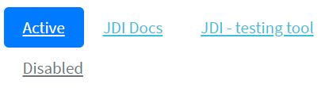

Here is an example with provided Bootstrap v4.3 code:

```java 
// @FindBy(css = "#nav-pills") public static NavsPills navsPills;
@UI("#nav-pills") public static NavsPills navsPills;

public class NavsPills extends Section {
    // @FindBy(css = "li") public ListGroup navItem;
    @UI("li") public ListGroup navItem;
    // @FindBy(css = "li a")  public ListGroup navItemLink;
    @UI("li a") public ListGroup navItemLink;
}

@Test(dataProvider = "listData")
public void itemsIsValidationTests(int index, String linkText) {
    navsPills.navItem.get(index)
            .is()
            .core()
            .hasClass("nav-item")
            .text(is(linkText));
    navsPills.navItemLink.get(index)
            .is()
            .core()
            .hasClass("nav-link")
            .text(is(linkText));
}

@Test(dataProvider = "clickValidate")
public void linkClickableLiTests(int index, String pageTitle) {
    navsPills.navItem.get(index).highlight();
    navsPills.navItem.get(index).click();
    newWindowTitleCheck(pageTitle);
    navsPills.navItem.get(index).unhighlight();
}
```

```html
<ul class="nav nav-pills" id="nav-pills">
    <li class="nav-item">
        <a class="nav-link active" href="https://jdi-testing.github.io/jdi-light/index.html"
           target="_blank">Active</a>
    </li>
    <li class="nav-item">
        <a class="nav-link" href="https://github.com/jdi-docs" target="_blank">JDI Docs</a>
    </li>
    <li class="nav-item">
        <a class="nav-link" href="https://github.com/jdi-testing" target="_blank">JDI -
            testing tool</a>
    </li>
    <li class="nav-item">
        <a class="nav-link disabled" href="https://getbootstrap.com" tabindex="-1"
           aria-disabled="true" target="_blank">Disabled</a>
    </li>
</ul>
```


Available methods in Java JDI Light:

All methods are inherited from base element -  [UIElement](https://jdi-docs.github.io/jdi-light/#uielement)

Most applicable methods:

|Method | Description | Return Type
--- | --- | ---
**assertThat()** | Assert action | TextAssert
**click()** | Get button text | void
**get()** | Select button by index | UIElement
**getText()** | Get button text | String
**highlight()** | Get button text | void
**is()** | Assert action | TextAssert 
**unhighlight()** | Get button text | void

<br>

[Java test examples](https://github.com/jdi-testing/jdi-light/blob/bootstrap/jdi-light-bootstrap-tests/src/test/java/io/github/epam/bootstrap/tests/composite/section/navs/PillsTests.java)<br>

Nav group is represented by Section class in Java:
 
  [Section](https://jdi-docs.github.io/jdi-light/#section)  

<br>

#### Fill and justify
**[Nav fill and justify](https://getbootstrap.com/docs/4.3/components/navs/#fill-and-justify)** 


Here is an example with provided Bootstrap v4.3 code:

```java 
// @FindBy(css = "#nav-justify") public static NavsJustify navsJustify;
@UI("#nav-justify") public static NavsJustify navsJustify;

public class NavsJustify extends Section {
    // @FindBy(css = "li") public ListGroup navItem;
    @UI("li") public ListGroup navItem;
    // @FindBy(css = "li a")  public ListGroup navItemLink;
    @UI("li a") public ListGroup navItemLink;
}

@Test(dataProvider = "listData")
public void itemsIsValidationTests(int index, String linkText) {
    navsJustify.navItem.get(index)
            .is()
            .core()
            .hasClass("nav-item")
            .text(is(linkText));
    navsJustify.navItemLink.get(index)
            .is()
            .core()
            .hasClass("nav-link")
            .text(is(linkText));
}

@Test(dataProvider = "clickValidate")
public void linkClickableLiTests(int index, String pageTitle) {
    navsJustify.navItem.get(index).highlight();
    navsJustify.navItem.get(index).click();
    newWindowTitleCheck(pageTitle);
    navsJustify.navItem.get(index).unhighlight();
}
```

```html
<ul class="nav nav-pills nav-fill" id="nav-justify">
    <li class="nav-item">
        <a class="nav-link active" href="https://jdi-testing.github.io/jdi-light/index.html"
           target="_blank">Active</a>
    </li>
    <li class="nav-item">
        <a class="nav-link" href="https://github.com/jdi-docs" target="_blank">JDI Docs</a>
    </li>
    <li class="nav-item">
        <a class="nav-link" href="https://github.com/jdi-testing" target="_blank">JDI - testing
            tool</a>
    </li>
    <li class="nav-item">
        <a class="nav-link disabled" href="https://getbootstrap.com" tabindex="-1"
           aria-disabled="true" target="_blank">Disabled</a>
    </li>
</ul>
```


Available methods in Java JDI Light:

All methods are inherited from base element -  [UIElement](https://jdi-docs.github.io/jdi-light/#uielement)

Most applicable methods:

|Method | Description | Return Type
--- | --- | ---
**assertThat()** | Assert action | TextAssert
**click()** | Get button text | void
**get()** | Select button by index | UIElement
**getText()** | Get button text | String
**highlight()** | Get button text | void
**is()** | Assert action | TextAssert 
**unhighlight()** | Get button text | void

<br>

[Java test examples](https://github.com/jdi-testing/jdi-light/blob/bootstrap/jdi-light-bootstrap-tests/src/test/java/io/github/epam/bootstrap/tests/composite/section/navs/FillAndJustifyTests.java)<br>

Nav group is represented by Section class in Java:
 
  [Section](https://jdi-docs.github.io/jdi-light/#section)  

<br>

#### Tabs with dropdowns
**[Nav tabs with dropdowns](https://getbootstrap.com/docs/4.3/components/navs/#tabs-with-dropdowns)** 


Here is an example with provided Bootstrap v4.3 code:

```java 
// @FindBy(css = "#nav-with-dropdown") public static NavsTabsWithDropdown navsTabsWithDropdown;
@UI("#nav-with-dropdown") public static NavsTabsWithDropdown navsTabsWithDropdown;

public class NavsTabsWithDropdown extends Section {
    // @FindBy(css = "li") public ListGroup navItem;
    @UI("li") public ListGroup navItem;
    // @FindBy(css = "a.nav-link") public ListGroup navItemLink;
    @UI("a.nav-link") public ListGroup navItemLink;
    @JDropdown(expand = ".dropdown-toggle",
            value = ".dropdown-toggle",
            list = ".dropdown-item")
    public Dropdown dropdownMenu;
}

@Test
public void isValidationTests() {
    navsTabsWithDropdown.navItem.is()
            .size(4);
    navsTabsWithDropdown.is()
            .displayed()
            .enabled()
            .core()
            .hasClass("nav nav-tabs");
    navsTabsWithDropdown.navItemLink.get(1)
            .is()
            .core()
            .hasClass("active");
    navsTabsWithDropdown.navItemLink.get(4)
            .is()
            .core()
            .hasClass("disabled");
}

@Test
public void dropdownIsValidationTests() {
    navsTabsWithDropdown.dropdownMenu.expand();
    navsTabsWithDropdown.dropdownMenu
            .is()
            .displayed()
            .expanded()
            .enabled()
            .size(4);
    navsTabsWithDropdown.dropdownMenu
            .is()
            .core()
            .attr("data-toggle", "dropdown")
            .attr("aria-haspopup", "true")
            .attr("aria-expanded", "true")
            .attr("role", "button")
            .tag("a");
}
```

```html
<ul class="nav nav-tabs" id="nav-with-dropdown">
    <li class="nav-item">
        <a class="nav-link active" href="https://jdi-testing.github.io/jdi-light/index.html"
           target="_blank">Active</a>
    </li>
    <li class="nav-item dropdown">
        <a class="nav-link dropdown-toggle" data-toggle="dropdown" href="#" role="button"
           aria-haspopup="true" aria-expanded="false">Dropdown</a>
        <div class="dropdown-menu">
            <a class="dropdown-item"
               href="https://jdi-testing.github.io/jdi-light/index.html" target="_blank">JDI
                home</a>
            <a class="dropdown-item" href="https://github.com/jdi-docs" target="_blank">JDI
                Docs</a>
            <a class="dropdown-item" href="https://github.com/jdi-testing" target="_blank">JDI
                - testing tool</a>
            <div class="dropdown-divider"></div>
            <a class="dropdown-item" href="https://getbootstrap.com" target="_blank">Bootstrap</a>
        </div>
    </li>
    <li class="nav-item">
        <a class="nav-link" href="https://github.com/jdi-testing" target="_blank">JDI -
            testing tool</a>
    </li>
    <li class="nav-item">
        <a class="nav-link disabled" href="https://getbootstrap.com" tabindex="-1"
           aria-disabled="true" target="_blank">Disabled</a>
    </li>
</ul>
```


Available methods in Java JDI Light:

All methods are inherited from base element -  [UIElement](https://jdi-docs.github.io/jdi-light/#uielement)

Most applicable methods:

|Method | Description | Return Type
--- | --- | ---
**assertThat()** | Assert action | TextAssert
**click()** | Get button text | void
**expand()** | Get button text | void
**expanded()** | Get button text | TextAssert
**get()** | Select button by index | UIElement
**getText()** | Get button text | String
**highlight()** | Get button text | void
**is()** | Assert action | TextAssert 
**unhighlight()** | Get button text | void

<br>

[Java test examples](https://github.com/jdi-testing/jdi-light/blob/bootstrap/jdi-light-bootstrap-tests/src/test/java/io/github/epam/bootstrap/tests/composite/section/navs/TabsWithDropdownTests.java)<br>

Nav group is represented by Section class in Java:
 
[Section](https://jdi-docs.github.io/jdi-light/#section)  

#### Pills with dropdowns
**[Nav pills with dropdowns](https://getbootstrap.com/docs/4.3/components/navs/#pills-with-dropdowns)** 


Here is an example with provided Bootstrap v4.3 code:

```java 
// @FindBy(css = "#nav-pills-drop") public static NavsPillsWithDropdown navsPillsWithDropdown;
@UI("#nav-pills-drop") public static NavsPillsWithDropdown navsPillsWithDropdown;

public class NavsPillsWithDropdown extends Section {
    // @FindBy(css = "li") public ListGroup navItem;
    @UI("li") public ListGroup navItem;
    // @FindBy(css = "a.nav-link") public ListGroup navItemLink;
    @UI("a.nav-link") public ListGroup navItemLink;
    @JDropdown(expand = ".dropdown-toggle",
            value = ".dropdown-toggle",
            list = ".dropdown-item")
    public Dropdown dropdownMenu;
}

@Test
public void dropdownIsValidationTests() {
    navsPillsWithDropdown.dropdownMenu.expand();
    navsPillsWithDropdown.dropdownMenu
            .is()
            .expanded()
            .size(4)
            .core()
            .attr("data-toggle", "dropdown")
            .attr("aria-haspopup", "true")
            .attr("aria-expanded", "true")
            .attr("role", "button")
            .tag("a");
    navsPillsWithDropdown.dropdownMenu.expand();
}

@Test
public void dropdownClickableTests() {
    navsPillsWithDropdown.dropdownMenu.select(linkDrop1);
    newWindowTitleCheck(pageTitle1);
    navsPillsWithDropdown.dropdownMenu.select(linkDrop2);
    newWindowTitleCheck(pageTitle2);
    navsPillsWithDropdown.dropdownMenu.select(linkDrop3);
    newWindowTitleCheck(pageTitle3);
    navsPillsWithDropdown.dropdownMenu.select(linkDrop4);
    newWindowTitleCheck(pageTitle4);
}
```

```html
<ul class="nav nav-pills" id="nav-pills-drop">
    <li class="nav-item">
        <a class="nav-link active" href="https://jdi-testing.github.io/jdi-light/index.html"
           target="_blank">Active</a>
    </li>
    <li class="nav-item dropdown">
        <a class="nav-link dropdown-toggle" data-toggle="dropdown" href="#" role="button"
           aria-haspopup="true" aria-expanded="false">Dropdown</a>
        <div class="dropdown-menu">
            <a class="dropdown-item"
               href="https://jdi-testing.github.io/jdi-light/index.html" target="_blank">JDI
                home</a>
            <a class="dropdown-item" href="https://github.com/jdi-docs" target="_blank">JDI
                Docs</a>
            <a class="dropdown-item" href="https://github.com/jdi-testing" target="_blank">JDI
                - testing tool</a>
            <div class="dropdown-divider"></div>
            <a class="dropdown-item" href="https://getbootstrap.com" target="_blank">Bootstrap</a>
        </div>
    </li>
    <li class="nav-item">
        <a class="nav-link" href="https://github.com/jdi-testing" target="_blank">JDI -
            testing tool</a>
    </li>
    <li class="nav-item">
        <a class="nav-link disabled" href="https://getbootstrap.com" tabindex="-1"
           aria-disabled="true" target="_blank">Disabled</a>
    </li>
</ul>
```

Available methods in Java JDI Light:

All methods are inherited from base element -  [UIElement](https://jdi-docs.github.io/jdi-light/#uielement)

Most applicable methods:

|Method | Description | Return Type
--- | --- | ---
**assertThat()** | Assert action | TextAssert
**click()** | Get button text | void
**expand()** | Get button text | void
**expanded()** | Get button text | TextAssert
**get()** | Select button by index | UIElement
**getText()** | Get button text | String
**highlight()** | Get button text | void
**is()** | Assert action | TextAssert 
**unhighlight()** | Get button text | void

<br>

[Java test examples](https://github.com/jdi-testing/jdi-light/blob/bootstrap/jdi-light-bootstrap-tests/src/test/java/io/github/epam/bootstrap/tests/composite/section/navs/PillsWithDropdownTests.java)<br>

Nav group is represented by Section class in Java:
 
  [Section](https://jdi-docs.github.io/jdi-light/#section)  

<br>


### RadioButtons

  **RadioButtons** – extends from <a href="https://jdi-docs.github.io/jdi-light/#radiobuttons">HTML 5 RadioButtons</a> class.
  
  Bootstrap RadioButtons class is represented by the following class:
   
    - __Java__: _com.epam.jdi.light.ui.bootstrap.elements.complex.RadioButtons_
    
  Is similar to the parent class but overrides its list() method and adds list(JFunc1<WebElement, Boolean> searchRule, ElementArea elementArea) method.
  
  <br>


## Bootstrap Composite elements
### Forms
<a style="font-weight:bold" href="https://getbootstrap.com/docs/4.3/components/forms/" target="_blank">Forms</a> – logical part of a web page that represents an HTML form.
Form can consists of:
<ul>
<li>Textual form controls(inputs, selects, and textareas)</li>
<li>File inputs</li>
<li>Range inputs</li>
<li>Checkboxes and Radiobuttons</li>
<li>Help text</li>
<li>Fieldsets(which can disable all the controls within)</li>
</ul>

Available methods in Java JDI Light:

|Method | Description | Return Type
--- | --- | ---
**add(T entity)** | Fills all settable elements and clicks “add” Button or ”addButton” | void
**back(T entity)** | Fills all settable elements and clicks “back” Button or ”backButton” | void
**cancel(T entity)** | Fills all settable elements and clicks “cancel” Button or ”cancelButton” | void
**check(T entity)** | Verifies that form has been filled correctly. If not, throws an exception | void
**close(T entity)** | Fills all settable elements and clicks “close” Button or ”closeButton” | void
**fill(T entity)** | Fills all settable elements of the form that can be matched with fields of the input entity | void
**fillAction(Field field, Object element, Object parent, String setValue)** | Defines the specifics of how form elements will be filled | void
**getAction(Field field, Object element, Object parent)** | Defines the specifics of how form elements will be obtained for verification and checks | String
**is()** | Asserts element  | UIAssert
**login()** | Clicks "login" Button or "loginButton"| void
**login(T entity)** | Fills all settable elements and clicks “login” Button or ”loginButton” | void
**loginAs(T entity)** | Fills all settable elements and clicks “login” Button or ”loginButton” | void
**next(T entity)** | Fills all settable elements and clicks “next” Button or ”nextButton” | void
**onlyMandatory()** | Sets form filter option to **MANDATORY**, meaning that only mandatory form elements are filled/submitted or verified/checked for the duration of a single form action | void
**onlyOptional()** | Sets form filter option to **OPTIONAL**, meaning that only optional form elements are filled/submitted or verified/checked for the duration of a single form action | void
**pressButton(String buttonName)** | Clicks “buttonName” Button or "buttonNamebutton". Allows different buttons to send one form, e.g. save/publish/cancel/search/update/... | void
**publish(T entity)** | Fills all settable elements and clicks “publish” Button or ”publishButton” | void
**save(T entity)** | Fills all settable elements and clicks “save” Button or ”saveButton” | void
**search(T entity)** | Fills all settable elements and clicks “search” Button or ”searchButton” | void
**select(T entity)** | Fills all settable elements and clicks “select” Button or ”selectButton” | void
**send()** | Sends the form by clicking “send” Button or "sendButton" | void
**send(T entity)** | Fills all settable elements and clicks “send” Button or ”sendButton” | void
**submit()** | Sends the form by clicking "submit" Button or "submitButton" | void
**submit(String text)** | Fills first settable form field with value and clicks "submit" Button or "submitButton"  | void
**submit(T entity)** | Fills all settable elements and clicks "submit" Button or "submitButton"  | void
**submit(String text, String buttonName)** | Fills first settable field with value and clicks “buttonName” Button or "buttonNamebutton"| void
**submit(T entity, String buttonName)** | Fills all settable elements and clicks “buttonName” Button or "buttonNamebutton" | void
**update(T entity)** | Fills all settable elements and clicks “update” Button or ”updateButton” | void
**verify(T entity)** | Verifies that form has been filled correctly. If not, returns a list of keys where verification has failed | List<String>

#### Simple form
This is an example of simple form consisting of some basic elements.


Here is an example with provided Bootstrap v4.3 code:

```java 
     public class BootstrapFormsPage extends WebPage {
         // FindBy(css = "#support-form")
         @UI("#support-form")      
         public static SupportMessageForm supportMessageForm;
     }
    
    @Test
    public void submitButtonTest() {
        supportMessageForm.supportButtonSubmit.click();
        lastLogEntry.has().text(containsString(logLineSubmit));
    }

    @Test
    public void clearButtonTest() {
        supportMessageForm.supportButtonClear.click();
        lastLogEntry.has().text(containsString(logLineClear));
    }

    @Test
    public void submitFormTest() {
        setDefaultValues();
        supportMessageForm.submit(EXAMPLE_MESSAGE);
        lastLogEntry.has().text(containsString(logLineSubmit));
        supportMessageForm.check(EXAMPLE_MESSAGE);
    }

    @Test
    public void fillFormTest() {
        setDefaultValues();
        supportMessageForm.fill(EXAMPLE_MESSAGE);
        supportMessageForm.supportEmail.has().text(EXAMPLE_MESSAGE.supportEmail);
        supportMessageForm.supportMessage.has().text(EXAMPLE_MESSAGE.supportMessage);
        supportMessageForm.check(EXAMPLE_MESSAGE);
    }

    @Test
    public void clearFormTest() {
        setDefaultValues();
        supportMessageForm.clear(EXAMPLE_MESSAGE);
        lastLogEntry.has().text(containsString(logLineClear));
        supportMessageForm.check(TEMPLATE_MESSAGE);
    }
```

```html 
<form id="support-form">
    <div class="form-group">
        <label for="support-email">Please enter your email address at which
            our manager can contact you</label>
        <input type="email" class="form-control" id="support-email" aria-describedby="emailHelp" placeholder="Enter email">
        <small id="emailHelp" class="form-text text-muted">We'll never share your email with anyone
            else.</small>
    </div>
    <div class="form-group">
        <label for="support-message">Your message</label>
        <textarea class="form-control" id="support-message" rows="3"></textarea>
    </div>
    <button type="submit" class="btn btn-primary" id="support-button-submit">Submit</button>
    <button type="reset" class="btn btn-danger" id="support-button-clear">Clear</button>
</form>
```

[Bootstrap test examples](https://github.com/jdi-testing/jdi-light/tree/bootstrap/jdi-light-bootstrap-tests/src/test/java/io/github/epam/bootstrap/tests/composite/section/form/SimpleFormTests.java)
<br><br><br><br><br><br><br><br><br><br><br>

#### Complicated form
This is an example of complicated form consisting of various specific elements.


Here is an example with provided Bootstrap v4.3 code:

```java 
    public class BootstrapFormsPage extends WebPage {
        // @FindBy(css = "#superhero-creation-form")
        @UI("#superhero-creation-form") 
        public static SuperheroForm superheroForm;
        // @FindBy(css = ".logs  li:first-child")        
        @UI(".logs  li:first-child") 
        public static Text lastLogEntry;
    }
    
    @Test
    public void submitButtonTest() {
        superheroForm.superheroButtonSubmit.click();
        lastLogEntry.has().text(containsString(logLineSubmit));
    }
    
    @Test
    public void clearButtonTest() {
        superheroForm.superheroButtonClear.click();
        lastLogEntry.has().text(containsString(logLineClear));
    }
    
    @Test
    public void submitFormTest() {
        superheroForm.submit(EXAMPLE_HERO);
        lastLogEntry.has().text(containsString(logLineSubmit));
        superheroForm.check(EXAMPLE_HERO);
    }
    
    @Test
    public void clearFormTest() {
        superheroForm.clear(EXAMPLE_HERO);
        lastLogEntry.has().text(containsString(logLineClear));
        superheroForm.check(TEMPLATE_HERO);
    }
``` 

```html 
<form id="superhero-creation-form">
    <div class="form-group">
        <label for="current-alias">Enter your alias</label>
        <input type="text" class="form-control" id="current-alias" aria-describedby="emailHelp" placeholder="Enter alias">
    </div>
    <div class="form-group">
        <label for="alter-ego">Enter your alter ego</label>
        <input type="text" class="form-control" id="alter-ego" aria-describedby="emailHelp" placeholder="Enter alter ego">
    </div>
    <!-- Radios start -->
    <fieldset class="form-group">
        <div class="row">
            <legend class="col-form-label col-sm-2 pt-0">Species</legend>
            <div class="col-sm-10">
                <div class="form-check">
                    <input class="form-check-input" type="radio" name="superheroSpecies" id="human" value="option1" checked="">
                    <label class="form-check-label" for="human">
                        Human
                    </label>
                </div>
                <div class="form-check">
                    <input class="form-check-input" type="radio" name="superheroSpecies" id="symbiote" value="option2">
                    <label class="form-check-label" for="symbiote">
                        Symbiote
                    </label>
                </div>
                <div class="form-check">
                    <input class="form-check-input" type="radio" name="superheroSpecies" id="skrulls" value="option3">
                    <label class="form-check-label" for="skrulls">
                        Skrulls
                    </label>
                </div>
                <div class="form-check">
                    <input class="form-check-input" type="radio" name="superheroSpecies" id="kryptonian" value="option4">
                    <label class="form-check-label" for="kryptonian">
                        Kryptonian
                    </label>
                </div>
            </div>
        </div>
    </fieldset>
    <!-- Radios end -->
    <div>
        <label for="superhero-range">Power scale:</label>
        <input type="range" class="custom-range mb-3" min="0" max="100" id="superhero-range">
    </div>
    <label for="select-universe">Universe:</label>
    <select class="custom-select mb-3" id="select-universe">
        <option selected="">Select character's universe</option>
        <option value="1">DC</option>
        <option value="2">Marvel Earth-616</option>
        <option value="3">Marvel Cinematic Universe</option>
    </select>
    <div class="custom-control custom-switch mb-3" id="superhero-switch-div">
        <input type="checkbox" class="custom-control-input" id="superhero-switch">
        <label class="custom-control-label" for="superhero-switch">I'm not going to destroy all living beings</label>
    </div>
    <button type="submit" class="btn btn-primary" id="superhero-button-submit">Submit</button>
    <button type="reset" class="btn btn-danger" id="superhero-button-clear">Clear</button>
</form>
```

[Bootstrap test examples](https://github.com/jdi-testing/jdi-light/tree/bootstrap/jdi-light-bootstrap-tests/src/test/java/io/github/epam/bootstrap/tests/composite/section/form/ComplicatedFormTests.java)

####Sizing
<a style="font-weight:bold" href="https://getbootstrap.com/docs/4.0/components/forms/#sizing" target="_blank">Set</a> heights using classes like .form-control-lg and .form-control-sm.

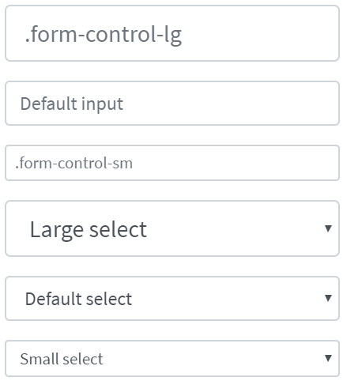

Here is an example with provided Bootstrap v4.3 code:

```java 
@UI("#forms-sizing")  //@FindBy(css = "#forms-sizing")
public static FormsSizing formsSizing;

@UI("#form-sizing-lg")  //@FindBy(css = "#form-sizing-lg")
public TextField largeTextField;

@UI("#form-sizing-select-lg")  //@FindBy(css = "#form-sizing-select-lg")
public DropdownSelect largeSelect;

private String text = "TextField";
private String placeholderLarge = ".form-control-lg";
private String placeholderDefault = "Default input";
private String placeholderSmall = ".form-control-sm";

@Test
public void sendKeysTest() {
    formsSizing.largeTextField.sendKeys("Test");
    assertEquals(formsSizing.largeTextField.getText(), text+"Test");
}

@Test
public void selectOptionTest() {
    formsSizing.largeSelect.select("Large select");
    assertEquals(formsSizing.largeSelect.getValue(), "Large select");
}

@Test
public void isValidationTest() {
    formsSizing.largeTextField.is()
                    .enabled()
                    .text(is(text));
    formsSizing.largeSelect.is()
                    .displayed()
                    .selected("Large option");
    formsSizing.largeTextField.is()
                    .enabled()
                    .placeholder(placeholderLarge);
}

```

````html
<div class="html-left" id="forms-sizing">
    <div class="mb-3">
        <input class="form-control form-control-lg mb-3" id="form-sizing-lg" type="text"
               placeholder=".form-control-lg">
        <input class="form-control mb-3" id="form-sizing-default" type="text"
               placeholder="Default input">
        <input class="form-control form-control-sm mb-3" id="form-sizing-sm" type="text"
               placeholder=".form-control-sm">
    </div>

    <div class="mb-3">
        <select class="form-control form-control-lg mb-3" id="form-sizing-select-lg">
            <option>Large select</option>
            <option>Large option</option>
        </select>
        <select class="form-control mb-3" id="form-sizing-select-default">
            <option>Default select</option>
            <option>Default option</option>
        </select>
        <select class="form-control form-control-sm mb-3" id="form-sizing-select-sm">
            <option>Small select</option>
            <option>Small option</option>
        </select>
    </div>
</div>
````

Form group is represented by Section class in Java:

  [Section](https://jdi-docs.github.io/jdi-light/#section)

Inner elements of Forms - Sizing are represented by the following classes:

+ [TextField](https://jdi-docs.github.io/jdi-light/#textfield)

+ DropdownSelect    TBD 

|Method / Property | Description | Return Type
--- | --- | ---
**AssertThat** | Assert action | TextAssert
**GetText()** | returns text from the text field  | String
**GetValue()** | returns text from the text field| String
**Is** | Assert action | TextAssert
**select(string/int)** | Select data by value/index| void
**SendKeys(string value)** | adds text to the field | void
**SetText(String value)** | sets new text | void

[Bootstrap test examples](https://github.com/jdi-testing/jdi-light/blob/bootstrap/jdi-light-bootstrap-tests/src/test/java/io/github/epam/bootstrap/tests/composite/section/form/FormReadOnlyTests.java)

<br><br>
**Readonly**

Add the <a style="font-weight: bold;" target="_blank" href="https://getbootstrap.com/docs/4.3/components/forms/#readonly">readonly</a> boolean attribute on an input to prevent modification of the input’s value. Read-only inputs appear lighter (just like disabled inputs), but retain the standard cursor.


Here is an example with provided Bootstrap v4.3 code:

```java 
//@FindBy(css = "#forms-readonly-input")
@UI("#forms-readonly-input")
public static TextField readonlyInput;


@Test
public void checkReadonlyAttribute() {
    assertTrue(readonlyInput.attrs().has("readonly"));
    readonlyInput.highlight();
    readonlyInput.is()
            .displayed()
            .enabled();
}

@Test(expectedExceptions = {InvalidElementStateException.class})
public void check() {
    readonlyInput.setValue(text);
    readonlyInput.sendKeys(text);
}


```

```html
<input class="form-control mb-3" id="forms-readonly-input" type="text"
                                   placeholder="Readonly input here..." readonly>
```

Available methods in Java JDI Light:

|Method / Property | Description | Return Type
--- | --- | ---
**AssertThat()** | property that returns object for work with assertions| TextAssert
**Focus()** | places cursor within the text field | void
**GetText()** | returns text from the text field  | String
**GetValue()** | returns text from the text field| String
**Is()** | property that returns object for work with assertions| TextAssert
**Input(string text)** | sets new text  | void
**Placeholder** | returns value of the placeholder attribute | String
**SendKeys(string value)** | adds text to the field | void
**SetText(String value)** | sets new text | void


<a href="https://github.com/jdi-testing/jdi-light/tree/bootstrap/jdi-light-bootstrap-tests/src/test/java/io/github/epam/bootstrap/tests/composite.section.form.FormReadOnlyTests.java" target=a_blank> Bootstrap test examples </a>


<br><br>
####Readonly plain text

If you want to have input readonly elements in your form styled as 
<a style="font-weight: bold;" target="_blank" href="https://getbootstrap.com/docs/4.3/components/forms/#readonly-plain-text">plain text</a>,
 use the <b>.form-control-plaintext</b> class to remove the default form field styling and preserve the correct margin and padding.
Compare items with plaintext mark (upper) and without it (lower):


Here is an example with provided Bootstrap v4.3 code:

```java 
//@FindBy(css = "#readonlyPlainText1")
@UI("#readonlyPlainText1")
public static ReadonlyPlainText readonlyPlainText1;

@Test
public void isValidationTest() {
    readonlyPlainText1.is().core().hasClass("form-control-plaintext");
    assertTrue(readonlyPlainText1.hasAttribute("readonly"));
    readonlyPlainText1.is().core().attr("type", "text");

@Test
public void textValidationTest() {
    readonlyPlainText1.is().text("email@example.com");
}

@Test
public void labelTest() {
    readonlyPlainText1.label().is().text("Email");
}
```

```html
<div class="form-group row">
    <label for="readonlyPlainText1" class="col-sm-2 col-form-label">Email</label>
    <div class="col-sm-10">
        <input type="text" readonly class="form-control-plaintext" id="readonlyPlainText1"
               value="email@example.com">
    </div>
</div>
```


Available methods in Java JDI Light:

|Method/Property | Description | Return Type
--- | --- | ---
**assertThat()** | Assert action | TextAssert
**attr()** | Match passed value with element attribute | ICoreElement
**getValue()** | Get item value | String
**hasClass()** | Match passed value with element class | ICoreElement
**is()** | Various assert actions for Progress | ProgressAssert 
**label()** | Get label associated with an item | Label
**labelText()** | Get text of a label associated with an item | String

<a href="https://github.com/jdi-testing/jdi-light/tree/bootstrap/jdi-light-bootstrap-tests/src/test/java/io/github/epam/bootstrap/tests/mposite.section.form.ReadonlyPlainTextTests.java" target=a_blank> Bootstrap test examples </a>

<br><br>

####Range input

Set horizontally scrollable <a style="font-weight: bold;" target="_blank" href="https://getbootstrap.com/docs/4.3/components/forms/#range-inputs">range inputs</a>
using .form-control-range.


Here is an example with provided Bootstrap v4.3 code:

```java 
//@FindBy(css = "#formControlRange")
@UI("#formControlRange")
public static RangeInput rangeInput;

 @Test
 public void itemHasProperClass() {
    rangeInput.is().core().hasClass("form-control-range");
 }

 @Test
 public void itemHasProperType() {
    rangeInput.is().core().attr("type", "range");
 }

 @Test
 public void labelValidationTest() {
    rangeInput.label().is().text("Example Range input");
 }
```

```html
<form class="mb-3">
    <div class="form-group">
        <label for="formControlRange">Example Range input</label>
        <input type="range" class="form-control-range" id="formControlRange">
    </div>
</form>
```

Available methods in Java JDI Light:

|Method/Property | Description | Return Type
--- | --- | ---
**assertThat()** | Assert action | UIAssert
**attr()** | Match passed value with element attribute | String
**hasClass()** | Match passed value with element class | boolean
**is()** | Various assert actions for Progress | UIAssert 
**label()** | Get label associated with an item | Label
**labelText()** | Get text of a label associated with an item | String

<a href="https://github.com/jdi-testing/jdi-light/tree/bootstrap/jdi-light-bootstrap-tests/src/test/java/io/github/epam/bootstrap/tests/composite/section/form/RangeInputTests.java" target=a_blank> Bootstrap test examples </a>

####Select menu

```java 
public class SelectMenu extends Form implements ISelector {
    //FindBy(css = "option")
    @UI("option") public WebList optionsSelectMenu;
    //FindBy(css = "option[selected]")
    @UI("option[selected]") public UIElement selectedOptionsSelectMenu;
    @Override
    public WebList list() { return optionsSelectMenu; }
}

//FindBy(id = "forms-select-menu")
@UI("#forms-select-menu")
public static SelectMenu formsSelectMenu;

@Test
public void getSelectedOptionFormsSelectMenuTest() {
  formsSelectMenu.selectedOptionsSelectMenu.is().text("Open this select menu");
}

//FindBy(id = "forms-select-menu-large")
@UI("#forms-select-menu-large")
public static SelectMenu formsSelectMenuLarge;
 
@Test(dataProvider = "optionFormSelectMenuTest")
public void getTextFormsSelectMenuTest(int i, String optionText, String value) {
  formsSelectMenuLarge.optionsSelectMenu.get(i).is().text(optionText);
  formsSelectMenuLarge.optionsSelectMenu.get(i).assertThat().attr("value", value);
}


//FindBy(id = "forms-select-menu-small")
@UI("#forms-select-menu-small")
public static SelectMenu formsSelectMenuSmall;


//FindBy(id = "forms-select-menu-multiple")
@UI("#forms-select-menu-multiple")
public static SelectMenu formsSelectMenuMultiple;


//FindBy(id = "forms-select-menu-size")
@UI("#forms-select-menu-size")
public static SelectMenu formsSelectMenuSize;


@Test
public void selectOptionFormsSelectMenuTest() {
  formsSelectMenuSize.optionsSelectMenu.get(4).click();
  assertEquals(formsSelectMenuSize.getValue(), "Three");
}


```

You can use custom <a href = "https://getbootstrap.com/docs/4.3/components/forms/#select-menu" target = "a_blank">select menus</a>.

Select menu is located in the following classes:

  - __Java__: _com.epam.jdi.light.ui.bootstrap.elements.common.SelectMenu*_
  

 <br>
Here is an example with provided Bootstrap v4.3 code:

```html
<select class="custom-select mb-3" id="forms-select-menu">
    <option selected>Open this select menu</option>
    <option value="1">One</option>
    <option value="2">Two</option>
    <option value="3">Three</option>
</select>
``` 
<br>

**Large select menu**
 <br>
Here is an example with provided Bootstrap v4.3 code:

```html
<select class="custom-select custom-select-lg mb-3" id="forms-select-menu-large">
    <option selected>Open this select menu</option>
    <option value="1">One</option>
    <option value="2">Two</option>
    <option value="3">Three</option>
</select>
```
 <br>

**Small select menu**
 <br>
Here is an example with provided Bootstrap v4.3 code:

```html
<select class="custom-select custom-select-sm mb-3" id="forms-select-menu-small">
    <option selected>Open this select menu</option>
    <option value="1">One</option>
    <option value="2">Two</option>
    <option value="3">Three</option>
</select>
```
<br>

**Select menu multiple**
 <br>
Here is an example with provided Bootstrap v4.3 code:

```html
<select class="custom-select mb-3" multiple id="forms-select-menu-multiple">
    <option selected>Open this select menu</option>
    <option value="1">One</option>
    <option value="2">Two</option>
    <option value="3">Three</option>
</select>
```
<br>

**Select menu size**
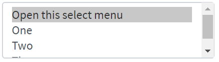 <br>
Here is an example with provided Bootstrap v4.3 code:

```html
<select class="custom-select mb-3" size="3" id="forms-select-menu-size">
    <option selected>Open this select menu</option>
    <option value="1">One</option>
    <option value="2">Two</option>
    <option value="3">Three</option>
</select>
```
<br>

Available methods in Java JDI Light:
<br>

|Method | Description | Return Type
--- | --- | ---
**assertThat()** | Assert action | TextAssert
**click()** | Click the button | void
**is()** | Assert action | TextAssert 
<br>

<a href="https://github.com/jdi-testing/jdi-light/blob/bootstrap/jdi-light-bootstrap-tests/src/test/java/io/github/epam/bootstrap/tests/composite/section/form/FormsSelectMenuTests.java" target=a_blank> Bootstrap test examples </a>

####Range

Create custom <a style="font-weight: bold;" target="_blank" href="https://getbootstrap.com/docs/4.3/components/forms/#range">range</a>
 controls (`<input type="range">`) with .custom-range. The track (the background) and thumb (the value) are both styled to appear the same across browsers. 
Range inputs have implicit values for min and max: 0 and 100, respectively. You may specify new values for those using the min and max attributes.
  
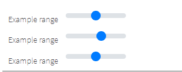
 
Here is an example with provided Bootstrap v4.3 code:
 
```java 
//@FindBy(css = "#customRange3")
@UI("#customRange3")
public static Range range;

@Test
public void labelTest() {\
    range.label().is().text(labelText);
 }

@Test
public void validateThumbMinMaxAndStepValuesTest() {
    range.is().thumbValue(2.5);
    range.is().minValue(0);
    range.is().maxValue(5);
    range.is().step(0.5);
}
 
@Test
public void setThumbValueTest() {
    range3.setThumbValue(5);
    range3.is().thumbValue(5);
}
```

```html
<div class="html-left">
    <label for="customRange1">Example range</label>
    <input type="range" class="custom-range" id="customRange1">

    <label for="customRange2">Example range</label>
    <input type="range" class="custom-range" min="0" max="5" id="customRange2">

    <label for="customRange3">Example range</label>
    <input type="range" class="custom-range" min="0" max="5" step="0.5" id="customRange3">
</div>
```

Available methods in Java JDI Light:

|Method/Property | Description | Return Type
--- | --- | ---
**assertThat()** | Assert action | UIAssert
**getValue()** | Get thumb value as String | String
**is()** | Various assert actions for Progress | RangeAssert 
**label()** | Get label associated with an item | Label
**labelText()** | Get text of a label associated with an item | String
**max()** | Get maximal limit of range | double
**min()** | Get minimal limit of range | double
**step()** | Get incremental step of range | double
**setThumbValue()** | Set thumb value with a "double" parameter | void
**setValue()** | Set thumb value with a String parameter | void
**thumbValue()** | Get thumb value | double


<a href="https://github.com/jdi-testing/jdi-light/tree/bootstrap/jdi-light-bootstrap-tests/src/test/java/io/github/epam/bootstrap/tests/common/RangeTests.java" target=a_blank> Bootstrap test examples </a>

<br><br>
 
#### Form Validation

##### Custom style
You can use custom <a href = "https://getbootstrap.com/docs/4.3/components/forms/#custom-styles" target = "a_blank">Bootstrap form validation</a> messages.

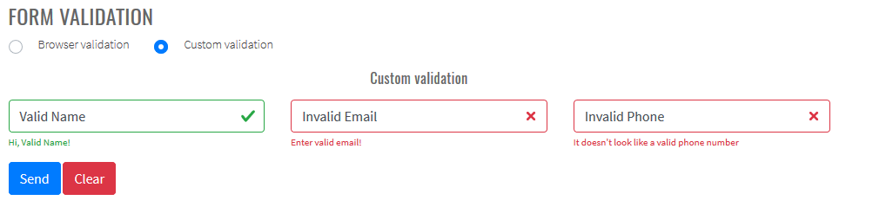

Here is an example with provided Bootstrap v4.3 code:

```java 
@UI("#validated-form")
public FormValidationForm form;

@Test
public void bootstrapValidationTest() {
    String name = "ValidName";
    String email = "InvalidEmail";
    String phone = "InvalidPhone";

    SimpleContact entity = new SimpleContact(name, email, phone);

    form.fill(entity);
    form.submit();

    Map<String, String> validFeedback = form.getValidFeedback();
    MatcherAssert.assertThat("Number of valid feedbacks not equals 1", validFeedback.size() == 1);
    MatcherAssert.assertThat(validFeedback.keySet(), Matchers.hasItems("Name"));
    MatcherAssert.assertThat(validFeedback.values(), Matchers.hasItem("Hi, " + name + "!"));

    Map<String, String> invalidFeedback = form.getInvalidFeedback();
    MatcherAssert.assertThat("Number of invalid feedbacks not equals 2", invalidFeedback.size() == 2);
    MatcherAssert.assertThat(invalidFeedback.keySet(), 
        Matchers.hasItems("Email", "Phone"));
    MatcherAssert.assertThat(invalidFeedback.values(), 
        Matchers.hasItems("Enter valid email!", "It doesn't look like a valid phone number"));
}
```

 ```html 
<form id="validated-form" class="" novalidate="">
    <div class="row">
        <div class="col">
            <div class="form-group">
                <input id="validated-form-name-field" type="text" class="form-control" placeholder="Enter name" required="">
                <div id="name-valid-feedback" class="valid-feedback">Hi, Valid Name!</div>
                <div class="invalid-feedback">Enter your name!</div>
            </div>
        </div>
        <div class="col">
            <div class="form-group">
                <input type="email" class="form-control" id="validated-form-email" placeholder="Enter email" required="">
                <div class="valid-feedback">Looks good!</div>
                <div class="invalid-feedback">Enter valid email!</div>
            </div>
        </div>
        <div class="col">
            <div class="form-group">
                <input type="text" class="form-control" id="validated-form-phone" placeholder="Enter phone" pattern="^[-+0-9()\s]+$">
                <div class="valid-feedback">Looks good!</div>
                <div class="invalid-feedback">It doesn't look like a valid phone number</div>
            </div>
        </div>
    </div>
    <div class="row">
        <div class="col">
        <button type="submit" class="btn btn-primary" id="validated-form-submit">Send</button>
        <button type="reset" class="btn btn-danger" id="validated-form-reset">Clear</button>
        </div>
    </div>
</form>
```

Additional JavaScript code to use Bootstrap validation:


##### Browser default

Also you can use <a href = "https://getbootstrap.com/docs/4.3/components/forms/#browser-defaults" target = "a_blank">browser default validation</a>.


Here is an example with provided Bootstrap v4.3 code:

```java 
@UI("#validated-form")
public FormValidationForm form;

@Test
public void browserValidationTest() {
    String name = "ValidName";
    String email = "InvalidEmail";
    String phone = "InvalidPhone";

    SimpleContact entity = new SimpleContact(name, email, phone);

    form.fill(entity);
    form.submit();

    Map<String, String> validFeedback = form.getValidationMessages();

    MatcherAssert.assertThat("", validFeedback.get("Email"),
        Matchers.is("Please include an '@' in the email address. 'InvalidEmail' is missing an '@'.")); //Browser dependent message
    MatcherAssert.assertThat("", validFeedback.get("Phone"),
        Matchers.is("Please match the requested format.")); //Browser dependent message
    MatcherAssert.assertThat("", validFeedback.get("Name"), Matchers.is(""));
}
```

 ```html 
<form id="validated-form"">
    <div class="row">
        <div class="col">
            <div class="form-group">
                <input id="validated-form-name-field" type="text" class="form-control" placeholder="Enter name" required="">
            </div>
        </div>
        <div class="col">
            <div class="form-group">
                <input type="email" class="form-control" id="validated-form-email" placeholder="Enter email" required="">
            </div>
        </div>
        <div class="col">
            <div class="form-group">
                <input type="text" class="form-control" id="validated-form-phone" placeholder="Enter phone" pattern="^[-+0-9()\s]+$">
            </div>
        </div>
    </div>
    <div class="row">
        <div class="col">
        <button type="submit" class="btn btn-primary" id="validated-form-submit">Send</button>
        <button type="reset" class="btn btn-danger" id="validated-form-reset">Clear</button>
        </div>
    </div>
</form>
```
 
Available methods for form validation in Java JDI Light:

|Method/Property | Description | Return Type
--- | --- | ---
**isValid()** | Return if form valid | boolean 
**getValidationMessages()** | Return map field names to browser validation messages | Map<String, String>
**getValidFeedback()** |  Return map field names to visible valid bootstrap feedback text | Map<String, String>
**getInvalidFeedback()** |  Return map field names to visible invalid bootstrap feedback text | Map<String, String>
**getFeedbackElements()** |  Return map field names to visible bootstrap feedback elements | Map<String, UIElement>

 <a href="https://github.com/jdi-testing/jdi-light/tree/bootstrap/jdi-light-bootstrap-tests/src/test/java/io/github/epam/bootstrap/tests/composite/section/form/BootstrapValidationTest.java" target="_blank">Bootstrap Test Examples</a>
 
 
 
### Scrollspy
**[Scrollspy](https://getbootstrap.com/docs/4.3/components/scrollspy/#example-in-navbar)** – automatically update Bootstrap navigation or list group components based on scroll position to indicate which link is currently active in the viewport.
<br><br>
- [Scrollspy in navbar] (https://getbootstrap.com/docs/4.3/components/scrollspy/#example-in-navbar) 
<br>


<br>

```java 
    // @FindBy(css = "#navbar-example2")
    @UI("#navbar-example2") public static NavbarWithDropdown navbarWithDropdown;
    // @FindBy(css = "#navbar-example2~div")
    @UI("#navbar-example2~div") public static ScrollSpyNav scrollSpyInNavbar;
    
    public class NavbarWithDropdown extends Section {
        // @FindBy(css = "ul>li")
        @UI("ul>li") 
        public ListGroup navGroup;
        // @FindBy(css ="ul>li>a")
        @UI("ul>li>a") 
        public ListGroup navItemLink;
        @JDropdown(expand = ".dropdown-toggle",
                value = ".dropdown-toggle",
                list = ".dropdown-item")
        public Dropdown dropdownMenu;
        // @FindBy(css = ".navbar-brand")
        @UI(".navbar-brand") 
        public Link navbarLink;
    }
  
    public class ScrollSpyNav extends Section {
        // @FindBy(xpath = ".//h4 | .//h5")
        @UI(".//h4 | .//h5") public ListGroup header;
        // @FindBy(css = "p")
        @UI("p") public ListGroup mainText;          
    
        public void scrollParagraph(ListGroup listGroup, int index, String className){
            mainText.get(index).show();
    
            if (!listGroup.get(index).core().hasClass(className) &&
                    index < header.size()) {
                header.get(index + 1).show();
            }
        }
    }

    private String itemLink = "https://jdi-testing.github.io/jdi-light/bootstrap.html#";
    
    @DataProvider
    public Object[][] dropdownCheck() {
        return new Object[][]{
                {3, itemLink + "one", "one"},
                {4, itemLink + "two", "two"},
                {5, itemLink + "three", "three"}
        };
    }

    @Test(dataProvider = "dropdownCheck", priority = 1)
    public void dropdownCheckTests(int _index, String link, String header) {
        navbarWithDropdown.dropdownMenu.expand();
        navbarWithDropdown.dropdownMenu.list().get(header).is()
                .core()
                .displayed()
                .enabled()
                .text(is(header))
                .value(is(header))
                .attr(ATTR_NAME_HREF, is(link));
    }

    @Test
    public void navbarLinkClickableTests() {
        navbarWithDropdown.navbarLink.click();
        newWindowTitleCheck(pageTitle);
    }

    @Test
    public void isValidationTests() {
        navbarWithDropdown.navItemLink.get(3).is().text(dropdown);
        navbarWithDropdown.navItemLink.get(3).is().value(dropdown);
        navbarWithDropdown.navItemLink.is().size(3);
        navbarWithDropdown.navGroup.is().size(3);

        navbarWithDropdown.dropdownMenu.expand();
        navbarWithDropdown.dropdownMenu.is().size(3);

        navbarWithDropdown.find(By.className("dropdown-divider")).is()
                .core()
                .displayed()
                .enabled()
                .attr("role", "separator");
    }
      
```

```html
<nav id="navbar-example2" class="navbar navbar-light bg-light">
    <a class="navbar-brand"
       href="https://getbootstrap.com/docs/4.3/components/scrollspy/#example-in-navbar"
       target="_blank">Navbar</a>
    <ul class="nav nav-pills">
        <li class="nav-item"><a class="nav-link" href="#fat">@fat</a>
        </li>
        <li class="nav-item"><a class="nav-link" href="#mdo">@mdo</a>
        </li>
        <li class="nav-item dropdown"><a
                class="nav-link dropdown-toggle" data-toggle="dropdown"
                href="#" role="button" aria-haspopup="true"
                aria-expanded="false">Dropdown</a>
            <div class="dropdown-menu">
                <a class="dropdown-item" href="#one">one</a> <a
                    class="dropdown-item" href="#two">two</a>
                <div role="separator" class="dropdown-divider"></div>
                <a class="dropdown-item" href="#three">three</a>
            </div>
        </li>
    </ul>
</nav>
<div data-spy="scroll" data-target="#navbar-example2"
     data-offset="0" class="scrollspy-example">
    <h4 id="fat">@fat</h4>
    <p>...</p>
    <h4 id="mdo">@mdo</h4>
    <p>...</p>
    <h4 id="one">one</h4>
    <p>...</p>
    <h4 id="two">two</h4>
    <p>...</p>
    <h4 id="three">three</h4>
    <p>...</p>
</div>
```
<br>
<br>


- [Scrollspy with nested nav] (https://getbootstrap.com/docs/4.3/components/scrollspy/#example-with-nested-nav)
<br> 

<br>

```java 
// @FindBy(css = "#navbar-example3")
@UI("#navbar-example3") public static NestedNav nestedNav;
// @FindBy(css = "#navbar-example3~div")
@UI("#navbar-example3~div") public static ScrollSpyNav scrollSpyWithNestedNav;
  
public class NestedNav extends Section {
    // @FindBy(css = "nav")
    @UI("nav") public ListGroup navGroup;          
    // @FindBy(css = "nav nav a")
    @UI("nav nav a") public ListGroup navItemLink; 
    // @FindBy(css = ".navbar-brand")
    @UI(".navbar-brand") public Link navbarLink;   
}

public class ScrollSpyNav extends Section {
    // @FindBy(xpath = ".//h4 | .//h5")
    @UI(".//h4 | .//h5") public ListGroup header;
    // @FindBy(css = "p")
    @UI("p") public ListGroup mainText;          

    public void scrollParagraph(ListGroup listGroup, int index, String className){
        mainText.get(index).show();

        if (!listGroup.get(index).core().hasClass(className) &&
                index < header.size()) {
            header.get(index + 1).show();
        }
    }
}

@DataProvider
public Object[][] itemsCheck() {
    return new Object[][]{
            {1}, {2}, {3}, {4}, {5}, {6}, {7}
    };
}

@Test(dataProvider = "itemsCheck")
public void paragraphClickableTests(int index) {
    scrollSpyWithNestedNav.mainText.get(index).highlight();

    scrollSpyWithNestedNav.scrollParagraph(nestedNav.navItemLink, index, CLASS_NAME_ACTIVE);

    assertTrue(nestedNav.navItemLink.get(index).hasClass(CLASS_NAME_ACTIVE));
    nestedNav.navItemLink.get(index).unhighlight();
}


@Test
public void isValidationTests() {
    nestedNav.navItemLink.is().size(7);
    nestedNav.navGroup.is().size(3);
    scrollSpyWithNestedNav.mainText.is().size(7);
    scrollSpyWithNestedNav.header.is().size(7);
}
```

```html
<nav id="navbar-example3" class="navbar navbar-light bg-light">
    <a class="navbar-brand"
       href="https://getbootstrap.com/docs/4.3/components/scrollspy/#example-with-nested-nav"
       target="_blank">Navbar</a>
    <nav class="nav nav-pills flex-column">
        <a class="nav-link" href="#item-1">Item 1</a>
        <nav class="nav nav-pills flex-column">
            <a class="nav-link ml-3 my-1" href="#item-1-1">Item 1-1</a> <a
                class="nav-link ml-3 my-1" href="#item-1-2">Item 1-2</a>
        </nav>
        <a class="nav-link" href="#item-2">Item 2</a> <a
            class="nav-link" href="#item-3">Item 3</a>
        <nav class="nav nav-pills flex-column">
            <a class="nav-link ml-3 my-1" href="#item-3-1">Item 3-1</a> <a
                class="nav-link ml-3 my-1" href="#item-3-2">Item 3-2</a>
        </nav>
    </nav>
</nav>

<div data-spy="scroll" data-target="#navbar-example3"
     data-offset="0" class="scrollspy-example-2">
    <h4 id="item-1">Item 1</h4>
    <p>...</p>
    <h5 id="item-1-1">Item 1-1</h5>
    <p>...</p>
    <h5 id="item-1-2">Item 1-2</h5>
    <p>...</p>
    <h4 id="item-2">Item 2</h4>
    <p>...</p>
    <h4 id="item-3">Item 3</h4>
    <p>...</p>
    <h5 id="item-3-1">Item 3-1</h5>
    <p>...</p>
    <h5 id="item-3-2">Item 3-2</h5>
    <p>...</p>
</div>
```
<br>
<br>

- [Scrollspy with list-group] (https://getbootstrap.com/docs/4.3/components/scrollspy/#example-with-list-group)
<br>

<br>

```java 
// @FindBy(css = "#list-example>a")
@UI("#list-example>a") public static ListGroup listGroupForScrollSpy;
// @FindBy(css = "#list-example~div")
@UI("#list-example~div") public static ScrollSpyNav scrollSpyWithListGroup;

public class ScrollSpyNav extends Section {
    // @FindBy(xpath = ".//h4 | .//h5")
    @UI(".//h4 | .//h5") public ListGroup header;
    // @FindBy(css = "p")
    @UI("p") public ListGroup mainText;          

    public void scrollParagraph(ListGroup listGroup, int index, String className){
        mainText.get(index).show();

        if (!listGroup.get(index).core().hasClass(className) &&
                index < header.size()) {
            header.get(index + 1).show();
        }
    }
}

@DataProvider
public Object[][] itemsCheck() {
    return new Object[][]{
            {1}, {2}, {3}, {4}
    };
}   

@Test(dataProvider = "itemsCheck")
public void paragraphClickableTests(int index) {
    scrollSpyWithListGroup.mainText.get(index).highlight();

    scrollSpyWithListGroup.scrollParagraph(listGroupForScrollSpy, index, CLASS_NAME_ACTIVE);

    listGroupForScrollSpy.get(index)
            .is()
            .core()
            .displayed()
            .enabled()
            .cssClass(CLASS_NAME_LIST_GROUP_ITEM_LIST_GROUP_ITEM_ACTION_ACTIVE)
            .css(CSS_NAME_BACKGROUND_COLOR, "rgba(0, 123, 255, 1)")//#007bff Color Hex
            .css(CSS_NAME_BORDER_COLOR, "rgb(0, 123, 255)");//#007bff Color Hex

    listGroupForScrollSpy.get(index).unhighlight();
}

@Test
public void isValidationTests() {
    scrollSpyWithListGroup.header.is().size(4);
    scrollSpyWithListGroup.mainText.is().size(4);
    listGroupForScrollSpy.is().size(4);
}
```

```html
<div id="list-example" class="list-group">
    <a class="list-group-item list-group-item-action"
       href="#list-item-1">Item 1</a> <a
        class="list-group-item list-group-item-action"
        href="#list-item-2">Item 2</a> <a
        class="list-group-item list-group-item-action"
        href="#list-item-3">Item 3</a> <a
        class="list-group-item list-group-item-action"
        href="#list-item-4">Item 4</a>
</div>
<div data-spy="scroll" data-target="#list-example"
     data-offset="0" class="scrollspy-example">
    <h4 id="list-item-1">Item 1</h4>
    <p>...</p>
    <h4 id="list-item-2">Item 2</h4>
    <p>...</p>
    <h4 id="list-item-3">Item 3</h4>
    <p>...</p>
    <h4 id="list-item-4">Item 4</h4>
    <p>...</p>
</div>
```

Available methods in Java JDI Light:

|Method | Description | Return Type
--- | --- | ---
**assertThat()**	|  Assert action	| TextAssert
**click()**	| Click element | void
**expand()**| Expand dropdown|void  
**get(int)**	| Select element by index	 | UIElement
**get(String)**	| Select element by text	 | UIElement
**getText()**|Get text	  | String
**getValue()**| Get value | String
**is()**		|  Assert action	| TextAssert
**list()**| Get list of dropdown | WebList
**show ()**| Scroll to element| void
**size()**| Get WebList size| int

In these java test cases examples next classes have been used:

 - Java: com.epam.jdi.light.elements.composite.Section

 - Java: com.epam.jdi.light.elements.complex.ListGroup

 - Java: com.epam.jdi.light.ui.bootstrap.elements.common.Link

 - Java: com.epam.jdi.light.elements.complex.dropdown.Dropdown

[Scrollspy in navbar Tests Example](https://github.com/jdi-testing/jdi-light/blob/bootstrap/jdi-light-bootstrap-tests/src/test/java/io/github/epam/bootstrap/tests/composite/section/scrollspy/ScrollspyInNavbarTests.java)

[Scrollspy with nested nav Tests Example](https://github.com/jdi-testing/jdi-light/blob/bootstrap/jdi-light-bootstrap-tests/src/test/java/io/github/epam/bootstrap/tests/composite/section/scrollspy/ScrollspyWithNestedNavTests.java)

[Scrollspy with list-group Tests Example](https://github.com/jdi-testing/jdi-light/blob/bootstrap/jdi-light-bootstrap-tests/src/test/java/io/github/epam/bootstrap/tests/composite/section/scrollspy/ScrollspyWithListGroupTests.java)

<br><br>

### Media object

```java 
public class MediaObject extends Section {
}
```

<a href="https://getbootstrap.com/docs/4.3/components/media-object" target=a_blank> Media object</a> helps build complex and repetitive components where some media is positioned alongside content that doesn’t wrap around said media.

**Media object sample**


Here is an example with provided Bootstrap v4.3 code:
  
  ```java 
  // @FindBy(css = "#media-object-sample")
  @UI("#media-object-sample") public static MediaObjectSample mediaObjectSample; 
  
  public class MediaObjectSample extends MediaObject {
  @UI("img") public Image imageOfMediaObject;
  
  @Title
  @UI("h5") public Text headingOfMediaObject;
  
  @UI(".media-body") public Text bodyOfMediaObject;
  }
  
  @Test
  public void isValidationTestSample() {
      mediaObjectSample.is().displayed();
      mediaObjectSample.is().enabled();
      mediaObjectSample.bodyOfMediaObject.is().text(is(bodyTextOfMediaObjectSample));
      mediaObjectSample.bodyOfMediaObject.is().text(containsString("American comic books"));
      assertThat(mediaObjectSample.headingOfMediaObject.core().css("font-size"), is("20px"));
      assertThat(mediaObjectSample.bodyOfMediaObject.core().css("font-size"), is("14px"));
      mediaObjectSample.bodyOfMediaObject.assertThat().displayed()
              .and().text(is(bodyTextOfMediaObjectSample))
              .core()
              .css("font-size", is("14px"))
              .cssClass("media-body")
      ;
  }
  ```

```html
<div class="media" id="media-object-sample">
    
    <div class="media-body">
        <h5 class="mt-0">WOLVERINE</h5>
        Wolverine is a fictional character appearing in American comic books published by Marvel
        Comics, mostly in association with the X-Men. He is a mutant who possesses animal-keen
        senses, enhanced physical capabilities, powerful regenerative ability known as a healing
        factor, and three retractable claws in each hand.
    </div>
</div>
```


**Media object nesting**


Here is an example with provided Bootstrap v4.3 code:
  
  ```java 
  // @FindBy(css = "#media-object-nesting")
  @UI("#media-object-nesting") public static MediaObjectNesting mediaObjectNesting; 
  
  public class MediaObjectNesting extends MediaObject {
  @UI("img") public Image imageOfMediaObject;
  
  @Title
  @UI("h5") public Text headingOfMediaObject;
  
  @UI(".media-body") public Text bodyOfMediaObject;
  
  @UI("div.media div.media") public MediaObjectSample  nestingMediaObject;
  }
  
  @Test
  public void isValidationTestNesting() {
      mediaObjectNesting.is().displayed();
      mediaObjectNesting.is().enabled();
      mediaObjectNesting.nestingMediaObject.bodyOfMediaObject.is().text(is(bodyTextOfMediaObjectNesting));
      mediaObjectNesting.nestingMediaObject.bodyOfMediaObject.is().text(containsString("vel eu leo"));
      assertThat(mediaObjectNesting.nestingMediaObject.headingOfMediaObject.core().css("font-size"), is("20px"));
      assertThat(mediaObjectNesting.nestingMediaObject.bodyOfMediaObject.core().css("font-size"), is("14px"));
      mediaObjectNesting.nestingMediaObject.bodyOfMediaObject.assertThat().displayed()
              .and().text(is(bodyTextOfMediaObjectNesting))
              .core()
              .css("font-size", is("14px"))
              .cssClass("media-body")
      ;
  
  }
  
  ```
  
```html
<div class="media" id="media-object-nesting">
    
    <div class="media-body">
        <h5 class="mt-0">Media heading</h5>
        Cras sit amet nibh libero, in gravida nulla. Nulla vel metus scelerisque ante
        sollicitudin.
        <div class="media mt-3">
            <a class="mr-3" href="https://jdi-testing.github.io/jdi-light/index.html"
               target="_blank">
                
            </a>
            <div class="media-body">
                <h5 class="mt-0">IRON MAN</h5>
                Donec sed odio dui. Nullam quis risus eget urna mollis ornare vel eu leo.
            </div>
        </div>
    </div>
</div>
```


**Media object list**


Here is an example with provided Bootstrap v4.3 code:

```java 
    // @FindBy(css = "#media-object-list")
    @UI("#media-object-list") public static JList<MediaObjectSample> mediaObjectList; 
    
    @Test
    public void isValidationTestListMediaObject() {
        mediaObjectList.is().displayed();
        mediaObjectList.is().enabled();
        mediaObjectList.get(1).headingOfMediaObject.is().text(is(listOfHeading.get(0)));
        mediaObjectList.get(2).bodyOfMediaObject.is().text(containsString("Stark requires"));
        assertThat(mediaObjectList.get(2).headingOfMediaObject.core().css("font-size"), is("20px"));
        assertThat(mediaObjectList.get(1).bodyOfMediaObject.core().css("font-size"), is("14px"));
        mediaObjectList.assertThat().displayed()
                .core()
                .css("font-size", is("14px"));
    }

```
  
```html
<ul class="list-unstyled" id="media-object-list">
    <li class="media">
        
        <div class="media-body">
            <h5 class="mt-0 mb-1">WOLVERINE first</h5>
            Wolverine is a fictional character appearing in American comic books published by
            Marvel Comics
        </div>
    </li>
    <li class="media my-4">
        
        <div class="media-body">
            <h5 class="mt-0 mb-1">IRON MAN second</h5>
            I do anything and everything that Mr. Stark requires — including occasionally taking
            out the trash
        </div>
    </li>
    <li class="media">
        
        <div class="media-body">
            <h5 class="mt-0 mb-1">SPIDER MAN third</h5>
            Spider-Man is a fictional superhero created by writer-editor Stan Lee and
            writer-artist Steve Ditko.
        </div>
    </li>
</ul>
```

Media object is represented by MediaObject class: 

  <a href="https://github.com/jdi-testing/jdi-light/tree/bootstrap/jdi-light-bootstrap/src/main/java/com/epam/jdi/light/ui/bootstrap/elements/composite/MediaObject.java">MediaObject</a>  

MediaObject class is inherited from Section class:
 
  [Section](https://jdi-docs.github.io/jdi-light/#section)
  
Inner elements of media object can be represented by the following classes:
<ul>
    <li> [Text](https://jdi-docs.github.io/jdi-light/#text) </li>
    <li> [Label](https://jdi-docs.github.io/jdi-light/#label) </li>
    <li> [Link](https://jdi-docs.github.io/jdi-light/#link)  </li>
    <li> [Image](https://jdi-docs.github.io/jdi-light/#image)  </li>
    <li> [See more elements](https://jdi-docs.github.io/jdi-light/#html5-common-elements) </li>
</ul>
     
   <a href="https://github.com/jdi-testing/jdi-light/tree/bootstrap/jdi-light-bootstrap-tests/src/test/java/io/github/epam/bootstrap/tests/composite/section/mediaObject/MediaObjectTests.java" target=a_blank> Bootstrap test examples </a>


### Modal
[Modal](https://getbootstrap.com/docs/4.3/components/modal/) is a dialog box/popup window that is displayed on page.

#### [Modal Live demo](https://getbootstrap.com/docs/4.3/components/modal/#live-demo)
Toggle a working modal demo by clicking the button below. It will slide down and fade in from the top of the page.


Here is an example with provided Bootstrap v4.3 code:

```java 
//FindBy(css = "#modal-live-demo .bd-example .btn")
@UI("#modal-live-demo .bd-example .btn") 
public static Button modalLiveDemoLaunchButton;

//FindBy(css = "#exampleModalLive")
@UI("#exampleModalLive") 
public static ModalLiveDemo modalLiveDemo;

public class ModalLiveDemo extends Modal {
    @UI(".modal-body") public Text body;
    @UI("//div[@class='modal-footer']//button[1]") public Button closeButton;
    @UI("//div[@class='modal-footer']//button[2]") public Button saveButton;
    @UI(".modal-header .close") public Button closeX;
}

@Test
public void modalContentTextTest() {
    modalLiveDemoLaunchButton.is().text(is(launchButtonText));
    modalLiveDemoLaunchButton.click();
    modalLiveDemo.title.is().text(is(titleText));
    modalLiveDemo.body.is().text(is(bodyText));
    modalLiveDemo.saveButton.is().text(is(saveButtonText));
    modalLiveDemo.closeButton.is().text(is(closeButtonText));
    modalLiveDemo.close();
}

@Test
public void saveAndCloseButtonsTest() {
    modalLiveDemoLaunchButton.click();
    modalLiveDemo.is().displayed();
    modalLiveDemo.saveButton.click();
    modalLiveDemo.is().displayed();
    modalLiveDemo.closeButton.click();
    modalLiveDemo.is().hidden();
}
```

```html
<div id="exampleModalLive" class="modal fade" tabindex="-1" role="dialog"
     aria-labelledby="exampleModalLiveLabel" aria-hidden="true">
    <div class="modal-dialog" role="document">
        <div class="modal-content">
            <div class="modal-header">
                <h5 class="modal-title" id="exampleModalLiveLabel">Modal title</h5>
                <button type="button" class="close" data-dismiss="modal" aria-label="Close">
                    <span aria-hidden="true">&times;</span>
                </button>
            </div>
            <div class="modal-body">
                <p>Woohoo, you're reading this text in a modal!</p>
            </div>
            <div class="modal-footer">
                <button type="button" class="btn btn-secondary" data-dismiss="modal">Close
                </button>
                <button type="button" class="btn btn-primary">Save changes</button>
            </div>
        </div>
    </div>
</div>
```

Modal is represented by Section class in Java:
 
+ Section #BS

Inner elements of Modal - Live demo are represented by the following classes:

+ [Text](https://jdi-docs.github.io/jdi-light/#text)
+ [Button](https://jdi-docs.github.io/jdi-light/#button)

Available methods in Java JDI Light:

|Method | Description | Return Type
--- | --- | ---
**close()** | Close modal | void
**click()** | Click the button | void
**getText()** | Returns text | String
**is()** | Asserts element  | UIAssert

[Bootstrap test examples](https://github.com/jdi-testing/jdi-light/tree/bootstrap/jdi-light-bootstrap-tests/src/test/java/io/github/epam/bootstrap/tests/composite/section/modal/ModalLiveDemoTests.java)

#### [Scrolling Long Content Modal](https://getbootstrap.com/docs/4.3/components/modal/#scrolling-long-content)

When modals become too long for the user’s viewport or device, they scroll independent of the page itself.


Here is an example with provided Bootstrap v4.3 code:

```java 
// @FindBy(id = "modal-scroll-long")
@UI("#modal-scroll-long")
public static SectionModalLongScrolling sectionModalLongScrolling;

// @FindBy(id = "exampleModalLong")
@UI("#exampleModalLong")
public ModalWithButtons modalLong;

// @FindBy(id = "exampleModalScrollable")
@UI("#exampleModalScrollable")
public ModalWithButtons modalScrollable;

// @FindBy(css = "#modal-scroll-long div:nth-child(2) button")
@UI("div:nth-child(2) button")
public Button buttonLongScroll;

// @FindBy(css = "#modal-scroll-long div:nth-child(4) button")
@UI("div:nth-child(4) button")
public Button buttonLongScrollable;

@DataProvider
public Object[][] listData() {
    return new Object[][]{
            {sectionModalLongScrolling.buttonLongScroll, sectionModalLongScrolling.modalLong},
            {sectionModalLongScrolling.buttonLongScrollable, sectionModalLongScrolling.modalScrollable}
    };
}

@Test(dataProvider = "listData")
public void bottomButtonsTest(Button showModal, ModalWithButtons modal) {
    showModal.click();
    modal.is().displayed();
    modal.bottomSave();
    modal.bottomClose();
    modal.is().disappear();
}
```

```html 
<!-- Button trigger modal -->
<button type="button" class="btn btn-primary" data-toggle="modal" data-target="#exampleModalLong">
  Launch demo modal
</button>

<!-- Modal -->
<div class="modal fade" id="exampleModalLong" tabindex="-1" role="dialog" aria-labelledby="exampleModalLongTitle" aria-hidden="true">
  <div class="modal-dialog" role="document">
    <div class="modal-content">
      <div class="modal-header">
        <h5 class="modal-title" id="exampleModalLongTitle">Modal title</h5>
        <button type="button" class="close" data-dismiss="modal" aria-label="Close">
          <span aria-hidden="true">&times;</span>
        </button>
      </div>
      <div class="modal-body">
        ...
      </div>
      <div class="modal-footer">
        <button type="button" class="btn btn-secondary" data-dismiss="modal">Close</button>
        <button type="button" class="btn btn-primary">Save changes</button>
      </div>
    </div>
  </div>
</div>
```


Here is an example with provided Bootstrap v4.3 code:

```html 
<!-- Button trigger modal -->
<button type="button" class="btn btn-primary" data-toggle="modal" data-target="#exampleModalScrollable">
  Launch demo modal
</button>

<!-- Modal -->
<div class="modal fade" id="exampleModalScrollable" tabindex="-1" role="dialog" aria-labelledby="exampleModalScrollableTitle" aria-hidden="true">
  <div class="modal-dialog modal-dialog-scrollable" role="document">
    <div class="modal-content">
      <div class="modal-header">
        <h5 class="modal-title" id="exampleModalScrollableTitle">Modal title</h5>
        <button type="button" class="close" data-dismiss="modal" aria-label="Close">
          <span aria-hidden="true">&times;</span>
        </button>
      </div>
      <div class="modal-body">
        ...
      </div>
      <div class="modal-footer">
        <button type="button" class="btn btn-secondary" data-dismiss="modal">Close</button>
        <button type="button" class="btn btn-primary">Save changes</button>
      </div>
    </div>
  </div>
</div>
```

Modal is represented by Section class in Java:
 
+ Section #BS

Available methods in Java JDI Light:

|Method | Description | Return Type
--- | --- | ---
**close()** | Close modal | void
**displayed()** | Asserts element is displayed  | UIAssert
**is()** | Asserts element  | UIAssert
**hidden()** | Asserts element is hidden | UIAssert

[Bootstrap test examples](https://github.com/jdi-testing/jdi-light/tree/bootstrap/jdi-light-bootstrap-tests/src/test/java/io/github/epam/bootstrap/tests/composite/section/modal/ModalScrollingLongContentTests.java)

#### [Vertically Centered Modal](https://getbootstrap.com/docs/4.3/components/modal/#vertically-centered)

Add ``.modal-dialog-centered`` to ``.modal-dialog`` to vertically center the modal.


```java 

// @FindBy(id = "modal-vertically-centered")
@UI("#modal-vertically-centered")
public static ModalVerticallyCentered modalVerticallyCentered;

@Test(dataProvider = "modalBasicData")
public void modalBasicFunctionalityTest(Button showButton,
                                        Button dismissButton,
                                        Modal modal,
                                        String modalId) {
    WebDriverWait wait = new WebDriverWait(WebDriverFactory.getDriver(), 5);

    showButton.show();
    showButton.click();

    wait.until(ExpectedConditions.visibilityOfElementLocated(By.id(modalId)));

    modal.is().displayed();

    dismissButton.show();
    dismissButton.click();

    modal.is().hidden();
}
```

Here is an example with provided Bootstrap v4.3 code:

```html
<div id="exModalCenter" class="modal fade" tabindex="-1" role="dialog"
     aria-labelledby="exampleModalCenterTitle" aria-hidden="true">
    <div class="modal-dialog modal-dialog-centered" role="document">
        <div id="modal-vertical-content-1" class="modal-content">
            <div class="modal-header">
                <h5 class="modal-title" id="exModalCenterTitle">Modal title</h5>
                <button type="button" class="close" data-dismiss="modal" aria-label="Close">
                    <span aria-hidden="true">&times;</span>
                </button>
            </div>
            <div class="modal-body">
                <p>Cras mattis consectetur purus sit amet fermentum. Cras justo odio, dapibus ac
                    facilisis in, egestas eget quam. Morbi leo risus, porta ac consectetur ac,
                    vestibulum at eros.</p>
            </div>
            <div class="modal-footer">
                <button type="button" class="btn btn-secondary" data-dismiss="modal">Close
                </button>
                <button type="button" class="btn btn-primary">Save changes</button>
            </div>
        </div>
    </div>
</div>
```

Modal is represented by Section class in Java:
 
+ Section #BS

Available methods in Java JDI Light:

|Method | Description | Return Type
--- | --- | ---
**close()** | Close modal | void 
**displayed()** | Asserts element is displayed  | UIAssert
**hidden()** | Asserts element is hidden | UIAssert 
**is()** | Asserts element  | UIAssert

<a href="https://github.com/jdi-testing/jdi-light/blob/bootstrap/jdi-light-bootstrap-tests/src/test/java/io/github/epam/bootstrap/tests/composite/section/modal/ModalVerticallyCenteredTests.java" target="_blank">Bootstrap Test Examples</a>

#### Modal - Tooltips and popovers

**Modal - Tooltips and popovers**

Tooltips and popovers can be placed within modals as needed. When modals are closed, any tooltips and popovers within are also automatically dismissed.


Here is an example with provided Bootstrap v4.3 code:

```java 
//@Findby(xpath="//h4[.='Modal - Tooltips and popovers']/../..")
@UI("//h4[.='Modal - Tooltips and popovers']/../..")
public static ModalTooltipsAndPopovers modalTooltipsAndPopovers;

public class ModalTooltipsAndPopovers extends Section {
//@Findby(xpath="//button")
    @UI("//button") public Button demoModalButton;
    public ModalTooltipsAndPopoversDialog modalDlg;
}

public class ModalTooltipsAndPopoversDialog extends Modal {
//@Findby(css=".modal-body")
    @UI(".modal-body")
    public ModalTooltipsAndPopoversBody body;
    @UI("//div[@class='modal-footer']//button[1]")
    public Button closeButton;
    @UI("//div[@class='modal-footer']//button[2]")
    public Button saveButton;
}

public class ModalTooltipsAndPopoversBody extends Section {
//@Findby(css="h5:nth-child(1)")
    @UI("h5:nth-child(1)") public Text title1;
    public Popover popover;
    @UI("h5:nth-child(4)") public Text title2;
    @UI("p:nth-child(5) > a:nth-child(1)") public Link thisLink;
    public Tooltip tooltipOnLink;
    @UI("p:nth-child(5) > a:nth-child(2)") public Link thatLink;
}

@Test
public void verifyOpenModalDialogTooltips() {
    modalTooltipsAndPopovers.demoModalButton.click();
    modalTooltipsAndPopovers.modalDlg.title.is().text(is(TITLE));
    modalTooltipsAndPopovers.modalDlg.body.title1.is().text(is(BODY_TITLE1));
    modalTooltipsAndPopovers.modalDlg.body.title2.is().text(is(BODY_TITLE2));
    modalTooltipsAndPopovers.modalDlg.body.thisLink.is().text(is(THIS_LINK));
    modalTooltipsAndPopovers.modalDlg.body.thatLink.is().text(is(THAT_LINK));
    modalTooltipsAndPopovers.modalDlg.saveButton.is().text(is(SAVE_BUTTON));
    modalTooltipsAndPopovers.modalDlg.closeButton.is().text(is(CLOSE_BUTTON));
    modalTooltipsAndPopovers.modalDlg.closeButton.click();
}

```

```html
<div id="exampleModalPopovers" class="modal fade" tabindex="-1" role="dialog"
     aria-labelledby="exampleModalPopoversLabel" aria-hidden="true">
    <div class="modal-dialog" role="document">
        <div class="modal-content">
            <div class="modal-header">
                <h5 class="modal-title" id="exampleModalPopoversLabel">Modal title</h5>
                <button type="button" class="close" data-dismiss="modal" aria-label="Close">
                    <span aria-hidden="true">&times;</span>
                </button>
            </div>
            <div class="modal-body">
                <h5>Popover in a modal</h5>
                <p>This <a href="#exampleModalPopovers" role="button" class="btn btn-secondary popover-test"
                           title="Popover title" data-toggle="popover"
                           data-content="Popover body content is set in this attribute."
                           data-container="#exampleModalPopovers">button</a> triggers a popover on click.
                </p>
                <hr/>
                <h5>Tooltips in a modal</h5>
                <p><a href="#exampleModalPopovers" class="tooltip-test" title="Tooltip" data-toggle="tooltip"
                      data-container="#exampleModalPopovers">This link</a> and
                    <a href="#exampleModalPopovers" class="tooltip-test" title="Tooltip" data-toggle="tooltip"
                       data-container="#exampleModalPopovers">that link</a> have tooltips on hover.
                </p>
            </div>
            <div class="modal-footer">
                <button type="button" class="btn btn-secondary" data-dismiss="modal">Close
                </button>
                <button type="button" class="btn btn-primary">Save changes</button>
            </div>
        </div>
    </div>
</div>
```

Modal is represented by Section class in Java:
 
+ Section #BS

Available methods in Java JDI Light:

|Method | Description | Return Type
--- | --- | ---
**close()** | Close modal | void 
**displayed()** | Asserts element is displayed  | UIAssert
**hidden()** | Asserts element is hidden | UIAssert 
**is()** | Asserts element  | UIAssert


<a href="https://github.com/jdi-testing/jdi-light/blob/bootstrap/jdi-light-bootstrap-tests/src/test/java/io/github/epam/bootstrap/tests/composite/section/modal/ModalTooltipsAndPopoversTests.java" target="_blank">Bootstrap Test Examples</a>

<br><br>

**Modal using grid**

<a style="font-weight: bold;" target="_blank" href="https://getbootstrap.com/docs/4.3/components/modal/#using-the-grid">Modal using grid</a>


Here is an example with provided Bootstrap v4.3 code:

```java 
public class GridModalBody extends Section {
//FindBy(css = ".row")
@UI(".row")
private JList<GridRow> allGridRows;

//FindBy(css = '[class*='col']')
@UI("[class*='col']")
private JList<GridCell> allGridCells;

public JList<GridCell> getAllCells() {
   return allGridCells;
}

public JList<GridRow> getAllRows() {
   return allGridRows;
}

public GridRow getGridRow(int rowN) {
   return allGridRows.get(rowN);
}

public GridCell getCellInRow(int rowN, int cellN) {
    return getGridRow(rowN).getCell(cellN);
}

public String getTextFromCellInRow(int rowN, int cellN) {
        return getCellInRow(rowN, cellN).getText();
    }
}

@Test(dataProvider = "gridData")
public void checkTextInCell(int rowN, int cellN, String textExpected, String max_width) {
GridCell cell = gridModalSection.getGridModalWindow().getBody()
    .getCellInRow(rowN, cellN);
    cell.highlight("blue");
    cell.is().core()
             .text(textExpected)
             .and()
             .css("max-width", startsWith(max_width));
    cell.unhighlight();
    }

@Test
public void checkCloseXModalButton() {
     gridModalSection.getGridModalWindow().getBtnCloseX().highlight("red");
     gridModalSection.getGridModalWindow().close();
     gridModalSection.getGridModalWindow().is().disappear();
    }

@Test
public void checkCloseByEscapeButton() {
     gridModalSection.getGridModalWindow().core().sendKeys(Keys.ESCAPE);
     gridModalSection.getGridModalWindow().is().disappear();
    }
```

```html
<div id="grid-modal-base" class="html-left mb-3">
    <div id="gridSystemModal" class="modal fade" tabindex="-1" role="dialog"
         aria-labelledby="gridModalLabel" aria-hidden="true">
        <div class="modal-dialog" role="document">
            <div class="modal-content">
                <div class="modal-header">
                    <h5 class="modal-title" id="gridModalLabel">Grids in modals</h5>
                    <button id="close-modal-cross" type="button" class="close" data-dismiss="modal"
                            aria-label="Close"><span aria-hidden="true">&times;</span></button>
                </div>
                <div class="modal-body">
                    <div class="container-fluid bd-example-row">
                        <div class="row">
                            <div class="col-md-4">.col-md-4</div>
                            <div class="col-md-4 ml-auto">.col-md-4 .ml-auto</div>
                        </div>
                        <div class="row">
                            <div class="col-md-3 ml-auto">.col-md-3 .ml-auto</div>
                            <div class="col-md-2 ml-auto">.col-md-2 .ml-auto</div>
                        </div>
                        <div class="row">
                            <div class="col-md-6 ml-auto">.col-md-6 .ml-auto</div>
                        </div>
                        <div class="row">
                            <div class="col-sm-9">
                                Level 1: .col-sm-9
                                <div class="row">
                                    <div class="col-8 col-sm-6">
                                        Level 2: .col-8 .col-sm-6
                                    </div>
                                    <div class="col-4 col-sm-6">
                                        Level 2: .col-4 .col-sm-6
                                    </div>
                                </div>
                            </div>
                        </div>
                    </div>
                </div>
                <div class="modal-footer">
                    <button id="close-modal" type="button" class="btn btn-secondary"
                            data-dismiss="modal">Close
                    </button>
                    <button id="save-modal" type="button" class="btn btn-primary">Save changes
                    </button>
                </div>
            </div>
        </div>
    </div>

    <div class="bd-example">
        <button id="btn-modal-using-grid" type="button" class="btn btn-primary" data-toggle="modal"
                data-target="#gridSystemModal">Launch demo modal
        </button>
    </div>
</div>
```

Available methods in Java JDI Light:

|Method/Property | Description | Return Type
--- | --- | ---
**close()** | Close Modal Window using X control | void
**clickBtnClose()** | Close Modal Window  | void
**displayed()** | Asserts element is displayed  | UIAssert
**disappear()** | Asserts element is not displayed | UIAssert 
**getCellInRow(int rowN, int cellN)** | Get cellN from rowN | GridCell
**getGridRow(int rowN)** | Get rowN  | GridRow
**getTitle()** | Get Modal Window Title | Text

[Bootstrap test examples](https://github.com/jdi-testing/jdi-light/tree/bootstrap/jdi-light-bootstrap-tests/src/test/java/io/github/epam/bootstrap/tests/composite/section/modal/GridModalTests.java)

<br><br><br><br><br><br><br><br><br><br><br><br><br><br><br>

**Varying modal content**

Have a bunch of buttons that all trigger the same modal with slightly different contents? Use event.relatedTarget and HTML data-* attributes (possibly via jQuery) to <a href="https://getbootstrap.com/docs/4.3/components/modal/#varying-modal-content">vary the contents</a> of the modal depending on which button was clicked.


Here is an example with provided Bootstrap v4.3 code:

```java 
    public class Modal extends Section {
        //@FindBy(xpath = "div/h5[@class='modal-title']")
        @UI(".modal-header .modal-title")
        public Text title;
    }

    public class ModalVaryingContent extends Modal {
        //@FindBy(xpath = "div/button[@class='close']")
        @UI(".modal-header .close")
        public Button closeX;
    }

    @Test(dataProvider = "modalVaryingContentButtonsWithRecipients")
    public void modalButtonsTest(Button modalButton, String recipient) {
        checkButton(modalButton, String.format("Open modal for @%s", recipient), 
        whiteColor, blueColorBackground, blueColorBorder);
    }

    @Test(dataProvider = "modalVaryingContentButtonsWithRecipients")
    public void headerValidationTest(Button modalButton, String recipient) {
        modalButton.click();
        modalVaryingContentWindow.is().displayed();
        modalVaryingContentWindow.title.core().is()
                .text(String.format("NEW MESSAGE TO @%s", recipient.toUpperCase()));
        modalVaryingContentWindow.closeX.click();
        modalVaryingContentWindow.is().hidden();
    }

    private void checkButton(Button button, String text, String color, 
    String backgroundColor, String borderColor) {
        button.is().core()
                .text(text)
                .tag("button")
                .css("color", color)
                .css("background-color", backgroundColor)
                .css("border-color", borderColor);
    }
```

```html
<div class="modal fade" id="exampleModal" tabindex="-1" role="dialog"
     aria-labelledby="exampleModalLabel" aria-hidden="true">
    <div class="modal-dialog" role="document">
        <div id="modalVaryingContentWindow" class="modal-content">
            <div class="modal-header">
                <h5 class="modal-title" id="exampleModalLabel">New message</h5>
                <button type="button" class="close" data-dismiss="modal" aria-label="Close">
                    <span aria-hidden="true">&times;</span>
                </button>
            </div>
            <div class="modal-body">
                <form>
                    <div class="form-group">
                        <label for="recipient-name"
                               class="col-form-label">Recipient:</label>
                        <input type="text" class="form-control" id="recipient-name"/>
                    </div>
                    <div class="form-group">
                        <label for="message-text" class="col-form-label">Message:</label>
                        <textarea class="form-control" id="message-text"></textarea>
                    </div>
                </form>
            </div>
            <div class="modal-footer">
                <button type="button" class="btn btn-secondary" data-dismiss="modal">Close
                </button>
                <button type="button" class="btn btn-primary">Send message</button>
            </div>
        </div>
    </div>
</div>
```

Available methods in Java JDI Light:

|Method/Property | Description | Return Type
--- | --- | ---
**assertThat()** | Assert action  | TextAssert
**click()** | Click button  | void
**displayed()** | Assert is displayed  | void
**getTitle()** | Get Modal Window Title | Text 
**getText()** | Get text value of the element | String


[Bootstrap test examples](https://github.com/jdi-testing/jdi-light/blob/bootstrap/jdi-light-bootstrap-tests/src/test/java/io/github/epam/bootstrap/tests/composite/section/modal/ModalVaryingContentTests.java)

<br><br>

**Embedding YouTube videos**

Embedding YouTube videos in modals requires additional JavaScript not in Bootstrap to automatically stop playback and more. See <a href="https://stackoverflow.com/questions/18622508/bootstrap-3-and-youtube-in-modal">this helpful Stack Overflow post</a> for more information.


Here is an example with provided Bootstrap v4.3 code:

```java  
@UI("#modal-youtube button.btn-primary")
public static Button modalEmbeddedVideoButton;
@UI("#youTubeModalLabel")
public static EmbeddedVideoModal embeddedVideoModal;

private final static String VIDEO_TITLE = "Forget about Selenium. May the JDI Light force be with you";
private final static String VIDEO_URL = "https://www.youtube.com/watch?v=lw4g9ItC7Sc";

@Test
public void videoTitleTest() {
    modalEmbeddedVideoButton.click();
    embeddedVideoModal.getVideoModalFrame().getVideoTitle().is()
        .displayed()
        .enabled()
        .ref(VIDEO_URL)
        .text(VIDEO_TITLE);
    embeddedVideoModal.close();
}

@Test
public void playVideoTest() {
    modalEmbeddedVideoButton.click();
    embeddedVideoModal.getVideoModalFrame().getPlayButton().click();
    embeddedVideoModal.getVideoModalFrame().getProgressBar().assertThat()
        .displayed()
        .attr("aria-valuenow", Matchers.matchesPattern("[1-9]{1}[0-9]*"));
    embeddedVideoModal.close();
}
```

```html
<div id="modal-youtube" class="html-left mb-3">
    <div class="bd-example">
        <button type="button" class="btn btn-primary mb-3" data-toggle="modal"
                data-target="#youTubeModalLabel">Embedding YouTube video
        </button>
    </div>
    <div class="modal fade" tabindex="-1" role="dialog" aria-labelledby="youTubeModalLabel"
         id="youTubeModalLabel" aria-hidden="true">
        <div class="modal-dialog modal-xl">
            <div class="modal-content">

                <div class="modal-header">
                    <h5 class="modal-title h4">Embedding YouTube video</h5>
                    <button type="button" class="close" data-dismiss="modal" aria-label="Close">
                        <span aria-hidden="true">×</span>
                    </button>
                </div>
                <div class="modal-body">
                    <iframe allow="accelerometer; autoplay; encrypted-media; gyroscope; picture-in-picture"
                            allowfullscreen="" src="https://www.youtube.com/embed/lw4g9ItC7Sc"
                            width="1120" height="630" frameborder="0"></iframe>
                </div>
            </div>
        </div>
    </div>
</div>
```

Available methods in Java JDI Light:

|Method/Property | Description | Return Type
--- | --- | ---
**close()** | Close Modal Window using X control | void
**displayed()** | Asserts element is displayed  | UIAssert
**disappear()** | Asserts element is not displayed | UIAssert
**waitFor()** | Assert action | UIAssert 

[Bootstrap test examples](https://github.com/jdi-testing/jdi-light/blob/bootstrap/jdi-light-bootstrap-tests/src/test/java/io/github/epam/bootstrap/tests/composite/section/modal/ModalEmbeddingVideoTests.java)

<br><br>

**Optional Sizes**

Modals have three <a style="font-weight: bold;" href="https://getbootstrap.com/docs/4.3/components/modal/#optional-sizes" target="_blank">optional sizes</a>, available via modifier classes to be placed on a ``.modal-dialog``. 
These sizes kick in at certain breakpoints to avoid horizontal scrollbars on narrower viewports.


```java  
// @FindBy(id = "modal-optional-sizes")
@UI("#modal-optional-sizes")
public static ModalOptionalSizes modalOptionalSizes;

// @FindBy(css = "button:nth-of-type(1)")
@UI("button:nth-of-type(1)")
public Button xlButton;

// @FindBy(css = "button:nth-of-type(2)")
@UI("button:nth-of-type(2)")
public Button lgButton;

// @FindBy(css = "button:nth-of-type(3)")
@UI("button:nth-of-type(3)")
public Button smButton;

@Test(dataProvider = "modalCssData")
public void modalCssTest(Button button, Modal modal, String modalCss) {
    button.show();
    button.click();

    modal.is().displayed();

    modal.children().get(1).core().is().hasClass(modalCss);

    modal.close();
}

@Test(dataProvider = "modalSizeData")
public void modalSizeTest(Button button,
                          Modal modal,
                          int modalWidth) {
    button.show();
    button.click();

    modal.is().displayed();

    assertThat(modal.children().get(2).core().getRect().width, equalTo(modalWidth));

    modal.close();
}
```

Here is an example with provided Bootstrap v4.3 code:

```html
<div class="modal fade bd-example-modal-xl" tabindex="-1" role="dialog"
     aria-labelledby="myExtraLargeModalLabel" aria-hidden="true">
    <div class="modal-dialog modal-xl">
        <div class="modal-content">

            <div class="modal-header">
                <h5 class="modal-title h4" id="myExtraLargeModalLabel">Extra large modal</h5>
                <button type="button" class="close" data-dismiss="modal" aria-label="Close">
                    <span aria-hidden="true">&times;</span>
                </button>
            </div>
            <div class="modal-body">
                ...
            </div>
        </div>
    </div>
</div>
```

Modal is represented by Section class in Java:
 
+ Section #BS

Available methods in Java JDI Light:

|Method | Description | Return Type
--- | --- | ---
**close()** | Close modal | void 
**displayed()** | Asserts element is displayed  | UIAssert
**hidden()** | Asserts element is hidden | UIAssert 
**hasClass()** | Matches passed value with the element class | IsAssert 
**is()** | Asserts element  | UIAssert

<a href="https://github.com/jdi-testing/jdi-light/blob/bootstrap/jdi-light-bootstrap-tests/src/test/java/io/github/epam/bootstrap/tests/composite/section/modal/ModalOptionalSizesTests.java" target="_blank">Bootstrap Test Examples</a>

### Popovers

***[Popovers](https://getbootstrap.com/docs/4.3/components/popovers/)***

#### Example
**[Popover example](https://getbootstrap.com/docs/4.3/components/popovers/#example)** 

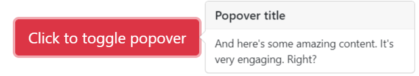

Here is an example with provided Bootstrap v4.3 code:

```java 
// @FindBy(css = "body") public static Popover popover;
@UI("body") public static Popover popover;

@Test
public void isValidationTests() {
    popover.getPopover(locator);
    popover.popoverButton.is()
            .displayed()
            .enabled()
            .core()
            .attr("data-toggle", "popover")
            .attr("data-content", popoverBody)
            .attr("data-original-title", popoverHeader)
            .text(is(buttonText));
    popover.container
            .is()
            .enabled()
            .core()
            .hasClass("popover fade bs-popover-right show")
            .attr("role", "tooltip")
            .attr("x-placement", "right");
    popover.body
            .is()
            .enabled()
            .core()
            .hasClass("popover-body")
            .text(is(popoverBody));
    popover.header
            .is()
            .core()
            .hasClass("popover-header")
            .text(is(popoverHeader.toUpperCase()));
    popover.popoverButton.click();
}

@Test()
public void clickableTests() {
    popover.getPopover(locator);
    popover.popoverButton.click();
    popover.popoverButton
            .is()
            .core()
            .attr("aria-describedby", containsString("popover"));
    popover.container
            .is()
            .enabled();
    popover.container.click();
    popover.popoverButton
            .is()
            .core()
            .attr("aria-describedby", "");
    assertFalse(popover.container.isDisplayed());
}
```

```html
<button type="button" class="btn btn-lg btn-danger btn-block mb-3" id="popover-title"
        data-toggle="popover" title="Popover title"
        data-content="And here's some amazing content. It's very engaging. Right?">Click to
    toggle popover
</button>
```

```html 
<div class="popover fade bs-popover-right show" role="tooltip" id="popover757247" style="will-change: 
    transform; position: absolute; transform: translate3d(542px, 39291px, 0px); top: 0px; left: 0px;" x-placement=
    "right">
    <div class="arrow" style="top: 35px;"></div>
    <h3 class="popover-header">Popover title</h3><div class="popover-body">And here's some amazing content. It's very engaging. Right?</div>
</div>
```


|Method | Description | Return Type
--- | --- | ---
 **assertThat()** | Assert action | TextAssert
 **click()** | Get button text | void
 **disabled()** | assert is disabled | TextAssert
 **displayed()** | assert is displayed | TextAssert
 **get()** | Select button by index | UIElement
 **getText()** | Get button text | String
 **getPopover(String locator)** | Get the popover click  | void
 **getBody()** | Get body of popover  |  String
 **getContainer()** | Get container of popover  |  String
 **getHeader()** | Get header of popover  |  String
 **enabled()** | assert is enabled | TextAssert
 **highlight()** | Get button text | void
 **is()** | Assert action | TextAssert 
 **unhighlight()** | Get button text | void

<br>

[Java test examples](https://github.com/jdi-testing/jdi-light/blob/bootstrap/jdi-light-bootstrap-tests/src/test/java/io/github/epam/bootstrap/tests/composite/section/popover/PopoverTests.java)<br>

Popover group is represented by Section class in Java:
 
  [Section](https://jdi-docs.github.io/jdi-light/#section)  

<br>

Inner elements of input group can be represented by following classes:
 <ul>
  <li> [Text](https://jdi-docs.github.io/jdi-light/#text) </li>
  
  <li> [Button](https://jdi-docs.github.io/jdi-light/#button-2) </li> 
  
  <li> [MediaObject](https://jdi-docs.github.io/jdi-light/#media-object) </li>
 </ul>
 

#### Four directions popovers
**[Four directions popovers](https://getbootstrap.com/docs/4.3/components/popovers/#four-directions)** 

Popover top

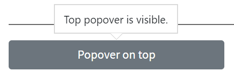

Here is an example with provided Bootstrap v4.3 code:

```java 
// @FindBy(css = "body") public static Popover popover;
@UI("body") public static Popover popover;

@Test
public void isValidationTests() {
    popover.getPopover(locator);
    popover.popoverButton.is()
            .displayed()
            .enabled()
            .core()
            .attr("data-toggle", "popover")
            .attr("data-content", popoverBody)
            .attr("data-original-title", popoverHeader)
            .text(is(buttonText));
    popover.container
            .is()
            .enabled()
            .core()
            .hasClass("popover fade bs-popover-right show")
            .attr("role", "tooltip")
            .attr("x-placement", "right");
    popover.body
            .is()
            .enabled()
            .core()
            .hasClass("popover-body")
            .text(is(popoverBody));
    popover.header
            .is()
            .core()
            .hasClass("popover-header")
            .text(is(popoverHeader.toUpperCase()));
    popover.popoverButton.click();
}

@Test()
public void clickableTests() {
    popover.getPopover(locator);
    popover.popoverButton.click();
    popover.popoverButton
            .is()
            .core()
            .attr("aria-describedby", containsString("popover"));
    popover.container
            .is()
            .enabled();
    popover.container.click();
    popover.popoverButton
            .is()
            .core()
            .attr("aria-describedby", "");
    assertFalse(popover.container.isDisplayed());
}
```

```html
<button type="button" class="btn btn-secondary btn-block mb-3" id="popover-top"
        data-container="body" data-toggle="popover" data-placement="top"
        data-content="Top popover is visible.">
    Popover on top
</button>
```

```html 
<div class="popover fade show bs-popover-top" role="tooltip" id="popover561586" x-placement="top" 
    style="position: absolute; transform: translate3d(320px, 39051px, 0px); top: 0px; left: 0px; will-change: 
    transform;">
    <div class="arrow" style="left: 68px;"></div>
    <h3 class="popover-header"></h3><div class="popover-body">Top popover is visible.</div>
</div>
```

<br><br>

Popover right

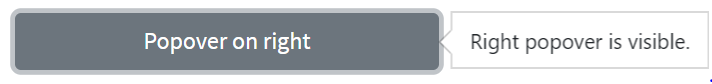

Here is an example with provided Bootstrap v4.3 code:

```html
<button type="button" class="btn btn-secondary btn-block mb-3" id="popover-right"
        data-container="body" data-toggle="popover" data-placement="right"
        data-content="Right popover is visible.">
    Popover on right
</button>
```

```html 
<div class="popover fade bs-popover-right show" role="tooltip" id="popover525348" x-placement="right" 
    style="position: absolute; transform: translate3d(542px, 39152px, 0px); top: 0px; left: 0px; will-change: 
    transform;">
    <div class="arrow" style="top: 7px;"></div>
    <h3 class="popover-header"></h3>
    <div class="popover-body">Right popover is visible.</div>
</div>
```

<br><br>

Popover bottom


Here is an example with provided Bootstrap v4.3 code:

```html
<button type="button" class="btn btn-secondary btn-block mb-3" id="popover-bottom"
        data-container="body" data-toggle="popover" data-placement="bottom"
        data-content="Bottom popover is visible.">
    Popover on bottom
</button>
```

```html 
<div class="popover fade show bs-popover-bottom" role="tooltip" id="popover24015" x-placement="bottom" 
    style="position: absolute; transform: translate3d(308px, 39244px, 0px); top: 0px; left: 0px; will-change: 
    transform;">
    <div class="arrow" style="left: 80px;"></div>
    <h3 class="popover-header"></h3>
    <div class="popover-body">Bottom popover is visible.</div>
</div>
```
<br><br>

Popover left


Here is an example with provided Bootstrap v4.3 code:

```html
<button type="button" class="btn btn-secondary btn-block mb-3" id="popover-left"
        data-container="body" data-toggle="popover" data-placement="left"
        data-content="Left popover is visible.">
    Popover on left
</button>
```

```html 
<div class="popover fade bs-popover-left show" role="tooltip" id="popover587895" x-placement="left" 
    style="position: absolute; transform: translate3d(88px, 39260px, 0px); top: 0px; left: 0px; will-change: 
    transform;">
    <div class="arrow" style="top: 7px;"></div>
    <h3 class="popover-header"></h3>
    <div class="popover-body">Left popover is visible.</div>
</div>
```
<br><br>


|Method | Description | Return Type
--- | --- | ---
 **assertThat()** | Assert action | TextAssert
 **click()** | Get button text | void
 **enabled()** | assert is enabled | TextAssert
 **disabled()** | assert is disabled | TextAssert
 **displayed()** | assert is displayed | TextAssert
 **get()** | Select button by index | UIElement
 **getText()** | Get button text | String
 **highlight()** | Get button text | void
 **is()** | Assert action | TextAssert 
 **unhighlight()** | Get button text | void

<br>

[Java test examples](https://github.com/jdi-testing/jdi-light/blob/bootstrap/jdi-light-bootstrap-tests/src/test/java/io/github/epam/bootstrap/tests/composite/section/popover/PopoverTests.java)<br>

Popover group is represented by Section class in Java:
 
  [Section](https://jdi-docs.github.io/jdi-light/#section)  

<br>

Inner elements of input group can be represented by following classes:
 <ul>
  <li> [Text](https://jdi-docs.github.io/jdi-light/#text) </li>
  
  <li> [Button](https://jdi-docs.github.io/jdi-light/#button-2) </li> 
  
  <li> [MediaObject](https://jdi-docs.github.io/jdi-light/#media-object) </li>
 </ul>


#### Dismissible
**[Dismissible popover](https://getbootstrap.com/docs/4.3/components/popovers/#dismiss-on-next-click)** 


Here is an example with provided Bootstrap v4.3 code:

```java 
// @FindBy(css = "body") public static Popover popover;
@UI("body") public static Popover popover;

@Test
public void isValidationTests() {
    popover.getPopover(locator);
    popover.popoverButton.is()
            .displayed()
            .enabled()
            .core()
            .attr("data-toggle", "popover")
            .attr("data-content", popoverBody)
            .attr("data-original-title", popoverHeader)
            .text(is(buttonText));
    popover.container
            .is()
            .enabled()
            .core()
            .hasClass("popover fade bs-popover-right show")
            .attr("role", "tooltip")
            .attr("x-placement", "right");
    popover.body
            .is()
            .enabled()
            .core()
            .hasClass("popover-body")
            .text(is(popoverBody));
    popover.header
            .is()
            .core()
            .hasClass("popover-header")
            .text(is(popoverHeader.toUpperCase()));
    popover.popoverButton.click();
}

@Test()
public void clickableTests() {
    popover.getPopover(locator);
    popover.popoverButton.click();
    popover.popoverButton
            .is()
            .core()
            .attr("aria-describedby", containsString("popover"));
    popover.container
            .is()
            .enabled();
    popover.container.click();
    popover.popoverButton
            .is()
            .core()
            .attr("aria-describedby", "");
    assertFalse(popover.container.isDisplayed());
}
```

```html
<a tabindex="0" class="btn btn-lg btn-danger btn-block mb-3" role="button"
   id="popover-dismissible" data-toggle="popover" data-trigger="focus"
   title="Dismissible popover"
   data-content="And here's some amazing content. It's very engaging. Right?">Dismissible
    popover</a>
```

```html 
<div class="popover fade bs-popover-right" role="tooltip" id="popover278744" 
    style="will-change: transform; position: absolute; transform: translate3d(542px, 39355px, 0px); top: 0px; left: 0px;" 
    x-placement="right">
    <div class="arrow" style="top: 35px;"></div>
    <h3 class="popover-header">Dismissible popover</h3>
    <div class="popover-body">And here's some amazing content. It's very engaging. Right?</div>
</div>
```

|Method | Description | Return Type
--- | --- | ---
 **assertThat()** | Assert action | TextAssert
 **click()** | Get button text | void
 **disabled()** | assert is disabled | TextAssert
 **displayed()** | assert is displayed | TextAssert
 **enabled()** | assert is enabled | TextAssert
 **get()** | Select button by index | UIElement
 **getText()** | Get button text | String
 **highlight()** | Get button text | void
 **is()** | Assert action | TextAssert 
 **unhighlight()** | Get button text | void

<br>

[Java test examples](https://github.com/jdi-testing/jdi-light/blob/bootstrap/jdi-light-bootstrap-tests/src/test/java/io/github/epam/bootstrap/tests/composite/section/popover/PopoverTests.java)<br>

Popover group is represented by Section class in Java:
 
  [Section](https://jdi-docs.github.io/jdi-light/#section)  

<br>

Inner elements of input group can be represented by following classes:
 <ul>
  <li> [Text](https://jdi-docs.github.io/jdi-light/#text) </li>
  
  <li> [Button](https://jdi-docs.github.io/jdi-light/#button-2) </li> 
  
  <li> [MediaObject](https://jdi-docs.github.io/jdi-light/#media-object) </li>
 </ul>


 
#### Disabled elements popover
 
**[Disabled elements popover](https://getbootstrap.com/docs/4.3/components/popovers/#disabled-elements)** 
 
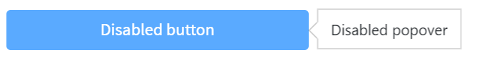
 
Here is an example with provided Bootstrap v4.3 code:
 
 ```java 
 // @FindBy(css = "body") public static Popover popover;
 @UI("body") public static Popover popover;
 
 @Test
 public void isValidationTests() {
     popover.getPopover(locator);
     popover.popoverButton.is()
             .displayed()
             .enabled()
             .core()
             .attr("data-toggle", "popover")
             .attr("data-content", popoverBody)
             .attr("data-original-title", popoverHeader)
             .text(is(buttonText));
     popover.container
             .is()
             .enabled()
             .core()
             .hasClass("popover fade bs-popover-right show")
             .attr("role", "tooltip")
             .attr("x-placement", "right");
     popover.body
             .is()
             .enabled()
             .core()
             .hasClass("popover-body")
             .text(is(popoverBody));
     popover.header
             .is()
             .core()
             .hasClass("popover-header")
             .text(is(popoverHeader.toUpperCase()));
     popover.popoverButton.click();
 }
 
 @Test()
 public void clickableTests() {
     popover.getPopover(locator);
     popover.popoverButton.click();
     popover.popoverButton
             .is()
             .core()
             .attr("aria-describedby", containsString("popover"));
     popover.container
             .is()
             .enabled();
     popover.container.click();
     popover.popoverButton
             .is()
             .core()
             .attr("aria-describedby", "");
     assertFalse(popover.container.isDisplayed());
 }
 ```
 
```html
<span class="d-inline-block mb-3" style="width:100%;" data-toggle="popover"
      id="popover-disabled" data-content="Disabled popover">
        <button class="btn btn-primary btn-block" style="pointer-events: none;" type="button"
                disabled>Disabled button</button>
</span>
```
 
```html 
<div class="popover fade show bs-popover-right" role="tooltip" id="popover180279" x-placement="right" 
    style="will-change: transform; position: absolute; transform: translate3d(542px, 39442px, 0px); top: 0px; left: 0px;">
    <div class="arrow" style="top: 7px;"></div>
    <h3 class="popover-header"></h3>
    <div class="popover-body">Disabled popover</div>
</div>
```
 


|Method | Description | Return Type
--- | --- | ---
 **assertThat()** | Assert action | TextAssert
 **click()** | Get button text | void
 **disabled()** | assert is disabled | TextAssert
 **displayed()** | assert is displayed | TextAssert
 **enabled()** | assert is enabled | TextAssert
 **get()** | Select button by index | UIElement
 **getText()** | Get button text | String
 **highlight()** | Get button text | void
 **is()** | Assert action | TextAssert 
 **unhighlight()** | Get button text | void

<br>
 
 [Java test examples](https://github.com/jdi-testing/jdi-light/blob/bootstrap/jdi-light-bootstrap-tests/src/test/java/io/github/epam/bootstrap/tests/composite/section/popover/PopoverTests.java)<br>
 
Popover group is represented by Section class in Java:
  
  [Section](https://jdi-docs.github.io/jdi-light/#section)  
 
<br>
 
Inner elements of input group can be represented by following classes:
<ul>
    <li> [Text](https://jdi-docs.github.io/jdi-light/#text) </li>
    <li> [Button](https://jdi-docs.github.io/jdi-light/#button-2) </li> 
    <li> [MediaObject](https://jdi-docs.github.io/jdi-light/#media-object) </li>
</ul>

### List group

***[List groups](https://getbootstrap.com/docs/4.3/components/list-group/)*** are a flexible and powerful component for displaying a series of content. Modify and extend them to support just about any content within.


#### Basic Example

***[List group basic example](https://getbootstrap.com/docs/4.3/components/list-group/#basic-example)*** - an unordered list with list items and the proper classes.

List Group is located in the following classes:
 
  - __Java__: _com.epam.jdi.light.ui.bootstrap.elements.complex.ListGroup_
  


Here is an example with provided Bootstrap v4.3 code:

```java 
@UI("#list-group-basic-example") public static ListGroupBasicExample listGroupBasicExample;
// @FindBy(css = "#list-group-basic-example") public static ListGroupBasicExample listGroupBasicExample;

public class ListGroupBasicExample extends Section {
    @UI("li") public ListGroup listGroup;
}

public void listGroupIsValidationTest() {
    listGroupBasicExample.listGroup.is()
            .size(5);
}

@Test(dataProvider = "listData")
public void listGroupTests(int num, String text) {
    listGroupBasicExample.listGroup.get(num).is()
            .text(is(text))
            .css("font-size", is("14px"));
}
```

```html
<ul class="list-group mb-3" id="list-group-basic-example">
    <li class="list-group-item">Cras justo odio</li>
    <li class="list-group-item">Dapibus ac facilisis in</li>
    <li class="list-group-item">Morbi leo risus</li>
    <li class="list-group-item">Porta ac consectetur ac</li>
    <li class="list-group-item">Vestibulum at eros</li>
</ul>
```


|Method | Description | Return Type
--- | --- | ---
**assertThat()** | Assert action | TextAssert
**get()** | Select button by index | action
**getText()** | Get button text | String
**is()** | Assert action | TextAssert 

<br>

[Java test examples](https://github.com/jdi-testing/jdi-light/blob/bootstrap/jdi-light-bootstrap-tests/src/test/java/io/github/epam/bootstrap/tests/composite/section/listGroup/BasicExampleTests.java)
<br>

Button group is represented by Section class in Java:
 
  [Section](https://jdi-docs.github.io/jdi-light/#section)  

<br>

#### Active Items

***[List group active Items](https://getbootstrap.com/docs/4.3/components/list-group/#active-items)***

List Group is located in the following classes:
 
  - __Java__: _com.epam.jdi.light.ui.bootstrap.elements.complex.ListGroup_
  


Here is an example with provided Bootstrap v4.3 code:

```java 
@UI("#list-group-active-items") public static ListGroupActiveItems listGroupActiveItems;
// @FindBy(css = "#list-group-active-items") public static ListGroupActiveItems listGroupActiveItems;)

public class ListGroupActiveItems extends Section {
    @UI("li") public ListGroup listGroup;
}

@Test(dataProvider = "listData")
public void listGroupTextTests(int num, String text) {
    listGroupActiveItems.listGroup.get(num).is()
            .text(text)
            .css("font-size", is("14px"));
}

@Test
public void isValidationTests() {
    listGroupActiveItems.listGroup.is()
            .size(5);
    listGroupActiveItems.is()
            .displayed()
            .enabled()
            .core()
            .hasClass("list-group");
    listGroupActiveItems.listGroup.get(1).is()
            .hasClass(listClass + " active");
}
```

```html
<ul class="list-group mb-3" id="list-group-active-items">
    <li class="list-group-item active">Cras justo odio</li>
    <li class="list-group-item">Dapibus ac facilisis in</li>
    <li class="list-group-item">Morbi leo risus</li>
    <li class="list-group-item">Porta ac consectetur ac</li>
    <li class="list-group-item">Vestibulum at eros</li>
</ul>
```


|Method | Description | Return Type
--- | --- | ---
**assertThat()** | Assert action | TextAssert
**get()** | Select button by index | action
**getText()** | Get button text | String
**is()** | Assert action | TextAssert 

<br>

[Java test examples](https://github.com/jdi-testing/jdi-light/blob/bootstrap/jdi-light-bootstrap-tests/src/test/java/io/github/epam/bootstrap/tests/composite/section/listGroup/ActiveItemsTests.java)
<br>

Button group is represented by Section class in Java:
 
  [Section](https://jdi-docs.github.io/jdi-light/#section)  

<br>

#### Disabled Items

***[List group disabled Items](https://getbootstrap.com/docs/4.3/components/list-group/#disabled-items)***

List Group is located in the following classes:
 
  - __Java__: _com.epam.jdi.light.ui.bootstrap.elements.complex.ListGroup_
  


Here is an example with provided Bootstrap v4.3 code:

```java 
@UI("#disabled-items") public static ListGroupDisabledItems listGroupDisabledItems;
// @FindBy(css = "#disabled-items") public static ListGroupDisabledItems listGroupDisabledItems;

public class ListGroupDisabledItems extends Section {
    @UI("li") public ListGroup listGroup;
}

@Test
public void isValidationTests() {
    listGroupDisabledItems.listGroup.is()
            .size(5);
    listGroupDisabledItems.is()
            .displayed()
            .enabled()
            .core()
            .hasClass("list-group");
    listGroupDisabledItems.listGroup.get(1).is()
            .hasClass(listClass + " disabled")
            .attr("aria-disabled", "true");
}

@Test(dataProvider = "listData")
public void listGroupTextTests(int num, String text) {
    listGroupDisabledItems.listGroup.get(num).is()
            .text(text)
            .css("font-size", is("14px"));
}
```

```html
<ul class="list-group mb-3" id="disabled-items">
    <li class="list-group-item disabled" aria-disabled="true">Cras justo odio</li>
    <li class="list-group-item">Dapibus ac facilisis in</li>
    <li class="list-group-item">Morbi leo risus</li>
    <li class="list-group-item">Porta ac consectetur ac</li>
    <li class="list-group-item">Vestibulum at eros</li>
</ul>
```


|Method | Description | Return Type
--- | --- | ---
**assertThat()** | Assert action | TextAssert
**get()** | Select button by index | action
**getText()** | Get button text | String
**is()** | Assert action | TextAssert 

<br>

[Java test examples](https://github.com/jdi-testing/jdi-light/blob/bootstrap/jdi-light-bootstrap-tests/src/test/java/io/github/epam/bootstrap/tests/composite/section/listGroup/DisabledItemsTests.java)
<br>

Button group is represented by Section class in Java:
 
  [Section](https://jdi-docs.github.io/jdi-light/#section)  

<br>

#### Links

***[List group links and buttons](https://getbootstrap.com/docs/4.3/components/list-group/#links-and-buttons)***

List Group is located in the following classes:
 
  - __Java__: _com.epam.jdi.light.ui.bootstrap.elements.complex.ListGroup_
  


Here is an example with provided Bootstrap v4.3 code:

```java 
@UI("#list-group-links") public static ListGroupLinks listGroupLinks;
// @FindBy(css = "#list-group-links") public static ListGroupLinks listGroupLinks;

public class ListGroupLinks extends Section {
    @UI("a") public ListGroup listGroup;
}

@Test(dataProvider = "clickValidate")
public void linkClickableTests(int index, String pageTitle) {
    listGroupLinks.listGroup.get(index).highlight();
    listGroupLinks.listGroup.get(index).click();
    newWindowTitleCheck(pageTitle);
    listGroupLinks.listGroup.get(index).unhighlight();
}

@Test
public void isValidationTests() {
    listGroupLinks.listGroup.is()
            .size(5);
    listGroupLinks.is()
            .displayed()
            .enabled()
            .core()
            .hasClass("list-group");
    listGroupLinks.listGroup.get(1).is()
            .hasClass(listClass + " active");
    listGroupLinks.listGroup.get(5).is()
            .hasClass(listClass + " disabled");
    assertFalse(listGroupLinks.listGroup.get(5).isClickable());
}
```

```html
<div class="list-group mb-3" id="list-group-links">
    <a href="https://github.com/jdi-docs"
       class="list-group-item list-group-item-action active" target="_blank">
        JDI Docs
    </a>
    <a href="https://github.com/jdi-testing" class="list-group-item list-group-item-action"
       target="_blank">JDI - testing tool</a>
    <a href="https://jdi-testing.github.io/jdi-light/index.html"
       class="list-group-item list-group-item-action" target="_blank">JDI website</a>
    <a href="https://getbootstrap.com/docs/4.3/components/list-group/#links-and-buttons"
       class="list-group-item list-group-item-action" target="_blank">Bootstrap</a>
    <a href="https://github.com/jdi-docs"
       class="list-group-item list-group-item-action disabled" tabindex="-1"
       aria-disabled="true" target="_blank">JDI Docs</a>
</div>
```


|Method | Description | Return Type
--- | --- | ---
**assertThat()** | Assert action | TextAssert
**click()** | Click the button | void
**get()** | Select button by index | action
**getText()** | Get button text | String
**is()** | Assert action | TextAssert 

<br>

[Java test examples](https://github.com/jdi-testing/jdi-light/blob/bootstrap/jdi-light-bootstrap-tests/src/test/java/io/github/epam/bootstrap/tests/composite/section/listGroup/LinksTests.java)
<br>

Button group is represented by Section class in Java:
 
  [Section](https://jdi-docs.github.io/jdi-light/#section)  

<br>

#### Buttons

***[List group links and buttons](https://getbootstrap.com/docs/4.3/components/list-group/#links-and-buttons)***

List Group is located in the following classes:
 
  - __Java__: _com.epam.jdi.light.ui.bootstrap.elements.complex.ListGroup_
  


Here is an example with provided Bootstrap v4.3 code:

```java 
@UI("#list-group-buttons") public static ListGroupButtons listGroupButtons;
// @FindBy(css = "#list-group-buttons") public static ListGroupButtons listGroupButtons;

public class ListGroupButtons extends Section {
    @UI("button") public ListGroup listGroup;
}

@Test
public void isValidationTests() {
    listGroupButtons.listGroup.is()
            .size(5);
    listGroupButtons.is()
            .displayed()
            .enabled()
            .core()
            .hasClass("list-group");
    listGroupButtons.listGroup.get(1).is()
            .hasClass(listClass + " active");
    listGroupButtons.listGroup.get(5).is()
            .disabled();
}

@Test(dataProvider = "clickValidate")
public void buttonClickableTests(int index, String text) {
    listGroupButtons.listGroup.get(index).highlight();
    listGroupButtons.listGroup.get(index).click();
    validateAlert(is(text));
    listGroupButtons.listGroup.get(index).unhighlight();
}
```

```html
<div class="list-group mb-3" id="list-group-buttons">
    <button type="button" class="list-group-item list-group-item-action active"
            onclick="alert('Cras justo odio');">Cras justo odio
    </button>
    <button type="button" class="list-group-item list-group-item-action"
            onclick="alert('Dapibus ac facilisis in');">Dapibus ac facilisis in
    </button>
    <button type="button" class="list-group-item list-group-item-action"
            onclick="alert('Morbi leo risus');">Morbi leo risus
    </button>
    <button type="button" class="list-group-item list-group-item-action"
            onclick="alert('Porta ac consectetur ac');">Porta ac consectetur ac
    </button>
    <button type="button" class="list-group-item list-group-item-action"
            onclick="alert('Vestibulum at eros');" disabled>Vestibulum at eros
    </button>
</div>
```


|Method | Description | Return Type
--- | --- | ---
**assertThat()** | Assert action | TextAssert
**click()** | Click the button | void
**get()** | Select button by index | action
**getText()** | Get button text | String
**is()** | Assert action | TextAssert 

<br>

[Java test examples](https://github.com/jdi-testing/jdi-light/blob/bootstrap/jdi-light-bootstrap-tests/src/test/java/io/github/epam/bootstrap/tests/composite/section/listGroup/Buttons.java)
<br>

Button group is represented by Section class in Java:
 
  [Section](https://jdi-docs.github.io/jdi-light/#section)  

<br>

#### Flush

***[List group flush](https://getbootstrap.com/docs/4.3/components/list-group/#flush)***

List Group is located in the following classes:
 
  - __Java__: _com.epam.jdi.light.ui.bootstrap.elements.complex.ListGroup_
  


Here is an example with provided Bootstrap v4.3 code:

```java 
@UI("#list-group-flush") public static ListGroupFlush listGroupFlush;
// @FindBy(css = "#list-group-flush") public static ListGroupFlush listGroupFlush;

public class ListGroupFlush extends Section {
    @UI("li") public ListGroup listGroup;
}

@Test(dataProvider = "listData")
public void listGroupTests(int num, String text) {
    listGroupFlush.listGroup.get(num).is()
            .text(text)
            .css("font-size", is("14px"));
}

@Test
public void initTests() {
    listGroupFlush.listGroup.is().size(5);
    listGroupFlush.is()
            .displayed()
            .enabled()
            .core()
            .hasClass("list-group list-group-flush");
}
```

```html  
<div class="html-left">
    <ul class="list-group list-group-flush mb-3" id="list-group-flush">
        <li class="list-group-item">Cras justo odio</li>
        <li class="list-group-item">Dapibus ac facilisis in</li>
        <li class="list-group-item">Morbi leo risus</li>
        <li class="list-group-item">Porta ac consectetur ac</li>
        <li class="list-group-item">Vestibulum at eros</li>
    </ul>
</div>
```


|Method | Description | Return Type
--- | --- | ---
**assertThat()** | Assert action | TextAssert
**get()** | Select button by index | action
**getText()** | Get button text | String
**is()** | Assert action | TextAssert 

<br>

[Java test examples](https://github.com/jdi-testing/jdi-light/blob/bootstrap/jdi-light-bootstrap-tests/src/test/java/io/github/epam/bootstrap/tests/composite/section/listGroup/FlushTests.java)
<br>

Button group is represented by Section class in Java:
 
  [Section](https://jdi-docs.github.io/jdi-light/#section)  

<br>

#### Horizontal

***[List group horizontal](https://getbootstrap.com/docs/4.3/components/list-group/#horizontal)***

List Group is located in the following classes:
 
  - __Java__: _com.epam.jdi.light.ui.bootstrap.elements.complex.ListGroup_
  


Here is an example with provided Bootstrap v4.3 code:

```java 
@UI("#list-group-horizontal") public static ListGroupHorizontal listGroupHorizontal;
// @FindBy(css = "#list-group-horizontal") public static ListGroupHorizontal listGroupHorizontal;

public class ListGroupHorizontal extends Section {
    @UI("li") public ListGroup listGroup;
}

@Test
public void initTests() {
    listGroupHorizontal.listGroup.is()
            .size(3);
}

@Test(dataProvider = "listData")
public void listGroupTests(int num, String text) {
    listGroupHorizontal.listGroup.get(num).is()
            .text(text)
            .css("font-size", is("14px"));
}
```

```html
<ul class="list-group list-group-horizontal mb-3" id="list-group-horizontal">
    <li class="list-group-item">Cras justo odio</li>
    <li class="list-group-item">Dapibus ac facilisis in</li>
    <li class="list-group-item">Morbi leo risus</li>
</ul>
```


|Method | Description | Return Type
--- | --- | ---
**assertThat()** | Assert action | TextAssert
**get()** | Select button by index | action
**getText()** | Get button text | String
**is()** | Assert action | TextAssert 

<br>

[Java test examples](https://github.com/jdi-testing/jdi-light/blob/bootstrap/jdi-light-bootstrap-tests/src/test/java/io/github/epam/bootstrap/tests/composite/section/listGroup/Horizontal.java)
<br>

Button group is represented by Section class in Java:
 
  [Section](https://jdi-docs.github.io/jdi-light/#section)  

<br>

#### With Badges

***[List group with badges](https://getbootstrap.com/docs/4.3/components/list-group/#with-badges)***

List Group is located in the following classes:
 
  - __Java__: _com.epam.jdi.light.ui.bootstrap.elements.complex.ListGroup_
  


Here is an example with provided Bootstrap v4.3 code:

```java 
@UI("#list-group-with-badges") public static ListGroupWithBadges listGroupWithBadges;
// @FindBy(css = "#list-group-with-badges") public static ListGroupWithBadges listGroupWithBadges;

public class ListGroupWithBadges extends Section {
    @UI("li") public ListGroup listGroup;
    @UI("li span") public ListGroup badge;
}

@Test
public void initTests() {
    listGroupWithBadges.listGroup.is()
            .size(3);
    listGroupWithBadges.badge.is()
            .size(3);
}

@Test(dataProvider = "listData")
public void listGroupTests(int num, String text) {
    listGroupWithBadges.listGroup.get(num).is()
            .text(containsString(text))
            .css("font-size", is("14px"))
            .hasClass("list-group-item d-flex justify-content-between align-items-center");
}
```

```html
<ul class="list-group mb-3" id="list-group-with-badges">
    <li class="list-group-item d-flex justify-content-between align-items-center">
        Cras justo odio
        <span class="badge badge-primary badge-pill">14</span>
    </li>
    <li class="list-group-item d-flex justify-content-between align-items-center">
        Dapibus ac facilisis in
        <span class="badge badge-primary badge-pill">2</span>
    </li>
    <li class="list-group-item d-flex justify-content-between align-items-center">
        Morbi leo risus
        <span class="badge badge-primary badge-pill">1</span>
    </li>
</ul>
```


|Method | Description | Return Type
--- | --- | ---
**assertThat()** | Assert action | TextAssert
**get()** | Select button by index | action
**getText()** | Get button text | String
**is()** | Assert action | TextAssert 

<br>

[Java test examples](https://github.com/jdi-testing/jdi-light/blob/bootstrap/jdi-light-bootstrap-tests/src/test/java/io/github/epam/bootstrap/tests/composite/section/listGroup/WithBadgesTests.java)
<br>

Button group is represented by Section class in Java:
 
  [Section](https://jdi-docs.github.io/jdi-light/#section)  

<br>

#### Custom Content

***[List group custom content](https://getbootstrap.com/docs/4.3/components/list-group/#custom-content)***

List Group is located in the following classes:
 
  - __Java__: _com.epam.jdi.light.ui.bootstrap.elements.complex.ListGroup_
  

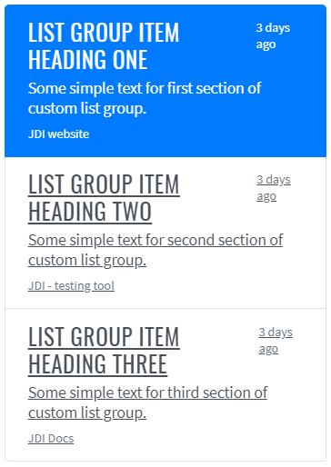

Here is an example with provided Bootstrap v4.3 code:

```java 
@UI("#list-group-custom-content") public static ListGroupCustomContent listGroupCustomContent;
// @FindBy(css = "#list-group-custom-content") public static ListGroupCustomContent listGroupCustomContent;

public class ListGroupCustomContent extends Section {
    @UI("a") public ListGroup listGroup;
    @UI("a div h5") public ListGroup header;
    @UI("a div small") public ListGroup dateText;
    @UI("a p") public ListGroup mainText;
    @UI("small.footer") public ListGroup footer;
    @UI("a div") public ListGroup container;
}

@Test
 public void isValidationTests() {
     listGroupCustomContent.listGroup.is()
             .size(3);
     listGroupCustomContent.container.is()
             .size(3);
}

@Test(dataProvider = "clickValidate")
public void linkClickableTests(int index, String pageTitle) {
    listGroupCustomContent.listGroup.get(index).highlight();
    listGroupCustomContent.listGroup.get(index).click();
    newWindowTitleCheck(pageTitle);
    listGroupCustomContent.listGroup.get(index).unhighlight();
}
```

```html
<div class="list-group mb-3" id="list-group-custom-content">
    <a href="https://jdi-testing.github.io/jdi-light/index.html"
       class="list-group-item list-group-item-action active" target="_blank">
        <div class="d-flex w-100 justify-content-between">
            <h5 class="mb-1">List group item heading one</h5>
            <small>3 days ago</small>
        </div>
        <p class="mb-1">Some simple text for first section of custom list group.</p>
        <small class="footer">JDI website</small>
    </a>
    <a href="https://github.com/jdi-testing" class="list-group-item list-group-item-action"
       target="_blank">
        <div class="d-flex w-100 justify-content-between">
            <h5 class="mb-1">List group item heading two</h5>
            <small class="text-muted">3 days ago</small>
        </div>
        <p class="mb-1">Some simple text for second section of custom list group.</p>
        <small class="text-muted footer">JDI - testing tool</small>
    </a>
    <a href="https://github.com/jdi-docs" class="list-group-item list-group-item-action"
       target="_blank">
        <div class="d-flex w-100 justify-content-between">
            <h5 class="mb-1">List group item heading three</h5>
            <small class="text-muted">3 days ago</small>
        </div>
        <p class="mb-1">Some simple text for third section of custom list group.</p>
        <small class="text-muted footer">JDI Docs</small>
    </a>
</div>
```


|Method | Description | Return Type
--- | --- | ---
**assertThat()** | Assert action | TextAssert
**click()** | Click the button | void
**get()** | Select button by index | action
**getText()** | Get button text | String
**is()** | Assert action | TextAssert 
**select()** | Select button | void
**selected()** | Radio button is selected | TextAssert

<br>

[Java test examples](https://github.com/jdi-testing/jdi-light/blob/bootstrap/jdi-light-bootstrap-tests/src/test/java/io/github/epam/bootstrap/tests/composite/section/listGroup/CustomContentTests.java)
<br>

Button group is represented by Section class in Java:
 
  [Section](https://jdi-docs.github.io/jdi-light/#section)  

<br>

### Toast
<a style="font-weight:bold" href="https://getbootstrap.com/docs/4.3/components/toasts/" target="_blank">Toast</a> - Toasts are lightweight notifications designed to mimic the push notifications.
<br />
__Options for toasts:__
<br />
 - _Animation<br/>_
 - _Autohide <br/>_
 - _Delay <br/>_
 <br/>
__Events for toasts:__
<br>
  - _show.bs.toast_ - this event fires immediately when the show instance method is called.<br/>
  - _shown.bs.toast_ - this event is fired when the toast has been made visible to the user<br/>
  - _hide.bs.toast_ - this event is fired immediately when the hide instance method has been called.<br/>
  - _hidden.bs.toast_ - this event is fired when the toast has finished being hidden from the user<br/>
 <br /> 

<a style="font-weight:bold" href="https://getbootstrap.com/docs/4.3/components/toasts/#basic" target="_blank">**Simple Toast**</a>
<br />


Here is an example with provided Bootstrap v4.3 code:
  
```java 
//@FindBy(id="simpleToast")
@UI("#simpleToast") public static Toast simpleToast; 

@Test
public void simpleToastValidationTest() {
    simpleToastButton.click();
    simpleToast.is().displayed();
    simpleToast.headerText.is().text(toastHeaderText);
    simpleToast.body.is().text(toastBodyText);
}

```
  
```html
<div class="toast" role="alert" data-animation="false" aria-live="assertive"
     aria-atomic="true" id="simpleToast">
    <div class="toast-header">
        
        <strong class="mr-auto">Bootstrap</strong>
        <small class="text-muted">11 mins ago</small>
        <button type="button" class="ml-2 mb-1 close" data-dismiss="toast"
                aria-label="Close">
            <span aria-hidden="true">&times;</span>
        </button>
    </div>
    <div class="toast-body">
        Hello, world! This is a toast message.
    </div>
</div>
```

<br>

<a style="font-weight:bold" href="https://getbootstrap.com/docs/4.3/components/toasts/#translucent" target="_blank">**Translucent Toast**</a>


Here is an example with provided Bootstrap v4.3 code:

```java 
//@FindBy(id="translucentToast")
@UI("#translucentToast") public static Toast translucentToast; 

@Test
public void translucentToastValidationTest() {
    translucentToastButton.click();
    translucentToast.is().displayed();
    translucentToast.headerText.is().text(toastHeaderText);
    translucentToast.body.is().text(toastBodyText);
}

```
  
```html
<div aria-live="polite" aria-atomic="true"
     style="min-height: 200px;background-color: grey;">
    <div class="toast" role="alert" data-animation="false" aria-live="assertive"
         aria-atomic="true" id="translucentToast">
        <div class="toast-header">
            
            <strong class="mr-auto">Bootstrap</strong>
            <small class="text-muted">11 mins ago</small>
            <button type="button" class="ml-2 mb-1 close" data-dismiss="toast"
                    aria-label="Close">
                <span aria-hidden="true">&times;</span>
            </button>
        </div>
        <div class="toast-body">
            Hello, world! This is a toast message.
        </div>
    </div>
</div>
```

<a style="font-weight:bold" href="https://getbootstrap.com/docs/4.3/components/toasts/#stacking" target="_blank">**Stacking**</a>

When you have multiple toasts, we default to vertically stacking them in a readable manner


Here is an example with provided Bootstrap v4.3 code:
  
```java 
//@FindBy(id="firstMultipleToast")
@UI("#firstMultipleToast") public static Toast firstStackToast; 
//@FindBy(id="secondMultipleToast")
@UI("#secondMultipleToast") public static Toast secondStackToast; 

@Test
public void stackOfToastsValidationTest() {
    stackOfToastsButton.click();
    firstStackToast.is().displayed();
    secondStackToast.is().displayed();
    firstStackToast.headerText.is().text(toastHeaderText);
    firstStackToast.body.is().text(stackToastBodyText);
    secondStackToast.headerText.is().text(toastHeaderText);
    secondStackToast.body.is().text(secondStackToastBodyText);
}

```
  
```html
<div aria-live="polite" aria-atomic="true"
     style="min-height: 200px;background-color: grey;">
    <div class="toast several" role="alert" aria-live="assertive" id="firstMultipleToast"
         aria-atomic="true">
        <div class="toast-header">
            
            <strong class="mr-auto">Bootstrap</strong>
            <small class="text-muted">just now</small>
            <button type="button" class="ml-2 mb-1 close" data-dismiss="toast"
                    aria-label="Close">
                <span aria-hidden="true">&times;</span>
            </button>
        </div>
        <div class="toast-body">
            See? Just like this.
        </div>
    </div>
    <div class="toast several" role="alert" aria-live="assertive" id="secondMultipleToast"
         aria-atomic="true">
        <div class="toast-header">
            
            <strong class="mr-auto">Bootstrap</strong>
            <small class="text-muted">2 seconds ago</small>
            <button type="button" class="ml-2 mb-1 close" data-dismiss="toast"
                    aria-label="Close">
                <span aria-hidden="true">&times;</span>
            </button>
        </div>
        <div class="toast-body">
            Heads up, toasts will stack automatically
        </div>
    </div>
</div>
```


<a style="font-weight:bold" href="https://getbootstrap.com/docs/4.3/components/toasts/#stacking" target="_blank">**Placement**</a>

Place toasts with custom CSS as you need them. The top right is often used for notifications, as is the top middle.
<br /><br />
Example with top right align:


Here is an example with provided Bootstrap v4.3 code:

```java 
//@FindBy(id="toastRightTop")
@UI("#toastRightTop") public static Toast toastWithTopAlign; 

@Test
public void toastWithTopAlignValidationTest() {
    toastWithTopAlignButton.click();
    toastWithTopAlign.is().displayed();
    toastWithTopAlign.headerText.is().text(toastHeaderText);
    toastWithTopAlign.body.is().text(toastBodyText);
    toastWithTopAlign.closeButton.click();
    toastWithTopAlign.base().waitSec(1);
    toastWithTopAlign.is().hidden();
}

```
  
```html
<div aria-live="polite" aria-atomic="true"
     style="position: relative; min-height: 200px;background-color: grey;">
    <div class="toast" id="toastRightTop" style="position: absolute; top: 0; right: 0;"
         data-autohide="false">
        <div class="toast-header">
            
            <strong class="mr-auto">Bootstrap</strong>
            <small>11 mins ago</small>
            <button type="button" class="ml-2 mb-1 close" data-dismiss="toast"
                    aria-label="Close">
                <span aria-hidden="true">&times;</span>
            </button>
        </div>
        <div class="toast-body">
            Hello, world! This is a toast message.
        </div>
    </div>
</div>
```

Example with top right align stack of toasts:


Here is an example with provided Bootstrap v4.3 code:

```java  
//@FindBy(id="firstStackToast")
@UI("#firstStackToast") public static Toast firstTopAlignStackToast; 
//@FindBy(id="secondStackToast")
@UI("#secondStackToast") public static Toast secondTopAlignStackToast; 

@Test
 public void stackOfTopAlignToastsValidationTest() {
    stackOfToastsWithTopAlignButton.click();
    firstTopAlignStackToast.headerText.is().text(toastHeaderText);
    firstTopAlignStackToast.body.is().text(stackToastBodyText);
    secondTopAlignStackToast.headerText.is().text(toastHeaderText);
    secondTopAlignStackToast.body.is().text(secondStackToastBodyText);
    firstTopAlignStackToast.is().displayed();
    secondTopAlignStackToast.is().displayed();
}

``` 
  
```html
<div aria-live="polite" aria-atomic="true"
     style="position: relative; min-height: 200px; background-color: grey;">
    <!-- Position it -->
    <div style="position: absolute; top: 0; right: 0;">

        <!-- Then put toasts within -->
        <div class="toast severalWithPosition" role="alert" aria-live="assertive"
             id="firstStackToast" aria-atomic="true">
            <div class="toast-header">
                
                <strong class="mr-auto">Bootstrap</strong>
                <small class="text-muted">just now</small>
                <button type="button" class="ml-2 mb-1 close" data-dismiss="toast"
                        aria-label="Close">
                    <span aria-hidden="true">&times;</span>
                </button>
            </div>
            <div class="toast-body">
                See? Just like this.
            </div>
        </div>

        <div class="toast severalWithPosition" role="alert" aria-live="assertive"
             id="secondStackToast" aria-atomic="true">
            <div class="toast-header">
                
                <strong class="mr-auto">Bootstrap</strong>
                <small class="text-muted">2 seconds ago</small>
                <button type="button" class="ml-2 mb-1 close" data-dismiss="toast"
                        aria-label="Close">
                    <span aria-hidden="true">&times;</span>
                </button>
            </div>
            <div class="toast-body">
                Heads up, toasts will stack automatically
            </div>
        </div>
    </div>
</div>
```

Example with center align toast:


Here is an example with provided Bootstrap v4.3 code:
  
```java 
//@FindBy(id="toastCenterTop")
@UI("#toastCenterTop") public static Toast toastWithCenterAlign; 
//@FindBy(id="toastRightTop")
@UI("#toastRightTop") public static Toast toastWithTopAlign; 

@Test
public void toastWithCenterAlignValidationTest() {
    toastWithCenterAlignButton.click();
    toastWithCenterAlign.is().displayed();
    toastWithCenterAlign.headerText.is().text(toastHeaderText);
    toastWithCenterAlign.body.is().text(toastBodyText);
    toastWithCenterAlign.closeButton.click();
    toastWithCenterAlign.base().waitSec(1);
    toastWithCenterAlign.is().hidden();
}

```
  
```html
<div aria-live="polite" aria-atomic="true"
     class="d-flex justify-content-center align-items-center"
     style="min-height: 200px;background-color: grey;">

    <!-- Then put toasts within -->
    <div class="toast" role="alert" id="toastCenterTop" aria-live="assertive"
         aria-atomic="true" data-delay="3000">
        <div class="toast-header">
            
            <strong class="mr-auto">Bootstrap</strong>
            <small>11 mins ago</small>
            <button type="button" class="ml-2 mb-1 close" data-dismiss="toast"
                    aria-label="Close">
                <span aria-hidden="true">&times;</span>
            </button>
        </div>
        <div class="toast-body">
            Hello, world! This is a toast message.
        </div>
    </div>
</div>
```

Available methods in Java JDI Light:

|Method | Description | Return Type
--- | --- | ---
**assertThat()** |	Assert action |	TextAssert
**close()** |	Close toast |	void
**getText()** |	Get toast text |	String
**getTitle()** |	Get toast title |	String
**is()** |	Assert action |	TextAssert
**isDisplayed()** | Show\wait that toast element displayed on the screen | Boolean

[Toast test examples](https://github.com/jdi-testing/jdi-light/tree/bootstrap/jdi-light-bootstrap-tests/src/test/java/io/github/epam/bootstrap/tests/common/)
 
<br>

### Pagination

#### Overview

***[Pagination overview](https://getbootstrap.com/docs/4.3/components/pagination/#overview)***

Pagination is located in the following classes:
 
  - __Java__: _com.epam.jdi.light.ui.bootstrap.elements.complex.Pagination_
  


Here is an example with provided Bootstrap v4.3 code:

```java 
// @FindBy(css = "#pagination-overview") public static PaginationOverview paginationOverview;
@UI("#pagination-overview") public static PaginationOverview paginationOverview;

public class PaginationOverview extends Section {
    @UI("li") public Pagination paginationItems; // @FindBy(css = "li") public Pagination paginationItems;
}

@Test
 public void isValidationTests() {
     paginationOverview.paginationItems.is()
             .size(5);
     paginationOverview.is()
             .core()
             .hasClass("pagination");
 }

 @Test(dataProvider = "listData")
 public void linkTextTests(int index, String linkText) {
     paginationOverview.paginationItems.get(index).is()
             .displayed()
             .enabled()
             .css("font-size", is("14px"))
             .hasClass("page-item")
             .text(is(linkText));
 }

 @Test(dataProvider = "listPageTitles")
 public void linkClickableTests(int index, String pageTitle) {
     paginationOverview.paginationItems.get(index).hover();
     paginationOverview.paginationItems.get(index).highlight();
     paginationOverview.paginationItems.get(index).click();
     newWindowTitleCheck(pageTitle);
     paginationOverview.paginationItems.get(index).unhighlight();
 }
```

```html
<nav aria-label="Page navigation example">
    <ul class="pagination" id="pagination-overview">
        <li class="page-item"><a class="page-link" href="https://github.com/jdi-docs"
                                 target="_blank">Previous</a></li>
        <li class="page-item"><a class="page-link" href="https://github.com/jdi-testing"
                                 target="_blank">1</a></li>
        <li class="page-item"><a class="page-link"
                                 href="https://jdi-testing.github.io/jdi-light/index.html"
                                 target="_blank">2</a></li>
        <li class="page-item"><a class="page-link" href="https://getbootstrap.com"
                                 target="_blank">3</a></li>
        <li class="page-item"><a class="page-link"
                                 href="https://jdi-docs.github.io/jdi-light/"
                                 target="_blank">Next</a></li>
    </ul>
</nav>
```


|Method | Description | Return Type
--- | --- | ---
**assertThat()** | Assert action | TextAssert
**click()** | Click the element | void
**get()** | Select button by index | UIElement
**getText()** | Get button text | String
**highlight()** | Highlight element | void
**hover()** | Hover on the element | void
**is()** | Assert action | TextAssert 
**unhighlight()** | Unhighlight element | void

<br>

[Java test examples](https://github.com/jdi-testing/jdi-light/blob/bootstrap/jdi-light-bootstrap-tests/src/test/java/io/github/epam/bootstrap/tests/composite/section/pagination/OverviewTests.java)
<br>

Button group is represented by Section class in Java:
 
  [Section](https://jdi-docs.github.io/jdi-light/#section)  

<br>

#### Working with icons

***[Pagination working with icons](https://getbootstrap.com/docs/4.3/components/pagination/#working-with-icons)***

Pagination is located in the following classes:
 
  - __Java__: _com.epam.jdi.light.ui.bootstrap.elements.complex.Pagination_
  


Here is an example with provided Bootstrap v4.3 code:

```java 
// @FindBy(css = "#pagination-icons") public static PaginationIcons paginationIcons;
@UI("#pagination-icons") public static PaginationIcons paginationIcons;

public class PaginationIcons extends Section {
    @UI("li") public Pagination paginationItems; // @FindBy(css = "li") public Pagination paginationItems;
}

@Test
public void isValidationTests() {
    paginationIcons.paginationItems.is()
            .size(5);
    paginationIcons.is()
            .core()
            .hasClass("pagination");
}

@Test(dataProvider = "listPageTitles")
public void linkClickableTests(int index, String pageTitle) {
    paginationIcons.paginationItems.get(index).hover();
    paginationIcons.paginationItems.get(index).highlight();
    paginationIcons.paginationItems.get(index).click();
    newWindowTitleCheck(pageTitle);
    paginationIcons.paginationItems.get(index).unhighlight();
}
```

```html
<nav aria-label="Page navigation example">
    <ul class="pagination" id="pagination-icons">
        <li class="page-item">
            <a class="page-link" href="https://github.com/jdi-docs" target="_blank"
               aria-label="Previous">
                <span aria-hidden="true">&laquo;</span>
            </a>
        </li>
        <li class="page-item"><a class="page-link" href="https://github.com/jdi-testing"
                                 target="_blank">1</a></li>
        <li class="page-item"><a class="page-link"
                                 href="https://jdi-testing.github.io/jdi-light/index.html"
                                 target="_blank">2</a></li>
        <li class="page-item"><a class="page-link" href="https://getbootstrap.com"
                                 target="_blank">3</a></li>
        <li class="page-item">
            <a class="page-link" href="https://jdi-docs.github.io/jdi-light/"
               target="_blank" aria-label="Next">
                <span aria-hidden="true">&raquo;</span>
            </a>
        </li>
    </ul>
</nav>
```


|Method | Description | Return Type
--- | --- | ---
**assertThat()** | Assert action | TextAssert
**click()** | Click the element | void
**get()** | Select button by index | UIElement
**getText()** | Get button text | String
**highlight()** | Highlight element | void
**hover()** | Hover on the element | void
**is()** | Assert action | TextAssert 
**unhighlight()** | Unhighlight element | void

<br>

[Java test examples](https://github.com/jdi-testing/jdi-light/blob/bootstrap/jdi-light-bootstrap-tests/src/test/java/io/github/epam/bootstrap/tests/composite/section/pagination/IconsTests.java)
<br>

Button group is represented by Section class in Java:
 
  [Section](https://jdi-docs.github.io/jdi-light/#section)  

<br>

#### Disabled and active states

***[Pagination disabled and active states](https://getbootstrap.com/docs/4.3/components/pagination/#disabled-and-active-states)***

Pagination is located in the following classes:
 
  - __Java__: _com.epam.jdi.light.ui.bootstrap.elements.complex.Pagination_
  

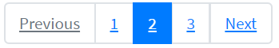

Here is an example with provided Bootstrap v4.3 code:

```java 
// @FindBy(css = "#pagination-states") public static PaginationStates paginationStates;
@UI("#pagination-states") public static PaginationStates paginationStates;

public class PaginationStates extends Section {
    @UI("li") public Pagination paginationItems; // @FindBy(css = "li") public Pagination paginationItems;
}

@Test
public void isValidationTests() {
    paginationStates.paginationItems.is()
            .size(5);
    paginationStates.is()
            .core()
            .hasClass("pagination");
    paginationStates.paginationItems.get(1).is()
            .core()
            .hasClass("disabled");
    paginationStates.paginationItems.get(3).is()
            .core()
            .hasClass("active");
}

@Test(dataProvider = "listPageTitles")
public void linkClickableTests(int index, String pageTitle) {
    paginationStates.paginationItems.get(index).hover();
    paginationStates.paginationItems.get(index).highlight();
    paginationStates.paginationItems.get(index).click();
    newWindowTitleCheck(pageTitle);
    paginationStates.paginationItems.get(index).unhighlight();
}
```

```html
<nav aria-label="disabled-and-active-states">
    <ul class="pagination" id="pagination-states">
        <li class="page-item disabled">
            <a class="page-link" href="https://github.com/jdi-docs" target="_blank"
               tabindex="-1" aria-disabled="true">Previous</a>
        </li>
        <li class="page-item"><a class="page-link" href="https://github.com/jdi-testing"
                                 target="_blank">1</a></li>
        <li class="page-item active" aria-current="page">
            <a class="page-link" href="https://jdi-testing.github.io/jdi-light/index.html"
               target="_blank">2 <span class="sr-only">(current)</span></a>
        </li>
        <li class="page-item"><a class="page-link" href="https://getbootstrap.com"
                                 target="_blank">3</a></li>
        <li class="page-item">
            <a class="page-link" href="https://jdi-docs.github.io/jdi-light/"
               target="_blank">Next</a>
        </li>
    </ul>
</nav>
```


|Method | Description | Return Type
--- | --- | ---
**assertThat()** | Assert action | TextAssert
**click()** | Click the element | void
**get()** | Select button by index | UIElement
**getText()** | Get button text | String
**highlight()** | Highlight element | void
**hover()** | Hover on the element | void
**is()** | Assert action | TextAssert 
**unhighlight()** | Unhighlight element | void

<br>

[Java test examples](https://github.com/jdi-testing/jdi-light/blob/bootstrap/jdi-light-bootstrap-tests/src/test/java/io/github/epam/bootstrap/tests/composite/section/pagination/StatesTests.java)
<br>

Button group is represented by Section class in Java:
 
  [Section](https://jdi-docs.github.io/jdi-light/#section)  

<br>

#### Sizing

***[Pagination sizing](https://getbootstrap.com/docs/4.3/components/pagination/#sizing)***

Pagination is located in the following classes:
 
  - __Java__: _com.epam.jdi.light.ui.bootstrap.elements.complex.Pagination_
  


Here is an example with provided Bootstrap v4.3 code:

```java 
// @FindBy(css = "#pagination-big") public static PaginationSizeBig paginationSizeBig;
// @FindBy(css = "#pagination-small") public static PaginationSizeSmall paginationSizeSmall;
@UI("#pagination-big") public static PaginationSizeBig paginationSizeBig;
@UI("#pagination-small") public static PaginationSizeSmall paginationSizeSmall;

public class PaginationSizeBig extends Section {
    @UI("li") public Pagination paginationItems; // @FindBy(css = "li") public Pagination paginationItems;
    @UI(".page-link") public Pagination paginationItemsText; // @FindBy(css = ".page-link") public Pagination paginationItemsText;
}

public class PaginationSizeSmall extends Section {
    @UI("li") public Pagination paginationItems; // @FindBy(css = "li") public Pagination paginationItems;
    @UI(".page-link") public Pagination paginationItemsText; // @FindBy(css = ".page-link") public Pagination paginationItemsText;
}

@Test
public void isValidationTests() {
    paginationSizeBig.paginationItems.is()
            .size(3);
    paginationSizeBig.is()
            .core()
            .hasClass("pagination pagination-lg");
    paginationSizeSmall.paginationItems.is()
            .size(3);
    paginationSizeSmall.is()
            .core()
            .hasClass("pagination pagination-sm");
}

@Test(dataProvider = "listData")
public void linkTextTests(int index, String linkText) {
    paginationSizeBig.paginationItemsText.get(index).is()
            .core()
            .css("font-size", is("20px"));
    paginationSizeSmall.paginationItemsText.get(index).is()
            .core()
            .css("font-size", is("14px"));
}
```

```html
<nav aria-label="sizing-big">
    <ul class="pagination pagination-lg" id="pagination-big">
        <li class="page-item active" aria-current="page">
            <span class="page-link">1<span class="sr-only">(current)</span></span>
        </li>
        <li class="page-item"><a class="page-link"
                                 href="https://jdi-testing.github.io/jdi-light/index.html"
                                 target="_blank">2</a></li>
        <li class="page-item"><a class="page-link" href="https://getbootstrap.com"
                                 target="_blank">3</a></li>
    </ul>
</nav>

<nav aria-label="sizing-small">
    <ul class="pagination pagination-sm" id="pagination-small">
        <li class="page-item active" aria-current="page">
            <span class="page-link">1<span class="sr-only">(current)</span></span>
        </li>
        <li class="page-item"><a class="page-link"
                                 href="https://jdi-testing.github.io/jdi-light/index.html"
                                 target="_blank">2</a></li>
        <li class="page-item"><a class="page-link" href="https://getbootstrap.com"
                                 target="_blank">3</a></li>
    </ul>
</nav>
```


|Method | Description | Return Type
--- | --- | ---
**assertThat()** | Assert action | TextAssert
**click()** | Click the element | void
**get()** | Select button by index | UIElement
**getText()** | Get button text | String
**highlight()** | Highlight element | void
**hover()** | Hover on the element | void
**is()** | Assert action | TextAssert 
**unhighlight()** | Unhighlight element | void

<br>

[Java test examples](https://github.com/jdi-testing/jdi-light/blob/bootstrap/jdi-light-bootstrap-tests/src/test/java/io/github/epam/bootstrap/tests/composite/section/pagination/SizingTests.java)
<br>

Button group is represented by Section class in Java:
 
  [Section](https://jdi-docs.github.io/jdi-light/#section)  

<br>

#### Alignment

***[Pagination alignment](https://getbootstrap.com/docs/4.3/components/pagination/#alignment)***

Pagination is located in the following classes:
 
  - __Java__: _com.epam.jdi.light.ui.bootstrap.elements.complex.Pagination_
  

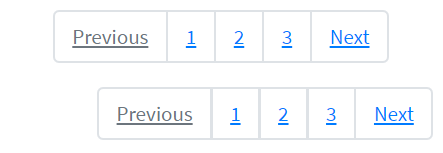

Here is an example with provided Bootstrap v4.3 code:

```java 
// @FindBy(css = "#pagination-center") public static PaginationAlignCenter paginationAlignCenter;
// @FindBy(css = "#pagination-end") public static PaginationAlignEnd paginationAlignEnd; 
@UI("#pagination-center") public static PaginationAlignCenter paginationAlignCenter;
@UI("#pagination-end") public static PaginationAlignEnd paginationAlignEnd;

public class PaginationAlignCenter extends Section {
    @UI("li") public Pagination paginationItems; // @FindBy(css = "li") public Pagination paginationItems;
}

public class PaginationAlignEnd extends Section {
    @UI("li") public Pagination paginationItems; // @FindBy(css = "li") public Pagination paginationItems;
}

@Test
public void isValidationTests() {
    paginationAlignCenter.paginationItems.is()
            .size(5);
    paginationAlignCenter.is()
            .core()
            .hasClass("pagination justify-content-center");
    paginationAlignCenter.paginationItems.get(1).is()
            .core()
            .hasClass("disabled");
    paginationAlignEnd.paginationItems.is()
            .size(5);
    paginationAlignEnd.is()
            .core()
            .hasClass("pagination justify-content-end");
    paginationAlignEnd.paginationItems.get(1).is()
            .core()
            .hasClass("disabled");
}

@Test(dataProvider = "listPageTitles")
public void linkClickableCenterTests(int index, String pageTitle) {
    paginationAlignCenter.paginationItems.get(index).hover();
    paginationAlignCenter.paginationItems.get(index).highlight();
    paginationAlignCenter.paginationItems.get(index).click();
    newWindowTitleCheck(pageTitle);
    paginationAlignCenter.paginationItems.get(index).unhighlight();
}
```

```html
<nav aria-label="Page navigation example">
    <ul class="pagination justify-content-center" id="pagination-center">
        <li class="page-item disabled">
            <a class="page-link" href="https://github.com/jdi-docs" target="_blank"
               tabindex="-1" aria-disabled="true">Previous</a>
        </li>
        <li class="page-item"><a class="page-link" href="https://github.com/jdi-testing"
                                 target="_blank">1</a></li>
        <li class="page-item"><a class="page-link"
                                 href="https://jdi-testing.github.io/jdi-light/index.html"
                                 target="_blank">2</a></li>
        <li class="page-item"><a class="page-link" href="https://getbootstrap.com"
                                 target="_blank">3</a></li>
        <li class="page-item">
            <a class="page-link" href="https://jdi-docs.github.io/jdi-light/"
               target="_blank">Next</a>
        </li>
    </ul>
</nav>
<nav aria-label="Page navigation example">
    <ul class="pagination justify-content-end" id="pagination-end">
        <li class="page-item disabled">
            <a class="page-link" href="https://github.com/jdi-docs" target="_blank"
               tabindex="-1" aria-disabled="true">Previous</a>
        </li>
        <li class="page-item"><a class="page-link" href="https://github.com/jdi-testing"
                                 target="_blank">1</a></li>
        <li class="page-item"><a class="page-link"
                                 href="https://jdi-testing.github.io/jdi-light/index.html"
                                 target="_blank">2</a></li>
        <li class="page-item"><a class="page-link" href="https://getbootstrap.com"
                                 target="_blank">3</a></li>
        <li class="page-item">
            <a class="page-link" href="https://jdi-docs.github.io/jdi-light/"
               target="_blank">Next</a>
        </li>
    </ul>
</nav>
```


|Method | Description | Return Type
--- | --- | ---
**assertThat()** | Assert action | TextAssert
**click()** | Click the element | void
**get()** | Select button by index | UIElement
**getText()** | Get button text | String
**highlight()** | Highlight element | void
**hover()** | Hover on the element | void
**is()** | Assert action | TextAssert 
**unhighlight()** | Unhighlight element | void

<br>

[Java test examples](https://github.com/jdi-testing/jdi-light/blob/bootstrap/jdi-light-bootstrap-tests/src/test/java/io/github/epam/bootstrap/tests/composite/section/pagination/AlignTests.java)
<br>

Button group is represented by Section class in Java:
 
  [Section](https://jdi-docs.github.io/jdi-light/#section)  

<br>


### Input group
#### Basic Example
**<a style="font-weight:bold" href="https://getbootstrap.com/docs/4.3/components/input-group/#basic-example" target="_blank">Input group</a>** – Place one add-on or button on either side of an input. You may also place one on both sides of an input.
<br />

```java 

    //@FindBy(css = "#input-group-basic-example1")
   @UI("#input-group-basic-example1") public static InputGroupInputWithText inputGroupBasicExample1;

   public class InputGroupInputWithText extends Section{
       @UI(".input-group-text") public Text text;
       @UI(".form-control") public TextField input;
   }

   @Test(priority = 1)
   public void setTextTestExample1() {
        inputGroupBasicExample1.input.setText(textExample1);
        inputGroupBasicExample1.input.is().text(is(textExample1));
   }

```
**1.Input group example - Input + left span**


Here is an example with provided Bootstrap v4.3 code:


```html
<div class="input-group mb-3" id="input-group-basic-example1">
    <div class="input-group-prepend">
        <span class="input-group-text" id="basic-addon">@</span>
    </div>
    <input type="text" class="form-control" placeholder="Username" aria-label="Username"
           aria-describedby="basic-addon1">
</div>
```

```java 

    //@FindBy(css = "#input-group-basic-example2")
   @UI("#input-group-basic-example2") public static InputGroupInputWithText inputGroupBasicExample2;

   public class InputGroupInputWithText extends Section{
       @UI(".input-group-text") public Text text;
       @UI(".form-control") public TextField input;
   }

    @Test(priority = 4)
    public void checkAddonConsistTextTestExample2() {
       inputGroupBasicExample2.text.is().text(containsString(partOfAddonExample2));
    }

```
<br /><br /><br /><br /><br /><br />
**2.Input group example - Input + right span** 


Here is an example with provided Bootstrap v4.3 code:


```html
<div class="input-group mb-3" id="input-group-basic-example2">
    <input type="text" class="form-control" placeholder="Recipient's username"
           aria-label="Recipient's username" aria-describedby="basic-addon2">
    <div class="input-group-append">
        <span class="input-group-text" id="basic-addon2">@example.com</span>
    </div>
</div>
``` 

```java 

    //@FindBy(css = "#input-group-basic-example3")
   @UI("#input-group-basic-example3") public static InputGroupInputWithLabelAndText inputGroupBasicExample3;

   public class InputGroupInputWithLabelAndText extends Section{
       @UI(".input-group-text") public Text text;
       @UI("#basic-url") public TextField input;
   }

   @Test(priority = 6)
   public void checkLabelExample3() {
       assertEquals(inputGroupBasicExample3.input.core().label().getText(), labelExample3);
   }

```
<br /><br /><br /><br />
**3.Input group example - Input + label + left span**


Here is an example with provided Bootstrap v4.3 code:

```html
<div class="input-group mb-3" id="input-group-basic-example3">
    <div class="input-group-prepend">
        <span class="input-group-text" id="basic-addon3">https://example.com/users/</span>
    </div>
    <input type="text" class="form-control" id="basic-url" aria-describedby="basic-addon3">
</div>
```


```java 

   //@FindBy(css = "#input-group-basic-example4")
  @UI("#input-group-basic-example4") public static InputGroupInputWithTwoText inputGroupBasicExample4;

  public class InputGroupInputWithTwoText extends Section{
      @UI(".input-group-prepend .input-group-text") public Text text_pretend;
      @UI(".input-group-append .input-group-text") public Text text_append;
      @UI(".form-control") public TextField input;
  }

  @Test(priority = 7)
  public void checkAddonsExample4() {
      inputGroupBasicExample4.text_append.is().enabled();
      inputGroupBasicExample4.text_append.is().text(is(addonAppendExample4));
      inputGroupBasicExample4.text_pretend.is().enabled();
      inputGroupBasicExample4.text_pretend.is().text(is(addonPretendExample4));
  }

``` 
<br /><br />
**4.Input group example - Input + left and right span**


Here is an example with provided Bootstrap v4.3 code:

```html
<div class="input-group mb-3" id="input-group-basic-example4">
    <div class="input-group-prepend">
        <span class="input-group-text">$</span>
    </div>
    <input type="text" class="form-control" aria-label="Amount (to the nearest dollar)">
    <div class="input-group-append">
        <span class="input-group-text">.00</span>
    </div>
</div>
```

```java 

   //@FindBy(css = "#input-group-basic-example5")
  @UI("#input-group-basic-example5") public static InputGroupTextareaWithText inputGroupBasicExample5;

  public class InputGroupTextareaWithText extends Section{
      @UI(".input-group-text") public Text text;
      @UI(".form-control") public TextArea area;
  }

  @Test(priority = 9)
  public void getLinesTestExample5() {
      inputGroupBasicExample5.area.setLines(linesTextArea);
      assertEquals(inputGroupBasicExample5.area.getLines(), asList(linesTextArea));
  }

```

<br /><br /><br /><br/><br />
**5.Input group example - Input + textarea**


Here is an example with provided Bootstrap v4.3 code:

```html
<div class="input-group" id="input-group-basic-example5">
    <div class="input-group-prepend">
        <span class="input-group-text">With textarea</span>
    </div>
    <textarea class="form-control" aria-label="With textarea"></textarea>
</div>
```

Input group are represented by Section class in Java:
 
  [Section](https://jdi-docs.github.io/jdi-light/#section)  
  
Inner elements of input group can be represented by following classes:
 <ul>
  <li> [Text](https://jdi-docs.github.io/jdi-light/#text) </li>
  
  <li> [TextField](https://jdi-docs.github.io/jdi-light/#textfield) </li> 
  
  <li> [TextArea](https://jdi-docs.github.io/jdi-light/#textarea) </li>
 
  
 <li>  [See more elements](https://jdi-docs.github.io/jdi-light/#html5-common-elements) </li> 
 </ul>

[Bootstrap test example ](https://github.com/jdi-testing/jdi-light/tree/bootstrap/jdi-light-bootstrap-tests/src/test/java/io/github/epam/bootstrap/tests/composite/section/inputGroup)

#### Sizing
<a style="font-weight:bold" href="https://getbootstrap.com/docs/4.3/components/input-group/#sizing" target="_blank">Sizing</a> – Add the relative form sizing classes to the .input-group itself and contents within will automatically resize—no need for repeating the form control size classes on each element.
<br>
<br>
<br>
<br>
<br>
<br>
<br>
<br>
<br>
<br>

```java 
    @UI("#input-group-default") public static InputGroupSizing inputGroupDefaultSizing;
    @UI("#input-group-small") public static InputGroupSizing inputGroupSmallSizing;
    @UI("#input-group-large") public static InputGroupSizing inputGroupLargeSizing;
    //@FindBy(css = "#input-group-default")
    //@FindBy(css = "#input-group-small")
    //@FindBy(css = "#input-group-large")

    @Test
    public void getTextFromSizingTest() {
        assertEquals(inputGroupDefaultSizing.input.getText(), text);
        assertEquals(inputGroupSmallSizing.input.getText(), text);
        assertEquals(inputGroupLargeSizing.input.getText(), text);
    }

    @Test
    public void clearSizingTest() {
        inputGroupDefaultSizing.input.clear();
        assertEquals(inputGroupDefaultSizing.input.getText(), "");
        inputGroupSmallSizing.input.clear();
        assertEquals(inputGroupDefaultSizing.input.getText(), "");
        inputGroupLargeSizing.input.clear();
        assertEquals(inputGroupDefaultSizing.input.getText(), "");
    }
```


**Sizing on the individual input group elements isn’t supported.**


Here is an example with provided Bootstrap v4.3 code:
  
```html
<div class="input-group input-group-sm mb-3" id="input-group-small">
    <div class="input-group-prepend">
        <span class="input-group-text" id="inputGroup-sizing-sm">Small</span>
    </div>
    <input type="text" class="form-control" aria-label="Sizing example input"
           aria-describedby="inputGroup-sizing-sm">
</div>

<div class="input-group mb-3" id="input-group-default">
    <div class="input-group-prepend">
        <span class="input-group-text" id="inputGroup-sizing-default">Default</span>
    </div>
    <input type="text" class="form-control" aria-label="Sizing example input"
           aria-describedby="inputGroup-sizing-default">
</div>

<div class="input-group input-group-lg" id="input-group-large">
    <div class="input-group-prepend">
        <span class="input-group-text" id="inputGroup-sizing-lg">Large</span>
    </div>
    <input type="text" class="form-control" aria-label="Sizing example input"
           aria-describedby="inputGroup-sizing-lg">
</div>
```

And here are methods available in Java:
    
|Method / Property | Description | Return Type
--- | --- | ---
**assertThat()** | property that returns object for work with assertions| TextAssert
**clear()** | clears the text field | void
**focus()** | places cursor within the text field | void
**getText()** | returns text from the text field  | String
**getValue()** | returns text from the text field| String
**is()** | property that returns object for work with assertions| TextAssert
**setText(String value)** | adds text to the field | void


#### Wrapping
```java 
   public static UIElement inputGroupWrap,inputGroupNowrap;//@FindBy(css = "#input-group-wrap")

   @Test
   public void checkWrapping() {
       assertFalse(inputGroupWrap.hasClass("flex-nowrap"));
       inputGroupWrap.assertThat().core().css("flex-wrap", "wrap");
   }
 
   @Test
   public void checkNoWrapping() {
       assertTrue(inputGroupNowrap.hasClass("flex-nowrap"));
       inputGroupNowrap.assertThat().core().css("flex-wrap", "nowrap");
   } 
```

 
**<a style="font-weight:bold" href="https://getbootstrap.com/docs/4.3/components/input-group/#wrapping" target="_blank">Wrapping</a>** – Input groups wrap by default via flex-wrap: wrap in order to accommodate custom form field validation within an input group. You may disable this with .flex-nowrap.

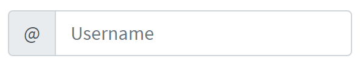

Here is an example with provided Bootstrap v4.3 code:
  
```html
<div class="input-group flex-nowrap" id="input-group-nowrap">
    <div class="input-group-prepend">
        <span class="input-group-text" id="addon-wrapping1">@</span>
    </div>
    <input type="text" class="form-control" placeholder="Input group with nowrap"
           aria-label="Username" aria-describedby="addon-wrapping">
</div>
```

Wrapping property can be checked by using following class:
 
  - _com.epam.jdi.light.elements.common.UIElement_
  
<a  href="https://github.com/jdi-testing/jdi-light/blob/bootstrap/jdi-light-bootstrap-tests/src/test/java/io/github/epam/bootstrap/tests/composite/section/inputGroup/InputGroupWrapping.java" target="_blank">Bootstrap test example wrapping</a>


#### Checkboxes and radios

<a style="font-weight:bold" href="https://getbootstrap.com/docs/4.3/components/input-group/#checkboxes-and-radios" target="_blank">Checkboxes and radios</a> – Place any checkbox or radio option within an input group’s addon instead of text.

__Example with radio__

```java 
  @UI("#input-group-radio") public static InputGroupInputWithRadio inputGroupRadio;// @FindBy(css = "#input-group-radio")

  public class InputGroupInputWithRadio extends Section{
      @Css("[type=\"radio\"]") public RadioButtons radio;
      @Css(".form-control") public TextField input;
  }
  
  @Test
  public void getSizeRadioButtons() {
      inputGroupRadio.radio.is().size(1);
  }

   @Test
   public void inputTest() {
       inputGroupRadio.input.input(new_text);
       inputGroupRadio.input.assertThat().text(is(new_text));
   }

 
```

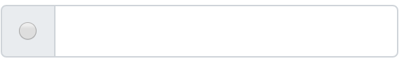

Here is an example with provided Bootstrap v4.3 code:
  
```html
<div class="input-group" id="input-group-radio">
    <div class="input-group-prepend">
        <div class="input-group-text">
            <input type="radio" name="radio-button" id="radio-button"
                   aria-label="Radio button for following text input">
        </div>
    </div>
    <input type="text" class="form-control" aria-label="Text input with radio button">
</div>
```

This input group example is represented by the following classes in Java:
 
+ [Section](https://jdi-docs.github.io/jdi-light/#section)    
+ [RadioButtons](https://jdi-docs.github.io/jdi-light/#radiobuttons)   
   
  <a  href="https://github.com/jdi-testing/jdi-light/blob/bootstrap/jdi-light-bootstrap-tests/src/test/java/io/github/epam/bootstrap/tests/composite/section/inputGroup/InputGroupRadioTests.java" target="_blank">Bootstrap test example with radio</a>

<br />

```java 
 @UI("#input-group-checkbox") public static InputGroupInputWithCheckBox inputGroupCheckBox;// @FindBy(css = "#input-group-checkbox")

 public class InputGroupInputWithCheckBox extends Section{
     @Css("[type=\"checkbox\"]") public Checkbox checkbox;
     @Css(".form-control") public TextField input;
 }
  
 @Test
 public void checkCheckboxTest() {
     inputGroupCheckBox.checkbox.check();
     inputGroupCheckBox.checkbox.isSelected();
 }

   @Test
   public void inputTest() {
       inputGroupRadio.input.input(new_text);
       inputGroupRadio.input.assertThat().text(is(new_text));
   }

 
```
__Example with checkbox__

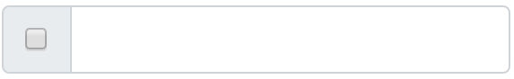

Here is an example with provided Bootstrap v4.3 code:
  
```html
<div class="input-group mb-3" id="input-group-checkbox">
    <div class="input-group-prepend">
        <div class="input-group-text">
            <input type="checkbox" aria-label="Checkbox for following text input">
        </div>
    </div>
    <input type="text" class="form-control" aria-label="Text input with checkbox">
</div>
```

This input group example is represented by the following classes in Java:
 
+ [Section](https://jdi-docs.github.io/jdi-light/#section)   
+ [CheckBox](https://jdi-docs.github.io/jdi-light/#checkbox)

  <a href="https://github.com/jdi-testing/jdi-light/blob/bootstrap/jdi-light-bootstrap-tests/src/test/java/io/github/epam/bootstrap/tests/composite/section/inputGroup/InputGroupCheckboxesTests.java" target="_blank">Bootstrap test example with checkbox</a>

<br /><br /><br /><br /><br />
 
#### Multiple inputs 
<a style="font-weight:bold" href="https://getbootstrap.com/docs/4.3/components/input-group/" target="_blank">Multiple inputs</a> – While multiple inputs are supported visually, validation styles are only available for input groups with a single input.


```java 
//FindBy(css = "#multiple-inputs"")
@UI("#multiple-inputs") public static MultipleInputs multipleInputs;

@Test
public void getTextTest() {
     int index = 1;

     String name = multipleInputs.getText(index);
     assertEquals(name, inputData.get(index));

     String surname = multipleInputs.getText("#mi-i-2");
     assertEquals(surname, inputData.get(2));

     String text = multipleInputs.getText();
     assertEquals(text, inputData.get(1));
}

@Test
public void getTextAllTest() {
    assertEquals(multipleInputs.getAllTexts(), inputDataList);
}

@Test
public void setValueTest() {
    multipleInputs.clearAll();

    String value = inputData.get(1);
    multipleInputs.setValue(value);
    multipleInputs.is().text(value, 1);

    int index = 2;
    String name = inputData.get(index);
    multipleInputs.setValue(name, index);
    multipleInputs.is().text(name, index);

    String locator = "#mi-i-2";
    String surname = inputData.get(2);
    multipleInputs.clear(locator);
    multipleInputs.setValue(surname, locator);
    multipleInputs.is().text(surname, locator);
}

@Test
public void setAllValuesTest() {
    multipleInputs.clearAll();
    multipleInputs.setAllValues(inputDataList);
    multipleInputs.is().texts(inputDataList);
}
```

Here is an example with provided Bootstrap v4.3 code:
  
```html
<div class="input-group" id="multiple-inputs">
    <div class="input-group-prepend">
        <span class="input-group-text">First and last name</span>
    </div>
    <input type="text" aria-label="First name" class="form-control" id="mi-i-1">
    <input type="text" aria-label="Last name" class="form-control" id="mi-i-2">
</div>
```

And here are methods available in Java:
    
|Method | Description | Return Type
--- | --- | ---
 **assertThat()**| Property that returns object for work with assertions | MultipleInputsAssert
 **clear()**| Clear first input within element | void
 **clear(String locator)**| Clear input within element with *locator* | void
 **clear(int index)**| Clear input within element with *index* | void
 **clearAll()**| Clear all inputs within element | void
 **focus()**| Focus on first input within element | void
 **focus(String locator)**| Focus on input within element with *locator* | void
 **focus(int index)**| Focus on input within element with *index* | void
 **getAllText()**| Return texts for all inputs within element | List\<String>
 **getAllValue()**| Return values for all inputs within element | List\<String>
 **getText()**| Return text for first input within element | String
 **getText(String locator)**| Return text for input within element with *locator* | String
 **getText(int index)**| Return text for input within element with *index* | String
 **getValue()**| Return value for first input within element | String
 **getValue(String locator)**| Return value for input within element with *locator* | String
 **getValue(int index)**| Return value for input within element with *index* | String
 **input(String value)**| Set text for first input within element | void
 **input(String value, String locator)**| Set text for input within element with *locator* | void
 **input(String value, int index)**| Set text for input within element with *index* | void
 **inputAll()**| Set texts for all inputs within element | void
 **is()**| Property that returns object for work with assertions | MultipleInputsAssert
 **placeholder()**| Return placeholder from first input within element | String
 **placeholder(String locator)**| Return placeholder from input within element with *locator* | String
 **placeholder(int index)**| Return placeholder from input within element with *index* | String
 **placeholderAll()**| Return placeholders for all inputs within element | List\<String>
 **sendKeys(String value)**| Send text to first input within element | void
 **sendKeys(String value, String locator)**| Send text to input within element with *locator* | void
 **sendKeys(String value, int index)**| Send text to input within element with *index* | void
 **sendKeysAll(List\<String> values)**| Send texts to all inputs within element | void
 **setAllValue(List\<String> values)**| Set values for all inputs within element | void 
 **setValue(String value)**| Set value for first input within element | void
 **setValue(String value, String locator)**| Set value for input within element with *locator* | void
 **setValue(String value, int index)**| Set value for input within element with *index* | void
 
 <a href="https://github.com/jdi-testing/jdi-light/blob/bootstrap/jdi-light-bootstrap-tests/src/test/java/io/github/epam/bootstrap/tests/complex/MultipleInputsTests.java" target="_blank">Bootstrap test example with multiple inputs</a>
 
 
#### Multiple addons 
<a style="font-weight:bold" href="https://getbootstrap.com/docs/4.3/components/input-group/#multiple-addons" target="_blank">Multiple addons</a> are supported and can be mixed with checkbox and radio input versions.


```java 
 @UI("#multiple-addons-1")  public static InputGroupMultipleAddonsUpper multipleAddonUpper; //@FindBy(css = "#multiple-addons-1")
 @UI("#multiple-addons-2")  public static InputGroupMultipleAddonsLower multipleAddonLower; //@FindBy(css = "#multiple-addons-2")
 
 public class InputGroupMultipleAddonsUpper extends Section {
     @UI("#left-sign") public Label firstLabel; //@FindBy(css = "#left-sign")
     @UI("#left-nil") public Label secondLabel; //@FindBy(css = "#left-nil")
     @UI(".form-control") public TextField textField; //@FindBy(css = ".form-control")
 }

 @Test(dataProvider = "InputGroupMultipleAddonsLabels")
 public void assertTextFromValueTest(Label multipleAddonsLabel, String labelValue) {
    multipleAddonsLabel.is().text(labelValue);
 }
 
 @Test(dataProvider = "InputGroupMultipleAddonsLabels")
 public void isValidationTest(Label multipleAddonsLabel, String labelValue) {
     multipleAddonsLabel.is()
        .displayed()
        .core()
        .hasClass("input-group-text")
        .text(labelValue);
 }
 
 @Test(dataProvider = "InputGroupMultipleAddonsTextFields")
 public void inputTest(TextField textField) {
     textField.input(text);
     textField.assertThat().text(is(text));
 }
 
 @Test(dataProvider = "InputGroupMultipleAddonsTextFields")
 public void textFieldTests(TextField textField) {
     textField.setText(text);
     textField.is().text(text);
     textField.is().text(containsString(partOfText));
     textField.clear();
     textField.is().text(emptyText);
 }
```
Here is an example with provided Bootstrap v4.3 code:
  
```html
<div class="input-group mb-3" id="multiple-addons-1">
    <div class="input-group-prepend">
        <span class="input-group-text" id="left-sign">$</span>
        <span class="input-group-text" id="left-nil">0.00</span>
    </div>
    <input type="text" class="form-control"
           aria-label="Dollar amount (with dot and two decimal places)">
</div>

<div class="input-group mb-3" id="multiple-addons-2">
    <input type="text" class="form-control"
           aria-label="Dollar amount (with dot and two decimal places)">
    <div class="input-group-append">
        <span class="input-group-text" id="right-sign">$</span>
        <span class="input-group-text" id="right-nil">0.00</span>
    </div>
</div>
```


Multiple input is represented by Section class in Java:
 
  [Section](https://jdi-docs.github.io/jdi-light/#section)
  
Inner elements of multiple input can be represented by the following classes:

 + [TextField](https://jdi-docs.github.io/jdi-light/#textfield)
 + [Label](https://jdi-docs.github.io/jdi-light/#label)

<a href="https://github.com/jdi-testing/jdi-light/blob/bootstrap/jdi-light-bootstrap-tests/src/test/java/io/github/epam/bootstrap/tests/composite/section/inputGroup/InputGroupMultipleAddonsTests.java" target="_blank">Bootstrap test example with multiple addons</a>
 
 
 
 
 
 
 
 
 
 
 
 
 <br /><br /><br /><br /><br /><br /><br /><br /><br /><br /><br /> <br /> 
#### Button addons 

**[Button addons](https://getbootstrap.com/docs/4.3/components/input-group/#button-addons)** – Multiple buttons have no detailed information on Bootstrap website


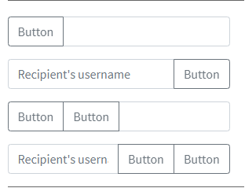

Here is an example with provided Bootstrap v4.3 code:


```java 
//@FindBy(css = "#input-group-button-addon4") public static ButtonAddons inputGroupButtonAddons4;
@UI("#input-group-button-addon1") public static ButtonAddons inputGroupButtonAddons1;
@UI("#input-group-button-addon2") public static ButtonAddons inputGroupButtonAddons2;
@UI("#input-group-button-addon3") public static ButtonAddons inputGroupButtonAddons3;
@UI("#input-group-button-addon4") public static ButtonAddons inputGroupButtonAddons4;

public class ButtonAddons extends Section {
    @UI("button") public Button button;
    @UI("input") public TextField input;
    @UI("button") public ListGroup listButtons;
    @UI("input") public TextField inputField;
}

@Test
public void checkButtonAddon2Test() {
    inputGroupButtonAddons2.input.input(text);
    inputGroupButtonAddons2.button.click();
    inputGroupButtonAddons2.input.input(placeholder_text);
    inputGroupButtonAddons2.input.assertThat().text(placeholder_text);
}

@Test
public void checkButtonAddon4Test() {
    inputGroupButtonAddons4.inputField.input(text);
    inputGroupButtonAddons4.listButtons.get(1).click();
    inputGroupButtonAddons4.inputField.input(placeholder_text);
    inputGroupButtonAddons4.listButtons.get(2).click();
    inputGroupButtonAddons4.inputField.assertThat().text(placeholder_text);
}
```

  
```html
<div class="input-group mb-3" id="input-group-button-addon1">
    <div class="input-group-prepend">
        <button class="btn btn-outline-secondary" type="button" id="button-addon1">Button
        </button>
    </div>
    <input type="text" class="form-control" placeholder=""
           aria-label="Example text with button addon" aria-describedby="button-addon1">
</div>

<div class="input-group mb-3" id="input-group-button-addon2">
    <input type="text" class="form-control" placeholder="Recipient's username"
           aria-label="Recipient's username" aria-describedby="button-addon2">
    <div class="input-group-append">
        <button class="btn btn-outline-secondary" type="button" id="button-addon2">Button
        </button>
    </div>
</div>

<div class="input-group mb-3" id="input-group-button-addon3">
    <div class="input-group-prepend" id="button-addon3">
        <button class="btn btn-outline-secondary" type="button">Button</button>
        <button class="btn btn-outline-secondary" type="button">Button</button>
    </div>
    <input type="text" class="form-control" placeholder=""
           aria-label="Example text with two button addons"
           aria-describedby="button-addon3">
</div>

<div class="input-group" id="input-group-button-addon4">
    <input type="text" class="form-control" placeholder="Recipient's username"
           aria-label="Recipient's username with two button addons"
           aria-describedby="button-addon4">
    <div class="input-group-append" id="button-addon4">
        <button class="btn btn-outline-secondary" type="button">Button</button>
        <button class="btn btn-outline-secondary" type="button">Button</button>
    </div>
</div>
```

And here are methods available in Java:
    
|Method | Description | Return Type
--- | --- | ---
**assertThat()** | property that returns object for work with assertions| TextAssert
**clear()** | clears the text field | void
**click()** | click on button | void
**displayed()** | check item is displayed | TextAssert
**enabled()** | check item is enabled | TextAssert
**expand()** | expand dropdown menu | void
**expanded()** | check that dropdown is expanded | TextAssert
**focus()** | places cursor within the text field | void
**getText()** | returns text from the text field  | String
**getValue()** | returns text from the text field| String
**input(String value)** | adds text to the field | void
**is()** | property that returns object for work with assertions| TextAssert
**sendKeys(String value)** | adds text to the field | void
**setText(String value)** | adds text to the field | void
  
 <br>
Input group are represented by Section class in Java:
 
  [Section](https://jdi-docs.github.io/jdi-light/#section)  
  
Inner elements of input group can be represented by following classes:
 <ul>
  <li> [Text](https://jdi-docs.github.io/jdi-light/#text) </li>
  
  <li> [TextField](https://jdi-docs.github.io/jdi-light/#textfield) </li> 
  
  <li> [TextArea](https://jdi-docs.github.io/jdi-light/#textarea) </li>
  
  <li> [Button](https://jdi-docs.github.io/jdi-light/#button-2) </li>
 
 <li>  [See more elements](https://jdi-docs.github.io/jdi-light/#html5-common-elements) </li> 
 </ul>
 <br>

<a  href="https://github.com/jdi-testing/jdi-light/blob/bootstrap/jdi-light-bootstrap-tests/src/test/java/io/github/epam/bootstrap/tests/composite/section/inputGroup/InputGroupButtonAddonsTests.java" target="_blank">Button Addons test example</a>


#### Buttons with dropdowns 

**[Buttons with dropdowns](https://getbootstrap.com/docs/4.3/components/input-group/#buttons-with-dropdowns)** – Buttons with dropdowns have no detailed information on Bootstrap website

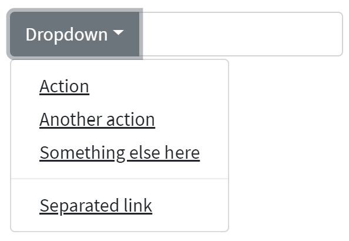

Here is an example with provided Bootstrap v4.3 code:

```java 
@UI("#button-with-dropdown") public static ButtonWithDropdown buttonWithDropdown;
// @FindBy(css = "#button-with-dropdown") public static ButtonWithDropdown buttonWithDropdown;

public class ButtonWithDropdown extends Section {
@UI("input") public TextField textInputArea;
@UI("button") public Button dropdownButton;
@JDropdown(expand = ".input-group-prepend",
        value = ".dropdown-toggle",
        list = ".dropdown-item")
public Dropdown dropdownMenu;
}

@Test
public void dropdownMenuTests() {
    buttonWithDropdown.dropdownMenu.expand();
    buttonWithDropdown.dropdownMenu.is().expanded();
    buttonWithDropdown.dropdownMenu.is().size(4);
    buttonWithDropdown.dropdownMenu.list().get(0).is().text(action);
}

@Test
public void textInputAreaTests() {
    buttonWithDropdown.textInputArea.sendKeys(testText);
    buttonWithDropdown.textInputArea.is().text(testText);
    buttonWithDropdown.textInputArea.clear();
    buttonWithDropdown.textInputArea.is().text("");
}

@Test
public void dropdownButtonTests() {
    buttonWithDropdown.dropdownButton.is().displayed();
    buttonWithDropdown.dropdownButton.is().enabled();
    buttonWithDropdown.dropdownButton.is().text(dropdownButton);
}
```
  
```html
<div class="input-group mb-3" id="button-with-dropdown">
    <div class="input-group-prepend">
        <button class="btn btn-outline-secondary dropdown-toggle" type="button"
                data-toggle="dropdown" aria-haspopup="true" aria-expanded="false">Dropdown
        </button>
        <div class="dropdown-menu">
            <a class="dropdown-item" href="#">Action</a>
            <a class="dropdown-item" href="#">Another action</a>
            <a class="dropdown-item" href="#">Something else here</a>
            <div role="separator" class="dropdown-divider"></div>
            <a class="dropdown-item" href="#">Separated link</a>
        </div>
    </div>
    <input type="text" class="form-control" aria-label="Text input with dropdown button">
</div>
```

And here are methods available in Java:
    
|Method | Description | Return Type
--- | --- | ---
**assertThat()** | property that returns object for work with assertions| TextAssert
**clear()** | clears the text field | void
**click()** | click on button | void
**displayed()** | check item is displayed | TextAssert
**enabled()** | check item is enabled | TextAssert
**expand()** | expand dropdown menu | void
**expanded()** | check that dropdown is expanded | TextAssert
**focus()** | places cursor within the text field | void
**getText()** | returns text from the text field  | String
**getValue()** | returns text from the text field| String
**is()** | property that returns object for work with assertions| TextAssert
**sendKeys(String value)** | adds text to the field | void
**setText(String value)** | adds text to the field | void
 
 <br>
Input group are represented by Section class in Java:
 
  [Section](https://jdi-docs.github.io/jdi-light/#section)  
  
Inner elements of input group can be represented by following classes:
 <ul>
  <li> [Text](https://jdi-docs.github.io/jdi-light/#text) </li>
  
  <li> [TextField](https://jdi-docs.github.io/jdi-light/#textfield) </li> 
  
  <li> [TextArea](https://jdi-docs.github.io/jdi-light/#textarea) </li>
  
  <li> [Dropdown](https://jdi-docs.github.io/jdi-light/#dropdown-2) </li>
 
 <li>  [See more elements](https://jdi-docs.github.io/jdi-light/#html5-common-elements) </li> 
 </ul>
 <br>

   
[Buttons with dropdowns test examples](https://github.com/jdi-testing/jdi-light/blob/bootstrap/jdi-light-bootstrap-tests/src/test/java/io/github/epam/bootstrap/tests/composite/section/inputGroup/InputGroupButtonWithDropdownTests.java) <br>
<br>
 
#### Segmented buttons
**[Segmented buttons](https://getbootstrap.com/docs/4.3/components/input-group/#segmented-buttons)** – Segmented buttons have no detailed information on Bootstrap website

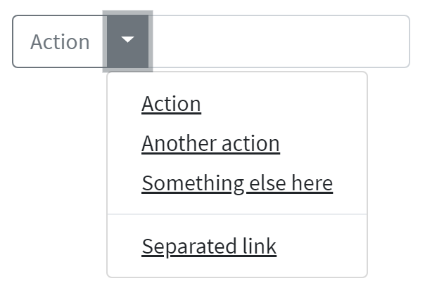

Here is an example with provided Bootstrap v4.3 code:

```java 
@UI("#segmented-button") public static SegmentedButton segmentedButton;
// @FindBy(css = "#segmented-button") public static SegmentedButton segmentedButton;

public class SegmentedButton extends Section {
    @UI("#Segmented-action-button") public Button actionButton;
    @UI("input") public TextField textInputArea;
    @JDropdown(expand = ".dropdown-toggle",
            value = ".sr-only",
            list = ".dropdown-item")
    public Dropdown dropdownMenu;
}

@Test
public void textInputAreaTests() {
    segmentedButton.textInputArea.is()
            .displayed()
            .enabled();
    segmentedButton.textInputArea.sendKeys(testText);
    segmentedButton.textInputArea.is().text(testText);
    segmentedButton.textInputArea.clear();
    segmentedButton.textInputArea.is().text("");
}

@Test
public void dropdownMenuTests() {
    segmentedButton.dropdownMenu.expand();
    segmentedButton.dropdownMenu.is().expanded();
    segmentedButton.dropdownMenu.is().size(4);
    segmentedButton.dropdownMenu.list().get(0).is().text(action);
    segmentedButton.dropdownMenu.select(action);
    newWindowTitleCheck();
}

@Test
public void actionButtonTests() {
    segmentedButton.actionButton.is().displayed();
    segmentedButton.actionButton.is().enabled();
    segmentedButton.actionButton.is().text(action);
    segmentedButton.actionButton.click();
    validateAlert(is(actionButtonClickAlert));
}
```
  
```html
<div class="input-group mb-3" id="segmented-button">
    <div class="input-group-prepend">
        <button type="button" class="btn btn-outline-secondary" id="Segmented-action-button"
                onclick="alert('Action Button Alert');">Action
        </button>
        <button type="button"
                class="btn btn-outline-secondary dropdown-toggle dropdown-toggle-split"
                data-toggle="dropdown" aria-haspopup="true" aria-expanded="false">
            <span class="sr-only">Toggle Dropdown</span>
        </button>
        <div class="dropdown-menu">
            <a class="dropdown-item"
               href="https://jdi-testing.github.io/jdi-light/index.html"
               target="_blank">Action</a>
            <a class="dropdown-item"
               href="https://jdi-testing.github.io/jdi-light/index.html" target="_blank">Another
                action</a>
            <a class="dropdown-item"
               href="https://jdi-testing.github.io/jdi-light/index.html" target="_blank">Something
                else here</a>
            <div role="separator" class="dropdown-divider"></div>
            <a class="dropdown-item"
               href="https://jdi-testing.github.io/jdi-light/index.html" target="_blank">Separated
                link</a>
        </div>
    </div>
    <input type="text" class="form-control"
           aria-label="Text input with segmented dropdown button">
</div>
```

And here are methods available in Java:
    
|Method | Description | Return Type
--- | --- | ---
**assertThat()** | property that returns object for work with assertions| TextAssert
**clear()** | clears the text field | void
**click()** | click on button | void
**displayed()** | check item is displayed | TextAssert
**enabled()** | check item is enabled | TextAssert
**expand()** | expand dropdown menu | void
**expanded()** | check that dropdown is expanded | TextAssert
**focus()** | places cursor within the text field | void
**getText()** | returns text from the text field  | String
**getValue()** | returns text from the text field| String
**is()** | property that returns object for work with assertions| TextAssert
**sendKeys(String value)** | adds text to the field | void
**setText(String value)** | adds text to the field | void

 <br>
Input group are represented by Section class in Java:
 
  [Section](https://jdi-docs.github.io/jdi-light/#section)  
  
Inner elements of input group can be represented by following classes:
 <ul>
  <li> [Text](https://jdi-docs.github.io/jdi-light/#text) </li>
  
  <li> [TextField](https://jdi-docs.github.io/jdi-light/#textfield) </li> 
  
  <li> [TextArea](https://jdi-docs.github.io/jdi-light/#textarea) </li>
  
  <li> [Dropdown](https://jdi-docs.github.io/jdi-light/#dropdown-2) </li>
 
 <li>  [See more elements](https://jdi-docs.github.io/jdi-light/#html5-common-elements) </li> 
 </ul>
 <br>
 
  
[Segmented buttons test examples](https://github.com/jdi-testing/jdi-light/blob/bootstrap/jdi-light-bootstrap-tests/src/test/java/io/github/epam/bootstrap/tests/composite/section/inputGroup/InputGroupSegmentedButtonTests.java) <br>

 
#### Custom select 
**[Custom select](https://getbootstrap.com/docs/4.3/components/input-group/#custom-select)** – Input groups include support for custom selects and text field. Browser default versions of these are not supported.

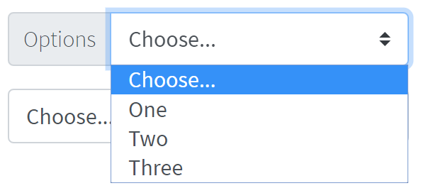

Here is an example with provided Bootstrap v4.3 code:

```java 
@UI("#custom-select-01") public static CustomSelect customSelect;
// @FindBy(css = "#custom-select-01") public static CustomSelect customSelect;

public class CustomSelect extends Section {
    @UI(".input-group-prepend") public Text optionText;
    @UI("#inputGroupSelect01") public Selector selector;
}

@Test
   public void isValidationOptionsSectionTests() {
       customSelect.optionText.is().text(optionText);
}

@Test
public void selectorByIndexTests() {
    customSelect.selector.is().selected(selectChoose);
    customSelect.selector.select(2);
    customSelect.selector.is().selected(selectOne);
    customSelect.selector.select(1);
    customSelect.selector.is().selected(selectChoose);
}

@Test(priority = 1)
public void selectorByValueTests() {
    customSelect.selector.select(selectOne);
    customSelect.selector.is().selected(selectOne);
    customSelect.selector.select(selectTwo);
    customSelect.selector.is().selected(selectTwo);
}

@Test
public void selectorIsValidationTests() {
    customSelect.selector.is().displayed()
            .enabled();
    customSelect.selector.is().size(4);
}
```
  
```html
<div class="input-group mb-3" id="custom-select-01">
    <div class="input-group-prepend">
        <label class="input-group-text" for="inputGroupSelect01">Options</label>
    </div>
    <select class="custom-select" id="inputGroupSelect01">
        <option selected>Choose...</option>
        <option value="1">One</option>
        <option value="2">Two</option>
        <option value="3">Three</option>
    </select>
</div>

<div class="input-group mb-3" id="custom-select-02">
    <select class="custom-select" id="inputGroupSelect02">
        <option selected>Choose...</option>
        <option value="1">One</option>
        <option value="2">Two</option>
        <option value="3">Three</option>
    </select>
    <div class="input-group-append">
        <label class="input-group-text" for="inputGroupSelect02">Options</label>
    </div>
</div>
```

<br><br><br><br><br><br><br><br><br><br>
**[Custom select with button](https://getbootstrap.com/docs/4.3/components/input-group/#custom-select)** – Input groups include support for custom selects and button. Browser default versions of these are not supported.


Here is an example with provided Bootstrap v4.3 code:

```java 
@UI("#custom-select-button-01") public static CustomSelectWithButton customSelectWithButton;
// @FindBy(css = "#custom-select-button-01") public static CustomSelect customSelect;

public class CustomSelectWithButton extends Section {
    @UI("#inputGroupSelect03") public Selector selector;
    @UI("button") public Button button;
}

@Test
public void buttonTests() {
    customSelectWithButton.button.is().displayed();
    customSelectWithButton.button.is().enabled();
    customSelectWithButton.button.is().text(buttonText);
    customSelectWithButton.button.hover();
    customSelectWithButton.button.click();
    validateAlert(is(buttonClickAlert));
}

@Test
public void selectorByIndexTests() {
    customSelectWithButton.selector.is().selected(selectChoose);
    customSelectWithButton.selector.select(2);
    customSelectWithButton.selector.is().selected(selectOne);
    customSelectWithButton.selector.select(3);
    customSelectWithButton.selector.is().selected(selectTwo);
}

@Test(priority = 1)
public void selectorByValueTests() {
    customSelectWithButton.selector.select(selectTwo);
    customSelectWithButton.selector.is().selected(selectTwo);
    customSelectWithButton.selector.select(selectThree);
    customSelectWithButton.selector.is().selected(selectThree);
}

@Test
public void selectorIsValidationTests() {
    customSelectWithButton.selector.is().displayed()
            .enabled();
    customSelectWithButton.selector.is().size(4);
}
```
  
```html
<div class="input-group mb-3" id="custom-select-button-01">
    <div class="input-group-prepend">
        <button class="btn btn-outline-secondary" type="button"
                onclick="alert('Button clicked, thank you!');">Button
        </button>
    </div>
    <select class="custom-select" id="inputGroupSelect03"
            aria-label="Example select with button addon">
        <option selected>Choose...</option>
        <option value="1">One</option>
        <option value="2">Two</option>
        <option value="3">Three</option>
    </select>
</div>

<div class="input-group mb-3" id="custom-select-button-02">
    <select class="custom-select" id="inputGroupSelect04"
            aria-label="Example select with button addon">
        <option selected>Choose...</option>
        <option value="1">One</option>
        <option value="2">Two</option>
        <option value="3">Three</option>
    </select>
    <div class="input-group-append">
        <button class="btn btn-outline-secondary" type="button"
                onclick="alert('Button clicked, thank you!');">Button
        </button>
    </div>
</div>
```


And here are methods available in Java:
    
|Method | Description | Return Type
--- | --- | ---
**assertThat()** | property that returns object for work with assertions| TextAssert
**clear()** | clears the text field | void
**click()** | click on button | void
**displayed()** | check item is displayed | TextAssert
**enabled()** | check item is enabled | TextAssert
**focus()** | places cursor within the text field | void
**getText()** | returns text from the text field  | String
**getValue()** | returns text from the text field| String
**is()** | property that returns object for work with assertions| TextAssert
**select(int value)** | choose item by index | void
**selected** | returns text from the selected item | TextAssert
**sendKeys(String value)** | adds text to the field | void
**setText(String value)** | adds text to the field | void
 
 
  <br>
 Input group are represented by Section class in Java:
  
   [Section](https://jdi-docs.github.io/jdi-light/#section)  
   
 Inner elements of input group can be represented by following classes:
  <ul>
   <li> [Text](https://jdi-docs.github.io/jdi-light/#text) </li>
  
  <li>  [See more elements](https://jdi-docs.github.io/jdi-light/#html5-common-elements) </li> 
  </ul>
  <br>
 
[Custom select test examples](https://github.com/jdi-testing/jdi-light/blob/bootstrap/jdi-light-bootstrap-tests/src/test/java/io/github/epam/bootstrap/tests/composite/section/inputGroup/InputGroupCustomSelect.java) <br>
[Custom select with button test examples](https://github.com/jdi-testing/jdi-light/blob/bootstrap/jdi-light-bootstrap-tests/src/test/java/io/github/epam/bootstrap/tests/composite/section/inputGroup/InputGroupCustomSelectWithButton.java)
 
#### Custom file input 

[Custom file input](https://getbootstrap.com/docs/4.3/components/input-group/#custom-file-input) – Input groups include support for custom selects and custom file inputs. Browser default versions of these are not supported.

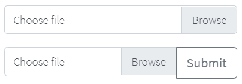

```java 
public class InputGroupCustomUploadFile extends Section {
    
@UI("label[for='upload-file-c']") //@FindBy(css ="label[for='upload-file-c']")
public Label labelInputFile;
@UI("input#upload-file-c") //@FindBy(css ="input#upload-file-c")
public FileInput fileInput; 
@UI("button") //@FindBy(css = "button") 
public Button btnSubmit;

public void clickSubmitButton() {
        btnSubmit.click();
    }
}

public class InputGroupCustomFileInput extends Section {
@UI("label[for='file-input-c']") //@FindBy(css ="label[for='file-input-c']") 
public Label labelInputFile;
@UI("input#file-input-c")   //@FindBy(css ="input#file-input-c")
public FileInput fileInput;
}
 
@BeforeMethod
public void before() {
States.shouldBeLoggedIn();
bsPage.shouldBeOpened();
inputGroupCustomFileInput.fileInput.core().
                        setup(jdiB -> jdiB.setSearchRule(ANY_ELEMENT));
inputGroupCustomFileInput.fileInput.core().setClickArea(ACTION_CLICK);
inputGroupCustomUploadFile.fileInput.core().
                        setup(jdiB -> jdiB.setSearchRule(ANY_ELEMENT));
inputGroupCustomUploadFile.fileInput.core().setClickArea(ACTION_CLICK);
}

@Test
public void uploadTest() {
clearInput();
inputGroupCustomFileInput.fileInput.uploadFile(mergePath(PROJECT_PATH,
                "/src/test/resources/general.xml"));
inputGroupCustomFileInput.fileInput.is().text(containsString("general.xml"));
inputGroupCustomFileInput.fileInput.is().value(containsString("general.xml"));
}

@Test
public void buttonUploadFileTest() {
inputGroupCustomUploadFile.btnSubmit.is().text("Submit");
inputGroupCustomUploadFile.clickSubmitButton();
validateAlert(is(alertMessage));
}
```

```html
<div class="input-group mb-3" id="file-input">
    <div class="custom-file">
        <input type="file" class="custom-file-input" id="file-input-c">
        <label class="custom-file-label" for="file-input-c">Choose file</label>
    </div>
</div>
<div class="input-group" id="upload-file">
    <div class="custom-file">
        <input type="file" class="custom-file-input" id="upload-file-c">
        <label class="custom-file-label" for="upload-file-c">Choose file</label>
    </div>
    <div class="input-group-append">
         <button class="btn btn-outline-secondary" type="button" 
                    onclick="alert('Button clicked, thank you!');">Submit</button>
    </div>
</div> 
```

And here are methods available in Java:

|Method | Description | Return Type
--- | --- | ---
**assertThat()** | property that returns object for work with assertions | UIAssert
**click()** | click on element | void
**getValue()** | Get file name | String
**hover()** | hover on element | void
**is()** | property that returns object for work with assertions | UIAssert
**label()**| Get label | Label
**setValue(String value)** | set file path to input | void
**text()** | returns text of input field | String
**uploadFile(String path)** | set file path to input | void
**uploadFileRobot(String path, long mSecDelay)** | set file path to input | void
<br>

The Custom file input is defined as a section and uses additional web elements: Button, FileInput and Label.

They are located in the following Java classes:

- com.epam.jdi.light.ui.html.common.Button

- com.epam.jdi.light.elements.common;

- com.epam.jdi.light.ui.bootstrap.elements.common;


[Bootstrap test examples](https://github.com/jdi-testing/jdi-light/blob/bootstrap/jdi-light-bootstrap-tests/src/test/java/io/github/epam/bootstrap/tests/composite/section/inputgroup/InputGroupCustomFileInputTests.java)


### Card

[Cards](https://getbootstrap.com/docs/4.3/components/card/) in Bootstrap provide a flexible and extensible
content container with multiple variants and options.

#### Card Example

[Card Example](https://getbootstrap.com/docs/4.3/components/card/#example) - basic card with mixed content and a
fixed width. Cards have no fixed width to start, so they’ll naturally fill the full width of its parent element.
This is easily customized with our various sizing options.


Here is an example with provided Bootstrap v4.3 code:

```java 
// @FindBy(css = "#card-example") 
@UI("#card-example")
public static CardExample cardExample;

public class CardExample extends Card {
    @UI(".card-title")
    public Text title;
    @UI(".card-text")
    public Text text;
    @UI(".btn")
    public Button button;
    @UI("#bs-card-example-image")
    public Image image;
}   

@Test
public void isValidationTest() {
    cardExample.image.is().src(is(imageSrc));
    cardExample.image.is().alt(is(imageAlt));
    cardExample.image.unhighlight();
    cardExample.image.assertThat().width(is(86));
    cardExample.image.assertThat().height(is(137));
    cardExample.title.is().text(is(titleText));
    cardExample.text.is().text(is(mainText));
    cardExample.button.is().displayed()
            .and().text(is(buttonText))
            .core()
            .attr("type", "submit")
            .tag(is("button"));
    cardExample.button.is().enabled();
}

@Test
public void clickTest() {
    cardExample.button.click();
    Alerts.validateAlert(is(alertText));
}
```

```html 
<div class="card mb-3" id="card-example" style="width: 18rem;">
  
  <div class="card-body">
    <h5 class="card-title">Card title</h5>
    <p class="card-text">Some quick example text to build on the card title and make up
      the bulk of the card's content.</p>
    <button href="#" class="btn btn-primary" onclick="alert('Card Button Clicked!')">
      Click Me!
    </button>
  </div>
</div>
```

Card is represented by Section class in Java:

[Section](https://jdi-docs.github.io/jdi-light/#section)

Inner elements of Card Example represented by the following classes:

- [Text](https://jdi-docs.github.io/jdi-light/#text)
- [Button](https://jdi-docs.github.io/jdi-light/#button)
- [Image](https://jdi-docs.github.io/jdi-light/#image)

Available methods in Java JDI Light:

|Method | Description | Return Type
--- | --- | ---
**alt()** | Assert alt image attribute | ImageAssert
**assertThat()** | Assert action | UIAssert
**getText()**| Returns text | String
**height()** | Assert image height | ImageAssert
**is()** | Assert action | UIAssert
**src()** | Assert image src | ImageAssert
**width()** | Assert image width | ImageAssert

[Bootstrap test examples](https://github.com/jdi-testing/jdi-light/blob/bootstrap/jdi-light-bootstrap-tests/src/test/java/io/github/epam/bootstrap/tests/composite/section/card/CardExampleTests.java)

#### Card Body

[Card Body](https://getbootstrap.com/docs/4.3/components/card/#body) - the building block of a card is the `.card-body`.
Use it whenever you need a padded section within a card.


Here is an example with provided Bootstrap v4.3 code:

```java 
//@FindBy(css = ".card-body")
@UI(".card-body")
public static CardBody cardBody;

public class CardBody extends Card {
    @UI(".card-body")
    public Text text;
}

@Test
public void getBodyTextTest() {
    assertEquals(cardBody.text.getText(), text);
}
```

```html 
<div class="card" id="card-body">
  <div class="card-body">
    This is some text within a card body.
  </div>
</div>
```

Card is represented by Section class in Java:

[Section](https://jdi-docs.github.io/jdi-light/#section)

Inner elements of Card Body represented by the following classes:

[Text](https://jdi-docs.github.io/jdi-light/#text)

Available methods in Java JDI Light:

|Method | Description | Return Type
--- | --- | ---
**assertThat()** | Assert action | UIAssert
**getText()**| Returns text | String
**is()** | Assert action | UIAssert

[Bootstrap test examples](https://github.com/jdi-testing/jdi-light/tree/bootstrap/jdi-light-bootstrap-tests/src/test/java/io/github/epam/bootstrap/tests/composite/section/card/CardBodyTests.java)

#### Card Titles, Text and Links

[Card Titles, Text and Links](https://getbootstrap.com/docs/4.3/components/card/#titles-text-and-links) - card titles
are used by adding `.card-title` to a `<h*>` tag. In the same way, links are added and placed next to each other
by adding `.card-link` to an `<a>` tag.

Subtitles are used by adding a `.card-subtitle` to a `<h*>` tag. If the `.card-title` and the `.card-subtitle` items
are placed in a `.card-body` item, the card title and subtitle are aligned nicely.

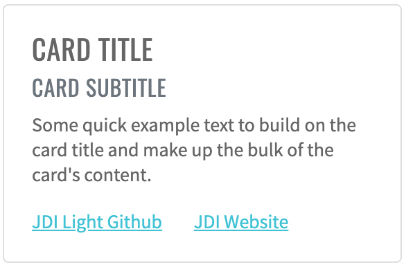

Here is an example with provided Bootstrap v4.3 code:

```java 
// @FindBy(css = "#card-subtitle-link") 
@UI("#card-subtitle-link") 
public static CardWithSubtitlesAndLinks cardWithSubtitlesAndLinks;

public class CardWithSubtitlesAndLinks extends Card {
    @UI(".card-title") public Text title;
    @UI(".card-subtitle") public Text subtitle;
    @UI(".card-text") public Text mainText;
    @UI("#bs-card-2-link1") public Link link1;
    @UI("#bs-card-2-link2") public Link link2;
}

@Test
public void getLink1TextTest() {
    assertEquals(cardWithSubtitlesAndLinks.link1.getText(), link1Text);
}

@Test
public void clickLink1Test() {
    cardWithSubtitlesAndLinks.link1.click();
    ArrayList<String> tabs = new ArrayList<>(WebDriverFactory.getDriver().getWindowHandles());
    WebDriver driver = WebDriverFactory.getDriver();
    driver.switchTo().window(tabs.get(1));
    assertEquals(getUrl(), link1Ref);
    driver.close();
    driver.switchTo().window(tabs.get(0));
}
```

```html 
<div class="card" id="card-subtitle-link" style="width: 18rem;">
  <div class="card-body">
    <h5 class="card-title">Card title</h5>
    <h6 class="card-subtitle mb-2 text-muted">Card subtitle</h6>
    <p class="card-text">Some quick example text to build on the card title and
      make up the bulk of the card's content.</p>
    <a href="https://github.com/jdi-testing/jdi-light" target="_blank" class="card-link" id="bs-card-2-link1">
      JDI Light Github</a>
    <a href="https://jdi-testing.github.io/jdi-light/index.html" target="_blank" class="card-link"
      id="bs-card-2-link2">JDI Website</a>
  </div>
</div>
```

Card is represented by Section class in Java:

[Section](https://jdi-docs.github.io/jdi-light/#section)

Inner elements of Card with Titles and Links represented by the following classes:

- [Text](https://jdi-docs.github.io/jdi-light/#text)
- [Link](https://jdi-docs.github.io/jdi-light/#link)

Available methods in Java JDI Light:
 
|Method | Description | Return Type
--- | --- | ---
**assertThat()** | Assert action | UIAssert
**getText()**| Returns text | String
**is()** | Assert action | UIAssert
**ref()** | Returns the reference | String
**url()** | Returns the URL | URL

[Bootstrap test examples](https://github.com/jdi-testing/jdi-light/blob/bootstrap/jdi-light-bootstrap-tests/src/test/java/io/github/epam/bootstrap/tests/composite/section/card/CardWithSubtitlesAndLinksTests.java)

#### Card Images

[Card Images](https://getbootstrap.com/docs/4.3/components/card/#images) are used with `.card-img-top` to place an image
to the top of the card. With `.card-text`, text can be added to the card. Text within `.card-text` can also be styled
with the standard HTML tags.


Here is an example with provided Bootstrap v4.3 code:

```java 
//@FindBy(css = "#card-image")
@UI("#card-image") 
public static CardImage cardImage;

public class CardImage extends Card {
    @UI(".card-text") public Text text;
    @UI("#bs-card-image") public Image image;
}

@Test
public void getSrcTest() {
    assertEquals(cardImage.image.src(), SRC_ATTR_EXPECTED);
}

@Test
public void getAltTest() {
    assertEquals(cardImage.image.alt(), ALT_ATTR_EXPECTED);
}

@Test
public void imageClassTest() {
     cardImage.image.is().core().hasClass(IMAGE_TOP_CLASS);
     cardImage.image.assertThat().core().hasClass(IMAGE_TOP_CLASS);
}
```

```html 
<div class="card mb-3" id="card-image-caps-1" style="width: 18rem;">
  
  <div class="card-body">
    <h5 class="card-title">Card title</h5>
    <p class="card-text">This is a wider card with supporting text below as a natural
      lead-in to additional content. This content is a little bit longer.</p>
    <p class="card-text"><small class="text-muted">Last updated 3 mins ago</small></p>
  </div>
</div>
```

Card is represented by Section class in Java:

[Section](https://jdi-docs.github.io/jdi-light/#section)

Inner elements of Card Image represented by the following classes:

- [Text](https://jdi-docs.github.io/jdi-light/#text)
- [Image](https://jdi-docs.github.io/jdi-light/#image)

And here are methods available in Java:

|Method | Description | Return Type
--- | --- | ---
**alt()** | get attribute alt | String
**assertThat()** | property that returns object for work with assertions| TextAssert
**displayed()** | check item is displayed | TextAssert
**enabled()** | check item is enabled | TextAssert
**hasClass(String className)** | check that expected className is presented | IsAssert
**is()** | property that returns object for work with assertions| TextAssert
**src()** | get attribute src | String
 
[Bootstrap test examples](https://github.com/jdi-testing/jdi-light/blob/bootstrap/jdi-light-bootstrap-tests/src/test/java/io/github/epam/bootstrap/tests/composite/section/card/CardImageTests.java)

#### Card List Groups

[Card List Groups Example](https://getbootstrap.com/docs/4.3/components/card/#list-groups) – create lists of content in a card
with a flush list group.


Here is an example with provided Bootstrap v4.3 code:

```java 
//@FindBy(css = "#card-list-groups")
@UI("#card-list-groups")
public static CardListGroups cardListGroups;

public class CardListGroups extends Card {
    @UI(".card-header") public Label cardHeader;
    @UI(".list-group-item") public WebList listGroups;
}

@Test
public void checkCardListHeaderTest() {
    cardListGroups.cardHeader.assertThat().text(cardHeaderText);
}

@Test
public void checkCardListCellsQuantity() {
    assertEquals(cardListGroups.listGroups.size(), cardListGroupsSize);
}

@Test
public void checkCardListGroupsValues() {
    int checkedValues = 0;
    for (WebElement s : cardListGroups.listGroups) {
        if (cardListGroupsValues.contains(s.getText())) {
            checkedValues++;
        }
    }
    assertEquals(cardListGroupsValues.size(), checkedValues);
}
```

```html 
<div class="card mb-3" id="card-list-groups" style="width: 18rem;">
  <div class="card-header">
    Featured
  </div>
  <ul class="list-group list-group-flush">
    <li class="list-group-item">Cras justo odio</li>
    <li class="list-group-item">Dapibus ac facilisis in</li>
    <li class="list-group-item">Vestibulum at eros</li>
  </ul>
</div>
```

Card is represented by Section class in Java:

[Section](https://jdi-docs.github.io/jdi-light/#section)

Inner elements of Card List Groups represented by the following classes:

- [Text](https://jdi-docs.github.io/jdi-light/#text)

|Method | Description | Return Type
--- | --- | ---
**assertThat()** | Assert action | TextAssert
**getText()** | Returns text of list cell | String
**is()** | Assert action | TextAssert
**size()** | Returns cells quantity of list groups | int 

[Bootstrap test examples](https://github.com/jdi-testing/jdi-light/tree/bootstrap/jdi-light-bootstrap-tests/src/test/java/io/github/epam/bootstrap/tests/composite/section/card/CardListGroupsTests.java)

#### Card Kitchen Sink

[Card Kitchen Sink](https://getbootstrap.com/docs/4.3/components/card/#kitchen-sink) – Mix and match multiple content
types to create the card you need, or throw everything in there. Shown below are image styles, blocks, text styles, and
a list group—all wrapped in a fixed-width card.


Here is an example with provided Bootstrap v4.3 code:

```java 
//@FindBy(css = "#card-kitchen-sink")
@UI("#card-kitchen-sink")
public static CardKitchenSink cardKitchenSink; 

public class CardKitchenSink extends Card {
    @UI(".card-img-top") public Image image;
    @UI(".card-title") public Text title;
    @UI(".card-text") public Text text;
    @UI(".card-body") public WebList body;
    @UI(".list-group") public WebList list;
}

@Test
public void itemsTest() {
    assertEquals(cardKitchenSink.list.size(), 3);
    cardKitchenSink.list.get(1).is().text(is(item1Text));
    cardKitchenSink.list.get(2).is().text(is(item2Text));
    cardKitchenSink.list.get(3).is().text(is(item3Text));
    cardKitchenSink.list.get(1).is().text(containsString(item1Text));
    cardKitchenSink.list.get(2).is().text(containsString(item2Text));
    cardKitchenSink.list.get(3).is().text(containsString(item3Text));
}

@Test
public void isValidationTest() {
    cardKitchenSink.image.is().src(is(imgSrc));
    cardKitchenSink.image.is().alt(is(imgAlt));
    cardKitchenSink.image.unhighlight();
    cardKitchenSink.image.assertThat().width(is(86));
    cardKitchenSink.image.assertThat().height(is(137));
    cardKitchenSink.title.is().text(is(titleText));
    cardKitchenSink.title.is().text(containsString(titleText));
    cardKitchenSink.text.is().text(is(cardText));
    cardKitchenSink.text.is().text(containsString(cardText));
}
```

```html 
<div class="card mb-3" id="card-kitchen-sink" style="width: 18rem;">
  
  <div class="card-body">
    <h5 class="card-title">Card title</h5>
    <p class="card-text">Some quick example text to build on the card title and make up
      the bulk of the card's content.</p>
  </div>
  <ul class="list-group list-group-flush">
    <li class="list-group-item">Cras justo odio</li>
    <li class="list-group-item">Dapibus ac facilisis in</li>
    <li class="list-group-item">Vestibulum at eros</li>
  </ul>
  <div class="card-body">
    <a href="https://github.com/jdi-testing/jdi-light" target="_blank" class="card-link">JDI Light Github</a>
    <a href="https://jdi-testing.github.io/jdi-light/index.html" target="_blank" class="card-link">JDI Website</a>
  </div>
</div>
```

Card is represented by Section class in Java:

[Section](https://jdi-docs.github.io/jdi-light/#section)

Inner elements of Card Kitchen Sink represented by the following classes:

- [Text](https://jdi-docs.github.io/jdi-light/#text)
- [Button](https://jdi-docs.github.io/jdi-light/#button)
- [Link](https://jdi-docs.github.io/jdi-light/#link)

Available methods in Java JDI Light:

|Method | Description | Return Type
--- | --- | ---
**alt()** | Assert alt image attribute | ImageAssert
**assertThat()** | Assert action | UIAssert
**getName()**| Returns name of kitchen sink | String
**getText()**| Returns text of kitchen sink | String
**height()** | Assert image height | ImageAssert
**is()** | Assert action | UIAssert
**isDisplayed()** | Returns true if kitchen sink is displayed, false if not | boolean
**src()** | Assert image src | ImageAssert
**width()** | Assert image width | ImageAssert

[Bootstrap test examples](https://github.com/jdi-testing/jdi-light/tree/bootstrap/jdi-light-bootstrap-tests/src/test/java/io/github/epam/bootstrap/tests/composite/section/card/CardKitchenSinkTests.java)

#### Card with Header and Footer

[Card with Header and Footer](https://getbootstrap.com/docs/4.3/components/card/#header-and-footer) - add an optional
header and/or footer within a card.


Here is an example with provided Bootstrap v4.3 code:

```java 
//@FindBy(css = "#card-with-header-and-footer") 
@UI("#card-with-header-and-footer")
public static CardWithHeaderAndFooter cardWithHeaderAndFooter;

public class CardWithHeaderAndFooter extends Card {
    @UI(".card-title") public Text title;
    @UI(".card-body p") public Text paragraph;
    @UI("button") public Button button;
    @UI(".card-header") public Text header;
    @UI("//*[contains(@class, 'footer')]") public Text footer;
}

@Test
public void getFooterTextCardWithHeaderAndFooterTest() {
    cardWithHeaderAndFooter.footer.is().text(textFooterCardWithHeaderAndFooter);
}

@Test
public void getHeaderTextCardWithHeaderAndFooterTest() {
    cardWithHeaderAndFooter.header.is().text(textHeaderCardWithHeaderAndFooter);
}
```

```html 
<div class="card mb-3 text-center" id="card-with-header-and-footer">
  <div class="card-header">
    Featured
  </div>
  <div class="card-body">
    <h5 class="card-title">Special title treatment</h5>
    <p class="card-text">With supporting text below as a natural lead-in to additional
      content.</p>
    <button href="#" class="btn btn-primary" onclick="alert('Button Clicked!');">Click
      Me!
    </button>
  </div>
  <div class="card-footer text-muted">
    2 days ago
  </div>
</div>
```

Card is represented by Section class in Java:

[Section](https://jdi-docs.github.io/jdi-light/#section)

Inner elements of Card with Header and Footer represented by the following classes:

- [Text](https://jdi-docs.github.io/jdi-light/#text)
- [Button](https://jdi-docs.github.io/jdi-light/#button)

Available methods in Java JDI Light:

|Method | Description | Return Type
--- | --- | ---
**assertThat()** | Assert action | UIAssert
**click()** | Click the button | void
**is()** | Assert action | UIAssert
**text()** | Assert text | TextAssert

[Bootstrap test examples](https://github.com/jdi-testing/jdi-light/jdi-light-bootstrap-tests/src/test/java/io/github/epam/bootstrap/tests/composite/section/card/CardWithHeaderAndFooterTests.java)

#### Card with Grid Markup

[Card with Grid Markup](https://getbootstrap.com/docs/4.3/components/card/#using-grid-markup) - using the grid,
wrap cards in columns and rows as needed.

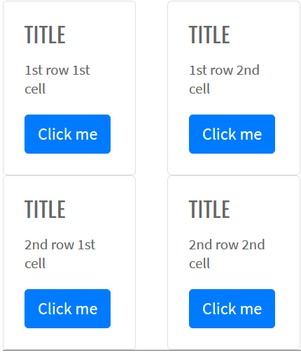

Here is an example with provided Bootstrap v4.3 code:

```java 
//@FindBy(css = "#card-with-grid-markup")
@UI("#card-with-grid-markup")
public static CardWithGridMarkup cardWithGridMarkup;

public class CardWithGridMarkup extends Card {
    @UI(".card-title") public Text title;
    @UI(".card-body p") public Text paragraph;
    @UI("button") public Button button;
    @UI(".row .col-sm-6") public JList<CardWithHeaderAndFooter> listCard; 
}

@Test
public void getTitleTextCardWithGridMarkup11Test() {
    cardWithGridMarkup.listCard.get(0).title.is().text(textTitleCardWithGridMarkup11);
}

@Test
public void getButtonTextCardWithGridMarkup22Test() {
    cardWithGridMarkup.listCard.get(3).button.is().text(textButtonCardWithGridMarkup22);
    cardWithGridMarkup.listCard.get(3).button.click();
    validateAlert(is(textAlert));
    cardWithGridMarkup.listCard.get(3).button.is()
            .enabled()
            .displayed();
}
```

```html 
<div id="card-with-grid-markup">
  <div class="row mb-3">
    <div class="col-sm-6">
      <div class="card">
        <div class="card-body">
          <h5 class="card-title">Title</h5>
          <p class="card-text">1st row 1st cell</p>
          <button href="#" class="btn btn-primary" onclick="alert('Button Clicked!');">Click me
          </button>
        </div>
      </div>
    </div>
    <div class="col-sm-6">
      <div class="card">
        <div class="card-body">
          <h5 class="card-title">Title</h5>
          <p class="card-text">1st row 2nd cell</p>
          <button href="#" class="btn btn-primary" onclick="alert('Button Clicked!');">Click me
          </button>
        </div>
      </div>
    </div>
  </div>
  <div class="row mb-3">
    <div class="col-sm-6">
      <div class="card">
        <div class="card-body">
          <h5 class="card-title">Title</h5>
          <p class="card-text">2nd row 1st cell</p>
          <button href="#" class="btn btn-primary" onclick="alert('Button Clicked!');">Click me
          </button>
        </div>
      </div>
    </div>
    <div class="col-sm-6">
      <div class="card">
        <div class="card-body">
          <h5 class="card-title">Title</h5>
          <p class="card-text">2nd row 2nd cell</p>
          <button href="#" class="btn btn-primary" onclick="alert('Button Clicked!');">Click me
          </button>
        </div>
      </div>
    </div>
  </div>
</div>
```

Card is represented by Section class in Java:

[Section](https://jdi-docs.github.io/jdi-light/#section)

Inner elements of Card with Grid Markup represented by the following classes:

- [Text](https://jdi-docs.github.io/jdi-light/#text)
- [Button](https://jdi-docs.github.io/jdi-light/#button)

Available methods in Java JDI Light:

|Method | Description | Return Type
--- | --- | ---
**assertThat()** | Assert action | UIAssert
**click()** | Click the button | void
**is()** | Assert action | UIAssert
**text()** | Assert text | TextAssert

[Bootstrap test examples](https://github.com/jdi-testing/jdi-light/tree/bootstrap/jdi-light/jdi-light-bootstrap-tests/src/test/java/io/github/epam/bootstrap/tests/composite/section/card/CardWithGridMarkupTests.java)

#### Card Utilities

[Card Utilities](https://getbootstrap.com/docs/4.3/components/card/#using-utilities) - use handful of available
sizing utilities to quickly set a card’s width.


Here is an example with provided Bootstrap v4.3 code:

```java 
//@FindBy(className = ".w-75") 
@UI(".w-75")
public static CardUtilities cardWidth75;

public class CardUtilities extends Card {
    @UI(".card-title") public Text cardTitle;
    @UI(".card-text") public Text cardText;
    @UI(".btn") public Button cardButton;
}

@Test(dataProvider = "cardUtilitiesElementsWithWidth")
public void cardValidationTest(CardUtilities cardUtilitiesElem, 
int widthInPercent, String widthInPixels) {
    cardUtilitiesElem.core().is()
            .hasClass(String.format("card w-%d", widthInPercent))
            .css("width", widthInPixels)
            .css("background-color", whiteColor);
}
```

```html 
<div class="card w-75" style="margin-bottom: 10px;">
  <div class="card-body">
    <h5 class="card-title">Spider man (w-75)</h5>
    <p class="card-text">Spider-Man is a fictional superhero created by writer-editor
      Stan Lee and writer-artist Steve Ditko.</p>
    <a href="https://en.wikipedia.org/wiki/Spider-Man" class="btn btn-primary" target="_blank">Read more</a>
  </div>
</div>
```

Available methods in Java JDI Light:

|Method | Description | Return Type
--- | --- | ---
**assertThat()** | Assert action | TextAssert
**css()** | Get element's css value | int 
**hasClass()** | Assert class | String
**is()** | Assert action | TextAssert

[Bootstrap test examples](https://github.com/jdi-testing/jdi-light/blob/bootstrap/jdi-light-bootstrap-tests/src/test/java/io/github/epam/bootstrap/tests/composite/section/card/CardUtilitiesTests.java)

#### Card Using Custom CSS

[Card Using Custom CSS](https://getbootstrap.com/docs/4.3/components/card/#using-custom-css) - use custom CSS in your
stylesheets or as inline styles to set a width.


Here is an example with provided Bootstrap v4.3 code:

```java 
//@FindBy(css = "#card-custom-css-1")
@UI("#card-custom-css-1")
public static CardWithCustomCss cardWithCustomCss13Rem;

public class CardWithCustomCss extends Card {
    @UI(".card-title") public Text title;
    @UI(".card-text") public Text text;
    @UI(".btn") public Button button;
}

@Test
public void getTextTest() {
    assertEquals(cardWithCustomCss13Rem.text.getText(), text);
}

@Test
public void isValidationTest() {
    cardWithCustomCss13Rem.title.is().text(is(title));
    cardWithCustomCss13Rem.text.is().text(is(text));
    cardWithCustomCss13Rem.button.is().displayed()
            .and().text(is(buttonText))
            .core()
            .css("font-size", is("16px"))
            .cssClass("btn btn-primary")
            .tag(is("a"))
            .attr("href", link);
    cardWithCustomCss13Rem.button.is().enabled();
    cardWithCustomCss13Rem.is().displayed()
            .core()
            .css("width", is("208px"))
            .css("margin-bottom", is("10px"));
}
```

```html 
<div class="card" id="card-custom-css-1" style="width: 13rem; margin-bottom: 10px;">
  <div class="card-body">
    <h5 class="card-title">Spider man (13rem)</h5>
    <p class="card-text">Spider-Man is a fictional superhero created by writer-editor
      Stan Lee and writer-artist Steve Ditko.</p>
    <a href="https://en.wikipedia.org/wiki/Spider-Man" class="btn btn-primary" target="_blank">Read more</a>
  </div>
</div>
```

Card is represented by Section class in Java:

[Section](https://jdi-docs.github.io/jdi-light/#section)

Inner elements of Card with custom CSS represented by the following classes:

- [Text](https://jdi-docs.github.io/jdi-light/#text)
- [Button](https://jdi-docs.github.io/jdi-light/#button)

Available methods in Java JDI Light:

|Method | Description | Return Type
--- | --- | ---
**assertThat()** | Assert action | UIAssert
**click()** | Click the button | void
**is()** | Assert action | UIAssert
**text()** | Assert text | TextAssert

[Bootstrap test examples](https://github.com/jdi-testing/jdi-light/blob/bootstrap/jdi-light-bootstrap-tests/src/test/java/io/github/epam/bootstrap/tests/composite/section/card/CardWithCustomCss13RemTests.java)

#### Card Text Alignment

[Card Text Alignment](https://getbootstrap.com/docs/4.3/utilities/text/#text-alignment) - You can quickly change
the text alignment of any card — in it's entirety or specific parts — with Bootstrap's text align classes.

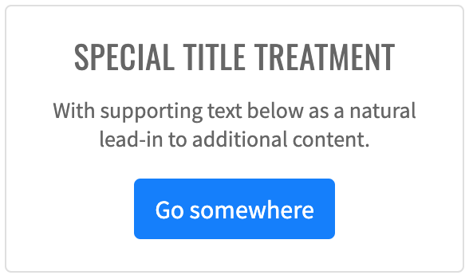

Here is an example with provided Bootstrap v4.3 code:

```java 
//@FindBy(css = "#card-text-left")
@UI("#card-text-left")
public static CardTextAlignment cardLeftTextAlignment;
//@FindBy(css = "#card-text-center")
@UI("#card-text-center")
public static CardTextAlignment cardCenterTextAlignment;
//@FindBy(css = "#card-text-right")
@UI("#card-text-right")
public static CardTextAlignment cardRightTextAlignment;

public class CardTextAlignment extends Card {
    @UI(".card-title") public Text cardTitle;
    @UI(".card-text") public Text cardDescription;
    @UI("button") public Button cardButton;
}

String alertText = "Button Clicked!";

@Test
public void clickTest() {
    cardLeftTextAlignment.highlight();
    cardLeftTextAlignment.cardButton.click();
    validateAlert(is(alertText));

    cardCenterTextAlignment.highlight();
    cardCenterTextAlignment.cardButton.click();
    validateAlert(is(alertText));

    cardRightTextAlignment.highlight();
    cardRightTextAlignment.cardButton.click();
    validateAlert(is(alertText));
}
```

```html 
<div id="card-text-center" class="card mb-2 text-center" style="width: 18rem;">
  <div class="card-body">
    <h5 class="card-title">Special title treatment</h5>
    <p class="card-text">With supporting text below as a natural lead-in to additional
      content.</p>
    <button href="#" class="btn btn-success" onclick="alert('Button Clicked!');">Click
      Me!
    </button>
  </div>
</div>
```

Card is represented by Section class in Java:

[Section](https://jdi-docs.github.io/jdi-light/#section)

Inner elements of Card Text Alignment represented by the following classes:

- [Text](https://jdi-docs.github.io/jdi-light/#text)
- [Button](https://jdi-docs.github.io/jdi-light/#button)

Available methods in Java JDI Light:

|Method | Description | Return Type
--- | --- | ---
**assertThat()** | Assert action | TextAssert
**attr()** | Assert button attribute | IsAssert
**click()** | Click button | void
**css()** | Get button css value | String
**cssClass()** | Assert button css class | IsAssert
**displayed()** | Check that element is displayed | TextAssert
**getText()** | Get button text | String
**getValue()** | Get button value | String
**is()** | Assert action | TextAssert 
**tag()** | Assert button tag | IsAssert

[Bootstrap test examples](https://github.com/jdi-testing/jdi-light/blob/bootstrap/jdi-light-bootstrap-tests/src/test/java/io/github/epam/bootstrap/tests/composite/section/card/CardTextAlignmentTests.java)

#### Card Navigation

[Card Navigation](https://getbootstrap.com/docs/4.3/components/card/#navigation) adds some navigation to a card’s header
(or block) with Bootstrap’s nav components.

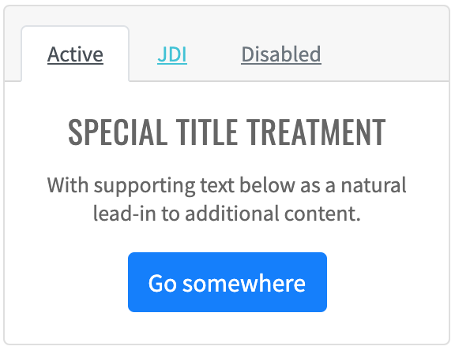

Here is an example with provided Bootstrap v4.3 code:

```java 
@UI("#card-navigation") // @FindBy(id = "card-navigation")
public static CardNavigation cardNavigation;

public class CardNavigation extends Card {
    @UI(".nav") public Menu nav;
    @UI("#activeLink") public Link activeLink;
    @UI("#jdiLink") public Link jdiLink;
    @UI("#disabledLink") public Link disabledLink;
    @UI("h5") public Text title;
    @UI(".card-text") public Text subtitle;
    @UI("button") public Button button;
}

@Test
public void getLinkTextTest() {
    cardNavigation.nav.highlight();
    assertEquals(cardNavigation.activeLink.getText(), activeLinkText);
    assertEquals(cardNavigation.jdiLink.getText(), jdiLinkText);
    assertEquals(cardNavigation.disabledLink.getText(), disabledLinkText);
}

@Test
public void isValidationTest() {
    cardNavigation.highlight();

    cardNavigation.title.is().text(titleText);
    cardNavigation.title.is().displayed();

    cardNavigation.subtitle.is().text(subtitleText);
    cardNavigation.subtitle.is().displayed();

    cardNavigation.activeLink.is().displayed();
    cardNavigation.activeLink.is().enabled();

    cardNavigation.jdiLink.is().displayed();
    cardNavigation.jdiLink.is().enabled();

    cardNavigation.disabledLink.is().displayed();
    cardNavigation.disabledLink.is().disabled();

    cardNavigation.activeLink.assertThat().text(is(activeLinkText));
    cardNavigation.jdiLink.assertThat().text(is(jdiLinkText));
    cardNavigation.disabledLink.assertThat().text(is(disabledLinkText));

    cardNavigation.activeLink.is().ref(activeLinkRef);
    cardNavigation.jdiLink.is().ref(jdiLinkRef);
    cardNavigation.disabledLink.is().ref(disabledLinkRef);

    cardNavigation.button.is().text(is(buttonText));
    cardNavigation.button.is().text(containsString("Click"));
    assertThat(cardNavigation.button.core().css("font-size"), is("16px"));
    cardNavigation.button.assertThat().displayed()
            .and()
            .core()
            .cssClass("btn btn-primary")
            .attr("onclick", "alert('Button Clicked!');")
            .tag(is("button"));
}
```

```html 
<div id="card-navigation" class="card text-center mb-3">
  <div class="card-header">
    <ul class="nav nav-tabs card-header-tabs">
      <li class="nav-item">
        <a id="activeLink" class="nav-link active" href="javascript: void()"
          onclick="alert('Active Tab Clicked!');">Active</a>
      </li>
      <li class="nav-item">
        <a id="jdiLink" class="nav-link" href="https://github.com/jdi-testing/jdi-light" target="_blank">JDI</a>
      </li>
      <li class="nav-item">
        <a id="disabledLink" class="nav-link disabled" href="javascript: void()" tabindex="-1"
          aria-disabled="true">Disabled</a>
      </li>
    </ul>
  </div>
  <div class="card-body">
    <h5 class="card-title">Special title treatment</h5>
    <p class="card-text">With supporting text below as a natural lead-in to additional
      content.</p>
    <button href="#" class="btn btn-primary" onclick="alert('Button Clicked!');">Click
      Me!
    </button>
  </div>
</div>
```

Card is represented by Section class in Java:

[Section](https://jdi-docs.github.io/jdi-light/#section)

Inner elements of Card Navigation represented by the following classes:

- [Menu](https://jdi-docs.github.io/jdi-light/#menu)
- [Text](https://jdi-docs.github.io/jdi-light/#text)
- [Button](https://jdi-docs.github.io/jdi-light/#button)
- [Link](https://jdi-docs.github.io/jdi-light/#link)

Available methods in Java JDI Light:

|Method | Description | Return Type
--- | --- | ---
**attr()** | Assert element attribute | IsAssert
**click()** | Click element | void
**css()** | Get button css value | String
**cssClass()** | Assert element css class | IsAssert
**disabled()** | Check that element is disabled | UIAssert
**displayed()** | Check that element is displayed | TextAssert
**enabled()** | Check that element is enabled | UIAssert
**getText()** | Get element text | String
**getValue()** | Get element value | String
**is()** | Assert action | TextAssert
**ref()** | Get link ref attribute value | String
**tag()** | Assert element tag | IsAssert

[Bootstrap test examples](https://github.com/jdi-testing/jdi-light/blob/bootstrap/jdi-light-bootstrap-tests/src/test/java/io/github/epam/bootstrap/tests/composite/section/card/CardNavigationTests.java)

#### Card Image Caps

[Card Image Caps](https://getbootstrap.com/docs/4.3/components/card/#image-caps) - similar to headers and footers, cards
can include top and bottom “image caps” — images at the top or bottom of a card.

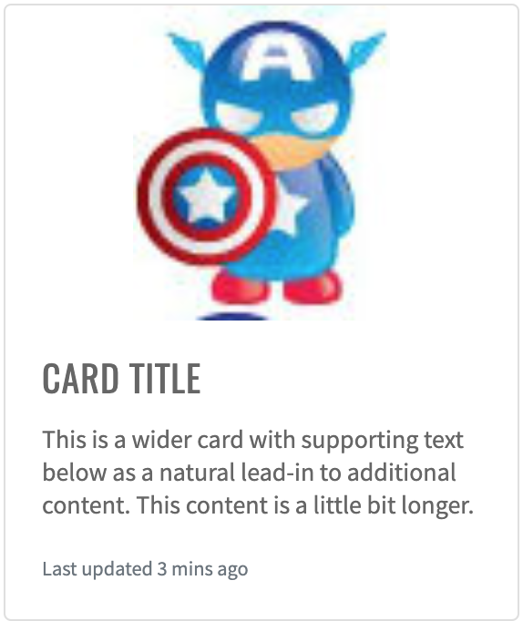

Here is an example with provided Bootstrap v4.3 code:

```java 
//@FindBy(id = "card-image-caps-1")
@UI("#card-image-caps-1")
public static CardImageCaps cardImageOnTop;

public class CardImageCaps extends Card {
    @UI(".card-img-top") public Image image;
    @UI(".card-body") public Text text;
}

@Test
public void getSrcTest() {
    assertEquals(cardImageOnTop.image.src(), topCardData.getSrcAttr());
    assertEquals(cardImageOnBottom.image.src(), bottomCardData.getSrcAttr());
}

@Test
public void getAltTest() {
    assertEquals(cardImageOnTop.image.alt(), topCardData.getAltAttr());
    assertEquals(cardImageOnBottom.image.alt(), bottomCardData.getAltAttr());
}
```

```html 
<div class="card mb-3" id="card-image-caps-1" style="width: 18rem;">
  
  <div class="card-body">
    <h5 class="card-title">Card title</h5>
    <p class="card-text">This is a wider card with supporting text below as a natural
      lead-in to additional content. This content is a little bit longer.</p>
    <p class="card-text"><small class="text-muted">Last updated 3 mins ago</small></p>
  </div>
</div>
```

Card is represented by Section class in Java:

[Section](https://jdi-docs.github.io/jdi-light/#section)

Inner elements of Card Image Caps represented by the following classes:

- [Text](https://jdi-docs.github.io/jdi-light/#text)
- [Image](https://jdi-docs.github.io/jdi-light/#image)

Available methods in Java JDI Light:

|Method | Description | Return Type
--- | --- | ---
**assertThat()** | Assert action | UIAssert
**getName()**| Returns name of card | String
**getText()**| Returns text of card | String
**is()** | Assert action | UIAssert
**isDisplayed()** | Returns true if card is displayed, false if not | boolean

[Bootstrap test examples](https://github.com/jdi-testing/jdi-light/blob/bootstrap/jdi-light-bootstrap-tests/src/test/java/io/github/epam/bootstrap/tests/composite/section/card/CardImageCapsTests.java)

#### Card Image Overlays

[Card Image Overlays](https://getbootstrap.com/docs/4.3/components/card/#image-overlays) turn an image into a card
background and overlay your card’s text. Depending on the image, you may or may not need additional styles or utilities.


Here is an example with provided Bootstrap v4.3 code:

```java 
//@FindBy(css = "#card-image-overlay") 
@UI("#card-image-overlay")
public static CardImageOverlays cardImageOverlays;

public class CardImageOverlays extends Card {
    @UI("#card-svg") public VectorImage vectorImage;
    @UI("#card-overlay-section") public OverlaySection overlaySection;
}

@Test
public void availabilityTest() {
    cardImageOverlays.overlaySection.title.is()
            .displayed()
            .enabled();
    cardImageOverlays.overlaySection.title.is()
            .displayed()
            .enabled();
}

@Test
public void isValidationTest() {
    cardImageOverlays.overlaySection.title.is().text(is(TITLE));
    cardImageOverlays.vectorImage.assertThat().height(is(HEIGHT));
    cardImageOverlays.vectorImage.assertThat().width(is(WIDTH));
}

@Test
public void classTest() {
    cardImageOverlays.overlaySection.is().core().hasClass(OVERLAY_CLASS);
    cardImageOverlays.overlaySection.assertThat().core().hasClass(OVERLAY_CLASS);
    cardImageOverlays.vectorImage.is().core().hasClass(IMAGE_TOP_CLASS);
    cardImageOverlays.vectorImage.assertThat().core().hasClass(IMAGE_TOP_CLASS);
}

@Test
public void vectorInternalElementsTest() {
     assertEquals(cardImageOverlays.vectorImage.getText(VECTOR_TEXT_TAG), VECTOR_TEXT);
     assertEquals(cardImageOverlays.vectorImage.getAttribute(VECTOR_TEXT_TAG, VECTOR_TEXT_ATTR), VECTOR_TEXT_VALUE);
}
```

```html 
<div class="card bg-dark text-dark mb-3">
  
  <div class="card-img-overlay">
    <h5 class="card-title">Card title</h5>
    <p class="card-text">This is a wider card with supporting text below as a natural
      lead-in to additional content. This content is a little bit longer.</p>
    <p class="card-text">Last updated 3 mins ago</p>
  </div>
</div>
```

Card is represented by Section class in Java:

[Section](https://jdi-docs.github.io/jdi-light/#section)

Inner elements of Card Image Overlays represented by the following classes:

- [Text](https://jdi-docs.github.io/jdi-light/#text)
- [VectorImage](https://jdi-docs.github.io/jdi-light/#vector-image) <---No such element--->

And here are methods available in Java:

|Method | Description | Return Type
--- | --- | ---
**assertThat()** | property that returns object for work with assertions| TextAssert
**displayed()** | check item is displayed | TextAssert
**enabled()** | check item is enabled | TextAssert
**getAttribute(String tagName, String attr)** | get attribute of an element inside vector image by tag | String
**getText(String tagName)** | get text of an element inside vector image by tag | String
**hasClass(String className)** | check that expected className is presented | IsAssert
**is()** | property that returns object for work with assertions| TextAssert

[Bootstrap test examples](https://github.com/jdi-testing/jdi-light/blob/bootstrap/jdi-light-bootstrap-tests/src/test/java/io/github/epam/bootstrap/tests/composite/section/card/CardImageOverlaysTests.java)

#### Card Horizontal

[Card Horizontal](https://getbootstrap.com/docs/4.3/components/card/#horizontal) - using a combination of grid and
utility classes, cards can be made horizontal in a mobile-friendly and responsive way.


Here is an example with provided Bootstrap v4.3 code:

```java 
//FindBy(css = "#card-horizontal")
@UI("#card-horizontal")
public static CardHorizontal cardHorizontal;

public class CardHorizontal extends Card {
    @UI(".card-title") public Text title;
    @UI("//p[contains(text(), 'fictional character')]") public Text mainText;
    @UI(".text-muted") public Text smallText;
    @UI(".card-img") public Image image;
}

@Test
public void getSrcTest() {
    assertEquals(cardHorizontal.image.src(), imageSrc);
}

@Test
public void isValidationTest() {
    cardHorizontal.title.is().text(is(titleText));
    cardHorizontal.mainText.is().text(is(mainText));
    cardHorizontal.smallText.is().displayed()
            .and().text(is(smallText))
            .core()
            .css("font-size", is("11.2px"))
            .tag(is("small"));
    cardHorizontal.image.is().displayed()
            .and().src(is(imageSrc))
            .core()
            .attr("title", imageTitle);
    cardHorizontal.image.unhighlight();
    cardHorizontal.image.assertThat().width(anyOf(is(91), is(94)));
    cardHorizontal.image.assertThat().height(anyOf(is(146), is(150)));
}
```

```html 
<div class="card mb-3" id="card-horizontal" style="max-width: 540px;">
  <div class="row no-gutters">
    <div class="col-md-4">
      
    </div>
    <div class="col-md-8">
      <div class="card-body">
        <h5 class="card-title" id="card-horizontal-title">Wolverine</h5>
        <p class="card-text">Wolverine is a fictional character appearing in
          American comic books published by Marvel Comics, mostly in association
          with the X-Men. He is a mutant who possesses animal-keen senses,
          enhanced physical capabilities, powerful regenerative ability known as a
          healing factor, and three retractable claws in each hand. Wolverine has
          been depicted variously as a member of the X-Men, Alpha Flight, and the
          Avengers.</p>
        <p class="card-text"><small class="text-muted">The character appeared in
            #180 (1974)</small></p>
      </div>
    </div>
  </div>
</div>
```

Card is represented by Section class in Java:

[Section](https://jdi-docs.github.io/jdi-light/#section)

Inner elements of Card Horizontal represented by the following classes:<br>

- [Text](https://jdi-docs.github.io/jdi-light/#text)
- [Image](https://jdi-docs.github.io/jdi-light/#image)

Available methods in Java JDI Light:

|Method | Description | Return Type
--- | --- | ---
**alt()** | Assert alt image attribute | ImageAssert
**assertThat()** | Assert action | UIAssert
**getText()**| Returns text | String
**height()** | Assert image height | ImageAssert
**is()** |	Assert action | UIAssert
**src()** | Assert image src | ImageAssert
**width()** | Assert image width | ImageAssert

[Bootstrap test examples](https://github.com/jdi-testing/jdi-light/blob/bootstrap/jdi-light-bootstrap-tests/src/test/java/io/github/epam/bootstrap/tests/composite/section/card/CardHorizontalTests.java)

#### Card Background And Color

[Card Background And Color](https://getbootstrap.com/docs/4.3/components/card/#background-and-color) - use text and
background utilities to change the appearance of a card.


Here is an example with provided Bootstrap v4.3 code:

```java 
//@FindBy(css = "#card-bright-blue")
@UI("#card-bright-blue")
public static CardStyled cardBrightBlue;

public class CardStyled extends Card {
    @UI(".card-header") public Text header;
    @UI(".card-title") public Text title;
    @UI(".card-text") public Text body;
}

@Test(dataProvider = "cardColors")
public void checkColorCardsTest(CardWithHeaderAndFooter card, String cssClass, String color) {
    card.is()
            .core()
            .hasClass(cssClass)
            .css("background-color", is(color));

    card.header.is()
            .displayed().and()
            .core().css("background-color", is("rgba(0, 0, 0, 0.03)"));

    card.paragraph.is()
            .displayed().and()
            .core().css("background-color", is("rgba(0, 0, 0, 0)"));

}
```

```html 
<div class="card text-white bg-primary mb-3" style="max-width: 18rem;" id="card-bright-blue">
  <div class="card-header">Header</div>
  <div class="card-body">
    <h5 class="card-title">Primary card title</h5>
    <p class="card-text">Some quick example text to build on the card title and make up
      the bulk of the card's content.</p>
  </div>
</div>
```

Card is represented by Section class in Java:

[Section](https://jdi-docs.github.io/jdi-light/#section)

Inner elements of Card Background Color can be represented by the following classes:

- [Text](https://jdi-docs.github.io/jdi-light/#text)  
- [Button](https://jdi-docs.github.io/jdi-light/#button)

Available methods in Java JDI Light:

|Method | Description | Return Type
--- | --- | ---
**assertThat()** | Assert action | UIAssert
**css()** | Get element css value | String
**displayed()** | Check that element is displayed | TextAssert
**is()** | Assert action | UIAssert

[Bootstrap test examples](https://github.com/jdi-testing/jdi-light/blob/bootstrap/jdi-light-bootstrap-tests/src/test/java/io/github/epam/bootstrap/tests/composite/section/card/CardBackgroundAndColorTests.java)

#### Card Border

[Card Border](https://getbootstrap.com/docs/4.3/components/card/#border) - use border utilities to change just the
border-color of a card. Note that you can put `.text-{color}` classes on the parent `.card` or a subset of the card’s
contents as shown below.


Here is an example with provided Bootstrap v4.3 code:

```java 
//@FindBy(css = "#card-border-primatry")
@UI("#card-border-primary")//@FindBy(css = "#card-border-primatry")
public static CardStyled cardBorderPrimary;

public class CardStyled extends Card {
    @UI(".card-header") public Text header;
    @UI(".card-title") public Text title;
    @UI(".card-text") public Text body;
}

@Test(dataProvider = "cardBorderColor")
public void getBorderColorTest(CardBorder cardBorder, String color) {
    cardBorder.is().core().css("border-bottom-color", is(color));
    cardBorder.is().core().css("border-left-color", is(color));
    cardBorder.is().core().css("border-right-color", is(color));
    cardBorder.is().core().css("border-top-color", is(color));
}

@Test(dataProvider = "cardBorderHeaderText")
public void getHeaderTextTest(CardBorder cardBorder, String headerText) {
    assertEquals(cardBorder.border.getText(), headerText);
}
```

```html 
<div class="card border-primary mb-3" id="card-border-primary" style="max-width: 18rem;">
  <div class="card-header">Card with primary border</div>
  <div class="card-body text-primary">
    <h5 class="card-title">Primary card title</h5>
    <p class="card-text">Some quick example text to build on the card title and make up
      the bulk of the card's content.</p>
  </div>
</div>
```

Card is represented by Section class in Java:

[Section](https://jdi-docs.github.io/jdi-light/#section)

Inner elements of Card Border represented by the following classes:

[Text](https://jdi-docs.github.io/jdi-light/#text)

Available methods in Java JDI Light:

|Method | Description | Return Type
--- | --- | ---
**assertThat()** | Assert action | UIAssert
**css()** | Get element css value | String
**is()** | Assert action | UIAssert
**text()** | Assert text | TextAssert

[Bootstrap test examples](https://github.com/jdi-testing/jdi-light/blob/bootstrap/jdi-light-bootstrap-tests/src/test/java/io/github/epam/bootstrap/tests/composite/section/card/CardBorderTests.java)

#### Card Mixins Utilities

[Card Mixins Utilities](https://getbootstrap.com/docs/4.3/components/card/#mixins-utilities) - you can also change
the borders on the card header and footer as needed, and even remove their background-color with `.bg-transparent`.


Here is an example with provided Bootstrap v4.3 code:

```java 
//@FindBy(css = "#card-mixins-utilities")
@UI("#card-mixins-utilities")         
public static CardMixinsUtilities cardMixinsUtilities;

public class CardMixinsUtilities extends Card {
    @UI(".card-header") public Text header;
    @UI(".card-footer") public Text footer;
    @UI(".card-title") public Text title;
    @UI(".card-text") public Text text;
}

@Test
public void getHeaderTextTest() {
    assertEquals(cardMixinsUtilities.header.getText(), header);
}

@Test
public void isValidationTest() {
    cardMixinsUtilities.is().displayed()
            .and().core().css("border-color", "rgb(40, 167, 69)");
}
```

```html 
<div class="card border-success mb-3" id="card-mixins-utilities" style="max-width: 18rem;">
  <div class="card-header bg-transparent border-success">According To Samuel L. Jackson
  </div>
  <div class="card-body text-success">
    <h5 class="card-title">The Secret To Marvel Studios’ Success</h5>
    <p class="card-text">Because while the Marvel Cinematic Universe always includes
      plenty of spectacle and pulse pounding action, each blockbuster tells a very
      human story. The heroes of the world are flawed and funny, allowing audiences to
      connect with characters who are super powered and dealing with situations we
      truly can't comprehend.</p>
  </div>
  <div class="card-footer bg-transparent border-success">For Cinema Blend</div>
</div>
```

Card is represented by Section class in Java:

[Section](https://jdi-docs.github.io/jdi-light/#section)

Inner elements of Card Mixing Utilities represented by the following classes:

[Text](https://jdi-docs.github.io/jdi-light/#text)

Available methods in Java JDI Light:

|Method | Description | Return Type
--- | --- | ---
**assertThat()** | Assert action | UIAssert
**css()** | Get element css value | String
**is()** | Assert action | UIAssert
**text()** | Assert text | TextAssert

[Bootstrap test examples](https://github.com/jdi-testing/jdi-light/blob/bootstrap/jdi-light-bootstrap-tests/src/test/java/io/github/epam/bootstrap/tests/composite/section/card/CardMixinsUtilitiesTests.java)

#### Card Groups

[Card Groups](https://getbootstrap.com/docs/4.3/components/card/#card-groups) - use card groups to render cards as
a single, attached element with equal width and height columns.


Here is an example with provided Bootstrap v4.3 code:

```java 
//@FindBy(css = ".card-group:nth-of-type(1)") 
@UI(".card-group:nth-of-type(1)")
public static CardGroupedSection cardGroupSectionWithoutFooter;

public class CardGroupSection extends Section {
    @UI(".card:nth-of-type(1)") public CardGrouped card1;
    @UI(".card:nth-of-type(2)") public CardGrouped card2;
}

public class CardGrouped extends Card {
    @UI(".card-title") public Text title;
    @UI(".card-text:nth-of-type(1)") public Text mainText;
    @UI(".card-text .text-muted") public Text mutedText;
    @UI(".card-img-top") public Image image;
    @UI(".card-footer small") public Text footerText;
}

private String card1ImageSrc = "https://jdi-testing.github.io/jdi-light/images/spider-man.jpg";
private String card2ImageSrc = "https://jdi-testing.github.io/jdi-light/images/hulk.jpg";
private String card1ImageAlt = "spider-man";
private String card2ImageAlt = "hulk";

@Test
public void getSrcTest() {
    assertEquals(cardGroupSectionWithoutFooter.card1.image.src(), card1ImageSrc);
    assertEquals(cardGroupSectionWithoutFooter.card2.image.src(), card2ImageSrc);
}

@Test
public void getAltTest() {
    assertEquals(cardGroupSectionWithoutFooter.card1.image.alt(), card1ImageAlt);
    assertEquals(cardGroupSectionWithoutFooter.card2.image.alt(), card2ImageAlt);
}
```

```html 
<div class="card-group" style="margin-bottom: 10px;">
  <div class="card">
    <p style="text-align: center;"></p>
    <div class="card-body">
      <h5 class="card-title">Spider man</h5>
      <p class="card-text">Spider-Man is a fictional superhero created by
        writer-editor Stan Lee and writer-artist Steve Ditko.</p>
      <p class="card-text"><small class="text-muted">Peter Parker</small></p>
    </div>
  </div>
  <div class="card">
    <p style="text-align: center;">
    </p>
    <div class="card-body">
      <h5 class="card-title">Hulk</h5>
      <p class="card-text">The Hulk is a fictional superhero appearing in publications
        by the American publisher Marvel Comics.</p>
      <p class="card-text"><small class="text-muted">Bruce Banner</small></p>
    </div>
  </div>
</div>
```

##### Card Groups with Footer


Here is an example with provided Bootstrap v4.3 code:

```java 
//@FindBy(css = ".card-group:nth-of-type(2)")
@UI(".card-group:nth-of-type(2)")
public static CardGroupedSection cardGroupWithFooter;

public class CardGroupSection extends Section {
    @UI(".card:nth-of-type(1)") public CardGrouped card1;
    @UI(".card:nth-of-type(2)") public CardGrouped card2;
}

public class CardGrouped extends Card {
    @UI(".card-title") public Text title;
    @UI(".card-text:nth-of-type(1)") public Text mainText;
    @UI(".card-text .text-muted") public Text mutedText;
    @UI(".card-img-top") public Image image;
    @UI(".card-footer small") public Text footerText;
}

private String card1ImageSrc = "https://jdi-testing.github.io/jdi-light/images/spider-man.jpg";
private String card2ImageSrc = "https://jdi-testing.github.io/jdi-light/images/hulk.jpg";
private String card1ImageAlt = "spider-man";
private String card2ImageAlt = "hulk";

@Test
public void getSrcTest() {
    assertEquals(cardGroupWithFooter.card1.image.src(), card1ImageSrc);
    assertEquals(cardGroupWithFooter.card2.image.src(), card2ImageSrc);
}

@Test
public void getAltTest() {
    assertEquals(cardGroupWithFooter.card1.image.alt(), card1ImageAlt);
    assertEquals(cardGroupWithFooter.card2.image.alt(), card2ImageAlt);
}
```

```html 
<div class="card-group" style="margin-bottom: 10px;">
  <div class="card">
    <p style="text-align: center;"></p>
    <div class="card-body">
      <h5 class="card-title">Spider man</h5>
      <p class="card-text">Spider-Man is a fictional superhero created by
        writer-editor Stan Lee and writer-artist Steve Ditko.</p>
    </div>
    <div class="card-footer">
      <small class="text-muted">Peter Parker</small>
    </div>
  </div>
  <div class="card">
    <p style="text-align: center;">
    </p>
    <div class="card-body">
      <h5 class="card-title">Hulk</h5>
      <p class="card-text">The Hulk is a fictional superhero appearing in publications
        by the American publisher Marvel Comics.</p>
    </div>
    <div class="card-footer">
      <small class="text-muted">Bruce Banner</small>
    </div>
  </div>
</div>
```

Card is represented by Section class in Java:

[Section](https://jdi-docs.github.io/jdi-light/#section)

Inner elements of Card Grouped represented by the following classes:

- [Text](https://jdi-docs.github.io/jdi-light/#text)
- [Image](https://jdi-docs.github.io/jdi-light/#image)

[Bootstrap test examples](https://github.com/jdi-testing/jdi-light/tree/bootstrap/jdi-light-bootstrap-tests/src/test/java/io/github/epam/bootstrap/tests/composite/section/card/CardGroupsTests.java)

#### Card Decks

[Card Decks](https://getbootstrap.com/docs/4.3/components/card/#card-decks) - use card decks for a set of equal width
and height cards that aren't attached to one another.


Here is an example with provided Bootstrap v4.3 code:

```java 
//@FindBy(css = ".card-deck:nth-of-type(1)")
@UI(".card-deck:nth-of-type(1)")
public static CardDeckSection cardDeckSectionWithoutFooter;

public class CardDeckSection extends Section {
    @UI(".card:nth-of-type(1)") public CardGrouped card1;
    @UI(".card:nth-of-type(2)") public CardGrouped card2;
}

public class CardGrouped extends Card {
    @UI(".card-title") public Text title;
    @UI(".card-text:nth-of-type(1)") public Text mainText;
    @UI(".card-text .text-muted") public Text mutedText;
    @UI(".card-img-top") public Image image;
    @UI(".card-footer small") public Text footerText;
}

private static final String card1Title = "SPIDER MAN";
private static final String card2Title = "HULK";
private static final String card1MainText = "Spider-Man is a fictional superhero created by writer-editor Stan Lee and writer-artist Steve Ditko.";
private static final String card2MainText = "The Hulk is a fictional superhero appearing in publications by the American publisher Marvel Comics.";

@Test
public void getTitleTextTest() {
    cardDeckSectionWithoutFooter.highlight();
    assertEquals(cardDeckSectionWithoutFooter.card1.title.getText(), card1Title);
    assertEquals(cardDeckSectionWithoutFooter.card2.title.getText(), card2Title);
}

@Test
public void getMainTextTest() {
    cardDeckSectionWithoutFooter.highlight();
    assertEquals(cardDeckSectionWithoutFooter.card1.mainText.getText(), card1MainText);
    assertEquals(cardDeckSectionWithoutFooter.card2.mainText.getText(), card2MainText);
}
```

```html 
<div class="card-deck" style="margin-bottom: 10px;">
  <div class="card">
    <p style="text-align: center;"></p>
    <div class="card-body">
      <h5 class="card-title">Spider man</h5>
      <p class="card-text">Spider-Man is a fictional superhero created by
        writer-editor Stan Lee and writer-artist Steve Ditko.</p>
      <p class="card-text"><small class="text-muted">Peter Parker</small></p>
    </div>
  </div>
  <div class="card">
    <p style="text-align: center;">
    </p>
    <div class="card-body">
      <h5 class="card-title">Hulk</h5>
      <p class="card-text">The Hulk is a fictional superhero appearing in publications
        by the American publisher Marvel Comics.</p>
      <p class="card-text"><small class="text-muted">Bruce Banner</small></p>
    </div>
  </div>
</div>
```

##### Card Decks with Footer


Here is an example with provided Bootstrap v4.3 code:

```java 
//@FindBy(css = ".card-deck:nth-of-type(2)")
@UI(".card-deck:nth-of-type(2)")
public static CardDeckSection cardDeckSectionWithFooter;

public class CardGroupSection extends Section {
    @UI(".card:nth-of-type(1)") public CardGrouped card1;
    @UI(".card:nth-of-type(2)") public CardGrouped card2;
}

public class CardGrouped extends Card {
    @UI(".card-title") public Text title;
    @UI(".card-text:nth-of-type(1)") public Text mainText;
    @UI(".card-text .text-muted") public Text mutedText;
    @UI(".card-img-top") public Image image;
    @UI(".card-footer small") public Text footerText;
}

private static final String card1Title = "SPIDER MAN";
private static final String card2Title = "HULK";
private static final String card1MainText = "Spider-Man is a fictional superhero created by writer-editor Stan Lee and writer-artist Steve Ditko.";
private static final String card2MainText = "The Hulk is a fictional superhero appearing in publications by the American publisher Marvel Comics.";

@Test
public void getTitleTextTest() {
    cardDeckSectionWithFooter.highlight();
    assertEquals(cardDeckSectionWithFooter.card1.title.getText(), card1Title);
    assertEquals(cardDeckSectionWithFooter.card2.title.getText(), card2Title);
}

@Test
public void getMainTextTest() {
    cardDeckSectionWithFooter.highlight();
    assertEquals(cardDeckSectionWithFooter.card1.mainText.getText(), card1MainText);
    assertEquals(cardDeckSectionWithFooter.card2.mainText.getText(), card2MainText);
}    
```

```html 
<div class="card-deck" style="margin-bottom: 10px;">
  <div class="card">
    <p style="text-align: center;"></p>
    <div class="card-body">
      <h5 class="card-title">Spider man</h5>
      <p class="card-text">Spider-Man is a fictional superhero created by
        writer-editor Stan Lee and writer-artist Steve Ditko.</p>
    </div>
    <div class="card-footer">
      <small class="text-muted">Peter Parker</small>
    </div>
  </div>
  <div class="card">
    <p style="text-align: center;">
    </p>
    <div class="card-body">
      <h5 class="card-title">Hulk</h5>
      <p class="card-text">The Hulk is a fictional superhero appearing in publications
        by the American publisher Marvel Comics.</p>
    </div>
    <div class="card-footer">
      <small class="text-muted">Bruce Banner</small>
    </div>
  </div>
</div>
```

Card are represented by Section class in Java:

[Section](https://jdi-docs.github.io/jdi-light/#section)

Inner elements of Card Grouped can be represented by the following classes:

- [Text](https://jdi-docs.github.io/jdi-light/#text)  
- [Image](https://jdi-docs.github.io/jdi-light/#image)

Available methods in Java JDI Light:

|Method | Description | Return Type
--- | --- | ---
**alt()** | Get image alt() value | String
**assertThat()** | Assert action | TextAssert
**attr()** | Assert element attribute | IsAssert
**css()** | Get element css value | String
**displayed()** | Check that element is displayed | TextAssert
**getText()** | Get element text | String
**is()** | Assert action | TextAssert 
**src()** | Get image source path | String

[Bootstrap test examples](https://github.com/jdi-testing/jdi-light/blob/bootstrap/jdi-light-bootstrap-tests/src/test/java/io/github/epam/bootstrap/tests/composite/section/card/CardDeckTests.java)

#### Card Columns

[Card Columns](https://getbootstrap.com/docs/4.3/components/card/#card-columns) can also be extended and customized
with some additional code. For example `.card-columns` class to generate a set of responsive tiers for changing
the number of columns.
 

 
Here is an example with provided Bootstrap v4.3 code:
 
```java 
//@FindBy(css = ".card-columns") 
@UI(".card-columns")
public static CardColumns cardColumns; 

public class CardColumnsSection extends Section {
    @UI(".card:nth-of-type(1)") public CardWithinCardColumns topLeftCard;
    @UI(".card:nth-of-type(2)") public CardWithinCardColumns bottomLeftCard;
    @UI(".card:nth-of-type(3)") public CardWithinCardColumns topRightCard;
    @UI(".card:nth-of-type(4)") public CardWithinCardColumns middleRightCard;
    @UI(".card:nth-of-type(5)") public CardWithinCardColumns bottomRightCard;
}

public class CardWithinCardColumns extends Card {
    @UI(".card-title") public Text title;
    @UI("p:nth-of-type(1)") public Text mainText;
    @UI(".card-text small") public Text mutedText;
    @UI("footer small") public Text footerText;
    @UI(".card-img-top") public Image image;
}

@Test
public void checkElementsPositionTest() {
    assertTrue(cardColumnsSection.topLeftCard.core().getLocation().x <
            cardColumnsSection.topRightCard.core().getLocation().x);
    assertTrue(cardColumnsSection.topLeftCard.core().getLocation().y <
            cardColumnsSection.bottomLeftCard.core().getLocation().y);
    assertTrue(cardColumnsSection.topRightCard.core().getLocation().y <
            cardColumnsSection.middleRightCard.core().getLocation().y);
    assertTrue(cardColumnsSection.middleRightCard.core().getLocation().y <
            cardColumnsSection.bottomRightCard.core().getLocation().y);
    assertTrue(cardColumnsSection.bottomLeftCard.core().getLocation().x <
            cardColumnsSection.bottomRightCard.core().getLocation().x);
    assertTrue(cardColumnsSection.bottomLeftCard.core().getLocation().x <
            cardColumnsSection.middleRightCard.core().getLocation().x);
}
```

```html 
<div class="card-columns" style="column-count: 2">
  <div class="card p-3">
    <blockquote class="blockquote mb-0 card-body">
      <p>I don’t want to go.</p>
      <footer class="blockquote-footer">
        <small class="text-muted">
          Peter Parker in <cite title="Source Title">Avengers</cite>
        </small>
      </footer>
    </blockquote>
  </div>
  <div class="card">
    
    <div class="card-body">
      <h5 class="card-title">Who is Hulk?</h5>
      <p class="card-text">..A monster man who took "Go Green" too seriously.</p>
      <p class="card-text"><small class="text-muted">Last updated 3 mins ago</small>
      </p>
    </div>
  </div>
  <div class="card bg-primary text-white text-center p-3">
    <blockquote class="blockquote mb-0">
      <p>If toast is cut diagonally, I can’t eat it.</p>
      <footer class="blockquote-footer text-white">
        <small>
          Nick Fury in <cite title="Source Title">Captain Marvel</cite>
        </small>
      </footer>
    </blockquote>
  </div>
  <div class="card text-center">
    <div class="card-body">
      <h5 class="card-title">Iron Man</h5>
      <p class="card-text">I do anything and everything that Mr. Stark requires —
        including occasionally taking out the trash.</p>
      <p class="card-text"><small class="text-muted">Last updated 3 mins ago</small>
      </p>
    </div>
  </div>
  <div class="card">
    
  </div>
</div>
```

Card are represented by Section class in Java:

[Section](https://jdi-docs.github.io/jdi-light/#section)

Inner elements of Card Columns can be represented by the following classes:

- [Text](https://jdi-docs.github.io/jdi-light/#text)  
- [Image](https://jdi-docs.github.io/jdi-light/#image)

Available methods in Java JDI Light:

|Method | Description | Return Type
--- | --- | ---
**alt()** | Assert alt image attribute | ImageAssert
**assertThat()** |	Assert action | UIAssert
**getText()**| Returns text | String
**height()** | Assert image height | ImageAssert
**is()** | Assert action | UIAssert
**src()** | Assert image src | ImageAssert
**width()** | Assert image width | ImageAssert

[Bootstrap test examples](https://github.com/jdi-testing/jdi-light/tree/bootstrap/jdi-light-bootstrap-tests/src/test/java/io/github/epam/bootstrap/tests/composite/section/card/CardColumnsTests.java)

### Jumbotron

[Jumbotron](https://getbootstrap.com/docs/4.3/components/jumbotron) – Lightweight, flexible component for showcasing hero


Here is an example with provided Bootstrap v4.3 code:

```java 
// @FindBy(css = "#jumbotron")
@Css("#jumbotron")
public static Jumbotron jumbotron;

public class Jumbotron extends Section implements IsJumbotron {
    @Css(".display-4") public Text title;
    @Css(".lead") public Text description;
    @Css(".btn") public Button learnMoreBtn;
}

@Test
public void getTextTest() {
    assertEquals(jumbotron.getText(), mJumbotronWithButton);
}

@Test
public void clickTest() {
    jumbotron.learnMoreBtn.click();
    ArrayList<String> tabs = new ArrayList<>(WebDriverFactory.getDriver().getWindowHandles());
    WebDriver driver = WebDriverFactory.getDriver();
    driver.switchTo().window(tabs.get(1));
    assertEquals(getUrl(), mJumbotronUrl);
    driver.close();
    driver.switchTo().window(tabs.get(0));
} 
```

```html
<div class="jumbotron" id="jumbotron">
    <h1 class="display-4">Hello, world!</h1>
    <p class="lead">This is a simple hero unit, a simple
        jumbotron-style component for calling extra attention to
        featured content or information.</p>
    <hr class="my-4">
    <p>It uses utility classes for typography and spacing to
        space content out within the larger container.</p>
    <a class="btn btn-primary btn-lg"
       href="https://getbootstrap.com/docs/4.3/components/jumbotron/"
       target="_blank" role="button">Learn more</a>
</div>
```

Jumbotron is represented by Section class in Java:

[Section](https://jdi-docs.github.io/jdi-light/#section)

Inner elements of jumbotron can be represented by the following classes:

- [Text](https://jdi-docs.github.io/jdi-light/#text)
- [Button](https://jdi-docs.github.io/jdi-light/#button)
- [Label](https://jdi-docs.github.io/jdi-light/#label)
- [Link](https://jdi-docs.github.io/jdi-light/#link)

[See more elements](https://jdi-docs.github.io/jdi-light/#html5-common-elements)

[Bootstrap test examples](https://github.com/jdi-testing/jdi-light/tree/bootstrap/jdi-light-bootstrap-tests/src/test/java/io/github/epam/bootstrap/tests/composite/section/jumbotron)

### Dropdown
<a style="font-weight:bold" href="https://getbootstrap.com/docs/4.3/components/dropdowns/" target="_blank">Dropdowns</a> are toggleable, contextual overlays for displaying lists of links and more. 

For working with Dropdown there are two classes available in JDI:
 
  - __Java__: <a href="https://github.com/jdi-testing/jdi-light/blob/bootstrap/jdi-light-bootstrap/src/main/java/com/epam/jdi/light/ui/bootstrap/elements/composite/BootstrapDropdown.java">BootstrapDropdown</a>,
   <a href="https://github.com/jdi-testing/jdi-light/blob/bootstrap/jdi-light-bootstrap/src/main/java/com/epam/jdi/light/ui/bootstrap/elements/composite/DropdownMenu.java">DropdownMenu</a>
  - __C#__: TBD

<a href="https://github.com/jdi-testing/jdi-light/blob/bootstrap/jdi-light-bootstrap/src/main/java/com/epam/jdi/light/ui/bootstrap/elements/composite/BootstrapDropdown.java">BootstrapDropdown</a> class is designed to work with Dropdown element.
<a href="https://github.com/jdi-testing/jdi-light/blob/bootstrap/jdi-light-bootstrap/src/main/java/com/epam/jdi/light/ui/bootstrap/elements/composite/DropdownMenu.java">DropdownMenu</a> class 
extends <a href="https://github.com/jdi-testing/jdi-light/blob/bootstrap/jdi-light-bootstrap/src/main/java/com/epam/jdi/light/ui/bootstrap/elements/composite/BootstrapDropdown.java">BootstrapDropdown</a> class providing additional methods for working with the Dropdown menu items elements


Methods available for BootstrapDropdown class in Java JDI Light:

|Method/Property | Description | Return Type
--- | --- | ---
**assertThat()** | Assert action | BootstrapDropdownAssert
**collapse()** | Collapse dropdown | void
**collapsed()** | Assert that dropdown is collapsed | BootstrapDropdownAssert
**expand()** | Expand dropdown | void
**expanded()** | Assert that dropdown is expanded | BootstrapDropdownAssert
**expander()** | Get dropdown expander | Button
**has()** | Assert action | BootstrapDropdownAssert
**is()** | Assert action | BootstrapDropdownAssert
**isCollapsed()** | Return if dropdown expanded | boolean
**isExpanded()** | Return if dropdown expanded | boolean
**menu()** | Get dropdown menu | UIElement
**shouldBe()** | Assert action | BootstrapDropdownAssert
**verify()** | Soft assert action | BootstrapDropdownAssert
**waitFor()** | Assert action | BootstrapDropdownAssert

<br>
Additional methods available for DropdownMenu class in Java JDI Light:

|Method | Description | Return Type
--- | --- | ---
**active(int itemIndex)** | Check if item in dropdown menu is active | DropdownMenuAssert
**assertThat()** | Assert action | DropdownMenuAssert
**has()** | Assert action | DropdownMenuAssert
**hasItems(String... item)** | Return if dropdown contains all items | boolean
**hasItems(String... values)** | Asserts whether dropdown has all items from arguments | DropdownMenuAssert
**is()** | Assert action | DropdownMenuAssert
**itemValues()** | Get items text values | List<String>
**itemValues(String... values)** | Asserts whether dropdown are exactly match arguments  | DropdownMenuAssert
**list()** | Get dropdown items | WebList
**select(String item)** | Click at dropdown item | void
**select(int index)** | Click at dropdown item | void
**shouldBe()** | Assert action | DropdownMenuAssert
**verify()** | Soft assert action | DropdownMenuAssert
**waitFor()** | Assert action | DropdownMenuAssert

#### [Single button](https://getbootstrap.com/docs/4.3/components/dropdowns/#single-button)
Any single `.btn` can be turned into a dropdown toggle with some markup changes. Here’s how you can put them to work with either `<button>` elements:


Here is an example with provided Bootstrap v4.3 code for `<button>` elements:

```java 
//@FindBy(id = "simpleDropdown")
@UI("#simpleDropdown")
public static DropdownMenu simpleDropdown;

@Test
public void textTest() {
	simpleDropdown.assertThat()
		.core()
		.text(DROPDOWN);
	assertThat(simpleDropdown.core().getText(), is(DROPDOWN));
}

@Test
public void itemsTest() {
	simpleDropdown.expand();
	simpleDropdown.assertThat()
		.itemValues(is(Arrays.asList(ITEMS_ARR)))
		.hasItems(FIRSTITEM)
		.hasItems(SECONDITEM)
		.hasItems(LASTITEM)
		.hasItems(FIRSTITEM, LASTITEM);
	assertThat(simpleDropdown.itemValues(), is(Arrays.asList(ITEMS_ARR)));
}

@Test
public void clickTest() {
	simpleDropdown.expand();
	simpleDropdown.is()
		.expanded();
	simpleDropdown.collapse();
	simpleDropdown.is()
		.collapsed();
}
```

```html 
<div id="simpleDropdown" class="dropdown">
    <button class="btn btn-primary dropdown-toggle" type="button" 
    id="dropdownMenuButton" data-toggle="dropdown" aria-haspopup="true"
     aria-expanded="false" style="margin-bottom: 5px;">
        Dropdown
    </button>
    <div class="dropdown-menu" aria-labelledby="dropdownMenuButton" x-placement=
    "bottom-start" style="position: absolute; transform: translate3d(0px, 38px, 0px);
     top: 0px; left: 0px; will-change: transform;">
        <a class="dropdown-item" href="https://getbootstrap.com/" target="_blank">Action</a>
        <a class="dropdown-item" href="https://getbootstrap.com/docs/4.0/components/dropdowns/" target="_blank">Another
            action</a>
        <a class="dropdown-item" href="https://getbootstrap.com/docs/4.3/getting
        -started/introduction/" target="_blank">Separated link</a>
    </div>
</div>
```

<br><br><br><br><br><br><br><br><br><br><br><br><br><br><br><br><br>

And with `<a>` elements:

```java 
//@FindBy(id = "linkDropdown")
@UI("#linkDropdown")
public static DropdownMenu linkDropdown;

@Test
public void linkDropdownIsValidationTest() {
    linkDropdown.expander().is()
        .core()
        .tag(is("a"));
}
```

```html 
<div id="linkDropdown" class="dropdown show">
    <a class="btn btn-primary dropdown-toggle" href="https://
      getbootstrap.com/" role="button" id="dropdownMenuLink" data-toggle=
      "dropdown" aria-haspopup="true" aria-expanded="false" style="margin-bottom: 5px;">
        Dropdown link
    </a>
    <div class="dropdown-menu" aria-labelledby="dropdownMenuLink">
        <a class="dropdown-item" href="https://getbootstrap.com/docs/4.0/
        components/dropdowns/" target="_blank">Action</a>
        <a class="dropdown-item" href="https://getbootstrap.com/docs/4.0/
        components/dropdowns/" target="_blank">Another
        action</a>
        <a class="dropdown-item" href="https://getbootstrap.com/docs/4.3/
        getting-started/introduction/" target="_blank">Something else here</a>
    </div>
</div>
```

<a href="https://github.com/jdi-testing/jdi-light/blob/bootstrap/jdi-light-bootstrap-tests/src/test/java/io/github/epam/bootstrap/tests/composite/dropdown/DropdownTests.java">Bootstrap test examples</a>


#### <a href="https://getbootstrap.com/docs/4.3/components/dropdowns/#split-button">Split button</a>
Similarly, create split button dropdowns with virtually the same markup as single button dropdowns, but with the addition of ``.dropdown-toggle-split`` for proper spacing around the dropdown caret.


Here is an example with provided Bootstrap v4.3 code:

```java 
//@FindBy(id = "splitDropdown")
@UI("#splitDropdown")
public static DropdownMenu splitDropdown;

@Test
public void splitDropdownIsValidationTest() {
    splitDropdown.expander().is()
    .core()
    .hasClass("dropdown-toggle-split");
}
```

```html
<div id="splitDropdown" class="btn-group">
    <button type="button" class="btn btn-primary" style="margin-bottom: 5px;">Action
    </button>
    <button type="button" class="btn btn-primary dropdown-toggle dropdown-toggle-split"
            data-toggle="dropdown" aria-haspopup="true" aria-expanded="false"
            style="margin-bottom: 5px;">
        <span class="sr-only">Toggle Dropdown</span>
    </button>
    <div class="dropdown-menu">
        <a class="dropdown-item"
           href="https://getbootstrap.com/docs/4.0/components/dropdowns/"
           target="_blank">Action</a>
        <a class="dropdown-item"
           href="https://getbootstrap.com/docs/4.0/components/dropdowns/" target="_blank">Another
            action</a>
        <a class="dropdown-item"
           href="https://getbootstrap.com/docs/4.3/getting-started/introduction/"
           target="_blank">Something else here</a>
    </div>
</div>
```


<a href="https://github.com/jdi-testing/jdi-light/blob/bootstrap/jdi-light-bootstrap-tests/src/test/java/io/github/epam/bootstrap/tests/composite/dropdown/DropdownTests.java">Bootstrap test examples</a>

<br>

#### <a href="https://getbootstrap.com/docs/4.3/components/dropdowns/#sizing">Sizing</a>
Button dropdowns work with buttons of all sizes, including default and split dropdown buttons.


Here is an example of Large button code:

```java 
//@FindBy(id = "largeDropdown")
public static DropdownMenu largeDropdown;
@UI("#largeSplitDropdown")

@Test
public void largeDropdownIsValidationTest() {
    largeDropdown.expander().is()
        .core()
        .hasClass("btn-lg")
        .css(PADDING, is("8px 16px"))
        .css(FONTSIZE, is("20px"))
        .css(LINEHEIGHT, is("30px"))
        .css(BORDERRADIUS, is("4.8px"));
}
```

```html 
<div id="largeDropdown" class="btn-group show">
    <button class="btn btn-primary btn-lg dropdown-toggle" type="button" data-
    toggle="dropdown" aria-haspopup="true" aria-expanded="true" style="margin-
    bottom: 5px;">
        Large button
    </button>
    <div class="dropdown-menu show" x-placement="bottom-start" style="position:
    absolute; transform: translate3d(0px, 48px, 0px); top: 0px; left: 0px; will-
    change: transform;">
        <a class="dropdown-item" href="https://getbootstrap.com/
        docs/4.0/components/dropdowns/" target="_blank">Action</a>
        <a class="dropdown-item" href="https://getbootstrap.com/
        docs/4.0/components/dropdowns/" target="_blank">Another
            action</a>
        <a class="dropdown-item" href="https://getbootstrap.com/
        docs/4.3/getting-started/introduction/"
         target="_blank">Something else here</a>
    </div>
</div>
```


Here is an example of Large split button code:

```java 
//@FindBy(id = "largeSplitDropdown")
@UI("#largeSplitDropdown")
public static DropdownMenu largeSplitDropdown;

@Test
public void largeSplitDropdownIsValidationTest() {
    largeSplitDropdown.expander().is()
        .core()
        .hasClass("btn-lg")
        .hasClass("dropdown-toggle-split")
        .css(PADDING, is("8px 12px"))
        .css(FONTSIZE, is("20px"))
        .css(LINEHEIGHT, is("30px"))
        .css(BORDERRADIUS, is("0px 4.8px 4.8px 0px"));
}
```

```html 
<div id="largeSplitDropdown" class="btn-group">
    <button class="btn btn-primary btn-lg" type="button" style="margin-bottom: 5px;">
        Large split button
    </button>
    <button type="button" class="btn btn-lg btn-primary dropdown-toggle dropdown-toggle-split" data-toggle="dropdown" aria-haspopup="true" aria-expanded="false" style="margin-bottom: 5px;">
        <span class="sr-only">Toggle Dropdown</span>
    </button>
    <div class="dropdown-menu" x-placement="bottom-start" 
     style="position: absolute; transform: translate3d(180px, 48px, 0px);
     top: 0px; left: 0px; will-change: transform;">
        <a class="dropdown-item" href="https://getbootstrap.com/
         docs/4.0/components/dropdowns/" target="_blank">Action</a>
        <a class="dropdown-item" href="https://getbootstrap.com/
          docs/4.0/components/dropdowns/"
          target="_blank">Another action</a>
        <a class="dropdown-item" href="https://getbootstrap.com/
        docs/4.3/getting-started
        /introduction/" target="_blank">Something else here</a>
    </div>
</div>
```

<a href="https://github.com/jdi-testing/jdi-light/blob/bootstrap/jdi-light-bootstrap-tests/src/test/java/io/github/epam/bootstrap/tests/composite/dropdown/DropdownTests.java">Bootstrap test examples</a>


#### <a href="https://getbootstrap.com/docs/4.3/components/dropdowns/#directions">Directions</a>
Trigger dropdown menus <a href="https://getbootstrap.com/docs/4.3/components/dropdowns/#dropup">above</a> elements by adding ``.dropup`` to the parent element.<br>
Trigger dropdown menus <a href="https://getbootstrap.com/docs/4.3/components/dropdowns/#dropright">at the right</a> of the elements by adding ``.dropright`` to the parent element.<br>
Trigger dropdown menus <a href="https://getbootstrap.com/docs/4.3/components/dropdowns/#dropleft">at the left</a> of the elements by adding ``.dropleft`` to the parent element.


Here is an example of Dropup code:

```java 
//@FindBy(id = "dropUpDropdown")
@UI("#dropUpDropdown")
public static DropdownMenu dropUpDropdown;

@Test
public void dropUpDropdownIsValidationTest() {
    dropUpDropdown.is()
        .core()
        .hasClass("dropup");
    dropUpDropdown.menu().is()
        .core()
        .css(TOP, is("auto"))
        .css(BOTTOM, is("100%"));
}
```

```html
<div id="dropUpDropdown" class="btn-group dropup">
    <button type="button" class="btn btn-primary dropdown-toggle" data-toggle="dropdown"
            aria-haspopup="true" aria-expanded="false" style="margin-bottom: 5px;">
        Dropup
    </button>
    <div class="dropdown-menu">
        <a class="dropdown-item"
           href="https://getbootstrap.com/docs/4.0/components/dropdowns/"
           target="_blank">Action</a>
        <a class="dropdown-item"
           href="https://getbootstrap.com/docs/4.0/components/dropdowns/" target="_blank">Another
            action</a>
        <a class="dropdown-item"
           href="https://getbootstrap.com/docs/4.3/getting-started/introduction/"
           target="_blank">Something else here</a>
    </div>
</div>
```

<br>

Here is an example of Dropup split code:

```java 
//@FindBy(id = "dropUpSplitDropdown")
@UI("#dropUpSplitDropdown")
public static DropdownMenu dropUpSplitDropdown;

@Test
public void dropUpSplitDropdownIsValidationTest() {
    dropUpSplitDropdown.is()
        .core()
        .hasClass("dropup");
    dropUpSplitDropdown.menu().is()
        .core()
        .css(TOP, is("auto"))
        .css(BOTTOM, is("100%"));
    }
```

```html
<div id="dropUpSplitDropdown" class="btn-group dropup">
    <button type="button" class="btn btn-primary" style="margin-bottom: 5px;">
        Split dropup
    </button>
    <button type="button" class="btn btn-primary dropdown-toggle dropdown-toggle-split"
            data-toggle="dropdown" aria-haspopup="true" aria-expanded="false"
            style="margin-bottom: 5px;">
        <span class="sr-only">Toggle Dropdown</span>
    </button>
    <div class="dropdown-menu">
        <a class="dropdown-item"
           href="https://getbootstrap.com/docs/4.0/components/dropdowns/"
           target="_blank">Action</a>
        <a class="dropdown-item"
           href="https://getbootstrap.com/docs/4.0/components/dropdowns/" target="_blank">Another
            action</a>
        <a class="dropdown-item"
           href="https://getbootstrap.com/docs/4.3/getting-started/introduction/"
           target="_blank">Something else here</a>
    </div>
</div>
```

<br>

Here is an example of Dropright code:

```java 
//@FindBy(id = "dropRightDropdown")
@UI("#dropRightDropdown")
public static DropdownMenu dropRightDropdown;

@Test
public void dropRightDropdownIsValidationTest() {
    dropRightDropdown.is()
        .core()
        .hasClass("dropright");
    dropRightDropdown.menu().is()
        .core()
        .css(RIGHT, is("auto"))
        .css(LEFT, is("100%"));
}
```

```html
<div id="dropRightDropdown" class="btn-group dropright">
    <button type="button" class="btn btn-primary dropdown-toggle" data-toggle="dropdown"
            aria-haspopup="true" aria-expanded="false" style="margin-bottom: 5px;">
        Dropright
    </button>
    <div class="dropdown-menu">
        <a class="dropdown-item"
           href="https://getbootstrap.com/docs/4.0/components/dropdowns/"
           target="_blank">Action</a>
        <a class="dropdown-item"
           href="https://getbootstrap.com/docs/4.0/components/dropdowns/" target="_blank">Another
            action</a>
        <a class="dropdown-item"
           href="https://getbootstrap.com/docs/4.3/getting-started/introduction/"
           target="_blank">Something else here</a>
    </div>
</div>
```

<br><br>

Here is an example of Dropright split code:

```java 
//@FindBy(id = "dropRightSplitDropdown")
@UI("#dropRightSplitDropdown")
public static DropdownMenu dropRightSplitDropdown;

@Test
public void dropRightSplitDropdownIsValidationTest() {
    dropRightSplitDropdown.is()
        .core()
        .hasClass("dropright");
    dropRightSplitDropdown.menu().is()
        .core()
        .css(RIGHT, is("auto"))
        .css(LEFT, is("100%"));
    }
```

```html
<div id="dropRightSplitDropdown" class="btn-group dropright">
    <button type="button" class="btn btn-primary" style="margin-bottom: 5px;">
        Split dropright
    </button>
    <button type="button" class="btn btn-primary dropdown-toggle dropdown-toggle-split"
            data-toggle="dropdown" aria-haspopup="true" aria-expanded="false"
            style="margin-bottom: 5px;">
        <span class="sr-only">Toggle Dropright</span>
    </button>
    <div class="dropdown-menu">
        <a class="dropdown-item"
           href="https://getbootstrap.com/docs/4.0/components/dropdowns/"
           target="_blank">Action</a>
        <a class="dropdown-item"
           href="https://getbootstrap.com/docs/4.0/components/dropdowns/" target="_blank">Another
            action</a>
        <a class="dropdown-item"
           href="https://getbootstrap.com/docs/4.3/getting-started/introduction/"
           target="_blank">Something else here</a>
    </div>
</div>
```

<br>

Here is an example of Dropleft code:

```java 
//@FindBy(id = "dropLeftDropdown")
@UI("#dropLeftDropdown")
public static DropdownMenu dropLeftDropdown;

@Test
public void dropLeftDropdownIsValidationTest() {
    dropLeftDropdown.is()
        .core()
        .hasClass("dropleft");
    dropLeftDropdown.menu().is()
        .core()
        .css(LEFT, is("auto"))
        .css(RIGHT, is("100%"));
    }
```

```html
<div id="dropLeftDropdown" class="btn-group dropleft">
    <button type="button" class="btn btn-primary dropdown-toggle" data-toggle="dropdown"
            aria-haspopup="true" aria-expanded="false" style="margin-bottom: 5px;">
        Dropleft
    </button>
    <div class="dropdown-menu">
        <a class="dropdown-item"
           href="https://getbootstrap.com/docs/4.0/components/dropdowns/"
           target="_blank">Action</a>
        <a class="dropdown-item"
           href="https://getbootstrap.com/docs/4.0/components/dropdowns/" target="_blank">Another
            action</a>
        <a class="dropdown-item"
           href="https://getbootstrap.com/docs/4.3/getting-started/introduction/"
           target="_blank">Something else here</a>
    </div>
</div>
```

<br>

Here is an example of Dropleft split code:

```java 
//@FindBy(id = "dropLeftSplitDropdown")
@UI("#dropLeftSplitDropdown")
public static DropdownMenu dropLeftSplitDropdown;

@Test
public void dropLeftSplitDropdownIsValidationTest() {
    dropLeftSplitDropdown.menu().is()
        .core()
        .css(LEFT, is("auto"))
        .css(RIGHT, is("100%"));
}
```

```html 
<div id="dropLeftSplitDropdown" class="btn-group">
    <div class="btn-group dropleft" role="group">
        <button type="button" class="btn btn-primary dropdown-toggle dropdown-toggle-split" data-toggle="dropdown" aria-haspopup="true" aria-expanded="false" style="margin-bottom: 5px;">
            <span class="sr-only">Toggle Dropleft</span>
        </button>
        <div class="dropdown-menu" x-placement="left-start" style="position: absolute; transform: translate3d(-2px, 0px, 0px); top: 0px; left: 0px; will-change: transform;">
            <a class="dropdown-item" href="https://getbootstrap.com/docs/4.0/components/dropdowns/" target="_blank">Action</a>
            <a class="dropdown-item" href="https://getbootstrap.com/docs/4.0/components/dropdowns/" target="_blank">Another action</a>
            <a class="dropdown-item" href="https://getbootstrap.com/docs/4.3/getting-started/introduction/" target="_blank">Something else here</a>
        </div>
    </div>
    <button type="button" class="btn btn-primary" style="margin-bottom: 5px;">
        Split dropleft
    </button>
</div>
```
<a href="https://github.com/jdi-testing/jdi-light/blob/bootstrap/jdi-light-bootstrap-tests/src/test/java/io/github/epam/bootstrap/tests/composite/dropdown/DropdownTests.java">Bootstrap test examples</a>

<br>

#### <a href="https://getbootstrap.com/docs/4.3/components/dropdowns/#menu-items">Menu items</a>
Historically dropdown menu contents had to be links, but that’s no longer the case with v4. 
Now you can optionally use ``<button>`` elements in your dropdowns instead of just ``<a>``s.

  


Here is an example of Menu items code:

```java 
//@FindBy(css = "#dropdown-menu-items")
@UI("#dropdown-menu-items")
public static DropdownMenu dropdownMenuItems;

@DataProvider(name = "actionsDataProvider")
public Object[][] actionsDataProvider() {
    return new Object[][]{
        {"Action", "Action"},
        {"Another action", "Another action"},
        {"Something else here", "One more action"}
    };
}

@Test(dataProvider = "actionsDataProvider")
public void menuItemsActionsTest(String itemText, String alertText) {
    dropdownMenuItems.expand();
    dropdownMenuItems.select(itemText);
    Alerts.validateAlert(Matchers.is(alertText));
    dropdownMenuItems.collapse();
}
```

```html 
<div class="dropdown" id="dropdown-menu-items">
    <button class="btn btn-primary dropdown-toggle" type="button" id="dropdownMenu2" data-toggle="dropdown" aria-haspopup="true" aria-expanded="false" style="margin-bottom: 5px;">
        Menu items
    </button>
    <div class="dropdown-menu" aria-labelledby="dropdownMenu2">
        <button class="dropdown-item" type="button" onclick="alert('Action');">
            Action
        </button>
        <button class="dropdown-item" type="button" onclick="alert('Another action');">
            Another action
        </button>
        <button class="dropdown-item" type="button" onclick="alert('One more action');">
            Something else here
        </button>
    </div>
</div>
```
<br><br><br><br><br><br>
You can also create non-interactive dropdown items with ``.dropdown-item-text``. Feel free to style further with custom CSS or text utilities.

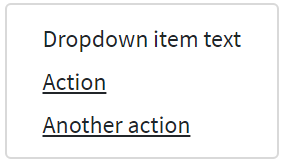

Here is an example of non-interactive dropdown items code:

```java 
//@FindBy(css = "dropdown-menu-text-item")
@UI("#dropdown-menu-text-item")
public static DropdownMenu dropdownMenuTextItem;

@Test(expectedExceptions = RuntimeException.class,
        expectedExceptionsMessageRegExp = ".*Expected: an array containing \"href\".*")
public void textItemTest() {
    dropdownMenuTextItem.expand();
    UIElement textItem = dropdownMenuTextItem.list().get("Dropdown item text");
    textItem.waitFor().enabled();
    textItem.assertThat()
        .tag("span");

    textItem.waitSec(1);
    textItem.assertThat()
        .hasAttr("href");
}
```

```html 
<div class="dropdown" id="dropdown-menu-text-item">
    <button class="btn btn-primary dropdown-toggle" type="button" data-toggle="dropdown" aria-haspopup="true" aria-expanded="false" style="margin-bottom: 5px;">
        Menu items with non-interactive
    </button>
    <div class="dropdown-menu" x-placement="bottom-start"
     style="position: absolute; transform: translate3d(0px, 37px, 0px);
     top: 0px; left: 0px; will-change: transform;">
        <span class="dropdown-item-text">Dropdown item text</span>
        <a class="dropdown-item" href="https://getbootstrap.com/
            docs/4.3/components/dropdowns/" target="_blank">Action</a>
        <a class="dropdown-item" href="https://getbootstrap.com/
            docs/4.3/getting-started/introduction/"
             target="_blank">Another action</a>
    </div>
</div>
```

<a href="https://github.com/jdi-testing/jdi-light/blob/bootstrap/jdi-light-bootstrap-tests/src/test/java/io/github/epam/bootstrap/tests/composite/dropdown/DropdownMenuItemsTest.java">Bootstrap test examples</a>

<br><br>
<a href="https://getbootstrap.com/docs/4.3/components/dropdowns/#active">**Active**</a><br>

Add ``.active`` to items in the dropdown to style them as active.


Here is a code example of items in the dropdown which are styled as active:

```java 
//@FindBy(css = "#dropdown-menu-items-active")
@UI("#dropdown-menu-items-active")
public static DropdownMenu dropdownMenuItemsActive;

@Test(dataProvider = "dropdownMenu")
public void dropdownMenuTest(String itemText, String itemHref) {
    dropdownMenuItemsActive.expand();
    int currWindowNum = WindowsManager.windowsCount();
    dropdownMenuItemsActive.select(itemText);
    WindowsManager.switchToWindow(currWindowNum + 1);
    String Url = WebPage.getUrl();
    assertEquals(Url, itemHref);
    WindowsManager.closeWindow();
    WindowsManager.switchToWindow(currWindowNum);
    dropdownMenuItemsActive.collapse();
}

@Test
public void isActiveTest() {
    dropdownMenuItemsActive.expand();
    dropdownMenuItemsActive.is().active(2);
    dropdownMenuItemsActive.collapse();
}
```

```html 
<div class="dropdown" id="dropdown-menu-items-active">
    <button class="btn btn-primary dropdown-toggle" type="button" data-toggle="dropdown" aria-haspopup="true" aria-expanded="false" style="margin-bottom: 5px;">
        Menu items with active
    </button>
    <div class="dropdown-menu">
        <a class="dropdown-item" href="https://getbootstrap.com/
        docs/4.3/components/dropdowns/#active" 
        target="_blank">Action</a>
        <a class="dropdown-item active" 
        href="https://getbootstrap.com/docs/4.3/components/dropdowns/"
         target="_blank">Another action</a>
        <a class="dropdown-item" href="https://getbootstrap.com/
        docs/4.3/getting-started/introduction/"
         target="_blank">Something else here</a>
    </div>
</div>
```
<a href="https://github.com/jdi-testing/jdi-light/blob/bootstrap/jdi-light-bootstrap-tests/src/test/java/io/github/epam/bootstrap/tests/composite/dropdown/DropdownActiveTests.java">Bootstrap test examples</a>
<br><br><br><br><br><br><br><br>
<a href="https://getbootstrap.com/docs/4.3/components/dropdowns/#disabled">**Disabled**</a><br>

Add ``.disabled`` to items in the dropdown to style them as disabled.


Here is a code example of items in the dropdown which are styled as disabled:

```java 
//@FindBy(css = "#dropdown-menu-disabled-item")
@UI("#dropdown-menu-disabled-item")
public static DropdownMenu dropdownMenuDisabledItem;

private final String DISABLED_ITEM_TEXT = "Disabled link";
private final String DISABLED_ITEM_HREF = "https://getbootstrap.com/docs/4.3/components/dropdowns/";

@Test
public void itemTest() {
    dropdownMenuDisabledItem.expand();
    dropdownMenuDisabledItem.list()
        .get(DISABLED_ITEM_TEXT)
        .assertThat()
        .tag("a")
        .attr("href", DISABLED_ITEM_HREF)
        .disabled();
    dropdownMenuDisabledItem.collapse();
}
```

```html 
<div class="dropdown" id="dropdown-menu-disabled-item">
    <button class="btn btn-primary dropdown-toggle" type="button" data-toggle="dropdown" aria-haspopup="true" aria-expanded="false" style="margin-bottom: 5px;">
        Menu items with disabled
    </button>
    <div class="dropdown-menu">
        <a class="dropdown-item" href="https://getbootstrap.com/
           docs/4.3/components/dropdowns/" 
           target="_blank">Regular link</a>
        <a class="dropdown-item disabled"
             href="https://getbootstrap.com/docs/4.3/components/
            dropdowns/" target="_blank">Disabled link</a>
        <a class="dropdown-item" href="https://getbootstrap.com/
            docs/4.3/getting-started/introduction/"
             target="_blank">Another link</a>
    </div>
</div>
```

<a href="https://github.com/jdi-testing/jdi-light/blob/bootstrap/jdi-light-bootstrap-tests/src/test/java/io/github/epam/bootstrap/tests/composite/dropdown/DisabledMenuItemTest.java">Bootstrap test examples</a>

<br>

#### <a href="https://getbootstrap.com/docs/4.3/components/dropdowns/#menu-alignment">Menu alignment</a>
By default, a dropdown menu is automatically positioned 100% from the top and along the left side of its parent. Add ``.dropdown-menu-right`` to a ``.dropdown-menu`` to right align the dropdown menu.

Here is an example of right-aligned menu:


Here is an example of right-aligned menu code:

```java 
//@FindBy(id = "rightAllignedDropdown")
@UI("#rightAllignedDropdown")
public static DropdownMenu rightAllignedDropdown;

@Test
public void rightAllignedDropdownIsValidationTest() {
    rightAllignedDropdown.menu().is()
        .core()
        .hasClass("dropdown-menu-right");
}
```

```html
<div id="rightAllignedDropdown" class="btn-group">
    <button type="button" class="btn btn-primary dropdown-toggle" data-toggle="dropdown"
            aria-haspopup="true" aria-expanded="false" style="margin-bottom: 5px;">
        Right-aligned menu example
    </button>
    <div class="dropdown-menu dropdown-menu-right">
        <button class="dropdown-item" type="button" onclick="alert('Action');">Action
        </button>
        <button class="dropdown-item" type="button" onclick="alert('Another action');">
            Another action
        </button>
        <button class="dropdown-item" type="button" onclick="alert('One more action');">
            Something else here
        </button>
    </div>
</div>
```

<a href="https://getbootstrap.com/docs/4.3/components/dropdowns/#responsive-alignment">**Responsive alignment**</a><br>

If you want to use responsive alignment, disable dynamic positioning by adding the<br> ``data-display="static"`` attribute and use the responsive variation classes.

To align **right** the dropdown menu with the given breakpoint or larger, add<br> ``.dropdown-menu{-sm|-md|-lg|-xl}-right``.

Here is an example of left-aligned but right aligned when large screen:


Here is an example of left-aligned but right aligned when large screen code:

```html 
<div class="btn-group">
    <button type="button" class="btn btn-primary dropdown-toggle" 
    data-toggle="dropdown" data-display="static" aria-haspopup="true" aria-expanded="false" style="margin-bottom: 5px;">
        Right aligned when large screen
    </button>
    <div class="dropdown-menu dropdown-menu-lg-right">
        <button class="dropdown-item" type="button" onclick="alert('Action');">Action
        </button>
        <button class="dropdown-item" type="button" onclick="alert('Another action');">
            Another action
        </button>
        <button class="dropdown-item" type="button" onclick="alert('One more action');">
            Something else here
        </button>
    </div>
</div>
```

To align **left** the dropdown menu with the given breakpoint or larger, add<br> ``.dropdown-menu-right`` and ``.dropdown-menu{-sm|-md|-lg|-xl}-left``.

Here is an example of right-aligned but left aligned when large screen code:

```java 
//@FindBy(id = "leftAllignedDropdown")
@UI("#leftAllignedDropdown")
public static DropdownMenu leftAllignedDropdown;

@Test
public void leftAllignedDropdownIsValidationTest() {
    leftAllignedDropdown.menu().is()
        .core()
        .hasClass("dropdown-menu-lg-left")
        .css(RIGHT, is("auto"))
        .css(LEFT, is("0px"));
}
```

```html 
<div id="leftAllignedDropdown" class="btn-group">
    <button type="button" class="btn btn-primary dropdown-toggle" data-toggle="dropdown" data-display="static" aria-haspopup="true" aria-expanded="false" style="margin-bottom: 5px;">
        Left aligned when large screen
    </button>
    <div class="dropdown-menu dropdown-menu-right dropdown-menu-lg-left">
        <button class="dropdown-item" type="button" onclick="alert('Action');">Action
        </button>
        <button class="dropdown-item" type="button" onclick="alert('Another action');">
            Another action
        </button>
        <button class="dropdown-item" type="button" onclick="alert('One more action');">
            Something else here
        </button>
    </div>
</div>
```
<a href="https://github.com/jdi-testing/jdi-light/blob/bootstrap/jdi-light-bootstrap-tests/src/test/java/io/github/epam/bootstrap/tests/composite/dropdown/DropdownTests.java">Bootstrap test examples</a>

<br>

#### <a href="https://getbootstrap.com/docs/4.3/components/dropdowns/#menu-content">Menu content</a>
<a href="https://getbootstrap.com/docs/4.3/components/dropdowns/#headers">**Headers**</a><br>

Add a header to label sections of actions in any dropdown menu.

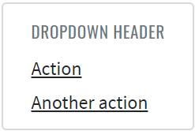

Here is an example headers code in the menu items:

```java 
//@FindBy(id = "dropdown-content-header")
@UI("#dropdown-content-header")
public static DropdownMenuContent dropdownMenuContentHeader;

@Test
public void checkHeaderTest() {
    dropdownMenuContentHeader.show();
    dropdownMenuContentHeader.is().displayed();
    dropdownMenuContentHeader.expand();
    dropdownMenuContentHeader.menu().children().is().size(2);
    dropdownMenuContentHeader.header.is().core()
            .displayed()
            .tag("h6")
            .hasClass("dropdown-header")
            .text("DROPDOWN HEADER");
}
```

```html
<div class="dropdown-menu" id="dropdown-content-header">
    <h6 class="dropdown-header">Dropdown header</h6>
    <a class="dropdown-item" href="https://getbootstrap.com/"
     target="_blank">Action</a>
    <a class="dropdown-item" href="https://getbootstrap.com/docs/
     4.0/components/dropdowns/"
       target="_blank">Another action</a>
</div>
```

<a href="https://github.com/jdi-testing/jdi-light/blob/bootstrap/jdi-light-bootstrap-tests/src/test/java/io/github/epam/bootstrap/tests/composite/dropdown/DropdownMenuContentTests.java">Bootstrap test examples</a>

<br><br><br><br><br><br>

<a href="https://getbootstrap.com/docs/4.3/components/dropdowns/#dividers">**Dividers**</a><br>

Separate groups of related menu items with a divider.


Here is an example dividers code in the menu items:

```java 
//@FindBy(id = "dropdown-content-divider")
@UI("#dropdown-content-divider")
public static DropdownMenuContent dropdownMenuContentDivider;

@Test
public void checkDividerTest() {
    dropdownMenuContentDivider.show();
    dropdownMenuContentDivider.is().displayed();
    dropdownMenuContentDivider.expand();
    dropdownMenuContentDivider.menu().children().is().size(4);
    dropdownMenuContentDivider.divider.is().core()
            .displayed()
            .tag("div")
            .hasClass("dropdown-divider");
}
```

```html
<div class="dropdown-menu" id="dropdown-content-divider">
    <a class="dropdown-item" href="https://getbootstrap.com/"
     target="_blank">Action</a>
    <a class="dropdown-item" href="https://getbootstrap.com/docs
    /4.0/components/dropdowns/"
       target="_blank">Another action</a>
    <div class="dropdown-divider"></div>
    <a class="dropdown-item"
       href="https://getbootstrap.com/docs/4.3/getting-started/
        introduction/"
       target="_blank">Separated link</a>
</div>
```
<a href="https://github.com/jdi-testing/jdi-light/blob/bootstrap/jdi-light-bootstrap-tests/src/test/java/io/github/epam/bootstrap/tests/composite/dropdown/DropdownMenuContentTests.java">Bootstrap test examples</a>
<br><br><br><br>
<a href="https://getbootstrap.com/docs/4.3/components/dropdowns/#text">**Text**</a><br>

Place any freeform text within a dropdown menu with text and use <a href="https://getbootstrap.com/docs/4.3/utilities/spacing/">spacing utilities</a>. Note that you’ll likely need additional sizing styles to constrain the menu width.


Here is an example text code in the menu items:

```java 
//@FindBy(id = "dropdown-content-text")
@UI("#dropdown-content-text")
public static DropdownMenuContent dropdownMenuContentText;

@Test
public void checkTextTest() {
    dropdownMenuContentText.show();
    dropdownMenuContentText.is().displayed();
    dropdownMenuContentText.expand();
    dropdownMenuContentText.menu().children().is().size(2);
    dropdownMenuContentText.text.is()
           .values(TextTypes.TEXT, hasItems("Some example text that's free-flowing within the dropdown menu."));
    dropdownMenuContentText.text.is()
           .values(TextTypes.TEXT, hasItems("And this is more example text."));
}
```

```html
<div class="dropdown-menu p-4 text-muted" style="max-width: 200px;" id="dropdown-content-text">
    <p>
        Some example text that's free-flowing within the dropdown menu.
    </p>
    <p class="mb-0">
        And this is more example text.
    </p>
</div>
```
<br><br><br><br><br><br><br>
<a href="https://getbootstrap.com/docs/4.3/components/dropdowns/#forms">**Forms**</a><br>

Put a form within a dropdown menu, or make it into a dropdown menu, and use <a href="https://getbootstrap.com/docs/4.3/utilities/spacing/">margin or padding utilities</a> to give it the negative space you require.


Here is an example form code in the menu items:

```java 
public class DropdownForm extends DropdownMenu {
    @UI("//form") public FormDropdownLogin form;
}

@Test
public void fillTest() {
    dropdownForm.expand();

    dropdownForm.form.fill(USER);
    dropdownForm.form.check(USER);

    dropdownForm.collapse();
}

@Test
public void checkboxTests() {
    dropdownForm.expand();

    dropdownForm.form.remember.check();
    dropdownForm.form.remember.is().selected();
    dropdownForm.form.remember.uncheck();
    dropdownForm.form.remember.is().deselected();

    dropdownForm.collapse();
}

@Test
public void testButton(){
    dropdownForm.expand();

    dropdownForm.form.submit();
    validateAlert(is("Sign in"));

    dropdownForm.collapse();
}
```
```html
<div class="dropdown-menu">
    <form class="px-4 py-3">
        <div class="form-group">
            <label for="exampleDropdownFormEmail1">Email address</label>
            <input type="email" class="form-control" id="exampleDropdownFormEmail1"
                   placeholder="email@example.com">
        </div>
        <div class="form-group">
            <label for="exampleDropdownFormPassword1">Password</label>
            <input type="password" class="form-control" id="exampleDropdownFormPassword1"
                   placeholder="Password">
        </div>
        <div class="form-group">
            <div class="form-check">
                <input type="checkbox" class="form-check-input" id="dropdownCheck">
                <label class="form-check-label" for="dropdownCheck">
                    Remember me
                </label>
            </div>
        </div>
        <button type="button" class="btn btn-primary" onclick="alert('Sign in');">Sign in
        </button>
    </form>
    <div class="dropdown-divider"></div>
    <a class="dropdown-item" href="https://jdi-testing.github.io/jdi-light/index.html"
       target="_blank">New around here? Sign up</a>
    <a class="dropdown-item" href="https://jdi-testing.github.io/jdi-light/index.html"
       target="_blank">Forgot password?</a>
</div>
```


<a href="https://github.com/jdi-testing/jdi-light/blob/bootstrap/jdi-light-bootstrap-tests/src/test/java/io/github/epam/bootstrap/tests/composite/dropdown/DropdownFormTest.java" target="_blank">Bootstrap Test Examples</a>

<br><br><br><br><br><br>

<a target="_blank" href="https://getbootstrap.com/docs/4.3/components/dropdowns/#dropdown-options">**Dropdown Options**</a><br>

Use ``data-offset`` or ``data-reference`` to change the location of the dropdown.

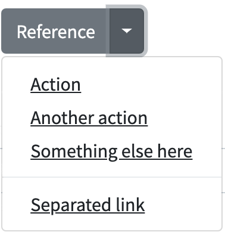

```java 
//@FindBy(id = "offsetDropdown")
@UI("#offsetDropdown")
public static DropdownMenu offsetDropdown;

//@FindBy(id = "referenceDropdown")
@UI("#referenceDropdown")
public static DropdownMenu referenceDropdown;

@Test(dataProvider = "dropdownData")
public void expandCollapseTest(BootstrapDropdown dropdown) {
    dropdown.expand();
    dropdown.is().expanded();
    dropdown.collapse();
    dropdown.is().collapsed();
}

@Test
public void optionsCssTest() {
    offsetDropdown.expand();
    assertThat(offsetDropdown.core().children().get(1).getAttribute(DATA_OFFSET), is(DATA_OFFSET_VALUE));
    offsetDropdown.collapse();

    referenceDropdown.expand();
    assertThat(referenceDropdown.core().children().get(2).getAttribute(DATA_REFERENCE), is(DATA_REFERENCE_VALUE));
    referenceDropdown.collapse();
}
```

Here is an example with Bootstrap v4.3 code:

```html
<div id="referenceDropdown" class="btn-group">
    <button type="button" class="btn btn-secondary">Reference</button>
    <button type="button" class="btn btn-secondary dropdown-toggle dropdown-toggle-split" id="dropdownMenuReference" data-toggle="dropdown" aria-haspopup="true" aria-expanded="false" data-reference="parent">
        <span class="sr-only">Toggle Dropdown</span>
    </button>
    <div class="dropdown-menu" aria-labelledby="dropdownMenuReference">
        <a class="dropdown-item" href="javascript: void();" onclick="alert('Action clicked!');">Action</a>
        <a class="dropdown-item" href="javascript: void();" onclick="alert('Another action clicked!');">Another action</a>
        <a class="dropdown-item" href="javascript: void();" onclick="alert('Something else here clicked!');">Something else here</a>
        <div class="dropdown-divider"></div>
        <a class="dropdown-item" href="javascript: void();" onclick="alert('Separated link clicked!');">Separated link</a>
    </div>
</div>
```

<a href="https://github.com/jdi-testing/jdi-light/blob/bootstrap/jdi-light-bootstrap-tests/src/test/java/io/github/epam/bootstrap/tests/composite/dropdown/DropdownOptionsTests.java" target="_blank">Bootstrap Test Examples</a>


## JDI Features for parameters in BDD steps 

### Using aliases as locators parameters 
```gherkin
   Scenario: input element
       When I input "simple 1234" in "Name"
       Then the "Name" text matches to "\w{6} \d{4}"
       Then the "Logout" is hidden

   
    Scenario: click element
       When I click on "Red Button"
       Then the Alert text equals to "Red button"
 ```
Features have locators taken from file-based PageObjects instead of an element name.
<br><br><br><br><br><br><br><br>

```
html5page.json for json-based locators (contains css locators):
```
```json
    {
      "Red Button": "[value*='Red Button']",
      "Name": "#name",
      "Logout": ".fa-sign-out"
    }
```

**Note**: Locators are defined via json file/files with an arbitrary name. <br>
But these json file/files **must be** located in **json.page.objects** package.<br>

**Keep in mind**: All the elements are collected from these json file/files and are stored in global hash map.<br>
 Therefore it is **essential** that all the elements defined with **unique names**.<br>

[BDD feature test examples](https://github.com/jdi-testing/jdi-light/blob/bootstrap/jdi-light-bdd-no-po-tests/src/test/resources/features/TestsWithProperties.feature)<br>
[Json PageObject file example](https://github.com/jdi-testing/jdi-light/blob/bootstrap/jdi-light-bdd-no-po-tests/src/test/resources/json/page/objects/html5page.json)
<br><br><br>
### Using locators as parameters 
```gherkin
   Scenario: click element
       When I click on "[value*='Red Button']"
       Then the Alert text equals to "Red button"

   Scenario: clear element
       When I input "simple text" in "#name"
       Then the "#name" text equals to "simple text"
       When I clear "#name"
       Then the "#name" text equals to ""
 ```

Feature allows to use locator as parameter instead of an element name.<br><br><br><br><br><br><br>

[BDD feature test examples](https://github.com/jdi-testing/jdi-light/blob/bootstrap/jdi-light-bdd-no-po-tests/src/test/resources/features/TestsWithLocators.feature)
<br><br><br>
### Using element names defined with capital letter as locator IDs 
```gherkin
   Scenario: isDisabled element
       Then the "Disabled Name" is disabled
   
   Scenario: check element
       When check "Accept Conditions"
       Then the "Accept Conditions" is selected
 ```
```
"Disabled Name" element is automatically searched by the smart locator #disabled-name. 
"Accept Conditions" element is automatically searched by the smart locator #accept-conditions.
```

Features have locators automatically generated if there is no available PageObject json implementation 
and element name defined with capital letter.<br><br>
**When** \<I\> click on "Element name" <br>
Smart locator is generated like ID with lover case element name: **#element-name**.
 <br><br><br>

[BDD feature test examples](https://github.com/jdi-testing/jdi-light/blob/bootstrap/jdi-light-bdd-no-po-tests/src/test/resources/features/TestsWithName.feature) <br>
For better understanding of this test example remove **"Name": "#name"** from html5page.json to be sure how smart locator works.
<br><br><br>

### Using aliases for pages URLs 

```gherkin
   #Instead of this:
   Scenario: bootstrap page
       Given Page with url "\<LINK TO HOME PAGE\>" opened
   
   Scenario: contacts page
       When I open url "\<LINK TO CONTACTS PAGE\>"
       Then the url "\<LINK TO CONTACTS PAGE\>" is opened
 ```
```gherkin
   #Use this:
   Scenario: json based bootstrap page
       When I open "Bootstrap Page" page
       Then the "Bootstrap Page" page is opened
   
   Scenario: json based contacts page
       When I open "Contacts Page" page
       Then the "Contacts Page" page is opened
 ```

Pages can be opened by alias name instead of URL. 
<br><br><br><br><br><br><br><br><br><br><br><br><br><br><br>

```
pages.json:
```
```json 
    {
      "Home Page": "/",
      "Bootstrap Page": "/bootstrap.html"
    }
 ```
Alias for pages are defined via **[pages.json](https://github.com/jdi-testing/jdi-light/blob/bootstrap/jdi-light-bdd-no-po-tests/src/test/resources/json/page/objects/pages.json)**. <br>
Note: domain is read from test.properties automatically. <br><br><br><br><br>
[BDD feature test examples](https://github.com/jdi-testing/jdi-light/blob/bootstrap/jdi-light-bdd-no-po-tests/src/test/resources/features/JsonBasedPage.feature)
<br><br><br>

## Material UI elements

### Checkbox

#### https://material-ui.com/components/checkboxes/

```java 
    @UI("//h2[text()='Basic checkboxes']/following-sibling::div[1]/span")
    public List<Checkbox> basicCheckbox;

    @Test
    public void basicCheckboxTest() {
        for (int i = 1; i < 3; i++)
            checkboxTestLogic(
                    checkboxPage.basicCheckbox.get(i),
                    i != 2 && i != 7 ? "MuiCheckbox-colorSecondary" :
                            i == 2 ? "MuiCheckbox-colorPrimary" : "jss3");
    }
    
    private void checkboxTestLogic(Checkbox checkbox, String className) {
        if (checkbox.isEnabled()) {
            checkbox.check();
            checkbox.is().checked();
            checkbox.uncheck();
            checkbox.is().unChecked();
        } else
            checkbox.is().disabled();
        checkbox.is().hasClass(className);
    }
```

Checkbox is located in the following class:

   - __Java__: _com.epam.jdi.light.material.elements.inputs.Checkbox_


Checkboxes allow the user to select one or more items from a set.

|Method | Description | Return Type
--- | --- | ---
**is()** | Returns Assert class | Assert
**isDisabled()** | Verify state | boolean
**hasClassName(String className)** | Checks class| void
**checked()** | Assert that Checkbox selected | Assert
**uncheck()** | Assert that Checkbox not selected | Assert
**check()** | select Checkbox | void
**uncheck()** | unselect Checkbox | void


#### <a href="https://github.com/jdi-testing/jdi-light/blob/Material-UI/jdi-light-material-ui-tests/src/test/java/io/github/epam/material/tests/inputs/CheckboxTests.java" target="_blank">Here you can find Checkbox tests</a>

### Chips

#### https://material-ui.com/components/chips/

```java 
@JDIChip
@UI("//h2[text() = 'Chip']/following-sibling::*[1]")
public static Chip defaultChips;

@JDIChip
@UI("//h2[text() = 'Outlined Chips']/following-sibling::*[1]")
public static Chip outlinedChips;

@JDIChip
@UI("//h2[text() = 'Chip array']/following-sibling::*[1]")
public static Chip chipArrays;

@BeforeMethod
public void beforeTest() {
    chipsPage.open();
}

@Test
public void defaultChipTest(){
    basicCheck(defaultChips);
    disabledCheck(defaultChips);// first variant of class value
    clickableCheck(defaultChips,3);
    clickableLinkCheck(defaultChips,7);
}

@Test
public void outlinedChipTest(){
    basicCheck(outlinedChips);
    disabledCheck(outlinedChips); // second variant of class value
    clickableCheck(outlinedChips, 3);
    clickableLinkCheck(outlinedChips, 7);
}

@Test
public void chipArrayTest(){
    chipArrays.is().displayed(1);
    chipArrays.is().text(1, hasToString("Angular"));
    chipArrays.is().displayed(2);
    chipArrays.is().text(2, hasToString("jQuery"));
    chipArrays.getChipIcon(1).click();
    chipArrays.is().text(1, hasToString("jQuery")); // "jQuery" became first element as "Angular" element was deleted
}

public void basicCheck(Chip chips){
    chips.is().displayed(1);
    chips.is().text(1, hasToString("Basic"));
}
```

Chip is located in the following class:

   - __Java__: _com.epam.jdi.light.material.elements.displaydata.Chip_


Chips are compact elements that represent an input, attribute, or action.

|Method | Description | Return Type
--- | --- | ---
**is()** | Returns Assert class | ChipAssert
**click(int index)** | Clicks on chip | void
**getChipLabel(int index)** | Gets label| UIElement
**getChipRoot(int index)** | Gets root| UIElement
**getChipIcon(int index)** | Gets Icon|UIElement

#### <a href="https://github.com/jdi-testing/jdi-light/blob/Material-UI/jdi-light-material-ui-tests/src/test/java/io/github/epam/material/tests/displaydata/ChipTests.java" target="_blank">Here you can find Chips tests</a>

### Tooltip

#### https://material-ui.com/components/tooltips/

```java 
@UI("//*[contains(@class, 'MuiIconButton-root')]")
public ButtonWithTooltip buttonWithTooltip;

@Test
public void defaultTooltipTest() {
    tooltipPage.open();
    tooltipPage.buttonWithTooltip.hover();
    tooltipPage.buttonWithTooltip.tooltip().is().visible();
    tooltipPage.buttonWithTooltip.tooltip().has().text("Delete");
}
```

Tooltip is located in the following class:

   - __Java__: _com.epam.jdi.light.material.elements.displaydata.Tooltip_


Tooltips display informative text when users hover over, focus on, or tap an element.

|Method | Description | Return Type
--- | --- | ---
**is()** | Returns Assert class | TooltipAssert
**has()** | Returns Assert class | TooltipAssert
**isVisible()** | Checks element is displayed| boolean
**isInteractive()** | Checks element is interactive| boolean
**getValue()** | Gets value| String

#### <a href="https://github.com/jdi-testing/jdi-light/blob/Material-UI/jdi-light-material-ui-tests/src/test/java/io/github/epam/material/tests/displaydata/TooltipTests.java" target="_blank">Here you can find Tooltip tests</a>

### Container

#### https://material-ui.com/components/container/

```java 
    @UI("//div[contains(@Class, 'MuiTypography-body1')]")
    public static UIElement container;

    @Test
    public void defaultContainerTest(){
        Timer timer = new Timer(1000L);
        timer.wait(() -> container.isDisplayed());
        container.is().text("Example text");
        container.is().attr("style", "background-color: rgb(207, 232, 252); height: 100vh;");
    }
```


The container centers your content horizontally. It's the most basic layout element.

|Method | Description | Return Type
--- | --- | ---
**is()** | Verify state | boolean
**isDisplayed()** | Verify state | boolean


#### <a href="https://github.com/jdi-testing/jdi-light/blob/Material-UI/jdi-light-material-ui-tests/src/test/java/io/github/epam/material/tests/layout/ContainerTests.java" target="_blank">Here you can find Container tests</a>


### Avatar

#### https://material-ui.com/ru/components/avatars/

```java 
    @UI("//span[@class='MuiBadge-root']/span")
    public static List<UIElement> onlineStatus;
    
    @UI("//span[@class='MuiBadge-root']/following-sibling::div")
    public static List<UIElement> avatarWithoutPhoto;
    
    @UI("//span[@class='MuiBadge-root']/div")
    public static List<UIElement> avatarWithPhoto;

    @Test
    public void avatarTests() {
        Timer timer = new Timer(1000L);
        timer.wait(() -> onlineStatus.get(1).is().displayed());
        basicAvatarChecks(avatarWithoutPhoto, true);
        basicAvatarChecks(avatarWithPhoto, false);
        onlineStatus.get(1).has().classValue(Matchers.containsString("MuiBadge-dot"));
        onlineStatus.get(2).has().text("R");
        onlineStatus.get(2).has().classValue(Matchers.containsString("MuiBadge-anchorOriginBottomRightCircle"));
    }
```


Avatars are found throughout material design with uses in everything from tables to dialog menus.

|Method | Description | Return Type
--- | --- | ---
**hasImage()** | Checks image | boolean
**classValue()** | Checks class | boolean
**isDisplayed()** | Verify state | void
**text()** | Asserts text | Assert
**has()** | Verify state | boolean

#### <a href="https://github.com/jdi-testing/jdi-light/blob/Material-UI/jdi-light-material-ui-tests/src/test/java/io/github/epam/material/tests/displaydata/AvatarTests.java" target="_blank">Here you can find Avatar tests</a>

### Click Away Listener

#### https://material-ui.com/ru/components/click-away-listener/

```java     
    @UI("//h2[text()='Example']/following-sibling::div[1]/div/button")
    public static Button exampleButton;

    @UI("//h2[text()='Portal']/following-sibling::div[1]/div/button")
    public static Button portalButton;

    @UI("//div[text()='Click me, I will stay visible until you click outside.']")
    public static TextArea text;

    @Test
    public void exampleClickAwayListenerTest() {
        textFieldTest(1);
    }

    @Test
    public void portalExampleClickAwayListenerTest() {
        textFieldTest(2);
    }

    private void textFieldTest(int buttonId) {
        clickAwayListenerPage.clickButton(buttonId);
        text.is().displayed();
        clickAwayListenerPage.clickButton(buttonId);
        text.is().hidden();
        clickAwayListenerPage.clickButton(buttonId);
        text.is().displayed();
        clickAwayListenerPage.clickAroundTextPopup(text.getSize().width + 1, -1);
        text.is().hidden();
        clickAwayListenerPage.clickButton(buttonId);
        clickAwayListenerPage.clickAroundButton(exampleButton.getSize().width + 1,0, buttonId);
        text.is().hidden();
    }
```

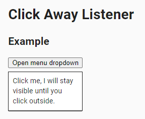

Detect if a click event happened outside of an element. It listens for clicks that occur somewhere in the document.

|Method | Description | Return Type
--- | --- | ---
**click()** | Clicks on box | void
**click(int x, int y)** | Clicks on point in box | void
**is()** | Returns Assert class | Assert
**displayed()** | Assert state | Assert
**hidden()** | Assert state | Assert

#### <a href="https://github.com/jdi-testing/jdi-light/blob/Material-UI/jdi-light-material-ui-tests/src/test/java/io/github/epam/material/tests/utils/ClickAwayListenerTests.java" target="_blank">Here you can find ClickAwayListener tests</a>

### Divider

#### https://material-ui.com/components/dividers/

```java 
    @UI("(//li[contains(@class, 'MuiDivider-root')])")
    public static List<Divider> insetDividers;
    
    @UI(".MuiDivider-root")
    public static Divider verticalDivider;

    @Test
    public void insetDividerTest() {
        insetDividers.forEach(
            d-> d.is().inset()
        );
    }
    
    @Test
    public void verticalDividerTest() {
        verticalDivider.is().vertical();
    }
```

Divider is located in the following class:

- __Java__: _com.epam.jdi.light.material.elements.displaydata.Divider_


A divider is a thin line that groups content in lists and layouts.

|Method | Description | Return Type
--- | --- | ---
**is()** | Returns DividerAssert class | DividerAssert
**isInset()** | Assert inset divider | boolean
**isVertical()** | Assert vertical divider| boolean


#### <a href="https://github.com/jdi-testing/jdi-light/blob/Material-UI/jdi-light-material-ui-tests/src/test/java/io/github/epam/material/tests/displaydata/DividerTests.java" target="_blank">Here you can find Divider tests</a>

### Card

#### https://material-ui.com/components/cards/

```java    
    @UI("//div[@class='MuiCardContent-root']/p[1]")
    public static List<Text> pTagTexts;

    @UI("//div[@class='MuiCardContent-root']/h2[1]")
    public static List<Text> h2TagTexts;

    @UI("//div[@class='MuiCardActions-root']/button[1]")
    public static Button complexCardHeartIconButton;

    @UI("//div[@class='MuiCardActions-root']/button[1]/span[1]/*")
    public static Icon complexCardHeartIcon;

    @UI("//div[@class='MuiCardActions-root']/button[3]")
    public static Button complexCardSliderDownButton;

    @UI("//div[@class='MuiCardActions-root']/preceding-sibling::div[2]")
    public static Image complexCardImage;

    @UI("//div[@class='MuiCardActions-root']/following-sibling::div[1]")
    public static TextArea complexCardHiddenTextArea;

    @UI("//div[@class='MuiCardActions-root']/following-sibling::div[1]/div/div/div/p[1]")
    public static Text complexCardHiddenText;

    private void textCheck(int index) {
        pTagTexts.get(index).has().text(Matchers.is("Word of the Day"));
        h2TagTexts.get(index).has().text(Matchers.is("be•nev•o•lent"));
    }

    @Test
    public void complexCardTest() {
        String expectedText = "This impressive paella is a perfect party dish and a fun meal to cook together with your guests. Add 1 cup of frozen peas along with the mussels, if you like.";
        pTagTexts.get(3).has().text(Matchers.is(expectedText));
        complexCardImage.is().displayed();

        complexCardHeartIconButton.click();
        new Timer(1000L)
                .wait(() -> complexCardHeartIcon.has().classValue(Matchers.containsString("jss")));

        complexCardHeartIconButton.click();
        new Timer(1000L)
                .wait(() -> complexCardHeartIcon.has().classValue(Matchers.not("jss")));

        complexCardSliderDownButton.click();
        complexCardHiddenTextArea.is().displayed();
        complexCardHiddenText.has().text(Matchers.containsString("Method:"));
    }
```


Cards contain content and actions about a single subject.

|Method | Description | Return Type
--- | --- | ---
**click()** | Clicks on box | void
**is()** | Returns Assert class | Assert
**displayed()** | Assert state | Assert
**hidden()** | Assert state | Assert
**classValue()** | Assert state | Assert

#### <a href="https://github.com/jdi-testing/jdi-light/blob/Material-UI/jdi-light-material-ui-tests/src/test/java/io/github/epam/material/tests/surfaces/CardTests.java" target="_blank">Here you can find Card tests</a>

### Radio

####https://material-ui.com/components/radio-buttons/

```java 
    @UI("//fieldset[@id='simpleRadio']//span[contains(@Class,'MuiRadio-root')]")
    public static List<Button> simpleRadioButtons;

    @UI("//fieldset[@id='simpleRadio']//span[contains(@Class,'MuiFormControlLabel-label')]")
    public static List<Button> simpleRadioButtonsLabel;

    static private final List<String> labels = Arrays.asList("First", "Second", "Third", "Disabled");
    static private final List<String> classes = Arrays.asList("Top", "Start", "Bottom");
    static private final List<String> messages = Arrays.asList("You got it!", "Sorry, wrong answer!");
    static private final Timer timer = new Timer(2000L);

    @Test
    public void simpleRadioTest() {
        for (int i = 1; i <= 4; i++) {
            Button currentRadioButton = simpleRadioButtons.get(i);
            Button currentRadioButtonLabel = simpleRadioButtonsLabel.get(i);
            if (i != 4) {
                currentRadioButton.click();
                timer.wait(() -> currentRadioButton.has().classValue(containsString("Mui-checked")));
                lastRadioText.has().text(containsString(currentRadioButton.text()));
            }
            else
                timer.wait(() -> currentRadioButton.has().classValue(containsString("Mui-disabled")));
            currentRadioButtonLabel.has().text(labels.get(i - 1));
        }
    }
```


Radio buttons allow the user to select one option from a set.

|Method | Description | Return Type
--- | --- | ---
**click()** | Clicks on box | void
**click(int x, int y)** | Clicks on point in box | void
**is()** | Returns Assert class | Assert
**displayed()** | Assert state | Assert
**hidden()** | Assert state | Assert

#### <a href="https://github.com/jdi-testing/jdi-light/blob/Material-UI/jdi-light-material-ui-tests/src/test/java/io/github/epam/material/tests/inputs/RadioButtonTests.java" target="_blank">Here you can find Radio tests</a>

### App Bar

####https://material-ui.com/components/app-bar/

```java 
    @UI("//*[text()='App Bar with menu']/preceding::button[@aria-label='menu']")
    public static UIElement simpleMenu;

    @UI("//*[text()='Prominent App Bar']/preceding::button[@aria-label='menu'][1]")
    public static UIElement appBarMenu;

    @UI("//*[text()='Prominent App Bar']/following::button[@aria-label='open drawer']")
    public static UIElement prominentMenu;

    @UI("//*[text()='Simple App bar']/following::h6[1]")
    public static Text simpleText;

    @UI("//*[text()='App Bar with menu']/following::h6")
    public static Text appBarText;

    @UI("//*[text()='Prominent App Bar']/following::h5")
    public static Text prominentText;

    @UI("//*[text()='Simple App bar']/following::button[2]")
    public static Button simpleButton;

    @Test
    public void simpleAppBarTest() {
        simpleAppBarPage.open();
        simpleAppBarPage.shouldBeOpened();
        simpleMenu.isDisplayed();
        appBarMenu.isDisplayed();
        prominentMenu.isDisplayed();
        simpleText.has().text("News");
        appBarText.has().text("Photos");
        prominentText.has().text("Material-UI");
        simpleButton.is().displayed();
        appBarIcon.is().displayed();
        prominentSearch.is().displayed();
        prominentSecondMenu.is().displayed();
        logoutSwitchButton.click();
        timer.wait(() -> appBarIcon.isNotVisible());
        logoutSwitchButton.click();
        timer.wait(() -> appBarIcon.isDisplayed());
        appBarIcon.click();
        timer.wait(() -> appBarIconOptions.get(1).isDisplayed());
        appBarIconOptions.get(1).click();
        timer.wait(() -> {
            appBarIconOptions.get(1).isNotVisible();
            appBarIcon.isVisible();
        });
    }
```

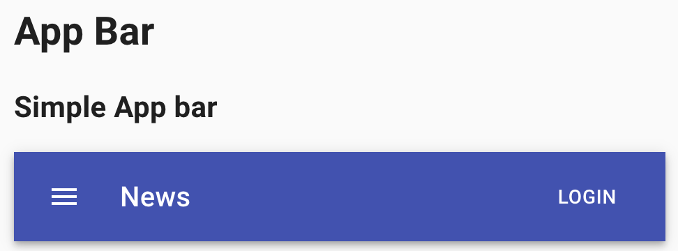

The App Bar displays information and actions relating to the current screen.

|Method | Description | Return Type
--- | --- | ---
**click()** | Clicks on element | void
**click(int x, int y)** | Clicks on point in element | void
**is()** | Returns Assert class | Assert
**has()** | Returns Assert class | Assert
**displayed()** | Assert state | Assert
**hidden()** | Assert state | Assert

#### <a href="https://github.com/jdi-testing/jdi-light/blob/Material-UI/jdi-light-material-ui-tests/src/test/java/io/github/epam/material/tests/surfaces/AppBarTests.java" target="_blank">Here you can find AppBar tests</a>

### Box

#### https://material-ui.com/components/box/

```java     
    @UI("//button[contains(@class,'MuiButton-outlined')]")
    public static Button outlinedBox;

    @Test
    public void outlinedBoxTest() {
        outlinedBox.is().displayed();
        outlinedBox.click();
        outlinedBox.is().text("SECOND BUTTON");
        lastClickContent.is().text("You clicked Second button");
    }
```

The Box component serves as a wrapper component for most of the CSS utility needs.
Java example code for the Button box:


|Method | Description | Return Type
--- | --- | ---
**is()** | Verify state | boolean
**click()** | Clicks on box | void
**displayed()** | Verify state | void
**text()** | Verify text | void

#### <a href="https://github.com/jdi-testing/jdi-light/blob/Material-UI/jdi-light-material-ui-tests/src/test/java/io/github/epam/material/tests/layout/BoxTests.java" target="_blank">Here you can find Box tests</a>

### Transitions

#### https://material-ui.com/components/transitions/

```java     
    @UI("//h1[text()='Transitions']/following::div[contains(@class,'MuiCollapse-container')]")
    public static List<UIElement> collapseFadeTransitions;

    @UI("//span[@class='MuiSwitch-root']")
    public static List<Checkbox> checkboxes;
    
    @Test
    public void collapseDisplayTest() {
      Timer timer = new Timer(2000L);

      collapseFadeTransitions.get(1).has().classValue(not(containsString("MuiCollapse-entered")));
      collapseFadeTransitions.get(2).has().classValue(not(containsString("MuiCollapse-entered")));

      checkboxes.get(1).check();

      timer.wait(() -> collapseFadeTransitions.get(1).hasClass(containsString("MuiCollapse-entered").toString()));
      collapseFadeTransitions.get(1).has().classValue(containsString("MuiCollapse-entered"));
      collapseFadeTransitions.get(2).has().classValue(containsString("MuiCollapse-entered"));
    }
```

Transition helps make a UI expressive and easy to use.


|Method | Description | Return Type
--- | --- | ---
**has()** | Verify state | boolean
**hasClass()** | Verify state | boolean
**classValue()** | Verify state | boolean
**check()** | Checkbox selected | void

#### <a href="https://github.com/jdi-testing/jdi-light/blob/Material-UI/jdi-light-material-ui-tests/src/test/java/io/github/epam/material/tests/utils/TransitionTests.java" target="_blank">Here you can find Transitions tests</a>

### Material Icons

```java     
    @UI("#defaultAccessAlarm")
    public static UIElement defaultAlarm;

    @UI("#largeAccessAlarm")
    public static UIElement largeAlarm;

    @UI("#secondaryAccessAlarm")
    public static UIElement secondaryAlarm;

    @UI("#miconLastClick")
    public static UIElement lastClick;

    @UI("#miconLastHover")
    public static UIElement lastHover;

    @Test
    public void defaultMaterialIconTest() {
        lastClick.is().text("Last click:");
        lastHover.is().text("Last hover:");

        defaultAlarm.hover();
        lastClick.is().text("Last click:");
        lastHover.is().text("Last hover: default");

        defaultAlarm.click();
        lastClick.is().text("Last click: default");
        lastHover.is().text("Last hover: default");

        largeAlarm.hover();
        lastClick.is().text("Last click: default");
        lastHover.is().text("Last hover: large");

        largeAlarm.click();
        lastClick.is().text("Last click: large");
        lastHover.is().text("Last hover: large");

        secondaryAlarm.hover();
        lastClick.is().text("Last click: large");
        lastHover.is().text("Last hover: secondary");

        secondaryAlarm.click();
        lastClick.is().text("Last click: secondary");
        lastHover.is().text("Last hover: secondary");
    }
```

#### https://material-ui.com/components/material-icons/

The following npm package, @material-ui/icons, includes the 1,100+ official Material icons converted to SvgIcon components.


|Method | Description | Return Type
--- | --- | ---
**is()** | Verify state | boolean
**displayed()** | Verify state | boolean
**hasClass()** | Verify state | boolean
**text()** | Verify text | boolean
**click()** | Clicks on box | void
**hover()** | Hovers on box | void

#### <a href="https://github.com/jdi-testing/jdi-light/blob/master/jdi-light-material-ui-tests/src/test/java/io/github/epam/material/tests/displaydata/MaterialIconTests.java" target="_blank">Here you can find Material Icons tests</a>

### Icons

#### https://material-ui.com/components/icons/

```java     
    @UI("//h2[text()='Color']/following::*[name()='svg']")
    public static List<UIElement> color;

    @UI("#colorLastClick")
    public static Text colorLastClick;

    @UI("#colorLastHover")
    public static Text colorLastHover;

    @Test
    public void colorIconsTest() {
        color.forEach(el -> el.is().displayed());
        colorLastClick.is().text("Last click:");
        colorLastHover.is().text("Last hover:");

        Map<UIElement, List<List<String>>> allColorIcons = new LinkedHashMap<>();
        allColorIcons.put(color.get(1), Arrays.asList(Arrays.asList("", " default"), Arrays.asList(" default", " default")));
        allColorIcons.put(color.get(2), Arrays.asList(Arrays.asList(" default", " primary"), Arrays.asList(" primary", " primary")));
        allColorIcons.put(color.get(3), Arrays.asList(Arrays.asList(" primary", " secondary"), Arrays.asList(" secondary", " secondary")));
        allColorIcons.put(color.get(4), Arrays.asList(Arrays.asList(" secondary", " action"), Arrays.asList(" action", " action")));
        allColorIcons.put(color.get(5), Arrays.asList(Arrays.asList(" action", " disabled"), Arrays.asList(" disabled", " disabled")));
        allColorIcons.put(color.get(6), Arrays.asList(Arrays.asList(" disabled", " green[500]"), Arrays.asList(" green[500]", " green[500]")));

        allColorIcons.forEach(
                (k, v) -> {
                    k.hover();
                    colorLastClick.is().text(String.format("Last click:%s", v.get(0).get(0)));
                    colorLastHover.is().text(String.format("Last hover:%s", v.get(0).get(1)));
                    k.click();
                    colorLastClick.is().text(String.format("Last click:%s", v.get(1).get(0)));
                    colorLastHover.is().text(String.format("Last hover:%s", v.get(1).get(1)));
                }
        );
    }
```

Material-UI provides icons support in three ways:

1. Standardized Material Design icons exported as React components (SVG icons).
2. With the SvgIcon component, a React wrapper for custom SVG icons.
3. With the Icon component, a React wrapper for custom font icons.


|Method | Description | Return Type
--- | --- | ---
**is()** | Verify state | boolean
**displayed()** | Verify state | boolean
**text()** | Verify text | boolean
**click()** | Clicks on box | void
**hover()** | Hovers on box | void

#### <a href="https://github.com/jdi-testing/jdi-light/blob/master/jdi-light-material-ui-tests/src/test/java/io/github/epam/material/tests/displaydata/IconTests.java" target="_blank">Here you can find Icons tests</a>

### Floating Action Button

#### https://material-ui.com/components/floating-action-button/

```java     
    @UI("//div[@id='basicActionBtns']/button")
    public static List<Button> basicBtns;

    @UI("//button[@aria-label='add']")
    public static Button addBtn;

    @UI("//button[@aria-label='edit']")
    public static Button editBtn;

    @UI("//button[contains(@class,'MuiFab-extended')]")
    public static Button extendedBtn;

    @UI("//button[@aria-label='like']")
    public static Button disabledBtn;

    @UI("#basicActionBtnsLastClick")
    public static Text basicBtnsLastClick;

    @Test
    public void basicButtonsTest() {
        basicBtns.forEach(el -> el.is().displayed());
        basicBtnsLastClick.is().text("Last click:");

        addBtn.is().enabled();
        addBtn.click();
        basicBtnsLastClick.is().text("Last click: Add");

        editBtn.is().enabled();
        editBtn.click();
        basicBtnsLastClick.is().text("Last click: Edit");

        extendedBtn.is().enabled();
        extendedBtn.click();
        basicBtnsLastClick.is().text("Last click: Navigate");

        disabledBtn.is().disabled();
    }
```

A floating action button appears in front of all screen content, typically as a circular shape with an icon in its center. FABs come in two types: regular, and extended.


|Method | Description | Return Type
--- | --- | ---
**is()** | Verify state | boolean
**displayed()** | Verify state | boolean
**enabled()** | Verify state | boolean
**disabled()** | Verify state | boolean
**text()** | Verify text | boolean
**click()** | Clicks on box | void

#### <a href="https://github.com/jdi-testing/jdi-light/blob/master/jdi-light-material-ui-tests/src/test/java/io/github/epam/material/tests/inputs/FabTests.java" target="_blank">Here you can find Floating Action Button tests</a>

### Hidden

#### https://material-ui.com/components/hidden/

```java     
    @UI(".MuiTypography-subtitle1")
    public static Text currentWidth;

    @UI("//div[contains(text(),'xsDown')]")
    public static Button xsDown;

    @UI("//div[text()='smDown']")
    public static Button smDown;

    @UI("//div[text()='mdDown']")
    public static Button mdDown;

    @UI("//div[text()='lgDown']")
    public static Button lgDown;

    @UI("//div[text()='xlDown']")
    public static Button xlDown;

    @Test
        public void defaultHiddenTest() {
            currentWidth.is().displayed();
            xsDown.is().displayed();
            smDown.is().displayed();
            mdDown.is().displayed();
    
            String width = getWidth(currentWidth);
            checkWidth(width);
    
            setHalfScreenWidthSize();
            width = getWidth(currentWidth);
            checkWidth(width);
        }
```

Quickly and responsively toggle the visibility value of components and more with the hidden utilities.


|Method | Description | Return Type
--- | --- | ---
**is()** | Verify state | boolean
**displayed()** | Verify state | boolean
**text()** | Verify text | boolean

#### <a href="https://github.com/jdi-testing/jdi-light/blob/Material-UI/jdi-light-material-ui-tests/src/test/java/io/github/epam/material/tests/layout/HiddenTests.java" target="_blank">Here you can find Hidden tests</a>

### Stepper

#### https://material-ui.com/components/steppers/


```java
    @UI("//*[@id='simpleStepper']//following-sibling::div//*[@class='MuiTypography-root MuiTypography-body1']")
    public static Text simpleLinearStepperTitle;

    @UI("//*[@id='simpleStepper']//following-sibling::div//button[contains(@class, 'MuiButtonBase-root')]")
    public static WebList simpleLinearStepperButton;

    @Test
    public void simpleLinearStepperTest(){
        simpleLinearStepperTitle.is().text("You are on Step #1");
        simpleLinearStepperButton.get(2).click();
        simpleLinearStepperTitle.is().text("You are on Step #2");
        simpleLinearStepperButton.get(1).click();
        simpleLinearStepperTitle.is().text("You are on Step #1");
        simpleLinearStepperButton.get(2).click();
        simpleLinearStepperTitle.is().text("You are on Step #2");
        simpleLinearStepperButton.get(2).click();
        simpleLinearStepperTitle.is().text("You are on Step #3");
        simpleLinearStepperButton.get(2).click();
        simpleLinearStepperTitle.is().text("All steps completed");
        simpleLinearStepperButton.get(1).click();
        simpleLinearStepperTitle.is().text("You are on Step #1");
    }
```

Steppers convey progress through numbered steps. It provides a wizard-like workflow.
You can use for testing Text and Button classes, implemented in JDI-html section.

|Method | Description | Return Type
--- | --- | ---
**is()** | Verify state | boolean
**text()** | After is() allows to check state of text element | boolean 
**click()** | Click on button | void

#### <a href="https://github.com/jdi-testing/jdi-light/blob/Material-UI/jdi-light-material-ui-tests/src/test/java/io/github/epam/material/tests/navigation/StepperTests.java" target="_blank">Here you can find Stepper tests</a>

### Slider

#### https://material-ui.com/components/slider/

```java
    @UI("//*[@id=\"continuous-slider\"]/following-sibling::div//span[contains(@class, \"MuiSlider-root\")]")
    public static Slider continuousSlider;
    
    @Test
    public void continuousSliderTest(){
        continuousSlider.is().enabled();
        continuousSlider.is().orientation("horizontal");
        continuousSlider.is().value(30);
        continuousSlider.setValue(15);
        continuousSlider.is().value(15);
        continuousSlider.moveLeft();
        continuousSlider.is().value(14);
        continuousSlider.moveRight();
        continuousSlider.is().value(15);
        continuousSlider.slideHorizontalTo(10);
        continuousSlider.is().value(10);
    }
```

Sliders reflect a range of values along a bar, from which users may select a single value. They are ideal for adjusting settings such as volume, brightness, or applying image filters.


|Method | Description | Return Type
--- | --- | ---
**value()** | Get current value | int
**setValue(int)** | Set new value | void
**orientation()** | Get orientation value | String
**slideVerticalTo(int)** | Set new value using drag-and-drop action for vertical slider | void
**slideHorizontalTo(int)** | Set new value using drag-and-drop action for horizontal slider | void
**moveRight()** | Move right to one unit using arrow key on keyboard | void
**moveLeft()** | Move left to one unit using arrow key on keyboard | void
**is()** | Verify state | boolean

#### <a href="https://github.com/jdi-testing/jdi-light/blob/Material-UI/jdi-light-material-ui-tests/src/test/java/io/github/epam/material/tests/inputs/SliderTests.java" target="_blank">Here you can find Slider tests</a>

### Tabs

#### https://material-ui.com/components/Tabs/

```java
    private List<List<Button>> tableLocators;
    private List<String> itemList = Arrays.asList("", "One", "Two", "Three", "Four", "Five", "Six", "Seven", "Eight", "Nine", "Ten", "Eleven");
    private int tableIndex;
    private Timer timer = new Timer(5000L);

    public void clickButton(int indexRow) { tableLocators.get(tableIndex).get(indexRow).click(); }
    
    public void checkLastItemText(String name) {lastItemText.get(tableIndex).has().text(containsString(name)); }
    
    @BeforeTest()
    public void beforeTest() {
        tabPage.open();
        tabPage.isOpened();
        tableLocators = Arrays.asList(null, simpleTabs, scrollableTabs, preventScrollTabs, verticalTabs);
    }

    @Test
    public void simpleTabTest() {
        tableIndex = 1;
        clickButton(1);
        checkLastItemText(itemList.get(1));
        tableLocators.get(tableIndex).get(4).has().classValue(containsString("Mui-disabled"));
        clickButton(5);
        checkLastItemText(itemList.get(5));
    }

    @Test
    public void scrollableTabTest(){
        tableIndex = 2;
        clickButton(9);
        checkLastItemText(itemList.get(9));
        timer.wait(() -> scrollButtons.get(2).click());
        clickButton(11);
        checkLastItemText(itemList.get(11));
        timer.wait(() -> scrollButtons.get(1).click());
        clickButton(1);
        checkLastItemText(itemList.get(1));
    }
```

Tabs organize and allow navigation between groups of content that are related and at the same level of hierarchy.


|Method | Description | Return Type
--- | --- | ---
**click()** | Clicks on button | void
**has()** | Returns Assert class | Assert
**text()** | Assert text | Assert

#### <a href="https://github.com/jdi-testing/jdi-light/blob/Material-UI/jdi-light-material-ui-tests/src/test/java/io/github/epam/material/tests/navigation/TabTests.java" target="_blank">Here you can find Tabs tests</a>

### Table

#### https://material-ui.com/components/Tables/

```java
  @UI(".MuiDataGrid-main div[role='row'] div[tabindex]")
  public static List<Button> tableCells;

  @UI(".MuiDataGrid-selectedRowCount")
  public static Text selectedRowCounter;

  @UI(".MuiTablePagination-actions button")
  public static List<Button> scrollButtons;

  private final Timer timer = new Timer(2000L);
  private Button getCell(int row, int coll) {
      return tableCells.get((row - 1) * 6 + coll);
  }

  @BeforeTest
  public void beforeTest() {
    tablePage.open();
    tablePage.isOpened();
  }

  @Test
  public void dataTableTest() {
    getCell( 1, 1).click();
    selectedRowCounter.has().text(containsString("9"));
    getCell(3, 1).click();
    getCell(5, 1).click();
    selectedRowCounter.has().text(containsString("7"));
    scrollButtons.get(2).click();
    getCell(2, 1).click();
    selectedRowCounter.has().text(containsString("6"));
    getCell(1, 5).click();
    timer.wait(() -> getCell(4, 5).has().text(containsString("150")));
  }
```

Tables display sets of data. They can be fully customized.


|Method | Description | Return Type
--- | --- | ---
**click()** | Clicks on button | void
**has()** | Returns Assert class | Assert
**text()** | Assert text | Assert

#### <a href="https://github.com/jdi-testing/jdi-light/blob/Material-UI/jdi-light-material-ui-tests/src/test/java/io/github/epam/material/tests/displaydata/TableTests.java" target="_blank">Here you can find Tables tests</a>

### Typography

#### https://material-ui.com/ru/components/typography/

```java
  @UI("//*[contains(@class,'MuiTypography-gutterBottom')]")
  public static List<Text> typographyTexts;

  @BeforeMethod
  public void before() {
  typographyPage.open();
  }

  @Test
  public void typographyTextTest() {

  List<String> expectedTextFields = Arrays.asList("Head 1", "Head 2", "Head 3", "Head 4", "Head 5", "Head 6",
  "Subtitle 1", "Subtitle 2", "Body 1", "Body 2", "BUTTON TEXT", "Caption text", "OVERLINE TEXT");

  List<String> expectedTypographyClasses = Arrays.asList("MuiTypography-h1", "MuiTypography-h2",
  "MuiTypography-h3", "MuiTypography-h4", "MuiTypography-h5", "MuiTypography-h6",
  "MuiTypography-subtitle1", "MuiTypography-subtitle2", "MuiTypography-body1", "MuiTypography-body2",
  "MuiTypography-button", "MuiTypography-caption", "MuiTypography-overline");

  List<String> actualTextFields = new ArrayList<>();

  for (Text typographyText : typographyTexts) {
  actualTextFields.add(typographyText.getText());
  }

  for (int i = 0; i < typographyTexts.size(); i++) {
  assertEquals(expectedTextFields.get(i), actualTextFields.get(i));
  typographyTexts.get(i + 1).has().classValue(containsString(expectedTypographyClasses.get(i)));
  }
  }
```

Use typography to present your design and content as clearly and efficiently as possible.


#### <a href="https://github.com/jdi-testing/jdi-light/blob/Material-UI/jdi-light-material-ui-tests/src/test/java/io/github/epam/material/tests/displaydata/TypographyTests.java" target="_blank">Here you can find Typography tests</a>

### Badge

#### https://material-ui.com/ru/components/badges/

```java
  @UI("//span[@class='MuiBadge-root']")
  public static List<Badge> badge;

  @UI("//span[contains(@class,'MuiBadge-badge')]")
  public static List<Text> badgeCounter;
  
  @BeforeMethod
  public void before() {
  badgePage.open();
  }

  @Test
  public void simpleBadgeTest() {

  badge.get(1).is().displayed();
  badge.get(1).is().displayedSvg();
  badgeCounter.get(1).is().text("4");
  badgeCounter.get(1).has().classValue(containsString("MuiBadge-anchorOriginTopRightRectangle MuiBadge-colorPrimary"));

  badge.get(2).is().displayed();
  badge.get(2).is().displayedSvg();
  badgeCounter.get(2).is().text("4");
  badgeCounter.get(2).has().classValue(containsString("MuiBadge-anchorOriginTopRightRectangle MuiBadge-colorError"));
  }
  
```

Badge generates a small badge to the top-right of its child(ren).


#### <a href="https://github.com/jdi-testing/jdi-light/blob/Material-UI/jdi-light-material-ui-tests/src/test/java/io/github/epam/material/tests/displaydata/BadgeTests.java" target="_blank">Here you can find Badge tests</a>

### Snackbars

#### https://material-ui.com/ru/components/badges/

```java
  @UI("//div[@class='MuiAlert-message']")
  public static List<Text> customizedSnackbarPopUpTitles;

  @UI("//div[@class='MuiAlert-message']/parent::div")
  public static List<Text> customizedSnackbarPopUpStyles;

  @UI("//div[@direction]/div[@class='MuiAlert-message']/parent::div")
  public static Text successSnackbarPopUp;
  
  @Test
  public void customizedSnackbarTest() {
  customizedSnackbarPopUpTitles.get(1).is().text("This is an error message!");
  customizedSnackbarPopUpStyles.get(1).has().classValue(containsString("MuiAlert-filledError"));
  customizedSnackbarPopUpTitles.get(2).is().text("This is a warning message!");
  customizedSnackbarPopUpStyles.get(2).has().classValue(containsString("MuiAlert-filledWarning"));
  customizedSnackbarPopUpTitles.get(3).is().text("This is an information message!");
  customizedSnackbarPopUpStyles.get(3).has().classValue(containsString("MuiAlert-filledInfo"));
  customizedSnackbarPopUpTitles.get(4).is().text("This is a success message!");
  customizedSnackbarPopUpStyles.get(4).has().classValue(containsString("MuiAlert-filledSuccess"));
  }
```

Snackbars provide brief messages about app processes. The component is also known as a toast.

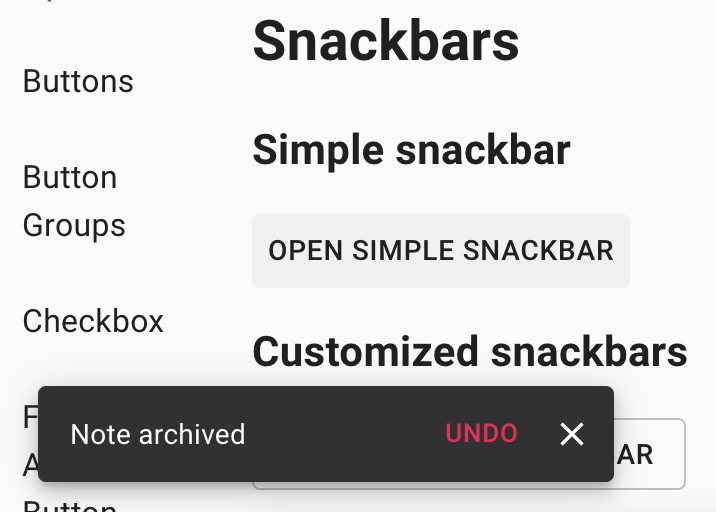

#### <a href="https://github.com/jdi-testing/jdi-light/blob/Material-UI/jdi-light-material-ui-tests/src/test/java/io/github/epam/material/tests/feedback/SnackbarTests.java" target="_blank">Here you can find Snackbars tests</a>

### Backdrop

#### https://material-ui.com/components/backdrop/

```java
  @UI(".MuiButton-root")
  public static Button showBackdropButton;

  @UI(".MuiBackdrop-root")
  public static UIElement backdrop;

  @Test
  public void defaultBackdropTest() {
  showBackdropButton.click();
  timer.wait(() -> backdrop.is().visible());
  backdrop.click();
  timer.wait(() -> backdrop.is().hidden());
  }
```

The backdrop component is used to provide emphasis on a particular element or parts of it.


#### <a href="https://github.com/jdi-testing/jdi-light/blob/Material-UI/jdi-light-material-ui-tests/src/test/java/io/github/epam/material/tests/feedback/BackdropTests.java" target="_blank">Here you can find Backdrop tests</a>

### Dialog

#### https://material-ui.com/components/dialogs/

```java
  @UI("//span[text()='Open simple dialog']/parent::*[contains(@class,'MuiButtonBase-root')]")
  public static Button simpleDialogButton;
  
  @UI("//div[@id='simple-dialog-title']/following::div[@class='MuiListItemText-root'][1]")
  public static Button simpleDialogListButton;
  
  @UI("#simpleDialogSelection")
  public static Text simpleDialogField;

  @Test
  public void simpleDialogTest() {
    simpleDialogButton.click();
    dialogTitle.is().text("Set backup account");
    simpleDialogListButton.click();
    simpleDialogField.is().text("Selected: username@gmail.com");
    }
  
  @Test
  public void alertDialogTest() {
  
    alertDialogButton.click();
    dialogTitle.is().text("Alert dialog question?");
    dialogContent.is().text(dialogTextContent);
    dialogOkButton.click();
    timer.wait(() -> dialogContent.is().notVisible());
    alertDialogField.is().text("Selected: ok");
    alertDialogButton.click();
    dialogCloseButton.click();
    timer.wait(() -> dialogContent.is().notVisible());
    alertDialogField.is().text("Selected: close");
    }
```

Dialogs inform users about a task and can contain critical information, require decisions, or involve multiple tasks.


#### <a href="https://github.com/jdi-testing/jdi-light/blob/Material-UI/jdi-light-material-ui-tests/src/test/java/io/github/epam/material/tests/feedback/DialogTests.java" target="_blank">Here you can find Dialog tests</a>

### Date / Time pickers

#### https://material-ui.com/components/pickers/

```java
  @JDropdown(
    root = "//*[@id = 'date-picker-dialog-label']/parent::div",
    value = "//*[@id ='date-picker-dialog']",
    list = "//*[@id = 'date-picker-dialog-label']/parent::div /ancestor::body " +
      "//div[@class = 'MuiPickersBasePicker-pickerView']//p",
    expand = "//span[@class = 'MuiIconButton-label']")
  public static Dropdown dialogPicker;
  
  @Test
  public void datePickerDialogTest() {
    dialogPicker.iCore().label().has().text("Date picker dialog");
    dialogPicker.expand();
    dialogPicker.select("12");
    dialogPicker.command("ENTER");
    timer.wait(() -> dialogPicker.has().text(containsString("/12/")));
  
    dialogPicker.expand();
    dialogPicker.select("11");
    dialogPicker.command("ESCAPE");
    timer.wait(() -> dialogPicker.has().text("08/12/2014"));
  
    dialogPicker.value().setText("10/10/2021");
    dialogPicker.has().text("10/10/2021");
    }
```

Dropdown is located in the following class:

- __Java__: _com.epam.jdi.light.elements.complex.dropdown.Dropdown_

Date pickers and Time pickers provide a simple way to select a single value from a pre-determined set.


#### <a href="https://github.com/jdi-testing/jdi-light/blob/Material-UI/jdi-light-material-ui-tests/src/test/java/io/github/epam/material/tests/inputs/DateTimePickersTests.java" target="_blank">Here you can find Date/Time Pickers tests</a>

### Select

#### https://material-ui.com/components/selects/

```java
  @UI("//div[@id='simple-select']")
  public static Button simpleSelectExpand;
  
  @UI("//input")
  public static List<TextField> simpleSelectField;
  
  @UI("//ul")
  public static Select selectList;
  
  @UI("//div[@id='disabled-select']")
  public static Button disabledSelectExpand;

  @Test
  public void simpleSelectTest() {
    simpleSelectExpand.click();
    selectList.selectItemByText("Henry");
    simpleSelectField.get(1).is().attr("value", "Henry");
  }
  
  @Test
  public void disabledSelectTest() {
    disabledSelectExpand.is().classValue(containsString("Mui-disabled"));
    disabledSelectExpand.has().attr("aria-disabled", "true");
    disabledSelectExpand.has().attr("aria-labelledby", "disabled-select");
  }
```

Select components are used for collecting user provided information from a list of options.


#### <a href="https://github.com/jdi-testing/jdi-light/blob/Material-UI/jdi-light-material-ui-tests/src/test/java/io/github/epam/material/tests/inputs/SelectTests.java" target="_blank">Here you can find Select tests</a>

### Switch

#### https://material-ui.com/components/switches/

```java
  @UI("//span[contains(@class,'MuiSwitch-switchBase')]")
  public static List<Checkbox> switches;
  
  @UI("//p[contains(@class,'MuiFormHelperText-root')]")
  public static Text formGroupTextForm;
  
  @Test
  public void basicSwitchesTest() {
    switches.get(1).is().classValue(containsString("MuiSwitch-colorSecondary"));
    switches.get(1).is().classValue(containsString("Mui-checked"));
    switches.get(1).click();
    switches.get(1).is().classValue(not(containsString("Mui-checked")));
    }
```

Switches toggle the state of a single setting on or off.


#### <a href="https://github.com/jdi-testing/jdi-light/blob/Material-UI/jdi-light-material-ui-tests/src/test/java/io/github/epam/material/tests/inputs/SwitchTests.java" target="_blank">Here you can find Switch tests</a>

### Button

#### https://material-ui.com/components/buttons/

```java
  @UI("//h2[text()='Contained buttons']/parent::div/div[1]/*")
  public static List<Button> containedButtons;
  
  @UI("//h2[text()='Text buttons']/parent::div/div[2]/*")
  public static List<Button> textButtons;
  
  @UI("//h2[text()='Buttons with icons and label']/parent::div/div[3]/*")
  public static List<Button> iconLabelButtons;
  
  @UI("//span[contains(@class,'MuiButton-icon')]")
  public static List<Icon> iconLabelIcons;
  
  @Test
  public void defaultButtonTest() {
    containedButtons.get(1).click();
    containedButtons.get(1).is().text("DEFAULT");
    containedButtons.get(6).is().text("Last click: Default");
  
    containedButtons.get(2).click();
    containedButtons.get(2).is().text("PRIMARY");
    containedButtons.get(6).is().text("Last click: Primary");
  
    containedButtons.get(3).click();
    containedButtons.get(3).is().text("SECONDARY");
    containedButtons.get(6).is().text("Last click: Secondary");
  
    containedButtons.get(4).is().text("DISABLED");
    containedButtons.get(4).is().attr("disabled");
    containedButtons.get(4).is().disabled();
  
    containedButtons.get(5).click();
    containedButtons.get(5).is().text("LINK");
    containedButtons.get(6).is().text("Last click: Link");
    containedButtons.get(5).is().notVisible();
  }
```

Buttons allow users to take actions, and make choices, with a single tap.


#### <a href="https://github.com/jdi-testing/jdi-light/blob/Material-UI/jdi-light-material-ui-tests/src/test/java/io/github/epam/material/tests/inputs/ButtonTests.java" target="_blank">Here you can find Buttons tests</a>

<br></br><br></br>

### ButtonGroup

#### <a href="https://jdi-testing.github.io/jdi-light/material/button_groups" target="_blank">Link to the site "Material UI test component"</a>

#### Basic and Vertical button group

**ButtonGroup** - element that represents a group of clickable button.


The ButtonGroup component can be used to group related buttons.

<br></br>

#### Split button
ButtonGroup can also be used to create a split button. The dropdown can change the button action (as in this example), or be used to immediately trigger a related action.


#### <a href="https://material-ui.com/ru/components/button-group/" target="_blank">Here you can find specification of Button Group</a>

<br></br>

ButtonGroup is located in the following class:
 
  - __Java__: _com.epam.jdi.light.material.elements.inputs.ButtonGroup_

  Available methods in Java JDI Light:
  
|Method | Description | Return Type
--- | --- | ---
**getButtonByIndex()** | Get button index | int
**select()** | Select the button | void
**getMainButton()** | Get main button | String
**getButtonByText()** | Get button text | String
 

<br></br>

#### ButtonGroupPage 

ButtonGroupPage class has been extended from WebPage. This class contains variables that are used in tests: 
- basicButtonGroup 
- verticalButtonGroup
- splitButtonGroup

```java
public class ButtonGroupPage extends WebPage {

    //FindBy(xpath = "//*[@id=\"__next\"]/div/div/div[2]/div/div/div/div[1]/div")
    @UI("//*[@id=\"__next\"]/div/div/div[2]/div/div/div/div[1]/div")
    public ButtonGroup basicButtonGroup;

    //FindBy(xpath = "//*[@id=\"__next\"]/div/div/div[2]/div/div/div/div[2]/div")
    @UI("//*[@id=\"__next\"]/div/div/div[2]/div/div/div/div[2]/div")
    public ButtonGroup verticalButtonGroup;

    //FindBy(xpath = "//*[@id=\"__next\"]/div/div/div[2]/div/div/div/div[3]/div)
    @UI("//*[@id=\"__next\"]/div/div/div[2]/div/div/div/div[3]/div")
    @JDIButtonGroup(
            root = "#root",
            mainButton = ".MuiButton-root[1]",
            expand = ".MuiButton-root[2]",
            list = ".MuiPaper-root #split-button-menu")
    public ButtonGroup splitButtonGroup;
```

<br></br>

#### ButtonGroupTests

ButtonGroupTests is located in the following class:
 
  - __Java__: _io.github.epam.material.tests.inputs.ButtonGroupTests_
  
  Most applicable methods:
  
  |Method | Description | Return Type
    --- | --- | ---
  **click()** | Click the button  | void
  **enabled()** | Assert that button is enabled | ButtonAssert 
  **is()**  | Assert action | ButtonAssert 
  **text()** | Assert text | ButtonAssert
  
```java
public class ButtonGroupTests extends TestsInit {

    @BeforeMethod
    public void before(){

        buttonGroupPage.open();
        buttonGroupPage.isOpened();
    }

    @Test
    public void basicButtonGroupTest() {

        buttonGroupPage.basicButtonGroup.getButtonByIndex(1).click();
        buttonGroupPage.basicButtonGroup.getButtonByIndex(2).click();
        buttonGroupPage.basicButtonGroup.getButtonByIndex(3).click();

        buttonGroupPage.basicButtonGroup.getButtonByText("Three").click();
        buttonGroupPage.basicButtonGroup.getButtonByText("Two").click();
        buttonGroupPage.basicButtonGroup.getButtonByText("One").click();

        buttonGroupPage.basicButtonGroup.getButtonByIndex(1).is().enabled();
        buttonGroupPage.basicButtonGroup.getButtonByIndex(1).has().text("ONE");
    }

    @Test
    public void verticalButtonGroupTest() {

        buttonGroupPage.verticalButtonGroup.getButtonByIndex(2).click();
        buttonGroupPage.verticalButtonGroup.getButtonByIndex(3).click();

        buttonGroupPage.verticalButtonGroup.getButtonByText("Two").click();
        buttonGroupPage.verticalButtonGroup.getButtonByText("One").click();

        buttonGroupPage.basicButtonGroup.getButtonByIndex(1).is().enabled();
        buttonGroupPage.basicButtonGroup.getButtonByIndex(1).has().text("ONE");
    }

    @Test
    public void splitButtonGroupTest() {

        buttonGroupPage.splitButtonGroup.getMainButton().click();
        buttonGroupPage.splitButtonGroup.getMainButton()
                .has().text("SQUASH AND MERGE");
        buttonGroupPage.splitButtonGroup.select("Create a merge commit");
        buttonGroupPage.splitButtonGroup.getMainButton()
            .has().text("CREATE A MERGE COMMIT");
    }

```

#### <a href="https://github.com/jdi-testing/jdi-light/blob/Material-UI/jdi-light-material-ui-tests/src/test/java/io/github/epam/material/tests/inputs/ButtonGroupTests.java" target="_blank">Here you can find Button group tests</a>

<br></br><br></br>

### Grid

#### https://material-ui.com/components/grid/

```java
  @UI(".MuiContainer-root")
  public static UIElement rootGrid;
  
  @UI("//h2[text()='Complex grid']/preceding::div[contains(@class,'MuiGrid-spacing')]")
  public static UIElement basicGrid;
  
  @UI("//h2[text()='Complex grid']/following::div[contains(@class,'MuiPaper-rounded')]/div[contains(@class,'MuiGrid-spacing')]")
  public static UIElement complexGrid;
  
  @UI("//div[contains(@class,'MuiPaper-rounded')]")
  public static List<Button> listButton;
  
  @Test
  public void gridTest() {
    rootGrid.is().displayed();
    rootGrid.attr("class").contains("MuiContainer-maxWidthXl");
    basicGrid.is().displayed();
    complexGrid.is().displayed();
    }
  
  @Test
  public void buttonsTest() {
    listButton.forEach(button -> button.is().displayed());
    listButton.forEach(button -> button.click());
    }
```

The Material Design responsive layout grid adapts to screen size and orientation, ensuring consistency across layouts.


#### <a href="https://github.com/jdi-testing/jdi-light/blob/Material-UI/jdi-light-material-ui-tests/src/test/java/io/github/epam/material/tests/layout/GridTests.java" target="_blank">Here you can find Grid tests</a>

### Drawer

#### https://material-ui.com/components/drawers/

```java
  @UI("//*[text()='left']")
  public static Button leftButton;
  
  @UI("//*[text()='right']")
  public static Button rightButton;
  
  @UI("//*[text()='top']")
  public static Button topButton;
  
  @UI("//*[text()='bottom']")
  public static Button bottomButton;
  
  @UI("//div[contains(@class,'MuiPaper-root')]")
  public static Drawer drawer;

  @Test(priority = 1)
  public void temporaryDrawerTest() {
    temporaryDrawerPage.open();
    List<Button> buttons = Arrays.asList(leftButton, rightButton, topButton, bottomButton);
    buttons.forEach(
      button -> {
        button.click();
        drawer.is().displayed();
        String currentButtonName = button.getName();
        drawer.has().classValue(containsString(String.format("MuiDrawer-paperAnchor%s", currentButtonName.substring(0,currentButtonName.lastIndexOf(" ") + 1))));
        drawerElementsIcon.forEach(
          icon -> icon.is().displayedSvg()
        );
        drawerElementsText.forEach(
            text -> actualDrawerTexts.add(text.getText())
        );
        assertEquals(actualDrawerTexts, expectedDrawerTexts);
        actualDrawerTexts.clear();
        drawerElementsText.get(1).click();
      }
    );
    }
```

Navigation drawers provide access to destinations in your app. Side sheets are surfaces containing supplementary content that are anchored to the left or right edge of the screen.


#### <a href="https://github.com/jdi-testing/jdi-light/blob/Material-UI/jdi-light-material-ui-tests/src/test/java/io/github/epam/material/tests/navigation/DrawerTests.java" target="_blank">Here you can find Drawer tests</a>

### Breadcrumbs

#### https://material-ui.com/components/Breadcrumbs/

```java
  @UI(".MuiBreadcrumbs-li")
  public static List<UIElement> breadcrumbs;
  
  @UI("//h3[text()='Material UI']")
  public static UIElement materialElement;
  
  @UI("//h3[text()='Core']")
  public static UIElement coreElement;
  
  private static Timer timer = new Timer(3000L);

  @Test
  public void simpleBreadcrumbsTest() {
    simpleBreadcrumbsPage.open();
    breadcrumbs.get(1).is().text("Material-UI");
    breadcrumbs.get(1).click();
    timer.wait(() -> materialElement.is().visible());
    breadcrumbs.get(2).is().text("Core");
    breadcrumbs.get(2).click();
    timer.wait(() -> materialElement.is().notVisible());
    timer.wait(()->coreElement.is().visible());
    }
```

Breadcrumbs allow users to make selections from a range of values.


#### <a href="https://github.com/jdi-testing/jdi-light/blob/Material-UI/jdi-light-material-ui-tests/src/test/java/io/github/epam/material/tests/navigation/BreadcrumbsTests.java" target="_blank">Here you can find Breadcrumbs tests</a>

### Bottom Navigation

#### https://material-ui.com/components/bottom-navigation/

```java
  @UI(".MuiBottomNavigationAction-root[2]")
  public static BottomNavigation favorites;
  
  @UI("#currentPosition")
  public static Text currentPosition;
  
  @Test
  public void defaultBottomNavigationTest(){
    favorites.is().enabled();
    assertTrue(favorites.core().text().contains("Favorites"));
    assertFalse(favorites.isSelected());
    favorites.core().click();
    assertTrue(currentPosition.getText().contains("Favorites"));
    favorites.is().selected();
  }
```

Bottom navigation bars allow movement between primary destinations in an app.


#### <a href="https://github.com/jdi-testing/jdi-light/blob/Material-UI/jdi-light-material-ui-tests/src/test/java/io/github/epam/material/tests/navigation/BottomNavigationTests.java" target="_blank">Here you can find Bottom Navigation tests</a>

### Paper

#### https://material-ui.com/components/paper/

```java
  @UI(".MuiPaper-root")
  public static List<UIElement> paper;

  private final String WITH_ZERO_ELEVATION = "Paper with elevation = 0";
  private final String WITH_DEFAULT_ELEVATION = "Paper with default elavation";
  private final String YOU_CLICKED = "You clicked: %s";
  public void defaultPaperTest() {
  
    paper.get(1).is().text(WITH_ZERO_ELEVATION);
    paper.get(1).click();
    paper.get(6).is().text(String.format(YOU_CLICKED, WITH_ZERO_ELEVATION));
  
    paper.get(2).is().text(WITH_DEFAULT_ELEVATION);
    paper.get(2).click();
    paper.get(6).is().text(String.format(YOU_CLICKED, WITH_DEFAULT_ELEVATION)); 
  }
```

In Material Design, the physical properties of paper are translated to the screen.


#### <a href="https://github.com/jdi-testing/jdi-light/blob/Material-UI/jdi-light-material-ui-tests/src/test/java/io/github/epam/material/tests/surfaces/PaperTests.java" target="_blank">Here you can find Paper tests</a>

### Accordion

#### https://material-ui.com/components/Accordion/

```java
  @UI(".MuiBreadcrumbs-li")
  public static List<UIElement> breadcrumbs;
  
  @UI("//h3[text()='Material UI']")
  public static UIElement materialElement;
  
  @UI("//h3[text()='Core']")
  public static UIElement coreElement;
  
  private static Timer timer = new Timer(3000L);

  @Test
  public void simpleBreadcrumbsTest() {
    simpleBreadcrumbsPage.open();
    breadcrumbs.get(1).is().text("Material-UI");
    breadcrumbs.get(1).click();
    timer.wait(() -> materialElement.is().visible());
    breadcrumbs.get(2).is().text("Core");
    breadcrumbs.get(2).click();
    timer.wait(() -> materialElement.is().notVisible());
    timer.wait(()->coreElement.is().visible());
    }
```

Accordions contain creation flows and allow lightweight editing of an element.


#### <a href="https://github.com/jdi-testing/jdi-light/blob/Material-UI/jdi-light-material-ui-tests/src/test/java/io/github/epam/material/tests/surfaces/AccordionTests.java" target="_blank">Here you can find Accordion tests</a>

### Portal

#### https://material-ui.com/components/Portal/

```java
  @UI("//button")
  public static Button button;
  
  @UI("//button/following::div[1]")
  public static Text field1;
  
  @UI("//button/following::div[2]")
  public static Text field2;
  
  @Test
  public void portalTest() {
    button.has().text("Mount children");
    field1.has().text("It looks like I will render here.");
    field2.has().text("");
  
    button.click();
    button.has().text("Unmount children");
    field1.has().text("It looks like I will render here.");
    field2.has().text("But I actually render here!");
  
    button.click();
    button.has().text("Mount children");
    field1.has().text("It looks like I will render here.");
    field2.has().text("");
  }
```

The portal component renders its children into a new "subtree" outside of current DOM hierarchy.


#### <a href="https://github.com/jdi-testing/jdi-light/blob/Material-UI/jdi-light-material-ui-tests/src/test/java/io/github/epam/material/tests/utils/PortalTests.java" target="_blank">Here you can find Portal tests</a>

### Textarea Autosize

#### https://material-ui.com/components/textarea-autosize/

```java
  @UI("//textarea[@aria-label = 'empty textarea']")
  public static TextArea emptyTextArea;
  
  @UI("//textarea[@aria-label = 'minimum height']")
  public static TextArea minArea;
  
  @UI("//textarea[@aria-label = 'maximum height']")
  public static TextArea maxArea;
  
  private int initialHeight;
  private static final String ONE_LINE = "1";
  private static final String THREE_LINES = "1\n2\n3";
  private static final String FOUR_LINES = "1\n2\n3\n4";
  
  @Test
  public void emptyAreaHeightIncreasesTest() {
    initialHeight = emptyTextArea.getSize().height;
    emptyTextArea.setLines(FOUR_LINES);
    assertThat(emptyTextArea.getSize().height, greaterThan(initialHeight));
  }

  @Test
  public void emptyAreaHeightDecreasesTest() {
    emptyTextArea.setLines(FOUR_LINES);
    initialHeight = emptyTextArea.getSize().height;
    emptyTextArea.clear();
    emptyTextArea.setLines(ONE_LINE);
    assertThat(emptyTextArea.getSize().height, lessThan(initialHeight));
  }
```

A textarea component for React which grows with content.


#### <a href="https://github.com/jdi-testing/jdi-light/blob/Material-UI/jdi-light-material-ui-tests/src/test/java/io/github/epam/material/tests/utils/TextAreaAutoSizeTests.java" target="_blank">Here you can find TextAreaAutosize tests</a>

### Popover

#### https://material-ui.com/components/popover/

```java
  @UI("//button[contains(@class,'MuiButtonBase-root')]/span[@class='MuiButton-label']")
  public static Button buttonToClick;
  
  @UI("//div[contains(@class,'MuiPaper-root')]/div")
  public static Button popoverContent;
  
  @UI("//span[@class='MuiTypography-root']")
  public static Text popoverHoverField;
  
  @Test
  public void clickPopoverTest() {
    buttonToClick.is().text("CLICK TO OPEN POPOVER");
    buttonToClick.click();
    popoverContent.is().text("Popover content");
  }
  
  @Test
  public void hoverPopoverTest() {
    popoverHoverField.is().text("[Hover to open Popover]");
    popoverHoverField.hover();
    popoverHoverField.has().attr("aria-owns", "mouse-over-popover");
    popoverContent.is().text("Popover content");
  }
```

A Popover can be used to display some content on top of another.

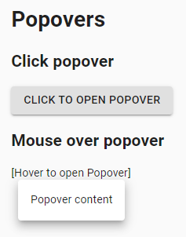

#### <a href="https://github.com/jdi-testing/jdi-light/blob/Material-UI/jdi-light-material-ui-tests/src/test/java/io/github/epam/material/tests/utils/PopoverTests.java" target="_blank">Here you can find Popover tests</a>

### Modal

#### https://material-ui.com/components/modal/

```java
  @UI("[id='simple-modal-description']")
  public static List<Text> modalTexts;

  @UI("button")
  public static List<Button> buttonModal;

  private static final String EXPECTED_TEXT = "Duis mollis, est non commodo luctus, nisi erat porttitor ligula.";
  
  @Test
  public void modalTests() {
    for (int modalCounter = 1; modalCounter < 3; modalCounter++) {
    buttonModal.get(modalCounter).click();
    modalTexts.get(modalCounter).has().text(EXPECTED_TEXT);
    }
    for (int modalCounter = 3; modalCounter > 1; modalCounter--) {
    buttonModal.get(modalCounter).core().click(-200, -100);
    }
  }
```

The modal component provides a solid foundation for creating dialogs, popovers, lightboxes, or whatever else.


#### <a href="https://github.com/jdi-testing/jdi-light/blob/Material-UI/jdi-light-material-ui-tests/src/test/java/io/github/epam/material/tests/utils/ModalTests.java" target="_blank">Here you can find Modal tests</a>

### Popper

#### https://material-ui.com/components/popper/

```java
  @UI("button")
  public static List<com.epam.jdi.light.ui.html.elements.common.Button> buttons;
  
  @UI("[role='tooltip']")
  public static UIElement tooltip;
  
  private final static List<String> POPPER_TEXTS = Arrays.asList("", "TOP", "LEFT", "RIGHT", "BOTTOM");
  private final static List<String> TOOLTIP_CLASSES = Arrays.asList("", "top", "left", "right", "bottom");
  
  @Test
  public void positionedPoppersTest() {
    for (int i = 1; i <= 4; i++) {
    buttons.get(i).click();
    buttons.get(i).has().text(POPPER_TEXTS.get(i));
    tooltip.has().attr("x-placement", TOOLTIP_CLASSES.get(i));
    }
  }
```

A Popper can be used to display some content on top of another. It's an alternative to react-popper.


#### <a href="https://github.com/jdi-testing/jdi-light/blob/Material-UI/jdi-light-material-ui-tests/src/test/java/io/github/epam/material/tests/utils/PopperTests.java" target="_blank">Here you can find Popper tests</a>

### Progress

#### https://material-ui.com/components/progress/

```java
  @JDIProgressBar(root ="(//*[contains(@class, 'MuiCircularProgress-root')])[1]")
  public static ProgressBar circularDefault;
  
  @JDIProgressBar(root ="(//*[contains(@class, 'MuiCircularProgress-root')])[6]")
  public static ProgressBar circularIndeterminate;
  
  @UI("//*[contains(@class, 'MuiFab-primary')]")
  public static Button interactiveIntegrationCircularButton;
  
  private Timer timer = new Timer(5000L);

  @Test
  public void progressTest() {
    circularDefault.is().indeterminate();
    int valueNow = circularIndeterminate.getValueNow();
    timer.wait(() ->circularIndeterminate.is().value(valueNow + 10));
    circularDefault.is().indeterminate();
    interactiveIntegrationCircularButton.click();
    interactiveIntegrationCircularIndeterminate.is().indeterminate();
    startLoadingButton.click();
    loadingCircularIndeterminate.is().indeterminate();
    simulateLoadButton.click();
    simulateLoadCircularIndeterminate.is().indeterminate();
    timer.wait(() -> successMessage.is().displayed());
  }
```
ProgressBar is located in the following class:
- __Java__: _com.epam.jdi.light.material.elements.feedback.ProgressBar_

Progress indicators commonly known as spinners, express an unspecified wait time or display the length of a process. The animation works with CSS, not JavaScript.


#### <a href="https://github.com/jdi-testing/jdi-light/blob/Material-UI/jdi-light-material-ui-tests/src/test/java/io/github/epam/material/tests/feedback/ProgressTests.java" target="_blank">Here you can find Progress tests</a>

### Menu

#### https://material-ui.com/ru/components/menus/

```java
  @Url("/simple_menu")
  public static SimpleMenuPage simpleMenuPage;
  //@FindBy(css = "div[class^=MuiBox-root]>div div:nth-of-type(1) svg")
  @UI("div[class^=MuiBox-root]>div div:nth-of-type(1) svg")
  public static Menu iconMenu;
  //@FindBy(css = "div[class*=MuiPaper-root][style*='opacity: 1']")
  @UI("div[class*=MuiPaper-root][style*='opacity: 1']")
  public static Menu paddingMenuList;
  //@FindBy(css = "li.MuiListItem-button:first-child")
  @UI("li.MuiListItem-button:first-child")
  public static Menu menuListFirstButton;
  
  @BeforeMethod
  public void before() {
    simpleMenuPage.open();
    simpleMenuPage.isOpened();
  }

  @Test
  public void menuWithIconsTest() {
    iconMenu.is().displayedSvg();
    iconMenu.click();
    paddingMenuList.is().displayed();
    menuListFirstButton.is().displayedSvg();
    menuListFirstButton.has().text("Text with send icon");
    menuListFirstButton.click();
    iconMenu.is().displayed();
  }
```
Menu is located in the following class:
- __Java__: _com.epam.jdi.light.material.elements.navigation.Menu_

Menus display a list of choices on temporary surfaces.

##### <a href="https://github.com/jdi-testing/jdi-light/blob/Material-UI/jdi-light-material-ui-tests/src/test/java/io/github/epam/material/tests/navigation/MenuTests.java" target="_blank">Here you can find Menu tests</a>
#### ContextMenu
#### https://material-ui.com/ru/components/menus/#context-menu
 ```java
package io.github.com.pages.navigation;

import com.epam.jdi.light.elements.composite.WebPage;
import com.epam.jdi.light.elements.pageobjects.annotations.locators.UI;
import com.epam.jdi.light.material.elements.navigation.Menu;

public class ContextMenuPage extends WebPage {
//@FindBy(css = "li.MuiListItem-button:first-child")
    @UI("li.MuiListItem-button:first-child")
    public static Menu menuContextListFirstButton;
//@FindBy(css = "li.MuiListItem-button:last-child")
    @UI("li.MuiListItem-button:last-child")
    public static Menu menuContextListLastButton;
//@FindBy(css = "li.MuiListItem-button:last-child")
    @UI("//*/p[starts-with(@class, 'MuiTypography')]")
    public static Menu contextMenu;
}
@Url("/context_menu")
    public static ContextMenuPage contextMenuPage; 
@Test
    public void contextMenuTest() {
        contextMenuPage.open();
        contextMenu.rightClick();
        menuContextListLastButton.has().text("Email");
        menuContextListLastButton.click();
        contextMenu.isDisplayed()
 ```
Menu is located in the following class:
- __Java__: _com.epam.jdi.light.material.elements.navigation.Menu_
Menus display a list of choices on temporary surfaces.


### Lists

#### https://material-ui.com/components/lists/

```java
  @Url("/simple_list")
  public static ListPage ListPage;
  @Test
  public void pinnedSubHeaderList(){
  ListPage.open();

  ListPage.stickyZero.is().enabled();
  ListPage.stickyZero.is().text(hasToString("I'm sticky 0"));
  ListPage.stickyOne.is().enabled();
  ListPage.stickyOne.is().text(hasToString("I'm sticky 1"));
  }
```
Lists is located in the following class:
- __Java__: _com.epam.jdi.light.material.elements.displaydata.Lists_

Lists are continuous, vertical indexes of text or images.


#### <a href="https://github.com/jdi-testing/jdi-light/blob/Material-UI/jdi-light-material-ui-tests/src/test/java/io/github/epam/material/tests/displaydata/ListsTests.java" target="_blank">Here you can find Lists tests</a>

### Transfer List

Available methods in Java JDI Light:

|Method | Description | Return Type
--- | --- | ---
**isMoveRightButtonDisable()** | Assert > button is disabled | TransferListAssert
**isMoveLeftButtonDisable()** | Assert < button is disabled | TransferListAssert
**check()** | Click on checkbox to check | void
**uncheck()** | Click on checkbox to uncheck | void
**isMoveRightButtonEnable()** | Assert > button is enabled | TransferListAssert
**isMoveLeftButtonEnable()** | Assert < button is enabled | TransferListAssert
**moveItemsRight()** | Click on > button | void
**moveItemsLeft()** | Click on < button | void
**is()** | Various assert action for Transfer List | TransferListAssert
**itemsMovedRight()** | Assert items are existed on Right List | TransferListAssert
**itemsMovedLeft()** | Assert items are existed on Right List | TransferListAssert
**checked()** | Assert items is selected | TransferListAssert

### Simple Transfer List

#### https://material-ui.com/components/simple_transfer_list

```java
  @Test
  public void simpleTransferListTest() {
    simpleTransferListPage.open();
    simpleTransferListPage.simpleTransferList.is().isMoveRightButtonDisable();
    simpleTransferListPage.simpleTransferList.is().isMoveLeftButtonDisable();

    simpleTransferListPage.simpleTransferList.check("List item 1");
    simpleTransferListPage.simpleTransferList.is().checked("List item 1");

    simpleTransferListPage.simpleTransferList.is().isMoveRightButtonEnable();
    simpleTransferListPage.simpleTransferList.moveItemsRight();
    simpleTransferListPage.simpleTransferList.is().itemsMovedRight("List item 1");

    simpleTransferListPage.simpleTransferList.check("List item 5");
    simpleTransferListPage.simpleTransferList.check("List item 6");
    simpleTransferListPage.simpleTransferList.is().checked("List item 5");
    simpleTransferListPage.simpleTransferList.is().checked("List item 6");
    simpleTransferListPage.simpleTransferList.is().isMoveLeftButtonEnable();
    simpleTransferListPage.simpleTransferList.moveItemsLeft();
    simpleTransferListPage.simpleTransferList.is().itemsMovedLeft("List item 5", "List item 6");

    simpleTransferListPage.simpleTransferList.moveAllElementsRight();
    simpleTransferListPage.simpleTransferList.is().itemsMovedRight("List item 1", "List item 2",
        "List item 3", "List item 4", "List item 5", "List item 6", "List item 7", "List item 8");

    simpleTransferListPage.simpleTransferList.moveAllElementsLeft();
    simpleTransferListPage.simpleTransferList.is().itemsMovedLeft("List item 1", "List item 2",
      "List item 3", "List item 4", "List item 5", "List item 6", "List item 7", "List item 8");
 }
```

Available methods in Java JDI Light:

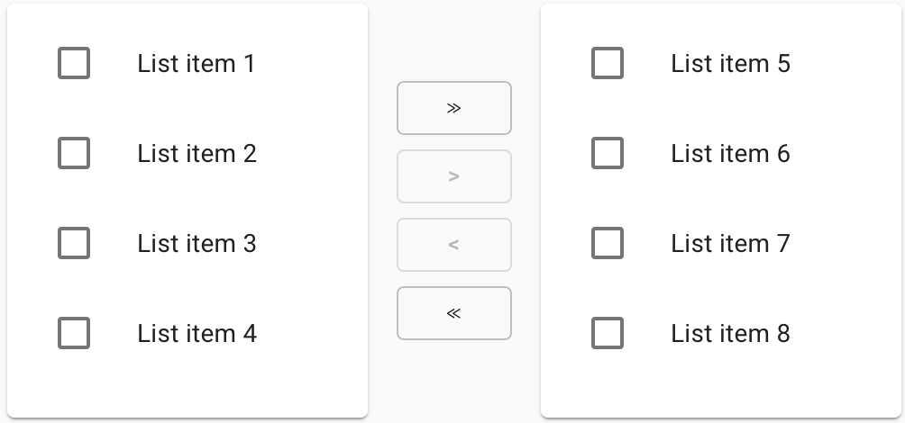

|Method | Description | Return Type
--- | --- | ---
**moveAllElementsRight()** | Click on >> button | void
**moveAllElementsLeft()** | Click on << button | void

#### <a href="https://github.com/jdi-testing/jdi-light/blob/Material-UI/jdi-light-material-ui-tests/src/test/java/io/github/epam/material/tests/inputs/TransferListTests.java" target="_blank">Here you can find Simple Transfer List tests</a>

### Enhanced Transfer List

#### https://material-ui.com/components/enhanced_transfer_list

```java
    @Test
    public void enhancedTransferListTest() {
        enhancedTransferListPage.open();
        enhancedTransferListPage.enhancedTransferList.is().isMoveRightButtonDisable();
        enhancedTransferListPage.enhancedTransferList.is().isMoveLeftButtonDisable();

        enhancedTransferListPage.enhancedTransferList.check("List item 1");
        enhancedTransferListPage.enhancedTransferList.is().checked("List item 1");
        enhancedTransferListPage.enhancedTransferList.is().isMoveRightButtonEnable();

        enhancedTransferListPage.enhancedTransferList.uncheck("List item 1");
        enhancedTransferListPage.enhancedTransferList.is().unchecked("List item 1");

        enhancedTransferListPage.enhancedTransferList.moveAllElementsRight();
        enhancedTransferListPage.enhancedTransferList.is().itemsMovedRight("List item 1", "List item 2",
            "List item 3", "List item 4", "List item 5", "List item 6", "List item 7", "List item 8");

        enhancedTransferListPage.enhancedTransferList.moveAllElementsLeft();
        enhancedTransferListPage.enhancedTransferList.is().itemsMovedLeft("List item 1", "List item 2",
            "List item 3", "List item 4", "List item 5", "List item 6", "List item 7", "List item 8");
    }
```

Available methods in Java JDI Light:


|Method | Description | Return Type
--- | --- | ---
**moveAllElementsRight()** | Select all elements on left list then click on > button | void
**moveAllElementsLeft()** | Select all elements on right list then click on < button | void

#### <a href="https://github.com/jdi-testing/jdi-light/blob/Material-UI/jdi-light-material-ui-tests/src/test/java/io/github/epam/material/tests/inputs/TransferListTests.java" target="_blank">Here you can find Enhanced Transfer List tests</a>

<br></br><br></br>

## JDI Light BDD Steps

### Label 

```gherkin
Label action examples:

When I click on "JDI Title"

Label validation examples:

Then the "JDI Title" text equals to "JDI TESTING PLATFORM"
Then the "JDI Title" text contains "JDI"
Then the "JDI Title" text matches to ".* TESTING .*"
Then the "JDI Title" is enabled 
Then the "JDI Title" is disabled 
Then the "JDI Title" is displayed 
Then the "JDI Title" disappears 
Then the "JDI Title" is hidden 
Then the "JDI Title" does not appear 
Then the "JDI Title" does not appear during "5" seconds 

Scenario example for Label:

 Scenario: Text equals
    Given I open "Html5 Page"
    Then the "Jdi Title" text equals to "JDI TESTING PLATFORM"
```
Actions: <br>

**When** \<I\> click on "\<ELEMENT NAME\>" <br>
<br>
Validations: <br>

**Then** the "\<ELEMENT NAME\>" text equals to "\<TEXT\>" <br>
**Then** the "\<ELEMENT NAME\>" text contains "\<TEXT\>" <br>
**Then** the "\<ELEMENT NAME\>" text matches to "\<REGEXP\>" <br>
**Then** the "\<ELEMENT NAME\>" is enabled <br>
**Then** the "\<ELEMENT NAME\>" is disabled <br>
**Then** the "\<ELEMENT NAME\>" is displayed <br>
**Then** the "\<ELEMENT NAME\>" disappears <br>
**Then** the "\<ELEMENT NAME\>" is hidden <br>
**Then** the "\<ELEMENT NAME\>" does not appear <br>
**Then** the "\<ELEMENT NAME\>" does not appear during "\<SECONDS\>" seconds <br>

More information in the [**Tutorial**](https://jdi-docs.github.io/jdi-light/?java#jdi-light-in-bdd-style-even-for-manual-qa)<br>
<a style="font-weight:bold" href="https://github.com/jdi-testing/jdi-light/blob/master/jdi-bdd-tests/src/test/resources/features/Label.feature" target="_blank">Cucumber tests</a> for Label<br>
<br><br><br><br>

### ColorPicker

```gherkin
ColorPicker action example:

When I set "Color Picker" to "#00FF00" color


ColorPicker validation examples:

Then the "Color Picker" color equals to "#00FF00"
Then the "Color Picker" label text equals to "Select a color"
Then the "Color Picker" color is "#00FF00"
Then the "Color Picker" is enabled 
Then the "Color Picker" is disabled 
Then the "Color Picker" is displayed 
Then the "Color Picker" disappears 
Then the "Color Picker" is hidden 
Then the "Color Picker" does not appear 
Then the "Color Picker" does not appear during "5" seconds 


Scenario example for ColorPicker:

  Scenario: Color picker set color test
    Given I open "Html5 Page"
    When I set "Color Picker" to "#ffd7a6" color
    Then the "Color Picker" color equals to "#ffd7a6"
    
```

Actions: <br>

**When** \<I\> set "\<ELEMENT NAME\>" to "\<COLOR HEX CODE\>"<br>
<br><br>
Validations: <br>

**Then** the "\<ELEMENT NAME\>" color equals to "\<COLOR HEX CODE>" <br>
**Then** the "\<ELEMENT NAME\>" label text equals to "\<TEXT>" <br>
**Then** the "\<ELEMENT NAME\>" color is "\<COLOR HEX CODE>" <br>
**Then** the "\<ELEMENT NAME\>" is enabled <br>
**Then** the "\<ELEMENT NAME\>" is disabled <br>
**Then** the "\<ELEMENT NAME\>" is displayed <br>
**Then** the "\<ELEMENT NAME\>" disappears <br>
**Then** the "\<ELEMENT NAME\>" is hidden <br>
**Then** the "\<ELEMENT NAME\>" does not appear <br>
**Then** the "\<ELEMENT NAME\>" does not appear during "\<SECONDS\>" seconds <br>

More information in the [**Tutorial**](https://jdi-docs.github.io/jdi-light/?java#tutorial)<br>
<a style="font-weight:bold" href="https://github.com/jdi-testing/jdi-light/blob/master/jdi-bdd-tests/src/test/resources/features/ColorPicker.feature" target="_blank">Cucumber tests</a> for ColorPicker<br>

<br><br><br><br><br><br>

### DropDown

```gherkin
DropDown action example:

When I Select "Pirate" field from "Drop Down"


DropDown validation examples:

Then the "Pirate" in "Drop Down" is selected
Then the "Drop Down" is enabled 
Then the "Drop Down" is disabled 
Then the "Drop Down" is displayed 
Then the "Drop Down" disappears 
Then the "Drop Down" is hidden 
Then the "Drop Down" does not appear 
Then the "Drop Down" does not appear during "5" seconds 


Scenario example for DropDown:

  Scenario: Selected Test
    Given I open "Html5 Page"
    When I Select "Pirate" field from "Dress Code"
    Then the "Pirate" in "Dress Code" is selected
    
```

Actions: <br>

**When** \<I\> select "\<TEXT\>" field from "\<ELEMENT NAME\>"<br>
<br><br>
Validations: <br>

**Then** the "\<TEXT\>" in "\<ELEMENT NAME>" is selected <br>
**Then** the "\<ELEMENT NAME\>" is enabled <br>
**Then** the "\<ELEMENT NAME\>" is disabled <br>
**Then** the "\<ELEMENT NAME\>" is displayed <br>
**Then** the "\<ELEMENT NAME\>" disappears <br>
**Then** the "\<ELEMENT NAME\>" is hidden <br>
**Then** the "\<ELEMENT NAME\>" does not appear <br>
**Then** the "\<ELEMENT NAME\>" does not appear during "\<SECONDS\>" seconds <br>

More information in the [**Tutorial**](https://jdi-docs.github.io/jdi-light/?java#tutorial)<br>
<a style="font-weight:bold" href="https://github.com/jdi-testing/jdi-light/blob/master/jdi-bdd-tests/src/test/resources/features/DropDown.feature" target="_blank">Cucumber tests</a> for DropDown<br>

<br><br><br><br><br>

### Image

````gherkin
Image validation examples:

  Then the "Jdi Logo" attribute "src" equals to "https;//jdi-testing.github.io/jdi-light/images/jdi-logo.jpg"
  Then the "Jdi Logo" attribute "alt" equals to "Jdi Logo 2"
  Then the "Jdi Logo" attribute "src" contains "jdi-logo.jpg"
  Then the "Jdi Logo" attribute "height" contains "100"
  Then the "Jdi Logo" attribute "width" contains "101"
  Then the "Jdi Logo" is enabled 
  Then the "Jdi Logo" is disabled 
  Then the "Jdi Logo" is displayed 
  Then the "Jdi Logo" disappears
  Then the "Jdi Logo" is hidden 
  Then the "Jdi Logo" does not appear 
  Then the "Jdi Logo" does not appear during "5" seconds 

Scenario example for Image:

  Scenario: Image validation test
    Given I open "Html5 Page"
    And refresh webpage
    Then the "Jdi Logo" attribute "src" contains "jdi-logo.jpg"
    And the "Jdi Logo" attribute "height" contains "100"
    And the "Jdi Logo" attribute "width" contains "101"

````

Validations: <br>
**Then** the "\<ELEMENT NAME\>" attribute "\<ATTRIBUTE NAME\>" equals to "\<TEXT\>" <br>
**Then** the "\<ELEMENT NAME\>" attribute "\<ATTRIBUTE NAME\>" contains "\<TEXT\>" <br>
**Then** the "\<ELEMENT NAME\>" is enabled <br>
**Then** the "\<ELEMENT NAME\>" is disabled <br>
**Then** the "\<ELEMENT NAME\>" is displayed <br>
**Then** the "\<ELEMENT NAME\>" disappears <br>
**Then** the "\<ELEMENT NAME\>" is hidden <br>
**Then** the "\<ELEMENT NAME\>" does not appear <br>
**Then** the "\<ELEMENT NAME\>" does not appear during "\<SECONDS\>" seconds <br>

More information in the [**Tutorial**](https://jdi-docs.github.io/jdi-light/#jdi-light-in-bdd-style-even-for-manual-qa)<br>
<a style="font-weight:bold" href="https://github.com/jdi-testing/jdi-light/blob/master/jdi-bdd-tests/src/test/resources/features/Image.feature" target="_blank">Cucumber tests</a> for Image <br>

<br><br><br><br><br><br><br><br><br><br><br><br><br><br>

### Icon

````gherkin
Image validation examples:

  Then the "Jdi Logo" attribute "src" equals to "http;//jdi-testing.github.io/jdi-light/images/jdi-logo.jpg"
  Then the "Jdi Logo" attribute "alt" equals to "Jdi Logo 2"
  Then the "Jdi Logo" attribute "src" contains "jdi-logo.jpg"
  Then the "Jdi Logo" attribute "height" contains "100"
  Then the "Jdi Logo" attribute "width" contains "101"
  Then the "Jdi Logo" is enabled 
  Then the "Jdi Logo" is disabled 
  Then the "Jdi Logo" is displayed 
  Then the "Jdi Logo" disappears
  Then the "Jdi Logo" is hidden 
  Then the "Jdi Logo" does not appear 
  Then the "Jdi Logo" does not appear during "5" seconds 

Scenario example for Image:

  Scenario: Image validation test
    Given I open "Html5 Page"
    And refresh webpage
    Then the "Jdi Logo" attribute "src" contains "jdi-logo.jpg"
    And the "Jdi Logo" attribute "height" contains "100"
    And the "Jdi Logo" attribute "width" contains "101"

````
Note: this element is an alias for Image<br>
<br>
Validations: <br>
**Then** the "\<ELEMENT NAME\>" attribute "\<ATTRIBUTE NAME\>" equals to "\<TEXT\>" <br>
**Then** the "\<ELEMENT NAME\>" attribute "\<ATTRIBUTE NAME\>" contains "\<TEXT\>" <br>
**Then** the "\<ELEMENT NAME\>" is enabled <br>
**Then** the "\<ELEMENT NAME\>" is disabled <br>
**Then** the "\<ELEMENT NAME\>" is displayed <br>
**Then** the "\<ELEMENT NAME\>" disappears <br>
**Then** the "\<ELEMENT NAME\>" is hidden <br>
**Then** the "\<ELEMENT NAME\>" does not appear <br>
**Then** the "\<ELEMENT NAME\>" does not appear during "\<SECONDS\>" seconds <br>

More information in the [**Tutorial**](https://jdi-docs.github.io/jdi-light/#jdi-light-in-bdd-style-even-for-manual-qa)<br>
<a style="font-weight:bold" href="https://github.com/jdi-testing/jdi-light/blob/master/jdi-bdd-tests/src/test/resources/features/Image.feature" target="_blank">Cucumber tests</a> for Image <br>

<br><br><br><br><br><br><br><br><br><br><br><br><br><br>
### Alert

````gherkin
Alert action examples:

  When I accept alert
  When dismiss alert


Alert validation examples:

  Then the Alert text equals to "Red Button"
  Then the Alert text contains "Red B"
  Then the Alert text matches to "\w{3} \d{6}"
    
Scenario example for Alert:

  Scenario: Alert text contains
    Given open "Html5 page"
    When click on "Red Button"
    Then the Alert text contains "Red B"   
    
````
<br>
Actions: <br>

**When** \<I\> accept alert<br>
**When** \<I\> dismiss alert<br>
<br>
Validations: <br>

**Then** the Alert text equals to "\<TEXT\>"<br>
**Then** the Alert text contains "\<TEXT\>"<br>
**Then** the Alert text matches to "\<REGEXP\>"<br>


More information in the [**Tutorial**](https://jdi-docs.github.io/jdi-light/?java#jdi-light-in-bdd-style-even-for-manual-qa)<br>
<a style="font-weight:bold" href="https://github.com/jdi-testing/jdi-light/blob/master/jdi-bdd-tests/src/test/resources/features/Alert.feature" target="_blank">Cucumber tests</a> for Alert<br>

<br>
<br>
<br>
<br>
<br>
<br>
<br>
<br>
<br>
<br>

### FileInput

```gherkin
FileInput action examples:

When I upload file "/res/general.xml" by "Avatar" file input element
When try to upload file "/res/general.xml" by "File Input" file input element


FileInput validation examples:

Then the "Avatar" file input element label equals to "Profile picture"
Then the "Avatar" file input element label contains "picture"
Then the "Avatar" file input element text equals to "fakepath\general.xml"
Then the "Avatar" file input element text contains "general.xml"
Then the "Avatar" attribute "id" equals to "avatar"
Then "File Input" is enabled
Then "File Input" is disabled
Then "File Input" is displayed
Then "File Input" disapears
Then "File Input" is hidden
Then "File Input" does not appear
Then "File Input" is does not appear during "5" seconds 


Scenario example for FileInput:

  Scenario: Upload file by enabled file input element
    Given I open "Html5 Page"
    When I upload file "/res/general.xml" by "Avatar" file input element
    Then the "Avatar" text contains "general.xml"
```

Actions:<br>
**When** \<I\> upload file "\<PATH TO FILE\>" by "\<ELEMENT NAME\>" file input element<br>
**When** \<I\> try to upload file "\<PATH TO FILE\>" by "\<ELEMENT NAME\>" file input element<br>

Validations:<br>
**Then** the "\<ELEMENT NAME\>" file input element label equals to "\<TEXT\>"<br>
**Then** the "\<ELEMENT NAME\>" file input element label contains "\<TEXT\>"<br>
**Then** the "\<ELEMENT NAME\>" file input element text equals to "\<TEXT\>"<br>
**Then** the "\<ELEMENT NAME\>" file input element text contains "\<TEXT\>"<br>
**Then** the "\<ELEMENT NAME\>" attribute "\<ATTRIBUTE NAME\>" equals to "\<TEXT\>"<br>
**Then** the "\<ELEMENT NAME\>" is enabled <br>
**Then** the "\<ELEMENT NAME\>" is disabled <br>
**Then** the "\<ELEMENT NAME\>" is displayed <br>
**Then** the "\<ELEMENT NAME\>" disappears <br>
**Then** the "\<ELEMENT NAME\>" is hidden <br>
**Then** the "\<ELEMENT NAME\>" does not appear <br>
**Then** the "\<ELEMENT NAME\>" does not appear during "\<SECONDS\>" seconds <br>


More information in the [**Tutorial**](https://jdi-docs.github.io/jdi-light/?java#tutorial)<br>
<a style="font-weight:bold" href="https://github.com/jdi-testing/jdi-light/blob/master/jdi-bdd-tests/src/test/resources/features/FileInput.feature" target="_blank">Cucumber tests</a> for FileInput<br>

<br><br><br><br><br><br>

### Link 

```gherkin
Link action examples:

When I click on "Github Link"
When I higlight "Github Link"
When I show "Github Link"
When I set "Github Link" attribute "alt" with value "Github JDI Link EDITED"

```

Actions: <br>

**When** \<I\> click on "\<ELEMENT NAME\>" <br>
**When** \<I\> highlight "\<ELEMENT NAME\>" <br>
**When** \<I\> show "\<ELEMENT NAME\>" <br>
**When** \<I\> set "\<ELEMENT NAME\>" attribute "\<ATTRIBUTE NAME\>" with value "\<ATTRIBUTE NAME\>" <br><br><br><br>

```gherkin
Link validation examples:

Then the "Github Link" is enabled
Then the "Github Link" is disabled
Then the "Github Link" is displayed
Then the "Github Link" is hidden
Then the "Github Link" URL path equals to "/jdi-testing"
Then the "Github Link" text equals to "Github JDI"
Then the "Github Link" text contains "JDI"
Then the "Github Link" text matches to "[a-zA-Z]{6} JE*DI"
Then the "Github Link" reference equals to "https//github.com/jdi-testing"
Then the "Github Link" reference contains "github"
Then the "Github Link" reference matches to "https//github.com/.*"
Then the "Github Link" alternative text equals to "Github JDI Link"
Then the "Github Link" alternative text contains "JDI"
Then the "Github Link" alternative text matches to "Git.* JE*DI Link"
Then the "Github Link" attribute "alt" equals to "Github JDI Link"
Then the "Github Link" attribute "href" contains "https//github.com"
Then the "Github Link" attribute "ui" matches to "github.link"
Then the "Github Link" does not appear
Then the "Github Link" does not appear during "5" seconds

Scenario examples for Link:

  Scenario: Click link test
     Given I open "Html5 Page"
     When click on "Github Link"
     Then the current URL is "https//github.com/jdi-testing"
    
  Scenario: Link alternative text matching to RegExp
     Given I open "Html5 Page"
     Then the "Github Link" alternative text matches to "Git.* JE*DI Link"
  

```

Validations: <br>

**Then** the "\<ELEMENT NAME\>" is enabled <br>
**Then** the "\<ELEMENT NAME\>" is disabled <br>
**Then** the "\<ELEMENT NAME\>" is displayed <br>
**Then** the "\<ELEMENT NAME\>" is hidden <br>
**Then** the "\<ELEMENT NAME\>" URL path equals to "\<TEXT\>" <br>
**Then** the "\<ELEMENT NAME\>" text equals to "\<TEXT\>" <br>
**Then** the "\<ELEMENT NAME\>" text contains "\<TEXT\>" <br>
**Then** the "\<ELEMENT NAME\>" text matches to "\<REGEXP\>" <br>
**Then** the "\<ELEMENT NAME\>" reference equals to "\<TEXT\>" <br>
**Then** the "\<ELEMENT NAME\>" reference contains "\<TEXT\>" <br>
**Then** the "\<ELEMENT NAME\>" reference match to "\<REGEXP\>" <br>
**Then** the "\<ELEMENT NAME\>" alternative text equals to "\<TEXT\>" <br>
**Then** the "\<ELEMENT NAME\>" alternative text contains "\<TEXT\>" <br>
**Then** the "\<ELEMENT NAME\>" alternative text matches to "\<REGEXP\>" <br>
**Then** the "\<ELEMENT NAME\>" attribute "\<ATTRIBUTE NAME\>" equals to "\<TEXT\>" <br>
**Then** the "\<ELEMENT NAME\>" attribute "\<ATTRIBUTE NAME\>" contains "\<TEXT\>" <br>
**Then** the "\<ELEMENT NAME\>" attribute "\<ATTRIBUTE NAME\>" matches to "\<REGEXP\>" <br>
**Then** the "\<ELEMENT NAME\>" does not appear <br>
**Then** the "\<ELEMENT NAME\>" does not appear during "\<SECONDS\>" seconds <br>

More information in the [**Tutorial**](https://jdi-docs.github.io/jdi-light/#jdi-light-in-bdd-style-even-for-manual-qa)<br>
<a style="font-weight:bold" href="https://github.com/jdi-testing/jdi-light/blob/master/jdi-bdd-tests/src/test/resources/features/Link.feature" target="_blank">Cucumber tests</a> for Link<br>


<br><br><br>
### Button

```gherkin
Button action examples:

When I click on "Red Button" 
When I click with JS on "Red Button" 	 
When I focus on "Blue Button"	
When I right click on "Red Button" 	
When I highlight "Blue Button"	
When I show "Red Button"	
When I set "Red Button" attribute "test-jdi" with vlaue "test-value"

Button validation examples:
  
Then the "Red Button" text equals to "Big Red Button-Input"	
Then the "Red Button" text contains "Red Button"	
Then the "Red Button" text matches to ".+"
Then the "Red Button" attribute "test-jdi" equals to "test-value"
Then the "Red Button" attribute "test-jdi" contains "test"
Then the "Red Button" attribute "test-jdi" matches to ".{10}"	
Then the "Red Button" is enabled
Then the "Disabled Button" is disabled
Then the "Disabled Button" is displayed
Then the "Ghost Button" is hidden	
Then the "Ghost Button" disappears
Then the "Ghost Button" does not appear	
Then the "Suspend Button" does not appear during "5" seconds
Then the "Red Button" css "font-size" equals to "14px"
Then the "Red Button" attribute "type" equals to "button"


Scenario example for Button:

  Given I open "Home Page" page
  Then the "Red Button" is displayed
  And the "Red Button" is enabled
  And the "Red Button" text equals to "Big Red Button-Input"
  And the "Red Button" text contains "Red Button"
  And the "Red Button" css "font-size" equals to "14px"
  And the "Red Button" attribute "type" equals to "button"
  And the "Disabled Button" is disabled
  When click on "Blue Button"
  Then the alert text equals to "Blue button"
   
```

 Actions: <br>

**When** \<I\> click on "\<ELEMENT NAME\>" <br>
**When** \<I\> click with JS on "\<ELEMENT NAME\>"	 <br>
**When** \<I\> focus on "\<ELEMENT NAME\>"	<br>
**When** \<I\> right click on "\<ELEMENT NAME\>"	<br>
**When** \<I\> highlight "\<ELEMENT NAME\>"	<br>
**When** \<I\> show "\<ELEMENT NAME\>"	<br>
**When** \<I\> set "\<ELEMENT NAME\>" attribute "\<ATTRIBUTE NAME\>" with value "\<ATTRIBUTE VALUE\>" <br>
  
 Validations: <br>
  
**Then** the "\<ELEMENT NAME\>" text equals to "\<TEXT\>"	<br>
**Then** the "\<ELEMENT NAME\>" text contains "\<TEXT\>"	<br>
**Then** the "\<ELEMENT NAME\>" text matches to "\<REGEXP\>" <br>
**Then** the "\<ELEMENT NAME\>" attribute "\<ELEMENT NAME\>" equals to "\<TEXT\>" <br>
**Then** the "\<ELEMENT NAME\>" attribute "\<ELEMENT NAME\>" contains "\<TEXT\>" <br>
**Then** the "\<ELEMENT NAME\>" attribute "\<ELEMENT NAME\>" matches to "\<REGEXP\>" <br>
**Then** the "\<ELEMENT NAME\>" is enabled <br>
**Then** the "\<ELEMENT NAME\>" is disabled <br>
**Then** the "\<ELEMENT NAME\>" is displayed <br>
**Then** the "\<ELEMENT NAME\>" is hidden <br>
**Then** the "\<ELEMENT NAME\>" disappears <br>
**Then** the "\<ELEMENT NAME\>" does not appear <br>
**Then** the "\<ELEMENT NAME\>" does not appear during "\<TIME\>" seconds <br>
**Then** the "\<ELEMENT NAME\>" css "\<ATTRIBUTE NAME\>" equals to "\<TEXT\>" <br>
**Then** the "\<ELEMENT NAME\>" attribute "\<ATTRIBUTE NAME\>" equals to "\<TEXT\>" <br>

```html 
<button type="button" id="red-button" class="btn btn-danger" onclick="alert('Red button');" ondblclick="alert('Double Click');" oncontextmenu="alert('Right Click');">Red button
                             </button>
```


More information in the [**Tutorial**](https://jdi-docs.github.io/jdi-light/?java#jdi-light-in-bdd-style-even-for-manual-qa)<br>
<a style="font-weight:bold" href="https://github.com/jdi-testing/jdi-light/blob/master/jdi-bdd-tests/src/test/resources/features/Button.feature" target="_blank">Cucumber tests</a>) for Button<br>

<br>
### DateTimeSelector

```gherkin
DateTimeSelector action example:

When I set date "2018-11-13" in "Birth Date"

DateTimeSelector validation example:

Then the "Birth Date" text equals to "1985-06-18"
Then the "Birth Date" text contains "1985"
Then the "Birth Date" is enabled
Then the "Birth Date" label text equals to "Birth date"
Then the "Birth Date" label text contains "Birth"
Then the "Birth Date" attribute min equals to "1970-01-01"
Then the "Birth Date" attribute max equals to "2030-12-31"

Scenario example for DateTimeSelector:

  Scenario: Set date
    Given I open "Html5 Page"
    Then the "Birth Date" text equals to "1985-06-18"
    When Set date "2018-11-13" in "Birth Date"
    Then the "Birth Date" text equals to "2018-11-13"

```
Actions:<br>

**When** \<I\> set date "\<TEXT\>" in "\<ELEMENT NAME\>" <br>

Validations:<br>

**Then** the "\<ELEMENT NAME\>" text equals to "\<TEXT\>" <br>
**Then** the "\<ELEMENT NAME\>" text contains "\<TEXT\>" <br>
**Then** the "\<ELEMENT NAME\>" is enabled <br>
**Then** the "\<ELEMENT NAME\>" label text equals to "\<TEXT\>" <br>
**Then** the "\<ELEMENT NAME\>" label text contains "\<TEXT\>"_ <br>
**Then** the "\<ELEMENT NAME\>" attribute min equals to "\<TEXT\>"<br>
**Then** the "\<ELEMENT NAME\>" attribute max equals to "\<TEXT\>"<br>

More information in the [**Tutorial**](https://jdi-docs.github.io/jdi-light/#jdi-light-in-bdd-style-even-for-manual-qa)<br>

There are BDD test examples for Input Type Date derivatives:<br>
[Input Type Date](https://github.com/jdi-testing/jdi-light/blob/master/jdi-bdd-tests/src/test/resources/features/Date.feature),
[Input Type Week](https://github.com/jdi-testing/jdi-light/blob/master/jdi-bdd-tests/src/test/resources/features/Week.feature),
[Input Type Month](https://github.com/jdi-testing/jdi-light/blob/master/jdi-bdd-tests/src/test/resources/features/Month.feature),<br>
[Input Type Time](https://github.com/jdi-testing/jdi-light/blob/master/jdi-bdd-tests/src/test/resources/features/Time.feature),
[DateTime-Local](https://github.com/jdi-testing/jdi-light/blob/master/jdi-bdd-tests/src/test/resources/features/DateTime.feature)<br><br>


### Checkbox  

```gherkin
Checkbox action examples:

When check "Accept Conditions"
When uncheck "Accept Conditions"
When click on "Accept Conditions"

Checkbox validation examples:

Then the "Accept Conditions" is enabled
Then the "Accept Conditions" is disabled
Then the "Accept Conditions" is displayed
Then the "Accept Conditions" is hidden
Then the "Accept Conditions" label text equals to "Accept terms and conditions"
Then the "Accept Conditions" label text contains "terms and conditions"
Then the "Accept Conditions" label text matches to "[a-zA-Z]{6} JE*DI"
Then the "Accept Conditions" does not appear
Then the "Accept Conditions" does not appear during "5" seconds


Scenario examples for Checkbox:

  Scenario: Get label text test
    Given I open "Html5 Page"
    When I check "Accept Conditions"
    Then the "Accept Conditions" label text equals to "Accept terms and conditions"
    
  Scenario: Click test
    Given I open "Html5 Page"
    When I check "Accept Conditions"
    Then "Accept Conditions" is selected
    When I click on "Accept Conditions"
    Then the "Accept Conditions" is deselected

```
Actions: <br>

**When** \<I\> check "\<ELEMENT NAME\>" <br>
**When** \<I\> uncheck "\<ELEMENT NAME\>" <br>
**When** \<I\> click on "\<ELEMENT NAME\>" <br>


Validations: <br>

**Then** the "\<ELEMENT NAME\>" is enabled <br>
**Then** the "\<ELEMENT NAME\>" is disabled <br>
**Then** the "\<ELEMENT NAME\>" is displayed <br>
**Then** the "\<ELEMENT NAME\>" is hidden <br>
**Then** the "\<ELEMENT NAME\>" label text equals to "\<TEXT\>" <br>
**Then** the "\<ELEMENT NAME\>" label text contains "\<TEXT\>" <br>
**Then** the "\<ELEMENT NAME\>" label text matches to "\<REGEXP\>" <br>
**Then** the "\<ELEMENT NAME\>" does not appear <br>
**Then** the "\<ELEMENT NAME\>" does not appear during "\<SECONDS\>" seconds <br>

More information in the [**Tutorial**](https://jdi-docs.github.io/jdi-light/?java#jdi-light-in-bdd-style-even-for-manual-qa)<br>
<a style="font-weight:bold" href="https://github.com/jdi-testing/jdi-light/blob/master/jdi-bdd-tests/src/test/resources/features/Checkbox.feature" target="_blank">Cucumber tests</a> for Checkbox<br>

<br><br><br><br><br><br><br><br>
### Progress Bar
  
```gherkin
Progress Bar validation examples:

Then the "Progress" attribute "max" equals to "110"
Then the "Progress" progress volume greater or equal to 10
Then the "Progress" progress volume less or equal to 110
Then the "Progress" label text equals to "Progress"
Then the "Progress" label text contains "ress"
Then the "Progress" is enabled
Then the "Progress" is disabled
Then the "Progress" is displayed
Then the "Progress" is hidden
Then the "Progress" does not appear
Then the "Progress" does not appear during "5" seconds <br>

Scenario example for Progress Bar:

  Scenario: progress bar validation
    Given I open "Html5 Page" page
    Then the "Progress" attribute "max" equals to "100"
    And the "Progress" progress volume greater or equal to 10
    And the "Progress" progress volume less or equal to 100
    And the "Progress" attribute "value" equals to "70"
    And the "Progress" is enabled
  
```

Validations: <br>

**Then** the "\<ELEMENT NAME\>" attribute "\<ATTRIBUTE NAME\>" equals to "\<TEXT\>" <br>
**Then** the "\<ELEMENT NAME\>" progress volume greater or equal to "\<TEXT\>" <br>
**Then** the "\<ELEMENT NAME\>" progress volume less or equal to "\<TEXT\>" <br>
**Then** the "\<ELEMENT NAME\>" label text equals to "\<TEXT\>" <br>
**Then** the "\<ELEMENT NAME\>" label text contains "\<TEXT\>" <br>
**Then** the "\<ELEMENT NAME\>" is enabled <br>
**Then** the "\<ELEMENT NAME\>" is disabled <br>
**Then** the "\<ELEMENT NAME\>" is displayed <br>
**Then** the "\<ELEMENT NAME\>" is hidden	 <br>
**Then** the "\<ELEMENT NAME\>" does not appear	<br>
**Then** the "\<ELEMENT NAME\>" does not appear during "\<NUMBER\>" seconds <br>

More information in the [**Tutorial**](https://jdi-docs.github.io/jdi-light/?java#tutorial) <br>
<a style="font-weight:bold" href="https://github.com/jdi-testing/jdi-light/blob/master/jdi-bdd-tests/src/test/resources/features/ProgressBar.feature" target="_blank">Cucumber tests</a> for Progress Bar<br>
<br><br><br><br><br><br><br><br>

### Text

```gherkin
Text validation examples:

Then the "Jdi Text" text equals to "Powerful Framework for UI Tests Automation. Suitable for any UI project such as Web(Html5, Angular, React...), Mobile(Android IOs), Desktop(Win app) etc."
Then the "Jdi Text" text contains "Powerful Framework for UI"
Then the "Jdi Text" is enabled
Then the "Jdi Text" text matches to ".+"
Then the "Jdi Text" css "font-size" equals to "14px"
Then the "Jdi Text" css "font-family" contains "Source Sans Pro"
Then the "Jdi Text" css "font-family" matches to "(.*)sans-serif"
Then the "Jdi Text" is enabled
Then the "Jdi Text" is disabled
Then the "Jdi Text" is displayed
Then the "Jdi Text" disappears
Then the "Jdi Text" is hidden
Then the "Jdi Text" does not appear
Then the "Jdi Text" does not appear during "5" seconds


Scenario example for Text:

    Scenario: Text validation test
        Given I open "Html5 Page"
        Then the "Jdi Text" is enabled
        Then the "Jdi Text" text contains "Powerful Framework for UI"

```
Validations:<br>

**Then** the "\<ELEMENT NAME\>" text equals to "\<TEXT\>" <br>
**Then** the "\<ELEMENT NAME\>" text contains "\<TEXT\>" <br>
**Then** the "\<ELEMENT NAME\>" text matches to "\<REGEXP\>" <br>
**Then** the "\<ELEMENT NAME\>" css "\<ATTRIBUTE NAME\>" equals to "\<TEXT\>"<br>
**Then** the "\<ELEMENT NAME\>" css "\<ATTRIBUTE NAME\>" contains "\<TEXT\>"<br>
**Then** the "\<ELEMENT NAME\>" css "\<ATTRIBUTE NAME\>" matches to "\<REGEXP\>"<br>
**Then** the "\<ELEMENT NAME\>" is enabled <br>
**Then** the "\<ELEMENT NAME\>" is disabled <br>
**Then** the "\<ELEMENT NAME\>" is displayed <br>
**Then** the "\<ELEMENT NAME\>" disappears <br>
**Then** the "\<ELEMENT NAME\>" is hidden	 <br>
**Then** the "\<ELEMENT NAME\>" does not appear	<br>
**Then** the "\<ELEMENT NAME\>" does not appear during "\<SECONDS\>" seconds <br>

More information in the [**Tutorial**](https://jdi-docs.github.io/jdi-light/#jdi-light-in-bdd-style-even-for-manual-qa)<br>
<a style="font-weight:bold" href="https://github.com/jdi-testing/jdi-light/blob/master/jdi-bdd-tests/src/test/resources/features/Text.feature" target="_blank">Cucumber tests</a> for Text<br><br>
<br><br><br><br><br><br><br><br>

### ComboBox

```gherkin
ComboBox action examples:

When select "Coconut" field from "Ice Cream"
When select index 5 in "Ice Cream"
When I clear "Ice Cream"
When I input "New text" in "Ice Cream"
When send keys "Test" to "Ice Cream"
When focus on "Ice Cream"


ComboBox validation examples:

Then the "Ice Cream" is enabled
Then the "Ice Cream" combobox selected value is "Coconut"
Then the "Ice Cream" text equals to "Coconut"
Then the "Ice Cream" text contains "Van"
Then the "Ice Cream" text matches to "(.*)nut"
Then the "Ice Cream" label text equals to "Choose your lovely icecream"
Then the "Ice Cream" label text contains "lovely icecream"
Then the "Ice Cream" label text matches to "(.*)icecream"
Then the "Ice Cream" placeholder equals to "Ice cream"
Then the "Ice Cream" placeholder contains "cream"
Then the "Ice Cream" placeholder matches to "(.*)cream"
Then the "Ice Cream" is disabled
Then the "Ice Cream" is displayed
Then the "Ice Cream" disappears
Then the "Ice Cream" is hidden
Then the "Ice Cream" does not appear
Then the "Ice Cream" does not appear during "5" seconds


Scenario example:

    Scenario: Select combobox value test
        Given I open "Html5 Page"
        When select "Chocolate" field from "Ice Cream"
        Then the "Ice Cream" combobox selected value is "Chocolate"
```

Actions:<br>
<br>
**When** \<I\> select "\<VALUE\>" field from "\<ELEMENT NAME\>"<br>
**When** \<I\> select value "\<INDEX NUMBER\>" in "\<ELEMENT NAME\>"<br>
**When** \<I\> clear "\<ELEMENT NAME\>"<br>
**When** \<I\> input "\<TEXT\>" in "\<ELEMENT NAME\>"<br>
**When** \<I\> send keys "\<TEXT\>" to "\<ELEMENT NAME\>"<br>
**When** \<I\> focus on "\<ELEMENT NAME\>"<br>
<br>
Validations:<br>
<br>
**Then** the "\<ELEMENT NAME\>" is enabled<br>
**Then** the "\<ELEMENT NAME\>" combobox selected value is "\<VALUE\>"<br>
**Then** the "\<ELEMENT NAME\>" text equals to "\<TEXT\>"<br>
**Then** the "\<ELEMENT NAME\>" text contains "\<TEXT\>"<br>
**Then** the "\<ELEMENT NAME\>" text matches to "\<REGEXP\>"<br>
**Then** the "\<ELEMENT NAME\>" label text equals to "\<TEXT\>"<br>
**Then** the "\<ELEMENT NAME\>" label text contains "\<TEXT\>"<br>
**Then** the "\<ELEMENT NAME\>" label text matches to "\<REGEXP\>"<br>
**Then** the "\<ELEMENT NAME\>" placeholder equals to "\<TEXT\>"<br>
**Then** the "\<ELEMENT NAME\>" placeholder contains "\<TEXT\>"<br>
**Then** the "\<ELEMENT NAME\>" placeholder matches to "\<REGEXP\>"<br>
**Then** the "\<ELEMENT NAME\>" is disabled <br>
**Then** the "\<ELEMENT NAME\>" is displayed <br>
**Then** the "\<ELEMENT NAME\>" disappears <br>
**Then** the "\<ELEMENT NAME\>" is hidden	 <br>
**Then** the "\<ELEMENT NAME\>" does not appear	<br>
**Then** the "\<ELEMENT NAME\>" does not appear during "\<SECONDS\>" seconds <br>

More information in the [**Tutorial**](https://jdi-docs.github.io/jdi-light/?java#tutorial)<br>
<a style="font-weight:bold" href="https://github.com/jdi-testing/jdi-light/blob/master/jdi-bdd-tests/src/test/resources/features/ComboBox.feature" target="_blank">Cucumber tests</a> for ComboBox<br><br>
<br><br><br><br><br><br><br><br>

### DataList

<p style="color:#FFA500">Note: this element is an alias for ComboBox</p>
```gherkin
Datalist action examples:

When select "Coconut" field from "Ice Cream"
When select index 5 in "Ice Cream"
When I clear "Ice Cream"
When I input "New text" in "Ice Cream"
When send keys "Test" to "Ice Cream"
When focus on "Ice Cream"


Datalist validation examples:

Then the "Ice Cream" is enabled
Then the "Ice Cream" datalist selected value is "Coconut"
Then the "Ice Cream" text equals to "Coconut"
Then the "Ice Cream" text contains "Van"
Then the "Ice Cream" text matches to "(.*)nut"
Then the "Ice Cream" label text equals to "Choose your lovely icecream"
Then the "Ice Cream" label text contains "lovely icecream"
Then the "Ice Cream" label text matches to "(.*)icecream"
Then the "Ice Cream" placeholder equals to "Ice cream"
Then the "Ice Cream" placeholder contains "cream"
Then the "Ice Cream" placeholder matches to "(.*)cream"
Then the "Ice Cream" is disabled
Then the "Ice Cream" is displayed
Then the "Ice Cream" disappears
Then the "Ice Cream" is hidden
Then the "Ice Cream" does not appear
Then the "Ice Cream" does not appear during "5" seconds


```

Actions:<br>
<br>
**When** \<I\> select "\<VALUE\>" field from "\<ELEMENT NAME\>"<br>
**When** \<I\> select value "\<INDEX NUMBER\>" in "\<ELEMENT NAME\>"<br>
**When** \<I\> clear "\<ELEMENT NAME\>"<br>
**When** \<I\> input "\<TEXT\>" in "\<ELEMENT NAME\>"<br>
**When** \<I\> send keys "\<TEXT\>" to "\<ELEMENT NAME\>"<br>
**When** \<I\> focus on "\<ELEMENT NAME\>"<br>
<br>
Validations:<br>
<br>
**Then** the "\<ELEMENT NAME\>" is enabled<br>
**Then** the "\<ELEMENT NAME\>" datalist selected value is "\<VALUE\>"<br>
**Then** the "\<ELEMENT NAME\>" text equals to "\<TEXT\>"<br>
**Then** the "\<ELEMENT NAME\>" text contains "\<TEXT\>"<br>
**Then** the "\<ELEMENT NAME\>" text matches to "\<REGEXP\>"<br>
**Then** the "\<ELEMENT NAME\>" label text equals to "\<TEXT\>"<br>
**Then** the "\<ELEMENT NAME\>" label text contains "\<TEXT\>"<br>
**Then** the "\<ELEMENT NAME\>" label text matches to "\<REGEXP\>"<br>
**Then** the "\<ELEMENT NAME\>" placeholder equals to "\<TEXT\>"<br>
**Then** the "\<ELEMENT NAME\>" placeholder contains "\<TEXT\>"<br>
**Then** the "\<ELEMENT NAME\>" placeholder matches to "\<REGEXP\>"<br>
**Then** the "\<ELEMENT NAME\>" is disabled <br>
**Then** the "\<ELEMENT NAME\>" is displayed <br>
**Then** the "\<ELEMENT NAME\>" disappears <br>
**Then** the "\<ELEMENT NAME\>" is hidden	 <br>
**Then** the "\<ELEMENT NAME\>" does not appear	<br>
**Then** the "\<ELEMENT NAME\>" does not appear during "\<SECONDS\>" seconds <br>

More information in the [**Tutorial**](https://jdi-docs.github.io/jdi-light/?java#tutorial)<br>
<a style="font-weight:bold" href="https://github.com/jdi-testing/jdi-light/blob/master/jdi-bdd-tests/src/test/resources/features/DataList.feature" target="_blank">Cucumber tests</a> for DataList<br><br>
<br><br><br><br><br><br><br><br>

### NumberSelector

````gherkin

NumberSelector action examples:

  When I set text "2.1" in "Height"	
  When I focus on "Height"  
  When I input "2.1" in "Height"
  When highlight "Height"
  When show "Height"	
  When set "Height" attribute "test-jdi" with vlaue "test"


NumberSelector validation examples:

  Then the "Height" label text equals to "Height (metres)"
  Then the "Height" label text contains "(metres)"
  Then the "Height" label text label text matches to "\w{15}"
  Then the "Height" placeholder equals to "20 cm increments. Range [0.3,2.5]"
  Then the "Height" placeholder contains "20 cm"
  Then the "Height" placeholder  matches to "\d{2}"
  Then the "Height" text equals to "2.1"
  Then the "Height" text contains "2.1"	
  Then the "Height" text matches to "\d{5}\w{4}"
  Then the "Height" attribute "jdi-test" equals to "jdi test"
  Then the "Height" attribute "jdi-test" contains "jdi"
  Then the "Height" attribute "jdi-test" matches to "\w{3} \w{4}"
  Then the "Height" number selector min is "0.3"
  Then the "Height" number selector max is "2.5"
  Then the "Height" number selector step is "0.2"
  Then the "Height" number selector value is greater or equal to "0.3"
  Then the "Height" number selector value less or equal to "2.5"
  Then the "Height" number selector value is greater than "0.0"
  Then the "Height" number selector value less than "3.0"
  Then the "Height" does not appear
  Then the "Height" does not appear during "5" seconds
 


   


Scenario example for NumberSelector:

    Scenario: Validation 
        Given I open "Html5 Page"
        Then the "Height" number selector min is "0.3"
        And the "Height" number selector max is "2.5"
        And the "Height" number selector step is "0.2"
        And the "Height" placeholder contains "20 cm increments"
        And the "Height" number selector value is greater or equal to "0.3"
        And the "Height" number selector value less or equal to "2.5"
        And the "Height" text equals to "2.1"  
    
````

Actions: <br>
<br>
**When** \<I\> Focus on "\<ELEMENT NAME\>"<br>
**When** \<I\> Set text "\<TEXT\>" in "\<ELEMENT NAME\>"<br>
**When** \<I\> Input "\<TEXT\>" in "\<ELEMENT NAME\>"	<br>
**When** \<I\> Highlight "\<ELEMENT NAME\>"<br>
**When** \<I\> Show "\<ELEMENT NAME\>"<br>
**When** \<I\> Set "\<ELEMENT NAME\>" attribute "\<ATTRIBUTE NAME\>" with value "\<ATTRIBUTE VALUE\>" <br>
<br>
<br>
Validations: <br>
<br>
**Then** the "\<ELEMENT NAME\>" label text equals to "\<TEXT\>" <br>
**Then** the "\<ELEMENT NAME\>" label text contains "\<TEXT\>" <br>
**Then** the "\<ELEMENT NAME\>" label text matches to "\<REGEXP\>" <br>
**Then** the "\<ELEMENT NAME\>" placeholder equals to "\<TEXT\>" <br>
**Then** the "\<ELEMENT NAME\>" placeholder contains "\<TEXT\>"	 <br>
**Then** the "\<ELEMENT NAME\>" placeholder matches to "\<REGEXP\>" <br>
**Then** the "\<ELEMENT NAME> text equals to "\<TEXT\>"	 <br>
**Then** the "\<ELEMENT NAME\>" text contains "\<TEXT\>"	 <br>
**Then** the "\<ELEMENT NAME\>" text matches to "\<REGEXP\>" <br>
**Then** the "\<ELEMENT NAME\>" attribute "\<ATTRIBUTE NAME\>" equals to "\<TEXT\>" <br>
**Then** the "\<ELEMENT NAME\>" attribute "\<ATTRIBUTE NAME\>" contains "\<TEXT\>" <br>
**Then** the "\<ELEMENT NAME\>" attribute "\<ATTRIBUTE NAME\>" matches to "\<REGEXP\>"	 <br>
**Then** the "\<ELEMENT NAME\>" number selector min is "\<VALUE\>" <br>
**Then** the "\<ELEMENT NAME\>" number selector max is "\<VALUE\>" <br>
**Then** the "\<ELEMENT NAME\>" number selector step is "\<VALUE\>" <br>
**Then** the "\<ELEMENT NAME\>" number selector value is greater or equal to "\<VALUE\>" <br>
**Then** the "\<ELEMENT NAME\>" number selector value less or equal to "\<VALUE\>" <br>
**Then** the "\<ELEMENT NAME\>" number selector value is greater than "\<VALUE\>" <br>
**Then** the "\<ELEMENT NAME\>" number selector value less than "\<VALUE\>" <br>
**Then** the "\<ELEMENT NAME\>" does not appear <br>
**Then** the "\<ELEMENT NAME\>" does not appear during "\<SECONDS\>" seconds <br>

More information in the [**Tutorial**](https://jdi-docs.github.io/jdi-light/?java#jdi-light-in-bdd-style-even-for-manual-qa)<br>
<a style="font-weight:bold" href="https://github.com/jdi-testing/jdi-light/blob/master/jdi-bdd-tests/src/test/resources/features/NumberSelector.feature" target="_blank">Cucumber tests</a> for NumberSelector<br>
<br>
<br>
<br>
<br>
<br>
<br>
<br>

### Range

```gherkin
Range action examples:

  When I install "Volume" value to 5


Range validation examples:

  Then the "Volume" attribute "min" equals to "10"
  Then the "Volume" range volume greater or equal to 10
  Then the "Volume" range volume less or equal to 100
  Then the "Volume" label text equals to "Volume"
  Then the "Volume" label text contains "lume"
  Then the "Volume" is enabled
  Then the "Volume" is disabled
  Then the "Volume" is displayed
  Then the "Volume" is hidden
  Then the "Volume" does not appear
  Then the "Volume" does not appear during "5" second


Scenario example for Range:

    Scenario: Validation Volume element test
        Then the "Volume" is enabled
        And the "Volume" attribute "min" equals to "10"
        And the "Volume" attribute "max" equals to "100"
        And the "Volume" attribute "step" equals to "5"
        And the "Volume" range volume greater or equal to 10
        And the "Volume" range volume less or equal to 100
        And the "Volume" attribute "value" equals to "90" 
  
  
```

Actions: <br>
<br>
**When** \<I\> set "\<ELEMENT NAME\>" value to "\<VALUE\>"  <br>
<br>
Validations: <br>
<br>
**Then** the "\<ELEMENT NAME\>" attribute "\<ATTRIBUTE NAME\>" equals to "\<TEXT\>" <br>
**Then** the "\<ELEMENT NAME\>" range volume greater or equal to "\<VALUE\>" <br>
**Then** the "\<ELEMENT NAME\>" range volume less or equal to \<VALUE\> <br>
**Then** the "\<ELEMENT NAME\>" label text equals to "\<TEXT\>" <br>
**Then** the "\<ELEMENT NAME\>" label text contains "\<TEXT\>" <br>
**Then** the "\<ELEMENT NAME\>" is enabled <br>
**Then** the "\<ELEMENT NAME\>" is disabled <br>
**Then** the "\<ELEMENT NAME\>" is displayed <br>
**Then** the "\<ELEMENT NAME\>" is hidden	 <br>
**Then** the "\<ELEMENT NAME\>" does not appear	<br>
**Then** the "\<ELEMENT NAME\>" does not appear during "\<SECONDS\>" seconds <br>
<br>
More information in the [**Tutorial**](https://jdi-docs.github.io/jdi-light/?java#tutorial) <br>
<a style="font-weight:bold" href="https://github.com/jdi-testing/jdi-light/blob/master/jdi-bdd-tests/src/test/resources/features/Range.feature" target="_blank">Cucumber tests</a> for Range<br>
<br>
<br>
<br>
<br>
<br>
<br>
<br>

### TextArea 

```gherkin
TextArea actions examples:

When I send keys "sent keys" to "Text Area"
When clear "Text Area"
When I input "text to input" in "Text Area"
When focus on "Text Area"
When I set text "text to set" in "Text Area"
When highlight "Text Area"
When show "Text Area"
When set "Text Area" attribute "minlength" with value "1" element
When I input in the "Text Area" line "only one line of text"
When I input in the "Text Area" lines
| line1 |
| line 2 |

TextArea validations examples:

Then the "Text Area" label text equals to "Text example"
Then the "Text Area" label text contains "Text"
Then the "Text Area" label text matches to "Text example."
Then the "Text Area" placeholder equals to "Input huge text"
Then the "Text Area" placeholder contains "huge text"
Then the "Text Area" placeholder matches to "I.*"
Then the "Text Area" text equals to "some text"
Then the "Text Area" text contains "some"
Then the "Text Area" text matches to ".*"
Then the "Text Area" attribute "id" equals to "text-area"
Then the "Text Area" attribute "id" contains "area"
Then the "Text Area" attribute "id" matches to "text-?area"
Then the "Text Area" is enabled
Then the "Text Area" is disabled
Then the "Text Area" is displayed
Then the "Text Area" is hidden
Then the "Text Area" does not appear
Then the "Text Area" does not appear during "5" seconds
Then the "Text Area" rows count equals 3
Then the "Text Area" columns count equals 33
Then the "Text Area" minimal length equals 10
Then the "Text Area" maximal length equals 200
Then the lines in the "Text Area" are equal
| line1 |
| line2 |

Scenario example for TextArea:

  Scenario: Add new line test
    Given I open "Html5 Page"
    When I clear "Text Area"
    When I input in the "Text Area" line "line1"
    And I input in the "Text Area" line "line2"
    Then the lines in the "Text Area" are equal
      |       |
      | line1 |
      | line2 |


```

Actions: <br>

**When** \<I\> send keys "\<TEXT\>" to "\<ELEMENT NAME\>" <br>
**When** \<I\> clear "\<ELEMENT NAME\>" <br>
**When** \<I\> input "\<TEXT\>" in "\<ELEMENT NAME\>" <br>
**When** \<I\> focus on "\<ELEMENT NAME\>" <br>
**When** \<I\> set text "\<TEXT\>" in "\<ELEMENT NAME\>" <br>
**When** \<I\> highlight "\<ELEMENT NAME\>" <br>
**When** \<I\> show "\<ELEMENT NAME\>" <br>
**When** \<I\> set "\<ELEMENT NAME\>" attribute "\<ATTRIBUTE NAME\>" with value "\<TEXT\>" element <br>
**When** \<I\> input in the "\<ELEMENT NAME\>" line "\<TEXT\>" <br>
**When** \<I\> input in the "\<ELEMENT NAME\>" lines <br>
&nbsp;&nbsp;&nbsp;&nbsp;|\<GHERKIN DATA TABLE\>| <br>

Validations: <br>

**Then** the "\<ELEMENT NAME\>" label text equals to "\<TEXT\>" <br>
**Then** the "\<ELEMENT NAME\>" label text contains "\<TEXT\>" <br>
**Then** the "\<ELEMENT NAME\>" label text matches to "\<REGEXP\>" <br>
**Then** the "\<ELEMENT NAME\>" placeholder equals to "\<TEXT\>" <br>
**Then** the "\<ELEMENT NAME\>" placeholder contains "\<TEXT\>" <br>
**Then** the "\<ELEMENT NAME\>" placeholder matches to "\<REGEXP\>" <br>
**Then** the "\<ELEMENT NAME\>" text equals to "\<TEXT\>" <br>
**Then** the "\<ELEMENT NAME\>" text contains "\<TEXT\>" <br>
**Then** the "\<ELEMENT NAME\>" text matches to "\<REGEXP\>" <br>
**Then** the "\<ELEMENT NAME\>" attribute "\<ATTRIBUTE NAME\>" equals to "\<TEXT\>" <br>
**Then** the "\<ELEMENT NAME\>" attribute "\ATTRIBUTE NAME\>" contains "\<TEXT\>" <br>
**Then** the "\<ELEMENT NAME\>" attribute "\<ATTRIBUTE NAME\>" matches to "\<REGEXP\>" <br>
**Then** the "\<ELEMENT NAME\>" is enabled <br>
**Then** the "\<ELEMENT NAME\>" is disabled <br>
**Then** the "\<ELEMENT NAME\>" is displayed <br>
**Then** the "\<ELEMENT NAME\>" is hidden <br>
**Then** the "\<ELEMENT NAME\>" does not appear <br>
**Then** the "\<ELEMENT NAME\>" does not appear during "\<SECONDS\>" seconds <br>
**Then** the "\<ELEMENT NAME\>" rows count equals "\<TEXT\>"<br>
**Then** the "\<ELEMENT NAME\>" columns count equals "\<TEXT\>"<br>
**Then** the "\<ELEMENT NAME\>" minimal length equals "\<TEXT\>"<br>
**Then** the "\<ELEMENT NAME\>" maximal length equals "\<TEXT\>"<br>
**Then** the lines in the "\<ELEMENT NAME\>" are equal <br> 
&nbsp;&nbsp;&nbsp;&nbsp;|\<GHERKIN DATA TABLE\>|<br> 

More information in the [**Tutorial**](https://jdi-docs.github.io/jdi-light/#jdi-light-in-bdd-style-even-for-manual-qa)<br>
<a style="font-weight:bold" href="https://github.com/jdi-testing/jdi-light/blob/master/jdi-bdd-tests/src/test/resources/features/Textarea.feature" target="_blank">Cucumber tests</a> for TextArea <br>


<br>
<br>
<br>
<br>
<br>
<br>
<br>
<br>
<br>

### Menu 

```gherkin
Menu actions examples:

When I select "Contact form" in "Left Menu" menu
When I select "Service;Dates" items in "Left Menu" menu
When I show "Contact form" in "Left Menu" menu

Menu validations examples:

Then the "Left Menu" is enabled
Then the "Left Menu" is disabled
Then the "Left Menu" is displayed
Then the "Left Menu" is hidden
Then the "Left Menu" does not appear
Then the "Left Menu" does not appear during "5" seconds
Then the "Contact form" in "Left Menu" menu is selected
Then the "Contact form" in "Left Menu" menu is deselected

Scenario examples for Menu:

  Scenario: Select items test
    Given I open "Html5 Page"
    When I check "Accept Conditions"
    When select items in "Left Menu" menu
     | Service |
     | Dates   |
    Then the "Dates Page" page is opened

  Scenario: Is validation test
    Given I open "Html5 Page"
    When I check "Accept Conditions"
    Then the "HTML 5" in "Left Menu" menu is selected

```

Actions: <br>

**When** \<I\> select "\<VALUE\>" in "\<ELEMENT NAME\>" menu <br>
**When** \<I\> select items in "\<ELEMENT NAME\>" menu:<br>
 &nbsp;&nbsp;&nbsp;&nbsp;|\<GHERKIN DATA TABLE\>|<br>
**When** \<I\> show "\<VALUE\>" in "\<ELEMENT NAME\>" menu <br>


Validations: <br>

**Then** the "\<ELEMENT NAME\>" is enabled <br>
**Then** the "\<ELEMENT NAME\>" is disabled <br>
**Then** the "\<ELEMENT NAME\>" is displayed <br>
**Then** the "\<ELEMENT NAME\>" is hidden <br>
**Then** the "\<ELEMENT NAME\>" does not appear <br>
**Then** the "\<ELEMENT NAME\>" does not appear during "\<SECONDS\>" seconds <br>
**Then** the "\<VALUE\>" in "\<ELEMENT NAME\>" menu is selected <br>
**Then** the "\<VALUE\>" in "\<ELEMENT NAME\>" menu is deselected <br>

More information in the [**Tutorial**](https://jdi-docs.github.io/jdi-light/#jdi-light-in-bdd-style-even-for-manual-qa)<br>
<a style="font-weight:bold" href="https://github.com/jdi-testing/jdi-light/blob/master/jdi-bdd-tests/src/test/resources/features/Menu.feature" target="_blank">Cucumber tests</a> for Menu<br>
<br>
<br>
<br>
<br>
<br>
<br>
<br>
<br>
<br>
<br>
<br>
### TextField
```gherkin
TextField action example:

When I send keys "Lorem" to "Name"
When I set text "Lorem" in "Name"
When I clear "Name"
When I input "Lorem" in "Name"

TextField validation examples:

Then the "Name" placeholder equals to "Input name"
Then the "Name" text equals to "Lorem"
Then the "Name" text is "Lorem"
Then the "Name" is enabled
Then the "Name" is disabled
Then the "Name" is displayed 
Then the "Name" is hidden 
Then the "Name" text does not appear 
Then the "Name" text does not appear during 5 seconds

Scenario example for TextField:

  Scenario: sendKeys test
    Given I open "Html5 Page"
    When I send keys "Lorem" to "Name"
    Then the "Name" text equals to "Lorem"
    
```
Actions: <br>

**When** \<I\> send keys "\<TEXT\>" to "\<ELEMENT NAME\>"<br>
**When** \<I\> set text "\<TEXT\>" to "\<ELEMENT NAME\>"<br>
**When** \<I\> clear "\<ELEMENT NAME\>"<br>
**When** \<I\> input "\<TEXT\>" to "\<ELEMENT NAME\>"<br>

Validations: <br>

**Then** the "\<ELEMENT NAME\>" placeholder equals to "\<TEXT\>" <br>
**Then** the "\<ELEMENT NAME\>" text equals to "\<TEXT\>" <br>
**Then** the "\<ELEMENT NAME\>" text is "\<TEXT\>" <br>
**Then** the "\<ELEMENT NAME\>" is enabled <br>
**Then** the "\<ELEMENT NAME\>" is disabled <br>
**Then** the "\<ELEMENT NAME\>" is displayed <br>
**Then** the "\<ELEMENT NAME\>" is hidden <br>
**Then** the "\<ELEMENT NAME\>" does not appear <br>
**Then** the "\<ELEMENT NAME\>" does not appear during "\<SECONDS\>" seconds <br>

More information in the [**Tutorial**](https://jdi-docs.github.io/jdi-light/?java#tutorial)<br>
<a style="font-weight:bold" href="https://github.com/jdi-testing/jdi-light/blob/master/jdi-bdd-tests/src/test/resources/features/TextField.feature" target="_blank">Cucumber tests</a> for TextField<br>
<br>
<br>
<br>

### MultiSelector
```gherkin
MultiSelector actions examples:

 When I check in the "Multi Dropdown" values
      | Electro | Metalic |
 When I check in the "Multi Dropdown" values by number
      | 1 | 5 |
 When I check value "Steam" in the "Multi Dropdown"

```
Actions: <br>

 **When** \<I\> check in the  \<ELEMENT NAME\>  values:<br>
  &nbsp;&nbsp;&nbsp;&nbsp;|\<GHERKIN DATA TABLE\>|<br>
 **When** \<I\> check in the  \<ELEMENT NAME\>  values by number:<br>
  &nbsp;&nbsp;&nbsp;&nbsp;|\<GHERKIN DATA TABLE\>|<br>
 **When** \<I\> check value  \<ELEMENT NAME\>  in the  \<ELEMENT NAME\> <br>

```gherkin
MultiSelector validation examples:

 Then the "Multi Dropdown" selected values
      | Electro | Wood |
 Then the "Multi Dropdown" selected value is "Steam"
 Then the "Multi Dropdown" values has item "Wood"
 Then the "Multi Dropdown" has disabled item "Disabled"
 Then the "Multi Dropdown" has no enabled item "Disabled"
 Then the "Multi Dropdown" has enabled items
      | Electro | Metalic |
 Then the "Multi Dropdown" contains items
      | Disabled | Wood | Steam | Electro | Metalic |
    
Scenario: MultiSelector validation
    Given I open "Html5 Page"
    Then the "Ages" selected value is "Steam"
    And the "Ages" values has item "Wood"
    And  the "Ages" has disabled item "Disabled"
    And the "Ages" has no enabled item "Disabled"
    And the "Ages" has enabled items
      | Electro | Metalic |

```
Validations: <br>

 **Then** the \<ELEMENT NAME\> selected values:<br>
  &nbsp;&nbsp;&nbsp;&nbsp;|\<GHERKIN DATA TABLE\>|<br>
 **Then** the \<ELEMENT NAME\> selected value is \<VALUE\> <br>
 **Then** the \<ELEMENT NAME\> values has item \<VALUE\> <br>
 **Then** the \<ELEMENT NAME\> has disabled item \<VALUE\> <br>
 **Then** the \<ELEMENT NAME\> has no enabled item \<VALUE\> <br>
 **Then** the \<ELEMENT NAME\> has enabled items:<br>
  &nbsp;&nbsp;&nbsp;&nbsp;|\<GHERKIN DATA TABLE\>|<br>
 **Then** the \<ELEMENT NAME\> contains items:<br>
  &nbsp;&nbsp;&nbsp;&nbsp;|\<GHERKIN DATA TABLE\>|<br>


More information in the [**Tutorial**](https://jdi-docs.github.io/jdi-light/?java#checklist)<br>
<a style="font-weight:bold" href="https://github.com/jdi-testing/jdi-light/blob/master/jdi-bdd-tests/src/test/resources/features/MultiDropDown.feature" target="_blank">Cucumber tests</a> for CheckList<br>
<br>
<br>
<br>
<br>
<br>
<br>

### MultiDropDown

<p style="color:#FFA500">Note: this element is an alias for MultiSelector</p>

```gherkin
MultiDropDown actions examples:

 When I check in the "Multi Dropdown" values
      | Electro | Metalic |
 When I check in the "Multi Dropdown" values by number
      | 1 | 5 |
 When I check value "Steam" in the "Multi Dropdown"

```
Actions: <br>

 **When** \<I\> check in the  \<ELEMENT NAME\>  values:<br>
  &nbsp;&nbsp;&nbsp;&nbsp;|\<GHERKIN DATA TABLE\>|<br>
 **When** \<I\> check in the  \<ELEMENT NAME\>  values by number:<br>
  &nbsp;&nbsp;&nbsp;&nbsp;|\<GHERKIN DATA TABLE\>|<br>
 **When** \<I\> check value  \<ELEMENT NAME\>  in the  \<ELEMENT NAME\> <br>

```gherkin
MultiDropDown validation examples:

 Then the "Multi Dropdown" selected values
      | Electro | Wood |
 Then the "Multi Dropdown" selected value is "Steam"
 Then the "Multi Dropdown" values has item "Wood"
 Then the "Multi Dropdown" has disabled item "Disabled"
 Then the "Multi Dropdown" has no enabled item "Disabled"
 Then the "Multi Dropdown" has enabled items
      | Electro | Metalic |
 Then the "Multi Dropdown" contains items
      | Disabled | Wood | Steam | Electro | Metalic |
    
Scenario: MultiDropDown validation
    Given I open "Html5 Page"
    Then the "Ages" selected value is "Steam"
    And the "Ages" values has item "Wood"
    And  the "Ages" has disabled item "Disabled"
    And the "Ages" has no enabled item "Disabled"
    And the "Ages" has enabled items
      | Electro | Metalic |

```
Validations: <br>

 **Then** the \<ELEMENT NAME\> selected values:<br>
  &nbsp;&nbsp;&nbsp;&nbsp;|\<GHERKIN DATA TABLE\>|<br>
 **Then** the \<ELEMENT NAME\> selected value is \<VALUE\> <br>
 **Then** the \<ELEMENT NAME\> values has item \<VALUE\> <br>
 **Then** the \<ELEMENT NAME\> has disabled item \<VALUE\> <br>
 **Then** the \<ELEMENT NAME\> has no enabled item \<VALUE\> <br>
 **Then** the \<ELEMENT NAME\> has enabled items:<br>
  &nbsp;&nbsp;&nbsp;&nbsp;|\<GHERKIN DATA TABLE\>|<br>
 **Then** the \<ELEMENT NAME\> contains items:<br>
  &nbsp;&nbsp;&nbsp;&nbsp;|\<GHERKIN DATA TABLE\>|<br>


More information in the [**Tutorial**](https://jdi-docs.github.io/jdi-light/?java#checklist)<br>
<a style="font-weight:bold" href="https://github.com/jdi-testing/jdi-light/blob/master/jdi-bdd-tests/src/test/resources/features/MultiDropDown.feature" target="_blank">Cucumber tests</a> for CheckList<br>
<br>
<br>
<br>
<br>
<br>

### CheckList

```gherkin
CheckList actions examples:

When I check element "Hot option" in "Weather" checklist
When I select fields from "Weather" checklist
     | Cold       | 
     | Hot option |
When I check elements in "Weather" checklist
     | Hot option |
When I select in "Weather" checklist elements by numbers
     | 1 |
     | 2 |
When I check all elements in "Weather" checklist
When I uncheck all elements in "Weather" checklist
When I check elements in "Weather" checklist
     | Rainy day |
     | Sunny     |


CheckList validation examples:

Then in the "Weather" checklist checked element is "Cold"
Then the "Weather" checklist text is "Hot option"
Then count of selected elements in "Weather" checklist is "2"
Then in the "Weather" checklist checked elements are
     | Hot option |
     | Sunny      |

Scenario example for CheckList:

Scenario: Check element via numbers test
  When I check in "Weather" checklist elements by numbers
      | 1 |
      | 4 |
  Then in the "Weather" checklist checked elements are
      | Hot option |
      | Sunny      |

```
Actions: <br>

 **When**  \<I\> check element "\<VALUE\>" in "\<ELEMENT NAME\>" checklist <br>
 **When**  \<I\> select fields from "\<ELEMENT NAME\>" checklist:  <br>
      &nbsp;&nbsp;&nbsp;&nbsp;|\<GHERKIN DATA TABLE\>| <br>
 **When**  \<I\> check elements in "\<ELEMENT NAME\>" checklist:  <br>
     &nbsp;&nbsp;&nbsp;&nbsp;|\<GHERKIN DATA TABLE\>| <br>
 **When**  \<I\> uncheck element "\<VALUE\>" in "\<ELEMENT NAME\>" checklist <br>
 **When**  \<I\> uncheck in "\<ELEMENT NAME\>" checklist elements:  <br>
     &nbsp;&nbsp;&nbsp;&nbsp;|\<GHERKIN DATA TABLE\>| <br>
 **When**  \<I\> uncheck in "\<ELEMENT NAME\>" checklist elements by numbers: <br>
   &nbsp;&nbsp;&nbsp;&nbsp;|\<GHERKIN DATA TABLE\>| <br>
 **When**  \<I\> uncheck in "\<ELEMENT NAME\>" checklist element by numbers "\<NUMBER\>"<br> 
 **When**  \<I\> check in "\<ELEMENT NAME\>" checklist element by numbers "\<NUMBER\>"<br>
 **When**  \<I\> check in "\<ELEMENT NAME\>" checklist elements by numbers: <br> 
     &nbsp;&nbsp;&nbsp;&nbsp;|\<GHERKIN DATA TABLE\>| <br>
 **When**  \<I\> select in "\<ELEMENT NAME\>" checklist elements by numbers: <br>
     &nbsp;&nbsp;&nbsp;&nbsp;|\<GHERKIN DATA TABLE\>| <br>
 **When**  \<I\> select in "\<ELEMENT NAME\>" checklist element by numbers "\<NUMBER\>"<br>
 **When**  \<I\> check all elements in "\<ELEMENT NAME\>" checklist  <br>
 **When**  \<I\> uncheck all elements in "\<ELEMENT NAME\>" checklist  <br> 
 
Validations: <br>

**Then** in the "\<ELEMENT NAME\>" checklist checked element is "\<VALUE\>" <br>
**Then** count of selected elements in "\<ELEMENT NAME\>" checklist is "\<COUNT\>" <br>
**Then** in the "\<ELEMENT NAME\>" checklist checked element are: <br>
    &nbsp;&nbsp;&nbsp;&nbsp;|\<GHERKIN DATA TABLE\>|<br>
**Then** the "\<ELEMENT NAME\>" checklist text is "\<ELEMENT NAME\>" <br>
**Then** the "\<ELEMENT NAME\>" is enabled <br>
**Then** the "\<ELEMENT NAME\>" is disabled <br>
**Then** the "\<ELEMENT NAME\>" is displayed <br>
**Then** the "\<ELEMENT NAME\>" is hidden	 <br>
**Then** the "\<ELEMENT NAME\>" does not appear	<br>
**Then** the "\<ELEMENT NAME\>" does not appear during "\<SECONDS\>" seconds <br>


More information in the [**Tutorial**](https://jdi-docs.github.io/jdi-light/?java#checklist)<br>
<a style="font-weight:bold" href="https://github.com/jdi-testing/jdi-light/blob/master/jdi-bdd-tests/src/test/resources/features/CheckList.feature" target="_blank">Cucumber tests</a> for CheckList<br>

<br><br><br><br><br><br><br><br><br><br><br>

### Table

```gherkin
Table actions examples:

When I click the cell in row "2" in column "2" of the table "Simple Table"

Table validation examples:

Then the "Users Table" is enabled
Then the "Users Table" is disabled
Then the "Users Table" is displayed
Then the "Users Table" is hidden
Then the cell in row "1" in column "3" of the table "Simple Table" is selected
Then the cell in row "1" in column "3" of the table "Simple Table" is deselected
Then the "Users Table" does not appear
Then the "Users Table" does not appear during "5" seconds
Then the "Users Table" table columns count equals "4"
Then the "Users Table" table rows count equals "6"
Then the "Users Table" table header has items
Then the "Users Table" table preview equals values
Then the "Users Table" table has size "6"
Then the "Users Table" table has size greater than "3"
Then the "Users Table" table has size less or equal to "6"
Then the "Users Table" table is not empty
Then the "Users Table" table has row that contains value "Ivan" in column "User"
Then the "Users Table" table all rows contain value "Vip" in column "Description"
Then the "Users Table" table has no rows which contain value "Vip" in column "Description"
Then the "Users Table" table has at least "3" rows which contain value " " in column "User"
Then the "Users Table" table has exact "2" rows which contain value "R" in column "User"
Then the "Users Table" table has exact "1" rows which have value "Roman" in column "User"

Scenario examples for Table:

  Scenario: Get label text test
    Given I open "Users Page"
    Then the "Users Table" table columns count equals "4"
    And the "Users Table" table rows count equals "6"
    And the "Users Table" table header has items
      | Number      |
      | Type        |
      | User        |
      | Description |

  Scenario: Common matchers test
    Given I open "Users Page"
    Then the "Users Table" table has size "6"
    And the "Users Table" table has size greater than "3"
    And the "Users Table" table has size less or equal to "6"
    And the "Users Table" table is not empty

```
Actions: <br>

 **When** \<I\> click the cell in row \<ROW NUMBER\> in column \<COLUMN NUMBER\> of the table \<ELEMENT\><br>
 
Validations: <br>

**Then** the "\<ELEMENT NAME\>" is enabled <br>
**Then** the "\<ELEMENT NAME\>" is disabled <br>
**Then** the "\<ELEMENT NAME\>" is displayed <br>
**Then** the "\<ELEMENT NAME\>" is hidden <br>
**Then** the cell in row \<ROW NUMBER\> in column \<COLUMN NUMBER\> of the table \<ELEMENT\> is selected <br>
**Then** the cell in row \<ROW NUMBER\> in column \<COLUMN NUMBER\> of the table \<ELEMENT\> is deselected <br>
**Then** the "\<ELEMENT NAME\>" does not appear <br>
**Then** the "\<ELEMENT NAME\>" does not appear during "\<SECONDS\>" seconds <br>
**Then** the "\<ELEMENT NAME\>" table columns count equals "\<COUNT\>" <br>
**Then** the "\<ELEMENT NAME\>" table rows count equals "\<COUNT\>" <br>
**Then** the "\<ELEMENT NAME\>" table header has items: <br>
     &nbsp;&nbsp;&nbsp;&nbsp;|\<GHERKIN DATA TABLE\>| <br>
**Then** the "\<ELEMENT NAME\>" table preview equals values: <br>
     &nbsp;&nbsp;&nbsp;&nbsp;|\<GHERKIN DATA TABLE\>| <br>
**Then** the "\<ELEMENT NAME\>" table has size "\<SIZE\>" <br>
**Then** the "\<ELEMENT NAME\>" table has size greater than "\<SIZE\>" <br>
**Then** the "\<ELEMENT NAME\>" table has size less or equal to "\<SIZE\>" <br>
**Then** the "\<ELEMENT NAME\>" table is not empty <br>
**Then** the "\<ELEMENT NAME\>" table has row that contains value "\<TEXT\>" in column "\<COLUMN\>" <br>
**Then** the "\<ELEMENT NAME\>" table all rows contain value "\<TEXT\>" in column "\<COLUMN\>" <br>
**Then** the "\<ELEMENT NAME\>" table has no rows which contain value "\<TEXT\>" in column "\<COLUMN\>" <br>
**Then** the "\<ELEMENT NAME\>" table has at least "\<COUNT\>" rows which contain value "\<TEXT\>" in column "\<COLUMN\>" <br>
**Then** the "\<ELEMENT NAME\>" table has exact "\<COUNT\>" rows which contain value "\<TEXT\>" in column "\<COLUMN\>" <br>
**Then** the "\<ELEMENT NAME\>" table has exact "\<COUNT\>" rows which have value "\<TEXT\>" in column "\<COLUMN\>" <br>

More information in the [**Tutorial**](https://jdi-docs.github.io/jdi-light/#jdi-light-in-bdd-style-even-for-manual-qa)<br>
<a style="font-weight:bold" href="https://github.com/jdi-testing/jdi-light/blob/master/jdi-bdd-tests/src/test/resources/features/Table.feature" target="_blank">Cucumber tests</a> for Table<br>
<br><br><br><br><br><br><br><br><br><br><br>

### DataTable

Note: this element is an alias for Table

```gherkin
Table validation examples:

Then the "Users Table" is enabled
Then the "Users Table" is disabled
Then the "Users Table" is displayed
Then the "Users Table" is hidden
Then the "Users Table" does not appear
Then the "Users Table" does not appear during "5" seconds
Then the "Users Table" table columns count equals "4"
Then the "Users Table" table rows count equals "6"
Then the "Users Table" table header has items
Then the "Users Table" table preview equals values
Then the "Users Table" table has size "6"
Then the "Users Table" table has size greater than "3"
Then the "Users Table" table has size less or equal to "6"
Then the "Users Table" table is not empty
Then the "Users Table" table has row that contains value "Ivan" in column "User"
Then the "Users Table" table all rows contain value "Vip" in column "Description"
Then the "Users Table" table has no rows which contain value "Vip" in column "Description"
Then the "Users Table" table has at least "3" rows which contain value " " in column "User"
Then the "Users Table" table has exact "2" rows which contain value "R" in column "User"
Then the "Users Table" table has exact "1" rows which have value "Roman" in column "User"

Scenario examples for Table:

  Scenario: Get label text test
    Given I open "Users Page"
    Then the "Users Table" table columns count equals "4"
    And the "Users Table" table rows count equals "6"
    And the "Users Table" table header has items
      | Number      |
      | Type        |
      | User        |
      | Description |

  Scenario: Common matchers test
    Given I open "Users Page"
    Then the "Users Table" table has size "6"
    And the "Users Table" table has size greater than "3"
    And the "Users Table" table has size less or equal to "6"
    And the "Users Table" table is not empty

```

Validations: <br>

**Then** the "\<ELEMENT NAME\>" is enabled <br>
**Then** the "\<ELEMENT NAME\>" is disabled <br>
**Then** the "\<ELEMENT NAME\>" is displayed <br>
**Then** the "\<ELEMENT NAME\>" is hidden <br>
**Then** the "\<ELEMENT NAME\>" does not appear <br>
**Then** the "\<ELEMENT NAME\>" does not appear during "\<SECONDS\>" seconds <br>
**Then** the "\<ELEMENT NAME\>" table columns count equals "\<COUNT\>" <br>
**Then** the "\<ELEMENT NAME\>" table rows count equals "\<COUNT\>" <br>
**Then** the "\<ELEMENT NAME\>" table header has items: <br>
     &nbsp;&nbsp;&nbsp;&nbsp;|\<GHERKIN DATA TABLE\>| <br>
**Then** the "\<ELEMENT NAME\>" table preview equals values: <br>
     &nbsp;&nbsp;&nbsp;&nbsp;|\<GHERKIN DATA TABLE\>| <br>
**Then** the "\<ELEMENT NAME\>" table has size "\<SIZE\>" <br>
**Then** the "\<ELEMENT NAME\>" table has size greater than "\<SIZE\>" <br>
**Then** the "\<ELEMENT NAME\>" table has size less or equal to "\<SIZE\>" <br>
**Then** the "\<ELEMENT NAME\>" table is not empty <br>
**Then** the "\<ELEMENT NAME\>" table has row that contains value "\<TEXT\>" in column "\<COLUMN\>" <br>
**Then** the "\<ELEMENT NAME\>" table all rows contain value "\<TEXT\>" in column "\<COLUMN\>" <br>
**Then** the "\<ELEMENT NAME\>" table has no rows which contain value "\<TEXT\>" in column "\<COLUMN\>" <br>
**Then** the "\<ELEMENT NAME\>" table has at least "\<COUNT\>" rows which contain value "\<TEXT\>" in column "\<COLUMN\>" <br>
**Then** the "\<ELEMENT NAME\>" table has exact "\<COUNT\>" rows which contain value "\<TEXT\>" in column "\<COLUMN\>" <br>
**Then** the "\<ELEMENT NAME\>" table has exact "\<COUNT\>" rows which have value "\<TEXT\>" in column "\<COLUMN\>" <br>

More information in the [**Tutorial**](https://jdi-docs.github.io/jdi-light/#jdi-light-in-bdd-style-even-for-manual-qa)<br>
<a style="font-weight:bold" href="https://github.com/jdi-testing/jdi-light/blob/master/jdi-bdd-tests/src/test/resources/features/Table.feature" target="_blank">Cucumber tests</a> for Table<br>
<br><br><br><br><br><br><br><br><br><br><br>

### Form

```gherkin
Form actions examples:

When fill form "Contact Form" with data
    | name | Roman |
    | lastName| Iovlev |
    | position| ChiefQA |
    | passportNumber| 654321 |
    | passportSeria| 1234 |
    | description| JDI - awesome UI automation tool |
    | acceptConditions| true | 
    | gender| Female |
    | religion| Other |
When I submit form "Contact Form"
When I save form

JSON data file examples:
When fill form "Contact Form" with "Roman Contacts"
When send form "Contact Form" with "Roman Contacts"

Form validation examples:

Then the form "Contact Form" data equals to
    | name| Roman |
    | lastName | Iovlev |
    | position | ChiefQA |
    | passportNumber | 654321 |
    | passportSeria | 1234 |
    | description | JDI - awesome UI automation tool |
    | acceptConditions | true |
    | gender| Female |
    | religion| Other |
Then the form "Contact Form" is displayed
Then the form "Contact Form" is hidden
Then the form "Contact Form" does not appear
Then the form "Contact Form" does not appear during 7
Then the form "Contact Form" disappear

JSON data file examples:
Then the form "Contact Form" data equals to "Roman Contacts"

Form scenario example:

  Scenario: fillContactForm
    Given I open "Contact Form Page"
    When fill form "Contact Form" with data
    | name| Roman |
    | lastName | Iovlev |
    | position | ChiefQA |
    | passportNumber | 654321 |
    | passportSeria | 1234 |
    | description | JDI - awesome UI automation tool |
    | acceptConditions | true |
    | gender | Female |
    | religion | Other |
    And I submit form "Contact Form"
    Then the form "Contact Form" data equals to
    | name | Roman |
    | lastName | Iovlev |
    | position | ChiefQA |
    | passportNumber | 654321 |
    | passportSeria | 1234 |
    | description | JDI - awesome UI automation tool |
    | acceptConditions | true |
    | gender | Female |
    | religion | Other |

```
Actions: <br>

 **When** \<I\> fill form \<ELEMENT NAME\> with data:<br>
     &nbsp;&nbsp;&nbsp;&nbsp;|\<GHERKIN DATA TABLE\>| <br>
 **When** \<I\> [submit|login as|send|add|publich|save|update|cancel|close|back|select|next|search] form \<ELEMENT NAME\> with data:<br>
 &nbsp;&nbsp;&nbsp;&nbsp;|\<GHERKIN DATA TABLE\>| <br>
 **When** \<I\> [submit|login as|send|add|publich|save|update|cancel|close|back|select|next|search] form<br>
 
 It's also possible to use JSON data files:<br>
 **When** \<I\> fill form \<ELEMENT NAME\> with \<JSON DATA FILE NAME\><br>
 **When** \<I\> [submit|login as|send|add|publich|save|update|cancel|close|back|select|next|search] form \<ELEMENT NAME\> with \<JSON DATA FILE NAME\><br>
 <a href="https://github.com/jdi-testing/jdi-light/blob/master/jdi-bdd-tests/src/test/resources/json/test/data/Roman%20Contacts.json" target="_blank">JSON data file example</a>
 
Validations: <br>

 **Then** the form \<ELEMENT NAME\> data equals to: <br>
     &nbsp;&nbsp;&nbsp;&nbsp;|\<GHERKIN DATA TABLE\>|<br>
 **Then** the form \<ELEMENT NAME\> is displayed<br>
 **Then** the form \<ELEMENT NAME\> is hidden<br>
 **Then** the form \<ELEMENT NAME\> does not appear<br>
 **Then** the form \<ELEMENT NAME\> does not appear during \<SECONDS\><br>
 **Then** the form \<ELEMENT NAME\> disappear<br>
 
 It's also possible to use JSON data files:<br>
 **Then** the form \<ELEMENT NAME\> data equals to \<JSON DATA FILE NAME\><br>
 <a href="https://github.com/jdi-testing/jdi-light/blob/master/jdi-bdd-tests/src/test/resources/json/test/data/Roman%20Contacts.json" target="_blank">JSON data file example</a>


More information in the [**Tutorial**](https://jdi-docs.github.io/jdi-light/?java#jdi-light-in-bdd-style-even-for-manual-qa)<br>
<a style="font-weight:bold" href="https://github.com/jdi-testing/jdi-light/blob/master/jdi-bdd-tests/src/test/resources/features/Form.feature" target="_blank">Cucumber tests</a> for Form<br>
<br><br><br><br><br><br><br><br><br><br><br><br><br><br><br><br><br><br><br>
<br><br><br><br><br><br><br><br><br><br><br><br>


<br>
### Radiobuttons

```gherkin
Radiobuttons actions examples:

When I select "Blue" field from "Colors"
When select the radio button with "1" index from "Colors" 
When I highlight "Colors"	
When set "Colors" attribute "test-jdi" with value "test-value" 

Radiobuttons validation examples:

Then the "Colors" text equals to "Blue"	
Then the "Colors" text contains "Blue"	
Then the "Colors" text matches to "\w{15}" 
Then the "Colors" is enabled 
Then the "Colors" is disabled 
Then the "Colors" is displayed 
Then the "Colors" is hidden 
Then the "Colors" disappears 
Then the "Colors" does not appear 
Then the "Colors" does not appear during "2" seconds 
Then the "Colors" css "type" equals to "radio" 
Then the "Colors" consists of next values 
Then the "Colors" contains "Blue" radio button 
Then the "Colors" contains "Yellow" disabled radio button 
Then the "Colors" does not contain "Yellow" enabled radio button 
Then the "Colors" contains next enabled values
	| Red | Green | Blue | Yellow |

Scenario example for Radiobuttons:

 Given I open "Html5 Page" page
 Then the "Html5 Page.Colors" consists of next values
      | Red | Green | Blue | Yellow |
 When I highlight "Colors"	
 When I Select "Blue" field from "Html5 Page.Colors"
 Then the "Html5 Page.Colors" text equals to "Blue"


```
Actions: <br><br>

**When** \<I\> select "TEXT" field from "\<ELEMENT NAME\>" <br>
**When** \<I\> select the radio button with "\<INDEX\>" index from "\<ELEMENT NAME\>" <br>
**When** \<I\> highlight "\<ELEMENT NAME\>"	<br>
**When** \<I\> set "\<ELEMENT NAME\>" attribute "\<ATTRIBUTE NAME\>" with value "\<ATTRIBUTE VALUE\>" <br>
 
Validations: <br><br>
**Then** the "\<ELEMENT NAME\>" text equals to "\<TEXT\>"	<br>
**Then** the "\<ELEMENT NAME\>" text contains "\<TEXT\>"	<br>
**Then** the "\<ELEMENT NAME\>" text matches to "\<REGEXP\>" <br>
**Then** the "\<ELEMENT NAME\>" is enabled <br>
**Then** the "\<ELEMENT NAME\>" is disabled <br>
**Then** the "\<ELEMENT NAME\>" is displayed <br>
**Then** the "\<ELEMENT NAME\>" is hidden <br>
**Then** the "\<ELEMENT NAME\>" disappears <br>
**Then** the "\<ELEMENT NAME\>" does not appear <br>
**Then** the "\<ELEMENT NAME\>" does not appear during "\<SECONDS\>" seconds <br>
**Then** the "\<ELEMENT NAME\>" css "\<ATTRIBUTE NAME\>" equals to "\<TEXT\>" <br>
**Then** the "\<ELEMENT NAME\>" attribute "\<ATTRIBUTE NAME\>" equals to "\<TEXT\>" <br>
**Then** the "\<ELEMENT NAME\>" consists of next values <br>
**Then** the "\<ELEMENT NAME\>" contains "\<TEXT\>" radio button <br>
**Then** the "\<ELEMENT NAME\>" contains "\<TEXT\>" disabled radio button <br>
**Then** the "\<ELEMENT NAME\>" does not contain "\<TEXT\>" enabled radio button <br>
**Then** the "\<ELEMENT NAME\>" contains next enabled values: <br>
    |"\<RADIO_3\>" | "\<RADIO_2\>" | "\<RADIO_3\>" |

More information in the [**Tutorial**](https://jdi-docs.github.io/jdi-light/#jdi-light-in-bdd-style-even-for-manual-qa)<br>
<a style="font-weight:bold" href="https://github.com/jdi-testing/jdi-light/blob/master/jdi-bdd-tests/src/test/resources/features/RadioButtons.feature" target="_blank">Cucumber tests</a> for Radiobuttons<br>
<br><br><br><br><br><br><br><br><br><br><br><br>

### WebPage
```gherkin
WebPage action examples:

When I scroll to the bottom of the page
When I scroll to the top of the page
When I scroll "30" px down
When I scroll "20" px up
When I scroll "10" px right
When I scroll "5" px left
When I zoom in
When I go back
When I go forward
When I refresh webpage

WebPage validation examples:

Then the current page title is "Home Page"
Then current page url is "https//jdi-testing.github.io/jdi-light/contacts.html"
Then the bottom of the page is reached
Then the top of the page is reached
Then the page is scrolled "30" px down
Then the page is scrolled "20" px up
Then the page is scrolled "10" px right
Then the page is scrolled "5" px left
Then the page is zoomed

Scenario example for WebPage:

  Scenario: scroll to bottom test
    Given I should be logged in
    When I open "Contact Form Page"
    And I scroll to the bottom of the page
    Then the bottom of the page is reached
    
```

Actions: <br>

**When** \<I\> scroll to the bottom of the page<br>
**When** \<I\> scroll to the top of the page<br>
**When** \<I\> scroll "\<NUMBER OF PIXELS\>" down<br>
**When** \<I\> scroll "\<NUMBER OF PIXELS\>" up<br>
**When** \<I\> scroll "\<NUMBER OF PIXELS\>" right<br>
**When** \<I\> scroll "\<NUMBER OF PIXELS\>" left<br>
**When** \<I\> zoom in<br>
**When** \<I\> go back<br>
**When** \<I\> go forward<br>
**When** \<I\> refresh webpage<br>

Validations: <br>

**Then** the current page title is "\<TEXT\>" <br>
**Then** current page url is "\<URL\>" <br>
**Then** the bottom of the page is reached <br>
**Then** the top of the page is reached <br>
**Then** the page is scrolled "\<NUMBER OF PIXELS\>" px down <br>
**Then** the page is scrolled "\<NUMBER OF PIXELS\>" px up <br>
**Then** the page is scrolled "\<NUMBER OF PIXELS\>" px right <br>
**Then** the page is scrolled "\<NUMBER OF PIXELS\>" px left <br>
**Then** the page is zoomed <br>

More information in the [**Tutorial**](https://jdi-docs.github.io/jdi-light/?java#tutorial)<br>
<a style="font-weight:bold" href="https://github.com/jdi-testing/jdi-light/blob/master/jdi-bdd-tests/src/test/resources/features/WebPage.feature" target="_blank">Cucumber tests</a> for WebPage<br>
<br>


## UI Objects
TBD

###Web 

## Non-Static Site initialization

```java

public class NonStaticTestsInit {

    protected NonStaticSite nonStaticSite;

    @BeforeSuite(alwaysRun = true)
    public void setUp() {

        nonStaticSite = new NonStaticSite();

        PageFactory.initElements(nonStaticSite);

        nonStaticSite.getHomePage().open();

        WebSettings.logger.toLog("Non Static site page opened");
    }

    @AfterSuite(alwaysRun = true)
    public void cleanUp() {

        WebDriverUtils.killAllSeleniumDrivers();
    }
}

```

- Project is <a href="https://github.com/jdi-testing/jdi-light/tree/bootstrap/jdi-light-examples">here</a>

- Simple non-static Page Object is <a href="https://github.com/jdi-testing/jdi-light/tree/bootstrap/jdi-light-examples/src/main/java/io/github/com/NonStaticSite.java">here</a>

- Parent class for test-cases with non-static initialization is <a href="https://github.com/jdi-testing/jdi-light/tree/bootstrap/jdi-light-examples/src/test/java/io/github/epam/NonStaticTestsInit.java">here</a>

<br><br><br><br><br>
Simple non-static site initialization example ------>


## Smart Locators

[See details and examples for Smart locators in the documentation](https://jdi-docs.github.io/jdi-light/?java#smart-locators)

## JDI Locators

JDI provides various ways for detecting elements (including using Css locators and Xpath expressions). 
JDI Light supports Selenium @FindBy(s) locators, while also providing custom locators such as Selenium-like **@FindBy(s)**, aliases **@Css**/**@XPath** and custom **@ByText** and **@WithText** locators. 

Furthermore, JDI Light introduces the **@UI** locator, which provides additional features for css support.

Apart from locator annotations JDI Light provides support for smart locators. When using this feature, there is no need to explicitly provide locators for elements at all. 

### Selenium-like annotations

|Annotation | Description | Example
--- | --- | ---
**@FindAll** | TBD. The JDI Light annotation should correspond exactly to Selenium @FindAll annotation | TBD
**@FindBy** | This JDI Light locator corresponds to Selenium @FindBy locator. It is used to locate an element using one of the predefined strategies. JDI Light supports most of the Selenium strategies: **id**, **name**, **className**, **css**, **tagName**, **linkText**, **partialLinkText**, **xpath**. Added strategy is **text**, which allows detecting element(s) with the given text inside its text nodes. The **group** annotation parameter allows to use different **@FindBy** locators for different test groups. | @FindBy(css = "#passport")
**@FindBys** | TBD. The JDI Light annotation should correspond exactly to Selenium @FindBys annotation | @FindBys({@FindBy(css = ".main-form"), @FindBy(css = "#accept-conditions")})

### JDI Light specific annotations

|Annotation | Description | Example
--- | --- | ---
**@ByText("text")** | This locator allows detecting element(s) with the given text inside its text nodes. It is equivalent to xpath = ".//*/text()\[normalize-space(.) = 'text'\]/parent::\*" | @ByText("Calculate")
**@Css("expr")** | This locator is an alias for @FindBy(css = "expr")| @Css(".fa-sign-out")
**@JDropdown** | This locator helps locate dropdown elements and <a href='https://jdi-docs.github.io/jdi-light/?java#dropdown' target="_blank">provides additional features</a> | @JDropdown(root = "div\[ui=combobox\]", value = "input", list = "li", expand = ".caret")
**@UI("'expr\[n\]")** | Such notation allows to enhance css locators to choose an element at a specific position. It is equivalent to xpath = ".//xpath-expr\[n\]" | @UI("\[type=checkbox\]\[1\]")
**@UI("\['text'\]")** | Such notation allows to enhance css locators to detect element(s) with given text inside its text nodes. It is equivalent to xpath = ".//\*/text()\[normalize-space(.) = 'text'\]/parent::\*" | @UI(".user\['Roman'\]") or @UI("\['Accept'\] input") 
**@UI("\[\*'text'\]")** | Such notation allows to enhance css locators to detect element(s) which contain(s) given text inside its text nodes. It is equivalent to xpath = ".//\*/text()\[contains(normalize-space(.), 'text')\]/parent::\*" | @UI(".user\[\*'Roma'\]") or @UI("\[\*'Accept'\] input")
**@UI("expr")** | This locator accepts either a css locator or an xpath expression as an argument and locates element accordingly. It provides additional features as described below. Additionally, the **group** annotation parameter allows to use different **@UI** locators for different test groups. | @UI("#users-table")
**@UI("expr<")** | Such notation allows to enhance css locators by allowing to move up the DOM to the parent of the element. E.g. \[’text’\]**<**\[type=checkbox\] is the same as //\*\[text()=’text’\]/..//*\[@type=‘checkbox’\] | @UI("\[’Ice Cream’\]<\[type=checkbox\]")
**@WithText("text")** | This locator allows detecting element with the given text inside its text nodes. It is equivalent to xpath = ".//*/text()\[contains(normalize-space(.), 'text')\]/parent::\*" | @WithText("Calculat")
**@XPath("expr")** | This locator is an alias for @FindBy(xpath = "expr") | @XPath(".//button\[@type='submit'\]")


### Smart locators

[See details and examples for Smart locators in the documentation](https://jdi-docs.github.io/jdi-light/?java#smart-locators)


## Windows/Tabs manager
```java 
//example 1
homePage.shouldBeOpened();
githubLink.click();
System.out.println("New window is opened: " + newWindowIsOpened());
System.out.println("Windows count: " + windowsCount());
originalWindow(); // open original (first) window
switchToWindow(2); // open second window
assertEquals(repoDescription.getText(), DESCRIPTION_TEXT);

//example 2
homePage.shouldBeOpened();
openNewTab();
switchToWindow(2);
contactFormPage.open();
```
JDI has good support for managing opened windows and tabs of the browser. It can help create/switch/close windows/tabs in the browser. Let's look at methods available in Java:

|Method | Description | Return Type
--- | --- | ---
**closeWindow()** | Close current window | void
**closeWindow(String value)** | Close window with a specific name. | void
**getWindows()** | Returns a list of all windows/tabs | Set<String>
**newWindowIsOpened()** | Check the new window is opened | boolean
**openNewTab()** | Open a new tab | void
**originalWindow()** | Switch to the original window | void
**setWindowName(String value)** | Set readable name for current opened windows | void
**switchToNewWindow()** | Switch to a new window | void
**switchToWindow(String value)** | Switch to windows with names. To set name for the current window, we should use the **setWindowName()** method | void
**switchToWindow(int number)** | Switch to window with a number. _switchToWindow(2) means switch to the second window_ | void
**windowsCount()** | Get window count | int

## Alerts
```java 
alertButton.click();
acceptAlert();
```
```csharp 
AlertButton.Click();
GetAlert().AcceptAlert();
```
```java 
alertButton.click();
dismissAlert();
```
```csharp 
AlertButton.Click();
GetAlert().DismissAlert();
```
**Alert** –  a window with a message that displays on the screen and pauses the execution of the script until user performs an action

<aside class="notice">
Note that you can make a static import (Alerts.acceptAlert() > acceptAlert()) in order to simplify your code.
</aside>

Handle Window alerts/confirm/prompt dialogs described on <a href='https://developer.mozilla.org/en-US/docs/Web/API/Window' target="_blank">MDN</a>

alert('Alert')


```java 
alertButton.click();
String text = getAlertText();
assertEquals(text, "Alert Button");
acceptAlert();
```
```csharp 
AlertButton.Click();
String text = GetAlert().GetAlertText()
GetAlert().AcceptAlert();
```
```java 
alertButton.click();
validateAlert(is("Red button"));
validateAlert(equalToIgnoringCase("red button"));
validateAlert(containsString("Red"));
```
```csharp 
TBD ValidateAlert
```

confirm()


```java 
alertButton.click();
inputAndAcceptAlert("Some Text");
```
```csharp 
AlertButton.Click();
GetAlert().InputAndAcceptAlert("Some text");
```

prompt('Alert', 'Default value')


Available methods in Java

|Method | Description | Return Type
--- | --- | ---
**acceptAlert()** | Accept alert | void
**dismissAlert()** | Dismiss alert | void
**getAlertText()** | Get alert text | String
**inputAndAcceptAlert(String text)** | Input the specified text in the alert and accept it | void
**validateAlert(Matcher<String> text)** | Validate alert by matching passed value with the alert text | void

[BDD Steps example](https://jdi-docs.github.io/jdi-light/?java#alert)

## Logs
```java 
//setup loglevel before running a test (for example in TestInit)
logger.setLogLevel(STEP);

@Test
public void loginTest() {
    homePage.open();
    userIcon.click();
    loginForm.loginAs(DEFAULT_USER);
    homePage.checkOpened();
}
//results in the log
[22:17.102  STEP] : Open 'Home Page'(url=>https://jdi-testing.github.io/jdi-light/index.html)
[22:23.617  STEP] : Click on 'User Icon'
[22:23.727  STEP] : Login as User(userName:epam; password:1234)
[22:24.516  STEP] : Check that 'Home Page' is opened (url CONTAINS '/index.html'; title EQUALS 'Home Page')
```
JDI uses the _log4j library_, but provides more levels of logging. (require log4j.xml / log2j2.xml)
**logger.setLogLevel(STEP);**
Level _STEP_ can show business-related information in the console output, and you will find the same log in the **_target/.logs/<logName>.log_** file.

|LogLevel | Description 
--- | --- 
**OFF(0)** | No logging
**FATAL(100)** | Unexpected errors
**ERROR(200)** | Critical errors
**WARNING(300)** | Errors due to wrong params
**STEP(350)** | Business related info (JDI related loglevel)
**INFO(400)** | Actions Info
**DEBUG(500)** | Debug info (do not use for production stage)
**TRACE(600)** | Trace info (do not use for production stage)
**ALL(MAX_VALUE)** | All log messages (do not use for production stage)


## Reports
### Allure

JDILogger
<br>

|Method | Description 
--- | --- 
**void error(String msg, Object... args)** | Log failed step
**void step(String msg, Object... args)** | Log successful step


AllureLoggerHelper
<br>

|Method | Description 
--- | --- 
**void failStep(String uuid, String screenName)** | Log step is failed
**void passStep(String uuid)** | Log step is successfully completed
**void startStep(String uuid, String message)** | Start logging step

<a style="font-weight:bold" href="https://github.com/jdi-testing/jdi-light/tree/bootstrap/jdi-light-examples/src/test/java/io/github/epam/tests/allurereport" target="_blank">Allure screenshoots tests</a> for WebPage<br>

### Report Portal
TBD

## SoftAsserts

```java 
    @Test
    public void buttonSoftAssertTest() {
        assertSoft();
        try {
            redButton.assertThat().hidden().displayed()
                .disabled().enabled()
                .disappear().cssClass(is("uui-button red"))
                .text(is("Big Red *** Button-Input"))
                .text(containsString("Red Button"))
                .attr("type", is("button"))
                .tag(is("input"))

                .assertResults();
            Assert.fail("Test should throw asserts");
        } catch (Throwable tr) {
            assertThat(tr.getMessage(), is("[java.lang.AssertionError: \n" +
                "Expected: is \"hidden\"\n" +
                "     but: was \"displayed\", java.lang.AssertionError: \n" +
                "Expected: is \"disabled\"\n" +
                "     but: was \"enabled\", java.lang.AssertionError: \n" +
                "Expected: is \"disappear\"\n" +
                "     but: was \"displayed\", java.lang.AssertionError: \n" +
                "Expected: is \"Big Red *** Button-Input\"\n" +
                "     but: was \"Big Red Button-Input\"]"));
        }
    }
    @Test
    public void multipleValidationsTest() {
        assertSoft();
        try {
            redButton.is().hidden().displayed().disabled().enabled();
            jdiLogo.is().alt(is("Jdi Logo 777"))
                .src(containsString("jdi-logo.jpg777"))
                .height(is(100))
                .width(is(1000));

            SoftAssert.assertResults();
            Assert.fail("Test should throw asserts");
        } catch (Throwable tr) {
            assertThat(tr.getMessage(), is("[java.lang.AssertionError: \n" +
                "Expected: is \"hidden\"\n" +
                "     but: was \"displayed\", java.lang.AssertionError: \n" +
                "Expected: is \"disabled\"\n" +
                "     but: was \"enabled\", java.lang.AssertionError: \n" +
                "Expected: is \"Jdi Logo 777\"\n" +
                "     but: was \"Jdi Logo 2\", java.lang.AssertionError: \n" +
                "Expected: a string containing \"jdi-logo.jpg777\"\n" +
                "     but: was \"https://jdi-testing.github.io/jdi-light/images/jdi-logo.jpg\", java.lang.AssertionError: \n" +
                "Expected: is <1000>\n" +
                "     but: was <101>]"));
        }
    }
```

**Soft Assert** - assert that collects errors during test run. It doesn't throw exceptions when asserts fail but instead saves them. 

Here is the list of available SoftAssert class methods:

|Method | Description | Return Type
--- | --- | ---
**assertResults()** |Outputs assert results | void
**assertSoft()** |Set the soft type of asserts | void
**assertStrict()** |Set the strict type of asserts | void
**clearResults()** |Resets assert results | void
**setAssertType(String type)** |Set the type of asserts | void

**Settings:**

- **test.properties** file - to choose the type of assertions, you need to update the **assert.type** property - select **soft** or **strict** type (_#assert.type=soft | strict_)

- to enable or disable SoftAssert in code, use **assertSoft()** or **assertStrict()** methods from SoftAssert class

 **Output results** 
 
There are two ways to use **assertResults()** method:

- As a method in a chain after asserts (e.g. _buttonSoftAssertTest_)

- As a separate method if you need to check several elements (e.g. _multipleValidationsTest_)

## JDI asserts

Also we have some classes with JDI special asserts in the next packages:

- com.epam.jdi.light.asserts.generic

**ListAssert.class** includes next asserts:

|Method | Description |
--- | --- |
**each(JFunc1<T, Boolean> condition)** | - assert that each of list elements meet condition |
**any(JFunc1<T, Boolean> condition)** | - assert that any of list elements meet condition |
**onlyOne(JFunc1<T, Boolean> condition)** | - assert that only one of list elements meet condition |
**noOne(JFunc1<T, Boolean> condition)** | - assert that none of list elements meet condition |

**TextAssert.class** includes next asserts:

|Method | Description |
--- | --- |
**text(Matcher<String> condition)** | - asserts that element has presented text |

**UIAssert.class** includes next asserts:

|Method | Description |
--- | --- |
**displayed()** | - assert that element is displayed |
**visible()** | - assert that element is visible for user |
**notVisible()** | - assert that element is not visible by user |
**disappear()** | - assert that element is disappeared |
**hidden()** | - assert that element is hidden |
**notAppear(int timeoutSec)** | - assert that element does not appear during presented seconds |
**attr(String attrName, Matcher<String> condition)** | - assert that element has presented attribute |
**css(String css, Matcher<String> condition)** | - assert that element has presented css |
**hasClass(String className)** | - assert that element has presented css class |
**hasAttribute(String attrName)** | - assert that element has presented css class attribute |
**enabled()** | - assert that element is enabled |
**disabled()** | - assert that element is disabled |

**UISelectAssert.class** includes next asserts:

|Method | Description |
--- | --- |
**selected(Matcher<String> condition)** | - assert that option selected for element |
**selected(String option)** | - assert that option selected for element |
**selected(int i)** | - assert that option selected for element |
**values(Matcher<? super List<String>> condition)** | - assert that element contains values |
**values(String... values)** | - assert that element contains values |
**enabled(String... enabled)** | - assert that items enabled |
**size(Matcher<Integer> condition)** | - assert element size |
**size(int size)** | - assert that element size is equals to presented size |
**empty()** | - assert that element size is empty |
**notEmpty()** | - assert that element size is not empty |
**displayed()** | - assert that element is displayed |
**expanded()** | - assert that element is expanded |
**collapsed()** | - assert that element is collapsed |
**disappear()** | - assert that element is disappeared |
**hidden()** | - assert that element is hidden |
**notAppear(int timeoutSec)** | - assert that element does not appear during presented seconds |

- com.epam.jdi.light.ui.html.asserts

**CheckboxAssert.class** includes next asserts:

|Method | Description |
--- | --- |
**selected()** | - assert that element is selected |
**text(Matcher<String> condition)** | - assert that element has presented text |
**deselected()** | - assert that element is not selected | 

**ColorAssert.class** includes next asserts:

|Method | Description |
--- | --- |
**color(String color)** | - assert that element has presented color |

**DateTimeAssert.class** includes next asserts:

|Method | Description |
--- | --- |
**text(Matcher<String> condition)** | - assert that element has presented text |
**date(Matcher<String> date)** | - assert that element has presented date |
**month(Matcher<String> month)** | - assert that element has presented month |
**week(Matcher<String> week)** | - assert that element has presented week |
**time(Matcher<String> time)** | - assert that element has presented time |
**min(Matcher<Float> min)** | - assert that element has presented minimum value |
**max(Matcher<Float> max)** | - assert that element has presented maximum value |

**ImageAssert.class** includes next asserts:

|Method | Description |
--- | --- |
**src(Matcher<String> condition)** | - assert that element has presented src |
**fileName(Matcher<String> condition)** | - assert that element has presented file name |
**alt(Matcher<String> condition)** | - assert that element has presented alt |
**height(Matcher<Integer> condition)** | - assert that element has presented height |
**width(Matcher<Integer> condition)** | - assert that element has presented width |

**LinkAssert.class** includes next asserts:

|Method | Description |
--- | --- |
**text(Matcher<String> condition)** | - assert that element has presented text |
**alt(Matcher<String> condition)** | - assert that element has presented alt |
**ref(Matcher<String> condition)** | - assert that element has presented ref |

**NumberAssert.class** includes next asserts:

|Method | Description |
--- | --- |
**text(Matcher<String> condition)** | - assert that element has presented text |
**min(Matcher<Double> min)** | - assert that element has presented minimum value |
**max(Matcher<Double> max)** | - assert that element has presented maximum value |
**step(Matcher<Double> step)** | - assert that element step is equals to presented |
**placeholder(Matcher<String> placeholder)** | - assert that element placeholder is equals to presented |
**number(Matcher<Double> number)** | - assert that element number is equals to presented |

**ProgressAssert.class** includes next asserts:

|Method | Description |
--- | --- |
**max(Matcher<Integer> max)** | - assert that element has presented maximum value |
**value(Matcher<Integer> value)** | - assert that element value is equals to presented  

**RangeAssert.class** includes next asserts:

|Method | Description |
--- | --- |
**value(Matcher<Integer> value)** |- assert that element value is equals to presented |
**min(Matcher<Integer> min)** | - assert that element has presented minimum value |
**max(Matcher<Integer> max)** | - assert that element has presented maximum value |
**step(Matcher<Integer> step)** | - assert that element step is equals to presented |

**TextAreaAssert.class** includes next asserts:

|Method | Description |
--- | --- |
**text(Matcher<String> condition)** | - assert that element has presented text |
**rowsCount(Matcher<Integer> condition)** | - assert that element has presented quantity of rows |
**colsCount(Matcher<Integer> condition)** | - assert that element has presented quantity of columns |
**minlength(Matcher<Integer> condition)** | - assert minimum length of element |
**maxlength(Matcher<Integer> condition)** | - assert minimum length of element |

## Driver Settings
We can change default settings placed in the test.properties file (src/test/resources)

|Property name | Description | Examples
--- | --- | ---
**chrome.capabilities.path** | Path to the Chrome properties file. File should be located in (src/test/resources). | chrome.capabilities.path=chrome.properties
**driver** | Describe what kind of driver we want to use: chrome, firefox, ie… or we can just replace it with ${driver} and read the exact driver name from command line or pom file | driver = ${driver} <br> driver=chrome
**driver.remote.url** | <a href="https://jdi-docs.github.io/jdi-light/?java#remote-test-runs">Tests can run on remote web servers<a> | driver.remote.url=http://localhost:4444/wd/hub
**driver.remote.run** | Explicitly specifies whether JDI should use local or remote driver. If not set, JDI would try to select driver based on presence of driver.remote.url and path to local driver | driver.remote.run=true
**drivers.folder** | Set up the driver folder. Use only absolute path. If no parameter specified default value is "resources\drivers". Note there is no filename specifying  required, use 'driver' property instead  | drivers.folder = C:\\Selenium
**driver.version** | By default, JDI Light will download the latest version of the driver for us, but if we need a specific version we can put it here (in this case the framework will find and download exactly the version specified) | driver.version = LATEST<br>driver.version = PRELATEST<br> driver.version = 2.23.0 <br> driver.version=3.0.0-beta4
**ff.capabilities.path** | Path to the Firefox properties file. File should be located in (src/test/resources). | ff.capabilities.path=ff.properties
**ie.capabilities.path** | Path to the Internet Explorer properties file. File should be located in (src/test/resources). | ie.capabilities.path=ie.properties
**timeout.wait.element** | Wait for an element on the opened page, by default = 10 seconds. Valid values are integers from 0 to 999. | timeout.wait.element = 20

```java 
public class TestsInit {
    private final String pathToDriver = "src\\test\\resources\\Driver\\chromedriver.exe";

    public static WebDriver getMyDriver() {
        System.setProperty("webdriver.chrome.driver", pathToDriver);
        return new ChromeDriver();
    }

    @BeforeSuite(alwaysRun = true)
    public static void setUp() {
        WebDriverFactory.useDriver("my_driver", () -> getMyDriver());
        initSite(StaticSite.class);
        openUrl(DOMAIN);
    }
}
    
```

This is example how to initialize of custom driver:

## JDI Settings

|Property name | Description | Examples
--- | --- | ---
**assert.type** | <a href="https://jdi-docs.github.io/jdi-light/?java#softasserts">Assert type</a>: soft or strict | assert.type = soft
**browser.kill** | Set up at what time browser should be shut down | browser.kill=afterAndBefore<br>browser.kill=after<br>browser.kill=before
**browser.size** | the size of the tested browser. By default, JDI Light will maximize the browser, but we can set exact values | browser.size = MAXIMIZE<br>browser.size = 1024x762
**domain** | Web application root URL (used if we're working with one application in tests). Can be also read from the command line, e.g. _${domain}_ | domain = https://jdi-testing.github.io/jdi-light/ <br> domain = http://127.0.0.1:8080
**element.search.strategy** | Can find only one element on a page (_single_), many elements on a page (_multiple_). Also, we can define whether we want to search through visible elements only or not. Consists of 2 params: visibility (_visible_ can use _displayed_, _inview_, _enabled_ or _any_), and the type of search. Options: _soft (=any, multiple)_; _strict(=visible, single)_; or _combined from visible/displayed/inview/enabled/any/all and single/multiple_. Note: _visible=displayed_, _any=all_ | element.search.strategy = visible, multiple<br>element.search.strategy = inview, strict
**html.code.logging** | Defines a strategy for writting html-code of the web element last processed before test failure to log. If it set to "on fail" value, then web element's html-code will be logged (and added to Allure report as well) when test fails, if possible. Options: _on fail, off_ | html.code.logging = off
**log.level** | Defines a level of categorizing the entries in your log file: _OFF_ - no logging; _FATAL_ - unexpected errors; _ERROR_ - critical errors; _WARNING_ - errors due to wrong params; _STEP_ - business related info; _INFO_ - actions info; _DEBUG_ - debug messages; _TRACE_ - trace info; _ALL_ - all log messages. If no level specified log level is _INFO_ by default | log.level = STEP <br> log.level = ERROR
**page.check.after.open** | Check the page has been opened. Available options: _NONE, NEW_PAGE, EVERY_PAGE_ | page.check.after.open = NONE
**page.load.strategy** | Like in <a href="https://seleniumhq.github.io/selenium/docs/api/javascript/module/selenium-webdriver/lib/capabilities_exports_PageLoadStrategy.html" target="_blank">Selenium strategies</a> to load the page. Options: _normal, eager, none_ | page.load.strategy = normal
**screens.folder** | Set up the screenshot folder | screens.folder = C:\\Test-screenshot
**screenshot.strategy** | Defines screenshoting strategy. If it set to "on fail" value, then when test fails, web element last processed will be highlighted and page screenshot will be taken, saved and added to Allure report as well, if possible. Options: _on fail, off_ | screenshot.strategy = off
**smart.locators** | A list of templates for <a href="https://jdi-docs.github.io/jdi-light/#smart-locators">Smart locators</a>. Should be separated by ; symbol | smart.locators=#%s;[ui=%s]
**timeout.wait.page** | JDI Light automatically defines that new page is opened and in this case will use this timeout (usually it is more than enough for an element). By default, it's 30 seconds. Valid values are integers from 0 to 999. | timeout.wait.page = 40

## Parallel tests run
TBD

## Remote test runs
TBD

## SauceLabs integration

Before running JDI project in Sauce Lab, you need to set up Sauce Lab Credentials.

#### Set Your Sauce Labs Credentials
1. Copy your Sauce Labs **username** and **accessKey** in the [User Settings](https://app.saucelabs.com/user-settings) section of the [Sauce Labs Dashboard](https://app.saucelabs.com/dashboard/builds).
2. Open a Terminal window (command prompt for Windows) and set your Sauce Labs Environment variables:   

   **Mac OSX:**
   
```html
   $ export SAUCE_USERNAME="username"
   $ export SAUCE_ACCESS_KEY="accessKey"
```

   **Windows:**

```html
    > set SAUCE_USERNAME="username"
    > set SAUCE_ACCESS_KEY="accessKey"
```
   - To set an environment variables permanently in Windows, you must append it to the `PATH` variable.

   - Go to **Control Panel > System > Windows version > Advanced System Settings > Environment Variables > System
    Variables > Edit > New**

   - Then set the "Name" and "Value" for each variable

3. Test the environment variables

    **Mac OSX:**

```html
    $ echo $SAUCE_USERNAME
    $ echo $SAUCE_ACCESS_KEY
```

   ***WARNING FOR UNIX USERS!***

   - If you have problems setting your environment variables, run the following commands in your terminal:

```html
    $ launchctl setenv SAUCE_USERNAME $SAUCE_USERNAME
    $ launchctl setenv SAUCE_ACCESS_KEY $SAUCE_ACCESS_KEY
```

   **Windows:**
    
```html
    > echo %SAUCE_USERNAME%
    > echo %SAUCE_ACCESS_KEY%
```

#### Required Sauce Lab Capabilities

Following capabilities are required for Sauce Lab:

- username - Sauce Lab username

- accessKey - Sauce Lab access key

- seleniumVersion - preferred version of Selenium

- name - test run name

Here some optional capabilities:

- maxDuration - how long is the whole test allowed to run

- commandTimeout - the max time allowed to wait for a Selenium command

- idleTimeout - how long can the browser wait for a new command 

More optional capabilities can be found [here](https://github.com/saucelabs-training/demo-java/blob/master/on-boarding-modules/testng/src/test/java/Module4TestNGTest.java)

#### JDI options

In order to run test with Sauce Lab you need set up remote settings in test.properties file:

- remote.type=sauce

- driver.remote.url=https://ondemand.eu-central-1.saucelabs.com:443/wd/hub

See your personal remote url: [here](https://app.saucelabs.com/user-settings) look at the 'Driver Creation' section.

Remote url should be different if you are from US.

And that it. Set Sauce Lab capabilities, set remote execution in test.properties and you can run test with Sauce Labs.

## Applitools Eyes integration

#### 1. Set your Applitools Eyes key as a system variable 

Open a Terminal window (command prompt for Windows) and set your Applitools Eyes key:   

  **Mac OSX:**
  
```html
    $ export APPLITOOLS_API_KEY="Applitools_Eyes_key"
```

  **Windows:**
  
```html
    > set APPLITOOLS_API_KEY="Applitools_Eyes_key"
```

   - To set an environment variables permanently in Windows, go to **Control Panel > System > Windows version > Advanced System Settings > Environment Variables > System
    Variables > Edit > New**

   - Then set the "Name" to APPLITOOLS_API_KEY and "Value" to Applitools_Eyes_key

Check that the environment variable is set:

  **Mac OSX:**
  
```html
    $ echo $APPLITOOLS_API_KEY
```

  ***WARNING FOR UNIX USERS!***

   - If you have problems setting your environment variable, run the following command in your terminal:

```html
    $ launchctl setenv APPLITOOLS_API_KEY $APPLITOOLS_API_KEY
```

  **Windows:**
  
```html
    > echo %APPLITOOLS_API_KEY%
```

#### 2. Add Applitools Eyes dependency to the .pom file:

```html
    <dependency>
        <groupId>com.epam.jdi</groupId>
        <artifactId>jdi-light-eyes</artifactId>
        <version>RELEASE</version>
    </dependency>
```

#### 3. Configure before and after methods:

In before suite method (if you use testNG, that'll the method annotated by @BeforeSuite) call

```html
    visualTestInitJdi();
```

Before each test call (if you use testNG, that'll be in the method annotated by @BeforeMethod)

```html
    newVisualTest(method);
```

In after suite method call 

```html
    closeAllEyes();
```

That's it, check your tests results [here](https://eyes.applitools.com/app/test-results)

## Multiple domains example
Here is the example [MultipleDomainsExampleTest.java](https://github.com/jdi-testing/jdi-light/blob/bootstrap/jdi-light-bootstrap-tests/src/test/java/io/github/epam/bootstrap/tests/common/MultipleDomainsExampleTest.java) 
of test class with multiple domain. For this example the following files were added to the project:

- [MultipleDomainsTestInit.java](https://github.com/jdi-testing/jdi-light/blob/bootstrap/jdi-light-bootstrap-tests/src/test/java/io/github/epam/MultipleDomainsTestInit.java)

- [DocsSite.java](https://github.com/jdi-testing/jdi-light/blob/bootstrap/jdi-light-bootstrap-tests/src/main/java/io/github/com/DocsSite.java)

- [DocsPage.java](https://github.com/jdi-testing/jdi-light/blob/bootstrap/jdi-light-bootstrap-tests/src/main/java/io/github/com/pages/DocsPage.java)
