# Documentation
## Extended Selenium features
TBD

## HTML5 Common elements

### Label 

```java 
   
  //In the next test Label is found from 'name' and 'disabledName' locators:
   
  @UI("#name") // @FindBy(css = "#name")
 public static TextField name;
	
  @UI("#disabled-name") // @FindBy(css = "#disabled-name")
 public static TextField disabledName;
	
 //By default Label is found by locator 
 By.cssSelector("[for="+getAttribute("id")+"]")
   
  @Test
  public void labelTest() {
      assertEquals(name.label().getText(), "Your name:");
      name.label().is().text(containsString("Your"));
      disabledName.label().is().text(equalToIgnoringCase("Surname:"));
  }
	
@Test
  public void getLabelTextTest() {
      assertEquals(colorPicker.labelText(), "Select a color");
  }
  
 ```

 ```csharp 
  	
 In the next test Label is found from NameTextField locator:
  
 [FindBy(Css = "div.main-content #name")]
 public TextField NameTextField { get; set; }
	
 By default Label is found by locator By.CssSelector($"[for={WebElement.GetAttribute("id")}]")

 [Test] 
 public void LabelTest() 
 { 
     Assert.AreEqual(TestSite.Html5Page.NameTextField.Label().GetText(), "Your name:");
     TestSite.Html5Page.NameTextField.Label().Is.Text(ContainsString("Your"));
     Assert.AreEqual(TestSite.Html5Page.SurnameTextField.Label().GetText(), "Surname:");
     TestSite.Html5Page.SurnameTextField.Label().Is.Text(ContainsString("Surname:")); 
 }	 
	
 [Test] 
 public void GetLabelTextTest() 
 { 
     AreEqual(TestSite.Html5Page.ColorPicker.LabelText(), "Select a color"); 
 } 
 
  ```
 **Label** – Elements' caption for a big number of JDI common elements. 
 
 

Label's implementation is located in the following classes: 

   - __Java__: _com.epam.jdi.light.elements.base.BaseUIElement_
   - __C#__: _JDI.Light.Elements.Base.UIElement_

 
 
 Available methods in C# JDI Light: 

|Method | Description | Return Type 
--- | --- | --- 
**Label()** | Creates label for element using the element's Id | Label 
**LabelText()** | Gets the text of a label | string 

<a href="https://github.com/jdi-testing/jdi-light-csharp/blob/master/JDI.Light/JDI.Light.Tests/Tests/Simple/LabelsTests.cs" target="_blank">C# test examples</a> 

<a href="https://github.com/jdi-testing/jdi-light/blob/master/jdi-light-html-tests/src/test/java/io/github/epam/html/tests/elements/common/LabelTests.java" target="_blank">Java test examples</a> 

[BDD Steps examples](https://jdi-docs.github.io/jdi-light/?java#label-2)


### Button

```java 
@UI("[value*='Red Button']") // @FindBy(css = "[value*='Red Button']")
public static Button redButton;

@Test
public void clickTest() {
    redButton.click();
    assertEquals(getAlertText(), "Red button");
    acceptAlert();
}

@Test
public void getTextTest() {
    assertEquals(redButton.getText(), "Big Red Button-Input");
}
```
```csharp

[FindBy(Css = ".red")]
public Button RedButton;

[Test]
public void ClickTest() 
{
    RedButton.Click();
    Assert.AreEqual(GetAlert().GetAlertText(), "Red button");
    GetAlert().AcceptAlert();
}

[Test]
public void GetTextTest() 
{
    Assert.AreEqual(RedButton.GetText(), "Big Red Button-Input");
}

```
**Button** – Element that represents a clickable button.


Button is located in the following classes:
 
  - __Java__: _com.epam.jdi.light.ui.html.common.Button_
  - __C#__: _JDI.Light.Elements.Common.Button_


Here is an example with provided HTML code:

<!--  -->

```html
<input type="button" value="Big Red Button-Input" 
class="uui-button red" onclick="alert('Red button');">
```

Available methods in Java JDI Light:

|Method | Description | Return Type
--- | --- | ---
**click()** | Click the button  | void
**getText()** | Get button text | String
**is()** | Assert action | TextAssert 
**assertThat()** | Assert action | TextAssert

<a href="https://github.com/jdi-testing/jdi-light/blob/master/jdi-light-html-tests/src/test/java/io/github/epam/html/tests/elements/common/ButtonTests.java" target="_blank">Java test examples</a>
<br>
[BDD Steps example](https://jdi-docs.github.io/jdi-light/?java#button-3)

Available methods and properties in C# JDI Light:

|Method/Property | Description | Return Type
--- | --- | ---
**Click()** | Click the button  | void
**GetText()** | Get button text | string
**Is** | Assert action | TextAssert 
**AssertThat** | Assert action | TextAssert

<a href="https://github.com/jdi-testing/jdi-light-csharp/blob/master/JDI.Light/JDI.Light.Tests/Tests/Simple/ButtonTests.cs" target="_blank">C# test examples</a>
<br>
[BDD Steps example](https://jdi-docs.github.io/jdi-light/?java#button-3)

### Checkbox

```java 
@UI("#accept-conditions") // @FindBy(id = "accept-conditions")
public static Checkbox acceptConditions;

@Test
public void checkTest() {
    acceptConditions.check();
    assertEquals(acceptConditions.isSelected(), true);
}

@Test
public void uncheckTest() {
    acceptConditions.uncheck();
    assertEquals(acceptConditions.isSelected(), false);
}
```
```csharp

[FindBy(XPath = "//*[@id='elements-checklist']//*[text()='Water']")]
[IsChecked(typeof(CustomCheck), nameof(CustomCheck.CheckFunc))]
public CheckBox CbWater;

[FindBy(Css = "#accept-conditions")]
public CheckBox AcceptConditions { get; set; }

[Test]
public void CheckSingleTest()
{
     Assert.DoesNotThrow(() => TestSite.MetalsColorsPage.CbWater.Check(true));
     Jdi.Assert.Contains(TestSite.ActionsLog.Texts[0], "Water: condition changed to true");
}

[Test]
public void UncheckSingleTest()
{
     TestSite.MetalsColorsPage.CbWater.Click();
     TestSite.MetalsColorsPage.CbWater.Uncheck();
  	 Jdi.Assert.Contains(TestSite.ActionsLog.Texts[0], "Water: condition changed to false");
}

[Test]
public void IsCheckTest()
{
     Assert.IsFalse(TestSite.MetalsColorsPage.CbWater.IsChecked);
     TestSite.MetalsColorsPage.CbWater.Click();
     Assert.IsTrue(TestSite.MetalsColorsPage.CbWater.IsChecked);
}

[Test]
public void MultipleUncheckTest()
{
     TestSite.MetalsColorsPage.CbWater.Click();
     TestSite.MetalsColorsPage.CbWater.Uncheck();
     TestSite.MetalsColorsPage.CbWater.Uncheck();
     Jdi.Assert.Contains(TestSite.ActionsLog.Texts[0], "Water: condition changed to false");
}

[Test]
public void ClickTest()
{
     TestSite.MetalsColorsPage.CbWater.Click();
     Jdi.Assert.Contains(TestSite.ActionsLog.Texts[0], "Water: condition changed to true");
     TestSite.MetalsColorsPage.CbWater.Click();
     var texts = TestSite.ActionsLog.Texts;
     Jdi.Assert.Contains(texts[0], "Water: condition changed to false");
}

[Test]
[TestCaseSource(typeof(CheckBoxProvider), nameof(CheckBoxProvider.InputData))]
public void SetValueTest(bool value, bool expected)
{
     if (!expected) TestSite.MetalsColorsPage.CbWater.Click();
     TestSite.MetalsColorsPage.CbWater.Value = value;
     var resultMsg = "Water: condition changed to " + expected.ToString().ToLower();
     Jdi.Assert.Contains(TestSite.ActionsLog.Texts[0], resultMsg);
}

[Test]
public void IsValidationTest()
{
    TestSite.Html5Page.Open();
    TestSite.Html5Page.AcceptConditions.Is.Selected();
    TestSite.Html5Page.AcceptConditions.Click();
    TestSite.Html5Page.AcceptConditions.Is.Deselected();
    TestSite.Html5Page.AcceptConditions.Is.Enabled();
    TestSite.Html5Page.AcceptConditions.Is.Displayed();
}

[Test]
public void LabelTest()
{
    TestSite.Html5Page.Open();
    Assert.AreEqual("Accept terms and conditions", TestSite.Html5Page.AcceptConditions.Label().GetText());
    TestSite.Html5Page.AcceptConditions.Label().Is.Text(ContainsString("terms and conditions"));
    TestSite.Html5Page.AcceptConditions.Label().Is.Text(EqualTo("accept terms and conditions"));
}

[Test]
public void AssertValidationTest()
{
    TestSite.Html5Page.Open();
    TestSite.Html5Page.AcceptConditions.AssertThat.Selected();
}

[Test]
public void BaseValidationTest()
{
    TestSite.Html5Page.Open();
    BaseElementValidation(TestSite.Html5Page.AcceptConditions);
}

```
**Checkbox** – Element allows you to select single value for submission.


Checkbox is located in the following classes:
 
  - __Java__: _com.epam.jdi.light.ui.html.common.Checkbox*_
  - __C#__: _JDI.Light.Elements.Common.CheckBox*_


Here is an example with provided HTML code:

<!--  -->

```html
<input type="checkbox" id="accept-conditions" checked="">
<label for="accept-conditions">Accept terms and conditions</label>
```

Available methods in Java JDI Light:

|Methods | Description | Return Type
--- | --- | ---
**click()** | Click the checkbox  | void
**check(String)**| Set to checked on "true" (case insensitive) or unchecked otherwise | void
**check()**| Set to checked | void
**uncheck()**| Set to unchecked | void
**isSelected()** | Verify value | boolean 
**assertThat()** | Assert action checkbox | CheckboxAssert
**is()** | Assert action checkbox | CheckboxAssert

Available methods in C# JDI Light:

|Method | Description | Return Type
--- | --- | ---
**Check(bool checkEnabled = true)** | Checks a checkbox | void
**Uncheck(bool checkEnabled = true)** | Unhecks a checkbox | void
**IsChecked** | Determines whether a checkbox is checked | bool

Available assert methods in C# JDI Light:

|Method | Description | Return Type
--- | --- | ---
**Selected()** | Checks whether a checkbox is selected | CheckBoxAssert
**Deselected()** | Checks whether a checkbox is deselected | CheckBoxAssert
**Enabled()** | Checks whether a checkbox is enabled | CheckBoxAssert
**Displayed()** | Checks whether a checkbox is displayed | CheckBoxAssert
**Is** | Gets assert for checkbox | CheckBoxAssert
**AssertThat** | Gets assert for checkbox | CheckBoxAssert

<a href="https://github.com/jdi-testing/jdi-light/blob/master/jdi-light-html-tests/src/test/java/io/github/epam/html/tests/elements/common/CheckboxTests.java" target="_blank">Java test examples</a>

<a href="https://github.com/jdi-testing/jdi-light-csharp/blob/master/JDI.Light/JDI.Light.Tests/Tests/Simple/CheckBoxTests.cs" target="_blank">C# test examples</a>

[BDD Steps example](https://jdi-docs.github.io/jdi-light/?java#checkbox-2)

### ColorPicker

```java 
@UI("#color-picker") // @FindBy(id = "color-picker")
public static ColorPicker colorPicker;

@Test
public void getColorTest() {
    assertEquals(colorPicker.color(), "#3fd7a6");
}

@Test
public void setColorTest() {
    colorPicker.setColor("#432376");
    assertEquals(colorPicker.color(), "#432376");
}

@Test
public void getLabelTextTest() {
    assertEquals(colorPicker.labelText(), "Select a color");
}
```
```csharp
[FindBy(Css = "#color-picker")]
public ColorPicker ColorPicker;

[Test]
public void GetColorTest() 
{
    Assert.AreEqual(ColorPicker.Color(), "#3fd7a6");
}

[Test]
public void SetColorTest() 
{
    ColorPicker.SetColor("#432376");
    Assert.AreEqual(ColorPicker.Color(), "#432376");
}
 
```
**ColorPicker** – Elements of this type provide a user interface element that lets a user specify a color, either by using a visual color picker interface or by entering the color into a text field in "#rrggbb" hexadecimal format. Only simple colors (with no alpha channel) are allowed. The values are compatible with CSS.


Colorpicker is located in the following classes:

  - __Java__: _com.epam.jdi.light.ui.html.common.ColorPicker*_


Here is an example with provided HTML code:

<!--  -->

```html
<input type="color" value="#3fd7a6" id="color-picker">
<label for="color-picker">Select a color</label>
```

Here is the list of some available methods in Java:

|Methods | Description | Return Type
--- | --- | ---
**color()** | Returns color code in  hexadecimal format ("#rrggbb") | String
**setColor(String)** | Set color from string hex representation ("#rrggbb") | void
**is()** | Assert acton color | ColorAssert
**assertThat()** | Assert acton color | ColorAssert 

<a href="https://github.com/jdi-testing/jdi-light/blob/master/jdi-light-html-tests/src/test/java/io/github/epam/html/tests/elements/common/ColorPickerTests.java" target="_blank">Java test examples</a>
<br>
[BDD Steps example](https://jdi-docs.github.io/jdi-light/?java#colorpicker-2)<br>

Here is the list of some available methods in C#:

|Methods | Description | Return Type
--- | --- | ---
**Color()** | Returns color code in  hexadecimal format ("#rrggbb") | string
**SetColor(String)** | Set color from string hex representation ("#rrggbb") | void
**Is()** | Assert acton color | ColorAssert
**AssertThat()** | Assert acton color | ColorAssert 

<a href="https://github.com/jdi-testing/jdi-light-csharp/blob/master/JDI.Light/JDI.Light.Tests/Tests/Simple/ColorPickerTests.cs" target="_blank">Test examples in C#</a>
<br>
[BDD Steps example](https://jdi-docs.github.io/jdi-light/?java#colorpicker-2)<br>

### DateTimeSelector

**DateTimeSelector** - Is used for Input Type Date and its derivatives and allows users to set the value of date and/or time.

The list of supported elements:

 - Input Type Date
 - Input Type Week
 - Input Type Month
 - Input Type Time
 - Input Type DateTime-Local

There following classes represent this type of element:

 - __C#__: _JDI.Light.Elements.Common.DateTimeSelector_
 - __Java__: _com.epam.jdi.light.ui.html.common.DateTimeSelector_

Here is the list of some methods available in C#:

|Method | Description | Return Type
--- | --- | ---
**SetDateTime(string/DateTime value)** | Sets a date or time | void
**GetDateTime()** | Returns the set date or time | DateTime
**Value()** | Returns value attribute | string
**Min()** | Gets attribute with name min | string
**Max()** | Gets attribute with name max | string
**Is()** | Asserts action of DateTimeSelector | DateTimeSelectorAssert
**AssertThat()** | Asserts action of DateTimeSelector | DateTimeSelectorAssert

And here are some of the methods available in Java:

|Method | Description | Return Type
--- | --- | ---
**setDateTime(string value)** | Sets a date or time | void
**value()** | Returns the set date or time | String
**min()** | Gets attribute with name min | String
**max()** | Gets attribute with name max | String
**is()** | Assertion | DateTimeAssert
**assertThat()** | Assertion | DateTimeAssert

[BDD Steps example](https://jdi-docs.github.io/jdi-light/#datetimeselector-2)

__In the following sections there are examples of different implementations of such fields.__

__Input Type Date__

```java 
@UI("#birth-date") //@FindBy(css = "#birth-date") 
public static DateTimeSelector birthDate;

@Test
public void setDateTimeTest() {
    birthDate.setDateTime("2018-11-13");
    assertEquals(birthDate.value(), "2018-11-13");
}

@Test
public void maxTest() {
    assertEquals(birthDate.max(), "2030-12-31");
}
```
```csharp 
[FindBy(Css = "#birth-date")]
public IDateTimeSelector BirthDate { get; set; }
        
[Test]
public void SetBirthDateTest()
{
    TestSite.Html5Page.BirthDate.Format = "yyyy-MM-dd";
    TestSite.Html5Page.BirthDate.SetDateTime(_dateTime);    
    TestSite.Html5Page.BirthDate.AssertThat().SelectedTime(Is.EqualToIgnoringCase("2019-04-01"));	
}
```
**Input Type Date** – A graphical control element that allows user to set value for date.


```html
<label for="birth-date">Birth date</label>
<input type="date" id="birth-date" value="1985-06-18" min="1970-01-01" max="2030-12-31">
```

<a href="https://github.com/jdi-testing/jdi-light-csharp/blob/master/JDI.Light/JDI.Light.Tests/Tests/Simple/DateTimeTests.cs" target="_blank">Test examples in C#</a>

<a href="https://github.com/jdi-testing/jdi-light/blob/master/jdi-light-html-tests/src/test/java/io/github/epam/html/tests/elements/common/DateTests.java" target="_blank">Test examples in Java</a>

__Input Type Week__

```java 
@UI("#autumn-week") //@FindBy(css = "#autumn-week") 
public static DateTimeSelector autumnWeek;

@Test
public void minTest() {
    assertEquals(autumnWeek.min(), "2018-W35");
}

@Test
public void setDateTimeTest() {
    autumnWeek.setDateTime("2018-W12");
    autumnWeek.show();
    assertEquals(autumnWeek.value(), "2018-W12");
}
```
```csharp 
[FindBy(Css = "#autumn-week")]
public IDateTimeSelector AutumnDateTime { get; set; }
        
[Test]
public void AutumnDateTimeTest()
{
    var calendar = new GregorianCalendar();
    var weekNum = calendar.GetWeekOfYear(_dateTime, CalendarWeekRule.FirstFullWeek, DayOfWeek.Monday);
    TestSite.Html5Page.AutumnDateTime.Format = "yyyy-" + $"W{weekNum}";

    TestSite.Html5Page.AutumnDateTime.SetDateTime(_dateTime);
    var setValue = TestSite.Html5Page.AutumnDateTime.GetValue();
    Assert.AreEqual(setValue, "2019-W13");
}
```
**Input Type Week** – A graphical control element that allows user to set values for week and year.


```html
<label for="autumn-week">Autumn</label>
<input type="week" id="autumn-week" value="2018-W40"
 min="2018-W35" max="2018-W48" required="">
```


<a href="https://github.com/jdi-testing/jdi-light-csharp/blob/master/JDI.Light/JDI.Light.Tests/Tests/Simple/DateTimeTests.cs" target="_blank">Test examples in C#</a>

<a href="https://github.com/jdi-testing/jdi-light/blob/master/jdi-light-html-tests/src/test/java/io/github/epam/html/tests/elements/common/WeekTests.java" target="_blank">Test examples in Java</a>


__Input Type Month__

```java 
@UI("#month-date") //@FindBy(css = "#month-date") 
public static DateTimeSelector monthDate;

@Test
public void maxTest() {
    assertEquals(monthDate.max(), "2020-12");
}

@Test
public void setDateTimeTest() {
    monthDate.setDateTime("2018-10");
    monthDate.show();
    assertEquals(monthDate.value(), "2018-10");
}
```
```csharp 
[FindBy(Css = "#month-date")]
public IDateTimeSelector MonthOfHolidays { get; set; }
        
[Test]
public void SetMonthTest()
{
    TestSite.Html5Page.MonthOfHolidays.Format = "yyyy-MM";
    TestSite.Html5Page.MonthOfHolidays.SetDateTime(_dateTime);
    var setValue = TestSite.Html5Page.MonthOfHolidays.GetValue();
    Assert.AreEqual(setValue, "2019-04");
}
```
**Input Type Month** – a graphical control element that allows user to set values for month and year.


```html
<label for="month-date">Month of Holidays</label>
<input type="month" id="month-date" min="2015-03"
 max="2020-12" value="2018-05">
```

<a href="https://github.com/jdi-testing/jdi-light-csharp/blob/master/JDI.Light/JDI.Light.Tests/Tests/Simple/DateTimeTests.cs" target="_blank">Test examples in C#</a>

<a href="https://github.com/jdi-testing/jdi-light/blob/master/jdi-light-html-tests/src/test/java/io/github/epam/html/tests/elements/common/MonthTests.java" target="_blank">Test examples in Java</a>

__Input Type Time__

```java 
@UI("#booking-date") //@FindBy(css = "#booking-time") 
public static DateTimeSelector bookingTime;

@Test
public void minTest() {
    assertEquals(bookingTime.min(), "9:00");
}

@Test
public void setDateTimeTest() {
    bookingTime.setDateTime("05:00");
    bookingTime.show();
    assertEquals(bookingTime.value(), "05:00");
}
```
```csharp 
[FindBy(Css = "#booking-time")]
public IDateTimeSelector BookingTime { get; set; }
        
[Test]
public void SetTimeTest()
{
    TestSite.Html5Page.BookingTime.Format = "H:mm";
    TestSite.Html5Page.BookingTime.SetDateTime(_dateTime);
    var setValue = TestSite.Html5Page.BookingTime.GetValue();
    Assert.AreEqual(setValue, "15:00");
}
```
**Input Type Time** – A graphical control element that allows user to set time.


```html
<label for="booking-time">Booking Time:</label>
<input type="time" id="booking-time" value="11:00" min="9:00" max="18:00">
```

<a href="https://github.com/jdi-testing/jdi-light-csharp/blob/master/JDI.Light/JDI.Light.Tests/Tests/Simple/DateTimeTests.cs" target="_blank">Test examples in C#</a>

<a href="https://github.com/jdi-testing/jdi-light/blob/master/jdi-light-html-tests/src/test/java/io/github/epam/html/tests/elements/common/TimeTests.java" target="_blank">Test examples in Java</a>

__Input Type DateTime-Local__

```java 
@UI("#party-time") //@FindBy(id = "party-time")
public static DateTimeSelector partyTime;

@Test
public void setDateTimeTest() {
    partyTime.setDateTime("2017-05-10T00:00");
    assertEquals(partyTime.value(), "2017-05-10T00:00");
}
```
```csharp 
[FindBy(Css = "#party-time")]
public IDateTimeSelector PartyTime { get; set; }

[Test]
public void SetPartyTimeTest()
{
    TestSite.Html5Page.PartyTime.Format = "yyyy-MM-ddTHH:mm";
    TestSite.Html5Page.PartyTime.SetDateTime(_dateTime);
    var setValue = TestSite.Html5Page.PartyTime.GetDateTime();
    Assert.AreEqual(setValue, _dateTime);
}
```
**Input Type DateTime-Local** – A graphical control element that allows user to set time and date.


```html
<label for="party-time">Date/time:</label>
<input type="datetime-local" id="party-time" value="2018-06-12T19:30" min="2018-05-07T00:00" max="2018-06-14T00:00">
```

<a href="https://github.com/jdi-testing/jdi-light/blob/master/jdi-light-html-tests/src/test/java/io/github/epam/html/tests/elements/common/DateTimeTests.java" target="_blank">Test examples in Java</a>

<a href="https://github.com/jdi-testing/jdi-light-csharp/blob/master/JDI.Light/JDI.Light.Tests/Tests/Simple/DateTimeTests.cs" target="_blank">Test examples in C#</a>


### FileInput

```java 
@UI("#avatar") // @FindBy(id = "avatar")
public static FileInput avatar; 

@Test
public void uploadTest() {
    avatar.uploadFile(mergePath(PROJECT_PATH,"/src/test/resources/general.xml"));
    avatar.is().text(containsString("general.xml"));
    assertTrue(avatar.getText().contains("general.xml"));
    assertTrue(avatar.getValue().contains("general.xml"));
}
```
```csharp
[Test]
public void FileInputTest()
{
    FileInput.SelectFile(CreateFile(filename));
}

[Test]
public void DisabledUploadTest()
{
    Sleep(2000);
    try
    {
         TestSite.Html5Page.DisabledFileInput.SelectFile(CreateFile(_fileName));
    }
    catch (Exception e)
    {
         Logger.Exception(e);
    }
    Sleep(2000);
    TestSite.Html5Page.DisabledFileInput.Is.Text(EqualTo(""));
}

[Test]
public void LabelTest()
{
    AreEqual(TestSite.Html5Page.FileInput.LabelText(), "Profile picture:");
    TestSite.Html5Page.FileInput.Label().Is.Text(ContainsString("picture"));
}

[Test]
public void BaseValidationTest()
{
    BaseElementValidation(TestSite.Html5Page.FileInput);
}

```

**FileInput** - A graphical control element that allows user to upload documents to web site.


FileInput element is located in JDI Light in:

  - __Java__: _com.epam.jdi.light.ui.html.common.FileInput_
  - __C#__: _JDI.Light.Elements.Composite.FileInput_


Here is an example with HTML code provided:

<!--  -->

```html
<input type="file" id="avatar" accept="image/png, image/jpeg">
```

Available method in Java JDI Light:

|Method | Description | Return Type
--- | --- | ---
**uploadFile(String)** |Select file to upload  | void

Available method in C# JDI Light:

|Method | Description | Return Type
--- | --- | ---
**SelectFile(string filepath)** |Select file to upload  | void

Available assert methods in C# JDI Light:

|Method | Description | Return Type
--- | --- | ---
**IsDownloaded()** |Checks whether a file is downloaded  | FileAssert
**Text(Matcher<string> value)** | Checks whether an occurrence of a text is contained within a text file | FileAssert
**HasSize(Matcher<long> size)** | Checks that a file has a particular size according to the matcher | FileAssert
**CleanupDownloads()** | Cleans the directory | void

<a href="https://github.com/jdi-testing/jdi-light/blob/master/jdi-light-html-tests/src/test/java/io/github/epam/html/tests/elements/common/FileUploadTests.java">Test examples in Java</a>

<a href="https://github.com/jdi-testing/jdi-light-csharp/blob/master/JDI.Light/JDI.Light.Tests/Tests/Simple/FileInputTests.cs">Test examples in C#</a>

[BDD Steps example](https://jdi-docs.github.io/jdi-light/?java#fileinput-2)

### Icon

```java 
@UI("#jdi-logo") 
// same as FindBy(css = "#jdi-logo")
public static Icon jdiLogo;

    @Test
    public void isValidationTest() {
        WebPage.refresh();
        jdiLogo.is().src(containsString("jdi-logo.jpg"));
        jdiLogo.is().alt(is("Jdi Logo 2"));
        jdiLogo.assertThat().height(is(100));
        jdiLogo.assertThat().width(is(101));
    }
```
```csharp 
[FindBy(Css = "#jdi-logo")]
public IIcon Logo
;

   [Test]
   public void GetSourceTest()
   {
     Jdi.Assert.AreEquals(LogoImage.GetSource(), Src);
   }

   [Test]
   public void GetTipTest()
   {
     Jdi.Assert.AreEquals(LogoImage.GetAlt(), Alt);
   }
```
**Icon** – Is a simple element type that represents icons and graphic images.


```html
<label for="jdi-logo">JDI Logo:</label>

```

Icons are represented by the following classes:
 
  - __Java__: _com.epam.jdi.light.ui.html.common.Icon , com.epam.jdi.light.ui.html.common.Image_
  - __C#__: JDI.Light.Interfaces.Common.IIcon, _JDI.Light.Elements.Common.Image


 
Icon in JDI is a descendant of Image. It inherits all Image's methods and serves as its wrapper. Here are Java methods for Icon, inherited from Image interface:

|Method | Description | Return Type
--- | --- | ---
**click()** | click on the image| void
**src()** | get value of src attribute | String
**height()** |get value of height attribute| String
**width()** | get value of width attribute| String
**alt()** |get value of alt attribute | String
**is()** | method for building assertions | ImageAssert
**assertThat()** |method for building assertions  | ImageAssert

Here is a list of available methods in C#:

|Method | Description | Return Type
--- | --- | ---
**Click()** | click on the image| void
**Src** | get value of src attribute | string
**Height** |get value of height attribute| string
**Width** | get value of width attribute| string
**Alt** |get value of alt attribute | string
**Is()** | method for building assertions | ImageAssert
**AssertThat()** |method for building assertions  | ImageAssert

<a href="https://github.com/jdi-testing/jdi-light/blob/master/jdi-light-html-tests/src/test/java/io/github/epam/html/tests/elements/common/ImageTests.java" target="_blank">Test examples in Java</a><br>

<a href="https://github.com/jdi-testing/jdi-light-csharp/blob/master/JDI.Light/JDI.Light.Tests/Tests/Simple/ImagesTests.cs" target="_blank">Test examples in C#</a><br>

[BDD Steps example](https://jdi-docs.github.io/jdi-light/?java#icon-2)

### Image

```java 
@UI("#jdi-logo") 
// same as FindBy(css = "#jdi-logo")
public static Image jdiLogo;

    @Test
    public void isValidationTest() {
        WebPage.refresh();
        jdiLogo.is().src(containsString("jdi-logo.jpg"));
        jdiLogo.is().alt(is("Jdi Logo 2"));
        jdiLogo.assertThat().height(is(100));
        jdiLogo.assertThat().width(is(101));
    }
```
```csharp 
[FindBy(Css = "#jdi-logo")]
public IImage LogoImage;

   [Test]
   public void GetSourceTest()
   {
     Jdi.Assert.AreEquals(LogoImage.GetSource(), Src);
   }

   [Test]
   public void GetTipTest()
   {
     Jdi.Assert.AreEquals(LogoImage.GetAlt(), Alt);
   }
```
**Image** – Is a simple element type that represents graphic images.


```html
<label for="jdi-logo">JDI Logo:</label>

```

Images are represented by the following classes in Java and C#:
 
  - __C#__: _JDI.Light.Elements.Common.Image_
  - __Java__: _com.epam.jdi.light.ui.html.common.Image_
  
Here is a list of available methods in C#:

|Method | Description | Return Type
--- | --- | ---
**Click()** | click on the image| void
**Src** | get value of src attribute | string
**Height** |get value of height attribute| string
**Width** | get value of width attribute| string
**Alt** |get value of alt attribute | string
**Is()** | method for building assertions | ImageAssert
**AssertThat()** |method for building assertions  | ImageAssert

<a href="https://github.com/jdi-testing/jdi-light-csharp/blob/master/JDI.Light/JDI.Light.Tests/Tests/Simple/ImagesTests.cs" target="_blank">Test examples in C#</a><br>
[BDD Steps example](https://jdi-docs.github.io/jdi-light/?java#image-2) <br>

And here are methods available in Java:

|Method | Description | Return Type
--- | --- | ---
**click()** | click on the image| void
**src()** | get value of src attribute | String
**height()** |get value of height attribute| String
**width()** | get value of width attribute| String
**alt()** |get value of alt attribute | String
**is()** | method for building assertions | ImageAssert
**assertThat()** |method for building assertions  | ImageAssert

<a href="https://github.com/jdi-testing/jdi-light/blob/master/jdi-light-html-tests/src/test/java/io/github/epam/html/tests/elements/common/ImageTests.java" target="_blank">Test examples in Java</a><br>
[BDD Steps example](https://jdi-docs.github.io/jdi-light/?java#image-2)<br>

### Link

```java 
@UI("[ui=github-link]") 
// equal to @FindBy(css = "[ui=github-link]") 
public static Link githubLink;

@Test
public void getTextTest() {
        assertEquals(githubLink.getText(), text);
    }
```
```csharp 
[FindBy(Css = "[ui = github-link]")]
public ILink GithubLink;

[Test]
public void GetTextTest()
{
    Assert.AreEqual(GithubLink.GetText(), Text);
}

[Test]
public void GetUrlTest()
{
     Assert.AreEqual(GithubLink.Url(), "https://epam.github.io/JDI/html5.html");
}
```

**Link** – A graphical control element that allows user to link from one page to other web pages, files, locations within the same page, email addresses, or any other URL.

Link are represented by the following class:
 
  - __Java__: _com.epam.jdi.light.ui.html.common.Link_
  - __C#__: _JDI.Light.Elements.Common.Link_
  


```html
<a ui="github-link" href="https://github.com/jdi-testing" alt="Github JDI Link">Github JDI</a>
```

Here is the list of available methods in Java:

|Method | Description | Return Type
--- | --- | ---
**click()** |Follow the link | void
**getText()** |Returns the link text  | String
**ref()** |Returns the reference  | String
**url()** |Returns the URL  | URL
**alt()** |Returns the alternate text | String
**is()** | Returns object for work with assertions | LinkAssert
**assertThat()** | Returns object for work with assertions | LinkAssert

<a href="https://github.com/jdi-testing/jdi-light/blob/master/jdi-light-html-tests/src/test/java/io/github/epam/html/tests/elements/common/LinkTests.java" target="_blank">Test examples in Java</a><br>
[BDD Steps example](https://jdi-docs.github.io/jdi-light/#link-2)

Here is the list of available methods in C#:

|Method | Description | Return Type
--- | --- | ---
**Click()** |Follow the link | void
**GetText()** |Returns the link text  | string
**Ref()** |Returns the reference  | string
**Url()** |Returns the URL  | string
**Alt()** |Returns the alternate text | string
**Is()** | Returns object for work with assertions | LinkAssert
**AssertThat()** | Returns object for work with assertions | LinkAssert

<a href="https://github.com/jdi-testing/jdi-light-csharp/blob/master/JDI.Light/JDI.Light.Tests/Tests/Simple/LinkTests.cs" target="_blank">Test examples in C#</a>
<br>
[BDD Steps example](https://jdi-docs.github.io/jdi-light/#link-2)

### Menu

```java 
@UI(".sidebar-menu span<[*'%s']<<") 
public static Menu leftMenu;
@Url("/metals-colors.html") @Title("Metal and Colors")
public static MetalAndColorsPage metalAndColorsPage;

@Test
public void selectEnumTest() {
    leftMenu.select(MetalsColors);
    metalAndColorsPage.checkOpened();
}
```
```csharp
[FindBy(Css = "ul.sidebar-menu")]
public Menu SidebarMenu;

[Test]
public void SelectEnumTest()
{
     TestSite.SidebarMenu.Select(Navigation.MetalsColors);
     TestSite.MetalsColorsPage.CheckOpened();
}

[Test]
public void IsValidationTest()
{
     TestSite.SidebarMenu.Select("Elements packs", "HTML 5");
     TestSite.SidebarMenu.Is.Selected("HTML 5")
}

[Test]
public void AssertValidationTest()
{
     TestSite.SidebarMenu.Select("Elements packs", "HTML 5");
     TestSite.SidebarMenu.AssertThat.Selected("HTML 5");
}

```

**Menu** - A list of links, which leads to different pages or sections of website.

Menu element is located in JDI Light in:

  - __Java__: _com.epam.jdi.light.ui.html. element
  .Menu_
  - __C#__: _JDI.Light.Elements.Composite.Menu_

 

Here is an example with provided HTML code:

<!--  -->

```html
<ul class="sidebar-menu">
    <li ui="label" index="1">
        <a href="index.html"> <span>Home</span>  </a>
    </li>           
    <li ui="label" index="2">
        <a href="contacts.html"> <span>Contact form</span> </a> 
     </li>            
    <li class="menu-title" index="3">                
        <a ui="label"> 
            <span>Service</span>
            <div class="fa fa-caret-down arrow"></div>                
        </a>                
        <ul class="sub hide-menu">                    
            <li ui="label" index="1">
                <a href="support.html">
                    <p><span>Support</span></p>
                </a>
            </li>                    
            <li ui="label" index="2"><a href="dates.html"><span>Dates</span></a>
            </li>                    
            <li ui="label" index="3"><a href="complex-table.html"> <span>Complex Table </span></a>
            </li>                    
            <li ui="label" index="4"><a href="simple-table.html"> <span>Simple Table</span></a>
            </li>                    
            <li ui="label" index="5"><a href="search.html"> <span>Search</span> </a>
            </li>                    
            <li ui="label" index="6"><a href="user-table.html"> <span>User Table</span></a>
            </li>                    
            <li ui="label" index="7"><a href="table-pages.html"> <span>Table with pages</span></a>
            </li>                    
            <li ui="label" index="8"><a href="different-elements.html"> <span>Different elements</span> </a>
            </li>                    
            <li ui="label" index="9"><a href="performance.html"><span>Performance</span></a>
            </li>                
        </ul>            
    </li>            
    <li ui="label" index="4"><a href="metals-colors.html">  <span>Metals &amp; Colors</span></a>       
    </li>            
    <li class="menu-title active" index="5">
        <a ui="label">
          <span>Elements packs</span>
          <div class="fa fa-caret-down arrow"></div>                
        </a>                
        <ul class="sub">                    
            <li ui="label" index="1" class="active"><a href="html5.html"><span>HTML 5</span></a></li>                    
            <li ui="label" index="2"><a href="bootstrap.html"><span>Bootstrap</span>  </a></li>					          
            <li ui="label" index="3"><a href="bootstrap_form.html">	<span>Bootstrap form</span></a></li>					          
            <li ui="label" index="4"><a href="react-ant.html"> <span>React Ant</span></a></li>               
         </ul>            
    </li>        
</ul>
```


Available method in Java JDI Light:

|Method | Description | Return Type
--- | --- | ---
**void select(String...)** | Select menu element and subelement | void
**void select(String)** | Select menu element | void
**void select(TEnum...)** | Select menu element and subelement | void
**void select(TEnum)** | Select menu element | void
**void select(int...)** | Select menu element by index | void
**void select(int)** | Select menu element and subelements by index | void    
**String selected()** | Returns selected menu item | String
**List<String> values()** | Returns selected menu item and subitems | List<String>
**void hoverAndClick(String...)** | Hovers and clicks menu item and subitems | void
**void hoverAndClick(String)** | Hovers and clicks menu item | void

Available method in C# JDI Light:

|Method | Description | Return Type
--- | --- | ---
**void Select(string[])** | Select menu element and subelements by string values | void
**void Select(string)** | Select menu element | void
**void Select(int[])** | Select menu element and subelements by index | void
**void Select(int)** | Select menu element and subelements by index | void 
**void Select(Enum[])** | Select menu element and subelements by getting values of enum | void
**void Select(Enum)** | Select menu element | void
**string Selected()** | Returns selected menu item | string
**List<string> Values()** | Gets values of all options | List<string>
**void HoverAndClick(string[])** | Hovers and clicks menu item and subitems | void
**void HoverAndClick(string)** | Hovers and clicks menu item | void

Available Assert methods in C# JDI Light:

|Method | Description | Return Type
--- | --- | ---
**Is** | Get select assert | MenuSelectAssert
**AssertThat** | Get select assert | MenuSelectAssert

<a href="https://github.com/jdi-testing/jdi-light/blob/master/jdi-light-html-tests/src/test/java/io/github/epam/html/tests/elements/complex/MenuTests.java" target="_blank">Test examples in Java</a>

<a href="https://github.com/jdi-testing/jdi-light-csharp/blob/master/JDI.Light/JDI.Light.Tests/Tests/Composite/MenuTests.cs" target="_blank">Test examples in C#</a>

[BDD Steps example](https://jdi-docs.github.io/jdi-light/#menu-2)

### NumberSelector

**NumberSelector** – A graphical control element, that allows the user to let the user enter a number.

NumberSelector are represented by the following class:
 
  - __Java__: _com.epam.jdi.light.ui.html.common.NumberSelector_
  - __C#__: _JDI.Light.Elements.Common.NumberSelector_
  
  
```java 
@UI("#height") 
// equal to @FindBy(css = "#height") 
public static NumberSelector height;

@Test
public void getNumberTest() {
        assertEquals(height.value(), number);
    }
```
```csharp 
[FindBy(Css = "#height")]
public INumberSelector numberSelector;

[Test]
public void GetNumberTest()
{
    Jdi.Assert.AreEquals(number, numberSelector.Value());
}
```


```html
<label for="height">Height (metres):</label>
<input type="number" id="height" min="0.3" max="2.5" step="0.2"
 placeholder="20 cm increments. Range [0.3,2.5]">
```

Here is the list of available methods in Java:

|Method | Description | Return Type
--- | --- | ---
**placeholder()** |Returns the placeholder text  | String
**min()** |Returns the min value   | String
**max()** |Returns the max value  | String
**value()** |Returns the value  | String
**step()** |Returns the step value | String
**setNumber(String)** |Sets the value | void
**is()** | Returns object for work with assertions | NumberAssert
**assertThat()** | Returns object for work with assertions | NumberAssert

Here is the list of available methods in C#:

|Method | Description | Return Type
--- | --- | ---
**Placeholder** |Returns the placeholder text  | String
**Min** |Returns the min value   | double
**Max** |Returns the max value  | double
**Value** |Returns the value  | double
**Step** |Returns the step value | double
**SetNumber(double)** |Sets the value | void
**Is()** | Returns object for work with assertions | NumberAssert
**AssertThat()** | Returns object for work with assertions | NumberAssert

<a href="https://github.com/jdi-testing/jdi-light/blob/master/jdi-light-html-tests/src/test/java/io/github/epam/html/tests/elements/common/NumberSelectorTests.java" target="_blank">Test examples in Java</a>

<a href="https://github.com/jdi-testing/jdi-light-csharp/blob/master/JDI.Light/JDI.Light.Tests/Tests/Common/NumberSelectorTests.cs" target="_blank">Test examples in C#</a>

[BDD Steps example](https://jdi-docs.github.io/jdi-light/?java#numberselector-2)<br>

### ProgressBar

**Progress Bar** - Element for displaying an indicator showing the completion progress of a task.


ProgressBar is located in the following classes:
 
  - __Java__: _com.epam.jdi.light.ui.html.common.ProgressBar_
  - __C#__: _JDI.Light.Elements.Common.ProgressBar_

```java 
@UI("#progress") // @FindBy(id = "progress")
public static ProgressBar progress;

@Test
public void getValueTest() {
    assertEquals(progress.value(), "70");
}

@Test
public void maxTest() {
    assertEquals(progress.max(), "100");
}

@Test
public void assertValidationTest() {
    progress.assertThat().volume(greaterThan(0));
    progress.assertThat().volume(lessThan(200));
    progress.assertThat().volume(is(70));
}
```
```csharp

[FindBy(Css = "#progress")]
public ProgressBar Progress;

[Test]
public void GetValueTest() 
{
     Assert.AreEqual(Progress.Value(), "70");
}

[Test]
public void MaxTest() 
{
     Assert.AreEqual(Progress.Max(), "100");
}

```

Here is an example with provided HTML code:

<!--  -->

```html
<label for="progress">File progress</label>
<progress id="progress" max="100" value="70"></progress>
```

Available method in Java JDI Light:

|Method | Description | Return Type
--- | --- | ---
**value()** |Get current progress value  | String
**max()** |Get progressbar maximum possible value  | String
**is()** |Various assert actions for Progress bar  | ProgressAssert
**assertThat()** |Various assert actions for Progress bar | ProgressAssert 

<a href="https://github.com/jdi-testing/jdi-light/blob/master/jdi-light-html-tests/src/test/java/io/github/epam/html/tests/elements/common/ProgressTests.java" target="_blank">Test examples in Java</a><br>
[BDD Steps example](https://jdi-docs.github.io/jdi-light/?java#progress-bar) <br>


Available method in C# JDI Light:

|Method | Description | Return Type
--- | --- | ---
**Value()** |Get current progress value  | string
**Max()** |Get progressbar maximum possible value  | string
**Is()** |Various assert actions for Progress bar  | ProgressAssert
**AssertThat()** |Various assert actions for Progress bar | ProgressAssert 

<a href="https://github.com/jdi-testing/jdi-light-csharp/blob/master/JDI.Light/JDI.Light.Tests/Tests/Simple/ProgressTests.cs" target="_blank">Test examples in C#</a><br>
[BDD Steps example](https://github.com/jdi-testing/jdi-light/blob/master/jdi-light-bdd-tests/src/test/resources/features/ProgressBar.feature)<br>

### Range

```java 
  @UI("#volume")  //@FindBy(id = "volume") 
  public static Range volume;
  @Test
  public void getLabelTextTest() {
      assertEquals(volume.labelText(), "Volume");
  }
  @Test
  public void getValueTest() {
      assertEquals(disabledRange.volume(), 50);
  }
  @Test
  public void minTest() {
      assertEquals(volume.min(), "10");
  }
  @Test
  public void maxTest() {
      assertEquals(volume.max(), "100");
  }
  @Test
  public void stepTest() {
      assertEquals(volume.step(), "5");
  }
  @Test
  public void setVolumeTest() {
      volume.setVolume(10);
      assertEquals(volume.volume(), 10);
  }
  @Test
  public void isValidationTest() {
      volume.is().enabled();
      volume.assertThat().minVolume(is(10));
      volume.assertThat().maxVolume(is(100));
      volume.assertThat().step(is(5));
      volume.is().volume(greaterThanOrEqualTo(10));
      volume.is().volume(lessThanOrEqualTo(100));
      volume.is().volume(is(90));
  }
  @Test
  public void labelTest() {
      assertEquals(volume.label().getText(), "Volume");
      volume.label().is().text(containsString("lume"));
      volume.label().assertThat().text(equalToIgnoringCase("volume"));
  }
  @Test
  public void assertValidationTest() {
      volume.assertThat().volume(greaterThan(0));
      volume.assertThat().volume(lessThan(200));
      disabledRange.assertThat().volume(is(50));
  }
  @Test
  public void baseValidationTest() {
      baseValidation(volume);
  }
```

```csharp
  [FindBy(Css = "#volume")]
  public IRange Volume { get; set; } 
  [Test]
  public void GetValueTest()
  {
      Assert.AreEqual(TestSite.Html5Page.DisabledRange.Value(), 50);
  }
  [Test]
  public void MinTest()
  {
      Assert.AreEqual(TestSite.Html5Page.Volume.Min(), 10);
  }
  [Test]
  public void MaxTest()
  {
      Assert.AreEqual(TestSite.Html5Page.Volume.Max(), 100);
  }
  [Test]
  public void StepTest()
  {
      Assert.AreEqual(TestSite.Html5Page.Volume.Step(), 5);
  }
  [Test]
  public void SetRangeTest()
  {
      TestSite.Html5Page.Volume.SetValue(10);
      Assert.AreEqual(TestSite.Html5Page.Volume.Value(), 10);
  }
  [Test]
  public void RangeTest()
  {
      TestSite.Html5Page.Volume.SetValue("30");
      Assert.AreEqual(TestSite.Html5Page.Volume.GetValue(), "30");
  }
```

**Range** - A graphical control element that allows the user to set the value from the range.</br>

</br>

```html
<label for="volume">Volume</label>
<input type="text" disabled="" id="volume-value"> <br>
    <span>10</span>
    <input type="range" id="volume" min="10" max="100" value="90" step="5"
           class="range" list="volume-list"
           oninput="showVal(this.value)" onchange="showVal(this.value)">
    <span>100</span>
    
    <datalist id="volume-list">
        <option value="0">
        </option>
        <option value="20">
        </option>
        <option value="40">
        </option>
        <option value="60">
        </option>
        <option value="80">
        </option>
        <option value="100">
        </option>
    </datalist> <br> <br>

<input type="range" disabled="">
```

Range is represented by the following class:</br>

  - __Java__: _com.epam.jdi.light.ui.html.common.Range_
  - __C#__: _JDI.Light.Elements.Common.Range_
  
Here is a list of available methods in C#:

|Method | Description | Return Type
--- | --- | ---
**SetValue(string value)** | Sets the value | void
**SetValue(double value)** | Sets the value | void
**GetValue()** | Returns the value | String
**Value()** | Returns the value | Double
**Min()** | Returns the min value | Double
**Max()** | Returns the max value| Double
**Step()** | Returns the step value | Double
**Is()** | Returns object for work with assertions | RangeAssert
**AssertThat()** | Returns object for work with assertions | RangeAssert

<a href="https://github.com/jdi-testing/jdi-light-csharp/blob/master/JDI.Light/JDI.Light.Tests/Tests/Simple/RangeTests.cs" target="_blank">Test examples in C#</a></br>
[BDD Steps example](https://jdi-docs.github.io/jdi-light/?java#range-2) <br>

And here are methods available in Java:

|Method | Description | Return Type
--- | --- | ---
**setVolume(int volume)** | Sets the value | void
**volume()** | Returns the value | int
**max()** | Returns the max value | String
**min()** | Returns the min value | String
**step()** | Returns the step value | String
**is()** | Returns object for work with assertions | RangeAssert
**assertThat()** | Returns object for work with assertions | RangeAssert

<a href="https://github.com/jdi-testing/jdi-light/blob/master/jdi-light-html-tests/src/test/java/io/github/epam/html/tests/elements/common/RangeTests.java" target="_blank">Test examples in Java</a></br>
[BDD Steps example](https://jdi-docs.github.io/jdi-light/?java#range-2) <br>

### Text
**Text** - Is a combination of letters and textual symbols. When performing testing, the text is used in most operations: when typing text into the login field, when finding a button with some certain text in it, or when checking if actual text matches expected one.

```java 
  @UI("[ui=jdi-text]") //@FindBy(css = "[ui=jdi-text]") 
  public static Text jdiText;

  @Test
  public void getTextTest() {
      assertEquals(jdiText.getText(), text);
  }

  @Test
  public void getValueTest() {
      assertEquals(jdiText.getValue(), text);
  }

  @Test
  public void isValidationTest() {
      jdiText.is().enabled();
      jdiText.is().text(is(text));
      jdiText.is().text(containsString("Powerful Framework for UI"));
  }

  @Test
  public void assertValidationTest() {
      jdiText.assertThat().text(is(text));
  }

  @Test
  public void baseValidationTest() {
      baseValidation(jdiText);
  }
  
```

```csharp
  [FindBy(Css = ".main-txt")]
  public TextElement Text;
        
  [Test]
  public void GetTextTest()
  {
      Jdi.Assert.AreEquals(TestSite.HomePage.Text.Value, _expectedText);
  }

  [Test]
  public void GetValueTest()
  {
      Jdi.Assert.AreEquals(TestSite.HomePage.Text.Value, _expectedText);
  }

  [Test]
  public void SetAttributeTest()
  {
      var attributeName = "testAttr";
      var value = "testValue";
      TestSite.HomePage.Text.SetAttribute(attributeName, value);
      Jdi.Assert.AreEquals(TestSite.HomePage.Text.GetAttribute(attributeName), value);
  }

  [Test]
  public void WaitSuspendButtonTextTest()
  {
       TestSite.Html5Page.Open();
       TestSite.Html5Page.GhostButton.Is.Displayed();
       TestSite.Html5Page.GhostButton.Is.Text(EqualTo("GHOST BUTTON"));
       Thread.Sleep(3000);
  	   TestSite.Html5Page.SuspendButton.Is.Displayed();
       TestSite.Html5Page.SuspendButton.Is.Text(EqualTo("SUSPEND BUTTON"));
  }
  
   [Test]
   public void IsValidationTest()
   {
        TestSite.HomePage.Text.Is.Enabled();
        TestSite.HomePage.Text.Is.Text(EqualTo(_expectedText));
        TestSite.HomePage.Text.Is.Text(ContainsString(_contains));
   }

   [Test]
   public void AssertValidationTest()
   {
        TestSite.HomePage.Text.AssertThat.Text(EqualTo(_expectedText));
   }

   [Test]
   public void BaseValidationTest()
   {
       TestSite.Html5Page.Open();
       BaseElementValidation(TestSite.Html5Page.JdiText);
   }
  
```

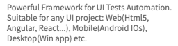

```html
<p ui="jdi-text">Powerful Framework for UI Tests Automation. Suitable for any UI project: 
Web(Html5, Angular, React...), Mobile(Android IOs), Desktop(Win app) etc.</p>
```

Text is represented by the following class:

Java: com.epam.jdi.light.ui.html.common.Text  
C#: JDI.Light.Elements.Common.TextElement

Here is a list of available methods in C#:

|Method | Description | Return Type
--- | --- | ---
**GetText()** | returns text| String
**GetValue()** | returns text| String
**Is** | Gets text assert | TextAssert
**AssertThat** | Gets text assert | TextAssert
**WaitFor** | Gets text assert | TextAssert

<a href="https://github.com/jdi-testing/jdi-light-csharp/blob/master/JDI.Light/JDI.Light.Tests/Tests/Simple/TextTests.cs" target="_blank">Test examples in C#</a>

And here are methods available in Java:
    
|Method | Description | Return Type
--- | --- | ---
**getText()** |Get current value | String
**is()** |Various assert actions for Text| TextAssert
**assertThat()** |Various assert actions for Text| TextAssert 

<a href="https://github.com/jdi-testing/jdi-light/blob/master/jdi-light-html-tests/src/test/java/io/github/epam/html/tests/elements/common/TextTests.java" target="_blank">Test examples in Java</a>

[BDD Steps example](https://jdi-docs.github.io/jdi-light/?java#text-2)

### TextField
```java 
@UI("#name") 
// same as @FindBy(css = "#name")
public static TextField name;

    @Test
    public void sendKeysTest() {
        name.sendKeys("Test");
        assertEquals(name.getValue(), text+"Test");
    }

    @Test
    public void inputTest() {
        name.input("New text");
        assertEquals(name.getText(), "New text");
    }

    @Test
    public void clearTest() {
        name.clear();
        assertEquals(name.getText(), "");
    }

    @Test
    public void placeholderTest() {
        assertEquals(name.placeholder(), "Input name");
    }
```
```csharp 
[FindBy(Id = "name")]
public ITextField NameField;
        
        [Test]
        public void InputTest()
        {
            TestSite.ContactFormPage.NameField.Input(ToAddText);
            Jdi.Assert.AreEquals(TestSite.ContactFormPage.NameField.Value, ToAddText);
        }
        
        [Test]
        public void SendKeyTest()
        {
            TestSite.ContactFormPage.NameField.SendKeys(ToAddText);
            Jdi.Assert.AreEquals(TestSite.ContactFormPage.NameField.Value, _defaultText + ToAddText);
        }

        [Test]
        public void ClearTest()
        {
            TestSite.ContactFormPage.NameField.Clear();
            Jdi.Assert.AreEquals(TestSite.ContactFormPage.NameField.Value, "");
        }
```
**TextField** – Is a simple element type that allows users to fill in text fields.

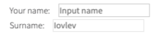

```html
<label for="name">Your name:</label>
<input type="text" id="name" placeholder="Input name">
<label for="disabled-name">Surname:</label>
<input type="text" id="disabled-name" placeholder="Iovlev" disabled="">
```

Text fields are represented by the following classes in Java and C#:
 
  - __C#__: _JDI.Light.Elements.Common.TextField_
  - __Java__: _com.epam.jdi.light.ui.html.common.TextField_
  
Here is a list of available methods and properties in C#:

|Method / Property | Description | Return Type
--- | --- | ---
**SendKeys(string value)** | adds text to the field | void
**SetText(String value)** | sets new text | void
**Clear()** | clears the text field | void
**Input(string text)** | sets new text  | void
**Focus()** | places cursor within the text field | void
**Placeholder** | returns value of the placeholder attribute | String
**GetText()** | returns text from the text field  | String
**GetValue()** | returns text from the text field| String
**Is** | property that returns object for work with assertions| TextAssert
**AssertThat** | property that returns object for work with assertions| TextAssert


<a href="https://github.com/jdi-testing/jdi-light-csharp/blob/master/JDI.Light/JDI.Light.Tests/Tests/Common/TextFieldsTests.cs" target="_blank">Test examples in C#</a><br>
[BDD Steps example](https://jdi-docs.github.io/jdi-light/?java#textfield-2)<br>

And here are methods available in Java:

|Method | Description | Return Type
--- | --- | ---
**sendKeys(CharSequence... value)** | adds text to the field | void
**setText(String value)** | sets new text | void
**clear()** | clears the text field | void
**input(String value)** | sets new text | void
**focus()** | places cursor within the text field | void
**placeholder()** | returns value of the placeholder attribute | String
**getText()** | returns text from the text field  | String
**getValue()** | returns text from the text field| String

<a href="https://github.com/jdi-testing/jdi-light/blob/master/jdi-light-html-tests/src/test/java/io/github/epam/html/tests/elements/common/TextFieldTests.java" target="_blank">Test examples in Java</a><br>
[BDD Steps example](https://jdi-docs.github.io/jdi-light/?java#textfield-2)<br>

### TextArea
```java 
@UI("#text-area") 
// same as FindBy(css = "#text-area")
public static TextArea textArea;

    @Test
    public void getLinesTest() {
        textArea.setLines("test 1", "test 2", "test 3");
        assertEquals(textArea.getLines(), asList("test 1", "test 2", "test 3"));
    }
    
    @Test
    public void focusTest() {
        textArea.focus();
    }
    
    @Test
    public void rowsTest() {
        assertEquals(textArea.rows(), 3);
        assertEquals(textArea.cols(), 33);
        assertEquals(textArea.minlength(), 10);
        assertEquals(textArea.maxlength(), 200);
    }
     
    @Test
    // this test demonstrates usage of methods inherited from TextField interface:
    public void clearTest() {
             textArea.setText(text);
             textArea.clear();
             assertEquals(textArea.getText(), "");
    }
```
```csharp 
[FindBy(Css = "#text-area")]
public ITextArea TextArea;

    [Test]
    public void GetTextTest()
    {
        TextArea.SetText(Text);
        Assert.AreEqual(TextArea.GetText(), "Text");
    }
    
   [Test]
   public void AddNewLineTest()
   {
      TextArea.SetText("line1", "line2");
      TextArea.AddNewLine("line3");
      Assert.CollectionEquals(TextArea.GetLines(), new[] { "line1", "line2", "line3" });
   }
```

**TextArea** – Is a simple element type that allows users to fill in text areas (they may contain a few lines). 

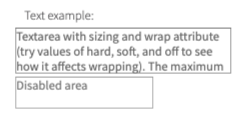

```html
<label for="text-area">Text example:</label>
<textarea id="text-area" rows="3" cols="33" maxlength="200" minlength="10"
          required="" wrap="hard" placeholder="Input huge text">Textarea with sizing
          and wrap attribute (try values of hard, soft, and off to see how it affects wrapping).
          The maximum number of characters is constrained to 200 by the maxlength attribute.
</textarea> <br>
<textarea disabled="" placeholder="Disabled area"></textarea>
```

Text areas are represented by the following classes in Java and C#:
 
  - __C#__: _JDI.Light.Elements.Common.TextArea_
  - __Java__: _com.epam.jdi.light.ui.html.common.TextArea_
  
In both Java and C# TextArea is a descendant of TextField and inherits its methods. But TextArea also has methods of its own.
 
Here is a list of available methods in C#:
  
|Method | Description | Return Type
--- | --- | ---
**SetLines(string[] lines)** | sets lines (text)  | void
**GetLines()** | returns lines (text) from the text area | string[]
**Rows()** | returns value of rows attribute | int
**Cols()** | returns value of cols attribute | int
**Minlength()** | returns value of minlength attribute | int
**Maxlength()** | returns value of maxlength attribute | int
**AddNewLine(string line)** | add line to the already existing ones | void
**Is()** | returns object for work with assertions  | TextAreaAssert
**AssertThat()** | returns object for work with assertions  | TextAreaAssert
 
  <a href="https://github.com/jdi-testing/jdi-light-csharp/blob/master/JDI.Light/JDI.Light.Tests/Tests/Simple/TextAreaTests.cs" target="_blank">Test examples in C#</a><br>
  [BDD Steps example](https://jdi-docs.github.io/jdi-light/#textarea-2) <br>
  
  And here are methods available in Java:
  
|Method | Description | Return Type
--- | --- | ---
**setLines(String... lines)** | sets lines (text)  | void
**getLines()** | returns lines (text) from the text area | List<String>
**rows()** | returns value of rows attribute | int
**cols()** | returns value of cols attribute | int
**minlength()** | returns value of minlength attribute | int
**maxlength()** | returns value of maxlength attribute | int
**placeholder()** | returns value of placeholder attribute | String
**addNewLine(String line)** | add line to the already existing  | void
**is()** | returns object for work with assertions  | TextAreaAssert
**assertThat()** | returns object for work with assertions  | TextAreaAssert

  <a href="https://github.com/jdi-testing/jdi-light/blob/master/jdi-light-html-tests/src/test/java/io/github/epam/html/tests/elements/common/TextAreaTests.java" target="_blank">Test examples in Java</a><br>
  [BDD Steps example](https://jdi-docs.github.io/jdi-light/#textarea-2) <br>

### Title
**Title** – A graphical control element representing document title, which is displayed in the title bar of the browser or tab page.

Title is represented by the following class:
 
  - __Java__: _com.epam.jdi.light.ui.html.common.Title_
  - __C#__: _JDI.Light.Elements.Common.Title_
  
  
```java 
@UI("[ui=jdi-title]") 
// equal to @FindBy(css = "[ui=jdi-title]") 
public static Title jdiTitle;

@Test
public void getTextTest() {
        assertEquals(jdiTitle.getText(), "Title text");
}

@Test
public void clickTest() {
        jdiTitle.click();
}    
    
```
```csharp 
[FindBy(Css = "[ui=jdi-title]")]
public Title JdiTitle;

[Test]
public void GetTextTest() 
{
        Assert.AreEqual(JdiTitle.GetText(), "Title text");
}

[Test]
public void ClickTest() 
{
        JdiTitle.ClickTitle();
}

[Test]
public void IsValidationTest()
{
       TestSite.Html5Page.JdiTitle.Is.Enabled();
       TestSite.Html5Page.JdiTitle.Is.Text(EqualTo(_text));
       TestSite.Html5Page.JdiTitle.Is.Text(Is(_text));
       TestSite.Html5Page.JdiTitle.Is.Text(EqualToIgnoringCaseMatcher.EqualTo("jdi TESTING platform"));
}

[Test]
public void AssertValidationTest()
{
       TestSite.Html5Page.JdiTitle.AssertThat.Text(EqualTo(_text));
}

[Test]
public void BaseValidationTest()
{
       BaseElementValidation(TestSite.Html5Page.JdiTitle);
}   
    
```


```html
<h1 ui="jdi-title" onclick="alert('JDI Title');">JDI Testing platform</h1>
```

Here is the list of methods available in C# JDI Light:

|Method | Description | Return Type
--- | --- | ---
**Is** |Gets Title's assert | TitleAssert
**AssertThat** |Gets Title's assert | TitleAssert

Here is the list of available methods in Java JDI Light:

|Method | Description | Return Type
--- | --- | ---
**click()** |Click title | void
**getText()** |Returns title text  | String

<a href="https://github.com/jdi-testing/jdi-light/blob/master/jdi-light-html-tests/src/test/java/io/github/epam/html/tests/elements/common/LabelTests.java" target="_blank">Test examples in Java</a>

<a href="https://github.com/jdi-testing/jdi-light-csharp/blob/master/JDI.Light/JDI.Light.Tests/Tests/Simple/TitleTests.cs" target="_blank">Test examples in C#</a>


## HTML5 Complex elements
### RadioButtons

**RadioButtons** – Interface element that allows user to select a single option from a predefined group.

Radio buttons are represented by the following class:
 
  - __Java__: _com.epam.jdi.light.ui.html.complex.RadioButtons_
  - __C#__: _JDI.Light.Elements.Complex.RadioButtons_

```java 
@UI("[name=colors]") //@FindBy(name = "colors")
public static RadioButtons colors;

@Test
public void selectTest() {
    colors.select(Blue);
    assertEquals(colors.getValue(), "Blue");
}
```
```csharp 
[FindBy(Css = "#colors")] 
public IRadioButtons MyRadioButtons;

[Test]
public void SelectRadioButton() 
{
    MyRadioButtons.Select("some value");
}
[Test]
public void SelectRadioButtonByIndex() 
{
    MyRadioButtons.Select(1);
}
[Test]
public void GetSelected() 
{
    var selected = MyRadioButtons.GetSelected();
    Assert.AreEqual(selected, "some value");
	MyRadioButtons.Is().Selected(Is.EqualTo("some value")); 
	MyRadioButtons.AssertThat().Selected(Is.EqualTo("some value"));
}
```

Consider an example where each radio button is a particular color, described with given HTML code:


```html
<input type="radio" id="red" name="colors">
<label for="red">Red</label> <br>

<input type="radio" id="green" name="colors" checked="">
<label for="green">Green</label> <br>

<input type="radio" id="blue" name="colors">
<label for="blue">Blue</label> <br>

<input type="radio" id="yellow" name="colors" disabled="">
<label for="yellow">Yellow</label>
```

Here is the list of some available methods:

|Method | Description | Return Type
--- | --- | ---
**select(String/int/Enum)/Select(string/int)** | Select radiobutton by value/index  | void
**selected()/Selected()** | Get selected radiobutton value | string
**is()** | Returns object for work with assertions | RadioButtonAssert
**assertThat()** | Returns object for work with assertions | RadioButtonAssert

<a href="https://github.com/jdi-testing/jdi-light/blob/master/jdi-light-html-tests/src/test/java/io/github/epam/html/tests/elements/complex/RadioTests.java" target="_blank">Test examples in Java</a>

<a href="https://github.com/jdi-testing/jdi-light-csharp/blob/master/JDI.Light/JDI.Light.Tests/Tests/Complex/RadioButtonsTests.cs" target="_blank">Test examples in C#</a>

[BDD Steps example](https://jdi-docs.github.io/jdi-light/#radiobuttons-2) <br>

### Table

**Table** – A complex element that consists of a header, a body (at least one row and one column) and a footer. You are able to perform a list of readonly interactions with this element.

Tables are represented by the following classes in Java and C#:

```java 
         @UI("#users-table") //@FindBy(id = "users-table")
         public static Table users;
         	@JTable(
         		root = "#users-table",
         		row = "//tr[%s]/td",
         		column = "//tr/td[%s]",
         		cell = "//tr[{1}]/td[{0}]",
         		allCells = "td",
         		headers = "th",
         		header = {"Name", "Phone", "Email", "City"},
         	 	rowHeader = "Name",
         		size = 4
         	) public static Table usersSetup;
         
         
         @Test
            public void tablePerformanceTest() {
                tablePerformance(users);
            }
         @Test
            public void jTablePerformanceTest() {
                tablePerformance(usersSetup);
            }
            
            private void tablePerformance(Table table) {
                assertEquals(table.size(), 4);
                assertEquals(table.count(), 400);
                assertEquals(table.header(), asList("Name", "Phone", "Email", "City"));
                start();
                assertEquals(table.row(1).getValue(),
                        "Burke Tucker;076 1971 1687;et.euismod.et@ut.edu;GozŽe");
                logTime("Get 1 row");
        
                assertEquals(table.row("Burke Tucker").getValue(),
                        "Burke Tucker;076 1971 1687;et.euismod.et@ut.edu;GozŽe");
                logTime("Get 'Burke Tucker' row");
        
                String zacharyEmail = "ipsum.non.arcu@auctorullamcorper.ca";
                assertEquals(table.cell(3,4), zacharyEmail);
                logTime("Get cell(3,4)");
                assertEquals(table.cell("Email",4), zacharyEmail);
                logTime("Get cell(Email,4)");
                assertEquals(table.cell(3,"Zachary Hendrix"), zacharyEmail);
                logTime("Get cell(3,Zachary Hendrix)");
                assertEquals(table.cell("Email","Zachary Hendrix"), zacharyEmail);
                logTime("Get cell(Email,Zachary Hendrix)");
        
                assertEquals(table.column(2).getValue().substring(0, 30),
                        "076 1971 1687;(011307) 16843;0");
                logTime("Get column(2)");
        
                assertEquals(table.column("Phone").getValue().substring(0, 30),
                        "076 1971 1687;(011307) 16843;0");
                logTime("Get column(Phone)");
        
                String value = table.preview();
                assertEquals(value.substring(0,194),
                "Name Phone Email City" +
                    "Burke Tucker 076 1971 1687 et.euismod.et@ut.edu GozŽe" +
                    "Grady Brock (011307) 16843 cursus.et@commodo.org Alcobendas" +
                    "Harding Lloyd 0800 1111 neque.In.ornare@mauris.co.uk Beauvais");
                logTime("Preview");
                /*value = table.getValue();
                assertEquals(value.substring(0,228),
                    "||X||Name|Phone|Email|City||\r\n" +
                    "||1||Burke Tucker|076 1971 1687|et.euismod.et@ut.edu|GozŽe||\r\n" +
                    "||2||Grady Brock|(011307) 16843|cursus.et@commodo.org|Alcobendas||\r\n" +
                    "||3||Harding Lloyd|0800 1111|neque.In.ornare@mauris.co.uk|Beauvais||");
                logTime("Get value");*/
            }
         @Test
            public void tableDataTest() {
                assertEquals(users.row(2).asData(UserInfo.class),
                        GRADY_BROCK);
            }
         @Test
            public void tableEntityTest() {
                UserRow user = users.row(2).asLine(UserRow.class);
                user.name.click();
                validateAlert(containsString("Brock"));
                user.city.click();
                validateAlert(is("Alcobendas"));
            }
        
            private static long timeStart;
            public static void start() {
                timeStart = currentTimeMillis();
            }
            public static void logTime(String description) {
                out.println(description + ": " + (currentTimeMillis() - timeStart) + "ms");
                timeStart = currentTimeMillis();
            }	
         @Test
             public void hugeTableSearchTest() {
                 StopWatch timer = StopWatch.createStarted();
                 Line row = usersTable.row(
                     containsValue("Meyer", inColumn("Name")),
                     containsValue("co.uk", inColumn("Email")));
                 System.out.println("Huge table search test Time: " + timer.getTime());
                 Assert.assertEquals(row.getValue(),
                 "Brian Meyer;(016977) 0358;mollis.nec@seddictumeleifend.co.uk;Houston");
             }
         @Test
             public void hugeTableValidateTest() {
                 StopWatch timer = StopWatch.createStarted();
                 String actualTable = usersTable.preview();
                 System.out.println("Huge table validate test Time: " + timer.getTime());
                 Assert.assertEquals(actualTable, TABLE_SNAPSHOOT);
             }
         @Test
             public void bigDropdownTest() {
                 String name = "Charles Byers";
                 StopWatch timer = StopWatch.createStarted();
                 userNames.select(name);
                 System.out.println("Big dropdown test Time: " + timer.getTime());
                 Assert.assertEquals(userNames.selected(), name);
             }
         @Test
             public void longTextTest() {
                 String text = "Lorem ipsum dolor sit amet, eos numquam rationibus ad. Ius cu accumsan salutatus, ne pro purto ridens vulputate. Cu eum doctus tritani, munere sanctus complectitur vis id. Paulo vulputate te eos, suas tollit laudem nam id. His esse rebum reprimique ut, te solum atqui homero vim.\\n\\n" +
                         "Labitur salutatus eos an. Vim ut dicam fuisset. Ex sed animal accommodare, utinam graeci iisque vim id, ea fugit scripta deleniti nec. Eos cu nisl veri meis. Affert audiam copiosae mel ne, fabulas menandri temporibus has et. Sed latine graecis ei, eu fugit soluta intellegam vis, nibh graeci meliore ad duo.\\n\\n" +
                         "Et quis meis delenit mea, ius ea sumo laboramus vituperatoribus. Te simul luptatum tractatos nam, eam in causae constituam, quod stet ancillae nam ei. Ne his dico veniam legere, id has vidisse euismod sanctus. Vis putant volumus tincidunt et.\\n\\n" +
                         "Has eirmod consequat ad. Sea illud clita ut, has quando accusata cotidieque an, volutpat iudicabit definitionem ut sea. Pri at atqui molestiae, nibh ullum consulatu vix at. Nec id nisl nonumes epicurei, et vitae possit probatus ius. Fierent delicata argumentum ut quo. Tation tincidunt sed eu, sit in nostrud democritum.\\n\\n" +
                         "Usu esse utroque sapientem ad. Eam ut consul soleat sapientem, cu dolor consequuntur vis. Erat temporibus mea id, has ex dicam tritani. Pertinacia expetendis consectetuer eos ei, vidit malis periculis est ea, ne nam movet fuisset. Pro id habemus definitiones, in ferri solum reprehendunt mei. Vel eligendi honestatis liberavisse id.";
                 StopWatch timer = StopWatch.createStarted();
                 textareaPerformance.setText(text + "\\n"+ text);
                 System.out.println("Long text test Time: " + timer.getTime());
             }	
  ```

```csharp
       
        [Test]
        public void HugeTableSearchByColumnNamesContainValuesTest()
        {
            PerformancePage.UsersTable.AssertThat().HasRowWithValues(
                ContainsValue("Meyer", InColumn("Name")),
                ContainsValue("co.uk", InColumn("Email")));
            var row = PerformancePage.UsersTable.Row(
                ContainsValue("Meyer", InColumn("Name")),
                ContainsValue("co.uk", InColumn("Email")));
                Assert.AreEqual("Brian Meyer;(016977) 0358;mollis.nec@seddictumeleifend.co.uk;Houston",
                    row.GetValue());
        }

        [Test]
        public void HugeTableSearchByColumnNumbersContainValuesTest()
        {
            PerformancePage.UsersTable.AssertThat().HasRowWithValues(
                ContainsValue("Burke", InColumn(1)),
                ContainsValue("ut.edu", InColumn(3)));
            var row = PerformancePage.UsersTable.Row(1);
            PerformancePage.UsersTable.Is().HasRowWithValues( 
				HasValue("Brian Meyer", InColumn("Name")), 
				HasValue("(016977) 0358", InColumn("Phone")),
                HasValue("mollis.nec@seddictumeleifend.co.uk", InColumn("Email")), 
				HasValue("Houston", InColumn("City")));
        }

        [Test]
        public void HugeTableSearchByColumnNamesHasValuesTest()
        {
            PerformancePage.UsersTable.AssertThat().HasRowWithValues(
                HasValue("Brian Meyer", InColumn("Name")),
                HasValue("mollis.nec@seddictumeleifend.co.uk", InColumn("Email")));
            var row = PerformancePage.UsersTable.Row(
                HasValue("Brian Meyer", InColumn("Name")),
                HasValue("mollis.nec@seddictumeleifend.co.uk", InColumn("Email")));
            Assert.AreEqual("Brian Meyer;(016977) 0358;mollis.nec@seddictumeleifend.co.uk;Houston",
                row.GetValue());
        }

        [Test]
        public void HugeTableSearchByColumnNumbersHasValuesTest()
        {
            PerformancePage.UsersTable.AssertThat().HasRowWithValues(
                HasValue("Brian Meyer", InColumn(1)),
                HasValue("mollis.nec@seddictumeleifend.co.uk", InColumn(3)));
            var row = PerformancePage.UsersTable.Row(
                ContainsValue("Meyer", InColumn("Name")),
                ContainsValue("co.uk", InColumn("Email")));
            Assert.AreEqual("Brian Meyer;(016977) 0358;mollis.nec@seddictumeleifend.co.uk;Houston",
                row.GetValue());
        } 

		[Test]
        public void TableChainTest()
        {            
            PerformancePage.UsersTable.AssertThat()
                .Size(400)
                .Size(Is.GreaterThan(399))                
                .HasRowWithValues(
                    HasValue("Brian Meyer", InColumn("Name")),
                    HasValue("mollis.nec@seddictumeleifend.co.uk", InColumn("Email")))
                .NotEmpty()
                .RowsWithValues(3, ContainsValue("Baker", InColumn(1)))
                .HasColumn("Email")
                .HasColumns(new[] {"Name", "City"})
                .Columns(Is.SubsequenceOf(new[] {"Name", "City", "Phone", "Email", "Address"}));
        }
		
		[Test]
        public void TableRowPerformanceTest()
        {
            PerformancePage.Open();
            PerformancePage.CheckOpened();
            AreEqual("Burke Tucker;076 1971 1687;et.euismod.et@ut.edu;GozŽe", PerformancePage.UsersTable.Row(1).GetValue());
            AreEqual("Burke Tucker;076 1971 1687;et.euismod.et@ut.edu;GozŽe", PerformancePage.UsersTable.Row("Burke Tucker").GetValue());
            AreEqual("Burke Tucker;076 1971 1687;et.euismod.et@ut.edu;GozŽe", PerformancePage.UsersTable.Row(Users.Name).GetValue());
            var value = PerformancePage.UsersTable.Preview();
            AreEqual("Name Phone Email City" +
                "Burke Tucker 076 1971 1687 et.euismod.et@ut.edu GozŽe" +
                "Grady Brock (011307) 16843 cursus.et@commodo.org Alcobendas" +
                "Harding Lloyd 0800 1111 neque.In.ornare@mauris.co.uk Beauvais", value.Substring(0, 194));
        }

        [Test]
        public void TableCellPerformanceTest()
        {
            PerformancePage.Open();
            PerformancePage.CheckOpened();
            AreEqual("ipsum.non.arcu@auctorullamcorper.ca", PerformancePage.UsersTable.Cell(3, 4));
            AreEqual("ipsum.non.arcu@auctorullamcorper.ca", PerformancePage.UsersTable.Cell("Email", 4));
            AreEqual("ipsum.non.arcu@auctorullamcorper.ca", PerformancePage.UsersTable.Cell(3, "Zachary Hendrix"));
            AreEqual("ipsum.non.arcu@auctorullamcorper.ca", PerformancePage.UsersTable.Cell("Email", "Zachary Hendrix"));
        }

        [Test]
        public void TableColumnPerformanceTest()
        {
            PerformancePage.Open();
            PerformancePage.CheckOpened();
            AreEqual("076 1971 1687;(011307) 16843;0", PerformancePage.UsersTable.Column(2).GetValue().Substring(0, 30));
            AreEqual("076 1971 1687;(011307) 16843;0", PerformancePage.UsersTable.Column("Phone").GetValue().Substring(0, 30));
            AreEqual("076 1971 1687;(011307) 16843;0", PerformancePage.UsersTable.Column(Users.Phone).GetValue().Substring(0, 30));
        }		
```

  - __Java__: _com.epam.jdi.light.elements.complex.table.Table.java_
  - __C#__: _JDI.Light.Elements.Complex.Table.cs_
    
  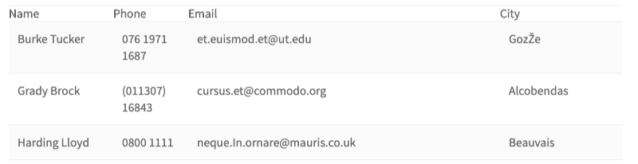

```html
<table class="uui-table stripe tbl-without-header table-td-click" ui="table" id="users-table">
    <tbody>
        <tr>
            <th>Name</th>
            <th>Phone</th>
            <th>Email</th>
            <th>City</th>
        </tr>
        <tr>
            <td>Burke Tucker</td>
            <td>076 1971 1687</td>
            <td>et.euismod.et@ut.edu</td>
            <td>GozŽe</td>
        </tr>
        <tr>
            <td>Grady Brock</td>
            <td>(011307) 16843</td>
            <td>cursus.et@commodo.org</td>
            <td>Alcobendas</td>
        </tr>
        <tr>
            <td>Harding Lloyd</td>
            <td>0800 1111</td>
            <td>neque.In.ornare@mauris.co.uk</td>
            <td>Beauvais</td>
        </tr>
    </tbody>
</table>
```

Here is a list of available methods in Java:

| Method | Description | Return Type|
--- | --- | ---
**cell(int colNum, int rowNum)** | Returns a cell object of a table according to the cell index | String
**cell(int colNum, String rowName)** | Returns a cell object of a table according to the cell index | String
**cell(String colName, int rowNum)** | Returns a cell object of a table according to the cell index | String
**cell(String colName, String rowNum)** | Returns a cell object of a table according to the cell index | String
**column(Enum colName)** | Returns a column object of a table according to column name | Line
**column(int colNum)** | Returns a column object of a table according to column number | Line
**column(String colName)** | Returns a column object of a table according to column name | Line
**columns()** | Returns a list of column objects of a table | List\<Line>
**filterRows(Matcher<String> matcher, Column column)** | Sets and returns a list of filtered rows of a table according to matching column | List\<Line>
**filterRows(Pair<Matcher<String>,Column>... matchers)** | Sets and returns a list of filtered rows of a table according to matching column | List\<Line>
**getValue()** | Returns a string content of values for a particular row, where values are separated by ";" | String
**isEmpty()** | Asserts whether a table is empty | boolean
**isNotEmpty()** | Asserts whether a table is not empty | boolean
**preview()** | Returns table preview | String
**row(Enum rowName)** | Returns a row object of a table according to row name | Line
**row(int rowNum)** | Returns a row object of a table according to row number | Line
**row(Matcher<String> matcher, Column column)** | Returns a row object of a table according to matching column | Line
**row(Pair<Matcher<String>,Column>... matchers)** | Returns a row object of a table according to matching column | Line
**row(String rowName)** | Returns a row object of a table according to row name | Line
**row(TableMatcher... matchers)** | Returns a row object of a table according to matcher | Line
**rows()** | Returns a list of rows of a table | List\<Line>
**rows(TableMatcher... matchers)** | Returns a list of rows of a table according to matchers | List\<Line>
**size()** | Returns amount of columns | int
**count()** | Returns amount of rows | int
**header()** | Returns a list of table's headers | List<String>
**webRow(int rowNum)** | Returns all UIElements in the row according to row number | List<UIElement>
**webRow(String rowName)** | Returns all UIElements in the row according to row name | List<UIElement>
**webRow(Enum rowName)** | Returns all UIElements in the row according to row name | List<UIElement>
**webColumn(int colNum)** | Returns all UIElements in the column according to column number | List<UIElement>
**webColumn(String colName)** | Returns all UIElements in the column according to column name | List<UIElement>
**webColumn(Enum colName)** | Returns all UIElements in the column according to column name | List<UIElement>
**webCell(int colNum, int rowNum)** | Returns all UIElements in the column according to cell position | List<UIElement>
  
AssertTable methods in Java:
| Method | Description | Return Type|
--- | --- | ---
**assertThat()** | Applicable for performing assert actions for tables | TableAssert
**has()** | Applicable for performing assert actions for tables | TableAssert
**is()** | Applicable for performing assert actions for tables | TableAssert
**shouldBe()** | Applicable for performing assert actions for tables | TableAssert
**waitFor()** | Applicable for performing assert actions for tables | TableAssert

And here are methods available in C#:

| Method | Description | Return Type|
--- | --- | ---
**AssertThat()** | Applicable for performing assert actions for tables | TableAssert
**Is()** | Applicable for performing assert actions for tables | TableAssert
**ContainsValue(string value, Column column)** | Looks for an object by some value occurrence in a particular column | TableMatcher 
**HasValue(string value, Column column)** | Looks for an object (exact match) in a particular column | TableMatcher
**InColumn(string value)** | Sets an object of some column to a particular value | Column
**InColumn(int num)** | Sets an object of some column to a particular column number | Column
**Row(params TableMatcher[] matchers)** | Sets and returns a row object from a table according to some matcher params (returns 'null' if there is no such row) | Line
**Row(int rowNum)** | Sets and returns a row object of a table according to the row index | Line
**Row(string rowName)** | Sets and returns a row object of a table according to the row name | Line
**Row(Enum rowName)** | Sets and returns a row object of a table according to row name | Line
**Row(Matcher<String> matcher, Column column)** | Sets and returns a row object of a table according to matching column | Line
**Row(params KeyValuePair<Matcher<string>, Column>[] matchers)** | Sets and returns a row object of a table according to matching column | Line
**RowsAsLines(params TableMatcher[] matchers)** | Sets and returns a list of rows of a table according to matchers | List<Line>
**RowsAsLines()** | Sets and returns a list of rows of a table | List<Line>
**FilterRows(Matcher<String> matcher, Column column)** | Sets and returns a list of filtered rows of a table according to matching column | List<Line>
**FilterRows(params KeyValuePair<Matcher<string>, Column>[] matchers)** | Sets and returns a list of filtered rows of a table according to matching column | List<Line>
**Cell(int colNum, int rowNum)** | Sets and returns a cell object of a table according to the cell's indices | string
**Cell(string colName, int rowNum)** | Sets and returns a cell object of a table according to the cell's column name and row index | string
**Cell(int colNum, string rowName)** | Sets and returns a cell object of a table according to the cell's column index and row name | string
**Cell(string colName, string rowName)** | Sets and returns a cell object of a table according to the cell's column name and row name | string
**Column(int colNum)** | Sets and returns a column object of a table according to the column's index | Line
**Column(string colName)** | Sets and returns a column object of a table according to the column's name | Line
**Column(Enum colName)** | Sets and returns a column object of a table according to column name | Line
**Columns()** | Sets and returns a list of column objects of a table | List<Line>
**GetValue()** | Returns a string content of values for a particular row, where values are separated by ";" | string
**string Preview()** | Returns a string content of the whole table | string

AssertTable methods in C#:

| Method | Description | Return Type|
--- | --- | ---
**Empty()** | Asserts whether table is empty | TableAssert
**NotEmpty()** | Asserts whether table is not empty | TableAssert
**Size(Matcher<int> condition)** | Asserts whether table size satisfies some matcher condition | TableAssert
**Size(int expectedSize)** | Asserts whether table has a particular size | TableAssert
**HasColumn(string column)** | Asserts whether table has a particular header | TableAssert
**HasColumns(IEnumerable<string> columns)** | Asserts whether table has particular headers | TableAssert
**Columns(Matcher<IEnumerable<string>> condition)** | Asserts whether headers satisfy some matcher condition | TableAssert
**RowsWithValues(int count, params TableMatcher[] matchers)** | Asserts whether rows with particular matchers exist in a table multiple times | TableAssert
**HasRowWithValues(params TableMatcher[] matchers)** | Asserts whether a row with particular matchers exists in a table | TableAssert

<a href="https://github.com/jdi-testing/jdi-light/blob/master/jdi-light-examples/src/test/java/io/github/epam/tests/recommended/TableTests.java" target="_blank">Test examples in Java</a>

<a href="https://github.com/jdi-testing/jdi-light-csharp/blob/master/JDI.Light/JDI.Light.Tests/Tests/Composite/TableTests.cs" target="_blank">Test examples in C#</a>

[BDD Steps example](https://jdi-docs.github.io/jdi-light/?java#table-2)<br>

### DataTable

**DataTable** – A complex element that consists of header, a body (at least one row and one column) and a footer. You are 
able to perform a list of readonly interactions with this element in order to get all data based on specified criteria.

DataTables are represented by the following classes in Java and C#:

```java 
         
         @UI("#users-table") //@FindBy(id = "users-table")
         public static DataTable<UserRow, UserInfo> usersData;
         	@JTable( root = "#users-table",
         		row = "//tr[%s]/td", column = "//tr/td[%s]",
         		cell = "//tr[{1}]/td[{0}]", allCells = "td",
         		headers = "th", header = {"Name", "Phone", "Email", "City"},
         		rowHeader = "Name", size = 4
         	)
         	public static DataTable<UserRow, UserInfo> usersDataSetup;
         
         @Test
             public void dataTableTest() {
                 dataTableValidation(usersData);
             }
         @Test
             public void jDataTableTest() {
                 dataTableValidation(usersDataSetup);
             }
             private void dataTableValidation(DataTable<UserRow, UserInfo> table) {
                 assertEquals(table.size(), 4);
                 assertEquals(table.count(), 400);
                 assertEquals(table.header(), asList("Name", "Phone", "Email", "City"));
                 String value = table.preview();
                 assertEquals(value.substring(0,194),
                 "Name Phone Email City" +
                     "Burke Tucker 076 1971 1687 et.euismod.et@ut.edu GozŽe" +
                     "Grady Brock (011307) 16843 cursus.et@commodo.org Alcobendas" +
                     "Harding Lloyd 0800 1111 neque.In.ornare@mauris.co.uk Beauvais");
             }
         @Test
             public void filterDataTest() {
                 assertEquals(usersData.data(2), GRADY_BROCK);
                 assertEquals(usersData.data("Grady Brock"), GRADY_BROCK);
                 assertEquals(usersData.data(d -> d.name.contains("Brock")), GRADY_BROCK);
                 usersData.assertThat().row(d -> d.equals(GRADY_BROCK));
                 /*
                 List<UserInfo> filteredData = usersData.datas(d -> d.name.contains("Brock"));
                 assertEquals(filteredData.size(), 1);
                 assertEquals(filteredData.get(0), GRADY_BROCK);
                 */
             }
         @Test
             public void filterLinesTest() {
                 UserRow line =  usersData.line(2);
                 validateUserRow(line);
                 line =  usersData.line("Grady Brock");
                 validateUserRow(line);
                 line =  usersData.line(d -> d.name.contains("Brock"));
                 validateUserRow(line);
                 /*
                 List<UserRow> filteredData = usersData.lines(d -> d.name.contains("Brock"));
                 assertEquals(filteredData.size(), 1);
                 validateUserRow(filteredData.get(0));
                 */
             }
         
             private void validateUserRow(UserRow line) {
                 line.city.click();
                 validateAlert(is(GRADY_BROCK.city));
                 assertEquals(line.email.getText(), GRADY_BROCK.email);
             }	    
         @Test
             public void tableParamsTest() {
                     assertEquals(users.size(), 4);
                     assertEquals(users.count(), 6);
                     assertEquals(users.header(), asList("Number", "Type", "User", "Description"));
             }    
         @Test
             public void previewTest() {
                     if (isFireFox()) return;
                     String value = users.preview();
                     assertEquals(value,
                             "Number Type User Desciption1  Admin User Manager RomanWolverineVip2  Admin User Manager Sergey IvanSpider ManVip3  Admin User Manager VladzimirPunisherVip4  Admin User Manager Helen BennettCaptain Americasome descriptionVip5  Admin User Manager Yoshi TannamuriCyclopesome descriptionVip6  Admin User Manager Giovanni RovelliHulksome descriptionVip");
             }   
         @Test
             public void valueTest() {
                     String value = users.getValue();
                     assertEquals(value,
                     "||X||Number|Type|User|Description||\r\n" +
                         "||1||1|Admin|Roman|Wolverine:VIP||\r\n" +
                         "||2||2|User|Sergey Ivan|Spider Man:Dude||\r\n" +
                         "||3||3|Manager|Vladzimir|Punisher:VIP||\r\n" +
                         "||4||4|User|Helen Bennett|Captain America\\nsome description:Dude||\r\n" +
                         "||5||5|User|Yoshi Tannamuri|Cyclope\\nsome description:Dude||\r\n" +
                         "||6||6|User|Giovanni Rovelli|Hulk\\nsome description:Dude||\r\n");
             }
         @Test
             public void dataColumnTestIndex() {
                     assertEquals(users.data(2), SPIDER_MAN);
             }
         @Test
             public void dataColumnNameTest() {
                     assertEquals(usersSetup.data("Sergey Ivan"), SPIDER_MAN);
             }
         @Test
             public void dataFilterTest() {
                     assertEquals(users.data(d -> d.user.contains("Ivan")), SPIDER_MAN);
             }
         @Test
             public void allDataFilterTest() {
                     List<MarvelUserInfo> filteredData = users.datas(d -> d.user.contains("Ivan"));
                     assertEquals(filteredData.size(), 1);
                     assertEquals(filteredData.get(0), SPIDER_MAN);
             }
         @Test
             public void commonMatchersTest() {
                     users.is().displayed();
                     users.has().size(6);
                     users.assertThat().size(greaterThan(3));
                     users.is().notEmpty().size(lessThanOrEqualTo(6));
             }
         @Test
             public void rowMatcherTest() {
                     users.has().row(d -> d.user.contains("Ivan"));
             }
         @Test
             public void rowsMatcherTest() {
                     users.assertThat().allRows(d -> d.user.length() > 4);
             }
         @Test
             public void atLeastMatcherTest() {
                     users.assertThat().atLeast(3).rows(d -> d.type.contains("User"));
             }
         @Test
             public void exactMatcherTest() {
                     users.assertThat().exact(2).rows(d -> d.description.contains(":VIP"));
             }
         @Test
             public void rowDataMatcherTest() {
                     users.has().row(SPIDER_MAN);
             }
         @Test
             public void rowDataExactMatcherTest() {
                     users.assertThat().exact(1).rows(SPIDER_MAN);
             }
         @Test
             public void tableChainTest() {
                     users.assertThat()
                         .displayed()
                         .size(6)
                         .size(greaterThan(3))
                         .notEmpty()
                         .row(d -> d.user.contains("Ivan"))
                         .allRows(d -> d.user.length() > 4)
                         .atLeast(3).rows(d -> d.type.contains("User"))
                         .row(SPIDER_MAN)
                         .exact(2).rows(d -> d.description.contains(":VIP"))
                         .exact(1).rows(SPIDER_MAN);
             }	
         @Test
             public void lineByIndexTest() {
                 MarvelUser line = users.line(2);
                 validateUserRow(line);
             }
         @Test
             public void lineByNameTest() {
                 MarvelUser line = usersSetup.line("Sergey Ivan");
                 validateUserRow(line);
             }
         @Test
             public void lineFilterTest() {
                 MarvelUser line = users.line(d -> d.user.contains("Ivan"));
                 validateUserRow(line);
             }
         @Test
             public void linesFilterTest() {
                 List<MarvelUser> filteredData = users.lines(d -> d.user.contains("Ivan"));
                 assertEquals(filteredData.size(), 1);
                 validateUserRow(filteredData.get(0));
             }
         
             public static void validateUserRow(MarvelUser line) {
                 line.type.select("Admin");
                 assertEquals(line.type.getValue(), "Admin");
                 line.type.select("User");
                 line.number.assertThat().text(is("2"));
             } 
         @Test
             public void baseValidationTest() {
                 baseValidation(users);
             }
  ```
 
  - __Java__: _com.epam.jdi.light.elements.complex.table.DataTable.java_
  - __C#__:
    
  

```html
<table class="uui-table stripe tbl-without-header table-td-click" ui="table" id="users-table">
    <tbody>
        <tr>
            <th>Name</th>
            <th>Phone</th>
            <th>Email</th>
            <th>City</th>
        </tr>
        <tr>
            <td>Burke Tucker</td>
            <td>076 1971 1687</td>
            <td>et.euismod.et@ut.edu</td>
            <td>GozŽe</td>
        </tr>
        <tr>
            <td>Grady Brock</td>
            <td>(011307) 16843</td>
            <td>cursus.et@commodo.org</td>
            <td>Alcobendas</td>
        </tr>
        <tr>
            <td>Harding Lloyd</td>
            <td>0800 1111</td>
            <td>neque.In.ornare@mauris.co.uk</td>
            <td>Beauvais</td>
        </tr>
    </tbody>
</table>
```

Here is a list of available methods in Java (_btw DataTable expand Table class - methods from previous table are available too_):

In return types column _"D"_ refers to the user data object and _"L"_ refers to the table line object.

| Method | Description | Return Type|
--- | --- | ---
**allData()** | Gets all section rows from the specified table | List\<D>
**allLines()** | Gets all object rows from the specified table | List\<L>
**data(Enum rowName)** | Returns a section of a table according to row name | D
**data(int rowNum)** | Returns a section of a table according to row number | D
**data(JFunc1<D, Boolean> matcher)** | Returns a section of a table according to matching row | D
**data(Matcher<String> matcher, Column column)** | Returns a section of a table according to matching row and column | D
**data(Pair<Matcher<String>,Column>...matchers)** | Returns a section of a table according to matching column | D
**data(String rowName)** | Returns a section of a table according to row name | D
**data(TableMatcher...matchers)** | Returns a section of a table according to matchers | D
**datas(JFunc1<D, Boolean> matcher)** | Returns a list of sections of a table according to matchers | List\<D>
**datas(JFunc1<D, Boolean> matcher, int amount)** | Returns a list of sections of a table according to matchers | List\<D>
**datas(TableMatcher...matchers)** | Returns a list of sections of a table according to matchers | List\<D>
**filterData(Matcher<String> matcher, Column column)** | Returns a list of sections of a table according to matching row and column | List\<D>
**filterDatas(Pair<Matcher<String>,Column>...matchers)** | Returns a list of sections of a table according to matching column | List\<D>
**filterLines(Matcher<String> matcher, Column column)** | Returns a list of objects of a table according to matching row and column | List\<L>
**filterLines(Pair<Matcher<String>,Column>...matchers)** | Returns a list of objects of a table according to matching column | List\<L>
**getValue()** | Returns string content of values for particular row, where values are separated by "&#124;" | String
**line(Enum rowName)** | Returns an object of a table according to row name | L
**line(int rowNum)** | Returns an object of a table according to row number | L
**line(JFunc1<D, Boolean> matcher)** | Returns an object of a table according to matching row | L
**line(Matcher<String> matcher, Column column)** | Returns an object of a table according to matching row and column | L
**line(Pair<Matcher<String>,Column>...matchers)** | Returns an object of a table according to matching column | L
**line(String rowName)** | Returns an object of a table according to row name | L
**line(TableMatcher...matchers)** | Returns an object of a table according to matchers | L
**lines(JFunc1<D, Boolean> matcher)** | Returns a list of objects of a table according to matchers | List\<L>
**lines(TableMatcher...matchers)** | Returns a list of objects of a table according to matchers | List\<L>
**offCache()** | Turns off cache usage | void
**refresh()** | Clears all data and lines | void
**setup(Field field)** | Sets up the table using specified fields | void
**getValue()** | Returns table content separated by "&#124;" | String

DataTableAssert methods in Java:

| Method | Description | Return Type|
--- | --- | ---
**assertThat()** | Applicable for performing assert actions for tables | DataTableAssert
**has()** | Applicable for performing assert actions for tables | DataTableAssert
**is()** | Applicable for performing assert actions for tables | DataTableAssert
**shouldBe()** | Applicable for performing assert actions for tables | DataTableAssert
**waitFor()** | Applicable for performing assert actions for tables | DataTableAssert

<a href="https://github.com/jdi-testing/jdi-light/blob/master/jdi-light-html-tests/src/test/java/io/github/epam/html/tests/elements/common/RangeTests.java" target="_blank">Test examples in Java</a><br>

[BDD Steps example](https://jdi-docs.github.io/jdi-light/?java#datatable-2)

### DropDown

**DropDown** – A graphical control element that allows user to choose a single value from a list.


JDI Light has support for dropdown elements with their own type. There are several ways of dropdown usage in JDI Light, each serving different needs.

__JDI Dropdown annotation__

For better use, JDI Light provides a __*@JDropdown*__ annotation to locate dropdown elements. This annotation consists of the following elements:

 - __*root()*__ - value of this element points to the root locator of dropdown element
 - __*value()*__ - locator of option selected by default in dropdown list
 - __*list()*__ - locator representing list options
 - __*expand()*__ - locator for expanding the dropdown list
 - __*how()*__ - type of locators with which elements will be identified. By default it is css
 
```java 
@JDropdown(root = "div[ui=dropdown]",
           value = ".filter-option",
           list = "li",
           expand = ".caret")
public Droplist colors;

@Test
public void complexTest() {
    metalAndColorsPage.shouldBeOpened();
    metalAndColorsPage.colors.select(Green);
}
```

```csharp 
[JDropDown(root: "#colors", 
           value: ".filter-option", 
           list:"li", 
           expand:".caret")]
public Droplist Colors;

[Test]
public void ComplexTest() 
{
    MetalAndColorsPage.ShouldBeOpened();
    MetalAndColorsPage.Colors.Select(Green);
}
```

Suppose we have 'Colors' dropdown, which looks like this in HTML code:

<!--  -->

```html
<div class="form-group colors" ui="dropdown" id="colors">
    <select class="selectpicker uui-form-element" style="display: none;">
        <option>Colors</option>
        <option>Red</option>
        <option>Green</option>
        <option>Blue</option>
        <option>Yellow</option>
    </select><div class="btn-group bootstrap-select uui-form-element"><button type="button" class="btn dropdown-toggle selectpicker btn-default" data-toggle="dropdown" title="Colors"><span class="filter-option pull-left" value="">Colors</span>&nbsp;<span class="caret"></span></button><div class="dropdown-menu open" style="max-height: 933px; overflow: hidden; min-height: 90px;"><ul class="dropdown-menu inner selectpicker" role="menu" style="max-height: 921px; overflow-y: auto; min-height: 78px;"><li rel="0" class="selected"><a tabindex="0" class="" style=""><span class="text">Colors</span><i class="glyphicon glyphicon-ok icon-ok check-mark"></i></a></li><li rel="1"><a tabindex="0" class="" style=""><span class="text">Red</span><i class="glyphicon glyphicon-ok icon-ok check-mark"></i></a></li><li rel="2"><a tabindex="0" class="" style=""><span class="text">Green</span><i class="glyphicon glyphicon-ok icon-ok check-mark"></i></a></li><li rel="3"><a tabindex="0" class="" style=""><span class="text">Blue</span><i class="glyphicon glyphicon-ok icon-ok check-mark"></i></a></li><li rel="4"><a tabindex="0" class="" style=""><span class="text">Yellow</span><i class="glyphicon glyphicon-ok icon-ok check-mark"></i></a></li></ul></div></div>
</div>
```

__Dropdown representation__

```java 
public Droplist colors;
@CSS("#colors") public Droplist colors;
public Droplist colors = dropdown("#colors");
public Droplist colors = $d("#colors");

@Test
public void colorsTest() {
    colors.select(Green);
    assertEquals(colors.selected(), Green);
}
```

```csharp 
public DropDown Colors;
[FindBy(Css = "#colors")] 
public DropDown Colors;

[Test]
public void ColorsTest() 
{
    Colors.Select(Green);
    Assert.AreEquals(Colors.Selected(), Green);
}
```

JDI Light provides a __Droplist__ class which can be used for dropdown representation as a type of web element.

Simple locator annotations from *com.epam.jdi.light.elements.pageobjects.annotations.simple* can be used together with dropdown elements.

<a href="https://github.com/jdi-testing/jdi-light/blob/master/jdi-light-examples/src/test/java/io/github/epam/tests/epam/ComplexElementsTests.java" target="_blank">Test examples in Java</a>

Dropdown lists in JDI light also support HTML5 elements. There is a __Dropdown__ class which is more like a special case of Droplist.
This type can be used in cases when dropdown is represented with HTML _\<select>_ tag.

Consider an example of HTML5 dropdown with the given HTML code:

```java 
@UI("#dress-code") //@FindBy(id = "dress-code")
public Dropdown dressCode;

@Test
public void selectEnumTest() {
    dressCode.select(Fancy);
    assertEquals(dressCode.getValue(), "Fancy");
}
```

```csharp 
[FindBy(Css = "#dress-code")] 
public Dropdown DressCode;

[Test]
public void SelectEnumTest() 
{
    DressCode.Select(Fancy);
    Assert.AreEquals(DressCode.GetSelected(), "Fancy");
}

[Test]
public void LabelTest()
{
    AreEqual(TestSite.Html5Page.DressCode.Label().GetText(), "Dress code:");
    TestSite.Html5Page.DressCode.Label().Is.Text(ContainsString("Dress"));
}

[Test]
public void IsValidationTest()
{
    TestSite.Html5Page.DressCode.Is.Selected("Casual");
    TestSite.Html5Page.DressCode.Is.Selected(DressCode.Casual);
    TestSite.Html5Page.DressCode.Is.Values(HasItems(new[] { "Pirate" }));
    TestSite.Html5Page.DressCode.Is.Disabled(HasItems(new[] { "Disabled" }));
    TestSite.Html5Page.DressCode.Is.Enabled(HasItems(new[] { "Pirate", "Fancy" }));
}

[Test]
public void AssertValidationTest()
{
    TestSite.Html5Page.DressCode.AssertThat.Values(
    ContainsInAnyOrder(new[] {"Fancy", "Casual", "Disabled", "Pirate"}));
}

[Test]
public void BaseValidationTest()
{
    BaseElementValidation(TestSite.Html5Page.DressCode);
}

```


```html
<select id="dress-code">
    <option value="fancy">Fancy</option>
    <option value="casual" selected="">Casual</option>
    <option value="disabled" disabled="">Disabled</option>
    <option value="pirate">Pirate</option>
</select>
```

Here is a list of some available methods:

|Method | Description | Return Type
--- | --- | ---
**getValue()/getText()/getSelected()** | Return selected dropdown value | String
**selected(String option)** | Check if option has been selected | boolean
**isExpanded()** | Show that dropdown element expanded | boolean
**isDisplayed()** | Show\wait that dropdown element displayed on the screen | boolean
**expand()** | Expand dropdown list | void
**close()** | Close expanded before dropdown list | void
**size()** | Return amount of elements in the list | int
**setup(Field field)** | Setup the dropdown using specified fields | void
**sendKeys(CharSequence... charSequence)** | Send specific keys | void

Available Assert methods in Java:

|Method | Description | Return Type
--- | --- | ---
**is()** | Applicable for performing assert actions for DropDown | ListAssert<UIElement>
**assertThat()** | Applicable for performing assert actions for DropDown | ListAssert<UIElement>
**has()** | Applicable for performing assert actions for DropDown | ListAssert<UIElement>
**waitFor()** | Applicable for performing assert actions for DropDown | ListAssert<UIElement>
**shouldBe()** | Applicable for performing assert actions for DropDown | ListAssert<UIElement>

Available Assert methods in C#:

|Method | Description | Return Type
--- | --- | ---
**Selected(string option)** |Checks whether some option is selected  | DropDownAssert 
**Selected(Enum option)** |Checks whether some option is selected  | DropDownAssert
**Values(Matcher<IEnumerable<string>> condition)** |Checks that dropdown values match some condition | DropDownAssert
**Disabled(Matcher<IEnumerable<string>> condition)** |Checks that dropdown values are disabled by some condition | DropDownAssert
**Enabled(Matcher<IEnumerable<string>> condition)** |Checks that dropdown values are enabled by some condition | DropDownAssert
**Is** |Gets dropdown assertion | DropDownAssert
**AssertThat** |Gets dropdown assertion | DropDownAssert

<a href="https://github.com/jdi-testing/jdi-light/tree/master/jdi-light-html-tests/src/test/java/io/github/epam/html/tests/elements/complex/dropdown" target="_blank">Test examples in Java</a>

<a href="https://github.com/jdi-testing/jdi-light-csharp/blob/master/JDI.Light/JDI.Light.Tests/Tests/Common/DropDownTests.cs" target="_blank">Test examples in C#</a>

[BDD test examples](https://jdi-docs.github.io/jdi-light/?java#dropdown-2)

### MultiDropDown

```java 
@UI("#multi-dropdown") //@FindBy(id = "multi-dropdown")
public static MultiSelect multiDropdown;

@Test
public void selectTest() {
    multiDropdown.check(Wood, Steam);
    assertEquals(multiDropdown.checked(), asList("Steam", "Wood"));
}
```
```csharp 
[FindBy(Css = "#multi-dropdown")]
public MultiDropdown MultiDropdown { get; set; }

[Test]
public void SelectMultipleOptions()
{
    var optionsList = new List<string> { "Steam", "Electro" };
    TestSite.Html5Page.MultiDropdown.SelectOptions(optionsList);
    Jdi.Assert.IsTrue(TestSite.Html5Page.MultiDropdown.OptionsAreSelected(optionsList));
}

[Test]
public void CheckOptionExists()
{
    TestSite.Html5Page.MultiDropdown.Expand();
    Jdi.Assert.IsTrue(TestSite.Html5Page.MultiDropdown.OptionExists("Steam"));
    Jdi.Assert.IsFalse(TestSite.Html5Page.MultiDropdown.OptionExists("Steam2"));
}

[Test]
public void CheckOptionIsDisabled()
{
    TestSite.Html5Page.MultiDropdown.Expand();
    Jdi.Assert.IsFalse(TestSite.Html5Page.MultiDropdown.OptionIsEnabled("Disabled"));
	Jdi.Assert.IsTrue(TestSite.Html5Page.MultiDropdown.OptionIsEnabled("Wood"));
}

[Test]
public void LabelTest()
{
    Jdi.Assert.AreEquals(TestSite.Html5Page.MultiDropdown.Label().GetText(), "Multi dropdown:");
    TestSite.Html5Page.MultiDropdown.Label().Is.Text(ContainsString("Multi"));
}

[Test]
public void IsValidationTest()
{
    TestSite.Html5Page.MultiDropdown.SelectOptions(new List<string> { "Steam" });
    TestSite.Html5Page.MultiDropdown.Is.Selected("Steam");
    TestSite.Html5Page.MultiDropdown.Is.Selected(Ages.Steam);
    TestSite.Html5Page.MultiDropdown.Is.Values(HasItems( new []{ "Wood" }));
    TestSite.Html5Page.MultiDropdown.Is.Disabled(HasItems(new[] { "Disabled" }));
    TestSite.Html5Page.MultiDropdown.Is.Enabled(HasItems( new []{ "Electro", "Metalic" }));
}

[Test]
public void AssertValidationTest()
{
    TestSite.Html5Page.MultiDropdown.SelectOptions(new List<string> { "Steam" });
    TestSite.Html5Page.MultiDropdown.AssertThat.Values(ContainsInAnyOrder( new []{ "Disabled", "Electro", "Metalic", "Wood", "Steam" }));
}

[Test]
public void BaseValidationTest()
{
    BaseElementValidation(TestSite.Html5Page.MultiDropdown);
}
```

**MultiDropDown** – A graphical control element that allows user to choose several values from a list.


```html
<span class="multiselect-native-select">
    <select id="multi-dropdown" multiple="multiple">
         <option value="electro">Electro</option>
         <option value="steam" selected="">Steam</option>
         <option value="metalic">Metalic</option>
         <option value="dis" disabled="">Disabled</option>
         <option value="wood">Wood</option>
    </select>
    <div class="btn-group">
        <button type="button" class="multiselect dropdown-toggle btn btn-default"
                data-toggle="dropdown" title="Steam">
            <span class="multiselect-selected-text">Steam</span>
            <b class="caret"></b>
        </button>
        <ul class="multiselect-container dropdown-menu">
            <li><a tabindex="0"><label class="checkbox" title="Electro"><input
                    type="checkbox" value="electro"> Electro</label></a></li>
            <li class="active"><a tabindex="0"><label class="checkbox" title="Steam">
                <input type="checkbox" value="steam"> Steam</label></a></li>
            <li><a tabindex="0"><label class="checkbox" title="Metalic">
                <input type="checkbox" value="metalic"> Metalic</label></a></li>
            <li class="disabled"><a tabindex="-1"><label class="checkbox" title="Disabled">
                <input type="checkbox" value="dis" disabled=""> Disabled</label></a></li>
            <li><a tabindex="0"><label class="checkbox" title="Wood">
                <input type="checkbox" value="wood"> Wood</label></a></li>
        </ul>
    </div>
</span>
```

MultiDropDown elements can be described by the following class:

 - __Java__: _com.epam.jdi.light.ui.html.complex.MultiDropdown_
 - __C#__: _JDI.Light.Elements.Composite.MultiDropdown_

Here is the list of some methods available for C# in JDI Light:

|Method | Description | Return Type
--- | --- | ---
**OptionIsEnabled(string)** |Check whether option is enabled  | bool
**SelectOption(string)** |Select specified option  | void
**GetSelectedOptions()** |Get selected options  | List
**SelectOptions(List)** |Select specified options  | void
**OptionExists(string)** |Check whether option exists in list  | bool
**Expand()** |Expand list  | void
**Close()** |Close expanded list  | void

Available assertion methods in C# for JDI Light:

|Method | Description | Return Type
--- | --- | ---
**Selected(string option)** |Check whether option is selected  | MultiDropdownAssert
**Selected(Enum option)** |Check whether option is selected  | MultiDropdownAssert
**Values(Matcher<IEnumerable<string>> condition)** |Check whether some values exist in MultiDropDown by some matcher  | MultiDropdownAssert
**Disabled(Matcher<IEnumerable<string>> condition)** |Check whether some values are disabled in MultiDropDown by some matcher  | MultiDropdownAssert
**Enabled(Matcher<IEnumerable<string>> condition)** |Check whether some values are enabled in MultiDropDown by some matcher  | MultiDropdownAssert
**Is** |Gets multiDropDown assert  | MultiDropdownAssert
**AssertThat** |Gets multiDropDown assert  | MultiDropdownAssert

The list of methods available for Java in JDI Light:

|Method | Description | Return Type
--- | --- | ---
**check(String/String.../Enum.../int...)** |Select values in multi dropdown | void
**uncheck(String.../Enum.../int...)** | Deselect values in multi dropdown | void
**selected()** | Get selected value by default | String
**checked()** | Get selected values | List\<String>

<a href="https://github.com/jdi-testing/jdi-light/blob/master/jdi-light-html-tests/src/test/java/io/github/epam/html/tests/elements/complex/MultiDropdownTests.java" target="_blank">Test examples in Java</a>

<a href="https://github.com/jdi-testing/jdi-light-csharp/blob/master/JDI.Light/JDI.Light.Tests/Tests/Composite/MultiDropdownTests.cs" target="_blank">Test examples in C#</a><br>

[BDD Steps example](https://jdi-docs.github.io/jdi-light/?java#multidropdown-2)<br>
### DataList

**DataList** – A graphical control element that allows user to choose one value from a list or enter it by himself.
DataList element contains a set of options with values available as inputs.


__JDI DataList annotation__

For better use JDI Light provides a __*@JDataList*__ annotation to locate DataList elements. This annotation consists of the following elements:

 - __*root*__ - value of this element points to the root locator of the dropdown element
 - __*values*__ - options locator in dropdown list
 - __*how*__ - type of locators with which elements will be identified. By default it is set as css
 
```java 
TBD
```

```csharp 
[JDataList(root: "#ice-cream", 
           values: "#ice-cream-flavors > option"]
public IDataList IceCream;

[JDataList("#disabled-dropdown",
          "#disabled-dropdown > option")]
        public DataList DisabledDropdownAsDataList { get; set; }

[Test]
public void ComplexTest() 
{
    IceCream.Select("Coconut");
}

[Test]
public void LabelTest()
{
    AreEqual(TestSite.Html5Page.IceCream.Label().GetText(), "Choose your lovely icecream");
    TestSite.Html5Page.IceCream.Label().Is.Text(ContainsString("lovely icecream"));
}

[Test]
public void IsValidationTest()
{
     TestSite.Html5Page.IceCream.Is.Enabled();
     TestSite.Html5Page.IceCream.Is.Attr("value" ,EqualTo(_text));
     TestSite.Html5Page.IceCream.Select("Vanilla");
     TestSite.Html5Page.IceCream.Is.Attr("value", ContainsString("Van"));
}

[Test]
public void AssertValidationTest()
{
     TestSite.Html5Page.IceCream.AssertThat.Attr("value", ContainsString(_text));
}

[Test]
public void BaseValidationTest()
{
     BaseElementValidation(TestSite.Html5Page.IceCream);
}

[Test]
public void NegativeSelectTest()
{
     Throws<ElementNotSelectableException>(() => TestSite.Html5Page.DisabledDropdownAsDataList.Select("Fancy", false));
}

[Test]
public void NegativeSelectEnumTest()
{
      Throws<ElementNotSelectableException>(() => TestSite.Html5Page.DisabledDropdownAsDataList.Select(DressCode.Fancy, false));
}

[Test]
public void NegativeSelectNumTest()
{
      Throws<ElementNotFoundException>(() => TestSite.Html5Page.IceCream.Select(7, false));
}

[Test]
public void AssertOptionsValuesTest()
{
      IsTrue(TestSite.Html5Page.IceCream.Values().SequenceEqual(_options));
}

```

DataList element type is provided by JDI Light in:

 - __Java__: _com.epam.jdi.light.ui.html.complex.DataList_
 - __C#__: _JDI.Light.Elements.Common.DataList_
 
Have a look at the following example with HTML code provided:

```java 
@UI("#ice-cream") //@FindBy(id = "ice-cream")
public static DataList iceCreamDataList;DropDown

@Test
public void selectEnumTest() {
    iceCreamDataList.select(Strawberry);
    assertEquals(iceCreamDataList.getValue(), "Strawberry");
}
```


<!--  -->

```html
<label for="ice-cream">Choose your lovely icecream</label>
<input list="ice-cream-flavors" id="ice-cream" placeholder="Ice cream">

<datalist id="ice-cream-flavors">
    <option value="Chocolate"></option>
    <option value="Coconut"></option>
    <option value="Mint"></option>
    <option value="Strawberry"></option>
    <option value="Vanilla"></option>
</datalist>
```

The list of methods available for Java in JDI Light:

|Method | Description | Return Type
--- | --- | ---
**select(String/Enum/int)** |Select datalist option by value or index | void
**selected()** |Get selected option value | String
**values()** |Get all option values from DataList | List\<String>
**listEnabled()** |Return a list of values of enabled options | List\<String>
**listDisabled()** |Return a list of values of disabled options | List\<String>

The list of some methods available for C# in JDI Light:

|Method | Description | Return Type
--- | --- | ---
**Expand()** |Expands the list of possible values | void
**Select(string/int)** |Select datalist by value/index  | void
**Input(string value)** |Input user's value into DataList  | void
**GetSelected()** |Get selected DataList value  | string

The list of available assert methods:

|Method | Description | Return Type
--- | --- | ---
**Is** |Gets element's assert | DataListAssert
**AssertThat** |Gets element's assert | DataListAssert

<a href="https://github.com/jdi-testing/jdi-light/blob/master/jdi-light-html-tests/src/test/java/io/github/epam/html/tests/elements/complex/combobox/DataListTests.java" target="_blank">Test examples in Java</a>

<a href="https://github.com/jdi-testing/jdi-light-csharp/blob/master/JDI.Light/JDI.Light.Tests/Tests/Common/DataListTests.cs" target="_blank">Test examples in C#</a>

[BDD Steps example](https://jdi-docs.github.io/jdi-light/?java#datalist-2)

### CheckList
**CheckList** – A graphical control element representing a set of checkboxes, each of which allows user to control a two-state parameter (enabled or disabled).

Checklist element type is available in the following packages:
 
 - __Java__: com.epam.jdi.light.ui.html.complex.Checklist
 - __C__#: JDI.Light.Elements.Complex.CheckList 

See an example with HTML code describing checklist element.

```java 
@UI("[name=checks-group]") public static Checklist weather;
public static Checklist weatherNoLocator;

@Test
public void selectTest() {
    weather.check(Cold, Rainy);
    assertEquals(weather.checked(), asList("Cold", "Rainy day"));
}

@Test
public void assertValidationTest() {
    weather.assertThat().values(containsInAnyOrder(
      "Hot option", "Cold", "Rainy day", "Sunny", "Disabled"));
    weatherNoLocator.assertThat().selected("Hot option");
}
```
```csharp 
[FindBy(Css = "div:nth-child(11) > div.html-left")]
public ICheckList weather;

[FindBy(Css = "div:nth-child(11) > div.html-left")]
public ICheckList<MyCheckBox> genericWeather;

[Test]
public void CheckCheckList()
{
    weather.Check("Cold", "Hot option");
    Jdi.Assert.CollectionEquals(new[] { "Cold", "Hot option" }, weather.Checked());
}

[Test]
public void UncheckTest()
{
    _weather.Check(false, "Rainy day", "Sunny");
    _weather.Uncheck(false, "Rainy day", "Sunny");
    _weather.Is.Selected(HasSize(2));
    _weather.Is.Selected(HasItems(new[] { "Hot option", "Cold" }));
}

[Test]
public void IsValidationTests()
{
    weather.AssertThat
                .Values(HasItems(new[] {"Cold", "Sunny"}))
                .Disabled(HasItems(new[] {"Disabled"}))                
                .Size(Is.LessThan(6))
                .AllDisplayed();
}

[Test]
public void UncheckAllTest()
{
    _weather.Uncheck(false, "Rainy day", "Sunny");
    _weather.UncheckAll();
    _weather.Is.Selected(HasSize(0));
}

[Test]
public void CheckAllTest()
{
    _weather.CheckAll();
    _weather.Is.Selected(HasSize(4));
    _weather.Is.Selected(HasItems(new[] { "Hot option", "Cold", "Rainy day", "Sunny" }));
}

[Test]
public void IsDisabledTest()
{
    _weather.Select(false, "Disabled");
    _weather.Is.Selected(HasItems(new [] { "Hot option" } ));
}
```


```html
<input type="checkbox" id="hot" name="checks-group" checked="">
<label for="hot">Hot option</label> <br>

<input type="checkbox" id="cold" name="checks-group">
<label for="cold">Cold</label> <br>

<input type="checkbox" id="rainy" name="checks-group">
<label for="rainy">Rainy day</label> <br>

<input type="checkbox" id="sunny-day" name="checks-group">
<label for="sunny-day">Sunny</label> <br>

<input type="checkbox" id="disabled-ch" name="checks-group" disabled="">
<label for="disabled-ch">Disabled</label>
```

List of available methods in Java JDI Light:

|Method | Description | Return Type
--- | --- | ---
**check(String.../Enum/int...)** | Check checkboxes | void
**uncheck(String.../Enum/int...)** | Unselect checkboxes | void
**select(String.../Enum/int...)** | Select checkboxes | void
**uncheckAll()** | Uncheck all checkboxes in checklist | void
**checkAll()** | Check all checkboxes in checklist | void
**checked()** | Get selected checkbox values | List\<String>
**values()** | Get checklist values | List\<String>
**listEnabled()** | Get enabled checkboxes | List\<String>
**listDisabled()** | Get disabled checkboxes | List\<String>
**size()** | Get checklist size | int
**is()** | Get select assert | selectAssert
**assertThat()** | Get select assert | selectAssert
**has()** | Get select assert | selectAssert
**selected()** | Get selected checkbox values | String

Here is the list of some methods available for C# in JDI Light:

|Method | Description | Return Type
--- | --- | ---
**Check(params string[]/params int[])** |Check checklist by values/indexes  | void
**Uncheck(params string[]/params int[])** |Unselect checklist by values/indexes  | void
**Select(params string[]/params int[])** |Select checklist by values/indexes  | void
**UncheckAll()** |Uncheck all checkboxes | void
**CheckAll()** |Check all checkboxes | void
**Checked()** |Get selected checkboxes from checklist value  | List\<String>
**Values()** | Get checklist values | List\<String>
**ListEnabled()** | Get enabled checkboxes | List\<String>
**ListDisabled()** | Get disabled checkboxes | List\<String>
**Size()** | Get checklist size | int
**Is** | Get select assert | SelectAssert
**AssertThat** | Get select assert | SelectAssert
**Has** | Get select assert | SelectAssert
**Selected(string option)** | Checks whether a checkbox is selected | bool

<a href="https://github.com/jdi-testing/jdi-light/blob/master/jdi-light-html-tests/src/test/java/io/github/epam/html/tests/elements/complex/ChecklistTests.java" target="_blank">Test examples in Java</a>

<a href="https://github.com/jdi-testing/jdi-light-csharp/blob/master/JDI.Light/JDI.Light.Tests/Tests/Complex/CheckListTests.cs" target="_blank">Test examples in C#</a>

[BDD Steps example](https://jdi-docs.github.io/jdi-light/?java#checklist-2)

### MultiSelector
**MultiSelector** – A graphical control element that allows user to make a multiple choice.
MultiSelector is represented by the following class:
 
  - __Java__: _com.epam.jdi.light.ui.html.complex.MultiSelector_
  - __C#__: _JDI.Light.Elements.Common.MultiSelector_
  
  
```java 
@UI("#ages") 
// equal to @FindBy(css = "#ages") 
public static MultiSelect ages;

@Test
public void checkTest() {
       ages.check("Electro", "Metalic");
       assertEquals(ages.checked(), asList("Electro", "Metalic"));
    }
@Test
public void disabledTest() {
        ages.select("Disabled");
        assertEquals(ages.getValue(), text);
    }
```
```csharp 
[Test]
public void MultiSelectByValues() 
{
    MyMultiSelector.Select(string[]);
}
[Test]
public void MultiSelectByIndexes() 
{
    MyMultiSelector.Select(int[]);
}
```


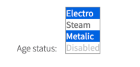

```html
<select id="ages" multiple="" size="4">
    <option value="electro">Electro</option>
    <option value="steam" selected="">Steam</option>
    <option value="metalic">Metalic</option>
    <option value="dis" disabled="">Disabled</option>
    <option value="wood">Wood</option>
</select>
```

Here is a list of available methods and properties in C#:

|Method / Property | Description | Return Type
--- | --- | ---
**Check(string/string[]/int/int[]/Enum[])** | Select multiselector by values | void
**Uncheck(string[]/Enum[]/int[])** | Select multiselector by values/indexes | void
**Selected()** | Get selected values | string
**Checked()** | Get selected values  | List\<string>
**Is** | Property that returns object for work with assertions | SelectAssert
**AssertThat** | Property that returns object for work with assertions | SelectAssert
**has()** | Returns object for work with assertions | SelectAssert
**waitFor()** | Returns object for work with assertions | SelectAssert
**shouldBe()** | Returns object for work with assertions | SelectAssert

Here is the list of available methods/asserts in Java:

|Method | Description | Return Type
--- | --- | ---
**check(String/Strings.../TEnum...)** |Select multiselector by values | void
**uncheck(Strings.../TEnum.../int)** |Select multiselector by values/indices  | void
**selected()** |Get selected values  | String
**checked()** |Get selected values  | List\<String>
**is()** |  Returns object for work with assertions| SelectAssert
**assertThat()** | Returns object for work with assertions| SelectAssert

<a href="https://github.com/jdi-testing/jdi-light/blob/master/jdi-light-html-tests/src/test/java/io/github/epam/html/tests/elements/complex/MultiSelectorTests.java" target="_blank">Test examples in Java</a>

<a href="https://github.com/jdi-testing/jdi-light-csharp/blob/master/JDI.Light/JDI.Light.Tests/Tests/Common/MultiSelectorTests.cs" target="_blank">Test examples in C#</a>

[BDD Steps example](https://jdi-docs.github.io/jdi-light/?java#multidropdown-2)<br>

### ComboBox

**ComboBox** – A graphical control element that allows user to choose a single 
value from a list or enter it by himself (is inherited from the [Datalist](#datalist))


ComboBox is provided by JDI Light in:
 
  - __Java__: _com.epam.jdi.light.ui.html.complex.Combobox_
  - __C#__: _JDI.Light.Elements.Common.Combobox_

```java 
public static Combobox iceCream;

@UI("#ice-cream") // @FindBy(id = "ice-cream")
public static DataList iceCreamDataList;

  
@Test
public void selectTest() {
    iceCreamDataList.select("Chocolate");
    assertEquals(iceCreamDataList.getValue(), "Chocolate");
}
@Test
public void selectNumTest() {
    iceCreamDataList.select(5);
    assertEquals(iceCreamDataList.getValue(), "Vanilla");
}
@Test
public void selectedTest() {
    assertEquals(iceCreamDataList.selected(), "Coconut");
}
@Test
public void labelTest() {
    assertEquals(iceCreamDataList.label().getText(), "Choose your lovely icecream");
    iceCreamDataList.label().is().text(containsString("lovely icecream"));
}
@Test
public void isValidationTest() {
    iceCream.is().enabled();
    iceCream.is().text(is(text));
    iceCream.select(Vanilla);
    iceCream.is().text(containsString("Van"));
}
```
```csharp 
[Test]
public void ExpandComboBox() 
{
    MyComboBox.Expand();
}
[Test]
public void SelectComboBox() 
{
    MyComboBox.Select("some value");
	MyComboBox.Is().Selected(Is.EqualTo("some value"));
	TestSite.Html5Page.IceCreamComboBox.AssertThat().Selected(Is.EqualTo("Strawberry"));	
}
[Test]
public void SelectByIndex() 
{
    MyComboBox.Select(1);
}
[Test]
public void FillComboBox() 
{
    MyComboBox.Input("some value");
    SubmitButton.Click();
}
```

Have a look at the following example with HTML code provided:

<!--  -->

```html
<input list="ice-cream-flavors" id="ice-cream" placeholder="Ice cream">

<datalist id="ice-cream-flavors">
    <option value="Chocolate"></option>
    <option value="Coconut"></option>
    <option value="Mint"></option>
    <option value="Strawberry"></option>
    <option value="Vanilla"></option>
</datalist>
```

The list of methods available for Java in JDI Light:

|Method | Description | Return Type
--- | --- | ---
**select(String/Enum/int)** |Select combobox option by value or index | void
**selected()** |Get selected option value | String
**values()** |Get all option values from combobox | List\<String>
**listEnabled()** |Return list of values of enabled options | List\<String>
**listDisabled()** |Return list of values of disabled options | List\<String>

Here is the list of some methods available for C# in JDI Light:

|Method | Description | Return Type
--- | --- | ---
**Expand()** |Expands the list of possible values | void
**Select(string/int)** |Select combobox by value/index  | void
**Input(string)** |Input user's value into combobox  | void
**GetSelected()** |Get selected combobox value  | string
**is()** |  Returns object for work with assertions| ComboBoxAssert
**assertThat()** | Returns object for work with assertions| ComboBoxAssert

<a href="https://github.com/jdi-testing/jdi-light/blob/master/jdi-light-html-tests/src/test/java/io/github/epam/html/tests/elements/complex/combobox/IsComboboxTests.java" target="_blank">Test examples in Java</a>

<a href="https://github.com/jdi-testing/jdi-light/blob/master/jdi-light-html-tests/src/test/java/io/github/epam/html/tests/elements/complex/ComboboxTests.java" target="_blank">Test examples in C#</a>

[BDD Steps example](https://jdi-docs.github.io/jdi-light/?java#combobox-2)

## HTML5 Composite elements
###Section

**Section** - Logical part of Web Page that contains other UI Elements
  
Section is represented by the following class:

Java: com.epam.jdi.light.elements.composite.Section  
public class Section extends JDIBase implements PageObject 

C#: JDI.Light.Elements.Composite.Section  
public class Section : UIElement
  
```java 
   @UI(".someSectionUI") // @FindBy(css = ".someSectionUI")
   public static SomeSection someSectionUI;
   //public class SomeSection extends Section

   @Test
   public void someSectionWebElementTest() {
      assertNotNull(someSection.webElementPublic);
      assertEquals(someSection.webElementPublic.locator.toString(), "id='webElementPublic'");
      assertEquals(someSection.webElementPublic.parent, someSection);
      assertEquals(someSection.webElementPublic.name, "Web Element Public");
   }
   
```

```csharp

  [FindBy(Id = "contact-form")]
  public Contact ContactSection;
  
  [FindBy(Css = ".footer-content")]
  public static Footer Footer;
  
  [FindBy(Css = ".uui-header")]
  public static Header Header;
  
  public JdiSearch Search;
  
  [FindBy(Id = "summary-block")]
  public Summary SummaryBlock;
        
  [Test]
  public void SectionTest()
  {
      var e = TestSite.HomePage.Get<Section>(By.CssSelector(".main-title"));
      Assert.AreEqual("EPAM FRAMEWORK WISHES…", e.Text);
      Assert.AreEqual("Section", e.Name);
      Assert.AreEqual(true, e.Displayed);
      Assert.AreEqual(true, e.Enabled);
      Assert.AreEqual(false, e.Hidden);
      Assert.AreEqual(By.CssSelector(".main-title"), e.Locator);
      Assert.AreEqual(false, e.Selected);
      Assert.AreEqual("h3", e.TagName);
  }
  
  [TestCaseSource(nameof(ContactSectionCases))]
  public void CustomContactSectionTest(string htmlElementToCheckName, string expectedLocator, string expectedName, string expectedSmartLocator)
  {
      ContactSection.CheckInitializedElement(ContactSection.GetType().GetField(htmlElementToCheckName).GetValue(ContactSection) as UIElement, expectedLocator, expectedName, expectedSmartLocator);
  }

  [Test]
  public void CustomFooterSectionTest()
  {
      FooterSection.CheckInitializedElement(FooterSection.AboutLink, "By.PartialLinkText: About", "AboutLink", null);            
  }

  [TestCaseSource(nameof(HeaderSectionCases))]
  public void CustomHeaderSectionTest(string htmlElementToCheckName, string expectedLocator, string expectedName, string expectedSmartLocator)
  {
      HeaderSection.CheckInitializedElement(HeaderSection.GetType().GetField(htmlElementToCheckName).GetValue(HeaderSection) as UIElement, expectedLocator, expectedName, expectedSmartLocator);
  }

  [TestCaseSource(nameof(JdiSearchSectionCases))]
  public void CustomJdiSearchSectionTest(string htmlElementToCheckName, string expectedLocator, string expectedName, string expectedSmartLocator)
  {
      JdiSearchSection.CheckInitializedElement(JdiSearchSection.GetType().GetField(htmlElementToCheckName).GetValue(JdiSearchSection) as UIElement, expectedLocator, expectedName, expectedSmartLocator);
  }

  [Test]
  public void CustomSummarySectionTest()
  {
      TestSite.MetalsColorsPage.Open();
      SummarySection.CheckInitializedElement(SummarySection.Calculate, "By.Id: calculate-button", "Calculate", null);
  }

  public static object[] ContactSectionCases =
  {
      new object[] { nameof(ContactSection.DescriptionField), "By.CssSelector: textarea#description", "Description", null },
      new object[] { nameof(ContactSection.FirstRoller), "By.XPath: .//a[@class='ui-slider-handle ui-state-default ui-corner-all' and position()=1]", "FirstRoller", null },
      new object[] { nameof(ContactSection.LastNameField), "By.CssSelector: input#last-name", "Last Name", null },
      new object[] { nameof(ContactSection.NameField), "By.CssSelector: input#name", "First Name", null },
      new object[] { nameof(ContactSection.SecondRoller), "By.XPath: .//a[@class='ui-slider-handle ui-state-default ui-corner-all' and position()=2]", "SecondRoller", null },
      new object[] { nameof(ContactSection.SubmitButton), "By.XPath: //button[@type='submit' and contains(., 'Submit')]", "SubmitButton", null },
  };

  public static object[] HeaderSectionCases =
  {
      new object[] { nameof(HeaderSection.Image), "By.XPath: //img[@src=\"label/Logo_Epam_Color.svg\"]", "Image", null },
      new object[] { nameof(HeaderSection.Menu), "By.CssSelector: ul.uui-navigation.nav", "Menu", null },
      new object[] { nameof(HeaderSection.UserIcon), "By.CssSelector: #user-icon", "UserIcon", null },
      new object[] { nameof(HeaderSection.Search), "By.CssSelector: input#last-name", "Search", "By.Id: search" }
  };

  public static object[] JdiSearchSectionCases =
  {
      new object[] { nameof(JdiSearchSection.SearchButton), "By.CssSelector: .search>.icon-search", "SearchButton", null },
      new object[] { nameof(JdiSearchSection.SearchButtonActive), "By.CssSelector: .icon-search.active", "SearchButtonActive", null },
      new object[] { nameof(JdiSearchSection.SearchInput), "By.CssSelector: .search-field input", "SearchInput", null },
  };
```

And here are methods available in Java:

|Method | Description | Return Type
--- | --- | ---
**shouldBe()** | Returns object for work with assertions | IsAssert
**waitFor()** | Returns object for work with assertions | IsAssert
**has()** | Returns object for work with assertions | IsAssert
**is()** | Returns object for work with assertions | IsAssert
**assertThat()** | Returns object for work with assertions | IsAssert

<a href="https://github.com/jdi-testing/jdi-light/blob/master/jdi-light-html-tests/src/test/java/io/github/epam/html/tests/elements/composite/section" target="_blank">Test examples in Java</a>

<a href="https://github.com/jdi-testing/jdi-light-csharp/blob/master/JDI.Light/JDI.Light.Tests/Tests/Composite/SectionTests.cs" target="_blank">Test examples in C#</a>


### Form

```java 
public class LoginForm extends Form<User> {
    @UI("#name") TextField name;
    @UI("#password") TextField password;
    @UI("#login-button") Button loginButton;
}

public class User extends DataClass<User> {
    public String name, password;
}

on JDISite.java >> public static LoginForm loginForm;

In tests:

@Test
public void loginWithUserTest() {
    shouldBeLoggedOut();
    loginForm.shouldBeOpened();
    loginForm.login(DEFAULT_USER);
    homePage.checkOpened();
}
    
@Test
public void fillContactFormTest() {
    shouldContactPageBeOpenedAndRefreshed();
    main.contactForm.fill(DEFAULT_CONTACT);
    main.contactForm.check(DEFAULT_CONTACT);
}   
```

**Form** – Logical part of a web page that represents an HTML form. 
Form consists of elements based on _SetValue_ interface and buttons with **submit** function.

Form provides the _fill, submit and verify/check_ functionality.  


```html
<form class="form-horizontal login" id="login-form">
    <div class="form-horizontal-pad">
        <div class="form-group form-group10"><label for="name" class="col-sm-3">Login</label>
            <div class="col-sm-9"><input id="name" type="text" class="uui-form-element"></div>
        </div>
        <div class="form-group form-group10"><label for="password" class="col-sm-3">Password</label>
            <div class="col-sm-9"><input id="password" type="password" class="uui-form-element"></div>
        </div>
        <span class="login-txt hidden">* Login Faild</span>
    </div>
    <button type="submit" class="uui-button dark-blue btn-login" id="login-button">
        <i class="fa fa-sign-in"></i><span>Enter</span></button>
</form>
```

Form is located in the following classes:
 
  - __Java__: _com.epam.jdi.light.elements.composite.Form_
  - __C#__: _JDI.Light.Elements.Composite.Form_
  
Form is parameterized by an entity that corresponds to the form. For example, a login form can be parameterized by a user entity. The entity should extend DataClass class (parameterized by the entity itself). 
The names of the entity fields should be exactly the same as the names of the form fields. All fields of the entity managed by the form should be Strings.

JDI Light Java supports three types of forms:

**JDI Light Forms** - typical Forms in JDI with **typified elements**, **@UI** annotations, extending from Form and without **fill/check** methods.

```java 
public class LoginFormSmart extends Form<User> {
    TextField name, password;
    Button loginButton;
}

on JDISite.java >> public static LoginFormSmart loginFormSmart;
```

**Smart JDI Forms** - Forms utilizing the _Smart locator_ functionality of JDI. In Smart Forms there is no need to explicitly define locators for form elements if such locators can be obtained implicitly from field names using Smart locator functionality.
[See more details and exampels for Smart locators in documentation](https://jdi-docs.github.io/jdi-light/?java#smart-locators)

```java 
on JDISite.java >> public static Form<User> lightLoginForm;
```

**Light Forms** - if a Form consists of only TextFields and Buttons, there is no need to define a Form UI Object. Such form can be added directly to the related page or to the root Site class.

```java 
@Test
public void onlyMandatoryOptionTest() {
    shouldContactPageBeOpenedAndRefreshed();
    main.contactFormCustom.onlyMandatory().fill(DEFAULT_CONTACT);
    main.contactFormCustom.onlyMandatory().check(DEFAULT_CONTACT);
}
```

In Java, Form has a filter property that defines which form elements will be filled/submited or verified/checked. Filter can be set to either **ALL**, **MANDATORY** or **OPTIONAL**. Based on this property, fill/submit and verify/check functions are applied to either all form elements or only mandatory (only optional) form elements. Mandatory form fields should be marked with **@Mandatory** annotation. Optional form fields are the ones without **@Mandatory** annotation. **ALL** is the default Form option. To set form filters as **MANDATORY** or **OPTIONAL**, **onlyMandatory()** and **onlyOptional()** methods should be used. They set the corresponding form filter option for a duration of a single action (all form action methods set the form filter option back to **ALL**).

```java 
@BeforeSuite(alwaysRun = true)
public static void setUp() {
    logger.setLogLevel(INFO);
    initElements(StaticSite.class);
    Form.FILL_ACTION = (field, element, parent, setValue) -> {
         if (isInterface(field, TextField.class))
           	((TextField)element).higlight();
         ((SetValue) element).setValue(setValue);
    };
    homePage.open();
    logger.toLog("Run Tests");
}
```

In Java, Form has a **FILL_ACTION** and **GET_ACTION** lambdas. 
These define how the Form should be filled and verified. The default behavior defined in the Form class simply utilizes **setValue(String value)** method of the SetValue interface and **getValue()** method of the HasValue interface. However, these lambdas are redefined in the _HtmlSettings_ class in order to customise behavior for "non-text" form elements such as Checkboxes (the behavior of custom elements is defined by **@FillValue** and **@VerifyValue** annotations). **FILL_ACTION** and **GET_ACTION** lambdas can also be further modified in order to customize Form behavior, but it is important to take into account that behavior defined in the HtmlSettings might be lost. 
It is customary to reassign these lambdas before all the tests are run, for example in TestNG's **@BeforeSuite** method.

```java 
public class LoginForm extends Form<User> {
    TextField name, password;
    Button loginButton;

	@Override
	public void fillAction(Field field, Object element, Object parent, String setValue) {
		if (isInterface(field, TextField.class))
			((TextField)element).higlight();
		super.fillAction(field, element, parent, setValue);
	}
}
```

In Java, if fill/submit and verify/check methods need to be redefined for a specific form, it is possible to override **fillAction()** and **getAction()** for such form.

Methods available for Java in JDI Light:

|Method | Description | Return Type
--- | --- | ---
**fillAction(Field field, Object element, Object parent, String setValue)** | Defines the specifics of how form elements will be filled | void
**getAction(Field field, Object element, Object parent)** | Defines the specifics of how form elements will be obtained for verification and checks | String
**onlyMandatory()** | Sets form filter option to **MANDATORY**, meaning that only mandatory form elements are filled/submitted or verified/checked for the duration of a single form action | void
**onlyOptional()** | Sets form filter option to **OPTIONAL**, meaning that only optional form elements are filled/submitted or verified/checked for the duration of a single form action | void
**fill(T entity)** | Fills all settable elements of the form that can be matched with fields of the input entity | void
**submit()** | Sends the form by clicking "submit" Button or "submitButton" | void
**submit(String text)** | Fills first settable form field with value and clicks "submit" Button or "submitButton"  | void
**submit(T entity)** | Fills all settable elements and clicks "submit" Button or "submitButton"  | void
**submit(String text, String buttonName)** | Fills first settable field with value and clicks “buttonName” Button or "buttonNamebutton"| void
**submit(T entity, String buttonName)** | Fills all settable elements and clicks “buttonName” Button or "buttonNamebutton" | void
**pressButton(String buttonName)** | Clicks “buttonName” Button or "buttonNamebutton". Allows different buttons to send one form, e.g. save/publish/cancel/search/update/... | void
**verify(T entity)** | Verifies that form has been filled correctly. If not, returns a list of keys where verification has failed | List<String>
**check(T entity)** | Verifies that form has been filled correctly. If not, throws an exception | void
**login()** | Clicks "login" Button or "loginButton"| void
**login(T entity)** | Fills all settable elements and clicks “login” Button or ”loginButton” | void
**loginAs(T entity)** | Fills all settable elements and clicks “login” Button or ”loginButton” | void
**send()** | Sends the form by clicking “send” Button or "sendButton" | void
**send(T entity)** | Fills all settable elements and clicks “send” Button or ”sendButton” | void
**add(T entity)** | Fills all settable elements and clicks “add” Button or ”addButton” | void
**publish(T entity)** | Fills all settable elements and clicks “publish” Button or ”publishButton” | void
**save(T entity)** | Fills all settable elements and clicks “save” Button or ”saveButton” | void
**update(T entity)** | Fills all settable elements and clicks “update” Button or ”updateButton” | void
**cancel(T entity)** | Fills all settable elements and clicks “cancel” Button or ”cancelButton” | void
**close(T entity)** | Fills all settable elements and clicks “close” Button or ”closeButton” | void
**back(T entity)** | Fills all settable elements and clicks “back” Button or ”backButton” | void
**select(T entity)** | Fills all settable elements and clicks “select” Button or ”selectButton” | void
**next(T entity)** | Fills all settable elements and clicks “next” Button or ”nextButton” | void
**search(T entity)** | Fills all settable elements and clicks “search” Button or ”searchButton” | void

<a href="https://github.com/jdi-testing/jdi-light/blob/master/jdi-light-html-tests/src/test/java/io/github/epam/html/tests/elements/composite/FormTests.java" target="_blank">Test examples in Java</a>

<a href="https://github.com/jdi-testing/jdi-light-csharp/blob/master/JDI.Light/JDI.Light.Tests/Tests/Composite/FormTests.cs" target="_blank">Test examples in C#</a>

[BDD Steps example](https://jdi-docs.github.io/jdi-light/?java#form-2)

### WebPage

```java 
public class MainPage extends WebPage{}
MainPage mainPage = new MainPage;
mainPage.setCurrentPage(WebPage page);
mainPage.getCurrentPage();
mainPage.getUrl()
mainPage.getTitle()
mainPage.checkOpened()
mainPage.toString()
mainPage.StringCheckType().check()

@Test
public void verifyURL() {
    mainPage.setCurrentPage(mainPage);
    assertEquals(mainPage.getUrl(), "www.mainpage.ru");
}
@Test
public void verifyTitle() {
    mainPage.setCurrentPage(mainPage);
    assertEquals(mainPage.getTitle(), "Main page");
}
```

**WebPage** is provided by JDI Light in:
 
  - __Java__: _com.epam.jdi.light.elements.composite_
  


**WebPage** - A parent Java class for all JDI Page Object classes. WebPage class extends _DriverBase_ class, implements PageObject interface and contains a number of commonly used methods:

|Method | Description | Return Type
--- | --- | ---
**asForm()**|Returns new Form parameterized with local Name|Form<T>
**getCurrentPage()**|Returns the name of current Page|String
**setCurrentPage(WebPage page)**|Instantiates the current Page with Name|void
**WebPage()**|Default constructor for WebPage class|WebPage
**WebPage(String url)**|Parameterized URL constructor for WebPage class|void
**openUrl(String url)**|Opening WebPage with URL|void
**getUrl()**|Returns URL of Page|String
**getTitle()**|Returns Page Title|String
**updatePageData(Url urlAnnotation, Title titleAnnotation)**|Setting Page URL and     |void
**url()**|Returns new StringCheckType object with checked URL|StringCheckType
**title()**|Returns new StringCheckType object with checked Title|StringCheckType
**open(String url)**|Opens url specified for page|void
**open(Object... params)**|Opens url specified for page with parameters|void
**checkOpened()**|Checks that page has opened|void
**isOpened()**|Checks that page has opened|boolean
**shouldBeOpened()**|Checks that page has opened|void
**shouldBeOpened(Object... params)**|Checks that page has opened with parameters|void
**openedPage(String url)**|Checks that page has opened|void
**refresh()**|Reloads current page|void
**reload()**|Same as **refresh()**|void
**back()**|Go back to previous page|void
**forward()**|Go forward to next page|void
**zoom(double factor)**|Zooms current page|void
**getHtml()**|Gets HTML of current page|String
**scroll(int x, int y)**|Scrolls to designated position|void
**scrollToTop()**|Scrolls to top|void
**scrollToBottom()**|Scrolls to bottom|void
**scrollDown(int value)**|Scrolls down to designated position|void
**scrollUp(int value)**|Scrolls up to designated position|void
**scrollRight(int value)**|Scrolls right to designated position|void
**scrollLeft(int value)**|Scrolls left to designated position|void
**addPage(WebPage page)**|Adds selected page to the Map of pages|void
**getPage(String value)**|Gets page from Map by value|T_extends_WebPage
**toString()**|Overrides the Object class toString() method|String
  

More than that, it has a nested **StringCheckType** class with the following methods:

|Method | Description | Return Type
--- | --- | ---
**StringCheckType(Supplier<String> actual, String equals, String what)**|A parameterized constructor|StringCheckType
**check()**|Checks that current page url/title equals to expected url/title|boolean
**match()**|Checks that current page url/title matches to expected url/title-matcher|boolean
**contains()**|Checks that current page url/title contains expected url/title-matcher|boolean

<a href="https://github.com/jdi-testing/jdi-light/blob/master/jdi-light-html-tests/src/test/java/io/github/epam/html/tests/elements/composite/webpage/ActionsWebPageTests.java" target="_blank">Test examples in Java</a>

[BDD Steps example](https://jdi-docs.github.io/jdi-light/?java#webpage-2)

## Bootstrap Common elements

### Button
Bootstrap includes several predefined button styles, each serving its own semantic purpose, with a few extras thrown in for more control.

**<a href="https://getbootstrap.com/docs/4.3/components/buttons/" target="_blank">Button</a>** – Element that represents a clickable button.

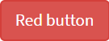

Button is located in the following classes:
 
  - __Java__: _com.epam.jdi.light.ui.bootstrap.common.Button_

```java 
@UI("//*[text()='Red button']") // @FindBy(css = "//*[text()='Red button']")
public static Button redButton;

@Test
public void clickTest() {
    redButton.click();
    assertEquals(getAlertText(), "Red button");
    acceptAlert();
}

@Test
public void getTextTest() {
    assertEquals(redButton.getText(), "Red button");
}
```

Here is an example with provided HTML code:

<!--  -->

```html
<button type="button" id="red-button" class="btn btn-danger" 
onclick="alert('Red button');" ondblclick="alert('Double Click');" 
oncontextmenu="alert('Right Click');">Red button</button>
```

Available methods in Java JDI Light:

|Method | Description | Return Type
--- | --- | ---
**click()** | Click the button  | void
**getText()** | Get button text | String
**is()** | Assert action | TextAssert 
**assertThat()** | Assert action | TextAssert
<br>

**<a href="https://getbootstrap.com/docs/4.3/components/buttons/" target="_blank">Disabled Button</a>** – Element that represents a Not clickable button.

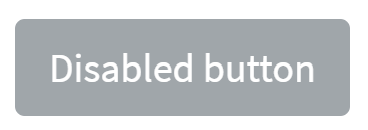

Button is located in the following classes:

- __Java__: _com.epam.jdi.light.ui.bootstrap.common.Button_
  
```java 
@UI("//*[text()='Disabled button']") // @FindBy(css = "//*[text()='Disabled button']")
public static Button disabledButton;

@Test
public void disableButtonTest() {
    try { disabledButton.click();
          fail("Disabled button should not work, but work");
        } catch (Exception ex) {
            assertThat(safeException(ex),
                containsString("Can't perform click. Element is disabled"));
        }
     }

@Test
public void getTextTest() {
    assertEquals(disabledButton.getText(), "Disabled button");
}
```  
Here is an example with provided HTML code:

<!-- 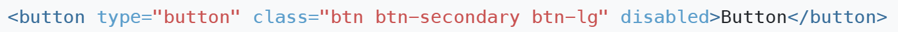 -->

```html
<button type="button" id="double-button" class="btn btn-info" 
ondblclick="alert('Double Click');">Double button </button>
```

|Method/Property | Description | Return Type
--- | --- | ---
**click()** | Click the button  | void
**getText()** | Get button text | String
**is()** | Assert action | TextAssert 
**assertThat()** | Assert action | TextAssert
<br><br>


### Checkboxes and radios

#### <a href="https://getbootstrap.com/docs/4.3/components/buttons/" target="_blank">Checkbox default</a>

Checkbox is located in the following classes:
 
  - __Java__: _com.epam.jdi.light.ui.bootstrap.elements.common.Checkbox_
  

<!--  -->

Here is an example with provided Bootstrap v4.3 code:

```html
<div class="btn-group-vertical mb-3" id="radio-buttons" role="group">
    <div class="form-check">
        <input class="form-check-input" type="radio" name="exampleRadios" id="exampleRadios1" value="option1"
               checked="">
        <label class="form-check-label" for="exampleRadios1">
            Default radio
        </label>
    </div>
    <div class="form-check">
        <input class="form-check-input" type="radio" name="exampleRadios" id="exampleRadios2" value="option2">
        <label class="form-check-label" for="exampleRadios2">
            Second default radio
        </label>
    </div>
    <div class="form-check">
        <input class="form-check-input" type="radio" name="exampleRadios" id="exampleRadios3" value="option3"
               disabled="">
        <label class="form-check-label" for="exampleRadios3">
            Disabled radio
        </label>
    </div>
</div>
```

```java 
// @FindBy(css = "body") public static CheckboxesDefault checkboxesDefault;
@UI("body") public static CheckboxesDefault checkboxesDefault;

public class CheckboxesDefault extends Section {
    @UI("#check1") public Checkbox checkboxOne; // @FindBy(css = "#check1") public Checkbox checkboxOne;
    @UI("#check1") public Checkbox checkboxTwo; // @FindBy(css = "#check2") public Checkbox checkboxTwo;
}

@Test
public void isValidationTests() {
    checkboxesDefault.checkboxOne
            .is()
            .displayed()
            .enabled()
            .core()
            .hasClass("form-check")
            .tag(is("div"));
    checkboxesDefault.checkboxOne.label()
            .is()
            .displayed()
            .enabled()
            .core()
            .hasClass("form-check-label")
            .text(is("Default checkbox"))
            .tag(is("label"));
}

@Test
public void clickableTests() {
    checkboxesDefault.checkboxOne.check();
    checkboxesDefault.checkboxOne.is().selected();
    checkboxesDefault.checkboxOne.uncheck();
    checkboxesDefault.checkboxOne.is().deselected();
}
```

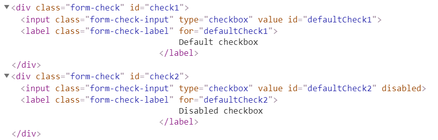


|Method | Description | Return Type
--- | --- | ---
**click()** | Click the checkbox | void
**check(String)** | Set to checked on "true" (case insensitive) or unchecked otherwise | void
**check()** | Set to checked | void
**uncheck()** | Set to unchecked | void
**isSelected()** | Verify value | boolean 
**isEnabled()** | Verify state | boolean
**assertThat()** | Assert action checkbox | CheckboxAssert
**is()** | Assert action checkbox | CheckboxAssert

<br>

<a href="https://github.com/jdi-testing/jdi-light/blob/bootstrap/jdi-light-bootstrap-tests/src/test/java/io/github/epam/bootstrap/tests/composite/section/form/CheckboxesDefaultTests.java" target="_blank">Test examples in Java</a><br>

Button group is represented by Section class in Java:
 
  [Section](https://jdi-docs.github.io/jdi-light/#section)  

<br>

#### <a href="https://getbootstrap.com/docs/4.3/components/forms/#inline" target="_blank">Checkbox default inline</a>

Checkbox is located in the following classes:
 
  - __Java__: _com.epam.jdi.light.ui.bootstrap.elements.common.Checkbox_
  

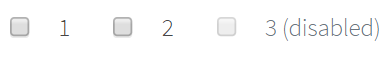

Here is an example with provided Bootstrap v4.3 code:

```java 
// @FindBy(css = "body") public static CheckboxesDefaultInline checkboxesDefaultInline;
@UI("body") public static CheckboxesDefaultInline checkboxesDefaultInline;

public class CheckboxesDefaultInline {
    @UI("//input[@id='inlineCheckbox1']/..") public Checkbox checkboxOne; // @FindBy(xpath = "//input[@id='inlineCheckbox1']/..") public Checkbox checkboxOne;
    @UI("//input[@id='inlineCheckbox2']/..") public Checkbox checkboxTwo; // @FindBy(xpath = "//input[@id='inlineCheckbox2']/..") public Checkbox checkboxTwo;
    @UI("//input[@id='inlineCheckbox3']/..") public Checkbox checkboxThree; // @FindBy(xpath = "//input[@id='inlineCheckbox3']/..") public Checkbox checkboxThree;
}

@Test
public void isValidationTests() {
    checkboxesDefaultInline.checkboxOne
            .is()
            .displayed()
            .enabled()
            .core()
            .hasClass("form-check form-check-inline");
    checkboxesDefaultInline.checkboxOne.label()
            .is()
            .displayed()
            .enabled()
            .core()
            .hasClass("form-check-label")
            .text(is("1"));
}
@Test
public void clickableTests() {
    checkboxesDefaultInline.checkboxOne.check();
    checkboxesDefaultInline.checkboxOne
            .is()
            .selected();
    checkboxesDefaultInline.checkboxOne.uncheck();
    checkboxesDefaultInline.checkboxOne
            .is()
            .deselected();
    checkboxesDefaultInline.checkboxOne.label().click();
    checkboxesDefaultInline.checkboxOne
            .is()
            .selected();
}
```

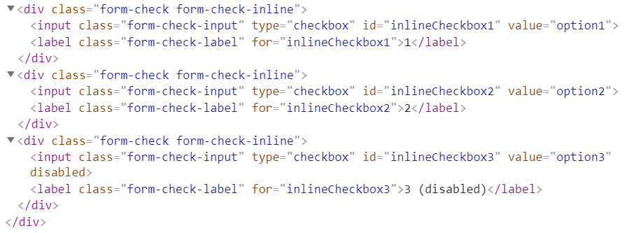


|Method | Description | Return Type
--- | --- | ---
**click()** | Click the checkbox | void
**check(String)** | Set to checked on "true" (case insensitive) or unchecked otherwise | void
**check()** | Set to checked | void
**uncheck()** | Set to unchecked | void
**isSelected()** | Verify value | boolean 
**isEnabled()** | Verify state | boolean
**assertThat()** | Assert action checkbox | CheckboxAssert
**is()** | Assert action checkbox | CheckboxAssert

<br>

<a href="https://github.com/jdi-testing/jdi-light/blob/bootstrap/jdi-light-bootstrap-tests/src/test/java/io/github/epam/bootstrap/tests/composite/section/form/CheckboxesDefaultInlineTests.java" target="_blank">Test examples in Java</a>
<br>

Button group is represented by Section class in Java:
 
  [Section](https://jdi-docs.github.io/jdi-light/#section)  

<br>

#### <a href="https://getbootstrap.com/docs/4.3/components/forms/#default-stacked" target="_blank">Radio button</a>
Element that can be represented with one or more clickable buttons aiming to choose only one button of the group.

Radio button is located in the following classes:
 
  - __Java__: _com.epam.jdi.light.ui.bootstrap.elements.common.RadioButton_
  


Here is an example with provided Bootstrap v4.3 code:

```java 
//@FindBy(css = "#radio-buttons") public static RadioButtonGroup radioButtonGroup;
@UI("#radio-buttons") public static RadioButtonGroup radioButtonGroup;

public class RadioButtonGroup extends Section {
    @UI("#exampleRadios1") public RadioButton radio1; //@FindBy(css = "#exampleRadios1") public RadioButton radio1;
    @UI("#exampleRadios2" )public RadioButton radio2; //@FindBy(css = "#exampleRadios2" )public RadioButton radio2;
    @UI("#exampleRadios3") public RadioButton radio3; //@FindBy(css = "#exampleRadios3") public RadioButton radio3;
    @UI("input[type='radio']") public RadioButton radioButton; //@FindBy(css = "input[type='radio']") public RadioButton radioButton;
    @UI("label[for='exampleRadios1']") public Label radio1Label; //@FindBy(css = "label[for='exampleRadios1']") public Label radio1Label;
    @UI("label[for='exampleRadios2']") public Label radio2Label; //@FindBy(css = "label[for='exampleRadios2']") public Label radio2Label;
    @UI("label[for='exampleRadios3']") public Label radio3Label; //@FindBy(css = "label[for='exampleRadios3']") public Label radio3Label;
}

@Test
public void baseInitTest() {
    radioButtonGroup.radioButton.is()
            .size(3);
    radioButtonGroup.radio1.is()
            .selected();
    radioButtonGroup.radio2.is()
            .deselected();
    radioButtonGroup.radioButton.get(3).is()
            .deselected();
    radioButtonGroup.radioButton.get(3).is()
            .disabled();
}

@Test
public void radioButtonByLabelTests() {
    radioButtonGroup.radio2Label.click();
    radioButtonGroup.radioButton.get(2).is()
            .selected();
    radioButtonGroup.radioButton.is()
            .text(is(value2));
    radioButtonGroup.radio1.select();
    radioButtonGroup.radio1.is()
            .selected();
}
```

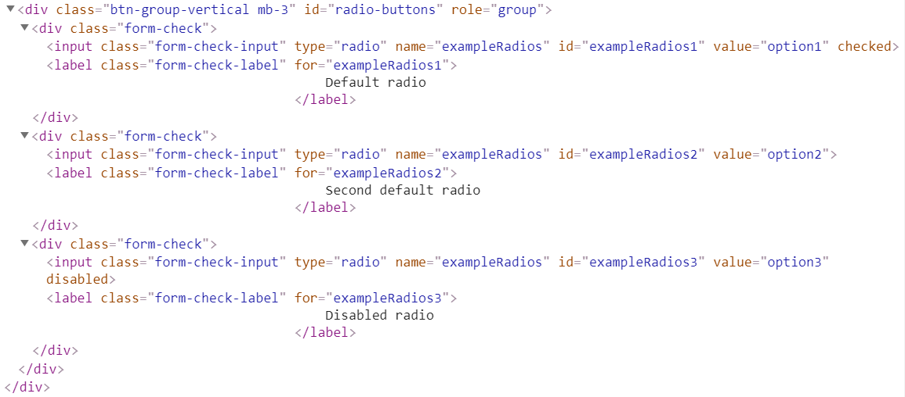


|Method | Description | Return Type
--- | --- | ---
**click()** | Click the button | void
**getText()** | Get button text | String
**is()** | Assert action | TextAssert 
**assertThat()** | Assert action | TextAssert
**select()** | Select button | void
**selected()** | Radio button is selected | TextAssert
**get()** | Select button by index | action

<br>

<a href="https://github.com/jdi-testing/jdi-light/blob/master/jdi-light-html-tests/src/test/java/io/github/epam/html/tests/elements/complex/RadioTests.java" target="_blank">Test examples in Java</a>
<br>

Button group is represented by Section class in Java:
 
  [Section](https://jdi-docs.github.io/jdi-light/#section)  

<br>

#### <a href="https://getbootstrap.com/docs/4.3/components/forms/#inline" target="_blank">Radio button inline</a>

Radio button is located in the following classes:
 
  - __Java__: _com.epam.jdi.light.ui.bootstrap.elements.common.RadioButton_
  


Here is an example with provided Bootstrap v4.3 code:

```java 
//@FindBy(css = "body") public static RadioButtonsDefaultInline radioButtonsDefaultInline;
@UI("body") public static RadioButtonsDefaultInline radioButtonsDefaultInline;

public class RadioButtonsDefaultInline extends Section {
    @UI("input[name='inlineRadioOptions']") public RadioButton radioButton; //@FindBy(css = "input[name='inlineRadioOptions']") public RadioButton radioButton;
    @UI("#inlineRadio1") public RadioButton radio1; //@FindBy(css = "#inlineRadio1") public RadioButton radio1;
    @UI("#inlineRadio2") public RadioButton radio2; //@FindBy(css = "#inlineRadio2") public RadioButton radio2;
    @UI("#inlineRadio3") public RadioButton radio3; //@FindBy(css = "#inlineRadio3") public RadioButton radio3;
    @UI("label[for='inlineRadio1']") public Label radio1Label; //@FindBy(css = "label[for='inlineRadio1']") public Label radio1Label;
    @UI("label[for='inlineRadio2']") public Label radio2Label; //@FindBy(css = "label[for='inlineRadio2']") public Label radio2Label;
    @UI("label[for='inlineRadio3']") public Label radio3Label; //@FindBy(css = "label[for='inlineRadio3']") public Label radio3Label;
}

@Test
 public void baseInitTest() {
     radioButtonsDefaultInline.radioButton
             .is()
             .size(3);
     radioButtonsDefaultInline.radio1Label
             .is()
             .core()
             .hasClass("form-check-label")
             .text(is(label1));
}

@Test
public void radioButtonByIndexTests() {
    radioButtonsDefaultInline.radioButton.select(2);
    radioButtonsDefaultInline.radioButton.get(2)
            .is()
            .selected();
    radioButtonsDefaultInline.radioButton.get(1)
            .is()
            .deselected();
    radioButtonsDefaultInline.radio1Label.click();
    radioButtonsDefaultInline.radioButton.get(1)
            .is()
            .selected();
}
```


|Method | Description | Return Type
--- | --- | ---
**click()** | Click the button | void
**getText()** | Get button text | String
**is()** | Assert action | TextAssert 
**assertThat()** | Assert action | TextAssert
**select()** | Select button | void
**selected()** | Radio button is selected | TextAssert
**get()** | Select button by index | action

<br>

<a href="https://github.com/jdi-testing/jdi-light/blob/master/jdi-light-html-tests/src/test/java/io/github/epam/html/tests/elements/complex/RadioTests.java" target="_blank">Test examples in Java</a>
<br>

Button group is represented by Section class in Java:
 
  [Section](https://jdi-docs.github.io/jdi-light/#section)  

<br>

#### <a href="https://getbootstrap.com/docs/4.3/components/forms/#without-labels" target="_blank">Radio button and checkbox without labels</a>

Checkbox and Radio button are located in the following classes:
 
  - __Java__: _com.epam.jdi.light.ui.bootstrap.elements.common.RadioButton_
  - __Java__: _com.epam.jdi.light.ui.bootstrap.elements.common.Checkbox_
  


Here is an example with provided Bootstrap v4.3 code:

```java 
// @FindBy(css = "body") public static CheckboxesAndRadiosWithoutLabels checkboxesAndRadiosWithoutLabels);
@UI("body") public static CheckboxesAndRadiosWithoutLabels checkboxesAndRadiosWithoutLabels;

public class CheckboxesAndRadiosWithoutLabels extends Section {
    @UI("//input[@id='blankCheckbox']/..") public Checkbox checkbox; // @FindBy(xpath = "//input[@id='blankCheckbox']/..") public Checkbox checkbox;
    @UI("#blankRadio1") public RadioButton radioButton; // @FindBy(css = "#blankRadio1") public RadioButton radioButton;
}

@Test
public void isValidationTests() {
    checkboxesAndRadiosWithoutLabels.checkbox
            .is()
            .displayed()
            .enabled()
            .core()
            .hasClass("form-check")
            .tag(is("div"));
    checkboxesAndRadiosWithoutLabels.radioButton
            .is()
            .displayed()
            .enabled()
            .core()
            .value("option1")
            .attr("type", "radio")
            .attr("aria-label", "...");
}

@Test
public void checkboxClickableTests() {
    checkboxesAndRadiosWithoutLabels.checkbox.check();
    checkboxesAndRadiosWithoutLabels.checkbox
            .is()
            .selected();
    checkboxesAndRadiosWithoutLabels.checkbox.uncheck();
    checkboxesAndRadiosWithoutLabels.checkbox
            .is()
            .deselected();
}

@Test
public void radioButtonTests() {
    checkboxesAndRadiosWithoutLabels.radioButton.select();
    checkboxesAndRadiosWithoutLabels.radioButton
            .is()
            .selected();
}
```

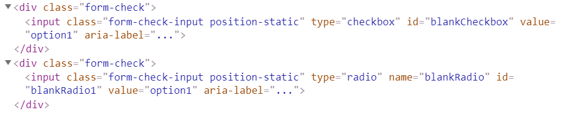


|Method | Description | Return Type
--- | --- | ---
**click()** | Click the element | void
**check()** | Click the element | void
**is()** | Assert action | TextAssert 
**assertThat()** | Assert action | TextAssert

<br>
<a href="https://github.com/jdi-testing/jdi-light/blob/bootstrap/jdi-light-bootstrap-tests/src/test/java/io/github/epam/bootstrap/tests/composite/section/form/CheckboxesAndRadiosWithoutLabelsTests.java" target="_blank">Test examples in Java</a>
<br>

Button group is represented by Section class in Java:
 
  [Section](https://jdi-docs.github.io/jdi-light/#section)  

<br><br><br><br><br><br><br><br><br><br><br><br><br><br><br><br><br>
#### <a href="https://getbootstrap.com/docs/4.3/components/forms/#checkboxes" target="_blank">Checkbox custom</a>
Checkbox is located in the following classes:
 
  - __Java__: _com.epam.jdi.light.ui.bootstrap.elements.common.Checkbox_
  


Here is an example with provided Bootstrap v4.3 code:

```java 
// @FindBy(css = "body") public static CheckboxesCustom checkboxesCustom;
@UI("body") public static CheckboxesCustom checkboxesCustom;

public class CheckboxesCustom extends Section {
    @UI("#customCheck1-div") public Checkbox checkbox; // @FindBy(css = "#customCheck1-div") public Checkbox checkbox;
}

@Test
public void isValidationTests() {
    checkboxesCustom.checkbox
            .is()
            .displayed()
            .enabled()
            .core()
            .hasClass("custom-control custom-checkbox")
            .tag(is("div"));
    checkboxesCustom.checkbox.label()
            .is()
            .displayed()
            .enabled()
            .core()
            .hasClass("custom-control-label")
            .text(is("Check this custom checkbox"))
            .tag(is("label"));
}

@Test
public void clickableTests() {
    checkboxesCustom.checkbox.check();
    checkboxesCustom.checkbox.is().selected();
    checkboxesCustom.checkbox.click();
    checkboxesCustom.checkbox.is().deselected();
}
```

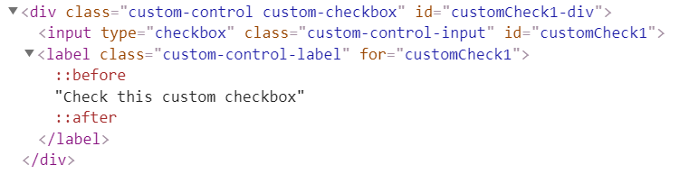


|Method | Description | Return Type
--- | --- | ---
**click()** | Click the checkbox | void
**check(String)** | Set to checked on "true" (case insensitive) or unchecked otherwise | void
**check()** | Set to checked | void
**uncheck()** | Set to unchecked | void
**isSelected()** | Verify value | boolean 
**isEnabled()** | Verify state | boolean
**assertThat()** | Assert action checkbox | CheckboxAssert
**is()** | Assert action checkbox | CheckboxAssert

<br>
<a href="https://github.com/jdi-testing/jdi-light/blob/bootstrap/jdi-light-bootstrap-tests/src/test/java/io/github/epam/bootstrap/tests/common/CustomCheckboxTests.java" target="_blank">Test examples in Java</a>
<br>

Button group is represented by Section class in Java:
 
  [Section](https://jdi-docs.github.io/jdi-light/#section)  

<br>

#### <a href="https://getbootstrap.com/docs/4.3/components/forms/#radios" target="_blank">Radio button custom</a>

Radio button is located in the following classes:
 
  - __Java__: _com.epam.jdi.light.ui.bootstrap.elements.common.RadioButton_
  


Here is an example with provided Bootstrap v4.3 code:

```java 
// @FindBy(css = "#custom-radio-con") public static RadioButtonsCustom radioButtonCustom;
@UI("#custom-radio-con") public static RadioButtonsCustom radioButtonCustom;

public class RadioButtonsCustom extends Section {
    @UI("#customRadio1") public RadioButton radio1; // @FindBy(css = "#customRadio1") public RadioButton radio1;
    @UI("#customRadio2") public RadioButton radio2; // @FindBy(css = "#customRadio2") public RadioButton radio2;
    @UI(".custom-radio") public RadioButton radioButton; // @FindBy(css = ".custom-radio") public RadioButton radioButton;
    @UI("label[for='customRadio1']") public Label radio1Label; // @FindBy(css = "label[for='customRadio1']") public Label radio1Label;
    @UI("label[for='customRadio2']") public Label radio2Label; // @FindBy(css = "label[for='customRadio2']") public Label radio2Label;
}

@Test
public void baseInitTest() {
    radioButtonCustom.radioButton.is()
            .size(2);
    radioButtonCustom.radio1.is()
            .deselected();
    radioButtonCustom.radio2.is()
            .deselected();
    radioButtonCustom.radio1Label.is()
            .text(is(label1));
    radioButtonCustom.radio2Label.is()
            .text(is(label2));
}

@Test
public void radioOneIsValidationTests() {
    radioButtonCustom.radio1
            .is()
            .hidden()
            .enabled()
            .core()
            .attr("type", "radio")
            .attr("name", "customRadio")
            .hasClass("custom-control-input")
            .tag(is("input"));
}
```

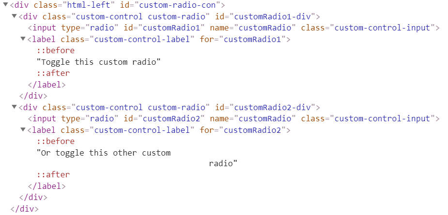


|Method | Description | Return Type
--- | --- | ---
**click()** | Click the button | void
**check()** | Select the button | void
**uncheck()** | Deselect the button | void
**getText()** | Get button text | String
**is()** | Assert action | TextAssert 
**assertThat()** | Assert action | TextAssert
**select()** | Select button | void
**selected()** | Radio button is selected | TextAssert
**get()** | Select button by index | action

<br>
<a href="https://github.com/jdi-testing/jdi-light/blob/bootstrap/jdi-light-bootstrap-tests/src/test/java/io/github/epam/bootstrap/tests/composite/section/form/RadioButtonCustomTests.java" target="_blank">Test examples in Java</a>
<br>

Button group is represented by Section class in Java:
 
  [Section](https://jdi-docs.github.io/jdi-light/#section)  

<br>

#### <a href="https://getbootstrap.com/docs/4.3/components/forms/#inline-1" target="_blank">Radio button custom inline</a>

Radio button is located in the following classes:
 
  - __Java__: _com.epam.jdi.light.ui.bootstrap.elements.common.RadioButton_
  


Here is an example with provided Bootstrap v4.3 code:

```java 
// @FindBy(css = "body") public static RadioButtonsCustomInline radioButtonsCustomInline;
@UI("body") public static RadioButtonsCustomInline radioButtonsCustomInline;

public class RadioButtonsCustomInline extends Section {
    @UI("#customRadioInline1") public RadioButton radio1; // @FindBy(css = "#customRadioInline1") public RadioButton radio1;
    @UI("#customRadioInline2") public RadioButton radio2; // @FindBy(css = "#customRadioInline2") public RadioButton radio2;
    @UI(".custom-control-inline") public RadioButton radioButton; // @FindBy(css = ".custom-control-inline") public RadioButton radioButton;
    @UI("label[for='customRadioInline1']") public Label radio1Label; // @FindBy(css = "label[for='customRadioInline1']") public Label radio1Label;
    @UI("label[for='customRadioInline2']") public Label radio2Label; // @FindBy(css = "label[for='customRadioInline2']") public Label radio2Label;
}

@Test
public void radioButtonByIndexTests() {
    radioButtonsCustomInline.radioButton.select(2);
    radioButtonsCustomInline.radio2.is()
            .selected();
    radioButtonsCustomInline.radio1.is()
            .deselected();
    radioButtonsCustomInline.radioButton.select(1);
    radioButtonsCustomInline.radio1.is()
            .selected();
    radioButtonsCustomInline.radio2.is()
            .deselected();
}

@Test
public void radioOneIsValidationTests() {
    radioButtonsCustomInline.radio1.is()
            .hidden()
            .enabled()
            .core()
            .attr("type", "radio")
            .attr("name", "customRadioInline1")
            .hasClass("custom-control-input")
            .tag(is("input"));
}
```

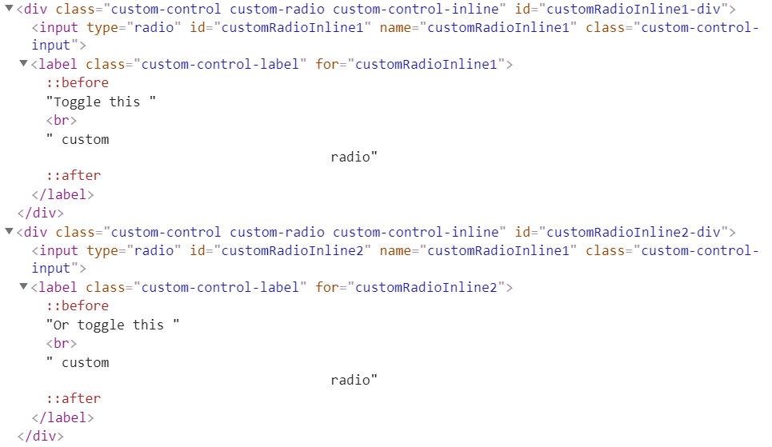


|Method | Description | Return Type
--- | --- | ---
**click()** | Click the button | void
**check()** | Select the button | void
**uncheck()** | Deselect the button | void
**getText()** | Get button text | String
**is()** | Assert action | TextAssert 
**assertThat()** | Assert action | TextAssert
**select()** | Select button | void
**selected()** | Radio button is selected | TextAssert
**get()** | Select button by index | action

<br>
<a href="https://github.com/jdi-testing/jdi-light/blob/bootstrap/jdi-light-bootstrap-tests/src/test/java/io/github/epam/bootstrap/tests/composite/section/form/RadioButtonsCustomInlineTests.java" target="_blank">Test examples in Java</a>
<br>

Button group is represented by Section class in Java:
 
  [Section](https://jdi-docs.github.io/jdi-light/#section)  

<br>

#### <a href="https://getbootstrap.com/docs/4.3/components/forms/#inline-1" target="_blank">Custom disabled</a>

Checkbox and Radio button is located in the following classes:

__Java__:
  - com.epam.jdi.light.ui.bootstrap.elements.common.RadioButton_
  - com.epam.jdi.light.ui.bootstrap.elements.common.Checkbox_
  


Here is an example with provided Bootstrap v4.3 code:

```java 
// @FindBy(css = "body") public static CheckboxAndRadioButtonCustomDisabled checkboxAndRadioButtonCustomDisabled;
@UI("body") public static CheckboxAndRadioButtonCustomDisabled checkboxAndRadioButtonCustomDisabled;

public class CheckboxAndRadioButtonCustomDisabled extends Section {
    @UI("#customCheckDisabled1-div") public Checkbox checkbox; // @FindBy(css = "#customCheckDisabled1-div") public Checkbox checkbox;
    @UI("#customRadioDisabled2-div") public RadioButton radioButtonContainer; // @FindBy(css = "#customRadioDisabled2-div") public RadioButton radioButtonContainer;
    @UI("#customRadioDisabled2") public RadioButton radioButton; // @FindBy(css = "#customRadioDisabled2") public RadioButton radioButton;
    @UI("label[for='customRadioDisabled2']") public Label radio1Label; // @FindBy(css = "label[for='customRadioDisabled2']") public Label radio1Label;
}

@Test
public void radioButtonIsValidationTests() {
    checkboxAndRadioButtonCustomDisabled.radioButton.is()
            .hidden()
            .disabled()
            .core()
            .attr("type", "radio")
            .attr("name", "radioDisabled")
            .hasClass("custom-control-input")
            .tag(Matchers.is("input"));
}

@Test
public void baseInitTest() {
    checkboxAndRadioButtonCustomDisabled.radioButtonContainer.is()
            .size(1);
    checkboxAndRadioButtonCustomDisabled.radioButton.is()
            .deselected();
    checkboxAndRadioButtonCustomDisabled.radio1Label.is()
            .text(is(label1));
}
```

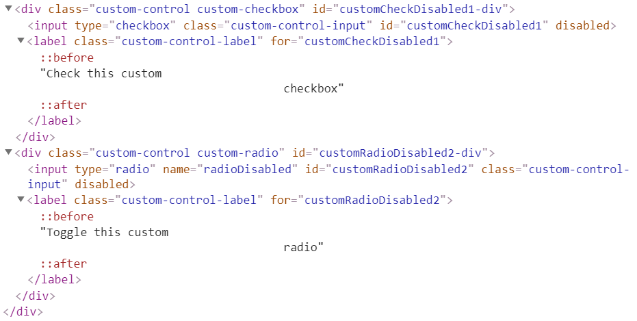


|Method | Description | Return Type
--- | --- | ---
**click()** | Click the element | void
**check()** | Click the element | void
**is()** | Assert action | TextAssert 
**assertThat()** | Assert action | TextAssert

<br>
<a href="https://github.com/jdi-testing/jdi-light/tree/bootstrap/jdi-light-bootstrap-tests/src/test/java/io/github/epam/bootstrap/tests/composite/section/form/CheckboxAndRadioButtonCustomDisabledTests.java" target="_blank">Test examples in Java</a>
<br>

Button group is represented by Section class in Java:
 
  [Section](https://jdi-docs.github.io/jdi-light/#section)  

<br>

#### <a href="https://getbootstrap.com/docs/4.3/components/forms/#inline-1" target="_blank">Switches custom</a>

Checkbox is located in the following classes:
 
  - __Java__: _com.epam.jdi.light.ui.bootstrap.elements.common.Checkbox_
  

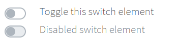

Here is an example with provided Bootstrap v4.3 code:

```java 
@UI("body") public static Switches switches; // @FindBy(css = "body") public static Switches switches;

public class Switches extends Section {
    @UI("#customSwitch1-div") public Checkbox checkbox; // @FindBy(css = "#customSwitch1-div") public Checkbox checkbox;
    @UI("#customSwitch2-div") public Checkbox checkboxDisabled; // @FindBy(css = "#customSwitch2-div") public Checkbox checkboxDisabled;
}

@Test
public void isValidationTests() {
    switches.checkbox
            .is()
            .displayed()
            .enabled()
            .core()
            .hasClass("custom-control custom-switch")
            .tag(is("div"));
    switches.checkbox.label()
            .is()
            .displayed()
            .enabled()
            .core()
            .hasClass("custom-control-label")
            .text(is("Toggle this switch element"))
            .tag(is("label"));
}

@Test
public void clickableTests() {
    switches.checkbox.check();
    switches.checkbox.is().selected();
    switches.checkbox.check();
    switches.checkbox.is().deselected();
}
```

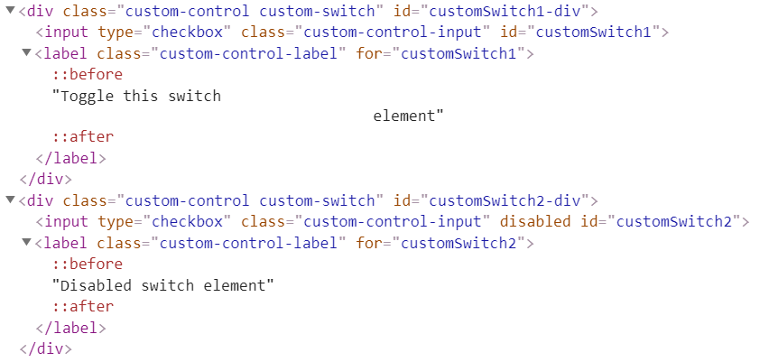


|Method | Description | Return Type
--- | --- | ---
**click()** | Click the checkbox | void
**check(String)** | Set to checked on "true" (case insensitive) or unchecked otherwise | void
**check()** | Set to checked | void
**uncheck()** | Set to unchecked | void
**isSelected()** | Verify value | boolean 
**isEnabled()** | Verify state | boolean
**assertThat()** | Assert action checkbox | CheckboxAssert
**is()** | Assert action checkbox | CheckboxAssert

<br>
<a href="https://github.com/jdi-testing/jdi-light/tree/bootstrap/jdi-light-bootstrap-tests/src/test/java/io/github/epam/bootstrap/tests/composite/section/form/SwitchesTests.java" target="_blank">Test examples in Java</a>
<br>

Button group is represented by Section class in Java:
 
  [Section](https://jdi-docs.github.io/jdi-light/#section)  

<br>

### Button group

<a href="https://getbootstrap.com/docs/4.3/components/button-group/" target="_blank">Button group</a> – Element that groups a series of buttons together on a single line with the button group, and super-power them with JavaScript.

Button group is located in the following packages:
 
  - __Java__: _io.github.epam.bootstrap.tests.composite.section.buttonGroup_
  - __C#__:

Available methods in Java JDI Light:

|Method | Description | Return Type
--- | --- | ---
**click()** | Click the button | void
**doubleClick()** | Double Click on button | void
**rightClick()** | Right Click the button | void
**getText()** | Get button text | String
**is()** | Assert action | TextAssert 
**assertThat()** | Assert action | TextAssert
**select(String option)** | Select option by text| void
**select(int option)** | Select option by index | void
**values()** | Get list of all available values | List<String>

<a href="https://github.com/jdi-testing/jdi-light/blob/master/jdi-light-html-tests/src/test/java/io/github/epam/html/tests/elements/common/ButtonTests.java" target="_blank">Test examples in Java</a>


Available methods and properties in C# JDI Light:

|Method/Property | Description | Return Type
--- | --- | ---
 |  | 
 |  | 
 |  |
 |  | 
<br>

#### <a href="https://getbootstrap.com/docs/4.3/components/button-group/#basic-example" target="_blank">Button Group Basic Example</a> 
Wrap a series of buttons with .btn in .btn-group.


Here is an example with provided Bootstrap v4.3 code:

```java 
@UI("#basic-example") public static ButtonGroupBasicExample buttonGroupBasicExample;
// @FindBy(css = "#basic-example") public static ButtonGroupBasicExample buttonGroupBasicExample;

public class ButtonGroupBasicExample extends Section {
    @UI("//button[text()='Left']") public Button leftButton;
    @UI("//button[text()='Middle']") public Button middleButton;
    @UI("//button[text()='Right']") public Button rightButton;
}

@Test
public void leftButtonTests() {
    buttonGroupBasicExample.leftButton.is()
            .displayed()
            .enabled()
            .core()
            .hasClass("btn btn-secondary")
            .css("font-size", "16px");
    buttonGroupBasicExample.leftButton.click();
    validateAlert(is(leftButtonClickAlert));
}
```

<br>

<!-- 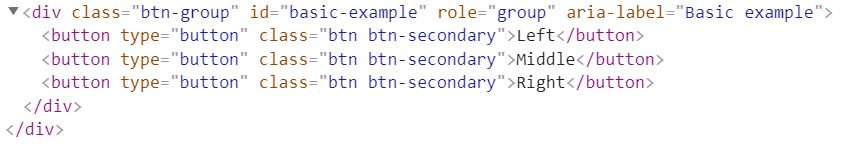 -->
```html
<div id="btn-md-group" class="btn-group mb-3" role="group" aria-label="Default button group">
    <button type="button" class="btn btn-secondary" ondblclick="alert('Left Button Double Clicked!');"
            oncontextmenu="alert('Left Button Right Clicked!');">Left
    </button>
    <button type="button" class="btn btn-secondary" ondblclick="alert('Middle Button Double Clicked!');"
            oncontextmenu="alert('Middle Button Right Clicked!');">Middle
    </button>
    <button type="button" class="btn btn-secondary" ondblclick="alert('Right Button Double Clicked!');"
            oncontextmenu="alert('Right Button Right Clicked!');">Right
    </button>
</div>
```

<br>

|Method | Description | Return Type
--- | --- | ---
**click()** | Click the button | void
**getText()** | Get button text | String
**is()** | Assert action | TextAssert 
**assertThat()** | Assert action | TextAssert
**displayed()** | Check that element is displayed | TextAssert
**enabled()** | Check that element is enabled | TextAssert
<br>

Button group is represented by Section class in Java:
 
  [Section](https://jdi-docs.github.io/jdi-light/#section)  

Inner elements represented by the following classes:
<ul>
    <li> [Button](https://jdi-docs.github.io/jdi-light/#button)</li>
</ul>
<br>

<a href="https://github.com/jdi-testing/jdi-light/blob/bootstrap/jdi-light-bootstrap-tests/src/test/java/io/github/epam/bootstrap/tests/composite/section/buttonGroup/BasicExampleTests.java" target="_blank">Button Group Basic Example Tests Example</a>

<br>

#### <a href="https://getbootstrap.com/docs/4.0/components/button-group/#button-toolbar" target="_blank">Button toolbar</a>
Combine sets of button groups into button toolbars for more complex components. Use utility classes as needed to space out groups, buttons, and more.

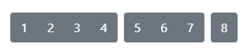

Here is an example with provided Bootstrap v4.3 code:

```java 
@UI(".btn-toolbar") public static ButtonToolbar buttonToolbar;
// @FindBy(css = ".btn-toolbar") public static ButtonToolbar buttonToolbar;

public class ButtonToolbar extends Section {
    @UI("button") public WebList buttonsInToolbar;
    @UI("input") public TextField inputAreaInToolbar;

    @Test
    public void buttonsInButtonToolbarTest() {
        buttonToolbar.buttonsInToolbar.forEach(button -> {
            button.is().displayed();
            button.is().enabled();
            button.assertThat().css("background-color", backgroundColorBeforeHovering);
            button.core().hover();
            button.assertThat().css("background-color", backgroundColorAfterHovering);
            button.assertThat().css("border-color", borderColorBeforeClicking);
            button.click();
            validateAlert(containsString("button is clicked"));
            button.assertThat().css("border-color", borderColorAfterClicking);
        });
    }
}
```

<!--  -->

```html

<div class="btn-toolbar" id="buttonToolbar1" role="toolbar" aria-label="Toolbar with button groups">
    <div class="btn-group mr-2" role="group" aria-label="First group">
        <button type="button" class="btn btn-secondary" onclick="alert('1st button is clicked');">1
        </button>
        <button type="button" class="btn btn-secondary" onclick="alert('2nd button is clicked');">2
        </button>
        <button type="button" class="btn btn-secondary" onclick="alert('3rd button is clicked');">3
        </button>
        <button type="button" class="btn btn-secondary" onclick="alert('4th button is clicked');">4
        </button>
    </div>
    <div class="btn-group mr-2" role="group" aria-label="Second group">
        <button type="button" class="btn btn-secondary" onclick="alert('5th button is clicked');">5
        </button>
        <button type="button" class="btn btn-secondary" onclick="alert('6th button is clicked');">6
        </button>
        <button type="button" class="btn btn-secondary" onclick="alert('7th button is clicked');">7
        </button>
    </div>
    <div class="btn-group" role="group" aria-label="Third group">
        <button type="button" class="btn btn-secondary" onclick="alert('8th button is clicked');">8
        </button>
    </div>
</div>

```


It is possible to mix input groups with button groups in your toolbars.

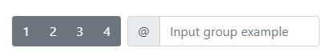

Here is an example with provided Bootstrap v4.3 code:

```java 
    @Test
    public void inputFieldInButtonToolbarTest() {
        buttonToolbar.inputAreaInToolbar.is().displayed();
        buttonToolbar.inputAreaInToolbar.is().enabled();
        buttonToolbar.inputAreaInToolbar.is().core().attr("placeholder", placeholderForInputField);
        buttonToolbar.inputAreaInToolbar.setValue(textForTestingInputField);
        assertEquals(buttonToolbar.inputAreaInToolbar.getValue(), textForTestingInputField);
    }
``` 
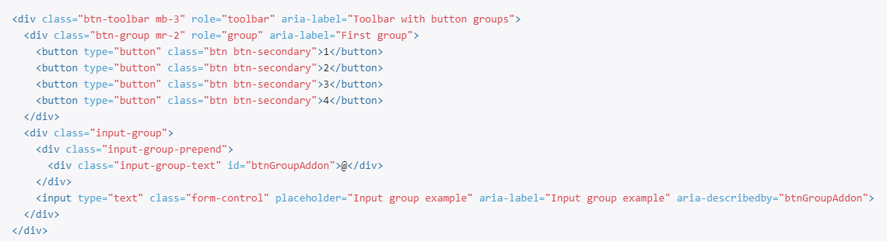
<br>

<a href="https://github.com/jdi-testing/jdi-light/blob/bootstrap/jdi-light-bootstrap-tests/src/test/java/io/github/epam/bootstrap/tests/composite/section/buttonGroup/ButtonToolbarTests.java" target="_blank">Bootstrap test examples</a>


#### <a href="https://getbootstrap.com/docs/4.0/components/button-group/#sizing" target="_blank">Button Group Sizing</a>

Instead of applying button sizing classes to every button in a group, 
just add ``.btn-group-*`` to each ``.btn-group``, including each one when nesting multiple groups.


```java 
@UI("#btn-lg-group") // @FindBy(id = "btn-lg-group")
public static ButtonGroupSizing largeBtnGroup;

@UI("//button[contains(text(), 'Left')]")
public Button leftBtn;
@UI("//button[contains(text(), 'Middle')]")
public Button midBtn;
@UI("//button[contains(text(), 'Right')]")
public Button rightBtn;

String leftBtnText = "Left";

@Test
public void isValidationTest() {
    largeBtnGroup.highlight();
    largeBtnGroup.is().displayed();
    largeBtnGroup.is().enabled();
    largeBtnGroup.leftBtn.is().text(is(leftBtnText));
    largeBtnGroup.leftBtn.is().text(containsString("Le"));
    assertThat(largeBtnGroup.leftBtn.core().css("font-size"), is("20px"));
    largeBtnGroup.leftBtn.assertThat().displayed()
            .and().text(is(leftBtnText))
            .core()
            .css("font-size", is("20px"))
            .cssClass("btn btn-secondary")
            .attr("type", "button")
            .tag(is("button"));
}
``` 

Here is an example with provided Bootstrap v4.3 code:

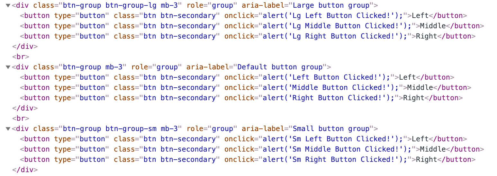

<a href="https://github.com/jdi-testing/jdi-light/blob/bootstrap/jdi-light-bootstrap-tests/src/test/java/io/github/epam/bootstrap/tests/composite/section/buttonGroup/SizingTests.java" target="_blank">Bootstrap test examples</a>

Available methods in Java JDI Light:

|Method | Description | Return Type
--- | --- | ---
**getText()** | Get button text | String
**getValue()** | Get button value | String
**click()** | Click button | void
**doubleClick()** | Double-click button | void
**rightClick()** | Right-click button | void
**displayed()** | Check that element is displayed | TextAssert
**css()** | Get button css value | String
**cssClass()** | Assert button css class | IsAssert
**attr()** | Assert button attribute | IsAssert
**tag()** | Assert button tag | IsAssert
**is()** | Assert action | TextAssert 
**assertThat()** | Assert action | TextAssert

<br>

#### <a href="https://getbootstrap.com/docs/4.3/components/button-group/#nesting" target="_blank">Button Group Nesting</a>
Place a ``.btn-group`` within another ``.btn-group`` when you want dropdown menus mixed with a series of buttons.


Here is an example with provided Bootstrap v4.3 code:

```java 
@UI("#button-group-nesting") public static ButtonGroupNesting buttonGroupNesting;
// @FindBy(css = "#button-group-nesting") public static ButtonGroupNesting buttonGroupNesting;

public class ButtonGroupNesting extends Section {
    @UI("//button[text()='1']") public Button one;
    @UI("//button[text()='2']") public Button two;
    @JDropdown(expand = ".btn-group",
            value = ".dropdown-menu",
            list = ".dropdown-item")
    public Dropdown dropdownMenu;
}

@Test
 public void buttonOneTests() {
     buttonGroupNesting.one.is()
             .displayed()
             .enabled()
             .core()
             .hasClass("btn btn-secondary")
             .css("font-size", "16px");
     buttonGroupNesting.one.click();
     validateAlert(is(buttonOneClickAlert));
}

@Test
public void dropdownMenuTests() {
    buttonGroupNesting.dropdownMenu.expand();
    buttonGroupNesting.dropdownMenu.is().expanded();
    buttonGroupNesting.dropdownMenu.is().size(2);
    buttonGroupNesting.dropdownMenu.list().get(0).is().text(dropdownMenuLinkOne);
    buttonGroupNesting.dropdownMenu.select(dropdownMenuLinkOne);
    newWindowTitleCheck(linkOnePageTitle);
}
```

<br>

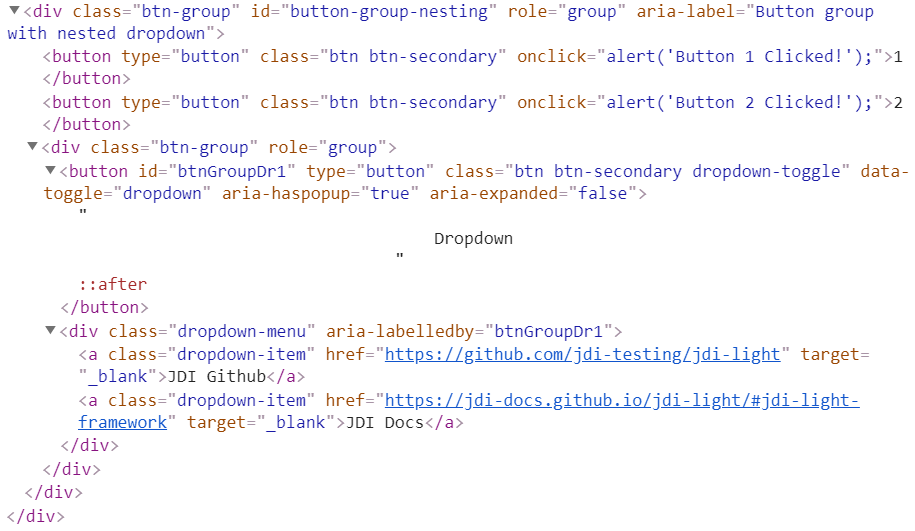
<br>

|Method | Description | Return Type
--- | --- | ---
**click()** | Click the button | void
**getText()** | Get button text | String
**getValue()** | Get button value | String
**is()** | Assert action | TextAssert 
**assertThat()** | Assert action | TextAssert
**displayed()** | Check that element is displayed | TextAssert
**enabled()** | Check that element is enabled | TextAssert
**expand()** | Dropdown expand | void
**expanded()** | Check that dropdown is expanded | TextAssert
**assertThat()** | Assert action | TextAssert
<br>

Button group is represented by Section class in Java:
 
  [Section](https://jdi-docs.github.io/jdi-light/#section)  

Inner elements represented by the following classes:
<ul>
    <li> [Text](https://jdi-docs.github.io/jdi-light/#text) </li>
    <li> [Button](https://jdi-docs.github.io/jdi-light/#button)</li>
    <li> [Dropdown](https://jdi-docs.github.io/jdi-light/#dropdown-2)</li>
</ul>

<a href="https://github.com/jdi-testing/jdi-light/blob/bootstrap/jdi-light-bootstrap-tests/src/test/java/io/github/epam/bootstrap/tests/composite/section/buttonGroup/NestingTests.java" target="_blank">Button Group Nesting Tests Example</a>

<br><br>

#### <a href="https://getbootstrap.com/docs/4.3/components/button-group/#vertical-variation" target="_blank">Button Group Vertical Variation</a>
Make a set of buttons appear vertically stacked rather than horizontally.


Here is an example with provided Bootstrap v4.3 code:

```java 
@UI("#vertical-variation") public static  ButtonGroupVerticalVariation buttonGroupVerticalVariation;
// @FindBy(css = "#vertical-variation") public static  ButtonGroupVerticalVariation buttonGroupVerticalVariation;

public class ButtonGroupVerticalVariation extends Section {
    @UI("//button[text()='Button one']") public Button buttonOne;
    @UI("//button[text()='Button two']") public Button buttonTwo;
    @JDropdown(expand = ".btn-group",
            value = ".dropdown-menu",
            list = ".dropdown-item")
    public Dropdown dropdownMenu;
}

@Test
public void buttonOneTests() {
    buttonGroupVerticalVariation.buttonOne.is()
            .displayed()
            .enabled()
            .core()
            .hasClass("btn btn-secondary")
            .css("font-size", "16px");
    buttonGroupVerticalVariation.buttonOne.click();
    validateAlert(is(buttonOneClickAlert));

@Test
public void dropdownMenuTests() {
    buttonGroupVerticalVariation.dropdownMenu.expand();
    buttonGroupVerticalVariation.dropdownMenu.is().expanded();
    buttonGroupVerticalVariation.dropdownMenu.is().size(2);
    buttonGroupVerticalVariation.dropdownMenu.list().get(1).is().text(dropdownMenuLinkTwo);
    buttonGroupVerticalVariation.dropdownMenu.select(dropdownMenuLinkTwo);
    newWindowTitleCheck(linkTwoPageTitle);
}
```

<br>

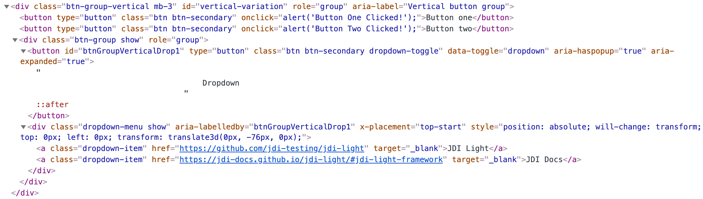
<br>

|Method | Description | Return Type
--- | --- | ---
**click()** | Click the button | void
**getText()** | Get button text | String
**getValue()** | Get button value | String
**is()** | Assert action | TextAssert 
**assertThat()** | Assert action | TextAssert
**displayed()** | Check that element is displayed | TextAssert
**enabled()** | Check that element is enabled | TextAssert
**expand()** | Dropdown expand | void
**expanded()** | Check that dropdown is expanded | TextAssert
**assertThat()** | Assert action | TextAssert
<br>

Button group is represented by Section class in Java:
 
  [Section](https://jdi-docs.github.io/jdi-light/#section)  

Inner elements represented by the following classes:
<ul>
    <li> [Text](https://jdi-docs.github.io/jdi-light/#text) </li>
    <li> [Button](https://jdi-docs.github.io/jdi-light/#button)</li>
    <li> [Dropdown](https://jdi-docs.github.io/jdi-light/#dropdown-2)</li>
</ul>
<br>

<a href="https://github.com/jdi-testing/jdi-light/blob/bootstrap/jdi-light-bootstrap-tests/src/test/java/io/github/epam/bootstrap/tests/composite/section/buttonGroup/VerticalVariationTests.java" target="_blank">Button Group Vertical Variation Tests Example</a>
<br><br>

### Alert
Alert is located in the following class: <br>
- __Java__: _com.epam.jdi.light.ui.bootstrap.common.Alert_

**<a href="https://getbootstrap.com/docs/4.3/components/alerts/" target="_blank">Alert</a>** – Element that provides contextual feedback messages for typical user actions with the handful of available and flexible alert messages.


Here is an example with provided Bootstrap v4.3 code:

```java 
@Css("#simple-alert") public static Alert simpleAlert;
@Css("#dismissible-alert") public static Alert dismissibleAlert;
// @FindBy(css = "#simple-alert") public static Alert simpleAlert;
// @FindBy(css = "#dismissible-alert") public static Alert dismissibleAlert;

@Test
public void simpleAlertExistingTest() {
    simpleAlert.is().displayed();
    simpleAlert.is().enabled();
    dismissibleAlert.is().displayed();
    dismissibleAlert.is().enabled();
}

@Test
public void simpleAlertLinkClickableTest() {
    simpleAlert.click();
    switchToNewWindow();
    assertEquals(getTitle(), pageTitle);
    closeWindow();
}

@Test
public void dismissibleAlertButtonIsValidationTest() {
    dismissibleAlert.dismissButton().is().displayed()
            .enabled();
}

@Test (priority = 1)
public void dismissibleAlertButtonClickTest() {
    dismissibleAlert.dismissButton().click();
    dismissibleAlert.is().hidden();
}
```
  
<br>
  
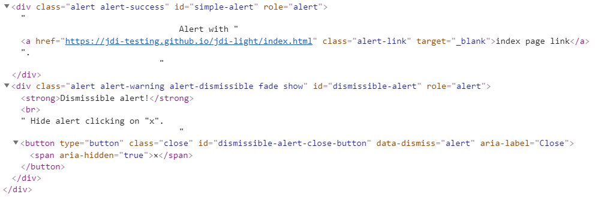

Available methods in Java JDI Light:

|Method | Description | Return Type
--- | --- | ---
**getText()** | Get alert text | String
**is()** | Assert action | TextAssert 
**assertThat()** | Assert action | TextAssert
**displayed()** | Check that element is displayed | TextAssert
**hidden()** | Check that element is hidden | TextAssert
**click()** | Click to hide alert | Action

<br>

Inner elements represented by the following classes:
<ul>
    <li> [Text](https://jdi-docs.github.io/jdi-light/#text) </li>
</ul>

<a href="https://github.com/jdi-testing/jdi-light/blob/bootstrap/jdi-light-bootstrap-tests/src/test/java/io/github/epam/bootstrap/tests/common/AlertTests.java" target="_blank">Alert test examples</a>

### Badge
Badge is located in the following class: <br>
- __Java__: _com.epam.jdi.light.ui.bootstrap.common.Badge_

[Bootstrap page documentation](https://getbootstrap.com/docs/4.3/components/badge/) <br>

```java 


@UI("#badge-secondary") // @FindBy(css = "#badge-secondary")

    @Test
    public void getTextTest() {
        assertEquals(badgeSecondary.getText(), badgeSecondaryText);
        assertEquals(badgeSecondary.getValue(), badgeSecondaryText);
    }

    @Test
    public void simpleVisibilityTest() {
        assertTrue(badgeSecondary.isDisplayed());
    }
```

**1) <a style="font-weight:bold" href="https://getbootstrap.com/docs/4.3/components/badge/" target="_blank">Badge</a>** - Element that scale to match the size of the immediate parent element by using relative font sizing and em units.<br>

   <br>
   Here is an example with provided Bootstrap v4.3 code:  
   

Available methods in Java JDI Light:

|Method | Description | Return Type
--- | --- | ---
**getText()** | Get button text | String
**is()** | Assert action | TextAssert 
**assertThat()** | Assert action | TextAssert
**displayed()** | Check that element is displayed | TextAssert
  
  ```java 
  


  @UI("#btn-primary") // @FindBy(css = "#btn-primary")
  
    @Test
    public void badgeTest() {
        assertTrue(buttonPrimary.badge().isDisplayed());
        assertEquals(buttonPrimary.badgeText(), "9");
        assertEquals(buttonPrimary.badgeValue(), "9");
    }
  ```

**2) <a style="font-weight:bold" href="https://getbootstrap.com/docs/4.3/components/badge/" target="_blank">Badge</a>** - Element which used as part of buttons to provide a counter. Unless the context is clear (as with the “Notifications” example, where it is understood that the “4” is the number of notifications), consider including additional context with a visually hidden piece of additional text.<br>

   <br>
   Here is an example with provided Bootstrap v4.3 code:  
   

Available methods in Java JDI Light:

|Method | Description | Return Type
--- | --- | ---
**getText()** | Get button text | String
**is()** | Assert action | TextAssert 
**assertThat()** | Assert action | TextAssert
**displayed()** | Check that element is displayed | TextAssert

```java 


@UI("#badge-success") // @FindBy(css = "#badge-success")

        @Test
        public void getTextTest() {
            assertEquals(badgeSuccess.getText(), badgeSuccessText);
            assertEquals(badgeSuccess.getValue(), badgeSuccessText);
        }
    
        @Test
        public void simpleVisibilityTest() {
            assertTrue(badgeSuccess.isDisplayed());
        }
```

**3) <a style="font-weight:bold" href="https://getbootstrap.com/docs/4.3/components/badge/#links" target="_blank">Badge</a>** - .badge-* classes on an link element quickly provide actionable badges with hover and focus states.<br>
   <br>
   Here is an example with provided Bootstrap v4.3 code:  
   

Available methods in Java JDI Light:

|Method | Description | Return Type
--- | --- | ---
**getText()** | Get button text | String
**is()** | Assert action | TextAssert 
**assertThat()** | Assert action | TextAssert
**displayed()** | Check that element is displayed | TextAssert

<br>
<a href="https://github.com/jdi-testing/jdi-light/blob/bootstrap/jdi-light-bootstrap-tests/src/test/java/io/github/epam/bootstrap/tests/common/BadgeTests.java" target="_blank">Bootstrap badge test examples</a><br>
<a href="https://github.com/jdi-testing/jdi-light/blob/bootstrap/jdi-light-bootstrap-tests/src/test/java/io/github/epam/bootstrap/tests/common/ButtonTests.java" target="_blank">Bootstrap badge in button tests examples</a>
<br><br>

### Breadcrumb

```java 


// @FindBy(css = "#breadcrumb")
@UI("#breadcrumb") public static Breadcrumb breadcrumb;

public class Breadcrumb extends UIBaseElement<UIAssert>{
    // @FindBy(css = ".breadcrumb-item")
    @Css(".breadcrumb-item") public WebList itemns;
}


@Test
public void getTextTest() {
    breadcrumb.itemns.has().size(3);
    breadcrumb.itemns.assertThat().values(TEXT, hasItems(new String[]{"Home", "HTML 5", "Bootstrap"}));
}
    
@Test
 public void getCurrectItemTest() {
    breadcrumb.itemns.last().has().value("Bootstrap");
    breadcrumb.itemns.last().has().text("Bootstrap");
}
```

<a href="https://getbootstrap.com/docs/4.3/components/breadcrumb/" target="_blank">breadcrumb</a>
A <a href="https://getbootstrap.com/docs/4.3/components/breadcrumb/" target="_blank">breadcrumb</a> is a control element  used for navigational on web pages

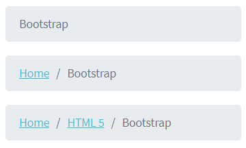

Here is an example with provided Bootstrap v4.3 code:
  


Available methods in Java JDI Light:

|Method/Property | Description | Return Type
--- | --- | ---
**click()** | Click the item  | void
**getText()** |Get item text  |  String
**getValue()** |Get item value  |  String
**get(String option)**|Get item by text|UIElement 
**get(int index)**|Get item by index| UIElement
**last()**|Get last (current) item |UIElement
**first()**|Get first item |UIElement
**is()**	 |  Assert action	| UIAssert
**assertThat()**	 |  Assert action	| UIAssert

In this java test case example Breadcrumb has been implemented as WebList.

WebList is located in the following classes:

Java: com.epam.jdi.light.elements.complex.WebList

<a href="https://github.com/jdi-testing/jdi-light/blob/bootstrap/jdi-light-bootstrap-tests/src/test/java/io/github/epam/bootstrap/tests/common/BreadcrumbTests.java" target="_blank">Breadcrumb Tests Example</a>

<br><br>

### Navs

Nav - Navigation component.


Here is an example with provided Bootstrap v4.3 code:
  


Available methods in Java JDI Light:

|Method/Property | Description | Return Type
--- | --- | ---
**** | TBD  | 
**** |  |  
**** |  | 
**** |  | 
**** |  |  

### Navbar

#### <a href="https://getbootstrap.com/docs/4.3/components/navbar/#supported-content" target="_blank">Supported content</a>
Navbars come with built-in support for a handful of sub-components. 

Choose from the following as needed:

+ ``.navbar-brand`` for your company, product, or project name.
+ ``.navbar-nav`` for a full-height and lightweight navigation (including support for dropdowns).
+ ``.navbar-toggler`` for use with our collapse plugin and other navigation toggling behaviors.
+ ``.form-inline`` for any form controls and actions.
+ ``.navbar-text`` for adding vertically centered strings of text.
+ ``.collapse.navbar-collapse`` for grouping and hiding navbar contents by a parent breakpoint.

Here’s an example of all the sub-components included in a responsive light-themed navbar 
that automatically collapses at the lg (large) breakpoint.
<br>

1. Navbar with content <br>
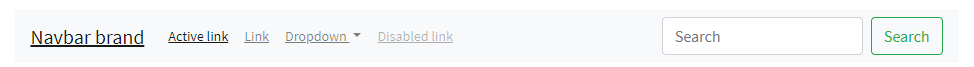<br>
2. Collapsed navbar <br> 
<br>
3. Expanded navbar <br>


```java 
// @FindBy(id = "navbar-supported-content")
@UI("#navbar-supported-content")
public static NavbarSupportedContent navbarSupportedContent

// @FindBy(tagName = "button[data-toggle=collapse]")
@UI("button[data-toggle=collapse]")
public Button navExpand;

@JDropdown(root = ".navbar-nav",
        list = "a")
public Collapse nav;

private static final String bootstrapNavPageUrl = "https://getbootstrap.com/docs/4.3/components/navbar/#nav";
private static final String jdiPageUrl = "https://github.com/jdi-testing/jdi-light/";
private static final String jdiBootstrapPageUrl = "https://jdi-testing.github.io/jdi-light/bootstrap.html#";
private static final String activeLinkText = "Active link";
private static final String jdiLinkText = "JDI Light";
private static final String dropdownLinkText = "Dropdown";
private static final String dropdownAction = "Action";
private static final String dropdownAnotherAction = "Another action";
private static final String dropdownSmthElse = "Something else here";
private static final String disabledLinkText = "Disabled link";

@Test(dataProvider = "navbarLinkData")
public void navLinkContentsTest(String elementName,
                                String elementText,
                                String elementUrl) {
    navbarSupportedContent.nav.show();
    navbarSupportedContent.nav.list().get(elementName)
            .is()
            .text(elementText)
            .and()
            .attr("href", elementUrl);
}

@Test(dataProvider = "collapseLinkTextData")
public void collapseLinkTextTest(String linkText) {
    WindowsManager.resizeWindow(900, 600);

    navbarSupportedContent.navExpand.show();
    navbarSupportedContent.navExpand.click();

    navbarSupportedContent.nav.is().expanded();

    assertTrue(navbarSupportedContent.nav.list().values().contains(linkText));
}
```

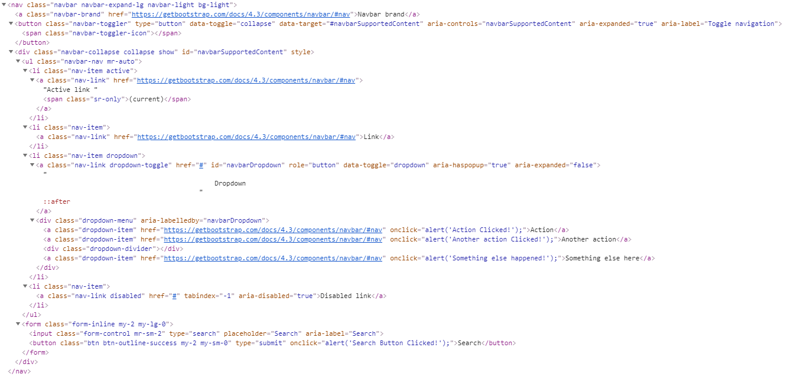

Navbar is represented by Section class in Java:
 
  [Section](https://jdi-docs.github.io/jdi-light/#section)

Inner elements of jumbotron can be represented by the following classes:

  - [TextField](https://jdi-docs.github.io/jdi-light/#textfield)
  
  - [Button](https://jdi-docs.github.io/jdi-light/#button)
  
  - [Link](https://jdi-docs.github.io/jdi-light/#link)
  
  - [Collapse](https://jdi-docs.github.io/jdi-light/#collapse)

Available methods in Java JDI Light:

|Method | Description | Return Type
--- | --- | ---
**is()** | Asserts element  | UIAssert
**displayed()** | Asserts element is displayed  | UIAssert 
**hasClass()** | Checks whether element has class  | boolean 
**click()** | Click on element  | void   
**text()** | Check whether a text matches a pattern  | IsAssert 
**attr()** | Check whether an element has attribute of specified name and with given value  | IsAssert 
**toggle()** | Toggle collapse  | void 
**select()** | Select a dropdown element  | void 
**expanded()** | Check whether a dropdown is expanded  | void 
**setValue()** | Set a value for input group  | void 
**getValue()** | Get value from input group  | String 

<a href="https://github.com/jdi-testing/jdi-light/blob/bootstrap/jdi-light-bootstrap-tests/src/test/java/io/github/epam/bootstrap/tests/composite/section/navbar/NavbarSupportedContentTests.java" target="_blank">Bootstrap Test Examples</a>
<br><br>

#### <a href="https://getbootstrap.com/docs/4.3/components/navbar/#brand" target="_blank">Brand</a>
The ``.navbar-brand`` can be applied to most elements, but an anchor works best as some elements might require utility classes or custom styles.
<br>

Navbar brand as a link <br>
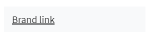<br>
Navbar brand as heading <br> 
<br>
<br>

Adding images to the ```.navbar-brand``` will likely always require custom styles or utilities to properly size. Here are some examples to demonstrate.<br>

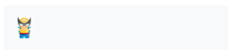<br>
<br>

```java 
       //FindBy(css = "#brand-heading")
        @UI("#brand-heading")
        public UIElement navbarBrandHeading; 
  
        //FindBy(css = "#brand-link")
        @UI("#brand-link")
        public UIElement navbarBrandLink;
    
        //FindBy(css = "#brand-as-image")
        @UI("#brand-as-image")
        public UIElement navbarBrandAsImage;
    
        //FindBy(css = "#brand-as-image-and-link")
        @UI("#brand-as-image-and-link")
        public UIElement navbarBrandAsImageAndLink;

        @Test (dataProvider = "navbarBrandsWithLink")
        public void  checkNavbarLink(UIElement brandAsLink) {
            brandAsLink.is().core().hasAttr("href");
            brandAsLink.highlight("blue");
            brandAsLink.unhighlight();
            int winNumber = WindowsManager.windowsCount();
            brandAsLink.click();           
            WindowsManager.switchToWindow(winNumber + 1);
            assertThat(getUrl(), is(navbarUrl));
            WindowsManager.closeWindow();
            WindowsManager.switchToWindow(winNumber);
         }
    
        @Test(dataProvider = "navbarBrands")
        public void checkNavbarText(UIElement uiBaseElement, String navbarText) {
             uiBaseElement.highlight();
             uiBaseElement.is().core().text(navbarText);
             uiBaseElement.unhighlight();
        }

        @Test(dataProvider = "navbarBrandsWithImage")
        public void checkNavbarImage(UIElement brandWithImage) {
            UIElement imgFromNavbar = brandWithImage.childs().get(1);
            imgFromNavbar.highlight("blue");
            imgFromNavbar.is().core().tag("img").attr("src", containsString(imgPath));
            imgFromNavbar.unhighlight();
            int winNumber = WindowsManager.windowsCount();
            imgFromNavbar.click();          
            WindowsManager.switchToWindow(winNumber + 1);
            assertThat(getUrl(), is(navbarUrl));
            WindowsManager.closeWindow();
            WindowsManager.switchToWindow(winNumber);
    }
```

```html 

<div id="navbar-base-for-brand">
     <p>Navbar - Brand as link</p>
     <nav class="navbar navbar-light bg-light">
         <a class="navbar-brand" id="brand-link" href="https://getbootstrap.com/docs/4.3/components/navbar/#nav" target="_blank">Brand link</a>
     </nav>
     <br>
     <p>Navbar - Brand as heading</p>
     <nav class="navbar navbar-light bg-light">
         <span class="navbar-brand mb-0 h1" id="brand-heading">Brand heading</span>
     </nav>
     <br>
     <p>Navbar - Brand as image</p>
     <nav class="navbar navbar-light bg-light">
         <a class="navbar-brand" id="brand-as-image" href="https://getbootstrap.com/docs/4.3/components/navbar/#nav" target="_blank">
             
         </a>
     </nav>
     <br>
     <p>Navbar - Brand as image and link</p>
     <nav class="navbar navbar-light bg-light mb-3">
         <a class="navbar-brand" id="brand-as-image-and-link" href="https://getbootstrap.com/docs/4.3/components/navbar/#nav" target="_blank">
             Brand link</a>
     </nav>
</div>
``` 

Available methods in Java JDI Light:

|Method | Description | Return Type
--- | --- | ---
**is()** | Assert action | UIAssert 
**assertThat()** | Assert action | UIAssert
**hasAttr()** | Assert action | UIAssert

<a href="https://github.com/jdi-testing/jdi-light/blob/bootstrap/jdi-light-bootstrap-tests/src/test/java/io/github/epam/bootstrap/tests/composite/section/navbar/NavbarBrandTests.java" target="_blank">Bootstrap test examples</a>

<br><br><br><br><br><br><br><br>

#### [Nav](https://getbootstrap.com/docs/4.3/components/navbar/#nav)
Navbar navigation links build on our ``.nav`` options with their own modifier class and require the use of toggler classes for proper responsive styling.

```java 

public class NavbarNav extends Section {
    @UI("#navbar-nav-with-disabled") public NavbarSimpleLinks navLinks1;
    @UI("#navbar-nav-with-dropdown") public NavbarComplexLinks navbarComplexLinks;
}
public class NavbarSimpleLinks extends Section {
    @UI(".navbar-brand") public Link brand;
    @UI(".navbar-nav a") public ListGroup listPages;
}
public class NavbarComplexLinks extends Section {
    @UI(".navbar-brand")
    public Link brand;
    @UI("ul li")
    public ListGroup listPages;

    @JDropdown(root = ".dropdown",
            expand = "#navbarDropdownMenuLink",
            list = "a")
    public Dropdown dropdown;

    public void selectMenu(String item) {
        dropdown.show();
        dropdown.toggle();
        dropdown.list().select(item);
    }
}

@Test
public void isDisabledItemNavWithDisabled(){
   navbarNav.navLinks1.listPages.get(4)
            .is()
            .displayed();
   navbarNav.navLinks1.listPages.get(4)
            .is()
            .disabled();
}
   


@Test
public void clickNavbarNavWithDropdownLinksTest() {
    navbarNav.navbarComplexLinks.listPages.get(4)
             .is()
             .displayed();
    navbarNav.navbarComplexLinks.selectMenu(ITEM_BRAND);
    newWindowTitleCheck(NAVBAR_BOOTSTRAP);
    navbarNav.navbarComplexLinks.selectMenu(ITEM_NAV);
    newWindowTitleCheck(NAVBAR_BOOTSTRAP);
    navbarNav.navbarComplexLinks.selectMenu(ITEM_FORMS);
    newWindowTitleCheck(NAVBAR_BOOTSTRAP);
}


```

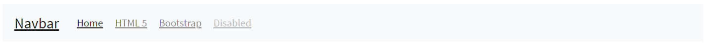

Here is an example with provided Bootstrap v4.3 code:
  
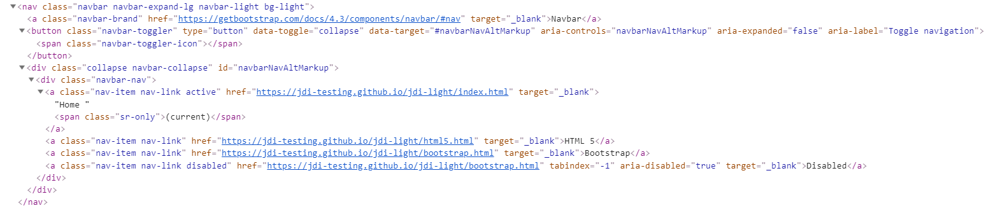

With dropdown


Here is an example with provided Bootstrap v4.3 code:
  
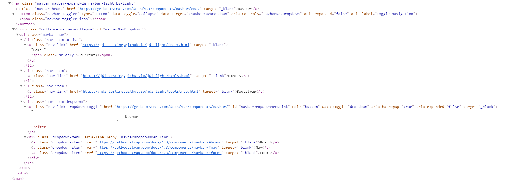

Nav is represented by Section class in Java:
 
  [Section](https://jdi-docs.github.io/jdi-light/#section)

Inner elements of media object can be represented by the following classes:
<ul>
    <li> [Link](https://jdi-docs.github.io/jdi-light/#link)  </li>
    <li> [Collapse](https://jdi-docs.github.io/jdi-light/#collapse)  </li>
    <li> [DropDown](https://jdi-docs.github.io/jdi-light/#dropdown-2)  </li>
    <li> [See more elements](https://jdi-docs.github.io/jdi-light/#bootstrap-common-elements) </li>
</ul>

Available methods in Java JDI Light:

|Method | Description | Return Type
--- | --- | ---
**click()** | Click the item| void
**is()** | Assert action | TextAssert 

<a style="font-weight: bold;" target="_blank" href="https://github.com/jdi-testing/jdi-light/blob/bootstrap/jdi-light-bootstrap-tests/src/test/java/io/github/epam/bootstrap/tests/composite/section/navbar/NavbarNavsTests.java">Bootstrap test examples</a>

<br>

#### [Forms](https://getbootstrap.com/docs/4.3/components/navbar/#forms)

Place various form controls and components within a navbar with ``.form-inline``.


```java 

//FindBy(id = "#navbar-form-2")
@UI("#navbar-form-2")
public static NavbarForm navbarFormWithText;
//FindBy(id = "#navbar-form-3")
@UI("#navbar-form-3")
public static NavbarWithInputGroupForm navbarFormWithInputGroup;

@Test
public void checkSetValueInputGroup() {
    navbarFormWithInputGroup.inputGroup.input.setValue(inputText);
    navbarFormWithInputGroup.inputGroup.input.assertThat().text(is(inputText));
}

@Test
public void checkFormElements() {
    UIElement input = navbarFormWithText.form.core().find((By.tagName("input")));
    UIElement button = navbarFormWithText.form.core().find((By.tagName("button")));
    input.shouldBe().enabled();
    button.shouldBe().enabled().text(is(buttonText));
    navbarFormWithText.form.click();
}

```

Here is an example with provided Bootstrap v4.3 code:
  
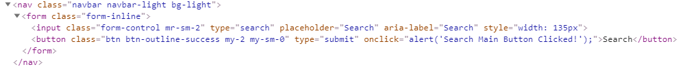

Immediate children elements in .navbar use flex layout and will default to justify-content: between.

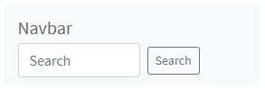

Here is an example with provided Bootstrap v4.3 code:
  
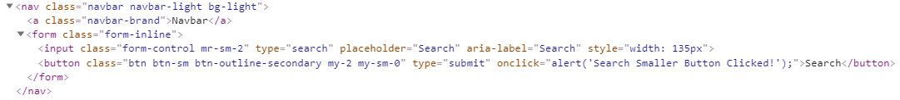

Input groups work, too:

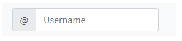

Here is an example with provided Bootstrap v4.3 code:
  
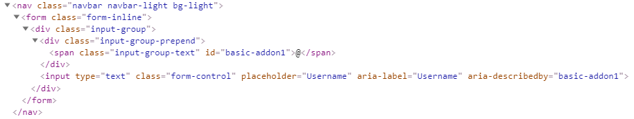

Media object is represented by Section class in Java:
 
  [Section](https://jdi-docs.github.io/jdi-light/#section)

Inner elements of media object can be represented by the following classes:

  + [Form](https://jdi-docs.github.io/jdi-light/#form)     
  + [TextField](https://jdi-docs.github.io/jdi-light/#textfield)    
  + [Button](https://jdi-docs.github.io/jdi-light/#button)      
  + [Link](https://jdi-docs.github.io/jdi-light/#link)      
  + [See more elements](https://jdi-docs.github.io/jdi-light/#html5-common-elements) 

<a style="font-weight: bold;" target="_blank" href="https://github.com/jdi-testing/jdi-light/blob/bootstrap/jdi-light-bootstrap-tests/src/test/java/io/github/epam/bootstrap/tests/composite/section/navbar/NavbarFormsTests.java">Bootstrap test examples</a>
<br><br>

#### [Text](https://getbootstrap.com/docs/4.3/components/navbar/#text)
Navbars may contain bits of text with the help of ``.navbar-text``. 
This class adjusts vertical alignment and horizontal spacing for strings of text.

<br>


Here is an example with provided Bootstrap v4.3 code:

```java 
//@FindBy(xpath = "//h4[.='Navbar - Text']/../..") public static NavbarText navbarText;
@UI("//h4[.='Navbar - Text']/../..") public static NavbarText navbarText;

public class NavbarText extends Section {
    @UI("nav:nth-child(1)") public Text simpleText;
    @UI("nav.navbar.navbar-expand-lg.navbar-light.bg-light") public NavbarTextLinks complexNavbar;
}

@Test
public void verifySimpleNavbarTextTest() {
    navbarText.simpleText
        .is()
        .text(is(inlineElement));
}
```

  
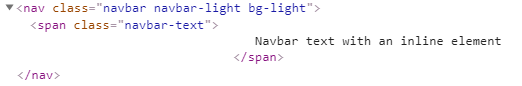

Mix and match with other components and utilities as needed.

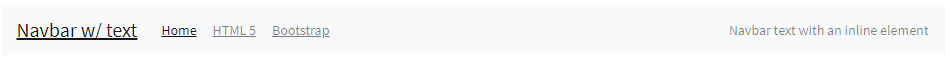

Here is an example with provided Bootstrap v4.3 code:

```java 
public class NavbarTextLinks extends Section {
    @UI(".navbar-brand") public Link brand;
    @UI("ul li") public ListGroup listPages;
    @UI(".navbar-text") public Text simpleText;
}

@Test
public void verifyComplexNavbarHomeTest() {
    navbarText.complexNavbar.listPages.get(1)
        .is()
        .text(is(linkName1));
    navbarText.complexNavbar.listPages.get(1).click();
    newWindowTitleCheck(page1);
    navbarText.complexNavbar.listPages.get(2)
        .is()
        .text(is(linkName2));
    navbarText.complexNavbar.listPages.get(2).click();
    newWindowTitleCheck(page2);
    navbarText.complexNavbar.listPages.get(3)
        .is()
        .text(is(linkName3));
    navbarText.complexNavbar.listPages.get(3).click();
    newWindowTitleCheck(page3);
}
```

  
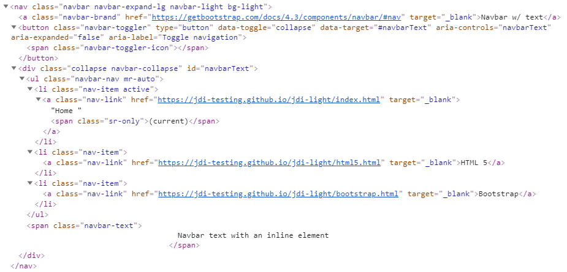

Available methods in Java JDI Light:

|Method | Description | Return Type
--- | --- | ---
**click()** | Click the button | void
**getText()** | Get button text | String
**is()** | Assert action | TextAssert 
**assertThat()** | Assert action | TextAssert
**get()** | Select button by index | action

<br><br> 

[Navbar-text test example](https://github.com/jdi-testing/jdi-light/blob/bootstrap/jdi-light-bootstrap-tests/src/test/java/io/github/epam/bootstrap/tests/composite/section/navbar/NavBarTextTests.java) <br>
<br>

Available methods and properties in C# JDI Light:

|Method/Property | Description | Return Type
--- | --- | ---
 |  | 
 |  | 
 |  |
 |  | 
<br><br>

#### [Color schemes](https://getbootstrap.com/docs/4.3/components/navbar/#color-schemes)

Theming the navbar has never been easier thanks to the combination of theming classes and ``background-color`` utilities
Choose from ``.navbar-light`` for use with light background colors, or ``.navbar-dark`` for dark background colors. Then, customize with ``.bg-*`` utilities.


Here is an example with provided Bootstrap v4.3 code:

```java 
public class NavbarColorScheme extends Navbar {

    //@FindBy(className = "navbar-brand")
    @UI(".navbar-brand")
    public Link navbarLink;

    //@FindBy(linkText = "Home\n(current)")
    @ByText("Home")
    public Link homeLink;

    //@FindBy(linkText = "Contact form")
    @ByText("Contact form")
    public Link contactFormLink;

    //@FindBy(linkText = "Metals & Colors")
    @ByText("Metals & Colors")
    public Link metalsAndColorsLink;

    //@FindBy(xpath = "//form/button")
    @UI("form button")
    public Button searchButton;
}

@Test(dataProvider = "navbarColorSchemesWithColors")
public void colorSchemeAccordanceTest(NavbarColorScheme navbarColorScheme, String bgColor, 
String navbarAndHomeColor, String contactAndMetalsColor, String searchColor) {
    navbarColorScheme.core().is()
            .css("background-color", bgColor);
    checkColorOfElement(navbarColorScheme.navbarLink, navbarAndHomeColor);
    checkColorOfElement(navbarColorScheme.homeLink, navbarAndHomeColor);
    checkColorOfElement(navbarColorScheme.contactFormLink, contactAndMetalsColor);
    checkColorOfElement(navbarColorScheme.metalsAndColorsLink, contactAndMetalsColor);
    checkColorOfElement(navbarColorScheme.searchButton, 
String.format("rgba%s, 1)", searchColor));
    navbarColorScheme.searchButton.core().is()
            .css("border-color", String.format("rgb%s)", searchColor));
}

private void checkColorOfElement(ICoreElement elem, String color) {
    elem.core().is()
            .css("color", color);
}
```
  
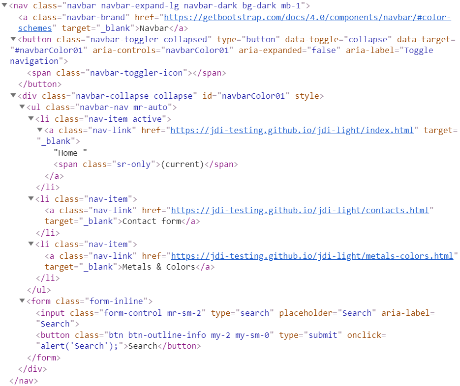

Available methods in Java JDI Light:

|Method | Description | Return Type
--- | --- | ---
**click()** | Click the button | void
**getText()** | Get button text | String
**is()** | Assert action | TextAssert 
**assertThat()** | Assert action | TextAssert

<a href="https://github.com/jdi-testing/jdi-light/blob/bootstrap/jdi-light-bootstrap-tests/src/test/java/io/github/epam/bootstrap/tests/composite/section/navbar/NavbarColorSchemeTests.java">Bootstrap test examples</a>

<br><br>

#### [Containers](https://getbootstrap.com/docs/4.3/components/navbar/#containers)
Although it’s not required, you can wrap a navbar in a ``.container`` to center it on a page or add one within to only center the contents of a fixed or static top navbar.

```java 
public class NavbarContainer extends Section {
//@FindBy(id = "navbar-containers-centred")
    @UI("#navbar-containers-centred") public NavbarSimpleLinks navLinks1;
//@FindBy(id = "navbar-containers-expanded")
    @UI("#navbar-containers-expanded") public NavbarComplexLinks navbarComplexLinks;
}

@Test
  public void getNameNavbarContainerBrandTest() {
        navbarContainers.navLinks1.brand.is().text(textNavbarCentredContainer);
        navbarContainers.navbarComplexLinks.brand.is().text(textNavbarExpandedConteiner);
  }


@Test
public void clickNavbarCentredContainerLinksTest() {
     navbarContainers.navLinks1.brand.click();
     assertThat(WindowsManager.windowsCount(), is(2));
     WindowsManager.switchToWindow(2);
     assertThat(getUrl(), is(url));
     WindowsManager.closeWindow();
}


```

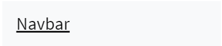

Here is an example with provided Bootstrap v4.3 code:
  
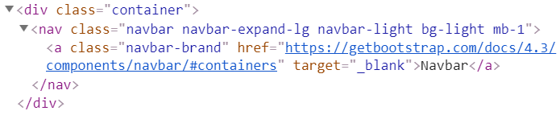

When the container is within your navbar, its horizontal padding is removed at breakpoints lower than your specified ``.navbar-expand{-sm|-md|-lg|-xl}`` class.
This ensures we’re not doubling up on padding unnecessarily on lower viewports when your navbar is collapsed.
 
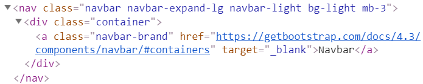

Container is represented by Section class in Java:
 
  [Section](https://jdi-docs.github.io/jdi-light/#section)  

Inner elements of media object can be represented by the following classes:
<ul>
    <li> [Collapse](https://jdi-docs.github.io/jdi-light/#collapse)  </li>
    <li> [DropDown](https://jdi-docs.github.io/jdi-light/#dropdown-2)  </li>
    <li> [See more elements](https://jdi-docs.github.io/jdi-light/#bootstrap-common-elements) </li>
</ul>

[Bootstrap test examples](https://github.com/jdi-testing/jdi-light/blob/bootstrap/jdi-light-bootstrap-tests/src/test/java/io/github/epam/bootstrap/tests/composite/section/NavbarContainersTest.java)

#### [Placement](https://getbootstrap.com/docs/4.3/components/navbar/#placement)
Use our position utilities to place navbars in non-static positions. Choose from fixed to the top, fixed to the bottom, or stickied to the top (scrolls with the page until it reaches the top, then stays there). Fixed navbars use position: fixed, meaning they’re pulled from the normal flow of the DOM and may require custom CSS (e.g., ``padding-top`` on the ``<body>``) to prevent overlap with other elements.

Also note that ``.sticky-top`` uses position: sticky, which isn’t fully supported in every browser.


Here is an example with provided Bootstrap v4.3 code:

```java 
//@FindBy(id = "navbar-sticky-top")
@UI("#navbar-sticky-top")
public static NavbarPlacement navbarPlacementStickyTop;

@Test
public void navbarPositionTest() {
    navbarPlacementStickyTop.show();
    navbarPlacementStickyTop.core()
            .is()
            .css("position", "sticky")
            .css("top", "0px");
}


```
    
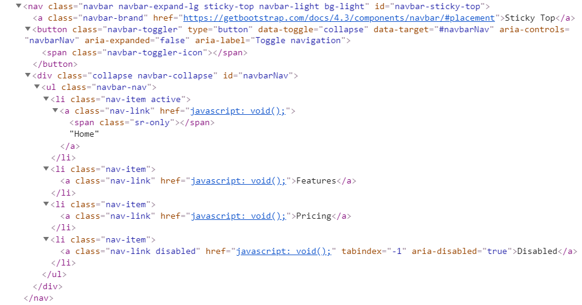

Available methods in Java JDI Light:

|Method | Description | Return Type
--- | --- | ---
**click()** | Click a link | void
**text()** | Check whether a text matches a pattern | isAssert
**css()** | Match passed value with the element css | isAssert
**is()** | Assertelement | isAssert 
**jsExecute()** | Execute javascript | String
**getRect()** | Get element rectangle | Rectangle

<a href="https://github.com/jdi-testing/jdi-light/blob/bootstrap/jdi-light-bootstrap-tests/src/test/java/io/github/epam/bootstrap/tests/composite/section/navbar/NavbarPlacementTests.java">Bootstrap test examples</a>

<br><br>

#### [Responsive behaviors](https://getbootstrap.com/docs/4.3/components/navbar/#responsive-behaviors)

Navbars can utilize ``.navbar-toggler``, ``.navbar-collapse``, and ``.navbar-expand{-sm|-md|-lg|-xl}`` classes to change when their content collapses behind a button. 
In combination with other utilities, you can easily choose when to show or hide particular elements.

For navbars that never collapse, add the ``.navbar-expand`` class on the navbar. 
For navbars that always collapse, don’t add any ``.navbar-expand`` class.

##### [Navbar Toggler](https://getbootstrap.com/docs/4.3/components/navbar/#toggler)

Navbar togglers are left-aligned by default, but should they follow a sibling element like a ``.navbar-brand``, they’ll automatically be aligned to the far right. 
Reversing your markup will reverse the placement of the toggler. 
Below are examples of different toggle styles.

**1. With no ``.navbar-brand`` shown in lowest breakpoint**

``FullScreen``


``Collapsed``


``Expanded``


Here is an example with provided Bootstrap v4.3 code:
  


**2. With a brand name shown on the left and toggler on the right**

``FullScreen``


``Collapsed``


``Expanded``


Here is an example with provided Bootstrap v4.3 code:
  
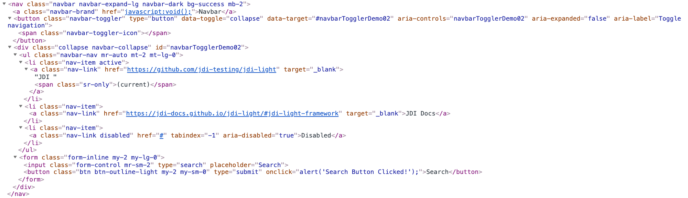

**3. With a toggler on the left and brand name on the right**

``FullScreen``


``Collapsed``


``Expanded``
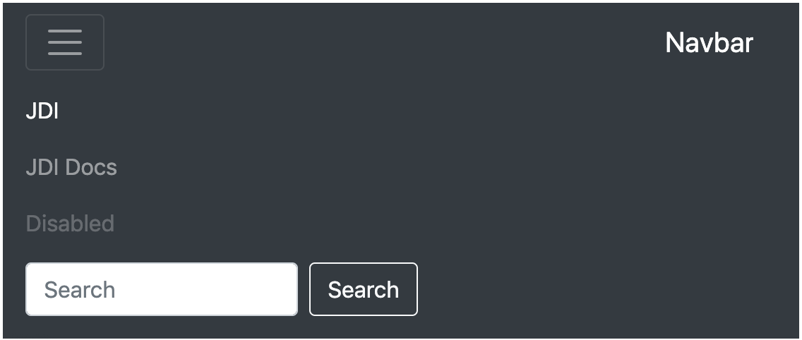

Here is an example with provided Bootstrap v4.3 code:
  


<br>

##### [External content](https://getbootstrap.com/docs/4.3/components/navbar/#external-content)
Plugin to trigger hidden content elsewhere on the page.


Here is an example with provided Bootstrap v4.3 code:

```java 
@UI("#navbar-external-content") //FindBy(css = "#navbar-external-content")
public static NavbarExternalContent navbarExternalContent;

@Test
public void expandingTest() {
    navbarExternalContent.toggler.expander().is().core().attr(ariaExpanded, "false");
    navbarExternalContent.toggler.expand();
    navbarExternalContent.toggler.expander().is().core().attr(ariaExpanded, "true");
    navbarExternalContent.toggler.collapse();
    navbarExternalContent.toggler.expander().is().core().attr(ariaExpanded, "false");
}

@Test
public void getTextTest() {
    navbarExternalContent.toggler.expand();
    navbarExternalContent.toggler.value().childs().get(1).is()
            .displayed()
            .text(text);
    navbarExternalContent.toggler.value().childs().get(2).is()
            .displayed()
            .text(mutedText);
    navbarExternalContent.toggler.collapse();
}

```


Navbar - External content is represented by Section class in Java:
 
  [Section](https://jdi-docs.github.io/jdi-light/#section)

Inner elements of Navbar - External content can be represented by the following classes:

  + [Collapse](https://jdi-docs.github.io/jdi-light/#collapse)   
    
  + [Text](https://jdi-docs.github.io/jdi-light/#text)       

Available methods in Java JDI Light:

|Method/Property | Description | Return Type
--- | --- | ---
**expand()** | Expands element  | void
**collapse()** | Collapses element  | void
**getText()** | Get current value | String 
**is()** | Assert action | TextAssert 
**assertThat()** | Assert action | TextAssert

<a href="https://github.com/jdi-testing/jdi-light/blob/bootstrap/jdi-light-bootstrap-tests/src/test/java/io/github/epam/bootstrap/tests/composite/section/navbar/ExternalContentTests.java" target=a_blank> Bootstrap test examples </a>
<br>

### Pagination

Pagination is functionality for navigating through pages.

**Pagination with active state**


Here is an example with provided Bootstrap v4.3 code:
  


**Pagination with icons**


Here is an example with provided Bootstrap v4.3 code:
  


**Pagination with disabled item**


Here is an example with provided Bootstrap v4.3 code:
  


**Pagination with previous and next items**


Here is an example with provided Bootstrap v4.3 code:
  


Available methods in Java JDI Light:

|Method/Property | Description | Return Type
--- | --- | ---
**** | TBD  | 
**** |  |  
**** |  | 
**** |  | 
**** |  |  


###Progress
```java 


//FindBy(css = "#progress-bar-base-width-25 .progress-bar"
@UI("#progress-bar-base-width-25 .progress-bar")  
public static Progress progressBaseWidth25;

@Test(dataProvider = "progressWidth")
public void getWidthTest(Progress progress, String width) {
    progress.is().ariaValue(width);
}

@Test(dataProvider = "progressColor")
public void getColorTest(Progress progress, String color) {
   progress.is().color(color);
}
```
<a style="font-weight: bold;" target="_blank" href="https://getbootstrap.com/docs/4.3/components/progress/">Progress</a> is custom progress bar featuring support for stacked bars, animated backgrounds, and text labels.


Here is an example with provided Bootstrap v4.3 code:
  


Available methods in Java JDI Light:

|Method/Property | Description | Return Type
--- | --- | ---
**getAriaValue()** | Get aria value of the bar | String
**getColor()** | Get color of the bar  | String
**is()** | Various assert actions for Progress | ProgressAssert 
**assertThat()** | Assert action | UIAssert 

[Bootstrap test examples](https://github.com/jdi-testing/jdi-light/blob/bootstrap/jdi-light-bootstrap-tests/src/test/java/io/github/epam/bootstrap/tests/common/progress/ProgressBaseTests.java)

**With label**

```java 

//@FindBy(css = "#progress-with-labels")
@UI("#progress-with-labels") public static Progress progressWithLabels; 

@Test
    public void getDefaultPercentTest() {
         assertThat(progressWithLabels.core().getText(), is(defaultPercent));
    }
 
@Test
    public void getPercentTest() {
         progressWithLabels.core().is().text(defaultPercent);
         minus.click();
         progressWithLabels.core().is().text("20%");
         for (int i = 0; i < 10; i++) {
             minus.click();
         }
         progressWithLabels.core().is().text(minPercent);
         plus.click();
         progressWithLabels.core().is().text("5%");
         for (int i = 0; i < 30; i++) {
             plus.click();
         }
         progressWithLabels.core().is().text(maxPercent);
    }

```


Here is an example with provided Bootstrap v4.3 code:
  


Available methods in Java JDI Light:

|Method/Property | Description | Return Type
--- | --- | ---
**getAriaValue()** | Get aria value of the bar | String
**getColor()** | Get color of the bar  | String
**is()** | Various assert actions for Progress | ProgressAssert 
**assertThat()** | Assert action | UIAssert 

<a href="https://github.com/jdi-testing/jdi-light/tree/bootstrap/jdi-light-bootstrap-tests/src/test/java/io/github/epam/bootstrap/tests/common/ProgressWithLabelsTests.java" target=a_blank> Bootstrap test examples </a>

<br><br>

**With height**

We only set a <a style="font-weight: bold;" target="_blank" href="https://getbootstrap.com/docs/4.3/components/progress/#height">height</a>
 value on the .progress, so if you change that value the inner .progress-bar will automatically resize accordingly.


Here is an example with provided Bootstrap v4.3 code:

```java 
//@FindBy(css = "#progress-height .progress")
@UI("#progress-height .progress")
public static JList<ProgressSection> progressHeightSections;

 @Test
    public void heightOfSectionShouldBeValid() {
        for (ProgressSection section : progressHeightSections) {
            int actualHeight = section.core().getSize().getHeight();
            int expectedHeight = section.getProgressSectionHeightValueInPx();
            assertEquals(actualHeight, expectedHeight);
        }
    }

    @Test
    public void heightOfBarShouldBeValid() {
        for (ProgressSection section : progressHeightSections) {
            int expectedBarHeight = section.getProgressSectionHeightValueInPx();
            section.progress.is().height(expectedBarHeight);
        }
    }

```
  


Available methods in Java JDI Light:

|Method/Property | Description | Return Type
--- | --- | ---
**is()** | Various assert actions for Progress | ProgressAssert 
**assertThat()** | Assert action | UIAssert 

<a href="https://github.com/jdi-testing/jdi-light/tree/bootstrap/jdi-light-bootstrap-tests/src/test/java/io/github/epam/bootstrap/tests/common/progress/ProgressHeightTests.java" target=a_blank> Bootstrap test examples </a>

<br><br>

**With backgrounds**

Use <a style="font-weight: bold;" target="_blank" href="https://getbootstrap.com/docs/4.3/components/progress/#backgrounds">background</a> utility classes to change the appearance of individual progress bars.


Here is an example with provided Bootstrap v4.3 code:
  
  ```java 

//@FindBy(css = "#progress-background-green")
@UI("#progress-backgrounds-green") public static Progress progressBackgroundGreen;
//@FindBy(css = "#progress-background-blue")
@UI("#progress-backgrounds-blue") public static Progress progressBackgroundBlue;
//@FindBy(css = "#progress-background-yellow")
@UI("#progress-backgrounds-yellow") public static Progress progressBackgroundYellow;
//@FindBy(css = "#progress-background-red")
@UI("#progress-backgrounds-red") public static Progress progressBackgroundRed;

@DataProvider(name = "progressBackgroundsWithAttributes")
    public static Object[][] progressBackgroundsWithAttributes() {
        return new Object[][]{
                {progressBackgroundGreen, 25, "rgba(40, 167, 69, 1)"},
                {progressBackgroundBlue, 50, "rgba(23, 162, 184, 1)"},
                {progressBackgroundYellow, 75, "rgba(255, 193, 7, 1)"},
                {progressBackgroundRed, 100, "rgba(220, 53, 69, 1)"}
        };
    }

@Test(dataProvider = "progressBackgroundsWithAttributes")
    public void isValidationTest(ICoreElement progressBackground, int widthNumber, String color) {
        progressBackground.core().is()
                .tag(is("div"))
                .attr("role", "progressbar")
                .attr("style", String.format("width: %s%%;", widthNumber))
                .attr("aria-valuenow", widthNumber + "")
                .attr("aria-valuemin", "0")
                .attr("aria-valuemax", "100")
                .css("background-color", color);
    }

```
  


Available methods in Java JDI Light:

|Method/Property | Description | Return Type
--- | --- | ---
**getAriaValue()** | Get aria value of the bar | String
**getColor()** | Get color of the bar  | String
**is()** | Various assert actions for Progress | ProgressAssert 
**assertThat()** | Assert action | UIAssert 

<a href="https://github.com/jdi-testing/jdi-light/blob/bootstrap/jdi-light-bootstrap-tests/src/test/java/io/github/epam/bootstrap/tests/common/ProgressBackgroundTests.java" target=a_blank> Bootstrap test examples </a>

<br><br><br><br><br><br><br>

**With multiple bars**

Include <a style="font-weight: bold;" target="_blank" href="https://getbootstrap.com/docs/4.3/components/progress/#multiple-bars">multiple progress bars</a>  in a progress component if you need.


Here is an example with provided Bootstrap v4.3 code:

```java 
// @FindBy(id = "progress-multiple-bars")
@UI("#progress-multiple-bars")
public static ProgressMultipleBars progressMultipleBars;

// @FindBy(id = "progress-multiple-ordinary")
@UI("#progress-multiple-ordinary")
public Progress multipleOrdinary;

// @FindBy(id = "progress-multiple-success")
@UI("#progress-multiple-success")
public Progress multipleSuccess;

// @FindBy(id = "progress-multiple-info")
@UI("#progress-multiple-info")
public Progress multipleInfo;

@DataProvider
public Object[][] progressMultipleBarsData() {
    return new Object[][]{
            {progressMultipleBars.multipleOrdinary},
            {progressMultipleBars.multipleSuccess},
            {progressMultipleBars.multipleInfo}
    };
}

@Test(dataProvider = "progressMultipleBarsData")
public void isValidationTest(Progress progress) {
    progress.is().enabled().and().displayed();
    progress.assertThat()
            .core()
            .hasClass("progress-bar")
            .attr("role", "progressbar");
}
```

```html 
<div class="progress">
  <div class="progress-bar" role="progressbar" style="width: 15%" aria-valuenow="15" aria-valuemin="0" aria-valuemax="100"></div>
  <div class="progress-bar bg-success" role="progressbar" style="width: 30%" aria-valuenow="30" aria-valuemin="0" aria-valuemax="100"></div>
  <div class="progress-bar bg-info" role="progressbar" style="width: 20%" aria-valuenow="20" aria-valuemin="0" aria-valuemax="100"></div>
</div>
```

Available methods in Java JDI Light:

|Method/Property | Description | Return Type
--- | --- | ---
**getAriaValue()** | Get aria value of the bar | String
**getColor()** | Get color of the bar  | String
**is()** | Various assert actions for Progress | ProgressAssert 
**assertThat()** | Assert action | UIAssert 

[Bootstrap test examples](https://github.com/jdi-testing/jdi-light/tree/bootstrap/jdi-light-bootstrap-tests/src/test/java/io/github/epam/bootstrap/tests/composite/section/ProgressMultipleBarsTests.java)

<br><br><br><br><br><br><br><br><br><br>

**With striped design**

<a style="font-weight: bold;" target="_blank" href="https://getbootstrap.com/docs/4.3/components/progress/#striped">Striped progress bars</a>


Here is an example with provided Bootstrap v4.3 code:

```java 

    public class BootstrapPage extends WebPage {
    @UI("#striped-base .progress") public static JList<ProgressSection> progressSections;
    }

    public class ProgressSection extends Section {
        //@FindBy(css = ".progress-bar")
        @UI(".progress-bar")
        public Progress progress;
    }

    @Test(dataProvider = "progressData")
    public void checkProgressData(String progressId, String value, String color,
                                  String min, String max, String classStriped) {

        progressSections.stream().filter(progressSection ->
                progressSection.progress.attr("id").equals(progressId)).forEach(
                progressSection -> {
                    progressSection.progress.is().core().hasClass(classStriped);
                    progressSection.progress.is().ariaValue(value)
                                                 .color(color)
                                                 .minValue(min)
                                                 .maxValue(max);
                });
    }

```


Available methods in Java JDI Light:

|Method/Property | Description | Return Type
--- | --- | ---
**getAriaValue()** | Get aria value of the bar | String
**getColor()** | Get color of the bar  | String
**getMaxValue()** | Get max value of the bar  | String
**getMinValue()** | Get min value of the bar  | String
**is()** | Various assert actions for Progress | ProgressAssert 
**assertThat()** | Assert action | ProgressAssert  

[Bootstrap test examples](https://github.com/jdi-testing/jdi-light/tree/bootstrap/jdi-light-bootstrap-tests/src/test/java/io/github/epam/bootstrap/tests/composite/section/listprogressbars/ProgressBarsListTests.java)

<br><br><br><br><br><br><br>  


**With animated design**

```java 


//FindBy(css = "#progress-animated")
@UI("#progress-animated") public static Progress progressAnimated;

@Test
public void isValidationTest() {
    progressAnimated.is()
            .animated("progress-bar-stripes")
            .color("rgba(0, 123, 255, 1)")
            .ariaValue("75");
}
```
The striped gradient can also be <a style="font-weight: bold;" target="_blank" href="https://getbootstrap.com/docs/4.3/components/progress/#animated-stripes">animated</a>.
Add .progress-bar-animated to .progress-bar to animate the stripes right to left via CSS3 animations.

Here is an example with provided Bootstrap v4.3 code:
  


Available methods in Java JDI Light:

|Method/Property | Description | Return Type
--- | --- | ---
**getAriaValue()** | Get aria value of the bar | String
**getColor()** | Get color of the bar  | String
**is()** | Various assert actions for Progress | ProgressAssert  
**assertThat()** | Assert action | ProgressAssert

[Bootstrap test examples](https://github.com/jdi-testing/jdi-light/blob/bootstrap/jdi-light-bootstrap-tests/src/test/java/io/github/epam/bootstrap/tests/common/progress/ProgressAnimatedStripesTests.java)
<br>

### Media object

```java 
public class MediaObject extends Section {
}
```

<a href="https://getbootstrap.com/docs/4.3/components/media-object" target=a_blank> Media object</a> helps build complex and repetitive components where some media is positioned alongside content that doesn’t wrap around said media.

```java 
@UI("#media-object-sample") public static MediaObjectSample mediaObjectSample; // @FindBy(css = "#media-object-sample")

public class MediaObjectSample extends MediaObject {
@UI("img") public Image imageOfMediaObject;
@Title
@UI("h5") public Text headingOfMediaObject;
@UI(".media-body") public Text bodyOfMediaObject;
}

@Test
public void isValidationTestSample() {
mediaObjectSample.is().displayed();
mediaObjectSample.is().enabled();
mediaObjectSample.bodyOfMediaObject.is().text(is(bodyTextOfMediaObjectSample));
mediaObjectSample.bodyOfMediaObject.is().text(containsString("American comic books"));
mediaObjectSample.bodyOfMediaObject.assertThat().displayed()
          .core()
          .cssClass("media-body");
}


@UI("#media-object-nesting") public static MediaObjectNesting mediaObjectNesting; // @FindBy(css = "#media-object-nesting")

public class MediaObjectNesting extends MediaObject {
@UI("img") public Image imageOfMediaObject;
@Title
@UI("h5") public Text headingOfMediaObject;
@UI(".media-body") public Text bodyOfMediaObject;
@UI("div.media div.media") public MediaObjectSample  nestingMediaObject;
}

@Test
public void isValidationTestNesting() {
mediaObjectNesting.is().displayed();
mediaObjectNesting.is().enabled();
mediaObjectNesting.nestingMediaObject.bodyOfMediaObject.is().text(is(bodyTextOfMediaObjectNesting));
mediaObjectNesting.nestingMediaObject.bodyOfMediaObject.is().text(containsString("vel eu leo"));
mediaObjectNesting.nestingMediaObject.bodyOfMediaObject.assertThat().displayed()
     .and().text(is(bodyTextOfMediaObjectNesting))
     .core()
     .cssClass("media-body");
}


@UI("#media-object-list") public static JList<MediaObjectSample> mediaObjectList; // @FindBy(css = "#media-object-list")

@Test
public void isValidationTestListMediaObject() {
mediaObjectList.is().displayed();
mediaObjectList.is().enabled();
mediaObjectList.get(1).headingOfMediaObject.is().text(is(listOfHeading.get(1)));
mediaObjectList.get(1).bodyOfMediaObject.is().text(containsString("Stark requires"));
mediaObjectList.assertThat().displayed()
      .core()
      .css("font-size", is("14px"));
    }


```

**Media object sample**


Here is an example with provided Bootstrap v4.3 code:
  


**Media object nesting**


Here is an example with provided Bootstrap v4.3 code:
  


**Media object list**


Here is an example with provided Bootstrap v4.3 code:
  


Media object is represented by Section class in Java:
 
  [Section](https://jdi-docs.github.io/jdi-light/#section)
  
Inner elements of media object can be represented by the following classes:
<ul>
    <li> [Text](https://jdi-docs.github.io/jdi-light/#text) </li>
    <li> [Label](https://jdi-docs.github.io/jdi-light/#label) </li>
    <li> [Link](https://jdi-docs.github.io/jdi-light/#link)  </li>
    <li> [Image](https://jdi-docs.github.io/jdi-light/#image)  </li>
    <li> [See more elements](https://jdi-docs.github.io/jdi-light/#html5-common-elements) </li>
</ul>
     
   <a href="https://github.com/jdi-testing/jdi-light/tree/bootstrap/jdi-light-bootstrap-tests/src/test/java/io/github/epam/bootstrap/tests/composite/section/mediaObject/MediaObjectTests.java" target=a_blank> Bootstrap test examples </a>


###Spinners

Bootstrap “spinners” can be used to show the loading state in your projects. 
They’re built only with HTML and CSS, meaning you don’t need any JavaScript to create them. 
You will, however, need some custom JavaScript to toggle their visibility. 
Their appearance, alignment, and sizing can be easily customized with Bootstrap utility classes.

For accessibility purposes, each loader in the examples below includes ``role="status"`` and a nested ``<span class="sr-only">Loading...</span>``.


**Border Spinner**

<a style="font-weight:bold" href="https://getbootstrap.com/docs/4.3/components/spinners/#border-spinner" target="_blank">Border Spinner</a> - use the border spinners for a lightweight loading indicator.


```java 

// @FindBy(id = "button-show-spinner-border")
@UI("#button-show-spinner-border") public static Button buttonSpinnerBorder; 
// @FindBy(css = "#spinner-border")
@UI("#spinner-border") public static Spinner spinnerBorder; 

@Test()
public void checkSpinnerClass() {
  spinnerBorder.assertThat().core().hasClass("spinner-border");
}

@Test(priority = 1)
public void checkSpinnerAppearAndThenDisappear() {
  buttonSpinnerBorder.click();
  spinnerBorder.disappearAfter(4);
}

```

Here is an example with provided Bootstrap v4.3 code:


Border Spinner are represented by the following class:
 
  - __Java__: _com.epam.jdi.light.ui.bootstrap.elements.common.Spinner_
  
Available methods in Java JDI Light:

|Method/Property | Description | Return Type
--- | --- | ---
disappearAfter(int sec)|Wait when spinner dissapear | Spinner
is()	 |  Assert action	| UIAssert
assertThat()	 |  Assert action	| UIAssert  

[Bootstrap test examples](https://github.com/jdi-testing/jdi-light/tree/bootstrap/jdi-light-bootstrap-tests/src/test/java/io/github/epam/bootstrap/tests/common/spinner/SpinnerBorderTests.java)


### Colored Spinners
 
<a style="font-weight:bold" href="https://getbootstrap.com/docs/4.3/components/spinners/#colors" target="_blank">Colored spinners</a>.
The border spinner uses currentColor for its border-color, 
meaning you can customize the color with <a href="https://getbootstrap.com/docs/4.3/utilities/colors/" target="_blank">text color utilities</a>. 
You can use any of our text color utilities on the standard spinner.

```java 


 // @FindBy(id = "spinner-text-primary")
 @UI("#spinner-text-primary") public static ColorSpinner spinnerWithTextPrimary; 
 // @FindBy(css = "#spinner-text-light")
 @UI("#spinner-text-light") public static ColorSpinner spinnerWithTextLight; 

 @Test(dataProvider = "Color Spinners")
 public void assertColorTests(ColorSpinner colorSpinner, String color) {
    colorSpinner.is().color(color);
 }

 @Test(dataProvider = "Color Spinners")
 public void assertSpinnerColorTests(ColorSpinner colorSpinner, String color) {
    colorSpinner.is()
        .core()
        .cssClass(containsString(color));
 }

 @Test(dataProvider = "Color Spinners")
 public void assertColorByHasClassTests(ColorSpinner colorSpinner, String color) {
    colorSpinner.core().hasClass("spinner-border" + color);
 }

 @Test(dataProvider = "Color Spinners")
 public void isValidationTest(ColorSpinner colorSpinner, String __) {
    colorSpinner.is()
        .displayed()
        .core()
        .css("font-size", is("14px"))
        .cssClass(containsString("spinner-border"))
        .attr("role", "status");
 }
```


Here is an example with provided Bootstrap v4.3 code:


Available methods in Java JDI Light:

|Method/Property | Description | Return Type
--- | --- | ---
getColor() |Get item color | String
is()	 |  Assert action	| UIAssert
assertThat()	 |  Assert action	| UIAssert

<a href="https://github.com/jdi-testing/jdi-light/blob/bootstrap/jdi-light-bootstrap-tests/src/test/java/io/github/epam/bootstrap/tests/common/ColorSpinnersTests.java" target="_blank">Bootstrap test example with colored spinners</a>

<br>

### Growing Spinners

If you don’t fancy a border spinner, switch to the <a style="font-weight: bold;" href="https://getbootstrap.com/docs/4.3/components/spinners/#growing-spinner" target="_blank">grow spinner</a>.

Once again, this spinner is built with currentColor, so you can easily change its appearance with <a href="https://getbootstrap.com/docs/4.3/utilities/colors/" target="_blank">text color utilities</a>. 
Below it is in blue, along with the supported variants.


```java 

// @FindBy(id = "growing-spinners")
@UI("#growing-spinners") public static GrowingSpinners growingSpinners;

// @FindBy(css = ".text-primary")
@UI(".text-primary")
public Spinner primarySpinner;

// @FindBy(css = ".text-secondary")
@UI(".text-secondary")
public Spinner secondarySpinner;

// @FindBy(css = ".text-success")
@UI(".text-success")
public Spinner successSpinner;

// @FindBy(css = ".text-danger")
@UI(".text-danger")
public Spinner dangerSpinner;

private static final String spinnerGrowClass = "spinner-grow";

@DataProvider
public Object[][] spinnerData() {
    return new Object[][] {
            {growingSpinners.primarySpinner},
            {growingSpinners.secondarySpinner},
            {growingSpinners.successSpinner},
            {growingSpinners.dangerSpinner}
    };
}

@Test(dataProvider = "spinnerData")
public void spinnerHasGrowClassTest(Spinner spinner) {
    spinner.highlight();
    spinner.is().core().hasClass(spinnerGrowClass);
}

@Test(dataProvider = "spinnerData")
public void isValidationTest(Spinner spinner) {
    spinner.highlight();
    spinner
            .is()
            .displayed()
            .and()
            .enabled();
}
```

Here is an example with provided Bootstrap v4.3 code:


Spinner is represented by Section class in Java:
 
  [Section](https://jdi-docs.github.io/jdi-light/#section)

Available methods in Java JDI Light:

|Method | Description | Return Type
--- | --- | ---
**is()** | Asserts element  | UIAssert
**displayed()** | Asserts element is displayed  | UIAssert
**enabled()** | Asserts element is enabled | UIAssert
**hasClass()** | Match passed value with element class | UISelectAssert 

<a href="https://github.com/jdi-testing/jdi-light/blob/bootstrap/jdi-light-bootstrap-tests/src/test/java/io/github/epam/bootstrap/tests/composite/section/spinner/GrowingSpinnersTests.java" target="_blank">Bootstrap Test Examples</a>

### Spinner Alignment

Spinners in Bootstrap are built with ``rem``s, ``currentColor``, and ``display: inline-flex``. 
This means they can easily be resized, recolored, and <a style="font-weight: bold;" href="https://getbootstrap.com/docs/4.3/components/spinners/#alignment" target="_blank">quickly aligned</a>.


**Spinner Margin**

Use margin utilities like ``.m-5`` for easy spacing.


```java 

// @FindBy(id = "spinner-alignment")
@UI("#spinner-alignment") public static SpinnerAlignment spinnerAlignment

@Test(dataProvider = "spinnerData")
public void isValidationTest(Spinner spinner) {
    spinner.childs().get(0).highlight();
    spinner
            .is()
            .enabled()
            .and()
            .displayed();
}

@Test(dataProvider = "spinnerStyleData")
public void spinnerAlignmentStyleTest(Spinner spinner, String style) {
    spinner.is().core().hasClass(style);
}
```

Here is an example with provided Bootstrap v4.3 code:


**Spinner Placement**

Use <a href="https://getbootstrap.com/docs/4.3/utilities/flex/" target="_blank">flexbox utilities</a>,
<a href="https://getbootstrap.com/docs/4.3/utilities/float/" target="_blank">float utilities</a>, or <a href="https://getbootstrap.com/docs/4.3/content/typography/" target="_blank">text alignment</a> utilities
to place spinners exactly where you need them in any situation.


**Spinner Flex**


Here are the examples with provided Bootstrap v4.3 code:


**Spinner Floats**


Here is an example with provided Bootstrap v4.3 code:


**Spinner Text Align**


Here is an example with provided Bootstrap v4.3 code:


Spinner is represented by Section class in Java:
 
  [Section](https://jdi-docs.github.io/jdi-light/#section)

Available methods in Java JDI Light:

|Method | Description | Return Type
--- | --- | ---
**is()** | Asserts element  | UIAssert
**displayed()** | Asserts element is displayed  | UIAssert
**enabled()** | Asserts element is enabled | UIAssert
**hasClass()** | Match passed value with element class | UISelectAssert
**attr()** | Match passed value with element attribute | IsAssert

<a href="https://github.com/jdi-testing/jdi-light/blob/bootstrap/jdi-light-bootstrap-tests/src/test/java/io/github/epam/bootstrap/tests/composite/section/spinner/SpinnerAlignmentTests.java" target="_blank">Bootstrap Test Examples</a>

### Spinner Size

Add ``.spinner-border-sm`` and ``.spinner-grow-sm`` 
to make a <a href="https://getbootstrap.com/docs/4.3/components/spinners/#size" target="_blank">smaller spinner</a> 
that can quickly be used within other components.


```java 

// @FindBy(id = "spinner-size")
@UI("#spinner-size") public static SpinnerSize spinnerSize;

// @FindBy(css = ".spinner-border-sm")
@UI(".spinner-border-sm")
public Spinner smallSpinner;

// @FindBy(css = ".spinner-grow-sm")
@UI(".spinner-grow-sm")
public Spinner smallGrowingSpinner;

// @FindBy(id = "spinBorder")
@UI("#spinBorder")
public Spinner spinner;

// @FindBy(id = "spinGrow")
@UI("#spinGrow")
public Spinner growingSpinner;

private static final String smallSpinnerClass = "spinner-border-sm";
private static final String smallGrowingSpinnerClass = "spinner-grow-sm";
private static final String spinnerStyleValue = "width: 3rem; height: 3rem; border: 3px dashed red;";

@DataProvider
public Object[][] spinnerData() {
    return new Object[][] {
            {spinnerSize.smallSpinner},
            {spinnerSize.smallGrowingSpinner},
            {spinnerSize.spinner},
            {spinnerSize.growingSpinner}
    };
}

@Test(dataProvider = "spinnerData")
public void isValidationTest(Spinner spinner) {
    spinner.highlight();
    spinner.is().enabled().and().displayed();
}

@Test
public void spinnerClassTest() {
    spinnerSize.smallSpinner.is().core().hasClass(smallSpinnerClass);
    spinnerSize.smallGrowingSpinner.is().core().hasClass(smallGrowingSpinnerClass);
}

@Test
public void spinnerStylingTest() {
    spinnerSize.spinner.is().core().attr("style", spinnerStyleValue);
    spinnerSize.growingSpinner.is().core().attr("style", spinnerStyleValue);
}
```

Here is an example with provided Bootstrap v4.3 code:


Or, use custom CSS or inline styles to change the dimensions as needed.


Here is an example with provided Bootstrap v4.3 code:


Spinner is represented by Section class in Java:
 
  [Section](https://jdi-docs.github.io/jdi-light/#section)

Available methods in Java JDI Light:

|Method | Description | Return Type
--- | --- | ---
**is()** | Asserts element  | UIAssert
**displayed()** | Asserts element is displayed  | UIAssert
**enabled()** | Asserts element is enabled | UIAssert
**hasClass()** | Match passed value with element class | UISelectAssert
**attr()** | Match passed value with element attribute | IsAssert

<a href="https://github.com/jdi-testing/jdi-light/blob/bootstrap/jdi-light-bootstrap-tests/src/test/java/io/github/epam/bootstrap/tests/composite/section/spinner/SpinnerSizeTests.java" target="_blank">Bootstrap Test Examples</a>

####Spinner Buttons

Use <a href="https://getbootstrap.com/docs/4.3/components/spinners/#buttons" target="_blank">spinners within buttons</a> to indicate an action is currently processing or taking place. 
You may also swap the text out of the spinner element and utilize button text as needed.


```java 

public class ButtonWithSpinner extends Button implements PageObject {
    // @FindBy(css = "[class*='spinner']")
    public @UI("[class*='spinner']") Spinner spinner;
    // @FindBy(css = "[class*='spinner'] + span")
    public @UI("[class*='spinner'] + span")  TextField span;
}

// @FindBy(id = "#button-with-spinner-and-text")
@UI("#button-with-spinner-and-text") public static ButtonWithSpinner buttonWithSpinnerAndText;

private final String spinnerClass = "spinner-border";

@Test()
public void checkButtonText() {
    assertTrue(buttonWithSpinnerAndText.isDisplayed());
    buttonWithSpinnerAndText.assertThat().text(is(buttonText));
}

@Test()
public void checkSpinnerInButtonWithText() {
    buttonWithSpinnerAndText.spinner.is().core().hasClass(spinnerClass);
    buttonWithSpinnerAndText.spinner
        .is()
        .displayed()
        .and()
        .enabled();
}

```

Here is an example with provided Bootstrap v4.3 code:


Spinner is represented by ButtonWithSpinner class in Java:
 
+ com.epam.jdi.light.ui.bootstrap.elements.complex.ButtonWithSpinner

Available methods in Java JDI Light for ButtonWithSpinner:

|Method | Description | Return Type
--- | --- | ---
**click()** | Click the button  | void
**getText()** | Get button text | String
**is()** | Assert action | TextAssert 
**assertThat()** | Assert action | TextAssert

Inner elements of are represented by following classes:

 + [Text](https://jdi-docs.github.io/jdi-light/#text)
 + [Spinner](https://jdi-docs.github.io/jdi-light/#spinners)

<a href="https://github.com/jdi-testing/jdi-light/blob/bootstrap/jdi-light-bootstrap-tests/src/test/java/io/github/epam/bootstrap/tests/composite/section/spinner/SpinnerButtonsTests.java" target="_blank">Bootstrap Test Examples</a>

### Tooltip
<a style="font-weight:bold" href="https://getbootstrap.com/docs/4.3/components/tooltips/" target="_blank">Tooltip</a> is a hint that used in conjuction with a pointer.


```java 

@UI("#tooltipOnTop") public static Tooltip tooltipOnTopButton; //@FindBy(css = "#tooltipOnTop")
@UI("#tooltipOnLeft") public static Tooltip tooltipOnLeftButton; //@FindBy(css = "#tooltipOnLeft")

@Test(dataProvider = "Tooltips")
public void getTooltipTextTests(Tooltip tooltip, String tooltipText) {
    assertEquals(tooltip.getTooltipText(), tooltipText);
}

@Test(dataProvider = "TooltipsPlacements")
public void tooltipPlacementTests(Tooltip tooltip, String placement) {
    assertEquals(tooltip.getTooltipPlacement(), placement);
}

@Test(dataProvider = "Tooltips")
public void tooltipIsVisibleByHoverTests(Tooltip tooltip, String __)
    tooltip.core().hover();
    tooltip.assertThat().isVisible();
}

@Test(dataProvider = "Tooltips")
public void tooltipIsInvisibleTests(Tooltip tooltip, String __) {
    tooltip.is().hidden();
}

@Test
public void tooltipWithHtmlTest() {
    assertTrue(tooltipWithHTML.isTooltipWithHTML());
}
```

Here is an example with provided Bootstrap v4.3 code:
  


Available methods in Java JDI Light:

|Method/Property | Description | Return Type
--- | --- | ---
click() | Click the item  | void
getText() |Get item text  |  String
getValue() |Get item value  |  String
getTooltipText() |Get tooltip text |String 
getTooltipPlacement() |Get tooltip placement| String
isTooltipWithHTML() |Check that tooltip contains html text |boolean
is()	 |  Assert action	| UIAssert
assertThat()	 |  Assert action	| UIpAssert

<a href="https://github.com/jdi-testing/jdi-light/blob/bootstrap/jdi-light-bootstrap-tests/src/test/java/io/github/epam/bootstrap/tests/common/TooltipTests.java" target="_blank">Bootstrap test example with tooltips</a>
 
<br>

### Popover
**Popover** – is a pop-up box that appears when the user clicks on an element. The popover can contain header and a lot of content.


Here is an example with provided Bootstrap v4.3 code:
  


Available methods in Java JDI Light:

|Method | Description | Return Type
--- | --- | ---
 |  | 
 |  | 
 |  | 
 |  | 
 |  | 
 

Available methods and properties in C# JDI Light:

|Method/Property | Description | Return Type
--- | --- | ---
 |  | 
 |  | 
 |  |
 |  | 
<br>


## Bootstrap Complex elements

###Collapse

```java 


    @JDropdown(expand = "#bs-group-toggle-one",
                value = "#bs-group-one",
                list = "#bs-group-one-body")
        public static Collapse collapseGroupOne;

    String groupOneText = "You probably haven't heard of them accusamus labore sustainable VHS.";

    @Test
        public void collapseGroupOneTest() {
            collapseGroupOne.highlight();
            collapseGroupOne.expand();
    
            collapseGroupOne.is().expanded();
            collapseGroupOne.value().is().text(groupOneText);
    
            collapseGroupOne.collapse();alert
            collapseGroupOne.is().collapsed();
        }
```

The <a style="font-weight: bold;" href="https://getbootstrap.com/docs/4.3/components/collapse/" target="_blank">collapse</a> is used to show and hide content. 
Buttons or anchors are used as triggers that are mapped to specific elements you toggle.

``Collapse`` extends JDI Light's ``DropdownExpand``, thus inheriting its methods.<br>
You can use a ``@JDropdown`` annotation to declare a Collapse within your Page Object.


Here is an example with provided Bootstrap v4.3 code:


Available methods in Java JDI Light:

|Method | Description | Return Type
--- | --- | ---
**expand()** | Expands element  | void
**collapse()** | Collapses element  | void
**expanded()** | Checks whether collapse is expanded | UISelectAssert
**collapsed()** | Checks whether collapse is collapsed | UISelectAssert 
**value()** | Returns collapse ``value()`` property | UIElement
**list()** | Returns collapse ``list()`` property | UIElement

[Bootstrap test examples](https://github.com/jdi-testing/jdi-light/tree/bootstrap/jdi-light-bootstrap-tests/src/test/java/io/github/epam/bootstrap/tests/complex/CollapseTests.java)

###Carousel
<a style="font-weight:bold" href="https://getbootstrap.com/docs/4.3/components/carousel/" target="_blank">Carousel</a> - a slideshow component for cycling through elements—images or slides of text—like a carousel.<br>

**Slides only**<br>
Here’s a carousel with slides only. Note the presence of the .d-block and .w-100 on carousel images to prevent browser default image alignment.


Here is an example with provided Bootstrap v4.3 code:
  


**With controls**<br>
Adding in the previous and next controls:


Here is an example with provided Bootstrap v4.3 code:
  


**With indicators**<br>
You can also add the indicators to the carousel, alongside the controls, too.


Here is an example with provided Bootstrap v4.3 code:
  


**With captions**<br>
Add captions to your slides easily with the .carousel-caption element within any .carousel-item.
They can be easily hidden on smaller viewports, as shown below, with optional display utilities.
We hide them initially with .d-none and bring them back on medium-sized devices with .d-md-block.


Here is an example with provided Bootstrap v4.3 code:
  


**Crossfade**<br>
Add .carousel-fade to your carousel to animate slides with a fade transition instead of a slide.

Here is an example with provided Bootstrap v4.3 code:
  


**Individual .carousel-item interval**<br>
Add data-interval="" to a .carousel-item to change the amount of time to delay between automatically cycling to the next item.

Here is an example with provided Bootstrap v4.3 code:
  


Carousel is located in the following classes:
 
  - __Java__: _com.epam.jdi.light.ui.bootstrap.elements.complex.Carousel_
  
  
```java 
@UI("#carousel-example-controls") // @FindBy(css = "#carousel-example-controls")
public static Carousel carouselWithControls;

@Test
public void prevTest() {
	carouselWithControls.prev();	
	carouselWithControls.is().text(firstSlideText);
	
	carouselWithControls.next();	
	carouselWithControls.is().text(secondSlideText);
}

@Test
public void getTextTest() {
    assertEquals(carouselWithControls.getText(), thirdSlideText);
}


```

Available methods in Java JDI Light:

|Method/Property | Description | Return Type
--- | --- | ---
getText() | Get carousel text  | String 
select(int i) | Select slide by index  | void  
assertThat() | Assert action | TextAssert
next() | Move to the next slide | void
prev() | Move to the previous slide | void
currentSlide() | Return current slide | UIElement
indicators() | Return list of carousel indicators | WebList
interval() | Return current slide interval | int
isDisplayed() | Check that carousel is displayed | boolean
is() | Assert action | TextAssert
assertThat() | Assert action | TextAssert

<a href="https://github.com/jdi-testing/jdi-light/tree/bootstrap/jdi-light-bootstrap-tests/src/test/java/io/github/epam/bootstrap/tests/complex/CarouselTests.java" target="_blank">Bootstrap test examples</a>

<br>

### Dropdown
<a style="font-weight:bold" href="https://getbootstrap.com/docs/4.3/components/dropdowns/" target="_blank">Dropdowns</a> are toggleable, contextual overlays for displaying lists of links and more. 

Dropdown is located in the following classes:
 
  - __Java__: <a href="https://github.com/jdi-testing/jdi-light/blob/bootstrap/jdi-light-bootstrap/src/main/java/com/epam/jdi/light/ui/bootstrap/elements/complex/Dropdown.java">Dropdown</a>
  - __C#__: TBD

#### <a href="https://getbootstrap.com/docs/4.3/components/dropdowns/#single-button">Single button</a>
Any single ``.btn`` can be turned into a dropdown toggle with some markup changes. Here’s how you can put them to work with either `<button>` elements:


Here is an example with provided Bootstrap v4.3 code:

```java 
//@FindBy(id = "simpleDropdown")
@UI("#simpleDropdown")
public static Dropdown simpleDropdown;

@Test
public void textTest() {
	simpleDropdown.assertThat()
		.core()
		.text(DROPDOWN);
	assertThat(simpleDropdown.core().getText(), is(DROPDOWN));
}

@Test
public void itemsTest() {
	simpleDropdown.expand();
	simpleDropdown.assertThat()
		.itemValues(is(Arrays.asList(ITEMS_ARR)))
		.hasItems(FIRSTITEM)
		.hasItems(SECONDITEM)
		.hasItems(LASTITEM)
		.hasItems(FIRSTITEM, LASTITEM);
	assertThat(simpleDropdown.itemValues(), is(Arrays.asList(ITEMS_ARR)));
}

@Test
public void clickTest() {
	simpleDropdown.expand();
	simpleDropdown.is()
		.expanded();
	simpleDropdown.collapse();
	simpleDropdown.is()
		.collapsed();
}
```
  


<br><br><br><br><br><br><br><br><br><br><br>

And with `<a>` elements:

```java 
//@FindBy(id = "linkDropdown")
@UI("#linkDropdown")
public static Dropdown linkDropdown;

@Test
public void linkDropdownIsValidationTest() {
    linkDropdown.expander().is()
        .core()
        .tag(is("a"));
}
```


Available methods in Java JDI Light:

|Method/Property | Description | Return Type
--- | --- | ---
**assertThat()** | Assert action | TextAssert
**is()** | Assert action | UIAssert
**cssClass()** | Assert element css class | IsAssert
**tag()** | Assert element tag | IsAssert
**hasClass()** | Match passed value with element class| boolean
**attr()** | Assert element's attribute | IsAssert
**getValue()** | Get dropdown value | String
**getText()** | Get dropdown text | String

<a href="https://github.com/jdi-testing/jdi-light/blob/bootstrap/jdi-light-bootstrap-tests/src/test/java/io/github/epam/bootstrap/tests/common/DrowdownTests.java">Bootstrap test examples</a>

<br>

#### <a href="https://getbootstrap.com/docs/4.3/components/dropdowns/#split-button">Split button</a>
Similarly, create split button dropdowns with virtually the same markup as single button dropdowns, but with the addition of ``.dropdown-toggle-split`` for proper spacing around the dropdown caret.


Here is an example with provided Bootstrap v4.3 code:

```java 
//@FindBy(id = "splitDropdown")
@UI("#splitDropdown")
public static Dropdown splitDropdown;

@Test
public void splitDropdownIsValidationTest() {
    splitDropdown.expander().is()
    .core()
    .hasClass("dropdown-toggle-split");
}
```


Available methods in Java JDI Light:

|Method/Property | Description | Return Type
--- | --- | ---
**assertThat()** | Assert action | TextAssert
**is()** | Assert action | UIAssert
**cssClass()** | Assert element css class | IsAssert
**tag()** | Assert element tag | IsAssert
**hasClass()** | Match passed value with element class| boolean
**attr()** | Assert element's attribute | IsAssert
**getValue()** | Get dropdown value | String
**getText()** | Get dropdown text | String

<a href="https://github.com/jdi-testing/jdi-light/blob/bootstrap/jdi-light-bootstrap-tests/src/test/java/io/github/epam/bootstrap/tests/common/DrowdownTests.java">Bootstrap test examples</a>

<br>

#### <a href="https://getbootstrap.com/docs/4.3/components/dropdowns/#sizing">Sizing</a>
Button dropdowns work with buttons of all sizes, including default and split dropdown buttons.


Here is an example of Large button code:

```java 
//@FindBy(id = "largeDropdown")
@UI("#largeDropdown")
public static Dropdown largeDropdown;

@Test
public void largeDropdownIsValidationTest() {
    largeDropdown.expander().is()
        .core()
        .hasClass("btn-lg")
        .css(PADDING, is("8px 16px"))
        .css(FONTSIZE, is("20px"))
        .css(LINEHEIGHT, is("30px"))
        .css(BORDERRADIUS, is("4.8px"));
}
```


Here is an example of Large split button code:

```java 
//@FindBy(id = "largeSplitDropdown")
@UI("#largeSplitDropdown")
public static Dropdown largeSplitDropdown;

@Test
public void largeSplitDropdownIsValidationTest() {
    largeSplitDropdown.expander().is()
        .core()
        .hasClass("btn-lg")
        .hasClass("dropdown-toggle-split")
        .css(PADDING, is("8px 12px"))
        .css(FONTSIZE, is("20px"))
        .css(LINEHEIGHT, is("30px"))
        .css(BORDERRADIUS, is("0px 4.8px 4.8px 0px"));
}
```


Available methods in Java JDI Light:

|Method/Property | Description | Return Type
--- | --- | ---
**assertThat()** | Assert action | TextAssert
**is()** | Assert action | UIAssert
**cssClass()** | Assert element css class | IsAssert
**tag()** | Assert element tag | IsAssert
**hasClass()** | Match passed value with element class| boolean
**attr()** | Assert element's attribute | IsAssert
**getValue()** | Get dropdown value | String
**getText()** | Get dropdown text | String

<a href="https://github.com/jdi-testing/jdi-light/blob/bootstrap/jdi-light-bootstrap-tests/src/test/java/io/github/epam/bootstrap/tests/common/DrowdownTests.java">Bootstrap test examples</a>

<br>

#### <a href="https://getbootstrap.com/docs/4.3/components/dropdowns/#directions">Directions</a>
Trigger dropdown menus <a href="https://getbootstrap.com/docs/4.3/components/dropdowns/#dropup">above</a> elements by adding ``.dropup`` to the parent element.<br>
Trigger dropdown menus <a href="https://getbootstrap.com/docs/4.3/components/dropdowns/#dropright">at the right</a> of the elements by adding ``.dropright`` to the parent element.<br>
Trigger dropdown menus <a href="https://getbootstrap.com/docs/4.3/components/dropdowns/#dropleft">at the left</a> of the elements by adding ``.dropleft`` to the parent element.


Here is an example of Dropup code:

```java 
//@FindBy(id = "dropUpDropdown")
@UI("#dropUpDropdown")
public static Dropdown dropUpDropdown;

@Test
public void dropUpDropdownIsValidationTest() {
    dropUpDropdown.is()
        .core()
        .hasClass("dropup");
    dropUpDropdown.menu().is()
        .core()
        .css(TOP, is("auto"))
        .css(BOTTOM, is("100%"));
}
```


<br>

Here is an example of Dropup split code:

```java 
//@FindBy(id = "dropUpSplitDropdown")
@UI("#dropUpSplitDropdown")
public static Dropdown dropUpSplitDropdown;

@Test
public void dropUpSplitDropdownIsValidationTest() {
    dropUpSplitDropdown.is()
        .core()
        .hasClass("dropup");
    dropUpSplitDropdown.menu().is()
        .core()
        .css(TOP, is("auto"))
        .css(BOTTOM, is("100%"));
    }
```


<br>

Here is an example of Dropright code:

```java 
//@FindBy(id = "dropRightDropdown")
@UI("#dropRightDropdown")
public static Dropdown dropRightDropdown;

@Test
public void dropRightDropdownIsValidationTest() {
    dropRightDropdown.is()
        .core()
        .hasClass("dropright");
    dropRightDropdown.menu().is()
        .core()
        .css(RIGHT, is("auto"))
        .css(LEFT, is("100%"));
}
```


<br>

Here is an example of Dropright split code:

```java 
//@FindBy(id = "dropRightSplitDropdown")
@UI("#dropRightSplitDropdown")
public static Dropdown dropRightSplitDropdown;

@Test
public void dropRightSplitDropdownIsValidationTest() {
    dropRightSplitDropdown.is()
        .core()
        .hasClass("dropright");
    dropRightSplitDropdown.menu().is()
        .core()
        .css(RIGHT, is("auto"))
        .css(LEFT, is("100%"));
    }
```


<br>

Here is an example of Dropleft code:

```java 
//@FindBy(id = "dropLeftDropdown")
@UI("#dropLeftDropdown")
public static Dropdown dropLeftDropdown;

@Test
public void dropLeftDropdownIsValidationTest() {
    dropLeftDropdown.is()
        .core()
        .hasClass("dropleft");
    dropLeftDropdown.menu().is()
        .core()
        .css(LEFT, is("auto"))
        .css(RIGHT, is("100%"));
    }
```


<br>

Here is an example of Dropleft split code:

```java 
//@FindBy(id = "dropLeftSplitDropdown")
@UI("#dropLeftSplitDropdown")
public static Dropdown dropLeftSplitDropdown;

@Test
public void dropLeftSplitDropdownIsValidationTest() {
    dropLeftSplitDropdown.menu().is()
        .core()
        .css(LEFT, is("auto"))
        .css(RIGHT, is("100%"));
}
```


Available methods in Java JDI Light:

|Method/Property | Description | Return Type
--- | --- | ---
**assertThat()** | Assert action | TextAssert
**is()** | Assert action | UIAssert
**cssClass()** | Assert element css class | IsAssert
**tag()** | Assert element tag | IsAssert
**hasClass()** | Match passed value with element class| boolean
**attr()** | Assert element's attribute | IsAssert
**getValue()** | Get dropdown value | String
**getText()** | Get dropdown text | String

<a href="https://github.com/jdi-testing/jdi-light/blob/bootstrap/jdi-light-bootstrap-tests/src/test/java/io/github/epam/bootstrap/tests/common/DrowdownTests.java">Bootstrap test examples</a>

<br>

#### <a href="https://getbootstrap.com/docs/4.3/components/dropdowns/#menu-items">Menu items</a>
Historically dropdown menu contents had to be links, but that’s no longer the case with v4. 
Now you can optionally use ``<button>`` elements in your dropdowns instead of just ``<a>``s.


Here is an example of Menu items code:

```java 
//@FindBy(css = "#dropdown-menu-items")
@UI("#dropdown-menu-items")
public static Dropdown dropdownMenuItems;

@DataProvider(name = "actionsDataProvider")
public Object[][] actionsDataProvider() {
    return new Object[][]{
        {"Action", "Action"},
        {"Another action", "Another action"},
        {"Something else here", "One more action"}
    };
}

@Test(dataProvider = "actionsDataProvider")
public void menuItemsActionsTest(String itemText, String alertText) {
    dropdownMenuItems.expand();
    dropdownMenuItems.select(itemText);
    Alerts.validateAlert(Matchers.is(alertText));
    dropdownMenuItems.collapse();
}
```

```html 
<div class="dropdown" id="dropdown-menu-items">
    <button class="btn btn-primary dropdown-toggle" type="button" id="dropdownMenu2" data-toggle="dropdown" aria-haspopup="true" aria-expanded="false" style="margin-bottom: 5px;">
        Menu items
    </button>
    <div class="dropdown-menu" aria-labelledby="dropdownMenu2">
        <button class="dropdown-item" type="button" onclick="alert('Action');">
            Action
        </button>
        <button class="dropdown-item" type="button" onclick="alert('Another action');">
            Another action
        </button>
        <button class="dropdown-item" type="button" onclick="alert('One more action');">
            Something else here
        </button>
    </div>
</div>
```

You can also create non-interactive dropdown items with ``.dropdown-item-text``. Feel free to style further with custom CSS or text utilities.


Here is an example of non-interactive dropdown items code:

```java 
//@FindBy(css = "dropdown-menu-text-item")
@UI("#dropdown-menu-text-item")
public static Dropdown dropdownMenuTextItem;

@Test(expectedExceptions = RuntimeException.class,
        expectedExceptionsMessageRegExp = ".*Expected: an array containing \"href\".*")
public void textItemTest() {
    dropdownMenuTextItem.expand();
    UIElement textItem = dropdownMenuTextItem.list().get("Dropdown item text");
    textItem.waitFor().enabled();
    textItem.assertThat()
        .tag("span");

    textItem.waitSec(1);
    textItem.assertThat()
        .hasAttr("href");
}
```

```html 
<div class="dropdown" id="dropdown-menu-text-item">
    <button class="btn btn-primary dropdown-toggle" type="button" data-toggle="dropdown" aria-haspopup="true" aria-expanded="false" style="margin-bottom: 5px;">
        Menu items with non-interactive
    </button>
    <div class="dropdown-menu" x-placement="bottom-start" style="position: absolute; transform: translate3d(0px, 37px, 0px); top: 0px; left: 0px; will-change: transform;">
        <span class="dropdown-item-text">Dropdown item text</span>
        <a class="dropdown-item" href="https://getbootstrap.com/docs/4.3/components/dropdowns/" target="_blank">Action</a>
        <a class="dropdown-item" href="https://getbootstrap.com/docs/4.3/getting-started/introduction/" target="_blank">Another action</a>
    </div>
</div>
```

Available methods in Java JDI Light:

|Method | Description | Return Type
--- | --- | ---
**expand()** | Expand dropdown| void
**collapse()** | Collapse dropdown| void
**select(String item)** | Click at dropdown item | void
**collapse()** | Collapse dropdown| void
**isExpanded()** | Return if dropdown expanded| boolean
**isCollapsed()** | Return if dropdown expanded| boolean
**itemValues()** | Get items text values| List<String>
**hasItems(String... item)** | Return if dropdown contains all items| boolean
**expander()** | Get dropdown expander | Button
**menu()** | Get dropdown menu | UIElement
**list()** | Get dropdown items | WebList
**assertThat()** | Get dropdown assert | DropdownAssert

Available asserts in Java JDI Light:

|Method | Description | Return Type
--- | --- | ---
**expanded()** | Check if expanded| DropdownAssert
**collapsed()** | Check if collapsed| DropdownAssert
**itemValues(Matcher<Iterable<String>> condition)** | Asserts whether items match condition | DropdownAssert
**itemValues(String... values)** | Asserts whether dropdown are exactly match arguments  | DropdownAssert
**hasItems(String... values)** | Asserts whether dropdown has all items from arguments | DropdownAssert

<a href="https://github.com/jdi-testing/jdi-light/blob/bootstrap/jdi-light-bootstrap-tests/src/test/java/io/github/epam/bootstrap/tests/complex/dropdown/DropdownMenuItemsTest.java">Bootstrap test examples</a>


<a href="https://getbootstrap.com/docs/4.3/components/dropdowns/#active">**Active**</a><br>
Add ``.active`` to items in the dropdown to style them as active.


Here is a code example of items in the dropdown which are styled as active:

```java 
//@FindBy(css = "#dropdown-menu-items-active")
@UI("#dropdown-menu-items-active")
public static Dropdown dropdownMenuItemsActive;

@Test(dataProvider = "dropdownMenu")
public void dropdownMenuTest(String itemText, String itemHref) {
    dropdownMenuItemsActive.expand();
    int currWindowNum = WindowsManager.windowsCount();
    dropdownMenuItemsActive.select(itemText);
    WindowsManager.switchToWindow(currWindowNum + 1);
    String Url = WebPage.getUrl();
    assertEquals(Url, itemHref);
    WindowsManager.closeWindow();
    WindowsManager.switchToWindow(currWindowNum);
    dropdownMenuItemsActive.collapse();
}

@Test
public void isActiveTest() {
    dropdownMenuItemsActive.expand();
    dropdownMenuItemsActive.is().active(2);
    dropdownMenuItemsActive.collapse();
}
```

```html 
<div class="dropdown" id="dropdown-menu-items-active">
    <button class="btn btn-primary dropdown-toggle" type="button" data-toggle="dropdown" aria-haspopup="true" aria-expanded="false" style="margin-bottom: 5px;">
        Menu items with active
    </button>
    <div class="dropdown-menu">
        <a class="dropdown-item" href="https://getbootstrap.com/docs/4.3/components/dropdowns/#active" target="_blank">Action</a>
        <a class="dropdown-item active" href="https://getbootstrap.com/docs/4.3/components/dropdowns/" target="_blank">Another action</a>
        <a class="dropdown-item" href="https://getbootstrap.com/docs/4.3/getting-started/introduction/" target="_blank">Something else here</a>
    </div>
</div>
```

Available methods in Java JDI Light:

|Method | Description | Return Type
--- | --- | ---
**expand()** | Expand dropdown| void
**collapse()** | Collapse dropdown| void
**select(String item)** | Click at dropdown item | void
**collapse()** | Collapse dropdown| void
**isExpanded()** | Return if dropdown expanded| boolean
**isCollapsed()** | Return if dropdown expanded| boolean
**expander()** | Get dropdown expander | Button

Available asserts in Java JDI Light:

|Method | Description | Return Type
--- | --- | ---
**expanded()** | Check if expanded| DropdownAssert
**collapsed()** | Check if collapsed| DropdownAssert
**active(int itemIndex)** | Check if item in dropdown menu is active | DropdownAssert

<a href="https://github.com/jdi-testing/jdi-light/blob/bootstrap/jdi-light-bootstrap-tests/src/test/java/io/github/epam/bootstrap/tests/complex/dropdown/DropdownActiveTests.java">Bootstrap test examples</a>

<a href="https://getbootstrap.com/docs/4.3/components/dropdowns/#disabled">**Disabled**</a><br>
Add ``.disabled`` to items in the dropdown to style them as disabled.


Here is a code example of items in the dropdown which are styled as disabled:

```java 
//@FindBy(css = "#dropdown-menu-disabled-item")
@UI("#dropdown-menu-disabled-item")
public static Dropdown dropdownMenuDisabledItem;

private final String DISABLED_ITEM_TEXT = "Disabled link";
private final String DISABLED_ITEM_HREF = "https://getbootstrap.com/docs/4.3/components/dropdowns/";

@Test
public void itemTest() {
    dropdownMenuDisabledItem.expand();
    dropdownMenuDisabledItem.list()
        .get(DISABLED_ITEM_TEXT)
        .assertThat()
        .tag("a")
        .attr("href", DISABLED_ITEM_HREF)
        .disabled();
    dropdownMenuDisabledItem.collapse();
}
```

```html 
<div class="dropdown" id="dropdown-menu-disabled-item">
    <button class="btn btn-primary dropdown-toggle" type="button" data-toggle="dropdown" aria-haspopup="true" aria-expanded="false" style="margin-bottom: 5px;">
        Menu items with disabled
    </button>
    <div class="dropdown-menu">
        <a class="dropdown-item" href="https://getbootstrap.com/docs/4.3/components/dropdowns/" target="_blank">Regular link</a>
        <a class="dropdown-item disabled" href="https://getbootstrap.com/docs/4.3/components/dropdowns/" target="_blank">Disabled
            link</a>
        <a class="dropdown-item" href="https://getbootstrap.com/docs/4.3/getting-started/introduction/" target="_blank">Another link</a>
    </div>
</div>
```

Available methods in Java JDI Light:

|Method | Description | Return Type
--- | --- | ---
**expand()** | Expand dropdown| void
**collapse()** | Collapse dropdown| void
**list()** | Get dropdown items | WebList

<a href="https://github.com/jdi-testing/jdi-light/blob/bootstrap/jdi-light-bootstrap-tests/src/test/java/io/github/epam/bootstrap/tests/complex/dropdown/DisabledMenuItemTest.java">Bootstrap test examples</a>

<br>

#### <a href="https://getbootstrap.com/docs/4.3/components/dropdowns/#menu-alignment">Menu alignment</a>
By default, a dropdown menu is automatically positioned 100% from the top and along the left side of its parent. Add ``.dropdown-menu-right`` to a ``.dropdown-menu`` to right align the dropdown menu.

Here is an example of right-aligned menu:


Here is an example of right-aligned menu code:

```java 
//@FindBy(id = "rightAllignedDropdown")
@UI("#rightAllignedDropdown")
public static Dropdown rightAllignedDropdown;

@Test
public void rightAllignedDropdownIsValidationTest() {
    rightAllignedDropdown.menu().is()
        .core()
        .hasClass("dropdown-menu-right");
}
```


<a href="https://getbootstrap.com/docs/4.3/components/dropdowns/#responsive-alignment">**Responsive alignment**</a><br>
If you want to use responsive alignment, disable dynamic positioning by adding the<br> ``data-display="static"`` attribute and use the responsive variation classes.

To align **right** the dropdown menu with the given breakpoint or larger, add<br> ``.dropdown-menu{-sm|-md|-lg|-xl}-right``.

Here is an example of left-aligned but right aligned when large screen:


Here is an example of left-aligned but right aligned when large screen code:


To align **left** the dropdown menu with the given breakpoint or larger, add<br> ``.dropdown-menu-right`` and ``.dropdown-menu{-sm|-md|-lg|-xl}-left``.

Here is an example of right-aligned but left aligned when large screen code:

```java 
//@FindBy(id = "leftAllignedDropdown")
@UI("#leftAllignedDropdown")
public static Dropdown leftAllignedDropdown;

@Test
public void leftAllignedDropdownIsValidationTest() {
    leftAllignedDropdown.menu().is()
        .core()
        .hasClass("dropdown-menu-lg-left")
        .css(RIGHT, is("auto"))
        .css(LEFT, is("0px"));
}
```


Available methods in Java JDI Light:

|Method/Property | Description | Return Type
--- | --- | ---
**assertThat()** | Assert action | TextAssert
**is()** | Assert action | UIAssert
**cssClass()** | Assert element css class | IsAssert
**tag()** | Assert element tag | IsAssert
**hasClass()** | Match passed value with element class| boolean
**attr()** | Assert element's attribute | IsAssert
**getValue()** | Get dropdown value | String
**getText()** | Get dropdown text | String

<a href="https://github.com/jdi-testing/jdi-light/blob/bootstrap/jdi-light-bootstrap-tests/src/test/java/io/github/epam/bootstrap/tests/common/DrowdownTests.java">Bootstrap test examples</a>

<br>

#### <a href="https://getbootstrap.com/docs/4.3/components/dropdowns/#menu-content">Menu content</a>
<a href="https://getbootstrap.com/docs/4.3/components/dropdowns/#headers">**Headers**</a><br>
Add a header to label sections of actions in any dropdown menu.


Here is an example headers code in the menu items:


<a href="https://getbootstrap.com/docs/4.3/components/dropdowns/#dividers">**Dividers**</a><br>
Separate groups of related menu items with a divider.


Here is an example dividers code in the menu items:


<a href="https://getbootstrap.com/docs/4.3/components/dropdowns/#text">**Text**</a><br>
Place any freeform text within a dropdown menu with text and use <a href="https://getbootstrap.com/docs/4.3/utilities/spacing/">spacing utilities</a>. Note that you’ll likely need additional sizing styles to constrain the menu width.


Here is an example text code in the menu items:


<a href="https://getbootstrap.com/docs/4.3/components/dropdowns/#forms">**Forms**</a><br>
Put a form within a dropdown menu, or make it into a dropdown menu, and use <a href="https://getbootstrap.com/docs/4.3/utilities/spacing/">margin or padding utilities</a> to give it the negative space you require.


Here is an example form code in the menu items:


<br>

<a target="_blank" href="https://getbootstrap.com/docs/4.3/components/dropdowns/#dropdown-options">**Dropdown Options**</a><br>
Use ``data-offset`` or ``data-reference`` to change the location of the dropdown.


```java 
//@FindBy(id = "offsetDropdown")
@UI("#offsetDropdown")
public static Dropdown offsetDropdown;

//@FindBy(id = "referenceDropdown")
@UI("#referenceDropdown")
public static Dropdown referenceDropdown;

@Test(dataProvider = "dropdownData")
public void expandCollapseTest(Dropdown dropdown) {
    dropdown.expand();
    dropdown.is().expanded();
    dropdown.collapse();
    dropdown.is().collapsed();
}

@Test
public void optionsCssTest() {
    offsetDropdown.expand();
    assertThat(offsetDropdown.core().childs().get(1).getAttribute(DATA_OFFSET), is(DATA_OFFSET_VALUE));
    offsetDropdown.collapse();

    referenceDropdown.expand();
    assertThat(referenceDropdown.core().childs().get(2).getAttribute(DATA_REFERENCE), is(DATA_REFERENCE_VALUE));
    referenceDropdown.collapse();
}
```

Here is an example with Bootstrap v4.3 code:


Available methods in Java JDI Light:

|Method/Property | Description | Return Type
--- | --- | ---
**assertThat()** | Assert action | TextAssert
**is()** | Assert action | UIAssert
**getAttribute()** | Get attribute value | String
**expand()** | Expand dropdown | void
**collapse()** | Collapse dropdown | void
**expanded()** | Assert that dropdown is expanded | DropdownAssert
**collapsed()** | Assert that dropdown is collapsed | DropdownAssert

<a href="https://github.com/jdi-testing/jdi-light/blob/bootstrap/jdi-light-bootstrap-tests/src/test/java/io/github/epam/bootstrap/tests/complex/DropdownOptionsTests.java" target="_blank">Bootstrap Test Examples</a>

### Toast
<a style="font-weight:bold" href="https://getbootstrap.com/docs/4.3/components/toasts/" target="_blank">Toast</a> - Toasts are lightweight notifications designed to mimic the push notifications.
<br />
__Options for toasts:__
<br />
 - _Animation<br/>_
 - _Autohide <br/>_
 - _Delay <br/>_
 <br/>
__Events for toasts:__
<br>
  - _show.bs.toast_ - this event fires immediately when the show instance method is called.<br/>
  - _shown.bs.toast_ - this event is fired when the toast has been made visible to the user<br/>
  - _hide.bs.toast_ - this event is fired immediately when the hide instance method has been called.<br/>
  - _hidden.bs.toast_ - this event is fired when the toast has finished being hidden from the user<br/>
 <br /> 
 
 ```java 
 
 
 
 
 
 
  
   
 
 
 
 
 
 
 
 
 
 

 
 
 @UI("#simpleToast") public static Toast simpleToast; //@FindBy(id="simpleToast")

 @Test
 public void simpleToastValidationTest() {
     simpleToastButton.click();
     simpleToast.is().displayed();
     simpleToast.headerText.is().text(toastHeaderText);
     simpleToast.body.is().text(toastBodyText);
 }
 
 
 
 
 
 
 
 
 
 
 
 
 
 
 
 
 
 
 
 
 
 
 
 
 


 
 @UI("#translucentToast") public static Toast translucentToast; //@FindBy(id="translucentToast")
 
 @Test
 public void translucentToastValidationTest() {
     translucentToastButton.click();
     translucentToast.is().displayed();
     translucentToast.headerText.is().text(toastHeaderText);
     translucentToast.body.is().text(toastBodyText);
 }
 
 
 
 
 
 
 
 
 
 
 


 
 
 
 
 
 
 
 
 
 
 @UI("#firstMultipleToast") public static Toast firstStackToast; //@FindBy(id="firstMultipleToast")
 @UI("#secondMultipleToast") public static Toast secondStackToast; //@FindBy(id="secondMultipleToast")
 
 @Test
 public void stackOfToastsValidationTest() {
     stackOfToastsButton.click();
     firstStackToast.is().displayed();
     secondStackToast.is().displayed();
     firstStackToast.headerText.is().text(toastHeaderText);
     firstStackToast.body.is().text(stackToastBodyText);
     secondStackToast.headerText.is().text(toastHeaderText);
     secondStackToast.body.is().text(secondStackToastBodyText);
     }
 
 
  
 
 
 
 
 
 
 
 
 
 
 
 
 
 
 
 
 
 
 
 
 
 
 
 @UI("#toastRightTop") public static Toast toastWithTopAlign; //@FindBy(id="toastRightTop")
 
 @Test
 public void toastWithTopAlignValidationTest() {
     toastWithTopAlignButton.click();
     toastWithTopAlign.is().displayed();
     toastWithTopAlign.headerText.is().text(toastHeaderText);
     toastWithTopAlign.body.is().text(toastBodyText);
     toastWithTopAlign.closeButton.click();
     toastWithTopAlign.base().waitSec(1);
     toastWithTopAlign.is().hidden();
 }


 
 
 
 
 
 
 
 
 
 
 
 @UI("#firstStackToast") public static Toast firstTopAlignStackToast; //@FindBy(id="firstStackToast")
 @UI("#secondStackToast") public static Toast secondTopAlignStackToast; //@FindBy(id="secondStackToast")
 
 @Test
  public void stackOfTopAlignToastsValidationTest() {
      stackOfToastsWithTopAlignButton.click();
      firstTopAlignStackToast.headerText.is().text(toastHeaderText);
      firstTopAlignStackToast.body.is().text(stackToastBodyText);
      secondTopAlignStackToast.headerText.is().text(toastHeaderText);
      secondTopAlignStackToast.body.is().text(secondStackToastBodyText);
      firstTopAlignStackToast.is().displayed();
      secondTopAlignStackToast.is().displayed();
  }
  
  
  
  
  
  
  
  
  
  
  
  
  
  
  
  
  
  
  
  

  @UI("#toastCenterTop") public static Toast toastWithCenterAlign; //@FindBy(id="toastCenterTop")
  @UI("#toastRightTop") public static Toast toastWithTopAlign; //@FindBy(id="toastRightTop")
  
  @Test
  public void toastWithCenterAlignValidationTest() {
      toastWithCenterAlignButton.click();
      toastWithCenterAlign.is().displayed();
      toastWithCenterAlign.headerText.is().text(toastHeaderText);
      toastWithCenterAlign.body.is().text(toastBodyText);
      toastWithCenterAlign.closeButton.click();
      toastWithCenterAlign.base().waitSec(1);
      toastWithCenterAlign.is().hidden();
  }
 
 ``` 

<a style="font-weight:bold" href="https://getbootstrap.com/docs/4.3/components/toasts/#basic" target="_blank">**Simple Toast**</a>
<br />


Here is an example with provided Bootstrap v4.3 code:
  


<br>

<a style="font-weight:bold" href="https://getbootstrap.com/docs/4.3/components/toasts/#translucent" target="_blank">**Translucent Toast**</a>


Here is an example with provided Bootstrap v4.3 code:
  


<a style="font-weight:bold" href="https://getbootstrap.com/docs/4.3/components/toasts/#stacking" target="_blank">**Stacking**</a>

When you have multiple toasts, we default to vertically stacking them in a readable manner


Here is an example with provided Bootstrap v4.3 code:
  


<a style="font-weight:bold" href="https://getbootstrap.com/docs/4.3/components/toasts/#stacking" target="_blank">**Placement**</a>

Place toasts with custom CSS as you need them. The top right is often used for notifications, as is the top middle.
<br /><br />
Example with top right align:


Here is an example with provided Bootstrap v4.3 code:
  


Example with top right align stack of toasts:


Here is an example with provided Bootstrap v4.3 code:
  


Example with center align stack of toasts:


Here is an example with provided Bootstrap v4.3 code:
  


Available methods in Java JDI Light:

|Method | Description | Return Type
--- | --- | ---
**getText()** |	Get toast text |	String
**is()** |	Assert action |	TextAssert
**assertThat()** |	Assert action |	TextAssert
**isDisplayed()** | Show\wait that toast element displayed on the screen | Boolean
**close()** |	Close toast |	void

[Toast test examples](https://github.com/jdi-testing/jdi-light/tree/bootstrap/jdi-light-bootstrap-tests/src/test/java/io/github/epam/bootstrap/tests/common/)
 
<br>


## Bootstrap Composite elements
### Forms
<a style="font-weight:bold" href="https://getbootstrap.com/docs/4.3/components/forms/" target="_blank">Forms</a> – logical part of a web page that represents an HTML form.
Form can consists of:
<ul>
<li>Textual form controls(inputs, selects, and textareas)</li>
<li>File inputs</li>
<li>Range inputs</li>
<li>Checkboxes and Radiobuttons</li>
<li>Help text</li>
<li>Fieldsets(which can disable all the controls within)</li>
</ul>

Available methods in Java JDI Light:

|Method | Description | Return Type
--- | --- | ---
**fillAction(Field field, Object element, Object parent, String setValue)** | Defines the specifics of how form elements will be filled | void
**getAction(Field field, Object element, Object parent)** | Defines the specifics of how form elements will be obtained for verification and checks | String
**onlyMandatory()** | Sets form filter option to **MANDATORY**, meaning that only mandatory form elements are filled/submitted or verified/checked for the duration of a single form action | void
**onlyOptional()** | Sets form filter option to **OPTIONAL**, meaning that only optional form elements are filled/submitted or verified/checked for the duration of a single form action | void
**fill(T entity)** | Fills all settable elements of the form that can be matched with fields of the input entity | void
**submit()** | Sends the form by clicking "submit" Button or "submitButton" | void
**submit(String text)** | Fills first settable form field with value and clicks "submit" Button or "submitButton"  | void
**submit(T entity)** | Fills all settable elements and clicks "submit" Button or "submitButton"  | void
**submit(String text, String buttonName)** | Fills first settable field with value and clicks “buttonName” Button or "buttonNamebutton"| void
**submit(T entity, String buttonName)** | Fills all settable elements and clicks “buttonName” Button or "buttonNamebutton" | void
**pressButton(String buttonName)** | Clicks “buttonName” Button or "buttonNamebutton". Allows different buttons to send one form, e.g. save/publish/cancel/search/update/... | void
**verify(T entity)** | Verifies that form has been filled correctly. If not, returns a list of keys where verification has failed | List<String>
**check(T entity)** | Verifies that form has been filled correctly. If not, throws an exception | void
**login()** | Clicks "login" Button or "loginButton"| void
**login(T entity)** | Fills all settable elements and clicks “login” Button or ”loginButton” | void
**loginAs(T entity)** | Fills all settable elements and clicks “login” Button or ”loginButton” | void
**send()** | Sends the form by clicking “send” Button or "sendButton" | void
**send(T entity)** | Fills all settable elements and clicks “send” Button or ”sendButton” | void
**add(T entity)** | Fills all settable elements and clicks “add” Button or ”addButton” | void
**publish(T entity)** | Fills all settable elements and clicks “publish” Button or ”publishButton” | void
**save(T entity)** | Fills all settable elements and clicks “save” Button or ”saveButton” | void
**update(T entity)** | Fills all settable elements and clicks “update” Button or ”updateButton” | void
**cancel(T entity)** | Fills all settable elements and clicks “cancel” Button or ”cancelButton” | void
**close(T entity)** | Fills all settable elements and clicks “close” Button or ”closeButton” | void
**back(T entity)** | Fills all settable elements and clicks “back” Button or ”backButton” | void
**select(T entity)** | Fills all settable elements and clicks “select” Button or ”selectButton” | void
**next(T entity)** | Fills all settable elements and clicks “next” Button or ”nextButton” | void
**search(T entity)** | Fills all settable elements and clicks “search” Button or ”searchButton” | void
**is()** | Asserts element  | UIAssert

#### Simple form
This is an example of simple form consisting of some basic elements.


Here is an example with provided Bootstrap v4.3 code:

```java 
 public class BootstrapFormsPage extends WebPage {
     @UI("#support-form")      //FindBy(css = "#support-form")
     public static SupportMessageForm supportMessageForm;
 }

 @Test
 public void submitButtonTest() {
     superheroForm.superheroButtonSubmit.click();
     lastLogEntry.has().text(containsString(logLineSubmit));
 }

 @Test
 public void clearButtonTest() {
     superheroForm.superheroButtonClear.click();
     lastLogEntry.has().text(containsString(logLineClear));
 }

 @Test
 public void submitFormTest() {
     superheroForm.submit(EXAMPLE_HERO);
     lastLogEntry.has().text(containsString(logLineSubmit));
     superheroForm.check(EXAMPLE_HERO);
 }

 @Test
 public void clearFormTest() {
     superheroForm.clear(EXAMPLE_HERO);
     lastLogEntry.has().text(containsString(logLineClear));
     superheroForm.check(TEMPLATE_HERO);
 }
```

```html 
<form id="support-form">
    <div class="form-group">
        <label for="support-email">Please enter your email address at which
            our manager can contact you</label>
        <input type="email" class="form-control" id="support-email" aria-describedby="emailHelp" placeholder="Enter email">
        <small id="emailHelp" class="form-text text-muted">We'll never share your email with anyone
            else.</small>
    </div>
    <div class="form-group">
        <label for="support-message">Your message</label>
        <textarea class="form-control" id="support-message" rows="3"></textarea>
    </div>
    <button type="submit" class="btn btn-primary" id="support-button-submit">Submit</button>
    <button type="reset" class="btn btn-danger" id="support-button-clear">Clear</button>
</form>
```

[Bootstrap test examples](https://github.com/jdi-testing/jdi-light/tree/bootstrap/jdi-light-bootstrap-tests/src/test/java/io/github/epam/bootstrap/tests/composite/section/form/SimpleFormTests.java)
<br><br><br><br><br><br><br><br><br><br><br>

#### Complicated form
This is an example of complicated form consisting of various specific elements.


Here is an example with provided Bootstrap v4.3 code:

```java 
public class BootstrapFormsPage extends WebPage {
    @UI("#superhero-creation-form")   //FindBy(css = "#superhero-creation-form")
    public static SuperheroForm superheroForm;

    @UI(".logs  li:first-child")      //FindBy(css = ".logs  li:first-child")
    public static Text lastLogEntry;
}

@Test
public void submitButtonTest() {
    superheroForm.superheroButtonSubmit.click();
    lastLogEntry.has().text(containsString(logLineSubmit));
}

@Test
public void clearButtonTest() {
    superheroForm.superheroButtonClear.click();
    lastLogEntry.has().text(containsString(logLineClear));
}

@Test
public void submitFormTest() {
    superheroForm.submit(EXAMPLE_HERO);
    lastLogEntry.has().text(containsString(logLineSubmit));
    superheroForm.check(EXAMPLE_HERO);
}

@Test
public void clearFormTest() {
    superheroForm.clear(EXAMPLE_HERO);
    lastLogEntry.has().text(containsString(logLineClear));
    superheroForm.check(TEMPLATE_HERO);
}
``` 

```html 
<form id="superhero-creation-form">
    <div class="form-group">
        <label for="current-alias">Enter your alias</label>
        <input type="text" class="form-control" id="current-alias" aria-describedby="emailHelp" placeholder="Enter alias">
    </div>
    <div class="form-group">
        <label for="alter-ego">Enter your alter ego</label>
        <input type="text" class="form-control" id="alter-ego" aria-describedby="emailHelp" placeholder="Enter alter ego">
    </div>
    <!-- Radios start -->
    <fieldset class="form-group">
        <div class="row">
            <legend class="col-form-label col-sm-2 pt-0">Species</legend>
            <div class="col-sm-10">
                <div class="form-check">
                    <input class="form-check-input" type="radio" name="superheroSpecies" id="human" value="option1" checked="">
                    <label class="form-check-label" for="human">
                        Human
                    </label>
                </div>
                <div class="form-check">
                    <input class="form-check-input" type="radio" name="superheroSpecies" id="symbiote" value="option2">
                    <label class="form-check-label" for="symbiote">
                        Symbiote
                    </label>
                </div>
                <div class="form-check">
                    <input class="form-check-input" type="radio" name="superheroSpecies" id="skrulls" value="option3">
                    <label class="form-check-label" for="skrulls">
                        Skrulls
                    </label>
                </div>
                <div class="form-check">
                    <input class="form-check-input" type="radio" name="superheroSpecies" id="kryptonian" value="option4">
                    <label class="form-check-label" for="kryptonian">
                        Kryptonian
                    </label>
                </div>
            </div>
        </div>
    </fieldset>
    <!-- Radios end -->
    <div>
        <label for="superhero-range">Power scale:</label>
        <input type="range" class="custom-range mb-3" min="0" max="100" id="superhero-range">
    </div>
    <label for="select-universe">Universe:</label>
    <select class="custom-select mb-3" id="select-universe">
        <option selected="">Select character's universe</option>
        <option value="1">DC</option>
        <option value="2">Marvel Earth-616</option>
        <option value="3">Marvel Cinematic Universe</option>
    </select>
    <div class="custom-control custom-switch mb-3" id="superhero-switch-div">
        <input type="checkbox" class="custom-control-input" id="superhero-switch">
        <label class="custom-control-label" for="superhero-switch">I'm not going to destroy all living beings</label>
    </div>
    <button type="submit" class="btn btn-primary" id="superhero-button-submit">Submit</button>
    <button type="reset" class="btn btn-danger" id="superhero-button-clear">Clear</button>
</form>
```

[Bootstrap test examples](https://github.com/jdi-testing/jdi-light/tree/bootstrap/jdi-light-bootstrap-tests/src/test/java/io/github/epam/bootstrap/tests/composite/section/form/ComplicatedFormTests.java)

#### Form controls

Textual <a style="font-weight: bold;" href="https://getbootstrap.com/docs/4.3/components/forms/#form-controls" target="_blank">form controls</a>—like ``<input>``s, ``<select>``s, and ``<textarea>``s—are styled with the <b>``.form-control``</b> class. Included are styles for general appearance, focus state, sizing, and more.


```java 

// @FindBy

```

Here is an example with provided Bootstrap v4.3 code:


Form is represented by Section class in Java:
 
  [Section](https://jdi-docs.github.io/jdi-light/#section)

Available methods in Java JDI Light:

|Method | Description | Return Type
--- | --- | ---
**is()** | Asserts element  | UIAssert

[Bootstrap test examples](https://github.com/jdi-testing/jdi-light/tree/bootstrap/jdi-light-bootstrap-tests/src/test/java/io/github/epam/bootstrap/tests/composite/section/modal/ModalScrollingLongContentTests.java)

#### Form custom style

**[Form custom style](https://getbootstrap.com/docs/4.3/components/forms/#custom-styles)**


Here is an example with provided Bootstrap v4.3 code:

```java 
// @FindBy(css = "#validation-submit-form") public static FormCustomStyles formCustomStyles;
@UI("#validation-submit-form") public static FormCustomStyles formCustomStyles;

public class FormCustomStyles extends Form<FormContacts> {
    // @FindBy(css = "#validationCustom01") public TextField name;
    // @FindBy(css = "#validationCustom02") public TextField lastName;
    // @FindBy(css = "#validationCustomUsername") public TextField userName;
    // @FindBy(css = "#validationCustom03") public TextField city;
    // @FindBy(css = "#validationCustom04") public TextField state;
    // @FindBy(css = "#validationCustom05") public TextField zip;
    @UI("#validationCustom01") public TextField name;
    @UI("#validationCustom02") public TextField lastName;
    @UI("#validationCustomUsername") public TextField userName;
    @UI("#validationCustom03") public TextField city;
    @UI("#validationCustom04") public TextField state;
    @UI("#validationCustom05") public TextField zip;

    @UI("#invalidCheck") public Checkbox accept; // @FindBy(css = "#invalidCheck") public Checkbox accept;

    @UI("button") public Button submit; // @FindBy(css = "button") public Button submit;
}

@Test(dataProvider = "listData")
public void isValidationTests(TextField element, String label, String value) {
    element
            .is()
            .displayed()
            .enabled()
            .core()
            .value(value)
            .hasClass("form-control")
            .attr("type", "text")
            .attr("placeholder", label)
            .tag(is("input"));
    element.label()
            .is()
            .displayed()
            .enabled()
            .core()
            .text(is(label));
}

@Test
public void checkboxTests() {
    formCustomStyles.accept.check();
    formCustomStyles.accept.is().selected();
    formCustomStyles.accept.uncheck();
    formCustomStyles.accept.is().deselected();
}

@Test
public void fillTest() {
    formCustomStyles.fill(DEFAULT_CONTACT);
    formCustomStyles.check(DEFAULT_CONTACT);
    checkContactFormSubmitted();
}

@Test
public void submitEntityToContactFormTest() {
    formCustomStyles.submit(DEFAULT_CONTACT);
    formCustomStyles.check(DEFAULT_CHECK);
}
```

<br>


<br>

|Method | Description | Return Type
--- | --- | ---
**click()** | Click the button | void
**getText()** | Get button text | String
**getValue()** | Get button value | String
**is()** | Assert action | TextAssert 
**assertThat()** | Assert action | TextAssert
**displayed()** | Check that element is displayed | TextAssert
**enabled()** | Check that element is enabled | TextAssert
**check()** | Check checkbox | void
**selected()** | Check that checkbox is selected | TextAssert
**deselected()** | Check that checkbox is not selected | TextAssert
**assertThat()** | Assert action | TextAssert
<br>


[Java test examples](https://github.com/jdi-testing/jdi-light/blob/bootstrap/jdi-light-bootstrap-tests/src/test/java/io/github/epam/bootstrap/tests/composite/section/form/FormCustomStyleTests.java)

<br>

Form group is represented by Section class in Java:
 
  [Section](https://jdi-docs.github.io/jdi-light/#section)  

Inner elements represented by the following classes:
<ul>
    <li> [TextField](https://jdi-docs.github.io/jdi-light/#text) </li>
    <li> [Checkbox](https://jdi-docs.github.io/jdi-light/#textfield)</li>
    <li> [Button](https://jdi-docs.github.io/jdi-light/#button-2) </li>
</ul>

<br>
<br>

**[Form browser defaults](https://getbootstrap.com/docs/4.3/components/forms/#browser-defaults)**


Here is an example with provided Bootstrap v4.3 code:

```java 
// @FindBy(css = "#form-browser-defaults") public static FormBrowserDefaults formBrowserDefaults;
@UI("#form-browser-defaults") public static FormBrowserDefaults formBrowserDefaults;

public class FormBrowserDefaults extends Form<FormContacts> {
// @FindBy(css = "#validationDefault01") public TextField name;
// @FindBy(css = "#validationDefault02") public TextField lastName;
// @FindBy(css = "#validationDefaultUsername") public TextField userName;
// @FindBy(css = "#validationDefault03") public TextField city;
// @FindBy(css = "#validationDefault04") public TextField state;
// @FindBy(css = "#validationDefault05") public TextField zip;
// @FindBy(css = "#invalidCheck2") public Checkbox accept;
// @FindBy(css = "button") public Button submit;
    @UI("#validationDefault01") public TextField name;
    @UI("#validationDefault02") public TextField lastName;
    @UI("#validationDefaultUsername") public TextField userName;
    @UI("#validationDefault03") public TextField city;
    @UI("#validationDefault04") public TextField state;
    @UI("#validationDefault05") public TextField zip;
    @UI("#invalidCheck2") public Checkbox accept;
    @UI("button") public Button submit;
}

@Test
public void checkboxTests() {
    formBrowserDefaults.accept.check();
    formBrowserDefaults.accept.is().selected();
    formBrowserDefaults.accept.uncheck();
    formBrowserDefaults.accept.is().deselected();
}

@Test
public void fillTest() {
    formBrowserDefaults.fill(DEFAULT_CONTACT);
    formBrowserDefaults.check(DEFAULT_CONTACT);
    checkContactFormSubmitted();
}

@Test(dataProvider = "listData")
public void isValidationTests(TextField element, String label, String value) {
    element
            .is()
            .displayed()
            .enabled()
            .core()
            .value(value)
            .hasClass("form-control")
            .attr("type", "text")
            .attr("placeholder", label)
            .tag(is("input"));
    element.label()
            .is()
            .displayed()
            .enabled()
            .core()
            .text(is(label));
}
```

<br>


<br>

|Method | Description | Return Type
--- | --- | ---
**click()** | Click the button | void
**getText()** | Get button text | String
**getValue()** | Get button value | String
**is()** | Assert action | TextAssert 
**assertThat()** | Assert action | TextAssert
**displayed()** | Check that element is displayed | TextAssert
**enabled()** | Check that element is enabled | TextAssert
**assertThat()** | Assert action | TextAssert
<br>

[Java test examples](https://github.com/jdi-testing/jdi-light/blob/bootstrap/jdi-light-bootstrap-tests/src/test/java/io/github/epam/bootstrap/tests/composite/section/form/FormBrowserDefaultsTests.java)

<br>

Form group is represented by Section class in Java:
 
  [Section](https://jdi-docs.github.io/jdi-light/#section)  

Inner elements represented by the following classes:
<ul>
    <li> [TextField](https://jdi-docs.github.io/jdi-light/#text) </li>
    <li> [Text](https://jdi-docs.github.io/jdi-light/#text) </li>
    <li> [Button](https://jdi-docs.github.io/jdi-light/#button-2) </li>
</ul>

<br>


**[Form server side](https://getbootstrap.com/docs/4.3/components/forms/#server-side)**


Here is an example with provided Bootstrap v4.3 code:

```java 
// @FindBy(css = "#form-server-side") public static FormServerSide formServerSide;
@UI("#form-server-side") public static FormServerSide formServerSide;

public class FormServerSide extends Form<FormContacts> {
    // @FindBy(css = "#validationServer01") public TextField name;
    // @FindBy(css = "#validationServer02") public TextField lastName
    // @FindBy(css = "#validationServerUsername") public TextField userName;
    // @FindBy(css = "#validationServer03") public TextField city;
    // @FindBy(css = "#validationServer04") public TextField state;
    // @FindBy(css = "#validationServer05") public TextField zip;
    // @FindBy(css = "#invalidCheck3") public Checkbox accept;
    // @FindBy(css = "button") public Button submit;
    @UI("#validationServer01") public TextField name;
    @UI("#validationServer02") public TextField lastName;
    @UI("#validationServerUsername") public TextField userName;
    @UI("#validationServer03") public TextField city;
    @UI("#validationServer04") public TextField state;
    @UI("#validationServer05") public TextField zip;
    @UI("#invalidCheck3") public Checkbox accept;
    @UI("button") public Button submit;
}

@Test(dataProvider = "listData")
public void isValidationTests(TextField element, String label, String value) {
    element
            .is()
            .displayed()
            .enabled()
            .core()
            .value(value)
            .hasClass("form-control")
            .attr("type", "text")
            .attr("placeholder", label)
            .tag(is("input"));
    element.label()
            .is()
            .displayed()
            .enabled()
            .core()
            .text(is(label));
}

@Test
public void checkboxTests() {
    formServerSide.accept.check();
    formServerSide.accept.is().selected();
    formServerSide.accept.uncheck();
    formServerSide.accept.is().deselected();
}

@Test
public void fillTest() {
    formServerSide.fill(DEFAULT_CONTACT);
    formServerSide.check(DEFAULT_CONTACT);
    checkContactFormSubmitted();
}
```

<br>


<br>

|Method | Description | Return Type
--- | --- | ---
**click()** | Click the button | void
**getText()** | Get button text | String
**getValue()** | Get button value | String
**is()** | Assert action | TextAssert 
**assertThat()** | Assert action | TextAssert
**displayed()** | Check that element is displayed | TextAssert
**enabled()** | Check that element is enabled | TextAssert
**assertThat()** | Assert action | TextAssert
<br>

[Java test examples](https://github.com/jdi-testing/jdi-light/blob/bootstrap/jdi-light-bootstrap-tests/src/test/java/io/github/epam/bootstrap/tests/composite/section/form/FormServerSideTests.java)

<br>

Form group is represented by Section class in Java:
 
  [Section](https://jdi-docs.github.io/jdi-light/#section)  

Inner elements represented by the following classes:
<ul>
    <li> [TextField](https://jdi-docs.github.io/jdi-light/#text) </li>
    <li> [Text](https://jdi-docs.github.io/jdi-light/#text) </li>
    <li> [Button](https://jdi-docs.github.io/jdi-light/#button-2) </li>
</ul>

<br>

**[Form tooltips](https://getbootstrap.com/docs/4.3/components/forms/#tooltips)**


Here is an example with provided Bootstrap v4.3 code:

```java 
// @FindBy(css = "#form-tooltip") public static FormTooptip formTooptip;
@UI("#form-tooltip") public static FormTooptip formTooptip;

public class FormTooptip extends Form<FormContacts> {
    // @FindBy(css = "#validationTooltip01") public TextField name;
    // @FindBy(css = "#validationTooltip02") public TextField lastName;
    // @FindBy(css = "#validationTooltipUsername") public TextField userName;
    // @FindBy(css = "#validationTooltip03") public TextField city;
    // @FindBy(css = "#validationTooltip04") public TextField state;
    // @FindBy(css = "#validationTooltip05") public TextField zip;
    // @FindBy(css = "button") public Button submit;
    @UI("#validationTooltip01") public TextField name;
    @UI("#validationTooltip02") public TextField lastName;
    @UI("#validationTooltipUsername") public TextField userName;
    @UI("#validationTooltip03") public TextField city;
    @UI("#validationTooltip04") public TextField state;
    @UI("#validationTooltip05") public TextField zip;
    @UI("button") public Button submit;
}

@Test(dataProvider = "listData")
public void isValidationTests(TextField element, String label, String value) {
    element
            .is()
            .displayed()
            .enabled()
            .core()
            .value(value)
            .hasClass("form-control")
            .attr("type", "text")
            .attr("placeholder", label)
            .tag(is("input"));
    element.label()
            .is()
            .displayed()
            .enabled()
            .core()
            .text(is(label));
}

@Test
public void fillTest() {
    formTooptip.fill(DEFAULT_CONTACT);
    formTooptip.check(DEFAULT_CONTACT);
    checkContactFormSubmitted();
}

@Test
public void sendMethodTest() {
    formTooptip.fill(DEFAULT_CONTACT);
    formTooptip.send();
    formTooptip.check(DEFAULT_CHECK);
}
```

<br>


<br>

|Method | Description | Return Type
--- | --- | ---
**click()** | Click the button | void
**getText()** | Get button text | String
**getValue()** | Get button value | String
**is()** | Assert action | TextAssert 
**assertThat()** | Assert action | TextAssert
**displayed()** | Check that element is displayed | TextAssert
**enabled()** | Check that element is enabled | TextAssert
**assertThat()** | Assert action | TextAssert
<br>

[Java test examples](https://github.com/jdi-testing/jdi-light/blob/bootstrap/jdi-light-bootstrap-tests/src/test/java/io/github/epam/bootstrap/tests/composite/section/form/FormTooltipTests.java)

<br>

Form group is represented by Section class in Java:
 
  [Section](https://jdi-docs.github.io/jdi-light/#section)  

Inner elements represented by the following classes:
<ul>
    <li> [TextField](https://jdi-docs.github.io/jdi-light/#text) </li>
    <li> [Text](https://jdi-docs.github.io/jdi-light/#text) </li>
    <li> [Button](https://jdi-docs.github.io/jdi-light/#button-2) </li>
</ul>

<br>
<br>

#####Form row
<a style="font-weight:bold" href="https://getbootstrap.com/docs/4.3/components/forms/#form-row" target="_blank">Form row</a>


Here is an example with provided Bootstrap v4.3 code:

```java 
    //FindBy(css = "#form-row")
    @UI("#form-row")
    public static FormRow formRow;

    @Test
    public void setTextTest() {
        formRow.firstName.setValue(textFirstName);
        formRow.firstName.assertThat().text(is(textFirstName));
        formRow.lastName.setValue(textLastName);
        formRow.lastName.assertThat().text(is(textLastName));
    }

    @Test
    public void checkStructureRow() {
        formRow.row.assertThat().hasClass("form-row");
        formRow.row.is().enabled().displayed();
        formRow.row.childs().foreach(e -> e.is()
                .displayed()
                .enabled());
        formRow.cols.childs().foreach(e -> e.is()
                .tag("input")
        );
    }
```

```html 
<form id="form-row">
  <div class="form-row">
    <div class="col">
      <input type="text" class="form-control" placeholder="First name">
    </div>
    <div class="col">
      <input type="text" class="form-control" placeholder="Last name">
    </div>
  </div>
</form>
```
<br>

|Method | Description | Return Type
--- | --- | ---
**is()** | Assert action | TextAssert 
**assertThat()** | Assert action | TextAssert
**displayed()** | Check that element is displayed | TextAssert
**enabled()** | Check that element is enabled | TextAssert
**assertThat()** | Assert action | TextAssert

<a href="https://github.com/jdi-testing/jdi-light/blob/bootstrap/jdi-light-bootstrap-tests/src/test/java/io/github/epam/bootstrap/tests/composite/section/form/FormGridTests.java" target="_blank">Bootstrap test examples</a>

<br><br><br><br>

**[Form grid](https://getbootstrap.com/docs/4.3/components/forms/#form-grid)**


Here is an example with provided Bootstrap v4.3 code:

```java 
    //FindBy(css = "#first_name")
    @UI("#first_name")
    public TextField name;
    //FindBy(css = "#last_name")
    @UI("#last_name")
    public TextField lastName;


    @Test(dataProvider = "personalData")
    public void fillTest(String firstName, String lastName) {
        FormContacts formContacts = new FormContacts();
        formGrid.fill(formContacts.set(c -> {
            c.name = firstName;
            c.lastName = lastName;
        }));
        formGrid.check(formContacts);
        checkContactFormSubmitted();
    }

    private void checkContactFormSubmitted() {
        formGrid.submit();
        validateAlert(is("Form filled and submitted successfully"));
        formGrid.check(new FormContacts().set(c -> {
            c.name = "";
            c.lastName = "";
        }));
    }
```

```html 
<form id="form-grid-base">
    <div class="row">
        <div class="col">
            <input type="text" id="first_name" class="form-control" placeholder="First name">
        </div>
        <div class="col">
            <input type="text" id="last_name" class="form-control" placeholder="Last name" onkeypress="if (event.keyCode==13){
                   document.getElementById('form-grid-base').submit();
                   alert('Form filled and submitted successfully');}">
        </div>
    </div>
</form>
``` 

|Method | Description | Return Type
--- | --- | ---
**is()** | Assert action | TextAssert 
**assertThat()** | Assert action | TextAssert
**displayed()** | Check that element is displayed | TextAssert
**enabled()** | Check that element is enabled | TextAssert


[Java test examples](https://github.com/jdi-testing/jdi-light/blob/bootstrap/jdi-light-bootstrap-tests/src/test/java/io/github/epam/bootstrap/tests/composite/section/form/FormGridTests.java)

<br><br>

#### [Form horizontal](https://getbootstrap.com/docs/4.3/components/forms/#horizontal-form)


Here is an example with provided Bootstrap v4.3 code:

```java 
// FindBy(css = "#form-horizontal") public static FormHorizontal formHorizontal;
@UI("#form-horizontal") public static FormHorizontal formHorizontal;

public class FormHorizontal extends Form<FormContacts> {
    // FindBy(css = "#inputEmail3") public TextField email;
    // FindBy(css = "#inputPassword3") public TextField password;
    // FindBy(css = "input[name='gridRadios']") public RadioButton radio;
    // FindBy(css = "#gridCheck1") public Checkbox accept;
    // FindBy(css = "button") public Button submit;
    @UI("#inputEmail3") public TextField email;
    @UI("#inputPassword3") public TextField password;
    @UI("input[name='gridRadios']") public RadioButton radio;
    @UI("#gridCheck1") public Checkbox accept;
    @UI("button") public Button submit;
}

@Test
public void formTest() {
    formHorizontal.fill(HORIZONTAL_FORM_CONTACT);
    formHorizontal.check(HORIZONTAL_FORM_CONTACT);
    checkSubmitClicked();
    formHorizontal.check(HORIZONTAL_FORM_DEFAULT);
}

@Test
public void directFillingTest() {
    formHorizontal.email.sendKeys(email);
    formHorizontal.check(BLANK_CONTACT.set(c -> c.email = email));
    formHorizontal.password.sendKeys(password);
    formHorizontal.check(BLANK_CONTACT.set(c -> c.password = password));
    formHorizontal.radio.select(2);
    formHorizontal.check(BLANK_CONTACT.set(c -> c.radio = radio));
    formHorizontal.accept.setValue(accept);
    formHorizontal.check(BLANK_CONTACT.set(c -> c.accept = accept));
    checkSubmitClicked();
    validateAlert(is("Form submitted successfully"));
    formHorizontal.check(HORIZONTAL_FORM_DEFAULT);
    clearBlankContact();
}
```

<br>


<br>

|Method | Description | Return Type
--- | --- | ---
**click()** | Click the button | void
**getText()** | Get button text | String
**getValue()** | Get button value | String
**is()** | Assert action | TextAssert 
**assertThat()** | Assert action | TextAssert
**displayed()** | Check that element is displayed | TextAssert
**enabled()** | Check that element is enabled | TextAssert
**assertThat()** | Assert action | TextAssert
**check()** | Assert action | TextAssert
**select()** | Assert action | TextAssert
**selected()** | Assert action | TextAssert
**deselected()** | Assert action | TextAssert
<br>

[Java test examples](https://github.com/jdi-testing/jdi-light/blob/bootstrap/jdi-light-bootstrap-tests/src/test/java/io/github/epam/bootstrap/tests/composite/section/form/FormHorizontalTests.java)

<br>

Form group is represented by Section class in Java:
 
  [Section](https://jdi-docs.github.io/jdi-light/#section)

Inner elements represented by the following classes:
<ul>
    <li> [TextField](https://jdi-docs.github.io/jdi-light/#text) </li>
    <li> [Button](https://jdi-docs.github.io/jdi-light/#button-2) </li>
    <li> [Checkbox](https://jdi-docs.github.io/jdi-light/#checkboxes-and-radios) </li>
    <li> [RadioButton](https://jdi-docs.github.io/jdi-light/#checkboxes-and-radios) </li>
</ul>

<br>

##### [Horizontal form label sizing](https://getbootstrap.com/docs/4.3/components/forms/#horizontal-form-label-sizing)
Be sure to use ``.col-form-label-sm`` or ``.col-form-label-lg`` to your ``<label>``s or ``<legend>``s to correctly follow the size of ``.form-control-lg`` and ``.form-control-sm``.


Here is an example with provided Bootstrap v4.3 code:

```java 
// @FindBy(id = "form-horizontal-label-size")
@UI("#form-horizontal-label-size")
public static FormHorizontalLabelSizing formHorizontalLabelSizing;

// @FindBy(id = "colFormLabelSm")
@UI("#colFormLabelSm")
public TextField smallText;

// @FindBy(id = "colFormLabel")
@UI("#colFormLabel")
public TextField commonText;

// @FindBy(id = "colFormLabelLg")
@UI("#colFormLabelLg")
public TextField largeText;

@DataProvider
    public Object[][] listData() {
        return new Object[][]{
                {formHorizontalLabelSizing.smallText, "form-control-sm", "col-form-label-sm"},
                {formHorizontalLabelSizing.commonText, "form-control", "col-form-label"},
                {formHorizontalLabelSizing.largeText, "form-control-lg", "col-form-label-lg"}
    };
}

@Test(dataProvider = "listData")
    public void isValidationTests(TextField textField, String formClass, String labelClass) {
        textField.is()
                .displayed()
                .enabled()
                .core()
                .hasClass(formClass)
                .attr("type", "email")
                .attr("placeholder", labelClass)
                .tag(is("input"));

        textField.label().is()
                .displayed()
                .enabled()
                .core()
                .hasClass(labelClass)
                .value("Email");
}
```

```html 
<form>
  <div class="form-group row">
    <label for="colFormLabelSm" class="col-sm-2 col-form-label col-form-label-sm">Email</label>
    <div class="col-sm-10">
      <input type="email" class="form-control form-control-sm" id="colFormLabelSm" placeholder="col-form-label-sm">
    </div>
  </div>
  <div class="form-group row">
    <label for="colFormLabel" class="col-sm-2 col-form-label">Email</label>
    <div class="col-sm-10">
      <input type="email" class="form-control" id="colFormLabel" placeholder="col-form-label">
    </div>
  </div>
  <div class="form-group row">
    <label for="colFormLabelLg" class="col-sm-2 col-form-label col-form-label-lg">Email</label>
    <div class="col-sm-10">
      <input type="email" class="form-control form-control-lg" id="colFormLabelLg" placeholder="col-form-label-lg">
    </div>
  </div>
</form>
```

Form is represented by Section class in Java:
 
+ Section #BS

Available methods in Java JDI Light:

|Method | Description | Return Type
--- | --- | ---
**is()** | Assert action | TextAssert 
**assertThat()** | Assert action | TextAssert
**displayed()** | Check that element is displayed | TextAssert
**enabled()** | Check that element is enabled | TextAssert
**assertThat()** | Assert action | TextAssert

[Bootstrap test examples](https://github.com/jdi-testing/jdi-light/tree/bootstrap/jdi-light-bootstrap-tests/src/test/java/io/github/epam/bootstrap/tests/composite/section/form/FormHorizontalLabelSizingTests.java)

<br><br>

#### [Column sizing](https://getbootstrap.com/docs/4.3/components/forms/#column-sizing)
Bootstrap grid system allows you to place any number of ``.cols`` within a ``.row`` or ``.form-row``. They’ll split the available width equally between them. You may also pick a subset of your columns to take up more or less space, while the remaining ``.cols`` equally split the rest, with specific column classes like ``.col-7``.


Here is an example with provided Bootstrap v4.3 code:

```java 
// @FindBy(id = "form-column-size")
@UI("#form-column-size")
public static FormColumnSizing formColumnSizing;

// @FindBy(id = "form-column-size-city")
@UI("#form-column-size-city")
public TextField cityName;

// @FindBy(id = "form-column-size-state")
@UI("#form-column-size-state")
public TextField stateName;

// @FindBy(id = "form-column-size-zip")
@UI("#form-column-size-zip")
public TextField zipCode;

@DataProvider
public Object[][] listData() {
    return new Object[][]{
            {formColumnSizing.cityName, "City"},
            {formColumnSizing.stateName, "State"},
            {formColumnSizing.zipCode, "Zip"}
    };
}

@Test(dataProvider = "listData")
public void isValidationTests(TextField textField, String placeholder) {
    textField.is()
            .displayed()
            .enabled()
            .core()
            .hasClass("form-control")
            .attr("type", "text")
            .attr("placeholder", placeholder)
            .tag(is("input"));
}
```

```html 
<form>
  <div class="form-row">
    <div class="col-7">
      <input type="text" class="form-control" placeholder="City">
    </div>
    <div class="col">
      <input type="text" class="form-control" placeholder="State">
    </div>
    <div class="col">
      <input type="text" class="form-control" placeholder="Zip">
    </div>
  </div>
</form>
```

Form is represented by Section class in Java:
 
+ Section #BS

Available methods in Java JDI Light:

|Method | Description | Return Type
--- | --- | ---
**is()** | Assert action | TextAssert 
**assertThat()** | Assert action | TextAssert
**displayed()** | Check that element is displayed | TextAssert
**enabled()** | Check that element is enabled | TextAssert
**assertThat()** | Assert action | TextAssert

[Bootstrap test examples](https://github.com/jdi-testing/jdi-light/tree/bootstrap/jdi-light-bootstrap-tests/src/test/java/io/github/epam/bootstrap/tests/composite/section/form/FormColumnSizingTests.java)

<br><br>

#### [Form disabled](https://getbootstrap.com/docs/4.3/components/forms/#disabled-forms)
Add the ``disabled`` boolean attribute on an input to prevent user interactions and make it appear lighter.


Here is an example with provided Bootstrap v4.3 code:

```java 
@FindBy(css = "#form-disabled") public static FormDisabled formDisabled;
@UI("#form-disabled") public static FormDisabled formDisabled;

public class FormDisabled extends Section {
    @FindBy(css = "fieldset") public MediaObject formContainer;
    @FindBy(css = "#disabledTextInput") public TextField textField;
    @FindBy(css = "#disabledSelect") public Selector selector;
    @FindBy(css = "#disabledFieldsetCheck") public Checkbox checkbox;
    @FindBy(css = "button") public Button submit;
    @UI("fieldset") public MediaObject formContainer;
    @UI("#disabledTextInput") public TextField textField;
    @UI("#disabledSelect") public Selector selector;
    @UI("#disabledFieldsetCheck") public Checkbox checkbox;
    @UI("button") public Button submit;
}

@Test
public void isValidationTests() {
    formDisabled.formContainer
            .is()
            .displayed()
            .disabled();
    formDisabled.textField
            .is()
            .displayed()
            .disabled()
            .core()
            .hasClass("form-control")
            .attr("placeholder", "Disabled input")
            .tag(is("input"));
    formDisabled.textField.label()
            .is()
            .displayed()
            .enabled()
            .core()
            .text(is("Disabled input"));
}
```

<br>


<br>

|Method | Description | Return Type
--- | --- | ---
**click()** | Click the button | void
**getText()** | Get button text | String
**getValue()** | Get button value | String
**is()** | Assert action | TextAssert 
**assertThat()** | Assert action | TextAssert
**displayed()** | Check that element is displayed | TextAssert
**enabled()** | Check that element is enabled | TextAssert
**assertThat()** | Assert action | TextAssert
**check()** | Assert action | TextAssert
**selected()** | Assert action | TextAssert
**deselected()** | Assert action | TextAssert
<br>

[Java test examples](https://github.com/jdi-testing/jdi-light/blob/bootstrap/jdi-light-bootstrap-tests/src/test/java/io/github/epam/bootstrap/tests/composite/section/form/FormDisabledTests.java)

<br>

Form group is represented by Section class in Java:
 
  [Section](https://jdi-docs.github.io/jdi-light/#section)  

Inner elements represented by the following classes:
<ul>
    <li> [TextField](https://jdi-docs.github.io/jdi-light/#text) </li>
    <li> [Button](https://jdi-docs.github.io/jdi-light/#button-2) </li>
    <li> [Checkbox](https://jdi-docs.github.io/jdi-light/#checkboxes-and-radios) </li>
</ul>

<br>

**[Form help text](https://getbootstrap.com/docs/4.3/components/forms/#help-text)**


Here is an example with provided Bootstrap v4.3 code:

```java 
@FindBy(css = 
@UI("#form-help-text") public static FormHelpText formHelpText;

public class FormHelpText extends Section {
    @FindBy(css = "#inputPassword5") public TextField passwordOne;
    @FindBy(css = "#inputPassword6") public TextField passwordTwo;
    @FindBy(css = "//input[@id='inputPassword5']/../small") public Text passwordOneHelpText;
    @FindBy(css = "//input[@id='inputPassword6']/../small") public Text passwordTwoHelpText;
    @UI("#inputPassword5") public TextField passwordOne;
    @UI("#inputPassword6") public TextField passwordTwo;
    @UI("//input[@id='inputPassword5']/../small") public Text passwordOneHelpText;
    @UI("//input[@id='inputPassword6']/../small") public Text passwordTwoHelpText;
}

@Test
public void helpTextTests() {
    formHelpText.passwordOneHelpText
            .is()
            .displayed()
            .enabled()
            .core()
            .hasClass("form-text")
            .hasClass("text-muted")
            .text(is(passwordOneHelpText))
            .tag(is("small"));
    formHelpText.passwordTwoHelpText
            .is()
            .displayed()
            .enabled()
            .core()
            .hasClass("text-muted")
            .text(is(passwordTwoHelpText))
            .tag(is("small"));
}
```

<br>


<br>

|Method | Description | Return Type
--- | --- | ---
**click()** | Click the button | void
**getText()** | Get button text | String
**getValue()** | Get button value | String
**is()** | Assert action | TextAssert 
**assertThat()** | Assert action | TextAssert
**displayed()** | Check that element is displayed | TextAssert
**enabled()** | Check that element is enabled | TextAssert
**assertThat()** | Assert action | TextAssert
**check()** | Assert action | TextAssert
**selected()** | Assert action | TextAssert
**deselected()** | Assert action | TextAssert
<br>

[Java test examples](https://github.com/jdi-testing/jdi-light/blob/bootstrap/jdi-light-bootstrap-tests/src/test/java/io/github/epam/bootstrap/tests/composite/section/form/FormHelpText.java)

<br>

Form group is represented by Section class in Java:
 
  [Section](https://jdi-docs.github.io/jdi-light/#section)  

Inner elements represented by the following classes:
<ul>
    <li> [TextField](https://jdi-docs.github.io/jdi-light/#text) </li>
</ul>

<br>

**[Forms Overview](https://getbootstrap.com/docs/4.3/components/forms/#overview)**


Here is an example with provided Bootstrap v4.3 code:

```java 

    @UI("#forms-overview")                    //@FindBy(css = "#forms-overview")
    public static FormOverview formOverview;

public class FormOverview extends Form<FormSignUp> {

    @UI(".//*[@for='exampleInputEmail1']")    //@FindBy(xpath = ".//*[@for='exampleInputEmail1']")
    public Label emailLabel;
    @UI("#exampleInputEmail1")                //@FindBy(css = "#exampleInputEmail1")
    public TextField email;
    @UI("#emailHelp")                         //@FindBy(css = "#emailHelp")
    public Label help;

    @UI(".//*[@for='exampleInputPassword1']") //@FindBy(xpath = ".//*[@for='exampleInputPassword1']")
    public Label passwordLabel;
    @UI("#exampleInputPassword1")             //@FindBy(css = "#exampleInputPassword1")
    public TextField password;

    @UI(".//*[@for='exampleCheck1']")         //@FindBy(xpath = ".//*[@for='exampleCheck1']")
    public Label acceptLabel;
    @UI("#exampleCheck1")                     //@FindBy(css = "#exampleCheck1")
    public Checkbox accept;

    @UI("button")                             //@FindBy(xpath = ".//button")
    public Button submit;
}

public class FormSignUp extends DataClass<FormSignUp>{
    public String email;
    public String password;
    public Boolean accept;
}

    @Test
    public void checkboxTests() {
        formOverview.accept.check();
        formOverview.accept.is().selected();
        formOverview.accept.uncheck();
        formOverview.accept.is().deselected();
    }

    @Test
    public void fillTest() {
        formOverview.fill(defaultUser());
        formOverview.check(defaultUser());
        checkContactFormSubmitted();
    }
    
    private static FormSignUp defaultUser() {
        return new FormSignUp().set(c -> {
            c.email = "email@example.com";
            c.password = "password123";
            c.accept = true;
        });
    }
    
```

<br>


<br>

|Method | Description | Return Type
--- | --- | ---
**click()** | Click the button | void
**getText()** | Get button text | String
**getValue()** | Get button value | String
**is()** | Assert action | TextAssert 
**assertThat()** | Assert action | TextAssert
**displayed()** | Check that element is displayed | TextAssert
**enabled()** | Check that element is enabled | TextAssert
**assertThat()** | Assert action | TextAssert
<br>


Form group is represented by Section class in Java:
 
  [Section](https://jdi-docs.github.io/jdi-light/#section)  

Inner elements represented by the following classes:
<ul>
    <li> [TextField](https://jdi-docs.github.io/jdi-light/#text) </li>
    <li> [Button](https://jdi-docs.github.io/jdi-light/#button-2) </li>
    <li> [Checkbox](https://jdi-docs.github.io/jdi-light/#checkboxes-and-radios) </li>
    <li> [RadioButton](https://jdi-docs.github.io/jdi-light/#checkboxes-and-radios) </li>
</ul>


[Forms Overview Tests Example](https://github.com/jdi-testing/jdi-light/blob/bootstrap/jdi-light-bootstrap-tests/src/test/java/io/github/epam/bootstrap/tests/composite/section/form/FormOverviewTests.java)

<br>

####Sizing
<a style="font-weight:bold" href="https://getbootstrap.com/docs/4.0/components/forms/#sizing" target="_blank">Set</a> heights using classes like .form-control-lg and .form-control-sm.


Here is an example with provided Bootstrap v4.3 code:

```java 
@UI("#forms-sizing")  //@FindBy(css = "#forms-sizing")
public static FormsSizing formsSizing;

@UI("#form-sizing-lg")  //@FindBy(css = "#form-sizing-lg")
public TextField largeTextField;

@UI("#form-sizing-select-lg")  //@FindBy(css = "#form-sizing-select-lg")
public DropdownSelect largeSelect;

private String text = "TextField";
private String placeholderLarge = ".form-control-lg";
private String placeholderDefault = "Default input";
private String placeholderSmall = ".form-control-sm";

@Test
public void sendKeysTest() {
    formsSizing.largeTextField.sendKeys("Test");
    assertEquals(formsSizing.largeTextField.getText(), text+"Test");
}

@Test
public void selectOptionTest() {
    formsSizing.largeSelect.select("Large select");
    assertEquals(formsSizing.largeSelect.getValue(), "Large select");
}

@Test
public void isValidationTest() {
    formsSizing.largeTextField.is()
                    .enabled()
                    .text(is(text));
    formsSizing.largeSelect.is()
                    .displayed()
                    .selected("Large option");
    formsSizing.largeTextField.is()
                    .enabled()
                    .placeholder(placeholderLarge);
}

```


Form group is represented by Section class in Java:

  [Section](https://jdi-docs.github.io/jdi-light/#section)

Inner elements of Forms - Sizing are represented by the following classes:

+ [TextField](https://jdi-docs.github.io/jdi-light/#textfield)

+ DropdownSelect    TBD 

|Method / Property | Description | Return Type
--- | --- | ---
**SendKeys(string value)** | adds text to the field | void
**SetText(String value)** | sets new text | void
**GetText()** | returns text from the text field  | String
**GetValue()** | returns text from the text field| String
**select(string/int)** | Select data by value/index| void
**Is** | Assert action | TextAssert
**AssertThat** | Assert action | TextAssert

[Bootstrap test examples](https://github.com/jdi-testing/jdi-light/blob/bootstrap/jdi-light-bootstrap-tests/src/test/java/io/github/epam/bootstrap/tests/composite/section/form/FormReadOnlyTests.java)

<br><br>
**Readonly**

Add the <a style="font-weight: bold;" target="_blank" href="https://getbootstrap.com/docs/4.3/components/forms/#readonly">readonly</a> boolean attribute on an input to prevent modification of the input’s value. Read-only inputs appear lighter (just like disabled inputs), but retain the standard cursor.


Here is an example with provided Bootstrap v4.3 code:

```java 
//@FindBy(css = "#forms-readonly-input")
@UI("#forms-readonly-input")
public static TextField readonlyInput;


@Test
public void checkReadonlyAttribute() {
    assertTrue(readonlyInput.attrs().has("readonly"));
    readonlyInput.highlight();
    readonlyInput.is()
            .displayed()
            .enabled();
}

@Test(expectedExceptions = {InvalidElementStateException.class})
public void check() {
    readonlyInput.setValue(text);
    readonlyInput.sendKeys(text);
}


```


Available methods in Java JDI Light:

|Method / Property | Description | Return Type
--- | --- | ---
**SendKeys(string value)** | adds text to the field | void
**SetText(String value)** | sets new text | void
**Input(string text)** | sets new text  | void
**Focus()** | places cursor within the text field | void
**Placeholder** | returns value of the placeholder attribute | String
**GetText()** | returns text from the text field  | String
**GetValue()** | returns text from the text field| String
**Is()** | property that returns object for work with assertions| TextAssert
**AssertThat()** | property that returns object for work with assertions| TextAssert


<a href="https://github.com/jdi-testing/jdi-light/tree/bootstrap/jdi-light-bootstrap-tests/src/test/java/io/github/epam/bootstrap/tests/composite.section.form.FormReadOnlyTests.java" target=a_blank> Bootstrap test examples </a>


<br><br>
####Readonly plain text

If you want to have input readonly elements in your form styled as 
<a style="font-weight: bold;" target="_blank" href="https://getbootstrap.com/docs/4.3/components/forms/#readonly-plain-text">plain text</a>,
 use the <b>.form-control-plaintext</b> class to remove the default form field styling and preserve the correct margin and padding.
Compare items with plaintext mark (upper) and without it (lower):


Here is an example with provided Bootstrap v4.3 code:

```java 
//@FindBy(css = "#readonlyPlainText1")
@UI("#readonlyPlainText1")
public static ReadonlyPlainText readonlyPlainText1;

@Test
public void isValidationTest() {
    readonlyPlainText1.is().core().hasClass("form-control-plaintext");
    assertTrue(readonlyPlainText1.hasAttribute("readonly"));
    readonlyPlainText1.is().core().attr("type", "text");

@Test
public void textValidationTest() {
    readonlyPlainText1.is().text("email@example.com");
}

@Test
public void labelTest() {
    readonlyPlainText1.label().is().text("Email");
}
```


Available methods in Java JDI Light:

|Method/Property | Description | Return Type
--- | --- | ---
**is()** | Various assert actions for Progress | ProgressAssert 
**assertThat()** | Assert action | TextAssert
**getValue()** | Get item value | String
**hasClass()** | Match passed value with element class | ICoreElement
**attr()** | Match passed value with element attribute | ICoreElement
**label()** | Get label associated with an item | Label
**labelText()** | Get text of a label associated with an item | String

<a href="https://github.com/jdi-testing/jdi-light/tree/bootstrap/jdi-light-bootstrap-tests/src/test/java/io/github/epam/bootstrap/tests/mposite.section.form.ReadonlyPlainTextTests.java" target=a_blank> Bootstrap test examples </a>

<br><br>

####Range input

Set horizontally scrollable <a style="font-weight: bold;" target="_blank" href="https://getbootstrap.com/docs/4.3/components/forms/#range-inputs">range inputs</a>
using .form-control-range.


Here is an example with provided Bootstrap v4.3 code:

```java 
//@FindBy(css = "#formControlRange")
@UI("#formControlRange")
public static RangeInput rangeInput;

 @Test
 public void itemHasProperClass() {
    rangeInput.is().core().hasClass("form-control-range");
 }

 @Test
 public void itemHasProperType() {
    rangeInput.is().core().attr("type", "range");
 }

 @Test
 public void labelValidationTest() {
    rangeInput.label().is().text("Example Range input");
 }
```


Available methods in Java JDI Light:

|Method/Property | Description | Return Type
--- | --- | ---
**is()** | Various assert actions for Progress | UIAssert 
**assertThat()** | Assert action | UIAssert
**hasClass()** | Match passed value with element class | boolean
**attr()** | Match passed value with element attribute | String
**label()** | Get label associated with an item | Label
**labelText()** | Get text of a label associated with an item | String

<a href="https://github.com/jdi-testing/jdi-light/tree/bootstrap/jdi-light-bootstrap-tests/src/test/java/io/github/epam/bootstrap/tests/composite/section/form/RangeInputTests.java" target=a_blank> Bootstrap test examples </a>

####Select menu

```java 
public class SelectMenu extends Form implements ISelector {
    //FindBy(css = "option")
    @UI("option") public WebList optionsSelectMenu;
    //FindBy(css = "option[selected]")
    @UI("option[selected]") public UIElement selectedOptionsSelectMenu;
    @Override
    public WebList list() { return optionsSelectMenu; }
}

//FindBy(id = "forms-select-menu")
@UI("#forms-select-menu")
public static SelectMenu formsSelectMenu;

@Test
public void getSelectedOptionFormsSelectMenuTest() {
  formsSelectMenu.selectedOptionsSelectMenu.is().text("Open this select menu");
}

//FindBy(id = "forms-select-menu-large")
@UI("#forms-select-menu-large")
public static SelectMenu formsSelectMenuLarge;
 
@Test(dataProvider = "optionFormSelectMenuTest")
public void getTextFormsSelectMenuTest(int i, String optionText, String value) {
  formsSelectMenuLarge.optionsSelectMenu.get(i).is().text(optionText);
  formsSelectMenuLarge.optionsSelectMenu.get(i).assertThat().attr("value", value);
}


//FindBy(id = "forms-select-menu-small")
@UI("#forms-select-menu-small")
public static SelectMenu formsSelectMenuSmall;


//FindBy(id = "forms-select-menu-multiple")
@UI("#forms-select-menu-multiple")
public static SelectMenu formsSelectMenuMultiple;


//FindBy(id = "forms-select-menu-size")
@UI("#forms-select-menu-size")
public static SelectMenu formsSelectMenuSize;


@Test
public void selectOptionFormsSelectMenuTest() {
  formsSelectMenuSize.optionsSelectMenu.get(4).click();
  assertEquals(formsSelectMenuSize.getValue(), "Three");
}


```

You can use custom <a href = "https://getbootstrap.com/docs/4.3/components/forms/#select-menu" target = "a_blank">select menus</a>.

Select menu is located in the following classes:

  - __Java__: _com.epam.jdi.light.ui.bootstrap.elements.common.SelectMenu*_
  

 <br>
Here is an example with provided Bootstrap v4.3 code:
 <br>

**Large select menu**
 <br>
Here is an example with provided Bootstrap v4.3 code:
 <br>

**Small select menu**
 <br>
Here is an example with provided Bootstrap v4.3 code:
 <br>

**Select menu multiple**
 <br>
Here is an example with provided Bootstrap v4.3 code:
 <br>

**Select menu size**
 <br>
Here is an example with provided Bootstrap v4.3 code:
 <br>

 Available methods in Java JDI Light:
<br>

|Method | Description | Return Type
--- | --- | ---
**click()** | Click the button | void
**is()** | Assert action | TextAssert 
**assertThat()** | Assert action | TextAssert
<br>

<a href="https://github.com/jdi-testing/jdi-light/blob/bootstrap/jdi-light-bootstrap-tests/src/test/java/io/github/epam/bootstrap/tests/composite/section/form/FormsSelectMenuTests.java" target=a_blank> Bootstrap test examples </a>

####Range

Create custom <a style="font-weight: bold;" target="_blank" href="https://getbootstrap.com/docs/4.3/components/forms/#range">range</a>
 controls (`<input type="range">`) with .custom-range. The track (the background) and thumb (the value) are both styled to appear the same across browsers. 
Range inputs have implicit values for min and max: 0 and 100, respectively. You may specify new values for those using the min and max attributes.
  
 
 
 Here is an example with provided Bootstrap v4.3 code:
 
```java 
//@FindBy(css = "#customRange3")
@UI("#customRange3")
public static Range range;

@Test
public void labelTest() {\
    range.label().is().text(labelText);
 }

@Test
public void validateThumbMinMaxAndStepValuesTest() {
    range.is().thumbValue(2.5);
    range.is().minValue(0);
    range.is().maxValue(5);
    range.is().step(0.5);
}
 
@Test
public void setThumbValueTest() {
    range3.setThumbValue(5);
    range3.is().thumbValue(5);
}
```


Available methods in Java JDI Light:

|Method/Property | Description | Return Type
--- | --- | ---
**is()** | Various assert actions for Progress | RangeAssert 
**assertThat()** | Assert action | UIAssert
**label()** | Get label associated with an item | Label
**labelText()** | Get text of a label associated with an item | String
**thumbValue()** | Get thumb value | double
**getValue()** | Get thumb value as String | String
**min()** | Get minimal limit of range | double
**max()** | Get maximal limit of range | double
**step()** | Get incremental step of range | double
**setThumbValue()** | Set thumb value with a "double" parameter | void
**setValue()** | Set thumb value with a String parameter | void


<a href="https://github.com/jdi-testing/jdi-light/tree/bootstrap/jdi-light-bootstrap-tests/src/test/java/io/github/epam/bootstrap/tests/common/RangeTests.java" target=a_blank> Bootstrap test examples </a>

<br><br>
 
#### Form Validation

##### Custom style
You can use custom <a href = "https://getbootstrap.com/docs/4.3/components/forms/#custom-styles" target = "a_blank">Bootstrap form validation</a> messages.


Here is an example with provided Bootstrap v4.3 code:

```java
@UI("#validated-form")
public FormValidationForm form;

@Test
public void bootstrapValidationTest() {
    String name = "ValidName";
    String email = "InvalidEmail";
    String phone = "InvalidPhone";

    SimpleContact entity = new SimpleContact(name, email, phone);

    form.fill(entity);
    form.submit();

    Map<String, String> validFeedback = form.getValidFeedback();
    MatcherAssert.assertThat("Number of valid feedbacks not equals 1", validFeedback.size() == 1);
    MatcherAssert.assertThat(validFeedback.keySet(), Matchers.hasItems("Name"));
    MatcherAssert.assertThat(validFeedback.values(), Matchers.hasItem("Hi, " + name + "!"));

    Map<String, String> invalidFeedback = form.getInvalidFeedback();
    MatcherAssert.assertThat("Number of invalid feedbacks not equals 2", invalidFeedback.size() == 2);
    MatcherAssert.assertThat(invalidFeedback.keySet(), 
        Matchers.hasItems("Email", "Phone"));
    MatcherAssert.assertThat(invalidFeedback.values(), 
        Matchers.hasItems("Enter valid email!", "It doesn't look like a valid phone number"));
}
```

 ```html
<form id="validated-form" class="" novalidate="">
    <div class="row">
        <div class="col">
            <div class="form-group">
                <input id="validated-form-name-field" type="text" class="form-control" placeholder="Enter name" required="">
                <div id="name-valid-feedback" class="valid-feedback">Hi, Valid Name!</div>
                <div class="invalid-feedback">Enter your name!</div>
            </div>
        </div>
        <div class="col">
            <div class="form-group">
                <input type="email" class="form-control" id="validated-form-email" placeholder="Enter email" required="">
                <div class="valid-feedback">Looks good!</div>
                <div class="invalid-feedback">Enter valid email!</div>
            </div>
        </div>
        <div class="col">
            <div class="form-group">
                <input type="text" class="form-control" id="validated-form-phone" placeholder="Enter phone" pattern="^[-+0-9()\s]+$">
                <div class="valid-feedback">Looks good!</div>
                <div class="invalid-feedback">It doesn't look like a valid phone number</div>
            </div>
        </div>
    </div>
    <div class="row">
        <div class="col">
        <button type="submit" class="btn btn-primary" id="validated-form-submit">Send</button>
        <button type="reset" class="btn btn-danger" id="validated-form-reset">Clear</button>
        </div>
    </div>
</form>
```

Additional JavaScript code to use Bootstrap validation:


##### Browser default

Also you can use <a href = "https://getbootstrap.com/docs/4.3/components/forms/#browser-defaults" target = "a_blank">browser default validation</a>.


Here is an example with provided Bootstrap v4.3 code:

```java
@UI("#validated-form")
public FormValidationForm form;

@Test
public void browserValidationTest() {
    String name = "ValidName";
    String email = "InvalidEmail";
    String phone = "InvalidPhone";

    SimpleContact entity = new SimpleContact(name, email, phone);

    form.fill(entity);
    form.submit();

    Map<String, String> validFeedback = form.getValidationMessages();

    MatcherAssert.assertThat("", validFeedback.get("Email"),
        Matchers.is("Please include an '@' in the email address. 'InvalidEmail' is missing an '@'.")); //Browser dependent message
    MatcherAssert.assertThat("", validFeedback.get("Phone"),
        Matchers.is("Please match the requested format.")); //Browser dependent message
    MatcherAssert.assertThat("", validFeedback.get("Name"), Matchers.is(""));
}
```

 ```html
<form id="validated-form"">
    <div class="row">
        <div class="col">
            <div class="form-group">
                <input id="validated-form-name-field" type="text" class="form-control" placeholder="Enter name" required="">
            </div>
        </div>
        <div class="col">
            <div class="form-group">
                <input type="email" class="form-control" id="validated-form-email" placeholder="Enter email" required="">
            </div>
        </div>
        <div class="col">
            <div class="form-group">
                <input type="text" class="form-control" id="validated-form-phone" placeholder="Enter phone" pattern="^[-+0-9()\s]+$">
            </div>
        </div>
    </div>
    <div class="row">
        <div class="col">
        <button type="submit" class="btn btn-primary" id="validated-form-submit">Send</button>
        <button type="reset" class="btn btn-danger" id="validated-form-reset">Clear</button>
        </div>
    </div>
</form>
```
 
Available methods for form validation in Java JDI Light:

|Method/Property | Description | Return Type
--- | --- | ---
**isValid()** | Return if form valid | boolean 
**getValidationMessages()** | Return map field names to browser validation messages | Map<String, String>
**getValidFeedback()** |  Return map field names to visible valid bootstrap feedback text | Map<String, String>
**getInvalidFeedback()** |  Return map field names to visible invalid bootstrap feedback text | Map<String, String>
**getFeedbackElements()** |  Return map field names to visible bootstrap feedback elements | Map<String, UIElement>

 <a href="https://github.com/jdi-testing/jdi-light/tree/bootstrap/jdi-light-bootstrap-tests/src/test/java/io/github/epam/bootstrap/tests/composite/section/form/BootstrapValidationTest.java" target="_blank">Bootstrap Test Examples</a>
 
### Scrollspy
**[Scrollspy](https://getbootstrap.com/docs/4.3/components/scrollspy/#example-in-navbar)** – automatically update Bootstrap navigation or list group components based on scroll position to indicate which link is currently active in the viewport.
<br><br>
- [Scrollspy in navbar] (https://getbootstrap.com/docs/4.3/components/scrollspy/#example-in-navbar) 
<br>

```java 
    @UI("#navbar-example2") public static NavbarWithDropdown navbarWithDropdown;
    @UI("#navbar-example2~div") public static ScrollSpyNav scrollSpyInNavbar;
    
public class NavbarWithDropdown extends Section {
    @UI("ul>li") // @FindBy(css = "ul>li")
    public ListGroup navGroup;
    @UI("ul>li>a") // @FindBy(css ="ul>li>a")
    public ListGroup navItemLink;
    @JDropdown(expand = ".dropdown-toggle",
            value = ".dropdown-toggle",
            list = ".dropdown-item")
    public Dropdown dropdownMenu;
    @UI(".navbar-brand") // @FindBy(css = ".navbar-brand")
    public Link navbarLink;
}
  
public class ScrollSpyNav extends Section {
    @UI(".//h4 | .//h5") public ListGroup header;//@FindBy(xpath = ".//h4 | .//h5")
    @UI("p") public ListGroup mainText;          // @FindBy(css = "p")

    public void scrollParagraph(ListGroup listGroup, int index, String className){
        mainText.get(index).show();

        if (!listGroup.get(index).core().hasClass(className) &&
                index < header.size()) {
            header.get(index + 1).show();
        }
    }
}

    @Test
    public void navbarLinkClickableTests() {
        navbarWithDropdown.navbarLink.click();
        newWindowTitleCheck(pageTitle);
    }

    @Test
    public void isValidationTests() {
        navbarWithDropdown.navItemLink.get(3).is().text(dropdown);
        navbarWithDropdown.navItemLink.get(3).is().value(dropdown);
        navbarWithDropdown.navItemLink.is().size(3);
        navbarWithDropdown.navGroup.is().size(3);

        navbarWithDropdown.dropdownMenu.expand();
        navbarWithDropdown.dropdownMenu.is().size(3);

        navbarWithDropdown.find(By.className("dropdown-divider")).is()
                .core()
                .displayed()
                .enabled()
                .attr("role", "separator");
    }


    
 
     


     
     
     
     
     
     
     
     
     
     
     
     
     


    @UI("#navbar-example3") public static NestedNav nestedNav;
    @UI("#navbar-example3~div") public static ScrollSpyNav scrollSpyWithNestedNav;
      
public class NestedNav extends Section {
    @UI("nav") public ListGroup navGroup;          // @FindBy(css = "nav")
    @UI("nav nav a") public ListGroup navItemLink; // @FindBy(css = "nav nav a")
    @UI(".navbar-brand") public Link navbarLink;   // @FindBy(css = ".navbar-brand")
}

public class ScrollSpyNav extends Section {
    @UI(".//h4 | .//h5") public ListGroup header;//@FindBy(xpath = ".//h4 | .//h5")
    @UI("p") public ListGroup mainText;          // @FindBy(css = "p")

    public void scrollParagraph(ListGroup listGroup, int index, String className){
        mainText.get(index).show();

        if (!listGroup.get(index).core().hasClass(className) &&
                index < header.size()) {
            header.get(index + 1).show();
        }
    }
}

    @Test(dataProvider = "itemsCheck")
    public void paragraphClickableTests(int index) {
        scrollSpyWithNestedNav.mainText.get(index).highlight();

        scrollSpyWithNestedNav.scrollParagraph(nestedNav.navItemLink, index, CLASS_NAME_ACTIVE);

        assertTrue(nestedNav.navItemLink.get(index).hasClass(CLASS_NAME_ACTIVE));
        nestedNav.navItemLink.get(index).unhighlight();
    }


    @Test
    public void isValidationTests() {
        nestedNav.navItemLink.is().size(7);
        nestedNav.navGroup.is().size(3);
        scrollSpyWithNestedNav.mainText.is().size(7);
        scrollSpyWithNestedNav.header.is().size(7);
    }
     
     
     
     
     
     
     
     
     
     
     
     
    
    @UI("#list-example>a") public static ListGroup listGroupForScrollSpy;
    @UI("#list-example~div") public static ScrollSpyNav scrollSpyWithListGroup;
    
public class ScrollSpyNav extends Section {
    @UI(".//h4 | .//h5") public ListGroup header;//@FindBy(xpath = ".//h4 | .//h5")
    @UI("p") public ListGroup mainText;          // @FindBy(css = "p")

    public void scrollParagraph(ListGroup listGroup, int index, String className){
        mainText.get(index).show();

        if (!listGroup.get(index).core().hasClass(className) &&
                index < header.size()) {
            header.get(index + 1).show();
        }
    }
}
   
    @Test(dataProvider = "itemsCheck")
    public void paragraphClickableTests(int index) {
        scrollSpyWithListGroup.mainText.get(index).highlight();

        scrollSpyWithListGroup.scrollParagraph(listGroupForScrollSpy, index, CLASS_NAME_ACTIVE);

        listGroupForScrollSpy.get(index)
                .is()
                .core()
                .displayed()
                .enabled()
                .cssClass(CLASS_NAME_LIST_GROUP_ITEM_LIST_GROUP_ITEM_ACTION_ACTIVE)
                .css(CSS_NAME_BACKGROUND_COLOR, "rgba(0, 123, 255, 1)")//#007bff Color Hex
                .css(CSS_NAME_BORDER_COLOR, "rgb(0, 123, 255)");//#007bff Color Hex

        listGroupForScrollSpy.get(index).unhighlight();
    }

    @Test
    public void isValidationTests() {
        scrollSpyWithListGroup.header.is().size(4);
        scrollSpyWithListGroup.mainText.is().size(4);
        listGroupForScrollSpy.is().size(4);
    }
    
```

<br>
<br>
<br>

- [Scrollspy with nested nav] (https://getbootstrap.com/docs/4.3/components/scrollspy/#example-with-nested-nav)
<br> 

<br>
<br>
<br>

- [Scrollspy with list-group] (https://getbootstrap.com/docs/4.3/components/scrollspy/#example-with-list-group)
<br>

<br>


Available methods in Java JDI Light:

|Method | Description | Return Type
--- | --- | ---
**getText()**|Get text	  | String
**getValue()**| Get value | String
**is()**		|  Assert action	| TextAssert
**assertThat()**	|  Assert action	| TextAssert
**get(int)**	| Select element by index	 | UIElement
**get(String)**	| Select element by text	 | UIElement
**list()**| Get list of dropdown | WebList
**size()**| Get WebList size| int
**click()**	| Click element | void
**expand()**| Expand dropdown|void  
**show ()**| Scroll to element| void

In these java test cases examples next classes have been used:

 - Java: com.epam.jdi.light.elements.composite.Section

 - Java: com.epam.jdi.light.elements.complex.ListGroup

 - Java: com.epam.jdi.light.ui.bootstrap.elements.common.Link

 - Java: com.epam.jdi.light.elements.complex.dropdown.Dropdown

[Scrollspy in navbar Tests Example](https://github.com/jdi-testing/jdi-light/blob/bootstrap/jdi-light-bootstrap-tests/src/test/java/io/github/epam/bootstrap/tests/composite/section/scrollspy/ScrollspyInNavbarTests.java)

[Scrollspy with nested nav Tests Example](https://github.com/jdi-testing/jdi-light/blob/bootstrap/jdi-light-bootstrap-tests/src/test/java/io/github/epam/bootstrap/tests/composite/section/scrollspy/ScrollspyWithNestedNavTests.java)

[Scrollspy with list-group Tests Example](https://github.com/jdi-testing/jdi-light/blob/bootstrap/jdi-light-bootstrap-tests/src/test/java/io/github/epam/bootstrap/tests/composite/section/scrollspy/ScrollspyWithListGroupTests.java)

<br><br>

### Modal
**Modal** is a dialog box/popup window that is displayed on page.

#### Modal Live demo
Toggle a working <a style="font-weight: bold;" href="https://getbootstrap.com/docs/4.3/components/modal/#live-demo" target="_blank">modal demo</a> by clicking the button below. It will slide down and fade in from the top of the page.


```java 
//FindBy(css = "#modal-live-demo .bd-example .btn")
@UI("#modal-live-demo .bd-example .btn") 
public static Button modalLiveDemoLaunchButton;

//FindBy(css = "#exampleModalLive")
@UI("#exampleModalLive") 
public static ModalLiveDemo modalLiveDemo;

public class ModalLiveDemo extends Modal {
    @UI(".modal-body") public Text body;
    @UI("//div[@class='modal-footer']//button[1]") public Button closeButton;
    @UI("//div[@class='modal-footer']//button[2]") public Button saveButton;
    @UI(".modal-header .close") public Button closeX;
}

@Test
public void modalContentTextTest() {
    modalLiveDemoLaunchButton.is().text(is(launchButtonText));
    modalLiveDemoLaunchButton.click();
    modalLiveDemo.title.is().text(is(titleText));
    modalLiveDemo.body.is().text(is(bodyText));
    modalLiveDemo.saveButton.is().text(is(saveButtonText));
    modalLiveDemo.closeButton.is().text(is(closeButtonText));
    modalLiveDemo.close();
}

@Test
public void saveAndCloseButtonsTest() {
    modalLiveDemoLaunchButton.click();
    modalLiveDemo.is().displayed();
    modalLiveDemo.saveButton.click();
    modalLiveDemo.is().displayed();
    modalLiveDemo.closeButton.click();
    modalLiveDemo.is().hidden();
}

```

Here is an example with provided Bootstrap v4.3 code:


Modal is represented by Section class in Java:
 
+ Section #BS

Inner elements of Modal - Live demo are represented by the following classes:

+ [Text](https://jdi-docs.github.io/jdi-light/#text)
+ [Button](https://jdi-docs.github.io/jdi-light/#button)

Available methods in Java JDI Light:

|Method | Description | Return Type
--- | --- | ---
**close()** | Close modal | void
**click()** | Click the button | void
**getText()** | Returns text | String
**is()** | Asserts element  | UIAssert

[Bootstrap test examples](https://github.com/jdi-testing/jdi-light/tree/bootstrap/jdi-light-bootstrap-tests/src/test/java/io/github/epam/bootstrap/tests/composite/section/modal/ModalLiveDemoTests.java)

#### [Scrolling Long Content Modal](https://getbootstrap.com/docs/4.3/components/modal/#scrolling-long-content)

When modals become too long for the user’s viewport or device, they scroll independent of the page itself.


Here is an example with provided Bootstrap v4.3 code:

```java 
// @FindBy(id = "modal-scroll-long")
@UI("#modal-scroll-long")
public static SectionModalLongScrolling sectionModalLongScrolling;

// @FindBy(id = "exampleModalLong")
@UI("#exampleModalLong")
public ModalWithButtons modalLong;

// @FindBy(id = "exampleModalScrollable")
@UI("#exampleModalScrollable")
public ModalWithButtons modalScrollable;

// @FindBy(css = "#modal-scroll-long div:nth-child(2) button")
@UI("div:nth-child(2) button")
public Button buttonLongScroll;

// @FindBy(css = "#modal-scroll-long div:nth-child(4) button")
@UI("div:nth-child(4) button")
public Button buttonLongScrollable;

@DataProvider
public Object[][] listData() {
    return new Object[][]{
            {sectionModalLongScrolling.buttonLongScroll, sectionModalLongScrolling.modalLong},
            {sectionModalLongScrolling.buttonLongScrollable, sectionModalLongScrolling.modalScrollable}
    };
}

@Test(dataProvider = "listData")
public void bottomButtonsTest(Button showModal, ModalWithButtons modal) {
    showModal.click();
    modal.is().displayed();
    modal.bottomSave();
    modal.bottomClose();
    modal.is().disappear();
}
```

```html 
<!-- Button trigger modal -->
<button type="button" class="btn btn-primary" data-toggle="modal" data-target="#exampleModalLong">
  Launch demo modal
</button>

<!-- Modal -->
<div class="modal fade" id="exampleModalLong" tabindex="-1" role="dialog" aria-labelledby="exampleModalLongTitle" aria-hidden="true">
  <div class="modal-dialog" role="document">
    <div class="modal-content">
      <div class="modal-header">
        <h5 class="modal-title" id="exampleModalLongTitle">Modal title</h5>
        <button type="button" class="close" data-dismiss="modal" aria-label="Close">
          <span aria-hidden="true">&times;</span>
        </button>
      </div>
      <div class="modal-body">
        ...
      </div>
      <div class="modal-footer">
        <button type="button" class="btn btn-secondary" data-dismiss="modal">Close</button>
        <button type="button" class="btn btn-primary">Save changes</button>
      </div>
    </div>
  </div>
</div>
```


Here is an example with provided Bootstrap v4.3 code:

```html 
<!-- Button trigger modal -->
<button type="button" class="btn btn-primary" data-toggle="modal" data-target="#exampleModalScrollable">
  Launch demo modal
</button>

<!-- Modal -->
<div class="modal fade" id="exampleModalScrollable" tabindex="-1" role="dialog" aria-labelledby="exampleModalScrollableTitle" aria-hidden="true">
  <div class="modal-dialog modal-dialog-scrollable" role="document">
    <div class="modal-content">
      <div class="modal-header">
        <h5 class="modal-title" id="exampleModalScrollableTitle">Modal title</h5>
        <button type="button" class="close" data-dismiss="modal" aria-label="Close">
          <span aria-hidden="true">&times;</span>
        </button>
      </div>
      <div class="modal-body">
        ...
      </div>
      <div class="modal-footer">
        <button type="button" class="btn btn-secondary" data-dismiss="modal">Close</button>
        <button type="button" class="btn btn-primary">Save changes</button>
      </div>
    </div>
  </div>
</div>
```

Modal is represented by Section class in Java:
 
+ Section #BS

Available methods in Java JDI Light:

|Method | Description | Return Type
--- | --- | ---
**is()** | Asserts element  | UIAssert
**displayed()** | Asserts element is displayed  | UIAssert
**hidden()** | Asserts element is hidden | UIAssert
**close()** | Close modal | void

[Bootstrap test examples](https://github.com/jdi-testing/jdi-light/tree/bootstrap/jdi-light-bootstrap-tests/src/test/java/io/github/epam/bootstrap/tests/composite/section/modal/ModalScrollingLongContentTests.java)

#### [Vertically Centered Modal](https://getbootstrap.com/docs/4.3/components/modal/#vertically-centered)

Add ``.modal-dialog-centered`` to ``.modal-dialog`` to vertically center the modal.


```java 

// @FindBy(id = "modal-vertically-centered")
@UI("#modal-vertically-centered")
public static ModalVerticallyCentered modalVerticallyCentered;

@Test(dataProvider = "modalBasicData")
public void modalBasicFunctionalityTest(Button showButton,
                                        Button dismissButton,
                                        Modal modal,
                                        String modalId) {
    WebDriverWait wait = new WebDriverWait(WebDriverFactory.getDriver(), 5);

    showButton.show();
    showButton.click();

    wait.until(ExpectedConditions.visibilityOfElementLocated(By.id(modalId)));

    modal.is().displayed();

    dismissButton.show();
    dismissButton.click();

    modal.is().hidden();
}
```

Here is an example with provided Bootstrap v4.3 code:


Modal is represented by Section class in Java:
 
+ Section #BS

Available methods in Java JDI Light:

|Method | Description | Return Type
--- | --- | ---
**is()** | Asserts element  | UIAssert
**displayed()** | Asserts element is displayed  | UIAssert
**hidden()** | Asserts element is hidden | UIAssert 
**close()** | Close modal | void 

<a href="https://github.com/jdi-testing/jdi-light/blob/bootstrap/jdi-light-bootstrap-tests/src/test/java/io/github/epam/bootstrap/tests/composite/section/modal/ModalVerticallyCenteredTests.java" target="_blank">Bootstrap Test Examples</a>

#### Modal - Tooltips and popovers

**Modal - Tooltips and popovers**

Tooltips and popovers can be placed within modals as needed. When modals are closed, any tooltips and popovers within are also automatically dismissed.


Here is an example with provided Bootstrap v4.3 code:

```java 
//@Findby(xpath="//h4[.='Modal - Tooltips and popovers']/../..")
@UI("//h4[.='Modal - Tooltips and popovers']/../..")
public static ModalTooltipsAndPopovers modalTooltipsAndPopovers;

public class ModalTooltipsAndPopovers extends Section {
//@Findby(xpath="//button")
    @UI("//button") public Button demoModalButton;
    public ModalTooltipsAndPopoversDialog modalDlg;
}

public class ModalTooltipsAndPopoversDialog extends Modal {
//@Findby(css=".modal-body")
    @UI(".modal-body")
    public ModalTooltipsAndPopoversBody body;
    @UI("//div[@class='modal-footer']//button[1]")
    public Button closeButton;
    @UI("//div[@class='modal-footer']//button[2]")
    public Button saveButton;
}

public class ModalTooltipsAndPopoversBody extends Section {
//@Findby(css="h5:nth-child(1)")
    @UI("h5:nth-child(1)") public Text title1;
    public Popover popover;
    @UI("h5:nth-child(4)") public Text title2;
    @UI("p:nth-child(5) > a:nth-child(1)") public Link thisLink;
    public Tooltip tooltipOnLink;
    @UI("p:nth-child(5) > a:nth-child(2)") public Link thatLink;
}

@Test
public void verifyOpenModalDialogTooltips() {
    modalTooltipsAndPopovers.demoModalButton.click();
    modalTooltipsAndPopovers.modalDlg.title.is().text(is(TITLE));
    modalTooltipsAndPopovers.modalDlg.body.title1.is().text(is(BODY_TITLE1));
    modalTooltipsAndPopovers.modalDlg.body.title2.is().text(is(BODY_TITLE2));
    modalTooltipsAndPopovers.modalDlg.body.thisLink.is().text(is(THIS_LINK));
    modalTooltipsAndPopovers.modalDlg.body.thatLink.is().text(is(THAT_LINK));
    modalTooltipsAndPopovers.modalDlg.saveButton.is().text(is(SAVE_BUTTON));
    modalTooltipsAndPopovers.modalDlg.closeButton.is().text(is(CLOSE_BUTTON));
    modalTooltipsAndPopovers.modalDlg.closeButton.click();
}

```


Modal is represented by Section class in Java:
 
+ Section #BS

Available methods in Java JDI Light:

|Method | Description | Return Type
--- | --- | ---
**is()** | Asserts element  | UIAssert
**displayed()** | Asserts element is displayed  | UIAssert
**hidden()** | Asserts element is hidden | UIAssert 
**close()** | Close modal | void 


<a href="https://github.com/jdi-testing/jdi-light/blob/bootstrap/jdi-light-bootstrap-tests/src/test/java/io/github/epam/bootstrap/tests/composite/section/modal/ModalTooltipsAndPopoversTests.java" target="_blank">Bootstrap Test Examples</a>

<br><br>

**Modal using grid**

<a style="font-weight: bold;" target="_blank" href="https://getbootstrap.com/docs/4.3/components/modal/#using-the-grid">Modal using grid</a>


Here is an example with provided Bootstrap v4.3 code:

```java 
public class GridModalBody extends Section {
//FindBy(css = ".row")
@UI(".row")
private JList<GridRow> allGridRows;

//FindBy(css = '[class*='col']')
@UI("[class*='col']")
private JList<GridCell> allGridCells;

public JList<GridCell> getAllCells() {
   return allGridCells;
}

public JList<GridRow> getAllRows() {
   return allGridRows;
}

public GridRow getGridRow(int rowN) {
   return allGridRows.get(rowN);
}

public GridCell getCellInRow(int rowN, int cellN) {
    return getGridRow(rowN).getCell(cellN);
}

public String getTextFromCellInRow(int rowN, int cellN) {
        return getCellInRow(rowN, cellN).getText();
    }
}

@Test(dataProvider = "gridData")
public void checkTextInCell(int rowN, int cellN, String textExpected, String max_width) {
GridCell cell = gridModalSection.getGridModalWindow().getBody()
    .getCellInRow(rowN, cellN);
    cell.highlight("blue");
    cell.is().core()
             .text(textExpected)
             .and()
             .css("max-width", startsWith(max_width));
    cell.unhighlight();
    }

@Test
public void checkCloseXModalButton() {
     gridModalSection.getGridModalWindow().getBtnCloseX().highlight("red");
     gridModalSection.getGridModalWindow().close();
     gridModalSection.getGridModalWindow().is().disappear();
    }

@Test
public void checkCloseByEscapeButton() {
     gridModalSection.getGridModalWindow().core().sendKeys(Keys.ESCAPE);
     gridModalSection.getGridModalWindow().is().disappear();
    }
```


Available methods in Java JDI Light:

|Method/Property | Description | Return Type
--- | --- | ---
**getCellInRow(int rowN, int cellN)** | Get cellN from rowN | GridCell
**getGridRow(int rowN)** | Get rowN  | GridRow
**close()** | Close Modal Window using X control | void
**clickBtnClose()** | Close Modal Window  | void
**getTitle()** | Get Modal Window Title | Text
**displayed()** | Asserts element is displayed  | UIAssert
**disappear()** | Asserts element is not displayed | UIAssert 

[Bootstrap test examples](https://github.com/jdi-testing/jdi-light/tree/bootstrap/jdi-light-bootstrap-tests/src/test/java/io/github/epam/bootstrap/tests/composite/section/modal/GridModalTests.java)

<br><br><br><br><br><br><br><br><br><br><br><br><br><br><br>

**Varying modal content**

Have a bunch of buttons that all trigger the same modal with slightly different contents? Use event.relatedTarget and HTML data-* attributes (possibly via jQuery) to <a href="https://getbootstrap.com/docs/4.3/components/modal/#varying-modal-content">vary the contents</a> of the modal depending on which button was clicked.


Here is an example with provided Bootstrap v4.3 code:

```java 
    public class Modal extends Section {
        //@FindBy(xpath = "div/h5[@class='modal-title']")
        @UI(".modal-header .modal-title")
        public Text title;
    }

    public class ModalVaryingContent extends Modal {
        //@FindBy(xpath = "div/button[@class='close']")
        @UI(".modal-header .close")
        public Button closeX;
    }

    @Test(dataProvider = "modalVaryingContentButtonsWithRecipients")
    public void modalButtonsTest(Button modalButton, String recipient) {
        checkButton(modalButton, String.format("Open modal for @%s", recipient), 
        whiteColor, blueColorBackground, blueColorBorder);
    }

    @Test(dataProvider = "modalVaryingContentButtonsWithRecipients")
    public void headerValidationTest(Button modalButton, String recipient) {
        modalButton.click();
        modalVaryingContentWindow.is().displayed();
        modalVaryingContentWindow.title.core().is()
                .text(String.format("NEW MESSAGE TO @%s", recipient.toUpperCase()));
        modalVaryingContentWindow.closeX.click();
        modalVaryingContentWindow.is().hidden();
    }

    private void checkButton(Button button, String text, String color, 
    String backgroundColor, String borderColor) {
        button.is().core()
                .text(text)
                .tag("button")
                .css("color", color)
                .css("background-color", backgroundColor)
                .css("border-color", borderColor);
    }
```


Available methods in Java JDI Light:

|Method/Property | Description | Return Type
--- | --- | ---
**is()** | Assert action | TextAssert
**assertThat()** | Assert action  | TextAssert
**click()** | Click button  | void
**displayed()** | Assert is displayed  | void
**getTitle()** | Get Modal Window Title | Text 
**getText()** | Get text value of the element | String

[Bootstrap test examples](https://github.com/jdi-testing/jdi-light/blob/bootstrap/jdi-light-bootstrap-tests/src/test/java/io/github/epam/bootstrap/tests/composite/section/modal/ModalVaryingContentTests.java)

<br><br>

**Embedding YouTube videos**

Embedding YouTube videos in modals requires additional JavaScript not in Bootstrap to automatically stop playback and more. See <a href="https://stackoverflow.com/questions/18622508/bootstrap-3-and-youtube-in-modal">this helpful Stack Overflow post</a> for more information.


Here is an example with provided Bootstrap v4.3 code:

```java  
@UI("#modal-youtube button.btn-primary")
public static Button modalEmbeddedVideoButton;
@UI("#youTubeModalLabel")
public static EmbeddedVideoModal embeddedVideoModal;

private final static String VIDEO_TITLE = "Forget about Selenium. May the JDI Light force be with you";
private final static String VIDEO_URL = "https://www.youtube.com/watch?v=lw4g9ItC7Sc";

@Test
public void videoTitleTest() {
    modalEmbeddedVideoButton.click();
    embeddedVideoModal.getVideoModalFrame().getVideoTitle().is()
        .displayed()
        .enabled()
        .ref(VIDEO_URL)
        .text(VIDEO_TITLE);
    embeddedVideoModal.close();
}

@Test
public void playVideoTest() {
    modalEmbeddedVideoButton.click();
    embeddedVideoModal.getVideoModalFrame().getPlayButton().click();
    embeddedVideoModal.getVideoModalFrame().getProgressBar().assertThat()
        .displayed()
        .attr("aria-valuenow", Matchers.matchesPattern("[1-9]{1}[0-9]*"));
    embeddedVideoModal.close();
}
```


Available methods in Java JDI Light:

|Method/Property | Description | Return Type
--- | --- | ---
**close()** | Close Modal Window using X control | void
**displayed()** | Asserts element is displayed  | UIAssert
**disappear()** | Asserts element is not displayed | UIAssert
**waitFor()** | Assert action | UIAssert 

[Bootstrap test examples](https://github.com/jdi-testing/jdi-light/blob/bootstrap/jdi-light-bootstrap-tests/src/test/java/io/github/epam/bootstrap/tests/composite/section/modal/ModalEmbeddingVideoTests.java)

<br><br>

**Optional Sizes**

Modals have three <a style="font-weight: bold;" href="https://getbootstrap.com/docs/4.3/components/modal/#optional-sizes" target="_blank">optional sizes</a>, available via modifier classes to be placed on a ``.modal-dialog``. 
These sizes kick in at certain breakpoints to avoid horizontal scrollbars on narrower viewports.


```java  
// @FindBy(id = "modal-optional-sizes")
@UI("#modal-optional-sizes")
public static ModalOptionalSizes modalOptionalSizes;

// @FindBy(css = "button:nth-of-type(1)")
@UI("button:nth-of-type(1)")
public Button xlButton;

// @FindBy(css = "button:nth-of-type(2)")
@UI("button:nth-of-type(2)")
public Button lgButton;

// @FindBy(css = "button:nth-of-type(3)")
@UI("button:nth-of-type(3)")
public Button smButton;

@Test(dataProvider = "modalCssData")
public void modalCssTest(Button button, Modal modal, String modalCss) {
    button.show();
    button.click();

    modal.is().displayed();

    modal.childs().get(1).core().is().hasClass(modalCss);

    modal.close();
}

@Test(dataProvider = "modalSizeData")
public void modalSizeTest(Button button,
                          Modal modal,
                          int modalWidth) {
    button.show();
    button.click();

    modal.is().displayed();

    assertThat(modal.childs().get(2).core().getRect().width, equalTo(modalWidth));

    modal.close();
}
```

Here is an example with provided Bootstrap v4.3 code:


Modal is represented by Section class in Java:
 
+ Section #BS

Available methods in Java JDI Light:

|Method | Description | Return Type
--- | --- | ---
**is()** | Asserts element  | UIAssert
**displayed()** | Asserts element is displayed  | UIAssert
**hidden()** | Asserts element is hidden | UIAssert 
**hasClass()** | Matches passed value with the element class | IsAssert 
**close()** | Close modal | void 

<a href="https://github.com/jdi-testing/jdi-light/blob/bootstrap/jdi-light-bootstrap-tests/src/test/java/io/github/epam/bootstrap/tests/composite/section/modal/ModalOptionalSizesTests.java" target="_blank">Bootstrap Test Examples</a>

### Popovers

***[Popovers](https://getbootstrap.com/docs/4.3/components/popovers/)***

#### Example
**[Popover example](https://getbootstrap.com/docs/4.3/components/popovers/#example)** 


Here is an example with provided Bootstrap v4.3 code:

```java 
@UI("body") public static Popover popover; // @FindBy(css = "body") public static Popover popover;

@Test
public void isValidationTests() {
    popover.getPopover(locator);
    popover.popoverButton.is()
            .displayed()
            .enabled()
            .core()
            .attr("data-toggle", "popover")
            .attr("data-content", popoverBody)
            .attr("data-original-title", popoverHeader)
            .text(is(buttonText));
    popover.container
            .is()
            .enabled()
            .core()
            .hasClass("popover fade bs-popover-right show")
            .attr("role", "tooltip")
            .attr("x-placement", "right");
    popover.body
            .is()
            .enabled()
            .core()
            .hasClass("popover-body")
            .text(is(popoverBody));
    popover.header
            .is()
            .core()
            .hasClass("popover-header")
            .text(is(popoverHeader.toUpperCase()));
    popover.popoverButton.click();
}

@Test()
public void clickableTests() {
    popover.getPopover(locator);
    popover.popoverButton.click();
    popover.popoverButton
            .is()
            .core()
            .attr("aria-describedby", containsString("popover"));
    popover.container
            .is()
            .enabled();
    popover.container.click();
    popover.popoverButton
            .is()
            .core()
            .attr("aria-describedby", "");
    assertFalse(popover.container.isDisplayed());
}
```


|Method | Description | Return Type
--- | --- | ---
 **getText()** | Get button text | String
 **enabled()** | assert is enabled | TextAssert
 **disabled()** | assert is disabled | TextAssert
 **displayed()** | assert is displayed | TextAssert
 **is()** | Assert action | TextAssert 
 **assertThat()** | Assert action | TextAssert
 **get()** | Select button by index | UIElement
 **click()** | Get button text | void
 **highlight()** | Get button text | void
 **unhighlight()** | Get button text | void

<br>

[Java test examples](https://github.com/jdi-testing/jdi-light/blob/bootstrap/jdi-light-bootstrap-tests/src/test/java/io/github/epam/bootstrap/tests/composite/section/popover/PopoverTests.java)<br>

Popover group is represented by Section class in Java:
 
  [Section](https://jdi-docs.github.io/jdi-light/#section)  

<br>

Inner elements of input group can be represented by following classes:
 <ul>
  <li> [Text](https://jdi-docs.github.io/jdi-light/#text) </li>
  
  <li> [Button](https://jdi-docs.github.io/jdi-light/#button-2) </li> 
  
  <li> [MediaObject](https://jdi-docs.github.io/jdi-light/#media-object) </li>
 </ul>
 

#### Four directions popovers
**[Four directions popovers](https://getbootstrap.com/docs/4.3/components/popovers/#four-directions)** 

Popover top


Here is an example with provided Bootstrap v4.3 code:

```java 
@UI("body") public static Popover popover; // @FindBy(css = "body") public static Popover popover;

@Test
public void isValidationTests() {
    popover.getPopover(locator);
    popover.popoverButton.is()
            .displayed()
            .enabled()
            .core()
            .attr("data-toggle", "popover")
            .attr("data-content", popoverBody)
            .attr("data-original-title", popoverHeader)
            .text(is(buttonText));
    popover.container
            .is()
            .enabled()
            .core()
            .hasClass("popover fade bs-popover-right show")
            .attr("role", "tooltip")
            .attr("x-placement", "right");
    popover.body
            .is()
            .enabled()
            .core()
            .hasClass("popover-body")
            .text(is(popoverBody));
    popover.header
            .is()
            .core()
            .hasClass("popover-header")
            .text(is(popoverHeader.toUpperCase()));
    popover.popoverButton.click();
}

@Test()
public void clickableTests() {
    popover.getPopover(locator);
    popover.popoverButton.click();
    popover.popoverButton
            .is()
            .core()
            .attr("aria-describedby", containsString("popover"));
    popover.container
            .is()
            .enabled();
    popover.container.click();
    popover.popoverButton
            .is()
            .core()
            .attr("aria-describedby", "");
    assertFalse(popover.container.isDisplayed());
}
```


<br><br>

Popover right


Here is an example with provided Bootstrap v4.3 code:


<br><br>

Popover bottom


Here is an example with provided Bootstrap v4.3 code:


<br><br>

Popover left


Here is an example with provided Bootstrap v4.3 code:


<br><br>


|Method | Description | Return Type
--- | --- | ---
 **getText()** | Get button text | String
 **enabled()** | assert is enabled | TextAssert
 **disabled()** | assert is disabled | TextAssert
 **displayed()** | assert is displayed | TextAssert
 **is()** | Assert action | TextAssert 
 **assertThat()** | Assert action | TextAssert
 **get()** | Select button by index | UIElement
 **click()** | Get button text | void
 **highlight()** | Get button text | void
 **unhighlight()** | Get button text | void

<br>

[Java test examples](https://github.com/jdi-testing/jdi-light/blob/bootstrap/jdi-light-bootstrap-tests/src/test/java/io/github/epam/bootstrap/tests/composite/section/popover/PopoverTests.java)<br>

Popover group is represented by Section class in Java:
 
  [Section](https://jdi-docs.github.io/jdi-light/#section)  

<br>

Inner elements of input group can be represented by following classes:
 <ul>
  <li> [Text](https://jdi-docs.github.io/jdi-light/#text) </li>
  
  <li> [Button](https://jdi-docs.github.io/jdi-light/#button-2) </li> 
  
  <li> [MediaObject](https://jdi-docs.github.io/jdi-light/#media-object) </li>
 </ul>


#### Dismissible
**[Dismissible popover](https://getbootstrap.com/docs/4.3/components/popovers/#dismiss-on-next-click)** 


Here is an example with provided Bootstrap v4.3 code:

```java 
@UI("body") public static Popover popover; // @FindBy(css = "body") public static Popover popover;

@Test
public void isValidationTests() {
    popover.getPopover(locator);
    popover.popoverButton.is()
            .displayed()
            .enabled()
            .core()
            .attr("data-toggle", "popover")
            .attr("data-content", popoverBody)
            .attr("data-original-title", popoverHeader)
            .text(is(buttonText));
    popover.container
            .is()
            .enabled()
            .core()
            .hasClass("popover fade bs-popover-right show")
            .attr("role", "tooltip")
            .attr("x-placement", "right");
    popover.body
            .is()
            .enabled()
            .core()
            .hasClass("popover-body")
            .text(is(popoverBody));
    popover.header
            .is()
            .core()
            .hasClass("popover-header")
            .text(is(popoverHeader.toUpperCase()));
    popover.popoverButton.click();
}

@Test()
public void clickableTests() {
    popover.getPopover(locator);
    popover.popoverButton.click();
    popover.popoverButton
            .is()
            .core()
            .attr("aria-describedby", containsString("popover"));
    popover.container
            .is()
            .enabled();
    popover.container.click();
    popover.popoverButton
            .is()
            .core()
            .attr("aria-describedby", "");
    assertFalse(popover.container.isDisplayed());
}
```


|Method | Description | Return Type
--- | --- | ---
 **getText()** | Get button text | String
 **enabled()** | assert is enabled | TextAssert
 **disabled()** | assert is disabled | TextAssert
 **displayed()** | assert is displayed | TextAssert
 **is()** | Assert action | TextAssert 
 **assertThat()** | Assert action | TextAssert
 **get()** | Select button by index | UIElement
 **click()** | Get button text | void
 **highlight()** | Get button text | void
 **unhighlight()** | Get button text | void

<br>

[Java test examples](https://github.com/jdi-testing/jdi-light/blob/bootstrap/jdi-light-bootstrap-tests/src/test/java/io/github/epam/bootstrap/tests/composite/section/popover/PopoverTests.java)<br>

Popover group is represented by Section class in Java:
 
  [Section](https://jdi-docs.github.io/jdi-light/#section)  

<br>

Inner elements of input group can be represented by following classes:
 <ul>
  <li> [Text](https://jdi-docs.github.io/jdi-light/#text) </li>
  
  <li> [Button](https://jdi-docs.github.io/jdi-light/#button-2) </li> 
  
  <li> [MediaObject](https://jdi-docs.github.io/jdi-light/#media-object) </li>
 </ul>


 
#### Disabled elements popover
 
 **[Disabled elements popover](https://getbootstrap.com/docs/4.3/components/popovers/#disabled-elements)** 
 
 
 
 Here is an example with provided Bootstrap v4.3 code:
 
 ```java 
 @UI("body") public static Popover popover; // @FindBy(css = "body") public static Popover popover;
 
 @Test
 public void isValidationTests() {
     popover.getPopover(locator);
     popover.popoverButton.is()
             .displayed()
             .enabled()
             .core()
             .attr("data-toggle", "popover")
             .attr("data-content", popoverBody)
             .attr("data-original-title", popoverHeader)
             .text(is(buttonText));
     popover.container
             .is()
             .enabled()
             .core()
             .hasClass("popover fade bs-popover-right show")
             .attr("role", "tooltip")
             .attr("x-placement", "right");
     popover.body
             .is()
             .enabled()
             .core()
             .hasClass("popover-body")
             .text(is(popoverBody));
     popover.header
             .is()
             .core()
             .hasClass("popover-header")
             .text(is(popoverHeader.toUpperCase()));
     popover.popoverButton.click();
 }
 
 @Test()
 public void clickableTests() {
     popover.getPopover(locator);
     popover.popoverButton.click();
     popover.popoverButton
             .is()
             .core()
             .attr("aria-describedby", containsString("popover"));
     popover.container
             .is()
             .enabled();
     popover.container.click();
     popover.popoverButton
             .is()
             .core()
             .attr("aria-describedby", "");
     assertFalse(popover.container.isDisplayed());
 }
 ```
 
 
 
 
 


|Method | Description | Return Type
--- | --- | ---
 **getText()** | Get button text | String
 **enabled()** | assert is enabled | TextAssert
 **disabled()** | assert is disabled | TextAssert
 **displayed()** | assert is displayed | TextAssert
 **is()** | Assert action | TextAssert 
 **assertThat()** | Assert action | TextAssert
 **get()** | Select button by index | UIElement
 **click()** | Get button text | void
 **highlight()** | Get button text | void
 **unhighlight()** | Get button text | void

<br>
 
 [Java test examples](https://github.com/jdi-testing/jdi-light/blob/bootstrap/jdi-light-bootstrap-tests/src/test/java/io/github/epam/bootstrap/tests/composite/section/popover/PopoverTests.java)<br>
 
Popover group is represented by Section class in Java:
  
  [Section](https://jdi-docs.github.io/jdi-light/#section)  
 
<br>
 
Inner elements of input group can be represented by following classes:
<ul>
    <li> [Text](https://jdi-docs.github.io/jdi-light/#text) </li>
    <li> [Button](https://jdi-docs.github.io/jdi-light/#button-2) </li> 
    <li> [MediaObject](https://jdi-docs.github.io/jdi-light/#media-object) </li>
</ul>

### Navs

***[Navs](https://getbootstrap.com/docs/4.3/components/navs/)*** - Different types of combination of navigation components.

#### Base
**[Base nav](https://getbootstrap.com/docs/4.3/components/navs/#base-nav)** 


Here is an example with provided Bootstrap v4.3 code:

```java 
// @FindBy(css = "#nav-base-li") public static NavsBaseLi navsBaseLi;
@UI("#nav-base-li") public static NavsBaseLi navsBaseLi;

public class NavsBaseLi extends Section {
    @UI("li") public ListGroup navItem; // @FindBy(css = "li") public ListGroup navItem;
    @UI("li a") public ListGroup navItemLink; // @FindBy(css = "li a")  public ListGroup navItemLink;
}

@Test(dataProvider = "clickValidate")
public void linkClickableLiTests(int index, String pageTitle) {
    navsBaseLi.navItem.get(index).highlight();
    navsBaseLi.navItem.get(index).click();
    newWindowTitleCheck(pageTitle);
    navsBaseLi.navItem.get(index).unhighlight();
}

@Test(dataProvider = "listData")
public void itemsIsValidationTests(int index, String linkText) {
    navsBaseLi.navItemLink.get(index).is()
            .core()
            .hasClass("nav-link")
            .text(is(linkText));
}

@Test
public void isValidationTests() {
    navsBaseLi.navItem.is()
            .size(4);
    navsBaseLi.navItemLink.get(1)
            .is()
            .core()
            .hasClass("active");
    navsBaseLi.navItemLink.get(4)
            .is()
            .core()
            .hasClass("disabled");
}
```


|Method | Description | Return Type
--- | --- | ---
**getText()** | Get button text | String
**is()** | Assert action | TextAssert 
**assertThat()** | Assert action | TextAssert
**get()** | Select button by index | UIElement
**click()** | Get button text | void
**highlight()** | Get button text | void
**unhighlight()** | Get button text | void

<br>

[Java test examples](https://github.com/jdi-testing/jdi-light/blob/bootstrap/jdi-light-bootstrap-tests/src/test/java/io/github/epam/bootstrap/tests/composite/section/navs/BaseTests.java)<br>

Nav group is represented by Section class in Java:
 
  [Section](https://jdi-docs.github.io/jdi-light/#section)  

<br>

#### Horizontal alignment
**[Nav horizontal alignmen](https://getbootstrap.com/docs/4.3/components/navs/#horizontal-alignment)** 


Here is an example with provided Bootstrap v4.3 code:

```java 
// @FindBy(css = "#nav-center") public static NavsAlignmentCenter navsAlignmentCenter;
@UI("#nav-center") public static NavsAlignmentCenter navsAlignmentCenter;

public class NavsAlignmentCenter extends Section {
    @UI("li") public ListGroup navItem; // @FindBy(css = "li") public ListGroup navItem;
    @UI("li a") public ListGroup navItemLink; // @FindBy(css = "li a")  public ListGroup navItemLink;
}

@Test
public void isValidationTests() {
    navsAlignmentCenter.navItem.is()
            .size(4);
    navsAlignmentCenter.is()
            .displayed()
            .enabled()
            .core()
            .hasClass("nav justify-content-center");
    navsAlignmentCenter.navItemLink.get(1)
            .is()
            .core()
            .hasClass("active");
}

@Test(dataProvider = "listData")
public void itemsIsValidationTests(int index, String linkText) {
    navsAlignmentCenter.navItem.get(index)
            .is()
            .core()
            .hasClass("nav-item")
            .text(is(linkText));
}

@Test(dataProvider = "clickValidate")
public void linkClickableLiTests(int index, String pageTitle) {
    navsAlignmentCenter.navItem.get(index).highlight();
    navsAlignmentCenter.navItem.get(index).click();
    newWindowTitleCheck(pageTitle);
    navsAlignmentCenter.navItem.get(index).unhighlight();
}
```


|Method | Description | Return Type
--- | --- | ---
**getText()** | Get button text | String
**is()** | Assert action | TextAssert 
**assertThat()** | Assert action | TextAssert
**get()** | Select button by index | UIElement
**click()** | Get button text | void
**highlight()** | Get button text | void
**unhighlight()** | Get button text | void

<br>

[Java test examples](https://github.com/jdi-testing/jdi-light/blob/bootstrap/jdi-light-bootstrap-tests/src/test/java/io/github/epam/bootstrap/tests/composite/section/navs/AlignmentTests.java)<br>

Nav group is represented by Section class in Java:
 
  [Section](https://jdi-docs.github.io/jdi-light/#section)  

<br>

#### Vertical alignment
**[Nav vertical alignmen](https://getbootstrap.com/docs/4.3/components/navs/#vertical)** 


Here is an example with provided Bootstrap v4.3 code:

```java 
// @FindBy(css = "#nav-vert-li") public static NavsVerticalLi navsVerticalLi;
@UI("#nav-vert-li") public static NavsVerticalLi navsVerticalLi;

public class NavsVerticalLi extends Section {
    @UI("li") public ListGroup navItem; // @FindBy(css = "li") public ListGroup navItem;
    @UI("li a") public ListGroup navItemLink; // @FindBy(css = "li a")  public ListGroup navItemLink;
}

@Test
public void isValidationTests() {
    navsVerticalLi.navItem.is()
            .size(4);
    navsVerticalLi.is()
            .displayed()
            .enabled()
            .core()
            .hasClass("nav flex-column");
    navsVerticalLi.navItemLink.get(1)
            .is()
            .core()
            .hasClass("active");
    navsVerticalLi.navItemLink.get(4)
            .is()
            .core()
            .hasClass("disabled");
}

@Test(dataProvider = "clickValidate")
public void linkClickableLiTests(int index, String pageTitle) {
    navsVerticalLi.navItem.get(index).highlight();
    navsVerticalLi.navItem.get(index).click();
    newWindowTitleCheck(pageTitle);
    navsVerticalLi.navItem.get(index).unhighlight();
}
```


|Method | Description | Return Type
--- | --- | ---
**getText()** | Get button text | String
**is()** | Assert action | TextAssert 
**assertThat()** | Assert action | TextAssert
**get()** | Select button by index | UIElement
**click()** | Get button text | void
**highlight()** | Get button text | void
**unhighlight()** | Get button text | void

<br>

[Java test examples](https://github.com/jdi-testing/jdi-light/blob/bootstrap/jdi-light-bootstrap-tests/src/test/java/io/github/epam/bootstrap/tests/composite/section/navs/VerticalTests.java)<br>

Nav group is represented by Section class in Java:
 
  [Section](https://jdi-docs.github.io/jdi-light/#section)  

<br>

#### Tabs
**[Nav tabs](https://getbootstrap.com/docs/4.3/components/navs/#tabs)** 


Here is an example with provided Bootstrap v4.3 code:

```java 
// @FindBy(css = "#nav-tabs") public static NavsTabs navsTabs;
@UI("#nav-tabs") public static NavsTabs navsTabs;

public class NavsTabs extends Section {
    @UI("li") public ListGroup navItem; // @FindBy(css = "li") public ListGroup navItem;
    @UI("li a") public ListGroup navItemLink; // @FindBy(css = "li a")  public ListGroup navItemLink;
}

@Test
public void isValidationTests() {
    navsTabs.navItem.is()
            .size(4);
    navsTabs.is()
            .displayed()
            .enabled()
            .core()
            .hasClass("nav nav-tabs");
    navsTabs.navItemLink.get(1)
            .is()
            .core()
            .hasClass("active");
    navsTabs.navItemLink.get(4)
            .is()
            .core()
            .hasClass("disabled");
}

@Test(dataProvider = "clickValidate")
public void linkClickableLiTests(int index, String pageTitle) {
    navsTabs.navItem.get(index).highlight();
    navsTabs.navItem.get(index).click();
    newWindowTitleCheck(pageTitle);
    navsTabs.navItem.get(index).unhighlight();
}
```


|Method | Description | Return Type
--- | --- | ---
**getText()** | Get button text | String
**is()** | Assert action | TextAssert 
**assertThat()** | Assert action | TextAssert
**get()** | Select button by index | UIElement
**click()** | Get button text | void
**highlight()** | Get button text | void
**unhighlight()** | Get button text | void

<br>

[Java test examples](https://github.com/jdi-testing/jdi-light/blob/bootstrap/jdi-light-bootstrap-tests/src/test/java/io/github/epam/bootstrap/tests/composite/section/navs/TabsTests.java)<br>

Nav group is represented by Section class in Java:
 
  [Section](https://jdi-docs.github.io/jdi-light/#section)  

<br>

#### Pills
**[Nav pills](https://getbootstrap.com/docs/4.3/components/navs/#pills)** 


Here is an example with provided Bootstrap v4.3 code:

```java 
// @FindBy(css = "#nav-pills") public static NavsPills navsPills;
@UI("#nav-pills") public static NavsPills navsPills;

public class NavsPills extends Section {
    @UI("li") public ListGroup navItem; // @FindBy(css = "li") public ListGroup navItem;
    @UI("li a") public ListGroup navItemLink; // @FindBy(css = "li a")  public ListGroup navItemLink;
}

@Test(dataProvider = "listData")
public void itemsIsValidationTests(int index, String linkText) {
    navsPills.navItem.get(index)
            .is()
            .core()
            .hasClass("nav-item")
            .text(is(linkText));
    navsPills.navItemLink.get(index)
            .is()
            .core()
            .hasClass("nav-link")
            .text(is(linkText));
}

@Test(dataProvider = "clickValidate")
public void linkClickableLiTests(int index, String pageTitle) {
    navsPills.navItem.get(index).highlight();
    navsPills.navItem.get(index).click();
    newWindowTitleCheck(pageTitle);
    navsPills.navItem.get(index).unhighlight();
}
```


|Method | Description | Return Type
--- | --- | ---
**getText()** | Get button text | String
**is()** | Assert action | TextAssert 
**assertThat()** | Assert action | TextAssert
**get()** | Select button by index | UIElement
**click()** | Get button text | void
**highlight()** | Get button text | void
**unhighlight()** | Get button text | void

<br>

[Java test examples](https://github.com/jdi-testing/jdi-light/blob/bootstrap/jdi-light-bootstrap-tests/src/test/java/io/github/epam/bootstrap/tests/composite/section/navs/PillsTests.java)<br>

Nav group is represented by Section class in Java:
 
  [Section](https://jdi-docs.github.io/jdi-light/#section)  

<br>

#### Fill and justify
**[Nav fill and justify](https://getbootstrap.com/docs/4.3/components/navs/#fill-and-justify)** 


Here is an example with provided Bootstrap v4.3 code:

```java 
// @FindBy(css = "#nav-justify") public static NavsJustify navsJustify;
@UI("#nav-justify") public static NavsJustify navsJustify;

public class NavsJustify extends Section {
    @UI("li") public ListGroup navItem; // @FindBy(css = "li") public ListGroup navItem;
    @UI("li a") public ListGroup navItemLink; // @FindBy(css = "li a")  public ListGroup navItemLink;
}

@Test(dataProvider = "listData")
public void itemsIsValidationTests(int index, String linkText) {
    navsJustify.navItem.get(index)
            .is()
            .core()
            .hasClass("nav-item")
            .text(is(linkText));
    navsJustify.navItemLink.get(index)
            .is()
            .core()
            .hasClass("nav-link")
            .text(is(linkText));
}

@Test(dataProvider = "clickValidate")
public void linkClickableLiTests(int index, String pageTitle) {
    navsJustify.navItem.get(index).highlight();
    navsJustify.navItem.get(index).click();
    newWindowTitleCheck(pageTitle);
    navsJustify.navItem.get(index).unhighlight();
}
```


|Method | Description | Return Type
--- | --- | ---
**getText()** | Get button text | String
**is()** | Assert action | TextAssert 
**assertThat()** | Assert action | TextAssert
**get()** | Select button by index | UIElement
**click()** | Get button text | void
**highlight()** | Get button text | void
**unhighlight()** | Get button text | void

<br>

[Java test examples](https://github.com/jdi-testing/jdi-light/blob/bootstrap/jdi-light-bootstrap-tests/src/test/java/io/github/epam/bootstrap/tests/composite/section/navs/FillAndJustifyTests.java)<br>

Nav group is represented by Section class in Java:
 
  [Section](https://jdi-docs.github.io/jdi-light/#section)  

<br>

#### Tabs with dropdowns
**[Nav tabs with dropdowns](https://getbootstrap.com/docs/4.3/components/navs/#tabs-with-dropdowns)** 


Here is an example with provided Bootstrap v4.3 code:

```java 
// @FindBy(css = "#nav-with-dropdown") public static NavsTabsWithDropdown navsTabsWithDropdown;
@UI("#nav-with-dropdown") public static NavsTabsWithDropdown navsTabsWithDropdown;

public class NavsTabsWithDropdown extends Section {
    @UI("li") public ListGroup navItem; // @FindBy(css = "li") public ListGroup navItem;
    @UI("a.nav-link") public ListGroup navItemLink; // @FindBy(css = "a.nav-link") public ListGroup navItemLink;
    @JDropdown(expand = ".dropdown-toggle",
            value = ".dropdown-toggle",
            list = ".dropdown-item")
    public Dropdown dropdownMenu;
}

@Test
public void isValidationTests() {
    navsTabsWithDropdown.navItem.is()
            .size(4);
    navsTabsWithDropdown.is()
            .displayed()
            .enabled()
            .core()
            .hasClass("nav nav-tabs");
    navsTabsWithDropdown.navItemLink.get(1)
            .is()
            .core()
            .hasClass("active");
    navsTabsWithDropdown.navItemLink.get(4)
            .is()
            .core()
            .hasClass("disabled");
}

@Test
public void dropdownIsValidationTests() {
    navsTabsWithDropdown.dropdownMenu.expand();
    navsTabsWithDropdown.dropdownMenu
            .is()
            .displayed()
            .expanded()
            .enabled()
            .size(4);
    navsTabsWithDropdown.dropdownMenu
            .is()
            .core()
            .attr("data-toggle", "dropdown")
            .attr("aria-haspopup", "true")
            .attr("aria-expanded", "true")
            .attr("role", "button")
            .tag("a");
}
```


|Method | Description | Return Type
--- | --- | ---
**getText()** | Get button text | String
**is()** | Assert action | TextAssert 
**assertThat()** | Assert action | TextAssert
**get()** | Select button by index | UIElement
**click()** | Get button text | void
**highlight()** | Get button text | void
**unhighlight()** | Get button text | void
**expand()** | Get button text | void
**expanded()** | Get button text | TextAssert

<br>

[Java test examples](https://github.com/jdi-testing/jdi-light/blob/bootstrap/jdi-light-bootstrap-tests/src/test/java/io/github/epam/bootstrap/tests/composite/section/navs/TabsWithDropdownTests.java)<br>

Nav group is represented by Section class in Java:
 
  [Section](https://jdi-docs.github.io/jdi-light/#section)  

<br>


#### Pills with dropdowns
**[Nav pills with dropdowns](https://getbootstrap.com/docs/4.3/components/navs/#pills-with-dropdowns)** 


Here is an example with provided Bootstrap v4.3 code:

```java 
// @FindBy(css = "#nav-pills-drop") public static NavsPillsWithDropdown navsPillsWithDropdown;
@UI("#nav-pills-drop") public static NavsPillsWithDropdown navsPillsWithDropdown;

public class NavsPillsWithDropdown extends Section {
    @UI("li") public ListGroup navItem; // @FindBy(css = "li") public ListGroup navItem;
    @UI("a.nav-link") public ListGroup navItemLink; // @FindBy(css = "a.nav-link") public ListGroup navItemLink;
    @JDropdown(expand = ".dropdown-toggle",
            value = ".dropdown-toggle",
            list = ".dropdown-item")
    public Dropdown dropdownMenu;
}

@Test
public void dropdownIsValidationTests() {
    navsPillsWithDropdown.dropdownMenu.expand();
    navsPillsWithDropdown.dropdownMenu
            .is()
            .expanded()
            .size(4)
            .core()
            .attr("data-toggle", "dropdown")
            .attr("aria-haspopup", "true")
            .attr("aria-expanded", "true")
            .attr("role", "button")
            .tag("a");
    navsPillsWithDropdown.dropdownMenu.expand();
}

@Test
public void dropdownClickableTests() {
    navsPillsWithDropdown.dropdownMenu.select(linkDrop1);
    newWindowTitleCheck(pageTitle1);
    navsPillsWithDropdown.dropdownMenu.select(linkDrop2);
    newWindowTitleCheck(pageTitle2);
    navsPillsWithDropdown.dropdownMenu.select(linkDrop3);
    newWindowTitleCheck(pageTitle3);
    navsPillsWithDropdown.dropdownMenu.select(linkDrop4);
    newWindowTitleCheck(pageTitle4);
}
```


|Method | Description | Return Type
--- | --- | ---
**getText()** | Get button text | String
**is()** | Assert action | TextAssert 
**assertThat()** | Assert action | TextAssert
**get()** | Select button by index | UIElement
**click()** | Get button text | void
**highlight()** | Get button text | void
**unhighlight()** | Get button text | void
**expand()** | Get button text | void
**expanded()** | Get button text | TextAssertn

<br>

[Java test examples](https://github.com/jdi-testing/jdi-light/blob/bootstrap/jdi-light-bootstrap-tests/src/test/java/io/github/epam/bootstrap/tests/composite/section/navs/PillsWithDropdownTests.java)<br>

Nav group is represented by Section class in Java:
 
  [Section](https://jdi-docs.github.io/jdi-light/#section)  

<br>


### List group

***[List groups](https://getbootstrap.com/docs/4.3/components/list-group/)*** are a flexible and powerful component for displaying a series of content. Modify and extend them to support just about any content within.


#### Basic Example

***[List group basic example](https://getbootstrap.com/docs/4.3/components/list-group/#basic-example)*** - an unordered list with list items and the proper classes.

List Group is located in the following classes:
 
  - __Java__: _com.epam.jdi.light.ui.bootstrap.elements.complex.ListGroup_
  


Here is an example with provided Bootstrap v4.3 code:

```java 
@UI("#list-group-basic-example") public static ListGroupBasicExample listGroupBasicExample;
// @FindBy(css = "#list-group-basic-example") public static ListGroupBasicExample listGroupBasicExample;

public class ListGroupBasicExample extends Section {
    @UI("li") public ListGroup listGroup;
}

public void listGroupIsValidationTest() {
    listGroupBasicExample.listGroup.is()
            .size(5);
}

@Test(dataProvider = "listData")
public void listGroupTests(int num, String text) {
    listGroupBasicExample.listGroup.get(num).is()
            .text(is(text))
            .css("font-size", is("14px"));
}
```


|Method | Description | Return Type
--- | --- | ---
**getText()** | Get button text | String
**is()** | Assert action | TextAssert 
**assertThat()** | Assert action | TextAssert
**get()** | Select button by index | action

<br>

[Java test examples](https://github.com/jdi-testing/jdi-light/blob/bootstrap/jdi-light-bootstrap-tests/src/test/java/io/github/epam/bootstrap/tests/composite/section/listGroup/BasicExampleTests.java)
<br>

Button group is represented by Section class in Java:
 
  [Section](https://jdi-docs.github.io/jdi-light/#section)  

<br>

#### Active Items

***[List group active Items](https://getbootstrap.com/docs/4.3/components/list-group/#active-items)***

List Group is located in the following classes:
 
  - __Java__: _com.epam.jdi.light.ui.bootstrap.elements.complex.ListGroup_
  


Here is an example with provided Bootstrap v4.3 code:

```java 
@UI("#list-group-active-items") public static ListGroupActiveItems listGroupActiveItems;
// @FindBy(css = "#list-group-active-items") public static ListGroupActiveItems listGroupActiveItems;)

public class ListGroupActiveItems extends Section {
    @UI("li") public ListGroup listGroup;
}

@Test(dataProvider = "listData")
public void listGroupTextTests(int num, String text) {
    listGroupActiveItems.listGroup.get(num).is()
            .text(text)
            .css("font-size", is("14px"));
}

@Test
public void isValidationTests() {
    listGroupActiveItems.listGroup.is()
            .size(5);
    listGroupActiveItems.is()
            .displayed()
            .enabled()
            .core()
            .hasClass("list-group");
    listGroupActiveItems.listGroup.get(1).is()
            .hasClass(listClass + " active");
}
```


|Method | Description | Return Type
--- | --- | ---
**getText()** | Get button text | String
**is()** | Assert action | TextAssert 
**assertThat()** | Assert action | TextAssert
**get()** | Select button by index | action

<br>

[Java test examples](https://github.com/jdi-testing/jdi-light/blob/bootstrap/jdi-light-bootstrap-tests/src/test/java/io/github/epam/bootstrap/tests/composite/section/listGroup/ActiveItemsTests.java)
<br>

Button group is represented by Section class in Java:
 
  [Section](https://jdi-docs.github.io/jdi-light/#section)  

<br>

#### Disabled Items

***[List group disabled Items](https://getbootstrap.com/docs/4.3/components/list-group/#disabled-items)***

List Group is located in the following classes:
 
  - __Java__: _com.epam.jdi.light.ui.bootstrap.elements.complex.ListGroup_
  


Here is an example with provided Bootstrap v4.3 code:

```java 
@UI("#disabled-items") public static ListGroupDisabledItems listGroupDisabledItems;
// @FindBy(css = "#disabled-items") public static ListGroupDisabledItems listGroupDisabledItems;

public class ListGroupDisabledItems extends Section {
    @UI("li") public ListGroup listGroup;
}

@Test
public void isValidationTests() {
    listGroupDisabledItems.listGroup.is()
            .size(5);
    listGroupDisabledItems.is()
            .displayed()
            .enabled()
            .core()
            .hasClass("list-group");
    listGroupDisabledItems.listGroup.get(1).is()
            .hasClass(listClass + " disabled")
            .attr("aria-disabled", "true");
}

@Test(dataProvider = "listData")
public void listGroupTextTests(int num, String text) {
    listGroupDisabledItems.listGroup.get(num).is()
            .text(text)
            .css("font-size", is("14px"));
}
```


|Method | Description | Return Type
--- | --- | ---
**getText()** | Get button text | String
**is()** | Assert action | TextAssert 
**assertThat()** | Assert action | TextAssert
**get()** | Select button by index | action

<br>

[Java test examples](https://github.com/jdi-testing/jdi-light/blob/bootstrap/jdi-light-bootstrap-tests/src/test/java/io/github/epam/bootstrap/tests/composite/section/listGroup/DisabledItemsTests.java)
<br>

Button group is represented by Section class in Java:
 
  [Section](https://jdi-docs.github.io/jdi-light/#section)  

<br>

#### Links

***[List group links and buttons](https://getbootstrap.com/docs/4.3/components/list-group/#links-and-buttons)***

List Group is located in the following classes:
 
  - __Java__: _com.epam.jdi.light.ui.bootstrap.elements.complex.ListGroup_
  


Here is an example with provided Bootstrap v4.3 code:

```java 
@UI("#list-group-links") public static ListGroupLinks listGroupLinks;
// @FindBy(css = "#list-group-links") public static ListGroupLinks listGroupLinks;

public class ListGroupLinks extends Section {
    @UI("a") public ListGroup listGroup;
}

@Test(dataProvider = "clickValidate")
public void linkClickableTests(int index, String pageTitle) {
    listGroupLinks.listGroup.get(index).highlight();
    listGroupLinks.listGroup.get(index).click();
    newWindowTitleCheck(pageTitle);
    listGroupLinks.listGroup.get(index).unhighlight();
}

@Test
public void isValidationTests() {
    listGroupLinks.listGroup.is()
            .size(5);
    listGroupLinks.is()
            .displayed()
            .enabled()
            .core()
            .hasClass("list-group");
    listGroupLinks.listGroup.get(1).is()
            .hasClass(listClass + " active");
    listGroupLinks.listGroup.get(5).is()
            .hasClass(listClass + " disabled");
    assertFalse(listGroupLinks.listGroup.get(5).isClickable());
}
```


|Method | Description | Return Type
--- | --- | ---
**click()** | Click the button | void
**getText()** | Get button text | String
**is()** | Assert action | TextAssert 
**assertThat()** | Assert action | TextAssert
**get()** | Select button by index | action

<br>

[Java test examples](https://github.com/jdi-testing/jdi-light/blob/bootstrap/jdi-light-bootstrap-tests/src/test/java/io/github/epam/bootstrap/tests/composite/section/listGroup/LinksTests.java)
<br>

Button group is represented by Section class in Java:
 
  [Section](https://jdi-docs.github.io/jdi-light/#section)  

<br>

#### Buttons

***[List group links and buttons](https://getbootstrap.com/docs/4.3/components/list-group/#links-and-buttons)***

List Group is located in the following classes:
 
  - __Java__: _com.epam.jdi.light.ui.bootstrap.elements.complex.ListGroup_
  


Here is an example with provided Bootstrap v4.3 code:

```java 
@UI("#list-group-buttons") public static ListGroupButtons listGroupButtons;
// @FindBy(css = "#list-group-buttons") public static ListGroupButtons listGroupButtons;

public class ListGroupButtons extends Section {
    @UI("button") public ListGroup listGroup;
}

@Test
public void isValidationTests() {
    listGroupButtons.listGroup.is()
            .size(5);
    listGroupButtons.is()
            .displayed()
            .enabled()
            .core()
            .hasClass("list-group");
    listGroupButtons.listGroup.get(1).is()
            .hasClass(listClass + " active");
    listGroupButtons.listGroup.get(5).is()
            .disabled();
}

@Test(dataProvider = "clickValidate")
public void buttonClickableTests(int index, String text) {
    listGroupButtons.listGroup.get(index).highlight();
    listGroupButtons.listGroup.get(index).click();
    validateAlert(is(text));
    listGroupButtons.listGroup.get(index).unhighlight();
}
```


|Method | Description | Return Type
--- | --- | ---
**click()** | Click the button | void
**getText()** | Get button text | String
**is()** | Assert action | TextAssert 
**assertThat()** | Assert action | TextAssert
**get()** | Select button by index | action

<br>

[Java test examples](https://github.com/jdi-testing/jdi-light/blob/bootstrap/jdi-light-bootstrap-tests/src/test/java/io/github/epam/bootstrap/tests/composite/section/listGroup/Buttons.java)
<br>

Button group is represented by Section class in Java:
 
  [Section](https://jdi-docs.github.io/jdi-light/#section)  

<br>

#### Flush

***[List group flush](https://getbootstrap.com/docs/4.3/components/list-group/#flush)***

List Group is located in the following classes:
 
  - __Java__: _com.epam.jdi.light.ui.bootstrap.elements.complex.ListGroup_
  


Here is an example with provided Bootstrap v4.3 code:

```java 
@UI("#list-group-flush") public static ListGroupFlush listGroupFlush;
// @FindBy(css = "#list-group-flush") public static ListGroupFlush listGroupFlush;

public class ListGroupFlush extends Section {
    @UI("li") public ListGroup listGroup;
}

@Test(dataProvider = "listData")
public void listGroupTests(int num, String text) {
    listGroupFlush.listGroup.get(num).is()
            .text(text)
            .css("font-size", is("14px"));
}

@Test
public void initTests() {
    listGroupFlush.listGroup.is().size(5);
    listGroupFlush.is()
            .displayed()
            .enabled()
            .core()
            .hasClass("list-group list-group-flush");
}
```


|Method | Description | Return Type
--- | --- | ---
**getText()** | Get button text | String
**is()** | Assert action | TextAssert 
**assertThat()** | Assert action | TextAssert
**get()** | Select button by index | action

<br>

[Java test examples](https://github.com/jdi-testing/jdi-light/blob/bootstrap/jdi-light-bootstrap-tests/src/test/java/io/github/epam/bootstrap/tests/composite/section/listGroup/FlushTests.java)
<br>

Button group is represented by Section class in Java:
 
  [Section](https://jdi-docs.github.io/jdi-light/#section)  

<br>

#### Horizontal

***[List group horizontal](https://getbootstrap.com/docs/4.3/components/list-group/#horizontal)***

List Group is located in the following classes:
 
  - __Java__: _com.epam.jdi.light.ui.bootstrap.elements.complex.ListGroup_
  


Here is an example with provided Bootstrap v4.3 code:

```java 
@UI("#list-group-horizontal") public static ListGroupHorizontal listGroupHorizontal;
// @FindBy(css = "#list-group-horizontal") public static ListGroupHorizontal listGroupHorizontal;

public class ListGroupHorizontal extends Section {
    @UI("li") public ListGroup listGroup;
}

@Test
public void initTests() {
    listGroupHorizontal.listGroup.is()
            .size(3);
}

@Test(dataProvider = "listData")
public void listGroupTests(int num, String text) {
    listGroupHorizontal.listGroup.get(num).is()
            .text(text)
            .css("font-size", is("14px"));
}
```


|Method | Description | Return Type
--- | --- | ---
**getText()** | Get button text | String
**is()** | Assert action | TextAssert 
**assertThat()** | Assert action | TextAssert
**get()** | Select button by index | action

<br>

[Java test examples](https://github.com/jdi-testing/jdi-light/blob/bootstrap/jdi-light-bootstrap-tests/src/test/java/io/github/epam/bootstrap/tests/composite/section/listGroup/Horizontal.java)
<br>

Button group is represented by Section class in Java:
 
  [Section](https://jdi-docs.github.io/jdi-light/#section)  

<br>

#### With Badges

***[List group with badges](https://getbootstrap.com/docs/4.3/components/list-group/#with-badges)***

List Group is located in the following classes:
 
  - __Java__: _com.epam.jdi.light.ui.bootstrap.elements.complex.ListGroup_
  


Here is an example with provided Bootstrap v4.3 code:

```java 
@UI("#list-group-with-badges") public static ListGroupWithBadges listGroupWithBadges;
// @FindBy(css = "#list-group-with-badges") public static ListGroupWithBadges listGroupWithBadges;

public class ListGroupWithBadges extends Section {
    @UI("li") public ListGroup listGroup;
    @UI("li span") public ListGroup badge;
}

@Test
public void initTests() {
    listGroupWithBadges.listGroup.is()
            .size(3);
    listGroupWithBadges.badge.is()
            .size(3);
}

@Test(dataProvider = "listData")
public void listGroupTests(int num, String text) {
    listGroupWithBadges.listGroup.get(num).is()
            .text(containsString(text))
            .css("font-size", is("14px"))
            .hasClass("list-group-item d-flex justify-content-between align-items-center");
}
```


|Method | Description | Return Type
--- | --- | ---
**getText()** | Get button text | String
**is()** | Assert action | TextAssert 
**assertThat()** | Assert action | TextAssert
**get()** | Select button by index | action

<br>

[Java test examples](https://github.com/jdi-testing/jdi-light/blob/bootstrap/jdi-light-bootstrap-tests/src/test/java/io/github/epam/bootstrap/tests/composite/section/listGroup/WithBadgesTests.java)
<br>

Button group is represented by Section class in Java:
 
  [Section](https://jdi-docs.github.io/jdi-light/#section)  

<br>

#### Custom Content

***[List group custom content](https://getbootstrap.com/docs/4.3/components/list-group/#custom-content)***

List Group is located in the following classes:
 
  - __Java__: _com.epam.jdi.light.ui.bootstrap.elements.complex.ListGroup_
  


Here is an example with provided Bootstrap v4.3 code:

```java 
@UI("#list-group-custom-content") public static ListGroupCustomContent listGroupCustomContent;
// @FindBy(css = "#list-group-custom-content") public static ListGroupCustomContent listGroupCustomContent;

public class ListGroupCustomContent extends Section {
    @UI("a") public ListGroup listGroup;
    @UI("a div h5") public ListGroup header;
    @UI("a div small") public ListGroup dateText;
    @UI("a p") public ListGroup mainText;
    @UI("small.footer") public ListGroup footer;
    @UI("a div") public ListGroup container;
}

@Test
 public void isValidationTests() {
     listGroupCustomContent.listGroup.is()
             .size(3);
     listGroupCustomContent.container.is()
             .size(3);
}

@Test(dataProvider = "clickValidate")
public void linkClickableTests(int index, String pageTitle) {
    listGroupCustomContent.listGroup.get(index).highlight();
    listGroupCustomContent.listGroup.get(index).click();
    newWindowTitleCheck(pageTitle);
    listGroupCustomContent.listGroup.get(index).unhighlight();
}
```


|Method | Description | Return Type
--- | --- | ---
**click()** | Click the button | void
**getText()** | Get button text | String
**is()** | Assert action | TextAssert 
**assertThat()** | Assert action | TextAssert
**select()** | Select button | void
**selected()** | Radio button is selected | TextAssert
**get()** | Select button by index | action

<br>

[Java test examples](https://github.com/jdi-testing/jdi-light/blob/bootstrap/jdi-light-bootstrap-tests/src/test/java/io/github/epam/bootstrap/tests/composite/section/listGroup/CustomContentTests.java)
<br>

Button group is represented by Section class in Java:
 
  [Section](https://jdi-docs.github.io/jdi-light/#section)  

<br>


### Pagination

#### Overview

***[Pagination overview](https://getbootstrap.com/docs/4.3/components/pagination/#overview)***

List Group is located in the following classes:
 
  - __Java__: _com.epam.jdi.light.ui.bootstrap.elements.complex.Pagination_
  


Here is an example with provided Bootstrap v4.3 code:

```java 
// @FindBy(css = "#pagination-overview") public static PaginationOverview paginationOverview;
@UI("#pagination-overview") public static PaginationOverview paginationOverview;

public class PaginationOverview extends Section {
    @UI("li") public Pagination paginationItems; // @FindBy(css = "li") public Pagination paginationItems;
}

@Test
 public void isValidationTests() {
     paginationOverview.paginationItems.is()
             .size(5);
     paginationOverview.is()
             .core()
             .hasClass("pagination");
 }

 @Test(dataProvider = "listData")
 public void linkTextTests(int index, String linkText) {
     paginationOverview.paginationItems.get(index).is()
             .displayed()
             .enabled()
             .css("font-size", is("14px"))
             .hasClass("page-item")
             .text(is(linkText));
 }

 @Test(dataProvider = "listPageTitles")
 public void linkClickableTests(int index, String pageTitle) {
     paginationOverview.paginationItems.get(index).hover();
     paginationOverview.paginationItems.get(index).highlight();
     paginationOverview.paginationItems.get(index).click();
     newWindowTitleCheck(pageTitle);
     paginationOverview.paginationItems.get(index).unhighlight();
 }
```


|Method | Description | Return Type
--- | --- | ---
**click()** | Click the element | void
**hover()** | Hover on the element | void
**highlight()** | Highlight element | void
**unhighlight()** | Unhighlight element | void
**getText()** | Get button text | String
**is()** | Assert action | TextAssert 
**assertThat()** | Assert action | TextAssert
**get()** | Select button by index | UIElement

<br>

[Java test examples](https://github.com/jdi-testing/jdi-light/blob/bootstrap/jdi-light-bootstrap-tests/src/test/java/io/github/epam/bootstrap/tests/composite/section/pagination/OverviewTests.java)
<br>

Button group is represented by Section class in Java:
 
  [Section](https://jdi-docs.github.io/jdi-light/#section)  

<br>

#### Working with icons

***[Pagination working with icons](https://getbootstrap.com/docs/4.3/components/pagination/#working-with-icons)***

List Group is located in the following classes:
 
  - __Java__: _com.epam.jdi.light.ui.bootstrap.elements.complex.Pagination_
  


Here is an example with provided Bootstrap v4.3 code:

```java 
// @FindBy(css = "#pagination-icons") public static PaginationIcons paginationIcons;
@UI("#pagination-icons") public static PaginationIcons paginationIcons;

public class PaginationIcons extends Section {
    @UI("li") public Pagination paginationItems; // @FindBy(css = "li") public Pagination paginationItems;
}

@Test
public void isValidationTests() {
    paginationIcons.paginationItems.is()
            .size(5);
    paginationIcons.is()
            .core()
            .hasClass("pagination");
}

@Test(dataProvider = "listPageTitles")
public void linkClickableTests(int index, String pageTitle) {
    paginationIcons.paginationItems.get(index).hover();
    paginationIcons.paginationItems.get(index).highlight();
    paginationIcons.paginationItems.get(index).click();
    newWindowTitleCheck(pageTitle);
    paginationIcons.paginationItems.get(index).unhighlight();
}
```


|Method | Description | Return Type
--- | --- | ---
**click()** | Click the element | void
**hover()** | Hover on the element | void
**highlight()** | Highlight element | void
**unhighlight()** | Unhighlight element | void
**getText()** | Get button text | String
**is()** | Assert action | TextAssert 
**assertThat()** | Assert action | TextAssert
**get()** | Select button by index | UIElement

<br>

[Java test examples](https://github.com/jdi-testing/jdi-light/blob/bootstrap/jdi-light-bootstrap-tests/src/test/java/io/github/epam/bootstrap/tests/composite/section/pagination/IconsTests.java)
<br>

Button group is represented by Section class in Java:
 
  [Section](https://jdi-docs.github.io/jdi-light/#section)  

<br>

#### Disabled and active states

***[Pagination disabled and active states](https://getbootstrap.com/docs/4.3/components/pagination/#disabled-and-active-states)***

List Group is located in the following classes:
 
  - __Java__: _com.epam.jdi.light.ui.bootstrap.elements.complex.Pagination_
  


Here is an example with provided Bootstrap v4.3 code:

```java 
// @FindBy(css = "#pagination-states") public static PaginationStates paginationStates;
@UI("#pagination-states") public static PaginationStates paginationStates;

public class PaginationStates extends Section {
    @UI("li") public Pagination paginationItems; // @FindBy(css = "li") public Pagination paginationItems;
}

@Test
public void isValidationTests() {
    paginationStates.paginationItems.is()
            .size(5);
    paginationStates.is()
            .core()
            .hasClass("pagination");
    paginationStates.paginationItems.get(1).is()
            .core()
            .hasClass("disabled");
    paginationStates.paginationItems.get(3).is()
            .core()
            .hasClass("active");
}

@Test(dataProvider = "listPageTitles")
public void linkClickableTests(int index, String pageTitle) {
    paginationStates.paginationItems.get(index).hover();
    paginationStates.paginationItems.get(index).highlight();
    paginationStates.paginationItems.get(index).click();
    newWindowTitleCheck(pageTitle);
    paginationStates.paginationItems.get(index).unhighlight();
}
```


|Method | Description | Return Type
--- | --- | ---
**click()** | Click the element | void
**hover()** | Hover on the element | void
**highlight()** | Highlight element | void
**unhighlight()** | Unhighlight element | void
**getText()** | Get button text | String
**is()** | Assert action | TextAssert 
**assertThat()** | Assert action | TextAssert
**get()** | Select button by index | UIElement

<br>

[Java test examples](https://github.com/jdi-testing/jdi-light/blob/bootstrap/jdi-light-bootstrap-tests/src/test/java/io/github/epam/bootstrap/tests/composite/section/pagination/StatesTests.java)
<br>

Button group is represented by Section class in Java:
 
  [Section](https://jdi-docs.github.io/jdi-light/#section)  

<br>

#### Sizing

***[Pagination sizing](https://getbootstrap.com/docs/4.3/components/pagination/#sizing)***

List Group is located in the following classes:
 
  - __Java__: _com.epam.jdi.light.ui.bootstrap.elements.complex.Pagination_
  


Here is an example with provided Bootstrap v4.3 code:

```java 
// @FindBy(css = "#pagination-big") public static PaginationSizeBig paginationSizeBig;
// @FindBy(css = "#pagination-small") public static PaginationSizeSmall paginationSizeSmall;
@UI("#pagination-big") public static PaginationSizeBig paginationSizeBig;
@UI("#pagination-small") public static PaginationSizeSmall paginationSizeSmall;

public class PaginationSizeBig extends Section {
    @UI("li") public Pagination paginationItems; // @FindBy(css = "li") public Pagination paginationItems;
    @UI(".page-link") public Pagination paginationItemsText; // @FindBy(css = ".page-link") public Pagination paginationItemsText;
}

public class PaginationSizeSmall extends Section {
    @UI("li") public Pagination paginationItems; // @FindBy(css = "li") public Pagination paginationItems;
    @UI(".page-link") public Pagination paginationItemsText; // @FindBy(css = ".page-link") public Pagination paginationItemsText;
}

@Test
public void isValidationTests() {
    paginationSizeBig.paginationItems.is()
            .size(3);
    paginationSizeBig.is()
            .core()
            .hasClass("pagination pagination-lg");
    paginationSizeSmall.paginationItems.is()
            .size(3);
    paginationSizeSmall.is()
            .core()
            .hasClass("pagination pagination-sm");
}

@Test(dataProvider = "listData")
public void linkTextTests(int index, String linkText) {
    paginationSizeBig.paginationItemsText.get(index).is()
            .core()
            .css("font-size", is("20px"));
    paginationSizeSmall.paginationItemsText.get(index).is()
            .core()
            .css("font-size", is("14px"));
}
```


|Method | Description | Return Type
--- | --- | ---
**click()** | Click the element | void
**hover()** | Hover on the element | void
**highlight()** | Highlight element | void
**unhighlight()** | Unhighlight element | void
**getText()** | Get button text | String
**is()** | Assert action | TextAssert 
**assertThat()** | Assert action | TextAssert
**get()** | Select button by index | UIElement

<br>

[Java test examples](https://github.com/jdi-testing/jdi-light/blob/bootstrap/jdi-light-bootstrap-tests/src/test/java/io/github/epam/bootstrap/tests/composite/section/pagination/SizingTests.java)
<br>

Button group is represented by Section class in Java:
 
  [Section](https://jdi-docs.github.io/jdi-light/#section)  

<br>

#### Alignment

***[Pagination alignment](https://getbootstrap.com/docs/4.3/components/pagination/#alignment)***

List Group is located in the following classes:
 
  - __Java__: _com.epam.jdi.light.ui.bootstrap.elements.complex.Pagination_
  


Here is an example with provided Bootstrap v4.3 code:

```java 
// @FindBy(css = "#pagination-center") public static PaginationAlignCenter paginationAlignCenter;
// @FindBy(css = "#pagination-end") public static PaginationAlignEnd paginationAlignEnd; 
@UI("#pagination-center") public static PaginationAlignCenter paginationAlignCenter;
@UI("#pagination-end") public static PaginationAlignEnd paginationAlignEnd;

public class PaginationAlignCenter extends Section {
    @UI("li") public Pagination paginationItems; // @FindBy(css = "li") public Pagination paginationItems;
}

public class PaginationAlignEnd extends Section {
    @UI("li") public Pagination paginationItems; // @FindBy(css = "li") public Pagination paginationItems;
}

@Test
public void isValidationTests() {
    paginationAlignCenter.paginationItems.is()
            .size(5);
    paginationAlignCenter.is()
            .core()
            .hasClass("pagination justify-content-center");
    paginationAlignCenter.paginationItems.get(1).is()
            .core()
            .hasClass("disabled");
    paginationAlignEnd.paginationItems.is()
            .size(5);
    paginationAlignEnd.is()
            .core()
            .hasClass("pagination justify-content-end");
    paginationAlignEnd.paginationItems.get(1).is()
            .core()
            .hasClass("disabled");
}

@Test(dataProvider = "listPageTitles")
public void linkClickableCenterTests(int index, String pageTitle) {
    paginationAlignCenter.paginationItems.get(index).hover();
    paginationAlignCenter.paginationItems.get(index).highlight();
    paginationAlignCenter.paginationItems.get(index).click();
    newWindowTitleCheck(pageTitle);
    paginationAlignCenter.paginationItems.get(index).unhighlight();
}
```


|Method | Description | Return Type
--- | --- | ---
**click()** | Click the element | void
**hover()** | Hover on the element | void
**highlight()** | Highlight element | void
**unhighlight()** | Unhighlight element | void
**getText()** | Get button text | String
**is()** | Assert action | TextAssert 
**assertThat()** | Assert action | TextAssert
**get()** | Select button by index | UIElement

<br>

[Java test examples](https://github.com/jdi-testing/jdi-light/blob/bootstrap/jdi-light-bootstrap-tests/src/test/java/io/github/epam/bootstrap/tests/composite/section/pagination/AlignTests.java)
<br>

Button group is represented by Section class in Java:
 
  [Section](https://jdi-docs.github.io/jdi-light/#section)  

<br>


### Input group
#### Basic Example
**<a style="font-weight:bold" href="https://getbootstrap.com/docs/4.3/components/input-group/#basic-example" target="_blank">Input group</a>** – Place one add-on or button on either side of an input. You may also place one on both sides of an input.
<br />

```java 

   @UI("#input-group-basic-example1") public static InputGroupInputWithText inputGroupBasicExample1;//@FindBy(css = "#input-group-basic-example1")

   public class InputGroupInputWithText extends Section{
       @UI(".input-group-text") public Text text;
       @UI(".form-control") public TextField input;
   }

   @Test(priority = 1)
   public void setTextTestExample1() {
        inputGroupBasicExample1.input.setText(textExample1);
        inputGroupBasicExample1.input.is().text(is(textExample1));
   }

```
**1.Input group example - Input + left span**


Here is an example with provided Bootstrap v4.3 code:


 

```java 

   @UI("#input-group-basic-example2") public static InputGroupInputWithText inputGroupBasicExample2;//@FindBy(css = "#input-group-basic-example2")

   public class InputGroupInputWithText extends Section{
       @UI(".input-group-text") public Text text;
       @UI(".form-control") public TextField input;
   }

    @Test(priority = 4)
    public void checkAddonConsistTextTestExample2() {
       inputGroupBasicExample2.text.is().text(containsString(partOfAddonExample2));
    }

```
<br /><br /><br /><br /><br /><br />
**2.Input group example - Input + right span** 


Here is an example with provided Bootstrap v4.3 code:


   

```java 

   @UI("#input-group-basic-example3") public static InputGroupInputWithLabelAndText inputGroupBasicExample3;//@FindBy(css = "#input-group-basic-example3")

   public class InputGroupInputWithLabelAndText extends Section{
       @UI(".input-group-text") public Text text;
       @UI("#basic-url") public TextField input;
   }

   @Test(priority = 6)
   public void checkLabelExample3() {
       assertEquals(inputGroupBasicExample3.input.core().label().getText(), labelExample3);
   }

```
<br /><br /><br /><br />
**3.Input group example - Input + label + left span**


Here is an example with provided Bootstrap v4.3 code:


```java 

  @UI("#input-group-basic-example4") public static InputGroupInputWithTwoText inputGroupBasicExample4;//@FindBy(css = "#input-group-basic-example4")

  public class InputGroupInputWithTwoText extends Section{
      @UI(".input-group-prepend .input-group-text") public Text text_pretend;
      @UI(".input-group-append .input-group-text") public Text text_append;
      @UI(".form-control") public TextField input;
  }

  @Test(priority = 7)
  public void checkAddonsExample4() {
      inputGroupBasicExample4.text_append.is().enabled();
      inputGroupBasicExample4.text_append.is().text(is(addonAppendExample4));
      inputGroupBasicExample4.text_pretend.is().enabled();
      inputGroupBasicExample4.text_pretend.is().text(is(addonPretendExample4));
  }

``` 
<br /><br />
**4.Input group example - Input + left and right span**


Here is an example with provided Bootstrap v4.3 code:

 

```java 

  @UI("#input-group-basic-example5") public static InputGroupTextareaWithText inputGroupBasicExample5;//@FindBy(css = "#input-group-basic-example5")

  public class InputGroupTextareaWithText extends Section{
      @UI(".input-group-text") public Text text;
      @UI(".form-control") public TextArea area;
  }

  @Test(priority = 9)
  public void getLinesTestExample5() {
      inputGroupBasicExample5.area.setLines(linesTextArea);
      assertEquals(inputGroupBasicExample5.area.getLines(), asList(linesTextArea));
  }

```

<br /><br /><br /><br/><br />
**5.Input group example - Input + textarea**


Here is an example with provided Bootstrap v4.3 code:

 

Input group are represented by Section class in Java:
 
  [Section](https://jdi-docs.github.io/jdi-light/#section)  
  
Inner elements of input group can be represented by following classes:
 <ul>
  <li> [Text](https://jdi-docs.github.io/jdi-light/#text) </li>
  
  <li> [TextField](https://jdi-docs.github.io/jdi-light/#textfield) </li> 
  
  <li> [TextArea](https://jdi-docs.github.io/jdi-light/#textarea) </li>
 
  
 <li>  [See more elements](https://jdi-docs.github.io/jdi-light/#html5-common-elements) </li> 
 </ul>

[Bootstrap test example ](https://github.com/jdi-testing/jdi-light/tree/bootstrap/jdi-light-bootstrap-tests/src/test/java/io/github/epam/bootstrap/tests/composite/section/inputGroup)

#### Sizing
<a style="font-weight:bold" href="https://getbootstrap.com/docs/4.3/components/input-group/#sizing" target="_blank">Sizing</a> – Add the relative form sizing classes to the .input-group itself and contents within will automatically resize—no need for repeating the form control size classes on each element.
<br>
<br>
<br>
<br>
<br>
<br>
<br>
<br>
<br>
<br>

```java 
    @UI("#input-group-default") public static InputGroupSizing inputGroupDefaultSizing;
    @UI("#input-group-small") public static InputGroupSizing inputGroupSmallSizing;
    @UI("#input-group-large") public static InputGroupSizing inputGroupLargeSizing;
    //@FindBy(css = "#input-group-default")
    //@FindBy(css = "#input-group-small")
    //@FindBy(css = "#input-group-large")

    @Test
    public void getTextFromSizingTest() {
        assertEquals(inputGroupDefaultSizing.input.getText(), text);
        assertEquals(inputGroupSmallSizing.input.getText(), text);
        assertEquals(inputGroupLargeSizing.input.getText(), text);
    }

    @Test
    public void clearSizingTest() {
        inputGroupDefaultSizing.input.clear();
        assertEquals(inputGroupDefaultSizing.input.getText(), "");
        inputGroupSmallSizing.input.clear();
        assertEquals(inputGroupDefaultSizing.input.getText(), "");
        inputGroupLargeSizing.input.clear();
        assertEquals(inputGroupDefaultSizing.input.getText(), "");
    }
```


**Sizing on the individual input group elements isn’t supported.**


Here is an example with provided Bootstrap v4.3 code:
  


And here are methods available in Java:
    
|Method / Property | Description | Return Type
--- | --- | ---
**setText(String value)** | adds text to the field | void
**clear()** | clears the text field | void
**focus()** | places cursor within the text field | void
**getText()** | returns text from the text field  | String
**getValue()** | returns text from the text field| String
**is()** | property that returns object for work with assertions| TextAssert
**assertThat()** | property that returns object for work with assertions| TextAssert


#### Wrapping
```java 
   public static UIElement inputGroupWrap,inputGroupNowrap;//@FindBy(css = "#input-group-wrap")

   @Test
   public void checkWrapping() {
       assertFalse(inputGroupWrap.hasClass("flex-nowrap"));
       inputGroupWrap.assertThat().core().css("flex-wrap", "wrap");
   }
 
   @Test
   public void checkNoWrapping() {
       assertTrue(inputGroupNowrap.hasClass("flex-nowrap"));
       inputGroupNowrap.assertThat().core().css("flex-wrap", "nowrap");
   } 
```

 
**<a style="font-weight:bold" href="https://getbootstrap.com/docs/4.3/components/input-group/#wrapping" target="_blank">Wrapping</a>** – Input groups wrap by default via flex-wrap: wrap in order to accommodate custom form field validation within an input group. You may disable this with .flex-nowrap.


Here is an example with provided Bootstrap v4.3 code:
  


Wrapping property can be checked by using following class:
 
  - _com.epam.jdi.light.elements.common.UIElement_
  
<a  href="https://github.com/jdi-testing/jdi-light/blob/bootstrap/jdi-light-bootstrap-tests/src/test/java/io/github/epam/bootstrap/tests/composite/section/inputGroup/InputGroupWrapping.java" target="_blank">Bootstrap test example wrapping</a>


#### Checkboxes and radios

<a style="font-weight:bold" href="https://getbootstrap.com/docs/4.3/components/input-group/#checkboxes-and-radios" target="_blank">Checkboxes and radios</a> – Place any checkbox or radio option within an input group’s addon instead of text.

__Example with radio__

```java 
  @UI("#input-group-radio") public static InputGroupInputWithRadio inputGroupRadio;// @FindBy(css = "#input-group-radio")

  public class InputGroupInputWithRadio extends Section{
      @Css("[type=\"radio\"]") public RadioButtons radio;
      @Css(".form-control") public TextField input;
  }
  
  @Test
  public void getSizeRadioButtons() {
      inputGroupRadio.radio.is().size(1);
  }

   @Test
   public void inputTest() {
       inputGroupRadio.input.input(new_text);
       inputGroupRadio.input.assertThat().text(is(new_text));
   }

 
```


Here is an example with provided Bootstrap v4.3 code:
  


This input group example is represented by the following classes in Java:
 
+ [Section](https://jdi-docs.github.io/jdi-light/#section)    
+ [RadioButtons](https://jdi-docs.github.io/jdi-light/#radiobuttons)   
   
  <a  href="https://github.com/jdi-testing/jdi-light/blob/bootstrap/jdi-light-bootstrap-tests/src/test/java/io/github/epam/bootstrap/tests/composite/section/inputGroup/InputGroupRadioTests.java" target="_blank">Bootstrap test example with radio</a>

<br />

```java 
 @UI("#input-group-checkbox") public static InputGroupInputWithCheckBox inputGroupCheckBox;// @FindBy(css = "#input-group-checkbox")

 public class InputGroupInputWithCheckBox extends Section{
     @Css("[type=\"checkbox\"]") public Checkbox checkbox;
     @Css(".form-control") public TextField input;
 }
  
 @Test
 public void checkCheckboxTest() {
     inputGroupCheckBox.checkbox.check();
     inputGroupCheckBox.checkbox.isSelected();
 }

   @Test
   public void inputTest() {
       inputGroupRadio.input.input(new_text);
       inputGroupRadio.input.assertThat().text(is(new_text));
   }

 
```
__Example with checkbox__


Here is an example with provided Bootstrap v4.3 code:
  


This input group example is represented by the following classes in Java:
 
+ [Section](https://jdi-docs.github.io/jdi-light/#section)   
+ [CheckBox](https://jdi-docs.github.io/jdi-light/#checkbox)

  <a href="https://github.com/jdi-testing/jdi-light/blob/bootstrap/jdi-light-bootstrap-tests/src/test/java/io/github/epam/bootstrap/tests/composite/section/inputGroup/InputGroupCheckboxesTests.java" target="_blank">Bootstrap test example with checkbox</a>

<br /><br /><br /><br /><br />
 
#### Multiple inputs 
<a style="font-weight:bold" href="https://getbootstrap.com/docs/4.3/components/input-group/" target="_blank">Multiple inputs</a> – While multiple inputs are supported visually, validation styles are only available for input groups with a single input.


```java 
//FindBy(css = "#multiple-inputs"")
@UI("#multiple-inputs") public static MultipleInputs multipleInputs;

@Test
public void getTextTest() {
     int index = 1;

     String name = multipleInputs.getText(index);
     assertEquals(name, inputData.get(index));

     String surname = multipleInputs.getText("#mi-i-2");
     assertEquals(surname, inputData.get(2));

     String text = multipleInputs.getText();
     assertEquals(text, inputData.get(1));
}

@Test
public void getTextAllTest() {
    assertEquals(multipleInputs.getAllTexts(), inputDataList);
}

@Test
public void setValueTest() {
    multipleInputs.clearAll();

    String value = inputData.get(1);
    multipleInputs.setValue(value);
    multipleInputs.is().text(value, 1);

    int index = 2;
    String name = inputData.get(index);
    multipleInputs.setValue(name, index);
    multipleInputs.is().text(name, index);

    String locator = "#mi-i-2";
    String surname = inputData.get(2);
    multipleInputs.clear(locator);
    multipleInputs.setValue(surname, locator);
    multipleInputs.is().text(surname, locator);
}

@Test
public void setAllValuesTest() {
    multipleInputs.clearAll();
    multipleInputs.setAllValues(inputDataList);
    multipleInputs.is().texts(inputDataList);
}
```

Here is an example with provided Bootstrap v4.3 code:
  


And here are methods available in Java:
    
|Method | Description | Return Type
--- | --- | ---
 **getValue()**| Return value for first input within element | String
 **getValue(String locator)**| Return value for input within element with *locator* | String
 **getValue(int index)**| Return value for input within element with *index* | String
 **getAllValue()**| Return values for all inputs within element | List\<String>
 **getText()**| Return text for first input within element | String
 **getText(String locator)**| Return text for input within element with *locator* | String
 **getText(int index)**| Return text for input within element with *index* | String
 **getAllText()**| Return texts for all inputs within element | List\<String>
 **setValue(String value)**| Set value for first input within element | void
 **setValue(String value, String locator)**| Set value for input within element with *locator* | void
 **setValue(String value, int index)**| Set value for input within element with *index* | void
 **setAllValue(List\<String> values)**| Set values for all inputs within element | void 
 **sendKeys(String value)**| Send text to first input within element | void
 **sendKeys(String value, String locator)**| Send text to input within element with *locator* | void
 **sendKeys(String value, int index)**| Send text to input within element with *index* | void
 **sendKeysAll(List\<String> values)**| Send texts to all inputs within element | void
 **clear()**| Clear first input within element | void
 **clear(String locator)**| Clear input within element with *locator* | void
 **clear(int index)**| Clear input within element with *index* | void
 **clearAll()**| Clear all inputs within element | void
 **focus()**| Focus on first input within element | void
 **focus(String locator)**| Focus on input within element with *locator* | void
 **focus(int index)**| Focus on input within element with *index* | void
 **placeholder()**| Return placeholder from first input within element | String
 **placeholder(String locator)**| Return placeholder from input within element with *locator* | String
 **placeholder(int index)**| Return placeholder from input within element with *index* | String
 **placeholderAll()**| Return placeholders for all inputs within element | List\<String>
 **input(String value)**| Set text for first input within element | void
 **input(String value, String locator)**| Set text for input within element with *locator* | void
 **input(String value, int index)**| Set text for input within element with *index* | void
 **inputAll()**| Set texts for all inputs within element | void
 **is()**| Property that returns object for work with assertions | MultipleInputsAssert
 **assertThat()**| Property that returns object for work with assertions | MultipleInputsAssert
 
 <a href="https://github.com/jdi-testing/jdi-light/blob/bootstrap/jdi-light-bootstrap-tests/src/test/java/io/github/epam/bootstrap/tests/complex/MultipleInputsTests.java" target="_blank">Bootstrap test example with multiple inputs</a>
 
 
#### Multiple addons 
<a style="font-weight:bold" href="https://getbootstrap.com/docs/4.3/components/input-group/#multiple-addons" target="_blank">Multiple addons</a> are supported and can be mixed with checkbox and radio input versions.


```java 
 @UI("#multiple-addons-1")  public static InputGroupMultipleAddonsUpper multipleAddonUpper; //@FindBy(css = "#multiple-addons-1")
 @UI("#multiple-addons-2")  public static InputGroupMultipleAddonsLower multipleAddonLower; //@FindBy(css = "#multiple-addons-2")
 
 public class InputGroupMultipleAddonsUpper extends Section {
     @UI("#left-sign") public Label firstLabel; //@FindBy(css = "#left-sign")
     @UI("#left-nil") public Label secondLabel; //@FindBy(css = "#left-nil")
     @UI(".form-control") public TextField textField; //@FindBy(css = ".form-control")
 }

 @Test(dataProvider = "InputGroupMultipleAddonsLabels")
 public void assertTextFromValueTest(Label multipleAddonsLabel, String labelValue) {
    multipleAddonsLabel.is().text(labelValue);
 }
 
 @Test(dataProvider = "InputGroupMultipleAddonsLabels")
 public void isValidationTest(Label multipleAddonsLabel, String labelValue) {
     multipleAddonsLabel.is()
        .displayed()
        .core()
        .hasClass("input-group-text")
        .text(labelValue);
 }
 
 @Test(dataProvider = "InputGroupMultipleAddonsTextFields")
 public void inputTest(TextField textField) {
     textField.input(text);
     textField.assertThat().text(is(text));
 }
 
 @Test(dataProvider = "InputGroupMultipleAddonsTextFields")
 public void textFieldTests(TextField textField) {
     textField.setText(text);
     textField.is().text(text);
     textField.is().text(containsString(partOfText));
     textField.clear();
     textField.is().text(emptyText);
 }
```
Here is an example with provided Bootstrap v4.3 code:
  


Multiple input is represented by Section class in Java:
 
  [Section](https://jdi-docs.github.io/jdi-light/#section)
  
Inner elements of multiple input can be represented by the following classes:

 + [TextField](https://jdi-docs.github.io/jdi-light/#textfield)
 + [Label](https://jdi-docs.github.io/jdi-light/#label)

<a href="https://github.com/jdi-testing/jdi-light/blob/bootstrap/jdi-light-bootstrap-tests/src/test/java/io/github/epam/bootstrap/tests/composite/section/inputGroup/InputGroupMultipleAddonsTests.java" target="_blank">Bootstrap test example with multiple addons</a>
 
 
 
 
 
 
 
 
 
 
 
 
 <br /><br /><br /><br /><br /><br /><br /><br /><br /><br /><br /> <br /> 
#### Button addons 

**[Button addons](https://getbootstrap.com/docs/4.3/components/input-group/#button-addons)** – Multiple buttons have no detailed information on Bootstrap website


Here is an example with provided Bootstrap v4.3 code:


```java 
//@FindBy(css = "#input-group-button-addon4") public static ButtonAddons inputGroupButtonAddons4;
@UI("#input-group-button-addon1") public static ButtonAddons inputGroupButtonAddons1;
@UI("#input-group-button-addon2") public static ButtonAddons inputGroupButtonAddons2;
@UI("#input-group-button-addon3") public static ButtonAddons inputGroupButtonAddons3;
@UI("#input-group-button-addon4") public static ButtonAddons inputGroupButtonAddons4;

public class ButtonAddons extends Section {
    @UI("button") public Button button;
    @UI("input") public TextField input;
    @UI("button") public ListGroup listButtons;
    @UI("input") public TextField inputField;
}

@Test
public void checkButtonAddon2Test() {
    inputGroupButtonAddons2.input.input(text);
    inputGroupButtonAddons2.button.click();
    inputGroupButtonAddons2.input.input(placeholder_text);
    inputGroupButtonAddons2.input.assertThat().text(placeholder_text);
}

@Test
public void checkButtonAddon4Test() {
    inputGroupButtonAddons4.inputField.input(text);
    inputGroupButtonAddons4.listButtons.get(1).click();
    inputGroupButtonAddons4.inputField.input(placeholder_text);
    inputGroupButtonAddons4.listButtons.get(2).click();
    inputGroupButtonAddons4.inputField.assertThat().text(placeholder_text);
}
```

  


And here are methods available in Java:
    
|Method | Description | Return Type
--- | --- | ---
**setText(String value)** | adds text to the field | void
**sendKeys(String value)** | adds text to the field | void
**input(String value)** | adds text to the field | void
**clear()** | clears the text field | void
**focus()** | places cursor within the text field | void
**getText()** | returns text from the text field  | String
**getValue()** | returns text from the text field| String
**is()** | property that returns object for work with assertions| TextAssert
**assertThat()** | property that returns object for work with assertions| TextAssert
**click()** | click on button | void
**displayed()** | check item is displayed | TextAssert
**enabled()** | check item is enabled | TextAssert
**expand()** | expand dropdown menu | void
**expanded()** | check that dropdown is expanded | TextAssert
  
 <br>
Input group are represented by Section class in Java:
 
  [Section](https://jdi-docs.github.io/jdi-light/#section)  
  
Inner elements of input group can be represented by following classes:
 <ul>
  <li> [Text](https://jdi-docs.github.io/jdi-light/#text) </li>
  
  <li> [TextField](https://jdi-docs.github.io/jdi-light/#textfield) </li> 
  
  <li> [TextArea](https://jdi-docs.github.io/jdi-light/#textarea) </li>
  
  <li> [Button](https://jdi-docs.github.io/jdi-light/#button-2) </li>
 
 <li>  [See more elements](https://jdi-docs.github.io/jdi-light/#html5-common-elements) </li> 
 </ul>
 <br>

<a  href="https://github.com/jdi-testing/jdi-light/blob/bootstrap/jdi-light-bootstrap-tests/src/test/java/io/github/epam/bootstrap/tests/composite/section/inputGroup/InputGroupButtonAddonsTests.java" target="_blank">Button Addons test example</a>


#### Buttons with dropdowns 

**[Buttons with dropdowns](https://getbootstrap.com/docs/4.3/components/input-group/#buttons-with-dropdowns)** – Buttons with dropdowns have no detailed information on Bootstrap website


Here is an example with provided Bootstrap v4.3 code:

```java 
@UI("#button-with-dropdown") public static ButtonWithDropdown buttonWithDropdown;
// @FindBy(css = "#button-with-dropdown") public static ButtonWithDropdown buttonWithDropdown;

public class ButtonWithDropdown extends Section {
@UI("input") public TextField textInputArea;
@UI("button") public Button dropdownButton;
@JDropdown(expand = ".input-group-prepend",
        value = ".dropdown-toggle",
        list = ".dropdown-item")
public Dropdown dropdownMenu;
}

@Test
public void dropdownMenuTests() {
    buttonWithDropdown.dropdownMenu.expand();
    buttonWithDropdown.dropdownMenu.is().expanded();
    buttonWithDropdown.dropdownMenu.is().size(4);
    buttonWithDropdown.dropdownMenu.list().get(0).is().text(action);
}

@Test
public void textInputAreaTests() {
    buttonWithDropdown.textInputArea.sendKeys(testText);
    buttonWithDropdown.textInputArea.is().text(testText);
    buttonWithDropdown.textInputArea.clear();
    buttonWithDropdown.textInputArea.is().text("");
}

@Test
public void dropdownButtonTests() {
    buttonWithDropdown.dropdownButton.is().displayed();
    buttonWithDropdown.dropdownButton.is().enabled();
    buttonWithDropdown.dropdownButton.is().text(dropdownButton);
}
```
  


And here are methods available in Java:
    
|Method | Description | Return Type
--- | --- | ---
**setText(String value)** | adds text to the field | void
**sendKeys(String value)** | adds text to the field | void
**clear()** | clears the text field | void
**focus()** | places cursor within the text field | void
**getText()** | returns text from the text field  | String
**getValue()** | returns text from the text field| String
**is()** | property that returns object for work with assertions| TextAssert
**assertThat()** | property that returns object for work with assertions| TextAssert
**click()** | click on button | void
**displayed()** | check item is displayed | TextAssert
**enabled()** | check item is enabled | TextAssert
**expand()** | expand dropdown menu | void
**expanded()** | check that dropdown is expanded | TextAssert
 
 <br>
Input group are represented by Section class in Java:
 
  [Section](https://jdi-docs.github.io/jdi-light/#section)  
  
Inner elements of input group can be represented by following classes:
 <ul>
  <li> [Text](https://jdi-docs.github.io/jdi-light/#text) </li>
  
  <li> [TextField](https://jdi-docs.github.io/jdi-light/#textfield) </li> 
  
  <li> [TextArea](https://jdi-docs.github.io/jdi-light/#textarea) </li>
  
  <li> [Dropdown](https://jdi-docs.github.io/jdi-light/#dropdown-2) </li>
 
 <li>  [See more elements](https://jdi-docs.github.io/jdi-light/#html5-common-elements) </li> 
 </ul>
 <br>

   
[Buttons with dropdowns test examples](https://github.com/jdi-testing/jdi-light/blob/bootstrap/jdi-light-bootstrap-tests/src/test/java/io/github/epam/bootstrap/tests/composite/section/inputGroup/InputGroupButtonWithDropdownTests.java) <br>
<br>
 
#### Segmented buttons
**[Segmented buttons](https://getbootstrap.com/docs/4.3/components/input-group/#segmented-buttons)** – Segmented buttons have no detailed information on Bootstrap website


Here is an example with provided Bootstrap v4.3 code:

```java 
@UI("#segmented-button") public static SegmentedButton segmentedButton;
// @FindBy(css = "#segmented-button") public static SegmentedButton segmentedButton;

public class SegmentedButton extends Section {
    @UI("#Segmented-action-button") public Button actionButton;
    @UI("input") public TextField textInputArea;
    @JDropdown(expand = ".dropdown-toggle",
            value = ".sr-only",
            list = ".dropdown-item")
    public Dropdown dropdownMenu;
}

@Test
public void textInputAreaTests() {
    segmentedButton.textInputArea.is()
            .displayed()
            .enabled();
    segmentedButton.textInputArea.sendKeys(testText);
    segmentedButton.textInputArea.is().text(testText);
    segmentedButton.textInputArea.clear();
    segmentedButton.textInputArea.is().text("");
}

@Test
public void dropdownMenuTests() {
    segmentedButton.dropdownMenu.expand();
    segmentedButton.dropdownMenu.is().expanded();
    segmentedButton.dropdownMenu.is().size(4);
    segmentedButton.dropdownMenu.list().get(0).is().text(action);
    segmentedButton.dropdownMenu.select(action);
    newWindowTitleCheck();
}

@Test
public void actionButtonTests() {
    segmentedButton.actionButton.is().displayed();
    segmentedButton.actionButton.is().enabled();
    segmentedButton.actionButton.is().text(action);
    segmentedButton.actionButton.click();
    validateAlert(is(actionButtonClickAlert));
}
```
  


And here are methods available in Java:
    
|Method | Description | Return Type
--- | --- | ---
**setText(String value)** | adds text to the field | void
**sendKeys(String value)** | adds text to the field | void
**clear()** | clears the text field | void
**focus()** | places cursor within the text field | void
**getText()** | returns text from the text field  | String
**getValue()** | returns text from the text field| String
**is()** | property that returns object for work with assertions| TextAssert
**assertThat()** | property that returns object for work with assertions| TextAssert
**click()** | click on button | void
**displayed()** | check item is displayed | TextAssert
**enabled()** | check item is enabled | TextAssert
**expand()** | expand dropdown menu | void
**expanded()** | check that dropdown is expanded | TextAssert

 <br>
Input group are represented by Section class in Java:
 
  [Section](https://jdi-docs.github.io/jdi-light/#section)  
  
Inner elements of input group can be represented by following classes:
 <ul>
  <li> [Text](https://jdi-docs.github.io/jdi-light/#text) </li>
  
  <li> [TextField](https://jdi-docs.github.io/jdi-light/#textfield) </li> 
  
  <li> [TextArea](https://jdi-docs.github.io/jdi-light/#textarea) </li>
  
  <li> [Dropdown](https://jdi-docs.github.io/jdi-light/#dropdown-2) </li>
 
 <li>  [See more elements](https://jdi-docs.github.io/jdi-light/#html5-common-elements) </li> 
 </ul>
 <br>
 
  
[Segmented buttons test examples](https://github.com/jdi-testing/jdi-light/blob/bootstrap/jdi-light-bootstrap-tests/src/test/java/io/github/epam/bootstrap/tests/composite/section/inputGroup/InputGroupSegmentedButtonTests.java) <br>

 
#### Custom select 
**[Custom select](https://getbootstrap.com/docs/4.3/components/input-group/#custom-select)** – Input groups include support for custom selects and text field. Browser default versions of these are not supported.


Here is an example with provided Bootstrap v4.3 code:

```java 
@UI("#custom-select-01") public static CustomSelect customSelect;
// @FindBy(css = "#custom-select-01") public static CustomSelect customSelect;

public class CustomSelect extends Section {
    @UI(".input-group-prepend") public Text optionText;
    @UI("#inputGroupSelect01") public Selector selector;
}

@Test
   public void isValidationOptionsSectionTests() {
       customSelect.optionText.is().text(optionText);
}

@Test
public void selectorByIndexTests() {
    customSelect.selector.is().selected(selectChoose);
    customSelect.selector.select(2);
    customSelect.selector.is().selected(selectOne);
    customSelect.selector.select(1);
    customSelect.selector.is().selected(selectChoose);
}

@Test(priority = 1)
public void selectorByValueTests() {
    customSelect.selector.select(selectOne);
    customSelect.selector.is().selected(selectOne);
    customSelect.selector.select(selectTwo);
    customSelect.selector.is().selected(selectTwo);
}

@Test
public void selectorIsValidationTests() {
    customSelect.selector.is().displayed()
            .enabled();
    customSelect.selector.is().size(4);
}
```
  


<br><br><br><br><br><br><br><br><br><br>
**[Custom select with button](https://getbootstrap.com/docs/4.3/components/input-group/#custom-select)** – Input groups include support for custom selects and button. Browser default versions of these are not supported.


Here is an example with provided Bootstrap v4.3 code:

```java 
@UI("#custom-select-button-01") public static CustomSelectWithButton customSelectWithButton;
// @FindBy(css = "#custom-select-button-01") public static CustomSelect customSelect;

public class CustomSelectWithButton extends Section {
    @UI("#inputGroupSelect03") public Selector selector;
    @UI("button") public Button button;
}

@Test
public void buttonTests() {
    customSelectWithButton.button.is().displayed();
    customSelectWithButton.button.is().enabled();
    customSelectWithButton.button.is().text(buttonText);
    customSelectWithButton.button.hover();
    customSelectWithButton.button.click();
    validateAlert(is(buttonClickAlert));
}

@Test
public void selectorByIndexTests() {
    customSelectWithButton.selector.is().selected(selectChoose);
    customSelectWithButton.selector.select(2);
    customSelectWithButton.selector.is().selected(selectOne);
    customSelectWithButton.selector.select(3);
    customSelectWithButton.selector.is().selected(selectTwo);
}

@Test(priority = 1)
public void selectorByValueTests() {
    customSelectWithButton.selector.select(selectTwo);
    customSelectWithButton.selector.is().selected(selectTwo);
    customSelectWithButton.selector.select(selectThree);
    customSelectWithButton.selector.is().selected(selectThree);
}

@Test
public void selectorIsValidationTests() {
    customSelectWithButton.selector.is().displayed()
            .enabled();
    customSelectWithButton.selector.is().size(4);
}
```
  


And here are methods available in Java:
    
|Method | Description | Return Type
--- | --- | ---
**setText(String value)** | adds text to the field | void
**sendKeys(String value)** | adds text to the field | void
**clear()** | clears the text field | void
**focus()** | places cursor within the text field | void
**getText()** | returns text from the text field  | String
**getValue()** | returns text from the text field| String
**is()** | property that returns object for work with assertions| TextAssert
**assertThat()** | property that returns object for work with assertions| TextAssert
**select(int value)** | choose item by index | void
**selected** | returns text from the selected item | TextAssert
**click()** | click on button | void
**displayed()** | check item is displayed | TextAssert
**enabled()** | check item is enabled | TextAssert
 
 
  <br>
 Input group are represented by Section class in Java:
  
   [Section](https://jdi-docs.github.io/jdi-light/#section)  
   
 Inner elements of input group can be represented by following classes:
  <ul>
   <li> [Text](https://jdi-docs.github.io/jdi-light/#text) </li>
  
  <li>  [See more elements](https://jdi-docs.github.io/jdi-light/#html5-common-elements) </li> 
  </ul>
  <br>
 
[Custom select test examples](https://github.com/jdi-testing/jdi-light/blob/bootstrap/jdi-light-bootstrap-tests/src/test/java/io/github/epam/bootstrap/tests/composite/section/inputGroup/InputGroupCustomSelect.java) <br>
[Custom select with button test examples](https://github.com/jdi-testing/jdi-light/blob/bootstrap/jdi-light-bootstrap-tests/src/test/java/io/github/epam/bootstrap/tests/composite/section/inputGroup/InputGroupCustomSelectWithButton.java)
 
#### Custom file input 

 ```java 
 
 
 
 
 
 
 
    @UI("#custom-file-input-01") public static CustomFileInput customFileInputPrepend;
    @UI("#custom-file-input-02") public static CustomFileInput customFileInputAppend;
    
    public class CustomFileInput extends Section {     
        @UI(".input-group-text") public Label upload;     //@FindBy(css = ".input-group-text")
        @UI(".custom-file-input") public FileInput input; //@FindBy(css = ".custom-file-input")
        @UI(".custom-file-label") public Label label;     //@FindBy(css = ".custom-file-label")
    }
    
     @Test
     public void labelTextTests() {
         customFileInputPrepend.upload.is().text("Upload");
         customFileInputPrepend.upload.is().value("Upload");
    
         customFileInputAppend.upload.is().text("Upload");
         customFileInputAppend.upload.is().value("Upload");
     }
        
    @Test
    public void uploadTest() {
         customFileInputPrepend.click();
         customFileInputPrepend.input.setValue(mergePath(PROJECT_PATH,/src/test/resources/general.xml"));
         customFileInputAppend.click();
         customFileInputAppend.input.setValue(mergePath(PROJECT_PATH,/src/test/resources/general.xml"));
        
         customFileInputPrepend.label.is().text("general.xml");
         customFileInputPrepend.label.is().value("general.xml");
         customFileInputAppend.label.is().text("general.xml");
         customFileInputAppend.label.is().value("general.xml");
     }          
            
            
            
            
            
    @UI("#custom-file-input-button-01") public static CustomFileInputWithButton customFileInputWithButtonPrepend;
    @UI("#custom-file-input-button-02") public static CustomFileInputWithButton customFileInputWithButtonAppend;    
    
    public class CustomFileInputWithButton extends Section {      
        @UI(".btn.btn-outline-secondary") public Button button; //@FindBy (css = ".btn.btn-outline-secondary")
        @UI(".custom-file-input") public FileInput input;       //@FindBy (css = ".custom-file-input")
        @UI(".custom-file-label") public Label label;           //@FindBy (css = ".custom-file-label")
    }
    
     @Test
     public void inputTextTests() {
         customFileInputWithButtonPrepend.label.is().text("Choose file");
         customFileInputWithButtonPrepend.label.is().value("Choose file");
 
         customFileInputWithButtonAppend.label.is().text("Choose file");
         customFileInputWithButtonAppend.label.is().value("Choose file");
     }   
       
       @Test
       public void buttonAppendClickTests() {
           customFileInputWithButtonAppend.button.hover();
           customFileInputWithButtonAppend.button.is().displayed();
           customFileInputWithButtonAppend.button.is().enabled();
           customFileInputWithButtonAppend.button.click();
           validateAlert(is("Button clicked, thank you!"));
       }         
       
```
 
[Custom file input](https://getbootstrap.com/docs/4.3/components/input-group/#custom-file-input) – Input groups include support for custom selects and custom file inputs. Browser default versions of these are not supported.

**Custom file input example**


Here is an example with provided Bootstrap v4.3 code:
  


**Custom file input with button example**

 
 
 Here is an example with provided Bootstrap v4.3 code:
   
 

 And here are methods available in Java:

|Method | Description | Return Type
--- | --- | ---
**is()** | property that returns object for work with assertions | UIAssert
**assertThat()** | property that returns object for work with assertions | UIAssert
**click()** | click on element | void
**hover()** | hover on element | void
**setValue(String value)** | set file path to input | void
**upload(String value)** | set file path to input | void
**getValue()** | returns text of input field | String
**text()** | returns text of input field | String
 
<br>

The Custom file input is defined as a section and uses additional web elements: Button, FileInput and Label.

They are located in the following Java classes:

- com.epam.jdi.light.ui.html.common.Button

- com.epam.jdi.light.elements.common;

- com.epam.jdi.light.ui.bootstrap.elements.common;


###Card

Bootstrap’s <a style="font-weight: bold;" target="_blank" href="https://getbootstrap.com/docs/4.3/components/card/">cards</a> provide a flexible and extensible content container with multiple variants and options.

**Card Example**


```java 
@UI("#card-example")  //FindBy(css = "#card-example")
public static CardExample cardExample;

public class CardExample extends Section {
    @UI(".card-title") public Text title;
    @UI(".card-text") public Text text;
    @UI(".btn") public Button button;
    @UI(".card-img-top") public Image image;
}    

@Test
public void getTitleTextTest() {
    cardExample.title.is().text(is(titleText));
}

@Test
public void clickTest() {
    cardExample.button.click();
    Alerts.validateAlert(is(alertText));
}
```
Here is an example with provided Bootstrap v4.3 code:


Card is represented by Section class in Java:

[Section](https://jdi-docs.github.io/jdi-light/#section)

Inner elements of Card Example represented by the following classes:

- [Text](https://jdi-docs.github.io/jdi-light/#text)<br>
- [Button](https://jdi-docs.github.io/jdi-light/#button)<br>
- [Image](https://jdi-docs.github.io/jdi-light/#image)

Available methods in Java JDI Light:
 
|Method | Description | Return Type
--- | --- | ---
 **getText()**| Returns text  | String
 **is()** |	Assert action |	UIAssert
 **assertThat()** |	Assert action |	UIAssert
 **src()** |	Assert image src |	ImageAssert
 **alt()** |	Assert alt image attribute |	ImageAssert
 **width()** |	Assert image width |	ImageAssert
 **height()** |	Assert image height |	ImageAssert

[Bootstrap test examples](https://github.com/jdi-testing/jdi-light/blob/bootstrap/jdi-light-bootstrap-tests/src/test/java/io/github/epam/bootstrap/tests/composite/section/card/CardExampleTests.java)
<br>

####Card Body

The building block of a card is the _.<a style="font-weight: bold;" target="_blank" href="https://getbootstrap.com/docs/4.3/components/card/#body">card-body</a>_. Use it whenever you need a padded section within a card.


```java 
@UI("#card-body") //FindBy(css = "#card-body")
public static CardBody cardBody;

public class CardBody extends Section {
    @UI(".card-body") public Text text;
}

@Test
public void getBodyTextTest() {
    assertEquals(cardBody.text.getText(), text);
}
```
Here is an example with provided Bootstrap v4.3 code:


Inner elements of Card Body represented by the following classes:
[Text](https://jdi-docs.github.io/jdi-light/#text)

Available methods in Java JDI Light:
 
|Method | Description | Return Type
--- | --- | ---
 **getText()**| Returns text  | String
 **is()** |	Assert action |	UIAssert
 **assertThat()** |	Assert action |	UIAssert

[Bootstrap test examples](https://github.com/jdi-testing/jdi-light/tree/bootstrap/jdi-light-bootstrap-tests/src/test/java/io/github/epam/bootstrap/tests/composite/section/card/CardBodyTests.java)
 <br><br>

####Card with Subtitles and Links

<a style="font-weight: bold;" target="_blank" href="https://getbootstrap.com/docs/4.3/components/card/#titles-text-and-links">Card titles</a> are used by adding _.card-title_ to a ``<h*>`` tag. In the same way, links are added and placed next to each other by adding _.card-link_ to an ``<a>`` tag.

Subtitles are used by adding a _.card-subtitle_ to a ``<h*>`` tag. If the _.card-title_ and the _.card-subtitle_ items are placed in a _.card-body_ item, the card title and subtitle are aligned nicely.


 ```java 
@UI("#card-subtitle-link") //FindBy(css = "#card-subtitle-link")
public static CardWithSubtitlesAndLinks cardWithSubtitlesAndLinks;

public class CardWithSubtitlesAndLinks extends Section {
    @UI(".card-title") public Text title;
    @UI(".card-subtitle") public Text subtitle;
    @UI(".card-text") public Text mainText;
    @UI("#bs-card-2-link1") public Link link1;
    @UI("#bs-card-2-link2") public Link link2;
}

@Test
public void getLink1TextTest() {
    assertEquals(cardWithSubtitlesAndLinks.link1.getText(), link1Text);
}

@Test
public void clickLink1Test() {
    cardWithSubtitlesAndLinks.link1.click();
    ArrayList<String> tabs = new ArrayList<>(WebDriverFactory.getDriver().getWindowHandles());
    WebDriver driver = WebDriverFactory.getDriver();
    driver.switchTo().window(tabs.get(1));
    assertEquals(getUrl() , link1Ref);
    driver.close();
    driver.switchTo().window(tabs.get(0));
}
```
Here is an example with provided Bootstrap v4.3 code:


Inner elements of Card with Subtitles and Links represented by the following classes:

+ [Text](https://jdi-docs.github.io/jdi-light/#text)<br>
+ [Link](https://jdi-docs.github.io/jdi-light/#link)

Available methods in Java JDI Light:
 
|Method | Description | Return Type
--- | --- | ---
 **getText()**| Returns text  | String
 **is()** |	Assert action |	UIAssert
 **assertThat()** |	Assert action |	UIAssert
 **ref()** |	Returns the reference |	String
 **url()** |	Returns the URL |	URL

[Bootstrap test examples](https://github.com/jdi-testing/jdi-light/blob/bootstrap/jdi-light-bootstrap-tests/src/test/java/io/github/epam/bootstrap/tests/composite/section/card/CardWithSubtitlesAndLinksTests.java)


####Card Images
```java 
@UI("#card-image") //FindBy(css = "#card-image")
public static CardImage cardImage;

@Test
public void availabilityTest() {
    cardImage.image.is()
            .displayed()
            .enabled();
}

@Test
public void getSrcTest() {
    assertEquals(cardImage.image.src(), SRC_ATTR_EXPECTED);
}

@Test
public void getAltTest() {
    assertEquals(cardImage.image.alt(), ALT_ATTR_EXPECTED);
}

@Test
public void isValidationTest() {
    cardImage.image.is().src(is(SRC_ATTR_EXPECTED));
    cardImage.image.is().alt(is(ALT_ATTR_EXPECTED));
    cardImage.image.assertThat().width(is(WIDTH));
    cardImage.image.assertThat().height(is(HEIGHT));
}

@Test
public void baseValidationTest() {
     baseValidation(cardImage.image);
     baseValidation(cardImage.text);
}

@Test
public void imageClassTest() {
     cardImage.image.is().core().hasClass(IMAGE_TOP_CLASS);
     cardImage.image.assertThat().core().hasClass(IMAGE_TOP_CLASS);
}
```

<a style="font-weight:bold" href="https://getbootstrap.com/docs/4.3/components/card/#images" target="_blank">Card Images</a> are used with .card-img-top to place an image to the top of the card. With .card-text, text can be added to the card. Text within .card-text can also be styled with the standard HTML tags.


Here is an example with provided Bootstrap v4.3 code:


 And here are methods available in Java:

|Method | Description | Return Type
--- | --- | ---
**src()** | get attribute src | String
**alt()** | get attribute alt | String
**hasClass(String className)** | check that expected className is presented | IsAssert
**is()** | property that returns object for work with assertions| TextAssert
**assertThat()** | property that returns object for work with assertions| TextAssert
**displayed()** | check item is displayed | TextAssert
**enabled()** | check item is enabled | TextAssert
 
[Card Image test examples](https://github.com/jdi-testing/jdi-light/blob/bootstrap/jdi-light-bootstrap-tests/src/test/java/io/github/epam/bootstrap/tests/composite/section/card/CardImageTests.java)


####Card list groups

<a style="font-weight:bold" href="https://getbootstrap.com/docs/4.0/components/jumbotron" target="_blank">Card list groups</a> – Create lists of content in a card with a flush list group.

```java 


public class CardListGroups extends Section {

    @UI(".card-header") public Label cardHeader; //@FindBy(".card-header"))
    @UI(".list-group-item") public WebList listGroups; //@FindBy(".list-group-item")
    
    @Test
    public void checkCardListHeaderTest() {
        cardListGroups.cardHeader.assertThat().text(cardHeaderText);
    }
    
    @Test
    public void checkCardListCellsQuantity() {
        assertEquals(cardListGroups.listGroups.size(), cardListGroupsSize);
    }
    
    @Test
    public void checkCardListGroupsValues() {
        int checkedValues = 0;
        for (WebElement s : cardListGroups.listGroups) {
            if (cardListGroupsValues.contains(s.getText())) {
                checkedValues++;
            }
        }
        assertEquals(cardListGroupsValues.size(), checkedValues);
    }
}

```


Here is an example with provided Bootstrap v4.3 code:


[Card list groups test examples](https://github.com/jdi-testing/jdi-light/tree/bootstrap/jdi-light-bootstrap-tests/src/test/java/io/github/epam/bootstrap/tests/composite/section/card)

|Method | Description | Return Type
--- | --- | ---
 getText()| Returns text of list cell  | String
 size()| Returns cells quantity of list groups   | int 
 is() |	Assert action |	TextAssert
 assertThat() |	Assert action |	TextAssert

<br><br>

####Kitchen Sink
 
```java 
 
 
 
 
 
 
 
 
 
 
 
 
 
 
 
 
 
 
 
 
 
 
 
 
 
 
 
// @FindBy(css = "#card-kitchen-sink") public static CardKitchenSink cardKitchenSink;
   @UI("#card-kitchen-sink") public static CardKitchenSink cardKitchenSink; 
 
    public class CardKitchenSink extends Section {
        @UI(".card-img-top") public Image image;
        @UI(".card-title") public Text title;
        @UI(".card-text") public Text text;
        @UI(".card-body") public WebList body;
        @UI(".list-group") public WebList list;
    }
 
    @Test
    public void itemsTest() {
        assertEquals(cardKitchenSink.list.size(), 3);
        cardKitchenSink.list.get(1).is().text(is(item1Text));
        cardKitchenSink.list.get(2).is().text(is(item2Text));
        cardKitchenSink.list.get(3).is().text(is(item3Text));
        cardKitchenSink.list.get(1).is().text(containsString(item1Text));
        cardKitchenSink.list.get(2).is().text(containsString(item2Text));
        cardKitchenSink.list.get(3).is().text(containsString(item3Text));
    }
 
    @Test
    public void isValidationTest() {
        cardKitchenSink.image.is().src(is(imgSrc));
        cardKitchenSink.image.is().alt(is(imgAlt));
        cardKitchenSink.image.unhighlight();
        cardKitchenSink.image.assertThat().width(is(86));
        cardKitchenSink.image.assertThat().height(is(137));
        cardKitchenSink.title.is().text(is(titleText));
        cardKitchenSink.title.is().text(containsString(titleText));
        cardKitchenSink.text.is().text(is(cardText));
        cardKitchenSink.text.is().text(containsString(cardText));
    }
 ```
<a style="font-weight:bold" href="https://getbootstrap.com/docs/4.3/components/card/#kitchen-sink" target="_blank">Kitchen sink</a> – Mix and match multiple content types to create the card you need, or throw everything in there. Shown below are image styles, blocks, text styles, and a list group—all wrapped in a fixed-width card.
 

 
Here is an example with provided Bootstrap v4.3 code:
 

 
Available methods in Java JDI Light:
 
|Method | Description | Return Type
--- | --- | ---
 **getText()**| Returns text of kitchen sink  | String
 **getName()**| Returns name of kitchen sink  | String
 **is()** |	Assert action |	UIAssert
 **isDisplayed()** |	Returns true if kitchen sink is displayed, false if not |	boolean
 **assertThat()** |	Assert action |	UIAssert
 **src()** |	Assert image src |	ImageAssert
 **alt()** |	Assert alt image attribute |	ImageAssert
 **width()** |	Assert image width |	ImageAssert
 **height()** |	Assert image height |	ImageAssert
 <br>
  
 Kitchen sink is represented by Section class in Java:
  
  + Section #BS
   
Inner elements of kitchen sink can be represented by the following classes:
 
  + Text #BS
   
  + Image #BS
   
  + Title #BS
   
  + Link #BS
 
<a href="https://github.com/jdi-testing/jdi-light/tree/bootstrap/jdi-light-bootstrap-tests/src/test/java/io/github/epam/bootstrap/tests/composite/section/card/CardKitchenSinkTests.java" target="_blank">Bootstrap Test Examples</a>
 
 
####Card with Header and Footer
 
Add an optional<a href="https://getbootstrap.com/docs/4.3/components/card/#header-and-footer" target="a_blank"> header and/or footer </a>within a card.
 
 ```java 
 
 
 
 
 
 
 
 
 
 
 
 
 
 
 
 
 
 
 
 
 
 
public class CardWithHeaderAndFooter extends Card {
    @Title
    @UI(".card-title") public Text title;
    @UI(".card-body p") public Text paragraph;
    @UI("button") public Button button;
    @UI(".card-header")public Text header;
    @UI("//*[contains(@class, 'footer')]") public Text footer;
}
 
//FindBy(id = "card-with-header-and-footer")
@UI("#card-with-header-and-footer") public static CardWithHeaderAndFooter cardWithHeaderAndFooter;
 
 
 
@Test
    public void getFooterTextCardWithHeaderAndFooterTest() {
        cardWithHeaderAndFooter.footer.is().text(textFooterCardWithHeaderAndFooter);
    }
 
 @Test
    public void getHeaderTextCardWithHeaderAndFooterTest() {
        cardWithHeaderAndFooter.header.is().text(textHeaderCardWithHeaderAndFooter);
    }
 
```
 

 
Here is an example with provided Bootstrap v4.3 code:
 

 
Card is represented by Section class in Java:
  
[Section](https://jdi-docs.github.io/jdi-light/#section)
   
Inner elements of card can be represented by the following classes:
<ul>
    <li> [Text](https://jdi-docs.github.io/jdi-light/#text) </li>
    <li> [Label](https://jdi-docs.github.io/jdi-light/#label) </li>
    <li> [Button](https://jdi-docs.github.io/jdi-light/#button)  </li>
    <li> [See more elements](https://jdi-docs.github.io/jdi-light/#html5-common-elements)</li>
</ul>

Available methods in Java JDI Light:
 
|Method | Description | Return Type
--- | --- | ---
 **click()** |	Click the button |	void
 **is()** |	Assert action |	UIAssert
 **text()** |	Assert text |	TextAssert
 **assertThat()** |	Assert action |	UIAssert
      
   <a href="https://github.com/jdi-testing/jdi-light/tree/bootstrap/jdi-light-bootstrap-tests/src/test/java/io/github/epam/bootstrap/tests/composite/section/Card/CardWithHeaderAndFooterTests.java" target=a_blank> Bootstrap test examples </a>
<br>

####Card with Grid Markup
 
 Using the <a href="https://getbootstrap.com/docs/4.3/components/card/#using-grid-markup" target="a_blank">grid, wrap cards in columns  and rows</a> as needed.
 
 
```java 


public class CardWithGridMarkup extends Card {
    @Title
    @UI(".card-title") public Text title; //@FindVBy(css = ".card-title")

    @UI(".card-body p") public Text paragraph; //@FindVBy(css = ".card-body p")

    @UI("button") public Button button; //@FindVBy(css = "button")

    //@FindVBy(css = ".row .col-sm-6")
    @UI(".row .col-sm-6") public JList<CardWithHeaderAndFooter> listCard; 
}

//@FindBy(id = "card-with-grid-markup")
@UI("#card-with-grid-markup") public static CardWithGridMarkup cardWithGridMarkup;


@Test
public void getTitleTextCardWithGridMarkup11Test() {
        cardWithGridMarkup.listCard.get(0).title.is().text(textTitleCardWithGridMarkup11);
}

@Test
public void getButtonTextCardWithGridMarkup22Test() {
        cardWithGridMarkup.listCard.get(3).button.is().text(textButtonCardWithGridMarkup22);
        cardWithGridMarkup.listCard.get(3).button.click();
        validateAlert(is(textAlert));
        cardWithGridMarkup.listCard.get(3).button.is()
                .enabled()
                .displayed();
}


```

 
 
 Here is an example with provided Bootstrap v4.3 code:

 
 
 
Card is represented by Section class in Java:
 
[Section](https://jdi-docs.github.io/jdi-light/#section)
  
Inner elements of card can be represented by the following classes:
<ul>
    <li> [Text](https://jdi-docs.github.io/jdi-light/#text) </li>
    <li> [Label](https://jdi-docs.github.io/jdi-light/#label) </li>
    <li> [Button](https://jdi-docs.github.io/jdi-light/#button)  </li>
    <li> [See more elements](https://jdi-docs.github.io/jdi-light/#html5-common-elements) </li>
</ul>

Available methods in Java JDI Light:
 
|Method | Description | Return Type
--- | --- | ---
 **click()** |	Click the button |	void
 **is()** |	Assert action |	UIAssert
 **text()** |	Assert text |	TextAssert
 **assertThat()** |	Assert action |	UIAssert
     
   <a href="https://github.com/jdi-testing/jdi-light/tree/bootstrap/jdi-light-bootstrap-tests/src/test/java/io/github/epam/bootstrap/tests/composite/section/Card/CardWithGridMarkupTests.java" target=a_blank> Bootstrap test examples </a>
 <br>

 
####Card utilities

Use  handful of available <a href="https://getbootstrap.com/docs/4.3/components/card/#using-utilities">sizing utilities</a> to quickly set a card’s width.


Here is an example with provided Bootstrap v4.3 code:
  
```java 
//@FindBy(className = ".w-75")
@UI(".w-75")  
public static CardUtilities cardWidth75;

@Test(dataProvider = "cardUtilitiesElementsWithWidth")
    public void cardValidationTest(CardUtilities cardUtilitiesElem, 
    int widthInPercent, String widthInPixels) {
        cardUtilitiesElem.core().is()
                .hasClass(String.format("card w-%d", widthInPercent))
                .css("width", widthInPixels)
                .css("background-color", whiteColor);
    }
```
  


Available methods in Java JDI Light:

|Method | Description | Return Type
--- | --- | ---
 css()| Get element's css value | int 
 hasClass()| Assert class  | String
 is() |	Assert action |	TextAssert
 assertThat() |	Assert action |	TextAssert
 
 <a href="https://github.com/jdi-testing/jdi-light/blob/bootstrap/jdi-light-bootstrap-tests/src/test/java/io/github/epam/bootstrap/tests/composite/section/card/CardUtilitiesTests.java"> Bootstrap test examples </a>
 

####Card using custom CSS

Use <a style="font-weight: bold;" target="_blank" href="https://getbootstrap.com/docs/4.0/components/card/#using-custom-css">custom CSS</a> custom CSS in your stylesheets or as inline styles to set a width.


```java 
@UI("#card-custom-css-1") //FindBy(css = "#card-custom-css-1")
public static CardWithCustomCss13Rem cardWithCustomCss13Rem;

public class CardWithCustomCss13Rem extends Section {
    @UI(".card-title") public Text title;
    @UI(".card-text") public Text text;
    @UI(".btn") public Button button;
}

@Test
public void getTextTest() {
    assertEquals(cardWithCustomCss13Rem.text.getText(), text);
}

@Test
public void isValidationTest() {
    cardWithCustomCss13Rem.is().displayed()
            .core()
            .css("width", is("208px"))
            .css("margin-bottom", is("10px"));
}
```
Here is an example with provided Bootstrap v4.3 code:


Inner elements of Card using custom CSS represented by the following classes:<br>

+ [Text](https://jdi-docs.github.io/jdi-light/#text)<br>
+ [Button](https://jdi-docs.github.io/jdi-light/#button)
+ [Link](https://jdi-docs.github.io/jdi-light/#link)

Available methods in Java JDI Light:
 
|Method | Description | Return Type
--- | --- | ---
 **click()** |	Click the button |	void
 **is()** |	Assert action |	UIAssert
 **text()** |	Assert text |	TextAssert
 **ref()** |	Returns the reference |	String
 **url()** |	Returns the URL |	URL
 **assertThat()** |	Assert action |	UIAssert

[Bootstrap test examples](https://github.com/jdi-testing/jdi-light/blob/bootstrap/jdi-light-bootstrap-tests/src/test/java/io/github/epam/bootstrap/tests/composite/section/card/CardWithCustomCss13RemTests.java)
<br><br>

####Card Text Alignment

You can quickly change the text alignment of any card — in its entirety or specific parts — with Bootstrap's <a style="font-weight: bold;" href="https://getbootstrap.com/docs/4.3/utilities/text/#text-alignment" target="_blank">text align classes</a>.


```java 
@UI("#card-text-left")
public static CardTextAlignment cardLeftTextAlignment;
@UI("#card-text-center")
public static CardTextAlignment cardCenterTextAlignment;
@UI("#card-text-right")
public static CardTextAlignment cardRightTextAlignment;

String alertText = "Button Clicked!";

@Test
public void clickTest() {
    cardLeftTextAlignment.highlight();
    cardLeftTextAlignment.cardButton.click();
    validateAlert(is(alertText));

    cardCenterTextAlignment.highlight();
    cardCenterTextAlignment.cardButton.click();
    validateAlert(is(alertText));

    cardRightTextAlignment.highlight();
    cardRightTextAlignment.cardButton.click();
    validateAlert(is(alertText));
}
```

Here is an example with provided Bootstrap v4.3 code:


<a href="https://github.com/jdi-testing/jdi-light/blob/bootstrap/jdi-light-bootstrap-tests/src/test/java/io/github/epam/bootstrap/tests/composite/section/card/CardTextAlignmentTests.java" target="_blank">Bootstrap test examples</a>

Available methods in Java JDI Light:

|Method | Description | Return Type
--- | --- | ---
**getText()** | Get button text | String
**getValue()** | Get button value | String
**click()** | Click button | void
**displayed()** | Check that element is displayed | TextAssert
**css()** | Get button css value | String
**cssClass()** | Assert button css class | IsAssert
**attr()** | Assert button attribute | IsAssert
**tag()** | Assert button tag | IsAssert
**is()** | Assert action | TextAssert 
**assertThat()** | Assert action | TextAssert


####Card Navigation

Add some navigation to a card’s header (or block) with Bootstrap’s
 <a style="font-weight: bold;" href="https://getbootstrap.com/docs/4.3/components/card/#navigation" target="_blank">
 nav components
 </a>.


```java 
@UI("#card-navigation") // @FindBy(id = "card-navigation")
public static CardNavigation cardNavigation;

@UI("#activeLink") // @FindBy(id = "activeLink")
public Link activeLink;
@UI("#jdiLink") // @FindBy(id = "jdiLink")
public Link jdiLink;
@UI("#disabledLink") // @FindBy(id = "disabledLink")
public Link disabledLink;

@UI("h5") // @FindBy(tagName = "h5")
public Text title;

@UI(".card-text") // @FindBy(css = ".card-text")
public Text subtitle;

@UI("button") // @FindBy(tagName = "button")
public Button button;

@Test
public void isValidationTest() {
    cardNavigation.highlight();

    cardNavigation.title.is().text(titleText);
    cardNavigation.title.is().displayed();

    cardNavigation.subtitle.is().text(subtitleText);
    cardNavigation.subtitle.is().displayed();

    cardNavigation.activeLink.is().displayed();
    cardNavigation.activeLink.is().enabled();

    cardNavigation.jdiLink.is().displayed();
    cardNavigation.jdiLink.is().enabled();

    cardNavigation.disabledLink.is().displayed();
    cardNavigation.disabledLink.is().disabled();

    cardNavigation.activeLink.assertThat().text(is(activeLinkText));
    cardNavigation.jdiLink.assertThat().text(is(jdiLinkText));
    cardNavigation.disabledLink.assertThat().text(is(disabledLinkText));

    cardNavigation.activeLink.is().ref(activeLinkRef);
    cardNavigation.jdiLink.is().ref(jdiLinkRef);
    cardNavigation.disabledLink.is().ref(disabledLinkRef);

    cardNavigation.button.is().text(is(buttonText));
    cardNavigation.button.is().text(containsString("Click"));
    assertThat(cardNavigation.button.core().css("font-size"), is("16px"));
    cardNavigation.button.assertThat().displayed()
            .and()
            .core()
            .cssClass("btn btn-primary")
            .attr("onclick", "alert('Button Clicked!');")
            .tag(is("button"));
}
```

Here is an example with provided Bootstrap v4.3 code:


Card Navigation is represented by Section class in Java:

+ Section #BS

Inner elements of Card Navigation can be represented by the following classes:

+ Text #BS
+ Button #BS
+ Link #BS
+ Menu #BS

Available methods in Java JDI Light:

|Method | Description | Return Type
--- | --- | ---
**getText()** | Get element text | String
**getValue()** | Get element value | String
**click()** | Click element | void
**displayed()** | Check that element is displayed | TextAssert
**enabled()** | Check that element is enabled | UIAssert
**disabled()** | Check that element is disabled | UIAssert
**ref()** | Get link ref attribute value | String
**css()** | Get button css value | String
**cssClass()** | Assert element css class | IsAssert
**attr()** | Assert element attribute | IsAssert
**tag()** | Assert element tag | IsAssert
**is()** | Assert action | TextAssert

<a href="https://github.com/jdi-testing/jdi-light/blob/bootstrap/jdi-light-bootstrap-tests/src/test/java/io/github/epam/bootstrap/tests/composite/section/card/CardNavigationTests.java" target="_blank">Bootstrap test examples</a>
<br>
 
 
####Card Image Caps

Similar to headers and footers, cards can include 
top and bottom “image caps” — images at the top or bottom of a card.


```java 
    @UI("#card-image-caps-1") //@FindBy(id = card-image-caps-1)
    public static CardImageCaps cardImageOnTop;

    @Test
    public void getSrcTest() {
        assertEquals(cardImageOnTop.image.src(), topCardData.getSrcAttr());
        assertEquals(cardImageOnBottom.image.src(), bottomCardData.getSrcAttr());
    }

    @Test
    public void getAltTest() {
        assertEquals(cardImageOnTop.image.alt(), topCardData.getAltAttr());
        assertEquals(cardImageOnBottom.image.alt(), bottomCardData.getAltAttr());
    }

    @Test
    public void isValidationTest() {
        cardImageOnTop.text.is().text(is(topCardData.getText()));
        cardImageOnTop.image.is().src(is(topCardData.getSrcAttr()));
        cardImageOnTop.image.is().alt(is(topCardData.getAltAttr()));
        cardImageOnTop.image.unhighlight();
        cardImageOnTop.image.assertThat().width(is(topCardData.getWidth()));
        cardImageOnTop.image.assertThat().height(is(topCardData.getHeight()));

        cardImageOnBottom.text.is().text(is(bottomCardData.getText()));
        cardImageOnBottom.image.is().src(is(bottomCardData.getSrcAttr()));
        cardImageOnBottom.image.is().alt(is(bottomCardData.getAltAttr()));
        cardImageOnBottom.image.unhighlight();
        cardImageOnBottom.image.assertThat().width(is(bottomCardData.getWidth()));
        cardImageOnBottom.image.assertThat().height(is(bottomCardData.getHeight()));

        cardImageOnTop.is().imageOnTop();
        cardImageOnBottom.is().imageBelow();
    }
```

Here is an example with provided Bootstrap v4.3 code:


Available methods in Java JDI Light:

|Method | Description | Return Type
--- | --- | ---
 **getText()**| Returns text of card  | String
 **getName()**| Returns name of card  | String
 **is()** |	Assert action |	UIAssert
 **isDisplayed()** |	Returns true if card is displayed, false if not |	boolean
 **assertThat()** |	Assert action |	UIAssert
 <br>
 
  <a href="https://github.com/jdi-testing/jdi-light/blob/bootstrap/jdi-light-bootstrap-tests/src/test/java/io/github/epam/bootstrap/tests/composite/section/card/CardImageCapsTest.java" target="_blank">Bootstrap test example with card image caps</a>
<br><br><br><br><br>
 
####Card Image Overlays
```java 


@UI("#card-svg") //FindBy(css = "#card-svg")
public VectorImage vectorImage;
@UI("#card-overlay-section") //FindBy(css = "#card-overlay-section")
public OverlaySection overlaySection;

@Test
public void availabilityTest() {
    cardImageOverlays.overlaySection.title.is()
            .displayed()
            .enabled();
    cardImageOverlays.overlaySection.title.is()
            .displayed()
            .enabled();
}

@Test
public void isValidationTest() {
    cardImageOverlays.overlaySection.title.is().text(is(TITLE));
    cardImageOverlays.vectorImage.assertThat().height(is(HEIGHT));
    cardImageOverlays.vectorImage.assertThat().width(is(WIDTH));
}

@Test
public void baseValidationTest() {
     baseValidation(cardImage.image);
     baseValidation(cardImage.text);
}

@Test
public void classTest() {
    cardImageOverlays.overlaySection.is().core().hasClass(OVERLAY_CLASS);
    cardImageOverlays.overlaySection.assertThat().core().hasClass(OVERLAY_CLASS);
    cardImageOverlays.vectorImage.is().core().hasClass(IMAGE_TOP_CLASS);
    cardImageOverlays.vectorImage.assertThat().core().hasClass(IMAGE_TOP_CLASS);
}

@Test
public void vectorInternalElementsTest() {
     assertEquals(cardImageOverlays.vectorImage.getText(VECTOR_TEXT_TAG), VECTOR_TEXT);
     assertEquals(cardImageOverlays.vectorImage.getAttribute(VECTOR_TEXT_TAG, VECTOR_TEXT_ATTR), VECTOR_TEXT_VALUE);
}
```

<a style="font-weight:bold" href="https://getbootstrap.com/docs/4.3/components/card/#image-overlays" target="_blank">Card Image Overlays</a> turn an image into a card background and overlay your card’s text. Depending on the image, you may or may not need additional styles or utilities..


Here is an example with provided Bootstrap v4.3 code:


 And here are methods available in Java:

|Method | Description | Return Type
--- | --- | ---
**hasClass(String className)** | check that expected className is presented | IsAssert
**is()** | property that returns object for work with assertions| TextAssert
**assertThat()** | property that returns object for work with assertions| TextAssert
**displayed()** | check item is displayed | TextAssert
**enabled()** | check item is enabled | TextAssert
**getText(String tagName)** | get text of an element inside vector image by tag | String
**getAttribute(String tagName, String attr)** | get attribute of an element inside vector image by tag | String
 
[Card Image Overlays test examples](https://github.com/jdi-testing/jdi-light/blob/bootstrap/jdi-light-bootstrap-tests/src/test/java/io/github/epam/bootstrap/tests/composite/section/card/CardImageOverlaysTest.java)
<br>
 

####Card Horizontal

Using a combination of grid and utility classes, cards can be made <a style="font-weight: bold;" target="_blank" href="https://getbootstrap.com/docs/4.3/components/card/#horizontal">horizontal</a> in a mobile-friendly and responsive way.


```java 
@UI("#card-horizontal") //FindBy(css = "#card-horizontal")
public static CardHorizontal cardHorizontal;

public class CardHorizontal extends Section {
    @UI(".card-title") public Text title;
    @UI("//p[contains(text(), 'fictional character')]") public Text mainText;
    @UI(".text-muted") public Text smallText;
    @UI(".card-img") public Image image;
}

@Test
public void getSrcTest() {
    assertEquals(cardHorizontal.image.src(), imageSrc);
}

@Test
public void isValidationTest() {
    cardHorizontal.title.is().text(is(titleText));
    cardHorizontal.mainText.is().text(is(mainText));
    cardHorizontal.smallText.is().displayed()
            .and().text(is(smallText))
            .core()
            .css("font-size", is("11.2px"))
            .tag(is("small"));
```
Here is an example with provided Bootstrap v4.3 code:
  

 
 Inner elements of Card Horizontal represented by the following classes:<br>
 
 + [Text](https://jdi-docs.github.io/jdi-light/#text)<br>
 + [Image](https://jdi-docs.github.io/jdi-light/#image)
 
 Available methods in Java JDI Light:
 
|Method | Description | Return Type
--- | --- | ---
**getText()**| Returns text  | String
**is()** |	Assert action |	UIAssert
**assertThat()** |	Assert action |	UIAssert
**src()** |	Assert image src |	ImageAssert
**alt()** |	Assert alt image attribute |	ImageAssert
**width()** |	Assert image width |	ImageAssert
**height()** |	Assert image height |	ImageAssert
  
 [Bootstrap test examples](https://github.com/jdi-testing/jdi-light/blob/bootstrap/jdi-light-bootstrap-tests/src/test/java/io/github/epam/bootstrap/tests/composite/section/card/CardHorizontalTests.java)
 
<br>

####Card Background And Color

<a href="https://getbootstrap.com/docs/4.3/components/card/#background-and-color" target="a_blank"> Card Background And Color</a> - use text and background utilities to change the appearance of a card.


```java 

public class CardWithHeaderAndFooter extends Card {
    @Title
    @UI(".card-title") public Text title; //@FindBy(css = ".card-title") public Text title
    @UI(".card-body p") public Text paragraph;//@FindBy(css = ".card-body p") public Text paragraph
    @UI("button") public Button button;//@FindBy(css = "button") public Button button
    @UI(".card-header")public Text header;//@FindBy(css = ".card-header") public Text header
    //@FindBy(css = "[class^="footer"]") public Text footer
    @UI("//*[contains(@class, 'footer')]") public Text footer;
}

//@FindBy(css = "#card-with-header-and-footer") public static CardWithHeaderAndFooter cardWithHeaderAndFooter;
@UI("#card-with-header-and-footer") public static CardWithHeaderAndFooter cardWithHeaderAndFooter;
//@FindBy(css = "#card-bright-blue") public static CardWithHeaderAndFooter cardBrightBlue;
@UI("#card-bright-blue") public static CardWithHeaderAndFooter cardBrightBlue;
//@FindBy(css = "#card-grey") public static CardWithHeaderAndFooter cardGrey;
@UI("#card-grey") public static CardWithHeaderAndFooter cardGrey;
//@FindBy(css = "#card-green") public static CardWithHeaderAndFooter cardGreen;
@UI("#card-green") public static CardWithHeaderAndFooter cardGreen;
//@FindBy(css = "#card-red") public static CardWithHeaderAndFooter cardRed;
@UI("#card-red") public static CardWithHeaderAndFooter cardRed;
//@FindBy(css = "#card-yellow") public static CardWithHeaderAndFooter cardYellow;
@UI("#card-yellow") public static CardWithHeaderAndFooter cardYellow;
//@FindBy(css = "#card-blue") public static CardWithHeaderAndFooter cardBlue;
@UI("#card-blue") public static CardWithHeaderAndFooter cardBlue;
//@FindBy(css = "#card-light") public static CardWithHeaderAndFooter cardLight;
@UI("#card-light") public static CardWithHeaderAndFooter cardLight;
//@FindBy(css = "#card-dark") public static CardWithHeaderAndFooter cardDark;
@UI("#card-dark") public static CardWithHeaderAndFooter cardDark;

@DataProvider(name = "cardColors")
public static Object[][] cardColors() {
    return new Object[][]{
            {cardBrightBlue, "bg-primary", "rgba(0, 123, 255, 1)"},
            {cardGrey, "bg-secondary", "rgba(108, 117, 125, 1)"},
            {cardGreen, "bg-success", "rgba(40, 167, 69, 1)"},
            {cardRed, "bg-danger", "rgba(220, 53, 69, 1)"},
            {cardYellow, "bg-warning", "rgba(255, 193, 7, 1)"},
            {cardBlue, "bg-info", "rgba(23, 162, 184, 1)"},
            {cardLight, "bg-light", "rgba(248, 249, 250, 1)"},
            {cardDark, "bg-dark", "rgba(52, 58, 64, 1)"},
    };
}

@Test(dataProvider = "cardColors")
public void checkColorCardsTest(CardWithHeaderAndFooter card, String cssClass, String color) {
    card.is()
            .core()
            .hasClass(cssClass)
            .css("background-color", is(color));

    card.header.is()
            .displayed().and()
            .core().css("background-color", is("rgba(0, 0, 0, 0.03)"));

    card.paragraph.is()
            .displayed().and()
            .core().css("background-color", is("rgba(0, 0, 0, 0)"));

}

```


Here is an example with provided Bootstrap v4.3 code:


Card Navigation is represented by Section class in Java:

+ [Section](https://jdi-docs.github.io/jdi-light/#section)

Inner elements of Card Navigation can be represented by the following classes:

+ [Text](https://jdi-docs.github.io/jdi-light/#text)  
+ [Button](https://jdi-docs.github.io/jdi-light/#button)
+ [Link](https://jdi-docs.github.io/jdi-light/#link)
+ [Menu](https://jdi-docs.github.io/jdi-light/#menu)

Available methods in Java JDI Light:

|Method | Description | Return Type
--- | --- | ---
**is()** |	Assert action |	UIAssert
**displayed()** | Check that element is displayed | TextAssert
**css()** | Get element css value | String
**assertThat()** |	Assert action |	UIAssert

<a href="https://github.com/jdi-testing/jdi-light/blob/bootstrap/jdi-light-bootstrap-tests/src/test/java/io/github/epam/bootstrap/tests/composite/section/card/CardBackgroundAndColorTests.java" target="_blank">Bootstrap test examples</a>
 <br><br><br><br><br><br><br><br><br><br><br><br><br><br><br><br><br>


####Card Border

Use <a style="font-weight: bold;" target="_blank" href="https://getbootstrap.com/docs/4.3/components/card/#border">border</a> utilities to change just the border-color of a card. 
Note that you can put .text-{color} classes on the parent .card or a subset of the card’s contents as shown below.


```java 
@UI("#card-border-primary") //FindBy(css = "#card-border-primatry")
public static CardBorder cardBorderPrimary;

public class CardBorder extends Section {
    @UI(".card-header") public Text border;
    @Title
    @UI(".card-title") public Text title;
    @UI(".card-text") public Text body;

@Test(dataProvider = "cardBorderColor")
public void getBorderColorTest(CardBorder cardBorder, String color) {
    cardBorder.is().core().css("border-bottom-color", is(color));
    cardBorder.is().core().css("border-left-color", is(color));
    cardBorder.is().core().css("border-right-color", is(color));
    cardBorder.is().core().css("border-top-color", is(color));
}

@Test(dataProvider = "cardBorderHeaderText")
public void getHeaderTextTest(CardBorder cardBorder, String headerText) {
    assertEquals(cardBorder.border.getText(), headerText);
}
```
Here is an example with provided Bootstrap v4.3 code:


Inner elements of Card Border represented by the following classes:
[Text](https://jdi-docs.github.io/jdi-light/#text)

Available methods in Java JDI Light:

|Method | Description | Return Type
--- | --- | ---
**is()** |	Assert action |	UIAssert
**text()** | Assert text | TextAssert
**css()** | Get element css value | String
**assertThat()** |	Assert action |	UIAssert

[Bootstrap test examples](https://github.com/jdi-testing/jdi-light/blob/bootstrap/jdi-light-bootstrap-tests/src/test/java/io/github/epam/bootstrap/tests/composite/section/card/CardBorderTests.java)


####Card Mixins Utilities
  
You can also <a style="font-weight: bold;" target="_blank" href="https://getbootstrap.com/docs/4.3/components/card/#mixins-utilities">change</a> the borders on the card header and footer as needed, and even remove their background-color
with .bg-transparent.


```java 
@UI("#card-mixins-utilities")  //FindBy(css = "#card-mixins-utilities")         
public static CardMixinsUtilities cardMixinsUtilities;

public class CardMixinsUtilities extends Section {
    @UI(".card-header") public Text header;
    @UI(".card-footer") public Text footer;
    @Title
    @UI(".card-title") public Text title;
    @UI(".card-text") public Text text;
}

@Test
public void getHeaderTextTest() {
    assertEquals(cardMixinsUtilities.header.getText(), header);
}

@Test
public void isValidationTest() {
    cardMixinsUtilities.is().displayed()
            .and().core().css("border-color", "rgb(40, 167, 69)");
}
```
Here is an example with provided Bootstrap v4.3 code:


Inner elements of Card Mixing Utilities represented by the following classes:
[Text](https://jdi-docs.github.io/jdi-light/#text)

Available methods in Java JDI Light:

|Method | Description | Return Type
--- | --- | ---
**is()** |	Assert action |	UIAssert
**text()** | Assert text | TextAssert
**css()** | Get element css value | String
**assertThat()** |	Assert action |	UIAssert

[Bootstrap test examples](https://github.com/jdi-testing/jdi-light/blob/bootstrap/jdi-light-bootstrap-tests/src/test/java/io/github/epam/bootstrap/tests/composite/section/card/CardMixinsUtilitiesTests.java)
<br><br>

####Card groups

Use <a style="font-weight:bold" href="https://getbootstrap.com/docs/4.3/components/card/#card-groups" target="_blank">card groups</a> to render cards as a single, attached element with equal width and height columns.


Here is an example with provided Bootstrap v4.3 code:

```java 
   @UI(".card-group:nth-of-type(1)") public static CardGroup cardGroupWithoutFooter;
   //@FindBy(css='.card-group:nth-of-type(1)')

    public class Card extends Section {
    @UI(".card-title") public Text title;
    @UI(".card-text:nth-of-type(1)") public Text mainText;
    @UI(".card-text .text-muted") public Text mutedText;
    @UI(".card-img-top") public Image image;
    @UI(".card-footer small") public Text footerText;
    }

    public class CardGroup extends Card {
    @UI(".card:nth-of-type(1)") public Card card1;
    }

    @Test
    public void getSrcTest() {
        assertEquals(cardGroupWithoutFooter.card1.image.src(), card1ImageSrc);
        assertEquals(cardGroupWithoutFooter.card2.image.src(), card2ImageSrc);
        assertEquals(cardGroupWithFooter.card1.image.src(), card1ImageSrc);
        assertEquals(cardGroupWithFooter.card2.image.src(), card2ImageSrc);
    }

    @Test
    public void getAltTest() {
        assertEquals(cardGroupWithoutFooter.card1.image.alt(), card1ImageAlt);
        assertEquals(cardGroupWithoutFooter.card2.image.alt(), card2ImageAlt);
        assertEquals(cardGroupWithFooter.card1.image.alt(), card1ImageAlt);
        assertEquals(cardGroupWithFooter.card2.image.alt(), card2ImageAlt);
    }
```


**Card groups with footer**


Here is an example with provided Bootstrap v4.3 code:

```java 
   @UI(".card-group:nth-of-type(2)") public static CardGroup cardGroupWithFooter;
   //@FindBy(css='.card-group:nth-of-type(2)')

    public class Card extends Section {
    @UI(".card-title") public Text title;
    @UI(".card-text:nth-of-type(1)") public Text mainText;
    @UI(".card-text .text-muted") public Text mutedText;
    @UI(".card-img-top") public Image image;
    @UI(".card-footer small") public Text footerText;
    }

    public class CardGroup extends Card {
    @UI(".card:nth-of-type(2)") public Card card2;
    }

    @Test
    public void getSrcTest() {
        assertEquals(cardGroupWithoutFooter.card1.image.src(), card1ImageSrc);
        assertEquals(cardGroupWithoutFooter.card2.image.src(), card2ImageSrc);
        assertEquals(cardGroupWithFooter.card1.image.src(), card1ImageSrc);
        assertEquals(cardGroupWithFooter.card2.image.src(), card2ImageSrc);
    }

    @Test
    public void getAltTest() {
        assertEquals(cardGroupWithoutFooter.card1.image.alt(), card1ImageAlt);
        assertEquals(cardGroupWithoutFooter.card2.image.alt(), card2ImageAlt);
        assertEquals(cardGroupWithFooter.card1.image.alt(), card1ImageAlt);
        assertEquals(cardGroupWithFooter.card2.image.alt(), card2ImageAlt);
    }
```


Card groups are represented by Section class in Java:
 <ul>
 <li>[Section](https://jdi-docs.github.io/jdi-light/#section)</li>
 </ul>

Inner elements of Card groups can be represented by the following classes:
<ul>
<li>[Text](https://jdi-docs.github.io/jdi-light/#text)</li>
<li>[Image](https://jdi-docs.github.io/jdi-light/#image)</li>
</ul>
  
[Bootstrap test examples](https://github.com/jdi-testing/jdi-light/tree/bootstrap/jdi-light-bootstrap-tests/src/test/java/io/github/epam/bootstrap/tests/composite/section/card/CardGroupsTests.java)

<br><br>

####Card decks

Use <a style="font-weight: bold;" href="https://getbootstrap.com/docs/4.3/components/card/#card-decks" target="_blank">card decks</a> for a set of equal width and height cards that aren’t attached to one another.


```java 
// @FindBy(css = ".card-deck:nth-of-type(1)")
@UI(".card-deck:nth-of-type(1)")
public static CardDeck cardDeckWithoutFooter;
// @FindBy(css = ".card-deck:nth-of-type(2)")
@UI(".card-deck:nth-of-type(2)")
public static CardDeck cardDeckWithFooter;

// @FindBy(css = ".card:nth-of-type(1)")
@UI(".card:nth-of-type(1)")
public CardWithinCardGroup card1;
// @FindBy(css = ".card:nth-of-type(2)")
@UI(".card:nth-of-type(2)")
public CardWithinCardGroup card2;

// @FindBy(css = ".card-title")
@UI(".card-title") public Text title;
// @FindBy(css = ".card-text:nth-of-type(1)")
@UI(".card-text:nth-of-type(1)") public Text mainText;
// @FindBy(css = ".card-text .text-muted")
@UI(".card-text .text-muted") public Text mutedText;
// @FindBy(css = ".card-img-top")
@UI(".card-img-top") public Image image;
// @FindBy(css = ".card-footer small")
@UI(".card-footer small") public Text footerText;

private String card1Title = "SPIDER MAN";
private String card2Title = "HULK";
private String card1ImageSrc = "https://jdi-testing.github.io/jdi-light/images/spider-man.jpg";
private String card2ImageSrc = "https://jdi-testing.github.io/jdi-light/images/hulk.jpg";
private String card1ImageAlt = "spider-man";
private String card2ImageAlt = "hulk";
private String card1MainText = "Spider-Man is a fictional superhero created by writer-editor Stan Lee and writer-artist Steve Ditko.";
private String card2MainText = "The Hulk is a fictional superhero appearing in publications by the American publisher Marvel Comics.";
private String card1HeroName = "Peter Parker";
private String card2HeroName = "Bruce Banner";

@Test
public void isValidationTest() {
    cardDeckWithoutFooter.highlight();
    cardDeckWithoutFooter.card1.title.is().text(card1Title);
    cardDeckWithoutFooter.card2.title.is().text(card2Title);
    cardDeckWithoutFooter.card1.image.is().src(card1ImageSrc);
    cardDeckWithoutFooter.card2.image.is().src(card2ImageSrc);
    cardDeckWithoutFooter.card1.image.is().alt(card1ImageAlt);
    cardDeckWithoutFooter.card2.image.is().alt(card2ImageAlt);
    cardDeckWithoutFooter.card1.mainText.is().text(card1MainText);
    cardDeckWithoutFooter.card2.mainText.is().text(card2MainText);
    cardDeckWithoutFooter.card1.mutedText.is().text(card1HeroName);
    cardDeckWithoutFooter.card2.mutedText.is().text(card2HeroName);

    cardDeckWithFooter.highlight();
    cardDeckWithFooter.card1.title.is().text(card1Title);
    cardDeckWithFooter.card2.title.is().text(card2Title);
    cardDeckWithFooter.card1.image.is().src(card1ImageSrc);
    cardDeckWithFooter.card2.image.is().src(card2ImageSrc);
    cardDeckWithFooter.card1.image.is().alt(card1ImageAlt);
    cardDeckWithFooter.card2.image.is().alt(card2ImageAlt);
    cardDeckWithFooter.card1.mainText.is().text(card1MainText);
    cardDeckWithFooter.card2.mainText.is().text(card2MainText);
    cardDeckWithFooter.card1.footerText.is().text(card1HeroName);
    cardDeckWithFooter.card2.footerText.is().text(card2HeroName);
}
```

Here is an example with provided Bootstrap v4.3 code:
  


Card Decks are represented by Section class in Java:

+ [Section](https://jdi-docs.github.io/jdi-light/#section)

Inner elements of Card Decks can be represented by the following classes:

+ [Text](https://jdi-docs.github.io/jdi-light/#text)  
+ [Image](https://jdi-docs.github.io/jdi-light/#image)


**Card decks with footer**


Here is an example with provided Bootstrap v4.3 code:
  


Available methods in Java JDI Light:

|Method | Description | Return Type
--- | --- | ---
**getText()** | Get element text | String
**displayed()** | Check that element is displayed | TextAssert
**css()** | Get element css value | String
**attr()** | Assert element attribute | IsAssert
**is()** | Assert action | TextAssert 
**assertThat()** | Assert action | TextAssert
**src()** | Get image source path | String
**alt()** | Get image alt() value | String
<br>
<a href="https://github.com/jdi-testing/jdi-light/blob/bootstrap/jdi-light-bootstrap-tests/src/test/java/io/github/epam/bootstrap/tests/composite/section/card/CardDeckTests.java" target="_blank">Bootstrap test examples</a>

####Card Columns

<a href="https://getbootstrap.com/docs/4.3/components/card/#card-columns" target="a_blank">Card columns </a>can also be extended and customized with some additional code. 
For example .card-columns class to generate a set of responsive tiers for changing the number of columns.
 
 
 
Here is an example with provided Bootstrap v4.3 code:
 
```java 
    @UI(".card-columns") public static CardColumns cardColumns; //@FindBy(css='.card-columns') public static CardColumns cardColumns
 
    public class CardColumns extends CardWithinCardColumns {

    @UI(".card:nth-of-type(1)") public CardWithinCardColumns topLeftCard;
    @UI(".card:nth-of-type(2)") public CardWithinCardColumns bottomLeftCard;
    @UI(".card:nth-of-type(3)") public CardWithinCardColumns topRightCard;
    @UI(".card:nth-of-type(4)") public CardWithinCardColumns middleRightCard;
    @UI(".card:nth-of-type(5)") public CardWithinCardColumns bottomRightCard;
    }
 
    @Test
    public void checkElementsPositionTest() {
        assertTrue(cardColumns.topLeftCard.core().getLocation().x < cardColumns.topRightCard.core().getLocation().x);
        assertTrue(cardColumns.topLeftCard.core().getLocation().y < cardColumns.bottomLeftCard.core().getLocation().y);
        assertTrue(cardColumns.topRightCard.core().getLocation().y < cardColumns.middleRightCard.core().getLocation().y);
        assertTrue(cardColumns.middleRightCard.core().getLocation().y < cardColumns.bottomRightCard.core().getLocation().y);
        assertTrue(cardColumns.bottomLeftCard.core().getreLocation().x < cardColumns.bottomRightCard.core().getLocation().x);
        assertTrue(cardColumns.bottomLeftCard.core().getLocation().x < cardColumns.middleRightCard.core().getLocation().x);
    }
 ```
 
 
 
Card columns are represented by Section class in Java:
<ul>
<li>[Section](https://jdi-docs.github.io/jdi-light/#section)</li>
</ul>

Inner elements of Card columns can be represented by the following classes:
<ul>
<li>[Text](https://jdi-docs.github.io/jdi-light/#text)</li>
<li>[Image](https://jdi-docs.github.io/jdi-light/#image)</li>
</ul>

Available methods in Java JDI Light:

|Method | Description | Return Type
--- | --- | ---
**getText()**| Returns text  | String
**is()** |	Assert action |	UIAssert
**assertThat()** |	Assert action |	UIAssert
**src()** |	Assert image src |	ImageAssert
**alt()** |	Assert alt image attribute |	ImageAssert
**width()** |	Assert image width |	ImageAssert
**height()** |	Assert image height |	ImageAssert
   
 [Bootstrap test examples](https://github.com/jdi-testing/jdi-light/tree/bootstrap/jdi-light-bootstrap-tests/src/test/java/io/github/epam/bootstrap/tests/composite/section/card/CardColumnsTests.java)


### Jumbotron
```java 


   @Css("#jumbotron") // @FindBy(css = "#jumbotron")
   public static Jumbotron jumbotron;

   public class Jumbotron extends Section implements IsJumbotron {
       @Css(".display-4") public Text title;
       @Css(".lead") public Text description;
       @Css(".btn") public Button learnMoreBtn;
   }

    @Test
    public void getTextTest() {
        assertEquals(jumbotron.getText(), mJumbotronWithButton);
    }

    @Test
    public void clickTest() {
        jumbotron.learnMoreBtn.click();
        ArrayList<String> tabs = new ArrayList<>(WebDriverFactory.getDriver().getWindowHandles());
        WebDriver driver = WebDriverFactory.getDriver();
        driver.switchTo().window(tabs.get(1));
        assertEquals(getUrl(), mJumbotronUrl);
        driver.close();
        driver.switchTo().window(tabs.get(0));
    } 
```
<a style="font-weight:bold" href="https://getbootstrap.com/docs/4.0/components/jumbotron" target="_blank">Jumbotron</a> – Lightweight, flexible component for showcasing hero


Here is an example with provided Bootstrap v4.3 code:
  


Jumbotron is represented by Section class in Java:
 
  [Section](https://jdi-docs.github.io/jdi-light/#section)
  
Inner elements of jumbotron can be represented by the following classes:

  - [Text](https://jdi-docs.github.io/jdi-light/#text)
  
  - [Button](https://jdi-docs.github.io/jdi-light/#button)
  
  - [Label](https://jdi-docs.github.io/jdi-light/#label)
  
  - [Link](https://jdi-docs.github.io/jdi-light/#link)
  
[See more elements](https://jdi-docs.github.io/jdi-light/#html5-common-elements)

[Bootstrap test examples](https://github.com/jdi-testing/jdi-light/tree/bootstrap/jdi-light-bootstrap-tests/src/test/java/io/github/epam/bootstrap/tests/composite/section/jumbotron)

## Json/smart locators, json pages

### Json-based locators

```

html5page.json for json-based locators (contains css locators):

{
  "Red Button": "[value*='Red Button']",
  "Name": "#name"
}

The [attribute*="value"] selector is used here to select elements whose attribute value contains a specified value
```
Features have locators taken from simple file-based PageObjects instead of an element name:

**When** I click on **"Red button"** element <br>
**When** I send keys "simple 1234" to **"Name"** element <br>
**Then** the **"Name"** element's text matches to "\w{6} \d{4}" <br>
etc. <br>

Elements **Red button** and **Name** are defined via **[html5page.json](https://github.com/jdi-testing/jdi-light/blob/master/jdi-light-bdd-no-po-tests/src/test/resources/json/page/objects/html5page.json)**.<br>
Note that you may give this json file any name you want but it should be located in **json.page.objects** package.<br>
You may also create as many json files as you want in this package.<br>
Byt keep in mind that all the elements are collected from these files and are kept in global hash map. <br>
So you need to create only unique elements in all these files. <br>
Example [feature](https://github.com/jdi-testing/jdi-light/blob/master/jdi-light-bdd-no-po-tests/src/test/resources/features/TestsWithProperties.feature)

### BDD Smart locators

```

html5page.json for smart locators:

{
  "Red Button": "[value*='Red Button']"
}
```

Features have locators taken from simple file-based PageObjects instead of an element name:

**When** I click on **"Red button"** element <br>
**When** I send keys "simple 1234" to **"Name"** element <br>
**Then** the **"Name"** element's text matches to "\w{6} \d{4}" <br>
etc. <br>

Element **Red button** is described in **html5page.json**. <br>
And **Name** element is automatically searched by the smart locator **#name**. <br>
Example [feature](https://github.com/jdi-testing/jdi-light/blob/master/jdi-light-bdd-no-po-tests/src/test/resources/features/TestsWithName.feature) <br>
For this feature you should remove **"Name": "#name"** from html5page.json to be sure how smart locator works.

### Json-based pages

```

pages.json:

{
"Home Page": "/",
"Bootstrap Page": "/bootstrap.html"
}
```

Pages can be opened by name without page objects. <br>
Instead of this: <br>

**And** I open page by url "https://jdi-testing.github.io/jdi-light/bootstrap.html" <br>

Use this: <br>

**Given** I open "Bootstrap Page" <br>

Pages are defined via **[pages.json](https://github.com/jdi-testing/jdi-light/blob/master/jdi-light-bdd-no-po-tests/src/test/resources/json/page/objects/pages.json)**. <br>
Note: domain is read from test.properties automatically. <br>
Example [feature](https://github.com/jdi-testing/jdi-light/blob/master/jdi-light-bdd-no-po-tests/src/test/resources/features/JsonBasedPage.feature)

### Non page object implementation for basic steps
You are able to use parameter locator instead of an element name in you features: <br>

**When** I click on **"[value*='Red Button']"** element <br>
**When** I send keys "simple 1234" to **"#name"** element <br>
**Then** the **"#name"** element's text matches to "\w{6} \d{4}" <br>
etc. <br>
Example [feature](https://github.com/jdi-testing/jdi-light/blob/master/jdi-light-bdd-no-po-tests/src/test/resources/features/TestsWithLocators.feature)

## JDI Light BDD Steps

### Label 

```
Label action examples:

When I click on "JDI Title"

Label validation examples:

Then the "JDI Title" text equals to "JDI TESTING PLATFORM"
Then the "JDI Title" text contains "JDI"
Then the "JDI Title" text matches to ".* TESTING .*"
Then the "JDI Title" is enabled 
Then the "JDI Title" is disabled 
Then the "JDI Title" is displayed 
Then the "JDI Title" disappears 
Then the "JDI Title" is hidden 
Then the "JDI Title" does not appear 
Then the "JDI Title" does not appear during "5" seconds 

Scenario example for Label:

 Scenario: Text equals
    Given I open "Html5 Page"
    Then the "Jdi Title" text equals to "JDI TESTING PLATFORM"
```
Actions: <br>

**When** \<I\> click on "\<ELEMENT NAME\>" <br>
<br>
Validations: <br>

**Then** the "\<ELEMENT NAME\>" text equals to "\<TEXT\>" <br>
**Then** the "\<ELEMENT NAME\>" text contains "\<TEXT\>" <br>
**Then** the "\<ELEMENT NAME\>" text matches to "\<REGEXP\>" <br>
**Then** the "\<ELEMENT NAME\>" is enabled <br>
**Then** the "\<ELEMENT NAME\>" is disabled <br>
**Then** the "\<ELEMENT NAME\>" is displayed <br>
**Then** the "\<ELEMENT NAME\>" disappears <br>
**Then** the "\<ELEMENT NAME\>" is hidden <br>
**Then** the "\<ELEMENT NAME\>" does not appear <br>
**Then** the "\<ELEMENT NAME\>" does not appear during "\<SECONDS\>" seconds <br>

More information in the [**Tutorial**](https://jdi-docs.github.io/jdi-light/?java#jdi-light-in-bdd-style-even-for-manual-qa)<br>
<a style="font-weight:bold" href="https://github.com/jdi-testing/jdi-light/blob/bdd/jdi-light-bdd-tests/src/test/resources/features/Label.feature" target="_blank">Cucumber tests</a> for Label<br>
<br><br><br><br>

### ColorPicker

```
ColorPicker action example:

When I set "Color Picker" to "#00FF00" color


ColorPicker validation examples:

Then the "Color Picker" color equals to "#00FF00"
Then the "Color Picker" label text equals to "Select a color"
Then the "Color Picker" color is "#00FF00"
Then the "Color Picker" is enabled 
Then the "Color Picker" is disabled 
Then the "Color Picker" is displayed 
Then the "Color Picker" disappears 
Then the "Color Picker" is hidden 
Then the "Color Picker" does not appear 
Then the "Color Picker" does not appear during "5" seconds 


Scenario example for ColorPicker:

  Scenario: Color picker set color test
    Given I open "Html5 Page"
    When I set "Color Picker" to "#ffd7a6" color
    Then the "Color Picker" color equals to "#ffd7a6"
    
```

Actions: <br>

**When** \<I\> set "\<ELEMENT NAME\>" to "\<COLOR HEX CODE\>"<br>
<br><br>
Validations: <br>

**Then** the "\<ELEMENT NAME\>" color equals to "\<COLOR HEX CODE>" <br>
**Then** the "\<ELEMENT NAME\>" label text equals to "\<TEXT>" <br>
**Then** the "\<ELEMENT NAME\>" color is "\<COLOR HEX CODE>" <br>
**Then** the "\<ELEMENT NAME\>" is enabled <br>
**Then** the "\<ELEMENT NAME\>" is disabled <br>
**Then** the "\<ELEMENT NAME\>" is displayed <br>
**Then** the "\<ELEMENT NAME\>" disappears <br>
**Then** the "\<ELEMENT NAME\>" is hidden <br>
**Then** the "\<ELEMENT NAME\>" does not appear <br>
**Then** the "\<ELEMENT NAME\>" does not appear during "\<SECONDS\>" seconds <br>

More information in the [**Tutorial**](https://jdi-docs.github.io/jdi-light/?java#tutorial)<br>
<a style="font-weight:bold" href="https://github.com/jdi-testing/jdi-light/blob/bdd/jdi-light-bdd-tests/src/test/resources/features/ColorPicker.feature" target="_blank">Cucumber tests</a> for ColorPicker<br>

<br><br><br><br><br><br>

### DropDown

```
DropDown action example:

When I Select "Pirate" field from "Drop Down"


DropDown validation examples:

Then the "Pirate" in "Drop Down" is selected
Then the "Drop Down" is enabled 
Then the "Drop Down" is disabled 
Then the "Drop Down" is displayed 
Then the "Drop Down" disappears 
Then the "Drop Down" is hidden 
Then the "Drop Down" does not appear 
Then the "Drop Down" does not appear during "5" seconds 


Scenario example for DropDown:

  Scenario: Selected Test
    Given I open "Html5 Page"
    When I Select "Pirate" field from "Dress Code"
    Then the "Pirate" in "Dress Code" is selected
    
```

Actions: <br>

**When** \<I\> select "\<TEXT\>" field from "\<ELEMENT NAME\>"<br>
<br><br>
Validations: <br>

**Then** the "\<TEXT\>" in "\<ELEMENT NAME>" is selected <br>
**Then** the "\<ELEMENT NAME\>" is enabled <br>
**Then** the "\<ELEMENT NAME\>" is disabled <br>
**Then** the "\<ELEMENT NAME\>" is displayed <br>
**Then** the "\<ELEMENT NAME\>" disappears <br>
**Then** the "\<ELEMENT NAME\>" is hidden <br>
**Then** the "\<ELEMENT NAME\>" does not appear <br>
**Then** the "\<ELEMENT NAME\>" does not appear during "\<SECONDS\>" seconds <br>

More information in the [**Tutorial**](https://jdi-docs.github.io/jdi-light/?java#tutorial)<br>
<a style="font-weight:bold" href="https://github.com/jdi-testing/jdi-light/blob/bdd/jdi-light-bdd-tests/src/test/resources/features/DropDown.feature" target="_blank">Cucumber tests</a> for DropDown<br>

<br><br><br><br><br>

### Image

````
Image validation examples:

  Then the "Jdi Logo" attribute "src" equals to "https://jdi-testing.github.io/jdi-light/images/jdi-logo.jpg"
  Then the "Jdi Logo" attribute "alt" equals to "Jdi Logo 2"
  Then the "Jdi Logo" attribute "src" contains "jdi-logo.jpg"
  Then the "Jdi Logo" attribute "height" contains "100"
  Then the "Jdi Logo" attribute "width" contains "101"
  Then the "Jdi Logo" is enabled 
  Then the "Jdi Logo" is disabled 
  Then the "Jdi Logo" is displayed 
  Then the "Jdi Logo" disappears
  Then the "Jdi Logo" is hidden 
  Then the "Jdi Logo" does not appear 
  Then the "Jdi Logo" does not appear during "5" seconds 

Scenario example for Image:

  Scenario: Image validation test
    Given I open "Html5 Page"
    And refresh webpage
    Then the "Jdi Logo" attribute "src" contains "jdi-logo.jpg"
    And the "Jdi Logo" attribute "height" contains "100"
    And the "Jdi Logo" attribute "width" contains "101"

````

Validations: <br>
**Then** the "\<ELEMENT NAME\>" attribute "\<ATTRIBUTE NAME\>" equals to "\<TEXT\>" <br>
**Then** the "\<ELEMENT NAME\>" attribute "\<ATTRIBUTE NAME\>" contains "\<TEXT\>" <br>
**Then** the "\<ELEMENT NAME\>" is enabled <br>
**Then** the "\<ELEMENT NAME\>" is disabled <br>
**Then** the "\<ELEMENT NAME\>" is displayed <br>
**Then** the "\<ELEMENT NAME\>" disappears <br>
**Then** the "\<ELEMENT NAME\>" is hidden <br>
**Then** the "\<ELEMENT NAME\>" does not appear <br>
**Then** the "\<ELEMENT NAME\>" does not appear during "\<SECONDS\>" seconds <br>

More information in the [**Tutorial**](https://jdi-docs.github.io/jdi-light/#jdi-light-in-bdd-style-even-for-manual-qa)<br>
<a style="font-weight:bold" href="https://github.com/jdi-testing/jdi-light/blob/bdd/jdi-light-bdd-tests/src/test/resources/features/Image.feature" target="_blank">Cucumber tests</a> for Image <br>

<br><br><br><br><br><br><br><br><br><br><br><br><br><br>

### Icon

````
Image validation examples:

  Then the "Jdi Logo" attribute "src" equals to "https://jdi-testing.github.io/jdi-light/images/jdi-logo.jpg"
  Then the "Jdi Logo" attribute "alt" equals to "Jdi Logo 2"
  Then the "Jdi Logo" attribute "src" contains "jdi-logo.jpg"
  Then the "Jdi Logo" attribute "height" contains "100"
  Then the "Jdi Logo" attribute "width" contains "101"
  Then the "Jdi Logo" is enabled 
  Then the "Jdi Logo" is disabled 
  Then the "Jdi Logo" is displayed 
  Then the "Jdi Logo" disappears
  Then the "Jdi Logo" is hidden 
  Then the "Jdi Logo" does not appear 
  Then the "Jdi Logo" does not appear during "5" seconds 

Scenario example for Image:

  Scenario: Image validation test
    Given I open "Html5 Page"
    And refresh webpage
    Then the "Jdi Logo" attribute "src" contains "jdi-logo.jpg"
    And the "Jdi Logo" attribute "height" contains "100"
    And the "Jdi Logo" attribute "width" contains "101"

````
Note: this element is an alias for Image<br>
<br>
Validations: <br>
**Then** the "\<ELEMENT NAME\>" attribute "\<ATTRIBUTE NAME\>" equals to "\<TEXT\>" <br>
**Then** the "\<ELEMENT NAME\>" attribute "\<ATTRIBUTE NAME\>" contains "\<TEXT\>" <br>
**Then** the "\<ELEMENT NAME\>" is enabled <br>
**Then** the "\<ELEMENT NAME\>" is disabled <br>
**Then** the "\<ELEMENT NAME\>" is displayed <br>
**Then** the "\<ELEMENT NAME\>" disappears <br>
**Then** the "\<ELEMENT NAME\>" is hidden <br>
**Then** the "\<ELEMENT NAME\>" does not appear <br>
**Then** the "\<ELEMENT NAME\>" does not appear during "\<SECONDS\>" seconds <br>

More information in the [**Tutorial**](https://jdi-docs.github.io/jdi-light/#jdi-light-in-bdd-style-even-for-manual-qa)<br>
<a style="font-weight:bold" href="https://github.com/jdi-testing/jdi-light/blob/bdd/jdi-light-bdd-tests/src/test/resources/features/Image.feature" target="_blank">Cucumber tests</a> for Image <br>

<br><br><br><br><br><br><br><br><br><br><br><br><br><br>
### Alert

````
Alert action examples:

  When I accept alert
  When dismiss alert


Alert validation examples:

  Then the Alert text equals to "Red Button"
  Then the Alert text contains "Red B"
  Then the Alert text matches to "\w{3} \d{6}"
    
Scenario example for Alert:

  Scenario: Alert text contains
    Given open "Html5 page"
    When click on "Red Button"
    Then the Alert text contains "Red B"   
    
````
<br>
Actions: <br>

**When** \<I\> accept alert<br>
**When** \<I\> dismiss alert<br>
<br>
Validations: <br>

**Then** the Alert text equals to "\<TEXT\>"<br>
**Then** the Alert text contains "\<TEXT\>"<br>
**Then** the Alert text matches to "\<REGEXP\>"<br>


More information in the [**Tutorial**](https://jdi-docs.github.io/jdi-light/?java#jdi-light-in-bdd-style-even-for-manual-qa)<br>
<a style="font-weight:bold" href="https://github.com/jdi-testing/jdi-light/blob/bdd/jdi-light-bdd-tests/src/test/resources/features/Alert.feature" target="_blank">Cucumber tests</a> for Alert<br>

<br>
<br>
<br>
<br>
<br>
<br>
<br>
<br>
<br>
<br>

### FileInput

```
FileInput action examples:

When I upload file "/res/general.xml" by "Avatar" file input element
When try to upload file "/res/general.xml" by "File Input" file input element


FileInput validation examples:

Then the "Avatar" file input element label equals to "Profile picture:"
Then the "Avatar" file input element label contains "picture"
Then the "Avatar" file input element text equals to "C:\fakepath\general.xml"
Then the "Avatar" file input element text contains "general.xml"
Then the "Avatar" attribute "id" equals to "avatar"
Then "File Input" is enabled
Then "File Input" is disabled
Then "File Input" is displayed
Then "File Input" disapears
Then "File Input" is hidden
Then "File Input" does not appear
Then "File Input" is does not appear during "5" seconds 


Scenario example for FileInput:

  Scenario: Upload file by enabled file input element
    Given I open "Html5 Page"
    When I upload file "/res/general.xml" by "Avatar" file input element
    Then the "Avatar" text contains "general.xml"
```

Actions:<br>
**When** \<I\> upload file "\<PATH TO FILE\>" by "\<ELEMENT NAME\>" file input element<br>
**When** \<I\> try to upload file "\<PATH TO FILE\>" by "\<ELEMENT NAME\>" file input element<br>

Validations:<br>
**Then** the "\<ELEMENT NAME\>" file input element label equals to "\<TEXT\>"<br>
**Then** the "\<ELEMENT NAME\>" file input element label contains "\<TEXT\>"<br>
**Then** the "\<ELEMENT NAME\>" file input element text equals to "\<TEXT\>"<br>
**Then** the "\<ELEMENT NAME\>" file input element text contains "\<TEXT\>"<br>
**Then** the "\<ELEMENT NAME\>" attribute "\<ATTRIBUTE NAME\>" equals to "\<TEXT\>"<br>
**Then** the "\<ELEMENT NAME\>" is enabled <br>
**Then** the "\<ELEMENT NAME\>" is disabled <br>
**Then** the "\<ELEMENT NAME\>" is displayed <br>
**Then** the "\<ELEMENT NAME\>" disappears <br>
**Then** the "\<ELEMENT NAME\>" is hidden <br>
**Then** the "\<ELEMENT NAME\>" does not appear <br>
**Then** the "\<ELEMENT NAME\>" does not appear during "\<SECONDS\>" seconds <br>


More information in the [**Tutorial**](https://jdi-docs.github.io/jdi-light/?java#tutorial)<br>
<a style="font-weight:bold" href="https://github.com/jdi-testing/jdi-light/blob/bdd/jdi-light-bdd-tests/src/test/resources/features/FileInput.feature" target="_blank">Cucumber tests</a> for FileInput<br>

<br><br><br><br><br><br>

### Link 

```
Link action examples:

When I click on "Github Link"
When I higlight "Github Link"
When I show "Github Link"
When I set "Github Link" attribute "alt" with value "Github JDI Link EDITED"

```

Actions: <br>

**When** \<I\> click on "\<ELEMENT NAME\>" <br>
**When** \<I\> highlight "\<ELEMENT NAME\>" <br>
**When** \<I\> show "\<ELEMENT NAME\>" <br>
**When** \<I\> set "\<ELEMENT NAME\>" attribute "\<ATTRIBUTE NAME\>" with value "\<ATTRIBUTE NAME\>" <br><br><br><br>

```
Link validation examples:

Then the "Github Link" is enabled
Then the "Github Link" is disabled
Then the "Github Link" is displayed
Then the "Github Link" is hidden
Then the "Github Link" URL path equals to "/jdi-testing"
Then the "Github Link" text equals to "Github JDI"
Then the "Github Link" text contains "JDI"
Then the "Github Link" text matches to "[a-zA-Z]{6} JE*DI"
Then the "Github Link" reference equals to "https://github.com/jdi-testing"
Then the "Github Link" reference contains "github"
Then the "Github Link" reference matches to "https://github.com/.*"
Then the "Github Link" alternative text equals to "Github JDI Link"
Then the "Github Link" alternative text contains "JDI"
Then the "Github Link" alternative text matches to "Git.* JE*DI Link"
Then the "Github Link" attribute "alt" equals to "Github JDI Link"
Then the "Github Link" attribute "href" contains "https://github.com"
Then the "Github Link" attribute "ui" matches to "github.link"
Then the "Github Link" does not appear
Then the "Github Link" does not appear during "5" seconds

Scenario examples for Link:

  Scenario: Click link test
     Given I open "Html5 Page"
     When click on "Github Link"
     Then the current URL is "https://github.com/jdi-testing"
    
  Scenario: Link alternative text matching to RegExp
     Given I open "Html5 Page"
     Then the "Github Link" alternative text matches to "Git.* JE*DI Link"
  

```

Validations: <br>

**Then** the "\<ELEMENT NAME\>" is enabled <br>
**Then** the "\<ELEMENT NAME\>" is disabled <br>
**Then** the "\<ELEMENT NAME\>" is displayed <br>
**Then** the "\<ELEMENT NAME\>" is hidden <br>
**Then** the "\<ELEMENT NAME\>" URL path equals to "\<TEXT\>" <br>
**Then** the "\<ELEMENT NAME\>" text equals to "\<TEXT\>" <br>
**Then** the "\<ELEMENT NAME\>" text contains "\<TEXT\>" <br>
**Then** the "\<ELEMENT NAME\>" text matches to "\<REGEXP\>" <br>
**Then** the "\<ELEMENT NAME\>" reference equals to "\<TEXT\>" <br>
**Then** the "\<ELEMENT NAME\>" reference contains "\<TEXT\>" <br>
**Then** the "\<ELEMENT NAME\>" reference match to "\<REGEXP\>" <br>
**Then** the "\<ELEMENT NAME\>" alternative text equals to "\<TEXT\>" <br>
**Then** the "\<ELEMENT NAME\>" alternative text contains "\<TEXT\>" <br>
**Then** the "\<ELEMENT NAME\>" alternative text matches to "\<REGEXP\>" <br>
**Then** the "\<ELEMENT NAME\>" attribute "\<ATTRIBUTE NAME\>" equals to "\<TEXT\>" <br>
**Then** the "\<ELEMENT NAME\>" attribute "\<ATTRIBUTE NAME\>" contains "\<TEXT\>" <br>
**Then** the "\<ELEMENT NAME\>" attribute "\<ATTRIBUTE NAME\>" matches to "\<REGEXP\>" <br>
**Then** the "\<ELEMENT NAME\>" does not appear <br>
**Then** the "\<ELEMENT NAME\>" does not appear during "\<SECONDS\>" seconds <br>

More information in the [**Tutorial**](https://jdi-docs.github.io/jdi-light/#jdi-light-in-bdd-style-even-for-manual-qa)<br>
<a style="font-weight:bold" href="https://github.com/jdi-testing/jdi-light/blob/bdd/jdi-light-bdd-tests/src/test/resources/features/Link.feature" target="_blank">Cucumber tests</a> for Link<br>


<br><br><br>
### Button

```
Button action examples:

When I click on "Red Button" 
When I click with JS on "Red Button" 	 
When I focus on "Blue Button"	
When I right click on "Red Button" 	
When I highlight "Blue Button"	
When I show "Red Button"	
When I set "Red Button" attribute "test-jdi" with vlaue "test-value"

Button validation examples:
  
Then the "Red Button" text equals to "Big Red Button-Input"	
Then the "Red Button" text contains "Red Button"	
Then the "Red Button" text matches to ".+"
Then the "Red Button" attribute "test-jdi" equals to "test-value"
Then the "Red Button" attribute "test-jdi" contains "test"
Then the "Red Button" attribute "test-jdi" matches to ".{10}"	
Then the "Red Button" is enabled
Then the "Disabled Button" is disabled
Then the "Disabled Button" is displayed
Then the "Ghost Button" is hidden	
Then the "Ghost Button" disappears
Then the "Ghost Button" does not appear	
Then the "Suspend Button" does not appear during "5" seconds
Then the "Red Button" css "font-size" equals to "14px"
Then the "Red Button" attribute "type" equals to "button"


Scenario example for Button:

  Given I open "Home Page" page
   Then the "Red Button" is displayed
    And the "Red Button" is enabled
    And the "Red Button" text equals to "Big Red Button-Input"
    And the "Red Button" text contains "Red Button"
    And the "Red Button" css "font-size" equals to "14px"
    And the "Red Button" attribute "type" equals to "button"
    And the "Disabled Button" is disabled
   When click on "Blue Button"
   Then the alert text equals to "Blue button"
   
```

 Actions: <br>

**When** \<I\> click on "\<ELEMENT NAME\>" <br>
**When** \<I\> click with JS on "\<ELEMENT NAME\>"	 <br>
**When** \<I\> focus on "\<ELEMENT NAME\>"	<br>
**When** \<I\> right click on "\<ELEMENT NAME\>"	<br>
**When** \<I\> highlight "\<ELEMENT NAME\>"	<br>
**When** \<I\> show "\<ELEMENT NAME\>"	<br>
**When** \<I\> set "\<ELEMENT NAME\>" attribute "\<ATTRIBUTE NAME\>" with value "\<ATTRIBUTE VALUE\>" <br>
  
 Validations: <br>
  
**Then** the "\<ELEMENT NAME\>" text equals to "\<TEXT\>"	<br>
**Then** the "\<ELEMENT NAME\>" text contains "\<TEXT\>"	<br>
**Then** the "\<ELEMENT NAME\>" text matches to "\<REGEXP\>" <br>
**Then** the "\<ELEMENT NAME\>" attribute "\<ELEMENT NAME\>" equals to "\<TEXT\>" <br>
**Then** the "\<ELEMENT NAME\>" attribute "\<ELEMENT NAME\>" contains "\<TEXT\>" <br>
**Then** the "\<ELEMENT NAME\>" attribute "\<ELEMENT NAME\>" matches to "\<REGEXP\>" <br>
**Then** the "\<ELEMENT NAME\>" is enabled <br>
**Then** the "\<ELEMENT NAME\>" is disabled <br>
**Then** the "\<ELEMENT NAME\>" is displayed <br>
**Then** the "\<ELEMENT NAME\>" is hidden <br>
**Then** the "\<ELEMENT NAME\>" disappears <br>
**Then** the "\<ELEMENT NAME\>" does not appear <br>
**Then** the "\<ELEMENT NAME\>" does not appear during "\<TIME\>" seconds <br>
**Then** the "\<ELEMENT NAME\>" css "\<ATTRIBUTE NAME\>" equals to "\<TEXT\>" <br>
**Then** the "\<ELEMENT NAME\>" attribute "\<ATTRIBUTE NAME\>" equals to "\<TEXT\>" <br>
  
More information in the [**Tutorial**](https://jdi-docs.github.io/jdi-light/?java#jdi-light-in-bdd-style-even-for-manual-qa)<br>
<a style="font-weight:bold" href="https://github.com/jdi-testing/jdi-light/blob/bdd/jdi-light-bdd-tests/src/test/resources/features/Button.feature" target="_blank">Cucumber tests</a>) for Button<br>

<br>
### DateTimeSelector

```
DateTimeSelector action example:

When I set date "2018-11-13" in "Birth Date"

DateTimeSelector validation example:

Then the "Birth Date" text equals to "1985-06-18"
Then the "Birth Date" text contains "1985"
Then the "Birth Date" is enabled
Then the "Birth Date" label text equals to "Birth date"
Then the "Birth Date" label text contains "Birth"
Then the "Birth Date" attribute min equals to "1970-01-01"
Then the "Birth Date" attribute max equals to "2030-12-31"

Scenario example for DateTimeSelector:

  Scenario: Set date
    Given I open "Html5 Page"
    Then the "Birth Date" text equals to "1985-06-18"
    When Set date "2018-11-13" in "Birth Date"
    Then the "Birth Date" text equals to "2018-11-13"

```
Actions:<br>

**When** \<I\> set date "\<TEXT\>" in "\<ELEMENT NAME\>" <br>

Validations:<br>

**Then** the "\<ELEMENT NAME\>" text equals to "\<TEXT\>" <br>
**Then** the "\<ELEMENT NAME\>" text contains "\<TEXT\>" <br>
**Then** the "\<ELEMENT NAME\>" is enabled <br>
**Then** the "\<ELEMENT NAME\>" label text equals to "\<TEXT\>" <br>
**Then** the "\<ELEMENT NAME\>" label text contains "\<TEXT\>"_ <br>
**Then** the "\<ELEMENT NAME\>" attribute min equals to "\<TEXT\>"<br>
**Then** the "\<ELEMENT NAME\>" attribute max equals to "\<TEXT\>"<br>

More information in the [**Tutorial**](https://jdi-docs.github.io/jdi-light/#jdi-light-in-bdd-style-even-for-manual-qa)<br>

There are BDD test examples for Input Type Date derivatives:<br>
[Input Type Date](https://github.com/jdi-testing/jdi-light/blob/bdd/jdi-light-bdd-tests/src/test/resources/features/Date.feature),
[Input Type Week](https://github.com/jdi-testing/jdi-light/blob/bdd/jdi-light-bdd-tests/src/test/resources/features/Week.feature),
[Input Type Month](https://github.com/jdi-testing/jdi-light/blob/bdd/jdi-light-bdd-tests/src/test/resources/features/Month.feature),<br>
[Input Type Time](https://github.com/jdi-testing/jdi-light/blob/bdd/jdi-light-bdd-tests/src/test/resources/features/Time.feature),
[DateTime-Local](https://github.com/jdi-testing/jdi-light/blob/bdd/jdi-light-bdd-tests/src/test/resources/features/DateTime.feature)<br><br>


### Checkbox  

```
Checkbox action examples:

When check "Accept Conditions"
When uncheck "Accept Conditions"
When click on "Accept Conditions"

Checkbox validation examples:

Then the "Accept Conditions" is enabled
Then the "Accept Conditions" is disabled
Then the "Accept Conditions" is displayed
Then the "Accept Conditions" is hidden
Then the "Accept Conditions" label text equals to "Accept terms and conditions"
Then the "Accept Conditions" label text contains "terms and conditions"
Then the "Accept Conditions" label text matches to "[a-zA-Z]{6} JE*DI"
Then the "Accept Conditions" does not appear
Then the "Accept Conditions" does not appear during "5" seconds


Scenario examples for Checkbox:

  Scenario: Get label text test
    Given I open "Html5 Page"
    When I check "Accept Conditions"
    Then the "Accept Conditions" label text equals to "Accept terms and conditions"
    
  Scenario: Click test
    Given I open "Html5 Page"
    When I check "Accept Conditions"
    Then "Accept Conditions" is selected
    When I click on "Accept Conditions"
    Then the "Accept Conditions" is deselected

```
Actions: <br>

**When** \<I\> check "\<ELEMENT NAME\>" <br>
**When** \<I\> uncheck "\<ELEMENT NAME\>" <br>
**When** \<I\> click on "\<ELEMENT NAME\>" <br>


Validations: <br>

**Then** the "\<ELEMENT NAME\>" is enabled <br>
**Then** the "\<ELEMENT NAME\>" is disabled <br>
**Then** the "\<ELEMENT NAME\>" is displayed <br>
**Then** the "\<ELEMENT NAME\>" is hidden <br>
**Then** the "\<ELEMENT NAME\>" label text equals to "\<TEXT\>" <br>
**Then** the "\<ELEMENT NAME\>" label text contains "\<TEXT\>" <br>
**Then** the "\<ELEMENT NAME\>" label text matches to "\<REGEXP\>" <br>
**Then** the "\<ELEMENT NAME\>" does not appear <br>
**Then** the "\<ELEMENT NAME\>" does not appear during "\<SECONDS\>" seconds <br>

More information in the [**Tutorial**](https://jdi-docs.github.io/jdi-light/?java#jdi-light-in-bdd-style-even-for-manual-qa)<br>
<a style="font-weight:bold" href="https://github.com/jdi-testing/jdi-light/blob/bdd/jdi-light-bdd-tests/src/test/resources/features/Checkbox.feature" target="_blank">Cucumber tests</a> for Checkbox<br>

<br><br><br><br><br><br><br><br>
### Progress Bar
  
```
Progress Bar validation examples:

Then the "Progress" attribute "max" equals to "110"
Then the "Progress" progress volume greater or equal to 10
Then the "Progress" progress volume less or equal to 110
Then the "Progress" label text equals to "Progress"
Then the "Progress" label text contains "ress"
Then the "Progress" is enabled
Then the "Progress" is disabled
Then the "Progress" is displayed
Then the "Progress" is hidden
Then the "Progress" does not appear
Then the "Progress" does not appear during "5" seconds <br>

Scenario example for Progress Bar:

  Scenario: progress bar validation
    Given I open "Html5 Page" page
    Then the "Progress" attribute "max" equals to "100"
    And the "Progress" progress volume greater or equal to 10
    And the "Progress" progress volume less or equal to 100
    And the "Progress" attribute "value" equals to "70"
    And the "Progress" is enabled
  
```

Validations: <br>

**Then** the "\<ELEMENT NAME\>" attribute "\<ATTRIBUTE NAME\>" equals to "\<TEXT\>" <br>
**Then** the "\<ELEMENT NAME\>" progress volume greater or equal to "\<TEXT\>" <br>
**Then** the "\<ELEMENT NAME\>" progress volume less or equal to "\<TEXT\>" <br>
**Then** the "\<ELEMENT NAME\>" label text equals to "\<TEXT\>" <br>
**Then** the "\<ELEMENT NAME\>" label text contains "\<TEXT\>" <br>
**Then** the "\<ELEMENT NAME\>" is enabled <br>
**Then** the "\<ELEMENT NAME\>" is disabled <br>
**Then** the "\<ELEMENT NAME\>" is displayed <br>
**Then** the "\<ELEMENT NAME\>" is hidden	 <br>
**Then** the "\<ELEMENT NAME\>" does not appear	<br>
**Then** the "\<ELEMENT NAME\>" does not appear during "\<NUMBER\>" seconds <br>

More information in the [**Tutorial**](https://jdi-docs.github.io/jdi-light/?java#tutorial) <br>
<a style="font-weight:bold" href="https://github.com/jdi-testing/jdi-light/blob/bdd/jdi-light-bdd-tests/src/test/resources/features/ProgressBar.feature" target="_blank">Cucumber tests</a> for Progress Bar<br>
<br><br><br><br><br><br><br><br>

### Text

```
Text validation examples:

Then the "Jdi Text" text equals to "Powerful Framework for UI Tests Automation. Suitable for any UI project: Web(Html5, Angular, React...), Mobile(Android IOs), Desktop(Win app) etc."
Then the "Jdi Text" text contains "Powerful Framework for UI"
Then the "Jdi Text" is enabled
Then the "Jdi Text" text matches to ".+"
Then the "Jdi Text" css "font-size" equals to "14px"
Then the "Jdi Text" css "font-family" contains "Source Sans Pro"
Then the "Jdi Text" css "font-family" matches to "(.*)sans-serif"
Then the "Jdi Text" is enabled
Then the "Jdi Text" is disabled
Then the "Jdi Text" is displayed
Then the "Jdi Text" disappears
Then the "Jdi Text" is hidden
Then the "Jdi Text" does not appear
Then the "Jdi Text" does not appear during "5" seconds


Scenario example for Text:

    Scenario: Text validation test
        Given I open "Html5 Page"
        Then the "Jdi Text" is enabled
        Then the "Jdi Text" text contains "Powerful Framework for UI"

```
Validations:<br>

**Then** the "\<ELEMENT NAME\>" text equals to "\<TEXT\>" <br>
**Then** the "\<ELEMENT NAME\>" text contains "\<TEXT\>" <br>
**Then** the "\<ELEMENT NAME\>" text matches to "\<REGEXP\>" <br>
**Then** the "\<ELEMENT NAME\>" css "\<ATTRIBUTE NAME\>" equals to "\<TEXT\>"<br>
**Then** the "\<ELEMENT NAME\>" css "\<ATTRIBUTE NAME\>" contains "\<TEXT\>"<br>
**Then** the "\<ELEMENT NAME\>" css "\<ATTRIBUTE NAME\>" matches to "\<REGEXP\>"<br>
**Then** the "\<ELEMENT NAME\>" is enabled <br>
**Then** the "\<ELEMENT NAME\>" is disabled <br>
**Then** the "\<ELEMENT NAME\>" is displayed <br>
**Then** the "\<ELEMENT NAME\>" disappears <br>
**Then** the "\<ELEMENT NAME\>" is hidden	 <br>
**Then** the "\<ELEMENT NAME\>" does not appear	<br>
**Then** the "\<ELEMENT NAME\>" does not appear during "\<SECONDS\>" seconds <br>

More information in the [**Tutorial**](https://jdi-docs.github.io/jdi-light/#jdi-light-in-bdd-style-even-for-manual-qa)<br>
<a style="font-weight:bold" href="https://github.com/jdi-testing/jdi-light/blob/bdd/jdi-light-bdd-tests/src/test/resources/features/Text.feature" target="_blank">Cucumber tests</a> for Text<br><br>
<br><br><br><br><br><br><br><br>

### ComboBox

```
ComboBox action examples:

When select "Coconut" field from "Ice Cream"
When select index 5 in "Ice Cream"
When I clear "Ice Cream"
When I input "New text" in "Ice Cream"
When send keys "Test" to "Ice Cream"
When focus on "Ice Cream"


ComboBox validation examples:

Then the "Ice Cream" is enabled
Then the "Ice Cream" combobox selected value is "Coconut"
Then the "Ice Cream" text equals to "Coconut"
Then the "Ice Cream" text contains "Van"
Then the "Ice Cream" text matches to "(.*)nut"
Then the "Ice Cream" label text equals to "Choose your lovely icecream"
Then the "Ice Cream" label text contains "lovely icecream"
Then the "Ice Cream" label text matches to "(.*)icecream"
Then the "Ice Cream" placeholder equals to "Ice cream"
Then the "Ice Cream" placeholder contains "cream"
Then the "Ice Cream" placeholder matches to "(.*)cream"
Then the "Ice Cream" is disabled
Then the "Ice Cream" is displayed
Then the "Ice Cream" disappears
Then the "Ice Cream" is hidden
Then the "Ice Cream" does not appear
Then the "Ice Cream" does not appear during "5" seconds


Scenario example:

    Scenario: Select combobox value test
        Given I open "Html5 Page"
        When select "Chocolate" field from "Ice Cream"
        Then the "Ice Cream" combobox selected value is "Chocolate"
```

Actions:<br>
<br>
**When** \<I\> select "\<VALUE\>" field from "\<ELEMENT NAME\>"<br>
**When** \<I\> select value "\<INDEX NUMBER\>" in "\<ELEMENT NAME\>"<br>
**When** \<I\> clear "\<ELEMENT NAME\>"<br>
**When** \<I\> input "\<TEXT\>" in "\<ELEMENT NAME\>"<br>
**When** \<I\> send keys "\<TEXT\>" to "\<ELEMENT NAME\>"<br>
**When** \<I\> focus on "\<ELEMENT NAME\>"<br>
<br>
Validations:<br>
<br>
**Then** the "\<ELEMENT NAME\>" is enabled<br>
**Then** the "\<ELEMENT NAME\>" combobox selected value is "\<VALUE\>"<br>
**Then** the "\<ELEMENT NAME\>" text equals to "\<TEXT\>"<br>
**Then** the "\<ELEMENT NAME\>" text contains "\<TEXT\>"<br>
**Then** the "\<ELEMENT NAME\>" text matches to "\<REGEXP\>"<br>
**Then** the "\<ELEMENT NAME\>" label text equals to "\<TEXT\>"<br>
**Then** the "\<ELEMENT NAME\>" label text contains "\<TEXT\>"<br>
**Then** the "\<ELEMENT NAME\>" label text matches to "\<REGEXP\>"<br>
**Then** the "\<ELEMENT NAME\>" placeholder equals to "\<TEXT\>"<br>
**Then** the "\<ELEMENT NAME\>" placeholder contains "\<TEXT\>"<br>
**Then** the "\<ELEMENT NAME\>" placeholder matches to "\<REGEXP\>"<br>
**Then** the "\<ELEMENT NAME\>" is disabled <br>
**Then** the "\<ELEMENT NAME\>" is displayed <br>
**Then** the "\<ELEMENT NAME\>" disappears <br>
**Then** the "\<ELEMENT NAME\>" is hidden	 <br>
**Then** the "\<ELEMENT NAME\>" does not appear	<br>
**Then** the "\<ELEMENT NAME\>" does not appear during "\<SECONDS\>" seconds <br>

More information in the [**Tutorial**](https://jdi-docs.github.io/jdi-light/?java#tutorial)<br>
<a style="font-weight:bold" href="https://github.com/jdi-testing/jdi-light/blob/bdd/jdi-light-bdd-tests/src/test/resources/features/ComboBox.feature" target="_blank">Cucumber tests</a> for ComboBox<br><br>
<br><br><br><br><br><br><br><br>

### DataList

<p style="color:#FFA500">Note: this element is an alias for ComboBox</p>
```
Datalist action examples:

When select "Coconut" field from "Ice Cream"
When select index 5 in "Ice Cream"
When I clear "Ice Cream"
When I input "New text" in "Ice Cream"
When send keys "Test" to "Ice Cream"
When focus on "Ice Cream"


Datalist validation examples:

Then the "Ice Cream" is enabled
Then the "Ice Cream" datalist selected value is "Coconut"
Then the "Ice Cream" text equals to "Coconut"
Then the "Ice Cream" text contains "Van"
Then the "Ice Cream" text matches to "(.*)nut"
Then the "Ice Cream" label text equals to "Choose your lovely icecream"
Then the "Ice Cream" label text contains "lovely icecream"
Then the "Ice Cream" label text matches to "(.*)icecream"
Then the "Ice Cream" placeholder equals to "Ice cream"
Then the "Ice Cream" placeholder contains "cream"
Then the "Ice Cream" placeholder matches to "(.*)cream"
Then the "Ice Cream" is disabled
Then the "Ice Cream" is displayed
Then the "Ice Cream" disappears
Then the "Ice Cream" is hidden
Then the "Ice Cream" does not appear
Then the "Ice Cream" does not appear during "5" seconds


```

Actions:<br>
<br>
**When** \<I\> select "\<VALUE\>" field from "\<ELEMENT NAME\>"<br>
**When** \<I\> select value "\<INDEX NUMBER\>" in "\<ELEMENT NAME\>"<br>
**When** \<I\> clear "\<ELEMENT NAME\>"<br>
**When** \<I\> input "\<TEXT\>" in "\<ELEMENT NAME\>"<br>
**When** \<I\> send keys "\<TEXT\>" to "\<ELEMENT NAME\>"<br>
**When** \<I\> focus on "\<ELEMENT NAME\>"<br>
<br>
Validations:<br>
<br>
**Then** the "\<ELEMENT NAME\>" is enabled<br>
**Then** the "\<ELEMENT NAME\>" datalist selected value is "\<VALUE\>"<br>
**Then** the "\<ELEMENT NAME\>" text equals to "\<TEXT\>"<br>
**Then** the "\<ELEMENT NAME\>" text contains "\<TEXT\>"<br>
**Then** the "\<ELEMENT NAME\>" text matches to "\<REGEXP\>"<br>
**Then** the "\<ELEMENT NAME\>" label text equals to "\<TEXT\>"<br>
**Then** the "\<ELEMENT NAME\>" label text contains "\<TEXT\>"<br>
**Then** the "\<ELEMENT NAME\>" label text matches to "\<REGEXP\>"<br>
**Then** the "\<ELEMENT NAME\>" placeholder equals to "\<TEXT\>"<br>
**Then** the "\<ELEMENT NAME\>" placeholder contains "\<TEXT\>"<br>
**Then** the "\<ELEMENT NAME\>" placeholder matches to "\<REGEXP\>"<br>
**Then** the "\<ELEMENT NAME\>" is disabled <br>
**Then** the "\<ELEMENT NAME\>" is displayed <br>
**Then** the "\<ELEMENT NAME\>" disappears <br>
**Then** the "\<ELEMENT NAME\>" is hidden	 <br>
**Then** the "\<ELEMENT NAME\>" does not appear	<br>
**Then** the "\<ELEMENT NAME\>" does not appear during "\<SECONDS\>" seconds <br>

More information in the [**Tutorial**](https://jdi-docs.github.io/jdi-light/?java#tutorial)<br>
<a style="font-weight:bold" href="https://github.com/jdi-testing/jdi-light/blob/bdd/jdi-light-bdd-tests/src/test/resources/features/DataList.feature" target="_blank">Cucumber tests</a> for DataList<br><br>
<br><br><br><br><br><br><br><br>

### NumberSelector

````

NumberSelector action examples:

  When I set text "2.1" in "Height"	
  When I focus on "Height"  
  When I input "2.1" in "Height"
  When highlight "Height"
  When show "Height"	
  When set "Height" attribute "test-jdi" with vlaue "test"


NumberSelector validation examples:

  Then the "Height" label text equals to "Height (metres):"
  Then the "Height" label text contains "(metres):"
  Then the "Height" label text label text matches to "\w{15}"
  Then the "Height" placeholder equals to "20 cm increments. Range [0.3,2.5]"
  Then the "Height" placeholder contains "20 cm"
  Then the "Height" placeholder  matches to "\d{2}"
  Then the "Height" text equals to "2.1"
  Then the "Height" text contains "2.1"	
  Then the "Height" text matches to "\d{5}\w{4}"
  Then the "Height" attribute "jdi-test" equals to "jdi test"
  Then the "Height" attribute "jdi-test" contains "jdi"
  Then the "Height" attribute "jdi-test" matches to "\w{3} \w{4}"
  Then the "Height" number selector min is "0.3"
  Then the "Height" number selector max is "2.5"
  Then the "Height" number selector step is "0.2"
  Then the "Height" number selector value is greater or equal to "0.3"
  Then the "Height" number selector value less or equal to "2.5"
  Then the "Height" number selector value is greater than "0.0"
  Then the "Height" number selector value less than "3.0"
  Then the "Height" does not appear
  Then the "Height" does not appear during "5" seconds
 


   


Scenario example for NumberSelector:

    Scenario: Validation 
        Given I open "Html5 Page"
        Then the "Height" number selector min is "0.3"
        And the "Height" number selector max is "2.5"
        And the "Height" number selector step is "0.2"
        And the "Height" placeholder contains "20 cm increments"
        And the "Height" number selector value is greater or equal to "0.3"
        And the "Height" number selector value less or equal to "2.5"
        And the "Height" text equals to "2.1"  
    
````

Actions: <br>
<br>
**When** \<I\> Focus on "\<ELEMENT NAME\>"<br>
**When** \<I\> Set text "\<TEXT\>" in "\<ELEMENT NAME\>"<br>
**When** \<I\> Input "\<TEXT\>" in "\<ELEMENT NAME\>"	<br>
**When** \<I\> Highlight "\<ELEMENT NAME\>"<br>
**When** \<I\> Show "\<ELEMENT NAME\>"<br>
**When** \<I\> Set "\<ELEMENT NAME\>" attribute "\<ATTRIBUTE NAME\>" with value "\<ATTRIBUTE VALUE\>" <br>
<br>
<br>
Validations: <br>
<br>
**Then** the "\<ELEMENT NAME\>" label text equals to "\<TEXT\>" <br>
**Then** the "\<ELEMENT NAME\>" label text contains "\<TEXT\>" <br>
**Then** the "\<ELEMENT NAME\>" label text matches to "\<REGEXP\>" <br>
**Then** the "\<ELEMENT NAME\>" placeholder equals to "\<TEXT\>" <br>
**Then** the "\<ELEMENT NAME\>" placeholder contains "\<TEXT\>"	 <br>
**Then** the "\<ELEMENT NAME\>" placeholder matches to "\<REGEXP\>" <br>
**Then** the "\<ELEMENT NAME> text equals to "\<TEXT\>"	 <br>
**Then** the "\<ELEMENT NAME\>" text contains "\<TEXT\>"	 <br>
**Then** the "\<ELEMENT NAME\>" text matches to "\<REGEXP\>" <br>
**Then** the "\<ELEMENT NAME\>" attribute "\<ATTRIBUTE NAME\>" equals to "\<TEXT\>" <br>
**Then** the "\<ELEMENT NAME\>" attribute "\<ATTRIBUTE NAME\>" contains "\<TEXT\>" <br>
**Then** the "\<ELEMENT NAME\>" attribute "\<ATTRIBUTE NAME\>" matches to "\<REGEXP\>"	 <br>
**Then** the "\<ELEMENT NAME\>" number selector min is "\<VALUE\>" <br>
**Then** the "\<ELEMENT NAME\>" number selector max is "\<VALUE\>" <br>
**Then** the "\<ELEMENT NAME\>" number selector step is "\<VALUE\>" <br>
**Then** the "\<ELEMENT NAME\>" number selector value is greater or equal to "\<VALUE\>" <br>
**Then** the "\<ELEMENT NAME\>" number selector value less or equal to "\<VALUE\>" <br>
**Then** the "\<ELEMENT NAME\>" number selector value is greater than "\<VALUE\>" <br>
**Then** the "\<ELEMENT NAME\>" number selector value less than "\<VALUE\>" <br>
**Then** the "\<ELEMENT NAME\>" does not appear <br>
**Then** the "\<ELEMENT NAME\>" does not appear during "\<SECONDS\>" seconds <br>

More information in the [**Tutorial**](https://jdi-docs.github.io/jdi-light/?java#jdi-light-in-bdd-style-even-for-manual-qa)<br>
<a style="font-weight:bold" href="https://github.com/jdi-testing/jdi-light/blob/bdd/jdi-light-bdd-tests/src/test/resources/features/NumberSelector.feature" target="_blank">Cucumber tests</a> for NumberSelector<br>
<br>
<br>
<br>
<br>
<br>
<br>
<br>

### Range

```
Range action examples:

  When I install "Volume" value to 5


Range validation examples:

  Then the "Volume" attribute "min" equals to "10"
  Then the "Volume" range volume greater or equal to 10
  Then the "Volume" range volume less or equal to 100
  Then the "Volume" label text equals to "Volume"
  Then the "Volume" label text contains "lume"
  Then the "Volume" is enabled
  Then the "Volume" is disabled
  Then the "Volume" is displayed
  Then the "Volume" is hidden
  Then the "Volume" does not appear
  Then the "Volume" does not appear during "5" second


Scenario example for Range:

    Scenario: Validation Volume element test
        Then the "Volume" is enabled
        And the "Volume" attribute "min" equals to "10"
        And the "Volume" attribute "max" equals to "100"
        And the "Volume" attribute "step" equals to "5"
        And the "Volume" range volume greater or equal to 10
        And the "Volume" range volume less or equal to 100
        And the "Volume" attribute "value" equals to "90" 
  
  
```

Actions: <br>
<br>
**When** \<I\> set "\<ELEMENT NAME\>" value to "\<VALUE\>"  <br>
<br>
Validations: <br>
<br>
**Then** the "\<ELEMENT NAME\>" attribute "\<ATTRIBUTE NAME\>" equals to "\<TEXT\>" <br>
**Then** the "\<ELEMENT NAME\>" range volume greater or equal to "\<VALUE\>" <br>
**Then** the "\<ELEMENT NAME\>" range volume less or equal to \<VALUE\> <br>
**Then** the "\<ELEMENT NAME\>" label text equals to "\<TEXT\>" <br>
**Then** the "\<ELEMENT NAME\>" label text contains "\<TEXT\>" <br>
**Then** the "\<ELEMENT NAME\>" is enabled <br>
**Then** the "\<ELEMENT NAME\>" is disabled <br>
**Then** the "\<ELEMENT NAME\>" is displayed <br>
**Then** the "\<ELEMENT NAME\>" is hidden	 <br>
**Then** the "\<ELEMENT NAME\>" does not appear	<br>
**Then** the "\<ELEMENT NAME\>" does not appear during "\<SECONDS\>" seconds <br>
<br>
More information in the [**Tutorial**](https://jdi-docs.github.io/jdi-light/?java#tutorial) <br>
<a style="font-weight:bold" href="https://github.com/jdi-testing/jdi-light/blob/bdd/jdi-light-bdd-tests/src/test/resources/features/Range.feature" target="_blank">Cucumber tests</a> for Range<br>
<br>
<br>
<br>
<br>
<br>
<br>
<br>

### TextArea 

```
TextArea actions examples:

When I send keys "sent keys" to "Text Area"
When clear "Text Area"
When I input "text to input" in "Text Area"
When focus on "Text Area"
When I set text "text to set" in "Text Area"
When highlight "Text Area"
When show "Text Area"
When set "Text Area" attribute "minlength" with value "1" element
When I input in the "Text Area" line "only one line of text"
When I input in the "Text Area" lines
| line1 |
| line 2 |

TextArea validations examples:

Then the "Text Area" label text equals to "Text example:"
Then the "Text Area" label text contains "Text"
Then the "Text Area" label text matches to "Text example."
Then the "Text Area" placeholder equals to "Input huge text"
Then the "Text Area" placeholder contains "huge text"
Then the "Text Area" placeholder matches to "I.*"
Then the "Text Area" text equals to "some text"
Then the "Text Area" text contains "some"
Then the "Text Area" text matches to ".*"
Then the "Text Area" attribute "id" equals to "text-area"
Then the "Text Area" attribute "id" contains "area"
Then the "Text Area" attribute "id" matches to "text-?area"
Then the "Text Area" is enabled
Then the "Text Area" is disabled
Then the "Text Area" is displayed
Then the "Text Area" is hidden
Then the "Text Area" does not appear
Then the "Text Area" does not appear during "5" seconds
Then the "Text Area" rows count equals 3
Then the "Text Area" columns count equals 33
Then the "Text Area" minimal length equals 10
Then the "Text Area" maximal length equals 200
Then the lines in the "Text Area" are equal
| line1 |
| line2 |

Scenario example for TextArea:

  Scenario: Add new line test
    Given I open "Html5 Page"
    When I clear "Text Area"
    When I input in the "Text Area" line "line1"
    And I input in the "Text Area" line "line2"
    Then the lines in the "Text Area" are equal
      |       |
      | line1 |
      | line2 |


```

Actions: <br>

**When** \<I\> send keys "\<TEXT\>" to "\<ELEMENT NAME\>" <br>
**When** \<I\> clear "\<ELEMENT NAME\>" <br>
**When** \<I\> input "\<TEXT\>" in "\<ELEMENT NAME\>" <br>
**When** \<I\> focus on "\<ELEMENT NAME\>" <br>
**When** \<I\> set text "\<TEXT\>" in "\<ELEMENT NAME\>" <br>
**When** \<I\> highlight "\<ELEMENT NAME\>" <br>
**When** \<I\> show "\<ELEMENT NAME\>" <br>
**When** \<I\> set "\<ELEMENT NAME\>" attribute "\<ATTRIBUTE NAME\>" with value "\<TEXT\>" element <br>
**When** \<I\> input in the "\<ELEMENT NAME\>" line "\<TEXT\>" <br>
**When** \<I\> input in the "\<ELEMENT NAME\>" lines <br>
&nbsp;&nbsp;&nbsp;&nbsp;|\<GHERKIN DATA TABLE\>| <br>

Validations: <br>

**Then** the "\<ELEMENT NAME\>" label text equals to "\<TEXT\>" <br>
**Then** the "\<ELEMENT NAME\>" label text contains "\<TEXT\>" <br>
**Then** the "\<ELEMENT NAME\>" label text matches to "\<REGEXP\>" <br>
**Then** the "\<ELEMENT NAME\>" placeholder equals to "\<TEXT\>" <br>
**Then** the "\<ELEMENT NAME\>" placeholder contains "\<TEXT\>" <br>
**Then** the "\<ELEMENT NAME\>" placeholder matches to "\<REGEXP\>" <br>
**Then** the "\<ELEMENT NAME\>" text equals to "\<TEXT\>" <br>
**Then** the "\<ELEMENT NAME\>" text contains "\<TEXT\>" <br>
**Then** the "\<ELEMENT NAME\>" text matches to "\<REGEXP\>" <br>
**Then** the "\<ELEMENT NAME\>" attribute "\<ATTRIBUTE NAME\>" equals to "\<TEXT\>" <br>
**Then** the "\<ELEMENT NAME\>" attribute "\ATTRIBUTE NAME\>" contains "\<TEXT\>" <br>
**Then** the "\<ELEMENT NAME\>" attribute "\<ATTRIBUTE NAME\>" matches to "\<REGEXP\>" <br>
**Then** the "\<ELEMENT NAME\>" is enabled <br>
**Then** the "\<ELEMENT NAME\>" is disabled <br>
**Then** the "\<ELEMENT NAME\>" is displayed <br>
**Then** the "\<ELEMENT NAME\>" is hidden <br>
**Then** the "\<ELEMENT NAME\>" does not appear <br>
**Then** the "\<ELEMENT NAME\>" does not appear during "\<SECONDS\>" seconds <br>
**Then** the "\<ELEMENT NAME\>" rows count equals "\<TEXT\>"<br>
**Then** the "\<ELEMENT NAME\>" columns count equals "\<TEXT\>"<br>
**Then** the "\<ELEMENT NAME\>" minimal length equals "\<TEXT\>"<br>
**Then** the "\<ELEMENT NAME\>" maximal length equals "\<TEXT\>"<br>
**Then** the lines in the "\<ELEMENT NAME\>" are equal <br> 
&nbsp;&nbsp;&nbsp;&nbsp;|\<GHERKIN DATA TABLE\>|<br> 

More information in the [**Tutorial**](https://jdi-docs.github.io/jdi-light/#jdi-light-in-bdd-style-even-for-manual-qa)<br>
<a style="font-weight:bold" href="https://github.com/jdi-testing/jdi-light/blob/bdd/jdi-light-bdd-tests/src/test/resources/features/TextArea.feature" target="_blank">Cucumber tests</a> for TextArea <br>


<br>
<br>
<br>
<br>
<br>
<br>
<br>
<br>
<br>

### Menu 

```
Menu actions examples:

When I select "Contact form" in "Left Menu" menu
When I select "Service;Dates" items in "Left Menu" menu
When I show "Contact form" in "Left Menu" menu

Menu validations examples:

Then the "Left Menu" is enabled
Then the "Left Menu" is disabled
Then the "Left Menu" is displayed
Then the "Left Menu" is hidden
Then the "Left Menu" does not appear
Then the "Left Menu" does not appear during "5" seconds
Then the "Contact form" in "Left Menu" menu is selected
Then the "Contact form" in "Left Menu" menu is deselected

Scenario examples for Menu:

  Scenario: Select items test
    Given I open "Html5 Page"
    When I check "Accept Conditions"
    When select items in "Left Menu" menu:
     | Service |
     | Dates   |
    Then the "Dates Page" page is opened

  Scenario: Is validation test
    Given I open "Html5 Page"
    When I check "Accept Conditions"
    Then the "HTML 5" in "Left Menu" menu is selected

```

Actions: <br>

**When** \<I\> select "\<VALUE\>" in "\<ELEMENT NAME\>" menu <br>
**When** \<I\> select items in "\<ELEMENT NAME\>" menu:<br>
 &nbsp;&nbsp;&nbsp;&nbsp;|\<GHERKIN DATA TABLE\>|<br>
**When** \<I\> show "\<VALUE\>" in "\<ELEMENT NAME\>" menu <br>


Validations: <br>

**Then** the "\<ELEMENT NAME\>" is enabled <br>
**Then** the "\<ELEMENT NAME\>" is disabled <br>
**Then** the "\<ELEMENT NAME\>" is displayed <br>
**Then** the "\<ELEMENT NAME\>" is hidden <br>
**Then** the "\<ELEMENT NAME\>" does not appear <br>
**Then** the "\<ELEMENT NAME\>" does not appear during "\<SECONDS\>" seconds <br>
**Then** the "\<VALUE\>" in "\<ELEMENT NAME\>" menu is selected <br>
**Then** the "\<VALUE\>" in "\<ELEMENT NAME\>" menu is deselected <br>

More information in the [**Tutorial**](https://jdi-docs.github.io/jdi-light/#jdi-light-in-bdd-style-even-for-manual-qa)<br>
<a style="font-weight:bold" href="https://github.com/jdi-testing/jdi-light/blob/bdd/jdi-light-bdd-tests/src/test/resources/features/Menu.feature" target="_blank">Cucumber tests</a> for Menu<br>
<br>
<br>
<br>
<br>
<br>
<br>
<br>
<br>
<br>
<br>
<br>
### TextField
```
TextField action example:

When I send keys "Lorem" to "Name"
When I set text "Lorem" in "Name"
When I clear "Name"
When I input "Lorem" in "Name"

TextField validation examples:

Then the "Name" placeholder equals to "Input name"
Then the "Name" text equals to "Lorem"
Then the "Name" text is "Lorem"
Then the "Name" is enabled
Then the "Name" is disabled
Then the "Name" is displayed 
Then the "Name" is hidden 
Then the "Name" text does not appear 
Then the "Name" text does not appear during 5 seconds

Scenario example for TextField:

  Scenario: sendKeys test
    Given I open "Html5 Page"
    When I send keys "Lorem" to "Name"
    Then the "Name" text equals to "Lorem"
    
```
Actions: <br>

**When** \<I\> send keys "\<TEXT\>" to "\<ELEMENT NAME\>"<br>
**When** \<I\> set text "\<TEXT\>" to "\<ELEMENT NAME\>"<br>
**When** \<I\> clear "\<ELEMENT NAME\>"<br>
**When** \<I\> input "\<TEXT\>" to "\<ELEMENT NAME\>"<br>

Validations: <br>

**Then** the "\<ELEMENT NAME\>" placeholder equals to "\<TEXT\>" <br>
**Then** the "\<ELEMENT NAME\>" text equals to "\<TEXT\>" <br>
**Then** the "\<ELEMENT NAME\>" text is "\<TEXT\>" <br>
**Then** the "\<ELEMENT NAME\>" is enabled <br>
**Then** the "\<ELEMENT NAME\>" is disabled <br>
**Then** the "\<ELEMENT NAME\>" is displayed <br>
**Then** the "\<ELEMENT NAME\>" is hidden <br>
**Then** the "\<ELEMENT NAME\>" does not appear <br>
**Then** the "\<ELEMENT NAME\>" does not appear during "\<SECONDS\>" seconds <br>

More information in the [**Tutorial**](https://jdi-docs.github.io/jdi-light/?java#tutorial)<br>
<a style="font-weight:bold" href="https://github.com/jdi-testing/jdi-light/blob/bdd/jdi-light-bdd-tests/src/test/resources/features/TextField.feature" target="_blank">Cucumber tests</a> for TextField<br>
<br>
<br>
<br>

### MultiSelector
```
MultiSelector actions examples:

 When I check in the "Multi Dropdown" values:
      | Electro | Metalic |
 When I check in the "Multi Dropdown" values by number:
      | 1 | 5 |
 When I check value "Steam" in the "Multi Dropdown"

```
Actions: <br>

 **When** \<I\> check in the  \<ELEMENT NAME\>  values:<br>
  &nbsp;&nbsp;&nbsp;&nbsp;|\<GHERKIN DATA TABLE\>|<br>
 **When** \<I\> check in the  \<ELEMENT NAME\>  values by number:<br>
  &nbsp;&nbsp;&nbsp;&nbsp;|\<GHERKIN DATA TABLE\>|<br>
 **When** \<I\> check value  \<ELEMENT NAME\>  in the  \<ELEMENT NAME\> <br>

```
MultiSelector validation examples:

 Then the "Multi Dropdown" selected values:
      | Electro | Wood |
 Then the "Multi Dropdown" selected value is "Steam"
 Then the "Multi Dropdown" values has item "Wood"
 Then the "Multi Dropdown" has disabled item "Disabled"
 Then the "Multi Dropdown" has no enabled item "Disabled"
 Then the "Multi Dropdown" has enabled items:
      | Electro | Metalic |
 Then the "Multi Dropdown" contains items:
      | Disabled | Wood | Steam | Electro | Metalic |
    
Scenario: MultiSelector validation
    Given I open "Html5 Page"
    Then the "Ages" selected value is "Steam"
    And the "Ages" values has item "Wood"
    And  the "Ages" has disabled item "Disabled"
    And the "Ages" has no enabled item "Disabled"
    And the "Ages" has enabled items:
      | Electro | Metalic |

```
Validations: <br>

 **Then** the \<ELEMENT NAME\> selected values:<br>
  &nbsp;&nbsp;&nbsp;&nbsp;|\<GHERKIN DATA TABLE\>|<br>
 **Then** the \<ELEMENT NAME\> selected value is \<VALUE\> <br>
 **Then** the \<ELEMENT NAME\> values has item \<VALUE\> <br>
 **Then** the \<ELEMENT NAME\> has disabled item \<VALUE\> <br>
 **Then** the \<ELEMENT NAME\> has no enabled item \<VALUE\> <br>
 **Then** the \<ELEMENT NAME\> has enabled items:<br>
  &nbsp;&nbsp;&nbsp;&nbsp;|\<GHERKIN DATA TABLE\>|<br>
 **Then** the \<ELEMENT NAME\> contains items:<br>
  &nbsp;&nbsp;&nbsp;&nbsp;|\<GHERKIN DATA TABLE\>|<br>


More information in the [**Tutorial**](https://jdi-docs.github.io/jdi-light/?java#checklist)<br>
<a style="font-weight:bold" href="https://github.com/jdi-testing/jdi-light/blob/bdd/jdi-light-bdd-tests/src/test/resources/features/MultiDropDown.feature" target="_blank">Cucumber tests</a> for CheckList<br>
<br>
<br>
<br>
<br>
<br>
<br>

### MultiDropDown

<p style="color:#FFA500">Note: this element is an alias for MultiSelector</p>

```
MultiDropDown actions examples:

 When I check in the "Multi Dropdown" values:
      | Electro | Metalic |
 When I check in the "Multi Dropdown" values by number:
      | 1 | 5 |
 When I check value "Steam" in the "Multi Dropdown"

```
Actions: <br>

 **When** \<I\> check in the  \<ELEMENT NAME\>  values:<br>
  &nbsp;&nbsp;&nbsp;&nbsp;|\<GHERKIN DATA TABLE\>|<br>
 **When** \<I\> check in the  \<ELEMENT NAME\>  values by number:<br>
  &nbsp;&nbsp;&nbsp;&nbsp;|\<GHERKIN DATA TABLE\>|<br>
 **When** \<I\> check value  \<ELEMENT NAME\>  in the  \<ELEMENT NAME\> <br>

```
MultiDropDown validation examples:

 Then the "Multi Dropdown" selected values:
      | Electro | Wood |
 Then the "Multi Dropdown" selected value is "Steam"
 Then the "Multi Dropdown" values has item "Wood"
 Then the "Multi Dropdown" has disabled item "Disabled"
 Then the "Multi Dropdown" has no enabled item "Disabled"
 Then the "Multi Dropdown" has enabled items:
      | Electro | Metalic |
 Then the "Multi Dropdown" contains items:
      | Disabled | Wood | Steam | Electro | Metalic |
    
Scenario: MultiDropDown validation
    Given I open "Html5 Page"
    Then the "Ages" selected value is "Steam"
    And the "Ages" values has item "Wood"
    And  the "Ages" has disabled item "Disabled"
    And the "Ages" has no enabled item "Disabled"
    And the "Ages" has enabled items:
      | Electro | Metalic |

```
Validations: <br>

 **Then** the \<ELEMENT NAME\> selected values:<br>
  &nbsp;&nbsp;&nbsp;&nbsp;|\<GHERKIN DATA TABLE\>|<br>
 **Then** the \<ELEMENT NAME\> selected value is \<VALUE\> <br>
 **Then** the \<ELEMENT NAME\> values has item \<VALUE\> <br>
 **Then** the \<ELEMENT NAME\> has disabled item \<VALUE\> <br>
 **Then** the \<ELEMENT NAME\> has no enabled item \<VALUE\> <br>
 **Then** the \<ELEMENT NAME\> has enabled items:<br>
  &nbsp;&nbsp;&nbsp;&nbsp;|\<GHERKIN DATA TABLE\>|<br>
 **Then** the \<ELEMENT NAME\> contains items:<br>
  &nbsp;&nbsp;&nbsp;&nbsp;|\<GHERKIN DATA TABLE\>|<br>


More information in the [**Tutorial**](https://jdi-docs.github.io/jdi-light/?java#checklist)<br>
<a style="font-weight:bold" href="https://github.com/jdi-testing/jdi-light/blob/bdd/jdi-light-bdd-tests/src/test/resources/features/MultiDropDown.feature" target="_blank">Cucumber tests</a> for CheckList<br>
<br>
<br>
<br>
<br>
<br>

### CheckList

```
CheckList actions examples:

When I check element "Hot option" in "Weather" checklist
When I select fields from "Weather" checklist:
     | Cold       | 
     | Hot option |
When I check elements in "Weather" checklist:
     | Hot option |
When I select in "Weather" checklist elements by numbers:
     | 1 |
     | 2 |
When I check all elements in "Weather" checklist
When I uncheck all elements in "Weather" checklist
When I check elements in "Weather" checklist:
     | Rainy day |
     | Sunny     |


CheckList validation examples:

Then in the "Weather" checklist checked element is "Cold"
Then the "Weather" checklist text is "Hot option"
Then count of selected elements in "Weather" checklist is "2"
Then in the "Weather" checklist checked elements are:
     | Hot option |
     | Sunny      |

Scenario example for CheckList:

Scenario: Check element via numbers test
  When I check in "Weather" checklist elements by numbers:
      | 1 |
      | 4 |
  Then in the "Weather" checklist checked elements are:
      | Hot option |
      | Sunny      |

```
Actions: <br>

 **When**  \<I\> check element "\<VALUE\>" in "\<ELEMENT NAME\>" checklist <br>
 **When**  \<I\> select fields from "\<ELEMENT NAME\>" checklist:  <br>
      &nbsp;&nbsp;&nbsp;&nbsp;|\<GHERKIN DATA TABLE\>| <br>
 **When**  \<I\> check elements in "\<ELEMENT NAME\>" checklist:  <br>
     &nbsp;&nbsp;&nbsp;&nbsp;|\<GHERKIN DATA TABLE\>| <br>
 **When**  \<I\> uncheck element "\<VALUE\>" in "\<ELEMENT NAME\>" checklist <br>
 **When**  \<I\> uncheck in "\<ELEMENT NAME\>" checklist elements:  <br>
     &nbsp;&nbsp;&nbsp;&nbsp;|\<GHERKIN DATA TABLE\>| <br>
 **When**  \<I\> uncheck in "\<ELEMENT NAME\>" checklist elements by numbers: <br>
   &nbsp;&nbsp;&nbsp;&nbsp;|\<GHERKIN DATA TABLE\>| <br>
 **When**  \<I\> uncheck in "\<ELEMENT NAME\>" checklist element by numbers "\<NUMBER\>"<br> 
 **When**  \<I\> check in "\<ELEMENT NAME\>" checklist element by numbers "\<NUMBER\>"<br>
 **When**  \<I\> check in "\<ELEMENT NAME\>" checklist elements by numbers: <br> 
     &nbsp;&nbsp;&nbsp;&nbsp;|\<GHERKIN DATA TABLE\>| <br>
 **When**  \<I\> select in "\<ELEMENT NAME\>" checklist elements by numbers: <br>
     &nbsp;&nbsp;&nbsp;&nbsp;|\<GHERKIN DATA TABLE\>| <br>
 **When**  \<I\> select in "\<ELEMENT NAME\>" checklist element by numbers "\<NUMBER\>"<br>
 **When**  \<I\> check all elements in "\<ELEMENT NAME\>" checklist  <br>
 **When**  \<I\> uncheck all elements in "\<ELEMENT NAME\>" checklist  <br> 
 
Validations: <br>

**Then** in the "\<ELEMENT NAME\>" checklist checked element is "\<VALUE\>" <br>
**Then** count of selected elements in "\<ELEMENT NAME\>" checklist is "\<COUNT\>" <br>
**Then** in the "\<ELEMENT NAME\>" checklist checked element are: <br>
    &nbsp;&nbsp;&nbsp;&nbsp;|\<GHERKIN DATA TABLE\>|<br>
**Then** the "\<ELEMENT NAME\>" checklist text is "\<ELEMENT NAME\>" <br>
**Then** the "\<ELEMENT NAME\>" is enabled <br>
**Then** the "\<ELEMENT NAME\>" is disabled <br>
**Then** the "\<ELEMENT NAME\>" is displayed <br>
**Then** the "\<ELEMENT NAME\>" is hidden	 <br>
**Then** the "\<ELEMENT NAME\>" does not appear	<br>
**Then** the "\<ELEMENT NAME\>" does not appear during "\<SECONDS\>" seconds <br>


More information in the [**Tutorial**](https://jdi-docs.github.io/jdi-light/?java#checklist)<br>
<a style="font-weight:bold" href="https://github.com/jdi-testing/jdi-light/blob/bdd/jdi-light-bdd-tests/src/test/resources/features/CheckList.feature" target="_blank">Cucumber tests</a> for CheckList<br>

<br><br><br><br><br><br><br><br><br><br><br>

### Table

```
Table actions examples:

When I click the cell in row "2" in column "2" of the table "Simple Table"

Table validation examples:

Then the "Users Table" is enabled
Then the "Users Table" is disabled
Then the "Users Table" is displayed
Then the "Users Table" is hidden
Then the cell in row "1" in column "3" of the table "Simple Table" is selected
Then the cell in row "1" in column "3" of the table "Simple Table" is deselected
Then the "Users Table" does not appear
Then the "Users Table" does not appear during "5" seconds
Then the "Users Table" table columns count equals "4"
Then the "Users Table" table rows count equals "6"
Then the "Users Table" table header has items:
Then the "Users Table" table preview equals values:
Then the "Users Table" table has size "6"
Then the "Users Table" table has size greater than "3"
Then the "Users Table" table has size less or equal to "6"
Then the "Users Table" table is not empty
Then the "Users Table" table has row that contains value "Ivan" in column "User"
Then the "Users Table" table all rows contain value "Vip" in column "Description"
Then the "Users Table" table has no rows which contain value "Vip" in column "Description"
Then the "Users Table" table has at least "3" rows which contain value " " in column "User"
Then the "Users Table" table has exact "2" rows which contain value "R" in column "User"
Then the "Users Table" table has exact "1" rows which have value "Roman" in column "User"

Scenario examples for Table:

  Scenario: Get label text test
    Given I open "Users Page"
    Then the "Users Table" table columns count equals "4"
    And the "Users Table" table rows count equals "6"
    And the "Users Table" table header has items:
      | Number      |
      | Type        |
      | User        |
      | Description |

  Scenario: Common matchers test
    Given I open "Users Page"
    Then the "Users Table" table has size "6"
    And the "Users Table" table has size greater than "3"
    And the "Users Table" table has size less or equal to "6"
    And the "Users Table" table is not empty

```
Actions: <br>

 **When** \<I\> click the cell in row \<ROW NUMBER\> in column \<COLUMN NUMBER\> of the table \<ELEMENT\><br>
 
Validations: <br>

**Then** the "\<ELEMENT NAME\>" is enabled <br>
**Then** the "\<ELEMENT NAME\>" is disabled <br>
**Then** the "\<ELEMENT NAME\>" is displayed <br>
**Then** the "\<ELEMENT NAME\>" is hidden <br>
**Then** the cell in row \<ROW NUMBER\> in column \<COLUMN NUMBER\> of the table \<ELEMENT\> is selected <br>
**Then** the cell in row \<ROW NUMBER\> in column \<COLUMN NUMBER\> of the table \<ELEMENT\> is deselected <br>
**Then** the "\<ELEMENT NAME\>" does not appear <br>
**Then** the "\<ELEMENT NAME\>" does not appear during "\<SECONDS\>" seconds <br>
**Then** the "\<ELEMENT NAME\>" table columns count equals "\<COUNT\>" <br>
**Then** the "\<ELEMENT NAME\>" table rows count equals "\<COUNT\>" <br>
**Then** the "\<ELEMENT NAME\>" table header has items: <br>
     &nbsp;&nbsp;&nbsp;&nbsp;|\<GHERKIN DATA TABLE\>| <br>
**Then** the "\<ELEMENT NAME\>" table preview equals values: <br>
     &nbsp;&nbsp;&nbsp;&nbsp;|\<GHERKIN DATA TABLE\>| <br>
**Then** the "\<ELEMENT NAME\>" table has size "\<SIZE\>" <br>
**Then** the "\<ELEMENT NAME\>" table has size greater than "\<SIZE\>" <br>
**Then** the "\<ELEMENT NAME\>" table has size less or equal to "\<SIZE\>" <br>
**Then** the "\<ELEMENT NAME\>" table is not empty <br>
**Then** the "\<ELEMENT NAME\>" table has row that contains value "\<TEXT\>" in column "\<COLUMN\>" <br>
**Then** the "\<ELEMENT NAME\>" table all rows contain value "\<TEXT\>" in column "\<COLUMN\>" <br>
**Then** the "\<ELEMENT NAME\>" table has no rows which contain value "\<TEXT\>" in column "\<COLUMN\>" <br>
**Then** the "\<ELEMENT NAME\>" table has at least "\<COUNT\>" rows which contain value "\<TEXT\>" in column "\<COLUMN\>" <br>
**Then** the "\<ELEMENT NAME\>" table has exact "\<COUNT\>" rows which contain value "\<TEXT\>" in column "\<COLUMN\>" <br>
**Then** the "\<ELEMENT NAME\>" table has exact "\<COUNT\>" rows which have value "\<TEXT\>" in column "\<COLUMN\>" <br>

More information in the [**Tutorial**](https://jdi-docs.github.io/jdi-light/#jdi-light-in-bdd-style-even-for-manual-qa)<br>
<a style="font-weight:bold" href="https://github.com/jdi-testing/jdi-light/blob/bdd/jdi-light-bdd-tests/src/test/resources/features/Table.feature" target="_blank">Cucumber tests</a> for Table<br>
<br><br><br><br><br><br><br><br><br><br><br>

### DataTable

Note: this element is an alias for Table

```
Table validation examples:

Then the "Users Table" is enabled
Then the "Users Table" is disabled
Then the "Users Table" is displayed
Then the "Users Table" is hidden
Then the "Users Table" does not appear
Then the "Users Table" does not appear during "5" seconds
Then the "Users Table" table columns count equals "4"
Then the "Users Table" table rows count equals "6"
Then the "Users Table" table header has items:
Then the "Users Table" table preview equals values:
Then the "Users Table" table has size "6"
Then the "Users Table" table has size greater than "3"
Then the "Users Table" table has size less or equal to "6"
Then the "Users Table" table is not empty
Then the "Users Table" table has row that contains value "Ivan" in column "User"
Then the "Users Table" table all rows contain value "Vip" in column "Description"
Then the "Users Table" table has no rows which contain value "Vip" in column "Description"
Then the "Users Table" table has at least "3" rows which contain value " " in column "User"
Then the "Users Table" table has exact "2" rows which contain value "R" in column "User"
Then the "Users Table" table has exact "1" rows which have value "Roman" in column "User"

Scenario examples for Table:

  Scenario: Get label text test
    Given I open "Users Page"
    Then the "Users Table" table columns count equals "4"
    And the "Users Table" table rows count equals "6"
    And the "Users Table" table header has items:
      | Number      |
      | Type        |
      | User        |
      | Description |

  Scenario: Common matchers test
    Given I open "Users Page"
    Then the "Users Table" table has size "6"
    And the "Users Table" table has size greater than "3"
    And the "Users Table" table has size less or equal to "6"
    And the "Users Table" table is not empty

```

Validations: <br>

**Then** the "\<ELEMENT NAME\>" is enabled <br>
**Then** the "\<ELEMENT NAME\>" is disabled <br>
**Then** the "\<ELEMENT NAME\>" is displayed <br>
**Then** the "\<ELEMENT NAME\>" is hidden <br>
**Then** the "\<ELEMENT NAME\>" does not appear <br>
**Then** the "\<ELEMENT NAME\>" does not appear during "\<SECONDS\>" seconds <br>
**Then** the "\<ELEMENT NAME\>" table columns count equals "\<COUNT\>" <br>
**Then** the "\<ELEMENT NAME\>" table rows count equals "\<COUNT\>" <br>
**Then** the "\<ELEMENT NAME\>" table header has items: <br>
     &nbsp;&nbsp;&nbsp;&nbsp;|\<GHERKIN DATA TABLE\>| <br>
**Then** the "\<ELEMENT NAME\>" table preview equals values: <br>
     &nbsp;&nbsp;&nbsp;&nbsp;|\<GHERKIN DATA TABLE\>| <br>
**Then** the "\<ELEMENT NAME\>" table has size "\<SIZE\>" <br>
**Then** the "\<ELEMENT NAME\>" table has size greater than "\<SIZE\>" <br>
**Then** the "\<ELEMENT NAME\>" table has size less or equal to "\<SIZE\>" <br>
**Then** the "\<ELEMENT NAME\>" table is not empty <br>
**Then** the "\<ELEMENT NAME\>" table has row that contains value "\<TEXT\>" in column "\<COLUMN\>" <br>
**Then** the "\<ELEMENT NAME\>" table all rows contain value "\<TEXT\>" in column "\<COLUMN\>" <br>
**Then** the "\<ELEMENT NAME\>" table has no rows which contain value "\<TEXT\>" in column "\<COLUMN\>" <br>
**Then** the "\<ELEMENT NAME\>" table has at least "\<COUNT\>" rows which contain value "\<TEXT\>" in column "\<COLUMN\>" <br>
**Then** the "\<ELEMENT NAME\>" table has exact "\<COUNT\>" rows which contain value "\<TEXT\>" in column "\<COLUMN\>" <br>
**Then** the "\<ELEMENT NAME\>" table has exact "\<COUNT\>" rows which have value "\<TEXT\>" in column "\<COLUMN\>" <br>

More information in the [**Tutorial**](https://jdi-docs.github.io/jdi-light/#jdi-light-in-bdd-style-even-for-manual-qa)<br>
<a style="font-weight:bold" href="https://github.com/jdi-testing/jdi-light/blob/bdd/jdi-light-bdd-tests/src/test/resources/features/Table.feature" target="_blank">Cucumber tests</a> for Table<br>
<br><br><br><br><br><br><br><br><br><br><br>

### Form

```
Form actions examples:

When fill form "Contact Form" with data:
    |name|Roman|
    |lastName|Iovlev|
    |position|ChiefQA|
    |passportNumber|654321|
    |passportSeria|1234|
    |description|JDI - awesome UI automation tool|
    |acceptConditions|true|
    |gender|Female|
    |religion|Other|
When I submit form "Contact Form"
When I save form

JSON data file examples:
When fill form "Contact Form" with "Roman Contacts"
When send form "Contact Form" with "Roman Contacts"

Form validation examples:

Then the form "Contact Form" data equals to:
    |name|Roman|
    |lastName|Iovlev|
    |position|ChiefQA|
    |passportNumber|654321|
    |passportSeria|1234|
    |description|JDI - awesome UI automation tool|
    |acceptConditions|true|
    |gender|Female|
    |religion|Other|
Then the form "Contact Form" is displayed
Then the form "Contact Form" is hidden
Then the form "Contact Form" does not appear
Then the form "Contact Form" does not appear during 7
Then the form "Contact Form" disappear

JSON data file examples:
Then the form "Contact Form" data equals to "Roman Contacts"

Form scenario example:

  Scenario: fillContactForm
    Given I open "Contact Form Page"
    When fill form "Contact Form" with data:
    |name|Roman|
    |lastName|Iovlev|
    |position|ChiefQA|
    |passportNumber|654321|
    |passportSeria|1234|
    |description|JDI - awesome UI automation tool|
    |acceptConditions|true|
    |gender|Female|
    |religion|Other|
    And I submit form "Contact Form"
    Then the form "Contact Form" data equals to:
    |name|Roman|
    |lastName|Iovlev|
    |position|ChiefQA|
    |passportNumber|654321|
    |passportSeria|1234|
    |description|JDI - awesome UI automation tool|
    |acceptConditions|true|
    |gender|Female|
    |religion|Other|

```
Actions: <br>

 **When** \<I\> fill form \<ELEMENT NAME\> with data:<br>
     &nbsp;&nbsp;&nbsp;&nbsp;|\<GHERKIN DATA TABLE\>| <br>
 **When** \<I\> [submit|login as|send|add|publich|save|update|cancel|close|back|select|next|search] form \<ELEMENT NAME\> with data:<br>
 &nbsp;&nbsp;&nbsp;&nbsp;|\<GHERKIN DATA TABLE\>| <br>
 **When** \<I\> [submit|login as|send|add|publich|save|update|cancel|close|back|select|next|search] form<br>
 
 It's also possible to use JSON data files:<br>
 **When** \<I\> fill form \<ELEMENT NAME\> with \<JSON DATA FILE NAME\><br>
 **When** \<I\> [submit|login as|send|add|publich|save|update|cancel|close|back|select|next|search] form \<ELEMENT NAME\> with \<JSON DATA FILE NAME\><br>
 <a href="https://github.com/jdi-testing/jdi-light/blob/bdd/jdi-light-bdd-tests/src/test/resources/jsonData/Roman%20Contacts.json" target="_blank">JSON data file example</a>
 
Validations: <br>

 **Then** the form \<ELEMENT NAME\> data equals to: <br>
     &nbsp;&nbsp;&nbsp;&nbsp;|\<GHERKIN DATA TABLE\>|<br>
 **Then** the form \<ELEMENT NAME\> is displayed<br>
 **Then** the form \<ELEMENT NAME\> is hidden<br>
 **Then** the form \<ELEMENT NAME\> does not appear<br>
 **Then** the form \<ELEMENT NAME\> does not appear during \<SECONDS\><br>
 **Then** the form \<ELEMENT NAME\> disappear<br>
 
 It's also possible to use JSON data files:<br>
 **Then** the form \<ELEMENT NAME\> data equals to \<JSON DATA FILE NAME\><br>
 <a href="https://github.com/jdi-testing/jdi-light/blob/bdd/jdi-light-bdd-tests/src/test/resources/jsonData/Roman%20Contacts.json" target="_blank">JSON data file example</a>


More information in the [**Tutorial**](https://jdi-docs.github.io/jdi-light/?java#jdi-light-in-bdd-style-even-for-manual-qa)<br>
<a style="font-weight:bold" href="https://github.com/jdi-testing/jdi-light/blob/bdd/jdi-light-bdd-tests/src/test/resources/features/Form.feature" target="_blank">Cucumber tests</a> for Form<br>
<br><br><br><br><br><br><br><br><br><br><br><br><br><br><br><br><br><br><br>
<br><br><br><br><br><br><br><br><br><br><br><br>


<br>
### Radiobuttons

```
Radiobuttons actions examples:

When I select "Blue" field from "Colors"
When select the radio button with "1" index from "Colors" 
When I highlight "Colors"	
When set "Colors" attribute "test-jdi" with value "test-value" 

Radiobuttons validation examples:

Then the "Colors" text equals to "Blue"	
Then the "Colors" text contains "Blue"	
Then the "Colors" text matches to "\w{15}" 
Then the "Colors" is enabled 
Then the "Colors" is disabled 
Then the "Colors" is displayed 
Then the "Colors" is hidden 
Then the "Colors" disappears 
Then the "Colors" does not appear 
Then the "Colors" does not appear during "2" seconds 
Then the "Colors" css "type" equals to "radio" 
Then the "Colors" consists of next values 
Then the "Colors" contains "Blue" radio button 
Then the "Colors" contains "Yellow" disabled radio button 
Then the "Colors" does not contain "Yellow" enabled radio button 
Then the "Colors" contains next enabled values: 
	| Red | Green | Blue | Yellow |

Scenario example for Radiobuttons:

 Given I open "Html5 Page" page
 Then the "Html5 Page.Colors" consists of next values:
      | Red | Green | Blue | Yellow |
 When I Select "Blue" field from "Html5 Page.Colors"
 Then the "Html5 Page.Colors" text equals to "Blue"


```
Actions: <br><br>

**When** \<I\> select "TEXT" field from "\<ELEMENT NAME\>" <br>
**When** \<I\> select the radio button with "\<INDEX\>" index from "\<ELEMENT NAME\>" <br>
**When** \<I\> highlight "\<ELEMENT NAME\>"	<br>
**When** \<I\> set "\<ELEMENT NAME\>" attribute "\<ATTRIBUTE NAME\>" with value "\<ATTRIBUTE VALUE\>" <br>
 
Validations: <br><br>
**Then** the "\<ELEMENT NAME\>" text equals to "\<TEXT\>"	<br>
**Then** the "\<ELEMENT NAME\>" text contains "\<TEXT\>"	<br>
**Then** the "\<ELEMENT NAME\>" text matches to "\<REGEXP\>" <br>
**Then** the "\<ELEMENT NAME\>" is enabled <br>
**Then** the "\<ELEMENT NAME\>" is disabled <br>
**Then** the "\<ELEMENT NAME\>" is displayed <br>
**Then** the "\<ELEMENT NAME\>" is hidden <br>
**Then** the "\<ELEMENT NAME\>" disappears <br>
**Then** the "\<ELEMENT NAME\>" does not appear <br>
**Then** the "\<ELEMENT NAME\>" does not appear during "\<SECONDS\>" seconds <br>
**Then** the "\<ELEMENT NAME\>" css "\<ATTRIBUTE NAME\>" equals to "\<TEXT\>" <br>
**Then** the "\<ELEMENT NAME\>" attribute "\<ATTRIBUTE NAME\>" equals to "\<TEXT\>" <br>
**Then** the "\<ELEMENT NAME\>" consists of next values <br>
**Then** the "\<ELEMENT NAME\>" contains "\<TEXT\>" radio button <br>
**Then** the "\<ELEMENT NAME\>" contains "\<TEXT\>" disabled radio button <br>
**Then** the "\<ELEMENT NAME\>" does not contain "\<TEXT\>" enabled radio button <br>
**Then** the "\<ELEMENT NAME\>" contains next enabled values: <br>
    |"\<RADIO_3\>" | "\<RADIO_2\>" | "\<RADIO_3\>" |

More information in the [**Tutorial**](https://jdi-docs.github.io/jdi-light/#jdi-light-in-bdd-style-even-for-manual-qa)<br>
<a style="font-weight:bold" href="https://github.com/jdi-testing/jdi-light/blob/bdd/jdi-light-bdd-tests/src/test/resources/features/Radio.feature" target="_blank">Cucumber tests</a> for Radiobuttons<br>
<br><br><br><br><br><br><br><br><br><br><br><br>

### WebPage
```
WebPage action examples:

When I scroll to the bottom of the page
When I scroll to the top of the page
When I scroll "30" px down
When I scroll "20" px up
When I scroll "10" px right
When I scroll "5" px left
When I zoom in
When I go back
When I go forward
When I refresh webpage

WebPage validation examples:

Then the current page title is "Home Page"
Then current page url is "https://jdi-testing.github.io/jdi-light/contacts.html"
Then the bottom of the page is reached
Then the top of the page is reached
Then the page is scrolled "30" px down
Then the page is scrolled "20" px up
Then the page is scrolled "10" px right
Then the page is scrolled "5" px left
Then the page is zoomed

Scenario example for WebPage:

  Scenario: scroll to bottom test
    Given I should be logged in
    When I open "Contact Form Page"
    And I scroll to the bottom of the page
    Then the bottom of the page is reached
    
```

Actions: <br>

**When** \<I\> scroll to the bottom of the page<br>
**When** \<I\> scroll to the top of the page<br>
**When** \<I\> scroll "\<NUMBER OF PIXELS\>" down<br>
**When** \<I\> scroll "\<NUMBER OF PIXELS\>" up<br>
**When** \<I\> scroll "\<NUMBER OF PIXELS\>" right<br>
**When** \<I\> scroll "\<NUMBER OF PIXELS\>" left<br>
**When** \<I\> zoom in<br>
**When** \<I\> go back<br>
**When** \<I\> go forward<br>
**When** \<I\> refresh webpage<br>

Validations: <br>

**Then** the current page title is "\<TEXT\>" <br>
**Then** current page url is "\<URL\>" <br>
**Then** the bottom of the page is reached <br>
**Then** the top of the page is reached <br>
**Then** the page is scrolled "\<NUMBER OF PIXELS\>" px down <br>
**Then** the page is scrolled "\<NUMBER OF PIXELS\>" px up <br>
**Then** the page is scrolled "\<NUMBER OF PIXELS\>" px right <br>
**Then** the page is scrolled "\<NUMBER OF PIXELS\>" px left <br>
**Then** the page is zoomed <br>

More information in the [**Tutorial**](https://jdi-docs.github.io/jdi-light/?java#tutorial)<br>
<a style="font-weight:bold" href="https://github.com/jdi-testing/jdi-light/blob/bdd/jdi-light-bdd-tests/src/test/resources/features/WebPage.feature" target="_blank">Cucumber tests</a> for WebPage<br>
<br>


## UI Objects
TBD

## Non-Static Site initialization

```java

public class NonStaticTestsInit {

    protected NonStaticSite nonStaticSite;

    @BeforeSuite(alwaysRun = true)
    public void setUp() {

        nonStaticSite = new NonStaticSite();

        PageFactory.initElements(nonStaticSite);

        nonStaticSite.getHomePage().open();

        WebSettings.logger.toLog("Non Static site page opened");
    }

    @AfterSuite(alwaysRun = true)
    public void cleanUp() {

        WebDriverUtils.killAllSeleniumDrivers();
    }
}

```

- <a href="https://github.com/jdi-testing/jdi-light/tree/master/jdi-light-examples">Project is here</a>

- <a href="https://github.com/jdi-testing/jdi-light/tree/master/jdi-light-examples/src/main/java/io/github/com/NonStaticSite.java">Simple non-static Page Object is here</a>

- <a href="https://github.com/jdi-testing/jdi-light/tree/master/jdi-light-examples/src/test/java/io/github/epam/NonStaticTestsInit.java">Parent class for test-cases with non-static initialization</a>

<br><br><br><br><br>
Simple non-static site initialization example ------>


## Smart Locators

```
<input type="text" id="name">
<input type="text" id="last-name">
<button id="submit-button">
```
```csharp

public class UserCard : Form<User>
{
    [FindBy(Css = "#name")]
    TextField Name; 
    
    [FindBy(Css = "#last-name")]
    TextField LastName;
    
    [FindBy(Css = "#submit-button")]
    Button SubmitButton;
}

If Smart locator rule is id:
    SmartSearchLocator = "#{0}";
    
and convertation rule is hyphen to csharp name:
    SmartSearchName(string name) => StringExtensions.SplitHyphen(name);
    
So you can write:

public class UserCard : Form<User>
{
    TextField Name; 
    TextField LastName;
    Button SubmitButton;
}

```

```java

public class UserCard extends Form<User> {
    @Css("#name") TextField name;
    
    @Css("#last-name") TextField lastName; 
    
    @Css("#submit-button") Button submitButton; 
}

If Smart locator rule is id:
    WebSettings.SMART_SEARCH_LOCATORS = asList("#%s");
    
and conversion rule is 'hyphen-to-java-name':
    WebSettings.SMART_SEARCH_NAME = StringUtils::splitHyphen;

So you can write:

public class UserCard extends Form<User> {
    TextField name;
    TextField lastName;
    Button submitButton; 
}

```


If your developers are following some standard way of marking UI elements or you have an agreement to add special attributes, you can even avoid writing locators for elements and make your page objects much more compact.

You can manage locator creation from field name using:

### Settings interface ISmartLocators contains:
  
- **SmartSearch** - method invoked if your element has no locator

- **SmartSearchLocator** - locator that can be used to try to find element

- **SmartSearchName** -  method that creates locator name from field name (this value will be passed as a parameter to SmartSearchLocator)

## JDI Locators

JDI provides various ways for detecting elements (including using Css locators and Xpath expressions). 
JDI Light supports Selenium @FindBy(s) locators, while also providing custom locators such as Selenium-like **@FindBy(s)**, aliases **@Css**/**@XPath** and custom **@ByText** and **@WithText** locators. 

Furthermore, JDI Light introduces the **@UI** locator, which provides additional features for css support.

Apart from locator annotations JDI Light provides support for smart locators. When using this feature, there is no need to explicitly provide locators for elements at all. 

### Selenium-like annotations

|Annotation | Description | Example
--- | --- | ---
**@FindBy** | This JDI Light locator corresponds to Selenium @FindBy locator. It is used to locate an element using one of the predefined strategies. JDI Light supports most of the Selenium strategies: **id**, **name**, **className**, **css**, **tagName**, **linkText**, **partialLinkText**, **xpath**. Added strategy is **text**, which allows detecting element(s) with the given text inside its text nodes. The **group** annotation parameter allows to use different **@FindBy** locators for different test groups. | @FindBy(css = "#passport")
**@FindBys** | TBD. The JDI Light annotation should correspond exactly to Selenium @FindBys annotation | @FindBys({@FindBy(css = ".main-form"), @FindBy(css = "#accept-conditions")})
**@FindAll** | TBD. The JDI Light annotation should correspond exactly to Selenium @FindAll annotation | TBD

### JDI Light specific annotations

|Annotation | Description | Example
--- | --- | ---
**@Css("expr")** | This locator is an alias for @FindBy(css = "expr")| @Css(".fa-sign-out")
**@XPath("expr")** | This locator is an alias for @FindBy(xpath = "expr") | @XPath(".//button\[@type='submit'\]")
**@ByText("text")** | This locator allows detecting element(s) with the given text inside its text nodes. It is equivalent to xpath = ".//*/text()\[normalize-space(.) = 'text'\]/parent::\*" | @ByText("Calculate")
**@WithText("text")** | This locator allows detecting element with the given text inside its text nodes. It is equivalent to xpath = ".//*/text()\[contains(normalize-space(.), 'text')\]/parent::\*" | @WithText("Calculat")
**@UI("expr")** | This locator accepts either a css locator or an xpath expression as an argument and locates element accordingly. It provides additional features as described below. Additionally, the **group** annotation parameter allows to use different **@UI** locators for different test groups. | @UI("#users-table")
**@UI("\['text'\]")** | Such notation allows to enhance css locators to detect element(s) with given text inside its text nodes. It is equivalent to xpath = ".//\*/text()\[normalize-space(.) = 'text'\]/parent::\*" | @UI(".user\['Roman'\]") or @UI("\['Accept'\] input") 
**@UI("\[\*'text'\]")** | Such notation allows to enhance css locators to detect element(s) which contain(s) given text inside its text nodes. It is equivalent to xpath = ".//\*/text()\[contains(normalize-space(.), 'text')\]/parent::\*" | @UI(".user\[\*'Roma'\]") or @UI("\[\*'Accept'\] input")
**@UI("'expr\[n\]")** | Such notation allows to enhance css locators to choose an element at a specific position. It is equivalent to xpath = ".//xpath-expr\[n\]" | @UI("\[type=checkbox\]\[1\]")
**@UI("expr<")** | Such notation allows to enhance css locators by allowing to move up the DOM to the parent of the element. E.g. \[’text’\]**<**\[type=checkbox\] is the same as //\*\[text()=’text’\]/..//*\[@type=‘checkbox’\] | @UI("\[’Ice Cream’\]<\[type=checkbox\]")
**@JDropdown** | This locator helps locate dropdown elements and <a href='https://jdi-docs.github.io/jdi-light/?java#dropdown' target="_blank">provides additional features</a> | @JDropdown(root = "div\[ui=combobox\]", value = "input", list = "li", expand = ".caret")


### Smart locators

```
<input type="text" id="name">
<input type="text" id="last-name">
<input type="text" id="passport-code">
<input type="text" id="passport-number">
<button id="submit-button">
```
```java 
public class UserCard extends Form<User> {
    @Css("#name") TextField name;
    @Css("#last-name") TextField lastName;
    @Css("#passport-code") TextField passportCode;
    @Css("#passport-number") TextField passportNumber;   
    @Css("#submit-button") Button submitButton; 
}
//If Smart locator rule is id
WebSettings.SMART_SEARCH_LOCATORS = asList("#%s");
//and convertation rule is hyphen to java name
WebSettings.SMART_SEARCH_NAME = StringUtils::splitHyphen;
//So you can write
public class UserCard extends Form<User> {
    TextField name;
    TextField lastName;
    TextField passportCode
    TextField passportNumber;  
    Button submitButton; 
}
//or just write all TextFields in one line
public class UserCard extends Form<User> {
    TextField name, lastName, passportCode, passportNumber;  
    Button submitButton; 
}
```

If your developers are following some standard way of marking UI elements or you have an agreement to add some special attributes, you can even avoid writing locators for elements and make your page objects much more compact.

You can manage locator creation from field name using:

**WebSettings.SMART_SEARCH** - function invoked if your element has no locator or just setting a list of used locators.

**WebSettings.SMART_SEARCH_LOCATORS** - list of locators which can be used to try to find element.

**WebSettings.SMART_SEARCH_NAME** - function that creates locator name from field name (this value will be passed as a <i>%s</i> parameter to SMART_SEARCH_LOCATORS).

## Windows/Tabs manager
```java 
//example 1
homePage.shouldBeOpened();
githubLink.click();
System.out.println("New window is opened: " + newWindowIsOpened());
System.out.println("Windows count: " + windowsCount());
originalWindow(); // open original (first) window
switchToWindow(2); // open second window
assertEquals(repoDescription.getText(), DESCRIPTION_TEXT);

//example 2
homePage.shouldBeOpened();
openNewTab();
switchToWindow(2);
contactFormPage.open();
```
JDI has good support for managing opened windows and tabs of the browser. It can help create/switch/close windows/tabs in the browser. Let's look at methods available in Java:

|Method | Description | Return Type
--- | --- | ---
**getWindows()** | Returns a list of all windows/tabs | Set<String>
**newWindowIsOpened()** | Check the new window is opened | boolean
**setWindowName(String value)** | Set readable name for current opened windows | void
**windowsCount()** | Get window count | int
**switchToNewWindow()** | Switch to a new window | void
**openNewTab()** | Open a new tab | void
**originalWindow()** | Switch to the original window | void
**switchToWindow(int number)** | Switch to window with a number. _switchToWindow(2) means switch to the second window_ | void
**switchToWindow(String value)** | Switch to windows with names. To set name for the current window, we should use the **setWindowName()** method | void
**closeWindow()** | Close current window | void
**closeWindow(String value)** | Close window with a specific name. | void

## Alerts
```java 
alertButton.click();
acceptAlert();
```
```csharp 
AlertButton.Click();
GetAlert().AcceptAlert();
```
```java 
alertButton.click();
dismissAlert();
```
```csharp 
AlertButton.Click();
GetAlert().DismissAlert();
```
**Alert** –  a window with a message that displays on the screen and pauses the execution of the script until user performs an action

<aside class="notice">
Note that you can make a static import (Alerts.acceptAlert() > acceptAlert()) in order to simplify your code.
</aside>

Handle Window alerts/confirm/prompt dialogs described on <a href='https://developer.mozilla.org/en-US/docs/Web/API/Window' target="_blank">MDN</a>

alert('Alert')


```java 
alertButton.click();
String text = getAlertText();
assertEquals(text, "Alert Button");
acceptAlert();
```
```csharp 
AlertButton.Click();
String text = GetAlert().GetAlertText()
GetAlert().AcceptAlert();
```
```java 
alertButton.click();
validateAlert(is("Red button"));
validateAlert(equalToIgnoringCase("red button"));
validateAlert(containsString("Red"));
```
```csharp 
TBD ValidateAlert
```

confirm()


```java 
alertButton.click();
inputAndAcceptAlert("Some Text");
```
```csharp 
AlertButton.Click();
GetAlert().InputAndAcceptAlert("Some text");
```

prompt('Alert', 'Default value')


Available methods in Java

|Method | Description | Return Type
--- | --- | ---
**acceptAlert()** | Accept alert | void
**dismissAlert()** | Dismiss alert | void
**getAlertText()** | Get alert text | String
**validateAlert(Matcher<String> text)** | Validate alert by matching passed value with the alert text | void
**inputAndAcceptAlert(String text)** | Input the specified text in the alert and accept it | void

[BDD Steps example](https://jdi-docs.github.io/jdi-light/?java#alert)

## Logs
```java
//setup loglevel before running a test (for example in TestInit)
logger.setLogLevel(STEP);

@Test
public void loginTest() {
    homePage.open();
    userIcon.click();
    loginForm.loginAs(DEFAULT_USER);
    homePage.checkOpened();
}
//results in the log
[22:17.102  STEP] : Open 'Home Page'(url=>https://jdi-testing.github.io/jdi-light/index.html)
[22:23.617  STEP] : Click on 'User Icon'
[22:23.727  STEP] : Login as User(userName:epam; password:1234)
[22:24.516  STEP] : Check that 'Home Page' is opened (url CONTAINS '/index.html'; title EQUALS 'Home Page')

```
JDI uses the _log4j library_, but provides more levels of logging. (require log4j.xml / log2j2.xml)
**logger.setLogLevel(STEP);**
Level _STEP_ can show business-related information in the console output, and you will find the same log in the **_target/.logs/<logName>.log_** file.

|LogLevel | Description 
--- | --- 
**OFF(0)** | No logging
**FATAL(100)** | Unexpected errors
**ERROR(200)** | Critical errors
**WARNING(300)** | Errors due to wrong params
**STEP(350)** | Business related info (JDI related loglevel)
**INFO(400)** | Actions Info
**DEBUG(500)** | Debug info (do not use for production stage)
**TRACE(600)** | Trace info (do not use for production stage)
**ALL(MAX_VALUE)** | All log messages (do not use for production stage)


## Reports
### Allure
TBD

### Report Portal
TBD

## JDI Settings
- **driver** -  we can set up where we would like to run our tests. Some common options are: <i>chrome</i>, <i>firefox</i>, <i>ie</i>… or we can just replace it with _${driver}_ and read the exact driver name from command line<br/>
- **drivers.version** - by default JDI Light will download the latest version of a driver for us, but if we need a specific version we can put it here (in this case the framework will find and download exactly the version specified)
- **timeout.wait.element** – timeout in seconds to wait for an element on the opened page. The default is 10 seconds.
- **timeout.wait.page** - JDI Light automatically defines that new page has opened, and in this case it will use this timeout (usually it is more than enough for an element). By default, it's 30 seconds.
- **domain** – web application root URL (used if we work with one application in tests). Can be also read from the command line, e.g. _${domain}_
- **page.load.strategy** - like in <a href="https://seleniumhq.github.io/selenium/docs/api/javascript/module/selenium-webdriver/lib/capabilities_exports_PageLoadStrategy.html" target="_blank">Selenium strategies</a> to load the page. Options: _normal, eager, none_
- **browser.size** - the size of the tested browser. By default, JDI Light will maximize browser, but we can set exact values.
- **screenshot.strategy** - defines screenshoting strategy. If it set to "on fail" value, then when test fails, web element last processed will be highlighted and page screenshot will be taken, saved and added to Allure report as well, if possible. Options: _on fail, off_
- **html.code.logging** - defines a strategy for writting html-code of the web element last processed before test failure to log. If it set to "on fail" value, then web element's html-code will be logged (and added to Allure report as well) when test fails, if possible. Options: _on fail, off_

## SoftAsserts

```java 
    @Test
    public void buttonSoftAssertTest() {
        assertSoft();
        try {
            redButton.assertThat().hidden().displayed()
                .disabled().enabled()
                .disappear().cssClass(is("uui-button red"))
                .text(is("Big Red *** Button-Input"))
                .text(containsString("Red Button"))
                .attr("type", is("button"))
                .tag(is("input"))

                .assertResults();
            Assert.fail("Test should throw asserts");
        } catch (Throwable tr) {
            assertThat(tr.getMessage(), is("[java.lang.AssertionError: \n" +
                "Expected: is \"hidden\"\n" +
                "     but: was \"displayed\", java.lang.AssertionError: \n" +
                "Expected: is \"disabled\"\n" +
                "     but: was \"enabled\", java.lang.AssertionError: \n" +
                "Expected: is \"disappear\"\n" +
                "     but: was \"displayed\", java.lang.AssertionError: \n" +
                "Expected: is \"Big Red *** Button-Input\"\n" +
                "     but: was \"Big Red Button-Input\"]"));
        }
    }
    @Test
    public void multipleValidationsTest() {
        assertSoft();
        try {
            redButton.is().hidden().displayed().disabled().enabled();
            jdiLogo.is().alt(is("Jdi Logo 777"))
                .src(containsString("jdi-logo.jpg777"))
                .height(is(100))
                .width(is(1000));

            SoftAssert.assertResults();
            Assert.fail("Test should throw asserts");
        } catch (Throwable tr) {
            assertThat(tr.getMessage(), is("[java.lang.AssertionError: \n" +
                "Expected: is \"hidden\"\n" +
                "     but: was \"displayed\", java.lang.AssertionError: \n" +
                "Expected: is \"disabled\"\n" +
                "     but: was \"enabled\", java.lang.AssertionError: \n" +
                "Expected: is \"Jdi Logo 777\"\n" +
                "     but: was \"Jdi Logo 2\", java.lang.AssertionError: \n" +
                "Expected: a string containing \"jdi-logo.jpg777\"\n" +
                "     but: was \"https://jdi-testing.github.io/jdi-light/images/jdi-logo.jpg\", java.lang.AssertionError: \n" +
                "Expected: is <1000>\n" +
                "     but: was <101>]"));
        }
    }
```

**Soft Assert** - assert that collects errors during test run. It doesn't throw exceptions when asserts fail but instead saves them. 

Here is the list of available SoftAssert class methods:

|Method | Description | Return Type
--- | --- | ---
**setAssertType(String type)** |Set the type of asserts | void
**assertSoft()** |Set the soft type of asserts | void
**assertStrict()** |Set the strict type of asserts | void
**assertResults()** |Outputs assert results | void
**clearResults()** |Resets assert results | void

**Settings:**

- **test.properties** file - to choose the type of assertions, you need to update the **assert.type** property - select **soft** or **strict** type (_#assert.type=soft | strict_)

- to enable or disable SoftAssert in code, use **assertSoft()** or **assertStrict()** methods from SoftAssert class

 **Output results** 
 
There are two ways to use **assertResults()** method:

- As a method in a chain after asserts (e.g. _buttonSoftAssertTest_)

- As a separate method if you need to check several elements (e.g. _multipleValidationsTest_)

## Driver Settings
We can change default settings placed in the test.properties file (src/test/resources)

|Property name | Description | Examples
--- | --- | ---
**driver** | Describe what kind of driver we want to use: chrome, firefox, ie… or we can just replace it with ${driver} and read the exact driver name from command line or pom file | driver = ${driver}
**drivers.version** | By default, JDI Light will download the latest version of the driver for us, but if we need a specific version we can put it here (in this case the framework will find and download exactly the version specified) | drivers.version = LATEST<br>drivers.version = PRELATEST<br> driver.version = 2.23
**timeout.wait.element** | Wait for an element on the opened page, by default = 10 seconds | timeout.wait.element = 20
**timeout.wait.page** | JDI Light automatically defines that new page is opened and in this case will use this timeout (usually it is more than enough for an element). By default, it's 30 seconds | timeout.wait.page = 40
**domain** | Web application root URL (used if we're working with one application in tests). Can be also read from the command line, e.g. _${domain}_ | domain = https://jdi-testing.github.io/jdi-light/
**drivers.folder** | Set up the driver folder | drivers.folder = C:\\Selenium
**screens.folder** | Set up the screenshot folder | screens.folder = C:\\Test-screenshot
**element.search.strategy** | Can find only one element on a page (_single_), many elements on a page (_multiple_). Also, we can define whether we want to search through visible elements only or not. Consists of 2 params: visibility (_visible_ can use _displayed_ or _any_), and the type of search. Options: _soft (=any, multiple)_; _strict(=visible, single)_; or _combined from visible/displayed/any/all and single/multiple_. Note: _visible=displayed_, _any=all_ | element.search.strategy = visible, multiple
**browser.size** | the size of the tested browser. By default, JDI Light will maximize the browser, but we can set exact values | browser.size = MAXIMIZE<br>browser.size = 1024x762
**page.load.strategy** | Selenium-like strategies to load the page. Options: _normal, eager, none_ | page.load.strategy = normal
**page.check.after.open** | Check the page has been opened. Available options: _NONE, NEW_PAGE, EVERY_PAGE_ | page.check.after.open = NONE
**assert.type** | <a href="https://jdi-docs.github.io/jdi-light/?java#softasserts">Assert type</a>: soft or strict | assert.type = soft
**driver.remote.url** | <a href="https://jdi-docs.github.io/jdi-light/?java#remote-test-runs">Tests can run on remote web servers<a> | driver.remote.url=http://localhost:4444/wd/hub

```java 
public class TestsInit {
    private final String pathToDriver = "src\\test\\resources\\Driver\\chromedriver.exe";

    public static WebDriver getMyDriver() {
        System.setProperty("webdriver.chrome.driver", pathToDriver);
        return new ChromeDriver();
    }

    @BeforeSuite(alwaysRun = true)
    public static void setUp() {
        WebDriverFactory.useDriver("my_driver", () -> getMyDriver());
        initSite(StaticSite.class);
        openUrl(DOMAIN);
    }
}
    
```

This is example how to initialize of custom driver:

## Parallel tests run
TBD

## Remote test runs
TBD


