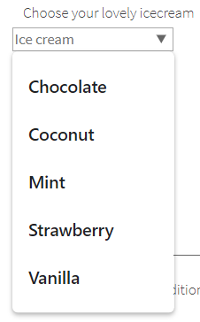

# Documentation
## Extended Selenium features
TBD

## Common elements

### Button
**Button** – Element that represents a clickable button


Button is located in the following classes:
 
  - __Java__: _com.epam.jdi.light.ui.html.common.Button_
  - __C#__: _JDI.Light.Elements.Common.Button_

```java 
@UI("[value*='Red Button']") // @FindBy(css = "[value*='Red Button']")
public static Button redButton;

@Test
public void clickTest() {
    redButton.click();
    assertEquals(getAlertText(), "Red button");
    acceptAlert();
}

@Test
public void getTextTest() {
    assertEquals(redButton.getText(), "Big Red Button-Input");
}
```
```csharp
TBD 
```

Here is an example with provided HTML code:


Available method in Java JDI Light:

|Method | Description | Return Type
--- | --- | ---
**click()** |Click the button  | void

Available method in C# JDI Light:

|Method | Description | Return Type
--- | --- | ---

[Java test examples](https://github.com/jdi-testing/jdi-light/blob/master/jdi-light-html-tests/src/test/java/io/github/epam/html/tests/elements/simple/ButtonTests.java)

[C# test examples](https://github.com/jdi-testing/jdi-light-csharp/blob/master/JDI.Light/JDI.Light.Tests/Tests/Common/ButtonTests.cs)

### Checkbox
**Checkbox** – Element allows you to select single value for submission.


Checkbox is located in the following classes:
 
  - __Java__: _com.epam.jdi.light.ui.html.common.Checkbox*_
  - __C#__: _JDI.Light.Elements.Common.CheckBox*_

```java 
@UI("#accept-conditions") // @FindBy(id = "accept-conditions")
public static Checkbox acceptConditions;

@Test
public void checkTest() {
    acceptConditions.check();
    assertEquals(acceptConditions.isSelected(), true);
}

@Test
public void uncheckTest() {
    acceptConditions.uncheck();
    assertEquals(acceptConditions.isSelected(), false);
}
```
```csharp
TBD 
```

Here is an example with provided HTML code:


Available methods in Java JDI Light:

|Methods | Description | Return Type
--- | --- | ---
**click()** | Click the checkbox  | void
**check(String)**| Set to checked on "true" (case insensitive) or unchecked otherwise | void
**check()**| Set to checked | void
**uncheck()**| Set to unchecked | void
**isSelected()** | Verify value | boolean 
**assertThat()** | Assert action checkbox | CheckboxAssert
**is()** | Assert action checkbox | CheckboxAssert

Available methods in C# JDI Light:

|Method | Description | Return Type
--- | --- | ---

[Java test examples](https://github.com/jdi-testing/jdi-light/blob/master/jdi-light-html-tests/src/test/java/io/github/epam/html/tests/elements/simple/CheckboxTests.java)

[C# test examples](https://github.com/jdi-testing/jdi-light-csharp/blob/master/JDI.Light/JDI.Light.Tests/Tests/Common/CheckBoxTests.cs)

### ColorPicker
**ColorPicker** – Elements of this type provide a user interface element that lets a user specify a color, either by using a visual color picker interface or by entering the color into a text field in "#rrggbb" hexadecimal format. Only simple colors (with no alpha channel) are allowed. The values are compatible with CSS.


Colorpicker is located in the following classes:

  - __Java__: _com.epam.jdi.light.ui.html.common.ColorPicker*_

```java 
@UI("#color-picker") // @FindBy(id = "color-picker")
public static ColorPicker colorPicker;

@Test
public void getColorTest() {
    assertEquals(colorPicker.color(), "#3fd7a6");
}

@Test
public void setColorTest() {
    colorPicker.setColor("#432376");
    assertEquals(colorPicker.color(), "#432376");
}

@Test
public void getLabelTextTest() {
    assertEquals(colorPicker.labelText(), "Select a color");
}
```
```csharp
[FindBy(Css = "#color-picker")]
public ColorPicker ColorPicker;

[Test]
public void GetColorTest() 
{
    Assert.AreEqual(ColorPicker.Color(), "#3fd7a6");
}

[Test]
public void SetColorTest() 
{
    ColorPicker.SetColor("#432376");
    Assert.AreEqual(ColorPicker.Color(), "#432376");
}
 
```

Here is an example with provided HTML code:


Available methods in Java JDI Light:

|Methods | Description | Return Type
--- | --- | ---
**color()** | Returns color code in  hexadecimal format ("#rrggbb") | String
**setColor(String)** | Set color from string hex representation ("#rrggbb") | void
**is()** | Assert acton color | ColorAssert
**assertThat()** | Assert acton color | ColorAssert 

[Java test examples](https://github.com/jdi-testing/jdi-light/blob/master/jdi-light-html-tests/src/test/java/io/github/epam/html/tests/elements/simple/ColorPickerTests.java)

[Test examples in C#](https://github.com/jdi-testing/jdi-light-csharp/blob/master/JDI.Light/JDI.Light.Tests/Tests/Simple/ColorPickerTests.cs)

### DateTimeSelector

**DateTimeSelector** is used for Input Type Date and its derivatives and allows users to set the value of date and/or time.

The list of supported elements:

 - Input Type Date
 - Input Type Week
 - Input Type Month
 - Input Type Time
 - Input Type DateTime-Local

There are the following classes represent this type of elements:

 - __C#__: _JDI.Light.Elements.Common.DateTimeSelector_
 - __Java__: _com.epam.jdi.light.ui.html.common.DateTimeSelector_

Here is the list of some available methods in C#:

|Method | Description | Return Type
--- | --- | ---
**SetDateTime(string value)** | Sets a date or time | void
**GetValue()** | Returns the set date or time | string

And here are some of the methods available in Java:

|Method | Description | Return Type
--- | --- | ---
**setDateTime(string value)** | Sets a date or time | void
**value()** | Returns the set date or time | String
**min()** | Gets attribute with name min | String
**max()** | Gets attribute with name max | String
**is()** | Assertion | DateTimeAssert
**assertThat()** | Assertion | DateTimeAssert

__In the following sections there are examples of different implementations of such fields.__

__Input Type Date__

```java 
@UI("#birth-date") //@FindBy(css = "#birth-date") 
public static DateTimeSelector birthDate;

@Test
public void setDateTimeTest() {
    birthDate.setDateTime("2018-11-13");
    assertEquals(birthDate.value(), "2018-11-13");
}

@Test
public void maxTest() {
    assertEquals(birthDate.max(), "2030-12-31");
}
```
```csharp 
[FindBy(Css = "#birth-date")]
public IDateTimeSelector BirthDate { get; set; }
        
[Test]
public void SetBirthDateTest()
{
    TestSite.Html5Page.BirthDate.Format = "yyyy-MM-dd";
    TestSite.Html5Page.BirthDate.SetDateTime(_dateTime);
    var setValue = TestSite.Html5Page.BirthDate.GetValue();
    Assert.AreEqual(setValue, "2019-04-01");
}
```
**Input Type Date** – a graphical control element, that allows users to set the value of date.


[Test examples in C#](https://github.com/jdi-testing/jdi-light-csharp/blob/master/JDI.Light/JDI.Light.Tests/Tests/Common/DateTimeTests.cs)

[Test examples in Java](https://github.com/jdi-testing/jdi-light/blob/master/jdi-light-html-tests/src/test/java/io/github/epam/html/tests/elements/simple/DateTests.java)

__Input Type Week__

```java 
@UI("#autumn-week") //@FindBy(css = "#autumn-week") 
public static DateTimeSelector autumnWeek;

@Test
public void minTest() {
    assertEquals(autumnWeek.min(), "2018-W35");
}

@Test
public void setDateTimeTest() {
    autumnWeek.setDateTime("2018-W12");
    autumnWeek.show();
    assertEquals(autumnWeek.value(), "2018-W12");
}
```
```csharp 
[FindBy(Css = "#autumn-week")]
public IDateTimeSelector AutumnDateTime { get; set; }
        
[Test]
public void AutumnDateTimeTest()
{
    var calendar = new GregorianCalendar();
    var weekNum = calendar.GetWeekOfYear(_dateTime, CalendarWeekRule.FirstFullWeek, DayOfWeek.Monday);
    TestSite.Html5Page.AutumnDateTime.Format = "yyyy-" + $"W{weekNum}";

    TestSite.Html5Page.AutumnDateTime.SetDateTime(_dateTime);
    var setValue = TestSite.Html5Page.AutumnDateTime.GetValue();
    Assert.AreEqual(setValue, "2019-W13");
}
```
**Input Type Week** – a graphical control element, that allows users to set the value of week and year.


[Test examples in C#](https://github.com/jdi-testing/jdi-light-csharp/blob/master/JDI.Light/JDI.Light.Tests/Tests/Common/DateTimeTests.cs)

[Test examples in Java](https://github.com/jdi-testing/jdi-light/blob/master/jdi-light-html-tests/src/test/java/io/github/epam/html/tests/elements/simple/WeekTests.java)

__Input Type Month__

```java 
@UI("#month-date") //@FindBy(css = "#month-date") 
public static DateTimeSelector monthDate;

@Test
public void maxTest() {
    assertEquals(monthDate.max(), "2020-12");
}

@Test
public void setDateTimeTest() {
    monthDate.setDateTime("2018-10");
    monthDate.show();
    assertEquals(monthDate.value(), "2018-10");
}
```
```csharp 
[FindBy(Css = "#month-date")]
public IDateTimeSelector MonthOfHolidays { get; set; }
        
[Test]
public void SetMonthTest()
{
    TestSite.Html5Page.MonthOfHolidays.Format = "yyyy-MM";
    TestSite.Html5Page.MonthOfHolidays.SetDateTime(_dateTime);
    var setValue = TestSite.Html5Page.MonthOfHolidays.GetValue();
    Assert.AreEqual(setValue, "2019-04");
}
```
**Input Type Month** – a graphical control element, that allows users to set the value of month and year.


[Test examples in C#](https://github.com/jdi-testing/jdi-light-csharp/blob/master/JDI.Light/JDI.Light.Tests/Tests/Common/DateTimeTests.cs)

[Test examples in Java](https://github.com/jdi-testing/jdi-light/blob/master/jdi-light-html-tests/src/test/java/io/github/epam/html/tests/elements/simple/MonthTests.java)

__Input Type Time__

```java 
@UI("#booking-date") //@FindBy(css = "#booking-time") 
public static DateTimeSelector bookingTime;

@Test
public void minTest() {
    assertEquals(bookingTime.min(), "9:00");
}

@Test
public void setDateTimeTest() {
    bookingTime.setDateTime("05:00");
    bookingTime.show();
    assertEquals(bookingTime.value(), "05:00");
}
```
```csharp 
[FindBy(Css = "#booking-time")]
public IDateTimeSelector BookingTime { get; set; }
        
[Test]
public void SetTimeTest()
{
    TestSite.Html5Page.BookingTime.Format = "H:mm";
    TestSite.Html5Page.BookingTime.SetDateTime(_dateTime);
    var setValue = TestSite.Html5Page.BookingTime.GetValue();
    Assert.AreEqual(setValue, "15:00");
}
```
**Input Type Time** – a graphical control element, that allows the user to set the value of time.


[Test examples in C#](https://github.com/jdi-testing/jdi-light-csharp/blob/master/JDI.Light/JDI.Light.Tests/Tests/Common/DateTimeTests.cs)

[Test examples in Java](https://github.com/jdi-testing/jdi-light/blob/master/jdi-light-html-tests/src/test/java/io/github/epam/html/tests/elements/simple/TimeTests.java)

__Input Type DateTime-Local__

```java 
@UI("#party-time") //@FindBy(id = "party-time")
public static DateTimeSelector partyTime;

@Test
public void setDateTimeTest() {
    partyTime.setDateTime("2017-05-10T00:00");
    assertEquals(partyTime.value(), "2017-05-10T00:00");
}
```
```csharp 
[FindBy(Css = "#party-time")]
public IDateTimeSelector PartyTime { get; set; }

[Test]
public void SetPartyTimeTest()
{
    TestSite.Html5Page.PartyTime.Format = "yyyy-MM-ddTHH:mm";
    TestSite.Html5Page.PartyTime.SetDateTime(_dateTime);
    var setValue = TestSite.Html5Page.PartyTime.GetDateTime();
    Assert.AreEqual(setValue, _dateTime);
}
```
**Input Type DateTime-Local** – a graphical control element, that allows the user to set the value of time and date.


[Java test example](https://github.com/jdi-testing/jdi-light/blob/master/jdi-light-html-tests/src/test/java/io/github/epam/html/tests/elements/simple/DateTimeTests.java)

[C# test examples](https://github.com/jdi-testing/jdi-light-csharp/blob/master/JDI.Light/JDI.Light.Tests/Tests/Common/DateTimeTests.cs)

### Input Type Range
**Input Type Range** – a graphical control element, that allows the user to set the value from the range.
 
  - __Java__: _com.epam.jdi.light.ui.html.common.Range_
  - __C#__: _JDI.Light.Elements.Common.Range_
  
  
```java 
@UI("#volume") public static Range volume;
// equal to @FindBy(css = "#volume") public static Range volume;

@Test
public void volumeTest() {
        volume.setVolume(10);
        assertEquals(volume.volume(), 10);
        assertEquals(volume.max(), "100");
        assertEquals(volume.min(), "10");
        assertEquals(volume.step(), "5");
    }
```
```csharp 
[Test]
public void SetGetRange() 
{
    MyDateTime.SetRange("50");
    MyDateTime.GetValue();
}
```


Here is the list of available methods:

|Method | Description | Return Type
--- | --- | ---
**setVolume(int volume)** | Sets the value | void
**volume()** | Returns the value | int
**max()** | Returns the max value | String
**min()** | Returns the min value | String
**step()** | Returns the step value | String
**is()** | Returns object for work with assertions | RangeAssert
**assertThat()** | Returns object for work with assertions | RangeAssert

[Java test examples](https://github.com/jdi-testing/jdi-light/blob/master/jdi-light-html-tests/src/test/java/io/github/epam/html/tests/elements/simple/RangeTests.java)

[C# test examples](https://github.com/jdi-testing/jdi-light-csharp/blob/master/JDI.Light/JDI.Light.Tests/Tests/Common/RangeTests.cs)

### FileInput

**FileInput** - a grafical control element, that allows the user to upload documents on the web site


FileInput element is located in JDI Light in:

  - __Java__: _com.epam.jdi.light.ui.html.common.FileInput_
  - __C#__: _JDI.Light.Elements.Composite.FileInput_

```java 
@UI("#avatar") // @FindBy(id = "avatar")
public static FileInput avatar; 

@Test
public void uploadTest() {
    avatar.uploadFile(mergePath(PROJECT_PATH,"/src/test/resources/general.xml"));
    avatar.is().text(containsString("general.xml"));
    assertTrue(avatar.getText().contains("general.xml"));
    assertTrue(avatar.getValue().contains("general.xml"));
}
```
```csharp
[Test]
public void FileInputTest()
{
    FileInput.SelectFile(CreateFile(filename));
}
```

Here is an example with provided HTML code:


Available method in Java JDI Light:

|Method | Description | Return Type
--- | --- | ---
**uploadFile(String)** |Select file to upload  | void

Available method in C# JDI Light:

|Method | Description | Return Type
--- | --- | ---
**SelectFile(string filepath)** |Select file to upload  | void

Available assert methods in C# JDI Light:

|Method | Description | Return Type
--- | --- | ---
**IsDownloaded()** |Checks whether a file is downloaded  | FileAssert
**Text(Matcher<string> value)** | Checks whether an occurence of a text is contained in a text file | FileAssert
**HasSize(Matcher<long> size)** | Checks that a file has a particular size according to the matcher | FileAssert
**CleanupDownloads()** | Cleans the directory | void

[Java test examples](https://github.com/jdi-testing/jdi-light/blob/master/jdi-light-html-tests/src/test/java/io/github/epam/html/tests/elements/simple/FileUploadTests.java)

[C# test examples](https://github.com/jdi-testing/jdi-light-csharp/blob/master/JDI.Light/JDI.Light.Tests/Tests/Common/FileInputTests.cs)

### Icon
```java 
@UI("#jdi-logo") 
// same as FindBy(css = "#jdi-logo")
public static Icon jdiLogo;

    @Test
    public void isValidationTest() {
        WebPage.refresh();
        jdiLogo.is().src(containsString("jdi-logo.jpg"));
        jdiLogo.is().alt(is("Jdi Logo 2"));
        jdiLogo.assertThat().height(is(100));
        jdiLogo.assertThat().width(is(101));
    }
```
```csharp 
[FindBy(Css = "#jdi-logo")]
public IIcon LogoImage;

   [Test]
   public void GetSourceTest()
   {
     Jdi.Assert.AreEquals(LogoImage.GetSource(), Src);
   }

   [Test]
   public void GetTipTest()
   {
     Jdi.Assert.AreEquals(LogoImage.GetAlt(), Alt);
   }
```
**Icon** – is a simple element type that represents icons and graphic images.


Icons are represented by the following classes:
 
  - __Java__: _com.epam.jdi.light.ui.html.common.Icon , com.epam.jdi.light.ui.html.common.Image_
  - __C#__: JDI.Light.Interfaces.Common.IIcon, _JDI.Light.Elements.Common.Image


 
Icon in JDI is a descendant of Image. It inherits all Image's methods and serves as its wrapper. Here are Java methods for Icon inherited from Image interface:

|Method | Description | Return Type
--- | --- | ---
**click()** | click on the image| void
**src()** | get value of src attribute | String
**height()** |get value of height attribute| String
**width()** | get value of width attribute| String
**alt()** |get value of alt attribute | String
**is()** | method for building assertions | ImageAssert
**assertThat()** |method for building assertions  | ImageAssert

Here is a list of available methods in C#:

|Method | Description | Return Type
--- | --- | ---
**Click()** | click on the image| void
**Src** | get value of src attribute | String
**Height** |get value of height attribute| String
**Width** | get value of width attribute| String
**Alt** |get value of alt attribute | String

[Test examples in Java]
(https://github.com/jdi-testing/jdi-light/blob/master/jdi-light-html-tests/src/test/java/io/github/epam/html/tests/elements/simple/ImageTests.java)

[Test examples in C#]
(https://github.com/jdi-testing/jdi-light-csharp/blob/master/JDI.Light/JDI.Light.Tests/Tests/Simple/ImagesTests.cs)

### Image
```java 
@UI("#jdi-logo") 
// same as FindBy(css = "#jdi-logo")
public static Image jdiLogo;

    @Test
    public void isValidationTest() {
        WebPage.refresh();
        jdiLogo.is().src(containsString("jdi-logo.jpg"));
        jdiLogo.is().alt(is("Jdi Logo 2"));
        jdiLogo.assertThat().height(is(100));
        jdiLogo.assertThat().width(is(101));
    }
```
```csharp 
[FindBy(Css = "#jdi-logo")]
public IImage LogoImage;

   [Test]
   public void GetSourceTest()
   {
     Jdi.Assert.AreEquals(LogoImage.GetSource(), Src);
   }

   [Test]
   public void GetTipTest()
   {
     Jdi.Assert.AreEquals(LogoImage.GetAlt(), Alt);
   }
```
**Image** – is a simple element type that represents graphic images.


Images are represented by the following classes in Java and C#:
 
  - __C#__: _JDI.Light.Elements.Common.Image_
  - __Java__: _com.epam.jdi.light.ui.html.common.Image_
  
Here is a list of available methods in C#:

|Method | Description | Return Type
--- | --- | ---
**Click()** | click on the image| void
**Src** | get value of src attribute | String
**Height** |get value of height attribute| String
**Width** | get value of width attribute| String
**Alt** |get value of alt attribute | String

[Test examples in C#](https://github.com/jdi-testing/jdi-light-csharp/blob/master/JDI.Light/JDI.Light.Tests/Tests/Simple/ImagesTests.cs)

And here are methods available in Java:

|Method | Description | Return Type
--- | --- | ---
**click()** | click on the image| void
**src()** | get value of src attribute | String
**height()** |get value of height attribute| String
**width()** | get value of width attribute| String
**alt()** |get value of alt attribute | String
**is()** | method for building assertions | ImageAssert
**assertThat()** |method for building assertions  | ImageAssert

[Test examples in Java](https://github.com/jdi-testing/jdi-light/blob/master/jdi-light-html-tests/src/test/java/io/github/epam/html/tests/elements/simple/ImageTests.java)

### Link
**Link** – a graphical control element, that allows the user to link from one page to other web pages, files, locations within the same page, email addresses, or any other URL.

Link are represented by the following class:
 
  - __Java__: _com.epam.jdi.light.ui.html.common.Link_
  - __C#__: _JDI.Light.Elements.Common.Link_
  
  
```java 
@UI("[ui=github-link]") 
// equal to @FindBy(css = "[ui=github-link]") 
public static Link githubLink;

@Test
public void getTextTest() {
        assertEquals(githubLink.getText(), text);
    }
```
```csharp 
[Test]
TBD
```


Here is the list of available methods:

|Method | Description | Return Type
--- | --- | ---
**click()** |Follow the link | void
**getText()** |Returns the link text  | String
**ref()** |Returns the reference  | String
**url()** |Returns the URL  | URL
**alt()** |Returns the alternate text | String
**is()** | Returns object for work with assertions | LinkAssert
**assertThat()** | Returns object for work with assertions | LinkAssert

[Java test examples](https://github.com/jdi-testing/jdi-light/blob/master/jdi-light-html-tests/src/test/java/io/github/epam/html/tests/elements/simple/LinkTests.java)

[C# test examples](https://github.com/jdi-testing/jdi-light-csharp/blob/master/JDI.Light/JDI.Light.Tests/Tests/Common/LinkTests.cs)

### Menu

**Menu** - a list of links, which leads to different pages or sections of website

Menu element is located in JDI Light in:

  - __Java__: _com.epam.jdi.light.ui.html.complex.Menu_
  - __C#__: _JDI.Light.Elements.Composite.Menu_

```java 
@UI(".sidebar-menu span<[*'%s']<<") 
public static Menu leftMenu;
@Url("/metals-colors.html") @Title("Metal and Colors")
public static MetalAndColorsPage metalAndColorsPage;

@Test
public void selectEnumTest() {
    leftMenu.select(MetalsColors);
    metalAndColorsPage.checkOpened();
}
```
```csharp
[FindBy(Css = "ul.sidebar-menu")]
public Menu SidebarMenu;

[Test]
public void SelectEnumTest()
{
     TestSite.SidebarMenu.Select(Navigation.MetalsColors);
     TestSite.MetalsColorsPage.CheckOpened();
}
```

Here is an example with provided HTML code:


Available method in Java JDI Light:

|Method | Description | Return Type
--- | --- | ---
**void select(String...)** | Select menu element and subelement | void
**void select(String)** | Select menu element | void
**void select(TEnum...)** | Select menu element and subelement | void
**void select(TEnum)** | Select menu element | void
**void select(int...)** | Select menu element by index | void
**void select(int)** | Select menu element and subelements by index | void    
**String selected()** | Returns selected menu item | String
**List<String> values()** | Returns selected menu item and subitems | List<String>
**void hoverAndClick(String...)** | Hovers and clicks menu item and subitems | void
**void hoverAndClick(String)** | Hovers and clicks menu item | void

Available method in C# JDI Light:

|Method | Description | Return Type
--- | --- | ---
**void select(String[])** | Select menu element and subelement | void
**void select(String)** | Select menu element | void
**void select(TEnum)** | Select menu element | void

[Java test examples](https://github.com/jdi-testing/jdi-light/blob/master/jdi-light-html-tests/src/test/java/io/github/epam/html/tests/complex/MenuTests.java)

[C# test examples](https://github.com/jdi-testing/jdi-light-csharp/blob/master/JDI.Light/JDI.Light.Tests/Tests/Composite/MenuTests.cs)

### NumberSelector
**NumberSelector** – a graphical control element, that allows the user to let the user enter a number.

NumberSelector are represented by the following class:
 
  - __Java__: _com.epam.jdi.light.ui.html.common.NumberSelector_
  - __C#__: _JDI.Light.Elements.Common.NumberSelector_
  
  
```java 
@UI("#height") 
// equal to @FindBy(css = "#height") 
public static NumberSelector height;

@Test
public void getNumberTest() {
        assertEquals(height.value(), number);
    }
```
```csharp 
[FindBy(Css = "#height")]
public INumberSelector numberSelector;

[Test]
public void GetNumberTest()
{
    Jdi.Assert.AreEquals(number, numberSelector.Value());
}
```


Here is the list of available methods in Java:

|Method | Description | Return Type
--- | --- | ---
**placeholder()** |Returns the placeholder text  | String
**min()** |Returns the min value   | String
**max()** |Returns the max value  | String
**value()** |Returns the value  | String
**step()** |Returns the step value | String
**setNumber(String)** |Sets the value | void
**is()** | Returns object for work with assertions | NumberAssert
**assertThat()** | Returns object for work with assertions | NumberAssert

Here is the list of available methods in C#:

|Method | Description | Return Type
--- | --- | ---
**Placeholder** |Returns the placeholder text  | String
**Min** |Returns the min value   | double
**Max** |Returns the max value  | double
**Value** |Returns the value  | double
**Step** |Returns the step value | double
**SetNumber(double)** |Sets the value | void

[Java test examples](https://github.com/jdi-testing/jdi-light/blob/master/jdi-light-html-tests/src/test/java/io/github/epam/html/tests/elements/simple/NumberSelectorTests.java)

[Test examples in C#]
(https://github.com/jdi-testing/jdi-light-csharp/blob/master/JDI.Light/JDI.Light.Tests/Tests/Common/NumberSelectorTests.cs)

### ProgressBar
**Progress Bar** - Element for displaying an indicator showing the completion progress of a task


ProgressBar is located in the following classes:
 
  - __Java__: _com.epam.jdi.light.ui.html.common.ProgressBar_
<!--- - __C#__: _JDI.Light.Elements.Common.ProgressBar_ -->

```java 
@UI("#progress") // @FindBy(id = "progress")
public static ProgressBar progress;

@Test
public void getValueTest() {
    assertEquals(progress.value(), "70");
}

@Test
public void maxTest() {
    assertEquals(progress.max(), "100");
}

@Test
public void assertValidationTest() {
    progress.assertThat().volume(greaterThan(0));
    progress.assertThat().volume(lessThan(200));
    progress.assertThat().volume(is(70));
}
```
```csharp

[FindBy(Css = "#progress")]
public ProgressBar Progress;

[Test]
public void GetValueTest() 
{
     Assert.AreEqual(Progress.Value(), "70");
}

[Test]
public void MaxTest() 
{
     Assert.AreEqual(Progress.Max(), "100");
}

```

Here is an example with provided HTML code:


Available method in Java JDI Light:

|Method | Description | Return Type
--- | --- | ---
**value()** |Get current progress value  | String
**max()** |Get progressbar maximum possible value  | String
**is()** |Various assert actions for Progress bar  | ProgressAssert
**assertThat()** |Various assert actions for Progress bar | ProgressAssert 

[Java test examples](https://github.com/jdi-testing/jdi-light/blob/master/jdi-light-html-tests/src/test/java/io/github/epam/html/tests/elements/simple/ProgressTests.java)

<!--- [C# test examples]() -->

### Range
TBD

### Text
TBD

### TextField
```java 
@UI("#name") 
// same as @FindBy(css = "#name")
public static TextField name;

    @Test
    public void sendKeysTest() {
        name.sendKeys("Test");
        assertEquals(name.getValue(), text+"Test");
    }

    @Test
    public void inputTest() {
        name.input("New text");
        assertEquals(name.getText(), "New text");
    }

    @Test
    public void clearTest() {
        name.clear();
        assertEquals(name.getText(), "");
    }

    @Test
    public void placeholderTest() {
        assertEquals(name.placeholder(), "Input name");
    }
```
```csharp 
[FindBy(Id = "name")]
public ITextField NameField;
        
        [Test]
        public void InputTest()
        {
            TestSite.ContactFormPage.NameField.Input(ToAddText);
            Jdi.Assert.AreEquals(TestSite.ContactFormPage.NameField.Value, ToAddText);
        }
        
        [Test]
        public void SendKeyTest()
        {
            TestSite.ContactFormPage.NameField.SendKeys(ToAddText);
            Jdi.Assert.AreEquals(TestSite.ContactFormPage.NameField.Value, _defaultText + ToAddText);
        }

        [Test]
        public void ClearTest()
        {
            TestSite.ContactFormPage.NameField.Clear();
            Jdi.Assert.AreEquals(TestSite.ContactFormPage.NameField.Value, "");
        }
```
**TextField** – is a simple element type that allows users to fill in text fields.


Text fields are represented by the following classes in Java and C#:
 
  - __C#__: _JDI.Light.Elements.Common.TextField_
  - __Java__: _com.epam.jdi.light.ui.html.common.TextField_
  
Here is a list of available methods in C#:

|Method | Description | Return Type
--- | --- | ---
**SendKeys(string value)** | adds text to the field | void
**SetText(String value)** | sets new text | void
**Clear()** | clears the text field | void
**Input(string text)** | sets new text  | void
**Focus()** | places cursor within the text field | void
**Placeholder** | returns value of the placeholder attribute | String
**GetText()** | returns text from the text field  | String
**GetValue()** | returns text from the text field| String


[Test examples in C#](https://github.com/jdi-testing/jdi-light-csharp/blob/master/JDI.Light/JDI.Light.Tests/Tests/Common/TextFieldsTests.cs)

And here are methods available in Java:

|Method | Description | Return Type
--- | --- | ---
**sendKeys(CharSequence... value)** | adds text to the field | void
**setText(String value)** | sets new text | void
**clear()** | clears the text field | void
**input(String value)** | sets new text | void
**focus()** | places cursor within the text field | void
**placeholder()** | returns value of the placeholder attribute | String
**getText()** | returns text from the text field  | String
**getValue()** | returns text from the text field| String

[Test examples in Java](https://github.com/jdi-testing/jdi-light/blob/master/jdi-light-html-tests/src/test/java/io/github/epam/html/tests/elements/simple/TextFieldTests.java)

### TextArea
```java 
@UI("#text-area") 
// same as FindBy(css = "#text-area")
public static TextArea textArea;

    @Test
    public void getLinesTest() {
        textArea.setLines("test 1", "test 2", "test 3");
        assertEquals(textArea.getLines(), asList("test 1", "test 2", "test 3"));
    }
    
    @Test
    public void focusTest() {
        textArea.focus();
    }
    
    @Test
    public void rowsTest() {
        assertEquals(textArea.rows(), 3);
        assertEquals(textArea.cols(), 33);
        assertEquals(textArea.minlength(), 10);
        assertEquals(textArea.maxlength(), 200);
    }
     
    @Test
    // this test demonstrates usage of methods inherited from TextField interface:
    public void clearTest() {
             textArea.setText(text);
             textArea.clear();
             assertEquals(textArea.getText(), "");
    }
```
```csharp 
[FindBy(Id = "description")]
public TextArea DescriptionArea;

   [Test]
   public void AddNewLineTest()
   {
      TestSite.ContactFormPage.DescriptionArea.Clear(); // method Clear() is inherited from TextField
      TestSite.ContactFormPage.DescriptionArea.InputLines("line1", "line2");
      TestSite.ContactFormPage.DescriptionArea.AddNewLine("line3");
      Jdi.Assert.CollectionEquals(TestSite.ContactFormPage.DescriptionArea.GetLines(), new[] { "line1", "line2", "line3" });
   }
```

**TextArea** – is a simple element type that allows users to fill in text areas (that may contain a few lines). 


Text areas are represented by the following classes in Java and C#:
 
  - __C#__: _JDI.Light.Elements.Common.TextArea_
  - __Java__: _com.epam.jdi.light.ui.html.common.TextArea_
  
In both Java and C# TextArea is a descendant of TextField and inherits its methods. But TextArea also has methods of its own.
 
Here is a list of available methods in C#:
  
|Method | Description | Return Type
--- | --- | ---
**InputLines(params string[] textLines)** | clears area and sets new lines | void
**AddNewLine(string textLine)** | adds a new line to existing text | void
**GetLines()** | returns lines (text) from the text area | string[]
  
  [Test examples in C#](https://github.com/jdi-testing/jdi-light-csharp/blob/master/JDI.Light/JDI.Light.Tests/Tests/Simple/TextAreaTests.cs)
  
  And here are methods available in Java:
  
|Method | Description | Return Type
--- | --- | ---
**setLines(String... lines)** | sets lines (text)  | void
**getLines()** | returns lines (text) from the text area | List<String>
**rows()** | returns value of rows attribute | int
**cols()** | returns value of cols attribute | int
**minlength()** | returns value of minlength attribute | int
**maxlength()** | returns value of maxlength attribute | int
**placeholder()** | returns value of placeholder attribute | String
**is()** | returns object for work with assertions  | TextAreaAssert
**assertThat()** | returns object for work with assertions  | TextAreaAssert

  [Test examples in Java](https://github.com/jdi-testing/jdi-light/blob/master/jdi-light-html-tests/src/test/java/io/github/epam/html/tests/elements/simple/TextAreaTests.java)

### Title
**Title** – a graphical control element, that is the title of the document, which is displayed in the title bar of the browser or tab page.

Title is represented by the following class:
 
  - __Java__: _com.epam.jdi.light.ui.html.common.Title_
  - __C#__: _JDI.Light.Elements.Common.Title_
  
  
```java 
@UI("[ui=jdi-title]") 
// equal to @FindBy(css = "[ui=jdi-title]") 
public static Title jdiTitle;

@Test
public void getTextTest() {
        assertEquals(jdiTitle.getText(), "Title text");
}

@Test
public void clickTest() {
        jdiTitle.click();
}    
    
```
```csharp 
[FindBy(Css = "[ui=jdi-title]")]
public Title JdiTitle;

[Test]
public void GetTextTest() 
{
        Assert.AreEqual(JdiTitle.GetText(), "Title text");
}

[Test]
public void ClickTest() 
{
        JdiTitle.ClickTitle();
}    
    
```


Here is the list of available methods:

|Method | Description | Return Type
--- | --- | ---
**click()** |Click the title | void
**getText()** |Returns the title text  | String

[Java test examples](https://github.com/jdi-testing/jdi-light/blob/master/jdi-light-html-tests/src/test/java/io/github/epam/html/tests/elements/simple/TitleTests.java)

[C# test examples](https://github.com/jdi-testing/jdi-light-csharp/blob/master/JDI.Light/JDI.Light.Tests/Tests/Common/TitleTests.cs)


## Complex elements
### RadioButtons

**RadioButtons** – interface element that allows user to select one option from a predefined group.

Radio buttons are represented by the following class:
 
  - __Java__: _com.epam.jdi.light.ui.html.complex.RadioButtons_
  - __C#__: _JDI.Light.Elements.Complex.RadioButtons_

```java 
@UI("[name=colors]") //@FindBy(name = "colors")
public static RadioButtons colors;

@Test
public void selectTest() {
    colors.select(Blue);
    assertEquals(colors.getValue(), "Blue");
}
```
```csharp 
[FindBy(Css = "#colors")] 
public IRadioButtons MyRadioButtons;

[Test]
public void SelectRadioButton() 
{
    MyRadioButtons.Select("some value");
}
[Test]
public void SelectRadioButtonByIndex() 
{
    MyRadioButtons.Select(1);
}
[Test]
public void GetSelected() 
{
    var selected = MyRadioButtons.GetSelected();
    Assert.AreEqual(selected, "some value");
}
```

Consider an example where each radio button is a particular color, described with given HTML code:


Here is the list of some available methods:

|Method | Description | Return Type
--- | --- | ---
**select(String/int/Enum)/Select(string/int)** |Select radiobutton by value/index  | void
**selected()/Selected()** |Get selected radiobutton value  | string

[Java test examples](https://github.com/jdi-testing/jdi-light/blob/master/jdi-light-html-tests/src/test/java/io/github/epam/html/tests/elements/complex/RadioTests.java)

[C# test examples](https://github.com/jdi-testing/jdi-light-csharp/blob/master/JDI.Light/JDI.Light.Tests/Tests/Complex/RadioButtonsTests.cs)

### Table

**Table** – a complex element that consists of header, body (at least one row and one column) and footer. You are able to perform a list of readonly interactions with this element.

Table implementation has an entry point in class:
 
  - __C#__: _JDI.Light.Elements.Complex.Table.cs_

```csharp
       
        [Test]
        public void HugeTableSearchByColumnNamesContainValuesTest()
        {
            PerformancePage.UsersTable.AssertThat().HasRowWithValues(
                ContainsValue("Meyer", InColumn("Name")),
                ContainsValue("co.uk", InColumn("Email")));
            var row = PerformancePage.UsersTable.Row(
                ContainsValue("Meyer", InColumn("Name")),
                ContainsValue("co.uk", InColumn("Email")));
                Assert.AreEqual("Brian Meyer;(016977) 0358;mollis.nec@seddictumeleifend.co.uk;Houston",
                    row.GetValue());
        }

        [Test]
        public void HugeTableSearchByColumnNumbersContainValuesTest()
        {
            PerformancePage.UsersTable.AssertThat().HasRowWithValues(
                ContainsValue("Burke", InColumn(1)),
                ContainsValue("ut.edu", InColumn(3)));
            var row = PerformancePage.UsersTable.Row(1);
            Assert.AreEqual("Burke Tucker;076 1971 1687;et.euismod.et@ut.edu;GozŽe",
                row.GetValue());
        }

        [Test]
        public void HugeTableSearchByColumnNamesHasValuesTest()
        {
            PerformancePage.UsersTable.AssertThat().HasRowWithValues(
                HasValue("Brian Meyer", InColumn("Name")),
                HasValue("mollis.nec@seddictumeleifend.co.uk", InColumn("Email")));
            var row = PerformancePage.UsersTable.Row(
                HasValue("Brian Meyer", InColumn("Name")),
                HasValue("mollis.nec@seddictumeleifend.co.uk", InColumn("Email")));
            Assert.AreEqual("Brian Meyer;(016977) 0358;mollis.nec@seddictumeleifend.co.uk;Houston",
                row.GetValue());
        }

        [Test]
        public void HugeTableSearchByColumnNumbersHasValuesTest()
        {
            PerformancePage.UsersTable.AssertThat().HasRowWithValues(
                HasValue("Brian Meyer", InColumn(1)),
                HasValue("mollis.nec@seddictumeleifend.co.uk", InColumn(3)));
            var row = PerformancePage.UsersTable.Row(
                ContainsValue("Meyer", InColumn("Name")),
                ContainsValue("co.uk", InColumn("Email")));
            Assert.AreEqual("Brian Meyer;(016977) 0358;mollis.nec@seddictumeleifend.co.uk;Houston",
                row.GetValue());
        } 

		[Test]
        public void TableChainTest()
        {            
            PerformancePage.UsersTable.AssertThat()
                .Size(400)
                .Size(Is.GreaterThan(399))                
                .HasRowWithValues(
                    HasValue("Brian Meyer", InColumn("Name")),
                    HasValue("mollis.nec@seddictumeleifend.co.uk", InColumn("Email")))
                .NotEmpty()
                .RowsWithValues(3, ContainsValue("Baker", InColumn(1)))
                .HasColumn("Email")
                .HasColumns(new[] {"Name", "City"})
                .Columns(Is.SubsequenceOf(new[] {"Name", "City", "Phone", "Email", "Address"}));
        }		
```

Already implemented methods:

| Method | Description | Return Type|
--- | --- | ---
**AssertThat()** | Applicable for performing assert actions for tables | TableAssert
**Is()** | Applicable for performing assert actions for tables | TableAssert
**ContainsValue(string value, Column column)** | Sets an object finding by some value occurance in particular column | TableMatcher 
**HasValue(string value, Column column)** | Sets an object finding by some full value in particular column | TableMatcher
**InColumn(string value)** | Sets an object of some column by particular value | Column
**InColumn(int num)** | Sets an object of some column by particular column's number | Column
**Row(params TableMatcher[] matchers)** | Sets and returns a row object of a table according to some matchers' params (returns 'null' if there is no such row) | Line
**Row(int rowNum)** | Sets and returns a row object of a table according to the row's index | Line
**GetValue()** | Returns a string content of values for particular row, where values are separated by ";" | string


AssertTable methods:

| Method | Description | Return Type|
--- | --- | ---
**Empty()** | Asserts whether table is empty | TableAssert
**NotEmpty()** | Asserts whether table is not empty | TableAssert
**Size(Matcher<int> condition)** | Asserts whether table size satisfy some matcher | TableAssert
**Size(int expectedSize)** | Asserts whether table has particular size | TableAssert
**HasColumn(string column)** | Asserts whether table has particular header | TableAssert
**HasColumns(IEnumerable<string> columns)** | Asserts whether table has particular headers | TableAssert
**Columns(Matcher<IEnumerable<string>> condition)** | Asserts whether headers satisfy some matcher | TableAssert
**RowsWithValues(int count, params TableMatcher[] matchers)** | Asserts whether rows with particular matchers exist in a table multiple times | TableAssert
**HasRowWithValues(params TableMatcher[] matchers)** | Asserts whether a row with particular matchers exists in a table | TableAssert

[Test examples C#](https://github.com/jdi-testing/jdi-light-csharp/blob/master/JDI.Light/JDI.Light.Tests/Tests/Complex/TableTests.cs)

### DropDown

**DropDown** – a graphical control element, that allows the user to choose one value from a list.


JDI Light has support for dropdown elements with its own type. There are several ways of dropdown usage in JDI Light, serving different needs.

__JDI Dropdown annotation__

For better use JDI Light provides a __*@JDropdown*__ annotation to locate dropdown elements. This annotation consists of the following elements:

 - __*root()*__ - value of this element points to the root locator of dropdown element
 - __*value()*__ - locator of selected by default option in dropdown list
 - __*list()*__ - locator representing list options
 - __*expand()*__ - locator for expanding the dropdown list
 - __*how*__ - type of locators with which elements will be identified. By default this is css
 
```java 
@JDropdown(root = "div[ui=dropdown]",
           value = ".filter-option",
           list = "li",
           expand = ".caret")
public Droplist colors;

@Test
public void complexTest() {
    metalAndColorsPage.shouldBeOpened();
    metalAndColorsPage.colors.select(Green);
}
```

```csharp 
[JDropDown(root: "#colors", 
           value: ".filter-option", 
           list:"li", 
           expand:".caret")]
public Droplist Colors;

[Test]
public void ComplexTest() 
{
    MetalAndColorsPage.ShouldBeOpened();
    MetalAndColorsPage.Colors.Select(Green);
}
```

Suppose we have 'Colors' dropdown, which looks like this in HTML code:

 

__Dropdown representation__

```java 
public Droplist colors;
@CSS("#colors") public Droplist colors;
public Droplist colors = dropdown("#colors");
public Droplist colors = $d("#colors");

@Test
public void colorsTest() {
    colors.select(Green);
    assertEquals(colors.selected(), Green);
}
```

```csharp 
public DropDown Colors;
[FindBy(Css = "#colors")] 
public DropDown Colors;

[Test]
public void ColorsTest() 
{
    Colors.Select(Green);
    Assert.AreEquals(Colors.Selected(), Green);
}
```

JDI Light provides a __Droplist__ class which can be used for dropdown representation as a type of web element.

Locator simple annotations from *com.epam.jdi.light.elements.pageobjects.annotations.simple* can be used together with dropdown elements.

[Java test examples](https://github.com/jdi-testing/jdi-light/blob/master/jdi-light-examples/src/test/java/io/github/epam/tests/epam/ComplexElementsTests.java)

For HTML5 elements Dropdown lists are also supported in JDI light. There is a __Dropdown__ class which is more like a special case of Droplist.
This type can be used in cases when dropdown is represented with HTML _\<select>_ tag.

Consider an example of HTML5 dropdown with a given HTML code:

```java 
@UI("#dress-code") //@FindBy(id = "dress-code")
public Dropdown dressCode;

@Test
public void selectEnumTest() {
    dressCode.select(Fancy);
    assertEquals(dressCode.getValue(), "Fancy");
}
```

```csharp 
[FindBy(Css = "#dress-code")] 
public Dropdown DressCode;

[Test]
public void SelectEnumTest() 
{
    DressCode.Select(Fancy);
    Assert.AreEquals(DressCode.GetSelected(), "Fancy");
}
```


Here is the list of some available methods:

|Method | Description | Return Type
--- | --- | ---
**select()/Select(string/int)** |Select dropdown by value/index  | void
**selected()/GetSelected()** |Get selected dropdown value  | string

[Java test examples](https://github.com/jdi-testing/jdi-light/blob/master/jdi-light-html-tests/src/test/java/io/github/epam/html/tests/elements/complex/DropdownTests.java)

[C# test examples](https://github.com/jdi-testing/jdi-light-csharp/blob/master/JDI.Light/JDI.Light.Tests/Tests/Common/DropDownTests.cs)

### MultiDropDown

```java 
@UI("#multi-dropdown") //@FindBy(id = "multi-dropdown")
public static MultiSelect multiDropdown;

@Test
public void selectTest() {
    multiDropdown.check(Wood, Steam);
    assertEquals(multiDropdown.checked(), asList("Steam", "Wood"));
}
```
```csharp 
[FindBy(Css = "#multi-dropdown")]
public MultiDropdown MultiDropdown { get; set; }

[Test]
public void SelectMultipleOptions()
{
    var optionsList = new List<string> { "Steam", "Electro" };
    TestSite.Html5Page.MultiDropdown.SelectOptions(optionsList);
}
```

**MultiDropDown** – a graphical control element, that allows the user to choose several values from a list.


Multi dropdown elements can be described by the following class:

 - __Java__: _com.epam.jdi.light.ui.html.complex.MultiSelect_
 - __C#__: _JDI.Light.Elements.Composite.MultiDropdown_

Here is the list of some available methods in C# JDI Light:

|Method | Description | Return Type
--- | --- | ---
**OptionIsEnabled(string)** |Check whether option is enabled  | bool
**SelectOption(string)** |Select specified option  | void
**GetSelectedOptions()** |Get selected options  | List
**SelectOptions(List)** |Select specified options  | void
**OptionExists(string)** |Check whether option exists in list  | bool
**Expand()** |Expand list  | void
**Close()** |Close expanded list  | void

The list of available methods for Java JDI Light:

|Method | Description | Return Type
--- | --- | ---
**check(String/String.../Enum.../int...)** |Select values in multi dropdown | void
**uncheck(String.../Enum.../int...)** | Unselect values in multi dropdown | void
**selected()** | Get selected value by default | String
**checked()** | Get selected values | List\<String>

[Java test examples](https://github.com/jdi-testing/jdi-light/blob/master/jdi-light-html-tests/src/test/java/io/github/epam/html/tests/elements/complex/MultiDropdownTests.java)

[C# test examples](https://github.com/jdi-testing/jdi-light-csharp/blob/master/JDI.Light/JDI.Light.Tests/Tests/Composite/MultiDropdownTests.cs)

### DataList

**DataList** – a graphical control element, that allows the user to choose one value from a list or enter it by himself.
Datalist element contains a set of options with values available for entering.



__JDI DataList annotation__

For better use JDI Light provides a __*@JDataList*__ annotation to locate datalist elements. This annotation consists of the following elements:

 - __*root*__ - value of this element points to the root locator of dropdown element
 - __*values*__ - options locator in dropdown list
 - __*how*__ - type of locators with which elements will be identified. By default this is css
 
```java 
TBD
```

```csharp 
[JDataList(root: "#ice-cream", 
           values: "#ice-cream-flavors > option"]
public IDataList IceCream;

[Test]
public void ComplexTest() 
{
    IceCream.Select("Coconut");
}
```

Datalist element type is provided by JDI Light in:

 - __Java__: _com.epam.jdi.light.ui.html.complex.DataList_
 - __C#__: _JDI.Light.Elements.Common.DataList_
 
Have a look at the following example with provided HTML code:

```java 
@UI("#ice-cream") //@FindBy(id = "ice-cream")
public static DataList iceCreamDataList;

@Test
public void selectEnumTest() {
    iceCreamDataList.select(Strawberry);
    assertEquals(iceCreamDataList.getValue(), "Strawberry");
}
```


The list of available methods in Java JDI Light:

|Method | Description | Return Type
--- | --- | ---
**select(String/Enum/int)** |Select datalist option by value or index | void
**selected()** |Get selected option value | String
**values()** |Get all option values from datalist | List\<String>
**listEnabled()** |Return list of values of enabled options | List\<String>
**listDisabled()** |Return list of values of disabled options | List\<String>

Here is the list of some available methods in C# JDI Light:

|Method | Description | Return Type
--- | --- | ---
**Expand()** |Expands the list of possible values | void
**Select(string/int)** |Select datalist by value/index  | void
**Input(string value)** |Input user's value into datalist  | void
**GetSelected()** |Get selected datalist value  | string

[Java test examples](https://github.com/jdi-testing/jdi-light/blob/master/jdi-light-html-tests/src/test/java/io/github/epam/html/tests/elements/complex/DataListTests.java)

[C# test examples](https://github.com/jdi-testing/jdi-light-csharp/blob/master/JDI.Light/JDI.Light.Tests/Tests/Common/DataListTests.cs)

### CheckList
**CheckList** – a graphical control element representing a set of checkboxes, each of which allows the user to control a two-state parameter (enabled or disabled).

Checklist element type is available in the following packages:
 
 - __Java__: com.epam.jdi.light.ui.html.complex.Checklist
 - __C__#: JDI.Light.Elements.Complex.CheckList 

See an example with a given HTML code describing checklist element.

```java 
@UI("[name=checks-group]") public static Checklist weather;
public static Checklist weatherNoLocator;

@Test
public void selectTest() {
    weather.check(Cold, Rainy);
    assertEquals(weather.checked(), asList("Cold", "Rainy day"));
}

@Test
public void assertValidationTest() {
    weather.assertThat().values(containsInAnyOrder(
      "Hot option", "Cold", "Rainy day", "Sunny", "Disabled"));
    weatherNoLocator.assertThat().selected("Hot option");
}
```
```csharp 
[FindBy(Css = "div:nth-child(11) > div.html-left")]
public ICheckList weather;

[FindBy(Css = "div:nth-child(11) > div.html-left")]
public ICheckList<MyCheckBox> genericWeather;

[Test]
public void CheckCheckList()
{
    weather.Check("Cold", "Hot option");
    Jdi.Assert.CollectionEquals(new[] { "Cold", "Hot option" }, weather.Checked());
}

[Test]
public void UncheckNumTest()
{
    weather.Uncheck(1, 3);
    Jdi.Assert.CollectionEquals(new[] { "Cold", "Sunny" }, genericWeather.Checked());
}
```


List of available methods in Java JDI Light:

|Method | Description | Return Type
--- | --- | ---
**check(String.../Enum/int...)** |Check checkboxes | void
**uncheck(String.../Enum/int...)** | Unselect checkboxes | void
**select(String.../Enum/int...)** | Select checkboxes | void
**checkAll()** | Check all checkboxes from checklist | void
**uncheckAll()** | Uncheck all checkboxes from checklist | void
**checked()** | Get selected checkbox values | List\<String>

Here is the list of some available methods in C# JDI Light:

|Method | Description | Return Type
--- | --- | ---
**Check(params string[]/params int[])** |Check checklist by values/indexes  | void
**Uncheck(params string[]/params int[])** |Unselect checklist by values/indexes  | void
**Uncheck(params string[]/params int[])** |Select checklist by values/indexes  | void
**UncheckAll()** |Uncheck all checkboxes | void
**CheckAll()** |Check all checkboxes | void
**Checked()** |Get selected checkboxes from checklist value  | string[]
**IsChecked(string/int)** |Checks whether checkbox is checked | bool
**IsDisabled(string/int)** | Checks whether checkbox is disabled | bool


[Java test examples](https://github.com/jdi-testing/jdi-light/blob/master/jdi-light-html-tests/src/test/java/io/github/epam/html/tests/elements/complex/ChecklistTests.java)

[C# test examples](https://github.com/jdi-testing/jdi-light-csharp/blob/master/JDI.Light/JDI.Light.Tests/Tests/Complex/CheckListTests.cs)

### MultiSelector
**MultiSelector** – a graphical control element, that allows the user to do multiple choice.
Multi Selector are represented by the following class:
 
  - __Java__: _com.epam.jdi.light.ui.html.complex.MultiSelector_
  - __C#__: _JDI.Light.Elements.Common.MultiSelector_
  
  
```java 
@UI("#ages") 
// equal to @FindBy(css = "#ages") 
public static MultiSelect ages;

@Test
public void checkTest() {
       ages.check("Electro", "Metalic");
       assertEquals(ages.checked(), asList("Electro", "Metalic"));
    }
@Test
public void disabledTest() {
        ages.select("Disabled");
        assertEquals(ages.getValue(), text);
    }
```
```csharp 
[Test]
public void MultiSelectByValues() 
{
    MyMultiSelector.Select(string[]);
}
[Test]
public void MultiSelectByIndexes() 
{
    MyMultiSelector.Select(int[]);
}
```


Here is the list of available methods:

|Method | Description | Return Type
--- | --- | ---
**check(String/Strings.../TEnum...)** |Select multiselector by values | void
**uncheck(Strings.../TEnum.../int)** |Select multiselector by values/indexes  | void
**selected()** |Get selected values  | String
**checked()** |Get selected values  | List\<String>

[Java test examples](https://github.com/jdi-testing/jdi-light/blob/master/jdi-light-html-tests/src/test/java/io/github/epam/html/tests/elements/complex/MultiSelectorTests.java)

[C# test examples](https://github.com/jdi-testing/jdi-light-csharp/blob/master/JDI.Light/JDI.Light.Tests/Tests/Common/MultiSelectorTests.cs)

### ComboBox

**ComboBox** – a graphical control element, that allows the user to choose one
 value from a list or enter it by himself (is inherited from the [Datalist](#datalist))


ComboBox is provided by JDI Light in:
 
  - __Java__: _com.epam.jdi.light.ui.html.complex.Combobox_
  - __C#__: _JDI.Light.Elements.Common.Combobox_

```java 
public static Combobox iceCream;

@UI("#ice-cream") // @FindBy(id = "ice-cream")
public static DataList iceCreamDataList;

  
@Test
public void selectTest() {
    iceCreamDataList.select("Chocolate");
    assertEquals(iceCreamDataList.getValue(), "Chocolate");
}
@Test
public void selectNumTest() {
    iceCreamDataList.select(5);
    assertEquals(iceCreamDataList.getValue(), "Vanilla");
}
@Test
public void selectedTest() {
    assertEquals(iceCreamDataList.selected(), "Coconut");
}
@Test
public void labelTest() {
    assertEquals(iceCreamDataList.label().getText(), "Choose your lovely icecream");
    iceCreamDataList.label().is().text(containsString("lovely icecream"));
}
@Test
public void isValidationTest() {
    iceCream.is().enabled();
    iceCream.is().text(is(text));
    iceCream.select(Vanilla);
    iceCream.is().text(containsString("Van"));
}
```
```csharp 
[Test]
public void ExpandComboBox() 
{
    MyComboBox.Expand();
}
[Test]
public void SelectComboBox() 
{
    MyComboBox.Select("some value");
}
[Test]
public void SelectByIndex() 
{
    MyComboBox.Select(1);
}
[Test]
public void FillComboBox() 
{
    MyComboBox.Input("some value");
    SubmitButton.Click();
}
```

Have a look at the following example with provided HTML code:  


The list of available methods in Java JDI Light:

|Method | Description | Return Type
--- | --- | ---
**select(String/Enum/int)** |Select datalist option by value or index | void
**selected()** |Get selected option value | String
**values()** |Get all option values from datalist | List\<String>
**listEnabled()** |Return list of values of enabled options | List\<String>
**listDisabled()** |Return list of values of disabled options | List\<String>

Here is the list of some available methods in C# JDI Light:

|Method | Description | Return Type
--- | --- | ---
**Expand()** |Expands the list of possible values | void
**Select(string/int)** |Select datalist by value/index  | void
**Input(string)** |Input user's value into datalist  | void
**GetSelected()** |Get selected datalist value  | string

[Java test examples](https://github.com/jdi-testing/jdi-light/blob/master/jdi-light-html-tests/src/test/java/io/github/epam/html/tests/elements/complex/ComboboxTests.java)

[C# test examples](https://github.com/jdi-testing/jdi-light-csharp/blob/master/JDI.Light/JDI.Light.Tests/Tests/Common/ComboBoxTests.cs)

## Composite elements
TBD

## UI Objects
TBD

## JDI Locators
TBD

## Windows/Tabs manager
TBD

## Alerts
```java 
alertButton.click();
acceptAlert();
```
```csharp 
AlertButton.Click();
GetAlert().AcceptAlert();
```
```java 
alertButton.click();
dismissAlert();
```
```csharp 
AlertButton.Click();
GetAlert().DismissAlert();
```
**Alert** –  a window with a message that displays on the screen and pauses the execution of the script until the user performs an action

<aside class="notice">
Note that you can make static import in order to simplify code Alerts.acceptAlert() > acceptAlert()
</aside>

Handle Window alerts/confirm/prompt dialogs desribed on <a href='https://developer.mozilla.org/en-US/docs/Web/API/Window' target="_blank">MDN</a>

alert('Alert')


```java 
alertButton.click();
String text = getAlertText();
acceptAlert();
```
```csharp 
AlertButton.Click();
String text = GetAlert().GetAlertText()
GetAlert().AcceptAlert();
```
```java 
alertButton.click();
validateAlert(is("Red button"));
validateAlert(equalToIgnoringCase("red button"));
validateAlert(containsString("Red"));
```
```csharp 
TBD ValidateAlert
```

confirm()


```java 
alertButton.click();
inputAndAcceptAlert("Some Text");
```
```csharp 
AlertButton.Click();
GetAlert().InputAndAcceptAlert("Some text");
```

prompt('Alert', 'Default value')


## Logs
TBD

## Reports
### Allure
TBD

### Report Portal
TBD

## JDI Settings
- **driver** -  we can set up where we would like to run our tests. Some typical options: chrome, firefox, ie... or we can just place it with ${driver} and read the exact driver name from command line
- **drivers.version** - by default JDI Light will download the latest version of drive for us but if we need a specific version we can put it here (in this case the framework will find and download exactly this version)
- **timeout.wait.element** – timeout in seconds to wait for an element on the opened page. Default 10 seconds.
- **timeout.wait.page** - JDI Light automatically define that new page opened and in this case will use this timeout (usually it is more than for element). By default 30 seconds.
- **domain** – web application root URL (used if we work with one application in tests). Can be also read from the command line like ${domain}
- **page.load.strategy** - like in <a href="https://seleniumhq.github.io/selenium/docs/api/javascript/module/selenium-webdriver/lib/capabilities_exports_PageLoadStrategy.html" target="_blank">Selenium strategies</a> to load the page. Options: normal, eager, none
- **browser.size** - the size of the tested browser. By default, JDI Light will maximize browser, but we can set exact values.

## Driver Settings
TBD

## Parallel tests run
TBD

## Remote test runs
TBD
