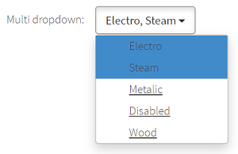
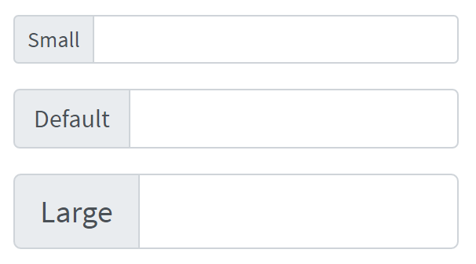
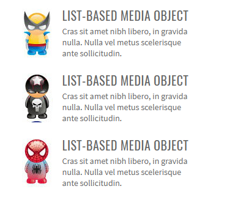
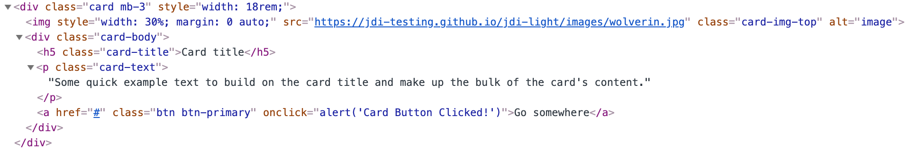

# Documentation
## Extended Selenium features
TBD

## Html5 Common elements

### Label 
 **Label** – Elements' caption for a big number of JDI common elements 
 
 

Label's implementation is located in the following classes: 

   - __Java__: _com.epam.jdi.light.elements.base.BaseUIElement_
   - __C#__: _JDI.Light.Elements.Base.UIElement_

  ```java
   
  //In the next test Label is found from 'name' and 'disabledName' locators:
   
  @UI("#name") // @FindBy(css = "#name")
 public static TextField name;
	
  @UI("#disabled-name") // @FindBy(css = "#disabled-name")
 public static TextField disabledName;
	
 //By default Label is found by locator 
 By.cssSelector("[for="+getAttribute("id")+"]")
   
  @Test
  public void labelTest() {
      assertEquals(name.label().getText(), "Your name:");
      name.label().is().text(containsString("Your"));
      disabledName.label().is().text(equalToIgnoringCase("Surname:"));
  }
	
@Test
  public void getLabelTextTest() {
      assertEquals(colorPicker.labelText(), "Select a color");
  }
  
 ```

 ```csharp 
  	
 In the next test Label is found from NameTextField locator:
  
 [FindBy(Css = "div.main-content #name")]
 public TextField NameTextField { get; set; }
	
 By default Label is found by locator By.CssSelector($"[for={WebElement.GetAttribute("id")}]")

 [Test] 
 public void LabelTest() 
 { 
     Assert.AreEqual(TestSite.Html5Page.NameTextField.Label().GetText(), "Your name:");
     TestSite.Html5Page.NameTextField.Label().Is.Text(ContainsString("Your"));
     Assert.AreEqual(TestSite.Html5Page.SurnameTextField.Label().GetText(), "Surname:");
     TestSite.Html5Page.SurnameTextField.Label().Is.Text(ContainsString("Surname:")); 
 }	 
	
 [Test] 
 public void GetLabelTextTest() 
 { 
     AreEqual(TestSite.Html5Page.ColorPicker.LabelText(), "Select a color"); 
 } 
 
  ``` 
 
 Available methods in C# JDI Light: 

|Method | Description | Return Type 
--- | --- | --- 
**Label()** | Creates label for element using the element's Id | Label 
**LabelText()** | Gets the text of a label | string 
 
[C# test examples](https://github.com/jdi-testing/jdi-light-csharp/blob/master/JDI.Light/JDI.Light.Tests/Tests/Simple/LabelsTests.cs) 

[Java test examples](https://github.com/jdi-testing/jdi-light/blob/master/jdi-light-html-tests/src/test/java/io/github/epam/html/tests/elements/simple/LabelTests.java)

[BDD Steps examples](https://jdi-docs.github.io/jdi-light/?java#label-2)


### Button
**Button** – Element that represents a clickable button


Button is located in the following classes:
 
  - __Java__: _com.epam.jdi.light.ui.html.common.Button_
  - __C#__: _JDI.Light.Elements.Common.Button_

```java 
@UI("[value*='Red Button']") // @FindBy(css = "[value*='Red Button']")
public static Button redButton;

@Test
public void clickTest() {
    redButton.click();
    assertEquals(getAlertText(), "Red button");
    acceptAlert();
}

@Test
public void getTextTest() {
    assertEquals(redButton.getText(), "Big Red Button-Input");
}
```
```csharp

[FindBy(Css = ".red")]
public Button RedButton;

[Test]
public void ClickTest() 
{
    RedButton.Click();
    Assert.AreEqual(GetAlert().GetAlertText(), "Red button");
    GetAlert().AcceptAlert();
}

[Test]
public void GetTextTest() 
{
    Assert.AreEqual(RedButton.GetText(), "Big Red Button-Input");
}

```

Here is an example with provided HTML code:


Available methods in Java JDI Light:

|Method | Description | Return Type
--- | --- | ---
**click()** | Click the button  | void
**getText()** | Get button text | String
**is()** | Assert action | TextAssert 
**assertThat()** | Assert action | TextAssert

[Java test examples](https://github.com/jdi-testing/jdi-light/blob/master/jdi-light-html-tests/src/test/java/io/github/epam/html/tests/elements/simple/ButtonTests.java)
<br>
[BDD Steps example](https://jdi-docs.github.io/jdi-light/?java#button-3)

Available methods and properties in C# JDI Light:

|Method/Property | Description | Return Type
--- | --- | ---
**Click()** | Click the button  | void
**GetText()** | Get button text | string
**Is** | Assert action | TextAssert 
**AssertThat** | Assert action | TextAssert

[C# test examples](https://github.com/jdi-testing/jdi-light-csharp/blob/master/JDI.Light/JDI.Light.Tests/Tests/Common/ButtonTests.cs) <br>
[BDD Steps example](https://jdi-docs.github.io/jdi-light/?java#button-3)

### Checkbox
**Checkbox** – Element allows you to select single value for submission.


Checkbox is located in the following classes:
 
  - __Java__: _com.epam.jdi.light.ui.html.common.Checkbox*_
  - __C#__: _JDI.Light.Elements.Common.CheckBox*_

```java 
@UI("#accept-conditions") // @FindBy(id = "accept-conditions")
public static Checkbox acceptConditions;

@Test
public void checkTest() {
    acceptConditions.check();
    assertEquals(acceptConditions.isSelected(), true);
}

@Test
public void uncheckTest() {
    acceptConditions.uncheck();
    assertEquals(acceptConditions.isSelected(), false);
}
```
```csharp

[FindBy(XPath = "//*[@id='elements-checklist']//*[text()='Water']")]
[IsChecked(typeof(CustomCheck), nameof(CustomCheck.CheckFunc))]
public CheckBox CbWater;

[FindBy(Css = "#accept-conditions")]
public CheckBox AcceptConditions { get; set; }

[Test]
public void CheckSingleTest()
{
     Assert.DoesNotThrow(() => TestSite.MetalsColorsPage.CbWater.Check(true));
     Jdi.Assert.Contains(TestSite.ActionsLog.Texts[0], "Water: condition changed to true");
}

[Test]
public void UncheckSingleTest()
{
     TestSite.MetalsColorsPage.CbWater.Click();
     TestSite.MetalsColorsPage.CbWater.Uncheck();
  	 Jdi.Assert.Contains(TestSite.ActionsLog.Texts[0], "Water: condition changed to false");
}

[Test]
public void IsCheckTest()
{
     Assert.IsFalse(TestSite.MetalsColorsPage.CbWater.IsChecked);
     TestSite.MetalsColorsPage.CbWater.Click();
     Assert.IsTrue(TestSite.MetalsColorsPage.CbWater.IsChecked);
}

[Test]
public void MultipleUncheckTest()
{
     TestSite.MetalsColorsPage.CbWater.Click();
     TestSite.MetalsColorsPage.CbWater.Uncheck();
     TestSite.MetalsColorsPage.CbWater.Uncheck();
     Jdi.Assert.Contains(TestSite.ActionsLog.Texts[0], "Water: condition changed to false");
}

[Test]
public void ClickTest()
{
     TestSite.MetalsColorsPage.CbWater.Click();
     Jdi.Assert.Contains(TestSite.ActionsLog.Texts[0], "Water: condition changed to true");
     TestSite.MetalsColorsPage.CbWater.Click();
     var texts = TestSite.ActionsLog.Texts;
     Jdi.Assert.Contains(texts[0], "Water: condition changed to false");
}

[Test]
[TestCaseSource(typeof(CheckBoxProvider), nameof(CheckBoxProvider.InputData))]
public void SetValueTest(bool value, bool expected)
{
     if (!expected) TestSite.MetalsColorsPage.CbWater.Click();
     TestSite.MetalsColorsPage.CbWater.Value = value;
     var resultMsg = "Water: condition changed to " + expected.ToString().ToLower();
     Jdi.Assert.Contains(TestSite.ActionsLog.Texts[0], resultMsg);
}

[Test]
public void IsValidationTest()
{
    TestSite.Html5Page.Open();
    TestSite.Html5Page.AcceptConditions.Is.Selected();
    TestSite.Html5Page.AcceptConditions.Click();
    TestSite.Html5Page.AcceptConditions.Is.Deselected();
    TestSite.Html5Page.AcceptConditions.Is.Enabled();
    TestSite.Html5Page.AcceptConditions.Is.Displayed();
}

[Test]
public void LabelTest()
{
    TestSite.Html5Page.Open();
    Assert.AreEqual("Accept terms and conditions", TestSite.Html5Page.AcceptConditions.Label().GetText());
    TestSite.Html5Page.AcceptConditions.Label().Is.Text(ContainsString("terms and conditions"));
    TestSite.Html5Page.AcceptConditions.Label().Is.Text(EqualTo("accept terms and conditions"));
}

[Test]
public void AssertValidationTest()
{
    TestSite.Html5Page.Open();
    TestSite.Html5Page.AcceptConditions.AssertThat.Selected();
}

[Test]
public void BaseValidationTest()
{
    TestSite.Html5Page.Open();
    BaseElementValidation(TestSite.Html5Page.AcceptConditions);
}

```

Here is an example with provided HTML code:


Available methods in Java JDI Light:

|Methods | Description | Return Type
--- | --- | ---
**click()** | Click the checkbox  | void
**check(String)**| Set to checked on "true" (case insensitive) or unchecked otherwise | void
**check()**| Set to checked | void
**uncheck()**| Set to unchecked | void
**isSelected()** | Verify value | boolean 
**assertThat()** | Assert action checkbox | CheckboxAssert
**is()** | Assert action checkbox | CheckboxAssert

Available methods in C# JDI Light:

|Method | Description | Return Type
--- | --- | ---
**Check(bool checkEnabled = true)** | Checks a checkbox | void
**Uncheck(bool checkEnabled = true)** | Unhecks a checkbox | void
**IsChecked** | Determines whether a checkbox is checked | bool

Available assert methods in C# JDI Light:

|Method | Description | Return Type
--- | --- | ---
**Selected()** | Checks whether a checkbox is selected | CheckBoxAssert
**Deselected()** | Checks whether a checkbox is deselected | CheckBoxAssert
**Enabled()** | Checks whether a checkbox is enabled | CheckBoxAssert
**Displayed()** | Checks whether a checkbox is displayed | CheckBoxAssert
**Is** | Gets assert for checkbox | CheckBoxAssert
**AssertThat** | Gets assert for checkbox | CheckBoxAssert


[Java test examples](https://github.com/jdi-testing/jdi-light/blob/master/jdi-light-html-tests/src/test/java/io/github/epam/html/tests/elements/simple/CheckboxTests.java)

[C# test examples](https://github.com/jdi-testing/jdi-light-csharp/blob/master/JDI.Light/JDI.Light.Tests/Tests/Common/CheckBoxTests.cs)

[BDD Steps example](https://jdi-docs.github.io/jdi-light/?java#checkbox-2)

### ColorPicker
**ColorPicker** – Elements of this type provide a user interface element that lets a user specify a color, either by using a visual color picker interface or by entering the color into a text field in "#rrggbb" hexadecimal format. Only simple colors (with no alpha channel) are allowed. The values are compatible with CSS.


Colorpicker is located in the following classes:

  - __Java__: _com.epam.jdi.light.ui.html.common.ColorPicker*_

```java 
@UI("#color-picker") // @FindBy(id = "color-picker")
public static ColorPicker colorPicker;

@Test
public void getColorTest() {
    assertEquals(colorPicker.color(), "#3fd7a6");
}

@Test
public void setColorTest() {
    colorPicker.setColor("#432376");
    assertEquals(colorPicker.color(), "#432376");
}

@Test
public void getLabelTextTest() {
    assertEquals(colorPicker.labelText(), "Select a color");
}
```
```csharp
[FindBy(Css = "#color-picker")]
public ColorPicker ColorPicker;

[Test]
public void GetColorTest() 
{
    Assert.AreEqual(ColorPicker.Color(), "#3fd7a6");
}

[Test]
public void SetColorTest() 
{
    ColorPicker.SetColor("#432376");
    Assert.AreEqual(ColorPicker.Color(), "#432376");
}
 
```

Here is an example with provided HTML code:


Here is the list of some available methods in Java:

|Methods | Description | Return Type
--- | --- | ---
**color()** | Returns color code in  hexadecimal format ("#rrggbb") | String
**setColor(String)** | Set color from string hex representation ("#rrggbb") | void
**is()** | Assert acton color | ColorAssert
**assertThat()** | Assert acton color | ColorAssert 

[Java test examples](https://github.com/jdi-testing/jdi-light/blob/master/jdi-light-html-tests/src/test/java/io/github/epam/html/tests/elements/simple/ColorPickerTests.java)<br>
[BDD Steps example](https://jdi-docs.github.io/jdi-light/?java#colorpicker-2)<br>

Here is the list of some available methods in C#:

|Methods | Description | Return Type
--- | --- | ---
**Color()** | Returns color code in  hexadecimal format ("#rrggbb") | string
**SetColor(String)** | Set color from string hex representation ("#rrggbb") | void
**Is()** | Assert acton color | ColorAssert
**AssertThat()** | Assert acton color | ColorAssert 

[Test examples in C#](https://github.com/jdi-testing/jdi-light-csharp/blob/master/JDI.Light/JDI.Light.Tests/Tests/Simple/ColorPickerTests.cs)<br>
[BDD Steps example](https://jdi-docs.github.io/jdi-light/?java#colorpicker-2)<br>

### DateTimeSelector

**DateTimeSelector** is used for Input Type Date and its derivatives and allows users to set the value of date and/or time.

The list of supported elements:

 - Input Type Date
 - Input Type Week
 - Input Type Month
 - Input Type Time
 - Input Type DateTime-Local

There following classes represent this type of element:

 - __C#__: _JDI.Light.Elements.Common.DateTimeSelector_
 - __Java__: _com.epam.jdi.light.ui.html.common.DateTimeSelector_

Here is the list of some methods available in C#:

|Method | Description | Return Type
--- | --- | ---
**SetDateTime(string/DateTime value)** | Sets a date or time | void
**GetDateTime()** | Returns the set date or time | DateTime
**Value()** | Returns value attribute | string
**Min()** | Gets attribute with name min | string
**Max()** | Gets attribute with name max | string
**Is()** | Asserts action of DateTimeSelector | DateTimeSelectorAssert
**AssertThat()** | Asserts action of DateTimeSelector | DateTimeSelectorAssert

And here are some of the methods available in Java:

|Method | Description | Return Type
--- | --- | ---
**setDateTime(string value)** | Sets a date or time | void
**value()** | Returns the set date or time | String
**min()** | Gets attribute with name min | String
**max()** | Gets attribute with name max | String
**is()** | Assertion | DateTimeAssert
**assertThat()** | Assertion | DateTimeAssert

[BDD Steps example](https://jdi-docs.github.io/jdi-light/#datetimeselector-2)

__In the following sections there are examples of different implementations of such fields.__

__Input Type Date__

```java 
@UI("#birth-date") //@FindBy(css = "#birth-date") 
public static DateTimeSelector birthDate;

@Test
public void setDateTimeTest() {
    birthDate.setDateTime("2018-11-13");
    assertEquals(birthDate.value(), "2018-11-13");
}

@Test
public void maxTest() {
    assertEquals(birthDate.max(), "2030-12-31");
}
```
```csharp 
[FindBy(Css = "#birth-date")]
public IDateTimeSelector BirthDate { get; set; }
        
[Test]
public void SetBirthDateTest()
{
    TestSite.Html5Page.BirthDate.Format = "yyyy-MM-dd";
    TestSite.Html5Page.BirthDate.SetDateTime(_dateTime);    
    TestSite.Html5Page.BirthDate.AssertThat().SelectedTime(Is.EqualToIgnoringCase("2019-04-01"));	
}
```
**Input Type Date** – a graphical control element that allows user to set value for date.


[Test examples in C#](https://github.com/jdi-testing/jdi-light-csharp/blob/master/JDI.Light/JDI.Light.Tests/Tests/Common/DateTimeTests.cs)

[Test examples in Java](https://github.com/jdi-testing/jdi-light/blob/master/jdi-light-html-tests/src/test/java/io/github/epam/html/tests/elements/simple/DateTests.java)

__Input Type Week__

```java 
@UI("#autumn-week") //@FindBy(css = "#autumn-week") 
public static DateTimeSelector autumnWeek;

@Test
public void minTest() {
    assertEquals(autumnWeek.min(), "2018-W35");
}

@Test
public void setDateTimeTest() {
    autumnWeek.setDateTime("2018-W12");
    autumnWeek.show();
    assertEquals(autumnWeek.value(), "2018-W12");
}
```
```csharp 
[FindBy(Css = "#autumn-week")]
public IDateTimeSelector AutumnDateTime { get; set; }
        
[Test]
public void AutumnDateTimeTest()
{
    var calendar = new GregorianCalendar();
    var weekNum = calendar.GetWeekOfYear(_dateTime, CalendarWeekRule.FirstFullWeek, DayOfWeek.Monday);
    TestSite.Html5Page.AutumnDateTime.Format = "yyyy-" + $"W{weekNum}";

    TestSite.Html5Page.AutumnDateTime.SetDateTime(_dateTime);
    var setValue = TestSite.Html5Page.AutumnDateTime.GetValue();
    Assert.AreEqual(setValue, "2019-W13");
}
```
**Input Type Week** – a graphical control element that allows user to set values for week and year.


[Test examples in C#](https://github.com/jdi-testing/jdi-light-csharp/blob/master/JDI.Light/JDI.Light.Tests/Tests/Common/DateTimeTests.cs)

[Test examples in Java](https://github.com/jdi-testing/jdi-light/blob/master/jdi-light-html-tests/src/test/java/io/github/epam/html/tests/elements/simple/WeekTests.java)

__Input Type Month__

```java 
@UI("#month-date") //@FindBy(css = "#month-date") 
public static DateTimeSelector monthDate;

@Test
public void maxTest() {
    assertEquals(monthDate.max(), "2020-12");
}

@Test
public void setDateTimeTest() {
    monthDate.setDateTime("2018-10");
    monthDate.show();
    assertEquals(monthDate.value(), "2018-10");
}
```
```csharp 
[FindBy(Css = "#month-date")]
public IDateTimeSelector MonthOfHolidays { get; set; }
        
[Test]
public void SetMonthTest()
{
    TestSite.Html5Page.MonthOfHolidays.Format = "yyyy-MM";
    TestSite.Html5Page.MonthOfHolidays.SetDateTime(_dateTime);
    var setValue = TestSite.Html5Page.MonthOfHolidays.GetValue();
    Assert.AreEqual(setValue, "2019-04");
}
```
**Input Type Month** – a graphical control element that allows user to set values for month and year.


[Test examples in C#](https://github.com/jdi-testing/jdi-light-csharp/blob/master/JDI.Light/JDI.Light.Tests/Tests/Common/DateTimeTests.cs)

[Test examples in Java](https://github.com/jdi-testing/jdi-light/blob/master/jdi-light-html-tests/src/test/java/io/github/epam/html/tests/elements/simple/MonthTests.java)

__Input Type Time__

```java 
@UI("#booking-date") //@FindBy(css = "#booking-time") 
public static DateTimeSelector bookingTime;

@Test
public void minTest() {
    assertEquals(bookingTime.min(), "9:00");
}

@Test
public void setDateTimeTest() {
    bookingTime.setDateTime("05:00");
    bookingTime.show();
    assertEquals(bookingTime.value(), "05:00");
}
```
```csharp 
[FindBy(Css = "#booking-time")]
public IDateTimeSelector BookingTime { get; set; }
        
[Test]
public void SetTimeTest()
{
    TestSite.Html5Page.BookingTime.Format = "H:mm";
    TestSite.Html5Page.BookingTime.SetDateTime(_dateTime);
    var setValue = TestSite.Html5Page.BookingTime.GetValue();
    Assert.AreEqual(setValue, "15:00");
}
```
**Input Type Time** – a graphical control element that allows user to set time.


[Test examples in C#](https://github.com/jdi-testing/jdi-light-csharp/blob/master/JDI.Light/JDI.Light.Tests/Tests/Common/DateTimeTests.cs)

[Test examples in Java](https://github.com/jdi-testing/jdi-light/blob/master/jdi-light-html-tests/src/test/java/io/github/epam/html/tests/elements/simple/TimeTests.java)

__Input Type DateTime-Local__

```java 
@UI("#party-time") //@FindBy(id = "party-time")
public static DateTimeSelector partyTime;

@Test
public void setDateTimeTest() {
    partyTime.setDateTime("2017-05-10T00:00");
    assertEquals(partyTime.value(), "2017-05-10T00:00");
}
```
```csharp 
[FindBy(Css = "#party-time")]
public IDateTimeSelector PartyTime { get; set; }

[Test]
public void SetPartyTimeTest()
{
    TestSite.Html5Page.PartyTime.Format = "yyyy-MM-ddTHH:mm";
    TestSite.Html5Page.PartyTime.SetDateTime(_dateTime);
    var setValue = TestSite.Html5Page.PartyTime.GetDateTime();
    Assert.AreEqual(setValue, _dateTime);
}
```
**Input Type DateTime-Local** – a graphical control element that allows user to set time and date.


[Java test example](https://github.com/jdi-testing/jdi-light/blob/master/jdi-light-html-tests/src/test/java/io/github/epam/html/tests/elements/simple/DateTimeTests.java)

[C# test examples](https://github.com/jdi-testing/jdi-light-csharp/blob/master/JDI.Light/JDI.Light.Tests/Tests/Common/DateTimeTests.cs)

### FileInput

**FileInput** - a graphical control element that allows user to upload documents to web site


FileInput element is located in JDI Light in:

  - __Java__: _com.epam.jdi.light.ui.html.common.FileInput_
  - __C#__: _JDI.Light.Elements.Composite.FileInput_

```java 
@UI("#avatar") // @FindBy(id = "avatar")
public static FileInput avatar; 

@Test
public void uploadTest() {
    avatar.uploadFile(mergePath(PROJECT_PATH,"/src/test/resources/general.xml"));
    avatar.is().text(containsString("general.xml"));
    assertTrue(avatar.getText().contains("general.xml"));
    assertTrue(avatar.getValue().contains("general.xml"));
}
```
```csharp
[Test]
public void FileInputTest()
{
    FileInput.SelectFile(CreateFile(filename));
}

[Test]
public void DisabledUploadTest()
{
    Sleep(2000);
    try
    {
         TestSite.Html5Page.DisabledFileInput.SelectFile(CreateFile(_fileName));
    }
    catch (Exception e)
    {
         Logger.Exception(e);
    }
    Sleep(2000);
    TestSite.Html5Page.DisabledFileInput.Is.Text(EqualTo(""));
}

[Test]
public void LabelTest()
{
    AreEqual(TestSite.Html5Page.FileInput.LabelText(), "Profile picture:");
    TestSite.Html5Page.FileInput.Label().Is.Text(ContainsString("picture"));
}

[Test]
public void BaseValidationTest()
{
    BaseElementValidation(TestSite.Html5Page.FileInput);
}

```

Here is an example with HTML code provided:


Available method in Java JDI Light:

|Method | Description | Return Type
--- | --- | ---
**uploadFile(String)** |Select file to upload  | void

Available method in C# JDI Light:

|Method | Description | Return Type
--- | --- | ---
**SelectFile(string filepath)** |Select file to upload  | void

Available assert methods in C# JDI Light:

|Method | Description | Return Type
--- | --- | ---
**IsDownloaded()** |Checks whether a file is downloaded  | FileAssert
**Text(Matcher<string> value)** | Checks whether an occurrence of a text is contained within a text file | FileAssert
**HasSize(Matcher<long> size)** | Checks that a file has a particular size according to the matcher | FileAssert
**CleanupDownloads()** | Cleans the directory | void

[Java test examples](https://github.com/jdi-testing/jdi-light/blob/master/jdi-light-html-tests/src/test/java/io/github/epam/html/tests/elements/simple/FileUploadTests.java)

[C# test examples](https://github.com/jdi-testing/jdi-light-csharp/blob/master/JDI.Light/JDI.Light.Tests/Tests/Common/FileInputTests.cs)

[BDD Steps example](https://jdi-docs.github.io/jdi-light/?java#fileinput-2)

### Icon
```java 
@UI("#jdi-logo") 
// same as FindBy(css = "#jdi-logo")
public static Icon jdiLogo;

    @Test
    public void isValidationTest() {
        WebPage.refresh();
        jdiLogo.is().src(containsString("jdi-logo.jpg"));
        jdiLogo.is().alt(is("Jdi Logo 2"));
        jdiLogo.assertThat().height(is(100));
        jdiLogo.assertThat().width(is(101));
    }
```
```csharp 
[FindBy(Css = "#jdi-logo")]
public IIcon Logo
;

   [Test]
   public void GetSourceTest()
   {
     Jdi.Assert.AreEquals(LogoImage.GetSource(), Src);
   }

   [Test]
   public void GetTipTest()
   {
     Jdi.Assert.AreEquals(LogoImage.GetAlt(), Alt);
   }
```
**Icon** – is a simple element type that represents icons and graphic images.


Icons are represented by the following classes:
 
  - __Java__: _com.epam.jdi.light.ui.html.common.Icon , com.epam.jdi.light.ui.html.common.Image_
  - __C#__: JDI.Light.Interfaces.Common.IIcon, _JDI.Light.Elements.Common.Image


 
Icon in JDI is a descendant of Image. It inherits all Image's methods and serves as its wrapper. Here are Java methods for Icon, inherited from Image interface:

|Method | Description | Return Type
--- | --- | ---
**click()** | click on the image| void
**src()** | get value of src attribute | String
**height()** |get value of height attribute| String
**width()** | get value of width attribute| String
**alt()** |get value of alt attribute | String
**is()** | method for building assertions | ImageAssert
**assertThat()** |method for building assertions  | ImageAssert

Here is a list of available methods in C#:

|Method | Description | Return Type
--- | --- | ---
**Click()** | click on the image| void
**Src** | get value of src attribute | string
**Height** |get value of height attribute| string
**Width** | get value of width attribute| string
**Alt** |get value of alt attribute | string
**Is()** | method for building assertions | ImageAssert
**AssertThat()** |method for building assertions  | ImageAssert

[Test examples in Java]
(https://github.com/jdi-testing/jdi-light/blob/master/jdi-light-html-tests/src/test/java/io/github/epam/html/tests/elements/simple/ImageTests.java)<br>
[Test examples in C#]
(https://github.com/jdi-testing/jdi-light-csharp/blob/master/JDI.Light/JDI.Light.Tests/Tests/Simple/ImagesTests.cs)<br>
[BDD Steps example](https://jdi-docs.github.io/jdi-light/?java#icon-2)

### Image
```java 
@UI("#jdi-logo") 
// same as FindBy(css = "#jdi-logo")
public static Image jdiLogo;

    @Test
    public void isValidationTest() {
        WebPage.refresh();
        jdiLogo.is().src(containsString("jdi-logo.jpg"));
        jdiLogo.is().alt(is("Jdi Logo 2"));
        jdiLogo.assertThat().height(is(100));
        jdiLogo.assertThat().width(is(101));
    }
```
```csharp 
[FindBy(Css = "#jdi-logo")]
public IImage LogoImage;

   [Test]
   public void GetSourceTest()
   {
     Jdi.Assert.AreEquals(LogoImage.GetSource(), Src);
   }

   [Test]
   public void GetTipTest()
   {
     Jdi.Assert.AreEquals(LogoImage.GetAlt(), Alt);
   }
```
**Image** – is a simple element type that represents graphic images.


Images are represented by the following classes in Java and C#:
 
  - __C#__: _JDI.Light.Elements.Common.Image_
  - __Java__: _com.epam.jdi.light.ui.html.common.Image_
  
Here is a list of available methods in C#:

|Method | Description | Return Type
--- | --- | ---
**Click()** | click on the image| void
**Src** | get value of src attribute | string
**Height** |get value of height attribute| string
**Width** | get value of width attribute| string
**Alt** |get value of alt attribute | string
**Is()** | method for building assertions | ImageAssert
**AssertThat()** |method for building assertions  | ImageAssert

[Test examples in C#](https://github.com/jdi-testing/jdi-light-csharp/blob/master/JDI.Light/JDI.Light.Tests/Tests/Simple/ImagesTests.cs) <br>
[BDD Steps example](https://jdi-docs.github.io/jdi-light/?java#image-2) <br>

And here are methods available in Java:

|Method | Description | Return Type
--- | --- | ---
**click()** | click on the image| void
**src()** | get value of src attribute | String
**height()** |get value of height attribute| String
**width()** | get value of width attribute| String
**alt()** |get value of alt attribute | String
**is()** | method for building assertions | ImageAssert
**assertThat()** |method for building assertions  | ImageAssert

[Test examples in Java](https://github.com/jdi-testing/jdi-light/blob/master/jdi-light-html-tests/src/test/java/io/github/epam/html/tests/elements/simple/ImageTests.java)<br>
[BDD Steps example](https://jdi-docs.github.io/jdi-light/?java#image-2)<br>

### Link
**Link** – a graphical control element that allows user to link from one page to other web pages, files, locations within the same page, email addresses, or any other URL.

Link are represented by the following class:
 
  - __Java__: _com.epam.jdi.light.ui.html.common.Link_
  - __C#__: _JDI.Light.Elements.Common.Link_
  
  
```java 
@UI("[ui=github-link]") 
// equal to @FindBy(css = "[ui=github-link]") 
public static Link githubLink;

@Test
public void getTextTest() {
        assertEquals(githubLink.getText(), text);
    }
```
```csharp 
[FindBy(Css = "[ui = github-link]")]
public ILink GithubLink;

[Test]
public void GetTextTest()
{
    Assert.AreEqual(GithubLink.GetText(), Text);
}

[Test]
public void GetUrlTest()
{
     Assert.AreEqual(GithubLink.Url(), "https://epam.github.io/JDI/html5.html");
}
```


Here is the list of available methods in Java:

|Method | Description | Return Type
--- | --- | ---
**click()** |Follow the link | void
**getText()** |Returns the link text  | String
**ref()** |Returns the reference  | String
**url()** |Returns the URL  | URL
**alt()** |Returns the alternate text | String
**is()** | Returns object for work with assertions | LinkAssert
**assertThat()** | Returns object for work with assertions | LinkAssert

[Java test examples](https://github.com/jdi-testing/jdi-light/blob/master/jdi-light-html-tests/src/test/java/io/github/epam/html/tests/elements/simple/LinkTests.java)<br>
[BDD Steps example](https://jdi-docs.github.io/jdi-light/#link-2)

Here is the list of available methods in C#:

|Method | Description | Return Type
--- | --- | ---
**Click()** |Follow the link | void
**GetText()** |Returns the link text  | string
**Ref()** |Returns the reference  | string
**Url()** |Returns the URL  | string
**Alt()** |Returns the alternate text | string
**Is()** | Returns object for work with assertions | LinkAssert
**AssertThat()** | Returns object for work with assertions | LinkAssert

[C# test examples](https://github.com/jdi-testing/jdi-light-csharp/blob/master/JDI.Light/JDI.Light.Tests/Tests/Common/LinkTests.cs)<br>
[BDD Steps example](https://jdi-docs.github.io/jdi-light/#link-2)

### Menu

**Menu** - a list of links, which leads to different pages or sections of website

Menu element is located in JDI Light in:

  - __Java__: _com.epam.jdi.light.ui.html. element
  .Menu_
  - __C#__: _JDI.Light.Elements.Composite.Menu_

```java 
@UI(".sidebar-menu span<[*'%s']<<") 
public static Menu leftMenu;
@Url("/metals-colors.html") @Title("Metal and Colors")
public static MetalAndColorsPage metalAndColorsPage;

@Test
public void selectEnumTest() {
    leftMenu.select(MetalsColors);
    metalAndColorsPage.checkOpened();
}
```
```csharp
[FindBy(Css = "ul.sidebar-menu")]
public Menu SidebarMenu;

[Test]
public void SelectEnumTest()
{
     TestSite.SidebarMenu.Select(Navigation.MetalsColors);
     TestSite.MetalsColorsPage.CheckOpened();
}

[Test]
public void IsValidationTest()
{
     TestSite.SidebarMenu.Select("Elements packs", "HTML 5");
     TestSite.SidebarMenu.Is.Selected("HTML 5")
}

[Test]
public void AssertValidationTest()
{
     TestSite.SidebarMenu.Select("Elements packs", "HTML 5");
     TestSite.SidebarMenu.AssertThat.Selected("HTML 5");
}

```

Here is an example with provided HTML code:


Available method in Java JDI Light:

|Method | Description | Return Type
--- | --- | ---
**void select(String...)** | Select menu element and subelement | void
**void select(String)** | Select menu element | void
**void select(TEnum...)** | Select menu element and subelement | void
**void select(TEnum)** | Select menu element | void
**void select(int...)** | Select menu element by index | void
**void select(int)** | Select menu element and subelements by index | void    
**String selected()** | Returns selected menu item | String
**List<String> values()** | Returns selected menu item and subitems | List<String>
**void hoverAndClick(String...)** | Hovers and clicks menu item and subitems | void
**void hoverAndClick(String)** | Hovers and clicks menu item | void

Available method in C# JDI Light:

|Method | Description | Return Type
--- | --- | ---
**void Select(string[])** | Select menu element and subelements by string values | void
**void Select(string)** | Select menu element | void
**void Select(int[])** | Select menu element and subelements by index | void
**void Select(int)** | Select menu element and subelements by index | void 
**void Select(Enum[])** | Select menu element and subelements by getting values of enum | void
**void Select(Enum)** | Select menu element | void
**string Selected()** | Returns selected menu item | string
**List<string> Values()** | Gets values of all options | List<string>
**void HoverAndClick(string[])** | Hovers and clicks menu item and subitems | void
**void HoverAndClick(string)** | Hovers and clicks menu item | void

Available Assert methods in C# JDI Light:

|Method | Description | Return Type
--- | --- | ---
**Is** | Get select assert | MenuSelectAssert
**AssertThat** | Get select assert | MenuSelectAssert

[Java test examples](https://github.com/jdi-testing/jdi-light/blob/master/jdi-light-html-tests/src/test/java/io/github/epam/html/tests/complex/MenuTests.java)

[C# test examples](https://github.com/jdi-testing/jdi-light-csharp/blob/master/JDI.Light/JDI.Light.Tests/Tests/Composite/MenuTests.cs)

[BDD Steps example](https://jdi-docs.github.io/jdi-light/#menu-2)

### NumberSelector
**NumberSelector** – a graphical control element, that allows the user to let the user enter a number.

NumberSelector are represented by the following class:
 
  - __Java__: _com.epam.jdi.light.ui.html.common.NumberSelector_
  - __C#__: _JDI.Light.Elements.Common.NumberSelector_
  
  
```java 
@UI("#height") 
// equal to @FindBy(css = "#height") 
public static NumberSelector height;

@Test
public void getNumberTest() {
        assertEquals(height.value(), number);
    }
```
```csharp 
[FindBy(Css = "#height")]
public INumberSelector numberSelector;

[Test]
public void GetNumberTest()
{
    Jdi.Assert.AreEquals(number, numberSelector.Value());
}
```


Here is the list of available methods in Java:

|Method | Description | Return Type
--- | --- | ---
**placeholder()** |Returns the placeholder text  | String
**min()** |Returns the min value   | String
**max()** |Returns the max value  | String
**value()** |Returns the value  | String
**step()** |Returns the step value | String
**setNumber(String)** |Sets the value | void
**is()** | Returns object for work with assertions | NumberAssert
**assertThat()** | Returns object for work with assertions | NumberAssert

Here is the list of available methods in C#:

|Method | Description | Return Type
--- | --- | ---
**Placeholder** |Returns the placeholder text  | String
**Min** |Returns the min value   | double
**Max** |Returns the max value  | double
**Value** |Returns the value  | double
**Step** |Returns the step value | double
**SetNumber(double)** |Sets the value | void
**Is()** | Returns object for work with assertions | NumberAssert
**AssertThat()** | Returns object for work with assertions | NumberAssert

[Java test examples](https://github.com/jdi-testing/jdi-light/blob/master/jdi-light-html-tests/src/test/java/io/github/epam/html/tests/elements/simple/NumberSelectorTests.java)

[Test examples in C#]
(https://github.com/jdi-testing/jdi-light-csharp/blob/master/JDI.Light/JDI.Light.Tests/Tests/Common/NumberSelectorTests.cs)

[BDD Steps example](https://jdi-docs.github.io/jdi-light/?java#numberselector-2)<br>

### ProgressBar
**Progress Bar** - Element for displaying an indicator showing the completion progress of a task


ProgressBar is located in the following classes:
 
  - __Java__: _com.epam.jdi.light.ui.html.common.ProgressBar_
  - __C#__: _JDI.Light.Elements.Common.ProgressBar_

```java 
@UI("#progress") // @FindBy(id = "progress")
public static ProgressBar progress;

@Test
public void getValueTest() {
    assertEquals(progress.value(), "70");
}

@Test
public void maxTest() {
    assertEquals(progress.max(), "100");
}

@Test
public void assertValidationTest() {
    progress.assertThat().volume(greaterThan(0));
    progress.assertThat().volume(lessThan(200));
    progress.assertThat().volume(is(70));
}
```
```csharp

[FindBy(Css = "#progress")]
public ProgressBar Progress;

[Test]
public void GetValueTest() 
{
     Assert.AreEqual(Progress.Value(), "70");
}

[Test]
public void MaxTest() 
{
     Assert.AreEqual(Progress.Max(), "100");
}

```

Here is an example with provided HTML code:


Available method in Java JDI Light:

|Method | Description | Return Type
--- | --- | ---
**value()** |Get current progress value  | String
**max()** |Get progressbar maximum possible value  | String
**is()** |Various assert actions for Progress bar  | ProgressAssert
**assertThat()** |Various assert actions for Progress bar | ProgressAssert 

[Java test examples](https://github.com/jdi-testing/jdi-light/blob/master/jdi-light-html-tests/src/test/java/io/github/epam/html/tests/elements/simple/ProgressTests.java) <br>
[BDD Steps example](https://jdi-docs.github.io/jdi-light/?java#progress-bar) <br>


Available method in C# JDI Light:

|Method | Description | Return Type
--- | --- | ---
**Value()** |Get current progress value  | string
**Max()** |Get progressbar maximum possible value  | string
**Is()** |Various assert actions for Progress bar  | ProgressAssert
**AssertThat()** |Various assert actions for Progress bar | ProgressAssert 

[C# test examples](https://github.com/jdi-testing/jdi-light-csharp/blob/master/JDI.Light/JDI.Light.Tests/Tests/Common/ProgressTests.cs)<br>
[BDD Steps example](https://github.com/jdi-testing/jdi-light/blob/master/jdi-light-bdd-tests/src/test/resources/features/ProgressBar.feature)<br>

### Range

```java 
  @UI("#volume")  //@FindBy(id = "volume") 
  public static Range volume;
  @Test
  public void getLabelTextTest() {
      assertEquals(volume.labelText(), "Volume");
  }
  @Test
  public void getValueTest() {
      assertEquals(disabledRange.volume(), 50);
  }
  @Test
  public void minTest() {
      assertEquals(volume.min(), "10");
  }
  @Test
  public void maxTest() {
      assertEquals(volume.max(), "100");
  }
  @Test
  public void stepTest() {
      assertEquals(volume.step(), "5");
  }
  @Test
  public void setVolumeTest() {
      volume.setVolume(10);
      assertEquals(volume.volume(), 10);
  }
  @Test
  public void isValidationTest() {
      volume.is().enabled();
      volume.assertThat().minVolume(is(10));
      volume.assertThat().maxVolume(is(100));
      volume.assertThat().step(is(5));
      volume.is().volume(greaterThanOrEqualTo(10));
      volume.is().volume(lessThanOrEqualTo(100));
      volume.is().volume(is(90));
  }
  @Test
  public void labelTest() {
      assertEquals(volume.label().getText(), "Volume");
      volume.label().is().text(containsString("lume"));
      volume.label().assertThat().text(equalToIgnoringCase("volume"));
  }
  @Test
  public void assertValidationTest() {
      volume.assertThat().volume(greaterThan(0));
      volume.assertThat().volume(lessThan(200));
      disabledRange.assertThat().volume(is(50));
  }
  @Test
  public void baseValidationTest() {
      baseValidation(volume);
  }
```

```csharp
  [FindBy(Css = "#volume")]
  public IRange Volume { get; set; } 
  [Test]
  public void GetValueTest()
  {
      Assert.AreEqual(TestSite.Html5Page.DisabledRange.Value(), 50);
  }
  [Test]
  public void MinTest()
  {
      Assert.AreEqual(TestSite.Html5Page.Volume.Min(), 10);
  }
  [Test]
  public void MaxTest()
  {
      Assert.AreEqual(TestSite.Html5Page.Volume.Max(), 100);
  }
  [Test]
  public void StepTest()
  {
      Assert.AreEqual(TestSite.Html5Page.Volume.Step(), 5);
  }
  [Test]
  public void SetRangeTest()
  {
      TestSite.Html5Page.Volume.SetValue(10);
      Assert.AreEqual(TestSite.Html5Page.Volume.Value(), 10);
  }
  [Test]
  public void RangeTest()
  {
      TestSite.Html5Page.Volume.SetValue("30");
      Assert.AreEqual(TestSite.Html5Page.Volume.GetValue(), "30");
  }
```

**Range** - a graphical control element that allows the user to set the value from the range.</br>

</br>

Range is represented by the following class:</br>

  - __Java__: _com.epam.jdi.light.ui.html.common.Range_
  - __C#__: _JDI.Light.Elements.Common.Range_
  
Here is a list of available methods in C#:

|Method | Description | Return Type
--- | --- | ---
**SetValue(string value)** | Sets the value | void
**SetValue(double value)** | Sets the value | void
**GetValue()** | Returns the value | String
**Value()** | Returns the value | Double
**Min()** | Returns the min value | Double
**Max()** | Returns the max value| Double
**Step()** | Returns the step value | Double
**Is()** | Returns object for work with assertions | RangeAssert
**AssertThat()** | Returns object for work with assertions | RangeAssert

[Test examples in C#](https://github.com/jdi-testing/jdi-light-csharp/blob/master/JDI.Light/JDI.Light.Tests/Tests/Simple/RangeTests.cs)</br>
[BDD Steps example](https://jdi-docs.github.io/jdi-light/?java#range-2) <br>

And here are methods available in Java:

|Method | Description | Return Type
--- | --- | ---
**setVolume(int volume)** | Sets the value | void
**volume()** | Returns the value | int
**max()** | Returns the max value | String
**min()** | Returns the min value | String
**step()** | Returns the step value | String
**is()** | Returns object for work with assertions | RangeAssert
**assertThat()** | Returns object for work with assertions | RangeAssert

[Java test examples](https://github.com/jdi-testing/jdi-light/blob/master/jdi-light-html-tests/src/test/java/io/github/epam/html/tests/elements/simple/RangeTests.java)</br>
[BDD Steps example](https://jdi-docs.github.io/jdi-light/?java#range-2) <br>

### Text
**Text** is a combination of letters and textual symbols. When performing testing, the text is used in most operations: when typing text into the login field, when finding a button with some certain text in it, or when checking if actual text matches expected one.

```java 
  @UI("[ui=jdi-text]") //@FindBy(css = "[ui=jdi-text]") 
  public static Text jdiText;

  @Test
  public void getTextTest() {
      assertEquals(jdiText.getText(), text);
  }

  @Test
  public void getValueTest() {
      assertEquals(jdiText.getValue(), text);
  }

  @Test
  public void isValidationTest() {
      jdiText.is().enabled();
      jdiText.is().text(is(text));
      jdiText.is().text(containsString("Powerful Framework for UI"));
  }

  @Test
  public void assertValidationTest() {
      jdiText.assertThat().text(is(text));
  }

  @Test
  public void baseValidationTest() {
      baseValidation(jdiText);
  }
  
```

```csharp
  [FindBy(Css = ".main-txt")]
  public TextElement Text;
        
  [Test]
  public void GetTextTest()
  {
      Jdi.Assert.AreEquals(TestSite.HomePage.Text.Value, _expectedText);
  }

  [Test]
  public void GetValueTest()
  {
      Jdi.Assert.AreEquals(TestSite.HomePage.Text.Value, _expectedText);
  }

  [Test]
  public void SetAttributeTest()
  {
      var attributeName = "testAttr";
      var value = "testValue";
      TestSite.HomePage.Text.SetAttribute(attributeName, value);
      Jdi.Assert.AreEquals(TestSite.HomePage.Text.GetAttribute(attributeName), value);
  }

  [Test]
  public void WaitSuspendButtonTextTest()
  {
       TestSite.Html5Page.Open();
       TestSite.Html5Page.GhostButton.Is.Displayed();
       TestSite.Html5Page.GhostButton.Is.Text(EqualTo("GHOST BUTTON"));
       Thread.Sleep(3000);
  	   TestSite.Html5Page.SuspendButton.Is.Displayed();
       TestSite.Html5Page.SuspendButton.Is.Text(EqualTo("SUSPEND BUTTON"));
  }
  
   [Test]
   public void IsValidationTest()
   {
        TestSite.HomePage.Text.Is.Enabled();
        TestSite.HomePage.Text.Is.Text(EqualTo(_expectedText));
        TestSite.HomePage.Text.Is.Text(ContainsString(_contains));
   }

   [Test]
   public void AssertValidationTest()
   {
        TestSite.HomePage.Text.AssertThat.Text(EqualTo(_expectedText));
   }

   [Test]
   public void BaseValidationTest()
   {
       TestSite.Html5Page.Open();
       BaseElementValidation(TestSite.Html5Page.JdiText);
   }
  
```


Text is represented by the following class:

Java: com.epam.jdi.light.ui.html.common.Text  
C#: JDI.Light.Elements.Common.TextElement

Here is a list of available methods in C#:

|Method | Description | Return Type
--- | --- | ---
**GetText()** | returns text| String
**GetValue()** | returns text| String
**Is** | Gets text assert | TextAssert
**AssertThat** | Gets text assert | TextAssert
**WaitFor** | Gets text assert | TextAssert

[Test examples in C#](https://github.com/jdi-testing/jdi-light-csharp/blob/master/JDI.Light/JDI.Light.Tests/Tests/Simple/TextTests.cs)

And here are methods available in Java:
    
|Method | Description | Return Type
--- | --- | ---
**getText()** |Get current value | String
**is()** |Various assert actions for Text| TextAssert
**assertThat()** |Various assert actions for Text| TextAssert 

[Java test examples](https://github.com/jdi-testing/jdi-light/blob/master/jdi-light-html-tests/src/test/java/io/github/epam/html/tests/elements/simple/TextTests.java)  
[BDD Steps example](https://jdi-docs.github.io/jdi-light/?java#text-2)

### TextField
```java 
@UI("#name") 
// same as @FindBy(css = "#name")
public static TextField name;

    @Test
    public void sendKeysTest() {
        name.sendKeys("Test");
        assertEquals(name.getValue(), text+"Test");
    }

    @Test
    public void inputTest() {
        name.input("New text");
        assertEquals(name.getText(), "New text");
    }

    @Test
    public void clearTest() {
        name.clear();
        assertEquals(name.getText(), "");
    }

    @Test
    public void placeholderTest() {
        assertEquals(name.placeholder(), "Input name");
    }
```
```csharp 
[FindBy(Id = "name")]
public ITextField NameField;
        
        [Test]
        public void InputTest()
        {
            TestSite.ContactFormPage.NameField.Input(ToAddText);
            Jdi.Assert.AreEquals(TestSite.ContactFormPage.NameField.Value, ToAddText);
        }
        
        [Test]
        public void SendKeyTest()
        {
            TestSite.ContactFormPage.NameField.SendKeys(ToAddText);
            Jdi.Assert.AreEquals(TestSite.ContactFormPage.NameField.Value, _defaultText + ToAddText);
        }

        [Test]
        public void ClearTest()
        {
            TestSite.ContactFormPage.NameField.Clear();
            Jdi.Assert.AreEquals(TestSite.ContactFormPage.NameField.Value, "");
        }
```
**TextField** – is a simple element type that allows users to fill in text fields.


Text fields are represented by the following classes in Java and C#:
 
  - __C#__: _JDI.Light.Elements.Common.TextField_
  - __Java__: _com.epam.jdi.light.ui.html.common.TextField_
  
Here is a list of available methods and properties in C#:

|Method / Property | Description | Return Type
--- | --- | ---
**SendKeys(string value)** | adds text to the field | void
**SetText(String value)** | sets new text | void
**Clear()** | clears the text field | void
**Input(string text)** | sets new text  | void
**Focus()** | places cursor within the text field | void
**Placeholder** | returns value of the placeholder attribute | String
**GetText()** | returns text from the text field  | String
**GetValue()** | returns text from the text field| String
**Is** | property that returns object for work with assertions| TextAssert
**AssertThat** | property that returns object for work with assertions| TextAssert


[Test examples in C#](https://github.com/jdi-testing/jdi-light-csharp/blob/master/JDI.Light/JDI.Light.Tests/Tests/Common/TextFieldsTests.cs)<br>
[BDD Steps example](https://jdi-docs.github.io/jdi-light/?java#textfield-2)<br>

And here are methods available in Java:

|Method | Description | Return Type
--- | --- | ---
**sendKeys(CharSequence... value)** | adds text to the field | void
**setText(String value)** | sets new text | void
**clear()** | clears the text field | void
**input(String value)** | sets new text | void
**focus()** | places cursor within the text field | void
**placeholder()** | returns value of the placeholder attribute | String
**getText()** | returns text from the text field  | String
**getValue()** | returns text from the text field| String

[Test examples in Java](https://github.com/jdi-testing/jdi-light/blob/master/jdi-light-html-tests/src/test/java/io/github/epam/html/tests/elements/simple/TextFieldTests.java)<br>
[BDD Steps example](https://jdi-docs.github.io/jdi-light/?java#textfield-2)<br>

### TextArea
```java 
@UI("#text-area") 
// same as FindBy(css = "#text-area")
public static TextArea textArea;

    @Test
    public void getLinesTest() {
        textArea.setLines("test 1", "test 2", "test 3");
        assertEquals(textArea.getLines(), asList("test 1", "test 2", "test 3"));
    }
    
    @Test
    public void focusTest() {
        textArea.focus();
    }
    
    @Test
    public void rowsTest() {
        assertEquals(textArea.rows(), 3);
        assertEquals(textArea.cols(), 33);
        assertEquals(textArea.minlength(), 10);
        assertEquals(textArea.maxlength(), 200);
    }
     
    @Test
    // this test demonstrates usage of methods inherited from TextField interface:
    public void clearTest() {
             textArea.setText(text);
             textArea.clear();
             assertEquals(textArea.getText(), "");
    }
```
```csharp 
[FindBy(Css = "#text-area")]
public ITextArea TextArea;

    [Test]
    public void GetTextTest()
    {
        TextArea.SetText(Text);
        Assert.AreEqual(TextArea.GetText(), "Text");
    }
    
   [Test]
   public void AddNewLineTest()
   {
      TextArea.SetText("line1", "line2");
      TextArea.AddNewLine("line3");
      Assert.CollectionEquals(TextArea.GetLines(), new[] { "line1", "line2", "line3" });
   }
```

**TextArea** – is a simple element type that allows users to fill in text areas (they may contain a few lines). 


Text areas are represented by the following classes in Java and C#:
 
  - __C#__: _JDI.Light.Elements.Common.TextArea_
  - __Java__: _com.epam.jdi.light.ui.html.common.TextArea_
  
In both Java and C# TextArea is a descendant of TextField and inherits its methods. But TextArea also has methods of its own.
 
Here is a list of available methods in C#:
  
|Method | Description | Return Type
--- | --- | ---
**SetLines(string[] lines)** | sets lines (text)  | void
**GetLines()** | returns lines (text) from the text area | string[]
**Rows()** | returns value of rows attribute | int
**Cols()** | returns value of cols attribute | int
**Minlength()** | returns value of minlength attribute | int
**Maxlength()** | returns value of maxlength attribute | int
**AddNewLine(string line)** | add line to the already existing ones | void
**Is()** | returns object for work with assertions  | TextAreaAssert
**AssertThat()** | returns object for work with assertions  | TextAreaAssert
 
  [Test examples in C#](https://github.com/jdi-testing/jdi-light-csharp/blob/master/JDI.Light/JDI.Light.Tests/Tests/Simple/TextAreaTests.cs) <br>
  [BDD Steps example](https://jdi-docs.github.io/jdi-light/#textarea-2) <br>
  
  And here are methods available in Java:
  
|Method | Description | Return Type
--- | --- | ---
**setLines(String... lines)** | sets lines (text)  | void
**getLines()** | returns lines (text) from the text area | List<String>
**rows()** | returns value of rows attribute | int
**cols()** | returns value of cols attribute | int
**minlength()** | returns value of minlength attribute | int
**maxlength()** | returns value of maxlength attribute | int
**placeholder()** | returns value of placeholder attribute | String
**addNewLine(String line)** | add line to the already existing  | void
**is()** | returns object for work with assertions  | TextAreaAssert
**assertThat()** | returns object for work with assertions  | TextAreaAssert

  [Test examples in Java](https://github.com/jdi-testing/jdi-light/blob/master/jdi-light-html-tests/src/test/java/io/github/epam/html/tests/elements/simple/TextAreaTests.java) <br>
  [BDD Steps example](https://jdi-docs.github.io/jdi-light/#textarea-2) <br>

### Title
**Title** – a graphical control element representing document title, which is displayed in the title bar of the browser or tab page.

Title is represented by the following class:
 
  - __Java__: _com.epam.jdi.light.ui.html.common.Title_
  - __C#__: _JDI.Light.Elements.Common.Title_
  
  
```java 
@UI("[ui=jdi-title]") 
// equal to @FindBy(css = "[ui=jdi-title]") 
public static Title jdiTitle;

@Test
public void getTextTest() {
        assertEquals(jdiTitle.getText(), "Title text");
}

@Test
public void clickTest() {
        jdiTitle.click();
}    
    
```
```csharp 
[FindBy(Css = "[ui=jdi-title]")]
public Title JdiTitle;

[Test]
public void GetTextTest() 
{
        Assert.AreEqual(JdiTitle.GetText(), "Title text");
}

[Test]
public void ClickTest() 
{
        JdiTitle.ClickTitle();
}

[Test]
public void IsValidationTest()
{
       TestSite.Html5Page.JdiTitle.Is.Enabled();
       TestSite.Html5Page.JdiTitle.Is.Text(EqualTo(_text));
       TestSite.Html5Page.JdiTitle.Is.Text(Is(_text));
       TestSite.Html5Page.JdiTitle.Is.Text(EqualToIgnoringCaseMatcher.EqualTo("jdi TESTING platform"));
}

[Test]
public void AssertValidationTest()
{
       TestSite.Html5Page.JdiTitle.AssertThat.Text(EqualTo(_text));
}

[Test]
public void BaseValidationTest()
{
       BaseElementValidation(TestSite.Html5Page.JdiTitle);
}   
    
```


Here is the list of methods available in C# JDI Light:

|Method | Description | Return Type
--- | --- | ---
**Is** |Gets Title's assert | TitleAssert
**AssertThat** |Gets Title's assert | TitleAssert

Here is the list of available methods in Java JDI Light:

|Method | Description | Return Type
--- | --- | ---
**click()** |Click title | void
**getText()** |Returns title text  | String

[Java test examples](https://github.com/jdi-testing/jdi-light/blob/master/jdi-light-html-tests/src/test/java/io/github/epam/html/tests/elements/simple/TitleTests.java)

[C# test examples](https://github.com/jdi-testing/jdi-light-csharp/blob/master/JDI.Light/JDI.Light.Tests/Tests/Common/TitleTests.cs)


## Complex elements
### RadioButtons

**RadioButtons** – interface element that allows user to select a single option from a predefined group.

Radio buttons are represented by the following class:
 
  - __Java__: _com.epam.jdi.light.ui.html.complex.RadioButtons_
  - __C#__: _JDI.Light.Elements.Complex.RadioButtons_

```java 
@UI("[name=colors]") //@FindBy(name = "colors")
public static RadioButtons colors;

@Test
public void selectTest() {
    colors.select(Blue);
    assertEquals(colors.getValue(), "Blue");
}
```
```csharp 
[FindBy(Css = "#colors")] 
public IRadioButtons MyRadioButtons;

[Test]
public void SelectRadioButton() 
{
    MyRadioButtons.Select("some value");
}
[Test]
public void SelectRadioButtonByIndex() 
{
    MyRadioButtons.Select(1);
}
[Test]
public void GetSelected() 
{
    var selected = MyRadioButtons.GetSelected();
    Assert.AreEqual(selected, "some value");
	MyRadioButtons.Is().Selected(Is.EqualTo("some value")); 
	MyRadioButtons.AssertThat().Selected(Is.EqualTo("some value"));
}
```

Consider an example where each radio button is a particular color, described with given HTML code:


Here is the list of some available methods:

|Method | Description | Return Type
--- | --- | ---
**select(String/int/Enum)/Select(string/int)** | Select radiobutton by value/index  | void
**selected()/Selected()** | Get selected radiobutton value | string
**is()** | Returns object for work with assertions | RadioButtonAssert
**assertThat()** | Returns object for work with assertions | RadioButtonAssert

[Java test examples](https://github.com/jdi-testing/jdi-light/blob/master/jdi-light-html-tests/src/test/java/io/github/epam/html/tests/elements/complex/RadioTests.java)

[C# test examples](https://github.com/jdi-testing/jdi-light-csharp/blob/master/JDI.Light/JDI.Light.Tests/Tests/Complex/RadioButtonsTests.cs)

[BDD Steps example](https://jdi-docs.github.io/jdi-light/#radiobuttons-2) <br>

### Table

**Table** – a complex element that consists of a header, a body (at least one row and one column) and a footer. You are able to perform a list of readonly interactions with this element.

Tables are represented by the following classes in Java and C#:

```java 
         @UI("#users-table") //@FindBy(id = "users-table")
         public static Table users;
         	@JTable(
         		root = "#users-table",
         		row = "//tr[%s]/td",
         		column = "//tr/td[%s]",
         		cell = "//tr[{1}]/td[{0}]",
         		allCells = "td",
         		headers = "th",
         		header = {"Name", "Phone", "Email", "City"},
         	 	rowHeader = "Name",
         		size = 4
         	) public static Table usersSetup;
         
         
         @Test
            public void tablePerformanceTest() {
                tablePerformance(users);
            }
         @Test
            public void jTablePerformanceTest() {
                tablePerformance(usersSetup);
            }
            
            private void tablePerformance(Table table) {
                assertEquals(table.size(), 4);
                assertEquals(table.count(), 400);
                assertEquals(table.header(), asList("Name", "Phone", "Email", "City"));
                start();
                assertEquals(table.row(1).getValue(),
                        "Burke Tucker;076 1971 1687;et.euismod.et@ut.edu;GozŽe");
                logTime("Get 1 row");
        
                assertEquals(table.row("Burke Tucker").getValue(),
                        "Burke Tucker;076 1971 1687;et.euismod.et@ut.edu;GozŽe");
                logTime("Get 'Burke Tucker' row");
        
                String zacharyEmail = "ipsum.non.arcu@auctorullamcorper.ca";
                assertEquals(table.cell(3,4), zacharyEmail);
                logTime("Get cell(3,4)");
                assertEquals(table.cell("Email",4), zacharyEmail);
                logTime("Get cell(Email,4)");
                assertEquals(table.cell(3,"Zachary Hendrix"), zacharyEmail);
                logTime("Get cell(3,Zachary Hendrix)");
                assertEquals(table.cell("Email","Zachary Hendrix"), zacharyEmail);
                logTime("Get cell(Email,Zachary Hendrix)");
        
                assertEquals(table.column(2).getValue().substring(0, 30),
                        "076 1971 1687;(011307) 16843;0");
                logTime("Get column(2)");
        
                assertEquals(table.column("Phone").getValue().substring(0, 30),
                        "076 1971 1687;(011307) 16843;0");
                logTime("Get column(Phone)");
        
                String value = table.preview();
                assertEquals(value.substring(0,194),
                "Name Phone Email City" +
                    "Burke Tucker 076 1971 1687 et.euismod.et@ut.edu GozŽe" +
                    "Grady Brock (011307) 16843 cursus.et@commodo.org Alcobendas" +
                    "Harding Lloyd 0800 1111 neque.In.ornare@mauris.co.uk Beauvais");
                logTime("Preview");
                /*value = table.getValue();
                assertEquals(value.substring(0,228),
                    "||X||Name|Phone|Email|City||\r\n" +
                    "||1||Burke Tucker|076 1971 1687|et.euismod.et@ut.edu|GozŽe||\r\n" +
                    "||2||Grady Brock|(011307) 16843|cursus.et@commodo.org|Alcobendas||\r\n" +
                    "||3||Harding Lloyd|0800 1111|neque.In.ornare@mauris.co.uk|Beauvais||");
                logTime("Get value");*/
            }
         @Test
            public void tableDataTest() {
                assertEquals(users.row(2).asData(UserInfo.class),
                        GRADY_BROCK);
            }
         @Test
            public void tableEntityTest() {
                UserRow user = users.row(2).asLine(UserRow.class);
                user.name.click();
                validateAlert(containsString("Brock"));
                user.city.click();
                validateAlert(is("Alcobendas"));
            }
        
            private static long timeStart;
            public static void start() {
                timeStart = currentTimeMillis();
            }
            public static void logTime(String description) {
                out.println(description + ": " + (currentTimeMillis() - timeStart) + "ms");
                timeStart = currentTimeMillis();
            }	
         @Test
             public void hugeTableSearchTest() {
                 StopWatch timer = StopWatch.createStarted();
                 Line row = usersTable.row(
                     containsValue("Meyer", inColumn("Name")),
                     containsValue("co.uk", inColumn("Email")));
                 System.out.println("Huge table search test Time: " + timer.getTime());
                 Assert.assertEquals(row.getValue(),
                 "Brian Meyer;(016977) 0358;mollis.nec@seddictumeleifend.co.uk;Houston");
             }
         @Test
             public void hugeTableValidateTest() {
                 StopWatch timer = StopWatch.createStarted();
                 String actualTable = usersTable.preview();
                 System.out.println("Huge table validate test Time: " + timer.getTime());
                 Assert.assertEquals(actualTable, TABLE_SNAPSHOOT);
             }
         @Test
             public void bigDropdownTest() {
                 String name = "Charles Byers";
                 StopWatch timer = StopWatch.createStarted();
                 userNames.select(name);
                 System.out.println("Big dropdown test Time: " + timer.getTime());
                 Assert.assertEquals(userNames.selected(), name);
             }
         @Test
             public void longTextTest() {
                 String text = "Lorem ipsum dolor sit amet, eos numquam rationibus ad. Ius cu accumsan salutatus, ne pro purto ridens vulputate. Cu eum doctus tritani, munere sanctus complectitur vis id. Paulo vulputate te eos, suas tollit laudem nam id. His esse rebum reprimique ut, te solum atqui homero vim.\\n\\n" +
                         "Labitur salutatus eos an. Vim ut dicam fuisset. Ex sed animal accommodare, utinam graeci iisque vim id, ea fugit scripta deleniti nec. Eos cu nisl veri meis. Affert audiam copiosae mel ne, fabulas menandri temporibus has et. Sed latine graecis ei, eu fugit soluta intellegam vis, nibh graeci meliore ad duo.\\n\\n" +
                         "Et quis meis delenit mea, ius ea sumo laboramus vituperatoribus. Te simul luptatum tractatos nam, eam in causae constituam, quod stet ancillae nam ei. Ne his dico veniam legere, id has vidisse euismod sanctus. Vis putant volumus tincidunt et.\\n\\n" +
                         "Has eirmod consequat ad. Sea illud clita ut, has quando accusata cotidieque an, volutpat iudicabit definitionem ut sea. Pri at atqui molestiae, nibh ullum consulatu vix at. Nec id nisl nonumes epicurei, et vitae possit probatus ius. Fierent delicata argumentum ut quo. Tation tincidunt sed eu, sit in nostrud democritum.\\n\\n" +
                         "Usu esse utroque sapientem ad. Eam ut consul soleat sapientem, cu dolor consequuntur vis. Erat temporibus mea id, has ex dicam tritani. Pertinacia expetendis consectetuer eos ei, vidit malis periculis est ea, ne nam movet fuisset. Pro id habemus definitiones, in ferri solum reprehendunt mei. Vel eligendi honestatis liberavisse id.";
                 StopWatch timer = StopWatch.createStarted();
                 textareaPerformance.setText(text + "\\n"+ text);
                 System.out.println("Long text test Time: " + timer.getTime());
             }	
  ```

```csharp
       
        [Test]
        public void HugeTableSearchByColumnNamesContainValuesTest()
        {
            PerformancePage.UsersTable.AssertThat().HasRowWithValues(
                ContainsValue("Meyer", InColumn("Name")),
                ContainsValue("co.uk", InColumn("Email")));
            var row = PerformancePage.UsersTable.Row(
                ContainsValue("Meyer", InColumn("Name")),
                ContainsValue("co.uk", InColumn("Email")));
                Assert.AreEqual("Brian Meyer;(016977) 0358;mollis.nec@seddictumeleifend.co.uk;Houston",
                    row.GetValue());
        }

        [Test]
        public void HugeTableSearchByColumnNumbersContainValuesTest()
        {
            PerformancePage.UsersTable.AssertThat().HasRowWithValues(
                ContainsValue("Burke", InColumn(1)),
                ContainsValue("ut.edu", InColumn(3)));
            var row = PerformancePage.UsersTable.Row(1);
            PerformancePage.UsersTable.Is().HasRowWithValues( 
				HasValue("Brian Meyer", InColumn("Name")), 
				HasValue("(016977) 0358", InColumn("Phone")),
                HasValue("mollis.nec@seddictumeleifend.co.uk", InColumn("Email")), 
				HasValue("Houston", InColumn("City")));
        }

        [Test]
        public void HugeTableSearchByColumnNamesHasValuesTest()
        {
            PerformancePage.UsersTable.AssertThat().HasRowWithValues(
                HasValue("Brian Meyer", InColumn("Name")),
                HasValue("mollis.nec@seddictumeleifend.co.uk", InColumn("Email")));
            var row = PerformancePage.UsersTable.Row(
                HasValue("Brian Meyer", InColumn("Name")),
                HasValue("mollis.nec@seddictumeleifend.co.uk", InColumn("Email")));
            Assert.AreEqual("Brian Meyer;(016977) 0358;mollis.nec@seddictumeleifend.co.uk;Houston",
                row.GetValue());
        }

        [Test]
        public void HugeTableSearchByColumnNumbersHasValuesTest()
        {
            PerformancePage.UsersTable.AssertThat().HasRowWithValues(
                HasValue("Brian Meyer", InColumn(1)),
                HasValue("mollis.nec@seddictumeleifend.co.uk", InColumn(3)));
            var row = PerformancePage.UsersTable.Row(
                ContainsValue("Meyer", InColumn("Name")),
                ContainsValue("co.uk", InColumn("Email")));
            Assert.AreEqual("Brian Meyer;(016977) 0358;mollis.nec@seddictumeleifend.co.uk;Houston",
                row.GetValue());
        } 

		[Test]
        public void TableChainTest()
        {            
            PerformancePage.UsersTable.AssertThat()
                .Size(400)
                .Size(Is.GreaterThan(399))                
                .HasRowWithValues(
                    HasValue("Brian Meyer", InColumn("Name")),
                    HasValue("mollis.nec@seddictumeleifend.co.uk", InColumn("Email")))
                .NotEmpty()
                .RowsWithValues(3, ContainsValue("Baker", InColumn(1)))
                .HasColumn("Email")
                .HasColumns(new[] {"Name", "City"})
                .Columns(Is.SubsequenceOf(new[] {"Name", "City", "Phone", "Email", "Address"}));
        }
		
		[Test]
        public void TableRowPerformanceTest()
        {
            PerformancePage.Open();
            PerformancePage.CheckOpened();
            AreEqual("Burke Tucker;076 1971 1687;et.euismod.et@ut.edu;GozŽe", PerformancePage.UsersTable.Row(1).GetValue());
            AreEqual("Burke Tucker;076 1971 1687;et.euismod.et@ut.edu;GozŽe", PerformancePage.UsersTable.Row("Burke Tucker").GetValue());
            AreEqual("Burke Tucker;076 1971 1687;et.euismod.et@ut.edu;GozŽe", PerformancePage.UsersTable.Row(Users.Name).GetValue());
            var value = PerformancePage.UsersTable.Preview();
            AreEqual("Name Phone Email City" +
                "Burke Tucker 076 1971 1687 et.euismod.et@ut.edu GozŽe" +
                "Grady Brock (011307) 16843 cursus.et@commodo.org Alcobendas" +
                "Harding Lloyd 0800 1111 neque.In.ornare@mauris.co.uk Beauvais", value.Substring(0, 194));
        }

        [Test]
        public void TableCellPerformanceTest()
        {
            PerformancePage.Open();
            PerformancePage.CheckOpened();
            AreEqual("ipsum.non.arcu@auctorullamcorper.ca", PerformancePage.UsersTable.Cell(3, 4));
            AreEqual("ipsum.non.arcu@auctorullamcorper.ca", PerformancePage.UsersTable.Cell("Email", 4));
            AreEqual("ipsum.non.arcu@auctorullamcorper.ca", PerformancePage.UsersTable.Cell(3, "Zachary Hendrix"));
            AreEqual("ipsum.non.arcu@auctorullamcorper.ca", PerformancePage.UsersTable.Cell("Email", "Zachary Hendrix"));
        }

        [Test]
        public void TableColumnPerformanceTest()
        {
            PerformancePage.Open();
            PerformancePage.CheckOpened();
            AreEqual("076 1971 1687;(011307) 16843;0", PerformancePage.UsersTable.Column(2).GetValue().Substring(0, 30));
            AreEqual("076 1971 1687;(011307) 16843;0", PerformancePage.UsersTable.Column("Phone").GetValue().Substring(0, 30));
            AreEqual("076 1971 1687;(011307) 16843;0", PerformancePage.UsersTable.Column(Users.Phone).GetValue().Substring(0, 30));
        }		
```

  - __Java__: _com.epam.jdi.light.elements.complex.table.Table.java_
  - __C#__: _JDI.Light.Elements.Complex.Table.cs_
    
  

Here is a list of available methods in Java:

| Method | Description | Return Type|
--- | --- | ---
**cell(int colNum, int rowNum)** | Returns a cell object of a table according to the cell index | String
**cell(int colNum, String rowName)** | Returns a cell object of a table according to the cell index | String
**cell(String colName, int rowNum)** | Returns a cell object of a table according to the cell index | String
**cell(String colName, String rowNum)** | Returns a cell object of a table according to the cell index | String
**column(Enum colName)** | Returns a column object of a table according to column name | Line
**column(int colNum)** | Returns a column object of a table according to column number | Line
**column(String colName)** | Returns a column object of a table according to column name | Line
**columns()** | Returns a list of column objects of a table | List\<Line>
**filterRows(Matcher<String> matcher, Column column)** | Sets and returns a list of filtered rows of a table according to matching column | List\<Line>
**filterRows(Pair<Matcher<String>,Column>... matchers)** | Sets and returns a list of filtered rows of a table according to matching column | List\<Line>
**getValue()** | Returns a string content of values for a particular row, where values are separated by ";" | String
**isEmpty()** | Asserts whether a table is empty | boolean
**isNotEmpty()** | Asserts whether a table is not empty | boolean
**preview()** | Returns table preview | String
**row(Enum rowName)** | Returns a row object of a table according to row name | Line
**row(int rowNum)** | Returns a row object of a table according to row number | Line
**row(Matcher<String> matcher, Column column)** | Returns a row object of a table according to matching column | Line
**row(Pair<Matcher<String>,Column>... matchers)** | Returns a row object of a table according to matching column | Line
**row(String rowName)** | Returns a row object of a table according to row name | Line
**row(TableMatcher... matchers)** | Returns a row object of a table according to matcher | Line
**rows()** | Returns a list of rows of a table | List\<Line>
**rows(TableMatcher... matchers)** | Returns a list of rows of a table according to matchers | List\<Line>
**size()** | Returns amount of columns | int
**count()** | Returns amount of rows | int
**header()** | Returns a list of table's headers | List<String>
**webRow(int rowNum)** | Returns all UIElements in the row according to row number | List<UIElement>
**webRow(String rowName)** | Returns all UIElements in the row according to row name | List<UIElement>
**webRow(Enum rowName)** | Returns all UIElements in the row according to row name | List<UIElement>
**webColumn(int colNum)** | Returns all UIElements in the column according to column number | List<UIElement>
**webColumn(String colName)** | Returns all UIElements in the column according to column name | List<UIElement>
**webColumn(Enum colName)** | Returns all UIElements in the column according to column name | List<UIElement>
**webCell(int colNum, int rowNum)** | Returns all UIElements in the column according to cell position | List<UIElement>
  
AssertTable methods in Java:
| Method | Description | Return Type|
--- | --- | ---
**assertThat()** | Applicable for performing assert actions for tables | TableAssert
**has()** | Applicable for performing assert actions for tables | TableAssert
**is()** | Applicable for performing assert actions for tables | TableAssert
**shouldBe()** | Applicable for performing assert actions for tables | TableAssert
**waitFor()** | Applicable for performing assert actions for tables | TableAssert

And here are methods available in C#:

| Method | Description | Return Type|
--- | --- | ---
**AssertThat()** | Applicable for performing assert actions for tables | TableAssert
**Is()** | Applicable for performing assert actions for tables | TableAssert
**ContainsValue(string value, Column column)** | Looks for an object by some value occurrence in a particular column | TableMatcher 
**HasValue(string value, Column column)** | Looks for an object (exact match) in a particular column | TableMatcher
**InColumn(string value)** | Sets an object of some column to a particular value | Column
**InColumn(int num)** | Sets an object of some column to a particular column number | Column
**Row(params TableMatcher[] matchers)** | Sets and returns a row object from a table according to some matcher params (returns 'null' if there is no such row) | Line
**Row(int rowNum)** | Sets and returns a row object of a table according to the row index | Line
**Row(string rowName)** | Sets and returns a row object of a table according to the row name | Line
**Row(Enum rowName)** | Sets and returns a row object of a table according to row name | Line
**Row(Matcher<String> matcher, Column column)** | Sets and returns a row object of a table according to matching column | Line
**Row(params KeyValuePair<Matcher<string>, Column>[] matchers)** | Sets and returns a row object of a table according to matching column | Line
**RowsAsLines(params TableMatcher[] matchers)** | Sets and returns a list of rows of a table according to matchers | List<Line>
**RowsAsLines()** | Sets and returns a list of rows of a table | List<Line>
**FilterRows(Matcher<String> matcher, Column column)** | Sets and returns a list of filtered rows of a table according to matching column | List<Line>
**FilterRows(params KeyValuePair<Matcher<string>, Column>[] matchers)** | Sets and returns a list of filtered rows of a table according to matching column | List<Line>
**Cell(int colNum, int rowNum)** | Sets and returns a cell object of a table according to the cell's indices | string
**Cell(string colName, int rowNum)** | Sets and returns a cell object of a table according to the cell's column name and row index | string
**Cell(int colNum, string rowName)** | Sets and returns a cell object of a table according to the cell's column index and row name | string
**Cell(string colName, string rowName)** | Sets and returns a cell object of a table according to the cell's column name and row name | string
**Column(int colNum)** | Sets and returns a column object of a table according to the column's index | Line
**Column(string colName)** | Sets and returns a column object of a table according to the column's name | Line
**Column(Enum colName)** | Sets and returns a column object of a table according to column name | Line
**Columns()** | Sets and returns a list of column objects of a table | List<Line>
**GetValue()** | Returns a string content of values for a particular row, where values are separated by ";" | string
**string Preview()** | Returns a string content of the whole table | string

AssertTable methods in C#:

| Method | Description | Return Type|
--- | --- | ---
**Empty()** | Asserts whether table is empty | TableAssert
**NotEmpty()** | Asserts whether table is not empty | TableAssert
**Size(Matcher<int> condition)** | Asserts whether table size satisfies some matcher condition | TableAssert
**Size(int expectedSize)** | Asserts whether table has a particular size | TableAssert
**HasColumn(string column)** | Asserts whether table has a particular header | TableAssert
**HasColumns(IEnumerable<string> columns)** | Asserts whether table has particular headers | TableAssert
**Columns(Matcher<IEnumerable<string>> condition)** | Asserts whether headers satisfy some matcher condition | TableAssert
**RowsWithValues(int count, params TableMatcher[] matchers)** | Asserts whether rows with particular matchers exist in a table multiple times | TableAssert
**HasRowWithValues(params TableMatcher[] matchers)** | Asserts whether a row with particular matchers exists in a table | TableAssert

[Java test examples](https://github.com/jdi-testing/jdi-light/blob/master/jdi-light-examples/src/test/java/io/github/epam/tests/recommended/TableTests.java)

[C# test examples](https://github.com/jdi-testing/jdi-light-csharp/blob/master/JDI.Light/JDI.Light.Tests/Tests/Composite/TableTests.cs)

[BDD Steps example](https://jdi-docs.github.io/jdi-light/?java#table-2)<br>

### DataTable

**DataTable** – a complex element that consists of header, a body (at least one row and one column) and a footer. You are 
able to perform a list of readonly interactions with this element in order to get all data based on specified criteria.

DataTables are represented by the following classes in Java and C#:

```java 
         
         @UI("#users-table") //@FindBy(id = "users-table")
         public static DataTable<UserRow, UserInfo> usersData;
         	@JTable( root = "#users-table",
         		row = "//tr[%s]/td", column = "//tr/td[%s]",
         		cell = "//tr[{1}]/td[{0}]", allCells = "td",
         		headers = "th", header = {"Name", "Phone", "Email", "City"},
         		rowHeader = "Name", size = 4
         	)
         	public static DataTable<UserRow, UserInfo> usersDataSetup;
         
         @Test
             public void dataTableTest() {
                 dataTableValidation(usersData);
             }
         @Test
             public void jDataTableTest() {
                 dataTableValidation(usersDataSetup);
             }
             private void dataTableValidation(DataTable<UserRow, UserInfo> table) {
                 assertEquals(table.size(), 4);
                 assertEquals(table.count(), 400);
                 assertEquals(table.header(), asList("Name", "Phone", "Email", "City"));
                 String value = table.preview();
                 assertEquals(value.substring(0,194),
                 "Name Phone Email City" +
                     "Burke Tucker 076 1971 1687 et.euismod.et@ut.edu GozŽe" +
                     "Grady Brock (011307) 16843 cursus.et@commodo.org Alcobendas" +
                     "Harding Lloyd 0800 1111 neque.In.ornare@mauris.co.uk Beauvais");
             }
         @Test
             public void filterDataTest() {
                 assertEquals(usersData.data(2), GRADY_BROCK);
                 assertEquals(usersData.data("Grady Brock"), GRADY_BROCK);
                 assertEquals(usersData.data(d -> d.name.contains("Brock")), GRADY_BROCK);
                 usersData.assertThat().row(d -> d.equals(GRADY_BROCK));
                 /*
                 List<UserInfo> filteredData = usersData.datas(d -> d.name.contains("Brock"));
                 assertEquals(filteredData.size(), 1);
                 assertEquals(filteredData.get(0), GRADY_BROCK);
                 */
             }
         @Test
             public void filterLinesTest() {
                 UserRow line =  usersData.line(2);
                 validateUserRow(line);
                 line =  usersData.line("Grady Brock");
                 validateUserRow(line);
                 line =  usersData.line(d -> d.name.contains("Brock"));
                 validateUserRow(line);
                 /*
                 List<UserRow> filteredData = usersData.lines(d -> d.name.contains("Brock"));
                 assertEquals(filteredData.size(), 1);
                 validateUserRow(filteredData.get(0));
                 */
             }
         
             private void validateUserRow(UserRow line) {
                 line.city.click();
                 validateAlert(is(GRADY_BROCK.city));
                 assertEquals(line.email.getText(), GRADY_BROCK.email);
             }	    
         @Test
             public void tableParamsTest() {
                     assertEquals(users.size(), 4);
                     assertEquals(users.count(), 6);
                     assertEquals(users.header(), asList("Number", "Type", "User", "Description"));
             }    
         @Test
             public void previewTest() {
                     if (isFireFox()) return;
                     String value = users.preview();
                     assertEquals(value,
                             "Number Type User Desciption1  Admin User Manager RomanWolverineVip2  Admin User Manager Sergey IvanSpider ManVip3  Admin User Manager VladzimirPunisherVip4  Admin User Manager Helen BennettCaptain Americasome descriptionVip5  Admin User Manager Yoshi TannamuriCyclopesome descriptionVip6  Admin User Manager Giovanni RovelliHulksome descriptionVip");
             }   
         @Test
             public void valueTest() {
                     String value = users.getValue();
                     assertEquals(value,
                     "||X||Number|Type|User|Description||\r\n" +
                         "||1||1|Admin|Roman|Wolverine:VIP||\r\n" +
                         "||2||2|User|Sergey Ivan|Spider Man:Dude||\r\n" +
                         "||3||3|Manager|Vladzimir|Punisher:VIP||\r\n" +
                         "||4||4|User|Helen Bennett|Captain America\\nsome description:Dude||\r\n" +
                         "||5||5|User|Yoshi Tannamuri|Cyclope\\nsome description:Dude||\r\n" +
                         "||6||6|User|Giovanni Rovelli|Hulk\\nsome description:Dude||\r\n");
             }
         @Test
             public void dataColumnTestIndex() {
                     assertEquals(users.data(2), SPIDER_MAN);
             }
         @Test
             public void dataColumnNameTest() {
                     assertEquals(usersSetup.data("Sergey Ivan"), SPIDER_MAN);
             }
         @Test
             public void dataFilterTest() {
                     assertEquals(users.data(d -> d.user.contains("Ivan")), SPIDER_MAN);
             }
         @Test
             public void allDataFilterTest() {
                     List<MarvelUserInfo> filteredData = users.datas(d -> d.user.contains("Ivan"));
                     assertEquals(filteredData.size(), 1);
                     assertEquals(filteredData.get(0), SPIDER_MAN);
             }
         @Test
             public void commonMatchersTest() {
                     users.is().displayed();
                     users.has().size(6);
                     users.assertThat().size(greaterThan(3));
                     users.is().notEmpty().size(lessThanOrEqualTo(6));
             }
         @Test
             public void rowMatcherTest() {
                     users.has().row(d -> d.user.contains("Ivan"));
             }
         @Test
             public void rowsMatcherTest() {
                     users.assertThat().allRows(d -> d.user.length() > 4);
             }
         @Test
             public void atLeastMatcherTest() {
                     users.assertThat().atLeast(3).rows(d -> d.type.contains("User"));
             }
         @Test
             public void exactMatcherTest() {
                     users.assertThat().exact(2).rows(d -> d.description.contains(":VIP"));
             }
         @Test
             public void rowDataMatcherTest() {
                     users.has().row(SPIDER_MAN);
             }
         @Test
             public void rowDataExactMatcherTest() {
                     users.assertThat().exact(1).rows(SPIDER_MAN);
             }
         @Test
             public void tableChainTest() {
                     users.assertThat()
                         .displayed()
                         .size(6)
                         .size(greaterThan(3))
                         .notEmpty()
                         .row(d -> d.user.contains("Ivan"))
                         .allRows(d -> d.user.length() > 4)
                         .atLeast(3).rows(d -> d.type.contains("User"))
                         .row(SPIDER_MAN)
                         .exact(2).rows(d -> d.description.contains(":VIP"))
                         .exact(1).rows(SPIDER_MAN);
             }	
         @Test
             public void lineByIndexTest() {
                 MarvelUser line = users.line(2);
                 validateUserRow(line);
             }
         @Test
             public void lineByNameTest() {
                 MarvelUser line = usersSetup.line("Sergey Ivan");
                 validateUserRow(line);
             }
         @Test
             public void lineFilterTest() {
                 MarvelUser line = users.line(d -> d.user.contains("Ivan"));
                 validateUserRow(line);
             }
         @Test
             public void linesFilterTest() {
                 List<MarvelUser> filteredData = users.lines(d -> d.user.contains("Ivan"));
                 assertEquals(filteredData.size(), 1);
                 validateUserRow(filteredData.get(0));
             }
         
             public static void validateUserRow(MarvelUser line) {
                 line.type.select("Admin");
                 assertEquals(line.type.getValue(), "Admin");
                 line.type.select("User");
                 line.number.assertThat().text(is("2"));
             } 
         @Test
             public void baseValidationTest() {
                 baseValidation(users);
             }
  ```
 
  - __Java__: _com.epam.jdi.light.elements.complex.table.DataTable.java_
  - __C#__:
    
  

Here is a list of available methods in Java (_btw DataTable expand Table class - methods from previous table are available too_):

In return types column _"D"_ refers to the user data object and _"L"_ refers to the table line object.

| Method | Description | Return Type|
--- | --- | ---
**allData()** | Gets all section rows from the specified table | List\<D>
**allLines()** | Gets all object rows from the specified table | List\<L>
**data(Enum rowName)** | Returns a section of a table according to row name | D
**data(int rowNum)** | Returns a section of a table according to row number | D
**data(JFunc1<D, Boolean> matcher)** | Returns a section of a table according to matching row | D
**data(Matcher<String> matcher, Column column)** | Returns a section of a table according to matching row and column | D
**data(Pair<Matcher<String>,Column>...matchers)** | Returns a section of a table according to matching column | D
**data(String rowName)** | Returns a section of a table according to row name | D
**data(TableMatcher...matchers)** | Returns a section of a table according to matchers | D
**datas(JFunc1<D, Boolean> matcher)** | Returns a list of sections of a table according to matchers | List\<D>
**datas(JFunc1<D, Boolean> matcher, int amount)** | Returns a list of sections of a table according to matchers | List\<D>
**datas(TableMatcher...matchers)** | Returns a list of sections of a table according to matchers | List\<D>
**filterData(Matcher<String> matcher, Column column)** | Returns a list of sections of a table according to matching row and column | List\<D>
**filterDatas(Pair<Matcher<String>,Column>...matchers)** | Returns a list of sections of a table according to matching column | List\<D>
**filterLines(Matcher<String> matcher, Column column)** | Returns a list of objects of a table according to matching row and column | List\<L>
**filterLines(Pair<Matcher<String>,Column>...matchers)** | Returns a list of objects of a table according to matching column | List\<L>
**getValue()** | Returns string content of values for particular row, where values are separated by "&#124;" | String
**line(Enum rowName)** | Returns an object of a table according to row name | L
**line(int rowNum)** | Returns an object of a table according to row number | L
**line(JFunc1<D, Boolean> matcher)** | Returns an object of a table according to matching row | L
**line(Matcher<String> matcher, Column column)** | Returns an object of a table according to matching row and column | L
**line(Pair<Matcher<String>,Column>...matchers)** | Returns an object of a table according to matching column | L
**line(String rowName)** | Returns an object of a table according to row name | L
**line(TableMatcher...matchers)** | Returns an object of a table according to matchers | L
**lines(JFunc1<D, Boolean> matcher)** | Returns a list of objects of a table according to matchers | List\<L>
**lines(TableMatcher...matchers)** | Returns a list of objects of a table according to matchers | List\<L>
**offCache()** | Turns off cache usage | void
**refresh()** | Clears all data and lines | void
**setup(Field field)** | Sets up the table using specified fields | void
**getValue()** | Returns table content separated by "&#124;" | String

DataTableAssert methods in Java:

| Method | Description | Return Type|
--- | --- | ---
**assertThat()** | Applicable for performing assert actions for tables | DataTableAssert
**has()** | Applicable for performing assert actions for tables | DataTableAssert
**is()** | Applicable for performing assert actions for tables | DataTableAssert
**shouldBe()** | Applicable for performing assert actions for tables | DataTableAssert
**waitFor()** | Applicable for performing assert actions for tables | DataTableAssert

[Java test examples](https://github.com/jdi-testing/jdi-light/blob/master/jdi-light-examples/src/test/java/io/github/epam/tests/recommended/DataTableTests.java)<br>

[BDD Steps example](https://jdi-docs.github.io/jdi-light/?java#datatable-2)

### DropDown

**DropDown** – a graphical control element that allows user to choose a single value from a list.


JDI Light has support for dropdown elements with their own type. There are several ways of dropdown usage in JDI Light, each serving different needs.

__JDI Dropdown annotation__

For better use, JDI Light provides a __*@JDropdown*__ annotation to locate dropdown elements. This annotation consists of the following elements:

 - __*root()*__ - value of this element points to the root locator of dropdown element
 - __*value()*__ - locator of option selected by default in dropdown list
 - __*list()*__ - locator representing list options
 - __*expand()*__ - locator for expanding the dropdown list
 - __*how()*__ - type of locators with which elements will be identified. By default it is css
 
```java 
@JDropdown(root = "div[ui=dropdown]",
           value = ".filter-option",
           list = "li",
           expand = ".caret")
public Droplist colors;

@Test
public void complexTest() {
    metalAndColorsPage.shouldBeOpened();
    metalAndColorsPage.colors.select(Green);
}
```

```csharp 
[JDropDown(root: "#colors", 
           value: ".filter-option", 
           list:"li", 
           expand:".caret")]
public Droplist Colors;

[Test]
public void ComplexTest() 
{
    MetalAndColorsPage.ShouldBeOpened();
    MetalAndColorsPage.Colors.Select(Green);
}
```

Suppose we have 'Colors' dropdown, which looks like this in HTML code:

 

__Dropdown representation__

```java 
public Droplist colors;
@CSS("#colors") public Droplist colors;
public Droplist colors = dropdown("#colors");
public Droplist colors = $d("#colors");

@Test
public void colorsTest() {
    colors.select(Green);
    assertEquals(colors.selected(), Green);
}
```

```csharp 
public DropDown Colors;
[FindBy(Css = "#colors")] 
public DropDown Colors;

[Test]
public void ColorsTest() 
{
    Colors.Select(Green);
    Assert.AreEquals(Colors.Selected(), Green);
}
```

JDI Light provides a __Droplist__ class which can be used for dropdown representation as a type of web element.

Simple locator annotations from *com.epam.jdi.light.elements.pageobjects.annotations.simple* can be used together with dropdown elements.

[Java test examples](https://github.com/jdi-testing/jdi-light/blob/master/jdi-light-examples/src/test/java/io/github/epam/tests/epam/ComplexElementsTests.java)

Dropdown lists in JDI light also support HTML5 elements. There is a __Dropdown__ class which is more like a special case of Droplist.
This type can be used in cases when dropdown is represented with HTML _\<select>_ tag.

Consider an example of HTML5 dropdown with the given HTML code:

```java 
@UI("#dress-code") //@FindBy(id = "dress-code")
public Dropdown dressCode;

@Test
public void selectEnumTest() {
    dressCode.select(Fancy);
    assertEquals(dressCode.getValue(), "Fancy");
}
```

```csharp 
[FindBy(Css = "#dress-code")] 
public Dropdown DressCode;

[Test]
public void SelectEnumTest() 
{
    DressCode.Select(Fancy);
    Assert.AreEquals(DressCode.GetSelected(), "Fancy");
}

[Test]
public void LabelTest()
{
    AreEqual(TestSite.Html5Page.DressCode.Label().GetText(), "Dress code:");
    TestSite.Html5Page.DressCode.Label().Is.Text(ContainsString("Dress"));
}

[Test]
public void IsValidationTest()
{
    TestSite.Html5Page.DressCode.Is.Selected("Casual");
    TestSite.Html5Page.DressCode.Is.Selected(DressCode.Casual);
    TestSite.Html5Page.DressCode.Is.Values(HasItems(new[] { "Pirate" }));
    TestSite.Html5Page.DressCode.Is.Disabled(HasItems(new[] { "Disabled" }));
    TestSite.Html5Page.DressCode.Is.Enabled(HasItems(new[] { "Pirate", "Fancy" }));
}

[Test]
public void AssertValidationTest()
{
    TestSite.Html5Page.DressCode.AssertThat.Values(
    ContainsInAnyOrder(new[] {"Fancy", "Casual", "Disabled", "Pirate"}));
}

[Test]
public void BaseValidationTest()
{
    BaseElementValidation(TestSite.Html5Page.DressCode);
}

```


Here is a list of some available methods:

|Method | Description | Return Type
--- | --- | ---
**getValue()/getText()/getSelected()** | Return selected dropdown value | String
**selected(String option)** | Check if option has been selected | boolean
**isExpanded()** | Show that dropdown element expanded | boolean
**isDisplayed()** | Show\wait that dropdown element displayed on the screen | boolean
**expand()** | Expand dropdown list | void
**close()** | Close expanded before dropdown list | void
**size()** | Return amount of elements in the list | int
**setup(Field field)** | Setup the dropdown using specified fields | void
**sendKeys(CharSequence... charSequence)** | Send specific keys | void

Available Assert methods in Java:

|Method | Description | Return Type
--- | --- | ---
**is()** | Applicable for performing assert actions for DropDown | ListAssert<UIElement>
**assertThat()** | Applicable for performing assert actions for DropDown | ListAssert<UIElement>
**has()** | Applicable for performing assert actions for DropDown | ListAssert<UIElement>
**waitFor()** | Applicable for performing assert actions for DropDown | ListAssert<UIElement>
**shouldBe()** | Applicable for performing assert actions for DropDown | ListAssert<UIElement>

Available Assert methods in C#:

|Method | Description | Return Type
--- | --- | ---
**Selected(string option)** |Checks whether some option is selected  | DropDownAssert 
**Selected(Enum option)** |Checks whether some option is selected  | DropDownAssert
**Values(Matcher<IEnumerable<string>> condition)** |Checks that dropdown values match some condition | DropDownAssert
**Disabled(Matcher<IEnumerable<string>> condition)** |Checks that dropdown values are disabled by some condition | DropDownAssert
**Enabled(Matcher<IEnumerable<string>> condition)** |Checks that dropdown values are enabled by some condition | DropDownAssert
**Is** |Gets dropdown assertion | DropDownAssert
**AssertThat** |Gets dropdown assertion | DropDownAssert

[Java test examples](https://github.com/jdi-testing/jdi-light/blob/master/jdi-light-html-tests/src/test/java/io/github/epam/html/tests/elements/complex/DropdownTests.java)

[C# test examples](https://github.com/jdi-testing/jdi-light-csharp/blob/master/JDI.Light/JDI.Light.Tests/Tests/Common/DropDownTests.cs)

[BDD test examples](https://jdi-docs.github.io/jdi-light/?java#dropdown-2)

### MultiDropDown

```java 
@UI("#multi-dropdown") //@FindBy(id = "multi-dropdown")
public static MultiSelect multiDropdown;

@Test
public void selectTest() {
    multiDropdown.check(Wood, Steam);
    assertEquals(multiDropdown.checked(), asList("Steam", "Wood"));
}
```
```csharp 
[FindBy(Css = "#multi-dropdown")]
public MultiDropdown MultiDropdown { get; set; }

[Test]
public void SelectMultipleOptions()
{
    var optionsList = new List<string> { "Steam", "Electro" };
    TestSite.Html5Page.MultiDropdown.SelectOptions(optionsList);
    Jdi.Assert.IsTrue(TestSite.Html5Page.MultiDropdown.OptionsAreSelected(optionsList));
}

[Test]
public void CheckOptionExists()
{
    TestSite.Html5Page.MultiDropdown.Expand();
    Jdi.Assert.IsTrue(TestSite.Html5Page.MultiDropdown.OptionExists("Steam"));
    Jdi.Assert.IsFalse(TestSite.Html5Page.MultiDropdown.OptionExists("Steam2"));
}

[Test]
public void CheckOptionIsDisabled()
{
    TestSite.Html5Page.MultiDropdown.Expand();
    Jdi.Assert.IsFalse(TestSite.Html5Page.MultiDropdown.OptionIsEnabled("Disabled"));
	Jdi.Assert.IsTrue(TestSite.Html5Page.MultiDropdown.OptionIsEnabled("Wood"));
}

[Test]
public void LabelTest()
{
    Jdi.Assert.AreEquals(TestSite.Html5Page.MultiDropdown.Label().GetText(), "Multi dropdown:");
    TestSite.Html5Page.MultiDropdown.Label().Is.Text(ContainsString("Multi"));
}

[Test]
public void IsValidationTest()
{
    TestSite.Html5Page.MultiDropdown.SelectOptions(new List<string> { "Steam" });
    TestSite.Html5Page.MultiDropdown.Is.Selected("Steam");
    TestSite.Html5Page.MultiDropdown.Is.Selected(Ages.Steam);
    TestSite.Html5Page.MultiDropdown.Is.Values(HasItems( new []{ "Wood" }));
    TestSite.Html5Page.MultiDropdown.Is.Disabled(HasItems(new[] { "Disabled" }));
    TestSite.Html5Page.MultiDropdown.Is.Enabled(HasItems( new []{ "Electro", "Metalic" }));
}

[Test]
public void AssertValidationTest()
{
    TestSite.Html5Page.MultiDropdown.SelectOptions(new List<string> { "Steam" });
    TestSite.Html5Page.MultiDropdown.AssertThat.Values(ContainsInAnyOrder( new []{ "Disabled", "Electro", "Metalic", "Wood", "Steam" }));
}

[Test]
public void BaseValidationTest()
{
    BaseElementValidation(TestSite.Html5Page.MultiDropdown);
}
```

**MultiDropDown** – a graphical control element that allows user to choose several values from a list.



MultiDropDown elements can be described by the following class:

 - __Java__: _com.epam.jdi.light.ui.html.complex.MultiDropdown_
 - __C#__: _JDI.Light.Elements.Composite.MultiDropdown_

Here is the list of some methods available for C# in JDI Light:

|Method | Description | Return Type
--- | --- | ---
**OptionIsEnabled(string)** |Check whether option is enabled  | bool
**SelectOption(string)** |Select specified option  | void
**GetSelectedOptions()** |Get selected options  | List
**SelectOptions(List)** |Select specified options  | void
**OptionExists(string)** |Check whether option exists in list  | bool
**Expand()** |Expand list  | void
**Close()** |Close expanded list  | void

Available assertion methods in C# for JDI Light:

|Method | Description | Return Type
--- | --- | ---
**Selected(string option)** |Check whether option is selected  | MultiDropdownAssert
**Selected(Enum option)** |Check whether option is selected  | MultiDropdownAssert
**Values(Matcher<IEnumerable<string>> condition)** |Check whether some values exist in MultiDropDown by some matcher  | MultiDropdownAssert
**Disabled(Matcher<IEnumerable<string>> condition)** |Check whether some values are disabled in MultiDropDown by some matcher  | MultiDropdownAssert
**Enabled(Matcher<IEnumerable<string>> condition)** |Check whether some values are enabled in MultiDropDown by some matcher  | MultiDropdownAssert
**Is** |Gets multiDropDown assert  | MultiDropdownAssert
**AssertThat** |Gets multiDropDown assert  | MultiDropdownAssert

The list of methods available for Java in JDI Light:

|Method | Description | Return Type
--- | --- | ---
**check(String/String.../Enum.../int...)** |Select values in multi dropdown | void
**uncheck(String.../Enum.../int...)** | Deselect values in multi dropdown | void
**selected()** | Get selected value by default | String
**checked()** | Get selected values | List\<String>

[Java test examples](https://github.com/jdi-testing/jdi-light/blob/master/jdi-light-html-tests/src/test/java/io/github/epam/html/tests/elements/complex/MultiDropdownTests.java)

[C# test examples](https://github.com/jdi-testing/jdi-light-csharp/blob/master/JDI.Light/JDI.Light.Tests/Tests/Composite/MultiDropdownTests.cs)<br>

[BDD Steps example](https://jdi-docs.github.io/jdi-light/?java#multidropdown-2)<br>
### DataList

**DataList** – a graphical control element that allows user to choose one value from a list or enter it by himself.
DataList element contains a set of options with values available as inputs.


__JDI DataList annotation__

For better use JDI Light provides a __*@JDataList*__ annotation to locate DataList elements. This annotation consists of the following elements:

 - __*root*__ - value of this element points to the root locator of the dropdown element
 - __*values*__ - options locator in dropdown list
 - __*how*__ - type of locators with which elements will be identified. By default it is set as css
 
```java 
TBD
```

```csharp 
[JDataList(root: "#ice-cream", 
           values: "#ice-cream-flavors > option"]
public IDataList IceCream;

[JDataList("#disabled-dropdown",
          "#disabled-dropdown > option")]
        public DataList DisabledDropdownAsDataList { get; set; }

[Test]
public void ComplexTest() 
{
    IceCream.Select("Coconut");
}

[Test]
public void LabelTest()
{
    AreEqual(TestSite.Html5Page.IceCream.Label().GetText(), "Choose your lovely icecream");
    TestSite.Html5Page.IceCream.Label().Is.Text(ContainsString("lovely icecream"));
}

[Test]
public void IsValidationTest()
{
     TestSite.Html5Page.IceCream.Is.Enabled();
     TestSite.Html5Page.IceCream.Is.Attr("value" ,EqualTo(_text));
     TestSite.Html5Page.IceCream.Select("Vanilla");
     TestSite.Html5Page.IceCream.Is.Attr("value", ContainsString("Van"));
}

[Test]
public void AssertValidationTest()
{
     TestSite.Html5Page.IceCream.AssertThat.Attr("value", ContainsString(_text));
}

[Test]
public void BaseValidationTest()
{
     BaseElementValidation(TestSite.Html5Page.IceCream);
}

[Test]
public void NegativeSelectTest()
{
     Throws<ElementNotSelectableException>(() => TestSite.Html5Page.DisabledDropdownAsDataList.Select("Fancy", false));
}

[Test]
public void NegativeSelectEnumTest()
{
      Throws<ElementNotSelectableException>(() => TestSite.Html5Page.DisabledDropdownAsDataList.Select(DressCode.Fancy, false));
}

[Test]
public void NegativeSelectNumTest()
{
      Throws<ElementNotFoundException>(() => TestSite.Html5Page.IceCream.Select(7, false));
}

[Test]
public void AssertOptionsValuesTest()
{
      IsTrue(TestSite.Html5Page.IceCream.Values().SequenceEqual(_options));
}

```

DataList element type is provided by JDI Light in:

 - __Java__: _com.epam.jdi.light.ui.html.complex.DataList_
 - __C#__: _JDI.Light.Elements.Common.DataList_
 
Have a look at the following example with HTML code provided:

```java 
@UI("#ice-cream") //@FindBy(id = "ice-cream")
public static DataList iceCreamDataList;DropDown

@Test
public void selectEnumTest() {
    iceCreamDataList.select(Strawberry);
    assertEquals(iceCreamDataList.getValue(), "Strawberry");
}
```


The list of methods available for Java in JDI Light:

|Method | Description | Return Type
--- | --- | ---
**select(String/Enum/int)** |Select datalist option by value or index | void
**selected()** |Get selected option value | String
**values()** |Get all option values from DataList | List\<String>
**listEnabled()** |Return a list of values of enabled options | List\<String>
**listDisabled()** |Return a list of values of disabled options | List\<String>

The list of some methods available for C# in JDI Light:

|Method | Description | Return Type
--- | --- | ---
**Expand()** |Expands the list of possible values | void
**Select(string/int)** |Select datalist by value/index  | void
**Input(string value)** |Input user's value into DataList  | void
**GetSelected()** |Get selected DataList value  | string

The list of available assert methods:

|Method | Description | Return Type
--- | --- | ---
**Is** |Gets element's assert | DataListAssert
**AssertThat** |Gets element's assert | DataListAssert

[Java test examples](https://github.com/jdi-testing/jdi-light/blob/master/jdi-light-html-tests/src/test/java/io/github/epam/html/tests/elements/complex/DataListTests.java)

[C# test examples](https://github.com/jdi-testing/jdi-light-csharp/blob/master/JDI.Light/JDI.Light.Tests/Tests/Common/DataListTests.cs)

[BDD Steps example](https://jdi-docs.github.io/jdi-light/?java#datalist-2)

### CheckList
**CheckList** – a graphical control element representing a set of checkboxes, each of which allows user to control a two-state parameter (enabled or disabled).

Checklist element type is available in the following packages:
 
 - __Java__: com.epam.jdi.light.ui.html.complex.Checklist
 - __C__#: JDI.Light.Elements.Complex.CheckList 

See an example with HTML code describing checklist element.

```java 
@UI("[name=checks-group]") public static Checklist weather;
public static Checklist weatherNoLocator;

@Test
public void selectTest() {
    weather.check(Cold, Rainy);
    assertEquals(weather.checked(), asList("Cold", "Rainy day"));
}

@Test
public void assertValidationTest() {
    weather.assertThat().values(containsInAnyOrder(
      "Hot option", "Cold", "Rainy day", "Sunny", "Disabled"));
    weatherNoLocator.assertThat().selected("Hot option");
}
```
```csharp 
[FindBy(Css = "div:nth-child(11) > div.html-left")]
public ICheckList weather;

[FindBy(Css = "div:nth-child(11) > div.html-left")]
public ICheckList<MyCheckBox> genericWeather;

[Test]
public void CheckCheckList()
{
    weather.Check("Cold", "Hot option");
    Jdi.Assert.CollectionEquals(new[] { "Cold", "Hot option" }, weather.Checked());
}

[Test]
public void UncheckTest()
{
    _weather.Check(false, "Rainy day", "Sunny");
    _weather.Uncheck(false, "Rainy day", "Sunny");
    _weather.Is.Selected(HasSize(2));
    _weather.Is.Selected(HasItems(new[] { "Hot option", "Cold" }));
}

[Test]
public void IsValidationTests()
{
    weather.AssertThat
                .Values(HasItems(new[] {"Cold", "Sunny"}))
                .Disabled(HasItems(new[] {"Disabled"}))                
                .Size(Is.LessThan(6))
                .AllDisplayed();
}

[Test]
public void UncheckAllTest()
{
    _weather.Uncheck(false, "Rainy day", "Sunny");
    _weather.UncheckAll();
    _weather.Is.Selected(HasSize(0));
}

[Test]
public void CheckAllTest()
{
    _weather.CheckAll();
    _weather.Is.Selected(HasSize(4));
    _weather.Is.Selected(HasItems(new[] { "Hot option", "Cold", "Rainy day", "Sunny" }));
}

[Test]
public void IsDisabledTest()
{
    _weather.Select(false, "Disabled");
    _weather.Is.Selected(HasItems(new [] { "Hot option" } ));
}
```


List of available methods in Java JDI Light:

|Method | Description | Return Type
--- | --- | ---
**check(String.../Enum/int...)** | Check checkboxes | void
**uncheck(String.../Enum/int...)** | Unselect checkboxes | void
**select(String.../Enum/int...)** | Select checkboxes | void
**uncheckAll()** | Uncheck all checkboxes in checklist | void
**checkAll()** | Check all checkboxes in checklist | void
**checked()** | Get selected checkbox values | List\<String>
**values()** | Get checklist values | List\<String>
**listEnabled()** | Get enabled checkboxes | List\<String>
**listDisabled()** | Get disabled checkboxes | List\<String>
**size()** | Get checklist size | int
**is()** | Get select assert | selectAssert
**assertThat()** | Get select assert | selectAssert
**has()** | Get select assert | selectAssert
**selected()** | Get selected checkbox values | String

Here is the list of some methods available for C# in JDI Light:

|Method | Description | Return Type
--- | --- | ---
**Check(params string[]/params int[])** |Check checklist by values/indexes  | void
**Uncheck(params string[]/params int[])** |Unselect checklist by values/indexes  | void
**Select(params string[]/params int[])** |Select checklist by values/indexes  | void
**UncheckAll()** |Uncheck all checkboxes | void
**CheckAll()** |Check all checkboxes | void
**Checked()** |Get selected checkboxes from checklist value  | List\<String>
**Values()** | Get checklist values | List\<String>
**ListEnabled()** | Get enabled checkboxes | List\<String>
**ListDisabled()** | Get disabled checkboxes | List\<String>
**Size()** | Get checklist size | int
**Is** | Get select assert | SelectAssert
**AssertThat** | Get select assert | SelectAssert
**Has** | Get select assert | SelectAssert
**Selected(string option)** | Checks whether a checkbox is selected | bool


[Java test examples](https://github.com/jdi-testing/jdi-light/blob/master/jdi-light-html-tests/src/test/java/io/github/epam/html/tests/elements/complex/ChecklistTests.java)

[C# test examples](https://github.com/jdi-testing/jdi-light-csharp/blob/master/JDI.Light/JDI.Light.Tests/Tests/Complex/CheckListTests.cs)

[BDD Steps example](https://jdi-docs.github.io/jdi-light/?java#checklist-2)

### MultiSelector
**MultiSelector** – a graphical control element that allows user to make a multiple choice.
MultiSelector is represented by the following class:
 
  - __Java__: _com.epam.jdi.light.ui.html.complex.MultiSelector_
  - __C#__: _JDI.Light.Elements.Common.MultiSelector_
  
  
```java 
@UI("#ages") 
// equal to @FindBy(css = "#ages") 
public static MultiSelect ages;

@Test
public void checkTest() {
       ages.check("Electro", "Metalic");
       assertEquals(ages.checked(), asList("Electro", "Metalic"));
    }
@Test
public void disabledTest() {
        ages.select("Disabled");
        assertEquals(ages.getValue(), text);
    }
```
```csharp 
[Test]
public void MultiSelectByValues() 
{
    MyMultiSelector.Select(string[]);
}
[Test]
public void MultiSelectByIndexes() 
{
    MyMultiSelector.Select(int[]);
}
```


Here is a list of available methods and properties in C#:

|Method / Property | Description | Return Type
--- | --- | ---
**Check(string/string[]/int/int[]/Enum[])** | Select multiselector by values | void
**Uncheck(string[]/Enum[]/int[])** | Select multiselector by values/indexes | void
**Selected()** | Get selected values | string
**Checked()** | Get selected values  | List\<string>
**Is** | Property that returns object for work with assertions | SelectAssert
**AssertThat** | Property that returns object for work with assertions | SelectAssert
**has()** | Returns object for work with assertions | SelectAssert
**waitFor()** | Returns object for work with assertions | SelectAssert
**shouldBe()** | Returns object for work with assertions | SelectAssert

Here is the list of available methods/asserts in Java:

|Method | Description | Return Type
--- | --- | ---
**check(String/Strings.../TEnum...)** |Select multiselector by values | void
**uncheck(Strings.../TEnum.../int)** |Select multiselector by values/indices  | void
**selected()** |Get selected values  | String
**checked()** |Get selected values  | List\<String>
**is()** |  Returns object for work with assertions| SelectAssert
**assertThat()** | Returns object for work with assertions| SelectAssert

[Java test examples](https://github.com/jdi-testing/jdi-light/blob/master/jdi-light-html-tests/src/test/java/io/github/epam/html/tests/elements/complex/MultiSelectorTests.java)

[C# test examples](https://github.com/jdi-testing/jdi-light-csharp/blob/master/JDI.Light/JDI.Light.Tests/Tests/Common/MultiSelectorTests.cs)

[BDD Steps example](https://jdi-docs.github.io/jdi-light/?java#multidropdown-2)<br>

### ComboBox

**ComboBox** – a graphical control element that allows user to choose a single 
value from a list or enter it by himself (is inherited from the [Datalist](#datalist))


ComboBox is provided by JDI Light in:
 
  - __Java__: _com.epam.jdi.light.ui.html.complex.Combobox_
  - __C#__: _JDI.Light.Elements.Common.Combobox_

```java 
public static Combobox iceCream;

@UI("#ice-cream") // @FindBy(id = "ice-cream")
public static DataList iceCreamDataList;

  
@Test
public void selectTest() {
    iceCreamDataList.select("Chocolate");
    assertEquals(iceCreamDataList.getValue(), "Chocolate");
}
@Test
public void selectNumTest() {
    iceCreamDataList.select(5);
    assertEquals(iceCreamDataList.getValue(), "Vanilla");
}
@Test
public void selectedTest() {
    assertEquals(iceCreamDataList.selected(), "Coconut");
}
@Test
public void labelTest() {
    assertEquals(iceCreamDataList.label().getText(), "Choose your lovely icecream");
    iceCreamDataList.label().is().text(containsString("lovely icecream"));
}
@Test
public void isValidationTest() {
    iceCream.is().enabled();
    iceCream.is().text(is(text));
    iceCream.select(Vanilla);
    iceCream.is().text(containsString("Van"));
}
```
```csharp 
[Test]
public void ExpandComboBox() 
{
    MyComboBox.Expand();
}
[Test]
public void SelectComboBox() 
{
    MyComboBox.Select("some value");
	MyComboBox.Is().Selected(Is.EqualTo("some value"));
	TestSite.Html5Page.IceCreamComboBox.AssertThat().Selected(Is.EqualTo("Strawberry"));	
}
[Test]
public void SelectByIndex() 
{
    MyComboBox.Select(1);
}
[Test]
public void FillComboBox() 
{
    MyComboBox.Input("some value");
    SubmitButton.Click();
}
```

Have a look at the following example with HTML code provided:


The list of methods available for Java in JDI Light:

|Method | Description | Return Type
--- | --- | ---
**select(String/Enum/int)** |Select combobox option by value or index | void
**selected()** |Get selected option value | String
**values()** |Get all option values from combobox | List\<String>
**listEnabled()** |Return list of values of enabled options | List\<String>
**listDisabled()** |Return list of values of disabled options | List\<String>

Here is the list of some methods available for C# in JDI Light:

|Method | Description | Return Type
--- | --- | ---
**Expand()** |Expands the list of possible values | void
**Select(string/int)** |Select combobox by value/index  | void
**Input(string)** |Input user's value into combobox  | void
**GetSelected()** |Get selected combobox value  | string
**is()** |  Returns object for work with assertions| ComboBoxAssert
**assertThat()** | Returns object for work with assertions| ComboBoxAssert

[Java test examples](https://github.com/jdi-testing/jdi-light/blob/master/jdi-light-html-tests/src/test/java/io/github/epam/html/tests/elements/complex/ComboboxTests.java)

[C# test examples](https://github.com/jdi-testing/jdi-light-csharp/blob/master/JDI.Light/JDI.Light.Tests/Tests/Common/ComboBoxTests.cs)

[BDD Steps example](https://jdi-docs.github.io/jdi-light/?java#combobox-2)

## Html5 Composite elements
###Section

**Section** - logical part of Web Page that contains other UI Elements
  
Section is represented by the following class:

Java: com.epam.jdi.light.elements.composite.Section  
public class Section extends JDIBase implements PageObject 

C#: JDI.Light.Elements.Composite.Section  
public class Section : UIElement
  
```java 
   @UI(".someSectionUI") // @FindBy(css = ".someSectionUI")
   public static SomeSection someSectionUI;
   //public class SomeSection extends Section

   @Test
   public void someSectionWebElementTest() {
      assertNotNull(someSection.webElementPublic);
      assertEquals(someSection.webElementPublic.locator.toString(), "id='webElementPublic'");
      assertEquals(someSection.webElementPublic.parent, someSection);
      assertEquals(someSection.webElementPublic.name, "Web Element Public");
   }
   
```

```csharp

  [FindBy(Id = "contact-form")]
  public Contact ContactSection;
  
  [FindBy(Css = ".footer-content")]
  public static Footer Footer;
  
  [FindBy(Css = ".uui-header")]
  public static Header Header;
  
  public JdiSearch Search;
  
  [FindBy(Id = "summary-block")]
  public Summary SummaryBlock;
        
  [Test]
  public void SectionTest()
  {
      var e = TestSite.HomePage.Get<Section>(By.CssSelector(".main-title"));
      Assert.AreEqual("EPAM FRAMEWORK WISHES…", e.Text);
      Assert.AreEqual("Section", e.Name);
      Assert.AreEqual(true, e.Displayed);
      Assert.AreEqual(true, e.Enabled);
      Assert.AreEqual(false, e.Hidden);
      Assert.AreEqual(By.CssSelector(".main-title"), e.Locator);
      Assert.AreEqual(false, e.Selected);
      Assert.AreEqual("h3", e.TagName);
  }
  
  [TestCaseSource(nameof(ContactSectionCases))]
  public void CustomContactSectionTest(string htmlElementToCheckName, string expectedLocator, string expectedName, string expectedSmartLocator)
  {
      ContactSection.CheckInitializedElement(ContactSection.GetType().GetField(htmlElementToCheckName).GetValue(ContactSection) as UIElement, expectedLocator, expectedName, expectedSmartLocator);
  }

  [Test]
  public void CustomFooterSectionTest()
  {
      FooterSection.CheckInitializedElement(FooterSection.AboutLink, "By.PartialLinkText: About", "AboutLink", null);            
  }

  [TestCaseSource(nameof(HeaderSectionCases))]
  public void CustomHeaderSectionTest(string htmlElementToCheckName, string expectedLocator, string expectedName, string expectedSmartLocator)
  {
      HeaderSection.CheckInitializedElement(HeaderSection.GetType().GetField(htmlElementToCheckName).GetValue(HeaderSection) as UIElement, expectedLocator, expectedName, expectedSmartLocator);
  }

  [TestCaseSource(nameof(JdiSearchSectionCases))]
  public void CustomJdiSearchSectionTest(string htmlElementToCheckName, string expectedLocator, string expectedName, string expectedSmartLocator)
  {
      JdiSearchSection.CheckInitializedElement(JdiSearchSection.GetType().GetField(htmlElementToCheckName).GetValue(JdiSearchSection) as UIElement, expectedLocator, expectedName, expectedSmartLocator);
  }

  [Test]
  public void CustomSummarySectionTest()
  {
      TestSite.MetalsColorsPage.Open();
      SummarySection.CheckInitializedElement(SummarySection.Calculate, "By.Id: calculate-button", "Calculate", null);
  }

  public static object[] ContactSectionCases =
  {
      new object[] { nameof(ContactSection.DescriptionField), "By.CssSelector: textarea#description", "Description", null },
      new object[] { nameof(ContactSection.FirstRoller), "By.XPath: .//a[@class='ui-slider-handle ui-state-default ui-corner-all' and position()=1]", "FirstRoller", null },
      new object[] { nameof(ContactSection.LastNameField), "By.CssSelector: input#last-name", "Last Name", null },
      new object[] { nameof(ContactSection.NameField), "By.CssSelector: input#name", "First Name", null },
      new object[] { nameof(ContactSection.SecondRoller), "By.XPath: .//a[@class='ui-slider-handle ui-state-default ui-corner-all' and position()=2]", "SecondRoller", null },
      new object[] { nameof(ContactSection.SubmitButton), "By.XPath: //button[@type='submit' and contains(., 'Submit')]", "SubmitButton", null },
  };

  public static object[] HeaderSectionCases =
  {
      new object[] { nameof(HeaderSection.Image), "By.XPath: //img[@src=\"label/Logo_Epam_Color.svg\"]", "Image", null },
      new object[] { nameof(HeaderSection.Menu), "By.CssSelector: ul.uui-navigation.nav", "Menu", null },
      new object[] { nameof(HeaderSection.UserIcon), "By.CssSelector: #user-icon", "UserIcon", null },
      new object[] { nameof(HeaderSection.Search), "By.CssSelector: input#last-name", "Search", "By.Id: search" }
  };

  public static object[] JdiSearchSectionCases =
  {
      new object[] { nameof(JdiSearchSection.SearchButton), "By.CssSelector: .search>.icon-search", "SearchButton", null },
      new object[] { nameof(JdiSearchSection.SearchButtonActive), "By.CssSelector: .icon-search.active", "SearchButtonActive", null },
      new object[] { nameof(JdiSearchSection.SearchInput), "By.CssSelector: .search-field input", "SearchInput", null },
  };
```

And here are methods available in Java:

|Method | Description | Return Type
--- | --- | ---
**shouldBe()** | Returns object for work with assertions | IsAssert
**waitFor()** | Returns object for work with assertions | IsAssert
**has()** | Returns object for work with assertions | IsAssert
**is()** | Returns object for work with assertions | IsAssert
**assertThat()** | Returns object for work with assertions | IsAssert

[Java test examples](https://github.com/jdi-testing/jdi-light/blob/master/jdi-light-html-tests/src/test/java/io/github/epam/html/tests/elements/composite/section)  
[Test examples in C#](https://github.com/jdi-testing/jdi-light-csharp/blob/master/JDI.Light/JDI.Light.Tests/Tests/Composite/SectionTests.cs)

### Form

```java 
public class LoginForm extends Form<User> {
    @UI("#name") TextField name;
    @UI("#password") TextField password;
    @UI("#login-button") Button loginButton;
}

public class User extends DataClass<User> {
    public String name, password;
}

on JDISite.java >> public static LoginForm loginForm;

In tests:

@Test
public void loginWithUserTest() {
    shouldBeLoggedOut();
    loginForm.shouldBeOpened();
    loginForm.login(DEFAULT_USER);
    homePage.checkOpened();
}
    
@Test
public void fillContactFormTest() {
    shouldContactPageBeOpenedAndRefreshed();
    main.contactForm.fill(DEFAULT_CONTACT);
    main.contactForm.check(DEFAULT_CONTACT);
}   
```

**Form** – logical part of a web page that represents an HTML form. 
Form consists of elements based on _SetValue_ interface and buttons with **submit** function.

Form provides the _fill, submit and verify/check_ functionality.  


Form is located in the following classes:
 
  - __Java__: _com.epam.jdi.light.elements.composite.Form_
  - __C#__: _JDI.Light.Elements.Composite.Form_
  
Form is parameterized by an entity that corresponds to the form. For example, a login form can be parameterized by a user entity. The entity should extend DataClass class (parameterized by the entity itself). 
The names of the entity fields should be exactly the same as the names of the form fields. All fields of the entity managed by the form should be Strings.

JDI Light Java supports three types of forms:

**JDI Light Forms** - typical Forms in JDI with **typified elements**, **@UI** annotations, extending from Form and without **fill/check** methods.

```java 
public class LoginFormSmart extends Form<User> {
    TextField name, password;
    Button loginButton;
}

on JDISite.java >> public static LoginFormSmart loginFormSmart;
```

**Smart JDI Forms** - forms utilizing the _Smart locator_ functionality of JDI. In Smart Forms there is no need to explicitly define locators for form elements if such locators can be obtained implicitly from field names using Smart locator functionality.
[See more details and exampels for Smart locators in documentation](https://jdi-docs.github.io/jdi-light/?java#smart-locators)

```java
on JDISite.java >> public static Form<User> lightLoginForm;
```

**Light Forms** - if a Form consists of only TextFields and Buttons, there is no need to define a Form UI Object. Such form can be added directly to the related page or to the root Site class.

```java 
@Test
public void onlyMandatoryOptionTest() {
    shouldContactPageBeOpenedAndRefreshed();
    main.contactFormCustom.onlyMandatory().fill(DEFAULT_CONTACT);
    main.contactFormCustom.onlyMandatory().check(DEFAULT_CONTACT);
}
```

In Java, Form has a filter property that defines which form elements will be filled/submited or verified/checked. Filter can be set to either **ALL**, **MANDATORY** or **OPTIONAL**. Based on this property, fill/submit and verify/check functions are applied to either all form elements or only mandatory (only optional) form elements. Mandatory form fields should be marked with **@Mandatory** annotation. Optional form fields are the ones without **@Mandatory** annotation. **ALL** is the default Form option. To set form filters as **MANDATORY** or **OPTIONAL**, **onlyMandatory()** and **onlyOptional()** methods should be used. They set the corresponding form filter option for a duration of a single action (all form action methods set the form filter option back to **ALL**).

```java 
@BeforeSuite(alwaysRun = true)
public static void setUp() {
    logger.setLogLevel(INFO);
    initElements(StaticSite.class);
    Form.FILL_ACTION = (field, element, parent, setValue) -> {
         if (isInterface(field, TextField.class))
           	((TextField)element).higlight();
         ((SetValue) element).setValue(setValue);
    };
    homePage.open();
    logger.toLog("Run Tests");
}
```

In Java, Form has a **FILL_ACTION** and **GET_ACTION** lambdas. 
These define how the Form should be filled and verified. The default behavior defined in the Form class simply utilizes **setValue(String value)** method of the SetValue interface and **getValue()** method of the HasValue interface. However, these lambdas are redefined in the _HtmlSettings_ class in order to customise behavior for "non-text" form elements such as Checkboxes (the behavior of custom elements is defined by **@FillValue** and **@VerifyValue** annotations). **FILL_ACTION** and **GET_ACTION** lambdas can also be further modified in order to customize Form behavior, but it is important to take into account that behavior defined in the HtmlSettings might be lost. 
It is customary to reassign these lambdas before all the tests are run, for example in TestNG's **@BeforeSuite** method.

```java 
public class LoginForm extends Form<User> {
    TextField name, password;
    Button loginButton;

	@Override
	public void fillAction(Field field, Object element, Object parent, String setValue) {
		if (isInterface(field, TextField.class))
			((TextField)element).higlight();
		super.fillAction(field, element, parent, setValue);
	}
}
```

In Java, if fill/submit and verify/check methods need to be redefined for a specific form, it is possible to override **fillAction()** and **getAction()** for such form.

Methods available for Java in JDI Light:

|Method | Description | Return Type
--- | --- | ---
**fillAction(Field field, Object element, Object parent, String setValue)** | Defines the specifics of how form elements will be filled | void
**getAction(Field field, Object element, Object parent)** | Defines the specifics of how form elements will be obtained for verification and checks | String
**onlyMandatory()** | Sets form filter option to **MANDATORY**, meaning that only mandatory form elements are filled/submitted or verified/checked for the duration of a single form action | void
**onlyOptional()** | Sets form filter option to **OPTIONAL**, meaning that only optional form elements are filled/submitted or verified/checked for the duration of a single form action | void
**fill(T entity)** | Fills all settable elements of the form that can be matched with fields of the input entity | void
**submit()** | Sends the form by clicking "submit" Button or "submitButton" | void
**submit(String text)** | Fills first settable form field with value and clicks "submit" Button or "submitButton"  | void
**submit(T entity)** | Fills all settable elements and clicks "submit" Button or "submitButton"  | void
**submit(String text, String buttonName)** | Fills first settable field with value and clicks “buttonName” Button or "buttonNamebutton"| void
**submit(T entity, String buttonName)** | Fills all settable elements and clicks “buttonName” Button or "buttonNamebutton" | void
**pressButton(String buttonName)** | Clicks “buttonName” Button or "buttonNamebutton". Allows different buttons to send one form, e.g. save/publish/cancel/search/update/... | void
**verify(T entity)** | Verifies that form has been filled correctly. If not, returns a list of keys where verification has failed | List<String>
**check(T entity)** | Verifies that form has been filled correctly. If not, throws an exception | void
**login()** | Clicks "login" Button or "loginButton"| void
**login(T entity)** | Fills all settable elements and clicks “login” Button or ”loginButton” | void
**loginAs(T entity)** | Fills all settable elements and clicks “login” Button or ”loginButton” | void
**send()** | Sends the form by clicking “send” Button or "sendButton" | void
**send(T entity)** | Fills all settable elements and clicks “send” Button or ”sendButton” | void
**add(T entity)** | Fills all settable elements and clicks “add” Button or ”addButton” | void
**publish(T entity)** | Fills all settable elements and clicks “publish” Button or ”publishButton” | void
**save(T entity)** | Fills all settable elements and clicks “save” Button or ”saveButton” | void
**update(T entity)** | Fills all settable elements and clicks “update” Button or ”updateButton” | void
**cancel(T entity)** | Fills all settable elements and clicks “cancel” Button or ”cancelButton” | void
**close(T entity)** | Fills all settable elements and clicks “close” Button or ”closeButton” | void
**back(T entity)** | Fills all settable elements and clicks “back” Button or ”backButton” | void
**select(T entity)** | Fills all settable elements and clicks “select” Button or ”selectButton” | void
**next(T entity)** | Fills all settable elements and clicks “next” Button or ”nextButton” | void
**search(T entity)** | Fills all settable elements and clicks “search” Button or ”searchButton” | void

[Java test examples](https://github.com/jdi-testing/jdi-light/blob/master/jdi-light-html-tests/src/test/java/io/github/epam/html/tests/elements/composite/FormTests.java)

[C# test examples](https://github.com/jdi-testing/jdi-light-csharp/blob/master/JDI.Light/JDI.Light.Tests/Tests/Composite/FormTests.cs)

[BDD Steps example](https://jdi-docs.github.io/jdi-light/?java#form-2)

### WebPage

```java 
public class MainPage extends WebPage{}
MainPage mainPage = new MainPage;
mainPage.setCurrentPage(WebPage page);
mainPage.getCurrentPage();
mainPage.getUrl()
mainPage.getTitle()
mainPage.checkOpened()
mainPage.toString()
mainPage.StringCheckType().check()

@Test
public void verifyURL() {
    mainPage.setCurrentPage(mainPage);
    assertEquals(mainPage.getUrl(), "www.mainpage.ru");
}
@Test
public void verifyTitle() {
    mainPage.setCurrentPage(mainPage);
    assertEquals(mainPage.getTitle(), "Main page");
}
```

**WebPage** is provided by JDI Light in:
 
  - __Java__: _com.epam.jdi.light.elements.composite_
  


**WebPage** - a parent Java class for all JDI Page Object classes. WebPage class extends _DriverBase_ class, implements PageObject interface and contains a number of commonly used methods:

|Method | Description | Return Type
--- | --- | ---
**asForm()**|Returns new Form parameterized with local Name|Form<T>
**getCurrentPage()**|Returns the name of current Page|String
**setCurrentPage(WebPage page)**|Instantiates the current Page with Name|void
**WebPage()**|Default constructor for WebPage class|WebPage
**WebPage(String url)**|Parameterized URL constructor for WebPage class|void
**openUrl(String url)**|Opening WebPage with URL|void
**getUrl()**|Returns URL of Page|String
**getTitle()**|Returns Page Title|String
**updatePageData(Url urlAnnotation, Title titleAnnotation)**|Setting Page URL and     |void
**url()**|Returns new StringCheckType object with checked URL|StringCheckType
**title()**|Returns new StringCheckType object with checked Title|StringCheckType
**open(String url)**|Opens url specified for page|void
**open(Object... params)**|Opens url specified for page with parameters|void
**checkOpened()**|Checks that page has opened|void
**isOpened()**|Checks that page has opened|boolean
**shouldBeOpened()**|Checks that page has opened|void
**shouldBeOpened(Object... params)**|Checks that page has opened with parameters|void
**openedPage(String url)**|Checks that page has opened|void
**refresh()**|Reloads current page|void
**reload()**|Same as **refresh()**|void
**back()**|Go back to previous page|void
**forward()**|Go forward to next page|void
**zoom(double factor)**|Zooms current page|void
**getHtml()**|Gets HTML of current page|String
**scroll(int x, int y)**|Scrolls to designated position|void
**scrollToTop()**|Scrolls to top|void
**scrollToBottom()**|Scrolls to bottom|void
**scrollDown(int value)**|Scrolls down to designated position|void
**scrollUp(int value)**|Scrolls up to designated position|void
**scrollRight(int value)**|Scrolls right to designated position|void
**scrollLeft(int value)**|Scrolls left to designated position|void
**addPage(WebPage page)**|Adds selected page to the Map of pages|void
**getPage(String value)**|Gets page from Map by value|T_extends_WebPage
**toString()**|Overrides the Object class toString() method|String
  

More than that, it has a nested **StringCheckType** class with the following methods:

|Method | Description | Return Type
--- | --- | ---
**StringCheckType(Supplier<String> actual, String equals, String what)**|A parameterized constructor|StringCheckType
**check()**|Checks that current page url/title equals to expected url/title|boolean
**match()**|Checks that current page url/title matches to expected url/title-matcher|boolean
**contains()**|Checks that current page url/title contains expected url/title-matcher|boolean

[Java test examples](https://github.com/jdi-testing/jdi-light/blob/master/jdi-light-html-tests/src/test/java/io/github/epam/html/tests/elements/composite/webpage/ActionsWebPageTests.java)

[BDD Steps example](https://jdi-docs.github.io/jdi-light/?java#webpage-2)

## Bootstrap Common elements

### Button
**Button** – Element that represents a clickable button


Button is located in the following classes:
 
  - __Java__: _com.epam.jdi.light.ui.html.common.Button_
  - __C#__: _JDI.Light.Elements.Common.Button_

```java 
@UI("//*[text()='Red button']") // @FindBy(css = "//*[text()='Red button']")
public static Button redButton;

@Test
public void clickTest() {
    redButton.click();
    assertEquals(getAlertText(), "Red button");
    acceptAlert();
}

@Test
public void getTextTest() {
    assertEquals(redButton.getText(), "Red button");
}
```
```csharp

[FindBy(Css = "//*[text()='Red button']")]
public Button RedButton;

[Test]
public void ClickTest() 
{
    RedButton.Click();
    Assert.AreEqual(GetAlert().GetAlertText(), "Red button");
    GetAlert().AcceptAlert();
}

[Test]
public void GetTextTest() 
{
    Assert.AreEqual(RedButton.GetText(), "Red button");
}

```

Here is an example with provided HTML code:


Available methods in Java JDI Light:

|Method | Description | Return Type
--- | --- | ---
**click()** | Click the button  | void
**getText()** | Get button text | String
**is()** | Assert action | TextAssert 
**assertThat()** | Assert action | TextAssert

[Java test examples](https://github.com/jdi-testing/jdi-light/blob/master/jdi-light-html-tests/src/test/java/io/github/epam/html/tests/elements/simple/ButtonTests.java)
<br>
[BDD Steps example](https://jdi-docs.github.io/jdi-light/?java#button-3)

Available methods and properties in C# JDI Light:

|Method/Property | Description | Return Type
--- | --- | ---
**Click()** | Click the button  | void
**GetText()** | Get button text | string
**Is** | Assert action | TextAssert 
**AssertThat** | Assert action | TextAssert

[C# test examples](https://github.com/jdi-testing/jdi-light-csharp/blob/master/JDI.Light/JDI.Light.Tests/Tests/Common/ButtonTests.cs) <br>
[BDD Steps example](https://jdi-docs.github.io/jdi-light/?java#button-3)<br>
<br><br>

### Button group
**Button group** – Element that groups a series of buttons together on a single line with the button group, and super-power them with JavaScript.


Button group is located in the following classes:
 
  - __Java__: _com.epam.jdi.light.ui.html.common.Button_
  - __C#__: _JDI.Light.Elements.Common.Button_
  
Here is an example with provided Bootstrap v4.3 code:
  


Available methods in Java JDI Light:

|Method | Description | Return Type
--- | --- | ---
 |  |
 |  | 
 |  | 
 |  | 


Available methods and properties in C# JDI Light:

|Method/Property | Description | Return Type
--- | --- | ---
 |  | 
 |  | 
 |  |
 |  | 
<br><br>

### Alert
**Alert** – Element that provides contextual feedback messages for typical user actions with the handful of available and flexible alert messages.


Here is an example with provided Bootstrap v4.3 code:
  


Available methods in Java JDI Light:

|Method | Description | Return Type
--- | --- | ---
 |  | 
 |  | 
 |  | 
 |  | 
 |  | 

<br>

### Wrapping (Input group)
**Wrapping** – Input groups wrap by default via flex-wrap: wrap in order to accommodate custom form field validation within an input group. You may disable this with .flex-nowrap.


Here is an example with provided Bootstrap v4.3 code:
  


And here are methods available in Java:
    
|Method | Description | Return Type
--- | --- | ---
**getText()** |Get current value | String
**isDisplayed()** |Show\wait that input field element displayed on the screen| Boolean
**sendKeys()** |Set specific keys to input field|

### Sizing (Input group)
**Sizing** – Add the relative form sizing classes to the .input-group itself and contents within will automatically resize—no need for repeating the form control size classes on each element.

**Sizing on the individual input group elements isn’t supported.**


Here is an example with provided Bootstrap v4.3 code:
  


And here are methods available in Java:
    
|Method | Description | Return Type
--- | --- | ---
**getText()** |Get current value | String
**isDisplayed()** |Show\wait that input field element displayed on the screen| Boolean
**sendKeys()** |Set specific keys to input field|

### Checkboxes and radios (Input group)
**Checkboxes and radios** – Place any checkbox or radio option within an input group’s addon instead of text.


Here is an example with provided Bootstrap v4.3 code:
  


And here are methods available in Java:
    
|Method | Description | Return Type
--- | --- | ---
**getText()** |Get current value | String
**isDisplayed()** |Show\wait that input field element displayed on the screen| Boolean
**sendKeys()** |Set specific keys to input field|
**isSelected()** |Check if option has been selected| Boolean

###Badge
**1) Badge** - Element that scale to match the size of the immediate parent element by using relative font sizing and em units.<br>

   <br>
   Here is an example with provided Bootstrap v4.3 code:  
   
   Badge is located in the following classes: <br>
  - __Java__: _***_<br>
  - __C#__: _***_<br>

Available methods in Java JDI Light:

|Method | Description | Return Type
--- | --- | ---
  |    | 
  |    | 
  |    | 
  |    |

Available methods and properties in C# JDI Light::
    
|Method | Description | Return Type
--- | --- | ---
  |    | 
  |    | 
  |    | 
  |    |

**2) Badge** - Element which used as part of buttons to provide a counter. Unless the context is clear (as with the “Notifications” example, where it is understood that the “4” is the number of notifications), consider including additional context with a visually hidden piece of additional text.<br>

   <br>
   Here is an example with provided Bootstrap v4.3 code:  
   
   Badge is located in the following classes: <br>
  - __Java__: _***_<br>
  - __C#__: _***_<br>

Available methods in Java JDI Light:

|Method | Description | Return Type
--- | --- | ---
  |    | 
  |    | 
  |    | 
  |    |

Available methods and properties in C# JDI Light::
    
|Method | Description | Return Type
--- | --- | ---
  |    | 
  |    | 
  |    | 
  |    |

**3) Badge** - .badge-* classes on an link element quickly provide actionable badges with hover and focus states.<br>
   <br>
   Here is an example with provided Bootstrap v4.3 code:  
   
   Badge is located in the following classes: <br>
  - __Java__: _***_<br>
  - __C#__: _***_<br>

Available methods in Java JDI Light:

|Method | Description | Return Type
--- | --- | ---
  |    | 
  |    | 
  |    | 
  |    |

Available methods and properties in C# JDI Light::
    
|Method | Description | Return Type
--- | --- | ---
  |    | 
  |    | 
  |    | 
  |    |


<br><br>

### Breadcrumb

A breadcrumb is a control element  used for navigational on web pages


Here is an example with provided Bootstrap v4.3 code:
  


Available methods in Java JDI Light:

|Method/Property | Description | Return Type
--- | --- | ---
**** | TBD  | 
**** |  |  
**** |  | 
**** |  | 
**** |  | 

###Navs

Nav - navigation component


Here is an example with provided Bootstrap v4.3 code:
  


Available methods in Java JDI Light:

|Method/Property | Description | Return Type
--- | --- | ---
**** | TBD  | 
**** |  |  
**** |  | 
**** |  | 
**** |  |  


###Pagination

Pagination is functionality for navigating through pages.

**Pagination with active state**


Here is an example with provided Bootstrap v4.3 code:
  


**Pagination with icons**


Here is an example with provided Bootstrap v4.3 code:
  


**Pagination with disabled item**


Here is an example with provided Bootstrap v4.3 code:
  


**Pagination with previous and next items**


Here is an example with provided Bootstrap v4.3 code:
  


Available methods in Java JDI Light:

|Method/Property | Description | Return Type
--- | --- | ---
**** | TBD  | 
**** |  |  
**** |  | 
**** |  | 
**** |  |  


###Jumbotron

A jumbotron is a lightweight, flexible component that can optionally extend the entire viewport to showcase key moments.


Here is an example with provided Bootstrap v4.3 code:
  


Available methods in Java JDI Light:

|Method/Property | Description | Return Type
--- | --- | ---
**** | TBD  | 
**** |  |  
**** |  | 
**** |  | 
**** |  |  


###Collapse

The collapse is used to show and hide content. Buttons or anchors are used as triggers that are mapped to specific elements you toggle. 


Here is an example with provided Bootstrap v4.3 code:
  


Available methods in Java JDI Light:

|Method/Property | Description | Return Type
--- | --- | ---
**** | TBD  | 
**** |  |  
**** |  | 
**** |  | 
**** |  |  


###Carousel
**Carousel** - a slideshow component for cycling through elements—images or slides of text—like a carousel.

Carousel is located in the following classes:
 
  - __Java__: TBD
  - __C#__: TBD

Available methods in Java JDI Light:

TBD

Available methods and properties in C# JDI Light:

TBD

Here is an example with provided Bootstrap v4.3 code:
  


### List group
**List group** – a flexible and powerful component for displaying a series of content. Modify and extend them to support just about any content within.


Here is an example with provided Bootstrap v4.3 code:
  


Available methods in Java JDI Light:

|Method | Description | Return Type
--- | --- | ---
 |  | 
 |  | 
 |  | 
 |  | 
 |  | 
 

Available methods and properties in C# JDI Light:

|Method/Property | Description | Return Type
--- | --- | ---
 |  | 
 |  | 
 |  |
 |  | 
<br>

### Media object
Media object helps build complex and repetitive components where some media is positioned alongside content that doesn’t wrap around said media.

**Media object sample**


Here is an example with provided Bootstrap v4.3 code:
  


Available methods in Java JDI Light:

|Method | Description | Return Type
--- | --- | ---
 |  | 
 |  | 
 |  | 
 |  | 
 |  | 
 
Available methods and properties in C# JDI Light:

|Method/Property | Description | Return Type
--- | --- | ---
 |  | 
 |  | 
 |  |
 |  | 
<br>

**Media object nesting**


Here is an example with provided Bootstrap v4.3 code:
  


Available methods in Java JDI Light:

|Method | Description | Return Type
--- | --- | ---
 |  | 
 |  | 
 |  | 
 |  | 
 |  | 
 
Available methods and properties in C# JDI Light:

|Method/Property | Description | Return Type
--- | --- | ---
 |  | 
 |  | 
 |  |
 |  | 
<br>

**Media object list**



Here is an example with provided Bootstrap v4.3 code:
  


Available methods in Java JDI Light:

|Method | Description | Return Type
--- | --- | ---
 |  | 
 |  | 
 |  | 
 |  | 
 |  | 
 
Available methods and properties in C# JDI Light:

|Method/Property | Description | Return Type
--- | --- | ---
 |  | 
 |  | 
 |  |
 |  | 
<br>


###Card

Bootstrap’s cards provide a flexible and extensible content container with multiple variants and options.

**Simple Card**


Here is an example with provided Bootstrap v4.3 code:



Available methods in Java JDI Light:

|Method | Description | Return Type
--- | --- | ---
 |  | 
 |  | 
 |  | 
 |  | 
 |  | 
 
Available methods and properties in C# JDI Light:

|Method/Property | Description | Return Type
--- | --- | ---
 |  | 
 |  | 
 |  |
 |  | 
 <br>
 
**Card Body**

The building block of a card is the _.card-body_. Use it whenever you need a padded section within a card.


Here is an example with provided Bootstrap v4.3 code:


Available methods in Java JDI Light:

|Method | Description | Return Type
--- | --- | ---
 |  | 
 |  | 
 |  | 
 |  | 
 |  | 
 
Available methods and properties in C# JDI Light:

|Method/Property | Description | Return Type
--- | --- | ---
 |  | 
 |  | 
 |  |
 |  | 

####Card groups

Use card groups to render cards as a single, attached element with equal width and height columns.


Here is an example with provided Bootstrap v4.3 code:
  


**Card groups with footer**


Here is an example with provided Bootstrap v4.3 code:
  


####Card decks

Use card decks for a set of equal width and height cards that aren’t attached to one another.


Here is an example with provided Bootstrap v4.3 code:
  


**Card groups with footer**


Here is an example with provided Bootstrap v4.3 code:
  


Available methods in Java JDI Light:

|Method/Property | Description | Return Type
--- | --- | ---
**** | TBD  | 
**** |  |  
**** |  | 
**** |  | 
**** |  |  


## Bootstrap Complex elements

### Dropdown
**Dropdown** – a graphical control element, that allows the user to choose one value from a list.


Dropdown is located in the following classes:
 
  - __Java__: TBD
  - __C#__: TBD
  
Here is an example with provided Bootstrap v4.3 code:
  


Available methods in Java JDI Light:

TBD

Available methods and properties in C# JDI Light:

TBD
<br>
#### Split button
Similarly, create split button dropdowns with virtually the same markup as single button dropdowns, but with the addition of .dropdown-toggle-split for proper spacing around the dropdown caret.


Here is an example with provided Bootstrap v4.3 code:


#### Sizing
Button dropdowns work with buttons of all sizes, including default and split dropdown buttons.


Here is an example of Large button code:


Here is an example of Large split button code:


####Directions
Trigger dropdown menus above elements by adding .dropup to the parent element.<br>
Trigger dropdown menus at the right of the elements by adding .dropright to the parent element.<br>
Trigger dropdown menus at the left of the elements by adding .dropleft to the parent element.


Here is an example of Dropup code:


Here is an example of Dropup split code:


Here is an example of Dropright code:


Here is an example of Dropright split code:


Here is an example of Dropleft code:


Here is an example of Dropleft split code:


## Bootstrap Composite elements
### Forms
**Forms** – logical part of a web page that represents an HTML form.
Form can consists of:
<ul>
<li>Textual form controls(inputs, selects, and textareas)</li>
<li>File inputs</li>
<li>Range inputs</li>
<li>Checkboxes and Radiobuttons</li>
<li>Help text</li>
<li>Fieldsets(which can disable all the controls within)</li>
</ul>


Here is an example with provided Bootstrap v4.3 code:
  


Available methods in Java JDI Light:

|Method | Description | Return Type
--- | --- | ---
 |  | 
 |  | 
 |  | 
 |  | 
 |  | 
 

Available methods and properties in C# JDI Light:

|Method/Property | Description | Return Type
--- | --- | ---
 |  | 
 |  | 
 |  |
 |  | 
<br><br>

### Scrollspy
**Scrollspy** – automatically update Bootstrap navigation or list group components based on scroll position to indicate which link is currently active in the viewport.
<br>
1. Scrollspy in navbar <br>
<br>
2. Scrollspy with nested nav <br> 
<br>
3. Scrollspy with list-group <br>


Here is an examples with provided Bootstrap v4.3 code:

1. Scrollspy in navbar  
<br>
2. Scrollspy with nested nav 
<br>
3. Scrollspy with list-group


Available methods in Java JDI Light:

|Method | Description | Return Type
--- | --- | ---
 |  | 
 |  | 
 |  | 
 |  | 
 |  | 
 

Available methods and properties in C# JDI Light:

|Method/Property | Description | Return Type
--- | --- | ---
 |  | 
 |  | 
 |  |
 |  | 
<br><br>


## JDI Light BDD Steps

### Label 

```
Label action examples:

When I click on "JDI Title"

Label validation examples:

Then the "JDI Title" text equals to "JDI TESTING PLATFORM"
Then the "JDI Title" text contains "JDI"
Then the "JDI Title" text matches to ".* TESTING .*"
Then the "JDI Title" is enabled 
Then the "JDI Title" is disabled 
Then the "JDI Title" is displayed 
Then the "JDI Title" disappears 
Then the "JDI Title" is hidden 
Then the "JDI Title" does not appear 
Then the "JDI Title" does not appear during "5" seconds 

Scenario example for Label:

 Scenario: Text equals
    Given I open "Html5 Page"
    Then the "Jdi Title" text equals to "JDI TESTING PLATFORM"
```
Actions: <br>

**When** \<I\> click on "\<ELEMENT NAME\>" <br>
<br>
Validations: <br>

**Then** the "\<ELEMENT NAME\>" text equals to "\<TEXT\>" <br>
**Then** the "\<ELEMENT NAME\>" text contains "\<TEXT\>" <br>
**Then** the "\<ELEMENT NAME\>" text matches to "\<REGEXP\>" <br>
**Then** the "\<ELEMENT NAME\>" is enabled <br>
**Then** the "\<ELEMENT NAME\>" is disabled <br>
**Then** the "\<ELEMENT NAME\>" is displayed <br>
**Then** the "\<ELEMENT NAME\>" disappears <br>
**Then** the "\<ELEMENT NAME\>" is hidden <br>
**Then** the "\<ELEMENT NAME\>" does not appear <br>
**Then** the "\<ELEMENT NAME\>" does not appear during "\<SECONDS\>" seconds <br>

More information in the [**Tutorial**](https://jdi-docs.github.io/jdi-light/?java#jdi-light-in-bdd-style-even-for-manual-qa)<br>
<a style="font-weight:bold" href="https://github.com/jdi-testing/jdi-light/blob/bdd/jdi-light-bdd-tests/src/test/resources/features/Label.feature" target="_blank">Cucumber tests</a> for Label<br>
<br><br><br><br>

### ColorPicker

```
ColorPicker action example:

When I set "Color Picker" to "#00FF00" color


ColorPicker validation examples:

Then the "Color Picker" color equals to "#00FF00"
Then the "Color Picker" label text equals to "Select a color"
Then the "Color Picker" color is "#00FF00"
Then the "Color Picker" is enabled 
Then the "Color Picker" is disabled 
Then the "Color Picker" is displayed 
Then the "Color Picker" disappears 
Then the "Color Picker" is hidden 
Then the "Color Picker" does not appear 
Then the "Color Picker" does not appear during "5" seconds 


Scenario example for ColorPicker:

  Scenario: Color picker set color test
    Given I open "Html5 Page"
    When I set "Color Picker" to "#ffd7a6" color
    Then the "Color Picker" color equals to "#ffd7a6"
    
```

Actions: <br>

**When** \<I\> set "\<ELEMENT NAME\>" to "\<COLOR HEX CODE\>"<br>
<br><br>
Validations: <br>

**Then** the "\<ELEMENT NAME\>" color equals to "\<COLOR HEX CODE>" <br>
**Then** the "\<ELEMENT NAME\>" label text equals to "\<TEXT>" <br>
**Then** the "\<ELEMENT NAME\>" color is "\<COLOR HEX CODE>" <br>
**Then** the "\<ELEMENT NAME\>" is enabled <br>
**Then** the "\<ELEMENT NAME\>" is disabled <br>
**Then** the "\<ELEMENT NAME\>" is displayed <br>
**Then** the "\<ELEMENT NAME\>" disappears <br>
**Then** the "\<ELEMENT NAME\>" is hidden <br>
**Then** the "\<ELEMENT NAME\>" does not appear <br>
**Then** the "\<ELEMENT NAME\>" does not appear during "\<SECONDS\>" seconds <br>

More information in the [**Tutorial**](https://jdi-docs.github.io/jdi-light/?java#tutorial)<br>
<a style="font-weight:bold" href="https://github.com/jdi-testing/jdi-light/blob/bdd/jdi-light-bdd-tests/src/test/resources/features/ColorPicker.feature" target="_blank">Cucumber tests</a> for ColorPicker<br>

<br><br><br><br><br><br>

### DropDown

```
DropDown action example:

When I Select "Pirate" field from "Drop Down"


DropDown validation examples:

Then the "Pirate" in "Drop Down" is selected
Then the "Drop Down" is enabled 
Then the "Drop Down" is disabled 
Then the "Drop Down" is displayed 
Then the "Drop Down" disappears 
Then the "Drop Down" is hidden 
Then the "Drop Down" does not appear 
Then the "Drop Down" does not appear during "5" seconds 


Scenario example for DropDown:

  Scenario: Selected Test
    Given I open "Html5 Page"
    When I Select "Pirate" field from "Dress Code"
    Then the "Pirate" in "Dress Code" is selected
    
```

Actions: <br>

**When** \<I\> select "\<TEXT\>" field from "\<ELEMENT NAME\>"<br>
<br><br>
Validations: <br>

**Then** the "\<TEXT\>" in "\<ELEMENT NAME>" is selected <br>
**Then** the "\<ELEMENT NAME\>" is enabled <br>
**Then** the "\<ELEMENT NAME\>" is disabled <br>
**Then** the "\<ELEMENT NAME\>" is displayed <br>
**Then** the "\<ELEMENT NAME\>" disappears <br>
**Then** the "\<ELEMENT NAME\>" is hidden <br>
**Then** the "\<ELEMENT NAME\>" does not appear <br>
**Then** the "\<ELEMENT NAME\>" does not appear during "\<SECONDS\>" seconds <br>

More information in the [**Tutorial**](https://jdi-docs.github.io/jdi-light/?java#tutorial)<br>
<a style="font-weight:bold" href="https://github.com/jdi-testing/jdi-light/blob/bdd/jdi-light-bdd-tests/src/test/resources/features/DropDown.feature" target="_blank">Cucumber tests</a> for DropDown<br>

<br><br><br><br><br>

### Image

````
Image validation examples:

  Then the "Jdi Logo" attribute "src" equals to "https://jdi-testing.github.io/jdi-light/images/jdi-logo.jpg"
  Then the "Jdi Logo" attribute "alt" equals to "Jdi Logo 2"
  Then the "Jdi Logo" attribute "src" contains "jdi-logo.jpg"
  Then the "Jdi Logo" attribute "height" contains "100"
  Then the "Jdi Logo" attribute "width" contains "101"
  Then the "Jdi Logo" is enabled 
  Then the "Jdi Logo" is disabled 
  Then the "Jdi Logo" is displayed 
  Then the "Jdi Logo" disappears
  Then the "Jdi Logo" is hidden 
  Then the "Jdi Logo" does not appear 
  Then the "Jdi Logo" does not appear during "5" seconds 

Scenario example for Image:

  Scenario: Image validation test
    Given I open "Html5 Page"
    And refresh webpage
    Then the "Jdi Logo" attribute "src" contains "jdi-logo.jpg"
    And the "Jdi Logo" attribute "height" contains "100"
    And the "Jdi Logo" attribute "width" contains "101"

````

Validations: <br>
**Then** the "\<ELEMENT NAME\>" attribute "\<ATTRIBUTE NAME\>" equals to "\<TEXT\>" <br>
**Then** the "\<ELEMENT NAME\>" attribute "\<ATTRIBUTE NAME\>" contains "\<TEXT\>" <br>
**Then** the "\<ELEMENT NAME\>" is enabled <br>
**Then** the "\<ELEMENT NAME\>" is disabled <br>
**Then** the "\<ELEMENT NAME\>" is displayed <br>
**Then** the "\<ELEMENT NAME\>" disappears <br>
**Then** the "\<ELEMENT NAME\>" is hidden <br>
**Then** the "\<ELEMENT NAME\>" does not appear <br>
**Then** the "\<ELEMENT NAME\>" does not appear during "\<SECONDS\>" seconds <br>

More information in the [**Tutorial**](https://jdi-docs.github.io/jdi-light/#jdi-light-in-bdd-style-even-for-manual-qa)<br>
<a style="font-weight:bold" href="https://github.com/jdi-testing/jdi-light/blob/bdd/jdi-light-bdd-tests/src/test/resources/features/Image.feature" target="_blank">Cucumber tests</a> for Image <br>

<br><br><br><br><br><br><br><br><br><br><br><br><br><br>

### Icon

````
Image validation examples:

  Then the "Jdi Logo" attribute "src" equals to "https://jdi-testing.github.io/jdi-light/images/jdi-logo.jpg"
  Then the "Jdi Logo" attribute "alt" equals to "Jdi Logo 2"
  Then the "Jdi Logo" attribute "src" contains "jdi-logo.jpg"
  Then the "Jdi Logo" attribute "height" contains "100"
  Then the "Jdi Logo" attribute "width" contains "101"
  Then the "Jdi Logo" is enabled 
  Then the "Jdi Logo" is disabled 
  Then the "Jdi Logo" is displayed 
  Then the "Jdi Logo" disappears
  Then the "Jdi Logo" is hidden 
  Then the "Jdi Logo" does not appear 
  Then the "Jdi Logo" does not appear during "5" seconds 

Scenario example for Image:

  Scenario: Image validation test
    Given I open "Html5 Page"
    And refresh webpage
    Then the "Jdi Logo" attribute "src" contains "jdi-logo.jpg"
    And the "Jdi Logo" attribute "height" contains "100"
    And the "Jdi Logo" attribute "width" contains "101"

````
Note: this element is an alias for Image<br>
<br>
Validations: <br>
**Then** the "\<ELEMENT NAME\>" attribute "\<ATTRIBUTE NAME\>" equals to "\<TEXT\>" <br>
**Then** the "\<ELEMENT NAME\>" attribute "\<ATTRIBUTE NAME\>" contains "\<TEXT\>" <br>
**Then** the "\<ELEMENT NAME\>" is enabled <br>
**Then** the "\<ELEMENT NAME\>" is disabled <br>
**Then** the "\<ELEMENT NAME\>" is displayed <br>
**Then** the "\<ELEMENT NAME\>" disappears <br>
**Then** the "\<ELEMENT NAME\>" is hidden <br>
**Then** the "\<ELEMENT NAME\>" does not appear <br>
**Then** the "\<ELEMENT NAME\>" does not appear during "\<SECONDS\>" seconds <br>

More information in the [**Tutorial**](https://jdi-docs.github.io/jdi-light/#jdi-light-in-bdd-style-even-for-manual-qa)<br>
<a style="font-weight:bold" href="https://github.com/jdi-testing/jdi-light/blob/bdd/jdi-light-bdd-tests/src/test/resources/features/Image.feature" target="_blank">Cucumber tests</a> for Image <br>

<br><br><br><br><br><br><br><br><br><br><br><br><br><br>
### Alert

````
Alert action examples:

  When I accept alert
  When dismiss alert


Alert validation examples:

  Then the Alert text equals to "Red Button"
  Then the Alert text contains "Red B"
  Then the Alert text matches to "\w{3} \d{6}"
    
Scenario example for Alert:

  Scenario: Alert text contains
    Given open "Html5 page"
    When click on "Red Button"
    Then the Alert text contains "Red B"   
    
````
<br>
Actions: <br>

**When** \<I\> accept alert<br>
**When** \<I\> dismiss alert<br>
<br>
Validations: <br>

**Then** the Alert text equals to "\<TEXT\>"<br>
**Then** the Alert text contains "\<TEXT\>"<br>
**Then** the Alert text matches to "\<REGEXP\>"<br>


More information in the [**Tutorial**](https://jdi-docs.github.io/jdi-light/?java#jdi-light-in-bdd-style-even-for-manual-qa)<br>
<a style="font-weight:bold" href="https://github.com/jdi-testing/jdi-light/blob/bdd/jdi-light-bdd-tests/src/test/resources/features/Alert.feature" target="_blank">Cucumber tests</a> for Alert<br>

<br>
<br>
<br>
<br>
<br>
<br>
<br>
<br>
<br>
<br>

### FileInput

```
FileInput action examples:

When I upload file "/res/general.xml" by "Avatar" file input element
When try to upload file "/res/general.xml" by "File Input" file input element


FileInput validation examples:

Then the "Avatar" file input element label equals to "Profile picture:"
Then the "Avatar" file input element label contains "picture"
Then the "Avatar" file input element text equals to "C:\fakepath\general.xml"
Then the "Avatar" file input element text contains "general.xml"
Then the "Avatar" attribute "id" equals to "avatar"
Then "File Input" is enabled
Then "File Input" is disabled
Then "File Input" is displayed
Then "File Input" disapears
Then "File Input" is hidden
Then "File Input" does not appear
Then "File Input" is does not appear during "5" seconds 


Scenario example for FileInput:

  Scenario: Upload file by enabled file input element
    Given I open "Html5 Page"
    When I upload file "/res/general.xml" by "Avatar" file input element
    Then the "Avatar" text contains "general.xml"
```

Actions:<br>
**When** \<I\> upload file "\<PATH TO FILE\>" by "\<ELEMENT NAME\>" file input element<br>
**When** \<I\> try to upload file "\<PATH TO FILE\>" by "\<ELEMENT NAME\>" file input element<br>

Validations:<br>
**Then** the "\<ELEMENT NAME\>" file input element label equals to "\<TEXT\>"<br>
**Then** the "\<ELEMENT NAME\>" file input element label contains "\<TEXT\>"<br>
**Then** the "\<ELEMENT NAME\>" file input element text equals to "\<TEXT\>"<br>
**Then** the "\<ELEMENT NAME\>" file input element text contains "\<TEXT\>"<br>
**Then** the "\<ELEMENT NAME\>" attribute "\<ATTRIBUTE NAME\>" equals to "\<TEXT\>"<br>
**Then** the "\<ELEMENT NAME\>" is enabled <br>
**Then** the "\<ELEMENT NAME\>" is disabled <br>
**Then** the "\<ELEMENT NAME\>" is displayed <br>
**Then** the "\<ELEMENT NAME\>" disappears <br>
**Then** the "\<ELEMENT NAME\>" is hidden <br>
**Then** the "\<ELEMENT NAME\>" does not appear <br>
**Then** the "\<ELEMENT NAME\>" does not appear during "\<SECONDS\>" seconds <br>


More information in the [**Tutorial**](https://jdi-docs.github.io/jdi-light/?java#tutorial)<br>
<a style="font-weight:bold" href="https://github.com/jdi-testing/jdi-light/blob/bdd/jdi-light-bdd-tests/src/test/resources/features/FileInput.feature" target="_blank">Cucumber tests</a> for FileInput<br>

<br><br><br><br><br><br>

### Link 

```
Link action examples:

When I click on "Github Link"
When I higlight "Github Link"
When I show "Github Link"
When I set "Github Link" attribute "alt" with value "Github JDI Link EDITED"

```

Actions: <br>

**When** \<I\> click on "\<ELEMENT NAME\>" <br>
**When** \<I\> highlight "\<ELEMENT NAME\>" <br>
**When** \<I\> show "\<ELEMENT NAME\>" <br>
**When** \<I\> set "\<ELEMENT NAME\>" attribute "\<ATTRIBUTE NAME\>" with value "\<ATTRIBUTE NAME\>" <br><br><br><br>

```
Link validation examples:

Then the "Github Link" is enabled
Then the "Github Link" is disabled
Then the "Github Link" is displayed
Then the "Github Link" is hidden
Then the "Github Link" URL path equals to "/jdi-testing"
Then the "Github Link" text equals to "Github JDI"
Then the "Github Link" text contains "JDI"
Then the "Github Link" text matches to "[a-zA-Z]{6} JE*DI"
Then the "Github Link" reference equals to "https://github.com/jdi-testing"
Then the "Github Link" reference contains "github"
Then the "Github Link" reference matches to "https://github.com/.*"
Then the "Github Link" alternative text equals to "Github JDI Link"
Then the "Github Link" alternative text contains "JDI"
Then the "Github Link" alternative text matches to "Git.* JE*DI Link"
Then the "Github Link" attribute "alt" equals to "Github JDI Link"
Then the "Github Link" attribute "href" contains "https://github.com"
Then the "Github Link" attribute "ui" matches to "github.link"
Then the "Github Link" does not appear
Then the "Github Link" does not appear during "5" seconds

Scenario examples for Link:

  Scenario: Click link test
     Given I open "Html5 Page"
     When click on "Github Link"
     Then the current URL is "https://github.com/jdi-testing"
    
  Scenario: Link alternative text matching to RegExp
     Given I open "Html5 Page"
     Then the "Github Link" alternative text matches to "Git.* JE*DI Link"
  

```

Validations: <br>

**Then** the "\<ELEMENT NAME\>" is enabled <br>
**Then** the "\<ELEMENT NAME\>" is disabled <br>
**Then** the "\<ELEMENT NAME\>" is displayed <br>
**Then** the "\<ELEMENT NAME\>" is hidden <br>
**Then** the "\<ELEMENT NAME\>" URL path equals to "\<TEXT\>" <br>
**Then** the "\<ELEMENT NAME\>" text equals to "\<TEXT\>" <br>
**Then** the "\<ELEMENT NAME\>" text contains "\<TEXT\>" <br>
**Then** the "\<ELEMENT NAME\>" text matches to "\<REGEXP\>" <br>
**Then** the "\<ELEMENT NAME\>" reference equals to "\<TEXT\>" <br>
**Then** the "\<ELEMENT NAME\>" reference contains "\<TEXT\>" <br>
**Then** the "\<ELEMENT NAME\>" reference match to "\<REGEXP\>" <br>
**Then** the "\<ELEMENT NAME\>" alternative text equals to "\<TEXT\>" <br>
**Then** the "\<ELEMENT NAME\>" alternative text contains "\<TEXT\>" <br>
**Then** the "\<ELEMENT NAME\>" alternative text matches to "\<REGEXP\>" <br>
**Then** the "\<ELEMENT NAME\>" attribute "\<ATTRIBUTE NAME\>" equals to "\<TEXT\>" <br>
**Then** the "\<ELEMENT NAME\>" attribute "\<ATTRIBUTE NAME\>" contains "\<TEXT\>" <br>
**Then** the "\<ELEMENT NAME\>" attribute "\<ATTRIBUTE NAME\>" matches to "\<REGEXP\>" <br>
**Then** the "\<ELEMENT NAME\>" does not appear <br>
**Then** the "\<ELEMENT NAME\>" does not appear during "\<SECONDS\>" seconds <br>

More information in the [**Tutorial**](https://jdi-docs.github.io/jdi-light/#jdi-light-in-bdd-style-even-for-manual-qa)<br>
<a style="font-weight:bold" href="https://github.com/jdi-testing/jdi-light/blob/bdd/jdi-light-bdd-tests/src/test/resources/features/Link.feature" target="_blank">Cucumber tests</a> for Link<br>


<br><br><br>
### Button

```
Button action examples:

When I click on "Red Button" 
When I click with JS on "Red Button" 	 
When I focus on "Blue Button"	
When I right click on "Red Button" 	
When I highlight "Blue Button"	
When I show "Red Button"	
When I set "Red Button" attribute "test-jdi" with vlaue "test-value"

Button validation examples:
  
Then the "Red Button" text equals to "Big Red Button-Input"	
Then the "Red Button" text contains "Red Button"	
Then the "Red Button" text matches to ".+"
Then the "Red Button" attribute "test-jdi" equals to "test-value"
Then the "Red Button" attribute "test-jdi" contains "test"
Then the "Red Button" attribute "test-jdi" matches to ".{10}"	
Then the "Red Button" is enabled
Then the "Disabled Button" is disabled
Then the "Disabled Button" is displayed
Then the "Ghost Button" is hidden	
Then the "Ghost Button" disappears
Then the "Ghost Button" does not appear	
Then the "Suspend Button" does not appear during "5" seconds
Then the "Red Button" css "font-size" equals to "14px"
Then the "Red Button" attribute "type" equals to "button"


Scenario example for Button:

  Given I open "Home Page" page
   Then the "Red Button" is displayed
    And the "Red Button" is enabled
    And the "Red Button" text equals to "Big Red Button-Input"
    And the "Red Button" text contains "Red Button"
    And the "Red Button" css "font-size" equals to "14px"
    And the "Red Button" attribute "type" equals to "button"
    And the "Disabled Button" is disabled
   When click on "Blue Button"
   Then the alert text equals to "Blue button"
   
```

 Actions: <br>

**When** \<I\> click on "\<ELEMENT NAME\>" <br>
**When** \<I\> click with JS on "\<ELEMENT NAME\>"	 <br>
**When** \<I\> focus on "\<ELEMENT NAME\>"	<br>
**When** \<I\> right click on "\<ELEMENT NAME\>"	<br>
**When** \<I\> highlight "\<ELEMENT NAME\>"	<br>
**When** \<I\> show "\<ELEMENT NAME\>"	<br>
**When** \<I\> set "\<ELEMENT NAME\>" attribute "\<ATTRIBUTE NAME\>" with value "\<ATTRIBUTE VALUE\>" <br>
  
 Validations: <br>
  
**Then** the "\<ELEMENT NAME\>" text equals to "\<TEXT\>"	<br>
**Then** the "\<ELEMENT NAME\>" text contains "\<TEXT\>"	<br>
**Then** the "\<ELEMENT NAME\>" text matches to "\<REGEXP\>" <br>
**Then** the "\<ELEMENT NAME\>" attribute "\<ELEMENT NAME\>" equals to "\<TEXT\>" <br>
**Then** the "\<ELEMENT NAME\>" attribute "\<ELEMENT NAME\>" contains "\<TEXT\>" <br>
**Then** the "\<ELEMENT NAME\>" attribute "\<ELEMENT NAME\>" matches to "\<REGEXP\>" <br>
**Then** the "\<ELEMENT NAME\>" is enabled <br>
**Then** the "\<ELEMENT NAME\>" is disabled <br>
**Then** the "\<ELEMENT NAME\>" is displayed <br>
**Then** the "\<ELEMENT NAME\>" is hidden <br>
**Then** the "\<ELEMENT NAME\>" disappears <br>
**Then** the "\<ELEMENT NAME\>" does not appear <br>
**Then** the "\<ELEMENT NAME\>" does not appear during "\<TIME\>" seconds <br>
**Then** the "\<ELEMENT NAME\>" css "\<ATTRIBUTE NAME\>" equals to "\<TEXT\>" <br>
**Then** the "\<ELEMENT NAME\>" attribute "\<ATTRIBUTE NAME\>" equals to "\<TEXT\>" <br>
  
More information in the [**Tutorial**](https://jdi-docs.github.io/jdi-light/?java#jdi-light-in-bdd-style-even-for-manual-qa)<br>
<a style="font-weight:bold" href="https://github.com/jdi-testing/jdi-light/blob/bdd/jdi-light-bdd-tests/src/test/resources/features/Button.feature" target="_blank">Cucumber tests</a>) for Button<br>

<br>
### DateTimeSelector

```
DateTimeSelector action example:

When I set date "2018-11-13" in "Birth Date"

DateTimeSelector validation example:

Then the "Birth Date" text equals to "1985-06-18"
Then the "Birth Date" text contains "1985"
Then the "Birth Date" is enabled
Then the "Birth Date" label text equals to "Birth date"
Then the "Birth Date" label text contains "Birth"
Then the "Birth Date" attribute min equals to "1970-01-01"
Then the "Birth Date" attribute max equals to "2030-12-31"

Scenario example for DateTimeSelector:

  Scenario: Set date
    Given I open "Html5 Page"
    Then the "Birth Date" text equals to "1985-06-18"
    When Set date "2018-11-13" in "Birth Date"
    Then the "Birth Date" text equals to "2018-11-13"

```
Actions:<br>

**When** \<I\> set date "\<TEXT\>" in "\<ELEMENT NAME\>" <br>

Validations:<br>

**Then** the "\<ELEMENT NAME\>" text equals to "\<TEXT\>" <br>
**Then** the "\<ELEMENT NAME\>" text contains "\<TEXT\>" <br>
**Then** the "\<ELEMENT NAME\>" is enabled <br>
**Then** the "\<ELEMENT NAME\>" label text equals to "\<TEXT\>" <br>
**Then** the "\<ELEMENT NAME\>" label text contains "\<TEXT\>"_ <br>
**Then** the "\<ELEMENT NAME\>" attribute min equals to "\<TEXT\>"<br>
**Then** the "\<ELEMENT NAME\>" attribute max equals to "\<TEXT\>"<br>

More information in the [**Tutorial**](https://jdi-docs.github.io/jdi-light/#jdi-light-in-bdd-style-even-for-manual-qa)<br>

There are BDD test examples for Input Type Date derivatives:<br>
[Input Type Date](https://github.com/jdi-testing/jdi-light/blob/bdd/jdi-light-bdd-tests/src/test/resources/features/Date.feature),
[Input Type Week](https://github.com/jdi-testing/jdi-light/blob/bdd/jdi-light-bdd-tests/src/test/resources/features/Week.feature),
[Input Type Month](https://github.com/jdi-testing/jdi-light/blob/bdd/jdi-light-bdd-tests/src/test/resources/features/Month.feature),<br>
[Input Type Time](https://github.com/jdi-testing/jdi-light/blob/bdd/jdi-light-bdd-tests/src/test/resources/features/Time.feature),
[DateTime-Local](https://github.com/jdi-testing/jdi-light/blob/bdd/jdi-light-bdd-tests/src/test/resources/features/DateTime.feature)<br><br>


### Checkbox  

```
Checkbox action examples:

When check "Accept Conditions"
When uncheck "Accept Conditions"
When click on "Accept Conditions"

Checkbox validation examples:

Then the "Accept Conditions" is enabled
Then the "Accept Conditions" is disabled
Then the "Accept Conditions" is displayed
Then the "Accept Conditions" is hidden
Then the "Accept Conditions" label text equals to "Accept terms and conditions"
Then the "Accept Conditions" label text contains "terms and conditions"
Then the "Accept Conditions" label text matches to "[a-zA-Z]{6} JE*DI"
Then the "Accept Conditions" does not appear
Then the "Accept Conditions" does not appear during "5" seconds


Scenario examples for Checkbox:

  Scenario: Get label text test
    Given I open "Html5 Page"
    When I check "Accept Conditions"
    Then the "Accept Conditions" label text equals to "Accept terms and conditions"
    
  Scenario: Click test
    Given I open "Html5 Page"
    When I check "Accept Conditions"
    Then "Accept Conditions" is selected
    When I click on "Accept Conditions"
    Then the "Accept Conditions" is deselected

```
Actions: <br>

**When** \<I\> check "\<ELEMENT NAME\>" <br>
**When** \<I\> uncheck "\<ELEMENT NAME\>" <br>
**When** \<I\> click on "\<ELEMENT NAME\>" <br>


Validations: <br>

**Then** the "\<ELEMENT NAME\>" is enabled <br>
**Then** the "\<ELEMENT NAME\>" is disabled <br>
**Then** the "\<ELEMENT NAME\>" is displayed <br>
**Then** the "\<ELEMENT NAME\>" is hidden <br>
**Then** the "\<ELEMENT NAME\>" label text equals to "\<TEXT\>" <br>
**Then** the "\<ELEMENT NAME\>" label text contains "\<TEXT\>" <br>
**Then** the "\<ELEMENT NAME\>" label text matches to "\<REGEXP\>" <br>
**Then** the "\<ELEMENT NAME\>" does not appear <br>
**Then** the "\<ELEMENT NAME\>" does not appear during "\<SECONDS\>" seconds <br>

More information in the [**Tutorial**](https://jdi-docs.github.io/jdi-light/?java#jdi-light-in-bdd-style-even-for-manual-qa)<br>
<a style="font-weight:bold" href="https://github.com/jdi-testing/jdi-light/blob/bdd/jdi-light-bdd-tests/src/test/resources/features/Checkbox.feature" target="_blank">Cucumber tests</a> for Checkbox<br>

<br><br><br><br><br><br><br><br>
### Progress Bar
  
```
Progress Bar validation examples:

Then the "Progress" attribute "max" equals to "110"
Then the "Progress" progress volume greater or equal to 10
Then the "Progress" progress volume less or equal to 110
Then the "Progress" label text equals to "Progress"
Then the "Progress" label text contains "ress"
Then the "Progress" is enabled
Then the "Progress" is disabled
Then the "Progress" is displayed
Then the "Progress" is hidden
Then the "Progress" does not appear
Then the "Progress" does not appear during "5" seconds <br>

Scenario example for Progress Bar:

  Scenario: progress bar validation
    Given I open "Html5 Page" page
    Then the "Progress" attribute "max" equals to "100"
    And the "Progress" progress volume greater or equal to 10
    And the "Progress" progress volume less or equal to 100
    And the "Progress" attribute "value" equals to "70"
    And the "Progress" is enabled
  
```

Validations: <br>

**Then** the "\<ELEMENT NAME\>" attribute "\<ATTRIBUTE NAME\>" equals to "\<TEXT\>" <br>
**Then** the "\<ELEMENT NAME\>" progress volume greater or equal to "\<TEXT\>" <br>
**Then** the "\<ELEMENT NAME\>" progress volume less or equal to "\<TEXT\>" <br>
**Then** the "\<ELEMENT NAME\>" label text equals to "\<TEXT\>" <br>
**Then** the "\<ELEMENT NAME\>" label text contains "\<TEXT\>" <br>
**Then** the "\<ELEMENT NAME\>" is enabled <br>
**Then** the "\<ELEMENT NAME\>" is disabled <br>
**Then** the "\<ELEMENT NAME\>" is displayed <br>
**Then** the "\<ELEMENT NAME\>" is hidden	 <br>
**Then** the "\<ELEMENT NAME\>" does not appear	<br>
**Then** the "\<ELEMENT NAME\>" does not appear during "\<NUMBER\>" seconds <br>

More information in the [**Tutorial**](https://jdi-docs.github.io/jdi-light/?java#tutorial) <br>
<a style="font-weight:bold" href="https://github.com/jdi-testing/jdi-light/blob/bdd/jdi-light-bdd-tests/src/test/resources/features/ProgressBar.feature" target="_blank">Cucumber tests</a> for Progress Bar<br>
<br><br><br><br><br><br><br><br>

### Text

```
Text validation examples:

Then the "Jdi Text" text equals to "Powerful Framework for UI Tests Automation. Suitable for any UI project: Web(Html5, Angular, React...), Mobile(Android IOs), Desktop(Win app) etc."
Then the "Jdi Text" text contains "Powerful Framework for UI"
Then the "Jdi Text" is enabled
Then the "Jdi Text" text matches to ".+"
Then the "Jdi Text" css "font-size" equals to "14px"
Then the "Jdi Text" css "font-family" contains "Source Sans Pro"
Then the "Jdi Text" css "font-family" matches to "(.*)sans-serif"
Then the "Jdi Text" is enabled
Then the "Jdi Text" is disabled
Then the "Jdi Text" is displayed
Then the "Jdi Text" disappears
Then the "Jdi Text" is hidden
Then the "Jdi Text" does not appear
Then the "Jdi Text" does not appear during "5" seconds


Scenario example for Text:

    Scenario: Text validation test
        Given I open "Html5 Page"
        Then the "Jdi Text" is enabled
        Then the "Jdi Text" text contains "Powerful Framework for UI"

```
Validations:<br>

**Then** the "\<ELEMENT NAME\>" text equals to "\<TEXT\>" <br>
**Then** the "\<ELEMENT NAME\>" text contains "\<TEXT\>" <br>
**Then** the "\<ELEMENT NAME\>" text matches to "\<REGEXP\>" <br>
**Then** the "\<ELEMENT NAME\>" css "\<ATTRIBUTE NAME\>" equals to "\<TEXT\>"<br>
**Then** the "\<ELEMENT NAME\>" css "\<ATTRIBUTE NAME\>" contains "\<TEXT\>"<br>
**Then** the "\<ELEMENT NAME\>" css "\<ATTRIBUTE NAME\>" matches to "\<REGEXP\>"<br>
**Then** the "\<ELEMENT NAME\>" is enabled <br>
**Then** the "\<ELEMENT NAME\>" is disabled <br>
**Then** the "\<ELEMENT NAME\>" is displayed <br>
**Then** the "\<ELEMENT NAME\>" disappears <br>
**Then** the "\<ELEMENT NAME\>" is hidden	 <br>
**Then** the "\<ELEMENT NAME\>" does not appear	<br>
**Then** the "\<ELEMENT NAME\>" does not appear during "\<SECONDS\>" seconds <br>

More information in the [**Tutorial**](https://jdi-docs.github.io/jdi-light/#jdi-light-in-bdd-style-even-for-manual-qa)<br>
<a style="font-weight:bold" href="https://github.com/jdi-testing/jdi-light/blob/bdd/jdi-light-bdd-tests/src/test/resources/features/Text.feature" target="_blank">Cucumber tests</a> for Text<br><br>
<br><br><br><br><br><br><br><br>

### ComboBox

```
ComboBox action examples:

When select "Coconut" field from "Ice Cream"
When select index 5 in "Ice Cream"
When I clear "Ice Cream"
When I input "New text" in "Ice Cream"
When send keys "Test" to "Ice Cream"
When focus on "Ice Cream"


ComboBox validation examples:

Then the "Ice Cream" is enabled
Then the "Ice Cream" combobox selected value is "Coconut"
Then the "Ice Cream" text equals to "Coconut"
Then the "Ice Cream" text contains "Van"
Then the "Ice Cream" text matches to "(.*)nut"
Then the "Ice Cream" label text equals to "Choose your lovely icecream"
Then the "Ice Cream" label text contains "lovely icecream"
Then the "Ice Cream" label text matches to "(.*)icecream"
Then the "Ice Cream" placeholder equals to "Ice cream"
Then the "Ice Cream" placeholder contains "cream"
Then the "Ice Cream" placeholder matches to "(.*)cream"
Then the "Ice Cream" is disabled
Then the "Ice Cream" is displayed
Then the "Ice Cream" disappears
Then the "Ice Cream" is hidden
Then the "Ice Cream" does not appear
Then the "Ice Cream" does not appear during "5" seconds


Scenario example:

    Scenario: Select combobox value test
        Given I open "Html5 Page"
        When select "Chocolate" field from "Ice Cream"
        Then the "Ice Cream" combobox selected value is "Chocolate"
```

Actions:<br>
<br>
**When** \<I\> select "\<VALUE\>" field from "\<ELEMENT NAME\>"<br>
**When** \<I\> select value "\<INDEX NUMBER\>" in "\<ELEMENT NAME\>"<br>
**When** \<I\> clear "\<ELEMENT NAME\>"<br>
**When** \<I\> input "\<TEXT\>" in "\<ELEMENT NAME\>"<br>
**When** \<I\> send keys "\<TEXT\>" to "\<ELEMENT NAME\>"<br>
**When** \<I\> focus on "\<ELEMENT NAME\>"<br>
<br>
Validations:<br>
<br>
**Then** the "\<ELEMENT NAME\>" is enabled<br>
**Then** the "\<ELEMENT NAME\>" combobox selected value is "\<VALUE\>"<br>
**Then** the "\<ELEMENT NAME\>" text equals to "\<TEXT\>"<br>
**Then** the "\<ELEMENT NAME\>" text contains "\<TEXT\>"<br>
**Then** the "\<ELEMENT NAME\>" text matches to "\<REGEXP\>"<br>
**Then** the "\<ELEMENT NAME\>" label text equals to "\<TEXT\>"<br>
**Then** the "\<ELEMENT NAME\>" label text contains "\<TEXT\>"<br>
**Then** the "\<ELEMENT NAME\>" label text matches to "\<REGEXP\>"<br>
**Then** the "\<ELEMENT NAME\>" placeholder equals to "\<TEXT\>"<br>
**Then** the "\<ELEMENT NAME\>" placeholder contains "\<TEXT\>"<br>
**Then** the "\<ELEMENT NAME\>" placeholder matches to "\<REGEXP\>"<br>
**Then** the "\<ELEMENT NAME\>" is disabled <br>
**Then** the "\<ELEMENT NAME\>" is displayed <br>
**Then** the "\<ELEMENT NAME\>" disappears <br>
**Then** the "\<ELEMENT NAME\>" is hidden	 <br>
**Then** the "\<ELEMENT NAME\>" does not appear	<br>
**Then** the "\<ELEMENT NAME\>" does not appear during "\<SECONDS\>" seconds <br>

More information in the [**Tutorial**](https://jdi-docs.github.io/jdi-light/?java#tutorial)<br>
<a style="font-weight:bold" href="https://github.com/jdi-testing/jdi-light/blob/bdd/jdi-light-bdd-tests/src/test/resources/features/ComboBox.feature" target="_blank">Cucumber tests</a> for ComboBox<br><br>
<br><br><br><br><br><br><br><br>

### DataList

Note: this element is an alias for ComboBox

```
Datalist action examples:

When select "Coconut" field from "Ice Cream"
When select index 5 in "Ice Cream"
When I clear "Ice Cream"
When I input "New text" in "Ice Cream"
When send keys "Test" to "Ice Cream"
When focus on "Ice Cream"


Datalist validation examples:

Then the "Ice Cream" is enabled
Then the "Ice Cream" datalist selected value is "Coconut"
Then the "Ice Cream" text equals to "Coconut"
Then the "Ice Cream" text contains "Van"
Then the "Ice Cream" text matches to "(.*)nut"
Then the "Ice Cream" label text equals to "Choose your lovely icecream"
Then the "Ice Cream" label text contains "lovely icecream"
Then the "Ice Cream" label text matches to "(.*)icecream"
Then the "Ice Cream" placeholder equals to "Ice cream"
Then the "Ice Cream" placeholder contains "cream"
Then the "Ice Cream" placeholder matches to "(.*)cream"
Then the "Ice Cream" is disabled
Then the "Ice Cream" is displayed
Then the "Ice Cream" disappears
Then the "Ice Cream" is hidden
Then the "Ice Cream" does not appear
Then the "Ice Cream" does not appear during "5" seconds


```

Actions:<br>
<br>
**When** \<I\> select "\<VALUE\>" field from "\<ELEMENT NAME\>"<br>
**When** \<I\> select value "\<INDEX NUMBER\>" in "\<ELEMENT NAME\>"<br>
**When** \<I\> clear "\<ELEMENT NAME\>"<br>
**When** \<I\> input "\<TEXT\>" in "\<ELEMENT NAME\>"<br>
**When** \<I\> send keys "\<TEXT\>" to "\<ELEMENT NAME\>"<br>
**When** \<I\> focus on "\<ELEMENT NAME\>"<br>
<br>
Validations:<br>
<br>
**Then** the "\<ELEMENT NAME\>" is enabled<br>
**Then** the "\<ELEMENT NAME\>" datalist selected value is "\<VALUE\>"<br>
**Then** the "\<ELEMENT NAME\>" text equals to "\<TEXT\>"<br>
**Then** the "\<ELEMENT NAME\>" text contains "\<TEXT\>"<br>
**Then** the "\<ELEMENT NAME\>" text matches to "\<REGEXP\>"<br>
**Then** the "\<ELEMENT NAME\>" label text equals to "\<TEXT\>"<br>
**Then** the "\<ELEMENT NAME\>" label text contains "\<TEXT\>"<br>
**Then** the "\<ELEMENT NAME\>" label text matches to "\<REGEXP\>"<br>
**Then** the "\<ELEMENT NAME\>" placeholder equals to "\<TEXT\>"<br>
**Then** the "\<ELEMENT NAME\>" placeholder contains "\<TEXT\>"<br>
**Then** the "\<ELEMENT NAME\>" placeholder matches to "\<REGEXP\>"<br>
**Then** the "\<ELEMENT NAME\>" is disabled <br>
**Then** the "\<ELEMENT NAME\>" is displayed <br>
**Then** the "\<ELEMENT NAME\>" disappears <br>
**Then** the "\<ELEMENT NAME\>" is hidden	 <br>
**Then** the "\<ELEMENT NAME\>" does not appear	<br>
**Then** the "\<ELEMENT NAME\>" does not appear during "\<SECONDS\>" seconds <br>

More information in the [**Tutorial**](https://jdi-docs.github.io/jdi-light/?java#tutorial)<br>
<a style="font-weight:bold" href="https://github.com/jdi-testing/jdi-light/blob/bdd/jdi-light-bdd-tests/src/test/resources/features/DataList.feature" target="_blank">Cucumber tests</a> for DataList<br><br>
<br><br><br><br><br><br><br><br>

### NumberSelector

````

NumberSelector action examples:

  When I set text "2.1" in "Height"	
  When I focus on "Height"  
  When I input "2.1" in "Height"
  When highlight "Height"
  When show "Height"	
  When set "Height" attribute "test-jdi" with vlaue "test"


NumberSelector validation examples:

  Then the "Height" label text equals to "Height (metres):"
  Then the "Height" label text contains "(metres):"
  Then the "Height" label text label text matches to "\w{15}"
  Then the "Height" placeholder equals to "20 cm increments. Range [0.3,2.5]"
  Then the "Height" placeholder contains "20 cm"
  Then the "Height" placeholder  matches to "\d{2}"
  Then the "Height" text equals to "2.1"
  Then the "Height" text contains "2.1"	
  Then the "Height" text matches to "\d{5}\w{4}"
  Then the "Height" attribute "jdi-test" equals to "jdi test"
  Then the "Height" attribute "jdi-test" contains "jdi"
  Then the "Height" attribute "jdi-test" matches to "\w{3} \w{4}"
  Then the "Height" number selector min is "0.3"
  Then the "Height" number selector max is "2.5"
  Then the "Height" number selector step is "0.2"
  Then the "Height" number selector value is greater or equal to "0.3"
  Then the "Height" number selector value less or equal to "2.5"
  Then the "Height" number selector value is greater than "0.0"
  Then the "Height" number selector value less than "3.0"
  Then the "Height" does not appear
  Then the "Height" does not appear during "5" seconds
 


   


Scenario example for NumberSelector:

    Scenario: Validation 
        Given I open "Html5 Page"
        Then the "Height" number selector min is "0.3"
        And the "Height" number selector max is "2.5"
        And the "Height" number selector step is "0.2"
        And the "Height" placeholder contains "20 cm increments"
        And the "Height" number selector value is greater or equal to "0.3"
        And the "Height" number selector value less or equal to "2.5"
        And the "Height" text equals to "2.1"  
    
````

Actions: <br>
<br>
**When** \<I\> Focus on "\<ELEMENT NAME\>"<br>
**When** \<I\> Set text "\<TEXT\>" in "\<ELEMENT NAME\>"<br>
**When** \<I\> Input "\<TEXT\>" in "\<ELEMENT NAME\>"	<br>
**When** \<I\> Highlight "\<ELEMENT NAME\>"<br>
**When** \<I\> Show "\<ELEMENT NAME\>"<br>
**When** \<I\> Set "\<ELEMENT NAME\>" attribute "\<ATTRIBUTE NAME\>" with value "\<ATTRIBUTE VALUE\>" <br>
<br>
<br>
Validations: <br>
<br>
**Then** the "\<ELEMENT NAME\>" label text equals to "\<TEXT\>" <br>
**Then** the "\<ELEMENT NAME\>" label text contains "\<TEXT\>" <br>
**Then** the "\<ELEMENT NAME\>" label text matches to "\<REGEXP\>" <br>
**Then** the "\<ELEMENT NAME\>" placeholder equals to "\<TEXT\>" <br>
**Then** the "\<ELEMENT NAME\>" placeholder contains "\<TEXT\>"	 <br>
**Then** the "\<ELEMENT NAME\>" placeholder matches to "\<REGEXP\>" <br>
**Then** the "\<ELEMENT NAME> text equals to "\<TEXT\>"	 <br>
**Then** the "\<ELEMENT NAME\>" text contains "\<TEXT\>"	 <br>
**Then** the "\<ELEMENT NAME\>" text matches to "\<REGEXP\>" <br>
**Then** the "\<ELEMENT NAME\>" attribute "\<ATTRIBUTE NAME\>" equals to "\<TEXT\>" <br>
**Then** the "\<ELEMENT NAME\>" attribute "\<ATTRIBUTE NAME\>" contains "\<TEXT\>" <br>
**Then** the "\<ELEMENT NAME\>" attribute "\<ATTRIBUTE NAME\>" matches to "\<REGEXP\>"	 <br>
**Then** the "\<ELEMENT NAME\>" number selector min is "\<VALUE\>" <br>
**Then** the "\<ELEMENT NAME\>" number selector max is "\<VALUE\>" <br>
**Then** the "\<ELEMENT NAME\>" number selector step is "\<VALUE\>" <br>
**Then** the "\<ELEMENT NAME\>" number selector value is greater or equal to "\<VALUE\>" <br>
**Then** the "\<ELEMENT NAME\>" number selector value less or equal to "\<VALUE\>" <br>
**Then** the "\<ELEMENT NAME\>" number selector value is greater than "\<VALUE\>" <br>
**Then** the "\<ELEMENT NAME\>" number selector value less than "\<VALUE\>" <br>
**Then** the "\<ELEMENT NAME\>" does not appear <br>
**Then** the "\<ELEMENT NAME\>" does not appear during "\<SECONDS\>" seconds <br>

More information in the [**Tutorial**](https://jdi-docs.github.io/jdi-light/?java#jdi-light-in-bdd-style-even-for-manual-qa)<br>
<a style="font-weight:bold" href="https://github.com/jdi-testing/jdi-light/blob/bdd/jdi-light-bdd-tests/src/test/resources/features/NumberSelector.feature" target="_blank">Cucumber tests</a> for NumberSelector<br>
<br>
<br>
<br>
<br>
<br>
<br>
<br>

### Range

```
Range action examples:

  When I install "Volume" value to 5


Range validation examples:

  Then the "Volume" attribute "min" equals to "10"
  Then the "Volume" range volume greater or equal to 10
  Then the "Volume" range volume less or equal to 100
  Then the "Volume" label text equals to "Volume"
  Then the "Volume" label text contains "lume"
  Then the "Volume" is enabled
  Then the "Volume" is disabled
  Then the "Volume" is displayed
  Then the "Volume" is hidden
  Then the "Volume" does not appear
  Then the "Volume" does not appear during "5" second


Scenario example for Range:

    Scenario: Validation Volume element test
        Then the "Volume" is enabled
        And the "Volume" attribute "min" equals to "10"
        And the "Volume" attribute "max" equals to "100"
        And the "Volume" attribute "step" equals to "5"
        And the "Volume" range volume greater or equal to 10
        And the "Volume" range volume less or equal to 100
        And the "Volume" attribute "value" equals to "90" 
  
  
```

Actions: <br>
<br>
**When** \<I\> set "\<ELEMENT NAME\>" value to "\<VALUE\>"  <br>
<br>
Validations: <br>
<br>
**Then** the "\<ELEMENT NAME\>" attribute "\<ATTRIBUTE NAME\>" equals to "\<TEXT\>" <br>
**Then** the "\<ELEMENT NAME\>" range volume greater or equal to "\<VALUE\>" <br>
**Then** the "\<ELEMENT NAME\>" range volume less or equal to \<VALUE\> <br>
**Then** the "\<ELEMENT NAME\>" label text equals to "\<TEXT\>" <br>
**Then** the "\<ELEMENT NAME\>" label text contains "\<TEXT\>" <br>
**Then** the "\<ELEMENT NAME\>" is enabled <br>
**Then** the "\<ELEMENT NAME\>" is disabled <br>
**Then** the "\<ELEMENT NAME\>" is displayed <br>
**Then** the "\<ELEMENT NAME\>" is hidden	 <br>
**Then** the "\<ELEMENT NAME\>" does not appear	<br>
**Then** the "\<ELEMENT NAME\>" does not appear during "\<SECONDS\>" seconds <br>
<br>
More information in the [**Tutorial**](https://jdi-docs.github.io/jdi-light/?java#tutorial) <br>
<a style="font-weight:bold" href="https://github.com/jdi-testing/jdi-light/blob/bdd/jdi-light-bdd-tests/src/test/resources/features/Range.feature" target="_blank">Cucumber tests</a> for Range<br>
<br>
<br>
<br>
<br>
<br>
<br>
<br>

### TextArea 

```
TextArea actions examples:

When I send keys "sent keys" to "Text Area"
When clear "Text Area"
When I input "text to input" in "Text Area"
When focus on "Text Area"
When I set text "text to set" in "Text Area"
When highlight "Text Area"
When show "Text Area"
When set "Text Area" attribute "minlength" with value "1" element
When I input in the "Text Area" line "only one line of text"
When I input in the "Text Area" lines
| line1 |
| line 2 |

TextArea validations examples:

Then the "Text Area" label text equals to "Text example:"
Then the "Text Area" label text contains "Text"
Then the "Text Area" label text matches to "Text example."
Then the "Text Area" placeholder equals to "Input huge text"
Then the "Text Area" placeholder contains "huge text"
Then the "Text Area" placeholder matches to "I.*"
Then the "Text Area" text equals to "some text"
Then the "Text Area" text contains "some"
Then the "Text Area" text matches to ".*"
Then the "Text Area" attribute "id" equals to "text-area"
Then the "Text Area" attribute "id" contains "area"
Then the "Text Area" attribute "id" matches to "text-?area"
Then the "Text Area" is enabled
Then the "Text Area" is disabled
Then the "Text Area" is displayed
Then the "Text Area" is hidden
Then the "Text Area" does not appear
Then the "Text Area" does not appear during "5" seconds
Then the "Text Area" rows count equals 3
Then the "Text Area" columns count equals 33
Then the "Text Area" minimal length equals 10
Then the "Text Area" maximal length equals 200
Then the lines in the "Text Area" are equal
| line1 |
| line2 |

Scenario example for TextArea:

  Scenario: Add new line test
    Given I open "Html5 Page"
    When I clear "Text Area"
    When I input in the "Text Area" line "line1"
    And I input in the "Text Area" line "line2"
    Then the lines in the "Text Area" are equal
      |       |
      | line1 |
      | line2 |


```

Actions: <br>

**When** \<I\> send keys "\<TEXT\>" to "\<ELEMENT NAME\>" <br>
**When** \<I\> clear "\<ELEMENT NAME\>" <br>
**When** \<I\> input "\<TEXT\>" in "\<ELEMENT NAME\>" <br>
**When** \<I\> focus on "\<ELEMENT NAME\>" <br>
**When** \<I\> set text "\<TEXT\>" in "\<ELEMENT NAME\>" <br>
**When** \<I\> highlight "\<ELEMENT NAME\>" <br>
**When** \<I\> show "\<ELEMENT NAME\>" <br>
**When** \<I\> set "\<ELEMENT NAME\>" attribute "\<ATTRIBUTE NAME\>" with value "\<TEXT\>" element <br>
**When** \<I\> input in the "\<ELEMENT NAME\>" line "\<TEXT\>" <br>
**When** \<I\> input in the "\<ELEMENT NAME\>" lines <br>
&nbsp;&nbsp;&nbsp;&nbsp;|\<GHERKIN DATA TABLE\>| <br>

Validations: <br>

**Then** the "\<ELEMENT NAME\>" label text equals to "\<TEXT\>" <br>
**Then** the "\<ELEMENT NAME\>" label text contains "\<TEXT\>" <br>
**Then** the "\<ELEMENT NAME\>" label text matches to "\<REGEXP\>" <br>
**Then** the "\<ELEMENT NAME\>" placeholder equals to "\<TEXT\>" <br>
**Then** the "\<ELEMENT NAME\>" placeholder contains "\<TEXT\>" <br>
**Then** the "\<ELEMENT NAME\>" placeholder matches to "\<REGEXP\>" <br>
**Then** the "\<ELEMENT NAME\>" text equals to "\<TEXT\>" <br>
**Then** the "\<ELEMENT NAME\>" text contains "\<TEXT\>" <br>
**Then** the "\<ELEMENT NAME\>" text matches to "\<REGEXP\>" <br>
**Then** the "\<ELEMENT NAME\>" attribute "\<ATTRIBUTE NAME\>" equals to "\<TEXT\>" <br>
**Then** the "\<ELEMENT NAME\>" attribute "\ATTRIBUTE NAME\>" contains "\<TEXT\>" <br>
**Then** the "\<ELEMENT NAME\>" attribute "\<ATTRIBUTE NAME\>" matches to "\<REGEXP\>" <br>
**Then** the "\<ELEMENT NAME\>" is enabled <br>
**Then** the "\<ELEMENT NAME\>" is disabled <br>
**Then** the "\<ELEMENT NAME\>" is displayed <br>
**Then** the "\<ELEMENT NAME\>" is hidden <br>
**Then** the "\<ELEMENT NAME\>" does not appear <br>
**Then** the "\<ELEMENT NAME\>" does not appear during "\<SECONDS\>" seconds <br>
**Then** the "\<ELEMENT NAME\>" rows count equals "\<TEXT\>"<br>
**Then** the "\<ELEMENT NAME\>" columns count equals "\<TEXT\>"<br>
**Then** the "\<ELEMENT NAME\>" minimal length equals "\<TEXT\>"<br>
**Then** the "\<ELEMENT NAME\>" maximal length equals "\<TEXT\>"<br>
**Then** the lines in the "\<ELEMENT NAME\>" are equal <br> 
&nbsp;&nbsp;&nbsp;&nbsp;|\<GHERKIN DATA TABLE\>|<br> 

More information in the [**Tutorial**](https://jdi-docs.github.io/jdi-light/#jdi-light-in-bdd-style-even-for-manual-qa)<br>
<a style="font-weight:bold" href="https://github.com/jdi-testing/jdi-light/blob/bdd/jdi-light-bdd-tests/src/test/resources/features/TextArea.feature" target="_blank">Cucumber tests</a> for TextArea <br>


<br>
<br>
<br>
<br>
<br>
<br>
<br>
<br>
<br>

### Menu 

```
Menu actions examples:

When I select "Contact form" in "Left Menu" menu
When I select "Service;Dates" items in "Left Menu" menu
When I show "Contact form" in "Left Menu" menu

Menu validations examples:

Then the "Left Menu" is enabled
Then the "Left Menu" is disabled
Then the "Left Menu" is displayed
Then the "Left Menu" is hidden
Then the "Left Menu" does not appear
Then the "Left Menu" does not appear during "5" seconds
Then the "Contact form" in "Left Menu" menu is selected
Then the "Contact form" in "Left Menu" menu is deselected

Scenario examples for Menu:

  Scenario: Select items test
    Given I open "Html5 Page"
    When I check "Accept Conditions"
    When select items in "Left Menu" menu:
     | Service |
     | Dates   |
    Then the "Dates Page" page is opened

  Scenario: Is validation test
    Given I open "Html5 Page"
    When I check "Accept Conditions"
    Then the "HTML 5" in "Left Menu" menu is selected

```

Actions: <br>

**When** \<I\> select "\<VALUE\>" in "\<ELEMENT NAME\>" menu <br>
**When** \<I\> select items in "\<ELEMENT NAME\>" menu:<br>
 &nbsp;&nbsp;&nbsp;&nbsp;|\<GHERKIN DATA TABLE\>|<br>
**When** \<I\> show "\<VALUE\>" in "\<ELEMENT NAME\>" menu <br>


Validations: <br>

**Then** the "\<ELEMENT NAME\>" is enabled <br>
**Then** the "\<ELEMENT NAME\>" is disabled <br>
**Then** the "\<ELEMENT NAME\>" is displayed <br>
**Then** the "\<ELEMENT NAME\>" is hidden <br>
**Then** the "\<ELEMENT NAME\>" does not appear <br>
**Then** the "\<ELEMENT NAME\>" does not appear during "\<SECONDS\>" seconds <br>
**Then** the "\<VALUE\>" in "\<ELEMENT NAME\>" menu is selected <br>
**Then** the "\<VALUE\>" in "\<ELEMENT NAME\>" menu is deselected <br>

More information in the [**Tutorial**](https://jdi-docs.github.io/jdi-light/#jdi-light-in-bdd-style-even-for-manual-qa)<br>
<a style="font-weight:bold" href="https://github.com/jdi-testing/jdi-light/blob/bdd/jdi-light-bdd-tests/src/test/resources/features/Menu.feature" target="_blank">Cucumber tests</a> for Menu<br>
<br>
<br>
<br>
<br>
<br>
<br>
<br>
<br>
<br>
<br>
<br>
### TextField
```
TextField action example:

When I send keys "Lorem" to "Name"
When I set text "Lorem" in "Name"
When I clear "Name"
When I input "Lorem" in "Name"

TextField validation examples:

Then the "Name" placeholder equals to "Input name"
Then the "Name" text equals to "Lorem"
Then the "Name" text is "Lorem"
Then the "Name" is enabled
Then the "Name" is disabled
Then the "Name" is displayed 
Then the "Name" is hidden 
Then the "Name" text does not appear 
Then the "Name" text does not appear during 5 seconds

Scenario example for TextField:

  Scenario: sendKeys test
    Given I open "Html5 Page"
    When I send keys "Lorem" to "Name"
    Then the "Name" text equals to "Lorem"
    
```
Actions: <br>

**When** \<I\> send keys "\<TEXT\>" to "\<ELEMENT NAME\>"<br>
**When** \<I\> set text "\<TEXT\>" to "\<ELEMENT NAME\>"<br>
**When** \<I\> clear "\<ELEMENT NAME\>"<br>
**When** \<I\> input "\<TEXT\>" to "\<ELEMENT NAME\>"<br>

Validations: <br>

**Then** the "\<ELEMENT NAME\>" placeholder equals to "\<TEXT\>" <br>
**Then** the "\<ELEMENT NAME\>" text equals to "\<TEXT\>" <br>
**Then** the "\<ELEMENT NAME\>" text is "\<TEXT\>" <br>
**Then** the "\<ELEMENT NAME\>" is enabled <br>
**Then** the "\<ELEMENT NAME\>" is disabled <br>
**Then** the "\<ELEMENT NAME\>" is displayed <br>
**Then** the "\<ELEMENT NAME\>" is hidden <br>
**Then** the "\<ELEMENT NAME\>" does not appear <br>
**Then** the "\<ELEMENT NAME\>" does not appear during "\<SECONDS\>" seconds <br>

More information in the [**Tutorial**](https://jdi-docs.github.io/jdi-light/?java#tutorial)<br>
<a style="font-weight:bold" href="https://github.com/jdi-testing/jdi-light/blob/bdd/jdi-light-bdd-tests/src/test/resources/features/TextField.feature" target="_blank">Cucumber tests</a> for TextField<br>
<br>
<br>
<br>

### MultiSelector
```
MultiSelector actions examples:

 When I check in the "Multi Dropdown" values:
      | Electro | Metalic |
 When I check in the "Multi Dropdown" values by number:
      | 1 | 5 |
 When I check value "Steam" in the "Multi Dropdown"

```
Actions: <br>

 **When** \<I\> check in the  \<ELEMENT NAME\>  values:<br>
  &nbsp;&nbsp;&nbsp;&nbsp;|\<GHERKIN DATA TABLE\>|<br>
 **When** \<I\> check in the  \<ELEMENT NAME\>  values by number:<br>
  &nbsp;&nbsp;&nbsp;&nbsp;|\<GHERKIN DATA TABLE\>|<br>
 **When** \<I\> check value  \<ELEMENT NAME\>  in the  \<ELEMENT NAME\> <br>

```
MultiSelector validation examples:

 Then the "Multi Dropdown" selected values:
      | Electro | Wood |
 Then the "Multi Dropdown" selected value is "Steam"
 Then the "Multi Dropdown" values has item "Wood"
 Then the "Multi Dropdown" has disabled item "Disabled"
 Then the "Multi Dropdown" has no enabled item "Disabled"
 Then the "Multi Dropdown" has enabled items:
      | Electro | Metalic |
 Then the "Multi Dropdown" contains items:
      | Disabled | Wood | Steam | Electro | Metalic |
    
Scenario: MultiSelector validation
    Given I open "Html5 Page"
    Then the "Ages" selected value is "Steam"
    And the "Ages" values has item "Wood"
    And  the "Ages" has disabled item "Disabled"
    And the "Ages" has no enabled item "Disabled"
    And the "Ages" has enabled items:
      | Electro | Metalic |

```
Validations: <br>

 **Then** the \<ELEMENT NAME\> selected values:<br>
  &nbsp;&nbsp;&nbsp;&nbsp;|\<GHERKIN DATA TABLE\>|<br>
 **Then** the \<ELEMENT NAME\> selected value is \<VALUE\> <br>
 **Then** the \<ELEMENT NAME\> values has item \<VALUE\> <br>
 **Then** the \<ELEMENT NAME\> has disabled item \<VALUE\> <br>
 **Then** the \<ELEMENT NAME\> has no enabled item \<VALUE\> <br>
 **Then** the \<ELEMENT NAME\> has enabled items:<br>
  &nbsp;&nbsp;&nbsp;&nbsp;|\<GHERKIN DATA TABLE\>|<br>
 **Then** the \<ELEMENT NAME\> contains items:<br>
  &nbsp;&nbsp;&nbsp;&nbsp;|\<GHERKIN DATA TABLE\>|<br>


More information in the [**Tutorial**](https://jdi-docs.github.io/jdi-light/?java#checklist)<br>
<a style="font-weight:bold" href="https://github.com/jdi-testing/jdi-light/blob/bdd/jdi-light-bdd-tests/src/test/resources/features/MultiDropDown.feature" target="_blank">Cucumber tests</a> for CheckList<br>
<br>
<br>
<br>
<br>
<br>
<br>

### MultiDropDown

<p style="color:#FFA500">Note: this element is an alias for MultiSelector</p>

```
MultiDropDown actions examples:

 When I check in the "Multi Dropdown" values:
      | Electro | Metalic |
 When I check in the "Multi Dropdown" values by number:
      | 1 | 5 |
 When I check value "Steam" in the "Multi Dropdown"

```
Actions: <br>

 **When** \<I\> check in the  \<ELEMENT NAME\>  values:<br>
  &nbsp;&nbsp;&nbsp;&nbsp;|\<GHERKIN DATA TABLE\>|<br>
 **When** \<I\> check in the  \<ELEMENT NAME\>  values by number:<br>
  &nbsp;&nbsp;&nbsp;&nbsp;|\<GHERKIN DATA TABLE\>|<br>
 **When** \<I\> check value  \<ELEMENT NAME\>  in the  \<ELEMENT NAME\> <br>

```
MultiDropDown validation examples:

 Then the "Multi Dropdown" selected values:
      | Electro | Wood |
 Then the "Multi Dropdown" selected value is "Steam"
 Then the "Multi Dropdown" values has item "Wood"
 Then the "Multi Dropdown" has disabled item "Disabled"
 Then the "Multi Dropdown" has no enabled item "Disabled"
 Then the "Multi Dropdown" has enabled items:
      | Electro | Metalic |
 Then the "Multi Dropdown" contains items:
      | Disabled | Wood | Steam | Electro | Metalic |
    
Scenario: MultiDropDown validation
    Given I open "Html5 Page"
    Then the "Ages" selected value is "Steam"
    And the "Ages" values has item "Wood"
    And  the "Ages" has disabled item "Disabled"
    And the "Ages" has no enabled item "Disabled"
    And the "Ages" has enabled items:
      | Electro | Metalic |

```
Validations: <br>

 **Then** the \<ELEMENT NAME\> selected values:<br>
  &nbsp;&nbsp;&nbsp;&nbsp;|\<GHERKIN DATA TABLE\>|<br>
 **Then** the \<ELEMENT NAME\> selected value is \<VALUE\> <br>
 **Then** the \<ELEMENT NAME\> values has item \<VALUE\> <br>
 **Then** the \<ELEMENT NAME\> has disabled item \<VALUE\> <br>
 **Then** the \<ELEMENT NAME\> has no enabled item \<VALUE\> <br>
 **Then** the \<ELEMENT NAME\> has enabled items:<br>
  &nbsp;&nbsp;&nbsp;&nbsp;|\<GHERKIN DATA TABLE\>|<br>
 **Then** the \<ELEMENT NAME\> contains items:<br>
  &nbsp;&nbsp;&nbsp;&nbsp;|\<GHERKIN DATA TABLE\>|<br>


More information in the [**Tutorial**](https://jdi-docs.github.io/jdi-light/?java#checklist)<br>
<a style="font-weight:bold" href="https://github.com/jdi-testing/jdi-light/blob/bdd/jdi-light-bdd-tests/src/test/resources/features/MultiDropDown.feature" target="_blank">Cucumber tests</a> for CheckList<br>
<br>
<br>
<br>
<br>
<br>

### CheckList

```
CheckList actions examples:

When I check element "Hot option" in "Weather" checklist
When I select fields from "Weather" checklist:
     | Cold       | 
     | Hot option |
When I check elements in "Weather" checklist:
     | Hot option |
When I select in "Weather" checklist elements by numbers:
     | 1 |
     | 2 |
When I check all elements in "Weather" checklist
When I uncheck all elements in "Weather" checklist
When I check elements in "Weather" checklist:
     | Rainy day |
     | Sunny     |


CheckList validation examples:

Then in the "Weather" checklist checked element is "Cold"
Then the "Weather" checklist text is "Hot option"
Then count of selected elements in "Weather" checklist is "2"
Then in the "Weather" checklist checked elements are:
     | Hot option |
     | Sunny      |

Scenario example for CheckList:

Scenario: Check element via numbers test
  When I check in "Weather" checklist elements by numbers:
      | 1 |
      | 4 |
  Then in the "Weather" checklist checked elements are:
      | Hot option |
      | Sunny      |

```
Actions: <br>

 **When**  \<I\> check element "\<VALUE\>" in "\<ELEMENT NAME\>" checklist <br>
 **When**  \<I\> select fields from "\<ELEMENT NAME\>" checklist:  <br>
      &nbsp;&nbsp;&nbsp;&nbsp;|\<GHERKIN DATA TABLE\>| <br>
 **When**  \<I\> check elements in "\<ELEMENT NAME\>" checklist:  <br>
     &nbsp;&nbsp;&nbsp;&nbsp;|\<GHERKIN DATA TABLE\>| <br>
 **When**  \<I\> uncheck element "\<VALUE\>" in "\<ELEMENT NAME\>" checklist <br>
 **When**  \<I\> uncheck in "\<ELEMENT NAME\>" checklist elements:  <br>
     &nbsp;&nbsp;&nbsp;&nbsp;|\<GHERKIN DATA TABLE\>| <br>
 **When**  \<I\> uncheck in "\<ELEMENT NAME\>" checklist elements by numbers: <br>
   &nbsp;&nbsp;&nbsp;&nbsp;|\<GHERKIN DATA TABLE\>| <br>
 **When**  \<I\> uncheck in "\<ELEMENT NAME\>" checklist element by numbers "\<NUMBER\>"<br> 
 **When**  \<I\> check in "\<ELEMENT NAME\>" checklist element by numbers "\<NUMBER\>"<br>
 **When**  \<I\> check in "\<ELEMENT NAME\>" checklist elements by numbers: <br> 
     &nbsp;&nbsp;&nbsp;&nbsp;|\<GHERKIN DATA TABLE\>| <br>
 **When**  \<I\> select in "\<ELEMENT NAME\>" checklist elements by numbers: <br>
     &nbsp;&nbsp;&nbsp;&nbsp;|\<GHERKIN DATA TABLE\>| <br>
 **When**  \<I\> select in "\<ELEMENT NAME\>" checklist element by numbers "\<NUMBER\>"<br>
 **When**  \<I\> check all elements in "\<ELEMENT NAME\>" checklist  <br>
 **When**  \<I\> uncheck all elements in "\<ELEMENT NAME\>" checklist  <br> 
 
Validations: <br>

**Then** in the "\<ELEMENT NAME\>" checklist checked element is "\<VALUE\>" <br>
**Then** count of selected elements in "\<ELEMENT NAME\>" checklist is "\<COUNT\>" <br>
**Then** in the "\<ELEMENT NAME\>" checklist checked element are: <br>
    &nbsp;&nbsp;&nbsp;&nbsp;|\<GHERKIN DATA TABLE\>|<br>
**Then** the "\<ELEMENT NAME\>" checklist text is "\<ELEMENT NAME\>" <br>
**Then** the "\<ELEMENT NAME\>" is enabled <br>
**Then** the "\<ELEMENT NAME\>" is disabled <br>
**Then** the "\<ELEMENT NAME\>" is displayed <br>
**Then** the "\<ELEMENT NAME\>" is hidden	 <br>
**Then** the "\<ELEMENT NAME\>" does not appear	<br>
**Then** the "\<ELEMENT NAME\>" does not appear during "\<SECONDS\>" seconds <br>


More information in the [**Tutorial**](https://jdi-docs.github.io/jdi-light/?java#checklist)<br>
<a style="font-weight:bold" href="https://github.com/jdi-testing/jdi-light/blob/bdd/jdi-light-bdd-tests/src/test/resources/features/CheckList.feature" target="_blank">Cucumber tests</a> for CheckList<br>

<br><br><br><br><br><br><br><br><br><br><br>

### Table

```
Table actions examples:

When I click the cell in row "2" in column "2" of the table "Simple Table"

Table validation examples:

Then the "Users Table" is enabled
Then the "Users Table" is disabled
Then the "Users Table" is displayed
Then the "Users Table" is hidden
Then the cell in row "1" in column "3" of the table "Simple Table" is selected
Then the cell in row "1" in column "3" of the table "Simple Table" is deselected
Then the "Users Table" does not appear
Then the "Users Table" does not appear during "5" seconds
Then the "Users Table" table columns count equals "4"
Then the "Users Table" table rows count equals "6"
Then the "Users Table" table header has items:
Then the "Users Table" table preview equals values:
Then the "Users Table" table has size "6"
Then the "Users Table" table has size greater than "3"
Then the "Users Table" table has size less or equal to "6"
Then the "Users Table" table is not empty
Then the "Users Table" table has row that contains value "Ivan" in column "User"
Then the "Users Table" table all rows contain value "Vip" in column "Description"
Then the "Users Table" table has no rows which contain value "Vip" in column "Description"
Then the "Users Table" table has at least "3" rows which contain value " " in column "User"
Then the "Users Table" table has exact "2" rows which contain value "R" in column "User"
Then the "Users Table" table has exact "1" rows which have value "Roman" in column "User"

Scenario examples for Table:

  Scenario: Get label text test
    Given I open "Users Page"
    Then the "Users Table" table columns count equals "4"
    And the "Users Table" table rows count equals "6"
    And the "Users Table" table header has items:
      | Number      |
      | Type        |
      | User        |
      | Description |

  Scenario: Common matchers test
    Given I open "Users Page"
    Then the "Users Table" table has size "6"
    And the "Users Table" table has size greater than "3"
    And the "Users Table" table has size less or equal to "6"
    And the "Users Table" table is not empty

```
Actions: <br>

 **When** \<I\> click the cell in row \<ROW NUMBER\> in column \<COLUMN NUMBER\> of the table \<ELEMENT\><br>
 
Validations: <br>

**Then** the "\<ELEMENT NAME\>" is enabled <br>
**Then** the "\<ELEMENT NAME\>" is disabled <br>
**Then** the "\<ELEMENT NAME\>" is displayed <br>
**Then** the "\<ELEMENT NAME\>" is hidden <br>
**Then** the cell in row \<ROW NUMBER\> in column \<COLUMN NUMBER\> of the table \<ELEMENT\> is selected <br>
**Then** the cell in row \<ROW NUMBER\> in column \<COLUMN NUMBER\> of the table \<ELEMENT\> is deselected <br>
**Then** the "\<ELEMENT NAME\>" does not appear <br>
**Then** the "\<ELEMENT NAME\>" does not appear during "\<SECONDS\>" seconds <br>
**Then** the "\<ELEMENT NAME\>" table columns count equals "\<COUNT\>" <br>
**Then** the "\<ELEMENT NAME\>" table rows count equals "\<COUNT\>" <br>
**Then** the "\<ELEMENT NAME\>" table header has items: <br>
     &nbsp;&nbsp;&nbsp;&nbsp;|\<GHERKIN DATA TABLE\>| <br>
**Then** the "\<ELEMENT NAME\>" table preview equals values: <br>
     &nbsp;&nbsp;&nbsp;&nbsp;|\<GHERKIN DATA TABLE\>| <br>
**Then** the "\<ELEMENT NAME\>" table has size "\<SIZE\>" <br>
**Then** the "\<ELEMENT NAME\>" table has size greater than "\<SIZE\>" <br>
**Then** the "\<ELEMENT NAME\>" table has size less or equal to "\<SIZE\>" <br>
**Then** the "\<ELEMENT NAME\>" table is not empty <br>
**Then** the "\<ELEMENT NAME\>" table has row that contains value "\<TEXT\>" in column "\<COLUMN\>" <br>
**Then** the "\<ELEMENT NAME\>" table all rows contain value "\<TEXT\>" in column "\<COLUMN\>" <br>
**Then** the "\<ELEMENT NAME\>" table has no rows which contain value "\<TEXT\>" in column "\<COLUMN\>" <br>
**Then** the "\<ELEMENT NAME\>" table has at least "\<COUNT\>" rows which contain value "\<TEXT\>" in column "\<COLUMN\>" <br>
**Then** the "\<ELEMENT NAME\>" table has exact "\<COUNT\>" rows which contain value "\<TEXT\>" in column "\<COLUMN\>" <br>
**Then** the "\<ELEMENT NAME\>" table has exact "\<COUNT\>" rows which have value "\<TEXT\>" in column "\<COLUMN\>" <br>

More information in the [**Tutorial**](https://jdi-docs.github.io/jdi-light/#jdi-light-in-bdd-style-even-for-manual-qa)<br>
<a style="font-weight:bold" href="https://github.com/jdi-testing/jdi-light/blob/bdd/jdi-light-bdd-tests/src/test/resources/features/Table.feature" target="_blank">Cucumber tests</a> for Table<br>
<br><br><br><br><br><br><br><br><br><br><br>

### DataTable

Note: this element is an alias for Table

```
Table validation examples:

Then the "Users Table" is enabled
Then the "Users Table" is disabled
Then the "Users Table" is displayed
Then the "Users Table" is hidden
Then the "Users Table" does not appear
Then the "Users Table" does not appear during "5" seconds
Then the "Users Table" table columns count equals "4"
Then the "Users Table" table rows count equals "6"
Then the "Users Table" table header has items:
Then the "Users Table" table preview equals values:
Then the "Users Table" table has size "6"
Then the "Users Table" table has size greater than "3"
Then the "Users Table" table has size less or equal to "6"
Then the "Users Table" table is not empty
Then the "Users Table" table has row that contains value "Ivan" in column "User"
Then the "Users Table" table all rows contain value "Vip" in column "Description"
Then the "Users Table" table has no rows which contain value "Vip" in column "Description"
Then the "Users Table" table has at least "3" rows which contain value " " in column "User"
Then the "Users Table" table has exact "2" rows which contain value "R" in column "User"
Then the "Users Table" table has exact "1" rows which have value "Roman" in column "User"

Scenario examples for Table:

  Scenario: Get label text test
    Given I open "Users Page"
    Then the "Users Table" table columns count equals "4"
    And the "Users Table" table rows count equals "6"
    And the "Users Table" table header has items:
      | Number      |
      | Type        |
      | User        |
      | Description |

  Scenario: Common matchers test
    Given I open "Users Page"
    Then the "Users Table" table has size "6"
    And the "Users Table" table has size greater than "3"
    And the "Users Table" table has size less or equal to "6"
    And the "Users Table" table is not empty

```

Validations: <br>

**Then** the "\<ELEMENT NAME\>" is enabled <br>
**Then** the "\<ELEMENT NAME\>" is disabled <br>
**Then** the "\<ELEMENT NAME\>" is displayed <br>
**Then** the "\<ELEMENT NAME\>" is hidden <br>
**Then** the "\<ELEMENT NAME\>" does not appear <br>
**Then** the "\<ELEMENT NAME\>" does not appear during "\<SECONDS\>" seconds <br>
**Then** the "\<ELEMENT NAME\>" table columns count equals "\<COUNT\>" <br>
**Then** the "\<ELEMENT NAME\>" table rows count equals "\<COUNT\>" <br>
**Then** the "\<ELEMENT NAME\>" table header has items: <br>
     &nbsp;&nbsp;&nbsp;&nbsp;|\<GHERKIN DATA TABLE\>| <br>
**Then** the "\<ELEMENT NAME\>" table preview equals values: <br>
     &nbsp;&nbsp;&nbsp;&nbsp;|\<GHERKIN DATA TABLE\>| <br>
**Then** the "\<ELEMENT NAME\>" table has size "\<SIZE\>" <br>
**Then** the "\<ELEMENT NAME\>" table has size greater than "\<SIZE\>" <br>
**Then** the "\<ELEMENT NAME\>" table has size less or equal to "\<SIZE\>" <br>
**Then** the "\<ELEMENT NAME\>" table is not empty <br>
**Then** the "\<ELEMENT NAME\>" table has row that contains value "\<TEXT\>" in column "\<COLUMN\>" <br>
**Then** the "\<ELEMENT NAME\>" table all rows contain value "\<TEXT\>" in column "\<COLUMN\>" <br>
**Then** the "\<ELEMENT NAME\>" table has no rows which contain value "\<TEXT\>" in column "\<COLUMN\>" <br>
**Then** the "\<ELEMENT NAME\>" table has at least "\<COUNT\>" rows which contain value "\<TEXT\>" in column "\<COLUMN\>" <br>
**Then** the "\<ELEMENT NAME\>" table has exact "\<COUNT\>" rows which contain value "\<TEXT\>" in column "\<COLUMN\>" <br>
**Then** the "\<ELEMENT NAME\>" table has exact "\<COUNT\>" rows which have value "\<TEXT\>" in column "\<COLUMN\>" <br>

More information in the [**Tutorial**](https://jdi-docs.github.io/jdi-light/#jdi-light-in-bdd-style-even-for-manual-qa)<br>
<a style="font-weight:bold" href="https://github.com/jdi-testing/jdi-light/blob/bdd/jdi-light-bdd-tests/src/test/resources/features/Table.feature" target="_blank">Cucumber tests</a> for Table<br>
<br><br><br><br><br><br><br><br><br><br><br>

### Form

```
Form actions examples:

When fill form "Contact Form" with data:
    |name|Roman|
    |lastName|Iovlev|
    |position|ChiefQA|
    |passportNumber|654321|
    |passportSeria|1234|
    |description|JDI - awesome UI automation tool|
    |acceptConditions|true|
    |gender|Female|
    |religion|Other|
When I submit form "Contact Form"
When I save form

JSON data file examples:
When fill form "Contact Form" with "Roman Contacts"
When send form "Contact Form" with "Roman Contacts"

Form validation examples:

Then the form "Contact Form" data equals to:
    |name|Roman|
    |lastName|Iovlev|
    |position|ChiefQA|
    |passportNumber|654321|
    |passportSeria|1234|
    |description|JDI - awesome UI automation tool|
    |acceptConditions|true|
    |gender|Female|
    |religion|Other|
Then the form "Contact Form" is displayed
Then the form "Contact Form" is hidden
Then the form "Contact Form" does not appear
Then the form "Contact Form" does not appear during 7
Then the form "Contact Form" disappear

JSON data file examples:
Then the form "Contact Form" data equals to "Roman Contacts"

Form scenario example:

  Scenario: fillContactForm
    Given I open "Contact Form Page"
    When fill form "Contact Form" with data:
    |name|Roman|
    |lastName|Iovlev|
    |position|ChiefQA|
    |passportNumber|654321|
    |passportSeria|1234|
    |description|JDI - awesome UI automation tool|
    |acceptConditions|true|
    |gender|Female|
    |religion|Other|
    And I submit form "Contact Form"
    Then the form "Contact Form" data equals to:
    |name|Roman|
    |lastName|Iovlev|
    |position|ChiefQA|
    |passportNumber|654321|
    |passportSeria|1234|
    |description|JDI - awesome UI automation tool|
    |acceptConditions|true|
    |gender|Female|
    |religion|Other|

```
Actions: <br>

 **When** \<I\> fill form \<ELEMENT NAME\> with data:<br>
     &nbsp;&nbsp;&nbsp;&nbsp;|\<GHERKIN DATA TABLE\>| <br>
 **When** \<I\> [submit|login as|send|add|publich|save|update|cancel|close|back|select|next|search] form \<ELEMENT NAME\> with data:<br>
 &nbsp;&nbsp;&nbsp;&nbsp;|\<GHERKIN DATA TABLE\>| <br>
 **When** \<I\> [submit|login as|send|add|publich|save|update|cancel|close|back|select|next|search] form<br>
 
 It's also possible to use JSON data files:<br>
 **When** \<I\> fill form \<ELEMENT NAME\> with \<JSON DATA FILE NAME\><br>
 **When** \<I\> [submit|login as|send|add|publich|save|update|cancel|close|back|select|next|search] form \<ELEMENT NAME\> with \<JSON DATA FILE NAME\><br>
 <a href="https://github.com/jdi-testing/jdi-light/blob/bdd/jdi-light-bdd-tests/src/test/resources/jsonData/Roman%20Contacts.json" target="_blank">JSON data file example</a>
 
Validations: <br>

 **Then** the form \<ELEMENT NAME\> data equals to: <br>
     &nbsp;&nbsp;&nbsp;&nbsp;|\<GHERKIN DATA TABLE\>|<br>
 **Then** the form \<ELEMENT NAME\> is displayed<br>
 **Then** the form \<ELEMENT NAME\> is hidden<br>
 **Then** the form \<ELEMENT NAME\> does not appear<br>
 **Then** the form \<ELEMENT NAME\> does not appear during \<SECONDS\><br>
 **Then** the form \<ELEMENT NAME\> disappear<br>
 
 It's also possible to use JSON data files:<br>
 **Then** the form \<ELEMENT NAME\> data equals to \<JSON DATA FILE NAME\><br>
 <a href="https://github.com/jdi-testing/jdi-light/blob/bdd/jdi-light-bdd-tests/src/test/resources/jsonData/Roman%20Contacts.json" target="_blank">JSON data file example</a>


More information in the [**Tutorial**](https://jdi-docs.github.io/jdi-light/?java#jdi-light-in-bdd-style-even-for-manual-qa)<br>
<a style="font-weight:bold" href="https://github.com/jdi-testing/jdi-light/blob/bdd/jdi-light-bdd-tests/src/test/resources/features/Form.feature" target="_blank">Cucumber tests</a> for Form<br>
<br><br><br><br><br><br><br><br><br><br><br><br><br><br><br><br><br><br><br>
<br><br><br><br><br><br><br><br><br><br><br><br>


<br>
### Radiobuttons

```
Radiobuttons actions examples:

When I select "Blue" field from "Colors"
When select the radio button with "1" index from "Colors" 
When I highlight "Colors"	
When set "Colors" attribute "test-jdi" with value "test-value" 

Radiobuttons validation examples:

Then the "Colors" text equals to "Blue"	
Then the "Colors" text contains "Blue"	
Then the "Colors" text matches to "\w{15}" 
Then the "Colors" is enabled 
Then the "Colors" is disabled 
Then the "Colors" is displayed 
Then the "Colors" is hidden 
Then the "Colors" disappears 
Then the "Colors" does not appear 
Then the "Colors" does not appear during "2" seconds 
Then the "Colors" css "type" equals to "radio" 
Then the "Colors" consists of next values 
Then the "Colors" contains "Blue" radio button 
Then the "Colors" contains "Yellow" disabled radio button 
Then the "Colors" does not contain "Yellow" enabled radio button 
Then the "Colors" contains next enabled values: 
	| Red | Green | Blue | Yellow |

Scenario example for Radiobuttons:

 Given I open "Html5 Page" page
 Then the "Html5 Page.Colors" consists of next values:
      | Red | Green | Blue | Yellow |
 When I Select "Blue" field from "Html5 Page.Colors"
 Then the "Html5 Page.Colors" text equals to "Blue"


```
Actions: <br><br>

**When** \<I\> select "TEXT" field from "\<ELEMENT NAME\>" <br>
**When** \<I\> select the radio button with "\<INDEX\>" index from "\<ELEMENT NAME\>" <br>
**When** \<I\> highlight "\<ELEMENT NAME\>"	<br>
**When** \<I\> set "\<ELEMENT NAME\>" attribute "\<ATTRIBUTE NAME\>" with value "\<ATTRIBUTE VALUE\>" <br>
 
Validations: <br><br>
**Then** the "\<ELEMENT NAME\>" text equals to "\<TEXT\>"	<br>
**Then** the "\<ELEMENT NAME\>" text contains "\<TEXT\>"	<br>
**Then** the "\<ELEMENT NAME\>" text matches to "\<REGEXP\>" <br>
**Then** the "\<ELEMENT NAME\>" is enabled <br>
**Then** the "\<ELEMENT NAME\>" is disabled <br>
**Then** the "\<ELEMENT NAME\>" is displayed <br>
**Then** the "\<ELEMENT NAME\>" is hidden <br>
**Then** the "\<ELEMENT NAME\>" disappears <br>
**Then** the "\<ELEMENT NAME\>" does not appear <br>
**Then** the "\<ELEMENT NAME\>" does not appear during "\<SECONDS\>" seconds <br>
**Then** the "\<ELEMENT NAME\>" css "\<ATTRIBUTE NAME\>" equals to "\<TEXT\>" <br>
**Then** the "\<ELEMENT NAME\>" attribute "\<ATTRIBUTE NAME\>" equals to "\<TEXT\>" <br>
**Then** the "\<ELEMENT NAME\>" consists of next values <br>
**Then** the "\<ELEMENT NAME\>" contains "\<TEXT\>" radio button <br>
**Then** the "\<ELEMENT NAME\>" contains "\<TEXT\>" disabled radio button <br>
**Then** the "\<ELEMENT NAME\>" does not contain "\<TEXT\>" enabled radio button <br>
**Then** the "\<ELEMENT NAME\>" contains next enabled values: <br>
    |"\<RADIO_3\>" | "\<RADIO_2\>" | "\<RADIO_3\>" |

More information in the [**Tutorial**](https://jdi-docs.github.io/jdi-light/#jdi-light-in-bdd-style-even-for-manual-qa)<br>
<a style="font-weight:bold" href="https://github.com/jdi-testing/jdi-light/blob/bdd/jdi-light-bdd-tests/src/test/resources/features/Radio.feature" target="_blank">Cucumber tests</a> for Radiobuttons<br>
<br><br><br><br><br><br><br><br><br><br><br><br>

### WebPage
```
WebPage action examples:

When I scroll to the bottom of the page
When I scroll to the top of the page
When I scroll "30" px down
When I scroll "20" px up
When I scroll "10" px right
When I scroll "5" px left
When I zoom in
When I go back
When I go forward
When I refresh webpage

WebPage validation examples:

Then the current page title is "Home Page"
Then current page url is "https://jdi-testing.github.io/jdi-light/contacts.html"
Then the bottom of the page is reached
Then the top of the page is reached
Then the page is scrolled "30" px down
Then the page is scrolled "20" px up
Then the page is scrolled "10" px right
Then the page is scrolled "5" px left
Then the page is zoomed

Scenario example for WebPage:

  Scenario: scroll to bottom test
    Given I should be logged in
    When I open "Contact Form Page"
    And I scroll to the bottom of the page
    Then the bottom of the page is reached
    
```

Actions: <br>

**When** \<I\> scroll to the bottom of the page<br>
**When** \<I\> scroll to the top of the page<br>
**When** \<I\> scroll "\<NUMBER OF PIXELS\>" down<br>
**When** \<I\> scroll "\<NUMBER OF PIXELS\>" up<br>
**When** \<I\> scroll "\<NUMBER OF PIXELS\>" right<br>
**When** \<I\> scroll "\<NUMBER OF PIXELS\>" left<br>
**When** \<I\> zoom in<br>
**When** \<I\> go back<br>
**When** \<I\> go forward<br>
**When** \<I\> refresh webpage<br>

Validations: <br>

**Then** the current page title is "\<TEXT\>" <br>
**Then** current page url is "\<URL\>" <br>
**Then** the bottom of the page is reached <br>
**Then** the top of the page is reached <br>
**Then** the page is scrolled "\<NUMBER OF PIXELS\>" px down <br>
**Then** the page is scrolled "\<NUMBER OF PIXELS\>" px up <br>
**Then** the page is scrolled "\<NUMBER OF PIXELS\>" px right <br>
**Then** the page is scrolled "\<NUMBER OF PIXELS\>" px left <br>
**Then** the page is zoomed <br>

More information in the [**Tutorial**](https://jdi-docs.github.io/jdi-light/?java#tutorial)<br>
<a style="font-weight:bold" href="https://github.com/jdi-testing/jdi-light/blob/bdd/jdi-light-bdd-tests/src/test/resources/features/WebPage.feature" target="_blank">Cucumber tests</a> for WebPage<br>
<br>


## UI Objects
TBD

## Smart Locators

```
<input type="text" id="name">
<input type="text" id="last-name">
<button id="submit-button">
```
```csharp

public class UserCard : Form<User>
{
    [FindBy(Css = "#name")]
    TextField Name; 
    
    [FindBy(Css = "#last-name")]
    TextField LastName;
    
    [FindBy(Css = "#submit-button")]
    Button SubmitButton;
}

If Smart locator rule is id:
    SmartSearchLocator = "#{0}";
    
and convertation rule is hyphen to csharp name:
    SmartSearchName(string name) => StringExtensions.SplitHyphen(name);
    
So you can write:

public class UserCard : Form<User>
{
    TextField Name; 
    TextField LastName;
    Button SubmitButton;
}

```

```java

public class UserCard extends Form<User> {
    @Css("#name") TextField name;
    
    @Css("#last-name") TextField lastName; 
    
    @Css("#submit-button") Button submitButton; 
}

If Smart locator rule is id:
    WebSettings.SMART_SEARCH_LOCATORS = asList("#%s");
    
and conversion rule is 'hyphen-to-java-name':
    WebSettings.SMART_SEARCH_NAME = StringUtils::splitHyphen;

So you can write:

public class UserCard extends Form<User> {
    TextField name;
    TextField lastName;
    Button submitButton; 
}

```


If your developers are following some standard way of marking UI elements or you have an agreement to add special attributes, you can even avoid writing locators for elements and make your page objects much more compact.

You can manage locator creation from field name using:

### Settings interface ISmartLocators contains:
  
- **SmartSearch** - method invoked if your element has no locator

- **SmartSearchLocator** - locator that can be used to try to find element

- **SmartSearchName** -  method that creates locator name from field name (this value will be passed as a parameter to SmartSearchLocator)

## JDI Locators

JDI provides various ways for detecting elements (including using Css locators and Xpath expressions). 
JDI Light supports Selenium @FindBy(s) locators, while also providing custom locators such as Selenium-like **@FindBy(s)**, aliases **@Css**/**@XPath** and custom **@ByText** and **@WithText** locators. 

Furthermore, JDI Light introduces the **@UI** locator, which provides additional features for css support.

Apart from locator annotations JDI Light provides support for smart locators. When using this feature, there is no need to explicitly provide locators for elements at all. 

### Selenium-like annotations

|Annotation | Description | Example
--- | --- | ---
**@FindBy** | This JDI Light locator corresponds to Selenium @FindBy locator. It is used to locate an element using one of the predefined strategies. JDI Light supports most of the Selenium strategies: **id**, **name**, **className**, **css**, **tagName**, **linkText**, **partialLinkText**, **xpath**. Added strategy is **text**, which allows detecting element(s) with the given text inside its text nodes. The **group** annotation parameter allows to use different **@FindBy** locators for different test groups. | @FindBy(css = "#passport")
**@FindBys** | TBD. The JDI Light annotation should correspond exactly to Selenium @FindBys annotation | @FindBys({@FindBy(css = ".main-form"), @FindBy(css = "#accept-conditions")})
**@FindAll** | TBD. The JDI Light annotation should correspond exactly to Selenium @FindAll annotation | TBD

### JDI Light specific annotations

|Annotation | Description | Example
--- | --- | ---
**@Css("expr")** | This locator is an alias for @FindBy(css = "expr")| @Css(".fa-sign-out")
**@XPath("expr")** | This locator is an alias for @FindBy(xpath = "expr") | @XPath(".//button\[@type='submit'\]")
**@ByText("text")** | This locator allows detecting element(s) with the given text inside its text nodes. It is equivalent to xpath = ".//*/text()\[normalize-space(.) = 'text'\]/parent::\*" | @ByText("Calculate")
**@WithText("text")** | This locator allows detecting element with the given text inside its text nodes. It is equivalent to xpath = ".//*/text()\[contains(normalize-space(.), 'text')\]/parent::\*" | @WithText("Calculat")
**@UI("expr")** | This locator accepts either a css locator or an xpath expression as an argument and locates element accordingly. It provides additional features as described below. Additionally, the **group** annotation parameter allows to use different **@UI** locators for different test groups. | @UI("#users-table")
**@UI("\['text'\]")** | Such notation allows to enhance css locators to detect element(s) with given text inside its text nodes. It is equivalent to xpath = ".//\*/text()\[normalize-space(.) = 'text'\]/parent::\*" | @UI(".user\['Roman'\]") or @UI("\['Accept'\] input") 
**@UI("\[\*'text'\]")** | Such notation allows to enhance css locators to detect element(s) which contain(s) given text inside its text nodes. It is equivalent to xpath = ".//\*/text()\[contains(normalize-space(.), 'text')\]/parent::\*" | @UI(".user\[\*'Roma'\]") or @UI("\[\*'Accept'\] input")
**@UI("'expr\[n\]")** | Such notation allows to enhance css locators to choose an element at a specific position. It is equivalent to xpath = ".//xpath-expr\[n\]" | @UI("\[type=checkbox\]\[1\]")
**@UI("expr<")** | Such notation allows to enhance css locators by allowing to move up the DOM to the parent of the element. E.g. \[’text’\]**<**\[type=checkbox\] is the same as //\*\[text()=’text’\]/..//*\[@type=‘checkbox’\] | @UI("\[’Ice Cream’\]<\[type=checkbox\]")
**@JDropdown** | This locator helps locate dropdown elements and <a href='https://jdi-docs.github.io/jdi-light/?java#dropdown' target="_blank">provides additional features</a> | @JDropdown(root = "div\[ui=combobox\]", value = "input", list = "li", expand = ".caret")


### Smart locators

```
<input type="text" id="name">
<input type="text" id="last-name">
<input type="text" id="passport-code">
<input type="text" id="passport-number">
<button id="submit-button">
```
```java 
public class UserCard extends Form<User> {
    @Css("#name") TextField name;
    @Css("#last-name") TextField lastName;
    @Css("#passport-code") TextField passportCode;
    @Css("#passport-number") TextField passportNumber;   
    @Css("#submit-button") Button submitButton; 
}
//If Smart locator rule is id
WebSettings.SMART_SEARCH_LOCATORS = asList("#%s");
//and convertation rule is hyphen to java name
WebSettings.SMART_SEARCH_NAME = StringUtils::splitHyphen;
//So you can write
public class UserCard extends Form<User> {
    TextField name;
    TextField lastName;
    TextField passportCode
    TextField passportNumber;  
    Button submitButton; 
}
//or just write all TextFields in one line
public class UserCard extends Form<User> {
    TextField name, lastName, passportCode, passportNumber;  
    Button submitButton; 
}
```

If your developers are following some standard way of marking UI elements or you have an agreement to add some special attributes, you can even avoid writing locators for elements and make your page objects much more compact.

You can manage locator creation from field name using:

**WebSettings.SMART_SEARCH** - function invoked if your element has no locator or just setting a list of used locators.

**WebSettings.SMART_SEARCH_LOCATORS** - list of locators which can be used to try to find element.

**WebSettings.SMART_SEARCH_NAME** - function that creates locator name from field name (this value will be passed as a <i>%s</i> parameter to SMART_SEARCH_LOCATORS).

## Windows/Tabs manager
```java 
//example 1
homePage.shouldBeOpened();
githubLink.click();
System.out.println("New window is opened: " + newWindowIsOpened());
System.out.println("Windows count: " + windowsCount());
originalWindow(); // open original (first) window
switchToWindow(2); // open second window
assertEquals(repoDescription.getText(), DESCRIPTION_TEXT);

//example 2
homePage.shouldBeOpened();
openNewTab();
switchToWindow(2);
contactFormPage.open();
```
JDI has good support for managing opened windows and tabs of the browser. It can help create/switch/close windows/tabs in the browser. Let's look at methods available in Java:

|Method | Description | Return Type
--- | --- | ---
**getWindows()** | Returns a list of all windows/tabs | Set<String>
**newWindowIsOpened()** | Check the new window is opened | boolean
**setWindowName(String value)** | Set readable name for current opened windows | void
**windowsCount()** | Get window count | int
**switchToNewWindow()** | Switch to a new window | void
**openNewTab()** | Open a new tab | void
**originalWindow()** | Switch to the original window | void
**switchToWindow(int number)** | Switch to window with a number. _switchToWindow(2) means switch to the second window_ | void
**switchToWindow(String value)** | Switch to windows with names. To set name for the current window, we should use the **setWindowName()** method | void
**closeWindow()** | Close current window | void
**closeWindow(String value)** | Close window with a specific name. | void

## Alerts
```java 
alertButton.click();
acceptAlert();
```
```csharp 
AlertButton.Click();
GetAlert().AcceptAlert();
```
```java 
alertButton.click();
dismissAlert();
```
```csharp 
AlertButton.Click();
GetAlert().DismissAlert();
```
**Alert** –  a window with a message that displays on the screen and pauses the execution of the script until user performs an action

<aside class="notice">
Note that you can make a static import (Alerts.acceptAlert() > acceptAlert()) in order to simplify your code.
</aside>

Handle Window alerts/confirm/prompt dialogs described on <a href='https://developer.mozilla.org/en-US/docs/Web/API/Window' target="_blank">MDN</a>

alert('Alert')


```java 
alertButton.click();
String text = getAlertText();
assertEquals(text, "Alert Button");
acceptAlert();
```
```csharp 
AlertButton.Click();
String text = GetAlert().GetAlertText()
GetAlert().AcceptAlert();
```
```java 
alertButton.click();
validateAlert(is("Red button"));
validateAlert(equalToIgnoringCase("red button"));
validateAlert(containsString("Red"));
```
```csharp 
TBD ValidateAlert
```

confirm()


```java 
alertButton.click();
inputAndAcceptAlert("Some Text");
```
```csharp 
AlertButton.Click();
GetAlert().InputAndAcceptAlert("Some text");
```

prompt('Alert', 'Default value')


Available methods in Java

|Method | Description | Return Type
--- | --- | ---
**acceptAlert()** | Accept alert | void
**dismissAlert()** | Dismiss alert | void
**getAlertText()** | Get alert text | String
**validateAlert(Matcher<String> text)** | Validate alert by matching passed value with the alert text | void
**inputAndAcceptAlert(String text)** | Input the specified text in the alert and accept it | void

[BDD Steps example](https://jdi-docs.github.io/jdi-light/?java#alert)

## Logs
```java
//setup loglevel before running a test (for example in TestInit)
logger.setLogLevel(STEP);

@Test
public void loginTest() {
    homePage.open();
    userIcon.click();
    loginForm.loginAs(DEFAULT_USER);
    homePage.checkOpened();
}
//results in the log
[22:17.102  STEP] : Open 'Home Page'(url=>https://jdi-testing.github.io/jdi-light/index.html)
[22:23.617  STEP] : Click on 'User Icon'
[22:23.727  STEP] : Login as User(userName:epam; password:1234)
[22:24.516  STEP] : Check that 'Home Page' is opened (url CONTAINS '/index.html'; title EQUALS 'Home Page')

```
JDI uses the _log4j library_, but provides more levels of logging. (require log4j.xml / log2j2.xml)
**logger.setLogLevel(STEP);**
Level _STEP_ can show business-related information in the console output, and you will find the same log in the **_target/.logs/<logName>.log_** file.

|LogLevel | Description 
--- | --- 
**OFF(0)** | No logging
**FATAL(100)** | Unexpected errors
**ERROR(200)** | Critical errors
**WARNING(300)** | Errors due to wrong params
**STEP(350)** | Business related info (JDI related loglevel)
**INFO(400)** | Actions Info
**DEBUG(500)** | Debug info (do not use for production stage)
**TRACE(600)** | Trace info (do not use for production stage)
**ALL(MAX_VALUE)** | All log messages (do not use for production stage)


## Reports
### Allure
TBD

### Report Portal
TBD

## JDI Settings
- **driver** -  we can set up where we would like to run our tests. Some common options are: <i>chrome</i>, <i>firefox</i>, <i>ie</i>… or we can just replace it with _${driver}_ and read the exact driver name from command line<br/>
- **drivers.version** - by default JDI Light will download the latest version of a driver for us, but if we need a specific version we can put it here (in this case the framework will find and download exactly the version specified)
- **timeout.wait.element** – timeout in seconds to wait for an element on the opened page. The default is 10 seconds.
- **timeout.wait.page** - JDI Light automatically defines that new page has opened, and in this case it will use this timeout (usually it is more than enough for an element). By default, it's 30 seconds.
- **domain** – web application root URL (used if we work with one application in tests). Can be also read from the command line, e.g. _${domain}_
- **page.load.strategy** - like in <a href="https://seleniumhq.github.io/selenium/docs/api/javascript/module/selenium-webdriver/lib/capabilities_exports_PageLoadStrategy.html" target="_blank">Selenium strategies</a> to load the page. Options: _normal, eager, none_
- **browser.size** - the size of the tested browser. By default, JDI Light will maximize browser, but we can set exact values.

## SoftAsserts

```java 
    @Test
    public void buttonSoftAssertTest() {
        assertSoft();
        try {
            redButton.assertThat().hidden().displayed()
                .disabled().enabled()
                .disappear().cssClass(is("uui-button red"))
                .text(is("Big Red *** Button-Input"))
                .text(containsString("Red Button"))
                .attr("type", is("button"))
                .tag(is("input"))

                .assertResults();
            Assert.fail("Test should throw asserts");
        } catch (Throwable tr) {
            assertThat(tr.getMessage(), is("[java.lang.AssertionError: \n" +
                "Expected: is \"hidden\"\n" +
                "     but: was \"displayed\", java.lang.AssertionError: \n" +
                "Expected: is \"disabled\"\n" +
                "     but: was \"enabled\", java.lang.AssertionError: \n" +
                "Expected: is \"disappear\"\n" +
                "     but: was \"displayed\", java.lang.AssertionError: \n" +
                "Expected: is \"Big Red *** Button-Input\"\n" +
                "     but: was \"Big Red Button-Input\"]"));
        }
    }
    @Test
    public void multipleValidationsTest() {
        assertSoft();
        try {
            redButton.is().hidden().displayed().disabled().enabled();
            jdiLogo.is().alt(is("Jdi Logo 777"))
                .src(containsString("jdi-logo.jpg777"))
                .height(is(100))
                .width(is(1000));

            SoftAssert.assertResults();
            Assert.fail("Test should throw asserts");
        } catch (Throwable tr) {
            assertThat(tr.getMessage(), is("[java.lang.AssertionError: \n" +
                "Expected: is \"hidden\"\n" +
                "     but: was \"displayed\", java.lang.AssertionError: \n" +
                "Expected: is \"disabled\"\n" +
                "     but: was \"enabled\", java.lang.AssertionError: \n" +
                "Expected: is \"Jdi Logo 777\"\n" +
                "     but: was \"Jdi Logo 2\", java.lang.AssertionError: \n" +
                "Expected: a string containing \"jdi-logo.jpg777\"\n" +
                "     but: was \"https://jdi-testing.github.io/jdi-light/images/jdi-logo.jpg\", java.lang.AssertionError: \n" +
                "Expected: is <1000>\n" +
                "     but: was <101>]"));
        }
    }
```

**Soft Assert** - assert that collects errors during test run. It doesn't throw exceptions when asserts fail but instead saves them. 

Here is the list of available SoftAssert class methods:

|Method | Description | Return Type
--- | --- | ---
**setAssertType(String type)** |Set the type of asserts | void
**assertSoft()** |Set the soft type of asserts | void
**assertStrict()** |Set the strict type of asserts | void
**assertResults()** |Outputs assert results | void
**clearResults()** |Resets assert results | void

**Settings:**

- **test.properties** file - to choose the type of assertions, you need to update the **assert.type** property - select **soft** or **strict** type (_#assert.type=soft | strict_)

- to enable or disable SoftAssert in code, use **assertSoft()** or **assertStrict()** methods from SoftAssert class

 **Output results** 
 
There are two ways to use **assertResults()** method:

- As a method in a chain after asserts (e.g. _buttonSoftAssertTest_)

- As a separate method if you need to check several elements (e.g. _multipleValidationsTest_)

## Driver Settings
We can change default settings placed in the test.properties file (src/test/resources)

|Property name | Description | Examples
--- | --- | ---
**driver** | Describe what kind of driver we want to use: chrome, firefox, ie… or we can just replace it with ${driver} and read the exact driver name from command line or pom file | driver = ${driver}
**drivers.version** | By default, JDI Light will download the latest version of the driver for us, but if we need a specific version we can put it here (in this case the framework will find and download exactly the version specified) | drivers.version = LATEST<br>drivers.version = PRELATEST<br> driver.version = 2.23
**timeout.wait.element** | Wait for an element on the opened page, by default = 10 seconds | timeout.wait.element = 20
**timeout.wait.page** | JDI Light automatically defines that new page is opened and in this case will use this timeout (usually it is more than enough for an element). By default, it's 30 seconds | timeout.wait.page = 40
**domain** | Web application root URL (used if we're working with one application in tests). Can be also read from the command line, e.g. _${domain}_ | domain = https://jdi-testing.github.io/jdi-light/
**drivers.folder** | Set up the driver folder | drivers.folder = C:\\Selenium
**screens.folder** | Set up the screenshot folder | screens.folder = C:\\Test-screenshot
**element.search.strategy** | Can find only one element on a page (_single_), many elements on a page (_multiple_). Also, we can define whether we want to search through visible elements only or not. Consists of 2 params: visibility (_visible_ can use _displayed_ or _any_), and the type of search. Options: _soft (=any, multiple)_; _strict(=visible, single)_; or _combined from visible/displayed/any/all and single/multiple_. Note: _visible=displayed_, _any=all_ | element.search.strategy = visible, multiple
**browser.size** | the size of the tested browser. By default, JDI Light will maximize the browser, but we can set exact values | browser.size = MAXIMIZE<br>browser.size = 1024x762
**page.load.strategy** | Selenium-like strategies to load the page. Options: _normal, eager, none_ | page.load.strategy = normal
**page.check.after.open** | Check the page has been opened. Available options: _NONE, NEW_PAGE, EVERY_PAGE_ | page.check.after.open = NONE
**assert.type** | <a href="https://jdi-docs.github.io/jdi-light/?java#softasserts">Assert type</a>: soft or strict | assert.type = soft
**driver.remote.url** | <a href="https://jdi-docs.github.io/jdi-light/?java#remote-test-runs">Tests can run on remote web servers<a> | driver.remote.url=http://localhost:4444/wd/hub

## Parallel tests run
TBD

## Remote test runs
TBD


