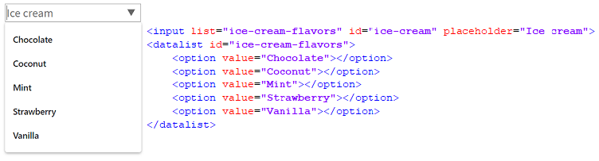
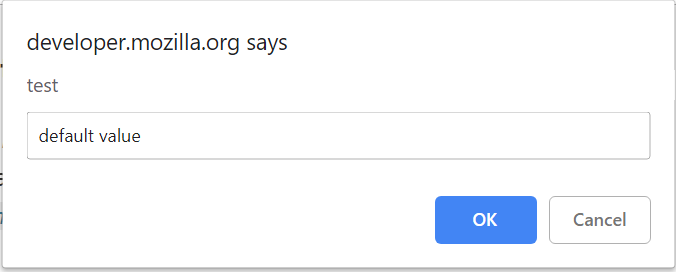

# Documentation
## Extended Selenium features
TBD

## ~~Simple~~ Common elements

### Button
**Button** – Element that represents a clickable button


Button is located in the following classes:
 
  - __Java__: _com.epam.jdi.light.ui.html.common.Button_
  - __C#__: _JDI.Light.Elements.Common.Button_

```java 
public static Button blueButton, disabledButton, suspendButton, ghostButton;

@UI("[value*='Red Button']") // @FindBy(css = "[value*='Red Button']")
public static Button redButton;

@UI("[value*='Disabled Button']") // @UI("input[type=button][disabled]")
public static Button disabledButtonInput;

@Test
public void getTextTest() {
    assertEquals(redButton.getText(), text);
}

@Test
public void getValueTest() {
    assertEquals(redButton.getValue(), text);
}

@Test
public void isValidationTest() {
    redButton.is().displayed();
    redButton.is().enabled();
    redButton.is().text(is(text));
    redButton.is().text(containsString("Red Button"));
    redButton.is()
            .text(is(text))
            .cssClass(is("uui-button red"))
            .attr("type", is("button"))
            .tag(is("input"));
    blueButton.is().text(containsString("Blue Button".toUpperCase()));
    disabledButton.is().text(containsString("Disabled Button".toUpperCase()));
    disabledButtonInput.is().text(containsString("Disabled Button"));
    disabledButton.is().disabled();
}

@Test
public void suspendButtonTest() {
    refresh();
    suspendButton.click();
    assertEquals(getAlertText(), "Suspend button");
    acceptAlert();
}

@Test
public void vanishButtonTest() {
    refresh();
    ghostButton.is().disappear();
}
```
```csharp
TBD 
```

Here is an example with provided HTML code:


Available method in Java JDI Light:

|Method | Description | Return Type
--- | --- | ---
**click()** |Click the button  | void

Available method in C# JDI Light:

|Method | Description | Return Type
--- | --- | ---

[Java test examples](https://github.com/jdi-testing/jdi-light/blob/master/jdi-light-html-tests/src/test/java/io/github/epam/html/tests/elements/simple/ButtonTests.java)

[C# test examples](https://github.com/jdi-testing/jdi-light-csharp/blob/master/JDI.Light/JDI.Light.Tests/Tests/Common/ButtonTests.cs)

### Checkbox
**Checkbox** – Element allows you to select single value for submission.


Checkbox is located in the following classes:
 
  - __Java__: _com.epam.jdi.light.ui.html.common.Checkbox*_
  - __C#__: _JDI.Light.Elements.Common.CheckBox*_

```java 
public static Checkbox acceptConditions;

@UI("#accept-conditions") // @FindBy(id = "accept-conditions")
public static Checkbox acceptConditions;

@Test
public void checkTest() {
    acceptConditions.check();
    assertEquals(acceptConditions.isSelected(), true);
}

@Test
public void uncheckTest() {
    acceptConditions.uncheck();
    assertEquals(acceptConditions.isSelected(), false);
}

@Test
public void clickTest() {
    assertTrue(acceptConditions.isSelected());
    acceptConditions.click();
    assertFalse(acceptConditions.isSelected());
}

@Test
public void isValidationTest() {
    acceptConditions.is().selected();
    acceptConditions.click();
    acceptConditions.is().deselected();
    acceptConditions.is().enabled();
    acceptConditions.is().displayed();
}

@Test
public void labelTest() {
    assertEquals(acceptConditions.label().getText(),
        "Accept terms and conditions");
    acceptConditions.label().is().text(containsString("terms and conditions"));
    acceptConditions.label().is().text(equalToIgnoringCase("accept terms and conditions"));
}
```
```csharp
TBD 
```

Here is an example with provided HTML code:


Available methods in Java JDI Light:

|Methods | Description | Return Type
--- | --- | ---
**click()** | Click the checkbox  | void
**check(String)**| Set to checked on "true" (case insensitive) or unchecked otherwise | void
**check()**| Set to checked | void
**uncheck()**| Set to unchecked | void
**isSelected()** | Verify value | boolean 
**assertThat()** | Assert action checkbox | CheckboxAssert
**is()** | Assert action checkbox | CheckboxAssert

Available methods in C# JDI Light:

|Method | Description | Return Type
--- | --- | ---

[Java test examples](https://github.com/jdi-testing/jdi-light/blob/master/jdi-light-html-tests/src/test/java/io/github/epam/html/tests/elements/simple/CheckboxTests.java)

[C# test examples](https://github.com/jdi-testing/jdi-light-csharp/blob/master/JDI.Light/JDI.Light.Tests/Tests/Common/CheckBoxTests.cs)

### ColorPicker
TBD

### DateTimeSelector
TBD

### FileInput

**FileInput** - a grafical control element, that allows the user to upload documents on the web site


FileInput element is located in JDI Light in:

  - __Java__: _com.epam.jdi.light.ui.html.common.FileInput_
  - __C#__: _JDI.Light.Elements.Composite.FileInput_

```java 
public static FileInput avatar; // @FindBy(id = "text")
@UI("input[type=file][disabled]") public static FileInput disabledFileInput; // @FindBy(css = "input[type=file][disabled]")
@UI("[download]") public static Link downloadJdiLogo;  // @FindBy(css = "[download]")

@Test
public void uploadTest() {
    avatar.uploadFile(mergePath(PROJECT_PATH,"/src/test/resources/general.xml"));
    avatar.is().text(containsString("general.xml"));
    assertTrue(avatar.getText().contains("general.xml"));
    assertTrue(avatar.getValue().contains("general.xml"));
    try {
        disabledFileInput.uploadFile(mergePath(PROJECT_PATH, "/src/test/resources/general.xml"));
    } catch (Exception ignore) {}
    disabledFileInput.is().text(is(""));
}
@Test
public void downloadTest() {
    if (isFireFox()) return;
    cleanupDownloads();
    downloadJdiLogo.click();
    assertThatFile("jdi-logo.jpg")
        .isDownloaded()
        .hasSize(is(32225L));
    assertThatFile("jdi-logo.jpg").hasSize(greaterThan(100L));
}
```
```csharp
[Test]
public void FileInputTest()
{
    FileInput.SelectFile(CreateFile(filename));
}
```

Here is an example with provided HTML code:


Available method in Java JDI Light:

|Method | Description | Return Type
--- | --- | ---
**uploadFile(String)** |Select file to upload  | void

Available method in C# JDI Light:

|Method | Description | Return Type
--- | --- | ---
**SelectFile(string filepath)** |Select file to upload  | void

[Java test examples](https://github.com/jdi-testing/jdi-light/blob/master/jdi-light-html-tests/src/test/java/io/github/epam/html/tests/elements/simple/FileUploadTests.java)

[C# test examples](https://github.com/jdi-testing/jdi-light-csharp/blob/master/JDI.Light/JDI.Light.Tests/Tests/Common/FileInputTests.cs)

### Icon
TBD

### Image
TBD

### Link
TBD

### NumberSelector
TBD

### ProgressBar
TBD

### Range
TBD

### Text
TBD

### TextArea
TBD

### TextField
TBD

### Title
TBD

## Complex elements
### RadioButton

**RadioButton** – interface element that allows user to select one option from a predefined group.

Radio buttons are represented by the following class:
 
  - __Java__: _com.epam.jdi.light.ui.html.complex.RadioButtons_
  - __C#__: _JDI.Light.Elements.Common.RadioButton_

```java 
@UI("[name=colors]")
public static RadioButtons colors;

public static RadioButtons colorsNoLocator;

@Test
public void selectTest() {
    colors.select(Blue);
    assertEquals(colors.getValue(), "Blue");
    colorsNoLocator.select(Red);
    colorsNoLocator.is().selected(Red);
}
```
```csharp 
[Test]
public void SelectRadioButton() 
{
    MyRadioButton.Select("some value");
}
[Test]
public void SelectRadioButtonByIndex() 
{
    MyRadioButton.Select(1);
}
[Test]
public void GetSelected() 
{
    var selected = MyRadioButton.GetSelected();
    Assert.AreEqual(selected, "some value");
}
```

Consider an example where each radio button is a particular color, described with given HTML code:


Here is the list of some available methods:

|Method | Description | Return Type
--- | --- | ---
**select(String/int/Enum)/Select(string/int)** |Select radiobutton by value/index  | void
**selected()/GetSelected()** |Get selected radiobutton value  | string

[Java test examples](https://github.com/jdi-testing/jdi-light/blob/master/jdi-light-html-tests/src/test/java/io/github/epam/html/tests/elements/complex/RadioTests.java)

[C# test examples](https://github.com/jdi-testing/jdi-light-csharp/blob/master/JDI.Light/JDI.Light.Tests/Tests/Common/RadioButtonTests.cs)

### Table

**Table** – a complex element that consists of header, body (at least one row and one column) and footer. You are able to perform a list of readonly interactions with this element.

Table implementation has an entry point in class:
 
  - __C#__: _JDI.Light.Elements.Complex.Table.cs_

```csharp
       
        [Test]
        public void HugeTableSearchByColumnNamesContainValuesTest()
        {
            PerformancePage.UsersTable.AssertThat().HasRowWithValues(
                ContainsValue("Meyer", InColumn("Name")),
                ContainsValue("co.uk", InColumn("Email")));
            var row = PerformancePage.UsersTable.Row(
                ContainsValue("Meyer", InColumn("Name")),
                ContainsValue("co.uk", InColumn("Email")));
                Assert.AreEqual("Brian Meyer;(016977) 0358;mollis.nec@seddictumeleifend.co.uk;Houston",
                    row.GetValue());
        }

        [Test]
        public void HugeTableSearchByColumnNumbersContainValuesTest()
        {
            PerformancePage.UsersTable.AssertThat().HasRowWithValues(
                ContainsValue("Burke", InColumn(1)),
                ContainsValue("ut.edu", InColumn(3)));
            var row = PerformancePage.UsersTable.Row(1);
            Assert.AreEqual("Burke Tucker;076 1971 1687;et.euismod.et@ut.edu;GozŽe",
                row.GetValue());
        }

        [Test]
        public void HugeTableSearchByColumnNamesHasValuesTest()
        {
            PerformancePage.UsersTable.AssertThat().HasRowWithValues(
                HasValue("Brian Meyer", InColumn("Name")),
                HasValue("mollis.nec@seddictumeleifend.co.uk", InColumn("Email")));
            var row = PerformancePage.UsersTable.Row(
                HasValue("Brian Meyer", InColumn("Name")),
                HasValue("mollis.nec@seddictumeleifend.co.uk", InColumn("Email")));
            Assert.AreEqual("Brian Meyer;(016977) 0358;mollis.nec@seddictumeleifend.co.uk;Houston",
                row.GetValue());
        }

        [Test]
        public void HugeTableSearchByColumnNumbersHasValuesTest()
        {
            PerformancePage.UsersTable.AssertThat().HasRowWithValues(
                HasValue("Brian Meyer", InColumn(1)),
                HasValue("mollis.nec@seddictumeleifend.co.uk", InColumn(3)));
            var row = PerformancePage.UsersTable.Row(
                ContainsValue("Meyer", InColumn("Name")),
                ContainsValue("co.uk", InColumn("Email")));
            Assert.AreEqual("Brian Meyer;(016977) 0358;mollis.nec@seddictumeleifend.co.uk;Houston",
                row.GetValue());
        } 

		[Test]
        public void TableChainTest()
        {            
            PerformancePage.UsersTable.AssertThat()
                .Size(400)
                .Size(Is.GreaterThan(399))                
                .HasRowWithValues(
                    HasValue("Brian Meyer", InColumn("Name")),
                    HasValue("mollis.nec@seddictumeleifend.co.uk", InColumn("Email")))
                .NotEmpty()
                .RowsWithValues(3, ContainsValue("Baker", InColumn(1)))
                .HasColumn("Email")
                .HasColumns(new[] {"Name", "City"})
                .Columns(Is.SubsequenceOf(new[] {"Name", "City", "Phone", "Email", "Address"}));
        }		
```

Already implemented methods:

| Method | Description | Return Type|
--- | --- | ---
**AssertThat()** | Applicable for performing assert actions for tables | TableAssert
**Is()** | Applicable for performing assert actions for tables | TableAssert
**ContainsValue(string value, Column column)** | Sets an object finding by some value occurance in particular column | TableMatcher 
**HasValue(string value, Column column)** | Sets an object finding by some full value in particular column | TableMatcher
**InColumn(string value)** | Sets an object of some column by particular value | Column
**InColumn(int num)** | Sets an object of some column by particular column's number | Column
**Row(params TableMatcher[] matchers)** | Sets and returns a row object of a table according to some matchers' params (returns 'null' if there is no such row) | Line
**Row(int rowNum)** | Sets and returns a row object of a table according to the row's index | Line
**GetValue()** | Returns a string content of values for particular row, where values are separated by ";" | string


AssertTable methods:

| Method | Description | Return Type|
--- | --- | ---
**Empty()** | Asserts whether table is empty | TableAssert
**NotEmpty()** | Asserts whether table is not empty | TableAssert
**Size(Matcher<int> condition)** | Asserts whether table size satisfy some matcher | TableAssert
**Size(int expectedSize)** | Asserts whether table has particular size | TableAssert
**HasColumn(string column)** | Asserts whether table has particular header | TableAssert
**HasColumns(IEnumerable<string> columns)** | Asserts whether table has particular headers | TableAssert
**Columns(Matcher<IEnumerable<string>> condition)** | Asserts whether headers satisfy some matcher | TableAssert
**RowsWithValues(int count, params TableMatcher[] matchers)** | Asserts whether rows with particular matchers exist in a table multiple times | TableAssert
**HasRowWithValues(params TableMatcher[] matchers)** | Asserts whether a row with particular matchers exists in a table | TableAssert

[Test examples C#](https://github.com/jdi-testing/jdi-light-csharp/blob/master/JDI.Light/JDI.Light.Tests/Tests/Complex/TableTests.cs)

### DropDown

**DropDown** – a graphical control element, that allows the user to choose one value from a list.


JDI Light has support for dropdown elements with its own type. There are several ways of dropdown usage in JDI Light, serving different needs.

__JDI Dropdown annotation__

For better use JDI Light provides a __*@JDropdown*__ annotation to locate dropdown elements. This annotation consists of the following elements:

 - __*root()*__ - value of this element points to the root locator of dropdown element
 - __*value()*__ - locator of selected by default option in dropdown list
 - __*list()*__ - locator representing list options
 - __*expand()*__ - locator for expanding the dropdown list
 
```java 
@JDropdown(root = "div[ui=dropdown]",
           value = ".filter-option",
           list = "li",
           expand = ".caret")
public Droplist colors;

@Test
public void complexTest() {
    metalAndColorsPage.shouldBeOpened();
    metalAndColorsPage.colors.select(Green);
}
```

```csharp 
[JDropDown(root: "#colors", 
           value: ".filter-option", 
           list:"li", 
           expand:".caret")]
public Droplist Colors;

[Test]
public void ComplexTest() 
{
    MetalAndColorsPage.ShouldBeOpened();
    MetalAndColorsPage.Colors.Select(Green);
}
```

Suppose we have 'Colors' dropdown, which looks like this in HTML code:

 

__Dropdown representation__

```java 
public Droplist colors;
@CSS("#colors") public Droplist colors;
public Droplist colors = dropdown("#colors");
public Droplist colors = $d("#colors");

@Test
public void colorsTest() {
    colors.select(Green);
    assertEquals(colors.selected(), Green);
}
```

```csharp 
public DropDown Colors;
[FindBy(Css = "#colors")] 
public DropDown Colors;

[Test]
public void ColorsTest() 
{
    Colors.Select(Green);
    Assert.AreEquals(Colors.Selected(), Green);
}
```

JDI Light provides a __Droplist__ class which can be used for dropdown representation as a type of web element.

Locator simple annotations from *com.epam.jdi.light.elements.pageobjects.annotations.simple* can be used together with dropdown elements.

[Java test examples](https://github.com/jdi-testing/jdi-light/blob/master/jdi-light-examples/src/test/java/io/github/epam/tests/epam/ComplexElementsTests.java)

For HTML5 elements Dropdown lists are also supported in JDI light. There is a __Dropdown__ class which is more like a special case of Droplist.
This type can be used in cases when dropdown is represented with HTML _\<select>_ tag.

Consider an example of HTML5 dropdown with a given HTML code:

```java 
@UI("#dress-code") public Dropdown dressCode;

@Test
public void selectEnumTest() {
    dressCode.select(Fancy);
    assertEquals(dressCode.getValue(), "Fancy");
}
```

```csharp 
[FindBy(Css = "#dress-code")] 
public Dropdown DressCode;

[Test]
public void SelectEnumTest() 
{
    DressCode.Select(Fancy);
    Assert.AreEquals(DressCode.GetSelected(), "Fancy");
}
```


Here is the list of some available methods:

|Method | Description | Return Type
--- | --- | ---
**select()/Select(string/int)** |Select dropdown by value/index  | void
**selected()/GetSelected()** |Get selected dropdown value  | string

[Java test examples](https://github.com/jdi-testing/jdi-light/blob/master/jdi-light-html-tests/src/test/java/io/github/epam/html/tests/elements/complex/DropdownTests.java)

[C# test examples](https://github.com/jdi-testing/jdi-light-csharp/blob/master/JDI.Light/JDI.Light.Tests/Tests/Common/DropDownTests.cs)

### MultiDropDown

```java 
public static MultiSelect multiDropdown;
@UI("#multi-dropdown") public static MultiSelect multiDropdown;

@Test
public void selectTest() {
    multiDropdown.check(Wood, Steam);
    assertEquals(multiDropdown.checked(), asList("Steam", "Wood"));
}
```
```csharp 
[FindBy(Css = "#multi-dropdown")]
public MultiDropdown MultiDropdown { get; set; }

[Test]
public void SelectMultipleOptions()
{
    var optionsList = new List<string> { "Steam", "Electro" };
    TestSite.Html5Page.MultiDropdown.SelectOptions(optionsList);
}
```

**MultiDropDown** – a graphical control element, that allows the user to choose several values from a list.


Multi dropdown elements can be described by the following class:

 - __Java__: _com.epam.jdi.light.ui.html.complex.MultiSelect_
 - __C#__: _JDI.Light.Elements.Composite.MultiDropdown_

Here is the list of some available methods in C# JDI Light:

|Method | Description | Return Type
--- | --- | ---
**OptionIsEnabled(string)** |Check whether option is enabled  | bool
**SelectOption(string)** |Select specified option  | void
**GetSelectedOptions()** |Get selected options  | List
**SelectOptions(List)** |Select specified options  | void
**OptionExists(string)** |Check whether option exists in list  | bool
**Expand()** |Expand list  | void
**Close()** |Close expanded list  | void

The list of available methods for Java JDI Light:

|Method | Description | Return Type
--- | --- | ---
**check(String/String.../Enum.../int...)** |Select values in multi dropdown | void
**uncheck(String.../Enum.../int...)** | Unselect values in multi dropdown | void
**selected()** | Get selected value by default | String
**checked()** | Get selected values | List\<String>

[Java test examples](https://github.com/jdi-testing/jdi-light/blob/master/jdi-light-html-tests/src/test/java/io/github/epam/html/tests/elements/complex/MultiDropdownTests.java)

[C# test examples](https://github.com/jdi-testing/jdi-light-csharp/blob/master/JDI.Light/JDI.Light.Tests/Tests/Composite/MultiDropdownTests.cs)

### DataList
```csharp 
[Test]
public void ExpandDataList() 
{
    MyDataList.Expand();
}
[Test]
public void SelectDataList() 
{
    MyDataList.Select("some value");
}
[Test]
public void SelectByIndex() 
{
    MyDataList.Select(1);
}
[Test]
public void FillDataList() 
{
    MyDataList.Input("some value");
    SubmitButton.Click();
}
```
**DataList** – a graphical control element, that allows the user to choose one value from a list or enter it by himself.
Datalist element contains a set of options with values available for entering.


Datalist element type is provided by JDI Light in:

 - __Java__: _com.epam.jdi.light.ui.html.complex.DataList_
 - __C#__: _JDI.Light.Elements.Common.DataList_
 
Have a look at the following example with provided HTML code:

```java 
@UI("#ice-cream") public static DataList iceCreamDataList;

@Test
public void selectEnumTest() {
    iceCreamDataList.select(Strawberry);
    assertEquals(iceCreamDataList.getValue(), "Strawberry");
}
```



The list of available methods in Java JDI Light:

|Method | Description | Return Type
--- | --- | ---
**select(String/Enum/int)** |Select datalist option by value or index | void
**selected()** |Get selected option value | String
**values()** |Get all option values from datalist | List\<String>
**listEnabled()** |Return list of values of enabled options | List\<String>
**listDisabled()** |Return list of values of disabled options | List\<String>

Here is the list of some available methods in C# JDI Light:

|Method | Description | Return Type
--- | --- | ---
**Expand()** |Expands the list of possible values | void
**Select(string/int)** |Select datalist by value/index  | void
**Input(string value)** |Input user's value into datalist  | void
**GetSelected()** |Get selected datalist value  | string

[Java test examples](https://github.com/jdi-testing/jdi-light/blob/master/jdi-light-html-tests/src/test/java/io/github/epam/html/tests/elements/complex/DataListTests.java)

[C# test examples](https://github.com/jdi-testing/jdi-light-csharp/blob/master/JDI.Light/JDI.Light.Tests/Tests/Common/DataListTests.cs)

### CheckList
**CheckList** – a graphical control element representing a set of checkboxes, each of which allows the user to control a two-state parameter (enabled or disabled).

Checklist element type is available in the following packages:
 
 - __Java__: com.epam.jdi.light.ui.html.complex.Checklist
 - __C__#: JDI.Light.Elements.Common.CheckList 

See an example with a given HTML code describing checklist element.

```java 
@UI("[name=checks-group]") public static Checklist weather;
public static Checklist weatherNoLocator;

@Test
public void selectTest() {
    weather.check(Cold, Rainy);
    assertEquals(weather.checked(), asList("Cold", "Rainy day"));
}

@Test
public void assertValidationTest() {
    weather.assertThat().values(containsInAnyOrder(
      "Hot option", "Cold", "Rainy day", "Sunny", "Disabled"));
    weatherNoLocator.assertThat().selected("Hot option");
}
```
```csharp 
[FindBy(Css = "div:nth-child(11) > div.html-left")]
public ICheckList WeatherCheckList { get; set; }

[Test]
public void CheckCheckList()
{
    TestSite.Html5Page.WeatherCheckList.Check(new[] { "Cold", "Sunny" });
    TestSite.Html5Page.WeatherCheckList.Uncheck("Cold");
}
```


List of available methods in Java JDI Light:

|Method | Description | Return Type
--- | --- | ---
**check(String.../Enum/int...)** |Select checkboxes | void
**uncheck(String.../Enum/int...)** | Unselect checkboxes | void
**checked()** | Get selected checkbox values | List\<String>

Here is the list of some available methods in C# JDI Light:

|Method | Description | Return Type
--- | --- | ---
**Check(string[]/int[])** |Select checklist by values/indexes  | void
**Check(string/int)** |Select checklist by value/index  | void
**Uncheck(string[]/int[])** |Unselect checklist by values/indexes  | void
**Uncheck(string/int)** |Unselect checklist by value/index  | void
**UncheckAll(Array)** |Uncheck all checkboxes | void
**GetChecked()** |Get selected checkboxes from checklist value  | string[]

[Java test examples](https://github.com/jdi-testing/jdi-light/blob/master/jdi-light-html-tests/src/test/java/io/github/epam/html/tests/elements/complex/ChecklistTests.java)

[C# test examples](https://github.com/jdi-testing/jdi-light-csharp/blob/master/JDI.Light/JDI.Light.Tests/Tests/Common/CheckListTests.cs)

### MultiSelector
**MultiSelector** – a graphical control element, that allows the user to do multiple choice.
Multi Selector are represented by the following class:
 
  - __Java__: _com.epam.jdi.light.ui.html.complex.MultiSelect_
  - __C#__: _JDI.Light.Elements.Common.MultiSelector_
  
  
```java 
public static MultiSelect ages;
@UI("#ages") public static MultiSelect ages;

@Test
public void checkTest() {
       ages.check("Electro", "Metalic");
       assertEquals(ages.checked(), asList("Electro", "Metalic"));
    }
@Test
public void disabledTest() {
        ages.select("Disabled");
        assertEquals(ages.getValue(), text);
    }
```
```csharp 
[Test]
public void MultiSelectByValues() 
{
    MyMultiSelector.Select(string[]);
}
[Test]
public void MultiSelectByIndexes() 
{
    MyMultiSelector.Select(int[]);
}
```


Here is the list of available methods:

|Method | Description | Return Type
--- | --- | ---
**check(String/Strings.../TEnum...)** |Select multiselector by values | void
**uncheck(Strings.../TEnum.../int)** |Select multiselector by values/indexes  | void
**selected()** |Get selected values  | String
**checked()** |Get selected values  | List\<String>

[Java test examples](https://github.com/jdi-testing/jdi-light/blob/master/jdi-light-html-tests/src/test/java/io/github/epam/html/tests/elements/complex/MultiSelectorTests.java)

[C# test examples](https://github.com/jdi-testing/jdi-light-csharp/blob/master/JDI.Light/JDI.Light.Tests/Tests/Common/MultiSelectorTests.cs)

### ComboBox

**ComboBox** – a graphical control element, that allows the user to choose one
 value from a list or enter it by himself (is inherited from the [Datalist](#datalist))


ComboBox is provided by JDI Light in:
 
  - __Java__: _com.epam.jdi.light.ui.html.complex.Combobox_
  - __C#__: _JDI.Light.Elements.Common.Combobox_

```java 
public static Combobox iceCream;

@UI("#ice-cream") // @FindBy(id = "ice-cream")
public static DataList iceCreamDataList;

  
@Test
public void selectTest() {
    iceCreamDataList.select("Chocolate");
    assertEquals(iceCreamDataList.getValue(), "Chocolate");
}
@Test
public void selectNumTest() {
    iceCreamDataList.select(5);
    assertEquals(iceCreamDataList.getValue(), "Vanilla");
}
@Test
public void selectedTest() {
    assertEquals(iceCreamDataList.selected(), "Coconut");
}
@Test
public void labelTest() {
    assertEquals(iceCreamDataList.label().getText(), "Choose your lovely icecream");
    iceCreamDataList.label().is().text(containsString("lovely icecream"));
}
@Test
public void isValidationTest() {
    iceCream.is().enabled();
    iceCream.is().text(is(text));
    iceCream.select(Vanilla);
    iceCream.is().text(containsString("Van"));
}
```
```csharp 
[Test]
public void ExpandComboBox() 
{
    MyComboBox.Expand();
}
[Test]
public void SelectComboBox() 
{
    MyComboBox.Select("some value");
}
[Test]
public void SelectByIndex() 
{
    MyComboBox.Select(1);
}
[Test]
public void FillComboBox() 
{
    MyComboBox.Input("some value");
    SubmitButton.Click();
}
```

Have a look at the following example with provided HTML code:  


The list of available methods in Java JDI Light:

|Method | Description | Return Type
--- | --- | ---
**select(String/Enum/int)** |Select datalist option by value or index | void
**selected()** |Get selected option value | String
**values()** |Get all option values from datalist | List\<String>
**listEnabled()** |Return list of values of enabled options | List\<String>
**listDisabled()** |Return list of values of disabled options | List\<String>

Here is the list of some available methods in C# JDI Light:

|Method | Description | Return Type
--- | --- | ---
**Expand()** |Expands the list of possible values | void
**Select(string/int)** |Select datalist by value/index  | void
**Input(string)** |Input user's value into datalist  | void
**GetSelected()** |Get selected datalist value  | string

[Java test examples](https://github.com/jdi-testing/jdi-light/blob/master/jdi-light-html-tests/src/test/java/io/github/epam/html/tests/elements/complex/ComboboxTests.java)

[C# test examples](https://github.com/jdi-testing/jdi-light-csharp/blob/master/JDI.Light/JDI.Light.Tests/Tests/Common/ComboBoxTests.cs)

### Input Type Date
```java 
@UI("#birth-date") 
// equal to @FindBy(css = "#birth-date") 
public static DateTimeSelector birthDate;

    @Test
    public void setDateTimeTest() {
        birthDate.setDateTime("2018-11-13");
        assertEquals(birthDate.value(), "2018-11-13");
    }
    
    @Test
     public void minTest() {
            assertEquals(birthDate.min(), "1970-01-01");
     }
    
     @Test
     public void maxTest() {
            assertEquals(birthDate.max(), "2030-12-31");
     }
```
```csharp 
[Test]
public void SetGetDateTime() 
{
    MyDateTime.SetDateTime("2000-01-01");
    MyDateTime.GetValue();
}
```
**Input Type Date** – a graphical control element, that allows users to set the value of date.


Input Type Date is represented by following classes:

 - __C#__: _JDI.Light.Elements.Common.DateTimeSelector_
 - __Java__: _com.epam.jdi.light.ui.html.common.DateTimeSelector_

Here is the list of some available methods in C#:

|Method | Description | Return Type
--- | --- | ---
**SetDateTime(string value)** | Sets a date or time | void
**GetValue()** | Returns the set date or time | string

[Test examples in C#](https://github.com/jdi-testing/jdi-light-csharp/blob/master/JDI.Light/JDI.Light.Tests/Tests/Common/DateTimeTests.cs)

And here are some of the methods available in Java:

|Method | Description | Return Type
--- | --- | ---
**setDateTime(string value)** | Sets a date or time | void
**value()** | Returns the set date or time | String
**min()** | Gets attribute with name min | String
**max()** | Gets attribute with name max | String

[Test examples in Java](https://github.com/jdi-testing/jdi-light/blob/master/jdi-light-html-tests/src/test/java/io/github/epam/html/tests/elements/simple/DateTests.java)

### Input Type Week
```java 
@UI("#autumn-week") 
// equal to @FindBy(css = "#autumn-week") 
public static DateTimeSelector autumnWeek;

    @Test
    public void minTest() {
        assertEquals(autumnWeek.min(), "2018-W35");
    }

    @Test
    public void maxTest() {
        assertEquals(autumnWeek.max(), "2018-W48");
    }

    @Test
    public void setDateTimeTest() {
        autumnWeek.setDateTime("2018-W12");
        autumnWeek.show();
        assertEquals(autumnWeek.value(), "2018-W12");
    }
```
```csharp 
[Test]
public void SetGetDateTime() 
{
    MyDateTime.SetDateTime("2019-W11");
    MyDateTime.GetValue();
}
```
**Input Type Week** – a graphical control element, that allows users to set the value of week and year.


Input Type Week is represented by following classes:

 - __C#__: _JDI.Light.Elements.Common.DateTimeSelector_
 - __Java__: _com.epam.jdi.light.ui.html.common.DateTimeSelector_

Here is the list of some available methods in C#:

|Method | Description | Return Type
--- | --- | ---
**SetDateTime(string value)** | Sets a date or time | void
**GetValue()** | Returns the set date or time | string

[Test examples in C#](https://github.com/jdi-testing/jdi-light-csharp/blob/master/JDI.Light/JDI.Light.Tests/Tests/Common/DateTimeTests.cs)

And here is the list of some available methods in Java:

|Method | Description | Return Type
--- | --- | ---
**setDateTime(string value)** | Sets a date or time | void
**value()** | Returns the set date or time | String
**min()** | Gets attribute with name min | String
**max()** | Gets attribute with name max | String

[Test examples in Java](https://github.com/jdi-testing/jdi-light/blob/master/jdi-light-html-tests/src/test/java/io/github/epam/html/tests/elements/simple/WeekTests.java)

### Input Type Month
```java 
@UI("#month-date") 
// equal to @FindBy(css = "#month-date") 
public static DateTimeSelector monthDate;

    @Test
    public void minTest() {
        assertEquals(monthDate.min(), "2015-03");
    }

    @Test
    public void maxTest() {
        assertEquals(monthDate.max(), "2020-12");
    }

    @Test
    public void setDateTimeTest() {
        monthDate.setDateTime("2018-10");
        monthDate.show();
        assertEquals(monthDate.value(), "2018-10");
    }
```
```csharp 
[Test]
public void SetGetDateTime() 
{
    MyDateTime.SetDateTime("2019-01");
    MyDateTime.GetValue();
}
```
**Input Type Month** – a graphical control element, that allows users to set the value of month and year.


Input Type Month is represented by following classes:

 - __C#__: _JDI.Light.Elements.Common.DateTimeSelector_
 - __Java__: _com.epam.jdi.light.ui.html.common.DateTimeSelector_

Here is the list of some available methods in C#:

|Method | Description | Return Type
--- | --- | ---
**SetDateTime(string value)** | Sets a date or time | void
**GetValue()** | Returns the set date or time | string

[Test examples in C#](https://github.com/jdi-testing/jdi-light-csharp/blob/master/JDI.Light/JDI.Light.Tests/Tests/Common/DateTimeTests.cs)

And here is the list of some available methods in Java:

|Method | Description | Return Type
--- | --- | ---
**setDateTime(string value)** | Sets a date or time | void
**value()** | Returns the set date or time | String
**min()** | Gets attribute with name min | String
**max()** | Gets attribute with name max | String

[Test examples in Java](https://github.com/jdi-testing/jdi-light/blob/master/jdi-light-html-tests/src/test/java/io/github/epam/html/tests/elements/simple/MonthTests.java)

### Input Type Time
```java 
TBD
```
```csharp 
[Test]
public void SetGetDateTime() 
{
    MyDateTime.SetDateTime("15:00");
    MyDateTime.GetValue();
}
```
**Input Type Time** – a graphical control element, that allows the user to set the value of time.


Here is the list of some available methods:

|Method | Description | Return Type
--- | --- | ---
**SetDateTime(string value)** | Sets the date or time | void
**GetValue()** | Returns the set date or time | string

[Test examples](https://github.com/jdi-testing/jdi-light-csharp/blob/master/JDI.Light/JDI.Light.Tests/Tests/Common/DateTimeTests.cs)


### Input Type DateTime-Local
```java 
public static DateTimeSelector partyTime;

@Test
public void setDateTimeTest() {
    partyTime.setDateTime("2017-05-10T00:00");
    assertEquals(partyTime.value(), "2017-05-10T00:00");
}
```
```csharp 
[Test]
public void SetGetDateTime() 
{
    MyDateTime.SetDateTime("2000-01-01T12:00");
    MyDateTime.GetValue();
}
```
**Input Type DateTime-Local** – a graphical control element, that allows the user to set the value of time and date.


There is a type for that element is available in JDI Light, which can be found in:

 - __Java__: com.epam.jdi.light.ui.html.common.DateTimeSelector
 - __C#__: JDI.Light.Elements.Common.DateTimeSelector

The list of available methods in Java JDI Light:

|Method | Description | Return Type
--- | --- | ---
**setDateTime(String)** | Sets the date and time | void
**value()** | Get date and time | String
**min()** | Get minimum available date and time value | String
**max()** | Get maximum available date and time value | String

Here is the list of some available methods in C# JDI Light:

|Method | Description | Return Type
--- | --- | ---
**SetDateTime(string value)** | Sets the date or time | void
**GetValue()** | Returns the set date or time | string

[Java test example](https://github.com/jdi-testing/jdi-light/blob/master/jdi-light-html-tests/src/test/java/io/github/epam/html/tests/elements/simple/DateTimeTests.java)

[C# test examples](https://github.com/jdi-testing/jdi-light-csharp/blob/master/JDI.Light/JDI.Light.Tests/Tests/Common/DateTimeTests.cs)

### Input Type Range
**Input Type Range** – a graphical control element, that allows the user to set the value from the range.
 
  - __Java__: _com.epam.jdi.light.ui.html.common.Range_
  - __C#__: _JDI.Light.Elements.Common.Range_
  
  
```java 
public static Range volume;
@UI("#volume") public static Range volume;

@Test
public void volumeTest() {
        volume.setVolume(10);
        assertEquals(volume.volume(), 10);
        assertEquals(volume.max(), "100");
        assertEquals(volume.min(), "10");
        assertEquals(volume.step(), "5");
    }
```
```csharp 
[Test]
public void SetGetRange() 
{
    MyDateTime.SetRange("50");
    MyDateTime.GetValue();
}
```


Here is the list of available methods:

|Method | Description | Return Type
--- | --- | ---
**setVolume(int volume)** | Sets the value | void
**volume()** | Returns the value | int
**max()** | Returns the max value | String
**min()** | Returns the min value | String
**step()** | Returns the step value | String

[Java test examples](https://github.com/jdi-testing/jdi-light/blob/master/jdi-light-html-tests/src/test/java/io/github/epam/html/tests/elements/simple/RangeTests.java)

[C# test examples](https://github.com/jdi-testing/jdi-light-csharp/blob/master/JDI.Light/JDI.Light.Tests/Tests/Common/RangeTests.cs)

## Composite elements
TBD

## UI Objects
TBD

## JDI Locators
TBD

## Windows/Tabs manager
TBD

## Alerts
```java 
alertButton.click();
acceptAlert();
```
```csharp 
AlertButton.Click();
AcceptAlert();
```
```java 
alertButton.click();
dismissAlert();
```
```csharp 
AlertButton.Click();
DismissAlert();
```
**Alert** –  a window with a message that displays on the screen and pauses the execution of the script until the user performs an action

<aside class="notice">
Note that you can make static import in order to simplify code Alerts.acceptAlert() > acceptAlert()
</aside>

Handle Window alerts/confirm/prompt dialogs desribed on <a href='https://developer.mozilla.org/en-US/docs/Web/API/Window' target="_blank">MDN</a>

alert('Alert')


```java 
alertButton.click();
String text = getAlertText();
acceptAlert();
```
```csharp 
AlertButton.Click();
String text = GetAlertText();
AcceptAlert();
```
```java 
alertButton.click();
validateAlert(is("Red button"));
validateAlert(equalToIgnoringCase("red button"));
validateAlert(containsString("Red"));
```
```csharp 
TBD ValidateAlert
```

confirm()


```java 
alertButton.click();
inputAndAcceptAlert("Some Text");
```
```csharp 
TBD InputAndAcceptAlert
```

prompt('Alert', 'Default value')




## Logs
TBD

## Reports
### Allure
TBD

### Report Portal
TBD

## JDI Settings
TBD

## Driver Settings
TBD

## Parallel tests run
TBD

## Remote test runs
TBD
