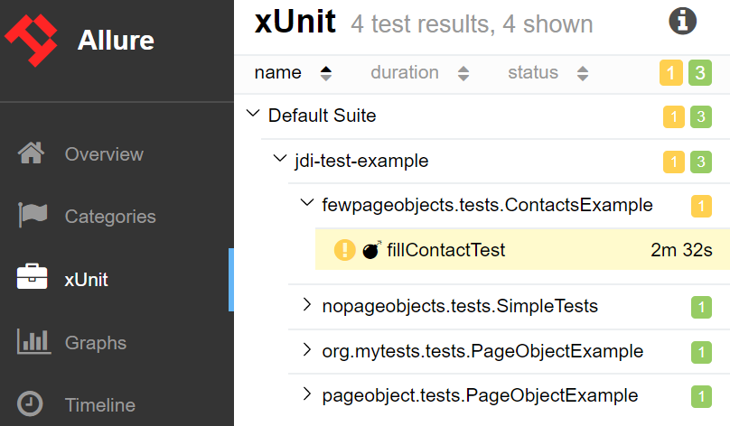
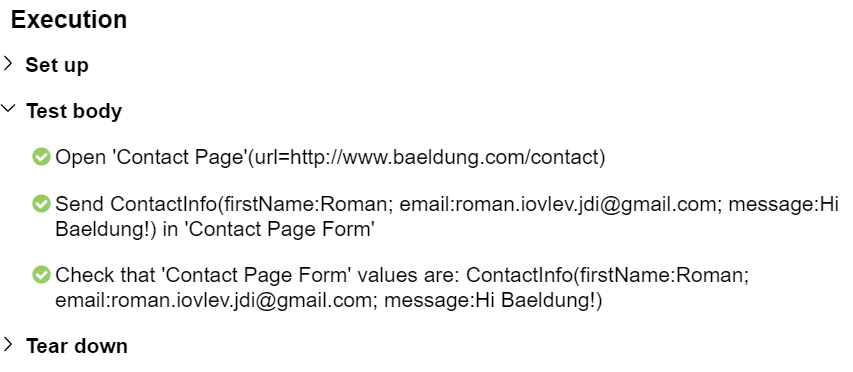
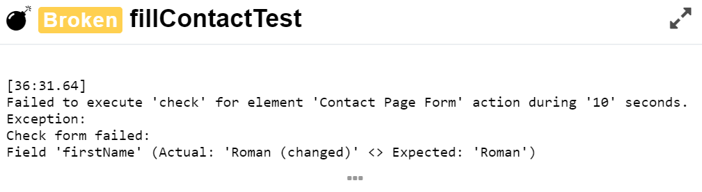
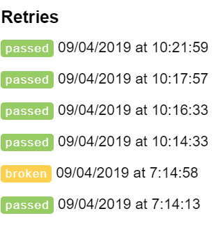

# Tutorial
In this tutorial, we’ll look at glance on [JDI Light](https://github.com/jdi-testing/jdi-light), a library that simplifies test automation, makes test run results stable, predictable and easy to maintain.<br/>
## Integration
Let’s start from the beginning and add JDI Light into our test project going through the setup step by step.<br/>
Note: JDI Light also ships with a [template project](https://github.com/jdi-templates/jdi-light-testng-template) that can be used to save us some time for the setup.
### Maven Dependencies

```java 
<dependency>
    <groupId>com.epam.jdi</groupId>
    <artifactId>jdi-light-html</artifactId>
    <version>RELEASE</version>
</dependency>
```
First, we need to add JDI Light in dependency in our pom.xml file: <br/>
_The latest version can be found in the [Maven Central Repository](https://search.maven.org/classic/#search%7Cga%7C1%7Cjdi-light)_<br/>
<br/><br/>
### Configuration
That’s all! We don’t need to set up anything. By default, JDI Light will download Chrome driver automatically, setup it and run while we try to access the first page.<br/>
We can change default settings placed in the test.properties file (src/test/resources)

```java
driver=chrome
#drivers.version=2.23 | LATEST
#timeout.wait.element=10
#timeout.wait.page=30
domain=http://www.baeldung.com/
#page.load.strategy=normal
#browser.size=MAXIMIZE | 1024x762
...
```
Let’s look on some of them in details:
- **driver** –  we can set up where we would like to run our tests. Some typical options: chrome, firefox, ie… or we can just place it with _${driver}_ and read the exact driver name from command line
- **drivers.version** – by default JDI Light will download the latest version of drive for us but if we need a specific version we can put it here (in this case the framework will find and download exactly this version)
- **timeout.wait.element** – timeout in seconds to wait for an element on the opened page. Default 10 seconds
- **timeout.wait.page** – JDI Light automatically define that new page opened and in this case will use this timeout (usually it is more than for element). By default 30 seconds.
- **domain** – web application root URL (used if we work with one application in tests). Can be also read from the command line like _${domain}_
- **page.load.strategy** – like in Selenium strategies to load the page. Options: _normal, eager, none_
- **browser.size** – the size of the tested browser. By default, JDI Light will maximize browser, but we can set exact values
_Note: you can find more examples in the documentation._
## Simple Test Example

```java
@Test
public void openJDITestSite() {
    openUrl("https://jdi-testing.github.io/jdi-light/");
}
```
Ok, now let’s write our first test case. We can open JDI Test Site (https://jdi-testing.github.io/jdi-light/) using a simple static method _openUrl_ in _WebPage_ class.<br/>
In WebPage we can find other typical methods that helps us to operate with browser:**getUrl(), getTitle(), back(), forward(), getHtml(), refresh()**.<br/>
And some not so typical like scroll **up/down/left/right/top/bottom** and **zoom** the page.

Now write more complex test with login on Page and validate that we succesfully logged INNext, we will navigate to the About page using links in Menu and validate that page is opened.
Every test should end with an assertion so let’s add it in our test.

```java
@Test
public void loginAndOpenContactPage() {
    openUrl("https://jdi-testing.github.io/jdi-light/");
    $("img#user-icon").click();
    $("#name").sendKeys("Roman");
    $("#password").sendKeys("Jdi1234");
    $("#login-button").click();
    $("#user-name").is().displayed();
}
```

```java
@JSite("http://www.baeldung.com/")
public class SiteJdi {
    @Url("/") @Title("Baeldung | Java, Spring and Web Development tutorials")
    public static HomePage homePage;
}
public class PageObjectExample implements TestsInit { 
    public void openPage() {
        homePage.open();
        homePage.checkOpened();
        //...
    }
    public void onHomePage() {
        homePage.shouldBeOpened();
        //...
    }
}
```
But if you would like to operate with pages we recommend to create PageObject for it:<br/>
Pretty simple and obvious isn’t it? Now we can open home page in one line after that we can validate that correct page opened (will throw exception if action failed).<br/>
<br/>
Additional option is to use method shouldBeOpened() that validate if page is already opened and if not will open it. This smart action can save your tests time.<br/>
<br/><br/><br/><br/><br/><br/><br/>

```java
public interface TestsInit {
    static void setUp() {
        PageFactory.initElements(SiteJdi.class);
    }
}
```
_*I hope you awareness enough and interested about TestInit class. This is just simple one method interface that initialize all PageObjects (HomePage in our case) in one line._<br/>
_Yes with JDI Light you can do it in one line for all your Page Objects!_

## Fill Contact Form Example
### Scenario
Now let’s look on more complex case:<br/>
    **0. Open Baeldung**<br/>
    **1. Go to Contact page**<br/>
    **2. Fill Contact Form**<br/>
    **3. And validate that data in form is correct**<br/>
_* Thanks to captcha we will not sent the form in this case but in your test application you can switch off captcha and validate filled form on next page for example or in DB_<br/>
### Create PageObjects

```java
@Url("/") @Title(value = "Baeldung | Java", validate = CONTAINS)
public class HomePage extends WebPage { }

@Url("/contact") @Title("Contact Me | Baeldung")
public class ContactPage extends WebPage {
    @FindBy(css = "[name=first_name]") TextField firstName;
    @FindBy(css = "[name=email]") TextField email;
    @FindBy(css = "[name=message]") TextArea message;
    @FindBy(xpath = "//*[text()='Send Your Message']") Button send;
}
```
First we need to create 2 Page Objects: HomePage – from previous example and ContactPage with fields and button on it<br/>
<br/><br/><br/><br/><br/><br/><br/><br/>

```java
public class ContactPage extends WebPage {
    @Css("[name=first_name]") TextField firstName;
    @Css("[name=email]") TextField email;
    @Css("[name=message]") TextArea message;
    @XPath("//*[text()='Send Your Message']") Button send;
}
public class ContactPage extends WebPage {
    @UI("[name=first_name]") TextField firstName;
    @UI("[name=email]") TextField email;
    @UI("[name=message]") TextArea message;
    @ByText("Send Your Message") Button send;
}
```
But standard @Findby can be simplified in JDI annotations @Css and @XPath or even with universal @UI:<br/>
<br/><br/><br/><br/><br/><br/><br/><br/><br/>

```java
@JSite("http://www.baeldung.com/")
public class BaeldungSite {
    public static HomePage homePage;
    public static ContactPage contactPage;
}
```
In this case our Site entity will look like this:
<br/><br/><br/><br/>
### Create Test Data

```java
public class ContactInfo extends DataClass<ContactInfo> {
    public String firstName, email, message;
}
```
We need to fill the form with some Contact information, let’s create an entity for it<br/>
<br/>

```java
ContactInfo MY_CONTACT = new ContactInfo().set(c -> {
        c.firstName = "Roman";
        c.email = "roman.iovlev.jdi@gmail.com";
        c.message = "Hi Baeldung!";} 
);
```
And fill it with some data:<br/>
_* You can put you entities in separate DataProvider file or just near the test if this is one time entity<br/>
<br/>
### Init Page Objects and Open BaeldungSite site

```java
public interface TestsInit {
    static void setUp() {
        logger.setLogLevel(STEP);
        initElements(BaeldungSite.class);
        homepage.open()
    }
}
```
Init all this pages and open home page of Baeldung site:<br/>
_* For demo purposes we also set log level to STEP in order to have business actions level log. For more details you can change log level to INFO (by default) or DEBUG._<br/>
<br/><br/><br/>
### Write test scenario

```java
public class ContactsExample implements TestsInit {
    @Test
    public void fillContactTest() {
        contactPage.open();
        contactPage.asForm().send(MY_CONTACT);
        contactPage.asForm().check(MY_CONTACT);
    }
}
```
And now we can write a test:<br/>
    **0. Open Baeldung**<br/>
    **1. Go to Contact page**<br/>
    **2. Fill Contact Form**<br/>
    **3. And validate that data in form is correct**<br/>
## Test run results
### Test scenario and log
This simple 3 rows test will:<br/>
- Open Baeldung site<br/>
- Navigate to Contact Page<br/>
- Fill contact form with your data and<br/>
- Validate that form filled correctly<br/>
Exactly what see in test scenario. As result you will see detailed user actions log:

```
[ STEP 21:52.780]: Open 'Home Page'(url=http://www.baeldung.com/)
[ STEP 21:59.008]: Open 'Contact Page'(url=http://www.baeldung.com/contact)
[ STEP 22:00.236]: Send ContactInfo(firstName:Roman; email:roman.iovlev.jdi@gmail.com; message:Hi Baeldung!) in 'Contact Page Form'
[ STEP 22:01.633]: Check that 'Contact Page Form' values are: ContactInfo(firstName:Roman; email:roman.iovlev.jdi@gmail.com; message:Hi Baeldung!)
```
Pretty much the same as test scenario do. You can share this log with BA or Client to demonstrate what your tests do.<br/>
If you need more details for maintenance purposes, you can change the level of your log to INFO. Using log4J settings you can customize output streams and log formats.<br/>
### Page Object actions with elements. Handle flaky tests
You don’t need to implement **open()**, **send()** and **check()** methods they are already developed for you (as well as a lot of other typical functions).<br/>
In addition, you don’t need to think about Thread sleeps, Explicit waits, stale or no such element exceptions. JDI Light will handle all staff that can make tests flaky for you. You just need to think about business part of test scenarios.
### Failed test and Allure reports

```
Failed to execute 'check' for element 'Contact Page Form' action during '10' seconds. 
Exception: Check form failed:
Field 'firstName' (Actual: 'Roman (changed)' <> Expected: 'Roman')
```
You can stop before method check execution, change some filled (e.g. firstName to “Roman (changed)”) and continue test to see that check will throw exception in case of some mismatch. And this assertion will be pretty much readable also:

JDI has good integration with Allure so as result of this test (if Allure are in place) you can see colorful and readable report with all tests execution results:

- **Test execution log**

- **Detailed test’s fail reasons information (you can click on … under error text and observe full exception stack trace)**

- **And history of all previous tests executions**

 
To generate such Allure report you need to copy allure-results folder from project root to target folder and run allure-serve maven plugin

## Create Custom controls
TBD

## JDI settings at glance
TBD

## Test Framework structure
TBD
