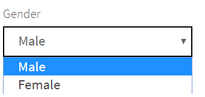

# Tutorial
In this tutorial, we’ll look at glance on [JDI Light](https://github.com/jdi-testing/jdi-light), a library that simplifies test automation, makes test run results stable, predictable and easy to maintain.<br/>
## 1. Integration
Let’s start from the beginning and add JDI Light into our test project going through the setup step by step.<br/>
Note: JDI Light also ships with a [template project](https://github.com/jdi-templates/jdi-light-testng-template) that can be used to save us some time for the setup.
### Maven Dependencies

```java 
<dependency>
    <groupId>com.epam.jdi</groupId>
    <artifactId>jdi-light-html</artifactId>
    <version>RELEASE</version>
</dependency>
```
First, we need to add JDI Light in dependency in our pom.xml file: <br/>
_The latest version can be found in the [Maven Central Repository](https://search.maven.org/classic/#search%7Cga%7C1%7Cjdi-light)_<br/>
<br/><br/>
### Configuration
That’s all! We don’t need to set up anything. By default, JDI Light will download Chrome driver automatically, setup it and run while we try to access the first page.<br/>
We can change default settings placed in the test.properties file (src/test/resources)

```java
src/test/resources/test.properties
driver=chrome
#drivers.version=2.23 | LATEST
#timeout.wait.element=10
#timeout.wait.page=30
domain=http://www.baeldung.com/
#page.load.strategy=normal | eager | none
#browser.size=MAXIMIZE | 1024x762
...
```
Let’s look on some of them in details: <br/>
- **driver** –  we can set up where we would like to run our tests. Some typical options: chrome, firefox, ie… or we can just place it with _${driver}_ and read the exact driver name from command line<br/>
- **drivers.version** – by default JDI Light will download the latest version of drive for us but if we need a specific version we can put it here (in this case the framework will find and download exactly this version)<br/>
- **timeout.wait.element** – timeout in seconds to wait for an element on the opened page. Default 10 seconds<br/>
- **timeout.wait.page** – JDI Light automatically define that new page opened and in this case will use this timeout (usually it is more than for element). By default 30 seconds<br/>
- **domain** – web application root URL (used if we work with one application in tests). Can be also read from the command line like _${domain}_ <br/>
- **page.load.strategy** – like in Selenium strategies to load the page. Options: _normal, eager, none_ <br/>
- **browser.size** – the size of the tested browser. By default, JDI Light will maximize browser, but we can set exact values
_Note: you can find more examples in the documentation._ <br/>
<a href="https://github.com/jdi-tutorials/01-jdi-light-intro/blob/master/src/test/resources/test.properties" target="_blank">See examples on Github</a>

## 2. JDI Light at glance
### Let's start

```java
@Test
public void openJDITestSite() {
    openUrl("https://jdi-testing.github.io/jdi-light/");
}
```
Ok, now let’s write our first test case. We can open JDI Test Site (https://jdi-testing.github.io/jdi-light/) using a simple static method _openUrl_ in _WebPage_ class.<br/>
In WebPage we can find other typical methods that helps us to operate with browser:**getUrl(), getTitle(), back(), forward(), getHtml(), refresh()**.<br/>
And some not so typical like scroll **up/down/left/right/top/bottom** and **zoom** the page.

### Simple test scenario
```java
@Test
public void loginSimpleTest() {
    openUrl("https://jdi-testing.github.io/jdi-light/");
    $("img#user-icon").click();
    $("#name").sendKeys("Roman");
    $("#password").sendKeys("Jdi1234");
    $("#login-button").click();
    $("#user-name").is().displayed();
}
```
Now we can write more complex typical test: login on Page.<br/>
Every test should end with an assertion so let’s add it in our test. </br>
Code like this is easy to write but! it will be hard to maintain while the number of tests grows and used in tests elements should be reused. For example, if we have element $(“.menu-about a”) in 10+ tests and locator is changed, we must go through all the tests and correct locator...</br>
<a href="https://github.com/jdi-tutorials/01-jdi-light-intro/blob/master/src/test/java/nopageobjects/tests/JDILightExample.java" target="_blank">See examples above on Github</a></br>
Page Objects will help us.

### Page Objects

```java
public class HomePage extends WebPage {
    @FindBy(css = "img#user-icon") public WebElement userIcon;
    @FindBy(id = "name") public WebElement name;
    @FindBy(id = "password") public WebElement password;
    @FindBy(id = "login-button") public WebElement loginButton;
    @FindBy(id = "user-name") public WebElement userName;
}
public class HomePage extends WebPage {
    @UI("img#user-icon") public static Link userIcon;
    @UI("#name") public static TextField name;
    @UI("#password") public static TextField password;
    @UI("#login-button") public static Button loginButton;
    @UI("#user-name") public static Text userName;
}
```
Let’s develop our first simple Page Objects and see how our test case will look like. We Home Page with list few elements: <br/>
- **user icon** - to open Login Form <br/>
- **name, password** - two textfield on Login form<br/>
- **login button** - button for Login<br/>
- **user name** - element that will appear on after success login<br/>

In order to make the code simple in JDI Light, we can use unified annotations **@UI("...")** that handle both Css and XPath locators and reduce the length of our code. <br/>
And of course we can use one of the main JDI Light feature: Typified elements like **TextField, Button, Text**. <br/>
And one more good news. We can make elements on Page Object static and keep tests more clear and obvious. <br/></br>

```java
@JSite("https://jdi-testing.github.io/jdi-light/")
public class SiteJdi {
    @Url("/") public static HomePage homePage;
    @Url("/contacts") @Title("Contact Form")
    public static ContactsPage contactPage;
}
```
Page Objects in JDI Light called **UI Objects** and extends standard Selenium Page Objects capabilities with typified elements like Textfield, Button, Text etc. and additional meta information for pages like **Url** and **Title**. 
Pretty simple and obvious isn’t it? Url for pages is relative from the site domain written in the @JSite annotation or in the test.properties (see abstract 2.2 in this article). <br/>
_Note: We don't need ContactsPage in this example but in order illustrate **@Url** and **@Title** annotations it is placed here_ 

```java
public interface TestsInit {
    @BeforeSuite(alwaysRun = true)
    static void setUp() {
        initElements(SiteJdi.class);
    }
}
```
And the last thing before writing a test that should be done once – init all UI Objects for our application. We can do this in the setup method that runs before all tests just in one line. <br/>
_Note: in other frameworks we must write initElements for each Page Object_ <br/>
<br/><br/><br/>

```java
public class PageObjectExample implements TestsInit {
    @Test
    public void loginTest() {
        homePage.open();
        userIcon.click();
        name.sendKeys("Roman");
        password.sendKeys("Jdi1234");
        loginButton.click();
        userName.assertThat().displayed();
    }
}

[INFO 29:11.362] : Open 'Home Page'(url=https://www.baeldung.com/) (SiteJdi.homePage (url=https://www.baeldung.com/; title=))
[INFO 29:17.702] : Click on 'Menu About' (HomePage.menuAbout (css='.menu-about a'))
[INFO 29:17.918] : Click on 'About Baeldung' (HomePage.aboutBaeldung (xpath='//h3[contains(.,'About Baeldung')]'))
[INFO 29:19.507] : Check that 'About Page' is opened (url CONTAINS '/about/'; title EQUALS 'About Baeldung | Baeldung') 
    (SiteJdi.aboutPage (url=https://www.baeldung.com/about/; title=About Baeldung | Baeldung))

[STEP 29:11.362] : Open 'Home Page'(url=https://www.baeldung.com/)
[STEP 29:17.702] : Click on 'Menu About'
[STEP 29:17.918] : Click on 'About Baeldung'
[STEP 29:19.507] : Check that 'About Page' is opened (url CONTAINS '/about/'; title EQUALS 'About Baeldung | Baeldung')
```
Now we can write our test using this UI Objects and execute it<br/><br/>
- This test scenario is pretty clear and based on real UI elements<br/>
- We can easily update elements on UI Objects without going through all tests<br/>
- We have all meta data about pages in one place and can open them and validate from tests without urls and title duplication in code <br/>
- JDI Light tests are stable and will not fail in cases where Selenium throws exceptions (like _StaleElement_ or _NoSuchElement_)<br/><br/><br/>
- We will get the following text in the log: <br/>
Exactly what we do in our test with all the details and without any effort from our side. Fabulous! <br/>
<br/>
We can change the log level to STEP (just add logger.setLogLevel(STEP) in to setUp() method) and remove details. This log can be shared with our Customer or Manual QA and let them know what our Automated tests verify.<br/>
<a href="https://github.com/jdi-tutorials/01-jdi-light-intro" target="_blank">See PageObject examples in PageObjectExample.java on Github</a>

## 3. JDI Light Forms
### Standard Login form

```java
public class LoginForm extends Form<User> {
    @UI("#name") TextField name;
    @UI("#password") TextField password;
    @UI("#login-button") Button loginButton;
}
public class JDISite {
    @Url("/") public static HomePage homePage;
    public static LoginForm loginForm;
    ...
}
@Test
public void loginTest() {
    userIcon.click();
    loginForm.loginAs(ROMAN);
    userName.is().displayed();
}
public class User extends DataClass<User> {
    public String name, password;
}
```
Pretty good. Now we will optimize previous example using forms. <br/>
Let's move elements placed on Login Form in separate UI Object _LoginForm_<br/><br/><br/>

And place LoginForm in root UI Object - JDI Site<br/><br/><br/>

Now we can rewrite test in the following way:
_Note: **ROMAN** is a business entity User that associated with Login Form<br/><br/><br/>_

User class is simple data class with two String fields that has same names as TextFields in LoginForm. <br/>
In this way you can fill any types of elements in form that can be filled: TextField, TextArea, Checkbox, DropDown etc. <br/>
_We will go through this in Contact Form example._<br/>

```java
  User ROMAN = new User().set(c -> {
      c.name = "Roman"; c.password = "Jdi1234";
  } );
Output: ROMAN.toString() --> User(name:Roman; password:Jdi1234)
```
For data class we can use any class but if we add **extends DataClass** we will get additional benefits:<br/>
- Ability to fill User fields in any order and numbers without constructors with method **set()**<br/>
- Compare two users by equality of their fields and not by reference with method **equal()**<br/>
- Have good **toString()** for User based on its fields<br/>
<a href="https://github.com/jdi-tutorials/01-jdi-light-intro" target="_blank">See this example in LoginExample.java on Github</a>

### Cover Login Form with Data Driven tests

```java
public class UsersDataProvider {
    public static User NO_PASSWORD = new User().set(c -> c.name = "Roman");
    public static User NO_CREDENTIALS = new User().set(c -> {
        c.name = ""; c.password = "";}
    );
    public static User WRONG_CREDENTIALS = new User().set(c -> {
        c.name = "Alex"; c.password = "Password";}
    );
    ...
}

public class LoginExample implements TestsInit {
    @BeforeMethod
    public void before() {
        loggedOut();
        loginFormShown();
    }
    @Test
    public void failedLoginTest1() {
        loginForm.loginAs(NO_PASSWORD);
        userName.is().hidden();
    }
    @Test
    public void failedLoginTest2() {
        loginForm.loginAs(WRONG_CREDENTIALS);
        userName.is().hidden();
    }
    @Test
    public void failedLoginTest3() {
        loginForm.loginAs(NO_CREDENTIALS);
        userName.is().hidden();
    }
    ...
}
```
And we can easily increase amount of different tests<br/>
Let's cover login functionality with tests:<br/>
1. No Password<br/>
2. Wrong Credentials<br/>
3. No data<br/>
<br/>
In order to do this we will create file (UsersDataProvider.java) for our Test Data and put User entities with required values<br/>
_Note: that if you will leave some fields null this data will not be entered, because we would like to validate empty values in fields for NO_CREDENTIALS we should set them as empty strings_<br/>
<br/>
Now we can write our tests <br/>
_Note: we don't need to write any other code except test scenarios. Already written UI Objects is enough_<br/>
_Note: In order to be sure that before each test user **logged out** and **Login form is opened** we can add this as States in **@BeforeMethod**_<br/>
<a href="https://github.com/jdi-tutorials/02-jdi-light-forms-elements" target="_blank">See this example in LoginExample.java on Github</a>

### Failed Login Form tests with Data Provider

```java
public class UsersDataProvider {
    ...
    @DataProvider(name = "failedUsers")
    public static Object[][] failedUsers() {
        return new User[][]{{NO_PASSWORD}, {NO_CREDENTIALS}, {WRONG_CREDENTIALS}};
    }
```
But scenarios in previous example are pretty much the same and difference only in Test Data. We can simplify our tests with DataProvider.<br/>
Let's add in our UsersDataProvider.java file method that returns test data for our cases as 2D array of Users and mark it by annotation **@DataProvider** with name **failedUsers**<br/><br/>

```java
public class UsersDataProvider {
    ...
    @Test(dataProvider = "failedUsers", dataProviderClass = UsersDataProvider.class)
    public void dataFailedLoginTest(User user) {
        loginForm.loginAs(user);
        userName.is().hidden();
    }
```
As Next step we will create one common test scenario and put User as parameter for it. <br/>
And the last thing is just link our test to dataprovider method using **@Test** annotation parameters.<br/>
Thats it! If we run this one scenario we will get 3 tests that validate different cases of failed login.<br/>
In this way you can easily manage same scenarios with different test data, increase testing coverage, add new data sets or update them without changing tests<br/>
So simple!<br/>
<a href="https://github.com/jdi-tutorials/02-jdi-light-forms-elements" target="_blank">See this example in LoginExample.java on Github</a>

## 4. UI Elements and optimization
### UI Elements on Contact Form
We got first look on JDI Light and now let's look closer to UI Elements. In JDI we have 3 kinds of elements:<br/>
1. Common Elements: Buttons, TextFields, Text, Checkbox etc. Some of them we already use in Login Form. All this elements are simple and can be described by one locator or Selenium element.<br/>
_Note: See full list and more details in <a href="https://jdi-docs.github.io/jdi-light/?java#common-elements">Documentation</a>_<br/>
2. Complex elements like Dropdown, Checklist, RadioButtons, MultSelect, DataList etc.. This elements work with List of Common Elements one or different types. E.g. Dropdown has _value_, _expand arrow_ and _list of options_; Checklist - just list of Checkboxes<br/>
_Note: See full list and more details in <a href="https://jdi-docs.github.io/jdi-light/?java#complex-elements">Documentation</a>_<br/>
3. Composite elements are typified Page Objects. This is WebPage, Form, Section and just simple class with list of UI Elements or sub-sections.<br/>
_Note: See full list and more details in <a href="https://jdi-docs.github.io/jdi-light/?java#composite-elements">Documentation</a>_<br/>

```java
public class ContactForm extends Form<ContactInfo> {
    @UI("#passport") Checkbox passport;
    @UI("#name") TextField name;
    @UI("#last-name") TextField lastName;
    @UI("#position") TextField position;
    @UI("#passport-number") TextField passportNumber;
    @UI("#passport-seria") TextField passportSeria;
    @UI("#gender") Dropdown gender;
    @UI("#religion") Combobox religion;
    @UI("#weather") MultiDropdown weather;

    @UI("#accept-conditions") public Checkbox acceptConditions;
    @UI("#description") TextArea description;

    @UI("button[type=submit]") Button submit;
}
@Url("/contacts") @Title("Contact Form")
public class ContactPage extends WebPage {
    @UI("#contact-form") public static ContactForm contactForm;
}
```
Let's look on example: Contact Form on <a href="https://jdi-testing.github.io/jdi-light/contacts.html" target="_blank">Contacts page</a> <br/>
This Form opposite to Login Form has more different UI elemnts. Let's describe it.<br/>
We have here <u>Common</u> elements: <br/>
5 **TextField**s (name, lastName, position, passportNumber, passportSeria)<br/>
<br/>
2 **Checkbox**es (passport, acceptConditions)<br/>
<br/>
1 **TextArea** (description)<br/>
<br/>
1 **Button** (submit)<br/>
<br/>
And <u>Complex</u> elements:<br/>
**Dropdown** (gender) -  Element with one value, expand arrow and list of options <br/>
<br/>
**Combobox** (religion) - Mix of Dropdown and TextField. You set value from list of options or enter your own<br/>
<br/>
**MultiDropdown** (weather) - Dropdown with ability to select list of options<br/>
<br/>
And the **Contact Form** itself is <u>Composite</u> Page Object<br/>
Contact Form placed on another <u>Composite</u> Page Object called **Contact Page**<br/>
Put your attention that Contact Form and Contact Page have additional meta information: <br/>
- Already known **@Url** and **@Title** for WebPage and <br/>
- Locator in **@UI** annotation. This mean that all elements placed in this Page Object will be found only in this context and even if their simple locator <u>"button[type=submit]"</u> present on this page multiple times it will be found correctly for this form<br/>

```java
public class ContactInfo extends DataClass<ContactInfo> {
    public String passport, name, lastName, position, passportNumber, 
        passportSeria, gender, religion, weather, acceptConditions, description;
}
```  
Next point is "extend WebPage" and "extend Form\<ContactInfo\>" let this Page Objects have actions to operate with elements on it and related meta-info<br/>
Data entity for this form (ContactInfo) looks pretty much the same as for Login Form. All fields that can be managed by Form are String.</br>

```java
@UI("img#user-icon") public static Link userIcon;
@UI("#user-name") public static Text userName;
@UI(".sidebar-menu span") public static Menu sideMenu;
```  
We also have few <u>Common</u> elements directly on Site: already used **Link** <u>userIcon</u> and **Text** element <u>userName</u></br>
and one new <u>Complex</u> element - **Menu** - list of links in left side bar. This element also described by one locator but returns 16 items and you can call the one that you need by its name desribed in enum <u>MenuOptions</u></br>

```java
@Test
public void simpleContactFormTest() {
    sideMenu.select("Contact form");
    contactPage.checkOpened();
    contactForm.submit(FULL_CONTACT);
    contactForm.check(FULL_CONTACT);
}
public static ContactInfo FULL_CONTACT = new ContactInfo().set(c -> {
    c.name = "Roman"; c.lastName = "Full Contact"; c.position = "ChiefQA"; 
    c.passportNumber = "4321"; c.passportSeria = "123456"; 
    c.description = "JDI - awesome UI automation tool";

    c.gender = "Female"; c.religion = "Other"; c.weather = "Sun, Snow";
    c.acceptConditions = "true"; c.passport = "true";
    }
);
```
Let's write complex test that:<br/> 
- Open Contact Page from menu<br/>
- Validate that this Page has correct url and title<br/>
- Fill all 11 different elements in this Complex form by some values<br/>
- And validate that form filled correctly<br/>
...<br/>
This is as much simple as for Login Form! Amazing!<br/>
The most complex part is create test data that we would like to enter<br/>
```java
public static ContactInfo SIMPLE_CONTACT = new ContactInfo().set(c -> {
    c.name = "Roman"; c.lastName = "Iovlev"; c.position = "ChiefQA";
    c.passportNumber = "4321"; c.passportSeria = "123456"; }
);
@Test
public void simpleContactFormTest() {
    sideMenu.select(ContactForm);
    contactPage.checkOpened();
    contactForm.submit(SIMPLE_CONTACT);
    contactForm.check(SIMPLE_CONTACT);
}
```
Now if we would like to fill only TextFields, we should just change test data.<br/>
_Note:_In second example we use select by enum value for sideMenu it works the same as by text but allow us to choose from limited list of options and reduce chance to make a mistake_<br/>

### Use Form in different ways

## Create Custom controls
TBD

## JDI settings at glance
TBD

## Test Framework structure
TBD
