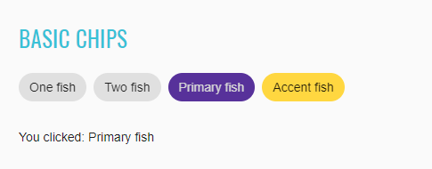
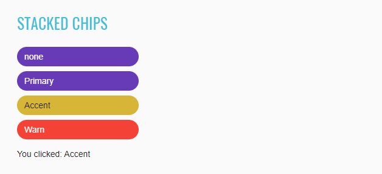

## 2. Angular elements
### 2.1 Angular Common elements

#### 2.1.1 Divider

##### <a href="https://material.angular.io/components/divider/overview" target="_blank">Divider overview</a>

Divider is located in the following class:

- __Java__: _com.epam.jdi.light.ui.angular.elements.common.Divider_
- 
```java 
    @UI("#divider-list mat-divider")
    public class JList<Divider> dividers;

    @Test
    public void dividerDisplayTest() {
        dividerSection.dividers.get(1).is().displayed();
        dividerSection.dividers.get(2).is().displayed();
    }

    @Test
    public void dividerAttrTest() {
        dividerSection.dividers.get(1).is().attr("aria-orientation", "horizontal");
        dividerSection.dividers.get(2).is().attr("aria-orientation", "horizontal");
    }
```

Divider icon:


```html
<mat-list class="mat-list mat-list-base">
  <mat-list-item class="mat-list-item mat-focus-indicator">
    <div class="mat-list-item-content">
      <div mat-ripple="" class="mat-ripple mat-list-item-ripple"></div>
      <div class="mat-list-text"></div>Item 1</div></mat-list-item>
      <mat-divider role="separator" class="mat-divider mat-divider-horizontal" aria-orientation="horizontal"></mat-divider><mat-list-item class="mat-list-item mat-focus-indicator">
    <div class="mat-list-item-content">
      <div mat-ripple="" class="mat-ripple mat-list-item-ripple"></div>
      <div class="mat-list-text"></div>Item 2</div></mat-list-item>
      <mat-divider role="separator" class="mat-divider mat-divider-horizontal" aria-orientation="horizontal"></mat-divider><mat-list-item class="mat-list-item mat-focus-indicator">
    <div class="mat-list-item-content">
      <div mat-ripple="" class="mat-ripple mat-list-item-ripple"></div>
      <div class="mat-list-text"></div>Item 3</div>
  </mat-list-item>
</mat-list>
```

|Method | Description | Return Type
--- | --- | ---
**isDisplayed** | Verify state | boolean

##### <a href="https://github.com/jdi-testing/jdi-light/blob/master/jdi-light-angular-tests/src/test/java/io/github/epam/angular/tests/elements/common/DividerTests.java" target="_blank">Here you can find Divider tests</a>

#### 2.1.2 Icons

##### <a href="https://material.angular.io/components/icon/overview" target="_blank">Icon overview</a>

Icon is located in the following class:

- __Java__: _com.epam.jdi.light.ui.html.elements.common.Icon_

There is two different icons in Angular: Basic icon and SVG icon:

 

```java 
    //@FindBy(id="#basic_icon")  
    @UI("#basic_icon")
    public static Icon basicIcon;
    
    //@FindBy(id="#svg_icon")  
    @UI("#svg_icon")
    public static Icon svgIcon;


    @Test
    public void checkBasicIconIsDisplayed() {
        basicIcon.show();
        basicIcon.is().displayed();
    }

    @Test
    public void checkSVGIconIsDisplayed() {
        svgIcon.show();
        svgIcon.is().displayed();
    }
```

```html
<mat-icon _ngcontent-hkf-c334="" role="img" aria-hidden="false" aria-label="Example home icon" class="mat-icon notranslate material-icons mat-icon-no-color">home</mat-icon>
<mat-icon _ngcontent-hkf-c335="" role="img" svgicon="thumbs-up" aria-hidden="false" aria-label="Example thumbs up SVG icon" class="mat-icon notranslate mat-icon-no-color"><svg xmlns="http://www.w3.org/2000/svg" width="100%" height="100%" fit="" preserveAspectRatio="xMidYMid meet" focusable="false">
    <path d="M0 0h24v24H0z" fill="none"></path>
    <path d="M1 21h4V9H1v12zm22-11c0-1.1-.9-2-2-2h-6.31l.95-4.57.03-.32c0-.41-.17-.79-.44-1.06L14.17 1 7.59 7.59C7.22 7.95 7 8.45 7 9v10c0 1.1.9 2 2 2h9c.83 0 1.54-.5 1.84-1.22l3.02-7.05c.09-.23.14-.47.14-.73v-1.91l-.01-.01L23 10z"></path>
</svg></mat-icon>
```

|Method | Description | Return Type
--- | --- | ---
**isDisplayed()** | Verify state | boolean
**show()** | Scroll to element | void

##### <a href="https://github.com/jdi-testing/jdi-light/blob/master/jdi-light-angular-tests/src/test/java/io/github/epam/angular/tests/elements/common/IconsTests.java" target="_blank">Here you can find Icons tests</a>

#### 2.1.3 Progress spinner

##### <a href="https://material.angular.io/components/progress-spinner/overview" target="_blank">Progress Spinner overview</a>

Progress Spinner is located in the following class:

- __Java__: _com.epam.jdi.light.angular.elements.common.Spinner_

```java 
    //@FindBy(id="#basic-progress-spinner")    
    @UI("#basic-progress-spinner")
    public static Spinner basicProgressSpinner;
    
    //@FindBy(id="#show-spinner")    
    @UI("#show-spinner")
    public static Button showSpinner;


    @Test
    public void checkSpinnerAppearAndThenDisappear() {
        showSpinner.click();
        basicProgressSpinner.is().displayed();
        basicProgressSpinner.waitFor().hidden();
    }
```


```html
<mat-spinner _ngcontent-krq-c336="" role="progressbar" mode="indeterminate" class="mat-spinner mat-progress-spinner mat-primary mat-progress-spinner-indeterminate-animation" style="width: 100px; height: 100px;">
  <svg preserveAspectRatio="xMidYMid meet" focusable="false" viewBox="0 0 100 100" style="width: 100px; height: 100px;">
    <circle cx="50%" cy="50%" r="45" class="ng-star-inserted" style="animation-name: mat-progress-spinner-stroke-rotate-100; stroke-dasharray: 282.743px; stroke-width: 10%;"/>
  </svg>
</mat-spinner>
```

|Method | Description | Return Type
--- | --- | ---
**isDisplayed()** | Verify state | boolean
**show()** | Scroll to element | void

##### <a href="https://github.com/jdi-testing/jdi-light/blob/master/jdi-light-angular-tests/src/test/java/io/github/epam/angular/tests/elements/common/SpinnerTests.java" target="_blank">Here you can find Spinner tests</a>

#### 2.1.4 Slide toggle

##### <a href="https://material.angular.io/components/slide-toggle/overview" target="_blank">Slide toggle overview</a>

Slide toggle is located in the following class:

- __Java__: _com.epam.jdi.light.angular.elements.common.SlideToggle_

There is two different slide toggles in Angular: Basic and Configurable:

Basic toggle:

```java 
    //@FindBy(id="slide-toggles-basic")
    @UI("#slide-toggles-basic")
    public static SlideToggle basicSlideToggle;

    @Test
    public void basicTest() {
        basicSlideToggle.is().displayed();
        resultSlideToggle.is().displayed();
        checkedCheckbox.is().displayed();
        disableCheckbox.is().displayed();
        colorRadioButtons.is().displayed();
    }

    @Test
    public void basicToggleCheckedTest() {
        basicSlideToggle.check();
        basicSlideToggle.is().selected();
        basicSlideToggle.uncheck();
        basicSlideToggle.is().deselected();
    }
```


```html
<mat-slide-toggle _ngcontent-bco-c235="" class="mat-slide-toggle mat-accent mat-checked" id="mat-slide-toggle-1" tabindex="-1">
  <label class="mat-slide-toggle-label" for="mat-slide-toggle-1-input">
    <div class="mat-slide-toggle-bar">
      <input type="checkbox" role="switch" class="mat-slide-toggle-input cdk-visually-hidden" id="mat-slide-toggle-1-input" tabindex="0" aria-checked="true">
      <div class="mat-slide-toggle-thumb-container">
        <div class="mat-slide-toggle-thumb"/>
        <div mat-ripple="" class="mat-ripple mat-slide-toggle-ripple mat-focus-indicator">
          <div class="mat-ripple-element mat-slide-toggle-persistent-ripple"/>
        </div>
      </div>
    </div>
    <span class="mat-slide-toggle-content">
				<span style="display: none;">&nbsp;</span>Slide me!</span>
  </label>
</mat-slide-toggle>
```

Configurable slide toggle:

```java 
    //@FindBy(id="slide-toggles-configured") 
    @UI("#slide-toggles-configured")
    public static SlideToggle resultSlideToggle;

    @Test
    public void resultToggleColorTest() {
        disableCheckbox.uncheck();
        resultSlideToggle.check();
        primaryRadioButton.click();
        resultSlideToggle.has().cssClass("mat-primary");
        accentRadioButton.click();
        resultSlideToggle.has().cssClass("mat-accent");
        warningRadioButton.click();
        resultSlideToggle.has().cssClass("mat-warn");
    }

    @Test
    public void resultToggleCheckedTest() {
        resultSlideToggle.uncheck();
        checkedCheckbox.check();
        resultSlideToggle.is().selected();
        checkedCheckbox.uncheck();
        resultSlideToggle.is().deselected();
    }

    @Test
    public void resultToggleDisableTest() {
        disableCheckbox.check();
        resultSlideToggle.is().disabled();
        disableCheckbox.uncheck();
        resultSlideToggle.is().enabled();
    }
```  


```html
<mat-card-content _ngcontent-noq-c236="" class="mat-card-content">
  <h4 _ngcontent-noq-c236="">Slider configuration</h4>
  <section _ngcontent-noq-c236="" class="example-section">
    <label _ngcontent-noq-c236="" class="example-margin">Color:</label>
    <mat-radio-group _ngcontent-noq-c236="" role="radiogroup" class="mat-radio-group ng-untouched ng-pristine ng-valid">
      <mat-radio-button _ngcontent-noq-c236="" value="primary" class="mat-radio-button example-margin mat-accent" tabindex="-1" id="mat-radio-13">
        <label class="mat-radio-label" for="mat-radio-13-input">
          <div class="mat-radio-container">
            <div class="mat-radio-outer-circle"/>
            <div class="mat-radio-inner-circle"/>
            <input type="radio" class="mat-radio-input cdk-visually-hidden" id="mat-radio-13-input" tabindex="0" name="mat-radio-group-11" value="primary">
            <div mat-ripple="" class="mat-ripple mat-radio-ripple mat-focus-indicator">
              <div class="mat-ripple-element mat-radio-persistent-ripple"/>
            </div>
          </div>
          <div class="mat-radio-label-content">
            <span style="display: none;">&nbsp;</span> Primary </div>
        </label>
      </mat-radio-button>
      <mat-radio-button _ngcontent-noq-c236="" value="accent" class="mat-radio-button example-margin mat-accent mat-radio-checked" tabindex="-1" id="mat-radio-14">
        <label class="mat-radio-label" for="mat-radio-14-input">
          <div class="mat-radio-container">
            <div class="mat-radio-outer-circle"/>
            <div class="mat-radio-inner-circle"/>
            <input type="radio" class="mat-radio-input cdk-visually-hidden" id="mat-radio-14-input" tabindex="0" name="mat-radio-group-11" value="accent">
            <div mat-ripple="" class="mat-ripple mat-radio-ripple mat-focus-indicator">
              <div class="mat-ripple-element mat-radio-persistent-ripple"/>
            </div>
          </div>
          <div class="mat-radio-label-content">
            <span style="display: none;">&nbsp;</span> Accent </div>
        </label>
      </mat-radio-button>
      <mat-radio-button _ngcontent-noq-c236="" value="warn" class="mat-radio-button example-margin mat-accent" tabindex="-1" id="mat-radio-15">
        <label class="mat-radio-label" for="mat-radio-15-input">
          <div class="mat-radio-container">
            <div class="mat-radio-outer-circle"/>
            <div class="mat-radio-inner-circle"/>
            <input type="radio" class="mat-radio-input cdk-visually-hidden" id="mat-radio-15-input" tabindex="0" name="mat-radio-group-11" value="warn">
            <div mat-ripple="" class="mat-ripple mat-radio-ripple mat-focus-indicator">
              <div class="mat-ripple-element mat-radio-persistent-ripple"/>
            </div>
          </div>
          <div class="mat-radio-label-content">
            <span style="display: none;">&nbsp;</span> Warn </div>
        </label>
      </mat-radio-button>
    </mat-radio-group>
  </section>
  <section _ngcontent-noq-c236="" class="example-section">
    <mat-checkbox _ngcontent-noq-c236="" class="mat-checkbox example-margin mat-accent ng-untouched ng-pristine ng-valid" id="mat-checkbox-6">
      <label class="mat-checkbox-layout" for="mat-checkbox-6-input">
        <div class="mat-checkbox-inner-container">
          <input type="checkbox" class="mat-checkbox-input cdk-visually-hidden" id="mat-checkbox-6-input" tabindex="0" aria-checked="false">
          <div matripple="" class="mat-ripple mat-checkbox-ripple mat-focus-indicator">
            <div class="mat-ripple-element mat-checkbox-persistent-ripple"/>
          </div>
          <div class="mat-checkbox-frame"/>
          <div class="mat-checkbox-background">
            <svg version="1.1" focusable="false" viewBox="0 0 24 24" xml:space="preserve" class="mat-checkbox-checkmark">
											<path fill="none" stroke="white" d="M4.1,12.7 9,17.6 20.3,6.3" class="mat-checkbox-checkmark-path"/>
										</svg>
            <div class="mat-checkbox-mixedmark"/>
          </div>
        </div>
        <span class="mat-checkbox-label">
									<span style="display: none;">&nbsp;</span>Checked</span>
      </label>
    </mat-checkbox>
  </section>
  <section _ngcontent-noq-c236="" class="example-section">
    <mat-checkbox _ngcontent-noq-c236="" class="mat-checkbox example-margin mat-accent ng-untouched ng-pristine ng-valid" id="mat-checkbox-7">
      <label class="mat-checkbox-layout" for="mat-checkbox-7-input">
        <div class="mat-checkbox-inner-container">
          <input type="checkbox" class="mat-checkbox-input cdk-visually-hidden" id="mat-checkbox-7-input" tabindex="0" aria-checked="false">
          <div matripple="" class="mat-ripple mat-checkbox-ripple mat-focus-indicator">
            <div class="mat-ripple-element mat-checkbox-persistent-ripple"/>
          </div>
          <div class="mat-checkbox-frame"/>
          <div class="mat-checkbox-background">
            <svg version="1.1" focusable="false" viewBox="0 0 24 24" xml:space="preserve" class="mat-checkbox-checkmark">
												<path fill="none" stroke="white" d="M4.1,12.7 9,17.6 20.3,6.3" class="mat-checkbox-checkmark-path"/>
											</svg>
            <div class="mat-checkbox-mixedmark"/>
          </div>
        </div>
        <span class="mat-checkbox-label">
										<span style="display: none;">&nbsp;</span>Disabled</span>
      </label>
    </mat-checkbox>
  </section>
</mat-card-content>
```

List of some available **Slide toggle** methods:

|Method | Description | Return Type
--- | --- | ---
**check()** | Check element | void
**uncheck()** | Uncheck element | void
**isEnabled()** | Verify state | boolean
**isDisabled()** | Verify state | boolean
**isDisplayed()** | Verify state | boolean
**isSelected()** | Verify state | boolean
**selected()** | Verify state | boolean
**deselected()** | Verify state | boolean
**click()** | Click element | void
**hasClass()** | Verify element class | boolean

##### <a href="https://github.com/jdi-testing/jdi-light/blob/master/jdi-light-angular-tests/src/test/java/io/github/epam/angular/tests/elements/common/SlideToggleTests.java" target="_blank">Here you can find Slide toggle tests</a>

#### 2.1.5 Checkbox

##### <a href="https://material.angular.io/components/checkbox/overview" target="_blank">Checkbox overview</a>

Checkbox is located in the following class:

- __Java__: _com.epam.jdi.light.angular.elements.common.Checkbox_

There is two different checkboxes in Angular: Basic and Configurable.

See examples with HTML code describing datepicker elements.

```java 
  //@FindBy(id="basic-checkbox")
  @UI("basic-checkbox")
  public static Checkbox basicCheckbox;

  @Test
  public void checkLabelValue() {
      basicCheckbox.label().has().value("Check me!");
      resultCheckbox.label().has().value("I'm a checkbox");
  }

  @Test
  public void basicCheckboxValidation() {
      basicCheckbox.is().displayed().and().enabled().and().deselected();
  }

  @Test
  public void checkBasicCheckbox() {
      basicCheckbox.check();
      basicCheckbox.is().selected();
  }
```


```html 
<section class="example-section">
  <mat-checkbox id="basic-checkbox">Check me!</mat-checkbox>
</section>
```
```java 
  //@FindBy(id="checked-checkbox")
  @UI("checked-checkbox")
  public static Checkbox checkedCheckbox;
  
  //@FindBy(id="indeterminate-checkbox")
  @UI("indeterminate-checkbox")
  public static Checkbox indeterminateCheckbox;
  
  //@FindBy(id="disabled-checkbox")
  @UI("disabled-checkbox")
  public static Checkbox disabledCheckbox;
  
  //@FindBy(id="result-checkbox")
  @UI("result-checkbox")
  public static Checkbox resultCheckbox;
  
  //@FindBy(id="align-before-radio-button")
  @UI("align-before-radio-button")
  public static Button alignBeforeRadioButton;
  
  //@FindBy(id="align-after-radio-button")
  @UI("align-after-radio-button")
  public static Button alignAfterRadioButton;
  
  @Test
  public void indeterminateTest() {
      indeterminateCheckbox.click();
      resultCheckbox.is().indeterminate();
  }

  @Test
  public void disabledOption() {
      disabledCheckbox.click();
      resultCheckbox.is().disabled();
  }

  @Test
  public void configurableCheckboxTest() {
      indeterminateCheckbox.check();
      alignBeforeRadioButton.click();
      resultCheckbox.is().indeterminate().and().cssClass("mat-checkbox-label-before");
  }
```


```html 
<mat-card>
  <mat-card-content>
    <h4>Checkbox configuration</h4>
    <section class="example-section">
      <mat-checkbox id="checked-checkbox" class="example-margin" [(ngModel)]="checked">
        Checked
      </mat-checkbox>
      <mat-checkbox id="indeterminate-checkbox" class="example-margin" [(ngModel)]="indeterminate">
        Indeterminate
      </mat-checkbox>
    </section>
    <section class="example-section">
      <label class="example-margin">Align:</label>
      <mat-radio-group [(ngModel)]="labelPosition">
        <mat-radio-button id="align-after-radio-button" class="example-margin" value="after">
          After
        </mat-radio-button>
        <mat-radio-button id="align-before-radio-button" class="example-margin" value="before">
          Before
        </mat-radio-button>
      </mat-radio-group>
    </section>
    <section class="example-section">
      <mat-checkbox id="disabled-checkbox" class="example-margin" [(ngModel)]="disabled">
        Disabled
      </mat-checkbox>
    </section>
  </mat-card-content>
</mat-card>
<mat-card class="result">
  <mat-card-content>
    <h4>Result</h4>
    <section class="example-section">
      <mat-checkbox
        id="result-checkbox"
        class="example-margin"
        [(ngModel)]="checked"
        [(indeterminate)]="indeterminate"
        [labelPosition]="labelPosition"
        [disabled]="disabled">
        I'm a checkbox
      </mat-checkbox>
    </section>
  </mat-card-content>
</mat-card>
```

List of some available **Checkbox** methods:

|Method | Description | Return Type
--- | --- | --- 
**is()** | Assert action | CheckboxAssert
**check()** | Check element | void
**uncheck()** | Uncheck element | void
**click()** | Click on element | void
**isSelected()** | Shows that Checkbox has selected | boolean
**isEnabled()** | Shows that Checkbox has enabled | boolean
**isDisabled()** | Shows that Checkbox has disabled | boolean
**isIndeterminate()** | Shows that Checkbox has indeterminate | boolean
**label()** | Get element label | Label

##### <a href="https://github.com/jdi-testing/jdi-light/blob/master/jdi-light-angular-tests/src/test/java/io/github/epam/angular/tests/elements/common/CheckboxTests.java" target="_blank">Here you can find Checkbox tests</a>

#### 2.1.6 Inputs

##### <a href="https://material.angular.io/components/input/overview" target="_blank">Input overview</a>

Input is located in the following class:

- __Java__: _com.epam.jdi.light.ui.html.elements.common.TextField
  _com.epam.jdi.light.ui.html.elements.common.TextArea

There are eight different inputs in Angular:

- Basic inputs
- Input with a custom ErrorStateMatcher
- Auto-resizing textarea
- Input with a clear button
- Input with error messages
- Input in a form
- Input with hints
- Input with prefixes and suffixes

Basic inputs:

```java 
    //@FindBy(id="inputs_basic_food")
    @UI("#inputs_basic_food")
    public static TextField foodBasicInput;

    //@FindBy(id="inputs_basic_comment")
    @UI("#inputs_basic_comment")
    public static TextField leaveACommentBasicInput;

    @Test
    public void basicInputTest() {
        foodBasicInput.isDisplayed();
        foodBasicInput.clear();
        foodBasicInput.setText("Lasagna");
        foodBasicInput.is().text("Lasagna");
        foodBasicInput.clear();
        foodBasicInput.sendKeys("Ice Cream");
        foodBasicInput.is().text(containsString("Ice"));

        leaveACommentBasicInput.isDisplayed();
        leaveACommentBasicInput.sendKeys("Delicious");
        leaveACommentBasicInput.is().text("Delicious");
    }
```


```html
<input _ngcontent-ohc-c255="" matinput="" id="inputs_basic_food" placeholder="Ex. Pizza" value="Sushi" class="mat-input-element mat-form-field-autofill-control ng-tns-c94-34 cdk-text-field-autofill-monitored" aria-invalid="false" aria-required="false">
```

Input with a custom ErrorStateMatcher:

```java 
    //@FindBy(id="inputs_errorStateMatcher_email")
    @UI("#inputs_errorStateMatcher_email")
    public static TextField emailErrorStateMatcherInput;

    //@FindBy(id="inputs_errorStateMatcher_message")
    @UI("#inputs_errorStateMatcher_message")
    public static Text errorStateMatcherMessageInput;

    @Test
    public void inputWithACustomErrorStateMatcherTest() {
        emailErrorStateMatcherInput.isDisplayed();
        emailErrorStateMatcherInput.sendKeys("test");
        errorStateMatcherMessageInput.is().text("Please enter a valid email address");
    }
```


```html
<input _ngcontent-ohc-c256="" matinput="" id="inputs_errorStateMatcher_email" placeholder="Ex. pat@example.com" class="mat-input-element mat-form-field-autofill-control ng-tns-c94-39 cdk-text-field-autofill-monitored ng-untouched ng-pristine ng-invalid" aria-describedby="mat-hint-3" aria-invalid="false" aria-required="false">
```
Auto-resizing textarea:

```java 
    //@FindBy(id="inputs_autosize_textarea")
    @UI("#inputs_autosize_textarea")
    public static TextArea autoSizeTextArea;

    @Test
    public void autoResizingTextAreaTest() {
        autoSizeTextArea.isDisplayed();
        autoSizeTextArea.setLines("line1", "line2");
        autoSizeTextArea.addNewLine("line3");
        autoSizeTextArea.is().text("line1\nline2\nline3");
        autoSizeTextArea.clear();
        autoSizeTextArea.is().text("");
        autoSizeTextArea.setText("TextArea");
        autoSizeTextArea.is().text(containsString("Text"));
    }
```


```html
<textarea _ngcontent-ohc-c257="" rows="1" matinput="" id="inputs_autosize_textarea" cdktextareaautosize="" cdkautosizeminrows="1" cdkautosizemaxrows="5" class="mat-input-element mat-form-field-autofill-control cdk-textarea-autosize ng-tns-c94-42 cdk-text-field-autofill-monitored" aria-invalid="false" aria-required="false" style="min-height: 18px; max-height: 90px; height: 18px;"></textarea>
```

Input with a clear button:

```java 
    //@FindBy(id="inputs_clearable_textbox")
    @UI("#inputs_clearable_textbox")
    public static TextArea clearableInput;
    
    //@FindBy(id="inputs_clearable_button")
    @UI("#inputs_clearable_button")
    public static Button clearableInputButton;

    @Test
    public void clearableInputTest() {
        clearableInput.isDisplayed();
        clearableInput.clear();
        clearableInput.sendKeys("test");
        clearableInputButton.isDisplayed();
        clearableInputButton.click();
        clearableInput.is().text("");
    }
```


```html
<input _ngcontent-ohc-c258="" matinput="" id="inputs_clearable_textbox" type="text" class="mat-input-element mat-form-field-autofill-control ng-tns-c94-43 cdk-text-field-autofill-monitored ng-untouched ng-pristine ng-valid" aria-invalid="false" aria-required="false">
<button _ngcontent-ohc-c258="" mat-button="" id="inputs_clearable_button" matsuffix="" mat-icon-button="" aria-label="Clear" class="mat-focus-indicator mat-button mat-icon-button mat-button-base ng-tns-c94-43 ng-star-inserted">
		<span class="mat-button-wrapper">
			<mat-icon _ngcontent-ohc-c258="" role="img" class="mat-icon notranslate material-icons mat-icon-no-color" aria-hidden="true">close</mat-icon>
		</span>
  <div matripple="" class="mat-ripple mat-button-ripple mat-button-ripple-round"/>
  <div class="mat-button-focus-overlay"/>
</button>
```

Input with error messages:

```java 
    //@FindBy(id="inputs_error_email")
    @UI("#inputs_error_email")
    public static TextField emailInput;
    
    //@FindBy(id="inputs_error_message")
    @UI("#inputs_error_message")
    public static Text errorMessageInput;

    @Test
    public void inputWithErrorMessagesTest() {
        emailInput.isDisplayed();
        emailInput.sendKeys("test");
        emailInput.sendKeys(Keys.ENTER);
        errorMessageInput.isDisplayed();
        errorMessageInput.is().text("Please enter a valid email address");
    }
```


```html
<input _ngcontent-ohc-c259="" matinput="" id="inputs_error_email" placeholder="Ex. pat@example.com" class="mat-input-element mat-form-field-autofill-control ng-tns-c94-44 cdk-text-field-autofill-monitored ng-untouched ng-pristine ng-invalid" aria-invalid="false" aria-required="false">
```

Inputs in a form:

```java 
    //@FindBy(css="input-form-example form")
    @UI("input-form-example form")
    public static InputsForm inputsForm;

     @Test
    public void inputsInAFormTest() {
        inputsForm.fill(DEFAULT_USER);
        inputsForm.firstName.is().text("Long");
        inputsForm.lastName.is().text("Dinh");
        inputsForm.address.is().text("259 Tran Hung Dao Street");
        inputsForm.address2.is().text("Ward Co Giang, District 1");
        inputsForm.city.is().text("Ho Chi Minh");
        inputsForm.state.is().text("Ho Chi Minh");
        inputsForm.postalCode.is().text("70000");
    }
```


```html
<form _ngcontent-sod-c260="" novalidate="" class="example-form ng-untouched ng-pristine ng-valid"></form>
```

Input with hints:

```java 
    //@FindBy(id="inputs_hints_message")
    @UI("#inputs_hints_message")
    public static TextField messageHintInput;

    //@FindBy(id="inputs_hints_text")
    @UI("#inputs_hints_text")
    public static Text messageHint;

    //@FindBy(id="inputs_hints_counter")
    @UI("#inputs_hints_counter")
    public static Text messageCounterHint;

    @Test
    public void inputWithHintsTest() {
        messageHintInput.isDisplayed();
        messageHintInput.sendKeys("test");
        messageHint.isDisplayed();
        messageHint.is().text("Don't disclose personal info");
        messageCounterHint.isDisplayed();
        messageCounterHint.is().text("4 / 256");
    }
```


```html
<input _ngcontent-ohc-c261="" matinput="" id="inputs_hints_message" maxlength="256" placeholder="Ex. I need help with..." class="mat-input-element mat-form-field-autofill-control ng-tns-c94-53 cdk-text-field-autofill-monitored" aria-describedby="inputs_hints_text inputs_hints_counter" aria-invalid="false" aria-required="false">
<mat-hint _ngcontent-ohc-c261="" id="inputs_hints_text" class="mat-hint ng-tns-c94-53"><strong _ngcontent-ohc-c261="">Don't disclose personal info</strong></mat-hint>
```

Input with prefixes and suffixes:

```java 
    //@FindBy(id="inputs_prefixes")
    @UI("#inputs_prefixes")
    public static Text prefixInput;

    //@FindBy(id="inputs_suffixes")
    @UI("#inputs_suffixes")
    public static Icon suffixInput;

    //@FindBy(id="inputs_prefixes_suffixes_phone")
    @UI("#inputs_prefixes_suffixes_phone")
    public static TextField telephoneInput;

    @Test
    public void inputWithPrefixesAndSuffixesTest() {
        prefixInput.isDisplayed();
        suffixInput.isDisplayed();
        telephoneInput.isDisplayed();
        telephoneInput.sendKeys("0123456789");
        telephoneInput.clear();
        telephoneInput.is().text("");
    }
```


```html
<span _ngcontent-ohc-c262="" matprefix="" id="inputs_prefixes" class="ng-tns-c94-54">+1 &nbsp;</span>
<input _ngcontent-ohc-c262="" type="tel" matinput="" id="inputs_prefixes_suffixes_phone" placeholder="555-555-1234" class="mat-input-element mat-form-field-autofill-control ng-tns-c94-54 cdk-text-field-autofill-monitored" aria-invalid="false" aria-required="false">
<mat-icon _ngcontent-ohc-c262="" role="img" matsuffix="" id="inputs_suffixes" class="mat-icon notranslate material-icons mat-icon-no-color ng-tns-c94-54" aria-hidden="true">edit</mat-icon>
```
List of available methods:

TextField:

|Method | Description | Return Type
--- | --- | ---
**getText()** | returns text from the text field | String
**getValue()** | returns text from the text field | String
**setValue(String)** | returns text from the text field | void
**is()** | property that returns object for work with assertions | TextAssert

TextArea:

|Method | Description | Return Type
--- | --- | ---
**setLines(String...)** | Add lines as one string with '\n' delimiter | void
**getText()** | Returns lines dividing text using '\n' | List<String>
**addNewLine(String)** | add line to the already existing | void
**cols()** | returns value of cols attribute | int
**rows()** | returns value of rows attribute | int
**getText()** | returns text from the textarea | String
**getValue()** | returns text from the textarea | String
**maxlength()** | returns value of maxlength attribute | int
**minlengt()** | returns value of minlength attribute | int
**setValue(String)** | returns text from the text field | void
**is()** | property that returns object for work with assertions | TextAssert

##### <a href="https://github.com/jdi-testing/jdi-light/blob/master/jdi-light-angular-tests/src/test/java/io/github/epam/angular/tests/elements/common/InputTests.java" target="_blank">Java tests examples</a>

#### 2.1.7 Toolbar

##### <a href="https://material.angular.io/components/toolbar/overview" target="_blank">Toolbar overview</a>

"mat-toolbar" is a container for headers, titles, or actions.

There is two different toolbars in Angular: Single row and Multiple row.

```java 
    /**@FindBy(id = "toolbar-basic") public static ToolbarSection toolbarSection;*/
    @UI("#toolbar-basic")
    public static TextArea toolbarTextArea;
    public static Text toolbarTextArea;

    /**@FindBy(id = "toolbar-table") public static ToolbarSection toolbarSection;*/
    @UI("#toolbar-table")
    public static Table toolbarTable;

    /**@FindBy(css = "#toolbar-table span:not(.example-spacer)") public static ToolbarSection toolbarSection;*/
    @UI("#toolbar-table span:not(.example-spacer)") 
    public static JList<Text> toolbarRowsElementsWithText;

    @Test
    public void basicToolbarTest() {
        String textForTest = "My App";
        String classForTest = "mat-toolbar";
        toolbarTextArea.is().displayed();
        toolbarTable.has().cssClass(classForTest);
        toolbarTextArea.is().text(containsString(textForTest));
    }

    @Test
    public void multiRowToolbarTest() {
        String classForTest = "mat-toolbar";
        List<String> listForTest = Arrays.asList("Custom Toolbar", "Second Line", "Third Line");
        toolbarTable.is().displayed();
        toolbarTable.has().cssClass(classForTest);
        toolbarRowsElementsWithText.is().values(listForTest);
    }

    @Test
    public void multiRowToolbarColorTest() {
        String colorForTest = "primary";
        toolbarTable.has().attr("color", colorForTest);
    }
```


```html
<mat-toolbar _ngcontent-duh-c290="" id="toolbar-basic" class="mat-toolbar mat-toolbar-single-row">My App</mat-toolbar>
```

```html
<mat-toolbar _ngcontent-duh-c291="" id="toolbar-table" color="primary" class="mat-toolbar mat-primary mat-toolbar-multiple-rows"><mat-toolbar-row _ngcontent-duh-c291="" class="mat-toolbar-row"><span _ngcontent-duh-c291="">Custom Toolbar</span></mat-toolbar-row><mat-toolbar-row _ngcontent-duh-c291="" class="mat-toolbar-row"><span _ngcontent-duh-c291="">Second Line</span><span _ngcontent-duh-c291="" class="example-spacer"></span><mat-icon _ngcontent-duh-c291="" role="img" aria-hidden="false" aria-label="Example user verified icon" class="mat-icon notranslate example-icon material-icons mat-icon-no-color">verified_user</mat-icon></mat-toolbar-row><mat-toolbar-row _ngcontent-duh-c291="" class="mat-toolbar-row"><span _ngcontent-duh-c291="">Third Line</span><span _ngcontent-duh-c291="" class="example-spacer"></span><mat-icon _ngcontent-duh-c291="" role="img" aria-hidden="false" aria-label="Example heart icon" class="mat-icon notranslate example-icon material-icons mat-icon-no-color">favorite</mat-icon><mat-icon _ngcontent-duh-c291="" role="img" aria-hidden="false" aria-label="Example delete icon" class="mat-icon notranslate example-icon material-icons mat-icon-no-color">delete</mat-icon></mat-toolbar-row></mat-toolbar>
```
|Method | Description | Return Type
--- | --- | ---
**hasClass()** | Match passed value with the element class | boolean
**values()** | Assert that values are the same | List<String>
**has()** | assert that element has attribute | boolean
**attr()** | Check whether an element has attribute of specified name and with given value  | IsAssert
**is()** | Assert action | TextAssert
**displayed()** | Check that element is displayed | TextAssert

##### <a href="https://github.com/jdi-testing/jdi-light/blob/master/jdi-light-angular-tests/src/test/java/io/github/epam/angular/tests/elements/common/ToolbarTests.java" target="_blank">Here you can find Toolbar tests</a>

#### 2.1.8 Basic Button

##### <a href="https://material.angular.io/components/button/overview" target="_blank">Button overview</a>

Basic Button is located in the following class:

- __Java__: _com.epam.jdi.light.ui.html.elements.common.Button_

The angular Button:

```java 
    //@FindBy(id="basic-buttons-label")
    @UI("#basic-buttons-label")
    public static Button basicBasicButton;

    //@FindBy(id="basic-primary-button")
    @UI("#basic-primary-button")
    public static Button basicPrimaryButton;

    @Test
    public void clickTest() {
        basicBasicButton.click();
        basicBasicButton.has().cssClass(FOCUSED_CLASS);
        basicButtonsSection.basicButtonsLabel.is().has().text(containsString(BASIC_TEXT));
    }

    @Test
    public void clickWithMoveTest() {
        basicWarnButton.click(ElementArea.TOP_LEFT);
        basicWarnButton.has().cssClass(FOCUSED_CLASS);
        basicButtonsSection.basicButtonsLabel.is().has().text(containsString(WARN_TEXT));
    }

    @Test
    public void disableButtonTest() {
        basicDisabledButton.is().disabled();
    }

    @Test
    public void assertValidationTest() {
        basicBasicButton.assertThat().text(is(BASIC_TEXT));
        basicPrimaryButton.assertThat().text(is(PRIMARY_TEXT));
        basicAccentButton.assertThat().text(is(ACCENT_TEXT));
        basicWarnButton.assertThat().text(is(WARN_TEXT));
        basicDisabledButton.assertThat().text(is(DISABLED_TEXT));
        basicLinkButton.assertThat().text(is(LINK_TEXT));
    }

    @Test
    public void isValidationTest() {
        basicWarnButton.is().displayed();
        basicWarnButton.is().enabled();
        basicWarnButton.is().text(is(WARN_TEXT));
        basicWarnButton.is().text(containsString(WARN_TEXT));
        assertThat(basicWarnButton.core().css("font-size"), is("14px"));
        basicWarnButton.assertThat().displayed()
                .and().text(is(WARN_TEXT))
                .core()
                .css("font-size", is("14px"))
                .and()
                .cssClass("mat-button")
                .and()
                .attr("type")
                .tag(is("button"));
        basicDisabledButton.is().text(containsString(DISABLED_TEXT));
        basicDisabledButton.is().disabled();
    }
```


```html
<button _ngcontent-jos-c358="" mat-raised-button="" color="primary" id="raised-primary-button" class="mat-focus-indicator mat-raised-button mat-button-base mat-primary" ng-reflect-color="primary">
    <span class="mat-button-wrapper">Primary</span>
    <div matripple="" class="mat-ripple mat-button-ripple" ng-reflect-disabled="false" ng-reflect-centered="false" ng-reflect-trigger="[object HTMLButtonElement]"></div>
    <div class="mat-button-focus-overlay"></div>
</button>
```

|Method | Description   | Return Type
--- |---------------| ---
**getValue()** | Returns value | String
**is()** | Assert action | TextAssert

##### <a href="https://github.com/jdi-testing/jdi-light/blob/master/jdi-light-angular-tests/src/test/java/io/github/epam/angular/tests/elements/common/BasicButtonTests.java" target="_blank">Basic Button java tests examples</a>

#### 2.1.9 Button toggle

##### <a href="https://material.angular.io/components/button-toggle/overview" target="_blank">Button toggle overview</a>

Button toggle is based on Basic Button. Basic Button is located in the following class:

- __Java__: _com.epam.jdi.light.ui.html.elements.common.Button_

Button toggle located in the following class:

- __Java__: _com.epam.jdi.light.angular.elements.complex.ButtonToggle_

There are two different button toggles in Angular: Basic and Exclusive:

```java     
    //@FindBy(id = "mat-button-toggle-group-font")
    @UI("#mat-button-toggle-group-font")
    public static ButtonToggle basicButtonToggle;

    @Test
    public void verifyButtonToggle() {
        basicButtonToggle.is().displayed();
        basicButtonToggle.is().enabled();
        String ITALIC = "italic";
        basicButtonToggle.clickButtonToggleByValue(ITALIC);
        basicButtonToggle.is().assertButtonToggleIsSelected(ITALIC);
        basicButtonToggle.is().assertButtonToggleButtonIsPressed(ITALIC);
        basicButtonToggle.is().assertButtonToggleButtonHasText(ITALIC);
    }

    @Test
    public void verifyButtonToggleCombineSelection() {
        String BOLD = "bold";
        basicButtonToggle.clickButtonToggleByValue(BOLD);
        String UNDERLINE = "underline";
        basicButtonToggle.clickButtonToggleByValue(UNDERLINE);
        basicButtonToggle.is().assertButtonToggleIsSelected(BOLD);
        basicButtonToggle.is().assertButtonToggleIsSelected(UNDERLINE);
        basicButtonToggle.clickButtonToggleByValue(BOLD);
        basicButtonToggle.is().assertButtonToggleIsNotSelected(BOLD);
    }
```


```html
<mat-button-toggle _ngcontent-eoo-c327="" value="underline" id="underline-button-toggle" class="mat-button-toggle mat-focus-indicator mat-button-toggle-appearance-standard" tabindex="-1">
    <button type="button" class="mat-button-toggle-button mat-focus-indicator" tabindex="0" aria-pressed="false">
        <div class="mat-button-toggle-label-content">Underline</div>
    </button>
    <div class="mat-button-toggle-focus-overlay"></div>
    <div matripple="" class="mat-ripple mat-button-toggle-ripple"></div>
</mat-button-toggle>
```

Exclusive button toggle:

```java 
    //@FindBy(id = "mat-button-toggle-group-align")
    @UI("#mat-button-toggle-group-align")  
    public static ButtonToggle basicButtonToggleAlign;

    //@FindBy(css = "div.example-selected-value")
    @UI("div.example-selected-value")
    public static Text selectedValue;

    @Test
    public void verifyExclusiveButtonToggle() {
        String LEFT = "left";
        basicButtonToggleAlign.is().displayed();
        basicButtonToggleAlign.is().enabled();
        basicButtonToggleAlign.clickButtonToggleByValue(LEFT);
        basicButtonToggleAlign.is().assertButtonToggleIsSelected(LEFT);
        selectedValue.has().text("Selected value: left");
    }

    @Test
    public void verifyExclusiveButtonToggleSeparateSelection() {
        String CENTER = "center";
        String LEFT = "left";
        String RIGHT = "right";
        basicButtonToggleAlign.clickButtonToggleByValue(CENTER);
        basicButtonToggleAlign.clickButtonToggleByValue(RIGHT);
        basicButtonToggleAlign.clickButtonToggleByValue(LEFT);
        basicButtonToggleAlign.is().assertButtonToggleIsSelected(LEFT);
        basicButtonToggleAlign.is().assertButtonToggleIsNotSelected(RIGHT);
        basicButtonToggleAlign.is().assertButtonToggleIsNotSelected(CENTER);
    }
```  


```html
<mat-button-toggle _ngcontent-pwh-c328="" value="left" aria-label="Text align left" id="left-align-button-toggle" class="mat-button-toggle mat-focus-indicator mat-button-toggle-appearance-standard" tabindex="-1">
    <button type="button" class="mat-button-toggle-button mat-focus-indicator"  tabindex="0" aria-pressed="false" name="mat-button-toggle-group-7" aria-label="Text align left">
        <div class="mat-button-toggle-label-content"><mat-icon _ngcontent-pwh-c328="" role="img" class="mat-icon notranslate material-icons mat-icon-no-color" aria-hidden="true">format_align_left</mat-icon></div>
    </button>
    <div class="mat-button-toggle-focus-overlay"></div>
    <div matripple="" class="mat-ripple mat-button-toggle-ripple"></div>
</mat-button-toggle>
```
List of available methods:

|Method | Description                            | Return Type
--- |----------------------------------------| ---
**clickButtonToggleByValue(String)** | Click required button                  | void
**clickButtonToggleByValue(String)** | is button pressed                      | boolean
**buttonToggleHasText(String)** | Does button has text                   | boolean
**isButtonToggleSelected(String)** | Is button toggle selected              | boolean
**is()** | Assert action                          | ButtonToggleAssert

##### <a href="https://github.com/jdi-testing/jdi-light/blob/master/jdi-light-angular-tests/src/test/java/io/github/epam/angular/tests/elements/complex/ButtonToggleTests.java" target="_blank">Here you can find Button toggle tests</a>

#### 2.1.10 Badge

##### <a href="https://material.angular.io/components/badge/overview" target="_blank">Badge overview</a>

Badge is located in the following class:

- __Java__: _com.epam.jdi.light.angular.elements.common.Badge_


```java 
  //@FindBy(css = "#text-with-badge span") 
  @UI("#text-with-badge span") 
  public static Badge textWithBadge;
      
  //@FindBy(css = "#button-with-left-badge span:not(.mat-button-wrapper)") 
  @UI("#button-with-left-badge span:not(.mat-button-wrapper)") 
  public static Badge buttonWithBadge;
  
  //@FindBy(css = "#icon-with-badge span") 
  @UI("#icon-with-badge span") 
  public static Badge iconWithBadge;
  
  @Test
  public void basicBadgeTest() {
      textWithBadge.show();
      textWithBadge.badge().is().displayed();
      textWithBadge.badge().has().text("4");
      textWithBadge.has().color("Violet");
  }

  @Test
  public void buttonBadgeTest() {
      buttonWithBadge.show();
      buttonWithBadge.badge().is().displayed();
      buttonWithBadge.badge().has().text("8");
      buttonWithBadge.has().color("Yellow");
  }

  @Test
  public void iconBadgeTest() {
      iconWithBadge.show();
      iconWithBadge.badge().is().displayed();
      iconWithBadge.badge().has().text("15");
      iconWithBadge.has().color("Red");
  }
```


```html
<span _ngcontent-iwc-c329="" matbadge="4" matbadgeoverlap="false" id="text-with-badge" class="mat-badge mat-badge-above mat-badge-after mat-badge-medium">
    "Text with a badge"
    <span _ngcontent-iwc-c329="" id="mat-badge-content-0" class="mat-badge-content mat-badge-active">4</span>
</span>
```

|Method | Description                 | Return Type
--- |-----------------------------| ---
**is()** | Assert action               | BadgeAssert
**badge()** | Get badge                   | UIElement
**color(String)** | Check that color is correct | boolean

##### <a href="https://github.com/jdi-testing/jdi-light/blob/master/jdi-light-angular-tests/src/test/java/io/github/epam/angular/tests/elements/common/BadgeTests.java" target="_blank">Here you can find Badge tests</a>

#### 2.1.11 Progress bar

##### <a href="https://material.angular.io/components/progress-bar/overview" target="_blank">Progress bar overview</a>

Progress bar is located in the following class:

- __Java__: _com.epam.jdi.light.ui.angular.elements.common.ProgressBar_

There is 5 different progress bars in Angular: Buffer, Determinate, Indeterminate, Query and Configurable:

Buffer progress bar:

```java  
  //@FindBy(css = "#show-buffer-progress-bar-button")
  @UI("#show-buffer-progress-bar-button")
  public static Button showBufferProgressBarButton;
  
  //@FindBy(css = "#mat-progress-bar-buffer")
  @UI("#mat-progress-bar-buffer")
  public static ProgressBar matProgressBarBuffer;
  
  @Test
  public void verifyBufferProgressBarTest() throws Exception {
      showBufferProgressBarButton.click();
      matProgressBarBuffer.shouldBe().displayed();
      matProgressBarBuffer.show();
      matProgressBarBuffer.shouldBe().visible();
      matProgressBarBuffer.has().mode(BUFFER);
      matProgressBarBuffer.has().value(0);
      matProgressBarBuffer.has().bufferValue(0.0);
      matProgressBarBuffer.has().max(100);
      matProgressBarBuffer.has().min(0);
      matProgressBarBuffer.has().color(BLUE);
      matProgressBarBuffer.is().disappear(5);
  }
```


```html  
<progress-bar-buffer-example _nghost-pnn-c338="" ng-version="9.1.0">
	<h2 _ngcontent-pnn-c338="" class="example-h2">
		<a _ngcontent-pnn-c338="" href="https://material.angular.io/components/progress-bar/overview#buffer"> Buffer progress-bar </a>
	</h2>
	<button _ngcontent-pnn-c338="" mat-raised-button="" id="show-buffer-progress-bar-button" class="mat-focus-indicator mat-raised-button mat-button-base">
		<span class="mat-button-wrapper"> Show progress-bar for 5 seconds
</span>
		<div matripple="" class="mat-ripple mat-button-ripple"/>
		<div class="mat-button-focus-overlay"/>
	</button>
	<div _ngcontent-pnn-c338="" hidden="">
		<mat-progress-bar _ngcontent-pnn-c338="" role="progressbar" aria-valuemin="0" aria-valuemax="100" id="mat-progress-bar-buffer" mode="buffer" class="mat-progress-bar mat-primary" aria-valuenow="0">
			<svg width="100%" height="4" focusable="false" class="mat-progress-bar-background mat-progress-bar-element">
				<defs>
					<pattern x="4" y="0" width="8" height="4" patternUnits="userSpaceOnUse" id="mat-progress-bar-0">
						<circle cx="2" cy="2" r="2"/>
					</pattern>
				</defs>
				<rect width="100%" height="100%" fill="url('/jdi-light/angular.html#mat-progress-bar-0')"/>
			</svg>
			<div class="mat-progress-bar-buffer mat-progress-bar-element" style="transform: scaleX(0);"/>
			<div class="mat-progress-bar-primary mat-progress-bar-fill mat-progress-bar-element" style="transform: scaleX(0);"/>
			<div class="mat-progress-bar-secondary mat-progress-bar-fill mat-progress-bar-element"/>
		</mat-progress-bar>
	</div>
</progress-bar-buffer-example>
```

Determinate progress bar:

```java  
  //@FindBy(css = "#mat-progress-bar-determinate")
  @UI("#mat-progress-bar-determinate")
  public static ProgressBar matProgressBarDeterminate;

  @Test
  public void verifyDeterminateProgressBarTest() throws Exception {
      matProgressBarDeterminate.shouldBe().displayed();
      matProgressBarDeterminate.show();
      matProgressBarDeterminate.shouldBe().visible();
      matProgressBarDeterminate.has().mode(DETERMINATE);
      matProgressBarDeterminate.has().value(40);
      matProgressBarDeterminate.has().max(100);
      matProgressBarDeterminate.has().min(0);
      matProgressBarDeterminate.has().color(BLUE);
  }
```


```html  
<progress-bar-determinate-example _nghost-pnn-c339="" ng-version="9.1.0">
	<h2 _ngcontent-pnn-c339="" class="example-h2">
		<a _ngcontent-pnn-c339="" href="https://material.angular.io/components/progress-bar/overview#determinate"> Determinate progress-bar </a>
	</h2>
	<mat-progress-bar _ngcontent-pnn-c339="" role="progressbar" aria-valuemin="0" aria-valuemax="100" id="mat-progress-bar-determinate" mode="determinate" value="40" class="mat-progress-bar mat-primary" aria-valuenow="40">
		<svg width="100%" height="4" focusable="false" class="mat-progress-bar-background mat-progress-bar-element">
			<defs>
				<pattern x="4" y="0" width="8" height="4" patternUnits="userSpaceOnUse" id="mat-progress-bar-1">
					<circle cx="2" cy="2" r="2"/>
				</pattern>
			</defs>
			<rect width="100%" height="100%" fill="url('/jdi-light/angular.html#mat-progress-bar-1')"/>
		</svg>
		<div class="mat-progress-bar-buffer mat-progress-bar-element"/>
		<div class="mat-progress-bar-primary mat-progress-bar-fill mat-progress-bar-element" style="transform: scaleX(0.4);"/>
		<div class="mat-progress-bar-secondary mat-progress-bar-fill mat-progress-bar-element"/>
	</mat-progress-bar>
</progress-bar-determinate-example>
```

Indeterminate progress bar:

```java  
  //@FindBy(css = "#show-indeterminate-progress-bar-button")
  @UI("#show-indeterminate-progress-bar-button")
  public static Button showIndeterminateProgressBarButton;
  
  //@FindBy(css = "#mat-progress-bar-indeterminate")
  @UI("#mat-progress-bar-indeterminate")
  public static ProgressBar matProgressBarIndeterminate;

  @Test
  public void verifyIndeterminateProgressBarTest() {
      showIndeterminateProgressBarButton.click();
      matProgressBarIndeterminate.shouldBe().displayed();
      matProgressBarIndeterminate.show();
      matProgressBarIndeterminate.shouldBe().visible();
      matProgressBarIndeterminate.has().mode(INDETERMINATE);
      matProgressBarIndeterminate.has().max(100);
      matProgressBarIndeterminate.has().min(0);
      matProgressBarIndeterminate.has().color(BLUE);
      matProgressBarIndeterminate.is().disappear(5);
  }
```


```html  
<progress-bar-query-example class="ng-star-inserted">
	<mat-progress-bar role="progressbar" aria-valuemin="0" aria-valuemax="100" tabindex="-1" mode="query" class="mat-progress-bar mat-primary">
		<div aria-hidden="true">
			<svg width="100%" height="4" focusable="false" class="mat-progress-bar-background mat-progress-bar-element">
				<defs>
					<pattern x="4" y="0" width="8" height="4" patternUnits="userSpaceOnUse" id="mat-progress-bar-3">
						<circle cx="2" cy="2" r="2"/>
					</pattern>
				</defs>
				<rect width="100%" height="100%" fill="url('/components/progress-bar/overview#mat-progress-bar-3')"/>
			</svg>
			<div class="mat-progress-bar-buffer mat-progress-bar-element"/>
			<div class="mat-progress-bar-primary mat-progress-bar-fill mat-progress-bar-element" style="transform: scale3d(0, 1, 1);"/>
			<div class="mat-progress-bar-secondary mat-progress-bar-fill mat-progress-bar-element"/>
		</div>
	</mat-progress-bar>
</progress-bar-query-example>
```

Query progress bar:

```java     
  //@FindBy(css = "#mat-progress-bar-query")
  @UI("#mat-progress-bar-query")
  public static ProgressBar matProgressBarQuery;
  
  @Test
  public void verifyQueryProgressBarTest() {
      matProgressBarQuery.shouldBe().displayed();
      matProgressBarQuery.show();
      matProgressBarQuery.shouldBe().visible();
      matProgressBarQuery.has().mode(QUERY);
      matProgressBarQuery.has().max(100);
      matProgressBarQuery.has().min(0);
      matProgressBarQuery.has().color(BLUE);
  }
```


```html  
<progress-bar-determinate-example _nghost-pnn-c339="" ng-version="9.1.0">
	<h2 _ngcontent-pnn-c339="" class="example-h2">
		<a _ngcontent-pnn-c339="" href="https://material.angular.io/components/progress-bar/overview#determinate"> Determinate progress-bar </a>
	</h2>
	<mat-progress-bar _ngcontent-pnn-c339="" role="progressbar" aria-valuemin="0" aria-valuemax="100" id="mat-progress-bar-determinate" mode="determinate" value="40" class="mat-progress-bar mat-primary" aria-valuenow="40">
		<svg width="100%" height="4" focusable="false" class="mat-progress-bar-background mat-progress-bar-element">
			<defs>
				<pattern x="4" y="0" width="8" height="4" patternUnits="userSpaceOnUse" id="mat-progress-bar-1">
					<circle cx="2" cy="2" r="2"/>
				</pattern>
			</defs>
			<rect width="100%" height="100%" fill="url('/jdi-light/angular.html#mat-progress-bar-1')"/>
		</svg>
		<div class="mat-progress-bar-buffer mat-progress-bar-element"/>
		<div class="mat-progress-bar-primary mat-progress-bar-fill mat-progress-bar-element" style="transform: scaleX(0.4);"/>
		<div class="mat-progress-bar-secondary mat-progress-bar-fill mat-progress-bar-element"/>
	</mat-progress-bar>
</progress-bar-determinate-example>
```

Configurable progress bar:

```java  
  //@FindBy(css = "#mat-progress-bar-configurable")
  @UI("#mat-progress-bar-configurable")
  public static ProgressBar matProgressBarConfigurable;

  @Test
  public void verifyBasicConfigurableProgressBarTest() throws Exception {
      matProgressBarConfigurable.shouldBe().displayed();
      matProgressBarConfigurable.show();
      matProgressBarConfigurable.shouldBe().visible();
      matProgressBarConfigurable.has().mode(DETERMINATE);
      matProgressBarConfigurable.has().value(50);
      matProgressBarConfigurable.has().max(100);
      matProgressBarConfigurable.has().min(0);
      matProgressBarConfigurable.has().color(BLUE);
  }
```


```html  
<progress-bar-configurable-example _nghost-pnn-c342="" ng-version="9.1.0"><h2 _ngcontent-pnn-c342="" class="example-h2">Configurable progress bar</h2><mat-card _ngcontent-pnn-c342="" class="mat-card mat-focus-indicator"><mat-card-content _ngcontent-pnn-c342="" class="mat-card-content"><h4 _ngcontent-pnn-c342="">Progress bar configuration</h4><section _ngcontent-pnn-c342="" class="example-section"><label _ngcontent-pnn-c342="" class="example-margin">Color:</label><mat-radio-group _ngcontent-pnn-c342="" role="radiogroup" class="mat-radio-group ng-untouched ng-pristine ng-valid"><mat-radio-button _ngcontent-pnn-c342="" id="progress-bars-primary-color-radio" value="primary" class="mat-radio-button example-margin mat-accent mat-radio-checked" tabindex="-1"><label class="mat-radio-label" for="progress-bars-primary-color-radio-input"><div class="mat-radio-container"><div class="mat-radio-outer-circle"></div><div class="mat-radio-inner-circle"></div><input type="radio" class="mat-radio-input cdk-visually-hidden" id="progress-bars-primary-color-radio-input" tabindex="0" name="mat-radio-group-33" value="primary"><div mat-ripple="" class="mat-ripple mat-radio-ripple mat-focus-indicator"><div class="mat-ripple-element mat-radio-persistent-ripple"></div></div></div><div class="mat-radio-label-content"><span style="display: none;">&nbsp;</span> Primary </div></label></mat-radio-button><mat-radio-button _ngcontent-pnn-c342="" id="progress-bars-accent-color-radio" value="accent" class="mat-radio-button example-margin mat-accent" tabindex="-1"><label class="mat-radio-label" for="progress-bars-accent-color-radio-input"><div class="mat-radio-container"><div class="mat-radio-outer-circle"></div><div class="mat-radio-inner-circle"></div><input type="radio" class="mat-radio-input cdk-visually-hidden" id="progress-bars-accent-color-radio-input" tabindex="0" name="mat-radio-group-33" value="accent"><div mat-ripple="" class="mat-ripple mat-radio-ripple mat-focus-indicator"><div class="mat-ripple-element mat-radio-persistent-ripple"></div></div></div><div class="mat-radio-label-content"><span style="display: none;">&nbsp;</span> Accent </div></label></mat-radio-button><mat-radio-button _ngcontent-pnn-c342="" id="progress-bars-warn-color-radio" value="warn" class="mat-radio-button example-margin mat-accent" tabindex="-1"><label class="mat-radio-label" for="progress-bars-warn-color-radio-input"><div class="mat-radio-container"><div class="mat-radio-outer-circle"></div><div class="mat-radio-inner-circle"></div><input type="radio" class="mat-radio-input cdk-visually-hidden" id="progress-bars-warn-color-radio-input" tabindex="0" name="mat-radio-group-33" value="warn"><div mat-ripple="" class="mat-ripple mat-radio-ripple mat-focus-indicator"><div class="mat-ripple-element mat-radio-persistent-ripple"></div></div></div><div class="mat-radio-label-content"><span style="display: none;">&nbsp;</span> Warn </div></label></mat-radio-button></mat-radio-group></section><section _ngcontent-pnn-c342="" class="example-section"><label _ngcontent-pnn-c342="" class="example-margin">Mode:</label><mat-radio-group _ngcontent-pnn-c342="" role="radiogroup" class="mat-radio-group ng-untouched ng-pristine ng-valid"><mat-radio-button _ngcontent-pnn-c342="" id="progress-bars-determinate-mode-radio" value="determinate" class="mat-radio-button example-margin mat-accent mat-radio-checked" tabindex="-1"><label class="mat-radio-label" for="progress-bars-determinate-mode-radio-input"><div class="mat-radio-container"><div class="mat-radio-outer-circle"></div><div class="mat-radio-inner-circle"></div><input type="radio" class="mat-radio-input cdk-visually-hidden" id="progress-bars-determinate-mode-radio-input" tabindex="0" name="mat-radio-group-37" value="determinate"><div mat-ripple="" class="mat-ripple mat-radio-ripple mat-focus-indicator"><div class="mat-ripple-element mat-radio-persistent-ripple"></div></div></div><div class="mat-radio-label-content"><span style="display: none;">&nbsp;</span> Determinate </div></label></mat-radio-button><mat-radio-button _ngcontent-pnn-c342="" id="progress-bars-indeterminate-mode-radio" value="indeterminate" class="mat-radio-button example-margin mat-accent" tabindex="-1"><label class="mat-radio-label" for="progress-bars-indeterminate-mode-radio-input"><div class="mat-radio-container"><div class="mat-radio-outer-circle"></div><div class="mat-radio-inner-circle"></div><input type="radio" class="mat-radio-input cdk-visually-hidden" id="progress-bars-indeterminate-mode-radio-input" tabindex="0" name="mat-radio-group-37" value="indeterminate"><div mat-ripple="" class="mat-ripple mat-radio-ripple mat-focus-indicator"><div class="mat-ripple-element mat-radio-persistent-ripple"></div></div></div><div class="mat-radio-label-content"><span style="display: none;">&nbsp;</span> Indeterminate </div></label></mat-radio-button><mat-radio-button _ngcontent-pnn-c342="" id="progress-bars-buffer-mode-radio" value="buffer" class="mat-radio-button example-margin mat-accent" tabindex="-1"><label class="mat-radio-label" for="progress-bars-buffer-mode-radio-input"><div class="mat-radio-container"><div class="mat-radio-outer-circle"></div><div class="mat-radio-inner-circle"></div><input type="radio" class="mat-radio-input cdk-visually-hidden" id="progress-bars-buffer-mode-radio-input" tabindex="0" name="mat-radio-group-37" value="buffer"><div mat-ripple="" class="mat-ripple mat-radio-ripple mat-focus-indicator"><div class="mat-ripple-element mat-radio-persistent-ripple"></div></div></div><div class="mat-radio-label-content"><span style="display: none;">&nbsp;</span> Buffer </div></label></mat-radio-button><mat-radio-button _ngcontent-pnn-c342="" id="progress-bars-query-mode-radio" value="query" class="mat-radio-button example-margin mat-accent" tabindex="-1"><label class="mat-radio-label" for="progress-bars-query-mode-radio-input"><div class="mat-radio-container"><div class="mat-radio-outer-circle"></div><div class="mat-radio-inner-circle"></div><input type="radio" class="mat-radio-input cdk-visually-hidden" id="progress-bars-query-mode-radio-input" tabindex="0" name="mat-radio-group-37" value="query"><div mat-ripple="" class="mat-ripple mat-radio-ripple mat-focus-indicator"><div class="mat-ripple-element mat-radio-persistent-ripple"></div></div></div><div class="mat-radio-label-content"><span style="display: none;">&nbsp;</span> Query </div></label></mat-radio-button></mat-radio-group></section><section _ngcontent-pnn-c342="" class="example-section ng-star-inserted"><label _ngcontent-pnn-c342="" class="example-margin">Progress:</label><mat-slider _ngcontent-pnn-c342="" role="slider" id="progress-bars-progress-slider" class="mat-slider mat-focus-indicator example-margin mat-accent mat-slider-horizontal ng-untouched ng-pristine ng-valid" tabindex="0" aria-disabled="false" aria-valuemax="100" aria-valuemin="0" aria-valuenow="50" aria-orientation="horizontal"><div class="mat-slider-wrapper"><div class="mat-slider-track-wrapper"><div class="mat-slider-track-background" style="transform: translateX(0px) scale3d(0.5, 1, 1);"></div><div class="mat-slider-track-fill" style="transform: translateX(0px) scale3d(0.5, 1, 1);"></div></div><div class="mat-slider-ticks-container" style="transform: translateX(0%);"><div class="mat-slider-ticks" style="background-size: 0% 2px; transform: translateZ(0px) translateX(0%);"></div></div><div class="mat-slider-thumb-container" style="transform: translateX(-50%);"><div class="mat-slider-focus-ring"></div><div class="mat-slider-thumb"></div><div class="mat-slider-thumb-label"><span class="mat-slider-thumb-label-text">50</span></div></div></div></mat-slider></section><!----><!----></mat-card-content></mat-card><mat-card _ngcontent-pnn-c342="" class="mat-card mat-focus-indicator"><mat-card-content _ngcontent-pnn-c342="" class="mat-card-content"><h4 _ngcontent-pnn-c342="">Result</h4><section _ngcontent-pnn-c342="" class="example-section"><mat-progress-bar _ngcontent-pnn-c342="" role="progressbar" aria-valuemin="0" aria-valuemax="100" id="mat-progress-bar-configurable" class="mat-progress-bar example-margin mat-primary" aria-valuenow="50" mode="determinate"><svg width="100%" height="4" focusable="false" class="mat-progress-bar-background mat-progress-bar-element"><defs><pattern x="4" y="0" width="8" height="4" patternUnits="userSpaceOnUse" id="mat-progress-bar-4"><circle cx="2" cy="2" r="2"></circle></pattern></defs><rect width="100%" height="100%" fill="url('/jdi-light/angular.html#mat-progress-bar-4')"></rect></svg><div class="mat-progress-bar-buffer mat-progress-bar-element"></div><div class="mat-progress-bar-primary mat-progress-bar-fill mat-progress-bar-element" style="transform: scaleX(0.5);"></div><div class="mat-progress-bar-secondary mat-progress-bar-fill mat-progress-bar-element"></div></mat-progress-bar></section></mat-card-content></mat-card></progress-bar-configurable-example>
```

List of the available **Progress bar** methods:

| Method | Description                      | Return Type
--- |----------------------------------| --- 
**is()** | Assert action                    | ProgressBarAssert
**max()** | Get max limit                    | int
**min()** | Get min limit                    | int
**mode()** | Get mode value                   | String
**value()** | Get progress value               | int
**getValue()** | Get progress value               | String
**bufferValue()** | Assert action                    | double
**isVisible()** | Check if progress bar is visible | boolean

##### <a href="https://github.com/jdi-testing/jdi-light/blob/master/jdi-light-angular-tests/src/test/java/io/github/epam/angular/tests/elements/common/ProgressBarTests.java" target="_blank">Progress bar java tests examples</a>

#### 2.1.12 Slider

##### <a href="https://material.angular.io/components/slider/overview" target="_blank">Slider overview</a>

Progress bar locates in the following class:

- __Java__: _com.epam.jdi.light.angular.elements.common.Slider_

There is 3 different sliders in Angular: Basic, Slider with custom thumb label formatting and Configurable:

Basic slider:

```java  
  //@FindBy(css = "#mat-slider-basic")
  @UI("#mat-slider-basic")
  public static Slider matSliderBasic;

  @Test
  public void sliderBasicGetValueTest() {
      matSliderBasic.show();
      matSliderBasic.has().value(0.0);
      matSliderBasic.setupValue(30);
      matSliderBasic.has().value(30.0);
  }
```


```html  
<slider-overview-example _nghost-ret-c263="" ng-version="9.1.0">
	<h2 _ngcontent-ret-c263="" class="example-h2">
		<a _ngcontent-ret-c263="" href="https://material.angular.io/components/slider/overview"> Basic slider </a>
	</h2>
	<mat-slider _ngcontent-ret-c263="" role="slider" id="mat-slider-basic" class="mat-slider mat-focus-indicator mat-accent mat-slider-horizontal mat-slider-min-value" tabindex="0" aria-disabled="false" aria-valuemax="100" aria-valuemin="0" aria-valuenow="0" aria-orientation="horizontal">
		<div class="mat-slider-wrapper">
			<div class="mat-slider-track-wrapper">
				<div class="mat-slider-track-background" style="transform: translateX(7px) scale3d(1, 1, 1);"/>
				<div class="mat-slider-track-fill" style="transform: translateX(-7px) scale3d(0, 1, 1); display: none;"/>
			</div>
			<div class="mat-slider-ticks-container" style="transform: translateX(0%);">
				<div class="mat-slider-ticks" style="background-size: 0% 2px; transform: translateZ(0px) translateX(0%); padding-left: 7px;"/>
			</div>
			<div class="mat-slider-thumb-container" style="transform: translateX(-100%);">
				<div class="mat-slider-focus-ring"/>
				<div class="mat-slider-thumb"/>
				<div class="mat-slider-thumb-label">
					<span class="mat-slider-thumb-label-text">0</span>
				</div>
			</div>
		</div>
	</mat-slider>
</slider-overview-example>
```
Slider with custom thumb label formatting:

```java  
  //@FindBy(css = "#mat-slider-formatting")
  @UI("#mat-slider-formatting")
  public static Slider matSliderFormatting;
  
  @Test
  public void sliderFormattingGetValueTest() {
      matSliderFormatting.has().value(1.0);
      matSliderFormatting.show();
      matSliderFormatting.setupValue(2000);
      matSliderFormatting.has().value(2000.0);
  }
```


```html  
<slider-formatting-example _nghost-ret-c264="" ng-version="9.1.0">
	<h2 _ngcontent-ret-c264="" class="example-h2">
		<a _ngcontent-ret-c264="" href="https://material.angular.io/components/slider/overview#formatting-the-thumb-label"> Slider with custom thumb label formatting </a>
	</h2>
	<mat-slider _ngcontent-ret-c264="" role="slider" id="mat-slider-formatting" thumblabel="" tickinterval="1000" min="1" max="100000" class="mat-slider mat-focus-indicator mat-accent mat-slider-has-ticks mat-slider-horizontal mat-slider-thumb-label-showing mat-slider-min-value" tabindex="0" aria-disabled="false" aria-valuemax="100000" aria-valuemin="1" aria-valuenow="1" aria-orientation="horizontal">
		<div class="mat-slider-wrapper">
			<div class="mat-slider-track-wrapper">
				<div class="mat-slider-track-background" style="transform: translateX(0px) scale3d(1, 1, 1);"/>
				<div class="mat-slider-track-fill" style="transform: translateX(0px) scale3d(0, 1, 1); display: none;"/>
			</div>
			<div class="mat-slider-ticks-container" style="transform: translateX(-0.500005%);">
				<div class="mat-slider-ticks" style="background-size: 1.00001% 2px; transform: translateZ(0px) translateX(0.500005%);"/>
			</div>
			<div class="mat-slider-thumb-container" style="transform: translateX(-100%);">
				<div class="mat-slider-focus-ring"/>
				<div class="mat-slider-thumb"/>
				<div class="mat-slider-thumb-label">
					<span class="mat-slider-thumb-label-text">1</span>
				</div>
			</div>
		</div>
	</mat-slider>
</slider-formatting-example>
```

Configurable slider:

```java  
  //@FindBy(css = "#mat-slider-configurable")
  @UI("#mat-slider-configurable")
  public static Slider matSliderConfigurable;
  
  @Test
  public void sliderConfigurableGetValueTest() {
      matSliderConfigurable.has().value(0.0);
      matSliderConfigurable.show();
      matSliderConfigurable.setupValue(60);
      matSliderConfigurable.has().value(60.0);
  }
  
  @Test
  public void sliderConfigurableSetupValueTest() {
      matSliderConfigurable.show();
      matSliderConfigurable.setupValue(35.5);
      matSliderConfigurable.has().value(35.5);
  }
```


```html  
<slider-configurable-example _nghost-ret-c265="" ng-version="9.1.0">
	<h2 _ngcontent-ret-c265="" class="example-h2">Configurable slider</h2>
	<mat-card _ngcontent-ret-c265="" class="mat-card mat-focus-indicator">
		<mat-card-content _ngcontent-ret-c265="" class="mat-card-content">
			<h4 _ngcontent-ret-c265="">Slider configuration</h4>
			<section _ngcontent-ret-c265="" class="example-section">
				<mat-form-field _ngcontent-ret-c265="" class="mat-form-field example-margin ng-tns-c94-55 mat-primary mat-form-field-type-mat-input mat-form-field-appearance-fill mat-form-field-can-float mat-form-field-has-label ng-untouched ng-pristine ng-valid mat-form-field-should-float">
					<div class="mat-form-field-wrapper ng-tns-c94-55">
						<div class="mat-form-field-flex ng-tns-c94-55">
							<div class="mat-form-field-infix ng-tns-c94-55">
								<input _ngcontent-ret-c265="" matinput="" type="number" id="slider-configurable-value" class="mat-input-element mat-form-field-autofill-control ng-tns-c94-55 cdk-text-field-autofill-monitored ng-untouched ng-pristine ng-valid" aria-invalid="false" aria-required="false">
									<span class="mat-form-field-label-wrapper ng-tns-c94-55">
										<label class="mat-form-field-label ng-tns-c94-55 ng-star-inserted" id="mat-form-field-label-85" for="slider-configurable-value" aria-owns="slider-configurable-value">
											<mat-label _ngcontent-ret-c265="" class="ng-tns-c94-55 ng-star-inserted">Value</mat-label>
										</label>
									</span>
								</div>
							</div>
							<div class="mat-form-field-underline ng-tns-c94-55 ng-star-inserted">
								<span class="mat-form-field-ripple ng-tns-c94-55"/>
							</div>
							<div class="mat-form-field-subscript-wrapper ng-tns-c94-55">
								<div class="mat-form-field-hint-wrapper ng-tns-c94-55 ng-trigger ng-trigger-transitionMessages ng-star-inserted" style="opacity: 1; transform: translateY(0%);">
									<div class="mat-form-field-hint-spacer ng-tns-c94-55"/>
								</div>
							</div>
						</div>
					</mat-form-field>
					<mat-form-field _ngcontent-ret-c265="" class="mat-form-field example-margin ng-tns-c94-56 mat-primary mat-form-field-type-mat-input mat-form-field-appearance-fill mat-form-field-can-float mat-form-field-has-label ng-untouched ng-pristine ng-valid mat-form-field-should-float">
						<div class="mat-form-field-wrapper ng-tns-c94-56">
							<div class="mat-form-field-flex ng-tns-c94-56">
								<div class="mat-form-field-infix ng-tns-c94-56">
									<input _ngcontent-ret-c265="" matinput="" type="number" id="slider-configurable-min" class="mat-input-element mat-form-field-autofill-control ng-tns-c94-56 cdk-text-field-autofill-monitored ng-untouched ng-pristine ng-valid" aria-invalid="false" aria-required="false">
										<span class="mat-form-field-label-wrapper ng-tns-c94-56">
											<label class="mat-form-field-label ng-tns-c94-56 ng-star-inserted" id="mat-form-field-label-87" for="slider-configurable-min" aria-owns="slider-configurable-min">
												<mat-label _ngcontent-ret-c265="" class="ng-tns-c94-56 ng-star-inserted">Min value</mat-label>
											</label>
										</span>
									</div>
								</div>
								<div class="mat-form-field-underline ng-tns-c94-56 ng-star-inserted">
									<span class="mat-form-field-ripple ng-tns-c94-56"/>
								</div>
								<div class="mat-form-field-subscript-wrapper ng-tns-c94-56">
									<div class="mat-form-field-hint-wrapper ng-tns-c94-56 ng-trigger ng-trigger-transitionMessages ng-star-inserted" style="opacity: 1; transform: translateY(0%);">
										<div class="mat-form-field-hint-spacer ng-tns-c94-56"/>
									</div>
								</div>
							</div>
						</mat-form-field>
						<mat-form-field _ngcontent-ret-c265="" class="mat-form-field example-margin ng-tns-c94-57 mat-primary mat-form-field-type-mat-input mat-form-field-appearance-fill mat-form-field-can-float mat-form-field-has-label ng-untouched ng-pristine ng-valid mat-form-field-should-float">
							<div class="mat-form-field-wrapper ng-tns-c94-57">
								<div class="mat-form-field-flex ng-tns-c94-57">
									<div class="mat-form-field-infix ng-tns-c94-57">
										<input _ngcontent-ret-c265="" matinput="" type="number" id="slider-configurable-max" class="mat-input-element mat-form-field-autofill-control ng-tns-c94-57 cdk-text-field-autofill-monitored ng-untouched ng-pristine ng-valid" aria-invalid="false" aria-required="false">
											<span class="mat-form-field-label-wrapper ng-tns-c94-57">
												<label class="mat-form-field-label ng-tns-c94-57 ng-star-inserted" id="mat-form-field-label-89" for="slider-configurable-max" aria-owns="slider-configurable-max">
													<mat-label _ngcontent-ret-c265="" class="ng-tns-c94-57 ng-star-inserted">Max value</mat-label>
												</label>
											</span>
										</div>
									</div>
									<div class="mat-form-field-underline ng-tns-c94-57 ng-star-inserted">
										<span class="mat-form-field-ripple ng-tns-c94-57"/>
									</div>
									<div class="mat-form-field-subscript-wrapper ng-tns-c94-57">
										<div class="mat-form-field-hint-wrapper ng-tns-c94-57 ng-trigger ng-trigger-transitionMessages ng-star-inserted" style="opacity: 1; transform: translateY(0%);">
											<div class="mat-form-field-hint-spacer ng-tns-c94-57"/>
										</div>
									</div>
								</div>
							</mat-form-field>
							<mat-form-field _ngcontent-ret-c265="" class="mat-form-field example-margin ng-tns-c94-58 mat-primary mat-form-field-type-mat-input mat-form-field-appearance-fill mat-form-field-can-float mat-form-field-has-label ng-untouched ng-pristine ng-valid mat-form-field-should-float">
								<div class="mat-form-field-wrapper ng-tns-c94-58">
									<div class="mat-form-field-flex ng-tns-c94-58">
										<div class="mat-form-field-infix ng-tns-c94-58">
											<input _ngcontent-ret-c265="" matinput="" type="number" id="slider-configurable-step" class="mat-input-element mat-form-field-autofill-control ng-tns-c94-58 cdk-text-field-autofill-monitored ng-untouched ng-pristine ng-valid" aria-invalid="false" aria-required="false">
												<span class="mat-form-field-label-wrapper ng-tns-c94-58">
													<label class="mat-form-field-label ng-tns-c94-58 ng-star-inserted" id="mat-form-field-label-91" for="slider-configurable-step" aria-owns="slider-configurable-step">
														<mat-label _ngcontent-ret-c265="" class="ng-tns-c94-58 ng-star-inserted">Step size</mat-label>
													</label>
												</span>
											</div>
										</div>
										<div class="mat-form-field-underline ng-tns-c94-58 ng-star-inserted">
											<span class="mat-form-field-ripple ng-tns-c94-58"/>
										</div>
										<div class="mat-form-field-subscript-wrapper ng-tns-c94-58">
											<div class="mat-form-field-hint-wrapper ng-tns-c94-58 ng-trigger ng-trigger-transitionMessages ng-star-inserted" style="opacity: 1; transform: translateY(0%);">
												<div class="mat-form-field-hint-spacer ng-tns-c94-58"/>
											</div>
										</div>
									</div>
								</mat-form-field>
							</section>
							<section _ngcontent-ret-c265="" class="example-section">
								<mat-checkbox _ngcontent-ret-c265="" id="slider-configurable-showTicks" class="mat-checkbox example-margin mat-accent ng-untouched ng-pristine ng-valid">
									<label class="mat-checkbox-layout" for="slider-configurable-showTicks-input">
										<div class="mat-checkbox-inner-container">
											<input type="checkbox" class="mat-checkbox-input cdk-visually-hidden" id="slider-configurable-showTicks-input" tabindex="0" aria-checked="false">
												<div matripple="" class="mat-ripple mat-checkbox-ripple mat-focus-indicator">
													<div class="mat-ripple-element mat-checkbox-persistent-ripple"/>
												</div>
												<div class="mat-checkbox-frame"/>
												<div class="mat-checkbox-background">
													<svg version="1.1" focusable="false" viewBox="0 0 24 24" xml:space="preserve" class="mat-checkbox-checkmark">
														<path fill="none" stroke="white" d="M4.1,12.7 9,17.6 20.3,6.3" class="mat-checkbox-checkmark-path"/>
													</svg>
													<div class="mat-checkbox-mixedmark"/>
												</div>
											</div>
											<span class="mat-checkbox-label">
												<span style="display: none;">&nbsp;</span>Show ticks</span>
										</label>
									</mat-checkbox>
								</section>
								<section _ngcontent-ret-c265="" class="example-section">
									<mat-checkbox _ngcontent-ret-c265="" id="slider-configurable-thumb-label" class="mat-checkbox example-margin mat-accent ng-untouched ng-pristine ng-valid">
										<label class="mat-checkbox-layout" for="slider-configurable-thumb-label-input">
											<div class="mat-checkbox-inner-container">
												<input type="checkbox" class="mat-checkbox-input cdk-visually-hidden" id="slider-configurable-thumb-label-input" tabindex="0" aria-checked="false">
													<div matripple="" class="mat-ripple mat-checkbox-ripple mat-focus-indicator">
														<div class="mat-ripple-element mat-checkbox-persistent-ripple"/>
													</div>
													<div class="mat-checkbox-frame"/>
													<div class="mat-checkbox-background">
														<svg version="1.1" focusable="false" viewBox="0 0 24 24" xml:space="preserve" class="mat-checkbox-checkmark">
															<path fill="none" stroke="white" d="M4.1,12.7 9,17.6 20.3,6.3" class="mat-checkbox-checkmark-path"/>
														</svg>
														<div class="mat-checkbox-mixedmark"/>
													</div>
												</div>
												<span class="mat-checkbox-label">
													<span style="display: none;">&nbsp;</span>Show thumb label</span>
											</label>
										</mat-checkbox>
									</section>
									<section _ngcontent-ret-c265="" class="example-section">
										<mat-checkbox _ngcontent-ret-c265="" id="slider-configurable-vertical" class="mat-checkbox example-margin mat-accent ng-untouched ng-pristine ng-valid">
											<label class="mat-checkbox-layout" for="slider-configurable-vertical-input">
												<div class="mat-checkbox-inner-container">
													<input type="checkbox" class="mat-checkbox-input cdk-visually-hidden" id="slider-configurable-vertical-input" tabindex="0" aria-checked="false">
														<div matripple="" class="mat-ripple mat-checkbox-ripple mat-focus-indicator">
															<div class="mat-ripple-element mat-checkbox-persistent-ripple"/>
														</div>
														<div class="mat-checkbox-frame"/>
														<div class="mat-checkbox-background">
															<svg version="1.1" focusable="false" viewBox="0 0 24 24" xml:space="preserve" class="mat-checkbox-checkmark">
																<path fill="none" stroke="white" d="M4.1,12.7 9,17.6 20.3,6.3" class="mat-checkbox-checkmark-path"/>
															</svg>
															<div class="mat-checkbox-mixedmark"/>
														</div>
													</div>
													<span class="mat-checkbox-label">
														<span style="display: none;">&nbsp;</span>Vertical</span>
												</label>
											</mat-checkbox>
											<mat-checkbox _ngcontent-ret-c265="" id="slider-configurable-invert" class="mat-checkbox example-margin mat-accent ng-untouched ng-pristine ng-valid">
												<label class="mat-checkbox-layout" for="slider-configurable-invert-input">
													<div class="mat-checkbox-inner-container">
														<input type="checkbox" class="mat-checkbox-input cdk-visually-hidden" id="slider-configurable-invert-input" tabindex="0" aria-checked="false">
															<div matripple="" class="mat-ripple mat-checkbox-ripple mat-focus-indicator">
																<div class="mat-ripple-element mat-checkbox-persistent-ripple"/>
															</div>
															<div class="mat-checkbox-frame"/>
															<div class="mat-checkbox-background">
																<svg version="1.1" focusable="false" viewBox="0 0 24 24" xml:space="preserve" class="mat-checkbox-checkmark">
																	<path fill="none" stroke="white" d="M4.1,12.7 9,17.6 20.3,6.3" class="mat-checkbox-checkmark-path"/>
																</svg>
																<div class="mat-checkbox-mixedmark"/>
															</div>
														</div>
														<span class="mat-checkbox-label">
															<span style="display: none;">&nbsp;</span>Inverted</span>
													</label>
												</mat-checkbox>
											</section>
											<section _ngcontent-ret-c265="" class="example-section">
												<mat-checkbox _ngcontent-ret-c265="" id="slider-configurable-disabled" class="mat-checkbox example-margin mat-accent ng-untouched ng-pristine ng-valid">
													<label class="mat-checkbox-layout" for="slider-configurable-disabled-input">
														<div class="mat-checkbox-inner-container">
															<input type="checkbox" class="mat-checkbox-input cdk-visually-hidden" id="slider-configurable-disabled-input" tabindex="0" aria-checked="false">
																<div matripple="" class="mat-ripple mat-checkbox-ripple mat-focus-indicator">
																	<div class="mat-ripple-element mat-checkbox-persistent-ripple"/>
																</div>
																<div class="mat-checkbox-frame"/>
																<div class="mat-checkbox-background">
																	<svg version="1.1" focusable="false" viewBox="0 0 24 24" xml:space="preserve" class="mat-checkbox-checkmark">
																		<path fill="none" stroke="white" d="M4.1,12.7 9,17.6 20.3,6.3" class="mat-checkbox-checkmark-path"/>
																	</svg>
																	<div class="mat-checkbox-mixedmark"/>
																</div>
															</div>
															<span class="mat-checkbox-label">
																<span style="display: none;">&nbsp;</span>Disabled</span>
														</label>
													</mat-checkbox>
												</section>
											</mat-card-content>
										</mat-card>
										<mat-card _ngcontent-ret-c265="" class="mat-card mat-focus-indicator example-result-card">
											<mat-card-content _ngcontent-ret-c265="" class="mat-card-content">
												<h4 _ngcontent-ret-c265="">Result</h4>
												<mat-slider _ngcontent-ret-c265="" role="slider" id="mat-slider-configurable" class="mat-slider mat-focus-indicator example-margin mat-accent mat-slider-horizontal mat-slider-min-value ng-untouched ng-pristine ng-valid" tabindex="0" aria-disabled="false" aria-valuemax="100" aria-valuemin="0" aria-valuenow="0" aria-orientation="horizontal">
													<div class="mat-slider-wrapper">
														<div class="mat-slider-track-wrapper">
															<div class="mat-slider-track-background" style="transform: translateX(7px) scale3d(1, 1, 1);"/>
															<div class="mat-slider-track-fill" style="transform: translateX(-7px) scale3d(0, 1, 1); display: none;"/>
														</div>
														<div class="mat-slider-ticks-container" style="transform: translateX(0%);">
															<div class="mat-slider-ticks" style="background-size: 0% 2px; transform: translateZ(0px) translateX(0%); padding-left: 7px;"/>
														</div>
														<div class="mat-slider-thumb-container" style="transform: translateX(-100%);">
															<div class="mat-slider-focus-ring"/>
															<div class="mat-slider-thumb"/>
															<div class="mat-slider-thumb-label">
																<span class="mat-slider-thumb-label-text">0</span>
															</div>
														</div>
													</div>
												</mat-slider>
											</mat-card-content>
										</mat-card>
									</slider-configurable-example>
```


List of the available **Slider** methods:

| Method | Description                            | Return Type
--- |----------------------------------------| --- 
**min()** | get min limit                          | double
**max()** | get max limit                          | double
**value()** | get value                              | double
**orientation()** | Returns element orientation            | String
**isInverted()** | check if inverted                      | boolean
**isThumbLabelDisplayed()** | is thumblabel displayed                | boolean
**setValue(String)** | Set value                              | void
**moveRight()** | move carriage to right                 | void
**moveLeft()** | move carriage to left                  | void
**isDisabled()** | Is disabled                            | boolean
**isEnabled()** | Is enabled                             | boolean
**getValue()** | Returns value                          | String
**is()** | Assert action                          | SliderAssert
**has()** | Assert action                          | SliderAssert
**setupValue(double)** | Set value                              | void
**slide(double)** | Drag & drop based on percentage length | void

##### <a href="https://github.com/jdi-testing/jdi-light/blob/master/jdi-light-angular-tests/src/test/java/io/github/epam/angular/tests/elements/common/SliderTests.java" target="_blank">Slider java tests examples</a>

#### 2.1.13 Tooltip

The Angular Material tooltip provides a text label that is displayed when the user hovers over or longpresses an element.

##### <a href="https://material.angular.io/components/tooltip/overview" target="_blank">Tooltip overview</a>

Tooltip is located in the following class:

- __Java__: _com.epam.jdi.light.angular.elements.common.Tooltip_

```java 
  //FindBy(css = ".mat-tooltip") 
  @UI(".mat-tooltip")
  public static Tooltip tooltip;
      
  @Test
    public void basicTooltipTest() {
        basicTooltipButton.hover();
        tooltip.has().assertTooltipText("Petit a petit, loiseau fait son nid");
  }

  @Test
  public void customPositionTooltipTest() {
      Map<String, Tooltip.Position> position = new HashMap<>();
      position.put("after", Tooltip.Position.RIGHT);
      position.put("before", Tooltip.Position.LEFT);
      position.put("above", Tooltip.Position.ABOVE);
      position.put("below", Tooltip.Position.BELOW);
      position.put("left", Tooltip.Position.LEFT);
      position.put("right", Tooltip.Position.RIGHT);

      positionTooltipButton.show();

      position.forEach(
              (k, v) -> {
                  positionTooltipSelector.click();
                  (new MaterialSelectorContainer()).select(k);
                  positionTooltipButton.hover();
                  tooltip.has().assertTooltipPosition(v, positionTooltipButton);
              }
      );
  }
```


```html
<button mat-raised-button
        matTooltip="Info about the action"
        aria-label="Button that displays a tooltip when focused or hovered over">
  Action
</button>

```

|Method | Description | Return Type
--- | --- | ---
**text()** | Get text | String
**color()** | Get color | String
**position(UIBaseElement<?>)** | Get position relative to element | Position
**is()** | Assert action | TooltipAssert

##### <a href="https://github.com/jdi-testing/jdi-light/blob/master/jdi-light-angular-tests/src/test/java/io/github/epam/angular/tests/elements/common/TooltipTests.java" target="_blank">Here you can find Tooltip tests</a>

#### 2.1.14 Spinner

##### <a href="https://material.angular.io/components/progress-spinner/overview" target="_blank">Tooltip overview</a>

Spinner is located in the following class:

- __Java__: _com.epam.jdi.light.angular.elements.common.Spinner_

There is 2 different spinners in Angular: Basic and Configurable:


```java  
  //FindBy(css = "#basic-progress-spinner") 
  @UI("#basic-progress-spinner")
  public static Spinner basicProgressSpinner;

  //FindBy(css = "#show-spinner") 
  @UI("#show-spinner") 
  public static Button showSpinner;

  @Test
  public void disappear() {
      showSpinner.click();
      basicProgressSpinner.waitFor().disappear();
  }

  @Test
  public void baseValidationTest() {
      showSpinner.show();
      showSpinner.click();
      baseValidation(basicProgressSpinner);
  }

  @Test
  public void checkSpinnerHidden() {
      showSpinner.click();
      basicProgressSpinner.assertThat().hidden();
  }
```

```html
<progress-spinner-overview-example _nghost-prk-c338="" ng-version="9.1.0">
	<h2 _ngcontent-prk-c338="" class="example-h2">
		<a _ngcontent-prk-c338="" href="https://material.angular.io/components/progress-spinner/overview"> Basic progress-spinner </a>
	</h2>
	<button _ngcontent-prk-c338="" mat-raised-button="" id="show-spinner" class="mat-focus-indicator mat-raised-button mat-button-base">
		<span class="mat-button-wrapper"> Show progress-spinner for 5 seconds
</span>
		<div matripple="" class="mat-ripple mat-button-ripple"/>
		<div class="mat-button-focus-overlay"/>
	</button>
	<div _ngcontent-prk-c338="" hidden="">
		<mat-spinner _ngcontent-prk-c338="" role="progressbar" mode="indeterminate" id="basic-progress-spinner" class="mat-spinner mat-progress-spinner mat-primary mat-progress-spinner-indeterminate-animation" style="width: 100px; height: 100px;">
			<svg preserveAspectRatio="xMidYMid meet" focusable="false" viewBox="0 0 100 100" style="width: 100px; height: 100px;">
				<circle cx="50%" cy="50%" r="45" class="ng-star-inserted" style="animation-name: mat-progress-spinner-stroke-rotate-100; stroke-dasharray: 282.743px; stroke-width: 10%;"/>
				<!---->
				<!---->
			</svg>
		</mat-spinner>
	</div>
</progress-spinner-overview-example>
```

|Method | Description | Return Type
--- | --- | ---
**is()** | Assert action | UIAssert
**click()** | Click action | void
**isDisplayed()** | Check that element is displayed | boolean
**isHidden()** | Check that element is hidden | boolean

##### <a href="https://github.com/jdi-testing/jdi-light/blob/master/jdi-light-angular-tests/src/test/java/io/github/epam/angular/tests/elements/common/SpinnerTests.java" target="_blank">Here you can find Spinner tests</a>


### 2.2 Angular Complex elements

#### 2.2.1 Radio Buttons

##### <a href="https://material.angular.io/components/radio/overview" target="_blank">Radio button overview</a>

Element that can be represented with one or more clickable buttons aiming to choose only one button of the group.

Radio buttons locates in the following classes:

- __Java__:  _com.epam.jdi.light.angular.elements.complex.RadioButtons.java_

There are two different radio buttons types in Angular: Basic radios and Radios with NGmodel.

```java 
    //FindBy(id = "basic-radio-group")
    @UI("basic-radio-group")
    public static RadioButtons basicRadioGroup;

    //FindBy(id = "season-radio-group")
    @UI("season-radio-group")
    public static RadioButtons seasonRadioGroup;

    //FindBy(id = "your-favorit-season-text") 
    @UI("your-favorit-season-text") 
    public static Text yourFavoriteSeasonText;

    @Test
    public void basicRadioButtonsTest() {
        basicRadioGroup.is().displayed();
        basicRadioGroup.click("2");
        basicRadioGroup.click("1");
        basicRadioGroup.click("2");

        basicRadioGroup.is().checked("2");
        basicRadioGroup.is().notChecked("1");
    }

    @Test
    public void seasonsRadioButtonsTest() {
        seasonRadioGroup.is().displayed();
        seasonRadioGroup.click(SUMMER);
        seasonRadioGroup.click(WINTER);
        seasonRadioGroup.click(AUTUMN);

        seasonRadioGroup.click(SPRING);
        seasonRadioGroup.is().checked(SPRING);
        yourFavoriteSeasonText.has().text(format("Your favorite season is: %s", SPRING));

        seasonRadioGroup.is().notChecked(WINTER);
        seasonRadioGroup.is().notChecked(SUMMER);
        seasonRadioGroup.is().notChecked(AUTUMN);
    }
```


```html 
<mat-radio-group id="basic-radio-group" aria-label="Select an option"> 
<mat-radio-button id="{{'radio-option-one'}}" value="1">Option 1</mat-radio-button> 
<mat-radio-button id="{{'radio-option-two'}}" value="2">Option 2</mat-radio-button> 
</mat-radio-group>
```


```html 
<mat-radio-group id="season-radio-group" aria-labelledby="example-radio-group-label" class="example-radio-group" [(ngModel)]="favoriteSeason">
  <mat-radio-button id="{{'favorite-season-' + season.toLowerCase()}}" class="example-radio-button" *ngFor="let season of seasons" [value]="season">
    {{season}}
  </mat-radio-button>
</mat-radio-group>
```
|Method | Description                                                                  | Return Type
--- |------------------------------------------------------------------------------| ---
**click(String)** | Click the button by value         | void
**isChecked(String)** | Checks if radio button contain value         | boolean
**is()** | Assert action                | RadioButtonsAssert

##### <a href="https://github.com/jdi-testing/jdi-light/blob/master/jdi-light-angular-tests/src/test/java/io/github/epam/angular/tests/elements/complex/RadioButtonTests.java" target="_blank">Here you can find Radio Button tests</a>

#### 2.2.2 List

##### <a href="https://material.angular.io/components/list/overview" target="_blank">List overview</a>

List is a container component that wraps and formats a series of line items.

List is located in the following classes:

- __Java__: com.epam.jdi.light.elements.complex.JList.java

There are two different lists in Angular: Basic list and List with sections.

See an example with HTML code describing basic list element.


```java 

  //@FindBy(css = "#basic-list mat-list-item")
  @UI("#basic-list mat-list-item") 
  public JList<Label> basicList; 
  
  //@FindBy(css = "#list-with-sections mat-list-item")
  @UI("#list-with-sections mat-list-item") 
  public JList<Label> listWithSection; 

  @Test
  public void basicListBasicTest() {
      listSection.basicList.is().displayed();
  }

  @Test
  public void basicListTextTest() {
      listSection.basicList.get(1).is().text("Item 1");
      listSection.basicList.get(2).is().text("Item 2");
      listSection.basicList.get(3).is().text("Item 3");
  }

  @Test
  public void listWithSectionsBasicTest() {
      listSection.listWithSection.is().displayed();
  }

  @Test
  public void listWithSectionsIconTest() {
      listSection.listWithSection.get(1).children().get(3).is().text("folder");
      listSection.listWithSection.get(2).children().get(3).is().text("folder");
      listSection.listWithSection.get(3).children().get(3).is().text("folder");
      listSection.listWithSection.get(4).children().get(3).is().text("note");
      listSection.listWithSection.get(5).children().get(3).is().text("note");
  }
``` 

```html 
<mat-list id="basic-list" role="list"> 
<mat-list-item id="basic-list-item-1" role="listitem">Item 1</mat-list-item> 
<mat-list-item id="basic-list-item-2" role="listitem">Item 2</mat-list-item> 
<mat-list-item id="basic-list-item-3" role="listitem">Item 3</mat-list-item> 
</mat-list> 
``` 

To add an icon to your list item, use the matListIcon attribute.
Subheader can be added to a list by annotating a heading tag with an matSubheader attribute. To add a divider, use <mat-divider>.

See an example with HTML code describing list with sections element.


```html 
<mat-list id="list-with-sections"> 
<div mat-subheader>Folders</div> 
<mat-list-item id="{{ 'list-with-section-items-' + folder.name.toLowerCase() }}" *ngFor="let folder of folders"> 
<mat-icon mat-list-icon>folder</mat-icon> 
<div mat-line>{{folder.name}}</div> 
<div mat-line> {{folder.updated | date}} </div> 
</mat-list-item> 
<mat-divider></mat-divider> 
<div mat-subheader>Notes</div> 
<mat-list-item id="{{ 'list-with-section-items-' + note.name.toLowerCase().replace(' ','-') }}" *ngFor="let note of notes"> 
<mat-icon mat-list-icon>note</mat-icon> 
<div mat-line>{{note.name}}</div> 
<div mat-line> {{note.updated | date}} </div> 
</mat-list-item> 
</mat-list> 
``` 

|Method | Description                   | Return Type
--- |-------------------------------| --- 
**is()** | Assert action                 | UISelectAssert<UISelectAssert<?,?>, JList<T>>
**is(Matcher<? super List<T>>)** | Assert action meets condition | UISelectAssert<UISelectAssert<?,?>, JList<T>>
**assertThat(Matcher<? super List<T>>)** | Assert action                 | UISelectAssert<UISelectAssert<?,?>, JList<T>>
**wait(JFunc1<JList<T>, Boolean>)** | wait with condition           | boolean

##### <a href="https://github.com/jdi-testing/jdi-light/blob/master/jdi-light-angular-tests/src/test/java/io/github/epam/angular/tests/elements/complex/ListTests.java" target="_blank">List java tests examples</a>

#### 2.2.3 Grid list

##### <a href="https://material.angular.io/components/grid-list/overview" target="_blank">Grid list overview</a>

Grid list is a two-dimensional list view that arranges cells into grid-based layout.

Grid list is located in the following classes:

- __Java__: com.epam.jdi.light.elements.complex.JList.java

There are two different grid lists in Angular: Basic grid list and Dynamic grid list.

See an example with HTML code describing basic grid list element.


```java 

  //@FindBy(css = "#basic-grid-list mat-grid-tile")
  @UI("#basic-grid-list mat-grid-tile") 
  public JList<Label> basicGridList; 
  
  //@FindBy(css = "#dynamic-grid-list mat-grid-tile")
  @UI("#dynamic-grid-list mat-grid-tile") 
  public JList<Label> dynamicGridList; 

  @Test
  public void basicGridListBasicTest() {
      gridListSection.basicGridList.is().displayed();
  }

  @Test
  public void basicGridListTextTest() {
      gridListSection.basicGridList.get(1).is().text("1");
  }

  @Test
  public void basicGridListColorTest() {
      gridListSection.basicGridList.get(1)
               .has().css("background-color", "rgba(" + 173 + ", " + 216 + ", " + 230 + ", 1)");
  }

  @Test
  public void dynamicGridListBasicTest() {
      gridListSection.dynamicGridList.is().displayed();
  }

  @Test
  public void dynamicGridListTextTest() {
      gridListSection.dynamicGridList.get(1).is().text("One");
  }

  @Test
  public void dynamicGridListColorTest() {
      gridListSection.dynamicGridList.get(1)
           .has().css("background-color", "rgba(" + 173 + ", " + 216 + ", " + 230 + ", 1)");
      gridListSection.dynamicGridList.get(2)
           .has().css("background-color", "rgba(" + 144 + ", " + 238 + ", " + 144 + ", 1)");
      gridListSection.dynamicGridList.get(3)
           .has().css("background-color", "rgba(" + 255 + ", " + 182 + ", " + 193 + ", 1)");
      gridListSection.dynamicGridList.get(4)
               .has().css("background-color", "rgba(" + 221 + ", " + 189 + ", " + 241 + ", 1)");
  }
``` 
See an example with HTML code describing dynamic grid list element.


```html 
<mat-grid-list

id="basic-grid-list" cols="2" rowHeight="2:1"> 
<mat-grid-tile id="basic-grid-list-tile-1">1</mat-grid-tile> 
<mat-grid-tile id="basic-grid-list-tile-2">2</mat-grid-tile> 
<mat-grid-tile id="basic-grid-list-tile-3">3</mat-grid-tile> 
<mat-grid-tile id="basic-grid-list-tile-4">4</mat-grid-tile> 
</mat-grid-list> 
``` 

See an example with HTML code describing dynamic grid list element.


```html 
<mat-grid-list id="dynamic-grid-list" cols="4" rowHeight="100px"> 
<mat-grid-tile 
id="{{ 'dynamic-grid-list-' + tile.text.toLowerCase() }}" 
*ngFor="let tile of tiles" 
[colspan]="tile.cols" 
[rowspan]="tile.rows" 
[style.background]="tile.color"> 
{{tile.text}} 
</mat-grid-tile> 
</mat-grid-list> 
``` 
|Method | Description                   | Return Type
--- |-------------------------------| --- 
**is()** | Assert action                 | UISelectAssert<UISelectAssert<?,?>, JList<T>>
**is(Matcher<? super List<T>>)** | Assert action meets condition | UISelectAssert<UISelectAssert<?,?>, JList<T>>
**assertThat(Matcher<? super List<T>>)** | Assert action                 | UISelectAssert<UISelectAssert<?,?>, JList<T>>
**wait(JFunc1<JList<T>, Boolean>)** | wait with condition           | boolean

##### <a href="https://github.com/jdi-testing/jdi-light/blob/master/jdi-light-angular-tests/src/test/java/io/github/epam/angular/tests/elements/complex/GridListTests.java" target="_blank">Grid list java tests examples</a>

#### 2.2.4 Card

##### <a href="https://material.angular.io/components/card/overview" target="_blank">Card overview</a>

Card is a content container for text, photos, and actions in the context of a single subject

Card is located in the following classes:

- __Java__: com.epam.jdi.light.angular.elements.complex.Card

```java 

    //FindBy(id = "simple-card")
    @UI("#simple-card")
    public static Card simpleCard;

    //FindBy(id = "example-card")
    @UI("#example-card")
    public static Card card;

    @Test
    public void displayedBasicCardTest() {
        simpleCard.is().displayed();
        card.is().displayed();
    }

    @Test
    public void attributeCardTest() {
        simpleCard.is().assertCardText("Simple card");
        card.is().assertAltImageAttribute("Photo of a Shiba Inu");
        card.is().assertSrcImageAttribute("https://material.angular.io/assets/img/examples/shiba2.jpg");
    }

    @Test
    public void displayedCardTest() {
        card.getHeader().is().displayed();
        card.getHeaderText().is().displayed();
        card.getAvatar().is().displayed();
        card.getTitle().is().displayed();
        card.getTitle().is().text("Shiba Inu");
        card.getSubtitle().is().displayed();
        card.getSubtitle().is().text("Dog Breed");
        card.getImage().is().displayed();
        card.getContent().is().displayed();
        card.getContent().is().displayed();
    }
```


```html 
<mat-card id="simple-card" class="mat-card mat-focus-indicator">Simple card</mat-card>
```

|Method | Description | Return Type
--- | --- | ---
**getHeader()** | Get header | UIElement
**getAvatar()** | Get avatar | UIElement
**getHeaderText()** | Get header text | UIElement
**getTitle()** | Get title | UIElement
**getSubtitle()** | Get subtitle | UIElement
**getImage()** | Get image | UIElement
**getContent()** | Get content | UIElement
**getButtons()** | Get buttons | UIElement
**getCardText()** | Get card text | UIElement
**getButtonByText(String)** | Get button by text | UIElement
**getButtonByNumber(int)** | Get button by number | UIElement
**is()** | Assert action | CardAssert
##### <a href="https://github.com/jdi-testing/jdi-light/blob/master/jdi-light-angular-tests/src/test/java/io/github/epam/angular/tests/elements/complex/CardTests.java" target="_blank">Card java tests examples</a>

#### 2.2.5 Select

##### <a href="https://material.angular.io/components/select/overview" target="_blank">Select overview</a>

Selectors are located in the following classes:

- __Java__: com.epam.jdi.light.angular.elements.complex.MaterialSelector
- __Java__: com.epam.jdi.light.angular.elements.complex.NativeSelector

There are two similar select elements in Angular: material and native element.

```<mat-form-field>``` is a component used to wrap several Angular Material components and apply common Text field
styles such as the underline, floating label, and hint messages.

Angular Material also supports use of the native ```<select>``` element inside of ```<mat-form-field>```. The native
control has several performance, accessibility, and usability advantages.

```java 
  //@FindBy(css = "#basic-mat-select")
  @UI("#basic-mat-select")
  public static MaterialSelector basicMatSelect;

  @Test
  public void checkLabelValue() {
      basicMatSelect.label().has().value("Favorite food");
  }

  @Test
  public void checkSelectorExpanded() {
      basicMatSelect.expand();
      basicMatSelect.is().expanded();
      basicMatSelect.collapse();
      basicMatSelect.is().collapsed();
  }

  @Test
  public void checkSelectorCollapsed() {
      basicMatSelect.collapse();
      basicMatSelect.is().collapsed();
  }

  //@FindBy(css = "#basic-native-select")
  @UI("#basic-native-select")
  public static NativeSelector basicNativeSelect;

  @Test
  public void checkPreselectedValue() {
      basicNativeSelect.verify().selected(matchesPattern("[a-zA-Z]+"));
  }

  @Test
  public void checkOptionCanBeSelectedByName() {
      basicNativeSelect.select(SAAB);
      basicNativeSelect.is().selected(SAAB);
  }

  @Test
  public void checkListDisabledOptions() {
      basicNativeSelect.has().listDisabled(Collections.EMPTY_LIST);
  }

```

See examples with HTML code describing select elements.


```html 
<mat-form-field _ngcontent-nsg-c244="" class="mat-form-field ng-tns-c95-6 mat-primary mat-form-field-type-mat-select mat-form-field-appearance-fill mat-form-field-can-float mat-form-field-has-label mat-form-field-hide-placeholder">
	<div class="mat-form-field-wrapper ng-tns-c95-6">
		<div class="mat-form-field-flex ng-tns-c95-6">
			<div class="mat-form-field-infix ng-tns-c95-6">
				<mat-select _ngcontent-nsg-c244="" role="listbox" id="basic-mat-select" class="mat-select ng-tns-c171-7 ng-tns-c95-6 ng-star-inserted mat-select-empty" tabindex="0" aria-labelledby="mat-form-field-label-13" aria-required="false" aria-disabled="false" aria-invalid="false" aria-multiselectable="false">
					<div cdk-overlay-origin="" aria-hidden="true" class="mat-select-trigger ng-tns-c171-7">
						<div class="mat-select-value ng-tns-c171-7">
							<span class="mat-select-placeholder ng-tns-c171-7 ng-star-inserted">&nbsp;</span>
						</div>
						<div class="mat-select-arrow-wrapper ng-tns-c171-7">
							<div class="mat-select-arrow ng-tns-c171-7"/>
						</div>
					</div>
				</mat-select>
				<span class="mat-form-field-label-wrapper ng-tns-c95-6">
					<label class="mat-form-field-label ng-tns-c95-6 mat-empty mat-form-field-empty ng-star-inserted" id="mat-form-field-label-13" for="basic-mat-select" aria-owns="basic-mat-select">
						<mat-label _ngcontent-nsg-c244="" class="ng-tns-c95-6 ng-star-inserted">Favorite food</mat-label>
					</label>
				</span>
			</div>
		</div>
		<div class="mat-form-field-underline ng-tns-c95-6 ng-star-inserted">
			<span class="mat-form-field-ripple ng-tns-c95-6"/>
		</div>
		<div class="mat-form-field-subscript-wrapper ng-tns-c95-6">
			<div class="mat-form-field-hint-wrapper ng-tns-c95-6 ng-trigger ng-trigger-transitionMessages ng-star-inserted" style="opacity: 1; transform: translateY(0%);">
				<div class="mat-form-field-hint-spacer ng-tns-c95-6"/>
			</div>
		</div>
	</div>
</mat-form-field>

<mat-form-field _ngcontent-nsg-c244="" class="mat-form-field ng-tns-c95-8 mat-primary mat-form-field-type-mat-native-select mat-form-field-appearance-fill mat-form-field-can-float mat-form-field-should-float mat-form-field-has-label">
	<div class="mat-form-field-wrapper ng-tns-c95-8">
		<div class="mat-form-field-flex ng-tns-c95-8">
			<div class="mat-form-field-infix ng-tns-c95-8">
				<select _ngcontent-nsg-c244="" matnativecontrol="" required="" id="basic-native-select" class="mat-input-element mat-form-field-autofill-control ng-tns-c95-8 cdk-text-field-autofill-monitored" aria-invalid="false" aria-required="true">
					<option _ngcontent-nsg-c244="" value="volvo">Volvo</option>
					<option _ngcontent-nsg-c244="" value="saab">Saab</option>
					<option _ngcontent-nsg-c244="" value="mercedes">Mercedes</option>
					<option _ngcontent-nsg-c244="" value="audi">Audi</option>
				</select>
				<span class="mat-form-field-label-wrapper ng-tns-c95-8">
					<label class="mat-form-field-label ng-tns-c95-8 ng-star-inserted" id="mat-form-field-label-15" for="basic-native-select" aria-owns="basic-native-select">
						<mat-label _ngcontent-nsg-c244="" class="ng-tns-c95-8 ng-star-inserted">Cars</mat-label>
						<span aria-hidden="true" class="mat-placeholder-required mat-form-field-required-marker ng-tns-c95-8 ng-star-inserted"> *</span>
					</label>
				</span>
			</div>
		</div>
		<div class="mat-form-field-underline ng-tns-c95-8 ng-star-inserted">
			<span class="mat-form-field-ripple ng-tns-c95-8"/>
		</div>
		<div class="mat-form-field-subscript-wrapper ng-tns-c95-8">
			<div class="mat-form-field-hint-wrapper ng-tns-c95-8 ng-trigger ng-trigger-transitionMessages ng-star-inserted" style="opacity: 1; transform: translateY(0%);">
				<div class="mat-form-field-hint-spacer ng-tns-c95-8"/>
			</div>
		</div>
	</div>
</mat-form-field>
```
The ```<mat-select>``` supports 2-way binding to the value property without the need for Angular forms.

```java 
  //@FindBy(css = "#two-binding-select")
  @UI("#two-binding-select")
  public static MaterialSelector twoBindingSelect;

  //@FindBy(css = "#select-binding-confirm")
  @UI("#select-binding-confirm")
  public static Text selectBindingConfirm;

  @Test
  public void checkLabelValue() {
      twoBindingSelect.label().has().value("Select an option");
  }

  @Test
  public void checkOptionCanBeSelectedByNameAndConfirmMessageWillAppear() {
      twoBindingSelect.select(OPTION_1);
      twoBindingSelect.is().selected(OPTION_1);
      selectBindingConfirm.assertThat().text("You selected: option1");
  }

  @Test
  public void checkNoneOptionCanBeSelectedByNameAndConfirmMessageWillBeEmpty() {
      twoBindingSelect.select(NONE);
      twoBindingSelect.is().selected(matchesPattern("\\W+"));
      selectBindingConfirm.assertThat().text("You selected:");
  }
```


```html 
<mat-form-field _ngcontent-nsg-c245="" class="mat-form-field ng-tns-c95-9 mat-primary mat-form-field-type-mat-select mat-form-field-appearance-fill mat-form-field-can-float mat-form-field-has-label mat-form-field-should-float">
	<div class="mat-form-field-wrapper ng-tns-c95-9">
		<div class="mat-form-field-flex ng-tns-c95-9">
			<div class="mat-form-field-infix ng-tns-c95-9">
				<mat-select _ngcontent-nsg-c245="" role="listbox" id="two-binding-select" class="mat-select ng-tns-c171-10 ng-tns-c95-9 ng-star-inserted" tabindex="0" aria-labelledby="mat-form-field-label-17" aria-required="false" aria-disabled="false" aria-invalid="false" aria-multiselectable="false">
					<div cdk-overlay-origin="" aria-hidden="true" class="mat-select-trigger ng-tns-c171-10">
						<div class="mat-select-value ng-tns-c171-10">
							<span class="mat-select-value-text ng-tns-c171-10 ng-star-inserted">
								<span class="ng-tns-c171-10 ng-star-inserted">Option 2</span>
							</span>
						</div>
						<div class="mat-select-arrow-wrapper ng-tns-c171-10">
							<div class="mat-select-arrow ng-tns-c171-10"/>
						</div>
					</div>
				</mat-select>
				<span class="mat-form-field-label-wrapper ng-tns-c95-9">
					<label class="mat-form-field-label ng-tns-c95-9 ng-star-inserted" id="mat-form-field-label-17" for="two-binding-select" aria-owns="two-binding-select">
						<mat-label _ngcontent-nsg-c245="" class="ng-tns-c95-9 ng-star-inserted">Select an option</mat-label>
					</label>
				</span>
			</div>
		</div>
		<div class="mat-form-field-underline ng-tns-c95-9 ng-star-inserted">
			<span class="mat-form-field-ripple ng-tns-c95-9"/>
		</div>
		<div class="mat-form-field-subscript-wrapper ng-tns-c95-9">
			<div class="mat-form-field-hint-wrapper ng-tns-c95-9 ng-trigger ng-trigger-transitionMessages ng-star-inserted" style="opacity: 1; transform: translateY(0%);">
				<div class="mat-form-field-hint-spacer ng-tns-c95-9"/>
			</div>
		</div>
	</div>
</mat-form-field>
<p id="select-binding-confirm">You selected: {{selected}}</p>
```
Both ```<mat-select>``` and ```<select>``` support all of the form directives from the core FormsModule (NgModel) and
ReactiveFormsModule (FormControl, FormGroup, etc.)

```java 
  //@FindBy(css = "#form-mat-select")
  @UI("#form-mat-select")
  public static MaterialSelector formMatSelect;
  
  //@FindBy(css = "#form-mat-select-confirm")
  @UI("#form-mat-select-confirm")
  public static Text formMatSelectConfirm;

  @Test
  public void checkLabelValue() {
      formMatSelect.label().has().value("Favorite food");
  }

  @Test
  public void checkOptionCanBeSelectedByIndexAndConfirmMessageWillAppear() {
      formMatSelect.select(ELEMENT.startIndex + 2);
      formMatSelect.is().selected(TACOS);
      formMatSelectConfirm.assertThat().text("Selected food: tacos-2");
  }

  //@FindBy(css = "#form-native-select")
  @UI("#form-native-select")
  public static NativeSelector formNativeSelect;
  
  //@FindBy(css = "#form-native-select-confirm")
  @UI("#form-native-select-confirm")
  public static Text formNativeSelectConfirm;

  @Test
  public void checkLabelValue() {
      formMatSelect.label().has().value("Favorite food");
  }

  @Test
  public void checkOptionCanBeSelectedByIndexAndConfirmMessageWillAppear() {
      formMatSelect.select(ELEMENT.startIndex + 2);
      formMatSelect.is().selected(TACOS);
      formMatSelectConfirm.assertThat().text("Selected food: tacos-2");
  }
```


```html 
<select-form-example _nghost-nsg-c246="" ng-version="9.1.0">
	<h2 _ngcontent-nsg-c246="" class="example-h2">
		<a _ngcontent-nsg-c246="" href="https://material.angular.io/components/select/overview#getting-and-setting-the-select-value"> Select in a form </a>
	</h2>
	<form _ngcontent-nsg-c246="" novalidate="" class="ng-valid ng-touched ng-dirty">
		<h4 _ngcontent-nsg-c246="">mat-select</h4>
		<mat-form-field _ngcontent-nsg-c246="" class="mat-form-field ng-tns-c95-11 mat-primary mat-form-field-type-mat-select mat-form-field-appearance-fill mat-form-field-can-float mat-form-field-has-label ng-valid mat-form-field-should-float ng-touched ng-dirty">
			<div class="mat-form-field-wrapper ng-tns-c95-11">
				<div class="mat-form-field-flex ng-tns-c95-11">
					<div class="mat-form-field-infix ng-tns-c95-11">
						<mat-select _ngcontent-nsg-c246="" role="listbox" name="food" id="form-mat-select" class="mat-select ng-tns-c171-12 ng-tns-c95-11 ng-star-inserted ng-valid ng-touched ng-dirty" tabindex="0" aria-labelledby="mat-form-field-label-19" aria-required="false" aria-disabled="false" aria-invalid="false" aria-multiselectable="false">
							<div cdk-overlay-origin="" aria-hidden="true" class="mat-select-trigger ng-tns-c171-12">
								<div class="mat-select-value ng-tns-c171-12">
									<span class="mat-select-value-text ng-tns-c171-12 ng-star-inserted">
										<span class="ng-tns-c171-12 ng-star-inserted">Tacos</span>
									</span>
								</div>
								<div class="mat-select-arrow-wrapper ng-tns-c171-12">
									<div class="mat-select-arrow ng-tns-c171-12"/>
								</div>
							</div>
						</mat-select>
						<span class="mat-form-field-label-wrapper ng-tns-c95-11">
							<label class="mat-form-field-label ng-tns-c95-11 ng-star-inserted" id="mat-form-field-label-19" for="form-mat-select" aria-owns="form-mat-select">
								<mat-label _ngcontent-nsg-c246="" class="ng-tns-c95-11 ng-star-inserted">Favorite food</mat-label>
							</label>
						</span>
					</div>
				</div>
				<div class="mat-form-field-underline ng-tns-c95-11 ng-star-inserted">
					<span class="mat-form-field-ripple ng-tns-c95-11"/>
				</div>
				<div class="mat-form-field-subscript-wrapper ng-tns-c95-11">
					<div class="mat-form-field-hint-wrapper ng-tns-c95-11 ng-trigger ng-trigger-transitionMessages ng-star-inserted" style="opacity: 1; transform: translateY(0%);">
						<div class="mat-form-field-hint-spacer ng-tns-c95-11"/>
					</div>
				</div>
			</div>
		</mat-form-field>
		<p _ngcontent-nsg-c246="" id="form-mat-select-confirm"> Selected food: tacos-2 </p>
		<h4 _ngcontent-nsg-c246="">native html select</h4>
		<mat-form-field _ngcontent-nsg-c246="" class="mat-form-field ng-tns-c95-13 mat-primary mat-form-field-type-mat-native-select mat-form-field-appearance-fill mat-form-field-can-float mat-form-field-has-label ng-valid mat-form-field-should-float ng-dirty ng-touched">
			<div class="mat-form-field-wrapper ng-tns-c95-13">
				<div class="mat-form-field-flex ng-tns-c95-13">
					<div class="mat-form-field-infix ng-tns-c95-13">
						<select _ngcontent-nsg-c246="" matnativecontrol="" name="car" id="form-native-select" class="mat-input-element mat-form-field-autofill-control ng-tns-c95-13 cdk-text-field-autofill-monitored ng-valid ng-dirty ng-touched" aria-invalid="false" aria-required="false">
							<option _ngcontent-nsg-c246="" value="" selected=""/>
							<option _ngcontent-nsg-c246="" value="volvo" class="ng-star-inserted"> Volvo </option>
							<option _ngcontent-nsg-c246="" value="saab" class="ng-star-inserted"> Saab </option>
							<option _ngcontent-nsg-c246="" value="mercedes" class="ng-star-inserted"> Mercedes </option>
						</select>
						<span class="mat-form-field-label-wrapper ng-tns-c95-13">
							<label class="mat-form-field-label ng-tns-c95-13 ng-star-inserted" id="mat-form-field-label-21" for="form-native-select" aria-owns="form-native-select">
								<mat-label _ngcontent-nsg-c246="" class="ng-tns-c95-13 ng-star-inserted">Favorite car</mat-label>
							</label>
						</span>
					</div>
				</div>
				<div class="mat-form-field-underline ng-tns-c95-13 ng-star-inserted">
					<span class="mat-form-field-ripple ng-tns-c95-13"/>
				</div>
				<div class="mat-form-field-subscript-wrapper ng-tns-c95-13">
					<div class="mat-form-field-hint-wrapper ng-tns-c95-13 ng-trigger ng-trigger-transitionMessages ng-star-inserted" style="opacity: 1; transform: translateY(0%);">
						<div class="mat-form-field-hint-spacer ng-tns-c95-13"/>
					</div>
				</div>
			</div>
		</mat-form-field>
		<p _ngcontent-nsg-c246="" id="form-native-select-confirm"> Selected car: volvo </p>
	</form>
</select-form-example>
```
There are a number of ```<mat-form-field>``` features that can be used with both ```<select>``` and ```<mat-select>```.
These include error messages, hint text, prefix & suffix, and theming.

```java 
  //@FindBy(css = "#form-mat-feature-select")
  @UI("#form-mat-feature-select")
  public static MaterialSelector formMatFeatureSelect;

  @Test
  public void checkLabelValue() {
      formMatFeatureSelect.label().has().value("Favorite animal *");
  }

  @Test
  public void checkOptionCanBeSelectedByNameAndHintMessageWillAppear() {
      formMatFeatureSelect.select("Fox");
      formMatFeatureSelect.is().selected("Fox");
      formMatFeatureSelect.hint().assertThat().text("Wa-pa-pa-pa-pa-pa-pow!");
  }

  @Test
  public void checkEmptyOptionCanBeSelectedByNameAndErrorMessageWillAppear() {
      formMatFeatureSelect.select("--");
      formMatFeatureSelect.is().selected(matchesPattern("\\W+"));
      formMatFeatureSelect.error().assertThat().text("Please choose an animal");
  }
```


```html 
<select-hint-error-example _nghost-nsg-c247="" ng-version="9.1.0">
	<h2 _ngcontent-nsg-c247="" class="example-h2">
		<a _ngcontent-nsg-c247="" href="https://material.angular.io/components/select/overview#form-field-features"> Select with form field features </a>
	</h2>
	<h4 _ngcontent-nsg-c247="">mat select</h4>
	<mat-form-field _ngcontent-nsg-c247="" class="mat-form-field ng-tns-c95-14 mat-primary mat-form-field-type-mat-select mat-form-field-appearance-fill mat-form-field-can-float mat-form-field-has-label mat-form-field-should-float ng-touched ng-dirty ng-valid">
		<div class="mat-form-field-wrapper ng-tns-c95-14">
			<div class="mat-form-field-flex ng-tns-c95-14">
				<div class="mat-form-field-infix ng-tns-c95-14">
					<mat-select _ngcontent-nsg-c247="" role="listbox" required="" id="form-mat-feature-select" class="mat-select ng-tns-c171-15 ng-tns-c95-14 ng-star-inserted mat-select-required ng-touched ng-dirty ng-valid" tabindex="0" aria-labelledby="mat-form-field-label-23" aria-required="true" aria-disabled="false" aria-invalid="false" aria-multiselectable="false" aria-describedby="form-mat-feature-hint">
						<div cdk-overlay-origin="" aria-hidden="true" class="mat-select-trigger ng-tns-c171-15">
							<div class="mat-select-value ng-tns-c171-15">
								<span class="mat-select-value-text ng-tns-c171-15 ng-star-inserted">
									<span class="ng-tns-c171-15 ng-star-inserted">Dog</span>
								</span>
							</div>
							<div class="mat-select-arrow-wrapper ng-tns-c171-15">
								<div class="mat-select-arrow ng-tns-c171-15"/>
							</div>
						</div>
					</mat-select>
					<span class="mat-form-field-label-wrapper ng-tns-c95-14">
						<label class="mat-form-field-label ng-tns-c95-14 ng-star-inserted" id="mat-form-field-label-23" for="form-mat-feature-select" aria-owns="form-mat-feature-select">
							<mat-label _ngcontent-nsg-c247="" class="ng-tns-c95-14 ng-star-inserted">Favorite animal</mat-label>
							<span aria-hidden="true" class="mat-placeholder-required mat-form-field-required-marker ng-tns-c95-14 ng-star-inserted"> *</span>
						</label>
					</span>
				</div>
			</div>
			<div class="mat-form-field-underline ng-tns-c95-14 ng-star-inserted">
				<span class="mat-form-field-ripple ng-tns-c95-14"/>
			</div>
			<div class="mat-form-field-subscript-wrapper ng-tns-c95-14">
				<div class="mat-form-field-hint-wrapper ng-tns-c95-14 ng-trigger ng-trigger-transitionMessages ng-star-inserted" style="opacity: 1; transform: translateY(0%);">
					<mat-hint _ngcontent-nsg-c247="" id="form-mat-feature-hint" class="mat-hint ng-tns-c95-14">Woof!</mat-hint>
					<div class="mat-form-field-hint-spacer ng-tns-c95-14"/>
				</div>
			</div>
		</div>
	</mat-form-field>
	<h4 _ngcontent-nsg-c247="">native html select</h4>
	<mat-form-field _ngcontent-nsg-c247="" class="mat-form-field ng-tns-c95-16 mat-primary mat-form-field-type-mat-native-select mat-form-field-appearance-fill mat-form-field-can-float mat-form-field-should-float mat-form-field-has-label ng-dirty ng-valid ng-touched">
		<div class="mat-form-field-wrapper ng-tns-c95-16">
			<div class="mat-form-field-flex ng-tns-c95-16">
				<div class="mat-form-field-infix ng-tns-c95-16">
					<select _ngcontent-nsg-c247="" matnativecontrol="" required="" id="form-native-feature-select" class="mat-input-element mat-form-field-autofill-control ng-tns-c95-16 cdk-text-field-autofill-monitored ng-dirty ng-valid ng-touched" aria-describedby="form-native-feature-hint" aria-invalid="false" aria-required="true">
						<option _ngcontent-nsg-c247="" label="--select something--"/>
						<option _ngcontent-nsg-c247="" value="saab">Saab</option>
						<option _ngcontent-nsg-c247="" value="mercedes">Mercedes</option>
						<option _ngcontent-nsg-c247="" value="audi">Audi</option>
					</select>
					<span class="mat-form-field-label-wrapper ng-tns-c95-16">
						<label class="mat-form-field-label ng-tns-c95-16 ng-star-inserted" id="mat-form-field-label-25" for="form-native-feature-select" aria-owns="form-native-feature-select">
							<mat-label _ngcontent-nsg-c247="" class="ng-tns-c95-16 ng-star-inserted">Select your car (required)</mat-label>
							<span aria-hidden="true" class="mat-placeholder-required mat-form-field-required-marker ng-tns-c95-16 ng-star-inserted"> *</span>
						</label>
					</span>
				</div>
			</div>
			<div class="mat-form-field-underline ng-tns-c95-16 ng-star-inserted">
				<span class="mat-form-field-ripple ng-tns-c95-16"/>
			</div>
			<div class="mat-form-field-subscript-wrapper ng-tns-c95-16">
				<div class="mat-form-field-hint-wrapper ng-tns-c95-16 ng-trigger ng-trigger-transitionMessages ng-star-inserted" style="opacity: 1; transform: translateY(0%);">
					<mat-hint _ngcontent-nsg-c247="" id="form-native-feature-hint" class="mat-hint ng-tns-c95-16">You can pick up your favorite car here</mat-hint>
					<div class="mat-form-field-hint-spacer ng-tns-c95-16"/>
				</div>
			</div>
		</div>
	</mat-form-field>
</select-hint-error-example>
```
It is possible to disable the entire select or individual options in the select by using the disabled property on the
```<select>``` or ```<mat-select>``` and the ```<option>``` or ```<mat-option>``` elements respectively.

```java 
  //@FindBy(css = "#disable-mat-select")
  @UI("#disable-mat-select")
  public static MaterialSelector disableMatSelect;
    
  //@FindBy(css = "#disable-checkbox-select")
  @UI("#disable-checkbox-select")
  public static Checkbox disableCheckboxSelect;

  @Test
  public void checkLabelValue() {
      disableMatSelect.label().has().value("Choose an option");
  }

  @Test
  public void verifyCheckboxLabelValue() {
      disableCheckboxSelect.label().has().value("Disable select");
  }

  @Test
  public void verifyCheckboxCanDisableSelect() {
      pickDisableSelectCheckboxAsChecked();
      disableMatSelect.waitFor().attr(ARIA_DISABLED, "true");
  }

  //@FindBy(css = "#disable-native-select")
  @UI("#disable-native-select")
  public static NativeSelector disableNativeSelect;

  @Test
  public void checkLabelValue() {
      disableNativeSelect.label().has().value("Choose an option");
  }

  @Test
  public void verifyCheckboxCanDisableSelect() {
      pickDisableSelectCheckboxAsChecked();
      disableNativeSelect.waitFor().has().attr(DISABLED);
  }

  @Test
  public void checkEnabledOptionCanBeSelectedByIndex() {
      pickDisableSelectCheckboxAsUnchecked();
      disableNativeSelect.waitFor().displayed();
      disableNativeSelect.select(ELEMENT.startIndex + 1);
      disableNativeSelect.is().selected(VOLVO);
  }
```


```html 
<select-disabled-example _nghost-nsg-c248="" ng-version="9.1.0">
	<h2 _ngcontent-nsg-c248="" class="example-h2">
		<a _ngcontent-nsg-c248="" href="https://material.angular.io/components/select/overview#disabling-the-select-or-individual-options"> Disabled select </a>
	</h2>
	<p _ngcontent-nsg-c248="">
		<mat-checkbox _ngcontent-nsg-c248="" id="disable-checkbox-select" class="mat-checkbox mat-accent ng-valid ng-dirty ng-touched mat-checkbox-checked">
			<label class="mat-checkbox-layout" for="disable-checkbox-select-input">
				<div class="mat-checkbox-inner-container">
					<input type="checkbox" class="mat-checkbox-input cdk-visually-hidden" id="disable-checkbox-select-input" tabindex="0" aria-checked="true">
						<div matripple="" class="mat-ripple mat-checkbox-ripple mat-focus-indicator">
							<div class="mat-ripple-element mat-checkbox-persistent-ripple"/>
						</div>
						<div class="mat-checkbox-frame"/>
						<div class="mat-checkbox-background">
							<svg version="1.1" focusable="false" viewBox="0 0 24 24" xml:space="preserve" class="mat-checkbox-checkmark">
								<path fill="none" stroke="white" d="M4.1,12.7 9,17.6 20.3,6.3" class="mat-checkbox-checkmark-path"/>
							</svg>
							<div class="mat-checkbox-mixedmark"/>
						</div>
					</div>
					<span class="mat-checkbox-label">
						<span style="display: none;">&nbsp;</span>Disable select</span>
				</label>
			</mat-checkbox>
		</p>
		<h4 _ngcontent-nsg-c248="">mat-select</h4>
		<mat-form-field _ngcontent-nsg-c248="" class="mat-form-field ng-tns-c95-17 mat-primary mat-form-field-type-mat-select mat-form-field-appearance-fill mat-form-field-can-float mat-form-field-has-label mat-form-field-hide-placeholder mat-form-field-disabled">
			<div class="mat-form-field-wrapper ng-tns-c95-17">
				<div class="mat-form-field-flex ng-tns-c95-17">
					<div class="mat-form-field-infix ng-tns-c95-17">
						<mat-select _ngcontent-nsg-c248="" role="listbox" id="disable-mat-select" class="mat-select ng-tns-c171-18 ng-tns-c95-17 ng-star-inserted mat-select-empty mat-select-disabled" tabindex="-1" aria-labelledby="mat-form-field-label-27" aria-required="false" aria-disabled="true" aria-invalid="false" aria-multiselectable="false">
							<div cdk-overlay-origin="" aria-hidden="true" class="mat-select-trigger ng-tns-c171-18">
								<div class="mat-select-value ng-tns-c171-18">
									<span class="mat-select-placeholder ng-tns-c171-18 ng-star-inserted">&nbsp;</span>
								</div>
								<div class="mat-select-arrow-wrapper ng-tns-c171-18">
									<div class="mat-select-arrow ng-tns-c171-18"/>
								</div>
							</div>
						</mat-select>
						<span class="mat-form-field-label-wrapper ng-tns-c95-17">
							<label class="mat-form-field-label ng-tns-c95-17 mat-empty mat-form-field-empty ng-star-inserted" id="mat-form-field-label-27" for="disable-mat-select" aria-owns="disable-mat-select">
								<mat-label _ngcontent-nsg-c248="" class="ng-tns-c95-17 ng-star-inserted">Choose an option</mat-label>
							</label>
						</span>
					</div>
				</div>
				<div class="mat-form-field-underline ng-tns-c95-17 ng-star-inserted">
					<span class="mat-form-field-ripple ng-tns-c95-17"/>
				</div>
				<div class="mat-form-field-subscript-wrapper ng-tns-c95-17">
					<div class="mat-form-field-hint-wrapper ng-tns-c95-17 ng-trigger ng-trigger-transitionMessages ng-star-inserted" style="opacity: 1; transform: translateY(0%);">
						<div class="mat-form-field-hint-spacer ng-tns-c95-17"/>
					</div>
				</div>
			</div>
		</mat-form-field>
		<h4 _ngcontent-nsg-c248="">native html select</h4>
		<mat-form-field _ngcontent-nsg-c248="" class="mat-form-field ng-tns-c95-19 mat-primary mat-form-field-type-mat-native-select mat-form-field-appearance-fill mat-form-field-can-float mat-form-field-has-label mat-form-field-should-float mat-form-field-disabled">
			<div class="mat-form-field-wrapper ng-tns-c95-19">
				<div class="mat-form-field-flex ng-tns-c95-19">
					<div class="mat-form-field-infix ng-tns-c95-19">
						<select _ngcontent-nsg-c248="" matnativecontrol="" id="disable-native-select" class="mat-input-element mat-form-field-autofill-control ng-tns-c95-19 cdk-text-field-autofill-monitored" aria-invalid="false" aria-required="false" disabled="">
							<option _ngcontent-nsg-c248="" value="" selected="" disabled=""/>
							<option _ngcontent-nsg-c248="" value="volvo">Volvo</option>
							<option _ngcontent-nsg-c248="" value="saab" disabled="">Saab</option>
							<option _ngcontent-nsg-c248="" value="mercedes">Mercedes</option>
							<option _ngcontent-nsg-c248="" value="audi">Audi</option>
						</select>
						<span class="mat-form-field-label-wrapper ng-tns-c95-19">
							<label class="mat-form-field-label ng-tns-c95-19 ng-star-inserted" id="mat-form-field-label-29" for="disable-native-select" aria-owns="disable-native-select">
								<mat-label _ngcontent-nsg-c248="" class="ng-tns-c95-19 ng-star-inserted">Choose an option</mat-label>
							</label>
						</span>
					</div>
				</div>
				<div class="mat-form-field-underline ng-tns-c95-19 ng-star-inserted">
					<span class="mat-form-field-ripple ng-tns-c95-19"/>
				</div>
				<div class="mat-form-field-subscript-wrapper ng-tns-c95-19">
					<div class="mat-form-field-hint-wrapper ng-tns-c95-19 ng-trigger ng-trigger-transitionMessages ng-star-inserted" style="opacity: 1; transform: translateY(0%);">
						<div class="mat-form-field-hint-spacer ng-tns-c95-19"/>
					</div>
				</div>
			</div>
		</mat-form-field>
	</select-disabled-example>
```
If you want one of your options to reset the select's value, you can omit specifying its value.

```java 
  //@FindBy(css = "#reset-mat-select")
  @UI("#reset-mat-select")
  public static MaterialSelector resetMatSelect;

  @Test
  public void checkLabelValue() {
      resetMatSelect.label().has().value("State");
  }

  @Test
  public void checkResetOptionCanBeSelectedById() {
      resetMatSelect.select(ELEMENT.startIndex);
      resetMatSelect.is().selected(matchesPattern("\\W+"));
  }

  @Test
  public void checkEnabledOptionCanBeSelectedByName() {
      resetMatSelect.select("Montana");
      resetMatSelect.is().selected("Montana");
  }

  @Test
  public void checkListDisabledOptions() {
      resetMatSelect.has().listDisabled();
  }

  //@FindBy(css = "#reset-native-select")
  @UI("#reset-native-select")
  public static NativeSelector resetNativeSelect;

  @Test
  public void checkLabelValue() {
      resetNativeSelect.label().has().value("Select your car");
  }

  @Test
  public void checkResetOptionCanBeSelectedById() {
      resetNativeSelect.select(ELEMENT.startIndex);
      resetNativeSelect.is().selected(matchesPattern("\\W*"));
  }

  @Test
  public void checkEnabledOptionCanBeSelectedByName() {
      resetNativeSelect.select(AUDI);
      resetNativeSelect.is().selected(AUDI);
  }
```


```html 
<select-reset-example _nghost-nsg-c249="" ng-version="9.1.0">
	<h2 _ngcontent-nsg-c249="" class="example-h2">
		<a _ngcontent-nsg-c249="" href="https://material.angular.io/components/select/overview#resetting-the-select-value"> Select with reset option </a>
	</h2>
	<h4 _ngcontent-nsg-c249="">mat-select</h4>
	<mat-form-field _ngcontent-nsg-c249="" class="mat-form-field ng-tns-c95-20 mat-primary mat-form-field-type-mat-select mat-form-field-appearance-fill mat-form-field-can-float mat-form-field-has-label mat-form-field-should-float">
		<div class="mat-form-field-wrapper ng-tns-c95-20">
			<div class="mat-form-field-flex ng-tns-c95-20">
				<div class="mat-form-field-infix ng-tns-c95-20">
					<mat-select _ngcontent-nsg-c249="" role="listbox" id="reset-mat-select" class="mat-select ng-tns-c171-21 ng-tns-c95-20 ng-star-inserted" tabindex="0" aria-labelledby="mat-form-field-label-31" aria-required="false" aria-disabled="false" aria-invalid="false" aria-multiselectable="false">
						<div cdk-overlay-origin="" aria-hidden="true" class="mat-select-trigger ng-tns-c171-21">
							<div class="mat-select-value ng-tns-c171-21">
								<span class="mat-select-value-text ng-tns-c171-21 ng-star-inserted">
									<span class="ng-tns-c171-21 ng-star-inserted">Montana</span>
								</span>
							</div>
							<div class="mat-select-arrow-wrapper ng-tns-c171-21">
								<div class="mat-select-arrow ng-tns-c171-21"/>
							</div>
						</div>
					</mat-select>
					<span class="mat-form-field-label-wrapper ng-tns-c95-20">
						<label class="mat-form-field-label ng-tns-c95-20 ng-star-inserted" id="mat-form-field-label-31" for="reset-mat-select" aria-owns="reset-mat-select">
							<mat-label _ngcontent-nsg-c249="" class="ng-tns-c95-20 ng-star-inserted">State</mat-label>
						</label>
					</span>
				</div>
			</div>
			<div class="mat-form-field-underline ng-tns-c95-20 ng-star-inserted">
				<span class="mat-form-field-ripple ng-tns-c95-20"/>
			</div>
			<div class="mat-form-field-subscript-wrapper ng-tns-c95-20">
				<div class="mat-form-field-hint-wrapper ng-tns-c95-20 ng-trigger ng-trigger-transitionMessages ng-star-inserted" style="opacity: 1; transform: translateY(0%);">
					<div class="mat-form-field-hint-spacer ng-tns-c95-20"/>
				</div>
			</div>
		</div>
	</mat-form-field>
	<h4 _ngcontent-nsg-c249="">native html select</h4>
	<mat-form-field _ngcontent-nsg-c249="" class="mat-form-field ng-tns-c95-22 mat-primary mat-form-field-type-mat-native-select mat-form-field-appearance-fill mat-form-field-can-float mat-form-field-has-label mat-form-field-hide-placeholder">
		<div class="mat-form-field-wrapper ng-tns-c95-22">
			<div class="mat-form-field-flex ng-tns-c95-22">
				<div class="mat-form-field-infix ng-tns-c95-22">
					<select _ngcontent-nsg-c249="" matnativecontrol="" id="reset-native-select" class="mat-input-element mat-form-field-autofill-control ng-tns-c95-22 cdk-text-field-autofill-monitored" aria-invalid="false" aria-required="false">
						<option _ngcontent-nsg-c249="" value="" selected=""/>
						<option _ngcontent-nsg-c249="" value="volvo">Volvo</option>
						<option _ngcontent-nsg-c249="" value="saab">Saab</option>
						<option _ngcontent-nsg-c249="" value="mercedes">Mercedes</option>
						<option _ngcontent-nsg-c249="" value="audi">Audi</option>
					</select>
					<span class="mat-form-field-label-wrapper ng-tns-c95-22">
						<label class="mat-form-field-label ng-tns-c95-22 mat-empty mat-form-field-empty ng-star-inserted" id="mat-form-field-label-33" for="reset-native-select" aria-owns="reset-native-select">
							<mat-label _ngcontent-nsg-c249="" class="ng-tns-c95-22 ng-star-inserted">Select your car</mat-label>
						</label>
					</span>
				</div>
			</div>
			<div class="mat-form-field-underline ng-tns-c95-22 ng-star-inserted">
				<span class="mat-form-field-ripple ng-tns-c95-22"/>
			</div>
			<div class="mat-form-field-subscript-wrapper ng-tns-c95-22">
				<div class="mat-form-field-hint-wrapper ng-tns-c95-22 ng-trigger ng-trigger-transitionMessages ng-star-inserted" style="opacity: 1; transform: translateY(0%);">
					<div class="mat-form-field-hint-spacer ng-tns-c95-22"/>
				</div>
			</div>
		</div>
	</mat-form-field>
</select-reset-example>
```
The ```<mat-optgroup>``` element can be used to group common options under a subheading. The name of the group can be
set using the label property of ```<mat-optgroup>```.

```java 
  //@FindBy(css = "#option-groups-mat-select")
  @UI("#option-groups-mat-select")
  public static MaterialSelector optionGroupsMatSelect;

  @Test
  public void checkLabelValue() {
      optionGroupsMatSelect.label().has().value("Pokemon");
  }

  @Test
  public void checkNoneOptionCanBeSelectedById() {
      optionGroupsMatSelect.select(ELEMENT.startIndex);
      optionGroupsMatSelect.is().selected(matchesPattern("\\W+"));
  }

  @Test
  public void checkEnabledOptionCanBeSelectedByName() {
      optionGroupsMatSelect.select(ODDISH);
      optionGroupsMatSelect.is().selected(ODDISH);
  }

  //@FindBy(css = "#option-groups-native-select")
  @UI("#option-groups-native-select")
  public static NativeSelector optionGroupsNativeSelect;

  @Test
  public void checkLabelValue() {
      optionGroupsNativeSelect.label().has().value("Cars");
  }

  @Test
  public void checkEnabledOptionCanBeSelectedByName() {
      optionGroupsNativeSelect.select(SAAB);
      optionGroupsNativeSelect.is().selected(SAAB);
  }

  @Test
  public void checkListDisabledOptions() {
      optionGroupsNativeSelect.has().listDisabled();
  }
```


```html 
<select-optgroup-example _nghost-nsg-c250="" ng-version="9.1.0">
	<h2 _ngcontent-nsg-c250="" class="example-h2">
		<a _ngcontent-nsg-c250="" href="https://material.angular.io/components/select/overview#creating-groups-of-options"> Select with option groups </a>
	</h2>
	<h4 _ngcontent-nsg-c250="">mat-select</h4>
	<mat-form-field _ngcontent-nsg-c250="" class="mat-form-field ng-tns-c95-23 mat-primary mat-form-field-type-mat-select mat-form-field-appearance-fill mat-form-field-can-float mat-form-field-has-label mat-form-field-hide-placeholder ng-untouched ng-pristine ng-valid">
		<div class="mat-form-field-wrapper ng-tns-c95-23">
			<div class="mat-form-field-flex ng-tns-c95-23">
				<div class="mat-form-field-infix ng-tns-c95-23">
					<mat-select _ngcontent-nsg-c250="" role="listbox" id="option-groups-mat-select" class="mat-select ng-tns-c171-24 ng-tns-c95-23 ng-star-inserted mat-select-empty ng-untouched ng-pristine ng-valid" tabindex="0" aria-labelledby="mat-form-field-label-35" aria-required="false" aria-disabled="false" aria-invalid="false" aria-multiselectable="false">
						<div cdk-overlay-origin="" aria-hidden="true" class="mat-select-trigger ng-tns-c171-24">
							<div class="mat-select-value ng-tns-c171-24">
								<span class="mat-select-placeholder ng-tns-c171-24 ng-star-inserted">&nbsp;</span>
							</div>
							<div class="mat-select-arrow-wrapper ng-tns-c171-24">
								<div class="mat-select-arrow ng-tns-c171-24"/>
							</div>
						</div>
					</mat-select>
					<span class="mat-form-field-label-wrapper ng-tns-c95-23">
						<label class="mat-form-field-label ng-tns-c95-23 mat-empty mat-form-field-empty ng-star-inserted" id="mat-form-field-label-35" for="option-groups-mat-select" aria-owns="option-groups-mat-select">
							<mat-label _ngcontent-nsg-c250="" class="ng-tns-c95-23 ng-star-inserted">Pokemon</mat-label>
						</label>
					</span>
				</div>
			</div>
			<div class="mat-form-field-underline ng-tns-c95-23 ng-star-inserted">
				<span class="mat-form-field-ripple ng-tns-c95-23"/>
			</div>
			<div class="mat-form-field-subscript-wrapper ng-tns-c95-23">
				<div class="mat-form-field-hint-wrapper ng-tns-c95-23 ng-trigger ng-trigger-transitionMessages ng-star-inserted" style="opacity: 1; transform: translateY(0%);">
					<div class="mat-form-field-hint-spacer ng-tns-c95-23"/>
				</div>
			</div>
		</div>
	</mat-form-field>
	<h4 _ngcontent-nsg-c250="">native html select</h4>
	<mat-form-field _ngcontent-nsg-c250="" class="mat-form-field ng-tns-c95-25 mat-primary mat-form-field-type-mat-native-select mat-form-field-appearance-fill mat-form-field-can-float mat-form-field-should-float mat-form-field-has-label">
		<div class="mat-form-field-wrapper ng-tns-c95-25">
			<div class="mat-form-field-flex ng-tns-c95-25">
				<div class="mat-form-field-infix ng-tns-c95-25">
					<select _ngcontent-nsg-c250="" matnativecontrol="" id="option-groups-native-select" class="mat-input-element mat-form-field-autofill-control ng-tns-c95-25 cdk-text-field-autofill-monitored" aria-invalid="false" aria-required="false">
						<optgroup _ngcontent-nsg-c250="" label="Swedish Cars">
							<option _ngcontent-nsg-c250="" value="volvo">Volvo</option>
							<option _ngcontent-nsg-c250="" value="saab">Saab</option>
						</optgroup>
						<optgroup _ngcontent-nsg-c250="" label="German Cars">
							<option _ngcontent-nsg-c250="" value="mercedes">Mercedes</option>
							<option _ngcontent-nsg-c250="" value="audi">Audi</option>
						</optgroup>
					</select>
					<span class="mat-form-field-label-wrapper ng-tns-c95-25">
						<label class="mat-form-field-label ng-tns-c95-25 ng-star-inserted" id="mat-form-field-label-37" for="option-groups-native-select" aria-owns="option-groups-native-select">
							<mat-label _ngcontent-nsg-c250="" class="ng-tns-c95-25 ng-star-inserted">Cars</mat-label>
						</label>
					</span>
				</div>
			</div>
			<div class="mat-form-field-underline ng-tns-c95-25 ng-star-inserted">
				<span class="mat-form-field-ripple ng-tns-c95-25"/>
			</div>
			<div class="mat-form-field-subscript-wrapper ng-tns-c95-25">
				<div class="mat-form-field-hint-wrapper ng-tns-c95-25 ng-trigger ng-trigger-transitionMessages ng-star-inserted" style="opacity: 1; transform: translateY(0%);">
					<div class="mat-form-field-hint-spacer ng-tns-c95-25"/>
				</div>
			</div>
		</div>
	</mat-form-field>
</select-optgroup-example>
```
```java 
  //@FindBy(css = "#multiple-select")
  @UI("#multiple-select")
  public static MaterialSelector multipleSelect;

  @Test
  public void checkLabelValue() {
      multipleSelect.label().has().value("Toppings");
  }

  @Test
  public void checkSingleOptionCanBeSelectedById() {
      multiSelect[0] = 3;
      multipleSelect.multipleSelect(multiSelect);
      multipleSelect.is().selected(ONION);
  }

  @Test(enabled = false)
  // ONION option is selected from previous test
  // unselectAll doesn't work
  public void checkThreeOptionsCanBeSelectedByName() {
      multiOptions[0] = EXTRA_CHEESE;
      multiOptions[1] = PEPPERONI;
      multiOptions[2] = TOMATO;
      multipleSelect.multipleSelect(multiOptions);
      multipleSelect.is().selected(multiOptions[0] + ", " + multiOptions[1] + ", " + multiOptions[2]);
  }
```
```<mat-select>``` defaults to single-selection mode, but can be configured to allow multiple selection by setting the
multiple property. This will allow the user to select multiple values at once. When using the ```<mat-select>``` in
multiple selection mode, its value will be a sorted list of all selected values rather than a single value.


```html 
<select-multiple-example _nghost-nsg-c251="" ng-version="9.1.0">
	<h2 _ngcontent-nsg-c251="" class="example-h2">
		<a _ngcontent-nsg-c251="" href="https://material.angular.io/components/select/overview#multiple-selection"> Select with multiple selection </a>
	</h2>
	<mat-form-field _ngcontent-nsg-c251="" class="mat-form-field ng-tns-c95-26 mat-primary mat-form-field-type-mat-select mat-form-field-appearance-fill mat-form-field-can-float mat-form-field-has-label mat-form-field-hide-placeholder ng-untouched ng-pristine ng-valid">
		<div class="mat-form-field-wrapper ng-tns-c95-26">
			<div class="mat-form-field-flex ng-tns-c95-26">
				<div class="mat-form-field-infix ng-tns-c95-26">
					<mat-select _ngcontent-nsg-c251="" role="listbox" multiple="" id="multiple-select" class="mat-select ng-tns-c171-27 ng-tns-c95-26 ng-star-inserted mat-select-empty ng-untouched ng-pristine ng-valid" tabindex="0" aria-labelledby="mat-form-field-label-39" aria-required="false" aria-disabled="false" aria-invalid="false" aria-multiselectable="true">
						<div cdk-overlay-origin="" aria-hidden="true" class="mat-select-trigger ng-tns-c171-27">
							<div class="mat-select-value ng-tns-c171-27">
								<span class="mat-select-placeholder ng-tns-c171-27 ng-star-inserted">&nbsp;</span>
							</div>
							<div class="mat-select-arrow-wrapper ng-tns-c171-27">
								<div class="mat-select-arrow ng-tns-c171-27"/>
							</div>
						</div>
					</mat-select>
					<span class="mat-form-field-label-wrapper ng-tns-c95-26">
						<label class="mat-form-field-label ng-tns-c95-26 mat-empty mat-form-field-empty ng-star-inserted" id="mat-form-field-label-39" for="multiple-select" aria-owns="multiple-select">
							<mat-label _ngcontent-nsg-c251="" class="ng-tns-c95-26 ng-star-inserted">Toppings</mat-label>
						</label>
					</span>
				</div>
			</div>
			<div class="mat-form-field-underline ng-tns-c95-26 ng-star-inserted">
				<span class="mat-form-field-ripple ng-tns-c95-26"/>
			</div>
			<div class="mat-form-field-subscript-wrapper ng-tns-c95-26">
				<div class="mat-form-field-hint-wrapper ng-tns-c95-26 ng-trigger ng-trigger-transitionMessages ng-star-inserted" style="opacity: 1; transform: translateY(0%);">
					<div class="mat-form-field-hint-spacer ng-tns-c95-26"/>
				</div>
			</div>
		</div>
	</mat-form-field>
</select-multiple-example>
```
If you want to display a custom trigger label inside a ```<mat-select>```, you can use the ```<mat-select-trigger>```
element.

```java 
  //@FindBy(css = "#custom-trigger-text-select")
  @UI("#custom-trigger-text-select")
  public static MaterialSelector customTriggerTextSelect;

  @Test
  public void checkLabelValue() {
      customTriggerTextSelect.label().has().value("Toppings");
  }

  @Test
  public void checkOptionCanBeSelectedByName() {
      multiOptions[0] = SAUSAGE;
      customTriggerTextSelect.multipleSelect(multiOptions);
      customTriggerTextSelect.is().selected(multiOptions[0]);
  }

  @Test
  public void checkAllOptionsCanBeSelectedById() {
      multiSelect = new int[] {1, 2, 3, 4, 5, 6};
      customTriggerTextSelect.multipleSelect(multiSelect);
      customTriggerTextSelect.verify().selected(EXTRA_CHEESE + " (+5 others)");
  }
```


```html 
<select-custom-trigger-example _nghost-nsg-c252="" ng-version="9.1.0">
	<h2 _ngcontent-nsg-c252="" class="example-h2">
		<a _ngcontent-nsg-c252="" href=""> Select with custom trigger text </a>
	</h2>
	<mat-form-field _ngcontent-nsg-c252="" class="mat-form-field ng-tns-c95-28 mat-primary mat-form-field-type-mat-select mat-form-field-appearance-fill mat-form-field-can-float mat-form-field-has-label ng-valid mat-form-field-should-float ng-dirty ng-touched">
		<div class="mat-form-field-wrapper ng-tns-c95-28">
			<div class="mat-form-field-flex ng-tns-c95-28">
				<div class="mat-form-field-infix ng-tns-c95-28">
					<mat-select _ngcontent-nsg-c252="" role="listbox" multiple="" id="custom-trigger-text-select" class="mat-select ng-tns-c171-29 ng-tns-c95-28 ng-star-inserted ng-valid ng-dirty ng-touched" tabindex="0" aria-labelledby="mat-form-field-label-41" aria-required="false" aria-disabled="false" aria-invalid="false" aria-multiselectable="true">
						<div cdk-overlay-origin="" aria-hidden="true" class="mat-select-trigger ng-tns-c171-29">
							<div class="mat-select-value ng-tns-c171-29">
								<span class="mat-select-value-text ng-tns-c171-29 ng-star-inserted">
									<mat-select-trigger _ngcontent-nsg-c252="" class="ng-tns-c171-29 ng-star-inserted"> Extra cheese <span _ngcontent-nsg-c252="" class="example-additional-selection ng-star-inserted"> (+5 others) </span>
									</mat-select-trigger>
								</span>
							</div>
							<div class="mat-select-arrow-wrapper ng-tns-c171-29">
								<div class="mat-select-arrow ng-tns-c171-29"/>
							</div>
						</div>
					</mat-select>
					<span class="mat-form-field-label-wrapper ng-tns-c95-28">
						<label class="mat-form-field-label ng-tns-c95-28 ng-star-inserted" id="mat-form-field-label-41" for="custom-trigger-text-select" aria-owns="custom-trigger-text-select">
							<mat-label _ngcontent-nsg-c252="" class="ng-tns-c95-28 ng-star-inserted">Toppings</mat-label>
						</label>
					</span>
				</div>
			</div>
			<div class="mat-form-field-underline ng-tns-c95-28 ng-star-inserted">
				<span class="mat-form-field-ripple ng-tns-c95-28"/>
			</div>
			<div class="mat-form-field-subscript-wrapper ng-tns-c95-28">
				<div class="mat-form-field-hint-wrapper ng-tns-c95-28 ng-trigger ng-trigger-transitionMessages ng-star-inserted" style="opacity: 1; transform: translateY(0%);">
					<div class="mat-form-field-hint-spacer ng-tns-c95-28"/>
				</div>
			</div>
		</div>
	</mat-form-field>
</select-custom-trigger-example>
```
By default, when a user clicks on a ```<mat-option>```, a ripple animation is shown. This can be disabled by setting the
disableRipple property on ```<mat-select>```.

```java 
  //@FindBy(css = "#no-option-ripple-select")
  @UI("#no-option-ripple-select")
  public static MaterialSelector noOptionRippleSelect;

  @Test
  public void checkLabelValue() {
      noOptionRippleSelect.label().has().value("Select an option");
  }

  @Test
  public void checkOptionCanBeSelectedByName() {
      noOptionRippleSelect.select(OPTION_1);
      noOptionRippleSelect.is().selected(OPTION_1);
  }

  @Test
  public void checkListDisabledOptions() {
      noOptionRippleSelect.has().listDisabled();
  }
```


```html 
<select-no-ripple-example _nghost-nsg-c253="" ng-version="9.1.0">
	<h2 _ngcontent-nsg-c253="" class="example-h2">
		<a _ngcontent-nsg-c253="" href="https://material.angular.io/components/select/overview#disabling-the-ripple-effect"> Select with no option ripple </a>
	</h2>
	<mat-form-field _ngcontent-nsg-c253="" class="mat-form-field ng-tns-c95-30 mat-primary mat-form-field-type-mat-select mat-form-field-appearance-fill mat-form-field-can-float mat-form-field-has-label mat-form-field-hide-placeholder">
		<div class="mat-form-field-wrapper ng-tns-c95-30">
			<div class="mat-form-field-flex ng-tns-c95-30">
				<div class="mat-form-field-infix ng-tns-c95-30">
					<mat-select _ngcontent-nsg-c253="" role="listbox" disableripple="" id="no-option-ripple-select" class="mat-select ng-tns-c171-31 ng-tns-c95-30 ng-star-inserted mat-select-empty" tabindex="0" aria-labelledby="mat-form-field-label-43" aria-required="false" aria-disabled="false" aria-invalid="false" aria-multiselectable="false">
						<div cdk-overlay-origin="" aria-hidden="true" class="mat-select-trigger ng-tns-c171-31">
							<div class="mat-select-value ng-tns-c171-31">
								<span class="mat-select-placeholder ng-tns-c171-31 ng-star-inserted">&nbsp;</span>
							</div>
							<div class="mat-select-arrow-wrapper ng-tns-c171-31">
								<div class="mat-select-arrow ng-tns-c171-31"/>
							</div>
						</div>
					</mat-select>
					<span class="mat-form-field-label-wrapper ng-tns-c95-30">
						<label class="mat-form-field-label ng-tns-c95-30 mat-empty mat-form-field-empty ng-star-inserted" id="mat-form-field-label-43" for="no-option-ripple-select" aria-owns="no-option-ripple-select">
							<mat-label _ngcontent-nsg-c253="" class="ng-tns-c95-30 ng-star-inserted">Select an option</mat-label>
						</label>
					</span>
				</div>
			</div>
			<div class="mat-form-field-underline ng-tns-c95-30 ng-star-inserted">
				<span class="mat-form-field-ripple ng-tns-c95-30"/>
			</div>
			<div class="mat-form-field-subscript-wrapper ng-tns-c95-30">
				<div class="mat-form-field-hint-wrapper ng-tns-c95-30 ng-trigger ng-trigger-transitionMessages ng-star-inserted" style="opacity: 1; transform: translateY(0%);">
					<div class="mat-form-field-hint-spacer ng-tns-c95-30"/>
				</div>
			</div>
		</div>
	</mat-form-field>
</select-no-ripple-example>
```
```java 
  //@FindBy(css = "#custom-panel-styling-select")
  @UI("#custom-panel-styling-select")
  public static MaterialSelector customPanelStylingSelect;

  @Test
  public void checkLabelValue() {
      customPanelStylingSelect.label().has().value("Panel color");
  }

  @Test
  public void checkRedOptionCanBeSelectedByName() {
      customPanelStylingSelect.select(RED);
      customPanelStylingSelect.is().selected(RED);
      customPanelStylingSelect.has().color(255, 0, 0, 0.5);
  }

  @Test
  public void checkGreenOptionCanBeSelectedByName() {
      customPanelStylingSelect.select(GREEN);
      customPanelStylingSelect.is().selected(GREEN);
      customPanelStylingSelect.has().color(0, 255, 0, 0.5);
  }

  @Test
  public void checkBlueOptionCanBeSelectedByName() {
      customPanelStylingSelect.select(BLUE);
      customPanelStylingSelect.is().selected(BLUE);
      customPanelStylingSelect.has().color(0, 0, 255, 0.5);
  }
```
In order to facilitate easily styling the dropdown panel, ```<mat-select>``` has a panelClass property which can be
used to apply additional CSS classes to the dropdown panel.


```html 
<select-panel-class-example ng-version="9.1.0">
	<h2 class="example-h2">
		<a href="https://material.angular.io/components/select/overview#adding-custom-styles-to-the-dropdown-panel"> Select with custom panel styling </a>
	</h2>
	<mat-form-field class="mat-form-field ng-tns-c95-32 mat-primary mat-form-field-type-mat-select mat-form-field-appearance-fill mat-form-field-can-float mat-form-field-has-label ng-pristine ng-valid mat-form-field-should-float ng-touched">
		<div class="mat-form-field-wrapper ng-tns-c95-32">
			<div class="mat-form-field-flex ng-tns-c95-32">
				<div class="mat-form-field-infix ng-tns-c95-32">
					<mat-select role="listbox" id="custom-panel-styling-select" class="mat-select ng-tns-c171-33 ng-tns-c95-32 ng-star-inserted ng-pristine ng-valid ng-touched" tabindex="0" aria-labelledby="mat-form-field-label-45" aria-required="false" aria-disabled="false" aria-invalid="false" aria-multiselectable="false">
						<div cdk-overlay-origin="" aria-hidden="true" class="mat-select-trigger ng-tns-c171-33">
							<div class="mat-select-value ng-tns-c171-33">
								<span class="mat-select-value-text ng-tns-c171-33 ng-star-inserted">
									<span class="ng-tns-c171-33 ng-star-inserted">Red</span>
								</span>
							</div>
							<div class="mat-select-arrow-wrapper ng-tns-c171-33">
								<div class="mat-select-arrow ng-tns-c171-33"/>
							</div>
						</div>
					</mat-select>
					<span class="mat-form-field-label-wrapper ng-tns-c95-32">
						<label class="mat-form-field-label ng-tns-c95-32 ng-star-inserted" id="mat-form-field-label-45" for="custom-panel-styling-select" aria-owns="custom-panel-styling-select">
							<mat-label class="ng-tns-c95-32 ng-star-inserted">Panel color</mat-label>
						</label>
					</span>
				</div>
			</div>
			<div class="mat-form-field-underline ng-tns-c95-32 ng-star-inserted">
				<span class="mat-form-field-ripple ng-tns-c95-32"/>
			</div>
			<div class="mat-form-field-subscript-wrapper ng-tns-c95-32">
				<div class="mat-form-field-hint-wrapper ng-tns-c95-32 ng-trigger ng-trigger-transitionMessages ng-star-inserted" style="opacity: 1; transform: translateY(0%);">
					<div class="mat-form-field-hint-spacer ng-tns-c95-32"/>
				</div>
			</div>
		</div>
	</mat-form-field>
</select-panel-class-example>
```
The ```<mat-form-field>``` allows you to associate error messages with your ```<select>``` or ```<mat-select>```.
By default, these error messages are shown when the control is invalid and either the user has interacted with
(touched) the element or the parent form has been submitted. If you wish to override this behavior (e.g. to show the
error as soon as the invalid control is dirty or when a parent form group is invalid), you can use the
errorStateMatcher property of the ```<mat-select>```.

```java 
  //@FindBy(css = "#mat-error-state-matcher-select")
  @UI("#mat-error-state-matcher-select")
  public static MaterialSelector matErrorStateMatcherSelect;

  @Test
  public void checkLabelValue() {
      matErrorStateMatcherSelect.label().has().value("Choose one");
  }

  @Test
  public void checkValidOptionCanBeSelectedByNameAndHintMessageWillAppear() {
      matErrorStateMatcherSelect.select(VALID_OPTION);
      matErrorStateMatcherSelect.is().selected(VALID_OPTION);
      matErrorStateMatcherSelect.hint().assertThat().text("Errors appear instantly!");
  }

  @Test
  public void checkInvalidOptionCanBeSelectedByNameAndErrorMessageWillAppear() {
      matErrorStateMatcherSelect.select(INVALID_OPTION);
      matErrorStateMatcherSelect.is().selected(matchesPattern(INVALID_OPTION));
      matErrorStateMatcherSelect.error().assertThat().text(INVALID_SELECTION);
  }

  //@FindBy(css = "#native-error-state-matcher-select")
  @UI("#native-error-state-matcher-select")
  public static NativeSelector nativeErrorStateMatcherSelect;

  @Test
  public void checkLabelValue() {
      nativeErrorStateMatcherSelect.label().has().value("Choose one");
  }

  @Test
  public void checkValidOptionCanBeSelectedByName() {
      nativeErrorStateMatcherSelect.select(VALID_OPTION);
      nativeErrorStateMatcherSelect.is().selected(VALID_OPTION);
  }

  @Test
  public void checkInvalidOptionCanBeSelectedByNameAndErrorMessageWillAppear() {
      nativeErrorStateMatcherSelect.select(INVALID_OPTION);
      nativeErrorStateMatcherSelect.is().selected(matchesPattern(INVALID_OPTION));
      nativeErrorStateMatcherSelect.error().assertThat().text(INVALID_SELECTION);
  }
```


```html 
<select-error-state-matcher-example _nghost-nsg-c255="" ng-version="9.1.0">
	<h2 _ngcontent-nsg-c255="" class="example-h2">
		<a _ngcontent-nsg-c255="" href="https://material.angular.io/components/select/overview#changing-when-error-messages-are-shown"> Select with a custom ErrorStateMatcher </a>
	</h2>
	<h4 _ngcontent-nsg-c255="">mat-select</h4>
	<mat-form-field _ngcontent-nsg-c255="" class="mat-form-field ng-tns-c95-36 mat-primary mat-form-field-type-mat-select mat-form-field-appearance-fill mat-form-field-can-float mat-form-field-has-label ng-untouched ng-pristine ng-valid mat-form-field-should-float">
		<div class="mat-form-field-wrapper ng-tns-c95-36">
			<div class="mat-form-field-flex ng-tns-c95-36">
				<div class="mat-form-field-infix ng-tns-c95-36">
					<mat-select _ngcontent-nsg-c255="" role="listbox" id="mat-error-state-matcher-select" class="mat-select ng-tns-c171-37 ng-tns-c95-36 ng-star-inserted ng-untouched ng-pristine ng-valid" tabindex="0" aria-labelledby="mat-form-field-label-51" aria-required="false" aria-disabled="false" aria-invalid="false" aria-multiselectable="false" aria-describedby="mat-error-state-matcher-hint">
						<div cdk-overlay-origin="" aria-hidden="true" class="mat-select-trigger ng-tns-c171-37">
							<div class="mat-select-value ng-tns-c171-37">
								<span class="mat-select-value-text ng-tns-c171-37 ng-star-inserted">
									<span class="ng-tns-c171-37 ng-star-inserted">Valid option</span>
								</span>
							</div>
							<div class="mat-select-arrow-wrapper ng-tns-c171-37">
								<div class="mat-select-arrow ng-tns-c171-37"/>
							</div>
						</div>
					</mat-select>
					<span class="mat-form-field-label-wrapper ng-tns-c95-36">
						<label class="mat-form-field-label ng-tns-c95-36 ng-star-inserted" id="mat-form-field-label-51" for="mat-error-state-matcher-select" aria-owns="mat-error-state-matcher-select">
							<mat-label _ngcontent-nsg-c255="" class="ng-tns-c95-36 ng-star-inserted">Choose one</mat-label>
						</label>
					</span>
				</div>
			</div>
			<div class="mat-form-field-underline ng-tns-c95-36 ng-star-inserted">
				<span class="mat-form-field-ripple ng-tns-c95-36"/>
			</div>
			<div class="mat-form-field-subscript-wrapper ng-tns-c95-36">
				<div class="mat-form-field-hint-wrapper ng-tns-c95-36 ng-trigger ng-trigger-transitionMessages ng-star-inserted" style="opacity: 1; transform: translateY(0%);">
					<mat-hint _ngcontent-nsg-c255="" id="mat-error-state-matcher-hint" class="mat-hint ng-tns-c95-36">Errors appear instantly!</mat-hint>
					<div class="mat-form-field-hint-spacer ng-tns-c95-36"/>
				</div>
			</div>
		</div>
	</mat-form-field>
	<h4 _ngcontent-nsg-c255="">native html select</h4>
	<mat-form-field _ngcontent-nsg-c255="" class="mat-form-field demo-full-width ng-tns-c95-38 mat-primary mat-form-field-type-mat-native-select mat-form-field-appearance-fill mat-form-field-can-float mat-form-field-should-float mat-form-field-has-label ng-untouched ng-pristine ng-valid">
		<div class="mat-form-field-wrapper ng-tns-c95-38">
			<div class="mat-form-field-flex ng-tns-c95-38">
				<div class="mat-form-field-infix ng-tns-c95-38">
					<select _ngcontent-nsg-c255="" matnativecontrol="" id="native-error-state-matcher-select" class="mat-input-element mat-form-field-autofill-control ng-tns-c95-38 cdk-text-field-autofill-monitored ng-untouched ng-pristine ng-valid" aria-invalid="false" aria-required="false">
						<option _ngcontent-nsg-c255="" value=""/>
						<option _ngcontent-nsg-c255="" value="valid" selected="">Valid option</option>
						<option _ngcontent-nsg-c255="" value="invalid">Invalid option</option>
					</select>
					<span class="mat-form-field-label-wrapper ng-tns-c95-38">
						<label class="mat-form-field-label ng-tns-c95-38 ng-star-inserted" id="mat-form-field-label-53" for="native-error-state-matcher-select" aria-owns="native-error-state-matcher-select">
							<mat-label _ngcontent-nsg-c255="" class="ng-tns-c95-38 ng-star-inserted">Choose one</mat-label>
						</label>
					</span>
				</div>
			</div>
			<div class="mat-form-field-underline ng-tns-c95-38 ng-star-inserted">
				<span class="mat-form-field-ripple ng-tns-c95-38"/>
			</div>
			<div class="mat-form-field-subscript-wrapper ng-tns-c95-38">
				<div class="mat-form-field-hint-wrapper ng-tns-c95-38 ng-trigger ng-trigger-transitionMessages ng-star-inserted" style="opacity: 1; transform: translateY(0%);">
					<div class="mat-form-field-hint-spacer ng-tns-c95-38"/>
				</div>
			</div>
		</div>
	</mat-form-field>
</select-error-state-matcher-example>
```
List of some available **MaterialSelector** methods:

|Method | Description | Return Type
--- | --- | --- 
**is()** | Assert action | MaterialSelectorAssert
**expand()** | Expand MaterialSelector list | void
**collapse()** | Collapse expanded MaterialSelector list | void
**isExpanded()** | Show that MaterialSelector expanded | boolean
**isCollapsed()** | Show that MaterialSelector collapsed | boolean
**select(String/int)** | Select an option from MaterialSelector | void
**multipleSelect(String.../int...)** | Select multiple options from MaterialSelector | void
**selected(String)** | Check if option has been selected | boolean
**selected()** | Returns selected value as string | String
**values()** | Returns all available MaterialSelector options | List<String>
**listEnabled()** | Returns all enable MaterialSelector options | List<String>
**listDisabled()** | Returns all disable MaterialSelector options | List<String>
**groups()** | Returns existing MaterialSelector groups | List<String>
**groupsAndOptions()** | Returns MaterialSelector map of the group and options if any | Map<String, List<String>>
**color(int , int, int, double)** | Check that rgba(red, green, blue, opacity) is the specified color | boolean
**hint()** | Ui hint message element. | UIElement
**error()** | Ui error message element. | UIElement

List of some available **NativeSelector** methods:

|Method | Description | Return Type
--- | --- | --- 
**is()** | Assert action | NativeSelectorAssert
**list()** | Returns a WebList item representing a list of available NativeSelector options | WebList
**select(String/int)** | Select an option from NativeSelector | void
**selected(String)** | Check if option has been selected | boolean
**selected()** | Returns selected value as string | String
**values()** | Returns all available NativeSelector options | List<String>
**values(TextTypes)** | Returns all available NativeSelector options by text type | List<String>
**listEnabled()** | Returns all enable NativeSelector options | List<String>
**listDisabled()** | Returns all disable NativeSelector options | List<String>
**groups()** | Returns existing NativeSelector groups | List<String>
**groupsAndOptions()** | Returns NativeSelector map of the group and options if any | Map<String, List<String>>
**hint()** | Ui hint message element. | UIElement
**error()** | Ui error message element. | UIElement

##### <a href="https://github.com/jdi-testing/jdi-light/tree/master/jdi-light-angular-tests/src/test/java/io/github/epam/angular/tests/elements/complex/select" target="_blank">Here you can find the Form Field tests</a>

#### 2.2.6 Form Field

##### <a href="https://material.angular.io/components/form-field/overview" target="_blank">Form Field overview</a>

Form field combines different Angular materials within a single field.

- __Java__: com.epam.jdi.light.angular.elements.complex.FormField

The test methods below allow to discriminate fields in the form: input, mat-select, and textarea. For each type there are methods to get specific types from the form and proccess them.
Test methods also allow to handle form fields in the form independently of the type just by accessing them using index.

See an example with HTML code describing a form field element.


```java 
  //@FindBy(css = "simple-form-field")
  @UI("simple-form-field")
  public static FormField simpleFormFieldInput; 

  @Test
  public void simpleFormFieldTest() {
      simpleFormFieldInput.show();
      simpleFormFieldInput.has().inputLabel(1, "Input");
      simpleFormFieldInput.has().textAreaLabel(1, "Textarea");
      simpleFormFieldInput.has().dropdownLabel(1, "Select");
      simpleFormFieldInput.set(1, "Test input value");
      simpleFormFieldInput.has().value(1, "Test input value");
      simpleFormFieldInput.set(2, "Option");
      simpleFormFieldInput.has().value(2, "Option");
      simpleFormFieldInput.set(3, "Test text area value");
      simpleFormFieldInput.has().value(3, "Test text area value");
      simpleFormFieldInput.input(1, "Input value");
      simpleFormFieldInput.has().inputText(1, "Input value");
      simpleFormFieldInput.has().inputText(1, containsString("Input"));
      simpleFormFieldInput.select(1, "Option");
      simpleFormFieldInput.has().dropdownText(1, "Option");
      simpleFormFieldInput.has().dropdownText(1, containsString("tion"));
      simpleFormFieldInput.setTextArea(1, "Text area value");
      simpleFormFieldInput.has().textAreaText(1, "Text area value");
      simpleFormFieldInput.has().textAreaText(1, containsString(" area v"));
      simpleFormFieldInput.clearTextArea(1);
      simpleFormFieldInput.has().textAreaText(1, "");
      simpleFormFieldInput.set(3, "Another text area value");
      simpleFormFieldInput.has().value(3, "Another text area value");
      simpleFormFieldInput.clear(1);
      simpleFormFieldInput.has().value(1, "");
      simpleFormFieldInput.clear(3);
      simpleFormFieldInput.has().value(3, "");
  }

``` 

```html 
<div _ngcontent-vjc-c279>
   <mat-form-field _ngcontent-vjc-c279 appearance="fill" id="simple-form-field-input">
      <input _ngcontent-vjc-c279>
      <mat-label _ngcontent-vjc-c279>Input</mat-label>
   </mat-form-field>
   <mat-form-field _ngcontent-vjc-c279 appearance="fill" id="simple-form-field-select">
      <mat-select _ngcontent-vjc-c279>
      <mat-label _ngcontent-vjc-c279>Select</mat-label>
   </mat-form-field>
   <mat-form-field _ngcontent-vjc-c279 appearance="fill" id="simple-form-field-textarea">
      <textarea _ngcontent-vjc-c279>
      <mat-label _ngcontent-vjc-c279>Textarea</mat-label>
   </mat-form-field>
</div> 
``` 


```java 
  public static FormField formFieldExampleContainerInputLimited;

  @Test
  public void formFieldsWithHintsTest() {
      formFieldExampleContainerInputLimited.show();
      formFieldExampleContainerInputLimited.has().hint(1, "0/10");
      formFieldExampleContainerInputLimited.has().hint(2, "Here's the dropdown arrow ^");
      formFieldExampleContainerInputLimited.set(1, "12345678901");
      formFieldExampleContainerInputLimited.has().hint(1, "10/10");
      formFieldExampleContainerInputLimited.has().inputHint(1, "10/10");
      formFieldExampleContainerInputLimited.has().value(1, "1234567890");
  }
``` 

```html 
<div _ngcontent-tkf-c282>
   <mat-form-field _ngcontent-tkf-c282 appearance="fill" id="simple-form-field-input">
      <input _ngcontent-tkf-c282>
      <div>Max 10 characters</div>
      <mat-hint _ngcontent-tkf-c282>0/10</mat-label>
   </mat-form-field>
   <mat-form-field _ngcontent-tkf-c282 appearance="fill" id="simple-form-field-select">
      <mat-select _ngcontent-tkf-c282>
      <mat-hint _ngcontent-tkf-c282>Here's the dropdown arrow ^</mat-label>
   </mat-form-field>
</div> 
``` 

|Method | Description                                                                                                                                                                               | Return Type
--- |-------------------------------------------------------------------------------------------------------------------------------------------------------------------------------------------| --- 
**getInputs()** | Gets the WebList of input elements presented in the form                                                                                                                                  | WebList
**getDropdowns()** | Gets the WebList of dropdown elements presented in the form                                                                                                                               | WebList
**getTextAreas()** | Gets the WebList of text area elements presented in the form                                                                                                                              | WebList
**input(int, String)** | Inputs a value into the input with the provided index. This method counts inputs only                                                                                                     | void
**select(int, String)** | Selects a value from the dropdown with the provided index. This method counts dropdowns only                                                                                              | void
**setTextArea(int, String)** | Inputs a value into the text area with the provided index. This method counts text areas only                                                                                             | void
**set(int, String)** | Sets the field with the provided index which is counted for all form fields in the form. Depending on the type of the field (input, mat-select, or textarea) it inputs or selects a value | void
**value(int)** | Sets the field with the provided index which is counted for all form fields in the form                                                                                                   | String
**clear(int)** | Clears field with the provided index                                                                                                                                                      | void
**clickIcon(int)** | Clicks the icon in the form field with the provided index which is counted for all fields in the form                                                                                     | void
**is()** | Assert action                                                                                                                                                                             | FormFieldsAssert
**inputText(int)** | Assert action: verifies text in the input with the provided index                                                                                                                         | String
**getInputValue(int)** | Get value for input with index                                                                                                                                                            | String
**textAreaText(int)** | verifies text in the text area with the provided index                                                                                                                                    | String
**getTextAreaValue(int)** | Get value for text area with index                                                                                                                                                        | String
**getDropdownValue(int)** | Get value for dropdown with index                                                                                                                                                         | String
**inputPlaceholder(int)** | placeholder in the input with the provided index                                                                                                                                          | String
**inputLabel(int)** | label in the input with the provided index                                                                                                                                                | String
**textAreaLabel(int)** | label in the text area with the provided index                                                                                                                                            | String
**dropdownLabel(int)** | dropdown in the text area with the provided index                                                                                                                                         | String
**inputHint(int)** | hint in the input with the provided index                                                                                                                                                 | String
**inputError(int)** | error in the input with the provided index                                                                                                                                                | String
**hint(int)** | hint in the field with the provided index in the form                                                                                                                                     | String
**font(int)** | Returns font in the field with the provided index in the form                                                                                                                             | String
**color(int)** | Returns color in the field with the provided index in the form                                                                                                                            | String
**placeholder(int)** | placeholder in the field with the provided index in the form                                                                                                                              | String
**label(int)** | label in the field with the provided index in the form                                                                                                                                    | String
**error(int)** | error in the field with the provided index in the form                                                                                                                                    | String
**focusOut()** | Get focus out from element                                                                                                                                                                | void
**clearInput(int)** | Clear value from input in element with index                                                                                                                                              | void
**clearTextArea(int)** | Clear value from text area in element with index                                                                                                                                          | void
**set(int,String)** | Set value for element with index                                                                                                                                                          | void
**value(int)** | Returns value in the field with the provided index in the form                                                                                                                            | String
**icon(int)** | Get icon text in element with index                                                                                                                                                       | String


##### <a href="https://github.com/jdi-testing/jdi-light/blob/master/jdi-light-angular-tests/src/test/java/io/github/epam/angular/tests/elements/complex/FormFieldTests.java" target="_blank">Here you can find the Form Field tests</a>

---

#### 2.2.7 Autocomplete
##### <a href="https://material.angular.io/components/autocomplete/overview" target="_blank">Autocomplete overview</a>

You can find the autocomplete methods in the following class:

- __Java__: com.epam.jdi.light.angular.elements.complex.AutoComplete

See the examples with HTML code describing autocomplete elements below.

Autocomplete element is identified by the input node wrapped inside the ```mat-form-field``` (see the test examples).


```java  
  //@FindBy(css = "#autocomplete-overview-input")
  @UI("#autocomplete-overview-input")
  public AutoComplete autocompleteOverview;

  @Test
  public void verifyOnlyOneAutocompleteIsExpandedAtATime() {
      autocompleteSection.autocompleteOverview.click();
      autocompleteSection.autocompleteOverview.is().expanded();
      autocompleteSection.simpleAutocomplete.is().collapsed();
      autocompleteSection.displayValueAutocomplete.is().collapsed();
      autocompleteSection.filterAutocomplete.is().collapsed();
      autocompleteSection.optionGroupsAutocomplete.is().collapsed();
  }
```
```html  
<mat-form-field>
    <div class="mat-form-field-wrapper">
        <div class="mat-form-field-flex">
            <div class="mat-form-field-infix">
                <input
                    id="autocomplete-overview-input"
                    placeholder="State"
                    aria-label="State"
                    class="mat-input-element mat-form-field-autofill-control mat-autocomplete-trigger cdk-text-field-autofill-monitored ng-pristine ng-valid ng-touched"
                    aria-invalid="false"
                    aria-required="false"
                    autocomplete="off"
                    role="combobox"
                    aria-autocomplete="list"
                    aria-expanded="false"
                    aria-haspopup="true"
                />
            </div>
        </div>
    </div>
</mat-form-field>
```

```java  
  //@FindBy(css = "#autocomplete-overview-input")
  @UI("#autocomplete-overview-input")
  public static AutoComplete autocompleteOverviewInput;

  //@FindBy(css = "#autocomplete-overview-slide-toggle")
  @UI("#autocomplete-overview-slide-toggle")
  public SlideToggle autocompleteDisableInput;

  @Test
  public void verifyAutoCompleteOverview() {
      autocompleteSection.autocompleteOverview.clear();
      autocompleteSection.autocompleteOverview.is().empty();
      autocompleteSection.autocompleteOverview.is().notMandatory();
      autocompleteSection.autocompleteOverview.has().placeholder("State");
      autocompleteSection.autocompleteDisableInput.check();
      autocompleteSection.autocompleteOverview.is().disabled();
      autocompleteSection.autocompleteDisableInput.uncheck();
      autocompleteSection.autocompleteOverview.is().enabled();
      autocompleteSection.autocompleteOverview.setValue("F", "FloridaPopulation: 20.27M");
      autocompleteSection.autocompleteOverview.is().collapsed();
      autocompleteSection.autocompleteOverview.has().text("Florida");
      autocompleteSection.autocompleteOverview.setValue("CaliforniaPopulation: 39.14M");
      autocompleteSection.autocompleteOverview.is().collapsed();
      autocompleteSection.autocompleteOverview.has().text("California");
  }
```

```html  
<mat-form-field class="mat-form-field mat-form-field-disabled">
    <div class="mat-form-field-wrapper">
        <div class="mat-form-field-flex">
            <div class="mat-form-field-infix">
                <input
                    id="autocomplete-overview-input"
                    placeholder="State"
                    aria-label="State"
                    class="mat-input-element mat-form-field-autofill-control mat-autocomplete-trigger cdk-text-field-autofill-monitored ng-pristine ng-touched"
                    aria-invalid="false"
                    aria-required="false"
                    autocomplete="off"
                    role="combobox"
                    aria-autocomplete="list"
                    aria-expanded="false"
                    aria-haspopup="true"
                    disabled=""
                />
        </div>
    </div>
</mat-form-field>
```

```java  
  //@FindBy(css ="#autocomplete-display-value-input")
  @UI("#autocomplete-display-value-input")
  public AutoComplete displayValueAutocomplete

  @Test
  public void verifyDisplayValueAutocomplete() {
      autocompleteSection.displayValueAutocomplete.has().displayValue("Assignee");
      autocompleteSection.displayValueAutocomplete.has().placeholder("");
      autocompleteSection.displayValueAutocomplete.is().enabled();
      autocompleteSection.displayValueAutocomplete.is().notMandatory();
      autocompleteSection.displayValueAutocomplete.is().valid();
      autocompleteSection.displayValueAutocomplete.setValue("Sh", "Shelley");
      autocompleteSection.displayValueAutocomplete.is().collapsed();
      autocompleteSection.displayValueAutocomplete.has().text("Shelley");
      autocompleteSection.displayValueAutocomplete.setValue("Mary");
      autocompleteSection.displayValueAutocomplete.has().text("Mary");
      autocompleteSection.displayValueAutocomplete.is().collapsed();
      autocompleteSection.displayValueAutocomplete.is().valid();
  }
```

```html  
<mat-form-field>
    <div class="mat-form-field-wrapper">
        <div class="mat-form-field-flex">
            <div class="mat-form-field-infix">
                <input
                    type="text"
                    id="autocomplete-display-value-input"
                    class="mat-input-element mat-form-field-autofill-control mat-autocomplete-trigger cdk-text-field-autofill-monitored ng-valid ng-touched ng-dirty"
                    aria-invalid="false"
                    aria-required="false"
                    autocomplete="off"
                    role="combobox"
                    aria-autocomplete="list"
                    aria-expanded="false"
                    aria-haspopup="true"
                />
                <span class="mat-form-field-label-wrapper">
                    <label class="mat-form-field-label ng-star-inserted" id="mat-form-field-label-5" for="autocomplete-display-value-input" aria-owns="autocomplete-display-value-input">
                        <mat-label class="ng-star-inserted">Assignee</mat-label>
                    </label>
                </span>
            </div>
        </div>
    </div>
</mat-form-field>
```

```java  
  //@FindBy(css = "#autocomplete-filter-input")
  @UI("#autocomplete-filter-input")
  public AutoComplete filterAutocomplete

  @Test
  public void verifyFilterAutocomplete() {
      String expectedValuesArray[] = {"One", "Two", "Three"};
      List<String> expectedValues = Arrays.asList(expectedValuesArray);

      autocompleteSection.filterAutocomplete.has().displayValue("");
      autocompleteSection.filterAutocomplete.has().placeholder("Pick one");
      autocompleteSection.filterAutocomplete.is().enabled();
      autocompleteSection.filterAutocomplete.is().valid();
      autocompleteSection.filterAutocomplete.is().notMandatory();
      autocompleteSection.filterAutocomplete.click();
      autocompleteSection.filterAutocomplete.has().options(expectedValues);
      autocompleteSection.filterAutocomplete.setValue("n", "One");
      autocompleteSection.filterAutocomplete.has().text("One");
      autocompleteSection.filterAutocomplete.setValue("Three");
      autocompleteSection.filterAutocomplete.has().text("Three");
      autocompleteSection.filterAutocomplete.setValue("o", "Two");
      autocompleteSection.filterAutocomplete.has().text("Two");
      autocompleteSection.filterAutocomplete.is().valid();
  }
```

```html  
<mat-form-field>
    <div class="mat-form-field-wrapper">
        <div class="mat-form-field-flex">
            <div class="mat-form-field-infix">
                <input
                    type="text"
                    id="autocomplete-filter-input"
                    placeholder="Pick one"
                    aria-label="Number"
                    class="mat-input-element mat-form-field-autofill-control mat-autocomplete-trigger cdk-text-field-autofill-monitored ng-valid ng-touched ng-dirty"
                    aria-invalid="false"
                    aria-required="false"
                    autocomplete="off"
                    role="combobox"
                    aria-autocomplete="list"
                    aria-expanded="false"
                    aria-haspopup="true"
                />
            </div>
        </div>
    </div>
</mat-form-field>
```


```java  
  //@FindBy(css = "#autocomplete-filter-input")
  @UI("#autocomplete-grouped-options-input")
  public AutoComplete optionGroupsAutocomplete;


  @Test
  public void verifyOptionGroupsAutocomplete() {
      String[] values = {"A", "C", "D", "F", "G", "H", "I", "K", "L", "M", "N", "O", "P", "R", "S", "T", "U", "V", "W"};
      List<String> groupsValues = Arrays.asList(values);

      Map<String, List<String>> groupAndOptionsValues = new HashMap<>();
      String[] options = {"California", "Colorado", "Connecticut"};
      List<String> optionsValues = Arrays.asList(options);
      groupAndOptionsValues.put("C", optionsValues);

      autocompleteSection.optionGroupsAutocomplete.has().placeholder("States Group");
      autocompleteSection.optionGroupsAutocomplete.clear();
      autocompleteSection.optionGroupsAutocomplete.is().mandatory();
      autocompleteSection.optionGroupsAutocomplete.is().invalid();
      autocompleteSection.optionGroupsAutocomplete.click();
      autocompleteSection.optionGroupsAutocomplete.has().groups(groupsValues);
      autocompleteSection.optionGroupsAutocomplete.input("C");
      autocompleteSection.optionGroupsAutocomplete.has().groupsAndOptions(groupAndOptionsValues);
      autocompleteSection.optionGroupsAutocomplete.setValue("C", "California");
      autocompleteSection.optionGroupsAutocomplete.has().text("California");
      autocompleteSection.optionGroupsAutocomplete.is().valid();
      autocompleteSection.optionGroupsAutocomplete.input("C");
      autocompleteSection.optionGroupsAutocomplete.setValue("Colorado");
      autocompleteSection.optionGroupsAutocomplete.has().text("Colorado");
      autocompleteSection.optionGroupsAutocomplete.setValue("New York");
      autocompleteSection.optionGroupsAutocomplete.has().text("New York");
  }
```

```html  
<mat-form-field _class="mat-form-field mat-form-field-invalid ng-invalid">
    <div class="mat-form-field-wrapper">
        <div class="mat-form-field-flex">
            <div class="mat-form-field-infix">
                <input
                    type="text"
                    id="autocomplete-grouped-options-input"
                    placeholder="States Group"
                    formcontrolname="stateGroup"
                    required
                    class="mat-input-element mat-form-field-autofill-control mat-autocomplete-trigger cdk-text-field-autofill-monitored ng-touched ng-dirty ng-invalid"
                    aria-invalid="true"
                    aria-required="true"
                    autocomplete="off"
                    role="combobox"
                    aria-autocomplete="list"
                    aria-expanded="false"
                    aria-haspopup="true"
                />
            </div>
        </div>
    </div>
</mat-form-field>
```

List of the available **AutoComplete** methods:

| Method | Description | Return Type
--- | --- | --- 
***is()***| Assert action | AutoCompleteAssert
***input(String)*** | Inputs the provided value | void
***select(String)*** | Selects the required value from the autocomplete list | void
***placeholder()*** | Returns the value of the displayed placeholder | String
***displayValue()*** | Returns the display value | String
***isOptionHighlighted(String)*** | Returns true if the provided option is highlighted in the displayed list | boolean
***setValue(String,String)*** | Types in the inputValue and selects the corresponding selectValue (inputvalue,selectvalue) | void
***setValue(String)*** | Selects the required selectValue | void
***getValue()*** | Returns the value popualted into the autocomplete | String
***text()*** | Returns the value popualted into the autocomplete | String
***options()*** | Return the list of options avaialble for the particular autocomplete | List<String>
***options(String)*** | Returns the list of options which are displayed when the inputValue is provided | List<String>
***groups()*** | Returns the groups of options available in the autocomplete | List<String>
***groupsAndOptionsValues()*** | Returns the hash map where the keys are the groups and the values are the lists of options within each group | HashMap<String, List<String>>
***isMandatory()*** | Returns true if the autocomplete field is mandatory | boolean
***isInvalidated()*** | Returns true if the autocomplete is invalidated by the input | boolean
***isEnabled()*** | Returns true if the autocomplete is enabled | boolean
***isDisabled()*** | Returns true if the autocomplete is disabled | boolean
***expanded()*** | Returns true if the autocomplete is expanded | Boolean
***collapsed()*** | Returns true if the autocomplete is collapsed | Boolean
***setUniqueAutoCompleteAttribute(String)*** | Sets value of autocomplete attribute | void
***click()*** | clicks on element | void
***focusOut()*** | Get focus out | void
***clear()*** | clears value | void

##### <a href="https://github.com/jdi-testing/jdi-light/blob/master/jdi-light-angular-tests/src/test/java/io/github/epam/angular/tests/elements/complex/AutocompleteTests.java" target="_blank">AutoComplete java tests examples</a>

#### 2.2.8 Snackbar

```java 
  //@FindBy(id = "//simple-snack-bar") 
   @UI("//simple-snack-bar")
   public Snackbar basicSnackbar;
   
   //@FindBy(id = "#snack-bar-custom-component") 
   @UI("#snack-bar-custom-component")
   public Snackbar customSnackbar;


   @Test
   public void checkBasicSnackbarTest() {
       snackbarSection.messageInput.setValue(MESSAGE);
       snackbarSection.actionInput.setValue(ACTION);
       snackbarSection.openButton.click();

       snackbarSection.basicSnackbar.is().displayed();
       snackbarSection.basicSnackbar.has().message(MESSAGE);
       snackbarSection.basicSnackbar.has().action(ACTION);
   }
   
   @Test
   public void checkSnackbarDurationTest() {
       final int DURATION = 5;

       JAction action = () -> {
           snackbarSection.customSnackbar.base().timer().wait(() -> snackbarSection.customSnackbar.isDisplayed());
           snackbarSection.customSnackbar.base().timer().wait(() -> snackbarSection.customSnackbar.isHidden());
       };

       snackbarSection.durationInput.setValue(String.valueOf(DURATION));
       snackbarSection.customSnackbarOpenButton.click();

       duration(DURATION, 1000, action);
   }
```

##### <a href="https://material.angular.io/components/snack-bar/overview" target="_blank">Snackbar overview</a>

Snackbar is located in the following class:

- __Java__: com.epam.jdi.light.angular.elements.complex.Snackbar


```html 
<mat-form-field>
  <mat-label>Message</mat-label>
  <input matInput value="Disco party!" #message>
</mat-form-field>

<mat-form-field>
  <mat-label>Action</mat-label>
  <input matInput value="Dance" #action>
</mat-form-field>

<button mat-stroked-button (click)="openSnackBar(message.value, action.value)">Show snack-bar</button>
```

|Method | Description | Return Type
--- | --- | ---
**getMessageText()** | Get message text | String
**getActionText()** | Get action text | String
**clickAction()** | Click button | void
**isActionDisplayed()** | Check that button is displayed | boolean
**is()** | Assert action | SnackbarAssert

##### <a href="https://github.com/jdi-testing/jdi-light/blob/master/jdi-light-angular-tests/src/test/java/io/github/epam/angular/tests/elements/complex/SnackbarTests.java" target="_blank">Here you can find Snackbar tests</a>

#### 2.2.9 Paginator

```java 
  //@FindBy(id = "//paginator-configurable-example/mat-paginator") 
  @UI("//paginator-configurable-example/mat-paginator")
  public Paginator paginator;
	
	@Test
  public void labelPaginationTest() {
      paginator.has().label("Items per page:");
  }

  @Test
  public void basicPaginatorTest() {
      final int STEP = 10;
      paginator.select(STEP);

      paginator.is().range(1, STEP, TOTAL);
      paginator.is().previousDisabled();
      paginator.is().nextEnabled();
      paginator.next();

      for (int i = STEP + 1; i < TOTAL - STEP + 1; i += STEP) {
          paginator.is().range(i, i + STEP - 1, TOTAL);
          paginator.is().previousEnabled();
          paginator.is().nextEnabled();
          paginator.next();
      }

      paginator.is().range(TOTAL - STEP + 1, TOTAL, TOTAL);
      paginator.is().previousEnabled();
      paginator.is().nextDisabled();
      paginator.previous();

      for (int i = TOTAL - 2 * STEP + 1; i > 1; i -= STEP) {
          paginator.is().range(i, i + STEP - 1, TOTAL);
          paginator.is().previousEnabled();
          paginator.is().nextEnabled();
          paginator.previous();
      }

      paginator.is().range(1, STEP, TOTAL);
      paginator.is().previousDisabled();
      paginator.is().nextEnabled();
  }
```

##### <a href="https://material.angular.io/components/paginator/overview" target="_blank">Paginator overview</a>

Paginator is located in the following class:

- __Java__: com.epam.jdi.light.angular.elements.complex.Paginator


```html 
<mat-paginator _ngcontent-sjd-c362="" class="mat-paginator">
	<div class="mat-paginator-outer-container">
		<div class="mat-paginator-container">
			<div class="mat-paginator-page-size ng-star-inserted">
				<div class="mat-paginator-page-size-label"> Items per page: </div>
				<mat-form-field class="mat-form-field mat-paginator-page-size-select ng-tns-c95-175 mat-primary mat-form-field-type-mat-select mat-form-field-appearance-fill mat-form-field-can-float ng-star-inserted mat-form-field-should-float">
					<div class="mat-form-field-wrapper ng-tns-c95-175">
						<div class="mat-form-field-flex ng-tns-c95-175">
							<div class="mat-form-field-infix ng-tns-c95-175">
								<mat-select role="listbox" class="mat-select ng-tns-c171-176 ng-tns-c95-175 ng-star-inserted" id="mat-select-19" tabindex="0" aria-label="Items per page:" aria-required="false" aria-disabled="false" aria-invalid="false" aria-multiselectable="false">
									<div cdk-overlay-origin="" aria-hidden="true" class="mat-select-trigger ng-tns-c171-176">
										<div class="mat-select-value ng-tns-c171-176">
											<span class="mat-select-value-text ng-tns-c171-176 ng-star-inserted">
												<span class="ng-tns-c171-176 ng-star-inserted">10</span>
											</span>
										</div>
										<div class="mat-select-arrow-wrapper ng-tns-c171-176">
											<div class="mat-select-arrow ng-tns-c171-176"/>
										</div>
									</div>
								</mat-select>
								<span class="mat-form-field-label-wrapper ng-tns-c95-175">
								</span>
							</div>
						</div>
						<div class="mat-form-field-underline ng-tns-c95-175 ng-star-inserted">
							<span class="mat-form-field-ripple ng-tns-c95-175"/>
						</div>
						<div class="mat-form-field-subscript-wrapper ng-tns-c95-175">
							<div class="mat-form-field-hint-wrapper ng-tns-c95-175 ng-trigger ng-trigger-transitionMessages ng-star-inserted" style="opacity: 1; transform: translateY(0%);">
								<div class="mat-form-field-hint-spacer ng-tns-c95-175"/>
							</div>
						</div>
					</div>
				</mat-form-field>
			</div>
			<div class="mat-paginator-range-actions">
				<div class="mat-paginator-range-label"> 1  10 of 100 </div>
				<button mat-icon-button="" type="button" class="mat-focus-indicator mat-paginator-navigation-previous mat-icon-button mat-button-base" aria-label="Previous page" disabled="true">
					<span class="mat-button-wrapper">
						<svg viewBox="0 0 24 24" focusable="false" class="mat-paginator-icon">
							<path d="M15.41 7.41L14 6l-6 6 6 6 1.41-1.41L10.83 12z"/>
						</svg>
					</span>
					<div matripple="" class="mat-ripple mat-button-ripple mat-button-ripple-round"/>
					<div class="mat-button-focus-overlay"/>
				</button>
				<button mat-icon-button="" type="button" class="mat-focus-indicator mat-paginator-navigation-next mat-icon-button mat-button-base" aria-label="Next page">
					<span class="mat-button-wrapper">
						<svg viewBox="0 0 24 24" focusable="false" class="mat-paginator-icon">
							<path d="M10 6L8.59 7.41 13.17 12l-4.58 4.59L10 18l6-6z"/>
						</svg>
					</span>
					<div matripple="" class="mat-ripple mat-button-ripple mat-button-ripple-round"/>
					<div class="mat-button-focus-overlay"/>
				</button>
			</div>
		</div>
	</div>
</mat-paginator>
```

|Method | Description | Return Type
--- | --- | ---
**label()** | Get label | String
**select(int)** | Select number of items per page | void
**selected()** | Get selected number of items per page | int
**options()** | Get list of number of items per page | List<Integer>
**range()** | Get range | String
**isPreviousEnabled()** | Check if previous button enabled | boolean
**previous()** | Click previous button | void
**isNextEnabled()** | Check if next button enabled | boolean
**next()** | Click next button | void
**is()** | Assert action | PaginatorAssert

##### <a href="https://github.com/jdi-testing/jdi-light/blob/master/jdi-light-angular-tests/src/test/java/io/github/epam/angular/tests/elements/complex/PaginatorTests.java" target="_blank">Here you can find Paginator tests</a>

#### 2.2.10 Tab group


```java 
    //@FindBy(id = "basic-tab") 
    @UI("#basic-tab")
    public TabGroup basicTab;
    
    @Test
    public void verifyTabs() {
        tabsSection.basicTab.is().displayed();
        tabsSection.basicTab.has().attr(CLASS_ATTR, TAB_GROUP_DEFAULT_CLASS);
    }

    @Test
    public void verifyTabsTitles() {
        tabsSection.basicTab.is().assertTabsTitles(TITLES_DEFAULT_LIST);
    }

    @Test
    public void verifyTabPanelContentByNumber() {
        int tabNumberForTest = 3;
        String stringForTest = format(DYNAMIC_CONTENT, tabNumberForTest);
        tabsSection.basicTab.clickTab(tabNumberForTest);
        tabsSection.basicTab.is().assertTabPanelContent(stringForTest);
    }
```
##### <a href="https://material.angular.io/components/tabs/overview" target="_blank">Tabs overview</a>

Angular Material tabs organize content into separate views where only one view can be visible at a time.


```html
<mat-tab-group _ngcontent-sbh-c317 id="basic-tab" class="mat-tab-group mat-primary"></mat-tab-group>
```

```java 
    //@FindBy(id = "tab-with-custom-label") 
    @UI("#tab-with-custom-label")
    public TabGroup tabWithCustomLabel;

    @Test
    public void verifyCustomLabelTemplateTabs() {
        tabsSection.tabWithCustomLabel.is().displayed();
        tabsSection.tabWithCustomLabel.has().attr(CLASS_ATTR, TAB_GROUP_DEFAULT_CLASS);
    }

    @Test
    public void verifyCustomLabelTemplateTabsTitles() {
        List<String> listForTest = Arrays.asList("thumb_up\nFirst", "thumb_up\nSecond", "thumb_up\nThird");
        tabsSection.tabWithCustomLabel.is().assertTabsTitles(listForTest);
    }
```

If a tab's label is only text then the simple tab-group API can be used.
For more complex labels, add a template with the mat-tab-label directive inside the mat-tab.


```html
<mat-tab-group _ngcontent-ecm-c350 id="tab-with-custom-label" class="mat-tab-group mat-primary"></mat-tab-group>
```

```html
<ng-template mat-tab-label>
  <mat-icon class="example-tab-icon">thumb_up</mat-icon>
  First
</ng-template>
```

```java 
     //@FindBy(id = "tab-dynamic-height-based-on-content")
     @UI("#tab-dynamic-height-based-on-content")
     public TabGroup tabDynamicHeightBasedOnContent;
         
      @Test
      public void verifyDynamicHeightBasedOnContentsTabsTitles() {
          List<String> listForTest = Arrays.asList("Short tab", "Long tab");
          tabsSection.tabDynamicHeightBasedOnContent.is().assertTabsTitles(listForTest);
      }
  
      @Test
      public void verifyDynamicHeightBasedOnContentsTabPanelContentByNumber() {
          int tabNumberForTest = 2;
          String stringForTest = "Large content";
          tabsSection.tabDynamicHeightBasedOnContent.clickTab(tabNumberForTest);
          tabsSection.tabDynamicHeightBasedOnContent.is().assertTabPanelContent(stringForTest);
      }
```

By default, the tab group will not change its height to the height of the currently active tab.
To change this, set the dynamicHeight input to true. The tab body will animate its height according
to the height of the active tab.


```html
<mat-tab-group _ngcontent-sbh-c351 dynamicheight id="tab-dynamic-height-based-on-content" class="mat-tab-group 
mat-primary mat-tab-group-dynamic-height"></mat-tab-group>
```

```java 
    //@FindBy(id = "dynamically-changing-tabs")
    @UI("#dynamically-changing-tabs")
    public TabGroup dynamicallyChangingTabs;

    @Test
    public void selectedByIndexTabIsHighlighted() {
        int indexForTest = 2;
        int tabNumberForTest = indexForTest + 1;
        tabsSection.selectByIndexInput.clear();
        tabsSection.selectByIndexInput.sendKeys(String.valueOf(indexForTest));
        tabsSection.dynamicallyChangingTabs.is().assertTabIsHighlighted(tabNumberForTest);
    }

    @Test
    public void selectedByIndexTabIsNormalizedToTabsCount() {
        int indexForTest = 10;
        int tabNumberForTest = tabsSection.dynamicallyChangingTabs.getTabsCount();
        tabsSection.selectByIndexInput.sendKeys(String.valueOf(indexForTest));
        tabsSection.dynamicallyChangingTabs.is().assertTabIsHighlighted(tabNumberForTest);
    }
```


```html
<mat-tab-group _ngcontent-sbh-c352  id="dynamically-changing-tabs" class="mat-tab-group mat-primary"></mat-tab-group>
```

```java 
    //@FindBy(id = "tab-with-headers-on-the-bottom")
    @UI("#tab-with-headers-on-the-bottom")
    public TabGroup tabWithHeadersOnTheBottom;

    @Test
    public void verifyTabsWithHeadersOnTheBottomTitles() {
        tabsSection.tabWithHeadersOnTheBottom.is().assertTabsTitles(TITLES_DEFAULT_LIST);
    }

    @Test
    public void verifyTabWithHeadersOnTheBottomPanelContentByNumber() {
        int tabNumberForTest = 3;
        String stringForTest = format(DYNAMIC_CONTENT, tabNumberForTest);
        tabsSection.tabWithHeadersOnTheBottom.clickTab(tabNumberForTest);
        tabsSection.tabWithHeadersOnTheBottom.is().assertTabPanelContent(stringForTest);
    }
```


```html
<mat-tab-group _ngcontent-sbh-c353  id="tab-with-headers-on-the-bottom" headerposition="below" 
class="mat-tab-group mat-primary mat-tab-group-inverted-header"></mat-tab-group>
```

```java 
    //@FindBy(id = "tabs-with-lazy-loaded-content")
    @UI("#tabs-with-lazy-loaded-content")
    public TabGroup tabsWithLazyLoadedContent;

    @Test
    public void verifyTabWithLazyLoadedContent() {
        int tabNumberForTest = 3;
        refresh();
        tabsSection.tabsWithLazyLoadedContent.clickTab(tabNumberForTest);
        SimpleDateFormat dateTimeInGMT = new SimpleDateFormat("MMM d, yyyy, h:mm:ss aa");
        dateTimeInGMT.setTimeZone(TimeZone.getTimeZone("GMT+3"));
        String timeForTest = dateTimeInGMT.format(new Date());
        String stringForTest = format("Content %s - Loaded: %s", tabNumberForTest, timeForTest);
        tabsSection.tabsWithLazyLoadedContent.is().assertTabPanelContent(stringForTest);
    }

    @Test
    public void activeTabWithLazyLoadedContentIsHighlighted() {
        int tabNumberForTest = 2;
        tabsSection.tabsWithLazyLoadedContent.clickTab(tabNumberForTest);
        tabsSection.tabsWithLazyLoadedContent.is().assertTabIsHighlighted(tabNumberForTest);
    }
```
By default, the tab contents are eagerly loaded. Eagerly loaded tabs will initalize the child
components but not inject them into the DOM until the tab is activated.

If the tab contains several complex child components or the tab's contents rely on DOM calculations
during initialization, it is advised to lazy load the tab's content.


```html
<mat-tab-group _ngcontent-sbh-c354 id="tabs-with-lazy-loaded-content" class="mat-tab-group mat-primary"></mat-tab-group>
```

```java 
    //@FindBy(id = "tab-group-theme-example")
    @UI("#tab-group-theme-example")
    public TabGroup tabGroupThemeExample;

    @Test
    public void verifyCustomThemeTabPanelContentByNumber() {
        int tabNumberForTest = 3;
        String stringForTest = format(DYNAMIC_CONTENT, tabNumberForTest);
        tabsSection.tabGroupThemeExample.clickTab(tabNumberForTest);
        tabsSection.tabGroupThemeExample.is().assertTabPanelContent(stringForTest);
    }

    @Test
    public void activeCustomThemeTabIsHighlighted() {
        int tabNumberForTest = 2;
        tabsSection.tabGroupThemeExample.clickTab(tabNumberForTest);
        tabsSection.tabGroupThemeExample.is().assertTabIsHighlighted(tabNumberForTest);
    }
```


```html
<mat-tab-group _ngcontent-sbh-c355 id="tab-group-theme-example" class="mat-tab-group mat-primary mat-background-primary"></mat-tab-group>
```

```java 
    //@FindBy(id = "tabs-async-loading-content")
    @UI("#tabs-async-loading-content")
    public TabGroup tabsAsyncLoadingContent;

     @Test
    public void verifyTabsAsyncLoadingContent() {
        tabsSection.tabsAsyncLoadingContent.is().displayed();
        tabsSection.tabsAsyncLoadingContent.has().attr(CLASS_ATTR, TAB_GROUP_DEFAULT_CLASS);
    }

    @Test
    public void verifyCustomThemeAsyncLoadingContentTabsTitles() {
        tabsSection.tabsAsyncLoadingContent.is().assertTabsTitles(TITLES_DEFAULT_LIST);
    }
```


```html
<mat-tab-group _ngcontent-sbh-c356 id="tabs-async-loading-content" class="mat-tab-group mat-primary"></mat-tab-group>
```

```java 
    //@FindBy(id = "tabs-nav-bar")
    @UI("#tabs-nav-bar")
    public TabGroup tabsNavBar;

    @Test
    public void verifyTabsWithLinks() {
        String classForTest = "mat-tab-nav-bar mat-tab-header mat-primary mat-background-primary";
        tabsSection.tabsNavBar.is().displayed();
        tabsSection.tabsNavBar.has().attr(CLASS_ATTR, classForTest);
    }

    @Test
    public void verifyTabsLinksTitles() {
        List<String> listForTest = Arrays.asList("First", "Second", "Third", "Disabled Link");
        tabsSection.tabsNavBar.is().assertTabsLinksTitles(listForTest);
    }
```


```html
<nav _ngcontent-sbh-c357 id="tabs-nav-bar" class="mat-tab-nav-bar mat-tab-header mat-primary"></nav>
```
List of some available TabGroup methods:

|Method | Description                                                                   | Return Type
--- |-------------------------------------------------------------------------------| ---
**is()** | Assert action                                                                 | TabGroupAssert
**clickTab(int)** | Click required tab by tab number                                              | void
**clickTab(String)** | Click required tab by tab name                                                | void
**tabsTitlesContainValues(List<String>)** | Check if tabs titles contain values                                           | boolean
**tabIsHighlighted(int)** | Check if tab number is highlited                                              | boolean
**tabPanelContainsValue(String)** | Check if panel content value                                                  | boolean
**clickTabLink(String)** | Click tab-link by tab number                                                  | void
**getTabLinksCount()** | Click tab-link by tab number                                                  | int
**getTabsCount()** | Get tab link count                                                            | int
**tabsLinksTitlesContainValues(List<String>)** | Check if tab-links contain values                                             | boolean
**tabWithLinkIsHighlighted(String)** | Check if tab-link number is highlited                                         | boolean
**clear()** | clear text aria                                                               | void

##### <a href="https://github.com/jdi-testing/jdi-light/blob/master/jdi-light-angular-tests/src/test/java/io/github/epam/angular/tests/elements/complex/tabgroup" target="_blank">Here you can find Tabs tests</a>

#### 2.2.11 Datepicker

##### <a href="https://material.angular.io/components/datepicker/overview" target="_blank">Datepicker overview</a>

The datepicker allows users to enter a date either through text input, or by choosing a date from the calendar.
It is made up of several components and directives that work together.
Datepicker is located in the following class:

- __Java__: com.epam.jdi.light.angular.elements.complex.Datepicker

A datepicker is composed of a text input and a calendar pop-up, connected via the `matDatepicker` property on the text
input. There is also an optional datepicker toggle button that gives the user an easy way to open the datepicker pop-up.

This works exactly the same with an input that is part of an `<mat-form-field>` and the toggle can easily be used as a
prefix or suffix on the Material input.

See examples with HTML code describing datepicker elements.


```java 
  //@FindBy(css = "#basic-datepicker")
  @UI("#basic-datepicker")
  public static Datepicker basicDatepicker;

  @Test
  public void checkDisplayed() {
      basicDatepicker.is().displayed();
  }

  @Test
  public void checkExpanded() {
      basicDatepicker.expand();
      basicDatepicker.is().expanded();
      basicDatepicker.collapse();
      basicDatepicker.is().collapsed();
  }
  
  @Test
  public void checkSelectDayValue() {
      basicDatepicker.clear();
      LocalDate now = LocalDate.now();
      basicDatepicker.selectDay(now.getDayOfMonth());
      basicDatepicker.has().day(now.getDayOfMonth()).month(now.getMonth()).year(Year.of(now.getYear()));
  }
  
  @Test
  public void checkInputMonthDayYear() {
      basicDatepicker.input("20-nov-2014");
      basicDatepicker.is().month(Month.NOVEMBER).day(20).year(Year.of(2014));
  }
```

```html 
<input _ngcontent-mwa-c267="" matinput="" id="basic-datepicker" class="mat-input-element mat-form-field-autofill-control ng-tns-c95-59 cdk-text-field-autofill-monitored" aria-invalid="false" aria-required="false" aria-haspopup="dialog">
	<mat-datepicker _ngcontent-mwa-c267="" class="ng-tns-c95-59"/>
	<span class="mat-form-field-label-wrapper ng-tns-c95-59">
		<label class="mat-form-field-label ng-tns-c95-59 mat-empty mat-form-field-empty ng-star-inserted" id="mat-form-field-label-93" for="basic-datepicker" aria-owns="basic-datepicker">
			<mat-label _ngcontent-mwa-c267="" class="ng-tns-c95-59 ng-star-inserted">Choose a date</mat-label>
		</label>
	</span>
```
The `startView` property of `<mat-datepicker>` can be used to set the view that will show up when the calendar first
opens. It can be set to `month`, `year`, or `multi-year`; by default it will open to month view.

The month, year, or range of years that the calendar opens to is determined by first checking if any date is currently
selected, if so it will open to the month or year containing that date.

```java 
  //@FindBy(css = "#start-date-datepicker")
  @UI("#start-date-datepicker")
  public static Datepicker startDateDatepicker;

 @Test
 public void checkLabelValue() {
     startDateDatepicker.label().has().value(CHOOSE_A_DATE);
 }

 @Test
 public void checkStartYearValue() {
     startDateDatepicker.has().startYear(Year.of(1990));
 }

 @Test
 public void checkStartMonthValue() {
     startDateDatepicker.has().startMonth(Month.JANUARY);
 }

 @Test
 public void checkStartDayValue() {
     startDateDatepicker.has().startDay(1);
 }

 @Test
 public void checkStartDayWithLocaleValue() {
     startDateDatepicker.has().startDay(1, Locale.US);
 }
```


```html 
<mat-form-field _ngcontent-mwa-c268="" class="mat-form-field ng-tns-c95-60 mat-primary mat-form-field-type-mat-input mat-form-field-appearance-fill mat-form-field-can-float mat-form-field-has-label mat-form-field-hide-placeholder">
	<div class="mat-form-field-wrapper ng-tns-c95-60">
		<div class="mat-form-field-flex ng-tns-c95-60">
			<div class="mat-form-field-infix ng-tns-c95-60">
				<input _ngcontent-mwa-c268="" matinput="" id="start-date-datepicker" class="mat-input-element mat-form-field-autofill-control ng-tns-c95-60 cdk-text-field-autofill-monitored" aria-invalid="false" aria-required="false" aria-haspopup="dialog">
					<mat-datepicker _ngcontent-mwa-c268="" startview="year" class="ng-tns-c95-60"/>
					<span class="mat-form-field-label-wrapper ng-tns-c95-60">
						<label class="mat-form-field-label ng-tns-c95-60 mat-empty mat-form-field-empty ng-star-inserted" id="mat-form-field-label-95" for="start-date-datepicker" aria-owns="start-date-datepicker">
							<mat-label _ngcontent-mwa-c268="" class="ng-tns-c95-60 ng-star-inserted">Choose a date</mat-label>
						</label>
					</span>
				</div>
				<div class="mat-form-field-suffix ng-tns-c95-60 ng-star-inserted">
					<mat-datepicker-toggle _ngcontent-mwa-c268="" matsuffix="" id="start-date-datepicker-toggle" class="mat-datepicker-toggle ng-tns-c95-60" tabindex="-1">
						<button mat-icon-button="" type="button" class="mat-focus-indicator mat-icon-button mat-button-base" aria-haspopup="dialog" aria-label="Open calendar" tabindex="0">
							<span class="mat-button-wrapper">
								<svg viewBox="0 0 24 24" width="24px" height="24px" fill="currentColor" focusable="false" class="mat-datepicker-toggle-default-icon ng-star-inserted">
									<path d="M19 3h-1V1h-2v2H8V1H6v2H5c-1.11 0-1.99.9-1.99 2L3 19c0 1.1.89 2 2 2h14c1.1 0 2-.9 2-2V5c0-1.1-.9-2-2-2zm0 16H5V8h14v11zM7 10h5v5H7z"/>
								</svg>
							</span>
							<div matripple="" class="mat-ripple mat-button-ripple mat-button-ripple-round"/>
							<div class="mat-button-focus-overlay"/>
						</button>
					</mat-datepicker-toggle>
				</div>
			</div>
			<div class="mat-form-field-underline ng-tns-c95-60 ng-star-inserted">
				<span class="mat-form-field-ripple ng-tns-c95-60"/>
			</div>
			<div class="mat-form-field-subscript-wrapper ng-tns-c95-60">
				<div class="mat-form-field-hint-wrapper ng-tns-c95-60 ng-trigger ng-trigger-transitionMessages ng-star-inserted" style="opacity: 1; transform: translateY(0%);">
					<div class="mat-form-field-hint-spacer ng-tns-c95-60"/>
				</div>
			</div>
		</div>
	</mat-form-field>
```

```java 
  //@FindBy(css = "#selected-datepicker")
  @UI("#selected-datepicker")
  public static Datepicker selectedDatepicker;
  
  //@FindBy(css = "#deserialize-datepicker")
  @UI("#deserialize-datepicker")
  public static Datepicker deserializeDatepicker;
  
  //@FindBy(css = "#binding-datepicker")
  @UI("#binding-datepicker")
  public static Datepicker bindingDatepicker;

  @Test
  public void checkTodayDayBindingValue() {
      bindingDatepicker.clear();
      selectedDatepicker.has().todayDay(LocalDate.now().getDayOfMonth());
      bindingDatepicker.has().todayDay(LocalDate.now().getDayOfMonth());
  }
  
  @Test
  public void checkInputDateBinding() {
      selectedDatepicker.input("7/28/2014");
      bindingDatepicker.is().date("7/28/2014");
  }

  @Test
  public void checkSelectedDateBinding() {
      selectedDatepicker.setDate(LocalDate.of(1988, 1, 12));
      bindingDatepicker.is().selectedDate(LocalDate.of(1988, 1, 12));
  }

  @Test
  public void checkInputMonthDayYearBinding() {
      selectedDatepicker.input("2/15/1997");
      bindingDatepicker.is().month(Month.FEBRUARY).day(15).year(Year.of(1997));
  }

  @Test
  public void checkSelectDateBinding() {
      selectedDatepicker.select(LocalDate.of(2017, 12, 24));
      bindingDatepicker.is().text("12/24/2017");
  }

  @Test
  public void checkHasNoReverseBinding() {
      bindingDatepicker.select("1/1/2020");
      selectedDatepicker.is().value("");
  }
```
The type of values that the datepicker expects depends on the type of `DateAdapter` provided in your application.
The `NativeDateAdapter`, for example, works directly with plain JavaScript `Date` objects. When using the
`MomentDateAdapter`, however, the values will all be Moment.js instances. This use of the adapter pattern allows
the datepicker component to work with any arbitrary date representation with a custom `DateAdapter`.

Depending on the `DateAdapter` being used, the datepicker may automatically deserialize certain date formats for you as
well. For example, both the `NativeDateAdapter` and `MomentDateAdapter` allow ISO 8601 strings to be passed to the
datepicker and automatically converted to the proper object type. This can be convenient when binding data directly from
your backend to the datepicker. However, the datepicker will not accept date strings formatted in user format such as
`"1/2/2017"` as this is ambiguous and will mean different things depending on the locale of the browser running the code.

As with other types of `<input>`, the datepicker works with `@angular/forms` directives such as `formGroup`, `formControl`,
`ngModel`, etc.


```html 
<mat-form-field>
  <mat-label>Angular forms</mat-label>
  <input matInput [matDatepicker]="picker1" [formControl]="date" id="selected-datepicker">
  <mat-datepicker-toggle matSuffix [for]="picker1"></mat-datepicker-toggle>
  <mat-datepicker #picker1></mat-datepicker>
</mat-form-field>
<mat-form-field>
  <mat-label>Angular forms (w/ deserialization)</mat-label>
  <input matInput [matDatepicker]="picker2"
         [formControl]="serializedDate" id="deserialize-datepicker">
  <mat-datepicker-toggle matSuffix [for]="picker2"></mat-datepicker-toggle>
  <mat-datepicker #picker2></mat-datepicker>
</mat-form-field>
<mat-form-field>
  <mat-label>Value binding</mat-label>
  <input matInput [matDatepicker]="picker3" [value]="date.value" id="binding-datepicker">
  <mat-datepicker-toggle matSuffix [for]="picker3"></mat-datepicker-toggle>
  <mat-datepicker #picker3></mat-datepicker>
</mat-form-field>
```
There are three properties that add date validation to the datepicker input. The first two are the ``min`` and ``max``
properties. In addition to enforcing validation on the input, these properties will disable all dates on the calendar
popup before or after the respective values and prevent the user from advancing the calendar past the `month` or `year`
(depending on current view) containing the `min` or `max` date.

```java 
  //@FindBy(css = "#min-max-datepicker")
  @UI("#min-max-datepicker")
  public static Datepicker minMaxDatepicker;

  @Test
  public void checkTodayDayValue() {
      minMaxDatepicker.has().todayDay(LocalDate.now().getDayOfMonth());
  }

  @Test
  public void checkDisabledPreviousMonthNavigation() {
      String minDate = getMinDate();
      minMaxDatepicker.input(minDate);
      minMaxDatepicker.is().date(minDate).and().disabledNavigation(PREVIOUS_MONTH.getName());
  }
  
  @Test
  public void checkDisabledNextMonthNavigation() {
      String maxDate = getMaxDate();
      minMaxDatepicker.input(maxDate);
      minMaxDatepicker.is().month(Month.DECEMBER).day(31).year(Year.of(LocalDate.now().getYear() + 1))
                      .and().disabledNavigation(NEXT_MONTH.getName());
  }

  @Test
  public void checkDisabledMonthsAndYearsNavigation() {
      String firstDisabledYearCell = format(CELL.getName(), MIN_YEAR - 2);
      String secondDisabledYearCell = format(CELL.getName(), MIN_YEAR - 1);
      minMaxDatepicker.openYearsView();
      minMaxDatepicker.has().disabledNavigation(PREVIOUS_TWENTY_YEARS.getName(),
          NEXT_TWENTY_YEARS.getName(), firstDisabledYearCell, secondDisabledYearCell);
  }
```


```html 
<div class="mat-form-field-infix ng-tns-c95-64">
	<input _ngcontent-mwa-c270="" matinput="" id="min-max-datepicker" class="mat-input-element mat-form-field-autofill-control ng-tns-c95-64 cdk-text-field-autofill-monitored" aria-invalid="false" aria-required="false" aria-haspopup="dialog" min="2001-12-31" max="2023-12-30" aria-owns="mat-datepicker-5">
		<mat-datepicker _ngcontent-mwa-c270="" class="ng-tns-c95-64"/>
		<span class="mat-form-field-label-wrapper ng-tns-c95-64">
			<label class="mat-form-field-label ng-tns-c95-64 mat-empty mat-form-field-empty ng-star-inserted" id="mat-form-field-label-103" for="min-max-datepicker" aria-owns="min-max-datepicker">
				<mat-label _ngcontent-mwa-c270="" class="ng-tns-c95-64 ng-star-inserted">Choose a date</mat-label>
			</label>
		</span>
	</div>
```
The second way to add date validation is using the `matDatepickerFilter` property of the datepicker input.

```java 
  //@FindBy(css = "#filter-datepicker")
  @UI("#filter-datepicker")
  public static Datepicker filterDatepicker;

  @Test
  public void checkLabelValue() {
      filterDatepicker.label().has().value(CHOOSE_A_DATE);
  }

  @Test
  public void checkTodayDayValue() {
      filterDatepicker.has().todayDay(LocalDate.now().getDayOfMonth());
  }

  @Test
  public void checkEmptyDateValue() {
      filterDatepicker.clear();
      filterDatepicker.has().value("");
  }

  @Test
  public void checkDisabledSaturdays() {
      filterDatepicker.has().disabledNavigation(filterDatepicker.getWeekDayNumbers(DatepickerNavigation.SATURDAY));
  }

  @Test
  public void checkDisabledSundays() {
      filterDatepicker.has().disabledNavigation(filterDatepicker.getWeekDayNumbers(DatepickerNavigation.SUNDAY));
  }
```
This property accepts a function of `<D> => boolean` (where `<D>` is the date type used by the datepicker. A result of
`true` indicates that the date is valid and a result of `false` indicates that it is not. Again this will also disable
the dates on the calendar that are invalid. However, one important difference between using `matDatepickerFilter` vs
using `min` or `max` is that filtering out all dates before or after a certain point, will not prevent the user from
advancing the calendar past that point.


```html 
<div class="mat-form-field-wrapper ng-tns-c95-65">
	<div class="mat-form-field-flex ng-tns-c95-65">
		<div class="mat-form-field-infix ng-tns-c95-65">
			<input _ngcontent-mwa-c271="" matinput="" id="filter-datepicker" class="mat-input-element mat-form-field-autofill-control ng-tns-c95-65 cdk-text-field-autofill-monitored" aria-invalid="false" aria-required="false" aria-haspopup="dialog">
				<mat-datepicker _ngcontent-mwa-c271="" class="ng-tns-c95-65"/>
				<span class="mat-form-field-label-wrapper ng-tns-c95-65">
					<label class="mat-form-field-label ng-tns-c95-65 mat-empty mat-form-field-empty ng-star-inserted" id="mat-form-field-label-105" for="filter-datepicker" aria-owns="filter-datepicker">
						<mat-label _ngcontent-mwa-c271="" class="ng-tns-c95-65 ng-star-inserted">Choose a date</mat-label>
					</label>
				</span>
			</div>
			<div class="mat-form-field-suffix ng-tns-c95-65 ng-star-inserted">
				<mat-datepicker-toggle _ngcontent-mwa-c271="" matsuffix="" id="filter-datepicker-toggle" class="mat-datepicker-toggle ng-tns-c95-65" tabindex="-1">
					<button mat-icon-button="" type="button" class="mat-focus-indicator mat-icon-button mat-button-base" aria-haspopup="dialog" aria-label="Open calendar" tabindex="0">
						<span class="mat-button-wrapper">
							<svg viewBox="0 0 24 24" width="24px" height="24px" fill="currentColor" focusable="false" class="mat-datepicker-toggle-default-icon ng-star-inserted">
								<path d="M19 3h-1V1h-2v2H8V1H6v2H5c-1.11 0-1.99.9-1.99 2L3 19c0 1.1.89 2 2 2h14c1.1 0 2-.9 2-2V5c0-1.1-.9-2-2-2zm0 16H5V8h14v11zM7 10h5v5H7z"/>
							</svg>
						</span>
						<div matripple="" class="mat-ripple mat-button-ripple mat-button-ripple-round"/>
						<div class="mat-button-focus-overlay"/>
					</button>
				</mat-datepicker-toggle>
			</div>
		</div>
		<div class="mat-form-field-underline ng-tns-c95-65 ng-star-inserted">
			<span class="mat-form-field-ripple ng-tns-c95-65"/>
		</div>
		<div class="mat-form-field-subscript-wrapper ng-tns-c95-65">
			<div class="mat-form-field-hint-wrapper ng-tns-c95-65 ng-trigger ng-trigger-transitionMessages ng-star-inserted" style="opacity: 1; transform: translateY(0%);">
				<div class="mat-form-field-hint-spacer ng-tns-c95-65"/>
			</div>
		</div>
	</div>
```

```java 
  //@FindBy(css = "#input-change-events-datepicker")
  @UI("#input-change-events-datepicker")
  public static Datepicker inputChangeEventsDatepicker;

  @Test
  public void checkLabelValue() {
      String inputChangeEvents = "Input & change events";
      inputChangeEventsDatepicker.label().has().value(inputChangeEvents);
  }

  @Test
  public void selectFirstInputChangeEventsTest() {
      refresh();
      LocalDate firstEventDate = LocalDate.now();
      List<String> inputChangeEvents = getInputChangeEvents(firstEventDate);
      inputChangeEventsDatepicker.select(firstEventDate);
      inputChangeEventsDatepicker.select(LocalDate.of(2020, 8, 9));
      inputChangeEventsDatepicker.is().firstInputChangeEvents(inputChangeEvents);
  }

  @Test
  public void selectLastInputChangeEventsTest() {
      LocalDate lastEventDate = LocalDate.now();
      List<String> inputChangeEvents = getInputChangeEvents(lastEventDate);
      inputChangeEventsDatepicker.select(LocalDate.of(2020, 8, 9));
      inputChangeEventsDatepicker.select(lastEventDate);
      inputChangeEventsDatepicker.is().lastInputChangeEvents(inputChangeEvents);
  }

  @Test
  public void selectLastNullInputChangeEventsTest() {
      LocalDate eventDate = LocalDate.now();
      List<String> inputChangeEvents = new ArrayList<>(Arrays.asList("input: null", "change: null"));
      inputChangeEventsDatepicker.select(eventDate);
      inputChangeEventsDatepicker.clear();
      inputChangeEventsDatepicker.is().lastInputChangeEvents(inputChangeEvents);
  }
```
The input's native `(input)` and `(change)` events will only trigger due to user interaction with the input element;
they will not fire when the user selects a date from the calendar popup. Therefore, the datepicker input also has support
for `(dateInput)` and `(dateChange)` events. These trigger when the user interacts with either the input or the popup.

The `(dateInput)` event will fire whenever the value changes due to the user typing or selecting a date from the calendar.
The `(dateChange)` event will fire whenever the user finishes typing input (on `<input>` blur), or when the user chooses
a date from the calendar.


```html 
<mat-form-field>
  <mat-label>Input & change events</mat-label>
  <input matInput [matDatepicker]="picker"
         (dateInput)="addEvent('input', $event)" (dateChange)="addEvent('change', $event)"
         id="input-change-events-datepicker">
  <mat-datepicker-toggle matSuffix [for]="picker"></mat-datepicker-toggle>
  <mat-datepicker #picker></mat-datepicker>
</mat-form-field>
<div class="example-events">
  <div *ngFor="let e of events">{{e}}</div>
</div>
```
As with any standard `<input>`, it is possible to disable the datepicker input by adding the `disabled property`.
By default, the `<mat-datepicker>` and `<mat-datepicker-toggle>` will inherit their disabled state from the `<input>`,
but this can be overridden by setting the `disabled` property on the datepicker or toggle elements.

```java 
  //@FindBy(css = "#completely-disabled-datepicker")
  @UI("#completely-disabled-datepicker")
  public static Datepicker completelyDisabledDatepicker;
  
  //@FindBy(css = "#popup-disabled-datepicker")
  @UI("#popup-disabled-datepicker")
  public static Datepicker popupDisabledDatepicker;
  
  //@FindBy(css = "#input-disabled-datepicker")
  @UI("#input-disabled-datepicker")
  public static Datepicker inputDisabledDatepicker;

  @Test
  public void checkLabelValue() {
      String completelyDisabled = "Completely disabled";
      completelyDisabledDatepicker.label().has().value(completelyDisabled);
      String popupDisabled = "Popup disabled";
      popupDisabledDatepicker.label().has().value(popupDisabled);
      String inputDisabled = "Input disabled";
      inputDisabledDatepicker.label().has().value(inputDisabled);
  }

  @Test
  public void checkCompletelyDisabled() {
      completelyDisabledDatepicker.is().disabled();
  }

  @Test
  public void checkToggleDisabled() {
      completelyDisabledDatepicker.has().disabledToggle();
      popupDisabledDatepicker.has().disabledToggle();
  }

  @Test
  public void checkInputDisabled() {
      completelyDisabledDatepicker.has().disabledInput();
      inputDisabledDatepicker.has().disabledInput();
  }

  @Test
  public void checkSetDateToEnabledInput() {
      popupDisabledDatepicker.setDate(LocalDate.of(2030, 1, 19));
      popupDisabledDatepicker.is().date("1/19/2030");
  }

  @Test
  public void checkSelectDateByEnabledToggle() {
      inputDisabledDatepicker.select(LocalDate.of(2029, 2, 28));
      inputDisabledDatepicker.is().selectedDate(LocalDate.of(2029, 2, 28));
  }
```

This can be useful if you want to disable text input but allow selection via the calendar or vice-versa.


```html 
<p>
  <mat-form-field>
    <mat-label>Completely disabled</mat-label>
    <input matInput [matDatepicker]="dp1" disabled id="completely-disabled-datepicker">
    <mat-datepicker-toggle matSuffix [for]="dp1"></mat-datepicker-toggle>
    <mat-datepicker #dp1></mat-datepicker>
  </mat-form-field>
</p>
<p>
  <mat-form-field>
    <mat-label>Popup disabled</mat-label>
    <input matInput [matDatepicker]="dp2" id="popup-disabled-datepicker">
    <mat-datepicker-toggle matSuffix [for]="dp2" disabled></mat-datepicker-toggle>
    <mat-datepicker #dp2></mat-datepicker>
  </mat-form-field>
</p>
<p>
  <mat-form-field>
    <mat-label>Input disabled</mat-label>
    <input matInput [matDatepicker]="dp3" disabled id="input-disabled-datepicker">
    <mat-datepicker-toggle matSuffix [for]="dp3"></mat-datepicker-toggle>
    <mat-datepicker #dp3 disabled="false"></mat-datepicker>
  </mat-form-field>
</p>
```
The datepicker normally opens as a popup under the input. However this is not ideal for touch devices that don't have
as much screen real estate and need bigger click targets. For this reason `<mat-datepicker>` has a `touchUi` property
that can be set to `true` in order to enable a more touch friendly UI where the calendar opens in a large dialog.

```java 
  //@FindBy(css = "#touch-ui-datepicker")
  @UI("#touch-ui-datepicker")
  public static Datepicker touchUiDatepicker;

  @Test
  public void checkSendKeysDate() {
      touchUiDatepicker.sendKeys("11/25/2012");
      touchUiDatepicker.is().date("11/25/2012");
  }

  @Test
  public void checkSelectedDate() {
      touchUiDatepicker.setDate(LocalDate.of(1990, 11, 16));
      touchUiDatepicker.is().selectedDate(LocalDate.of(1990, 11, 16));
  }

  @Test
  public void checkInputMonthDayYear() {
      touchUiDatepicker.input("20-nov-2014");
      touchUiDatepicker.is().month(Month.NOVEMBER).day(20).year(Year.of(2014));
  }

  @Test
  public void checkSelectDate() {
      touchUiDatepicker.select(LocalDate.of(2019, 12, 21));
      touchUiDatepicker.is().text("12/21/2019");
  }

  @Test
  public void checkSelectStringDate() {
      touchUiDatepicker.select("11/25/2020");
      touchUiDatepicker.is().value("11/25/2020");
  }
```


```html 
<mat-form-field class="example-full-width">
  <mat-label>Choose a date</mat-label>
  <input matInput [matDatepicker]="picker" id="touch-ui-datepicker">
  <mat-datepicker-toggle matSuffix [for]="picker"></mat-datepicker-toggle>
  <mat-datepicker touchUi #picker></mat-datepicker>
</mat-form-field>
```
```java 
  //@FindBy(css = "#open-method-datepicker")
  @UI("#open-method-datepicker")
  public static Datepicker openMethodDatepicker;

  @Test
  public void checkSelectedDate() {
      openMethodDatepicker.setDate(LocalDate.of(1997, 3, 10));
      openMethodDatepicker.is().selectedDate(LocalDate.of(1997, 3, 10));
  }

  @Test
  public void checkSelectDate() {
      openMethodDatepicker.select(LocalDate.of(2017, 7, 2));
      openMethodDatepicker.is().text("7/2/2017");
  }
```
The calendar popup can be programmatically controlled using the `open` and `close` methods on the `<mat-datepicker>`.
It also has an `opened` property that reflects the status of the popup.


```html 
<mat-form-field class="example-full-width">
  <input matInput [matDatepicker]="picker" placeholder="Choose a date" id="open-method-datepicker">
  <mat-datepicker #picker></mat-datepicker>
</mat-form-field>
<button mat-raised-button (click)="picker.open()">Open</button>
```
By default, the `MAT_DATE_LOCALE` injection token will use the existing `LOCALE_ID` locale code from `@angular/core`.
If you want to override it, you can provide a new value for the `MAT_DATE_LOCALE` token:

```java 
  //@FindBy(css = "#different-locale-datepicker")
  @UI("#different-locale-datepicker")
  public static Datepicker differentLocaleDatepicker;

  @Test
  public void checkSelectedDate() {
      refresh();
      differentLocaleDatepicker.select("09/16/2009", Locale.JAPAN);
      differentLocaleDatepicker.is().selectedDate(LocalDate.of(2009, 9, 16), Locale.JAPAN);
  }

  @Test
  public void checkSelectStringDate() {
      differentLocaleDatepicker.switchLocale();
      differentLocaleDatepicker.select("02/07/2015", Locale.FRANCE);
      differentLocaleDatepicker.is().text("7/2/2015");
  }

  @Test
  public void checkSelectDate() {
      differentLocaleDatepicker.switchLocale();
      differentLocaleDatepicker.select(LocalDate.of(2016, 7, 2), Locale.FRANCE);
      differentLocaleDatepicker.is().value("2/7/2016");
  }
```
```html
<input _ngcontent-mwa-c276="" matinput="" id="different-locale-datepicker" class="mat-input-element mat-form-field-autofill-control ng-tns-c95-198 cdk-text-field-autofill-monitored" aria-invalid="false" aria-required="false" aria-haspopup="dialog">
<mat-datepicker _ngcontent-mwa-c276="" class="ng-tns-c95-198"/>
<span class="mat-form-field-label-wrapper ng-tns-c95-198">
		<label class="mat-form-field-label ng-tns-c95-198 mat-empty mat-form-field-empty ng-star-inserted" id="mat-form-field-label-223" for="different-locale-datepicker" aria-owns="different-locale-datepicker">
			<mat-label _ngcontent-mwa-c276="" class="ng-tns-c95-198 ng-star-inserted">Different locale</mat-label>
		</label>
	</span>
</div>
<div class="mat-form-field-suffix ng-tns-c95-198 ng-star-inserted">
  <mat-datepicker-toggle _ngcontent-mwa-c276="" matsuffix="" id="different-locale-datepicker-toggle" class="mat-datepicker-toggle ng-tns-c95-198" tabindex="-1">
    <button mat-icon-button="" type="button" class="mat-focus-indicator mat-icon-button mat-button-base" aria-haspopup="dialog" aria-label="Open calendar" tabindex="0">
			<span class="mat-button-wrapper">
				<svg viewBox="0 0 24 24" width="24px" height="24px" fill="currentColor" focusable="false" class="mat-datepicker-toggle-default-icon ng-star-inserted">
				</svg>
			</span>
```
It's also possible to set the locale at runtime using the `setLocale` method of the `DateAdapter`.


```java 
  //@FindBy(css = "#moment-js-datepicker")
  @UI("#moment-js-datepicker")
  public static Datepicker momentJsDatepicker;

  @Test
  public void checkLabelValue() {
      String momentDatepicker = "Moment.js datepicker";
      momentJsDatepicker.label().has().value(momentDatepicker);
  }

  @Test
  public void checkMomentDate() {
      refresh();
      momentJsDatepicker.is().selectedDate(LocalDate.of(2017, 1, 1));
  }

  @Test
  public void checkInputDate() {
      momentJsDatepicker.input("5/10/1996");
      momentJsDatepicker.is().selectedDate(LocalDate.of(1996, 5, 10));
  }

  @Test
  public void checkSetTextDate() {
      momentJsDatepicker.setText("4/14/2009");
      momentJsDatepicker.is().date("4/14/2009");
  }
```
```html 
<mat-form-field>
  <mat-label>Different locale</mat-label>
  <input matInput [matDatepicker]="dp" id="different-locale-datepicker">
  <mat-datepicker-toggle matSuffix [for]="dp"></mat-datepicker-toggle>
  <mat-datepicker #dp></mat-datepicker>
</mat-form-field>
<button mat-button (click)="french()">Dynamically switch to French</button>
```
The datepicker was built to be date implementation agnostic. This means that it can be made to work with a variety
of different date implementations. However it also means that developers need to make sure to provide the appropriate
pieces for the datepicker to work with their chosen implementation.


```java 
  //@FindBy(css = "#custom-formats-datepicker")
  @UI("#custom-formats-datepicker")
  public static Datepicker customFormatsDatepicker;

  @Test
  public void checkLabelValue() {
      String verboseDatepicker = "Verbose datepicker";
      customFormatsDatepicker.label().has().value(verboseDatepicker);
  }

  @Test
  public void checkInputDate() {
      customFormatsDatepicker.input("MAR-10-1997");
      customFormatsDatepicker.is().selectedDate(LocalDate.of(1997, 3, 10));
  }

  @Test
  public void checkSetTextDate() {
      customFormatsDatepicker.setText("January-31-2007");
      customFormatsDatepicker.is().date("January 31, 2007");
  }
```
```html 
<mat-form-field>
  <mat-label>Moment.js datepicker</mat-label>
  <input matInput [matDatepicker]="dp" [formControl]="date" id="moment-js-datepicker">
  <mat-datepicker-toggle matSuffix [for]="dp"></mat-datepicker-toggle>
  <mat-datepicker #dp></mat-datepicker>
</mat-form-field>
```
The `MAT_DATE_FORMATS` object is a collection of formats that the datepicker uses when parsing and displaying dates.
These formats are passed through to the `DateAdapter` so you will want to make sure that the format objects you're
using are compatible with the `DateAdapter` used in your app.

If you want use one of the `DateAdapters` that ships with Angular Material, but use your own `MAT_DATE_FORMATS`, you can
import the `NativeDateModule` or `MomentDateModule`. These modules are identical to the "Mat"-prefixed versions
(`MatNativeDateModule` and `MatMomentDateModule`) except they do not include the default formats.


```html 
<mat-form-field>
  <mat-label>Verbose datepicker</mat-label>
  <input matInput [matDatepicker]="dp" [formControl]="date" id="custom-formats-datepicker">
  <mat-datepicker-toggle matSuffix [for]="dp"></mat-datepicker-toggle>
  <mat-datepicker #dp></mat-datepicker>
</mat-form-field>
```

List of some available **Datepicker** methods:

|Method | Description                                                          | Return Type
--- |----------------------------------------------------------------------| --- 
**is()** | Assert action                                                        | DatepickerAssert
**expand()** | Expand Datepicker panel                                              | void
**collapse()** | Collapse expanded Datepicker panel                                   | void
**isExpanded()** | Shows that Datepicker has expanded                                   | boolean
**isCollapsed()** | Shows that Datepicker has collapsed                                  | boolean
**isFocused()** | Shows that Datepicker has focus                                      | boolean
**isValid()** | Shows that Datepicker has a valid value                              | boolean
**isInvalid()** | Shows that Datepicker has an invalid value                           | boolean
**isEnabled()** | Shows Datepicker is enabled                                          | boolean
**isDisabled()** | Shows Datepicker is disabled                                         | boolean
**isToggleEnabled()** | Shows Datepicker toggle is enabled                                   | boolean
**isToggleDisabled()** | Shows Datepicker toggle is disabled                                  | boolean
**isInputEnabled()** | Shows Datepicker input is enabled                                    | boolean
**isInputDisabled()** | Shows Datepicker input is disabled                                   | boolean
**isDisabledNavigationElements(String...)** | Shows Datepicker elements is disabled                                | boolean
**isEnabledNavigationElements(String...)** | Shows Datepicker elements is enabled                                 | boolean
**clear()** | clears field                                                         | void
**value()** | Returns value                                                        | String
**sendKeys(CharSequence...)** | Sets keys for date                                                   | void
**setText(String)** | Sets string for date                                                 | void
**input(String)** | input text                                                           | void
**setDate(LocalDate)** | Set date on input Datepicker                                         | void
**selectDayInPreviousMonth(int)** | Select day in the previous month                                     | void
**selectDayInNextMonth(int)** | Select day in the next month                                         | void
**navigateToDayInPreviousMonths(int, int)** | Navigate to day in the defined previous month count (monthcount,day) | void
**navigateToDayInNextMonths(int, int)** | Navigate to day in the defined next month count (monthcount,day)      | void
**openYearsView()** | Open Datepicker years view                                           | void
**getMonth()** | Get Datepicker input month value                                     | Month
**startMonth()** | Get Datepicker start month value                                     | Month
**getDay()** | Get Datepicker input day value                                       | int
**startDay()** | Get Datepicker start day value                                       | int
**startDay(Locale)** | Get Datepicker start day value                                       | int
**getYear()** | Get Datepicker input year value                                      | Year
**startYear()** | Get Datepicker start year value                                      | Year
**select(String/LocalDate)** | Select date in Datepicker                                            | void
**select(String /LocalDate, Locale)** | Select date in Datepicker with specific Locale                       | void
**selectedDate()** | Get Datepicker selected date value                                   | LocalDate
**selectedDate(Locale)** | Get Datepicker selected date value with specific Locale              | LocalDate
**selectedMonth()** | Get Datepicker selected month value                                  | Month
**selectDay(int)** | Select day in Datepicker                                             | void
**selectedDay()** | Get Datepicker selected day value                                    | int
**todayDay()** | Get Datepicker doday day value                                       | int
**selectedYear()** | Get Datepicker selected year value                                   | Year
**getWeekDayNumbers(DatepickerNavigation)** | Get Datepicker week day numbers                                      | String[]
**switchLocale()** | Switch locale for Datepicker                                         | void
**isSelectedLocale(Locale)** | Check Datepicker locale                                              | boolean
**isFirstInputChangeEvents(List<String>)** | Check Datepicker has first input & change events                     | boolean
**isLastInputChangeEvents(List<String>)** | Check Datepicker has last input & change events                      | boolean
**isLastChangeEvent(String)** | Check Datepicker has last change event                               | boolean
**isLastInputEvent(String)** | Check Datepicker has last input event                                | boolean

##### <a href="https://github.com/jdi-testing/jdi-light/blob/master/jdi-light-angular-tests/src/test/java/io/github/epam/angular/tests/elements/complex/datepicker" target="_blank">Datepicker java tests examples</a>


#### 2.2.12 Menu

##### <a href="https://material.angular.io/components/menu/overview" target="_blank">Menu overview</a>

Menu element represents a group of commands that a user can perform or activate.

Menu is located in the following classes:

- __Java__: _com.epam.jdi.light.angular.elements.complex.NestedDropdownMenu_

There are three different menu in Angular: basic menu, menu with icons and nested menu.

See an example with HTML code describing basic menu element.

```java 
  //FindBy(css = "#basic-menu-button")
  @UI("#basic-menu-button")
  public static NestedDropdownMenu basicMenuButton;
    
  //FindBy(css = "#basic-menu-selected-option")
  @UI("#basic-menu-selected-option")
  public static Text basicMenuSelectedOption;

  @Test
  public void basicMenuTest() {
      basicMenu.is().displayed();
  }

  @Test
  public void basicMenuSelectTest() {
      basicMenuButton.select("Item 1");
      basicMenuSelectedOption.is().text("Item 1");
  }

  @Test
  public void checkBasicMenuAvailableOptionsTest() {
      String[] expectedList = BASIC_MENU_VALUES;
      basicMenuButton.expand();
      List<String> actualList = basicMenuButton.values();
      for (int i = 0; i < expectedList.length; i++) {
          basicMenuButton.is().checkValue(expectedList[i], (actualList.get(i)));
  }
```


```html 
<button _ngcontent-mwa-c289="" aria-haspopup="true" id="basic-menu-button" mat-button="" class="mat-focus-indicator mat-menu-trigger mat-button mat-button-base">
	<span class="mat-button-wrapper">Menu</span>
	<div matripple="" class="mat-ripple mat-button-ripple"/>
	<div class="mat-button-focus-overlay"/>
</button>
```

See an example with HTML code describing menu with icons element.

```java 
  //FindBy(css = "#menu-with-icons-button")
  @UI("#menu-with-icons-button")
  public static NestedDropdownMenu menuWithIconsButton; 
    
  //FindBy(css = "#icons-menu-selected-option")
  @UI("#menu-with-icons-button")
  public static Text iconsMenuSelectedOption;

  @Test
  public void menuWithIconsTest() {
      menuWithIconsButton.is().displayed();
  }

  @Test
  public void menuWithIconsSelectTest() {
      menuWithIconsButton.expand();
      menuWithIconsButton.selectForMenuWithIcons("Redial");
      iconsMenuSelectedOption.is().text("Redial");
  }

  @Test
  public void disabledMenuWithIconsOptionTest() {
      menuWithIconsButton.expand();
      menuWithIconsButton.is().isDisabledMenuWithIconsOption("Check voice mail");
  }

  @Test
  public void checkMenuWithIconsAvailableOptionsTest() {
      String[] expectedList = MENU_WITH_ICONS_VALUES;
      List<String> actualList = menuWithIconsButton.valuesForMenuWithIcons();
      menuWithIconsButton.expand();
      for (int i = 0; i < expectedList.length; i++) {
          menuWithIconsButton.checkValue(expectedList[i], actualList.get(i));
      }
  }
```


```html 
<button _ngcontent-mwa-c290="" aria-haspopup="true" id="menu-with-icons-button" mat-icon-button="" aria-label="Example icon-button with a menu" class="mat-focus-indicator mat-menu-trigger mat-icon-button mat-button-base">
	<span class="mat-button-wrapper">
		<mat-icon _ngcontent-mwa-c290="" role="img" class="mat-icon notranslate material-icons mat-icon-no-color" aria-hidden="true">more_vert</mat-icon>
	</span>
	<div matripple="" class="mat-ripple mat-button-ripple mat-button-ripple-round"/>
	<div class="mat-button-focus-overlay"/>
</button>
<div class="mat-menu-content ng-tns-c168-95">
	<button _ngcontent-mwa-c290="" mat-menu-item="" class="mat-focus-indicator mat-menu-item ng-tns-c168-95" role="menuitem" tabindex="0" aria-disabled="false">
		<mat-icon _ngcontent-mwa-c290="" role="img" class="mat-icon notranslate material-icons mat-icon-no-color" aria-hidden="true">dialpad</mat-icon>
		<span _ngcontent-mwa-c290="">Redial</span>
		<div matripple="" class="mat-ripple mat-menu-ripple"/>
	</button>
	<button _ngcontent-mwa-c290="" mat-menu-item="" disabled="true" class="mat-focus-indicator mat-menu-item ng-tns-c168-95" role="menuitem" tabindex="-1" aria-disabled="true">
		<mat-icon _ngcontent-mwa-c290="" role="img" class="mat-icon notranslate material-icons mat-icon-no-color" aria-hidden="true">voicemail</mat-icon>
		<span _ngcontent-mwa-c290="">Check voice mail</span>
		<div matripple="" class="mat-ripple mat-menu-ripple"/>
	</button>
	<button _ngcontent-mwa-c290="" mat-menu-item="" class="mat-focus-indicator mat-menu-item ng-tns-c168-95" role="menuitem" tabindex="0" aria-disabled="false">
		<mat-icon _ngcontent-mwa-c290="" role="img" class="mat-icon notranslate material-icons mat-icon-no-color" aria-hidden="true">notifications_off</mat-icon>
		<span _ngcontent-mwa-c290="">Disable alerts</span>
		<div matripple="" class="mat-ripple mat-menu-ripple"/>
	</button>
</div>
```

See an example with HTML code describing nested menu element.

```java 
  //FindBy(css = "#nested-menu-button")
  @UI("#nested-menu-button")
  public static NestedDropdownMenu nestedMenuButton;
    
  //FindBy(css = "#nested-menu-selected-option")
  @UI("#nested-menu-selected-option")
  public static Text nestedMenuSelectedOption;

  @Test
  public void nestedMenuTest() {
      nestedMenuButton.is().displayed();
  }

  @Test
  public void nestedMenuFirstNestingLayerSelectTest() {
      nestedMenuButton.expand();
      nestedMenuButton.select("Vertebrates ");
      nestedMenuSelectedOption.is().text("Vertebrates");
  }
    
  @Test
  public void nestedMenuSecondNestingLayerSelectTest() {
      nestedMenuButton.expand();
      nestedMenuButton.select("Vertebrates ", "Fishes");
      nestedMenuSelectedOption.is().text("Fishes");
  }
    
  @Test
  public void nestedMenuThirdNestingLayerSelectTest() {
      nestedMenuButton.expand();
      nestedMenuButton.select("Vertebrates ", "Fishes", "Bala shark");
      nestedMenuSelectedOption.is().text("Bala shark");
  }
    
  @Test
  public void disabledNestedMenuOptionTest() {
      nestedMenuButton.expand();
      nestedMenuButton.is().isDisabledNestedMenuOption("Vertebrates ", "Reptiles", "Velociraptor");
  }

  @Test
  public void checkNestedMenuAvailableOptionsTest() {
      String[] expectedList = NESTED_MENU_VALUES;
      nestedMenuButton.expand();
      List<String> actualList = nestedMenuButton.valuesForNestedMenu();
      for (int i = 0; i < expectedList.length; i++) {
          nestedMenuButton.is().checkValue(expectedList[i], actualList.get(i));
      }
  }
```


```html 
<button _ngcontent-mwa-c291="" aria-haspopup="true" id="nested-menu-button" mat-button="" class="mat-focus-indicator mat-menu-trigger mat-button mat-button-base">
	<span class="mat-button-wrapper">Animal index</span>
	<div matripple="" class="mat-ripple mat-button-ripple"/>
	<div class="mat-button-focus-overlay"/>
</button>
<div class="mat-menu-content ng-tns-c168-96">
	<button _ngcontent-mwa-c291="" aria-haspopup="true" mat-menu-item="" class="mat-focus-indicator mat-menu-trigger mat-menu-item mat-menu-item-submenu-trigger ng-tns-c168-96 mat-menu-item-highlighted" role="menuitem" tabindex="0" aria-disabled="false" aria-expanded="true" aria-controls="mat-menu-panel-3">Vertebrates <div matripple="" class="mat-ripple mat-menu-ripple"/>
	</button>
	<!---->
	<button _ngcontent-mwa-c291="" aria-haspopup="true" mat-menu-item="" class="mat-focus-indicator mat-menu-trigger mat-menu-item mat-menu-item-submenu-trigger ng-tns-c168-96" role="menuitem" tabindex="0" aria-disabled="false"> Invertebrates <div matripple="" class="mat-ripple mat-menu-ripple"/>
	</button>
	<!---->
</div>
```
List of some available **NestedDropdownMenu** methods:

|Method | Description                                                      | Return Type
--- |------------------------------------------------------------------| ---
**expand()** | Expand menu                                                      | void
**isExpanded()** | Check if menu expanded                                           | boolean
**close()** | Closing menu                                                     | void
**isClosed()** | Check if menu closed                                             | boolean
**select(String...)** | Select a certain element                                         | UIElement
**values()** | Get list of values                                               | List<String>
**checkValue(String,String)** | Check that element value is correct (expectedValue, actualValue) | boolean
**valuesForNestedMenu()** | Get list of values from nested menu                              | List<String>
**valuesForMenuWithIcons()** | Get list of values from menu with icons                          | List<String>
**selectForMenuWithIcons(String)** | Select a certain element for menu with icons                     | void
**isDisabledMenuWithIconsOption(String)** | Checks is option is disabled for menu with icons                 | boolean
**isDisabledNestedMenuOption(String...)** | Checks is option is disabled for nested menu                     | boolean
**is()** | Assert action                                                    | NestedDropdownMenuAssert

##### <a href="https://github.com/jdi-testing/jdi-light/blob/master/jdi-light-angular-tests/src/test/java/io/github/epam/angular/tests/elements/complex/menu" target="_blank">Menu java tests examples</a>

#### 2.2.13 Ripple
##### <a href="https://material.angular.io/components/ripple/overview" target="_blank">Ripple overview</a>

Connect user input to screen reactions by using ripples to both indicate the point of touch, and to confirm that touch
input was received. For touch or mouse, this occurs at the point of contact.

The `matRipple` attribute directive defines an area in which a ripple animates on user interaction.
Ripple is located in the following class:

- __Java__: com.epam.jdi.light.angular.elements.complex.Ripple

By default, a ripple is activated when the host element of the `matRipple` directive receives mouse or touch events.
Upon being pressed, a ripple will begin fading in from the point of contact, radiating to cover the host element.
Each ripple will fade out only upon release of the mouse or touch.

Ripples can also be triggered programmatically by getting a reference to the MatRipple directive and calling its `launch`
method.
See examples with HTML code describing ripple element.

```java 
  //@FindBy(css = "#ripple-container")
  @UI("#ripple-container")
  public static Ripple rippleContainer;
  
  @Test
  public void displayedTest() {
      rippleContainer.is().displayed();
  }

  @Test
  public void disabledTest() {
      rippleContainer.disable();
      rippleContainer.is().disabled();
      rippleContainer.enable();
      rippleContainer.is().enabled();
  }

  @Test
  public void unboundedTest() {
      rippleContainer.unbound();
      rippleContainer.is().unbounded();
  }

  @Test
  public void centeredTest() {
      rippleContainer.center();
      rippleContainer.is().centered();
  }

  @Test
  public void rippleActionTest() {
      rippleContainer.ripple();
      rippleContainer.is().active();
  }

  @Test
  public void radiusTest() {
      int expectedRadius = 260;
      rippleContainer.setRadius(expectedRadius);
      rippleContainer.has().radius(expectedRadius);
  }
```


```html 
<mat-checkbox [(ngModel)]="centered" class="example-ripple-checkbox" id="ripple-centered-checkbox">Centered
</mat-checkbox>
<mat-checkbox [(ngModel)]="disabled" class="example-ripple-checkbox" id="ripple-disabled-checkbox">Disabled
</mat-checkbox>
<mat-checkbox [(ngModel)]="unbounded" class="example-ripple-checkbox" id="ripple-unbounded-checkbox">Unbounded
</mat-checkbox>

<mat-form-field class="example-ripple-form-field" id="ripple-radius-input">
  <input matInput [(ngModel)]="radius" type="number" placeholder="Radius">
</mat-form-field>
<mat-form-field class="example-ripple-form-field" id="ripple-color-input">
  <input matInput [(ngModel)]="color" type="text" placeholder="Color">
</mat-form-field>

<div class="example-ripple-container mat-elevation-z4" id="ripple-container"
     matRipple
     [matRippleCentered]="centered"
     [matRippleDisabled]="disabled"
     [matRippleUnbounded]="unbounded"
     [matRippleRadius]="radius"
     [matRippleColor]="color">
  Click me
</div>
```

List of some available **Ripple** methods:

|Method | Description                                         | Return Type
--- |-----------------------------------------------------| --- 
**is()** | Assert action                                       | RippleAssert
**isDisplayed()** | Shows Ripple is displayed                           | boolean
**ripple()** | Activate Ripple                                     | void
**ripple(int , int )** | Activate Ripple by coordinates (x,y)                | void
**enable()** | Enable Ripple                                       | void
**disable()** | Disable Ripple                                      | void
**bound()** | Bound Ripple                                        | void
**unbound()** | Unbound Ripple                                      | void
**decentralize()** | Decentralize Ripple                                 | void
**center()** | Center Ripple                                       | void
**isDisabled()** | Shows that Ripple has disabled                      | boolean
**isUnbounded()** | Shows that Ripple has unbounded                     | boolean
**isCentered()** | Shows that Ripple has centered                      | boolean
**isActive()** | Shows that Ripple is active                         | boolean
**isRippleCenter(int, int)** | Shows that Ripple has centered by coordinates (x,y) | boolean
**setRadius(int)** | Setup Ripple radius                                 | void
**setColor(String)** | Setup Ripple color                                  | void
**isRadius(int)** | Shows that Ripple has required radius               | boolean
**isColor(String)** | Shows that Ripple has required color                | boolean
**color()** | Get Ripple color                                    | String
**radius()** | Get Ripple radius                                   | int
**isCorrectRadius()** | Shows that Ripple input radius is correct           | boolean
**isCorrectColor()** | Shows that Ripple input color is correct            | boolean
**clearRadius()** | Clear Ripple input radius                           | void
**clearColor()** | Clear Ripple input color                            | void

##### <a href="https://github.com/jdi-testing/jdi-light/blob/master/jdi-light-angular-tests/src/test/java/io/github/epam/angular/tests/elements/complex/RippleTests.java" target="_blank">Ripple java tests examples</a>

#### 2.2.14 Expansion panel
##### <a href="https://material.angular.io/components/expansion/overview" target="_blank">Expansion panel overview</a>
`<mat-expansion-panel>` provides an expandable details-summary view.
Expansion panel is located in the following class:

- __Java__: com.epam.jdi.light.angular.elements.complex.ExpansionPanel

**Expansion-panel content**

*Header*

```java 
  //@FindBy(css = "#basic-expansion-panel")
  @UI("#basic-expansion-panel")
  public static ExpansionPanel basicExpansionPanel;

  @Test
  public void displayedTest() {
        basicExpansionPanel.is().displayed();
  }

  @Test
  public void expandByIndicatorTest() {
      basicExpansionPanel.expand(1);
      basicExpansionPanel.is().expanded(1);
  }
  
  @Test
  public void collapseByIndicatorTest() {
      basicExpansionPanel.expand(2);
      basicExpansionPanel.collapse(2);
      basicExpansionPanel.is().collapsed(2);
  }
```

The `<mat-expansion-panel-header>` shows a summary of the panel content and acts as the control for expanding and collapsing.
This header may optionally contain an `<mat-panel-title>` and an `<mat-panel-description`>, which format the content of the
header to align with Material Design specifications.
By default, the expansion-panel header includes a toggle icon at the end of the header to indicate the expansion state.
This icon can be hidden via the `hideToggle` property.

*Action bar*

Actions may optionally be included at the bottom of the panel, visible only when the expansion is in its expanded state.

*Disabling a panel*

Expansion panels can be disabled using the disabled attribute. A disabled expansion panel can't be toggled by the user,
but can still be manipulated programmatically.

*Accordion*

Multiple expansion-panels can be combined into an accordion. The `multi="true"` input allows the expansions state to be set
independently of each other. When `multi="false"` (default) just one panel can be expanded at a given time.

*Lazy rendering*

By default, the expansion panel content will be initialized even when the panel is closed. To instead defer initialization
until the panel is
open, the content should be provided as an `ng-template`.

*Accessibility*

The expansion-panel aims to mimic the experience of the native `<details>` and `<summary>` elements. The expansion panel
header has `role="button"` and also the attribute aria-controls with the expansion panel's id as value.

The expansion panel headers are buttons. Users can use the keyboard to activate the expansion panel header to switch between
expanded state and collapsed state. Because the header acts as a button, additional interactive elements should not be
put inside of the header.

See examples with HTML code describing expansion panel element.


```html 
<mat-accordion id="basic-expansion-panel">
  <mat-expansion-panel>
    <mat-expansion-panel-header>
      <mat-panel-title>
        Personal data
      </mat-panel-title>
      <mat-panel-description>
        Type your name and age
      </mat-panel-description>
    </mat-expansion-panel-header>
    <mat-form-field>
      <mat-label>First name</mat-label>
      <input matInput id="basic-first-name-input">
    </mat-form-field>
    <mat-form-field>
      <mat-label>Age</mat-label>
      <input matInput type="number" min="1" id="basic-age-input">
    </mat-form-field>
  </mat-expansion-panel>
  <mat-expansion-panel (opened)="panelOpenState = true"
                       (closed)="panelOpenState = false">
    <mat-expansion-panel-header>
      <mat-panel-title>
        Self aware panel
      </mat-panel-title>
      <mat-panel-description>
        Currently I am {{panelOpenState ? 'open' : 'closed'}}
      </mat-panel-description>
    </mat-expansion-panel-header>
    <p>I'm visible because I am open</p>
  </mat-expansion-panel>
</mat-accordion>
```
```java 
  //@FindBy(css = "#accordion-expansion-panel")
  @UI("#accordion-expansion-panel")
  public static ExpansionPanel accordionExpansionPanel;

  @Test
  public void expandByIconTest() {
      accordionExpansionPanel.show();
      accordionExpansionPanel.expand(3);
      accordionExpansionPanel.is().expanded(3);
  }
  
  @Test
  public void collapseByIconTest() {
      accordionExpansionPanel.show();
      accordionExpansionPanel.expand(3);
      accordionExpansionPanel.collapse(3);
      accordionExpansionPanel.is().collapsed(3);
  }
  
  @Test
  public void expandCollapseByIconTest() {
      accordionExpansionPanel.show();
      accordionExpansionPanel.expand(2);
      accordionExpansionPanel.expand(1);
      accordionExpansionPanel.expand(3);
      accordionExpansionPanel.is().expanded(3).and().collapsed(1).and().collapsed(2);
  }
```


```html 
<mat-accordion _ngcontent-aid-c307="" id="accordion-expansion-panel" class="mat-accordion example-headers-align">
	<mat-expansion-panel _ngcontent-aid-c307="" hidetoggle="" class="mat-expansion-panel ng-tns-c150-120 mat-expanded mat-expansion-panel-spacing">
		<mat-expansion-panel-header _ngcontent-aid-c307="" role="button" class="mat-expansion-panel-header ng-tns-c152-121 ng-trigger ng-trigger-expansionHeight ng-tns-c150-120 ng-star-inserted mat-expanded mat-expansion-toggle-indicator-after" id="mat-expansion-panel-header-2" tabindex="0" aria-controls="cdk-accordion-child-2" aria-expanded="true" aria-disabled="false" style="height: 64px;">
			<span class="mat-content ng-tns-c152-121">
				<mat-panel-title _ngcontent-aid-c307="" class="mat-expansion-panel-header-title ng-tns-c152-121"> Personal data </mat-panel-title>
				<mat-panel-description _ngcontent-aid-c307="" class="mat-expansion-panel-header-description ng-tns-c152-121"> Type your name and age <mat-icon _ngcontent-aid-c307="" role="img" class="mat-icon notranslate material-icons mat-icon-no-color" aria-hidden="true">account_circle</mat-icon>
				</mat-panel-description>
			</span>
			<!---->
		</mat-expansion-panel-header>
		<div role="region" class="mat-expansion-panel-content ng-tns-c150-120 ng-trigger ng-trigger-bodyExpansion" id="cdk-accordion-child-2" aria-labelledby="mat-expansion-panel-header-2" style="visibility: visible;">
			<div class="mat-expansion-panel-body ng-tns-c150-120">
				<mat-form-field _ngcontent-aid-c307="" class="mat-form-field ng-tns-c95-122 mat-primary ng-tns-c150-120 ng-star-inserted mat-form-field-type-mat-input mat-form-field-appearance-fill mat-form-field-can-float mat-form-field-has-label mat-form-field-hide-placeholder">
					<div class="mat-form-field-wrapper ng-tns-c95-122">
						<div class="mat-form-field-flex ng-tns-c95-122">
							<!---->
							<!---->
							<div class="mat-form-field-infix ng-tns-c95-122">
								<input _ngcontent-aid-c307="" matinput="" id="accordion-first-name-input" class="mat-input-element mat-form-field-autofill-control ng-tns-c95-122 cdk-text-field-autofill-monitored" aria-invalid="false" aria-required="false">
									<span class="mat-form-field-label-wrapper ng-tns-c95-122">
										<label class="mat-form-field-label ng-tns-c95-122 mat-empty mat-form-field-empty ng-star-inserted" id="mat-form-field-label-163" for="accordion-first-name-input" aria-owns="accordion-first-name-input" style="">
											<!---->
											<mat-label _ngcontent-aid-c307="" class="ng-tns-c95-122 ng-star-inserted">First name</mat-label>
											<!---->
											<!---->
										</label>
										<!---->
									</span>
								</div>
								<!---->
							</div>
							<div class="mat-form-field-underline ng-tns-c95-122 ng-star-inserted" style="">
								<span class="mat-form-field-ripple ng-tns-c95-122"/>
							</div>
							<!---->
							<div class="mat-form-field-subscript-wrapper ng-tns-c95-122">
								<!---->
								<div class="mat-form-field-hint-wrapper ng-tns-c95-122 ng-trigger ng-trigger-transitionMessages ng-star-inserted" style="opacity: 1; transform: translateY(0%);">
									<!---->
									<div class="mat-form-field-hint-spacer ng-tns-c95-122"/>
								</div>
								<!---->
							</div>
						</div>
					</mat-form-field>
					<mat-form-field _ngcontent-aid-c307="" class="mat-form-field ng-tns-c95-123 mat-primary ng-tns-c150-120 ng-star-inserted mat-form-field-type-mat-input mat-form-field-appearance-fill mat-form-field-can-float mat-form-field-has-label mat-form-field-hide-placeholder">
						<div class="mat-form-field-wrapper ng-tns-c95-123">
							<div class="mat-form-field-flex ng-tns-c95-123">
								<!---->
								<!---->
								<div class="mat-form-field-infix ng-tns-c95-123">
									<input _ngcontent-aid-c307="" matinput="" type="number" min="1" id="accordion-age-input" class="mat-input-element mat-form-field-autofill-control ng-tns-c95-123 cdk-text-field-autofill-monitored" aria-invalid="false" aria-required="false">
										<span class="mat-form-field-label-wrapper ng-tns-c95-123">
											<label class="mat-form-field-label ng-tns-c95-123 mat-empty mat-form-field-empty ng-star-inserted" id="mat-form-field-label-165" for="accordion-age-input" aria-owns="accordion-age-input" style="">
												<!---->
												<mat-label _ngcontent-aid-c307="" class="ng-tns-c95-123 ng-star-inserted">Age</mat-label>
												<!---->
												<!---->
											</label>
											<!---->
										</span>
									</div>
									<!---->
								</div>
								<div class="mat-form-field-underline ng-tns-c95-123 ng-star-inserted" style="">
									<span class="mat-form-field-ripple ng-tns-c95-123"/>
								</div>
								<!---->
								<div class="mat-form-field-subscript-wrapper ng-tns-c95-123">
									<!---->
									<div class="mat-form-field-hint-wrapper ng-tns-c95-123 ng-trigger ng-trigger-transitionMessages ng-star-inserted" style="opacity: 1; transform: translateY(0%);">
										<!---->
										<div class="mat-form-field-hint-spacer ng-tns-c95-123"/>
									</div>
									<!---->
								</div>
							</div>
						</mat-form-field>
						<!---->
					</div>
					<mat-action-row _ngcontent-aid-c307="" class="mat-action-row ng-tns-c150-120">
						<button _ngcontent-aid-c307="" mat-button="" color="primary" class="mat-focus-indicator mat-button mat-button-base mat-primary">
							<span class="mat-button-wrapper">Next</span>
							<div matripple="" class="mat-ripple mat-button-ripple"/>
							<div class="mat-button-focus-overlay"/>
						</button>
					</mat-action-row>
				</div>
			</mat-expansion-panel>
			<!---->
			<mat-expansion-panel _ngcontent-aid-c307="" hidetoggle="" class="mat-expansion-panel ng-tns-c150-124">
				<mat-expansion-panel-header _ngcontent-aid-c307="" role="button" class="mat-expansion-panel-header ng-tns-c152-125 ng-trigger ng-trigger-expansionHeight ng-tns-c150-124 ng-star-inserted mat-expansion-toggle-indicator-after" id="mat-expansion-panel-header-3" tabindex="0" aria-controls="cdk-accordion-child-3" aria-expanded="false" aria-disabled="false" style="height: 48px;">
					<span class="mat-content ng-tns-c152-125">
						<mat-panel-title _ngcontent-aid-c307="" class="mat-expansion-panel-header-title ng-tns-c152-125"> Destination </mat-panel-title>
						<mat-panel-description _ngcontent-aid-c307="" class="mat-expansion-panel-header-description ng-tns-c152-125"> Type the country name <mat-icon _ngcontent-aid-c307="" role="img" class="mat-icon notranslate material-icons mat-icon-no-color" aria-hidden="true">map</mat-icon>
						</mat-panel-description>
					</span>
					<!---->
				</mat-expansion-panel-header>
				<div role="region" class="mat-expansion-panel-content ng-tns-c150-124 ng-trigger ng-trigger-bodyExpansion" id="cdk-accordion-child-3" aria-labelledby="mat-expansion-panel-header-3" style="height: 0px; visibility: hidden;">
					<div class="mat-expansion-panel-body ng-tns-c150-124">
						<mat-form-field _ngcontent-aid-c307="" class="mat-form-field ng-tns-c95-126 mat-primary ng-tns-c150-124 ng-star-inserted mat-form-field-type-mat-input mat-form-field-appearance-fill mat-form-field-can-float mat-form-field-has-label mat-form-field-hide-placeholder">
							<div class="mat-form-field-wrapper ng-tns-c95-126">
								<div class="mat-form-field-flex ng-tns-c95-126">
									<!---->
									<!---->
									<div class="mat-form-field-infix ng-tns-c95-126">
										<input _ngcontent-aid-c307="" matinput="" id="accordion-country-input" class="mat-input-element mat-form-field-autofill-control ng-tns-c95-126 cdk-text-field-autofill-monitored" aria-invalid="false" aria-required="false">
											<span class="mat-form-field-label-wrapper ng-tns-c95-126">
												<label class="mat-form-field-label ng-tns-c95-126 mat-empty mat-form-field-empty ng-star-inserted" id="mat-form-field-label-167" for="accordion-country-input" aria-owns="accordion-country-input" style="">
													<!---->
													<mat-label _ngcontent-aid-c307="" class="ng-tns-c95-126 ng-star-inserted">Country</mat-label>
													<!---->
													<!---->
												</label>
												<!---->
											</span>
										</div>
										<!---->
									</div>
									<div class="mat-form-field-underline ng-tns-c95-126 ng-star-inserted" style="">
										<span class="mat-form-field-ripple ng-tns-c95-126"/>
									</div>
									<!---->
									<div class="mat-form-field-subscript-wrapper ng-tns-c95-126">
										<!---->
										<div class="mat-form-field-hint-wrapper ng-tns-c95-126 ng-trigger ng-trigger-transitionMessages ng-star-inserted" style="opacity: 1; transform: translateY(0%);">
											<!---->
											<div class="mat-form-field-hint-spacer ng-tns-c95-126"/>
										</div>
										<!---->
									</div>
								</div>
							</mat-form-field>
							<!---->
						</div>
						<mat-action-row _ngcontent-aid-c307="" class="mat-action-row ng-tns-c150-124">
							<button _ngcontent-aid-c307="" mat-button="" color="warn" class="mat-focus-indicator mat-button mat-button-base mat-warn">
								<span class="mat-button-wrapper">Previous</span>
								<div matripple="" class="mat-ripple mat-button-ripple"/>
								<div class="mat-button-focus-overlay"/>
							</button>
							<button _ngcontent-aid-c307="" mat-button="" color="primary" class="mat-focus-indicator mat-button mat-button-base mat-primary">
								<span class="mat-button-wrapper">Next</span>
								<div matripple="" class="mat-ripple mat-button-ripple"/>
								<div class="mat-button-focus-overlay"/>
							</button>
						</mat-action-row>
					</div>
				</mat-expansion-panel>
				<!---->
				<mat-expansion-panel _ngcontent-aid-c307="" hidetoggle="" class="mat-expansion-panel ng-tns-c150-127">
					<mat-expansion-panel-header _ngcontent-aid-c307="" role="button" class="mat-expansion-panel-header ng-tns-c152-128 ng-trigger ng-trigger-expansionHeight ng-tns-c150-127 ng-star-inserted mat-expansion-toggle-indicator-after" id="mat-expansion-panel-header-4" tabindex="0" aria-controls="cdk-accordion-child-4" aria-expanded="false" aria-disabled="false" style="height: 48px;">
						<span class="mat-content ng-tns-c152-128">
							<mat-panel-title _ngcontent-aid-c307="" class="mat-expansion-panel-header-title ng-tns-c152-128"> Day of the trip </mat-panel-title>
							<mat-panel-description _ngcontent-aid-c307="" class="mat-expansion-panel-header-description ng-tns-c152-128"> Inform the date you wish to travel <mat-icon _ngcontent-aid-c307="" role="img" class="mat-icon notranslate material-icons mat-icon-no-color" aria-hidden="true">date_range</mat-icon>
							</mat-panel-description>
						</span>
						<!---->
					</mat-expansion-panel-header>
					<div role="region" class="mat-expansion-panel-content ng-tns-c150-127 ng-trigger ng-trigger-bodyExpansion" id="cdk-accordion-child-4" aria-labelledby="mat-expansion-panel-header-4" style="height: 0px; visibility: hidden;">
						<div class="mat-expansion-panel-body ng-tns-c150-127">
							<mat-form-field _ngcontent-aid-c307="" class="mat-form-field ng-tns-c95-129 mat-primary ng-tns-c150-127 ng-star-inserted mat-form-field-type-mat-input mat-form-field-appearance-fill mat-form-field-can-float mat-form-field-has-label mat-form-field-hide-placeholder">
								<div class="mat-form-field-wrapper ng-tns-c95-129">
									<div class="mat-form-field-flex ng-tns-c95-129">
										<!---->
										<!---->
										<div class="mat-form-field-infix ng-tns-c95-129">
											<input _ngcontent-aid-c307="" matinput="" readonly="true" id="accordion-date-input" class="mat-input-element mat-form-field-autofill-control ng-tns-c95-129 cdk-text-field-autofill-monitored" aria-invalid="false" aria-required="false" aria-haspopup="dialog">
												<mat-datepicker _ngcontent-aid-c307="" class="ng-tns-c95-129"/>
												<!---->
												<span class="mat-form-field-label-wrapper ng-tns-c95-129">
													<label class="mat-form-field-label ng-tns-c95-129 mat-empty mat-form-field-empty ng-star-inserted" id="mat-form-field-label-169" for="accordion-date-input" aria-owns="accordion-date-input" style="">
														<!---->
														<mat-label _ngcontent-aid-c307="" class="ng-tns-c95-129 ng-star-inserted">Date</mat-label>
														<!---->
														<!---->
													</label>
													<!---->
												</span>
											</div>
											<div class="mat-form-field-suffix ng-tns-c95-129 ng-star-inserted" style="">
												<mat-datepicker-toggle _ngcontent-aid-c307="" matsuffix="" class="mat-datepicker-toggle ng-tns-c95-129" tabindex="-1">
													<button mat-icon-button="" type="button" class="mat-focus-indicator mat-icon-button mat-button-base" aria-haspopup="dialog" aria-label="Open calendar" tabindex="0">
														<span class="mat-button-wrapper">
															<svg viewBox="0 0 24 24" width="24px" height="24px" fill="currentColor" focusable="false" class="mat-datepicker-toggle-default-icon ng-star-inserted">
																<path d="M19 3h-1V1h-2v2H8V1H6v2H5c-1.11 0-1.99.9-1.99 2L3 19c0 1.1.89 2 2 2h14c1.1 0 2-.9 2-2V5c0-1.1-.9-2-2-2zm0 16H5V8h14v11zM7 10h5v5H7z"/>
															</svg>
															<!---->
														</span>
														<div matripple="" class="mat-ripple mat-button-ripple mat-button-ripple-round"/>
														<div class="mat-button-focus-overlay"/>
													</button>
												</mat-datepicker-toggle>
											</div>
											<!---->
										</div>
										<div class="mat-form-field-underline ng-tns-c95-129 ng-star-inserted" style="">
											<span class="mat-form-field-ripple ng-tns-c95-129"/>
										</div>
										<!---->
										<div class="mat-form-field-subscript-wrapper ng-tns-c95-129">
											<!---->
											<div class="mat-form-field-hint-wrapper ng-tns-c95-129 ng-trigger ng-trigger-transitionMessages ng-star-inserted" style="opacity: 1; transform: translateY(0%);">
												<!---->
												<div class="mat-form-field-hint-spacer ng-tns-c95-129"/>
											</div>
											<!---->
										</div>
									</div>
								</mat-form-field>
								<mat-datepicker _ngcontent-aid-c307="" class="ng-tns-c150-127"/>
								<!---->
								<!---->
							</div>
							<mat-action-row _ngcontent-aid-c307="" class="mat-action-row ng-tns-c150-127">
								<button _ngcontent-aid-c307="" mat-button="" color="warn" class="mat-focus-indicator mat-button mat-button-base mat-warn">
									<span class="mat-button-wrapper">Previous</span>
									<div matripple="" class="mat-ripple mat-button-ripple"/>
									<div class="mat-button-focus-overlay"/>
								</button>
								<button _ngcontent-aid-c307="" mat-button="" color="primary" class="mat-focus-indicator mat-button mat-button-base mat-primary">
									<span class="mat-button-wrapper">End</span>
									<div matripple="" class="mat-ripple mat-button-ripple"/>
									<div class="mat-button-focus-overlay"/>
								</button>
							</mat-action-row>
						</div>
					</mat-expansion-panel>
					<!---->
				</mat-accordion>
```

List of some available **ExpansionPanel** methods:

|Method | Description | Return Type
--- | --- | --- 
**is()** | Assert action | ExpansionPanelAssert
**expand(int)** | Expand ExpansionPanel panel by index | void
**collapse(int)** | Collapse expanded ExpansionPanel panel by index | void
**isExpanded(int)** | Shows that ExpansionPanel has expanded by index | boolean
**isCollapsed(int)** | Shows that ExpansionPanel has collapsed by index | boolean
**next(String)** | Select next ExpansionPanel by title | void
**previous(String)** | Select previous ExpansionPanel by title | void
**end(String)** | Select end ExpansionPanel by title | void
**input(String, String)** | Input ExpansionPanel panel placeholder text | void
**clear(String)** | Clear ExpansionPanel field | void
**value(String)** | Get ExpansionPanel field value | String
**title(int)** | Get ExpansionPanel title value by index | String
**description(int)** | Get ExpansionPanel description value by index | String
**content(int)** | Get ExpansionPanel content value by index | String

##### <a href="https://github.com/jdi-testing/jdi-light/blob/master/jdi-light-angular-tests/src/test/java/io/github/epam/angular/tests/elements/complex/ExpansionPanelTests.java" target="_blank">ExpansionPanel java tests examples</a>
---

#### 2.2.15 SideNav
##### <a href="https://material.angular.io/components/sidenav/overview" target="_blank">SideNav</a>

Sidenav is located in the following class:

- __Java__: _com.epam.jdi.light.angular.elements.complex.SideNav_

**Sidenav content**

Angular Material provides two sets of components designed to add collapsible side content (often navigation,
though it can be any content) alongside some primary content. These are the sidenav and drawer components.
The sidenav components are designed to add side content to a fullscreen app. To set up a sidenav we use three
components: <mat-sidenav-container> which acts as a structural container for our content and sidenav,
<mat-sidenav-content> which represents the main content, and <mat-sidenav> which represents the added side content.

```java
    //@FindBy(css = "#basic-side-nav")
    @UI("#basic-side-nav")
    public static SideNav basicSideNav;

    @Test
    public void verifyBasicSideNavTest() {
      basicSideNav.show();
      basicSideNav.is().displayed();
      basicSideNav.is().enabled();
      basicSideNav.getSideNav().has().text("Sidenav content");
      basicSideNav.getContent().has().text("Main content");
    }
```

```html
<mat-sidenav-container _ngcontent-aid-c294="" id="basic-side-nav" class="mat-drawer-container mat-sidenav-container example-container">
  <div class="mat-drawer-backdrop ng-star-inserted"/>
  <!---->
  <div class="cdk-visually-hidden cdk-focus-trap-anchor" aria-hidden="true"/>
  <mat-sidenav _ngcontent-aid-c294="" tabindex="-1" mode="side" opened="" class="mat-drawer mat-sidenav ng-tns-c184-102 ng-trigger ng-trigger-transform ng-star-inserted mat-drawer-side mat-drawer-opened" style="transform: none; visibility: visible;">
    <div class="mat-drawer-inner-container ng-tns-c184-102">Sidenav content</div>
  </mat-sidenav>
  <div class="cdk-visually-hidden cdk-focus-trap-anchor" aria-hidden="true"/>
  <mat-sidenav-content _ngcontent-aid-c294="" class="mat-drawer-content mat-sidenav-content" style="margin-left: 101px;">Main content</mat-sidenav-content>
  <!---->
</mat-sidenav-container>
```


```java
    //@FindBy(css = "#basic-drawer")
    @UI("#basic-drawer")
    public static SideNav basicDrawer;

    @Test
    public void verifyBasicDrawerTest() {
      basicDrawer.show();
      basicDrawer.is().displayed();
      basicDrawer.is().enabled();
      basicDrawer.getMatDrawer().has().text("Drawer content");
      basicDrawer.getMatDrawerContent().has().text("Main content");
    }
```


```java
    //@FindBy(css = "#implicit-main-content")
    @UI("#implicit-main-content")
    public static SideNav implicitMainContent;

    @Test
    public void verifyImplicitMainContentWithTwoSideNavTest() {
      implicitMainContent.show();
      UIElement startSideNav = implicitMainContent.getSideNav("start");
      UIElement endSideNav = implicitMainContent.getSideNav("end");
    
      startSideNav.has().attr("mode", "side");
      startSideNav.has().attr("style", "transform: none; visibility: visible;");
      startSideNav.has().text("Start content");
    
      endSideNav.has().attr("mode", "side");
      endSideNav.has().attr("style", "transform: none; visibility: visible;");
      endSideNav.has().text("End content");
    
      implicitMainContent.getContent().has().text("Implicit main content");
      implicitMainContent.getContent().is().displayed();
      implicitMainContent.getContent().is().enabled();
    }
```

```html
<mat-sidenav-container _ngcontent-aid-c296="" id="implicit-main-content" class="mat-drawer-container mat-sidenav-container example-container">
  <!---->
  <div class="cdk-visually-hidden cdk-focus-trap-anchor" aria-hidden="true"/>
  <mat-sidenav _ngcontent-aid-c296="" tabindex="-1" opened="" mode="side" position="start" class="mat-drawer mat-sidenav ng-tns-c184-104 ng-trigger ng-trigger-transform ng-star-inserted mat-drawer-side mat-drawer-opened" style="transform: none; visibility: visible;">
    <div class="mat-drawer-inner-container ng-tns-c184-104">Start content</div>
  </mat-sidenav>
  <div class="cdk-visually-hidden cdk-focus-trap-anchor" aria-hidden="true"/>
  <div class="cdk-visually-hidden cdk-focus-trap-anchor" aria-hidden="true"/>
  <mat-sidenav _ngcontent-aid-c296="" tabindex="-1" opened="" mode="side" position="end" class="mat-drawer mat-sidenav ng-tns-c184-105 ng-trigger ng-trigger-transform ng-star-inserted mat-drawer-end mat-drawer-side mat-drawer-opened" style="transform: none; visibility: visible;">
    <div class="mat-drawer-inner-container ng-tns-c184-105">End content</div>
  </mat-sidenav>
  <div class="cdk-visually-hidden cdk-focus-trap-anchor" aria-hidden="true"/>
  <mat-sidenav-content cdkscrollable="" class="mat-drawer-content mat-sidenav-content ng-star-inserted" style="margin-left: 80px; margin-right: 76px;"> Implicit main content </mat-sidenav-content>
  <!---->
</mat-sidenav-container>
```


```java
    //@FindBy(css = "#open-close-behavior")
    @UI("#open-close-behavior")
    public static SideNav openCloseBehavior;

    @Test
    public void verifyOpenCloseBehaviorTest() {
      openCloseBehavior.show();
      openCloseBehavior.getContent().is().displayed();
      openCloseBehavior.getContent().is().enabled();
    
      sideNavToggle.click();
      openCloseBehavior.getSideNav().has().text("Sidenav content");
    
      sideNavOpened.click();
      openCloseBehavior.base().timer().wait(() -> openCloseBehavior.isEnabled());
      openCloseBehavior.getEvents().has().text("open!\nclose!");
    }
```


```java
    //@FindBy(css = "#configurable-mode")
    @UI("#configurable-mode")
    public static SideNav configurableMode;

    @Test
    public void toggleConfigurableSideNavTest() {
      refresh();
      configurableMode.show();
      contentToggle.click();
      configurableMode.base().timer().wait(() -> configurableMode.visualValidation(".mat-sidenav"));
      configurableMode.getSideNav().has().attr(STYLE, STYLE_VISIBLE);
    
      sideToggle.click();
      configurableMode.base().timer().wait(() -> configurableMode.visualValidation(".mat-sidenav"));
      configurableMode.getSideNav().has().attr(STYLE, STYLE_HIDDEN);
    }
```


```java
    //@FindBy(css = "#custom-escape-backdrop")
    @UI("#custom-escape-backdrop")
    public static SideNav customEscapeBackdrop;

    @Test
    public void closeByToggleTest() {
      refresh();
      customEscapeBackdrop.show();
      openSideNav.click();
      toggleSideNav.click();
      customEscapeBackdrop.getContent().has().text(containsString("toggle button"));
    }
    
    @Test
    public void closeByBackdropTest() {
      openSideNav.click();
      customEscapeBackdrop.core().click();
      customEscapeBackdrop.getContent().has().text(containsString("backdrop"));
    }
```


```java
    //@FindBy(css = "#auto-size-side-nav")
    @UI("#auto-size-side-nav")
    public static SideNav autoSizeSideNav;

    @Test
    public void verifyAutoSizeSideNav() {
      autoSizeSideNav.show();
      toggleAutoNav.click();
      toggleExtraText.click();
      autoSizeSideNav.getMatDrawer().has().text(containsString("Toggle extra text"));
      autoSizeSideNav.getMatDrawerContent().has().attr(STYLE, "margin-left: 294px;");
    }
```


```java
    //@FindBy(css = "#fixed-position")
    @UI("#fixed-position")
    public static SideNav fixedPosition;

    @Test
    public void fixedSideNavTest() {
      String testValue = "100";
      fixedPosition.show();
      topGap.click();
      topGap.clear();
      topGap.sendKeys(testValue);
      bottomGap.click();
      bottomGap.clear();
      bottomGap.sendKeys(testValue);
      fixSideNav.click();
      fixedPosition.getSideNav().has().attr(STYLE, "transform: none; visibility: visible; top: 100px; bottom: " + "100px;");
      toggleFixedSideNav.click();
      fixedPosition.base().timer().wait(() -> fixedPosition.visualValidation(".mat-sidenav-content"));
      fixedPosition.getSideNav().has().attr(STYLE, "top: 100px; bottom: 100px; box-shadow: none; visibility: " + "hidden;");
    }
```


```java
    //@FindBy(css = "#responsive-content")
    @UI("#responsive-content")
    public static SideNav responsiveContent;

    @Test
    public void toggleResponsiveSideNavTest() {
      int[] testValues = {1, 3};
      responsiveContent.show();
      toolbarToggle.click();
      for (int value : testValues) {
      responsiveContent.getSideNavLinks().get(value).click();
      responsiveContent.getResponsiveResults().get(value).has().text(format("Selected Nav Item %d", value));
      }
    }
```


List of some available **Sidenav** methods:

|Method | Description | Return Type
--- | --- | --- 
**getSideNav()** | Get '{name}' side nav | UIElement
**getSideNav(String)** | Get '{name}' side nav  by '{0}' position value | UIElement
**getContent()** | Get '{name}' side nav content | UIElement
**getEvents()** | Get '{name}' side nav content | UIElement
**getSideNavLinks()** | Get '{name}' side nav content | WebList
**getResponsiveResults()** | Get '{name}' side nav content | WebList
**getSideNavItems()** | Get '{name}' side nav content | WebList
**getMatDrawer()** | Get '{name}' mat drawer | UIElement
**getMatDrawerContent()** | Get '{name}' mat drawer content | UIElement

##### <a href="https://github.com/jdi-testing/jdi-light/blob/master/jdi-light-angular-tests/src/test/java/io/github/epam/angular/tests/elements/complex/SideNavTests.java" target="_blank">Sidenav java tests examples</a>

#### 2.2.16 Bottom sheet

##### <a href="https://material.angular.io/components/bottom-sheet/overview" target="_blank">Bottom sheet overview</a>

Bottom sheet locates in the following class:

The `mat-bottom-sheet` service can be used to open Material Design panels to the bottom of the screen. These panels are
intended primarily as an interaction on mobile devices where they can be used as an alternative to dialogs and menus.

- __Java__: _com.epam.jdi.light.ui.angular.elements.complex.BottomSheet_


```html  
<mat-bottom-sheet-container tabindex="-1" role="dialog" aria-modal="true" class="mat-bottom-sheet-container ng-tns-c99-206 ng-trigger ng-trigger-state ng-star-inserted" style="transform: translateY(0%);">
	<bottom-sheet-overview-example-sheet class="ng-star-inserted">
		<mat-nav-list role="navigation" id="bottom-sheet-container" class="mat-nav-list mat-list-base">
			<a href="https://keep.google.com/" mat-list-item="" class="mat-list-item mat-focus-indicator mat-2-line">
				<div class="mat-list-item-content">
					<div mat-ripple="" class="mat-ripple mat-list-item-ripple"/>
					<div class="mat-list-text">
						<span mat-line="" class="mat-line">Google Keep</span>
						<span mat-line="" class="mat-line">Add to a note</span>
					</div>
				</div>
			</a>
			<a href="https://docs.google.com/" mat-list-item="" class="mat-list-item mat-focus-indicator mat-2-line">
				<div class="mat-list-item-content">
					<div mat-ripple="" class="mat-ripple mat-list-item-ripple"/>
					<div class="mat-list-text">
						<span mat-line="" class="mat-line">Google Docs</span>
						<span mat-line="" class="mat-line">Embed in a document</span>
					</div>
				</div>
			</a>
			<a href="https://plus.google.com/" mat-list-item="" class="mat-list-item mat-focus-indicator mat-2-line">
				<div class="mat-list-item-content">
					<div mat-ripple="" class="mat-ripple mat-list-item-ripple"/>
					<div class="mat-list-text">
						<span mat-line="" class="mat-line">Google Plus</span>
						<span mat-line="" class="mat-line">Share with your friends</span>
					</div>
				</div>
			</a>
			<a href="https://hangouts.google.com/" mat-list-item="" class="mat-list-item mat-focus-indicator mat-2-line">
				<div class="mat-list-item-content">
					<div mat-ripple="" class="mat-ripple mat-list-item-ripple"/>
					<div class="mat-list-text">
						<span mat-line="" class="mat-line">Google Hangouts</span>
						<span mat-line="" class="mat-line">Show to your coworkers</span>
					</div>
				</div>
			</a>
		</mat-nav-list>
	</bottom-sheet-overview-example-sheet>
	<!---->
</mat-bottom-sheet-container>
```

```java  
  //@FindBy(css = "#bottom-sheet")
  @UI("#bottom-sheet")
  public static BottomSheet bottomSheet;
  
  private static final List<String> BOTTOM_SHEET_VALUES = Arrays.asList("Google Keep", "Google Docs", "Google Plus", "Google Hangouts");

  @Test
  public void checkBottomSheetAvailableOptionsTest() {
        bottomSheet.open();
        bottomSheet.is().opened();
        bottomSheet.is().values(BOTTOM_SHEET_VALUES);
        bottomSheet.close();
        bottomSheet.is().closed();
  }
```

List of the available **Bottom sheet** methods:

| Method | Description | Return Type
--- | --- | --- 
**is()** | Assert action | BottomSheetAssert
**open()** | Open bottom sheet | void
**close()** | Close bottom sheet | void
**opened()** | Check that bottom sheet is opened| boolean
**closed()** | Check that bottom sheet is closed | boolean
**values()** | Get list of bottom sheet options | List<String>

##### <a href="https://github.com/jdi-testing/jdi-light/blob/master/jdi-light-angular-tests/src/test/java/io/github/epam/angular/tests/elements/complex/BottomSheetTests.java" target="_blank">Bottom sheet java tests examples</a>

#### 2.2.17 Dialog

##### <a href="https://material.angular.io/components/dialog/overview" target="_blank">Dialog overview</a>

Bottom sheet locates in the following class:

The `mat-dialog` service can be used to open modal dialogs with Material Design styling and animations.

- __Java__: _com.epam.jdi.light.ui.angular.elements.complex.Dialog_


```html  
<button _ngcontent-rnx-c348="" id="dialog" mat-raised-button="" class="mat-focus-indicator mat-raised-button mat-button-base">
   <span class="mat-button-wrapper">Pick one</span>
   <div matripple="" class="mat-ripple mat-button-ripple"></div>
   <div class="mat-button-focus-overlay"></div>
</button>
```

```java  
  //@FindBy(css = "#dialog")
  @UI("#dialog")
  public static Dialog dialog;

  @Test
  public void basicDialogTest() {
      dialog.sendKeysToNameFormField("EPAM Systems");
      dialog.open();
      dialog.is().opened();
      dialog.is().nameText("EPAM Systems");
      dialog.sendKeysToAnswerFormField("Lion");
      dialog.submitAnswer();
      dialog.is().closed();
      dialog.is().answerText("Lion");
  }
```

List of the available **Dialog** methods:

| Method | Description                        | Return Type
--- |------------------------------------| --- 
**is()** | Assert action                      | DialogAssert
**clickOkButton()** | Clicks "ok" button                 | void
**clickNoThanksButton()** | Clicks "no thanks" button          | void
**open()** | Open dialog window                 | void
**isOpened()** | Check that dialog window is opened | boolean
**isClosed()** | Check that dialog window is closed | boolean
**nameText(String)** | Check that name is correct         | boolean
**sendKeysToAnswerFormField(String)** | Enter answer                       | void
**sendKeysToNameFormField(String)** | Enter name                         | void
**answerText(String)** | Check that answer is correct       | boolean
**nameText(String)** | Check that name is correct         | boolean
**submitAnswer()** | Click "Ok" button                  | void
**close()** | Close dialog window                | void
**answerText()** | Check that answer is correct       | boolean

##### <a href="https://github.com/jdi-testing/jdi-light/blob/master/jdi-light-angular-tests/src/test/java/io/github/epam/angular/tests/elements/complex/DialogTests.java" target="_blank">Dialog java tests examples</a>

#### 2.2.18 MatTable

##### <a href="https://material.angular.io/components/table/overview" target="_blank">Table overview</a>

---

Sort header locates in following class:

The `mat-sort-header` provide buttons to change table`s rows

- __Java__: _com.epam.jdi.light.angular.elements.complex.SortingOverview_


List of the available **Sorting Header** methods:

| Method | Description | Return Type
--- | --- | --- 
**is()** | Assert action | Assert
**getTableHeaders()** | Get table headers | WebList
**clickButtonByText(String text)** | Get header with by text | void
**headerButtonIsClicked()** | Is header clicked | boolean
**isHeadersDisplayed()** | Is header displayed | boolean

```html  
 <tr _ngcontent-rnx-c363="">
   <th _ngcontent-rnx-c363="" mat-sort-header="name" class="mat-sort-header ng-tns-c191-177">
      <div class="mat-sort-header-container ng-tns-c191-177">
         <button type="button" class="mat-sort-header-button mat-focus-indicator ng-tns-c191-177" aria-label="Change sorting for name">Dessert (100g)</button>
         <div class="mat-sort-header-arrow ng-trigger ng-trigger-arrowPosition ng-tns-c191-177 ng-star-inserted" style="transform: translateY(25%); opacity: 0;">
            <div class="mat-sort-header-stem ng-tns-c191-177"></div>
            <div class="mat-sort-header-indicator ng-tns-c191-177 ng-trigger ng-trigger-indicator" style="transform: translateY(0px);">
               <div class="mat-sort-header-pointer-left ng-tns-c191-177 ng-trigger ng-trigger-leftPointer" style="transform: rotate(-45deg);"></div>
               <div class="mat-sort-header-pointer-right ng-tns-c191-177 ng-trigger ng-trigger-rightPointer" style="transform: rotate(45deg);"></div>
               <div class="mat-sort-header-pointer-middle ng-tns-c191-177"></div>
            </div>
         </div>
         <!---->
      </div>
   </th>
   <th _ngcontent-rnx-c363="" mat-sort-header="calories" class="mat-sort-header ng-tns-c191-178">
      <div class="mat-sort-header-container ng-tns-c191-178">
         <button type="button" class="mat-sort-header-button mat-focus-indicator ng-tns-c191-178" aria-label="Change sorting for calories">Calories</button>
         <div class="mat-sort-header-arrow ng-trigger ng-trigger-arrowPosition ng-tns-c191-178 ng-star-inserted" style="transform: translateY(25%); opacity: 0;">
            <div class="mat-sort-header-stem ng-tns-c191-178"></div>
            <div class="mat-sort-header-indicator ng-tns-c191-178 ng-trigger ng-trigger-indicator" style="transform: translateY(0px);">
               <div class="mat-sort-header-pointer-left ng-tns-c191-178 ng-trigger ng-trigger-leftPointer" style="transform: rotate(-45deg);"></div>
               <div class="mat-sort-header-pointer-right ng-tns-c191-178 ng-trigger ng-trigger-rightPointer" style="transform: rotate(45deg);"></div>
               <div class="mat-sort-header-pointer-middle ng-tns-c191-178"></div>
            </div>
         </div>
         <!---->
      </div>
   </th>
   <th _ngcontent-rnx-c363="" mat-sort-header="fat" class="mat-sort-header ng-tns-c191-179">
      <div class="mat-sort-header-container ng-tns-c191-179">
         <button type="button" class="mat-sort-header-button mat-focus-indicator ng-tns-c191-179" aria-label="Change sorting for fat">Fat (g)</button>
         <div class="mat-sort-header-arrow ng-trigger ng-trigger-arrowPosition ng-tns-c191-179 ng-star-inserted" style="transform: translateY(25%); opacity: 0;">
            <div class="mat-sort-header-stem ng-tns-c191-179"></div>
            <div class="mat-sort-header-indicator ng-tns-c191-179 ng-trigger ng-trigger-indicator" style="transform: translateY(0px);">
               <div class="mat-sort-header-pointer-left ng-tns-c191-179 ng-trigger ng-trigger-leftPointer" style="transform: rotate(-45deg);"></div>
               <div class="mat-sort-header-pointer-right ng-tns-c191-179 ng-trigger ng-trigger-rightPointer" style="transform: rotate(45deg);"></div>
               <div class="mat-sort-header-pointer-middle ng-tns-c191-179"></div>
            </div>
         </div>
         <!---->
      </div>
   </th>
   <th _ngcontent-rnx-c363="" mat-sort-header="carbs" class="mat-sort-header ng-tns-c191-180">
      <div class="mat-sort-header-container ng-tns-c191-180">
         <button type="button" class="mat-sort-header-button mat-focus-indicator ng-tns-c191-180" aria-label="Change sorting for carbs">Carbs (g)</button>
         <div class="mat-sort-header-arrow ng-trigger ng-trigger-arrowPosition ng-tns-c191-180 ng-star-inserted" style="transform: translateY(25%); opacity: 0;">
            <div class="mat-sort-header-stem ng-tns-c191-180"></div>
            <div class="mat-sort-header-indicator ng-tns-c191-180 ng-trigger ng-trigger-indicator" style="transform: translateY(0px);">
               <div class="mat-sort-header-pointer-left ng-tns-c191-180 ng-trigger ng-trigger-leftPointer" style="transform: rotate(-45deg);"></div>
               <div class="mat-sort-header-pointer-right ng-tns-c191-180 ng-trigger ng-trigger-rightPointer" style="transform: rotate(45deg);"></div>
               <div class="mat-sort-header-pointer-middle ng-tns-c191-180"></div>
            </div>
         </div>
         <!---->
      </div>
   </th>
   <th _ngcontent-rnx-c363="" mat-sort-header="protein" class="mat-sort-header ng-tns-c191-181">
      <div class="mat-sort-header-container ng-tns-c191-181">
         <button type="button" class="mat-sort-header-button mat-focus-indicator ng-tns-c191-181" aria-label="Change sorting for protein">Protein (g)</button>
         <div class="mat-sort-header-arrow ng-trigger ng-trigger-arrowPosition ng-tns-c191-181 ng-star-inserted" style="transform: translateY(25%); opacity: 0;">
            <div class="mat-sort-header-stem ng-tns-c191-181"></div>
            <div class="mat-sort-header-indicator ng-tns-c191-181 ng-trigger ng-trigger-indicator" style="transform: translateY(0px);">
               <div class="mat-sort-header-pointer-left ng-tns-c191-181 ng-trigger ng-trigger-leftPointer" style="transform: rotate(-45deg);"></div>
               <div class="mat-sort-header-pointer-right ng-tns-c191-181 ng-trigger ng-trigger-rightPointer" style="transform: rotate(45deg);"></div>
               <div class="mat-sort-header-pointer-middle ng-tns-c191-181"></div>
            </div>
         </div>
         <!---->
      </div>
   </th>
</tr>
``` 

```java  
    private static final String DESSERT = "Dessert (100g)";
    private static final String CALORIES = "Calories";
    private static final String FAT = "Fat (g)";
    private static final String CARBS = "Carbs (g)";
    private static final String PROTEIN = "Protein (g)";
    
    //@FindBy(css="#sort-headers tr:nth-child(1)")
    @UI("#sort-headers tr:nth-child(1)")
    public static SortingOverview sortingOverview;
           
    @Test
    public void tableIsVisible() {
        sortingOverview.is().tableIsVisible();
    }
       
    @Test
    public void sortingTableByFirstColumn() {
        sortingOverview.clickButtonByText(DESSERT);
        sortingOverview.clickButtonByText(DESSERT);
        sortingOverview.is().arrowButtonClicked();
    }

    @Test
    public void sortingTableBySecondColumn() {
        sortingOverview.clickButtonByText(CALORIES);
        sortingOverview.clickButtonByText(CALORIES);
        sortingOverview.is().arrowButtonClicked();
    }

    @Test
    public void sortingTableByThirdColumn() {
        sortingOverview.clickButtonByText(FAT);
        sortingOverview.clickButtonByText(FAT);
        sortingOverview.is().arrowButtonClicked();
    }

    @Test
    public void sortingTableByFourthColumn() {
        sortingOverview.clickButtonByText(CARBS);
        sortingOverview.clickButtonByText(CARBS);
        sortingOverview.is().arrowButtonClicked();
    }

    @Test
    public void sortingTableByFifthColumn() {
        sortingOverview.clickButtonByText(PROTEIN);
        sortingOverview.clickButtonByText(PROTEIN);
        sortingOverview.is().arrowButtonClicked();
    }
```

List of the available **Table** methods:

| Method | Description | Return Type
--- | --- | --- 
**is()** | Assert action | TableAssert
**elements(int)** | Returns rows whose number is greater than or equal to the specified number | List<String>
**get(String)** | Returns values of the specified row | String


#####<a href="https://material.angular.io/components/sort/overview"><i class="fa fa-info-circle"></i>Sort header</a>
---   

Table locates in the following class:

The `mat-table` provides a Material Design styled data-table that can be used to display rows of data.

- __Java__: _com.epam.jdi.light.elements.complex.table.Table_


```html  
<table _ngcontent-nqb-c378="" mat-table="" class="mat-table cdk-table" role="grid">
    <thead role="rowgroup">
       <tr _ngcontent-nqb-c378="" role="row" mat-header-row="" class="mat-header-row cdk-header-row ng-star-inserted">
          <th _ngcontent-nqb-c378="" role="columnheader" mat-header-cell="" class="mat-header-cell cdk-header-cell cdk-column-position mat-column-position ng-star-inserted"> No. </th>
          <th _ngcontent-nqb-c378="" role="columnheader" mat-header-cell="" class="mat-header-cell cdk-header-cell cdk-column-name mat-column-name ng-star-inserted"> Name </th>
          <th _ngcontent-nqb-c378="" role="columnheader" mat-header-cell="" class="mat-header-cell cdk-header-cell cdk-column-weight mat-column-weight ng-star-inserted"> Weight </th>
          <th _ngcontent-nqb-c378="" role="columnheader" mat-header-cell="" class="mat-header-cell cdk-header-cell cdk-column-symbol mat-column-symbol ng-star-inserted"> Symbol </th>
       <!---->
       </tr>
       <!---->
    </thead>
    <tbody>
        <tr>
            <td>1</td>
            <td>Hydrogen</td>
            <td>1.0079</td>
            <td>H</td>
        </tr>
        <tr>
            <td>2</td>
            <td>Helium</td>
            <td>4.0026</td>
            <td>He</td>
        </tr>
        <tr>
            <td>3</td>
            <td>Lithium</td>
            <td>6.941</td>
            <td>Li</td>
        </tr>
    </tbody>
</table>
```

```java  
    @JTable(root ="table-basic-example > table")
    public static Table basicTable;

    @JTable(
            root = "//mat-table",
            headers = "//mat-header-row/mat-header-cell",
            column = "//mat-row/mat-cell[%s]",
            row = "//mat-row[%s]/mat-cell",
            cell = "//mat-row[{1}]/mat-cell[{0}]",
            allCells = "//mat-cell",
            size=4)
    public static Table basicMatTable;

    @Test
    public void tableStructureTest() {
        assertEquals(tableSection.basicMatTable.size(), 4);
        assertEquals(tableSection.basicMatTable.count(), 5);
        assertEquals(tableSection.basicMatTable.header(), asList("No.", "Name", "Weight", "Symbol"));
        tableSection.basicMatTable.is().size(5);

    }
```

__JDI JTable annotation__

Along with providing a Table type element JDI Light also provides a __*@JDropdown*__ annotation for
a better element locating. In addition to what Table type does __*@JDropdown*__  also allows
some kind of customization in the way the element is being located on the page.


This annotation has the following fields that can be used for locating a table element:

- __*String root()*__ - value of this field points to the root locator of table element
- __*String[] header()*__ - list of the columns names
- __*String headers()*__ - locator of a table header
- __*String row()*__ - locator representing a single row of a table
- __*String column()*__ - locator representing a column of a table
- __*String cell()*__ - locator representing a table cell
- __*String allCells()*__ - locator representing all table cells
- __*String rowHeader()*__ - the value of a table header corresponding to a particular raw
- __*int size()*__ - amount of columns
- __*int count()*__ - amount of rows
- __*int firstColumnIndex()*__ - index of the first column
- __*int[] columnsMapping()*__ - a collection containing indexes of the columns
  that are going to be used for processing, e.g. if one decides to work with not all columns but only with particular ones
  or if a column contains e.g. an icon or a checkbox and should not be processed then its index shouldn't be listed in columnsMapping field


Here is a list of available methods in Java:

| Method | Description                                                                                | Return Type|
--- |--------------------------------------------------------------------------------------------| ---
**getStartIndex()** | Returns start index                                                                        | int
**setStartIndex(int)** | Sets start index                                                                           | void
**core()** | Returns a UIElement                                                                        | UIElement
**setHeader(List<String>)** | Sets header value                                                                          | void
**headerUI()** | Returns a header name                                                                      | WebList
**footerUI()** | Returns a footer name                                                                      | WebList
**rowHeader()** | Returns a value of a table header corresponding to a particular raw                        | List<String>
**cell(int, int)** | Returns a cell object of a table according to column number and row number                 | String
**cell(int, String)** | Returns a cell object of a table according to the row number and column name               | String
**cell(String, int)** | Returns a cell object of a table according to the column name and row number               | String
**cell(String, String)** | Returns a cell object of a table according column name and row name                        | String
**column(Enum<?>)** | Returns a column object of a table according to column name                                | Line
**column(int)** | Returns a column object of a table according to column number                              | Line
**column(String)** | Returns a column object of a table according to column name                                | Line
**columns()** | Returns a list of column objects of a table                                                | List<Line>
**count()** | Returns amount of rows                                                                     | int
**filterRows(Matcher<String>, Column)** | Sets and returns a list of filtered rows of a table according to matching column           | List<Line>
**filterRows(Pair<Matcher<String>,Column>...)** | Sets and returns a list of filtered rows of a table according to matching column           | List<Line>
**getValue()** | Returns a string content of values for a particular row, where values are separated by ";" | String
**header()** | Returns a list of table's headers                                                          | List<String>
**isEmpty()** | Asserts whether a table is empty                                                           | boolean
**isNotEmpty()** | Asserts whether a table is not empty                                                       | boolean
**preview()** | Returns table preview                                                                      | String
**row(Matcher<String>, Column)** | Check that the table has rows that meet expected condition                                 | Line
**row(Enum<?>)** | Returns a row object of a table according to row name                                      | Line
**row(int)** | Returns a row object of a table according to row number                                    | Line
**row(Pair<Matcher<String>,Column>)** | Returns a row object of a table according to matching column                               | Line
**row(String)** | Returns a row object of a table according to row name                                      | Line
**row(ColumnMatcher...)** | Returns a row object of a table according to matcher                                       | Line
**rows()** | Returns a list of rows of a table                                                          | List<Line>
**rows(ColumnMatcher...)** | Get all table rows that match criteria                                                     | List<Line>
**rowsImages()** | Get all table rows                                                                         | List<Line>
**setup(Field)** | Initialize field                                                                           | void
**getTableJs()** | Returns table                                                                              | T
**clear()** | clears the text field                                                                             | void
**refresh()** | Clears all data and lines                                                                             | void
**offCache()** | Turns off cache usage                                                                            | void
**size()** | Returns amount of columns                                                                  | int
**validateRowIndex(int)** | Validates row index                                                                        | void
**webRow(int)** | Returns all UIElements in the row according to row number                                  | WebList
**webRow(int,String)** | Returns all UIElements in the row according to row number                                  | WebList
**webRow(String)** | Returns all UIElements in the row according to row name                                    | WebList
**webRow(Enum<?>)** | Returns all UIElements in the row according to row name                                    | List<UIElement>
**webColumn(int)** | Returns all UIElements in the column according to column number                            | WebList
**webColumn(String)** | Returns all UIElements in the column according to column name                              | WebList
**webColumn(Enum<?>)** | Returns all UIElements in the column according to column name                              | WebList
**webCell(int, int)** | Returns all UIElements in the column according to cell position                            | UIElement
**getJSValues(String)** | Returns list of locators                                                                   | List<String>
**jsCells()** | Returns list of locators                                                                   | List<String>
**jsColumn(int)** | Returns list of column locators                                                            | List<String>
**jsColumn(String)** | Returns list of column locators                                                            | List<String>
**jsRow(int)** | Returns list of row locators                                                               | List<String>
**jsRow(String)** | Returns list of row locators                                                               | List<String>
**jsRowIndexByName(String)** | Returns row index by its name                                                              | int
**getRowIndexByName(String)** | Returns row index by its name                                                              | int
**getRow(int)** | Returns row by its row number                                                              | WebList
**getColumn(int)** | Returns column by its row number                                                           | WebList
**getCell(int,int)** | Returns cell by its column number and row number                                           | UIElement
**filter()** | Filters a table                                                                            | WebList
**filterBy(String)** | Filters a table with by a filterName                                                       | UIElement
**searchBy(String)** | Filter {name} by column {0}                                                      | UIElement

##### <a href="https://github.com/jdi-testing/jdi-light/blob/master/jdi-light-angular-tests/src/test/java/io/github/epam/angular/tests/elements/complex/table/MatTableTests.java" target="_blank">MatTable java tests examples</a>

#### 2.2.19 Tree

##### <a href="https://material.angular.io/components/tree/overview" target="_blank">Tree overview</a>

The mat-tree provides a Material Design styled tree that can be used to display hierarchy data.

This tree builds on the foundation of the CDK tree and uses a similar interface for its data source input and template, except that its element and attribute selectors will be prefixed with mat- instead of cdk-.

There are two types of trees: Flat tree and nested tree. The DOM structures are different for these two types of trees.
See an example with HTML code describing basic Tree element.


```java 

@UI("#tree-dynamic")
public static MaterialTree dynamicTree;

@UI("tree-checklist-example")
public static UIElement checkBoxesExample;

@Test
public void expandByNameTest() {
    dynamicExample.show();
    dynamicTree.waitExpandTree(dynamicTree.expand(FRUITS));
    dynamicTree.is().collapsed(VEGETABLES);
}

@Test
public void turnOnOffNodeItemTest() {
    checkBoxesExample.show();
    checkBoxesTree.expand(GROCERIES);
    checkBoxesTree.is().expanded(GROCERIES);
    Checkbox checkbox = checkBoxesTree.getCheckbox(1, ORGANIC_GGS);
    checkbox.is().enabled();
    checkbox.check();
    checkbox.is().selected();
    checkbox.uncheck();
    checkbox.show();
    checkbox.is().deselected();
}

``` 

```html 
<mat-tree>
  <mat-tree-node> parent node </mat-tree-node>
  <mat-tree-node> -- child node1 </mat-tree-node>
  <mat-tree-node> -- child node2 </mat-tree-node>
</mat-tree>
``` 

|Method | Description | Return Type
--- | --- | --- 
**is()** | Assert action | TextAssert
**displayed()** | Check that element is displayed | TextAssert
**get(int index)** | Select label by index | Label
**show()** | Scroll to element | void
**text(String text)** | Check whether a text matches a pattern | TextAssert
**expand(String nodeName)** | Expand node of tree by name | void
**collapse(String nodeName)** | Collapse expanded node of tree by name | void
**isExpanded(String nodeName)** | Shows that tree has expanded by name | boolean
**isCollapsed(String nodeName)** | Shows that tree has collapsed by name | boolean
**waitExpandTree(UIElement node)** | wait while work progress bar | void
**getNodeItems(int level)** | get list of items in the expanded node | List<UIElement>
**getCheckbox(int level, String name)** | get element of checkbox from expanded level | Checkbox
**addNode(int level, String rootName, String newName)** | add new node at expanded level | void

##### <a href="https://github.com/jdi-testing/jdi-light/blob/master/jdi-light-angular-tests/src/test/java/io/github/epam/angular/tests/elements/complex/MaterialTreeTests.java" target="_blank"Tree java tests examples</a>

#### 2.2.20 Chips

##### <a href="https://material.angular.io/components/chips/overview" target="_blank">Chips overview</a>

Chips are located in the following class:

- __Java__: _com.epam.jdi.light.angular.elements.complex.chips_

The `mat-chip-list` displays a list of values as individual, keyboard accessible, chips.

There are four different Chips types in Angular: Basic Chips, Stacked Chips, Chips Autocomplete and Chips with input.

```java  
    //@FindBy(css="#mat-chip-list-0")
    @UI("#mat-chip-list-0")
    public static Chips basicChipsRow;   
    
    //@FindBy(css="#basic-chips-label")
    @UI("#basic-chips-label")
    public static Text basicSelectedValue;          
                   
    private static final String ONEFISH = "One fish";
    private static final String TWOFISH = "Two fish";
    private static final String PRIMARYFISH = "Primary fish";
    private static final String ACCENTFISH = "Accent fish";
          
    @Test
    public void basicChipsTest() {
        basicChipsRow.show();
        basicChipsRow.is().displayed();
        basicChipsRow.is().assertChipsIsEnabled();
        basicChipsRow.clickChipsByTextValue(ONEFISH);
        basicChipsRow.clickChipsByTextValue(TWOFISH);
        basicChipsRow.clickChipsByTextValue(PRIMARYFISH);
        basicChipsRow.clickChipsByTextValue(ACCENTFISH);

        basicSelectedValue.has().text(format("You clicked: %s", ACCENTFISH));
    }  
```        



```html  
 <mat-chip-list aria-label="Fish selection" id="mat-chip-list-0" class="mat-chip-list" tabindex="0" aria-required="false" aria-disabled="false" aria-invalid="false" aria-multiselectable="false" role="listbox" aria-orientation="horizontal">
   <div class="mat-chip-list-wrapper">
   <mat-chip _ngcontent-rnx-c332="" role="option" class="mat-chip mat-focus-indicator mat-primary mat-standard-chip" tabindex="-1" aria-disabled="false">
      <div class="mat-chip-ripple"/>
      One fish
   </mat-chip>
   <mat-chip _ngcontent-rnx-c332="" role="option" class="mat-chip mat-focus-indicator mat-primary mat-standard-chip" tabindex="-1" aria-disabled="false">
      <div class="mat-chip-ripple"/>
      Two fish
   </mat-chip>
   <mat-chip _ngcontent-rnx-c332="" role="option" color="primary" selected="" class="mat-chip mat-focus-indicator mat-primary mat-standard-chip mat-chip-selected" tabindex="-1" aria-disabled="false" aria-selected="true">
      <div class="mat-chip-ripple"/>
      Primary fish
   </mat-chip>
   <mat-chip _ngcontent-rnx-c332="" role="option" color="accent" selected="" class="mat-chip mat-focus-indicator mat-standard-chip mat-accent mat-chip-selected" tabindex="-1" aria-disabled="false" aria-selected="true">
      <div class="mat-chip-ripple"/>
	  Accent fish
   </mat-chip>
   </div>
</mat-chip-list>
```

```java    
    //@FindBy(css="#mat-chip-list-1")
    @UI("#mat-chip-list-1")
    public static Chips stackedChipsList; 
    
    //@FindBy(css="#stacked-chips-label")
    @UI("#stacked-chips-label")
    public static Text stackedSelectedValue;     

    private static final String NONE = "none";
    private static final String PRIMARY = "Primary";
    private static final String ACCENT = "Accent";
    private static final String WARN = "Warn";
    
    @Test
    public void stackedChipsTest() {
        stackedChipsList.show();
        stackedChipsList.is().displayed();
        stackedChipsList.is().assertChipsIsEnabled();
        stackedChipsList.clickChipsByTextValue(NONE);
        stackedChipsList.clickChipsByTextValue(PRIMARY);
        stackedChipsList.clickChipsByTextValue(ACCENT);
        stackedChipsList.clickChipsByTextValue(WARN);

        stackedSelectedValue.has().text(format("You clicked: %s", WARN));
    }
``` 



```html  
 <mat-chip-list aria-label="Color selection" id="mat-chip-list-1" class="mat-chip-list mat-chip-list-stacked" tabindex="0" aria-required="false" aria-disabled="false" aria-invalid="false" aria-multiselectable="false" role="listbox" aria-orientation="horizontal">
   <div class="mat-chip-list-wrapper">
   <mat-chip role="option" selected="" class="mat-chip mat-focus-indicator mat-primary mat-standard-chip mat-chip-selected ng-star-inserted" tabindex="-1" aria-disabled="false" aria-selected="true">
      <div class="mat-chip-ripple"/>
      none 
   </mat-chip>
   <mat-chip role="option" selected="" class="mat-chip mat-focus-indicator mat-primary mat-standard-chip mat-chip-selected ng-star-inserted" tabindex="-1" aria-disabled="false" aria-selected="true">
      <div class="mat-chip-ripple"/>
      Primary 
   </mat-chip>
   <mat-chip role="option" selected="" class="mat-chip mat-focus-indicator mat-standard-chip mat-accent mat-chip-selected ng-star-inserted" tabindex="-1" aria-disabled="false" aria-selected="true">
      <div class="mat-chip-ripple"/>
      Accent 
   </mat-chip>
   <mat-chip role="option" selected="" class="mat-chip mat-focus-indicator mat-standard-chip mat-warn mat-chip-selected ng-star-inserted" tabindex="-1" aria-disabled="false" aria-selected="true">
      <div class="mat-chip-ripple"/>
         Warn 
   </mat-chip>
   <!---->
   </div>
</mat-chip-list>
``` 

```java  
    //@FindBy(css="#chips-autocomplete-field")
    public static Chips chipsAutocompleteField;
    
    //@FindBy(css="#mat-chip-list-input-0")
    @UI("#mat-chip-list-input-0")
    public static Chips chipsAutocompleteInput;    
    
    private static final String PLACEHOLDER = "New fruit...";
    private static final String APPLE = "Apple";
    private static final String LEMON = "Lemon";
    private static final String LIME = "Lime";
       
    @Test
    public void chipsAutocompleteTest() throws InterruptedException {
        String[] expectedValuesArray = {
                "Apple", "Lemon", "Lime", "Orange", "Strawberry"};
        List<String> expectedValues = Arrays.asList(expectedValuesArray);
        chipsAutocompleteField.show();
        chipsAutocompleteField.is().displayed();
        chipsAutocompleteInput.is().assertChipsIsEnabled();
        chipsAutocompleteInput.has().assertChipsHasPlaceholder(PLACEHOLDER);
        chipsAutocompleteInput.has().assertChipsHasOptions(expectedValues);

        chipsAutocompleteInput.setValue(LEMON);
        chipsAutocompleteField.collapseField();
        chipsAutocompleteInput.setValue(APPLE);
        chipsAutocompleteField.collapseField();
        chipsAutocompleteInput.setValue(LIME);
        chipsAutocompleteField.collapseField();
    }
```   


```html  
 <mat-form-field id="chips-autocomplete-field" class="mat-form-field example-chip-list mat-primary mat-form-field-type-mat-chip-list mat-form-field-appearance-fill mat-form-field-can-float mat-form-field-should-float">
   <div class="mat-form-field-wrapper">
      <div class="mat-form-field-flex">
         <div class="mat-form-field-infix">
            <mat-chip-list aria-label="Fruit selection" class="mat-chip-list" id="mat-chip-list-2" tabindex="0" aria-required="false" aria-disabled="false" aria-invalid="false" aria-multiselectable="false" role="listbox" aria-orientation="horizontal">
               <div class="mat-chip-list-wrapper">
                  <mat-chip role="option" class="mat-chip mat-focus-indicator mat-primary mat-standard-chip mat-chip-with-trailing-icon ng-star-inserted" tabindex="-1" aria-disabled="false">
                     <div class="mat-chip-ripple"></div>
                     Lemon 
                     <mat-icon role="img" matchipremove="" class="mat-icon notranslate mat-chip-remove mat-chip-trailing-icon material-icons mat-icon-no-color ng-star-inserted" aria-hidden="true">cancel</mat-icon>
                  </mat-chip>
				  <input placeholder="New fruit..." class="mat-autocomplete-trigger mat-chip-input mat-input-element ng-untouched ng-pristine ng-valid" autocomplete="off" role="combobox" aria-autocomplete="list" aria-expanded="false" aria-haspopup="true" id="mat-chip-list-input-0">
               </div>
            </mat-chip-list>
            <mat-autocomplete class="ng-tns-c95-157">
            </mat-autocomplete>
            <span class="mat-form-field-label-wrapper">
            </span>
         </div>
      </div>
      <div class="mat-form-field-underline ng-star-inserted"><span class="mat-form-field-ripple"></span></div>
      <div class="mat-form-field-subscript-wrapper">
         <div class="mat-form-field-hint-wrapper ng-trigger ng-trigger-transitionMessages ng-star-inserted" style="opacity: 1; transform: translateY(0%);">
            <div class="mat-form-field-hint-spacer"></div>
         </div>
      </div>
   </div>
</mat-form-field>
``` 

```java 
    //@FindBy(css="#chips-with-input-field")
    @UI("#chips-with-input-field")
    public static Chips chipsWithInputField;
    
    //@FindBy(css="#mat-chip-list-input-1")
    @UI("#mat-chip-list-input-1")
    public static Chips chipsWithInputInput;
        
    @Test
    public void chipsWithInputTest() {
        chipsWithInputField.show();
        chipsWithInputField.is().displayed();
        chipsWithInputInput.is().assertChipsIsEnabled();
        chipsWithInputInput.has().assertChipsHasPlaceholder(PLACEHOLDER);
        chipsWithInputInput.input("Kiwi" + "\n");
        chipsWithInputInput.input("Melon");
        chipsWithInputInput.clearInputField();
        chipsWithInputInput.input("Rockmelon" + "\n");
    }
```


```html  
 <mat-form-field id="chips-with-input-field" class="mat-form-field example-chip-list mat-primary mat-form-field-type-mat-chip-list mat-form-field-appearance-fill mat-form-field-can-float mat-form-field-should-float">
   <div class="mat-form-field-wrapper">
      <div class="mat-form-field-flex">
         <div class="mat-form-field-infix">
            <mat-chip-list aria-label="Fruit selection" class="mat-chip-list" id="mat-chip-list-3" tabindex="0" aria-required="false" aria-disabled="false" aria-invalid="false" aria-multiselectable="false" role="listbox" aria-orientation="horizontal">
               <div class="mat-chip-list-wrapper">
                  <mat-chip role="option" class="mat-chip mat-focus-indicator mat-primary mat-standard-chip mat-chip-with-trailing-icon ng-star-inserted" tabindex="-1" aria-disabled="false">
                     <div class="mat-chip-ripple"></div>
                     Lemon 
                     <mat-icon role="img" matchipremove="" class="mat-icon notranslate mat-chip-remove mat-chip-trailing-icon material-icons mat-icon-no-color ng-star-inserted" aria-hidden="true">cancel</mat-icon>
                  </mat-chip>
                  <mat-chip role="option" class="mat-chip mat-focus-indicator mat-primary mat-standard-chip mat-chip-with-trailing-icon ng-star-inserted" tabindex="-1" aria-disabled="false">
                     <div class="mat-chip-ripple"></div>
                     Lime 
                     <mat-icon role="img" matchipremove="" class="mat-icon notranslate mat-chip-remove mat-chip-trailing-icon material-icons mat-icon-no-color ng-star-inserted" aria-hidden="true">cancel</mat-icon>
                  </mat-chip>
                  <mat-chip role="option" class="mat-chip mat-focus-indicator mat-primary mat-standard-chip mat-chip-with-trailing-icon ng-star-inserted" tabindex="-1" aria-disabled="false">
                     <div class="mat-chip-ripple"></div>
                     Apple 
                     <mat-icon role="img" matchipremove="" class="mat-icon notranslate mat-chip-remove mat-chip-trailing-icon material-icons mat-icon-no-color ng-star-inserted" aria-hidden="true">cancel</mat-icon>
                  </mat-chip>
                  <input placeholder="New fruit..." class="mat-chip-input mat-input-element" id="mat-chip-list-input-1">
               </div>
            </mat-chip-list>
            <span class="mat-form-field-label-wrapper">
            </span>
         </div>
      </div>
      <div class="mat-form-field-underline ng-star-inserted"><span class="mat-form-field-ripple"></span></div>
      <div class="mat-form-field-subscript-wrapper">
         <div class="mat-form-field-hint-wrapper ng-trigger ng-trigger-transitionMessages ng-star-inserted" style="opacity: 1; transform: translateY(0%);">
            <div class="mat-form-field-hint-spacer"></div>
         </div>
      </div>
   </div>
</mat-form-field>
``` 

List of the available **Chips** methods:

| Method | Description                                         | Return Type
--- |-----------------------------------------------------| --- 
**getChips()** | Returns a list of chips                             | WebList
**getChipsByText(String)** | Returns a chip by text                              | UIElement
**clickChipsByTextValue(String)** | Clicks a chip by text                               | void
**getPlaceholderForChips()** | Returns a placeholder for an input field            | String
**chipsHasText(String)** | Checks whether a chip has a corresponding text      | boolean
**setValue(String)** | Selects a chosen value in autocomplete              | void
**setValue(String,String)** | Selects a chosen value in autocomplete              | void
**options()** | Returns a list of options available in autocomplete | List<String>
**input(String)** | Inputs a value into an input field                  | void
**clearInputField()** | Removes an entered value from an input field        | void
**enabled()** | Checks whether a chip is enabled                    | boolean
**is()** | Assert action                                       | ChipsAssert
**click()** | click element                                       | void
**select(String)** | selects value                                       | void
**getValue()** | returns value                                       | String
**collapseField()** | Collapse chips autocomplete field                                       | void

##### <a href="https://github.com/jdi-testing/jdi-light/blob/master/jdi-light-angular-tests/src/test/java/io/github/epam/angular/tests/elements/complex/ChipsTests.java" target="_blank">Here you can find Chips tests</a>
