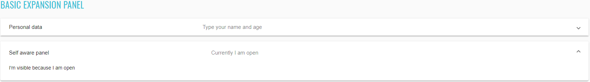

## Angular elements
### Angular Common elements

```java 
    @UI("#divider-list mat-divider")
    public class JList<Divider> dividers;

    @Test
    public void dividerDisplayTest() {
        dividerSection.dividers.get(1).is().displayed();
        dividerSection.dividers.get(2).is().displayed();
    }

    @Test
    public void dividerAttrTest() {
        dividerSection.dividers.get(1).is().attr("aria-orientation", "horizontal");
        dividerSection.dividers.get(2).is().attr("aria-orientation", "horizontal");
    }
```

#### Divider

##### <a href="https://material.angular.io/components/divider/overview" target="_blank">Divider overview</a>

Divider is located in the following class:

- __Java__: _com.epam.jdi.light.ui.angular.elements.common.Divider

Divider icon:


```html
<mat-list class="mat-list mat-list-base">
  <mat-list-item class="mat-list-item mat-focus-indicator">
    <div class="mat-list-item-content">
      <div mat-ripple="" class="mat-ripple mat-list-item-ripple"></div>
      <div class="mat-list-text"></div>Item 1</div></mat-list-item>
      <mat-divider role="separator" class="mat-divider mat-divider-horizontal" aria-orientation="horizontal"></mat-divider><mat-list-item class="mat-list-item mat-focus-indicator">
    <div class="mat-list-item-content">
      <div mat-ripple="" class="mat-ripple mat-list-item-ripple"></div>
      <div class="mat-list-text"></div>Item 2</div></mat-list-item>
      <mat-divider role="separator" class="mat-divider mat-divider-horizontal" aria-orientation="horizontal"></mat-divider><mat-list-item class="mat-list-item mat-focus-indicator">
    <div class="mat-list-item-content">
      <div mat-ripple="" class="mat-ripple mat-list-item-ripple"></div>
      <div class="mat-list-text"></div>Item 3</div>
  </mat-list-item>
</mat-list>
```

|Method | Description | Return Type
--- | --- | ---
**isDisplayed** | Verify state | boolean

##### <a href="https://github.com/jdi-testing/jdi-light/blob/master/jdi-light-angular-tests/src/test/java/io/github/epam/angular/tests/elements/common/DividerTests.java" target="_blank">Here you can find Divider tests</a>

<br>  


```java 
    @FindBy(id="basic_icon")
    public static Icon basicIcon;

    @UI("#basic_icon")
    public static Icon basicIcon;

    @FindBy(id="svg_icon")
    public static Icon svgIcon;
    
    @UI("#svg_icon")
    public static Icon svgIcon;


    @Test
    public void checkBasicIconIsDisplayed() {
        basicIcon.show();
        basicIcon.isDisplayed();
    }

    @Test
    public void checkSVGIconIsDisplayed() {
        svgIcon.show();
        svgIcon.isDisplayed();
    }
```

#### Icons

##### <a href="https://material.angular.io/components/icon/overview" target="_blank">Icon overview</a>

Icon is located in the following class:

- __Java__: _com.epam.jdi.light.ui.angular.elements.common.Icon_

There is two different icons in Angular: Basic icon and SVG icon:

 

```html
<mat-icon _ngcontent-hkf-c334="" role="img" aria-hidden="false" aria-label="Example home icon" class="mat-icon notranslate material-icons mat-icon-no-color">home</mat-icon>
<mat-icon _ngcontent-hkf-c335="" role="img" svgicon="thumbs-up" aria-hidden="false" aria-label="Example thumbs up SVG icon" class="mat-icon notranslate mat-icon-no-color"><svg xmlns="http://www.w3.org/2000/svg" width="100%" height="100%" fit="" preserveAspectRatio="xMidYMid meet" focusable="false">
    <path d="M0 0h24v24H0z" fill="none"></path>
    <path d="M1 21h4V9H1v12zm22-11c0-1.1-.9-2-2-2h-6.31l.95-4.57.03-.32c0-.41-.17-.79-.44-1.06L14.17 1 7.59 7.59C7.22 7.95 7 8.45 7 9v10c0 1.1.9 2 2 2h9c.83 0 1.54-.5 1.84-1.22l3.02-7.05c.09-.23.14-.47.14-.73v-1.91l-.01-.01L23 10z"></path>
</svg></mat-icon>
```

|Method | Description | Return Type
--- | --- | ---
**isDisplayed** | Verify state | boolean
**show()** | Scroll to element | void

##### <a href="https://github.com/jdi-testing/jdi-light/blob/master/jdi-light-angular-tests/src/test/java/io/github/epam/angular/tests/elements/common/IconsTests.java" target="_blank">Here you can find Icons tests</a>

<br>  

#### Progress spinner

```java 
    //@FindBy(id="basic_progress_spinner") public static Icon basicIcon;
    
    @UI("#basic_progress_spinner")
    public static Spinner basicProgressSpinner;


    @Test
    public void checkBasicSpinnerIsDisplayed() {
        basicProgressSpinner.show();
        basicProgressSpinner.isDisplayed();
    }
```

##### <a href="https://material.angular.io/components/progress-spinner/overview" target="_blank">Progress Spinner overview</a>

Progress Spinner is located in the following class:

- __Java__: _com.epam.jdi.light.ui.angular.elements.common.Spinner_


```html
<mat-spinner _ngcontent-krq-c336="" role="progressbar" mode="indeterminate" class="mat-spinner mat-progress-spinner mat-primary mat-progress-spinner-indeterminate-animation" style="width: 100px; height: 100px;"><svg preserveAspectRatio="xMidYMid meet" focusable="false" viewBox="0 0 100 100" style="width: 100px; height: 100px;"><circle cx="50%" cy="50%" r="45" class="ng-star-inserted" style="animation-name: mat-progress-spinner-stroke-rotate-100; stroke-dasharray: 282.743px; stroke-width: 10%;"></circle><!----><!----></svg></mat-spinner>
```

|Method | Description | Return Type
--- | --- | ---
**isDisplayed()** | Verify state | boolean
**show()** | Scroll to element | void

##### <a href="https://github.com/jdi-testing/jdi-light/blob/master/jdi-light-angular-tests/src/test/java/io/github/epam/angular/tests/elements/common/SpinnerTests.java" target="_blank">Here you can find Spinner tests</a>


#### Slide toggle

```java 
    //@FindBy(id="slide-toggles-basic") public static SlideToggle basicSlideToggle;

    @UI("#slide-toggles-basic")
    public static SlideToggle basicSlideToggle;

    @Test
    public void basicTest() {
        basicSlideToggle.is().displayed();
        resultSlideToggle.is().displayed();
        checkedCheckbox.is().displayed();
        disableCheckbox.is().displayed();
        colorRadioButtons.is().displayed();
    }

    @Test
    public void basicToggleCheckedTest() {
        basicSlideToggle.check();
        basicSlideToggle.is().selected();
        basicSlideToggle.uncheck();
        basicSlideToggle.is().deselected();
    }
```

##### <a href="https://material.angular.io/components/slide-toggle/overview" target="_blank">Slide toggle overview</a>

Slide toggle is located in the following class:

- __Java__: _com.epam.jdi.light.ui.angular.elements.common.SlideToggle_

There is two different slide toggles in Angular: Basic and Configurable:


```html
<mat-slide-toggle _ngcontent-bco-c235="" class="mat-slide-toggle mat-accent mat-checked" id="mat-slide-toggle-1" tabindex="-1"><label class="mat-slide-toggle-label" for="mat-slide-toggle-1-input"><div class="mat-slide-toggle-bar"><input type="checkbox" role="switch" class="mat-slide-toggle-input cdk-visually-hidden" id="mat-slide-toggle-1-input" tabindex="0" aria-checked="true"><div class="mat-slide-toggle-thumb-container"><div class="mat-slide-toggle-thumb"></div><div mat-ripple="" class="mat-ripple mat-slide-toggle-ripple mat-focus-indicator"><div class="mat-ripple-element mat-slide-toggle-persistent-ripple"></div></div></div></div><span class="mat-slide-toggle-content"><span style="display: none;">&nbsp;</span>Slide me!</span></label></mat-slide-toggle>
```

|Method | Description | Return Type
--- | --- | ---
**check()** | Check element | void
**uncheck()** | Uncheck element | void
**isDisplayed()** | Verify state | boolean
**selected()** | Verify state | boolean
**deselected()** | Verify state | boolean

<br>

```java 
    //@FindBy(id="slide-toggles-configured") public static SlideToggle resultSlideToggle;

    @UI("#slide-toggles-configured")
    public static SlideToggle resultSlideToggle;

    @Test
    public void resultToggleColorTest() {
        disableCheckbox.uncheck();
        resultSlideToggle.check();
        primaryRadioButton.click();
        resultSlideToggle.is().hasClass("mat-primary");
        accentRadioButton.click();
        resultSlideToggle.is().hasClass("mat-accent");
        warningRadioButton.click();
        resultSlideToggle.is().hasClass("mat-warn");
    }
    
    @Test
    public void resultToggleCheckedTest() {
        resultSlideToggle.uncheck();
        checkedCheckbox.check();
        resultSlideToggle.is().selected();
        checkedCheckbox.uncheck();
        resultSlideToggle.is().deselected();
    }
    
    @Test
    public void resultToggleDisableTest() {
        disableCheckbox.check();
        resultSlideToggle.is().disabled();
        disableCheckbox.uncheck();
        resultSlideToggle.is().enabled();
    }
```  


```html
<mat-card-content _ngcontent-noq-c236="" class="mat-card-content"><h4 _ngcontent-noq-c236="">Slider configuration</h4><section _ngcontent-noq-c236="" class="example-section"><label _ngcontent-noq-c236="" class="example-margin">Color:</label><mat-radio-group _ngcontent-noq-c236="" role="radiogroup" class="mat-radio-group ng-untouched ng-pristine ng-valid"><mat-radio-button _ngcontent-noq-c236="" value="primary" class="mat-radio-button example-margin mat-accent" tabindex="-1" id="mat-radio-13"><label class="mat-radio-label" for="mat-radio-13-input"><div class="mat-radio-container"><div class="mat-radio-outer-circle"></div><div class="mat-radio-inner-circle"></div><input type="radio" class="mat-radio-input cdk-visually-hidden" id="mat-radio-13-input" tabindex="0" name="mat-radio-group-11" value="primary"><div mat-ripple="" class="mat-ripple mat-radio-ripple mat-focus-indicator"><div class="mat-ripple-element mat-radio-persistent-ripple"></div></div></div><div class="mat-radio-label-content"><span style="display: none;">&nbsp;</span> Primary </div></label></mat-radio-button><mat-radio-button _ngcontent-noq-c236="" value="accent" class="mat-radio-button example-margin mat-accent mat-radio-checked" tabindex="-1" id="mat-radio-14"><label class="mat-radio-label" for="mat-radio-14-input"><div class="mat-radio-container"><div class="mat-radio-outer-circle"></div><div class="mat-radio-inner-circle"></div><input type="radio" class="mat-radio-input cdk-visually-hidden" id="mat-radio-14-input" tabindex="0" name="mat-radio-group-11" value="accent"><div mat-ripple="" class="mat-ripple mat-radio-ripple mat-focus-indicator"><div class="mat-ripple-element mat-radio-persistent-ripple"></div></div></div><div class="mat-radio-label-content"><span style="display: none;">&nbsp;</span> Accent </div></label></mat-radio-button><mat-radio-button _ngcontent-noq-c236="" value="warn" class="mat-radio-button example-margin mat-accent" tabindex="-1" id="mat-radio-15"><label class="mat-radio-label" for="mat-radio-15-input"><div class="mat-radio-container"><div class="mat-radio-outer-circle"></div><div class="mat-radio-inner-circle"></div><input type="radio" class="mat-radio-input cdk-visually-hidden" id="mat-radio-15-input" tabindex="0" name="mat-radio-group-11" value="warn"><div mat-ripple="" class="mat-ripple mat-radio-ripple mat-focus-indicator"><div class="mat-ripple-element mat-radio-persistent-ripple"></div></div></div><div class="mat-radio-label-content"><span style="display: none;">&nbsp;</span> Warn </div></label></mat-radio-button></mat-radio-group></section><section _ngcontent-noq-c236="" class="example-section"><mat-checkbox _ngcontent-noq-c236="" class="mat-checkbox example-margin mat-accent ng-untouched ng-pristine ng-valid" id="mat-checkbox-6"><label class="mat-checkbox-layout" for="mat-checkbox-6-input"><div class="mat-checkbox-inner-container"><input type="checkbox" class="mat-checkbox-input cdk-visually-hidden" id="mat-checkbox-6-input" tabindex="0" aria-checked="false"><div matripple="" class="mat-ripple mat-checkbox-ripple mat-focus-indicator"><div class="mat-ripple-element mat-checkbox-persistent-ripple"></div></div><div class="mat-checkbox-frame"></div><div class="mat-checkbox-background"><svg version="1.1" focusable="false" viewBox="0 0 24 24" xml:space="preserve" class="mat-checkbox-checkmark"><path fill="none" stroke="white" d="M4.1,12.7 9,17.6 20.3,6.3" class="mat-checkbox-checkmark-path"></path></svg><div class="mat-checkbox-mixedmark"></div></div></div><span class="mat-checkbox-label"><span style="display: none;">&nbsp;</span>Checked</span></label></mat-checkbox></section><section _ngcontent-noq-c236="" class="example-section"><mat-checkbox _ngcontent-noq-c236="" class="mat-checkbox example-margin mat-accent ng-untouched ng-pristine ng-valid" id="mat-checkbox-7"><label class="mat-checkbox-layout" for="mat-checkbox-7-input"><div class="mat-checkbox-inner-container"><input type="checkbox" class="mat-checkbox-input cdk-visually-hidden" id="mat-checkbox-7-input" tabindex="0" aria-checked="false"><div matripple="" class="mat-ripple mat-checkbox-ripple mat-focus-indicator"><div class="mat-ripple-element mat-checkbox-persistent-ripple"></div></div><div class="mat-checkbox-frame"></div><div class="mat-checkbox-background"><svg version="1.1" focusable="false" viewBox="0 0 24 24" xml:space="preserve" class="mat-checkbox-checkmark"><path fill="none" stroke="white" d="M4.1,12.7 9,17.6 20.3,6.3" class="mat-checkbox-checkmark-path"></path></svg><div class="mat-checkbox-mixedmark"></div></div></div><span class="mat-checkbox-label"><span style="display: none;">&nbsp;</span>Disabled</span></label></mat-checkbox></section></mat-card-content>
```
|Method | Description | Return Type
--- | --- | ---

**check()** | Check element | void
**uncheck()** | Uncheck element | void
**isEnabled()** | Verify state | boolean
**isDisabled()** | Verify state | boolean
**selected()** | Verify state | boolean
**deselected()** | Verify state | boolean
**click()** | Click element | void
**hasClass()** | Verify element class | boolean

##### <a href="https://github.com/jdi-testing/jdi-light/blob/master/jdi-light-angular-tests/src/test/java/io/github/epam/angular/tests/elements/common/SlideToggleTests.java" target="_blank">Here you can find Slide toggle tests</a>

#### Checkbox
```java 
//@FindBy(id="basic-checkbox")
public static Checkbox basicCheckbox;

@Test
public void checkLabelValue() {
    basicCheckbox.label().has().value("Check me!");
    resultCheckbox.label().has().value("I'm a checkbox");
}
@Test
public void basicCheckboxValidation() {
    basicCheckbox.is().displayed().and().enabled().and().deselected();
}
@Test
public void checkBasicCheckbox() {
    basicCheckbox.check();
    basicCheckbox.is().selected();
}
```
##### <a href="https://material.angular.io/components/checkbox/overview" target="_blank">Checkbox overview</a>

Checkbox is located in the following class:

- __Java__: _com.epam.jdi.light.ui.angular.elements.common.Checkbox_

There is two different checkboxes in Angular: Basic and Configurable.

See examples with HTML code describing datepicker elements.


```html 
<section class="example-section">
  <mat-checkbox id="basic-checkbox">Check me!</mat-checkbox>
</section>
```
```java 
//@FindBy(id="checked-checkbox")
public static Checkbox checkedCheckbox;
//@FindBy(id="indeterminate-checkbox")
public static Checkbox indeterminateCheckbox;
//@FindBy(id="disabled-checkbox")
public static Checkbox disabledCheckbox;
//@FindBy(id="result-checkbox")
public static Checkbox resultCheckbox;

//@FindBy(id="align-before-radio-button")
public static Button alignBeforeRadioButton;
//@FindBy(id="align-after-radio-button")
public static Button alignAfterRadioButton;

@Test
public void indeterminateTest() {
    indeterminateCheckbox.click();
    resultCheckbox.is().indeterminate();
}
@Test
public void disabledOption() {
    disabledCheckbox.click();
    resultCheckbox.is().disabled();
}
@Test
public void configurableCheckboxTest() {
    indeterminateCheckbox.check();
    alignBeforeRadioButton.click();
    resultCheckbox.is().indeterminate().and().cssClass("mat-checkbox-label-before");
}
```


```html 
<mat-card>
  <mat-card-content>
    <h4>Checkbox configuration</h4>
    <section class="example-section">
      <mat-checkbox id="checked-checkbox" class="example-margin" [(ngModel)]="checked">
        Checked
      </mat-checkbox>
      <mat-checkbox id="indeterminate-checkbox" class="example-margin" [(ngModel)]="indeterminate">
        Indeterminate
      </mat-checkbox>
    </section>
    <section class="example-section">
      <label class="example-margin">Align:</label>
      <mat-radio-group [(ngModel)]="labelPosition">
        <mat-radio-button id="align-after-radio-button" class="example-margin" value="after">
          After
        </mat-radio-button>
        <mat-radio-button id="align-before-radio-button" class="example-margin" value="before">
          Before
        </mat-radio-button>
      </mat-radio-group>
    </section>
    <section class="example-section">
      <mat-checkbox id="disabled-checkbox" class="example-margin" [(ngModel)]="disabled">
        Disabled
      </mat-checkbox>
    </section>
  </mat-card-content>
</mat-card>
<mat-card class="result">
  <mat-card-content>
    <h4>Result</h4>
    <section class="example-section">
      <mat-checkbox
        id="result-checkbox"
        class="example-margin"
        [(ngModel)]="checked"
        [(indeterminate)]="indeterminate"
        [labelPosition]="labelPosition"
        [disabled]="disabled">
        I'm a checkbox
      </mat-checkbox>
    </section>
  </mat-card-content>
</mat-card>
```

List of some available **Checkbox** methods:

|Method | Description | Return Type
--- | --- | --- 
**is()** | Assert action | CheckboxAssert
**check()** | Check element | void
**uncheck()** | Uncheck element | void
**click()** | Click on element | void
**isSelected()** | Shows that Checkbox has selected | boolean
**isEnabled()** | Shows that Checkbox has enabled | boolean
**isDisabled()** | Shows that Checkbox has disabled | boolean
**isIndeterminate()** | Shows that Checkbox has indeterminate | boolean
**label()** | Get element label | Label

##### <a href="https://github.com/jdi-testing/jdi-light/blob/master/jdi-light-angular-tests/src/test/java/io/github/epam/angular/tests/elements/common/CheckboxTests.java" target="_blank">Here you can find Checkbox tests</a>

#### Inputs

##### <a href="https://material.angular.io/components/input/overview" target="_blank">Input overview</a>

Input is located in the following class:

- __Java__: _com.epam.jdi.light.ui.html.elements.common.TextField
  _com.epam.jdi.light.ui.html.elements.common.TextArea

There are eight different inputs in Angular:

- Basic inputs
- Input with a custom ErrorStateMatcher
- Auto-resizing textarea
- Input with a clear button
- Input with error messages
- Input in a form
- Input with hints
- Input with prefixes and suffixes

<br>

```java 
    //@FindBy(id="inputs_basic_food") public static TextField foodBasicInput;
    @UI("#inputs_basic_food")
    public static TextField foodBasicInput;

    //@FindBy(id="inputs_basic_comment") public static TextField leaveACommentBasicInput;
    @UI("#inputs_basic_comment")
    public static TextField leaveACommentBasicInput;

    @Test
    public void basicInputTest() {
        foodBasicInput.isDisplayed();
        foodBasicInput.clear();
        foodBasicInput.setText("Lasagna");
        foodBasicInput.is().text("Lasagna");
        foodBasicInput.clear();
        foodBasicInput.sendKeys("Ice Cream");
        foodBasicInput.is().text(containsString("Ice"));

        leaveACommentBasicInput.isDisplayed();
        leaveACommentBasicInput.sendKeys("Delicious");
        leaveACommentBasicInput.is().text("Delicious");
    }
```


```html
<input _ngcontent-ohc-c255="" matinput="" id="inputs_basic_food" placeholder="Ex. Pizza" value="Sushi" class="mat-input-element mat-form-field-autofill-control ng-tns-c94-34 cdk-text-field-autofill-monitored" aria-invalid="false" aria-required="false">
```

|Method | Description | Return Type
--- | --- | ---
**focus()** | place cursor within the text field | void
**sendKeys(String value)** | send text to the text field | void
**setText(String value)** | set text | void
**input(String value)** | set text | void
**getText()** | returns text from the text field | String
**getValue()** | returns text from the text field | String
**clear()** | clears the text field | void
**is()** | property that returns object for work with assertions | TextAssert
**placeholder()** | returns value of placeholder attribute | String

<br>

```java 
    //@FindBy(id="inputs_errorStateMatcher_email") public static TextField emailErrorStateMatcherInput;
    @UI("#inputs_errorStateMatcher_email")
    public static TextField emailErrorStateMatcherInput;

    //@FindBy(id="inputs_errorStateMatcher_message") public static TextField errorStateMatcherMessageInput;
    @UI("#inputs_errorStateMatcher_message")
    public static Text errorStateMatcherMessageInput;

    @Test
    public void inputWithACustomErrorStateMatcherTest() {
        emailErrorStateMatcherInput.isDisplayed();
        emailErrorStateMatcherInput.sendKeys("test");
        errorStateMatcherMessageInput.is().text("Please enter a valid email address");
    }
```


```html
<input _ngcontent-ohc-c256="" matinput="" id="inputs_errorStateMatcher_email" placeholder="Ex. pat@example.com" class="mat-input-element mat-form-field-autofill-control ng-tns-c94-39 cdk-text-field-autofill-monitored ng-untouched ng-pristine ng-invalid" aria-describedby="mat-hint-3" aria-invalid="false" aria-required="false">
```

|Method | Description | Return Type
--- | --- | ---
**focus()** | place cursor within the text field | void
**sendKeys(String value)** | send text to the text field | void
**setText(String value)** | set text | void
**input(String value)** | set text | void
**getText()** | returns text from the text field | String
**getValue()** | returns text from the text field | String
**clear()** | clears the text field | void
**is()** | property that returns object for work with assertions | TextAssert
**placeholder()** | returns value of placeholder attribute | String

<br>

```java 
    //@FindBy(id="inputs_autosize_textarea") public static TextField autoSizeTextArea;
    @UI("#inputs_autosize_textarea")
    public static TextArea autoSizeTextArea;

    @Test
    public void autoResizingTextAreaTest() {
        autoSizeTextArea.isDisplayed();
        autoSizeTextArea.hasClass("cdktextareaautosize");
        autoSizeTextArea.setLines("line1", "line2");
        autoSizeTextArea.addNewLine("line3");
        autoSizeTextArea.is().text("line1\nline2\nline3");
        autoSizeTextArea.clear();
        autoSizeTextArea.is().text("");
        autoSizeTextArea.setText("TextArea");
        autoSizeTextArea.is().text(containsString("Text"));
    }
```


```html
<textarea _ngcontent-ohc-c257="" rows="1" matinput="" id="inputs_autosize_textarea" cdktextareaautosize="" cdkautosizeminrows="1" cdkautosizemaxrows="5" class="mat-input-element mat-form-field-autofill-control cdk-textarea-autosize ng-tns-c94-42 cdk-text-field-autofill-monitored" aria-invalid="false" aria-required="false" style="min-height: 18px; max-height: 90px; height: 18px;"></textarea>
```

|Method | Description | Return Type
--- | --- | ---
**addNewLine(String line)** | add line to the already existing | void
**cols()** | returns value of cols attribute | int
**rows()** | returns value of rows attribute | int
**setText(String value)** | set text | void
**input(String value)** | set text | void
**getText()** | returns text from the textarea | String
**getValue()** | returns text from the textarea | String
**labelText()** | returns value of TextArea label | String
**maxlength()** | returns value of maxlength attribute | int
**minlengt()** | returns value of minlength attribute | int
**clear()** | clears the text field | void
**is()** | property that returns object for work with assertions | TextAssert
**placeholder()** | returns value of placeholder attribute | String

<br>

```java 
    //@FindBy(id="inputs_clearable_textbox") public static TextArea clearableInput;
    @UI("#inputs_clearable_textbox")
    public static TextArea clearableInput;
    
    //@FindBy(id="inputs_clearable_button") public static Button clearableInputButton;
    @UI("#inputs_clearable_button")
    public static Button clearableInputButton;

    @Test
    public void clearableInputTest() {
        clearableInput.isDisplayed();
        clearableInput.clear();
        clearableInput.sendKeys("test");
        clearableInputButton.isDisplayed();
        clearableInputButton.click();
        clearableInput.is().text("");
    }
```


```html
<input _ngcontent-ohc-c258="" matinput="" id="inputs_clearable_textbox" type="text" class="mat-input-element mat-form-field-autofill-control ng-tns-c94-43 cdk-text-field-autofill-monitored ng-untouched ng-pristine ng-valid" aria-invalid="false" aria-required="false">
<button _ngcontent-ohc-c258="" mat-button="" id="inputs_clearable_button" matsuffix="" mat-icon-button="" aria-label="Clear" class="mat-focus-indicator mat-button mat-icon-button mat-button-base ng-tns-c94-43 ng-star-inserted"><span class="mat-button-wrapper"><mat-icon _ngcontent-ohc-c258="" role="img" class="mat-icon notranslate material-icons mat-icon-no-color" aria-hidden="true">close</mat-icon></span><div matripple="" class="mat-ripple mat-button-ripple mat-button-ripple-round"></div><div class="mat-button-focus-overlay"></div></button>
```

|Method | Description | Return Type
--- | --- | ---
**focus()** | place cursor within the text field | void
**sendKeys(String value)** | send text to the text field | void
**setText(String value)** | set text | void
**input(String value)** | set text | void
**getText()** | returns text from the text field | String
**getValue()** | returns text from the text field | String
**clear()** | clears the text field | void
**is()** | property that returns object for work with assertions | TextAssert
**placeholder()** | returns value of placeholder attribute | String

<br>

```java 
    //@FindBy(id="inputs_error_email") public static TextField emailInput;
    @UI("#inputs_error_email")
    public static TextField emailInput;
    
    //@FindBy(id="inputs_error_message") public static Text errorMessageInput;
    @UI("#inputs_error_message")
    public static Text errorMessageInput;

    @Test
    public void inputWithErrorMessagesTest() {
        emailInput.isDisplayed();
        emailInput.sendKeys("test");
        emailInput.sendKeys(Keys.ENTER);
        errorMessageInput.isDisplayed();
        errorMessageInput.is().text("Please enter a valid email address");
    }
```


```html
<input _ngcontent-ohc-c259="" matinput="" id="inputs_error_email" placeholder="Ex. pat@example.com" class="mat-input-element mat-form-field-autofill-control ng-tns-c94-44 cdk-text-field-autofill-monitored ng-untouched ng-pristine ng-invalid" aria-invalid="false" aria-required="false">
```

|Method | Description | Return Type
--- | --- | ---
**focus()** | place cursor within the text field | void
**sendKeys(String value)** | send text to the text field | void
**setText(String value)** | set text | void
**input(String value)** | set text | void
**getText()** | returns text from the text field | String
**getValue()** | returns text from the text field | String
**clear()** | clears the text field | void
**is()** | property that returns object for work with assertions | TextAssert
**placeholder()** | returns value of placeholder attribute | String

<br>

```java 
    //@FindBy(css="input-form-example form") public static InputsForm inputsForm;
    @UI("input-form-example form")
    public static InputsForm inputsForm;

    @Test
    public void inputsInAFormTest() {
        inputsForm.fill(DEFAULT_USER);
        firstName.is().text(DEFAULT_USER.firstName);
        lastName.is().text(DEFAULT_USER.lastName);
        address.is().text(DEFAULT_USER.address);
        address2.is().text(DEFAULT_USER.address2);
        city.is().text(DEFAULT_USER.city);
        state.is().text(DEFAULT_USER.state);
        postalCode.is().text(DEFAULT_USER.postalCode);
    }
```


```html
<form _ngcontent-sod-c260="" novalidate="" class="example-form ng-untouched ng-pristine ng-valid"></form>
```

|Method | Description | Return Type
--- | --- | ---
**add(T entity)** | fills all settable elements and clicks “add” Button or ”addButton” | void
**back(T entity)** | fills all settable elements and clicks “back” Button or ”backButton” | void
**cancel(T entity)** | fills all settable elements and clicks “cancel” Button or ”cancelButton” | void
**check(T entity)** | verifies that form has been filled correctly. If not, throws an exception | void
**close(T entity)** | fills all settable elements and clicks “close” Button or ”closeButton” | void
**next(T entity)** | fills all settable elements and clicks “next” Button or ”nextButton” | void
**login(T entity)** | fills all settable elements and clicks “login” Button or ”loginButton” | void
**publish(T entity)** | fills all settable elements and clicks “publish” Button or ”publishButton” | void
**save(T entity)** | fills all settable elements and clicks “save” Button or ”saveButton” | void
**select(T entity)** | fills all settable elements and clicks “select” Button or ”selectButton” | void
**search(T entity)** | fills all settable elements and clicks “search” Button or ”searchButton” | void
**login(T entity)** | fills all settable elements and clicks “login” Button or ”loginButton” | void
**send(T entity)** | fills all settable elements and clicks “send” Button or ”sendButton” | void
**submit(T entity)** | fills all settable elements and clicks “submit” Button or ”submitButton” | void
**update(T entity)** | fills all settable elements and clicks “update” Button or ”updateButton” | void
**fill(T entity)** | fills all settable elements of the form that can be matched with fields of the input entity | void
**verify(T entity)** | verifies that form has been filled correctly. If not, returns a list of keys where verification has failed | List
**fillAction(Field field, Object element, Object parent, String setValue)** | defines the specifics of how form elements will be filled | void
**getAction(Field field, Object element, Object parent)** | defines the specifics of how form elements will be obtained for verification and checks | void
**isDisplayed()** | check that form is displayed | boolean
**isValid()** | check that form is valid | boolean
**login()** | clicks “login” Button or ”loginButton” | boolean

<br>

```java 
    //@FindBy(id="inputs_hints_message") public static TextField messageHintInput;
    @UI("#inputs_hints_message")
    public static TextField messageHintInput;

    //@FindBy(id="inputs_hints_text") public static Text messageHint;
    @UI("#inputs_hints_text")
    public static Text messageHint;

    //@FindBy(id="inputs_hints_counter") public static Text messageCounterHint;
    @UI("#inputs_hints_counter")
    public static Text messageCounterHint;

    @Test
    public void inputWithHintsTest() {
        messageHintInput.isDisplayed();
        messageHintInput.sendKeys("test");
        messageHint.isDisplayed();
        messageHint.is().text("Don't disclose personal info");
        messageCounterHint.isDisplayed();
        messageCounterHint.is().text("4 / 256");
    }
```


```html
<input _ngcontent-ohc-c261="" matinput="" id="inputs_hints_message" maxlength="256" placeholder="Ex. I need help with..." class="mat-input-element mat-form-field-autofill-control ng-tns-c94-53 cdk-text-field-autofill-monitored" aria-describedby="inputs_hints_text inputs_hints_counter" aria-invalid="false" aria-required="false">
<mat-hint _ngcontent-ohc-c261="" id="inputs_hints_text" class="mat-hint ng-tns-c94-53"><strong _ngcontent-ohc-c261="">Don't disclose personal info</strong></mat-hint>
```

|Method | Description | Return Type
--- | --- | ---
**focus()** | place cursor within the text field | void
**sendKeys(String value)** | send text to the text field | void
**setText(String value)** | set text | void
**input(String value)** | set text | void
**getText()** | returns text from the text field | String
**getValue()** | returns text from the text field | String
**clear()** | clears the text field | void
**is()** | property that returns object for work with assertions | TextAssert
**placeholder()** | returns value of placeholder attribute | String

<br>

```java 
    //@FindBy(id="inputs_prefixes") public static Text prefixInput;
    @UI("#inputs_prefixes")
    public static Text prefixInput;

    //@FindBy(id="inputs_suffixes") public static Icon suffixInput;
    @UI("#inputs_suffixes")
    public static Icon suffixInput;

    //@FindBy(id="inputs_prefixes_suffixes_phone") public static TextField telephoneInput;
    @UI("#inputs_prefixes_suffixes_phone")
    public static TextField telephoneInput;

    @Test
    public void inputWithPrefixesAndSuffixesTest() {
        prefixInput.isDisplayed();
        suffixInput.isDisplayed();
        telephoneInput.isDisplayed();
        telephoneInput.sendKeys("0123456789");
        telephoneInput.clear();
        telephoneInput.is().text("");
    }
```


```html
<span _ngcontent-ohc-c262="" matprefix="" id="inputs_prefixes" class="ng-tns-c94-54">+1 &nbsp;</span>
<input _ngcontent-ohc-c262="" type="tel" matinput="" id="inputs_prefixes_suffixes_phone" placeholder="555-555-1234" class="mat-input-element mat-form-field-autofill-control ng-tns-c94-54 cdk-text-field-autofill-monitored" aria-invalid="false" aria-required="false">
<mat-icon _ngcontent-ohc-c262="" role="img" matsuffix="" id="inputs_suffixes" class="mat-icon notranslate material-icons mat-icon-no-color ng-tns-c94-54" aria-hidden="true">edit</mat-icon>
```

|Method | Description | Return Type
--- | --- | ---
**focus()** | place cursor within the text field | void
**sendKeys(String value)** | send text to the text field | void
**setText(String value)** | set text | void
**input(String value)** | set text | void
**getText()** | returns text from the text field | String
**getValue()** | returns text from the text field | String
**clear()** | clears the text field | void
**is()** | property that returns object for work with assertions | TextAssert
**placeholder()** | returns value of placeholder attribute | String


##### <a href="https://github.com/jdi-testing/jdi-light/blob/master/jdi-light-angular-tests/src/test/java/io/github/epam/angular/tests/elements/common/InputTests.java" target="_blank">Java tests examples</a>

#### Toolbar

```java 
    /**@FindBy(id = "toolbar-basic") public static ToolbarSection toolbarSection;*/
    @UI("#toolbar-basic")
    public static TextArea toolbarTextArea;
    public static Text toolbarTextArea;

    /**@FindBy(id = "toolbar-table") public static ToolbarSection toolbarSection;*/
    @UI("#toolbar-table")
    public static Table toolbarTable;

    /**@FindBy(css = "#toolbar-table span:not(.example-spacer)") public static ToolbarSection toolbarSection;*/
    @UI("#toolbar-table span:not(.example-spacer)") 
    public static JList<Text> toolbarRowsElementsWithText;

    @Test
    public void basicToolbarTest() {
         String textForTest = "My App";
         String classForTest = "mat-toolbar";
         toolbarTextArea.is().displayed();
         toolbarTable.is().hasClass(classForTest);
         toolbarTextArea.is().text(containsString(textForTest));
      }

    @Test
    public void multiRowToolbarTest() {
        String classForTest = "mat-toolbar";
        List<String> listForTest = Arrays.asList("Custom Toolbar", "Second Line", "Third Line");
        toolbarTable.is().displayed();
        toolbarTable.is().hasClass(classForTest);
        toolbarRowsElementsWithText.is().values(listForTest);
    }

    @Test
    public void multiRowToolbarColorTest() {
        String colorForTest = "primary";
        toolbarTable.has().attr("color", colorForTest);
    }
   } 
```
##### <a href="https://material.angular.io/components/toolbar/overview" target="_blank">Toolbar overview</a>

"mat-toolbar" is a container for headers, titles, or actions.

There is two different toolbars in Angular: Single row and Multiple row:


```html
<mat-toolbar _ngcontent-duh-c290="" id="toolbar-basic" class="mat-toolbar mat-toolbar-single-row">My App</mat-toolbar>
```

```html
<mat-toolbar _ngcontent-duh-c291="" id="toolbar-table" color="primary" class="mat-toolbar mat-primary mat-toolbar-multiple-rows"><mat-toolbar-row _ngcontent-duh-c291="" class="mat-toolbar-row"><span _ngcontent-duh-c291="">Custom Toolbar</span></mat-toolbar-row><mat-toolbar-row _ngcontent-duh-c291="" class="mat-toolbar-row"><span _ngcontent-duh-c291="">Second Line</span><span _ngcontent-duh-c291="" class="example-spacer"></span><mat-icon _ngcontent-duh-c291="" role="img" aria-hidden="false" aria-label="Example user verified icon" class="mat-icon notranslate example-icon material-icons mat-icon-no-color">verified_user</mat-icon></mat-toolbar-row><mat-toolbar-row _ngcontent-duh-c291="" class="mat-toolbar-row"><span _ngcontent-duh-c291="">Third Line</span><span _ngcontent-duh-c291="" class="example-spacer"></span><mat-icon _ngcontent-duh-c291="" role="img" aria-hidden="false" aria-label="Example heart icon" class="mat-icon notranslate example-icon material-icons mat-icon-no-color">favorite</mat-icon><mat-icon _ngcontent-duh-c291="" role="img" aria-hidden="false" aria-label="Example delete icon" class="mat-icon notranslate example-icon material-icons mat-icon-no-color">delete</mat-icon></mat-toolbar-row></mat-toolbar>
```
|Method | Description | Return Type
--- | --- | ---
**hasClass()** | Match passed value with the element class | boolean
**values()** | Assert that values are the same | List<String>
**has()** | assert that element has attribute | boolean
**attr()** | Check whether an element has attribute of specified name and with given value  | IsAssert
**is()** | Assert action | TextAssert
**displayed()** | Check that element is displayed | TextAssert

##### <a href="https://github.com/jdi-testing/jdi-light/blob/master/jdi-light-angular-tests/src/test/java/io/github/epam/angular/tests/elements/common/ToolbarTests.java" target="_blank">Here you can find Toolbar tests</a>

#### Basic Button

##### <a href="https://material.angular.io/components/button/overview" target="_blank">Button overview</a>

Basic Button is located in the following class:

- __Java__: _com.epam.jdi.light.ui.html.elements.common.Button_

The angular Button:

<br>

```java 
    //@FindBy(id="basic-buttons-label") public static Text basicButtonsLabel;
    @UI("#basic-buttons-label")
    public Label basicButtonsLabel;

    //@FindBy(id="basic-primary-button") public static Text basicPrimaryButton;
    @UI("#basic-primary-button")
    public Button basicPrimaryButton;

    @Test
    public void clickTest() {
        basicBasicButton.click();
        basicBasicButton.is().hasClass(FOCUSED_CLASS);
        basicButtonsSection.basicButtonsLabel.is().has().text(containsString(BASIC_TEXT));
    }

    @Test
    public void clickWithMoveTest() {
        basicWarnButton.click(ElementArea.TOP_LEFT);
        basicWarnButton.is().hasClass(FOCUSED_CLASS);
        basicButtonsSection.basicButtonsLabel.is().has().text(containsString(WARN_TEXT));
    }
    @Test
    public void disableButtonTest() {
        basicDisabledButton.is().disabled();
    }
    @Test
    public void isValidationTest() {
        basicWarnButton.is().displayed();
        basicWarnButton.is().enabled();
        basicWarnButton.is().text(is(WARN_TEXT));
        basicWarnButton.is().text(containsString(WARN_TEXT));
        assertThat(basicWarnButton.core().css("font-size"), is("14px"));
        basicWarnButton.assertThat().displayed()
                .and().text(is(WARN_TEXT))
                .core()
                .css("font-size", is("14px"))
                .and()
                .cssClass(containsString("mat-button"))
                .and()
                .attr("type")
                .tag(is("button"));
        basicDisabledButton.is().text(containsString(DISABLED_TEXT));
        basicDisabledButton.is().disabled();
    }
```


```html
<button _ngcontent-jos-c358="" mat-raised-button="" color="primary" id="raised-primary-button" class="mat-focus-indicator mat-raised-button mat-button-base mat-primary" ng-reflect-color="primary">
    <span class="mat-button-wrapper">Primary</span>
    <div matripple="" class="mat-ripple mat-button-ripple" ng-reflect-disabled="false" ng-reflect-centered="false" ng-reflect-trigger="[object HTMLButtonElement]"></div>
    <div class="mat-button-focus-overlay"></div>
</button>
```

|Method | Description | Return Type
--- | --- | ---
**show()** | Scroll to element | void
**click()** | Click the button | void
**clickWithMoveTest(ElementArea ea)** | Click the button | void
**assertThat()** | Assert action | TextAssert
**displayed()** | Check that element is displayed | TextAssert
**enabled()** | Check that element is enabled | TextAssert
**disabled()** | Check that element is disabled | TextAssert
**getText()** | Get button text | String
**is()** | Assert action | TextAssert

##### <a href="https://github.com/jdi-testing/jdi-light/blob/master/jdi-light-angular-tests/src/test/java/io/github/epam/angular/tests/elements/common/BasicButtonTests.java" target="_blank">Basic Button java tests examples</a>

#### Button toggle

##### <a href="https://material.angular.io/components/button-toggle/overview" target="_blank">Button toggle overview</a>

Button toggle is based on Basic Button. Basic Button is located in the following class:

- __Java__: _com.epam.jdi.light.ui.html.elements.common.Button_

There are two different button toggles in Angular: Basic and Exclusive:

```java     
    //@FindBy(id = "mat-button-toggle-group-font") public static basicButtonToggle;
    @UI("#mat-button-toggle-group-font")
    public static ButtonToggle basicButtonToggle;

    @Test
    public void verifyButtonToggle() {
        basicButtonToggle.is().displayed();
        basicButtonToggle.is().enabled();
        basicButtonToggle.clickButtonToggleByValue(ITALIC);
        basicButtonToggle.is().assertButtonToggleIsSelected(ITALIC);
        basicButtonToggle.is().assertButtonToggleButtonIsPressed(ITALIC);
        basicButtonToggle.is().assertButtonToggleButtonHasText(ITALIC);
    }

    @Test
    public void verifyButtonToggleCombineSelection() {
        basicButtonToggle.clickButtonToggleByValue(ITALIC);
        basicButtonToggle.clickButtonToggleByValue(BOLD);
        basicButtonToggle.clickButtonToggleByValue(UNDERLINE);
        basicButtonToggle.is().assertButtonToggleIsSelected(ITALIC);
        basicButtonToggle.is().assertButtonToggleIsSelected(BOLD);
        basicButtonToggle.is().assertButtonToggleIsSelected(UNDERLINE);
        basicButtonToggle.clickButtonToggleByValue(BOLD);
        basicButtonToggle.is().assertButtonToggleIsNotSelected(BOLD);
    }
```


```html
<mat-button-toggle _ngcontent-eoo-c327="" value="underline" id="underline-button-toggle" class="mat-button-toggle mat-focus-indicator mat-button-toggle-appearance-standard" tabindex="-1">
    <button type="button" class="mat-button-toggle-button mat-focus-indicator" tabindex="0" aria-pressed="false">
        <div class="mat-button-toggle-label-content">Underline</div>
    </button>
    <div class="mat-button-toggle-focus-overlay"></div>
    <div matripple="" class="mat-ripple mat-button-toggle-ripple"></div>
</mat-button-toggle>
```

|Method | Description | Return Type
--- | --- | ---
**clickButtonToggleByValue()** | Click required button | void
**is()** | Assert action | TextAssert
**enabled()** | Check that element is enabled | TextAssert
**disabled()** | Check that element is disabled | TextAssert

<br>

```java 
    //@FindBy(id = "mat-button-toggle-group-align")
    @UI("#mat-button-toggle-group-align")  
    public static ButtonToggle basicButtonToggleAlign;

     //@FindBy(css = "div.example-selected-value")
    @UI("div.example-selected-value")
    public static Text selectedValue;

    @Test
    public void verifyExclusiveButtonToggle() {
         basicButtonToggleAlign.is().displayed();
         basicButtonToggleAlign.is().enabled();
         basicButtonToggleAlign.clickButtonToggleByValue(LEFT);
         basicButtonToggleAlign.is().assertButtonToggleIsSelected(LEFT);
         buttonToggleSection.selectedValue.has().text("Selected value: left");
    }
    
    @Test
    public void verifyExclusiveButtonToggleSeparateSelection() {
        basicButtonToggleAlign.clickButtonToggleByValue(CENTER);
        basicButtonToggleAlign.clickButtonToggleByValue(RIGHT);
        basicButtonToggleAlign.clickButtonToggleByValue(LEFT);
        basicButtonToggleAlign.is().assertButtonToggleIsSelected(LEFT);
        basicButtonToggleAlign.is().assertButtonToggleIsNotSelected(RIGHT);
        basicButtonToggleAlign.is().assertButtonToggleIsNotSelected(CENTER);
    }
```  


```html
<mat-button-toggle _ngcontent-pwh-c328="" value="left" aria-label="Text align left" id="left-align-button-toggle" class="mat-button-toggle mat-focus-indicator mat-button-toggle-appearance-standard" tabindex="-1">
    <button type="button" class="mat-button-toggle-button mat-focus-indicator"  tabindex="0" aria-pressed="false" name="mat-button-toggle-group-7" aria-label="Text align left">
        <div class="mat-button-toggle-label-content"><mat-icon _ngcontent-pwh-c328="" role="img" class="mat-icon notranslate material-icons mat-icon-no-color" aria-hidden="true">format_align_left</mat-icon></div>
    </button>
    <div class="mat-button-toggle-focus-overlay"></div>
    <div matripple="" class="mat-ripple mat-button-toggle-ripple"></div>
</mat-button-toggle>
```

|Method | Description | Return Type
--- | --- | ---
**clickButtonToggleByValue()** | Click required button | void
**is()** | Assert action | TextAssert
**has()** | Assert action | TextAssert
**enabled()** | Check that element is enabled | TextAssert
**disabled()** | Check that element is disabled | TextAssert
**text()** | Check whether a text matches a pattern | IsAssert

##### <a href="https://github.com/jdi-testing/jdi-light/blob/master/jdi-light-angular-tests/src/test/java/io/github/epam/angular/tests/elements/complex/ButtonToggleTests.java" target="_blank">Here you can find Button toggle tests</a>

#### Badge

##### <a href="https://material.angular.io/components/badge/overview" target="_blank">Badge overview</a>

Badge is located in the following class:

- __Java__: _com.epam.jdi.light.angular.elements.common.Badge_


```html
<span _ngcontent-iwc-c329="" matbadge="4" matbadgeoverlap="false" id="text-with-badge" class="mat-badge mat-badge-above mat-badge-after mat-badge-medium">
    "Text with a badge"
    <span _ngcontent-iwc-c329="" id="mat-badge-content-0" class="mat-badge-content mat-badge-active">4</span>
</span>
```

```java 
@FindBy(css = "#text-with-badge span") 
public static Badge badgeWithText;
    
@FindBy(css = "#button-with-left-badge span:not(.mat-button-wrapper)") 
public static Badge badgeWithButton;

@FindBy(css = "#icon-with-badge span") 
public static Badge badgeWithIcon;

@Test
public void basicBadgeTest() {
    badgeWithText.is().displayed();
    badgeWithButton.is().displayed();
    badgeWithIcon.is().displayed();
}

@Test
public void badgeTextTest() {
    badgeWithText.has().text("4");
    badgeWithButton.has().text("8");
    badgeWithIcon.has().text("15");
}

@Test
public void iconBadgeTest() {
    iconWithBadge.show();
    iconWithBadge.badge().is().displayed();
    iconWithBadge.badge().has().text("15");
    iconWithBadge.has().color("Red");
}
```

|Method | Description | Return Type
--- | --- | ---
**is()** | Assert action | BadgeAssert
**has()** | Assert action | BadgeAssert
**color()** | Check that color is correct | boolean

##### <a href="https://github.com/jdi-testing/jdi-light/blob/master/jdi-light-angular-tests/src/test/java/io/github/epam/angular/tests/elements/common/BadgeTests.java" target="_blank">Here you can find Badge tests</a>

#### Progress bar

##### <a href="https://material.angular.io/components/progress-bar/overview" target="_blank">Progress bar overview</a>

Progress bar is located in the following class:

- __Java__: _com.epam.jdi.light.ui.angular.elements.common.ProgressBar_

There is 5 different progress bars in Angular: Buffer, Determinate, Indeterminate, Query and Configurable:


```html  
<progress-bar-buffer-example _nghost-pnn-c338="" ng-version="9.1.0"><h2 _ngcontent-pnn-c338="" class="example-h2"><a _ngcontent-pnn-c338="" href="https://material.angular.io/components/progress-bar/overview#buffer"> Buffer progress-bar </a></h2><button _ngcontent-pnn-c338="" mat-raised-button="" id="show-buffer-progress-bar-button" class="mat-focus-indicator mat-raised-button mat-button-base"><span class="mat-button-wrapper"> Show progress-bar for 5 seconds
</span><div matripple="" class="mat-ripple mat-button-ripple"></div><div class="mat-button-focus-overlay"></div></button><div _ngcontent-pnn-c338="" hidden=""><mat-progress-bar _ngcontent-pnn-c338="" role="progressbar" aria-valuemin="0" aria-valuemax="100" id="mat-progress-bar-buffer" mode="buffer" class="mat-progress-bar mat-primary" aria-valuenow="0"><svg width="100%" height="4" focusable="false" class="mat-progress-bar-background mat-progress-bar-element"><defs><pattern x="4" y="0" width="8" height="4" patternUnits="userSpaceOnUse" id="mat-progress-bar-0"><circle cx="2" cy="2" r="2"></circle></pattern></defs><rect width="100%" height="100%" fill="url('/jdi-light/angular.html#mat-progress-bar-0')"></rect></svg><div class="mat-progress-bar-buffer mat-progress-bar-element" style="transform: scaleX(0);"></div><div class="mat-progress-bar-primary mat-progress-bar-fill mat-progress-bar-element" style="transform: scaleX(0);"></div><div class="mat-progress-bar-secondary mat-progress-bar-fill mat-progress-bar-element"></div></mat-progress-bar></div></progress-bar-buffer-example>
```

```java  
//@FindBy(css = "#show-buffer-progress-bar-button")
public static Button showBufferProgressBarButton;

//@FindBy(css = "#mat-progress-bar-buffer")
public static ProgressBar matProgressBarBuffer;

@Test
public void verifyBufferProgressBarTest() throws Exception {
    showBufferProgressBarButton.click();
    matProgressBarBuffer.shouldBe().displayed();
    matProgressBarBuffer.show();
    matProgressBarBuffer.shouldBe().visible();
    matProgressBarBuffer.has().mode(BUFFER);
    matProgressBarBuffer.has().value(0);
    matProgressBarBuffer.has().bufferValue(0.0);
    matProgressBarBuffer.has().max(100);
    matProgressBarBuffer.has().min(0);
    matProgressBarBuffer.has().color(BLUE);
    matProgressBarBuffer.is().disappear(5);
}
```


```html  
<progress-bar-determinate-example _nghost-pnn-c339="" ng-version="9.1.0"><h2 _ngcontent-pnn-c339="" class="example-h2"><a _ngcontent-pnn-c339="" href="https://material.angular.io/components/progress-bar/overview#determinate"> Determinate progress-bar </a></h2><mat-progress-bar _ngcontent-pnn-c339="" role="progressbar" aria-valuemin="0" aria-valuemax="100" id="mat-progress-bar-determinate" mode="determinate" value="40" class="mat-progress-bar mat-primary" aria-valuenow="40"><svg width="100%" height="4" focusable="false" class="mat-progress-bar-background mat-progress-bar-element"><defs><pattern x="4" y="0" width="8" height="4" patternUnits="userSpaceOnUse" id="mat-progress-bar-1"><circle cx="2" cy="2" r="2"></circle></pattern></defs><rect width="100%" height="100%" fill="url('/jdi-light/angular.html#mat-progress-bar-1')"></rect></svg><div class="mat-progress-bar-buffer mat-progress-bar-element"></div><div class="mat-progress-bar-primary mat-progress-bar-fill mat-progress-bar-element" style="transform: scaleX(0.4);"></div><div class="mat-progress-bar-secondary mat-progress-bar-fill mat-progress-bar-element"></div></mat-progress-bar></progress-bar-determinate-example>
```

```java  
//@FindBy(css = "#mat-progress-bar-determinate")
public static ProgressBar matProgressBarDeterminate;

@Test
     public void verifyDeterminateProgressBarTest() throws Exception {
         matProgressBarDeterminate.shouldBe().displayed();
         matProgressBarDeterminate.show();
         matProgressBarDeterminate.shouldBe().visible();
         matProgressBarDeterminate.has().mode(DETERMINATE);
         matProgressBarDeterminate.has().value(40);
         matProgressBarDeterminate.has().max(100);
         matProgressBarDeterminate.has().min(0);
         matProgressBarDeterminate.has().color(BLUE);
         }
```


```html  
<progress-bar-indeterminate-example _nghost-pnn-c340="" ng-version="9.1.0"><h2 _ngcontent-pnn-c340="" class="example-h2"><a _ngcontent-pnn-c340="" href="https://material.angular.io/components/progress-bar/overview#indeterminate"> Indeterminate progress-bar </a></h2><button _ngcontent-pnn-c340="" mat-raised-button="" id="show-indeterminate-progress-bar-button" class="mat-focus-indicator mat-raised-button mat-button-base"><span class="mat-button-wrapper"> Show progress-bar for 5 seconds
</span><div matripple="" class="mat-ripple mat-button-ripple"></div><div class="mat-button-focus-overlay"></div></button><div _ngcontent-pnn-c340="" hidden=""><mat-progress-bar _ngcontent-pnn-c340="" role="progressbar" aria-valuemin="0" aria-valuemax="100" id="mat-progress-bar-indeterminate" mode="indeterminate" class="mat-progress-bar mat-primary"><svg width="100%" height="4" focusable="false" class="mat-progress-bar-background mat-progress-bar-element"><defs><pattern x="4" y="0" width="8" height="4" patternUnits="userSpaceOnUse" id="mat-progress-bar-2"><circle cx="2" cy="2" r="2"></circle></pattern></defs><rect width="100%" height="100%" fill="url('/jdi-light/angular.html#mat-progress-bar-2')"></rect></svg><div class="mat-progress-bar-buffer mat-progress-bar-element"></div><div class="mat-progress-bar-primary mat-progress-bar-fill mat-progress-bar-element" style="transform: scaleX(0);"></div><div class="mat-progress-bar-secondary mat-progress-bar-fill mat-progress-bar-element"></div></mat-progress-bar></div></progress-bar-indeterminate-example>
```

```java  
//@FindBy(css = "#show-indeterminate-progress-bar-button")
public static Button showIndeterminateProgressBarButton;

//@FindBy(css = "#mat-progress-bar-indeterminate")
public static ProgressBar matProgressBarIndeterminate;

@Test
public void verifyIndeterminateProgressBarTest() {
    showIndeterminateProgressBarButton.click();
    matProgressBarIndeterminate.shouldBe().displayed();
    matProgressBarIndeterminate.show();
    matProgressBarIndeterminate.shouldBe().visible();
    matProgressBarIndeterminate.has().mode(INDETERMINATE);
    matProgressBarIndeterminate.has().max(100);
    matProgressBarIndeterminate.has().min(0);
    matProgressBarIndeterminate.has().color(BLUE);
    matProgressBarIndeterminate.is().disappear(5);
}
```


```html  
<progress-bar-determinate-example _nghost-pnn-c339="" ng-version="9.1.0"><h2 _ngcontent-pnn-c339="" class="example-h2"><a _ngcontent-pnn-c339="" href="https://material.angular.io/components/progress-bar/overview#determinate"> Determinate progress-bar </a></h2><mat-progress-bar _ngcontent-pnn-c339="" role="progressbar" aria-valuemin="0" aria-valuemax="100" id="mat-progress-bar-determinate" mode="determinate" value="40" class="mat-progress-bar mat-primary" aria-valuenow="40"><svg width="100%" height="4" focusable="false" class="mat-progress-bar-background mat-progress-bar-element"><defs><pattern x="4" y="0" width="8" height="4" patternUnits="userSpaceOnUse" id="mat-progress-bar-1"><circle cx="2" cy="2" r="2"></circle></pattern></defs><rect width="100%" height="100%" fill="url('/jdi-light/angular.html#mat-progress-bar-1')"></rect></svg><div class="mat-progress-bar-buffer mat-progress-bar-element"></div><div class="mat-progress-bar-primary mat-progress-bar-fill mat-progress-bar-element" style="transform: scaleX(0.4);"></div><div class="mat-progress-bar-secondary mat-progress-bar-fill mat-progress-bar-element"></div></mat-progress-bar></progress-bar-determinate-example>
```

```java     
//@FindBy(css = "#mat-progress-bar-query")
public static ProgressBar matProgressBarQuery;

@Test
public void verifyQueryProgressBarTest() {
    matProgressBarQuery.shouldBe().displayed();
    matProgressBarQuery.show();
    matProgressBarQuery.shouldBe().visible();
    matProgressBarQuery.has().mode(QUERY);
    matProgressBarQuery.has().max(100);
    matProgressBarQuery.has().min(0);
    matProgressBarQuery.has().color(BLUE);
}
```


```html  
<progress-bar-configurable-example _nghost-pnn-c342="" ng-version="9.1.0"><h2 _ngcontent-pnn-c342="" class="example-h2">Configurable progress bar</h2><mat-card _ngcontent-pnn-c342="" class="mat-card mat-focus-indicator"><mat-card-content _ngcontent-pnn-c342="" class="mat-card-content"><h4 _ngcontent-pnn-c342="">Progress bar configuration</h4><section _ngcontent-pnn-c342="" class="example-section"><label _ngcontent-pnn-c342="" class="example-margin">Color:</label><mat-radio-group _ngcontent-pnn-c342="" role="radiogroup" class="mat-radio-group ng-untouched ng-pristine ng-valid"><mat-radio-button _ngcontent-pnn-c342="" id="progress-bars-primary-color-radio" value="primary" class="mat-radio-button example-margin mat-accent mat-radio-checked" tabindex="-1"><label class="mat-radio-label" for="progress-bars-primary-color-radio-input"><div class="mat-radio-container"><div class="mat-radio-outer-circle"></div><div class="mat-radio-inner-circle"></div><input type="radio" class="mat-radio-input cdk-visually-hidden" id="progress-bars-primary-color-radio-input" tabindex="0" name="mat-radio-group-33" value="primary"><div mat-ripple="" class="mat-ripple mat-radio-ripple mat-focus-indicator"><div class="mat-ripple-element mat-radio-persistent-ripple"></div></div></div><div class="mat-radio-label-content"><span style="display: none;">&nbsp;</span> Primary </div></label></mat-radio-button><mat-radio-button _ngcontent-pnn-c342="" id="progress-bars-accent-color-radio" value="accent" class="mat-radio-button example-margin mat-accent" tabindex="-1"><label class="mat-radio-label" for="progress-bars-accent-color-radio-input"><div class="mat-radio-container"><div class="mat-radio-outer-circle"></div><div class="mat-radio-inner-circle"></div><input type="radio" class="mat-radio-input cdk-visually-hidden" id="progress-bars-accent-color-radio-input" tabindex="0" name="mat-radio-group-33" value="accent"><div mat-ripple="" class="mat-ripple mat-radio-ripple mat-focus-indicator"><div class="mat-ripple-element mat-radio-persistent-ripple"></div></div></div><div class="mat-radio-label-content"><span style="display: none;">&nbsp;</span> Accent </div></label></mat-radio-button><mat-radio-button _ngcontent-pnn-c342="" id="progress-bars-warn-color-radio" value="warn" class="mat-radio-button example-margin mat-accent" tabindex="-1"><label class="mat-radio-label" for="progress-bars-warn-color-radio-input"><div class="mat-radio-container"><div class="mat-radio-outer-circle"></div><div class="mat-radio-inner-circle"></div><input type="radio" class="mat-radio-input cdk-visually-hidden" id="progress-bars-warn-color-radio-input" tabindex="0" name="mat-radio-group-33" value="warn"><div mat-ripple="" class="mat-ripple mat-radio-ripple mat-focus-indicator"><div class="mat-ripple-element mat-radio-persistent-ripple"></div></div></div><div class="mat-radio-label-content"><span style="display: none;">&nbsp;</span> Warn </div></label></mat-radio-button></mat-radio-group></section><section _ngcontent-pnn-c342="" class="example-section"><label _ngcontent-pnn-c342="" class="example-margin">Mode:</label><mat-radio-group _ngcontent-pnn-c342="" role="radiogroup" class="mat-radio-group ng-untouched ng-pristine ng-valid"><mat-radio-button _ngcontent-pnn-c342="" id="progress-bars-determinate-mode-radio" value="determinate" class="mat-radio-button example-margin mat-accent mat-radio-checked" tabindex="-1"><label class="mat-radio-label" for="progress-bars-determinate-mode-radio-input"><div class="mat-radio-container"><div class="mat-radio-outer-circle"></div><div class="mat-radio-inner-circle"></div><input type="radio" class="mat-radio-input cdk-visually-hidden" id="progress-bars-determinate-mode-radio-input" tabindex="0" name="mat-radio-group-37" value="determinate"><div mat-ripple="" class="mat-ripple mat-radio-ripple mat-focus-indicator"><div class="mat-ripple-element mat-radio-persistent-ripple"></div></div></div><div class="mat-radio-label-content"><span style="display: none;">&nbsp;</span> Determinate </div></label></mat-radio-button><mat-radio-button _ngcontent-pnn-c342="" id="progress-bars-indeterminate-mode-radio" value="indeterminate" class="mat-radio-button example-margin mat-accent" tabindex="-1"><label class="mat-radio-label" for="progress-bars-indeterminate-mode-radio-input"><div class="mat-radio-container"><div class="mat-radio-outer-circle"></div><div class="mat-radio-inner-circle"></div><input type="radio" class="mat-radio-input cdk-visually-hidden" id="progress-bars-indeterminate-mode-radio-input" tabindex="0" name="mat-radio-group-37" value="indeterminate"><div mat-ripple="" class="mat-ripple mat-radio-ripple mat-focus-indicator"><div class="mat-ripple-element mat-radio-persistent-ripple"></div></div></div><div class="mat-radio-label-content"><span style="display: none;">&nbsp;</span> Indeterminate </div></label></mat-radio-button><mat-radio-button _ngcontent-pnn-c342="" id="progress-bars-buffer-mode-radio" value="buffer" class="mat-radio-button example-margin mat-accent" tabindex="-1"><label class="mat-radio-label" for="progress-bars-buffer-mode-radio-input"><div class="mat-radio-container"><div class="mat-radio-outer-circle"></div><div class="mat-radio-inner-circle"></div><input type="radio" class="mat-radio-input cdk-visually-hidden" id="progress-bars-buffer-mode-radio-input" tabindex="0" name="mat-radio-group-37" value="buffer"><div mat-ripple="" class="mat-ripple mat-radio-ripple mat-focus-indicator"><div class="mat-ripple-element mat-radio-persistent-ripple"></div></div></div><div class="mat-radio-label-content"><span style="display: none;">&nbsp;</span> Buffer </div></label></mat-radio-button><mat-radio-button _ngcontent-pnn-c342="" id="progress-bars-query-mode-radio" value="query" class="mat-radio-button example-margin mat-accent" tabindex="-1"><label class="mat-radio-label" for="progress-bars-query-mode-radio-input"><div class="mat-radio-container"><div class="mat-radio-outer-circle"></div><div class="mat-radio-inner-circle"></div><input type="radio" class="mat-radio-input cdk-visually-hidden" id="progress-bars-query-mode-radio-input" tabindex="0" name="mat-radio-group-37" value="query"><div mat-ripple="" class="mat-ripple mat-radio-ripple mat-focus-indicator"><div class="mat-ripple-element mat-radio-persistent-ripple"></div></div></div><div class="mat-radio-label-content"><span style="display: none;">&nbsp;</span> Query </div></label></mat-radio-button></mat-radio-group></section><section _ngcontent-pnn-c342="" class="example-section ng-star-inserted"><label _ngcontent-pnn-c342="" class="example-margin">Progress:</label><mat-slider _ngcontent-pnn-c342="" role="slider" id="progress-bars-progress-slider" class="mat-slider mat-focus-indicator example-margin mat-accent mat-slider-horizontal ng-untouched ng-pristine ng-valid" tabindex="0" aria-disabled="false" aria-valuemax="100" aria-valuemin="0" aria-valuenow="50" aria-orientation="horizontal"><div class="mat-slider-wrapper"><div class="mat-slider-track-wrapper"><div class="mat-slider-track-background" style="transform: translateX(0px) scale3d(0.5, 1, 1);"></div><div class="mat-slider-track-fill" style="transform: translateX(0px) scale3d(0.5, 1, 1);"></div></div><div class="mat-slider-ticks-container" style="transform: translateX(0%);"><div class="mat-slider-ticks" style="background-size: 0% 2px; transform: translateZ(0px) translateX(0%);"></div></div><div class="mat-slider-thumb-container" style="transform: translateX(-50%);"><div class="mat-slider-focus-ring"></div><div class="mat-slider-thumb"></div><div class="mat-slider-thumb-label"><span class="mat-slider-thumb-label-text">50</span></div></div></div></mat-slider></section><!----><!----></mat-card-content></mat-card><mat-card _ngcontent-pnn-c342="" class="mat-card mat-focus-indicator"><mat-card-content _ngcontent-pnn-c342="" class="mat-card-content"><h4 _ngcontent-pnn-c342="">Result</h4><section _ngcontent-pnn-c342="" class="example-section"><mat-progress-bar _ngcontent-pnn-c342="" role="progressbar" aria-valuemin="0" aria-valuemax="100" id="mat-progress-bar-configurable" class="mat-progress-bar example-margin mat-primary" aria-valuenow="50" mode="determinate"><svg width="100%" height="4" focusable="false" class="mat-progress-bar-background mat-progress-bar-element"><defs><pattern x="4" y="0" width="8" height="4" patternUnits="userSpaceOnUse" id="mat-progress-bar-4"><circle cx="2" cy="2" r="2"></circle></pattern></defs><rect width="100%" height="100%" fill="url('/jdi-light/angular.html#mat-progress-bar-4')"></rect></svg><div class="mat-progress-bar-buffer mat-progress-bar-element"></div><div class="mat-progress-bar-primary mat-progress-bar-fill mat-progress-bar-element" style="transform: scaleX(0.5);"></div><div class="mat-progress-bar-secondary mat-progress-bar-fill mat-progress-bar-element"></div></mat-progress-bar></section></mat-card-content></mat-card></progress-bar-configurable-example>
```

```java  
//@FindBy(css = "#mat-progress-bar-configurable")
public static ProgressBar matProgressBarConfigurable;

@Test
public void verifyBasicConfigurableProgressBarTest() throws Exception {
    matProgressBarConfigurable.shouldBe().displayed();
    matProgressBarConfigurable.show();
    matProgressBarConfigurable.shouldBe().visible();
    matProgressBarConfigurable.has().mode(DETERMINATE);
    matProgressBarConfigurable.has().value(50);
    matProgressBarConfigurable.has().max(100);
    matProgressBarConfigurable.has().min(0);
    matProgressBarConfigurable.has().color(BLUE);
}
```

List of the available **Progress bar** methods:

| Method | Description | Return Type
--- | --- | --- 
**is()** | Assert action | ProgressBarAssert
**has()** | Assert action | ProgressBarAssert
**max()** | Get max limit | int
**min()** | Get min limit | int
**mode()** | Get mode value | String
**value()** | Get progress value | int
**disappear()** | Assert action | ProgressBarAssert
**bufferValue()** | Assert action | ProgressBarAssert
**color()** | Assert action | ProgressBarAssert

##### <a href="https://github.com/jdi-testing/jdi-light/blob/master/jdi-light-angular-tests/src/test/java/io/github/epam/angular/tests/elements/common/ProgressBarTests.java" target="_blank">Progress bar java tests examples</a>

#### Slider

##### <a href="https://material.angular.io/components/slider/overview" target="_blank">Slider overview</a>

Progress bar locates in the following class:

- __Java__: _com.epam.jdi.light.ui.angular.elements.common.Slider_

There is 3 different sliders in Angular: Basic, Slider with custom thumb label formatting and Configurable:


```html  
<slider-overview-example _nghost-ret-c263="" ng-version="9.1.0"><h2 _ngcontent-ret-c263="" class="example-h2"><a _ngcontent-ret-c263="" href="https://material.angular.io/components/slider/overview"> Basic slider </a></h2><mat-slider _ngcontent-ret-c263="" role="slider" id="mat-slider-basic" class="mat-slider mat-focus-indicator mat-accent mat-slider-horizontal mat-slider-min-value" tabindex="0" aria-disabled="false" aria-valuemax="100" aria-valuemin="0" aria-valuenow="0" aria-orientation="horizontal"><div class="mat-slider-wrapper"><div class="mat-slider-track-wrapper"><div class="mat-slider-track-background" style="transform: translateX(7px) scale3d(1, 1, 1);"></div><div class="mat-slider-track-fill" style="transform: translateX(-7px) scale3d(0, 1, 1); display: none;"></div></div><div class="mat-slider-ticks-container" style="transform: translateX(0%);"><div class="mat-slider-ticks" style="background-size: 0% 2px; transform: translateZ(0px) translateX(0%); padding-left: 7px;"></div></div><div class="mat-slider-thumb-container" style="transform: translateX(-100%);"><div class="mat-slider-focus-ring"></div><div class="mat-slider-thumb"></div><div class="mat-slider-thumb-label"><span class="mat-slider-thumb-label-text">0</span></div></div></div></mat-slider></slider-overview-example>
```

```java  
//@FindBy(css = "#mat-slider-basic")
public static Slider matSliderBasic;

@Test
public void sliderBasicGetValueTest() {
    matSliderBasic.show();
    matSliderBasic.has().value(0.0);
    matSliderBasic.setupValue(30);
    matSliderBasic.has().value(30.0);
}
```


```html  
<slider-formatting-example _nghost-ret-c264="" ng-version="9.1.0"><h2 _ngcontent-ret-c264="" class="example-h2"><a _ngcontent-ret-c264="" href="https://material.angular.io/components/slider/overview#formatting-the-thumb-label"> Slider with custom thumb label formatting </a></h2><mat-slider _ngcontent-ret-c264="" role="slider" id="mat-slider-formatting" thumblabel="" tickinterval="1000" min="1" max="100000" class="mat-slider mat-focus-indicator mat-accent mat-slider-has-ticks mat-slider-horizontal mat-slider-thumb-label-showing mat-slider-min-value" tabindex="0" aria-disabled="false" aria-valuemax="100000" aria-valuemin="1" aria-valuenow="1" aria-orientation="horizontal"><div class="mat-slider-wrapper"><div class="mat-slider-track-wrapper"><div class="mat-slider-track-background" style="transform: translateX(0px) scale3d(1, 1, 1);"></div><div class="mat-slider-track-fill" style="transform: translateX(0px) scale3d(0, 1, 1); display: none;"></div></div><div class="mat-slider-ticks-container" style="transform: translateX(-0.500005%);"><div class="mat-slider-ticks" style="background-size: 1.00001% 2px; transform: translateZ(0px) translateX(0.500005%);"></div></div><div class="mat-slider-thumb-container" style="transform: translateX(-100%);"><div class="mat-slider-focus-ring"></div><div class="mat-slider-thumb"></div><div class="mat-slider-thumb-label"><span class="mat-slider-thumb-label-text">1</span></div></div></div></mat-slider></slider-formatting-example>
```

```java  
//@FindBy(css = "#mat-slider-formatting")
public static Slider matSliderFormatting;

@Test
public void sliderFormattingGetValueTest() {
    matSliderFormatting.has().value(1.0);
    matSliderFormatting.show();
    matSliderFormatting.setupValue(2000);
    matSliderFormatting.has().value(2000.0);
}
```


```html  
<slider-configurable-example _nghost-ret-c265="" ng-version="9.1.0"><h2 _ngcontent-ret-c265="" class="example-h2">Configurable slider</h2><mat-card _ngcontent-ret-c265="" class="mat-card mat-focus-indicator"><mat-card-content _ngcontent-ret-c265="" class="mat-card-content"><h4 _ngcontent-ret-c265="">Slider configuration</h4><section _ngcontent-ret-c265="" class="example-section"><mat-form-field _ngcontent-ret-c265="" class="mat-form-field example-margin ng-tns-c94-55 mat-primary mat-form-field-type-mat-input mat-form-field-appearance-fill mat-form-field-can-float mat-form-field-has-label ng-untouched ng-pristine ng-valid mat-form-field-should-float"><div class="mat-form-field-wrapper ng-tns-c94-55"><div class="mat-form-field-flex ng-tns-c94-55"><!----><!----><div class="mat-form-field-infix ng-tns-c94-55"><input _ngcontent-ret-c265="" matinput="" type="number" id="slider-configurable-value" class="mat-input-element mat-form-field-autofill-control ng-tns-c94-55 cdk-text-field-autofill-monitored ng-untouched ng-pristine ng-valid" aria-invalid="false" aria-required="false"><span class="mat-form-field-label-wrapper ng-tns-c94-55"><label class="mat-form-field-label ng-tns-c94-55 ng-star-inserted" id="mat-form-field-label-85" for="slider-configurable-value" aria-owns="slider-configurable-value"><!----><mat-label _ngcontent-ret-c265="" class="ng-tns-c94-55 ng-star-inserted">Value</mat-label><!----><!----></label><!----></span></div><!----></div><div class="mat-form-field-underline ng-tns-c94-55 ng-star-inserted"><span class="mat-form-field-ripple ng-tns-c94-55"></span></div><!----><div class="mat-form-field-subscript-wrapper ng-tns-c94-55"><!----><div class="mat-form-field-hint-wrapper ng-tns-c94-55 ng-trigger ng-trigger-transitionMessages ng-star-inserted" style="opacity: 1; transform: translateY(0%);"><!----><div class="mat-form-field-hint-spacer ng-tns-c94-55"></div></div><!----></div></div></mat-form-field><mat-form-field _ngcontent-ret-c265="" class="mat-form-field example-margin ng-tns-c94-56 mat-primary mat-form-field-type-mat-input mat-form-field-appearance-fill mat-form-field-can-float mat-form-field-has-label ng-untouched ng-pristine ng-valid mat-form-field-should-float"><div class="mat-form-field-wrapper ng-tns-c94-56"><div class="mat-form-field-flex ng-tns-c94-56"><!----><!----><div class="mat-form-field-infix ng-tns-c94-56"><input _ngcontent-ret-c265="" matinput="" type="number" id="slider-configurable-min" class="mat-input-element mat-form-field-autofill-control ng-tns-c94-56 cdk-text-field-autofill-monitored ng-untouched ng-pristine ng-valid" aria-invalid="false" aria-required="false"><span class="mat-form-field-label-wrapper ng-tns-c94-56"><label class="mat-form-field-label ng-tns-c94-56 ng-star-inserted" id="mat-form-field-label-87" for="slider-configurable-min" aria-owns="slider-configurable-min"><!----><mat-label _ngcontent-ret-c265="" class="ng-tns-c94-56 ng-star-inserted">Min value</mat-label><!----><!----></label><!----></span></div><!----></div><div class="mat-form-field-underline ng-tns-c94-56 ng-star-inserted"><span class="mat-form-field-ripple ng-tns-c94-56"></span></div><!----><div class="mat-form-field-subscript-wrapper ng-tns-c94-56"><!----><div class="mat-form-field-hint-wrapper ng-tns-c94-56 ng-trigger ng-trigger-transitionMessages ng-star-inserted" style="opacity: 1; transform: translateY(0%);"><!----><div class="mat-form-field-hint-spacer ng-tns-c94-56"></div></div><!----></div></div></mat-form-field><mat-form-field _ngcontent-ret-c265="" class="mat-form-field example-margin ng-tns-c94-57 mat-primary mat-form-field-type-mat-input mat-form-field-appearance-fill mat-form-field-can-float mat-form-field-has-label ng-untouched ng-pristine ng-valid mat-form-field-should-float"><div class="mat-form-field-wrapper ng-tns-c94-57"><div class="mat-form-field-flex ng-tns-c94-57"><!----><!----><div class="mat-form-field-infix ng-tns-c94-57"><input _ngcontent-ret-c265="" matinput="" type="number" id="slider-configurable-max" class="mat-input-element mat-form-field-autofill-control ng-tns-c94-57 cdk-text-field-autofill-monitored ng-untouched ng-pristine ng-valid" aria-invalid="false" aria-required="false"><span class="mat-form-field-label-wrapper ng-tns-c94-57"><label class="mat-form-field-label ng-tns-c94-57 ng-star-inserted" id="mat-form-field-label-89" for="slider-configurable-max" aria-owns="slider-configurable-max"><!----><mat-label _ngcontent-ret-c265="" class="ng-tns-c94-57 ng-star-inserted">Max value</mat-label><!----><!----></label><!----></span></div><!----></div><div class="mat-form-field-underline ng-tns-c94-57 ng-star-inserted"><span class="mat-form-field-ripple ng-tns-c94-57"></span></div><!----><div class="mat-form-field-subscript-wrapper ng-tns-c94-57"><!----><div class="mat-form-field-hint-wrapper ng-tns-c94-57 ng-trigger ng-trigger-transitionMessages ng-star-inserted" style="opacity: 1; transform: translateY(0%);"><!----><div class="mat-form-field-hint-spacer ng-tns-c94-57"></div></div><!----></div></div></mat-form-field><mat-form-field _ngcontent-ret-c265="" class="mat-form-field example-margin ng-tns-c94-58 mat-primary mat-form-field-type-mat-input mat-form-field-appearance-fill mat-form-field-can-float mat-form-field-has-label ng-untouched ng-pristine ng-valid mat-form-field-should-float"><div class="mat-form-field-wrapper ng-tns-c94-58"><div class="mat-form-field-flex ng-tns-c94-58"><!----><!----><div class="mat-form-field-infix ng-tns-c94-58"><input _ngcontent-ret-c265="" matinput="" type="number" id="slider-configurable-step" class="mat-input-element mat-form-field-autofill-control ng-tns-c94-58 cdk-text-field-autofill-monitored ng-untouched ng-pristine ng-valid" aria-invalid="false" aria-required="false"><span class="mat-form-field-label-wrapper ng-tns-c94-58"><label class="mat-form-field-label ng-tns-c94-58 ng-star-inserted" id="mat-form-field-label-91" for="slider-configurable-step" aria-owns="slider-configurable-step"><!----><mat-label _ngcontent-ret-c265="" class="ng-tns-c94-58 ng-star-inserted">Step size</mat-label><!----><!----></label><!----></span></div><!----></div><div class="mat-form-field-underline ng-tns-c94-58 ng-star-inserted"><span class="mat-form-field-ripple ng-tns-c94-58"></span></div><!----><div class="mat-form-field-subscript-wrapper ng-tns-c94-58"><!----><div class="mat-form-field-hint-wrapper ng-tns-c94-58 ng-trigger ng-trigger-transitionMessages ng-star-inserted" style="opacity: 1; transform: translateY(0%);"><!----><div class="mat-form-field-hint-spacer ng-tns-c94-58"></div></div><!----></div></div></mat-form-field></section><section _ngcontent-ret-c265="" class="example-section"><mat-checkbox _ngcontent-ret-c265="" id="slider-configurable-showTicks" class="mat-checkbox example-margin mat-accent ng-untouched ng-pristine ng-valid"><label class="mat-checkbox-layout" for="slider-configurable-showTicks-input"><div class="mat-checkbox-inner-container"><input type="checkbox" class="mat-checkbox-input cdk-visually-hidden" id="slider-configurable-showTicks-input" tabindex="0" aria-checked="false"><div matripple="" class="mat-ripple mat-checkbox-ripple mat-focus-indicator"><div class="mat-ripple-element mat-checkbox-persistent-ripple"></div></div><div class="mat-checkbox-frame"></div><div class="mat-checkbox-background"><svg version="1.1" focusable="false" viewBox="0 0 24 24" xml:space="preserve" class="mat-checkbox-checkmark"><path fill="none" stroke="white" d="M4.1,12.7 9,17.6 20.3,6.3" class="mat-checkbox-checkmark-path"></path></svg><div class="mat-checkbox-mixedmark"></div></div></div><span class="mat-checkbox-label"><span style="display: none;">&nbsp;</span>Show ticks</span></label></mat-checkbox><!----><!----></section><section _ngcontent-ret-c265="" class="example-section"><mat-checkbox _ngcontent-ret-c265="" id="slider-configurable-thumb-label" class="mat-checkbox example-margin mat-accent ng-untouched ng-pristine ng-valid"><label class="mat-checkbox-layout" for="slider-configurable-thumb-label-input"><div class="mat-checkbox-inner-container"><input type="checkbox" class="mat-checkbox-input cdk-visually-hidden" id="slider-configurable-thumb-label-input" tabindex="0" aria-checked="false"><div matripple="" class="mat-ripple mat-checkbox-ripple mat-focus-indicator"><div class="mat-ripple-element mat-checkbox-persistent-ripple"></div></div><div class="mat-checkbox-frame"></div><div class="mat-checkbox-background"><svg version="1.1" focusable="false" viewBox="0 0 24 24" xml:space="preserve" class="mat-checkbox-checkmark"><path fill="none" stroke="white" d="M4.1,12.7 9,17.6 20.3,6.3" class="mat-checkbox-checkmark-path"></path></svg><div class="mat-checkbox-mixedmark"></div></div></div><span class="mat-checkbox-label"><span style="display: none;">&nbsp;</span>Show thumb label</span></label></mat-checkbox></section><section _ngcontent-ret-c265="" class="example-section"><mat-checkbox _ngcontent-ret-c265="" id="slider-configurable-vertical" class="mat-checkbox example-margin mat-accent ng-untouched ng-pristine ng-valid"><label class="mat-checkbox-layout" for="slider-configurable-vertical-input"><div class="mat-checkbox-inner-container"><input type="checkbox" class="mat-checkbox-input cdk-visually-hidden" id="slider-configurable-vertical-input" tabindex="0" aria-checked="false"><div matripple="" class="mat-ripple mat-checkbox-ripple mat-focus-indicator"><div class="mat-ripple-element mat-checkbox-persistent-ripple"></div></div><div class="mat-checkbox-frame"></div><div class="mat-checkbox-background"><svg version="1.1" focusable="false" viewBox="0 0 24 24" xml:space="preserve" class="mat-checkbox-checkmark"><path fill="none" stroke="white" d="M4.1,12.7 9,17.6 20.3,6.3" class="mat-checkbox-checkmark-path"></path></svg><div class="mat-checkbox-mixedmark"></div></div></div><span class="mat-checkbox-label"><span style="display: none;">&nbsp;</span>Vertical</span></label></mat-checkbox><mat-checkbox _ngcontent-ret-c265="" id="slider-configurable-invert" class="mat-checkbox example-margin mat-accent ng-untouched ng-pristine ng-valid"><label class="mat-checkbox-layout" for="slider-configurable-invert-input"><div class="mat-checkbox-inner-container"><input type="checkbox" class="mat-checkbox-input cdk-visually-hidden" id="slider-configurable-invert-input" tabindex="0" aria-checked="false"><div matripple="" class="mat-ripple mat-checkbox-ripple mat-focus-indicator"><div class="mat-ripple-element mat-checkbox-persistent-ripple"></div></div><div class="mat-checkbox-frame"></div><div class="mat-checkbox-background"><svg version="1.1" focusable="false" viewBox="0 0 24 24" xml:space="preserve" class="mat-checkbox-checkmark"><path fill="none" stroke="white" d="M4.1,12.7 9,17.6 20.3,6.3" class="mat-checkbox-checkmark-path"></path></svg><div class="mat-checkbox-mixedmark"></div></div></div><span class="mat-checkbox-label"><span style="display: none;">&nbsp;</span>Inverted</span></label></mat-checkbox></section><section _ngcontent-ret-c265="" class="example-section"><mat-checkbox _ngcontent-ret-c265="" id="slider-configurable-disabled" class="mat-checkbox example-margin mat-accent ng-untouched ng-pristine ng-valid"><label class="mat-checkbox-layout" for="slider-configurable-disabled-input"><div class="mat-checkbox-inner-container"><input type="checkbox" class="mat-checkbox-input cdk-visually-hidden" id="slider-configurable-disabled-input" tabindex="0" aria-checked="false"><div matripple="" class="mat-ripple mat-checkbox-ripple mat-focus-indicator"><div class="mat-ripple-element mat-checkbox-persistent-ripple"></div></div><div class="mat-checkbox-frame"></div><div class="mat-checkbox-background"><svg version="1.1" focusable="false" viewBox="0 0 24 24" xml:space="preserve" class="mat-checkbox-checkmark"><path fill="none" stroke="white" d="M4.1,12.7 9,17.6 20.3,6.3" class="mat-checkbox-checkmark-path"></path></svg><div class="mat-checkbox-mixedmark"></div></div></div><span class="mat-checkbox-label"><span style="display: none;">&nbsp;</span>Disabled</span></label></mat-checkbox></section></mat-card-content></mat-card><mat-card _ngcontent-ret-c265="" class="mat-card mat-focus-indicator example-result-card"><mat-card-content _ngcontent-ret-c265="" class="mat-card-content"><h4 _ngcontent-ret-c265="">Result</h4><mat-slider _ngcontent-ret-c265="" role="slider" id="mat-slider-configurable" class="mat-slider mat-focus-indicator example-margin mat-accent mat-slider-horizontal mat-slider-min-value ng-untouched ng-pristine ng-valid" tabindex="0" aria-disabled="false" aria-valuemax="100" aria-valuemin="0" aria-valuenow="0" aria-orientation="horizontal"><div class="mat-slider-wrapper"><div class="mat-slider-track-wrapper"><div class="mat-slider-track-background" style="transform: translateX(7px) scale3d(1, 1, 1);"></div><div class="mat-slider-track-fill" style="transform: translateX(-7px) scale3d(0, 1, 1); display: none;"></div></div><div class="mat-slider-ticks-container" style="transform: translateX(0%);"><div class="mat-slider-ticks" style="background-size: 0% 2px; transform: translateZ(0px) translateX(0%); padding-left: 7px;"></div></div><div class="mat-slider-thumb-container" style="transform: translateX(-100%);"><div class="mat-slider-focus-ring"></div><div class="mat-slider-thumb"></div><div class="mat-slider-thumb-label"><span class="mat-slider-thumb-label-text">0</span></div></div></div></mat-slider></mat-card-content></mat-card></slider-configurable-example>
```

```java  
//@FindBy(css = "#mat-slider-configurable")
public static Slider matSliderConfigurable;

@Test
public void sliderConfigurableGetValueTest() {
    matSliderConfigurable.has().value(0.0);
    matSliderConfigurable.show();
    matSliderConfigurable.setupValue(60);
    matSliderConfigurable.has().value(60.0);
}

@Test
public void sliderConfigurableSetupValueTest() {
    matSliderConfigurable.show();
    matSliderConfigurable.setupValue(35.5);
    matSliderConfigurable.has().value(35.5);
}
```
List of the available **Slider** methods:

| Method | Description | Return Type
--- | --- | --- 
**is()** | Assert action | SliderAssert
**has()** | Assert action | SliderAssert
**value()** | Assert action | SliderAssert
**setupValue()** |Set value| void
**orientation()** | Assert action | SliderAssert
**slide()** | Drag & drop based on percentage length | void
**thumbLabelDisplayed()** | Assert action | SliderAssert

##### <a href="https://github.com/jdi-testing/jdi-light/blob/master/jdi-light-angular-tests/src/test/java/io/github/epam/angular/tests/elements/common/SliderTests.java" target="_blank">Slider java tests examples</a>

#### Tooltip

```java 
    @UI(".mat-tooltip")
    public static Tooltip tooltip;
        
    @Test
    public void basicTooltipTest() {
        basicTooltipButton.hover();
        tooltip.has().assertTooltipText("Petit a petit, l’oiseau fait son nid");
    }

    @Test
    public void customPositionTooltipTest() {
        Map<String, Tooltip.Position> position = new HashMap<>();
        position.put("after", Tooltip.Position.RIGHT);
        position.put("before", Tooltip.Position.LEFT);
        position.put("above", Tooltip.Position.ABOVE);
        position.put("below", Tooltip.Position.BELOW);
        position.put("left", Tooltip.Position.LEFT);
        position.put("right", Tooltip.Position.RIGHT);

        position.forEach(
                (k, v) -> {
                    positionTooltipSelector.click();
                    (new CdkOverlayContainer()).select(k);
                    positionTooltipButton.hover();
                    tooltip.has().assertTooltipPosition(v, positionTooltipButton);
                }
        );
    }	
```
##### <a href="https://material.angular.io/components/tooltip/overview" target="_blank">Tooltip overview</a>

Tooltip is located in the following class:

- __Java__: _com.epam.jdi.light.angular.elements.common.Tooltip_


```html
<button mat-raised-button
        matTooltip="Info about the action"
        aria-label="Button that displays a tooltip when focused or hovered over">
  Action
</button>

```

|Method | Description | Return Type
--- | --- | ---
**text()** | Get text | String
**color()** | Get color | String
**position(UIBaseElement<?> element)** | Get position relative to element | Position
**is()** | Assert action | TooltipAssert

##### <a href="https://github.com/jdi-testing/jdi-light/blob/master/jdi-light-angular-tests/src/test/java/io/github/epam/angular/tests/elements/common/TooltipTests.java" target="_blank">Here you can find Tooltip tests</a>

#### Spinner

##### <a href="https://material.angular.io/components/progress-spinner/overview" target="_blank">Tooltip overview</a>

Spinner is located in the following class:

- __Java__: _com.epam.jdi.light.angular.elements.common.Spinner_

There is 2 different spinners in Angular: Basic and Configurable:


```java  
//FindBy(css = "#basic-progress-spinner") 
public static Spinner basicProgressSpinner;

//FindBy(css = "#show-spinner-group") 
public static Button showSpinner;

@Test
public void baseValidationTest() {
    showSpinner.show();
    showSpinner.click();
    baseValidation(basicProgressSpinner);
}

@Test
public void checkSpinnerHidden() {
    showSpinner.click();
    basicProgressSpinner.assertThat().hidden();
}

@Test
public void checkSpinnerAppearAndThenDisappear() {
    showSpinner.click();
    basicProgressSpinner.is().displayed();
    basicProgressSpinner.waitFor().hidden();
}

@Test
public void checkSpinnerDurationTest() {
    refresh();
    showSpinner.show();
    final int DURATION = 5;
    JAction action = () -> {
        basicProgressSpinner.base().timer().wait(() -> basicProgressSpinner.isDisplayed());
        basicProgressSpinner.base().timer().wait(() -> basicProgressSpinner.isHidden());
    };
    showSpinner.click();
    duration(DURATION, 900, action);
}
```

```html
<progress-spinner-overview-example _nghost-pjy-c338="" ng-version="9.1.0"><h2 _ngcontent-pjy-c338="" class="example-h2"><a _ngcontent-pjy-c338="" href="https://material.angular.io/components/progress-spinner/overview"> Basic progress-spinner </a></h2><button _ngcontent-pjy-c338="" mat-raised-button="" id="show-spinner" class="mat-focus-indicator mat-raised-button mat-button-base"><span class="mat-button-wrapper"> Show progress-spinner for 5 seconds
</span><div matripple="" class="mat-ripple mat-button-ripple"></div><div class="mat-button-focus-overlay"></div></button><div _ngcontent-pjy-c338="" hidden=""><mat-spinner _ngcontent-pjy-c338="" role="progressbar" mode="indeterminate" id="basic-progress-spinner" class="mat-spinner mat-progress-spinner mat-primary mat-progress-spinner-indeterminate-animation" style="width: 100px; height: 100px;"><svg preserveAspectRatio="xMidYMid meet" focusable="false" viewBox="0 0 100 100" style="width: 100px; height: 100px;"><circle cx="50%" cy="50%" r="45" class="ng-star-inserted" style="animation-name: mat-progress-spinner-stroke-rotate-100; stroke-dasharray: 282.743px; stroke-width: 10%;"></circle><!----><!----></svg></mat-spinner></div></progress-spinner-overview-example>
```

|Method | Description | Return Type
--- | --- | ---
**is()** | Assert action | UIAssert
**click()** | Click action | void
**isDisplayed()** | Check that element is displayed | boolean
**isHidden()** | Check that element is hidden | boolean

##### <a href="https://github.com/jdi-testing/jdi-light/blob/master/jdi-light-angular-tests/src/test/java/io/github/epam/angular/tests/elements/common/SpinnerTests.java" target="_blank">Here you can find Spinner tests</a>


### Angular Complex elements

#### Radio Buttons

##### <a href="https://material.angular.io/components/radio/overview" target="_blank">Radio button overview</a>

Element that can be represented with one or more clickable buttons aiming to choose only one button of the group.

Radio buttons locates in the following classes:

- __Java__:  com.epam.jdi.light.angular.elements.complex;

There are two different radio buttons types in Angular: Basic radios and Radios with NGmodel.

```java 
    //FindBy(id = "basic-radio-group") 
    public static RadioButtons basicRadioGroup;

    //FindBy(id = "season-radio-group")
    public static RadioButtons seasonRadioGroup;

    //FindBy(id = "your-favorit-season-text") 
    public static Text yourFavoriteSeasonText;

    @Test
     public void basicRadioButtonsTest() {
         basicRadioGroup.is().displayed();
         basicRadioGroup.click("2");
         basicRadioGroup.click("1");
         basicRadioGroup.click("2");
         
         basicRadioGroup.is().checked("2");
         basicRadioGroup.is().notChecked("1");
     }   
    
     @Test
     public void seasonsRadioButtonsTest() {
        seasonRadioGroup.is().displayed();
        seasonRadioGroup.click(SUMMER);
        seasonRadioGroup.click(WINTER);
        seasonRadioGroup.click(AUTUMN);
    
        seasonRadioGroup.click(SPRING);
        seasonRadioGroup.is().checked(SPRING);
        yourFavoriteSeasonText.has().text(String.format("Your favorite season is: %s", SPRING));
    
        seasonRadioGroup.is().notChecked(WINTER);
        seasonRadioGroup.is().notChecked(SUMMER);
        seasonRadioGroup.is().notChecked(AUTUMN);
     }
```


```html 
<mat-radio-group id="basic-radio-group" aria-label="Select an option"> 
<mat-radio-button id="{{'radio-option-one'}}" value="1">Option 1</mat-radio-button> 
<mat-radio-button id="{{'radio-option-two'}}" value="2">Option 2</mat-radio-button> 
</mat-radio-group>
```


```html 
<mat-radio-group id="season-radio-group" aria-labelledby="example-radio-group-label" class="example-radio-group" [(ngModel)]="favoriteSeason">
  <mat-radio-button id="{{'favorite-season-' + season.toLowerCase()}}" class="example-radio-button" *ngFor="let season of seasons" [value]="season">
    {{season}}
  </mat-radio-button>
</mat-radio-group>
```

|Method | Description | Return Type
--- | --- | ---
**click()** | Click the button by value | void
**is()** | Assert action | TextAssert
**has()** | assert that element has attribute | TextAssert
**attr()** | Check whether an element has attribute of specified name and with given value  | IsAssert
**displayed()** | Check that element is displayed | TextAssert
**text()** | Assert that element has presented text | TextAssert

##### <a href="https://github.com/jdi-testing/jdi-light/blob/master/jdi-light-angular-tests/src/test/java/io/github/epam/angular/tests/elements/complex/RadioButtonTests.java" target="_blank">Here you can find Radio Button tests</a>

#### List

##### <a href="https://material.angular.io/components/list/overview" target="_blank">List overview</a>

List is a container component that wraps and formats a series of line items.

There are two different lists in Angular: Basic list and List with sections.

See an example with HTML code describing basic list element.


```java 

//@FindBy(css = "#basic-list mat-list-item")
@UI("#basic-list mat-list-item") 
public JList<Label> basicList; 

//@FindBy(css = "#list-with-sections mat-list-item")
@UI("#list-with-sections mat-list-item") 
public JList<Label> listWithSection; 

@Test 
public void basicListBasicTest() { 
    listSection.basicList.is().displayed(); 
} 

@Test 
public void basicListTextTest() { 
    listSection.basicList.get(1).is().text("Item 1"); 
}

@Test
public void listWithSectionsBasicTest() {
    listSection.listWithSection.is().displayed();
}

@Test
public void listWithSectionsIconTest() {
    listSection.listWithSection.get(1).children().get(3).is().text("folder");
    listSection.listWithSection.get(5).children().get(3).is().text("note");
}

@Test 
public void listWithSectionsTextTest() { 
    listSection.listWithSection.get(1).is().text("folder\nPhotos\nJan 1, 2016"); 
} 

``` 

```html 
<mat-list id="basic-list" role="list"> 
<mat-list-item id="basic-list-item-1" role="listitem">Item 1</mat-list-item> 
<mat-list-item id="basic-list-item-2" role="listitem">Item 2</mat-list-item> 
<mat-list-item id="basic-list-item-3" role="listitem">Item 3</mat-list-item> 
</mat-list> 
``` 

To add an icon to your list item, use the matListIcon attribute.
Subheader can be added to a list by annotating a heading tag with an matSubheader attribute. To add a divider, use <mat-divider>.

See an example with HTML code describing list with sections element.


```html 
<mat-list id="list-with-sections"> 
<div mat-subheader>Folders</div> 
<mat-list-item id="{{ 'list-with-section-items-' + folder.name.toLowerCase() }}" *ngFor="let folder of folders"> 
<mat-icon mat-list-icon>folder</mat-icon> 
<div mat-line>{{folder.name}}</div> 
<div mat-line> {{folder.updated | date}} </div> 
</mat-list-item> 
<mat-divider></mat-divider> 
<div mat-subheader>Notes</div> 
<mat-list-item id="{{ 'list-with-section-items-' + note.name.toLowerCase().replace(' ','-') }}" *ngFor="let note of notes"> 
<mat-icon mat-list-icon>note</mat-icon> 
<div mat-line>{{note.name}}</div> 
<div mat-line> {{note.updated | date}} </div> 
</mat-list-item> 
</mat-list> 
``` 

|Method | Description | Return Type
--- | --- | --- 
**is()** | Assert action | TextAssert
**displayed()** | Check that element is displayed | TextAssert
**get(int index)** | Select label by index | Label
**show()** | Scroll to element | void
**text(String text)** | Check whether a text matches a pattern | TextAssert

##### <a href="https://github.com/jdi-testing/jdi-light/blob/master/jdi-light-angular-tests/src/test/java/io/github/epam/angular/tests/elements/complex/ListTests.java" target="_blank">List java tests examples</a>
#### Grid list

##### <a href="https://material.angular.io/components/grid-list/overview" target="_blank">Grid list overview</a>

Grid list is a two-dimensional list view that arranges cells into grid-based layout.

There are two different grid lists in Angular: Basic grid list and Dynamic grid list.

See an example with HTML code describing basic grid list element.


```java 

//@FindBy(css = "#basic-grid-list mat-grid-tile")
@UI("#basic-grid-list mat-grid-tile") 
public JList<Label> basicGridList; 

//@FindBy(css = "#dynamic-grid-list mat-grid-tile")
@UI("#dynamic-grid-list mat-grid-tile") 
public JList<Label> dynamicGridList; 

@Test 
public void basicGridListBasicTest() { 
    gridListSection.basicGridList.is().displayed(); 
} 

@Test 
public void basicGridListTextTest() { 
    gridListSection.basicGridList.get(1).is().text("1"); 
} 

@Test 
public void basicGridListColorTest() { 
    gridListSection.basicGridList.get(1) 
        .has().css("background-color", "rgba(" + 173 + ", " + 216 + ", " + 230 + ", 1)"); 
} 

@Test 
public void dynamicGridListBasicTest() { 
    gridListSection.dynamicGridList.is().displayed(); 
} 

@Test 
public void dynamicGridListTextTest() { 
    gridListSection.dynamicGridList.get(1).is().text("One"); 
} 

@Test 
public void dynamicGridListColorTest() { 
    gridListSection.dynamicGridList.get(1) 
        .has().css("background-color", "rgba(" + 173 + ", " + 216 + ", " + 230 + ", 1)"); 
} 

``` 

```html 
<mat-grid-list

id="basic-grid-list" cols="2" rowHeight="2:1"> 
<mat-grid-tile id="basic-grid-list-tile-1">1</mat-grid-tile> 
<mat-grid-tile id="basic-grid-list-tile-2">2</mat-grid-tile> 
<mat-grid-tile id="basic-grid-list-tile-3">3</mat-grid-tile> 
<mat-grid-tile id="basic-grid-list-tile-4">4</mat-grid-tile> 
</mat-grid-list> 
``` 

See an example with HTML code describing dynamic grid list element.


```html 
<mat-grid-list id="dynamic-grid-list" cols="4" rowHeight="100px"> 
<mat-grid-tile 
id="{{ 'dynamic-grid-list-' + tile.text.toLowerCase() }}" 
*ngFor="let tile of tiles" 
[colspan]="tile.cols" 
[rowspan]="tile.rows" 
[style.background]="tile.color"> 
{{tile.text}} 
</mat-grid-tile> 
</mat-grid-list> 
``` 
|Method | Description | Return Type
--- | --- | --- 
**is()** | Assert action | TextAssert
**displayed()** | Check that element is displayed | TextAssert
**get(int index)** | Select label by index | Label
**show()** | Scroll to element | void
**text(String text)** | Check whether a text matches a pattern | TextAssert
**has()** | Assert that element has attribute | TextAssert
**css(String css, String value)** | Match passed value with the element css | IsAssert
##### <a href="https://github.com/jdi-testing/jdi-light/blob/master/jdi-light-angular-tests/src/test/java/io/github/epam/angular/tests/elements/complex/GridListTests.java" target="_blank">Grid list java tests examples</a>

#### Card

##### <a href="https://material.angular.io/components/card/overview" target="_blank">Card overview</a>

Card is a content container for text, photos, and actions in the context of a single subject

Card is located in the following classes:

- __Java__: com.epam.jdi.light.ui.bootstrap.elements.complex.Card

```java 

    //FindBy(id = "simple-card") public static RadioButtons basicRadioButtons;
    @UI("#simple-card")
    public static Card simpleCard;

    //FindBy(id = "example-card") public static Card card;
    @UI("#example-card")
    public static Card card;

    @Test
    public void displayedBasicCardTest() {
        cardSection.simpleCard.is().displayed();
        cardSection.card.is().displayed();
    }

    @Test
    public void attributeCardTest() {
        cardSection.simpleCard.is().assertCardText("Simple card");
        cardSection.card.is().assertAltImageAttribute("Photo of a Shiba Inu");
        cardSection.card.is().assertSrcImageAttribute("https://material.angular.io/assets/img/examples/shiba2.jpg");
    }

    @Test
    public void displayedCardTest() {
        cardSection.card.getHeader().is().displayed();
        cardSection.card.getHeaderText().is().displayed();
        cardSection.card.getAvatar().is().displayed();
        cardSection.card.getTitle().is().displayed();
        cardSection.card.getTitle().is().text("Shiba Inu");
        cardSection.card.getSubtitle().is().displayed();
        cardSection.card.getSubtitle().is().text("Dog Breed");
        cardSection.card.getImage().is().displayed();
        cardSection.card.getContent().is().displayed();
        cardSection.card.getContent().is().displayed();
    }
```


```html 
<mat-card class="mat-card mat-focus-indicator">Simple card</mat-card>
```

|Method | Description | Return Type
--- | --- | ---
**getHeader** | Get header | UIElement
**getAvatar** | Get avatar | UIElement
**getHeaderText** | Get header text | UIElement
**getTitle** | Get title | UIElement
**getSubtitle** | Get subtitle | UIElement
**getImage** | Get image | UIElement
**getContent** | Get content | UIElement
**getButtons** | Get buttons | UIElement
**getCardText** | Get card text | UIElement
**getButtonByText** | Get button by text | UIElement
**getButtonByNumber** | Get button by number | UIElement
**is()** | Assert action | CardAssert
**displayed()** | Check that element is displayed | TextAssert
##### <a href="https://github.com/jdi-testing/jdi-light/blob/master/jdi-light-angular-tests/src/test/java/io/github/epam/angular/tests/elements/complex/CardTests.java" target="_blank">Card java tests examples</a>

#### Select
##### <a href="https://material.angular.io/components/select/overview" target="_blank">Select overview</a>

Selectors are located in the following classes:

- __Java__: com.epam.jdi.light.angular.elements.complex.MaterialSelector
- __Java__: com.epam.jdi.light.angular.elements.complex.NativeSelector

There are two similar select elements in Angular: material and native element.

```<mat-form-field>``` is a component used to wrap several Angular Material components and apply common Text field
styles such as the underline, floating label, and hint messages.

Angular Material also supports use of the native ```<select>``` element inside of ```<mat-form-field>```. The native
control has several performance, accessibility, and usability advantages.

```java 
//@FindBy(css = "#basic-mat-select")
public static MaterialSelector basicMatSelect;

@Test
public void checkLabelValue() {
    basicMatSelect.label().has().value("Favorite food");
}
@Test
public void checkPreselectedValue() {
    basicNativeSelect.verify().selected(matchesPattern("[a-zA-Z]+"));
}
@Test
public void checkOptionCanBeSelectedByIndex() {
    basicMatSelect.select(2);
    basicMatSelect.is().selected(PIZZA);
}

//@FindBy(css = "#basic-native-select")
public static NativeSelector basicNativeSelect;

@Test
public void checkListDisabledOptions() {
    basicNativeSelect.has().listDisabled(Collections.EMPTY_LIST);
}
@Test
public void checkListEnabledOptions() {
    basicNativeSelect.has().listEnabled(Arrays.asList(VOLVO, SAAB, MERCEDES, AUDI));
}
@Test
public void checkAvailableOptions() {
    basicNativeSelect.assertThat().values(hasItem(AUDI)).values(hasItems(AUDI, VOLVO, SAAB, MERCEDES));
}
```

See examples with HTML code describing select elements.


```html 
<mat-form-field>
  <mat-label>Favorite food</mat-label>
  <mat-select id="basic-mat-select">
    <mat-option *ngFor="let food of foods" [value]="food.value" id="basic-mat-select-list">
      {{food.viewValue}}
    </mat-option>
  </mat-select>
</mat-form-field>

<mat-form-field>
  <mat-label>Cars</mat-label>
  <select matNativeControl required id="basic-native-select">
    <option value="volvo">Volvo</option>
    <option value="saab">Saab</option>
    <option value="mercedes">Mercedes</option>
    <option value="audi">Audi</option>
  </select>
</mat-form-field>
```
The ```<mat-select>``` supports 2-way binding to the value property without the need for Angular forms.

```java 
//@FindBy(css = "#two-binding-select")
public static MaterialSelector twoBindingSelect;
//@FindBy(css = "#select-binding-confirm")
public static Text selectBindingConfirm;

@Test
public void checkOptionCanBeSelectedByNameAndConfirmMessageWillAppear() {
    twoBindingSelect.select(OPTION_1);
    twoBindingSelect.is().selected(OPTION_1);
    selectBindingConfirm.assertThat().text("You selected: option1");
}
@Test
public void checkNoneOptionCanBeSelectedByNameAndConfirmMessageWillBeEmpty() {
    twoBindingSelect.select(NONE);
    twoBindingSelect.is().selected(matchesPattern("\\W+"));
    selectBindingConfirm.assertThat().text("You selected:");
}
```


```html 
<mat-form-field>
  <mat-label>Select an option</mat-label>
  <mat-select [(value)]="selected" id="two-binding-select">
    <mat-option>None</mat-option>
    <mat-option value="option1">Option 1</mat-option>
    <mat-option value="option2">Option 2</mat-option>
    <mat-option value="option3">Option 3</mat-option>
  </mat-select>
</mat-form-field>
<p id="select-binding-confirm">You selected: {{selected}}</p>
```
Both ```<mat-select>``` and ```<select>``` support all of the form directives from the core FormsModule (NgModel) and
ReactiveFormsModule (FormControl, FormGroup, etc.)

```java 
//@FindBy(css = "#form-mat-select")
public static MaterialSelector formMatSelect;
//@FindBy(css = "#form-mat-select-confirm")
public static Text formMatSelectConfirm;

@Test
public void checkOptionCanBeSelectedByIndexAndConfirmMessageWillAppear() {
    formMatSelect.select(3);
    formMatSelect.is().selected(TACOS);
    formMatSelectConfirm.assertThat().text("Selected food: tacos-2");
}
@Test
public void checkListEnabledOptions() {
    formMatSelect.has().listEnabled(Arrays.asList(STEAK, PIZZA, TACOS));
}

//@FindBy(css = "#form-native-select")
public static NativeSelector formNativeSelect;
//@FindBy(css = "#form-native-select-confirm")
public static Text formNativeSelectConfirm;

@Test
public void checkOptionCanBeSelectedByNameAndConfirmMessageWillAppear() {
    formNativeSelect.select(VOLVO);
    formNativeSelect.is().selected(containsString(VOLVO));
    formNativeSelectConfirm.assertThat().text("Selected car: volvo");
}
@Test
public void checkAvailableOptions() {
    formNativeSelect.assertThat().values(hasItem(VOLVO)).values(hasItems(VOLVO, SAAB, MERCEDES));
}
```


```html 
<mat-form-field>
    <mat-label>Favorite food</mat-label>
    <mat-select [(ngModel)]="selectedValue" name="food" id="form-mat-select">
      <mat-option *ngFor="let food of foods" [value]="food.value" id="form-mat-select-list">
        {{food.viewValue}}
      </mat-option>
    </mat-select>
  </mat-form-field>
  <p id="form-mat-select-confirm"> Selected food: {{selectedValue}} </p>

  <mat-form-field>
    <mat-label>Favorite car</mat-label>
    <select matNativeControl [(ngModel)]="selectedCar" name="car" id="form-native-select">
      <option value="" selected></option>
      <option *ngFor="let car of cars" [value]="car.value">
        {{car.viewValue}}
      </option>
    </select>
  </mat-form-field>
  <p id="form-native-select-confirm"> Selected car: {{selectedCar}} </p>
```
There are a number of ```<mat-form-field>``` features that can be used with both ```<select>``` and ```<mat-select>```.
These include error messages, hint text, prefix & suffix, and theming.

```java 
//@FindBy(css = "#form-mat-feature-select")
public static MaterialSelector formMatFeatureSelect;

@Test
public void checkOptionCanBeSelectedByNameAndHintMessageWillAppear() {
    formMatFeatureSelect.select("Fox");
    formMatFeatureSelect.is().selected("Fox");
    formMatFeatureSelect.hint().assertThat().text("Wa-pa-pa-pa-pa-pa-pow!");
}
@Test
public void checkEmptyOptionCanBeSelectedByNameAndErrorMessageWillAppear() {
    formMatFeatureSelect.select("--");
    formMatFeatureSelect.is().selected(matchesPattern("\\W+"));
    formMatFeatureSelect.error().assertThat().text("Please choose an animal");
}

//@FindBy(css = "#form-native-feature-select")
public static NativeSelector formNativeFeatureSelect;

@Test
public void checkOptionCanBeSelectedByNameAndHintMessageWillAppear() {
    formNativeFeatureSelect.select(MERCEDES);
    formNativeFeatureSelect.is().selected(MERCEDES);
    formNativeFeatureSelect.waitFor().attr(ARIA_INVALID, "false");
    formNativeFeatureSelect.hint().assertThat().text("You can pick up your favorite car here");
}
@Test
public void checkEmptyOptionCanBeSelectedByNameAndErrorMessageWillAppear() {
    formNativeFeatureSelect.select("");
    formNativeFeatureSelect.core().click(0, formNativeFeatureSelect.core().getRect().getHeight() + 1);
    formNativeFeatureSelect.core().click(0, formNativeFeatureSelect.core().getRect().getHeight() + 1);
    formNativeFeatureSelect.is().selected("");
    formNativeFeatureSelect.waitFor().attr(ARIA_INVALID, "true");
    formNativeFeatureSelect.error().assertThat().text("This field is required");
}
```


```html 
<mat-form-field>
  <mat-label>Favorite animal</mat-label>
  <mat-select [formControl]="animalControl" required id="form-mat-feature-select">
    <mat-option id="form-mat-feature-list">--</mat-option>
    <mat-option *ngFor="let animal of animals" [value]="animal" id="form-mat-feature-list">
      {{animal.name}}
    </mat-option>
  </mat-select>
  <mat-error *ngIf="animalControl.hasError('required')" id="form-mat-feature-error">Please choose an animal</mat-error>
  <mat-hint id="form-mat-feature-hint">{{animalControl.value?.sound}}</mat-hint>
</mat-form-field>

<mat-form-field>
  <mat-label>Select your car (required)</mat-label>
  <select matNativeControl required [formControl]="selectFormControl" id="form-native-feature-select">
    <option label="--select something--"></option>
    <option value="saab">Saab</option>
    <option value="mercedes">Mercedes</option>
    <option value="audi">Audi</option>
  </select>
  <mat-error *ngIf="selectFormControl.hasError('required')" id="form-native-feature-error">
    This field is required
  </mat-error>
  <mat-hint id="form-native-feature-hint">You can pick up your favorite car here</mat-hint>
</mat-form-field>
```
It is possible to disable the entire select or individual options in the select by using the disabled property on the
```<select>``` or ```<mat-select>``` and the ```<option>``` or ```<mat-option>``` elements respectively.

```java 
//@FindBy(css = "#disable-mat-select")
public static MaterialSelector disableMatSelect;
//@FindBy(css = "#disable-checkbox-select")
public static Checkbox disableCheckboxSelect;

@Test
public void verifyCheckboxLabelValue() {
    disableCheckboxSelect.label().has().value("Disable select");
}
@Test
public void checkDisabledOptionCannotBeSelectedByName() {
    pickDisableSelectCheckboxAsUnchecked();
    disableMatSelect.waitFor().attr(ARIA_DISABLED, "false");
    String preselectedValue = disableMatSelect.selected();
    disableMatSelect.multipleSelect(OPTION_2_DISABLED);
    disableMatSelect.is().selected(preselectedValue);
}

//@FindBy(css = "#disable-native-select")
public static NativeSelector disableNativeSelect;

@Test
public void checkEnabledOptionCanBeSelectedByIndex() {
    pickDisableSelectCheckboxAsUnchecked();
    disableNativeSelect.waitFor().displayed();
    disableNativeSelect.select(2);
    disableNativeSelect.is().selected(VOLVO);
}
@Test
public void checkDisabledOptionCannotBeSelectedByName() {
    pickDisableSelectCheckboxAsUnchecked();
    disableNativeSelect.waitFor().displayed();
    String preselectedValue = disableNativeSelect.selected();
    disableNativeSelect.select(SAAB);
    disableNativeSelect.is().selected(preselectedValue);
}
```


```html 
<p>
  <mat-checkbox [formControl]="disableSelect" id="disable-checkbox-select">Disable select</mat-checkbox>
</p>

<mat-form-field>
  <mat-label>Choose an option</mat-label>
  <mat-select [disabled]="disableSelect.value" id="disable-mat-select">
    <mat-option value="option1">Option 1</mat-option>
    <mat-option value="option2" disabled>Option 2 (disabled)</mat-option>
    <mat-option value="option3">Option 3</mat-option>
  </mat-select>
</mat-form-field>

<mat-form-field>
  <mat-label>Choose an option</mat-label>
  <select matNativeControl [disabled]="disableSelect.value" id="disable-native-select">
    <option value="" selected disabled></option>
    <option value="volvo">Volvo</option>
    <option value="saab" disabled>Saab</option>
    <option value="mercedes">Mercedes</option>
    <option value="audi">Audi</option>
  </select>
</mat-form-field>
```
If you want one of your options to reset the select's value, you can omit specifying its value.

```java 
//@FindBy(css = "#reset-mat-select")
public static MaterialSelector resetMatSelect;

@Test
public void checkResetOptionCanBeSelectedById() {
    resetMatSelect.select(1);
    resetMatSelect.is().selected(matchesPattern("\\W+"));
}
@Test
public void checkEnabledOptionCanBeSelectedByName() {
    resetMatSelect.select("Montana");
    resetMatSelect.is().selected("Montana");
}
@Test
public void checkListDisabledOptions() {
    resetMatSelect.has().listDisabled();
}

//@FindBy(css = "#reset-native-select")
public static NativeSelector resetNativeSelect;

@Test
public void checkResetOptionCanBeSelectedById() {
    resetNativeSelect.select(1);
    resetNativeSelect.is().selected(matchesPattern("\\W*"));
}
@Test
public void checkListEnabledOptions() {
    resetNativeSelect.has().listEnabled(Arrays.asList("", VOLVO, SAAB, MERCEDES, AUDI));
}
@Test
public void checkAvailableOptions() {
    resetNativeSelect.assertThat().values(hasItem(MERCEDES)).values(hasItems(SAAB, AUDI, VOLVO));
}
```


```html 
<mat-form-field>
  <mat-label>State</mat-label>
  <mat-select id="reset-mat-select">
    <mat-option>None</mat-option>
    <mat-option *ngFor="let state of states" [value]="state">{{state}}</mat-option>
  </mat-select>
</mat-form-field>

<mat-form-field>
  <mat-label>Select your car</mat-label>
  <select matNativeControl id="reset-native-select">
    <option value="" selected></option>
    <option value="volvo">Volvo</option>
    <option value="saab">Saab</option>
    <option value="mercedes">Mercedes</option>
    <option value="audi">Audi</option>
  </select>
</mat-form-field>
```
The ```<mat-optgroup>``` element can be used to group common options under a subheading. The name of the group can be
set using the label property of ```<mat-optgroup>```.

```java 
//@FindBy(css = "#option-groups-mat-select")
public static MaterialSelector optionGroupsMatSelect;

@Test
public void checkDisabledOptionCannotBeSelectedByName() {
    String preselectedValue = optionGroupsMatSelect.selected();
    optionGroupsMatSelect.multipleSelect(FLAREON);
    optionGroupsMatSelect.is().selected(preselectedValue);
}
@Test
public void checkListDisabledOptions() {
    optionGroupsMatSelect.has().listDisabled(CHARMANDER, VULPIX, FLAREON);
}
@Test
public void checkAvailableGroups() {
    optionGroupsMatSelect.has().groups(Arrays.asList(GRASS, WATER, FIRE, PSYCHIC));
}
@Test
public void checkAvailableOptionsAndGroups() {
    optionGroupsMatSelect.has().groupsAndOptions(getPokemonsMap());
}

//@FindBy(css = "#option-groups-native-select")
public static NativeSelector optionGroupsNativeSelect;

@Test
public void checkListEnabledOptions() {
    optionGroupsNativeSelect.has().listEnabled(Arrays.asList(VOLVO, SAAB, MERCEDES, AUDI));
}
@Test
public void checkAvailableOptions() {
    optionGroupsNativeSelect.assertThat().values(MERCEDES).values(VOLVO, SAAB, AUDI, MERCEDES);
}
@Test
public void checkAvailableGroups() {
    optionGroupsNativeSelect.is().groups(Arrays.asList(SWEDISH_CARS, GERMAN_CARS));
}
@Test
public void checkAvailableOptionsAndGroups() {
    optionGroupsNativeSelect.assertThat().groupsAndOptions(getCarsMap());
}
```


```html 
<mat-form-field>
  <mat-label>Pokemon</mat-label>
  <mat-select [formControl]="pokemonControl" id="option-groups-mat-select">
    <mat-option>-- None --</mat-option>
    <mat-optgroup *ngFor="let group of pokemonGroups" [label]="group.name"
                  [disabled]="group.disabled">
      <mat-option *ngFor="let pokemon of group.pokemon" [value]="pokemon.value">
        {{pokemon.viewValue}}
      </mat-option>
    </mat-optgroup>
  </mat-select>
</mat-form-field>

<mat-form-field>
  <mat-label>Cars</mat-label>
  <select matNativeControl id="option-groups-native-select">
    <optgroup label="Swedish Cars">
      <option value="volvo">Volvo</option>
      <option value="saab">Saab</option>
    </optgroup>
    <optgroup label="German Cars">
      <option value="mercedes">Mercedes</option>
      <option value="audi">Audi</option>
    </optgroup>
  </select>
</mat-form-field>
```
```java 
//@FindBy(css = "#multiple-select")
public static MaterialSelector multipleSelect;

@Test
public void checkSingleOptionCanBeSelectedById() {
    multipleSelect.multipleSelect(3);
    multipleSelect.is().selected(ONION);
    multipleSelect.multipleSelect(3);
}
@Test
public void checkThreeOptionsCanBeSelectedByName() {
    multipleSelect.multipleSelect(EXTRA_CHEESE, PEPPERONI, TOMATO);
    multipleSelect.is().selected(EXTRA_CHEESE + ", " + PEPPERONI + ", " + TOMATO);
    multipleSelect.multipleSelect(EXTRA_CHEESE, PEPPERONI, TOMATO);
}
```
```<mat-select>``` defaults to single-selection mode, but can be configured to allow multiple selection by setting the
multiple property. This will allow the user to select multiple values at once. When using the ```<mat-select>``` in
multiple selection mode, its value will be a sorted list of all selected values rather than a single value.


```html 
<mat-form-field>
  <mat-label>Toppings</mat-label>
  <mat-select [formControl]="toppings" multiple id="multiple-select">
    <mat-option *ngFor="let topping of toppingList" [value]="topping">{{topping}}</mat-option>
  </mat-select>
</mat-form-field>
```
If you want to display a custom trigger label inside a ```<mat-select>```, you can use the ```<mat-select-trigger>```
element.

```java 
//@FindBy(css = "#custom-trigger-text-select")
public static MaterialSelector customTriggerTextSelect;

@Test
public void checkOptionCanBeSelectedByName() {
    customTriggerTextSelect.multipleSelect(SAUSAGE);
    customTriggerTextSelect.is().selected(SAUSAGE);
    customTriggerTextSelect.multipleSelect(SAUSAGE);
}
@Test
public void checkAllOptionsCanBeSelectedById() {
    customTriggerTextSelect.multipleSelect(1, 2, 3, 4, 5, 6);
    customTriggerTextSelect.verify().selected(EXTRA_CHEESE + " (+5 others)");
    customTriggerTextSelect.multipleSelect(1, 2, 3, 4, 5, 6);
}
```


```html 
<mat-form-field>
  <mat-label>Toppings</mat-label>
  <mat-select [formControl]="toppings" multiple id="custom-trigger-text-select">
    <mat-select-trigger>
      {{toppings.value ? toppings.value[0] : ''}}
      <span *ngIf="toppings.value?.length > 1" class="example-additional-selection">
        (+{{toppings.value.length - 1}} {{toppings.value?.length === 2 ? 'other' : 'others'}})
      </span>
    </mat-select-trigger>
    <mat-option *ngFor="let topping of toppingList" [value]="topping">{{topping}}</mat-option>
  </mat-select>
</mat-form-field>
```
By default, when a user clicks on a ```<mat-option>```, a ripple animation is shown. This can be disabled by setting the
disableRipple property on ```<mat-select>```.

```java 
//@FindBy(css = "#no-option-ripple-select")
public static MaterialSelector noOptionRippleSelect;

@Test
public void checkLabelValue() {
    noOptionRippleSelect.label().has().value("Select an option");
}
@Test
public void checkOptionCanBeSelectedByName() {
    noOptionRippleSelect.select(OPTION_1);
    noOptionRippleSelect.is().selected(OPTION_1);
}
```


```html 
<mat-form-field>
  <mat-label>Select an option</mat-label>
  <mat-select disableRipple id="no-option-ripple-select">
    <mat-option value="1">Option 1</mat-option>
    <mat-option value="2">Option 2</mat-option>
    <mat-option value="3">Option 3</mat-option>
  </mat-select>
</mat-form-field>
```
```java 
//@FindBy(css = "#custom-panel-styling-select")
public static MaterialSelector customPanelStylingSelect;

@Test
public void checkRedOptionCanBeSelectedByName() {
    customPanelStylingSelect.select(RED);
    customPanelStylingSelect.is().selected(RED);
    customPanelStylingSelect.has().color(255, 0, 0, 0.5);
}
@Test
public void checkGreenOptionCanBeSelectedByName() {
    customPanelStylingSelect.select(GREEN);
    customPanelStylingSelect.is().selected(GREEN);
    customPanelStylingSelect.has().color(0, 255, 0, 0.5);
}
@Test
public void checkBlueOptionCanBeSelectedByName() {
    customPanelStylingSelect.select(BLUE);
    customPanelStylingSelect.is().selected(BLUE);
    customPanelStylingSelect.has().color(0, 0, 255, 0.5);
}
```
In order to facilitate easily styling the dropdown panel, ```<mat-select>``` has a panelClass property which can be
used to apply additional CSS classes to the dropdown panel.


```html 
<mat-form-field>
  <mat-label>Panel color</mat-label>
  <mat-select [formControl]="panelColor"
              panelClass="example-panel-{{panelColor.value}}" id="custom-panel-styling-select">
    <mat-option value="red">Red</mat-option>
    <mat-option value="green">Green</mat-option>
    <mat-option value="blue">Blue</mat-option>
  </mat-select>
</mat-form-field>
```
The ```<mat-form-field>``` allows you to associate error messages with your ```<select>``` or ```<mat-select>```.
By default, these error messages are shown when the control is invalid and either the user has interacted with
(touched) the element or the parent form has been submitted. If you wish to override this behavior (e.g. to show the
error as soon as the invalid control is dirty or when a parent form group is invalid), you can use the
errorStateMatcher property of the ```<mat-select>```.

```java 
//@FindBy(css = "#mat-error-state-matcher-select")
public static MaterialSelector matErrorStateMatcherSelect;

@Test
public void checkValidOptionCanBeSelectedByNameAndHintMessageWillAppear() {
    matErrorStateMatcherSelect.select(VALID_OPTION);
    matErrorStateMatcherSelect.is().selected(VALID_OPTION);
    matErrorStateMatcherSelect.hint().assertThat().text("Errors appear instantly!");
}
@Test
public void checkInvalidOptionCanBeSelectedByNameAndErrorMessageWillAppear() {
    matErrorStateMatcherSelect.select(INVALID_OPTION);
    matErrorStateMatcherSelect.is().selected(matchesPattern(INVALID_OPTION));
    matErrorStateMatcherSelect.error().assertThat().text(INVALID_SELECTON);
}
@Test
public void checkClearOptionCanBeSelectedByNameAndErrorMessageWillAppear() {
    matErrorStateMatcherSelect.select(CLEAR);
    matErrorStateMatcherSelect.is().selected(matchesPattern("\\W+"));
    matErrorStateMatcherSelect.error().assertThat().text(MUST_MAKE_SELECTION);
}

//@FindBy(css = "#native-error-state-matcher-select")
public static NativeSelector nativeErrorStateMatcherSelect;

@Test
public void checkValidOptionCanBeSelectedByName() {
    nativeErrorStateMatcherSelect.select(VALID_OPTION);
    nativeErrorStateMatcherSelect.is().selected(VALID_OPTION);
}
@Test
public void checkInvalidOptionCanBeSelectedByNameAndErrorMessageWillAppear() {
    nativeErrorStateMatcherSelect.select(INVALID_OPTION);
    nativeErrorStateMatcherSelect.is().selected(matchesPattern(INVALID_OPTION));
    nativeErrorStateMatcherSelect.error().assertThat().text(INVALID_SELECTON);
}
@Test
public void checkClearOptionCanBeSelectedByNameAndErrorMessageWillAppear() {
    nativeErrorStateMatcherSelect.select("");
    nativeErrorStateMatcherSelect.is().selected("");
    nativeErrorStateMatcherSelect.error().assertThat().text(MUST_MAKE_SELECTION);
}
```


```html 
<mat-form-field>
  <mat-label>Choose one</mat-label>
  <mat-select [formControl]="selected" [errorStateMatcher]="matcher" id="mat-error-state-matcher-select">
    <mat-option>Clear</mat-option>
    <mat-option value="valid">Valid option</mat-option>
    <mat-option value="invalid">Invalid option</mat-option>
  </mat-select>
  <mat-hint id="mat-error-state-matcher-hint">Errors appear instantly!</mat-hint>
  <mat-error *ngIf="selected.hasError('required')" id="mat-error-state-matcher-selection">
    You must make a selection
  </mat-error>
  <mat-error *ngIf="selected.hasError('pattern') && !selected.hasError('required')"
             id="mat-error-state-matcher-invalid">
    Your selection is invalid
  </mat-error>
</mat-form-field>

<mat-form-field class="demo-full-width">
  <mat-label>Choose one</mat-label>
  <select matNativeControl [formControl]="nativeSelectFormControl" [errorStateMatcher]="matcher"
          id="native-error-state-matcher-select">
    <option value=""></option>
    <option value="valid" selected>Valid option</option>
    <option value="invalid">Invalid option</option>
  </select>
  <mat-error *ngIf="nativeSelectFormControl.hasError('required')" id="native-error-state-matcher-selection">
    You must make a selection
  </mat-error>
  <mat-error *ngIf="nativeSelectFormControl.hasError('pattern') && !nativeSelectFormControl.hasError('required')"
             id="native-error-state-matcher-invalid">
    Your selection is invalid
  </mat-error>
</mat-form-field>
```
List of some available **MaterialSelector** methods:

|Method | Description | Return Type
--- | --- | --- 
**is()** | Assert action | MaterialSelectorAssert
**expand()** | Expand MaterialSelector list | void
**collapse()** | Collapse expanded MaterialSelector list | void
**isExpanded()** | Show that MaterialSelector expanded | boolean
**isCollapsed()** | Show that MaterialSelector collapsed | boolean
**select(String value/int index)** | Select an option from MaterialSelector | void
**multipleSelect(String... values/int... indexes)** | Select multiple options from MaterialSelector | void
**selected(String option)** | Check if option has been selected | boolean
**selected()** | Returns selected value as string | String
**values()** | Returns all available MaterialSelector options | ```List<String>```
**listEnabled()** | Returns all enable MaterialSelector options | ```List<String>```
**listDisabled()** | Returns all disable MaterialSelector options | ```List<String>```
**groups()** | Returns existing MaterialSelector groups | ```List<String>```
**groupsAndOptions()** | Returns MaterialSelector map of the group and options if any | ```Map<String, List<String>>```
**color(int r, int g, int b, double a)** | Check that rgba(red, green, blue, opacity) is the specified color | boolean

List of some available **NativeSelector** methods:

|Method | Description | Return Type
--- | --- | --- 
**is()** | Assert action | NativeSelectorAssert
**list()** | Returns a WebList item representing a list of available NativeSelector options | WebList
**select(String value/int index)** | Select an option from NativeSelector | void
**selected(String option)** | Check if option has been selected | boolean
**selected()** | Returns selected value as string | String
**values()** | Returns all available NativeSelector options | ```List<String>```
**values(TextTypes type)** | Returns all available NativeSelector options by text type | ```List<String>```
**listEnabled()** | Returns all enable NativeSelector options | ```List<String>```
**listDisabled()** | Returns all disable NativeSelector options | ```List<String>```
**groups()** | Returns existing NativeSelector groups | ```List<String>```
**groupsAndOptions()** | Returns NativeSelector map of the group and options if any | ```Map<String, List<String>>```

#### Form Field
##### <a href="https://github.com/jdi-testing/jdi-light/blob/master/jdi-light-angular-tests/src/test/java/io/github/epam/angular/tests/elements/complex/FormFieldTests.java" target="_blank">Here you can find the Form Field tests</a>

##### <a href="https://material.angular.io/components/form-field/overview" target="_blank">Form Field overview</a>

Form field combines different Angular materials within a single field.

The test methods below allow to discriminate fields in the form: input, mat-select, and textarea. For each type there are methods to get specific types from the form and proccess them.
Test methods also allow to handle form fields in the form independently of the type just by accessing them using index.

See an example with HTML code describing a form field element.


```java 

public static FormField simpleFormFieldInput; 

@Test 
public void simpleFormFieldInput() { 
    formFieldSection.simpleFormFieldInput.has().label(1, "Input");
	formFieldSection.simpleFormFieldInput.has().label(2, "Select");
	formFieldSection.simpleFormFieldInput.has().label(3, "Textarea");
    formFieldSection.simpleFormFieldInput.set(1, "Test input value");
	formFieldSection.simpleFormFieldInput.has().value(1, "Test input value");
	formFieldSection.simpleFormFieldInput.set(2, "Option");
	formFieldSection.simpleFormFieldInput.has().value(2, "Option");
	formFieldSection.simpleFormFieldInput.set(3, "Test text area value");
	formFieldSection.simpleFormFieldInput.has().value(3, "Test text area value");
	formFieldSection.simpleFormFieldInput.clear(1);
	formFieldSection.simpleFormFieldInput.has().value(1, "");
} 

``` 

```html 
<div _ngcontent-vjc-c279>
   <mat-form-field _ngcontent-vjc-c279 appearance="fill" id="simple-form-field-input">
      <input _ngcontent-vjc-c279>
      <mat-label _ngcontent-vjc-c279>Input</mat-label>
   </mat-form-field>
   <mat-form-field _ngcontent-vjc-c279 appearance="fill" id="simple-form-field-select">
      <mat-select _ngcontent-vjc-c279>
      <mat-label _ngcontent-vjc-c279>Select</mat-label>
   </mat-form-field>
   <mat-form-field _ngcontent-vjc-c279 appearance="fill" id="simple-form-field-textarea">
      <textarea _ngcontent-vjc-c279>
      <mat-label _ngcontent-vjc-c279>Textarea</mat-label>
   </mat-form-field>
</div> 
``` 


```java 

public static FormField formFieldExampleContainerInputLimited; 

@Test 
    public void formFieldsWithHintsTest() {
        formFieldsSection.formFieldExampleContainerInputLimited.show();
        formFieldsSection.formFieldExampleContainerInputLimited.has().hint(1, "0/10");
        formFieldsSection.formFieldExampleContainerInputLimited.has().hint(2, "Here's the dropdown arrow ^");
        formFieldsSection.formFieldExampleContainerInputLimited.set(1, "12345678901");
        formFieldsSection.formFieldExampleContainerInputLimited.has().hint(1, "10/10");
        formFieldsSection.formFieldExampleContainerInputLimited.has().inputHint(1, "10/10");
        formFieldsSection.formFieldExampleContainerInputLimited.has().value(1, "1234567890");
    }
``` 

```html 
<div _ngcontent-tkf-c282>
   <mat-form-field _ngcontent-tkf-c282 appearance="fill" id="simple-form-field-input">
      <input _ngcontent-tkf-c282>
      <div>Max 10 characters</div>
      <mat-hint _ngcontent-tkf-c282>0/10</mat-label>
   </mat-form-field>
   <mat-form-field _ngcontent-tkf-c282 appearance="fill" id="simple-form-field-select">
      <mat-select _ngcontent-tkf-c282>
      <mat-hint _ngcontent-tkf-c282>Here's the dropdown arrow ^</mat-label>
   </mat-form-field>
</div> 
``` 

|Method | Description | Return Type
--- | --- | --- 
**getInputs()** | Gets the WebList of input elements presented in the form | WebList
**getDropdowns()** | Gets the WebList of dropdown elements presented in the form | WebList
**getTextAreas()** | Gets the WebList of text area elements presented in the form | WebList
**input(int index, String value)** | Inputs a value into the input with the provided index. This method counts inputs only | void
**select(int index, String value)** | Selects a value from the dropdown with the provided index. This method counts dropdowns only | void
**setTextArea(int index, String value)** | Inputs a value into the text area with the provided index. This method counts text areas only | void
**set(int index, String value)** | Sets the field with the provided index which is counted for all form fields in the form. Depending on the type of the field (input, mat-select, or textarea) it inputs or selects a value | void
**value(int index)** | Sets the field with the provided index which is counted for all form fields in the form | String
**focusOut(int index)** | Moves the focus out of the field with the provided index | void
**clear(int index)** | Clears field with the provided index | void
**clickIcon(int index)** | Clicks the icon in the form field with the provided index which is counted for all fields in the form | void
**is()** | Assert action | FormFieldsAssert
**value(int index, String expected)** | Assert action: value in the field with the provided index in the form | FormFieldsAssert
**inputText(int index, String expected)** | Assert action: verifies text in the input with the provided index | FormFieldsAssert
**textAreaText(int index, String expected)** | Assert action: verifies text in the text area with the provided index | FormFieldsAssert
**dropdownText(int index, String expected)** | Assert action: verifies text in the dropdown with the provided index | FormFieldsAssert
**inputPlaceholder(int index, String expected)** | Assert action: placeholder in the input with the provided index | FormFieldsAssert
**inputLabel(int index, String expected)** | Assert action: label in the input with the provided index | FormFieldsAssert
**textAreaLabel(int index, String expected)** | Assert action: label in the text area with the provided index | FormFieldsAssert
**dropdownLabel(int index, String expected)** | Assert action: dropdown in the text area with the provided index | FormFieldsAssert
**inputHint(int index, String expected)** | Assert action: hint in the input with the provided index | FormFieldsAssert
**inputError(int index, String expected)** | Assert action: error in the input with the provided index | FormFieldsAssert
**hint(int index, String expected)** | Assert action: hint in the field with the provided index in the form | FormFieldsAssert
**fieldIcon(int index, String expected)** | Assert action: icon in the field with the provided index in the form | FormFieldsAssert
**font(int index, String expected)** | Assert action: font in the field with the provided index in the form | FormFieldsAssert
**font(int index, Matcher<String> condition)** | Assert action: font contains in the field with the provided index in the form | FormFieldsAssert
**color(int index, String expected)** | Assert action: color in the field with the provided index in the form | FormFieldsAssert
**placeholder(int index, String expected)** | Assert action: placeholder in the field with the provided index in the form | FormFieldsAssert
**label(int index, String expected)** | Assert action: label in the field with the provided index in the form | FormFieldsAssert
**error(int index, String expected)** | Assert action: error in the field with the provided index in the form | FormFieldsAssert

---

#### Autocomplete
##### <a href="https://material.angular.io/components/autocomplete/overview" target="_blank">Autocomplete overview</a>

You can find the autocomplete methods in the following class:

- __Java__: com.epam.jdi.light.angular.elements.complex.AutoComplete.java

See the examples with HTML code describing autocomplete elements below.

Autocomplete element is identified by the input node wrapped inside the ```mat-form-field``` (see the test examples).


```html  
<mat-form-field>
    <div class="mat-form-field-wrapper">
        <div class="mat-form-field-flex">
            <div class="mat-form-field-infix">
                <input
                    id="autocomplete-overview-input"
                    placeholder="State"
                    aria-label="State"
                    class="mat-input-element mat-form-field-autofill-control mat-autocomplete-trigger cdk-text-field-autofill-monitored ng-pristine ng-valid ng-touched"
                    aria-invalid="false"
                    aria-required="false"
                    autocomplete="off"
                    role="combobox"
                    aria-autocomplete="list"
                    aria-expanded="false"
                    aria-haspopup="true"
                />
            </div>
        </div>
    </div>
</mat-form-field>
```

```java  
//@FindBy(css = "#autocomplete-overview-input")
public static AutoComplete autocompleteOverviewInput;

@Test
public void verifyautocompleteOverviewInput() {
    autocompleteSection.autocompleteOverviewInput.has().placeholder("State");
    autocompleteSection.autocompleteOverviewInput.setValue("F", "FloridaPopulation: 20.27M");
    autocompleteSection.autocompleteOverviewInput.has().text("Florida");
    autocompleteSection.autocompleteOverviewInput.setValue("CaliforniaPopulation: 39.14M");
    autocompleteSection.autocompleteOverviewInput.has().text("California");
}
```


```html  
<mat-form-field class="mat-form-field mat-form-field-disabled">
    <div class="mat-form-field-wrapper">
        <div class="mat-form-field-flex">
            <div class="mat-form-field-infix">
                <input
                    id="autocomplete-overview-input"
                    placeholder="State"
                    aria-label="State"
                    class="mat-input-element mat-form-field-autofill-control mat-autocomplete-trigger cdk-text-field-autofill-monitored ng-pristine ng-touched"
                    aria-invalid="false"
                    aria-required="false"
                    autocomplete="off"
                    role="combobox"
                    aria-autocomplete="list"
                    aria-expanded="false"
                    aria-haspopup="true"
                    disabled=""
                />
        </div>
    </div>
</mat-form-field>
```

```java  
//@FindBy(css = "#autocomplete-overview-input")
public static AutoComplete autocompleteOverviewInput;

//@FindBy(css = "#autocomplete-overview-slide-toggle")
public static SlideToggle autocompleteOverviewInputSlideToggle;

@Test
public void verifyautocompleteOverviewInputDisabling() {
    autocompleteSection.autocompleteOverviewInputSlideToggle.check();
    autocompleteSection.autocompleteOverviewInput.is().disabled();
    autocompleteSection.autocompleteOverviewInputSlideToggle.uncheck();
    autocompleteSection.autocompleteOverviewInput.is().enabled();
}
```


```html  
<mat-form-field>
    <div class="mat-form-field-wrapper">
        <div class="mat-form-field-flex">
            <div class="mat-form-field-infix">
                <input
                    type="text"
                    id="autocomplete-display-value-input"
                    class="mat-input-element mat-form-field-autofill-control mat-autocomplete-trigger cdk-text-field-autofill-monitored ng-valid ng-touched ng-dirty"
                    aria-invalid="false"
                    aria-required="false"
                    autocomplete="off"
                    role="combobox"
                    aria-autocomplete="list"
                    aria-expanded="false"
                    aria-haspopup="true"
                />
                <span class="mat-form-field-label-wrapper">
                    <label class="mat-form-field-label ng-star-inserted" id="mat-form-field-label-5" for="autocomplete-display-value-input" aria-owns="autocomplete-display-value-input">
                        <mat-label class="ng-star-inserted">Assignee</mat-label>
                    </label>
                </span>
            </div>
        </div>
    </div>
</mat-form-field>
```

```java  
//@FindBy(css ="#autocomplete-display-value-input")
public static AutoComplete autocompleteDisplayValueInput

@Test
public void verifyautocompleteDisplayValueInput() {
    autocompleteSection.autocompleteDisplayValueInput.has().displayValue("Assignee");
    autocompleteSection.autocompleteDisplayValueInput.has().placeholder("");
    autocompleteSection.autocompleteDisplayValueInput.setValue("Sh", "Shelley");
    autocompleteSection.autocompleteDisplayValueInput.has().text("Shelley");
    autocompleteSection.autocompleteDisplayValueInput.setValue("Mary");
    autocompleteSection.autocompleteDisplayValueInput.has().text("Mary");
}
```


```html  
<mat-form-field>
    <div class="mat-form-field-wrapper">
        <div class="mat-form-field-flex">
            <div class="mat-form-field-infix">
                <input
                    type="text"
                    id="autocomplete-filter-input"
                    placeholder="Pick one"
                    aria-label="Number"
                    class="mat-input-element mat-form-field-autofill-control mat-autocomplete-trigger cdk-text-field-autofill-monitored ng-valid ng-touched ng-dirty"
                    aria-invalid="false"
                    aria-required="false"
                    autocomplete="off"
                    role="combobox"
                    aria-autocomplete="list"
                    aria-expanded="false"
                    aria-haspopup="true"
                />
            </div>
        </div>
    </div>
</mat-form-field>
```

```java  
//@FindBy(css = "#autocomplete-filter-input")
public static AutoComplete autocompleteFilterInput

@Test
public void verifyAutocompleteFilterInput() {
    String expectedValuesArray[] = {"One", "Two", "Three"};
    List<String> expectedValues = Arrays.asList(expectedValuesArray);
	
    autocompleteSection.autocompleteFilterInput.click();
    autocompleteSection.autocompleteFilterInput.has().options(expectedValues);
    autocompleteSection.autocompleteFilterInput.setValue("n", "One");
    autocompleteSection.autocompleteFilterInput.has().text("One");
    autocompleteSection.autocompleteFilterInput.setValue("Three");
    autocompleteSection.autocompleteFilterInput.has().text("Three");
    autocompleteSection.autocompleteFilterInput.setValue("o", "Two");
    autocompleteSection.autocompleteFilterInput.has().text("Two");
}
```


```html  
<mat-form-field _class="mat-form-field mat-form-field-invalid ng-invalid">
    <div class="mat-form-field-wrapper">
        <div class="mat-form-field-flex">
            <div class="mat-form-field-infix">
                <input
                    type="text"
                    id="autocomplete-grouped-options-input"
                    placeholder="States Group"
                    formcontrolname="stateGroup"
                    required
                    class="mat-input-element mat-form-field-autofill-control mat-autocomplete-trigger cdk-text-field-autofill-monitored ng-touched ng-dirty ng-invalid"
                    aria-invalid="true"
                    aria-required="true"
                    autocomplete="off"
                    role="combobox"
                    aria-autocomplete="list"
                    aria-expanded="false"
                    aria-haspopup="true"
                />
            </div>
        </div>
    </div>
</mat-form-field>
```

```java  
@Test
public void verifyOptionGroupsAutocomplete() {
    String[] values = {"A", "C", "D", "F", "G", "H", "I", "K", "L", "M", "N", "O", "P", "R", "S", "T", "U", "V", "W"};
    List<String> groupsValues = Arrays.asList(values);
	
    Map<String, List<String>> groupAndOptionsValues = new HashMap<>();
    String[] options = {"California", "Colorado", "Connecticut"};
    List<String> optionsValues = Arrays.asList(options);
    groupAndOptionsValues.put("C", optionsValues);
	
    autocompleteSection.optionGroupsAutocomplete.clear();
    autocompleteSection.optionGroupsAutocomplete.is().mandatory();
    autocompleteSection.optionGroupsAutocomplete.is().invalid();
	
    autocompleteSection.optionGroupsAutocomplete.click();
    autocompleteSection.optionGroupsAutocomplete.has().groups(groupsValues);
	
    autocompleteSection.optionGroupsAutocomplete.input("C");
    autocompleteSection.optionGroupsAutocomplete.has().groupsAndOptions(groupAndOptionsValues);
	
    autocompleteSection.optionGroupsAutocomplete.setValue("C", "California");
    autocompleteSection.optionGroupsAutocomplete.has().text("California");
    autocompleteSection.optionGroupsAutocomplete.is().valid();
    autocompleteSection.optionGroupsAutocomplete.input("C");
    autocompleteSection.optionGroupsAutocomplete.setValue("Colorado");
    autocompleteSection.optionGroupsAutocomplete.has().text("Colorado");
    autocompleteSection.optionGroupsAutocomplete.setValue("New York");
    autocompleteSection.optionGroupsAutocomplete.has().text("New York");
}
```

List of the available **AutoComplete** methods:

| Method | Description | Return Type
--- | --- | --- 
**is()** | Assert action | AutoCompleteAssert
**has()** | Assert action | AutoCompleteAssert
***input(String value)*** | Inputs the provided value | void
***select(String value)*** | Selects the required value from the autocomplete list | void
***select(String input, String value)*** | Provides the input and selects the required value | void
***placeholder()*** | Returns the value of the displayed placeholder | String
***displayValue()*** | Returns the display value | String
***isOptionHighlighted(String option)*** | Returns true if the provided option is highlighted in the displayed list | boolean
***setValue(String inputValue, String selectValue)*** | Types in the inputValue and selects the corresponding selectValue | void
***setValue(String selectValue)*** | Selects the required selectValue | void
***getValue()*** | Returns the value popualted into the autocomplete | String
***text()*** | Returns the value popualted into the autocomplete | String
***options()*** | Return the list of options avaialble for the particular autocomplete | List<String>
***options(String inputValue)*** | Returns the list of options which are displayed when the inputValue is provided | List<String>
***groups()*** | Returns the groups of options available in the autocomplete | List<String>
***groupsAndOptionsValues()*** | Returns the hash map where the keys are the groups and the values are the lists of options within each group | HashMap<String, List<String>>
***isMandatory()*** | Returns true if the autocomplete field is mandatory | boolean
***isInvalidated()*** | Returns true if the autocomplete is invalidated by the input | boolean
***isEnabled()*** | Returns true if the autocomplete is enabled | boolean
***isDisabled()*** | Returns true if the autocomplete is disabled | boolean
***expanded()*** | Returns true if the autocomplete is expanded | Boolean
***collapsed()*** | Returns true if the autocomplete is collapsed | Boolean

##### <a href="https://github.com/jdi-testing/jdi-light/blob/master/jdi-light-angular-tests/src/test/java/io/github/epam/angular/tests/elements/complex/AutocompleteTests.java" target="_blank">AutoComplete java tests examples</a>

#### Snackbar

```java 
   @UI("//simple-snack-bar")
   public Snackbar basicSnackbar;
   
   @UI("#snack-bar-custom-component")
   public Snackbar customSnackbar;


   @Test
    public void checkBasicSnackbarTest() {
        snackbarSection.messageInput.setValue(MESSAGE);
        snackbarSection.actionInput.setValue(ACTION);
        snackbarSection.openButton.click();

        snackbarSection.basicSnackbar.is().displayed();
        snackbarSection.basicSnackbar.has().message(MESSAGE);
        snackbarSection.basicSnackbar.has().action(ACTION);
        snackbarSection.basicSnackbar.is().disappear();
    }
   
   @Test
    public void checkSnackbarDurationTest() {
        snackbarSection.durationInput.setValue(String.valueOf(DURATION));
        snackbarSection.customSnackbarOpenButton.click();

        duration(DURATION, () -> {
            snackbarSection.customSnackbar.base().timer().wait(() ->
			snackbarSection.customSnackbar.is().displayed());
            snackbarSection.customSnackbar.base().timer().wait(() ->
			snackbarSection.customSnackbar.is().hidden());
        });
    }
```

##### <a href="https://material.angular.io/components/snack-bar/overview" target="_blank">Snackbar overview</a>

Snackbar is located in the following class:

- __Java__: com.epam.jdi.light.ui.angular.elements.complex.Snackbar


```html 
<mat-form-field>
  <mat-label>Message</mat-label>
  <input matInput value="Disco party!" #message>
</mat-form-field>

<mat-form-field>
  <mat-label>Action</mat-label>
  <input matInput value="Dance" #action>
</mat-form-field>

<button mat-stroked-button (click)="openSnackBar(message.value, action.value)">Show snack-bar</button>
```

|Method | Description | Return Type
--- | --- | ---
**getMessageText()** | Get message text | String
**getActionText()** | Get action text | String
**clickAction()** | Click button | void
**isActionDisplayed()** | Check that button is displayed | boolean
**is()** | Assert action | SnackbarAssert

##### <a href="https://github.com/jdi-testing/jdi-light/blob/master/jdi-light-angular-tests/src/test/java/io/github/epam/angular/tests/elements/complex/SnackbarTests.java" target="_blank">Here you can find Snackbar tests</a>

#### Paginator

```java 
    @UI("//paginator-configurable-example/mat-paginator")
    public Paginator paginator;
	
	@Test
    public void labelPaginationTest() {
        paginator.has().label("Items per page:");
    }
	

    @Test
    public void navigationDisabledPaginatorTest() {
        listLength.setValue("0");

        paginator.has().range();
        paginator.has().previousDisabled();
        paginator.has().nextDisabled();

        listLength.setValue("100");
        paginator.select(100);
        paginator.has().previousDisabled();
        paginator.has().nextDisabled();
    }

    @Test
    public void pageSizeOptionsPaginatorTest() {
        paginator.has().itemsPerPageList(PAGESIZEOPTIONS);
    }
```

##### <a href="https://material.angular.io/components/paginator/overview" target="_blank">Paginator overview</a>

Paginator is located in the following class:

- __Java__: com.epam.jdi.light.ui.angular.elements.complex.Paginator


```html 
<mat-paginator [length]="100"
              [pageSize]="10"
              [pageSizeOptions]="[5, 10, 25, 100]">
</mat-paginator>
```

|Method | Description | Return Type
--- | --- | ---
**label()** | Get label | String
**select(int number)** | Select number of items per page | void
**selected()** | Get selected number of items per page | int
**options()** | Get list of number of items per page | List\<Integer\>
**range()** | Get range | String
**isPreviousEnabled()** | Check if previous button enabled | boolean
**previous()** | Click previous button | void
**isNextEnabled()** | Check if next button enabled | boolean
**next()** | Click next button | void
**is()** | Assert action | PaginatorAssert

##### <a href="https://github.com/jdi-testing/jdi-light/blob/master/jdi-light-angular-tests/src/test/java/io/github/epam/angular/tests/elements/complex/PaginatorTests.java" target="_blank">Here you can find Paginator tests</a>

#### Tab group

<br>

```java 
    /**@FindBy(id = "basic-tab") public static TabGroupSection tabsSection;*/
    @UI("#basic-tab")
    public Tabs basicTab;

    @Test
    public void verifyTabs() {
        tabsSection.basicTab.is().displayed();
        tabsSection.basicTab.has().attr(CLASS_ATTR, TAB_GROUP_DEFAULT_CLASS);
    }

    @Test
    public void verifyTabsTitles() {
        tabsSection.basicTab.is().assertTabsTitles(TITLES_DEFAULT_LIST);
    }

    @Test
    public void verifyTabPanelContentByNumber() {
        int tabNumberForTest = 3;
        String stringForTest = String.format(DYNAMIC_CONTENT, tabNumberForTest);
        tabsSection.basicTab.clickTab(tabNumberForTest);
        tabsSection.basicTab.is().assertTabPanelContent(stringForTest);
    }
```
##### <a href="https://material.angular.io/components/tabs/overview" target="_blank">Tabs overview</a>

Angular Material tabs organize content into separate views where only one view can be visible at a time.


```html
<mat-tab-group _ngcontent-sbh-c317 id="basic-tab" class="mat-tab-group mat-primary"></mat-tab-group>
```
|Method | Description | Return Type
--- | --- | ---
**has()** | assert that element has attribute | boolean
**attr()** | Check whether an element has attribute of specified name and with given value  | IsAssert
**is()** | Assert action | TextAssert
**displayed()** | Check that element is displayed | TextAssert

<br>

```java 
    /**@FindBy(id = "tab-with-custom-label") public static TabGroupSection tabsSection;*/
    @UI("#tab-with-custom-label")
    public TabGroup tabWithCustomLabel;

     @Test
     public void verifyCustomLabelTemplateTabPanelContentByNumber() {
         int tabNumberForTest = 3;
         String stringForTest = String.format(DYNAMIC_CONTENT, tabNumberForTest);
         tabsSection.tabWithCustomLabel.clickTab(tabNumberForTest);
         tabsSection.tabWithCustomLabel.is().assertTabPanelContent(stringForTest);
     }
    
     @Test
     public void activeCustomLabelTemplateTabIsHighlighted() {
         int tabNumberForTest = 2;
         tabsSection.tabWithCustomLabel.clickTab(tabNumberForTest);
         tabsSection.tabWithCustomLabel.is().assertTabIsHighlighted(tabNumberForTest);
     }
```

If a tab's label is only text then the simple tab-group API can be used.
For more complex labels, add a template with the mat-tab-label directive inside the mat-tab.


```html
<mat-tab-group _ngcontent-ecm-c350 id="tab-with-custom-label" class="mat-tab-group mat-primary"></mat-tab-group>
```

```html
<ng-template mat-tab-label>
  <mat-icon class="example-tab-icon">thumb_up</mat-icon>
  First
</ng-template>
```

|Method | Description | Return Type
--- | --- | ---
**has()** | assert that element has attribute | boolean
**attr()** | Check whether an element has attribute of specified name and with given value  | IsAssert
**is()** | Assert action | TextAssert
**displayed()** | Check that element is displayed | TextAssert
**clickTab()** | Click required tab by tab number or tab name | void

<br>

```java 
     /**@FindBy(id = "tab-dynamic-height-based-on-content") public static TabGroupSection tabsSection;*/
     @UI("#tab-dynamic-height-based-on-content")
     public TabGroup tabDynamicHeightBasedOnContent;
         
      @Test
      public void verifyDynamicHeightBasedOnContentsTabsTitles() {
          List<String> listForTest = Arrays.asList("Short tab", "Long tab");
          tabsSection.tabDynamicHeightBasedOnContent.is().assertTabsTitles(listForTest);
      }
     
      @Test
      public void verifyDynamicHeightBasedOnContentsTabPanelContentByNumber() {
          int tabNumberForTest = 2;
          String stringForTest = "Large content";
          tabsSection.tabDynamicHeightBasedOnContent.clickTab(tabNumberForTest);
          tabsSection.tabDynamicHeightBasedOnContent.is().assertTabPanelContent(stringForTest);
      }
```

By default, the tab group will not change its height to the height of the currently active tab.
To change this, set the dynamicHeight input to true. The tab body will animate its height according
to the height of the active tab.


```html
<mat-tab-group _ngcontent-sbh-c351 dynamicheight id="tab-dynamic-height-based-on-content" class="mat-tab-group 
mat-primary mat-tab-group-dynamic-height"></mat-tab-group>
```

|Method | Description | Return Type
--- | --- | ---
**has()** | assert that element has attribute | boolean
**attr()** | Check whether an element has attribute of specified name and with given value  | IsAssert
**is()** | Assert action | TextAssert
**displayed()** | Check that element is displayed | TextAssert
**clickTab()** | Click required tab by tab number or tab name | void

<br>

```java 
    /**@FindBy(id = "dynamically-changing-tabs") public static TabGroupSection tabsSection;*/
    @UI("#dynamically-changing-tabs")
    public TabGroup dynamicallyChangingTabs;

    @Test
     public void selectedByIndexTabIsHighlighted() {
         int indexForTest = 2;
         int tabNumberForTest = indexForTest + 1;
         tabsSection.selectByIndexInput.clear();
         tabsSection.selectByIndexInput.sendKeys(String.valueOf(indexForTest));
         tabsSection.dynamicallyChangingTabs.is().assertTabIsHighlighted(tabNumberForTest);
     }
 
     @Test
     public void selectedByIndexTabIsNormalizedToTabsCount() {
         int indexForTest = 10;
         int tabNumberForTest = tabsSection.dynamicallyChangingTabs.getTabsCount();
         tabsSection.selectByIndexInput.sendKeys(String.valueOf(indexForTest));
         tabsSection.dynamicallyChangingTabs.is().assertTabIsHighlighted(tabNumberForTest);
     }
```


```html
<mat-tab-group _ngcontent-sbh-c352  id="dynamically-changing-tabs" class="mat-tab-group mat-primary"></mat-tab-group>
```

|Method | Description | Return Type
--- | --- | ---
**has()** | assert that element has attribute | boolean
**attr()** | Check whether an element has attribute of specified name and with given value  | IsAssert
**is()** | Assert action | TextAssert
**displayed()** | Check that element is displayed | TextAssert
**clickTab()** | Click required tab by tab number or tab name | void
**getTabsCount()** | returns tabs count | int
**sendKeys()** | fill the text area | void
**clear()** | clear text aria | void

<br>

```java 
    /**@FindBy(id = "tab-with-headers-on-the-bottom") public static TabGroupSection tabsSection;*/
    @UI("#tab-with-headers-on-the-bottom")
    public TabGroup tabWithHeadersOnTheBottom;

    @Test
    public void verifyTabsWithHeadersOnTheBottomTitles() {
        tabsSection.tabWithHeadersOnTheBottom.is().assertTabsTitles(TITLES_DEFAULT_LIST);
    }
    
    @Test
    public void verifyTabWithHeadersOnTheBottomPanelContentByNumber() {
        int tabNumberForTest = 3;
        String stringForTest = String.format(DYNAMIC_CONTENT, tabNumberForTest);
        tabsSection.tabWithHeadersOnTheBottom.clickTab(tabNumberForTest);
        tabsSection.tabWithHeadersOnTheBottom.is().assertTabPanelContent(stringForTest);
    }
```


```html
<mat-tab-group _ngcontent-sbh-c353  id="tab-with-headers-on-the-bottom" headerposition="below" 
class="mat-tab-group mat-primary mat-tab-group-inverted-header"></mat-tab-group>
```

|Method | Description | Return Type
--- | --- | ---
**has()** | assert that element has attribute | boolean
**attr()** | Check whether an element has attribute of specified name and with given value  | IsAssert
**is()** | Assert action | TextAssert
**displayed()** | Check that element is displayed | TextAssert
**clickTab()** | Click required tab by tab number or tab name | void

<br>

```java 
    /**@FindBy(id = "tabs-with-lazy-loaded-content") public static TabGroupSection tabsSection;*/
    @UI("#tabs-with-lazy-loaded-content")
    public TabGroup tabsWithLazyLoadedContent;

    @Test
    public void verifyTabWithLazyLoadedContent() {
        int tabNumberForTest = 3;
        refresh();
        tabsSection.tabsWithLazyLoadedContent.clickTab(tabNumberForTest);
        SimpleDateFormat dateTimeInGMT = new SimpleDateFormat("MMM d, yyyy, h:mm:ss aa");
        dateTimeInGMT.setTimeZone(TimeZone.getTimeZone("GMT+3"));
        String timeForTest = dateTimeInGMT.format(new Date());
        String stringForTest = String.format("Content %s - Loaded: %s", tabNumberForTest, timeForTest);
        tabsSection.tabsWithLazyLoadedContent.is().assertTabPanelContent(stringForTest);
    }
    
    @Test
    public void activeTabWithLazyLoadedContentIsHighlighted() {
        int tabNumberForTest = 2;
        tabsSection.tabsWithLazyLoadedContent.clickTab(tabNumberForTest);
        tabsSection.tabsWithLazyLoadedContent.is().assertTabIsHighlighted(tabNumberForTest);
    }
```
By default, the tab contents are eagerly loaded. Eagerly loaded tabs will initalize the child
components but not inject them into the DOM until the tab is activated.

If the tab contains several complex child components or the tab's contents rely on DOM calculations
during initialization, it is advised to lazy load the tab's content.


```html
<mat-tab-group _ngcontent-sbh-c354 id="tabs-with-lazy-loaded-content" class="mat-tab-group mat-primary"></mat-tab-group>
```

|Method | Description | Return Type
--- | --- | ---
**has()** | assert that element has attribute | boolean
**attr()** | Check whether an element has attribute of specified name and with given value  | IsAssert
**is()** | Assert action | TextAssert
**displayed()** | Check that element is displayed | TextAssert
**clickTab()** | Click required tab by tab number or tab name | void
**refresh()** | refresh the page | void

<br>

```java 
    /**@FindBy(id = "tab-group-theme-example") public static TabGroupSection tabsSection;*/
    @UI("#tab-group-theme-example")
    public TabGroup tabGroupThemeExample;

    @Test
    public void verifyCustomThemeTabPanelContentByNumber() {
        int tabNumberForTest = 3;
        String stringForTest = String.format(DYNAMIC_CONTENT, tabNumberForTest);
        tabsSection.tabGroupThemeExample.clickTab(tabNumberForTest);
        tabsSection.tabGroupThemeExample.is().assertTabPanelContent(stringForTest);
    }

    @Test
    public void activeCustomThemeTabIsHighlighted() {
        int tabNumberForTest = 2;
        tabsSection.tabGroupThemeExample.clickTab(tabNumberForTest);
        tabsSection.tabGroupThemeExample.is().assertTabIsHighlighted(tabNumberForTest);
    }
```


```html
<mat-tab-group _ngcontent-sbh-c355 id="tab-group-theme-example" class="mat-tab-group mat-primary mat-background-primary"></mat-tab-group>
```

|Method | Description | Return Type
--- | --- | ---
**has()** | assert that element has attribute | boolean
**attr()** | Check whether an element has attribute of specified name and with given value  | IsAssert
**is()** | Assert action | TextAssert
**displayed()** | Check that element is displayed | TextAssert
**clickTab()** | Click required tab by tab number or tab name | void
**clickButtonByValue(String value)** | click button in button toggle | void

<br>

```java 
    /**@FindBy(id = "tabs-async-loading-content") public static TabGroupSection tabsSection;*/
    @UI("#tabs-async-loading-content")
    public TabGroup tabsAsyncLoadingContent;

    @Test
    public void verifyCustomThemeAsyncLoadingContentTabsTitles() {
        tabsSection.tabsAsyncLoadingContent.is().assertTabsTitles(TITLES_DEFAULT_LIST);
    }
     
    @Test
    public void verifyAsyncLoadingContentTabPanelContentByNumber() {
        int tabNumberForTest = 3;
        String stringForTest = String.format(DYNAMIC_CONTENT, tabNumberForTest);
        tabsSection.tabsAsyncLoadingContent.clickTab(tabNumberForTest);
        tabsSection.tabsAsyncLoadingContent.is().assertTabPanelContent(stringForTest);
    }
```


```html
<mat-tab-group _ngcontent-sbh-c356 id="tabs-async-loading-content" class="mat-tab-group mat-primary"></mat-tab-group>
```

|Method | Description | Return Type
--- | --- | ---
**has()** | assert that element has attribute | boolean
**attr()** | Check whether an element has attribute of specified name and with given value  | IsAssert
**is()** | Assert action | TextAssert
**displayed()** | Check that element is displayed | TextAssert
**clickTab()** | Click required tab by tab number or tab name | void

<br>

```java 
    /**@FindBy(id = "tabs-nav-bar") public static TabGroupSection tabsSection;*/
    @UI("#tabs-nav-bar")
    public TabGroup tabsNavBar;

    @Test
    public void verifyTabWithLinkIsHighLighted() {
        String tabTitleForTest = "Third";
        tabsSection.tabsNavBar.clickTabLink(tabTitleForTest);
        tabsSection.tabsNavBar.is().assertTabWithLinkIsHighlighted(tabTitleForTest);
    }

    @Test
    public void verifyTabWithLinkBackgroundColor() {
        tabsSection.toggleBackgroundButton.click();
        tabsSection.tabsNavBar.has().attr(CLASS_ATTR, "mat-tab-nav-bar mat-tab-header mat-primary " +
                    "mat-background-primary");
    }
```


```html
<nav _ngcontent-sbh-c357 id="tabs-nav-bar" class="mat-tab-nav-bar mat-tab-header mat-primary"></nav>
```

|Method | Description | Return Type
--- | --- | ---
**has()** | assert that element has attribute | boolean
**attr()** | Check whether an element has attribute of specified name and with given value  | IsAssert
**is()** | Assert action | TextAssert
**displayed()** | Check that element is displayed | TextAssert
**clickTabLink(String tabName)** | Click required tab by tab name | void
**getTabLinksCount()** | return number of tabs | int

##### <a href="https://github.com/jdi-testing/jdi-light/blob/master/jdi-light-angular-tests/src/test/java/io/github/epam/angular/tests/elements/complex/tabgroup" target="_blank">Here you can find Tabs tests</a>

#### Datepicker

```java 
//@FindBy(css = "#basic-datepicker")
public static Datepicker basicDatepicker;

@Test
public void checkExpanded() {
    basicDatepicker.expand();
    basicDatepicker.is().expanded();
}
@Test
public void checkEnabled() {
    basicDatepicker.is().enabled();
}
@Test
public void checkEnabledToggle() {
    basicDatepicker.has().enabledToggle();
}
@Test
public void checkEnabledInput() {
    basicDatepicker.has().enabledInput();
}
@Test
public void checkCollapsed() {
    basicDatepicker.collapse();
    basicDatepicker.is().collapsed();
}
@Test
public void checkFocus() {
    basicDatepicker.focus();
    basicDatepicker.is().focused();
}
@Test
public void checkTodayDayValue() {
    basicDatepicker.has().todayDay(LocalDate.now().getDayOfMonth());
}
@Test
public void checkSendKeysDate() {
    basicDatepicker.sendKeys("11/25/2012");
    basicDatepicker.is().date("11/25/2012");
}
@Test
public void checkSelectedDate() {
    basicDatepicker.setDate(LocalDate.of(1990, 11, 16));
    basicDatepicker.is().selectedDate(LocalDate.of(1990, 11, 16));
}
@Test
public void checkInputMonthDayYear() {
    basicDatepicker.input("20-nov-2014");
    basicDatepicker.is().month(Month.NOVEMBER).day(20).year(Year.of(2014));
}
@Test
public void checkSelectedMonthDayYear() {
    basicDatepicker.setText("04-OCTOBER-2000");
    basicDatepicker.is().selectedMonth(Month.OCTOBER).selectedDay(4).selectedYear(Year.of(2000));
}
```
##### <a href="https://material.angular.io/components/datepicker/overview" target="_blank">Datepicker overview</a>

The datepicker allows users to enter a date either through text input, or by choosing a date from the calendar.
It is made up of several components and directives that work together.
Datepicker is located in the following class:

- __Java__: com.epam.jdi.light.angular.elements.complex.Datepicker

A datepicker is composed of a text input and a calendar pop-up, connected via the `matDatepicker` property on the text
input. There is also an optional datepicker toggle button that gives the user an easy way to open the datepicker pop-up.

This works exactly the same with an input that is part of an `<mat-form-field>` and the toggle can easily be used as a
prefix or suffix on the Material input.

See examples with HTML code describing datepicker elements.


```html 
<mat-form-field>
  <mat-label>Choose a date</mat-label>
  <input matInput [matDatepicker]="picker" id="basic-datepicker">
  <mat-datepicker-toggle matSuffix [for]="picker"></mat-datepicker-toggle>
  <mat-datepicker #picker></mat-datepicker>
</mat-form-field>
```
The `startView` property of `<mat-datepicker>` can be used to set the view that will show up when the calendar first
opens. It can be set to `month`, `year`, or `multi-year`; by default it will open to month view.

The month, year, or range of years that the calendar opens to is determined by first checking if any date is currently
selected, if so it will open to the month or year containing that date.

```java 
//@FindBy(css = "#start-date-datepicker")
public static Datepicker startDateDatepicker;

@Test
public void checkLabelValue() {
    startDateDatepicker.label().has().value(CHOOSE_A_DATE);
}
@Test
public void checkStartYearValue() {
    startDateDatepicker.has().startYear(Year.of(1990));
}
@Test
public void checkStartMonthValue() {
    startDateDatepicker.has().startMonth(Month.JANUARY);
}
@Test
public void checkStartDayValue() {
    startDateDatepicker.has().startDay(1);
}
@Test
public void checkStartDayWithLocaleValue() {
    startDateDatepicker.has().startDay(1, Locale.US);
}
```


```html 
<mat-form-field>
  <mat-label>Choose a date</mat-label>
  <input matInput [matDatepicker]="picker" id="start-date-datepicker">
  <mat-datepicker-toggle matSuffix [for]="picker"></mat-datepicker-toggle>
  <mat-datepicker #picker startView="year" [startAt]="startDate"></mat-datepicker>
</mat-form-field>
```

```java 
//@FindBy(css = "#selected-datepicker")
public static Datepicker selectedDatepicker;
//@FindBy(css = "#deserialize-datepicker")
public static Datepicker deserializeDatepicker;
//@FindBy(css = "#binding-datepicker")
public static Datepicker bindingDatepicker;

@Test
public void checkInputDateBinding() {
    selectedDatepicker.input("7/28/2014");
    bindingDatepicker.is().date("7/28/2014");
}
@Test
public void checkSelectedDateBinding() {
    selectedDatepicker.setDate(LocalDate.of(1988, 1, 12));
    bindingDatepicker.is().selectedDate(LocalDate.of(1988, 1, 12));
}
@Test
public void checkInputMonthDayYearBinding() {
    selectedDatepicker.input("2/15/1997");
    bindingDatepicker.is().month(Month.FEBRUARY).day(15).year(Year.of(1997));
}
@Test
public void checkSelectDateBinding() {
    selectedDatepicker.select(LocalDate.of(2017, 12, 24));
    bindingDatepicker.is().text("12/24/2017");
}
@Test
public void checkHasNoReverseBinding() {
    bindingDatepicker.select("1/1/2020");
    selectedDatepicker.is().value("");
}
@Test
public void checkSetInvalidAdditionalTextValue() {
    deserializeDatepicker.setText("day");
    deserializeDatepicker.is().invalid();
}
@Test
public void checkSetInvalidTextValue() {
    deserializeDatepicker.clear();
    deserializeDatepicker.setText("year");
    deserializeDatepicker.is().invalid();
}
@Test
public void checkInputInvalidDateValue() {
    deserializeDatepicker.clear();
    deserializeDatepicker.input("13/1/2020");
    deserializeDatepicker.is().invalid();
}
@Test
public void checkSetInvalidDateValue() {
    deserializeDatepicker.clear();
    deserializeDatepicker.setText("2020-13-02");
    deserializeDatepicker.is().invalid();
}
```
The type of values that the datepicker expects depends on the type of `DateAdapter` provided in your application.
The `NativeDateAdapter`, for example, works directly with plain JavaScript `Date` objects. When using the
`MomentDateAdapter`, however, the values will all be Moment.js instances. This use of the adapter pattern allows
the datepicker component to work with any arbitrary date representation with a custom `DateAdapter`.

Depending on the `DateAdapter` being used, the datepicker may automatically deserialize certain date formats for you as
well. For example, both the `NativeDateAdapter` and `MomentDateAdapter` allow ISO 8601 strings to be passed to the
datepicker and automatically converted to the proper object type. This can be convenient when binding data directly from
your backend to the datepicker. However, the datepicker will not accept date strings formatted in user format such as
`"1/2/2017"` as this is ambiguous and will mean different things depending on the locale of the browser running the code.

As with other types of `<input>`, the datepicker works with `@angular/forms` directives such as `formGroup`, `formControl`,
`ngModel`, etc.


```html 
<mat-form-field>
  <mat-label>Angular forms</mat-label>
  <input matInput [matDatepicker]="picker1" [formControl]="date" id="selected-datepicker">
  <mat-datepicker-toggle matSuffix [for]="picker1"></mat-datepicker-toggle>
  <mat-datepicker #picker1></mat-datepicker>
</mat-form-field>
<mat-form-field>
  <mat-label>Angular forms (w/ deserialization)</mat-label>
  <input matInput [matDatepicker]="picker2"
         [formControl]="serializedDate" id="deserialize-datepicker">
  <mat-datepicker-toggle matSuffix [for]="picker2"></mat-datepicker-toggle>
  <mat-datepicker #picker2></mat-datepicker>
</mat-form-field>
<mat-form-field>
  <mat-label>Value binding</mat-label>
  <input matInput [matDatepicker]="picker3" [value]="date.value" id="binding-datepicker">
  <mat-datepicker-toggle matSuffix [for]="picker3"></mat-datepicker-toggle>
  <mat-datepicker #picker3></mat-datepicker>
</mat-form-field>
```
There are three properties that add date validation to the datepicker input. The first two are the ``min`` and ``max``
properties. In addition to enforcing validation on the input, these properties will disable all dates on the calendar
popup before or after the respective values and prevent the user from advancing the calendar past the `month` or `year`
(depending on current view) containing the `min` or `max` date.

```java 
//@FindBy(css = "#min-max-datepicker")
public static Datepicker minMaxDatepicker;

@Test
public void checkTodayDayValue() {
    minMaxDatepicker.has().todayDay(LocalDate.now().getDayOfMonth());
}
@Test
public void checkDisabledPreviousMonthNavigation() {
    String minDate = getMinDate();
    minMaxDatepicker.input(minDate);
    minMaxDatepicker.is().date(minDate).and().disabledNavigation(PREVIOUS_MONTH.getName());
}
@Test
public void checkDisabledNextMonthNavigation() {
    String maxDate = getMaxDate();
    minMaxDatepicker.input(maxDate);
    minMaxDatepicker.is().month(Month.DECEMBER).day(31).year(Year.of(LocalDate.now().getYear() + 1))
                    .and().disabledNavigation(NEXT_MONTH.getName());
}
@Test
public void checkDisabledMonthsAndYearsNavigation() {
    String firstDisabledYearCell = String.format(CELL.getName(), MIN_YEAR - 2);
    String secondDisabledYearCell = String.format(CELL.getName(), MIN_YEAR - 1);
    minMaxDatepicker.openYearsView();
    minMaxDatepicker.has().disabledNavigation(PREVIOUS_TWENTY_YEARS.getName(),
                                              NEXT_TWENTY_YEARS.getName(),
                                              firstDisabledYearCell,
                                              secondDisabledYearCell);
}
```


```html 
<mat-form-field class="example-full-width">
  <mat-label>Choose a date</mat-label>
  <input matInput [min]="minDate" [max]="maxDate" [matDatepicker]="picker" id="min-max-datepicker">
  <mat-datepicker-toggle matSuffix [for]="picker"></mat-datepicker-toggle>
  <mat-datepicker #picker></mat-datepicker>
</mat-form-field>
```
The second way to add date validation is using the `matDatepickerFilter` property of the datepicker input.

```java 
//@FindBy(css = "#filter-datepicker")
public static Datepicker filterDatepicker;

@Test
public void checkLabelValue() {
    filterDatepicker.label().has().value(CHOOSE_A_DATE);
}
@Test
public void checkTodayDayValue() {
    filterDatepicker.has().todayDay(LocalDate.now().getDayOfMonth());
}
@Test
public void checkEmptyDateValue() {
    filterDatepicker.clear();
    filterDatepicker.has().value("");
}
@Test
public void checkDisabledSaturdays() {
    filterDatepicker.has().disabledNavigation(filterDatepicker.getWeekDayNumbers(DatepickerNavigation.SATURDAY));
}
@Test
public void checkDisabledSundays() {
    filterDatepicker.has().disabledNavigation(filterDatepicker.getWeekDayNumbers(DatepickerNavigation.SUNDAY));
}
@Test
public void checkEnabledMondays() {
    filterDatepicker.has().enabledNavigation(filterDatepicker.getWeekDayNumbers(DatepickerNavigation.MONDAY));
}
@Test
public void checkEnabledWednesdays() {
    filterDatepicker.has().enabledNavigation(filterDatepicker.getWeekDayNumbers(DatepickerNavigation.WEDNESDAY));
}
```
This property accepts a function of `<D> => boolean` (where `<D>` is the date type used by the datepicker. A result of
`true` indicates that the date is valid and a result of `false` indicates that it is not. Again this will also disable
the dates on the calendar that are invalid. However, one important difference between using `matDatepickerFilter` vs
using `min` or `max` is that filtering out all dates before or after a certain point, will not prevent the user from
advancing the calendar past that point.


```html 
<mat-form-field class="example-full-width">
  <mat-label>Choose a date</mat-label>
  <input matInput [matDatepickerFilter]="myFilter" [matDatepicker]="picker" id="filter-datepicker">
  <mat-datepicker-toggle matSuffix [for]="picker"></mat-datepicker-toggle>
  <mat-datepicker #picker></mat-datepicker>
</mat-form-field>
```

```java 
//@FindBy(css = "#input-change-events-datepicker")
public static Datepicker inputChangeEventsDatepicker;

@Test
public void selectFirstInputChangeEventsTest() {
    refresh();
    LocalDate firstEventDate = LocalDate.now();
    List<String> inputChangeEvents = getInputChangeEvents(firstEventDate);
    inputChangeEventsDatepicker.select(firstEventDate);
    inputChangeEventsDatepicker.select(LocalDate.of(2020, 8, 9));
    inputChangeEventsDatepicker.is().firstInputChangeEvents(inputChangeEvents);
}
@Test
public void selectLastInputChangeEventsTest() {
    LocalDate lastEventDate = LocalDate.now();
    List<String> inputChangeEvents = getInputChangeEvents(lastEventDate);
    inputChangeEventsDatepicker.select(LocalDate.of(2020, 8, 9));
    inputChangeEventsDatepicker.select(lastEventDate);
    inputChangeEventsDatepicker.is().lastInputChangeEvents(inputChangeEvents);
}
@Test
public void selectLastNullInputChangeEventsTest() {
    LocalDate eventDate = LocalDate.now();
    List<String> inputChangeEvents = new ArrayList<>(Arrays.asList("input: null", "change: null"));
    inputChangeEventsDatepicker.select(eventDate);
    inputChangeEventsDatepicker.clear();
    inputChangeEventsDatepicker.is().lastInputChangeEvents(inputChangeEvents);
}
@Test
public void selectLastUndefinedChangeEventTest() {
    refresh();
    String changeEvent = "change: undefined";
    inputChangeEventsDatepicker.show();
    inputChangeEventsDatepicker.sendKeys("august");
    inputChangeEventsDatepicker.clear();
    inputChangeEventsDatepicker.is().lastChangeEvent(changeEvent);
}
```
The input's native `(input)` and `(change)` events will only trigger due to user interaction with the input element;
they will not fire when the user selects a date from the calendar popup. Therefore, the datepicker input also has support
for `(dateInput)` and `(dateChange)` events. These trigger when the user interacts with either the input or the popup.

The `(dateInput)` event will fire whenever the value changes due to the user typing or selecting a date from the calendar.
The `(dateChange)` event will fire whenever the user finishes typing input (on `<input>` blur), or when the user chooses
a date from the calendar.


```html 
<mat-form-field>
  <mat-label>Input & change events</mat-label>
  <input matInput [matDatepicker]="picker"
         (dateInput)="addEvent('input', $event)" (dateChange)="addEvent('change', $event)"
         id="input-change-events-datepicker">
  <mat-datepicker-toggle matSuffix [for]="picker"></mat-datepicker-toggle>
  <mat-datepicker #picker></mat-datepicker>
</mat-form-field>
<div class="example-events">
  <div *ngFor="let e of events">{{e}}</div>
</div>
```
As with any standard `<input>`, it is possible to disable the datepicker input by adding the `disabled property`.
By default, the `<mat-datepicker>` and `<mat-datepicker-toggle>` will inherit their disabled state from the `<input>`,
but this can be overridden by setting the `disabled` property on the datepicker or toggle elements.

```java 
//@FindBy(css = "#completely-disabled-datepicker")
public static Datepicker completelyDisabledDatepicker;
//@FindBy(css = "#popup-disabled-datepicker")
public static Datepicker popupDisabledDatepicker;
//@FindBy(css = "#input-disabled-datepicker")
public static Datepicker inputDisabledDatepicker;

@Test
public void checkLabelValue() {
    completelyDisabledDatepicker.label().has().value(completelyDisabled);
    popupDisabledDatepicker.label().has().value(popupDisabled);
    inputDisabledDatepicker.label().has().value(inputDisabled);
}
@Test
public void checkCompletelyDisabled() {
    completelyDisabledDatepicker.is().disabled();
}
@Test
public void checkToggleDisabled() {
    completelyDisabledDatepicker.has().disabledToggle();
    popupDisabledDatepicker.has().disabledToggle();
}
@Test
public void checkInputDisabled() {
    completelyDisabledDatepicker.has().disabledInput();
    inputDisabledDatepicker.has().disabledInput();
}
@Test
public void checkSetDateToEnabledInput() {
    popupDisabledDatepicker.setDate(LocalDate.of(2030, 1, 19));
    popupDisabledDatepicker.is().date("1/19/2030");
}
@Test
public void checkSelectDateByEnabledToggle() {
    inputDisabledDatepicker.select(LocalDate.of(2029, 2, 28));
    inputDisabledDatepicker.is().selectedDate(LocalDate.of(2029, 2, 28));
}
```

This can be useful if you want to disable text input but allow selection via the calendar or vice-versa.


```html 
<p>
  <mat-form-field>
    <mat-label>Completely disabled</mat-label>
    <input matInput [matDatepicker]="dp1" disabled id="completely-disabled-datepicker">
    <mat-datepicker-toggle matSuffix [for]="dp1"></mat-datepicker-toggle>
    <mat-datepicker #dp1></mat-datepicker>
  </mat-form-field>
</p>
<p>
  <mat-form-field>
    <mat-label>Popup disabled</mat-label>
    <input matInput [matDatepicker]="dp2" id="popup-disabled-datepicker">
    <mat-datepicker-toggle matSuffix [for]="dp2" disabled></mat-datepicker-toggle>
    <mat-datepicker #dp2></mat-datepicker>
  </mat-form-field>
</p>
<p>
  <mat-form-field>
    <mat-label>Input disabled</mat-label>
    <input matInput [matDatepicker]="dp3" disabled id="input-disabled-datepicker">
    <mat-datepicker-toggle matSuffix [for]="dp3"></mat-datepicker-toggle>
    <mat-datepicker #dp3 disabled="false"></mat-datepicker>
  </mat-form-field>
</p>
```
The datepicker normally opens as a popup under the input. However this is not ideal for touch devices that don't have
as much screen real estate and need bigger click targets. For this reason `<mat-datepicker>` has a `touchUi` property
that can be set to `true` in order to enable a more touch friendly UI where the calendar opens in a large dialog.

```java 
//@FindBy(css = "#touch-ui-datepicker")
public static Datepicker touchUiDatepicker;

@Test
public void checkSendKeysDate() {
    touchUiDatepicker.sendKeys("11/25/2012");
    touchUiDatepicker.is().date("11/25/2012");
}
@Test
public void checkSelectedDate() {
    touchUiDatepicker.setDate(LocalDate.of(1990, 11, 16));
    touchUiDatepicker.is().selectedDate(LocalDate.of(1990, 11, 16));
}
@Test
public void checkInputMonthDayYear() {
    touchUiDatepicker.input("20-nov-2014");
    touchUiDatepicker.is().month(Month.NOVEMBER).day(20).year(Year.of(2014));
}
@Test
public void checkSelectDate() {
    touchUiDatepicker.select(LocalDate.of(2019, 12, 21));
    touchUiDatepicker.is().text("12/21/2019");
}
@Test
public void checkSelectStringDate() {
    touchUiDatepicker.select("11/25/2020");
    touchUiDatepicker.is().value("11/25/2020");
}
```


```html 
<mat-form-field class="example-full-width">
  <mat-label>Choose a date</mat-label>
  <input matInput [matDatepicker]="picker" id="touch-ui-datepicker">
  <mat-datepicker-toggle matSuffix [for]="picker"></mat-datepicker-toggle>
  <mat-datepicker touchUi #picker></mat-datepicker>
</mat-form-field>
```
```java 
//@FindBy(css = "#open-method-datepicker")
public static Datepicker openMethodDatepicker;

@Test
public void checkSelectedDate() {
    openMethodDatepicker.setDate(LocalDate.of(1997, 3, 10));
    openMethodDatepicker.is().selectedDate(LocalDate.of(1997, 3, 10));
}
@Test
public void checkSelectDate() {
    openMethodDatepicker.select(LocalDate.of(2017, 7, 2));
    openMethodDatepicker.is().text("7/2/2017");
}
```
The calendar popup can be programmatically controlled using the `open` and `close` methods on the `<mat-datepicker>`.
It also has an `opened` property that reflects the status of the popup.


```html 
<mat-form-field class="example-full-width">
  <input matInput [matDatepicker]="picker" placeholder="Choose a date" id="open-method-datepicker">
  <mat-datepicker #picker></mat-datepicker>
</mat-form-field>
<button mat-raised-button (click)="picker.open()">Open</button>
```
By default, the `MAT_DATE_LOCALE` injection token will use the existing `LOCALE_ID` locale code from `@angular/core`.
If you want to override it, you can provide a new value for the `MAT_DATE_LOCALE` token:

```java 
//@FindBy(css = "#different-locale-datepicker")
public static Datepicker differentLocaleDatepicker;

@Test
public void checkInputDate() {
    refresh();
    differentLocaleDatepicker.input("2002/12/13");
    differentLocaleDatepicker.is().selectedDate(LocalDate.of(2002, 12, 13), Locale.JAPAN);
}
@Test
public void checkSendKeysDate() {
    differentLocaleDatepicker.switchLocale();
    differentLocaleDatepicker.sendKeys("06/10/2009");
    differentLocaleDatepicker.is().selectedDate(LocalDate.of(2009, 10, 6), Locale.FRANCE);
}
@Test
public void checkSelectedDate() {
    refresh();
    differentLocaleDatepicker.select("09/16/2009", Locale.JAPAN);
    differentLocaleDatepicker.is().selectedDate(LocalDate.of(2009, 9, 16), Locale.JAPAN);
}
@Test
public void checkSelectStringDate() {
    differentLocaleDatepicker.switchLocale();
    differentLocaleDatepicker.select("02/07/2015", Locale.FRANCE);
    differentLocaleDatepicker.is().text("7/2/2015");
}
@Test
public void checkSelectDate() {
    differentLocaleDatepicker.switchLocale();
    differentLocaleDatepicker.select(LocalDate.of(2016, 7, 2), Locale.FRANCE);
    differentLocaleDatepicker.is().value("2/7/2016");
}
@Test
public void checkSwitchLocale() {
    differentLocaleDatepicker.show();
    differentLocaleDatepicker.switchLocale();
    differentLocaleDatepicker.has().locale(Locale.FRANCE);
}
```
```html
    @NgModule({
      providers: [
        {provide: MAT_DATE_LOCALE, useValue: 'en-GB'},
      ],
    })
    export class MyApp {}
```
It's also possible to set the locale at runtime using the `setLocale` method of the `DateAdapter`.


```html 
<mat-form-field>
  <mat-label>Different locale</mat-label>
  <input matInput [matDatepicker]="dp" id="different-locale-datepicker">
  <mat-datepicker-toggle matSuffix [for]="dp"></mat-datepicker-toggle>
  <mat-datepicker #dp></mat-datepicker>
</mat-form-field>
<button mat-button (click)="french()">Dynamically switch to French</button>
```
```java 
//@FindBy(css = "#moment-js-datepicker")
public static Datepicker momentJsDatepicker;

@Test
public void checkMomentDate() {
    refresh();
    momentJsDatepicker.is().selectedDate(LocalDate.of(2017, 1, 1));
}
@Test
public void checkInputDate() {
    momentJsDatepicker.input("5/10/1996");
    momentJsDatepicker.is().selectedDate(LocalDate.of(1996, 5, 10));
}
@Test
public void checkSetTextDate() {
    momentJsDatepicker.setText("4/14/2009");
    momentJsDatepicker.is().date("4/14/2009");
}
@Test
public void checkSelectValidDate() {
    momentJsDatepicker.select("1/31/2007");
    momentJsDatepicker.is().valid();
}
@Test
public void checkSetInvalidDate() {
    momentJsDatepicker.input("January-31-2007");
    momentJsDatepicker.is().invalid();
}
@Test
public void checkSendKeysDate() {
    momentJsDatepicker.sendKeys("11/03/2008");
    momentJsDatepicker.is().selectedDate(LocalDate.of(2008, 11, 3));
}
```
The datepicker was built to be date implementation agnostic. This means that it can be made to work with a variety
of different date implementations. However it also means that developers need to make sure to provide the appropriate
pieces for the datepicker to work with their chosen implementation.


```html 
<mat-form-field>
  <mat-label>Moment.js datepicker</mat-label>
  <input matInput [matDatepicker]="dp" [formControl]="date" id="moment-js-datepicker">
  <mat-datepicker-toggle matSuffix [for]="dp"></mat-datepicker-toggle>
  <mat-datepicker #dp></mat-datepicker>
</mat-form-field>
```
```java 
//@FindBy(css = "#custom-formats-datepicker")
public static Datepicker customFormatsDatepicker;

@Test
public void checkInputDate() {
    customFormatsDatepicker.input("MAR-10-1997");
    customFormatsDatepicker.is().selectedDate(LocalDate.of(1997, 3, 10));
}
@Test
public void checkSetTextDate() {
    customFormatsDatepicker.setText("January-31-2007");
    customFormatsDatepicker.is().date("January 31, 2007");
}
@Test
public void checkSendKeysDate() {
    customFormatsDatepicker.sendKeys("November 03, 2008");
    customFormatsDatepicker.is().selectedDate(LocalDate.of(2008, 11, 3));
}
@Test
public void checkSelectDate() {
    customFormatsDatepicker.select(LocalDate.of(2017, 7, 2));
    customFormatsDatepicker.is().text("July 2, 2017");
}
```

The `MAT_DATE_FORMATS` object is a collection of formats that the datepicker uses when parsing and displaying dates.
These formats are passed through to the `DateAdapter` so you will want to make sure that the format objects you're
using are compatible with the `DateAdapter` used in your app.

If you want use one of the `DateAdapters` that ships with Angular Material, but use your own `MAT_DATE_FORMATS`, you can
import the `NativeDateModule` or `MomentDateModule`. These modules are identical to the "Mat"-prefixed versions
(`MatNativeDateModule` and `MatMomentDateModule`) except they do not include the default formats.


```html 
<mat-form-field>
  <mat-label>Verbose datepicker</mat-label>
  <input matInput [matDatepicker]="dp" [formControl]="date" id="custom-formats-datepicker">
  <mat-datepicker-toggle matSuffix [for]="dp"></mat-datepicker-toggle>
  <mat-datepicker #dp></mat-datepicker>
</mat-form-field>
```

List of some available **Datepicker** methods:

|Method | Description | Return Type
--- | --- | --- 
**is()** | Assert action | DatepickerAssert
**expand()** | Expand Datepicker panel | void
**collapse()** | Collapse expanded Datepicker panel | void
**isExpanded()** | Shows that Datepicker has expanded | boolean
**isCollapsed()** | Shows that Datepicker has collapsed | boolean
**isFocused()** | Shows that Datepicker has focus | boolean
**isValid()** | Shows that Datepicker has a valid value | boolean
**isInvalid()** | Shows that Datepicker has an invalid value | boolean
**isEnabled()** | Shows Datepicker is enabled | boolean
**isDisabled()** | Shows Datepicker is disabled | boolean
**isToggleEnabled()** | Shows Datepicker toggle is enabled | boolean
**isToggleDisabled()** | Shows Datepicker toggle is disabled | boolean
**isInputEnabled()** | Shows Datepicker input is enabled  | boolean
**isInputDisabled()** | Shows Datepicker input is disabled  | boolean
**isDisabledNavigationElements(String... elements)** | Shows Datepicker elements is disabled  | boolean
**setDate(LocalDate date)** | Set date on input Datepicker | void
**selectDayInPreviousMonth(int day)** | Select day in the previous month | void
**selectDayInNextMonth(int day)** | Select day in the next month | void
**navigateToDayInPreviousMonths(int monthCount, int day)** | Navigate to day in the defined previous month count | void
**navigateToDayInNextMonths(int monthCount, int day)** | Navigate to day in the defined next month count | void
**openYearsView()** | Open Datepicker years view | void
**getMonth()** | Get Datepicker input month value | Month
**startMonth()** | Get Datepicker start month value | Month
**getDay()** | Get Datepicker input day value | int
**startDay()** | Get Datepicker start day value | int
**getYear()** | Get Datepicker input year value | Year
**startYear()** | Get Datepicker start year value | Year
**select(String date/LocalDate date)** | Select date in Datepicker | void
**select(String date/LocalDate date, Locale locale)** | Select date in Datepicker with specific Locale | void
**selectedDate()** | Get Datepicker selected date value | LocalDate
**selectedDate(Locale locale)** | Get Datepicker selected date value with specific Locale | LocalDate
**selectedMonth()** | Get Datepicker selected month value | Month
**selectDay(int day)** | Select day in Datepicker | void
**selectedDay()** | Get Datepicker selected day value | int
**todayDay()** | Get Datepicker doday day value | int
**selectedYear()** | Get Datepicker selected year value | Year
**getWeekDayNumbers(DatepickerNavigation weekName)** | Get Datepicker week day numbers | String[]
**switchLocale()** | Switch locale for Datepicker | void
**isSelectedLocale(Locale locale)** | Check Datepicker locale | boolean
**isFirstInputChangeEvents(List<String> events)** | Check Datepicker has first input & change events | boolean
**isLastInputChangeEvents(List<String> events)** | Check Datepicker has last input & change events | boolean
**isLastChangeEvent(String lastChangeEvent)** | Check Datepicker has last change event | boolean
**isLastInputEvent(String lastInputEvent)** | Check Datepicker has last input event | boolean

##### <a href="https://github.com/jdi-testing/jdi-light/blob/master/jdi-light-angular-tests/src/test/java/io/github/epam/angular/tests/elements/complex/datepicker" target="_blank">Datepicker java tests examples</a>


#### Menu

##### <a href="https://material.angular.io/components/menu/overview" target="_blank">Menu overview</a>

Menu element represents a group of commands that a user can perform or activate.

Menu is located in the following classes:

- __Java__: com.epam.jdi.light.ui.bootstrap.elements.complex.Menu

There are three different menu in Angular: basic menu, menu with icons and nested menu.

See an example with HTML code describing basic menu element.

```java 
//FindBy(css = "#basic-menu-button")
public static NestedDropdownMenu basicMenu; 
    
//FindBy(css = "#basic-menu-selected-option")
public static Text basicMenuSelectedOption;

@Test
public void basicMenuTest() {
    basicMenu.is().displayed();
}

@Test
public void basicMenuSelectTest() {
    basicMenu.select("Item 1");
    basicMenuSelectedOption.is().text("Item 1");
}

@Test
public void checkBasicMenuAvailableOptionsTest() {
    String[] expectedList = BASIC_MENU_VALUES;
    basicMenu.expand();
    List<String> actualList = basicMenu.values();
    for (int i = 0; i < expectedList.length; i++) {
    basicMenu.is().checkValue(expectedList[i], (actualList.get(i)));
}
```


```html 
<button aria-haspopup="true" id="nested-menu-button">
    <span>Animal index</span>
</button>
<div class="mat-menu-content">
    <button aria-haspopup="true" role="menuitem" aria-disabled="false">"Vertebrates"</button>
    <button aria-haspopup="true" role="menuitem" aria-disabled="false">"Invertebrates"</button>
</div>
```

|Method | Description | Return Type
--- | --- | ---
**expand()** | Expand menu | void
**select()** | Select a certain element | UIElement
**values()** | Get list of values | List
**checkValue()** | Check that element value is correct | boolean
**is()** | Assert action | NestedDropdownMenuAssert
**displayed()** | Check that element is displayed | TextAssert
**text()** | Assert that element has presented text | TextAssert

See an example with HTML code describing menu with icons element.

```java 
//FindBy(css = "#menu-with-icons-button")
public static NestedDropdownMenu menuWithIcons; 
    
//FindBy(css = "#icons-menu-selected-option")
public static Text iconsMenuSelectedOption;

@Test
public void menuWithIconsTest() {
    menuWithIcons.is().displayed();
}

@Test
public void menuWithIconsSelectTest() {
    menuWithIcons.expand();
    menuWithIcons.selectForMenuWithIcons("Redial");
    iconsMenuSelectedOption.is().text("Redial");
}

@Test
public void disabledMenuWithIconsOptionTest() {
    menuWithIcons.expand();
    menuWithIcons.is().isDisabledMenuWithIconsOption("Check voice mail");
}

@Test
public void checkMenuWithIconsAvailableOptionsTest() {
    String[] expectedList = MENU_WITH_ICONS_VALUES;
    List<String> actualList = menuWithIcons.valuesForMenuWithIcons();
    menuWithIcons.expand();
    for (int i = 0; i < expectedList.length; i++) {
        menuWithIcons.checkValue(expectedList[i], actualList.get(i));
    }
}
```


```html 
<button aria-haspopup="true" id="menu-with-icons-button">
    <span>
        <mat-icon role="img"></mat-icon>
    </span>
</button> 
<div class="mat-menu-content"> 
    <button role="menuitem" aria-disabled="false">
        <mat-icon role="img"</mat-icon>
            <span>Redial</span>
    </button>
    <button role="menuitem" aria-disabled="true">
        <mat-icon role="img"</mat-icon>
            <span>Check voice mail</span>
    </button>
    <button role="menuitem" aria-disabled="false">
        <mat-icon role="img"</mat-icon>
            <span>Disable alerts>/span>
    </button>
</div>
```
|Method | Description | Return Type
--- | --- | ---
**expand()** | Expand menu | void
**selectForMenuWithIcons()** | Select a certain element | UIElement
**valuesForMenuWithIcons()** | Get list of values | List
**checkValue()** | Check that element value is correct | boolean
**isDisabledMenuWithIconsOption()** | Check that element is disabled | boolean
**is()** | Assert action | NestedDropdownMenuAssert
**displayed()** | Check that element is displayed | TextAssert
**text()** | Assert that element has presented text | TextAssert

See an example with HTML code describing nested menu element.

```java 
//FindBy(css = "#nested-menu-button")
public static NestedDropdownMenu nestedMenu;
    
//FindBy(css = "#nested-menu-selected-option-")
public static Text nestedMenuSelectedOption;

@Test
public void nestedMenuTest() {
    nestedMenu.is().displayed();
    }

@Test
public void nestedMenuFirstNestingLayerSelectTest() {
    nestedMenu.expand();
    nestedMenu.select("Vertebrates");
    nestedMenuSelectedOption.is().text("Vertebrates");
}
    
@Test
public void nestedMenuSecondNestingLayerSelectTest() {
    nestedMenu.expand();
    nestedMenu.select("Vertebrates", "Fishes");
    nestedMenuSelectedOption.is().text("Fishes");
}
    
@Test
public void nestedMenuThirdNestingLayerSelectTest() {
    nestedMenu.expand();
    nestedMenu.select("Vertebrates", "Fishes", "Bala shark");
    nestedMenuSelectedOption.is().text("Bala shark");
}
    
@Test
public void disabledNestedMenuOptionTest() {
    nestedMenu.expand();
    nestedMenu.is().isDisabledNestedMenuOption("Vertebrates", "Reptiles", "Velociraptor");
}
    
@Test
public void checkNestedMenuAvailableOptionsTest() {
    String[] expectedList = NESTED_MENU_VALUES;
    nestedMenu.expand();
    List<String> actualList = nestedMenu.valuesForNestedMenu();
    for (int i = 0; i < expectedList.length; i++) {
        nestedMenu.is().checkValue(expectedList[i], actualList.get(i));
    }
}
```


```html 
<button aria-haspopup="true" id="nested-menu-button">
    <span>Animal index</span>
</button> 
<div class="mat-menu-content"> 
    <button aria-haspopup="true" role="menuitem" aria-disabled="false">"Vertebrates"</button>
    <button aria-haspopup="true" role="menuitem" aria-disabled="false">"Invertebrates"</button>
</div>
```
|Method | Description | Return Type
--- | --- | ---
**expand()** | Expand menu | void
**select()** | Select a certain element | UIElement
**valuesForNestedMenu()** | Get list of values | List
**checkValue()** | Check that element value is correct | boolean
**isDisabledNestedMenuOption()** | Check that element is disabled | boolean
**is()** | Assert action | NestedDropdownMenuAssert
**displayed()** | Check that element is displayed | TextAssert
**text()** | Assert that element has presented text | TextAssert

##### <a href="https://github.com/jdi-testing/jdi-light/blob/master/jdi-light-angular-tests/src/test/java/io/github/epam/angular/tests/elements/complex/menu" target="_blank">Menu java tests examples</a>

#### Ripple
##### <a href="https://material.angular.io/components/ripple/overview" target="_blank">Ripple overview</a>

Connect user input to screen reactions by using ripples to both indicate the point of touch, and to confirm that touch
input was received. For touch or mouse, this occurs at the point of contact.

The `matRipple` attribute directive defines an area in which a ripple animates on user interaction.
Ripple is located in the following class:

- __Java__: com.epam.jdi.light.angular.elements.complex.Ripple

By default, a ripple is activated when the host element of the `matRipple` directive receives mouse or touch events.
Upon being pressed, a ripple will begin fading in from the point of contact, radiating to cover the host element.
Each ripple will fade out only upon release of the mouse or touch.

Ripples can also be triggered programmatically by getting a reference to the MatRipple directive and calling its `launch`
method.
See examples with HTML code describing ripple element.

```java 
//@FindBy(css = "#ripple-container")
public static Ripple rippleContainer;
@Test
public void displayedTest() {
    rippleContainer.is().displayed();
}
@Test
public void centeredTest() {
    rippleContainer.center();
    rippleContainer.is().centered();
}
@Test
public void disabledTest() {
    rippleContainer.disable();
    rippleContainer.is().disabled();
}
@Test
public void unboundedTest() {
    rippleContainer.unbound();
    rippleContainer.is().unbounded();
}
@Test
public void rippleActionTest() {
    rippleContainer.ripple();
    rippleContainer.is().active();
}
@Test
public void radiusTest() {
    int expectedRadius = 260;
    rippleContainer.setRadius(expectedRadius);
    rippleContainer.has().radius(expectedRadius);
}
@Test
public void rippleRadiusTest() {
    int expectedRadius = 124;
    rippleContainer.setRadius(expectedRadius);
    rippleContainer.is().radius(is(124));
}
@Test
public void rippleCorrectRadiusTest() {
    rippleContainer.setRadius(100);
    rippleContainer.has().correctRadius();
}
@Test
public void rippleNotCorrectRadiusTest() {
    rippleContainer.setRadius(-5);
    rippleContainer.has().incorrectRadius();
}
@Test
public void colorTest() {
    String expectedColor = "BLUE";
    rippleContainer.setColor(expectedColor);
    rippleContainer.is().color(expectedColor.toLowerCase());
}
@Test
public void rippleCorrectColorTest() {
    rippleContainer.setColor("rgba(255, 0, 255, 0.7)");
    rippleContainer.has().correctColor();
}
@Test
public void rippleNotCorrectColorTest() {
    rippleContainer.setColor("custom color");
    rippleContainer.has().incorrectColor();
}
@Test
public void rippleRadiusAndColorTest() {
    String expectedColor = "SALMON";
    int expectedRadius = 219;
    rippleContainer.setColor(expectedColor);
    rippleContainer.setRadius(expectedRadius);
    rippleContainer.is().radius(expectedRadius).and().color(is(expectedColor.toLowerCase()));
}
@Test
public void rippleRadiusAndColorAndCenteredTest() {
    rippleContainer.center();
    String expectedColor = "rgba(28, 140, 16, 0.1)";
    int expectedRadius = 150;
    rippleContainer.setColor(expectedColor);
    rippleContainer.setRadius(expectedRadius);
    rippleContainer.is().radius(expectedRadius).and().color(is(expectedColor.toLowerCase())).and().centered();
}
@Test
public void mouseClickByCoordinatesAndRadiusTest() {
    int x = 0;
    int y = 299;
    int expectedRadius = 300;
    rippleContainer.setRadius(expectedRadius);
    rippleContainer.ripple(x, y);
    rippleContainer.is().rippleCenter(x, y).and().radius(expectedRadius);
}
@Test
public void randomMouseClickCenteredAndUnboundedTest() {
    rippleContainer.unbound();
    rippleContainer.center();
    int x = RandomUtils.nextInt(0, 299);
    int y = RandomUtils.nextInt(0, 299);
    rippleContainer.ripple(x, y);
    rippleContainer.is().unbounded().and().centered();
}
```


```html 
<mat-checkbox [(ngModel)]="centered" class="example-ripple-checkbox" id="ripple-centered-checkbox">Centered
</mat-checkbox>
<mat-checkbox [(ngModel)]="disabled" class="example-ripple-checkbox" id="ripple-disabled-checkbox">Disabled
</mat-checkbox>
<mat-checkbox [(ngModel)]="unbounded" class="example-ripple-checkbox" id="ripple-unbounded-checkbox">Unbounded
</mat-checkbox>

<mat-form-field class="example-ripple-form-field" id="ripple-radius-input">
  <input matInput [(ngModel)]="radius" type="number" placeholder="Radius">
</mat-form-field>
<mat-form-field class="example-ripple-form-field" id="ripple-color-input">
  <input matInput [(ngModel)]="color" type="text" placeholder="Color">
</mat-form-field>

<div class="example-ripple-container mat-elevation-z4" id="ripple-container"
     matRipple
     [matRippleCentered]="centered"
     [matRippleDisabled]="disabled"
     [matRippleUnbounded]="unbounded"
     [matRippleRadius]="radius"
     [matRippleColor]="color">
  Click me
</div>
```

List of some available **Ripple** methods:

|Method | Description | Return Type
--- | --- | --- 
**is()** | Assert action | RippleAssert
**isDisplayed()** | Shows Ripple is displayed | boolean
**ripple()** | Activate Ripple | void
**ripple(int x, int y)** | Activate Ripple by coordinates | void
**enable()** | Enable Ripple | void
**disable()** | Disable Ripple | void
**bound()** | Bound Ripple | void
**unbound()** | Unbound Ripple | void
**decentralize()** | Decentralize Ripple | void
**center()** | Center Ripple | void
**isDisabled()** | Shows that Ripple has disabled | boolean
**isUnbounded()** | Shows that Ripple has unbounded | boolean
**isCentered()** | Shows that Ripple has centered | boolean
**isActive()** | Shows that Ripple is active | boolean
**isRippleCenter(int x, int y)** | Shows that Ripple has centered by coordinates | boolean
**setRadius(int radius)** | Setup Ripple radius | void
**setColor(int color)** | Setup Ripple color | void
**isRadius(int radius)** | Shows that Ripple has required radius | boolean
**isColor(String color)** | Shows that Ripple has required color | boolean
**color()** | Get Ripple color | String
**radius()** | Get Ripple radius | int
**isCorrectRadius()** | Shows that Ripple input radius is correct | boolean
**isCorrectColor()** | Shows that Ripple input color is correct | boolean
**clearRadius()** | Clear Ripple input radius | void
**clearColor()** | Clear Ripple input color | void

##### <a href="https://github.com/jdi-testing/jdi-light/blob/master/jdi-light-angular-tests/src/test/java/io/github/epam/angular/tests/elements/complex/RippleTests.java" target="_blank">Ripple java tests examples</a>

#### Expansion panel
##### <a href="https://material.angular.io/components/expansion/overview" target="_blank">Expansion panel overview</a>
`<mat-expansion-panel>` provides an expandable details-summary view.
Expansion panel is located in the following class:

- __Java__: com.epam.jdi.light.angular.elements.complex.ExpansionPanel

**Expansion-panel content**

*Header*

```java 
//@FindBy(css = "#basic-expansion-panel")
public static ExpansionPanel basicExpansionPanel;

@Test
public void displayedTest() {
    basicExpansionPanel.is().displayed();
}
@Test
public void expandByIndicatorTest() {
    basicExpansionPanel.expand(1);
    basicExpansionPanel.is().expanded(1);
}
@Test
public void collapseByIndicatorTest() {
    basicExpansionPanel.expand(2);
    basicExpansionPanel.collapse(2);
    basicExpansionPanel.is().collapsed(2);
}
@Test
public void expandCollapseByIndicatorTest() {
    basicExpansionPanel.expand(2);
    basicExpansionPanel.expand(1);
    basicExpansionPanel.is().expanded(1).and().collapsed(2);
}
@Test
public void inputTest() {
    String expectedName = "Viktor";
    String expectedAge = "33";
    basicExpansionPanel.expand(1);
    basicExpansionPanel.clear(FIRST_NAME);
    basicExpansionPanel.clear(AGE);
    basicExpansionPanel.input(FIRST_NAME, expectedName);
    basicExpansionPanel.input(AGE, expectedAge);
    basicExpansionPanel.has().value(FIRST_NAME, expectedName).and().value(AGE, expectedAge);
}
@Test
public void titleTest() {
    basicExpansionPanel.has().title("Personal data", 1);
    basicExpansionPanel.has().title(is("Self aware panel"), 2);
}
@Test
public void descriptionTest() {
    basicExpansionPanel.has().description("Type your name and age", 1);
    basicExpansionPanel.has().description(is("Currently I am closed"), 2);
}
@Test
public void variableDescriptionTest() {
    basicExpansionPanel.expand(2);
    basicExpansionPanel.has().description("Currently I am open", 2);
}
@Test
public void contentTest() {
    basicExpansionPanel.expand(2);
    basicExpansionPanel.has().content("I'm visible because I am open", 2);
}
```

The `<mat-expansion-panel-header>` shows a summary of the panel content and acts as the control for expanding and collapsing.
This header may optionally contain an `<mat-panel-title>` and an `<mat-panel-description`>, which format the content of the
header to align with Material Design specifications.
By default, the expansion-panel header includes a toggle icon at the end of the header to indicate the expansion state.
This icon can be hidden via the `hideToggle` property.

*Action bar*

Actions may optionally be included at the bottom of the panel, visible only when the expansion is in its expanded state.

*Disabling a panel*

Expansion panels can be disabled using the disabled attribute. A disabled expansion panel can't be toggled by the user,
but can still be manipulated programmatically.

*Accordion*

Multiple expansion-panels can be combined into an accordion. The `multi="true"` input allows the expansions state to be set
independently of each other. When `multi="false"` (default) just one panel can be expanded at a given time.

*Lazy rendering*

By default, the expansion panel content will be initialized even when the panel is closed. To instead defer initialization
until the panel is
open, the content should be provided as an `ng-template`.

*Accessibility*

The expansion-panel aims to mimic the experience of the native `<details>` and `<summary>` elements. The expansion panel
header has `role="button"` and also the attribute aria-controls with the expansion panel's id as value.

The expansion panel headers are buttons. Users can use the keyboard to activate the expansion panel header to switch between
expanded state and collapsed state. Because the header acts as a button, additional interactive elements should not be
put inside of the header.

See examples with HTML code describing expansion panel element.



```html 
<mat-accordion id="basic-expansion-panel">
  <mat-expansion-panel>
    <mat-expansion-panel-header>
      <mat-panel-title>
        Personal data
      </mat-panel-title>
      <mat-panel-description>
        Type your name and age
      </mat-panel-description>
    </mat-expansion-panel-header>
    <mat-form-field>
      <mat-label>First name</mat-label>
      <input matInput id="basic-first-name-input">
    </mat-form-field>
    <mat-form-field>
      <mat-label>Age</mat-label>
      <input matInput type="number" min="1" id="basic-age-input">
    </mat-form-field>
  </mat-expansion-panel>
  <mat-expansion-panel (opened)="panelOpenState = true"
                       (closed)="panelOpenState = false">
    <mat-expansion-panel-header>
      <mat-panel-title>
        Self aware panel
      </mat-panel-title>
      <mat-panel-description>
        Currently I am {{panelOpenState ? 'open' : 'closed'}}
      </mat-panel-description>
    </mat-expansion-panel-header>
    <p>I'm visible because I am open</p>
  </mat-expansion-panel>
</mat-accordion>
```
```java 
//@FindBy(css = "#accordion-expansion-panel")
public static ExpansionPanel accordionExpansionPanel;

@Test
public void expandByIconTest() {
    accordionExpansionPanel.show();
    accordionExpansionPanel.expand(3);
    accordionExpansionPanel.is().expanded(3);
}
@Test
public void collapseByIconTest() {
    accordionExpansionPanel.show();
    accordionExpansionPanel.expand(3);
    accordionExpansionPanel.collapse(3);
    accordionExpansionPanel.is().collapsed(3);
}
@Test
public void expandCollapseByIconTest() {
    accordionExpansionPanel.show();
    accordionExpansionPanel.expand(2);
    accordionExpansionPanel.expand(1);
    accordionExpansionPanel.expand(3);
    accordionExpansionPanel.is().expanded(3).and().collapsed(1).and().collapsed(2);
}
@Test
public void nextTest() {
    accordionExpansionPanel.show();
    accordionExpansionPanel.expand(1);
    accordionExpansionPanel.next("Personal data");
    accordionExpansionPanel.next("Destination");
    accordionExpansionPanel.is().expanded(3).and().collapsed(1).and().collapsed(2);
}
@Test
public void previousTest() {
    accordionExpansionPanel.show();
    accordionExpansionPanel.expand(3);
    accordionExpansionPanel.previous("Day of the trip");
    accordionExpansionPanel.previous("Destination");
    accordionExpansionPanel.is().expanded(1).and().collapsed(2).and().collapsed(3);
}
@Test
public void endTest() {
    accordionExpansionPanel.show();
    accordionExpansionPanel.expand(3);
    accordionExpansionPanel.end("Day of the trip");
    accordionExpansionPanel.is().collapsed(1).and().collapsed(2).and().collapsed(3);
}
@Test
public void multiInputTest() {
    String expectedName = "Alex";
    String expectedAge = "25";
    String expectedDestination = "Spain";
    String expectedDate = "12/1/2019";
    accordionExpansionPanel.show();
    accordionExpansionPanel.expand(1);
    accordionExpansionPanel.clear(FIRST_NAME);
    accordionExpansionPanel.clear(AGE);
    accordionExpansionPanel.input(FIRST_NAME, expectedName);
    accordionExpansionPanel.input(AGE, expectedAge);
    accordionExpansionPanel.expand(2);
    accordionExpansionPanel.clear(COUNTRY);
    accordionExpansionPanel.input(COUNTRY, expectedDestination);
    accordionExpansionPanel.expand(3);
    accordionExpansionPanel.input(DATE, expectedDate);
    accordionExpansionPanel.expand(1);
    accordionExpansionPanel.has().value(FIRST_NAME, expectedName).and().value(AGE, expectedAge);
    accordionExpansionPanel.expand(2);
    accordionExpansionPanel.has().value(COUNTRY, expectedDestination);
    accordionExpansionPanel.expand(3);
    accordionExpansionPanel.has().value(is(expectedDate), DATE);
}
```


```html 
<mat-accordion class="example-headers-align" id="accordion-expansion-panel">
  <mat-expansion-panel [expanded]="step === 0" (opened)="setStep(0)" hideToggle>
    <mat-expansion-panel-header>
      <mat-panel-title>
        Personal data
      </mat-panel-title>
      <mat-panel-description>
        Type your name and age
        <mat-icon>account_circle</mat-icon>
      </mat-panel-description>
    </mat-expansion-panel-header>
    <mat-form-field>
      <mat-label>First name</mat-label>
      <input matInput id="accordion-first-name-input">
    </mat-form-field>
    <mat-form-field>
      <mat-label>Age</mat-label>
      <input matInput type="number" min="1" id="accordion-age-input">
    </mat-form-field>
    <mat-action-row>
      <button mat-button color="primary" (click)="nextStep()">Next</button>
    </mat-action-row>
  </mat-expansion-panel>
  <mat-expansion-panel [expanded]="step === 1" (opened)="setStep(1)" hideToggle>
    <mat-expansion-panel-header>
      <mat-panel-title>
        Destination
      </mat-panel-title>
      <mat-panel-description>
        Type the country name
        <mat-icon>map</mat-icon>
      </mat-panel-description>
    </mat-expansion-panel-header>
    <mat-form-field>
      <mat-label>Country</mat-label>
      <input matInput id="accordion-country-input">
    </mat-form-field>
    <mat-action-row>
      <button mat-button color="warn" (click)="prevStep()">Previous</button>
      <button mat-button color="primary" (click)="nextStep()">Next</button>
    </mat-action-row>
  </mat-expansion-panel>
  <mat-expansion-panel [expanded]="step === 2" (opened)="setStep(2)" hideToggle>
    <mat-expansion-panel-header>
      <mat-panel-title>
        Day of the trip
      </mat-panel-title>
      <mat-panel-description>
        Inform the date you wish to travel
        <mat-icon>date_range</mat-icon>
      </mat-panel-description>
    </mat-expansion-panel-header>
    <mat-form-field>
      <mat-label>Date</mat-label>
      <input matInput [matDatepicker]="picker" (focus)="picker.open()" readonly id="accordion-date-input">
      <mat-datepicker-toggle matSuffix [for]="picker"></mat-datepicker-toggle>
      <mat-datepicker #picker></mat-datepicker>
    </mat-form-field>
    <mat-datepicker #picker></mat-datepicker>
    <mat-action-row>
      <button mat-button color="warn" (click)="prevStep()">Previous</button>
      <button mat-button color="primary" (click)="nextStep()">End</button>
    </mat-action-row>
  </mat-expansion-panel>
</mat-accordion>
```

List of some available **ExpansionPanel** methods:

|Method | Description | Return Type
--- | --- | --- 
**is()** | Assert action | ExpansionPanelAssert
**expand(int index)** | Expand ExpansionPanel panel by index | void
**collapse(int index)** | Collapse expanded ExpansionPanel panel by index | void
**isExpanded(int index)** | Shows that ExpansionPanel has expanded by index | boolean
**isCollapsed(int index)** | Shows that ExpansionPanel has collapsed by index | boolean
**next(String title)** | Select next ExpansionPanel by title | void
**previous(String title)** | Select previous ExpansionPanel by title | void
**end(String title)** | Select end ExpansionPanel by title | void
**input(String placeholder, String text)** | Input ExpansionPanel panel placeholder text | void
**clear(String field)** | Clear ExpansionPanel field | void
**value(String field)** | Get ExpansionPanel field value | String
**title(int index)** | Get ExpansionPanel title value by index | String
**description(int index)** | Get ExpansionPanel description value by index | String
**content(int index)** | Get ExpansionPanel content value by index | String

##### <a href="https://github.com/jdi-testing/jdi-light/blob/master/jdi-light-angular-tests/src/test/java/io/github/epam/angular/tests/elements/complex/ExpansionPanelTests.java" target="_blank">ExpansionPanel java tests examples</a>
---

#### SideNav
##### <a href="https://material.angular.io/components/sidenav/overview" target="_blank">SideNav</a>

Sidenav is located in the following class:

- __Java__: com.epam.jdi.light.angular.elements.complex.SideNavTests

**Sidenav content**

Angular Material provides two sets of components designed to add collapsible side content (often navigation,
though it can be any content) alongside some primary content. These are the sidenav and drawer components.
The sidenav components are designed to add side content to a fullscreen app. To set up a sidenav we use three
components: <mat-sidenav-container> which acts as a structural container for our content and sidenav,
<mat-sidenav-content> which represents the main content, and <mat-sidenav> which represents the added side content.

```java
@FindBy(css = "#basic-sidenav")
public static SideNav basicSideNav;

    @Test
    public void verifyBasicSideNavTest() {
        basicSideNav.show();
        basicSideNav.is().displayed();
        basicSideNav.is().enabled();
        basicSideNav.getSideNav().has().text(SIDE_NAV_CONTENT);
        basicSideNav.getContent().has().text(MAIN_CONTENT);
    }
```

```html
<!-- Creates an empty sidenav container with no sidenavs and implicit empty content. -->
<mat-sidenav-container></mat-sidenav-container>
```


```java
    //@FindBy(css = "#basic-drawer")
    public static SideNav basicDrawer;

    @Test
    public void verifyBasicDrawerTest() {
        basicDrawer.show();
        basicDrawer.is().displayed();
        basicDrawer.is().enabled();
        basicDrawer.getMatDrawer().has().text(DRAWER_CONTENT);
        basicDrawer.getMatDrawerContent().has().text(MAIN_CONTENT);
    }
```


```java
    //@FindBy(css = "#implicit-main-content")
    public static SideNav implicitMainContent;

    @Test
    public void verifyImplicitMainContentWithTwoSideNavTest() {
        implicitMainContent.show();
        UIElement startSideNav = implicitMainContent.getSideNav("start");
        UIElement endSideNav = implicitMainContent.getSideNav("end");

        startSideNav.has().attr(MODE, SIDE);
        startSideNav.has().attr(STYLE, STYLE_VISIBLE);
        startSideNav.has().text("Start content");

        endSideNav.has().attr(MODE, SIDE);
        endSideNav.has().attr(STYLE, STYLE_VISIBLE);
        endSideNav.has().text("End content");

        implicitMainContent.getContent().has().text("Implicit main content");
        implicitMainContent.getContent().is().displayed();
        implicitMainContent.getContent().is().enabled();
    }
```

```html
<!-- Creates a layout with a left and right sidenav and implicit content. -->
<mat-sidenav-container>
  <mat-sidenav>Start</mat-sidenav>
  <mat-sidenav position="end">End</mat-sidenav>
  <section>Main</section>
</mat-sidenav-container>
```


```java
    //@FindBy(css = "#open-close-behavior")
    public static SideNav openCloseBehavior;

    @Test
    public void verifyOpenCloseBehaviorTest() {
        openCloseBehavior.show();
        openCloseBehavior.getContent().is().displayed();
        openCloseBehavior.getContent().is().enabled();

        sideNavToggle.click();
        openCloseBehavior.getSideNav().has().text(SIDE_NAV_CONTENT);

        sideNavOpened.click();
        openCloseBehavior.base().timer().wait(() -> openCloseBehavior.isEnabled());
        openCloseBehavior.getEvents().has().text("open!\nclose!");
    }
```


```java
    //@FindBy(css = "#configurable-mode")
    public static SideNav configurableMode;

    @Test
    public void toggleConfigurableSideNavTest() {
        refresh();
        configurableMode.show();
        contentToggle.click();
        configurableMode.base().timer().wait(() -> configurableMode.visualValidation(".mat-sidenav"));
        configurableMode.getSideNav().has().attr(STYLE, STYLE_VISIBLE);

        sideToggle.click();
        configurableMode.base().timer().wait(() -> configurableMode.visualValidation(".mat-sidenav"));
        configurableMode.getSideNav().has().attr(STYLE, STYLE_HIDDEN);
    }
```


```java
    //@FindBy(css = "#custom-escape-backdrop")
    public static SideNav customEscapeBackdrop;

    @Test
    public void closeByToggleTest() {
        refresh();
        customEscapeBackdrop.show();
        openSideNav.click();
        toggleSideNav.click();
        customEscapeBackdrop.getContent().has().text(containsString("toggle button"));
    }

    @Test
    public void closeByBackdropTest() {
        openSideNav.click();
        customEscapeBackdrop.core().click();
        customEscapeBackdrop.getContent().has().text(containsString("backdrop"));
    }
```


```java
    //@FindBy(css = "#auto-size-side-nav")
    public static SideNav autoSizeSideNav;

    @Test
    public void verifyAutoSizeSideNav() {
        autoSizeSideNav.show();
        toggleAutoNav.click();
        toggleExtraText.click();
        autoSizeSideNav.getMatDrawer().has().text(containsString("Toggle extra text"));
        autoSizeSideNav.getMatDrawerContent().has().attr(STYLE, "margin-left: 294px;");
    }
```


```java
    //@FindBy(css = "#fixed-position")
    public static SideNav fixedPosition;

    @Test
    public void fixedSideNavTest() {
        String testValue = "100";
        fixedPosition.show();
        topGap.click();
        topGap.clear();
        topGap.sendKeys(testValue);
        bottomGap.click();
        bottomGap.clear();
        bottomGap.sendKeys(testValue);
        fixSideNav.click();
        fixedPosition.getSideNav().has().attr(STYLE, "transform: none; visibility: visible; top: 100px; bottom: " +
                "100px;");

        toggleFixedSideNav.click();
        fixedPosition.base().timer().wait(() -> fixedPosition.visualValidation(".mat-sidenav-content"));
        fixedPosition.getSideNav().has().attr(STYLE, "top: 100px; bottom: 100px; box-shadow: none; visibility: " +
                "hidden;");
    }
```


```java
    //@FindBy(css = "#responsive-content")
    public static SideNav responsiveContent;

    @Test
    public void toggleResponsiveSideNavTest() {
        int[] testValues = {1, 3};
        responsiveContent.show();
        toolbarToggle.click();
        for (int value : testValues) {
            responsiveContent.getSideNavLinks().get(value).click();
            responsiveContent.getResponsiveResults().get(value).has().text(String.format("Selected Nav Item %d", value));
        }
    }
```


List of some available **Sidenav** methods:

|Method | Description | Return Type
--- | --- | --- 
**is()** | Assert action | SideNavAssert
**has()** | Assert action | SideNavAssert
**click()** | Click the checkbox | void
**get()** | Select button by index | action
**getText()** | Get button text | String
**hasClass()** | Verify element class | boolean
**isDisplayed** | Verify state | boolean
**show()** | Scroll to element | void
**text()** | Gets text | String
**sendKeys(CharSequence… value)** | Sends specified value as keys | void
**attr(String value)** | Gets attribute | String

##### <a href="https://github.com/jdi-testing/jdi-light/blob/master/jdi-light-angular-tests/src/test/java/io/github/epam/angular/tests/elements/complex/SideNavTests.java" target="_blank">Sidenav java tests examples</a>

#### Bottom sheet

##### <a href="https://material.angular.io/components/bottom-sheet/overview" target="_blank">Bottom sheet overview</a>

Bottom sheet locates in the following class:

The `mat-bottom-sheet` service can be used to open Material Design panels to the bottom of the screen. These panels are
intended primarily as an interaction on mobile devices where they can be used as an alternative to dialogs and menus.

- __Java__: _com.epam.jdi.light.ui.angular.elements.complex.BottomSheet_


```html  
<mat-bottom-sheet-container tabindex="-1" role="dialog" aria-modal="true" class="mat-bottom-sheet-container ng-tns-c99-206 ng-trigger ng-trigger-state ng-star-inserted" style="transform: translateY(0%);"><bottom-sheet-overview-example-sheet class="ng-star-inserted"><mat-nav-list role="navigation" id="bottom-sheet-container" class="mat-nav-list mat-list-base"><a href="https://keep.google.com/" mat-list-item="" class="mat-list-item mat-focus-indicator mat-2-line"><div class="mat-list-item-content"><div mat-ripple="" class="mat-ripple mat-list-item-ripple"></div><div class="mat-list-text"><span mat-line="" class="mat-line">Google Keep</span><span mat-line="" class="mat-line">Add to a note</span></div></div></a><a href="https://docs.google.com/" mat-list-item="" class="mat-list-item mat-focus-indicator mat-2-line"><div class="mat-list-item-content"><div mat-ripple="" class="mat-ripple mat-list-item-ripple"></div><div class="mat-list-text"><span mat-line="" class="mat-line">Google Docs</span><span mat-line="" class="mat-line">Embed in a document</span></div></div></a><a href="https://plus.google.com/" mat-list-item="" class="mat-list-item mat-focus-indicator mat-2-line"><div class="mat-list-item-content"><div mat-ripple="" class="mat-ripple mat-list-item-ripple"></div><div class="mat-list-text"><span mat-line="" class="mat-line">Google Plus</span><span mat-line="" class="mat-line">Share with your friends</span></div></div></a><a href="https://hangouts.google.com/" mat-list-item="" class="mat-list-item mat-focus-indicator mat-2-line"><div class="mat-list-item-content"><div mat-ripple="" class="mat-ripple mat-list-item-ripple"></div><div class="mat-list-text"><span mat-line="" class="mat-line">Google Hangouts</span><span mat-line="" class="mat-line">Show to your coworkers</span></div></div></a></mat-nav-list></bottom-sheet-overview-example-sheet><!----></mat-bottom-sheet-container>
```

```java  
//@FindBy(css = "#bottom-sheet")
public static BottomSheet bottomSheet;

@Test
public void checkBottomSheetIsDisplayedTest() {
    bottomSheet.open();
    bottomSheet.is().opened();
}

@Test
public void checkBottomSheetIsHiddenTest() {
    bottomSheet.open();
    bottomSheet.close();
    bottomSheet.is().closed();
}

@Test
public void checkBottomSheetAvailableOptionsTest() {
    bottomSheet.open();
    bottomSheet.is().values(BOTTOM_SHEET_VALUES);
}
```

List of the available **Bottom sheet** methods:

| Method | Description | Return Type
--- | --- | --- 
**is()** | Assert action | BottomSheetAssert
**open()** | Open bottom sheet | void
**close()** | Close bottom sheet | void
**opened()** | Check that bottom sheet is opened| boolean
**closed()** | Check that bottom sheet is closed | boolean
**values()** | Get list of bottom sheet options | List

##### <a href="https://github.com/jdi-testing/jdi-light/blob/master/jdi-light-angular-tests/src/test/java/io/github/epam/angular/tests/elements/complex/BottomSheetTests.java" target="_blank">Bottom sheet java tests examples</a>

#### Dialog

##### <a href="https://material.angular.io/components/dialog/overview" target="_blank">Dialog overview</a>

Bottom sheet locates in the following class:

The `mat-dialog` service can be used to open modal dialogs with Material Design styling and animations.

- __Java__: _com.epam.jdi.light.ui.angular.elements.complex.Dialog_


```html  
<dialog-overview-example _nghost-agc-c348="" ng-version="9.1.0"><h2 _ngcontent-agc-c348="" class="example-h2"><a _ngcontent-agc-c348="" href="https://material.angular.io/components/dialog/overview"> Dialog Overview </a></h2><ol _ngcontent-agc-c348=""><li _ngcontent-agc-c348=""><mat-form-field _ngcontent-agc-c348="" class="mat-form-field ng-tns-c95-161 mat-primary mat-form-field-type-mat-input mat-form-field-appearance-fill mat-form-field-can-float mat-form-field-has-label mat-form-field-hide-placeholder ng-untouched ng-pristine ng-valid"><div class="mat-form-field-wrapper ng-tns-c95-161"><div class="mat-form-field-flex ng-tns-c95-161"><!----><!----><div class="mat-form-field-infix ng-tns-c95-161"><input _ngcontent-agc-c348="" matinput="" class="mat-input-element mat-form-field-autofill-control ng-tns-c95-161 cdk-text-field-autofill-monitored ng-untouched ng-pristine ng-valid" id="mat-input-74" aria-invalid="false" aria-required="false"><span class="mat-form-field-label-wrapper ng-tns-c95-161"><label class="mat-form-field-label ng-tns-c95-161 mat-empty mat-form-field-empty ng-star-inserted" id="mat-form-field-label-189" for="mat-input-74" aria-owns="mat-input-74"><!----><mat-label _ngcontent-agc-c348="" class="ng-tns-c95-161 ng-star-inserted">What's your name?</mat-label><!----><!----></label><!----></span></div><!----></div><div class="mat-form-field-underline ng-tns-c95-161 ng-star-inserted"><span class="mat-form-field-ripple ng-tns-c95-161"></span></div><!----><div class="mat-form-field-subscript-wrapper ng-tns-c95-161"><!----><div class="mat-form-field-hint-wrapper ng-tns-c95-161 ng-trigger ng-trigger-transitionMessages ng-star-inserted" style="opacity: 1; transform: translateY(0%);"><!----><div class="mat-form-field-hint-spacer ng-tns-c95-161"></div></div><!----></div></div></mat-form-field></li><li _ngcontent-agc-c348=""><button _ngcontent-agc-c348="" id="dialog" mat-raised-button="" class="mat-focus-indicator mat-raised-button mat-button-base"><span class="mat-button-wrapper">Pick one</span><div matripple="" class="mat-ripple mat-button-ripple"></div><div class="mat-button-focus-overlay"></div></button></li><br _ngcontent-agc-c348=""><!----></ol></dialog-overview-example>
```

```java  
//@FindBy(css = "#dialog")
public static Dialog dialog;

@Test
public void basicDialogTest() {
    dialog.sendKeysToNameFormField("EPAM Systems");
    dialog.open();
    dialog.is().opened();
    dialog.is().nameText("EPAM Systems");
    dialog.sendKeysToAnswerFormField("Lion");
    dialog.submitAnswer();
    dialog.is().closed();
    dialog.is().answerText("Lion");
}
```

List of the available **Dialog** methods:

| Method | Description | Return Type
--- | --- | --- 
**is()** | Assert action | DialogAssert
**open()** | Open dialog window | void
**opened()** | Check that dialog window is opened | boolean
**nameText()** | Check that name is correct | boolean
**sendKeysToAnswerFormField()** | Enter answer | void
**sendKeysToNameFormField()** | Enter name | void
**submitAnswer()** | Click "Ok" button | void
**close()** | Close dialog window | void
**closed()** | Check that bottom sheet is closed | boolean
**answerText()** | Check that answer is correct | boolean

##### <a href="https://github.com/jdi-testing/jdi-light/blob/master/jdi-light-angular-tests/src/test/java/io/github/epam/angular/tests/elements/complex/DialogTests.java" target="_blank">Dialog java tests examples</a>

#### MatTable

##### <a href="https://material.angular.io/components/table/overview" target="_blank">Table overview</a>

---

Sort header locates in following class:

The `mat-sort-header` provide buttons to change table`s rows

    - __Java__: _com.epam.jdi.light.elements.complex.table.Table_


List of the available **Sorting Header** methods:

| Method | Description | Return Type
--- | --- | --- 
**is()** | Assert action | Assert
**getTableHeaders()** | Get table headers | WebList
**clickButtonByText(String text)** | Get header with by text | void


```html  
 <a _ngcontent-poo-c363="" href="https://material.angular.io/components/sort/overview"> Sorting overview </a>
``` 

```java  
private static final String DESSERT = "Dessert (100g)";
private static final String CALORIES = "Calories";
private static final String FAT = "Fat (g)";
private static final String CARBS = "Carbs (g)";
private static final String PROTEIN = "Protein (g)";
       
    @Test
    public void tableIsVisible() {
       sortingOverviewSection.sortingOverview.is().tableIsVisible();
    }
       
    @Test
    public void sortingTableByFirstColumn() {
       sortingOverviewSection.sortingOverview.clickButtonByText(DESSERT);
       sortingOverviewSection.sortingOverview.clickButtonByText(DESSERT);
       sortingOverviewSection.sortingOverview.is().arrowButtonClicked();
    }
       
    @Test
    public void sortingTableBySecondColumn() {
       sortingOverviewSection.sortingOverview.clickButtonByText(CALORIES);
       sortingOverviewSection.sortingOverview.clickButtonByText(CALORIES);
       sortingOverviewSection.sortingOverview.is().arrowButtonClicked();
    }
       
    @Test
    public void sortingTableByThirdColumn() {
        sortingOverviewSection.sortingOverview.clickButtonByText(FAT);
        sortingOverviewSection.sortingOverview.clickButtonByText(FAT);
        sortingOverviewSection.sortingOverview.is().arrowButtonClicked();
    }
       
    @Test
    public void sortingTableByFourthColumn() {
        sortingOverviewSection.sortingOverview.clickButtonByText(CARBS);
        sortingOverviewSection.sortingOverview.clickButtonByText(CARBS);
        sortingOverviewSection.sortingOverview.is().arrowButtonClicked();
    }
       
    @Test
    public void sortingTableByFifthColumn() {
        sortingOverviewSection.sortingOverview.clickButtonByText(PROTEIN);
        sortingOverviewSection.sortingOverview.clickButtonByText(PROTEIN);
        sortingOverviewSection.sortingOverview.is().arrowButtonClicked();
    }
```

List of the available **Table** methods:

| Method | Description | Return Type
--- | --- | --- 
**is()** | Assert action | Assert
**getTableHeaders()** | Get list of names of columns | WebList
**clickButtonByText(String text)** | Click to header button by text | void
**headerButtonIsClicked()** | Verify that header button clicked | boolean


#####<a href="https://material.angular.io/components/sort/overview"><i class="fa fa-info-circle"></i>Sort header</a>
---   

Table locates in the following class:

The `mat-table` provides a Material Design styled data-table that can be used to display rows of data.

- __Java__: _com.epam.jdi.light.elements.complex.table.Table_


```html  
<table _ngcontent-nqb-c378="" mat-table="" class="mat-table cdk-table" role="grid">
    <thead role="rowgroup">
       <tr _ngcontent-nqb-c378="" role="row" mat-header-row="" class="mat-header-row cdk-header-row ng-star-inserted">
          <th _ngcontent-nqb-c378="" role="columnheader" mat-header-cell="" class="mat-header-cell cdk-header-cell cdk-column-position mat-column-position ng-star-inserted"> No. </th>
          <th _ngcontent-nqb-c378="" role="columnheader" mat-header-cell="" class="mat-header-cell cdk-header-cell cdk-column-name mat-column-name ng-star-inserted"> Name </th>
          <th _ngcontent-nqb-c378="" role="columnheader" mat-header-cell="" class="mat-header-cell cdk-header-cell cdk-column-weight mat-column-weight ng-star-inserted"> Weight </th>
          <th _ngcontent-nqb-c378="" role="columnheader" mat-header-cell="" class="mat-header-cell cdk-header-cell cdk-column-symbol mat-column-symbol ng-star-inserted"> Symbol </th>
       <!---->
       </tr>
       <!---->
    </thead>
    <tbody>
        <tr>
            <td>1</td>
            <td>Hydrogen</td>
            <td>1.0079</td>
            <td>H</td>
        </tr>
        <tr>
            <td>2</td>
            <td>Helium</td>
            <td>4.0026</td>
            <td>He</td>
        </tr>
        <tr>
            <td>3</td>
            <td>Lithium</td>
            <td>6.941</td>
            <td>Li</td>
        </tr>
    </tbody>
</table>
```

```java  
    @JTable(root ="table-basic-example > table")
    public static Table basicTable;

    @JTable(root ="table-basic-flex-example > mat-table",
            headers = "mat-header-row > mat-header-cell",
            row = "//mat-row[%s]/mat-cell",
            column = "//mat-row/mat-cell[%s]",
            cell = "//mat-row[{1}]/mat-cell[{0}]",
            allCells = "mat-cell")
    public static Table flexTable;

    @Test
    public void verifyMatTablesTest() {
        basicTable.show();
        assertEquals(basicTable.is().name, "Basic Table");
        assertEquals(flexTable.is().name, "Flex Table");
    }
```

__JDI JTable annotation__

Along with providing a Table type element JDI Light also provides a __*@JDropdown*__ annotation for
a better element locating. In addition to what Table type does __*@JDropdown*__  also allows
some kind of customization in the way the element is being located on the page.


This annotation has the following fields that can be used for locating a table element:

- __*String root()*__ - value of this field points to the root locator of table element
- __*String[] header()*__ - list of the columns names
- __*String headers()*__ - locator of a table header
- __*String row()*__ - locator representing a single row of a table
- __*String column()*__ - locator representing a column of a table
- __*String cell()*__ - locator representing a table cell
- __*String allCells()*__ - locator representing all table cells
- __*String rowHeader()*__ - the value of a table header corresponding to a particular raw
- __*int size()*__ - amount of columns
- __*int count()*__ - amount of rows
- __*int firstColumnIndex()*__ - index of the first column
- __*int[] columnsMapping()*__ - a collection containing indexes of the columns
  that are going to be used for processing, e.g. if one decides to work with not all columns but only with particular ones
  or if a column contains e.g. an icon or a checkbox and should not be processed then its index shouldn't be listed in columnsMapping field


Here is a list of available methods in Java:

| Method | Description | Return Type
--- | --- | --- 
**is()** | Assert action | TableAssert
**header()** | get list of names of columns | List<String>
**footerUI()** | link to UI footer | WebList
**cell(int colNum, int rowNum)** | Returns a cell object of a table according to the cell index | String
**cell(int colNum, String rowName)** | Returns a cell object of a table according to the cell index | String
**cell(String colName, int rowNum)** | Returns a cell object of a table according to the cell index | String
**cell(String colName, String rowNum)** | Returns a cell object of a table according to the cell index | String
**column(Enum colName)** | Returns a column object of a table according to column name | Line
**column(int colNum)** | Returns a column object of a table according to column number | Line
**column(String colName)** | Returns a column object of a table according to column name | Line
**column(String column)** | Asserts whether table Check that the table has the specified column | BaseTableAssert
**columns()** | Returns a list of column objects of a table | List\<Line>
**columns(List<String> columns)** | Asserts whether table Check that the table has the specified columns | BaseTableAssert
**columns(Matcher<Collection<? extends String>>)** | Match passed value with table columns | BaseTableAssert
**count()** | Returns amount of rows | int
**empty()** | Asserts whether table is empty | BaseTableAssert
**filterRows(Matcher<String> matcher, Column column)** | Sets and returns a list of filtered rows of a table according to matching column | List\<Line>
**filterRows(Pair<Matcher<String>,Column>... matchers)** | Sets and returns a list of filtered rows of a table according to matching column | List\<Line>
**getValue()** | Returns a string content of values for a particular row, where values are separated by ";" | String
**header()** | Returns a list of table's headers | List<String>
**isEmpty()** | Asserts whether a table is empty | boolean
**isNotEmpty()** | Asserts whether a table is not empty | boolean
**notEmpty()** | Asserts whether table is not empty | BaseTableAssert
**preview()** | Returns table preview | String
**row(Matcher<String> matcher, Column column)** |Check that the table has rows that meet expected condition| BaseTableAssert
**rows(TableMatcher... matchers)** |Makes sure that the table has at least a certain number of the specified line| BaseTableAssert
**row(Enum rowName)** | Returns a row object of a table according to row name | Line
**row(int rowNum)** | Returns a row object of a table according to row number | Line
**row(Matcher<String> matcher, Column column)** | Returns a row object of a table according to matching column | Line
**row(Pair<Matcher<String>,Column>... matchers)** | Returns a row object of a table according to matching column | Line
**row(String rowName)** | Returns a row object of a table according to row name | Line
**row(TableMatcher... matchers)** | Returns a row object of a table according to matcher | Line
**rowThat(TableMatcher... matchers)** |Check that the table has at list one specified row | BaseTableAssert
**rowThat(Single matcher, Column column)** | Check that the table has at list one specified row | BaseTableAssert
**rows()** | Returns a list of rows of a table | List\<Line>
**rows(TableMatcher... matchers)** | Returns a list of rows of a table according to matchers | List\<Line>
**size()** | Returns amount of columns | int
**webRow(int rowNum)** | Returns all UIElements in the row according to row number | List<UIElement>
**webRow(String rowName)** | Returns all UIElements in the row according to row name | List<UIElement>
**webRow(Enum rowName)** | Returns all UIElements in the row according to row name | List<UIElement>
**webColumn(int colNum)** | Returns all UIElements in the column according to column number | List<UIElement>
**webColumn(String colName)** | Returns all UIElements in the column according to column name | List<UIElement>
**webColumn(Enum colName)** | Returns all UIElements in the column according to column name | List<UIElement>
**webCell(int colNum, int rowNum)** | Returns all UIElements in the column according to cell position | List<UIElement>
**size(Matcher<Integer> condition)** | Asserts whether table size satisfies some matcher condition | BaseTableAssert
**size(int size)** | Asserts whether table has a particular size | BaseTableAssert

##### <a href="https://github.com/jdi-testing/jdi-light/blob/master/jdi-light-angular-tests/src/test/java/io/github/epam/angular/tests/unit/TableUnitTests.java" target="_blank">Table java tests examples</a>

#### Tree

##### <a href="https://material.angular.io/components/tree/overview" target="_blank">Tree overview</a>

The mat-tree provides a Material Design styled tree that can be used to display hierarchy data.

This tree builds on the foundation of the CDK tree and uses a similar interface for its data source input and template, except that its element and attribute selectors will be prefixed with mat- instead of cdk-.

There are two types of trees: Flat tree and nested tree. The DOM structures are different for these two types of trees.
See an example with HTML code describing basic Tree element.


```java 

@UI("#tree-dynamic")
public static MaterialTree dynamicTree;

@UI("tree-checklist-example")
public static UIElement checkBoxesExample;

@Test
public void expandByNameTest() {
    dynamicExample.show();
    dynamicTree.waitExpandTree(dynamicTree.expand(FRUITS));
    dynamicTree.is().collapsed(VEGETABLES);
}

@Test
public void turnOnOffNodeItemTest() {
    checkBoxesExample.show();
    checkBoxesTree.expand(GROCERIES);
    checkBoxesTree.is().expanded(GROCERIES);
    Checkbox checkbox = checkBoxesTree.getCheckbox(1, ORGANIC_GGS);
    checkbox.is().enabled();
    checkbox.check();
    checkbox.is().selected();
    checkbox.uncheck();
    checkbox.show();
    checkbox.is().deselected();
}

``` 

```html 
<mat-tree>
  <mat-tree-node> parent node </mat-tree-node>
  <mat-tree-node> -- child node1 </mat-tree-node>
  <mat-tree-node> -- child node2 </mat-tree-node>
</mat-tree>
``` 

|Method | Description | Return Type
--- | --- | --- 
**is()** | Assert action | TextAssert
**displayed()** | Check that element is displayed | TextAssert
**get(int index)** | Select label by index | Label
**show()** | Scroll to element | void
**text(String text)** | Check whether a text matches a pattern | TextAssert
**expand(String nodeName)** | Expand node of tree by name | void
**collapse(String nodeName)** | Collapse expanded node of tree by name | void
**isExpanded(String nodeName)** | Shows that tree has expanded by name | boolean
**isCollapsed(String nodeName)** | Shows that tree has collapsed by name | boolean
**waitExpandTree(UIElement node)** | wait while work progress bar | void
**getNodeItems(int level)** | get list of items in the expanded node | List<UIElement>
**getCheckbox(int level, String name)** | get element of checkbox from expanded level | Checkbox
**addNode(int level, String rootName, String newName)** | add new node at expanded level | void

##### <a href="https://github.com/jdi-testing/jdi-light/blob/master/jdi-light-angular-tests/src/test/java/io/github/epam/angular/tests/elements/complex/MaterialTreeTests.java" target="_blank"Tree java tests examples</a>

#### Chips

##### <a href="https://material.angular.io/components/chips/overview" target="_blank">Chips overview</a>

Chips are located in the following class:

    - __Java__: com.epam.jdi.light.angular.elements.complex.chips

The `mat-chip-list` displays a list of values as individual, keyboard accessible, chips.

There are four different Chips types in Angular: Basic Chips, Stacked Chips, Chips Autocomplete and Chips with input.

```java  
    //@FindBy(css="#mat-chip-list-0")
    @UI("#mat-chip-list-0")
    public static Chips basicChipsRow;   
    
    //@FindBy(css="#basic-chips-label")
    @UI("#basic-chips-label")
    public static Text basicSelectedValue;          
                   
    private static final String ONEFISH = "One fish";
    private static final String TWOFISH = "Two fish";
    private static final String PRIMARYFISH = "Primary fish";
    private static final String ACCENTFISH = "Accent fish";
          
    @Test
    public void basicChipsTest() {
        basicChipsRow.show();
        basicChipsRow.is().displayed();
        basicChipsRow.is().assertChipsIsEnabled();
        basicChipsRow.clickChipsByTextValue(ONEFISH);
        basicChipsRow.clickChipsByTextValue(TWOFISH);
        basicChipsRow.clickChipsByTextValue(PRIMARYFISH);
        basicChipsRow.clickChipsByTextValue(ACCENTFISH);
    
        basicSelectedValue.has().text(String.format("You clicked: %s", ACCENTFISH));
    }  
```        


```html  
 <mat-chip-list id="mat-chip-list-0" aria-label="Fish selection">
   <mat-chip (click)="clickedBasicChip='One fish'">One fish</mat-chip>
   <mat-chip (click)="clickedBasicChip='Two fish'">Two fish</mat-chip>
   <mat-chip color="primary" selected (click)="clickedBasicChip='Primary fish'">Primary fish</mat-chip>
   <mat-chip color="accent" selected (click)="clickedBasicChip='Accent fish'">Accent fish</mat-chip>
 </mat-chip-list>
```

```java    
    //@FindBy(css="#mat-chip-list-1")
    @UI("#mat-chip-list-1")
    public static Chips stackedChipsList; 
    
    //@FindBy(css="#stacked-chips-label")
    @UI("#stacked-chips-label")
    public static Text stackedSelectedValue;     

    private static final String NONE = "none";
    private static final String PRIMARY = "Primary";
    private static final String ACCENT = "Accent";
    private static final String WARN = "Warn";
    
    @Test
    public void stackedChipsTest() {
        stackedChipsList.show();
        stackedChipsList.is().displayed();
        stackedChipsList.is().assertChipsIsEnabled();
        stackedChipsList.clickChipsByTextValue(NONE);
        stackedChipsList.clickChipsByTextValue(PRIMARY);
        stackedChipsList.clickChipsByTextValue(ACCENT);
        stackedChipsList.clickChipsByTextValue(WARN);
    
        stackedSelectedValue.has().text(String.format("You clicked: %s", WARN));
    } 
``` 


```html  
 <mat-chip-list id="mat-chip-list-1" class="mat-chip-list-stacked" aria-label="Color selection">
   <mat-chip *ngFor="let chip of availableColors" selected [color]="chip.color"
             (click)="clickedStackedChip=chip.name">
     {{chip.name}}
   </mat-chip>
 </mat-chip-list>
``` 

```java  
    //@FindBy(css="#chips-autocomplete-field")
    public static Chips chipsAutocompleteField;
    
    //@FindBy(css="#mat-chip-list-input-0")
    @UI("#mat-chip-list-input-0")
    public static Chips chipsAutocompleteInput;    
    
    private static final String PLACEHOLDER = "New fruit...";
    private static final String APPLE = "Apple";
    private static final String LEMON = "Lemon";
    private static final String LIME = "Lime";
    private static final String ORANGE = "Orange";
    private static final String STRAWBERRY = "Strawberry";
       
    @Test
    public void chipsAutocompleteTest() {
    
    String expectedValuesArray[] = {"Apple", "Lemon", "Lime", "Orange", "Strawberry"};
    List<String> expectedValues = Arrays.asList(expectedValuesArray);
    
        chipsAutocompleteField.show();
        chipsAutocompleteField.is().displayed();
        chipsAutocompleteInput.is().assertChipsIsEnabled();
        chipsAutocompleteInput.has().assertChipsHasPlaceholder(PLACEHOLDER);
        chipsAutocompleteInput.has().assertChipsHasOptions(expectedValues);
        chipsAutocompleteInput.setValue(LEMON);
        chipsAutocompleteField.collapseField();
        chipsAutocompleteInput.setValue(APPLE);
        chipsAutocompleteField.collapseField();
        chipsAutocompleteInput.setValue(LIME);
        chipsAutocompleteField.collapseField();
        chipsAutocompleteInput.setValue(ORANGE);
        chipsAutocompleteField.collapseField();
        chipsAutocompleteInput.setValue(STRAWBERRY);
    }   
```   


```html  
 <mat-form-field id="chips-autocomplete-field" class="example-chip-list">
   <mat-chip-list #chipList aria-label="Fruit selection">
     <mat-chip
       *ngFor="let fruit of fruits"
       [selectable]="selectable"
       [removable]="removable"
       (removed)="remove(fruit)">
       {{fruit}}
       <mat-icon matChipRemove *ngIf="removable">cancel</mat-icon>
     </mat-chip>
     <input
       placeholder="New fruit..."
       #fruitInput
       [formControl]="fruitCtrl"
       [matAutocomplete]="auto"
       [matChipInputFor]="chipList"
       [matChipInputSeparatorKeyCodes]="separatorKeysCodes"
       (matChipInputTokenEnd)="add($event)">
   </mat-chip-list>
   <mat-autocomplete #auto="matAutocomplete" (optionSelected)="selected($event)">
     <mat-option *ngFor="let fruit of filteredFruits | async" [value]="fruit">
       {{fruit}}
     </mat-option>
   </mat-autocomplete>
 </mat-form-field>
``` 

```java 
    //@FindBy(css="#chips-with-input-field")
    public static Chips chipsWithInputField;
    
    //@FindBy(css="#mat-chip-list-input-1")
    @UI("#mat-chip-list-input-1")
    public static Chips chipsWithInputInput;
        
    @Test
    public void chipsWithInputTest() {
        chipsWithInputField.show();
        chipsWithInputField.is().displayed();
        chipsWithInputInput.is().assertChipsIsEnabled();
        chipsWithInputInput.has().assertChipsHasPlaceholder(PLACEHOLDER);
        chipsWithInputInput.input("Kiwi" + "\n");
        chipsWithInputInput.input("Melon");
        chipsWithInputInput.clearInputField();
        chipsWithInputInput.input("Rockmelon" + "\n");
    }
```


```html  
 <mat-form-field id="chips-with-input-field" class="example-chip-list">
   <mat-chip-list #chipList aria-label="Fruit selection">
     <mat-chip *ngFor="let fruit of fruits" [selectable]="selectable"
               [removable]="removable" (removed)="remove(fruit)">
       {{fruit.name}}
       <mat-icon matChipRemove *ngIf="removable">cancel</mat-icon>
     </mat-chip>
     <input placeholder="New fruit..."
            [matChipInputFor]="chipList"
            [matChipInputSeparatorKeyCodes]="separatorKeysCodes"
            [matChipInputAddOnBlur]="addOnBlur"
            (matChipInputTokenEnd)="add($event)">
   </mat-chip-list>
 </mat-form-field>
``` 

List of the available **Chips** methods:

| Method | Description | Return Type
--- | --- | --- 
**getChips()** | Returns a list of chips | WebList
**getChipsByText(String value)** | Returns a chip by text | UIElement
**clickChipsByTextValue(String value)** | Clicks a chip by text | void
**getPlaceholderForChips()** | Returns a placeholder for an input field  | String
**chipsHasText(String value)** | Checks whether a chip has a corresponding text | boolean
**setValue(String selectValue)** | Selects a chosen value in autocomplete | void
**options()** | Returns a list of options available in autocomplete  | List
**input(String value)** | Inputs a value into an input field  | void
**clearInputField()** | Removes an entered value from an input field   | void
**enabled()** | Checks whether a chip is enabled  | boolean
**has()** | Assert action | ChipsAssert
**is()** | Assert action | ChipsAssert

##### <a href="https://github.com/jdi-testing/jdi-light/blob/master/jdi-light-angular-tests/src/test/java/io/github/epam/angular/tests/elements/complex/ChipsTests.java" target="_blank">Here you can find Chips tests</a>
