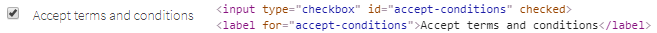
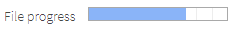
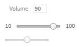

## 1. HTML5 elements
### 1.1 HTML5 Common elements

#### 1.1.1 Label

```java 
  // @FindBy(xpath = "//label[@for='your-name']")
  @UI("//label[@for='your-name']") 
  
  public static TextField yourName;
	
  @Test
  public void labelTest() {
      assertEquals(yourName.label().getText(), "Your name:");
      yourName.label().is().text(containsString("Your"));
      disabledName.label().is().text(equalToIgnoringCase("Surname:"));
  }
 ```

```csharp 
  	
 In the next test Label is found from NameTextField locator:
  
 [FindBy(Css = "div.main-content #name")]
 public TextField NameTextField { get; set; }
	
 By default, Label is found by locator By.CssSelector($"[for={WebElement.GetAttribute("id")}]")

 [Test] 
 public void LabelTest() 
 { 
     Assert.AreEqual(TestSite.Html5Page.NameTextField.Label().GetText(), "Your name:");
     TestSite.Html5Page.NameTextField.Label().Is.Text(ContainsString("Your"));
     Assert.AreEqual(TestSite.Html5Page.SurnameTextField.Label().GetText(), "Surname:");
     TestSite.Html5Page.SurnameTextField.Label().Is.Text(ContainsString("Surname:")); 
 }	 
	
 [Test] 
 public void GetLabelTextTest() 
 { 
     AreEqual(TestSite.Html5Page.ColorPicker.LabelText(), "Select a color"); 
 } 
 
  ```

**Label** — Defines a label for an ```<input>``` control.


```html 
<form>
    <input type="radio" name="gender" value="male" id="male">
    <label for="male">Male</label>
    <input type="radio" name="gender" value="female" id="female">
    <label for="female">Female</label>
</form>
```

Available methods in JDI Light:

|Method | Description                         | Return Type
--- |-------------------------------------| --- 
**setValue(String)**| sets value                          |void
**getValue()**| gets value                          | String
**getText()**| returns value. Overrided method of UIBaseElement | String
**is()**|Assert action|TextAssert

Available methods in C# JDI Light:

|Method | Description | Return Type
--- | --- | --- 
**assertThat()** | Assert action | TextAssert
**click()** | Click the button  | void
**getText()** | Get button text | String
**is()** | Assert action | TextAssert
**Label()** | Creates label for element using the element's Id | Label
**LabelText()** | Gets the text of a label | string

<a href="https://github.com/jdi-testing/jdi-light/blob/master/jdi-light-html-tests/src/test/java/io/github/epam/html/tests/elements/common/TextFieldTests.java" target="_blank">Java test examples</a>

<a href="https://github.com/jdi-testing/jdi-light-csharp/blob/master/JDI.Light/JDI.Light.Tests/Tests/Simple/LabelsTests.cs" target="_blank">C# test examples</a>

[BDD Steps examples](https://jdi-docs.github.io/jdi-light/?java#label-2)

#### 1.1.2 Button

```java 
@UI("[value*='Red Button']") 
// @FindBy(css = "[value*='Red Button']")
public static Button redButton;

@Test
public void clickTest() {
    redButton.click();
    validateAndAcceptAlert("Red button");

    blueButton.click();
    validateAndAcceptAlert("Blue button");
}
```

```csharp

[FindBy(Css = ".red")]
public Button RedButton;

[Test]
public void ClickTest() 
{
    RedButton.Click();
    Assert.AreEqual(GetAlert().GetAlertText(), "Red button");
    GetAlert().AcceptAlert();
}

[Test]
public void GetTextTest() 
{
    Assert.AreEqual(RedButton.GetText(), "Big Red Button-Input");
}

```
**Button** — The ```<button>``` tag is used to create clickable buttons on the web page


Here is an example with provided HTML code:
```html 
<input type="button" value="Big Red Button-Input" class="uui-button red" onclick="alert('Red button');">
```

Button is located in the following classes:
 
  - __Java__: _com.epam.jdi.light.ui.html.common.Button_
  - __C#__: _JDI.Light.Elements.Common.Button_

Available methods in Java JDI Light:

|Method | Description        | Return Type
--- |--------------------| ---
**getValue()** | Get button's value | String
**is()** | Assert action      | TextAssert

Available methods and properties in C# JDI Light:

|Method/Property | Description | Return Type
--- | --- | ---
**AssertThat** | Assert action | TextAssert
**Click()** | Click the button  | void
**GetText()** | Get button text | string
**Is** | Assert action | TextAssert

<a href="https://github.com/jdi-testing/jdi-light/blob/master/jdi-light-html-tests/src/test/java/io/github/epam/html/tests/elements/common/ButtonTests.java" target="_blank">Java test examples</a>
<br>
<a href="https://github.com/jdi-testing/jdi-light-csharp/blob/master/JDI.Light/JDI.Light.Tests/Tests/Simple/ButtonTests.cs" target="_blank">C# test examples</a>
<br>
[BDD Steps example](https://jdi-docs.github.io/jdi-light/?java#button-3)

#### 1.1.3 Checkbox

**Checkbox** — Element allows you to select a single value for submission.


Checkbox is located in the following classes:

- __Java__: _com.epam.jdi.light.ui.html.common.Checkbox*_
- __C#__: _JDI.Light.Elements.Common.CheckBox*_


Here is an example with provided HTML code:

<!--  -->

```java 
//@FindBy(xpath = "//input[@type='checkbox' and @id='accept-conditions']") 
@UI("//input[@type='checkbox' and @id='accept-conditions']")
public static Checkbox acceptConditions;

@Test
public void checkTest() {
    acceptConditions.check();
    acceptConditions.is().selected();
}

@Test
public void uncheckTest() {
    acceptConditions.uncheck();
    acceptConditions.is().deselected();
}

@Test
public void getLabelTextTest() {
    acceptConditions.label().is().text(labelText);
}
```

```csharp

[FindBy(XPath = "//*[@id='elements-checklist']//*[text()='Water']")]
[IsChecked(typeof(CustomCheck), nameof(CustomCheck.CheckFunc))]
public CheckBox CbWater;

[FindBy(Css = "#accept-conditions")]
public CheckBox AcceptConditions { get; set; }

[Test]
public void CheckSingleTest()
{
     Assert.DoesNotThrow(() => TestSite.MetalsColorsPage.CbWater.Check(true));
     Jdi.Assert.Contains(TestSite.ActionsLog.Texts[0], "Water: condition changed to true");
}

[Test]
public void UncheckSingleTest()
{
     TestSite.MetalsColorsPage.CbWater.Click();
     TestSite.MetalsColorsPage.CbWater.Uncheck();
  	 Jdi.Assert.Contains(TestSite.ActionsLog.Texts[0], "Water: condition changed to false");
}

[Test]
public void IsCheckTest()
{
     Assert.IsFalse(TestSite.MetalsColorsPage.CbWater.IsChecked);
     TestSite.MetalsColorsPage.CbWater.Click();
     Assert.IsTrue(TestSite.MetalsColorsPage.CbWater.IsChecked);
}

[Test]
public void MultipleUncheckTest()
{
     TestSite.MetalsColorsPage.CbWater.Click();
     TestSite.MetalsColorsPage.CbWater.Uncheck();
     TestSite.MetalsColorsPage.CbWater.Uncheck();
     Jdi.Assert.Contains(TestSite.ActionsLog.Texts[0], "Water: condition changed to false");
}

[Test]
public void ClickTest()
{
     TestSite.MetalsColorsPage.CbWater.Click();
     Jdi.Assert.Contains(TestSite.ActionsLog.Texts[0], "Water: condition changed to true");
     TestSite.MetalsColorsPage.CbWater.Click();
     var texts = TestSite.ActionsLog.Texts;
     Jdi.Assert.Contains(texts[0], "Water: condition changed to false");
}

[Test]
[TestCaseSource(typeof(CheckBoxProvider), nameof(CheckBoxProvider.InputData))]
public void SetValueTest(bool value, bool expected)
{
     if (!expected) TestSite.MetalsColorsPage.CbWater.Click();
     TestSite.MetalsColorsPage.CbWater.Value = value;
     var resultMsg = "Water: condition changed to " + expected.ToString().ToLower();
     Jdi.Assert.Contains(TestSite.ActionsLog.Texts[0], resultMsg);
}

[Test]
public void IsValidationTest()
{
    TestSite.Html5Page.Open();
    TestSite.Html5Page.AcceptConditions.Is.Selected();
    TestSite.Html5Page.AcceptConditions.Click();
    TestSite.Html5Page.AcceptConditions.Is.Deselected();
    TestSite.Html5Page.AcceptConditions.Is.Enabled();
    TestSite.Html5Page.AcceptConditions.Is.Displayed();
}

[Test]
public void LabelTest()
{
    TestSite.Html5Page.Open();
    Assert.AreEqual("Accept terms and conditions", TestSite.Html5Page.AcceptConditions.Label().GetText());
    TestSite.Html5Page.AcceptConditions.Label().Is.Text(ContainsString("terms and conditions"));
    TestSite.Html5Page.AcceptConditions.Label().Is.Text(EqualTo("accept terms and conditions"));
}

[Test]
public void AssertValidationTest()
{
    TestSite.Html5Page.Open();
    TestSite.Html5Page.AcceptConditions.AssertThat.Selected();
}

[Test]
public void BaseValidationTest()
{
    TestSite.Html5Page.Open();
    BaseElementValidation(TestSite.Html5Page.AcceptConditions);
}

```

```html
<div>
  <input type="checkbox" id="accept-conditions" checked="">
  <label for="accept-conditions">Accept terms and conditions</label>
</div>
```

Available methods in Java JDI Light:

|Method | Description | Return Type
--- | --- | ---
**safeGetLabel()**| Safely returns label |Label
**check(String)**| Set to checked if string value equals "true" (case insensitive), otherwise set to unchecked | void
**check()**| Set to checked | void
**uncheck()**| Set to unchecked | void


Available methods in C# JDI Light:

|Method | Description | Return Type
--- | --- | ---
**AssertThat** | Gets assert for checkbox | CheckBoxAssert
**Check(bool checkEnabled = true)** | Checks a checkbox | void
**Deselected()** | Checks whether a checkbox is deselected | CheckBoxAssert
**Displayed()** | Checks whether a checkbox is displayed | CheckBoxAssert
**Enabled()** | Checks whether a checkbox is enabled | CheckBoxAssert
**Is** | Gets assert for checkbox | CheckBoxAssert
**IsChecked** | Determines whether a checkbox is checked | bool
**Selected()** | Checks whether a checkbox is selected | CheckBoxAssert
**Uncheck(bool checkEnabled = true)** | Unhecks a checkbox | void

<a href="https://github.com/jdi-testing/jdi-light/blob/master/jdi-light-html-tests/src/test/java/io/github/epam/html/tests/elements/common/CheckboxTests.java" target="_blank">Java test examples</a>

<a href="https://github.com/jdi-testing/jdi-light-csharp/blob/master/JDI.Light/JDI.Light.Tests/Tests/Simple/CheckBoxTests.cs" target="_blank">C# test examples</a>

[BDD Steps example](https://jdi-docs.github.io/jdi-light/?java#checkbox-2)

#### 1.1.4 ColorPicker

```java 
@UI("#color-picker") // @FindBy(id = "color-picker")
public static ColorPicker colorPicker;

@Test
public void checkColorTest() {
    colorPicker.assertThat().color(COLOR);
    disabledPicker.is().color(DISABLED_COLOR);
}

@Test
public void setColorTest() {
    colorPicker.setColor(SETTING_COLOR);
    colorPicker.is().color(SETTING_COLOR);
}  
```
```csharp
[FindBy(Css = "#color-picker")]
public ColorPicker ColorPicker;

[Test]
public void GetColorTest() 
{
    Assert.AreEqual(ColorPicker.Color(), "#3fd7a6");
}

[Test]
public void SetColorTest() 
{
    ColorPicker.SetColor("#432376");
    Assert.AreEqual(ColorPicker.Color(), "#432376");
}
 
```
**ColorPicker** — Elements of this type provide a user interface element that lets a user specify a color, either by using a visual color picker interface or by entering the color into a text field in "#rrggbb" hexadecimal format. Only simple colors (with no alpha channel) are allowed. The values are compatible with CSS.


Color Picker is located in the following classes:

- __Java__: _com.epam.jdi.light.ui.html.common.ColorPicker_


Here is an example with provided HTML code:

<!--  -->

```html
<input type="color" value="#3fd7a6" id="color-picker">
<label for="color-picker">Select a color</label>
```

Here is the list of some available methods in Java:

|Methods | Description | Return Type
--- | --- | ---
**assertThat()** | Assert action | ColorAssert
**color()** | Returns color code in  hexadecimal format ("#rrggbb") | String
**is()** | Assert action | ColorAssert
**setColor(String)** | Set color from string hex representation ("#rrggbb") | void

<a href="https://github.com/jdi-testing/jdi-light/blob/master/jdi-light-html-tests/src/test/java/io/github/epam/html/tests/elements/common/ColorPickerTests.java" target="_blank">Java test examples</a>
<br>
[BDD Steps example](https://jdi-docs.github.io/jdi-light/?java#colorpicker-2)<br>

Here is the list of some available methods in C#:

|Methods | Description | Return Type
--- | --- | ---
**AssertThat()** | Assert action | ColorAssert
**Color()** | Returns color code in  hexadecimal format ("#rrggbb") | string
**Is()** | Assert action | ColorAssert
**SetColor(String)** | Set color from string hex representation ("#rrggbb") | void

<a href="https://github.com/jdi-testing/jdi-light-csharp/blob/master/JDI.Light/JDI.Light.Tests/Tests/Simple/ColorPickerTests.cs" target="_blank">Test examples in C#</a>
<br>
[BDD Steps example](https://jdi-docs.github.io/jdi-light/?java#colorpicker-2)<br>

#### 1.1.5 DateTimeSelector

**DateTimeSelector** — Is used for Input Type Date and its derivatives and allows users to set the value of date and/or time.

The list of supported elements:

- Input Type Date
- Input Type Week
- Input Type Month
- Input Type Time
- Input Type DateTime-Local

There following classes represent this type of element:

- __C#__: _JDI.Light.Elements.Common.DateTimeSelector_
- __Java__: _com.epam.jdi.light.ui.html.common.DateTimeSelector_

Here is the list of some methods available in C#:

|Method | Description | Return Type
--- | --- | ---
**AssertThat()** | Assert action of DateTimeSelector | DateTimeSelectorAssert
**GetDateTime()** | Returns the set date or time | DateTime
**Is()** | Assert action of DateTimeSelector | DateTimeSelectorAssert
**Max()** | Gets attribute with name 'max' | string
**Min()** | Gets attribute with name 'min' | string
**SetDateTime(string/DateTime value)** | Sets a date or time | void
**Value()** | Returns value attribute | string

And here are some of the methods available in Java:

|Method | Description | Return Type
--- | --- | ---
**assertThat()** | Assertion | DateTimeAssert
**is()** | Assertion | DateTimeAssert
**max()** | Gets attribute with name max | String
**min()** | Gets attribute with name min | String
**setDateTime(string value)** | Sets a date or time | void
**value()** | Returns the set date or time | String

[BDD Steps example](https://jdi-docs.github.io/jdi-light/#datetimeselector-2)

__In the following sections there are examples of different implementations of such fields.__

__Input Type Date__

```java 
//@FindBy(css = "#birth-date")
@UI("#birth-date")  
public static DateTimeSelector birthDate;

//@FindBy(id = "party-time")
@UI("#party-time") 
public static DateTimeSelector partyTime;

//@FindBy(css = "#booking-time")
@UI("#booking-date")  
public static DateTimeSelector bookingTime;

@Test
public void setDateTimeTest() {
    partyTime.setDateTime("2017-05-10T00:00");
    partyTime.show();
    partyTime.is().text("2017-05-10T00:00");
    bookingTime.setDateTime("05:00");
    bookingTime.show();
    bookingTime.is().text("05:00");
}

@Test
public void getDateTest() {
    birthDate.is().text("1985-06-18");
}

@Test
public void minMaxTest() {
    assertEquals(partyTime.min(), "2018-05-07T00:00");
    assertEquals(partyTime.max(), "2018-06-14T00:00");
}

@Test
public void labelTest() {
    birthDate.label().assertThat().text(is("Birth date"));
    birthDate.label().is().text(equalToIgnoringCase("birth date"));
    birthDate.assertThat().date(containsString("1985"));
}
```
```csharp 
[FindBy(Css = "#birth-date")]
public IDateTimeSelector BirthDate { get; set; }
        
[Test]
public void SetBirthDateTest()
{
    TestSite.Html5Page.BirthDate.Format = "yyyy-MM-dd";
    TestSite.Html5Page.BirthDate.SetDateTime(_dateTime);    
    TestSite.Html5Page.BirthDate.AssertThat().SelectedTime(Is.EqualToIgnoringCase("2019-04-01"));	
}
```
**Input Type Date** — A graphical control element that allows user to set value for date.


```html
<label for="birth-date">Birth date</label>
<input type="date" id="birth-date" value="1985-06-18" min="1970-01-01" max="2030-12-31">
```

<a href="https://github.com/jdi-testing/jdi-light-csharp/blob/master/JDI.Light/JDI.Light.Tests/Tests/Simple/DateTimeTests.cs" target="_blank">Test examples in C#</a>

<a href="https://github.com/jdi-testing/jdi-light/blob/master/jdi-light-html-tests/src/test/java/io/github/epam/html/tests/elements/common/DateTests.java" target="_blank">Test examples in Java</a>

__Input Type Week__

```csharp 
[FindBy(Css = "#autumn-week")]
public IDateTimeSelector AutumnDateTime { get; set; }
        
[Test]
public void AutumnDateTimeTest()
{
    var calendar = new GregorianCalendar();
    var weekNum = calendar.GetWeekOfYear(_dateTime, CalendarWeekRule.FirstFullWeek, DayOfWeek.Monday);
    TestSite.Html5Page.AutumnDateTime.Format = "yyyy-" + $"W{weekNum}";

    TestSite.Html5Page.AutumnDateTime.SetDateTime(_dateTime);
    var setValue = TestSite.Html5Page.AutumnDateTime.GetValue();
    Assert.AreEqual(setValue, "2019-W13");
}
```
**Input Type Week** — A graphical control element that allows user to set values for week and year.


```html
<label for="autumn-week">Autumn</label>
<input type="week" id="autumn-week" value="2018-W40"
 min="2018-W35" max="2018-W48" required="">
```


<a href="https://github.com/jdi-testing/jdi-light-csharp/blob/master/JDI.Light/JDI.Light.Tests/Tests/Simple/DateTimeTests.cs" target="_blank">Test examples in C#</a>

<a href="https://github.com/jdi-testing/jdi-light/blob/master/jdi-light-html-tests/src/test/java/io/github/epam/html/tests/elements/common/WeekTests.java" target="_blank">Test examples in Java</a>


__Input Type Month__

```csharp 
[FindBy(Css = "#month-date")]
public IDateTimeSelector MonthOfHolidays { get; set; }
        
[Test]
public void SetMonthTest()
{
    TestSite.Html5Page.MonthOfHolidays.Format = "yyyy-MM";
    TestSite.Html5Page.MonthOfHolidays.SetDateTime(_dateTime);
    var setValue = TestSite.Html5Page.MonthOfHolidays.GetValue();
    Assert.AreEqual(setValue, "2019-04");
}
```
**Input Type Month** — a graphical control element that allows user to set values for month and year.


```html
<label for="month-date">Month of Holidays</label>
<input type="month" id="month-date" min="2015-03"
 max="2020-12" value="2018-05">
```

<a href="https://github.com/jdi-testing/jdi-light-csharp/blob/master/JDI.Light/JDI.Light.Tests/Tests/Simple/DateTimeTests.cs" target="_blank">Test examples in C#</a>

<a href="https://github.com/jdi-testing/jdi-light/blob/master/jdi-light-html-tests/src/test/java/io/github/epam/html/tests/elements/common/MonthTests.java" target="_blank">Test examples in Java</a>

__Input Type Time__

```csharp 
[FindBy(Css = "#booking-time")]
public IDateTimeSelector BookingTime { get; set; }
        
[Test]
public void SetTimeTest()
{
    TestSite.Html5Page.BookingTime.Format = "H:mm";
    TestSite.Html5Page.BookingTime.SetDateTime(_dateTime);
    var setValue = TestSite.Html5Page.BookingTime.GetValue();
    Assert.AreEqual(setValue, "15:00");
}
```
**Input Type Time** — A graphical control element that allows user to set time.


```html
<label for="booking-time">Booking Time:</label>
<input type="time" id="booking-time" value="11:00" min="9:00" max="18:00">
```

<a href="https://github.com/jdi-testing/jdi-light-csharp/blob/master/JDI.Light/JDI.Light.Tests/Tests/Simple/DateTimeTests.cs" target="_blank">Test examples in C#</a>

<a href="https://github.com/jdi-testing/jdi-light/blob/master/jdi-light-html-tests/src/test/java/io/github/epam/html/tests/elements/common/TimeTests.java" target="_blank">Test examples in Java</a>

__Input Type DateTime-Local__

```csharp 
[FindBy(Css = "#party-time")]
public IDateTimeSelector PartyTime { get; set; }

[Test]
public void SetPartyTimeTest()
{
    TestSite.Html5Page.PartyTime.Format = "yyyy-MM-ddTHH:mm";
    TestSite.Html5Page.PartyTime.SetDateTime(_dateTime);
    var setValue = TestSite.Html5Page.PartyTime.GetDateTime();
    Assert.AreEqual(setValue, _dateTime);
}
```
**Input Type DateTime-Local** — A graphical control element that allows user to set time and date.


```html
<label for="party-time">Date/time:</label>
<input type="datetime-local" id="party-time" value="2018-06-12T19:30" min="2018-05-07T00:00" max="2018-06-14T00:00">
```

<a href="https://github.com/jdi-testing/jdi-light/blob/master/jdi-light-html-tests/src/test/java/io/github/epam/html/tests/elements/common/DateTimeTests.java" target="_blank">Test examples in Java</a>

<a href="https://github.com/jdi-testing/jdi-light-csharp/blob/master/JDI.Light/JDI.Light.Tests/Tests/Simple/DateTimeTests.cs" target="_blank">Test examples in C#</a>


#### 1.1.6 FileInput

**FileInput** — A graphical control element that allows user to upload documents to web site.


FileInput element is located in JDI Light in:

- __Java__: _com.epam.jdi.light.ui.html.common.FileInput_
- __C#__: _JDI.Light.Elements.Composite.FileInput_


Here is an example with HTML code provided:

<!--  -->

```java 
//@FindBy(id = "avatar")
@UI("#avatar") 
public static FileInput avatar; 

//@FindBy(xpath = "//a[@download]")
@UI("[download]") 
public static Link downloadJdiLogo;

@Test
public void uploadTest() {
    avatar.uploadFile(mergePath(PROJECT_PATH, "/src/test/resources/general.xml"));
    avatar.is().text(containsString("general.xml"));
}

@Test
public void labelTest() {
    avatar.label().is().text(containsString("picture:"));
}

@Test
public void downloadTest() {
    FileAssert.cleanupDownloads();
    FileAssert.downloadJdiLogo.click();
    FileAssert.assertThatFile("jdi-logo.jpg")
            .isDownloaded()
            .hasSize(is(32225L));
    FileAssert.assertThatFile("jdi-logo.jpg").hasSize(greaterThan(100L));
}
```
```csharp
[Test]
public void FileInputTest()
{
    FileInput.SelectFile(CreateFile(filename));
}

[Test]
public void DisabledUploadTest()
{
    Sleep(2000);
    try
    {
         TestSite.Html5Page.DisabledFileInput.SelectFile(CreateFile(_fileName));
    }
    catch (Exception e)
    {
         Logger.Exception(e);
    }
    Sleep(2000);
    TestSite.Html5Page.DisabledFileInput.Is.Text(EqualTo(""));
}

[Test]
public void LabelTest()
{
    AreEqual(TestSite.Html5Page.FileInput.LabelText(), "Profile picture:");
    TestSite.Html5Page.FileInput.Label().Is.Text(ContainsString("picture"));
}

[Test]
public void BaseValidationTest()
{
    BaseElementValidation(TestSite.Html5Page.FileInput);
}

```

```html
<label for="avatar">Profile picture:</label>
<input type="file" id="avatar" accept="image/png, image/jpeg">
<input type="file" accept="image/png, image/jpeg" disabled="">
<a href="/jdi-light/images/jdi-logo.jpg" download="">Download JDI Logo</a>
```

Available method in Java JDI Light:

|Method | Description | Return Type
--- | --- | ---
**assertThat()** | property that returns object for work with assertions | TextAssert
**click()** | click on element | void
**getValue()** | Get file name | String
**is()** | property that returns object for work with assertions | TextAssert
**hover()** | hover on element | void
**label()**| Get label | Label
**setValue(String value)** | set file path to input | void
**text()** | returns text of input field | String
**uploadFile(String path)** | set file path to input | void
**uploadFileRobot(String path, long mSecDelay)** | set file path to input | void

Available method in C# JDI Light:

|Method | Description | Return Type
--- | --- | ---
**CleanupDownloads()** | Cleans the directory | void
**HasSize(Matcher<long> size)** | Checks that a file has a particular size according to the matcher | FileAssert
**IsDownloaded()** |Checks whether a file is downloaded  | FileAssert
**SelectFile(string filepath)** |Select file to upload  | void
**Text(Matcher<string> value)** | Checks whether an occurrence of a text is contained within a text file | FileAssert

<a href="https://github.com/jdi-testing/jdi-light/blob/master/jdi-light-html-tests/src/test/java/io/github/epam/example/common/FileInputExampleTests.java">Test examples in Java</a>

<a href="https://github.com/jdi-testing/jdi-light-csharp/blob/master/JDI.Light/JDI.Light.Tests/Tests/Simple/FileInputTests.cs">Test examples in C#</a>

[BDD Steps example](https://jdi-docs.github.io/jdi-light/?java#fileinput-2)

#### 1.1.7 Icon

**Icon** — Is a simple element type that represents icons and graphic images.


```java 
  @UI("#jdi-logo") 
  // same as FindBy(css = "#jdi-logo")
  public static Icon userIcon;

  @Test
  public void loginWithUserToLightLocatorFormTest() {
      userIcon.click();
      loginAs("#login-form", DEFAULT_USER);
      homePage.checkOpened();
  }
```
```csharp 
  [FindBy(Css = "#jdi-logo")]
  public IIcon Logo
  ;
  
  [Test]
  public void GetSourceTest()
  {
    Jdi.Assert.AreEquals(LogoImage.GetSource(), Src);
  }
  
  [Test]
  public void GetTipTest()
  {
    Jdi.Assert.AreEquals(LogoImage.GetAlt(), Alt);
  }
```

```html
<label for="jdi-logo">JDI Logo:</label>

```

<a href="https://github.com/jdi-testing/jdi-light/blob/master/jdi-light-html-tests/src/test/java/io/github/epam/html/tests/elements/common/ImageTests.java" target="_blank">Test examples in Java</a>
<br>

Icon is represented by Image class:

[Image](https://jdi-docs.github.io/jdi-light/#image)


Icon in JDI is a descendant of Image. It inherits all Image's methods and serves as its wrapper. Here are Java methods for Icon, inherited from Image interface:

|Method | Description | Return Type
--- | --- | ---
**alt()** |get value of alt attribute | String
**click()** | click on the image| void
**height()** |get value of height attribute| int
**is()** | method for building assertions | ImageAssert
**src()** | get value of src attribute | String
**width()** | get value of width attribute| int
**fileName()** | Get image source path| String
**getValue()** | Get image source path| String

Here is a list of available methods in C#:

|Method | Description | Return Type
--- | --- | ---
**Alt** |get value of alt attribute | string
**AssertThat()** |method for building assertions  | ImageAssert
**Click()** | click on the image| void
**Height** |get value of height attribute| string
**Is()** | method for building assertions | ImageAssert
**Src** | get value of src attribute | string
**Width** | get value of width attribute| string

<a href="https://github.com/jdi-testing/jdi-light/blob/master/jdi-light-html-tests/src/test/java/io/github/epam/html/tests/elements/common/ImageTests.java" target="_blank">Test examples in Java</a><br>

<a href="https://github.com/jdi-testing/jdi-light-csharp/blob/master/JDI.Light/JDI.Light.Tests/Tests/Simple/ImagesTests.cs" target="_blank">Test examples in C#</a><br>

[BDD Steps example](https://jdi-docs.github.io/jdi-light/?java#icon-2)

#### 1.1.8 Image

**Image** — Is a simple element type that represents graphic images.


```java 
  @UI("#jdi-logo") 
  // same as FindBy(css = "#jdi-logo")
  public static Image jdiLogo;

  @Test
  public void isValidationTest() {
      WebPage.refresh();
      jdiLogo.is().src(containsString("jdi-logo.jpg"));
      jdiLogo.is().alt(is("Jdi Logo 2"));
      jdiLogo.assertThat().height(is(100));
      jdiLogo.assertThat().width(is(101));
  }
  
  @Test
  public void getSrcTest() {
      assertEquals(jdiLogo.src(), text);
  }
```
```csharp 
  [FindBy(Css = "#jdi-logo")]
  public IImage LogoImage;

  [Test]
  public void GetSourceTest()
  {
    Jdi.Assert.AreEquals(LogoImage.GetSource(), Src);
  }

  [Test]
  public void GetTipTest()
  {
    Jdi.Assert.AreEquals(LogoImage.GetAlt(), Alt);
  }
```
```html
<label for="jdi-logo">JDI Logo:</label>

```

Images are represented by the following classes in Java and C#:

- __Java__: _com.epam.jdi.light.ui.html.elements.common.Image_
- __C#__: _JDI.Light.Elements.Common.Image_

Here is a list of available methods in Java:

|Method | Description | Return Type
--- | --- | ---
**alt()** |get value of alt attribute | String
**click()** | click on the image| void
**height()** |get value of height attribute| int
**is()** | method for building assertions | ImageAssert
**src()** | get value of src attribute | String
**width()** | get value of width attribute| int
**fileName()** | Get image source path| String
**getValue()** | Get image source path| String

<a href="https://github.com/jdi-testing/jdi-light/blob/master/jdi-light-html-tests/src/test/java/io/github/epam/html/tests/elements/common/ImageTests.java" target="_blank">Test examples in Java</a>

Here is a list of available methods in C#:

|Method | Description | Return Type
--- | --- | ---
**Alt** |get value of alt attribute | string
**AssertThat()** |method for building assertions  | ImageAssert
**Click()** | click on the image| void
**Height** |get value of height attribute| string
**Is()** | method for building assertions | ImageAssert
**Src** | get value of src attribute | string
**Width** | get value of width attribute| string

<a href="https://github.com/jdi-testing/jdi-light-csharp/blob/master/JDI.Light/JDI.Light.Tests/Tests/Simple/ImagesTests.cs" target="_blank">Test examples in C#</a>

#### 1.1.9 Link

```java 

  //@FindBy(css = "[ui=github-link]") 
  @UI("[ui=github-link]") 
  public static Link githubLink;

  @Test
  public void getTextTest() {
        assertEquals(githubLink.getText(), text);
  }

  @Test
  public void getRefTest() {
        assertEquals(githubLink.ref(), "https://github.com/jdi-testing");
  }
```
```csharp 
  [FindBy(Css = "[ui = github-link]")]
  public ILink GithubLink;
  
  [Test]
  public void GetTextTest()
  {
      Assert.AreEqual(GithubLink.GetText(), Text);
  }
  
  [Test]
  public void GetUrlTest()
  {
       Assert.AreEqual(GithubLink.Url(), "https://epam.github.io/JDI/html5.html");
  }
```

**Link** — A graphical control element that allows user to link from one page to other web pages, files, locations within the same page, email addresses, or any other URL.

Link are represented by the following class:

- __Java__: _com.epam.jdi.light.ui.html.elements.common.Link_
- __C#__: _JDI.Light.Elements.Common.Link_


```html 
<a ui="github-link" href="https://github.com/jdi-testing" alt="Github JDI Link">Github JDI</a>
```

Here is the list of available methods in Java:

|Method | Description | Return Type
--- | --- | ---
**alt()** |Returns the alternate text | String
**click()** |Follow the link | void
**getValue()** |Returns the link text  | String
**is()** | Returns object for work with assertions | LinkAssert
**ref()** |Returns the reference  | String
**url()** |Returns the URL  | URL

<a href="https://github.com/jdi-testing/jdi-light/blob/master/jdi-light-html-tests/src/test/java/io/github/epam/html/tests/elements/common/LinkTests.java" target="_blank">Test examples in Java</a><br>
[BDD Steps example](https://jdi-docs.github.io/jdi-light/#link-2)

Here is the list of available methods in C#:

|Method | Description | Return Type
--- | --- | ---
**Alt()** |Returns the alternate text | string
**AssertThat()** | Returns object for work with assertions | LinkAssert
**Click()** |Follow the link | void
**GetText()** |Returns the link text  | string
**Is()** | Returns object for work with assertions | LinkAssert
**Ref()** |Returns the reference  | string
**Url()** |Returns the URL  | string

<a href="https://github.com/jdi-testing/jdi-light-csharp/blob/master/JDI.Light/JDI.Light.Tests/Tests/Simple/LinkTests.cs" target="_blank">Test examples in C#</a>
<br>
[BDD Steps example](https://jdi-docs.github.io/jdi-light/#link-2)

#### 1.1.10 Menu

**Menu** — A list of links which lead to different pages or sections of website.

Menu element is located in JDI Light in:

- __Java__: _com.epam.jdi.light.ui.html.
- __C#__: _JDI.Light.Elements.Composite.Menu_


Here is an example with provided HTML code:

<!--  -->

```java 
  @UI(".sidebar-menu [ui=label]") 
  //@FindBy(css = ".sidebar-menu [ui=label]")
  public static Menu leftMenu;

  @Test
  public void setNullValueTest() {
        String optionName = null;
        String selectedValue = leftMenu.selected();
        leftMenu.select(optionName);
        leftMenu.has().text(selectedValue);
  }
  
  @Test
  public void selectTest() {
        leftMenu.select("Contact form");
        contactFormPage.checkOpened();
  }
  
```
```csharp
  [FindBy(Css = "ul.sidebar-menu")]
  public Menu SidebarMenu;
  
  [Test]
  public void SelectEnumTest()
  {
       TestSite.SidebarMenu.Select(Navigation.MetalsColors);
       TestSite.MetalsColorsPage.CheckOpened();
  }
  
  [Test]
  public void IsValidationTest()
  {
       TestSite.SidebarMenu.Select("Elements packs", "HTML 5");
       TestSite.SidebarMenu.Is.Selected("HTML 5")
  }
  
  [Test]
  public void AssertValidationTest()
  {
       TestSite.SidebarMenu.Select("Elements packs", "HTML 5");
       TestSite.SidebarMenu.AssertThat.Selected("HTML 5");
  }
  
```

```html 
<ul class="sidebar-menu left">
	<li ui="label" index="1">
		<a href="index.html">
			<span>Home</span>
		</a>
	</li>
	<li ui="label" index="2">
		<a href="contacts.html">
			<span>Contact form</span>
		</a>
	</li>
	<li class="menu-title" index="3">
		<a ui="label">
			<span>Service</span>
			<div class="fa fa-caret-down arrow"/>
		</a>
		<ul class="sub hide-menu">
			<li ui="label" index="1">
				<a href="support.html">
					<p>
						<span>Support</span>
					</p>
				</a>
			</li>
			<li ui="label" index="2">
				<a href="dates.html">
					<span>Dates</span>
				</a>
			</li>
			<li ui="label" index="3">
				<a href="complex-table.html">
					<span>Complex Table </span>
				</a>
			</li>
			<li ui="label" index="4">
				<a href="simple-table.html">
					<span>Simple Table</span>
				</a>
			</li>
			<li ui="label" index="5">
				<a href="search.html">
					<span>Search</span>
				</a>
			</li>
			<li ui="label" index="6">
				<a href="user-table.html">
					<span>User Table</span>
				</a>
			</li>
			<li ui="label" index="7">
				<a href="table-pages.html">
					<span>Table with pages</span>
				</a>
			</li>
			<li ui="label" index="8">
				<a href="different-elements.html">
					<span>Different elements</span>
				</a>
			</li>
			<li ui="label" index="9">
				<a href="performance.html">
					<span>Performance</span>
				</a>
			</li>
		</ul>
	</li>
	<li ui="label" index="4">
		<a href="metals-colors.html">
			<span>Metals &amp; Colors</span>
		</a>
	</li>
	<li class="menu-title active" index="5">
		<a ui="label">
			<span>Elements packs</span>
			<div class="fa fa-caret-down arrow"/>
		</a>
		<ul class="sub">
			<li ui="label" index="1" class="active">
				<a href="html5.html">
					<span>HTML 5</span>
				</a>
			</li>
			<li ui="label" index="2">
				<a href="mobile-html5.html">
					<span>Mobile and HTML 5</span>
				</a>
			</li>
			<li ui="label" index="3">
				<a href="bootstrap-new.html">
					<span>Bootstrap</span>
				</a>
			</li>
			<li ui="label" index="4">
				<a href="bootstrap_form.html">
					<span>Bootstrap form</span>
				</a>
			</li>
			<li ui="label" index="5">
				<a href="bootstrap_forms.html">
					<span>Bootstrap forms</span>
				</a>
			</li>
			<li ui="label" index="6">
				<a href="react-ant.html">
					<span>React Ant</span>
				</a>
			</li>
			<li ui="label" index="7">
				<a href="angular.html">
					<span>Angular</span>
				</a>
			</li>
			<li ui="label" index="8">
				<a href="material">
					<span>Material UI</span>
				</a>
			</li>
			<li ui="label" index="9">
				<a href="vuetify">
					<span>Vuetify</span>
				</a>
			</li>
		</ul>
	</li>
</ul>
				
```


Available methods in Java JDI Light:

|Method | Description                             | Return Type
--- |-----------------------------------------| ---
**selected()** | Returns selected menu item              | String
**selected(String/int)** | Check is item seleceted                 | boolean
**values()** | Returns selected menu item and subitems | List<String>
**values(TextTypes)** | Returns selected menu item and subitems | List<String>
**select(String/String.../int/int.../TEnum/TEnum...)** | Select menu element                     | void
**listEnabled()** | Returns all enable menu options         | List<String>
**listDisabled()** | Returns all disabled menu options       | List<String>
**attrs()** | Gets all element attributes             | List<String>
**getText()** | Gets button text                        | String
**getValue()** | Returns the value                       | String
**setValue(String)** | Sets the value                          | void
**isDisplayed()** | Check that menu is displayed            | boolean
**isHidden()** | Check that menu is hidden               | boolean
**size()** | Get menu size                           | int
**isEmpty()** | Check that '{name}' menu is empty       | boolean
**isNotEmpty()** | Check that '{name}' menu is not empty   | boolean

Available methods in C# JDI Light:

|Method | Description | Return Type
--- | --- | ---
**AssertThat** | Get select assert | MenuSelectAssert
**Is** | Get select assert | MenuSelectAssert
**List<string> Values()** | Gets values of all options | List<string>
**string Selected()** | Returns selected menu item | string
**void HoverAndClick(string[])** | Hovers and clicks menu item and subitems | void
**void HoverAndClick(string)** | Hovers and clicks menu item | void
**void Select(string[])** | Select menu element and subelements by string values | void
**void Select(string)** | Select menu element | void
**void Select(int[])** | Select menu element and subelements by index | void
**void Select(int)** | Select menu element and subelements by index | void
**void Select(Enum[])** | Select menu element and subelements by getting values of enum | void
**void Select(Enum)** | Select menu element | void

<a href="https://github.com/jdi-testing/jdi-light/blob/master/jdi-light-html-tests/src/test/java/io/github/epam/html/tests/elements/complex/MenuTests.java" target="_blank">Test examples in Java</a>

<a href="https://github.com/jdi-testing/jdi-light-csharp/blob/master/JDI.Light/JDI.Light.Tests/Tests/Composite/MenuTests.cs" target="_blank">Test examples in C#</a>

[BDD Steps example](https://jdi-docs.github.io/jdi-light/#menu-2)

#### 1.1.11 NumberSelector

**NumberSelector** — A graphical control element that allows the user to enter a number.

NumberSelector is represented by the following classes:

- __Java__: _com.epam.jdi.light.ui.html.common.NumberSelector_
- __C#__: _JDI.Light.Elements.Common.NumberSelector_


```java 
    @UI("#height") 
    //@FindBy(css = "#height") 
    public static NumberSelector height;

    @Test
    public void minTest() {
        assertEquals(height.min(), 0.3);
    }

    @Test
    public void maxTest() {
        assertEquals(height.max(), 2.5);
    }

    @Test
    public void setNumberTest() {
        height.setNumber("1.4");
        assertEquals(height.value(), "1.4");
    }

    @Test
    public void stepTest() {
        assertEquals(height.step(), 0.2);
    }
    
```
```csharp 
    [FindBy(Css = "#height")]
    public INumberSelector numberSelector;
    
    [Test]
    public void GetNumberTest()
    {
        Jdi.Assert.AreEquals(number, numberSelector.Value());
    }
```


```html
<label for="height">Height (metres):</label>
<input type="number" id="height" min="0.3" max="2.5" step="0.2"
 placeholder="20 cm increments. Range [0.3,2.5]">
```

Here is the list of available methods in Java:

|Method | Description | Return Type
--- | --- | ---
**is()** | Returns object for work with assertions | NumberAssert
**max()** |Returns the max value  | double
**min()** |Returns the min value   | double
**value()** |Returns the value  | String
**setNumber(String)** |Sets the value | void
**setValue(String)** |Sets the value | void
**getValue()** |Returns the value  | String
**step()** |Returns the step value | double

Here is the list of available methods in C#:

|Method | Description | Return Type
--- | --- | ---
**AssertThat()** | Returns object for work with assertions | NumberAssert
**Is()** | Returns object for work with assertions | NumberAssert
**Max** |Returns the max value  | double
**Min** |Returns the min value   | double
**Placeholder** |Returns the placeholder text  | String
**SetNumber(double)** |Sets the value | void
**Step** |Returns the step value | double
**Value** |Returns the value  | double

<a href="https://github.com/jdi-testing/jdi-light/blob/master/jdi-light-html-tests/src/test/java/io/github/epam/html/tests/elements/common/NumberSelectorTests.java" target="_blank">Test examples in Java</a>

<a href="https://github.com/jdi-testing/jdi-light-csharp/blob/master/JDI.Light/JDI.Light.Tests/Tests/Common/NumberSelectorTests.cs" target="_blank">Test examples in C#</a>

[BDD Steps example](https://jdi-docs.github.io/jdi-light/?java#numberselector-2)<br>

#### 1.1.12 ProgressBar

**Progress Bar** — Element for displaying an indicator showing the completion progress of a task.



ProgressBar is located in the following class:

- __Java__: _com.epam.jdi.light.ui.html.elements.common.ProgressBar_
- __C#__: _JDI.Light.Elements.Common.ProgressBar_

```java 
  @UI("#progress") 
  // @FindBy(id = "progress")
  public static ProgressBar progress;

  @Test
  public void getLabelTextTest() {
        assertEquals(progress.labelText(), "File progress");
  }

  @Test
  public void getValueTest() {
        assertEquals(progress.value(), 70);
  }

  @Test
  public void maxTest() {
        assertEquals(progress.max(), 100);
  }
```
```csharp

  [FindBy(Css = "#progress")]
  public ProgressBar Progress;
  
  [Test]
  public void GetValueTest() 
  {
       Assert.AreEqual(Progress.Value(), "70");
  }
  
  [Test]
  public void MaxTest() 
  {
       Assert.AreEqual(Progress.Max(), "100");
  }

```

Here is an example with provided HTML code:

<!--  -->

```html
<label for="progress">File progress</label>
<progress id="progress" max="100" value="70"></progress>
```

Available methods in Java JDI Light:

|Method | Description | Return Type
--- | --- | ---
**getValue()** |Get current progress value | String
**is()** |Various assert actions for Progress bar  | ProgressAssert
**max()** |Get progressbar maximum possible value  | int
**value()** |Get current progress value  | int

<a href="https://github.com/jdi-testing/jdi-light/blob/master/jdi-light-html-tests/src/test/java/io/github/epam/html/tests/elements/common/ProgressTests.java" target="_blank">Test examples in Java</a><br>
[BDD Steps example](https://jdi-docs.github.io/jdi-light/?java#progress-bar) <br>


Available methods in C# JDI Light:

|Method | Description | Return Type
--- | --- | ---
**AssertThat()** |Various assert actions for Progress bar | ProgressAssert
**Is()** |Various assert actions for Progress bar  | ProgressAssert
**Max()** |Get progressbar maximum possible value  | string
**Value()** |Get current progress value  | string

<a href="https://github.com/jdi-testing/jdi-light-csharp/blob/master/JDI.Light/JDI.Light.Tests/Tests/Simple/ProgressTests.cs" target="_blank">Test examples in C#</a><br>
[BDD Steps example](https://github.com/jdi-testing/jdi-light/blob/master/jdi-light-bdd-tests/src/test/resources/features/ProgressBar.feature)<br>

#### 1.1.13 Range

```java 
  @UI("#volume")  //@FindBy(id = "volume") 
  public static Range volume;

  double defaultVolume = 90;

  @Test
  public void setupValueTest() {
        volume.setupValue(10);
        assertEquals(volume.value(), 10.0);

        defaultRange.setupValue(65);
        assertEquals(defaultRange.value(), 65.0);

        minMaxRange.setupValue(3);
        assertEquals(minMaxRange.value(), 3.0);

        fractionalRange.setupValue(3.5);
        assertEquals(fractionalRange.value(), 3.5);
  }

  @Test
 public void stepTest() {
        assertEquals(volume.step(), 5.0);
        assertEquals(defaultRange.step(), 1.0);
        assertEquals(minMaxRange.step(), 2.0);
        assertEquals(fractionalRange.step(), 0.5);
 }

  @Test
  public void maxTest() {
        assertEquals(volume.max(), 100.0);
        assertEquals(defaultRange.max(), 100.0);
        assertEquals(minMaxRange.max(), 10.0);
        assertEquals(fractionalRange.max(), 7.0);
  }
```

```csharp
  [FindBy(Css = "#volume")]
  public IRange Volume { get; set; } 
  [Test]
  public void GetValueTest()
  {
      Assert.AreEqual(TestSite.Html5Page.DisabledRange.Value(), 50);
  }
  [Test]
  public void MinTest()
  {
      Assert.AreEqual(TestSite.Html5Page.Volume.Min(), 10);
  }
  [Test]
  public void MaxTest()
  {
      Assert.AreEqual(TestSite.Html5Page.Volume.Max(), 100);
  }
  [Test]
  public void StepTest()
  {
      Assert.AreEqual(TestSite.Html5Page.Volume.Step(), 5);
  }
  [Test]
  public void SetRangeTest()
  {
      TestSite.Html5Page.Volume.SetValue(10);
      Assert.AreEqual(TestSite.Html5Page.Volume.Value(), 10);
  }
  [Test]
  public void RangeTest()
  {
      TestSite.Html5Page.Volume.SetValue("30");
      Assert.AreEqual(TestSite.Html5Page.Volume.GetValue(), "30");
  }
```

**Range** — A graphical control element that allows the user to set the value within a range.</br>

</br>

```html
<label for="volume">Volume</label>
<input type="text" disabled="" id="volume-value" class="range-value" value="90">
<br>
<span>10</span>
<input type="range" id="volume" min="10" max="100" value="90" step="5" class="range" list="volume-list" oninput="show_val(this)" onchange="show_val(this)">
<span>100</span>
<datalist id="volume-list">
  <option value="0">
  </option>
  <option value="20">
  </option>
  <option value="40">
  </option>
  <option value="60">
  </option>
  <option value="80">
  </option>
  <option value="100">
  </option>
</datalist>
```

Range is represented by the following class:</br>

- __Java__: _com.epam.jdi.light.ui.html.elements.common.Range_
- __C#__: _JDI.Light.Elements.Common.Range_

Here is a list of available methods in C#:

|Method | Description | Return Type
--- | --- | ---
**AssertThat()** | Returns object for work with assertions | RangeAssert
**GetValue()** | Returns the value | String
**Is()** | Returns object for work with assertions | RangeAssert
**Max()** | Returns the max value| Double
**Min()** | Returns the min value | Double
**SetValue(string value)** | Sets the value | void
**SetValue(double value)** | Sets the value | void
**Step()** | Returns the step value | Double
**Value()** | Returns the value | Double

<a href="https://github.com/jdi-testing/jdi-light-csharp/blob/master/JDI.Light/JDI.Light.Tests/Tests/Simple/RangeTests.cs" target="_blank">Test examples in C#</a></br>
[BDD Steps example](https://jdi-docs.github.io/jdi-light/?java#range-2) <br>

And here are methods available in Java:

|Method | Description | Return Type
--- | --- | ---
**getValue()** | Gets the value | String
**is()** | Returns object for work with assertions | RangeAssert
**max()** | Returns the max value | double
**min()** | Returns the min value | double
**setupValue(double volume)** | Sets the value | void
**setValue(String volume)** | Sets the value | void
**step()** | Returns the step value | double
**value()** | Returns the value | double

<a href="https://github.com/jdi-testing/jdi-light/blob/master/jdi-light-html-tests/src/test/java/io/github/epam/html/tests/elements/common/RangeTests.java" target="_blank">Test examples in Java</a></br>
[BDD Steps example](https://jdi-docs.github.io/jdi-light/?java#range-2) <br>

#### 1.1.14 Text
**Text** — Is a combination of letters and text symbols. Most testing activities involve working with text: text is typed into login fields, buttons get located by their texts, actual text gets compared to expected.


```java 
  @UI("[ui=jdi-text]") 
  //@FindBy(css = "[ui=jdi-text]") 
  public static Text jdiText;

  String text = "Powerful Framework for UI Tests Automation. Suitable for any UI project: Web(Html5, Angular, React...), Mobile(Android IOs), Desktop(Win app) etc.";

  @Test
  public void getTextTest() {
      assertEquals(jdiText.getText(), text);
  }

  @Test
  public void getValueTest() {
      assertEquals(jdiText.getValue(), text);
  }

  @Test
  public void isValidationTest() {
      jdiText.is().enabled();
      jdiText.is().text(is(text));
      jdiText.is().text(containsString("Powerful Framework for UI"));
  }
  
```

```csharp
  [FindBy(Css = ".main-txt")]
  public TextElement Text;
        
  [Test]
  public void GetTextTest()
  {
      Jdi.Assert.AreEquals(TestSite.HomePage.Text.Value, _expectedText);
  }

  [Test]
  public void GetValueTest()
  {
      Jdi.Assert.AreEquals(TestSite.HomePage.Text.Value, _expectedText);
  }

  [Test]
  public void SetAttributeTest()
  {
      var attributeName = "testAttr";
      var value = "testValue";
      TestSite.HomePage.Text.SetAttribute(attributeName, value);
      Jdi.Assert.AreEquals(TestSite.HomePage.Text.GetAttribute(attributeName), value);
  }

  [Test]
  public void WaitSuspendButtonTextTest()
  {
       TestSite.Html5Page.Open();
       TestSite.Html5Page.GhostButton.Is.Displayed();
       TestSite.Html5Page.GhostButton.Is.Text(EqualTo("GHOST BUTTON"));
       Thread.Sleep(3000);
  	   TestSite.Html5Page.SuspendButton.Is.Displayed();
       TestSite.Html5Page.SuspendButton.Is.Text(EqualTo("SUSPEND BUTTON"));
  }
  
   [Test]
   public void IsValidationTest()
   {
        TestSite.HomePage.Text.Is.Enabled();
        TestSite.HomePage.Text.Is.Text(EqualTo(_expectedText));
        TestSite.HomePage.Text.Is.Text(ContainsString(_contains));
   }

   [Test]
   public void AssertValidationTest()
   {
        TestSite.HomePage.Text.AssertThat.Text(EqualTo(_expectedText));
   }

   [Test]
   public void BaseValidationTest()
   {
       TestSite.Html5Page.Open();
       BaseElementValidation(TestSite.Html5Page.JdiText);
   }
  
```


```html 
<p ui="jdi-text">Powerful Framework for UI Tests Automation. Suitable for any UI project: 
Web(Html5, Angular, React...), Mobile(Android IOs), Desktop(Win app) etc.</p>
```

Text is represented by the following class:

- __C#__: JDI.Light.Elements.Common.TextElement
- __Java__: com.epam.jdi.light.ui.html.elements.common.Text

Here is a list of available methods in C#:

|Method | Description | Return Type
--- | --- | ---
**AssertThat** | Gets text assert | TextAssert
**Is** | Gets text assert | TextAssert
**GetText()** | returns text| String
**GetValue()** | returns text| String
**WaitFor** | Gets text assert | TextAssert

<a href="https://github.com/jdi-testing/jdi-light-csharp/blob/master/JDI.Light/JDI.Light.Tests/Tests/Simple/TextTests.cs" target="_blank">Test examples in C#</a>

And here are methods available in Java:

|Method | Description | Return Type
--- | --- | ---
**getValue()** |Get current value | String
**is()** |Various assert actions for Text| TextAssert

<a href="https://github.com/jdi-testing/jdi-light/blob/master/jdi-light-html-tests/src/test/java/io/github/epam/html/tests/elements/common/TextTests.java" target="_blank">Test examples in Java</a>

[BDD Steps example](https://jdi-docs.github.io/jdi-light/?java#text-2)

#### 1.1.15 TextField
```java 
  @UI("#your-name") //@FindBy(css = "#your-name")
  public static TextField yourName;

  String defaultText = "TextField";
  
  
  @Test
  public void inputTest() {
        yourName.input("New text");
        assertEquals(yourName.getText(), "New text");
  }

  @Test
  public void sendKeysTest() {
        yourName.sendKeys("Test");
        assertEquals(yourName.getValue(), defaultText +"Test");
  }

  @Test
  public void clearTest() {
        yourName.clear();
        assertEquals(yourName.getText(), "");
  }
```
```csharp 
  [FindBy(Id = "name")]
  public ITextField NameField;
        
  [Test]
  public void InputTest()
  {
      TestSite.ContactFormPage.NameField.Input(ToAddText);
      Jdi.Assert.AreEquals(TestSite.ContactFormPage.NameField.Value, ToAddText);
  }
  
  [Test]
  public void SendKeyTest()
  {
      TestSite.ContactFormPage.NameField.SendKeys(ToAddText);
      Jdi.Assert.AreEquals(TestSite.ContactFormPage.NameField.Value, _defaultText + ToAddText);
  }

  [Test]
  public void ClearTest()
  {
      TestSite.ContactFormPage.NameField.Clear();
      Jdi.Assert.AreEquals(TestSite.ContactFormPage.NameField.Value, "");
  }
```
**TextField** — Is a simple element type that allows users to fill in text fields.


```html
<label for="name">Your name:</label>
<input type="text" id="name" placeholder="Input name">
<label for="disabled-name">Surname:</label>
<input type="text" id="disabled-name" placeholder="Iovlev" disabled="">
```

Text fields are represented by the following classes in Java and C#:

- __C#__: _JDI.Light.Elements.Common.TextField_
- __Java__: _com.epam.jdi.light.ui.html.elements.common.TextField_

Here is a list of available methods and properties in C#:

|Method / Property | Description | Return Type
--- | --- | ---
**AssertThat** | property that returns object for work with assertions| TextAssert
**Clear()** | clears the text field | void
**Focus()** | places cursor within the text field | void
**GetText()** | returns text from the text field  | String
**GetValue()** | returns text from the text field| String
**Input(string text)** | sets new text  | void
**Is** | property that returns object for work with assertions| TextAssert
**Placeholder** | returns value of the placeholder attribute | String
**SendKeys(string value)** | adds text to the field | void
**SetText(String value)** | sets new text | void

<a href="https://github.com/jdi-testing/jdi-light-csharp/blob/master/JDI.Light/JDI.Light.Tests/Tests/Common/TextFieldsTests.cs" target="_blank">Test examples in C#</a><br>
[BDD Steps example](https://jdi-docs.github.io/jdi-light/?java#textfield-2)<br>

And here are methods available in Java:

|Method | Description                             | Return Type
--- |-----------------------------------------| ---
**getText()** | returns text from the text field        | String
**getValue()** | returns text from the text field        | String
**setValue(String)** | sets new value                          | void
**is()** | returns object for work with assertions | TextAssert

<a href="https://github.com/jdi-testing/jdi-light/blob/master/jdi-light-html-tests/src/test/java/io/github/epam/html/tests/elements/common/TextFieldTests.java" target="_blank">Test examples in Java</a><br>
[BDD Steps example](https://jdi-docs.github.io/jdi-light/?java#textfield-2)<br>

#### 1.1.16 TextArea

**TextArea** — Is a simple element type that allows users to fill in text areas (unlike TextField, multiple lines of text are allowed).


```java 
  @UI("#text-area") 
  // same as FindBy(css = "#text-area")
  public static TextArea textArea;

  String defaultText = "TextArea";

  @Test
  public void addNewLineTest() {
      textArea.setLines("line1", "line2");
      textArea.addNewLine("line3");
      assertEquals(textArea.getText(), "line1\nline2\nline3");
  }

  @Test
  public void isValidationTest() {
      textArea.is().enabled();
      textArea.setText(defaultText);
      textArea.is().text(is(defaultText));
      textArea.is().text(containsString("Area"));
      disabledTextArea.is().disabled();
   }

  @Test
  public void rowsTest() {
      assertEquals(textArea.rows(), 3);
      assertEquals(textArea.cols(), 33);
      assertEquals(textArea.minlength(), 10);
      assertEquals(textArea.maxlength(), 200);

      textArea.is().rowsCount(is(3));
      textArea.is().colsCount(is(33));
      textArea.is().minlength(is(10));
      textArea.is().maxlength(is(200));
  }
```
```csharp 
  [FindBy(Css = "#text-area")]
  public ITextArea TextArea;

  [Test]
  public void GetTextTest()
  {
      TextArea.SetText(Text);
      Assert.AreEqual(TextArea.GetText(), "Text");
  }
   
  [Test]
  public void AddNewLineTest()
  {
     TextArea.SetText("line1", "line2");
     TextArea.AddNewLine("line3");
     Assert.CollectionEquals(TextArea.GetLines(), new[] { "line1", "line2", "line3" });
  }
```
```html
<label for="text-area">Text example:</label>
<textarea id="text-area" rows="3" cols="33" maxlength="200" minlength="10" required="" wrap="hard" placeholder="Input huge text">Textarea with sizing and wrap attribute (try values of hard, soft, and off to see how it affects wrapping). The maximum number of characters is constrained to 200 by the maxlength attribute.
                            </textarea>
<br>
<textarea disabled="" placeholder="Disabled area"/>
```

Text areas are represented by the following classes:

- __Java__: _com.epam.jdi.light.ui.html.elements.common.TextArea_
- __C#__: _JDI.Light.Elements.Common.TextArea_

In Java TextArea is a descendant of UIBaseElement with HasLabel, SetValue, HasPlaceholder, IsInput interfaces parameterized with TextAreaAssert and inherits its methods. But TextArea also has methods of its own.

In C# TextArea is a descendant of TextField and inherits its methods. But TextArea also has methods of its own.

Here is a list of available methods in Java:

|Method | Description | Return Type
--- | --- | ---
**addNewLine(String)** | add line to the already existing  | void
**cols()** | returns value of cols attribute | int
**getLines()** | returns lines (text) from the text area | List<String>
**getValue()**    | calls getText() method                 | String
**getText()**     | returns value of attribute "value"     | String
**is()**          | returns object for work with assertions | TextAreaAssert
**maxlength()** | returns value of maxlength attribute | int
**minlength()** | returns value of minlength attribute | int
**rows()** | returns value of rows attribute | int
**setLines(String...)** | sets lines (text)  | void
**setValue(String)**    | setting value                          | void


<a href="https://github.com/jdi-testing/jdi-light/blob/master/jdi-light-html-tests/src/test/java/io/github/epam/html/tests/elements/common/TextAreaTests.java" target="_blank">Test examples in Java</a><br>

Here is a list of available methods in C#:

|Method | Description | Return Type
--- | --- | ---
**AddNewLine(string line)** | add line to the already existing ones | void
**AssertThat()** | returns object for work with assertions  | TextAreaAssert
**Cols()** | returns value of cols attribute | int
**GetLines()** | returns lines (text) from the text area | string[]
**Is()** | returns object for work with assertions  | TextAreaAssert
**Maxlength()** | returns value of maxlength attribute | int
**Minlength()** | returns value of minlength attribute | int
**Rows()** | returns value of rows attribute | int
**SetLines(string[] lines)** | sets lines (text)  | void

<a href="https://github.com/jdi-testing/jdi-light-csharp/blob/master/JDI.Light/JDI.Light.Tests/Tests/Simple/TextAreaTests.cs" target="_blank">Test examples in C#</a><br>

#### 1.1.17 Title
**Title** — A graphical control element representing document title, which is displayed in the title bar of the browser or tab page.

Title is represented by the following class:

- __Java__: _com.epam.jdi.light.elements.common.Label_
- __C#__: _JDI.Light.Elements.Common.Title


```java 
    @UI("[ui=jdi-title]") 
    //@FindBy(css = "[ui=jdi-title]") 
    public static Label jdiTitle;

    @Test
    public void getTextTest() {
        assertEquals(jdiTitle.getText(), text);
    }

    @Test
    public void getValueTest() {
        assertEquals(jdiTitle.getValue(), text);
    }

    @Test
    public void clickTest() {
        jdiTitle.click();
        assertEquals(getAlertText(), "JDI Title");
        acceptAlert();
    }

    @Test
    public void isValidationTest() {
        jdiTitle.is().enabled();
        jdiTitle.is().text(is(text));
        jdiTitle.is().text(equalTo(text));
        jdiTitle.is().text(equalToIgnoringCase("jdi TESTING platform"));
    }    
```
```csharp 
    [FindBy(Css = "[ui=jdi-title]")]
    public Title JdiTitle;
    
    [Test]
    public void GetTextTest() 
    {
            Assert.AreEqual(JdiTitle.GetText(), "Title text");
    }
    
    [Test]
    public void ClickTest() 
    {
            JdiTitle.ClickTitle();
    }
    
    [Test]
    public void IsValidationTest()
    {
           TestSite.Html5Page.JdiTitle.Is.Enabled();
           TestSite.Html5Page.JdiTitle.Is.Text(EqualTo(_text));
           TestSite.Html5Page.JdiTitle.Is.Text(Is(_text));
           TestSite.Html5Page.JdiTitle.Is.Text(EqualToIgnoringCaseMatcher.EqualTo("jdi TESTING platform"));
    }
    
    [Test]
    public void AssertValidationTest()
    {
           TestSite.Html5Page.JdiTitle.AssertThat.Text(EqualTo(_text));
    }
    
    [Test]
    public void BaseValidationTest()
    {
           BaseElementValidation(TestSite.Html5Page.JdiTitle);
    }   
        
```

```html 
<h1 ui="jdi-title" onclick="alert('JDI Title');">JDI Testing platform</h1>
```

Here is the list of methods available in C# JDI Light:

|Method | Description         | Return Type
--- |---------------------| ---
**getValue()** | Returns             | String
**Is** | Gets Title's assert | TextAssert

Here is the list of available methods in Java JDI Light:

|Method | Description | Return Type
--- | --- | ---
**AssertThat()** |Gets Title's assert | TitleAssert
**click()** |Click title | void
**getText()** |Returns title text  | String
**Is()** |Gets Title's assert | TitleAssert

<a href="https://github.com/jdi-testing/jdi-light/blob/master/jdi-light-html-tests/src/test/java/io/github/epam/html/tests/elements/common/LabelTests.java" target="_blank">Test examples in Java</a>

<a href="https://github.com/jdi-testing/jdi-light-csharp/blob/master/JDI.Light/JDI.Light.Tests/Tests/Simple/TitleTests.cs" target="_blank">Test examples in C#</a>


### 1.2 HTML5 Complex elements
#### 1.2.1 RadioButtons

**RadioButtons** — Interface element that allows user to select a single option from a predefined group.

Radio buttons are represented by the following class:

- __Java__: _com.epam.jdi.light.ui.html.elements.complex.RadioButtons_
- __C#__: _JDI.Light.Elements.Complex.RadioButtons_

Consider an example where each radio button has a particular color, described by the following HTML code:


```java 
    //@FindBy(name = "colors")
    @UI("[name=colors]") 
    public static RadioButtons colors;

    @Test
    public void selectTest() {
        colors.select("Green");
        assertEquals(colors.getValue(), "Green");
        colorsNoLocator.select("Blue");
        colorsNoLocator.is().selected("Blue");
    }

    @Test
    public void valuesTest() {
        assertEquals(colors.values(), asList("Red", "Green", "Blue", "Yellow"));
    }

    @Test
    public void isValidationTest() {
        colors.is().selected("Blue");
        colors.is().selected(Blue);
        colors.is().values(hasItem("Yellow"));
        colors.is().disabled(hasItem("Yellow"));
        colors.is().enabled(not(hasItem("Yellow")));
        colors.is().enabled(hasItems("Green", "Blue"));

        colorsNoLocator.is().selected("Blue");
        colorsNoLocator.is().selected(Blue);
    }

    @Test
    public void assertValidationTest() {
        colors.assertThat().values(contains("Red", "Green", "Blue", "Yellow"));
    }
```
```csharp 
    [FindBy(Css = "#colors")] 
    public IRadioButtons MyRadioButtons;
    
    [Test]
    public void SelectRadioButton() 
    {
        MyRadioButtons.Select("some value");
    }
    [Test]
    public void SelectRadioButtonByIndex() 
    {
        MyRadioButtons.Select(1);
    }
    [Test]
    public void GetSelected() 
    {
        var selected = MyRadioButtons.GetSelected();
        Assert.AreEqual(selected, "some value");
    	MyRadioButtons.Is().Selected(Is.EqualTo("some value")); 
    	MyRadioButtons.AssertThat().Selected(Is.EqualTo("some value"));
    }
```

```html
<input type="radio" id="red" name="colors">
<label for="red">Red</label> <br>

<input type="radio" id="green" name="colors" checked="">
<label for="green">Green</label> <br>

<input type="radio" id="blue" name="colors">
<label for="blue">Blue</label> <br>

<input type="radio" id="yellow" name="colors" disabled="">
<label for="yellow">Yellow</label>
```

Here is the list of some available methods in Java:

|Method | Description | Return Type
--- | --- | ---
**assertThat()** | Returns object for work with assertions | RadioButtonAssert
**is()** | Returns object for work with assertions | RadioButtonAssert
**select(String/int/Enum)** | Select radiobutton by value/index  | void
**selected()** | Get selected radiobutton value | string
**values()** | Returns list of values | List<string>

Here is the list of some available methods in C#:

|Method | Description | Return Type
--- | --- | ---
**AssertThat()** | Returns object for work with assertions | RadioButtonAssert
**Is()** | Returns object for work with assertions | RadioButtonAssert
**Select(string/int)** | Select radiobutton by value/index  | void
**Selected()** | Get selected radiobutton value | string
**Values()** | Returns list of values | List<string>


<a href="https://github.com/jdi-testing/jdi-light/blob/master/jdi-light-html-tests/src/test/java/io/github/epam/html/tests/elements/complex/RadioTests.java" target="_blank">Test examples in Java</a>

<a href="https://github.com/jdi-testing/jdi-light-csharp/blob/master/JDI.Light/JDI.Light.Tests/Tests/Complex/RadioButtonsTests.cs" target="_blank">Test examples in C#</a>

[BDD Steps example](https://jdi-docs.github.io/jdi-light/#radiobuttons-2) <br>

#### 1.2.2 Table

**Table** — A complex element that consists of a header, a body (at least one row and one column) and a footer. This element allows several read-only interactions.

Tables are represented by the following classes in Java and C#:

- __Java__: _com.epam.jdi.light.elements.complex.table.Table_
- __C#__: _JDI.Light.Elements.Complex.Table_


```java 

  @UI("#users-table") 
  //@FindBy(id = "users-table")
  @JTable(
		  root = "#users-table",
		  row = "//tr[%s]/td",
		  column = "//tr/td[%s]",
		  cell = "//tr[{1}]/td[{0}]",
		  allCells = "td",
		  headers = "th",
		  header = {"Name", "Phone", "Email", "City"},
	 	  rowHeader = "Name",
		  size = 4
	) 
	public static Table usersSetup;

  @Test
  public void tableDataTest() {
        assertEquals(users.row(ELEMENT.startIndex + 1).asData(UserInfo.class),
          GRADY_BROCK);
  }

  @Test
  public void tableEntityTest() {
      UserRow user = users.row(ELEMENT.startIndex + 1).asLine(UserRow.class);
      user.name.click();
      Alerts.validateAndAcceptAlert(containsString("Brock"));
      user.city.click();
      Alerts.validateAndAcceptAlert(is("Alcobendas"));
  }
```

```csharp
       
  [Test]
  public void HugeTableSearchByColumnNamesContainValuesTest()
  {
      PerformancePage.UsersTable.AssertThat().HasRowWithValues(
          ContainsValue("Meyer", InColumn("Name")),
          ContainsValue("co.uk", InColumn("Email")));
      var row = PerformancePage.UsersTable.Row(
          ContainsValue("Meyer", InColumn("Name")),
          ContainsValue("co.uk", InColumn("Email")));
          Assert.AreEqual(
       "Brian Meyer;(016977) 0358;
          mollis.nec@seddictumeleifend.co.uk;Houston",
        row.GetValue());
  }
  
  [Test]
  public void HugeTableSearchByColumnNumbersContainValuesTest()
  {
      PerformancePage.UsersTable.AssertThat().HasRowWithValues(
          ContainsValue("Burke", InColumn(1)),
          ContainsValue("ut.edu", InColumn(3)));
      var row = PerformancePage.UsersTable.Row(1);
      PerformancePage.UsersTable.Is().HasRowWithValues( 
         HasValue("Brian Meyer", InColumn("Name")), 
         HasValue("(016977) 0358", InColumn("Phone")),
         HasValue("mollis.nec@seddictumeleifend.co.uk", 
              InColumn("Email")), 
         HasValue("Houston", InColumn("City")));
  }
  
  [Test]
  public void HugeTableSearchByColumnNamesHasValuesTest()
  {
      PerformancePage.UsersTable.AssertThat().HasRowWithValues(
          HasValue("Brian Meyer", InColumn("Name")),
          HasValue("mollis.nec@seddictumeleifend.co.uk",
          InColumn("Email")));
      var row = PerformancePage.UsersTable.Row(
          HasValue("Brian Meyer", InColumn("Name")),
          HasValue("mollis.nec@seddictumeleifend.co.uk",
           InColumn("Email")));
      Assert.AreEqual("Brian Meyer;(016977)
               0358;mollis.nec@seddictumeleifend.co.uk;Houston",
               row.GetValue());
  }
  
  [Test]
  public void HugeTableSearchByColumnNumbersHasValuesTest()
  {
      PerformancePage.UsersTable.AssertThat().HasRowWithValues(
          HasValue("Brian Meyer", InColumn(1)),
          HasValue("mollis.nec@seddictumeleifend.co.uk",
           InColumn(3)));
      var row = PerformancePage.UsersTable.Row(
          ContainsValue("Meyer", InColumn("Name")),
          ContainsValue("co.uk", InColumn("Email")));
      Assert.AreEqual("Brian Meyer;
          (016977) 0358;mollis.nec@seddictumeleifend.co.uk;Houston",
          row.GetValue());
  } 
  
  [Test]
  public void TableChainTest()
  {            
      PerformancePage.UsersTable.AssertThat()
          .Size(400)
          .Size(Is.GreaterThan(399))                
          .HasRowWithValues(
              HasValue("Brian Meyer", InColumn("Name")),
              HasValue("mollis.nec@seddictumeleifend.co.uk", 
             InColumn("Email")))
          .NotEmpty()
          .RowsWithValues(3, ContainsValue("Baker", InColumn(1)))
          .HasColumn("Email")
          .HasColumns(new[] {"Name", "City"})
          .Columns(Is.SubsequenceOf(new[] {"Name", "City", "Phone",
           "Email", "Address"}));
  }
  
  [Test]
  public void TableRowPerformanceTest()
  {
      PerformancePage.Open();
      PerformancePage.CheckOpened();
      AreEqual("Burke Tucker;076 1971 1687;et.euismod.et@ut.edu;GozŽe",
         PerformancePage.UsersTable.Row(1).GetValue());
      AreEqual("Burke Tucker;076 1971 1687;et.euismod.et@ut.edu;GozŽe",
        PerformancePage.UsersTable.Row("Burke Tucker").GetValue());
      AreEqual("Burke Tucker;076 1971 1687;et.euismod.et@ut.edu;GozŽe", 
        PerformancePage.UsersTable.Row(Users.Name).GetValue());
      var value = PerformancePage.UsersTable.Preview();
      AreEqual("Name Phone Email City" +
        "Burke Tucker 076 1971 1687 et.euismod.et@ut.edu GozŽe"+
        "Grady Brock (011307) 16843 cursus.et@commodo.org Alcobendas"+
        "Harding Lloyd 0800 1111 neque.In.ornare@mauris.co.uk Beauvais",
                           value.Substring(0, 194));
  }
  
  [Test]
  public void TableCellPerformanceTest()
  {
      PerformancePage.Open();
      PerformancePage.CheckOpened();
      AreEqual("ipsum.non.arcu@auctorullamcorper.ca",
         PerformancePage.UsersTable.Cell(3, 4));
      AreEqual("ipsum.non.arcu@auctorullamcorper.ca",
         PerformancePage.UsersTable.Cell("Email", 4));
      AreEqual("ipsum.non.arcu@auctorullamcorper.ca",
         PerformancePage.UsersTable.Cell(3, "Zachary Hendrix"));
      AreEqual("ipsum.non.arcu@auctorullamcorper.ca",
         PerformancePage.UsersTable.Cell("Email", "Zachary Hendrix"));
  }
  
  [Test]
  public void TableColumnPerformanceTest()
  {
      PerformancePage.Open();
      PerformancePage.CheckOpened();
      AreEqual("076 1971 1687;(011307) 16843;0",
         PerformancePage.UsersTable.Column(2).
           GetValue().Substring(0, 30));
      AreEqual("076 1971 1687;(011307) 16843;0",
      PerformancePage.UsersTable.Column("Phone").
          GetValue().Substring(0, 30));
      AreEqual("076 1971 1687;(011307) 16843;0",
      PerformancePage.UsersTable.Column(Users.Phone).
          GetValue().Substring(0, 30));
  }		
```

```html 
<table class="uui-table stripe tbl-without-header table-td-click"
                ui="table" id="users-table">
    <tbody>
        <tr>
            <th>Name</th>
            <th>Phone</th>
            <th>Email</th>
            <th>City</th>
        </tr>
        <tr>
            <td>Burke Tucker</td>
            <td>076 1971 1687</td>
            <td>et.euismod.et@ut.edu</td>
            <td>GozŽe</td>
        </tr>
        <tr>
            <td>Grady Brock</td>
            <td>(011307) 16843</td>
            <td>cursus.et@commodo.org</td>
            <td>Alcobendas</td>
        </tr>
        <tr>
            <td>Harding Lloyd</td>
            <td>0800 1111</td>
            <td>neque.In.ornare@mauris.co.uk</td>
            <td>Beauvais</td>
        </tr>
    </tbody>
</table>
```

__JDI JTable annotation__

Along with providing a Table type element JDI Light also provides a __*@JDropdown*__ annotation for
a better element locating. In addition to what Table type does __*@JDropdown*__  also allows
some kind of customization in the way the element is being located on the page.


This annotation has the following fields that can be used for locating a table element:

- __*String root()*__ - value of this field points to the root locator of table element
- __*String[] header()*__ - list of the columns names
- __*String headers()*__ - locator of a table header
- __*String row()*__ - locator representing a single row of a table
- __*String column()*__ - locator representing a column of a table
- __*String cell()*__ - locator representing a table cell
- __*String allCells()*__ - locator representing all table cells
- __*String rowHeader()*__ - the value of a table header corresponding to a particular raw
- __*int size()*__ - amount of columns
- __*int count()*__ - amount of rows
- __*int firstColumnIndex()*__ - index of the first column
- __*int[] columnsMapping()*__ - a collection containing indexes of the columns
  that are going to be used for processing, e.g. if one decides to work with not all columns but only with particular ones
  or if a column contains e.g. an icon or a checkbox and should not be processed then its index shouldn't be listed in columnsMapping field


Here is a list of available methods in Java:

| Method | Description                                                                                | Return Type|
--- |--------------------------------------------------------------------------------------------| ---
**getStartIndex()** | Returns start index                                                                        | int
**setStartIndex(int)** | Sets start index                                                                           | void
**core()** | Returns a UIElement                                                                        | UIElement
**setHeader(List<String>)** | Sets header value                                                                          | void
**headerUI()** | Returns a header name                                                                      | WebList
**footerUI()** | Returns a footer name                                                                      | WebList
**rowHeader()** | Returns a value of a table header corresponding to a particular raw                        | List<String>
**cell(int, int)** | Returns a cell object of a table according to column number and row number                 | String
**cell(int, String)** | Returns a cell object of a table according to the row number and column name               | String
**cell(String, int)** | Returns a cell object of a table according to the column name and row number               | String
**cell(String, String)** | Returns a cell object of a table according column name and row name                        | String
**column(Enum<?>)** | Returns a column object of a table according to column name                                | Line
**column(int)** | Returns a column object of a table according to column number                              | Line
**column(String)** | Returns a column object of a table according to column name                                | Line
**columns()** | Returns a list of column objects of a table                                                | List<Line>
**count()** | Returns amount of rows                                                                     | int
**filterRows(Matcher<String>, Column)** | Sets and returns a list of filtered rows of a table according to matching column           | List<Line>
**filterRows(Pair<Matcher<String>,Column>...)** | Sets and returns a list of filtered rows of a table according to matching column           | List<Line>
**getValue()** | Returns a string content of values for a particular row, where values are separated by ";" | String
**header()** | Returns a list of table's headers                                                          | List<String>
**isEmpty()** | Asserts whether a table is empty                                                           | boolean
**isNotEmpty()** | Asserts whether a table is not empty                                                       | boolean
**preview()** | Returns table preview                                                                      | String
**row(Matcher<String>, Column)** | Check that the table has rows that meet expected condition                                 | Line
**row(Enum<?>)** | Returns a row object of a table according to row name                                      | Line
**row(int)** | Returns a row object of a table according to row number                                    | Line
**row(Pair<Matcher<String>,Column>)** | Returns a row object of a table according to matching column                               | Line
**row(String)** | Returns a row object of a table according to row name                                      | Line
**row(ColumnMatcher...)** | Returns a row object of a table according to matcher                                       | Line
**rows()** | Returns a list of rows of a table                                                          | List<Line>
**rows(ColumnMatcher...)** | Get all table rows that match criteria                                                     | List<Line>
**rowsImages()** | Get all table rows                                                                         | List<Line>
**setup(Field)** | Initialize field                                                                           | void
**getTableJs()** | Returns table                                                                              | T
**clear()** | clears the text field                                                                             | void
**refresh()** | Clears all data and lines                                                                             | void
**offCache()** | Turns off cache usage                                                                            | void
**size()** | Returns amount of columns                                                                  | int
**validateRowIndex(int)** | Validates row index                                                                        | void
**webRow(int)** | Returns all UIElements in the row according to row number                                  | WebList
**webRow(int,String)** | Returns all UIElements in the row according to row number                                  | WebList
**webRow(String)** | Returns all UIElements in the row according to row name                                    | WebList
**webRow(Enum<?>)** | Returns all UIElements in the row according to row name                                    | List<UIElement>
**webColumn(int)** | Returns all UIElements in the column according to column number                            | WebList
**webColumn(String)** | Returns all UIElements in the column according to column name                              | WebList
**webColumn(Enum<?>)** | Returns all UIElements in the column according to column name                              | WebList
**webCell(int, int)** | Returns all UIElements in the column according to cell position                            | UIElement
**getJSValues(String)** | Returns list of locators                                                                   | List<String>
**jsCells()** | Returns list of locators                                                                   | List<String>
**jsColumn(int)** | Returns list of column locators                                                            | List<String>
**jsColumn(String)** | Returns list of column locators                                                            | List<String>
**jsRow(int)** | Returns list of row locators                                                               | List<String>
**jsRow(String)** | Returns list of row locators                                                               | List<String>
**jsRowIndexByName(String)** | Returns row index by its name                                                              | int
**getRowIndexByName(String)** | Returns row index by its name                                                              | int
**getRow(int)** | Returns row by its row number                                                              | WebList
**getColumn(int)** | Returns column by its row number                                                           | WebList
**getCell(int,int)** | Returns cell by its column number and row number                                           | UIElement
**filter()** | Filters a table                                                                            | WebList
**filterBy(String)** | Filters a table with by a filterName                                                       | UIElement
**searchBy(String)** | Filter {name} by column {0}                                                      | UIElement

And here are methods available in C#:

| Method | Description | Return Type|
--- | --- | ---
**AssertThat()** | Applicable for performing assert actions for tables | TableAssert
**Cell(int colNum, int rowNum)** | Sets and returns a cell object of a table according to the cell's indices | string
**Cell(string colName, int rowNum)** | Sets and returns a cell object of a table according to the cell's column name and row index | string
**Cell(int colNum, string rowName)** | Sets and returns a cell object of a table according to the cell's column index and row name | string
**Cell(string colName, string rowName)** | Sets and returns a cell object of a table according to the cell's column name and row name | string
**Column(int colNum)** | Sets and returns a column object of a table according to the column's index | Line
**Column(string colName)** | Sets and returns a column object of a table according to the column's name | Line
**Column(Enum colName)** | Sets and returns a column object of a table according to column name | Line
**Columns()** | Sets and returns a list of column objects of a table | List<Line>
**Columns(Matcher<IEnumerable<string>> condition)** | Asserts whether headers satisfy some matcher condition | TableAssert
**ContainsValue(string value, Column column)** | Looks for an object by some value occurrence in a particular column | TableMatcher
**Empty()** | Asserts whether table is empty | TableAssert
**FilterRows(Matcher<String> matcher, Column column)** | Sets and returns a list of filtered rows of a table according to matching column | List<Line>
**FilterRows(params KeyValuePair<Matcher<string>, Column>[] matchers)** | Sets and returns a list of filtered rows of a table according to matching column | List<Line>
**GetValue()** | Returns a string content of values for a particular row, where values are separated by ";" | string
**HasColumn(string column)** | Asserts whether table has a particular header | TableAssert
**HasColumns(IEnumerable<string> columns)** | Asserts whether table has particular headers | TableAssert
**HasRowWithValues(params TableMatcher[] matchers)** | Asserts whether a row with particular matchers exists in a table | TableAssert
**HasValue(string value, Column column)** | Looks for an object (exact match) in a particular column | TableMatcher
**Is()** | Applicable for performing assert actions for tables | TableAssert
**InColumn(string value)** | Sets an object of some column to a particular value | Column
**InColumn(int num)** | Sets an object of some column to a particular column number | Column
**NotEmpty()** | Asserts whether table is not empty | TableAssert
**Row(params TableMatcher[] matchers)** | Sets and returns a row object from a table according to some matcher params (returns 'null' if there is no such row) | Line
**Row(int rowNum)** | Sets and returns a row object of a table according to the row index | Line
**Row(string rowName)** | Sets and returns a row object of a table according to the row name | Line
**Row(Enum rowName)** | Sets and returns a row object of a table according to row name | Line
**Row(Matcher<String> matcher, Column column)** | Sets and returns a row object of a table according to matching column | Line
**Row(params KeyValuePair<Matcher<string>, Column>[] matchers)** | Sets and returns a row object of a table according to matching column | Line
**RowsAsLines(params TableMatcher[] matchers)** | Sets and returns a list of rows of a table according to matchers | List<Line>
**RowsAsLines()** | Sets and returns a list of rows of a table | List<Line>
**RowsWithValues(int count, params TableMatcher[] matchers)** | Asserts whether rows with particular matchers exist in a table multiple times | TableAssert
**string Preview()** | Returns a string content of the whole table | string
**Size(Matcher<int> condition)** | Asserts whether table size satisfies some matcher condition | TableAssert
**Size(int expectedSize)** | Asserts whether table has a particular size | TableAssert

<a href="https://github.com/jdi-testing/jdi-light/blob/master/test-examples/jdi-light-examples/src/test/java/io/github/epam/tests/recommended/TableTests.java" target="_blank">Test examples in Java</a>

<a href="https://github.com/jdi-testing/jdi-light-csharp/blob/master/JDI.Light/JDI.Light.Tests/Tests/Composite/TableTests.cs" target="_blank">Test examples in C#</a>

[BDD Steps example](https://jdi-docs.github.io/jdi-light/?java#table-2)<br>

#### 1.2.3 DataTable

**DataTable** — A complex element that consists of a header, a body (at least one row and one column) and a footer. You are
able to perform a list of read-only interactions with this element in order to get all data based on specified criteria.

DataTables are represented by the following classes in Java:

```java 
  @UI("#users-table") 
  //@FindBy(id = "users-table")
  public static DataTable<UserRow, UserInfo> usersData;
  @JTable(
		  root = "#users-table",
		  row = "//tr[%s]/td",
		  column = "//tr/td[%s]",
		  cell = "//tr[{1}]/td[{0}]",
		  allCells = "td",
		  headers = "th",
		  header = {"Name", "Phone", "Email", "City"},
	 	  rowHeader = "Name",
		  size = 4
	)
  public static DataTable<UserRow, UserInfo> usersDataSetup;
  
  public static UserInfo GRADY_BROCK = new UserInfo().set(u-> {
        u.name = "Grady Brock";
        u.email = "cursus.et@commodo.org";
        u.phone = "(011307) 16843";
        u.city = "Alcobendas";
  });

  @Test
  public void filterDataTest() {
      assertEquals(usersData.dataRow(ELEMENT.startIndex + 1), GRADY_BROCK);
      assertEquals(usersData.dataRow("Grady Brock"), GRADY_BROCK);
      assertEquals(usersData.dataRow(d -> d.name.contains("Brock")), GRADY_BROCK);
      usersData.assertThat().row(d -> d.equals(GRADY_BROCK));
      usersData.has().row(GRADY_BROCK);
  }

  @Test
  public void filterLinesTest() {
      UserRow line =  usersData.line(ELEMENT.startIndex + 1);
      validateUserRow(line);
      line =  usersData.line("Grady Brock");
      validateUserRow(line);
      line =  usersData.line(d -> d.name.contains("Brock"));
      validateUserRow(line);
  }

  private void validateUserRow(UserRow line) {
      line.city.click();
      Alerts.validateAndAcceptAlert(is(GRADY_BROCK.city));
      assertEquals(line.email.getText(), GRADY_BROCK.email);
  }

  ```
- __Java__: _com.epam.jdi.light.elements.complex.table.DataTable_


```html 
<table class="uui-table stripe tbl-without-header table-td-click"
     ui="table" id="users-table">
    <tbody>
        <tr>
            <th>Name</th>
            <th>Phone</th>
            <th>Email</th>
            <th>City</th>
        </tr>
        <tr>
            <td>Burke Tucker</td>
            <td>076 1971 1687</td>
            <td>et.euismod.et@ut.edu</td>
            <td>GozŽe</td>
        </tr>
        <tr>
            <td>Grady Brock</td>
            <td>(011307) 16843</td>
            <td>cursus.et@commodo.org</td>
            <td>Alcobendas</td>
        </tr>
        <tr>
            <td>Harding Lloyd</td>
            <td>0800 1111</td>
            <td>neque.In.ornare@mauris.co.uk</td>
            <td>Beauvais</td>
        </tr>
    </tbody>
</table>
```

Here is a list of available methods in Java (DataTable expand [Table](#table) class - methods from previous table are available too_):

In return types, column _"D"_ refers to the user data object and _"L"_ refers to the table line object.

| Method | Description                                                                 | Return Type|
--- |-----------------------------------------------------------------------------| ---
**dataRow(int)** | Get table row by the row number                                             | D
**allData()** | Get all table rows                                                          | List<D>
**allData(MapArray<String, MapArray<String, UIElement>>)** | Get all table rows                                                          | List<D>
**allLines()** | Gets all object rows from the specified table                               | List<L>
**allLines(MapArray<String, MapArray<String, UIElement>>)** | Gets all object rows from the specified table                               | List<L>
**columnValues(String, Class<C>)** | Returns column values                                                       | <C extends HasValue> List<C>
**dataRow(String)** | Get table row by the row name                                               | D
**dataRow(Enum<?>)** | Get table row by the row name                                               | D
**dataRow(Matcher<String>,Column)** | Get table row that match criteria in column                                 | D
**dataRow(ColumnMatcher...)** | Get first table row that match criteria                                     | D
**dataRow(JFunc1<D, Boolean>)** | Get first table row that match criteria                                     | D
**dataRow(Pair<Matcher<String>, Column>...)** | Get table row that match criteria in column                                 | D
**dataRows(JFunc1<D, Boolean>)** | Get all table rows that match criteria                                      | List<D>
**dataRows(ColumnMatcher...)** | Get all table rows that match criteria                                      | List<D>
**dataRows(JFunc1<D, Boolean>,int)** | Get at least a specified number of rows of the table that meet the criteria | List<D>
**filterData(Matcher<String>,Column)** | Get table rows that match criteria in column                                | List<D>
**filterDatas(Pair<Matcher<String>,Column>...)** | Get table rows that match criteria in column                                | List<D>
**filterLines(Matcher<String>,Column)** | Get table rows that match criteria in column                                | List<L>
**filterLines(Pair<Matcher<String>,Column>...)** | Get table rows that match criteria in column                                | List<L>
**get(String)** | Returns values of the specified row                                         | D
**getValue()** | Get table value                                                             | String
**elements(int)** | Returns elements of table                                                   | List<D>
**line(Enum<?>)** | Returns an object of a table according to row name                          | L
**line(int)** | Returns an object of a table according to row number                        | L
**line(JFunc1<D, Boolean>)** | Get first table row that match criteria                                     | L
**line(Matcher<String>, Column)** | Get table row that match criteria in column                                 | L
**line(Pair<Matcher<String>,Column>...)** | Get table row that match criteria in column                                 | L
**line(ColumnMatcher...)** | Get first table row that match criteria                                     | L
**line(String)** | Get table row by the row name                                               | L
**lines(JFunc1<D, Boolean>)** | et first table row that match criteria                                      | List<L>
**lines(ColumnMatcher...)** | Get all table rows that match criteria                                      | List<L>
**offCache()** | Turns off cache usage                                                       | void
**refresh()** | Clears all data and lines                                                   | void
**setup(Field)** | Sets up the table using specified fields                                    | void
**is()** | Returns object for work with assertions                                                      | DataTableAssert<L, D>
**is(Matcher<? super List<D>>)** | Returns object for work with assertions                                                      | DataTableAssert<L, D>
**assertThat(Matcher<? super List<D>>)** | Returns object for work with assertions                                                      | DataTableAssert<L, D>
**verify(Matcher<? super List<D>>)** | Returns object for work with assertions                                                      | DataTableAssert<L, D>


<a href="https://github.com/jdi-testing/jdi-light/blob/master/test-examples/jdi-light-examples/src/test/java/io/github/epam/tests/recommended/DataTableTests.java" target="_blank">Test examples in Java</a><br>

[BDD Steps example](https://jdi-docs.github.io/jdi-light/?java#datatable-2)

#### 1.2.4 Dropdown

**Dropdown** — A graphical control element that allows user to choose a single value from a list.


JDI Light has support for dropdown elements with their own type. There are several ways of dropdown usage in JDI Light, each serving different needs.

__Dropdown representation__

JDI Light provides a __Dropdown__ class which is using for dropdown representation as a type of web element.

This class can also be used when working with HTML5 elements in cases when dropdown is represented with HTML _\<select>_ tag.

Consider an example of HTML5 dropdown with the given HTML code:


```java 
    @JDropdown(root = "div[ui=dropdown]",
        value = ".filter-option",
        list = "li",
        expand = ".caret")
    public static Dropdown colors2; //@FindBy(css = "div[ui=dropdown]")
	
    @Test
    public void selectStringTest() {
         colors2.select("Red");
         lastLogEntry.assertThat()
             .text(containsString("Colors: value changed to Red"));
    }

    @Test
    public void selectEnumTest() {
        colors2.select(Green);
        lastLogEntry.assertThat()
            .text(containsString("Colors: value changed to Green"));
    }

    @Test
    public void selectIndexTest() {
        colors2.select(ELEMENT.startIndex + 3);
        lastLogEntry.assertThat()
            .text(containsString("Colors: value changed to Blue"));
    }    
```

```csharp 
    [FindBy(Css = "#dress-code")] 
    public Dropdown DressCode;
    
    [Test]
    public void SelectEnumTest() 
    {
        DressCode.Select(Fancy);
        Assert.AreEquals(DressCode.GetSelected(), "Fancy");
    }
    
    [Test]
    public void LabelTest()
    {
        AreEqual(TestSite.Html5Page.DressCode.Label().GetText(), "Dress code:");
        TestSite.Html5Page.DressCode.Label().Is.Text(ContainsString("Dress"));
    }
    
    [Test]
    public void IsValidationTest()
    {
        TestSite.Html5Page.DressCode.Is.Selected("Casual");
        TestSite.Html5Page.DressCode.Is.Selected(DressCode.Casual);
        TestSite.Html5Page.DressCode.Is.Values(HasItems(new[] { "Pirate" }));
        TestSite.Html5Page.DressCode.Is.Disabled(HasItems(new[] { "Disabled" }));
        TestSite.Html5Page.DressCode.Is.Enabled(HasItems(new[] { "Pirate", "Fancy" }));
    }
    
    [Test]
    public void AssertValidationTest()
    {
        TestSite.Html5Page.DressCode.AssertThat.Values(
        ContainsInAnyOrder(new[] {"Fancy", "Casual", "Disabled", "Pirate"}));
    }
    
    [Test]
    public void BaseValidationTest()
    {
        BaseElementValidation(TestSite.Html5Page.DressCode);
    }
    
```

```html
<select id="dress-code">
    <option value="fancy">Fancy</option>
    <option value="casual" selected="">Casual</option>
    <option value="disabled" disabled="">Disabled</option>
    <option value="pirate">Pirate</option>
</select>
```


__JDI Dropdown annotation__

For convenience, JDI Light provides a __*@JDropdown*__ annotation to locate dropdown elements. This annotation can be used in cases when working with a
complex element that may have a more complicated HTML structure. JDropdown annotation allows to customize navigation of the web element inner structure by using
annotation default methods.

<!--  -->


```csharp 
[JDropDown(root: "#colors", 
           value: ".filter-option", 
           list:"li", 
           expand:".caret")]
public Droplist Colors;

[Test]
public void ComplexTest() 
{
    MetalAndColorsPage.ShouldBeOpened();
    MetalAndColorsPage.Colors.Select(Green);
}
```

```html 
<div class="form-group colors" ui="dropdown" id="colors">
    <select class="selectpicker uui-form-element" style="display: none;">
        <option>Colors</option>
        <option>Red</option>
        <option>Green</option>
        <option>Blue</option>
        <option>Yellow</option>
    </select>
    <div class="btn-group bootstrap-select uui-form-element"><button type="button"
            class="btn dropdown-toggle selectpicker btn-default" data-toggle="dropdown" title="Colors"><span
                class="filter-option pull-left" value="">Colors</span>&nbsp;<span class="caret"></span></button>
        <div class="dropdown-menu open" style="max-height: 933px; overflow: hidden; min-height: 90px;">
            <ul class="dropdown-menu inner selectpicker" role="menu"
                style="max-height: 921px; overflow-y: auto; min-height: 78px;">
                <li rel="0" class="selected"><a tabindex="0" class="" style=""><span class="text">Colors</span>
                    <i class="glyphicon glyphicon-ok icon-ok check-mark"></i></a></li>
                <li rel="1"><a tabindex="0" class="" style=""><span class="text">Red</span>
                    <i class="glyphicon glyphicon-ok icon-ok check-mark"></i></a></li>
                <li rel="2"><a tabindex="0" class="" style=""><span class="text">Green</span>
                    <i class="glyphicon glyphicon-ok icon-ok check-mark"></i></a></li>
                <li rel="3"><a tabindex="0" class="" style=""><span class="text">Blue</span>
                    <i class="glyphicon glyphicon-ok icon-ok check-mark"></i></a></li>
                <li rel="4"><a tabindex="0" class="" style=""><span class="text">Yellow</span>
                    <i class="glyphicon glyphicon-ok icon-ok check-mark"></i></a></li>
            </ul>
        </div>
    </div>
</div>
```

JDropdown annotation consists of the following elements using which element inner structure can be customised:

- __*root()*__ - value of this element points to the root locator of dropdown element
- __*value()*__ - locator of option selected by default in dropdown list
- __*list()*__ - locator representing list options
- __*expand()*__ - locator for expanding the dropdown list
- __*how()*__ - type of locators with which elements will be identified. By default it is css

Here is a list of some available methods:

|Method | Description                                                              | Return Type
--- |--------------------------------------------------------------------------| ---
**iCore()** |                                                                          | UIElement
**list()** | Returns a WebList item representing a list of available Dropdown options | WebList
**select(String/int)** | Select the specified element by the value                                | void
**isDisplayed()** | Show\wait that dropdown element displayed on the screen                  | boolean
**selected(String)** | Is 'String' selected                                                     | boolean
**selected()** | Check that '{name}' is displayed                                         | String
**values()** | Get '{name}' values                                                      | List<String>
**getText()** | Gets element text                                                        | String
**getValue()** | Gets element value                                                       | String
**setValue(String)** | Sets element value                                                       | void
**setup(Field field)** | Setup the dropdown using specified fields                                | void
**size()** | Return amount of elements in the list                                    | int

Available Assert methods in C#:

|Method | Description | Return Type
--- | --- | ---
**AssertThat** |Gets dropdown assertion | DropDownAssert
**Disabled(Matcher<IEnumerable<string>> condition)** |Checks that dropdown values are disabled by some condition | DropDownAssert
**Enabled(Matcher<IEnumerable<string>> condition)** |Checks that dropdown values are enabled by some condition | DropDownAssert
**Is** |Gets dropdown assertion | DropDownAssert
**Selected(string option)** |Checks whether some option is selected  | DropDownAssert
**Selected(Enum option)** |Checks whether some option is selected  | DropDownAssert
**Values(Matcher<IEnumerable<string>> condition)** |Checks that dropdown values match some condition | DropDownAssert

<a href="https://github.com/jdi-testing/jdi-light/tree/master/jdi-light-html-tests/src/test/java/io/github/epam/html/tests/elements/complex/dropdown" target="_blank">Test examples in Java</a>

<a href="https://github.com/jdi-testing/jdi-light-csharp/blob/master/JDI.Light/JDI.Light.Tests/Tests/Common/DropDownTests.cs" target="_blank">Test examples in C#</a>

[BDD test examples](https://jdi-docs.github.io/jdi-light/?java#dropdown-3)
<br><br><br>

#### 1.2.5 MultiDropdown

**MultiDropdown** – A graphical control element that allows user to choose several values from a list.


JDI Light provides a MultiSelector class which is using for MultiDropdown representation as a type of web element.

```java 
    //@FindBy(id = "multi-dropdown")
    @UI("#multi-dropdown") 
    public static MultiSelector multiDropdown;

    @Test
    public void selectTest() {
        skipForFirefox();
        multiDropdown.check("Electro", "Metalic");
        assertEquals(multiDropdown.checked(), asList("Electro", "Metalic"));
    }

    @Test
    public void disabledTest() {
        skipForFirefox();
        multiDropdown.select("Disabled");
        assertEquals(multiDropdown.selected(), "Steam");
    }

    @Test
    public void labelTest() {
        assertEquals(multiDropdown.label().getText(), "Multi dropdown:");
        multiDropdown.label().is().text(containsString("Multi"));
    }

    @Test
    public void isValidationTest() {
        multiDropdown.is().selected("Steam");
        multiDropdown.is().selected(Steam);
        multiDropdown.assertThat().values(hasItem("Wood"));
        multiDropdown.assertThat().disabled(hasItem("Disabled"))
            .enabled(not(hasItem("Disabled")))
            .enabled(hasItems("Electro", "Metalic"));
    }
```

```csharp 
[FindBy(Css = "#multi-dropdown")]
public MultiDropdown MultiDropdown { get; set; }

[Test]
public void SelectMultipleOptions()
{
    var optionsList = new List<string> { "Steam", "Electro" };
    TestSite.Html5Page.MultiDropdown.SelectOptions(optionsList);
    Jdi.Assert.IsTrue(TestSite.Html5Page.MultiDropdown.OptionsAreSelected(optionsList));
}

[Test]
public void CheckOptionExists()
{
    TestSite.Html5Page.MultiDropdown.Expand();
    Jdi.Assert.IsTrue(TestSite.Html5Page.MultiDropdown.OptionExists("Steam"));
    Jdi.Assert.IsFalse(TestSite.Html5Page.MultiDropdown.OptionExists("Steam2"));
}

[Test]
public void CheckOptionIsDisabled()
{
    TestSite.Html5Page.MultiDropdown.Expand();
    Jdi.Assert.IsFalse(TestSite.Html5Page.MultiDropdown.OptionIsEnabled("Disabled"));
	Jdi.Assert.IsTrue(TestSite.Html5Page.MultiDropdown.OptionIsEnabled("Wood"));
}

[Test]
public void LabelTest()
{
    Jdi.Assert.AreEquals(TestSite.Html5Page.MultiDropdown.Label().GetText(), "Multi dropdown:");
    TestSite.Html5Page.MultiDropdown.Label().Is.Text(ContainsString("Multi"));
}

[Test]
public void IsValidationTest()
{
    TestSite.Html5Page.MultiDropdown.SelectOptions(new List<string> { "Steam" });
    TestSite.Html5Page.MultiDropdown.Is.Selected("Steam");
    TestSite.Html5Page.MultiDropdown.Is.Selected(Ages.Steam);
    TestSite.Html5Page.MultiDropdown.Is.Values(HasItems( new []{ "Wood" }));
    TestSite.Html5Page.MultiDropdown.Is.Disabled(HasItems(new[] { "Disabled" }));
    TestSite.Html5Page.MultiDropdown.Is.Enabled(HasItems( new []{ "Electro", "Metalic" }));
}

[Test]
public void AssertValidationTest()
{
    TestSite.Html5Page.MultiDropdown.SelectOptions(new List<string> { "Steam" });
    TestSite.Html5Page.MultiDropdown.AssertThat.Values(ContainsInAnyOrder( new []{ "Disabled", "Electro", "Metalic", "Wood", "Steam" }));
}

[Test]
public void BaseValidationTest()
{
    BaseElementValidation(TestSite.Html5Page.MultiDropdown);
}
```

```html
<span class="multiselect-native-select">
   <select id="multi-dropdown" multiple="multiple">
      <option value="electro">Electro</option>
      <option value="steam" selected="">Steam</option>
      <option value="metalic">Metalic</option>
      <option value="dis" disabled="">Disabled</option>
      <option value="wood">Wood</option>
   </select>
   <div class="btn-group">
      <button type="button" class="multiselect dropdown-toggle btn btn-default" data-toggle="dropdown" title="Steam">
      <span class="multiselect-selected-text">Steam</span>
      <b class="caret"/>
      </button>
      <ul class="multiselect-container dropdown-menu">
         <li>
            <a tabindex="0">
            <label class="checkbox" title="Electro">
            <input type="checkbox" value="electro"> Electro</label>
            </a>
         </li>
         <li class="active">
            <a tabindex="0">
            <label class="checkbox" title="Steam">
            <input type="checkbox" value="steam"> Steam</label>
            </a>
         </li>
         <li>
            <a tabindex="0">
            <label class="checkbox" title="Metalic">
            <input type="checkbox" value="metalic"> Metalic</label>
            </a>
         </li>
         <li class="disabled">
            <a tabindex="-1">
            <label class="checkbox" title="Disabled">
            <input type="checkbox" value="dis" disabled=""> Disabled</label>
            </a>
         </li>
         <li>
            <a tabindex="0">
            <label class="checkbox" title="Wood">
            <input type="checkbox" value="wood"> Wood</label>
            </a>
         </li>
      </ul>
   </div>
</span>
```

MultiDropdown are represented by the following classes:

- __Java__: _com.epam.jdi.light.ui.html.elements.complex.MultiSelector_
- __C#__: _JDI.Light.Elements.Composite.MultiDropdown_

The list of methods available for Java in JDI Light:

|Method | Description                                                | Return Type
--- |------------------------------------------------------------| ---
**list()** | locator representing list options                          | WebList
**select(String/int)** | Selects the value based on its visible text/index          | WebList
**check(String/String.../TEnum.../int...)** | Check that only particular elements are selected           | void
**checked()** | Get checked elements                                       | List<String>
**is()** | Applicable for performing assert actions for MultiDropdown | UIMSelectAssert
**selected()** | Get selected value                                         | String
**selected(String)** | Get selected value                                         | boolean
**values()** | Get the elements values                                    | List<String>
**values(TextTypes)** | Get the elements values                                    | List<String>
**listEnabled()** | Get the list of enabled elements                           | List<String>
**listDisabled()** | Get the list of disabled elements                          | List<String>
**setValue()** | Sets element value                                         | void
**getValue()** | Gets element value                                         | String
**getStartIndex()** | Gets start index                                           | int
**setStartIndex(int)** | Sets start index                                           | void
**unckeckAll(String)** | Uncheck all selected elements                              | void
**uncheck(String.../TEnum.../int.../String)** | Unchecks particular elements by index/name                 | void

Here is the list of some methods available for C# in JDI Light:

|Method | Description | Return Type
--- | --- | ---
**AssertThat** |Gets multiDropDown assert  | MultiDropdownAssert
**Close()** |Close expanded list  | void
**Disabled(Matcher<IEnumerable<string>> condition)** |Check whether some values are disabled in MultiDropDown by some matcher  | MultiDropdownAssert
**Enabled(Matcher<IEnumerable<string>> condition)** |Check whether some values are enabled in MultiDropDown by some matcher  | MultiDropdownAssert
**Expand()** |Expand list  | void
**GetSelectedOptions()** |Get selected options  | List
**Is** |Gets multiDropDown assert  | MultiDropdownAssert
**OptionIsEnabled(string)** |Check whether option is enabled  | bool
**OptionExists(string)** |Check whether option exists in list  | bool
**SelectOption(string)** |Select specified option  | void
**SelectOptions(List)** |Select specified options  | void
**Selected(string option)** |Check whether option is selected  | MultiDropdownAssert
**Selected(Enum option)** |Check whether option is selected  | MultiDropdownAssert
**Values(Matcher<IEnumerable<string>> condition)** |Check whether some values exist in MultiDropDown by some matcher  | MultiDropdownAssert

<a href="https://github.com/jdi-testing/jdi-light/blob/master/jdi-light-html-tests/src/test/java/io/github/epam/html/tests/elements/complex/MultiDropdownTests.java" target="_blank">Test examples in Java</a>

<a href="https://github.com/jdi-testing/jdi-light-csharp/blob/master/JDI.Light/JDI.Light.Tests/Tests/Composite/MultiDropdownTests.cs" target="_blank">Test examples in C#</a><br>

[BDD Steps example](https://jdi-docs.github.io/jdi-light/?java#multidropdown-2)<br>
#### 1.2.6 DataList

**DataList** – A graphical control element that allows user to choose one value from a list or enter it by himself.
DataList element contains a set of options with values available as inputs.


DataList is provided by JDI Light in:

- __Java__: _com.epam.jdi.light.ui.html.elements.complex.DataListOptions_
- __C#__: _JDI.Light.Elements.Common.DataList_

__C# JDI DataList annotation__

For better use in C# JDI Light provides a __*[JDataList]*__ annotation to locate DataList elements. This annotation consists of the following elements:

- __*root*__ - value of this element points to the root locator of the dropdown element
- __*values*__ - options locator in dropdown list
- __*how*__ - type of locators with which elements will be identified. By default it is set as css

```java 
    // @FindBy(id = "ice-cream-flavors")
    @UI("#ice-cream-flavors") 
    public static DataListOptions iceCream;

    @Test
    public void getValueTest() {
        assertEquals(iceCream.getValue(), "Coconut");
    }

    @Test
    public void getTextTest() {
        assertEquals(iceCream.getText(), "Coconut");
    }

    @Test
    public void inputTest() {
        iceCream.input("New text");
        assertEquals(iceCream.getText(), "New text");
    }

    @Test
    public void inputNullValueTest() {
        String value = iceCream.getText();
        iceCream.input(null);
        iceCream.has().text(value);
    }

    @Test
    public void clearTest() {
        iceCream.clear();
        assertEquals(iceCream.getText(), "");
    }

    @Test
    public void selectTest() {
        iceCream.select("Chocolate");
        assertEquals(iceCream.getValue(), "Chocolate");
    }
```
```csharp 
    [JDataList("#ice-cream", "#ice-cream-flavors > option")]
    public DataList IceCream { get; set; }
    
    [JDataList("#disabled-dropdown","#disabled-dropdown > option")]
    public DataList DisabledDropdownAsDataList { get; set; }
    
    [Test]
    public void GetValueTest()
    {
        AreEqual(TestSite.Html5Page.IceCream.Selected(), "Coconut");
    }
    
    [Test]
    public void LabelTest()
    {
        AreEqual(TestSite.Html5Page.IceCream.Label().GetText(), "Choose your lovely icecream");
        TestSite.Html5Page.IceCream.Label().Is.Text(ContainsString("lovely icecream"));
    }
    
    [Test]
    public void IsValidationTest()
    {
         TestSite.Html5Page.IceCream.Is.Enabled();
         TestSite.Html5Page.IceCream.Is.Attr("value" ,EqualTo(_text));
         TestSite.Html5Page.IceCream.Select("Vanilla");
         TestSite.Html5Page.IceCream.Is.Attr("value", ContainsString("Van"));
    }
    
    [Test]
    public void AssertValidationTest()
    {
         TestSite.Html5Page.IceCream.AssertThat.Attr("value", ContainsString(_text));
    }
    
    [Test]
    public void BaseValidationTest()
    {
         BaseElementValidation(TestSite.Html5Page.IceCream);
    }
    
    [Test]
    public void NegativeSelectTest()
    {
         Throws<ElementNotSelectableException>(() => TestSite.Html5Page.DisabledDropdownAsDataList.Select("Fancy", false));
    }
    
    [Test]
    public void NegativeSelectEnumTest()
    {
          Throws<ElementNotSelectableException>(() => TestSite.Html5Page.DisabledDropdownAsDataList.Select(DressCode.Fancy, false));
    }
    
    [Test]
    public void NegativeSelectNumTest()
    {
          Throws<ElementNotFoundException>(() => TestSite.Html5Page.IceCream.Select(7, false));
    }
    
    [Test]
    public void AssertOptionsValuesTest()
    {
          IsTrue(TestSite.Html5Page.IceCream.Values().SequenceEqual(_options));
    }

```

Have a look at the following example with HTML code provided:

```html
<datalist id="ice-cream-flavors">
    <option value="Chocolate"></option>
    <option value="Coconut"></option>
    <option value="Mint"></option>
    <option value="Strawberry"></option>
    <option value="Vanilla"></option>
</datalist>
```

The list of methods available for Java in JDI Light:

|Method | Description                                                              | Return Type
--- |--------------------------------------------------------------------------| ---
**list()** | Returns a WebList item representing a list of available Datalist options | WebList
**getText()** | Gets button text                                                         | String
**listEnabled()** | Return list of values of enabled options                                 | List<String>
**listDisabled()** | Return list of values of disabled options                                | List<String>
**isEnabled()** | Check that '{name}' is enabled                                           | boolean
**isDisplayed()** | Check that '{name}' is displayed                                         | boolean
**isExpanded()** | Return if element expanded                                               | boolean
**isCollapsed()** | Checks whether element is collapsed                                      | boolean
**is()** | Returns DropdownAssert class                                             | DropdownAssert
**getStartIndex()** | Returns start index                                                      | int
**setStartIndex()** | Sets start index                                                         | void
**select(String/int)** | Select combobox option by value or index                                 | void
**selected()** | Get selected option value                                                | String
**values()** | Get all option values from combobox                                      | List<String>

Here is the list of some methods available for C# in JDI Light:

|Method | Description | Return Type
--- | --- | ---
**assertThat()** | Returns object for work with assertions| ComboBoxAssert
**Expand()** |Expands the list of possible values | void
**GetSelected()** |Get selected combobox value  | string
**Input(string)** |Input user's value into combobox  | void
**is()** |  Returns object for work with assertions| ComboBoxAssert
**Select(string/int)** |Select combobox by value/index  | void

<a href="https://github.com/jdi-testing/jdi-light/blob/master/jdi-light-html-tests/src/test/java/io/github/epam/html/tests/elements/complex/combobox/DataListTests.java" target="_blank">Test examples in Java</a>

<a href="https://github.com/jdi-testing/jdi-light-csharp/blob/master/JDI.Light/JDI.Light.Tests/Tests/Common/DataListTests.cs" target="_blank">Test examples in C#</a>

[BDD Steps example](https://jdi-docs.github.io/jdi-light/?java#datalist-2)

#### 1.2.7 CheckList
**CheckList** – A graphical control element representing a set of checkboxes, each of which allows user to control a two-state parameter (enabled or disabled).

Checklist element type is available in the following packages:

- __Java__: _com.epam.jdi.light.elements.complex.CheckList_
- __C__#: _JDI.Light.Elements.Complex.CheckList_

See an example with HTML code describing checklist element.


```java 

  //@FindBy(name = "checks-group")
  @UI("[name=checks-group]")
  public static Checklist weather;

  @Test
  public void getValueTest() {
      assertEquals(weather.getValue(), "Hot option");
  }

  @Test
  public void checkTest() {
      weather.check("Cold");
      assertEquals(weather.checked(), asList("Cold"));
  }

  @Test
  public void uncheckTest() {
      weather.check("Rainy day", "Sunny");
      weather.uncheck("Rainy day");
      weather.is().checked(hasSize(3));
      weather.is().checked(hasItems("Hot option", "Cold", "Sunny"));
  }

  @Test
  public void selectTest() {
      weather.select("Cold");
      assertEquals(weather.checked(), asList("Hot option", "Cold"));
  }
```
```csharp 
  [FindBy(Css = "div:nth-child(11) > div.html-left")]
  public ICheckList weather;
  
  [FindBy(Css = "div:nth-child(11) > div.html-left")]
  public ICheckList<MyCheckBox> genericWeather;
  
  [Test]
  public void CheckCheckList()
  {
      weather.Check("Cold", "Hot option");
      Jdi.Assert.CollectionEquals(new[] { "Cold", "Hot option" }, weather.Checked());
  }
  
  [Test]
  public void UncheckTest()
  {
      _weather.Check(false, "Rainy day", "Sunny");
      _weather.Uncheck(false, "Rainy day", "Sunny");
      _weather.Is.Selected(HasSize(2));
      _weather.Is.Selected(HasItems(new[] { "Hot option", "Cold" }));
  }
  
  [Test]
  public void IsValidationTests()
  {
      weather.AssertThat
                  .Values(HasItems(new[] {"Cold", "Sunny"}))
                  .Disabled(HasItems(new[] {"Disabled"}))                
                  .Size(Is.LessThan(6))
                  .AllDisplayed();
  }
  
  [Test]
  public void UncheckAllTest()
  {
      _weather.Uncheck(false, "Rainy day", "Sunny");
      _weather.UncheckAll();
      _weather.Is.Selected(HasSize(0));
  }
  
  [Test]
  public void CheckAllTest()
  {
      _weather.CheckAll();
      _weather.Is.Selected(HasSize(4));
      _weather.Is.Selected(HasItems(new[] { "Hot option", "Cold", "Rainy day", "Sunny" }));
  }
  
  [Test]
  public void IsDisabledTest()
  {
      _weather.Select(false, "Disabled");
      _weather.Is.Selected(HasItems(new [] { "Hot option" } ));
  }
```

```html
<input type="checkbox" id="hot" name="checks-group" checked="">
<label for="hot">Hot option</label> <br>

<input type="checkbox" id="cold" name="checks-group">
<label for="cold">Cold</label> <br>

<input type="checkbox" id="rainy" name="checks-group">
<label for="rainy">Rainy day</label> <br>

<input type="checkbox" id="sunny-day" name="checks-group">
<label for="sunny-day">Sunny</label> <br>

<input type="checkbox" id="disabled-ch" name="checks-group" disabled="">
<label for="disabled-ch">Disabled</label>
```

List of available methods in Java JDI Light:

|Method | Description                                                               | Return Type
--- |---------------------------------------------------------------------------| ---
**list()** | Returns a WebList item representing a list of available Checklist options | WebList
**isDisplayed()** | Check that Checklist is displayed                                         | boolean
**check(String.../TEnum/TEnum.../int/int...)** | Check specified checkboxes and uncheck others                             | void
**checkAll()** | Check all checkboxes in checklist                                         | void
**checked()** | Get selected checkbox values                                              | List<String>
**is()** | Get select assert                                                         | ChecklistAssert
**listEnabled()** | Get enabled checkboxes                                                    | List<String>
**listDisabled()** | Get disabled checkboxes                                                   | List<String>
**selected(UIElement/String)** | Get selected checkbox values                                              | boolean
**selected()** | Get '{name}' selected option                                              | String
**select(String.../TEnum/TEnum.../int/String/int...)** | Select checkboxes                                                         | void
**uncheck(String.../TEnum/TEnum.../int.../int)** | Uncheck specified checkboxes and check others                             | void
**uncheckAll()** | Uncheck all checkboxes in checklist                                       | void
**setValue(String)** | Sets the value                                                            | void
**getStartIndex()** | Returns start index                                                       | int
**setStartIndex(int)** | Set start index                                                           | void

Here is the list of some methods available for C# in JDI Light:

|Method | Description | Return Type
--- | --- | ---
**AssertThat** | Get select assert | SelectAssert
**Check(params string[]/params int[])** |Check checklist by values/indexes  | void
**CheckAll()** |Check all checkboxes | void
**Checked()** |Get selected checkboxes from checklist value  | List\<String>
**Has** | Get select assert | SelectAssert
**Is** | Get select assert | SelectAssert
**ListEnabled()** | Get enabled checkboxes | List\<String>
**ListDisabled()** | Get disabled checkboxes | List\<String>
**Select(params string[]/params int[])** |Select checklist by values/indexes  | void
**Selected(string option)** | Checks whether a checkbox is selected | bool
**Size()** | Get checklist size | int
**Uncheck(params string[]/params int[])** |Unselect checklist by values/indexes  | void
**UncheckAll()** |Uncheck all checkboxes | void
**Values()** | Get checklist values | List\<String>

<a href="https://github.com/jdi-testing/jdi-light/blob/master/jdi-light-html-tests/src/test/java/io/github/epam/html/tests/elements/complex/ChecklistTests.java" target="_blank">Test examples in Java</a>

<a href="https://github.com/jdi-testing/jdi-light-csharp/blob/master/JDI.Light/JDI.Light.Tests/Tests/Complex/CheckListTests.cs" target="_blank">Test examples in C#</a>

[BDD Steps example](https://jdi-docs.github.io/jdi-light/?java#checklist-2)

#### 1.2.8 MultiSelector
**MultiSelector** – A graphical control element that allows user to make a multiple choice.
MultiSelector is represented by the following class:

- __Java__: _com.epam.jdi.light.ui.html.complex.MultiSelector_
- __C#__: _JDI.Light.Elements.Common.MultiSelector_


```java 
@UI("#ages") // @FindBy(css = "#ages")  
public static MultiSelector ages;

@Test
public void selectTest() {
    ages.check("Electro", "Metalic");
    assertEquals(ages.checked(), asList("Electro", "Metalic"));
}

@Test
public void selectEnumTest() {
    ages.check(Wood, Steam);
    assertEquals(ages.checked(), asList("Steam", "Wood"));
}

@Test
public void selectNumTest() {
    ages.check(1, 5);
    assertEquals(ages.checked(), asList("Electro", "Wood"));
}
```
```csharp 
[Test]
public void MultiSelectByValues() 
{
    MyMultiSelector.Select(string[]);
}
[Test]
public void MultiSelectByIndexes() 
{
    MyMultiSelector.Select(int[]);
}
```

```html
<select id="ages" multiple="" size="4">
    <option value="electro">Electro</option>
    <option value="steam" selected="">Steam</option>
    <option value="metalic">Metalic</option>
    <option value="dis" disabled="">Disabled</option>
    <option value="wood">Wood</option>
</select>
```

Here is a list of available methods and properties in C#:

|Method / Property | Description | Return Type
--- | --- | ---
**AssertThat** | Property that returns object for work with assertions | SelectAssert
**Check(string/string[]/int/int[]/Enum[])** | Select multiselector by values | void
**Checked()** | Get selected values  | List\<string>
**has()** | Returns object for work with assertions | SelectAssert
**Is** | Property that returns object for work with assertions | SelectAssert
**Selected()** | Get selected values | string
**shouldBe()** | Returns object for work with assertions | SelectAssert
**Uncheck(string[]/Enum[]/int[])** | Select multiselector by values/indexes | void
**waitFor()** | Returns object for work with assertions | SelectAssert

Here is the list of available methods/asserts in Java:

|Method | Description                                 | Return Type
--- |---------------------------------------------| ---
**select(String)** | Selects the value based on its visible text | void
**select(int)** | Selects the value based on its index        | void
**assertThat()** | Returns object for work with assertions     | SelectAssert
**check(String/String.../TEnum.../int...)** | Select multiselector by values              | void
**checked()** | Get selected values                         | List<String>
**is()** | Returns object for work with assertions     | UIMSelectAssert<?,?>
**values()** | Get the elements values                     | List<String>
**values(TextTypes)** | Get the elements values                     | List<String>
**selected()** | Get selected element value by name          | String
**selected(String)** | Checks if element selected by name          | boolean
**listEnabled()** | Get the list of enabled elements            | List<String>
**listDisabled()** | Get the list of disabled elements           | List<String>
**setValue(String)** | Sets element value                          | void
**getValue()** | Gets element value                          | String
**getStartIndex()** | Returns start index                         | int
**SetStartIndex(int)** | Sets start index                            | void
**uncheck(String.../TEnum.../int...)** | Select multiselector by values/indices      | void
**uncheckAll()** | Unchecks all elements                       | void

<a href="https://github.com/jdi-testing/jdi-light/blob/master/jdi-light-html-tests/src/test/java/io/github/epam/html/tests/elements/complex/MultiSelectorTests.java" target="_blank">Test examples in Java</a>

<a href="https://github.com/jdi-testing/jdi-light-csharp/blob/master/JDI.Light/JDI.Light.Tests/Tests/Common/MultiSelectorTests.cs" target="_blank">Test examples in C#</a>

[BDD Steps example](https://jdi-docs.github.io/jdi-light/?java#multidropdown-2)<br>

### 1.3 HTML5 Composite elements
#### 1.3.1 Section

```csharp

  [FindBy(Id = "contact-form")]
  public Contact ContactSection;
  
  [FindBy(Css = ".footer-content")]
  public static Footer Footer;
  
  [FindBy(Css = ".uui-header")]
  public static Header Header;
  
  public JdiSearch Search;
  
  [FindBy(Id = "summary-block")]
  public Summary SummaryBlock;
        
  [Test]
  public void SectionTest()
  {
      var e = TestSite.HomePage.Get<Section>(By.CssSelector(".main-title"));
      Assert.AreEqual("EPAM FRAMEWORK WISHES…", e.Text);
      Assert.AreEqual("Section", e.Name);
      Assert.AreEqual(true, e.Displayed);
      Assert.AreEqual(true, e.Enabled);
      Assert.AreEqual(false, e.Hidden);
      Assert.AreEqual(By.CssSelector(".main-title"), e.Locator);
      Assert.AreEqual(false, e.Selected);
      Assert.AreEqual("h3", e.TagName);
  }
  
  [TestCaseSource(nameof(_contactSectionCases))]
  public void CustomContactSectionTest(string htmlElementToCheckName, string expectedLocator, string expectedName, string expectedSmartLocator)
  {
      var targetElement =
          ContactSection.GetType().GetMember(htmlElementToCheckName)[0].GetMemberValue(ContactSection) as UIElement;
      ContactSection.CheckInitializedElement(targetElement, expectedLocator, expectedName, expectedSmartLocator);
  }

  [Test]
  public void CustomFooterSectionTest()
  {
      FooterSection.CheckInitializedElement(FooterSection.AboutLink, "By.PartialLinkText: About", "AboutLink", null);            
  }

  [TestCaseSource(nameof(_headerSectionCases))]
  public void CustomHeaderSectionTest(string htmlElementToCheckName, string expectedLocator, string expectedName, string expectedSmartLocator)
  {
      var targetElement =
          HeaderSection.GetType().GetMember(htmlElementToCheckName)[0].GetMemberValue(HeaderSection) as UIElement;
      HeaderSection.CheckInitializedElement(targetElement, expectedLocator, expectedName, expectedSmartLocator);
  }

  [TestCaseSource(nameof(_jdiSearchSectionCases))]
  public void CustomJdiSearchSectionTest(string htmlElementToCheckName, string expectedLocator, string expectedName, string expectedSmartLocator)
  {
      var targetElement =
          JdiSearchSection.GetType().GetMember(htmlElementToCheckName)[0].GetMemberValue(JdiSearchSection) as UIElement;
      JdiSearchSection.CheckInitializedElement(targetElement, expectedLocator, expectedName, expectedSmartLocator);
  }

  [Test]
  public void CustomSummarySectionTest()
  {
      TestSite.MetalsColorsPage.Open();
      SummarySection.CheckInitializedElement(SummarySection.Calculate, "By.Id: calculate-button", "Calculate", null);
  }

  private static object[] _contactSectionCases =
  {
      new object[] { nameof(ContactSection.DescriptionField), "By.CssSelector: textarea#description", "Description", null },
      new object[] { nameof(ContactSection.FirstRoller), "By.XPath: .//a[@class='ui-slider-handle ui-state-default ui-corner-all' and position()=1]", "FirstRoller", null },
      new object[] { nameof(ContactSection.LastNameField), "By.CssSelector: input#last-name", "Last Name", null },
      new object[] { nameof(ContactSection.NameField), "By.CssSelector: input#name", "First Name", null },
      new object[] { nameof(ContactSection.SecondRoller), "By.XPath: .//a[@class='ui-slider-handle ui-state-default ui-corner-all' and position()=2]", "SecondRoller", null },
      new object[] { nameof(ContactSection.SubmitButton), "By.XPath: //button[@type='submit' and contains(., 'Submit')]", "SubmitButton", null },
  };

  private static object[] _headerSectionCases =
  {
      new object[] { nameof(HeaderSection.Image), "By.XPath: //img[@src=\"label/Logo_Epam_Color.svg\"]", "Image", null },
      new object[] { nameof(HeaderSection.Menu), "By.CssSelector: ul.uui-navigation.nav", "Menu", null },
      new object[] { nameof(HeaderSection.UserIcon), "By.CssSelector: #user-icon", "UserIcon", null },
      new object[] { nameof(HeaderSection.Search), "By.CssSelector: input#last-name", "Search", "By.Id: search" }
  };

  private static object[] _jdiSearchSectionCases =
  {
      new object[] { nameof(JdiSearchSection.SearchButton), "By.CssSelector: .search>.icon-search", "SearchButton", null },
      new object[] { nameof(JdiSearchSection.SearchButtonActive), "By.CssSelector: .icon-search.active", "SearchButtonActive", null },
      new object[] { nameof(JdiSearchSection.SearchInput), "By.CssSelector: .search-field input", "SearchInput", null },
  };
```

**Section** - Logical part of Web Page that contains other UI Elements

Section is located in the following classes:

- __Java__: _com.epam.jdi.light.elements.composite.Section_
- __C#__: _JDI.Light.Elements.Composite.Section_


```java 
   @UI(".someSectionUI") // @FindBy(css = ".someSectionUI")
    public static CustomSection customSectionUI;

   @Test(dataProvider = "customSectionWebElementDataProvider", dataProviderClass = CustomSectionDataProvider.class)
    public void customSectionWebElementTest(IBaseElement htmlElementToCheck, String expectedLocator, Object expectedParent, String expectedName) {
        checkInitializedElement(htmlElementToCheck, expectedLocator, expectedParent, expectedName);
    }
   
```

And here are methods available in Java:

|Method | Description                             | Return Type
--- |-----------------------------------------| ---
**click()** | Makes a click                           | void
**click(ElementArea)** | Makes a click to area                   | void
**is()** | Returns object for work with assertions | TextAssert
<a href="https://github.com/jdi-testing/jdi-light/blob/master/jdi-light-html-tests/src/test/java/io/github/epam/html/tests/elements/composite/section" target="_blank">Test examples in Java</a>

<a href="https://github.com/jdi-testing/jdi-light-csharp/blob/master/JDI.Light/JDI.Light.Tests/Tests/Composite/SectionTests.cs" target="_blank">Test examples in C#</a>


#### 1.3.2 Form

**Form** – Logical part of a web page that represents an HTML form.
Form consists of elements based on _SetValue_ interface and buttons with **submit** function.

Form provides the _fill, submit and verify/check_ functionality.


```html
<form class="form" id="contact-form">
  <div class="row overflow">
    <div class="col-sm-4">
      <div class="form-group form-group10">
        <label for="first-name">First Name</label>
        <input id="first-name" type="text" class="uui-form-element">
      </div>
    </div>
    <div class="col-sm-4">
      <div class="form-group form-group10">
        <label for="last-name">Last Name</label>
        <input id="last-name" type="text" class="uui-form-element">
      </div>
    </div>
    <div class="col-sm-4">
      <div class="form-group form-group10">
        <label for="position">Position</label>
        <input id="position" type="text" class="uui-form-element">
      </div>
    </div>
    <div class="col-sm-3">
      <div class="form-group form-group10 lower">
        <label for="passport">Passport</label>
        <input id="passport" type="checkbox" name="passport" class="uui-form-element">
      </div>
    </div>
    <div class="col-sm-4">
      <div class="form-group form-group10">
        <label for="passport-number">Number</label>
        <input id="passport-number" type="text" class="uui-form-element">
      </div>
    </div>
    <div class="col-sm-5">
      <div class="form-group form-group10">
        <label for="passport-seria">Seria</label>
        <input id="passport-seria" type="text" class="uui-form-element">
      </div>
    </div>
  </div>
  <div class="row">
    <div class="col-sm-4">
      <label for="gender">Gender</label>
      <select class="uui-form-element" ui="dropdown" id="gender">
        <option>Male</option>
        <option checked="">Female</option>
      </select>
    </div>
    <div class="col-sm-4">
      <label for="religion">Religion</label>
      <div class="form-group form-group10">
        <input list="religion-options" id="religion" placeholder="Religion" class="uui-form-element">
        <datalist id="religion-options">
          <option>Christian</option>
          <option>Muslims</option>
          <option>Induism</option>
          <option>Other</option>
        </datalist>
      </div>
    </div>
    <div class="col-sm-4">
      <label for="weather">Weather</label>
      <div class="form-group salad" ui="droplist" id="weather">
        <div class="dropdown salad">
          <button type="button" class="btn btn-default dropdown-toggle" data-toggle="dropdown" aria-haspopup="true" aria-expanded="false">
            <span class="caret"/>
          </button>
          <ul class="dropdown-menu" style="display: none;">
            <li>
              <a href="#" class="checkbox">
                <input type="checkbox" id="g5" class="uui-form-element blue">
                <label for="g5">Sun</label>
              </a>
            </li>
            <li>
              <a href="#" class="checkbox">
                <input type="checkbox" id="g6" class="uui-form-element blue">
                <label for="g6">Rain</label>
              </a>
            </li>
            <li>
              <a href="#" class="checkbox">
                <input type="checkbox" id="g7" class="uui-form-element blue">
                <label for="g7">Weather</label>
              </a>
            </li>
            <li>
              <a href="#" class="checkbox">
                <input type="checkbox" id="g8" class="uui-form-element blue">
                <label for="g8">Snow</label>
              </a>
            </li>
          </ul>
        </div>
      </div>
    </div>
  </div>
  <div class="row overflow">
    <div class="col-sm-12">
      <div class="form-group">
        <label for="description">Description</label>
        <textarea class="uui-form-element" rows="4" cols="10" id="description"/>
      </div>
      <div>
        <input id="accept-conditions" type="checkbox" name="accept-conditions">
        <label for="accept-conditions">Accept conditions</label>
      </div>
    </div>
    <div class="col-sm-12 text-right">
      <button class="uui-button dark-blue" type="submit">Submit</button>
    </div>
  </div>
</form>
```

Form is located in the following classes:

- __Java__: _com.epam.jdi.light.elements.composite.Form_
- __C#__:   _JDI.Light.Elements.Composite.Form_

 ```java    
public class FormContactsTests implements TestsInit {
    @BeforeMethod
    public void before() {
        shouldBeLoggedIn();
        contactFormPage.shouldBeOpened();
        refresh();
    }

private static Contacts defaultContact() {
        return new Contacts().set(c -> {
            c.firstName = "Roman";
            c.lastName = "Iovlev";
            c.position = "ChiefQA";
            //c.passport = true;
            c.passportNumber = "4321";
            c.passportSeria = "123456";
            c.description = "JDI - awesome UI automation tool";
            c.acceptConditions = "true";
            c.gender = "Female";
            c.religion = "Other";
        });
    }

    @Test
    public void fillContactFormTest() {
        main.contactForm.description.getText();
        main.contactForm.fill(DEFAULT_CONTACT);
        main.contactForm.check(DEFAULT_CONTACT);
    }

    @Test
    public void submitTextToContactFormTest() {
        main.contactForm.submit("Roman");
        main.contactForm.check(ONLY_NAME_FILLED_DEFAULT_CONTACT);
        checkContactFormSubmitted();
    }

    @Test
    public void submitEntityToContactFormTest() {
        main.contactForm.submit(DEFAULT_CONTACT);
        main.contactForm.check(DEFAULT_CONTACT);
        checkContactFormSubmitted();
    }

    @Test
    public void submitTextToContactFormUsingCustomButtonTest() {
        main.contactForm.submit("Roman", "custom");
        main.contactForm.check(ONLY_NAME_FILLED_DEFAULT_CONTACT);
    }

    @Test
    public void submitTextToContactFormUsingNonExistentButtonTest() {
        main.contactFormCustom.submit("Roman", "nonExistent");
    }

    @Test
    public void submitEntityToContactFormUsingCustomButtonTest() {
        main.contactForm.submit(DEFAULT_CONTACT, "custom");
        main.contactForm.check(DEFAULT_CONTACT);
        checkContactFormSubmitted();
    }

    @Test
    public void submitEntityToContactFormUsingNonExistentButtonTest() {
        main.contactFormCustom.submit(DEFAULT_CONTACT, "nonExistent");
    }

    @Test
    public void plainSubmitTest() {
        main.contactForm.fill(DEFAULT_CONTACT);
        main.contactForm.submit();
        main.contactForm.check(DEFAULT_CONTACT);
        checkContactFormSubmitted();
    }

    @Test
    public void pressButtonTest() {
        main.contactFormCustom.fill(DEFAULT_CONTACT);
        main.contactFormCustom.pressButton("custom");
        main.contactFormCustom.check(DEFAULT_CONTACT);
        checkContactFormSubmitted();
    }

    @Test
    public void verifyMethodPositiveTest() {
        main.contactForm.fill(DEFAULT_CONTACT);
        List<String> verified = main.contactForm.verify(DEFAULT_CONTACT);
        assertEquals(verified.size(), 0);
    }

    @Test
    public void verifyMethodNegativeTest() {
        main.contactForm.fill(ALL_EXCEPT_NAME_FILLED_DEFAULT_CONTACT);
        List<String> verified = main.contactForm.verify(DEFAULT_CONTACT);
        assertEquals(verified.size(), 1);
        assertTrue(verified.get(0).contains("Roman"));
    }

    @Test
    public void checkMethodPositiveTest() {
        main.contactForm.fill(DEFAULT_CONTACT);
        main.contactForm.check(DEFAULT_CONTACT);
        assertEquals(main.contactForm.verify(DEFAULT_CONTACT).size(), 0);
    }

    @Test(expectedExceptions = RuntimeException.class)
    public void checkMethodNegativeTest() {
        main.contactForm.fill(ALL_EXCEPT_NAME_FILLED_DEFAULT_CONTACT);
        TIMEOUTS.element.set(1);
        main.contactForm.check(DEFAULT_CONTACT);
    }

    @Test
    public void sendMethodTest() {
        main.contactFormCustom.fill(DEFAULT_CONTACT);
        main.contactFormCustom.send();
        main.contactFormCustom.check(DEFAULT_CONTACT);
        checkContactFormSubmitted();
    }

    @Test
    public void sendEntityMethodTest() {
        main.contactFormCustom.send(DEFAULT_CONTACT);
        main.contactFormCustom.check(DEFAULT_CONTACT);
        checkContactFormSubmitted();
    }

    @Test
    public void addEntityMethodTest() {
        main.contactFormCustom.add(DEFAULT_CONTACT);
        main.contactFormCustom.check(DEFAULT_CONTACT);
        checkContactFormSubmitted();
    }

    @Test
    public void publishMethodTest() {
        main.contactFormCustom.publish(DEFAULT_CONTACT);
        main.contactFormCustom.check(DEFAULT_CONTACT);
        checkContactFormSubmitted();
    }

    @Test
    public void saveMethodTest() {
        main.contactFormCustom.save(DEFAULT_CONTACT);
        main.contactFormCustom.check(DEFAULT_CONTACT);
        checkContactFormSubmitted();
    }

    @Test
    public void updateMethodTest() {
        main.contactFormCustom.update(DEFAULT_CONTACT);
        main.contactFormCustom.check(DEFAULT_CONTACT);
        checkContactFormSubmitted();
    }

    @Test
    public void cancelMethodTest() {
        main.contactFormCustom.cancel(DEFAULT_CONTACT);
        main.contactFormCustom.check(DEFAULT_CONTACT);
        checkContactFormSubmitted();
    }

    @Test
    public void closeMethodTest() {
        main.contactFormCustom.close(DEFAULT_CONTACT);
        main.contactFormCustom.check(DEFAULT_CONTACT);
        checkContactFormSubmitted();
    }

    @Test
    public void backMethodTest() {
        main.contactFormCustom.back(DEFAULT_CONTACT);
        main.contactFormCustom.check(DEFAULT_CONTACT);
        checkContactFormSubmitted();
    }

    @Test
    public void selectMethodTest() {
        main.contactFormCustom.select(DEFAULT_CONTACT);
        main.contactFormCustom.check(DEFAULT_CONTACT);
        checkContactFormSubmitted();
    }

    @Test
    public void nextMethodTest() {
        main.contactFormCustom.next(DEFAULT_CONTACT);
        main.contactFormCustom.check(DEFAULT_CONTACT);
        checkContactFormSubmitted();
    }

    @Test
    public void searchMethodTest() {
        main.contactFormCustom.search(DEFAULT_CONTACT);
        main.contactFormCustom.check(DEFAULT_CONTACT);
        checkContactFormSubmitted();
    }

    @Test
    public void onlyMandatoryOptionTest() {
        main.contactFormCustom.onlyMandatory().fill(DEFAULT_CONTACT);
        main.contactFormCustom.check(ONLY_NAME_FILLED_DEFAULT_CONTACT);
        assertEquals(main.contactFormCustom.getFilter(), ALL);
    }

    @Test
    public void onlyOptionalOptionTest() {
        main.contactFormCustom.onlyOptional().fill(DEFAULT_CONTACT);
        main.contactFormCustom.check(ALL_EXCEPT_NAME_FILLED_DEFAULT_CONTACT);
        assertEquals(main.contactFormCustom.getFilter(), ALL);
    }

    @Test
    public void overriddenFillActionTest() {
        main.contactFormCustomFill.fill(DEFAULT_CONTACT);
        main.contactFormCustomFill.check(UPPER_CASE_NAME_CONTACT);
    }

    @Test
    public void uiFormTest() {
        main.contactFormUI.submit(DEFAULT_CONTACT);
        main.contactFormUI.check(DEFAULT_CONTACT);
        checkContactFormSubmitted();
    }

    @Test
    public void overriddenGetActionTest() {
        main.contactFormCustomGet.fill(DEFAULT_CONTACT);
        main.contactFormCustomGet.check(LOWER_CASE_NAME_CONTACT);
    }

    private void checkContactFormSubmitted() {
        lastLogEntry.assertThat()
                .text(containsString("submit:button clicked"));
    }
}
 ```

Form is parameterized by an entity that corresponds to the form. For example, a login form can be parameterized by a user entity. The entity should extend DataClass class (parameterized by the entity itself).
The names of the entity fields should be exactly the same as the names of the form fields. All fields of the entity managed by the form should be Strings.

<br>
JDI Light allows you to define a form in three ways:
<br>

**By creating a normal JDI Light Form** - a typical Form in JDI with typified elements, @UI annotations, extending from Form.

<br>
**By using smart locators for a JDI Light Form** - Such Form utilizes the
 _Smart locator_ functionality of JDI. In this case there is no need to explicitly define
  locators for the form elements as such locators can be obtained implicitly from field names
   using Smart locator functionality.
[See more details and examples for Smart locators in documentation](https://jdi-docs.github.io/jdi-light/?java#smart-locators)

<br>

**If a Form consists of only TextFields and Buttons**, there is no need to define a Form UI Object.
Such form can be added directly to the related page or to the root Site class.
In this case the form field  will be taken from the entity that the form is being parameterized by.

<br>

**Form Filters**

In Java, Form has a **filter** property that defines which form elements will be filled/submited
or verified/checked. Filter can be set to either *ALL*, *MANDATORY* or *OPTIONAL*.

Based on this property, fill/submit and verify/check functions are applied to either all
form elements or only mandatory (only optional) form elements.

 <br>
 Mandatory form fields should be marked with *@Mandatory* annotation. Optional form fields are the ones without
  *@Mandatory* annotation. *ALL* is the default Form option.

  <br> 
 To set form filters 
  as *MANDATORY* or *OPTIONAL*, *onlyMandatory()* and *onlyOptional()* methods 
  should be used. They set the corresponding form filter option for a duration of a single
   action (all form action methods set the form filter option back to *ALL*).

<br>

**Form Actions**

In Java, Form also has a **FILL_ACTION** and **GET_ACTION** lambdas.
This defines how the Form should be filled and verified. The default behavior defined in the
Form class simply utilizes *setValue(String value)* method of the SetValue interface and
*getValue()* method of the HasValue interface.

However, these lambdas can be redefined in the _HtmlSettings_ class in order to customise the behavior
for "non-text" form elements such as Checkboxes (the behavior of custom elements is defined
by *@FillValue* and *@VerifyValue* annotations).

*FILL_ACTION* and *GET_ACTION* lambdas can also be further modified in order to customize
Form behavior, but it is important to take into account that behavior defined in the
HtmlSettings might be lost.

It is customary to reassign these lambdas before all the tests are run, for example in TestNG's *@BeforeSuite* method.

<br>
In Java, if fill/submit and verify/check methods need to be redefined for a specific form, it is possible to override **fillAction()** and **getAction()** for such form.

<br>
Methods available for Java in JDI Light:

|Method | Description | Return Type
--- | --- | ---
**add(T)** | Fills all settable elements and clicks “add” Button or ”addButton” | void
**back(T)** | Fills all settable elements and clicks “back” Button or ”backButton” | void
**cancel(T)** | Fills all settable elements and clicks “cancel” Button or ”cancelButton” | void
**check(T)** | Verifies that form has been filled correctly. If not, throws an exception | void
**close(T)** | Fills all settable elements and clicks “close” Button or ”closeButton” | void
**fill(T)** | Fills all settable elements of the form that can be matched with fields of the input entity | void
**fillAction(Field, Object, Object, String)** | Defines the specifics of how form elements will be filled | void
**getAction(Field, Object, Object)** | Defines the specifics of how form elements will be obtained for verification and checks | String
**isDisplayed()** | Check that form is displayed | boolean
**isValid()** | Return that form is valid | boolean
**login()** | Clicks "login" Button or "loginButton"| void
**login(T)** | Fills all settable elements and clicks “login” Button or ”loginButton” | void
**loginAs(T)** | Fills all settable elements and clicks “login” Button or ”loginButton” | void
**next(T)** | Fills all settable elements and clicks “next” Button or ”nextButton” | void
**onlyMandatory()** | Sets form filter option to **MANDATORY**, meaning that only mandatory form elements are filled/submitted or verified/checked for the duration of a single form action | void
**onlyOptional()** | Sets form filter option to **OPTIONAL**, meaning that only optional form elements are filled/submitted or verified/checked for the duration of a single form action | void
**pressButton(String)** | Clicks “buttonName” Button or "buttonNamebutton". Allows different buttons to send one form, e.g. save/publish/cancel/search/update/... | void
**publish(T)** | Fills all settable elements and clicks “publish” Button or ”publishButton” | void
**save(T)** | Fills all settable elements and clicks “save” Button or ”saveButton” | void
**select(T)** | Fills all settable elements and clicks “select” Button or ”selectButton” | void
**search(T)** | Fills all settable elements and clicks “search” Button or ”searchButton” | void
**send()** | Sends the form by clicking “send” Button or "sendButton" | void
**send(T)** | Fills all settable elements and clicks “send” Button or ”sendButton” | void
**submit()** | Sends the form by clicking "submit" Button or "submitButton" | void
**submit(String)** | Fills first settable form field with value and clicks "submit" Button or "submitButton"  | void
**submit(T)** | Fills all settable elements and clicks "submit" Button or "submitButton"  | void
**submit(String, String)** | Fills first settable field with value and clicks “buttonName” Button or "buttonNamebutton"| void
**submit(T, String)** | Fills all settable elements and clicks “buttonName” Button or "buttonNamebutton" | void
**verify(T)** | Verifies that form has been filled correctly. If not, returns a list of keys where verification has failed | List<String>
**update(T entity)** | Fills all settable elements and clicks “update” Button or ”updateButton” | void

<a href="https://github.com/jdi-testing/jdi-light/blob/master/jdi-light-html-tests/src/test/java/io/github/epam/html/tests/elements/composite/FormContactsTests.java" target="_blank">Test examples in Java</a>

<a href="https://github.com/jdi-testing/jdi-light-csharp/blob/master/JDI.Light/JDI.Light.Tests/Tests/Composite/FormTests.cs" target="_blank">Test examples in C#</a>

[BDD Steps example](https://jdi-docs.github.io/jdi-light/?java#form-2)

#### 1.3.3 WebPage

**WebPage** - A parent Java class for all JDI Page Object classes. WebPage class extends _DriverBase_ class, implements PageObject interface and contains a number of commonly used methods:

**WebPage** is provided by JDI Light in:

- __Java__: _com.epam.jdi.light.elements.composite.WebPage_


Methods available for Java in JDI Light:

```java 
public class ActionsWebPageTests implements TestsInit {

    @BeforeMethod(alwaysRun = true)
    public void before() {
        shouldBeLoggedIn();
        contactFormPage.shouldBeOpened();
        leftMenu.select("Contact form");
    }

    @Test
    public void getUrlTest() {
        Assert.assertEquals(WebPage.getUrl(), "https://jdi-testing.github.io/jdi-light/contacts.html");
    }

    @Test
    public void getTitleTest() {
        Assert.assertEquals(WebPage.getTitle(), "Contact Form");
    }

    @Test
    public void checkOpenedTest() {
        contactFormPage.checkOpened();
    }


    @Test
    public void isOpenedTest() {
        Assert.assertTrue(contactFormPage.isOpened());
    }

    @Test
    public void scrollToBottomTest() {
        WebPage.scrollToBottom();
    }

    @Test
    public void scrollToTopTest() {
        WebPage.scrollToTop();
    }

    @Test
    public void scrollDownTest() {
        WebPage.scrollDown(30);
    }

    @Test
    public void scrollUpTest() {
        WebPage.scrollUp(20);
    }

    @Test
    public void scrollRightTest() {
        WebPage.scrollRight(10);
    }

    @Test
    public void scrollLeftTest() {
        WebPage.scrollLeft(5);
    }

    @Test
    public void toStringTest() {
        Assert.assertEquals(contactFormPage.toString(), "StaticSite.contactFormPage (url=https://jdi-testing.github.io/jdi-light/contacts.html; title=Contact Form)");
    }
}
```

|Method | Description                                           | Return Type
--- |-------------------------------------------------------| ---
**asForm()**| Returns new Form parameterized with local Name        |Form<T>
**back()**| Go back to previous page                              |void
**checkOpened()**| Checks that page has opened                           |void
**forward()**| Go forward to next page                               |void
**getCurrentPage()**| Returns the name of current Page                      |String
**getHtml()**| Gets HTML of current page                             |String
**getTitle()**| Returns Page Title                                    |String
**getUrl()**| Returns URL of Page                                   |String
**isOpened()**| Checks that page has opened                           |boolean
**open(String)**| Opens url specified for page                          |void
**open(Object...)**| Opens url specified for page with parameters          |void
**openedPage(String)**| Checks that page has opened                           |void
**openSite()**| Opens a Site                                          |void
**openSite(Class<?>)**| Parameterized Site opening                            |void
**openUrl(String)**| Opening WebPage with URL                              |void
**openUrl(String,String)**| Opening WebPage with URL and page name                |void
**refresh()**| Reloads current page                                  |void
**reload()**| Same as **refresh()**                                 |void
**scroll(int,int)**| Scrolls to designated position                        |void
**scrollToTop()**| Scrolls to top                                        |void
**scrollToBottom()**| Scrolls to bottom                                     |void
**scrollDown(int)**| Scrolls down to designated position                   |void
**scrollUp(int)**| Scrolls up to designated position                     |void
**scrollRight(int)**| Scrolls right to designated position                  |void
**scrollLeft(int)**| Scrolls left to designated position                   |void
**setCurrentPage(WebPage)**| Instantiates the current Page with Name               |void
**setUrl(String)**| Setting Up URL of Page                                |void
**setUrl(String,String,CheckTypes)**| Parameterized setting Up URL of Page                  |void
**shouldBeOpened()**| Checks that page has opened                           |void
**shouldBeOpened(Object)**| Checks that page has opened with parameters           |void
**title()**| Returns new StringCheckType object with checked Title |StringCheckType
**toString()**| Overrides the Object class toString() method          |String
**updatePageData(Url,Title)**| Setting Page URL and Title                            |void
**url()**| Returns new StringCheckType object with checked URL   |StringCheckType
**visualWindowCheck()**| empty                                                 |void
**WebPage()**| Default constructor for WebPage class                 |WebPage
**WebPage(String)**| Parameterized URL constructor for WebPage class       |WebPage
**WebPage(String,String)**| Parameterized with URL and Title constructor          |WebPage
**windowScreenshot()**| Getting window screenshot,returns path or exception   |String
**xOffset()**| Getting window x offset                               |long
**yOffset()**| Getting window y offset                               |long
**zoom(double)**| Zooms current page                                    |void
**zoomLevel()**| Getting zoom level                                    |double

More than that, it has a nested **StringCheckType** class with the following methods:

|Method | Description | Return Type
--- | --- | ---
**check()**|Checks that current page url/title equals to expected url/title|boolean
**contains()**|Checks that current page url/title contains expected url/title-matcher|boolean
**match()**|Checks that current page url/title matches to expected url/title-matcher|boolean
**StringCheckType(Supplier<String> actual, String equals, String what)**|A parameterized constructor|StringCheckType

<a href="https://github.com/jdi-testing/jdi-light/blob/master/jdi-light-html-tests/src/test/java/io/github/epam/html/tests/elements/composite/webpage/ActionsWebPageTests.java" target="_blank">Test examples in Java</a>

[BDD Steps example](https://jdi-docs.github.io/jdi-light/?java#webpage-2)
