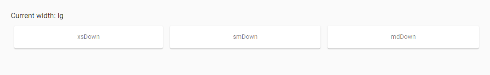

## 4. Material UI elements

### 4.1 Checkbox

```java 
    @UI("//h2[text()='Basic checkboxes']/following-sibling::div[1]/span")
    public List<Checkbox> basicCheckbox;

    @Test
    public void basicCheckboxTest() {
        for (int i = 1; i < 3; i++)
            checkboxTestLogic(
                    checkboxPage.basicCheckbox.get(i),
                    i != 2 && i != 7 ? "MuiCheckbox-colorSecondary" :
                            i == 2 ? "MuiCheckbox-colorPrimary" : "jss3");
    }
    
    private void checkboxTestLogic(Checkbox checkbox, String className) {
        if (checkbox.isEnabled()) {
            checkbox.check();
            checkbox.is().checked();
            checkbox.uncheck();
            checkbox.is().unChecked();
        } else
            checkbox.is().disabled();
        checkbox.is().hasClass(className);
    }
```

##### <a href="https://material-ui.com/components/checkboxes/" target="_blank"> https://material-ui.com/components/checkboxes/ </a>

Checkbox is located in the following class:

- __Java__: _com.epam.jdi.light.material.elements.inputs.Checkbox_


Checkboxes allow the user to select one or more items from a set.

|Method | Description | Return Type
--- | --- | ---
**is()** | Returns Assert class | Assert
**isDisabled()** | Verify state | boolean
**hasClassName(String className)** | Checks class| void
**checked()** | Assert that Checkbox selected | Assert
**uncheck()** | Assert that Checkbox not selected | Assert
**check()** | select Checkbox | void
**uncheck()** | unselect Checkbox | void

##### <a href="https://github.com/jdi-testing/jdi-light/blob/Material-UI/jdi-light-material-ui-tests/src/test/java/io/github/epam/material/tests/inputs/CheckboxTests.java" target="_blank">Here you can find Checkbox tests</a>

### 4.2 Chips

```java 
    @JDIChip
    @UI("//h2[text() = 'Chip']/following-sibling::*[1]")
    public static Chip defaultChips;
    
    @JDIChip
    @UI("//h2[text() = 'Outlined Chips']/following-sibling::*[1]")
    public static Chip outlinedChips;
    
    @JDIChip
    @UI("//h2[text() = 'Chip array']/following-sibling::*[1]")
    public static Chip chipArrays;
    
    @Test
    public void defaultChipTest() {
        basicCheck(defaultChips);
        disabledCheck(defaultChips);// first variant of class value
        clickableCheck(defaultChips,3);
        clickableLinkCheck(defaultChips,7);
    }
    
    @Test
    public void outlinedChipTest() {
        basicCheck(outlinedChips);
        disabledCheck(outlinedChips); // second variant of class value
        clickableCheck(outlinedChips, 3);
        clickableLinkCheck(outlinedChips, 7);
    }
    
    @Test
    public void chipArrayTest() {
        chipArrays.is().displayed(1);
        chipArrays.is().text(1, hasToString("Angular"));
        chipArrays.is().displayed(2);
        chipArrays.is().text(2, hasToString("jQuery"));
        chipArrays.getChipIcon(1).click();
        chipArrays.is().text(1, hasToString("jQuery")); // "jQuery" became first element as "Angular" element was deleted
    }
```

##### <a href="https://material-ui.com/components/chips/" target="_blank"> https://material-ui.com/components/chips/ </a>

Chip is located in the following class:

- __Java__: _com.epam.jdi.light.material.elements.displaydata.Chip_


Chips are compact elements that represent an input, attribute, or action.

|Method | Description | Return Type
--- | --- | ---
**is()** | Returns Assert class | ChipAssert
**click(int index)** | Clicks on chip | void
**getChipLabel(int index)** | Gets label| UIElement
**getChipRoot(int index)** | Gets root| UIElement
**getChipIcon(int index)** | Gets Icon|UIElement

##### <a href="https://github.com/jdi-testing/jdi-light/blob/Material-UI/jdi-light-material-ui-tests/src/test/java/io/github/epam/material/tests/displaydata/ChipTests.java" target="_blank">Here you can find Chips tests</a>

### 4.3 Tooltip

```java 
    @UI("//div[@id='touchItem']/button")
    public static ButtonWithTooltip hoverOrTouchButtonWithTooltip;
    
    @UI("//div[@id='clickItem']/*/button")
    public static ButtonWithTooltip clickButtonWithTooltip;
    
    @Test
    public void hoverOrTouchTooltip() {
        hoverOrTouchButtonWithTooltip.is().visible();
        hoverOrTouchButtonWithTooltip.hover();
        hoverOrTouchButtonWithTooltip.tooltip().is().visible();
        hoverOrTouchButtonWithTooltip.tooltip().has().text("Add");
    }
    
    @Test
    public void clickButtonTooltipTest() {
        clickButtonWithTooltip.is().visible();
        clickButtonWithTooltip.click();
        clickButtonWithTooltip.tooltip().is().visible();
        clickButtonWithTooltip.tooltip().has().text("Add");
    }
```

##### <a href="https://material-ui.com/components/tooltips/" target="_blank"> https://material-ui.com/components/tooltips/ </a>

Tooltip is located in the following class:

- __Java__: _com.epam.jdi.light.material.elements.displaydata.Tooltip_


Tooltips display informative text when users hover over, focus on, or tap an element.

|Method | Description | Return Type
--- | --- | ---
**is()** | Returns Assert class | TooltipAssert
**has()** | Returns Assert class | TooltipAssert
**isVisible()** | Checks element is displayed| boolean
**isInteractive()** | Checks element is interactive| boolean
**getValue()** | Gets value| String

##### <a href="https://github.com/jdi-testing/jdi-light/blob/Material-UI/jdi-light-material-ui-tests/src/test/java/io/github/epam/material/tests/displaydata/TooltipTests.java" target="_blank">Here you can find Tooltip tests</a>

### 4.4 Container

```java 
    @UI(".MuiContainer-root.MuiContainer-maxWidthSm")
    public static Container container;

    @Test
    public void fluidContainerTest() {
        container.has().maxWidth("600px");
        container.is().fluid();
        container.is().displayed();
        container.is().enabled();
    }
```

##### <a href="https://material-ui.com/components/container/" target="_blank"> https://material-ui.com/components/container/ </a>


The container centers your content horizontally. It's the most basic layout element. A fluid container width is bounded
by the maxWidth prop value. If you prefer to design for a fixed set of sizes instead of trying to accommodate a fully
fluid viewport, you can set the fixed prop. The max-width matches the min-width of the current breakpoint.

|Method | Description | Return Type
--- | --- | ---
**fixed()** | Check whether container is fixed | boolean
**fluid()** | Check whether container is fluid | boolean
**getMaxWidth()** | Get max width of container | String
**is()** | Assert method | ContainerAssert
**fixed()** | Assert that container is fixed | ContainerAssert
**fluid()** | Assert that container is fluid | ContainerAssert
**maxWidth(String)** | Assert that container's max width is specified width | ContainerAssert

##### <a href="https://github.com/jdi-testing/jdi-light/blob/Material-UI/jdi-light-material-ui-tests/src/test/java/io/github/epam/material/tests/layout/ContainerTests.java" target="_blank">Here you can find Container tests</a>

### 4.5 Avatar

```java 
    @UI("//span[@class = 'MuiBadge-root']")
    public static List<Avatar> avatarsWithPhoto;

    @UI("//div/div[contains(@class, 'MuiAvatar-root') and not(*)] ")
    public static List<Avatar> avatarsWithText;


    @Test
    public void avatarsWithTextTests() {
        for(Avatar avatar : avatarsWithText) {
            avatar.is().displayed();
        }
        avatarsWithText.get(1).is().text("L");
        avatarsWithText.get(2).is().text("A");
    }

    @Test
    public void avatarsWithPhotoTests() {
        for(Avatar avatar : avatarsWithPhoto) {
            avatar.is().displayed();
            avatar.has().photo();
            avatar.has().badge();
        }
    }
```

##### <a href="https://material-ui.com/ru/components/avatars/" target="_blank"> https://material-ui.com/ru/components/avatars/ </a>


Avatars are graphical representations of users.

|Method | Description | Return Type
--- | --- | ---
**hasBadge()** | Checks badge | boolean
**hasIcon()** | Checks icon | boolean
**hasPhoto()** | Checks photo | boolean
**has()** | Verify state | AvatarAssert
**is()** | Verify state | AvatarAssert

##### <a href="https://github.com/jdi-testing/jdi-light/blob/master_material_ui/jdi-light-material-ui-tests/src/test/java/io/github/epam/material/tests/displaydata/AvatarTests.java" target="_blank">Here you can find Avatar tests</a>

### 4.6 Click Away Listener

```java     
    @UI("//h2[text()='Example']/following-sibling::div[1]/div/button")
    public static Button exampleButton;

    @UI("//h2[text()='Portal']/following-sibling::div[1]/div/button")
    public static Button portalButton;

    @UI("//div[text()='Click me, I will stay visible until you click outside.']")
    public static TextArea text;

    @Test
    public void exampleClickAwayListenerTest() {
        textFieldTest(1);
    }

    @Test
    public void portalExampleClickAwayListenerTest() {
        textFieldTest(2);
    }

    private void textFieldTest(int buttonId) {
        clickAwayListenerPage.clickButton(buttonId);
        text.is().displayed();
        clickAwayListenerPage.clickButton(buttonId);
        text.is().hidden();
        clickAwayListenerPage.clickButton(buttonId);
        text.is().displayed();
        clickAwayListenerPage.clickAroundTextPopup(text.getSize().width + 1, -1);
        text.is().hidden();
        clickAwayListenerPage.clickButton(buttonId);
        clickAwayListenerPage.clickAroundButton(exampleButton.getSize().width + 1,0, buttonId);
        text.is().hidden();
    }
```

##### <a href="https://material-ui.com/ru/components/click-away-listener/" target="_blank"> https://material-ui.com/ru/components/click-away-listener/ </a>


Detect if a click event happened outside of an element. It listens for clicks that occur somewhere in the document.

|Method | Description | Return Type
--- | --- | ---
**click()** | Clicks on box | void
**click(int x, int y)** | Clicks on point in box | void
**is()** | Returns Assert class | Assert
**displayed()** | Assert state | Assert
**hidden()** | Assert state | Assert

##### <a href="https://github.com/jdi-testing/jdi-light/blob/Material-UI/jdi-light-material-ui-tests/src/test/java/io/github/epam/material/tests/utils/ClickAwayListenerTests.java" target="_blank">Here you can find ClickAwayListener tests</a>

### 4.7 Divider

```java 
    @UI("(//li[contains(@class, 'MuiDivider-root')])")
    public static List<Divider> insetDividers;
    
    @UI(".MuiDivider-root")
    public static Divider verticalDivider;

    @Test
    public void insetDividerTest() {
        insetDividers.forEach(
            d-> d.is().inset()
        );
    }
    
    @Test
    public void verticalDividerTest() {
        verticalDivider.is().vertical();
    }
```

##### <a href="https://material-ui.com/components/dividers/" target="_blank"> https://material-ui.com/components/dividers/ </a>

Divider is located in the following class:

- __Java__: _com.epam.jdi.light.material.elements.displaydata.Divider_


A divider is a thin line that groups content in lists and layouts.

|Method | Description | Return Type
--- | --- | ---
**is()** | Returns DividerAssert class | DividerAssert
**isInset()** | Assert inset divider | boolean
**isVertical()** | Assert vertical divider| boolean

##### <a href="https://github.com/jdi-testing/jdi-light/blob/Material-UI/jdi-light-material-ui-tests/src/test/java/io/github/epam/material/tests/displaydata/DividerTests.java" target="_blank">Here you can find Divider tests</a>

### 4.8 Card

```java    
    @UI("//div[@class='MuiCardContent-root']/p[1]")
    public static List<Text> pTagTexts;

    @UI("//div[@class='MuiCardContent-root']/h2[1]")
    public static List<Text> h2TagTexts;

    @UI("//div[@class='MuiCardActions-root']/button[1]")
    public static Button complexCardHeartIconButton;

    @UI("//div[@class='MuiCardActions-root']/button[1]/span[1]/*")
    public static Icon complexCardHeartIcon;

    @UI("//div[@class='MuiCardActions-root']/button[3]")
    public static Button complexCardSliderDownButton;

    @UI("//div[@class='MuiCardActions-root']/preceding-sibling::div[2]")
    public static Image complexCardImage;

    @UI("//div[@class='MuiCardActions-root']/following-sibling::div[1]")
    public static TextArea complexCardHiddenTextArea;

    @UI("//div[@class='MuiCardActions-root']/following-sibling::div[1]/div/div/div/p[1]")
    public static Text complexCardHiddenText;

    private void textCheck(int index) {
        pTagTexts.get(index).has().text(Matchers.is("Word of the Day"));
        h2TagTexts.get(index).has().text(Matchers.is("be•nev•o•lent"));
    }

    @Test
    public void complexCardTest() {
        String expectedText = "This impressive paella is a perfect party dish and a fun meal to cook together with your guests. Add 1 cup of frozen peas along with the mussels, if you like.";
        pTagTexts.get(3).has().text(Matchers.is(expectedText));
        complexCardImage.is().displayed();

        complexCardHeartIconButton.click();
        new Timer(1000L)
                .wait(() -> complexCardHeartIcon.has().classValue(Matchers.containsString("jss")));

        complexCardHeartIconButton.click();
        new Timer(1000L)
                .wait(() -> complexCardHeartIcon.has().classValue(Matchers.not("jss")));

        complexCardSliderDownButton.click();
        complexCardHiddenTextArea.is().displayed();
        complexCardHiddenText.has().text(Matchers.containsString("Method:"));
    }
```

##### <a href="https://material-ui.com/components/cards/" target="_blank"> https://material-ui.com/components/cards/ </a>


Cards contain content and actions about a single subject.

|Method | Description | Return Type
--- | --- | ---
**click()** | Clicks on box | void
**is()** | Returns Assert class | Assert
**displayed()** | Assert state | Assert
**hidden()** | Assert state | Assert
**classValue()** | Assert state | Assert

##### <a href="https://github.com/jdi-testing/jdi-light/blob/Material-UI/jdi-light-material-ui-tests/src/test/java/io/github/epam/material/tests/surfaces/CardTests.java" target="_blank">Here you can find Card tests</a>

### 4.9 Radio

```java 
    @UI("#simpleRadio .MuiRadio-root")
    public static RadioButtons simpleRadioButtons;
    
    @UI("#lastClickContent")
    public static Text lastRadioText;
    
    @UI(".MuiFormControl-root[2] .MuiRadio-root")
    public static RadioButtons labelPlacementRadioButtons;

    @Test
    public void simpleRadioTest() {
        simpleRadioButtons.has().values("First", "Second", "Third", "Disabled");
        simpleRadioButtons.has().enabled("First", "Second", "Third");
        simpleRadioButtons.has().disabled("Disabled");
        asList("First", "Second", "Third").forEach(label -> {
            simpleRadioButtons.select(label);
            simpleRadioButtons.has().selected(label);
            lastRadioText.has().text(containsString(label));
        });
    }
    
    @Test
    public void labelPlacementTest() {
        labelPlacementRadioButtons.has().size(4);
        labelPlacementRadioButtons.has().selected(1);
        labelPlacementRadioButtons.has().selected("Top");
        labelPlacementRadioButtons.has().labelPosition(1, LabelPosition.TOP);
        labelPlacementRadioButtons.has().labelPosition("Start", LabelPosition.START);
        labelPlacementRadioButtons.has().labelPosition(2, LabelPosition.BOTTOM);
        labelPlacementRadioButtons.has().labelPosition("End", LabelPosition.END);
    }
```

##### <a href="https://mui.com/components/radio-buttons/" target="_blank"> https://mui.com/components/radio-buttons/ </a>


Radio buttons allow the user to select one option from a set.

|Method | Description | Return Type
--- | --- | ---
**is()** | Returns object for work with assertions | RadioAssert
**select(String/int/Enum)** | Select radiobutton by value/index  | void
**selected()** | Get selected radiobutton value | String
**values()** | Returns list of values | List\<String>
**labels()** | Returns list of labels | List\<Label>
**listEnabled()** | Returns list of enabled values | List\<String>
**listDisabled()** | Returns list of disabled values | List\<String>
**get(String/int)** | Returns radio button by value/index | UIElement

##### <a href="https://github.com/jdi-testing/jdi-light/blob/master_material_ui/jdi-light-material-ui-tests/src/test/java/io/github/epam/material/tests/inputs/RadioButtonsTests.java" target="_blank">Here you can find Radio tests</a>

### 4.10 App Bar

```java 
    @UI("//*[text()='App Bar with menu']/preceding::button[@aria-label='menu']")
    public static UIElement simpleMenu;

    @UI("//*[text()='Prominent App Bar']/preceding::button[@aria-label='menu'][1]")
    public static UIElement appBarMenu;

    @UI("//*[text()='Prominent App Bar']/following::button[@aria-label='open drawer']")
    public static UIElement prominentMenu;

    @UI("//*[text()='Simple App bar']/following::h6[1]")
    public static Text simpleText;

    @UI("//*[text()='Simple App bar']/following::button[2]")
    public static Button simpleButton;

    @Test
    public void simpleAppBarTest() {
        simpleAppBarPage.open();
        simpleAppBarPage.shouldBeOpened();
        simpleMenu.isDisplayed();
        appBarMenu.isDisplayed();
        prominentMenu.isDisplayed();
        simpleText.has().text("News");
        appBarText.has().text("Photos");
        prominentText.has().text("Material-UI");
        simpleButton.is().displayed();
        appBarIcon.is().displayed();
        prominentSearch.is().displayed();
        prominentSecondMenu.is().displayed();
        logoutSwitch.uncheck();
        timer.wait(() -> appBarIcon.isNotVisible());
        logoutSwitch.check();
        timer.wait(() -> appBarIcon.isDisplayed());
        appBarIcon.click();
        timer.wait(() -> appBarIconOptions.get(1).isDisplayed());
        appBarIconOptions.get(1).click();
        timer.wait(() -> {
            appBarIconOptions.get(1).isNotVisible();
            appBarIcon.isVisible();
        });
    }
```

##### <a href="https://material-ui.com/components/app-bar/" target="_blank"> https://material-ui.com/components/app-bar/ </a>


The App Bar displays information and actions relating to the current screen.

|Method | Description | Return Type
--- | --- | ---
**click()** | Clicks on element | void
**click(int x, int y)** | Clicks on point in element | void
**is()** | Returns Assert class | Assert
**has()** | Returns Assert class | Assert
**displayed()** | Assert state | Assert
**hidden()** | Assert state | Assert

##### <a href="https://github.com/jdi-testing/jdi-light/blob/Material-UI/jdi-light-material-ui-tests/src/test/java/io/github/epam/material/tests/surfaces/AppBarTests.java" target="_blank">Here you can find AppBar tests</a>

### 4.11 Box

```java     
    @UI("//button[contains(@class,'MuiButton-outlined')]")
    public static Button outlinedBox;

    @Test
    public void outlinedBoxTest() {
        outlinedBox.is().displayed();
        outlinedBox.click();
        outlinedBox.is().text("SECOND BUTTON");
        lastClickContent.is().text("You clicked Second button");
    }
```

##### <a href="https://material-ui.com/components/box/" target="_blank"> https://material-ui.com/components/box/ </a>

The Box component serves as a wrapper component for most of the CSS utility needs. Java example code for the Button box:


|Method | Description | Return Type
--- | --- | ---
**is()** | Verify state | boolean
**click()** | Clicks on box | void
**displayed()** | Verify state | void
**text()** | Verify text | void

##### <a href="https://github.com/jdi-testing/jdi-light/blob/Material-UI/jdi-light-material-ui-tests/src/test/java/io/github/epam/material/tests/layout/BoxTests.java" target="_blank">Here you can find Box tests</a>

### 4.12 Transitions

```java     
    @UI("//h1[text()='Transitions']/following::div[contains(@class,'MuiCollapse-container')]")
    public static List<UIElement> collapseFadeTransitions;

    @UI("//span[contains(@class, 'MuiSwitch-switchBase')]")
    public static List<Checkbox> checkboxes;
    
    @Test
    public void collapseDisplayTest() {
        Timer timer = new Timer(2000L);
        collapseFadeTransitions.get(1).has().classValue(not(containsString("MuiCollapse-entered")));
        collapseFadeTransitions.get(2).has().classValue(not(containsString("MuiCollapse-entered")));
        checkboxes.get(1).check();
        timer.wait(() -> collapseFadeTransitions.get(1).hasClass(containsString("MuiCollapse-entered").toString()));
        collapseFadeTransitions.get(1).has().classValue(containsString("MuiCollapse-entered"));
        collapseFadeTransitions.get(2).has().classValue(containsString("MuiCollapse-entered"));
        checkboxes.get(1).uncheck();
        timer.wait(() -> collapseFadeTransitions.get(1).hasClass(containsString("MuiCollapse-hidden").toString()));
        collapseFadeTransitions.get(1).has().classValue(not(containsString("MuiCollapse-entered")));
        collapseFadeTransitions.get(2).has().classValue(not(containsString("MuiCollapse-entered")));
    }
```

##### <a href="https://material-ui.com/components/transitions/" target="_blank"> https://material-ui.com/components/transitions/ </a>

Transition helps make a UI expressive and easy to use.


|Method | Description | Return Type
--- | --- | ---
**has()** | Verify state | boolean
**hasClass()** | Verify state | boolean
**classValue()** | Verify state | boolean
**check()** | Checkbox selected | void

##### <a href="https://github.com/jdi-testing/jdi-light/blob/Material-UI/jdi-light-material-ui-tests/src/test/java/io/github/epam/material/tests/utils/TransitionTests.java" target="_blank">Here you can find Transitions tests</a>

### 4.13 Material Icons

```java     
    @UI("#defaultAccessAlarm")
    public static UIElement defaultAlarm;

    @UI("#largeAccessAlarm")
    public static UIElement largeAlarm;

    @UI("#secondaryAccessAlarm")
    public static UIElement secondaryAlarm;

    @UI("#miconLastClick")
    public static UIElement lastClick;

    @UI("#miconLastHover")
    public static UIElement lastHover;

    @Test
    public void defaultMaterialIconTest() {
        lastClick.is().text("Last click:");
        lastHover.is().text("Last hover:");

        defaultAlarm.hover();
        lastClick.is().text("Last click:");
        lastHover.is().text("Last hover: default");

        defaultAlarm.click();
        lastClick.is().text("Last click: default");
        lastHover.is().text("Last hover: default");

        largeAlarm.hover();
        lastClick.is().text("Last click: default");
        lastHover.is().text("Last hover: large");

        largeAlarm.click();
        lastClick.is().text("Last click: large");
        lastHover.is().text("Last hover: large");

        secondaryAlarm.hover();
        lastClick.is().text("Last click: large");
        lastHover.is().text("Last hover: secondary");

        secondaryAlarm.click();
        lastClick.is().text("Last click: secondary");
        lastHover.is().text("Last hover: secondary");
    }
```

##### <a href="https://material-ui.com/components/material-icons/" target="_blank"> https://material-ui.com/components/material-icons/ </a>

The following npm package, @material-ui/icons, includes the 1,100+ official Material icons converted to SvgIcon
components.


|Method | Description | Return Type
--- | --- | ---
**is()** | Verify state | boolean
**displayed()** | Verify state | boolean
**hasClass()** | Verify state | boolean
**text()** | Verify text | boolean
**click()** | Clicks on box | void
**hover()** | Hovers on box | void

##### <a href="https://github.com/jdi-testing/jdi-light/blob/master/jdi-light-material-ui-tests/src/test/java/io/github/epam/material/tests/displaydata/MaterialIconTests.java" target="_blank">Here you can find Material Icons tests</a>

### 4.14 Icons

```java     
    @Test
    public void simpleIconsTest() {
        simpleIcons.get(1).hover();
        simpleLastHover.has().text("Last hover: DeleteIcon");
        simpleIcons.get(2).click();
        simpleLastClick.has().text("Last click: DeleteForeverIcon");

        simpleIcons.forEach(icon -> icon.is().notColored());
        simpleIcons.forEach(icon -> icon.has().color("rgba(0, 0, 0, 0.87)"));
        simpleIcons.forEach(icon -> icon.has().height(24));
        simpleIcons.forEach(icon -> icon.has().width(24));
    }
```

##### <a href="https://material-ui.com/components/icons/" target="_blank"> https://material-ui.com/components/icons/ </a>

Material-UI provides icons support in three ways:

1. Standardized Material Design icons exported as React components (SVG icons).
2. With the SvgIcon component, a React wrapper for custom SVG icons.
3. With the Icon component, a React wrapper for custom font icons.


|Method | Description | Return Type
--- | --- | ---
**colored()** | Check whether element is colored (not black) | boolean
**getColor()** | Get color of icon | String
**is()** | Assert method | IconAssert
**colored()** | Assert whether icon is colored (not black) | IconAssert
**notColored()** | Assert whether icon is not colored (black) | IconAssert
**color(String)** | Assert that icon's color is certain color | IconAssert
**height(int)** | Assert that icon has specified height | IconAssert
**width(int)** | Assert that icon has specified width | IconAssert

Icons have also a lot of UIElement methods.

##### <a href="https://github.com/jdi-testing/jdi-light/blob/master/jdi-light-material-ui-tests/src/test/java/io/github/epam/material/tests/displaydata/IconTests.java" target="_blank">Here you can find Icons tests</a>

### 4.15 Floating Action Button

```java     
    @UI("//div[@id='basicActionBtns']/button")
    public static List<Button> basicBtns;

    @UI("//button[@aria-label='add']")
    public static Button addBtn;

    @UI("//button[@aria-label='edit']")
    public static Button editBtn;

    @UI("//button[contains(@class,'MuiFab-extended')]")
    public static Button extendedBtn;

    @UI("//button[@aria-label='like']")
    public static Button disabledBtn;

    @UI("#basicActionBtnsLastClick")
    public static Text basicBtnsLastClick;

    @Test
    public void basicButtonsTest() {
        basicBtns.forEach(el -> el.is().displayed());
        basicBtnsLastClick.is().text("Last click:");

        addBtn.is().enabled();
        addBtn.click();
        basicBtnsLastClick.is().text("Last click: Add");

        editBtn.is().enabled();
        editBtn.click();
        basicBtnsLastClick.is().text("Last click: Edit");

        extendedBtn.is().enabled();
        extendedBtn.click();
        basicBtnsLastClick.is().text("Last click: Navigate");

        disabledBtn.is().disabled();
    }
```

##### <a href="https://material-ui.com/components/floating-action-button/" target="_blank"> https://material-ui.com/components/floating-action-button/ </a>

A floating action button appears in front of all screen content, typically as a circular shape with an icon in its
center. FABs come in two types: regular, and extended.


|Method | Description | Return Type
--- | --- | ---
**is()** | Verify state | boolean
**displayed()** | Verify state | boolean
**enabled()** | Verify state | boolean
**disabled()** | Verify state | boolean
**text()** | Verify text | boolean
**click()** | Clicks on box | void

##### <a href="https://github.com/jdi-testing/jdi-light/blob/master/jdi-light-material-ui-tests/src/test/java/io/github/epam/material/tests/inputs/FabTests.java" target="_blank">Here you can find Floating Action Button tests</a>

### 4.16 Hidden

```java     
   @UI(".MuiTypography-subtitle1")
    public static Text currentWidth;

    @UI("//div[contains(text(),'xsDown')]")
    public static Button xsDown;

    @UI("//div[text()='smDown']")
    public static Button smDown;

    @UI("//div[text()='mdDown']")
    public static Button mdDown;

    @UI("//div[text()='lgDown']")
    public static Button lgDown;

    @UI("//div[text()='xlDown']")
    public static Button xlDown;

    @Test(dataProvider = "Screen Width Dividers")
    public void hiddenTestWithScreenWidthDifferentScreenWidth(int divider) {
        currentWidth.is().displayed();
        xsDown.is().displayed();
        smDown.is().displayed();
        mdDown.is().displayed();
        divideScreenWidthSize(divider);
        String width = getWidth(currentWidth);
        checkWidth(width);
    }
```

##### <a href="https://material-ui.com/components/hidden/" target="_blank"> https://material-ui.com/components/hidden/ </a>

Quickly and responsively toggle the visibility value of components and more with the hidden utilities.



|Method | Description | Return Type
--- | --- | ---
**is()** | Verify state | boolean
**displayed()** | Verify state | boolean
**text()** | Verify text | boolean

##### <a href="https://github.com/jdi-testing/jdi-light/blob/Material-UI/jdi-light-material-ui-tests/src/test/java/io/github/epam/material/tests/layout/HiddenTests.java" target="_blank">Here you can find Hidden tests</a>

### 4.17 Stepper

```java 
    @UI("#nonLinearStepper .MuiStep-root")
    public static Stepper nonlinearStepper;

    @UI("//p[@id='activeNonLinearStep']/..//button[2]")
    public static MaterialButton nonlinearStepperNextButton;

    @UI("//p[@id='activeNonLinearStep']/..//button[3]")
    public static MaterialButton nonlinearStepperCompleteStepButton;
        
    @Test
    public void nonlinearStepperForwardTest() {
        nonlinearStepper.show();
        nonlinearStepper.is().displayed().and().has().steps(Arrays.asList(steps));

        nonlinearStepperNextButton.click();
        nonlinearStepperNextButton.click();
        nonlinearStepper.list().get(2).click();
        nonlinearStepperCompleteStepButton.click();
        
        nonlinearStepper.is().stepEnabled(1).and().stepCompleted(1);
        nonlinearStepper.is().stepEnabled(2).and().stepCompleted(2);
        nonlinearStepper.is().stepEnabled(3).and().stepIncomplete(3);
    }
```

##### <a href="https://material-ui.com/components/steppers/" target="_blank"> https://material-ui.com/components/steppers/ </a>


Steppers convey progress through numbered steps. It provides a wizard-like workflow. You can use for testing Text and
Button classes, implemented in JDI-html section.

|Method | Description | Return Type
--- | --- | ---
**stepCompleted()** | Check that specified step is completed | boolean
**stepEnabled()** | Check that specified step is enabled | boolean

##### <a href="https://github.com/jdi-testing/jdi-light/blob/Material-UI/jdi-light-material-ui-tests/src/test/java/io/github/epam/material/tests/navigation/StepperTests.java" target="_blank">Here you can find Stepper tests</a>

### 4.18 Slider

```java     
    @UI("//*[@id=\"continuous-slider\"]/following-sibling::div//span[contains(@class, \"MuiSlider-root\")]")
    public static Slider continuousSlider;
    
    @Test
    public void continuousSliderTest(){
        continuousSlider.is().enabled();
        continuousSlider.is().orientation("horizontal");
        continuousSlider.is().value(30);
        continuousSlider.setValue(15);
        continuousSlider.is().value(15);
        continuousSlider.moveLeft();
        continuousSlider.is().value(14);
        continuousSlider.moveRight();
        continuousSlider.is().value(15);
        continuousSlider.slideHorizontalTo(10);
        continuousSlider.is().value(10);
    }
```

##### <a href="https://material-ui.com/components/slider/" target="_blank"> https://material-ui.com/components/slider/ </a>

Sliders reflect a range of values along a bar, from which users may select a single value. They are ideal for adjusting
settings such as volume, brightness, or applying image filters.


|Method | Description | Return Type
--- | --- | ---
**value()** | Get current value | int
**setValue(int)** | Set new value | void
**orientation()** | Get orientation value | String
**slideVerticalTo(int)** | Set new value using drag-and-drop action for vertical slider | void
**slideHorizontalTo(int)** | Set new value using drag-and-drop action for horizontal slider | void
**moveRight()** | Move right to one unit using arrow key on keyboard | void
**moveLeft()** | Move left to one unit using arrow key on keyboard | void
**is()** | Verify state | boolean

##### <a href="https://github.com/jdi-testing/jdi-light/blob/Material-UI/jdi-light-material-ui-tests/src/test/java/io/github/epam/material/tests/inputs/SliderTests.java" target="_blank">Here you can find Slider tests</a>

### 4.19 Tabs

```java 
    @UI("//button[contains(@aria-controls,'simple-tabpanel')]")
    public static Tabs simpleTabs;

    @UI("//button[contains(@aria-controls,'scrollable-auto-tab')]")
    public static Tabs scrollableTabs;

    @UI("//button[contains(@aria-controls,'scrollable-prevent-tab')]")
    public static Tabs preventScrollTabs;

    @UI("//button[contains(@aria-controls,'vertical-tabpanel')]")
    public static Tabs verticalTabs;
    
    @Test
    public void simpleTabTest() {
        simpleTabs.select(2);
        simpleTabs.has().elementSelected(2);
        simpleTabs.has().elementNotSelected(3);
        simpleTabs.has().elementDisabled(4);

        jdiAssert(simpleTabs.size(), Matchers.is(5));
    }

    @Test
    public void scrollableTabTest() {
        scrollableTabs.select(1);
        scrollableTabs.has().elementSelected(1);
        scrollableTabs.has().elementEnabled(1);

        scrollableTabs.select(7);
        scrollableTabs.has().elementSelected(7);
        scrollableTabs.has().elementEnabled(7);

        scrollableTabs.select(11);
        scrollableTabs.has().elementSelected(11);
        scrollableTabs.has().elementEnabled(11);

        scrollableTabs.select(1);
        scrollableTabs.has().elementSelected(1);
        scrollableTabs.has().elementEnabled(1);

        jdiAssert(scrollableTabs.size(), Matchers.is(11));
    }

```

##### <a href="https://material-ui.com/components/Tabs/" target="_blank"> https://material-ui.com/components/Tabs/ </a>

Tabs organize and allow navigation between groups of content that are related and at the same level of hierarchy.


|Method | Description | Return Type
--- | --- | ---
**is()** | Assert method | Tabs Assert
**enabled()** | Check if tab is enabled | boolean
**disabled()** | Check if tab is disabled | boolean
**selected()** | Check if tab is selected | boolean
**notSelected()** | Check if tab is not selected | boolean

##### <a href="https://github.com/jdi-testing/jdi-light/pull/3518/commits/c82c82512d73a84716eead8f0d4744cf4dd34f98#diff-fbe7d79cccd062917f385eca9e9db7fde3c41058b8dff308f33693d160ee60e8" target="_blank">Here you can find Tabs tests</a>

### 4.20 Table

```java 
    @UI("#basicTable")
    public static Table basicTable;
    
    @UI(".MuiDataGrid-selectedRowCount")
    public static Text selectedRowCounter;
    
    @UI("//div[contains(@class, 'MuiTablePagination-toolbar')]/div/button")
    public static List<Button> scrollButtons;
    
    @Test
    public void basicTableTest() {
        basicTable.has().columns(headElements);
        assertThat(basicTable.count(), equalTo(13));
        basicTable.getCell(1, 1).has().text("305");
    }

    @Test
    public void dataTableTest() {
        getDataTableCell(1, 3).click();
        getDataTableCell(3, 3).has().text("Arya");
        getDataTableCell(1, 1).click();
        selectedRowCounter.has().text(containsString("9"));
        getDataTableCell(3, 1).click();
        getDataTableCell(5, 1).click();
        selectedRowCounter.has().text(containsString("7"));
        getDataTableCell(2, 1).click();
        selectedRowCounter.has().text(containsString("6"));
        scrollButtons.get(1).is().displayed();
        scrollButtons.get(1).is().disabled();
        scrollButtons.get(2).is().displayed();
        scrollButtons.get(2).click();
        getDataTableCell(2, 3).has().text("Harvey");
    }
```

##### <a href="https://material-ui.com/components/Tables/" target="_blank"> https://material-ui.com/components/Tables/ </a>

Tables display sets of data. They can be fully customized.


|Method | Description | Return Type
--- | --- | ---
**click()** | Clicks on button | void
**has()** | Returns Assert class | Assert
**text()** | Assert text | Assert

##### <a href="https://github.com/jdi-testing/jdi-light/blob/Material-UI/jdi-light-material-ui-tests/src/test/java/io/github/epam/material/tests/displaydata/TableTests.java" target="_blank">Here you can find Tables tests</a>

### 4.21 Typography

```java 
    @UI(".MuiGrid-root[3] .MuiTypography-root")
    public static List<Typography> typographyTexts;
    
    @Test
    public void typographyTextsTest() {
        typographyTexts.get(1).has().text("Head 1");

        List<String> expectedText = Arrays.asList(
                "Head 1", "Head 2", "Head 3", "Head 4", "Head 5", "Head 6",
                "Subtitle 1", "Subtitle 2", "Body 1", "Body 2",
                "BUTTON TEXT", "Caption text", "OVERLINE TEXT");

        List<String> actualTexts = typographyTexts.stream()
                .map(IsText::getText)
                .collect(Collectors.toList());

        jdiAssert(actualTexts, equalTo(expectedText));
    }

    @Test
    public void typographyStylesTest() {
        typographyTexts.get(1).has().style(HEAD_1);

        List<TypographyStyles> expectedStyles = Arrays.asList(
                HEAD_1, HEAD_2, HEAD_3, HEAD_4, HEAD_5, HEAD_6,
                SUBTITLE_1, SUBTITLE_2, BODY_1, BODY_2,
                BUTTON, CAPTION, OVERLINE);

        List<TypographyStyles> actualStyles = typographyTexts.stream()
                .map(Typography::getStyle)
                .collect(Collectors.toList());

        jdiAssert(actualStyles, equalTo(expectedStyles));
    }
```

##### <a href="https://mui.com/components/typography/" target="_blank"> https://mui.com/components/typography/ </a>


Use typography to present your design and content as clearly and efficiently as possible.

|Method | Description | Return Type
--- | --- | ---
**is()** | Returns object for work with assertions | TypographyAssert
**getStyle()** | Returns style of component | TypographyStyles
**getText()** | Returns text of component | String

##### <a href="https://github.com/jdi-testing/jdi-light/blob/master_material_ui/jdi-light-material-ui-tests/src/test/java/io/github/epam/material/tests/displaydata/TypographyTests.java" target="_blank">Here you can find Typography tests</a>

### 4.22 Badge

```java 
    @UI("//span[@class='MuiBadge-root']")
    public static List<Badge> badge;
  
    @UI("//span[contains(@class,'MuiBadge-badge')]")
    public static List<Text> badgeCounter;
    
    @Test
    public void simpleBadgeTest() {
        badge.get(1).is().displayed();
        badge.get(1).is().displayedSvg();
        badgeCounter.get(1).is().text("4");
        badgeCounter.get(1).has().classValue(containsString("MuiBadge-anchorOriginTopRightRectangle MuiBadge-colorPrimary"));
        badge.get(2).is().displayed();
        badge.get(2).is().displayedSvg();
        badgeCounter.get(2).is().text("4");
        badgeCounter.get(2).has().classValue(containsString("MuiBadge-anchorOriginTopRightRectangle MuiBadge-colorError"));
    }
```

##### <a href="https://material-ui.com/ru/components/badges/" target="_blank"> https://material-ui.com/ru/components/badges/ </a>

Badge generates a small badge to the top-right of its child(ren).


|Method | Description | Return Type
--- | --- | ---
**is()** | Returns object for work with assertions | BadgeAssert
**has()** | Returns object for work with assertions | BadgeAssert
**getIcon()** | Returns element's component | UIElement
**getCounterValue()** | Returns component's value| String
**hasDot()** | Shows that element has component 'dot'| boolean
**hasIconStatus(String)** | Shows that element has required color status| boolean

##### <a href="https://github.com/jdi-testing/jdi-light/blob/Material-UI/jdi-light-material-ui-tests/src/test/java/io/github/epam/material/tests/displaydata/BadgeTests.java" target="_blank">Here you can find Badge tests</a>

### 4.23 Snackbars

```java 
    @UI("//span[text()='Open simple snackbar']/parent::button")
    public static Button simpleSnackbarButton;

    @UI("[direction='up']")
    public static Snackbar simpleSnackbar;

    @UI("//span[text()='Open success snackbar']/parent::button")
    public static Button successSnackbarButton;

    @UI("//div[@direction]/div[@class='MuiAlert-message']/parent::div")
    public static Snackbar successSnackbar;

    @UI("//div[@class='MuiAlert-message']/parent::div")
    public static List<Snackbar> customizedSnackbar;

    @UI("//h2[text()='Message Length']/preceding::button/span[@class='MuiButton-label' and not(text()='Open simple snackbar') and not(text()='Open success snackbar')]")
    public static List<Button> positionedSnackbarButtons;

    @UI("//div[contains(@class,'MuiSnackbar-root')]")
    public static Snackbar positionedSnackbar;
    
    @Test
    public void simpleSnackbarTest() {
        simpleSnackbar.is().notVisible();
        simpleSnackbarButton.click();
        simpleSnackbar.waitFor().displayed();
        simpleSnackbar.has().text("Note archived");
        simpleSnackbar.snackbarButton(UNDO).click();
        simpleSnackbar.waitFor().hidden();
        simpleSnackbar.is().notVisible();
        simpleSnackbarButton.click();
        simpleSnackbar.waitFor().displayed();
        simpleSnackbar.close();
        simpleSnackbar.is().notVisible();
    }

    @Test
    public void customizedSnackbarTest() {
        successSnackbar.is().notVisible();
        successSnackbarButton.click();
        successSnackbar.is().displayed();
        successSnackbar.has().text("This is a success message!");
        successSnackbar.close();
        successSnackbar.is().notVisible();

        customizedSnackbar.get(1).has().text("This is an error message!").and().messageType("error");
        customizedSnackbar.get(2).has().text("This is a warning message!").and().messageType("warning");
        customizedSnackbar.get(3).has().text("This is an information message!").and().messageType("info");
        customizedSnackbar.get(4).has().text("This is a success message!").and().messageType("success");
    }
```

##### <a href="https://material-ui.com/components/snackbars/" target="_blank"> https://material-ui.com/components/snackbars/ </a>

Snackbars provide brief messages about app processes. The component is also known as a toast.


|Method | Description | Return Type
--- | --- | ---
**is()** | Returns object for work with assertions | SnackbarAssert
**snackbarButton(String)** | Returns element's button | UIElement
**text()** | Returns component's text| String
**close()** | Closes element| void
**messageType(String)** | Shows that element's message has required type| boolean
**position(String)** | Shows that element has required position| boolean

##### <a href="https://github.com/jdi-testing/jdi-light/blob/Material-UI/jdi-light-material-ui-tests/src/test/java/io/github/epam/material/tests/feedback/SnackbarTests.java" target="_blank">Here you can find Snackbars tests</a>

### 4.24 Backdrop

```java 
  @UI(".MuiButton-root")
  public static Button showBackdropButton;

  @UI(".MuiBackdrop-root")
  public static UIElement backdrop;

  @Test
  public void defaultBackdropTest() {
      showBackdropButton.click();
      timer.wait(() -> backdrop.is().visible());
      backdrop.click();
      timer.wait(() -> backdrop.is().hidden());
  }
```

##### <a href="https://material-ui.com/components/backdrop/" target="_blank"> https://material-ui.com/components/backdrop/ </a>

The backdrop component is used to provide emphasis on a particular element or parts of it.


|Method | Description | Return Type
--- | --- | ---
**is()** | Returns object for work with assertions | BackdropAssert

##### <a href="https://github.com/jdi-testing/jdi-light/blob/Material-UI/jdi-light-material-ui-tests/src/test/java/io/github/epam/material/tests/feedback/BackdropTests.java" target="_blank">Here you can find Backdrop tests</a>

### 4.25 Dialog

```java 
    @UI("//span[text()='Open simple dialog']/parent::*[contains(@class,'MuiButtonBase-root')]")
    public static Button simpleDialogButton;
    
    @UI("//div[@id='simple-dialog-title']/following::div[@class='MuiListItemText-root'][1]")
    public static Button simpleDialogListButton;
    
    @UI("#simpleDialogSelection")
    public static Text simpleDialogField;
  
    @UI("//h2[contains(@class,'MuiTypography-h6') and not (text()='Phone Ringtone')]")
    public static Text dialogTitle;
  
    @UI("//div[@id='scroll-dialog-title']/following::div[contains(@class,'MuiDialogContent-dividers')]")
    public static TextArea dialogScrollableContent;
  
    @Test
    public void simpleDialogTest() {
          simpleDialogButton.click();
          dialogTitle.is().text("Set backup account");
          simpleDialogListButton.click();
          simpleDialogField.is().text("Selected: username@gmail.com");
      }
    
    @Test
    public void scrollableDialogTest() {
          scrollPaperDialogButton.click();
          dialogTitle.is().text("Subscribe");
          dialogScrollableContent.core().jsExecute("scrollTo(0, document.body.scrollHeight)");
          dialogContent.is().text(containsString(dialogScrollableTextContent));
          subscribeButton.click();
          scrollableDialogField.is().text("Last clicked button: Subscribe");
          scrollPaperDialogButton.click();
          scrollableDialogCancelButton.click();
          scrollableDialogField.is().text("Last clicked button: Cancel");
    }
```

##### <a href="https://material-ui.com/components/dialogs/" target="_blank"> https://material-ui.com/components/dialogs/ </a>

Dialogs inform users about a task and can contain critical information, require decisions, or involve multiple tasks.


|Method | Description | Return Type
--- | --- | ---
**is()** | Returns object for work with assertions | BackdropAssert
**snackbarButton(String)** | Returns element's button | UIElement
**text()** | Returns component's text| String
**close()** | Closes element| void
**messageType(String)** | Shows that element's message has required type| boolean
**position(String)** | Shows that element has required position| boolean

##### <a href="https://github.com/jdi-testing/jdi-light/blob/Material-UI/jdi-light-material-ui-tests/src/test/java/io/github/epam/material/tests/feedback/DialogTests.java" target="_blank">Here you can find Dialog tests</a>

### 4.26 Date / Time pickers

```java 
    @UI("//*[@id = 'date-picker-dialog-label']/parent::div")
    public static DateTimePicker dialogPicker;
  
    @Test
    public void datePickerDialogTest() {
        dialogPicker.has().title("Date picker dialog");
        dialogPicker.expand();
        dialogPicker.selectDate("12");
        dialogPicker.confirm();
        dialogPicker.has().text(containsString("/12/"));

        dialogPicker.expand();
        dialogPicker.selectDate("11");
        dialogPicker.cancel();
        dialogPicker.has().text("08/12/2014");

        dialogPicker.input("10/10/2021");
        dialogPicker.has().text("10/10/2021");
    }
```

##### <a href="https://material-ui.com/components/pickers/" target="_blank"> https://material-ui.com/components/pickers/ </a>

Date pickers and Time pickers provide a simple way to select a single value from a pre-determined set.


|Method | Description | Return Type
--- | --- | ---
**is()** | Returns object for work with assertions| DateTimePickerAssert
**selectDate(String)** | Selects required date| void
**expand()** | Expands element| void
**cancel()** | Closes element without saving changes| void
**confirm()** | Closes element with saving changes| void
**input(String)** | Sets text in element's input field| void
**title()** | Returns element's title| String
**isExpanded()** | Shows that element is expanded| boolean
**getText()** | Returns text from input field| String

##### <a href="https://github.com/jdi-testing/jdi-light/blob/Material-UI/jdi-light-material-ui-tests/src/test/java/io/github/epam/material/tests/inputs/DateTimePickersTests.java" target="_blank">Here you can find Date/Time Pickers tests</a>

### 4.27 Select

```java 
    @UI("//div[@id='simple-select']")
    public static Button simpleSelectExpand;
    
    @UI("//input")
    public static List<TextField> simpleSelectField;
    
    @UI("//ul")
    public static Select selectList;
    
    @UI("//div[@id='disabled-select']")
    public static Button disabledSelectExpand;
  
    @Test
    public void simpleSelectTest() {
        simpleSelectExpand.click();
        selectList.selectItemByText("Henry");
        simpleSelectField.get(1).is().attr("value", "Henry");
    }
    
    @Test
    public void disabledSelectTest() {
        disabledSelectExpand.is().classValue(containsString("Mui-disabled"));
        disabledSelectExpand.has().attr("aria-disabled", "true");
        disabledSelectExpand.has().attr("aria-labelledby", "disabled-select");
    }
```

##### <a href="https://material-ui.com/components/selects/" target="_blank"> https://material-ui.com/components/selects/ </a>

Select components are used for collecting user provided information from a list of options.


|Method | Description | Return Type
--- | --- | ---
**is()** | Returns object for work with assertions| SelectAssert
**close()** | Closes element| void
**select(String)** | Selects required value in element| void
**selected()** | Returns value of selected element| String
**getText()** | Returns value of selected element| String
**text()** | Returns value of selected element| String

##### <a href="https://github.com/jdi-testing/jdi-light/blob/Material-UI/jdi-light-material-ui-tests/src/test/java/io/github/epam/material/tests/inputs/SelectTests.java" target="_blank">Here you can find Select tests</a>

### 4.28 Switch

```java 
    @UI("//span[contains(@class,'MuiSwitch-switchBase')]")
    public static List<Checkbox> switches;
  
    @Test
    public void basicSwitchesTest() {
        switches.get(1).is().classValue(containsString("MuiSwitch-colorSecondary"));
        switches.get(1).is().classValue(containsString("Mui-checked"));
        switches.get(1).uncheck();
        switches.get(1).is().classValue(not(containsString("Mui-checked")));
        
        switches.get(3).is().classValue(containsString("MuiSwitch-colorSecondary"));
        switches.get(3).is().classValue(not(containsString("Mui-checked")));
        switches.get(3).check();
        switches.get(3).is().classValue(containsString("Mui-checked"));
    }
```

##### <a href="https://material-ui.com/components/switches/" target="_blank"> https://material-ui.com/components/switches/ </a>

Switches toggle the state of a single setting on or off.


|Method | Description | Return Type
--- | --- | ---
**is()** | Returns object for work with assertions| SwitchAssert
**has()** | Returns object for work with assertions| SwitchAssert
**isTurnedOn()** | Shows that element turned on| boolean
**isTurnedOff()** | Shows that element turned off| boolean
**turnOn()** | Turns element on| void
**turnOff()** | Turns element off| void
**isDisabled()** | Shows that element is disabled| boolean
**isEnabled()** | Shows that element is enabled| boolean
**label()** | Returns element's label| Label
**labelText()** | Returns label's text| String

##### <a href="https://github.com/jdi-testing/jdi-light/blob/Material-UI/jdi-light-material-ui-tests/src/test/java/io/github/epam/material/tests/inputs/SwitchTests.java" target="_blank">Here you can find Switch tests</a>

### 4.29 Button

```java 
    @UI("//h2[text()='Contained buttons']/parent::div/div[1]/*")
    public static List<Button> containedButtons;

    @Test
    public void defaultButtonTest() {
        containedButtons.get(1).click();
        containedButtons.get(1).is().text("DEFAULT");
        containedButtons.get(6).is().text("Last click: Default");
      
        containedButtons.get(4).is().text("DISABLED");
        containedButtons.get(4).is().attr("disabled");
        containedButtons.get(4).is().disabled();
      
        containedButtons.get(5).click();
        containedButtons.get(5).is().text("LINK");
        containedButtons.get(6).is().text("Last click: Link");
        containedButtons.get(5).is().notVisible();
    }
```

##### <a href="https://material-ui.com/components/buttons/" target="_blank"> https://material-ui.com/components/buttons/ </a>

Buttons allow users to take actions, and make choices, with a single tap.


##### <a href="https://github.com/jdi-testing/jdi-light/blob/Material-UI/jdi-light-material-ui-tests/src/test/java/io/github/epam/material/tests/inputs/ButtonTests.java" target="_blank">Here you can find Buttons tests</a>

<br></br>

### 4.30 ButtonGroup

```java
    //      @FindBy(xpath = "//div[@aria-label = 'outlined primary button group']")
    @UI("//div[@aria-label = 'outlined primary button group']")
    @JDIButtonGroup(list = ".MuiButtonGroup-groupedHorizontal")
    public static ButtonGroup basicButtonGroup;

    //      @FindBy(xpath = "//div[@aria-label = 'vertical contained primary button group']")
    @UI("//div[@aria-label = 'vertical contained primary button group']")
    @JDIButtonGroup(list = ".MuiButton-root")
    public static ButtonGroup verticalButtonGroup;
```

```java
    @Test
    public void basicButtonGroupTest(){

        basicButtonGroup.getButtonByIndex(1).click();
        basicButtonGroup.getButtonByIndex(2).click();
        basicButtonGroup.getButtonByIndex(3).click();

        basicButtonGroup.getButtonByText("Three").click();
        basicButtonGroup.getButtonByText("Two").click();
        basicButtonGroup.getButtonByText("One").click();

        basicButtonGroup.getButtonByIndex(1).is().enabled();
        basicButtonGroup.getButtonByIndex(1).has().text("ONE");

        basicButtonGroup.has().numberOfGroupedButtons(3);
        basicButtonGroup.has().buttonsTextsInAnyOrder(Arrays.asList("THREE","ONE","TWO"));
    }

    @Test
    public void verticalButtonGroupTest(){

        verticalButtonGroup.getButtonByIndex(2).click();
        verticalButtonGroup.getButtonByIndex(3).click();

        verticalButtonGroup.getButtonByText("Two").click();
        verticalButtonGroup.getButtonByText("One").click();

        basicButtonGroup.getButtonByIndex(2).is().enabled();
        basicButtonGroup.getButtonByIndex(2).has().text("TWO");
    }
```

##### <a href="https://jdi-testing.github.io/jdi-light/material/button_groups" target="_blank">ButtonGroup overview</a>

ButtonGroup is located in the following class:

- __Java__: _com.epam.jdi.light.material.elements.inputs.ButtonGroup_

__ButtonGroup__ - element that represents a group of clickable button. The ButtonGroup component can be used to group
related buttons.


Here are examples with provided MaterialUI v4.12.3 code:

```html

<div role="group" class="MuiButtonGroup-root" aria-label="outlined primary button group">
  <button
    class="MuiButtonBase-root MuiButton-root MuiButton-outlined MuiButtonGroup-grouped MuiButtonGroup-groupedHorizontal MuiButtonGroup-groupedOutlined MuiButtonGroup-groupedOutlinedHorizontal MuiButtonGroup-groupedOutlinedPrimary MuiButton-outlinedPrimary"
    tabindex="0" type="button">
    <span class="MuiButton-label">One</span>
    <span class="MuiTouchRipple-root"></span>
  </button>
  <button
    class="MuiButtonBase-root MuiButton-root MuiButton-outlined MuiButtonGroup-grouped MuiButtonGroup-groupedHorizontal MuiButtonGroup-groupedOutlined MuiButtonGroup-groupedOutlinedHorizontal MuiButtonGroup-groupedOutlinedPrimary MuiButton-outlinedPrimary"
    tabindex="0" type="button">
    <span class="MuiButton-label">Two</span>
    <span class="MuiTouchRipple-root"></span>
  </button>
  <button
    class="MuiButtonBase-root MuiButton-root MuiButton-outlined MuiButtonGroup-grouped MuiButtonGroup-groupedHorizontal MuiButtonGroup-groupedOutlined MuiButtonGroup-groupedOutlinedHorizontal MuiButtonGroup-groupedOutlinedPrimary MuiButton-outlinedPrimary"
    tabindex="0" type="button">
    <span class="MuiButton-label">Three</span>
    <span class="MuiTouchRipple-root"></span>
  </button>
</div>
```
```html
<div role="group" class="MuiButtonGroup-root MuiButtonGroup-contained MuiButtonGroup-vertical" aria-label="vertical contained primary button group">
  <button class="MuiButtonBase-root MuiButton-root MuiButton-contained MuiButtonGroup-grouped MuiButtonGroup-groupedVertical MuiButtonGroup-groupedContained MuiButtonGroup-groupedContainedVertical MuiButtonGroup-groupedContainedPrimary MuiButton-containedPrimary" tabindex="0" type="button">
    <span class="MuiButton-label">One</span>
    <span class="MuiTouchRipple-root"></span>
  </button>
  <button class="MuiButtonBase-root MuiButton-root MuiButton-contained MuiButtonGroup-grouped MuiButtonGroup-groupedVertical MuiButtonGroup-groupedContained MuiButtonGroup-groupedContainedVertical MuiButtonGroup-groupedContainedPrimary MuiButton-containedPrimary" tabindex="0" type="button">
    <span class="MuiButton-label">Two</span>
    <span class="MuiTouchRipple-root"></span>
  </button>
  <button class="MuiButtonBase-root MuiButton-root MuiButton-contained MuiButtonGroup-grouped MuiButtonGroup-groupedVertical MuiButtonGroup-groupedContained MuiButtonGroup-groupedContainedVertical MuiButtonGroup-groupedContainedPrimary MuiButton-containedPrimary" tabindex="0" type="button">
    <span class="MuiButton-label">Three</span>
    <span class="MuiTouchRipple-root"></span>
  </button>
</div>
```

Available methods in Java JDI Light:

|Method | Description | Return Type
| --- | --- | ---
**is()** | Returns object for work with assertions | ButtonGroupAssert
**getButtonByIndex(int)** | Get button by index | MaterialButton
**getButtonByText(String)** | Get button by text | MaterialButton
**getAllButtons()**        | Get all buttons in a block | Collection\<MaterialButton\>

##### <a href="https://github.com/jdi-testing/jdi-light/blob/master_material_ui/jdi-light-material-ui-tests/src/test/java/io/github/epam/material/tests/inputs/ButtonGroupTests.java" target="_blank">Here you can find Button group tests</a>

<br></br>

### 4.31 Grid

```java 
    //    @FindBy(css = ".MuiContainer-root")
    @UI(".MuiContainer-root")
    public static Grid rootGrid;

    //    @FindBy(xpath = "//h2[text()='Complex grid']/preceding::div[contains(@class,'MuiGrid-spacing')]")
    @UI("//h2[text()='Complex grid']/preceding::div[contains(@class,'MuiGrid-spacing')]")
    public static Grid basicGrid;

    //    @FindBy(xpath = "//h2[text()='Complex grid']/following::div[contains(@class,'MuiPaper-rounded')]/div[contains(@class,'MuiGrid-spacing')]")
    @UI("//h2[text()='Complex grid']/following::div[contains(@class,'MuiPaper-rounded')]/div[contains(@class,'MuiGrid-spacing')]")
    public static Grid complexGrid;
  
    @Test
    public void gridTest() {
        rootGrid.is().displayed();
        rootGrid.attr("class").contains("MuiContainer-maxWidthXl");
        basicGrid.is().displayed();
        complexGrid.is().displayed();
    }
```

##### <a href="https://material-ui.com/components/grid/" target="_blank"> Grind overview </a>

Grid is located in the following class:

- __Java__: _com.epam.jdi.light.elements.complex.table.Grid_

__The grid__ creates visual consistency between layouts while allowing flexibility across a wide variety of designs..


Here is an example with provided MaterialUI v4.12.3 code:

```html

<div class="MuiGrid-root MuiGrid-container MuiGrid-spacing-xs-3" id="basicGrid">
  <div class="MuiGrid-root MuiGrid-item MuiGrid-grid-xs-12">
    <div class="MuiPaper-root jss6 MuiPaper-elevation1 MuiPaper-rounded">xs=12</div>
  </div>
  <div class="MuiGrid-root MuiGrid-item MuiGrid-grid-xs-6">
    <div class="MuiPaper-root jss6 MuiPaper-elevation1 MuiPaper-rounded">xs=6</div>
  </div>
  <div class="MuiGrid-root MuiGrid-item MuiGrid-grid-xs-6">
    <div class="MuiPaper-root jss6 MuiPaper-elevation1 MuiPaper-rounded">xs=6</div>
  </div>
  <div class="MuiGrid-root MuiGrid-item MuiGrid-grid-xs-3">
    <div class="MuiFormControl-root MuiTextField-root jss6">
      <div class="MuiInputBase-root MuiInput-root MuiInput-underline MuiInputBase-formControl MuiInput-formControl">
        <input aria-invalid="false" type="text" class="MuiInputBase-input MuiInput-input" value="xs=31">
      </div>
    </div>
  </div>
  <div class="MuiGrid-root MuiGrid-item MuiGrid-grid-xs-3">
    <div class="MuiFormControl-root MuiTextField-root jss6">
      <div class="MuiInputBase-root MuiInput-root MuiInput-underline MuiInputBase-formControl MuiInput-formControl">
        <input aria-invalid="false" type="text" class="MuiInputBase-input MuiInput-input" value="xs=32">
      </div>
    </div>
  </div>
  <div class="MuiGrid-root MuiGrid-item MuiGrid-grid-xs-3">
    <div class="MuiFormControl-root MuiTextField-root jss6">
      <div class="MuiInputBase-root MuiInput-root MuiInput-underline MuiInputBase-formControl MuiInput-formControl">
        <input aria-invalid="false" type="text" class="MuiInputBase-input MuiInput-input" value="xs=33">
      </div>
    </div>
  </div>
  <div class="MuiGrid-root MuiGrid-item MuiGrid-grid-xs-3">
    <div class="MuiFormControl-root MuiTextField-root jss6">
      <div class="MuiInputBase-root MuiInput-root MuiInput-underline MuiInputBase-formControl MuiInput-formControl">
        <input aria-invalid="false" type="text" class="MuiInputBase-input MuiInput-input" value="xs=34">
      </div>
    </div>
  </div>
</div>
```

##### <a href="https://github.com/jdi-testing/jdi-light/blob/master_material_ui/jdi-light-material-ui-tests/src/test/java/io/github/epam/material/tests/layout/GridTests.java" target="_blank">Here you can find Grid tests</a>

<br></br>

### 4.32 GridList

```java 

     //    @FindBy(css = ".MuiGridList-root.jss5")
     @UI(".MuiGridList-root.jss5")
     public static GridList singleLineGridList;
    
     @Test
     public static void singleLineGridTest() {
        singleLineGridList.has().size(5);
        singleLineGridList.has().image(3).and().altImgName(3, HATS);
        singleLineGridList.has().image(4).and().altImgName(4, BIKE);
        singleLineGridList.has().title(5, CAMERA);
    }
```

##### <a href="https://material-ui.com/components/grid/" target="_blank"> GridList overview </a>

GridList is located in the following class:

- __Java__: _com.epam.jdi.light.material.elements.layout.GridList_

__The Grid List__ - list of Material UI Grid elements.


Here is an example with provided MaterialUI v4.12.3 code:

```html

<div class="jss26">
  <ul class="MuiGridList-root jss27" style="margin: -2px;">
    <li class="MuiGridListTile-root" style="width: 40%; height: 184px; padding: 2px;">
      <div class="MuiGridListTile-tile">
        
        <div class="MuiGridListTileBar-root jss29 MuiGridListTileBar-titlePositionBottom">
          <div class="MuiGridListTileBar-titleWrap MuiGridListTileBar-titleWrapActionPosRight">
            <div class="MuiGridListTileBar-title jss28">coffee</div>
          </div>
          <div class="MuiGridListTileBar-actionIcon">
            <button class="MuiButtonBase-root MuiIconButton-root" tabindex="0" type="button" aria-label="star coffee">
              <span class="MuiIconButton-label"></span>
              <span class="MuiTouchRipple-root"></span>
            </button>
          </div>
        </div>
      </div>
    </li>
    <li class="MuiGridListTile-root" style="width: 40%; height: 184px; padding: 2px;">
      <div class="MuiGridListTile-tile">
        
        <div class="MuiGridListTileBar-root jss29 MuiGridListTileBar-titlePositionBottom">
          <div class="MuiGridListTileBar-titleWrap MuiGridListTileBar-titleWrapActionPosRight">
            <div class="MuiGridListTileBar-title jss28">fern</div>
          </div>
          <div class="MuiGridListTileBar-actionIcon">
            <button class="MuiButtonBase-root MuiIconButton-root" tabindex="0" type="button" aria-label="star fern">
              <span class="MuiIconButton-label"></span>
              <span class="MuiTouchRipple-root"></span>
            </button>
          </div>
        </div>
      </div>
    </li>
    <li class="MuiGridListTile-root" style="width: 40%; height: 184px; padding: 2px;">
      <div class="MuiGridListTile-tile">
        
        <div class="MuiGridListTileBar-root jss29 MuiGridListTileBar-titlePositionBottom">
          <div class="MuiGridListTileBar-titleWrap MuiGridListTileBar-titleWrapActionPosRight">
            <div class="MuiGridListTileBar-title jss28">hats</div>
          </div>
          <div class="MuiGridListTileBar-actionIcon">
            <button class="MuiButtonBase-root MuiIconButton-root" tabindex="0" type="button" aria-label="star hats">
              <span class="MuiIconButton-label"></span>
              <span class="MuiTouchRipple-root"></span>
            </button>
          </div>
        </div>
      </div>
    </li>
    <li class="MuiGridListTile-root" style="width: 40%; height: 184px; padding: 2px;">
      <div class="MuiGridListTile-tile">
        
        <div class="MuiGridListTileBar-root jss29 MuiGridListTileBar-titlePositionBottom">
          <div class="MuiGridListTileBar-titleWrap MuiGridListTileBar-titleWrapActionPosRight">
            <div class="MuiGridListTileBar-title jss28">bike</div>
          </div>
          <div class="MuiGridListTileBar-actionIcon">
            <button class="MuiButtonBase-root MuiIconButton-root" tabindex="0" type="button" aria-label="star bike">
              <span class="MuiIconButton-label"></span>
              <span class="MuiTouchRipple-root"></span>
            </button>
          </div>
        </div>
      </div>
    </li>
    <li class="MuiGridListTile-root" style="width: 40%; height: 184px; padding: 2px;">
      <div class="MuiGridListTile-tile">
        
        <div class="MuiGridListTileBar-root jss29 MuiGridListTileBar-titlePositionBottom">
          <div class="MuiGridListTileBar-titleWrap MuiGridListTileBar-titleWrapActionPosRight">
            <div class="MuiGridListTileBar-title jss28">camera</div>
          </div>
          <div class="MuiGridListTileBar-actionIcon">
            <button class="MuiButtonBase-root MuiIconButton-root" tabindex="0" type="button" aria-label="star camera">
              <span class="MuiIconButton-label"></span>
              <span class="MuiTouchRipple-root"></span>
            </button>
          </div>
        </div>
      </div>
    </li>
  </ul>
</div>
```

Available methods in Java JDI Light:

|Method | Description | Return Type
--- | --- | ---
**is()** | Returns object for work with assertions| GridListAssert
**hasImage(int)** | Shows that required element has image| boolean
**getAltImgName(int)** | Returns required element's image alternative name| String
**getTitle(int)** | Returns required element's title | String

##### <a href="https://github.com/jdi-testing/jdi-light/blob/master_material_ui/jdi-light-material-ui-tests/src/test/java/io/github/epam/material/tests/layout/GridListTests.java" target="_blank">Here you can find GridList tests</a>

<br></br>

### 4.33 Drawer

```java  
    //    @FindBy(css = "[type=button]")
    @UI("[type=button]")
    public static List<Button> temporaryDrawerButtons;

    //    @FindBy(css = "div .MuiDrawer-paper")
    @UI("div .MuiDrawer-paper")
    public static Drawer temporaryDrawer;

    @Test
    public void temporaryDrawerTest() {

        for (int i = 1; i <= temporaryDrawerButtons.size(); i++) {
            temporaryDrawerButtons.get(i).click();
            temporaryDrawer.is().visible();
            temporaryDrawer.has().position(position[i - 1]);
            temporaryDrawer.elements().forEach(element -> actualDrawerTexts.add(element.text()));

            jdiAssert(actualDrawerTexts.containsAll(expectedDrawerTexts) ? "elements text is visible"
                    : "elements text isn't visible", Matchers.is("elements text is visible"));
            actualDrawerTexts.clear();

            for (UIElement element : temporaryDrawer.elements()) {
                element.find(".MuiSvgIcon-root").is().visible();
            }
            temporaryDrawer.close();
        }
    }
```

##### <a href="https://material-ui.com/components/drawers/" target="_blank"> Drawer overview</a>

Drawer is located in the following class:

- __Java__: _com.epam.jdi.light.material.elements.navigation.Drawer_

Navigation __drawers__ provide access to destinations in your app. Side sheets are surfaces containing supplementary
content that are anchored to the left or right edge of the screen.


Here is an example with provided MaterialUI v4.12.3 code:

```html

<div class="MuiPaper-root MuiDrawer-paper MuiDrawer-paperAnchorLeft MuiPaper-elevation16" tabindex="-1"
     style="transform: none; transition: transform 225ms cubic-bezier(0, 0, 0.2, 1) 0ms;">
  <div class="jss34" role="presentation">
    <ul class="MuiList-root MuiList-padding">
      <div class="MuiButtonBase-root MuiListItem-root MuiListItem-gutters MuiListItem-button" tabindex="0" role="button"
           aria-disabled="false">
        <div class="MuiListItemIcon-root"></div>
        <div class="MuiListItemText-root"></div>
        <span class="MuiTouchRipple-root"></span>
      </div>
      <div class="MuiButtonBase-root MuiListItem-root MuiListItem-gutters MuiListItem-button" tabindex="0" role="button"
           aria-disabled="false">
        <div class="MuiListItemIcon-root"></div>
        <div class="MuiListItemText-root"></div>
        <span class="MuiTouchRipple-root"></span>
      </div>
      <div class="MuiButtonBase-root MuiListItem-root MuiListItem-gutters MuiListItem-button" tabindex="0" role="button"
           aria-disabled="false">
        <div class="MuiListItemIcon-root"></div>
        <div class="MuiListItemText-root"></div>
        <span class="MuiTouchRipple-root"></span>
      </div>
      <div class="MuiButtonBase-root MuiListItem-root MuiListItem-gutters MuiListItem-button" tabindex="0" role="button"
           aria-disabled="false">
        <div class="MuiListItemIcon-root"></div>
        <div class="MuiListItemText-root"></div>
        <span class="MuiTouchRipple-root"></span>
      </div>
    </ul>
    <hr class="MuiDivider-root">
    <ul class="MuiList-root MuiList-padding">
      <div class="MuiButtonBase-root MuiListItem-root MuiListItem-gutters MuiListItem-button" tabindex="0" role="button"
           aria-disabled="false">
        <div class="MuiListItemIcon-root"></div>
        <div class="MuiListItemText-root"></div>
        <span class="MuiTouchRipple-root"></span>
      </div>
      <div class="MuiButtonBase-root MuiListItem-root MuiListItem-gutters MuiListItem-button" tabindex="0" role="button"
           aria-disabled="false">
        <div class="MuiListItemIcon-root"></div>
        <div class="MuiListItemText-root"></div>
        <span class="MuiTouchRipple-root"></span>
      </div>
      <div class="MuiButtonBase-root MuiListItem-root MuiListItem-gutters MuiListItem-button" tabindex="0" role="button"
           aria-disabled="false">
        <div class="MuiListItemIcon-root"></div>
        <div class="MuiListItemText-root"></div>
        <span class="MuiTouchRipple-root"></span>
      </div>
    </ul>
  </div>
</div>
```

Available methods in Java JDI Light:

|Method | Description | Return Type
--- | --- | ---
**is()** | Returns object for work with assertions| DrawerAssert
**open()** | Opens drawer| void
**close()** | Closes drawer| void
**containerTitle()** | Returns drawer's container title| String
**containerText()** | Returns drawer's container text| List
**elementText(int)** | Returns drawer element's text| String
**elementText(int)** | Returns drawer element's text| String
**elementHasIcon()** | Shows that drawer's element has icon| boolean
**hasPosition(String)** | Shows that drawer has position| boolean

##### <a href="https://github.com/jdi-testing/jdi-light/blob/Material-UI/jdi-light-material-ui-tests/src/test/java/io/github/epam/material/tests/navigation/DrawerTests.java" target="_blank">Here you can find Drawer tests</a>

<br></br>

### 4.34 Breadcrumbs

```java 
    //       @FindBy(css = ".MuiBox-root>div>:nth-child(3)")
    @UI(".MuiBox-root>div>:nth-child(3)")
    public static Breadcrumbs simpleBreadcrumbs;
    
    @Test
    public void simpleBreadcrumbsTest() {
        simpleBreadcrumbs.get(1).is().text("Material-UI");
        simpleBreadcrumbs.get(1).click();
        timer.wait(() -> materialElement.is().visible());
        simpleBreadcrumbs.get(2).is().text("Core");
        simpleBreadcrumbs.get(2).click();
        timer.wait(() -> materialElement.is().notVisible());
        timer.wait(() -> coreElement.is().visible());
    }
```

##### <a href="https://material-ui.com/components/Breadcrumbs/" target="_blank"> Breadcrumbs overview </a>

Breadcrumbs is located in the following class:

- __Java__: _com.epam.jdi.light.material.elements.navigation.Breadcrumbs_

__Breadcrumbs__ allow users to make selections from a range of values.


Here is an example with provided MaterialUI v4.12.3 code:

```html

<nav class="MuiTypography-root MuiBreadcrumbs-root MuiTypography-body1 MuiTypography-colorTextSecondary"
     aria-label="breadcrumb">
  <ol class="MuiBreadcrumbs-ol">
    <li class="MuiBreadcrumbs-li">
      <a class="MuiTypography-root MuiLink-root MuiLink-underlineHover MuiTypography-colorInherit" href="#materialUI">Material-UI</a>
    </li>
    <li aria-hidden="true" class="MuiBreadcrumbs-separator">/</li>
    <li class="MuiBreadcrumbs-li">
      <a class="MuiTypography-root MuiLink-root MuiLink-underlineHover MuiTypography-colorInherit" href="#core">Core</a>
    </li>
    <li aria-hidden="true" class="MuiBreadcrumbs-separator">/</li>
    <li class="MuiBreadcrumbs-li">
      <p class="MuiTypography-root MuiTypography-body1 MuiTypography-colorTextPrimary">Breadcrumb</p>
    </li>
  </ol>
</nav>
```

Available methods in Java JDI Light:

|Method | Description | Return Type
--- | --- | ---
**click()** | Clicks on element| void
**isDisplayed()** | Shows that element is displayed| boolean
**getText()** | Returns element's text | String
**list()** | Returns element's list | WebList
**getIcons()** | Returns element's icon list | WebList
**getSeparators()** | Returns element's separator list | WebList

##### <a href="https://github.com/jdi-testing/jdi-light/blob/master_material_ui/jdi-light-material-ui-tests/src/test/java/io/github/epam/material/tests/navigation/SimpleBreadcrumbsTests.java" target="_blank">Here</a> and <a href="https://github.com/jdi-testing/jdi-light/blob/master_material_ui/jdi-light-material-ui-tests/src/test/java/io/github/epam/material/tests/navigation/RouterBreadcrumbsTests.java" target="_blank">here you can find Breadcrumbs tests</a>

<br></br>

### 4.35 Bottom Navigation

```java
    //    @FindBy(css = ".MuiBottomNavigationAction-root")
    @UI(".MuiBottomNavigationAction-root")
    public static BottomNavigation bottomNavigationItems;

    @Test
    public void defaultBottomNavigationTest(){
        bottomNavigationItems.select(2);
        bottomNavigationItems.has().selected(2);
    }
```

##### <a href="https://material-ui.com/components/bottom-navigation/" target="_blank"> BottomNavigation overview </a>

BottomNavigation is located in the following class:

- __Java__: _com.epam.jdi.light.material.elements.navigation.BottomNavigation_

__Bottom navigation__ bars allow movement between primary destinations in an app.


Here is an example with provided MaterialUI v4.12.3 code:

```html

<div class="MuiBottomNavigation-root jss44">
  <button class="MuiButtonBase-root MuiBottomNavigationAction-root Mui-selected" tabindex="0" type="button">
    <span class="MuiBottomNavigationAction-wrapper">
      <span class="MuiBottomNavigationAction-label Mui-selected">Recents</span>
    </span>
    <span class="MuiTouchRipple-root"></span>
  </button>
  <button class="MuiButtonBase-root MuiBottomNavigationAction-root" tabindex="0" type="button">
    <span class="MuiBottomNavigationAction-wrapper">
      <span class="MuiBottomNavigationAction-label">Favorites</span>
    </span>
    <span class="MuiTouchRipple-root"></span>
  </button>
  <button class="MuiButtonBase-root MuiBottomNavigationAction-root" tabindex="0" type="button">
    <span class="MuiBottomNavigationAction-wrapper">
      <span class="MuiBottomNavigationAction-label">Nearby</span>
    </span>
    <span class="MuiTouchRipple-root"></span>
  </button>
</div>
```

Available methods in Java JDI Light:

|Method | Description | Return Type
--- | --- | ---
**is()** | Returns object for work with assertions | BottomNavigation Assert
**selected** | Check if item is selected | boolean

##### <a href="https://github.com/jdi-testing/jdi-light/blob/master_material_ui/jdi-light-material-ui-tests/src/test/java/io/github/epam/material/tests/navigation/BottomNavigationTests.java" target="_blank">Here you can find Bottom Navigation tests</a>

<br></br>

### 4.36 Paper

```java 
    //   @FindBy(css = ".MuiPaper-root")
    @UI(".MuiPaper-root")
    public static List<Paper> paper;

    @Test
    public void defaultPaperTest() {

        paper.get(1).is().text(WITH_ZERO_ELEVATION);
        paper.get(1).click();
        paper.get(6).is().text(String.format(YOU_CLICKED, WITH_ZERO_ELEVATION));

        paper.get(2).is().text(WITH_DEFAULT_ELEVATION);
        paper.get(2).click();
        paper.get(6).is().text(String.format(YOU_CLICKED, WITH_DEFAULT_ELEVATION));

        paper.get(3).is().text(WITH_ELEVATION_EQUALS_THREE);
        paper.get(3).click();
        paper.get(6).is().text(String.format(YOU_CLICKED, WITH_ELEVATION_EQUALS_THREE));

        paper.get(4).is().text(OUTLINED_PAPER);
        paper.get(4).click();
        paper.get(6).is().text(String.format(YOU_CLICKED, OUTLINED_PAPER));

        paper.get(5).is().text(OUTLINED_SQUARE_PAPER);
        paper.get(5).click();
        paper.get(6).is().text(String.format(YOU_CLICKED, OUTLINED_SQUARE_PAPER));
    }
```

##### <a href="https://material-ui.com/components/paper/" target="_blank"> Paper overview </a>

Paper is located in the following class:

- __Java__: _com.epam.jdi.light.material.elements.surfaces.Paper_

In Material Design, the physical properties of paper are translated to the screen.


Here is an example with provided MaterialUI v4.12.3 code:

```html

<div class="jss46">
  <div class="MuiPaper-root MuiPaper-elevation0 MuiPaper-rounded" id="paperElevation0">Paper with elevation = 0</div>
  <div class="MuiPaper-root MuiPaper-elevation1 MuiPaper-rounded" id="paperElevationDefault">Paper with default elavation</div>
  <div class="MuiPaper-root MuiPaper-elevation3 MuiPaper-rounded" id="paperElevation3">Paper with elevation = 3</div>
  <div class="MuiPaper-root MuiPaper-outlined MuiPaper-rounded" id="paperOutlined">Outlined paper</div>
  <div class="MuiPaper-root MuiPaper-outlined" id="paperOutlinedZero">Outlined square paper</div>
  <div class="MuiPaper-root MuiPaper-elevation1 MuiPaper-rounded" id="lastClickContent">You clicked:</div>
</div>
```

Available methods in Java JDI Light:

|Method | Description | Return Type
--- | --- | ---
**is()** | Returns object for work with assertions| TextAssert

##### <a href="https://github.com/jdi-testing/jdi-light/blob/master_material_ui/jdi-light-material-ui-tests/src/test/java/io/github/epam/material/tests/surfaces/PaperTests.java" target="_blank">Here you can find Paper tests</a>

<br></br>

### 4.37 Accordion

```java 
    //    @FindBy(id = "#panel1a-header")
    @JDropdown(
            root = ".MuiAccordion-root[1]",
            value = ".MuiButtonBase-root.MuiAccordionSummary-root",
            list = ".MuiAccordionDetails-root",
            expand = ".MuiIconButton-label")
    public static Accordion enabledAccordion;

    @Test
    public void defaultAccordionTest() {
        assertTrue(enabledAccordion.isEnabled());
        enabledAccordion.expand();
        assertTrue(enabledAccordion.list().isDisplayed());
        enabledAccordion.close();
        timer.wait(() -> enabledAccordion.is().collapsed());
        timer.wait(() -> assertFalse(enabledAccordion.list().isDisplayed()));
    }
```

##### <a href="https://material-ui.com/components/Accordion/" target="_blank"> Accordions overview </a>

Accordion is located in the following class:

- __Java__: _com.epam.jdi.light.material.elements.surfaces.Accordion_'

__Accordions__ contain creation flows and allow lightweight editing of an element.


Here is an example with provided MaterialUI v4.12.3 code:

```html
<div class="MuiPaper-root MuiAccordion-root MuiAccordion-rounded MuiPaper-elevation1 MuiPaper-rounded">
  <div class="MuiButtonBase-root MuiAccordionSummary-root" tabindex="0" role="button" aria-disabled="false"
       aria-expanded="false" aria-controls="panel1a-content" id="panel1a-header">
    <div class="MuiAccordionSummary-content">
      <p class="MuiTypography-root jss49 MuiTypography-body1">General settings</p>
      <p class="MuiTypography-root jss50 MuiTypography-body1">I am an accordion</p>
    </div>
    <div class="MuiButtonBase-root MuiIconButton-root MuiAccordionSummary-expandIcon MuiIconButton-edgeEnd"
         aria-disabled="false" aria-hidden="true">
      <span class="MuiIconButton-label"></span>
      <span class="MuiTouchRipple-root"></span>
    </div>
  </div>
  <div class="MuiCollapse-container MuiCollapse-hidden" style="min-height: 0px;">
    <div class="MuiCollapse-wrapper">
      <div class="MuiCollapse-wrapperInner">
        <div aria-labelledby="panel1a-header" id="panel1a-content" role="region">
          <div class="MuiAccordionDetails-root">
            <p class="MuiTypography-root MuiTypography-body1">Nulla facilisi. Phasellus sollicitudin nulla et quam mattis feugiat. Aliquam eget maximus est, id dignissim quam.</p>
          </div>
        </div>
      </div>
    </div>
  </div>
</div>
```

Available methods in Java JDI Light:

|Method | Description | Return Type
--- | --- | ---
**isDisabled()** | Shows that element is disabled| boolean

##### <a href="https://github.com/jdi-testing/jdi-light/blob/master_material_ui/jdi-light-material-ui-tests/src/test/java/io/github/epam/material/tests/surfaces/AccordionTests.java" target="_blank">Here you can find Accordion tests</a>

<br></br>

### 4.38 Portal

```java 
    //    @FindBy(css = ".MuiBox-root")
    @UI(".MuiBox-root")
    public static Portal portal;
    
    @Test
    public void portalTest() {
        portal.button().has().text("Mount children");
        portal.field(1).has().text(FIRST_FIELD_TEXT);
        portal.field(2).has().text("");

        portal.button().click();
        portal.button().has().text("Unmount children");
        portal.field(1).has().text(FIRST_FIELD_TEXT);
        portal.field(2).has().text("But I actually render here!");

        portal.button().click(0, 1);
        portal.button().has().text("Mount children");
        portal.field(1).has().text(FIRST_FIELD_TEXT);
        portal.field(2).has().text("");
    }
```

##### <a href="https://material-ui.com/components/Portal/" target="_blank"> Portal overview </a>

Portal is located in the following class:

- __Java__: _com.epam.jdi.light.material.elements.utils.Portal_'

__The Portal__ component renders its children into a new "subtree" outside of current DOM hierarchy.


Here is an example with provided MaterialUI v4.12.3 code:

```html
<div>
  <button type="button">Unmount children</button>
  <div class="jss52">It looks like I will render here.</div>
  <div class="jss52">
    <span>But I actually render here!</span>
  </div>
</div>
```

Available methods in Java JDI Light:

|Method | Description | Return Type
--- | --- | ---
**is()** | Returns object for work with assertions| PortalAssert
**field(int)** | Returns required element's field| UIElement
**button()** | Returns element's button| UIElement

##### <a href="https://github.com/jdi-testing/jdi-light/blob/master_material_ui/jdi-light-material-ui-tests/src/test/java/io/github/epam/material/tests/utils/PortalTests.java" target="_blank">Here you can find Portal tests</a>

<br></br>

### 4.39 Textarea Autosize

```java 
    //    @FindBy(xpath = "//textarea[@aria-label = 'empty textarea']")
    @UI("//textarea[@aria-label = 'empty textarea']")
    public static TextArea emptyTextArea;
  
    @Test
    public void emptyAreaHeightIncreasesTest() {
      initialHeight = emptyTextArea.getSize().height;
      emptyTextArea.setLines(FOUR_LINES);
      assertThat(emptyTextArea.getSize().height, greaterThan(initialHeight));
    }

    @Test
    public void emptyAreaHeightDecreasesTest() {
      emptyTextArea.setLines(FOUR_LINES);
      initialHeight = emptyTextArea.getSize().height;
      emptyTextArea.clear();
      emptyTextArea.setLines(ONE_LINE);
      assertThat(emptyTextArea.getSize().height, lessThan(initialHeight));
    }
```

##### <a href="https://material-ui.com/components/textarea-autosize/" target="_blank"> TextArea Autosize overview </a>

TextArea is located in the following class:

- __Java__: _com.epam.jdi.light.ui.html.elements.common.TextArea_'

__The Textarea__ component for React which grows with content.


Here is an example with provided MaterialUI v4.12.3 code:

```html
<textarea rows="1" aria-label="empty textarea" placeholder="Empty" style="height: 21px; overflow: hidden;">
</textarea>
```

Available methods in Java JDI Light you can find in html `TextArea` class.

##### <a href="https://github.com/jdi-testing/jdi-light/blob/master_material_ui/jdi-light-material-ui-tests/src/test/java/io/github/epam/material/tests/utils/TextAreaAutoSizeTests.java" target="_blank">Here you can find TextAreaAutosize tests</a>

<br></br>

### 4.40 Popover

```java 
    //    @FindBy(css = ".MuiPopover-root .MuiPaper-root")
    @UI(".MuiPopover-root .MuiPaper-root")
    public static Popover popover;
    
    @Test
    public void clickPopoverTest() {
        popover.button(CLICK_BUTTON).click();
        popover.is().text(POPOVER_CONTENT);
        popover.button(CLICK_BUTTON).click(1, 0);
        popover.is().notVisible();
    }

    @Test
    public void hoverPopoverTest() {
        popover.button(HOVER_BUTTON).hover();
        popover.button(HOVER_BUTTON).has().attr("aria-owns", "mouse-over-popover");
        popover.is().text(POPOVER_CONTENT);
        popover.button(CLICK_BUTTON).hover();
        popover.is().notVisible();
    }
```

##### <a href="https://material-ui.com/components/popover/" target="_blank"> Popover overview </a>

Popover is located in the following class:

- __Java__: _com.epam.jdi.light.material.elements.utils.Popover_'

__The Popover__ can be used to display some content on top of another.


Here is an example with provided MaterialUI v4.12.3 code:

```html
<div class="MuiPaper-root MuiPopover-paper MuiPaper-elevation8 MuiPaper-rounded" tabindex="-1" style="opacity: 1; transform: none; transition: opacity 207ms cubic-bezier(0.4, 0, 0.2, 1) 0ms, transform 138ms cubic-bezier(0.4, 0, 0.2, 1) 0ms; top: 175px; left: 261px; transform-origin: 68.5px 0px;">
  <div class="jss55">Popover content</div>
</div>
```

Available methods in Java JDI Light:

|Method | Description | Return Type
--- | --- | ---
**is()** | Returns object for work with assertions| PopoverAssert
**button(String)** | Returns required element's button| UIElement

##### <a href="https://github.com/jdi-testing/jdi-light/blob/master_material_ui/jdi-light-material-ui-tests/src/test/java/io/github/epam/material/tests/utils/PopoverTests.java" target="_blank">Here you can find Popover tests</a>

<br></br>

### 4.41 Modal

```java 
    //    @FindBy(xpath = "//*[@role='presentation' and not(@aria-hidden='true')]")
    @UI("//*[@role='presentation' and not(@aria-hidden='true')]")
    public static Modal modal;

    //    @FindBy(css = "button")
    @UI("button")
    public static MaterialButton buttonModal;
    
    @Test
    public void modalTests() {
    
        buttonModal.click();
        for (int i = 0; i <= 3; i++) {
            modal.is().visible();
            modal.title().has().text("Text in a modal");
            modal.has().text(EXPECTED_TEXT);
            modal.find("button").click();
        }

        for (int i = 0; i <= 4; i++) {
            modal.close();
        }
        modal.is().notVisible();
    }
```

##### <a href="https://material-ui.com/components/modal/" target="_blank"> Modal overview </a>

Modal is located in the following class:

- __Java__: _com.epam.jdi.light.material.elements.utils.Modal_

__The Modal__ component provides a solid foundation for creating dialogs, popovers, lightboxes, or whatever else.


Here is an example with provided MaterialUI v4.12.3 code:

```html
<div class="jss58" tabindex="-1" style="top: 53%; left: 59%; transform: translate(-53%, -59%);">
  <h2 id="simple-modal-title1">Text in a modal</h2>
  <p id="simple-modal-description1">Duis mollis, est non commodo luctus, nisi erat porttitor ligula.</p>
  <div>
    <h1>Modal windows</h1>
    <div>
      <button type="button">Open Modal</button>
    </div>
  </div>
</div>
```

Available methods in Java JDI Light:

|Method | Description | Return Type
--- | --- | ---
**is()** | Returns object for work with assertions| ModalAssert
**getText()** | Returns element's text| String
**title()** | Returns element's title| UIElement
**close()** | Closes element| void

##### <a href="https://github.com/jdi-testing/jdi-light/blob/master_material_ui/jdi-light-material-ui-tests/src/test/java/io/github/epam/material/tests/utils/ModalTests.java" target="_blank">Here you can find Modal tests</a>

<br></br>

### 4.42 Popper

```java 
    //    @FindBy(css = "[role='tooltip']")
    @UI("[role='tooltip']")
    public static Popper popper;
    
    @Test
    public void positionedPoppersTest() {
        Timer timer = new Timer(2000L);
        for (int i = 1; i <= 4; i++) {
            popper.popperButton(POPPER_BUTTONS_TEXTS[i - 1]).click();
            popper.assertThat().popperDisplayed();
            popper.assertThat().popperTextCorrect(POPPER_CONTENT_TEXT);
            popper.assertThat().popperPosition(POPPER_POSITIONS[i - 1]);
            popper.popperButton(POPPER_BUTTONS_TEXTS[i - 1]).click();
            timer.wait(() -> popper.assertThat().notVisible());
        }
    }
```

##### <a href="https://material-ui.com/components/popper/" target="_blank"> Popper overview </a>

Popper is located in the following class:

- __Java__: _com.epam.jdi.light.material.elements.utils.Popper_

__A Popper__ can be used to display some content on top of another. It's an alternative to react-popper.


Here is an example with provided MaterialUI v4.12.3 code:

```html
<div role="tooltip" id="positionedPopper" style="position: absolute; will-change: transform; top: 0px; left: 0px; transform: translate3d(415px, 82px, 0px);" x-placement="top">
  <div class="MuiPaper-root MuiPaper-elevation1 MuiPaper-rounded" style="opacity: 1; transition: opacity 350ms cubic-bezier(0.4, 0, 0.2, 1) 0ms;">
    <p class="MuiTypography-root jss61 MuiTypography-body1">The content of the Popper.</p>
  </div>
</div>
```

Available methods in Java JDI Light:

|Method | Description | Return Type
--- | --- | ---
**is()** | Returns object for work with assertions| PopperAssert
**position()** | Returns element's position| String
**popperButton(String)** | Returns required element's button| UIElement

##### <a href="https://github.com/jdi-testing/jdi-light/blob/master_material_ui/jdi-light-material-ui-tests/src/test/java/io/github/epam/material/tests/utils/PopperTests.java" target="_blank">Here you can find Popper tests</a>

<br></br>

### 4.43 Progress

```java 
    //    @FindBy(xpath = "//div[@class='jss65']/div[1]")
    @JDIProgressBar(root ="#circularIndeterminateProgress")
    public static ProgressBar circularIndeterminate;

    @Test
    public void circularProgressTest() {
        circularIndeterminate.is().indeterminate();
        int valueNow = circularDeterminateProgress.getValueNow();
        timer.wait(() -> circularDeterminateProgress.is().value(valueNow + 10));
        circularDeterminateProgress.is().determinate();
    }
```

##### <a href="https://material-ui.com/components/progress/" target="_blank"> Progress overview </a>

ProgressBar is located in the following class:

- __Java__: _com.epam.jdi.light.material.elements.feedback.ProgressBar_

__Progress__ indicators commonly known as spinners, express an unspecified wait time or display the length of a process. The
animation works with CSS, not JavaScript.


Here is an example with provided MaterialUI v4.12.3 code:

```html
<div class="MuiCircularProgress-root MuiCircularProgress-colorPrimary MuiCircularProgress-indeterminate" role="progressbar" id="circularIndeterminateProgress" style="width: 40px; height: 40px;">
  <svg class="MuiCircularProgress-svg" viewBox="22 22 44 44">...</svg>
</div>
```

Available methods in Java JDI Light:

|Method | Description | Return Type
--- | --- | ---
**is()** | Returns object for work with assertions| ProgressAssert
**has()** | Returns object for work with assertions| ProgressAssert
**getValueNow()** | Returns current element's value| int
**getMaxValue()** | Returns element's max value| int
**getMinValue()** | Returns element's min value| int
**isIndeterminate()** | Shows that element is indeterminate| boolean
**isDeterminate()** | Shows that element is determinate| boolean
**isColorCorrect(String)** | Shows that element has required color| Boolean
**bufferColors(String, String)** | Shows that element has required colors| Boolean

##### <a href="https://github.com/jdi-testing/jdi-light/blob/master_material_ui/jdi-light-material-ui-tests/src/test/java/io/github/epam/material/tests/feedback/ProgressTests.java" target="_blank">Here you can find Progress tests</a>

<br></br>

### 4.44 Link

```java 
    //    @FindBy(xpath = "//a[text()='Link']")
    @UI("//a[text()='Link']")
    public static Link link;

    //    @FindBy(css = "div a[href='#link2']")
    @Css("div a[href='#link2']")
    public static Link inheritColorLink;
    
    @Test
    public void defaultLinkTest() {
        link.is().underlineHover();
        link.is().colorPrimary();
        link.click();
        link.is().text(hasToString("Link"));
    }

    @Test
    public void colorInheritLinkTest() {
        inheritColorLink.is().underlineHover();
        inheritColorLink.is().colorInherit();
        inheritColorLink.click();
        inheritColorLink.is().text(hasToString("color=\"inherit\""));
    }
```

##### <a href="https://material-ui.com/components/links/" target="_blank"> Link overview </a>

Link is located in the following class:

- __Java__: _com.epam.jdi.light.material.elements.navigation.Link_

__The Link__ component allows you to easily customize anchor elements with your theme colors and typography styles


Here is an example with provided MaterialUI v4.12.3 code:

```html
<a class="MuiTypography-root MuiLink-root MuiLink-underlineHover MuiTypography-colorPrimary" href="#link1">Link</a>
<a class="MuiTypography-root MuiLink-root MuiLink-underlineHover MuiTypography-colorInherit" href="#link2">color="inherit"</a>
```

Available methods in Java JDI Light:

|Method | Description | Return type
| --- | --- | --- 
**is()** | Returns object for work with assertions | LinkAssert
**click()** | Click | void
**isColorPrimary()** | Returns is color primary | boolean
**isColorSecondary()** | Returns is color Secondary | boolean
**isColorTextPrimary()** | Returns is color text Primary | boolean
**isColorTextSecondary** | Returns is color text Secondary | boolean
**isColorError()** | Returns is color Error | boolean
**isUnderlineAlways()** | Returns is UnderlineAlways | boolean
**isTypographyBody()** | Returns is TypographyBody | boolean
**isColorInherit()** | Returns is color Inherit | boolean
**isUnderlineHover()** | Returns is UnderlineHover | boolean
**getLinkText()** | Returns text | String

##### <a href="https://github.com/jdi-testing/jdi-light/blob/master_material_ui/jdi-light-material-ui-tests/src/test/java/io/github/epam/material/tests/navigation/LinkTests.java" target="_blank">Here you can find Link tests</a>

<br></br>

### 4.45 Menus

```java 
    //  @FindBy(css = "span.MuiButton-label")
    @UI("span.MuiButton-label")
    public static Menu menu;
    
    //  @FindBy(css = ".MuiMenu-list")
    @UI(".MuiMenu-list")
    public static Menu menuList;
    
    //  @FindBy(css = "li.MuiListItem-button:first-child")
    @UI("li.MuiListItem-button:first-child")
    public static Menu menuListFirstButton;
    
        //  @FindBy(css = "li.MuiListItem-button:first-child")
    @UI("li.MuiListItem-button:first-child")
    public static Menu menuContextListFirstButton;
  
    //  @FindBy(css = "li.MuiListItem-button:last-child")
    @UI("li.MuiListItem-button:last-child")
    public static Menu menuContextListLastButton;
  
    //  @FindBy(css = "li.MuiListItem-button:last-child")
    @UI("//*/p[starts-with(@class, 'MuiTypography')]")
    public static Menu contextMenu;
    
    @Test
    public void simpleMenuTest() {
        menu.has().text("OPEN MENU");
        menu.click();
        menuList.is().displayed();
        menuListFirstButton.has().text("Profile");
        menuListFirstButton.click();
        menu.is().displayed();
    }
    
    @Test
    public void contextMenuTest() {
        contextMenuPage.open();
        contextMenu.rightClick();
        menuContextListLastButton.has().text("Email");
        menuContextListLastButton.click();
        contextMenu.isDisplayed();
    }
```

##### <a href="https://material-ui.com/ru/components/menus/" target="_blank"> Menus overview </a>

Menu is located in the following class:

- __Java__: _com.epam.jdi.light.material.elements.navigation.Menu_

__Menus__ display a list of choices on temporary surfaces.


Here is an example with provided MaterialUI v4.12.3 code:

```html
<div class="MuiPaper-root MuiMenu-paper MuiPopover-paper MuiPaper-elevation8 MuiPaper-rounded" tabindex="-1" style="opacity: 1; transform: none; transition: opacity 251ms cubic-bezier(0.4, 0, 0.2, 1) 0ms, transform 167ms cubic-bezier(0.4, 0, 0.2, 1) 0ms; top: 130px; left: 227px; transform-origin: 0px 26px;">
  <ul class="MuiList-root MuiMenu-list MuiList-padding" role="menu" tabindex="-1">
    <li class="MuiButtonBase-root MuiListItem-root MuiMenuItem-root MuiMenuItem-gutters MuiListItem-gutters MuiListItem-button" tabindex="0" role="menuitem" aria-disabled="false">Profile
      <span class="MuiTouchRipple-root"></span>
    </li>
    <li class="MuiButtonBase-root MuiListItem-root MuiMenuItem-root MuiMenuItem-gutters MuiListItem-gutters MuiListItem-button" tabindex="-1" role="menuitem" aria-disabled="false">My account
      <span class="MuiTouchRipple-root"></span>
    </li>
    <li class="MuiButtonBase-root MuiListItem-root MuiMenuItem-root MuiMenuItem-gutters MuiListItem-gutters MuiListItem-button" tabindex="-1" role="menuitem" aria-disabled="false">Logout
      <span class="MuiTouchRipple-root"></span>
    </li>
  </ul>
</div>
```

Available methods in Java JDI Light:

|Method | Description | Return type
| --- | --- | --- 
**has()** | Returns object for work with assertions  | MenuAssert
**is()** | Returns object for work with assertions | MenuAssert
**click()** | click | void
**rightClick()** | right-click | void
**scrollToElement()** | scroll to element | void
**isDisplayed()** | return answer is displayed | boolean
**getText()** | return text | String

##### <a href="https://github.com/jdi-testing/jdi-light/blob/master_material_ui/jdi-light-material-ui-tests/src/test/java/io/github/epam/material/tests/navigation/MenuTests.java" target="_blank">Here you can find Menu tests</a>

<br></br>

### 4.46 Lists

```java 
    //    @FindBy(xpath = "//*[contains(text(),'List item 1')]")
    @UI("//*[contains(text(),'List item 1')]")
    public Lists firstListItem;

    //    @FindBy(xpath = "//*[contains(text(),'List item 2')]")
    @UI("//*[contains(text(),'List item 2')]")
    public Lists secondListItem;
    
    //    @FindBy(xpath = "//*[contains(text(),'Line item 1')]")
    @UI("//*[contains(text(),'Line item 1')]")
    public Lists lineItemFirst;

    //    @FindBy(xpath = "//*[contains(text(),'Line item 1')]/../../div[contains(@class, 'MuiListItemIcon-root')]/span")
    @XPath("//*[contains(text(),'Line item 1')]/../../div[contains(@class, 'MuiListItemIcon-root')]/span")
    public Lists checkboxLineItemFirst;
    
    @Test
    public void simpleList() {
        ListPage.firstListItem.is().enabled();
        ListPage.firstListItem.is().text(hasToString("List item 1"));
        ListPage.secondListItem.is().enabled();
        ListPage.secondListItem.is().text(hasToString("List item 2"));
    }
    
    @Test
    public void checkboxList() {
        ListPage.lineItemFirst.is().enabled();
        ListPage.lineItemFirst.is().text(hasToString("Line item 1"));
        ListPage.checkboxLineItemFirst.is().checked();

        ListPage.checkboxLineItemFirst.uncheck();
        ListPage.checkboxLineItemFirst.is().unchecked();

        ListPage.checkboxLineItemFirst.check();
        ListPage.checkboxLineItemFirst.is().checked();
    }
```

##### <a href="https://mui.com/components/lists/" target="_blank"> Lists overview </a>

Lists is located in the following class:

- __Java__: _com.epam.jdi.light.material.elements.displaydata.Lists_

__Lists__ are a continuous group of text or images. They are composed of items containing primary and supplemental actions,
which are represented by icons and text.


Here are examples with provided MaterialUI v4.12.3 code:

```html
<nav class="MuiList-root MuiList-padding" aria-label="List items">
  <div class="MuiButtonBase-root MuiListItem-root MuiListItem-gutters MuiListItem-button" tabindex="0" role="button" aria-disabled="false">
    <div class="MuiListItemText-root">
      <span class="MuiTypography-root MuiListItemText-primary MuiTypography-body1 MuiTypography-displayBlock">List item 1</span>
    </div>
    <span class="MuiTouchRipple-root"></span>
  </div><a class="MuiButtonBase-root MuiListItem-root MuiListItem-gutters MuiListItem-button" tabindex="0" role="button" aria-disabled="false">
  <div class="MuiListItemText-root">
    <span class="MuiTypography-root MuiListItemText-primary MuiTypography-body1 MuiTypography-displayBlock">List item 2</span>
  </div>
  <span class="MuiTouchRipple-root"></span>
</a>
</nav>
```
```html
<ul class="MuiList-root jss100 MuiList-padding">
  <li class="MuiListItem-container">
    <div class="MuiButtonBase-root MuiListItem-root MuiListItem-dense MuiListItem-gutters MuiListItem-button MuiListItem-secondaryAction" tabindex="0" aria-disabled="false">
      <div class="MuiListItemIcon-root">
        <span class="MuiButtonBase-root MuiIconButton-root jss106 MuiCheckbox-root MuiCheckbox-colorSecondary jss107 Mui-checked MuiIconButton-colorSecondary MuiIconButton-edgeStart" aria-disabled="false">
          <span class="MuiIconButton-label">
            <input class="jss109" tabindex="-1" type="checkbox" data-indeterminate="false" aria-labelledby="checkbox-list-label-0" value="" checked="">
            <svg class="MuiSvgIcon-root" focusable="false" viewBox="0 0 24 24" aria-hidden="true">...</svg>
          </span>
        </span>
      </div>
      <div class="MuiListItemText-root MuiListItemText-dense" id="checkbox-list-label-0">
        <span class="MuiTypography-root MuiListItemText-primary MuiTypography-body2 MuiTypography-displayBlock">Line item 1</span>
      </div>
      <span class="MuiTouchRipple-root"></span>
    </div>
    <div class="MuiListItemSecondaryAction-root">
      <button class="MuiButtonBase-root MuiIconButton-root MuiIconButton-edgeEnd" tabindex="0" type="button" aria-label="comments">...</button>
    </div>
  </li>
  <li class="MuiListItem-container">
    <div class="MuiButtonBase-root MuiListItem-root MuiListItem-dense MuiListItem-gutters MuiListItem-button MuiListItem-secondaryAction" tabindex="0" aria-disabled="false">
      <div class="MuiListItemIcon-root">
        <span class="MuiButtonBase-root MuiIconButton-root jss106 MuiCheckbox-root MuiCheckbox-colorSecondary MuiIconButton-colorSecondary MuiIconButton-edgeStart" aria-disabled="false">
          <span class="MuiIconButton-label">
            <input class="jss109" tabindex="-1" type="checkbox" data-indeterminate="false" aria-labelledby="checkbox-list-label-1" value="">
            <svg class="MuiSvgIcon-root" focusable="false" viewBox="0 0 24 24" aria-hidden="true">...</svg>
          </span>
        </span>
      </div>
      <div class="MuiListItemText-root MuiListItemText-dense" id="checkbox-list-label-1">
        <span class="MuiTypography-root MuiListItemText-primary MuiTypography-body2 MuiTypography-displayBlock">Line item 2
        </span>
      </div>
      <span class="MuiTouchRipple-root"></span>
    </div>
    <div class="MuiListItemSecondaryAction-root">
      <button class="MuiButtonBase-root MuiIconButton-root MuiIconButton-edgeEnd" tabindex="0" type="button" aria-label="comments">...</button>
    </div>
  </li>
  <li class="MuiListItem-container">
    <div class="MuiButtonBase-root MuiListItem-root MuiListItem-dense MuiListItem-gutters MuiListItem-button MuiListItem-secondaryAction" tabindex="0" aria-disabled="false">
      <div class="MuiListItemIcon-root">
        <span class="MuiButtonBase-root MuiIconButton-root jss106 MuiCheckbox-root MuiCheckbox-colorSecondary MuiIconButton-colorSecondary MuiIconButton-edgeStart" aria-disabled="false">
          <span class="MuiIconButton-label">
            <input class="jss109" tabindex="-1" type="checkbox" data-indeterminate="false" aria-labelledby="checkbox-list-label-2" value="">
            <svg class="MuiSvgIcon-root" focusable="false" viewBox="0 0 24 24" aria-hidden="true">...</svg>
          </span>
        </span>
      </div>
      <div class="MuiListItemText-root MuiListItemText-dense" id="checkbox-list-label-2">
        <span class="MuiTypography-root MuiListItemText-primary MuiTypography-body2 MuiTypography-displayBlock">Line item 3</span>
      </div>
      <span class="MuiTouchRipple-root"></span>
    </div>
    <div class="MuiListItemSecondaryAction-root">
      <button class="MuiButtonBase-root MuiIconButton-root MuiIconButton-edgeEnd" tabindex="0" type="button" aria-label="comments">...</button>
    </div>
  </li>
  <li class="MuiListItem-container">
    <div class="MuiButtonBase-root MuiListItem-root MuiListItem-dense MuiListItem-gutters MuiListItem-button MuiListItem-secondaryAction" tabindex="0" aria-disabled="false">
      <div class="MuiListItemIcon-root">
        <span class="MuiButtonBase-root MuiIconButton-root jss106 MuiCheckbox-root MuiCheckbox-colorSecondary MuiIconButton-colorSecondary MuiIconButton-edgeStart" aria-disabled="false">
          <span class="MuiIconButton-label">
            <input class="jss109" tabindex="-1" type="checkbox" data-indeterminate="false" aria-labelledby="checkbox-list-label-3" value="">
            <svg class="MuiSvgIcon-root" focusable="false" viewBox="0 0 24 24" aria-hidden="true">...</svg>
          </span>
        </span>
      </div>
      <div class="MuiListItemText-root MuiListItemText-dense" id="checkbox-list-label-3">
        <span class="MuiTypography-root MuiListItemText-primary MuiTypography-body2 MuiTypography-displayBlock">Line item 4</span>
      </div>
      <span class="MuiTouchRipple-root"></span>
    </div>
    <div class="MuiListItemSecondaryAction-root">
      <button class="MuiButtonBase-root MuiIconButton-root MuiIconButton-edgeEnd" tabindex="0" type="button" aria-label="comments">...</button>
    </div>
  </li>
</ul>
```

Available methods in Java JDI Light:

|Method | Description | Return type
| --- | --- | --- 
**is()** | Returns object for work with assertions | ListsAssert
**togle()** | Toggle | void
**check()** | Check | void
**uncheck()** | Uncheck | void
**isChecked()** | Returns answer is checked | boolean
**isUnchecked()** | Returns answer is unchecked | boolean
**isDisabled()** | Returns answer is disabled | boolean
**isEnabled()** | Returns answer is enabled | boolean
**getText()** | Returns text | String

##### <a href="https://github.com/jdi-testing/jdi-light/blob/master_material_ui/jdi-light-material-ui-tests/src/test/java/io/github/epam/material/tests/displaydata/ListsTests.java" target="_blank">Here you can find Lists tests</a>

<br></br>

### 4.47 Transfer List

```java 
    //    @FindBy(id = "#root")
    @JDITransferList(root = "#root", allItemsLeftCheckbox = "(//span[./input[@aria-label='all items selected']])[1]",
        allItemsRightCheckbox = "(//span[./input[@aria-label='all items selected']])[2]")
    public static EnhancedTransferList enhancedTransferList;

    @Test
    public void enhancedTransferListTest() {
        enhancedTransferListPage.open();
        enhancedTransferListPage.enhancedTransferList.is().isMoveRightButtonDisable();
        enhancedTransferListPage.enhancedTransferList.is().isMoveLeftButtonDisable();

        enhancedTransferListPage.enhancedTransferList.check("List item 1");
        enhancedTransferListPage.enhancedTransferList.is().checked("List item 1");
        enhancedTransferListPage.enhancedTransferList.is().isMoveRightButtonEnable();

        enhancedTransferListPage.enhancedTransferList.uncheck("List item 1");
        enhancedTransferListPage.enhancedTransferList.is().unchecked("List item 1");

        enhancedTransferListPage.enhancedTransferList.moveAllElementsRight();
        enhancedTransferListPage.enhancedTransferList.is().itemsMovedRight("List item 1", "List item 2",
            "List item 3", "List item 4", "List item 5", "List item 6", "List item 7", "List item 8");

        enhancedTransferListPage.enhancedTransferList.moveAllElementsLeft();
        enhancedTransferListPage.enhancedTransferList.is().itemsMovedLeft("List item 1", "List item 2",
            "List item 3", "List item 4", "List item 5", "List item 6", "List item 7", "List item 8");
    }
```

##### <a href="https://mui.com/components/transfer-list/" target="_blank"> Transfer List overview</a>

Types of Transfer List are located in the following class:

- __Java__: 
>_com.epam.jdi.light.material.elements.inputs.transferlist.TransferList_
>_com.epam.jdi.light.material.elements.inputs.transferlist.SimpleTransferList_
>_com.epam.jdi.light.material.elements.inputs.transferlist.EnchancedTransferList_

**A transfer list** (or "shuttle") enables the user to move one or more list items between lists.


Here is an example with provided MaterialUI v4.12.3 code:

```html

<div class="MuiGrid-root jss124 MuiGrid-container MuiGrid-spacing-xs-2 MuiGrid-align-items-xs-center MuiGrid-justify-xs-center">
  <div class="MuiGrid-root MuiGrid-item">
    <div class="MuiPaper-root MuiCard-root MuiPaper-elevation1 MuiPaper-rounded">
      <div class="MuiCardHeader-root jss125">
        <div class="MuiCardHeader-avatar">
          <span class="MuiButtonBase-root MuiIconButton-root jss106 MuiCheckbox-root MuiCheckbox-colorSecondary MuiIconButton-colorSecondary" aria-disabled="false">...</span>
        </div>
        <div class="MuiCardHeader-content">
          <span class="MuiTypography-root MuiCardHeader-title MuiTypography-body2 MuiTypography-displayBlock">Choices</span>
          <span class="MuiTypography-root MuiCardHeader-subheader MuiTypography-body2 MuiTypography-colorTextSecondary MuiTypography-displayBlock">0/4 selected</span>
        </div>
      </div>
      <hr class="MuiDivider-root">
      <div class="MuiList-root jss126 MuiList-dense MuiList-padding" role="list">
        <div class="MuiButtonBase-root MuiListItem-root MuiListItem-dense MuiListItem-gutters MuiListItem-button" tabindex="0" role="listitem" aria-disabled="false">
          <div class="MuiListItemIcon-root">
            <span class="MuiButtonBase-root MuiIconButton-root jss106 MuiCheckbox-root MuiCheckbox-colorSecondary MuiIconButton-colorSecondary" aria-disabled="false">...</span>
          </div>
          <div class="MuiListItemText-root MuiListItemText-dense" id="transfer-list-all-item-0-label">
            <span class="MuiTypography-root MuiListItemText-primary MuiTypography-body2 MuiTypography-displayBlock">List item 1</span>
          </div>
          <span class="MuiTouchRipple-root"></span>
        </div>
        <div class="MuiButtonBase-root MuiListItem-root MuiListItem-dense MuiListItem-gutters MuiListItem-button" tabindex="0" role="listitem" aria-disabled="false">
          <div class="MuiListItemIcon-root">
            <span class="MuiButtonBase-root MuiIconButton-root jss106 MuiCheckbox-root MuiCheckbox-colorSecondary MuiIconButton-colorSecondary" aria-disabled="false">...</span>
          </div>
          <div class="MuiListItemText-root MuiListItemText-dense" id="transfer-list-all-item-1-label">
            <span class="MuiTypography-root MuiListItemText-primary MuiTypography-body2 MuiTypography-displayBlock">List item 2</span>
          </div>
          <span class="MuiTouchRipple-root"></span>
        </div>
        <div class="MuiButtonBase-root MuiListItem-root MuiListItem-dense MuiListItem-gutters MuiListItem-button" tabindex="0" role="listitem" aria-disabled="false">
          <div class="MuiListItemIcon-root">
            <span class="MuiButtonBase-root MuiIconButton-root jss106 MuiCheckbox-root MuiCheckbox-colorSecondary MuiIconButton-colorSecondary" aria-disabled="false">...</span>
          </div>
          <div class="MuiListItemText-root MuiListItemText-dense" id="transfer-list-all-item-2-label">
            <span class="MuiTypography-root MuiListItemText-primary MuiTypography-body2 MuiTypography-displayBlock">List item 3</span>
          </div>
          <span class="MuiTouchRipple-root"></span>
        </div>
        <div class="MuiButtonBase-root MuiListItem-root MuiListItem-dense MuiListItem-gutters MuiListItem-button" tabindex="0" role="listitem" aria-disabled="false">
          <div class="MuiListItemIcon-root">
            <span class="MuiButtonBase-root MuiIconButton-root jss106 MuiCheckbox-root MuiCheckbox-colorSecondary MuiIconButton-colorSecondary" aria-disabled="false">...</span>
          </div>
          <div class="MuiListItemText-root MuiListItemText-dense" id="transfer-list-all-item-3-label">
            <span class="MuiTypography-root MuiListItemText-primary MuiTypography-body2 MuiTypography-displayBlock">List item 4</span>
          </div>
          <span class="MuiTouchRipple-root"></span>
        </div><li class="MuiListItem-root MuiListItem-dense MuiListItem-gutters"></li>
      </div>
    </div>
  </div>
  <div class="MuiGrid-root MuiGrid-item">
    <div class="MuiGrid-root MuiGrid-container MuiGrid-direction-xs-column MuiGrid-align-items-xs-center">
      <button class="MuiButtonBase-root MuiButton-root MuiButton-outlined jss127 MuiButton-outlinedSizeSmall MuiButton-sizeSmall Mui-disabled Mui-disabled" tabindex="-1" type="button" aria-label="move selected right" disabled="">...</button>
      <button class="MuiButtonBase-root MuiButton-root MuiButton-outlined jss127 MuiButton-outlinedSizeSmall MuiButton-sizeSmall Mui-disabled Mui-disabled" tabindex="-1" type="button" disabled="" aria-label="move selected left">...</button>
    </div>
  </div>
  <div class="MuiGrid-root MuiGrid-item">
    <div class="MuiPaper-root MuiCard-root MuiPaper-elevation1 MuiPaper-rounded">
      <div class="MuiCardHeader-root jss125">
        <div class="MuiCardHeader-avatar">
          <span class="MuiButtonBase-root MuiIconButton-root jss106 MuiCheckbox-root MuiCheckbox-colorSecondary MuiIconButton-colorSecondary" aria-disabled="false">...</span>
        </div>
        <div class="MuiCardHeader-content">
          <span class="MuiTypography-root MuiCardHeader-title MuiTypography-body2 MuiTypography-displayBlock">Chosen</span>
          <span class="MuiTypography-root MuiCardHeader-subheader MuiTypography-body2 MuiTypography-colorTextSecondary MuiTypography-displayBlock">0/4 selected</span>
        </div>
      </div><hr class="MuiDivider-root">
      <div class="MuiList-root jss126 MuiList-dense MuiList-padding" role="list">
        <div class="MuiButtonBase-root MuiListItem-root MuiListItem-dense MuiListItem-gutters MuiListItem-button" tabindex="0" role="listitem" aria-disabled="false">
          <div class="MuiListItemIcon-root">
            <span class="MuiButtonBase-root MuiIconButton-root jss106 MuiCheckbox-root MuiCheckbox-colorSecondary MuiIconButton-colorSecondary" aria-disabled="false">...</span>
          </div>
          <div class="MuiListItemText-root MuiListItemText-dense" id="transfer-list-all-item-4-label">
            <span class="MuiTypography-root MuiListItemText-primary MuiTypography-body2 MuiTypography-displayBlock">List item 5</span>
          </div>
          <span class="MuiTouchRipple-root"></span>
        </div>
        <div class="MuiButtonBase-root MuiListItem-root MuiListItem-dense MuiListItem-gutters MuiListItem-button" tabindex="0" role="listitem" aria-disabled="false">
          <div class="MuiListItemIcon-root">
            <span class="MuiButtonBase-root MuiIconButton-root jss106 MuiCheckbox-root MuiCheckbox-colorSecondary MuiIconButton-colorSecondary" aria-disabled="false">...</span>
          </div>
          <div class="MuiListItemText-root MuiListItemText-dense" id="transfer-list-all-item-5-label">
            <span class="MuiTypography-root MuiListItemText-primary MuiTypography-body2 MuiTypography-displayBlock">List item 6</span>
          </div>
          <span class="MuiTouchRipple-root"></span>
        </div>
        <div class="MuiButtonBase-root MuiListItem-root MuiListItem-dense MuiListItem-gutters MuiListItem-button" tabindex="0" role="listitem" aria-disabled="false">
          <div class="MuiListItemIcon-root">
            <span class="MuiButtonBase-root MuiIconButton-root jss106 MuiCheckbox-root MuiCheckbox-colorSecondary MuiIconButton-colorSecondary" aria-disabled="false">...</span>
          </div>
          <div class="MuiListItemText-root MuiListItemText-dense" id="transfer-list-all-item-6-label">
            <span class="MuiTypography-root MuiListItemText-primary MuiTypography-body2 MuiTypography-displayBlock">List item 7</span>
          </div>
          <span class="MuiTouchRipple-root"></span>
        </div>
        <div class="MuiButtonBase-root MuiListItem-root MuiListItem-dense MuiListItem-gutters MuiListItem-button" tabindex="0" role="listitem" aria-disabled="false">
          <div class="MuiListItemIcon-root">
            <span class="MuiButtonBase-root MuiIconButton-root jss106 MuiCheckbox-root MuiCheckbox-colorSecondary MuiIconButton-colorSecondary" aria-disabled="false">...</span>
          </div>
          <div class="MuiListItemText-root MuiListItemText-dense" id="transfer-list-all-item-7-label">
            <span class="MuiTypography-root MuiListItemText-primary MuiTypography-body2 MuiTypography-displayBlock">List item 8</span>
          </div>
          <span class="MuiTouchRipple-root"></span>
        </div>
        <li class="MuiListItem-root MuiListItem-dense MuiListItem-gutters"></li>
      </div>
    </div>
  </div>
</div>
```

Available methods in Java JDI Light:

|Method | Description | Return Type
--- | --- | ---
**is()** | Returns object for work with assertions | TransferListAssert
**isMoveRightButtonDisable()** | Assert > button is disabled | TransferListAssert
**isMoveLeftButtonDisable()** | Assert < button is disabled | TransferListAssert
**check()** | Click on checkbox to check | void
**uncheck()** | Click on checkbox to uncheck | void
**isMoveRightButtonEnable()** | Assert > button is enabled | TransferListAssert
**isMoveLeftButtonEnable()** | Assert < button is enabled | TransferListAssert
**moveItemsRight()** | Click on > button | void
**moveItemsLeft()** | Click on < button | void
**itemsMovedRight()** | Assert items are existed on Right List | TransferListAssert
**itemsMovedLeft()** | Assert items are existed on Right List | TransferListAssert
**checked()** | Assert items is selected | TransferListAssert

Available methods for Simple and Enhanced Transfer List in Java JDI Light:

|Method | Description | Return Type
--- | --- | ---
**moveAllElementsRight()** | Click on >> button | void
**moveAllElementsLeft()** | Click on << button | void

##### <a href="https://github.com/jdi-testing/jdi-light/blob/master_material_ui/jdi-light-material-ui-tests/src/test/java/io/github/epam/material/tests/inputs/TransferListTests.java" target="_blank">Here you can find Transfer List tests</a>

<br></br>

### 4.48 Text Field

```java 
    //    @FindBy(xpath = "//form[@id='formProps']/div[2]/div[contains(@class, 'MuiTextField-root')]")
    @UI("//form[@id='formProps']/div[2]/div[contains(@class, 'MuiTextField-root')]")
    public static List<TextField> validationTextFields;
    
    @Test
    public void validateTextFieldTests() {
        validationTextFields.get(1).has().text(HELLO_WORLD);
        validationTextFields.get(1).is().validationError();
        validationTextFields.get(1).click();
        validationTextFields.get(1).is().focused();
        validationTextFields.get(1).clear();
        validationTextFields.get(1).is().empty();
        validationTextFields.get(2).click();
        validationTextFields.get(1).has().placeholder();
        validationTextFields.get(1).has().placeholderText("Error");
        validationTextFields.get(1).sendKeys(randomString);
        validationTextFields.get(1).has().text(randomString);
        validationTextFields.get(1).label().has().text("Error");
    }
```
```java 
    //    @FindBy(xpath = "//form[@id='formProps']/div[5]/div[contains(@class, 'MuiFormControl-root')]")
    @UI("//form[@id='formProps']/div[5]/div[contains(@class, 'MuiFormControl-root')]")
    public static List<TextField> inputAdornmentsTextFields;
    
    @Test
    public void standardAdornmentTextFieldTests() {
        inputAdornmentsTextFields.get(1).adornment().has().position("start");
        inputAdornmentsTextFields.get(1).adornment().has().text("Kg");
        inputAdornmentsTextFields.get(1).click();
        inputAdornmentsTextFields.get(1).is().focused();
        inputAdornmentsTextFields.get(1).is().empty();
        inputAdornmentsTextFields.get(1).sendKeys(randomString);
        inputAdornmentsTextFields.get(1).has().text(randomString);
        inputAdornmentsTextFields.get(1).label().has().text("With normal TextField");
    }
```

##### <a href="https://v4.mui.com/components/text-fields/" target="_blank"> Text Fields overview</a>

Text Field is located in the following class:

- __Java__: _com.epam.jdi.light.material.elements.inputs.TextField_

__The TextField__ wrapper component is a complete form control including a label, input and help text.
It supports standard, outlined and filled styling.


Here are examples with provided MaterialUI v4.12.3 code:

```html
<div>
  <div class="MuiFormControl-root MuiTextField-root">
    <label class="MuiFormLabel-root MuiInputLabel-root MuiInputLabel-formControl MuiInputLabel-animated MuiInputLabel-shrink MuiInputLabel-filled Mui-error Mui-error MuiFormLabel-filled" data-shrink="true" for="filled-error" id="filled-error-label">Error</label>
    <div class="MuiInputBase-root MuiFilledInput-root MuiFilledInput-underline Mui-error Mui-error MuiInputBase-formControl">
      <input aria-invalid="true" id="filled-error" type="text" class="MuiInputBase-input MuiFilledInput-input" value="Hello World">
    </div>
  </div>
  <div class="MuiFormControl-root MuiTextField-root">
    <label class="MuiFormLabel-root MuiInputLabel-root MuiInputLabel-formControl MuiInputLabel-animated MuiInputLabel-shrink MuiInputLabel-filled Mui-error Mui-error MuiFormLabel-filled" data-shrink="true" for="filled-error-helper-text" id="filled-error-helper-text-label">Error</label>
    <div class="MuiInputBase-root MuiFilledInput-root MuiFilledInput-underline Mui-error Mui-error MuiInputBase-formControl">
      <input aria-invalid="true" aria-describedby="filled-error-helper-text-helper-text" id="filled-error-helper-text" type="text" class="MuiInputBase-input MuiFilledInput-input" value="Hello World">
    </div>
    <p class="MuiFormHelperText-root MuiFormHelperText-contained Mui-error MuiFormHelperText-filled" id="filled-error-helper-text-helper-text">Incorrect entry.</p>
  </div>
</div>
```
```html
<div>
  <div class="MuiFormControl-root MuiTextField-root">
    <label class="MuiFormLabel-root MuiInputLabel-root MuiInputLabel-formControl MuiInputLabel-animated MuiInputLabel-shrink" data-shrink="true" for="standard-start-adornment" id="standard-start-adornment-label">With normal TextField</label>
    <div class="MuiInputBase-root MuiInput-root MuiInput-underline MuiInputBase-formControl MuiInput-formControl MuiInputBase-adornedStart">
      <div class="MuiInputAdornment-root MuiInputAdornment-positionStart">...</div>
      <input aria-invalid="false" id="standard-start-adornment" type="text" class="MuiInputBase-input MuiInput-input MuiInputBase-inputAdornedStart" value="">
    </div>
  </div>
  <div class="MuiFormControl-root">
    <div class="MuiInputBase-root MuiInput-root MuiInput-underline MuiInputBase-formControl MuiInput-formControl MuiInputBase-adornedEnd">
      <input aria-invalid="false" aria-describedby="standard-weight-helper-text" id="standard-adornment-weight" type="text" aria-label="weight" class="MuiInputBase-input MuiInput-input MuiInputBase-inputAdornedEnd" value="">
      <div class="MuiInputAdornment-root MuiInputAdornment-positionEnd">...</div>
    </div>
    <p class="MuiFormHelperText-root" id="standard-weight-helper-text">Weight</p>
  </div>
  <div class="MuiFormControl-root">
    <label class="MuiFormLabel-root MuiInputLabel-root MuiInputLabel-formControl MuiInputLabel-animated" data-shrink="false" for="standard-adornment-password">Password</label>
    <div class="MuiInputBase-root MuiInput-root MuiInput-underline MuiInputBase-formControl MuiInput-formControl MuiInputBase-adornedEnd">
      <input aria-invalid="false" id="standard-adornment-password" type="password" class="MuiInputBase-input MuiInput-input MuiInputBase-inputAdornedEnd" value="">
      <div class="MuiInputAdornment-root MuiInputAdornment-positionEnd">
        <button class="MuiButtonBase-root MuiIconButton-root" tabindex="0" type="button" aria-label="toggle password visibility">...</button>
      </div>
    </div>
  </div>
  <div class="MuiFormControl-root MuiFormControl-fullWidth">
    <label class="MuiFormLabel-root MuiInputLabel-root MuiInputLabel-formControl MuiInputLabel-animated MuiInputLabel-shrink" data-shrink="true" for="standard-adornment-amount">Amount</label>
    <div class="MuiInputBase-root MuiInput-root MuiInput-underline MuiInputBase-formControl MuiInput-formControl MuiInputBase-adornedStart">
      <div class="MuiInputAdornment-root MuiInputAdornment-positionStart">...</div>
      <input aria-invalid="false" id="standard-adornment-amount" type="text" class="MuiInputBase-input MuiInput-input MuiInputBase-inputAdornedStart" value="">
    </div>
  </div>
</div>
```

Available methods in Java JDI Light:

|Method | Description | Return Type
--- | --- | ---
|**is()** |Returns object for work with assertions| TextFieldAssert
|**has()**|Returns object for work with assertions|TextFieldAssert
|**setValue(String text)**|Input text| void
|**Clear()**|Clear data in Text Field| void
|**Click()**|Click on Text Field| void
|**GetText()**|Get current Text from Text Field| String

##### <a href="https://github.com/jdi-testing/jdi-light/blob/master_material_ui/jdi-light-material-ui-tests/src/test/java/io/github/epam/material/tests/inputs/TextFieldTests.java">Here you can find Text Fields tests</a>

<br></br>

### 4.53 UseMediaQuery

```java 
    //    @FindBy(xpath = "//span[contains(.,'min-width')]")
    @UI("//span[contains(.,'min-width')]")
    public static Text useMediaQueryText;
    
    @Test
    public void useMediaQueryTestWithDifferentScreenWidth() {
        new Timer(2000L).wait(() -> useMediaQueryText.has().value(containsString("true")));
        useMediaQueryPage.driver().manage().window().setSize(new Dimension(500, 1000));
        useMediaQueryText.has().value(containsString("false"));
        useMediaQueryPage.driver().manage().window().setSize(new Dimension(700, 1000));
        useMediaQueryText.has().value(containsString("true"));
    }
```

##### <a href="https://material-ui.com/components/use-media-query/#usemediaquery" target="_blank"> useMediaQuery overview </a>

This is a CSS media query hook for React. It listens for matches to a CSS media query. It allows the rendering of
components based on whether the query matches or not.


```html
<span>(min-width:600px) matches: true</span>
```

##### <a href="https://github.com/jdi-testing/jdi-light/blob/master_material_ui/jdi-light-material-ui-tests/src/test/java/io/github/epam/material/tests/utils/UseMediaQueryTests.java">Here you can find useMediaQuery tests</a>

<br></br><br></br>
