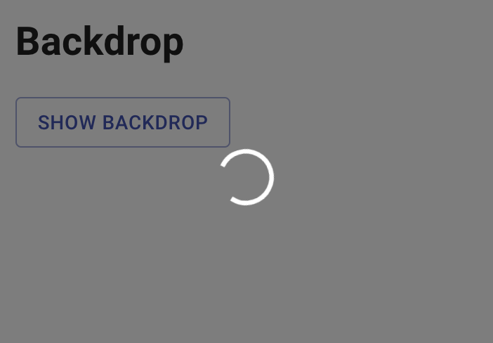
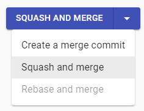
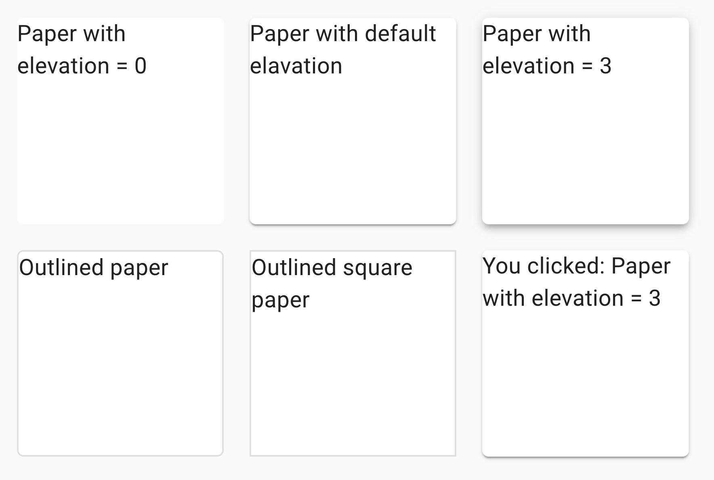
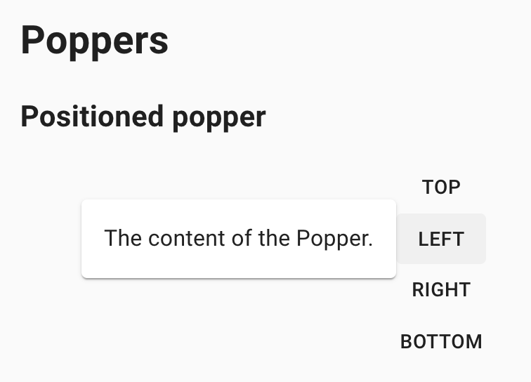
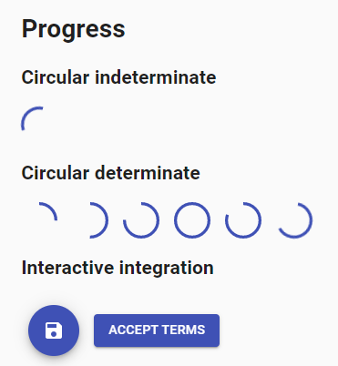

## 4. Material UI elements

### 4.1 Checkbox

```java 
    // @FindBy(xpath = "//h2[text()='Basic checkboxes']/following-sibling::div/span[contains(@class,'MuiCheckbox-root')]")
    @UI("//h2[text()='Basic checkboxes']/following-sibling::div/span[contains(@class,'MuiCheckbox-root')]")
    public List<Checkbox> basicCheckbox;

    @Test
    public void basicCheckboxTest() {
        for (int i = 1; i < 3; i++) {
            checkboxTestLogic(
                    basicCheckbox.get(i),
                    i != 2 ? "MuiCheckbox-colorSecondary" :
                            "MuiCheckbox-colorPrimary");
        }
    }
    
    private void checkboxTestLogic(Checkbox checkbox, String className) {
        if (checkbox.isEnabled()) {
            checkbox.check();
            checkbox.is().selected();
            checkbox.uncheck();
            checkbox.is().deselected();
        } else {
            checkbox.is().disabled();
        }
        checkbox.hasClass(className);
    }
```

##### <a href="https://material-ui.com/components/checkboxes/" target="_blank"> Checkbox overview </a>

Checkbox is located in the following class:

- __Java__: _com.epam.jdi.light.material.elements.inputs.Checkbox_

__Checkbox__ - element that allows the user to select one or more items from a set. It can be used to turn an option on or off.


Here is an example with provided Material-UI v4.12.3 code:

```html
<span class="MuiButtonBase-root MuiIconButton-root jss40 MuiCheckbox-root MuiCheckbox-colorSecondary jss41 Mui-checked MuiIconButton-colorSecondary" aria-disabled="false">
  <span class="MuiIconButton-label">
    <input class="jss43" type="checkbox" data-indeterminate="false" aria-label="primary checkbox" value="" checked="">
    <svg class="MuiSvgIcon-root" focusable="false" viewBox="0 0 24 24" aria-hidden="true"></svg>
  </span>
  <span class="MuiTouchRipple-root"></span>
</span>
```

Available methods in Java JDI Light:

|Method | Description | Return Type
--- | --- | ---
**is()** | Returns Assert class | Assert
**isDisabled()** | Verify state | boolean
**hasClassName(String className)** | Checks class| void
**checked()** | Assert that Checkbox selected | Assert
**uncheck()** | Assert that Checkbox not selected | Assert
**check()** | select Checkbox | void
**uncheck()** | unselect Checkbox | void

##### <a href="https://github.com/jdi-testing/jdi-light/blob/master_material_ui/jdi-light-material-ui-tests/src/test/java/io/github/epam/material/tests/inputs/CheckboxTests.java" target="_blank">Here you can find Checkbox tests</a>

<br></br>

### 4.2 Chips

```java 
    // @FindBy(xpath = "//h2[text()='Chip array']/following-sibling::div//div[contains(@class, 'MuiChip-root')]")
    @UI("//h2[text()='Chip array']/following-sibling::div//div[contains(@class, 'MuiChip-root')]")
    public static List<Chip> arrayChips;
    
    @Test(dataProvider = "arrayChipsTestsDataProvider", 
            dataProviderClass = ChipDataProvider.class)
    public void arrayChipsTests(int index, String text) {
        arrayChipsTestLogic(arrayChips.get(index), text);
    }
    
    public void arrayChipsTestLogic(Chip chip, String text) {
        String clickInfoText = String.format(basicClickText + " %s", text).trim();
        chip.is().displayed();
        chip.label().has().text(text);
        chip.is().enabled();
        chip.is().clickable();
        chip.click();
        lastClickArrayInfo.has().text(clickInfoText);
        if (chip.icon().isDisplayed()) {
            chip.icon().is().displayed();
            chip.icon().click();
            lastClickArrayInfo.has().text(basicClickText);
        }
        if (chip.isDeletable()) {
            chip.is().deletable();
        }
    }
```

##### <a href="https://material-ui.com/components/chips/" target="_blank"> Chips overview </a>

Chip is located in the following class:

- __Java__: _com.epam.jdi.light.material.elements.displaydata.Chip_

__Chips__ - compact elements that represent an input, attribute, or action. Chips allow users to enter information, make selections, filter content, or trigger actions.


Here is an example with provided Material-UI v4.12.3 code:

```html
<h2>Chip array</h2>
<div>
  <ul class="MuiPaper-root jss4 MuiPaper-elevation1 MuiPaper-rounded">
    <li>
      <div class="MuiButtonBase-root MuiChip-root jss5 MuiChip-clickable MuiChip-deletable" tabindex="0" role="button">
        <span class="MuiChip-label">Angular</span>
        <svg class="MuiSvgIcon-root MuiChip-deleteIcon" focusable="false" viewBox="0 0 24 24" aria-hidden="true"></svg>
        <span class="MuiTouchRipple-root"></span>
      </div>
    </li>
    <li>
      <div class="MuiButtonBase-root MuiChip-root jss5 MuiChip-clickable MuiChip-deletable" tabindex="0" role="button">
        <span class="MuiChip-label">jQuery</span>
        <svg class="MuiSvgIcon-root MuiChip-deleteIcon" focusable="false" viewBox="0 0 24 24" aria-hidden="true"></svg>
        <span class="MuiTouchRipple-root"></span>
      </div>
    </li>
    <li>
      <div class="MuiButtonBase-root MuiChip-root jss5 MuiChip-clickable MuiChip-deletable" tabindex="0" role="button">
        <span class="MuiChip-label">Polymer</span>
        <svg class="MuiSvgIcon-root MuiChip-deleteIcon" focusable="false" viewBox="0 0 24 24" aria-hidden="true"></svg>
        <span class="MuiTouchRipple-root"></span>
      </div>
    </li>
    <li>
      <div class="MuiButtonBase-root MuiChip-root jss5 MuiChip-clickable" tabindex="0" role="button">
        <svg class="MuiSvgIcon-root MuiChip-icon" focusable="false" viewBox="0 0 24 24" aria-hidden="true"></svg>
        <span class="MuiChip-label">React</span>
        <span class="MuiTouchRipple-root"></span>
      </div>
    </li>
    <li>
      <div class="MuiButtonBase-root MuiChip-root jss5 MuiChip-clickable MuiChip-deletable" tabindex="0" role="button">
        <span class="MuiChip-label">Vue.js</span>
        <svg class="MuiSvgIcon-root MuiChip-deleteIcon" focusable="false" viewBox="0 0 24 24" aria-hidden="true"></svg>
        <span class="MuiTouchRipple-root"></span>
      </div>
    </li>
  </ul>
  <p id="lastChipArrayClickInfo">You clicked on: jQuery</p>
</div>
```

Available methods in Java JDI Light:

|Method | Description | Return Type
--- | --- | ---
**is()** | Returns Assert class | ChipAssert
**click(int index)** | Clicks on chip | void
**getChipLabel(int index)** | Gets label| UIElement
**getChipRoot(int index)** | Gets root| UIElement
**getChipIcon(int index)** | Gets Icon|UIElement

##### <a href="https://github.com/jdi-testing/jdi-light/blob/master_material_ui/jdi-light-material-ui-tests/src/test/java/io/github/epam/material/tests/displaydata/ChipTests.java" target="_blank">Here you can find Chips tests</a>

<br></br>

### 4.3 Tooltip

```java 
    // @FindBy(xpath = "//button[contains(@title, 'Add')][1]")
    @UI("//button[contains(@title, 'Add')][1]")
    public static MaterialButton addButtonWithTooltip;
    
    @Test
    public void addButtonWithTooltipTest() {
        addButtonWithTooltip.is().visible();
        addButtonWithTooltip.hover();
        addButtonWithTooltip.tooltip().is().visible();
        addButtonWithTooltip.tooltip().has().text("Add");
    }
    
    public interface HasTooltip extends ICoreElement {
        default Tooltip tooltip() {
            return new Tooltip(core());
        }
    }
```

##### <a href="https://material-ui.com/components/tooltips/" target="_blank"> Tooltip overview </a>

Tooltip is located in the following class:

- __Java__: _com.epam.jdi.light.material.elements.displaydata.Tooltip_

__Tooltips__ - elements that display informative text when users hover over, focus on, or tap an element.


Here is an example with provided Material-UI v4.12.3 code:

```html
<button class="MuiButtonBase-root MuiFab-root jss8 MuiFab-secondary" 
        tabindex="0" type="button" title="Add" aria-label="add">
  <span class="MuiFab-label">
    <svg class="MuiSvgIcon-root" focusable="false" viewBox="0 0 24 24" aria-hidden="true"></svg>
  </span>
  <span class="MuiTouchRipple-root"></span>
</button>
```

Available methods in Java JDI Light:

|Method | Description | Return Type
--- | --- | ---
**is()** | Returns Assert class | TooltipAssert
**has()** | Returns Assert class | TooltipAssert
**isVisible()** | Checks element is displayed| boolean
**isInteractive()** | Checks element is interactive| boolean
**getValue()** | Gets value| String

##### <a href="https://github.com/jdi-testing/jdi-light/blob/master_material_ui/jdi-light-material-ui-tests/src/test/java/io/github/epam/material/tests/displaydata/TooltipTests.java" target="_blank">Here you can find Tooltip tests</a>

<br></br>

### 4.4 Container

```java 
    // @FindBy(css = ".MuiContainer-root.MuiContainer-maxWidthSm")
    @UI(".MuiContainer-root.MuiContainer-maxWidthSm")
    public static Container container;

    @Test
    public void fluidContainerTest() {
        container.has().maxWidth("600px");
        container.is().fluid();
        container.is().displayed();
        container.is().enabled();
    }
```

##### <a href="https://material-ui.com/components/container/" target="_blank"> Container overview </a>

Container is located in the following class:

- __Java__: _com.epam.jdi.light.material.elements.layout.Container_

__Container__ - the most basic layout element. It centers your content horizontally.


Here is an example with provided Material-UI v4.12.3 code:

```html
<div class="MuiContainer-root MuiContainer-maxWidthSm">
  <div class="MuiTypography-root MuiTypography-body1" style="background-color: rgb(207, 232, 252); height: 100vh;">
    Example text
  </div>
</div>
```

Available methods in Java JDI Light:

|Method | Description | Return Type
--- | --- | ---
**fixed()** | Check whether container is fixed | boolean
**fluid()** | Check whether container is fluid | boolean
**getMaxWidth()** | Get max width of container | String
**is()** | Assert method | ContainerAssert
**fixed()** | Assert that container is fixed | ContainerAssert
**fluid()** | Assert that container is fluid | ContainerAssert
**maxWidth(String)** | Assert that container's max width is specified width | ContainerAssert


##### <a href="https://github.com/jdi-testing/jdi-light/blob/master_material_ui/jdi-light-material-ui-tests/src/test/java/io/github/epam/material/tests/layout/ContainerTests.java" target="_blank"> Here you can find Container tests </a>

<br></br>

### 4.5 Avatar

```java 
    // @FindBy(xpath = "//span[@class = 'MuiBadge-root']")
    @UI("//span[@class = 'MuiBadge-root']")
    public static List<Avatar> avatarsWithPhoto;

    @Test
    public void avatarsWithPhotoTests() {
        for (Avatar avatar : avatarsWithPhoto) {
            avatar.is().displayed();
            avatar.image().is().displayed();
            avatar.badge().is().displayed();
        }
    }
```

##### <a href="https://material-ui.com/ru/components/avatars/" target="_blank"> Avatars overview </a>

Avatar is located in the following class:

- __Java__: _com.epam.jdi.light.material.elements.displaydata.Avatar_

__Avatars__ - graphical representations of users.


Here is an example with provided Material-UI v4.12.3 code:
```html
<span class="MuiBadge-root">
  <div class="MuiAvatar-root MuiAvatar-circle">
    </div>
  <span class="MuiBadge-badge jss37 MuiBadge-anchorOriginBottomRightCircle MuiBadge-dot"></span>
</span>

<span class="MuiBadge-root">
  <div class="MuiAvatar-root MuiAvatar-circle">
    </div>
  <span class="MuiBadge-badge MuiBadge-anchorOriginBottomRightCircle">
    <div class="MuiAvatar-root jss39 MuiAvatar-circle MuiAvatar-colorDefault">R</div>
  </span>
</span>
```

Available methods in Java JDI Light:

|Method | Description | Return Type
--- | --- | ---
**icon()** | Returns icon containing in the element | Icon
**has()** | Returns assert class | AvatarAssert
**is()** | Returns assert class | AvatarAssert

##### <a href="https://github.com/jdi-testing/jdi-light/blob/master_material_ui/jdi-light-material-ui-tests/src/test/java/io/github/epam/material/tests/displaydata/AvatarTests.java" target="_blank">Here you can find Avatar tests</a>

<br></br>

### 4.6 Click Away Listener

```java     
    // @FindBy(xpath = "//h2[text()='Portal']/preceding::button")
    @UI("//h2[text()='Portal']/preceding::button")
    public static Button exampleButton;

    // @FindBy(xpath = "//div[text()='Click me, I will stay visible until you click outside.']")
    @UI("//div[text()='Click me, I will stay visible until you click outside.']")
    public static TextArea text;

    @Test
    public void exampleClickAwayListenerTest() {
        textFieldTest(1);
    }

    private void textFieldTest(int buttonId) {
        clickAwayListenerPage.clickButton(buttonId);
        text.is().displayed();
        clickAwayListenerPage.clickButton(buttonId);
        text.is().hidden();
        clickAwayListenerPage.clickButton(buttonId);
        text.is().displayed();
        clickAwayListenerPage.clickAroundTextPopup(text.getSize().width + 1, -1);
        text.is().hidden();
        clickAwayListenerPage.clickButton(buttonId);
        clickAwayListenerPage.clickAroundButton(exampleButton.getSize().width + 1,0, buttonId);
        text.is().hidden();
    }
```

##### <a href="https://material-ui.com/ru/components/click-away-listener/" target="_blank"> Click Away Listener overview </a>

__Click Away Listener__ - element that detects if a click event happened outside an element. It listens for clicks that occur somewhere in the document.


Here is an example with provided Material-UI v4.12.3 code:

```html
<div class="jss42">
  <button type="button">Open menu dropdown</button>
  <div class="jss43">Click me, I will stay visible until you click outside.</div>
</div>
<h2>Portal</h2>
```

Available methods in Java JDI Light:

|Method | Description | Return Type
--- | --- | ---
**click()** | Clicks on box | void
**click(int x, int y)** | Clicks on point in box | void
**is()** | Returns Assert class | Assert
**displayed()** | Assert state | Assert
**hidden()** | Assert state | Assert

##### <a href="https://github.com/jdi-testing/jdi-light/blob/master_material_ui/jdi-light-material-ui-tests/src/test/java/io/github/epam/material/tests/utils/ClickAwayListenerTests.java" target="_blank">Here you can find ClickAwayListener tests</a>

<br></br>

### 4.7 Divider

```java 
    // @FindBy(css = "li.MuiDivider-root")
    @UI("li.MuiDivider-root")
    public static List<Divider> insetDivider;
    
    @Test
    public void insetDividerTest() {
        insetDivider.forEach(d -> d.is().inset());
    }
```

##### <a href="https://material-ui.com/components/dividers/" target="_blank"> Divider overview </a>

Divider is located in the following class:

- __Java__: _com.epam.jdi.light.material.elements.displaydata.Divider_

__Divider__ - a thin line that groups content in lists and layouts.


Here is an example with provided Material-UI v4.12.3 code:

```html
<ul class="MuiList-root jss46 MuiList-padding">
  <li class="MuiListItem-root MuiListItem-gutters">...</li>
  <li class="MuiDivider-root MuiDivider-inset" role="separator"></li>
  <li class="MuiListItem-root MuiListItem-gutters">...</li>
  <li class="MuiDivider-root MuiDivider-inset" role="separator"></li>
  <li class="MuiListItem-root MuiListItem-gutters">...</li>
</ul>
```

Available methods in Java JDI Light:

|Method | Description | Return Type
--- | --- | ---
**is()** | Returns DividerAssert class | DividerAssert
**isInset()** | Assert inset divider | boolean
**isVertical()** | Assert vertical divider| boolean

##### <a href="https://github.com/jdi-testing/jdi-light/blob/master_material_ui/jdi-light-material-ui-tests/src/test/java/io/github/epam/material/tests/displaydata/InsetDividerTests.java" target="_blank">Here you can find Divider tests</a>

<br></br>

### 4.8 Card

```java    
    // @FindBy(id = "simpleCard")
    @UI("#simpleCard")
    public static Card simpleCard;

    @Test
    public void simpleCardTestContent() {
        simpleCard.getContent().is().text(containsString("Word of the Day"));
        simpleCard.getContent().is().text(containsString("be•nev•o•lent"));
    }
```

##### <a href="https://material-ui.com/components/cards/" target="_blank"> Card overview </a>

Card is located in the following class:

- __Java__: _com.epam.jdi.light.material.elements.surfaces.Card_

__Card__ - element that contains content and actions about a single subject.


Here is an example with provided Material-UI v4.12.3 code:

```html
<div class="MuiPaper-root MuiCard-root jss54 MuiPaper-elevation1 
    MuiPaper-rounded" id="simpleCard">
  <div class="MuiCardContent-root">
    <p class="MuiTypography-root jss56 MuiTypography-body1 MuiTypography-colorTextSecondary MuiTypography-gutterBottom">
      Word of the Day
    </p>
    <h2 class="MuiTypography-root MuiTypography-h5">
      be
      <span class="jss55">•</span>
      nev
      <span class="jss55">•</span>
      o
      <span class="jss55">•</span>
      lent
    </h2>
    <p class="MuiTypography-root jss57 MuiTypography-body1 MuiTypography-colorTextSecondary">
      adjective
    </p>
    <p class="MuiTypography-root MuiTypography-body2">
      well meaning and kindly.<br>a benevolent smile
    </p>
  </div>
  <div class="MuiCardActions-root MuiCardActions-spacing">
    <button class="MuiButtonBase-root MuiButton-root MuiButton-text MuiButton-textSizeSmall MuiButton-sizeSmall" tabindex="0" type="button">
      <span class="MuiButton-label">Learn More</span>
      <span class="MuiTouchRipple-root"></span>
    </button>
  </div>
</div>
```

Available methods in Java JDI Light:

|Method | Description | Return Type
--- | --- | ---
**click()** | Clicks on box | void
**is()** | Returns Assert class | Assert
**displayed()** | Assert state | Assert
**hidden()** | Assert state | Assert
**classValue()** | Assert state | Assert

##### <a href="https://github.com/jdi-testing/jdi-light/blob/master_material_ui/jdi-light-material-ui-tests/src/test/java/io/github/epam/material/tests/surfaces/CardTests.java" target="_blank">Here you can find Card tests</a>

<br></br>

### 4.9 Radio

```java 
    // @FindBy(css = "#simpleRadio .MuiRadio-root")
    @UI("#simpleRadio .MuiRadio-root")
    public static RadioButtons simpleRadioButtons;

    @Test
    public void simpleRadioTest() {
        simpleRadioButtons.has().values("First", "Second", "Third", "Disabled");
        simpleRadioButtons.has().enabled("First", "Second", "Third");
        simpleRadioButtons.has().disabled("Disabled");
        asList("First", "Second", "Third").forEach(label -> {
            simpleRadioButtons.select(label);
            simpleRadioButtons.has().selected(label);
            lastRadioText.has().text(containsString(label));
        });
    }
```

##### <a href="https://mui.com/components/radio-buttons/" target="_blank"> Radio overview </a>

Radio is located in the following class:

- __Java__: _com.epam.jdi.light.material.elements.inputs.RadioButtons_

__Radio buttons__ - elements that allow the user to select one option from a set.


Here is an example with provided Material-UI v4.12.3 code:
```html
<fieldset class="MuiFormControl-root" id="simpleRadio">
  <div class="MuiFormGroup-root MuiFormGroup-row" role="radiogroup" aria-label="position">
    <label class="MuiFormControlLabel-root">
      <span class="MuiButtonBase-root MuiIconButton-root jss63 MuiRadio-root MuiRadio-colorPrimary MuiIconButton-colorPrimary" aria-disabled="false">
        <span class="MuiIconButton-label">
          <input class="jss66" name="position" type="radio" value="first">
          <div class="jss67">...</div>
        </span>
        <span class="MuiTouchRipple-root"></span>
      </span>
      <span class="MuiTypography-root MuiFormControlLabel-label MuiTypography-body1">First</span>
    </label>
    
    <label class="MuiFormControlLabel-root">
      <span class="MuiButtonBase-root MuiIconButton-root jss63 MuiRadio-root MuiRadio-colorPrimary jss64 Mui-checked MuiIconButton-colorPrimary" aria-disabled="false">
        <span class="MuiIconButton-label">
          <input class="jss66" name="position" type="radio" value="second">
          <div class="jss67 jss69">...</div>
        </span>
        <span class="MuiTouchRipple-root"></span>
      </span>
      <span class="MuiTypography-root MuiFormControlLabel-label MuiTypography-body1">Second</span>
    </label>
    
    <label class="MuiFormControlLabel-root">
      <span class="MuiButtonBase-root MuiIconButton-root jss63 MuiRadio-root MuiRadio-colorPrimary MuiIconButton-colorPrimary" aria-disabled="false">
        <span class="MuiIconButton-label">
          <input class="jss66" name="position" type="radio" value="third">
          <div class="jss67">...</div>
        </span>
        <span class="MuiTouchRipple-root"></span>
      </span>
      <span class="MuiTypography-root MuiFormControlLabel-label MuiTypography-body1">Third</span>
    </label>
    
    <label class="MuiFormControlLabel-root Mui-disabled">
      <span class="MuiButtonBase-root MuiIconButton-root jss63 MuiRadio-root MuiRadio-colorPrimary jss65 Mui-disabled MuiIconButton-colorPrimary Mui-disabled Mui-disabled" tabindex="-1" aria-disabled="true">
        <span class="MuiIconButton-label">
          <input class="jss66" disabled="" name="position" type="radio" value="disabled">
          <div class="jss67">...</div>
        </span>
      </span>
      <span class="MuiTypography-root MuiFormControlLabel-label Mui-disabled MuiTypography-body1">Disabled</span>
    </label>
  </div>
  <p id="lastClickContent">You clicked Second</p>
</fieldset>
```

Available methods in Java JDI Light:

|Method | Description | Return Type
--- | --- | ---
**is()** | Returns object for work with assertions | RadioAssert
**select(String/int/Enum)** | Select radiobutton by value/index  | void
**selected()** | Get selected radiobutton value | String
**values()** | Returns list of values | List\<String>
**labels()** | Returns list of labels | List\<Label>
**listEnabled()** | Returns list of enabled values | List\<String>
**listDisabled()** | Returns list of disabled values | List\<String>
**get(String/int)** | Returns radio button by value/index | UIElement

##### <a href="https://github.com/jdi-testing/jdi-light/blob/master_material_ui/jdi-light-material-ui-tests/src/test/java/io/github/epam/material/tests/inputs/RadioButtonsTests.java" target="_blank">Here you can find Radio tests</a>

<br></br>

### 4.10 App Bar

```java 
    // @FindBy(xpath = "(//header[contains(@class, 'MuiAppBar-root')])[1]")
    @JAppBar(
            root = "(//header[contains(@class, 'MuiAppBar-root')])[1]",
            actionItems = {"//*[text()='News']/following-sibling::button"}
    )
    public static AppBar simpleAppBar;

    @Test
    public void simpleAppBarTest() {
        simpleAppBar.isDisplayed();
        simpleAppBar.getNavigationButton().isDisplayed();
        simpleAppBar.getNavigationButton().click();
        simpleAppBar.getTitle().has().text("News");
        simpleAppBar.getActionItems().get(1).isDisplayed();
        simpleAppBar.getActionItems().get(1).click();
    }
```

##### <a href="https://material-ui.com/components/app-bar/" target="_blank"> App Bar overview </a>

App Bar is located in the following class:

- __Java__: _com.epam.jdi.light.material.elements.surfaces.AppBar_

__App Bar__ - element that displays information and actions relating to the current screen.


Here is an example with provided Material-UI v4.12.3 code:

```html
<header class="MuiPaper-root MuiAppBar-root MuiAppBar-positionStatic MuiAppBar-colorPrimary MuiPaper-elevation4">
  <div class="MuiToolbar-root MuiToolbar-regular MuiToolbar-gutters">
    <button class="MuiButtonBase-root MuiIconButton-root jss132 MuiIconButton-colorInherit MuiIconButton-edgeStart" tabindex="0" type="button" aria-label="menu">...</button>
    <h6 class="MuiTypography-root jss133 MuiTypography-h6">News</h6>
    <button class="MuiButtonBase-root MuiButton-root MuiButton-text MuiButton-colorInherit" tabindex="0" type="button">
      <span class="MuiButton-label">Login</span>
      <span class="MuiTouchRipple-root"></span>
    </button>
  </div>
</header>
```

Available methods in Java JDI Light:

|Method | Description | Return Type
--- | --- | ---
**click()** | Clicks on element | void
**click(int x, int y)** | Clicks on point in element | void
**is()** | Returns Assert class | Assert
**has()** | Returns Assert class | Assert
**displayed()** | Assert state | Assert
**hidden()** | Assert state | Assert

##### <a href="https://github.com/jdi-testing/jdi-light/blob/master_material_ui/jdi-light-material-ui-tests/src/test/java/io/github/epam/material/tests/surfaces/AppBarTests.java" target="_blank">Here you can find AppBar tests</a>

<br></br>

### 4.11 Box

```java    
    // @FindBy(xpath = "//button[contains(@class,'MuiButton-contained')]")
    @UI("//button[contains(@class,'MuiButton-contained')]")
    public static Button containedBox;
    
    // @FindBy(xpath = "//p")
    @UI("p")
    public static Text lastClickContent;

    @Test
    public void containedBoxTest() {
        containedBox.is().displayed();
        containedBox.click();
        containedBox.is().text("FIRST BUTTON");
        lastClickContent.is().text("You clicked First button");
    }
```

##### <a href="https://material-ui.com/components/box/" target="_blank"> Box overview </a>

__Box__ - component that serves as a wrapper component for most of the CSS utility needs.


Here is an example with provided Material-UI v4.12.3 code:

```html
<button class="MuiButtonBase-root MuiButton-root MuiButton-contained MuiButton-containedPrimary" tabindex="0" type="button">
  <span class="MuiButton-label">First button</span>
  <span class="MuiTouchRipple-root"></span>
</button>
```

Available methods in Java JDI Light:

|Method | Description | Return Type
--- | --- | ---
**is()** | Verify state | boolean
**click()** | Clicks on box | void
**displayed()** | Verify state | void
**text()** | Verify text | void

##### <a href="https://github.com/jdi-testing/jdi-light/blob/master_material_ui/jdi-light-material-ui-tests/src/test/java/io/github/epam/material/tests/layout/BoxTests.java" target="_blank">Here you can find Box tests</a>

<br></br>

### 4.12 Transitions

```java     
    @FindBy(xpath = "//h1[text()='Transitions']/following::div[contains(@class,'MuiCollapse-container')]")
    @UI("//h1[text()='Transitions']/following::div[contains(@class,'MuiCollapse-container')]")
    public static List<Transition> collapseFadeTransitions;

    @FindBy(xpath = "//span[contains(@class, 'MuiSwitch-switchBase')]")
    @UI("//span[contains(@class, 'MuiSwitch-switchBase')]")
    public static List<Checkbox> checkboxes;
    
    @Test
    public void collapseDisplayTest() {
        Timer timer = new Timer(2000L);

        collapseFadeTransitions.get(1).is().transitionExited(COLLAPSE);
        collapseFadeTransitions.get(2).is().transitionExited(COLLAPSE);

        checkboxes.get(1).check();

        timer.wait(() -> collapseFadeTransitions.get(1).is().transitionEntered(COLLAPSE));
        collapseFadeTransitions.get(2).is().transitionEntered(COLLAPSE);

        checkboxes.get(1).uncheck();

        timer.wait(() -> collapseFadeTransitions.get(1).is().collapseTransitionHidden(COLLAPSE));
        collapseFadeTransitions.get(1).is().transitionExited(COLLAPSE);
        collapseFadeTransitions.get(2).is().transitionExited(COLLAPSE);
    }
```

##### <a href="https://material-ui.com/components/transitions/" target="_blank"> Transitions overview </a>

Transitions is located in the following class:

- __Java__: _com.epam.jdi.light.material.elements.utils.Transition_

__Transitions__ - element that can be used to introduce some basic motion to your applications. 

It helps make a UI expressive and easy to use.


Here is an example with provided Material-UI v4.12.3 code:

```html
<span class="MuiButtonBase-root MuiIconButton-root jss152 MuiSwitch-switchBase MuiSwitch-colorSecondary" aria-disabled="false">
  <span class="MuiIconButton-label">
    <input class="jss155 MuiSwitch-input" type="checkbox" value="">
    <span class="MuiSwitch-thumb"></span>
  </span>
  <span class="MuiTouchRipple-root"></span>
</span>
<div class="MuiCollapse-container MuiCollapse-hidden" style="min-height: 0px;">
  <div class="MuiCollapse-wrapper">
    <div class="MuiCollapse-wrapperInner">
      <div class="MuiPaper-root jss149 MuiPaper-elevation4 MuiPaper-rounded">
        <svg class="jss150">...</svg>
      </div>
    </div>
  </div>
</div>
```

Available methods in Java JDI Light:

|Method | Description | Return Type
--- | --- | ---
**has()** | Verify state | boolean
**hasClass()** | Verify state | boolean
**classValue()** | Verify state | boolean
**check()** | Checkbox selected | void

##### <a href="https://github.com/jdi-testing/jdi-light/blob/master_material_ui/jdi-light-material-ui-tests/src/test/java/io/github/epam/material/tests/utils/TransitionTests.java" target="_blank">Here you can find Transitions tests</a>

<br></br>

### 4.13 Material Icons

```java     
    // @FindBy(xpath = "//h2[text()='Access Alarm']/following::*[name()='svg']")
    @UI("//h2[text()='Access Alarm']/following::*[name()='svg']")
    public static List<Icon> iconsList;

    // @FindBy(id = "miconLastClick")
    @UI("#miconLastClick")
    public static Text lastClick;

    // @FindBy(id = "miconLastHover")
    @UI("#miconLastHover")
    public static Text lastHover;

    @Test
    public void defaultMaterialIconTest() {
        lastClick.is().text("Last click:");
        lastHover.is().text("Last hover:");

        iconsList.get(1).hover();
        lastClick.is().text("Last click:");
        lastHover.is().text("Last hover: default");

        iconsList.get(1).click();
        lastClick.is().text("Last click: default");
        lastHover.is().text("Last hover: default");

        iconsList.get(2).hover();
        lastClick.is().text("Last click: default");
        lastHover.is().text("Last hover: large");

        iconsList.get(2).click();
        lastClick.is().text("Last click: large");
        lastHover.is().text("Last hover: large");

        iconsList.get(3).hover();
        lastClick.is().text("Last click: large");
        lastHover.is().text("Last hover: secondary");

        iconsList.get(3).click();
        lastClick.is().text("Last click: secondary");
        lastHover.is().text("Last hover: secondary");
    }
```

##### <a href="https://material-ui.com/components/material-icons/" target="_blank"> Material Icons overview </a>

__Material Icons__ - set of icons provided by npm package, @material-ui/icons, that includes the 1,100+ official Material icons converted to SvgIcon components.


Here is an example with provided Material-UI v4.12.3 code:

```html
<div>
  <h1>Material Icons</h1>
  <h2>Access Alarm</h2>
  <svg class="MuiSvgIcon-root" focusable="false" viewBox="0 0 24 24" aria-hidden="true" id="defaultAccessAlarm">...</svg>
  <svg class="MuiSvgIcon-root MuiSvgIcon-fontSizeLarge" focusable="false" viewBox="0 0 24 24" aria-hidden="true" id="largeAccessAlarm">...</svg>
  <svg class="MuiSvgIcon-root MuiSvgIcon-colorSecondary" focusable="false" viewBox="0 0 24 24" aria-hidden="true" id="secondaryAccessAlarm">...</svg>
  <p id="miconLastClick">Last click: default</p>
  <p id="miconLastHover">Last hover: large</p>
</div>
```

Available methods in Java JDI Light:

|Method | Description | Return Type
--- | --- | ---
**is()** | Verify state | boolean
**displayed()** | Verify state | boolean
**hasClass()** | Verify state | boolean
**text()** | Verify text | boolean
**click()** | Clicks on box | void
**hover()** | Hovers on box | void

##### <a href="https://github.com/jdi-testing/jdi-light/blob/master_material_ui/jdi-light-material-ui-tests/src/test/java/io/github/epam/material/tests/displaydata/MaterialIconTests.java" target="_blank">Here you can find Material Icons tests</a>

<br></br>

### 4.14 Icons

```java     
    // FindBy(xpath = "//div[contains(@class, 'MuiGrid-grid-xs-8')]/*[local-name()='svg']")
    @UI(".MuiGrid-grid-xs-8 > svg")
    public static List<Icon> simpleIcons;
    
    // @FindBy(id = "simpleLastClick")
    @UI("#simpleLastClick")
    public static Text simpleLastClick;

    // @FindBy(id = "simpleLastHover")
    @UI("#simpleLastHover")
    public static Text simpleLastHover;
    
    @Test(dataProviderClass = IconsDataProvider.class, 
            dataProvider = "simpleIconsTestDataProvider")
    public void simpleIconsTest(int elementIndexForHover, String resultHoverFieldText,
                                int elementIndexForClick, String resultClickFieldText) {
        simpleIcons.get(elementIndexForHover).hover();
        simpleLastHover.has().text(resultHoverFieldText);
        simpleIcons.get(elementIndexForClick).click();
        simpleLastClick.has().text(resultClickFieldText);
    }
```

##### <a href="https://material-ui.com/components/icons/" target="_blank"> Icons overview </a>

Icon is located in the following class:

- __Java__: _com.epam.jdi.light.material.elements.displaydata.Icon_

__Icon__ - element that represents a small clickable  picture.


Here is an example with provided Material-UI v4.12.3 code:

```html
<div class="MuiGrid-root MuiGrid-item MuiGrid-grid-xs-8">
  <svg class="MuiSvgIcon-root" focusable="false" viewBox="0 0 24 24" aria-hidden="true">...</svg>
  <svg class="MuiSvgIcon-root" focusable="false" viewBox="0 0 24 24" aria-hidden="true">...</svg>
</div>
```

Available methods in Java JDI Light:

|Method | Description | Return Type
--- | --- | ---
**colored()** | Check whether element is colored (not black) | boolean
**getColor()** | Get color of icon | String
**is()** | Assert method | IconAssert
**colored()** | Assert whether icon is colored (not black) | IconAssert
**notColored()** | Assert whether icon is not colored (black) | IconAssert
**color(String)** | Assert that icon's color is certain color | IconAssert
**height(int)** | Assert that icon has specified height | IconAssert
**width(int)** | Assert that icon has specified width | IconAssert

##### <a href="https://github.com/jdi-testing/jdi-light/blob/master_material_ui/jdi-light-material-ui-tests/src/test/java/io/github/epam/material/tests/displaydata/IconsTests.java" target="_blank">Here you can find Icons tests</a>

<br></br>

### 4.15 Floating Action Button

```java     
    // @FindBy(xpath = "//div[@id='basicActionBtns']/button")
    @UI("//div[@id='basicActionBtns']/button")
    public static List<Button> buttonsBasic;
    
    // @FindBy(id = "basicActionBtnsLastClick")
    @UI("#basicActionBtnsLastClick")
    public static Text labelLastClick;
    
    // @FindBy(xpath = "//button[@aria-label='add']")
    @UI("//button[@aria-label='add']")
    public static Button buttonAdd;
    
    // @FindBy(xpath = "//button[@aria-label='edit']")
    @UI("//button[@aria-label='edit']")
    public static Button buttonEdit;

    // @FindBy(xpath = "//button[contains(@class,'MuiFab-extended')]")
    @UI("//button[contains(@class,'MuiFab-extended')]")
    public static Button buttonNavigate;
    
    // @FindBy(xpath = "//button[@aria-label='like']")
    @UI("//button[@aria-label='like']")
    public static Button buttonLike;

    @Test
    public void basicButtonsTest() {
        buttonsBasic.forEach(el -> el.is().displayed());
        labelLastClick.has().text("Last click:");

        buttonAdd.is().enabled();
        buttonAdd.click();
        labelLastClick.has().text("Last click: Add");

        buttonEdit.is().enabled();
        buttonEdit.click();
        labelLastClick.has().text("Last click: Edit");

        buttonNavigate.is().enabled();
        buttonNavigate.click();
        labelLastClick.is().text("Last click: Navigate");

        buttonLike.is().disabled();
    }
```

##### <a href="https://material-ui.com/components/floating-action-button/" target="_blank"> Floating Action Button overview </a>

__Floating Fction Button__ - element that appears in front of all screen content, typically as a circular shape with an icon in its center. 


Here is an example with provided Material-UI v4.12.3 code:

```html
<div class="jss182" id="basicActionBtns">
  <button class="MuiButtonBase-root MuiFab-root MuiFab-primary" tabindex="0" type="button" aria-label="add">
    <span class="MuiFab-label">
      <svg class="MuiSvgIcon-root" focusable="false" viewBox="0 0 24 24" aria-hidden="true">...</svg>
    </span>
    <span class="MuiTouchRipple-root"></span>
  </button>
  <button class="MuiButtonBase-root MuiFab-root MuiFab-secondary" tabindex="0" type="button" aria-label="edit">
    <span class="MuiFab-label">
      <svg class="MuiSvgIcon-root" focusable="false" viewBox="0 0 24 24" aria-hidden="true">...</svg>
    </span>
    <span class="MuiTouchRipple-root"></span>
  </button>
  <button class="MuiButtonBase-root MuiFab-root MuiFab-extended" tabindex="0" type="button">
    <span class="MuiFab-label">
      <svg class="MuiSvgIcon-root jss183" focusable="false" viewBox="0 0 24 24" aria-hidden="true">...</svg>
      Navigate
    </span>
    <span class="MuiTouchRipple-root"></span>
  </button>
  <button class="MuiButtonBase-root MuiFab-root Mui-disabled Mui-disabled" tabindex="-1" type="button" disabled="" aria-label="like">
    <span class="MuiFab-label">
      <svg class="MuiSvgIcon-root" focusable="false" viewBox="0 0 24 24" aria-hidden="true">...</svg>
    </span>
  </button>
</div>
```

Available methods in Java JDI Light:

|Method | Description | Return Type
--- | --- | ---
**is()** | Verify state | boolean
**displayed()** | Verify state | boolean
**enabled()** | Verify state | boolean
**disabled()** | Verify state | boolean
**text()** | Verify text | boolean
**click()** | Clicks on box | void

##### <a href="https://github.com/jdi-testing/jdi-light/blob/master_material_ui/jdi-light-material-ui-tests/src/test/java/io/github/epam/material/tests/inputs/FloatingActionButtonTests.java" target="_blank">Here you can find Floating Action Button tests</a>

<br></br>

### 4.16 Hidden

```java    
    // @FindBy(className = "MuiTypography-subtitle1")
    @UI(".MuiTypography-subtitle1")
    public static Text currentWidth;

    // @FindBy(className = "MuiPaper-root")
    @UI(".MuiPaper-root")
    public static WebList papers;
    
    @Test(dataProvider = "Screen Width")
    public void hiddenTestWithScreenWidthDifferentScreenWidth(int width, int size, String expectedWidth) {
        setWidth(width);
        papers.has().size(size);
        if (size > 0) {
            papers.is().displayed();
        } else {
            papers.is().hidden();
        }
        currentWidth.has().text("Current width: " + expectedWidth);
    }
```

##### <a href="https://material-ui.com/components/hidden/" target="_blank"> Hidden overview </a>

__Hidden__ - element that allows you to quickly and responsively toggle the visibility value of components and much more.


Here is an example with provided Material-UI v4.12.3 code:

```html
<div class="jss193">
  <h1>Hidden</h1>
  <h6 class="MuiTypography-root MuiTypography-subtitle1">
    Current width: sm
  </h6>
  <div class="jss194">
    <div class="MuiPaper-root jss195 MuiPaper-elevation1 MuiPaper-rounded">
      xsDown
    </div>
  </div>
</div>
```

Available methods in Java JDI Light:

|Method | Description | Return Type
--- | --- | ---
**is()** | Verify state | boolean
**displayed()** | Verify state | boolean
**text()** | Verify text | boolean

##### <a href="https://github.com/jdi-testing/jdi-light/blob/master_material_ui/jdi-light-material-ui-tests/src/test/java/io/github/epam/material/tests/layout/HiddenTests.java" target="_blank">Here you can find Hidden tests</a>

<br></br>

### 4.17 Stepper

```java 
    // @FindBy(css = "#nonLinearStepper .MuiStep-root")
    @UI("#nonLinearStepper .MuiStep-root")
    public static Stepper nonlinearStepper;

    // @FindBy(xpath = "//p[@id='activeNonLinearStep']/..//button[2]")
    @UI("//p[@id='activeNonLinearStep']/..//button[2]")
    public static MaterialButton nonlinearStepperNextButton;

    // @FindBy(xpath = "//p[@id='activeNonLinearStep']/..//button[3]")
    @UI("//p[@id='activeNonLinearStep']/..//button[3]")
    public static MaterialButton nonlinearStepperCompleteStepButton;
        
    @Test
    public void nonlinearStepperForwardTest() {
        nonlinearStepper.show();
        nonlinearStepper.is().displayed().and().has().steps(Arrays.asList(steps));

        nonlinearStepperNextButton.click();
        nonlinearStepperNextButton.click();
        nonlinearStepper.list().get(2).click();
        nonlinearStepperCompleteStepButton.click();
        
        nonlinearStepper.is().stepEnabled(1).and().stepCompleted(1);
        nonlinearStepper.is().stepEnabled(2).and().stepCompleted(2);
        nonlinearStepper.is().stepEnabled(3).and().stepIncomplete(3);
    }
```

##### <a href="https://material-ui.com/components/steppers/" target="_blank"> Stepper overview </a>

Stepper is located in the following class:

- __Java__: _com.epam.jdi.light.material.elements.navigation.Stepper_

__Stepper__ - element that allows you to convey progress through numbered steps.


Here is an example with provided Material-UI v4.12.3 code:

```html
<div class="MuiPaper-root MuiStepper-root MuiStepper-horizontal MuiPaper-elevation0" id="nonLinearStepper">
  <div class="MuiStep-root MuiStep-horizontal">
    <button class="MuiButtonBase-root MuiStepButton-root MuiStepButton-horizontal" tabindex="0" type="button">
      <span class="MuiStepLabel-root MuiStepLabel-horizontal">
        <span class="MuiStepLabel-iconContainer">
          <svg class="MuiSvgIcon-root MuiStepIcon-root MuiStepIcon-active" focusable="false" viewBox="0 0 24 24" aria-hidden="true">...</svg>
        </span>
        <span class="MuiStepLabel-labelContainer">
          <span class="MuiTypography-root MuiStepLabel-label MuiStepLabel-active MuiTypography-body2 MuiTypography-displayBlock">Step #1</span>
        </span>
      </span>
      <span class="MuiTouchRipple-root MuiStepButton-touchRipple"></span>
    </button>
  </div>
  <div class="MuiStepConnector-root MuiStepConnector-horizontal Mui-disabled">
    <span class="MuiStepConnector-line MuiStepConnector-lineHorizontal"></span>
  </div>
  <div class="MuiStep-root MuiStep-horizontal">
    <button class="MuiButtonBase-root MuiStepButton-root MuiStepButton-horizontal Mui-disabled" tabindex="-1" type="button" disabled="">
      <span class="MuiStepLabel-root MuiStepLabel-horizontal Mui-disabled"><span class="MuiStepLabel-iconContainer">
        <svg class="MuiSvgIcon-root MuiStepIcon-root" focusable="false" viewBox="0 0 24 24" aria-hidden="true">...</svg>
      </span>
        <span class="MuiStepLabel-labelContainer">
          <span class="MuiTypography-root MuiStepLabel-label MuiTypography-body2 MuiTypography-displayBlock">Step #2</span>
        </span>
      </span>
    </button>
  </div>
  <div class="MuiStepConnector-root MuiStepConnector-horizontal Mui-disabled">
    <span class="MuiStepConnector-line MuiStepConnector-lineHorizontal"></span>
  </div>
  <div class="MuiStep-root MuiStep-horizontal">
    <button class="MuiButtonBase-root MuiStepButton-root MuiStepButton-horizontal Mui-disabled" tabindex="-1" type="button" disabled="">
      <span class="MuiStepLabel-root MuiStepLabel-horizontal Mui-disabled">
        <span class="MuiStepLabel-iconContainer">
          <svg class="MuiSvgIcon-root MuiStepIcon-root" focusable="false" viewBox="0 0 24 24" aria-hidden="true">...</svg>
        </span>
        <span class="MuiStepLabel-labelContainer">
          <span class="MuiTypography-root MuiStepLabel-label MuiTypography-body2 MuiTypography-displayBlock">Step #3</span>
        </span>
      </span>
    </button>
  </div>
</div>
```

Available methods in Java JDI Light:

|Method | Description | Return Type
--- | --- | ---
**stepCompleted()** | Check that specified step is completed | boolean
**stepEnabled()** | Check that specified step is enabled | boolean
**is()** | Verify state | boolean

##### <a href="https://github.com/jdi-testing/jdi-light/blob/master_material_ui/jdi-light-material-ui-tests/src/test/java/io/github/epam/material/tests/navigation/StepperTests.java" target="_blank">Here you can find Stepper tests</a>

<br></br>

### 4.18 Slider

```java 
    // @FindBy(xpath = "//*[@id="continuous-slider"]/following-sibling::div//span[contains(@class, "MuiSlider-root")]")
    @UI("//*[@id="continuous-slider"]/following-sibling::div//span[contains(@class, "MuiSlider-root")]")
    public static Slider continuousSlider;
    
    @Test
    public void continuousSliderTest() {
        continuousSlider.is().enabled();
        continuousSlider.is().orientation("horizontal");
        continuousSlider.is().value(30);
        continuousSlider.setValue(15);
        continuousSlider.is().value(15);
        continuousSlider.moveLeft();
        continuousSlider.is().value(14);
        continuousSlider.moveRight();
        continuousSlider.is().value(15);
        continuousSlider.slideHorizontalTo(10);
        continuousSlider.is().value(10);
    }
```

##### <a href="https://material-ui.com/components/slider/" target="_blank"> Slider overview </a>

Slider is located in the following class:

- __Java__: _com.epam.jdi.light.material.elements.inputs.Slider_

__Slider__ - element that reflects a range of values along a bar, from which users may select a single value. 

It is ideal for adjusting settings such as volume, brightness, or applying image filters.


Here is an example with provided Material-UI v4.12.3 code:

```html
<p class="MuiTypography-root MuiTypography-body1 MuiTypography-gutterBottom" id="continuous-slider">Default Slider</p>
<div class="MuiGrid-root MuiGrid-container MuiGrid-spacing-xs-2">
  <div class="MuiGrid-root MuiGrid-item MuiGrid-grid-xs-true">
    <span class="MuiSlider-root MuiSlider-colorPrimary">
      <span class="MuiSlider-rail"></span>
      <span class="MuiSlider-track" style="left: 0%; width: 60%;"></span>
      <input type="hidden" value="30">
      <span class="MuiSlider-thumb MuiSlider-thumbColorPrimary" tabindex="0" role="slider" data-index="0" aria-labelledby="continuous-slider" aria-orientation="horizontal" aria-valuemax="100" aria-valuemin="0" aria-valuenow="30" style="left: 30%;"></span>
    </span>
  </div>
  <p class="MuiTypography-root MuiTypography-body1" id="continuousValue">Selected value: 30</p>
</div>
```

Available methods in Java JDI Light:

|Method | Description | Return Type
--- | --- | ---
**value()** | Get current value | int
**setValue(int)** | Set new value | void
**orientation()** | Get orientation value | String
**slideVerticalTo(int)** | Set new value using drag-and-drop action for vertical slider | void
**slideHorizontalTo(int)** | Set new value using drag-and-drop action for horizontal slider | void
**moveRight()** | Move right to one unit using arrow key on keyboard | void
**moveLeft()** | Move left to one unit using arrow key on keyboard | void
**is()** | Verify state | boolean

##### <a href="https://github.com/jdi-testing/jdi-light/blob/master_material_ui/jdi-light-material-ui-tests/src/test/java/io/github/epam/material/tests/inputs/SliderTests.java" target="_blank">Here you can find Slider tests</a>

<br></br>

### 4.19 Tabs

```java 
    // @FindBy(css = "h2+div[1] .MuiTab-root")
    @UI("h2+div[1] .MuiTab-root")
    public static Tabs simpleTabs;
    
    @Test
    public void simpleTabTest() {
        simpleTabs.has().values(equalTo(asList("ITEM ONE", "ITEM TWO", "ITEM THREE", "ITEM FOUR", "ITEM FIVE")));
        simpleTabs.has().selected(1);
        simpleTabs.select(2);
        simpleTabs.has().selected(2);
        simpleTabs.has().disabled(4);
        simpleTabs.has().size(5);
    }
```

##### <a href="https://material-ui.com/components/Tabs/" target="_blank"> Tabs overview </a>

Tabs is located in the following class:

- __Java__: _com.epam.jdi.light.material.elements.navigation.Tabs_

__Tabs__ - elements that organize and allow navigation between groups of content that are related and at the same level of hierarchy.


Here is an example with provided Material-UI v4.12.3 code:

```html
<div aria-label="simple tabs example" class="MuiTabs-flexContainer" role="tablist">
  <button class="MuiButtonBase-root MuiTab-root MuiTab-textColorInherit Mui-selected" tabindex="0" type="button" role="tab" aria-selected="true" id="simple-tab-0" aria-controls="simple-tabpanel-0">
    <span class="MuiTab-wrapper">Item One</span>
    <span class="MuiTouchRipple-root"></span>
  </button>
  <button class="MuiButtonBase-root MuiTab-root MuiTab-textColorInherit" tabindex="-1" type="button" role="tab" aria-selected="false" id="simple-tab-1" aria-controls="simple-tabpanel-1">
    <span class="MuiTab-wrapper">Item Two</span>
    <span class="MuiTouchRipple-root"></span>
  </button>
  <button class="MuiButtonBase-root MuiTab-root MuiTab-textColorInherit" tabindex="-1" type="button" role="tab" aria-selected="false" id="simple-tab-2" aria-controls="simple-tabpanel-2">
    <span class="MuiTab-wrapper">Item Three</span>
    <span class="MuiTouchRipple-root"></span>
  </button>
  <button class="MuiButtonBase-root MuiTab-root MuiTab-textColorInherit Mui-disabled Mui-disabled" tabindex="-1" type="button" disabled="" role="tab" aria-selected="false" id="simple-tab-3" aria-controls="simple-tabpanel-3">
    <span class="MuiTab-wrapper">Item Four</span>
  </button>
  <button class="MuiButtonBase-root MuiTab-root MuiTab-textColorInherit" tabindex="-1" type="button" role="tab" aria-selected="false" id="simple-tab-4" aria-controls="simple-tabpanel-4">
    <span class="MuiTab-wrapper">Item Five</span>
    <span class="MuiTouchRipple-root"></span>
  </button>
</div>
```

Available methods in Java JDI Light:

|Method | Description | Return Type
--- | --- | ---
**is()** | Assert method | Tabs Assert
**enabled()** | Check if tab is enabled | boolean
**disabled()** | Check if tab is disabled | boolean
**selected()** | Check if tab is selected | boolean

##### <a href="https://github.com/jdi-testing/jdi-light/blob/master_material_ui/jdi-light-material-ui-tests/src/test/java/io/github/epam/material/tests/navigation/TabTests.java" target="_blank">Here you can find Tabs tests</a>

<br></br>

### 4.20 Table

```java 
    @UI("#basicTable")
    public static Table basicTable;
    
    @UI(".MuiDataGrid-selectedRowCount")
    public static Text selectedRowCounter;
    
    @UI("//div[contains(@class, 'MuiTablePagination-toolbar')]/div/button")
    public static List<Button> scrollButtons;
    
    @Test
    public void basicTableTest() {
        basicTable.has().columns(headElements);
        assertThat(basicTable.count(), equalTo(13));
        basicTable.getCell(1, 1).has().text("305");
    }

    @Test
    public void dataTableTest() {
        getDataTableCell(1, 3).click();
        getDataTableCell(3, 3).has().text("Arya");
        getDataTableCell(1, 1).click();
        selectedRowCounter.has().text(containsString("9"));
        getDataTableCell(3, 1).click();
        getDataTableCell(5, 1).click();
        selectedRowCounter.has().text(containsString("7"));
        getDataTableCell(2, 1).click();
        selectedRowCounter.has().text(containsString("6"));
        scrollButtons.get(1).is().displayed();
        scrollButtons.get(1).is().disabled();
        scrollButtons.get(2).is().displayed();
        scrollButtons.get(2).click();
        getDataTableCell(2, 3).has().text("Harvey");
    }
```

##### <a href="https://material-ui.com/components/Tables/" target="_blank"> https://material-ui.com/components/Tables/ </a>

Tables display sets of data. They can be fully customized.


|Method | Description | Return Type
--- | --- | ---
**click()** | Clicks on button | void
**has()** | Returns Assert class | Assert
**text()** | Assert text | Assert

##### <a href="https://github.com/jdi-testing/jdi-light/blob/Material-UI/jdi-light-material-ui-tests/src/test/java/io/github/epam/material/tests/displaydata/TableTests.java" target="_blank">Here you can find Tables tests</a>

### 4.21 Typography

```java 
    @UI(".MuiGrid-root[3] .MuiTypography-root")
    public static List<Typography> typographyTexts;
    
    @Test
    public void typographyTextsTest() {
        typographyTexts.get(1).has().text("Head 1");

        List<String> expectedText = Arrays.asList(
                "Head 1", "Head 2", "Head 3", "Head 4", "Head 5", "Head 6",
                "Subtitle 1", "Subtitle 2", "Body 1", "Body 2",
                "BUTTON TEXT", "Caption text", "OVERLINE TEXT");

        List<String> actualTexts = typographyTexts.stream()
                .map(IsText::getText)
                .collect(Collectors.toList());

        jdiAssert(actualTexts, equalTo(expectedText));
    }

    @Test
    public void typographyStylesTest() {
        typographyTexts.get(1).has().style(HEAD_1);

        List<TypographyStyles> expectedStyles = Arrays.asList(
                HEAD_1, HEAD_2, HEAD_3, HEAD_4, HEAD_5, HEAD_6,
                SUBTITLE_1, SUBTITLE_2, BODY_1, BODY_2,
                BUTTON, CAPTION, OVERLINE);

        List<TypographyStyles> actualStyles = typographyTexts.stream()
                .map(Typography::getStyle)
                .collect(Collectors.toList());

        jdiAssert(actualStyles, equalTo(expectedStyles));
    }
```

##### <a href="https://mui.com/components/typography/" target="_blank"> https://mui.com/components/typography/ </a>


Use typography to present your design and content as clearly and efficiently as possible.

|Method | Description | Return Type
--- | --- | ---
**is()** | Returns object for work with assertions | TypographyAssert
**getStyle()** | Returns style of component | TypographyStyles
**getText()** | Returns text of component | String


##### <a href="https://github.com/jdi-testing/jdi-light/blob/master_material_ui/jdi-light-material-ui-tests/src/test/java/io/github/epam/material/tests/displaydata/TypographyTests.java" target="_blank">Here you can find Typography tests</a>

### 4.22 Badge

```java 
    @UI("//span[@class='MuiBadge-root']")
    public static List<Badge> badge;
  
    @UI("//span[contains(@class,'MuiBadge-badge')]")
    public static List<Text> badgeCounter;
    
    @Test
    public void simpleBadgeTest() {
        badge.get(1).is().displayed();
        badge.get(1).is().displayedSvg();
        badgeCounter.get(1).is().text("4");
        badgeCounter.get(1).has().classValue(containsString("MuiBadge-anchorOriginTopRightRectangle MuiBadge-colorPrimary"));
        badge.get(2).is().displayed();
        badge.get(2).is().displayedSvg();
        badgeCounter.get(2).is().text("4");
        badgeCounter.get(2).has().classValue(containsString("MuiBadge-anchorOriginTopRightRectangle MuiBadge-colorError"));
    }
```

##### <a href="https://material-ui.com/ru/components/badges/" target="_blank"> https://material-ui.com/ru/components/badges/ </a>

Badge generates a small badge to the top-right of its child(ren).


|Method | Description | Return Type
--- | --- | ---
**is()** | Returns object for work with assertions | BadgeAssert
**has()** | Returns object for work with assertions | BadgeAssert
**getIcon()** | Returns element's component | UIElement
**getCounterValue()** | Returns component's value| String
**hasDot()** | Shows that element has component 'dot'| boolean
**hasIconStatus(String)** | Shows that element has required color status| boolean

##### <a href="https://github.com/jdi-testing/jdi-light/blob/Material-UI/jdi-light-material-ui-tests/src/test/java/io/github/epam/material/tests/displaydata/BadgeTests.java" target="_blank">Here you can find Badge tests</a>

### 4.23 Snackbars

```java 
    @UI("//span[text()='Open simple snackbar']/parent::button")
    public static Button simpleSnackbarButton;

    @UI("[direction='up']")
    public static Snackbar simpleSnackbar;

    @UI("//span[text()='Open success snackbar']/parent::button")
    public static Button successSnackbarButton;

    @UI("//div[@direction]/div[@class='MuiAlert-message']/parent::div")
    public static Snackbar successSnackbar;

    @UI("//div[@class='MuiAlert-message']/parent::div")
    public static List<Snackbar> customizedSnackbar;

    @UI("//h2[text()='Message Length']/preceding::button/span[@class='MuiButton-label' and not(text()='Open simple snackbar') and not(text()='Open success snackbar')]")
    public static List<Button> positionedSnackbarButtons;

    @UI("//div[contains(@class,'MuiSnackbar-root')]")
    public static Snackbar positionedSnackbar;
    
    @Test
    public void simpleSnackbarTest() {
        simpleSnackbar.is().notVisible();
        simpleSnackbarButton.click();
        simpleSnackbar.waitFor().displayed();
        simpleSnackbar.has().text("Note archived");
        simpleSnackbar.snackbarButton(UNDO).click();
        simpleSnackbar.waitFor().hidden();
        simpleSnackbar.is().notVisible();
        simpleSnackbarButton.click();
        simpleSnackbar.waitFor().displayed();
        simpleSnackbar.close();
        simpleSnackbar.is().notVisible();
    }

    @Test
    public void customizedSnackbarTest() {
        successSnackbar.is().notVisible();
        successSnackbarButton.click();
        successSnackbar.is().displayed();
        successSnackbar.has().text("This is a success message!");
        successSnackbar.close();
        successSnackbar.is().notVisible();

        customizedSnackbar.get(1).has().text("This is an error message!").and().messageType("error");
        customizedSnackbar.get(2).has().text("This is a warning message!").and().messageType("warning");
        customizedSnackbar.get(3).has().text("This is an information message!").and().messageType("info");
        customizedSnackbar.get(4).has().text("This is a success message!").and().messageType("success");
    }
```

##### <a href="https://material-ui.com/components/snackbars/" target="_blank"> https://material-ui.com/components/snackbars/ </a>

Snackbars provide brief messages about app processes. The component is also known as a toast.


|Method | Description | Return Type
--- | --- | ---
**is()** | Returns object for work with assertions | SnackbarAssert
**snackbarButton(String)** | Returns element's button | UIElement
**text()** | Returns component's text| String
**close()** | Closes element| void
**messageType(String)** | Shows that element's message has required type| boolean
**position(String)** | Shows that element has required position| boolean

##### <a href="https://github.com/jdi-testing/jdi-light/blob/Material-UI/jdi-light-material-ui-tests/src/test/java/io/github/epam/material/tests/feedback/SnackbarTests.java" target="_blank">Here you can find Snackbars tests</a>

### 4.24 Backdrop

```java 
  @UI(".MuiButton-root")
  public static Button showBackdropButton;

  @UI(".MuiBackdrop-root")
  public static UIElement backdrop;

  @Test
  public void defaultBackdropTest() {
      showBackdropButton.click();
      timer.wait(() -> backdrop.is().visible());
      backdrop.click();
      timer.wait(() -> backdrop.is().hidden());
  }
```

##### <a href="https://material-ui.com/components/backdrop/" target="_blank"> https://material-ui.com/components/backdrop/ </a>

The backdrop component is used to provide emphasis on a particular element or parts of it.


|Method | Description | Return Type
--- | --- | ---
**is()** | Returns object for work with assertions | BackdropAssert

##### <a href="https://github.com/jdi-testing/jdi-light/blob/Material-UI/jdi-light-material-ui-tests/src/test/java/io/github/epam/material/tests/feedback/BackdropTests.java" target="_blank">Here you can find Backdrop tests</a>

### 4.25 Dialog

```java 
    @UI("//span[text()='Open simple dialog']/parent::*[contains(@class,'MuiButtonBase-root')]")
    public static Button simpleDialogButton;
    
    @UI("//div[@id='simple-dialog-title']/following::div[@class='MuiListItemText-root'][1]")
    public static Button simpleDialogListButton;
    
    @UI("#simpleDialogSelection")
    public static Text simpleDialogField;
  
    @UI("//h2[contains(@class,'MuiTypography-h6') and not (text()='Phone Ringtone')]")
    public static Text dialogTitle;
  
    @UI("//div[@id='scroll-dialog-title']/following::div[contains(@class,'MuiDialogContent-dividers')]")
    public static TextArea dialogScrollableContent;
  
    @Test
    public void simpleDialogTest() {
          simpleDialogButton.click();
          dialogTitle.is().text("Set backup account");
          simpleDialogListButton.click();
          simpleDialogField.is().text("Selected: username@gmail.com");
      }
    
    @Test
    public void scrollableDialogTest() {
          scrollPaperDialogButton.click();
          dialogTitle.is().text("Subscribe");
          dialogScrollableContent.core().jsExecute("scrollTo(0, document.body.scrollHeight)");
          dialogContent.is().text(containsString(dialogScrollableTextContent));
          subscribeButton.click();
          scrollableDialogField.is().text("Last clicked button: Subscribe");
          scrollPaperDialogButton.click();
          scrollableDialogCancelButton.click();
          scrollableDialogField.is().text("Last clicked button: Cancel");
    }
```

##### <a href="https://material-ui.com/components/dialogs/" target="_blank"> https://material-ui.com/components/dialogs/ </a>

Dialogs inform users about a task and can contain critical information, require decisions, or involve multiple tasks.


|Method | Description | Return Type
--- | --- | ---
**is()** | Returns object for work with assertions | BackdropAssert
**snackbarButton(String)** | Returns element's button | UIElement
**text()** | Returns component's text| String
**close()** | Closes element| void
**messageType(String)** | Shows that element's message has required type| boolean
**position(String)** | Shows that element has required position| boolean

##### <a href="https://github.com/jdi-testing/jdi-light/blob/Material-UI/jdi-light-material-ui-tests/src/test/java/io/github/epam/material/tests/feedback/DialogTests.java" target="_blank">Here you can find Dialog tests</a>

### 4.26 Date / Time pickers

```java 
    @UI("//*[@id = 'date-picker-dialog-label']/parent::div")
    public static DateTimePicker dialogPicker;
  
    @Test
    public void datePickerDialogTest() {
        dialogPicker.has().title("Date picker dialog");
        dialogPicker.expand();
        dialogPicker.selectDate("12");
        dialogPicker.confirm();
        dialogPicker.has().text(containsString("/12/"));

        dialogPicker.expand();
        dialogPicker.selectDate("11");
        dialogPicker.cancel();
        dialogPicker.has().text("08/12/2014");

        dialogPicker.input("10/10/2021");
        dialogPicker.has().text("10/10/2021");
    }
```

##### <a href="https://material-ui.com/components/pickers/" target="_blank"> https://material-ui.com/components/pickers/ </a>

Date pickers and Time pickers provide a simple way to select a single value from a pre-determined set.


|Method | Description | Return Type
--- | --- | ---
**is()** | Returns object for work with assertions| DateTimePickerAssert
**selectDate(String)** | Selects required date| void
**expand()** | Expands element| void
**cancel()** | Closes element without saving changes| void
**confirm()** | Closes element with saving changes| void
**input(String)** | Sets text in element's input field| void
**title()** | Returns element's title| String
**isExpanded()** | Shows that element is expanded| boolean
**getText()** | Returns text from input field| String

##### <a href="https://github.com/jdi-testing/jdi-light/blob/Material-UI/jdi-light-material-ui-tests/src/test/java/io/github/epam/material/tests/inputs/DateTimePickersTests.java" target="_blank">Here you can find Date/Time Pickers tests</a>

### 4.27 Select

```java 
    @UI("//div[@id='simple-select']")
    public static Button simpleSelectExpand;
    
    @UI("//input")
    public static List<TextField> simpleSelectField;
    
    @UI("//ul")
    public static Select selectList;
    
    @UI("//div[@id='disabled-select']")
    public static Button disabledSelectExpand;
  
    @Test
    public void simpleSelectTest() {
        simpleSelectExpand.click();
        selectList.selectItemByText("Henry");
        simpleSelectField.get(1).is().attr("value", "Henry");
    }
    
    @Test
    public void disabledSelectTest() {
        disabledSelectExpand.is().classValue(containsString("Mui-disabled"));
        disabledSelectExpand.has().attr("aria-disabled", "true");
        disabledSelectExpand.has().attr("aria-labelledby", "disabled-select");
    }
```

##### <a href="https://material-ui.com/components/selects/" target="_blank"> https://material-ui.com/components/selects/ </a>

Select components are used for collecting user provided information from a list of options.


|Method | Description | Return Type
--- | --- | ---
**is()** | Returns object for work with assertions| SelectAssert
**close()** | Closes element| void
**select(String)** | Selects required value in element| void
**selected()** | Returns value of selected element| String
**getText()** | Returns value of selected element| String
**text()** | Returns value of selected element| String

##### <a href="https://github.com/jdi-testing/jdi-light/blob/Material-UI/jdi-light-material-ui-tests/src/test/java/io/github/epam/material/tests/inputs/SelectTests.java" target="_blank">Here you can find Select tests</a>

### 4.28 Switch

```java 
    @UI("//span[contains(@class,'MuiSwitch-switchBase')]")
    public static List<Checkbox> switches;
  
    @Test
    public void basicSwitchesTest() {
        switches.get(1).is().classValue(containsString("MuiSwitch-colorSecondary"));
        switches.get(1).is().classValue(containsString("Mui-checked"));
        switches.get(1).uncheck();
        switches.get(1).is().classValue(not(containsString("Mui-checked")));
        
        switches.get(3).is().classValue(containsString("MuiSwitch-colorSecondary"));
        switches.get(3).is().classValue(not(containsString("Mui-checked")));
        switches.get(3).check();
        switches.get(3).is().classValue(containsString("Mui-checked"));
    }
```

##### <a href="https://material-ui.com/components/switches/" target="_blank"> https://material-ui.com/components/switches/ </a>

Switches toggle the state of a single setting on or off.


|Method | Description | Return Type
--- | --- | ---
**is()** | Returns object for work with assertions| SwitchAssert
**has()** | Returns object for work with assertions| SwitchAssert
**isTurnedOn()** | Shows that element turned on| boolean
**isTurnedOff()** | Shows that element turned off| boolean
**turnOn()** | Turns element on| void
**turnOff()** | Turns element off| void
**isDisabled()** | Shows that element is disabled| boolean
**isEnabled()** | Shows that element is enabled| boolean
**label()** | Returns element's label| Label
**labelText()** | Returns label's text| String

##### <a href="https://github.com/jdi-testing/jdi-light/blob/Material-UI/jdi-light-material-ui-tests/src/test/java/io/github/epam/material/tests/inputs/SwitchTests.java" target="_blank">Here you can find Switch tests</a>

### 4.29 Button

```java 
    @UI("//h2[text()='Contained buttons']/parent::div/div[1]/*")
    public static List<Button> containedButtons;

    @Test
    public void defaultButtonTest() {
        containedButtons.get(1).click();
        containedButtons.get(1).is().text("DEFAULT");
        containedButtons.get(6).is().text("Last click: Default");
      
        containedButtons.get(4).is().text("DISABLED");
        containedButtons.get(4).is().attr("disabled");
        containedButtons.get(4).is().disabled();
      
        containedButtons.get(5).click();
        containedButtons.get(5).is().text("LINK");
        containedButtons.get(6).is().text("Last click: Link");
        containedButtons.get(5).is().notVisible();
    }
```

##### <a href="https://material-ui.com/components/buttons/" target="_blank"> https://material-ui.com/components/buttons/ </a>

Buttons allow users to take actions, and make choices, with a single tap.


##### <a href="https://github.com/jdi-testing/jdi-light/blob/Material-UI/jdi-light-material-ui-tests/src/test/java/io/github/epam/material/tests/inputs/ButtonTests.java" target="_blank">Here you can find Buttons tests</a>

<br></br><br></br>

### 4.30 ButtonGroup


##### <a href="https://jdi-testing.github.io/jdi-light/material/button_groups" target="_blank">Link to the site "Material UI test component"</a>

##### Basic and Vertical button group

**ButtonGroup** - element that represents a group of clickable button.


The ButtonGroup component can be used to group related buttons.

<br></br>

##### Split button
ButtonGroup can also be used to create a split button. The dropdown can change the button action (as in this example), or be used to immediately trigger a related action.




##### <a href="https://material-ui.com/ru/components/button-group/" target="_blank">Here you can find specification of Button Group</a>

<br></br>

ButtonGroup is located in the following class:

- __Java__: _com.epam.jdi.light.material.elements.inputs.ButtonGroup_

Available methods in Java JDI Light:

|Method | Description | Return Type
| --- | --- | ---
**getButtonByIndex(int)** | Get button by index | MaterialButton
**getButtonByText(String)** | Get button by text | MaterialButton
**getAllButtons()**        | Get all buttons in a block | Collection\<MaterialButton\>
**is()** | Returns Assert class | ButtonGroupAssert

<br></br>

##### ButtonGroupPage

```java 
public class ButtonGroupPage extends WebPage {

    @UI("//div[@aria-label = 'outlined primary button group']")
    @JDIButtonGroup(list = ".MuiButtonGroup-groupedHorizontal")
    public static ButtonGroup basicButtonGroup;

    @UI("//div[@aria-label = 'vertical contained primary button group']")
    @JDIButtonGroup(list = ".MuiButton-root")
    public static ButtonGroup verticalButtonGroup;

    @UI("//div[@aria-label = 'split button']")
    @JDIButtonGroup(list = ".MuiButtonBase-root")
    public static ButtonGroup splitButtonGroup;

    @UI("#split-button-menu")
    public static Menu splitButtonDropdown;
}
```

ButtonGroupPage class has been extended from WebPage. This class contains variables that are used in tests:
- basicButtonGroup
- verticalButtonGroup
- splitButtonGroup
- splitButtonDropdown

<br></br>

##### ButtonGroupTests

```java 
@Test
    public void verticalButtonGroupTest() {

        verticalButtonGroup.getButtonByIndex(2).click();
        verticalButtonGroup.getButtonByIndex(3).click();

        verticalButtonGroup.getButtonByText("Two").click();
        verticalButtonGroup.getButtonByText("One").click();

        basicButtonGroup.getButtonByIndex(2).is().enabled();
        basicButtonGroup.getButtonByIndex(2).has().text("TWO");
    }


   @Test
    public void splitButtonGroupTest() {
        splitButtonGroup.getButtonByIndex(1).has().text("SQUASH AND MERGE");
        splitButtonGroup.getButtonByText("Squash and merge").click();

        splitButtonGroup.getButtonByIndex(2).click();
        splitButtonDropdown.get(1).click();
        splitButtonGroup.getButtonByIndex(1).has().text("CREATE A MERGE COMMIT");

        splitButtonGroup.getButtonByIndex(2).click();
        splitButtonDropdown.get(3).has().cssClass("Mui-disabled");
        splitButtonDropdown.get(3).has().text("Rebase and merge");

        splitButtonDropdown.get(2).click();
        splitButtonGroup.getButtonByIndex(1).has().text("SQUASH AND MERGE");
    }
```

ButtonGroupTests is located in the following class:

- __Java__: _io.github.epam.material.tests.inputs.ButtonGroupTests_

Most applicable methods:

|Method | Description | Return Type
| --- | --- | ---
**click()** | Click the button  | void
**enabled()** | Assert that button is enabled | ButtonAssert
**is()**  | Assert action | ButtonAssert
**text()** | Assert text | ButtonAssert

##### <a href="https://github.com/jdi-testing/jdi-light/blob/master_material_ui/jdi-light-material-ui-tests/src/test/java/io/github/epam/material/tests/inputs/ButtonGroupTests.java" target="_blank">Here you can find Button group tests</a>

<br></br><br></br>

### 4.31 Grid

```java 
    @UI(".MuiContainer-root")
    public static Grid rootGrid;

    @UI("//h2[text()='Complex grid']/preceding::div[contains(@class,'MuiGrid-spacing')]")
    public static Grid basicGrid;

    @UI("//h2[text()='Complex grid']/following::div[contains(@class,'MuiPaper-rounded')]/div[contains(@class,'MuiGrid-spacing')]")
    public static Grid complexGrid;
  
    @Test
    public void gridTest() {
        rootGrid.is().displayed();
        rootGrid.attr("class").contains("MuiContainer-maxWidthXl");
        basicGrid.is().displayed();
        complexGrid.is().displayed();
    }
```

##### <a href="https://material-ui.com/components/grid/" target="_blank"> https://material-ui.com/components/grid/ </a>

The Material Design responsive layout grid adapts to screen size and orientation, ensuring consistency across layouts.


##### <a href="https://github.com/jdi-testing/jdi-light/blob/Material-UI/jdi-light-material-ui-tests/src/test/java/io/github/epam/material/tests/layout/GridTests.java" target="_blank">Here you can find Grid tests</a>

### 4.32 GridList

```java 
     @UI(".MuiGridList-root.jss3")
     public static GridList imageGridList;

     @UI(".MuiGridList-root.jss5")
     public static GridList singleLineGridList;

     @UI(".MuiGridList-root.jss9")
     public static GridList titleBarGridList;
    
     @Test
     public static void singleLineGridTest() {
        singleLineGridList.has().size(5);
        singleLineGridList.has().image(3).and().altImgName(3, HATS);
        singleLineGridList.has().image(4).and().altImgName(4, BIKE);
        singleLineGridList.has().title(5, CAMERA);
    }
```

##### <a href="https://material-ui.com/components/grid/" target="_blank"> https://material-ui.com/components/grid/ </a>

The Grid List element - list of Material UI Grid elements.


|Method | Description | Return Type
--- | --- | ---
**is()** | Returns object for work with assertions| GridListAssert
**hasImage(int)** | Shows that required element has image| boolean
**getAltImgName(int)** | Returns required element's image alternative name| String
**getTitle(int)** | Returns required element's title | String

##### <a href="https://github.com/jdi-testing/jdi-light/blob/master_material_ui/jdi-light-material-ui-tests/src/test/java/io/github/epam/material/tests/layout/GridListTests.java" target="_blank">Here you can find GridList tests</a>

### 4.33 Drawer

```java 
    @UI("[type=button]")
    public static List<Button> temporaryDrawerButtons;

    @UI("div .MuiDrawer-paper")
    public static Drawer temporaryDrawer;
  
    @Test
    public void temporaryDrawerTest() {

        for (int i = 1; i <= temporaryDrawerButtons.size(); i++) {
            temporaryDrawerButtons.get(i).click();
            temporaryDrawer.is().visible();
            temporaryDrawer.has().position(position[i - 1]);
            temporaryDrawer.elements().forEach(element -> actualDrawerTexts.add(element.text()));

            jdiAssert(actualDrawerTexts.containsAll(expectedDrawerTexts) ? "elements text is visible"
                    : "elements text isn't visible", Matchers.is("elements text is visible"));
            actualDrawerTexts.clear();

            for (UIElement element : temporaryDrawer.elements()) {
                element.find(".MuiSvgIcon-root").is().visible();
            }
            temporaryDrawer.close();
        }
    }
```

##### <a href="https://material-ui.com/components/drawers/" target="_blank"> https://material-ui.com/components/drawers/ </a>

Navigation drawers provide access to destinations in your app. Side sheets are surfaces containing supplementary content that are anchored to the left or right edge of the screen.


|Method | Description | Return Type
--- | --- | ---
**is()** | Returns object for work with assertions| DrawerAssert
**isDisplayed()** | Shows that element is displayed| boolean

##### <a href="https://github.com/jdi-testing/jdi-light/blob/Material-UI/jdi-light-material-ui-tests/src/test/java/io/github/epam/material/tests/navigation/DrawerTests.java" target="_blank">Here you can find Drawer tests</a>

### 4.34 Breadcrumbs

```java 
    @UI(".MuiBreadcrumbs-li")
    public static List<UIElement> breadcrumbs;
    
    @UI("//h3[text()='Material UI']")
    public static UIElement materialElement;
    
    @UI("//h3[text()='Core']")
    public static UIElement coreElement;
    
    @Test
    public void simpleBreadcrumbsTest() {
        simpleBreadcrumbsPage.open();
        breadcrumbs.get(1).is().text("Material-UI");
        breadcrumbs.get(1).click();
        timer.wait(() -> materialElement.is().visible());
        breadcrumbs.get(2).is().text("Core");
        breadcrumbs.get(2).click();
        timer.wait(() -> materialElement.is().notVisible());
        timer.wait(()->coreElement.is().visible());
    }
```

##### <a href="https://material-ui.com/components/Breadcrumbs/" target="_blank"> https://material-ui.com/components/Breadcrumbs/ </a>

Breadcrumbs allow users to make selections from a range of values.


|Method | Description | Return Type
--- | --- | ---
**click()** | Clicks on element| void
**isDisplayed()** | Shows that element is displayed| boolean
**getText()** | Returns element's text | String
**list()** | Returns element's list | WebList
**getIcons()** | Returns element's icon list | WebList
**getSeparators()** | Returns element's separator list | WebList

##### <a href="https://github.com/jdi-testing/jdi-light/blob/Material-UI/jdi-light-material-ui-tests/src/test/java/io/github/epam/material/tests/navigation/BreadcrumbsTests.java" target="_blank">Here you can find Breadcrumbs tests</a>

### 4.35 Bottom Navigation

```java 
    @UI(".MuiBottomNavigationAction-root")
    public static BottomNavigation bottomNavigationItems;
    
    @Test
    public void defaultBottomNavigationTest() {
        bottomNavigationItems.select(2);
        bottomNavigationItems.has().selected(2);
    }
```

##### <a href="https://material-ui.com/components/bottom-navigation/" target="_blank"> https://material-ui.com/components/bottom-navigation/ </a>

Bottom navigation bars allow movement between primary destinations in an app.


|Method | Description | Return Type
--- | --- | ---
**is()** | Assert method | BottomNavigation Assert
**selected** | Check if item is selected | boolean

##### <a href="https://github.com/jdi-testing/jdi-light/blob/Material-UI/jdi-light-material-ui-tests/src/test/java/io/github/epam/material/tests/navigation/BottomNavigationTests.java" target="_blank">Here you can find Bottom Navigation tests</a>

### 4.36 Paper

```java 
    @UI(".MuiPaper-root")
    public static List<UIElement> paper;

    @Test
    public void defaultPaperTest() {
        paper.get(1).is().text(WITH_ZERO_ELEVATION);
        paper.get(1).click();
        paper.get(6).is().text(String.format(YOU_CLICKED, WITH_ZERO_ELEVATION));
        
        paper.get(2).is().text(WITH_DEFAULT_ELEVATION);
        paper.get(2).click();
        paper.get(6).is().text(String.format(YOU_CLICKED, WITH_DEFAULT_ELEVATION));
    }
```

##### <a href="https://material-ui.com/components/paper/" target="_blank"> https://material-ui.com/components/paper/ </a>

In Material Design, the physical properties of paper are translated to the screen.



|Method | Description | Return Type
--- | --- | ---
**is()** | Returns object for work with assertions| TextAssert

##### <a href="https://github.com/jdi-testing/jdi-light/blob/Material-UI/jdi-light-material-ui-tests/src/test/java/io/github/epam/material/tests/surfaces/PaperTests.java" target="_blank">Here you can find Paper tests</a>

### 4.37 Accordion

```java 
    @JDropdown(
            root = ".MuiAccordion-root[1]",
            value = ".MuiButtonBase-root.MuiAccordionSummary-root",
            list = ".MuiAccordionDetails-root",
            expand = ".MuiIconButton-label")
    public static Accordion enabledAccordion;

    @Test
    public void defaultAccordionTest() {
        assertTrue(enabledAccordion.isEnabled());
        enabledAccordion.expand();
        assertTrue(enabledAccordion.list().isDisplayed());
        enabledAccordion.close();
        timer.wait(() -> enabledAccordion.is().collapsed());
        timer.wait(() -> assertFalse(enabledAccordion.list().isDisplayed()));
    }
```

##### <a href="https://material-ui.com/components/Accordion/" target="_blank"> https://material-ui.com/components/Accordion/ </a>

Accordions contain creation flows and allow lightweight editing of an element.


|Method | Description | Return Type
--- | --- | ---
**isDisabled()** | Shows that element is disabled| boolean

##### <a href="https://github.com/jdi-testing/jdi-light/blob/Material-UI/jdi-light-material-ui-tests/src/test/java/io/github/epam/material/tests/surfaces/AccordionTests.java" target="_blank">Here you can find Accordion tests</a>

### 4.38 Portal

```java 
    @UI("//button")
    public static Button button;
    
    @UI("//button/following::div[1]")
    public static Text field1;
    
    @UI("//button/following::div[2]")
    public static Text field2;
    
    @Test
    public void portalTest() {
        button.has().text("Mount children");
        field1.has().text("It looks like I will render here.");
        field2.has().text("");
      
        button.click();
        button.has().text("Unmount children");
        field1.has().text("It looks like I will render here.");
        field2.has().text("But I actually render here!");
      
        button.click();
        button.has().text("Mount children");
        field1.has().text("It looks like I will render here.");
        field2.has().text("");
    }
```

##### <a href="https://material-ui.com/components/Portal/" target="_blank"> https://material-ui.com/components/Portal/ </a>

The portal component renders its children into a new "subtree" outside of current DOM hierarchy.


|Method | Description | Return Type
--- | --- | ---
**is()** | Returns object for work with assertions| PortalAssert
**field(int)** | Returns required element's field| UIElement
**button()** | Returns element's button| UIElement

##### <a href="https://github.com/jdi-testing/jdi-light/blob/Material-UI/jdi-light-material-ui-tests/src/test/java/io/github/epam/material/tests/utils/PortalTests.java" target="_blank">Here you can find Portal tests</a>

### 4.39 Textarea Autosize

```java 
    @UI("//textarea[@aria-label = 'empty textarea']")
    public static TextArea emptyTextArea;
  
    @Test
    public void emptyAreaHeightIncreasesTest() {
      initialHeight = emptyTextArea.getSize().height;
      emptyTextArea.setLines(FOUR_LINES);
      assertThat(emptyTextArea.getSize().height, greaterThan(initialHeight));
    }

    @Test
    public void emptyAreaHeightDecreasesTest() {
      emptyTextArea.setLines(FOUR_LINES);
      initialHeight = emptyTextArea.getSize().height;
      emptyTextArea.clear();
      emptyTextArea.setLines(ONE_LINE);
      assertThat(emptyTextArea.getSize().height, lessThan(initialHeight));
    }
```

##### <a href="https://material-ui.com/components/textarea-autosize/" target="_blank"> https://material-ui.com/components/textarea-autosize/ </a>

A textarea component for React which grows with content.


##### <a href="https://github.com/jdi-testing/jdi-light/blob/Material-UI/jdi-light-material-ui-tests/src/test/java/io/github/epam/material/tests/utils/TextAreaAutoSizeTests.java" target="_blank">Here you can find TextAreaAutosize tests</a>

### 4.40 Popover

```java 
    @UI(".MuiPopover-root .MuiPaper-root")
    public static Popover popover;
    
    @Test
    public void clickPopoverTest() {
        popover.button(CLICK_BUTTON).click();
        popover.is().text(POPOVER_CONTENT);
        popover.button(CLICK_BUTTON).click(1, 0);
        popover.is().notVisible();
    }

    @Test
    public void hoverPopoverTest() {
        popover.button(HOVER_BUTTON).hover();
        popover.button(HOVER_BUTTON).has().attr("aria-owns", "mouse-over-popover");
        popover.is().text(POPOVER_CONTENT);
        popover.button(CLICK_BUTTON).hover();
        popover.is().notVisible();
    }
```

##### <a href="https://material-ui.com/components/popover/" target="_blank"> https://material-ui.com/components/popover/ </a>

A Popover can be used to display some content on top of another.


|Method | Description | Return Type
--- | --- | ---
**is()** | Returns object for work with assertions| PopoverAssert
**button(String)** | Returns required element's button| UIElement

##### <a href="https://github.com/jdi-testing/jdi-light/blob/master_material_ui/jdi-light-material-ui-tests/src/test/java/io/github/epam/material/tests/utils/PopoverTests.java" target="_blank">Here you can find Popover tests</a>

### 4.41 Modal

```java 
    @UI("//*[@role='presentation' and not(@aria-hidden='true')]")
    public static Modal modal;

    @UI("button")
    public static MaterialButton buttonModal;
    
    @Test
    public void modalTests() {
    
        buttonModal.click();
        for (int i = 0; i <= 3; i++) {
            modal.is().visible();
            modal.title().has().text("Text in a modal");
            modal.has().text(EXPECTED_TEXT);
            modal.find("button").click();
        }

        for (int i = 0; i <= 4; i++) {
            modal.close();
        }
        modal.is().notVisible();
    }
```

##### <a href="https://material-ui.com/components/modal/" target="_blank"> https://material-ui.com/components/modal/ </a>

The modal component provides a solid foundation for creating dialogs, popovers, lightboxes, or whatever else.


|Method | Description | Return Type
--- | --- | ---
**is()** | Returns object for work with assertions| ModalAssert
**getText()** | Returns element's text| String
**title()** | Returns element's title| UIElement
**close()** | Closes element| void

##### <a href="https://github.com/jdi-testing/jdi-light/blob/Material-UI/jdi-light-material-ui-tests/src/test/java/io/github/epam/material/tests/utils/ModalTests.java" target="_blank">Here you can find Modal tests</a>

### 4.42 Popper

```java 
    @UI("[role='tooltip']")
    public static Popper popper;
    
    @Test
    public void positionedPoppersTest() {
        Timer timer = new Timer(2000L);
        for (int i = 1; i <= 4; i++) {
            popper.popperButton(POPPER_BUTTONS_TEXTS[i - 1]).click();
            popper.assertThat().popperDisplayed();
            popper.assertThat().popperTextCorrect(POPPER_CONTENT_TEXT);
            popper.assertThat().popperPosition(POPPER_POSITIONS[i - 1]);
            popper.popperButton(POPPER_BUTTONS_TEXTS[i - 1]).click();
            timer.wait(() -> popper.assertThat().notVisible());
        }
    }
```

##### <a href="https://material-ui.com/components/popper/" target="_blank"> https://material-ui.com/components/popper/ </a>

A Popper can be used to display some content on top of another. It's an alternative to react-popper.



|Method | Description | Return Type
--- | --- | ---
**is()** | Returns object for work with assertions| PopperAssert
**position()** | Returns element's position| String
**popperButton(String)** | Returns required element's button| UIElement

##### <a href="https://github.com/jdi-testing/jdi-light/blob/master_material_ui/jdi-light-material-ui-tests/src/test/java/io/github/epam/material/tests/utils/PopperTests.java" target="_blank">Here you can find Popper tests</a>

### 4.43 Progress

```java 
    @JDIProgressBar(root ="(//*[contains(@class, 'MuiCircularProgress-root')])[1]")
    public static ProgressBar circularIndeterminate;
    
    @JDIProgressBar(root ="(//*[contains(@class, 'MuiCircularProgress-root')])[6]")
    public static ProgressBar circularDeterminate6;
    
    @JDIProgressBar(root ="(//*[contains(@class, 'MuiLinearProgress-root')])[2]")
    public static ProgressBar linearDeterminate;
    
    @JDIProgressBar(root ="(//*[contains(@class, 'MuiLinearProgress-root')])[1]")
    public static ProgressBar linearIndeterminate;
    
    @Test
    public void progressSimpleTest() {
        timer.wait(() -> circularIndeterminate.isDisplayed());
        circularDeterminate6.isDisplayed();
        linearIndeterminate.isDisplayed();
        linearDeterminate.isDisplayed();
    }

    @Test
    public void circularProgressTest() {
        circularIndeterminate.is().indeterminate();
        int valueNow = circularDeterminate6.getValueNow();
        timer.wait(() -> circularDeterminate6.is().value(valueNow + 10));
        circularIndeterminate.is().indeterminate();
    }

    @Test
    public void linearProgressTest() {
        linearIndeterminate.is().indeterminate();
        int valueNow1 = linearDeterminate.getValueNow();
        timer.wait(() -> linearDeterminate.is().value(valueNow1 + 10));
    }
```

##### <a href="https://material-ui.com/components/progress/" target="_blank"> https://material-ui.com/components/progress/ </a>

ProgressBar is located in the following class:
- __Java__: _com.epam.jdi.light.material.elements.feedback.ProgressBar_

Progress indicators commonly known as spinners, express an unspecified wait time or display the length of a process. The animation works with CSS, not JavaScript.



|Method | Description | Return Type
--- | --- | ---
**is()** | Returns object for work with assertions| ProgressAssert
**has()** | Returns object for work with assertions| ProgressAssert
**getValueNow()** | Returns current element's value| int
**getMaxValue()** | Returns element's max value| int
**getMinValue()** | Returns element's min value| int
**isIndeterminate()** | Shows that element is indeterminate| boolean
**isDeterminate()** | Shows that element is determinate| boolean
**isColorCorrect(String)** | Shows that element has required color| Boolean
**bufferColors(String, String)** | Shows that element has required colors| Boolean

##### <a href="https://github.com/jdi-testing/jdi-light/blob/Material-UI/jdi-light-material-ui-tests/src/test/java/io/github/epam/material/tests/feedback/ProgressTests.java" target="_blank">Here you can find Progress tests</a>

### 4.44 Link

```java 
    @Css("div a[href='#link2']")
    public static Link inheritColorLink;

    @Css("div a[href='#link3']")
    public static Link bodyLink;
    
    @Test
    public void colorInheritLinkTest() {
        inheritColorLink.is().underlineHover();
        inheritColorLink.is().colorInherit();
        inheritColorLink.click();
        inheritColorLink.is().text(hasToString("color=\"inherit\""));
    }

    @Test
    public void bodyLinkTest() {
        bodyLink.is().underlineHover();
        bodyLink.is().typographyBody();
        bodyLink.click();
        bodyLink.is().text(hasToString("variant=\"body2\""));
    }
```

##### <a href="https://material-ui.com/components/links/" target="_blank"> https://material-ui.com/components/links/ </a>

The Link component allows you to easily customize anchor elements with your theme colors and typography styles


Available methods in Java JDI Light:

|Method | Description | Return type
| --- | --- | --- 
**click()** | click | void
**isColorPrimary()** | return is color primary | boolean
**isColorSecondary()** | return is color Secondary | boolean
**isColorTextPrimary()** | return is color text Primary | boolean
**isColorTextSecondary** | return is color text Secondary | boolean
**isColorError()** | return is color Error | boolean
**isUnderlineAlways()** | return is UnderlineAlways | boolean
**isTypographyBody()** | return is TypographyBody | boolean
**isColorInherit()** | return is color Inherit | boolean
**isUnderlineHover()** | return is UnderlineHover | boolean
**is()** | Various assert action for Link | LinkAssert
**getLinkText()** | return text | String

##### <a href="https://github.com/jdi-testing/jdi-light/blob/Material-UI/jdi-light-material-ui-tests/src/test/java/io/github/epam/material/tests/navigation/LinkTests.java" target="_blank">Here you can find Link tests</a>
<br></br><br></br>

### 4.45 Menus

#### 4.45.1 Simple Menu

```java 
    //@FindBy(css = "span.MuiButton-label")
    @UI("span.MuiButton-label")
    public static Menu menu;
    
    //@FindBy(css = ".MuiMenu-list")
    @UI(".MuiMenu-list")
    public static Menu menuList;
    
    //@FindBy(css = "li.MuiListItem-button:first-child")
    @UI("li.MuiListItem-button:first-child")
    public static Menu menuListFirstButton;
    
    @Test
    public void simpleMenuTest() {
        menu.has().text("OPEN MENU");
        menu.click();
        menuList.is().displayed();
        menuListFirstButton.has().text("Profile");
        menuListFirstButton.click();
        menu.is().displayed();
    }
```

##### <a href="https://material-ui.com/ru/components/menus/" target="_blank"> https://material-ui.com/ru/components/menus/ </a>

Menu is located in the following class:

- __Java__: _com.epam.jdi.light.material.elements.navigation.Menu_

Menus display a list of choices on temporary surfaces.

Available methods in Java JDI Light:

|Method | Description | Return type
| --- | --- | --- 
**click()** | click | void
**rightClick()** | right-click | void
**scrollToElement()** | scroll to element | void
**isDisplayed()** | return answer is displayed | boolean
**has()** | Various assert action for Menu  | MenuAssert
**is()** | Various assert action for Menu | MenuAssert
**getText()** | return text | String


#### 4.45.2 Icon Menu

```java 
    //@FindBy(css = "div[class^=MuiBox-root]>div div:nth-of-type(1) svg")
    @UI("div[class^=MuiBox-root]>div div:nth-of-type(1) svg")
    public static Menu iconMenu;
    
    //@FindBy(css = "div[class*=MuiPaper-root][style*='opacity: 1']")
    @UI("div[class*=MuiPaper-root][style*='opacity: 1']")
    public static Menu paddingMenuList;
    
    //@FindBy(css = "li.MuiListItem-button:first-child")
    @UI("li.MuiListItem-button:first-child")
    public static Menu menuListFirstButton;
    
    @Test
    public void menuWithIconsTest() {
        iconMenu.is().displayedSvg();
        iconMenu.click();
        paddingMenuList.is().displayed();
        menuListFirstButton.is().displayedSvg();
        menuListFirstButton.has().text("Text with send icon");
        menuListFirstButton.click();
        iconMenu.is().displayed();
    }
```
##### <a href="https://material-ui.com/ru/components/menus/#icon-menu" target="_blank"> https://material-ui.com/ru/components/menus/#icon-menu </a>


#### 4.45.3 Selected Menu

```java 
    //@FindBy(xpath = "//div[contains(@class,'MuiListItemText-multiline')]")
    @UI("//div[contains(@class,'MuiListItemText-multiline')]")
    public static Menu selelectedMenu;

    @Test
    public void selectedVerticalPositioningTest() {
        selelectedMenu.has().text("Selected Menu\nMy account");
        selelectedMenu.click();
        scrollMenuList.is().displayed();
        menuListFirstButton.has().text("Profile");
        menuListFirstButton.click();
        menuSelectedField.has().text("Profile");
        selelectedMenu.is().displayed();
    }
```

##### <a href="https://mui.com/components/menus/#selected-menu" target="_blank"> https://mui.com/components/menus/#selected-menu </a>


If used for item selection, when opened, simple menus places the initial focus on the selected menu item. The currently selected menu item is set using the `selected` prop (from `ListItem`). To use a selected menu item without impacting the initial focus, set the `variant` prop to "menu".

#### 4.45.4 Max height Menu

```java 
    //@FindBy(xpath = "button[class$=MuiIconButton-root][aria-controls='long-menu']")
    @UI("button[class$=MuiIconButton-root][aria-controls='long-menu']")
    public static Menu scrollMenu;

    @Test
    public void scrollMenuTest() {
        scrollMenu.click();
        scrollMenuList.is().displayed();
        menuListFirstButton.has().text("None");
        menuListLastButton.scrollToElement();
        menuListLastButton.is().displayed();
        menuListLastButton.click();
        scrollMenu.is().displayed();
    }
```

##### <a href="https://mui.com/components/menus/#max-height-menu" target="_blank"> https://mui.com/components/menus/#max-height-menu </a>


If the height of a menu prevents all menu items from being displayed, the menu can scroll internally.

#### 4.45.5 Context Menu

 ```java  
    //@FindBy(css = "li.MuiListItem-button:first-child")
    @UI("li.MuiListItem-button:first-child")
    public static Menu menuContextListFirstButton;
  
    //@FindBy(css = "li.MuiListItem-button:last-child")
    @UI("li.MuiListItem-button:last-child")
    public static Menu menuContextListLastButton;
  
    //@FindBy(css = "li.MuiListItem-button:last-child")
    @UI("//*/p[starts-with(@class, 'MuiTypography')]")
    public static Menu contextMenu;
  
    @Url("/context_menu")
    public static ContextMenuPage contextMenuPage;
  
    @Test
    public void contextMenuTest() {
        contextMenuPage.open();
        contextMenu.rightClick();
        menuContextListLastButton.has().text("Email");
        menuContextListLastButton.click();
        contextMenu.isDisplayed();
    }
 ```

##### <a href="https://material-ui.com/ru/components/menus/#context-menu" target="_blank"> https://material-ui.com/ru/components/menus/#context-menu </a>


##### <a href="https://github.com/jdi-testing/jdi-light/blob/Material-UI/jdi-light-material-ui-tests/src/test/java/io/github/epam/material/tests/navigation/MenuTests.java" target="_blank">Here you can find Menu tests</a>
<br></br><br></br>

### 4.46 Lists

#### 4.46.1 Simple List

```java 
    @UI("//*[contains(text(),'List item 1')]")
    public Lists firstListItem;

    @UI("//*[contains(text(),'List item 2')]")
    public Lists secondListItem;
    
    @Test
    public void simpleList() {
        ListPage.firstListItem.is().enabled();
        ListPage.firstListItem.is().text(hasToString("List item 1"));
        ListPage.secondListItem.is().enabled();
        ListPage.secondListItem.is().text(hasToString("List item 2"));
    }
```

##### <a href="https://mui.com/components/lists/#basic-list" target="_blank"> https://mui.com/components/lists/#basic-list </a>

Lists is located in the following class:

- __Java__: _com.epam.jdi.light.material.elements.displaydata.Lists_


Lists are a continuous group of text or images. They are composed of items containing primary and supplemental actions, which are represented by icons and text.

|Method | Description | Return type
| --- | --- | --- 
**togle()** | toggle | void
**check()** | check | void
**uncheck()** | uncheck | void
**isChecked()** | return answer is checked | boolean
**isUnchecked()** | return answer is unchecked | boolean
**isDisabled()** | return answer is disabled | boolean
**isEnabled()** | return answer is enabled | boolean
**is()** | Various assert action for Lists | ListsAssert
**getText()** | return text | String

##### <a href="https://github.com/jdi-testing/jdi-light/blob/Material-UI/jdi-light-material-ui-tests/src/test/java/io/github/epam/material/tests/displaydata/ListsTests.java" target="_blank">Here you can find Lists tests</a>

#### 4.46.2 Text only, Icon with text, Avatar with text and icon

```java 
    @UI ("//p[text()='Secondary text']")
    public List<Text> secondaryLineListItems;

    @UI("(//span[contains(@class,'MuiCheckbox-root')])")
    public List<Checkbox> enableSecondaryTextCheckbox;
    
    @Test
    public void secondaryTextList() {
        ListPage.enableSecondaryTextCheckbox.get(2).isNotChecked();
        ListPage.enableSecondaryTextCheckbox.get(2).check();
        ListPage.enableSecondaryTextCheckbox.get(2).isChecked();
        ListPage.secondaryLineListItems.get(1).is().text(hasToString("Secondary text"));
        ListPage.enableSecondaryTextCheckbox.get(2).uncheck();
        ListPage.secondaryLineListItems.get(1).is().notVisible();
    }
```

##### <a href="https://mui.com/components/lists/#interactive" target="_blank"> https://mui.com/components/lists/#interactive </a>


#### 4.46.3 Selected List

```java 
    @UI("//*[contains(text(), 'Inbox')]")
    public Lists inputSelectedListItem;

    @UI("//*[contains(text(), 'Trash')]")
    public Lists trashSelectedListItem;
    
    @Test
    public void selectedList() {
        ListPage.inputSelectedListItem.is().enabled();
        ListPage.inputSelectedListItem.is().text((hasToString("Inbox")));
        ListPage.trashSelectedListItem.is().enabled();
        ListPage.trashSelectedListItem.is().text((hasToString("Trash")));
    }
```

##### <a href="https://mui.com/components/lists/#selected-listitem" target="_blank"> https://mui.com/components/lists/#selected-listitem </a>


#### 4.46.4 Checkbox List

```java 
    @UI("//*[contains(text(),'Line item 1')]")
    public Lists lineItemFirst;

    @XPath("//*[contains(text(),'Line item 1')]/../../div[contains(@class, 'MuiListItemIcon-root')]/span")
    public Lists checkboxLineItemFirst;
    
    @Test
    public void checkboxList() {
        ListPage.lineItemFirst.is().enabled();
        ListPage.lineItemFirst.is().text(hasToString("Line item 1"));
        ListPage.checkboxLineItemFirst.is().checked();

        ListPage.checkboxLineItemFirst.uncheck();
        ListPage.checkboxLineItemFirst.is().unchecked();

        ListPage.checkboxLineItemFirst.check();
        ListPage.checkboxLineItemFirst.is().checked();
    }
```

##### <a href="https://mui.com/components/lists/#checkbox" target="_blank"> https://mui.com/components/lists/#checkbox </a>


A checkbox can either be a primary action or a secondary action.

In this example the checkbox is the primary action and the state indicator for the list item. The comment button is a secondary action and a separate target.

#### 4.46.5 List with Switch

```java 
    @UI("//h2[contains(text(),'List with Switch')]/following-sibling::ul[1]/li")
    public List<Checkbox> switchList;
    
    @Test
    public void switchList() {
        assertTrue(ListPage.switchList.get(2).children().get(9).hasClass("MuiSwitch-switchBase"));
    }
```

##### <a href="https://mui.com/components/lists/#switch" target="_blank"> https://mui.com/components/lists/#switch </a>


The switch is the secondary action and a separate target.

#### 4.46.6 Pinned subheader List

```java 
    @UI("//*[contains(text(),'sticky 0')]")
    public Lists stickyZero;
    
    @UI("//*[contains(text(),'sticky 1')]")
    public Lists stickyOne;
    
    @Test
    public void pinnedSubHeaderList() {
        ListPage.stickyZero.is().enabled();
        ListPage.stickyZero.is().text(hasToString("I'm sticky 0"));
        ListPage.stickyOne.is().enabled();
        ListPage.stickyOne.is().text(hasToString("I'm sticky 1"));
    }
```

##### <a href="https://mui.com/components/lists/#sticky-subheader" target="_blank"> https://mui.com/components/lists/#sticky-subheader </a>


Upon scrolling, subheaders remain pinned to the top of the screen until pushed off screen by the next subheader. This feature relies on CSS sticky positioning.

#### 4.46.7 Transfer List

##### <a href="https://mui.com/components/transfer-list/" target="_blank"> https://mui.com/components/transfer-list/ </a>

Transfer List is located in the following class:

- __Java__: _com.epam.jdi.light.material.elements.inputs.transferlist.TransferList_

A transfer list (or "shuttle") enables the user to move one or more list items between lists.

|Method | Description | Return Type
--- | --- | ---
**isMoveRightButtonDisable()** | Assert > button is disabled | TransferListAssert
**isMoveLeftButtonDisable()** | Assert < button is disabled | TransferListAssert
**check()** | Click on checkbox to check | void
**uncheck()** | Click on checkbox to uncheck | void
**isMoveRightButtonEnable()** | Assert > button is enabled | TransferListAssert
**isMoveLeftButtonEnable()** | Assert < button is enabled | TransferListAssert
**moveItemsRight()** | Click on > button | void
**moveItemsLeft()** | Click on < button | void
**is()** | Various assert action for Transfer List | TransferListAssert
**itemsMovedRight()** | Assert items are existed on Right List | TransferListAssert
**itemsMovedLeft()** | Assert items are existed on Right List | TransferListAssert
**checked()** | Assert items is selected | TransferListAssert

##### <a href="https://github.com/jdi-testing/jdi-light/blob/Material-UI/jdi-light-material-ui-tests/src/test/java/io/github/epam/material/tests/inputs/TransferListTests.java" target="_blank">Here you can find Transfer List tests</a>

##### 4.46.7.1 Simple Transfer List

```java 
    @JDITransferList(root = "#root", moveAllLeftButton = "button[aria-label='move all left']",
            moveAllRightButton = "button[aria-label='move all right']")
    public static SimpleTransferList simpleTransferList;
    
    @Test
    public void simpleTransferListTest() {
        simpleTransferListPage.open();
        simpleTransferListPage.simpleTransferList.is().isMoveRightButtonDisable();
        simpleTransferListPage.simpleTransferList.is().isMoveLeftButtonDisable();
    
        simpleTransferListPage.simpleTransferList.check("List item 1");
        simpleTransferListPage.simpleTransferList.is().checked("List item 1");
    
        simpleTransferListPage.simpleTransferList.is().isMoveRightButtonEnable();
        simpleTransferListPage.simpleTransferList.moveItemsRight();
        simpleTransferListPage.simpleTransferList.is().itemsMovedRight("List item 1");
    
        simpleTransferListPage.simpleTransferList.check("List item 5");
        simpleTransferListPage.simpleTransferList.check("List item 6");
        simpleTransferListPage.simpleTransferList.is().checked("List item 5");
        simpleTransferListPage.simpleTransferList.is().checked("List item 6");
        simpleTransferListPage.simpleTransferList.is().isMoveLeftButtonEnable();
        simpleTransferListPage.simpleTransferList.moveItemsLeft();
        simpleTransferListPage.simpleTransferList.is().itemsMovedLeft("List item 5", "List item 6");
    
        simpleTransferListPage.simpleTransferList.moveAllElementsRight();
        simpleTransferListPage.simpleTransferList.is().itemsMovedRight("List item 1", "List item 2",
            "List item 3", "List item 4", "List item 5", "List item 6", "List item 7", "List item 8");
    
        simpleTransferListPage.simpleTransferList.moveAllElementsLeft();
        simpleTransferListPage.simpleTransferList.is().itemsMovedLeft("List item 1", "List item 2",
          "List item 3", "List item 4", "List item 5", "List item 6", "List item 7", "List item 8");
    }
```

##### <a href="https://material-ui.com/components/transfer-list/#simple-transfer-list" target="_blank"> https://material-ui.com/components/transfer-list/#simple-transfer-list </a>

Simple Transfer List is located in the following class:

- __Java__: _com.epam.jdi.light.material.elements.inputs.transferlist.SimpleTransferList_


For completeness, this example includes buttons for "move all", but not every transfer list needs these.

|Method | Description | Return Type
--- | --- | ---
**moveAllElementsRight()** | Click on >> button | void
**moveAllElementsLeft()** | Click on << button | void

##### 4.46.7.2 Enhanced Transfer List

```java 
    @JDITransferList(root = "#root", allItemsLeftCheckbox = "(//span[./input[@aria-label='all items selected']])[1]",
        allItemsRightCheckbox = "(//span[./input[@aria-label='all items selected']])[2]")
    public static EnhancedTransferList enhancedTransferList;

    @Test
    public void enhancedTransferListTest() {
        enhancedTransferListPage.open();
        enhancedTransferListPage.enhancedTransferList.is().isMoveRightButtonDisable();
        enhancedTransferListPage.enhancedTransferList.is().isMoveLeftButtonDisable();

        enhancedTransferListPage.enhancedTransferList.check("List item 1");
        enhancedTransferListPage.enhancedTransferList.is().checked("List item 1");
        enhancedTransferListPage.enhancedTransferList.is().isMoveRightButtonEnable();

        enhancedTransferListPage.enhancedTransferList.uncheck("List item 1");
        enhancedTransferListPage.enhancedTransferList.is().unchecked("List item 1");

        enhancedTransferListPage.enhancedTransferList.moveAllElementsRight();
        enhancedTransferListPage.enhancedTransferList.is().itemsMovedRight("List item 1", "List item 2",
            "List item 3", "List item 4", "List item 5", "List item 6", "List item 7", "List item 8");

        enhancedTransferListPage.enhancedTransferList.moveAllElementsLeft();
        enhancedTransferListPage.enhancedTransferList.is().itemsMovedLeft("List item 1", "List item 2",
            "List item 3", "List item 4", "List item 5", "List item 6", "List item 7", "List item 8");
    }
```

##### <a href="https://material-ui.com/components/transfer-list/#enhanced-transfer-list" target="_blank"> https://material-ui.com/components/transfer-list/#enhanced-transfer-list </a>

Enhanced Transfer List is located in the following class:

- __Java__: _com.epam.jdi.light.material.elements.inputs.transferlist.EnchancedTransferList_


|Method | Description | Return Type
--- | --- | ---
**moveAllElementsRight()** | Select all elements on left list then click on > button | void
**moveAllElementsLeft()** | Select all elements on right list then click on < button | void

### 4.47 Text Field

Available methods in Java JDI Light:

|Method | Description | Return Type
--- | --- | ---
|**setValue(String text)**|Input text| void
|**Clear()**|Clear data in Text Field| void
|**Click()**|Click on Text Field| void
|**GetText()**|Get current Text from Text Field| String
|**is()** |Various assert action for Text Field| TextFieldAssert
|**has()**|Various assert action for data of Text Field|TextFieldAssert

##### <a href="https://github.com/jdi-testing/jdi-light/blob/Material-UI/jdi-light-material-ui/src/main/java/com/epam/jdi/light/material/elements/inputs/TextField.java">Here you can find Text Fields tests</a>

### 4.48 Form Props

```java 
@UI("//input[@id='standard-required']")
    public TextField textFieldRequired;

    @UI("//input[@id='standard-disabled']")
    public TextField textFieldDisabled;

    @UI("//input[@id='standard-password-input']")
    public TextField textFieldPassword;

    @UI("//input[@id='standard-read-only-input']")
    public TextField textFieldReadOnly;
    
    @Test
    public void formPropsTextFieldTest() {
      Random random = new Random();
      int intNumber = random.nextInt();
      double doubleNumber = random.nextDouble();
      float floatNumber = random.nextFloat();
      String randomString = generateRandomString();
      textFieldPage.textFieldRequired.is().enabled();
      textFieldPage.textFieldRequired.setValue(randomString);
      textFieldPage.textFieldRequired.has().text(randomString);
      textFieldPage.textFieldRequired.clear();
      textFieldPage.textFieldRequired.has().text("");
      textFieldPage.textFieldDisabled.is().disabled();
      textFieldPage.textFieldPassword.is().enabled();
      textFieldPage.textFieldPassword.setValue(randomString);
      textFieldPage.textFieldPassword.clear();
      textFieldPage.textFieldPassword.has().text("");
      textFieldPage.textFieldReadOnly.is().enabled();
      textFieldPage.textFieldReadOnly.is().readOnly();
    }
```

##### <a href="https://material-ui.com/components/text-fields/#form-props" target="_blank"> https://material-ui.com/components/text-fields/#form-props </a>


You can find methods in `Text Field` element

### 4.49 Validation

```java 
    @UI("//input[@id='filled-error']")
    public TextField textFieldFilledError;

    @UI("//input[@id='filled-error-helper-text']")
    public TextField textFieldFilledErrorHelperText;

    @UI("//div[input[@id='filled-error-helper-text']]/following-sibling::p")
    public Label labelErrorHelperText;
    
    @Test
    public void validateTextFieldTest() {
        String randomString = generateRandomString();
        textFieldPage.textFieldFilledError.is().enabled();
        textFieldPage.textFieldFilledError.setValue(randomString);
        textFieldPage.textFieldFilledError.has().text(randomString);
        textFieldPage.textFieldFilledError.clear();
        textFieldPage.textFieldFilledError.has().text("");
      
        textFieldPage.textFieldFilledErrorHelperText.is().enabled();
        textFieldPage.textFieldFilledErrorHelperText.setValue(randomString);
        textFieldPage.textFieldFilledErrorHelperText.has().text(randomString);
        textFieldPage.textFieldFilledErrorHelperText.clear();
        textFieldPage.textFieldFilledErrorHelperText.has().text("");
        textFieldPage.labelErrorHelperText.has().text("Incorrect entry.");
    }
```

##### <a href="https://material-ui.com/components/text-fields/#validation" target="_blank"> https://material-ui.com/components/text-fields/#validation </a>


You can find methods in `Text Field` element

### 4.50 Multiline

```java 
    @UI("//textarea[@id='outlined-multiline-flexible']")
    public TextField textFieldMultiLine;

    @UI("//textarea[@id='outlined-textarea']")
    public TextField textFieldMultiLinePlaceHolder;

    @UI("//textarea[@id='outlined-multiline-static']")
    public TextField textFieldMultiLineStatic;
    
    @Test
    public void multilineTextFieldTest() {
        String randomString = generateRandomString();
        textFieldPage.textFieldMultiLine.is().enabled();
        textFieldPage.textFieldMultiLine.has().text("EUR");
        textFieldPage.textFieldMultiLine.clearAndSetValue(randomString);
        textFieldPage.textFieldMultiLine.has().text(randomString);
        textFieldPage.textFieldMultiLine.clear();
        textFieldPage.textFieldMultiLine.has().text("");
      
        textFieldPage.textFieldMultiLinePlaceHolder.is().enabled();
        textFieldPage.textFieldMultiLinePlaceHolder.setValue(randomString);
        textFieldPage.textFieldMultiLinePlaceHolder.has().text(randomString);
        textFieldPage.textFieldMultiLinePlaceHolder.clear();
        textFieldPage.textFieldMultiLinePlaceHolder.has().text("");
      
        textFieldPage.textFieldMultiLineStatic.is().enabled();
        textFieldPage.textFieldMultiLineStatic.has().text(DEFAULT_VALUE);
        textFieldPage.textFieldMultiLineStatic.clearAndSetValue(randomString);
        textFieldPage.textFieldMultiLineStatic.has().text(randomString);
        textFieldPage.textFieldMultiLineStatic.clear();
        textFieldPage.textFieldMultiLineStatic.has().text("");
    }
```

##### <a href="https://material-ui.com/components/text-fields/#multiline" target="_blank"> https://material-ui.com/components/text-fields/#multiline </a>


You can find methods in `Text Field` element

### 4.51 Select

```java 
    @UI("//div[contains(@class, 'MuiSelect-selectMenu')]")
    public TextField selectElementField;

    @UI("//ul[contains(@class, 'MuiMenu-list')]")
    public Select selectElement;

    @UI("//select[@id='outlined-select-currency-native']")
    public Dropdown selectNativeSelect;
    
    @Test
    public void selectTest() {
        for(CurrencyItems currency : CurrencyItems.values()){
            textFieldPage.selectElementField.click();
            textFieldPage.selectElement.selectItemByText(currency.currencyItemText);
            jdiAssert(textFieldPage.selectElementField.getText().equals(currency.currencyItemText), Matchers.is(true));

            textFieldPage.selectNativeSelect.select(currency.currencyItemText);
            textFieldPage.selectNativeSelect.has().text(currency.currencyItemText);
        }
    }
```

##### <a href="https://material-ui.com/components/text-fields/#select" target="_blank"> https://material-ui.com/components/text-fields/#select </a>


Available methods in Java JDI Light:

|Method | Description | Return Type
--- | --- | ---
|**selectItemByText**|Select item by text| void

### 4.52 Input Adornments

```java 
    @UI("//input[@id='standard-start-adornment']")
    public TextField textFieldNormal;

    @UI("//input[@id='standard-adornment-weight']")
    public TextField textFieldWeight;

    @UI("//input[@id='standard-adornment-password']")
    public TextField textFieldAdornmentPassword;

    @UI("//input[@id='standard-adornment-amount']")
    public TextField textFieldAmount;
    
    @Test
    public void inputAdornmentsTest() {
        String randomString = generateRandomString();
        textFieldPage.textFieldNormal.is().enabled();
        textFieldPage.textFieldNormal.setValue(randomString);
        textFieldPage.textFieldNormal.has().text(randomString);
        textFieldPage.textFieldNormal.clear();
        textFieldPage.textFieldNormal.has().text("");

        textFieldPage.textFieldWeight.is().enabled();
        textFieldPage.textFieldWeight.setValue(randomString);
        textFieldPage.textFieldWeight.has().text(randomString);
        textFieldPage.textFieldWeight.clear();
        textFieldPage.textFieldWeight.has().text("");

        textFieldPage.textFieldAdornmentPassword.is().enabled();
        textFieldPage.textFieldAdornmentPassword.setValue(randomString);
        textFieldPage.textFieldAdornmentPassword.has().text(randomString);
        textFieldPage.textFieldAdornmentPassword.clear();
        textFieldPage.textFieldAdornmentPassword.has().text("");

        textFieldPage.textFieldAmount.is().enabled();
        textFieldPage.textFieldAmount.setValue(randomString);
        textFieldPage.textFieldAmount.has().text(randomString);
        textFieldPage.textFieldAmount.clear();
        textFieldPage.textFieldAmount.has().text("");
    }
```

##### <a href="https://material-ui.com/components/text-fields/#input-adornments" target="_blank"> https://material-ui.com/components/text-fields/#input-adornments </a>


You can find methods in `Text Field` element

### 4.53 UseMediaQuery

```java 
    @UI("//span[contains(.,'min-width')]")
    public static Text useMediaQueryText;
    
    @Test
    public void useMediaQueryTestWithDifferentScreenWidth() {
        new Timer(2000L)
                .wait(() -> useMediaQueryText.has().value(containsString("true")));
        WebDriverFactory.getDriver().manage().window().setSize(new Dimension(500, 1000));
        useMediaQueryText.has().value(containsString("false"));
        WebDriverFactory.getDriver().manage().window().setSize(new Dimension(700, 1000));
        useMediaQueryText.has().value(containsString("true"));
    }
```

##### <a href="https://material-ui.com/components/use-media-query/#usemediaquery" target="_blank"> https://material-ui.com/components/use-media-query/#usemediaquery </a>

This is a CSS media query hook for React. It listens for matches to a CSS media query. It allows the rendering of components based on whether the query matches or not.

<br></br><br></br>
