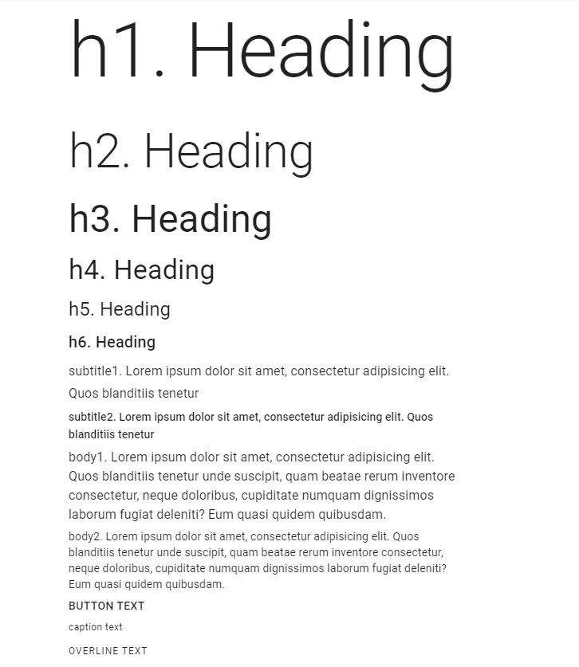

## 4. Material UI elements

### 4.1 Checkbox

```java
    // @FindBy(xpath = "//h2[text()='Basic checkboxes']/following-sibling::div/span[contains(@class,'MuiCheckbox-root')]")
    @UI("//h2[text()='Basic checkboxes']/following-sibling::div/span[contains(@class,'MuiCheckbox-root')]")
    public static List<Checkbox> basicCheckboxes;

    @Test
    public void basicCheckboxTests() {
        basicCheckboxes.forEach(this::basicCheckboxTestLogic);
    }
    
    private void basicCheckboxTestLogic(Checkbox checkbox) {
        if (checkbox.isDisabled()) {
            checkbox.is().disabled();
            if (checkbox.isChecked()) {
                checkbox.is().checked();
            } else {
                checkbox.is().unchecked();
            }
        } else {
            checkbox.is().enabled();
            if (checkbox.isUnchecked()) {
                checkbox.is().unchecked();
                checkbox.check();
                checkbox.is().checked();
            } else {
                checkbox.is().checked();
                checkbox.uncheck();
                checkbox.is().unchecked();
            }
        }
        if (checkbox.hasPrimaryColor()) {
            checkbox.has().primaryColor();
        }
        if (checkbox.hasSecondaryColor()) {
            checkbox.has().secondaryColor();
        }
        if (checkbox.isIndeterminate()) {
            checkbox.is().indeterminate();
        }
    }    
```

##### <a href="https://material-ui.com/components/checkboxes/" target="_blank"> Checkbox overview </a>

Checkbox is located in the following class:

- __Java__: _com.epam.jdi.light.material.elements.inputs.Checkbox_

__Checkbox__ - element that allows the user to select one or more items from a set. It can be used to turn an option on or off.


Here is an example with provided Material-UI v4.12.3 code:

```html
<span class="MuiButtonBase-root MuiIconButton-root jss40 MuiCheckbox-root MuiCheckbox-colorSecondary jss41 Mui-checked MuiIconButton-colorSecondary" aria-disabled="false">
  <span class="MuiIconButton-label">
    <input class="jss43" type="checkbox" data-indeterminate="false" aria-label="primary checkbox" value="" checked="">
    <svg class="MuiSvgIcon-root" focusable="false" viewBox="0 0 24 24" aria-hidden="true"></svg>
  </span>
  <span class="MuiTouchRipple-root"></span>
</span>
```
Available methods in Java JDI Light:

|Method | Description | Return Type
--- | --- | ---
**is()** | Returns object for work with assertions | CheckboxAssert
**isChecked()** | Checks whether checkbox is checked | boolean
**isUnchecked()** | Checks whether checkbox is unchecked | boolean
**check()** | Checks checkbox | void
**uncheck()** | Unchecks checkbox | void
**label()** | Returns checkboxes label | Label
**isIndeterminate()** | Checks whether checkbox is indeterminate | boolean
**getLabelPosition()** | Returns checkbox label's position (top, bottom start, end) | String

##### <a href="https://github.com/jdi-testing/jdi-light/blob/master_material_ui/jdi-light-material-ui-tests/src/test/java/io/github/epam/material/tests/inputs/CheckboxTests.java" target="_blank">Here you can find Checkbox tests</a>

<br></br>

### 4.2 Chips

```java
    // @FindBy(xpath = "//h2[text()='Chip array']/following-sibling::div//div[contains(@class, 'MuiChip-root')]")
    @UI("//h2[text()='Chip array']/following-sibling::div//div[contains(@class, 'MuiChip-root')]")
    public static List<Chip> arrayChips;
    
    @Test(dataProvider = "arrayChipsTestsDataProvider", 
            dataProviderClass = ChipDataProvider.class)
    public void arrayChipsTests(int index, String text) {
        arrayChipsTestLogic(arrayChips.get(index), text);
    }
    
    public void arrayChipsTestLogic(Chip chip, String text) {
        String clickInfoText = String.format(basicClickText + " %s", text).trim();
        chip.is().displayed();
        chip.label().has().text(text);
        chip.is().enabled();
        chip.is().clickable();
        chip.click();
        lastClickArrayInfo.has().text(clickInfoText);
        if (chip.icon().isDisplayed()) {
            chip.icon().is().displayed();
            chip.icon().click();
            lastClickArrayInfo.has().text(basicClickText);
        }
        if (chip.isDeletable()) {
            chip.is().deletable();
        }
    }
```

##### <a href="https://material-ui.com/components/chips/" target="_blank"> Chips overview </a>

Chip is located in the following class:

- __Java__: _com.epam.jdi.light.material.elements.displaydata.Chip_

__Chips__ - compact elements that represent an input, attribute, or action. Chips allow users to enter information, make selections, filter content, or trigger actions.


Here is an example with provided Material-UI v4.12.3 code:

```html
<h2>Chip array</h2>
<div>
  <ul class="MuiPaper-root jss4 MuiPaper-elevation1 MuiPaper-rounded">
    <li>
      <div class="MuiButtonBase-root MuiChip-root jss5 MuiChip-clickable MuiChip-deletable" tabindex="0" role="button">
        <span class="MuiChip-label">Angular</span>
        <svg class="MuiSvgIcon-root MuiChip-deleteIcon" focusable="false" viewBox="0 0 24 24" aria-hidden="true"></svg>
        <span class="MuiTouchRipple-root"></span>
      </div>
    </li>
    <li>
      <div class="MuiButtonBase-root MuiChip-root jss5 MuiChip-clickable MuiChip-deletable" tabindex="0" role="button">
        <span class="MuiChip-label">jQuery</span>
        <svg class="MuiSvgIcon-root MuiChip-deleteIcon" focusable="false" viewBox="0 0 24 24" aria-hidden="true"></svg>
        <span class="MuiTouchRipple-root"></span>
      </div>
    </li>
    <li>
      <div class="MuiButtonBase-root MuiChip-root jss5 MuiChip-clickable MuiChip-deletable" tabindex="0" role="button">
        <span class="MuiChip-label">Polymer</span>
        <svg class="MuiSvgIcon-root MuiChip-deleteIcon" focusable="false" viewBox="0 0 24 24" aria-hidden="true"></svg>
        <span class="MuiTouchRipple-root"></span>
      </div>
    </li>
    <li>
      <div class="MuiButtonBase-root MuiChip-root jss5 MuiChip-clickable" tabindex="0" role="button">
        <svg class="MuiSvgIcon-root MuiChip-icon" focusable="false" viewBox="0 0 24 24" aria-hidden="true"></svg>
        <span class="MuiChip-label">React</span>
        <span class="MuiTouchRipple-root"></span>
      </div>
    </li>
    <li>
      <div class="MuiButtonBase-root MuiChip-root jss5 MuiChip-clickable MuiChip-deletable" tabindex="0" role="button">
        <span class="MuiChip-label">Vue.js</span>
        <svg class="MuiSvgIcon-root MuiChip-deleteIcon" focusable="false" viewBox="0 0 24 24" aria-hidden="true"></svg>
        <span class="MuiTouchRipple-root"></span>
      </div>
    </li>
  </ul>
  <p id="lastChipArrayClickInfo">You clicked on: jQuery</p>
</div>
```

Available methods in Java JDI Light:

|Method | Description | Return Type
--- | --- | ---
**is()** | Returns object for work with assertions | ChipAssert
**has()** | Returns object for work with assertions | ChipAssert
**label()** | Returns chip's label | Label
**deleteIcon()** | Returns chip's delete icon | Icon
**avatar()** | Returns chip's avatar | Avatar
**icon()** | Returns chip's icon | Icon
**isOutlined()** | Checks whether chip is outlined | boolean
**isClickable()** | Checks whether chip is clickable | boolean
**isDeletable()** | Checks whether chip is deletable | boolean
**isLink()** | Checks whether chip is link | boolean
**getHref()** | Returns chip's href attribute | String
**delete()** | Deletes chip | void

##### <a href="https://github.com/jdi-testing/jdi-light/blob/master_material_ui/jdi-light-material-ui-tests/src/test/java/io/github/epam/material/tests/displaydata/ChipTests.java" target="_blank">Here you can find Chips tests</a>

<br></br>

### 4.3 Tooltip

```java
    // @FindBy(xpath = "//button[contains(@title, 'Add')][1]")
    @UI("//button[contains(@title, 'Add')][1]")
    public static MaterialButton addButtonWithTooltip;
    
    @Test
    public void addButtonWithTooltipTest() {
        addButtonWithTooltip.is().visible();
        addButtonWithTooltip.hover();
        addButtonWithTooltip.tooltip().is().visible();
        addButtonWithTooltip.tooltip().has().text("Add");
    }
    
    public interface HasTooltip extends ICoreElement {
        default Tooltip tooltip() {
            return new Tooltip(core());
        }
    }
```

##### <a href="https://material-ui.com/components/tooltips/" target="_blank"> Tooltip overview </a>

Tooltip is located in the following class:

- __Java__: _com.epam.jdi.light.material.elements.displaydata.Tooltip_

__Tooltips__ - elements that display informative text when users hover over, focus on, or tap an element.


Here is an example with provided Material-UI v4.12.3 code:

```html
<button class="MuiButtonBase-root MuiFab-root jss8 MuiFab-secondary" 
        tabindex="0" type="button" title="Add" aria-label="add">
  <span class="MuiFab-label">
    <svg class="MuiSvgIcon-root" focusable="false" viewBox="0 0 24 24" aria-hidden="true"></svg>
  </span>
  <span class="MuiTouchRipple-root"></span>
</button>
```

Available methods in Java JDI Light:

|Method | Description | Return Type
--- | --- | ---
**is()** | Returns object for work with assertions | TooltipAssert
**has()** | Returns object for work with assertions | TooltipAssert
**isVisible()** | Checks whether element is displayed | boolean
**isInteractive()** | Checks whether element is interactive | boolean
**getValue()** | Gets tooltip text | String

##### <a href="https://github.com/jdi-testing/jdi-light/blob/master_material_ui/jdi-light-material-ui-tests/src/test/java/io/github/epam/material/tests/displaydata/TooltipTests.java" target="_blank">Here you can find Tooltip tests</a>

<br></br>

### 4.4 Container

```java
    // @FindBy(css = ".MuiContainer-root.MuiContainer-maxWidthSm")
    @UI(".MuiContainer-root.MuiContainer-maxWidthSm")
    public static Container container;

    @Test
    public void fluidContainerTest() {
        container.has().maxWidth("600px");
        container.is().fluid();
        container.is().displayed();
        container.is().enabled();
    }
```

##### <a href="https://material-ui.com/components/container/" target="_blank"> Container overview </a>

Container is located in the following class:

- __Java__: _com.epam.jdi.light.material.elements.layout.Container_

__Container__ - the most basic layout element. It centers your content horizontally.


Here is an example with provided Material-UI v4.12.3 code:

```html
<div class="MuiContainer-root MuiContainer-maxWidthSm">
  <div class="MuiTypography-root MuiTypography-body1" style="background-color: rgb(207, 232, 252); height: 50vh;">
    Example text
  </div>
</div>
```

Available methods in Java JDI Light:

|Method | Description | Return Type
--- | --- | ---
**is()** | Returns object for work with assertions | ContainerAssert
**fixed()** | Check whether container is fixed | boolean
**fluid()** | Check whether container is fluid | boolean
**getMaxWidth()** | Returns max width of container | String


##### <a href="https://github.com/jdi-testing/jdi-light/blob/master_material_ui/jdi-light-material-ui-tests/src/test/java/io/github/epam/material/tests/layout/ContainerTests.java" target="_blank"> Here you can find Container tests </a>

<br></br>

### 4.5 Avatar

```java
    // @FindBy(xpath = "//span[@class = 'MuiBadge-root']")
    @UI("//span[@class = 'MuiBadge-root']")
    public static List<Avatar> avatarsWithPhoto;

    @Test
    public void avatarsWithPhotoTests() {
        for(Avatar avatar : avatarsWithPhoto) {
            avatar.is().displayed();
            avatar.image().is().displayed();
            avatar.badge().is().displayed();
        }
    }
```

##### <a href="https://material-ui.com/ru/components/avatars/" target="_blank"> Avatars overview </a>

Avatar is located in the following class:

- __Java__: _com.epam.jdi.light.material.elements.displaydata.Avatar_

__Avatars__ - graphical representations of users.


Here is an example with provided Material-UI v4.12.3 code:

```html
<span class="MuiBadge-root">
  <div class="MuiAvatar-root MuiAvatar-circle">
    </div>
  <span class="MuiBadge-badge jss37 MuiBadge-anchorOriginBottomRightCircle MuiBadge-dot"></span>
</span>

<span class="MuiBadge-root">
  <div class="MuiAvatar-root MuiAvatar-circle">
    </div>
  <span class="MuiBadge-badge MuiBadge-anchorOriginBottomRightCircle">
    <div class="MuiAvatar-root jss39 MuiAvatar-circle MuiAvatar-colorDefault">R</div>
  </span>
</span>
```

Available methods in Java JDI Light:

|Method | Description | Return Type
--- | --- | ---
**is()** | Returns object for work with assertions | AvatarAssert
**icon()** | Returns avatar's icon | Icon

##### <a href="https://github.com/jdi-testing/jdi-light/blob/master_material_ui/jdi-light-material-ui-tests/src/test/java/io/github/epam/material/tests/displaydata/AvatarTests.java" target="_blank">Here you can find Avatar tests</a>

<br></br>

### 4.6 Click Away Listener

```java
    // @FindBy(xpath = "//h2[text()='Portal']/preceding::button")
    @UI("//h2[text()='Portal']/preceding::button")
    public static Button exampleButton;

    // @FindBy(xpath = "//div[text()='Click me, I will stay visible until you click outside.']")
    @UI("//div[text()='Click me, I will stay visible until you click outside.']")
    public static TextArea text;

    @Test
    public void exampleClickAwayListenerTest() {
        textFieldTest(1);
    }

    private void textFieldTest(int buttonId) {
        clickAwayListenerPage.clickButton(buttonId);
        text.is().displayed();
        clickAwayListenerPage.clickButton(buttonId);
        text.is().hidden();
        clickAwayListenerPage.clickButton(buttonId);
        text.is().displayed();
        clickAwayListenerPage.clickAroundTextPopup(text.getSize().width + 1, -1);
        text.is().hidden();
        clickAwayListenerPage.clickButton(buttonId);
        clickAwayListenerPage.clickAroundButton(exampleButton.getSize().width + 1,0, buttonId);
        text.is().hidden();
    }
```

##### <a href="https://material-ui.com/ru/components/click-away-listener/" target="_blank"> Click Away Listener overview </a>

__Click Away Listener__ - element that detects if a click event happened outside an element. It listens for clicks that occur somewhere in the document.


Here is an example with provided Material-UI v4.12.3 code:

```html
<div class="jss42">
  <button type="button">Open menu dropdown</button>
  <div class="jss43">Click me, I will stay visible until you click outside.</div>
</div>
<h2>Portal</h2>
```

##### <a href="https://github.com/jdi-testing/jdi-light/blob/master_material_ui/jdi-light-material-ui-tests/src/test/java/io/github/epam/material/tests/utils/ClickAwayListenerTests.java" target="_blank">Here you can find ClickAwayListener tests</a>

<br></br>

### 4.7 Divider

```java
    // @FindBy(css = "li.MuiDivider-root")
    @UI("li.MuiDivider-root")
    public static List<Divider> insetDivider;
    
    @Test
    public void insetDividerTest() {
        insetDivider.forEach(d -> d.is().inset());
    }
```

##### <a href="https://material-ui.com/components/dividers/" target="_blank"> Divider overview </a>

Divider is located in the following class:

- __Java__: _com.epam.jdi.light.material.elements.displaydata.Divider_

__Divider__ - a thin line that groups content in lists and layouts.


Here is an example with provided Material-UI v4.12.3 code:

```html
<ul class="MuiList-root jss46 MuiList-padding">
  <li class="MuiListItem-root MuiListItem-gutters">...</li>
  <li class="MuiDivider-root MuiDivider-inset" role="separator"></li>
  <li class="MuiListItem-root MuiListItem-gutters">...</li>
  <li class="MuiDivider-root MuiDivider-inset" role="separator"></li>
  <li class="MuiListItem-root MuiListItem-gutters">...</li>
</ul>
```

Available methods in Java JDI Light:

|Method | Description | Return Type
--- | --- | ---
**is()** | Returns object for work with assertions | DividerAssert
**isInset()** | Assert inset divider | boolean
**isVertical()** | Assert vertical divider| boolean

##### <a href="https://github.com/jdi-testing/jdi-light/blob/master_material_ui/jdi-light-material-ui-tests/src/test/java/io/github/epam/material/tests/displaydata/InsetDividerTests.java" target="_blank">Here you can find Divider tests</a>

<br></br>

### 4.8 Card

```java
    // @FindBy(id = "simpleCard")
    @UI("#simpleCard")
    public static Card simpleCard;

    @Test
    public void simpleCardTest() {
        simpleCard.is().displayed();
        simpleCard.has().title("be•nev•o•lent");
        simpleCard.primaryText().has().text(containsString("a benevolent smile"));
        simpleCard.learnMoreButton().click();
    }
```

##### <a href="https://material-ui.com/components/cards/" target="_blank"> Card overview </a>

Card is located in the following class:

- __Java__: _com.epam.jdi.light.material.elements.surfaces.Card_

__Card__ - element that contains content and actions about a single subject.


Here is an example with provided Material-UI v4.12.3 code:

```html
<div class="MuiPaper-root MuiCard-root jss54 MuiPaper-elevation1 
    MuiPaper-rounded" id="simpleCard">
  <div class="MuiCardContent-root">
    <p class="MuiTypography-root jss56 MuiTypography-body1 MuiTypography-colorTextSecondary MuiTypography-gutterBottom">
      Word of the Day
    </p>
    <h2 class="MuiTypography-root MuiTypography-h5">
      be
      <span class="jss55">•</span>
      nev
      <span class="jss55">•</span>
      o
      <span class="jss55">•</span>
      lent
    </h2>
    <p class="MuiTypography-root jss57 MuiTypography-body1 MuiTypography-colorTextSecondary">
      adjective
    </p>
    <p class="MuiTypography-root MuiTypography-body2">
      well meaning and kindly.<br>a benevolent smile
    </p>
  </div>
  <div class="MuiCardActions-root MuiCardActions-spacing">
    <button class="MuiButtonBase-root MuiButton-root MuiButton-text MuiButton-textSizeSmall MuiButton-sizeSmall" tabindex="0" type="button">
      <span class="MuiButton-label">Learn More</span>
      <span class="MuiTouchRipple-root"></span>
    </button>
  </div>
</div>
```

Available methods in Java JDI Light:

|Method | Description | Return Type
--- | --- | ---
**is()** | Returns object for work with assertions | CardAssert
**actions()** | Returns element's action | UIElement
**title()** | Returns element's title | UIElement
**subtitle()** | Returns element's subtitle | UIElement

##### <a href="https://github.com/jdi-testing/jdi-light/blob/master_material_ui/jdi-light-material-ui-tests/src/test/java/io/github/epam/material/tests/surfaces/CardTests.java" target="_blank">Here you can find Card tests</a>

<br></br>

### 4.9 Radio

```java
    // @FindBy(css = "#simpleRadio .MuiRadio-root")
    @UI("#simpleRadio .MuiRadio-root")
    public static RadioButtons simpleRadioButtons;

    @Test
    public void simpleRadioTest() {
        simpleRadioButtons.has().values("First", "Second", "Third", "Disabled");
        simpleRadioButtons.has().enabled("First", "Second", "Third");
        simpleRadioButtons.has().disabled("Disabled");
        asList("First", "Second", "Third").forEach(label -> {
            simpleRadioButtons.select(label);
            simpleRadioButtons.has().selected(label);
            lastRadioText.has().text(containsString(label));
        });
    }
```

##### <a href="https://material-ui.com/components/radio-buttons/" target="_blank"> Radio overview </a>

Radio is located in the following class:

- __Java__: _com.epam.jdi.light.material.elements.inputs.RadioButtons_

__Radio buttons__ - elements that allow the user to select one option from a set.


Here is an example with provided Material-UI v4.12.3 code:

```html
<fieldset class="MuiFormControl-root" id="simpleRadio">
  <div class="MuiFormGroup-root MuiFormGroup-row" role="radiogroup" aria-label="position">
    <label class="MuiFormControlLabel-root">
      <span class="MuiButtonBase-root MuiIconButton-root jss63 MuiRadio-root MuiRadio-colorPrimary MuiIconButton-colorPrimary" aria-disabled="false">
        <span class="MuiIconButton-label">
          <input class="jss66" name="position" type="radio" value="first">
          <div class="jss67">...</div>
        </span>
        <span class="MuiTouchRipple-root"></span>
      </span>
      <span class="MuiTypography-root MuiFormControlLabel-label MuiTypography-body1">First</span>
    </label>
    
    <label class="MuiFormControlLabel-root">
      <span class="MuiButtonBase-root MuiIconButton-root jss63 MuiRadio-root MuiRadio-colorPrimary jss64 Mui-checked MuiIconButton-colorPrimary" aria-disabled="false">
        <span class="MuiIconButton-label">
          <input class="jss66" name="position" type="radio" value="second">
          <div class="jss67 jss69">...</div>
        </span>
        <span class="MuiTouchRipple-root"></span>
      </span>
      <span class="MuiTypography-root MuiFormControlLabel-label MuiTypography-body1">Second</span>
    </label>
    
    <label class="MuiFormControlLabel-root">
      <span class="MuiButtonBase-root MuiIconButton-root jss63 MuiRadio-root MuiRadio-colorPrimary MuiIconButton-colorPrimary" aria-disabled="false">
        <span class="MuiIconButton-label">
          <input class="jss66" name="position" type="radio" value="third">
          <div class="jss67">...</div>
        </span>
        <span class="MuiTouchRipple-root"></span>
      </span>
      <span class="MuiTypography-root MuiFormControlLabel-label MuiTypography-body1">Third</span>
    </label>
    
    <label class="MuiFormControlLabel-root Mui-disabled">
      <span class="MuiButtonBase-root MuiIconButton-root jss63 MuiRadio-root MuiRadio-colorPrimary jss65 Mui-disabled MuiIconButton-colorPrimary Mui-disabled Mui-disabled" tabindex="-1" aria-disabled="true">
        <span class="MuiIconButton-label">
          <input class="jss66" disabled="" name="position" type="radio" value="disabled">
          <div class="jss67">...</div>
        </span>
      </span>
      <span class="MuiTypography-root MuiFormControlLabel-label Mui-disabled MuiTypography-body1">Disabled</span>
    </label>
  </div>
  <p id="lastClickContent">You clicked Second</p>
</fieldset>
```

Available methods in Java JDI Light:

|Method | Description | Return Type
--- | --- | ---
**is()** | Returns object for work with assertions | RadioAssert
**labels()** | Returns list of labels | List<Label>
**values()** | Returns list of values | List<String>
**get(String)** | Returns radio button by value | UIElement
**select(String)** | Select radiobutton by value  | void
**selected()** | Get selected radiobutton value | String
**selected(String/index)** | Check whether specified radio button is selected | boolean
**listEnabled()** | Returns list of enabled values | List<String>
**listDisabled()** | Returns list of disabled values | List<String>

##### <a href="https://github.com/jdi-testing/jdi-light/blob/master_material_ui/jdi-light-material-ui-tests/src/test/java/io/github/epam/material/tests/inputs/RadioButtonsTests.java" target="_blank">Here you can find Radio tests</a>

<br></br>

### 4.10 App Bar

```java
    // @FindBy(xpath = "(//header[contains(@class, 'MuiAppBar-root')])[1]")
    @JAppBar(
            root = "(//header[contains(@class, 'MuiAppBar-root')])[1]",
            actionItems = {"//*[text()='News']/following-sibling::button"}
    )
    public static AppBar simpleAppBar;

    @Test
    public void simpleAppBarTest() {
        simpleAppBar.isDisplayed();
        simpleAppBar.getNavigationButton().isDisplayed();
        simpleAppBar.getNavigationButton().click();
        simpleAppBar.getTitle().has().text("News");
        simpleAppBar.getActionItems().get(1).isDisplayed();
        simpleAppBar.getActionItems().get(1).click();
    }
```

##### <a href="https://material-ui.com/components/app-bar/" target="_blank"> App Bar overview </a>

App Bar is located in the following class:

- __Java__: _com.epam.jdi.light.material.elements.surfaces.AppBar_

__App Bar__ - element that displays information and actions relating to the current screen.


Here is an example with provided Material-UI v4.12.3 code:

```html
<header class="MuiPaper-root MuiAppBar-root MuiAppBar-positionStatic MuiAppBar-colorPrimary MuiPaper-elevation4">
  <div class="MuiToolbar-root MuiToolbar-regular MuiToolbar-gutters">
    <button class="MuiButtonBase-root MuiIconButton-root jss132 MuiIconButton-colorInherit MuiIconButton-edgeStart" tabindex="0" type="button" aria-label="menu">...</button>
    <h6 class="MuiTypography-root jss133 MuiTypography-h6">News</h6>
    <button class="MuiButtonBase-root MuiButton-root MuiButton-text MuiButton-colorInherit" tabindex="0" type="button">
      <span class="MuiButton-label">Login</span>
      <span class="MuiTouchRipple-root"></span>
    </button>
  </div>
</header>
```

Available methods in Java JDI Light:

|Method | Description | Return Type
--- | --- | ---
**getNavigationButton()** | Returns the navigation button | UIElement
**getTitle()** | Returns app bar title | UIElement
**getActionItems()** | Returns action items | WebList
**getOverflowMenuButton()** | Returns menu button | UIElement
**isElevated()** | Checks whether app bar is elevated | void
**isNotElevated()** | Checks whether app bar is not elevated | void
**is()** | Returns object for work with assertions | TextAssert

##### <a href="https://github.com/jdi-testing/jdi-light/blob/master_material_ui/jdi-light-material-ui-tests/src/test/java/io/github/epam/material/tests/surfaces/AppBarTests.java" target="_blank">Here you can find AppBar tests</a>

<br></br>

### 4.11 Box

```java
    // @FindBy(className = "MuiButton-contained")
    @UI(".MuiButton-contained")
    public static Button buttonContainedBox;
    
    // @FindBy(id = "lastClickContent")
    @UI("#lastClickContent")
    public static Text lastClickContent;

    @Test
    public void containedBoxTest() {
        buttonContainedBox.is().displayed()
                .and().has().text("FIRST BUTTON")
                .and().cssClass("MuiButton-containedPrimary")
                .and().has().css("background-color", Colors.PRIMARY.rgba());
        
        buttonContainedBox.click();
        lastClickContent.has().text("You clicked First button");
    }
```

##### <a href="https://material-ui.com/components/box/" target="_blank"> Box overview </a>

__Box__ - element that serves as a wrapper component for most of the CSS utility needs.


Here is an example with provided Material-UI v4.12.3 code:

```html
<button class="MuiButtonBase-root MuiButton-root MuiButton-contained MuiButton-containedPrimary" tabindex="0" type="button">
  <span class="MuiButton-label">First button</span>
  <span class="MuiTouchRipple-root"></span>
</button>
```

##### <a href="https://github.com/jdi-testing/jdi-light/blob/master_material_ui/jdi-light-material-ui-tests/src/test/java/io/github/epam/material/tests/layout/BoxTests.java" target="_blank">Here you can find Box tests</a>

<br></br>

### 4.12 Transitions

```java
    @FindBy(xpath = "//h1[text()='Transitions']/following::div[contains(@class,'MuiCollapse-container')]")
    @UI("//h1[text()='Transitions']/following::div[contains(@class,'MuiCollapse-container')]")
    public static List<Transition> collapseFadeTransitions;

    @FindBy(xpath = "//span[contains(@class, 'MuiSwitch-switchBase')]")
    @UI("//span[contains(@class, 'MuiSwitch-switchBase')]")
    public static List<Checkbox> checkboxes;
    
    @Test
    public void collapseDisplayTest() {
        Timer timer = new Timer(2000L);

        collapseFadeTransitions.get(1).is().transitionExited(COLLAPSE);
        collapseFadeTransitions.get(2).is().transitionExited(COLLAPSE);

        checkboxes.get(1).check();

        timer.wait(() -> collapseFadeTransitions.get(1).is().transitionEntered(COLLAPSE));
        collapseFadeTransitions.get(2).is().transitionEntered(COLLAPSE);

        checkboxes.get(1).uncheck();

        timer.wait(() -> collapseFadeTransitions.get(1).is().collapseTransitionHidden(COLLAPSE));
        collapseFadeTransitions.get(1).is().transitionExited(COLLAPSE);
        collapseFadeTransitions.get(2).is().transitionExited(COLLAPSE);
    }
```

##### <a href="https://material-ui.com/components/transitions/" target="_blank"> Transitions overview </a>

Transitions is located in the following class:

- __Java__: _com.epam.jdi.light.material.elements.utils.Transition_

__Transitions__ - element that can be used to introduce some basic motion to your applications. 

It helps make a UI expressive and easy to use.


Here is an example with provided Material-UI v4.12.3 code:

```html
<span class="MuiButtonBase-root MuiIconButton-root jss152 MuiSwitch-switchBase MuiSwitch-colorSecondary" aria-disabled="false">
  <span class="MuiIconButton-label">
    <input class="jss155 MuiSwitch-input" type="checkbox" value="">
    <span class="MuiSwitch-thumb"></span>
  </span>
  <span class="MuiTouchRipple-root"></span>
</span>
<div class="MuiCollapse-container MuiCollapse-hidden" style="min-height: 0px;">
  <div class="MuiCollapse-wrapper">
    <div class="MuiCollapse-wrapperInner">
      <div class="MuiPaper-root jss149 MuiPaper-elevation4 MuiPaper-rounded">
        <svg class="jss150">...</svg>
      </div>
    </div>
  </div>
</div>
```

Available methods in Java JDI Light:

|Method | Description | Return Type
--- | --- | ---
**is()** | Returns object for work with assertions | TransitionAssert
**isCollapseTransitionEntered(String)** | Checks whether collapse transition is entered | boolean
**isCollapseTransitionHidden(String)** | Checks whether collapse transition is hidden | boolean
**isCommonTransitionEntered(String)** | Checks whether common transition is entered | boolean
**isCommonTransitionExited(String)** | Checks whether common transition is hidden | boolean

##### <a href="https://github.com/jdi-testing/jdi-light/blob/master_material_ui/jdi-light-material-ui-tests/src/test/java/io/github/epam/material/tests/utils/TransitionTests.java" target="_blank">Here you can find Transitions tests</a>

<br></br>

### 4.13 Material Icons

```java
    // @FindBy(xpath = "//h2[text()='Access Alarm']/following::*[name()='svg']")
    @UI("//h2[text()='Access Alarm']/following::*[name()='svg']")
    public static List<Icon> iconsList;

    // @FindBy(id = "miconLastClick")
    @UI("#miconLastClick")
    public static Text lastClick;

    // @FindBy(id = "miconLastHover")
    @UI("#miconLastHover")
    public static Text lastHover;

    @Test(dataProvider = "defaultMaterialIconTestDataProvider")
    public void defaultMaterialIconTest(int elNum, String elType) {

        lastClick.is().text("Last click:");
        lastHover.is().text("Last hover:");

        iconsList.get(elNum).click();
        lastClick.is().text("Last click: " + elType);
        iconsList.get(elNum).hover();
        lastHover.is().text("Last hover: " + elType);
    }
```

##### <a href="https://material-ui.com/components/material-icons/" target="_blank"> Material Icons overview </a>

__Material Icons__ - set of icons provided by npm package, @material-ui/icons, that includes the 1,100+ official Material icons converted to SvgIcon components.


Here is an example with provided Material-UI v4.12.3 code:

```html
<div>
  <h1>Material Icons</h1>
  <h2>Access Alarm</h2>
  <svg class="MuiSvgIcon-root" focusable="false" viewBox="0 0 24 24" aria-hidden="true" id="defaultAccessAlarm">...</svg>
  <svg class="MuiSvgIcon-root MuiSvgIcon-fontSizeLarge" focusable="false" viewBox="0 0 24 24" aria-hidden="true" id="largeAccessAlarm">...</svg>
  <svg class="MuiSvgIcon-root MuiSvgIcon-colorSecondary" focusable="false" viewBox="0 0 24 24" aria-hidden="true" id="secondaryAccessAlarm">...</svg>
  <p id="miconLastClick">Last click: default</p>
  <p id="miconLastHover">Last hover: large</p>
</div>
```

##### <a href="https://github.com/jdi-testing/jdi-light/blob/master_material_ui/jdi-light-material-ui-tests/src/test/java/io/github/epam/material/tests/displaydata/MaterialIconTests.java" target="_blank">Here you can find Material Icons tests</a>

<br></br>

### 4.14 Icons

```java
    // FindBy(xpath = "//div[contains(@class, 'MuiGrid-grid-xs-8')]/*[local-name()='svg']")
    @UI(".MuiGrid-grid-xs-8 > svg")
    public static List<Icon> simpleIcons;
    
    // @FindBy(id = "simpleLastClick")
    @UI("#simpleLastClick")
    public static Text simpleLastClick;

    // @FindBy(id = "simpleLastHover")
    @UI("#simpleLastHover")
    public static Text simpleLastHover;
    
    @Test(dataProviderClass = IconsDataProvider.class, 
            dataProvider = "simpleIconsTestDataProvider")
    public void simpleIconsTest(int elementIndexForHover, String resultHoverFieldText,
                                int elementIndexForClick, String resultClickFieldText) {
        simpleIcons.get(elementIndexForHover).hover();
        simpleLastHover.has().text(resultHoverFieldText);
        simpleIcons.get(elementIndexForClick).click();
        simpleLastClick.has().text(resultClickFieldText);
    }
```

##### <a href="https://material-ui.com/components/icons/" target="_blank"> Icons overview </a>

Icon is located in the following class:

- __Java__: _com.epam.jdi.light.material.elements.displaydata.Icon_

__Icon__ - element that represents a small clickable  picture.


Here is an example with provided Material-UI v4.12.3 code:

```html
<div class="MuiGrid-root MuiGrid-item MuiGrid-grid-xs-8">
  <svg class="MuiSvgIcon-root" focusable="false" viewBox="0 0 24 24" aria-hidden="true">...</svg>
  <svg class="MuiSvgIcon-root" focusable="false" viewBox="0 0 24 24" aria-hidden="true">...</svg>
</div>
```

Available methods in Java JDI Light:

|Method | Description | Return Type
--- | --- | ---
**colored()** | Check whether element is colored (not black) | boolean
**getColor()** | Get color of icon | String
**is()** | Returns object for work with assertions | IconAssert

##### <a href="https://github.com/jdi-testing/jdi-light/blob/master_material_ui/jdi-light-material-ui-tests/src/test/java/io/github/epam/material/tests/displaydata/IconsTests.java" target="_blank">Here you can find Icons tests</a>

<br></br>

### 4.15 Floating Action Button

```java
    // @FindBy(xpath = "//div[@id='basicActionBtns']/button")
    @UI("//div[@id='basicActionBtns']/button")
    public static List<Button> buttonsBasic;
    
    // @FindBy(id = "basicActionBtnsLastClick")
    @UI("#basicActionBtnsLastClick")
    public static Text labelLastClick;
    
    // @FindBy(xpath = "//button[@aria-label='add']")
    @UI("//button[@aria-label='add']")
    public static Button buttonAdd;
    
    // @FindBy(xpath = "//button[@aria-label='edit']")
    @UI("//button[@aria-label='edit']")
    public static Button buttonEdit;

    // @FindBy(xpath = "//button[contains(@class,'MuiFab-extended')]")
    @UI("//button[contains(@class,'MuiFab-extended')]")
    public static Button buttonNavigate;
    
    // @FindBy(xpath = "//button[@aria-label='like']")
    @UI("//button[@aria-label='like']")
    public static Button buttonLike;

    @Test
    public void basicButtonsTest() {
        buttonsBasic.forEach(el -> el.is().displayed());
        labelLastClick.has().text("Last click:");

        buttonAdd.is().enabled();
        buttonAdd.click();
        labelLastClick.has().text("Last click: Add");

        buttonEdit.is().enabled();
        buttonEdit.click();
        labelLastClick.has().text("Last click: Edit");

        buttonNavigate.is().enabled();
        buttonNavigate.click();
        labelLastClick.is().text("Last click: Navigate");

        buttonLike.is().disabled();
    }
```

##### <a href="https://material-ui.com/components/floating-action-button/" target="_blank"> Floating Action Button overview </a>

__Floating Action Button__ - element that appears in front of all screen content, typically as a circular shape with an icon in its center. 


Here is an example with provided Material-UI v4.12.3 code:

```html
<div class="jss182" id="basicActionBtns">
  <button class="MuiButtonBase-root MuiFab-root MuiFab-primary" tabindex="0" type="button" aria-label="add">
    <span class="MuiFab-label">
      <svg class="MuiSvgIcon-root" focusable="false" viewBox="0 0 24 24" aria-hidden="true">...</svg>
    </span>
    <span class="MuiTouchRipple-root"></span>
  </button>
  <button class="MuiButtonBase-root MuiFab-root MuiFab-secondary" tabindex="0" type="button" aria-label="edit">
    <span class="MuiFab-label">
      <svg class="MuiSvgIcon-root" focusable="false" viewBox="0 0 24 24" aria-hidden="true">...</svg>
    </span>
    <span class="MuiTouchRipple-root"></span>
  </button>
  <button class="MuiButtonBase-root MuiFab-root MuiFab-extended" tabindex="0" type="button">
    <span class="MuiFab-label">
      <svg class="MuiSvgIcon-root jss183" focusable="false" viewBox="0 0 24 24" aria-hidden="true">...</svg>
      Navigate
    </span>
    <span class="MuiTouchRipple-root"></span>
  </button>
  <button class="MuiButtonBase-root MuiFab-root Mui-disabled Mui-disabled" tabindex="-1" type="button" disabled="" aria-label="like">
    <span class="MuiFab-label">
      <svg class="MuiSvgIcon-root" focusable="false" viewBox="0 0 24 24" aria-hidden="true">...</svg>
    </span>
  </button>
</div>
```

##### <a href="https://github.com/jdi-testing/jdi-light/blob/master_material_ui/jdi-light-material-ui-tests/src/test/java/io/github/epam/material/tests/inputs/FloatingActionButtonTests.java" target="_blank">Here you can find Floating Action Button tests</a>

<br></br>

### 4.16 Hidden

```java
    // @FindBy(className = "MuiTypography-subtitle1")
    @UI(".MuiTypography-subtitle1")
    public static Text currentWidth;

    // @FindBy(className = "MuiPaper-root")
    @UI(".MuiPaper-root")
    public static WebList papers;
    
    @Test(dataProvider = "Screen Width")
    public void hiddenTestWithScreenWidthDifferentScreenWidth(int width, int size, String expectedWidth) {
        setWidth(width);
        papers.has().size(size);
        if (size > 0) {
            papers.is().displayed();
        } else {
            papers.is().hidden();
        }
        currentWidth.has().text("Current width: " + expectedWidth);
    }
```

##### <a href="https://material-ui.com/components/hidden/" target="_blank"> Hidden overview </a>

__Hidden__ - element that allows you to quickly and responsively toggle the visibility value of components and much more.


Here is an example with provided Material-UI v4.12.3 code:

```html
<div class="jss193">
  <h1>Hidden</h1>
  <h6 class="MuiTypography-root MuiTypography-subtitle1">
    Current width: sm
  </h6>
  <div class="jss194">
    <div class="MuiPaper-root jss195 MuiPaper-elevation1 MuiPaper-rounded">
      xsDown
    </div>
  </div>
</div>
```

##### <a href="https://github.com/jdi-testing/jdi-light/blob/master_material_ui/jdi-light-material-ui-tests/src/test/java/io/github/epam/material/tests/layout/HiddenTests.java" target="_blank">Here you can find Hidden tests</a>

<br></br>

### 4.17 Stepper

```java
    // @FindBy(css = "#nonLinearStepper .MuiStep-root")
    @UI("#nonLinearStepper .MuiStep-root")
    public static Stepper nonlinearStepper;

    // @FindBy(xpath = "//p[@id='activeNonLinearStep']/..//button[2]")
    @UI("//p[@id='activeNonLinearStep']/..//button[2]")
    public static MaterialButton nonlinearStepperNextButton;

    // @FindBy(xpath = "//p[@id='activeNonLinearStep']/..//button[3]")
    @UI("//p[@id='activeNonLinearStep']/..//button[3]")
    public static MaterialButton nonlinearStepperCompleteStepButton;
        
    @Test
    public void nonlinearStepperForwardTest() {
        nonlinearStepper.show();
        nonlinearStepper.is().displayed().and().has().steps(Arrays.asList(steps));

        nonlinearStepperNextButton.click();
        nonlinearStepperNextButton.click();
        nonlinearStepper.list().get(2).click();
        nonlinearStepperCompleteStepButton.click();
        
        nonlinearStepper.is().stepEnabled(1).and().stepCompleted(1);
        nonlinearStepper.is().stepEnabled(2).and().stepCompleted(2);
        nonlinearStepper.is().stepEnabled(3).and().stepIncomplete(3);
    }
```

##### <a href="https://material-ui.com/components/steppers/" target="_blank"> Stepper overview </a>

Stepper is located in the following class:

- __Java__: _com.epam.jdi.light.material.elements.navigation.Stepper_

__Stepper__ - element that allows you to convey progress through numbered steps.


Here is an example with provided Material-UI v4.12.3 code:

```html
<div class="MuiPaper-root MuiStepper-root MuiStepper-horizontal MuiPaper-elevation0" id="nonLinearStepper">
  <div class="MuiStep-root MuiStep-horizontal">
    <button class="MuiButtonBase-root MuiStepButton-root MuiStepButton-horizontal" tabindex="0" type="button">
      <span class="MuiStepLabel-root MuiStepLabel-horizontal">
        <span class="MuiStepLabel-iconContainer">
          <svg class="MuiSvgIcon-root MuiStepIcon-root MuiStepIcon-active" focusable="false" viewBox="0 0 24 24" aria-hidden="true">...</svg>
        </span>
        <span class="MuiStepLabel-labelContainer">
          <span class="MuiTypography-root MuiStepLabel-label MuiStepLabel-active MuiTypography-body2 MuiTypography-displayBlock">Step #1</span>
        </span>
      </span>
      <span class="MuiTouchRipple-root MuiStepButton-touchRipple"></span>
    </button>
  </div>
  <div class="MuiStepConnector-root MuiStepConnector-horizontal Mui-disabled">
    <span class="MuiStepConnector-line MuiStepConnector-lineHorizontal"></span>
  </div>
  <div class="MuiStep-root MuiStep-horizontal">...</div>
  <div class="MuiStepConnector-root MuiStepConnector-horizontal Mui-disabled">
    <span class="MuiStepConnector-line MuiStepConnector-lineHorizontal"></span>
  </div>
  <div class="MuiStep-root MuiStep-horizontal">...</div>
</div>
```

Available methods in Java JDI Light:

|Method | Description | Return Type
--- | --- | ---
**stepCompleted(int)** | Check whether specified step is completed | boolean
**stepEnabled(int)** | Check whether specified step is enabled | boolean
**is()** | Returns object for work with assertions | StepperAssert

##### <a href="https://github.com/jdi-testing/jdi-light/blob/master_material_ui/jdi-light-material-ui-tests/src/test/java/io/github/epam/material/tests/navigation/StepperTests.java" target="_blank">Here you can find Stepper tests</a>

<br></br>

### 4.18 Slider

```java
    // @FindBy(xpath = "//*[@id="continuous-slider"]/following-sibling::div//span[contains(@class, "MuiSlider-root")]")
    @UI("//*[@id="continuous-slider"]/following-sibling::div//span[contains(@class, "MuiSlider-root")]")
    public static Slider continuousSlider;
    
    @Test
    public void continuousSliderTest() {
        continuousSlider.is().enabled();
        continuousSlider.is().orientation("horizontal");
        continuousSlider.is().value(30);
        continuousSlider.setValue(15);
        continuousSlider.is().value(15);
        continuousSlider.moveLeft();
        continuousSlider.is().value(14);
        continuousSlider.moveRight();
        continuousSlider.is().value(15);
        continuousSlider.slideHorizontalTo(10);
        continuousSlider.is().value(10);
    }
```

##### <a href="https://material-ui.com/components/slider/" target="_blank"> Slider overview </a>

Slider is located in the following class:

- __Java__: _com.epam.jdi.light.material.elements.inputs.Slider_

__Slider__ - element that reflects a range of values along a bar, from which users may select a single value. 

It is ideal for adjusting settings such as volume, brightness, or applying image filters.


Here is an example with provided Material-UI v4.12.3 code:

```html
<p class="MuiTypography-root MuiTypography-body1 MuiTypography-gutterBottom" id="continuous-slider">Default Slider</p>
<div class="MuiGrid-root MuiGrid-container MuiGrid-spacing-xs-2">
  <div class="MuiGrid-root MuiGrid-item MuiGrid-grid-xs-true">
    <span class="MuiSlider-root MuiSlider-colorPrimary">
      <span class="MuiSlider-rail"></span>
      <span class="MuiSlider-track" style="left: 0%; width: 60%;"></span>
      <input type="hidden" value="30">
      <span class="MuiSlider-thumb MuiSlider-thumbColorPrimary" tabindex="0" role="slider" data-index="0" aria-labelledby="continuous-slider" aria-orientation="horizontal" aria-valuemax="100" aria-valuemin="0" aria-valuenow="30" style="left: 30%;"></span>
    </span>
  </div>
  <p class="MuiTypography-root MuiTypography-body1" id="continuousValue">Selected value: 30</p>
</div>
```

Available methods in Java JDI Light:

|Method | Description | Return Type
--- | --- | ---
**value()** | Get current value | int
**setValue(int)** | Set new value | void
**isDisabled()** | Checks whether slider is disabled | boolean
**orientation()** | Get orientation value | String
**slideVerticalTo(int)** | Set new value using drag-and-drop action for vertical slider | void
**slideHorizontalTo(int)** | Set new value using drag-and-drop action for horizontal slider | void
**moveRight()** | Move right to one unit using arrow key on keyboard | void
**moveLeft()** | Move left to one unit using arrow key on keyboard | void
**thumb()** | Returns slider thumb | UIElement
**track()** | Returns slider track | UIElement
**getInteger(String, WebElement, int)** | Returns integer value of specified element | int
**is()** | Returns object for work with assertions | SliderAssert

##### <a href="https://github.com/jdi-testing/jdi-light/blob/master_material_ui/jdi-light-material-ui-tests/src/test/java/io/github/epam/material/tests/inputs/SliderTests.java" target="_blank">Here you can find Slider tests</a>

<br></br>

### 4.19 Tabs

```java
    // @FindBy(css = "h2+div[1] .MuiTab-root")
    @UI("h2+div[1] .MuiTab-root")
    public static Tabs simpleTabs;
    
    @Test
    public void simpleTabTest() {
        simpleTabs.has().values(equalTo(asList("ITEM ONE", "ITEM TWO", "ITEM THREE", "ITEM FOUR", "ITEM FIVE")));
        simpleTabs.has().selected(1);
        simpleTabs.select(2);
        simpleTabs.has().selected(2);
        simpleTabs.has().disabled(4);
        simpleTabs.has().size(5);
    }
```

##### <a href="https://material-ui.com/components/Tabs/" target="_blank"> Tabs overview </a>

Tabs is located in the following class:

- __Java__: _com.epam.jdi.light.material.elements.navigation.Tabs_

__Tabs__ - elements that organize and allow navigation between groups of content that are related and at the same level of hierarchy.


Here is an example with provided Material-UI v4.12.3 code:

```html
<div aria-label="simple tabs example" class="MuiTabs-flexContainer" role="tablist">
  <button class="MuiButtonBase-root MuiTab-root MuiTab-textColorInherit Mui-selected" tabindex="0" type="button" role="tab" aria-selected="true" id="simple-tab-0" aria-controls="simple-tabpanel-0">
    <span class="MuiTab-wrapper">Item One</span>
    <span class="MuiTouchRipple-root"></span>
  </button>
  <button class="MuiButtonBase-root MuiTab-root MuiTab-textColorInherit" tabindex="-1" type="button" role="tab" aria-selected="false" id="simple-tab-1" aria-controls="simple-tabpanel-1">
    <span class="MuiTab-wrapper">Item Two</span>
    <span class="MuiTouchRipple-root"></span>
  </button>
  <button class="MuiButtonBase-root MuiTab-root MuiTab-textColorInherit" tabindex="-1" type="button" role="tab" aria-selected="false" id="simple-tab-2" aria-controls="simple-tabpanel-2">
    <span class="MuiTab-wrapper">Item Three</span>
    <span class="MuiTouchRipple-root"></span>
  </button>
  <button class="MuiButtonBase-root MuiTab-root MuiTab-textColorInherit Mui-disabled Mui-disabled" tabindex="-1" type="button" disabled="" role="tab" aria-selected="false" id="simple-tab-3" aria-controls="simple-tabpanel-3">
    <span class="MuiTab-wrapper">Item Four</span>
  </button>
  <button class="MuiButtonBase-root MuiTab-root MuiTab-textColorInherit" tabindex="-1" type="button" role="tab" aria-selected="false" id="simple-tab-4" aria-controls="simple-tabpanel-4">
    <span class="MuiTab-wrapper">Item Five</span>
    <span class="MuiTouchRipple-root"></span>
  </button>
</div>
```

Available methods in Java JDI Light:

|Method | Description | Return Type
--- | --- | ---
**is()** | Returns object for work with assertions | TabsAssert
**enabled(int)** | Check whether tab is enabled | boolean
**disabled(int)** | Check whether tab is disabled | boolean
**selected(int)** | Check whether tab is selected | boolean

##### <a href="https://github.com/jdi-testing/jdi-light/blob/master_material_ui/jdi-light-material-ui-tests/src/test/java/io/github/epam/material/tests/navigation/TabTests.java" target="_blank">Here you can find Tabs tests</a>

<br></br>

### 4.20 Table

```java
    // @FindBy(id = "basicTable")
    @UI("#basicTable")
    public static Table basicTable;
    
    @Test
    public void basicTableTest() {
        basicTable.has().columns(headElements);
        assertThat(basicTable.count(), equalTo(13));
        basicTable.getCell(1, 1).has().text("305");
    }
```

##### <a href="https://material-ui.com/components/Tables/" target="_blank"> Table overview </a>

Table is located in the following class:

- __Java__: _com.epam.jdi.light.elements.complex.table.Table_

__Table__ - element that displays sets of data.


Here is an example with provided Material-UI v4.12.3 code:

```html
<table class="MuiTable-root jss247" aria-label="simple table" id="basicTable">
  <thead class="MuiTableHead-root">
  <tr class="MuiTableRow-root MuiTableRow-head">
    <th class="MuiTableCell-root MuiTableCell-head" scope="col">Dessert (100g serving)</th>
    <th class="MuiTableCell-root MuiTableCell-head MuiTableCell-alignRight" scope="col">Calories</th>
    <th class="MuiTableCell-root MuiTableCell-head MuiTableCell-alignRight" scope="col">Fat&nbsp;(g)</th>
    <th class="MuiTableCell-root MuiTableCell-head MuiTableCell-alignRight" scope="col">Carbs&nbsp;(g)</th>
    <th class="MuiTableCell-root MuiTableCell-head MuiTableCell-alignRight" scope="col">Protein&nbsp;(g)</th>
  </tr>
  </thead>
  <tbody class="MuiTableBody-root">
  <tr class="MuiTableRow-root">
    <th class="MuiTableCell-root MuiTableCell-body" role="cell" scope="row">Cupcake</th>
    <td class="MuiTableCell-root MuiTableCell-body MuiTableCell-alignRight">305</td>
    <td class="MuiTableCell-root MuiTableCell-body MuiTableCell-alignRight">3.7</td>
    <td class="MuiTableCell-root MuiTableCell-body MuiTableCell-alignRight">67</td>
    <td class="MuiTableCell-root MuiTableCell-body MuiTableCell-alignRight">4.3</td>
  </tr>
  ...
  </tbody>
</table>
```

Available methods in Java JDI Light:

|Method | Description | Return Type
--- | --- | ---
**elements(int)** | Returns rows whose number is greater than or equal to the specified number | List<String>
**get(String)** | Returns values of the specified row | String
**is()** | Returns object for work with assertions | TableAssert

##### <a href="https://github.com/jdi-testing/jdi-light/blob/master_material_ui/jdi-light-material-ui-tests/src/test/java/io/github/epam/material/tests/displaydata/TableTests.java" target="_blank">Here you can find Tables tests</a>

<br></br>

### 4.21 Typography

```java
    // @FindBy(css = ".MuiGrid-root[3] .MuiTypography-root")
    @UI(".MuiGrid-root[3] .MuiTypography-root")
    public static List<Typography> typographyTexts;
    
    @Test
    public void typographyTextsTest() {
        typographyTexts.get(1).has().text("Head 1");

        List<String> expectedText = Arrays.asList(
                "Head 1", "Head 2", "Head 3", "Head 4", "Head 5", "Head 6",
                "Subtitle 1", "Subtitle 2", "Body 1", "Body 2",
                "BUTTON TEXT", "Caption text", "OVERLINE TEXT");

        List<String> actualTexts = typographyTexts.stream()
                .map(IsText::getText)
                .collect(Collectors.toList());

        jdiAssert(actualTexts, equalTo(expectedText));
    }
```

##### <a href="https://material-ui.com/components/typography/" target="_blank"> Typography overview </a>

__Typography__ - element that is used to present your design and content as clearly and efficiently as possible.

Typography is located in the following class:

- __Java__: _com.epam.jdi.light.material.elements.displaydata.Typography_



Here is an example with provided Material-UI v4.12.3 code:

```html
<div class="MuiGrid-root MuiGrid-item MuiGrid-grid-xs-10">
  <div class="MuiContainer-root MuiContainer-maxWidthXl">
    <div class="MuiBox-root jss271">
      <div class="jss272">
        <h2 class="MuiTypography-root MuiTypography-h1 MuiTypography-gutterBottom">Head 1</h2>
        <h2 class="MuiTypography-root MuiTypography-h2 MuiTypography-gutterBottom">Head 2</h2>
        <h3 class="MuiTypography-root MuiTypography-h3 MuiTypography-gutterBottom">Head 3</h3>
        <h4 class="MuiTypography-root MuiTypography-h4 MuiTypography-gutterBottom">Head 4</h4>
        <h5 class="MuiTypography-root MuiTypography-h5 MuiTypography-gutterBottom">Head 5</h5>
        <h6 class="MuiTypography-root MuiTypography-h6 MuiTypography-gutterBottom">Head 6</h6>
        <h6 class="MuiTypography-root MuiTypography-subtitle1 MuiTypography-gutterBottom">Subtitle 1</h6>
        <h6 class="MuiTypography-root MuiTypography-subtitle2 MuiTypography-gutterBottom">Subtitle 2</h6>
        <p class="MuiTypography-root MuiTypography-body1 MuiTypography-gutterBottom">Body 1</p>
        <p class="MuiTypography-root MuiTypography-body2 MuiTypography-gutterBottom">Body 2</p>
        <span class="MuiTypography-root MuiTypography-button MuiTypography-gutterBottom MuiTypography-displayBlock">Button text</span>
        <span class="MuiTypography-root MuiTypography-caption MuiTypography-gutterBottom MuiTypography-displayBlock">Caption text</span>
        <span class="MuiTypography-root MuiTypography-overline MuiTypography-gutterBottom MuiTypography-displayBlock">Overline text</span>
      </div>
    </div>
  </div>
</div>
```

Available methods in Java JDI Light:

|Method | Description | Return Type
--- | --- | ---
**is()** | Returns object for work with assertions | TypographyAssert
**getStyle()** | Returns style of component | TypographyStyles

##### <a href="https://github.com/jdi-testing/jdi-light/blob/master_material_ui/jdi-light-material-ui-tests/src/test/java/io/github/epam/material/tests/displaydata/TypographyTests.java" target="_blank">Here you can find Typography tests</a>

<br></br>

### 4.22 Badge

```java
    // @FindBy(css = "#primaryColorBadge .MuiBadge-badge")
    @UI("#primaryColorBadge .MuiBadge-badge")
    public static Badge primaryColorBadge;
    
    @Test
    public void simpleBadgeTest() {
        primaryColorBadge.is().displayed();
        primaryColorBadge.has().counterValue("4");
        primaryColorBadge.has().primaryColor();
        primaryColorBadge.has().position("TopRightRectangle");
    }
```

##### <a href="https://material-ui.com/ru/components/badges/" target="_blank"> Badge overview </a>

Badge is located in the following class:

- __Java__: _com.epam.jdi.light.material.elements.displaydata.Badge_

__Badge__ - element that generates a small badge to the top-right of its children.


Here is an example with provided Material-UI v4.12.3 code:

```html
<span class="MuiBadge-root" id="primaryColorBadge">
  <svg class="MuiSvgIcon-root" focusable="false" viewBox="0 0 24 24" aria-hidden="true">...</svg>
  <span class="MuiBadge-badge MuiBadge-anchorOriginTopRightRectangle MuiBadge-colorPrimary">
    4
  </span>
</span>
```

Available methods in Java JDI Light:

|Method | Description | Return Type
--- | --- | ---
**is()** | Returns object for work with assertions | BadgeAssert
**getPosition()** | Returns element's position | String
**getCounterValue()** | Returns component's value | String
**isDot()** | Shows that element is a dot | boolean
**isInvisible()** | Shows that element is invisible | boolean

##### <a href="https://github.com/jdi-testing/jdi-light/blob/master_material_ui/jdi-light-material-ui-tests/src/test/java/io/github/epam/material/tests/displaydata/BadgeTests.java" target="_blank">Here you can find Badge tests</a>

<br></br>

### 4.23 Snackbars

```java
    // @FindBy(xpath = "//span[text()='Open simple snackbar']/parent::button")
    @UI("//span[text()='Open simple snackbar']/parent::button")
    public static Button simpleSnackbarButton;

    // @FindBy(css = "[direction='up']")
    @UI("[direction='up']")
    public static Snackbar simpleSnackbar;
    
    @Test
    public void simpleSnackbarTest() {
        simpleSnackbar.is().notVisible();
        simpleSnackbarButton.click();
        simpleSnackbar.waitFor().displayed();
        simpleSnackbar.has().text("Note archived");
        simpleSnackbar.snackbarButton(UNDO).click();
        simpleSnackbar.waitFor().hidden();
        simpleSnackbar.is().notVisible();
        simpleSnackbarButton.click();
        simpleSnackbar.waitFor().displayed();
        simpleSnackbar.close();
        simpleSnackbar.is().notVisible();
    }
```

##### <a href="https://material-ui.com/components/snackbars/" target="_blank"> Snackbars overview </a>

Snackbar is located in the following class:

- __Java__: _com.epam.jdi.light.material.elements.feedback.Snackbar_

__Snackbars__ - elements that provide brief messages about app processes. The component is also known as a toast.


Here is an example with provided Material-UI v4.12.3 code:

```html
<button class="MuiButtonBase-root MuiButton-root MuiButton-text" tabindex="0" type="button">
  <span class="MuiButton-label">Open simple snackbar</span>
  <span class="MuiTouchRipple-root"></span>
</button>

<div class="MuiPaper-root MuiSnackbarContent-root MuiPaper-elevation6" role="alert" direction="up" style="opacity: 1; transform: none; transition: opacity 225ms cubic-bezier(0.4, 0, 0.2, 1) 0ms, transform 150ms cubic-bezier(0.4, 0, 0.2, 1) 0ms;">
  <div class="MuiSnackbarContent-message">Note archived</div>
  <div class="MuiSnackbarContent-action">
    <button class="MuiButtonBase-root MuiButton-root MuiButton-text MuiButton-textSecondary MuiButton-textSizeSmall MuiButton-sizeSmall" tabindex="0" type="button">
      <span class="MuiButton-label">UNDO</span>
      <span class="MuiTouchRipple-root"></span>
    </button>
    <button class="MuiButtonBase-root MuiIconButton-root MuiIconButton-colorInherit MuiIconButton-sizeSmall" tabindex="0" type="button" aria-label="close">
      <span class="MuiIconButton-label">...<span class="MuiTouchRipple-root"></span>
    </button>
  </div>
</div>
```

Available methods in Java JDI Light:

|Method | Description | Return Type
--- | --- | ---
**is()** | Returns object for work with assertions | SnackbarAssert
**snackbarButton(String)** | Returns element's button | UIElement
**text()** | Returns component's text| String
**close()** | Closes element| void
**messageType(String)** | Shows that element's message has required type| boolean
**position(String)** | Shows that element has required position| boolean

##### <a href="https://github.com/jdi-testing/jdi-light/blob/master_material_ui/jdi-light-material-ui-tests/src/test/java/io/github/epam/material/tests/feedback/SnackbarTests.java" target="_blank">Here you can find Snackbars tests</a>

<br></br>

### 4.24 Backdrop

```java
    // @FindBy(className = "MuiButton-root")
    @UI(".MuiButton-root")
    public static MaterialButton showBackdropButton;

    // @FindBy(className = "MuiBackdrop-root")
    @UI(".MuiBackdrop-root")
    public static Backdrop backdrop;

    @Test
    public void defaultBackdropTest() {
        showBackdropButton.click();
        timer.wait(() -> backdrop.is().visible());
        backdrop.core().click();
        timer.wait(() -> backdrop.is().hidden());
    }
```

##### <a href="https://material-ui.com/components/backdrop/" target="_blank"> Backdrop overview </a>

Backdrop is located in the following class:

- __Java__: _com.epam.jdi.light.material.elements.feedback.Backdrop_

__Backdrop__ - element that is used to provide emphasis on a particular element or parts of it.


Here is an example with provided Material-UI v4.12.3 code:

```html
<div class="MuiBackdrop-root jss284" aria-hidden="true" style="opacity: 1; transition: opacity 225ms cubic-bezier(0.4, 0, 0.2, 1) 0ms;">
  <div class="MuiCircularProgress-root MuiCircularProgress-indeterminate" role="progressbar" style="width: 40px; height: 40px;">
    <svg class="MuiCircularProgress-svg" viewBox="22 22 44 44">
      <circle class="MuiCircularProgress-circle MuiCircularProgress-circleIndeterminate" cx="44" cy="44" r="20.2" fill="none" stroke-width="3.6"></circle>
    </svg>
  </div>
</div>
```

Available methods in Java JDI Light:

|Method | Description | Return Type
--- | --- | ---
**is()** | Returns object for work with assertions | BackdropAssert

##### <a href="https://github.com/jdi-testing/jdi-light/blob/master_material_ui/jdi-light-material-ui-tests/src/test/java/io/github/epam/material/tests/feedback/BackdropTests.java" target="_blank">Here you can find Backdrop tests</a>

<br></br>

### 4.25 Dialog

```java
    //Button containing dialog @FindBy(xpath = "//span[text()='Open simple dialog']/parent::button")
    //Dialog @FindBy(xpath = "//div[@aria-labelledby = 'simple-dialog-title']/parent::div[contains(@class, 'MuiDialog-container')]")
    //Text reflecting last action @FindBy(id = "simpleDialogSelection")
    @JDIButtonWithDialog(root = "//span[text()='Open simple dialog']/parent::button",
              dialog = "//div[@aria-labelledby = 'simple-dialog-title']/parent::div[contains(@class, 'MuiDialog-container')]",
              actionText = "#simpleDialogSelection")
    public static ButtonWithDialog simpleDialogButton;

    @Test(dataProviderClass = DialogDataProvider.class, dataProvider = "simpleDialogDataProvider")
    public void simpleDialogTest(String titleText, int index, String text) {
        simpleDialogButton.click();
        simpleDialogButton.dialog().is().displayed();
        simpleDialogButton.dialog().title().has().text(titleText);
        simpleDialogButton.dialog().list().has().size(3);
        simpleDialogButton.dialog().list().items().get(index).has().text(text);
        simpleDialogButton.dialog().list().items().get(index).click();
        simpleDialogButton.dialog().is().hidden();
        simpleDialogButton.actionText().has()
        .text(equalToIgnoringCase("Selected: " + text.replaceAll(" ", "")));
    }
```

##### <a href="https://material-ui.com/components/dialogs/" target="_blank"> Dialog overview </a>

Dialog is located in the following class:

- __Java__: _com.epam.jdi.light.material.elements.feedback.Dialog_

__Dialog__ - element that informs users about a task and can contain critical information, require decisions, or involve multiple tasks.


Here is an example with provided Material-UI v4.12.3 code:

```html
<div class="MuiPaper-root MuiDialog-paper MuiDialog-paperScrollPaper MuiDialog-paperWidthSm MuiPaper-elevation24 MuiPaper-rounded" role="dialog" aria-labelledby="simple-dialog-title">
  <div class="MuiDialogTitle-root" id="simple-dialog-title">
    <h2 class="MuiTypography-root MuiTypography-h6">Set backup account</h2>
  </div>
  <ul class="MuiList-root MuiList-padding">
    <div class="MuiButtonBase-root MuiListItem-root MuiListItem-gutters MuiListItem-button" tabindex="0" role="button" aria-disabled="false">...</div>
    <div class="MuiButtonBase-root MuiListItem-root MuiListItem-gutters MuiListItem-button" tabindex="0" role="button" aria-disabled="false">...</div>
    <div class="MuiButtonBase-root MuiListItem-root MuiListItem-gutters MuiListItem-button" tabindex="0" role="button" aria-disabled="false">...</div>
  </ul>
</div>
```

Available methods in Java JDI Light:

|Method | Description | Return Type
--- | --- | ---
**is()** | Returns object for work with assertions | DialogAssert
**title()** | Returns element's title | Text
**list()** | Returns list of element's items | List
**textContent()** | Returns element's text content | Text
**actions()** | Returns element's action buttons | ButtonGroup
**radioButtons()** | Returns element's radio buttons | RadioButtons
**input()** | Returns element's input field | TextField
**hasScrollableContent()** | Shows that element has scrollable content | Boolean
**hasScrollableBody()** | Shows that element has scrollable body | Boolean
**close()** | Closes element | void
**confirm()** | Confirms and closes element | void
**scrollDialogBodyTo(int)** | Scrolls element to targeted position | void


##### <a href="https://github.com/jdi-testing/jdi-light/blob/master_material_ui/jdi-light-material-ui-tests/src/test/java/io/github/epam/material/tests/feedback/DialogTests.java" target="_blank">Here you can find Dialog tests</a>

<br></br>

### 4.26 Date / Time pickers

```java
    // @FindBy(xpath = "//*[@id = 'date-picker-inline-label']/parent::div")
    @UI("//*[@id = 'date-picker-inline-label']/parent::div")
    public static DateTimePicker inlineDatePicker;
    
    @Test
    public void datePickerInlineTest() {
        inlineDatePicker.has().title("Date picker inline");

        inlineDatePicker.input("10/10/2022");
        inlineDatePicker.has().text("10/10/2022");
        inlineDatePicker.selectDate("22");
        inlineDatePicker.has().text(containsString("/22/"));
    }
```

##### <a href="https://material-ui.com/components/pickers/" target="_blank"> Date / Time pickers overview </a>

DateTimePicker is located in the following class:

- __Java__: _com.epam.jdi.light.material.elements.inputs.DateTimePicker_

__Date / Time Picker__ - element that provides a simple way to select a single value from a pre-determined set.


Here is an example with provided Material-UI v4.12.3 code:

```html
<div class="MuiInputBase-root MuiInput-root MuiInput-underline MuiInputBase-formControl MuiInput-formControl MuiInputBase-adornedEnd">
  <input aria-invalid="false" id="date-picker-inline" type="text" class="MuiInputBase-input MuiInput-input MuiInputBase-inputAdornedEnd" value="08/18/2014">
  <div class="MuiInputAdornment-root MuiInputAdornment-positionEnd">
    <button class="MuiButtonBase-root MuiIconButton-root" tabindex="0" type="button" aria-label="change date">...</button>
  </div>
</div>

<div class="MuiPickersBasePicker-container">
  <div class="MuiPickersBasePicker-pickerView">
    <div>
      <div class="MuiPickersCalendarHeader-switchHeader">...</div>
      <div class="MuiPickersCalendarHeader-daysHeader">...</div>
    </div>
    <div class="MuiPickersSlideTransition-transitionContainer MuiPickersCalendar-transitionContainer">...</div>
  </div>
</div>
```

Available methods in Java JDI Light:

|Method | Description | Return Type
--- | --- | ---
**is()** | Returns object for work with assertions | DateTimePickerAssert
**selectDate(String)** | Selects required date | void
**expand()** | Expands element | void
**cancel()** | Closes element without saving changes | void
**confirm()** | Closes element with saving changes | void
**input(String)** | Sets text in element's input field | void
**title()** | Returns element's title | String
**isExpanded()** | Shows that element is expanded | boolean
**getText()** | Returns text from input field | String

##### <a href="https://github.com/jdi-testing/jdi-light/blob/master_material_ui/jdi-light-material-ui-tests/src/test/java/io/github/epam/material/tests/inputs/DateTimePickersTests.java" target="_blank">Here you can find Date/Time Pickers tests</a>

<br></br>

### 4.27 Select

```java
    // @FindBy(xpath = "//*[@id='demo-simple-select']/following-sibling::div")
    @JDropdown(root = "//*[@id='demo-simple-select']/following-sibling::div")
    public static Select simpleSelect;
  
    @Test
    public void simpleSelectTest() {
        String value = "Hansen";
        simpleSelect.expand();
        simpleSelect.is().expanded();
        simpleSelect.close();
        simpleSelect.is().collapsed();
        simpleSelect.select(value);
        simpleSelect.has().selected(value);
    }
```

##### <a href="https://material-ui.com/components/selects/" target="_blank"> Select overview </a>

Select is located in the following class:

- __Java__: _com.epam.jdi.light.material.elements.inputs.Select_

__Select__ - element that is used for collecting user provided information from a list of options.


Here is an example with provided Material-UI v4.12.3 code:

```html
<div class="MuiFormControl-root jss304">
  <label class="MuiFormLabel-root MuiInputLabel-root MuiInputLabel-formControl MuiInputLabel-animated" data-shrink="false" id="demo-simple-select">
    Simple Select
  </label>
  <div class="MuiInputBase-root MuiInput-root MuiInput-underline MuiInputBase-formControl MuiInput-formControl">
    <div class="MuiSelect-root MuiSelect-select MuiSelect-selectMenu MuiInputBase-input MuiInput-input" tabindex="0" role="button" aria-haspopup="listbox" aria-labelledby="simple-select" id="simple-select">
      <span>​</span>
    </div>
    <input aria-hidden="true" tabindex="-1" class="MuiSelect-nativeInput" value="">
    <svg class="MuiSvgIcon-root MuiSelect-icon" focusable="false" viewBox="0 0 24 24" aria-hidden="true">...</svg>
  </div>
</div>
```

Available methods in Java JDI Light:

|Method | Description | Return Type
--- | --- | ---
**is()** | Returns object for work with assertions | SelectAssert
**list()** | Returns list of options | SelectAssert
**close()** | Closes element | void
**select(String)** | Selects required value in element | void
**selected()** | Returns value of selected element | String
**getText()** | Returns value of selected element | String
**text()** | Returns value of selected element | String

##### <a href="https://github.com/jdi-testing/jdi-light/blob/master_material_ui/jdi-light-material-ui-tests/src/test/java/io/github/epam/material/tests/inputs/SelectTests.java" target="_blank">Here you can find Select tests</a>

<br></br>

### 4.28 Switch

```java
    // @FindBy(xpath = "//fieldset//span[@class='MuiSwitch-root']")
    @UI("//fieldset//span[@class='MuiSwitch-root']")
    public static List<Switch> formGroupSwitches;

    // @FindBy(xpath = "//p[contains(@class,'MuiFormHelperText-root')]")
    @UI("//p[contains(@class,'MuiFormHelperText-root')]")
    public static Text formGroupTextForm;
  
    @Test(dataProvider = "switchesWithFormGroupTestsDataProvider")
    public void switchesWithFormGroupTest(int index, String fullName) {
        formGroupTextForm.is().text("Be careful");
        switchWithLabelTestLogic(formGroupSwitches.get(index),fullName);
    }
    
    private void switchWithLabelTestLogic(Switch muiSwitch, String labelText) {
        String firstName = Arrays.stream(labelText.split(" "))
                .collect(Collectors.toList())
                .get(0)
                .toLowerCase();
        basicSwitchTestLogic(muiSwitch);
        muiSwitch.has().label();
        muiSwitch.has().labelText(labelText);
        if (muiSwitch.isTurnedOn()) {
            muiSwitch.turnOff();
        }
        muiSwitch.turnOn();
        formGroupTextForm.is().text(String.format("Be careful with %s", firstName));
    }
```

##### <a href="https://material-ui.com/components/switches/" target="_blank"> Switch overview </a>

Switch is located in the following class:

- __Java__: _com.epam.jdi.light.material.elements.inputs.Switch_

__Switch__ - element that toggles the state of a single setting on or off.


Here is an example with provided Material-UI v4.12.3 code:

```html
<fieldset class="MuiFormControl-root">
  <legend class="MuiFormLabel-root">Assign responsibility</legend>
  <div class="MuiFormGroup-root">
    <label class="MuiFormControlLabel-root">
      <span class="MuiSwitch-root">
        <span class="MuiButtonBase-root MuiIconButton-root jss326 MuiSwitch-switchBase MuiSwitch-colorSecondary jss327 Mui-checked" aria-disabled="false">
          <span class="MuiIconButton-label">
            <input class="jss329 MuiSwitch-input" name="gilad" type="checkbox" value="" checked="">
            <span class="MuiSwitch-thumb"></span>
          </span>
          <span class="MuiTouchRipple-root"></span>
        </span>
        <span class="MuiSwitch-track"></span>
      </span>
      <span class="MuiTypography-root MuiFormControlLabel-label MuiTypography-body1">Gilad Gray</span>
    </label>
    <label class="MuiFormControlLabel-root">
      <span class="MuiSwitch-root">...</span>
      <span class="MuiTypography-root MuiFormControlLabel-label MuiTypography-body1">Jason Killian</span>
    </label>
    <label class="MuiFormControlLabel-root">
      <span class="MuiSwitch-root">...</span>
    <span class="MuiTypography-root MuiFormControlLabel-label MuiTypography-body1">Antoine Llorca</span></label></div>
  <p class="MuiFormHelperText-root">Be careful </p>
</fieldset>
```

Available methods in Java JDI Light:

|Method | Description | Return Type
--- | --- | ---
**is()** | Returns object for work with assertions | SwitchAssert
**has()** | Returns object for work with assertions | SwitchAssert
**isTurnedOn()** | Shows that element turned on | boolean
**isTurnedOff()** | Shows that element turned off | boolean
**turnOn()** | Turns element on | void
**turnOff()** | Turns element off | void
**label()** | Returns element's label | Label
**labelText()** | Returns label's text | String

##### <a href="https://github.com/jdi-testing/jdi-light/blob/master_material_ui/jdi-light-material-ui-tests/src/test/java/io/github/epam/material/tests/inputs/SwitchTests.java" target="_blank">Here you can find Switch tests</a>

<br></br>

### 4.29 Button

```java
    // @FindBy(xpath = "//h2[text()='Contained buttons']/parent::div/div[1]/*")
    @UI("//h2[text()='Contained buttons']/parent::div/div[1]/*")
    public static List<Button> containedButtons;

    @Test
    public void defaultButtonTest() {
        containedButtons.get(1).click();
        containedButtons.get(1).is().text("DEFAULT");
        containedButtons.get(6).is().text("Last click: Default");

        containedButtons.get(2).click();
        containedButtons.get(2).is().text("PRIMARY");
        containedButtons.get(6).is().text("Last click: Primary");

        containedButtons.get(3).click();
        containedButtons.get(3).is().text("SECONDARY");
        containedButtons.get(6).is().text("Last click: Secondary");
    }
```

##### <a href="https://material-ui.com/components/buttons/" target="_blank"> Button overview </a>

Button is located in the following class:

- __Java__: _com.epam.jdi.light.ui.html.elements.common.Button_

__Button__ - element that allows users to take actions and make choices with a single tap.


Here is an example with provided Material-UI v4.12.3 code:

```html
<h2>Contained buttons</h2>
<div class="jss331">
  <button class="MuiButtonBase-root MuiButton-root MuiButton-contained" tabindex="0" type="button">
    <span class="MuiButton-label">Default</span>
    <span class="MuiTouchRipple-root"></span>
  </button>
</div>
```

Available methods in Java JDI Light:

|Method | Description | Return Type
--- | --- | ---
**is()** | Returns object for work with assertions | TextAssert
**getValue()** | Returns button text | String

##### <a href="https://github.com/jdi-testing/jdi-light/blob/master_material_ui/jdi-light-material-ui-tests/src/test/java/io/github/epam/material/tests/inputs/ButtonTests.java" target="_blank">Here you can find Buttons tests</a>

<br></br>

### 4.30 ButtonGroup

```java
    //      @FindBy(xpath = "//div[@aria-label = 'outlined primary button group']")
    @UI("//div[@aria-label = 'outlined primary button group']")
    @JDIButtonGroup(list = ".MuiButtonGroup-groupedHorizontal")
    public static ButtonGroup basicButtonGroup;

    //      @FindBy(xpath = "//div[@aria-label = 'vertical contained primary button group']")
    @UI("//div[@aria-label = 'vertical contained primary button group']")
    @JDIButtonGroup(list = ".MuiButton-root")
    public static ButtonGroup verticalButtonGroup;
```

```java
    @Test
    public void basicButtonGroupTest(){

        basicButtonGroup.getButtonByIndex(1).click();
        basicButtonGroup.getButtonByIndex(2).click();
        basicButtonGroup.getButtonByIndex(3).click();

        basicButtonGroup.getButtonByText("Three").click();
        basicButtonGroup.getButtonByText("Two").click();
        basicButtonGroup.getButtonByText("One").click();

        basicButtonGroup.getButtonByIndex(1).is().enabled();
        basicButtonGroup.getButtonByIndex(1).has().text("ONE");

        basicButtonGroup.has().numberOfGroupedButtons(3);
        basicButtonGroup.has().buttonsTextsInAnyOrder(Arrays.asList("THREE","ONE","TWO"));
    }

    @Test
    public void verticalButtonGroupTest(){

        verticalButtonGroup.getButtonByIndex(2).click();
        verticalButtonGroup.getButtonByIndex(3).click();

        verticalButtonGroup.getButtonByText("Two").click();
        verticalButtonGroup.getButtonByText("One").click();

        basicButtonGroup.getButtonByIndex(2).is().enabled();
        basicButtonGroup.getButtonByIndex(2).has().text("TWO");
    }
```

##### <a href="https://material-ui.com/components/button-group/" target="_blank">ButtonGroup overview</a>

ButtonGroup is located in the following class:

- __Java__: _com.epam.jdi.light.material.elements.inputs.ButtonGroup_

__ButtonGroup__ - element that represents a group of clickable button. The ButtonGroup component can be used to group
related buttons.


Here are examples with provided MaterialUI v4.12.3 code:

```html

<div role="group" class="MuiButtonGroup-root" aria-label="outlined primary button group">
  <button
    class="MuiButtonBase-root MuiButton-root MuiButton-outlined MuiButtonGroup-grouped MuiButtonGroup-groupedHorizontal MuiButtonGroup-groupedOutlined MuiButtonGroup-groupedOutlinedHorizontal MuiButtonGroup-groupedOutlinedPrimary MuiButton-outlinedPrimary"
    tabindex="0" type="button">
    <span class="MuiButton-label">One</span>
    <span class="MuiTouchRipple-root"></span>
  </button>
  <button
    class="MuiButtonBase-root MuiButton-root MuiButton-outlined MuiButtonGroup-grouped MuiButtonGroup-groupedHorizontal MuiButtonGroup-groupedOutlined MuiButtonGroup-groupedOutlinedHorizontal MuiButtonGroup-groupedOutlinedPrimary MuiButton-outlinedPrimary"
    tabindex="0" type="button">
    <span class="MuiButton-label">Two</span>
    <span class="MuiTouchRipple-root"></span>
  </button>
  <button
    class="MuiButtonBase-root MuiButton-root MuiButton-outlined MuiButtonGroup-grouped MuiButtonGroup-groupedHorizontal MuiButtonGroup-groupedOutlined MuiButtonGroup-groupedOutlinedHorizontal MuiButtonGroup-groupedOutlinedPrimary MuiButton-outlinedPrimary"
    tabindex="0" type="button">
    <span class="MuiButton-label">Three</span>
    <span class="MuiTouchRipple-root"></span>
  </button>
</div>
```
```html
<div role="group" class="MuiButtonGroup-root MuiButtonGroup-contained MuiButtonGroup-vertical" aria-label="vertical contained primary button group">
  <button class="MuiButtonBase-root MuiButton-root MuiButton-contained MuiButtonGroup-grouped MuiButtonGroup-groupedVertical MuiButtonGroup-groupedContained MuiButtonGroup-groupedContainedVertical MuiButtonGroup-groupedContainedPrimary MuiButton-containedPrimary" tabindex="0" type="button">
    <span class="MuiButton-label">One</span>
    <span class="MuiTouchRipple-root"></span>
  </button>
  <button class="MuiButtonBase-root MuiButton-root MuiButton-contained MuiButtonGroup-grouped MuiButtonGroup-groupedVertical MuiButtonGroup-groupedContained MuiButtonGroup-groupedContainedVertical MuiButtonGroup-groupedContainedPrimary MuiButton-containedPrimary" tabindex="0" type="button">
    <span class="MuiButton-label">Two</span>
    <span class="MuiTouchRipple-root"></span>
  </button>
  <button class="MuiButtonBase-root MuiButton-root MuiButton-contained MuiButtonGroup-grouped MuiButtonGroup-groupedVertical MuiButtonGroup-groupedContained MuiButtonGroup-groupedContainedVertical MuiButtonGroup-groupedContainedPrimary MuiButton-containedPrimary" tabindex="0" type="button">
    <span class="MuiButton-label">Three</span>
    <span class="MuiTouchRipple-root"></span>
  </button>
</div>
```

Available methods in Java JDI Light:

|Method | Description | Return Type
| --- | --- | ---
**is()** | Returns object for work with assertions | ButtonGroupAssert
**getButtonByIndex(int)** | Get button by index | MaterialButton
**getButtonByText(String)** | Get button by text | MaterialButton
**getAllButtons()**        | Get all buttons in a block | Collection\<MaterialButton\>

##### <a href="https://github.com/jdi-testing/jdi-light/blob/master_material_ui/jdi-light-material-ui-tests/src/test/java/io/github/epam/material/tests/inputs/ButtonGroupTests.java" target="_blank">Here you can find Button group tests</a>

<br></br>

### 4.31 Grid

```java
    // @FindBy(className = "MuiContainer-root")
    @UI(".MuiContainer-root")
    public static Grid rootGrid;

    // @FindBy(id = "basicGrid")
    @UI("#basicGrid")
    public static Grid basicGrid;

    // @FindBy(id = "complexGrid")
    @UI("#complexGrid")
    public static Grid complexGrid;

    @Test(dataProvider = "basicGridItems")
    public void basicGridItemsTest(int itemIndex, String itemWidth, String itemClass) {
        rootGrid.is().displayed()
                .and().has().cssClass("MuiContainer-maxWidthXl");
        basicGrid.show();
        basicGrid.is().displayed()
                .and().has().items(7);
        
        basicGrid.items().get(itemIndex)
                .has().cssClass(itemClass)
                .and().css("max-width", itemWidth);
    }

    @DataProvider
    public Object[][] basicGridItems() {
        return new Object[][]{
                {1, "100%", "MuiGrid-grid-xs-12"},
                {2, "50%", "MuiGrid-grid-xs-6"},
                {3, "50%", "MuiGrid-grid-xs-6"},
                {4, "25%", "MuiGrid-grid-xs-3"},
                {5, "25%", "MuiGrid-grid-xs-3"},
                {6, "25%", "MuiGrid-grid-xs-3"},
                {7, "25%", "MuiGrid-grid-xs-3"},
        };
    }
```

##### <a href="https://material-ui.com/components/grid/" target="_blank"> Grid overview </a>

Grid is located in the following class:

- __Java__: _com.epam.jdi.light.material.elements.layout.Grid_

__The grid__ adapts to screen size and orientation, creates visual consistency between layouts while allowing flexibility across a wide variety of designs.


Here is an example with provided MaterialUI v4.12.3 code:

```html
<div class="MuiGrid-root MuiGrid-container MuiGrid-spacing-xs-3" id="basicGrid">
  <div class="MuiGrid-root MuiGrid-item MuiGrid-grid-xs-12">
    <div class="MuiPaper-root jss6 MuiPaper-elevation1 MuiPaper-rounded">xs=12</div>
  </div>
  <div class="MuiGrid-root MuiGrid-item MuiGrid-grid-xs-6">
    <div class="MuiPaper-root jss6 MuiPaper-elevation1 MuiPaper-rounded">xs=6</div>
  </div>
  <div class="MuiGrid-root MuiGrid-item MuiGrid-grid-xs-6">
    <div class="MuiPaper-root jss6 MuiPaper-elevation1 MuiPaper-rounded">xs=6</div>
  </div>
  <div class="MuiGrid-root MuiGrid-item MuiGrid-grid-xs-3">
    <div class="MuiFormControl-root MuiTextField-root jss6">
      <div class="MuiInputBase-root MuiInput-root MuiInput-underline MuiInputBase-formControl MuiInput-formControl">
        <input aria-invalid="false" type="text" class="MuiInputBase-input MuiInput-input" value="xs=31">
      </div>
    </div>
  </div>
  <div class="MuiGrid-root MuiGrid-item MuiGrid-grid-xs-3">
    <div class="MuiFormControl-root MuiTextField-root jss6">
      <div class="MuiInputBase-root MuiInput-root MuiInput-underline MuiInputBase-formControl MuiInput-formControl">
        <input aria-invalid="false" type="text" class="MuiInputBase-input MuiInput-input" value="xs=32">
      </div>
    </div>
  </div>
  <div class="MuiGrid-root MuiGrid-item MuiGrid-grid-xs-3">
    <div class="MuiFormControl-root MuiTextField-root jss6">
      <div class="MuiInputBase-root MuiInput-root MuiInput-underline MuiInputBase-formControl MuiInput-formControl">
        <input aria-invalid="false" type="text" class="MuiInputBase-input MuiInput-input" value="xs=33">
      </div>
    </div>
  </div>
  <div class="MuiGrid-root MuiGrid-item MuiGrid-grid-xs-3">
    <div class="MuiFormControl-root MuiTextField-root jss6">
      <div class="MuiInputBase-root MuiInput-root MuiInput-underline MuiInputBase-formControl MuiInput-formControl">
        <input aria-invalid="false" type="text" class="MuiInputBase-input MuiInput-input" value="xs=34">
      </div>
    </div>
  </div>
</div>
```

Available methods in Java JDI Light:

|Method | Description | Return Type
--- | --- | ---
**is()** | Returns object for work with assertions | GridAssert
**items()** | Returns list of items in grid | WebList

##### <a href="https://github.com/jdi-testing/jdi-light/blob/master_material_ui/jdi-light-material-ui-tests/src/test/java/io/github/epam/material/tests/layout/GridTests.java" target="_blank">Here you can find Grid tests</a>

<br></br>

### 4.32 GridList

```java 
     // @FindBy(css = ".MuiGridList-root.jss5")
     @UI(".MuiGridList-root.jss5")
     public static GridList singleLineGridList;
    
     @Test
     public static void singleLineGridTest() {
        singleLineGridList.has().size(5);
        singleLineGridList.has().image(3).and().altImgName(3, HATS);
        singleLineGridList.has().image(4).and().altImgName(4, BIKE);
        singleLineGridList.has().title(5, CAMERA);
    }
```

##### <a href="https://v3.mui.com/demos/grid-list/" target="_blank"> GridList overview </a>

GridList is located in the following class:

- __Java__: _com.epam.jdi.light.material.elements.layout.GridList_

__The Grid List__ - list of Material UI Grid elements.


Here is an example with provided MaterialUI v4.12.3 code:

```html

<div class="jss26">
  <ul class="MuiGridList-root jss27" style="margin: -2px;">
    <li class="MuiGridListTile-root" style="width: 40%; height: 184px; padding: 2px;">
      <div class="MuiGridListTile-tile">
        
        <div class="MuiGridListTileBar-root jss29 MuiGridListTileBar-titlePositionBottom">
          <div class="MuiGridListTileBar-titleWrap MuiGridListTileBar-titleWrapActionPosRight">
            <div class="MuiGridListTileBar-title jss28">coffee</div>
          </div>
          <div class="MuiGridListTileBar-actionIcon">
            <button class="MuiButtonBase-root MuiIconButton-root" tabindex="0" type="button" aria-label="star coffee">
              <span class="MuiIconButton-label"></span>
              <span class="MuiTouchRipple-root"></span>
            </button>
          </div>
        </div>
      </div>
    </li>
    <li class="MuiGridListTile-root" style="width: 40%; height: 184px; padding: 2px;">
      <div class="MuiGridListTile-tile">
        
        <div class="MuiGridListTileBar-root jss29 MuiGridListTileBar-titlePositionBottom">
          <div class="MuiGridListTileBar-titleWrap MuiGridListTileBar-titleWrapActionPosRight">
            <div class="MuiGridListTileBar-title jss28">fern</div>
          </div>
          <div class="MuiGridListTileBar-actionIcon">
            <button class="MuiButtonBase-root MuiIconButton-root" tabindex="0" type="button" aria-label="star fern">
              <span class="MuiIconButton-label"></span>
              <span class="MuiTouchRipple-root"></span>
            </button>
          </div>
        </div>
      </div>
    </li>
    <li class="MuiGridListTile-root" style="width: 40%; height: 184px; padding: 2px;">
      <div class="MuiGridListTile-tile">
        
        <div class="MuiGridListTileBar-root jss29 MuiGridListTileBar-titlePositionBottom">
          <div class="MuiGridListTileBar-titleWrap MuiGridListTileBar-titleWrapActionPosRight">
            <div class="MuiGridListTileBar-title jss28">hats</div>
          </div>
          <div class="MuiGridListTileBar-actionIcon">
            <button class="MuiButtonBase-root MuiIconButton-root" tabindex="0" type="button" aria-label="star hats">
              <span class="MuiIconButton-label"></span>
              <span class="MuiTouchRipple-root"></span>
            </button>
          </div>
        </div>
      </div>
    </li>
    <li class="MuiGridListTile-root" style="width: 40%; height: 184px; padding: 2px;">
      <div class="MuiGridListTile-tile">
        
        <div class="MuiGridListTileBar-root jss29 MuiGridListTileBar-titlePositionBottom">
          <div class="MuiGridListTileBar-titleWrap MuiGridListTileBar-titleWrapActionPosRight">
            <div class="MuiGridListTileBar-title jss28">bike</div>
          </div>
          <div class="MuiGridListTileBar-actionIcon">
            <button class="MuiButtonBase-root MuiIconButton-root" tabindex="0" type="button" aria-label="star bike">
              <span class="MuiIconButton-label"></span>
              <span class="MuiTouchRipple-root"></span>
            </button>
          </div>
        </div>
      </div>
    </li>
    <li class="MuiGridListTile-root" style="width: 40%; height: 184px; padding: 2px;">
      <div class="MuiGridListTile-tile">
        
        <div class="MuiGridListTileBar-root jss29 MuiGridListTileBar-titlePositionBottom">
          <div class="MuiGridListTileBar-titleWrap MuiGridListTileBar-titleWrapActionPosRight">
            <div class="MuiGridListTileBar-title jss28">camera</div>
          </div>
          <div class="MuiGridListTileBar-actionIcon">
            <button class="MuiButtonBase-root MuiIconButton-root" tabindex="0" type="button" aria-label="star camera">
              <span class="MuiIconButton-label"></span>
              <span class="MuiTouchRipple-root"></span>
            </button>
          </div>
        </div>
      </div>
    </li>
  </ul>
</div>
```

Available methods in Java JDI Light:

|Method | Description | Return Type
--- | --- | ---
**is()** | Returns object for work with assertions| GridListAssert
**hasImage(int)** | Shows that required element has image| boolean
**getAltImgName(int)** | Returns required element's image alternative name| String
**getTitle(int)** | Returns required element's title | String

##### <a href="https://github.com/jdi-testing/jdi-light/blob/master_material_ui/jdi-light-material-ui-tests/src/test/java/io/github/epam/material/tests/layout/GridListTests.java" target="_blank">Here you can find GridList tests</a>

<br></br>

### 4.33 Drawer

```java  
    //root - @FindBy(xpath = "//span[text() = 'left']/parent::button")
    //drawer - @FindBy(css = ".MuiDrawer-paperAnchorLeft")
    @JDIButtonWithDrawer(
            root = "//span[text() = 'left']/parent::button",
            drawer = ".MuiDrawer-paperAnchorLeft"
    )
    public static ButtonWithDrawer leftDrawerButton;
    
    //@FindBy(css = ".MuiDrawer-paper")
    @UI(".MuiDrawer-paper")
    public static Drawer clippedDrawer;

    @Test
    public void leftTemporaryDrawerTest() {
        leftDrawerButton.click();
        leftDrawerButton.drawer().is().displayed();
        leftDrawerButton.drawer().has().position("left");
        leftDrawerButton.drawer().has().width(250);
        leftDrawerButton.drawer().close();
        leftDrawerButton.drawer().is().notExist();
    }
    
    @Test
    public void clippedDrawerTest() {
        clippedDrawer.is().displayed();
        clippedDrawer.has().position("left");
        clippedDrawer.has().width(240);
        clippedDrawer.has().numberOfListItems(7);
        clippedDrawer.topList().has().size(4);
        clippedDrawer.topList().items().get(1).has().text("Starred");
        clippedDrawer.topList().items().get(0).icon().is().displayed();
        clippedDrawer.bottomList().has().size(3);
        clippedDrawer.bottomList().items().get(2).has().text("Spam");
        clippedDrawer.bottomList().items().get(1).icon().is().displayed();
    }
```

##### <a href="https://material-ui.com/components/drawers/" target="_blank"> Drawer overview</a>

Drawer is located in the following class:

- __Java__: _com.epam.jdi.light.material.elements.navigation.Drawer_

Navigation __drawers__ provide access to destinations in your app. Side sheets are surfaces containing supplementary
content that are anchored to the left or right edge of the screen.


Here is an example with provided MaterialUI v4.12.3 code:

```html

<div class="MuiPaper-root MuiDrawer-paper MuiDrawer-paperAnchorLeft MuiPaper-elevation16" tabindex="-1"
     style="transform: none; transition: transform 225ms cubic-bezier(0, 0, 0.2, 1) 0ms;">
  <div class="jss34" role="presentation">
    <ul class="MuiList-root MuiList-padding">
      <div class="MuiButtonBase-root MuiListItem-root MuiListItem-gutters MuiListItem-button" tabindex="0" role="button"
           aria-disabled="false">
        <div class="MuiListItemIcon-root"></div>
        <div class="MuiListItemText-root"></div>
        <span class="MuiTouchRipple-root"></span>
      </div>
      <div class="MuiButtonBase-root MuiListItem-root MuiListItem-gutters MuiListItem-button" tabindex="0" role="button"
           aria-disabled="false">
        <div class="MuiListItemIcon-root"></div>
        <div class="MuiListItemText-root"></div>
        <span class="MuiTouchRipple-root"></span>
      </div>
      <div class="MuiButtonBase-root MuiListItem-root MuiListItem-gutters MuiListItem-button" tabindex="0" role="button"
           aria-disabled="false">
        <div class="MuiListItemIcon-root"></div>
        <div class="MuiListItemText-root"></div>
        <span class="MuiTouchRipple-root"></span>
      </div>
      <div class="MuiButtonBase-root MuiListItem-root MuiListItem-gutters MuiListItem-button" tabindex="0" role="button"
           aria-disabled="false">
        <div class="MuiListItemIcon-root"></div>
        <div class="MuiListItemText-root"></div>
        <span class="MuiTouchRipple-root"></span>
      </div>
    </ul>
    <hr class="MuiDivider-root">
    <ul class="MuiList-root MuiList-padding">
      <div class="MuiButtonBase-root MuiListItem-root MuiListItem-gutters MuiListItem-button" tabindex="0" role="button"
           aria-disabled="false">
        <div class="MuiListItemIcon-root"></div>
        <div class="MuiListItemText-root"></div>
        <span class="MuiTouchRipple-root"></span>
      </div>
      <div class="MuiButtonBase-root MuiListItem-root MuiListItem-gutters MuiListItem-button" tabindex="0" role="button"
           aria-disabled="false">
        <div class="MuiListItemIcon-root"></div>
        <div class="MuiListItemText-root"></div>
        <span class="MuiTouchRipple-root"></span>
      </div>
      <div class="MuiButtonBase-root MuiListItem-root MuiListItem-gutters MuiListItem-button" tabindex="0" role="button"
           aria-disabled="false">
        <div class="MuiListItemIcon-root"></div>
        <div class="MuiListItemText-root"></div>
        <span class="MuiTouchRipple-root"></span>
      </div>
    </ul>
  </div>
</div>
```

Available methods in Java JDI Light:

|Method | Description | Return Type
--- | --- | ---
**is()** | Returns object for work with assertions | DrawerAssert
**listItems()** | Returns List of element's list items | List
**lists()** | Returns List of element's Material UI Lists | List
**topList()** | Returns Material UI List at the top of the element | List
**bottomList()** | Returns Material UI List at the bottom of the element | List
**getWidth()** | Returns element's width | String
**getPosition()** | Returns element's position | String
**isHidden()** | Shows that element is hidden | boolean
**close()** | Closes element | void

##### <a href="https://github.com/jdi-testing/jdi-light/blob/Material-UI/jdi-light-material-ui-tests/src/test/java/io/github/epam/material/tests/navigation/DrawerTests.java" target="_blank">Here you can find Drawer tests</a>

<br></br>

### 4.34 Breadcrumbs

```java 
    //       @FindBy(css = ".MuiBreadcrumbs-root")
    @JDIBreadcrumbs(root = ".MuiBreadcrumbs-root")
    public static Breadcrumbs routerBreadcrumbs;
    
```

You can specify locators for the root, items and separators
explicitly through a `JDIBreadcrumbs` annotation:

```java    
    @JDIBreadcrumbs(
          root = ".MuiBreadcrumbs-root[1]",
          items = ".MuiBreadcrumbs-li .MuiTypography-root",
          separators = ".MuiBreadcrumbs-separator"
    )
    public static Breadcrumbs simpleBreadcrumbs;
 ```

```java   
    @Test
    public void routerIntegrationBreadcrumbsTest() {
        routerBreadcrumbs.has().values("Home", "Inbox");
        mailBoxList.get("Important").click();
        routerBreadcrumbs.has().values("Home", "Inbox", "Important");
        mailBoxList.get("Trash").click();
        routerBreadcrumbs.has().values("Home", "Trash");
        mailBoxList.get("Spam").click();
        routerBreadcrumbs.has().values("Home", "Spam");
        mailBoxList.get("Inbox").click();
        routerBreadcrumbs.has().values("Home", "Inbox");
    }
    
    @Test
    public void simpleBreadcrumbsTest() {
        simpleBreadcrumbs.has().values("Material-UI", "Core", "Breadcrumb");

        simpleBreadcrumbs.get("Material-UI").has().attr("href", containsString("#materialUI"));
        simpleBreadcrumbs.get("Material-UI").click();
        jdiAssert(simpleBreadcrumbsPage.driver().getCurrentUrl(), endsWith("#materialUI"));

        simpleBreadcrumbs.get("Core").has().attr("href", endsWith("#core"));
        simpleBreadcrumbs.get("Core").click();
        jdiAssert(simpleBreadcrumbsPage.driver().getCurrentUrl(), endsWith("#core"));

        simpleBreadcrumbs.separators().foreach(separator -> separator.has().text("/"));
    }
```

##### <a href="https://material-ui.com/components/Breadcrumbs/" target="_blank"> Breadcrumbs overview </a>

Breadcrumbs is located in the following class:

- __Java__: _com.epam.jdi.light.material.elements.navigation.Breadcrumbs_

__Breadcrumbs__ allow users to make selections from a range of values.


Here is an example with provided MaterialUI v4.12.3 code:

```html

<nav class="MuiTypography-root MuiBreadcrumbs-root MuiTypography-body1 MuiTypography-colorTextSecondary"
     aria-label="breadcrumb">
  <ol class="MuiBreadcrumbs-ol">
    <li class="MuiBreadcrumbs-li">
      <a class="MuiTypography-root MuiLink-root MuiLink-underlineHover MuiTypography-colorInherit" href="#materialUI">Material-UI</a>
    </li>
    <li aria-hidden="true" class="MuiBreadcrumbs-separator">/</li>
    <li class="MuiBreadcrumbs-li">
      <a class="MuiTypography-root MuiLink-root MuiLink-underlineHover MuiTypography-colorInherit" href="#core">Core</a>
    </li>
    <li aria-hidden="true" class="MuiBreadcrumbs-separator">/</li>
    <li class="MuiBreadcrumbs-li">
      <p class="MuiTypography-root MuiTypography-body1 MuiTypography-colorTextPrimary">Breadcrumb</p>
    </li>
  </ol>
</nav>
```

Available methods in Java JDI Light:

|Method | Description | Return Type
--- | --- | ---
**list()** | Returns element's list | WebList
**separators()** | Returns element's separator list | WebList

##### <a href="https://github.com/jdi-testing/jdi-light/blob/master_material_ui/jdi-light-material-ui-tests/src/test/java/io/github/epam/material/tests/navigation/SimpleBreadcrumbsTests.java" target="_blank">Here</a> and <a href="https://github.com/jdi-testing/jdi-light/blob/master_material_ui/jdi-light-material-ui-tests/src/test/java/io/github/epam/material/tests/navigation/RouterBreadcrumbsTests.java" target="_blank">here you can find Breadcrumbs tests</a>

<br></br>

### 4.35 Bottom Navigation

```java
    //    @FindBy(css = ".MuiBottomNavigationAction-root")
    @UI(".MuiBottomNavigationAction-root")
    public static BottomNavigation bottomNavigationItems;

    @Test
    public void defaultBottomNavigationTest(){
        bottomNavigationItems.select(2);
        bottomNavigationItems.has().selected(2);
    }
```

##### <a href="https://material-ui.com/components/bottom-navigation/" target="_blank"> BottomNavigation overview </a>

BottomNavigation is located in the following class:

- __Java__: _com.epam.jdi.light.material.elements.navigation.BottomNavigation_

__Bottom navigation__ bars allow movement between primary destinations in an app.


Here is an example with provided MaterialUI v4.12.3 code:

```html

<div class="MuiBottomNavigation-root jss44">
  <button class="MuiButtonBase-root MuiBottomNavigationAction-root Mui-selected" tabindex="0" type="button">
    <span class="MuiBottomNavigationAction-wrapper">
      <span class="MuiBottomNavigationAction-label Mui-selected">Recents</span>
    </span>
    <span class="MuiTouchRipple-root"></span>
  </button>
  <button class="MuiButtonBase-root MuiBottomNavigationAction-root" tabindex="0" type="button">
    <span class="MuiBottomNavigationAction-wrapper">
      <span class="MuiBottomNavigationAction-label">Favorites</span>
    </span>
    <span class="MuiTouchRipple-root"></span>
  </button>
  <button class="MuiButtonBase-root MuiBottomNavigationAction-root" tabindex="0" type="button">
    <span class="MuiBottomNavigationAction-wrapper">
      <span class="MuiBottomNavigationAction-label">Nearby</span>
    </span>
    <span class="MuiTouchRipple-root"></span>
  </button>
</div>
```

Available methods in Java JDI Light:

|Method | Description | Return Type
--- | --- | ---
**is()** | Returns object for work with assertions | BottomNavigation Assert
**selected** | Check if item is selected | boolean

##### <a href="https://github.com/jdi-testing/jdi-light/blob/master_material_ui/jdi-light-material-ui-tests/src/test/java/io/github/epam/material/tests/navigation/BottomNavigationTests.java" target="_blank">Here you can find Bottom Navigation tests</a>

<br></br>

### 4.36 Paper

```java 
    //   @FindBy(css = ".MuiPaper-root")
    @UI(".MuiPaper-root")
    public static List<Paper> paper;

    @Test
    public void defaultPaperTest() {

        paper.get(1).is().text(WITH_ZERO_ELEVATION);
        paper.get(1).click();
        paper.get(6).is().text(String.format(YOU_CLICKED, WITH_ZERO_ELEVATION));

        paper.get(2).is().text(WITH_DEFAULT_ELEVATION);
        paper.get(2).click();
        paper.get(6).is().text(String.format(YOU_CLICKED, WITH_DEFAULT_ELEVATION));

        paper.get(3).is().text(WITH_ELEVATION_EQUALS_THREE);
        paper.get(3).click();
        paper.get(6).is().text(String.format(YOU_CLICKED, WITH_ELEVATION_EQUALS_THREE));

        paper.get(4).is().text(OUTLINED_PAPER);
        paper.get(4).click();
        paper.get(6).is().text(String.format(YOU_CLICKED, OUTLINED_PAPER));

        paper.get(5).is().text(OUTLINED_SQUARE_PAPER);
        paper.get(5).click();
        paper.get(6).is().text(String.format(YOU_CLICKED, OUTLINED_SQUARE_PAPER));
    }
```

##### <a href="https://material-ui.com/components/paper/" target="_blank"> Paper overview </a>

Paper is located in the following class:

- __Java__: _com.epam.jdi.light.material.elements.surfaces.Paper_

In Material Design, the physical properties of paper are translated to the screen.


Here is an example with provided MaterialUI v4.12.3 code:

```html

<div class="jss46">
  <div class="MuiPaper-root MuiPaper-elevation0 MuiPaper-rounded" id="paperElevation0">Paper with elevation = 0</div>
  <div class="MuiPaper-root MuiPaper-elevation1 MuiPaper-rounded" id="paperElevationDefault">Paper with default elavation</div>
  <div class="MuiPaper-root MuiPaper-elevation3 MuiPaper-rounded" id="paperElevation3">Paper with elevation = 3</div>
  <div class="MuiPaper-root MuiPaper-outlined MuiPaper-rounded" id="paperOutlined">Outlined paper</div>
  <div class="MuiPaper-root MuiPaper-outlined" id="paperOutlinedZero">Outlined square paper</div>
  <div class="MuiPaper-root MuiPaper-elevation1 MuiPaper-rounded" id="lastClickContent">You clicked:</div>
</div>
```

Available methods in Java JDI Light:

|Method | Description | Return Type
--- | --- | ---
**is()** | Returns object for work with assertions| PaperAssert

##### <a href="https://github.com/jdi-testing/jdi-light/blob/master_material_ui/jdi-light-material-ui-tests/src/test/java/io/github/epam/material/tests/surfaces/PaperTests.java" target="_blank">Here you can find Paper tests</a>

<br></br>

### 4.37 Accordion
The accordion component allows the user to show and hide sections of related content on a page.
##### <a href="https://mui.com/components/accordion/" target="_blank"> Accordions overview on MaterialUI website</a>
__Accordions__ contain creation flows and allow lightweight editing of an element.


Accordion is located in the following class:

__Java__: '_com.epam.jdi.light.material.elements.surfaces.Accordion_'
<br></br>
It extends Dropdown class and is annotated similarly. Example:

```java 
    // @FindBy(id = "#panel1a-header")
    @JDropdown(
            root = ".MuiAccordion-root[1]",
            value = ".MuiButtonBase-root.MuiAccordionSummary-root",
            list = ".MuiAccordionDetails-root",
            expand = ".MuiIconButton-label")
    public static Accordion generalSettingsAccordion;

    @Test
    public void accordionExpandTest() {
        generalSettingsAccordion.is().enabled();
        generalSettingsAccordion.list().is().hidden();
        generalSettingsAccordion.expand();
        generalSettingsAccordion.list().is().displayed();
        generalSettingsAccordion.close();
        generalSettingsAccordion.is().collapsed();
        generalSettingsAccordion.list().is().hidden();
    }
```

Here is an example with provided MaterialUI v4.12.3 code:

```html
<div class="MuiPaper-root MuiAccordion-root MuiAccordion-rounded MuiPaper-elevation1 MuiPaper-rounded">
  <div class="MuiButtonBase-root MuiAccordionSummary-root" tabindex="0" role="button" aria-disabled="false"
       aria-expanded="false" aria-controls="panel1a-content" id="panel1a-header">
    <div class="MuiAccordionSummary-content">
      <p class="MuiTypography-root jss49 MuiTypography-body1">General settings</p>
      <p class="MuiTypography-root jss50 MuiTypography-body1">I am an accordion</p>
    </div>
    <div class="MuiButtonBase-root MuiIconButton-root MuiAccordionSummary-expandIcon MuiIconButton-edgeEnd"
         aria-disabled="false" aria-hidden="true">
      <span class="MuiIconButton-label"></span>
      <span class="MuiTouchRipple-root"></span>
    </div>
  </div>
  <div class="MuiCollapse-container MuiCollapse-hidden" style="min-height: 0px;">
    <div class="MuiCollapse-wrapper">
      <div class="MuiCollapse-wrapperInner">
        <div aria-labelledby="panel1a-header" id="panel1a-content" role="region">
          <div class="MuiAccordionDetails-root">
            <p class="MuiTypography-root MuiTypography-body1">Nulla facilisi. Phasellus sollicitudin nulla et quam mattis feugiat. Aliquam eget maximus est, id dignissim quam.</p>
          </div>
        </div>
      </div>
    </div>
  </div>
</div>
```

Available methods in Java JDI Light:

|Method | Description | Return Type
--- | --- | ---
**isEnabled()** | Shows that element is not disabled| boolean
**is()** | Returns object for work with assertions| DropdownAssert


##### <a href="https://github.com/jdi-testing/jdi-light/blob/master_material_ui/jdi-light-material-ui-tests/src/test/java/io/github/epam/material/tests/surfaces/AccordionTests.java" target="_blank">Here you can find Accordion tests</a>

<br></br>

### 4.38 Portal

```java 
    //    @FindBy(css = ".MuiBox-root")
    @UI(".MuiBox-root")
    public static Portal portal;
    
    @Test
    public void portalTest() {
        portal.button().has().text("Mount children");
        portal.field(1).has().text(FIRST_FIELD_TEXT);
        portal.field(2).has().text("");

        portal.button().click();
        portal.button().has().text("Unmount children");
        portal.field(1).has().text(FIRST_FIELD_TEXT);
        portal.field(2).has().text("But I actually render here!");

        portal.button().click(0, 1);
        portal.button().has().text("Mount children");
        portal.field(1).has().text(FIRST_FIELD_TEXT);
        portal.field(2).has().text("");
    }
```

##### <a href="https://material-ui.com/components/Portal/" target="_blank"> Portal overview </a>

Portal is located in the following class:

- __Java__: _com.epam.jdi.light.material.elements.utils.Portal_'

__The Portal__ component renders its children into a new "subtree" outside of current DOM hierarchy.


Here is an example with provided MaterialUI v4.12.3 code:

```html
<div>
  <button type="button">Unmount children</button>
  <div class="jss52">It looks like I will render here.</div>
  <div class="jss52">
    <span>But I actually render here!</span>
  </div>
</div>
```

Available methods in Java JDI Light:

|Method | Description | Return Type
--- | --- | ---
**is()** | Returns object for work with assertions| PortalAssert
**field(int)** | Returns required element's field| UIElement
**button()** | Returns element's button| UIElement

##### <a href="https://github.com/jdi-testing/jdi-light/blob/master_material_ui/jdi-light-material-ui-tests/src/test/java/io/github/epam/material/tests/utils/PortalTests.java" target="_blank">Here you can find Portal tests</a>

<br></br>

### 4.39 Textarea Autosize

```java 
    //    @FindBy(xpath = "//textarea[@aria-label = 'empty textarea']")
    @UI("//textarea[@aria-label = 'empty textarea']")
    public static TextArea emptyTextArea;
  
    @Test
    public void emptyAreaHeightIncreasesTest() {
      initialHeight = emptyTextArea.getSize().height;
      emptyTextArea.setLines(FOUR_LINES);
      assertThat(emptyTextArea.getSize().height, greaterThan(initialHeight));
    }

    @Test
    public void emptyAreaHeightDecreasesTest() {
      emptyTextArea.setLines(FOUR_LINES);
      initialHeight = emptyTextArea.getSize().height;
      emptyTextArea.clear();
      emptyTextArea.setLines(ONE_LINE);
      assertThat(emptyTextArea.getSize().height, lessThan(initialHeight));
    }
```

##### <a href="https://material-ui.com/components/textarea-autosize/" target="_blank"> TextArea Autosize overview </a>

TextArea is located in the following class:

- __Java__: _com.epam.jdi.light.ui.html.elements.common.TextArea_'

__The Textarea__ component for React which grows with content.


Here is an example with provided MaterialUI v4.12.3 code:

```html
<textarea rows="1" aria-label="empty textarea" placeholder="Empty" style="height: 21px; overflow: hidden;">
</textarea>
```

Available methods in Java JDI Light you can find in html `TextArea` class.

##### <a href="https://github.com/jdi-testing/jdi-light/blob/master_material_ui/jdi-light-material-ui-tests/src/test/java/io/github/epam/material/tests/utils/TextAreaAutoSizeTests.java" target="_blank">Here you can find TextAreaAutosize tests</a>

<br></br>

### 4.40 Popover

```java 
    //    @FindBy(css = ".MuiPopover-root .MuiPaper-root")
    @UI(".MuiPopover-root .MuiPaper-root")
    public static Popover popover;
    
    @Test
    public void clickPopoverTest() {
        popover.button(CLICK_BUTTON).click();
        popover.is().text(POPOVER_CONTENT);
        popover.button(CLICK_BUTTON).click(1, 0);
        popover.is().notVisible();
    }

    @Test
    public void hoverPopoverTest() {
        popover.button(HOVER_BUTTON).hover();
        popover.button(HOVER_BUTTON).has().attr("aria-owns", "mouse-over-popover");
        popover.is().text(POPOVER_CONTENT);
        popover.button(CLICK_BUTTON).hover();
        popover.is().notVisible();
    }
```

##### <a href="https://material-ui.com/components/popover/" target="_blank"> Popover overview </a>

Popover is located in the following class:

- __Java__: _com.epam.jdi.light.material.elements.utils.Popover_'

__The Popover__ can be used to display some content on top of another.


Here is an example with provided MaterialUI v4.12.3 code:

```html
<div class="MuiPaper-root MuiPopover-paper MuiPaper-elevation8 MuiPaper-rounded" tabindex="-1" style="opacity: 1; transform: none; transition: opacity 207ms cubic-bezier(0.4, 0, 0.2, 1) 0ms, transform 138ms cubic-bezier(0.4, 0, 0.2, 1) 0ms; top: 175px; left: 261px; transform-origin: 68.5px 0px;">
  <div class="jss55">Popover content</div>
</div>
```

Available methods in Java JDI Light:

|Method | Description | Return Type
--- | --- | ---
**is()** | Returns object for work with assertions| PopoverAssert
**button(String)** | Returns required element's button| UIElement

##### <a href="https://github.com/jdi-testing/jdi-light/blob/master_material_ui/jdi-light-material-ui-tests/src/test/java/io/github/epam/material/tests/utils/PopoverTests.java" target="_blank">Here you can find Popover tests</a>

<br></br>

### 4.41 Modal

```java 
    //    @FindBy(xpath = "//*[@role='presentation' and not(@aria-hidden='true')]")
    @UI("//*[@role='presentation' and not(@aria-hidden='true')]")
    public static Modal modal;

    //    @FindBy(css = "button")
    @UI("button")
    public static MaterialButton buttonModal;
    
    @Test
    public void modalTests() {
    
        buttonModal.click();
        for (int i = 0; i <= 3; i++) {
            modal.is().visible();
            modal.title().has().text("Text in a modal");
            modal.has().text(EXPECTED_TEXT);
            modal.find("button").click();
        }

        for (int i = 0; i <= 4; i++) {
            modal.close();
        }
        modal.is().notVisible();
    }
```

##### <a href="https://material-ui.com/components/modal/" target="_blank"> Modal overview </a>

Modal is located in the following class:

- __Java__: _com.epam.jdi.light.material.elements.utils.Modal_

__The Modal__ component provides a solid foundation for creating dialogs, popovers, lightboxes, or whatever else.


Here is an example with provided MaterialUI v4.12.3 code:

```html
<div class="jss58" tabindex="-1" style="top: 53%; left: 59%; transform: translate(-53%, -59%);">
  <h2 id="simple-modal-title1">Text in a modal</h2>
  <p id="simple-modal-description1">Duis mollis, est non commodo luctus, nisi erat porttitor ligula.</p>
  <div>
    <h1>Modal windows</h1>
    <div>
      <button type="button">Open Modal</button>
    </div>
  </div>
</div>
```

Available methods in Java JDI Light:

|Method | Description | Return Type
--- | --- | ---
**is()** | Returns object for work with assertions| ModalAssert
**getText()** | Returns element's text| String
**title()** | Returns element's title| UIElement
**close()** | Closes element| void

##### <a href="https://github.com/jdi-testing/jdi-light/blob/master_material_ui/jdi-light-material-ui-tests/src/test/java/io/github/epam/material/tests/utils/ModalTests.java" target="_blank">Here you can find Modal tests</a>

<br></br>

### 4.42 Popper

```java 
    //    @FindBy(css = "[role='tooltip']")
    @UI("[role='tooltip']")
    public static Popper popper;
    
    @Test
    public void positionedPoppersTest() {
        Timer timer = new Timer(2000L);
        for (int i = 1; i <= 4; i++) {
            popper.popperButton(POPPER_BUTTONS_TEXTS[i - 1]).click();
            popper.assertThat().popperDisplayed();
            popper.assertThat().popperTextCorrect(POPPER_CONTENT_TEXT);
            popper.assertThat().popperPosition(POPPER_POSITIONS[i - 1]);
            popper.popperButton(POPPER_BUTTONS_TEXTS[i - 1]).click();
            timer.wait(() -> popper.assertThat().notVisible());
        }
    }
```

##### <a href="https://material-ui.com/components/popper/" target="_blank"> Popper overview </a>

Popper is located in the following class:

- __Java__: _com.epam.jdi.light.material.elements.utils.Popper_

__A Popper__ can be used to display some content on top of another. It's an alternative to react-popper.


Here is an example with provided MaterialUI v4.12.3 code:

```html
<div role="tooltip" id="positionedPopper" style="position: absolute; will-change: transform; top: 0px; left: 0px; transform: translate3d(415px, 82px, 0px);" x-placement="top">
  <div class="MuiPaper-root MuiPaper-elevation1 MuiPaper-rounded" style="opacity: 1; transition: opacity 350ms cubic-bezier(0.4, 0, 0.2, 1) 0ms;">
    <p class="MuiTypography-root jss61 MuiTypography-body1">The content of the Popper.</p>
  </div>
</div>
```

Available methods in Java JDI Light:

|Method | Description | Return Type
--- | --- | ---
**is()** | Returns object for work with assertions| PopperAssert
**position()** | Returns element's position| String
**popperButton(String)** | Returns required element's button| UIElement

##### <a href="https://github.com/jdi-testing/jdi-light/blob/master_material_ui/jdi-light-material-ui-tests/src/test/java/io/github/epam/material/tests/utils/PopperTests.java" target="_blank">Here you can find Popper tests</a>

<br></br>

### 4.43 Progress

```java 
    //    @FindBy(xpath = "//div[@class='jss65']/div[1]")
    @JDIProgressBar(root ="#circularIndeterminateProgress")
    public static ProgressBar circularIndeterminate;

    @Test
    public void circularProgressTest() {
        circularIndeterminate.is().indeterminate();
        int valueNow = circularDeterminateProgress.getValueNow();
        timer.wait(() -> circularDeterminateProgress.is().value(valueNow + 10));
        circularDeterminateProgress.is().determinate();
    }
```

##### <a href="https://material-ui.com/components/progress/" target="_blank"> Progress overview </a>

ProgressBar is located in the following class:

- __Java__: _com.epam.jdi.light.material.elements.feedback.ProgressBar_

__Progress__ indicators commonly known as spinners, express an unspecified wait time or display the length of a process. The
animation works with CSS, not JavaScript.


Here is an example with provided MaterialUI v4.12.3 code:

```html
<div class="MuiCircularProgress-root MuiCircularProgress-colorPrimary MuiCircularProgress-indeterminate" role="progressbar" id="circularIndeterminateProgress" style="width: 40px; height: 40px;">
  <svg class="MuiCircularProgress-svg" viewBox="22 22 44 44">...</svg>
</div>
```

Available methods in Java JDI Light:

|Method | Description | Return Type
--- | --- | ---
**is()** | Returns object for work with assertions| ProgressAssert
**has()** | Returns object for work with assertions| ProgressAssert
**getValueNow()** | Returns current element's value| int
**getMaxValue()** | Returns element's max value| int
**getMinValue()** | Returns element's min value| int
**isIndeterminate()** | Shows that element is indeterminate| boolean
**isDeterminate()** | Shows that element is determinate| boolean
**isColorCorrect(String)** | Shows that element has required color| Boolean
**bufferColors(String, String)** | Shows that element has required colors| Boolean

##### <a href="https://github.com/jdi-testing/jdi-light/blob/master_material_ui/jdi-light-material-ui-tests/src/test/java/io/github/epam/material/tests/feedback/ProgressTests.java" target="_blank">Here you can find Progress tests</a>

<br></br>

### 4.44 Link

```java 
    //    @FindBy(xpath = "//a[text()='Link']")
    @UI("//a[text()='Link']")
    public static Link link;

    //    @FindBy(css = "div a[href='#link2']")
    @Css("div a[href='#link2']")
    public static Link inheritColorLink;
    
    @Test
    public void defaultLinkTest() {
        link.is().underlineHover();
        link.is().colorPrimary();
        link.click();
        link.is().text(hasToString("Link"));
    }

    @Test
    public void colorInheritLinkTest() {
        inheritColorLink.is().underlineHover();
        inheritColorLink.is().colorInherit();
        inheritColorLink.click();
        inheritColorLink.is().text(hasToString("color=\"inherit\""));
    }
```

##### <a href="https://material-ui.com/components/links/" target="_blank"> Link overview </a>

Link is located in the following class:

- __Java__: _com.epam.jdi.light.material.elements.navigation.Link_

__The Link__ component allows you to easily customize anchor elements with your theme colors and typography styles


Here is an example with provided MaterialUI v4.12.3 code:

```html
<a class="MuiTypography-root MuiLink-root MuiLink-underlineHover MuiTypography-colorPrimary" href="#link1">Link</a>
<a class="MuiTypography-root MuiLink-root MuiLink-underlineHover MuiTypography-colorInherit" href="#link2">color="inherit"</a>
```

Available methods in Java JDI Light:

|Method | Description | Return type
| --- | --- | --- 
**is()** | Returns object for work with assertions | LinkAssert
**click()** | Click | void
**isColorPrimary()** | Returns is color primary | boolean
**isColorSecondary()** | Returns is color Secondary | boolean
**isColorTextPrimary()** | Returns is color text Primary | boolean
**isColorTextSecondary** | Returns is color text Secondary | boolean
**isColorError()** | Returns is color Error | boolean
**isUnderlineAlways()** | Returns is UnderlineAlways | boolean
**isTypographyBody()** | Returns is TypographyBody | boolean
**isColorInherit()** | Returns is color Inherit | boolean
**isUnderlineHover()** | Returns is UnderlineHover | boolean
**getLinkText()** | Returns text | String

##### <a href="https://github.com/jdi-testing/jdi-light/blob/master_material_ui/jdi-light-material-ui-tests/src/test/java/io/github/epam/material/tests/navigation/LinkTests.java" target="_blank">Here you can find Link tests</a>

<br></br>

### 4.45 Menus

```java 
    @UI("span.MuiButton-label")
    public static Menu menu;

    @UI("ul.MuiList-root.MuiMenu-list.MuiList-padding")
    public static List simpleMenuList;

    @UI("//*/p[starts-with(@class, 'MuiTypography')]")
    public static Menu contextMenu;

    @UI("ul.MuiList-root.MuiMenu-list.MuiList-padding")
    public static List contextMenuList;

    @Test
    public void simpleMenuTest() {
        menu.has().text("OPEN MENU");
        menu.click();
        simpleMenuList.is().displayed();
        menu.has().properMenuItems(simpleMenuList, SIMPLE_AND_SELECTED_MENU_ITEMS);
        simpleMenuList.selectItemByText("Profile");
        menu.is().displayed();
    }

    @Test
    public void contextMenuTest() {
        contextMenuPage.open();
        contextMenu.rightClick();
        menu.has().properMenuItems(contextMenuList, CONTEXT_MENU_ITEMS);
        contextMenuList.selectItemByText("Print");
        contextMenu.isDisplayed();
    }
```

##### <a href="https://material-ui.com/ru/components/menus/" target="_blank"> Menus overview </a>

Menu is located in the following class:

- __Java__: _com.epam.jdi.light.material.elements.navigation.Menu_

__Menus__ display a list of choices on temporary surfaces.


Here is an example with provided MaterialUI v4.12.3 code:

```html
<div class="MuiPaper-root MuiMenu-paper MuiPopover-paper MuiPaper-elevation8 MuiPaper-rounded" tabindex="-1" style="opacity: 1; transform: none; transition: opacity 251ms cubic-bezier(0.4, 0, 0.2, 1) 0ms, transform 167ms cubic-bezier(0.4, 0, 0.2, 1) 0ms; top: 130px; left: 227px; transform-origin: 0px 26px;">
  <ul class="MuiList-root MuiMenu-list MuiList-padding" role="menu" tabindex="-1">
    <li class="MuiButtonBase-root MuiListItem-root MuiMenuItem-root MuiMenuItem-gutters MuiListItem-gutters MuiListItem-button" tabindex="0" role="menuitem" aria-disabled="false">Profile
      <span class="MuiTouchRipple-root"></span>
    </li>
    <li class="MuiButtonBase-root MuiListItem-root MuiMenuItem-root MuiMenuItem-gutters MuiListItem-gutters MuiListItem-button" tabindex="-1" role="menuitem" aria-disabled="false">My account
      <span class="MuiTouchRipple-root"></span>
    </li>
    <li class="MuiButtonBase-root MuiListItem-root MuiMenuItem-root MuiMenuItem-gutters MuiListItem-gutters MuiListItem-button" tabindex="-1" role="menuitem" aria-disabled="false">Logout
      <span class="MuiTouchRipple-root"></span>
    </li>
  </ul>
</div>
```

Available methods in Java JDI Light:

|Method | Description | Return type
| --- | --- | --- 
**has()** | Returns object for work with assertions  | MenuAssert
**is()** | Returns object for work with assertions | MenuAssert
**click()** | click | void
**rightClick()** | right-click | void
**scrollToMenuItem(List listLocator, String menuItem)** | scroll to menu item | void
**isDisplayed()** | return answer is displayed | boolean
**getText()** | return text | String
**getMenuItems(List listLocator)** | return list of menu items | List<String>

##### <a href="https://github.com/jdi-testing/jdi-light/blob/master_material_ui/jdi-light-material-ui-tests/src/test/java/io/github/epam/material/tests/navigation/MenuTests.java" target="_blank">Here you can find Menu tests</a>

<br></br>

### 4.46.1 Lists

```java 
    // @FindBy(id = "selectedList")
    @UI("#selectedList")
    public static List selectedListUpperHalf;

    @UI("#selectedListLowerHalf")
    public static List selectedListLowerHalf;
    
    @UI("#iconWithTextList")
    public static List iconWithTextList;

    @UI("#avatarWithTextList")
    public static List avatarWithTextList;
    
    @UI("#listWithSwitch")
    public static List listWithSwitch;
    
    @Test
    public void selectedListTests() {
        selectedListUpperHalf.selectItemByText("Inbox");
        selectedListUpperHalf.getItemByText("Inbox").is().selected();
        selectedListLowerHalf.selectItemByText("Spam");
        selectedListUpperHalf.getItemByText("Inbox").is().notSelected();
        selectedListLowerHalf.getItemByText("Spam").is().selected();
    }
    
    @Test
    public void iconWithTextTests() {
        iconWithTextList.is().notEmpty();
        iconWithTextList.items().get(0).icon().is().notColored();
    }

    @Test
    public void avatarWithTextTests() {
        secondaryTextCheckbox.check();
        avatarWithTextList.items().get(0).has().secondaryText("Secondary text");
    }
    
    @Test
    public void listWithSwitchTests() {
        Set<String> expectedItems = Stream.of("Wi-Fi", "Bluetooth")
                .collect(Collectors.toCollection(HashSet::new));
        listWithSwitch.has().itemsWithTexts(expectedItems);

        listWithSwitch.items().get(0).secondaryActionSwitch().is().turnedOn();
        listWithSwitch.items().get(0).secondaryActionSwitch().turnOff();
        listWithSwitch.items().get(0).secondaryActionSwitch().is().turnedOff();
    }

```

##### <a href="https://material-ui.com/components/lists/" target="_blank"> Lists overview </a>

List is located in the following class:

- __Java__: _com.epam.jdi.light.material.elements.displaydata.List_

__Lists__ are continuous groups of text or images. They are composed of items containing primary and supplemental actions,
which are represented by icons and text.


Here are examples with provided MaterialUI v4.12.3 code:

```html
<nav class="MuiList-root MuiList-padding" aria-label="List items">
  <div class="MuiButtonBase-root MuiListItem-root MuiListItem-gutters MuiListItem-button" tabindex="0" role="button" aria-disabled="false">
    <div class="MuiListItemText-root">
      <span class="MuiTypography-root MuiListItemText-primary MuiTypography-body1 MuiTypography-displayBlock">List item 1</span>
    </div>
    <span class="MuiTouchRipple-root"></span>
  </div><a class="MuiButtonBase-root MuiListItem-root MuiListItem-gutters MuiListItem-button" tabindex="0" role="button" aria-disabled="false">
  <div class="MuiListItemText-root">
    <span class="MuiTypography-root MuiListItemText-primary MuiTypography-body1 MuiTypography-displayBlock">List item 2</span>
  </div>
  <span class="MuiTouchRipple-root"></span>
</a>
</nav>
```
```html
<ul class="MuiList-root jss100 MuiList-padding">
  <li class="MuiListItem-container">
    <div class="MuiButtonBase-root MuiListItem-root MuiListItem-dense MuiListItem-gutters MuiListItem-button MuiListItem-secondaryAction" tabindex="0" aria-disabled="false">
      <div class="MuiListItemIcon-root">
        <span class="MuiButtonBase-root MuiIconButton-root jss106 MuiCheckbox-root MuiCheckbox-colorSecondary jss107 Mui-checked MuiIconButton-colorSecondary MuiIconButton-edgeStart" aria-disabled="false">
          <span class="MuiIconButton-label">
            <input class="jss109" tabindex="-1" type="checkbox" data-indeterminate="false" aria-labelledby="checkbox-list-label-0" value="" checked="">
            <svg class="MuiSvgIcon-root" focusable="false" viewBox="0 0 24 24" aria-hidden="true">...</svg>
          </span>
        </span>
      </div>
      <div class="MuiListItemText-root MuiListItemText-dense" id="checkbox-list-label-0">
        <span class="MuiTypography-root MuiListItemText-primary MuiTypography-body2 MuiTypography-displayBlock">Line item 1</span>
      </div>
      <span class="MuiTouchRipple-root"></span>
    </div>
    <div class="MuiListItemSecondaryAction-root">
      <button class="MuiButtonBase-root MuiIconButton-root MuiIconButton-edgeEnd" tabindex="0" type="button" aria-label="comments">...</button>
    </div>
  </li>
  <li class="MuiListItem-container">
    <div class="MuiButtonBase-root MuiListItem-root MuiListItem-dense MuiListItem-gutters MuiListItem-button MuiListItem-secondaryAction" tabindex="0" aria-disabled="false">
      <div class="MuiListItemIcon-root">
        <span class="MuiButtonBase-root MuiIconButton-root jss106 MuiCheckbox-root MuiCheckbox-colorSecondary MuiIconButton-colorSecondary MuiIconButton-edgeStart" aria-disabled="false">
          <span class="MuiIconButton-label">
            <input class="jss109" tabindex="-1" type="checkbox" data-indeterminate="false" aria-labelledby="checkbox-list-label-1" value="">
            <svg class="MuiSvgIcon-root" focusable="false" viewBox="0 0 24 24" aria-hidden="true">...</svg>
          </span>
        </span>
      </div>
      <div class="MuiListItemText-root MuiListItemText-dense" id="checkbox-list-label-1">
        <span class="MuiTypography-root MuiListItemText-primary MuiTypography-body2 MuiTypography-displayBlock">Line item 2
        </span>
      </div>
      <span class="MuiTouchRipple-root"></span>
    </div>
    <div class="MuiListItemSecondaryAction-root">
      <button class="MuiButtonBase-root MuiIconButton-root MuiIconButton-edgeEnd" tabindex="0" type="button" aria-label="comments">...</button>
    </div>
  </li>
  <li class="MuiListItem-container">
    <div class="MuiButtonBase-root MuiListItem-root MuiListItem-dense MuiListItem-gutters MuiListItem-button MuiListItem-secondaryAction" tabindex="0" aria-disabled="false">
      <div class="MuiListItemIcon-root">
        <span class="MuiButtonBase-root MuiIconButton-root jss106 MuiCheckbox-root MuiCheckbox-colorSecondary MuiIconButton-colorSecondary MuiIconButton-edgeStart" aria-disabled="false">
          <span class="MuiIconButton-label">
            <input class="jss109" tabindex="-1" type="checkbox" data-indeterminate="false" aria-labelledby="checkbox-list-label-2" value="">
            <svg class="MuiSvgIcon-root" focusable="false" viewBox="0 0 24 24" aria-hidden="true">...</svg>
          </span>
        </span>
      </div>
      <div class="MuiListItemText-root MuiListItemText-dense" id="checkbox-list-label-2">
        <span class="MuiTypography-root MuiListItemText-primary MuiTypography-body2 MuiTypography-displayBlock">Line item 3</span>
      </div>
      <span class="MuiTouchRipple-root"></span>
    </div>
    <div class="MuiListItemSecondaryAction-root">
      <button class="MuiButtonBase-root MuiIconButton-root MuiIconButton-edgeEnd" tabindex="0" type="button" aria-label="comments">...</button>
    </div>
  </li>
  <li class="MuiListItem-container">
    <div class="MuiButtonBase-root MuiListItem-root MuiListItem-dense MuiListItem-gutters MuiListItem-button MuiListItem-secondaryAction" tabindex="0" aria-disabled="false">
      <div class="MuiListItemIcon-root">
        <span class="MuiButtonBase-root MuiIconButton-root jss106 MuiCheckbox-root MuiCheckbox-colorSecondary MuiIconButton-colorSecondary MuiIconButton-edgeStart" aria-disabled="false">
          <span class="MuiIconButton-label">
            <input class="jss109" tabindex="-1" type="checkbox" data-indeterminate="false" aria-labelledby="checkbox-list-label-3" value="">
            <svg class="MuiSvgIcon-root" focusable="false" viewBox="0 0 24 24" aria-hidden="true">...</svg>
          </span>
        </span>
      </div>
      <div class="MuiListItemText-root MuiListItemText-dense" id="checkbox-list-label-3">
        <span class="MuiTypography-root MuiListItemText-primary MuiTypography-body2 MuiTypography-displayBlock">Line item 4</span>
      </div>
      <span class="MuiTouchRipple-root"></span>
    </div>
    <div class="MuiListItemSecondaryAction-root">
      <button class="MuiButtonBase-root MuiIconButton-root MuiIconButton-edgeEnd" tabindex="0" type="button" aria-label="comments">...</button>
    </div>
  </li>
</ul>
```

Available methods in Java JDI Light:

|Method | Description | Return type
| --- | --- | --- 
**is()/has()** | Returns object for work with assertions | ListAssert
**items()** | Returns a Java list of list items | List\<ListItem>
**getItemByText(String)** | Returns first list item with specified text | ListItem
**selectItemByText(String)** | Clicks first list item with specified text | void
**nestedLists()** | Returns a Java list of Material UI lists nested directly within the list | List\<List>
**size()** | Returns list size | int
**isEmpty()** | Checks if a list does not contain any elements | boolean
**isDense()** | Checks if a list is dense | boolean
**subheaders()** | Returns list sub-headers as Java list of UIElements | List\<UIElement>

##### <a href="https://github.com/jdi-testing/jdi-light/blob/master_material_ui/jdi-light-material-ui-tests/src/test/java/io/github/epam/material/tests/displaydata/ListTests.java" target="_blank">Here you can find List tests</a>

### 4.46.2 List Items

List Item is located in the following class:

- __Java__: _com.epam.jdi.light.material.elements.displaydata.ListItem_

**List Items** represent elements collected in a Material UI List. 

List item has a "primary area" which may contain an icon/avatar/checkbox, primary and secondary text. It can also support a primary action invoked by clicking on this area, like selecting the item.

List item also might have a "secondary area" containing a switch or button used to invoke a distinct secondary action.

Available methods in Java JDI Light:

|Method | Description | Return type
| --- | --- | --- 
**is()/has()** | Returns object for work with assertions | ListItemAssert
**getText()** | Returns primary text of list item as string | String
**getPrimaryText()** | Returns properly marked primary text of list item as Text | Text
**getSecondaryText()** | Returns secondary text of list item | Text
**icon()** | Returns icon of list item | Icon
**avatar()** | Returns avatar of list item | Avatar
**checkbox()** | Returns checkbox of list item | Checkbox
**isSelected()** | Checks if a list item is selected | boolean
**secondaryActionButton()** | Returns secondary action button of list item | Button
**secondaryActionSwitch()** | Returns secondary action switch of list item | Switch

<br></br>

### 4.47 Transfer List

```java 

    // @FindBy(css = ".MuiGrid-root.MuiGrid-justify-xs-center")
    @UI(".MuiGrid-root.MuiGrid-justify-xs-center")
    public static SimpleTransferList simpleTransferList;
    
    // @FindBy(css = ".MuiGrid-justify-xs-center")
    @UI(".MuiGrid-justify-xs-center")
    public static EnhancedTransferList enhancedTransferList;
    
    @Test
    public void simpleTransferListTests() {
        simpleTransferListPage.open();
        simpleTransferListPage.checkOpened();

        simpleTransferList.leftList().is().notEmpty();
        simpleTransferList.moveAllItemsRight(); // transfer with high-level method
        simpleTransferList.leftList().is().empty();
        simpleTransferList.moveAllItemsLeftButton().click(); // transfer by clicking button directly
        simpleTransferList.rightList().is().empty();

        String textOfItemToTransfer = "List item 5";

        simpleTransferList.leftList().checkItemByText(textOfItemToTransfer);
        simpleTransferList.leftList().getItemByText(textOfItemToTransfer).is().checked();
        simpleTransferList.moveCheckedItemsRight();
        simpleTransferList.rightList().has().itemWithText(textOfItemToTransfer);
        
    @Test
    public void enhancedTransferListTests() {
        enhancedTransferListPage.open();
        enhancedTransferListPage.checkOpened();

        enhancedTransferList.leftListHeader().has().text("Choices");
        enhancedTransferList.has().allLeftListItemsUnchecked();
        enhancedTransferList.leftListSubheader().has().text("0/4 selected");
        enhancedTransferList.checkAllLeftItems();
        enhancedTransferList.has().allLeftListItemsChecked();
        enhancedTransferList.leftListSubheader().has().text("4/4 selected");

        enhancedTransferList.rightListHeader().has().text("Chosen");
        enhancedTransferList.rightListSubheader().has().text("0/4 selected");
        enhancedTransferList.moveCheckedItemsRight();

        Set<String> allItemTextsSet = new HashSet<>(Arrays.asList("List item 1", "List item 2", "List item 3",
                "List item 4", "List item 5", "List item 6", "List item 7", "List item 8"));

        enhancedTransferList.rightList().has().itemsWithTexts(allItemTextsSet);
        enhancedTransferList.rightListSubheader().has().text("0/8 selected");
        enhancedTransferList.checkAllRightItems();
        enhancedTransferList.uncheckAllRightItems();
        enhancedTransferList.has().allRightListItemsUnchecked();
        enhancedTransferList.rightList().checkItemByText("List item 7");
        enhancedTransferList.moveCheckedItemsLeft();
    }
```

##### <a href="https://material-ui.com/components/transfer-list/" target="_blank"> Transfer List overview</a>

Abstract TransferList and its descendants are located in the following classes:

- __Java__:
_com.epam.jdi.light.material.elements.inputs.transferlist.TransferList_
_com.epam.jdi.light.material.elements.inputs.transferlist.SimpleTransferList_
_com.epam.jdi.light.material.elements.inputs.transferlist.EnhancedTransferList_

A **transfer list** (or "shuttle") enables the user to move one or more list items between lists.

Inner lists of a transfer list have the same methods as a regular List. 


Here is an example with provided MaterialUI v4.12.3 code:

```html

<div class="MuiGrid-root jss124 MuiGrid-container MuiGrid-spacing-xs-2 MuiGrid-align-items-xs-center MuiGrid-justify-xs-center">
  <div class="MuiGrid-root MuiGrid-item">
    <div class="MuiPaper-root MuiCard-root MuiPaper-elevation1 MuiPaper-rounded">
      <div class="MuiCardHeader-root jss125">
        <div class="MuiCardHeader-avatar">
          <span class="MuiButtonBase-root MuiIconButton-root jss106 MuiCheckbox-root MuiCheckbox-colorSecondary MuiIconButton-colorSecondary" aria-disabled="false">...</span>
        </div>
        <div class="MuiCardHeader-content">
          <span class="MuiTypography-root MuiCardHeader-title MuiTypography-body2 MuiTypography-displayBlock">Choices</span>
          <span class="MuiTypography-root MuiCardHeader-subheader MuiTypography-body2 MuiTypography-colorTextSecondary MuiTypography-displayBlock">0/4 selected</span>
        </div>
      </div>
      <hr class="MuiDivider-root">
      <div class="MuiList-root jss126 MuiList-dense MuiList-padding" role="list">
        <div class="MuiButtonBase-root MuiListItem-root MuiListItem-dense MuiListItem-gutters MuiListItem-button" tabindex="0" role="listitem" aria-disabled="false">
          <div class="MuiListItemIcon-root">
            <span class="MuiButtonBase-root MuiIconButton-root jss106 MuiCheckbox-root MuiCheckbox-colorSecondary MuiIconButton-colorSecondary" aria-disabled="false">...</span>
          </div>
          <div class="MuiListItemText-root MuiListItemText-dense" id="transfer-list-all-item-0-label">
            <span class="MuiTypography-root MuiListItemText-primary MuiTypography-body2 MuiTypography-displayBlock">List item 1</span>
          </div>
          <span class="MuiTouchRipple-root"></span>
        </div>
        <div class="MuiButtonBase-root MuiListItem-root MuiListItem-dense MuiListItem-gutters MuiListItem-button" tabindex="0" role="listitem" aria-disabled="false">
          <div class="MuiListItemIcon-root">
            <span class="MuiButtonBase-root MuiIconButton-root jss106 MuiCheckbox-root MuiCheckbox-colorSecondary MuiIconButton-colorSecondary" aria-disabled="false">...</span>
          </div>
          <div class="MuiListItemText-root MuiListItemText-dense" id="transfer-list-all-item-1-label">
            <span class="MuiTypography-root MuiListItemText-primary MuiTypography-body2 MuiTypography-displayBlock">List item 2</span>
          </div>
          <span class="MuiTouchRipple-root"></span>
        </div>
        <div class="MuiButtonBase-root MuiListItem-root MuiListItem-dense MuiListItem-gutters MuiListItem-button" tabindex="0" role="listitem" aria-disabled="false">
          <div class="MuiListItemIcon-root">
            <span class="MuiButtonBase-root MuiIconButton-root jss106 MuiCheckbox-root MuiCheckbox-colorSecondary MuiIconButton-colorSecondary" aria-disabled="false">...</span>
          </div>
          <div class="MuiListItemText-root MuiListItemText-dense" id="transfer-list-all-item-2-label">
            <span class="MuiTypography-root MuiListItemText-primary MuiTypography-body2 MuiTypography-displayBlock">List item 3</span>
          </div>
          <span class="MuiTouchRipple-root"></span>
        </div>
        <div class="MuiButtonBase-root MuiListItem-root MuiListItem-dense MuiListItem-gutters MuiListItem-button" tabindex="0" role="listitem" aria-disabled="false">
          <div class="MuiListItemIcon-root">
            <span class="MuiButtonBase-root MuiIconButton-root jss106 MuiCheckbox-root MuiCheckbox-colorSecondary MuiIconButton-colorSecondary" aria-disabled="false">...</span>
          </div>
          <div class="MuiListItemText-root MuiListItemText-dense" id="transfer-list-all-item-3-label">
            <span class="MuiTypography-root MuiListItemText-primary MuiTypography-body2 MuiTypography-displayBlock">List item 4</span>
          </div>
          <span class="MuiTouchRipple-root"></span>
        </div><li class="MuiListItem-root MuiListItem-dense MuiListItem-gutters"></li>
      </div>
    </div>
  </div>
  <div class="MuiGrid-root MuiGrid-item">
    <div class="MuiGrid-root MuiGrid-container MuiGrid-direction-xs-column MuiGrid-align-items-xs-center">
      <button class="MuiButtonBase-root MuiButton-root MuiButton-outlined jss127 MuiButton-outlinedSizeSmall MuiButton-sizeSmall Mui-disabled Mui-disabled" tabindex="-1" type="button" aria-label="move selected right" disabled="">...</button>
      <button class="MuiButtonBase-root MuiButton-root MuiButton-outlined jss127 MuiButton-outlinedSizeSmall MuiButton-sizeSmall Mui-disabled Mui-disabled" tabindex="-1" type="button" disabled="" aria-label="move selected left">...</button>
    </div>
  </div>
  <div class="MuiGrid-root MuiGrid-item">
    <div class="MuiPaper-root MuiCard-root MuiPaper-elevation1 MuiPaper-rounded">
      <div class="MuiCardHeader-root jss125">
        <div class="MuiCardHeader-avatar">
          <span class="MuiButtonBase-root MuiIconButton-root jss106 MuiCheckbox-root MuiCheckbox-colorSecondary MuiIconButton-colorSecondary" aria-disabled="false">...</span>
        </div>
        <div class="MuiCardHeader-content">
          <span class="MuiTypography-root MuiCardHeader-title MuiTypography-body2 MuiTypography-displayBlock">Chosen</span>
          <span class="MuiTypography-root MuiCardHeader-subheader MuiTypography-body2 MuiTypography-colorTextSecondary MuiTypography-displayBlock">0/4 selected</span>
        </div>
      </div><hr class="MuiDivider-root">
      <div class="MuiList-root jss126 MuiList-dense MuiList-padding" role="list">
        <div class="MuiButtonBase-root MuiListItem-root MuiListItem-dense MuiListItem-gutters MuiListItem-button" tabindex="0" role="listitem" aria-disabled="false">
          <div class="MuiListItemIcon-root">
            <span class="MuiButtonBase-root MuiIconButton-root jss106 MuiCheckbox-root MuiCheckbox-colorSecondary MuiIconButton-colorSecondary" aria-disabled="false">...</span>
          </div>
          <div class="MuiListItemText-root MuiListItemText-dense" id="transfer-list-all-item-4-label">
            <span class="MuiTypography-root MuiListItemText-primary MuiTypography-body2 MuiTypography-displayBlock">List item 5</span>
          </div>
          <span class="MuiTouchRipple-root"></span>
        </div>
        <div class="MuiButtonBase-root MuiListItem-root MuiListItem-dense MuiListItem-gutters MuiListItem-button" tabindex="0" role="listitem" aria-disabled="false">
          <div class="MuiListItemIcon-root">
            <span class="MuiButtonBase-root MuiIconButton-root jss106 MuiCheckbox-root MuiCheckbox-colorSecondary MuiIconButton-colorSecondary" aria-disabled="false">...</span>
          </div>
          <div class="MuiListItemText-root MuiListItemText-dense" id="transfer-list-all-item-5-label">
            <span class="MuiTypography-root MuiListItemText-primary MuiTypography-body2 MuiTypography-displayBlock">List item 6</span>
          </div>
          <span class="MuiTouchRipple-root"></span>
        </div>
        <div class="MuiButtonBase-root MuiListItem-root MuiListItem-dense MuiListItem-gutters MuiListItem-button" tabindex="0" role="listitem" aria-disabled="false">
          <div class="MuiListItemIcon-root">
            <span class="MuiButtonBase-root MuiIconButton-root jss106 MuiCheckbox-root MuiCheckbox-colorSecondary MuiIconButton-colorSecondary" aria-disabled="false">...</span>
          </div>
          <div class="MuiListItemText-root MuiListItemText-dense" id="transfer-list-all-item-6-label">
            <span class="MuiTypography-root MuiListItemText-primary MuiTypography-body2 MuiTypography-displayBlock">List item 7</span>
          </div>
          <span class="MuiTouchRipple-root"></span>
        </div>
        <div class="MuiButtonBase-root MuiListItem-root MuiListItem-dense MuiListItem-gutters MuiListItem-button" tabindex="0" role="listitem" aria-disabled="false">
          <div class="MuiListItemIcon-root">
            <span class="MuiButtonBase-root MuiIconButton-root jss106 MuiCheckbox-root MuiCheckbox-colorSecondary MuiIconButton-colorSecondary" aria-disabled="false">...</span>
          </div>
          <div class="MuiListItemText-root MuiListItemText-dense" id="transfer-list-all-item-7-label">
            <span class="MuiTypography-root MuiListItemText-primary MuiTypography-body2 MuiTypography-displayBlock">List item 8</span>
          </div>
          <span class="MuiTouchRipple-root"></span>
        </div>
        <li class="MuiListItem-root MuiListItem-dense MuiListItem-gutters"></li>
      </div>
    </div>
  </div>
</div>
```

Available methods in Java JDI Light:

- **Transfer List**

|Method | Description | Return Type
--- | --- | ---
**is()/has()** | Returns object for work with assertions | TransferListAssert
**leftList()** | Returns left inner list | TransferInnerList
**rightList()** | Returns right inner list | TransferInnerList
**moveCheckedItemsRightButton()** | Returns "move all checked items to right inner list" button | Button
**moveCheckedItemsLeftButton()** | Returns "move all checked items to left inner list" button | Button
**moveCheckedItemsRight()** | Clicks "move all checked items to right inner list" button | void
**moveCheckedItemsLeft()** | Clicks "move all checked items to left inner list" button | void

- additional methods of **Simple Transfer List**

|Method | Description | Return Type
--- | --- | ---
**moveAllItemsRightButton()** | Returns "move all items to right inner list" button | Button
**moveAllItemsLeftButton()** | Returns "move all items to left inner list" button | Button
**moveAllItemsRight()** | Clicks "move all items to right inner list" button | void
**moveAllItemsLeft()** | Clicks "move all items to left inner list" button | void

- additional methods of **Enhanced Transfer List**

|Method | Description | Return Type
--- | --- | ---
**leftSelectAllCheckbox()** | Returns "check/uncheck all items in the left inner list" checkbox | Checkbox
**rightSelectAllCheckbox()** | Returns "check/uncheck all items in the right inner list" checkbox | Checkbox
**checkAllLeftItems()** | Checks all left inner list items | void
**uncheckAllLeftItems()** | Unchecks all left inner list items | void
**checkAllRightItems()** | Checks all right inner list items | void
**uncheckAllRightItems()** | Unchecks all right inner list items | void
**leftListHeader()** | Returns left inner list header | Text
**rightListHeader()** | Returns right inner list header | Text
**leftListSubheader()** | Returns left inner list sub-header | Text
**rightListSubheader()** | Returns right inner list sub-header | Text


##### <a href="https://github.com/jdi-testing/jdi-light/blob/master_material_ui/jdi-light-material-ui-tests/src/test/java/io/github/epam/material/tests/inputs/TransferListTests.java" target="_blank">Here you can find Transfer List tests</a>

<br></br>

### 4.48 Text Field

```java 
    //    @FindBy(xpath = "//form[@id='formProps']/div[2]/div[contains(@class, 'MuiTextField-root')]")
    @UI("//form[@id='formProps']/div[2]/div[contains(@class, 'MuiTextField-root')]")
    public static List<TextField> validationTextFields;
    
    @Test
    public void validateTextFieldTests() {
        validationTextFields.get(1).has().text(HELLO_WORLD);
        validationTextFields.get(1).is().validationError();
        validationTextFields.get(1).click();
        validationTextFields.get(1).is().focused();
        validationTextFields.get(1).clear();
        validationTextFields.get(1).is().empty();
        validationTextFields.get(2).click();
        validationTextFields.get(1).has().placeholder();
        validationTextFields.get(1).has().placeholderText("Error");
        validationTextFields.get(1).sendKeys(randomString);
        validationTextFields.get(1).has().text(randomString);
        validationTextFields.get(1).label().has().text("Error");
    }
```
```java 
    //    @FindBy(xpath = "//form[@id='formProps']/div[5]/div[contains(@class, 'MuiFormControl-root')]")
    @UI("//form[@id='formProps']/div[5]/div[contains(@class, 'MuiFormControl-root')]")
    public static List<TextField> inputAdornmentsTextFields;
    
    @Test
    public void standardAdornmentTextFieldTests() {
        inputAdornmentsTextFields.get(1).adornment().has().position("start");
        inputAdornmentsTextFields.get(1).adornment().has().text("Kg");
        inputAdornmentsTextFields.get(1).click();
        inputAdornmentsTextFields.get(1).is().focused();
        inputAdornmentsTextFields.get(1).is().empty();
        inputAdornmentsTextFields.get(1).sendKeys(randomString);
        inputAdornmentsTextFields.get(1).has().text(randomString);
        inputAdornmentsTextFields.get(1).label().has().text("With normal TextField");
    }
```

##### <a href="https://material-ui.com/components/text-fields/" target="_blank"> Text Fields overview</a>

Text Field is located in the following class:

- __Java__: _com.epam.jdi.light.material.elements.inputs.TextField_

__The TextField__ wrapper component is a complete form control including a label, input and help text.
It supports standard, outlined and filled styling.


Here are examples with provided MaterialUI v4.12.3 code:

```html
<div>
  <div class="MuiFormControl-root MuiTextField-root">
    <label class="MuiFormLabel-root MuiInputLabel-root MuiInputLabel-formControl MuiInputLabel-animated MuiInputLabel-shrink MuiInputLabel-filled Mui-error Mui-error MuiFormLabel-filled" data-shrink="true" for="filled-error" id="filled-error-label">Error</label>
    <div class="MuiInputBase-root MuiFilledInput-root MuiFilledInput-underline Mui-error Mui-error MuiInputBase-formControl">
      <input aria-invalid="true" id="filled-error" type="text" class="MuiInputBase-input MuiFilledInput-input" value="Hello World">
    </div>
  </div>
  <div class="MuiFormControl-root MuiTextField-root">
    <label class="MuiFormLabel-root MuiInputLabel-root MuiInputLabel-formControl MuiInputLabel-animated MuiInputLabel-shrink MuiInputLabel-filled Mui-error Mui-error MuiFormLabel-filled" data-shrink="true" for="filled-error-helper-text" id="filled-error-helper-text-label">Error</label>
    <div class="MuiInputBase-root MuiFilledInput-root MuiFilledInput-underline Mui-error Mui-error MuiInputBase-formControl">
      <input aria-invalid="true" aria-describedby="filled-error-helper-text-helper-text" id="filled-error-helper-text" type="text" class="MuiInputBase-input MuiFilledInput-input" value="Hello World">
    </div>
    <p class="MuiFormHelperText-root MuiFormHelperText-contained Mui-error MuiFormHelperText-filled" id="filled-error-helper-text-helper-text">Incorrect entry.</p>
  </div>
</div>
```
```html
<div>
  <div class="MuiFormControl-root MuiTextField-root">
    <label class="MuiFormLabel-root MuiInputLabel-root MuiInputLabel-formControl MuiInputLabel-animated MuiInputLabel-shrink" data-shrink="true" for="standard-start-adornment" id="standard-start-adornment-label">With normal TextField</label>
    <div class="MuiInputBase-root MuiInput-root MuiInput-underline MuiInputBase-formControl MuiInput-formControl MuiInputBase-adornedStart">
      <div class="MuiInputAdornment-root MuiInputAdornment-positionStart">...</div>
      <input aria-invalid="false" id="standard-start-adornment" type="text" class="MuiInputBase-input MuiInput-input MuiInputBase-inputAdornedStart" value="">
    </div>
  </div>
  <div class="MuiFormControl-root">
    <div class="MuiInputBase-root MuiInput-root MuiInput-underline MuiInputBase-formControl MuiInput-formControl MuiInputBase-adornedEnd">
      <input aria-invalid="false" aria-describedby="standard-weight-helper-text" id="standard-adornment-weight" type="text" aria-label="weight" class="MuiInputBase-input MuiInput-input MuiInputBase-inputAdornedEnd" value="">
      <div class="MuiInputAdornment-root MuiInputAdornment-positionEnd">...</div>
    </div>
    <p class="MuiFormHelperText-root" id="standard-weight-helper-text">Weight</p>
  </div>
  <div class="MuiFormControl-root">
    <label class="MuiFormLabel-root MuiInputLabel-root MuiInputLabel-formControl MuiInputLabel-animated" data-shrink="false" for="standard-adornment-password">Password</label>
    <div class="MuiInputBase-root MuiInput-root MuiInput-underline MuiInputBase-formControl MuiInput-formControl MuiInputBase-adornedEnd">
      <input aria-invalid="false" id="standard-adornment-password" type="password" class="MuiInputBase-input MuiInput-input MuiInputBase-inputAdornedEnd" value="">
      <div class="MuiInputAdornment-root MuiInputAdornment-positionEnd">
        <button class="MuiButtonBase-root MuiIconButton-root" tabindex="0" type="button" aria-label="toggle password visibility">...</button>
      </div>
    </div>
  </div>
  <div class="MuiFormControl-root MuiFormControl-fullWidth">
    <label class="MuiFormLabel-root MuiInputLabel-root MuiInputLabel-formControl MuiInputLabel-animated MuiInputLabel-shrink" data-shrink="true" for="standard-adornment-amount">Amount</label>
    <div class="MuiInputBase-root MuiInput-root MuiInput-underline MuiInputBase-formControl MuiInput-formControl MuiInputBase-adornedStart">
      <div class="MuiInputAdornment-root MuiInputAdornment-positionStart">...</div>
      <input aria-invalid="false" id="standard-adornment-amount" type="text" class="MuiInputBase-input MuiInput-input MuiInputBase-inputAdornedStart" value="">
    </div>
  </div>
</div>
```

Available methods in Java JDI Light:

|Method | Description | Return Type
--- | --- | ---
|**is()** |Returns object for work with assertions| TextFieldAssert
|**setValue(String text)**|Input text| void
|**Clear()**|Clear data in Text Field| void
|**Click()**|Click on Text Field| void
|**GetText()**|Get current Text from Text Field| String

##### <a href="https://github.com/jdi-testing/jdi-light/blob/master_material_ui/jdi-light-material-ui-tests/src/test/java/io/github/epam/material/tests/inputs/TextFieldTests.java">Here you can find Text Fields tests</a>

<br></br>

### 4.49 UseMediaQuery

```java 
    //    @FindBy(xpath = "//span[contains(.,'min-width')]")
    @UI("//span[contains(.,'min-width')]")
    public static Text useMediaQueryText;
    
    @Test
    public void useMediaQueryTestWithDifferentScreenWidth() {
        new Timer(2000L).wait(() -> useMediaQueryText.has().value(containsString("true")));
        useMediaQueryPage.driver().manage().window().setSize(new Dimension(500, 1000));
        useMediaQueryText.has().value(containsString("false"));
        useMediaQueryPage.driver().manage().window().setSize(new Dimension(700, 1000));
        useMediaQueryText.has().value(containsString("true"));
    }
```

##### <a href="https://material-ui.com/components/use-media-query/#usemediaquery" target="_blank"> useMediaQuery overview </a>

This is a CSS media query hook for React. It listens for matches to a CSS media query. It allows the rendering of
components based on whether the query matches or not.


```html
<span>(min-width:600px) matches: true</span>
```

##### <a href="https://github.com/jdi-testing/jdi-light/blob/master_material_ui/jdi-light-material-ui-tests/src/test/java/io/github/epam/material/tests/utils/UseMediaQueryTests.java">Here you can find useMediaQuery tests</a>

<br></br><br></br>

