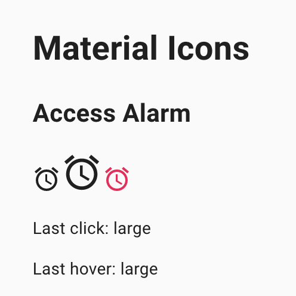
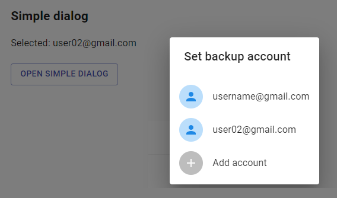
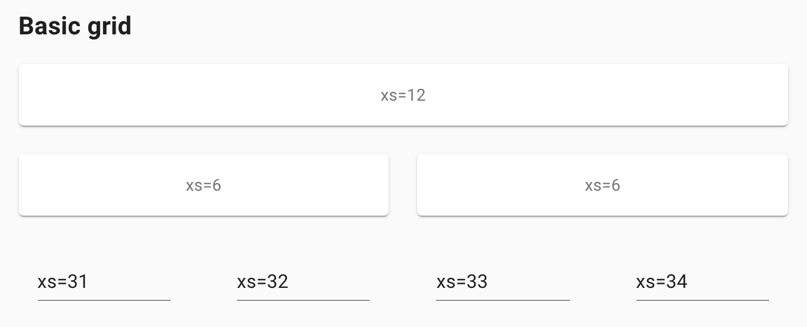
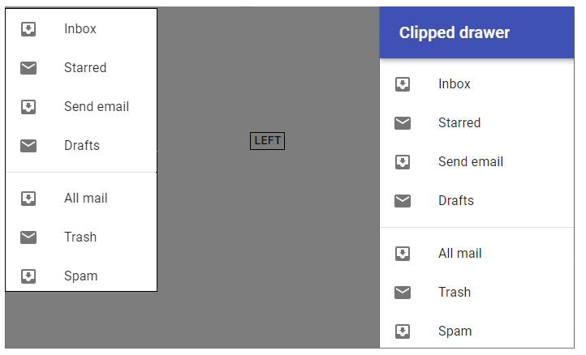
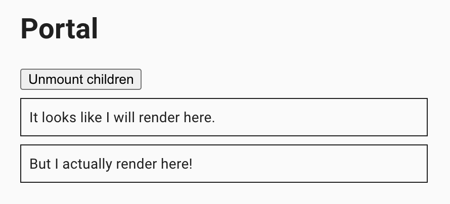
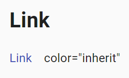
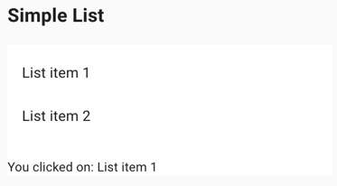
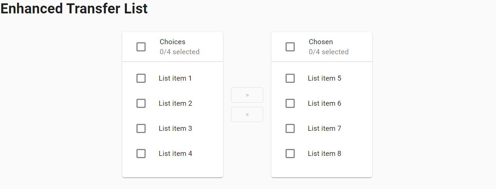

## 4. Material UI elements

### 4.1 Checkbox

```java 
    @UI("//h2[text()='Basic checkboxes']/following-sibling::div[1]/span")
    public List<Checkbox> basicCheckbox;

    @Test
    public void basicCheckboxTest() {
        for (int i = 1; i < 3; i++)
            checkboxTestLogic(
                    checkboxPage.basicCheckbox.get(i),
                    i != 2 && i != 7 ? "MuiCheckbox-colorSecondary" :
                            i == 2 ? "MuiCheckbox-colorPrimary" : "jss3");
    }
    
    private void checkboxTestLogic(Checkbox checkbox, String className) {
        if (checkbox.isEnabled()) {
            checkbox.check();
            checkbox.is().checked();
            checkbox.uncheck();
            checkbox.is().unChecked();
        } else
            checkbox.is().disabled();
        checkbox.is().hasClass(className);
    }
```

##### <a href="https://material-ui.com/components/checkboxes/" target="_blank"> https://material-ui.com/components/checkboxes/ </a>

Checkbox is located in the following class:

- __Java__: _com.epam.jdi.light.material.elements.inputs.Checkbox_


Checkboxes allow the user to select one or more items from a set.

|Method | Description | Return Type
--- | --- | ---
**is()** | Returns Assert class | Assert
**isDisabled()** | Verify state | boolean
**hasClassName(String className)** | Checks class| void
**checked()** | Assert that Checkbox selected | Assert
**uncheck()** | Assert that Checkbox not selected | Assert
**check()** | select Checkbox | void
**uncheck()** | unselect Checkbox | void


##### <a href="https://github.com/jdi-testing/jdi-light/blob/Material-UI/jdi-light-material-ui-tests/src/test/java/io/github/epam/material/tests/inputs/CheckboxTests.java" target="_blank">Here you can find Checkbox tests</a>

### 4.2 Chips

```java 
    @JDIChip
    @UI("//h2[text() = 'Chip']/following-sibling::*[1]")
    public static Chip defaultChips;
    
    @JDIChip
    @UI("//h2[text() = 'Outlined Chips']/following-sibling::*[1]")
    public static Chip outlinedChips;
    
    @JDIChip
    @UI("//h2[text() = 'Chip array']/following-sibling::*[1]")
    public static Chip chipArrays;
    
    @Test
    public void defaultChipTest() {
        basicCheck(defaultChips);
        disabledCheck(defaultChips);// first variant of class value
        clickableCheck(defaultChips,3);
        clickableLinkCheck(defaultChips,7);
    }
    
    @Test
    public void outlinedChipTest() {
        basicCheck(outlinedChips);
        disabledCheck(outlinedChips); // second variant of class value
        clickableCheck(outlinedChips, 3);
        clickableLinkCheck(outlinedChips, 7);
    }
    
    @Test
    public void chipArrayTest() {
        chipArrays.is().displayed(1);
        chipArrays.is().text(1, hasToString("Angular"));
        chipArrays.is().displayed(2);
        chipArrays.is().text(2, hasToString("jQuery"));
        chipArrays.getChipIcon(1).click();
        chipArrays.is().text(1, hasToString("jQuery")); // "jQuery" became first element as "Angular" element was deleted
    }
```

##### <a href="https://material-ui.com/components/chips/" target="_blank"> https://material-ui.com/components/chips/ </a>

Chip is located in the following class:

- __Java__: _com.epam.jdi.light.material.elements.displaydata.Chip_


Chips are compact elements that represent an input, attribute, or action.

|Method | Description | Return Type
--- | --- | ---
**is()** | Returns Assert class | ChipAssert
**click(int index)** | Clicks on chip | void
**getChipLabel(int index)** | Gets label| UIElement
**getChipRoot(int index)** | Gets root| UIElement
**getChipIcon(int index)** | Gets Icon|UIElement

##### <a href="https://github.com/jdi-testing/jdi-light/blob/Material-UI/jdi-light-material-ui-tests/src/test/java/io/github/epam/material/tests/displaydata/ChipTests.java" target="_blank">Here you can find Chips tests</a>

### 4.3 Tooltip

```java 
    @UI("//div[@id='touchItem']/button")
    public static ButtonWithTooltip hoverOrTouchButtonWithTooltip;
    
    @UI("//div[@id='clickItem']/*/button")
    public static ButtonWithTooltip clickButtonWithTooltip;
    
    @Test
    public void hoverOrTouchTooltip() {
        hoverOrTouchButtonWithTooltip.is().visible();
        hoverOrTouchButtonWithTooltip.hover();
        hoverOrTouchButtonWithTooltip.tooltip().is().visible();
        hoverOrTouchButtonWithTooltip.tooltip().has().text("Add");
    }
    
    @Test
    public void clickButtonTooltipTest() {
        clickButtonWithTooltip.is().visible();
        clickButtonWithTooltip.click();
        clickButtonWithTooltip.tooltip().is().visible();
        clickButtonWithTooltip.tooltip().has().text("Add");
    }
```

##### <a href="https://material-ui.com/components/tooltips/" target="_blank"> https://material-ui.com/components/tooltips/ </a>

Tooltip is located in the following class:

- __Java__: _com.epam.jdi.light.material.elements.displaydata.Tooltip_


Tooltips display informative text when users hover over, focus on, or tap an element.

|Method | Description | Return Type
--- | --- | ---
**is()** | Returns Assert class | TooltipAssert
**has()** | Returns Assert class | TooltipAssert
**isVisible()** | Checks element is displayed| boolean
**isInteractive()** | Checks element is interactive| boolean
**getValue()** | Gets value| String

##### <a href="https://github.com/jdi-testing/jdi-light/blob/Material-UI/jdi-light-material-ui-tests/src/test/java/io/github/epam/material/tests/displaydata/TooltipTests.java" target="_blank">Here you can find Tooltip tests</a>

### 4.4 Container

```java 
    @UI(".MuiContainer-root.MuiContainer-maxWidthSm")
    public static Container container;

    @Test
    public void fluidContainerTest() {
        container.has().maxWidth("600px");
        container.is().fluid();
        container.is().displayed();
        container.is().enabled();
    }
```

##### <a href="https://material-ui.com/components/container/" target="_blank"> https://material-ui.com/components/container/ </a>


The container centers your content horizontally. It's the most basic layout element.
A fluid container width is bounded by the maxWidth prop value.
If you prefer to design for a fixed set of sizes instead of trying to accommodate a fully fluid viewport,
you can set the fixed prop. The max-width matches the min-width of the current breakpoint.


|Method | Description | Return Type
--- | --- | ---
**fixed()** | Check whether container is fixed | boolean
**fluid()** | Check whether container is fluid | boolean
**getMaxWidth()** | Get max width of container | String
**is()** | Assert method | ContainerAssert
**fixed()** | Assert that container is fixed | ContainerAssert
**fluid()** | Assert that container is fluid | ContainerAssert
**maxWidth(String)** | Assert that container's max width is specified width | ContainerAssert


##### <a href="https://github.com/jdi-testing/jdi-light/blob/Material-UI/jdi-light-material-ui-tests/src/test/java/io/github/epam/material/tests/layout/ContainerTests.java" target="_blank">Here you can find Container tests</a>


### 4.5 Avatar

```java 
    @UI("//span[@class = 'MuiBadge-root']")
    public static List<Avatar> avatarsWithPhoto;

    @UI("//div/div[contains(@class, 'MuiAvatar-root') and not(*)] ")
    public static List<Avatar> avatarsWithText;


    @Test
    public void avatarsWithTextTests() {
        for(Avatar avatar : avatarsWithText) {
            avatar.is().displayed();
        }
        avatarsWithText.get(1).is().text("L");
        avatarsWithText.get(2).is().text("A");
    }

    @Test
    public void avatarsWithPhotoTests() {
        for(Avatar avatar : avatarsWithPhoto) {
            avatar.is().displayed();
            avatar.has().photo();
            avatar.has().badge();
        }
    }
```

##### <a href="https://material-ui.com/ru/components/avatars/" target="_blank"> https://material-ui.com/ru/components/avatars/ </a>


Avatars are graphical representations of users.

|Method | Description | Return Type
--- | --- | ---
**hasBadge()** | Checks badge | boolean
**hasIcon()** | Checks icon | boolean
**hasPhoto()** | Checks photo | boolean
**has()** | Verify state | AvatarAssert
**is()** | Verify state | AvatarAssert

##### <a href="https://github.com/jdi-testing/jdi-light/blob/master_material_ui/jdi-light-material-ui-tests/src/test/java/io/github/epam/material/tests/displaydata/AvatarTests.java" target="_blank">Here you can find Avatar tests</a>

### 4.6 Click Away Listener

```java     
    @UI("//h2[text()='Example']/following-sibling::div[1]/div/button")
    public static Button exampleButton;

    @UI("//h2[text()='Portal']/following-sibling::div[1]/div/button")
    public static Button portalButton;

    @UI("//div[text()='Click me, I will stay visible until you click outside.']")
    public static TextArea text;

    @Test
    public void exampleClickAwayListenerTest() {
        textFieldTest(1);
    }

    @Test
    public void portalExampleClickAwayListenerTest() {
        textFieldTest(2);
    }

    private void textFieldTest(int buttonId) {
        clickAwayListenerPage.clickButton(buttonId);
        text.is().displayed();
        clickAwayListenerPage.clickButton(buttonId);
        text.is().hidden();
        clickAwayListenerPage.clickButton(buttonId);
        text.is().displayed();
        clickAwayListenerPage.clickAroundTextPopup(text.getSize().width + 1, -1);
        text.is().hidden();
        clickAwayListenerPage.clickButton(buttonId);
        clickAwayListenerPage.clickAroundButton(exampleButton.getSize().width + 1,0, buttonId);
        text.is().hidden();
    }
```

##### <a href="https://material-ui.com/ru/components/click-away-listener/" target="_blank"> https://material-ui.com/ru/components/click-away-listener/ </a>


Detect if a click event happened outside of an element. It listens for clicks that occur somewhere in the document.

|Method | Description | Return Type
--- | --- | ---
**click()** | Clicks on box | void
**click(int x, int y)** | Clicks on point in box | void
**is()** | Returns Assert class | Assert
**displayed()** | Assert state | Assert
**hidden()** | Assert state | Assert

##### <a href="https://github.com/jdi-testing/jdi-light/blob/Material-UI/jdi-light-material-ui-tests/src/test/java/io/github/epam/material/tests/utils/ClickAwayListenerTests.java" target="_blank">Here you can find ClickAwayListener tests</a>

### 4.7 Divider

```java 
    @UI("(//li[contains(@class, 'MuiDivider-root')])")
    public static List<Divider> insetDividers;
    
    @UI(".MuiDivider-root")
    public static Divider verticalDivider;

    @Test
    public void insetDividerTest() {
        insetDividers.forEach(
            d-> d.is().inset()
        );
    }
    
    @Test
    public void verticalDividerTest() {
        verticalDivider.is().vertical();
    }
```

##### <a href="https://material-ui.com/components/dividers/" target="_blank"> https://material-ui.com/components/dividers/ </a>

Divider is located in the following class:

- __Java__: _com.epam.jdi.light.material.elements.displaydata.Divider_


A divider is a thin line that groups content in lists and layouts.

|Method | Description | Return Type
--- | --- | ---
**is()** | Returns DividerAssert class | DividerAssert
**isInset()** | Assert inset divider | boolean
**isVertical()** | Assert vertical divider| boolean


##### <a href="https://github.com/jdi-testing/jdi-light/blob/Material-UI/jdi-light-material-ui-tests/src/test/java/io/github/epam/material/tests/displaydata/DividerTests.java" target="_blank">Here you can find Divider tests</a>

### 4.8 Card

```java    
    @UI("//div[@class='MuiCardContent-root']/p[1]")
    public static List<Text> pTagTexts;

    @UI("//div[@class='MuiCardContent-root']/h2[1]")
    public static List<Text> h2TagTexts;

    @UI("//div[@class='MuiCardActions-root']/button[1]")
    public static Button complexCardHeartIconButton;

    @UI("//div[@class='MuiCardActions-root']/button[1]/span[1]/*")
    public static Icon complexCardHeartIcon;

    @UI("//div[@class='MuiCardActions-root']/button[3]")
    public static Button complexCardSliderDownButton;

    @UI("//div[@class='MuiCardActions-root']/preceding-sibling::div[2]")
    public static Image complexCardImage;

    @UI("//div[@class='MuiCardActions-root']/following-sibling::div[1]")
    public static TextArea complexCardHiddenTextArea;

    @UI("//div[@class='MuiCardActions-root']/following-sibling::div[1]/div/div/div/p[1]")
    public static Text complexCardHiddenText;

    private void textCheck(int index) {
        pTagTexts.get(index).has().text(Matchers.is("Word of the Day"));
        h2TagTexts.get(index).has().text(Matchers.is("be•nev•o•lent"));
    }

    @Test
    public void complexCardTest() {
        String expectedText = "This impressive paella is a perfect party dish and a fun meal to cook together with your guests. Add 1 cup of frozen peas along with the mussels, if you like.";
        pTagTexts.get(3).has().text(Matchers.is(expectedText));
        complexCardImage.is().displayed();

        complexCardHeartIconButton.click();
        new Timer(1000L)
                .wait(() -> complexCardHeartIcon.has().classValue(Matchers.containsString("jss")));

        complexCardHeartIconButton.click();
        new Timer(1000L)
                .wait(() -> complexCardHeartIcon.has().classValue(Matchers.not("jss")));

        complexCardSliderDownButton.click();
        complexCardHiddenTextArea.is().displayed();
        complexCardHiddenText.has().text(Matchers.containsString("Method:"));
    }
```

##### <a href="https://material-ui.com/components/cards/" target="_blank"> https://material-ui.com/components/cards/ </a>


Cards contain content and actions about a single subject.

|Method | Description | Return Type
--- | --- | ---
**click()** | Clicks on box | void
**is()** | Returns Assert class | Assert
**displayed()** | Assert state | Assert
**hidden()** | Assert state | Assert
**classValue()** | Assert state | Assert

##### <a href="https://github.com/jdi-testing/jdi-light/blob/Material-UI/jdi-light-material-ui-tests/src/test/java/io/github/epam/material/tests/surfaces/CardTests.java" target="_blank">Here you can find Card tests</a>

### 4.9 Radio

```java 
    @UI("#simpleRadio .MuiRadio-root")
    public static RadioButtons simpleRadioButtons;
    
    @UI("#lastClickContent")
    public static Text lastRadioText;
    
    @UI(".MuiFormControl-root[2] .MuiRadio-root")
    public static RadioButtons labelPlacementRadioButtons;

    @Test
    public void simpleRadioTest() {
        simpleRadioButtons.has().values("First", "Second", "Third", "Disabled");
        simpleRadioButtons.has().enabled("First", "Second", "Third");
        simpleRadioButtons.has().disabled("Disabled");
        asList("First", "Second", "Third").forEach(label -> {
            simpleRadioButtons.select(label);
            simpleRadioButtons.has().selected(label);
            lastRadioText.has().text(containsString(label));
        });
    }
    
    @Test
    public void labelPlacementTest() {
        labelPlacementRadioButtons.has().size(4);
        labelPlacementRadioButtons.has().selected(1);
        labelPlacementRadioButtons.has().selected("Top");
        labelPlacementRadioButtons.has().labelPosition(1, LabelPosition.TOP);
        labelPlacementRadioButtons.has().labelPosition("Start", LabelPosition.START);
        labelPlacementRadioButtons.has().labelPosition(2, LabelPosition.BOTTOM);
        labelPlacementRadioButtons.has().labelPosition("End", LabelPosition.END);
    }
```

##### <a href="https://mui.com/components/radio-buttons/" target="_blank"> https://mui.com/components/radio-buttons/ </a>


Radio buttons allow the user to select one option from a set.

|Method | Description | Return Type
--- | --- | ---
**is()** | Returns object for work with assertions | RadioAssert
**select(String/int/Enum)** | Select radiobutton by value/index  | void
**selected()** | Get selected radiobutton value | String
**values()** | Returns list of values | List\<String>
**labels()** | Returns list of labels | List\<Label>
**listEnabled()** | Returns list of enabled values | List\<String>
**listDisabled()** | Returns list of disabled values | List\<String>
**get(String/int)** | Returns radio button by value/index | UIElement

##### <a href="https://github.com/jdi-testing/jdi-light/blob/master_material_ui/jdi-light-material-ui-tests/src/test/java/io/github/epam/material/tests/inputs/RadioButtonsTests.java" target="_blank">Here you can find Radio tests</a>

### 4.10 App Bar

```java 
    @UI("//*[text()='App Bar with menu']/preceding::button[@aria-label='menu']")
    public static UIElement simpleMenu;

    @UI("//*[text()='Prominent App Bar']/preceding::button[@aria-label='menu'][1]")
    public static UIElement appBarMenu;

    @UI("//*[text()='Prominent App Bar']/following::button[@aria-label='open drawer']")
    public static UIElement prominentMenu;

    @UI("//*[text()='Simple App bar']/following::h6[1]")
    public static Text simpleText;

    @UI("//*[text()='Simple App bar']/following::button[2]")
    public static Button simpleButton;

    @Test
    public void simpleAppBarTest() {
        simpleAppBarPage.open();
        simpleAppBarPage.shouldBeOpened();
        simpleMenu.isDisplayed();
        appBarMenu.isDisplayed();
        prominentMenu.isDisplayed();
        simpleText.has().text("News");
        appBarText.has().text("Photos");
        prominentText.has().text("Material-UI");
        simpleButton.is().displayed();
        appBarIcon.is().displayed();
        prominentSearch.is().displayed();
        prominentSecondMenu.is().displayed();
        logoutSwitch.uncheck();
        timer.wait(() -> appBarIcon.isNotVisible());
        logoutSwitch.check();
        timer.wait(() -> appBarIcon.isDisplayed());
        appBarIcon.click();
        timer.wait(() -> appBarIconOptions.get(1).isDisplayed());
        appBarIconOptions.get(1).click();
        timer.wait(() -> {
            appBarIconOptions.get(1).isNotVisible();
            appBarIcon.isVisible();
        });
    }
```

##### <a href="https://material-ui.com/components/app-bar/" target="_blank"> https://material-ui.com/components/app-bar/ </a>


The App Bar displays information and actions relating to the current screen.

|Method | Description | Return Type
--- | --- | ---
**click()** | Clicks on element | void
**click(int x, int y)** | Clicks on point in element | void
**is()** | Returns Assert class | Assert
**has()** | Returns Assert class | Assert
**displayed()** | Assert state | Assert
**hidden()** | Assert state | Assert

##### <a href="https://github.com/jdi-testing/jdi-light/blob/Material-UI/jdi-light-material-ui-tests/src/test/java/io/github/epam/material/tests/surfaces/AppBarTests.java" target="_blank">Here you can find AppBar tests</a>

### 4.11 Box

```java     
    @UI("//button[contains(@class,'MuiButton-outlined')]")
    public static Button outlinedBox;

    @Test
    public void outlinedBoxTest() {
        outlinedBox.is().displayed();
        outlinedBox.click();
        outlinedBox.is().text("SECOND BUTTON");
        lastClickContent.is().text("You clicked Second button");
    }
```

##### <a href="https://material-ui.com/components/box/" target="_blank"> https://material-ui.com/components/box/ </a>

The Box component serves as a wrapper component for most of the CSS utility needs.
Java example code for the Button box:


|Method | Description | Return Type
--- | --- | ---
**is()** | Verify state | boolean
**click()** | Clicks on box | void
**displayed()** | Verify state | void
**text()** | Verify text | void

##### <a href="https://github.com/jdi-testing/jdi-light/blob/Material-UI/jdi-light-material-ui-tests/src/test/java/io/github/epam/material/tests/layout/BoxTests.java" target="_blank">Here you can find Box tests</a>

### 4.12 Transitions

```java     
    @UI("//h1[text()='Transitions']/following::div[contains(@class,'MuiCollapse-container')]")
    public static List<UIElement> collapseFadeTransitions;

    @UI("//span[contains(@class, 'MuiSwitch-switchBase')]")
    public static List<Checkbox> checkboxes;
    
    @Test
    public void collapseDisplayTest() {
        Timer timer = new Timer(2000L);
        collapseFadeTransitions.get(1).has().classValue(not(containsString("MuiCollapse-entered")));
        collapseFadeTransitions.get(2).has().classValue(not(containsString("MuiCollapse-entered")));
        checkboxes.get(1).check();
        timer.wait(() -> collapseFadeTransitions.get(1).hasClass(containsString("MuiCollapse-entered").toString()));
        collapseFadeTransitions.get(1).has().classValue(containsString("MuiCollapse-entered"));
        collapseFadeTransitions.get(2).has().classValue(containsString("MuiCollapse-entered"));
        checkboxes.get(1).uncheck();
        timer.wait(() -> collapseFadeTransitions.get(1).hasClass(containsString("MuiCollapse-hidden").toString()));
        collapseFadeTransitions.get(1).has().classValue(not(containsString("MuiCollapse-entered")));
        collapseFadeTransitions.get(2).has().classValue(not(containsString("MuiCollapse-entered")));
    }
```

##### <a href="https://material-ui.com/components/transitions/" target="_blank"> https://material-ui.com/components/transitions/ </a>

Transition helps make a UI expressive and easy to use.


|Method | Description | Return Type
--- | --- | ---
**has()** | Verify state | boolean
**hasClass()** | Verify state | boolean
**classValue()** | Verify state | boolean
**check()** | Checkbox selected | void

##### <a href="https://github.com/jdi-testing/jdi-light/blob/Material-UI/jdi-light-material-ui-tests/src/test/java/io/github/epam/material/tests/utils/TransitionTests.java" target="_blank">Here you can find Transitions tests</a>

### 4.13 Material Icons

```java     
    @UI("#defaultAccessAlarm")
    public static UIElement defaultAlarm;

    @UI("#largeAccessAlarm")
    public static UIElement largeAlarm;

    @UI("#secondaryAccessAlarm")
    public static UIElement secondaryAlarm;

    @UI("#miconLastClick")
    public static UIElement lastClick;

    @UI("#miconLastHover")
    public static UIElement lastHover;

    @Test
    public void defaultMaterialIconTest() {
        lastClick.is().text("Last click:");
        lastHover.is().text("Last hover:");

        defaultAlarm.hover();
        lastClick.is().text("Last click:");
        lastHover.is().text("Last hover: default");

        defaultAlarm.click();
        lastClick.is().text("Last click: default");
        lastHover.is().text("Last hover: default");

        largeAlarm.hover();
        lastClick.is().text("Last click: default");
        lastHover.is().text("Last hover: large");

        largeAlarm.click();
        lastClick.is().text("Last click: large");
        lastHover.is().text("Last hover: large");

        secondaryAlarm.hover();
        lastClick.is().text("Last click: large");
        lastHover.is().text("Last hover: secondary");

        secondaryAlarm.click();
        lastClick.is().text("Last click: secondary");
        lastHover.is().text("Last hover: secondary");
    }
```

##### <a href="https://material-ui.com/components/material-icons/" target="_blank"> https://material-ui.com/components/material-icons/ </a>

The following npm package, @material-ui/icons, includes the 1,100+ official Material icons converted to SvgIcon components.



|Method | Description | Return Type
--- | --- | ---
**is()** | Verify state | boolean
**displayed()** | Verify state | boolean
**hasClass()** | Verify state | boolean
**text()** | Verify text | boolean
**click()** | Clicks on box | void
**hover()** | Hovers on box | void

##### <a href="https://github.com/jdi-testing/jdi-light/blob/master/jdi-light-material-ui-tests/src/test/java/io/github/epam/material/tests/displaydata/MaterialIconTests.java" target="_blank">Here you can find Material Icons tests</a>

### 4.14 Icons

```java     
    @Test
    public void simpleIconsTest() {
        simpleIcons.get(1).hover();
        simpleLastHover.has().text("Last hover: DeleteIcon");
        simpleIcons.get(2).click();
        simpleLastClick.has().text("Last click: DeleteForeverIcon");

        simpleIcons.forEach(icon -> icon.is().notColored());
        simpleIcons.forEach(icon -> icon.has().color("rgba(0, 0, 0, 0.87)"));
        simpleIcons.forEach(icon -> icon.has().height(24));
        simpleIcons.forEach(icon -> icon.has().width(24));
    }
```

##### <a href="https://material-ui.com/components/icons/" target="_blank"> https://material-ui.com/components/icons/ </a>

Material-UI provides icons support in three ways:

1. Standardized Material Design icons exported as React components (SVG icons).
2. With the SvgIcon component, a React wrapper for custom SVG icons.
3. With the Icon component, a React wrapper for custom font icons.


|Method | Description | Return Type
--- | --- | ---
**colored()** | Check whether element is colored (not black) | boolean
**getColor()** | Get color of icon | String
**is()** | Assert method | IconAssert
**colored()** | Assert whether icon is colored (not black) | IconAssert
**notColored()** | Assert whether icon is not colored (black) | IconAssert
**color(String)** | Assert that icon's color is certain color | IconAssert
**height(int)** | Assert that icon has specified height | IconAssert
**width(int)** | Assert that icon has specified width | IconAssert

Icons have also a lot of UIElement methods.

##### <a href="https://github.com/jdi-testing/jdi-light/blob/master/jdi-light-material-ui-tests/src/test/java/io/github/epam/material/tests/displaydata/IconTests.java" target="_blank">Here you can find Icons tests</a>

### 4.15 Floating Action Button

```java     
    @UI("//div[@id='basicActionBtns']/button")
    public static List<Button> basicBtns;

    @UI("//button[@aria-label='add']")
    public static Button addBtn;

    @UI("//button[@aria-label='edit']")
    public static Button editBtn;

    @UI("//button[contains(@class,'MuiFab-extended')]")
    public static Button extendedBtn;

    @UI("//button[@aria-label='like']")
    public static Button disabledBtn;

    @UI("#basicActionBtnsLastClick")
    public static Text basicBtnsLastClick;

    @Test
    public void basicButtonsTest() {
        basicBtns.forEach(el -> el.is().displayed());
        basicBtnsLastClick.is().text("Last click:");

        addBtn.is().enabled();
        addBtn.click();
        basicBtnsLastClick.is().text("Last click: Add");

        editBtn.is().enabled();
        editBtn.click();
        basicBtnsLastClick.is().text("Last click: Edit");

        extendedBtn.is().enabled();
        extendedBtn.click();
        basicBtnsLastClick.is().text("Last click: Navigate");

        disabledBtn.is().disabled();
    }
```

##### <a href="https://material-ui.com/components/floating-action-button/" target="_blank"> https://material-ui.com/components/floating-action-button/ </a>

A floating action button appears in front of all screen content, typically as a circular shape with an icon in its center. FABs come in two types: regular, and extended.


|Method | Description | Return Type
--- | --- | ---
**is()** | Verify state | boolean
**displayed()** | Verify state | boolean
**enabled()** | Verify state | boolean
**disabled()** | Verify state | boolean
**text()** | Verify text | boolean
**click()** | Clicks on box | void

##### <a href="https://github.com/jdi-testing/jdi-light/blob/master/jdi-light-material-ui-tests/src/test/java/io/github/epam/material/tests/inputs/FabTests.java" target="_blank">Here you can find Floating Action Button tests</a>

### 4.16 Hidden

```java     
   @UI(".MuiTypography-subtitle1")
    public static Text currentWidth;

    @UI("//div[contains(text(),'xsDown')]")
    public static Button xsDown;

    @UI("//div[text()='smDown']")
    public static Button smDown;

    @UI("//div[text()='mdDown']")
    public static Button mdDown;

    @UI("//div[text()='lgDown']")
    public static Button lgDown;

    @UI("//div[text()='xlDown']")
    public static Button xlDown;

    @Test(dataProvider = "Screen Width Dividers")
    public void hiddenTestWithScreenWidthDifferentScreenWidth(int divider) {
        currentWidth.is().displayed();
        xsDown.is().displayed();
        smDown.is().displayed();
        mdDown.is().displayed();
        divideScreenWidthSize(divider);
        String width = getWidth(currentWidth);
        checkWidth(width);
    }
```

##### <a href="https://material-ui.com/components/hidden/" target="_blank"> https://material-ui.com/components/hidden/ </a>

Quickly and responsively toggle the visibility value of components and more with the hidden utilities.


|Method | Description | Return Type
--- | --- | ---
**is()** | Verify state | boolean
**displayed()** | Verify state | boolean
**text()** | Verify text | boolean

##### <a href="https://github.com/jdi-testing/jdi-light/blob/Material-UI/jdi-light-material-ui-tests/src/test/java/io/github/epam/material/tests/layout/HiddenTests.java" target="_blank">Here you can find Hidden tests</a>

### 4.17 Stepper

```java 
    @UI("#nonLinearStepper .MuiStep-root")
    public static Stepper nonlinearStepper;

    @UI("//p[@id='activeNonLinearStep']/..//button[2]")
    public static MaterialButton nonlinearStepperNextButton;

    @UI("//p[@id='activeNonLinearStep']/..//button[3]")
    public static MaterialButton nonlinearStepperCompleteStepButton;
        
    @Test
    public void nonlinearStepperForwardTest() {
        nonlinearStepper.show();
        nonlinearStepper.is().displayed().and().has().steps(Arrays.asList(steps));

        nonlinearStepperNextButton.click();
        nonlinearStepperNextButton.click();
        nonlinearStepper.list().get(2).click();
        nonlinearStepperCompleteStepButton.click();
        
        nonlinearStepper.is().stepEnabled(1).and().stepCompleted(1);
        nonlinearStepper.is().stepEnabled(2).and().stepCompleted(2);
        nonlinearStepper.is().stepEnabled(3).and().stepIncomplete(3);
    }
```

##### <a href="https://material-ui.com/components/steppers/" target="_blank"> https://material-ui.com/components/steppers/ </a>


Steppers convey progress through numbered steps. It provides a wizard-like workflow.
You can use for testing Text and Button classes, implemented in JDI-html section.

|Method | Description | Return Type
--- | --- | ---
**stepCompleted()** | Check that specified step is completed | boolean
**stepEnabled()** | Check that specified step is enabled | boolean

##### <a href="https://github.com/jdi-testing/jdi-light/blob/Material-UI/jdi-light-material-ui-tests/src/test/java/io/github/epam/material/tests/navigation/StepperTests.java" target="_blank">Here you can find Stepper tests</a>

### 4.18 Slider

```java     
    @UI("//*[@id=\"continuous-slider\"]/following-sibling::div//span[contains(@class, \"MuiSlider-root\")]")
    public static Slider continuousSlider;
    
    @Test
    public void continuousSliderTest(){
        continuousSlider.is().enabled();
        continuousSlider.is().orientation("horizontal");
        continuousSlider.is().value(30);
        continuousSlider.setValue(15);
        continuousSlider.is().value(15);
        continuousSlider.moveLeft();
        continuousSlider.is().value(14);
        continuousSlider.moveRight();
        continuousSlider.is().value(15);
        continuousSlider.slideHorizontalTo(10);
        continuousSlider.is().value(10);
    }
```

##### <a href="https://material-ui.com/components/slider/" target="_blank"> https://material-ui.com/components/slider/ </a>

Sliders reflect a range of values along a bar, from which users may select a single value. They are ideal for adjusting settings such as volume, brightness, or applying image filters.


|Method | Description | Return Type
--- | --- | ---
**value()** | Get current value | int
**setValue(int)** | Set new value | void
**orientation()** | Get orientation value | String
**slideVerticalTo(int)** | Set new value using drag-and-drop action for vertical slider | void
**slideHorizontalTo(int)** | Set new value using drag-and-drop action for horizontal slider | void
**moveRight()** | Move right to one unit using arrow key on keyboard | void
**moveLeft()** | Move left to one unit using arrow key on keyboard | void
**is()** | Verify state | boolean

##### <a href="https://github.com/jdi-testing/jdi-light/blob/Material-UI/jdi-light-material-ui-tests/src/test/java/io/github/epam/material/tests/inputs/SliderTests.java" target="_blank">Here you can find Slider tests</a>

### 4.19 Tabs

```java 
    @UI("//button[contains(@aria-controls,'simple-tabpanel')]")
    public static Tabs simpleTabs;

    @UI("//button[contains(@aria-controls,'scrollable-auto-tab')]")
    public static Tabs scrollableTabs;

    @UI("//button[contains(@aria-controls,'scrollable-prevent-tab')]")
    public static Tabs preventScrollTabs;

    @UI("//button[contains(@aria-controls,'vertical-tabpanel')]")
    public static Tabs verticalTabs;
    
    @Test
    public void simpleTabTest() {
        simpleTabs.select(2);
        simpleTabs.has().elementSelected(2);
        simpleTabs.has().elementNotSelected(3);
        simpleTabs.has().elementDisabled(4);

        jdiAssert(simpleTabs.size(), Matchers.is(5));
    }

    @Test
    public void scrollableTabTest() {
        scrollableTabs.select(1);
        scrollableTabs.has().elementSelected(1);
        scrollableTabs.has().elementEnabled(1);

        scrollableTabs.select(7);
        scrollableTabs.has().elementSelected(7);
        scrollableTabs.has().elementEnabled(7);

        scrollableTabs.select(11);
        scrollableTabs.has().elementSelected(11);
        scrollableTabs.has().elementEnabled(11);

        scrollableTabs.select(1);
        scrollableTabs.has().elementSelected(1);
        scrollableTabs.has().elementEnabled(1);

        jdiAssert(scrollableTabs.size(), Matchers.is(11));
    }

```

##### <a href="https://material-ui.com/components/Tabs/" target="_blank"> https://material-ui.com/components/Tabs/ </a>

Tabs organize and allow navigation between groups of content that are related and at the same level of hierarchy.


|Method | Description | Return Type
--- | --- | ---
**is()** | Assert method | Tabs Assert
**enabled()** | Check if tab is enabled | boolean
**disabled()** | Check if tab is disabled | boolean
**selected()** | Check if tab is selected | boolean
**notSelected()** | Check if tab is not selected | boolean

##### <a href="https://github.com/jdi-testing/jdi-light/pull/3518/commits/c82c82512d73a84716eead8f0d4744cf4dd34f98#diff-fbe7d79cccd062917f385eca9e9db7fde3c41058b8dff308f33693d160ee60e8" target="_blank">Here you can find Tabs tests</a>

### 4.20 Table

```java 
    @UI("#basicTable")
    public static Table basicTable;
    
    @UI(".MuiDataGrid-selectedRowCount")
    public static Text selectedRowCounter;
    
    @UI("//div[contains(@class, 'MuiTablePagination-toolbar')]/div/button")
    public static List<Button> scrollButtons;
    
    @Test
    public void basicTableTest() {
        basicTable.has().columns(headElements);
        assertThat(basicTable.count(), equalTo(13));
        basicTable.getCell(1, 1).has().text("305");
    }

    @Test
    public void dataTableTest() {
        getDataTableCell(1, 3).click();
        getDataTableCell(3, 3).has().text("Arya");
        getDataTableCell(1, 1).click();
        selectedRowCounter.has().text(containsString("9"));
        getDataTableCell(3, 1).click();
        getDataTableCell(5, 1).click();
        selectedRowCounter.has().text(containsString("7"));
        getDataTableCell(2, 1).click();
        selectedRowCounter.has().text(containsString("6"));
        scrollButtons.get(1).is().displayed();
        scrollButtons.get(1).is().disabled();
        scrollButtons.get(2).is().displayed();
        scrollButtons.get(2).click();
        getDataTableCell(2, 3).has().text("Harvey");
    }
```

##### <a href="https://material-ui.com/components/Tables/" target="_blank"> https://material-ui.com/components/Tables/ </a>

Tables display sets of data. They can be fully customized.


|Method | Description | Return Type
--- | --- | ---
**click()** | Clicks on button | void
**has()** | Returns Assert class | Assert
**text()** | Assert text | Assert

##### <a href="https://github.com/jdi-testing/jdi-light/blob/Material-UI/jdi-light-material-ui-tests/src/test/java/io/github/epam/material/tests/displaydata/TableTests.java" target="_blank">Here you can find Tables tests</a>

### 4.21 Typography

```java 
    @UI(".MuiGrid-root[3] .MuiTypography-root")
    public static List<Typography> typographyTexts;
    
    @Test
    public void typographyTextsTest() {
        typographyTexts.get(1).has().text("Head 1");

        List<String> expectedText = Arrays.asList(
                "Head 1", "Head 2", "Head 3", "Head 4", "Head 5", "Head 6",
                "Subtitle 1", "Subtitle 2", "Body 1", "Body 2",
                "BUTTON TEXT", "Caption text", "OVERLINE TEXT");

        List<String> actualTexts = typographyTexts.stream()
                .map(IsText::getText)
                .collect(Collectors.toList());

        jdiAssert(actualTexts, equalTo(expectedText));
    }

    @Test
    public void typographyStylesTest() {
        typographyTexts.get(1).has().style(HEAD_1);

        List<TypographyStyles> expectedStyles = Arrays.asList(
                HEAD_1, HEAD_2, HEAD_3, HEAD_4, HEAD_5, HEAD_6,
                SUBTITLE_1, SUBTITLE_2, BODY_1, BODY_2,
                BUTTON, CAPTION, OVERLINE);

        List<TypographyStyles> actualStyles = typographyTexts.stream()
                .map(Typography::getStyle)
                .collect(Collectors.toList());

        jdiAssert(actualStyles, equalTo(expectedStyles));
    }
```

##### <a href="https://mui.com/components/typography/" target="_blank"> https://mui.com/components/typography/ </a>


Use typography to present your design and content as clearly and efficiently as possible.

|Method | Description | Return Type
--- | --- | ---
**is()** | Returns object for work with assertions | TypographyAssert
**getStyle()** | Returns style of component | TypographyStyles
**getText()** | Returns text of component | String


##### <a href="https://github.com/jdi-testing/jdi-light/blob/3529-rework-typography/jdi-light-material-ui-tests/src/test/java/io/github/epam/material/tests/displaydata/TypographyTests.java" target="_blank">Here you can find Typography tests</a>

### 4.22 Badge

```java 
    @UI("//span[@class='MuiBadge-root']")
    public static List<Badge> badge;
  
    @UI("//span[contains(@class,'MuiBadge-badge')]")
    public static List<Text> badgeCounter;
    
    @Test
    public void simpleBadgeTest() {
        badge.get(1).is().displayed();
        badge.get(1).is().displayedSvg();
        badgeCounter.get(1).is().text("4");
        badgeCounter.get(1).has().classValue(containsString("MuiBadge-anchorOriginTopRightRectangle MuiBadge-colorPrimary"));
        badge.get(2).is().displayed();
        badge.get(2).is().displayedSvg();
        badgeCounter.get(2).is().text("4");
        badgeCounter.get(2).has().classValue(containsString("MuiBadge-anchorOriginTopRightRectangle MuiBadge-colorError"));
    }
```

##### <a href="https://material-ui.com/ru/components/badges/" target="_blank"> https://material-ui.com/ru/components/badges/ </a>

Badge generates a small badge to the top-right of its child(ren).


##### <a href="https://github.com/jdi-testing/jdi-light/blob/Material-UI/jdi-light-material-ui-tests/src/test/java/io/github/epam/material/tests/displaydata/BadgeTests.java" target="_blank">Here you can find Badge tests</a>

### 4.23 Snackbars

```java 
    @UI("//span[text()='Open simple snackbar']/parent::button")
    public static Button simpleSnackbarButton;

    @UI("[direction='up']")
    public static Snackbar simpleSnackbar;

    @UI("//span[text()='Open success snackbar']/parent::button")
    public static Button successSnackbarButton;

    @UI("//div[@direction]/div[@class='MuiAlert-message']/parent::div")
    public static Snackbar successSnackbar;

    @UI("//div[@class='MuiAlert-message']/parent::div")
    public static List<Snackbar> customizedSnackbar;

    @UI("//h2[text()='Message Length']/preceding::button/span[@class='MuiButton-label' and not(text()='Open simple snackbar') and not(text()='Open success snackbar')]")
    public static List<Button> positionedSnackbarButtons;

    @UI("//div[contains(@class,'MuiSnackbar-root')]")
    public static Snackbar positionedSnackbar;
    
    @Test
    public void simpleSnackbarTest() {
        simpleSnackbar.is().notVisible();
        simpleSnackbarButton.click();
        simpleSnackbar.waitFor().displayed();
        simpleSnackbar.has().text("Note archived");
        simpleSnackbar.snackbarButton(UNDO).click();
        simpleSnackbar.waitFor().hidden();
        simpleSnackbar.is().notVisible();
        simpleSnackbarButton.click();
        simpleSnackbar.waitFor().displayed();
        simpleSnackbar.close();
        simpleSnackbar.is().notVisible();
    }

    @Test
    public void customizedSnackbarTest() {
        successSnackbar.is().notVisible();
        successSnackbarButton.click();
        successSnackbar.is().displayed();
        successSnackbar.has().text("This is a success message!");
        successSnackbar.close();
        successSnackbar.is().notVisible();

        customizedSnackbar.get(1).has().text("This is an error message!").and().messageType("error");
        customizedSnackbar.get(2).has().text("This is a warning message!").and().messageType("warning");
        customizedSnackbar.get(3).has().text("This is an information message!").and().messageType("info");
        customizedSnackbar.get(4).has().text("This is a success message!").and().messageType("success");
    }
```

##### <a href="https://material-ui.com/components/snackbars/" target="_blank"> https://material-ui.com/components/snackbars/ </a>

Snackbars provide brief messages about app processes. The component is also known as a toast.


##### <a href="https://github.com/jdi-testing/jdi-light/blob/Material-UI/jdi-light-material-ui-tests/src/test/java/io/github/epam/material/tests/feedback/SnackbarTests.java" target="_blank">Here you can find Snackbars tests</a>

### 4.24 Backdrop

```java 
  @UI(".MuiButton-root")
  public static Button showBackdropButton;

  @UI(".MuiBackdrop-root")
  public static UIElement backdrop;

  @Test
  public void defaultBackdropTest() {
      showBackdropButton.click();
      timer.wait(() -> backdrop.is().visible());
      backdrop.click();
      timer.wait(() -> backdrop.is().hidden());
  }
```

##### <a href="https://material-ui.com/components/backdrop/" target="_blank"> https://material-ui.com/components/backdrop/ </a>

The backdrop component is used to provide emphasis on a particular element or parts of it.


##### <a href="https://github.com/jdi-testing/jdi-light/blob/Material-UI/jdi-light-material-ui-tests/src/test/java/io/github/epam/material/tests/feedback/BackdropTests.java" target="_blank">Here you can find Backdrop tests</a>

### 4.25 Dialog

```java 
    @UI("//span[text()='Open simple dialog']/parent::*[contains(@class,'MuiButtonBase-root')]")
    public static Button simpleDialogButton;
    
    @UI("//div[@id='simple-dialog-title']/following::div[@class='MuiListItemText-root'][1]")
    public static Button simpleDialogListButton;
    
    @UI("#simpleDialogSelection")
    public static Text simpleDialogField;
  
    @UI("//h2[contains(@class,'MuiTypography-h6') and not (text()='Phone Ringtone')]")
    public static Text dialogTitle;
  
    @UI("//div[@id='scroll-dialog-title']/following::div[contains(@class,'MuiDialogContent-dividers')]")
    public static TextArea dialogScrollableContent;
  
    @Test
    public void simpleDialogTest() {
          simpleDialogButton.click();
          dialogTitle.is().text("Set backup account");
          simpleDialogListButton.click();
          simpleDialogField.is().text("Selected: username@gmail.com");
      }
    
    @Test
    public void scrollableDialogTest() {
          scrollPaperDialogButton.click();
          dialogTitle.is().text("Subscribe");
          dialogScrollableContent.core().jsExecute("scrollTo(0, document.body.scrollHeight)");
          dialogContent.is().text(containsString(dialogScrollableTextContent));
          subscribeButton.click();
          scrollableDialogField.is().text("Last clicked button: Subscribe");
          scrollPaperDialogButton.click();
          scrollableDialogCancelButton.click();
          scrollableDialogField.is().text("Last clicked button: Cancel");
    }
```

##### <a href="https://material-ui.com/components/dialogs/" target="_blank"> https://material-ui.com/components/dialogs/ </a>

Dialogs inform users about a task and can contain critical information, require decisions, or involve multiple tasks.


##### <a href="https://github.com/jdi-testing/jdi-light/blob/Material-UI/jdi-light-material-ui-tests/src/test/java/io/github/epam/material/tests/feedback/DialogTests.java" target="_blank">Here you can find Dialog tests</a>

### 4.26 Date / Time pickers

```java 
    @JDropdown(
            root = "//*[@id = 'date-picker-dialog-label']/parent::div",
            value = "//*[@id ='date-picker-dialog']",
            list = "//*[@id = 'date-picker-dialog-label']/parent::div /ancestor::body " +
                    "//div[@class = 'MuiPickersBasePicker-pickerView']//p",
            expand = "//span[@class = 'MuiIconButton-label']")
    public static Dropdown dialogPicker;
  
    @Test
    public void datePickerDialogTest() {
        dialogPicker.iCore().label().has().text("Date picker dialog");
        dialogPicker.expand();
        dialogPicker.select("12");
        dialogPicker.command("ENTER");
        timer.wait(() -> dialogPicker.has().text(containsString("/12/")));

        dialogPicker.expand();
        dialogPicker.select("11");
        dialogPicker.command("ESCAPE");
        timer.wait(() -> dialogPicker.has().text("08/12/2014"));

        dialogPicker.value().setText("10/10/2021");
        dialogPicker.has().text("10/10/2021");
    }
```

##### <a href="https://material-ui.com/components/pickers/" target="_blank"> https://material-ui.com/components/pickers/ </a>

Dropdown is located in the following class:

- __Java__: _com.epam.jdi.light.elements.complex.dropdown.Dropdown_

Date pickers and Time pickers provide a simple way to select a single value from a pre-determined set.


##### <a href="https://github.com/jdi-testing/jdi-light/blob/Material-UI/jdi-light-material-ui-tests/src/test/java/io/github/epam/material/tests/inputs/DateTimePickersTests.java" target="_blank">Here you can find Date/Time Pickers tests</a>

### 4.27 Select

```java 
    @UI("//div[@id='simple-select']")
    public static Button simpleSelectExpand;
    
    @UI("//input")
    public static List<TextField> simpleSelectField;
    
    @UI("//ul")
    public static Select selectList;
    
    @UI("//div[@id='disabled-select']")
    public static Button disabledSelectExpand;
  
    @Test
    public void simpleSelectTest() {
        simpleSelectExpand.click();
        selectList.selectItemByText("Henry");
        simpleSelectField.get(1).is().attr("value", "Henry");
    }
    
    @Test
    public void disabledSelectTest() {
        disabledSelectExpand.is().classValue(containsString("Mui-disabled"));
        disabledSelectExpand.has().attr("aria-disabled", "true");
        disabledSelectExpand.has().attr("aria-labelledby", "disabled-select");
    }
```

##### <a href="https://material-ui.com/components/selects/" target="_blank"> https://material-ui.com/components/selects/ </a>

Select components are used for collecting user provided information from a list of options.


##### <a href="https://github.com/jdi-testing/jdi-light/blob/Material-UI/jdi-light-material-ui-tests/src/test/java/io/github/epam/material/tests/inputs/SelectTests.java" target="_blank">Here you can find Select tests</a>

### 4.28 Switch

```java 
    @UI("//span[contains(@class,'MuiSwitch-switchBase')]")
    public static List<Checkbox> switches;
  
    @Test
    public void basicSwitchesTest() {
        switches.get(1).is().classValue(containsString("MuiSwitch-colorSecondary"));
        switches.get(1).is().classValue(containsString("Mui-checked"));
        switches.get(1).uncheck();
        switches.get(1).is().classValue(not(containsString("Mui-checked")));
        
        switches.get(3).is().classValue(containsString("MuiSwitch-colorSecondary"));
        switches.get(3).is().classValue(not(containsString("Mui-checked")));
        switches.get(3).check();
        switches.get(3).is().classValue(containsString("Mui-checked"));
    }
```

##### <a href="https://material-ui.com/components/switches/" target="_blank"> https://material-ui.com/components/switches/ </a>

Switches toggle the state of a single setting on or off.


##### <a href="https://github.com/jdi-testing/jdi-light/blob/Material-UI/jdi-light-material-ui-tests/src/test/java/io/github/epam/material/tests/inputs/SwitchTests.java" target="_blank">Here you can find Switch tests</a>

### 4.29 Button

```java 
    @UI("//h2[text()='Contained buttons']/parent::div/div[1]/*")
    public static List<Button> containedButtons;

    @Test
    public void defaultButtonTest() {
        containedButtons.get(1).click();
        containedButtons.get(1).is().text("DEFAULT");
        containedButtons.get(6).is().text("Last click: Default");
      
        containedButtons.get(4).is().text("DISABLED");
        containedButtons.get(4).is().attr("disabled");
        containedButtons.get(4).is().disabled();
      
        containedButtons.get(5).click();
        containedButtons.get(5).is().text("LINK");
        containedButtons.get(6).is().text("Last click: Link");
        containedButtons.get(5).is().notVisible();
    }
```

##### <a href="https://material-ui.com/components/buttons/" target="_blank"> https://material-ui.com/components/buttons/ </a>

Buttons allow users to take actions, and make choices, with a single tap.


##### <a href="https://github.com/jdi-testing/jdi-light/blob/Material-UI/jdi-light-material-ui-tests/src/test/java/io/github/epam/material/tests/inputs/ButtonTests.java" target="_blank">Here you can find Buttons tests</a>

<br></br><br></br>

### 4.30 ButtonGroup


##### <a href="https://jdi-testing.github.io/jdi-light/material/button_groups" target="_blank">Link to the site "Material UI test component"</a>

##### Basic and Vertical button group

**ButtonGroup** - element that represents a group of clickable button.


The ButtonGroup component can be used to group related buttons.

<br></br>

##### Split button
ButtonGroup can also be used to create a split button. The dropdown can change the button action (as in this example), or be used to immediately trigger a related action.


##### <a href="https://material-ui.com/ru/components/button-group/" target="_blank">Here you can find specification of Button Group</a>

<br></br>

ButtonGroup is located in the following class:

- __Java__: _com.epam.jdi.light.material.elements.inputs.ButtonGroup_

Available methods in Java JDI Light:

|Method | Description | Return Type
| --- | --- | ---
**getButtonByIndex(int)** | Get button by index | MaterialButton
**getButtonByText(String)** | Get button by text | MaterialButton
**getAllButtons()**        | Get all buttons in a block | Collection\<MaterialButton\>
**is()** | Returns Assert class | ButtonGroupAssert

<br></br>

##### ButtonGroupPage

```java 
public class ButtonGroupPage extends WebPage {

    @UI("//div[@aria-label = 'outlined primary button group']")
    @JDIButtonGroup(list = ".MuiButtonGroup-groupedHorizontal")
    public static ButtonGroup basicButtonGroup;

    @UI("//div[@aria-label = 'vertical contained primary button group']")
    @JDIButtonGroup(list = ".MuiButton-root")
    public static ButtonGroup verticalButtonGroup;

    @UI("//div[@aria-label = 'split button']")
    @JDIButtonGroup(list = ".MuiButtonBase-root")
    public static ButtonGroup splitButtonGroup;

    @UI("#split-button-menu")
    public static Menu splitButtonDropdown;
}
```

ButtonGroupPage class has been extended from WebPage. This class contains variables that are used in tests:
- basicButtonGroup
- verticalButtonGroup
- splitButtonGroup
- splitButtonDropdown

<br></br>

##### ButtonGroupTests

```java 
@Test
    public void verticalButtonGroupTest() {

        verticalButtonGroup.getButtonByIndex(2).click();
        verticalButtonGroup.getButtonByIndex(3).click();

        verticalButtonGroup.getButtonByText("Two").click();
        verticalButtonGroup.getButtonByText("One").click();

        basicButtonGroup.getButtonByIndex(2).is().enabled();
        basicButtonGroup.getButtonByIndex(2).has().text("TWO");
    }


   @Test
    public void splitButtonGroupTest() {
        splitButtonGroup.getButtonByIndex(1).has().text("SQUASH AND MERGE");
        splitButtonGroup.getButtonByText("Squash and merge").click();

        splitButtonGroup.getButtonByIndex(2).click();
        splitButtonDropdown.get(1).click();
        splitButtonGroup.getButtonByIndex(1).has().text("CREATE A MERGE COMMIT");

        splitButtonGroup.getButtonByIndex(2).click();
        splitButtonDropdown.get(3).has().cssClass("Mui-disabled");
        splitButtonDropdown.get(3).has().text("Rebase and merge");

        splitButtonDropdown.get(2).click();
        splitButtonGroup.getButtonByIndex(1).has().text("SQUASH AND MERGE");
    }
```

ButtonGroupTests is located in the following class:

- __Java__: _io.github.epam.material.tests.inputs.ButtonGroupTests_

Most applicable methods:

|Method | Description | Return Type
| --- | --- | ---
**click()** | Click the button  | void
**enabled()** | Assert that button is enabled | ButtonAssert
**is()**  | Assert action | ButtonAssert
**text()** | Assert text | ButtonAssert

##### <a href="https://github.com/jdi-testing/jdi-light/blob/master_material_ui/jdi-light-material-ui-tests/src/test/java/io/github/epam/material/tests/inputs/ButtonGroupTests.java" target="_blank">Here you can find Button group tests</a>

<br></br><br></br>

### 4.31 Grid

```java 
    @UI(".MuiContainer-root")
    public static UIElement rootGrid;

    @UI("//h2[text()='Complex grid']/preceding::div[contains(@class,'MuiGrid-spacing')]")
    public static UIElement basicGrid;

    @UI("//h2[text()='Complex grid']/following::div[contains(@class,'MuiPaper-rounded')]/div[contains(@class,'MuiGrid-spacing')]")
    public static UIElement complexGrid;
  
    @Test
    public void gridTest() {
        rootGrid.is().displayed();
        rootGrid.attr("class").contains("MuiContainer-maxWidthXl");
        basicGrid.is().displayed();
        complexGrid.is().displayed();
    }
```

##### <a href="https://material-ui.com/components/grid/" target="_blank"> https://material-ui.com/components/grid/ </a>

The Material Design responsive layout grid adapts to screen size and orientation, ensuring consistency across layouts.



##### <a href="https://github.com/jdi-testing/jdi-light/blob/Material-UI/jdi-light-material-ui-tests/src/test/java/io/github/epam/material/tests/layout/GridTests.java" target="_blank">Here you can find Grid tests</a>

### 4.32 GridList

```java 
     @UI(".MuiGridList-root.jss3")
     public static GridList imageGridList;

     @UI(".MuiGridList-root.jss5")
     public static GridList singleLineGridList;

     @UI(".MuiGridList-root.jss9")
     public static GridList titleBarGridList;
    
     @Test
     public static void singleLineGridTest() {
        singleLineGridList.has().size(5);
        singleLineGridList.has().image(3).and().altImgName(3, HATS);
        singleLineGridList.has().image(4).and().altImgName(4, BIKE);
        singleLineGridList.has().title(5, CAMERA);
    }
```

##### <a href="https://material-ui.com/components/grid/" target="_blank"> https://material-ui.com/components/grid/ </a>

The Grid List element - list of Material UI Grid elements.


##### <a href="https://github.com/jdi-testing/jdi-light/blob/master_material_ui/jdi-light-material-ui-tests/src/test/java/io/github/epam/material/tests/layout/GridListTests.java" target="_blank">Here you can find GridList tests</a>

### 4.33 Drawer

```java 
    @UI("//div[contains(@class,'MuiPaper-root')]")
    public static Drawer drawer;
    
    @UI("//ul[contains(@class,'MuiList-padding')]//div[@class='MuiListItemIcon-root']")
    public static List<Drawer> drawerElementsIcon;
    
    @UI("//ul[contains(@class,'MuiList-padding')]//div[@class='MuiListItemText-root']/span")
    public static List<Button> drawerElementsText;
  
    @Test(priority = 1)
    public void temporaryDrawerTest() {
        temporaryDrawerPage.open();
        List<Button> buttons = Arrays.asList(leftButton, rightButton, topButton, bottomButton);
        buttons.forEach(
            button -> {
                button.click();
                drawer.is().displayed();
                String currentButtonName = button.getName();
                drawer.has().classValue(containsString(String.format("MuiDrawer-paperAnchor%s", currentButtonName.substring(0,currentButtonName.lastIndexOf(" ") + 1))));
                drawerElementsIcon.forEach(
                    icon -> icon.is().displayedSvg()
                );
                drawerElementsText.forEach(
                    text -> actualDrawerTexts.add(text.getText())
                );
                assertEquals(actualDrawerTexts, expectedDrawerTexts);
                actualDrawerTexts.clear();
                drawerElementsText.get(1).click();
            }
        );
    }
```

##### <a href="https://material-ui.com/components/drawers/" target="_blank"> https://material-ui.com/components/drawers/ </a>

Navigation drawers provide access to destinations in your app. Side sheets are surfaces containing supplementary content that are anchored to the left or right edge of the screen.



##### <a href="https://github.com/jdi-testing/jdi-light/blob/Material-UI/jdi-light-material-ui-tests/src/test/java/io/github/epam/material/tests/navigation/DrawerTests.java" target="_blank">Here you can find Drawer tests</a>

### 4.34 Breadcrumbs

```java 
    @UI(".MuiBreadcrumbs-li")
    public static List<UIElement> breadcrumbs;
    
    @UI("//h3[text()='Material UI']")
    public static UIElement materialElement;
    
    @UI("//h3[text()='Core']")
    public static UIElement coreElement;
    
    @Test
    public void simpleBreadcrumbsTest() {
        simpleBreadcrumbsPage.open();
        breadcrumbs.get(1).is().text("Material-UI");
        breadcrumbs.get(1).click();
        timer.wait(() -> materialElement.is().visible());
        breadcrumbs.get(2).is().text("Core");
        breadcrumbs.get(2).click();
        timer.wait(() -> materialElement.is().notVisible());
        timer.wait(()->coreElement.is().visible());
    }
```

##### <a href="https://material-ui.com/components/Breadcrumbs/" target="_blank"> https://material-ui.com/components/Breadcrumbs/ </a>

Breadcrumbs allow users to make selections from a range of values.


##### <a href="https://github.com/jdi-testing/jdi-light/blob/Material-UI/jdi-light-material-ui-tests/src/test/java/io/github/epam/material/tests/navigation/BreadcrumbsTests.java" target="_blank">Here you can find Breadcrumbs tests</a>

### 4.35 Bottom Navigation

```java 
    @UI(".MuiBottomNavigationAction-root")
    public static BottomNavigation bottomNavigationItems;
    
    @Test
    public void defaultBottomNavigationTest() {
        bottomNavigationItems.select(2);
        bottomNavigationItems.has().elementSelected(2);
        bottomNavigationItems.has().elementNotSelected(3);
    }
```

##### <a href="https://material-ui.com/components/bottom-navigation/" target="_blank"> https://material-ui.com/components/bottom-navigation/ </a>

Bottom navigation bars allow movement between primary destinations in an app.


|Method | Description | Return Type
--- | --- | ---
**is()** | Assert method | BottomNavigation Assert
**isSelected** | Check if item is selected | boolean
**isNotSelected()** | Check if item is not selected | boolean


##### <a href="https://github.com/jdi-testing/jdi-light/blob/Material-UI/jdi-light-material-ui-tests/src/test/java/io/github/epam/material/tests/navigation/BottomNavigationTests.java" target="_blank">Here you can find Bottom Navigation tests</a>

### 4.36 Paper

```java 
    @UI(".MuiPaper-root")
    public static List<UIElement> paper;

    @Test
    public void defaultPaperTest() {
        paper.get(1).is().text(WITH_ZERO_ELEVATION);
        paper.get(1).click();
        paper.get(6).is().text(String.format(YOU_CLICKED, WITH_ZERO_ELEVATION));
        
        paper.get(2).is().text(WITH_DEFAULT_ELEVATION);
        paper.get(2).click();
        paper.get(6).is().text(String.format(YOU_CLICKED, WITH_DEFAULT_ELEVATION));
    }
```

##### <a href="https://material-ui.com/components/paper/" target="_blank"> https://material-ui.com/components/paper/ </a>

In Material Design, the physical properties of paper are translated to the screen.


##### <a href="https://github.com/jdi-testing/jdi-light/blob/Material-UI/jdi-light-material-ui-tests/src/test/java/io/github/epam/material/tests/surfaces/PaperTests.java" target="_blank">Here you can find Paper tests</a>

### 4.37 Accordion

```java 
    @JDropdown(
            root = ".MuiAccordion-root[1]",
            value = ".MuiButtonBase-root.MuiAccordionSummary-root",
            list = ".MuiAccordionDetails-root",
            expand = ".MuiIconButton-label")
    public static Accordion enabledAccordion;

    @Test
    public void defaultAccordionTest() {
        assertTrue(enabledAccordion.isEnabled());
        enabledAccordion.expand();
        assertTrue(enabledAccordion.list().isDisplayed());
        enabledAccordion.close();
        timer.wait(() -> enabledAccordion.is().collapsed());
        timer.wait(() -> assertFalse(enabledAccordion.list().isDisplayed()));
    }
```

##### <a href="https://material-ui.com/components/Accordion/" target="_blank"> https://material-ui.com/components/Accordion/ </a>

Accordions contain creation flows and allow lightweight editing of an element.


##### <a href="https://github.com/jdi-testing/jdi-light/blob/Material-UI/jdi-light-material-ui-tests/src/test/java/io/github/epam/material/tests/surfaces/AccordionTests.java" target="_blank">Here you can find Accordion tests</a>

### 4.38 Portal

```java 
    @UI("//button")
    public static Button button;
    
    @UI("//button/following::div[1]")
    public static Text field1;
    
    @UI("//button/following::div[2]")
    public static Text field2;
    
    @Test
    public void portalTest() {
        button.has().text("Mount children");
        field1.has().text("It looks like I will render here.");
        field2.has().text("");
      
        button.click();
        button.has().text("Unmount children");
        field1.has().text("It looks like I will render here.");
        field2.has().text("But I actually render here!");
      
        button.click();
        button.has().text("Mount children");
        field1.has().text("It looks like I will render here.");
        field2.has().text("");
    }
```

##### <a href="https://material-ui.com/components/Portal/" target="_blank"> https://material-ui.com/components/Portal/ </a>

The portal component renders its children into a new "subtree" outside of current DOM hierarchy.



##### <a href="https://github.com/jdi-testing/jdi-light/blob/Material-UI/jdi-light-material-ui-tests/src/test/java/io/github/epam/material/tests/utils/PortalTests.java" target="_blank">Here you can find Portal tests</a>

### 4.39 Textarea Autosize

```java 
    @UI("//textarea[@aria-label = 'empty textarea']")
    public static TextArea emptyTextArea;
  
    @Test
    public void emptyAreaHeightIncreasesTest() {
      initialHeight = emptyTextArea.getSize().height;
      emptyTextArea.setLines(FOUR_LINES);
      assertThat(emptyTextArea.getSize().height, greaterThan(initialHeight));
    }

    @Test
    public void emptyAreaHeightDecreasesTest() {
      emptyTextArea.setLines(FOUR_LINES);
      initialHeight = emptyTextArea.getSize().height;
      emptyTextArea.clear();
      emptyTextArea.setLines(ONE_LINE);
      assertThat(emptyTextArea.getSize().height, lessThan(initialHeight));
    }
```

##### <a href="https://material-ui.com/components/textarea-autosize/" target="_blank"> https://material-ui.com/components/textarea-autosize/ </a>

A textarea component for React which grows with content.


##### <a href="https://github.com/jdi-testing/jdi-light/blob/Material-UI/jdi-light-material-ui-tests/src/test/java/io/github/epam/material/tests/utils/TextAreaAutoSizeTests.java" target="_blank">Here you can find TextAreaAutosize tests</a>

### 4.40 Popover

```java 
    @UI(".MuiPopover-root .MuiPaper-root")
    public static Popover popover;
    
     @Test
    public void clickPopoverTest() {
        popover.button(CLICK_BUTTON).click();
        popover.is().text(POPOVER_CONTENT);
        popover.button(CLICK_BUTTON).click(1, 0);
        popover.is().notVisible();
    }

    @Test
    public void hoverPopoverTest() {
        popover.button(HOVER_BUTTON).hover();
        popover.button(HOVER_BUTTON).has().attr("aria-owns", "mouse-over-popover");
        popover.is().text(POPOVER_CONTENT);
        popover.button(CLICK_BUTTON).hover();
        popover.is().notVisible();
    }
```

##### <a href="https://material-ui.com/components/popover/" target="_blank"> https://material-ui.com/components/popover/ </a>

A Popover can be used to display some content on top of another.


##### <a href="https://github.com/jdi-testing/jdi-light/blob/master_material_ui/jdi-light-material-ui/src/main/java/com/epam/jdi/light/material/elements/utils/Popover.java" target="_blank">Here you can find Popover element</a>
##### <a href="https://github.com/jdi-testing/jdi-light/blob/master_material_ui/jdi-light-material-ui-tests/src/test/java/io/github/epam/material/tests/utils/PopoverTests.java" target="_blank">Here you can find Popover tests</a>

### 4.41 Modal

```java 
    @UI("[id='simple-modal-description']")
    public static List<Text> modalTexts;
  
    @UI("button")
    public static List<Button> buttonModal;
    
    @Test
    public void modalTests() {
        for (int modalCounter = 1; modalCounter < 3; modalCounter++) {
            buttonModal.get(modalCounter).click();
            modalTexts.get(modalCounter).has().text(EXPECTED_TEXT);
        }
        for (int modalCounter = 3; modalCounter > 1; modalCounter--) {
            buttonModal.get(modalCounter).core().click(-200, -100);
        }
    }
```

##### <a href="https://material-ui.com/components/modal/" target="_blank"> https://material-ui.com/components/modal/ </a>

The modal component provides a solid foundation for creating dialogs, popovers, lightboxes, or whatever else.


##### <a href="https://github.com/jdi-testing/jdi-light/blob/Material-UI/jdi-light-material-ui-tests/src/test/java/io/github/epam/material/tests/utils/ModalTests.java" target="_blank">Here you can find Modal tests</a>

### 4.42 Popper

```java 
    @UI("[role='tooltip']")
    public static UIElement tooltip;
    
    @Test
    public void positionedPoppersTest() {
        Timer timer = new Timer(2000L);
        for (int i = 1; i <= 4; i++) {
            popper.popperButton(POPPER_BUTTONS_TEXTS[i - 1]).click();
            popper.assertThat().popperDisplayed();
            popper.assertThat().popperTextCorrect(POPPER_CONTENT_TEXT);
            popper.assertThat().popperPosition(POPPER_POSITIONS[i - 1]);
            popper.popperButton(POPPER_BUTTONS_TEXTS[i - 1]).click();
            timer.wait(() -> popper.assertThat().notVisible());
        }
    }
```

##### <a href="https://material-ui.com/components/popper/" target="_blank"> https://material-ui.com/components/popper/ </a>

A Popper can be used to display some content on top of another. It's an alternative to react-popper.


##### <a href="https://github.com/jdi-testing/jdi-light/blob/master_material_ui/jdi-light-material-ui/src/main/java/com/epam/jdi/light/material/elements/utils/Popper.java" target="_blank">Here you can find Popper element</a>
##### <a href="https://github.com/jdi-testing/jdi-light/blob/master_material_ui/jdi-light-material-ui-tests/src/test/java/io/github/epam/material/tests/utils/PopperTests.java" target="_blank">Here you can find Popper tests</a>

### 4.43 Progress

```java 
    @JDIProgressBar(root ="(//*[contains(@class, 'MuiCircularProgress-root')])[1]")
    public static ProgressBar circularIndeterminate;
    
    @JDIProgressBar(root ="(//*[contains(@class, 'MuiCircularProgress-root')])[6]")
    public static ProgressBar circularDeterminate6;
    
    @JDIProgressBar(root ="(//*[contains(@class, 'MuiLinearProgress-root')])[2]")
    public static ProgressBar linearDeterminate;
    
    @JDIProgressBar(root ="(//*[contains(@class, 'MuiLinearProgress-root')])[1]")
    public static ProgressBar linearIndeterminate;
    
    @Test
    public void progressSimpleTest() {
        timer.wait(() -> circularIndeterminate.isDisplayed());
        circularDeterminate6.isDisplayed();
        linearIndeterminate.isDisplayed();
        linearDeterminate.isDisplayed();
    }

    @Test
    public void circularProgressTest() {
        circularIndeterminate.is().indeterminate();
        int valueNow = circularDeterminate6.getValueNow();
        timer.wait(() -> circularDeterminate6.is().value(valueNow + 10));
        circularIndeterminate.is().indeterminate();
    }

    @Test
    public void linearProgressTest() {
        linearIndeterminate.is().indeterminate();
        int valueNow1 = linearDeterminate.getValueNow();
        timer.wait(() -> linearDeterminate.is().value(valueNow1 + 10));
    }
```

##### <a href="https://material-ui.com/components/progress/" target="_blank"> https://material-ui.com/components/progress/ </a>

ProgressBar is located in the following class:
- __Java__: _com.epam.jdi.light.material.elements.feedback.ProgressBar_

Progress indicators commonly known as spinners, express an unspecified wait time or display the length of a process. The animation works with CSS, not JavaScript.


##### <a href="https://github.com/jdi-testing/jdi-light/blob/Material-UI/jdi-light-material-ui-tests/src/test/java/io/github/epam/material/tests/feedback/ProgressTests.java" target="_blank">Here you can find Progress tests</a>

### 4.44 Link

```java 
    @Css("div a[href='#link2']")
    public static Link inheritColorLink;

    @Css("div a[href='#link3']")
    public static Link bodyLink;
    
    @Test
    public void colorInheritLinkTest() {
        inheritColorLink.is().underlineHover();
        inheritColorLink.is().colorInherit();
        inheritColorLink.click();
        inheritColorLink.is().text(hasToString("color=\"inherit\""));
    }

    @Test
    public void bodyLinkTest() {
        bodyLink.is().underlineHover();
        bodyLink.is().typographyBody();
        bodyLink.click();
        bodyLink.is().text(hasToString("variant=\"body2\""));
    }
```

##### <a href="https://material-ui.com/components/links/" target="_blank"> https://material-ui.com/components/links/ </a>

The Link component allows you to easily customize anchor elements with your theme colors and typography styles



Available methods in Java JDI Light:

|Method | Description | Return type
| --- | --- | --- 
**click()** | click | void
**isColorPrimary()** | return is color primary | boolean
**isColorSecondary()** | return is color Secondary | boolean
**isColorTextPrimary()** | return is color text Primary | boolean
**isColorTextSecondary** | return is color text Secondary | boolean
**isColorError()** | return is color Error | boolean
**isUnderlineAlways()** | return is UnderlineAlways | boolean
**isTypographyBody()** | return is TypographyBody | boolean
**isColorInherit()** | return is color Inherit | boolean
**isUnderlineHover()** | return is UnderlineHover | boolean
**is()** | Various assert action for Link | LinkAssert
**getLinkText()** | return text | String

##### <a href="https://github.com/jdi-testing/jdi-light/blob/Material-UI/jdi-light-material-ui-tests/src/test/java/io/github/epam/material/tests/navigation/LinkTests.java" target="_blank">Here you can find Link tests</a>
<br></br><br></br>

### 4.45 Menus

#### 4.45.1 Simple Menu

```java 
    //@FindBy(css = "span.MuiButton-label")
    @UI("span.MuiButton-label")
    public static Menu menu;
    
    //@FindBy(css = ".MuiMenu-list")
    @UI(".MuiMenu-list")
    public static Menu menuList;
    
    //@FindBy(css = "li.MuiListItem-button:first-child")
    @UI("li.MuiListItem-button:first-child")
    public static Menu menuListFirstButton;
    
    @Test
    public void simpleMenuTest() {
        menu.has().text("OPEN MENU");
        menu.click();
        menuList.is().displayed();
        menuListFirstButton.has().text("Profile");
        menuListFirstButton.click();
        menu.is().displayed();
    }
```

##### <a href="https://material-ui.com/ru/components/menus/" target="_blank"> https://material-ui.com/ru/components/menus/ </a>

Menu is located in the following class:

- __Java__: _com.epam.jdi.light.material.elements.navigation.Menu_

Menus display a list of choices on temporary surfaces.

Available methods in Java JDI Light:

|Method | Description | Return type
| --- | --- | --- 
**click()** | click | void
**rightClick()** | right-click | void
**scrollToElement()** | scroll to element | void
**isDisplayed()** | return answer is displayed | boolean
**has()** | Various assert action for Menu  | MenuAssert
**is()** | Various assert action for Menu | MenuAssert
**getText()** | return text | String


#### 4.45.2 Icon Menu

```java 
    //@FindBy(css = "div[class^=MuiBox-root]>div div:nth-of-type(1) svg")
    @UI("div[class^=MuiBox-root]>div div:nth-of-type(1) svg")
    public static Menu iconMenu;
    
    //@FindBy(css = "div[class*=MuiPaper-root][style*='opacity: 1']")
    @UI("div[class*=MuiPaper-root][style*='opacity: 1']")
    public static Menu paddingMenuList;
    
    //@FindBy(css = "li.MuiListItem-button:first-child")
    @UI("li.MuiListItem-button:first-child")
    public static Menu menuListFirstButton;
    
    @Test
    public void menuWithIconsTest() {
        iconMenu.is().displayedSvg();
        iconMenu.click();
        paddingMenuList.is().displayed();
        menuListFirstButton.is().displayedSvg();
        menuListFirstButton.has().text("Text with send icon");
        menuListFirstButton.click();
        iconMenu.is().displayed();
    }
```
##### <a href="https://material-ui.com/ru/components/menus/#icon-menu" target="_blank"> https://material-ui.com/ru/components/menus/#icon-menu </a>


#### 4.45.3 Selected Menu

```java 
    //@FindBy(xpath = "//div[contains(@class,'MuiListItemText-multiline')]")
    @UI("//div[contains(@class,'MuiListItemText-multiline')]")
    public static Menu selelectedMenu;

    @Test
    public void selectedVerticalPositioningTest() {
        selelectedMenu.has().text("Selected Menu\nMy account");
        selelectedMenu.click();
        scrollMenuList.is().displayed();
        menuListFirstButton.has().text("Profile");
        menuListFirstButton.click();
        menuSelectedField.has().text("Profile");
        selelectedMenu.is().displayed();
    }
```

##### <a href="https://mui.com/components/menus/#selected-menu" target="_blank"> https://mui.com/components/menus/#selected-menu </a>


If used for item selection, when opened, simple menus places the initial focus on the selected menu item. The currently selected menu item is set using the `selected` prop (from `ListItem`). To use a selected menu item without impacting the initial focus, set the `variant` prop to "menu".

#### 4.45.4 Max height Menu

```java 
    //@FindBy(xpath = "button[class$=MuiIconButton-root][aria-controls='long-menu']")
    @UI("button[class$=MuiIconButton-root][aria-controls='long-menu']")
    public static Menu scrollMenu;

    @Test
    public void scrollMenuTest() {
        scrollMenu.click();
        scrollMenuList.is().displayed();
        menuListFirstButton.has().text("None");
        menuListLastButton.scrollToElement();
        menuListLastButton.is().displayed();
        menuListLastButton.click();
        scrollMenu.is().displayed();
    }
```

##### <a href="https://mui.com/components/menus/#max-height-menu" target="_blank"> https://mui.com/components/menus/#max-height-menu </a>


If the height of a menu prevents all menu items from being displayed, the menu can scroll internally.

#### 4.45.5 Context Menu

 ```java  
    //@FindBy(css = "li.MuiListItem-button:first-child")
    @UI("li.MuiListItem-button:first-child")
    public static Menu menuContextListFirstButton;
  
    //@FindBy(css = "li.MuiListItem-button:last-child")
    @UI("li.MuiListItem-button:last-child")
    public static Menu menuContextListLastButton;
  
    //@FindBy(css = "li.MuiListItem-button:last-child")
    @UI("//*/p[starts-with(@class, 'MuiTypography')]")
    public static Menu contextMenu;
  
    @Url("/context_menu")
    public static ContextMenuPage contextMenuPage;
  
    @Test
    public void contextMenuTest() {
        contextMenuPage.open();
        contextMenu.rightClick();
        menuContextListLastButton.has().text("Email");
        menuContextListLastButton.click();
        contextMenu.isDisplayed();
    }
 ```

##### <a href="https://material-ui.com/ru/components/menus/#context-menu" target="_blank"> https://material-ui.com/ru/components/menus/#context-menu </a>


##### <a href="https://github.com/jdi-testing/jdi-light/blob/Material-UI/jdi-light-material-ui-tests/src/test/java/io/github/epam/material/tests/navigation/MenuTests.java" target="_blank">Here you can find Menu tests</a>
<br></br><br></br>

### 4.46 Lists

#### 4.46.1 Simple List

```java 
    @UI("//*[contains(text(),'List item 1')]")
    public Lists firstListItem;

    @UI("//*[contains(text(),'List item 2')]")
    public Lists secondListItem;
    
    @Test
    public void simpleList() {
        ListPage.firstListItem.is().enabled();
        ListPage.firstListItem.is().text(hasToString("List item 1"));
        ListPage.secondListItem.is().enabled();
        ListPage.secondListItem.is().text(hasToString("List item 2"));
    }
```

##### <a href="https://mui.com/components/lists/#basic-list" target="_blank"> https://mui.com/components/lists/#basic-list </a>

Lists is located in the following class:

- __Java__: _com.epam.jdi.light.material.elements.displaydata.Lists_



Lists are a continuous group of text or images. They are composed of items containing primary and supplemental actions, which are represented by icons and text.

|Method | Description | Return type
| --- | --- | --- 
**togle()** | toggle | void
**check()** | check | void
**uncheck()** | uncheck | void
**isChecked()** | return answer is checked | boolean
**isUnchecked()** | return answer is unchecked | boolean
**isDisabled()** | return answer is disabled | boolean
**isEnabled()** | return answer is enabled | boolean
**is()** | Various assert action for Lists | ListsAssert
**getText()** | return text | String

##### <a href="https://github.com/jdi-testing/jdi-light/blob/Material-UI/jdi-light-material-ui-tests/src/test/java/io/github/epam/material/tests/displaydata/ListsTests.java" target="_blank">Here you can find Lists tests</a>

#### 4.46.2 Text only, Icon with text, Avatar with text and icon

```java 
    @UI ("//p[text()='Secondary text']")
    public List<Text> secondaryLineListItems;

    @UI("(//span[contains(@class,'MuiCheckbox-root')])")
    public List<Checkbox> enableSecondaryTextCheckbox;
    
    @Test
    public void secondaryTextList() {
        ListPage.enableSecondaryTextCheckbox.get(2).isNotChecked();
        ListPage.enableSecondaryTextCheckbox.get(2).check();
        ListPage.enableSecondaryTextCheckbox.get(2).isChecked();
        ListPage.secondaryLineListItems.get(1).is().text(hasToString("Secondary text"));
        ListPage.enableSecondaryTextCheckbox.get(2).uncheck();
        ListPage.secondaryLineListItems.get(1).is().notVisible();
    }
```

##### <a href="https://mui.com/components/lists/#interactive" target="_blank"> https://mui.com/components/lists/#interactive </a>


#### 4.46.3 Selected List

```java 
    @UI("//*[contains(text(), 'Inbox')]")
    public Lists inputSelectedListItem;

    @UI("//*[contains(text(), 'Trash')]")
    public Lists trashSelectedListItem;
    
    @Test
    public void selectedList() {
        ListPage.inputSelectedListItem.is().enabled();
        ListPage.inputSelectedListItem.is().text((hasToString("Inbox")));
        ListPage.trashSelectedListItem.is().enabled();
        ListPage.trashSelectedListItem.is().text((hasToString("Trash")));
    }
```

##### <a href="https://mui.com/components/lists/#selected-listitem" target="_blank"> https://mui.com/components/lists/#selected-listitem </a>


#### 4.46.4 Checkbox List

```java 
    @UI("//*[contains(text(),'Line item 1')]")
    public Lists lineItemFirst;

    @XPath("//*[contains(text(),'Line item 1')]/../../div[contains(@class, 'MuiListItemIcon-root')]/span")
    public Lists checkboxLineItemFirst;
    
    @Test
    public void checkboxList() {
        ListPage.lineItemFirst.is().enabled();
        ListPage.lineItemFirst.is().text(hasToString("Line item 1"));
        ListPage.checkboxLineItemFirst.is().checked();

        ListPage.checkboxLineItemFirst.uncheck();
        ListPage.checkboxLineItemFirst.is().unchecked();

        ListPage.checkboxLineItemFirst.check();
        ListPage.checkboxLineItemFirst.is().checked();
    }
```

##### <a href="https://mui.com/components/lists/#checkbox" target="_blank"> https://mui.com/components/lists/#checkbox </a>


A checkbox can either be a primary action or a secondary action.

In this example the checkbox is the primary action and the state indicator for the list item. The comment button is a secondary action and a separate target.

#### 4.46.5 List with Switch

```java 
    @UI("//h2[contains(text(),'List with Switch')]/following-sibling::ul[1]/li")
    public List<Checkbox> switchList;
    
    @Test
    public void switchList() {
        assertTrue(ListPage.switchList.get(2).children().get(9).hasClass("MuiSwitch-switchBase"));
    }
```

##### <a href="https://mui.com/components/lists/#switch" target="_blank"> https://mui.com/components/lists/#switch </a>


The switch is the secondary action and a separate target.

#### 4.46.6 Pinned subheader List

```java 
    @UI("//*[contains(text(),'sticky 0')]")
    public Lists stickyZero;
    
    @UI("//*[contains(text(),'sticky 1')]")
    public Lists stickyOne;
    
    @Test
    public void pinnedSubHeaderList() {
        ListPage.stickyZero.is().enabled();
        ListPage.stickyZero.is().text(hasToString("I'm sticky 0"));
        ListPage.stickyOne.is().enabled();
        ListPage.stickyOne.is().text(hasToString("I'm sticky 1"));
    }
```

##### <a href="https://mui.com/components/lists/#sticky-subheader" target="_blank"> https://mui.com/components/lists/#sticky-subheader </a>


Upon scrolling, subheaders remain pinned to the top of the screen until pushed off screen by the next subheader. This feature relies on CSS sticky positioning.

#### 4.46.7 Transfer List

##### <a href="https://mui.com/components/transfer-list/" target="_blank"> https://mui.com/components/transfer-list/ </a>

Transfer List is located in the following class:

- __Java__: _com.epam.jdi.light.material.elements.inputs.transferlist.TransferList_

A transfer list (or "shuttle") enables the user to move one or more list items between lists.

|Method | Description | Return Type
--- | --- | ---
**isMoveRightButtonDisable()** | Assert > button is disabled | TransferListAssert
**isMoveLeftButtonDisable()** | Assert < button is disabled | TransferListAssert
**check()** | Click on checkbox to check | void
**uncheck()** | Click on checkbox to uncheck | void
**isMoveRightButtonEnable()** | Assert > button is enabled | TransferListAssert
**isMoveLeftButtonEnable()** | Assert < button is enabled | TransferListAssert
**moveItemsRight()** | Click on > button | void
**moveItemsLeft()** | Click on < button | void
**is()** | Various assert action for Transfer List | TransferListAssert
**itemsMovedRight()** | Assert items are existed on Right List | TransferListAssert
**itemsMovedLeft()** | Assert items are existed on Right List | TransferListAssert
**checked()** | Assert items is selected | TransferListAssert

##### <a href="https://github.com/jdi-testing/jdi-light/blob/Material-UI/jdi-light-material-ui-tests/src/test/java/io/github/epam/material/tests/inputs/TransferListTests.java" target="_blank">Here you can find Transfer List tests</a>

##### 4.46.7.1 Simple Transfer List

```java 
    @JDITransferList(root = "#root", moveAllLeftButton = "button[aria-label='move all left']",
            moveAllRightButton = "button[aria-label='move all right']")
    public static SimpleTransferList simpleTransferList;
    
    @Test
    public void simpleTransferListTest() {
        simpleTransferListPage.open();
        simpleTransferListPage.simpleTransferList.is().isMoveRightButtonDisable();
        simpleTransferListPage.simpleTransferList.is().isMoveLeftButtonDisable();
    
        simpleTransferListPage.simpleTransferList.check("List item 1");
        simpleTransferListPage.simpleTransferList.is().checked("List item 1");
    
        simpleTransferListPage.simpleTransferList.is().isMoveRightButtonEnable();
        simpleTransferListPage.simpleTransferList.moveItemsRight();
        simpleTransferListPage.simpleTransferList.is().itemsMovedRight("List item 1");
    
        simpleTransferListPage.simpleTransferList.check("List item 5");
        simpleTransferListPage.simpleTransferList.check("List item 6");
        simpleTransferListPage.simpleTransferList.is().checked("List item 5");
        simpleTransferListPage.simpleTransferList.is().checked("List item 6");
        simpleTransferListPage.simpleTransferList.is().isMoveLeftButtonEnable();
        simpleTransferListPage.simpleTransferList.moveItemsLeft();
        simpleTransferListPage.simpleTransferList.is().itemsMovedLeft("List item 5", "List item 6");
    
        simpleTransferListPage.simpleTransferList.moveAllElementsRight();
        simpleTransferListPage.simpleTransferList.is().itemsMovedRight("List item 1", "List item 2",
            "List item 3", "List item 4", "List item 5", "List item 6", "List item 7", "List item 8");
    
        simpleTransferListPage.simpleTransferList.moveAllElementsLeft();
        simpleTransferListPage.simpleTransferList.is().itemsMovedLeft("List item 1", "List item 2",
          "List item 3", "List item 4", "List item 5", "List item 6", "List item 7", "List item 8");
    }
```

##### <a href="https://material-ui.com/components/transfer-list/#simple-transfer-list" target="_blank"> https://material-ui.com/components/transfer-list/#simple-transfer-list </a>

Simple Transfer List is located in the following class:

- __Java__: _com.epam.jdi.light.material.elements.inputs.transferlist.SimpleTransferList_


For completeness, this example includes buttons for "move all", but not every transfer list needs these.

|Method | Description | Return Type
--- | --- | ---
**moveAllElementsRight()** | Click on >> button | void
**moveAllElementsLeft()** | Click on << button | void

##### 4.46.7.2 Enhanced Transfer List

```java 
    @JDITransferList(root = "#root", allItemsLeftCheckbox = "(//span[./input[@aria-label='all items selected']])[1]",
        allItemsRightCheckbox = "(//span[./input[@aria-label='all items selected']])[2]")
    public static EnhancedTransferList enhancedTransferList;

    @Test
    public void enhancedTransferListTest() {
        enhancedTransferListPage.open();
        enhancedTransferListPage.enhancedTransferList.is().isMoveRightButtonDisable();
        enhancedTransferListPage.enhancedTransferList.is().isMoveLeftButtonDisable();

        enhancedTransferListPage.enhancedTransferList.check("List item 1");
        enhancedTransferListPage.enhancedTransferList.is().checked("List item 1");
        enhancedTransferListPage.enhancedTransferList.is().isMoveRightButtonEnable();

        enhancedTransferListPage.enhancedTransferList.uncheck("List item 1");
        enhancedTransferListPage.enhancedTransferList.is().unchecked("List item 1");

        enhancedTransferListPage.enhancedTransferList.moveAllElementsRight();
        enhancedTransferListPage.enhancedTransferList.is().itemsMovedRight("List item 1", "List item 2",
            "List item 3", "List item 4", "List item 5", "List item 6", "List item 7", "List item 8");

        enhancedTransferListPage.enhancedTransferList.moveAllElementsLeft();
        enhancedTransferListPage.enhancedTransferList.is().itemsMovedLeft("List item 1", "List item 2",
            "List item 3", "List item 4", "List item 5", "List item 6", "List item 7", "List item 8");
    }
```

##### <a href="https://material-ui.com/components/transfer-list/#enhanced-transfer-list" target="_blank"> https://material-ui.com/components/transfer-list/#enhanced-transfer-list </a>

Enhanced Transfer List is located in the following class:

- __Java__: _com.epam.jdi.light.material.elements.inputs.transferlist.EnchancedTransferList_



|Method | Description | Return Type
--- | --- | ---
**moveAllElementsRight()** | Select all elements on left list then click on > button | void
**moveAllElementsLeft()** | Select all elements on right list then click on < button | void

### 4.47 Text Field

Available methods in Java JDI Light:

|Method | Description | Return Type
--- | --- | ---
|**setValue(String text)**|Input text| void
|**Clear()**|Clear data in Text Field| void
|**Click()**|Click on Text Field| void
|**GetText()**|Get current Text from Text Field| String
|**is()** |Various assert action for Text Field| TextFieldAssert
|**has()**|Various assert action for data of Text Field|TextFieldAssert

##### <a href="https://github.com/jdi-testing/jdi-light/blob/Material-UI/jdi-light-material-ui/src/main/java/com/epam/jdi/light/material/elements/inputs/TextField.java">Here you can find Text Fields tests</a>

### 4.48 Form Props

```java 
@UI("//input[@id='standard-required']")
    public TextField textFieldRequired;

    @UI("//input[@id='standard-disabled']")
    public TextField textFieldDisabled;

    @UI("//input[@id='standard-password-input']")
    public TextField textFieldPassword;

    @UI("//input[@id='standard-read-only-input']")
    public TextField textFieldReadOnly;
    
    @Test
    public void formPropsTextFieldTest() {
      Random random = new Random();
      int intNumber = random.nextInt();
      double doubleNumber = random.nextDouble();
      float floatNumber = random.nextFloat();
      String randomString = generateRandomString();
      textFieldPage.textFieldRequired.is().enabled();
      textFieldPage.textFieldRequired.setValue(randomString);
      textFieldPage.textFieldRequired.has().text(randomString);
      textFieldPage.textFieldRequired.clear();
      textFieldPage.textFieldRequired.has().text("");
      textFieldPage.textFieldDisabled.is().disabled();
      textFieldPage.textFieldPassword.is().enabled();
      textFieldPage.textFieldPassword.setValue(randomString);
      textFieldPage.textFieldPassword.clear();
      textFieldPage.textFieldPassword.has().text("");
      textFieldPage.textFieldReadOnly.is().enabled();
      textFieldPage.textFieldReadOnly.is().readOnly();
    }
```

##### <a href="https://material-ui.com/components/text-fields/#form-props" target="_blank"> https://material-ui.com/components/text-fields/#form-props </a>


### 4.49 Validation

```java 
    @UI("//input[@id='filled-error']")
    public TextField textFieldFilledError;

    @UI("//input[@id='filled-error-helper-text']")
    public TextField textFieldFilledErrorHelperText;

    @UI("//div[input[@id='filled-error-helper-text']]/following-sibling::p")
    public Label labelErrorHelperText;
    
    @Test
    public void validateTextFieldTest() {
        String randomString = generateRandomString();
        textFieldPage.textFieldFilledError.is().enabled();
        textFieldPage.textFieldFilledError.setValue(randomString);
        textFieldPage.textFieldFilledError.has().text(randomString);
        textFieldPage.textFieldFilledError.clear();
        textFieldPage.textFieldFilledError.has().text("");
      
        textFieldPage.textFieldFilledErrorHelperText.is().enabled();
        textFieldPage.textFieldFilledErrorHelperText.setValue(randomString);
        textFieldPage.textFieldFilledErrorHelperText.has().text(randomString);
        textFieldPage.textFieldFilledErrorHelperText.clear();
        textFieldPage.textFieldFilledErrorHelperText.has().text("");
        textFieldPage.labelErrorHelperText.has().text("Incorrect entry.");
    }
```

##### <a href="https://material-ui.com/components/text-fields/#validation" target="_blank"> https://material-ui.com/components/text-fields/#validation </a>


### 4.50 Multiline

```java 
    @UI("//textarea[@id='outlined-multiline-flexible']")
    public TextField textFieldMultiLine;

    @UI("//textarea[@id='outlined-textarea']")
    public TextField textFieldMultiLinePlaceHolder;

    @UI("//textarea[@id='outlined-multiline-static']")
    public TextField textFieldMultiLineStatic;
    
    @Test
    public void multilineTextFieldTest() {
        String randomString = generateRandomString();
        textFieldPage.textFieldMultiLine.is().enabled();
        textFieldPage.textFieldMultiLine.has().text("EUR");
        textFieldPage.textFieldMultiLine.clearAndSetValue(randomString);
        textFieldPage.textFieldMultiLine.has().text(randomString);
        textFieldPage.textFieldMultiLine.clear();
        textFieldPage.textFieldMultiLine.has().text("");
      
        textFieldPage.textFieldMultiLinePlaceHolder.is().enabled();
        textFieldPage.textFieldMultiLinePlaceHolder.setValue(randomString);
        textFieldPage.textFieldMultiLinePlaceHolder.has().text(randomString);
        textFieldPage.textFieldMultiLinePlaceHolder.clear();
        textFieldPage.textFieldMultiLinePlaceHolder.has().text("");
      
        textFieldPage.textFieldMultiLineStatic.is().enabled();
        textFieldPage.textFieldMultiLineStatic.has().text(DEFAULT_VALUE);
        textFieldPage.textFieldMultiLineStatic.clearAndSetValue(randomString);
        textFieldPage.textFieldMultiLineStatic.has().text(randomString);
        textFieldPage.textFieldMultiLineStatic.clear();
        textFieldPage.textFieldMultiLineStatic.has().text("");
    }
```

##### <a href="https://material-ui.com/components/text-fields/#multiline" target="_blank"> https://material-ui.com/components/text-fields/#multiline </a>


### 4.51 Select

```java 
    @UI("//div[contains(@class, 'MuiSelect-selectMenu')]")
    public TextField selectElementField;

    @UI("//ul[contains(@class, 'MuiMenu-list')]")
    public Select selectElement;

    @UI("//select[@id='outlined-select-currency-native']")
    public Dropdown selectNativeSelect;
    
    @Test
    public void selectTest() {
        for(CurrencyItems currency : CurrencyItems.values()){
            textFieldPage.selectElementField.click();
            textFieldPage.selectElement.selectItemByText(currency.currencyItemText);
            jdiAssert(textFieldPage.selectElementField.getText().equals(currency.currencyItemText), Matchers.is(true));

            textFieldPage.selectNativeSelect.select(currency.currencyItemText);
            textFieldPage.selectNativeSelect.has().text(currency.currencyItemText);
        }
    }
```

##### <a href="https://material-ui.com/components/text-fields/#select" target="_blank"> https://material-ui.com/components/text-fields/#select </a>


Available methods in Java JDI Light:

|Method | Description | Return Type
--- | --- | ---
|**selectItemByText**|Select item by text| void

### 4.52 Input Adornments

```java 
    @UI("//input[@id='standard-start-adornment']")
    public TextField textFieldNormal;

    @UI("//input[@id='standard-adornment-weight']")
    public TextField textFieldWeight;

    @UI("//input[@id='standard-adornment-password']")
    public TextField textFieldAdornmentPassword;

    @UI("//input[@id='standard-adornment-amount']")
    public TextField textFieldAmount;
    
    @Test
    public void inputAdornmentsTest() {
        String randomString = generateRandomString();
        textFieldPage.textFieldNormal.is().enabled();
        textFieldPage.textFieldNormal.setValue(randomString);
        textFieldPage.textFieldNormal.has().text(randomString);
        textFieldPage.textFieldNormal.clear();
        textFieldPage.textFieldNormal.has().text("");

        textFieldPage.textFieldWeight.is().enabled();
        textFieldPage.textFieldWeight.setValue(randomString);
        textFieldPage.textFieldWeight.has().text(randomString);
        textFieldPage.textFieldWeight.clear();
        textFieldPage.textFieldWeight.has().text("");

        textFieldPage.textFieldAdornmentPassword.is().enabled();
        textFieldPage.textFieldAdornmentPassword.setValue(randomString);
        textFieldPage.textFieldAdornmentPassword.has().text(randomString);
        textFieldPage.textFieldAdornmentPassword.clear();
        textFieldPage.textFieldAdornmentPassword.has().text("");

        textFieldPage.textFieldAmount.is().enabled();
        textFieldPage.textFieldAmount.setValue(randomString);
        textFieldPage.textFieldAmount.has().text(randomString);
        textFieldPage.textFieldAmount.clear();
        textFieldPage.textFieldAmount.has().text("");
    }
```

##### <a href="https://material-ui.com/components/text-fields/#input-adornments" target="_blank"> https://material-ui.com/components/text-fields/#input-adornments </a>


### 4.53 UseMediaQuery

```java 
    @UI("//span[contains(.,'min-width')]")
    public static Text useMediaQueryText;
    
    @Test
    public void useMediaQueryTestWithDifferentScreenWidth() {
        new Timer(2000L)
                .wait(() -> useMediaQueryText.has().value(containsString("true")));
        WebDriverFactory.getDriver().manage().window().setSize(new Dimension(500, 1000));
        useMediaQueryText.has().value(containsString("false"));
        WebDriverFactory.getDriver().manage().window().setSize(new Dimension(700, 1000));
        useMediaQueryText.has().value(containsString("true"));
    }
```

##### <a href="https://material-ui.com/components/use-media-query/#usemediaquery" target="_blank"> https://material-ui.com/components/use-media-query/#usemediaquery </a>

This is a CSS media query hook for React. It listens for matches to a CSS media query. It allows the rendering of components based on whether the query matches or not.

<br></br><br></br>
