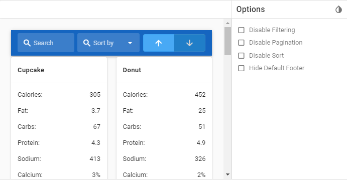
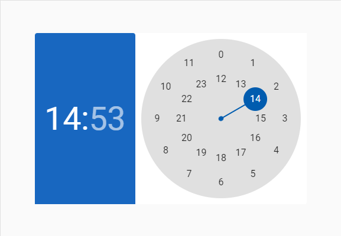
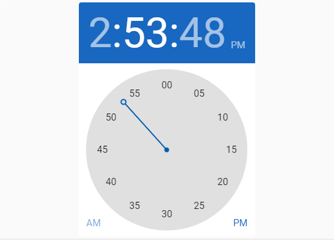
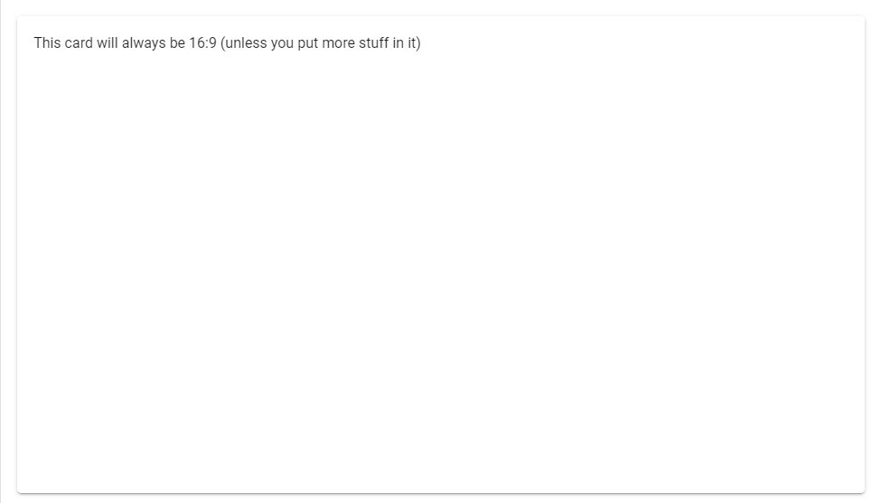
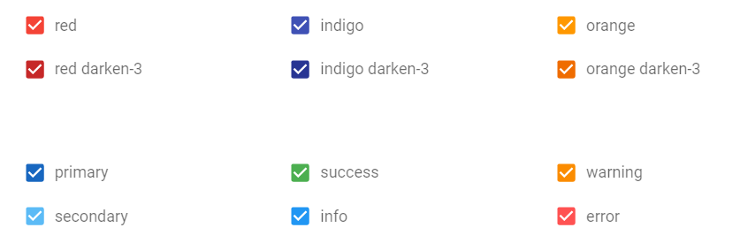
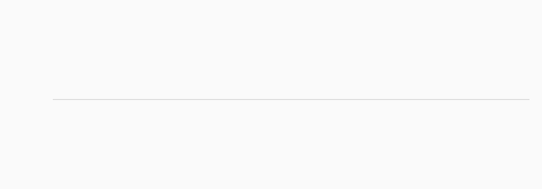
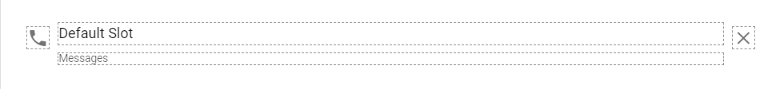
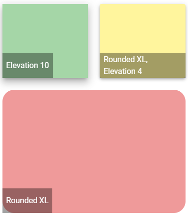

## 5. Vue.js elements

### 5.1 Alerts

[Vuetify documentation page](https://v2.vuetifyjs.com/en/components/alerts/)

- __Java__: _com.epam.jdi.light.vuetify.elements.common.Alert.java_

```java
    //@FindBy(css = "#tileAlert .v-alert")
    @UI("#tileAlert .v-alert")
    public static Alert tileAlert;

    @Test(description = "Check that tile alert is shown as expected")
    public void tileAlertTest(){
        tileAlert.show();
        tileAlert.has().text("Tile Alert")
            .has().color("rgba(255, 255, 255, 1)")
            .has().backgroundColor("rgba(76, 175, 80, 1)")
            .is().notDense()
            .is().tile()
            .has().type("success");
    }
```

The Alert component is used to convey important information to the user through the use of contextual types, icons, and colors.
There are four default types: success, info, warning, and error. Border, icon, and color of the alert could be customized.


__Vuetify v2.6.14__ code example:
```html
<div role="alert" class="v-alert v-sheet theme--light elevation-2 v-alert--border v-alert--border-bottom">
  <div class="v-alert__wrapper">
    <span aria-hidden="true" class="v-icon notranslate v-alert__icon theme--light warning--text">
      <svg xmlns="http://www.w3.org/2000/svg" viewBox="0 0 24 24" role="img" aria-hidden="true" class="v-icon__svg">
        <path d="M12,2L1,21H23M12,6L19.53,19H4.47M11,10V14H13V10M11,16V18H13V16"></path>
      </svg>
    </span>
    <div class="v-alert__content"> Fusce commodo aliquam arcu. </div>
    <div class="v-alert__border v-alert__border--bottom warning v-alert__border--has-color"></div>
  </div>
</div>
```

| Method | Description | Return Type |
| :--- | :--- | :--- |
**closeButton()** | Returns close button object | VuetifyButton
**hasCloseButton()** | Returns true if alert has close button | boolean 
**isDismissible()** | Returns true if alert has close button | boolean [](the same as previous!)
**isProminent()** | Returns true if alert is prominent and has halo for icon and increased height | boolean 
**hasBorder()** | Returns true if alert has border | boolean
**borderValue()** | Returns border side (top, right, bottom or left) | String
**hasColoredBorder()** | Returns true if alert border has color | boolean
**borderBackGroundColor()** | Returns border background color | boolean
**type()** | Returns alert type (info, success, warning, error) or empty string if type is undefined | String 

| Assert method | Description |
| :--- | :--- |
**text(Matcher<String condition)** | Asserts if alert text matches provided matcher
**dismissible()** or **hasCloseButton()** | Asserts if alert has close button
**notDismissible()** or **hasNotCloseButton()** | Asserts if alert has no close button
**prominent()** | Asserts if alert is prominent and has halo for icon
**prominent()** | Asserts if alert is not prominent and has no halo for icon
**border()** | Asserts if alert is prominent and has halo for icon
**noBorder()** | Asserts if alert is not prominent and has no halo for icon
**border(String borderValue)** | Asserts if alert has expected border side (top, right, bottom or left)
**coloredBorder()** | Asserts if alert has colored border
**noColoredBorder()** | Asserts if alert has not colored border
**backgroundBorderColor(String borderBackgroundColor)** | Asserts if alert has expected border background color
**type()** | Asserts if alert has expected type (info, success, warning, error)

Alert also have basic JDI elements methods and asserts for Text, Color, Elevation, Outline, Measurements, Theme and others

For examples of usage see: [Custom vuetify alert example](https://github.com/jdi-testing/jdi-light/blob/vuetify-develop/jdi-light-vuetify-tests/src/main/java/io/github/com/custom/alerts/IconAlert.java)
and [JDI vuetify page tests for alerts](https://github.com/jdi-testing/jdi-light/blob/vuetify-develop/jdi-light-vuetify-tests/src/test/java/io/github/epam/vuetify/tests/common/AlertsTests.java).

### 5.2 Avatars

[Vuetify documentation page](https://v2.vuetifyjs.com/en/components/avatars/)

Avatar is located in the following class:
- __Java__: _com.epam.jdi.light.vuetify.elements.common.Avatar.java_

```java
//@FindBy(css = "#avatarsWithSize .v-avatar")
@UI("#avatarsWithSize .v-avatar")
public static List<Avatar> sizeAvatars;

@Test
public void avatarTest() {
  sizeAvatars.get(1).show();
  sizeAvatars.get(1).has().size(36).and().text("36")
        .and().backgroundColor(INDIGO.value());
}
```


__Vuetify v2.6.14__ code example:
```html
<div class="v-avatar indigo" style="height: 36px; min-width: 36px; width: 36px;">
  <span class="white--text text-h5">36</span>
</div>
```

__Avatars__ - graphical representations of users.

|Method | Description   | Return Type
--- |---------------| ---
**is()** | Avatar Assert | AvatarAssert
**getText()** | Gets '{name}' text | String
**isTile()** | Checks that '{name}' is tile | boolean
**hasLeftAlignment()** | Checks that '{name}' has left alignment | boolean
**hasRightAlignment()** | Check that '{name}' has right alignment | boolean
**color()** | Gets '{name}' color | String
**backgroundColor()** | Gets '{name}' background color | String
**icon()** | Gets '{name}' icon | Icon
**hasIcon()** | Checks that '{name}' has icon | boolean
**image()** | Gets '{name}' image | Image
**height()** | Gets '{name}' height | int
**width()** | Gets '{name}' width | int
**maxHeight()** | Gets '{name}' max height | int
**maxWidth()** | Gets '{name}' max width | int
**minHeight()** | Gets '{name}' min height | int
**minWidth()** | Gets '{name}' min width | int
**isRounded()** | Checks that '{name}' is rounded | boolean
**rounded()** | Gets '{name}' rounded value | String

For examples of usage see: [Custom vuetify avatar example (profile card)](https://github.com/jdi-testing/jdi-light/blob/vuetify-develop/jdi-light-vuetify-tests/src/main/java/io/github/com/custom/ProfileCard.java)
and [JDI vuetify page tests for avatars](https://github.com/jdi-testing/jdi-light/blob/vuetify-develop/jdi-light-vuetify-tests/src/test/java/io/github/epam/vuetify/tests/common/AvatarsTests.java).

### 5.3 Banners

[Vuetify documentation page](https://vuetifyjs.com/en/components/banners/)

- __Java__: _com.epam.jdi.light.vuetify.elements.complex.Banner.java_

```java
    @Test
    public void singleBannerTests() {
        singleBanner.is().displayed();
        singleBanner.has().text("We can't save your edits");
    }
```


Banners may contain anything, you can inherit the `Banner` class and customize it
the way you want.

Basically, you have methods that can return you elements containing in banner (buttons, checkers, icons, etc.).

|Method | Description | Return Type
        --- | --- | ---
**is()** | Returns Assert class | BannerAssert
**buttons()** | Returns button group containing in the element | ButtonGroup
**icon()** | Returns icon containing in the element | Icon
**getText()** | Returns text content of the element | Text

For examples of usage see: [JDI vuetify page tests for banners](https://github.com/jdi-testing/jdi-light/blob/vuetify-develop/jdi-light-vuetify-tests/src/test/java/io/github/epam/vuetify/tests/complex/BannersTests.java).

### 5.4 Bars

#### 5.4.1 Basic bar

- __Java__: _com.epam.jdi.light.vuetify.elements.complex.bars.BasicBar.java_

Basic bar is an abstract class that contains methods that are common for its specific realisations such as App Bar, Tool Bar and System Bar following below.

|Method | Description | Return Type
--- | --- | ---
**menuButton()** | Returns 'Menu' button containing in the element | VuetifyButton
**title()** | Returns element's title | Text
**verticalDotsButton()** | Returns 'Vertical Dots' button containing in the element | VuetifyButton
**searchButton()** | Returns 'Search' button containing in the element | VuetifyButton
**heartButton()** | Returns 'Heart' button containing in the element | VuetifyButton

#### 5.4.2 App Bars

[Vuetify documentation page](https://vuetifyjs.com/en/components/app-bars/)

- __Java__: _com.epam.jdi.light.vuetify.elements.complex.bars.AppBar.java_

```java
    @Test
    public void collapsibleBarTests() {
      collapsibleBar.is().displayed();
      collapsibleBar.menuButton().is().displayed();
      collapsibleBar.has().title();
      collapsibleBar.has().textInTitle("Collapsing Bar");
      collapsibleBar.scrollBarToBottom();
      collapsibleBar.has().hiddenTitle();
      collapsibleBar.scrollBarToTop();
      collapsibleBar.has().title();
      collapsibleBar.checkbox().is().displayed();
      collapsibleBar.checkbox().is().checked();
      collapsibleBar.checkbox().uncheck();
      collapsibleBar.checkbox().is().unchecked();
      collapsibleBar.has().hiddenTitle();
      collapsibleBar.checkbox().check();
      collapsibleBar.has().title();
    }
```


App bar component extends abstract class Basic Bar. It is pivotal to any graphical user interface (GUI), as it generally is the primary source of site navigation.

|Method | Description | Return Type
--- | --- | ---
**is()** | Returns Assert class | AppBarAssert
**checkbox()** | Returns checkbox containing in the element | Checkbox
**menu()** | Returns menu containing in the element | Menu
**hasClickableTabs()** | Returns true if element has clickable tabs | boolean
**hasHiddenHeader()** | Returns true if element's header is hidden | boolean
**hasVisibleHeader()** | Returns true if element's header is visible | boolean
**getHeaderHeight()** | Returns element's header's height | String
**getHeaderOpacity()** | Returns element's header's opacity | Integer
**hasHiddenHeaderShadow()** | Returns true if element's header's shadow is hidden | boolean
**hasVisibleHeaderShadow()** | Returns true if element's header's shadow is visible | boolean
**hasNavigationMenu()** | Returns true if element contains navigation menu | boolean
**scrollBarToBottom()** | Scrolls element to bottom | void
**scrollBarToTop()** | Scrolls element to top | void

For examples of usage see: [JDI vuetify page tests for app bars](https://github.com/jdi-testing/jdi-light/blob/vuetify-develop/jdi-light-vuetify-tests/src/test/java/io/github/epam/vuetify/tests/complex/AppBarsTests.java).

#### 5.4.3 System bars

[Vuetify documentation page](https://vuetifyjs.com/en/components/system-bars/)

- __Java__: _com.epam.jdi.light.vuetify.elements.complex.bars.SystemBar.java_

```java
    @Test
    public void systemBarColoredPrimaryTests() {
      systemBarColoredPrimary.is().displayed();
      systemBarColoredPrimary.has().text("System bar color 1");
      systemBarColoredPrimary.wiFiIcon().is().displayed();
      systemBarColoredPrimary.signalIcon().is().displayed();
      systemBarColoredPrimary.batteryIcon().is().displayed();
      systemBarColoredPrimary.has().time("12:30");
      systemBarColoredPrimary.has().backgroundColor(BLUE_DARKEN_2.value());
    }
```


System bar component extends abstract class Basic Bar. It can be used for displaying statuses to the user. It looks like the Android system bar and can contain icons, spacers, and some text.

|Method | Description | Return Type
--- | --- | ---
**is()** | Returns Assert class | SystemBarAssert
**getBackgroundColor()** | Returns element's background color | String
**getPosition()** | Returns element's position | String
**getTime()** | Returns text from element's 'time' field | String
**wiFiIcon()** | Returns 'Wi-Fi' icon containing in the element | Icon
**signalIcon()** | Returns 'Signal' icon containing in the element | Icon
**batteryIcon()** | Returns 'Battery' icon containing in the element | Icon
**messageIcon()** | Returns 'Message' icon containing in the element | Icon
**minusIcon()** | Returns 'Minus' icon containing in the element | Icon
**blankCheckboxIcon()** | Returns 'Blank Checkbox' icon containing in the element | Icon
**closeIcon()** | Returns 'Close' icon containing in the element | Icon

For examples of usage see: [JDI vuetify page tests for system bars](https://github.com/jdi-testing/jdi-light/blob/vuetify-develop/jdi-light-vuetify-tests/src/test/java/io/github/epam/vuetify/tests/complex/SystemBarsTests.java).

#### 5.4.4 Toolbars

[Vuetify documentation page](https://vuetifyjs.com/en/components/toolbars/)

- __Java__: _com.epam.jdi.light.vuetify.elements.complex.bars.ToolBar.java_

```java
    @Test
    public void denseToolbarTests() {
      denseToolbar.is().displayed();
      denseToolbar.menuButton().is().displayed();
      denseToolbar.has().title();
      denseToolbar.has().textInTitle("Title");
      denseToolbar.searchButton().is().displayed();
      denseToolbar.heartButton().is().displayed();
      denseToolbar.verticalDotsButton().is().displayed();
      denseToolbar.has().denseHeader();
      denseToolbar.has().heightOfHeader(48);
    }
```


Toolbar component extends abstract class Basic Bar. It is pivotal to any gui, as it generally is the primary source of site navigation.

|Method | Description | Return Type
--- | --- | ---
**is()** | Returns Assert class | ToolBarAssert
**closeButton()** | Returns 'Close' button containing in the element | VuetifyButton
**deleteButton()** | Returns 'Delete' button containing in the element | VuetifyButton
**exportButton()** | Returns 'Export' button containing in the element | VuetifyButton
**gpsButton()** | Returns 'GPS' button containing in the element | VuetifyButton
**appsButton()** | Returns 'Apps' button containing in the element | VuetifyButton
**searchIcon()** | Returns 'Search' icon containing in the element | Icon
**input()** | Returns input field containing in the element | Input
**select()** | Returns select containing in the element | Select
**backgroundImage()** | Returns element's background image | Image
**getHeaderHeight()** | Returns element's header's height | String
**getHeaderColor()** | Returns element's header's height | String
**hasHiddenButtons()** | Returns true if element's buttons are hidden | boolean
**hasCollapsedHeader()** | Returns true if element has collapsed header | boolean
**hasDenseHeader()** | Returns true if element has dense header | boolean
**hasExtendedHeader()** | Returns true if element extended header | boolean

For examples of usage see: [JDI vuetify page tests for toolbars](https://github.com/jdi-testing/jdi-light/blob/vuetify-develop/jdi-light-vuetify-tests/src/test/java/io/github/epam/vuetify/tests/complex/ToolBarsTests.java).


### 5.5 Bottom navigation

[Vuetify documentation page](https://vuetifyjs.com/en/components/bottom-navigation/)

- __Java__: _com.epam.jdi.light.vuetify.elements.composite.BottomNavigation.java_

```java
    @UI("#colorBottomNavigation")
    public static BottomNavigation bottomNavigationColor;

    @UI("#growBottomNavigation")
    public static BottomNavigation bottomNavigationGrow;


    @Test
    public void colorTest() {
        bottomNavigationColor.is().displayed();
        bottomNavigationColor.is().buttonColor(1, "rgba(0, 0, 0, 0.6)");
        bottomNavigationColor.bottomNavigationButtonList().get(1).click();
        bottomNavigationColor.is().buttonColor(1, Colors.BLUE_DARKEN_2.value());
    }

    @Test
    public void wightTest() {
      bottomNavigationGrow.is().displayed();
      bottomNavigationGrow.is().buttonWight(1, "168px");
      bottomNavigationGrow.is().buttonWight(2, "168px");
      bottomNavigationGrow.is().buttonWight(3, "168px");
    }
```


This name contains a WebList of buttons and provides access to them by index.

|Method | Description | Return Type
--- | --- | ---
**is()** | Returns Assert class | Assert
**bottomNavigationButtonList()** | Return | WebList
**getBackgroundColor()** | Return background color | String
**getClassAttribute()** | Return Class Attribute | String
**getButtonColor()** | Return Button RGBA Color value  | String
**getButtonWight()** | Return Button Wight  | String
**getButtonText** | Return Button Text | String

### 5.6 Bottom sheets

[Vuetify documentation page](https://vuetifyjs.com/en/components/bottom-sheets/)

- __Java__: _com.epam.jdi.light.vuetify.elements.composite.BottomSheet.java_

```java
public class TextBottomSheet extends BottomSheet {
  @UI(".text-center > div")
  protected Text text;
  @UI("button")
  protected Button button;
  public void close() { button.click(); }
  public Text sheetText() { return text; }
}
```

Bottom sheet is a form of dialog that appears at the bottom of a page.
You can inherit the class and define the inner content of the sheet.


```java
@Test
public void checkInsetSheetCssProps() {
    insetBottomSheet.is().hidden();
    insetBottomSheetButton.click();
    insetBottomSheet.is().displayed();
    insetBottomSheet.sheetText().has().text(containsString("the inset prop"));
    insetBottomSheet.close();
    insetBottomSheet.is().hidden();
}
```


|Method | Description | Return Type
--- | --- | ---
**is()** | Returns Assert class | BottomNavigationAssert
**getBackgroundColor()** | Returns element's background color | String
**getClassAttribute()** | Returns element's class attribute | String
**getTransform()** | Returns element's transform | String
**bottomNavigationButtonList()** | Returns element's buttons | WebList
**getButtonColor(int)** | Returns color of required element's button | String
**getButtonWight(int)** | Returns width of required element's button | String
**getButtonDirection(int)** | Returns direction of required element's button | String
**getButtonText(int)** | Returns text of required element's button | String

For examples of usage see: [Vuetify Bottom sheets tests](https://github.com/jdi-testing/jdi-light/blob/vuetify-develop/jdi-light-vuetify-tests/src/test/java/io/github/epam/vuetify/tests/composite/BottomSheetsTests.java).

### 5.7 Breadcrumbs

[Vuetify documentation page](https://vuetifyjs.com/en/components/breadcrumbs/)

Breadcrumbs is located in the following class:
- __Java__: _com.epam.jdi.light.vuetify.elements.complex.Breadcrumbs.java_

```java
//@FindBy(css = "#differentDividersBreadcrumbs')
    @JDIBreadcrumbs(
            root = "#differentDividersBreadcrumbs > ul:nth-child(2)",
            items = ".v-breadcrumbs__item",
            dividers = ".v-breadcrumbs__divider"
    )
    public static Breadcrumbs forwardSlashedBreadcrumbs;
    
     @JDIBreadcrumbs(root = "#itemSlotBreadcrumbs > ul")
    public static Breadcrumbs itemSlotsBreadcrumbs;


    @Test(description = "Test checks dividers types")
    public void dividersTypeTest() {
        dashedBreadcrumbs.show();
        dashedBreadcrumbs.has().dividerType("-");
        forwardSlashedBreadcrumbs.show();
        forwardSlashedBreadcrumbs.has().dividerType("/");
        dottedBreadcrumbs.show();
        dottedBreadcrumbs.has().dividerType(".");
        semicolonBreadcrumbs.show();
        semicolonBreadcrumbs.has().dividerType(";");
        greaterSignBreadcrumbs.show();
        greaterSignBreadcrumbs.has().dividerType(">");
    }
    
```

Breadcrumbs can be used to specify locators for the root, links and dividers
explicitly through a `JDIBreadcrumbs` annotation.It is **necessary** to specify **the root** of an element.


__Vuetify v2.6.14__ code example:

```html
<div id="differentDividersBreadcrumbs">
   <ul class="v-breadcrumbs theme--light">
      <li>
         <a href="#dashboard" class="v-breadcrumbs__item">Dashboard</a>
      </li>
       <li class="v-breadcrumbs__divider">-</li>
      <li>
         <a href="#link1" class="v-breadcrumbs__item">Link 1</a>
      </li>
      <li class="v-breadcrumbs__divider">-</li>
      <li><a href="#link2" class="v-breadcrumbs__item v-breadcrumbs__item--disabled">Link 2</a>
      </li>
   </ul>
```
Breadcrumbs has the following methods:

|Method                           | Description                      | Return Type
----------------------------------| ------------------------ --------|-----------------------------------
**selected()**                    | Returns selected element                       | String
**selected(String)**              | Shows that required element is selected        | String
**dividers()**                    | Returns element's dividers                     | WebList
**items()**                       | Returns element's items                        | WebList
**isLarge()**                     | Check if element is large                      | boolean
**setup(Field)**                  | Setting up Breadcrumbs element by Field        | void         
**setup(String, String, String)** | Returns Breadcrumbs element by locators        | Breadcrumbs       
**is()**                          | Returns object for work with assertions        | BreadcrumbsAssert  
**isDisabled()**                  | Check that breadcrumb is disabled              | boolean
**isEnabled()**                   | Check that breadcrumb is not disabled          | boolean


<a href=https://github.com/jdi-testing/jdi-light/blob/vuetify-develop/jdi-light-vuetify-tests/src/test/java/io/github/epam/vuetify/tests/complex/BreadcrumbsTests.java">Java test examples</a>

### 5.8 Cards

[Vuetify documentation page](https://vuetifyjs.com/en/components/cards/)

- __Java__: _com.epam.jdi.light.vuetify.elements.complex.Card.java_

```java
public class MediaTextCard extends Card {
    @UI(".v-image__image")
    protected Image image;
    public Image image() {
        return image;
    }
    public Button shareButton() {
        return new Button().setCore(Button.class, actions().find("//button[./span[contains(text(), 'Share')]]"));
    }
    public Button exploreButton() {
        return new Button().setCore(Button.class, actions().find("//button[./span[contains(text(), 'Explore')]]"));
    }
}
```

```java
    @Test
    public void mediaTextCardTest() {
        mediaTextCard.is().displayed();
        mediaTextCard.image().has().css("background-size", "cover");
        mediaTextCard.has().title("Top 10 Australian beaches");
        mediaTextCard.has().subtitle(containsString("Number 10"));
        mediaTextCard.content().has().text(containsString("Whitehaven Beach"));
        mediaTextCard.shareButton().click();
        mediaTextCard.exploreButton().click();
    }
```


Cards may contain anything, you can inherit the `Card` class and customize it
the way you want.


Basically, you have 4 methods: `title`, `subtitle`, `content` and `actions`.
They return the parts of a card described [here](https://vuetifyjs.com/en/components/cards/#api).
The `content` method returns a
card `text` element, but the `text` method is inherited from `UIBaseElement` that why it has a different name.

|Method | Description | Return Type
--- | --- | ---
**is()** | Returns Assert class | CardAssert
**title()** | Returns element's title | UIElement
**subtitle()** | Returns element's subtitle | UIElement
**content()** | Returns element's content | UIElement
**actions()** | Returns element's action | UIElement

For examples of usage see: [Custom vuetify card examples](https://github.com/jdi-testing/jdi-light/tree/vuetify-develop/jdi-light-vuetify-tests/src/main/java/io/github/com/custom/cards)
and [JDI vuetify page tests for cards](https://github.com/jdi-testing/jdi-light/blob/vuetify-develop/jdi-light-vuetify-tests/src/test/java/io/github/epam/vuetify/tests/complex/CardsTests.java).

### 5.9 Dialogs

[Vuetify documentation page](https://vuetifyjs.com/en/components/dialogs/)

- __Java__: _com.epam.jdi.light.vuetify.elements.complex.Dialog.java_

```java
    @Test
    public static void formDialogTest() {
        formDialog.open();
        formDialog.is().opened();
        formDialog.has().title("User Profile");
        formDialog.fillTheForm("John", "Hadley", "Chase", "john@hadley.com",
                "12345", 4, "Soccer", "Skiing", "Writing");
        formDialog.save();
        formDialog.is().closed();
    }

```


The Dialog component inform users about a specific task and may contain critical information, require decisions, or involve multiple tasks.

|Method | Description | Return Type
--- | --- | ---
**open()** | Opens required dialog| void
**isOpened()** | Shows that dialog is opened| boolean[
**openMenu()** | Opens menu in dialog| void
**selectMenuElement()** | Selects required menu's in element| void
**openNestedDialog()** | Opens nested dialog| boolean
**nestedDialogIsOpen()** | Shows that shows that nested dialog is opened| boolean
**closeNestedDialog()** | Closes nested dialog| void
**openTooltip()** | Opens the tooltip in dialog| void
**tooltipIsOpened()** | Shows that tooltip is open| boolean
**getTitle()** | Gets dialog title| String
**elementText()** | Gets required dialog's element text| String
**cardText()** | Gets dialog text| String
**checkElement()** | Checks required dialog's element| void
**uncheckElement()** | Unchecks required dialog's element| void
**selectRadiobutton()** | Selects required dialog's radiobutton| void
**isSelected()** | Shows that button is selected| boolean
**isNotSelected()** | Shows that button is not selected| boolean
**fillTheForm()** | Fills dialog's form with required value| void
**save()** | Closes dialog and saves changes| void
**cancel()** | Closes dialog without saves changes| void
**isLoading()** | Shows that dialog is loading| boolean

For examples of usage see: [JDI vuetify page tests for dialogs](https://github.com/jdi-testing/jdi-light/blob/vuetify-develop/jdi-light-vuetify-tests/src/test/java/io/github/epam/vuetify/tests/complex/DialogTests.java).

### 5.10 Expansion Panels

[Vuetify documentation page](https://vuetifyjs.com/en/components/expansion-panels/)

__Java__:
- _com.epam.jdi.light.vuetify.elements.complex.panels.ExpansionPanels.java_
- _com.epam.jdi.light.vuetify.elements.complex.panels.ExpansionPanel.java_

```java
    //Default locators(except root):
    @JDIExpansionPanels(
        root = "#ModelExpansionPanel .v-expansion-panels",
        panels = ".v-expansion-panel",
        header = ".v-expansion-panel-header",
        icon = ".v-expansion-panel-header__icon .v-icon",
        content = ".v-expansion-panel-content"
    )
    public static ExpansionPanels modelExpansionPanels;
```

You can specify locators for the root and panels to find panels in root. 
Also, you can specify header, icon and content locators for all panels. All of it you can do
explicitly through a `JDIExpansionPanels` annotation. 

It is **necessary** to specify **the root** of an element.

```java
    @JDIExpansionPanels(root = "#CustomIconExpansionPanel .v-expansion-panels:nth-child(1)")
    public static ExpansionPanels customIconExpansionPanelsSameIcons;
```

```java
    @Test
    public void customIconExpansionPanelTest() {
        customIconExpansionPanelsSameIcons.has().size(5);
        for (ExpansionPanel expansionPanel : customIconExpansionPanelsSameIcons.panels()) {
            expansionPanel.header().has().text("Item");
            expansionPanel.content().has().text(LOREM_IPSUM_TEXT);
            expansionPanel.is().expanded();
            expansionPanel.expander().is().displayed();
            expansionPanel.expander().has().cssClass("mdi-menu-down");
        }
    }
```


ExpansionPanels is a list of ExpansionPanel.

Expansion panel may contain anything, so you can inherit the `ExpansionPanel` class and customize it
the way you need. This class has 3 base methods: `header`, `expander` and `content`. 
They return the parts of an expansion panel. 

Also, you can inherit the `ExpansionPanels`.

`ExpansionPanels` methods:

|Method | Description | Return Type
--- | --- | ---
**panels()** | Returns list of panels as Expansion Panel | List\<ExpansionPanel>
**list()** | Returns list of panels as UIElement | WebList

`ExpansionPanel` methods:

|Method | Description | Return Type
--- | --- | ---
**header()** | Returns header element by header locator from JDIExpansionPanels annotation | UIElement
**expander()** | Returns expander element by icon locator from JDIExpansionPanels annotation | Icon
**content()** | Expands if panel is closed. Returns content element by content locator from JDIExpansionPanels annotation| UIElement
**expand()** | Expands panel | void
**close()** | Closes panel | void
**isExpanded()** | Returns true if panel is expanded | boolean
**isClosed()** | Returns true if panel is closed | boolean

For examples of usage see: [Custom vuetify expansion panels examples](https://github.com/jdi-testing/jdi-light/tree/vuetify-develop/jdi-light-vuetify-tests/src/main/java/io/github/com/custom/panels)
and [JDI vuetify page tests for expansion panels](https://github.com/jdi-testing/jdi-light/blob/vuetify-develop/jdi-light-vuetify-tests/src/test/java/io/github/epam/vuetify/tests/complex/ExpansionPanelsTest.java).

### 5.11 Footers

```java
//@FindBy(css = "#IndigoFooter")
@UI("#IndigoFooter")
public static IndigoFooter indigoFooter;

@Test(description = "Test checks custom element indigo footer")
public void indigoFooterTest() {
  indigoFooter.show();
  // footer itself does not have indigo color but inner container has
  indigoFooter.firstChild().has().css("background-color", Colors.INDIGO_LIGHTEN_1.value());
  indigoFooter.footerText().has().text(containsString(expectedVuetifyText));
  indigoFooter.divider().has().darkTheme();
  indigoFooter.descriptionText().has().text(containsString("Phasellus feugiat arcu sapien"));
  indigoFooter.socialButtons().forEach(HasClick::click);
}

//@FindBy(css = "#PadlessFooter")
@UI("#PadlessFooter")
public static Footer padlessFooter;

@Test(description = "Test checks if footer is padless or not")
public void padlessFooterTest() {
  padlessFooter.show();
  padlessFooter.is().padless();
  shapedFooter.show();
  shapedFooter.is().notPadless();
}
```

[Vuetify documentation page](https://v2.vuetifyjs.com/en/components/footer/)

- __Java__: _com.epam.jdi.light.vuetify.elements.composite.Footer.java_

__Footer__ - The v-footer component is used for displaying general information that a user might want to access from any page within your site.


__Vuetify v2.6.14__ code example:

```html
<footer class="v-footer v-sheet theme--dark v-footer--padless" id="IndigoFooter" data-booted="true">
  <div class="indigo lighten-1 white--text text-center v-card v-card--flat v-sheet theme--dark rounded-0">
    <div class="v-card__text">
      <button type="button" class="mx-4 white--text v-btn v-btn--icon v-btn--round theme--dark v-size--default">
				<span class="v-btn__content">
					<i aria-hidden="true" class="v-icon notranslate mdi mdi-facebook theme--dark" style="font-size: 24px;"></i>
				</span>
      </button>
      <button type="button" class="mx-4 white--text v-btn v-btn--icon v-btn--round theme--dark v-size--default">
				<span class="v-btn__content">
					<i aria-hidden="true" class="v-icon notranslate mdi mdi-twitter theme--dark" style="font-size: 24px;"></i>
				</span>
      </button>
      <button type="button" class="mx-4 white--text v-btn v-btn--icon v-btn--round theme--dark v-size--default">
				<span class="v-btn__content">
					<i aria-hidden="true" class="v-icon notranslate mdi mdi-linkedin theme--dark" style="font-size: 24px;"></i>
				</span>
      </button>
      <button type="button" class="mx-4 white--text v-btn v-btn--icon v-btn--round theme--dark v-size--default">
				<span class="v-btn__content">
					<i aria-hidden="true" class="v-icon notranslate mdi mdi-instagram theme--dark" style="font-size: 24px;"></i>
				</span>
      </button>
    </div>
    <div class="v-card__text white--text pt-0">Footer visible text here</div>
    <hr role="separator" aria-orientation="horizontal" class="v-divider theme--dark">
    <div class="v-card__text white--text">
      2023 — <strong>Vuetify</strong>
    </div>
  </div>
</footer>
```

| Method                                      | Description                                                                | Return Type  |
|---------------------------------------------|----------------------------------------------------------------------------|--------------|
| **is()**                                    | Returns Assert class                                                       | FooterAssert |
| **isPadless()**                             | Checks that element is padless                                             | boolean      |
| **isAbsolute()**                            | Checks that element is absolute                                            | boolean      |
| **isFixed()**                               | Checks that element is fixed                                               | boolean      |
| **has()**                                   | Returns Assert class                                                       | FooterAssert |
| **color()**                                 | Returns css attribute background-color as String Value                     | String       |
| **waitFor()**                               | Returns object for work with assertions                                    | FooterAssert |
| **shouldBe()**                              | Returns object for work with assertions                                    | FooterAssert |
| **verify()**                                | Returns object for work with assertions                                    | FooterAssert |
| **assertThat()**                            | Returns object for work with assertions                                    | FooterAssert |
| **classes()**                               | Gets all element's classes as list                                         | List<String> |
| **doubleClick()**                           | Double clicks on the element                                               | void         |
| **dragAndDropTo(int x, int y)**             | Drags and drops element to certain coordinates                             | void         |
| **dragAndDropTo(WebElement to)**            | Drags and drops element to another element                                 | void         |
| **getLocation()**                           | Gets element location as point                                             | Point        |
| **getSize()**                               | Gets element size                                                          | Dimension    |
| **getTagName()**                            | Gets element tag name                                                      | String       |
| **getText()**                               | Gets element text                                                          | String       |
| **getValue()**                              | Gets element text                                                          | String       |
| **hasAttribute(String attrName)**           | Returns true if the element has an expected attribute                      | boolean      |
| **hasClass(String className)**              | Returns true if the element has an expected class                          | boolean      |
| **highlight()**                             | Highlights element with red color                                          | void         |
| **highlight(String color)**                 | Scrolls view to element and highlights it with a border of specified color | void         |
| **hover()**                                 | Hovers mouse cursor over the element                                       | void         |
| **isDisabled()**                            | Checks that element is disabled                                            | boolean      |
| **isDisplayed()**                           | Checks that element is displayed                                           | boolean      |
| **isEnabled()**                             | Checks that element exists                                                 | boolean      |
| **isHidden()**                              | Checks that element is hidden                                              | boolean      |
| **isNotExist()**                            | Checks that element does not exist                                         | boolean      |
| **isNotVisible()**                          | Checks that element is not visible by user                                 | boolean      |
| **isVisible()**                             | Checks that element is visible by user                                     | boolean      |
| **labelText()**                             | Gets label text                                                            | String       |
| **printHtml()**                             | Gets element “innerHTML” attribute value                                   | String       |
| **rightClick()**                            | Right clicks on the element                                                | void         |
| **setAttribute(String name, String value)** | Sets value to the specified attribute                                      | void         |
| **show()**                                  | Scrolls screen view to item                                                | void         |

<a href="https://github.com/jdi-testing/jdi-light/blob/vuetify-develop/jdi-light-vuetify-tests/src/test/java/io/github/epam/vuetify/tests/composite/FootersTests.java">Java test examples</a>

### 5.12 Form input & controls

#### 5.12.1 Overflow buttons

[Vuetify documentation page](https://vuetifyjs.com/en/components/overflow-btns/)

- __Java__: _com.epam.jdi.light.vuetify.elements.composite.OverflowButton.java_

```java
    @Test
public void baseFunctionalityOverflowButtonTest() {
  counterOverflowButton.is().enable();
  counterOverflowButton.is().placeholder("Overflow Btn w/ counter");
  counterOverflowButton.expand();
  counterOverflowButton.is().expanded();
  counterOverflowButton.close();
  counterOverflowButton.is().closed();
  counterOverflowButton.select("50%");
  counterOverflowButton.is().selected("50%");
  counterOverflowButton.select(1);
  counterOverflowButton.is().selected("100%");
  }
```


Overflow button is used to give the user the ability to select items from the list. It has 3 variations: editable, overflow and segmented

|Method | Description | Return Type
--- | --- | ---
**expand()/close()** | Open/close dropdown menu | void
**select(String text)/select(int index)** | Select element | void
**sendText(String text)** | Snd text in input field | void
**clear()** | Clear input field | void
**selected()** | Get selected text | String
**hint()** | Get hint text | String
**placeholder()** | Get placeholder text | String
**counterMessage()** | Get counter text | String
**isExpanded()/isClosed()** | Shows that dropdown menu is open/close | void
**isDisabled()/isEnabled()** | Shows that required element is disabled/enabled | void
**isEditable()** | Shows that required element is editable | void
**readOnly()** | Shows that required element is readOnly | void
**hasProgressBar** | Shows that required element has progress bar | void

For examples of usage see: [JDI Vuetify Lists tests](https://github.com/jdi-testing/jdi-light/blob/vuetify-develop/jdi-light-vuetify-tests/src/test/java/io/github/epam/vuetify/tests/complex/OverflowButtonsTest.java).

#### 5.12.2 Range Slider

[Vuetify documentation page](https://vuetifyjs.com/en/components/range-sliders/)

- __Java__: _com.epam.jdi.light.vuetify.elements.complex.RangeSlider.java_

```java
@Test
public void minAndMaxRangeSliderTest() {
    minAndMaxRangeSlider.slideHorizontalTo(11, 66);
    minAndMaxRangeSlider.is().value(11, 66);
    minAndMaxRangeSlider.slideHorizontalTo(-50, 90);
    minAndMaxRangeSlider.is().value(-50, 90);
}
```

The Range Slider component is a better visualization of the number input. 
It is used for gathering numerical user data. Sliders reflect a range of values along a bar, from which users may select a single value. 
They are ideal for adjusting settings such as volume, brightness, or applying image filters.

|Method | Description | Return Type
--- | --- | ---
**isDisabled()** | Shows that required element is disabled| boolean
**isThumbLabelDisplayed()** | Shows that thumb label of required element is displayed| boolean
**isAlwaysShow()** | Shows that ticks of required element is always show| boolean
**isVertical()** | Shows that required element is vertical| boolean
**slideHorizontalTo(int valueLeft, int valueRight)** | Set in horizontal slider left thumb to valueLeft and right thumb to valueRight| void
**slideVerticalTo(int valueLeft, int valueRight)** | Set in vertical slider upper thumb to valueLeft and lower thumb to valueRight| void
**getThumbLabelValue()** | Get label of the first and second thumb| List<String>
**getValue()** | Get first and second value| List<Integer>
**getTickLabel()** | Get tick label| String


For examples of usage see: [JDI Vuetify Range sliders tests](https://github.com/jdi-testing/jdi-light/blob/vuetify-develop/jdi-light-vuetify-tests/src/test/java/io/github/epam/vuetify/tests/complex/RangeSliderTests.java)

#### 5.12.3 Slider

[Vuetify documentation page](https://v2.vuetifyjs.com/en/components/sliders/)

- __Java__: _com.epam.jdi.light.vuetify.elements.complex.Slider.java_

```java
  //@FindBy(css = "#AdjustableSlider .v-slider")
  @UI("#AdjustableSlider .v-slider")
  public static Slider adjustableSlider;

  @Test(description = "Test shows how to work with slider")
  public void sliderTest() {
    adjustableSlider.show();
    adjustableSlider.has().minValue(0).and().has().maxValue(100);
    adjustableSlider.is().horizontal();
    adjustableSlider.setValue(30);
    adjustableSlider.has().value(30);
  }
```

The Slider component is a better visualization of the number input. It is used for gathering numerical user data.


__Vuetify v2.6.14__ code example:

```html
<div class="v-slider v-slider--horizontal theme--light">
  <input value="25" id="input-885" disabled="disabled" readonly="readonly" tabindex="-1">
  <div class="v-slider__track-container">
    <div class="v-slider__track-background primary lighten-3" style="right: 0px; width: calc(75%);">
    </div>
    <div class="v-slider__track-fill orange darken-3" style="left: 0px; right: auto; width: 25%;">
    </div>
  </div>
  <div role="slider" tabindex="0" aria-label="color" aria-valuemin="0" aria-valuemax="100" aria-valuenow="25" aria-readonly="false" aria-orientation="horizontal" class="v-slider__thumb-container orange--text text--darken-3" style="left: 25%;">
    <div class="v-slider__thumb orange darken-3">
    </div>
  </div>
</div>
```

| Method                                              | Description                                           | Return Type    
-----------------------------------------------------|-------------------------------------------------------|----------------
 **track()**                                         | Get track                                             | UIElement      
 **thumb()**                                         | Get thumb                                             | UIElement      
 **ticks()**                                         | Get ticks                                             | WebList        
 **tickLabel(int index)**                            | Get tick label value                                  | String         
 **thumbLabel()**                                    | Get thumb label                                       | Label          
 **prependOuterIcon()**                              | Get slider prepend outer icon                         | Icon           
 **appendOuterIcon()**                               | Get slider prepend append icon                        | Icon           
 **loader()**                                        | Get loader                                            | ProgressLinear 
 **label()**                                         | Get label                                             | Label          
 **value()**                                         | Get value                                             | double         
 **minValue()**                                      | Get min value                                         | double         
 **maxValue()**                                      | Get max value                                         | double         
 **setValue(Integer value)/ setValue(Double value)** | Set slider to value                                   | void           
 **ticksSize()**                                     | Get ticks size                                        | int            
 **thumbSize()**                                     | Get thumb size                                        | int            
 **backgroundColor()**                               | Get background color                                  | String         
 **thumbColor()**                                    | Get thumb color                                       | String         
 **trackFillColor()**                                | Get track fill color                                  | String         
 **trackBackgroundColor()**                          | Get track background color                            | String         
 **clickOutsideOfSlider()**                          | Clicking outside the sheet                            | void           
 **isAlwaysShow()**                                  | Check that ticks of required element is always show   | boolean        
 **isError()**                                       | Check that required element is error                  | boolean        
 **isSuccess()**                                     | Check that required element is success                | boolean        
 **hasThumbLabel()**                                 | Check that thumb label of required element is existed | boolean        
 **hasInverseLabel()**                               | Check that required element has inverse label         | boolean        

For examples of usage see: [JDI Vuetify Sliders tests](https://github.com/jdi-testing/jdi-light/blob/vuetify-develop/jdi-light-vuetify-tests/src/test/java/io/github/epam/vuetify/tests/complex/SlidersTests.java)

#### 5.12.4 Switches

[Switches Vuetify documentation page](https://vuetifyjs.com/en/components/switches/)

Switches are located in the following class:
- __Java__: _com.epam.jdi.light.vuetify.elements.common.Switch.java_

```java
//@FindBy(css = "#ColorsSwitch .v-input--switch")
@UI("#ColorsSwitch .v-input--switch")
public static List<Switch> colorSwitches;

@Test(description = "Test checks parameters of switch: color, text, functionality")
public void functionalityAndCssStyleSwitchTest() {
  String red = "red";
  final Switch redSwitch = colorSwitches.get(1);
  redSwitch.show();
  redSwitch.is().checked();
  redSwitch.label().has().text(red);
  redSwitch.has().value(red);
  redSwitch.has().color(RED.value());
  redSwitch.has().detailsHidden();
  redSwitch.uncheck();
  redSwitch.is().unchecked();
}
```
__Switches__ - The `v-switch` component provides users the ability to choose between two distinct values.


__Vuetify v2.6.14__ code example:

```html
<div class="v-input v-input--hide-details theme--light v-input--selection-controls v-input--switch">
  <div class="v-input__control">
    <div class="v-input__slot">
      <div class="v-input--selection-controls__input">
        <input aria-checked="false" id="input-1187" role="switch" type="checkbox" aria-disabled="false" value="red">
        <div class="v-input--selection-controls__ripple">
        </div>
        <div class="v-input--switch__track theme--light">
        </div>
        <div class="v-input--switch__thumb theme--light">
          <!---->
        </div>
      </div>
      <label for="input-1187" class="v-label theme--light" style="left: 0px; right: auto; position: relative;">red</label>
    </div>
  </div>
</div>
```

|Method | Description                                     | Return Type
--- |-------------------------------------------------| ---
**check()/uncheck()** | Switch element between two states               | void
**value()** | Get switch value                                | String
**lable()** | Get switch label                                | Lable
**color()** | Get switch color in RGBA format                 | String
**backgroundColor()** | Get switch background color in RGBA format      | String
**slotsBackgroundColor()** | Get switch slot background color in RGBA format | String
**getMessages()** | Get switch messages                             | List<String>
**getErrorMessages()** | Get switch error messages                       | List<String>
**getNumberErrorMessages()** | Get the number of switch error messages         | Integer
**getSuccessMessages()** | Get switch success messages                     | List<String>
**isChecked()/isNotChecked()** | Check if switch is selected/not selected        | boolean
**isEnabled()** | Check if switch is enabled                      | boolean
**isFlat()** | Checks that switch is flat                      | boolean
**isInset()** | Checks that switch is inset                     | boolean
**isReadonly()** | Checks that switch is readonly                  | boolean
**hasMessages()** | Check that switch has messages                  | boolean
**hasErrorMessage()** | Check that switch has error messages            | boolean
**hasSuccessMessage()** | Check that switch has success messages          | boolean
**hasIconAppend()** | Check that switch has icon-append               | boolean
**hasIconPrepend()** | Check that switch has icon-prepend              | boolean
**hasRipple()** | Check that switch has ripple                    | boolean
**is()** | Switch assert                                   | SwitchAssert

For examples of usage see: [JDI Vuetify Switch tests](https://github.com/jdi-testing/jdi-light/blob/vuetify-develop/jdi-light-vuetify-tests/src/test/java/io/github/epam/vuetify/tests/common/SwitchesTests.java).

#### 5.12.5 Text fields

[Vuetify documentation page](https://vuetifyjs.com/en/components/text-fields/)

- __Java__: _com.epam.jdi.light.vuetify.elements.complex.TextFields.java_

```java
@Test
public void hideDetailsTextFieldTest() {
    hideDetailsTextField.get(1).is().noMessage();
    hideDetailsTextField.get(1).focus();
    hideDetailsTextField.get(2).focus();
    hideDetailsTextField.get(1).message().has().text("Required.");
    hideDetailsTextField.get(1).setText("a");
    hideDetailsTextField.get(1).message().has().text("Min 3 characters");
    hideDetailsTextField.get(1).setText("aaa");
    hideDetailsTextField.get(1).is().noMessage();
    hideDetailsTextField.get(2).focus();
    hideDetailsTextField.get(2).is().noMessage();
    hideDetailsTextField.get(2).setText("a");
    hideDetailsTextField.get(2).is().noMessage();
}
  
@Test
public void passwordInputTextFieldTest() {
    passwordInputTextField.get(1).is().textType("password");
    passwordInputTextField.get(1).getAppendInnerIcon().click();
    passwordInputTextField.get(1).is().textType("text");
    passwordInputTextField.get(1).getAppendInnerIcon().click();
    passwordInputTextField.get(1).is().textType("password");
}
```


Text fields components are used for collecting user provided information.

|Method | Description | Return Type
--- | --- | ---
**isReadonly()** | Shows that element is readonly| boolean
**isFocused()** | Shows that element is focused| boolean
**isFilled()** | Shows that element is filled| boolean
**isOutlined()** | Shows that element is outlined| boolean
**isShaped()** | Shows that element is shaped| boolean
**isSolo()** | Shows that element is solo| boolean
**isFullWidth()** | Shows that element has full-width input type| boolean
**textInputField()** | Returns text input field| UIElement
**slot()** | Returns input slot | UIElement
**message()** |  Returns message | UIElement
**counter()** |  Returns counter | UIElement
**prefix()** |  Return prefix | UIElement
**suffix()** |  Returns suffix | UIElement
**prependOuterIcons()** | Returns list of prepend outer icons | List\<Icon>
**prependInnerIcons()** | Returns list of prepend inner icons | List\<Icon>
**appendInnerIcons()** | Returns list of append inner icons | List\<Icon>
**appendOuterIcons()** | Returns list of append outer icons | List\<Icon>
**getPrependOuterIcon()** | Returns first prepend outer icon | Icon
**getPrependInnerIcon()** | Returns first prepend inner icon | Icon
**getAppendInnerIcon()** | Returns first append inner icon | Icon
**getAppendOuterIcon()** | Returns first append outer icon | Icon
**getText()** | Returns text from input field | String
**getTextType()** | Returns type of text | String
**label()** |  Returns label | Label
**labelText()** | Returns label text | String
**placeholder()** | Returns placeholder text| String
**setText(String text)** | Set text| void
**input(String text)** | Set text| void
**sendKeys(String text)** | Add text| void
**clear()** |  Clear text field| void
**focus()** |  Set mouse to text field| void

For examples of usage see: [JDI Vuetify Text fields tests](https://github.com/jdi-testing/jdi-light/blob/vuetify-develop/jdi-light-vuetify-tests/src/test/java/io/github/epam/vuetify/tests/complex/TextFieldsTests.java).

#### 5.12.6 Text areas

[Vuetify documentation page](https://vuetifyjs.com/en/components/textareas/)

- __Java__: _com.epam.jdi.light.vuetify.elements.complex.TextArea.java_

```java
@Test
public void autoGrowTextAreaTest() {
    autoGrowTextArea.is().autoGrow();
    autoGrowTextArea.is().notResizable();
    autoGrowTextArea.is().filled();
    autoGrowTextArea.has().lines("The Woodman set to work at once, and so " +
        "sharp was his axe that the tree was soon chopped nearly through.");
    autoGrowTextArea.label().is().displayed();
    autoGrowTextArea.label().has().text(equalTo("Label"));
    autoGrowTextArea.has().height(is(120));
    autoGrowTextArea.setLines(" 1 row", "2 row", "3 row", "4 row");
    autoGrowTextArea.has().height(is(120));
    autoGrowTextArea.addNewLine("5 row");
    autoGrowTextArea.has().height(is(140));
}

@Test
public void counterTextAreaTest() {
    counterTextArea.label().has().text("Text");
    counterTextArea.has().text("Hello!");
    counterTextArea.counter().has().text("6");
    counterTextArea.counter().has().css("color", "rgba(0, 0, 0, 0.6)");
    counterTextArea.sendKeys("This is text for 25");
    counterTextArea.counter().has().text("25");
    counterTextArea.counter().has().css("color", "rgba(0, 0, 0, 0.6)");
    counterTextArea.sendKeys("-");
    counterTextArea.message().has().text("Max 25 characters");
    counterTextArea.message().has().css("color", RED_ACCENT_2.toString());
    counterTextArea.counter().has().text("26");
    counterTextArea.counter().has().css("color", RED_ACCENT_2.toString());
    counterTextArea.label().has().css("color", RED_ACCENT_2.toString());
    counterTextArea.clear();
    counterTextArea.counter().has().text("0");
}
```


Text area components are used for collecting large amounts of textual data.

|Method | Description | Return Type
--- | --- | ---
**isFilled()** | Shows that element is filled| boolean
**isOutlined()** | Shows that element is outlined| boolean
**isAutoGrow()** | Shows that element is auto grow| boolean
**isNotResizable()** | Shows that element is not resizable| boolean
**textArea()** | Returns text input area| UIElement
**slot()** | Returns input slot | UIElement
**details()** | Returns details | UIElement
**message()** |  Returns message | UIElement
**counter()** |  Returns counter | UIElement
**getPrependOuterIcon()** | Returns prepend outer icon | Icon
**getPrependInnerIcon()** | Returns prepend inner icon | Icon
**getAppendInnerIcon()** | Returns append inner icon | Icon
**getAppendOuterIcon()** | Returns append outer icon | Icon
**getText()** | Returns text | String
**getLines()** | Returns lines dividing text using '\\n'  | List\<String>
**label()** |  Returns label | Label
**labelText()** | Returns label text | String
**placeholder()** | Returns placeholder text| String
**setText(String text)** | Set text| void
**input(String text)** | Set text| void
**sendKeys(String text)** | Add text| void
**setLines(String... lines)** | Add lines as one string with '\n' delimiter| void
**setLines(List<String> lines)** | Add lines as one string with '\n' delimiter| void
**addNewLine(String line)** | Add text on a new line| void
**clear()** | Clear text area| void
**focus()** | Set mouse to text area| void
**color()** | Returns slot color | String
**backgroundColor()** | Returns slot background color | String
**height()** | Returns height of text area | int 
**rows()** | Returns number of rows in text area | int

For examples of usage see: [JDI Vuetify Text areas tests](https://github.com/jdi-testing/jdi-light/blob/vuetify-develop/jdi-light-vuetify-tests/src/test/java/io/github/epam/vuetify/tests/complex/TextAreasTests.java).


#### 5.12.7 Radio buttons

```java
//@FindBy(css = "#ColorsRadioButton .col-12[1] [role=radio]")
@UI("#ColorsRadioButton .col-12[1] [role=radio]")
public static RadioButtons colorLeftRadioButtons;

@Test(description = "Test checks radio button selection")
public void selectEnumRadioButtonsTest() {
  colorLeftRadioButtons.show();
  colorLeftRadioButtons.select(RadioTestData.indigo);
  colorLeftRadioButtons.is().selected(RadioTestData.indigo);
  colorLeftRadioButtons.select(RadioTestData.orange);
  colorLeftRadioButtons.is().selected(RadioTestData.orange);
  colorLeftRadioButtons.select(RadioTestData.red);
  colorLeftRadioButtons.is().selected(RadioTestData.red);
  }
  
//@FindBy(css = "#DirectionRadioButton input[role = 'radio']")  
@UI("#DirectionRadioButton input[role = 'radio']")
public static RadioButtons directionRadioButtons;  
  
@Test(description = "Test checks radio button value")
public void valueRadioButtonsTest() {
  directionRadioButtons.show();
  directionRadioButtons.has().value("Option 1");
  directionRadioButtons.has().value("Option 2");
  }

//@FindBy(css = "#SuccessReadOnlyRadioButtonWithHint [role=radio]")
@UI("#SuccessReadOnlyRadioButtonWithHint [role=radio]")
public static RadioButtons successRadioButtons;

@Test(description = "Test checks if radio button has messages or not")
public void messagesRadioButtonTest() {
  successRadioButtons.show();
  successRadioButtons.has().messagesCount(1);
  successRadioButtons.has().messageText("some hint");
  successRadioButtons.has().successMessages();
  successRadioButtons.has().noErrorMessages();
  }
```

[Vuetify documentation page](https://vuetifyjs.com/en/components/radio-buttons/)

- __Java__: _com.epam.jdi.light.vuetify.elements.common.radiobuttons.RadioButton.java_
- __Java__: _com.epam.jdi.light.vuetify.elements.common.radiobuttons.RadioButtons.java_

The Vuetify RadioButton component is a simple radio button. When combined with the v-radio-group component you can provide groupable functionality to allow users to select from a predefined set of options.


```html
<div role="radiogroup" aria-labelledby="input-580" class="v-input--radio-group__input">
	<div class="v-radio theme--light v-item--active">
		<div class="v-input--selection-controls__input">
			<span aria-hidden="true" class="v-icon notranslate theme--light primary--text">
				<svg xmlns="http://www.w3.org/2000/svg" viewBox="0 0 24 24" role="img" aria-hidden="true" class="v-icon__svg">
					<path d="M12,20C7.58,20 4,16.42 4,12C4,7.58 7.58,4 12,4C16.42,4 20,7.58 20,12C20,16.42 16.42,20 12,20M12,2C6.48,2 2,6.48 2,12C2,17.52 6.48,22 12,22C17.52,22 22,17.52 22,12C22,6.48 17.52,2 12,2M12,7C9.24,7 7,9.24 7,12C7,14.76 9.24,17 12,17C14.76,17 17,14.76 17,12C17,9.24 14.76,7 12,7Z"></path>
				</svg>
			</span>
			<input aria-checked="true" id="input-581" role="radio" type="radio" name="radio-580" value="1">
			<div class="v-input--selection-controls__ripple primary--text"></div>
		</div>
		<label for="input-581" class="v-label theme--light" style="left: 0px; right: auto; position: relative;">Radio 1</label>
	</div>
	<div class="v-radio theme--light">
		<div class="v-input--selection-controls__input">
			<span aria-hidden="true" class="v-icon notranslate theme--light">
				<svg xmlns="http://www.w3.org/2000/svg" viewBox="0 0 24 24" role="img" aria-hidden="true" class="v-icon__svg">
					<path d="M12,20C7.58,20 4,16.42 4,12C4,7.58 7.58,4 12,4C16.42,4 20,7.58 20,12C20,16.42 16.42,20 12,20M12,2C6.48,2 2,6.48 2,12C2,17.52 6.48,22 12,22C17.52,22 22,17.52 22,12C22,6.48 17.52,2 12,2Z"></path>
				</svg>
			</span>
			<input aria-checked="false" id="input-583" role="radio" type="radio" name="radio-580" value="2">
			<div class="v-input--selection-controls__ripple"></div>
		</div>
		<label for="input-583" class="v-label theme--light" style="left: 0px; right: auto; position: relative;">Radio 2</label>
	</div>
	<div class="v-radio theme--light">
		<div class="v-input--selection-controls__input">
		<span aria-hidden="true" class="v-icon notranslate theme--light">
			<svg xmlns="http://www.w3.org/2000/svg" viewBox="0 0 24 24" role="img" aria-hidden="true" class="v-icon__svg">
				<path d="M12,20C7.58,20 4,16.42 4,12C4,7.58 7.58,4 12,4C16.42,4 20,7.58 20,12C20,16.42 16.42,20 12,20M12,2C6.48,2 2,6.48 2,12C2,17.52 6.48,22 12,22C17.52,22 22,17.52 22,12C22,6.48 17.52,2 12,2Z"></path>
			</svg>
		</span>
		<input aria-checked="false" id="input-585" role="radio" type="radio" name="radio-580" value="3">
		<div class="v-input--selection-controls__ripple"></div>
		</div>
		<label for="input-585" class="v-label theme--light" style="left: 0px; right: auto; position: relative;">Radio 3</label>
	</div>
</div>
```

| Method                                      | Description                                                                | Return Type                          |
|---------------------------------------------|----------------------------------------------------------------------------|--------------------------------------|
| **is()**                                    | Assert action                                                              | RadioButtonAssert/RadioButtonsAssert |
| **has()**                                   | Assert action                                                              | RadioButtonAssert/RadioButtonsAssert |
| **label()**                                 | Returns label                                                              | UIElement                            |
| **icon()**                                  | Returns RadioButton's icon                                                 | UIElement                            |
| **isDisabled()**                            | Checks that element is disabled                                            | boolean                              |
| **theme()**                                 | Get theme                                                                  | String                               |
| **color()**                                 | Returns css attribute background-color as String Value                     | String                               |
| **labelColor()**                            | Get element label color                                                    | String                               |
| **label()**                                 | Get element label                                                          | Label                                |
| **list()**                                  | Returns list of elements                                                   | WebList                              |
| **radioButtons()**                          | Returns element's radio buttons                                            | List<RadioButton>                    |
| **backgroundColor()**                       | Returns element's background color                                         | String                               |
| **isReadOnly()**                            | Checks that element is readonly                                            | boolean                              |
| **hasMessage()**                            | Check that element has message                                             | boolean                              |
| **getMessage()**                            | Returns element's message text                                             | String                               |
| **isDense()**                               | Checks if element is dense                                                 | boolean                              |
| **messages(String locator)**                | Get List<UIElement> messages by locator                                    | List<UIElement>                      |
| **messagesText(String locator)**            | Get elements messages text by locator                                      | List<String>                         |
| **select(String/int/Enum)**                 | Select radiobutton by value/index                                          | void                                 |
| **labelText()**                             | Gets the text of a label                                                   | String                               |
| **selected()**                              | Get selected radiobutton value                                             | String                               |
| **values()**                                | Returns list of values                                                     | List                                 |
| **waitFor()**                               | Returns object for work with assertions                                    | RadioButtonsAssert                   |
| **shouldBe()**                              | Returns object for work with assertions                                    | RadioButtonsAssert                   |
| **verify()**                                | Returns object for work with assertions                                    | RadioButtonsAssert                   |
| **assertThat()**                            | Returns object for work with assertions                                    | RadioButtonsAssert                   |
| **classes()**                               | Gets all element's classes as list                                         | List<String>                         |
| **doubleClick()**                           | Double clicks on the element                                               | void                                 |
| **dragAndDropTo(int x, int y)**             | Drags and drops element to certain coordinates                             | void                                 |
| **dragAndDropTo(WebElement to)**            | Drags and drops element to another element                                 | void                                 |
| **getLocation()**                           | Gets element location as point                                             | Point                                |
| **getSize()**                               | Gets element size                                                          | Dimension                            |
| **getTagName()**                            | Gets element tag name                                                      | String                               |
| **getText()**                               | Gets element text                                                          | String                               |
| **getValue()**                              | Gets element text                                                          | String                               |
| **hasAttribute(String attrName)**           | Returns true if the element has an expected attribute                      | boolean                              |
| **hasClass(String className)**              | Returns true if the element has an expected class                          | boolean                              |
| **highlight()**                             | Highlights element with red color                                          | void                                 |
| **highlight(String color)**                 | Scrolls view to element and highlights it with a border of specified color | void                                 |
| **hover()**                                 | Hovers mouse cursor over the element                                       | void                                 |
| **isDisabled()**                            | Checks that element is disabled                                            | boolean                              |
| **isDisplayed()**                           | Checks that element is displayed                                           | boolean                              |
| **isEnabled()**                             | Checks that element exists                                                 | boolean                              |
| **isHidden()**                              | Checks that element is hidden                                              | boolean                              |
| **isNotExist()**                            | Checks that element does not exist                                         | boolean                              |
| **isNotVisible()**                          | Checks that element is not visible by user                                 | boolean                              |
| **isVisible()**                             | Checks that element is visible by user                                     | boolean                              |
| **labelText()**                             | Gets label text                                                            | String                               |
| **printHtml()**                             | Gets element “innerHTML” attribute value                                   | String                               |
| **rightClick()**                            | Right clicks on the element                                                | void                                 |
| **setAttribute(String name, String value)** | Sets value to the specified attribute                                      | void                                 |
| **show()**                                  | Scrolls screen view to item                                                | void                                 |

For examples of usage see: [JDI Vuetify Radiobuttons tests](https://github.com/jdi-testing/jdi-light/blob/vuetify-develop/jdi-light-vuetify-tests/src/test/java/io/github/epam/vuetify/tests/complex/RadioButtonsTests.java).

#### 5.12.8 Combobox

[Vuetify documentation page](https://vuetifyjs.com/en/components/combobox/)

- __Java__: _com.epam.jdi.light.vuetify.elements.complex.Combobox.java_

```java
    @Test
public void baseFunctionalityTest() {
  List<String> testValueList = Arrays.asList("Programming", "Design", "Vue", "Vuetify");

  denseCombobox.expand();
  denseCombobox.is().expanded();
  denseCombobox.close();
  denseCombobox.is().closed();
  denseCombobox.is().label("Combobox");
  denseCombobox.select("Design");
  denseCombobox.select("Vue");
  denseCombobox.is().selected(testValueList);
  denseCombobox.unselect(testValueList);
  denseCombobox.is().notSelected(testValueList);
  }

@Test
public void noDataWithChipsComboboxTest() {
  List<String> list = Arrays.asList("Gaming", "Programming", "Vue");
  String message = "Maximum of 5 tags";
  String firstTestWord = "Test";
  String secondTestWord = "Not to add";

  noDataWithChipsCombobox.is().message(message);
  noDataWithChipsCombobox.select(list);
  noDataWithChipsCombobox.sendKeys(firstTestWord);
  noDataWithChipsCombobox.sendKeys(secondTestWord);
  noDataWithChipsCombobox.is().notSelected(secondTestWord);
  }
```


The combobox component allows the user to enter values that do not exist within the provided items.

|Method | Description | Return Type
--- | --- | ---
**select(String/List<String>)** | Select values from list | void
**unselect(String/List<String>)** | Unselect values from list | void
**sendKeys(String keys)** | Enter values that do not exist in list | void
**isExpanded()** | Returns true if list of values is open | boolean
**isSelected(String, list<String>)** | Returns true if values is selected | boolean
**is()** | Assert action | ComboboxAssert

For examples of usage see: [JDI Vuetify Combobox tests](https://github.com/jdi-testing/jdi-light/blob/vuetify-develop/jdi-light-vuetify-tests/src/test/java/io/github/epam/vuetify/tests/complex/ComboboxTest.java).

#### 5.12.9 Selects

[Selects Vuetify documentation page](https://v2.vuetifyjs.com/en/components/selects/)

Selects are located in the following class:
- __Java__: _com.epam.jdi.light.vuetify.elements.complex.Select.java_

```java
@Test(description = "Test checks basic functionality of simple select")
public void basicFunctionalityTest() {
  customSelect.show();
  customSelect.is().displayed();
  customSelect.expand();
  customSelect.is().expanded();

  customSelect.select("New York");
  customSelect.is().selected("New York");

  customSelect.is().collapsed();
}
```

Select components are used for collecting user provided information from a list of options.


__Vuetify v2.6.14__ code example:
```html
<div class="v-input v-input--is-label-active v-input--is-dirty v-input--dense theme--light v-text-field v-text-field--is-booted v-select">
  <div class="v-input__control">
    <div role="button" aria-haspopup="listbox" aria-expanded="false" aria-owns="list-160" class="v-input__slot">
      <div class="v-select__slot">
        <label for="input-160" class="v-label v-label--active theme--light" style="left: 0px; right: auto; position: absolute;">Standard</label>
        <div class="v-select__selections">
          <div class="v-select__selection v-select__selection--comma">Foo</div>
          <input id="input-160" readonly="readonly" type="text" aria-readonly="false" autocomplete="off">
        </div>
        <div class="v-input__append-inner">
          <div class="v-input__icon v-input__icon--append">
            <i aria-hidden="true" class="v-icon notranslate mdi mdi-menu-down theme--light">
            </i>
          </div>
        </div>
        <input type="hidden" value="Foo">
      </div>
      <div class="v-menu">
      </div>
    </div>
    <div class="v-text-field__details">
      <div class="v-messages theme--light">
        <div class="v-messages__wrapper">
        </div>
      </div>
    </div>
  </div>
</div>
```

| Method                                     | Description                      | Return Type      
--------------------------------------------|----------------------------------|------------------
 **expand()/close()**                       | Open/close list of values        | void             
 **select(String value)/select(int index)** | Select option from list of value | void             
 **selected()**                             | Returns selected value           | String           
 **label()**                                | Get element label                | Label            
 **labelText()**                            | Return label text                | String           
 **messageText()**                          | Return message text              | String           
 **getText()**                              | Returns selected value           | String           
 **isDisplayed()**                          | Checks that element is displayed | boolean          
 **isEnabled()**                            | Checks that element exists       | boolean          
 **is()**                                   | Assert action                    | DropdownAssert() 

For examples of usage see: [JDI Vuetify Select tests](https://github.com/jdi-testing/jdi-light/blob/vuetify-develop/jdi-light-vuetify-tests/src/test/java/io/github/epam/vuetify/tests/complex/SelectsTests.java).

#### 5.12.10 File inputs

[Vuetify documentation page](https://v2.vuetifyjs.com/en/components/file-inputs/)

File inputs are located in the following class:
- __Java__: _com.epam.jdi.light.vuetify.elements.complex.FileInput.java_

```java

//@FindBy(css = "#ChipsFileInput .v-file-input[1]")
@JDIFileInput(root = "#ChipsFileInput .v-file-input[1]")
public static FileInput chipsFileInput;

//@FindBy(css = "#ChipsFileInput .v-file-input[2]")
@JDIFileInput(root = "#ChipsFileInput .v-file-input[2]")
public static FileInput smallChipsFileInput;

@Test(description = "Test checks that multiple files can be uploaded one by one and at once")
public void uploadMultipleFilesFileInputTest() {
        chipsFileInput.show();
        chipsFileInput.is().multiple();
        chipsFileInput.uploadFiles(asList(pathTXT.toString(),pathPNG.toString()));
        chipsFileInput.has().files(asList(pathTXT.getFileName().toString(),pathPNG.getFileName().toString()));
        smallChipsFileInput.show();
        smallChipsFileInput.is().multiple();
        smallChipsFileInput.uploadFile(pathTXT.toString());
        smallChipsFileInput.has().file(pathTXT.getFileName().toString());
        smallChipsFileInput.uploadFile(pathPNG.toString());
        smallChipsFileInput.has().files(asList(pathTXT.getFileName().toString(),pathPNG.getFileName().toString()));
    }
```


The File input component is a specialized input that provides a clean interface for
selecting files, showing detailed selection information and upload progress.

__Vuetify v2.6.14__ code example:
```html
<div class="v-input theme--light v-text-field v-text-field--is-booted v-file-input" id="MultipleFileInput">
  <div class="v-input__prepend-outer">
    <div class="v-input__icon v-input__icon--prepend">
      <button type="button" aria-label="prepend icon" class="v-icon notranslate v-icon--link mdi mdi-paperclip theme--light"></button>
    </div>
  </div>
  <div class="v-input__control">
    <div class="v-input__slot">
      <div class="v-text-field__slot">
        <label for="input-145" class="v-label theme--light" style="left: 0px; right: auto; position: absolute;">File input</label>
        <div class="v-file-input__text"></div>
        <input id="input-145" type="file" multiple="multiple">
      </div>
      <div class="v-input__append-inner"><div>
      </div>
      </div>
    </div>
    <div class="v-text-field__details">
      <div class="v-messages theme--light">
        <div class="v-messages__wrapper"></div>
      </div>
    </div>
  </div>
</div>
```

|Method | Description                                | Return Type
--- |--------------------------------------------| ---
**isMultiply()** | Shows that element can take multiply files | boolean
**textInputField()** | Returns text input area                    | UIElement
**counter()** | Returns counter                            | UIElement
**prefix()** | Returns prefix                             | UIElement
**suffix()** | Returns suffix                             | UIElement
**prependOuterIcons()** | Returns list of prepend outer icons        | List\<Icon>
**prependInnerIcons()** | Returns list of prepend inner icons        | List\<Icon>
**appendInnerIcons()** | Returns list of append inner icons         | List\<Icon>
**appendOuterIcons()** | Returns list of append outer icons         | List\<Icon>
**getPrependOuterIcon()** | Returns first prepend outer icon           | Icon
**getPrependInnerIcon()** | Returns first prepend inner icon           | Icon
**getAppendInnerIcon()** | Returns first append inner icon            | Icon
**getAppendOuterIcon()** | Returns first append outer icon            | Icon
**getText()** | Returns text                               | String
**label()** | Returns label                              | Label
**placeholder()** | Returns placeholder text                   | String
**setText(String text)** | Set text                                   | void
**sendKeys(CharSequence... value)** | Add text                                   | void
**clear()** | Clear text area                            | void
**focus()** | Set mouse to text area                     | void
**isDisplayed()** | Check if element is displayed              | boolean
**isDisabled()** | Check if element is disabled               | boolean
**files()** | Returns files list                         | WebList
**getIconByLocator(String locator)** | Returns list of Icons                      | List\<Icon>
**accept()** | Get accepted types                         | String
**getFiles()** | Returns files name list                    | List\<String>
**uploadFile(String path)** | Upload file                                | void
**uploadFiles(List\<String> paths)** | Upload files                               | void
**setup(Field field)** | Set up annotation                          | void
**setup(String root, String files)** | Set up and return input                    | FileInput
**backgroundColor()** | Returns background color                   | String
**labelColor()** | Returns label color                        | String
**isAutofocus()** | Checks if autofocus is enabled             | boolean
**getLoaderHeight()** | Returns loader height                      | int
**is()** | Returns assert class                           | FileInputAssert

For examples of usage see: [JDI Vuetify File inputs tests](https://github.com/jdi-testing/jdi-light/blob/d858f13a1e0b3f9545067feb1418e6b5370da258/jdi-light-vuetify-tests/src/test/java/io/github/epam/vuetify/tests/complex/FileInputsTests.java).

### 5.13 Groups 

#### 5.13.1 Button Groups

```java
@JDIButtonGroup(
        root = "#RoundedButtonGroup .v-item-group", buttons = "//*[@type = 'button']"
) // buttons search strategy is custom
public static ButtonGroup roundedButtonGroup;

@Test
public void mandatoryButtonGroupTest() {
    mandatoryButtonGroup.is().displayed();
    mandatoryButtonGroup.has().css("width", "197px");
    mandatoryButtonGroup.getButtonByIndex(1).has().css("width", "50px");
    assertSelected(mandatoryButtonGroup.getButtonByIndex(1));
    mandatoryButtonGroup.getButtonByIndex(2).click();
    assertSelected(mandatoryButtonGroup.getButtonByIndex(2));
    mandatoryButtonGroup.getAllButtons().forEach(HasClick::click);
    assertSelected(mandatoryButtonGroup.getButtonByIndex(4));
}
```

[Vuetify documentation page](https://vuetifyjs.com/en/components/button-groups/)

- __Java__: _com.epam.jdi.light.vuetify.elements.complex.ButtonGroup.java_

Button group is a complex container for buttons.

When you are using the `@UI` annotation, provide
a selector not for the list of buttons, but for the container.
See [different examples](https://github.com/jdi-testing/jdi-light/blob/vuetify-develop/jdi-light-vuetify-tests/src/main/java/io/github/com/pages/ButtonGroupsPage.java) of using `@UI` and `@JDIButtonGroup` annotations together and separately.


|Method | Description | Return Type
--- | --- | ---
**getButtonByIndex(int)** | Returns button with required index | VuetifyButton
**getButtonByText()** | Returns button with required text | VuetifyButton
**getAllButtons()** | Returns all buttons | List<VuetifyButton>
**list()** | Returns all buttons as WebList | WebList

For examples of usage see: [Vuetify Button groups tests](https://github.com/jdi-testing/jdi-light/blob/vuetify-develop/jdi-light-vuetify-tests/src/test/java/io/github/epam/vuetify/tests/complex/ButtonGroupsTests.java).

#### 5.13.2 Chip Groups
[Vuetify documentation page](https://vuetifyjs.com/en/components/chip-groups/)

- __Java__: _com.epam.jdi.light.vuetify.elements.complex.ChipGroup.java_

```java
    @UI("#ColumnChipGroup .v-chip-group")
    public static ChipGroup columnChipGroup;
    
    @UI("#MultipleChipGroup .v-chip-group")
    public static ChipGroup multipleChipGroup;
    
    @UI("#FilterResultsChipGroup .v-chip-group")
    public static ChipGroup filterResultsChipGroup;

    @Test
    public void columnChipGroupTests() {
      columnChipGroup.is().notEmpty();
      columnChipGroup.has().size(9);
    }
    
    @Test
    public void multipleChipGroupTests() {
      if (multipleChipGroup.slideGroup().nextButtonIsActive()) { multipleChipGroup.slideGroup().clickOnNextButton(); }
      multipleChipGroup.select("Art", "Tech");
      multipleChipGroup.has().selectedChip("Art");
      multipleChipGroup.has().selectedChip("Tech");
    }
    
    @Test
    public void filterResultsChipGroupTests() {
      filterResultsChipGroup.chips().get(2).click();
      filterResultsChipGroup.chips().get(2).has().filterIconDisplayed();
    }
 ```

__Chip groups__ - a group of compact elements that represent an input, attribute, or action.
Chips can contains an icon, text, actions etc. Chip groups make it easy for users to select 
filtering options for more complex implementations. 
The `v-chip-group` supercharges the `v-chip` component by providing groupable functionality.
It is used for creating groups of selections using chips.


|Method | Description | Return Type
--- | --- | ---
**is()/has()** | Returns Assert class | ChipGroupAssert
**slideGroup()** | Returns chip group's slide group | SlideGroup
**chips()** | Returns Java list of Chips contained in the chip group | List\<Chip>
**size()** | Returns size of chip group | int
**isEmpty()** | Checks if chip group is empty | boolean
**getChipByText(String)** | Gets the first chip in a group with specified text | Chip
**select(String)** | Selects the first chip in a group with specified text | void
**select(String...)** | Selects chips with specified texts | void
**deselect(String)** | Deselects the first chip in a group with specified text | void
**deselect(String...)** | Deselects chips with specified texts | void
**close(String)** | Closes the first chip in a group with specified text | void
**close(String...)** | Closes chips with specified texts | void
**hasSelectedChip(String)** | Checks if there's a chip with specified text in the chip group | boolean

For examples of usage see: [Chip Group tests](https://github.com/jdi-testing/jdi-light/blob/vuetify-develop/jdi-light-vuetify-tests/src/test/java/io/github/epam/vuetify/tests/complex/ChipGroupTests.java)


#### 5.13.3 Item Groups

[Vuetify documentation page](https://vuetifyjs.com/en/components/item-groups/)

- __Java__: _com.epam.jdi.light.vuetify.elements.complex.ItemGroups.java_

```java
  @UI("#ActiveClassItemGroup .col-md-4")
  public static List<ItemGroups> activeClassItemGroup;
```


Item groups__ - a group of selectable items from any component.
Items can contains an icon, text, actions etc.

See [different examples](https://github.com/jdi-testing/jdi-light/blob/vuetify-develop/jdi-light-vuetify-tests/src/main/java/io/github/com/pages/ItemGroupsPage.java)

The v-item-group provides the ability to create a group of selectable items out of any component.
This is the baseline functionality for components such as v-tabs and v-carousel.

##### Usage
The core usage of the v-item-group is to create groups of anything that should be controlled by a model.


##### Selection
Icons can be used as toggle buttons when they allow selection, or deselection,
of a single choice, such as marking an item as a favorite.


For examples of usage see: [Item Groups tests](https://github.com/jdi-testing/jdi-light/blob/vuetify-develop/jdi-light-vuetify-tests/src/test/java/io/github/epam/vuetify/tests/complex/ItemGroupTests.java)


#### 5.13.4 List Item Groups

[Vuetify documentation page](https://vuetifyjs.com/en/components/list-item-groups/)

- __Java__: _com.epam.jdi.light.vuetify.elements.complex.ListItemGroups.java_

```java
    @UI("#ActiveClassListItemGroup .v-list-item")
    public static List<ListItemGroups> activeClassListItemGroup;
    
    @UI("#SelectionControlsListItemGroup div[role='option']")
    public static List<Checkbox> selectionControlsListItemGroupCheckbox;
  ```

  

```java
    @Test(dataProvider = "listItemGroupsDataProvider", dataProviderClass = ListItemGroupDataProvider.class)
    public void activeClassListItemGroupTest(List<String> expectedTitles) {
        for (int element = 1; element <= expectedTitles.size(); element++) {
          activeClassListItemGroup.get(element).click();
          activeClassListItemGroup.get(element).is().active();
          activeClassListItemGroup.get(element).has().icon();
          activeClassListItemGroup.get(element).is().containsText(expectedTitles.get(element - 1));
          activeClassListItemGroup.get(element).has().border();
          activeClassListItemGroup.get(element).click();
          activeClassListItemGroup.get(element).is().notActive();
          activeClassListItemGroup.get(element).has().notBorder();
        }
    }
```

  

  ```java
    @Test(dataProvider = "selectionControlsListDataProvider", dataProviderClass = ListItemGroupDataProvider.class)
    public void selectionControlsListItemGroupTest(List<String> titlesInCheckboxes) {
      for (int element = 1; element <= titlesInCheckboxes.size(); element++) {
        selectionControlsListItemGroup.get(element).is().containsText(titlesInCheckboxes.get(element - 1));
        selectionControlsListItemGroupCheckbox.get(element).check();
        selectionControlsListItemGroupCheckbox.get(element).is().checked();
        selectionControlsListItemGroupCheckbox.get(element).uncheck();
        selectionControlsListItemGroupCheckbox.get(element).is().unchecked();
        }
      for (int element = 1; element <= titlesInCheckboxes.size(); element++) {
        selectionControlsListItemGroupCheckbox.get(element).check();
        selectionControlsListItemGroupCheckbox.get(element).is().checked();
        }
      }
```

__List item groups__ - a group of selectable items from any component. 
Items can contains an icon, text, actions etc.

List are a continuous group of text or images. They are composed of items containing primary 
and supplemental actions, which are represented by icons and text.

See [different examples](https://github.com/jdi-testing/jdi-light/blob/vuetify-develop/jdi-light-vuetify-tests/src/main/java/io/github/com/pages/ListItemGroupsPage.java)

The v-list-item-group provides the ability to create a group of selectable v-list-items. 
The v-list-item-group component utilizes v-item-group at its core to provide a clean interface for interactive lists.

|Method | Description | Return Type
--- | --- | ---
**has()/is()** | Returns Assert class | ListItemGroupsAssert
**isActive** | Shows that required element is active | boolean
**hasBorder** | Shows that selected item has border  | boolean
**hasIcon()** | Shows that required element has icon | boolean
**hasTitle()** | Shows that required element has expected title | boolean
**getText()** | Returns text | String

##### Active class

You can set a class which will be added when an item is selected.

##### Mandatory class

At least one item must be selected.

##### Multiple class

You can select multiple items at one time.


##### Flat list

You can easily disable the default highlighting of selected v-list-items. This creates a lower profile for a user’s choices.


##### Selection controls

Using the default slot, you can access an items internal state and toggle it. Since the active property is a boolean, we use the true-value prop on the checkbox to link its state to the v-list-item.


For examples of usage see: [Vuetify List Item Groups tests](https://github.com/jdi-testing/jdi-light/blob/vuetify-develop/jdi-light-vuetify-tests/src/test/java/io/github/epam/vuetify/tests/complex/ListItemGroupsTests.java).

#### 5.13.5 Slide Groups

[Vuetify documentation page](https://vuetifyjs.com/en/components/slide-groups/)

- __Java__: _com.epam.jdi.light.vuetify.elements.complex.SlideGroup.java_

```java
    @Test
    public void centerActiveSlideGroupTests() {
      List<Integer> slidesPositions = new SlideGroupTestsData().centerActiveSlideGroupTestData();
      centerActiveSlideGroup.is().displayed();
      for (int i = 1; i <= 3; i++) {
      centerActiveSlideGroup.clickOnSlideByIndex(i);
      centerActiveSlideGroup.has().slideSelected(i);
      }
      for (Integer slidesPosition : slidesPositions) {
      centerActiveSlideGroup.clickOnSlideByIndex(4);
      centerActiveSlideGroup.has().visibleSlidesPosition(slidesPosition);
      centerActiveSlideGroup.has().slideSelected(3);
       }
      for (int i = 4; i <= 6; i++) {
      centerActiveSlideGroup.clickOnSlideByIndex(i);
      centerActiveSlideGroup.has().slideSelected(i);
      centerActiveSlideGroup.has().visibleSlidesPosition(-1316);
      }
    }

```


Slide group component is used to display pseudo paginated information. It uses Item Group at its core and provides a baseline for different components (for instance Tabs and Chip Group).

|Method | Description | Return Type
--- | --- | ---
**is()** | Returns Assert class | SlideGroupAssert
**slidesPosition()** | Returns position of visible slides | String
**slideIsSelected()** | Shows that slide is selected | boolean
**clickOnSlideByIndex()** | Click on slide under specified index | void
**clickOnNextButton()** | Click on 'next' button | void
**clickOnPreviousButton()** | Click on 'previous' button | void

For examples of usage see: [Slide Groups tests](https://github.com/jdi-testing/jdi-light/blob/vuetify-develop/jdi-light-vuetify-tests/src/test/java/io/github/epam/vuetify/tests/complex/SlideGroupsTests.java)

#### 5.13.6 Windows

[Vuetify documentation page](https://vuetifyjs.com/en/components/windows/)

- __Java__: _com.epam.jdi.light.vuetify.elements.complex.Windows.java_

```java
    @UI("#ReverseWindow .v-window")
    public static Windows<SlideWindow> reverseWindows;

    @UI("#AccountCreationWindow .v-window")
    public static Windows<?> accountCreationWindows;
```


```java
    @Test
    public void reverseWindowsTest() {
        int i = 1;
        for (UIElement nav : reverseNavigation) {
            nav.click();
            reverseWindows.getActive().header().has().text("Slide " + i);
            reverseWindows.getActive().header().has().css("color", WHITE.value());
            reverseWindows.getActive().sheet().has().css("background-color", GREY.value());
            i++;
        }
        reverseNext.click();
        reverseWindows.getActive().header().has().text("Slide 1");
        reverseBack.click();
        reverseWindows.getActive().header().has().text("Slide 3");
    }
```

The v-window component provides the baseline functionality for
transitioning content from 1 pane to another.

Windows component is a container. So, you should use
it with another class for contained element.
**That class must implement `ICoreElement` interface**.
For example: UIElement, Section or your custom class.

There are two ways to use windows class:

- With definite `T` type in diamond operator(<T\>)
- With unknown type(<?>)

**You should always use Windows component with diamond operator.**


|Method | Description | Return Type
--- | --- | ---
**getActive()** | Returns instance of `T` class from the diamond operator | T
**getActive(Class\<U\> clazz)** | Returns instance of `U` class  | U

**T and U should implement ICoreElement
or extend a class that already implemented it.**

For examples of usage see: [Custom vuetify windows examples](https://github.com/jdi-testing/jdi-light/tree/vuetify-develop/jdi-light-vuetify-tests/src/main/java/io/github/com/custom/windows)
and [JDI vuetify page tests for windows](https://github.com/jdi-testing/jdi-light/blob/vuetify-develop/jdi-light-vuetify-tests/src/test/java/io/github/epam/vuetify/tests/complex/WindowsTests.java).


### 5.14 Lists

[The v-list](https://v2.vuetifyjs.com/en/components/lists/) - component is used to display information. It can contain an avatar, content, actions, subheaders and much more. Lists present content in a way that makes it easy to identify a specific item in a collection. They provide a consistent styling for organizing groups of text and images.

#


```java 
    //@FindBy(css = "#SubGroupList .v-list")
    @UI("#SubGroupList .v-list")
    public static VuetifyList subGroupList;
    
    @Test(description = "Test shows how to test list with subgroups")
    public static void subGroupListTest() {
      ListItem adminItem = subGroupList.item("Admin");
      ListItem actionsItem = subGroupList.item("Actions");
      ListItem usersItem = subGroupList.item("Users");
      subGroupList.show();
    
      subGroupList.has().size(6);
      usersItem.is().expanded();
      adminItem.is().displayed().and().expanded();
      actionsItem.is().displayed();
      subGroupList.item("Management").is().displayed();
      subGroupList.item("Settings").is().displayed();
    
      usersItem.click();
      usersItem.is().collapsed();
      adminItem.is().hidden();
      actionsItem.is().hidden();
      subGroupList.has().size(2);
    }

    //@FindBy(css = "#ThreeLineList .v-list")
    @UI("#ThreeLineList .v-list")
    public static VuetifyList threeLineList;
    
    @Test(description = "Test checks that list has dividers")
    public static void hasDividerLinesListTest() {
      threeLineList.show();
      threeLineList.divider(1).is().horizontal();
    }

```

In JDI framework __v-lists__ are represented by the following classes:

- __Java__: _com.epam.jdi.light.vuetify.elements.complex.Lists.java_


__Vuetify v2.6.14__ code example:

```html
 <div id="app">
  <v-app id="inspire">
    <v-card
      class="mx-auto"
      max-width="400"
      tile
    >
      <v-list-item>
        <v-list-item-content>
          <v-list-item-title>Single-line item</v-list-item-title>
        </v-list-item-content>
      </v-list-item>

      <v-list-item two-line>
        <v-list-item-content>
          <v-list-item-title>Two-line item</v-list-item-title>
          <v-list-item-subtitle>Secondary text</v-list-item-subtitle>
        </v-list-item-content>
      </v-list-item>

      <v-list-item three-line>
        <v-list-item-content>
          <v-list-item-title>Three-line item</v-list-item-title>
          <v-list-item-subtitle>
            Secondary line text Lorem ipsum dolor sit amet,
          </v-list-item-subtitle>
          <v-list-item-subtitle>
            consectetur adipiscing elit.
          </v-list-item-subtitle>
        </v-list-item-content>
      </v-list-item>
    </v-card>
  </v-app>
</div>
 ```


| Method                     | Description                                                 | Return Type       |
|----------------------------|-------------------------------------------------------------|-------------------|
| **is()**                   | Assert action                                               | VuetifyListAssert |
| **item(int)/item(String)** | Gets specific item of a list by its index and title         | ListItem          |
| **itemsWebList()**         | Gets list of items. Each element of the list is a UIElement | WebList           |
| **subheader(int)**         | Gets the subheader of a list using the subheader index      | Subheader         |
| **divider(int)**           | Gets the divider of a list using the divider index          | Divider           |
| **items()**                | Gets list of items. Each element of the list is a ListItem  | List< ListItem >  |
| **size()**                 | Gets size of a list (i.e. amount of its items)              | int               |
| **isDisabled()**           | Checks if a list is disabled                                | boolean           |
| **isRounded()**            | Checks if a list is rounded                                 | boolean           |

For more examples of usage see: [JDI Vuetify Lists tests](https://github.com/jdi-testing/jdi-light/blob/vuetify-develop/jdi-light-vuetify-tests/src/test/java/io/github/epam/vuetify/tests/composite/ListsTests.java).
   
### 5.15 Overlays

```java
//@FindBy(css = "#AbsoluteOverlay button")
@UI("#AbsoluteOverlay button")
public static VuetifyButton absoluteOverlayButton;

@Test(description = "Check that overlay position is absolute")
public void absolutePositionOverlaysTest() {
  absoluteOverlayButton.show();
  absoluteOverlayButton.click();
  absoluteOverlay.has().absolutePosition();
  }

//@FindBy(css = "#AdvancedOverlay")
@UI("#AdvancedOverlay")
public static UIElement advancedOverlayCard;

@Test(description = "Check overlay color")
public void colorOverlaysTest() {
  advancedOverlayCard.show();
  advancedOverlayCard.hover();
  advancedOverlay.has().backgroundColor(CYAN_DARKEN_5.value());
  }

//@FindBy(css = "#ZIndexOverlay button")
@UI("#ZIndexOverlay button")
public static VuetifyButton zIndexOverlayButton;

@Test(description = "Check overlay z-index value")
public void zIndexOverlaysTest() {
  zIndexOverlayButton.show();
  zIndexOverlayButton.click();
  zIndexOverlay.has().zIndex(0);
  }
```

[Vuetify documentation page](https://v2.vuetifyjs.com/en/components/overlays/)

- __Java__: _com.epam.jdi.light.vuetify.elements.common.Overlay.java_

__The Overlay__ - The v-overlay component is used to provide emphasis on a particular element or parts of it. It signals to the user of a state change within the application and can be used for creating loaders, dialogs and more.


__Vuetify v2.6.14__ code example:

```html
<div id="app">
  <v-app id="inspire">
    <div class="text-center">
      <v-btn
        color="error"
        @click="overlay = !overlay"
      >
        Show Overlay
      </v-btn>

      <v-overlay :value="overlay"></v-overlay>
    </div>
  </v-app>
</div>
```

| Method                    | Description                              | Return Type   |
|---------------------------|------------------------------------------|---------------|
| **absolutePosition()**    | Returns object for work with assertions  | OverlayAssert |
| **backgroundColor()**     | Gets background color                    | String        |
| **has()**                 | Returns object for work with assertions  | OverlayAssert |
| **hover()**               | Hovers mouse cursor over the element     | void          |
| **isAbsolute()**          | Shows that required element is absolute  | boolean       |
| **isDisplayed()**         | Shows that required element is displayed | boolean       |
| **is()**                  | Returns object for work with assertions  | OverlayAssert |
| **notAbsolutePosition()** | Returns object for work with assertions  | OverlayAssert |
| **opacity()**             | Gets opacity                             | double        |
| **show()**                | Scrolls screen view to item              | void          |
| **zIndex()**              | Gets z-index                             | int           |

<a href="https://github.com/jdi-testing/jdi-light/blob/vuetify-develop/jdi-light-vuetify-tests/src/test/java/io/github/epam/vuetify/tests/common/OverlaysTests.java">Java Overlays test examples</a>

### 5.16 Pagination

[Vuetify documentation page](https://vuetifyjs.com/en/components/paginations/)

- __Java__: _com.epam.jdi.light.vuetify.elements.complex.Pagination.java_

```java
    @JDIPagination(
        root = "#CirclePagination .v-pagination",
        items = ".v-pagination__item",
        left = ".v-pagination__navigation[1]",
        right = ".v-pagination__navigation[2]",
        more = ".v-pagination__more"
    )
    public static Pagination circlePagination;
```


You can specify locators for the root and items to find page buttons in the root.
Also, you can specify locators for left and right navigation buttons, 
locator for buttons with 'more' value like '...'. All of it you can do
explicitly through a `JDIPagination` annotation.

It is **necessary** to specify **the root** of an element.

```java
    @JDIPagination(root = "#TotalVisiblePagination .v-pagination")
    public static Pagination totalVisiblePagination;

    @Test
    public void totalVisiblePaginationTest() {
        totalVisiblePagination.is().enabled();
        totalVisiblePagination.is().started();

        totalVisiblePagination.select("15");
        totalVisiblePagination.has().selected("15");
        totalVisiblePagination.is().ended();

        List<String> actualButtonsFromEndToStart = new ArrayList<>();
        actualButtonsFromEndToStart.add(totalVisiblePagination.selected());
        while (totalVisiblePagination.hasPrevious()) {
            totalVisiblePagination.back();
            actualButtonsFromEndToStart.add(totalVisiblePagination.selected());
        }
        jdiAssert(actualButtonsFromEndToStart, equalTo(asList(
            "15", "14", "13", "12", "11", "10", "9", "8", "7", "6", "5", "4", "3", "2", "1"
        )));
        totalVisiblePagination.is().started();
  }
```

|Method | Description | Return Type
--- | --- | ---
**is()** | Returns Assert class | PaginationAssert
**list()** | Returns list of page buttons by `items` locator from JDIPagination annotation | WebList
**leftNavigation()** | Returns left navigation button by `left` locator from JDIPagination annotation | UIElement
**rightNavigation()** | Returns right navigation button by `right` locator from JDIPagination annotation | UIElement
**select(String value)** | Selects page button by text | void
**select(int index)** | Selects page button by index | void
**selected()** | Returns text of the selected page button | String
**selected(String option)** | Returns true if page button with text is selected | boolean
**selected(int index)** | Returns true if page button with index is selected | boolean
**isStart()** | Returns true if left navigation is disable | boolean
**isEnd()** | Returns true if right navigation is disable | boolean
**hasNext()** | Returns true if right navigation button is enabled | boolean
**next()** | Click on right navigation button | void
**hasPrevious()** | Returns true if left navigation button is enabled | boolean
**back()** | Click on left navigation button | void

For examples of usage see: [JDI vuetify page tests for pagination](https://github.com/jdi-testing/jdi-light/blob/vuetify-develop/jdi-light-vuetify-tests/src/test/java/io/github/epam/vuetify/tests/complex/PaginationTests.java).

### 5.17 Ratings

```java
//@FindBy(css = "#IncrementedRating .v-rating .mdi-star.yellow--text")
@JDIRating(root = "#IncrementedRating .v-rating",
           fullIcon = ".mdi-star.yellow--text")
public static Rating incrementedRating;

@Test(description = "Test checks rating's value")
public void valueRatingTest() {
  incrementedRating.setValue(3);
  incrementedRating.is().value(3);
  incrementedRating.setValue(3.5);
  incrementedRating.is().value(3.5);
  incrementedRating.hoverSetValue(5);
  incrementedRating.is().value(5);
  incrementedRating.hoverSetValue(4.5);
  incrementedRating.is().value(4.5);
  incrementedRatingCard.hover();
  incrementedRating.is().value(3.5);
  }
  
//@FindBy(css = "#CardRatingsRating .v-rating")
@JDIRating(root = "#CardRatingsRating .v-rating")
public static Rating cardRatingsRating;
//@FindBy(xpath = ""//*[@id='ClearableRating']/following-sibling::div[contains(@class, 'v-rating')]")
@JDIRating(root = "//*[@id='ClearableRating']/following-sibling::div[contains(@class, 'v-rating')]")
public static Rating clearableRating;

@Test(description = "Test checks rating's theme : theme(dark/light)")
public void themeRatingTest() {
  cardRatingsRating.show();
  cardRatingsRating.has().darkTheme();
  clearableRating.show();
  clearableRating.has().lightTheme();
  }
}
```

[Vuetify documentation page](https://v2.vuetifyjs.com/en/components/ratings/)

- __Java__: _com.epam.jdi.light.vuetify.elements.complex.Rating.java_

__Rating__ - The rating component is a specialized but crucial piece in building user widgets. Collecting user feedback via ratings is a simple analytic that can provide a lot of feedback to your product or application.  


__Vuetify v2.6.14__ code example:

```html
<div class="v-rating">
  <button type="button" aria-label="Rating 1 of 5" class="v-icon notranslate v-icon--link mdi mdi-star theme--light yellow--text text--darken-3" style="font-size: 36px;"></button>
  <button type="button" aria-label="Rating 2 of 5" class="v-icon notranslate v-icon--link mdi mdi-star theme--light yellow--text text--darken-3" style="font-size: 36px;"></button>
  <button type="button" aria-label="Rating 3 of 5" class="v-icon notranslate v-icon--link mdi mdi-star theme--light yellow--text text--darken-3" style="font-size: 36px;"></button>
  <button type="button" aria-label="Rating 4 of 5" class="v-icon notranslate v-icon--link mdi mdi-star theme--light yellow--text text--darken-3" style="font-size: 36px;"></button>
  <button type="button" aria-label="Rating 5 of 5" class="v-icon notranslate v-icon--link mdi mdi-star-half-full theme--light yellow--text text--darken-3" style="font-size: 36px;"></button>
</div>
```

| Method                            | Description                               | Return Type  |
|-----------------------------------|-------------------------------------------|--------------|
| **length()**                      | Get quantity of Rating buttons            | int          |
| **getRatingButtons()**            | Get Rating buttons                        | WebList      |
| **color()**                       | Get color of rating button                | String       |       
| **color(int)**                    | Get color of rating button                | String       |
| **hoverSetValue(double)**         | Set rating to 'rating' with a mouse hover | void         |
| **getValue()**                    | Get rating                                | Double       |
| **setValue(double)**              | Set rating to 'rating' with a mouse click | void         |
| **theme()**                       | Get theme                                 | String       |
| **size()**                        | Get size rating buttons                   | int          |
| **setup(Field)**                  | Setting up Rating element by Field        | void         |
| **setup(String, String, String)** | Returns Rating element by locators        | Rating       |
| **is()**                          | Returns object for work with assertions   | RatingAssert | 
| **has()**                         | Returns object for work with assertions   | RatingAssert |
| **waitFor()**                     | Returns object for work with assertions   | RatingAssert |
| **shouldBe()**                    | Returns object for work with assertions   | RatingAssert |
| **verify()**                      | Returns object for work with assertions   | RatingAssert |
| **assertThat()**                  | Returns object for work with assertions   | RatingAssert |

For examples of usage see: [JDI Vuetify Ratingss tests](https://github.com/jdi-testing/jdi-light/blob/vuetify-develop/jdi-light-vuetify-tests/src/test/java/io/github/epam/vuetify/tests/complex/RatingTests.java)

### 5.18 Snackbars

[Vuetify documentation page](https://vuetifyjs.com/en/components/snackbars/)

- __Java__: _com.epam.jdi.light.vuetify.elements.common.Snackbar.java_

```java
    @Test
    public static void simpleSnackbarTest() {
        simpleSnackbarOpen.click();
        simpleSnackbar.is().visible();
        simpleSnackbar.is().text("Hello, I'm a snackbar");
        simpleSnackbar.close();
        simpleSnackbar.is().closed();
  }
```


The snackbar component is used to display a quick message to a user.

|Method | Description | Return Type
--- | --- | ---
**is()** | Returns Assert class | SnackbarAssert
**text()** | Returns snackbar's text | String
**close()** | Closes snackbar | void
**isOpen()** | Shows that snackbar is open | boolean
**isClosed()** | Shows that snackbar is closed | boolean
**isLeft()** | Shows that snackbar has left position | boolean
**isRight()** | Shows that snackbar has right position | boolean
**isCentered()** | Shows that snackbar is centered | boolean
**isVertical()** | Shows that snackbar is vertical | boolean

For examples of usage see: [JDI vuetify page tests for snackbars](https://github.com/jdi-testing/jdi-light/blob/vuetify-develop/jdi-light-vuetify-tests/src/test/java/io/github/epam/vuetify/tests/common/SnackbarsTests.java).

### 5.19 Sparklines

[Vuetify documentation page](https://vuetifyjs.com/en/components/sparklines/)

- __Java__: _com.epam.jdi.light.vuetify.elements.common.Sparkline.java_

```java
    @Test
    public void heartRateSparklineTests() {
        String initialHeartRatePathShape = heartRateSparkline.getPathShape();
        heartRateSparkline.has().pathShapeEqualTo(initialHeartRatePathShape);
        heartRateRefreshButton.click();
        waitCondition(() -> heartRateRefreshButton.hasAttribute("red--text"));
        heartRateSparkline.has().pathShapeNotEqualTo(initialHeartRatePathShape);
    }
```

The sparkline component can be used to create simple graphs, like GitHub’s contribution chart.


|Method | Description | Return Type
--- | --- | ---
**is()/has()** | Returns Assert class | SparklineAssert
**getLineWidth()** | Returns sparkline stroke line width | double
**isFilled()** | Shows that sparkline is filled | boolean
**getPathShape()** | Returns sparkline SVG path definition | String
**getLabelTexts()** | Returns sparkline data point label texts | List\<String>
**getLinearGradientMap()** | Returns map representation of sparkline linear gradient | Map\<String, String>

For examples of usage see: [JDI vuetify page tests for sparklines](https://github.com/jdi-testing/jdi-light/blob/vuetify-develop/jdi-light-vuetify-tests/src/test/java/io/github/epam/vuetify/tests/common/SparklinesTests.java)

### 5.20 Subheaders

```java
//@FindBy(css = "#InsetSubheader .v-subheader")
@UI("#InsetSubheader .v-subheader")
public static Subheader insetSubheader;

@Test(description = "Test checks inset Subheader features: 'theme' and 'text'")
public void insetSubheaderTest() {
  insetSubheader.is().displayed();
  insetSubheader.is().lightTheme();
  insetSubheader.is().inset();
  insetSubheader.is().text("Subheader");
```

[Vuetify documentation page](https://v2.vuetifyjs.com/en/components/subheaders/)

__Java__: _com.epam.jdi.light.vuetify.elements.common.Subheader.java_

__Subheader__ - The Subheader component is used to separate sections of lists.


__Vuetify v2.6.14__ code example:

```html
<div class="v-card v-sheet theme--light">
  <div class="v-subheader v-subheader--inset theme--light"> Subheader </div>
  <div role="list" class="v-list v-sheet theme--light">
    <div tabindex="-1" role="listitem" class="v-list-item theme--light">
      <div class="v-list-item__action">
        <i aria-hidden="true" class="v-icon notranslate mdi mdi-label theme--light"></i>
      </div>
      <div class="v-list-item__content">
        <div class="v-list-item__title">List item 1</div>
      </div>
    </div>
    <hr role="separator" aria-orientation="horizontal" class="v-divider v-divider--inset theme--light">
    <div tabindex="-1" role="listitem" class="v-list-item theme--light">
      <div class="v-list-item__action">
        <i aria-hidden="true" class="v-icon notranslate mdi mdi-label theme--light"></i>
      </div>
      <div class="v-list-item__content">
        <div class="v-list-item__title">List item 2</div>
      </div>
    </div>
  </div>
</div>
```

| Method                                      | Description                                                                | Return Type     |
|---------------------------------------------|----------------------------------------------------------------------------|-----------------|
| **is()**                                    | Returns Assert class                                                       | SubheaderAssert |
| **isInset()**                               | Checks if element has "v-subheader--inset" class                           | boolean         |
| **has()**                                   | Returns Assert class                                                       | SubheaderAssert |
| **classes()**                               | Gets all element's classes as list                                         | List<String>    |
| **doubleClick()**                           | Double clicks on the element                                               | void            |
| **dragAndDropTo(int x, int y)**             | Drags and drops element to certain coordinates                             | void            |
| **dragAndDropTo(WebElement to)**            | Drags and drops element to another element                                 | void            |
| **getLocation()**                           | Gets element location as point                                             | Point           |
| **getSize()**                               | Gets element size                                                          | Dimension       |
| **getTagName()**                            | Gets element tag name                                                      | String          |
| **getText()**                               | Gets element text                                                          | String          |
| **getValue()**                              | Gets element text                                                          | String          |
| **hasAttribute(String attrName)**           | Returns true if the element has an expected attribute                      | boolean         |
| **hasClass(String className)**              | Returns true if the element has an expected class                          | boolean         |
| **highlight()**                             | Highlights element with red color                                          | void            |
| **highlight(String color)**                 | Scrolls view to element and highlights it with a border of specified color | void            |
| **hover()**                                 | Hovers mouse cursor over the element                                       | void            |
| **isDisabled()**                            | Checks that element is disabled                                            | boolean         |
| **isDisplayed()**                           | Checks that element is displayed                                           | boolean         |
| **isEnabled()**                             | Checks that element exists                                                 | boolean         |
| **isHidden()**                              | Checks that element is hidden                                              | boolean         |
| **isNotExist()**                            | Checks that element does not exist                                         | boolean         |
| **isNotVisible()**                          | Checks that element is not visible by user                                 | boolean         |
| **isVisible()**                             | Checks that element is visible by user                                     | boolean         |
| **labelText()**                             | Gets label text                                                            | String          |
| **printHtml()**                             | Gets element “innerHTML” attribute value                                   | String          |
| **rightClick()**                            | Right clicks on the element                                                | void            |
| **setAttribute(String name, String value)** | Sets value to the specified attribute                                      | void            |
| **show()**                                  | Scrolls screen view to item                                                | void            |

<a href="https://github.com/jdi-testing/jdi-light/blob/vuetify-develop/jdi-light-vuetify-tests/src/test/java/io/github/epam/vuetify/tests/data/common/SubheadersTests.java">Java test examples</a>

### 5.21 Tables

#### 5.21.1 Simple Tables

[Simple Tables overview](https://v2.vuetifyjs.com/en/components/simple-tables/)

- __Java__: _package com.epam.jdi.light.vuetify.elements.complex.tables.SimpleTable.java_

The Simple Tables component is a simple wrapper component around the <table> element.

```java
//@FindBy(css = "#HeightTable")
@UI("#HeightTable")
public static SimpleTable heightTable;

@Test(description = "Check that Height Simple Table is shown as expected")
public void heightSimpleTableTest() {
  heightTable.show();
  heightTable.hasFixedHeader();
  heightTable.is().columnTitle(0, "Name");
  heightTable.has().cellValue(1, 1, FROZEN_YOGURT.value());
  heightTable.has().fixedHeight().and().height(300);
  }
```


__Vuetify v2.6.14__ code example:
```html
<div class="v-data-table theme--light" file="v-simple-table/usage">
    <div class="v-data-table__wrapper">
        <table>
            <thead>
            <tr>
                <th class="text-left"> Name</th>
                <th class="text-left"> Calories</th>
            </tr>
            </thead>
            <tbody>
            <tr>
                <td>Frozen Yogurt</td>
                <td>159</td>
            </tr>
            <tr>
                <...>
            </tr>
            </tbody>
        </table>
    </div>
</div>
```

| Method | Description | Return Type |
| :--- | :--- | :--- |
**hasFixedHeader()** | Get if Simple Table has fixed header | boolean
**isDark()** | Shows that table has dark theme | boolean
**isLight()** | Shows that table has light theme | boolean
**hasFixedHeight()** | Shows that table has fixed height | boolean

In addition, SimpleTable class implements IsDense, HasTheme

| Assert method | Description |
| :--- | :--- |
**dark()** | Assert that Simple Table is dark theme
**light()** | Assert that Simple Table is light theme
**fixedHeader()** | Assert that Simple Table has fixed header
**fixedHeight()** | Assert that Simple Table has fixed height
**cellValue(int colNum, int rowNum, String data)** | Assert that Simple Table's first column has required element
**columnTitle(int colNum, String reqTitle)** | Assert that Simple Table's column has title

For examples of usage see: [Vuetify Simple Table tests](https://github.com/jdi-testing/jdi-light/blob/master/jdi-light-vuetify-tests/src/test/java/io/github/epam/vuetify/tests/complex/SimpleTablesTests.java).

#### 5.21.2 Data Tables

[Data Tables overviw](https://v2.vuetifyjs.com/en/components/data-tables/)

- __Java__: _package com.epam.jdi.light.vuetify.elements.complex.tables.DataTable.java_

```java
//@FindBy(css = "#CustomFilterTable .v-data-table")
@UI("#CustomFilterTable .v-data-table")
public static DataTable customFilterTable;

@Test(description = "Check that tile alert is shown as expected")
public void customFilterTableTest(){
        customFilterTable.show();
        customFilterTable.has()
        .footer(true)
        .header(true)
        .nextPageButton(false)
        .elementValue(1,1,FROZEN_YOGURT.value());
        customFilterTable.selectNumberOfRowsPerPage("5");
        customFilterTable.nextPage();
        customFilterTable.has().elementValue(1,1,JELLY_BEAN.value());
        customFilterTable.previousPage();
        customFilterTable.sortDescBy("Carbs (g)");
        customFilterTable.has().elementValue(1,1,LOLLIPOP.value());
        }
```

The Data Table component is used for displaying tabular data and to extend the Simple Table element


__Vuetify v2.6.14__ code example:

```html
<div class="v-data-table elevation-1 v-data-table--has-bottom theme--light" file="v-data-table/usage">
    <div class="v-data-table__wrapper">
        <table>
            <colgroup>
                <col class="">
                <col class="">
                <col class="">
                <col class="">
                <col class="">
                <col class="">
            </colgroup>
            <thead class="v-data-table-header">
            <tr>
                <th role="columnheader" scope="col" aria-label="Dessert (100g serving)" class="text-start"><span>Dessert (100g serving)</span>
                </th>
                <th role="columnheader" scope="col" aria-label="Calories: Not sorted. Activate to sort ascending."
                    aria-sort="none" class="text-start sortable"><span>Calories</span><span aria-hidden="true"
                                                                                            class="v-icon notranslate v-data-table-header__icon theme--light"
                                                                                            style="font-size: 18px; height: 18px; width: 18px;"><svg
                        xmlns="http://www.w3.org/2000/svg" viewBox="0 0 24 24" role="img" aria-hidden="true"
                        class="v-icon__svg" style="font-size: 18px; height: 18px; width: 18px;"><path
                        d="M13,20H11V8L5.5,13.5L4.08,12.08L12,4.16L19.92,12.08L18.5,13.5L13,8V20Z"></path></svg></span>
                </th>
                <th> <...>
                </th>
            </tr>
            </thead>
            <tbody>
            <tr class="">
                <td class="text-start">Frozen Yogurt</td>
                <td class="text-start">159</td>
                <td class="text-start">6</td>
                <td class="text-start">24</td>
                <td class="text-start">4</td>
                <td class="text-start">1</td>
            </tr>
            <tr class="">
                <...>
            </tr>
            </tbody>
        </table>
    </div>
    <div class="v-data-footer">
        <div class="v-data-footer__select">Rows per page:
            <div class="v-input v-input--hide-details v-input--is-label-active v-input--is-dirty theme--light v-text-field v-text-field--is-booted v-select">
                <div class="v-input__control">
                    <div role="button" aria-haspopup="listbox" aria-expanded="false" aria-owns="list-2478"
                         class="v-input__slot">
                        <div class="v-select__slot">
                            <div class="v-select__selections">
                                <div class="v-select__selection v-select__selection--comma">5</div>
                                <input aria-label="Rows per page:" id="input-2478" readonly="readonly" type="text"
                                       aria-readonly="false" autocomplete="off"></div>
                            <div class="v-input__append-inner">
                                <div class="v-input__icon v-input__icon--append"><span aria-hidden="true"
                                                                                       class="v-icon notranslate theme--light"><svg
                                        xmlns="http://www.w3.org/2000/svg" viewBox="0 0 24 24" role="img"
                                        aria-hidden="true" class="v-icon__svg"><path
                                        d="M7,10L12,15L17,10H7Z"></path></svg></span></div>
                            </div>
                            <input type="hidden" value="5"></div>
                        <div class="v-menu"><!----></div>
                    </div>
                </div>
            </div>
        </div>
        <div class="v-data-footer__pagination">1-5 of 10</div>
        <div class="v-data-footer__icons-before">
            <button type="button" disabled="disabled"
                    class="v-btn v-btn--disabled v-btn--icon v-btn--round v-btn--text theme--light v-size--default"
                    aria-label="Previous page"><span class="v-btn__content"><span aria-hidden="true"
                                                                                  class="v-icon notranslate theme--light"><svg
                    xmlns="http://www.w3.org/2000/svg" viewBox="0 0 24 24" role="img" aria-hidden="true"
                    class="v-icon__svg"><path d="M15.41,16.58L10.83,12L15.41,7.41L14,6L8,12L14,18L15.41,16.58Z"></path></svg></span></span>
            </button>
        </div>
        <div class="v-data-footer__icons-after">
            <button type="button" class="v-btn v-btn--icon v-btn--round v-btn--text theme--light v-size--default"
                    aria-label="Next page"><span class="v-btn__content"><span aria-hidden="true"
                                                                              class="v-icon notranslate theme--light"><svg
                    xmlns="http://www.w3.org/2000/svg" viewBox="0 0 24 24" role="img" aria-hidden="true"
                    class="v-icon__svg"><path
                    d="M8.59,16.58L13.17,12L8.59,7.41L10,6L16,12L10,18L8.59,16.58Z"></path></svg></span></span></button>
        </div>
    </div>
</div>
```

| Method | Description                                                             | Return Type |
| :--- |:------------------------------------------------------------------------| :--- |
**selectNumberOfRowsPerPage(String value)** | Select Data Table's number of rows per page       | void
**nextPage()** | Switch Data Table to the next page                                      | void
**previousPage()** | Switch Data Table to the previous page                                  | void
**sortDescBy(String value)** | Sort Data Table by value in descending order                            | void
**groupedData()** | Get Data Table groups list with the list of content of the first column | Map<String, List<String>>
**previousPage()** | Switches to the previous page                                           | void
**nextPage()** | Switches to the next page                                               | void
**firstPage()** | Switches to the first page                                              | void
**lastPage()** | Switch Data Table to the last page                                      | void
**currentPage()** | Get Data Table's page number                                            | void
**sortAscBy(String value)** | Sorts elements by the required value in ascending order                 | void
**removeSort(String value)** | Turn off Data Table sort                                                | void
**isSortedBy(String value)** | Shows that elements sorted by the value          | boolean
**collapseGroup(String groupName)** | Collapses the required group                            | void
**isGroupExpanded(String groupName)** | Get if required group is expanded in Data Table           | boolean
**expandGroup(String groupName)** | Expands the required group             | void
**groupBy(String colName)** | Group Data Table by required column        | void
**removeGroups()** | Remove all groups                        | void
**hasGroup()** | Shows that Data Table has required group           | boolean
**isLoading()** | Get if Data Table is loading               | boolean
**isSelected(int colNum, int elNum)** | Get if required element in required Data Table's column is selected  | boolean
**expandRow(int numEl)** | Expand row Data Table's element                                         | void
**isRowExpanded(int numEl)** | Get if required Data Table's element is expanded                        | boolean
**collapseRow(int rowNumber)** | Collapse Data Table's required row                                      | void
**selectNumberOfRowsPerPage(String value)** | Select Data Table's number of rows per page        | void
**isFixedHeader()** | Check if Data Table has fixed header                                    | boolean

In addition, DataTable class implements HasTheme, IsLoading, HasMeasurement.

| Assert method | Description |
| :--- | :--- |
**elementName(int elNum, String elName)** | Assert that Data Table's element has required name
**elementValue(int colNum, int elNum, String elName)** | Assert that Data Table has required value
**sortedBy(String column)** | Assert that Data Table columns are sorted by column's value
**notSortedBy(String value)** | Assert that Data Table columns aren't sorted by coulmn's value
**cellSelected(int colNum, int elNum)** | Assert that Data Table element is selected
**cellNotSelected(int colNum, int elNum)** | Assert that Data Table element isn't selected
**header(int colNum, String value)** | Assert that Data Table column header has required number
**rowExpanded(int elNum)** | Assert that Data Table element is expanded
**rowCollapsed(int elNum)** | Assert that Data Table element is collapsed
**groupCollapsed(String groupName)** | Assert that Data Table group is collapsed
**groupExpanded(String groupName)** | Assert that Data Table group is expanded
**group(String groupName)** | Assert that Data Table has group
**numberOfRowsPerPageInput(boolean enabled)** | Assert that Data Table has number of rows per page input field
**firstPageButton(boolean enabled)** | Assert that Data Table has first page button
**previousPageButton(boolean enabled)** | Assert that Data Table has previous page button
**nextPageButton(boolean enabled)** | Assert that Data Table has next page button
**lastPageButton(boolean enabled)** | Assert that Data Table has last page button
**currentPage(int expectedCurrentPage)** | Assert Data Table current page
**footer(boolean isDisplayed)** | Assert that Data Table has footer
**header(boolean isDisplayed)** | Assert that Data Table has header
**rowWithValues(int rowNumber, String... values)** | Assert that Data Table row has values
**sortEnabled(String column, boolean isEnabled)** | Assert that Data Table sort is enabled for column
**sortRequired(boolean isRequired)** | Assert that Data Table sort is required for the table
**loading()** | Assert that Data Table group has size
**groupSize(String groupName, int expectedSize)** | Assert that Data Table group has size
**fixedHeader(boolean isFixedHeader)** | Assert that Data Table has fixed header
**noRowInColumn(int columnNum, String rowValue)** | Assert that Data Table do not have specific row
**rowInColumn(int columnNum, String rowValue)** | Assert that Data Table do not have specific row

For examples of usage see: [Vuetify Data Table tests](https://github.com/jdi-testing/jdi-light/blob/master/jdi-light-vuetify-tests/src/test/java/io/github/epam/vuetify/tests/complex/DataTablesTests.java).

#### 5.21.3 Data Iterators

[Data Iterators overview](https://v2.vuetifyjs.com/en/components/data-iterators/)

- __Java__: _package com.epam.jdi.light.vuetify.elements.complex.tables.DataIterator.java_

```java
//@FindBy(css = "#FilterTable .v-data-iterator")
@UI("#FilterTable .v-data-iterator")
    public static FilterDataIterator filterDataIterator;

    @Test(description = "Check that Filter Data Iterator Table is shown as expected")
    public void filterDataIteratorTest() {
        filterDataIterator.show();
        filterDataIterator.nextPage.click();
        filterDataIterator.nextPage.click();
        filterDataIterator.item(1).has().title(KITKAT.value());
        filterDataIterator.previousPage.click();
        filterDataIterator.item(2).has().title(HONEYCOMB.value());
        filterDataIterator.previousPage.click();

        filterDataIterator.item(1).has().title(CUPCAKE.value());
        filterDataIterator.filterDataSearchField.clearAndTypeText(FROZEN_YOGURT.value());
        filterDataIterator.item(1).has().title(FROZEN_YOGURT.value());
        filterDataIterator.filterDataSearchField.clear();
        filterDataIterator.filterSortSelect.select("Carbs");
        filterDataIterator.sortDesc();
        filterDataIterator.item(1).has().title(LOLLIPOP.value());

        filterDataIterator.itemsPerPage.select("12");
        filterDataIterator.has().numberOfElements(10);
    }
```

The  Data iterators component is used for displaying data, and shares a majority of its functionality with 
the Data Tables component. Features include sorting, searching, pagination, and selection.



__Vuetify v2.6.14__ code example:

```html
<div class="container container--fluid" id="FilterTable">
    <div class="v-data-iterator">
        <header class="mb-1 v-sheet theme--dark v-toolbar blue darken-3" style="height: 64px;">
            <div class="v-toolbar__content" style="height: 64px;">
                <div class="v-input v-input--hide-details theme--dark v-text-field v-text-field--single-line v-text-field--solo v-text-field--solo-inverted v-text-field--solo-flat v-text-field--is-booted v-text-field--enclosed">
                    <div class="v-input__control">
                        <div class="v-input__slot">
                            <div class="v-input__prepend-inner">
                                <div class="v-input__icon v-input__icon--prepend-inner"><i aria-hidden="true"
                                                                                           class="v-icon notranslate mdi mdi-magnify theme--dark"></i>
                                </div>
                            </div>
                            <div class="v-text-field__slot"><label for="input-1019" class="v-label theme--dark"
                                                                   style="left: 0px; right: auto; position: absolute;">Search</label><input
                                    id="input-1019" type="text"></div>
                            <div class="v-input__append-inner">
                                <div></div>
                            </div>
                        </div>
                    </div>
                </div>
                <div class="spacer"></div>
                <div class="v-input v-input--hide-details theme--dark v-text-field v-text-field--single-line v-text-field--solo v-text-field--solo-inverted v-text-field--solo-flat v-text-field--is-booted v-text-field--enclosed v-select">
                    <div class="v-input__control">
                        <div role="button" aria-haspopup="listbox" aria-expanded="false" aria-owns="list-1021"
                             class="v-input__slot">
                            <div class="v-input__prepend-inner">
                                <div class="v-input__icon v-input__icon--prepend-inner"><i aria-hidden="true"
                                                                                           class="v-icon notranslate mdi mdi-magnify theme--dark"></i>
                                </div>
                            </div>
                            <div class="v-select__slot"><label for="input-1021" class="v-label theme--dark"
                                                               style="left: 0px; right: auto; position: absolute;">Sort
                                by</label>
                                <div class="v-select__selections"><input id="input-1021" readonly="readonly" type="text"
                                                                         aria-readonly="false" autocomplete="off"></div>
                                <div class="v-input__append-inner">
                                    <div class="v-input__icon v-input__icon--append"><i aria-hidden="true"
                                                                                        class="v-icon notranslate mdi mdi-menu-down theme--dark"></i>
                                    </div>
                                </div>
                                <input type="hidden" value="name"></div>
                            <div class="v-menu"><!----></div>
                        </div>
                    </div>
                </div>
                <div class="spacer"></div>
                <div class="v-item-group theme--dark v-btn-toggle">
                    <button type="button" value="false"
                            class="v-btn v-item--active v-btn--active v-btn--has-bg theme--dark v-size--large blue"><span
                            class="v-btn__content"><i aria-hidden="true"
                                                      class="v-icon notranslate mdi mdi-arrow-up theme--dark"></i></span>
                    </button>
                    <button type="button" value="true" class="v-btn v-btn--has-bg theme--dark v-size--large blue"><span
                            class="v-btn__content"><i aria-hidden="true"
                                                      class="v-icon notranslate mdi mdi-arrow-down theme--dark"></i></span>
                    </button>
                </div>
            </div>
        </header>
        <div class="row">
            <div class="col-sm-6 col-md-4 col-lg-3 col-12">
                <div class="v-card v-sheet theme--light">
                    <div class="v-card__title subheading font-weight-bold">
                        Cupcake
                    </div>
                    <hr role="separator" aria-orientation="horizontal" class="v-divider theme--light">
                    <div role="list" class="v-list v-sheet theme--light v-list--dense">
                        <div tabindex="-1" role="listitem" class="v-list-item theme--light">
                            <div class="v-list-item__content">
                                Calories:
                            </div>
                            <div class="v-list-item__content align-end">
                                305
                            </div>
                        </div>
                        <div tabindex="-1" role="listitem" class="v-list-item theme--light">
                            <div class="v-list-item__content">
                                Fat:
                            </div>
                            <div class="v-list-item__content align-end">
                                3.7
                            </div>
                        </div>
                        <div tabindex="-1" role="listitem" class="v-list-item theme--light">
                            <div class="v-list-item__content">
                                Carbs:
                            </div>
                            <div class="v-list-item__content align-end">
                                67
                            </div>
                        </div>
                        <div tabindex="-1" role="listitem" class="v-list-item theme--light">
                            <div class="v-list-item__content">
                                Protein:
                            </div>
                            <div class="v-list-item__content align-end">
                                4.3
                            </div>
                        </div>
                        <div tabindex="-1" role="listitem" class="v-list-item theme--light">
                            <div class="v-list-item__content">
                                Sodium:
                            </div>
                            <div class="v-list-item__content align-end">
                                413
                            </div>
                        </div>
                        <div tabindex="-1" role="listitem" class="v-list-item theme--light">
                            <div class="v-list-item__content">
                                Calcium:
                            </div>
                            <div class="v-list-item__content align-end">
                                3%
                            </div>
                        </div>
                        <div tabindex="-1" role="listitem" class="v-list-item theme--light">
                            <div class="v-list-item__content">
                                Iron:
                            </div>
                            <div class="v-list-item__content align-end">
                                8%
                            </div>
                        </div>
                    </div>
                </div>
            </div>
            <div class="col-sm-6 col-md-4 col-lg-3 col-12">
                <...>
            </div>
        </div>
        <div class="row mt-2 align-center justify-center"><span class="grey--text">Items per page</span>
            <div class="v-menu"><!----></div>
            <button type="button" class="ml-2 v-btn v-btn--text theme--dark v-size--default primary--text" role="button"
                    aria-haspopup="true" aria-expanded="false"><span class="v-btn__content">
              4
              <i aria-hidden="true" class="v-icon notranslate mdi mdi-chevron-down theme--dark"></i></span></button>
            <div class="spacer"></div>
            <span class="mr-4 grey--text">
          Page 1 of 3
        </span>
            <button type="button"
                    class="mr-1 v-btn v-btn--is-elevated v-btn--fab v-btn--has-bg v-btn--round theme--dark v-size--default blue darken-3">
            <span class="v-btn__content"><i aria-hidden="true"
                                            class="v-icon notranslate mdi mdi-chevron-left theme--dark"></i></span>
            </button>
            <button type="button"
                    class="ml-1 v-btn v-btn--is-elevated v-btn--fab v-btn--has-bg v-btn--round theme--dark v-size--default blue darken-3">
            <span class="v-btn__content"><i aria-hidden="true"
                                            class="v-icon notranslate mdi mdi-chevron-right theme--dark"></i></span>
            </button>
        </div>
    </div>
</div>
```

| Method | Description                                            | Return Type |
| :--- |:-------------------------------------------------------| :--- |
**item(int childIndex)** | Gets a Card From Data Iterator Table by required index | SubheaderAssert
**headers()** | Gets Data Iterator Table's header                      | List<ToolBar>

In addition, there are methods sortDesc(),sortAsc() inside FilterDataIterator.java. 
Also, DataIterator class implements IsContainer, ISetup.

| Assert method | Description |
| :--- | :--- |
**numberOfElements(int n)** | Assert that Data Iterator Table has required number of columns per page
**text(String value)** | Assert that Data Iterator Table has required text inside
**text(Matcher validation)** | Assert that Data Iterator Table has required text inside

For examples of usage see: [Vuetify Data Table tests](https://github.com/jdi-testing/jdi-light/blob/master/jdi-light-vuetify-tests/src/test/java/io/github/epam/vuetify/tests/complex/DataIteratorsTests.java).

### 5.22 Tabs

[Vuetify documentation page](https://vuetifyjs.com/en/components/tabs/)

- __Java__: _com.epam.jdi.light.ui.html.elements.complex.Tabs.java_

```java
    @Test
    public static void iconsTextTabsTest() {
        iconAndTextTabs.select(1);
        iconAndTextTabs.get(1).is().text("RECENTS");
        iconAndTextTabsIcon.get(1).is().visible();

        iconAndTextTabs.select(2);
        iconAndTextTabs.get(2).is().text("FAVORITES");
        iconAndTextTabsIcon.get(2).is().visible();

        iconAndTextTabs.select(3);
        iconAndTextTabs.get(3).is().text("NEARBY");
        iconAndTextTabsIcon.get(3).is().visible();
    }
```


Tabs - a list of tabs which may be implemented as buttons, links, icons etc. You can inherit the `Tabs` class and customize it the way you want.

For examples of usage see: [JDI vuetify page tests for tabs](https://github.com/jdi-testing/jdi-light/blob/vuetify-develop/jdi-light-vuetify-tests/src/test/java/io/github/epam/vuetify/tests/complex/TabsTests.java).

### 5.23 Icons

[Vuetify documentation page](https://v2.vuetifyjs.com/en/components/icons/)

- __Java__: _package com.epam.jdi.light.vuetify.elements.common.Icon.java_

```java
    //@FindBy(css = "#ClickIcon .v-icon")
    @UI("#ClickIcon .v-icon")
    public static Icon clickIcon;

    @Test(description = "Test checks that Icons are clickable")
    public void clickIconTests() {
      clickIcon.is().displayed().and().clickable();
      clickIcon.has().type("mdi-chevron-right").and()
          .height(36).and().width(36);
      clickIcon.click();
      clickIcon.has().alertOnIconClick("You clicked next!");
      clickIcon.handleAlert();
    }
```

__Icons__ - The `v-icon` component provides a large set of glyphs to provide context to various aspects of your application.
For a list of all available icons, visit the official [Material Design Icons page](https://materialdesignicons.com/).
To use any of these icons simply use the `mdi-` prefix followed by the icon name.


__Vuetify v2.6.14__ code example:
```html
<i aria-hidden="true" class="v-icon notranslate mdi mdi-domain theme--light green--text text--darken-2" 
   style="font-size: 36px;"></i>
```

Icons element includes following methods:

|Method | Description                                   | Return Type
--- |-----------------------------------------------| ---
**is()** | Returns Icon Assert class                     | IconAssert
**findAll(UIBaseElement<?> rootElement)** | Finds all '{name}' icons                      | List<Icon>
**findAll(UIElement rootElement)** | Finds all '{name}' icons                      | List<Icon>
**toIcon(UIElement element)** | Casts '{name}' to icon                        | Icon
**getMdiMap()** | Gets '{name}' mdi-map                         | BidiMap<String, String>
**getMdiIconName()** | Gets '{name}' mdi name                        | String
**getType()** | Gets '{name}' type                            | String
**color()** | Gets '{name}' color                           | String
**hasType()** | Gets '{name}' type                            | String
**getAlertTextOnIconClick()** | Gets '{name}' alert text after clicking on it | String
**dismissAlert()** | Dismiss '{name}' alert                        | void
**isEnabled()** | Checks that '{name}' is enabled               | boolean
**isAccessible()** | Checks that '{name}' is accessible            | boolean
**label()** | Gets '{name}' label                           | Label
**getCursorType()** | Gets '{name}' cursor type                     | String
**hasLeftAlignment()** | Checks that '{name}' has left alignment       | boolean
**hasRightAlignment()** | Checks that '{name}' has right alignment      | boolean
**height()** | Gets '{name}' height                          | int
**width()** | Gets '{name}' width                           | int
**maxHeight()** | Gets '{name}' max height                      | int
**maxWidth()** | Gets '{name}' max width                       | int
**minHeight()** | Gets '{name}' min height                      | int
**minWidth()** | Gets '{name}' min width                       | int

Examples of usage see on the following page: [Vuetify Icon tests](https://github.com/jdi-testing/jdi-light/blob/vuetify-develop/jdi-light-vuetify-tests/src/test/java/io/github/epam/vuetify/tests/common/IconsTests.java).

### 5.24 Carousels

[Vuetify documentation page](https://vuetifyjs.com/en/components/carousels/)

- __Java__: _package com.epam.jdi.light.vuetify.elements.complex.Carousel.java_

```java
    @Test
    public void customizedArrowsCarouselTests() {
      customizedArrowsCarousel.is().displayed();
      customizedArrowsCarousel.nextButton().is().notVisible();
      customizedArrowsCarousel.previousButton().is().notVisible();
      customizedArrowsCarousel.hover();
      customizedArrowsCarousel.nextButton().is().visible();
      customizedArrowsCarousel.previousButton().is().visible();
      customizedArrowsCarousel.previousButton().has().text("PREVIOUS SLIDE");
      customizedArrowsCarousel.previousButton().has().color(GREEN.value());
      customizedArrowsCarousel.nextButton().has().text("NEXT SLIDE");
      customizedArrowsCarousel.nextButton().has().color(BLUE.value());
      customizedArrowsCarousel.delimiters().have().size(5);
      customizedArrowsCarousel.getDelimitersIcons().forEach(icon -> icon.has().type("mdi-circle"));
      customizedArrowsCarousel.goToSlide(1);
      customizedArrowsCarousel.has().currentSlideColor(INDIGO.value());
      customizedArrowsCarousel.has().currentSlideText("First Slide");
      customizedArrowsCarousel.goToSlide(2);
      customizedArrowsCarousel.has().currentSlideText("Second Slide");
      customizedArrowsCarousel.has().currentSlideColor(ORANGE_DARKEN_1.value());
      customizedArrowsCarousel.nextButton().click();
      customizedArrowsCarousel.has().currentSlideText("Third Slide");
      customizedArrowsCarousel.has().currentSlideColor(PINK_DARKEN_2.value());
      customizedArrowsCarousel.previousButton().click();
      customizedArrowsCarousel.has().currentSlideText("Second Slide");
      customizedArrowsCarousel.has().currentSlideColor(ORANGE_DARKEN_1.value());
      customizedArrowsCarousel.goToSlide(5);
      customizedArrowsCarousel.has().currentSlideText("Fifth Slide");
      customizedArrowsCarousel.has().currentSlideColor(DEEP_PURPLE_ACCENT_4.value());
      customizedArrowsCarousel.goToSlide(4);
      customizedArrowsCarousel.has().currentSlideText("Fourth Slide");
      customizedArrowsCarousel.has().currentSlideColor(RED_LIGHTEN_1.value());
      customizedArrowsCarousel.goToSlide(1);
      customizedArrowsCarousel.has().currentSlideColor(INDIGO.value());
      customizedArrowsCarousel.has().currentSlideText("First Slide");
      customizedArrowsCarousel.waitUntilSlideChange("Second Slide", ORANGE_DARKEN_1.value());
      customizedArrowsCarousel.has().currentSlideText("Second Slide");
      customizedArrowsCarousel.has().currentSlideColor(ORANGE_DARKEN_1.value());
    }
```

Carousel component is used to display large numbers of visual content on a rotating timer.


|Method | Description | Return Type
--- | --- | ---
**is()** | Returns Assert class | CarouselAssert
**delimiters()** | Returns group of delimiter buttons containing in the element | ButtonGroup
**nextButton()** | Returns 'next' button containing in the element | VuetifyButton
**previousButton()** | Returns 'previous' button containing in the element | VuetifyButton
**plusButton()** | Returns 'plus' button containing in the element | VuetifyButton
**minusButton()** | Returns 'minus' button containing in the element | VuetifyButton
**getSwitch()** | Returns switch containing in the element | Switch
**getDelimitersIcons()** | Returns list of icons of delimiters | List<Icons>
**currentSlideImage()** | Returns image of current slide | Image
**getCurrentSlideColor()** | Returns color of current slide (in RGBA format) | String
**getCurrentSlideText()** | Returns text of current slide | String
**slideCounter()** | Returns slide counter | Text
**goToSlide()** | Clicks on selected delimiter | void
**waitUntilSlideChange()** | Waits until slide is changed to targeted | void

For examples of usage see: [Vuetify Carousel tests](https://github.com/jdi-testing/jdi-light/blob/vuetify-develop/jdi-light-vuetify-tests/src/test/java/io/github/epam/vuetify/tests/complex/CarouselsTests.java).

### 5.25 Navigation Drawers

[Vuetify documentation page](https://vuetifyjs.com/en/components/navigation-drawers/)

- __Java__: _package com.epam.jdi.light.vuetify.elements.complex.NavigationDrawer.java_

```java
    @Test
    public void bottomDrawerNavigationDrawerTests() {
      bottomDrawerNavigationAppBar.has().textInTitle("My files");
      bottomDrawerNavigationDrawer.is().closed();
      bottomDrawerNavigationAppBar.clickOnMenuButton();
      bottomDrawerNavigationDrawer.is().opened();
      bottomDrawerNavigationDrawer.has().numberOfListItems(4);
      bottomDrawerNavigationDrawer.getListItemByIndex(1).click();
      bottomDrawerNavigationDrawer.is().closed();
      bottomDrawerNavigationAppBar.clickOnMenuButton();
      bottomDrawerNavigationDrawer.getListItemByIndex(1).is().active();
      bottomDrawerNavigationDrawer.getListItemByIndex(2).is().notActive();
      bottomDrawerNavigationDrawer.getListItemByIndex(3).is().notActive();
      bottomDrawerNavigationDrawer.getListItemByIndex(4).is().notActive();
      bottomDrawerNavigationDrawer.getListItemByIndex(2).click();
      bottomDrawerNavigationAppBar.clickOnMenuButton();
      bottomDrawerNavigationDrawer.getListItemByIndex(2).is().active();
      bottomDrawerNavigationDrawer.getListItemByIndex(1).is().notActive();
      bottomDrawerNavigationDrawer.getListItemByIndex(3).is().notActive();
      bottomDrawerNavigationDrawer.getListItemByIndex(4).is().notActive();
    }
```

Navigation drawer component is what users will utilize to navigate through the application. Navigation drawer is primarily used to house links to the pages in your application.


|Method | Description | Return Type
--- | --- | ---
**is()** | Returns Assert class | NavigationDrawerAssert
**listItems()** | Returns list of all element's list items | List<ListItem>
**getListItemByIndex()** | Returns element's list item by its index | ListItem
**getNumberOfListItems()** | Returns number of element's list items | int
**isExpanded()** | Checks whether element is expanded | boolean
**isCollapsed()** | Checks whether element is collapsed | boolean
**isClosed()** | Checks whether element is closed | boolean
**isOpened()** | Checks whether element is opened | boolean
**isOnTheRightSide()** | Checks whether element is on the right of the container | boolean
**isOpened()** | Checks whether element is opened | boolean
**backgroundImage()** | Returns element's background image | Image
**getBackgroundColor()** | Returns element's background color (in RGBA format) | String
**button()** | Returns button containing in the element | VuetifyButton
**collapse()** | Collapses element | void

For examples of usage see: [Navigation Drawers tests](https://github.com/jdi-testing/jdi-light/blob/vuetify-develop/jdi-light-vuetify-tests/src/test/java/io/github/epam/vuetify/tests/complex/NavigationDrawersTests.java).

### 5.26 Tooltips

```java
//@FindBy(css = "div.v-tooltip__content")
@UI("div.v-tooltip__content")
public static Tooltip tooltip;

@Test()
public void textTooltipsTest() {
  homeIconWithTooltip.is().displayed();
  buttonWithTooltip.hover();
  tooltip.is().displayed();
  tooltip.has().text("Tooltip for \"Button\"");
  }

  @Test(dataProvider = "colorsTooltipsTestDataProvider", dataProviderClass = TooltipsTestsDataProvider.class)
  public void colorTooltipTest(int index, String color) {
    coloredButtons.get(index).hover();
    tooltip.is().displayed();
    tooltip.has().color(color);
  }
```

[Vuetify documentation page](https://v2.vuetifyjs.com/en/components/tooltips/)

__Java__: _package com.epam.jdi.light.vuetify.elements.common.Tooltip.java_

__Tooltip__ - Tooltip is useful for conveying information when a user hovers over an element. Its display can be controlled programmatically. When activated, tooltips display a text label identifying an element, such as a description of its function.


For examples of usage see: [Tooltips tests](https://github.com/jdi-testing/jdi-light/blob/vuetify-develop/jdi-light-vuetify-tests/src/test/java/io/github/epam/vuetify/tests/common/TooltipsTests.java).

__Vuetify v2.6.14__ code example:

```html
<div data-app="true" id="app" class="v-application v-application--is-ltr theme--light">
  <div class="v-application--wrap">...</div>
  <div class="v-tooltip__content" style="left: 436px; top: 242px; z-index: 8; display: none;"> <span>Tooltip for "Button"</span></div>
  <div class="v-tooltip__content" style="left: 313px; top: 309px; z-index: 8; display: none;"> <span>Left tooltip</span></div>
</div>
```

| Method                                      | Description                                                                | Return Type   |
|---------------------------------------------|----------------------------------------------------------------------------|---------------|
| **is()**                                    | Returns Assert class                                                       | TooltipAssert |
| **has()**                                   | Returns Assert class                                                       | TooltipAssert |
| **color()**                                 | Returns css attribute background-color as String Value                     | String        |
| **classes()**                               | Gets all element's classes as list                                         | List<String>  | 
| **doubleClick()**                           | Double clicks on the element                                               | void          |
| **dragAndDropTo(int x, int y)**             | Drags and drops element to certain coordinates                             | void          |
| **dragAndDropTo(WebElement to)**            | Drags and drops element to another element                                 | void          |
| **focus()**                                 | Focuses on element                                                         | void          |
| **getLocation()**                           | Gets element location as point                                             | Point         |
| **getSize()**                               | Gets element size                                                          | Dimension     |
| **getTagName()**                            | Gets element tag name                                                      | String        |
| **getText()**                               | Gets element text                                                          | String        |
| **getValue()**                              | Gets element text                                                          | String        |
| **hasAttribute(String attrName)**           | Returns true if the element has an expected attribute                      | boolean       |
| **hasClass(String className)**              | Returns true if the element has an expected class                          | boolean       |
| **highlight()**                             | Highlights element with red color                                          | void          |
| **highlight(String color)**                 | Scrolls view to element and highlights it with a border of specified color | void          |
| **hover()**                                 | Hovers mouse cursor over the element                                       | void          |
| **isDisabled()**                            | Checks that element is disabled                                            | boolean       |
| **isDisplayed()**                           | Checks that element is displayed                                           | boolean       |
| **isEnabled()**                             | Checks that element exists                                                 | boolean       |
| **isHidden()**                              | Checks that element is hidden                                              | boolean       |
| **isNotExist()**                            | Checks that element does not exist                                         | boolean       |
| **isNotVisible()**                          | Checks that element is not visible by user                                 | boolean       |
| **isVisible()**                             | Checks that element is visible by user                                     | boolean       |
| **jsExecute(String jsCode)**                | Executes JavaScript code                                                   | String        |
| **labelText()**                             | Gets label text                                                            | String        |
| **printHtml()**                             | Gets element “innerHTML” attribute value                                   | String        |
| **rightClick()**                            | Right clicks on the element                                                | void          |
| **setAttribute(String name, String value)** | Sets value to the specified attribute                                      | void          |
| **show()**                                  | Scrolls screen view to item                                                | void          |

<a href="https://github.com/jdi-testing/jdi-light/blob/vuetify-develop/jdi-light-vuetify-tests/src/test/java/io/github/epam/vuetify/tests/common/TooltipsTests.java">Java test examples</a>

### 5.27 Progress

#### 5.27.1 Progress circular

```java
//@FindBy(css = "#ColorProgress .v-progress-circular" 
@UI("#ColorProgress .v-progress-circular")
public static List<ProgressCircular> colorProgressCirculars;

@Test(dataProvider = "colorProgressCircularsTestsDataProvider", dataProviderClass = ProgressCircularDataProvider.class,
  description = "Test checks parameters of progress circular")
public void colorProgressCircularsTests(int index, String color, int height, int width, int value) {
  colorProgressCirculars.get(index).is()
  .displayed()
  .notSpinning()
  .color(color)
  .height(height)
  .width(width)
  .value(value)
  .text(String.valueOf(index));
  }

//@FindBy(css = "#SizeWidthProgress .v-progress-circular"
@UI("#SizeWidthProgress .v-progress-circular")
public static List<ProgressCircular> sizeWidthProgressCirculars;

@Test(dataProvider = "sizeWidthProgressCircularsTestsDataProvider", dataProviderClass = ProgressCircularDataProvider.class,
  description = "Test checks size and width of progress circular")
public void sizeWidthProgressCircularsTests(int index, String color, int height, int width, int thickness) {
  sizeWidthProgressCirculars.get(index).is()
  .displayed()
  .spinning()
  .color(color)
  .height(height)
  .width(width)
  .thickness(thickness);
  }
```

[Vuetify documentation page](https://vuetifyjs.com/en/components/progress-circular/)

- __Java__: _package com.epam.jdi.light.vuetify.elements.common.ProgressCircular.java_

__Progress circular__ - The v-progress-circular component is used to convey data circularly to users. It also can be put into an indeterminate state to portray loading.


| Method             | Description                                      | Return Type            |
|--------------------|--------------------------------------------------|------------------------|
| **is()**           | Returns Assert class                             | ProgressCircularAssert |
| **has()**          | Returns Asserts class                            | ProgressCircularAssert |
| **getRotate()**    | Returns value of the element's start angle       | int                    |
| **getText()**      | Returns element text                             | String                 |
| **getThickness()** | Returns value element's line thickness           | int                    |
| **getValue()**     | Returns element value                            | int                    |
| **displayed()**    | Asserts that element is displayed                | ProgressCircularAssert |
| **color()**        | Asserts that element has expected color          | ProgressCircularAssert |
| **hasColor()**     | Returns color of the element in rgba             | String                 |
| **hasNoLabel()**   | Asserts that element has no label                | ProgressCircularAssert |
| **height()**       | Returns height of the element                    | String                 |
| **height()**       | Asserts that element has expected height         | ProgressCircularAssert |
| **isSpinning()**   | Shows that element is spinning                   | boolean                |
| **notSpinning()**  | Asserts that element is not spinning             | ProgressCircularAssert |
| **spinning()**     | Asserts that element is spinning                 | ProgressCircularAssert |
| **rotate()**       | Asserts that element has expected start angle    | ProgressCircularAssert |
| **text()**         | Asserts that element has expected text           | ProgressCircularAssert |
| **thickness()**    | Asserts that element has expected line thickness | ProgressCircularAssert |
| **value()**        | Asserts that element has expected value          | ProgressCircularAssert |
| **width()**        | Asserts that element has expected width          | String                 |

<a href="https://github.com/jdi-testing/jdi-light/blob/613ebaacccbec711dd00bd3e350728c5ebdc4095/jdi-light-vuetify-tests/src/test/java/io/github/epam/vuetify/tests/common/ProgressCircularTests.java">Java Progress Circular test examples</a>

#### 5.27.2 Progress linear

[Vuetify documentation page](https://v2.vuetifyjs.com/en/components/progress-linear/)

Progress linear is located in the following class:
- __Java__: _package com.epam.jdi.light.vuetify.elements.common.ProgressBar.java_

```java
//@FindBy(css = "#QueryProgress .v-progress-linear")
@UI("#QueryProgress .v-progress-linear")
public static ProgressLinear queryProgressLinear;

@Test(description = "Test checks absolute value of progress linear and checks if it is hidden : value")
public void absoluteValueHiddenProgressLinearTests() {
  queryProgressLinear.show();
  Timer.waitCondition(() -> queryProgressLinear.getValue() == 25);
  queryProgressLinear.has().value(25.0);
  Timer.waitCondition(() -> queryProgressLinear.getValue() == 50);
  queryProgressLinear.has().value(50.0);
  Timer.waitCondition(() -> queryProgressLinear.getValue() == 75);
  queryProgressLinear.has().value(75.0);
  Timer.waitCondition(() -> queryProgressLinear.getValue() == 100);
  queryProgressLinear.has().value(100.0);
  Timer.waitCondition(queryProgressLinear::isHidden);
  queryProgressLinear.is().hidden();
  Timer.waitCondition(queryProgressLinear::isDisplayed);
  queryProgressLinear.has().valueMax(100.0);
  }
```

Progress linear component is used to convey data circularly to users. They can also represent an indeterminate amount, such as loading or processing.


__Vuetify v2.6.14__ code example:
```html
<div role="progressbar" aria-valuemin="0" aria-valuemax="0" aria-valuenow="0" class="v-progress-linear v-progress-linear--visible theme--light" style="height: 4px;">
  <div class="v-progress-linear__stream red--text text--lighten-2" style="width: 100%;"></div>
  <div class="v-progress-linear__background red lighten-2" style="opacity: 0.3; left: 0%; width: 0%;"></div>
  <div class="v-progress-linear__buffer" style="width: 0%;"></div>
  <div class="v-progress-linear__determinate red lighten-2" style="width: 0%;"></div>
</div>
```

|Method | Description                          | Return Type
--- |--------------------------------------| ---
**is()** | Returns Assert class                 | ProgressLinearAssert
**hasBarColor()** | Returns color of the bar in rgba     | String
**backgroundColor()** | Returns background bar color in rgba | String
**isDeterminate()** | Shows that bar is determinate        | boolean
**isIndeterminate()** | Shows that bar is indeterminate      | boolean
**isReactive()** | Shows that bar is reactive           | boolean
**isRounded()** | Shows that bar is rounded            | boolean
**isStriped()** | Shows that bar is striped            | boolean
**getValue()** | Returns bar's value                  | Double
**getMaxValue()** | Returns bar's max value              | Double
**hasStream()** | Shows that bar has stream            | boolean

For examples of usage see: [Progress linear tests](https://github.com/jdi-testing/jdi-light/blob/d858f13a1e0b3f9545067feb1418e6b5370da258/jdi-light-vuetify-tests/src/test/java/io/github/epam/vuetify/tests/common/ProgressLinearTests.java).

### 5.28 Menus

[Vuetify documentation page](https://vuetifyjs.com/en/components/menus/)

- __Java__: _package com.epam.jdi.light.vuetify.elements.complex.Menu.java_

```java
    @Test
    public void offsetXMenuTests() {
      Timer.waitCondition(offsetXMenuButton::isDisplayed);
      offsetXMenuButton.show();
      offsetXMenuButton.click();
      activeMenu.is().displayed();
      activeMenu.has().numberOfOptions(4);
      activeMenu.has().optionsTitles(optionsTitles);
      activeMenu.has().position(1190, 1132);
      offsetXMenuButton.click();
      activeMenu.is().hidden();
      offsetXMenuSwitch.uncheck();
      offsetXMenuButton.click();
      activeMenu.has().position(1190, 1011);
      activeMenu.click();
      activeMenu.is().hidden();
    }
```

Menu component shows a menu at the position of the element that was used to activate it.


|Method | Description | Return Type
--- | --- | ---
**is()** | Returns Assert class | MenuAssert
**hasPosition()** | Returns position of menu | String
**hasNumberOfOptions()** | Returns number of options in menu | int
**hasOptionsTitles()** | Returns list of titles of options in menu | List<String>
**hasRemovedRadius()** | Shows that menu has removed radius | boolean
**hasLargeRadius()** | Shows that menu has large radius | boolean
**hasCustomRadius()** | Shows that menu has custom radius | boolean

For examples of usage see: [Menus tests](https://github.com/jdi-testing/jdi-light/blob/vuetify-develop/jdi-light-vuetify-tests/src/test/java/io/github/epam/vuetify/tests/complex/MenusTests.java).

### 5.29 Images

[Vuetify documentation page](https://vuetifyjs.com/en/components/images/)

Image is located in the following class:
- __Java__: _package com.epam.jdi.light.vuetify.elements.common.Image.java_

```java
    @Test(dataProvider = "measurementImagesDataProvider", dataProviderClass = ImagesTestsDataProvider.class)
    public void measurementImagesTest(int sliderValue, int width, int height) {
        aspectRatioImage.is().displayed();
        slider.slideHorizontalTo(String.valueOf(sliderValue));
        aspectRatioImage.has().width(width);
        aspectRatioImage.has().height(height);
    }

    @Test
    public void gradientsImagesTest() {
        gradientsImages.forEach(gradientsImage -> {
            gradientsImage.show();
            gradientsImage.has().gradient();
        });
        aspectRatioImage.has().noGradient();
  }
```

__Image__ - The `v-img` component is packed with features to support rich media. Combined with the [vuetify-loader](https://github.com/vuetifyjs/vuetify-loader), you can add dynamic progressive images to provide a better user experience.


__Image__ element implements following interfaces: HasMeasurement, HasTheme.

__Image__ element has following methods:

|Method | Description                          | Return Type
--- |--------------------------------------| ---
**is()** | Returns Assert class                 | ImageAssert
**getJDIImage()** | Casts vuetify Image to HTML Image    | com.epam.jdi.light.ui.html.elements.common.Image
**alternateText()** | Gets '{name}' alternate image text   | String
**isContain()** | Checks that '{name}' is contain      | boolean
**getSourcePath()** | Gets '{name}' image source path      | String
**hasGradient()** | Checks that '{name}' has gradient    | boolean
**hasPlaceholder()** | Checks that '{name}' has placeholder | boolean
**height()** | Gets '{name}' height                 | int
**width()** | Gets '{name}' width                  | int
**maxHeight()** | Gets '{name}' max height             | int
**maxWidth()** | Gets '{name}' max width              | int
**minHeight()** | Gets '{name}' min height             | int
**minWidth()** | Gets '{name}' min width              | int

Examples of usage see on the following page: [Images tests](https://github.com/jdi-testing/jdi-light/blob/vuetify-develop/jdi-light-vuetify-tests/src/test/java/io/github/epam/vuetify/tests/common/ImagesTests.java).

### 5.30 Timelines

[Vuetify documentation page](https://vuetifyjs.com/en/components/timelines/)

__Java__:
- _com.epam.jdi.light.vuetify.elements.complex.timelines.TimeLine.java_
- _com.epam.jdi.light.vuetify.elements.complex.timelines.TimeLineItem.java_

```java
@JDITimeLine(
    root = "#IconTimeline.v-timeline",
    body = ".v-timeline-item__body .v-card",
    divider = ".v-timeline-item__divider .v-avatar"
)
public static TimeLine<Card, Avatar> iconTimeLine;
```

You can specify locators for the TimeLine by using `JDITimeLine` annotation:

|Locator in `JDITimeLine` | Description
--- | --- 
`root` | used to set the root of the TimeLine
`items` | used to find TimeLineItems in the TimeLine
`body` | used to set body of each TimeLineItem
`divider` | used to set divider of each TimeLineItem
`opposite` | used to set opposite of each TimeLineItem

It is **necessary** to specify **the root** of an element.

Also, you can specify classes for `body` as `T` and for `divider` as `U` in your 
element by using generic. **That classes must implement `ICoreElement` interface**.

```java
@Test
public void iconTimeLineTest() {
    iconTimeLine.items().forEach(item -> {
        item.opposite().has().text("Tus eu perfecto");
        item.divider().has().photo();
        item.body().has().title("Lorem ipsum");
        item.body().content().has().text(LOREM_IPSUM_TEXT);
    });
}
```


The TimeLine is used for stylistically displaying chronological information.

`TimeLine<T extends ICoreElement, U extends ICoreElement>` methods:

|Method | Description | Return Type
--- | --- | ---
**isAlignTop()** | Shows that element is align to top | boolean
**isDense()** | Shows that element is dense | boolean
**isReversed()** | Shows that element is reversed | boolean
**list()** | Returns list of TimeListItem as UIElement by `items` locator from annotation | WebList
**items()** | Returns list of TimeListItem by `items` locator from annotation | List\<TimeListItem\<T, U>>
**item(int index)** | Returns TimeListItem from items() by index | TimeListItem\<T, U>
**defaultItem(int index)** | Returns TimeListItem with UIElements from items() by index | TimeListItem\<UIElement, UIElement>

`TimeLineItems<T extends ICoreElement, U extends ICoreElement>` methods:

|Method | Description | Return Type
--- | --- | ---
**body()** | Returns body element by `body` locator from annotation | T
**divider()** | Returns divider element by `divider` locator from annotation | U
**opposite()** | Returns opposite element by `opposite` locator from annotation | UIElement
**isSmall()** | Shows that divider is small | boolean
**isLarge()** | Shows that divider is large | boolean
**dotColor()** | Returns color of divider | String

For examples of usage see: [JDI Vuetify TimeLine tests](https://github.com/jdi-testing/jdi-light/blob/vuetify-develop/jdi-light-vuetify-tests/src/test/java/io/github/epam/vuetify/tests/complex/TimelinesTests.java).

### 5.31 Pickers

#### 5.31.1 Time pickers

[Vuetify documentation page](https://v2.vuetifyjs.com/en/components/time-pickers/)

- __Java__: _com.epam.jdi.light.vuetify.elements.complex.TimePicker.java_

```java
//@FindBy(css = "#TimePicker")
@JTimePicker("#TimePicker")
public static TimePicker timePicker;

@Test (description = "Test checks that time picker has expected disabled hours")
public void test() {
    timePicker.show();
    timePicker.setTime("14:53:48");
    timePicker.has()
        .title("2:53:48PM")
        .time(LocalTime.parse("14:53:48"))
        .hours(2)
        .minutes(53)
        .pmPeriod()
        .format12()
        .darkTheme();
    timePicker.switchToMinutes();
    timePicker.has().selectedNumber(53);
    timePicker.scroll(13);
    timePicker.has().selectedNumber(40);
```

The v-time-picker is stand-alone component that can be utilized in many existing Vuetify components.
It offers the user a visual representation for selecting the time.




__Vuetify v2.6.14__ code example:
```html
<div class="v-picker v-card v-picker--time theme--light">
  <div class="v-picker__title primary">
    <div class="v-time-picker-title">
      <div class="v-time-picker-title__time">
        <div class="v-picker__title__btn">2</div>
        <span>:</span>
        <div class="v-picker__title__btn v-picker__title__btn--active">53</div>
        <span>:</span>
        <div class="v-picker__title__btn">48</div>
      </div>
      <div class="v-time-picker-title__ampm v-time-picker-title__ampm--readonly">
        <div class="v-picker__title__btn v-picker__title__btn--active">PM</div>
      </div>
    </div>
  </div>
  <div class="v-picker__body theme--light" style="width: 290px;">
    <div class="v-time-picker-clock__container">
      <div class="v-time-picker-clock__ampm primary--text">
        <div class="v-picker__title__btn v-picker__title__btn--active">PM</div>
        <div class="v-picker__title__btn">PM</div>
      </div>
      <div class="v-time-picker-clock theme--light">
        <div class="v-time-picker-clock__inner">
        <div class="v-time-picker-clock__hand accent" style="transform: rotate(318deg) scaleY(1);"></div>
        <span class="v-time-picker-clock__item" style="left: 50%; top: 0%;">
          <span>00</span>
        </span>
        <span class="v-time-picker-clock__item" style="left: 75%; top: 6.69873%;">
          <span>05</span>
        </span>
        <!-- clock face numbers 10 .. 45 -->  
        <span class="v-time-picker-clock__item" style="left: 6.69873%; top: 25%;">
          <span>50</span>
        </span>
        <span class="v-time-picker-clock__item" style="left: 25%; top: 6.69873%;">
          <span>55</span>
        </span></div>
      </div>
    </div>
  </div>
</div>
```

| Method | Description | Return Type |
| :--- | :--- | :--- | 
**setTime(String time)** | Sets Time Picker to provided time (time string in ISO-8601 extended local time format) | void
**setTime(LocalTime time)** | Sets Time Picker to provided time | void
**setTime(int hours, int minutes)** | Sets Time Picker to provided hours and minutes | void
**setTime(int hours, int minutes, int seconds)** | Sets Time Picker to provided hours, minutes, seconds | void
**select(int number)** | Selects number on a currently shown clock face | void
**setHours(int hours)** | Switches Time Picker to hours (selects AM/PM if needed) and set hours (0-23)| void
**setMinutes(int minutes)** | Switches TimeP icker to minutes and sets minutes (0-59) | void
**setSeconds(int seconds)** | Switches Time Picker to seconds and sets seconds (0-59) | void
**hasSeconds()** | Returns true if Time Picker configured to show seconds | boolean
**switchToAM()** | Switches Time picker to AM | void
**switchToPM()** | Switches Time Picker to PM | void
**switchToHours()** | Switches Time Picker to hours selector | void
**switchToMinutes()** | Switches Time Picker to minutes selector | void
**switchToSeconds()** | Switches Time Picker to seconds selector | void
**titleText()** | Returns Time Picker time from title as is, without formatting ('17:01', '5:01:08PM') | String
**titleTime()** | Returns Time Picker time from title as LocalTime object | LocalTime
**titleHours()** | Returns Time Picker time hours | int
**titleMinutes()** | Returns Time Picker time minutes | int
**titleSeconds()** | Returns Time Picker time seconds | int
**is12h()** | Returns true if Time Picker is 12h or false if 24h | boolean
**amPmPeriod()** | Returns currently selected AM/PM period "AM" or "PM" | String
**clockNumbers()** | Returns all numbers shown on the clock face | List<Integer>
**enabledClockNumbers()** | Returns enabled numbers on the Clock face | List<Integer>
**disabledClockNumbers()**| Returns disabled numbers on the Clock face | List<Integer>
**selectedNumber()** | Returns currently selected number on the Clock face | int
**isReadOnly()** | Checks if the Time Picker is read-only | boolean [](overridden method)
**isDisabled()** | Checks if the Time Picker is disabled | boolean [](overridden method)
**titleBackgroundColor()** | Returns background color of the Time Picker title (hex) | String
**isLandscape()** | Checks if the Time Picker displayed in landscape mode | boolean
**scroll(int mouseWheelTicks)** | Emulates mouse wheel scroll on the Clock face | void [](overridden method)
**title()** | Returns JDI UIElement representing title | UIElement
**clock()** | Returns JDI UIElement representing clock face | UIElement

| Assert method | Description |
| :--- | :--- |
**title(String titleTime)** | Asserts that title has expected text  
**time(LocalTime time)** | Asserts that title has expected title 
**hours(int hours)** | Asserts that title has expected hours 
**minutes(int minutes)** | Asserts that title has expected minutes 
**seconds(int seconds)** | Asserts that title has expected seconds 
**disabledNumbers(Integer... expectedDisabledNumbers)** | Asserts that clock face has expected disabled numbers (only shown) 
**enabledNumbers(Integer... expectedEnabledNumbers)** | Asserts that clock face has expected enabled numbers (only shown) 
**selectedNumber(int expectedSelectedNumber)** |  Asserts that clock face has expected selected number (or clock hand points to expected number)
**format12()** | Asserts that clock has 12h format
**format24()** | Asserts that clock has 24h format
**amPeriod()** | Asserts that 12h format clock is set to AM
**pmPeriod()** | Asserts that 24h format clock is set to PM
**landscape()** | Asserts that Time Picker is in landscape orientation
**notLandscape()** | Asserts that Time Picker is not in landscape orientation

Time Picker also have basic JDI elements methods and asserts for Color, Theme, Elevation, Measurements and others.
For examples of usage see: [JDI Vuetify TimePickers tests](https://github.com/jdi-testing/jdi-light/blob/vuetify-develop/jdi-light-vuetify-tests/src/test/java/io/github/epam/vuetify/tests/complex/TimePickersTests.java).

#### 5.31.2 Date pickers

[Vuetify documentation page](https://vuetifyjs.com/en/components/date-pickers/)

- __Java__: _com.epam.jdi.light.vuetify.elements.complex.DatePicker.java_

```java
    @JDatePicker(
            root = "#ColorsDatePicker > div:nth-child(1)")
    public static DatePicker colorFirstDatePicker;

    @JDatePicker(
            root = "#MultipleDatePicker > div:nth-child(2)",
            expandedRoot = "#app > div.v-menu__content.theme--light.menuable__content__active")
    public static DatePicker multipleInMenuDatePicker;
```

It is **necessary** to specify **the root** of an element. Also, if you work with expandable date pickers (such as active pickers, dialog and menu pickers etc), you have to define **expandedRoot**. This is the root of element after expansion is done.

```java
    @Test
    public void testColorDatePicker() {
        Timer.waitCondition(() -> colorFirstDatePicker.isVisible());
        colorFirstDatePicker.has().date(date.format(formatterDow));
        colorFirstDatePicker.has().color(GREEN_COLOR_HEX);
        colorSecondDatePicker.has().color(BLUE_COLOR_HEX);
        colorFirstDatePicker.selectDay(Integer.toString(CHOSEN_DAY));
        colorFirstDatePicker.has().dayOfMonth(Integer.toString(CHOSEN_DAY));
        colorFirstDatePicker.selectDay(Integer.toString(CHOSEN_DAY_TWO));
        colorFirstDatePicker.has().dayOfMonth(Integer.toString(CHOSEN_DAY_TWO));
        colorFirstDatePicker.selectDay(Integer.toString(CHOSEN_DAY_THREE));
        colorFirstDatePicker.has().dayOfMonth(Integer.toString(CHOSEN_DAY_THREE));
        colorFirstDatePicker.nextMonth();
        colorFirstDatePicker.has().month(nextMonth);
        colorFirstDatePicker.previousMonth();
        colorFirstDatePicker.previousMonth();
        colorFirstDatePicker.has().month(previousMonth);
        colorFirstDatePicker.changeMonth();
        colorFirstDatePicker.selectMonth(CHOSEN_MONTH);
        colorFirstDatePicker.has().month(CHOSEN_MONTH);
        colorFirstDatePicker.changeMonth();
        colorFirstDatePicker.changeYear();
        colorFirstDatePicker.selectYear(Integer.toString(currentYear + 100));
        colorFirstDatePicker.has().year(Integer.toString(currentYear + 100));
        colorFirstDatePicker.changeYearCornerButton();
        colorFirstDatePicker.selectYear(Integer.toString(currentYear));
        colorFirstDatePicker.has().year(Integer.toString(currentYear));
    }
```

The v-date-picker is a fully featured date selection component that lets users select a date, or range of dates.


|Method | Description | Return Type
--- | --- | ---
**expand()** | Expands date picker (if this is expandable date picker) | void
**nextMonth()** | Clicks right arrow button (next month) | void
**previousMonth()** | Clicks left arrow button (previous month) | void
**selectDay(String day)** | Selects day of month | void
**getMonthAndYear()** | Gets month and year (from the field between arrow buttons) | String
**getMonth()** | Gets month (from the field between arrow buttons) | String
**getMonth(Locale locale)** | Gets month (from the field between arrow buttons) taking into account specific locale | String
**getYear()** | Gets year (from the field between arrow buttons) | String
**getYear(Locale locale)** | Gets year (from the field between arrow buttons) taking into account specific locale | String
**getDate()** | Gets date from top color field | String
**getDayOfMonth()** | Gets day of month from top color field | String
**getDayOfMonth(Locale locale)** | Gets day of month from top color field taking into account specific locale | String
**getActiveDayOfMonth()** | Gets active day of month from date picker table | String
**changeMonth()** | Clicks button to change month (the same as the field between arrow buttons) | void
**selectMonth(String month)** | Selects month after change month button is clicked | void
**clickCancel()** | Clicks Cancel button (only for expandable date picker, in case this button exists) | void
**clickOk()** | Clicks OK button (only for expandable date picker, in case this button exists) | void
**changeYear()** | Clicks change year button (after month menu is appeared) | void
**selectYear(String year)** | Selects year (after change year button is clicked) | void
**getResultDate()** | Gets result date (only for expandable date picker), this is the date appearing after expandable part is closed | String
**clear()** | Clears result date (only for writable expandable date picker) | void
**setDate(String date)** | Sets result date (only for writable expandable date picker) | void
**changeYearCornerButton()** | Clicks change year button (small button in top left corner) | void
**getColor()** | Gets color of top color field | String
**getDisabledDates()** | Gets list of all disabled dates | List<String>
**getEnabledDates()** | Gets list of all enabled dates | List<String>
**getElevation()** | Gets picker elevation value | String
**getAllActiveDaysOfMonth()** | Gets list of all active days of month (to check multiple and range date picker) | List<String>
**getShownMultipleDates()** | Gets list of shown multiple dates (for multiple picker in menu) | List<String>
**getPickerWidth()** | Gets picker width | int
**doubleClickDay(String date)** | Double clicks the date | void
**hoverMonth(String month)** | Hovers month | void
**rightClickYear(String year)** | Right clicks year | void
**switchOrientation()** | Switches orientation (clicks Landscape checkbox) | void
**getColorFieldWidth()** | Gets width of color field | int
**getColorFieldHeight()** | Gets height of color field | int
**has()/is()** | Returns Assert class | DatePickerAssert

For examples of usage see: [JDI Vuetify DatePickers tests](https://github.com/jdi-testing/jdi-light/blob/vuetify-develop/jdi-light-vuetify-tests/src/test/java/io/github/epam/vuetify/tests/complex/DatePickersTests.java).

#### 5.31.3 Date pickers - month

[Vuetify documentation page](https://vuetifyjs.com/en/components/date-pickers-month/)

- __Java__: _com.epam.jdi.light.vuetify.elements.complex.DatePickerMonth.java_

```java
    @JDatePickerMonth(
            root = "#ColorsMonthPicker > div:nth-child(1)")
    public static DatePickerMonth firstColorMonthPicker;

    @JDatePickerMonth(
            root = "#DialogMenuMonthPicker > div:nth-child(3)",
            expandedRoot = "#app > div.v-dialog__content.v-dialog__content--active")
    public static DatePickerMonth pickerInDialogMonthPicker;
```

It is **necessary** to specify **the root** of an element. Also, if you work with expandable date pickers - month (such as picker in menu, picker in dialog etc), you have to define **expandedRoot**. This is the root of element after expansion is done.

```java
    @Test
    public void testColorsMonthPicker() {
        Timer.waitCondition(() -> firstColorMonthPicker.isVisible());
        firstColorMonthPicker.has().color(GREEN_COLOR_HEX);
        secondColorMonthPicker.has().color(BLUE_COLOR_HEX);
        firstColorMonthPicker.selectMonth(chosenMonth);
        firstColorMonthPicker.has().month(chosenMonthFull);
        firstColorMonthPicker.selectMonth(chosenMonthTwo);
        firstColorMonthPicker.has().month(chosenMonthTwoFull);
        firstColorMonthPicker.has().year(Integer.toString(currentYear));
        firstColorMonthPicker.nextYear();
        firstColorMonthPicker.has().year(Integer.toString(currentYear + 1));
        firstColorMonthPicker.previousYear();
        firstColorMonthPicker.previousYear();
        firstColorMonthPicker.has().year(Integer.toString(currentYear - 1));
        firstColorMonthPicker.selectMonth(chosenMonth);
        firstColorMonthPicker.changeYear();
        firstColorMonthPicker.selectYear(Integer.toString(currentYear + 99));
        firstColorMonthPicker.has().year(Integer.toString(currentYear + 99));
        firstColorMonthPicker.changeYearCornerButton();
        firstColorMonthPicker.selectYear(Integer.toString(currentYear));
        firstColorMonthPicker.has().year(Integer.toString(currentYear));
    }
```

The v-date-picker can be used as a standalone month picker component.


|Method | Description | Return Type
--- | --- | ---
**expand()** | Expands picker (if this is expandable picker) | void
**selectMonth(String month)** | Selects month | void
**nextYear()** | Clicks right arrow button (next year) | void
**previousYear()** | Clicks left arrow button (previous year) | void
**changeYear()** | Clicks button to change year (the same as the field between arrow buttons) | void
**changeYearCornerButton()** | Clicks change year button (small button in top left corner) | void
**selectYear(String year)** | Selects year (after change year button is clicked) | void
**getColor()** | Gets color of top color field | String
**getYear()** | Gets year (from the field between arrow buttons) | String
**getMonth()** | Gets month from top color field | String
**getDisabledMonths()** | Gets list of all disabled months | List<String>
**getEnabledMonths()** | Gets list of all enabled months | List<String>
**getAllActiveMonths()** | Gets list of all active months (to check multiple picker) | List<String>
**getPickerWidth()** | Gets picker width | int
**getResultDate()** | Gets result date (only for expandable picker), this is the date appearing after expandable part is closed | String
**clickCancel()** | Clicks Cancel button (only for expandable picker, in case this button exists) | void
**clickOk()** | Clicks OK button (only for expandable picker, in case this button exists) | void
**switchOrientation()** | Switches orientation (clicks Landscape checkbox) | void
**getColorFieldWidth()** | Gets width of color field | int
**getColorFieldHeight()** | Gets height of color field | int
**hoverMonth(String month)** | Hovers month | void
**has()/is()** | Returns Assert class | DatePickerMonthAssert

For examples of usage see: [JDI Vuetify DatePickersMonth tests](https://github.com/jdi-testing/jdi-light/blob/vuetify-develop/jdi-light-vuetify-tests/src/test/java/io/github/epam/vuetify/tests/complex/DatePickersMonthTests.java).

#### 5.31.4 Color pickers

[Vuetify documentation page](https://vuetifyjs.com/en/components/color-pickers/)

- __Java__: _com/epam/jdi/light/vuetify/elements/complex/ColorPicker.java_

```java
@UI("#CanvasColorPicker > div:first-child")
public static ColorPicker noCanvasColorPicker;

@UI("#CanvasColorPicker > div:nth-child(2)")
public static ColorPicker fullCanvasColorPicker;
```

```java
@Test(dataProviderClass = ColorPickersDataProviders.class, dataProvider = "colorsDataProvider")
public void fullCanvasColorPickerTest(String initialRGBAStringColor,
  String stringColorValue,
  String stringTransparentColorValue) {
  fullCanvasColorPicker.has().color(initialRGBAStringColor);
  String initialHueSliderStyle = fullCanvasColorPicker.hueSlider().getValue();
  String initialAlphaSliderStyle = fullCanvasColorPicker.alphaSlider().getValue();
  fullCanvasColorPicker.setColor(stringColorValue);
  fullCanvasColorPicker.has().color(stringColorValue);
  fullCanvasColorPicker.assertThat().hueSliderValueHaveChanged(initialHueSliderStyle);
  fullCanvasColorPicker.setColor(stringTransparentColorValue);
  fullCanvasColorPicker.has().color(stringTransparentColorValue);
  fullCanvasColorPicker.assertThat().alphaSliderValueHaveChanged(initialAlphaSliderStyle);
  }
```

The v-color-picker allows you to select a color using a variety of input methods.


|Method | Description | Return Type
--- | --- | ---
**setColor(String value)** | Sets the color through the RGBA model input fields | void
**getCanvasStyle()** | Gets the style from the Color picker canvas | String
**getCanvasDotStyle()** | Gets the style from the Color picker canvas dot | String
**getInputModel()** | Returns the current color model of the input fields | String
**getColor(UIElement element)** | Returns the currently set color of the Color picker | Color
**getColorsFromSwatches()** | Returns list of colors from Color picker swatches | ArrayList\<Color\>
**getElementStyle(UIElement element)** | Gets the style from the Color picker element | String
**has()/is()** | Returns Assert class | ColorPickerAssert
                                                                                                                          
For examples of usage see: [JDI Vuetify ColorPickers tests](https://github.com/jdi-testing/jdi-light/blob/vuetify-develop/jdi-light-vuetify-tests/src/test/java/io/github/epam/vuetify/tests/complex/ColorPickerTests.java).

### 5.32 Lazy

[Vuetify documentation page](https://vuetifyjs.com/en/components/lazy/)

- __Java__: _com.epam.jdi.light.vuetify.elements.complex.Lazy.java_

```java
@Test
public void itemIsLoadedTest() {
lazy.scrollIntoView();
lazy.is().displayed();
lazy.hiddenItem().is().displayed();
lazy.core().find(ITEM_TITLE).has().text("Card title");
lazy.core().find(ITEM_TEXT).is().displayed();
lazy.core().find(ITEM_TEXT).has().text(Matchers.containsString("Aliquam lobortis"));
    }
```


The Lazy component is used to dynamically load components based upon an elements visibility.

|Method | Description | Return Type
--- | --- | ---
**hiddenItem()** | Returns hidden item by `item` locator from JDILazy annotation| UIElement
**isHidden()** | Returns true if element is hidden | boolean
**isDisplayed()** | Returns true if element is displayed | boolean
**scrollIntoView()** | Scrolls down until element is displayed | void
**is()** | Returns Assert class | LazyAssert

For examples of usage see: JDI vuetify page tests for lazy.

### 5.33 Virtual Scroller

[Vuetify documentation page](https://vuetifyjs.com/en/components/virtual-scroller/)

- __Java__: _com.epam.jdi.light.vuetify.elements.complex.VirtualScroller.java_

```java
    @UI("input")
    public static TextField totalBenched;

    @UI("#BenchVirtualScroller .v-virtual-scroll")
    public static VirtualScroller benchScroller;

    @Test(dataProvider = "bench items text", 
            dataProviderClass = VirtualScrollerDataProvider.class)
    public static void benchScrollToItemTest(String itemText) {
        benchScroller.is().displayed();
        benchScroller.show();
        
        benchScroller.scrollToElementWithText(itemText);
        benchScroller.items().get(3).find(".v-list-item__content")
                .has().text(itemText);
    }
```


The `v-virtual-scroll` component displays a virtual, infinite list. It supports dynamic height and scrolling vertically.

It can render an unlimited amount of items by rendering only what it needs to fill the scroller’s viewport.

|Method | Description | Return Type
--- | --- | ---
**scrollToPosition()** | Scrolls to the position specified by y coordinate| void
**scrollToElementWithText()** | Scrolls to the element that contains specified text| void
**position()** | Returns the position of the first element in the scroller| int
**items()** | Returns the list of rendered items| WebList
**show()** | Focuses on the specified UIElement| void

For examples of usage see: [JDI vuetify page tests for Virtual Scroller](https://github.com/jdi-testing/jdi-light/blob/vuetify-develop/jdi-light-vuetify-tests/src/test/java/io/github/epam/vuetify/tests/complex/VirtualScrollerTests.java).

### 5.34 Skeleton loader

[Vuetify documentation page](https://vuetifyjs.com/en/components/skeleton-loaders/)

- __Java__: _com.epam.jdi.light.vuetify.elements.complex.SkeletonLoader.java_

```java
@Test
public void tableImageSkeletonLoaderTest() {
    tableImageSkeletonLoader.is().displayed();
    tableImageSkeletonLoader.headingBoilerplate().is().displayed();
    tableImageSkeletonLoader.textBoilerplate().is().displayed();
    tableImageSkeletonLoader.imageBoilerplate().is().displayed();
    tableImageSkeletonLoader.avatarBoilerplate().is().displayed();
  }
```
The `v-skeleton-loader` component is a versatile tool that can fill many roles within a project. 
At its heart, the component provides an indication to the user that something is coming but not yet available. 
There are over 30 pre-defined options available that can be combined to make custom examples.

####Boilerplate component
The `v-skeleton-loader` can be used as boilerplate designs when creating mockups. 
Mix and match various pre-defined options or create your own unique implementations.


For examples of usage see: [JDI vuetify page tests for Skeleton Loader](https://github.com/jdi-testing/jdi-light/blob/vuetify-develop/jdi-light-vuetify-tests/src/test/java/io/github/epam/vuetify/tests/complex/SkeletonLoadersTests.java).

### 5.35 Parallax

[Vuetify documentation page](https://v2.vuetifyjs.com/en/components/parallax/)

Parallax is located in the following class:
- __Java__: _com.epam.jdi.light.vuetify.elements.composite.Parallax.java_

```java
//@FindBy(css = "#CustomHeightParallax")
@UI("#CustomHeightParallax")
    public static Parallax customHeightParallax;
    
@Test
    public void customHeightParallaxTests() {
        customHeightParallax.has().noContent();

        int expectedHeight = 300;
        customHeightParallax.has().height(expectedHeight);
    }

@Test
    public void contentParallaxTests() {
        contentParallax.has().content();
        String expectedHeader = "Vuetify";
        String expectedSubheader = "Build your application today!";
        	
        contentParallax.getHeader().is().text(expectedHeader);
        contentParallax.getSubheader().is().text(expectedSubheader);
    }
```

The `v-parallax` component creates a 3D effect that makes an image appear to scroll slower than the window. A parallax causes a shift in a background image when the user scrolls the page.


__Vuetify v2.6.14__ code example:

```html
<div class="v-parallax" id="CustomHeightParallax" style="height: 300px;">
  <div class="v-parallax__image-container">
    
  </div>
    <div class="v-parallax__content"></div>
</div>
```
v-parallax element has following methods:

|Method          | Description                                                                                  | Return Type
-----------------|----------------------------------------------------------------------------------------------|------------------
**heightPx()**   | Returns the value of the parallax container height attribute                                 | int
**hasContent()** | Checks if the parallax container has any elements within                                     | boolean
**image()**      | Returns the background image of the parallax container (return type is JDI Light HTML Image) | Image
**is()/has**     | Returns Assert class                                                                         | ParallaxAssert
**content()**    | Checks if elements in content section is not empty                                        | ParallaxAssert
**noContent()**  | Checks if elements in content section is empty                                            | ParallaxAssert


<a href=https://github.com/jdi-testing/jdi-light/blob/vuetify-develop/jdi-light-vuetify-tests/src/test/java/io/github/epam/vuetify/tests/composite/ParallaxTests.java">Java test examples</a>

### 5.36 TreeView

[Vuetify documentation page](https://vuetifyjs.com/en/components/treeview/)

__Java__:
- _com.epam.jdi.light.vuetify.elements.complex.TreeView.java_

You can specify locators for the TreeView by using `JDITreeView` annotation:

|Locator in `JDITreeView` | Description
--- | --- 
`core` | used to set the _core_ of the TreeView
`coreNodes` | used to set _nodes_ in the _core_ of TreeView
`nodeNodes` | used to set _nodes_ in the _node_ of TreeView
`root` | used set element with data in TreeView node
`toggle` | used to set _toggle_ in the _root_ of TreeView
`checkbox` | used to set _checkbox_ in the _root_ of TreeView
`content` | used to set _content_ in the _root_ of TreeView
`full` | used to set class that used as a sign of _full_ checked checkbox
`part` | used to set class that used as a sign of _partly_ checked checkbox
`not` | used to set class that used as a sign of _not_ checked checkbox

It is **necessary** to specify **the core** of an element.

```java
    @JDITreeView(core = "#ActivatableTreeview.v-treeview")
    public static TreeView activatableTreeView;

    @Test
    public void colorTreeViewTest() {
        colorTreeView.has().structure(expectedBaseTreeStructure);
        colorTreeView.walk(treeView -> {
            if (!treeView.isLeaf() && !treeView.isPseudoCore()) {
                TreeView child = treeView.first();
                child.has().color(BLACK_TRANSPARENT_087);
                child.activate();
                child.has().color(ORANGE_DARKEN_1);
                treeView.close();
                treeView.is().collapsed();
                treeView.expand();
                treeView.is().expanded();
                child = treeView.first();
                child.deactivate();
                child.has().color(BLACK_TRANSPARENT_087);
            }
        });
    }
```


The TreeView component is useful for displaying large amounts of nested data.

The implementation of TreeView has tree structure, e.g.

* Pseudo core
  * Applications
    * Calendar: app
    * Chrome: app
    * Webstorm: app
  * Documents
  * Downloads
  * Videos

|Method | Description | Return Type
--- | --- | ---
**isPseudoCore()** | Shows that element is core TreeView without data | boolean
**isLeaf()** | Shows that element doesn't have children | boolean
**isActive()** | Shows that element is activate | boolean
**isHoverable()** | Shows that element is hoverable | boolean
**isShaped()** | Shows that element is shaped | boolean
**isRounded()** | Shows that element is rounded | boolean
**isFullyMarked()** | Shows that element checkbox is fully marked | boolean
**isPartlyMarked()** | Shows that element checkbox is partly marked | boolean
**isNotMarked()** | Shows that element checkbox is not marked | boolean
**isSelected()** | Shows that element checkbox is fully selected | boolean
**isExpanded()** | Shows that element is expanded | boolean
**pseudoCore()** | Returns core TreeView element | TreeView
**root()** | Returns root TreeView that contains data | UIElement
**expander()** | Returns expander(toggle) in TreeView root | UIElement
**checkbox()** | Returns checkbox in TreeView root | UIElement
**value()** | Returns value in TreeView root | UIElement
**getValue()/getText()** | Returns value text in TreeView root | String
**size()** | Returns size of children | int
**list()** | Returns children | WebList
**nodes()** | Returns children | List\<TreeView>
**values()** | Returns children values | List\<String>
**expand()** | Expand element | void
**close()** | Close element | void
**click()** | Click on element | void
**activate()** | Activate element by click if element is not activated | void
**deactivate()** | Deactivate element by click if element is activated | void
**select()** | Click on element checkbox | void
**check()** | Check checkbox by click if checkbox is not checked | void
**uncheck()** | Uncheck checkbox by click if checkbox is not checked | boolean
**select(TEnum value/String text/int index)** | Select element | void
**selected(TEnum value/String text/int index)** | Shows if children TreeView is selected | boolean
**selected()** | Returns selected children values in one string | String
**checked()** | Returns selected children values | List\<String>
**walk(Consumer<? super TreeView> visitor)** | Uses for tree traversal through all elements | void
**structure()** | Returns structure of the TreeView | Map\<String, List\<String>>

For examples of usage see: [JDI Vuetify TreeView tests](https://github.com/jdi-testing/jdi-light/blob/vuetify-develop/jdi-light-vuetify-tests/src/test/java/io/github/epam/vuetify/tests/complex/TreeViewTests.java).

### 5.37 Button (VuetifyButton)

```java
//@FindBy(css = ".elevation-2")
@UI(".elevation-2")
public static VuetifyButton commonButton;

@Test(description = "Test checks that common button is clickable")
public void commonButtonsTests() {
  commonButton.has().hasNoLabel();
  commonButton.show();
  commonButton.is().displayed();
  commonButton.has().elevated();
  commonButton.has().lightTheme();
  commonButton.click();
  commonButtonState.has().text("Button clicked");
  }
  
  
// @FindBy(xpath = "//h2[text()='Depressed Buttons']/following-sibling::button")
@UI("//h2[text()='Depressed Buttons']/following-sibling::button")
public static List<VuetifyButton> depressedNormalButton;

// @FindBy(id = "depr-buttons-state")
@UI("#depr-buttons-state")
public static Text depressedButtonState;

@Test(description = "Test checks button feature: 'depressed' and colors of the buttons",
  dataProvider = "depressedButtons",
  dataProviderClass = ButtonsDataProvider.class)
public void depressedButtonsTests(int index, boolean enabled, String color, String name) {
  VuetifyButton button = depressedNormalButton.get(index);
  button.has().hasNoLabel();
  button.show();
  button.is().displayed();
  button.has().backgroundColor(color);

  if (enabled) {
  button.is().enabled();
  button.click();
  depressedButtonState.has().text("Depressed button clicked: " + name);
  } else {
  button.is().disabled();
  }
  depressedButtonState.has().text("Depressed button clicked: " + name);
  }
```

[Button Vuetify documentation page](https://v2.vuetifyjs.com/en/components/buttons/)

Button is located in the following class:

- __Java__: _com.epam.jdi.light.vuetify.elements.common.VuetifyButton.java_

__Button__ - the `v-btn` component that replaces the standard html button 
with a material design theme and a multitude of options. Any color helper 
class can be used to alter the background or text color.


__Vuetify v2.6.14__ code example:

```html
<div class="row align-center justify-space-around" file="v-btn/prop-depressed">
  <button type="button" class="v-btn v-btn--has-bg theme--light v-size--default">
    <span class="v-btn__content"> Normal </span>
  </button>
  <button type="button" class="v-btn v-btn--has-bg theme--light v-size--default primary">
    <span class="v-btn__content"> Primary </span>
  </button>
  <button type="button" class="v-btn v-btn--has-bg theme--light v-size--default error">
    <span class="v-btn__content"> Error </span>
  </button>
  <button type="button" disabled="disabled" class="v-btn v-btn--disabled v-btn--has-bg theme--light v-size--default">
    <span class="v-btn__content"> Disabled </span>
  </button>
</div>
```

Available methods in Java JDI Light:

| Method                                      | Description                                                                | Return Type         |
|---------------------------------------------|----------------------------------------------------------------------------|---------------------|
| **is()**                                    | Returns object for work with assertions                                    | VuetifyButtonAssert | 
| **has()**                                   | Returns object for work with assertions                                    | VuetifyButtonAssert |
| **and()**                                   | Returns object for work with assertions                                    | VuetifyButtonAssert |
| **ariaLabel()**                             | Returns attribute "aria-label"                                             | String              |
| **show()**                                  | Scrolls screen view to item                                                | void                |
| **isLoading()**                             | Shows that element is loading                                              | boolean             |
| **element()**                               | Returns VuetifyButton element                                              | VuetifyButton       |
| **loading()**                               | Assert that element is loading                                             | VuetifyButtonAssert |
| **clickable()**                             | Checks that element is clickable                                           | VuetifyButtonAssert |
| **icon()**                                  | Checks that element has icon                                               | VuetifyButtonAssert |
| **waitFor()**                               | Returns object for work with assertions                                    | VuetifyButtonAssert |
| **shouldBe()**                              | Returns object for work with assertions                                    | VuetifyButtonAssert |
| **verify()**                                | Returns object for work with assertions                                    | VuetifyButtonAssert | 
| **assertThat()**                            | Returns object for work with assertions                                    | VuetifyButtonAssert |  
| **icon()**                                  | Returns button's icon                                                      | Icon                |           
| **loader()**                                | Returns button's loader                                                    | UIElement           |            
| **isLoading()**                             | Checks that the button is loading                                          | boolean             |       
| **color()**                                 | Returns css attribute background-color as String Value                     | String              |
| **waitFor()**                               | Returns object for work with assertions                                    | VuetifyButtonAssert |
| **classes()**                               | Gets all element's classes as list                                         | List<String>        |
| **doubleClick()**                           | Double clicks on the element                                               | void                |
| **dragAndDropTo(int x, int y)**             | Drags and drops element to certain coordinates                             | void                |
| **dragAndDropTo(WebElement to)**            | Drags and drops element to another element                                 | void                |
| **getLocation()**                           | Gets element location as point                                             | Point               |
| **getSize()**                               | Gets element size                                                          | Dimension           |
| **getTagName()**                            | Gets element tag name                                                      | String              |
| **getText()**                               | Gets element text                                                          | String              |
| **getValue()**                              | Gets element text                                                          | String              |
| **hasAttribute(String attrName)**           | Returns true if the element has an expected attribute                      | boolean             |
| **hasClass(String className)**              | Returns true if the element has an expected class                          | boolean             |
| **highlight()**                             | Highlights element with red color                                          | void                |
| **highlight(String color)**                 | Scrolls view to element and highlights it with a border of specified color | void                |
| **hover()**                                 | Hovers mouse cursor over the element                                       | void                |
| **isDisabled()**                            | Checks that element is disabled                                            | boolean             |
| **isDisplayed()**                           | Checks that element is displayed                                           | boolean             |
| **isEnabled()**                             | Checks that element exists                                                 | boolean             |
| **isHidden()**                              | Checks that element is hidden                                              | boolean             |
| **isNotExist()**                            | Checks that element does not exist                                         | boolean             |
| **isNotVisible()**                          | Checks that element is not visible by user                                 | boolean             |
| **isVisible()**                             | Checks that element is visible by user                                     | boolean             |
| **labelText()**                             | Gets label text                                                            | String              |
| **printHtml()**                             | Gets element “innerHTML” attribute value                                   | String              |
| **rightClick()**                            | Right clicks on the element                                                | void                |
| **setAttribute(String name, String value)** | Sets value to the specified attribute                                      | void                |

[Here you can find Buttons tests](https://github.com/jdi-testing/jdi-light/blob/vuetify-develop/jdi-light-vuetify-tests/src/test/java/io/github/epam/vuetify/tests/common/VuetifyButtonsTests.java).

### 5.38 Chip

[Chip Vuetify documentation page](https://vuetifyjs.com/en/components/chips/)

Chip is located in the following class:

- __Java__: _com.epam.jdi.light.vuetify.elements.common.Chip.java_

```java
    @UI("#ClosableChip > .v-chip")
    public static List<Chip> closableChips;
    
    @UI("#FilterChip > .v-chip")
    public static List<Chip> filterChips;

    @UI("//label[text()[contains(., 'Active')]]")
    public static Label filterSwitchLabel;

    @Test
    public void closableChipTests() {
      Chip closableChip = closableChips.get(1);
      closableChip.is().displayed();
      closableChip.close();
      closableChip.is().hidden();
      }
  
    @Test
    public void filterChipTests() {
        Chip filterChip = filterChips.get(1);
        filterChip.is().notActive();

        filterSwitchLabel.click();
        filterChip.is().active();
        filterChip.has().filterIconDisplayed();
    }
```

__Chip__ - The `v-chip` component is used to convey small pieces of information. 
Using the close property, the chip becomes interactive, allowing user interaction. 
This component is used by the `v-chip-group` for advanced selection options.


Available methods in Java JDI Light:

|Method | Description | Return Type
--- | --- | ---
**is()** | Returns object for work with assertions | ChipAssert
**getText()** | Gets chip text | String
**getBoldTextFromCompositeLabel()** | Gets bold text from the chip's composite label | String
**getRegularTextFromCompositeLabel()** | Gets regular text from the chip's composite label | String
**getFullTextFromCompositeLabel()** | Gets full text from the chip's composite label | String
**click()** | Clicks the chip | void
**close()** | Clicks the chip's close button | void
**isDraggable()** | Checks if the chip is draggable | boolean
**isActive()** | Checks if the chip is active | boolean
**isFilterIconDisplayed()** | Checks if the chip's filter icon is displayed | boolean
**isLabel()** | Checks if the chip is marked as label chip | boolean
**hasIcon()** | Checks if the chip has an icon | boolean
**hasImage()** | Checks if the chip has an image | boolean
**hasVisibleBorder()** | Checks if the chip has a visible border | boolean
**height()** | Gets chip height | String
**fontSize()** | Gets chip font size | String
**fontColor()** | Gets chip font color | String
**backgroundColor()** | Gets chip background color | String
**borderColor()** | Gets chip border color | String

For examples of usage see: [JDI Vuetify Chip tests](https://github.com/jdi-testing/jdi-light/blob/vuetify-develop/jdi-light-vuetify-tests/src/test/java/io/github/epam/vuetify/tests/common/ChipsTests.java).

### 5.39 Aspect Ratios

[Aspect Ratios Vuetify documentation page](https://v2.vuetifyjs.com/en/components/aspect-ratios/)

```java
    //@FindBy(css = ".v-responsive")
    @UI(".v-responsive")
    public static AspectRatios aspectRatiosContainer;
    @Test(description = "Test checks aspect ration of an element")
    public void aspectRatioImageTests() {
        aspectRatiosContainer.has().ratio(16, 9);
    }
```
- __Java__: _com.epam.jdi.light.vuetify.elements.common.AspectRatios.java_

Aspect Ratios - the `v-responsive` component can be used to fix any section to a specific aspect ratio.




__Vuetify v2.6.14__ code example:
```html
<div class="v-responsive">
  <div class="v-responsive__sizer" style="padding-bottom: 56.25%;">
  </div>
  <div class="v-responsive__content">
    <div class="v-card__text">
      This card will always be 16:9 (unless you put more stuff in it)
    </div>
  </div>
</div>
```

Aspect Ratios element contains following methods:

|Method | Description | Return Type
--- | --- | ---
**is()** | Aspect Ratios Assert | AspectRatiosAssert
**ratioValue(double width, double height)** | Ratio of '{name}' has width '{0}' and height '{1}' | double

For examples of usage see: [JDI Vuetify Aspect Ratios tests](https://github.com/jdi-testing/jdi-light/blob/vuetify-develop/jdi-light-vuetify-tests/src/test/java/io/github/epam/vuetify/tests/common/AspectRatiosTests.java)

### 5.40 Badge

[Badge Vuetify documentation page](https://v2.vuetifyjs.com/en/components/badges/)

Badge is located in the following class:

- __Java__: _com.epam.jdi.light.vuetify.elements.common.Badge.java_

```java
    //@FindBy(css = "#simpleBadges .v-badge")
    @UI("#simpleBadges .v-badge")
    public static List<Badge> simpleBadges;

    //@FindBy(css = "#customBadges .v-badge--icon")
    @UI("#customBadges .v-badge--icon")
    public static Badge lockUnlockAccountBadge;

    //@FindBy(css = "#customBadges .v-badge--dot")
    @UI("#customBadges .v-badge--dot")
    public static Badge dotBadge;

    //@FindBy(css = "#customBadges .v-badge--avatar")
    @UI("#customBadges .v-badge--avatar")
    public static Badge imageBadge;
	
    @Test(description = "Test checks different types of badges")
    public void typeBadgesTest() {
        lockUnlockAccountBadge.is().icon();
        dotBadge.has().notIcon();
        imageBadge.has().avatar();
        dotBadge.has().notAvatar();
        dotBadge.is().dot();
        imageBadge.is().notDot();
    }

    @Test(description = "Test checks that badge has text")
    public void textBadgesTest() {
        Badge simpleBadge = simpleBadges.get(1);
        simpleBadge.show();
        simpleBadge.has().text("1");
    }
```

__Badges__ - The `v-badge` component superscripts or subscripts an avatar-like icon or text onto content to highlight information to a user or to just draw attention to a specific element.
Content within the badge usually contains numbers or icons.


__Vuetify v2.6.14__ code example:
```html
<span class="v-badge theme--light">
  <i aria-hidden="true" class="v-icon notranslate mdi mdi-email theme--light" style="font-size: 36px;"></i>
  <span class="v-badge__wrapper">
    <span aria-atomic="true" aria-label="Badge" aria-live="polite" role="status" class="v-badge__badge primary" style="inset: auto auto calc(100% - 4px) calc(100% - 4px);">1</span>
  </span>
</span>
```

Badges element contains following methods:

|Method | Description                       | Return Type
--- |-----------------------------------| ---
**is()** | Badge assert                      | BadgeAssert
**badge()** | Gets '{name}' badge               | UIElement
**isBordered()** | Checks that '{name}' is bordered  | boolean
**isInline()** | Checks that '{name}' is inline    | boolean
**isBottom()** | Checks that '{name}' is bottom    | boolean
**isOverlap()** | Checks that '{name}' is overlap   | boolean
**isDot()** | Checks that '{name}' is dot       | boolean
**isAvatar()** | Checks that '{name}' is avatar    | boolean
**backgroundColor()** | Gets '{name}' background color    | String
**image()** | Gets '{name}' image               | Image
**isDisplayed()** | Checks that '{name}' is displayed | boolean
**icon()** | Gets '{name}' icon | Icon
**hasIcon()** | Checks that '{name}' has icon     | boolean
**getText()** | Gets '{name}' badge text          | String
**isTile()** | Checks that '{name}' is tile | boolean
**hasLeftAlignment()** | Checks that '{name}' has left alignment | boolean
**hasRightAlignment()** | Checks that '{name}' has right alignment | boolean
**color()** | Gets '{name}' color | String
**backgroundColor()** | Gets '{name}' background color | String
**image()** | Gets '{name}' image | Image

For examples of usage see:
[JDI vuetify page tests for Badges](https://github.com/jdi-testing/jdi-light/blob/vuetify-develop/jdi-light-vuetify-tests/src/test/java/io/github/epam/vuetify/tests/common/BadgesTests.java)

### 5.41 Checkbox

[Checkbox Vuetify documentation page](https://v2.vuetifyjs.com/en/components/checkboxes/)

Checkbox is located in the following class:
- __Java__: _com.epam.jdi.light.vuetify.elements.common.Checkbox.java_

```java
    //@FindBy(css = "#ModelArrayCheckboxes .v-input--checkbox")
    @UI("#ModelArrayCheckboxes > .v-input--checkbox")
    @WaitAfterAction(1)
    public static List<VueCheckbox> modelAsArrayCheckboxes;

    @Test(description = "Test checks checkbox labels, and array texts")
    public void modelAsArrayCheckboxesTest() {
        modelAsArrayCheckboxes.get(1).is().checked();
        modelAsArrayCheckboxes.get(2).is().unchecked();
        modelArray.has().text("[ \"" + modelAsArrayCheckboxes.get(1).labelText() + "\" ]");
        modelAsArrayCheckboxes.get(2).check();
        modelArray.has().text("[ \"John\", \"Jacob\" ]");
        modelAsArrayCheckboxes.get(1).uncheck();
        modelArray.has().text("[ \"Jacob\" ]");
        modelAsArrayCheckboxes.get(2).uncheck();
        modelArray.has().text("[]");
    }
```
__Checkboxes__ - The `v-checkbox` component provides users the ability to choose between two distinct values.
These are very similar to a switch and can be used in complex forms and checklists.
A simpler version, `v-simple-checkbox` is used primarily as a lightweight alternative in data-table components to select rows or display inline boolean data.



__Vuetify v2.6.14__ code example:
```html
<div class="v-input v-input--hide-details v-input--is-label-active v-input--is-dirty theme--light v-input--selection-controls v-input--checkbox red--text">
  <div class="v-input__control">
    <div class="v-input__slot">
      <div class="v-input--selection-controls__input">
        <i aria-hidden="true" class="v-icon notranslate mdi mdi-checkbox-marked theme--light red--text"></i>
        <input aria-checked="true" id="input-661" role="checkbox" type="checkbox" value="red">
        <div class="v-input--selection-controls__ripple red--text"></div>
      </div>
      <label for="input-661" class="v-label theme--light" style="left: 0px; right: auto; position: relative;">red</label>
    </div>
  </div>
</div>
```

Checkbox element contains following methods:

|Method | Description                                  | Return Type
--- |----------------------------------------------| ---
**is()** | Checkbox assert                              | CheckboxAssert
**check()** | Checks '{name}'                              | void
**uncheck()** | Unchecks '{name}'                            | void
**isChecked()** | Checks that '{name}' is checked              | boolean
**isUnchecked()** | Checks that '{name}' is not selected         | boolean
**isDisabled()** | Checks that '{name}' is disabled             | boolean
**isEnabled()** | Checks that '{name}' is enabled              | boolean
**label()** | Gets '{name}' label                          | Label
**labelText()** | Gets '{name}' label text                     | String
**isIndeterminate()** | Checks that '{name}' is indeterminate        | boolean
**isSuccess()** | Checks that '{name}' is success              | boolean
**isError()** | Checks that '{name}' is error                | boolean
**color()** | Gets '{name}' color                          | String
**backgroundColor()** | Gets '{name}' background color               | String
**labelColor()** | Gets '{name}' label color                    | String
**isDense()** | Checks that '{name}' is dense                | boolean
**messages()** | Gets '{name}' messages                       | List<UIElement>
**messagesText(String locator)** | Gets '{name}' messages text by locator '{0}' | List<UIElement>
**messagesText()** | Gets '{name}' messages text                  | List<String>
**messagesCount()** | Gets '{name}' messages count                 | int
**hasErrorMessages()** | Checks that '{name}' has error messages      | boolean
**errorMessagesText()** | Gets '{name}' error messages                 | List<String>
**errorMessagesCount()** | Gets the number of '{name}' error messages   | int
**hasSuccessMessages()** | Checks that '{name}' has success messages    | boolean
**successMessagesText()** | Gets '{name}' success messages | List<String>
**successMessagesCount()** | Get the number of '{name}' success messages | int
**isReadOnly()** | Check that '{name}' is readonly | boolean

For examples of usage see:
[JDI vuetify page tests for Checkboxes](https://github.com/jdi-testing/jdi-light/blob/vuetify-develop/jdi-light-vuetify-tests/src/test/java/io/github/epam/vuetify/tests/common/CheckboxesTests.java)

### 5.42 Divider

[Divider Vuetify documentation page](https://v2.vuetifyjs.com/en/components/dividers/)

Divider is located in the following class:
- __Java__: _com.epam.jdi.light.vuetify.elements.common.Divider.java_

```java
    //@FindBy(css = ".v-divider--inset")
    @UI(".v-divider--inset")
    public static List<Divider> horizontalDividers;
    
    //@FindBy(css = ".v-divider--vertical")
    @UI(".v-divider--vertical")
    public static List<Divider> verticalDividers;

    @Test(description = "Test checks horizontal dividers")
    public void horizontalDividersTest() {
        horizontalDividers.stream()
                .map(Divider::is)
                .forEach(DividerAssert::horizontal);
    }

    @Test(description = "Test checks vertical dividers")
    public void verticalDividersTest() {
        verticalDividers.stream()
                .map(Divider::is)
                .forEach(DividerAssert::vertical);
    }
```

__Dividers__ - The `v-divider` component is used to separate sections of lists or layouts.



__Vuetify v2.6.14__ code example:
```html
<hr role="separator" aria-orientation="horizontal" 
    class="v-divider v-divider--inset theme--light">
```

Dividers element contains following methods:

|Method | Description                   | Return Type
--- |-------------------------------| ---
**is()** | Divider assert                | DividerAssert
**isInset()** | Checks that '{name}' is inset | boolean
**isVertical()** | Checks that '{name}' is vertical | boolean

For examples of usage see:
[JDI vuetify page tests for Dividers](https://github.com/jdi-testing/jdi-light/blob/vuetify-develop/jdi-light-vuetify-tests/src/test/java/io/github/epam/vuetify/tests/common/DividersTests.java)

### 5.43 Inputs

[Vuetify documentation page](https://v2.vuetifyjs.com/en/components/images/)

Input is located in the following class:
- __Java__: _package com.epam.jdi.light.vuetify.elements.common.Input.java_

```java
    @FindBy(xpath = "//form[@id='HideDetailsInput']/div[2]")
    @UI("//form[@id='HideDetailsInput']/div[2]")
    public static Input hideDetailsAnotherInput;
    @Test(description = "Test checks type text feature")
    public void typeTextInputTest() {
        String textToType = "Some text";
        hideDetailsAnotherInput.show();
        hideDetailsAnotherInput.hasTextField();
        hideDetailsAnotherInput.typeText(textToType);
        hideDetailsAnotherInput.has().typedText();
        hideDetailsAnotherInput.has().typedText(textToType);
    }
```

__Input__ - The v-input component gives you a baseline to create your own custom inputs. It consists of a prepend/append slot, messages, and a default slot.



__Vuetify v2.6.14__ code example:
```html
<div class="v-input v-input--has-state theme--light error--text" id="ErrorCountInput2" errors="">
  <div class="v-input__control">
    <div class="v-input__slot">Input</div>
    <div class="v-messages theme--light error--text" role="alert">
      <div class="v-messages__wrapper">
        <div class="v-messages__message">error1</div>
        <div class="v-messages__message">error2</div>
      </div>
    </div>
  </div>
</div>
```

__Input__ element implements following interfaces: HasLabel, IsReadOnly, HasMessages, IsLoading, HasColor, HasTheme, HasMeasurement, IsDense, HasDetailsHidden.

__Input__ element has following methods:

|Method | Description                                           | Return Type
--- |-------------------------------------------------------| ---
**is()** | Input Assert                                          | InputAssert
**hasTextField()** | Checks that '{name}' has text field                   | boolean
**typeText(String text)** | Types text into '{name}' input field                  | void
**clearAndTypeText(String text)** | Clears '{name}' text field and type text into it      | void
**hasTypedText()** | Checks that '{name}' has typed text in the text field | boolean
**getTypedText()** | Gets '{name}' typed text                              | String
**hasTextInSlot()** | Checks that '{name}' has text in slot                 | boolean
**getTextInSlot()** | Gets '{name}' text from slot                          | String
**clearTextField()** | Clears '{name}' text field                            | void
**isFocused()** | Checks that '{name}' is focused                       | boolean
**hasPrependOuterIcon()** | Checks that '{name}' has prepend outer icon           | boolean
**clickOnPrependOuterIcon()** | Clicks on '{name}' prepend outer icon                 | void
**hasPrependInnerIcon()** | Checks that '{name}' has prepend inner icon           | boolean
**clickOnPrependInnerIcon()** | Clicks on '{name}' prepend inner icon                 | void
**hasAppendOuterIcon()** | Checks that '{name}' has append outer icon            | boolean
**clickOnAppendOuterIcon()** | Clicks on '{name}' prepend outer icon                 | void
**hasAppendInnerIcon()** | Checks that '{name}' has append inner icon            | boolean
**clickOnAppendInnerIcon()** | Clicks on '{name}' prepend inner icon                 | void
**hasSwitch()** | Checks that '{name}' has switch                       | boolean
**switchIsChecked()** | Checks that '{name}' switch is checked                | boolean
**checkSwitch()** | Checks '{name}' switch                                | void
**uncheckSwitch()** | Unchecks '{name}' switch                              | void
**label()** | Gets '{name}' label                                   | Label
**hasLabel()** | Checks that '{name}' has label                        | Boolean
**labelText()** | Gets '{name}' label text                              | String
**isDisabled()** | Checks that '{name}' is disabled                      | boolean
**isReadOnly()** | Checks that '{name}' is readonly                      | boolean
**messages()** | Gets '{name}' messages                                | List<UIElement>
**messagesText(String locator)** | Gets '{name}' messages text by locator '{0}'          | List<UIElement>
**messagesText()** | Gets '{name}' messages text                           | List<String>
**messagesCount()** | Gets '{name}' messages count                          | int
**hasErrorMessages()** | Checks that '{name}' has error messages               | boolean
**errorMessagesText()** | Gets '{name}' error messages                          | List<String>
**errorMessagesCount()** | Gets the number of '{name}' error messages            | int
**hasSuccessMessages()** | Checks that '{name}' has success messages             | boolean
**successMessagesText()** | Gets '{name}' success messages                        | List<String>
**successMessagesCount()** | Gets the number of '{name}' success messages          | int
**isLoading()** | Check that '{name}' is loading                        | boolean
**color()** | Get '{name}' color                                    | String
**backgroundColor()** | Get '{name}' background color                         | String
**height()** | Gets '{name}' height                                  | int
**width()** | Gets '{name}' width                                   | int
**maxHeight()** | Gets '{name}' max height                              | int
**maxWidth()** | Gets '{name}' max width                               | int
**minHeight()** | Gets '{name}' min height                              | int
**minWidth()** | Gets '{name}' min width                               | int
**isDense()** | Checks that '{name}' is dense                         | boolean
**hasDetailsHidden()** | Checks that '{name}' has details hidden               | boolean

Examples of usage see on the following page:
[Input tests](https://github.com/jdi-testing/jdi-light/blob/vuetify-develop/jdi-light-vuetify-tests/src/test/java/io/github/epam/vuetify/tests/common/InputsTests.java)

### 5.44 Sheets

[Vuetify documentation page](https://v2.vuetifyjs.com/en/components/sheets/)

- __Java__: _com.epam.jdi.light.vuetify.elements.composite.Sheet.java_

```java
    //@FindBy(css = "#RoundedSheet")
    @UI("#ElevationSheet .v-sheet div")
    public static Sheet elevatedSheet;
    
    @Test(description = "Check that sheet with expected attributes is present")
    public void elevatedSheetTest() {
        elevatedSheet.show();
        elevatedSheet.is().displayed()
            .is().notRounded()
            .is().notShaped()
            .has().elevation(12)
            .has().color("rgba(255, 255, 255, 1)")
            .has().height(100).and().has().width(100);
    }
```

The Sheet component is a transformable "piece of paper" that provides a basic foundation for Vuetify features.
For example, properties such as rounded and shaped modify the border-radius property while elevation increases/decreases box-shadow.



__Vuetify v2.6.14__ code example:
```html
<div class="d-flex v-sheet theme--light elevation-4 rounded yellow lighten-3" style="height: 150px; width: 150px;">
  <div class="mt-auto align-center justify-center d-flex px-2 v-sheet theme--dark" style="height: 50px; background-color: rgba(0, 0, 0, 0.36); border-color: rgba(0, 0, 0, 0.36);">
    Rounded XL, Elevation 4
  </div>
</div>
```

| Method | Description | Return Type | 
|:---| :--- |:---|
**borderRadius()** | Returns sheet border radius in px | int
**color()** | Returns sheet color (the same as backgroundColour()) | [](overridden method)

| Assert method | Description |
| :--- | :--- |
 **borderRadius(int value)** | Asserts if sheet has expected border radius

Sheet also have basic JDI elements methods and asserts for Text, Color, Elevation, Measurements, Theme and others

For examples of usage see: [JDI Vuetify Sheets tests](https://github.com/jdi-testing/jdi-light/blob/vuetify-develop/jdi-light-vuetify-tests/src/test/java/io/github/epam/vuetify/tests/common/SheetsTests.java)
