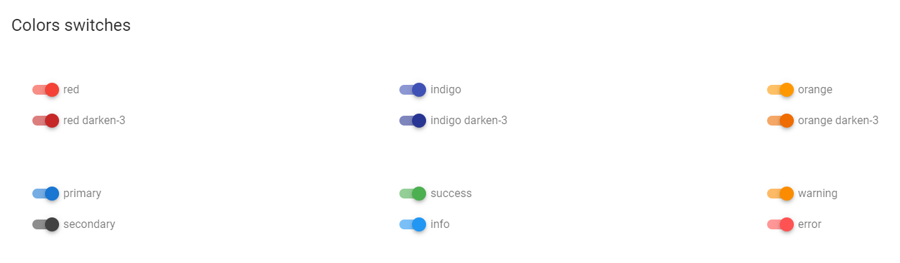

## 5. Vue.js elements

### 5.1 Alerts

[Vuetify documentation page](https://vuetifyjs.com/en/components/alerts/)

```java
  @Test
  public void alertsWithPropsHaveProperCssProps(){
      redAlert.has().text("I'm an alert with a top border and red color");
      redAlert.has().css("background-color", Colors.RED_LIGHTEN_2.value());
      redAlert.has().cssClass("v-alert--border-top");
  }
```

- __Java__: _com.epam.jdi.light.vuetify.elements.common.Alert.java_


|Method | Description | Return Type
--- | --- | ---
**is()** | Returns Assert class | TextAssert
**getValue()** | Returns element value | String

For examples of usage see: [Custom vuetify alert example](https://github.com/jdi-testing/jdi-light/blob/3118-implement-alerts/jdi-light-vuetify-tests/src/main/java/io/github/com/custom/CustomAlert.java)
and [JDI vuetify page tests for alerts](https://github.com/jdi-testing/jdi-light/blob/3118-implement-alerts/jdi-light-vuetify-tests/src/test/java/io/github/epam/vuetify/tests/common/AlertsTests.java).

### 5.2 Avatars

[Vuetify documentation page](https://vuetifyjs.com/en/components/avatars/)

- __Java__: _com.epam.jdi.light.vuetify.elements.common.Avatar.java_

```java
    @Test
    public void avatarsWithSizeTests() {
      avatarsWithSize.forEach(avatar -> avatar.is().displayed());
      avatarsWithSize.get(1).has().text("36");
      avatarsWithSize.get(2).has().text("48");
      avatarsWithSize.get(3).has().text("62");
      avatarsWithSize.get(1).has().size(36);
      avatarsWithSize.get(2).has().size(48);
      avatarsWithSize.get(3).has().size(62);
    }
```


__Avatars__ - graphical representations of users.

Avatar element implements the following interfaces: HasIcon, HasImage and IsText. Therefore, you have access to default methods of these interfaces.

|Method | Description | Return Type
--- | --- | ---
**is()** | Returns Assert class | AvatarAssert

For examples of usage see: [Custom vuetify avatar example (profile card)](https://github.com/jdi-testing/jdi-light/blob/vuetify-develop/jdi-light-vuetify-tests/src/main/java/io/github/com/custom/ProfileCard.java)
and [JDI vuetify page tests for avatars](https://github.com/jdi-testing/jdi-light/blob/vuetify-develop/jdi-light-vuetify-tests/src/test/java/io/github/epam/vuetify/tests/common/AvatarsTests.java).

### 5.3 Banners

[Vuetify documentation page](https://vuetifyjs.com/en/components/banners/)

- __Java__: _com.epam.jdi.light.vuetify.elements.complex.Banner.java_

```java
    @Test
    public void singleBannerTests() {
        singleBanner.is().displayed();
        singleBanner.has().text("We can't save your edits");
    }
```


Banners may contain anything, you can inherit the `Banner` class and customize it
the way you want.

Basically, you have methods that can return you elements containing in banner (buttons, checkers, icons, etc.).

|Method | Description | Return Type
        --- | --- | ---
**is()** | Returns Assert class | BannerAssert
**buttons()** | Returns button group containing in the element | ButtonGroup
**icon()** | Returns icon containing in the element | Icon
**getText()** | Returns text content of the element | Text

For examples of usage see: [JDI vuetify page tests for banners](https://github.com/jdi-testing/jdi-light/blob/vuetify-develop/jdi-light-vuetify-tests/src/test/java/io/github/epam/vuetify/tests/complex/BannersTests.java).

### 5.4 Bars

#### 5.4.1 Basic bar

- __Java__: _com.epam.jdi.light.vuetify.elements.complex.bars.BasicBar.java_

Basic bar is an abstract class that contains methods that are common for its specific realisations such as App Bar, Tool Bar and System Bar following below.

|Method | Description | Return Type
--- | --- | ---
**menuButton()** | Returns 'Menu' button containing in the element | VuetifyButton
**title()** | Returns element's title | Text
**verticalDotsButton()** | Returns 'Vertical Dots' button containing in the element | VuetifyButton
**searchButton()** | Returns 'Search' button containing in the element | VuetifyButton
**heartButton()** | Returns 'Heart' button containing in the element | VuetifyButton

#### 5.4.2 App Bars

[Vuetify documentation page](https://vuetifyjs.com/en/components/app-bars/)

- __Java__: _com.epam.jdi.light.vuetify.elements.complex.bars.AppBar.java_

```java
    @Test
    public void collapsibleBarTests() {
      collapsibleBar.is().displayed();
      collapsibleBar.menuButton().is().displayed();
      collapsibleBar.has().title();
      collapsibleBar.has().textInTitle("Collapsing Bar");
      collapsibleBar.scrollBarToBottom();
      collapsibleBar.has().hiddenTitle();
      collapsibleBar.scrollBarToTop();
      collapsibleBar.has().title();
      collapsibleBar.checkbox().is().displayed();
      collapsibleBar.checkbox().is().checked();
      collapsibleBar.checkbox().uncheck();
      collapsibleBar.checkbox().is().unchecked();
      collapsibleBar.has().hiddenTitle();
      collapsibleBar.checkbox().check();
      collapsibleBar.has().title();
    }
```


App bar component extends abstract class Basic Bar. It is pivotal to any graphical user interface (GUI), as it generally is the primary source of site navigation.

|Method | Description | Return Type
--- | --- | ---
**is()** | Returns Assert class | AppBarAssert
**checkbox()** | Returns checkbox containing in the element | Checkbox
**menu()** | Returns menu containing in the element | Menu
**hasClickableTabs()** | Returns true if element has clickable tabs | boolean
**hasHiddenHeader()** | Returns true if element's header is hidden | boolean
**hasVisibleHeader()** | Returns true if element's header is visible | boolean
**getHeaderHeight()** | Returns element's header's height | String
**getHeaderOpacity()** | Returns element's header's opacity | Integer
**hasHiddenHeaderShadow()** | Returns true if element's header's shadow is hidden | boolean
**hasVisibleHeaderShadow()** | Returns true if element's header's shadow is visible | boolean
**hasNavigationMenu()** | Returns true if element contains navigation menu | boolean
**scrollBarToBottom()** | Scrolls element to bottom | void
**scrollBarToTop()** | Scrolls element to top | void

For examples of usage see: [JDI vuetify page tests for app bars](https://github.com/jdi-testing/jdi-light/blob/vuetify-develop/jdi-light-vuetify-tests/src/test/java/io/github/epam/vuetify/tests/complex/AppBarsTests.java).

#### 5.4.3 System bars

[Vuetify documentation page](https://vuetifyjs.com/en/components/system-bars/)

- __Java__: _com.epam.jdi.light.vuetify.elements.complex.bars.SystemBar.java_

```java
    @Test
    public void systemBarColoredPrimaryTests() {
      systemBarColoredPrimary.is().displayed();
      systemBarColoredPrimary.has().text("System bar color 1");
      systemBarColoredPrimary.wiFiIcon().is().displayed();
      systemBarColoredPrimary.signalIcon().is().displayed();
      systemBarColoredPrimary.batteryIcon().is().displayed();
      systemBarColoredPrimary.has().time("12:30");
      systemBarColoredPrimary.has().backgroundColor(BLUE_DARKEN_2.value());
    }
```


System bar component extends abstract class Basic Bar. It can be used for displaying statuses to the user. It looks like the Android system bar and can contain icons, spacers, and some text.

|Method | Description | Return Type
--- | --- | ---
**is()** | Returns Assert class | SystemBarAssert
**getBackgroundColor()** | Returns element's background color | String
**getPosition()** | Returns element's position | String
**getTime()** | Returns text from element's 'time' field | String
**wiFiIcon()** | Returns 'Wi-Fi' icon containing in the element | Icon
**signalIcon()** | Returns 'Signal' icon containing in the element | Icon
**batteryIcon()** | Returns 'Battery' icon containing in the element | Icon
**messageIcon()** | Returns 'Message' icon containing in the element | Icon
**minusIcon()** | Returns 'Minus' icon containing in the element | Icon
**blankCheckboxIcon()** | Returns 'Blank Checkbox' icon containing in the element | Icon
**closeIcon()** | Returns 'Close' icon containing in the element | Icon

For examples of usage see: [JDI vuetify page tests for system bars](https://github.com/jdi-testing/jdi-light/blob/vuetify-develop/jdi-light-vuetify-tests/src/test/java/io/github/epam/vuetify/tests/complex/SystemBarsTests.java).

#### 5.4.4 Toolbars

[Vuetify documentation page](https://vuetifyjs.com/en/components/toolbars/)

- __Java__: _com.epam.jdi.light.vuetify.elements.complex.bars.ToolBar.java_

```java
    @Test
    public void denseToolbarTests() {
      denseToolbar.is().displayed();
      denseToolbar.menuButton().is().displayed();
      denseToolbar.has().title();
      denseToolbar.has().textInTitle("Title");
      denseToolbar.searchButton().is().displayed();
      denseToolbar.heartButton().is().displayed();
      denseToolbar.verticalDotsButton().is().displayed();
      denseToolbar.has().denseHeader();
      denseToolbar.has().heightOfHeader(48);
    }
```


Toolbar component extends abstract class Basic Bar. It is pivotal to any gui, as it generally is the primary source of site navigation.

|Method | Description | Return Type
--- | --- | ---
**is()** | Returns Assert class | ToolBarAssert
**closeButton()** | Returns 'Close' button containing in the element | VuetifyButton
**deleteButton()** | Returns 'Delete' button containing in the element | VuetifyButton
**exportButton()** | Returns 'Export' button containing in the element | VuetifyButton
**gpsButton()** | Returns 'GPS' button containing in the element | VuetifyButton
**appsButton()** | Returns 'Apps' button containing in the element | VuetifyButton
**searchIcon()** | Returns 'Search' icon containing in the element | Icon
**input()** | Returns input field containing in the element | Input
**select()** | Returns select containing in the element | Select
**backgroundImage()** | Returns element's background image | Image
**getHeaderHeight()** | Returns element's header's height | String
**getHeaderColor()** | Returns element's header's height | String
**hasHiddenButtons()** | Returns true if element's buttons are hidden | boolean
**hasCollapsedHeader()** | Returns true if element has collapsed header | boolean
**hasDenseHeader()** | Returns true if element has dense header | boolean
**hasExtendedHeader()** | Returns true if element extended header | boolean

For examples of usage see: [JDI vuetify page tests for toolbars](https://github.com/jdi-testing/jdi-light/blob/vuetify-develop/jdi-light-vuetify-tests/src/test/java/io/github/epam/vuetify/tests/complex/ToolBarsTests.java).


### 5.5 Bottom navigation

[Vuetify documentation page](https://vuetifyjs.com/en/components/bottom-navigation/)

- __Java__: _com.epam.jdi.light.vuetify.elements.composite.BottomNavigation.java_

```java
    @UI("#colorBottomNavigation")
    public static BottomNavigation bottomNavigationColor;

    @UI("#growBottomNavigation")
    public static BottomNavigation bottomNavigationGrow;


    @Test
    public void colorTest() {
        bottomNavigationColor.is().displayed();
        bottomNavigationColor.is().buttonColor(1, "rgba(0, 0, 0, 0.6)");
        bottomNavigationColor.bottomNavigationButtonList().get(1).click();
        bottomNavigationColor.is().buttonColor(1, Colors.BLUE_DARKEN_2.value());
    }

    @Test
    public void wightTest() {
      bottomNavigationGrow.is().displayed();
      bottomNavigationGrow.is().buttonWight(1, "168px");
      bottomNavigationGrow.is().buttonWight(2, "168px");
      bottomNavigationGrow.is().buttonWight(3, "168px");
    }
```


This name contains a WebList of buttons and provides access to them by index.

|Method | Description | Return Type
--- | --- | ---
**is()** | Returns Assert class | Assert
**bottomNavigationButtonList()** | Return | WebList
**getBackgroundColor()** | Return background color | String
**getClassAttribute()** | Return Class Attribute | String
**getButtonColor()** | Return Button RGBA Color value  | String
**getButtonWight()** | Return Button Wight  | String
**getButtonText** | Return Button Text | String

### 5.6 Bottom sheets

[Vuetify documentation page](https://vuetifyjs.com/en/components/bottom-sheets/)

- __Java__: _com.epam.jdi.light.vuetify.elements.composite.BottomSheet.java_

```java
public class TextBottomSheet extends BottomSheet {
  @UI(".text-center > div")
  protected Text text;
  @UI("button")
  protected Button button;
  public void close() { button.click(); }
  public Text sheetText() { return text; }
}
```

Bottom sheet is a form of dialog that appears at the bottom of a page.
You can inherit the class and define the inner content of the sheet.


```java
@Test
public void checkInsetSheetCssProps() {
    insetBottomSheet.is().hidden();
    insetBottomSheetButton.click();
    insetBottomSheet.is().displayed();
    insetBottomSheet.sheetText().has().text(containsString("the inset prop"));
    insetBottomSheet.close();
    insetBottomSheet.is().hidden();
}
```


|Method | Description | Return Type
--- | --- | ---
**is()** | Returns Assert class | BottomNavigationAssert
**getBackgroundColor()** | Returns element's background color | String
**getClassAttribute()** | Returns element's class attribute | String
**getTransform()** | Returns element's transform | String
**bottomNavigationButtonList()** | Returns element's buttons | WebList
**getButtonColor(int)** | Returns color of required element's button | String
**getButtonWight(int)** | Returns width of required element's button | String
**getButtonDirection(int)** | Returns direction of required element's button | String
**getButtonText(int)** | Returns text of required element's button | String

For examples of usage see: [Vuetify Bottom sheets tests](https://github.com/jdi-testing/jdi-light/blob/vuetify-develop/jdi-light-vuetify-tests/src/test/java/io/github/epam/vuetify/tests/composite/BottomSheetsTests.java).

### 5.7 Breadcrumbs

[Vuetify documentation page](https://vuetifyjs.com/en/components/breadcrumbs/)

- __Java__: _com.epam.jdi.light.vuetify.elements.complex.Breadcrumbs.java_

```java
    @JDIBreadcrumbs(
            root = "#differentDividersBreadcrumbs > ul:nth-child(2)",
            items = ".v-breadcrumbs__item",
            dividers = ".v-breadcrumbs__divider"
    )
    public static Breadcrumbs forwardSlashedBreadcrumbs;
```

You can specify locators for the root, links and dividers
explicitly through a `JDIBreadcrumbs` annotation:

```java
    @JDIBreadcrumbs(root = "#largeBreadcrumbs > ul")
    public static Breadcrumbs largeBreadcrumbs;
```

```java
    @Test
    public void itemSlotBreadcrumbsTest() {
        itemSlotsBreadcrumbs.is().displayed();
        itemSlotsBreadcrumbs.has().size(3);
        itemSlotsBreadcrumbs.dividers().has().size(2);
        itemSlotsBreadcrumbs.items().has().values("DASHBOARD", "LINK 1", "LINK 2");
        jdiAssert(itemSlotsBreadcrumbs.selected("DASHBOARD"), Matchers.is(false));
        jdiAssert(itemSlotsBreadcrumbs.selected("LINK 2"), Matchers.is(true));
    }
```


It is **necessary** to specify **the root** of an element

|Method | Description | Return Type
--- | --- | ---
**selected()** | Returns selected element | String
**selected(String)** | Shows that required element is selected | String
**dividers()** | Returns element's dividers | WebList
**items()** | Returns element's items | WebList

For examples of usage see: [Vuetify Breadcrumbs tests](https://github.com/jdi-testing/jdi-light/blob/vuetify-develop/jdi-light-vuetify-tests/src/test/java/io/github/epam/vuetify/tests/complex/BreadcrumbsTests.java).

### 5.8 Cards

[Vuetify documentation page](https://vuetifyjs.com/en/components/cards/)

- __Java__: _com.epam.jdi.light.vuetify.elements.complex.Card.java_

```java
public class MediaTextCard extends Card {
    @UI(".v-image__image")
    protected Image image;
    public Image image() {
        return image;
    }
    public Button shareButton() {
        return new Button().setCore(Button.class, actions().find("//button[./span[contains(text(), 'Share')]]"));
    }
    public Button exploreButton() {
        return new Button().setCore(Button.class, actions().find("//button[./span[contains(text(), 'Explore')]]"));
    }
}
```

```java
    @Test
    public void mediaTextCardTest() {
        mediaTextCard.is().displayed();
        mediaTextCard.image().has().css("background-size", "cover");
        mediaTextCard.has().title("Top 10 Australian beaches");
        mediaTextCard.has().subtitle(containsString("Number 10"));
        mediaTextCard.content().has().text(containsString("Whitehaven Beach"));
        mediaTextCard.shareButton().click();
        mediaTextCard.exploreButton().click();
    }
```


Cards may contain anything, you can inherit the `Card` class and customize it
the way you want.


Basically, you have 4 methods: `title`, `subtitle`, `content` and `actions`.
They return the parts of a card described [here](https://vuetifyjs.com/en/components/cards/#api).
The `content` method returns a
card `text` element, but the `text` method is inherited from `UIBaseElement` that why it has a different name.

|Method | Description | Return Type
--- | --- | ---
**is()** | Returns Assert class | CardAssert
**title()** | Returns element's title | UIElement
**subtitle()** | Returns element's subtitle | UIElement
**content()** | Returns element's content | UIElement
**actions()** | Returns element's action | UIElement

For examples of usage see: [Custom vuetify card examples](https://github.com/jdi-testing/jdi-light/tree/vuetify-develop/jdi-light-vuetify-tests/src/main/java/io/github/com/custom/cards)
and [JDI vuetify page tests for cards](https://github.com/jdi-testing/jdi-light/blob/vuetify-develop/jdi-light-vuetify-tests/src/test/java/io/github/epam/vuetify/tests/complex/CardsTests.java).

### 5.9 Dialogs

[Vuetify documentation page](https://vuetifyjs.com/en/components/dialogs/)

- __Java__: _com.epam.jdi.light.vuetify.elements.complex.Dialog.java_

```java
    @Test
    public static void formDialogTest() {
        formDialog.open();
        formDialog.is().opened();
        formDialog.has().title("User Profile");
        formDialog.fillTheForm("John", "Hadley", "Chase", "john@hadley.com",
                "12345", 4, "Soccer", "Skiing", "Writing");
        formDialog.save();
        formDialog.is().closed();
    }

```


The Dialog component inform users about a specific task and may contain critical information, require decisions, or involve multiple tasks.

|Method | Description | Return Type
--- | --- | ---
**open()** | Opens required dialog| void
**isOpened()** | Shows that dialog is opened| boolean[
**openMenu()** | Opens menu in dialog| void
**selectMenuElement()** | Selects required menu's in element| void
**openNestedDialog()** | Opens nested dialog| boolean
**nestedDialogIsOpen()** | Shows that shows that nested dialog is opened| boolean
**closeNestedDialog()** | Closes nested dialog| void
**openTooltip()** | Opens the tooltip in dialog| void
**tooltipIsOpened()** | Shows that tooltip is open| boolean
**getTitle()** | Gets dialog title| String
**elementText()** | Gets required dialog's element text| String
**cardText()** | Gets dialog text| String
**checkElement()** | Checks required dialog's element| void
**uncheckElement()** | Unchecks required dialog's element| void
**selectRadiobutton()** | Selects required dialog's radiobutton| void
**isSelected()** | Shows that button is selected| boolean
**isNotSelected()** | Shows that button is not selected| boolean
**fillTheForm()** | Fills dialog's form with required value| void
**save()** | Closes dialog and saves changes| void
**cancel()** | Closes dialog without saves changes| void
**isLoading()** | Shows that dialog is loading| boolean

For examples of usage see: [JDI vuetify page tests for dialogs](https://github.com/jdi-testing/jdi-light/blob/vuetify-develop/jdi-light-vuetify-tests/src/test/java/io/github/epam/vuetify/tests/complex/DialogTests.java).

### 5.10 Expansion Panels

[Vuetify documentation page](https://vuetifyjs.com/en/components/expansion-panels/)

__Java__:
- _com.epam.jdi.light.vuetify.elements.complex.panels.ExpansionPanels.java_
- _com.epam.jdi.light.vuetify.elements.complex.panels.ExpansionPanel.java_

```java
    //Default locators(except root):
    @JDIExpansionPanels(
        root = "#ModelExpansionPanel .v-expansion-panels",
        panels = ".v-expansion-panel",
        header = ".v-expansion-panel-header",
        icon = ".v-expansion-panel-header__icon .v-icon",
        content = ".v-expansion-panel-content"
    )
    public static ExpansionPanels modelExpansionPanels;
```

You can specify locators for the root and panels to find panels in root. 
Also, you can specify header, icon and content locators for all panels. All of it you can do
explicitly through a `JDIExpansionPanels` annotation. 

It is **necessary** to specify **the root** of an element.

```java
    @JDIExpansionPanels(root = "#CustomIconExpansionPanel .v-expansion-panels:nth-child(1)")
    public static ExpansionPanels customIconExpansionPanelsSameIcons;
```

```java
    @Test
    public void customIconExpansionPanelTest() {
        customIconExpansionPanelsSameIcons.has().size(5);
        for (ExpansionPanel expansionPanel : customIconExpansionPanelsSameIcons.panels()) {
            expansionPanel.header().has().text("Item");
            expansionPanel.content().has().text(LOREM_IPSUM_TEXT);
            expansionPanel.is().expanded();
            expansionPanel.expander().is().displayed();
            expansionPanel.expander().has().cssClass("mdi-menu-down");
        }
    }
```


ExpansionPanels is a list of ExpansionPanel.

Expansion panel may contain anything, so you can inherit the `ExpansionPanel` class and customize it
the way you need. This class has 3 base methods: `header`, `expander` and `content`. 
They return the parts of an expansion panel. 

Also, you can inherit the `ExpansionPanels`.

`ExpansionPanels` methods:

|Method | Description | Return Type
--- | --- | ---
**panels()** | Returns list of panels as Expansion Panel | List\<ExpansionPanel>
**list()** | Returns list of panels as UIElement | WebList

`ExpansionPanel` methods:

|Method | Description | Return Type
--- | --- | ---
**header()** | Returns header element by header locator from JDIExpansionPanels annotation | UIElement
**expander()** | Returns expander element by icon locator from JDIExpansionPanels annotation | Icon
**content()** | Expands if panel is closed. Returns content element by content locator from JDIExpansionPanels annotation| UIElement
**expand()** | Expands panel | void
**close()** | Closes panel | void
**isExpanded()** | Returns true if panel is expanded | boolean
**isClosed()** | Returns true if panel is closed | boolean

For examples of usage see: [Custom vuetify expansion panels examples](https://github.com/jdi-testing/jdi-light/tree/vuetify-develop/jdi-light-vuetify-tests/src/main/java/io/github/com/custom/panels)
and [JDI vuetify page tests for expansion panels](https://github.com/jdi-testing/jdi-light/blob/vuetify-develop/jdi-light-vuetify-tests/src/test/java/io/github/epam/vuetify/tests/complex/ExpansionPanelsTest.java).

### 5.11 Footers

[Vuetify documentation page](https://vuetifyjs.com/en/components/footer/)

- __Java__: _com.epam.jdi.light.vuetify.elements.composite.Footer.java_

```java
public class IndigoFooter extends Footer { 
    @UI("button")
    protected List<Button> socialButtons;
    @UI(".pt-0")
    protected Text descriptionText;
    @UI("hr")
    protected Divider divider;
    @UI("//div[contains(@class, 'v-card__text') and ./strong]")
    protected Text footerText;
    
    public List<Button> socialButtons() { return socialButtons; }
    public Text descriptionText() { return descriptionText; }
    public Divider divider() { return divider; }
    public Text footerText() { return footerText; }
}
```

According to the documentation:
"The v-footer component in its simplest form is a container".

You can inherit the class and add elements inside.


```java
@Test
public void indigoFooterTest() {
    indigoFooter.is().displayed();
    // footer itself does not have indigo color but the inner container has
    indigoFooter.firstChild().has().css("background-color", Colors.INDIGO_LIGHTEN_1.value());
    indigoFooter.footerText().has().text(containsString("2021 — Vuetify"));
    indigoFooter.divider().is().darkTheme();
    indigoFooter.descriptionText().has().text(containsString("Phasellus feugiat arcu sapien"));
    indigoFooter.socialButtons().forEach(HasClick::click);
}
```


For examples of usage see: [Vuetify Footers tests](https://github.com/jdi-testing/jdi-light/blob/vuetify-develop/jdi-light-vuetify-tests/src/test/java/io/github/epam/vuetify/tests/composite/FootersTests.java).

### 5.12 Form input & controls

#### 5.12.1 Overflow buttons

[Vuetify documentation page](https://vuetifyjs.com/en/components/overflow-btns/)

- __Java__: _com.epam.jdi.light.vuetify.elements.composite.OverflowButton.java_

```java
    @Test
public void baseFunctionalityOverflowButtonTest() {
  counterOverflowButton.is().enable();
  counterOverflowButton.is().placeholder("Overflow Btn w/ counter");
  counterOverflowButton.expand();
  counterOverflowButton.is().expanded();
  counterOverflowButton.close();
  counterOverflowButton.is().closed();
  counterOverflowButton.select("50%");
  counterOverflowButton.is().selected("50%");
  counterOverflowButton.select(1);
  counterOverflowButton.is().selected("100%");
  }
```


Overflow button is used to give the user the ability to select items from the list. It has 3 variations: editable, overflow and segmented

|Method | Description | Return Type
--- | --- | ---
**expand()/close()** | Open/close dropdown menu | void
**select(String text)/select(int index)** | Select element | void
**sendText(String text)** | Snd text in input field | void
**clear()** | Clear input field | void
**selected()** | Get selected text | String
**hint()** | Get hint text | String
**placeholder()** | Get placeholder text | String
**counterMessage()** | Get counter text | String
**isExpanded()/isClosed()** | Shows that dropdown menu is open/close | void
**isDisabled()/isEnabled()** | Shows that required element is disabled/enabled | void
**isEditable()** | Shows that required element is editable | void
**readOnly()** | Shows that required element is readOnly | void
**hasProgressBar** | Shows that required element has progress bar | void

For examples of usage see: [JDI Vuetify Lists tests](https://github.com/jdi-testing/jdi-light/blob/vuetify-develop/jdi-light-vuetify-tests/src/test/java/io/github/epam/vuetify/tests/complex/OverflowButtonsTest.java).

#### 5.12.2 Range Slider

[Vuetify documentation page](https://vuetifyjs.com/en/components/range-sliders/)

- __Java__: _com.epam.jdi.light.vuetify.elements.complex.RangeSlider.java_

```java
@Test
public void minAndMaxRangeSliderTest() {
    minAndMaxRangeSlider.slideHorizontalTo(11, 66);
    minAndMaxRangeSlider.is().value(11, 66);
    minAndMaxRangeSlider.slideHorizontalTo(-50, 90);
    minAndMaxRangeSlider.is().value(-50, 90);
}
```

The Range Slider component is a better visualization of the number input. 
It is used for gathering numerical user data. Sliders reflect a range of values along a bar, from which users may select a single value. 
They are ideal for adjusting settings such as volume, brightness, or applying image filters.

|Method | Description | Return Type
--- | --- | ---
**isDisabled()** | Shows that required element is disabled| boolean
**isThumbLabelDisplayed()** | Shows that thumb label of required element is displayed| boolean
**isAlwaysShow()** | Shows that ticks of required element is always show| boolean
**isVertical()** | Shows that required element is vertical| boolean
**slideHorizontalTo(int valueLeft, int valueRight)** | Set in horizontal slider left thumb to valueLeft and right thumb to valueRight| void
**slideVerticalTo(int valueLeft, int valueRight)** | Set in vertical slider upper thumb to valueLeft and lower thumb to valueRight| void
**getThumbLabelValue()** | Get label of the first and second thumb| List<String>
**getValue()** | Get first and second value| List<Integer>
**getTickLabel()** | Get tick label| String


For examples of usage see: [JDI Vuetify Range sliders tests](https://github.com/jdi-testing/jdi-light/blob/vuetify-develop/jdi-light-vuetify-tests/src/test/java/io/github/epam/vuetify/tests/complex/RangeSliderTests.java)

#### 5.12.3 Slider

[Vuetify documentation page](https://vuetifyjs.com/en/components/sliders/)

- __Java__: _com.epam.jdi.light.vuetify.elements.complex.Slider.java_

```java
  @Test
  public void minAndMaxSliderTest() {
    minAndMaxSlider.slideHorizontalTo(90);
    minAndMaxSlider.is().value(90);
    minAndMaxSlider.slideHorizontalTo(-50);
    minAndMaxSlider.is().value(-50);
  }
```

The Slider component is a better visualization of the number input. It is used for gathering numerical user data.


|Method | Description | Return Type
--- | --- | ---
**isDisabled()** | Shows that required element is disabled| boolean
**isReadonly()** | Shows that required element is readonly| boolean
**isThumbLabelDisplayed()** | Shows that thumb label of required element is displayed| boolean
**isAlwaysShow()** | Shows that ticks of required element is always show| boolean
**isVertical()** | Shows that required element is vertical| boolean
**slideHorizontalTo(int value)** | Set in horizontal slider thumb to value| void
**slideVerticalTo(int value)** | Set in vertical slider thumb to value| void
**getThumbLabelValue()** | Get thumb label| String
**getValue()** | Get value| Integer
**getTickLabel()** | Get tick label| String

For examples of usage see: [JDI Vuetify Sliders tests](https://github.com/jdi-testing/jdi-light/blob/vuetify-develop/jdi-light-vuetify-tests/src/test/java/io/github/epam/vuetify/tests/complex/SliderTests.java)

#### 5.12.4 Switches

[Vuetify documentation page](https://vuetifyjs.com/en/components/switches/)

- __Java__: _com.epam.jdi.light.vuetify.elements.common.Switch.java_

```java
    @Test
public void colorTest() {
  colorSwitches.forEach(Switch::isDisabled);

  colorSwitches.get(1).is().inputColor(Colors.RED.value());
  colorSwitches.get(1).uncheck();
  colorSwitches.get(1).is().inputColor(Colors.BLACK_TRANSPARENT_087.value());

  colorSwitches.get(6).is().inputColor(Colors.ORANGE_DARKEN_3.value());
  colorSwitches.get(6).uncheck();
  colorSwitches.get(6).is().inputColor(Colors.BLACK_TRANSPARENT_087.value());

  colorSwitches.get(12).is().inputColor(Colors.RED_ACCENT_2.value());
  colorSwitches.get(12).uncheck();
  colorSwitches.get(12).is().inputColor(Colors.BLACK_TRANSPARENT_087.value());
  }
```



The Switch - component provides users the ability to choose between two distinct values.

|Method | Description | Return Type
--- | --- | ---
**check()/uncheck()** | Switch element between two states | void
**getInputColor()** | Get color in RGBA format | String
**getLabelText()** | Get label text  | String
**getLabelHTML()** | Get label HTML element | boolean
**isChecked()/isNotChecked()** | Shows that required element is selected/not selected | boolean
**isDisabled()/isEnabled()** | Shows that required element is disabled/enabled | boolean
**hasLabel()** | Shows that required element has label | boolean
**hasInputProgressBar()** | Shows that required element has Progress bar | boolean

For examples of usage see: [JDI Vuetify Lists tests](https://github.com/jdi-testing/jdi-light/blob/vuetify-develop/jdi-light-vuetify-tests/src/test/java/io/github/epam/vuetify/tests/common/SwitchTests.java).

#### 5.12.5 Text fields

[Vuetify documentation page](https://vuetifyjs.com/en/components/text-fields/)

- __Java__: _com.epam.jdi.light.vuetify.elements.complex.TextFields.java_

```java
@Test
public void hideDetailsTextFieldTest() {
    hideDetailsTextField.get(1).is().noMessage();
    hideDetailsTextField.get(1).focus();
    hideDetailsTextField.get(2).focus();
    hideDetailsTextField.get(1).message().has().text("Required.");
    hideDetailsTextField.get(1).setText("a");
    hideDetailsTextField.get(1).message().has().text("Min 3 characters");
    hideDetailsTextField.get(1).setText("aaa");
    hideDetailsTextField.get(1).is().noMessage();
    hideDetailsTextField.get(2).focus();
    hideDetailsTextField.get(2).is().noMessage();
    hideDetailsTextField.get(2).setText("a");
    hideDetailsTextField.get(2).is().noMessage();
}
  
@Test
public void passwordInputTextFieldTest() {
    passwordInputTextField.get(1).is().textType("password");
    passwordInputTextField.get(1).getAppendInnerIcon().click();
    passwordInputTextField.get(1).is().textType("text");
    passwordInputTextField.get(1).getAppendInnerIcon().click();
    passwordInputTextField.get(1).is().textType("password");
}
```


Text fields components are used for collecting user provided information.

|Method | Description | Return Type
--- | --- | ---
**isReadonly()** | Shows that element is readonly| boolean
**isFocused()** | Shows that element is focused| boolean
**isFilled()** | Shows that element is filled| boolean
**isOutlined()** | Shows that element is outlined| boolean
**isShaped()** | Shows that element is shaped| boolean
**isSolo()** | Shows that element is solo| boolean
**isFullWidth()** | Shows that element has full-width input type| boolean
**textInputField()** | Returns text input field| UIElement
**slot()** | Returns input slot | UIElement
**message()** |  Returns message | UIElement
**counter()** |  Returns counter | UIElement
**prefix()** |  Return prefix | UIElement
**suffix()** |  Returns suffix | UIElement
**prependOuterIcons()** | Returns list of prepend outer icons | List\<Icon>
**prependInnerIcons()** | Returns list of prepend inner icons | List\<Icon>
**appendInnerIcons()** | Returns list of append inner icons | List\<Icon>
**appendOuterIcons()** | Returns list of append outer icons | List\<Icon>
**getPrependOuterIcon()** | Returns first prepend outer icon | Icon
**getPrependInnerIcon()** | Returns first prepend inner icon | Icon
**getAppendInnerIcon()** | Returns first append inner icon | Icon
**getAppendOuterIcon()** | Returns first append outer icon | Icon
**getText()** | Returns text from input field | String
**getTextType()** | Returns type of text | String
**label()** |  Returns label | Label
**labelText()** | Returns label text | String
**placeholder()** | Returns placeholder text| String
**setText(String text)** | Set text| void
**input(String text)** | Set text| void
**sendKeys(String text)** | Add text| void
**clear()** |  Clear text field| void
**focus()** |  Set mouse to text field| void

For examples of usage see: [JDI Vuetify Text fields tests](https://github.com/jdi-testing/jdi-light/blob/vuetify-develop/jdi-light-vuetify-tests/src/test/java/io/github/epam/vuetify/tests/complex/TextFieldsTests.java).

#### 5.12.6 Text areas

[Vuetify documentation page](https://vuetifyjs.com/en/components/textareas/)

- __Java__: _com.epam.jdi.light.vuetify.elements.complex.TextArea.java_

```java
@Test
public void autoGrowTextAreaTest() {
    autoGrowTextArea.is().autoGrow();
    autoGrowTextArea.is().notResizable();
    autoGrowTextArea.is().filled();
    autoGrowTextArea.has().lines("The Woodman set to work at once, and so " +
        "sharp was his axe that the tree was soon chopped nearly through.");
    autoGrowTextArea.label().is().displayed();
    autoGrowTextArea.label().has().text(equalTo("Label"));
    autoGrowTextArea.has().height(is(120));
    autoGrowTextArea.setLines(" 1 row", "2 row", "3 row", "4 row");
    autoGrowTextArea.has().height(is(120));
    autoGrowTextArea.addNewLine("5 row");
    autoGrowTextArea.has().height(is(140));
}

@Test
public void counterTextAreaTest() {
    counterTextArea.label().has().text("Text");
    counterTextArea.has().text("Hello!");
    counterTextArea.counter().has().text("6");
    counterTextArea.counter().has().css("color", "rgba(0, 0, 0, 0.6)");
    counterTextArea.sendKeys("This is text for 25");
    counterTextArea.counter().has().text("25");
    counterTextArea.counter().has().css("color", "rgba(0, 0, 0, 0.6)");
    counterTextArea.sendKeys("-");
    counterTextArea.message().has().text("Max 25 characters");
    counterTextArea.message().has().css("color", RED_ACCENT_2.toString());
    counterTextArea.counter().has().text("26");
    counterTextArea.counter().has().css("color", RED_ACCENT_2.toString());
    counterTextArea.label().has().css("color", RED_ACCENT_2.toString());
    counterTextArea.clear();
    counterTextArea.counter().has().text("0");
}
```


Text area components are used for collecting large amounts of textual data.

|Method | Description | Return Type
--- | --- | ---
**isFilled()** | Shows that element is filled| boolean
**isOutlined()** | Shows that element is outlined| boolean
**isAutoGrow()** | Shows that element is auto grow| boolean
**isNotResizable()** | Shows that element is not resizable| boolean
**textArea()** | Returns text input area| UIElement
**slot()** | Returns input slot | UIElement
**details()** | Returns details | UIElement
**message()** |  Returns message | UIElement
**counter()** |  Returns counter | UIElement
**getPrependOuterIcon()** | Returns prepend outer icon | Icon
**getPrependInnerIcon()** | Returns prepend inner icon | Icon
**getAppendInnerIcon()** | Returns append inner icon | Icon
**getAppendOuterIcon()** | Returns append outer icon | Icon
**getText()** | Returns text | String
**getLines()** | Returns lines dividing text using '\\n'  | List\<String>
**label()** |  Returns label | Label
**labelText()** | Returns label text | String
**placeholder()** | Returns placeholder text| String
**setText(String text)** | Set text| void
**input(String text)** | Set text| void
**sendKeys(String text)** | Add text| void
**setLines(String... lines)** | Add lines as one string with '\n' delimiter| void
**setLines(List<String> lines)** | Add lines as one string with '\n' delimiter| void
**addNewLine(String line)** | Add text on a new line| void
**clear()** | Clear text area| void
**focus()** | Set mouse to text area| void
**color()** | Returns slot color | String
**backgroundColor()** | Returns slot background color | String
**height()** | Returns height of text area | int 
**rows()** | Returns number of rows in text area | int

For examples of usage see: [JDI Vuetify Text areas tests](https://github.com/jdi-testing/jdi-light/blob/vuetify-develop/jdi-light-vuetify-tests/src/test/java/io/github/epam/vuetify/tests/complex/TextAreasTests.java).


#### 5.12.7 Radio buttons

[Vuetify documentation page](https://jdi-testing.github.io/jdi-light/vuetify/radio-buttons/)

- __Java__: _com.epam.jdi.light.vuetify.elements.common.RadioButton.java_

```java
    @Test
public void selectTest() {
  colorLeftRadioButtons.select("indigo");
  colorLeftRadioButtons.is().selected("indigo");
  colorRightRadioButtons.select("success");
  colorRightRadioButtons.is().selected("success");
  }

@Test
public void getValueTest() {
  directionRadioButtons.has().value("Option 1");
  directionRadioButtons.has().value("Option 2");
  }

@Test
public void selectEnumTest() {
  colorLeftRadioButtons.select(RadioTestData.indigo);
  colorLeftRadioButtons.is().selected(RadioTestData.indigo);
  colorLeftRadioButtons.select(RadioTestData.orange);
  colorLeftRadioButtons.is().selected(RadioTestData.orange);
  colorLeftRadioButtons.select(RadioTestData.red);
  colorLeftRadioButtons.is().selected(RadioTestData.red);
  }

@Test
public void mandatoryTest() {
  mandatoryRadioButtons.select("Radio 2");
  mandatoryText.is().text("radio-2");
  }

@Test
public void labelTest() {
  labelRadioButtons.has().value("Of course it's Google");
  labelRadioButtons.has().text("Definitely Duckduckgo");
  }
```


Radio button -  a simple component that can be combined into groups, have different colors and html elements in a label

|Method | Description | Return Type
--- | --- | ---
**select(String/int/Enum)** | Select radiobutton by value/index | void
**labelText()** | Gets the text of a label | String
**selected()** | Get selected radiobutton value | String
**values()** | Returns list of values | List
**is()** | Assert action | UISelectAssert
**has()** | Assert action | UISelectAssert

For examples of usage see: [JDI Vuetify Radiobuttons tests](https://github.com/jdi-testing/jdi-light/blob/vuetify-develop/jdi-light-vuetify-tests/src/test/java/io/github/epam/vuetify/tests/common/RadioButtonsTests.java).

#### 5.12.8 Combobox

[Vuetify documentation page](https://vuetifyjs.com/en/components/combobox/)

- __Java__: _com.epam.jdi.light.vuetify.elements.complex.Combobox.java_

```java
    @Test
public void baseFunctionalityTest() {
  List<String> testValueList = Arrays.asList("Programming", "Design", "Vue", "Vuetify");

  denseCombobox.expand();
  denseCombobox.is().expanded();
  denseCombobox.close();
  denseCombobox.is().closed();
  denseCombobox.is().label("Combobox");
  denseCombobox.select("Design");
  denseCombobox.select("Vue");
  denseCombobox.is().selected(testValueList);
  denseCombobox.unselect(testValueList);
  denseCombobox.is().notSelected(testValueList);
  }

@Test
public void noDataWithChipsComboboxTest() {
  List<String> list = Arrays.asList("Gaming", "Programming", "Vue");
  String message = "Maximum of 5 tags";
  String firstTestWord = "Test";
  String secondTestWord = "Not to add";

  noDataWithChipsCombobox.is().message(message);
  noDataWithChipsCombobox.select(list);
  noDataWithChipsCombobox.sendKeys(firstTestWord);
  noDataWithChipsCombobox.sendKeys(secondTestWord);
  noDataWithChipsCombobox.is().notSelected(secondTestWord);
  }
```


The combobox component allows the user to enter values that do not exist within the provided items.

|Method | Description | Return Type
--- | --- | ---
**select(String/List<String>)** | Select values from list | void
**unselect(String/List<String>)** | Unselect values from list | void
**sendKeys(String keys)** | Enter values that do not exist in list | void
**isExpanded()** | Returns true if list of values is open | boolean
**isSelected(String, list<String>)** | Returns true if values is selected | boolean
**is()** | Assert action | ComboboxAssert

For examples of usage see: [JDI Vuetify Combobox tests](https://github.com/jdi-testing/jdi-light/blob/vuetify-develop/jdi-light-vuetify-tests/src/test/java/io/github/epam/vuetify/tests/complex/ComboboxTest.java).

#### 5.12.9 Selects

[Vuetify documentation page](https://vuetifyjs.com/en/components/selects/)

- __Java__: _com.epam.jdi.light.vuetify.elements.complex.Select.java_

```java
    @Test
public void basicFunctionalityTest() {
  standardDenseSelect.expand();
  standardDenseSelect.is().expanded();
  standardDenseSelect.close();
  standardDenseSelect.is().collapsed();
  standardDenseSelect.select("Bar");
  standardDenseSelect.is().selected("Bar");
  standardDenseSelect.is().displayed();
  }
```


Select components are used for collecting user provided information from a list of options.

|Method | Description | Return Type
--- | --- | ---
**expand()/close()** | Open/close list of values | void
**select()** | Select option from list of value | void
**labelText()** | Return label text | String
**messageText()** |Return message text | String
**selected()** | Returns selected value | String
**is()** | Assert action | DropdownAssert()

For examples of usage see: [JDI Vuetify Select tests](https://github.com/jdi-testing/jdi-light/blob/vuetify-develop/jdi-light-vuetify-tests/src/test/java/io/github/epam/vuetify/tests/complex/SelectTests.java).

#### 5.12.10 File inputs

[Vuetify documentation page](https://vuetifyjs.com/en/components/file-inputs/)

- __Java__: _com.epam.jdi.light.vuetify.elements.complex.FileInput.java_

```java
@Test
public void acceptFileInput() {
    acceptFileInput.uploadFile(pathTXT.toString());
    acceptFileInput.has().file(pathTXT.getFileName().toString());
}

@Test
public void chipsFileInputTest() {
    chipsFileInput.is().multiply();
    chipsFileInput.uploadFiles(asList(pathTXT.toString(), pathPNG.toString()));
    chipsFileInput.has().files(asList(pathTXT.getFileName().toString(), pathPNG.getFileName().toString()));
}

@Test
public void validationFileInputTest() {
    validationFileInput.is().accept(containsString("image/png, image/jpeg, image/bmp"));
}
```


The File input component is a specialized input that provides a clean interface for
selecting files, showing detailed selection information and upload progress.

|Method | Description | Return Type
--- | --- | ---
**isMultiply()** | Shows that element can take multiply files | boolean
**textInputField()** | Returns text input area | UIElement
**message()** |  Returns message | UIElement
**counter()** |  Returns counter | UIElement
**prefix()** |  Return prefix | UIElement
**suffix()** |  Returns suffix | UIElement
**prependOuterIcons()** | Returns list of prepend outer icons | List\<Icon>
**prependInnerIcons()** | Returns list of prepend inner icons | List\<Icon>
**appendInnerIcons()** | Returns list of append inner icons | List\<Icon>
**appendOuterIcons()** | Returns list of append outer icons | List\<Icon>
**getPrependOuterIcon()** | Returns first prepend outer icon | Icon
**getPrependInnerIcon()** | Returns first prepend inner icon | Icon
**getAppendInnerIcon()** | Returns first append inner icon | Icon
**getAppendOuterIcon()** | Returns first append outer icon | Icon
**getText()** | Returns text | String
**getLines()** | Returns lines dividing text using '\\n'  | List\<String>
**label()** |  Returns label | Label
**labelText()** | Returns label text | String
**placeholder()** | Returns placeholder text| String
**setText(String text)** | Set text| void
**input(String text)** | Set text| void
**sendKeys(String text)** | Add text| void
**setLines(String... lines)** | Add lines as one string with '\n' delimiter| void
**setLines(List<String> lines)** | Add lines as one string with '\n' delimiter| void
**addNewLine(String line)** | Add text on a new line| void
**clear()** | Clear text area| void
**focus()** | Set mouse to text area| void

For examples of usage see: [JDI Vuetify File inputs tests](https://github.com/jdi-testing/jdi-light/blob/vuetify-develop/jdi-light-vuetify-tests/src/test/java/io/github/epam/vuetify/tests/complex/FileInputTest.java).


### 5.13 Groups 

#### 5.13.1 Button Groups

```java
@JDIButtonGroup(
        root = "#RoundedButtonGroup .v-item-group", buttons = "//*[@type = 'button']"
) // buttons search strategy is custom
public static ButtonGroup roundedButtonGroup;

@Test
public void mandatoryButtonGroupTest() {
    mandatoryButtonGroup.is().displayed();
    mandatoryButtonGroup.has().css("width", "197px");
    mandatoryButtonGroup.getButtonByIndex(1).has().css("width", "50px");
    assertSelected(mandatoryButtonGroup.getButtonByIndex(1));
    mandatoryButtonGroup.getButtonByIndex(2).click();
    assertSelected(mandatoryButtonGroup.getButtonByIndex(2));
    mandatoryButtonGroup.getAllButtons().forEach(HasClick::click);
    assertSelected(mandatoryButtonGroup.getButtonByIndex(4));
}
```

[Vuetify documentation page](https://vuetifyjs.com/en/components/button-groups/)

- __Java__: _com.epam.jdi.light.vuetify.elements.complex.ButtonGroup.java_

Button group is a complex container for buttons.

When you are using the `@UI` annotation, provide
a selector not for the list of buttons, but for the container.
See [different examples](https://github.com/jdi-testing/jdi-light/blob/vuetify-develop/jdi-light-vuetify-tests/src/main/java/io/github/com/pages/ButtonGroupsPage.java) of using `@UI` and `@JDIButtonGroup` annotations together and separately.


|Method | Description | Return Type
--- | --- | ---
**getButtonByIndex(int)** | Returns button with required index | VuetifyButton
**getButtonByText()** | Returns button with required text | VuetifyButton
**getAllButtons()** | Returns all buttons | List<VuetifyButton>
**list()** | Returns all buttons as WebList | WebList

For examples of usage see: [Vuetify Button groups tests](https://github.com/jdi-testing/jdi-light/blob/vuetify-develop/jdi-light-vuetify-tests/src/test/java/io/github/epam/vuetify/tests/complex/ButtonGroupsTests.java).

#### 5.13.2 Chip Groups
[Vuetify documentation page](https://vuetifyjs.com/en/components/chip-groups/)

- __Java__: _com.epam.jdi.light.vuetify.elements.complex.ChipGroup.java_

```java
    @UI("#ColumnChipGroup .v-chip-group")
    public static ChipGroup columnChipGroup;
    
    @UI("#MultipleChipGroup .v-chip-group")
    public static ChipGroup multipleChipGroup;
    
    @UI("#FilterResultsChipGroup .v-chip-group")
    public static ChipGroup filterResultsChipGroup;

    @Test
    public void columnChipGroupTests() {
      columnChipGroup.is().notEmpty();
      columnChipGroup.has().size(9);
    }
    
    @Test
    public void multipleChipGroupTests() {
      if (multipleChipGroup.slideGroup().nextButtonIsActive()) { multipleChipGroup.slideGroup().clickOnNextButton(); }
      multipleChipGroup.select("Art", "Tech");
      multipleChipGroup.has().selectedChip("Art");
      multipleChipGroup.has().selectedChip("Tech");
    }
    
    @Test
    public void filterResultsChipGroupTests() {
      filterResultsChipGroup.chips().get(2).click();
      filterResultsChipGroup.chips().get(2).has().filterIconDisplayed();
    }
 ```

__Chip groups__ - a group of compact elements that represent an input, attribute, or action.
Chips can contains an icon, text, actions etc. Chip groups make it easy for users to select 
filtering options for more complex implementations. 
The `v-chip-group` supercharges the `v-chip` component by providing groupable functionality.
It is used for creating groups of selections using chips.


|Method | Description | Return Type
--- | --- | ---
**is()/has()** | Returns Assert class | ChipGroupAssert
**slideGroup()** | Returns chip group's slide group | SlideGroup
**chips()** | Returns Java list of Chips contained in the chip group | List\<Chip>
**size()** | Returns size of chip group | int
**isEmpty()** | Checks if chip group is empty | boolean
**getChipByText(String)** | Gets the first chip in a group with specified text | Chip
**select(String)** | Selects the first chip in a group with specified text | void
**select(String...)** | Selects chips with specified texts | void
**deselect(String)** | Deselects the first chip in a group with specified text | void
**deselect(String...)** | Deselects chips with specified texts | void
**close(String)** | Closes the first chip in a group with specified text | void
**close(String...)** | Closes chips with specified texts | void
**hasSelectedChip(String)** | Checks if there's a chip with specified text in the chip group | boolean

For examples of usage see: [Chip Group tests](https://github.com/jdi-testing/jdi-light/blob/vuetify-develop/jdi-light-vuetify-tests/src/test/java/io/github/epam/vuetify/tests/complex/ChipGroupTests.java)


#### 5.13.3 Item Groups

[Vuetify documentation page](https://vuetifyjs.com/en/components/item-groups/)

- __Java__: _com.epam.jdi.light.vuetify.elements.complex.ItemGroups.java_

```java
  @UI("#ActiveClassItemGroup .col-md-4")
  public static List<ItemGroups> activeClassItemGroup;
```


Item groups__ - a group of selectable items from any component.
Items can contains an icon, text, actions etc.

See [different examples](https://github.com/jdi-testing/jdi-light/blob/vuetify-develop/jdi-light-vuetify-tests/src/main/java/io/github/com/pages/ItemGroupsPage.java)

The v-item-group provides the ability to create a group of selectable items out of any component.
This is the baseline functionality for components such as v-tabs and v-carousel.

##### Usage
The core usage of the v-item-group is to create groups of anything that should be controlled by a model.


##### Selection
Icons can be used as toggle buttons when they allow selection, or deselection,
of a single choice, such as marking an item as a favorite.


For examples of usage see: [Item Groups tests](https://github.com/jdi-testing/jdi-light/blob/vuetify-develop/jdi-light-vuetify-tests/src/test/java/io/github/epam/vuetify/tests/complex/ItemGroupTests.java)


#### 5.13.4 List Item Groups

[Vuetify documentation page](https://vuetifyjs.com/en/components/list-item-groups/)

- __Java__: _com.epam.jdi.light.vuetify.elements.complex.ListItemGroups.java_

```java
    @UI("#ActiveClassListItemGroup .v-list-item")
    public static List<ListItemGroups> activeClassListItemGroup;
    
    @UI("#SelectionControlsListItemGroup div[role='option']")
    public static List<Checkbox> selectionControlsListItemGroupCheckbox;
  ```

  

```java
    @Test(dataProvider = "listItemGroupsDataProvider", dataProviderClass = ListItemGroupDataProvider.class)
    public void activeClassListItemGroupTest(List<String> expectedTitles) {
        for (int element = 1; element <= expectedTitles.size(); element++) {
          activeClassListItemGroup.get(element).click();
          activeClassListItemGroup.get(element).is().active();
          activeClassListItemGroup.get(element).has().icon();
          activeClassListItemGroup.get(element).is().containsText(expectedTitles.get(element - 1));
          activeClassListItemGroup.get(element).has().border();
          activeClassListItemGroup.get(element).click();
          activeClassListItemGroup.get(element).is().notActive();
          activeClassListItemGroup.get(element).has().notBorder();
        }
    }
```

  

  ```java
    @Test(dataProvider = "selectionControlsListDataProvider", dataProviderClass = ListItemGroupDataProvider.class)
    public void selectionControlsListItemGroupTest(List<String> titlesInCheckboxes) {
      for (int element = 1; element <= titlesInCheckboxes.size(); element++) {
        selectionControlsListItemGroup.get(element).is().containsText(titlesInCheckboxes.get(element - 1));
        selectionControlsListItemGroupCheckbox.get(element).check();
        selectionControlsListItemGroupCheckbox.get(element).is().checked();
        selectionControlsListItemGroupCheckbox.get(element).uncheck();
        selectionControlsListItemGroupCheckbox.get(element).is().unchecked();
        }
      for (int element = 1; element <= titlesInCheckboxes.size(); element++) {
        selectionControlsListItemGroupCheckbox.get(element).check();
        selectionControlsListItemGroupCheckbox.get(element).is().checked();
        }
      }
```

__List item groups__ - a group of selectable items from any component. 
Items can contains an icon, text, actions etc.

List are a continuous group of text or images. They are composed of items containing primary 
and supplemental actions, which are represented by icons and text.

See [different examples](https://github.com/jdi-testing/jdi-light/blob/vuetify-develop/jdi-light-vuetify-tests/src/main/java/io/github/com/pages/ListItemGroupsPage.java)

The v-list-item-group provides the ability to create a group of selectable v-list-items. 
The v-list-item-group component utilizes v-item-group at its core to provide a clean interface for interactive lists.

|Method | Description | Return Type
--- | --- | ---
**has()/is()** | Returns Assert class | ListItemGroupsAssert
**isActive** | Shows that required element is active | boolean
**hasBorder** | Shows that selected item has border  | boolean
**hasIcon()** | Shows that required element has icon | boolean
**hasTitle()** | Shows that required element has expected title | boolean
**getText()** | Returns text | String

##### Active class

You can set a class which will be added when an item is selected.

##### Mandatory class

At least one item must be selected.

##### Multiple class

You can select multiple items at one time.


##### Flat list

You can easily disable the default highlighting of selected v-list-items. This creates a lower profile for a user’s choices.


##### Selection controls

Using the default slot, you can access an items internal state and toggle it. Since the active property is a boolean, we use the true-value prop on the checkbox to link its state to the v-list-item.


For examples of usage see: [Vuetify List Item Groups tests](https://github.com/jdi-testing/jdi-light/blob/vuetify-develop/jdi-light-vuetify-tests/src/test/java/io/github/epam/vuetify/tests/complex/ListItemGroupsTests.java).

#### 5.13.5 Slide Groups

[Vuetify documentation page](https://vuetifyjs.com/en/components/slide-groups/)

- __Java__: _com.epam.jdi.light.vuetify.elements.complex.SlideGroup.java_

```java
    @Test
    public void centerActiveSlideGroupTests() {
      List<Integer> slidesPositions = new SlideGroupTestsData().centerActiveSlideGroupTestData();
      centerActiveSlideGroup.is().displayed();
      for (int i = 1; i <= 3; i++) {
      centerActiveSlideGroup.clickOnSlideByIndex(i);
      centerActiveSlideGroup.has().slideSelected(i);
      }
      for (Integer slidesPosition : slidesPositions) {
      centerActiveSlideGroup.clickOnSlideByIndex(4);
      centerActiveSlideGroup.has().visibleSlidesPosition(slidesPosition);
      centerActiveSlideGroup.has().slideSelected(3);
       }
      for (int i = 4; i <= 6; i++) {
      centerActiveSlideGroup.clickOnSlideByIndex(i);
      centerActiveSlideGroup.has().slideSelected(i);
      centerActiveSlideGroup.has().visibleSlidesPosition(-1316);
      }
    }

```


Slide group component is used to display pseudo paginated information. It uses Item Group at its core and provides a baseline for different components (for instance Tabs and Chip Group).

|Method | Description | Return Type
--- | --- | ---
**is()** | Returns Assert class | SlideGroupAssert
**slidesPosition()** | Returns position of visible slides | String
**slideIsSelected()** | Shows that slide is selected | boolean
**clickOnSlideByIndex()** | Click on slide under specified index | void
**clickOnNextButton()** | Click on 'next' button | void
**clickOnPreviousButton()** | Click on 'previous' button | void

For examples of usage see: [Slide Groups tests](https://github.com/jdi-testing/jdi-light/blob/vuetify-develop/jdi-light-vuetify-tests/src/test/java/io/github/epam/vuetify/tests/complex/SlideGroupsTests.java)

#### 5.13.6 Windows

[Vuetify documentation page](https://vuetifyjs.com/en/components/windows/)

- __Java__: _com.epam.jdi.light.vuetify.elements.complex.Windows.java_

```java
    @UI("#ReverseWindow .v-window")
    public static Windows<SlideWindow> reverseWindows;

    @UI("#AccountCreationWindow .v-window")
    public static Windows<?> accountCreationWindows;
```


```java
    @Test
    public void reverseWindowsTest() {
        int i = 1;
        for (UIElement nav : reverseNavigation) {
            nav.click();
            reverseWindows.getActive().header().has().text("Slide " + i);
            reverseWindows.getActive().header().has().css("color", WHITE.value());
            reverseWindows.getActive().sheet().has().css("background-color", GREY.value());
            i++;
        }
        reverseNext.click();
        reverseWindows.getActive().header().has().text("Slide 1");
        reverseBack.click();
        reverseWindows.getActive().header().has().text("Slide 3");
    }
```

The v-window component provides the baseline functionality for
transitioning content from 1 pane to another.

Windows component is a container. So, you should use
it with another class for contained element.
**That class must implement `ICoreElement` interface**.
For example: UIElement, Section or your custom class.

There are two ways to use windows class:

- With definite `T` type in diamond operator(<T\>)
- With unknown type(<?>)

**You should always use Windows component with diamond operator.**


|Method | Description | Return Type
--- | --- | ---
**getActive()** | Returns instance of `T` class from the diamond operator | T
**getActive(Class\<U\> clazz)** | Returns instance of `U` class  | U

**T and U should implement ICoreElement
or extend a class that already implemented it.**

For examples of usage see: [Custom vuetify windows examples](https://github.com/jdi-testing/jdi-light/tree/vuetify-develop/jdi-light-vuetify-tests/src/main/java/io/github/com/custom/windows)
and [JDI vuetify page tests for windows](https://github.com/jdi-testing/jdi-light/blob/vuetify-develop/jdi-light-vuetify-tests/src/test/java/io/github/epam/vuetify/tests/complex/WindowsTests.java).


### 5.14 Lists

[Vuetify documentation page](https://vuetifyjs.com/en/components/lists/)

- __Java__: _com.epam.jdi.light.vuetify.elements.complex.Lists.java_

```java
    @Test
    public static void denseListTest() {
        denseList.select(1);
        jdiAssert(denseList.isActive(1), Matchers.is(true));
        jdiAssert(denseList.hasIcon(1), Matchers.is(true));
        jdiAssert(denseList.hasTitle(1, "Real-Time"), Matchers.is(true));

        denseList.select(2);
        jdiAssert(denseList.isActive(2), Matchers.is(true));
        jdiAssert(denseList.hasIcon(2), Matchers.is(true));
        jdiAssert(denseList.hasTitle(2, "Audience"), Matchers.is(true));

        denseList.select(3);
        jdiAssert(denseList.isActive(3), Matchers.is(true));
        jdiAssert(denseList.hasIcon(3), Matchers.is(true));
        jdiAssert(denseList.hasTitle(3, "Conversions"), Matchers.is(true));
     }
```


Lists - a specific collection of items, which can contains an avatar, content, actions, subheaders etc. You can inherit the `Lists` class and customize it the way you need.

|Method | Description | Return Type
--- | --- | ---
**select(String)/select(int)** | Finds required element by its name or index and selects | void
**get(String)/get(int)** | Finds required element by its name or index and returns it | UIElement
**isActive(int)** | Shows that required element is active | boolean
**isInactivate(int)** | Shows that required element is inactive | boolean
**hasIcon(int)** | Shows that required element has icon | boolean
**hasTitle(int, String)** | Shows that required element has expected title | boolean
**getSubList(int)** | Returns required element's sublist | WebList
**isExpanded(int)** | Shows that required element's sublist is expanded | boolean

For examples of usage see: [JDI Vuetify Lists tests](https://github.com/jdi-testing/jdi-light/blob/vuetify-develop/jdi-light-vuetify-tests/src/test/java/io/github/epam/vuetify/tests/complex/ListsTests.java).

### 5.15 Overlays

[Vuetify documentation page](https://vuetifyjs.com/en/components/overlays/)

- __Java__: _com.epam.jdi.light.vuetify.elements.common.Overlay.java_

```java
@Test
public void absoluteOverlayTest() {
    absoluteOverlay.is().absolute();
    absoluteOverlay.is().notActive();
    absoluteOverlay.is().opacity(0);
  
    absoluteOverlayButton.click();
    absoluteOverlay.is().absolute();
    absoluteOverlay.is().active();
    absoluteOverlay.is().opacity(0.46);
  
    absoluteOverlay.content().find("button").click();
    absoluteOverlay.is().notActive();
    absoluteOverlay.is().opacity(0);
}
```

The Overlay component is used to provide emphasis on a particular element or parts of it. It signals to the user of a state change within the application and can be used for creating loaders, dialogs and more. In its simplest form, the Overlay component will add a dimmed layer over your application.


|Method | Description | Return Type
--- | --- | ---
**isActive()** | Shows that required element is active| boolean
**isAbsolute()** | Shows that required element is absolute| boolean
**content()** | Get content| UIElement
**zIndex()** | Get z-index| int
**opacity()** | Get opacity| double

For examples of usage see: [JDI Vuetify Overlays tests](https://github.com/jdi-testing/jdi-light/blob/vuetify-develop/jdi-light-vuetify-tests/src/test/java/io/github/epam/vuetify/tests/common/OverlayTests.java)

### 5.16 Pagination

[Vuetify documentation page](https://vuetifyjs.com/en/components/paginations/)

- __Java__: _com.epam.jdi.light.vuetify.elements.complex.Pagination.java_

```java
    @JDIPagination(
        root = "#CirclePagination .v-pagination",
        items = ".v-pagination__item",
        left = ".v-pagination__navigation[1]",
        right = ".v-pagination__navigation[2]",
        more = ".v-pagination__more"
    )
    public static Pagination circlePagination;
```


You can specify locators for the root and items to find page buttons in the root.
Also, you can specify locators for left and right navigation buttons, 
locator for buttons with 'more' value like '...'. All of it you can do
explicitly through a `JDIPagination` annotation.

It is **necessary** to specify **the root** of an element.

```java
    @JDIPagination(root = "#TotalVisiblePagination .v-pagination")
    public static Pagination totalVisiblePagination;

    @Test
    public void totalVisiblePaginationTest() {
        totalVisiblePagination.is().enabled();
        totalVisiblePagination.is().started();

        totalVisiblePagination.select("15");
        totalVisiblePagination.has().selected("15");
        totalVisiblePagination.is().ended();

        List<String> actualButtonsFromEndToStart = new ArrayList<>();
        actualButtonsFromEndToStart.add(totalVisiblePagination.selected());
        while (totalVisiblePagination.hasPrevious()) {
            totalVisiblePagination.back();
            actualButtonsFromEndToStart.add(totalVisiblePagination.selected());
        }
        jdiAssert(actualButtonsFromEndToStart, equalTo(asList(
            "15", "14", "13", "12", "11", "10", "9", "8", "7", "6", "5", "4", "3", "2", "1"
        )));
        totalVisiblePagination.is().started();
  }
```

|Method | Description | Return Type
--- | --- | ---
**is()** | Returns Assert class | PaginationAssert
**list()** | Returns list of page buttons by `items` locator from JDIPagination annotation | WebList
**leftNavigation()** | Returns left navigation button by `left` locator from JDIPagination annotation | UIElement
**rightNavigation()** | Returns right navigation button by `right` locator from JDIPagination annotation | UIElement
**select(String value)** | Selects page button by text | void
**select(int index)** | Selects page button by index | void
**selected()** | Returns text of the selected page button | String
**selected(String option)** | Returns true if page button with text is selected | boolean
**selected(int index)** | Returns true if page button with index is selected | boolean
**isStart()** | Returns true if left navigation is disable | boolean
**isEnd()** | Returns true if right navigation is disable | boolean
**hasNext()** | Returns true if right navigation button is enabled | boolean
**next()** | Click on right navigation button | void
**hasPrevious()** | Returns true if left navigation button is enabled | boolean
**back()** | Click on left navigation button | void

For examples of usage see: [JDI vuetify page tests for pagination](https://github.com/jdi-testing/jdi-light/blob/vuetify-develop/jdi-light-vuetify-tests/src/test/java/io/github/epam/vuetify/tests/complex/PaginationTests.java).

### 5.17 Ratings

```java
//@FindBy(css = "#IncrementedRating .v-rating .mdi-star.yellow--text")
@JDIRating(root = "#IncrementedRating .v-rating",
           fullIcon = ".mdi-star.yellow--text")
public static Rating incrementedRating;

@Test(description = "Test checks rating's value")
public void valueRatingTest() {
  incrementedRating.setValue(3);
  incrementedRating.is().value(3);
  incrementedRating.setValue(3.5);
  incrementedRating.is().value(3.5);
  incrementedRating.hoverSetValue(5);
  incrementedRating.is().value(5);
  incrementedRating.hoverSetValue(4.5);
  incrementedRating.is().value(4.5);
  incrementedRatingCard.hover();
  incrementedRating.is().value(3.5);
  }
  
//@FindBy(css = "#CardRatingsRating .v-rating")
@JDIRating(root = "#CardRatingsRating .v-rating")
public static Rating cardRatingsRating;
//@FindBy(xpath = ""//*[@id='ClearableRating']/following-sibling::div[contains(@class, 'v-rating')]")
@JDIRating(root = "//*[@id='ClearableRating']/following-sibling::div[contains(@class, 'v-rating')]")
public static Rating clearableRating;

@Test(description = "Test checks rating's theme : theme(dark/light)")
public void themeRatingTest() {
  cardRatingsRating.show();
  cardRatingsRating.has().darkTheme();
  clearableRating.show();
  clearableRating.has().lightTheme();
  }
}
```

[Vuetify documentation page](https://vuetifyjs.com/en/components/ratings/)

- __Java__: _com.epam.jdi.light.vuetify.elements.complex.Rating.java_

__Rating__ - The rating component is a specialized but crucial piece in building user widgets. Collecting user feedback via ratings is a simple analytic that can provide a lot of feedback to your product or application.  


__Vuetify v2.6.14__ code example:

```html
<div class="v-rating">
  <button type="button" aria-label="Rating 1 of 5" class="v-icon notranslate v-icon--link mdi mdi-star theme--light yellow--text text--darken-3" style="font-size: 36px;"></button>
  <button type="button" aria-label="Rating 2 of 5" class="v-icon notranslate v-icon--link mdi mdi-star theme--light yellow--text text--darken-3" style="font-size: 36px;"></button>
  <button type="button" aria-label="Rating 3 of 5" class="v-icon notranslate v-icon--link mdi mdi-star theme--light yellow--text text--darken-3" style="font-size: 36px;"></button>
  <button type="button" aria-label="Rating 4 of 5" class="v-icon notranslate v-icon--link mdi mdi-star theme--light yellow--text text--darken-3" style="font-size: 36px;"></button>
  <button type="button" aria-label="Rating 5 of 5" class="v-icon notranslate v-icon--link mdi mdi-star-half-full theme--light yellow--text text--darken-3" style="font-size: 36px;"></button>
</div>
```

| Method                            | Description                               | Return Type  |
|-----------------------------------|-------------------------------------------|--------------|
| **length()**                      | Get number of Rating buttons              | int          |
| **getRatingButtons()**            | Get Rating buttons                        | WebList      |
| **color()**                       | Get color of rating button                | String       |       
| **color(int)**                    | Get color of rating button                | String       |
| **hoverSetValue(double)**         | Set rating to 'rating' with a mouse hover | void         |
| **getValue()**                    | Get rating                                | Double       |
| **setValue(double)**              | Set rating to 'rating' with a mouse click | void         |
| **theme()**                       | Get theme                                 | String       |
| **size()**                        | Get size rating buttons                   | int          |
| **setup(Field)**                  | Setting up Rating element by Field        | void         |
| **setup(String, String, String)** | Returns Rating element by locators        | Rating       |
| **is()**                          | Returns object for work with assertions   | RatingAssert | 
| **has()**                         | Returns object for work with assertions   | RatingAssert |
| **waitFor()**                     | Returns object for work with assertions   | RatingAssert |
| **shouldBe()**                    | Returns object for work with assertions   | RatingAssert |
| **verify()**                      | Returns object for work with assertions   | RatingAssert |
| **assertThat()**                  | Returns object for work with assertions   | RatingAssert |

For examples of usage see: [JDI Vuetify Ratingss tests](https://github.com/jdi-testing/jdi-light/blob/vuetify-develop/jdi-light-vuetify-tests/src/test/java/io/github/epam/vuetify/tests/complex/RatingTests.java)

### 5.18 Snackbars

[Vuetify documentation page](https://vuetifyjs.com/en/components/snackbars/)

- __Java__: _com.epam.jdi.light.vuetify.elements.common.Snackbar.java_

```java
    @Test
    public static void simpleSnackbarTest() {
        simpleSnackbarOpen.click();
        simpleSnackbar.is().visible();
        simpleSnackbar.is().text("Hello, I'm a snackbar");
        simpleSnackbar.close();
        simpleSnackbar.is().closed();
  }
```


The snackbar component is used to display a quick message to a user.

|Method | Description | Return Type
--- | --- | ---
**is()** | Returns Assert class | SnackbarAssert
**text()** | Returns snackbar's text | String
**close()** | Closes snackbar | void
**isOpen()** | Shows that snackbar is open | boolean
**isClosed()** | Shows that snackbar is closed | boolean
**isLeft()** | Shows that snackbar has left position | boolean
**isRight()** | Shows that snackbar has right position | boolean
**isCentered()** | Shows that snackbar is centered | boolean
**isVertical()** | Shows that snackbar is vertical | boolean

For examples of usage see: [JDI vuetify page tests for snackbars](https://github.com/jdi-testing/jdi-light/blob/vuetify-develop/jdi-light-vuetify-tests/src/test/java/io/github/epam/vuetify/tests/common/SnackbarsTests.java).

### 5.19 Sparklines

[Vuetify documentation page](https://vuetifyjs.com/en/components/sparklines/)

- __Java__: _com.epam.jdi.light.vuetify.elements.common.Sparkline.java_

```java
    @Test
    public void heartRateSparklineTests() {
        String initialHeartRatePathShape = heartRateSparkline.getPathShape();
        heartRateSparkline.has().pathShapeEqualTo(initialHeartRatePathShape);
        heartRateRefreshButton.click();
        waitCondition(() -> heartRateRefreshButton.hasAttribute("red--text"));
        heartRateSparkline.has().pathShapeNotEqualTo(initialHeartRatePathShape);
    }
```

The sparkline component can be used to create simple graphs, like GitHub’s contribution chart.


|Method | Description | Return Type
--- | --- | ---
**is()/has()** | Returns Assert class | SparklineAssert
**getLineWidth()** | Returns sparkline stroke line width | double
**isFilled()** | Shows that sparkline is filled | boolean
**getPathShape()** | Returns sparkline SVG path definition | String
**getLabelTexts()** | Returns sparkline data point label texts | List\<String>
**getLinearGradientMap()** | Returns map representation of sparkline linear gradient | Map\<String, String>

For examples of usage see: [JDI vuetify page tests for sparklines](https://github.com/jdi-testing/jdi-light/blob/vuetify-develop/jdi-light-vuetify-tests/src/test/java/io/github/epam/vuetify/tests/common/SparklinesTests.java)

### 5.20 Subheaders

[Vuetify documentation page](https://vuetifyjs.com/en/components/subheaders/)

- __Java__: _com.epam.jdi.light.vuetify.elements.common.Subheader.java_

```java
  @Test
  public void insetTest(){
      insetSubheader.is().displayed();
      insetSubheader.is().lightTheme();
      insetSubheader.is().inset();
      insetSubheader.is().text("Subheader");
  }
```

The Subheader component is used to separate sections of lists.


For examples of usage see: [JDI vuetify page tests for subheaders](https://github.com/jdi-testing/jdi-light/blob/vuetify-develop/jdi-light-vuetify-tests/src/test/java/io/github/epam/vuetify/tests/common/SubheaderTests.java)

### 5.21 Tables

#### 5.21.1 Simple Tables

[Vuetify documentation page](https://vuetifyjs.com/en/components/simple-tables/)

- __Java__: _package com.epam.jdi.light.vuetify.elements.complex.tables.SimpleTable.java_

```java
    @Test
    public static void darkTableTests() {
        darkTable.is().firstColumnHasElement(ECLAIR);
        darkTable.is().secondColumnHasElement(1, FROZEN_YOGURT_CALORIES);
        darkTable.is().dark();
        darkTable.is().columnTitle(1, "Name");
  }

```

The Simple Table component is a simple wrapper component around the table element.


|Method | Description | Return Type
--- | --- | ---
**has()/is()** | Returns Assert class | SimpleTableAssert
**firstColumnElement(int/String)** | Returns required element from first column | String
**secondColumnElement(int?String)** | Returns required element from second column | String
**columnTitle(int)** | Returns column title | String
**isDark()** | Shows that table has dark theme | boolean
**isLight()** | Shows that table has light theme | boolean
**hasFixedHeight()** | Shows that table has fixed height | boolean

For examples of usage see: [Vuetify Simple Table tests](https://github.com/jdi-testing/jdi-light/blob/vuetify-develop/jdi-light-vuetify-tests/src/test/java/io/github/epam/vuetify/tests/complex/SimpleTablesTests.java#L40).

#### 5.21.2 Data Tables

[Vuetify documentation page](https://vuetifyjs.com/en/components/data-tables/)

- __Java__: _package com.epam.jdi.light.vuetify.elements.complex.tables.DataTable.java_

```java
    @Test
    public static void searchTableTest() {
        searchTable.search(TableTestData.DONUT);
        searchTable.has().firstColumnHasElement(1, TableTestData.DONUT);
        searchTable.clear();
        searchTable.search(TableTestData.ECLAIR_CALORIES);
        searchTable.has().firstColumnHasElement(1, TableTestData.ECLAIR);
    }

```

The Data Table component is used for displaying tabular data and to extend the Simple Table element


|Method | Description | Return Type
--- | --- | ---
**has()/is()** | Returns Assert class | DataTableAssert
**columnElement()** | Returns required element from required column | String
**search()** | Searches required element in table | void
**clear()** | Clears search field | void
**rowsPerPage()** | Shows the required value of rows in table | void
**itemsPerPage()** | Shows the required value of elements in table | void
**elementsInColumn()** | Returns size of the required column | Integer
**previousPage()** | Switches to the previous page | void
**firstPage()** | Switches to the first page | void
**secondPage()** | Switches to the second page | void
**nextPage()** | Switches to the next page | void
**sortAscBy()** | Sorts elements by the required value in ascending order | void
**sortDescBy()** | Sorts elements by the required value in descending order | void
**sortOff()** | Turns off the sort | void
**isSortedBy()** | Shows that elements sorted by the value | boolean
**collapseGroup()** | Collapses the required group | void
**expandGroup()** | Expands the required group | void
**sortGroup()** | Sorts elements by required group | void
**removeGroups()** | Remove all groups | void
**hasGroup()** | Shows that elements required by the required group | boolean
**isLoading()** | Shows that table is loading | boolean
**isSelected()** | Shows that required element in required column is selected | boolean
**singleSelectOn()** | Turns on single select | void
**singleSelectOff()** | Turns off single select | void
**elIsGreen()** | Shows that the required element is green | boolean
**elIsOrange()** | Shows that the required element is orange | boolean
**elIsRed()** | Shows that the required element is red | boolean
**createWithSave()** | Creates new element with required values and save it | void
**createWithoutSave()** | Creates new element with required values without save| void
**editElement()** | Changes required element name to required value | void
**confirm()** | Confirms changes in element | void
**cancel()** | Cancels changes in element| void
**expand()** | Expands required element| void

For examples of usage see: [Vuetify Data Table tests](https://github.com/jdi-testing/jdi-light/blob/vuetify-develop/jdi-light-vuetify-tests/src/test/java/io/github/epam/vuetify/tests/complex/DataTablesTests.java).

### 5.22 Tabs

[Vuetify documentation page](https://vuetifyjs.com/en/components/tabs/)

- __Java__: _com.epam.jdi.light.ui.html.elements.complex.Tabs.java_

```java
    @Test
    public static void iconsTextTabsTest() {
        iconAndTextTabs.select(1);
        iconAndTextTabs.get(1).is().text("RECENTS");
        iconAndTextTabsIcon.get(1).is().visible();

        iconAndTextTabs.select(2);
        iconAndTextTabs.get(2).is().text("FAVORITES");
        iconAndTextTabsIcon.get(2).is().visible();

        iconAndTextTabs.select(3);
        iconAndTextTabs.get(3).is().text("NEARBY");
        iconAndTextTabsIcon.get(3).is().visible();
    }
```


Tabs - a list of tabs which may be implemented as buttons, links, icons etc. You can inherit the `Tabs` class and customize it the way you want.

For examples of usage see: [JDI vuetify page tests for tabs](https://github.com/jdi-testing/jdi-light/blob/vuetify-develop/jdi-light-vuetify-tests/src/test/java/io/github/epam/vuetify/tests/complex/TabsTests.java).

### 5.23 Icons

[Vuetify documentation page](https://vuetifyjs.com/en/components/icons/)

- __Java__: _package com.epam.jdi.light.vuetify.elements.common.Icon.java_

```java
    @Test
    public void clickIconTests() {
      clickIcon.is().displayed();
      clickIcon.is().clickable();
      clickIcon.has().type("mdi-chevron-right");
      clickIcon.has().height(36);
      clickIcon.has().width(36);
      clickIcon.click();
      clickIcon.has().alertOnIconClick("You clicked next!");
      clickIcon.handleAlert();
    }
```

Icon component provides a large set of graphial signs to provide context for various aspects of your application.


|Method | Description | Return Type
--- | --- | ---
**is()** | Returns Assert class | IconAssert
**hasType()** | Returns type of icon (mdi, svg, etc.) | String
**hasColor()** | Returns color of icon in rgba | String
**hasHeight()** | Returns height of icon | String
**hasWidth()** | Returns width of icon | String

For examples of usage see: [Vuetify Icon tests](https://github.com/jdi-testing/jdi-light/blob/vuetify-develop/jdi-light-vuetify-tests/src/test/java/io/github/epam/vuetify/tests/common/IconsTests.java).

### 5.24 Carousels

[Vuetify documentation page](https://vuetifyjs.com/en/components/carousels/)

- __Java__: _package com.epam.jdi.light.vuetify.elements.complex.Carousel.java_

```java
    @Test
    public void customizedArrowsCarouselTests() {
      customizedArrowsCarousel.is().displayed();
      customizedArrowsCarousel.nextButton().is().notVisible();
      customizedArrowsCarousel.previousButton().is().notVisible();
      customizedArrowsCarousel.hover();
      customizedArrowsCarousel.nextButton().is().visible();
      customizedArrowsCarousel.previousButton().is().visible();
      customizedArrowsCarousel.previousButton().has().text("PREVIOUS SLIDE");
      customizedArrowsCarousel.previousButton().has().color(GREEN.value());
      customizedArrowsCarousel.nextButton().has().text("NEXT SLIDE");
      customizedArrowsCarousel.nextButton().has().color(BLUE.value());
      customizedArrowsCarousel.delimiters().have().size(5);
      customizedArrowsCarousel.getDelimitersIcons().forEach(icon -> icon.has().type("mdi-circle"));
      customizedArrowsCarousel.goToSlide(1);
      customizedArrowsCarousel.has().currentSlideColor(INDIGO.value());
      customizedArrowsCarousel.has().currentSlideText("First Slide");
      customizedArrowsCarousel.goToSlide(2);
      customizedArrowsCarousel.has().currentSlideText("Second Slide");
      customizedArrowsCarousel.has().currentSlideColor(ORANGE_DARKEN_1.value());
      customizedArrowsCarousel.nextButton().click();
      customizedArrowsCarousel.has().currentSlideText("Third Slide");
      customizedArrowsCarousel.has().currentSlideColor(PINK_DARKEN_2.value());
      customizedArrowsCarousel.previousButton().click();
      customizedArrowsCarousel.has().currentSlideText("Second Slide");
      customizedArrowsCarousel.has().currentSlideColor(ORANGE_DARKEN_1.value());
      customizedArrowsCarousel.goToSlide(5);
      customizedArrowsCarousel.has().currentSlideText("Fifth Slide");
      customizedArrowsCarousel.has().currentSlideColor(DEEP_PURPLE_ACCENT_4.value());
      customizedArrowsCarousel.goToSlide(4);
      customizedArrowsCarousel.has().currentSlideText("Fourth Slide");
      customizedArrowsCarousel.has().currentSlideColor(RED_LIGHTEN_1.value());
      customizedArrowsCarousel.goToSlide(1);
      customizedArrowsCarousel.has().currentSlideColor(INDIGO.value());
      customizedArrowsCarousel.has().currentSlideText("First Slide");
      customizedArrowsCarousel.waitUntilSlideChange("Second Slide", ORANGE_DARKEN_1.value());
      customizedArrowsCarousel.has().currentSlideText("Second Slide");
      customizedArrowsCarousel.has().currentSlideColor(ORANGE_DARKEN_1.value());
    }
```

Carousel component is used to display large numbers of visual content on a rotating timer.


|Method | Description | Return Type
--- | --- | ---
**is()** | Returns Assert class | CarouselAssert
**delimiters()** | Returns group of delimiter buttons containing in the element | ButtonGroup
**nextButton()** | Returns 'next' button containing in the element | VuetifyButton
**previousButton()** | Returns 'previous' button containing in the element | VuetifyButton
**plusButton()** | Returns 'plus' button containing in the element | VuetifyButton
**minusButton()** | Returns 'minus' button containing in the element | VuetifyButton
**getSwitch()** | Returns switch containing in the element | Switch
**getDelimitersIcons()** | Returns list of icons of delimiters | List<Icons>
**currentSlideImage()** | Returns image of current slide | Image
**getCurrentSlideColor()** | Returns color of current slide (in RGBA format) | String
**getCurrentSlideText()** | Returns text of current slide | String
**slideCounter()** | Returns slide counter | Text
**goToSlide()** | Clicks on selected delimiter | void
**waitUntilSlideChange()** | Waits until slide is changed to targeted | void

For examples of usage see: [Vuetify Carousel tests](https://github.com/jdi-testing/jdi-light/blob/vuetify-develop/jdi-light-vuetify-tests/src/test/java/io/github/epam/vuetify/tests/complex/CarouselsTests.java).

### 5.25 Navigation Drawers

[Vuetify documentation page](https://vuetifyjs.com/en/components/navigation-drawers/)

- __Java__: _package com.epam.jdi.light.vuetify.elements.complex.NavigationDrawer.java_

```java
    @Test
    public void bottomDrawerNavigationDrawerTests() {
      bottomDrawerNavigationAppBar.has().textInTitle("My files");
      bottomDrawerNavigationDrawer.is().closed();
      bottomDrawerNavigationAppBar.clickOnMenuButton();
      bottomDrawerNavigationDrawer.is().opened();
      bottomDrawerNavigationDrawer.has().numberOfListItems(4);
      bottomDrawerNavigationDrawer.getListItemByIndex(1).click();
      bottomDrawerNavigationDrawer.is().closed();
      bottomDrawerNavigationAppBar.clickOnMenuButton();
      bottomDrawerNavigationDrawer.getListItemByIndex(1).is().active();
      bottomDrawerNavigationDrawer.getListItemByIndex(2).is().notActive();
      bottomDrawerNavigationDrawer.getListItemByIndex(3).is().notActive();
      bottomDrawerNavigationDrawer.getListItemByIndex(4).is().notActive();
      bottomDrawerNavigationDrawer.getListItemByIndex(2).click();
      bottomDrawerNavigationAppBar.clickOnMenuButton();
      bottomDrawerNavigationDrawer.getListItemByIndex(2).is().active();
      bottomDrawerNavigationDrawer.getListItemByIndex(1).is().notActive();
      bottomDrawerNavigationDrawer.getListItemByIndex(3).is().notActive();
      bottomDrawerNavigationDrawer.getListItemByIndex(4).is().notActive();
    }
```

Navigation drawer component is what users will utilize to navigate through the application. Navigation drawer is primarily used to house links to the pages in your application.


|Method | Description | Return Type
--- | --- | ---
**is()** | Returns Assert class | NavigationDrawerAssert
**listItems()** | Returns list of all element's list items | List<ListItem>
**getListItemByIndex()** | Returns element's list item by its index | ListItem
**getNumberOfListItems()** | Returns number of element's list items | int
**isExpanded()** | Checks whether element is expanded | boolean
**isCollapsed()** | Checks whether element is collapsed | boolean
**isClosed()** | Checks whether element is closed | boolean
**isOpened()** | Checks whether element is opened | boolean
**isOnTheRightSide()** | Checks whether element is on the right of the container | boolean
**isOpened()** | Checks whether element is opened | boolean
**backgroundImage()** | Returns element's background image | Image
**getBackgroundColor()** | Returns element's background color (in RGBA format) | String
**button()** | Returns button containing in the element | VuetifyButton
**collapse()** | Collapses element | void

For examples of usage see: [Navigation Drawers tests](https://github.com/jdi-testing/jdi-light/blob/vuetify-develop/jdi-light-vuetify-tests/src/test/java/io/github/epam/vuetify/tests/complex/NavigationDrawersTests.java).

### 5.26 Tooltips

[Vuetify documentation page](https://vuetifyjs.com/en/components/tooltips/)

Tooltip is located in the following class:
- __Java__: _package com.epam.jdi.light.vuetify.elements.common.Tooltip.java_
- 
```java
//@FindBy(css = "div.v-tooltip__content")
@UI("div.v-tooltip__content")
public static Tooltip tooltip;

@Test()
public void textTooltipsTest() {
  homeIconWithTooltip.is().displayed();
  buttonWithTooltip.hover();
  tooltip.is().displayed();
  tooltip.has().text("Tooltip for \"Button\"");
  }

  @Test(dataProvider = "colorsTooltipsTestDataProvider", dataProviderClass = TooltipsTestsDataProvider.class)
  public void colorTooltipTest(int index, String color) {
    coloredButtons.get(index).hover();
    tooltip.is().displayed();
    tooltip.has().color(color);
  }
```

__Tooltip__ - Tooltip is useful for conveying information when a user hovers over an element.
Its display can be controlled programmatically.
When activated, tooltips display a text label identifying an element, such as a description of its function.


For examples of usage see: [Tooltips tests](https://github.com/jdi-testing/jdi-light/blob/vuetify-develop/jdi-light-vuetify-tests/src/test/java/io/github/epam/vuetify/tests/common/TooltipsTests.java).

__Vuetify v2.6.14__ code example:

```html
<div data-app="true" id="app" class="v-application v-application--is-ltr theme--light">
  <div class="v-application--wrap">...</div>
  <div class="v-tooltip__content" style="left: 436px; top: 242px; z-index: 8; display: none;"> <span>Tooltip for "Button"</span></div>
  <div class="v-tooltip__content" style="left: 313px; top: 309px; z-index: 8; display: none;"> <span>Left tooltip</span></div>
</div>
```

| Method                                      | Description                                                                | Return Type   |
|---------------------------------------------|----------------------------------------------------------------------------|---------------|
| **is()**                                    | Returns Assert class                                                       | TooltipAssert |
| **has()**                                   | Returns Assert class                                                       | TooltipAssert |
| **color()**                                 | Returns css attribute background-color as String Value                     | String        |
| **classes()**                               | Gets all element's classes as list                                         | List<String>  | 
| **doubleClick()**                           | Double clicks on the element                                               | void          |
| **dragAndDropTo(int x, int y)**             | Drags and drops element to certain coordinates                             | void          |
| **dragAndDropTo(WebElement to)**            | Drags and drops element to another element                                 | void          |
| **focus()**                                 | Focuses on element                                                         | void          |
| **getLocation()**                           | Gets element location as point                                             | Point         |
| **getSize()**                               | Gets element size                                                          | Dimension     |
| **getTagName()**                            | Gets element tag name                                                      | String        |
| **getText()**                               | Gets element text                                                          | String        |
| **getValue()**                              | Gets element text                                                          | String        |
| **hasAttribute(String attrName)**           | Returns true if the element has an expected attribute                      | boolean       |
| **hasClass(String className)**              | Returns true if the element has an expected class                          | boolean       |
| **highlight()**                             | Highlights element with red color                                          | void          |
| **highlight(String color)**                 | Scrolls view to element and highlights it with a border of specified color | void          |
| **hover()**                                 | Hovers mouse cursor over the element                                       | void          |
| **isDisabled()**                            | Checks that element is disabled                                            | boolean       |
| **isDisplayed()**                           | Checks that element is displayed                                           | boolean       |
| **isEnabled()**                             | Checks that element exists                                                 | boolean       |
| **isHidden()**                              | Checks that element is hidden                                              | boolean       |
| **isNotExist()**                            | Checks that element does not exist                                         | boolean       |
| **isNotVisible()**                          | Checks that element is not visible by user                                 | boolean       |
| **isVisible()**                             | Checks that element is visible by user                                     | boolean       |
| **jsExecute(String jsCode)**                | Executes JavaScript code                                                   | String        |
| **labelText()**                             | Gets label text                                                            | String        |
| **printHtml()**                             | Gets element “innerHTML” attribute value                                   | String        |
| **rightClick()**                            | Right clicks on the element                                                | void          |
| **setAttribute(String name, String value)** | Sets value to the specified attribute                                      | void          |
| **show()**                                  | Scrolls screen view to item                                                | void          |

<a href="https://github.com/jdi-testing/jdi-light/blob/vuetify-develop/jdi-light-vuetify-tests/src/test/java/io/github/epam/vuetify/tests/common/TooltipsTests.java">Java test examples</a>

### 5.27 Progress

#### 5.27.1 Progress circular

[Vuetify documentation page](https://vuetifyjs.com/en/components/progress-circular/)

- __Java__: _package com.epam.jdi.light.vuetify.elements.common.ProgressSpinner.java_

```java
    @Test(dataProvider = "sizeWidthProgressSpinnersTestsDataProvider",
      dataProviderClass = ProgressSpinnersDataProvider.class)
    public void sizeWidthProgressCircularsTests(int index, String color, String height, String width) {
      sizeWidthProgressSpinners.get(index).is().displayed();
      sizeWidthProgressSpinners.get(index).is().spinning();
      sizeWidthProgressSpinners.get(index).has().color(color);
      sizeWidthProgressSpinners.get(index).has().height(height);
      sizeWidthProgressSpinners.get(index).has().width(width);
    }

```

Progress circular component is used to convey data circularly to users. It also can be put into an indeterminate state to portray loading.


|Method | Description | Return Type
--- | --- | ---
**is()** | Returns Assert class | ProgressSpinnerAssert 
**hasColor()** | Returns color of the element in rgba | String
**hasHeight()** | Returns height of the element | String
**hasWidth()** | Returns width of the element | String
**isSpinning()** | Shows that element is spinning | boolean

For examples of usage see: [Progress circular tests](https://github.com/jdi-testing/jdi-light/blob/vuetify-develop/jdi-light-vuetify-tests/src/test/java/io/github/epam/vuetify/tests/common/ProgressSpinnersTests.java).

#### 5.27.2 Progress linear

[Vuetify documentation page](https://vuetifyjs.com/en/components/progress-linear/)

- __Java__: _package com.epam.jdi.light.vuetify.elements.common.ProgressBar.java_

```java
    @Test(dataProvider = "bufferValueProgressBarsTestsDataProvider",
      dataProviderClass = ProgressBarsDataProvider.class)
    public void bufferValueProgressBarsTests(int index, String color) {
      bufferValueProgressBars.get(index).is().displayed();
      bufferValueProgressBars.get(index).is().reactive();
      bufferValueProgressBars.get(index).is().determinate();
      bufferValueProgressBars.get(index).has().color(color);
      bufferValueProgressBars.get(index).click();
      bufferValueProgressBars.get(index).has().value(50.0);
    }

```

Progress linear component is used to convey data circularly to users. They can also represent an indeterminate amount, such as loading or processing.


|Method | Description | Return Type
--- | --- | ---
**is()** | Returns Assert class | ProgressBarAssert
**hasBarColor()** | Returns color of the bar in rgba | String
**isDeterminate()** | Shows that bar is determinate | boolean
**isIndeterminate()** | Shows that bar is indeterminate | boolean
**isReactive()** | Shows that bar is reactive | boolean
**isRounded()** | Shows that bar is rounded | boolean
**isStriped()** | Shows that bar is striped | boolean
**hasValue()** | Returns bar's value | Double
**hasStream()** | Shows that bar has stream | boolean

For examples of usage see: [Progress linear tests](https://github.com/jdi-testing/jdi-light/blob/vuetify-develop/jdi-light-vuetify-tests/src/test/java/io/github/epam/vuetify/tests/common/ProgressBarsTests.java).

### 5.28 Menus

[Vuetify documentation page](https://vuetifyjs.com/en/components/menus/)

- __Java__: _package com.epam.jdi.light.vuetify.elements.complex.Menu.java_

```java
    @Test
    public void offsetXMenuTests() {
      Timer.waitCondition(offsetXMenuButton::isDisplayed);
      offsetXMenuButton.show();
      offsetXMenuButton.click();
      activeMenu.is().displayed();
      activeMenu.has().numberOfOptions(4);
      activeMenu.has().optionsTitles(optionsTitles);
      activeMenu.has().position(1190, 1132);
      offsetXMenuButton.click();
      activeMenu.is().hidden();
      offsetXMenuSwitch.uncheck();
      offsetXMenuButton.click();
      activeMenu.has().position(1190, 1011);
      activeMenu.click();
      activeMenu.is().hidden();
    }
```

Menu component shows a menu at the position of the element that was used to activate it.


|Method | Description | Return Type
--- | --- | ---
**is()** | Returns Assert class | MenuAssert
**hasPosition()** | Returns position of menu | String
**hasNumberOfOptions()** | Returns number of options in menu | int
**hasOptionsTitles()** | Returns list of titles of options in menu | List<String>
**hasRemovedRadius()** | Shows that menu has removed radius | boolean
**hasLargeRadius()** | Shows that menu has large radius | boolean
**hasCustomRadius()** | Shows that menu has custom radius | boolean

For examples of usage see: [Menus tests](https://github.com/jdi-testing/jdi-light/blob/vuetify-develop/jdi-light-vuetify-tests/src/test/java/io/github/epam/vuetify/tests/complex/MenusTests.java).

### 5.29 Images

[Vuetify documentation page](https://vuetifyjs.com/en/components/images/)

- __Java__: _package com.epam.jdi.light.vuetify.elements.common.Image.java_

```java
    @Test
    public void gradientsImagesTests() {
      for(Image image : gradientsImages) {
      image.is().displayed();
      image.has().sourcePath("https://cdn.vuetifyjs.com/images/parallax/material2.jpg");
      image.has().width(516.984);
      image.has().height(290.797);
      image.has().gradient();
      }
    }

    @Test
    public void heightImagesTests() {
      for(Image image : heightImages) {
      image.is().displayed();
      image.has().sourcePath("https://picsum.photos/350/165?random");
      image.has().limitedHeight();
      image.has().width(775.5);
      image.has().height(125);
      }
    }

```

Image component is packed with features to support wide variety of media files. By combining it with loader, you can add dynamic progressive images to provide better user experience.


|Method | Description | Return Type
--- | --- | ---
**is()** | Returns Assert class | ImageAssert
**hasSourcePath()** | Returns image's source path | String
**hasHeight()** | Returns image's height | String
**hasWidth()** | Returns image's width | String
**hasGradient()** | Shows that image has gradient | boolean
**hasLimitedHeight()** | Shows that image has limited height | boolean
**isLoading()** | Shows that image is loading | boolean

For examples of usage see: [Images tests](https://github.com/jdi-testing/jdi-light/blob/vuetify-develop/jdi-light-vuetify-tests/src/test/java/io/github/epam/vuetify/tests/common/ImagesTests.java).

### 5.30 Timelines

[Vuetify documentation page](https://vuetifyjs.com/en/components/timelines/)

__Java__:
- _com.epam.jdi.light.vuetify.elements.complex.timelines.TimeLine.java_
- _com.epam.jdi.light.vuetify.elements.complex.timelines.TimeLineItem.java_

```java
@JDITimeLine(
    root = "#IconTimeline.v-timeline",
    body = ".v-timeline-item__body .v-card",
    divider = ".v-timeline-item__divider .v-avatar"
)
public static TimeLine<Card, Avatar> iconTimeLine;
```

You can specify locators for the TimeLine by using `JDITimeLine` annotation:

|Locator in `JDITimeLine` | Description
--- | --- 
`root` | used to set the root of the TimeLine
`items` | used to find TimeLineItems in the TimeLine
`body` | used to set body of each TimeLineItem
`divider` | used to set divider of each TimeLineItem
`opposite` | used to set opposite of each TimeLineItem

It is **necessary** to specify **the root** of an element.

Also, you can specify classes for `body` as `T` and for `divider` as `U` in your 
element by using generic. **That classes must implement `ICoreElement` interface**.

```java
@Test
public void iconTimeLineTest() {
    iconTimeLine.items().forEach(item -> {
        item.opposite().has().text("Tus eu perfecto");
        item.divider().has().photo();
        item.body().has().title("Lorem ipsum");
        item.body().content().has().text(LOREM_IPSUM_TEXT);
    });
}
```


The TimeLine is used for stylistically displaying chronological information.

`TimeLine<T extends ICoreElement, U extends ICoreElement>` methods:

|Method | Description | Return Type
--- | --- | ---
**isAlignTop()** | Shows that element is align to top | boolean
**isDense()** | Shows that element is dense | boolean
**isReversed()** | Shows that element is reversed | boolean
**list()** | Returns list of TimeListItem as UIElement by `items` locator from annotation | WebList
**items()** | Returns list of TimeListItem by `items` locator from annotation | List\<TimeListItem\<T, U>>
**item(int index)** | Returns TimeListItem from items() by index | TimeListItem\<T, U>
**defaultItem(int index)** | Returns TimeListItem with UIElements from items() by index | TimeListItem\<UIElement, UIElement>

`TimeLineItems<T extends ICoreElement, U extends ICoreElement>` methods:

|Method | Description | Return Type
--- | --- | ---
**body()** | Returns body element by `body` locator from annotation | T
**divider()** | Returns divider element by `divider` locator from annotation | U
**opposite()** | Returns opposite element by `opposite` locator from annotation | UIElement
**isSmall()** | Shows that divider is small | boolean
**isLarge()** | Shows that divider is large | boolean
**dotColor()** | Returns color of divider | String

For examples of usage see: [JDI Vuetify TimeLine tests](https://github.com/jdi-testing/jdi-light/blob/vuetify-develop/jdi-light-vuetify-tests/src/test/java/io/github/epam/vuetify/tests/complex/TimelinesTests.java).

### 5.31 Pickers

#### 5.31.1 Time pickers

[Vuetify documentation page](https://vuetifyjs.com/en/components/time-pickers/)

- __Java__: _com.epam.jdi.light.vuetify.elements.complex.TimePickers.java_

```java
  @Test
  public static void allowedTimesTimePickerTest() {
      allowedTimesTimePicker.is().enabled();
      allowedTimesTimePicker.has().size(24);
      allowedTimesTimePicker.select("9");
      allowedTimesTimePicker.select("30");
      allowedTimesTimePicker.is().selected("30");
      allowedTimesTimePicker.has().values("00", "05", "10", "15", "20", "25");
      allowedTimesTimePicker.is().displayed();
      allowedTimesTimePicker.has().elementDisabled("55");
  }
```

The v-time-picker is stand-alone component that can be utilized in many existing Vuetify components.
It offers the user a visual representation for selecting the time.


|Method | Description | Return Type
--- | --- | ---
**select()** | Select time | void
**enabled()/disabled()** | Returns true/false whether TimePicker is enabled | boolean
**elementEnabled()/elementDisabled()** | Returns true/false whether time is enabled/disabled | boolean
**is()/has()** | Returns Assert class | TimePickersAssert
**enabled()/disabled()** |  Assert that TimePicker is enabled | TimePickersAssert
**elementEnabled()/elementDisabled()** | Assert that _time_ in TimePicker is enabled | TimePickersAssert
**selected()** | Assert that _time_ in TimePicker is selected | TimePickersAssert

TimePickers have also a lot of list-based JDI elements methods.

For examples of usage see: [JDI Vuetify TimePickers tests](https://github.com/jdi-testing/jdi-light/blob/vuetify-develop/jdi-light-vuetify-tests/src/test/java/io/github/epam/vuetify/tests/complex/TimePickersTests.java).

#### 5.31.2 Date pickers

[Vuetify documentation page](https://vuetifyjs.com/en/components/date-pickers/)

- __Java__: _com.epam.jdi.light.vuetify.elements.complex.DatePicker.java_

```java
    @JDatePicker(
            root = "#ColorsDatePicker > div:nth-child(1)")
    public static DatePicker colorFirstDatePicker;

    @JDatePicker(
            root = "#MultipleDatePicker > div:nth-child(2)",
            expandedRoot = "#app > div.v-menu__content.theme--light.menuable__content__active")
    public static DatePicker multipleInMenuDatePicker;
```

It is **necessary** to specify **the root** of an element. Also, if you work with expandable date pickers (such as active pickers, dialog and menu pickers etc), you have to define **expandedRoot**. This is the root of element after expansion is done.

```java
    @Test
    public void testColorDatePicker() {
        Timer.waitCondition(() -> colorFirstDatePicker.isVisible());
        colorFirstDatePicker.has().date(date.format(formatterDow));
        colorFirstDatePicker.has().color(GREEN_COLOR_HEX);
        colorSecondDatePicker.has().color(BLUE_COLOR_HEX);
        colorFirstDatePicker.selectDay(Integer.toString(CHOSEN_DAY));
        colorFirstDatePicker.has().dayOfMonth(Integer.toString(CHOSEN_DAY));
        colorFirstDatePicker.selectDay(Integer.toString(CHOSEN_DAY_TWO));
        colorFirstDatePicker.has().dayOfMonth(Integer.toString(CHOSEN_DAY_TWO));
        colorFirstDatePicker.selectDay(Integer.toString(CHOSEN_DAY_THREE));
        colorFirstDatePicker.has().dayOfMonth(Integer.toString(CHOSEN_DAY_THREE));
        colorFirstDatePicker.nextMonth();
        colorFirstDatePicker.has().month(nextMonth);
        colorFirstDatePicker.previousMonth();
        colorFirstDatePicker.previousMonth();
        colorFirstDatePicker.has().month(previousMonth);
        colorFirstDatePicker.changeMonth();
        colorFirstDatePicker.selectMonth(CHOSEN_MONTH);
        colorFirstDatePicker.has().month(CHOSEN_MONTH);
        colorFirstDatePicker.changeMonth();
        colorFirstDatePicker.changeYear();
        colorFirstDatePicker.selectYear(Integer.toString(currentYear + 100));
        colorFirstDatePicker.has().year(Integer.toString(currentYear + 100));
        colorFirstDatePicker.changeYearCornerButton();
        colorFirstDatePicker.selectYear(Integer.toString(currentYear));
        colorFirstDatePicker.has().year(Integer.toString(currentYear));
    }
```

The v-date-picker is a fully featured date selection component that lets users select a date, or range of dates.


|Method | Description | Return Type
--- | --- | ---
**expand()** | Expands date picker (if this is expandable date picker) | void
**nextMonth()** | Clicks right arrow button (next month) | void
**previousMonth()** | Clicks left arrow button (previous month) | void
**selectDay(String day)** | Selects day of month | void
**getMonthAndYear()** | Gets month and year (from the field between arrow buttons) | String
**getMonth()** | Gets month (from the field between arrow buttons) | String
**getMonth(Locale locale)** | Gets month (from the field between arrow buttons) taking into account specific locale | String
**getYear()** | Gets year (from the field between arrow buttons) | String
**getYear(Locale locale)** | Gets year (from the field between arrow buttons) taking into account specific locale | String
**getDate()** | Gets date from top color field | String
**getDayOfMonth()** | Gets day of month from top color field | String
**getDayOfMonth(Locale locale)** | Gets day of month from top color field taking into account specific locale | String
**getActiveDayOfMonth()** | Gets active day of month from date picker table | String
**changeMonth()** | Clicks button to change month (the same as the field between arrow buttons) | void
**selectMonth(String month)** | Selects month after change month button is clicked | void
**clickCancel()** | Clicks Cancel button (only for expandable date picker, in case this button exists) | void
**clickOk()** | Clicks OK button (only for expandable date picker, in case this button exists) | void
**changeYear()** | Clicks change year button (after month menu is appeared) | void
**selectYear(String year)** | Selects year (after change year button is clicked) | void
**getResultDate()** | Gets result date (only for expandable date picker), this is the date appearing after expandable part is closed | String
**clear()** | Clears result date (only for writable expandable date picker) | void
**setDate(String date)** | Sets result date (only for writable expandable date picker) | void
**changeYearCornerButton()** | Clicks change year button (small button in top left corner) | void
**getColor()** | Gets color of top color field | String
**getDisabledDates()** | Gets list of all disabled dates | List<String>
**getEnabledDates()** | Gets list of all enabled dates | List<String>
**getElevation()** | Gets picker elevation value | String
**getAllActiveDaysOfMonth()** | Gets list of all active days of month (to check multiple and range date picker) | List<String>
**getShownMultipleDates()** | Gets list of shown multiple dates (for multiple picker in menu) | List<String>
**getPickerWidth()** | Gets picker width | int
**doubleClickDay(String date)** | Double clicks the date | void
**hoverMonth(String month)** | Hovers month | void
**rightClickYear(String year)** | Right clicks year | void
**switchOrientation()** | Switches orientation (clicks Landscape checkbox) | void
**getColorFieldWidth()** | Gets width of color field | int
**getColorFieldHeight()** | Gets height of color field | int
**has()/is()** | Returns Assert class | DatePickerAssert

For examples of usage see: [JDI Vuetify DatePickers tests](https://github.com/jdi-testing/jdi-light/blob/vuetify-develop/jdi-light-vuetify-tests/src/test/java/io/github/epam/vuetify/tests/complex/DatePickersTests.java).

#### 5.31.3 Date pickers - month

[Vuetify documentation page](https://vuetifyjs.com/en/components/date-pickers-month/)

- __Java__: _com.epam.jdi.light.vuetify.elements.complex.DatePickerMonth.java_

```java
    @JDatePickerMonth(
            root = "#ColorsMonthPicker > div:nth-child(1)")
    public static DatePickerMonth firstColorMonthPicker;

    @JDatePickerMonth(
            root = "#DialogMenuMonthPicker > div:nth-child(3)",
            expandedRoot = "#app > div.v-dialog__content.v-dialog__content--active")
    public static DatePickerMonth pickerInDialogMonthPicker;
```

It is **necessary** to specify **the root** of an element. Also, if you work with expandable date pickers - month (such as picker in menu, picker in dialog etc), you have to define **expandedRoot**. This is the root of element after expansion is done.

```java
    @Test
    public void testColorsMonthPicker() {
        Timer.waitCondition(() -> firstColorMonthPicker.isVisible());
        firstColorMonthPicker.has().color(GREEN_COLOR_HEX);
        secondColorMonthPicker.has().color(BLUE_COLOR_HEX);
        firstColorMonthPicker.selectMonth(chosenMonth);
        firstColorMonthPicker.has().month(chosenMonthFull);
        firstColorMonthPicker.selectMonth(chosenMonthTwo);
        firstColorMonthPicker.has().month(chosenMonthTwoFull);
        firstColorMonthPicker.has().year(Integer.toString(currentYear));
        firstColorMonthPicker.nextYear();
        firstColorMonthPicker.has().year(Integer.toString(currentYear + 1));
        firstColorMonthPicker.previousYear();
        firstColorMonthPicker.previousYear();
        firstColorMonthPicker.has().year(Integer.toString(currentYear - 1));
        firstColorMonthPicker.selectMonth(chosenMonth);
        firstColorMonthPicker.changeYear();
        firstColorMonthPicker.selectYear(Integer.toString(currentYear + 99));
        firstColorMonthPicker.has().year(Integer.toString(currentYear + 99));
        firstColorMonthPicker.changeYearCornerButton();
        firstColorMonthPicker.selectYear(Integer.toString(currentYear));
        firstColorMonthPicker.has().year(Integer.toString(currentYear));
    }
```

The v-date-picker can be used as a standalone month picker component.


|Method | Description | Return Type
--- | --- | ---
**expand()** | Expands picker (if this is expandable picker) | void
**selectMonth(String month)** | Selects month | void
**nextYear()** | Clicks right arrow button (next year) | void
**previousYear()** | Clicks left arrow button (previous year) | void
**changeYear()** | Clicks button to change year (the same as the field between arrow buttons) | void
**changeYearCornerButton()** | Clicks change year button (small button in top left corner) | void
**selectYear(String year)** | Selects year (after change year button is clicked) | void
**getColor()** | Gets color of top color field | String
**getYear()** | Gets year (from the field between arrow buttons) | String
**getMonth()** | Gets month from top color field | String
**getDisabledMonths()** | Gets list of all disabled months | List<String>
**getEnabledMonths()** | Gets list of all enabled months | List<String>
**getAllActiveMonths()** | Gets list of all active months (to check multiple picker) | List<String>
**getPickerWidth()** | Gets picker width | int
**getResultDate()** | Gets result date (only for expandable picker), this is the date appearing after expandable part is closed | String
**clickCancel()** | Clicks Cancel button (only for expandable picker, in case this button exists) | void
**clickOk()** | Clicks OK button (only for expandable picker, in case this button exists) | void
**switchOrientation()** | Switches orientation (clicks Landscape checkbox) | void
**getColorFieldWidth()** | Gets width of color field | int
**getColorFieldHeight()** | Gets height of color field | int
**hoverMonth(String month)** | Hovers month | void
**has()/is()** | Returns Assert class | DatePickerMonthAssert

For examples of usage see: [JDI Vuetify DatePickersMonth tests](https://github.com/jdi-testing/jdi-light/blob/vuetify-develop/jdi-light-vuetify-tests/src/test/java/io/github/epam/vuetify/tests/complex/DatePickersMonthTests.java).

#### 5.31.4 Color pickers

[Vuetify documentation page](https://vuetifyjs.com/en/components/color-pickers/)

- __Java__: _com/epam/jdi/light/vuetify/elements/complex/ColorPicker.java_

```java
@UI("#CanvasColorPicker > div:first-child")
public static ColorPicker noCanvasColorPicker;

@UI("#CanvasColorPicker > div:nth-child(2)")
public static ColorPicker fullCanvasColorPicker;
```

```java
@Test(dataProviderClass = ColorPickersDataProviders.class, dataProvider = "colorsDataProvider")
public void fullCanvasColorPickerTest(String initialRGBAStringColor,
  String stringColorValue,
  String stringTransparentColorValue) {
  fullCanvasColorPicker.has().color(initialRGBAStringColor);
  String initialHueSliderStyle = fullCanvasColorPicker.hueSlider().getValue();
  String initialAlphaSliderStyle = fullCanvasColorPicker.alphaSlider().getValue();
  fullCanvasColorPicker.setColor(stringColorValue);
  fullCanvasColorPicker.has().color(stringColorValue);
  fullCanvasColorPicker.assertThat().hueSliderValueHaveChanged(initialHueSliderStyle);
  fullCanvasColorPicker.setColor(stringTransparentColorValue);
  fullCanvasColorPicker.has().color(stringTransparentColorValue);
  fullCanvasColorPicker.assertThat().alphaSliderValueHaveChanged(initialAlphaSliderStyle);
  }
```

The v-color-picker allows you to select a color using a variety of input methods.


|Method | Description | Return Type
--- | --- | ---
**setColor(String value)** | Sets the color through the RGBA model input fields | void
**getCanvasStyle()** | Gets the style from the Color picker canvas | String
**getCanvasDotStyle()** | Gets the style from the Color picker canvas dot | String
**getInputModel()** | Returns the current color model of the input fields | String
**getColor(UIElement element)** | Returns the currently set color of the Color picker | Color
**getColorsFromSwatches()** | Returns list of colors from Color picker swatches | ArrayList\<Color\>
**getElementStyle(UIElement element)** | Gets the style from the Color picker element | String
**has()/is()** | Returns Assert class | ColorPickerAssert
                                                                                                                          
For examples of usage see: [JDI Vuetify ColorPickers tests](https://github.com/jdi-testing/jdi-light/blob/vuetify-develop/jdi-light-vuetify-tests/src/test/java/io/github/epam/vuetify/tests/complex/ColorPickerTests.java).

### 5.32 Lazy

[Vuetify documentation page](https://vuetifyjs.com/en/components/lazy/)

- __Java__: _com.epam.jdi.light.vuetify.elements.complex.Lazy.java_

```java
@Test
public void itemIsLoadedTest() {
lazy.scrollIntoView();
lazy.is().displayed();
lazy.hiddenItem().is().displayed();
lazy.core().find(ITEM_TITLE).has().text("Card title");
lazy.core().find(ITEM_TEXT).is().displayed();
lazy.core().find(ITEM_TEXT).has().text(Matchers.containsString("Aliquam lobortis"));
    }
```


The Lazy component is used to dynamically load components based upon an elements visibility.

|Method | Description | Return Type
--- | --- | ---
**hiddenItem()** | Returns hidden item by `item` locator from JDILazy annotation| UIElement
**isHidden()** | Returns true if element is hidden | boolean
**isDisplayed()** | Returns true if element is displayed | boolean
**scrollIntoView()** | Scrolls down until element is displayed | void
**is()** | Returns Assert class | LazyAssert

For examples of usage see: JDI vuetify page tests for lazy.

### 5.33 Virtual Scroller

[Vuetify documentation page](https://vuetifyjs.com/en/components/virtual-scroller/)

- __Java__: _com.epam.jdi.light.vuetify.elements.complex.VirtualScroller.java_

```java
    @UI("input")
    public static TextField totalBenched;

    @UI("#BenchVirtualScroller .v-virtual-scroll")
    public static VirtualScroller benchScroller;

    @Test(dataProvider = "bench items text", 
            dataProviderClass = VirtualScrollerDataProvider.class)
    public static void benchScrollToItemTest(String itemText) {
        benchScroller.is().displayed();
        benchScroller.show();
        
        benchScroller.scrollToElementWithText(itemText);
        benchScroller.items().get(3).find(".v-list-item__content")
                .has().text(itemText);
    }
```


The `v-virtual-scroll` component displays a virtual, infinite list. It supports dynamic height and scrolling vertically.

It can render an unlimited amount of items by rendering only what it needs to fill the scroller’s viewport.

|Method | Description | Return Type
--- | --- | ---
**scrollToPosition()** | Scrolls to the position specified by y coordinate| void
**scrollToElementWithText()** | Scrolls to the element that contains specified text| void
**position()** | Returns the position of the first element in the scroller| int
**items()** | Returns the list of rendered items| WebList
**show()** | Focuses on the specified UIElement| void

For examples of usage see: [JDI vuetify page tests for Virtual Scroller](https://github.com/jdi-testing/jdi-light/blob/vuetify-develop/jdi-light-vuetify-tests/src/test/java/io/github/epam/vuetify/tests/complex/VirtualScrollerTests.java).

### 5.34 Skeleton loader

[Vuetify documentation page](https://vuetifyjs.com/en/components/skeleton-loaders/)

- __Java__: _com.epam.jdi.light.vuetify.elements.complex.SkeletonLoader.java_

```java
@Test
public void tableImageSkeletonLoaderTest() {
    tableImageSkeletonLoader.is().displayed();
    tableImageSkeletonLoader.headingBoilerplate().is().displayed();
    tableImageSkeletonLoader.textBoilerplate().is().displayed();
    tableImageSkeletonLoader.imageBoilerplate().is().displayed();
    tableImageSkeletonLoader.avatarBoilerplate().is().displayed();
  }
```
The `v-skeleton-loader` component is a versatile tool that can fill many roles within a project. 
At its heart, the component provides an indication to the user that something is coming but not yet available. 
There are over 30 pre-defined options available that can be combined to make custom examples.

####Boilerplate component
The `v-skeleton-loader` can be used as boilerplate designs when creating mockups. 
Mix and match various pre-defined options or create your own unique implementations.


For examples of usage see: [JDI vuetify page tests for Skeleton Loader](https://github.com/jdi-testing/jdi-light/blob/vuetify-develop/jdi-light-vuetify-tests/src/test/java/io/github/epam/vuetify/tests/complex/SkeletonLoadersTests.java).

### 5.35 Parallax

[Vuetify documentation page](https://vuetifyjs.com/en/components/parallax/)

- __Java__: _com.epam.jdi.light.vuetify.elements.composite.Parallax.java_

```java
@Test
    public void customHeightParallaxTests() {
        customHeightParallax.has().noContent();

        int expectedHeight = 300;
        customHeightParallax.has().height(expectedHeight);
    }
```

The `v-parallax` component creates a 3D effect that makes an image appear to scroll slower than the window. A parallax causes a shift in a background image when the user scrolls the page.

|Method | Description | Return Type
--- | --- | ---
**height()** | Returns the value of the parallax container height attribute | String
**hasContent()** | Checks if the parallax container has any elements within | boolean
**image()** | Returns the background image of the parallax container (return type is JDI Light HTML Image) | Image
**is()/has()** | Returns Assert class | ParallaxAssert

For examples of usage see: [JDI vuetify page tests for Parallax](https://github.com/jdi-testing/jdi-light/blob/vuetify-develop/jdi-light-vuetify-tests/src/test/java/io/github/epam/vuetify/tests/composite/ParallaxTests.java).

### 5.36 TreeView

[Vuetify documentation page](https://vuetifyjs.com/en/components/treeview/)

__Java__:
- _com.epam.jdi.light.vuetify.elements.complex.TreeView.java_

You can specify locators for the TreeView by using `JDITreeView` annotation:

|Locator in `JDITreeView` | Description
--- | --- 
`core` | used to set the _core_ of the TreeView
`coreNodes` | used to set _nodes_ in the _core_ of TreeView
`nodeNodes` | used to set _nodes_ in the _node_ of TreeView
`root` | used set element with data in TreeView node
`toggle` | used to set _toggle_ in the _root_ of TreeView
`checkbox` | used to set _checkbox_ in the _root_ of TreeView
`content` | used to set _content_ in the _root_ of TreeView
`full` | used to set class that used as a sign of _full_ checked checkbox
`part` | used to set class that used as a sign of _partly_ checked checkbox
`not` | used to set class that used as a sign of _not_ checked checkbox

It is **necessary** to specify **the core** of an element.

```java
    @JDITreeView(core = "#ActivatableTreeview.v-treeview")
    public static TreeView activatableTreeView;

    @Test
    public void colorTreeViewTest() {
        colorTreeView.has().structure(expectedBaseTreeStructure);
        colorTreeView.walk(treeView -> {
            if (!treeView.isLeaf() && !treeView.isPseudoCore()) {
                TreeView child = treeView.first();
                child.has().color(BLACK_TRANSPARENT_087);
                child.activate();
                child.has().color(ORANGE_DARKEN_1);
                treeView.close();
                treeView.is().collapsed();
                treeView.expand();
                treeView.is().expanded();
                child = treeView.first();
                child.deactivate();
                child.has().color(BLACK_TRANSPARENT_087);
            }
        });
    }
```


The TreeView component is useful for displaying large amounts of nested data.

The implementation of TreeView has tree structure, e.g.

* Pseudo core
  * Applications
    * Calendar: app
    * Chrome: app
    * Webstorm: app
  * Documents
  * Downloads
  * Videos

|Method | Description | Return Type
--- | --- | ---
**isPseudoCore()** | Shows that element is core TreeView without data | boolean
**isLeaf()** | Shows that element doesn't have children | boolean
**isActive()** | Shows that element is activate | boolean
**isHoverable()** | Shows that element is hoverable | boolean
**isShaped()** | Shows that element is shaped | boolean
**isRounded()** | Shows that element is rounded | boolean
**isFullyMarked()** | Shows that element checkbox is fully marked | boolean
**isPartlyMarked()** | Shows that element checkbox is partly marked | boolean
**isNotMarked()** | Shows that element checkbox is not marked | boolean
**isSelected()** | Shows that element checkbox is fully selected | boolean
**isExpanded()** | Shows that element is expanded | boolean
**pseudoCore()** | Returns core TreeView element | TreeView
**root()** | Returns root TreeView that contains data | UIElement
**expander()** | Returns expander(toggle) in TreeView root | UIElement
**checkbox()** | Returns checkbox in TreeView root | UIElement
**value()** | Returns value in TreeView root | UIElement
**getValue()/getText()** | Returns value text in TreeView root | String
**size()** | Returns size of children | int
**list()** | Returns children | WebList
**nodes()** | Returns children | List\<TreeView>
**values()** | Returns children values | List\<String>
**expand()** | Expand element | void
**close()** | Close element | void
**click()** | Click on element | void
**activate()** | Activate element by click if element is not activated | void
**deactivate()** | Deactivate element by click if element is activated | void
**select()** | Click on element checkbox | void
**check()** | Check checkbox by click if checkbox is not checked | void
**uncheck()** | Uncheck checkbox by click if checkbox is not checked | boolean
**select(TEnum value/String text/int index)** | Select element | void
**selected(TEnum value/String text/int index)** | Shows if children TreeView is selected | boolean
**selected()** | Returns selected children values in one string | String
**checked()** | Returns selected children values | List\<String>
**walk(Consumer<? super TreeView> visitor)** | Uses for tree traversal through all elements | void
**structure()** | Returns structure of the TreeView | Map\<String, List\<String>>

For examples of usage see: [JDI Vuetify TreeView tests](https://github.com/jdi-testing/jdi-light/blob/vuetify-develop/jdi-light-vuetify-tests/src/test/java/io/github/epam/vuetify/tests/complex/TreeViewTests.java).

### 5.37 Button (VuetifyButton)

```java
// @FindBy(xpath = "//h2[text()='Depressed Buttons']/following-sibling::button")
@UI("//h2[text()='Depressed Buttons']/following-sibling::button")
public static List<VuetifyButton> depressedNormalButton;

// @FindBy(id = "depr-buttons-state")
@UI("#depr-buttons-state")
public static Text depressedButtonState;

@Test(dataProvider = "depressedButtons",
        dataProviderClass = ButtonsDataProvider.class)
public void depressedButtonsTests(int index, boolean enabled, String color, String name) {
    VuetifyButton button = depressedNormalButton.get(index);
    button.show();
    button.is().displayed();
    button.has().css("background-color", color);
    
    if (enabled) {
        button.is().enabled();
        button.click();
        depressedButtonState.has().text("Depressed button clicked: " + name);
    } else {
        button.is().disabled();
    }
    depressedButtonState.has().text("Depressed button clicked: " + name);
}
```

[Button Vuetify documentation page](https://vuetifyjs.com/en/components/buttons/)

Button is located in the following class:

- __Java__: _com.epam.jdi.light.vuetify.elements.common.VuetifyButton.java_

__Button__ - the `v-btn` component that replaces the standard html button 
with a material design theme and a multitude of options. Any color helper 
class can be used to alter the background or text color.


Here is an example with provided Vuetify v2.6.2 code:

```html
<h2>Depressed Buttons</h2>
<button type="button" class="ma-2 v-btn v-btn--has-bg theme--light v-size--default">
  <span class="v-btn__content">Normal</span>
</button>
<button type="button" class="ma-2 v-btn v-btn--has-bg theme--light v-size--default primary">
  <span class="v-btn__content">Primary</span>
</button>
<button type="button" class="ma-2 v-btn v-btn--has-bg theme--light v-size--default error">
  <span class="v-btn__content">Error</span>
</button>
<button type="button" disabled="disabled" class="ma-2 v-btn v-btn--disabled v-btn--has-bg theme--light v-size--default">
  <span class="v-btn__content">Disabled</span>
</button>
<div class="v-input v-input--is-label-active v-input--is-dirty v-input--is-readonly theme--light v-text-field v-text-field--is-booted">
  <div class="v-input__control">
    <div class="v-input__slot">
      <div class="v-text-field__slot">
        <input id="depr-buttons-state" readonly="readonly" type="text">
      </div>
    </div>
    <div class="v-text-field__details">...</div>
</div>
```

Available methods in Java JDI Light:

|Method | Description | Return Type
--- | --- | ---
**is()** | Returns object for work with assertions | VuetifyButtonAssert
**has()** | Returns object for work with assertions | VuetifyButtonAssert
**waitFor()** | Returns object for work with assertions | VuetifyButtonAssert
**shouldBe()** | Returns object for work with assertions | VuetifyButtonAssert
**verify()** | Returns object for work with assertions | VuetifyButtonAssert
**assertThat()** | Returns object for work with assertions | VuetifyButtonAssert
**VuetifyButton(UIElement)** | Parameterized UIElement constructor | VuetifyButton
**icon()** | Returns button's icon | Icon
**loader()** | Returns button's loader | UIElement
**isLoading()** | Checks that the button is loading | boolean
**getColor()** | Returns button's background color (in RGBA) | String

[Here you can find Buttons tests](https://github.com/jdi-testing/jdi-light/blob/vuetify-develop/jdi-light-vuetify-tests/src/test/java/io/github/epam/vuetify/tests/common/VuetifyButtonsTests.java).

<br></br>

### 5.38 Chip

[Chip Vuetify documentation page](https://vuetifyjs.com/en/components/chips/)

Chip is located in the following class:

- __Java__: _com.epam.jdi.light.vuetify.elements.common.Chip.java_

```java
    @UI("#ClosableChip > .v-chip")
    public static List<Chip> closableChips;
    
    @UI("#FilterChip > .v-chip")
    public static List<Chip> filterChips;

    @UI("//label[text()[contains(., 'Active')]]")
    public static Label filterSwitchLabel;

    @Test
    public void closableChipTests() {
      Chip closableChip = closableChips.get(1);
      closableChip.is().displayed();
      closableChip.close();
      closableChip.is().hidden();
      }
  
    @Test
    public void filterChipTests() {
        Chip filterChip = filterChips.get(1);
        filterChip.is().notActive();

        filterSwitchLabel.click();
        filterChip.is().active();
        filterChip.has().filterIconDisplayed();
    }
```

__Chip__ - The `v-chip` component is used to convey small pieces of information. 
Using the close property, the chip becomes interactive, allowing user interaction. 
This component is used by the `v-chip-group` for advanced selection options.


Available methods in Java JDI Light:

|Method | Description | Return Type
--- | --- | ---
**is()** | Returns object for work with assertions | ChipAssert
**getText()** | Gets chip text | String
**getBoldTextFromCompositeLabel()** | Gets bold text from the chip's composite label | String
**getRegularTextFromCompositeLabel()** | Gets regular text from the chip's composite label | String
**getFullTextFromCompositeLabel()** | Gets full text from the chip's composite label | String
**click()** | Clicks the chip | void
**close()** | Clicks the chip's close button | void
**isDraggable()** | Checks if the chip is draggable | boolean
**isActive()** | Checks if the chip is active | boolean
**isFilterIconDisplayed()** | Checks if the chip's filter icon is displayed | boolean
**isLabel()** | Checks if the chip is marked as label chip | boolean
**hasIcon()** | Checks if the chip has an icon | boolean
**hasImage()** | Checks if the chip has an image | boolean
**hasVisibleBorder()** | Checks if the chip has a visible border | boolean
**height()** | Gets chip height | String
**fontSize()** | Gets chip font size | String
**fontColor()** | Gets chip font color | String
**backgroundColor()** | Gets chip background color | String
**borderColor()** | Gets chip border color | String

For examples of usage see: [JDI Vuetify Chip tests](https://github.com/jdi-testing/jdi-light/blob/vuetify-develop/jdi-light-vuetify-tests/src/test/java/io/github/epam/vuetify/tests/common/ChipsTests.java).

