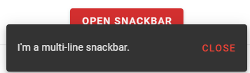
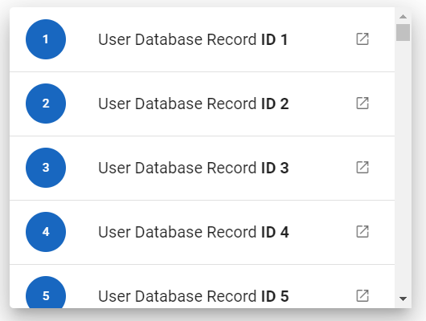
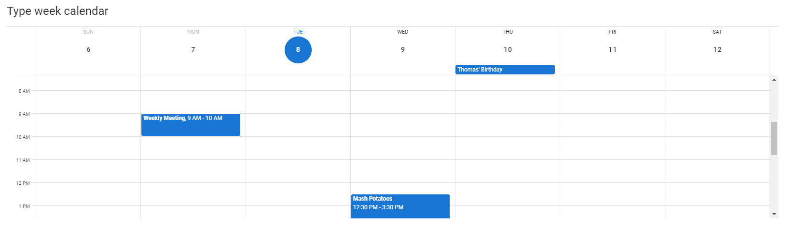

## 5. Vue.js elements

### 5.1 Alerts

[Vuetify documentation page](https://v2.vuetifyjs.com/en/components/alerts/)

- __Java__: _com.epam.jdi.light.vuetify.elements.common.Alert.java_

```java
    //@FindBy(css = "#tileAlert .v-alert")
    @UI("#tileAlert .v-alert")
    public static Alert tileAlert;

    @Test(description = "Check that tile alert is shown as expected")
    public void tileAlertTest(){
        tileAlert.show();
        tileAlert.has().text("Tile Alert")
            .has().color("rgba(255, 255, 255, 1)")
            .has().backgroundColor("rgba(76, 175, 80, 1)")
            .is().notDense()
            .is().tile()
            .has().type("success");
    }
```

The Alert component is used to convey important information to the user through the use of contextual types, icons, and colors.
There are four default types: success, info, warning, and error. Border, icon, and color of the alert could be customized.


__Vuetify v2.6.14__ code example:

```html
<div role="alert" class="v-alert v-sheet theme--light elevation-2 v-alert--border v-alert--border-bottom">
  <div class="v-alert__wrapper">
    <span aria-hidden="true" class="v-icon notranslate v-alert__icon theme--light warning--text">
      <svg xmlns="http://www.w3.org/2000/svg" viewBox="0 0 24 24" role="img" aria-hidden="true" class="v-icon__svg">
        <path d="M12,2L1,21H23M12,6L19.53,19H4.47M11,10V14H13V10M11,16V18H13V16"></path>
      </svg>
    </span>
    <div class="v-alert__content"> Fusce commodo aliquam arcu. </div>
    <div class="v-alert__border v-alert__border--bottom warning v-alert__border--has-color"></div>
  </div>
</div>
```

| Method | Description | Return Type |
| :--- | :--- | :--- |
**closeButton()** | Returns close button object | VuetifyButton
**hasCloseButton()** | Returns true if alert has close button | boolean 
**isDismissible()** | Returns true if alert has close button | boolean [](the same as previous!)
**isProminent()** | Returns true if alert is prominent and has halo for icon and increased height | boolean 
**hasBorder()** | Returns true if alert has border | boolean
**borderValue()** | Returns border side (top, right, bottom or left) | String
**hasColoredBorder()** | Returns true if alert border has color | boolean
**borderBackGroundColor()** | Returns border background color | boolean
**type()** | Returns alert type (info, success, warning, error) or empty string if type is undefined | String 

| Assert method | Description |
| :--- | :--- |
**text(Matcher<String condition)** | Asserts if alert text matches provided matcher
**dismissible()** or **hasCloseButton()** | Asserts if alert has close button
**notDismissible()** or **hasNotCloseButton()** | Asserts if alert has no close button
**prominent()** | Asserts if alert is prominent and has halo for icon
**prominent()** | Asserts if alert is not prominent and has no halo for icon
**border()** | Asserts if alert is prominent and has halo for icon
**noBorder()** | Asserts if alert is not prominent and has no halo for icon
**border(String borderValue)** | Asserts if alert has expected border side (top, right, bottom or left)
**coloredBorder()** | Asserts if alert has colored border
**noColoredBorder()** | Asserts if alert has not colored border
**backgroundBorderColor(String borderBackgroundColor)** | Asserts if alert has expected border background color
**type()** | Asserts if alert has expected type (info, success, warning, error)

Alert also have basic JDI elements methods and asserts for Text, Color, Elevation, Outline, Measurements, Theme and others

For examples of usage see: [Custom vuetify alert example](https://github.com/jdi-testing/jdi-light/blob/vuetify-develop/jdi-light-vuetify-tests/src/main/java/io/github/com/custom/alerts/IconAlert.java)
and [JDI vuetify page tests for alerts](https://github.com/jdi-testing/jdi-light/blob/vuetify-develop/jdi-light-vuetify-tests/src/test/java/io/github/epam/vuetify/tests/common/AlertsTests.java).

### 5.2 Avatars

[Vuetify documentation page](https://v2.vuetifyjs.com/en/components/avatars/)

Avatar is located in the following class:
- __Java__: _com.epam.jdi.light.vuetify.elements.common.Avatar.java_

```java
//@FindBy(css = "#avatarsWithSize .v-avatar")
@UI("#avatarsWithSize .v-avatar")
public static List<Avatar> sizeAvatars;

@Test
public void avatarTest() {
  sizeAvatars.get(1).show();
  sizeAvatars.get(1).has().size(36).and().text("36")
        .and().backgroundColor(INDIGO.value());
}
```


__Vuetify v2.6.14__ code example:

```html
<div class="v-avatar indigo" style="height: 36px; min-width: 36px; width: 36px;">
  <span class="white--text text-h5">36</span>
</div>
```

__Avatars__ - graphical representations of users.

|Method | Description   | Return Type
--- |---------------| ---
**is()** | Avatar Assert | AvatarAssert
**getText()** | Gets '{name}' text | String
**isTile()** | Checks that '{name}' is tile | boolean
**hasLeftAlignment()** | Checks that '{name}' has left alignment | boolean
**hasRightAlignment()** | Check that '{name}' has right alignment | boolean
**color()** | Gets '{name}' color | String
**backgroundColor()** | Gets '{name}' background color | String
**icon()** | Gets '{name}' icon | Icon
**hasIcon()** | Checks that '{name}' has icon | boolean
**image()** | Gets '{name}' image | Image
**height()** | Gets '{name}' height | int
**width()** | Gets '{name}' width | int
**maxHeight()** | Gets '{name}' max height | int
**maxWidth()** | Gets '{name}' max width | int
**minHeight()** | Gets '{name}' min height | int
**minWidth()** | Gets '{name}' min width | int
**isRounded()** | Checks that '{name}' is rounded | boolean
**rounded()** | Gets '{name}' rounded value | String

For examples of usage see: [Custom vuetify avatar example (profile card)](https://github.com/jdi-testing/jdi-light/blob/vuetify-develop/jdi-light-vuetify-tests/src/main/java/io/github/com/custom/ProfileCard.java)
and [JDI vuetify page tests for avatars](https://github.com/jdi-testing/jdi-light/blob/vuetify-develop/jdi-light-vuetify-tests/src/test/java/io/github/epam/vuetify/tests/common/AvatarsTests.java).

### 5.3 Banners

[Banners overview](https://v2.vuetifyjs.com/en/components/banners/)

- __Java__: _com.epam.jdi.light.vuetify.elements.complex.Banner.java_

```java
//@FindBy(css = "#SingleBanner .v-banner")
@UI("#SingleBanner .v-banner")
public static Banner singleBanner;

@Test(description = "Check that Single Banner is shown as expected and toggle switch 'Sticky' works")
public void bannerTest() {
  singleBanner.show();
  singleBanner.is().displayed();
  singleBanner.is().singleLine();
  singleBanner.has().text("We can't save your edits while you are in offline mode.");
  singleBanner.has().notIcon();
  singleBanner.has().notSticky();
  singleBannerSwitch.check();
  singleBanner.is().sticky();
  }
```


__Vuetify v2.6.14__ code example:

```html
<div class="v-banner v-sheet theme--light v-banner--single-line">
    <div class="v-banner__wrapper">
        <div class="v-banner__content">
            <div class="v-banner__text">
                We can't save your edits while you are in offline mode.

            </div>
        </div>
        <div class="v-banner__actions">
            <button type="button"
                    class="v-btn v-btn--text theme--light v-size--default deep-purple--text text--accent-4"><span
                    class="v-btn__content">
        Get Online
      </span></button>
        </div>
    </div>
</div>
```

The banner component is used as middle-interruptive message to user with 1-2 actions. It comes in 2 variations 
single-line and multi-line (implicit). These can have icons which you can use with your message and actions.

| Method | Description | Return Type |
| :--- | :--- | :--- |
**bannerContent()** | Get Banner content element | UIElement
**getIconsFromContent()** | Get Banner's icons | List<UIElement>
**bannerActions()** | Get Banner's actions element | UIElement
**isSticky()** | Get if Banner is sticky | boolean

| Assert method | Description |
| :--- | :--- |
**text(Matcher<String> text)** | Assert that Banner's element has expected text
**sticky()** | Assert that Banner is sticky
**notSticky()** | Assert that Banner is not sticky
**icon()** | Assert that Banner has icon
**notIcon()** | Assert that Banner has not icon
**numberOfButtons(int n)** | Assert that Banner's number of buttons equals to required number

In addition, Banner class implements IsText, HasRounded, IsTile, IsShaped, IsOutlined, HasTheme, HasElevation,
HasColor, IsSingleLine, HasIcon, MayContainButtons.

For examples of usage see: [JDI vuetify page tests for banners](https://github.com/jdi-testing/jdi-light/blob/vuetify-develop/jdi-light-vuetify-tests/src/test/java/io/github/epam/vuetify/tests/complex/BannersTests.java).

### 5.4 Bars

#### 5.4.1 Basic bar

- __Java__: _com.epam.jdi.light.vuetify.elements.complex.bars.BasicBar.java_

Basic bar is an abstract class that contains methods that are common for its specific realisations such as App Bar, Tool Bar and System Bar following below.

| Method | Description | Return Type |
| :--- | :--- | :--- |
**isCollapsed()** | Get if Basic Bar is collapsed | boolean
**isExpanded()** | Get if Basic Bar is expanded | boolean
**title()** | Get Basic Bar title | Text
**getHeader()** | Get Basic Bar header | UIElement
**buttons()** | Get Basic Bar buttons | List<VuetifyButton>
**fields()** | Get Basic Bar fields | List<UIElement>
**findIconButton(String buttonLocator)** | Get Basic Bar action buttons | VuetifyButton
**castToIcon(UIElement element)** | Get Basic Bar's icon | Icon
**isExtended()** | Get if Basic Bar is extended | boolean
**isFloating()** | Get if Basic Bar is floating | boolean

In addition, Basic Bar implements IsText, HasColor, IsFlat, IsDense, IsShaped, IsOutlined, HasElevation, 
HasTheme, HasRounded.

| Assert method | Description |
| :--- | :--- |
**text(String text)** | Assert that Basic Bar has expected text
**collapsed()** | Assert that Basic Bar is collapsed
**expanded()** | Assert that Basic Bar is expanded
**extended()** | Assert that Basic Bar is extended
**notExtended()** | Assert that Basic Bar is not extended
**floating()** | Assert that Basic Bar is floating
**notFloating()** | Assert that Basic Bar is not floating

#### 5.4.2 App Bars

[App bars overview](https://v2.vuetifyjs.com/en/components/app-bars/)

- __Java__: _com.epam.jdi.light.vuetify.elements.complex.bars.AppBar.java_

```java
    //@FindBy(css = "#scrollThresholdBar .v-toolbar")
@UI("#scrollThresholdBar .v-toolbar")
public static AppBarWithImageThresholdOnly thresholdBar;

@Test(description = "Test checks if app bar has image threshold or not")
public void thresholdBarTest(){
  thresholdBar.show();
  thresholdBar.has().imageFadingOnScroll();
  thresholdBar.scrollBarToBottom();
  thresholdBar.image().has().attr("style","opacity: 0;");
  thresholdBar.is().onBottomPosition();
  thresholdBar.scrollBarToTop();
  thresholdBar.image().has().attr("style","opacity: 1;");
  thresholdBar.is().onTopPosition();
  }
```


__Vuetify v2.6.14__ code example:

```html
<header
  class="v-sheet theme--dark v-toolbar v-toolbar--absolute v-toolbar--prominent v-app-bar v-app-bar--fade-img-on-scroll v-app-bar--shrink-on-scroll"
  data-booted="true"
  style="height: 128px; font-size: 1.5rem; margin-top: 0px; transform: translateY(0px); left: 0px; right: 0px; background-color: rgb(67, 160, 71); border-color: rgb(67, 160, 71);">
  <div class="v-toolbar__image" style="opacity: 1;">
    <div class="v-image v-responsive theme--dark" style="height: 128px;">
      <div class="v-responsive__sizer" style="padding-bottom: 56.25%;"></div>
      <div class="v-image__image v-image__image--cover"
           style="background-image: linear-gradient(to right top, rgba(55, 236, 186, 0.7), rgba(25, 32, 72, 0.7)), url(&quot;https://jdi-testing.github.io/jdi-light/vuetify/pictures/foggy_city_1080.jpeg&quot;); background-position: center center;"></div>
      <div class="v-responsive__content" style="width: 1920px;"></div>
    </div>
  </div>
  <div class="v-toolbar__content" style="height: 128px;">
    <button type="button" class="v-app-bar__nav-icon v-btn v-btn--icon v-btn--round theme--dark v-size--default"><span
      class="v-btn__content"><i aria-hidden="true" class="v-icon notranslate mdi mdi-menu theme--dark"></i></span>
    </button>
    <div class="v-toolbar__title v-app-bar-title">
      <div class="v-app-bar-title__content" style="width: 47px; visibility: visible;">Title</div>
      <div class="v-app-bar-title__placeholder" style="visibility: hidden;">Title</div>
    </div>
    <div class="spacer"></div>
    <button type="button" class="v-btn v-btn--icon v-btn--round theme--dark v-size--default"><span
      class="v-btn__content"><i aria-hidden="true" class="v-icon notranslate mdi mdi-magnify theme--dark"></i></span>
    </button>
    <button type="button" class="v-btn v-btn--icon v-btn--round theme--dark v-size--default"><span
      class="v-btn__content"><i aria-hidden="true" class="v-icon notranslate mdi mdi-heart theme--dark"></i></span>
    </button>
    <button type="button" class="v-btn v-btn--icon v-btn--round theme--dark v-size--default"><span
      class="v-btn__content"><i aria-hidden="true"
                                class="v-icon notranslate mdi mdi-dots-vertical theme--dark"></i></span></button>
  </div>
</header>
```

The App bars component is pivotal to any graphical user interface (GUI), as it generally is the primary source of site
navigation. The App bars component works great in conjunction with a Navigation Drawers for providing site navigation 
in your application.

| Method | Description | Return Type |
| :--- | :--- | :--- |
**hasBackgroundImage()** | Get if App bar is scrolled | boolean
**backgroundImage()** | Get App bar's image | Image
**scrollBarToBottom()** | Scroll App bar to bottom | void
**scrollBarToTop()** | Scroll App bar to top | void
**isCollapsible()** | Get if App bar is collapsible | boolean
**hasImageFadingOnScroll()** | Get if App bar has image fading on scroll | boolean
**isOnTopPosition()** | Get if App bar is on top position | boolean
**isOnBottomPosition()** | Get if App bar is on bottom position | boolean
**isElevateOnScroll()** | Get if App bar is elevate on scroll | boolean
**isScrolled()** | Get if App bar is scrolled | boolean
**isShrinkOnScroll()** | Get if App bar shrinks on scroll | boolean
**isBarShort()** | Get if App bar is short | boolean
**isBarUsualSize()** | Get if App bar has usual size | boolean

| Assert method | Description |
| :--- | :--- |
**collapsible()** | Assert that App bar is collapsible
**notCollapsible()** | Assert that App bar is not collapsible
**imageFadingOnScroll()** | Assert that App bar has image fading on scroll
**onTopPosition()** | Assert that App bar is on top position
**onBottomPosition()** | Assert that App bar is on bottom position
**noImageFadingOnScroll()** | Assert that App bar has no image fading on scroll
**elevateOnScroll()** | Assert that App bar is elevate on scroll
**notElevateOnScroll()** | Assert that App bar is not elevate on scroll
**scrolled()** | Assert that App bar is scrolled
**notScrolled()** | Assert that App bar is not scrolled
**backgroundImage()** | Assert that App bar has background image
**noBackgroundImage()** | Assert that App bar has no background image
**shrinkOnScroll()** | Assert that App bar shrinks on scroll
**notShrinkOnScroll()** | Assert that App bar doesn't shrink on scroll
**isShort()** | Assert that App bar bar is short
**isUsualSize()** | Assert that App bar bar has usual size

For examples of usage see: [JDI vuetify page tests for app bars](https://github.com/jdi-testing/jdi-light/blob/master/jdi-light-vuetify-tests/src/test/java/io/github/epam/vuetify/tests/complex/bars/AppBarsTests.java).

#### 5.4.3 System bars

[System bars overview](https://v2.vuetifyjs.com/en/components/system-bars/)

- __Java__: _com.epam.jdi.light.vuetify.elements.complex.bars.SystemBar.java_

```java
    //@FindBy(css = "#AppSystemBar .v-system-bar")
@UI("#AppSystemBar .v-system-bar")
public static SystemBar appSystemBar;

@Test(description = "Test checks if app system bar appears as expected")
public void appSystemBarTest(){
  appSystemBar.show();
  appSystemBar.has().text("App system bar title");
  appSystemBar.is().notWindow();
  appSystemBar.has().height(30);
  }
```


__Vuetify v2.6.14__ code example:

```html
<div class="v-system-bar v-system-bar--fixed theme--light green" id="system-bar-app" style="height: 30px;">
  <button type="button" class="v-app-bar__nav-icon v-btn v-btn--icon v-btn--round theme--light v-size--default"><span
    class="v-btn__content"><i aria-hidden="true"
                              class="v-icon notranslate mdi mdi-menu theme--light"></i></span>
  </button>
  <div class="v-toolbar__title">App system bar title</div>
  <div class="spacer"></div>
  <button type="button" class="v-btn v-btn--icon v-btn--round theme--light v-size--default"><span
    class="v-btn__content"><i aria-hidden="true"
                              class="v-icon notranslate mdi mdi-heart theme--light"></i></span>
  </button>
  <button type="button" class="v-btn v-btn--icon v-btn--round theme--light v-size--default"><span
    class="v-btn__content"><i aria-hidden="true"
                              class="v-icon notranslate mdi mdi-dots-vertical theme--light"></i></span></button>
</div>
```

The System bar component can be used for displaying statuses to the user. It looks like the Android system bar and can 
contain icons, spacers, and some text.

| Method | Description | Return Type |
| :--- | :--- | :--- |
**icons()** | Get System Bar icons | List<Icon>
**isLightsOut()** | Get if System Bar is lights out | boolean
**isWindow()** | Get if System Bar is window | boolean

In addition, System Bar implements HasMeasurement.

| Assert method | Description |
| :--- | :--- |
**lightsOut()** | Assert that System Bar is lights out
**notLightsOut()** | Assert that System Bar is not lights out
**window()** | Assert that System Bar is window
**notWindow()** | Assert that System Bar is not window

For examples of usage see: [JDI vuetify page tests for system bars](https://github.com/jdi-testing/jdi-light/blob/master/jdi-light-vuetify-tests/src/test/java/io/github/epam/vuetify/tests/complex/bars/SystemBarsTests.java).

#### 5.4.4 Toolbars

[Toolbars overview](https://v2.vuetifyjs.com/en/components/toolbars/)

- __Java__: _com.epam.jdi.light.vuetify.elements.complex.bars.ToolBar.java_

```java
    //@FindBy(css = "#denseToolbar .v-toolbar")
@UI("#denseToolbar .v-toolbar")
public static ToolBar denseToolbar;

@Test(description = "Check if dense toolbar looks as expected")
public void denseToolBarTest(){
  denseToolbar.show();
  denseToolbar.is().dense();
  denseToolbar.is().notBackgroundImage();
  denseToolbar.is().notFlat();
  }
```


__Vuetify v2.6.14__ code example:

```html
<header class="v-sheet theme--light v-toolbar v-toolbar--dense" style="height: 48px;">
    <div class="v-toolbar__content" style="height: 48px;">
        <button type="button"
                class="v-app-bar__nav-icon v-btn v-btn--icon v-btn--round theme--light v-size--default"><span
                class="v-btn__content"><i aria-hidden="true"
                                          class="v-icon notranslate mdi mdi-menu theme--light"></i></span>
        </button>
        <div class="v-toolbar__title">Title</div>
        <div class="spacer"></div>
        <button type="button" class="v-btn v-btn--icon v-btn--round theme--light v-size--default"><span
                class="v-btn__content"><i aria-hidden="true"
                                          class="v-icon notranslate mdi mdi-magnify theme--light"></i></span>
        </button>
        <button type="button" class="v-btn v-btn--icon v-btn--round theme--light v-size--default"><span
                class="v-btn__content"><i aria-hidden="true" class="v-icon notranslate mdi mdi-heart theme--light"></i></span>
        </button>
        <button type="button" class="v-btn v-btn--icon v-btn--round theme--light v-size--default"><span
                class="v-btn__content"><i aria-hidden="true"
                                          class="v-icon notranslate mdi mdi-dots-vertical theme--light"></i></span>
        </button>
    </div>
</header>
```

The Toolbar component is pivotal to any graphical user interface (GUI), as it generally is the primary source of site 
navigation. The toolbar component works great in conjunction with Navigation drawer and Cards.

| Method | Description | Return Type |
| :--- | :--- | :--- |
**hasBackgroundImage()** | Get if Toolbar has background image | boolean

| Assert method | Description |
| :--- | :--- |
**backgroundImage()** | Assert that Toolbar has background image
**notBackgroundImage()** | Assert that Toolbar has not background image

For examples of usage see: [JDI vuetify page tests for toolbars](https://github.com/jdi-testing/jdi-light/blob/master/jdi-light-vuetify-tests/src/test/java/io/github/epam/vuetify/tests/complex/bars/ToolBarsTests.java).


### 5.5 Bottom navigation

[Vuetify documentation page](https://v2.vuetifyjs.com/en/components/bottom-navigation/)

- __Java__: _com.epam.jdi.light.vuetify.elements.complex.BottomNavigation.java_

```java
    //@FindBy(css = "#scrollThresholdBottomNavigation .v-bottom-navigation")
    @UI("#scrollThresholdBottomNavigation .v-bottom-navigation")
    public static BottomNavigation bottomNavigationScrollThreshold;

    //@FindBy(css = "#fixedBottomNavigation .v-bottom-navigation")
    @UI("#fixedBottomNavigation .v-bottom-navigation")
    public static BottomNavigation bottomNavigationFixed;


@Test(description = "Test checks bottom navigation position")
public void positionBottomNavigationTest() {
    cardWithBottomNavigationScrollThreshold.show();
    cardWithBottomNavigationScrollThreshold.scroll(-1500);
    bottomNavigationScrollThreshold.is().absolute();
    bottomNavigationScrollThreshold.is().notFixed();
    bottomNavigationFixed.show();
    bottomNavigationFixed.is().fixed();
    bottomNavigationFixed.is().notAbsolute();
    }

```


The v-bottom-navigation component is an alternative to the sidebar. It is primarily used for mobile applications and comes in three variants, icons and text, and shift.

__Vuetify v2.6.14__ code example:

```html
<div class="v-bottom-navigation v-item-group theme--light" file="v-bottom-navigation/usage" style="height: 56px; transform: none;">
    <button type="button" value="recent" class="v-btn v-btn--active v-btn--is-elevated v-btn--has-bg theme--light v-size--default">
        <span class="v-btn__content">
            <span>Recent</span>
            <i aria-hidden="true" class="v-icon notranslate mdi mdi-history theme--light">
            </i>
        </span>
    </button>
    <button type="button" value="favorites" class="v-btn v-btn--is-elevated v-btn--has-bg theme--light v-size--default">
        <span class="v-btn__content">
            <span>Favorites</span>
            <i aria-hidden="true" class="v-icon notranslate mdi mdi-heart theme--light">
            </i>
        </span>
    </button>
    <button type="button" value="nearby" class="v-btn v-btn--is-elevated v-btn--has-bg theme--light v-size--default">
        <span class="v-btn__content">
            <span>Nearby</span>
            <i aria-hidden="true" class="v-icon notranslate mdi mdi-map-marker theme--light">
            </i>
        </span>
    </button>
</div>
```

|Method | Description                                | Return Type
--- |--------------------------------------------| ---
**is()** | Returns Assert class                       | BottomNavigationAssert
**buttonColor(int)** | Returns button color by index              | String
**buttonColor(String)** | Returns button color by text               | String
**isFixed()** | Gets if element has fixed position    | boolean
**isAbsolute()** | Gets if element has absolute position | boolean
**isHorizontal()** | Gets if element is horizontal         | boolean
**isGrow()** | Gets if element is grow               | boolean

__BottomNavigation__ element implements the following interfaces: HasColor, HasTheme, HasMeasurement

For examples of usage see: [JDI vuetify page tests for dialogs](https://github.com/jdi-testing/jdi-light/blob/master/jdi-light-vuetify-tests/src/test/java/io/github/epam/vuetify/tests/complex/BottomNavigationTests.java).

### 5.7 Breadcrumbs

[Vuetify documentation page](https://vuetifyjs.com/en/components/breadcrumbs/)

Breadcrumbs is located in the following class:
- __Java__: _com.epam.jdi.light.vuetify.elements.complex.Breadcrumbs.java_

```java
//@FindBy(css = "#differentDividersBreadcrumbs')
    @JDIBreadcrumbs(
            root = "#differentDividersBreadcrumbs > ul:nth-child(2)",
            items = ".v-breadcrumbs__item",
            dividers = ".v-breadcrumbs__divider"
    )
    public static Breadcrumbs forwardSlashedBreadcrumbs;
    
     @JDIBreadcrumbs(root = "#itemSlotBreadcrumbs > ul")
    public static Breadcrumbs itemSlotsBreadcrumbs;


    @Test(description = "Test checks dividers types")
    public void dividersTypeTest() {
        dashedBreadcrumbs.show();
        dashedBreadcrumbs.has().dividerType("-");
        forwardSlashedBreadcrumbs.show();
        forwardSlashedBreadcrumbs.has().dividerType("/");
        dottedBreadcrumbs.show();
        dottedBreadcrumbs.has().dividerType(".");
        semicolonBreadcrumbs.show();
        semicolonBreadcrumbs.has().dividerType(";");
        greaterSignBreadcrumbs.show();
        greaterSignBreadcrumbs.has().dividerType(">");
    }
    
```

Breadcrumbs can be used to specify locators for the root, links and dividers
explicitly through a `JDIBreadcrumbs` annotation.It is **necessary** to specify **the root** of an element.


__Vuetify v2.6.14__ code example:

```html
<div id="differentDividersBreadcrumbs">
   <ul class="v-breadcrumbs theme--light">
      <li>
         <a href="#dashboard" class="v-breadcrumbs__item">Dashboard</a>
      </li>
       <li class="v-breadcrumbs__divider">-</li>
      <li>
         <a href="#link1" class="v-breadcrumbs__item">Link 1</a>
      </li>
      <li class="v-breadcrumbs__divider">-</li>
      <li><a href="#link2" class="v-breadcrumbs__item v-breadcrumbs__item--disabled">Link 2</a>
      </li>
   </ul>
```
Breadcrumbs has the following methods:

|Method                           | Description                      | Return Type
----------------------------------| ------------------------ --------|-----------------------------------
**selected()**                    | Returns selected element                       | String
**selected(String)**              | Shows that required element is selected        | String
**dividers()**                    | Returns element's dividers                     | WebList
**items()**                       | Returns element's items                        | WebList
**isLarge()**                     | Check if element is large                      | boolean
**setup(Field)**                  | Setting up Breadcrumbs element by Field        | void         
**setup(String, String, String)** | Returns Breadcrumbs element by locators        | Breadcrumbs       
**is()**                          | Returns object for work with assertions        | BreadcrumbsAssert  
**isDisabled()**                  | Check that breadcrumb is disabled              | boolean
**isEnabled()**                   | Check that breadcrumb is not disabled          | boolean


<a href=https://github.com/jdi-testing/jdi-light/blob/vuetify-develop/jdi-light-vuetify-tests/src/test/java/io/github/epam/vuetify/tests/complex/BreadcrumbsTests.java">Java test examples</a>

### 5.8 Cards

[Vuetify documentation page](https://v2.vuetifyjs.com/en/components/cards/)

- __Java__: _com.epam.jdi.light.vuetify.elements.complex.Card.java_

```java    
    //@FindBy(xpath = "//div[./h2[contains(text(), 'Media with text')]]/div")
    @UI("//div[./h2[contains(text(), 'Media with text')]]/div")
    public static MediaTextCard mediaTextCard;
    
    @Test(description = "Test checks custom element media text card functionality")
    public void mediaTextCardTest() {
        mediaTextCard.show();
        mediaTextCard.is().displayed();
        mediaTextCard.image().has().css("background-size", "cover");
        mediaTextCard.has().title("Top 10 Australian beaches");
        mediaTextCard.has().subtitle(containsString("Number 10"));
        mediaTextCard.content().has().text(containsString("Whitehaven Beach"));
        mediaTextCard.shareButton().click();
        mediaTextCard.exploreButton().click();
    }
```

__Card__ component is a versatile component that can be used for anything from a panel to a static image. The card component has numerous helper components to make markup as easy as possible.  


__Vuetify v2.6.14__ code example:

```html
<div class="grow v-card v-sheet theme--light elevation-2" file="v-card/usage">
  <div class="v-card__title">Card title</div>
  <div class="v-card__subtitle">Subtitle text</div>
  <div class="v-card__text"> Greyhound divisively hello coldly wonderfully marginally far upon excluding. </div>
  <div class="v-card__actions">
    <button type="button" class="v-btn v-btn--text theme--light v-size--default primary--text">
      <span class="v-btn__content"> Action 1 </span>
    </button>
    <button type="button" class="v-btn v-btn--text theme--light v-size--default primary--text">
      <span class="v-btn__content"> Action 2 </span>
    </button>
  </div>
</div>
```

Cards may contain anything, you can inherit the `Card` class and customize it the way you want.

Basically, you have 4 methods: `title`, `subtitle`, `content` and `actions`.
They return the parts of a card described [here](https://v2.vuetifyjs.com/en/components/cards/#api).
The `content` method returns a card `text` element, but the `text` method is inherited from `UIBaseElement` that why it has a different name.

| Method | Description | Return Type |
| :--- | :--- | :--- |
**title()** | Returns element's title | Text (Vuetify element)
**subtitle()** | Returns subtitle JDI UIElement | UIElement
**content()** | Returns content JDI UIElement | UIElement
**actions()** | Returns button group JDI UIElement | ButtonGroup (Vuetify element)
**revealCard()** | Returns Card's reverse side JDI UIElement | Card (Vuetify element)
**progressBar()** | Returns ProgressLinear JDI UIElement | ProgressLinear (Vuetify element)
**getLoaderHeight** | Returns progress bar height | int
**isLink()** | Returns true if card is a link | boolean
**isHover()** | Returns true if card has hovering effect | boolean
**isRaised()** | Returns true if card is raised | boolean

| Assert method | Description |
| :--- | :--- |
**title(Matcher<String> condition)** | Asserts card title text
**title(String expectedText)** | Asserts card title text
**subtitle(Matcher<String> condition)** | Asserts card subtitle text
**subtitle(String expectedText)** | Asserts card subtitle text
**loaderHeightPx()** | Asserts card loader height
**link()** | Asserts if card is a link
**notlink()** | Asserts if card is not a link
**hover()** | Asserts if card is hovering
**notHover()** | Asserts if card is not hovering
**raised()** | Asserts if card is raised
**notRaised()** | Asserts if card is not raised

Card also have basic JDI elements methods and asserts for Color, Elevation, Tile, Loading, Shape, Measurements, Alignment, Theme and others

For examples of usage see: [Custom vuetify card examples](https://github.com/jdi-testing/jdi-light/tree/master/jdi-light-vuetify-tests/src/main/java/io/github/com/custom/cards)
and [JDI vuetify page tests for cards](https://github.com/jdi-testing/jdi-light/tree/master/jdi-light-vuetify-tests/src/test/java/io/github/epam/vuetify/tests/complex/CardsTests.java).`

### 5.9 Dialogs

[Dialogs overview](https://v2.vuetifyjs.com/en/components/dialogs/)

- __Java__: _com.epam.jdi.light.vuetify.elements.complex.Dialog.java_

```java
    //@FindBy(css = ".v-dialog--scrollable")
@UI(".v-dialog--scrollable")
public static ScrollableDialog scrollableDialog;

@Test(description = "Check if scrollable dialog could be scrolled and option could be selected ")
public static void scrollableDialogTest(){
  scrollableDialogButton.show();
  scrollableDialogButton.click();
  scrollableDialog.is().opened().and().scrollable();
  scrollableDialog.radiogroup().is().selected("");
  scrollableDialog.radiogroup().select("Bahrain");
  scrollableDialog.saveButton().click();
  scrollableDialog.is().closed();
  scrollableDialogButton.click();
  scrollableDialog.is().opened();
  scrollableDialog.radiogroup().is().selected("Bahrain");
  scrollableDialog.closeButton().click();
  scrollableDialog.is().closed();
  }
```


The Dialog component inform users about a specific task and may contain critical information, require decisions, or 
involve multiple tasks.

__Vuetify v2.6.14__ code example:

```html

<div class="v-dialog v-dialog--active v-dialog--scrollable" style="transform-origin: center center; max-width: 300px;"
     tabindex="0">
    <div class="v-card v-sheet theme--light">
        <div class="v-card__title">Select Country</div>
        <hr role="separator" aria-orientation="horizontal" class="v-divider theme--light">
        <div class="v-card__text" style="height: 300px;">
            <div class="v-input theme--light v-input--selection-controls v-input--radio-group v-input--radio-group--column">
                <div class="v-input__control">
                    <div class="v-input__slot" style="height: auto;">
                        <div role="radiogroup" aria-labelledby="input-163" class="v-input--radio-group__input">
                            <div class="v-radio theme--light">
                                <div class="v-input--selection-controls__input"><i aria-hidden="true"
                                                                                   class="v-icon notranslate mdi mdi-radiobox-blank theme--light"></i><input
                                        aria-checked="false" id="input-164" role="radio" type="radio" name="radio-163"
                                        value="bahamas">
                                    <div class="v-input--selection-controls__ripple"></div>
                                </div>
                                <label for="input-164" class="v-label theme--light"
                                       style="left: 0px; right: auto; position: relative;">Bahamas,
                                    The</label></div>
                            <div class="v-radio theme--light">
                                <div class="v-input--selection-controls__input"><i aria-hidden="true"
                                                                                   class="v-icon notranslate mdi mdi-radiobox-blank theme--light"></i><input
                                        aria-checked="false" id="input-166" role="radio" type="radio" name="radio-163"
                                        value="bahrain">
                                    <div class="v-input--selection-controls__ripple"></div>
                                </div>
                                <label for="input-166" class="v-label theme--light"
                                       style="left: 0px; right: auto; position: relative;">Bahrain</label>
                            </div>
                            <...>
                        </div>
                    </div>
                    <div class="v-messages theme--light">
                        <div class="v-messages__wrapper"></div>
                    </div>
                </div>
            </div>
        </div>
        <hr role="separator" aria-orientation="horizontal" class="v-divider theme--light">
        <div class="v-card__actions">
            <button type="button" class="v-btn v-btn--text theme--light v-size--default blue--text text--darken-1"><span
                    class="v-btn__content">
                    Close
                </span></button>
            <button type="button" class="v-btn v-btn--text theme--light v-size--default blue--text text--darken-1"><span
                    class="v-btn__content">
                    Save
                </span></button>
        </div>
    </div>
</div>
```

| Method | Description | Return Type |
| :--- | :--- | :--- |
**content()** | Get Dialog content | Card
**isActive()** | Get if Dialog is active | boolean
**isOpened()** | Get if Dialog is opened | boolean
**isClosed()** | Get if Dialog is closed | boolean
**isFullscreen()** | Get if Dialog is fullscreen | boolean
**isPersistent()** | Get if Dialog is persistent | boolean
**isScrollable()** | Get if Dialog is scrollable | boolean
**ihasVisibleContent(UIElement element)** | Get if Dialog has visible required element in dialog content | boolean
**close()** | Close Dialog | void
**close(String closeButtonName)** | Close Dialog with required button | void
**maxWidthPx()** | Get Dialog's max-width | int
**marginPx()** | Get Dialog's margin | int

| Assert method | Description |
| :--- | :--- |
**opened()** | Assert that Dialog is opened
**closed()** | Assert that Dialog is closed
**active()** | Assert that Dialog is active
**notActive()** | Assert that Dialog is not active
**fullscreen()** | Assert that Dialog is fullscreen
**notFullscreen()** | Assert that Dialog is not fullscreen
**persistent()** | Assert that Dialog is persistent
**notPersistent()** | Assert that Dialog is not persistent
**scrollable()** | Assert that Dialog is scrollable
**notScrollable()** | Assert that Dialog is not scrollable
**visibleContent(UIElement element)** | Assert that Dialog has visible required element in dialog content
**notVisibleContent(UIElement element)** | Assert that Dialog has not visible required element in dialog content
**maxWidthPx(int width)** | Assert that Dialog has required width
**marginPx(int margin)** | Assert that Dialog has margin with required px

For examples of usage see: [JDI vuetify page tests for dialogs](https://github.com/jdi-testing/jdi-light/blob/master/jdi-light-vuetify-tests/src/test/java/io/github/epam/vuetify/tests/complex/DialogsTests.java).

### 5.10 Expansion Panels

[Vuetify documentation page](https://vuetifyjs.com/en/components/expansion-panels/)

__Java__:
- _com.epam.jdi.light.vuetify.elements.complex.panels.ExpansionPanels.java_
- _com.epam.jdi.light.vuetify.elements.complex.panels.ExpansionPanel.java_

```java
    //Default locators(except root):
    @JDIExpansionPanels(
        root = "#ModelExpansionPanel .v-expansion-panels",
        panels = ".v-expansion-panel",
        header = ".v-expansion-panel-header",
        icon = ".v-expansion-panel-header__icon .v-icon",
        content = ".v-expansion-panel-content"
    )
    public static ExpansionPanels modelExpansionPanels;
```

You can specify locators for the root and panels to find panels in root. 
Also, you can specify header, icon and content locators for all panels. All of it you can do
explicitly through a `JDIExpansionPanels` annotation. 

It is **necessary** to specify **the root** of an element.

```java
    @JDIExpansionPanels(root = "#CustomIconExpansionPanel .v-expansion-panels:nth-child(1)")
    public static ExpansionPanels customIconExpansionPanelsSameIcons;
```

```java
    @Test
    public void customIconExpansionPanelTest() {
        customIconExpansionPanelsSameIcons.has().size(5);
        for (ExpansionPanel expansionPanel : customIconExpansionPanelsSameIcons.panels()) {
            expansionPanel.header().has().text("Item");
            expansionPanel.content().has().text(LOREM_IPSUM_TEXT);
            expansionPanel.is().expanded();
            expansionPanel.expander().is().displayed();
            expansionPanel.expander().has().cssClass("mdi-menu-down");
        }
    }
```


ExpansionPanels is a list of ExpansionPanel.

Expansion panel may contain anything, so you can inherit the `ExpansionPanel` class and customize it
the way you need. This class has 3 base methods: `header`, `expander` and `content`. 
They return the parts of an expansion panel. 

Also, you can inherit the `ExpansionPanels`.

`ExpansionPanels` methods:

|Method | Description | Return Type
--- | --- | ---
**panels()** | Returns list of panels as Expansion Panel | List\<ExpansionPanel>
**list()** | Returns list of panels as UIElement | WebList

`ExpansionPanel` methods:

|Method | Description | Return Type
--- | --- | ---
**header()** | Returns header element by header locator from JDIExpansionPanels annotation | UIElement
**expander()** | Returns expander element by icon locator from JDIExpansionPanels annotation | Icon
**content()** | Expands if panel is closed. Returns content element by content locator from JDIExpansionPanels annotation| UIElement
**expand()** | Expands panel | void
**close()** | Closes panel | void
**isExpanded()** | Returns true if panel is expanded | boolean
**isClosed()** | Returns true if panel is closed | boolean

For examples of usage see: [Custom vuetify expansion panels examples](https://github.com/jdi-testing/jdi-light/tree/vuetify-develop/jdi-light-vuetify-tests/src/main/java/io/github/com/custom/panels)
and [JDI vuetify page tests for expansion panels](https://github.com/jdi-testing/jdi-light/blob/vuetify-develop/jdi-light-vuetify-tests/src/test/java/io/github/epam/vuetify/tests/complex/ExpansionPanelsTest.java).

### 5.11 Footers

```java
//@FindBy(css = "#IndigoFooter")
@UI("#IndigoFooter")
public static IndigoFooter indigoFooter;

@Test(description = "Test checks custom element indigo footer")
public void indigoFooterTest() {
  indigoFooter.show();
  // footer itself does not have indigo color but inner container has
  indigoFooter.firstChild().has().css("background-color", Colors.INDIGO_LIGHTEN_1.value());
  indigoFooter.footerText().has().text(containsString(expectedVuetifyText));
  indigoFooter.divider().has().darkTheme();
  indigoFooter.descriptionText().has().text(containsString("Phasellus feugiat arcu sapien"));
  indigoFooter.socialButtons().forEach(HasClick::click);
}

//@FindBy(css = "#PadlessFooter")
@UI("#PadlessFooter")
public static Footer padlessFooter;

@Test(description = "Test checks if footer is padless or not")
public void padlessFooterTest() {
  padlessFooter.show();
  padlessFooter.is().padless();
  shapedFooter.show();
  shapedFooter.is().notPadless();
}
```

[Vuetify documentation page](https://v2.vuetifyjs.com/en/components/footer/)

- __Java__: _com.epam.jdi.light.vuetify.elements.composite.Footer.java_

__Footer__ - The v-footer component is used for displaying general information that a user might want to access from any page within your site.


__Vuetify v2.6.14__ code example:

```html
<footer class="v-footer v-sheet theme--dark v-footer--padless" id="IndigoFooter" data-booted="true">
  <div class="indigo lighten-1 white--text text-center v-card v-card--flat v-sheet theme--dark rounded-0">
    <div class="v-card__text">
      <button type="button" class="mx-4 white--text v-btn v-btn--icon v-btn--round theme--dark v-size--default">
				<span class="v-btn__content">
					<i aria-hidden="true" class="v-icon notranslate mdi mdi-facebook theme--dark" style="font-size: 24px;"></i>
				</span>
      </button>
      <button type="button" class="mx-4 white--text v-btn v-btn--icon v-btn--round theme--dark v-size--default">
				<span class="v-btn__content">
					<i aria-hidden="true" class="v-icon notranslate mdi mdi-twitter theme--dark" style="font-size: 24px;"></i>
				</span>
      </button>
      <button type="button" class="mx-4 white--text v-btn v-btn--icon v-btn--round theme--dark v-size--default">
				<span class="v-btn__content">
					<i aria-hidden="true" class="v-icon notranslate mdi mdi-linkedin theme--dark" style="font-size: 24px;"></i>
				</span>
      </button>
      <button type="button" class="mx-4 white--text v-btn v-btn--icon v-btn--round theme--dark v-size--default">
				<span class="v-btn__content">
					<i aria-hidden="true" class="v-icon notranslate mdi mdi-instagram theme--dark" style="font-size: 24px;"></i>
				</span>
      </button>
    </div>
    <div class="v-card__text white--text pt-0">Footer visible text here</div>
    <hr role="separator" aria-orientation="horizontal" class="v-divider theme--dark">
    <div class="v-card__text white--text">
      2023 — <strong>Vuetify</strong>
    </div>
  </div>
</footer>
```

| Method                                      | Description                                                                | Return Type  |
|---------------------------------------------|----------------------------------------------------------------------------|--------------|
| **is()**                                    | Returns Assert class                                                       | FooterAssert |
| **isPadless()**                             | Checks that element is padless                                             | boolean      |
| **isAbsolute()**                            | Checks that element is absolute                                            | boolean      |
| **isFixed()**                               | Checks that element is fixed                                               | boolean      |
| **has()**                                   | Returns Assert class                                                       | FooterAssert |
| **color()**                                 | Returns css attribute background-color as String Value                     | String       |
| **waitFor()**                               | Returns object for work with assertions                                    | FooterAssert |
| **shouldBe()**                              | Returns object for work with assertions                                    | FooterAssert |
| **verify()**                                | Returns object for work with assertions                                    | FooterAssert |
| **assertThat()**                            | Returns object for work with assertions                                    | FooterAssert |
| **classes()**                               | Gets all element's classes as list                                         | List<String> |
| **doubleClick()**                           | Double clicks on the element                                               | void         |
| **dragAndDropTo(int x, int y)**             | Drags and drops element to certain coordinates                             | void         |
| **dragAndDropTo(WebElement to)**            | Drags and drops element to another element                                 | void         |
| **getLocation()**                           | Gets element location as point                                             | Point        |
| **getSize()**                               | Gets element size                                                          | Dimension    |
| **getTagName()**                            | Gets element tag name                                                      | String       |
| **getText()**                               | Gets element text                                                          | String       |
| **getValue()**                              | Gets element text                                                          | String       |
| **hasAttribute(String attrName)**           | Returns true if the element has an expected attribute                      | boolean      |
| **hasClass(String className)**              | Returns true if the element has an expected class                          | boolean      |
| **highlight()**                             | Highlights element with red color                                          | void         |
| **highlight(String color)**                 | Scrolls view to element and highlights it with a border of specified color | void         |
| **hover()**                                 | Hovers mouse cursor over the element                                       | void         |
| **isDisabled()**                            | Checks that element is disabled                                            | boolean      |
| **isDisplayed()**                           | Checks that element is displayed                                           | boolean      |
| **isEnabled()**                             | Checks that element exists                                                 | boolean      |
| **isHidden()**                              | Checks that element is hidden                                              | boolean      |
| **isNotExist()**                            | Checks that element does not exist                                         | boolean      |
| **isNotVisible()**                          | Checks that element is not visible by user                                 | boolean      |
| **isVisible()**                             | Checks that element is visible by user                                     | boolean      |
| **labelText()**                             | Gets label text                                                            | String       |
| **printHtml()**                             | Gets element “innerHTML” attribute value                                   | String       |
| **rightClick()**                            | Right clicks on the element                                                | void         |
| **setAttribute(String name, String value)** | Sets value to the specified attribute                                      | void         |
| **show()**                                  | Scrolls screen view to item                                                | void         |

<a href="https://github.com/jdi-testing/jdi-light/blob/vuetify-develop/jdi-light-vuetify-tests/src/test/java/io/github/epam/vuetify/tests/composite/FootersTests.java">Java test examples</a>

### 5.12 Form input & controls

#### 5.12.1 Overflow buttons

[Vuetify documentation page](https://v2.vuetifyjs.com/en/components/overflow-btns/)

- __Java__: _com.epam.jdi.light.vuetify.elements.composite.OverflowButton.java_

```java
//@FindBy(css = "#OverflowButton .v-overflow-btn")
@UI("#OverflowButton .v-overflow-btn")
public static OverflowButton counterOverflowButton;

@Test(description = "Test checks if overflow button is expanded or not")
public void closeExpandOverflowButtonTest() {
  counterOverflowButton.show();
  counterOverflowButton.has().placeholder("Overflow Btn w/ counter");
  counterOverflowButton.expand();
  counterOverflowButton.is().expanded();
  counterOverflowButton.close();
  counterOverflowButton.is().closed();
  counterOverflowButton.select("50%");
  counterOverflowButton.is().selected("50%").and().counter(3);
  counterOverflowButton.select(1);
  counterOverflowButton.is().selected("100%");
  counterOverflowButton.select(5);
  counterOverflowButton.is().counter(2);
  }
```

`v-overflow-btn` is used to give the user the ability to select items from the list. It has 3 variations: editable, overflow and segmented


__Vuetify v2.6.14__ code example:

```html

<div class="container" id="dropdown-example-3" file="v-overflow-btn/prop-counter">
  <div
    class="v-input my-2 theme--light v-text-field v-text-field--single-line v-text-field--is-booted v-select v-autocomplete v-overflow-btn">
    <div class="v-input__control">
      <div role="combobox" aria-haspopup="listbox" aria-expanded="false" aria-owns="list-635" class="v-input__slot">
        <div class="v-select__slot"><label for="input-635" class="v-label theme--light">Overflow Btn w/ counter</label>
          <div class="v-select__selections"><input id="input-635" readonly="readonly" type="text"></div>
          <div class="v-input__append-inner">
            <div class="v-input__icon v-input__icon--append">
              <span aria-hidden="true" class="v-icon notranslate theme--light"><svg
              xmlns="http://www.w3.org/2000/svg" viewBox="0 0 24 24" role="img" aria-hidden="true" class="v-icon__svg"><path
              d="M7,10L12,15L17,10H7Z"></path></svg></span></div>
          </div>
          <input type="hidden"></div>
        <div class="v-menu"><!----></div>
      </div>
      <div class="v-text-field__details">
        <div class="v-messages theme--light">
          <div class="v-messages__wrapper"></div>
        </div>
        <div class="v-counter theme--light">0</div>
      </div>
    </div>
  </div>
</div>
```

|Method | Description | Return Type
--- | --- | ---
**expand()/close()** | Open/close dropdown menu | void
**select(String text)/select(int index)** | Select element | void
**sendText(String text)** | Set text in input field | void
**clear()** | Clear Overflow button text field | void
**selected()** | Returns selected text | String
**hasCounter()** | Returns if Overflow button has counter | boolean
**counterValue()** | Returns Overflow button counter value | int
**isExpanded()/isClosed()** | Shows that dropdown menu is open/close | boolean
**isDisabled()/isEnabled()** | Shows that required element is disabled/enabled | boolean
**isEditable()** | Shows that required element is editable | boolean
**loader()** | Returns Overflow button loader height | ProgressLinear
**isSegmented()** | Returns if Overflow button is segmented | boolean
**hasChips()** | Returns if Overflow button has chips | boolean
**hasSmallChips()** | Returns if Overflow button has small chips | boolean

In addition, **OverflowButton** implements HasPlaceholder, HasMessages,
IsReadOnly, IsLoading, IsDense, IsFilled, IsReverse, HasRounded, IsFlat, HasTheme, IsOutlined, IsShaped,
IsSingleLine, IsFullWidth.

| Assert method | Description |
| :--- | :--- |
**expanded()** | Assert that OverflowButton is expanded
**closed()** | Assert that OverflowButton is closed
**selected(String value)** | Assert that OverflowButton has selected value
**placeholder(String text)** | Assert that OverflowButton placeholder has text
**counter()** | Assert that OverflowButton has counter
**notCounter()** | Assert that OverflowButton has not counter
**counter(int value)** | Assert that OverflowButton counter is value
**editable()** | Assert that OverflowButton is editable
**notEditable()** | Assert that OverflowButton is not editable
**enabled()** | Assert that OverflowButton is enabled
**disabled()** | Assert that OverflowButton is disabled
**hasLoader()** | Assert that OverflowButton has loader
**hasNoLoader()** | Assert that OverflowButton has no loader
**segmented()** | Assert that OverflowButton is segmented
**notSegmented()** | Assert that OverflowButton is not segmented
**chips()** | Assert that OverflowButton has chips
**noChips()** | Assert that OverflowButton has no chips
**smallChips()** | Assert that OverflowButton has small chips
**noSmallChips()** | Assert that OverflowButton has no small chips

In addition, **OverflowButtonAssert** implements MessagesAssert<OverflowButtonAssert, OverflowButton>, ReadOnlyAssert<OverflowButtonAssert, OverflowButton>,
LoadingAssert<OverflowButtonAssert, OverflowButton>, DenseAssert<OverflowButtonAssert, OverflowButton>,
FilledAssert<OverflowButtonAssert, OverflowButton>, ReverseAssert<OverflowButtonAssert, OverflowButton>,
RoundedAssert<OverflowButtonAssert, OverflowButton>, FlatAssert<OverflowButtonAssert, OverflowButton>,
ThemeAssert<OverflowButtonAssert, OverflowButton>, OutlinedAssert<OverflowButtonAssert, OverflowButton>,
ShapedAssert<OverflowButtonAssert, OverflowButton>, SingleLineAssert<OverflowButtonAssert, OverflowButton>,
FullWidthAssert<OverflowButtonAssert, OverflowButton>.

For examples of usage see: 
[JDI vuetify page tests for Overflow buttons](https://github.com/jdi-testing/jdi-light/blob/master/jdi-light-vuetify-tests/src/test/java/io/github/epam/vuetify/tests/complex/OverflowButtonsTests.java).

#### 5.12.2 Range Slider

[Vuetify documentation page](https://vuetifyjs.com/en/components/range-sliders/)

- __Java__: _com.epam.jdi.light.vuetify.elements.complex.RangeSlider.java_

```java
@Test
public void minAndMaxRangeSliderTest() {
    minAndMaxRangeSlider.slideHorizontalTo(11, 66);
    minAndMaxRangeSlider.is().value(11, 66);
    minAndMaxRangeSlider.slideHorizontalTo(-50, 90);
    minAndMaxRangeSlider.is().value(-50, 90);
}
```

The Range Slider component is a better visualization of the number input. 
It is used for gathering numerical user data. Sliders reflect a range of values along a bar, from which users may select a single value. 
They are ideal for adjusting settings such as volume, brightness, or applying image filters.

|Method | Description | Return Type
--- | --- | ---
**isDisabled()** | Shows that required element is disabled| boolean
**isThumbLabelDisplayed()** | Shows that thumb label of required element is displayed| boolean
**isAlwaysShow()** | Shows that ticks of required element is always show| boolean
**isVertical()** | Shows that required element is vertical| boolean
**slideHorizontalTo(int valueLeft, int valueRight)** | Set in horizontal slider left thumb to valueLeft and right thumb to valueRight| void
**slideVerticalTo(int valueLeft, int valueRight)** | Set in vertical slider upper thumb to valueLeft and lower thumb to valueRight| void
**getThumbLabelValue()** | Get label of the first and second thumb| List<String>
**getValue()** | Get first and second value| List<Integer>
**getTickLabel()** | Get tick label| String


For examples of usage see: [JDI Vuetify Range sliders tests](https://github.com/jdi-testing/jdi-light/blob/vuetify-develop/jdi-light-vuetify-tests/src/test/java/io/github/epam/vuetify/tests/complex/RangeSliderTests.java)

#### 5.12.3 Slider

[Vuetify documentation page](https://v2.vuetifyjs.com/en/components/sliders/)

- __Java__: _com.epam.jdi.light.vuetify.elements.complex.Slider.java_

```java
  //@FindBy(css = "#AdjustableSlider .v-slider")
  @UI("#AdjustableSlider .v-slider")
  public static Slider adjustableSlider;

  @Test(description = "Test shows how to work with slider")
  public void sliderTest() {
    adjustableSlider.show();
    adjustableSlider.has().minValue(0).and().has().maxValue(100);
    adjustableSlider.is().horizontal();
    adjustableSlider.setValue(30);
    adjustableSlider.has().value(30);
  }
```

The Slider component is a better visualization of the number input. It is used for gathering numerical user data.


__Vuetify v2.6.14__ code example:

```html
<div class="v-slider v-slider--horizontal theme--light">
  <input value="25" id="input-885" disabled="disabled" readonly="readonly" tabindex="-1">
  <div class="v-slider__track-container">
    <div class="v-slider__track-background primary lighten-3" style="right: 0px; width: calc(75%);">
    </div>
    <div class="v-slider__track-fill orange darken-3" style="left: 0px; right: auto; width: 25%;">
    </div>
  </div>
  <div role="slider" tabindex="0" aria-label="color" aria-valuemin="0" aria-valuemax="100" aria-valuenow="25" aria-readonly="false" aria-orientation="horizontal" class="v-slider__thumb-container orange--text text--darken-3" style="left: 25%;">
    <div class="v-slider__thumb orange darken-3">
    </div>
  </div>
</div>
```

| Method                                              | Description                                           | Return Type    
-----------------------------------------------------|-------------------------------------------------------|----------------
 **track()**                                         | Get track                                             | UIElement      
 **thumb()**                                         | Get thumb                                             | UIElement      
 **ticks()**                                         | Get ticks                                             | WebList        
 **tickLabel(int index)**                            | Get tick label value                                  | String         
 **thumbLabel()**                                    | Get thumb label                                       | Label          
 **prependOuterIcon()**                              | Get slider prepend outer icon                         | Icon           
 **appendOuterIcon()**                               | Get slider prepend append icon                        | Icon           
 **loader()**                                        | Get loader                                            | ProgressLinear 
 **label()**                                         | Get label                                             | Label          
 **value()**                                         | Get value                                             | double         
 **minValue()**                                      | Get min value                                         | double         
 **maxValue()**                                      | Get max value                                         | double         
 **setValue(Integer value)/ setValue(Double value)** | Set slider to value                                   | void           
 **ticksSize()**                                     | Get ticks size                                        | int            
 **thumbSize()**                                     | Get thumb size                                        | int            
 **backgroundColor()**                               | Get background color                                  | String         
 **thumbColor()**                                    | Get thumb color                                       | String         
 **trackFillColor()**                                | Get track fill color                                  | String         
 **trackBackgroundColor()**                          | Get track background color                            | String         
 **clickOutsideOfSlider()**                          | Clicking outside the sheet                            | void           
 **isAlwaysShow()**                                  | Check that ticks of required element is always show   | boolean        
 **isError()**                                       | Check that required element is error                  | boolean        
 **isSuccess()**                                     | Check that required element is success                | boolean        
 **hasThumbLabel()**                                 | Check that thumb label of required element is existed | boolean        
 **hasInverseLabel()**                               | Check that required element has inverse label         | boolean        

For examples of usage see: [JDI Vuetify Sliders tests](https://github.com/jdi-testing/jdi-light/blob/vuetify-develop/jdi-light-vuetify-tests/src/test/java/io/github/epam/vuetify/tests/complex/SlidersTests.java)

#### 5.12.4 Switches

[Switches Vuetify documentation page](https://vuetifyjs.com/en/components/switches/)

Switches are located in the following class:
- __Java__: _com.epam.jdi.light.vuetify.elements.common.Switch.java_

```java
//@FindBy(css = "#ColorsSwitch .v-input--switch")
@UI("#ColorsSwitch .v-input--switch")
public static List<Switch> colorSwitches;

@Test(description = "Test checks parameters of switch: color, text, functionality")
public void functionalityAndCssStyleSwitchTest() {
  String red = "red";
  final Switch redSwitch = colorSwitches.get(1);
  redSwitch.show();
  redSwitch.is().checked();
  redSwitch.label().has().text(red);
  redSwitch.has().value(red);
  redSwitch.has().color(RED.value());
  redSwitch.has().detailsHidden();
  redSwitch.uncheck();
  redSwitch.is().unchecked();
}
```
__Switches__ - The `v-switch` component provides users the ability to choose between two distinct values.


__Vuetify v2.6.14__ code example:

```html
<div class="v-input v-input--hide-details theme--light v-input--selection-controls v-input--switch">
  <div class="v-input__control">
    <div class="v-input__slot">
      <div class="v-input--selection-controls__input">
        <input aria-checked="false" id="input-1187" role="switch" type="checkbox" aria-disabled="false" value="red">
        <div class="v-input--selection-controls__ripple">
        </div>
        <div class="v-input--switch__track theme--light">
        </div>
        <div class="v-input--switch__thumb theme--light">
          <!---->
        </div>
      </div>
      <label for="input-1187" class="v-label theme--light" style="left: 0px; right: auto; position: relative;">red</label>
    </div>
  </div>
</div>
```

|Method | Description                                     | Return Type
--- |-------------------------------------------------| ---
**check()/uncheck()** | Switch element between two states               | void
**value()** | Get switch value                                | String
**lable()** | Get switch label                                | Lable
**color()** | Get switch color in RGBA format                 | String
**backgroundColor()** | Get switch background color in RGBA format      | String
**slotsBackgroundColor()** | Get switch slot background color in RGBA format | String
**getMessages()** | Get switch messages                             | List<String>
**getErrorMessages()** | Get switch error messages                       | List<String>
**getNumberErrorMessages()** | Get the number of switch error messages         | Integer
**getSuccessMessages()** | Get switch success messages                     | List<String>
**isChecked()/isNotChecked()** | Check if switch is selected/not selected        | boolean
**isEnabled()** | Check if switch is enabled                      | boolean
**isFlat()** | Checks that switch is flat                      | boolean
**isInset()** | Checks that switch is inset                     | boolean
**isReadonly()** | Checks that switch is readonly                  | boolean
**hasMessages()** | Check that switch has messages                  | boolean
**hasErrorMessage()** | Check that switch has error messages            | boolean
**hasSuccessMessage()** | Check that switch has success messages          | boolean
**hasIconAppend()** | Check that switch has icon-append               | boolean
**hasIconPrepend()** | Check that switch has icon-prepend              | boolean
**hasRipple()** | Check that switch has ripple                    | boolean
**is()** | Switch assert                                   | SwitchAssert

For examples of usage see: [JDI Vuetify Switch tests](https://github.com/jdi-testing/jdi-light/blob/vuetify-develop/jdi-light-vuetify-tests/src/test/java/io/github/epam/vuetify/tests/common/SwitchesTests.java).

#### 5.12.5 Text fields

[Vuetify documentation page](https://vuetifyjs.com/en/components/text-fields/)

- __Java__: _com.epam.jdi.light.vuetify.elements.complex.TextFields.java_

```java
@Test
public void hideDetailsTextFieldTest() {
    hideDetailsTextField.get(1).is().noMessage();
    hideDetailsTextField.get(1).focus();
    hideDetailsTextField.get(2).focus();
    hideDetailsTextField.get(1).message().has().text("Required.");
    hideDetailsTextField.get(1).setText("a");
    hideDetailsTextField.get(1).message().has().text("Min 3 characters");
    hideDetailsTextField.get(1).setText("aaa");
    hideDetailsTextField.get(1).is().noMessage();
    hideDetailsTextField.get(2).focus();
    hideDetailsTextField.get(2).is().noMessage();
    hideDetailsTextField.get(2).setText("a");
    hideDetailsTextField.get(2).is().noMessage();
}
  
@Test
public void passwordInputTextFieldTest() {
    passwordInputTextField.get(1).is().textType("password");
    passwordInputTextField.get(1).getAppendInnerIcon().click();
    passwordInputTextField.get(1).is().textType("text");
    passwordInputTextField.get(1).getAppendInnerIcon().click();
    passwordInputTextField.get(1).is().textType("password");
}
```


Text fields components are used for collecting user provided information.

|Method | Description | Return Type
--- | --- | ---
**isReadonly()** | Shows that element is readonly| boolean
**isFocused()** | Shows that element is focused| boolean
**isFilled()** | Shows that element is filled| boolean
**isOutlined()** | Shows that element is outlined| boolean
**isShaped()** | Shows that element is shaped| boolean
**isSolo()** | Shows that element is solo| boolean
**isFullWidth()** | Shows that element has full-width input type| boolean
**textInputField()** | Returns text input field| UIElement
**slot()** | Returns input slot | UIElement
**message()** |  Returns message | UIElement
**counter()** |  Returns counter | UIElement
**prefix()** |  Return prefix | UIElement
**suffix()** |  Returns suffix | UIElement
**prependOuterIcons()** | Returns list of prepend outer icons | List\<Icon>
**prependInnerIcons()** | Returns list of prepend inner icons | List\<Icon>
**appendInnerIcons()** | Returns list of append inner icons | List\<Icon>
**appendOuterIcons()** | Returns list of append outer icons | List\<Icon>
**getPrependOuterIcon()** | Returns first prepend outer icon | Icon
**getPrependInnerIcon()** | Returns first prepend inner icon | Icon
**getAppendInnerIcon()** | Returns first append inner icon | Icon
**getAppendOuterIcon()** | Returns first append outer icon | Icon
**getText()** | Returns text from input field | String
**getTextType()** | Returns type of text | String
**label()** |  Returns label | Label
**labelText()** | Returns label text | String
**placeholder()** | Returns placeholder text| String
**setText(String text)** | Set text| void
**input(String text)** | Set text| void
**sendKeys(String text)** | Add text| void
**clear()** |  Clear text field| void
**focus()** |  Set mouse to text field| void

For examples of usage see: [JDI Vuetify Text fields tests](https://github.com/jdi-testing/jdi-light/blob/vuetify-develop/jdi-light-vuetify-tests/src/test/java/io/github/epam/vuetify/tests/complex/TextFieldsTests.java).

#### 5.12.6 Text areas

[Vuetify documentation page](https://vuetifyjs.com/en/components/textareas/)

- __Java__: _com.epam.jdi.light.vuetify.elements.complex.TextArea.java_

```java
@Test
public void autoGrowTextAreaTest() {
    autoGrowTextArea.is().autoGrow();
    autoGrowTextArea.is().notResizable();
    autoGrowTextArea.is().filled();
    autoGrowTextArea.has().lines("The Woodman set to work at once, and so " +
        "sharp was his axe that the tree was soon chopped nearly through.");
    autoGrowTextArea.label().is().displayed();
    autoGrowTextArea.label().has().text(equalTo("Label"));
    autoGrowTextArea.has().height(is(120));
    autoGrowTextArea.setLines(" 1 row", "2 row", "3 row", "4 row");
    autoGrowTextArea.has().height(is(120));
    autoGrowTextArea.addNewLine("5 row");
    autoGrowTextArea.has().height(is(140));
}

@Test
public void counterTextAreaTest() {
    counterTextArea.label().has().text("Text");
    counterTextArea.has().text("Hello!");
    counterTextArea.counter().has().text("6");
    counterTextArea.counter().has().css("color", "rgba(0, 0, 0, 0.6)");
    counterTextArea.sendKeys("This is text for 25");
    counterTextArea.counter().has().text("25");
    counterTextArea.counter().has().css("color", "rgba(0, 0, 0, 0.6)");
    counterTextArea.sendKeys("-");
    counterTextArea.message().has().text("Max 25 characters");
    counterTextArea.message().has().css("color", RED_ACCENT_2.toString());
    counterTextArea.counter().has().text("26");
    counterTextArea.counter().has().css("color", RED_ACCENT_2.toString());
    counterTextArea.label().has().css("color", RED_ACCENT_2.toString());
    counterTextArea.clear();
    counterTextArea.counter().has().text("0");
}
```


Text area components are used for collecting large amounts of textual data.

|Method | Description | Return Type
--- | --- | ---
**isFilled()** | Shows that element is filled| boolean
**isOutlined()** | Shows that element is outlined| boolean
**isAutoGrow()** | Shows that element is auto grow| boolean
**isNotResizable()** | Shows that element is not resizable| boolean
**textArea()** | Returns text input area| UIElement
**slot()** | Returns input slot | UIElement
**details()** | Returns details | UIElement
**message()** |  Returns message | UIElement
**counter()** |  Returns counter | UIElement
**getPrependOuterIcon()** | Returns prepend outer icon | Icon
**getPrependInnerIcon()** | Returns prepend inner icon | Icon
**getAppendInnerIcon()** | Returns append inner icon | Icon
**getAppendOuterIcon()** | Returns append outer icon | Icon
**getText()** | Returns text | String
**getLines()** | Returns lines dividing text using '\\n'  | List\<String>
**label()** |  Returns label | Label
**labelText()** | Returns label text | String
**placeholder()** | Returns placeholder text| String
**setText(String text)** | Set text| void
**input(String text)** | Set text| void
**sendKeys(String text)** | Add text| void
**setLines(String... lines)** | Add lines as one string with '\n' delimiter| void
**setLines(List<String> lines)** | Add lines as one string with '\n' delimiter| void
**addNewLine(String line)** | Add text on a new line| void
**clear()** | Clear text area| void
**focus()** | Set mouse to text area| void
**color()** | Returns slot color | String
**backgroundColor()** | Returns slot background color | String
**height()** | Returns height of text area | int 
**rows()** | Returns number of rows in text area | int

For examples of usage see: [JDI Vuetify Text areas tests](https://github.com/jdi-testing/jdi-light/blob/vuetify-develop/jdi-light-vuetify-tests/src/test/java/io/github/epam/vuetify/tests/complex/TextAreasTests.java).


#### 5.12.7 Radio buttons

```java
//@FindBy(css = "#ColorsRadioButton .col-12[1] [role=radio]")
@UI("#ColorsRadioButton .col-12[1] [role=radio]")
public static RadioButtons colorLeftRadioButtons;

@Test(description = "Test checks radio button selection")
public void selectEnumRadioButtonsTest() {
  colorLeftRadioButtons.show();
  colorLeftRadioButtons.select(RadioTestData.indigo);
  colorLeftRadioButtons.is().selected(RadioTestData.indigo);
  colorLeftRadioButtons.select(RadioTestData.orange);
  colorLeftRadioButtons.is().selected(RadioTestData.orange);
  colorLeftRadioButtons.select(RadioTestData.red);
  colorLeftRadioButtons.is().selected(RadioTestData.red);
  }
  
//@FindBy(css = "#DirectionRadioButton input[role = 'radio']")  
@UI("#DirectionRadioButton input[role = 'radio']")
public static RadioButtons directionRadioButtons;  
  
@Test(description = "Test checks radio button value")
public void valueRadioButtonsTest() {
  directionRadioButtons.show();
  directionRadioButtons.has().value("Option 1");
  directionRadioButtons.has().value("Option 2");
  }

//@FindBy(css = "#SuccessReadOnlyRadioButtonWithHint [role=radio]")
@UI("#SuccessReadOnlyRadioButtonWithHint [role=radio]")
public static RadioButtons successRadioButtons;

@Test(description = "Test checks if radio button has messages or not")
public void messagesRadioButtonTest() {
  successRadioButtons.show();
  successRadioButtons.has().messagesCount(1);
  successRadioButtons.has().messageText("some hint");
  successRadioButtons.has().successMessages();
  successRadioButtons.has().noErrorMessages();
  }
```

[Vuetify documentation page](https://vuetifyjs.com/en/components/radio-buttons/)

- __Java__: _com.epam.jdi.light.vuetify.elements.common.radiobuttons.RadioButton.java_
- __Java__: _com.epam.jdi.light.vuetify.elements.common.radiobuttons.RadioButtons.java_

The Vuetify RadioButton component is a simple radio button. When combined with the v-radio-group component you can provide groupable functionality to allow users to select from a predefined set of options.


```html
<div role="radiogroup" aria-labelledby="input-580" class="v-input--radio-group__input">
	<div class="v-radio theme--light v-item--active">
		<div class="v-input--selection-controls__input">
			<span aria-hidden="true" class="v-icon notranslate theme--light primary--text">
				<svg xmlns="http://www.w3.org/2000/svg" viewBox="0 0 24 24" role="img" aria-hidden="true" class="v-icon__svg">
					<path d="M12,20C7.58,20 4,16.42 4,12C4,7.58 7.58,4 12,4C16.42,4 20,7.58 20,12C20,16.42 16.42,20 12,20M12,2C6.48,2 2,6.48 2,12C2,17.52 6.48,22 12,22C17.52,22 22,17.52 22,12C22,6.48 17.52,2 12,2M12,7C9.24,7 7,9.24 7,12C7,14.76 9.24,17 12,17C14.76,17 17,14.76 17,12C17,9.24 14.76,7 12,7Z"></path>
				</svg>
			</span>
			<input aria-checked="true" id="input-581" role="radio" type="radio" name="radio-580" value="1">
			<div class="v-input--selection-controls__ripple primary--text"></div>
		</div>
		<label for="input-581" class="v-label theme--light" style="left: 0px; right: auto; position: relative;">Radio 1</label>
	</div>
	<div class="v-radio theme--light">
		<div class="v-input--selection-controls__input">
			<span aria-hidden="true" class="v-icon notranslate theme--light">
				<svg xmlns="http://www.w3.org/2000/svg" viewBox="0 0 24 24" role="img" aria-hidden="true" class="v-icon__svg">
					<path d="M12,20C7.58,20 4,16.42 4,12C4,7.58 7.58,4 12,4C16.42,4 20,7.58 20,12C20,16.42 16.42,20 12,20M12,2C6.48,2 2,6.48 2,12C2,17.52 6.48,22 12,22C17.52,22 22,17.52 22,12C22,6.48 17.52,2 12,2Z"></path>
				</svg>
			</span>
			<input aria-checked="false" id="input-583" role="radio" type="radio" name="radio-580" value="2">
			<div class="v-input--selection-controls__ripple"></div>
		</div>
		<label for="input-583" class="v-label theme--light" style="left: 0px; right: auto; position: relative;">Radio 2</label>
	</div>
	<div class="v-radio theme--light">
		<div class="v-input--selection-controls__input">
		<span aria-hidden="true" class="v-icon notranslate theme--light">
			<svg xmlns="http://www.w3.org/2000/svg" viewBox="0 0 24 24" role="img" aria-hidden="true" class="v-icon__svg">
				<path d="M12,20C7.58,20 4,16.42 4,12C4,7.58 7.58,4 12,4C16.42,4 20,7.58 20,12C20,16.42 16.42,20 12,20M12,2C6.48,2 2,6.48 2,12C2,17.52 6.48,22 12,22C17.52,22 22,17.52 22,12C22,6.48 17.52,2 12,2Z"></path>
			</svg>
		</span>
		<input aria-checked="false" id="input-585" role="radio" type="radio" name="radio-580" value="3">
		<div class="v-input--selection-controls__ripple"></div>
		</div>
		<label for="input-585" class="v-label theme--light" style="left: 0px; right: auto; position: relative;">Radio 3</label>
	</div>
</div>
```

| Method                                      | Description                                                                | Return Type                          |
|---------------------------------------------|----------------------------------------------------------------------------|--------------------------------------|
| **is()**                                    | Assert action                                                              | RadioButtonAssert/RadioButtonsAssert |
| **has()**                                   | Assert action                                                              | RadioButtonAssert/RadioButtonsAssert |
| **label()**                                 | Returns label                                                              | UIElement                            |
| **icon()**                                  | Returns RadioButton's icon                                                 | UIElement                            |
| **isDisabled()**                            | Checks that element is disabled                                            | boolean                              |
| **theme()**                                 | Get theme                                                                  | String                               |
| **color()**                                 | Returns css attribute background-color as String Value                     | String                               |
| **labelColor()**                            | Get element label color                                                    | String                               |
| **label()**                                 | Get element label                                                          | Label                                |
| **list()**                                  | Returns list of elements                                                   | WebList                              |
| **radioButtons()**                          | Returns element's radio buttons                                            | List<RadioButton>                    |
| **backgroundColor()**                       | Returns element's background color                                         | String                               |
| **isReadOnly()**                            | Checks that element is readonly                                            | boolean                              |
| **hasMessage()**                            | Check that element has message                                             | boolean                              |
| **getMessage()**                            | Returns element's message text                                             | String                               |
| **isDense()**                               | Checks if element is dense                                                 | boolean                              |
| **messages(String locator)**                | Get List<UIElement> messages by locator                                    | List<UIElement>                      |
| **messagesText(String locator)**            | Get elements messages text by locator                                      | List<String>                         |
| **select(String/int/Enum)**                 | Select radiobutton by value/index                                          | void                                 |
| **labelText()**                             | Gets the text of a label                                                   | String                               |
| **selected()**                              | Get selected radiobutton value                                             | String                               |
| **values()**                                | Returns list of values                                                     | List                                 |
| **waitFor()**                               | Returns object for work with assertions                                    | RadioButtonsAssert                   |
| **shouldBe()**                              | Returns object for work with assertions                                    | RadioButtonsAssert                   |
| **verify()**                                | Returns object for work with assertions                                    | RadioButtonsAssert                   |
| **assertThat()**                            | Returns object for work with assertions                                    | RadioButtonsAssert                   |
| **classes()**                               | Gets all element's classes as list                                         | List<String>                         |
| **doubleClick()**                           | Double clicks on the element                                               | void                                 |
| **dragAndDropTo(int x, int y)**             | Drags and drops element to certain coordinates                             | void                                 |
| **dragAndDropTo(WebElement to)**            | Drags and drops element to another element                                 | void                                 |
| **getLocation()**                           | Gets element location as point                                             | Point                                |
| **getSize()**                               | Gets element size                                                          | Dimension                            |
| **getTagName()**                            | Gets element tag name                                                      | String                               |
| **getText()**                               | Gets element text                                                          | String                               |
| **getValue()**                              | Gets element text                                                          | String                               |
| **hasAttribute(String attrName)**           | Returns true if the element has an expected attribute                      | boolean                              |
| **hasClass(String className)**              | Returns true if the element has an expected class                          | boolean                              |
| **highlight()**                             | Highlights element with red color                                          | void                                 |
| **highlight(String color)**                 | Scrolls view to element and highlights it with a border of specified color | void                                 |
| **hover()**                                 | Hovers mouse cursor over the element                                       | void                                 |
| **isDisabled()**                            | Checks that element is disabled                                            | boolean                              |
| **isDisplayed()**                           | Checks that element is displayed                                           | boolean                              |
| **isEnabled()**                             | Checks that element exists                                                 | boolean                              |
| **isHidden()**                              | Checks that element is hidden                                              | boolean                              |
| **isNotExist()**                            | Checks that element does not exist                                         | boolean                              |
| **isNotVisible()**                          | Checks that element is not visible by user                                 | boolean                              |
| **isVisible()**                             | Checks that element is visible by user                                     | boolean                              |
| **labelText()**                             | Gets label text                                                            | String                               |
| **printHtml()**                             | Gets element “innerHTML” attribute value                                   | String                               |
| **rightClick()**                            | Right clicks on the element                                                | void                                 |
| **setAttribute(String name, String value)** | Sets value to the specified attribute                                      | void                                 |
| **show()**                                  | Scrolls screen view to item                                                | void                                 |

For examples of usage see: [JDI Vuetify Radiobuttons tests](https://github.com/jdi-testing/jdi-light/blob/vuetify-develop/jdi-light-vuetify-tests/src/test/java/io/github/epam/vuetify/tests/complex/RadioButtonsTests.java).

#### 5.12.8 Combobox

[Vuetify documentation page](https://v2.vuetifyjs.com/en/components/combobox/)

Comboboxes are located in the following class:
- __Java__: _com.epam.jdi.light.vuetify.elements.complex.Combobox.java_

```java
//@FindBy(css = "#DenseCombobox div[role ='combobox']")
@JDICombobox(
  root = "#DenseCombobox div[role ='combobox']",
  listItems = "//ancestor::div[@id = 'app']//div[contains(@class, 'v-autocomplete__content')]//div[@class='v-list-item__title']")
public static Combobox denseCombobox;

@Test(description = "Test checks combobox base functionality")
public void baseFunctionalityTest() {
  List<String> testValueList = Arrays.asList("Programming", "Design", "Vue", "Vuetify");
  denseCombobox.expand();
  denseCombobox.is().expanded();
  denseCombobox.close();
  denseCombobox.is().closed();
  denseCombobox.has().label("Combobox");
  denseCombobox.select("Design");
  denseCombobox.select("Vue");
  denseCombobox.is().selected(testValueList);
  denseCombobox.unselect(testValueList);
  denseCombobox.is().notSelected(testValueList);
  }
```


The combobox component allows the user to enter values that do not exist within the provided items.

__Vuetify v2.6.14__ code example:

```html
<div class="container container--fluid" id="DenseCombobox">
  <div class="row">
    <div class="col col-12">
      <div class="v-input v-input--is-label-active v-input--is-dirty v-input--is-focused v-input--dense theme--light v-text-field v-text-field--is-booted v-text-field--enclosed v-text-field--outlined v-select v-select--is-menu-active v-select--is-multi v-autocomplete primary--text">
        <div class="v-input__control">
          <div role="combobox" aria-haspopup="listbox" aria-expanded="true" aria-owns="list-244" class="v-input__slot">
            <fieldset aria-hidden="true">
              <legend style="width: 64.5px;">
                <span class="notranslate">​</span>
              </legend>
            </fieldset>
            <div class="v-select__slot">
              <label for="input-244" class="v-label v-label--active theme--light primary--text" style="left: 0px; right: auto; position: absolute;">Combobox</label>
              <div class="v-select__selections">
                <div class="v-select__selection v-select__selection--comma">Vuetify, </div>
                <div class="v-select__selection v-select__selection--comma">Programming</div>
                <input id="input-244" type="text" autocomplete="off" aria-activedescendant="list-item-661-0">
              </div>
              <div class="v-input__append-inner">
                <div class="v-input__icon v-input__icon--append">
                  <i aria-hidden="true" class="v-icon notranslate mdi mdi-menu-down theme--light primary--text"></i>
                </div>
              </div>
              <input type="hidden" value="Vuetify,Programming"></div>
            <div class="v-menu"></div>
          </div>
          <div class="v-text-field__details">
            <div class="v-messages theme--light primary--text">
              <div class="v-messages__wrapper"></div>
            </div>
          </div>
        </div>
      </div>
    </div>
  </div>
</div>
```

|Method | Description                              | Return Type
--- |------------------------------------------| ---
**setup(Field field)** | Set up combobox                          | void
**setup(String comboboxLocator, String listItemsLocator)** | Set up and return combobox               | Combobox
**selectedChips()** | Returns list of selected chips           | List\<Chip>
**selectedValues()** | Returns list of selected values          | List\<String>
**select()** | Returns select element                   | UIElement
**input()** | Returns select input                     | UIElement
**expander()** | Returns expander element                 | UIElement
**counter()** | Returns counter element                  | UIElement
**prefix()** | Returns prefix element                   | UIElement
**suffix()** | Returns suffix element                   | UIElement
**list()** | Returns list element                     | WebList
**label()** | Returns label                            | Label
**isError()** | Checks if combobox has error status      | boolean
**isSuccess()** | Checks if combobox has error success     | boolean
**expand()** | Expand combobox                          | void
**close()** | Close combobox                           | void
**select(String value)** | Select value from combobox               | void
**select(List\<String> values)** | Select values from combobox              | void
**unselect(String values)** | Unselect value from combobox             | void
**unselect(List\<String> values)** | Unselect values from combobox            | void
**sendKeys(String keys)** | Send keys                                | void
**isExpanded()** | Returns true if list of values is open   | boolean
**isSelected(String value)** | Returns true if value is selected        | boolean
**isSelected(List\<String> values)** | Returns true if values is selected       | boolean
**isLoading()** | Returns true if combobox is loading      | boolean
**hasChips()** | Returns true if combobox has chips       | boolean
**hasSmallChips()** | Returns true if combobox has small chips | boolean
**hasPlaceholder()** | Returns true if combobox has placeholder | boolean
**placeholder()** | Returns placeholder                      | String
**isAutofocus()** | Returns true if combobox is autofocused  | boolean
**hasCounter()** | Returns true if combobox has counter     | boolean
**hasPrefix()** | Returns true if combobox has prefix      | boolean
**hasSuffix()** | Returns true if combobox has suffix      | boolean
**hasCounterValue()** | Returns counter value                    | String
**getPrefixText()** | Returns prefix                           | String
**getSuffixText()** | Returns suffix                           | String
**clear()** | Clears combobox                          | void
**is()** | Assert action                            | ComboboxAssert

Element also has overridden methods from Interfaces: (HasMessages, IsReadOnly, IsDense, IsOutlined, IsSolo, IsFullWidth,
HasTheme, ICoreElement, IsFlat, HasRounded, IsShaped, HasDetailsHidden) 

For examples of usage see: [JDI Vuetify Combobox tests](https://github.com/jdi-testing/jdi-light/blob/d858f13a1e0b3f9545067feb1418e6b5370da258/jdi-light-vuetify-tests/src/test/java/io/github/epam/vuetify/tests/complex/ComboboxTests.java).

#### 5.12.9 Selects

[Selects Vuetify documentation page](https://v2.vuetifyjs.com/en/components/selects/)

Selects are located in the following class:
- __Java__: _com.epam.jdi.light.vuetify.elements.complex.Select.java_

```java
@Test(description = "Test checks basic functionality of simple select")
public void basicFunctionalityTest() {
  customSelect.show();
  customSelect.is().displayed();
  customSelect.expand();
  customSelect.is().expanded();

  customSelect.select("New York");
  customSelect.is().selected("New York");

  customSelect.is().collapsed();
}
```

Select components are used for collecting user provided information from a list of options.


__Vuetify v2.6.14__ code example:

```html
<div class="v-input v-input--is-label-active v-input--is-dirty v-input--dense theme--light v-text-field v-text-field--is-booted v-select">
  <div class="v-input__control">
    <div role="button" aria-haspopup="listbox" aria-expanded="false" aria-owns="list-160" class="v-input__slot">
      <div class="v-select__slot">
        <label for="input-160" class="v-label v-label--active theme--light" style="left: 0px; right: auto; position: absolute;">Standard</label>
        <div class="v-select__selections">
          <div class="v-select__selection v-select__selection--comma">Foo</div>
          <input id="input-160" readonly="readonly" type="text" aria-readonly="false" autocomplete="off">
        </div>
        <div class="v-input__append-inner">
          <div class="v-input__icon v-input__icon--append">
            <i aria-hidden="true" class="v-icon notranslate mdi mdi-menu-down theme--light">
            </i>
          </div>
        </div>
        <input type="hidden" value="Foo">
      </div>
      <div class="v-menu">
      </div>
    </div>
    <div class="v-text-field__details">
      <div class="v-messages theme--light">
        <div class="v-messages__wrapper">
        </div>
      </div>
    </div>
  </div>
</div>
```

| Method                                     | Description                      | Return Type      
--------------------------------------------|----------------------------------|------------------
 **expand()/close()**                       | Open/close list of values        | void             
 **select(String value)/select(int index)** | Select option from list of value | void             
 **selected()**                             | Returns selected value           | String           
 **label()**                                | Get element label                | Label            
 **labelText()**                            | Return label text                | String           
 **messageText()**                          | Return message text              | String           
 **getText()**                              | Returns selected value           | String           
 **isDisplayed()**                          | Checks that element is displayed | boolean          
 **isEnabled()**                            | Checks that element exists       | boolean          
 **is()**                                   | Assert action                    | DropdownAssert() 

For examples of usage see: [JDI Vuetify Select tests](https://github.com/jdi-testing/jdi-light/blob/vuetify-develop/jdi-light-vuetify-tests/src/test/java/io/github/epam/vuetify/tests/complex/SelectsTests.java).

#### 5.12.10 File inputs

[Vuetify documentation page](https://v2.vuetifyjs.com/en/components/file-inputs/)

File inputs are located in the following class:
- __Java__: _com.epam.jdi.light.vuetify.elements.complex.FileInput.java_

```java

//@FindBy(css = "#ChipsFileInput .v-file-input[1]")
@JDIFileInput(root = "#ChipsFileInput .v-file-input[1]")
public static FileInput chipsFileInput;

//@FindBy(css = "#ChipsFileInput .v-file-input[2]")
@JDIFileInput(root = "#ChipsFileInput .v-file-input[2]")
public static FileInput smallChipsFileInput;

@Test(description = "Test checks that multiple files can be uploaded one by one and at once")
public void uploadMultipleFilesFileInputTest() {
        chipsFileInput.show();
        chipsFileInput.is().multiple();
        chipsFileInput.uploadFiles(asList(pathTXT.toString(),pathPNG.toString()));
        chipsFileInput.has().files(asList(pathTXT.getFileName().toString(),pathPNG.getFileName().toString()));
        smallChipsFileInput.show();
        smallChipsFileInput.is().multiple();
        smallChipsFileInput.uploadFile(pathTXT.toString());
        smallChipsFileInput.has().file(pathTXT.getFileName().toString());
        smallChipsFileInput.uploadFile(pathPNG.toString());
        smallChipsFileInput.has().files(asList(pathTXT.getFileName().toString(),pathPNG.getFileName().toString()));
    }
```


The File input component is a specialized input that provides a clean interface for
selecting files, showing detailed selection information and upload progress.

__Vuetify v2.6.14__ code example:

```html
<div class="v-input theme--light v-text-field v-text-field--is-booted v-file-input" id="MultipleFileInput">
  <div class="v-input__prepend-outer">
    <div class="v-input__icon v-input__icon--prepend">
      <button type="button" aria-label="prepend icon" class="v-icon notranslate v-icon--link mdi mdi-paperclip theme--light"></button>
    </div>
  </div>
  <div class="v-input__control">
    <div class="v-input__slot">
      <div class="v-text-field__slot">
        <label for="input-145" class="v-label theme--light" style="left: 0px; right: auto; position: absolute;">File input</label>
        <div class="v-file-input__text"></div>
        <input id="input-145" type="file" multiple="multiple">
      </div>
      <div class="v-input__append-inner"><div>
      </div>
      </div>
    </div>
    <div class="v-text-field__details">
      <div class="v-messages theme--light">
        <div class="v-messages__wrapper"></div>
      </div>
    </div>
  </div>
</div>
```

|Method | Description                                | Return Type
--- |--------------------------------------------| ---
**isMultiply()** | Shows that element can take multiply files | boolean
**textInputField()** | Returns text input area                    | UIElement
**counter()** | Returns counter                            | UIElement
**prefix()** | Returns prefix                             | UIElement
**suffix()** | Returns suffix                             | UIElement
**prependOuterIcons()** | Returns list of prepend outer icons        | List\<Icon>
**prependInnerIcons()** | Returns list of prepend inner icons        | List\<Icon>
**appendInnerIcons()** | Returns list of append inner icons         | List\<Icon>
**appendOuterIcons()** | Returns list of append outer icons         | List\<Icon>
**getPrependOuterIcon()** | Returns first prepend outer icon           | Icon
**getPrependInnerIcon()** | Returns first prepend inner icon           | Icon
**getAppendInnerIcon()** | Returns first append inner icon            | Icon
**getAppendOuterIcon()** | Returns first append outer icon            | Icon
**getText()** | Returns text                               | String
**label()** | Returns label                              | Label
**placeholder()** | Returns placeholder text                   | String
**setText(String text)** | Set text                                   | void
**sendKeys(CharSequence... value)** | Add text                                   | void
**clear()** | Clear text area                            | void
**focus()** | Set mouse to text area                     | void
**isDisplayed()** | Check if element is displayed              | boolean
**isDisabled()** | Check if element is disabled               | boolean
**files()** | Returns files list                         | WebList
**getIconByLocator(String locator)** | Returns list of Icons                      | List\<Icon>
**accept()** | Get accepted types                         | String
**getFiles()** | Returns files name list                    | List\<String>
**uploadFile(String path)** | Upload file                                | void
**uploadFiles(List\<String> paths)** | Upload files                               | void
**setup(Field field)** | Set up annotation                          | void
**setup(String root, String files)** | Set up and return input                    | FileInput
**backgroundColor()** | Returns background color                   | String
**labelColor()** | Returns label color                        | String
**isAutofocus()** | Checks if autofocus is enabled             | boolean
**getLoaderHeight()** | Returns loader height                      | int
**is()** | Returns assert class                           | FileInputAssert

For examples of usage see: [JDI Vuetify File inputs tests](https://github.com/jdi-testing/jdi-light/blob/d858f13a1e0b3f9545067feb1418e6b5370da258/jdi-light-vuetify-tests/src/test/java/io/github/epam/vuetify/tests/complex/FileInputsTests.java).

#### 5.12.11 Forms

Forms under Vuetify are the same as Forms from HTML5. 
Please, follow the link for [Forms overview](https://jdi-docs.github.io/jdi-light/#1-3-2-form)

### 5.13 Groups 

#### 5.13.1 Button Groups

```java
//@FindBy("#MandatoryButtonGroup .v-item-group")
@UI("#MandatoryButtonGroup .v-item-group")
public static ButtonGroup mandatoryButtonGroup;

@Test(description = "Test checks button group feature: 'mandatory'")
public void mandatoryButtonGroupTest() {
    mandatoryButtonGroup.is().displayed();
    mandatoryButtonGroup.is().selected(1);
    mandatoryButtonGroup.getButtonByIndex(2).click();
    mandatoryButtonGroup.is().selected(2);
    mandatoryButtonGroup.getAllButtons().stream().forEachOrdered(HasClick::click);
    mandatoryButtonGroup.is().selected(4);
    }
```

[Vuetify documentation page](https://v2.vuetifyjs.com/en/components/button-groups/)

- __Java__: _com.epam.jdi.light.vuetify.elements.complex.ButtonGroup.java_

Button group is a complex container for buttons (wrapper for v-item-group built specifically to work with v-btn).


__Vuetify v2.6.14__ code example:

```html
<div class="v-item-group theme--light v-btn-toggle">
    <button type="button" class="v-btn v-item--active v-btn--active v-btn--is-elevated v-btn--has-bg theme--light v-size--default">
        <span class="v-btn__content">
            <i aria-hidden="true" class="v-icon notranslate mdi mdi-format-align-left theme--light">
                
            </i>
        </span>
    </button>
    <button type="button" class="v-btn v-btn--is-elevated v-btn--has-bg theme--light v-size--default">
        <span class="v-btn__content">
            <i aria-hidden="true" class="v-icon notranslate mdi mdi-format-align-center theme--light">
                
            </i>
        </span>
    </button>
    <button type="button" class="v-btn v-btn--is-elevated v-btn--has-bg theme--light v-size--default">
        <span class="v-btn__content">
            <i aria-hidden="true" class="v-icon notranslate mdi mdi-format-align-right theme--light">
                
            </i>
        </span>
    </button>
    <button type="button" class="v-btn v-btn--is-elevated v-btn--has-bg theme--light v-size--default">
        <span class="v-btn__content">
            <i aria-hidden="true" class="v-icon notranslate mdi mdi-format-align-justify theme--light">
                
            </i>
        </span>
    </button>
</div>
```

|Method | Description                        | Return Type
--- |------------------------------------| ---
**getButtonByIndex(int)** | Returns button with required index | VuetifyButton
**getButtonByText(text)** | Returns button with required text  | VuetifyButton
**getButtonWithText(text)** | Returns button with partial text   | VuetifyButton
**getAllButtons()** | Returns all buttons                | List<VuetifyButton>
**list()** | Returns all buttons as WebList     | WebList
**selected(int)** | Returns true if item is selected   | boolean
**is()/has()** | Returns element assert             | ButtonGroupAssert
**size(int)** | Asserts element's size            | ButtonGroupAssert

ButtonGroup also has basic JDI elements methods and asserts for ISetup, HasClick, HasIcon, HasColor, HasTheme, HasRounded, IsShaped, HasMeasurement, IsDense, IsTile

For examples of usage see: [Vuetify Button groups tests](https://github.com/jdi-testing/jdi-light/blob/vuetify-develop/jdi-light-vuetify-tests/src/test/java/io/github/epam/vuetify/tests/complex/VuetifyButtonGroupsTests.java).

#### 5.13.2 Chip Groups
[Vuetify documentation page](https://v2.vuetifyjs.com/en/components/chip-groups/)

- __Java__: _com.epam.jdi.light.vuetify.elements.complex.ChipGroup.java_

```java
    //@FindBy("#ColumnChipGroup .v-chip-group")
    @UI("#ColumnChipGroup .v-chip-group")
    public static ChipGroup columnChipGroup;

    //@FindBy("#MultipleChipGroup .v-chip-group")
    @UI("#MultipleChipGroup .v-chip-group")
    public static ChipGroup multipleChipGroup;

    //@FindBy("#FilterResultsChipGroup .v-chip-group")
    @UI("#FilterResultsChipGroup .v-chip-group")
    public static List<ChipGroup> filterResultsChipGroup;

    @Test(description = "Test checks that chip group is of column type")
    public void columnChipGroupTest() {
        columnChipGroup.show();
        columnChipGroup.is().column();
        mandatoryChipGroup.show();
        mandatoryChipGroup.is().notColumn();
    }

    @Test(description = "Test checks multiple selection within a group")
    public void multipleChipGroupTests() {
        List<String> valuesToTest = Arrays.asList(EXPECTED_CHIP_TEXTS.get(0), EXPECTED_CHIP_TEXTS.get(3),
            EXPECTED_CHIP_TEXTS.get(4));
        multipleChipGroup.show();
        multipleChipGroup.select(valuesToTest);
        multipleChipGroup.is().selected(valuesToTest);
        multipleChipGroup.deselect(valuesToTest);
        multipleChipGroup.is().deselected(valuesToTest);
    }

    @Test(description = "Test checks that element of a filter chip group is selected")
    public void selectFilterChipGroupTest() {
        String valueToSelect = "Elevator";
        ChipGroup chooseAmenitiesChipGroup = filterResultsChipGroup.get(1);
        chooseAmenitiesChipGroup.select(valueToSelect);
        chooseAmenitiesChipGroup.is().selected(valueToSelect);
        chooseAmenitiesChipGroup.getElement(valueToSelect).has().filterIconDisplayed();
    }
 ```

__Chip groups__ - a group of compact elements that represent an input, attribute, or action.
Chips can contain an icon, text, actions etc. Chip groups make it easy for users to select 
filtering options for more complex implementations. 
The `v-chip-group` supercharges the `v-chip` component by providing groupable functionality.
It is used for creating groups of selections using chips.


```html
<div class="row justify-space-around" file="v-chip-group/prop-mandatory">
    <div class="col-sm-10 col-md-8 col-12">
        <div class="py-4 px-1 v-sheet theme--light elevation-10">
            <div class="v-item-group theme--light v-slide-group v-slide-group--is-overflowing v-chip-group">
                <div class="v-slide-group__prev v-slide-group__prev--disabled">
                    <!---->
                </div><div class="v-slide-group__wrapper">
                <div class="v-slide-group__content">
                    <span tabindex="0" class="v-chip primary--text v-chip--active v-chip--clickable v-chip--no-color theme--light v-size--default">
                        <span class="v-chip__content"> Work </span>
                    </span>
                    <span tabindex="0" class="v-chip v-chip--clickable v-chip--no-color theme--light v-size--default">
                        <span class="v-chip__content"> Home Improvement </span>
                    </span>
                    <span tabindex="0" class="v-chip v-chip--clickable v-chip--no-color theme--light v-size--default">
                        <span class="v-chip__content"> Vacation </span>
                    </span>
                    <span tabindex="0" class="v-chip v-chip--clickable v-chip--no-color theme--light v-size--default">
                        <span class="v-chip__content"> Food </span>
                    </span>
                    <span tabindex="0" class="v-chip v-chip--clickable v-chip--no-color theme--light v-size--default">
                        <span class="v-chip__content"> Drawers </span>
                    </span>
                    <span tabindex="0" class="v-chip v-chip--clickable v-chip--no-color theme--light v-size--default">
                        <span class="v-chip__content"> Shopping </span>
                    </span>
                    <span tabindex="0" class="v-chip v-chip--clickable v-chip--no-color theme--light v-size--default">
                        <span class="v-chip__content"> Art </span>
                    </span>
                    <span tabindex="0" class="v-chip v-chip--clickable v-chip--no-color theme--light v-size--default">
                        <span class="v-chip__content"> Tech </span>
                    </span>
                    <span tabindex="0" class="v-chip v-chip--clickable v-chip--no-color theme--light v-size--default">
                        <span class="v-chip__content"> Creative Writing </span>
                    </span>
                </div>
            </div>
                <div class="v-slide-group__next v-slide-group__next--disabled">
                    <!---->
                </div>
            </div>
        </div>
    </div>
</div>
```

|Method | Description                                        | Return Type
--- |----------------------------------------------------| ---
**is()/has()** | Returns Assert class                               | ChipGroupAssert
**groupElements()** | Returns list of Chips contained in the chip group  | List\<Chip>
**getElement(String)** | Gets the first chip in a group with specified text | Chip
**select(String)** | Selects chip in a group with specified text        | void
**select(String...)** | Selects chips with specified texts                 | void
**deselect(String)** | Deselects the chip in a group with specified text  | void
**deselect(String...)** | Deselects chips with specified texts               | void
**isColumn()** | Gets if element is column                          | boolean
**getTexts()** | Gets chips texts                                   | Set\<String>

Also ChipGroup implements IsGroupElement, HasTheme, HasColor.

| Assert method | Description |
| :--- | :--- |
**text(String...)** | Asserts the values of the chips
**selected(String...)** | Asserts that chips with certain values are selected
**selected(String)** | Asserts that certain chip in the group is selected
**deselected(String...)** | Asserts that chips with certain values are deselected
**deselected(String)** | Asserts that certain chip in the group is deselected
**size()** | Asserts size of the chip group
**notColumn()** | Asserts that element is not column


For examples of usage see: [Chip Group tests](https://github.com/jdi-testing/jdi-light/blob/master/jdi-light-vuetify-tests/src/test/java/io/github/epam/vuetify/tests/complex/ChipGroupsTests.java)


#### 5.13.3 Item Groups

[Vuetify documentation page](https://v2.vuetifyjs.com/en/components/item-groups/)

- __Java__: _com.epam.jdi.light.vuetify.elements.complex.ItemGroup.java_

```java
    //@FindBy("#MandatoryItemGroup .v-card")
    @UI("#MandatoryItemGroup .v-card")
    public static ItemGroup mandatoryItemGroup;

    @Test(description="Test checks items feature: 'mandatory', i.e. only one item is always chosen")
    public void mandatoryItemGroupTest() {
        //Check that before selecting any item we already have first element item--active
        mandatoryItemGroup.get(1).has().cssClass("v-item--active");
    
        //Check that if we select already item--active element it stays selected
        mandatoryItemGroup.select(1);
        mandatoryItemGroup.has().selected(1);
        //And other items in group stay not selected
        mandatoryItemGroup.has().notSelected(2)
        .and().notSelected(3);
    
        //Check that if we select next item it becomes 'selected' and all other items become 'not selected'
        mandatoryItemGroup.select(2);
        mandatoryItemGroup.has().selected(2);
        mandatoryItemGroup.has().notSelected(1)
        .and().notSelected(3);
    
        //Check theme of the group
        mandatoryItemGroup.is().darkTheme();
    }

```


__Item groups__ The `v-item-group` provides the ability to create a group of selectable items out of any component.
This is the baseline functionality for components such as `v-tabs` and `v-carousel`.
Items can contain an icon, text, actions etc.

```html
<div class="v-item-group theme--light" file="v-item-group/usage">
    <div class="container">
        <div class="row">
            <div class="col-md-4 col-12">
                <div tabindex="0" class="d-flex align-center v-card v-card--link v-sheet theme--dark" style="height: 200px;">
                    <!---->
                </div>
            </div>
            <div class="col-md-4 col-12">
                <div tabindex="0" class="d-flex align-center v-card v-card--link v-sheet theme--dark" style="height: 200px;">
                    <!---->
                </div>
            </div>
            <div class="col-md-4 col-12">
                <div tabindex="0" class="d-flex align-center v-card v-card--link v-sheet theme--dark" style="height: 200px;">
                    <!---->
                </div>
            </div>
        </div>
    </div>
</div>
```
|Method | Description                             | Return Type
--- |-----------------------------------------| ---
**is()/has()** | Returns Assert class                    | ItemGroupAssert
**selected(int)** | Item with certain index is selected     | boolean
**notSelected(int)** | Item with certain index is not selected | boolean
**itemIcon(int)** | Gets icon of item with certain index    | Icon

Also ItemGroup implements HasTheme.

| Assert method | Description |
| :--- | :--- |
**selected(int)** | Asserts that item with certain index is selected
**notSelected(int)** | Asserts that item with certain index is not selected

For examples of usage see: [Item Groups tests](https://github.com/jdi-testing/jdi-light/blob/master/jdi-light-vuetify-tests/src/test/java/io/github/epam/vuetify/tests/complex/ItemGroupsTests.java)


#### 5.13.4 List Item Groups

[Vuetify documentation page](https://v2.vuetifyjs.com/en/components/list-item-groups/)

- __Java__: _com.epam.jdi.light.vuetify.elements.complex.ListItemGroups.java_

```java
    //@FindBy("#ActiveClassListItemGroup .v-list-item")
    @UI("#ActiveClassListItemGroup .v-list-item")
    public static List<ListItemGroups> activeClassListItemGroup;

    //@FindBy("#MandatoryListItemGroup .v-list-item")
    @UI("#MandatoryListItemGroup .v-list-item")
    public static List<ListItemGroups> mandatoryListItemGroup;
  ```

  

```java
    @Test(description = "Test checks if list item is active or not")
    public void activeClassListItemGroupTest() {
        for (int element = 1; element <= activeClassListItemGroup.size(); element++) {
        activeClassListItemGroup.get(element).click();
        activeClassListItemGroup.get(element).is().active();
        activeClassListItemGroup.get(element).click();
        activeClassListItemGroup.get(element).is().notActive();
        }
    }

    @Test(description = "Test checks that list item group is mandatory : Mandatory (y/n)",
          dataProvider = "listItemGroupsDataProvider", dataProviderClass = ListItemGroupDataProvider.class)
    public void mandatoryListItemGroupTest(List<String> expectedTitles) {
        for (int element = 1; element <= expectedTitles.size(); element++) {
        mandatoryListItemGroup.get(element).click();
        mandatoryListItemGroup.get(element).is().active();
        mandatoryListItemGroup.get(element).click();
        mandatoryListItemGroup.get(element).is().active();
        }
        for (int element = 1; element <= expectedTitles.size(); element++) {
        mandatoryListItemGroup.get(element).click();
        }
    }
```

__List item groups__ - a group of selectable items from any component. 
Items can contain an icon, text, actions etc.

See [different examples](https://github.com/jdi-testing/jdi-light/blob/master/jdi-light-vuetify-tests/src/main/java/io/github/com/pages/ListItemGroupsPage.java)

The `v-list-item-group` provides the ability to create a group of selectable `v-list-item`s. 
The `v-list-item-group` component utilizes `v-item-group` at its core to provide a clean interface for interactive lists.

```html
<div class="mx-auto v-card v-sheet theme--light" file="v-list-item-group/usage" style="max-width: 500px;">
    <div role="list" class="v-list v-sheet theme--light">
        <div role="listbox" class="v-item-group theme--light v-list-item-group">
            <div tabindex="0" role="option" aria-selected="false" class="v-list-item v-list-item--link theme--light">
                <div class="v-list-item__icon">
                    <i aria-hidden="true" class="v-icon notranslate mdi mdi-inbox theme--light">
                        
                    </i>
                </div>
                <div class="v-list-item__content">
                    <div class="v-list-item__title">Inbox</div>
                </div>
            </div>
            <div tabindex="0" role="option" aria-selected="true" class="v-list-item v-item--active v-list-item--active v-list-item--link theme--light">
                <div class="v-list-item__icon">
                    <i aria-hidden="true" class="v-icon notranslate mdi mdi-star theme--light">
                        
                    </i>
                </div>
                <div class="v-list-item__content">
                    <div class="v-list-item__title">Star</div>
                </div>
            </div>
            <div tabindex="0" role="option" aria-selected="false" class="v-list-item v-list-item--link theme--light">
                <div class="v-list-item__icon">
                    <i aria-hidden="true" class="v-icon notranslate mdi mdi-send theme--light">
                        
                    </i>
                </div>
                <div class="v-list-item__content">
                    <div class="v-list-item__title">Send</div>
                </div>
            </div>
            <div tabindex="0" role="option" aria-selected="false" class="v-list-item v-list-item--link theme--light">
                <div class="v-list-item__icon">
                    <i aria-hidden="true" class="v-icon notranslate mdi mdi-email-open theme--light">
                        
                    </i>
                </div>
                <div class="v-list-item__content">
                    <div class="v-list-item__title">Drafts</div>
                </div>
            </div>
        </div>
    </div>
</div>
```

|Method | Description                       | Return Type
--- |-----------------------------------| ---
**has()/is()** | Returns Assert class              | ListItemGroupsAssert
**isActive** | Get if required element is active | boolean
**hasBorder** | Get if item has border            | boolean
**hasTitle()** | Get if element has expected title | boolean
**getText()** | Returns text                      | String
**isFlat()** | Get if element is flat            | boolean
**theme()** | Get element theme                 | String
**isSubgroup()** | Get if element is subgroup        | boolean
**isNoAction()** | Get if element is no-action           | boolean

Also ListItemGroup implements HasClick, HasIcon, IsFlat, HasColor, HasTheme.

| Assert method | Description |
| :--- | :--- |
**active()** | Asserts that item is active
**notActive()** | Asserts that item is not active
**title()** | Asserts that item has title
**noTitle()** | Asserts that item has no title
**border()** | Asserts that item has border
**noBorder()** | Asserts that item has no border
**icon()** | Asserts that item has icon
**noIcon()** | Asserts that item has no icon
**containsText(String)** | Asserts that item has certain text
**subGroup()** | Asserts that item is sub-group
**notSubGroup()** | Asserts that item is not sub-group
**noAction()** | Asserts that item is no-action

##### Active class

You can set a class which will be added when an item is selected.

##### Mandatory class

At least one item must be selected.

##### Multiple class

You can select multiple items at one time.

##### Flat list

You can easily disable the default highlighting of selected v-list-items. This creates a lower profile for a user’s choices.

##### Selection controls

Using the default slot, you can access an items internal state and toggle it. Since the active property is a boolean, we use the true-value prop on the checkbox to link its state to the v-list-item.


For examples of usage see: [Vuetify List Item Groups tests](https://github.com/jdi-testing/jdi-light/blob/master/jdi-light-vuetify-tests/src/test/java/io/github/epam/vuetify/tests/complex/ListItemGroupsTests.java).

#### 5.13.5 Slide Groups

[Vuetify documentation page](https://vuetifyjs.com/en/components/slide-groups/)

- __Java__: _com.epam.jdi.light.vuetify.elements.complex.SlideGroup.java_

```java
    @Test
    public void centerActiveSlideGroupTests() {
      List<Integer> slidesPositions = new SlideGroupTestsData().centerActiveSlideGroupTestData();
      centerActiveSlideGroup.is().displayed();
      for (int i = 1; i <= 3; i++) {
      centerActiveSlideGroup.clickOnSlideByIndex(i);
      centerActiveSlideGroup.has().slideSelected(i);
      }
      for (Integer slidesPosition : slidesPositions) {
      centerActiveSlideGroup.clickOnSlideByIndex(4);
      centerActiveSlideGroup.has().visibleSlidesPosition(slidesPosition);
      centerActiveSlideGroup.has().slideSelected(3);
       }
      for (int i = 4; i <= 6; i++) {
      centerActiveSlideGroup.clickOnSlideByIndex(i);
      centerActiveSlideGroup.has().slideSelected(i);
      centerActiveSlideGroup.has().visibleSlidesPosition(-1316);
      }
    }

```


Slide group component is used to display pseudo paginated information. It uses Item Group at its core and provides a baseline for different components (for instance Tabs and Chip Group).

|Method | Description | Return Type
--- | --- | ---
**is()** | Returns Assert class | SlideGroupAssert
**slidesPosition()** | Returns position of visible slides | String
**slideIsSelected()** | Shows that slide is selected | boolean
**clickOnSlideByIndex()** | Click on slide under specified index | void
**clickOnNextButton()** | Click on 'next' button | void
**clickOnPreviousButton()** | Click on 'previous' button | void

For examples of usage see: [Slide Groups tests](https://github.com/jdi-testing/jdi-light/blob/vuetify-develop/jdi-light-vuetify-tests/src/test/java/io/github/epam/vuetify/tests/complex/SlideGroupsTests.java)

#### 5.13.6 Windows

[Windows overview](https://v2.vuetifyjs.com/en/components/windows/)

- __Java__: _com.epam.jdi.light.vuetify.elements.complex.Windows.java_

```java
//@FindBy(css = "#VerticalWindow .v-window")
@UI("#VerticalWindow .v-window")
public static Windows<SlideWindow> verticalWindows;

@Test(description = "Check if vertical window hasn't 'previous' button, has an arrow on hover and a light theme")
    public void verticalWindowsTest() {
        verticalWindows.show();
        verticalWindows.is().lightTheme();
        verticalWindows.is().showArrowsOnHover();
        verticalWindows.has().noPreviousButton();
    }
```


__Vuetify v2.6.14__ code example:

```html
<div class="v-window v-item-group theme--light v-window--show-arrows-on-hover">
    <div class="v-window__container" style="">
        <div class="v-window-item" style="display: none;">
            <div class="v-card v-sheet theme--light grey" style="height: 200px;">
                <div class="row fill-height align-center justify-center">
                    <h1 class="white--text" style="font-size: 5rem;"> Slide 1</h1>
                </div>
            </div>
        </div>
        <div class="v-window-item" style="display: none;">
            <div class="v-card v-sheet theme--light grey" style="height: 200px;">
                <div class="row fill-height align-center justify-center">
                    <h1 class="white--text" style="font-size: 5rem;"> Slide 2 </h1>
                </div>
            </div>
        </div>
        <div class="v-window-item v-window-item--active" style="">
            <div class="v-card v-sheet theme--light grey" style="height: 200px;">
                <div class="row fill-height align-center justify-center">
                    <h1 class="white--text" style="font-size: 5rem;"> Slide 3 </h1>
                </div>
            </div>
        </div>
        <div class="v-window__prev">
            <button type="button" class="v-btn v-btn--icon v-btn--round theme--light v-size--default"
                    aria-label="Previous visual">
                    <span class="v-btn__content">
                            <i aria-hidden="true" class="v-icon notranslate mdi mdi-chevron-right theme--light"
                               style="font-size: 36px;"></i>
                    </span>
            </button>
        </div>
    </div>
</div>
```

The Windows component provides the baseline functionality for transitioning content from 1 pane to another. 
Other components such as Tabs, Carousels and Steppers utilize this component at their core.

| Method | Description                                              | Return Type |
| :--- |:---------------------------------------------------------| :--- |
**active()** | Get active window from Windows element| UIElement
**previousButton()** | Get Windows element previous button  | Button
**nextButton()** | Get Windows element next button | Button
**activeItem()** | Get active window from Windows element  | T
**activeItem(Class<W> clazz)** | Get active window as required class from Windows element | <W> W
**items()** | Get all child windows of Windows element as a list | List<T> 
**showArrowsOnHover()** | Get if Windows shows arrows on hover | boolean

In addition, Windows implements ISetup, HasTheme.

| Assert method | Description |
| :--- | :--- |
**showArrowsOnHover()** | Assert that Windows shows arrows on hover
**notShowArrowsOnHover()** | Assert that Windows doesn't show arrows on hover
**noNextActionsButton()** | Assert that Windows has no next actions button
**previousButton()** | Assert that Windows has previous button
**noPreviousButton()** | Assert that Windows has no previous button
**nextButton()** | Assert that Windows has next button
**noNextButton()** | Assert that Windows has no next button

In addition, WindowsAssert implements ThemeAssert<WindowsAssert, Windows>.

For examples of usage see:[JDI vuetify page tests for windows](https://github.com/jdi-testing/jdi-light/blob/master/jdi-light-vuetify-tests/src/test/java/io/github/epam/vuetify/tests/complex/WindowsTests.java).

### 5.14 Lists (VuetifyList)

[The v-list](https://v2.vuetifyjs.com/en/components/lists/) - component is used to display information. It can contain an avatar, content, actions, subheaders and much more. Lists present content in a way that makes it easy to identify a specific item in a collection. They provide a consistent styling for organizing groups of text and images.

#


```java 
    //@FindBy(css = "#SubGroupList .v-list")
    @UI("#SubGroupList .v-list")
    public static VuetifyList subGroupList;
    
    @Test(description = "Test shows how to test list with subgroups")
    public static void subGroupListTest() {
      ListItem adminItem = subGroupList.item("Admin");
      ListItem actionsItem = subGroupList.item("Actions");
      ListItem usersItem = subGroupList.item("Users");
      subGroupList.show();
    
      subGroupList.has().size(6);
      usersItem.is().expanded();
      adminItem.is().displayed().and().expanded();
      actionsItem.is().displayed();
      subGroupList.item("Management").is().displayed();
      subGroupList.item("Settings").is().displayed();
    
      usersItem.click();
      usersItem.is().collapsed();
      adminItem.is().hidden();
      actionsItem.is().hidden();
      subGroupList.has().size(2);
    }

    //@FindBy(css = "#ThreeLineList .v-list")
    @UI("#ThreeLineList .v-list")
    public static VuetifyList threeLineList;
    
    @Test(description = "Test checks that list has dividers")
    public static void hasDividerLinesListTest() {
      threeLineList.show();
      threeLineList.divider(1).is().horizontal();
    }

```

In JDI framework __v-lists__ are represented by the following classes:

- __Java__: _com.epam.jdi.light.vuetify.elements.composite.VuetifyList.java_
- __Java__: _com.epam.jdi.light.vuetify.elements.composite.VuetifyListGroup.java_
- __Java__: _com.epam.jdi.light.vuetify.elements.common.ListItem.java_


__Vuetify v2.6.14__ code example:

```html
 <div role="list" class="v-list v-sheet theme--light">
    <div tabindex="-1" role="listitem" class="v-list-item theme--light">
        <div class="v-list-item__icon">
            <i aria-hidden="true" class="v-icon notranslate mdi mdi-home theme--light">
                
            </i>
        </div>
        <div class="v-list-item__title">Home</div>
    </div>
    <div class="v-list-group v-list-group--active primary--text">
        <div tabindex="0" aria-expanded="true" role="button" class="v-list-group__header v-list-item v-list-item--active v-list-item--link theme--light">
            <div class="v-list-item__icon v-list-group__header__prepend-icon">
                <i aria-hidden="true" class="v-icon notranslate mdi mdi-account-circle theme--light">
                    
                </i>
            </div>
            <div class="v-list-item__title">Users</div>
            <div class="v-list-item__icon v-list-group__header__append-icon">
                <span aria-hidden="true" class="v-icon notranslate theme--light">
                    <svg xmlns="http://www.w3.org/2000/svg" viewBox="0 0 24 24" role="img" aria-hidden="true" class="v-icon__svg">
                        <path d="M7.41,8.58L12,13.17L16.59,8.58L18,10L12,16L6,10L7.41,8.58Z">
                            
                        </path>
                    </svg>
                </span>
            </div>
        </div>
        <div class="v-list-group__items">
            <div class="v-list-group v-list-group--active v-list-group--no-action v-list-group--sub-group primary--text">
                <div tabindex="0" aria-expanded="true" role="button" class="v-list-group__header v-list-item v-list-item--active v-list-item--link theme--light">
                    <div class="v-list-item__icon v-list-group__header__prepend-icon">
                        <span aria-hidden="true" class="v-icon notranslate theme--light">
                            <svg xmlns="http://www.w3.org/2000/svg" viewBox="0 0 24 24" role="img" aria-hidden="true" class="v-icon__svg">
                                <path d="M7,10L12,15L17,10H7Z">
                                    
                                </path>
                            </svg>
                        </span>
                    </div>
                    <div class="v-list-item__content">
                        <div class="v-list-item__title">Admin</div>
                    </div>
                </div>
                <div class="v-list-group__items">
                    <div tabindex="0" role="listitem" class="v-list-item v-list-item--link theme--light">
                        <div class="v-list-item__title">Management</div>
                        <div class="v-list-item__icon">
                            <i aria-hidden="true" class="v-icon notranslate mdi mdi-account-multiple-outline theme--light">
                                
                            </i>
                        </div>
                    </div>
                    <div tabindex="0" role="listitem" class="v-list-item v-list-item--link theme--light">
                        <div class="v-list-item__title">Settings</div>
                        <div class="v-list-item__icon">
                            <i aria-hidden="true" class="v-icon notranslate mdi mdi-cog-outline theme--light">
                                
                            </i>
                        </div>
                    </div>
                </div>
            </div>
            <div class="v-list-group v-list-group--no-action v-list-group--sub-group">
                <div tabindex="0" aria-expanded="false" role="button" class="v-list-group__header v-list-item v-list-item--link theme--light">
                    <div class="v-list-item__icon v-list-group__header__prepend-icon">
                        <span aria-hidden="true" class="v-icon notranslate theme--light">
                            <svg xmlns="http://www.w3.org/2000/svg" viewBox="0 0 24 24" role="img" aria-hidden="true" class="v-icon__svg">
                                <path d="M7,10L12,15L17,10H7Z">
                                    
                                </path>
                            </svg>
                        </span>
                    </div>
                    <div class="v-list-item__content">
                        <div class="v-list-item__title">Actions</div>
                    </div>
                </div>
                <!---->
            </div>
        </div>
    </div>
</div>
 ```


| Method                     | Description                                                 | Return Type       |
|----------------------------|-------------------------------------------------------------|-------------------|
| **is()**                   | Assert action                                               | VuetifyListAssert |
| **item(int)/item(String)** | Gets specific item of a list by its index and title         | ListItem          |
| **itemsWebList()**         | Gets list of items. Each element of the list is a UIElement | WebList           |
| **subheader(int)**         | Gets the subheader of a list using the subheader index      | Subheader         |
| **divider(int)**           | Gets the divider of a list using the divider index          | Divider           |
| **dividers()**             | Gets the dividers of a list                                 | WebList           |
| **items()**                | Gets list of items. Each element of the list is a ListItem  | List< ListItem >  |
| **size()**                 | Gets size of a list (i.e. amount of its items)              | int               |
| **groups()**               | Gets list groups                                            | List<VuetifyListGroup>|
| **group(String)**          | Gets list grou with certain title                           | VuetifyListGroup  |
| **isDisabled()**           | Checks if a list is disabled                                | boolean           |
| **isRounded()**            | Checks if a list is rounded                                 | boolean           |

Also VuetifyList implements ICoreElement, HasTheme, HasElevation, IsDense, IsFlat, HasRounded, IsShaped.

| Assert method | Description |
| :--- | :--- |
**size(int)** | Assert list size
**disabled()** | Assert that element is disabled
**enabled()** | Assert that element is enabled
**groupSize(int)** | Assert group list size
**dividersSize(int)** | Assert dividers list size
**expanded()** | Checks that the list item is expanded
**collapsed()** | Checks that the list item is collapsed
**active()** | Checks that the list item is active
**notActive()** | Checks that the list item is not active

For more examples of usage see: [JDI Vuetify Lists tests](https://github.com/jdi-testing/jdi-light/blob/master/jdi-light-vuetify-tests/src/test/java/io/github/epam/vuetify/tests/composite/ListsTests.java).
   
### 5.15 Overlays

```java
//@FindBy(css = "#AbsoluteOverlay button")
@UI("#AbsoluteOverlay button")
public static VuetifyButton absoluteOverlayButton;

@Test(description = "Check that overlay position is absolute")
public void absolutePositionOverlaysTest() {
  absoluteOverlayButton.show();
  absoluteOverlayButton.click();
  absoluteOverlay.has().absolutePosition();
  }

//@FindBy(css = "#AdvancedOverlay")
@UI("#AdvancedOverlay")
public static UIElement advancedOverlayCard;

@Test(description = "Check overlay color")
public void colorOverlaysTest() {
  advancedOverlayCard.show();
  advancedOverlayCard.hover();
  advancedOverlay.has().backgroundColor(CYAN_DARKEN_5.value());
  }

//@FindBy(css = "#ZIndexOverlay button")
@UI("#ZIndexOverlay button")
public static VuetifyButton zIndexOverlayButton;

@Test(description = "Check overlay z-index value")
public void zIndexOverlaysTest() {
  zIndexOverlayButton.show();
  zIndexOverlayButton.click();
  zIndexOverlay.has().zIndex(0);
  }
```

[Vuetify documentation page](https://v2.vuetifyjs.com/en/components/overlays/)

- __Java__: _com.epam.jdi.light.vuetify.elements.common.Overlay.java_

__The Overlay__ - The v-overlay component is used to provide emphasis on a particular element or parts of it. It signals to the user of a state change within the application and can be used for creating loaders, dialogs and more.


__Vuetify v2.6.14__ code example:

```html
<div id="app">
  <v-app id="inspire">
    <div class="text-center">
      <v-btn
        color="error"
        @click="overlay = !overlay"
      >
        Show Overlay
      </v-btn>

      <v-overlay :value="overlay"></v-overlay>
    </div>
  </v-app>
</div>
```

| Method                    | Description                              | Return Type   |
|---------------------------|------------------------------------------|---------------|
| **absolutePosition()**    | Returns object for work with assertions  | OverlayAssert |
| **backgroundColor()**     | Gets background color                    | String        |
| **has()**                 | Returns object for work with assertions  | OverlayAssert |
| **hover()**               | Hovers mouse cursor over the element     | void          |
| **isAbsolute()**          | Shows that required element is absolute  | boolean       |
| **isDisplayed()**         | Shows that required element is displayed | boolean       |
| **is()**                  | Returns object for work with assertions  | OverlayAssert |
| **notAbsolutePosition()** | Returns object for work with assertions  | OverlayAssert |
| **opacity()**             | Gets opacity                             | double        |
| **show()**                | Scrolls screen view to item              | void          |
| **zIndex()**              | Gets z-index                             | int           |

<a href="https://github.com/jdi-testing/jdi-light/blob/vuetify-develop/jdi-light-vuetify-tests/src/test/java/io/github/epam/vuetify/tests/common/OverlaysTests.java">Java Overlays test examples</a>

### 5.16 Pagination

[Vuetify documentation page](https://vuetifyjs.com/en/components/paginations/)

- __Java__: _com.epam.jdi.light.vuetify.elements.complex.Pagination.java_

```java
    @JDIPagination(
        root = "#CirclePagination .v-pagination",
        items = ".v-pagination__item",
        left = ".v-pagination__navigation[1]",
        right = ".v-pagination__navigation[2]",
        more = ".v-pagination__more"
    )
    public static Pagination circlePagination;
```


You can specify locators for the root and items to find page buttons in the root.
Also, you can specify locators for left and right navigation buttons, 
locator for buttons with 'more' value like '...'. All of it you can do
explicitly through a `JDIPagination` annotation.

It is **necessary** to specify **the root** of an element.

```java
    @JDIPagination(root = "#TotalVisiblePagination .v-pagination")
    public static Pagination totalVisiblePagination;

    @Test
    public void totalVisiblePaginationTest() {
        totalVisiblePagination.is().enabled();
        totalVisiblePagination.is().started();

        totalVisiblePagination.select("15");
        totalVisiblePagination.has().selected("15");
        totalVisiblePagination.is().ended();

        List<String> actualButtonsFromEndToStart = new ArrayList<>();
        actualButtonsFromEndToStart.add(totalVisiblePagination.selected());
        while (totalVisiblePagination.hasPrevious()) {
            totalVisiblePagination.back();
            actualButtonsFromEndToStart.add(totalVisiblePagination.selected());
        }
        jdiAssert(actualButtonsFromEndToStart, equalTo(asList(
            "15", "14", "13", "12", "11", "10", "9", "8", "7", "6", "5", "4", "3", "2", "1"
        )));
        totalVisiblePagination.is().started();
  }
```

|Method | Description | Return Type
--- | --- | ---
**is()** | Returns Assert class | PaginationAssert
**list()** | Returns list of page buttons by `items` locator from JDIPagination annotation | WebList
**leftNavigation()** | Returns left navigation button by `left` locator from JDIPagination annotation | UIElement
**rightNavigation()** | Returns right navigation button by `right` locator from JDIPagination annotation | UIElement
**select(String value)** | Selects page button by text | void
**select(int index)** | Selects page button by index | void
**selected()** | Returns text of the selected page button | String
**selected(String option)** | Returns true if page button with text is selected | boolean
**selected(int index)** | Returns true if page button with index is selected | boolean
**isStart()** | Returns true if left navigation is disable | boolean
**isEnd()** | Returns true if right navigation is disable | boolean
**hasNext()** | Returns true if right navigation button is enabled | boolean
**next()** | Click on right navigation button | void
**hasPrevious()** | Returns true if left navigation button is enabled | boolean
**back()** | Click on left navigation button | void

For examples of usage see: [JDI vuetify page tests for pagination](https://github.com/jdi-testing/jdi-light/blob/vuetify-develop/jdi-light-vuetify-tests/src/test/java/io/github/epam/vuetify/tests/complex/PaginationTests.java).

### 5.17 Ratings

```java
//@FindBy(css = "#IncrementedRating .v-rating .mdi-star.yellow--text")
@JDIRating(root = "#IncrementedRating .v-rating",
           fullIcon = ".mdi-star.yellow--text")
public static Rating incrementedRating;

@Test(description = "Test checks rating's value")
public void valueRatingTest() {
  incrementedRating.setValue(3);
  incrementedRating.is().value(3);
  incrementedRating.setValue(3.5);
  incrementedRating.is().value(3.5);
  incrementedRating.hoverSetValue(5);
  incrementedRating.is().value(5);
  incrementedRating.hoverSetValue(4.5);
  incrementedRating.is().value(4.5);
  incrementedRatingCard.hover();
  incrementedRating.is().value(3.5);
  }
  
//@FindBy(css = "#CardRatingsRating .v-rating")
@JDIRating(root = "#CardRatingsRating .v-rating")
public static Rating cardRatingsRating;
//@FindBy(xpath = ""//*[@id='ClearableRating']/following-sibling::div[contains(@class, 'v-rating')]")
@JDIRating(root = "//*[@id='ClearableRating']/following-sibling::div[contains(@class, 'v-rating')]")
public static Rating clearableRating;

@Test(description = "Test checks rating's theme : theme(dark/light)")
public void themeRatingTest() {
  cardRatingsRating.show();
  cardRatingsRating.has().darkTheme();
  clearableRating.show();
  clearableRating.has().lightTheme();
  }
}
```

[Vuetify documentation page](https://v2.vuetifyjs.com/en/components/ratings/)

- __Java__: _com.epam.jdi.light.vuetify.elements.complex.Rating.java_

__Rating__ - The rating component is a specialized but crucial piece in building user widgets. Collecting user feedback via ratings is a simple analytic that can provide a lot of feedback to your product or application.  


__Vuetify v2.6.14__ code example:

```html
<div class="v-rating">
  <button type="button" aria-label="Rating 1 of 5" class="v-icon notranslate v-icon--link mdi mdi-star theme--light yellow--text text--darken-3" style="font-size: 36px;"></button>
  <button type="button" aria-label="Rating 2 of 5" class="v-icon notranslate v-icon--link mdi mdi-star theme--light yellow--text text--darken-3" style="font-size: 36px;"></button>
  <button type="button" aria-label="Rating 3 of 5" class="v-icon notranslate v-icon--link mdi mdi-star theme--light yellow--text text--darken-3" style="font-size: 36px;"></button>
  <button type="button" aria-label="Rating 4 of 5" class="v-icon notranslate v-icon--link mdi mdi-star theme--light yellow--text text--darken-3" style="font-size: 36px;"></button>
  <button type="button" aria-label="Rating 5 of 5" class="v-icon notranslate v-icon--link mdi mdi-star-half-full theme--light yellow--text text--darken-3" style="font-size: 36px;"></button>
</div>
```

| Method                            | Description                               | Return Type  |
|-----------------------------------|-------------------------------------------|--------------|
| **length()**                      | Get quantity of Rating buttons            | int          |
| **getRatingButtons()**            | Get Rating buttons                        | WebList      |
| **color()**                       | Get color of rating button                | String       |       
| **color(int)**                    | Get color of rating button                | String       |
| **hoverSetValue(double)**         | Set rating to 'rating' with a mouse hover | void         |
| **getValue()**                    | Get rating                                | Double       |
| **setValue(double)**              | Set rating to 'rating' with a mouse click | void         |
| **theme()**                       | Get theme                                 | String       |
| **size()**                        | Get size rating buttons                   | int          |
| **setup(Field)**                  | Setting up Rating element by Field        | void         |
| **setup(String, String, String)** | Returns Rating element by locators        | Rating       |
| **is()**                          | Returns object for work with assertions   | RatingAssert | 
| **has()**                         | Returns object for work with assertions   | RatingAssert |
| **waitFor()**                     | Returns object for work with assertions   | RatingAssert |
| **shouldBe()**                    | Returns object for work with assertions   | RatingAssert |
| **verify()**                      | Returns object for work with assertions   | RatingAssert |
| **assertThat()**                  | Returns object for work with assertions   | RatingAssert |

For examples of usage see: [JDI Vuetify Ratingss tests](https://github.com/jdi-testing/jdi-light/blob/vuetify-develop/jdi-light-vuetify-tests/src/test/java/io/github/epam/vuetify/tests/complex/RatingTests.java)

### 5.18 Snackbars

[Vuetify documentation page](https://v2.vuetifyjs.com/en/components/snackbars/)

- __Java__: _com.epam.jdi.light.vuetify.elements.common.Snackbar.java_

```java
    @UI(".v-card--flat .v-snack--absolute")
    public static Snackbar snackbar;

    @Test(description = "Test checks that Snackbar has all expected attributes")
    public static void snackbarTest() {
        snackbar.show();
        snackbar.has().leftAlignment()
            .is().shaped().and().notElevated()
            .has().color("rgba(255, 255, 255, 0.87)")
            .has().top();
    }
```

__Snackbar__ component is used to display a quick message to a user. Snackbars support positioning, removal delay, and callbacks.



__Vuetify v2.6.14__ code example:

```html
<div class="v-snack v-snack--active v-snack--bottom v-snack--has-background v-snack--multi-line">
  <div class="v-snack__wrapper v-sheet theme--dark" style="">
    <div role="status" aria-live="polite" class="v-snack__content"> I'm a multi-line snackbar. </div>
    <div class="v-snack__action ">
      <button type="button" class="v-btn v-btn--text theme--dark v-size--default red--text v-snack__btn">
        <span class="v-btn__content"> Close </span>
      </button>
    </div>
  </div>
</div>
```

| Method  | Description | Return Type |
| :--- | :--- | :--- |
**text()** | Returns snackbar's text | String
**isOpen()** | Returns true if snackbar is shown | boolean
**isClosed()** | Shows true if snackbar is not shown | boolean
**isTop()** | Returns true if snackbar is positioned at the top | boolean
**isBottom()** | Returns true if snackbar is positioned at the bottom | boolean
**isMultiLine()** | Returns true if snackbar is configured to display multiple lines of text message | boolean
**wrapperLocator()** | Returns ".v-snack__wrapper" string | String

| Assert method | Description |
| :--- | :--- |
**visible()** | Asserts if snackbar is present on the page
**closed()** | Asserts if snackbar is not present on the page
**text(Matcher<String condition)** | Asserts if alert text matches provided matcher
**centered()** | Asserts if snackbar is positioned at the center
**top()** | Asserts if snackbar is positioned at the top
**bottom()** | Asserts if snackbar is positioned at the bottom
**multiline()** | Asserts if snackbar is configured to display multiple lines of text

Snackbar also have basic JDI elements methods and asserts for Text, Color, Elevation, Outline, Measurements, Orientation, Alignment, Theme and others

For examples of usage see: [JDI vuetify page tests for snackbars](https://github.com/jdi-testing/jdi-light/tree/master/jdi-light-vuetify-tests/src/test/java/io/github/epam/vuetify/tests/common/SnackbarsTests.java).

### 5.19 Sparklines

[Vuetify documentation page](https://v2.vuetifyjs.com/en/components/sparklines/)

- __Java__: _com.epam.jdi.light.vuetify.elements.common.Sparkline.java_

```java
    //@FindBy(css = "#HeartRateSparkline svg")
    @UI("#HeartRateSparkline svg")
    public static Sparkline heartRateSparkline;

    @Test(description = "Test shows how to work with sparkline")
    public void heartRateSparklineTests() {
      heartRateSparkline.show();
      heartRateSparkline.is().trendline().and().has().lineWidth(3);
    }
```

The Sparkline component can be used to create simple graphs, like GitHub’s contribution chart.


__Vuetify v2.6.14__ code example:

```html
<svg display="block" stroke-width="3.3" viewBox="0 0 300 75" class="primary--text">
  <defs>
    <linearGradient id="1095" gradientUnits="userSpaceOnUse" x1="0" y1="100%" x2="0" y2="0">
      <stop offset="0" stop-color="violet">
      </stop>
      <stop offset="1" stop-color="purple">
      </stop>
    </linearGradient>
  </defs>
  <path d="M13 64 L13 62L22.785714285714285 57.1S32.57142857142857 52.2 41.3219935257291 45.6274953737407L42.35714285714286 44.85S52.142857142857146 37.5 60.79052164855101 28.839711166560598L61.92857142857144 27.699999999999996S71.71428571428572 17.9 81.5 27.7L81.5 27.7S91.28571428571429 37.5 99.92954132377821 26.679442795416325L101.49505322540635 24.719696144838043S110.85714285714286 13 118.29104441586853 26.02831944708051L125.00481795208934 37.79457511165435S130.42857142857144 47.3 140.21428571428572 42.4L140.21428571428572 42.4S150 37.5 156.83055402148378 46.05065704149245L163.46377962120047 54.354293467415175S169.57142857142858 62 179.3571428571429 62L179.3571428571429 62S189.14285714285717 62 198.6355787299902 59.623355106287136L198.92857142857144 59.55S208.71428571428572 57.1 213.7137085096145 48.33823786015738L220.85181272698864 35.82831944708051S228.2857142857143 22.799999999999997 236.59781456911125 35.28635210454809L239.54504257374595 39.71364789545191S247.8571428571429 52.2 255.29104441586856 39.17168055291948L259.9946698698458 30.928319447080515S267.42857142857144 17.9 273.5132300039538 31.610467899419984L287 62L287 64 Z" fill="url(#1095)" stroke="none" style="transform-origin: center bottom; transition: transform 2000ms ease 0s; transform: scaleY(1);">
  </path>
</svg>
```

| Method                     | Description                                                 | Return Type          
----------------------------|-------------------------------------------------------------|----------------------
 **getPathShape()**         | Get SVG-specific path shape definition                      | String               
 **getLabelTexts()**        | Get data point label texts                                  | List\<String>        
 **getLinearGradientMap()** | Get map representation (keys: offsets, values: stop-colors) | Map\<String, String> 
 **lineWidth()**            | Get line width                                              | int                  
 **labelFontSize()**        | Get label font size                                         | int                  
 **bars()**                 | Get bars                                                    | List\<UIElement>     
 **getBarsWidths()**        | Get bars width                                              | List\<Integer>       
 **getBarsHeights()**       | Get bars height                                             | List\<Integer>       
 **isBar()**                | Shows that sparkline has type bar                           | boolean              
 **isTrendline()**          | Shows that sparkline has type trendline                     | boolean              
 **hasLabels()**            | Shows that sparkline has visible labels                     | boolean              
 **isFilled()**             | Shows that sparkline is filled                              | boolean              

For examples of usage see: [JDI vuetify page tests for sparklines](https://github.com/jdi-testing/jdi-light/blob/vuetify-develop/jdi-light-vuetify-tests/src/test/java/io/github/epam/vuetify/tests/common/SparklinesTests.java)

### 5.20 Subheaders

```java
//@FindBy(css = "#InsetSubheader .v-subheader")
@UI("#InsetSubheader .v-subheader")
public static Subheader insetSubheader;

@Test(description = "Test checks inset Subheader features: 'theme' and 'text'")
public void insetSubheaderTest() {
  insetSubheader.is().displayed();
  insetSubheader.is().lightTheme();
  insetSubheader.is().inset();
  insetSubheader.is().text("Subheader");
```

[Vuetify documentation page](https://v2.vuetifyjs.com/en/components/subheaders/)

__Java__: _com.epam.jdi.light.vuetify.elements.common.Subheader.java_

__Subheader__ - The Subheader component is used to separate sections of lists.


__Vuetify v2.6.14__ code example:

```html
<div class="v-card v-sheet theme--light">
  <div class="v-subheader v-subheader--inset theme--light"> Subheader </div>
  <div role="list" class="v-list v-sheet theme--light">
    <div tabindex="-1" role="listitem" class="v-list-item theme--light">
      <div class="v-list-item__action">
        <i aria-hidden="true" class="v-icon notranslate mdi mdi-label theme--light"></i>
      </div>
      <div class="v-list-item__content">
        <div class="v-list-item__title">List item 1</div>
      </div>
    </div>
    <hr role="separator" aria-orientation="horizontal" class="v-divider v-divider--inset theme--light">
    <div tabindex="-1" role="listitem" class="v-list-item theme--light">
      <div class="v-list-item__action">
        <i aria-hidden="true" class="v-icon notranslate mdi mdi-label theme--light"></i>
      </div>
      <div class="v-list-item__content">
        <div class="v-list-item__title">List item 2</div>
      </div>
    </div>
  </div>
</div>
```

| Method                                      | Description                                                                | Return Type     |
|---------------------------------------------|----------------------------------------------------------------------------|-----------------|
| **is()**                                    | Returns Assert class                                                       | SubheaderAssert |
| **isInset()**                               | Checks if element has "v-subheader--inset" class                           | boolean         |
| **has()**                                   | Returns Assert class                                                       | SubheaderAssert |
| **classes()**                               | Gets all element's classes as list                                         | List<String>    |
| **doubleClick()**                           | Double clicks on the element                                               | void            |
| **dragAndDropTo(int x, int y)**             | Drags and drops element to certain coordinates                             | void            |
| **dragAndDropTo(WebElement to)**            | Drags and drops element to another element                                 | void            |
| **getLocation()**                           | Gets element location as point                                             | Point           |
| **getSize()**                               | Gets element size                                                          | Dimension       |
| **getTagName()**                            | Gets element tag name                                                      | String          |
| **getText()**                               | Gets element text                                                          | String          |
| **getValue()**                              | Gets element text                                                          | String          |
| **hasAttribute(String attrName)**           | Returns true if the element has an expected attribute                      | boolean         |
| **hasClass(String className)**              | Returns true if the element has an expected class                          | boolean         |
| **highlight()**                             | Highlights element with red color                                          | void            |
| **highlight(String color)**                 | Scrolls view to element and highlights it with a border of specified color | void            |
| **hover()**                                 | Hovers mouse cursor over the element                                       | void            |
| **isDisabled()**                            | Checks that element is disabled                                            | boolean         |
| **isDisplayed()**                           | Checks that element is displayed                                           | boolean         |
| **isEnabled()**                             | Checks that element exists                                                 | boolean         |
| **isHidden()**                              | Checks that element is hidden                                              | boolean         |
| **isNotExist()**                            | Checks that element does not exist                                         | boolean         |
| **isNotVisible()**                          | Checks that element is not visible by user                                 | boolean         |
| **isVisible()**                             | Checks that element is visible by user                                     | boolean         |
| **labelText()**                             | Gets label text                                                            | String          |
| **printHtml()**                             | Gets element “innerHTML” attribute value                                   | String          |
| **rightClick()**                            | Right clicks on the element                                                | void            |
| **setAttribute(String name, String value)** | Sets value to the specified attribute                                      | void            |
| **show()**                                  | Scrolls screen view to item                                                | void            |

<a href="https://github.com/jdi-testing/jdi-light/blob/vuetify-develop/jdi-light-vuetify-tests/src/test/java/io/github/epam/vuetify/tests/data/common/SubheadersTests.java">Java test examples</a>

### 5.21 Tables

#### 5.21.1 Simple Tables

[Simple Tables overview](https://v2.vuetifyjs.com/en/components/simple-tables/)

- __Java__: _package com.epam.jdi.light.vuetify.elements.complex.tables.SimpleTable.java_

The Simple Tables component is a simple wrapper component around the <table> element.

```java
//@FindBy(css = "#HeightTable")
@UI("#HeightTable")
public static SimpleTable heightTable;

@Test(description = "Check that Height Simple Table is shown as expected")
public void heightSimpleTableTest() {
  heightTable.show();
  heightTable.hasFixedHeader();
  heightTable.is().columnTitle(0, "Name");
  heightTable.has().cellValue(1, 1, FROZEN_YOGURT.value());
  heightTable.has().fixedHeight().and().height(300);
  }
```


__Vuetify v2.6.14__ code example:

```html
<div class="v-data-table theme--light" file="v-simple-table/usage">
    <div class="v-data-table__wrapper">
        <table>
            <thead>
            <tr>
                <th class="text-left"> Name</th>
                <th class="text-left"> Calories</th>
            </tr>
            </thead>
            <tbody>
            <tr>
                <td>Frozen Yogurt</td>
                <td>159</td>
            </tr>
            <tr>
                <...>
            </tr>
            </tbody>
        </table>
    </div>
</div>
```

| Method | Description | Return Type |
| :--- | :--- | :--- |
**hasFixedHeader()** | Get if Simple Table has fixed header | boolean
**hasFixedHeight()** | Shows that table has fixed height | boolean

In addition, SimpleTable class implements IsDense, HasTheme

| Assert method | Description |
| :--- | :--- |
**fixedHeader()** | Assert that Simple Table has fixed header
**fixedHeight()** | Assert that Simple Table has fixed height
**cellValue(int colNum, int rowNum, String data)** | Assert that Simple Table's first column has required element
**columnTitle(int colNum, String reqTitle)** | Assert that Simple Table's column has title

For examples of usage see: [Vuetify Simple Table tests](https://github.com/jdi-testing/jdi-light/blob/master/jdi-light-vuetify-tests/src/test/java/io/github/epam/vuetify/tests/complex/SimpleTablesTests.java).

#### 5.21.2 Data Tables

[Data Tables overviw](https://v2.vuetifyjs.com/en/components/data-tables/)

- __Java__: _package com.epam.jdi.light.vuetify.elements.complex.tables.DataTable.java_

```java
//@FindBy(css = "#CustomFilterTable .v-data-table")
@UI("#CustomFilterTable .v-data-table")
public static DataTable customFilterTable;

@Test(description = "Check that tile alert is shown as expected")
public void customFilterTableTest(){
        customFilterTable.show();
        customFilterTable.has()
        .footer(true)
        .header(true)
        .nextPageButton(false)
        .elementValue(1,1,FROZEN_YOGURT.value());
        customFilterTable.selectNumberOfRowsPerPage("5");
        customFilterTable.nextPage();
        customFilterTable.has().elementValue(1,1,JELLY_BEAN.value());
        customFilterTable.previousPage();
        customFilterTable.sortDescBy("Carbs (g)");
        customFilterTable.has().elementValue(1,1,LOLLIPOP.value());
        }
```

The Data Table component is used for displaying tabular data and to extend the Simple Table element


__Vuetify v2.6.14__ code example:

```html
<div class="v-data-table elevation-1 v-data-table--has-bottom theme--light" file="v-data-table/usage">
    <div class="v-data-table__wrapper">
        <table>
            <colgroup>
                <col class="">
                <col class="">
                <col class="">
                <col class="">
                <col class="">
                <col class="">
            </colgroup>
            <thead class="v-data-table-header">
            <tr>
                <th role="columnheader" scope="col" aria-label="Dessert (100g serving)" class="text-start"><span>Dessert (100g serving)</span>
                </th>
                <th role="columnheader" scope="col" aria-label="Calories: Not sorted. Activate to sort ascending."
                    aria-sort="none" class="text-start sortable"><span>Calories</span><span aria-hidden="true"
                                                                                            class="v-icon notranslate v-data-table-header__icon theme--light"
                                                                                            style="font-size: 18px; height: 18px; width: 18px;"><svg
                        xmlns="http://www.w3.org/2000/svg" viewBox="0 0 24 24" role="img" aria-hidden="true"
                        class="v-icon__svg" style="font-size: 18px; height: 18px; width: 18px;"><path
                        d="M13,20H11V8L5.5,13.5L4.08,12.08L12,4.16L19.92,12.08L18.5,13.5L13,8V20Z"></path></svg></span>
                </th>
                <th> <...>
                </th>
            </tr>
            </thead>
            <tbody>
            <tr class="">
                <td class="text-start">Frozen Yogurt</td>
                <td class="text-start">159</td>
                <td class="text-start">6</td>
                <td class="text-start">24</td>
                <td class="text-start">4</td>
                <td class="text-start">1</td>
            </tr>
            <tr class="">
                <...>
            </tr>
            </tbody>
        </table>
    </div>
    <div class="v-data-footer">
        <div class="v-data-footer__select">Rows per page:
            <div class="v-input v-input--hide-details v-input--is-label-active v-input--is-dirty theme--light v-text-field v-text-field--is-booted v-select">
                <div class="v-input__control">
                    <div role="button" aria-haspopup="listbox" aria-expanded="false" aria-owns="list-2478"
                         class="v-input__slot">
                        <div class="v-select__slot">
                            <div class="v-select__selections">
                                <div class="v-select__selection v-select__selection--comma">5</div>
                                <input aria-label="Rows per page:" id="input-2478" readonly="readonly" type="text"
                                       aria-readonly="false" autocomplete="off"></div>
                            <div class="v-input__append-inner">
                                <div class="v-input__icon v-input__icon--append"><span aria-hidden="true"
                                                                                       class="v-icon notranslate theme--light"><svg
                                        xmlns="http://www.w3.org/2000/svg" viewBox="0 0 24 24" role="img"
                                        aria-hidden="true" class="v-icon__svg"><path
                                        d="M7,10L12,15L17,10H7Z"></path></svg></span></div>
                            </div>
                            <input type="hidden" value="5"></div>
                        <div class="v-menu"><!----></div>
                    </div>
                </div>
            </div>
        </div>
        <div class="v-data-footer__pagination">1-5 of 10</div>
        <div class="v-data-footer__icons-before">
            <button type="button" disabled="disabled"
                    class="v-btn v-btn--disabled v-btn--icon v-btn--round v-btn--text theme--light v-size--default"
                    aria-label="Previous page"><span class="v-btn__content"><span aria-hidden="true"
                                                                                  class="v-icon notranslate theme--light"><svg
                    xmlns="http://www.w3.org/2000/svg" viewBox="0 0 24 24" role="img" aria-hidden="true"
                    class="v-icon__svg"><path d="M15.41,16.58L10.83,12L15.41,7.41L14,6L8,12L14,18L15.41,16.58Z"></path></svg></span></span>
            </button>
        </div>
        <div class="v-data-footer__icons-after">
            <button type="button" class="v-btn v-btn--icon v-btn--round v-btn--text theme--light v-size--default"
                    aria-label="Next page"><span class="v-btn__content"><span aria-hidden="true"
                                                                              class="v-icon notranslate theme--light"><svg
                    xmlns="http://www.w3.org/2000/svg" viewBox="0 0 24 24" role="img" aria-hidden="true"
                    class="v-icon__svg"><path
                    d="M8.59,16.58L13.17,12L8.59,7.41L10,6L16,12L10,18L8.59,16.58Z"></path></svg></span></span></button>
        </div>
    </div>
</div>
```

| Method | Description                                                             | Return Type |
| :--- |:------------------------------------------------------------------------| :--- |
**selectNumberOfRowsPerPage(String value)** | Select Data Table's number of rows per page       | void
**nextPage()** | Switch Data Table to the next page                                      | void
**previousPage()** | Switch Data Table to the previous page                                  | void
**sortDescBy(String value)** | Sort Data Table by value in descending order                            | void
**groupedData()** | Get Data Table groups list with the list of content of the first column | Map<String, List<String>>
**previousPage()** | Switches to the previous page                                           | void
**nextPage()** | Switches to the next page                                               | void
**firstPage()** | Switches to the first page                                              | void
**lastPage()** | Switch Data Table to the last page                                      | void
**currentPage()** | Get Data Table's page number                                            | void
**sortAscBy(String value)** | Sorts elements by the required value in ascending order                 | void
**removeSort(String value)** | Turn off Data Table sort                                                | void
**isSortedBy(String value)** | Shows that elements sorted by the value          | boolean
**collapseGroup(String groupName)** | Collapses the required group                            | void
**isGroupExpanded(String groupName)** | Get if required group is expanded in Data Table           | boolean
**expandGroup(String groupName)** | Expands the required group             | void
**groupBy(String colName)** | Group Data Table by required column        | void
**removeGroups()** | Remove all groups                        | void
**hasGroup()** | Shows that Data Table has required group           | boolean
**isLoading()** | Get if Data Table is loading               | boolean
**isSelected(int colNum, int elNum)** | Get if required element in required Data Table's column is selected  | boolean
**expandRow(int numEl)** | Expand row Data Table's element                                         | void
**isRowExpanded(int numEl)** | Get if required Data Table's element is expanded                        | boolean
**collapseRow(int rowNumber)** | Collapse Data Table's required row                                      | void
**selectNumberOfRowsPerPage(String value)** | Select Data Table's number of rows per page        | void
**isFixedHeader()** | Check if Data Table has fixed header                                    | boolean

In addition, DataTable class implements HasTheme, IsLoading, HasMeasurement.

| Assert method | Description |
| :--- | :--- |
**elementName(int elNum, String elName)** | Assert that Data Table's element has required name
**elementValue(int colNum, int elNum, String elName)** | Assert that Data Table has required value
**sortedBy(String column)** | Assert that Data Table columns are sorted by column's value
**notSortedBy(String value)** | Assert that Data Table columns aren't sorted by coulmn's value
**cellSelected(int colNum, int elNum)** | Assert that Data Table element is selected
**cellNotSelected(int colNum, int elNum)** | Assert that Data Table element isn't selected
**header(int colNum, String value)** | Assert that Data Table column header has required number
**rowExpanded(int elNum)** | Assert that Data Table element is expanded
**rowCollapsed(int elNum)** | Assert that Data Table element is collapsed
**groupCollapsed(String groupName)** | Assert that Data Table group is collapsed
**groupExpanded(String groupName)** | Assert that Data Table group is expanded
**group(String groupName)** | Assert that Data Table has group
**numberOfRowsPerPageInput(boolean enabled)** | Assert that Data Table has number of rows per page input field
**firstPageButton(boolean enabled)** | Assert that Data Table has first page button
**previousPageButton(boolean enabled)** | Assert that Data Table has previous page button
**nextPageButton(boolean enabled)** | Assert that Data Table has next page button
**lastPageButton(boolean enabled)** | Assert that Data Table has last page button
**currentPage(int expectedCurrentPage)** | Assert Data Table current page
**footer(boolean isDisplayed)** | Assert that Data Table has footer
**header(boolean isDisplayed)** | Assert that Data Table has header
**rowWithValues(int rowNumber, String... values)** | Assert that Data Table row has values
**sortEnabled(String column, boolean isEnabled)** | Assert that Data Table sort is enabled for column
**sortRequired(boolean isRequired)** | Assert that Data Table sort is required for the table
**groupSize(String groupName, int expectedSize)** | Assert that Data Table group has size
**fixedHeader(boolean isFixedHeader)** | Assert that Data Table has fixed header
**noRowInColumn(int columnNum, String rowValue)** | Assert that Data Table do not have specific row
**rowInColumn(int columnNum, String rowValue)** | Assert that Data Table have specific row

For examples of usage see: [Vuetify Data Table tests](https://github.com/jdi-testing/jdi-light/blob/master/jdi-light-vuetify-tests/src/test/java/io/github/epam/vuetify/tests/complex/DataTablesTests.java).

#### 5.21.3 Data Iterators

[Data Iterators overview](https://v2.vuetifyjs.com/en/components/data-iterators/)

- __Java__: _package com.epam.jdi.light.vuetify.elements.complex.tables.DataIterator.java_

```java
//@FindBy(css = "#FilterTable .v-data-iterator")
@UI("#FilterTable .v-data-iterator")
    public static FilterDataIterator filterDataIterator;

    @Test(description = "Check that Filter Data Iterator Table is shown as expected")
    public void filterDataIteratorTest() {
        filterDataIterator.show();
        filterDataIterator.nextPage.click();
        filterDataIterator.nextPage.click();
        filterDataIterator.item(1).has().title(KITKAT.value());
        filterDataIterator.previousPage.click();
        filterDataIterator.item(2).has().title(HONEYCOMB.value());
        filterDataIterator.previousPage.click();

        filterDataIterator.item(1).has().title(CUPCAKE.value());
        filterDataIterator.filterDataSearchField.clearAndTypeText(FROZEN_YOGURT.value());
        filterDataIterator.item(1).has().title(FROZEN_YOGURT.value());
        filterDataIterator.filterDataSearchField.clear();
        filterDataIterator.filterSortSelect.select("Carbs");
        filterDataIterator.sortDesc();
        filterDataIterator.item(1).has().title(LOLLIPOP.value());

        filterDataIterator.itemsPerPage.select("12");
        filterDataIterator.has().numberOfElements(10);
    }
```

The  Data iterators component is used for displaying data, and shares a majority of its functionality with 
the Data Tables component. Features include sorting, searching, pagination, and selection.


__Vuetify v2.6.14__ code example:

```html
<div class="container container--fluid" id="FilterTable">
    <div class="v-data-iterator">
        <header class="mb-1 v-sheet theme--dark v-toolbar blue darken-3" style="height: 64px;">
            <div class="v-toolbar__content" style="height: 64px;">
                <div class="v-input v-input--hide-details theme--dark v-text-field v-text-field--single-line v-text-field--solo v-text-field--solo-inverted v-text-field--solo-flat v-text-field--is-booted v-text-field--enclosed">
                    <div class="v-input__control">
                        <div class="v-input__slot">
                            <div class="v-input__prepend-inner">
                                <div class="v-input__icon v-input__icon--prepend-inner"><i aria-hidden="true"
                                                                                           class="v-icon notranslate mdi mdi-magnify theme--dark"></i>
                                </div>
                            </div>
                            <div class="v-text-field__slot"><label for="input-1019" class="v-label theme--dark"
                                                                   style="left: 0px; right: auto; position: absolute;">Search</label><input
                                    id="input-1019" type="text"></div>
                            <div class="v-input__append-inner">
                                <div></div>
                            </div>
                        </div>
                    </div>
                </div>
                <div class="spacer"></div>
                <div class="v-input v-input--hide-details theme--dark v-text-field v-text-field--single-line v-text-field--solo v-text-field--solo-inverted v-text-field--solo-flat v-text-field--is-booted v-text-field--enclosed v-select">
                    <div class="v-input__control">
                        <div role="button" aria-haspopup="listbox" aria-expanded="false" aria-owns="list-1021"
                             class="v-input__slot">
                            <div class="v-input__prepend-inner">
                                <div class="v-input__icon v-input__icon--prepend-inner"><i aria-hidden="true"
                                                                                           class="v-icon notranslate mdi mdi-magnify theme--dark"></i>
                                </div>
                            </div>
                            <div class="v-select__slot"><label for="input-1021" class="v-label theme--dark"
                                                               style="left: 0px; right: auto; position: absolute;">Sort
                                by</label>
                                <div class="v-select__selections"><input id="input-1021" readonly="readonly" type="text"
                                                                         aria-readonly="false" autocomplete="off"></div>
                                <div class="v-input__append-inner">
                                    <div class="v-input__icon v-input__icon--append"><i aria-hidden="true"
                                                                                        class="v-icon notranslate mdi mdi-menu-down theme--dark"></i>
                                    </div>
                                </div>
                                <input type="hidden" value="name"></div>
                            <div class="v-menu"><!----></div>
                        </div>
                    </div>
                </div>
                <div class="spacer"></div>
                <div class="v-item-group theme--dark v-btn-toggle">
                    <button type="button" value="false"
                            class="v-btn v-item--active v-btn--active v-btn--has-bg theme--dark v-size--large blue"><span
                            class="v-btn__content"><i aria-hidden="true"
                                                      class="v-icon notranslate mdi mdi-arrow-up theme--dark"></i></span>
                    </button>
                    <button type="button" value="true" class="v-btn v-btn--has-bg theme--dark v-size--large blue"><span
                            class="v-btn__content"><i aria-hidden="true"
                                                      class="v-icon notranslate mdi mdi-arrow-down theme--dark"></i></span>
                    </button>
                </div>
            </div>
        </header>
        <div class="row">
            <div class="col-sm-6 col-md-4 col-lg-3 col-12">
                <div class="v-card v-sheet theme--light">
                    <div class="v-card__title subheading font-weight-bold">
                        Cupcake
                    </div>
                    <hr role="separator" aria-orientation="horizontal" class="v-divider theme--light">
                    <div role="list" class="v-list v-sheet theme--light v-list--dense">
                        <div tabindex="-1" role="listitem" class="v-list-item theme--light">
                            <div class="v-list-item__content">
                                Calories:
                            </div>
                            <div class="v-list-item__content align-end">
                                305
                            </div>
                        </div>
                        <div tabindex="-1" role="listitem" class="v-list-item theme--light">
                            <div class="v-list-item__content">
                                Fat:
                            </div>
                            <div class="v-list-item__content align-end">
                                3.7
                            </div>
                        </div>
                        <div tabindex="-1" role="listitem" class="v-list-item theme--light">
                            <div class="v-list-item__content">
                                Carbs:
                            </div>
                            <div class="v-list-item__content align-end">
                                67
                            </div>
                        </div>
                        <div tabindex="-1" role="listitem" class="v-list-item theme--light">
                            <div class="v-list-item__content">
                                Protein:
                            </div>
                            <div class="v-list-item__content align-end">
                                4.3
                            </div>
                        </div>
                        <div tabindex="-1" role="listitem" class="v-list-item theme--light">
                            <div class="v-list-item__content">
                                Sodium:
                            </div>
                            <div class="v-list-item__content align-end">
                                413
                            </div>
                        </div>
                        <div tabindex="-1" role="listitem" class="v-list-item theme--light">
                            <div class="v-list-item__content">
                                Calcium:
                            </div>
                            <div class="v-list-item__content align-end">
                                3%
                            </div>
                        </div>
                        <div tabindex="-1" role="listitem" class="v-list-item theme--light">
                            <div class="v-list-item__content">
                                Iron:
                            </div>
                            <div class="v-list-item__content align-end">
                                8%
                            </div>
                        </div>
                    </div>
                </div>
            </div>
            <div class="col-sm-6 col-md-4 col-lg-3 col-12">
                <...>
            </div>
        </div>
        <div class="row mt-2 align-center justify-center"><span class="grey--text">Items per page</span>
            <div class="v-menu"><!----></div>
            <button type="button" class="ml-2 v-btn v-btn--text theme--dark v-size--default primary--text" role="button"
                    aria-haspopup="true" aria-expanded="false"><span class="v-btn__content">
              4
              <i aria-hidden="true" class="v-icon notranslate mdi mdi-chevron-down theme--dark"></i></span></button>
            <div class="spacer"></div>
            <span class="mr-4 grey--text">
          Page 1 of 3
        </span>
            <button type="button"
                    class="mr-1 v-btn v-btn--is-elevated v-btn--fab v-btn--has-bg v-btn--round theme--dark v-size--default blue darken-3">
            <span class="v-btn__content"><i aria-hidden="true"
                                            class="v-icon notranslate mdi mdi-chevron-left theme--dark"></i></span>
            </button>
            <button type="button"
                    class="ml-1 v-btn v-btn--is-elevated v-btn--fab v-btn--has-bg v-btn--round theme--dark v-size--default blue darken-3">
            <span class="v-btn__content"><i aria-hidden="true"
                                            class="v-icon notranslate mdi mdi-chevron-right theme--dark"></i></span>
            </button>
        </div>
    </div>
</div>
```

| Method | Description                                            | Return Type |
| :--- |:-------------------------------------------------------| :--- |
**item(int childIndex)** | Gets a Card From Data Iterator Table by required index | SubheaderAssert
**headers()** | Gets Data Iterator Table's header                      | List<ToolBar>

In addition, there are methods sortDesc(),sortAsc() inside FilterDataIterator.java. 
Also, DataIterator class implements IsContainer, ISetup.

| Assert method | Description |
| :--- | :--- |
**numberOfElements(int n)** | Assert that Data Iterator Table has required number of columns per page
**text(String value)** | Assert that Data Iterator Table has required text inside
**text(Matcher validation)** | Assert that Data Iterator Table has required text inside

For examples of usage see: [Vuetify Data Table tests](https://github.com/jdi-testing/jdi-light/blob/master/jdi-light-vuetify-tests/src/test/java/io/github/epam/vuetify/tests/complex/DataIteratorsTests.java).

### 5.22 Tabs

[Vuetify documentation page](https://vuetifyjs.com/en/components/tabs/)

- __Java__: _com.epam.jdi.light.ui.html.elements.complex.Tabs.java_

```java
    @Test
    public static void iconsTextTabsTest() {
        iconAndTextTabs.select(1);
        iconAndTextTabs.get(1).is().text("RECENTS");
        iconAndTextTabsIcon.get(1).is().visible();

        iconAndTextTabs.select(2);
        iconAndTextTabs.get(2).is().text("FAVORITES");
        iconAndTextTabsIcon.get(2).is().visible();

        iconAndTextTabs.select(3);
        iconAndTextTabs.get(3).is().text("NEARBY");
        iconAndTextTabsIcon.get(3).is().visible();
    }
```


Tabs - a list of tabs which may be implemented as buttons, links, icons etc. You can inherit the `Tabs` class and customize it the way you want.

For examples of usage see: [JDI vuetify page tests for tabs](https://github.com/jdi-testing/jdi-light/blob/vuetify-develop/jdi-light-vuetify-tests/src/test/java/io/github/epam/vuetify/tests/complex/TabsTests.java).

### 5.23 Icons

[Vuetify documentation page](https://v2.vuetifyjs.com/en/components/icons/)

- __Java__: _package com.epam.jdi.light.vuetify.elements.common.Icon.java_

```java
    //@FindBy(css = "#ClickIcon .v-icon")
    @UI("#ClickIcon .v-icon")
    public static Icon clickIcon;

    @Test(description = "Test checks that Icons are clickable")
    public void clickIconTests() {
      clickIcon.is().displayed().and().clickable();
      clickIcon.has().type("mdi-chevron-right").and()
          .height(36).and().width(36);
      clickIcon.click();
      clickIcon.has().alertOnIconClick("You clicked next!");
      clickIcon.handleAlert();
    }
```

__Icons__ - The `v-icon` component provides a large set of glyphs to provide context to various aspects of your application.
For a list of all available icons, visit the official [Material Design Icons page](https://materialdesignicons.com/).
To use any of these icons simply use the `mdi-` prefix followed by the icon name.


__Vuetify v2.6.14__ code example:

```html
<i aria-hidden="true" class="v-icon notranslate mdi mdi-domain theme--light green--text text--darken-2"
   style="font-size: 36px;"></i>
```

Icons element includes following methods:

|Method | Description                                   | Return Type
--- |-----------------------------------------------| ---
**is()** | Returns Icon Assert class                     | IconAssert
**findAll(UIBaseElement<?> rootElement)** | Finds all '{name}' icons                      | List<Icon>
**findAll(UIElement rootElement)** | Finds all '{name}' icons                      | List<Icon>
**toIcon(UIElement element)** | Casts '{name}' to icon                        | Icon
**getMdiMap()** | Gets '{name}' mdi-map                         | BidiMap<String, String>
**getMdiIconName()** | Gets '{name}' mdi name                        | String
**getType()** | Gets '{name}' type                            | String
**color()** | Gets '{name}' color                           | String
**hasType()** | Gets '{name}' type                            | String
**getAlertTextOnIconClick()** | Gets '{name}' alert text after clicking on it | String
**dismissAlert()** | Dismiss '{name}' alert                        | void
**isEnabled()** | Checks that '{name}' is enabled               | boolean
**isAccessible()** | Checks that '{name}' is accessible            | boolean
**label()** | Gets '{name}' label                           | Label
**getCursorType()** | Gets '{name}' cursor type                     | String
**hasLeftAlignment()** | Checks that '{name}' has left alignment       | boolean
**hasRightAlignment()** | Checks that '{name}' has right alignment      | boolean
**height()** | Gets '{name}' height                          | int
**width()** | Gets '{name}' width                           | int
**maxHeight()** | Gets '{name}' max height                      | int
**maxWidth()** | Gets '{name}' max width                       | int
**minHeight()** | Gets '{name}' min height                      | int
**minWidth()** | Gets '{name}' min width                       | int

Examples of usage see on the following page: [Vuetify Icon tests](https://github.com/jdi-testing/jdi-light/blob/vuetify-develop/jdi-light-vuetify-tests/src/test/java/io/github/epam/vuetify/tests/common/IconsTests.java).

### 5.24 Carousels

[Carousels overview](https://v2.vuetifyjs.com/en/components/carousels/)

- __Java__: _package com.epam.jdi.light.vuetify.elements.complex.Carousel.java_

```java
//@FindBy(css = ".v-carousel#VerticalCarousel")
@UI(".v-carousel#VerticalCarousel")
public static Carousel verticalCarousel;

@Test(description = "Check if Vertical Carousel looks as expected and if it is possible to navigate through slides")
public void verticalDelimitersCarouselTest() {
  verticalCarousel.show();
  verticalCarousel.is().loading().and().has().loaderHeightPx(4);
  verticalCarousel.progressBar().has().barColor(BLUE.value());
  verticalCarousel.hasVerticalDelimiters();
  verticalCarousel.has().contentText("First Slide");
  verticalCarousel.goToSlide(4);
  verticalCarousel.has().contentText("Fourth Slide");
  }
```

Carousel component is used to display large numbers of visual content on a rotating timer.


__Vuetify v2.6.14__ code example:

```html
<div class="v-window v-item-group theme--dark v-carousel v-carousel--vertical-delimiters" carousel-dot-margin="8px"
     id="VerticalCarousel" style="height: 400px;">
    <div class="v-window__container">
        <div class="v-window-item" style="">
            <div class="v-image v-responsive v-carousel__item theme--light" style="height: 400px;">
                <div class="v-responsive__content">
                    <div class="v-sheet theme--light indigo" style="height: 100%;">
                        <div class="row fill-height align-center justify-center">
                            <div class="text-h2">
                                First Slide
                            </div>
                        </div>
                    </div>
                </div>
            </div>
        </div>
        <div class="v-window-item" style="display: none;">
            <div class="v-image v-responsive v-carousel__item theme--light" style="height: 400px;">
                <div class="v-responsive__content">
                    <div class="v-sheet theme--light warning" style="height: 100%;">
                        <div class="row fill-height align-center justify-center">
                            <div class="text-h2">
                                Second Slide
                            </div>
                        </div>
                    </div>
                </div>
            </div>
        </div>
        <...>
    </div>
    <div class="v-carousel__controls" style="left: auto; right: auto;">
        <div class="v-item-group theme--dark">
            <button type="button" value="0"
                    class="v-carousel__controls__item v-btn v-item--active v-btn--active v-btn--icon v-btn--round theme--dark v-size--small"
                    aria-label="Carousel slide 1 of 5"><span class="v-btn__content"><i aria-hidden="true"
                                                                                       class="v-icon notranslate mdi mdi-circle theme--dark"
                                                                                       style="font-size: 18px;"></i></span>
            </button>
            <button type="button" value="1"
                    class="v-carousel__controls__item v-btn v-btn--icon v-btn--round theme--dark v-size--small"
                    aria-label="Carousel slide 2 of 5"><span class="v-btn__content"><i aria-hidden="true"
                                                                                       class="v-icon notranslate mdi mdi-circle theme--dark"
                                                                                       style="font-size: 18px;"></i></span>
            </button>
            <...>
        </div>
    </div>
    <div role="progressbar" aria-valuemin="0" aria-valuemax="100" aria-valuenow="20"
         class="v-progress-linear v-carousel__progress v-progress-linear--visible theme--dark" style="height: 4px;">
        <div class="v-progress-linear__background blue" style="opacity: 0.3; left: 20%; width: 80%;"></div>
        <div class="v-progress-linear__buffer"></div>
        <div class="v-progress-linear__determinate blue" style="width: 20%;"></div>
    </div>
</div>
```

| Method | Description | Return Type |
| :--- | :--- | :--- |
**delimiters()** | Get Carousel's delimiters | ButtonGroup
**nextButton()** | Get Carousel's 'next' button | VuetifyButton
**previousButton()** | Get Carousel's 'previous' button | VuetifyButton
**progressBar()** | Get Carousel's progress bar | VuetifyButton
**getDelimitersIcons()** | Get Carousel delimiter's icons | List<Icon>
**slideCounter()** | Get Carousel's slide counter | Text
**goToSlide(int slideNumber)** | Go to slide number| void
**getAllSlides()** | Get all Carousel's slides| List<WebElement>
**plusButton()** | Get Carousel's 'plus' button| VuetifyButton
**minusButton()** | Get Carousel's 'minus' button| VuetifyButton
**showArrowsOnHover()** | Get if Carousel shows arrows on hover| boolean
**hideDelimiters()** | Get if Carousel hides delimiters| boolean
**getLoaderHeight()** | Get Carousel loader's height| int

In addition, Carousel  implements IsText, HasImage, HasColor, HasTheme, IsLoading, HasMeasurement.

| Assert method | Description |
| :--- | :--- |
**contentText(String text)** | Assert that Carousel has required text
**showArrowsOnHover()** | Assert that Carousel shows arrows on hover
**notShowArrowsOnHover()** | Assert that Carousel doesn't show arrows on hover
**delimitersHidden()** | Assert that Carousel hides delimiters
**notDelimitersHidden()** | Assert that Carousel does not hides delimiters
**verticalDelimiters()** | Assert that Carousel has vertical delimiters
**horizontalDelimiters()** | Assert that Carousel has horizontal delimiters
**loaderHeightPx(int height)** | Assert that Carousel has expected loader height

For examples of usage see: [Vuetify Carousel tests](https://github.com/jdi-testing/jdi-light/blob/master/jdi-light-vuetify-tests/src/test/java/io/github/epam/vuetify/tests/complex/CarouselsTests.java).

### 5.25 Navigation Drawers

[Vuetify documentation page](https://vuetifyjs.com/en/components/navigation-drawers/)

- __Java__: _package com.epam.jdi.light.vuetify.elements.complex.NavigationDrawer.java_

```java
    @Test
    public void bottomDrawerNavigationDrawerTests() {
      bottomDrawerNavigationAppBar.has().textInTitle("My files");
      bottomDrawerNavigationDrawer.is().closed();
      bottomDrawerNavigationAppBar.clickOnMenuButton();
      bottomDrawerNavigationDrawer.is().opened();
      bottomDrawerNavigationDrawer.has().numberOfListItems(4);
      bottomDrawerNavigationDrawer.getListItemByIndex(1).click();
      bottomDrawerNavigationDrawer.is().closed();
      bottomDrawerNavigationAppBar.clickOnMenuButton();
      bottomDrawerNavigationDrawer.getListItemByIndex(1).is().active();
      bottomDrawerNavigationDrawer.getListItemByIndex(2).is().notActive();
      bottomDrawerNavigationDrawer.getListItemByIndex(3).is().notActive();
      bottomDrawerNavigationDrawer.getListItemByIndex(4).is().notActive();
      bottomDrawerNavigationDrawer.getListItemByIndex(2).click();
      bottomDrawerNavigationAppBar.clickOnMenuButton();
      bottomDrawerNavigationDrawer.getListItemByIndex(2).is().active();
      bottomDrawerNavigationDrawer.getListItemByIndex(1).is().notActive();
      bottomDrawerNavigationDrawer.getListItemByIndex(3).is().notActive();
      bottomDrawerNavigationDrawer.getListItemByIndex(4).is().notActive();
    }
```

Navigation drawer component is what users will utilize to navigate through the application. Navigation drawer is primarily used to house links to the pages in your application.


|Method | Description | Return Type
--- | --- | ---
**is()** | Returns Assert class | NavigationDrawerAssert
**listItems()** | Returns list of all element's list items | List<ListItem>
**getListItemByIndex()** | Returns element's list item by its index | ListItem
**getNumberOfListItems()** | Returns number of element's list items | int
**isExpanded()** | Checks whether element is expanded | boolean
**isCollapsed()** | Checks whether element is collapsed | boolean
**isClosed()** | Checks whether element is closed | boolean
**isOpened()** | Checks whether element is opened | boolean
**isOnTheRightSide()** | Checks whether element is on the right of the container | boolean
**isOpened()** | Checks whether element is opened | boolean
**backgroundImage()** | Returns element's background image | Image
**getBackgroundColor()** | Returns element's background color (in RGBA format) | String
**button()** | Returns button containing in the element | VuetifyButton
**collapse()** | Collapses element | void

For examples of usage see: [Navigation Drawers tests](https://github.com/jdi-testing/jdi-light/blob/vuetify-develop/jdi-light-vuetify-tests/src/test/java/io/github/epam/vuetify/tests/complex/NavigationDrawersTests.java).

### 5.26 Tooltips

```java
//@FindBy(css = "div.v-tooltip__content")
@UI("div.v-tooltip__content")
public static Tooltip tooltip;

@Test()
public void textTooltipsTest() {
  homeIconWithTooltip.is().displayed();
  buttonWithTooltip.hover();
  tooltip.is().displayed();
  tooltip.has().text("Tooltip for \"Button\"");
  }

  @Test(dataProvider = "colorsTooltipsTestDataProvider", dataProviderClass = TooltipsTestsDataProvider.class)
  public void colorTooltipTest(int index, String color) {
    coloredButtons.get(index).hover();
    tooltip.is().displayed();
    tooltip.has().color(color);
  }
```

[Vuetify documentation page](https://v2.vuetifyjs.com/en/components/tooltips/)

__Java__: _package com.epam.jdi.light.vuetify.elements.common.Tooltip.java_

__Tooltip__ - Tooltip is useful for conveying information when a user hovers over an element. Its display can be controlled programmatically. When activated, tooltips display a text label identifying an element, such as a description of its function.


For examples of usage see: [Tooltips tests](https://github.com/jdi-testing/jdi-light/blob/vuetify-develop/jdi-light-vuetify-tests/src/test/java/io/github/epam/vuetify/tests/common/TooltipsTests.java).

__Vuetify v2.6.14__ code example:

```html
<div data-app="true" id="app" class="v-application v-application--is-ltr theme--light">
  <div class="v-application--wrap">...</div>
  <div class="v-tooltip__content" style="left: 436px; top: 242px; z-index: 8; display: none;"> <span>Tooltip for "Button"</span></div>
  <div class="v-tooltip__content" style="left: 313px; top: 309px; z-index: 8; display: none;"> <span>Left tooltip</span></div>
</div>
```

| Method                                      | Description                                                                | Return Type   |
|---------------------------------------------|----------------------------------------------------------------------------|---------------|
| **is()**                                    | Returns Assert class                                                       | TooltipAssert |
| **has()**                                   | Returns Assert class                                                       | TooltipAssert |
| **color()**                                 | Returns css attribute background-color as String Value                     | String        |
| **classes()**                               | Gets all element's classes as list                                         | List<String>  | 
| **doubleClick()**                           | Double clicks on the element                                               | void          |
| **dragAndDropTo(int x, int y)**             | Drags and drops element to certain coordinates                             | void          |
| **dragAndDropTo(WebElement to)**            | Drags and drops element to another element                                 | void          |
| **focus()**                                 | Focuses on element                                                         | void          |
| **getLocation()**                           | Gets element location as point                                             | Point         |
| **getSize()**                               | Gets element size                                                          | Dimension     |
| **getTagName()**                            | Gets element tag name                                                      | String        |
| **getText()**                               | Gets element text                                                          | String        |
| **getValue()**                              | Gets element text                                                          | String        |
| **hasAttribute(String attrName)**           | Returns true if the element has an expected attribute                      | boolean       |
| **hasClass(String className)**              | Returns true if the element has an expected class                          | boolean       |
| **highlight()**                             | Highlights element with red color                                          | void          |
| **highlight(String color)**                 | Scrolls view to element and highlights it with a border of specified color | void          |
| **hover()**                                 | Hovers mouse cursor over the element                                       | void          |
| **isDisabled()**                            | Checks that element is disabled                                            | boolean       |
| **isDisplayed()**                           | Checks that element is displayed                                           | boolean       |
| **isEnabled()**                             | Checks that element exists                                                 | boolean       |
| **isHidden()**                              | Checks that element is hidden                                              | boolean       |
| **isNotExist()**                            | Checks that element does not exist                                         | boolean       |
| **isNotVisible()**                          | Checks that element is not visible by user                                 | boolean       |
| **isVisible()**                             | Checks that element is visible by user                                     | boolean       |
| **jsExecute(String jsCode)**                | Executes JavaScript code                                                   | String        |
| **labelText()**                             | Gets label text                                                            | String        |
| **printHtml()**                             | Gets element “innerHTML” attribute value                                   | String        |
| **rightClick()**                            | Right clicks on the element                                                | void          |
| **setAttribute(String name, String value)** | Sets value to the specified attribute                                      | void          |
| **show()**                                  | Scrolls screen view to item                                                | void          |

<a href="https://github.com/jdi-testing/jdi-light/blob/vuetify-develop/jdi-light-vuetify-tests/src/test/java/io/github/epam/vuetify/tests/common/TooltipsTests.java">Java test examples</a>

### 5.27 Progress

#### 5.27.1 Progress circular

```java
//@FindBy(css = "#ColorProgress .v-progress-circular" 
@UI("#ColorProgress .v-progress-circular")
public static List<ProgressCircular> colorProgressCirculars;

@Test(dataProvider = "colorProgressCircularsTestsDataProvider", dataProviderClass = ProgressCircularDataProvider.class,
  description = "Test checks parameters of progress circular")
public void colorProgressCircularsTests(int index, String color, int height, int width, int value) {
  colorProgressCirculars.get(index).is()
  .displayed()
  .notSpinning()
  .color(color)
  .height(height)
  .width(width)
  .value(value)
  .text(String.valueOf(index));
  }

//@FindBy(css = "#SizeWidthProgress .v-progress-circular"
@UI("#SizeWidthProgress .v-progress-circular")
public static List<ProgressCircular> sizeWidthProgressCirculars;

@Test(dataProvider = "sizeWidthProgressCircularsTestsDataProvider", dataProviderClass = ProgressCircularDataProvider.class,
  description = "Test checks size and width of progress circular")
public void sizeWidthProgressCircularsTests(int index, String color, int height, int width, int thickness) {
  sizeWidthProgressCirculars.get(index).is()
  .displayed()
  .spinning()
  .color(color)
  .height(height)
  .width(width)
  .thickness(thickness);
  }
```

[Vuetify documentation page](https://vuetifyjs.com/en/components/progress-circular/)

- __Java__: _package com.epam.jdi.light.vuetify.elements.common.ProgressCircular.java_

__Progress circular__ - The v-progress-circular component is used to convey data circularly to users. It also can be put into an indeterminate state to portray loading.


| Method             | Description                                      | Return Type            |
|--------------------|--------------------------------------------------|------------------------|
| **is()**           | Returns Assert class                             | ProgressCircularAssert |
| **has()**          | Returns Asserts class                            | ProgressCircularAssert |
| **getRotate()**    | Returns value of the element's start angle       | int                    |
| **getText()**      | Returns element text                             | String                 |
| **getThickness()** | Returns value element's line thickness           | int                    |
| **getValue()**     | Returns element value                            | int                    |
| **displayed()**    | Asserts that element is displayed                | ProgressCircularAssert |
| **color()**        | Asserts that element has expected color          | ProgressCircularAssert |
| **hasColor()**     | Returns color of the element in rgba             | String                 |
| **hasNoLabel()**   | Asserts that element has no label                | ProgressCircularAssert |
| **height()**       | Returns height of the element                    | String                 |
| **height()**       | Asserts that element has expected height         | ProgressCircularAssert |
| **isSpinning()**   | Shows that element is spinning                   | boolean                |
| **notSpinning()**  | Asserts that element is not spinning             | ProgressCircularAssert |
| **spinning()**     | Asserts that element is spinning                 | ProgressCircularAssert |
| **rotate()**       | Asserts that element has expected start angle    | ProgressCircularAssert |
| **text()**         | Asserts that element has expected text           | ProgressCircularAssert |
| **thickness()**    | Asserts that element has expected line thickness | ProgressCircularAssert |
| **value()**        | Asserts that element has expected value          | ProgressCircularAssert |
| **width()**        | Asserts that element has expected width          | String                 |

<a href="https://github.com/jdi-testing/jdi-light/blob/613ebaacccbec711dd00bd3e350728c5ebdc4095/jdi-light-vuetify-tests/src/test/java/io/github/epam/vuetify/tests/common/ProgressCircularTests.java">Java Progress Circular test examples</a>

#### 5.27.2 Progress linear

[Vuetify documentation page](https://v2.vuetifyjs.com/en/components/progress-linear/)

Progress linear is located in the following class:
- __Java__: _package com.epam.jdi.light.vuetify.elements.common.ProgressBar.java_

```java
//@FindBy(css = "#QueryProgress .v-progress-linear")
@UI("#QueryProgress .v-progress-linear")
public static ProgressLinear queryProgressLinear;

@Test(description = "Test checks absolute value of progress linear and checks if it is hidden : value")
public void absoluteValueHiddenProgressLinearTests() {
  queryProgressLinear.show();
  Timer.waitCondition(() -> queryProgressLinear.getValue() == 25);
  queryProgressLinear.has().value(25.0);
  Timer.waitCondition(() -> queryProgressLinear.getValue() == 50);
  queryProgressLinear.has().value(50.0);
  Timer.waitCondition(() -> queryProgressLinear.getValue() == 75);
  queryProgressLinear.has().value(75.0);
  Timer.waitCondition(() -> queryProgressLinear.getValue() == 100);
  queryProgressLinear.has().value(100.0);
  Timer.waitCondition(queryProgressLinear::isHidden);
  queryProgressLinear.is().hidden();
  Timer.waitCondition(queryProgressLinear::isDisplayed);
  queryProgressLinear.has().valueMax(100.0);
  }
```

Progress linear component is used to convey data circularly to users. They can also represent an indeterminate amount, such as loading or processing.


__Vuetify v2.6.14__ code example:

```html
<div role="progressbar" aria-valuemin="0" aria-valuemax="0" aria-valuenow="0" class="v-progress-linear v-progress-linear--visible theme--light" style="height: 4px;">
  <div class="v-progress-linear__stream red--text text--lighten-2" style="width: 100%;"></div>
  <div class="v-progress-linear__background red lighten-2" style="opacity: 0.3; left: 0%; width: 0%;"></div>
  <div class="v-progress-linear__buffer" style="width: 0%;"></div>
  <div class="v-progress-linear__determinate red lighten-2" style="width: 0%;"></div>
</div>
```

|Method | Description                          | Return Type
--- |--------------------------------------| ---
**is()** | Returns Assert class                 | ProgressLinearAssert
**hasBarColor()** | Returns color of the bar in rgba     | String
**backgroundColor()** | Returns background bar color in rgba | String
**isDeterminate()** | Shows that bar is determinate        | boolean
**isIndeterminate()** | Shows that bar is indeterminate      | boolean
**isReactive()** | Shows that bar is reactive           | boolean
**isRounded()** | Shows that bar is rounded            | boolean
**isStriped()** | Shows that bar is striped            | boolean
**getValue()** | Returns bar's value                  | Double
**getMaxValue()** | Returns bar's max value              | Double
**hasStream()** | Shows that bar has stream            | boolean

For examples of usage see: [Progress linear tests](https://github.com/jdi-testing/jdi-light/blob/d858f13a1e0b3f9545067feb1418e6b5370da258/jdi-light-vuetify-tests/src/test/java/io/github/epam/vuetify/tests/common/ProgressLinearTests.java).

### 5.28 Menus

[Vuetify documentation page](https://v2.vuetifyjs.com/en/components/menus/)

Menus are located in the following class:
- __Java__: _package com.epam.jdi.light.vuetify.elements.complex.Menu.java_

```java
//@FindBy(css = "div.menuable__content__active")
@UI("div.menuable__content__active")
public static Menu activeMenu;

    @Test(description = "Test checks that active menu appears after hover upon the button")
public void openOnHoverMenuTests() {
  waitCondition(openOnHoverMenuButton::isDisplayed);
  openOnHoverMenuButton.show();
  openOnHoverMenuButton.hover();
  activeMenu.is().displayed()
  .and().countOfOptions(4)
  .and().optionsTitles(OPTIONS_TITLES);
  openOnHoverMenuButton.click();
  activeMenu.is().displayed();
  offsetXMenuButton.hover();
  activeMenu.is().hidden();
  }
```

Menu component shows a menu at the position of the element that was used to activate it.


__Vuetify v2.6.14__ code example:

```html
<div role="menu" class="v-menu__content theme--light menuable__content__active" style="min-width: 121px; top: 767px; left: 562px; transform-origin: left top; z-index: 8;">
  <div class="v-list v-sheet theme--light">
    <div tabindex="-1" id="list-item-196" class="v-list-item theme--light">
      <div class="v-list-item__title">Click Me</div>
    </div>
    <div tabindex="-1" id="list-item-197" class="v-list-item theme--light">
      <div class="v-list-item__title">Click Me</div>
    </div>
    <div tabindex="-1" id="list-item-198" class="v-list-item theme--light">
      <div class="v-list-item__title">Click Me</div>
    </div>
    <div tabindex="-1" id="list-item-199" class="v-list-item theme--light">
      <div class="v-list-item__title">Click Me 2</div>
    </div>
  </div>
</div>
```

|Method | Description                                     | Return Type
--- |-------------------------------------------------| ---
**is()** | Returns Assert class                            | MenuAssert
**has()** | Returns Assert class                            | MenuAssert
**close()** | Closes menu                                     | void
**topPosition()** | Returns amount of pixels from top               | int
**leftPosition()** | Returns amount of pixels from left              | int
**countOfOptions()** | Returns number of options in menu               | int
**optionsTitles()** | Returns list of titles of options in menu       | List\<String>
**items()** | Returns items list | List\<String>
**hasRemovedRadius()** | Shows that menu has removed radius              | boolean
**hasLargeRadius()** | Shows that menu has large radius                | boolean

For examples of usage see: [Menus tests](https://github.com/jdi-testing/jdi-light/blob/d858f13a1e0b3f9545067feb1418e6b5370da258/jdi-light-vuetify-tests/src/test/java/io/github/epam/vuetify/tests/complex/MenusTests.java).

### 5.29 Images

[Vuetify documentation page](https://v2.vuetifyjs.com/en/components/images/)

Image is located in the following class:
- __Java__: _package com.epam.jdi.light.vuetify.elements.common.Image.java_

```java
    //@FindBy(xpath = "//*[contains(text(), 'Placeholder image')]")
    @WithText("Placeholder image")
    public static UIElement placeholderImageContainer;

    //@FindBy(css = "#GradientsImage .v-image")
    @UI("#GradientsImage .v-image")
    public static Image gradientImage;
    
    @Test(description = "Test checks image max height and width, and expected source")
    public void maxMeasurementImageTest() {
        placeholderImageContainer.show();
        placeholderImage.has().maxHeight(300).and().maxWidth(500);
        placeholderImage.has().sourcePath("https://jdi-testing.github.io/jdi-light/vuetify/pictures/placeholder_60.jpeg");
    }
```

__Image__ - The `v-img` component is packed with features to support rich media.
Combined with the [vuetify-loader](https://github.com/vuetifyjs/vuetify-loader), you can add dynamic progressive images to provide a better user experience.


__Vuetify v2.6.14__ code example:

```html
<div class="v-image v-responsive theme--light" aria-label="alternate-text-here" role="img" >
  <div class="v-responsive__sizer" style="padding-bottom: 60%;"></div>
  <div class="v-image__image v-image__image--cover" style="background-image: url(&quot;https://source.for.image/goes?here&quot;); background-position: center center;"></div>
  <div class="v-image__placeholder">
  <div class="v-responsive__content style="width: 1600px;">
    <div data-v-6b11fdaf="" class="fill-height repeating-gradient"></div>
  </div>
</div>
```

| Method | Description | Return Type | 
|:---| :--- |:---|
**alternateText()** | Returns image alternate text if present | String
**getSourcePath()** | Returns path to source image | String
**isContain()** | Returns true if image is set to preserve its original aspect ratio | boolean
**hasGradient()** | Shows that image has gradient | boolean
**hasPlaceholder()** | Shows that image has placeholder (shown while image is loading) | boolean 

| Assert method | Description |
| :--- | :--- |
**altText(String expectedText)** | Assert if image has expected alternate test 
**contain()** | Assert if image is set to preserve its original aspect ratio
**notContain()** | Assert if image is not set to preserve its original aspect ratio
**displayed()** | Assert if image is displayed
**sourcePath(String expectedSourcePath)** | Assert if image has expected source path
**gradient()** | Assert if image has gradient over
**noGradient()** | Assert if image has no gradient over
**placeholder()** | Assert if image has loader placeholder (loader overlay) 
**noPlaceholder()** | Assert if image has no loader placeholder (loader overlay) 

Image also have basic JDI elements methods and asserts for Measurements and Theme

For examples of usage see: [JDI Vuetify Images tests](https://github.com/jdi-testing/jdi-light/blob/vuetify-develop/jdi-light-vuetify-tests/src/test/java/io/github/epam/vuetify/tests/common/ImagesTests.java).

### 5.30 Timelines

[Timelines overview](https://v2.vuetifyjs.com/en/components/timelines/)

__Java__:
- _com.epam.jdi.light.vuetify.elements.complex.timelines.TimeLine.java_
- _com.epam.jdi.light.vuetify.elements.complex.timelines.TimeLineItem.java_

```java 
//@FindBy(css = "#AdvancedTimeline .v-timeline")
@JDITimeLine(root = "#AdvancedTimeline .v-timeline")
public static TimeLine<OrderLine, UIElement> advancedTimeline;

@Test(description = "Check if Advanced Timeline increases its size by 1 item with text which was posted in the first item input")
public void advancedTimeLineTest(){
  advancedTimeline.show();
  advancedTimeline.has().size(8);
  advancedTimeline.defaultItem(2).body().has().text("TODAY");
  advancedTimeline.defaultItem(1).body().find("input").sendKeys("Test text");
  advancedTimeline.defaultItem(1).body().find("button").click();
  advancedTimeline.has().size(9);
  advancedTimeline.item(2).body().message().has().text("Test text");
  }
```

You can specify locators for the TimeLine by using `JDITimeLine` annotation:

|Locator in `JDITimeLine` | Description
--- | --- 
`root` | used to set the root of the TimeLine
`items` | used to find TimeLineItems in the TimeLine
`body` | used to set body of each TimeLineItem
`divider` | used to set divider of each TimeLineItem
`opposite` | used to set opposite of each TimeLineItem

It is **necessary** to specify **the root** of an element.

__Vuetify v2.6.14__ code example:

```html
<div class="v-timeline v-timeline--dense theme--light">
  <span>
    <div class="v-timeline-item v-timeline-item--fill-dot theme--light">
      <div class="v-timeline-item__body">
        <div role="alert" class="v-alert white--text v-sheet theme--light info">
          <div class="v-alert__wrapper">
            <i aria-hidden="true" class="v-icon notranslate v-alert__icon mdi mdi-information theme--light"></i>
            <div class="v-alert__content">
            Lorem ipsum dolor sit amet, no nam oblique veritus.
            Commune scaevola imperdiet nec ut, sed euismod convenire principes at.
            Est et nobis iisque percipit, an vim zril disputando voluptatibus, vix an salutandi sententiae.
            </div>
          </div>
        </div>
      </div>
      <div class="v-timeline-item__divider">
        <div class="v-timeline-item__dot v-timeline-item__dot--small">
          <div class="v-timeline-item__inner-dot info"></div>
        </div>
      </div>
    </div>
  </span>
</div>
 ```


The TimeLine is used for stylistically displaying chronological information.

| Method | Description                                       | Return Type |
| :--- |:--------------------------------------------------| :--- |
**isAlignTop()** | Get if Timelines is align to top                  | boolean
**isReversed()** | Get if Timelines is reverse                       | boolean
**items()** | Get list of items from Timelines                  | List<TimeLineItem<T, U>>
**item(int index)** | Get item by required index from Timelines         | TimeLineItem<T, U>
**defaultItem(int index)** | Get default item by required index from Timelines | TimeLineItem<UIElement, UIElement>
**setup(Field field)** | Setting up Timleines by field                     | void

In addition, TimeLine implements ISetup, IsDense.

| Assert method | Description |
| :--- | :--- |
**alignTop()** | Assert that Timelines is align to top
**notAlignTop()** | Assert that Timelines is not align to top
**reversed()** | Assert that Timelines is reversed
**notReversed()** | Assert that Timelines is not reversed

Besides, TimeLineAssert implements DenseAssert<TimeLineAssert, TimeLine>.

Also, there are Assert methods for Timeline Item:

| Assert method | Description |
| :--- | :--- |
**smallDot()** | Assert that Timelines Item is small
**largeDot()** | Assert that Timelines Item is large
**dotColor(Enum<?> color)** | Assert that dot color of Timelines Item is equal to required

For examples of usage see: [JDI Vuetify TimeLine tests](https://github.com/jdi-testing/jdi-light/blob/master/jdi-light-vuetify-tests/src/test/java/io/github/epam/vuetify/tests/complex/TimelinesTests.java).

### 5.31 Pickers

#### 5.31.1 Time pickers

[Vuetify documentation page](https://v2.vuetifyjs.com/en/components/time-pickers/)

- __Java__: _com.epam.jdi.light.vuetify.elements.complex.TimePicker.java_

```java
//@FindBy(css = "#TimePicker")
@JTimePicker("#TimePicker")
public static TimePicker timePicker;

@Test (description = "Test checks that time picker has expected disabled hours")
public void test() {
    timePicker.show();
    timePicker.setTime("14:53:48");
    timePicker.has()
        .title("2:53:48PM")
        .time(LocalTime.parse("14:53:48"))
        .hours(2)
        .minutes(53)
        .pmPeriod()
        .format12()
        .darkTheme();
    timePicker.switchToMinutes();
    timePicker.has().selectedNumber(53);
    timePicker.scroll(13);
    timePicker.has().selectedNumber(40);
```

The v-time-picker is stand-alone component that can be utilized in many existing Vuetify components.
It offers the user a visual representation for selecting the time.


__Vuetify v2.6.14__ code example:

```html
<div class="v-picker v-card v-picker--time theme--light">
  <div class="v-picker__title primary">
    <div class="v-time-picker-title">
      <div class="v-time-picker-title__time">
        <div class="v-picker__title__btn">2</div>
        <span>:</span>
        <div class="v-picker__title__btn v-picker__title__btn--active">53</div>
        <span>:</span>
        <div class="v-picker__title__btn">48</div>
      </div>
      <div class="v-time-picker-title__ampm v-time-picker-title__ampm--readonly">
        <div class="v-picker__title__btn v-picker__title__btn--active">PM</div>
      </div>
    </div>
  </div>
  <div class="v-picker__body theme--light" style="width: 290px;">
    <div class="v-time-picker-clock__container">
      <div class="v-time-picker-clock__ampm primary--text">
        <div class="v-picker__title__btn v-picker__title__btn--active">PM</div>
        <div class="v-picker__title__btn">PM</div>
      </div>
      <div class="v-time-picker-clock theme--light">
        <div class="v-time-picker-clock__inner">
        <div class="v-time-picker-clock__hand accent" style="transform: rotate(318deg) scaleY(1);"></div>
        <span class="v-time-picker-clock__item" style="left: 50%; top: 0%;">
          <span>00</span>
        </span>
        <span class="v-time-picker-clock__item" style="left: 75%; top: 6.69873%;">
          <span>05</span>
        </span>
        <!-- clock face numbers 10 .. 45 -->  
        <span class="v-time-picker-clock__item" style="left: 6.69873%; top: 25%;">
          <span>50</span>
        </span>
        <span class="v-time-picker-clock__item" style="left: 25%; top: 6.69873%;">
          <span>55</span>
        </span></div>
      </div>
    </div>
  </div>
</div>
```

| Method | Description | Return Type |
| :--- | :--- | :--- | 
**setTime(String time)** | Sets Time Picker to provided time (time string in ISO-8601 extended local time format) | void
**setTime(LocalTime time)** | Sets Time Picker to provided time | void
**setTime(int hours, int minutes)** | Sets Time Picker to provided hours and minutes | void
**setTime(int hours, int minutes, int seconds)** | Sets Time Picker to provided hours, minutes, seconds | void
**select(int number)** | Selects number on a currently shown clock face | void
**setHours(int hours)** | Switches Time Picker to hours (selects AM/PM if needed) and set hours (0-23)| void
**setMinutes(int minutes)** | Switches TimeP icker to minutes and sets minutes (0-59) | void
**setSeconds(int seconds)** | Switches Time Picker to seconds and sets seconds (0-59) | void
**hasSeconds()** | Returns true if Time Picker configured to show seconds | boolean
**switchToAM()** | Switches Time picker to AM | void
**switchToPM()** | Switches Time Picker to PM | void
**switchToHours()** | Switches Time Picker to hours selector | void
**switchToMinutes()** | Switches Time Picker to minutes selector | void
**switchToSeconds()** | Switches Time Picker to seconds selector | void
**titleText()** | Returns Time Picker time from title as is, without formatting ('17:01', '5:01:08PM') | String
**titleTime()** | Returns Time Picker time from title as LocalTime object | LocalTime
**titleHours()** | Returns Time Picker time hours | int
**titleMinutes()** | Returns Time Picker time minutes | int
**titleSeconds()** | Returns Time Picker time seconds | int
**is12h()** | Returns true if Time Picker is 12h or false if 24h | boolean
**amPmPeriod()** | Returns currently selected AM/PM period "AM" or "PM" | String
**clockNumbers()** | Returns all numbers shown on the clock face | List<Integer>
**enabledClockNumbers()** | Returns enabled numbers on the Clock face | List<Integer>
**disabledClockNumbers()**| Returns disabled numbers on the Clock face | List<Integer>
**selectedNumber()** | Returns currently selected number on the Clock face | int
**isReadOnly()** | Checks if the Time Picker is read-only | boolean [](overridden method)
**isDisabled()** | Checks if the Time Picker is disabled | boolean [](overridden method)
**titleBackgroundColor()** | Returns background color of the Time Picker title (hex) | String
**isLandscape()** | Checks if the Time Picker displayed in landscape mode | boolean
**scroll(int mouseWheelTicks)** | Emulates mouse wheel scroll on the Clock face | void [](overridden method)
**title()** | Returns JDI UIElement representing title | UIElement
**clock()** | Returns JDI UIElement representing clock face | UIElement

| Assert method | Description |
| :--- | :--- |
**title(String titleTime)** | Asserts that title has expected text  
**time(LocalTime time)** | Asserts that title has expected title 
**hours(int hours)** | Asserts that title has expected hours 
**minutes(int minutes)** | Asserts that title has expected minutes 
**seconds(int seconds)** | Asserts that title has expected seconds 
**disabledNumbers(Integer... expectedDisabledNumbers)** | Asserts that clock face has expected disabled numbers (only shown) 
**enabledNumbers(Integer... expectedEnabledNumbers)** | Asserts that clock face has expected enabled numbers (only shown) 
**selectedNumber(int expectedSelectedNumber)** |  Asserts that clock face has expected selected number (or clock hand points to expected number)
**format12()** | Asserts that clock has 12h format
**format24()** | Asserts that clock has 24h format
**amPeriod()** | Asserts that 12h format clock is set to AM
**pmPeriod()** | Asserts that 24h format clock is set to PM
**landscape()** | Asserts that Time Picker is in landscape orientation
**notLandscape()** | Asserts that Time Picker is not in landscape orientation

Time Picker also have basic JDI elements methods and asserts for Color, Theme, Elevation, Measurements and others.
For examples of usage see: [JDI Vuetify TimePickers tests](https://github.com/jdi-testing/jdi-light/blob/vuetify-develop/jdi-light-vuetify-tests/src/test/java/io/github/epam/vuetify/tests/complex/TimePickersTests.java).

#### 5.31.2 Date pickers

[Date pickers overview](https://v2.vuetifyjs.com/en/components/date-pickers/)

- __Java__: _com.epam.jdi.light.vuetify.elements.complex.DatePicker.java_

```java
//@FindBy(css = "#OrientationDatePicker .v-picker")
@JDatePicker(root = "#OrientationDatePicker .v-picker")
public static DatePicker orientationDatePicker;

@Test (description = "Test checks date picker's orientation")
public void testOrientationDatePicker() {
  orientationDatePicker.show();
  orientationDatePicker.has().portraitOrientation();
  orientationSwitcher.check();
  orientationDatePicker.has().landscapeOrientation();
  }
```

It is **necessary** to specify **the root** of an element. Also, if you work with expandable date pickers (such as active pickers, dialog and menu pickers etc), you have to define **expandedRoot**.

__Vuetify v2.6.14__ code example:

```html

<div class="v-picker v-card v-picker--date theme--dark">
    <div class="v-picker__title">
        <div class="v-date-picker-title">
            <div class="v-picker__title__btn v-date-picker-title__year">2023</div>
            <div class="v-picker__title__btn v-date-picker-title__date v-picker__title__btn--active">
                <div>Wed, Mar 1</div>
            </div>
        </div>
    </div>
    <div class="v-picker__body theme--dark" style="width: 290px;">
        <div>
            <div class="v-date-picker-header theme--dark">
                <button type="button" class="v-btn v-btn--icon v-btn--round theme--dark v-size--default"
                        aria-label="Previous month">
                  <span class="v-btn__content">
                    <i aria-hidden="true" class="v-icon notranslate mdi mdi-chevron-left theme--dark"></i>
                  </span>
                </button>
                <div class="v-date-picker-header__value">
                    <div class="accent--text">
                        <button type="button">March 2023</button>
                    </div>
                </div>
                <button type="button" class="v-btn v-btn--icon v-btn--round theme--dark v-size--default"
                        aria-label="Next month">
                  <span class="v-btn__content">
                    <i aria-hidden="true" class="v-icon notranslate mdi mdi-chevron-right theme--dark"></i>
                  </span>
                </button>
            </div>
            <div class="v-date-picker-table v-date-picker-table--date theme--dark">
                <table>
                    <thead>
                    <tr>
                        <th>S</th>
                        <th>M</th>
                        <...>
                    </tr>
                    </thead>
                    <tbody>
                    <tr>
                        <td></td>
                        <td></td>
                        <td></td>
                        <td>
                            <button type="button" class="v-btn v-btn--text v-btn--rounded theme--dark">
                                <div class="v-btn__content">1</div>
                            </button>
                        </td>
                        <...>same for 2-4<...>
                    </tr>
                    <tr>
                        <td>
                            <button type="button" class="v-btn v-btn--text v-btn--rounded theme--dark">
                                <div class="v-btn__content">5</div>
                            </button>
                        </td>
                        <...>same for 6-11<...>
                    </tr>
                    <tr>
                        <...>same as previous tr block<...>
                    </tr>
                    <tr>
                        <...>dates 19-23 as 25<...>
                        <td>
                            <button type="button"
                                    class="v-btn v-date-picker-table__current v-btn--rounded v-btn--outlined theme--dark accent--text">
                                <div class="v-btn__content">24</div>
                            </button>
                        </td>
                        <td>
                            <button type="button" class="v-btn v-btn--text v-btn--rounded theme--dark">
                                <div class="v-btn__content">25</div>
                            </button>
                        </td>
                    </tr>
                    <tr>
                        <td>
                            <button type="button" class="v-btn v-btn--text v-btn--rounded theme--dark">
                                <div class="v-btn__content">26</div>
                            </button>
                        </td>
                        <...>same as 27-31<...>
                        <td></td>
                    </tr>
                    </tbody>
                </table>
            </div>
        </div>
    </div>
</div>
```

The Date picker is a fully featured date selection component that lets users select a date, or range of dates.


| Method                                                    | Description                                                          | Return Type     
-----------------------------------------------------------|----------------------------------------------------------------------|-----------------
 **setup(String rootLocator, String expandedRootLocator)** | Setting up Date pickers by rootLocator and expandedRootLocator       | DatePicker      
 **root()**                                                | Returns root of Date pickers                                         | UIElement       
 **expandedRoot()**                                        | Returns expanded root of Date pickers                                | UIElement       
 **expand()**                                              | Expand Date pickers                                                  | void            
 **toNextMonth()**                                         | Click Date pickers next month button                                 | void            
 **toPreviousMonth()**                                     | Click Date pickers previous month button                             | void            
 **selectDay(final String date)**                          | Select Date pickers day of month                                     | void            
 **getMonthAndYear()**                                     | Get Date pickers shown month and year                                | String          
 **getMonth()**                                            | Get Date pickers shown month                                         | String          
 **getMonth(Locale locale)**                               | Get Date pickers shown month based on locale                         | String          
 **getYear()**                                             | Get Date pickers shown year                                          | String          
 **getYear(Locale locale)**                                | Get Date pickers shown year based on locale                          | String          
 **getDate()**                                             | Get Date pickers shown date                                          | String          
 **getDayOfMonth()**                                       | Get Date pickers shown day of month                                  | String          
 **getDayOfMonth(Locale locale)**                          | Get Date pickers shown day of month based on locale                  | String          
 **getActiveDayOfMonth()**                                 | Get Date pickers active day of month                                 | String          
 **changeMonth()**                                         | Click Date pickers change month button                               | void            
 **selectMonth(String month)**                             | Select Date pickers month                                            | void            
 **changeYear()**                                          | Click Date pickers change year button                                | void            
 **selectYear(final String year)**                         | Select Date pickers year                                             | void            
 **getResultDate()**                                       | Get Date pickers result date in the field                            | String          
 **getCode()**                                             | Get Date pickers code for active date picker                         | String          
 **getClearButton()**                                      | Get Date pickers clear button                                        | UIElement       
 **clear()**                                               | Clear Date pickers date input field                                  | void            
 **setDate(final String date)**                            | Set Date pickers value to required in date input field               | void            
 **getFormattedDate()**                                    | Get Date pickers ISO formatted date                                  | String          
 **getDateFieldReadonlyAttribute()**                       | Get Date pickers readonly attribute of date field                    | String          
 **changeYearCornerButton()**                              | Click Date pickers small change year button in the upper left corner | void            
 **getColor()**                                            | Get Date pickers color from color field                              | String          
 **getDisabledDates()**                                    | Get Date pickers list of disabled dates                              | List<String>    
 **getEnabledDates()**                                     | Get Date pickers list of enabled dates                               | List<String>    
 **getEnabledDatesElements()**                             | Get Date pickers list of enabled dates elements                      | List<UIElement> 
 **getDisabledDatesElements()**                            | Get Date pickers list of disabled dates elements                     | List<UIElement> 
 **getNextMonthIconClass()**                               | Get Date pickers class of next month icon                            | String          
 **getPreviousMonthIconClass()**                           | Get Date pickers class of previous month icon                        | String          
 **getAdditionalYearIcon()**                               | Get Date pickers additional year icon element                        | UIElement       
 **getAllActiveDaysOfMonth()**                             | Get all Date pickers active days of month                            | List<String>t   
 **getShownMultipleDates()**                               | Get Date pickers shown multiple dates                                | List<String>t   
 **doubleClickDay(final String date)**                     | Double click on Date pickers day of month                            | void            
 **hoverMonth(final String month)**                        | Hover Date pickers month                                             | void            
 **rightClickYear(final String year)**                     | Right click Date pickers year                                        | void            
 **getEventCirclesColor()**                                | Get Date pickers list of colors for all event dates                  | List<String>    
 **getColorFieldWidth()**                                  | Get Date pickers width of color field                                | int             
 **getColorFieldHeight()**                                 | Get Date pickers height of color field                               | int             
 **getChangeYearButton()**                                 | Get Date pickers change year button element                          | UIElement       
 **getChangeMonthButton()**                                | Get Date pickers change month button element                         | UIElement       
 **getMainField()**                                        | Get Date pickers main field element                                  | UIElement       
 **getAllMonths()**                                        | Get Date pickers all months                                          | List<String>    
 **getExpandedElement()**                                  | Get Date pickers expanded element                                    | UIElement       
 **isElevated()**                                          | Get if Date pickers is elevated                                      | boolean         

In addition, **DatePicker**  implements ISetup, HasElevation, HasMeasurement, HasTheme.

| Assert method                                             | Description                                                                         |
|:----------------------------------------------------------|:------------------------------------------------------------------------------------|
 **date(String date)**                                     | Assert that Date pickers date field has required value                                      
 **color(String color)**                                   | Assert that Date pickers field color is as expected                                           
 **dayOfMonth(String dayOfMonth)**                         | Assert that Date pickers shown day of month is as expected                                     
 **dayOfMonth(String dayOfMonth, Locale locale)**          | Assert that Date pickers shown day of month is as expected  based on locale              
 **month(String month)**                                   | Assert that Date pickers shown month is as expected                                            
 **month(String month, Locale locale)**                    | Assert that Date pickers shown month is as expected based on locale                      
 **year(String year)**                                     | Assert that Date pickers shown year is as expected                                             
 **year(String year, Locale locale)**                      | Assert that Date pickers shown year is as expected  based on locale                      
 **disabledDatesNonEmptyList()**                           | Assert that Date pickers list of disabled dates is not empty                            
 **enabledDatesNonEmptyList()**                            | Assert that Date pickers list of enabled dates is not empty                             
 **clickableEnabledDates()**                               | Assert that Date pickers enabled dates are clickable                                    
 **nonClickableDisabledDates()**                           | Assert that Date pickers disabled dates are non-clickable                               
 **nextMonthIconClass(String nextMonthIconClass)**         | Assert that Date pickers next month icon class is as expected                                  
 **previousMonthIconClass(String previousMonthIconClass)** | Assert that Date pickers previous month icon class is as expected                             
 **additionalYearIcon()**                                  | Assert that Date pickers additional year icon exists                                    
 **properSetOfActiveDays(Set<String> days)**               | Assert that Date pickers chosen dates are as expected                                          
 **properShownMultipleDates()**                            | Assert that Date pickers all chosen dates are shown in menu list                        
 **activeDatesInRange(int startDay, int finalDay)**        | Assert that Date pickers all dates in range 'start day - final day' are active                      
 **eventColorCirclesNonEmptyList()**                       | Assert that Date pickers list of event color circles is not empty                       
 **properColorsOfEventCircles(String... colors)**          | Assert that Date pickers has following colors of event circles                     
 **resultDate(String resultDate)**                         | Assert that Date pickers result date field has required date                                
 **visibleChangeYearButton()**                             | Assert that Date pickers change year button is visible                                  
 **mainDateFieldIsNotExist()**                             | Assert that Date pickers main date field does not exist                                 
 **mainDateField()**                                       | Assert that Date pickers main date field exists                                         
 **formattedDate(String formattedDate)**                   | Assert that Date pickers formatted date field has required date                             
 **dateFieldReadonlyAttribute()**                          | Assert that Date pickers date field has readonly attribute                              
 **properExternalLibFormattingDate(LocalDate date)**       | Assert that Date pickers required result date is formatted according to external libraries 
 **emptyResultDate()**                                     | Assert that Date pickers result date is empty                                           
 **portraitOrientation()**                                 | Assert that Date pickers has portrait orientation                                       
 **landscapeOrientation()**                                | Assert that Date pickers has landscape orientation                                      
 **expanded()**                                            | Assert that expandable Date pickers is expanded                                         

In addition, **DatePickerAssert** implements ElevationAssert<DatePickerAssert, DatePicker>, MeasurementAssert<DatePickerAssert, DatePicker>,
ThemeAssert<DatePickerAssert, DatePicker>.

For examples of usage see: [JDI Vuetify DatePickers tests](https://github.com/jdi-testing/jdi-light/blob/master/jdi-light-vuetify-tests/src/test/java/io/github/epam/vuetify/tests/complex/DatePickersTests.java).

#### 5.31.3 Date pickers - month

[Vuetify documentation page](https://vuetifyjs.com/en/components/date-pickers-month/)

- __Java__: _com.epam.jdi.light.vuetify.elements.complex.DatePickerMonth.java_

```java
    @JDatePickerMonth(
            root = "#ColorsMonthPicker > div:nth-child(1)")
    public static DatePickerMonth firstColorMonthPicker;

    @JDatePickerMonth(
            root = "#DialogMenuMonthPicker > div:nth-child(3)",
            expandedRoot = "#app > div.v-dialog__content.v-dialog__content--active")
    public static DatePickerMonth pickerInDialogMonthPicker;
```

It is **necessary** to specify **the root** of an element. Also, if you work with expandable date pickers - month (such as picker in menu, picker in dialog etc), you have to define **expandedRoot**. This is the root of element after expansion is done.

```java
    @Test
    public void testColorsMonthPicker() {
        Timer.waitCondition(() -> firstColorMonthPicker.isVisible());
        firstColorMonthPicker.has().color(GREEN_COLOR_HEX);
        secondColorMonthPicker.has().color(BLUE_COLOR_HEX);
        firstColorMonthPicker.selectMonth(chosenMonth);
        firstColorMonthPicker.has().month(chosenMonthFull);
        firstColorMonthPicker.selectMonth(chosenMonthTwo);
        firstColorMonthPicker.has().month(chosenMonthTwoFull);
        firstColorMonthPicker.has().year(Integer.toString(currentYear));
        firstColorMonthPicker.nextYear();
        firstColorMonthPicker.has().year(Integer.toString(currentYear + 1));
        firstColorMonthPicker.previousYear();
        firstColorMonthPicker.previousYear();
        firstColorMonthPicker.has().year(Integer.toString(currentYear - 1));
        firstColorMonthPicker.selectMonth(chosenMonth);
        firstColorMonthPicker.changeYear();
        firstColorMonthPicker.selectYear(Integer.toString(currentYear + 99));
        firstColorMonthPicker.has().year(Integer.toString(currentYear + 99));
        firstColorMonthPicker.changeYearCornerButton();
        firstColorMonthPicker.selectYear(Integer.toString(currentYear));
        firstColorMonthPicker.has().year(Integer.toString(currentYear));
    }
```

The v-date-picker can be used as a standalone month picker component.


|Method | Description | Return Type
--- | --- | ---
**expand()** | Expands picker (if this is expandable picker) | void
**selectMonth(String month)** | Selects month | void
**nextYear()** | Clicks right arrow button (next year) | void
**previousYear()** | Clicks left arrow button (previous year) | void
**changeYear()** | Clicks button to change year (the same as the field between arrow buttons) | void
**changeYearCornerButton()** | Clicks change year button (small button in top left corner) | void
**selectYear(String year)** | Selects year (after change year button is clicked) | void
**getColor()** | Gets color of top color field | String
**getYear()** | Gets year (from the field between arrow buttons) | String
**getMonth()** | Gets month from top color field | String
**getDisabledMonths()** | Gets list of all disabled months | List<String>
**getEnabledMonths()** | Gets list of all enabled months | List<String>
**getAllActiveMonths()** | Gets list of all active months (to check multiple picker) | List<String>
**getPickerWidth()** | Gets picker width | int
**getResultDate()** | Gets result date (only for expandable picker), this is the date appearing after expandable part is closed | String
**clickCancel()** | Clicks Cancel button (only for expandable picker, in case this button exists) | void
**clickOk()** | Clicks OK button (only for expandable picker, in case this button exists) | void
**switchOrientation()** | Switches orientation (clicks Landscape checkbox) | void
**getColorFieldWidth()** | Gets width of color field | int
**getColorFieldHeight()** | Gets height of color field | int
**hoverMonth(String month)** | Hovers month | void
**has()/is()** | Returns Assert class | DatePickerMonthAssert

For examples of usage see: [JDI Vuetify DatePickersMonth tests](https://github.com/jdi-testing/jdi-light/blob/vuetify-develop/jdi-light-vuetify-tests/src/test/java/io/github/epam/vuetify/tests/complex/DatePickersMonthTests.java).

#### 5.31.4 Color pickers

[Color pickers overview](https://v2.vuetifyjs.com/en/components/color-pickers/)

- __Java__: _com.epam.jdi.light.vuetify.elements.complex.ColorPicker.java_

```java
//@FindBy(css = "#CanvasColorPicker > div:first-child")
@UI("#CanvasColorPicker > div:first-child")
public static ColorPicker noCanvasColorPicker;

@Test(description = "Test checks color model picking from a non-canvas slider")
public void noCanvasColorPickerTest(){
  noCanvasColorPicker.show();
  noCanvasColorPicker.has().inputModel(RGBA);
  noCanvasColorPicker.colorModelButton().click();
  noCanvasColorPicker.has().inputModel(HSLA);
  noCanvasColorPicker.colorModelButton().click();
  noCanvasColorPicker.has().inputModel(HEX)
  .and().hexInputFieldStringColorValue(INITIAL_HEX_STRING_COLOR);
  }
```

The Color picker allows you to select a color using a variety of input methods.


__Vuetify v2.6.14__ code example:

```html
<div class="v-color-picker ma-2 v-sheet theme--light theme--light" style="max-width: 300px;">
    <div class="v-color-picker__controls">
        <div class="v-color-picker__preview">
            <div class="v-color-picker__dot">
                <div style="background: rgb(255, 0, 0);"></div>
            </div>
            <div class="v-color-picker__sliders">
                <div class="v-input v-color-picker__hue v-input--hide-details theme--light v-input__slider v-color-picker__track">
                    <div class="v-input__control">
                        <div class="v-input__slot">
                            <div class="v-slider v-slider--horizontal theme--light">
                                <input value="0" id="input-2294" disabled="disabled" readonly="readonly" tabindex="-1">
                                <div class="v-slider__track-container">
                                    <div class="v-slider__track-background primary lighten-3"
                                         style="right: 0px; width: calc(100%);"></div>
                                    <div class="v-slider__track-fill primary"
                                         style="left: 0px; right: auto; width: 0%;"></div>
                                </div>
                                <div role="slider" tabindex="0" aria-valuemin="0" aria-valuemax="360" aria-valuenow="0"
                                     aria-readonly="false" aria-orientation="horizontal"
                                     class="v-slider__thumb-container grey--text text--lighten-2" style="left: 0%;">
                                    <div class="v-slider__thumb grey lighten-2"></div>
                                </div>
                            </div>
                        </div>
                    </div>
                </div>
                <div class="v-input v-color-picker__alpha v-input--hide-details v-input--is-label-active v-input--is-dirty theme--light v-input__slider v-color-picker__track"
                     style="background-image: linear-gradient(to right, transparent, rgb(255, 0, 0));">
                    <div class="v-input__control">
                        <div class="v-input__slot">
                            <div class="v-slider v-slider--horizontal theme--light">
                                <input value="1" id="input-2295" disabled="disabled" readonly="readonly" tabindex="-1">
                                <div class="v-slider__track-container">
                                    <div class="v-slider__track-background primary lighten-3"
                                         style="right: 0px; width: calc(0%);">
                                    </div>
                                    <div class="v-slider__track-fill primary"
                                         style="left: 0px; right: auto; width: 100%;">
                                    </div>
                                </div>
                                <div role="slider" tabindex="0" aria-valuemin="0" aria-valuemax="1" aria-valuenow="1"
                                     aria-readonly="false" aria-orientation="horizontal"
                                     class="v-slider__thumb-container grey--text text--lighten-2" style="left: 100%;">
                                    <div class="v-slider__thumb grey lighten-2"></div>
                                </div>
                            </div>
                        </div>
                    </div>
                </div>
            </div>
        </div>
        <div class="v-color-picker__edit">
            <div class="v-color-picker__input">
                <input type="number" min="0" max="255" step="1">
                <span>R</span>
            </div>
            <div class="v-color-picker__input">
                <input type="number" min="0" max="255" step="1">
                <span>G</span>
            </div>
            <div class="v-color-picker__input">
                <input type="number" min="0" max="255" step="1">
                <span>B</span>
            </div>
            <div class="v-color-picker__input">
                <input type="number" min="0" max="1" step="0.01">
                <span>A</span>
            </div>
            <button type="button" class="v-btn v-btn--icon v-btn--round theme--light v-size--small">
                <span class="v-btn__content">
                    <span aria-hidden="true" class="v-icon notranslate theme--light">
                        <svg xmlns="http://www.w3.org/2000/svg" viewBox="0 0 24 24" role="img" aria-hidden="true"
                             class="v-icon__svg">
                            <path d="M12,18.17L8.83,15L7.42,16.41L12,21L16.59,16.41L15.17,15M12,5.83L15.17,9L16.58,7.59L12,3L7.41,7.59L8.83,9L12,5.83Z"></path>
                        </svg>
                    </span>
                </span>
            </button>
        </div>
    </div>
</div>
```

| Method                                 | Description                                   | Return Type      | 
|:---------------------------------------|:----------------------------------------------|:-----------------|
 **canvas()**                           | Gets canvas element                           | UIElement        
 **canvasDot()**                        | Gets canvas dot element                       | UIElement        
 **colorDot()**                         | Gets color dot element                        | UIElement        
 **hueSlider()**                        | Gets hue slider                               | Slider           
 **alphaSlider()**                      | Gets alpha slider                             | Slider           
 **inputRH()**                          | Gets R(from RGBA) or H(from HSLA) input field | TextField        
 **inputGS()**                          | Gets G(from RGBA) or S(from HSLA) input field | TextField        
 **inputBL()**                          | Gets B(from RGBA) or B(from HSLA) input field | TextField        
 **inputA()**                           | Gets A input field                            | TextField        
 **inputHEX()**                         | Gets HEX input field                          | TextField        
 **colorModelButton()**                 | Gets color model button                       | Button           
 **swatches()**                         | Gets list of swatches colors                  | WebList          
 **setColor(String value)**             | Set required color to Color Picker            | void             
 **getCanvasStyle()**                   | Get canvas style from Color Picker            | String           
 **getCanvasDotStyle()**                | Get canvasDot style from Color Picker         | String           
 **getInputModel()**                    | Get input model from Color Picker             | String           
 **getColor(UIElement element)**        | Get color from Color Picker                   | Color            
 **getColorsFromSwatches()**            | Get colors from Color Picker swatches         | ArrayList<Color> 
 **getElementStyle(UIElement element)** | Get required element's style                  | String           

In addition, ColorPicker implements HasElevation, HasTheme.

| Assert method                                        | Description                                                                |
|:-----------------------------------------------------|:---------------------------------------------------------------------------|
 **canvasStyle()**                                    | Assert that Color Picker canvas has style                                  
 **canvasDotStyle()**                                 | Assert that Color Picker canvasDot has style                               
 **inputModel(String inputModel)**                    | Assert that Color Picker input model is as expected                              
 **hueSliderValue()**                                 | Assert that Color Picker hueSlider has value                               
 **alphaSliderValue()**                               | Assert that Color Picker alphaSlider has value                             
 **hueSliderValueHaveChanged(double initialValue)**   | Assert that Color Picker hueSlider value have changed                      
 **alphaSliderValueHaveChanged(double initialValue)** | Assert that Color Picker alphaSlider value have changed                    
 **color(String color)**                              | Assert that Color Picker has required color                                
 **hexInputFieldLength(int length)**                  | Assert that Color Picker hex input field length is as expected             
 **hexInputFieldStringColorValue(String color)**      | Assert that Color Picker hex input field color string value is as expected 

In addition, ColorPickerAssert implements ElevationAssert<ColorPickerAssert, ColorPicker>,
ThemeAssert<ColorPickerAssert, ColorPicker>.

For examples of usage see: [JDI Vuetify ColorPickers tests](https://github.com/jdi-testing/jdi-light/blob/master/jdi-light-vuetify-tests/src/test/java/io/github/epam/vuetify/tests/complex/ColorPickersTests.java).


### 5.33 Virtual Scroller

[Vuetify documentation page](https://v2.vuetifyjs.com/en/components/virtual-scroller/)

- __Java__: _com.epam.jdi.light.vuetify.elements.complex.VirtualScroller.java_

```java
//@FindBy(css = "#BenchVirtualScroller .v-virtual-scroll")
@UI("#BenchVirtualScroller .v-virtual-scroll")
public static VirtualScroller benchScroller;

@Test(description = "Test checks that scroller has expected height and width")
public void measurementVirtualScrollerTest() {
  benchScroller.show();
  benchScroller.has().height(300);
  benchScroller.has().heightGreaterThan(200);
  benchScroller.has().heightLessThan(400);
  benchScroller.has().width(400);
  benchScroller.has().widthGreaterThan(300);
  benchScroller.has().widthLessThan(500);
  benchScroller.has().itemsHeight(64);
  }
```

The `v-virtual-scroll` component displays a virtual, infinite list. It supports dynamic height and scrolling vertically.



__Vuetify v2.6.14__ code example:

```html

<div class="v-virtual-scroll" style="height: 300px;">
  <div class="v-virtual-scroll__container" style="height: 448000px;">
    <div class="v-virtual-scroll__item" style="top: 0px;">
      <div tabindex="-1" class="v-list-item theme--light">
        <div class="v-list-item__action">
          <button type="button" class="v-btn v-btn--fab v-btn--has-bg v-btn--round theme--light v-size--small primary">
            <span class="v-btn__content"> 1 </span></button>
        </div>
        <div class="v-list-item__content">
          <div class="v-list-item__title"> User Database Record <strong>ID 1</strong></div>
        </div>
      </div>
    </div>
  </div>
</div>
```


It can render an unlimited amount of items by rendering only what it needs to fill the scroller’s viewport.

| Method | Description | Return Type | 
|:---| :--- |:---|
**scrollToElement(String text)** | Scrolls to element with text | void
**scrollToTop()** | Scrolls virtual scroller to top | void
**items()** | Returns virtual scroller list items | List\<ListItem>
**item(String itemText)** | Returns item with text | ListItem
**itemsText()** | Returns items text | List\<String>
**itemHeight()** | Returns item height | int
**position()** | Returns scrolled position in px | int
**scrollToPosition(int y)** | Scrolls element to position | void
**show(ListItem item)** | Shows item | void

In addition, **VirtualScroller** implements HasMeasurement.

| Assert method | Description |
| :--- | :--- |
**itemsCount(int expectedCount)** | Assert that number of rendered items of VirtualScroller are expected count
**items()** | Assert that VirtualScroller items are exist
**text(String... expectedText)** | Assert that VirtualScroller items has text
**itemsHeight(int expectedItemsHeight)** | Assert that VirtualScroller has expected items height

In addition, **VirtualScrollerAssert** implements MeasurementAssert<VirtualScrollerAssert, VirtualScroller>.

For examples of usage
see: [JDI vuetify page tests for Virtual Scroller](https://github.com/jdi-testing/jdi-light/blob/master/jdi-light-vuetify-tests/src/test/java/io/github/epam/vuetify/tests/complex/VirtualScrollerTests.java)

### 5.34 Skeleton loader

[Skeleton loader overview](https://v2.vuetifyjs.com/en/components/skeleton-loaders/)

- __Java__: _com.epam.jdi.light.vuetify.elements.complex.SkeletonLoader.java_

```java
//@FindBy(css = "#DarkAnimationSkeletonLoader > .v-skeleton-loader")
@UI("#DarkAnimationSkeletonLoader > .v-skeleton-loader")
public static SkeletonLoader darkSkeletonLoader

@Test(description = "Check if dark skeleton loader looks as expected and is not boilerplate")
public void darkSkeletonLoaderTest() {
  darkSkeletonLoader.show();
  darkSkeletonLoader.has().darkTheme();
  darkSkeletonLoader.is().notBoilerplate();
  darkSkeletonLoader.is().elevated();
  darkSkeletonLoader.is().tile();
  }
```

The Skeleton loader component is a versatile tool that can fill many roles within a project. 
At its heart, the component provides an indication to the user that something is coming but not yet available. 
There are over 30 pre-defined options available that can be combined to make custom examples.

__Vuetify v2.6.14__ code example:

```html
<div class="v-skeleton-loader v-skeleton-loader--boilerplate v-skeleton-loader--is-loading theme--light mb-6">
  <div class="v-skeleton-loader__card-avatar v-skeleton-loader__bone">
    <div class="v-skeleton-loader__image v-skeleton-loader__bone"></div>
    <div class="v-skeleton-loader__list-item-avatar v-skeleton-loader__bone">
      <div class="v-skeleton-loader__avatar v-skeleton-loader__bone"></div>
      <div class="v-skeleton-loader__text v-skeleton-loader__bone"></div>
    </div>
  </div>
  <div class="v-skeleton-loader__article v-skeleton-loader__bone">
    <div class="v-skeleton-loader__heading v-skeleton-loader__bone"></div>
    <div class="v-skeleton-loader__paragraph v-skeleton-loader__bone">
      <div class="v-skeleton-loader__text v-skeleton-loader__bone"></div>
      <div class="v-skeleton-loader__text v-skeleton-loader__bone"></div>
      <div class="v-skeleton-loader__text v-skeleton-loader__bone"></div>
    </div>
  </div>
  <div class="v-skeleton-loader__actions v-skeleton-loader__bone">
    <div class="v-skeleton-loader__button v-skeleton-loader__bone"></div>
    <div class="v-skeleton-loader__button v-skeleton-loader__bone"></div>
  </div>
</div>
```


| Method | Description | Return Type |
| :--- | :--- | :--- | 
**avatar()** | Get Skeleton loader's avatar | UIElement
**text()** | Get Skeleton loader's text | UIElement
**heading()** | Get Skeleton loader's heading | UIElement
**button()** | Get Skeleton loader's button | UIElement
**image()** | Get Skeleton loader's image | UIElement
**article()** | Get Skeleton loader's article | UIElement
**paragraph()** | Get Skeleton loader's paragraph | UIElement
**actions()** | Get Skeleton loader's actions | UIElement
**divider()** | Get Skeleton loader's divider | UIElement
**isBoilerplate()** | Get if Skeleton loader's is boilerplate | boolean

In addition, SkeletonLoader  implements HasTheme, HasElevation, HasCursor, HasMeasurement, IsTile.

| Assert method | Description |
| :--- | :--- |
**boilerplate()** | Assert that Skeleton loader is boilerplate 
**notBoilerplate()** | Assert that Skeleton loader is not boilerplate

For examples of usage see: [JDI vuetify page tests for Skeleton Loader](https://github.com/jdi-testing/jdi-light/blob/master/jdi-light-vuetify-tests/src/test/java/io/github/epam/vuetify/tests/complex/SkeletonLoadersTests.java).

### 5.35 Parallax

[Vuetify documentation page](https://v2.vuetifyjs.com/en/components/parallax/)

Parallax is located in the following class:
- __Java__: _com.epam.jdi.light.vuetify.elements.composite.Parallax.java_

```java
//@FindBy(css = "#CustomHeightParallax")
@UI("#CustomHeightParallax")
    public static Parallax customHeightParallax;
    
@Test
    public void customHeightParallaxTests() {
        customHeightParallax.has().noContent();

        int expectedHeight = 300;
        customHeightParallax.has().height(expectedHeight);
    }

@Test
    public void contentParallaxTests() {
        contentParallax.has().content();
        String expectedHeader = "Vuetify";
        String expectedSubheader = "Build your application today!";
        	
        contentParallax.getHeader().is().text(expectedHeader);
        contentParallax.getSubheader().is().text(expectedSubheader);
    }
```

The `v-parallax` component creates a 3D effect that makes an image appear to scroll slower than the window. A parallax causes a shift in a background image when the user scrolls the page.


__Vuetify v2.6.14__ code example:

```html
<div class="v-parallax" id="CustomHeightParallax" style="height: 300px;">
  <div class="v-parallax__image-container">
    
  </div>
    <div class="v-parallax__content"></div>
</div>
```
v-parallax element has following methods:

|Method          | Description                                                                                  | Return Type
-----------------|----------------------------------------------------------------------------------------------|------------------
**heightPx()**   | Returns the value of the parallax container height attribute                                 | int
**hasContent()** | Checks if the parallax container has any elements within                                     | boolean
**image()**      | Returns the background image of the parallax container (return type is JDI Light HTML Image) | Image
**is()/has**     | Returns Assert class                                                                         | ParallaxAssert
**content()**    | Checks if elements in content section is not empty                                        | ParallaxAssert
**noContent()**  | Checks if elements in content section is empty                                            | ParallaxAssert


<a href=https://github.com/jdi-testing/jdi-light/blob/vuetify-develop/jdi-light-vuetify-tests/src/test/java/io/github/epam/vuetify/tests/composite/ParallaxTests.java">Java test examples</a>

### 5.36 TreeView

[Treeview overview](https://v2.vuetifyjs.com/en/components/treeview/)

__Java__:
- _com.epam.jdi.light.vuetify.elements.complex.TreeView.java_
- _com.epam.jdi.light.vuetify.elements.complex.TreeViewNode.java_

You can specify locators for the TreeView by using `JDITreeView` annotation:

| Locator in `JDITreeView` | Description                                                        
--------------------------|--------------------------------------------------------------------
 `core`                   | used to set the _core_ of the TreeView                             
 `coreNodes`              | used to set _nodes_ in the _core_ of TreeView                      
 `nodeNodes`              | used to set _nodes_ in the _node_ of TreeView                      
 `root`                   | used set element with data in TreeView node                        
 `toggle`                 | used to set _toggle_ in the _root_ of TreeView                     
 `checkbox`               | used to set _checkbox_ in the _root_ of TreeView                   
 `content`                | used to set _content_ in the _root_ of TreeView                    
 `full`                   | used to set class that used as a sign of _full_ checked checkbox   
 `part`                   | used to set class that used as a sign of _partly_ checked checkbox 
 `not`                    | used to set class that used as a sign of _not_ checked checkbox    

It is **necessary** to specify **the core** of an element.

```java
//@FindBy(css = "#SelectableTreeview.v-treeview")
@UI("#SelectableTreeview.v-treeview")
public static TreeView selectableTreeView;

@Test(description = "Test checks if tree-view node is selected or not")
public void selectTreeViewTest(){
  selectableTreeView.node(1).walk(checkedTree->{
  checkedTree.has().checkbox();
  checkedTree.check();
  checkedTree.is().selected();
  checkedTree.uncheck();
  checkedTree.is().notSelected();
  });
}
```


The TreeView component is useful for displaying large amounts of nested data.

__Vuetify v2.6.14__ code example:

```html
<div class="v-treeview theme--light" id="ActivatableTreeview">
    <div aria-expanded="false" class="v-treeview-node">
        <div class="v-treeview-node__root">
            <button type="button"
                    class="v-icon notranslate v-treeview-node__toggle v-icon--link mdi mdi-menu-down theme--light">
            </button>
            <div class="v-treeview-node__content">
                <div class="v-treeview-node__label">Applications :</div>
            </div>
        </div>
    </div>
    <div aria-expanded="true" class="v-treeview-node">
        <div class="v-treeview-node__root">
            <button type="button"
                    class="v-icon notranslate v-treeview-node__toggle v-icon--link mdi mdi-menu-down theme--light v-treeview-node__toggle--open">
            </button>
            <div class="v-treeview-node__content">
                <div class="v-treeview-node__label">Documents :</div>
            </div>
        </div>
        <div class="v-treeview-node__children">
            <div aria-expanded="true" class="v-treeview-node">
                <div class="v-treeview-node__root">
                    <div class="v-treeview-node__level"></div>
                    <button type="button"
                            class="v-icon notranslate v-treeview-node__toggle v-icon--link mdi mdi-menu-down theme--light v-treeview-node__toggle--open">
                    </button>
                    <div class="v-treeview-node__content">
                        <div class="v-treeview-node__label">vuetify :</div>
                    </div>
                </div>
                <div class="v-treeview-node__children">
                    <div aria-expanded="true" class="v-treeview-node">
                        <div class="v-treeview-node__root">
                            <div class="v-treeview-node__level"></div>
                            <div class="v-treeview-node__level"></div>
                            <button type="button"
                                    class="v-icon notranslate v-treeview-node__toggle v-icon--link mdi mdi-menu-down theme--light v-treeview-node__toggle--open">
                            </button>
                            <div class="v-treeview-node__content">
                                <div class="v-treeview-node__label">src :</div>
                            </div>
                        </div>
                        <div class="v-treeview-node__children">
                            <div aria-expanded="false" class="v-treeview-node v-treeview-node--leaf">
                                <div class="v-treeview-node__root">
                                    <div class="v-treeview-node__level"></div>
                                    <div class="v-treeview-node__level"></div>
                                    <div class="v-treeview-node__level"></div>
                                    <div class="v-treeview-node__level"></div>
                                    <div class="v-treeview-node__content">
                                        <div class="v-treeview-node__label">index : ts</div>
                                    </div>
                                </div>
                            </div>
                            <...>
                        </div>
                    </div>
                </div>
            </div>
            <div aria-expanded="false" class="v-treeview-node">
                <div class="v-treeview-node__root">
                    <div class="v-treeview-node__level"></div>
                    <button type="button"
                            class="v-icon notranslate v-treeview-node__toggle v-icon--link mdi mdi-menu-down theme--light">
                    </button>
                    <div class="v-treeview-node__content">
                        <div class="v-treeview-node__label">material2 :</div>
                    </div>
                </div>
            </div>
        </div>
    </div>
    <...>
    <...>
</div>
```

| Method                 | Description                           | Return Type        
------------------------|---------------------------------------|--------------------
 **childNodes()**       | Get TreeView check list               | WebList            
 **allNodes()**         | Get TreeView check list               | WebList            
 **node(String value)** | Get TreeView node string value        | TreeViewNode       
 **node(int index)**    | Get TreeView item with required index | TreeViewNode       
 **treeViewNodes()**    | Get TreeView list of nodes            | List<TreeViewNode> 
 **isHoverable()**      | Get if TreeView is hoverable          | boolean            
 **fullSize()**         | Get TreeView size                     | int                
 **expandAllNodes()**   | Expand all nodes in TreeView          | void               
 **closeAllNodes()**    | Close all nodes in TreeView           | void               

In addition, **TreeView** implements ISetup, IsLoading, ISelector, IsDense.

| Assert method      | Description                           |
|:-------------------|:--------------------------------------|
 **hoverable()**    | Assert that TreeView is hoverable     
 **notHoverable()** | Assert that TreeView is not hoverable 

In addition, **TreeViewAssert** implements LoadingAssert<TreeViewAssert, TreeView>, DenseAssert<TreeViewNodeAssert,
TreeView>.

Also, there is a **TreeViewNode** that has its own methods.

| Method                                           | Description                                | Return Type         
--------------------------------------------------|--------------------------------------------|---------------------
 **isLeaf()**                                     | Get if TreeViewNode is a leaf              | boolean             
 **isActive()**                                   | Get if TreeViewNode is active              | boolean             
 **isFullyMarked()**                              | Get if TreeViewNode is fully marked        | boolean             
 **isPartlyMarked()**                             | Get if TreeViewNode is partly marked       | boolean             
 **isNotMarked()**                                | Get if TreeViewNode is not marked          | boolean             
 **isExpanded()**                                 | Get if TreeViewNode is expanded            | boolean             
 **root()**                                       | Get TreeViewNode root                      | UIElement           
 **expanders()**                                  | Get TreeViewNode expanders                 | List<VuetifyButton> 
 **checkbox()**                                   | Get TreeViewNode root checkbox             | UIElement           
 **value()**                                      | Get root value from TreeViewNode           | UIElement           
 **checkList()**                                  | Get TreeViewNode check list                | WebList             
 **nodes()**                                      | Get TreeViewNode list of nodes             | List<TreeViewNode>  
 **icon()**                                       | Get TreeViewNode icon                      | Icon                
 **expand()**                                     | Expand TreeViewNode                        | void                
 **close()**                                      | Close TreeViewNode                         | void                
 **activate()**                                   | Activate TreeViewNode                      | void                
 **deactivate()**                                 | Deactivate TreeViewNode                    | void                
 **selectCheckbox()**                             | Select TreeViewNode checkbox               | void                
 **select()**                                     | Select TreeViewNode value                  | void                
 **walk(Consumer<? super TreeViewNode> visitor)** | Navigates through TreeViewNodes under node | void                
 **checkboxColor()**                              | Get TreeViewNode checkbox color            | String              

In addition, **TreeViewNode** implements IMultiSelector, CanBeSelected, HasCheck, IListSelector<TreeViewNode>,
ISelector, HasRounded, IsShaped, IsLoading, HasColor, HasLabel.

| Assert method                                     | Description                                                           |
|:--------------------------------------------------|:----------------------------------------------------------------------|
 **expanded()**                                    | Assert that TreeViewNode is expanded                                  
 **collapsed()**                                   | Assert that TreeViewNode is collapsed                                 
 **hasLabel()**                                    | Assert that TreeViewNode has label                                    
 **leaf()**                                        | Assert that TreeViewNode is a leaf                                    
 **notLeaf()**                                     | Assert that TreeViewNode is not a leaf                                
 **active()**                                      | Assert that TreeViewNode is active                                    
 **notActive()**                                   | Assert that TreeViewNode is not active                                
 **selected()**                                    | Assert that TreeViewNode is selected                                  
 **notSelected()**                                 | Assert that TreeViewNode is not selected                              
 **checkbox()**                                    | Assert that TreeViewNode has checkbox                                 
 **noCheckbox()**                                  | Assert that TreeViewNode has no checkbox                              
 **fullyMarked()**                                 | Assert that TreeViewNode is fully marked                              
 **isPartlyMarked()**                              | Assert that TreeViewNode is partly marked                             
 **notMarked()**                                   | Assert that TreeViewNode is not marked                                
 **checked(Matcher<? super List<String>> values)** | Assert that required values checked in TreeViewNode                   
 **checked(String... values)**                     | Assert that only required values are checked in TreeViewNode          
 **checked(List<String> values)**                  | Assert that only required values are checked in TreeViewNode          
 **color(String color)**                           | Assert that color of TreeViewNode is equal to required color          
 **checkboxColor(String color)**                   | Assert that checkbox color of TreeViewNode is equal to required color 

In addition, **TreeViewNodeAssert**  implements RoundedAssert<TreeViewNodeAssert, TreeViewNode>,
ShapedAssert<TreeViewNodeAssert, TreeViewNode>, LoadingAssert<TreeViewNodeAssert, TreeViewNode>,
ColorAssert<TreeViewNodeAssert, TreeViewNode>.

For examples of usage see: [JDI Vuetify TreeView tests](https://github.com/jdi-testing/jdi-light/blob/master/jdi-light-vuetify-tests/src/test/java/io/github/epam/vuetify/tests/complex/TreeViewTests.java).

### 5.37 Button (VuetifyButton)

```java
//@FindBy(css = ".elevation-2")
@UI(".elevation-2")
public static VuetifyButton commonButton;

@Test(description = "Test checks that common button is clickable")
public void commonButtonsTests() {
  commonButton.has().hasNoLabel();
  commonButton.show();
  commonButton.is().displayed();
  commonButton.has().elevated();
  commonButton.has().lightTheme();
  commonButton.click();
  commonButtonState.has().text("Button clicked");
  }
  
  
// @FindBy(xpath = "//h2[text()='Depressed Buttons']/following-sibling::button")
@UI("//h2[text()='Depressed Buttons']/following-sibling::button")
public static List<VuetifyButton> depressedNormalButton;

// @FindBy(id = "depr-buttons-state")
@UI("#depr-buttons-state")
public static Text depressedButtonState;

@Test(description = "Test checks button feature: 'depressed' and colors of the buttons",
  dataProvider = "depressedButtons",
  dataProviderClass = ButtonsDataProvider.class)
public void depressedButtonsTests(int index, boolean enabled, String color, String name) {
  VuetifyButton button = depressedNormalButton.get(index);
  button.has().hasNoLabel();
  button.show();
  button.is().displayed();
  button.has().backgroundColor(color);

  if (enabled) {
  button.is().enabled();
  button.click();
  depressedButtonState.has().text("Depressed button clicked: " + name);
  } else {
  button.is().disabled();
  }
  depressedButtonState.has().text("Depressed button clicked: " + name);
  }
```

[Button Vuetify documentation page](https://v2.vuetifyjs.com/en/components/buttons/)

Button is located in the following class:

- __Java__: _com.epam.jdi.light.vuetify.elements.common.VuetifyButton.java_

__Button__ - the `v-btn` component that replaces the standard html button 
with a material design theme and a multitude of options. Any color helper 
class can be used to alter the background or text color.


__Vuetify v2.6.14__ code example:

```html
<div class="row align-center justify-space-around" file="v-btn/prop-depressed">
  <button type="button" class="v-btn v-btn--has-bg theme--light v-size--default">
    <span class="v-btn__content"> Normal </span>
  </button>
  <button type="button" class="v-btn v-btn--has-bg theme--light v-size--default primary">
    <span class="v-btn__content"> Primary </span>
  </button>
  <button type="button" class="v-btn v-btn--has-bg theme--light v-size--default error">
    <span class="v-btn__content"> Error </span>
  </button>
  <button type="button" disabled="disabled" class="v-btn v-btn--disabled v-btn--has-bg theme--light v-size--default">
    <span class="v-btn__content"> Disabled </span>
  </button>
</div>
```

Available methods in Java JDI Light:

| Method                                      | Description                                                                | Return Type         |
|---------------------------------------------|----------------------------------------------------------------------------|---------------------|
| **is()**                                    | Returns object for work with assertions                                    | VuetifyButtonAssert | 
| **has()**                                   | Returns object for work with assertions                                    | VuetifyButtonAssert |
| **and()**                                   | Returns object for work with assertions                                    | VuetifyButtonAssert |
| **ariaLabel()**                             | Returns attribute "aria-label"                                             | String              |
| **show()**                                  | Scrolls screen view to item                                                | void                |
| **isLoading()**                             | Shows that element is loading                                              | boolean             |
| **element()**                               | Returns VuetifyButton element                                              | VuetifyButton       |
| **loading()**                               | Assert that element is loading                                             | VuetifyButtonAssert |
| **clickable()**                             | Checks that element is clickable                                           | VuetifyButtonAssert |
| **icon()**                                  | Checks that element has icon                                               | VuetifyButtonAssert |
| **waitFor()**                               | Returns object for work with assertions                                    | VuetifyButtonAssert |
| **shouldBe()**                              | Returns object for work with assertions                                    | VuetifyButtonAssert |
| **verify()**                                | Returns object for work with assertions                                    | VuetifyButtonAssert | 
| **assertThat()**                            | Returns object for work with assertions                                    | VuetifyButtonAssert |  
| **icon()**                                  | Returns button's icon                                                      | Icon                |           
| **loader()**                                | Returns button's loader                                                    | UIElement           |            
| **isLoading()**                             | Checks that the button is loading                                          | boolean             |       
| **color()**                                 | Returns css attribute background-color as String Value                     | String              |
| **waitFor()**                               | Returns object for work with assertions                                    | VuetifyButtonAssert |
| **classes()**                               | Gets all element's classes as list                                         | List<String>        |
| **doubleClick()**                           | Double clicks on the element                                               | void                |
| **dragAndDropTo(int x, int y)**             | Drags and drops element to certain coordinates                             | void                |
| **dragAndDropTo(WebElement to)**            | Drags and drops element to another element                                 | void                |
| **getLocation()**                           | Gets element location as point                                             | Point               |
| **getSize()**                               | Gets element size                                                          | Dimension           |
| **getTagName()**                            | Gets element tag name                                                      | String              |
| **getText()**                               | Gets element text                                                          | String              |
| **getValue()**                              | Gets element text                                                          | String              |
| **hasAttribute(String attrName)**           | Returns true if the element has an expected attribute                      | boolean             |
| **hasClass(String className)**              | Returns true if the element has an expected class                          | boolean             |
| **highlight()**                             | Highlights element with red color                                          | void                |
| **highlight(String color)**                 | Scrolls view to element and highlights it with a border of specified color | void                |
| **hover()**                                 | Hovers mouse cursor over the element                                       | void                |
| **isDisabled()**                            | Checks that element is disabled                                            | boolean             |
| **isDisplayed()**                           | Checks that element is displayed                                           | boolean             |
| **isEnabled()**                             | Checks that element exists                                                 | boolean             |
| **isHidden()**                              | Checks that element is hidden                                              | boolean             |
| **isNotExist()**                            | Checks that element does not exist                                         | boolean             |
| **isNotVisible()**                          | Checks that element is not visible by user                                 | boolean             |
| **isVisible()**                             | Checks that element is visible by user                                     | boolean             |
| **labelText()**                             | Gets label text                                                            | String              |
| **printHtml()**                             | Gets element “innerHTML” attribute value                                   | String              |
| **rightClick()**                            | Right clicks on the element                                                | void                |
| **setAttribute(String name, String value)** | Sets value to the specified attribute                                      | void                |

[Here you can find Buttons tests](https://github.com/jdi-testing/jdi-light/blob/vuetify-develop/jdi-light-vuetify-tests/src/test/java/io/github/epam/vuetify/tests/common/VuetifyButtonsTests.java).

### 5.38 Chips

[Chips Vuetify documentation page](https://v2.vuetifyjs.com/en/components/chips/)

Chips are located in the following class:
- __Java__: _com.epam.jdi.light.vuetify.elements.common.Chip.java_

```java
    //FindBy(css = "#ClosableChip > .v-chip")
    @UI("#ClosableChip > .v-chip")
    public static List<Chip> closableChips;

    //FindBy(css = "#ColoredChip > .v-chip")
    @UI("#ColoredChip > .v-chip")
    public static List<Chip> coloredChips;

    @Test (description = "Test checks removable feature")
    public void closableChipTests() {
      Chip closableChip = closableChips.get(1);
      Chip greyChip = coloredChips.get(1);
      closableChip.show();
      closableChip.is().displayed().and().removable();
      closableChip.close();
      closableChip.is().hidden();
      greyChip.show();
      greyChip.is().notRemovable();
    }
```

__Chips__ - The `v-chip` component is used to convey small pieces of information. 
Using the close property, the chip becomes interactive, allowing user interaction. 
This component is used by the `v-chip-group` for advanced selection options.


__Vuetify v2.6.14__ code example:
```html
<div class="text-center" id="ColoredChip">
  <span class="ma-2 v-chip v-chip--no-color theme--light v-size--default">
    <span class="v-chip__content">
    Default
  </span>
  </span>
  <span class="ma-2 v-chip theme--light v-size--default primary">
    <span class="v-chip__content">
    Primary
  </span>
  </span>
  <span class="ma-2 v-chip theme--light v-size--default secondary">
    <span class="v-chip__content">
    Secondary
  </span>
  </span>
  <span class="ma-2 v-chip theme--light v-size--default red white--text">
    <span class="v-chip__content">
    Red Chip
  </span>
  </span>
  <span class="ma-2 v-chip theme--light v-size--default green white--text">
    <span class="v-chip__content">
    Green Chip
  </span>
  </span>
</div>
```
Available methods in Java JDI Light:

|Method | Description                                   | Return Type
--- |-----------------------------------------------| ---
**is()** | Returns object for work with assertions       | ChipAssert
**getText()** | Gets chip text                                | String
**click()** | Clicks the chip                               | void
**close()** | Clicks the chip's close button                | void
**isDraggable()** | Checks if the chip is draggable               | boolean
**active()** | Checks if the chip is active                  | boolean
**isFilterIconDisplayed()** | Checks if the chip's filter icon is displayed | boolean
**isLabel()** | Checks if the chip is marked as label chip    | boolean
**hasImage()** | Checks if the chip has an image               | boolean
**isEnabled()** | Checks if the chip is enabled                 | boolean
**getContent()** | Get chip content                              | UIElement
**fontSize()** | Gets chip font size                           | String
**borderColor()** | Gets chip border color                        | String
**hasXSmallSize()** | Checks if the chip has x-small size           | boolean
**hasSmallSize()** | Checks if the chip has small size             | boolean
**hasDefaultSize()** | Checks if the chip has default size           | boolean
**hasLargeSize()** | Checks if the chip has large size             | boolean
**hasXLargeSize()** | Checks if the chip has x-large size           | boolean
**isRemovable()** | Checks if the chip is revomable               | boolean
**isPill()** | Checks if the chip is pill                      | boolean

Chip class implement following interfaces: HasClick, HasColor, HasIcon, HasImage,
HasTheme, IsOutlined, HasMeasurement.

For examples of usage see: [JDI Vuetify Chip tests](https://github.com/jdi-testing/jdi-light/blob/master/jdi-light-vuetify-tests/src/test/java/io/github/epam/vuetify/tests/common/ChipsTests.java).

### 5.39 Aspect Ratios

[Aspect Ratios Vuetify documentation page](https://v2.vuetifyjs.com/en/components/aspect-ratios/)

```java
    //@FindBy(css = ".v-responsive")
    @UI(".v-responsive")
    public static AspectRatios aspectRatiosContainer;
    @Test(description = "Test checks aspect ration of an element")
    public void aspectRatioImageTests() {
        aspectRatiosContainer.has().ratio(16, 9);
    }
```
- __Java__: _com.epam.jdi.light.vuetify.elements.common.AspectRatios.java_

Aspect Ratios - the `v-responsive` component can be used to fix any section to a specific aspect ratio.


__Vuetify v2.6.14__ code example:

```html
<div class="v-responsive">
  <div class="v-responsive__sizer" style="padding-bottom: 56.25%;">
  </div>
  <div class="v-responsive__content">
    <div class="v-card__text">
      This card will always be 16:9 (unless you put more stuff in it)
    </div>
  </div>
</div>
```

Aspect Ratios element contains following methods:

|Method | Description | Return Type
--- | --- | ---
**is()** | Aspect Ratios Assert | AspectRatiosAssert
**ratioValue(double width, double height)** | Ratio of '{name}' has width '{0}' and height '{1}' | double

For examples of usage see: [JDI Vuetify Aspect Ratios tests](https://github.com/jdi-testing/jdi-light/blob/vuetify-develop/jdi-light-vuetify-tests/src/test/java/io/github/epam/vuetify/tests/common/AspectRatiosTests.java)

### 5.40 Badge

[Badge Vuetify documentation page](https://v2.vuetifyjs.com/en/components/badges/)

Badge is located in the following class:

- __Java__: _com.epam.jdi.light.vuetify.elements.common.Badge.java_

```java
    //@FindBy(css = "#simpleBadges .v-badge")
    @UI("#simpleBadges .v-badge")
    public static List<Badge> simpleBadges;

    //@FindBy(css = "#customBadges .v-badge--icon")
    @UI("#customBadges .v-badge--icon")
    public static Badge lockUnlockAccountBadge;

    //@FindBy(css = "#customBadges .v-badge--dot")
    @UI("#customBadges .v-badge--dot")
    public static Badge dotBadge;

    //@FindBy(css = "#customBadges .v-badge--avatar")
    @UI("#customBadges .v-badge--avatar")
    public static Badge imageBadge;
	
    @Test(description = "Test checks different types of badges")
    public void typeBadgesTest() {
        lockUnlockAccountBadge.is().icon();
        dotBadge.has().notIcon();
        imageBadge.has().avatar();
        dotBadge.has().notAvatar();
        dotBadge.is().dot();
        imageBadge.is().notDot();
    }

    @Test(description = "Test checks that badge has text")
    public void textBadgesTest() {
        Badge simpleBadge = simpleBadges.get(1);
        simpleBadge.show();
        simpleBadge.has().text("1");
    }
```

__Badges__ - The `v-badge` component superscripts or subscripts an avatar-like icon or text onto content to highlight information to a user or to just draw attention to a specific element.
Content within the badge usually contains numbers or icons.


__Vuetify v2.6.14__ code example:

```html
<span class="v-badge theme--light">
  <i aria-hidden="true" class="v-icon notranslate mdi mdi-email theme--light" style="font-size: 36px;"></i>
  <span class="v-badge__wrapper">
    <span aria-atomic="true" aria-label="Badge" aria-live="polite" role="status" class="v-badge__badge primary" style="inset: auto auto calc(100% - 4px) calc(100% - 4px);">1</span>
  </span>
</span>
```

Badges element contains following methods:

|Method | Description                       | Return Type
--- |-----------------------------------| ---
**is()** | Badge assert                      | BadgeAssert
**badge()** | Gets '{name}' badge               | UIElement
**isBordered()** | Checks that '{name}' is bordered  | boolean
**isInline()** | Checks that '{name}' is inline    | boolean
**isBottom()** | Checks that '{name}' is bottom    | boolean
**isOverlap()** | Checks that '{name}' is overlap   | boolean
**isDot()** | Checks that '{name}' is dot       | boolean
**isAvatar()** | Checks that '{name}' is avatar    | boolean
**backgroundColor()** | Gets '{name}' background color    | String
**image()** | Gets '{name}' image               | Image
**isDisplayed()** | Checks that '{name}' is displayed | boolean
**icon()** | Gets '{name}' icon | Icon
**hasIcon()** | Checks that '{name}' has icon     | boolean
**getText()** | Gets '{name}' badge text          | String
**isTile()** | Checks that '{name}' is tile | boolean
**hasLeftAlignment()** | Checks that '{name}' has left alignment | boolean
**hasRightAlignment()** | Checks that '{name}' has right alignment | boolean
**color()** | Gets '{name}' color | String
**backgroundColor()** | Gets '{name}' background color | String
**image()** | Gets '{name}' image | Image

For examples of usage see:
[JDI vuetify page tests for Badges](https://github.com/jdi-testing/jdi-light/blob/vuetify-develop/jdi-light-vuetify-tests/src/test/java/io/github/epam/vuetify/tests/common/BadgesTests.java)

### 5.41 Checkbox

[Checkbox Vuetify documentation page](https://v2.vuetifyjs.com/en/components/checkboxes/)

Checkbox is located in the following class:
- __Java__: _com.epam.jdi.light.vuetify.elements.common.Checkbox.java_

```java
    //@FindBy(css = "#ModelArrayCheckboxes .v-input--checkbox")
    @UI("#ModelArrayCheckboxes > .v-input--checkbox")
    @WaitAfterAction(1)
    public static List<VueCheckbox> modelAsArrayCheckboxes;

    @Test(description = "Test checks checkbox labels, and array texts")
    public void modelAsArrayCheckboxesTest() {
        modelAsArrayCheckboxes.get(1).is().checked();
        modelAsArrayCheckboxes.get(2).is().unchecked();
        modelArray.has().text("[ \"" + modelAsArrayCheckboxes.get(1).labelText() + "\" ]");
        modelAsArrayCheckboxes.get(2).check();
        modelArray.has().text("[ \"John\", \"Jacob\" ]");
        modelAsArrayCheckboxes.get(1).uncheck();
        modelArray.has().text("[ \"Jacob\" ]");
        modelAsArrayCheckboxes.get(2).uncheck();
        modelArray.has().text("[]");
    }
```
__Checkboxes__ - The `v-checkbox` component provides users the ability to choose between two distinct values.
These are very similar to a switch and can be used in complex forms and checklists.
A simpler version, `v-simple-checkbox` is used primarily as a lightweight alternative in data-table components to select rows or display inline boolean data.


__Vuetify v2.6.14__ code example:

```html
<div class="v-input v-input--hide-details v-input--is-label-active v-input--is-dirty theme--light v-input--selection-controls v-input--checkbox red--text">
  <div class="v-input__control">
    <div class="v-input__slot">
      <div class="v-input--selection-controls__input">
        <i aria-hidden="true" class="v-icon notranslate mdi mdi-checkbox-marked theme--light red--text"></i>
        <input aria-checked="true" id="input-661" role="checkbox" type="checkbox" value="red">
        <div class="v-input--selection-controls__ripple red--text"></div>
      </div>
      <label for="input-661" class="v-label theme--light" style="left: 0px; right: auto; position: relative;">red</label>
    </div>
  </div>
</div>
```

Checkbox element contains following methods:

|Method | Description                                  | Return Type
--- |----------------------------------------------| ---
**is()** | Checkbox assert                              | CheckboxAssert
**check()** | Checks '{name}'                              | void
**uncheck()** | Unchecks '{name}'                            | void
**isChecked()** | Checks that '{name}' is checked              | boolean
**isUnchecked()** | Checks that '{name}' is not selected         | boolean
**isDisabled()** | Checks that '{name}' is disabled             | boolean
**isEnabled()** | Checks that '{name}' is enabled              | boolean
**label()** | Gets '{name}' label                          | Label
**labelText()** | Gets '{name}' label text                     | String
**isIndeterminate()** | Checks that '{name}' is indeterminate        | boolean
**isSuccess()** | Checks that '{name}' is success              | boolean
**isError()** | Checks that '{name}' is error                | boolean
**color()** | Gets '{name}' color                          | String
**backgroundColor()** | Gets '{name}' background color               | String
**labelColor()** | Gets '{name}' label color                    | String
**isDense()** | Checks that '{name}' is dense                | boolean
**messages()** | Gets '{name}' messages                       | List<UIElement>
**messagesText(String locator)** | Gets '{name}' messages text by locator '{0}' | List<UIElement>
**messagesText()** | Gets '{name}' messages text                  | List<String>
**messagesCount()** | Gets '{name}' messages count                 | int
**hasErrorMessages()** | Checks that '{name}' has error messages      | boolean
**errorMessagesText()** | Gets '{name}' error messages                 | List<String>
**errorMessagesCount()** | Gets the number of '{name}' error messages   | int
**hasSuccessMessages()** | Checks that '{name}' has success messages    | boolean
**successMessagesText()** | Gets '{name}' success messages | List<String>
**successMessagesCount()** | Get the number of '{name}' success messages | int
**isReadOnly()** | Check that '{name}' is readonly | boolean

For examples of usage see:
[JDI vuetify page tests for Checkboxes](https://github.com/jdi-testing/jdi-light/blob/vuetify-develop/jdi-light-vuetify-tests/src/test/java/io/github/epam/vuetify/tests/common/CheckboxesTests.java)

### 5.42 Divider

[Divider Vuetify documentation page](https://v2.vuetifyjs.com/en/components/dividers/)

Divider is located in the following class:
- __Java__: _com.epam.jdi.light.vuetify.elements.common.Divider.java_

```java
    //@FindBy(css = ".v-divider--inset")
    @UI(".v-divider--inset")
    public static List<Divider> horizontalDividers;
    
    //@FindBy(css = ".v-divider--vertical")
    @UI(".v-divider--vertical")
    public static List<Divider> verticalDividers;

    @Test(description = "Test checks horizontal dividers")
    public void horizontalDividersTest() {
        horizontalDividers.stream()
                .map(Divider::is)
                .forEach(DividerAssert::horizontal);
    }

    @Test(description = "Test checks vertical dividers")
    public void verticalDividersTest() {
        verticalDividers.stream()
                .map(Divider::is)
                .forEach(DividerAssert::vertical);
    }
```

__Dividers__ - The `v-divider` component is used to separate sections of lists or layouts.


__Vuetify v2.6.14__ code example:

```html
<hr role="separator" aria-orientation="horizontal" 
    class="v-divider v-divider--inset theme--light">
```

Dividers element contains following methods:

|Method | Description                   | Return Type
--- |-------------------------------| ---
**is()** | Divider assert                | DividerAssert
**isInset()** | Checks that '{name}' is inset | boolean
**isVertical()** | Checks that '{name}' is vertical | boolean

For examples of usage see:
[JDI vuetify page tests for Dividers](https://github.com/jdi-testing/jdi-light/blob/vuetify-develop/jdi-light-vuetify-tests/src/test/java/io/github/epam/vuetify/tests/common/DividersTests.java)

### 5.43 Inputs

[Vuetify documentation page](https://v2.vuetifyjs.com/en/components/images/)

Input is located in the following class:
- __Java__: _package com.epam.jdi.light.vuetify.elements.common.Input.java_

```java
    @FindBy(xpath = "//form[@id='HideDetailsInput']/div[2]")
    @UI("//form[@id='HideDetailsInput']/div[2]")
    public static Input hideDetailsAnotherInput;
    @Test(description = "Test checks type text feature")
    public void typeTextInputTest() {
        String textToType = "Some text";
        hideDetailsAnotherInput.show();
        hideDetailsAnotherInput.hasTextField();
        hideDetailsAnotherInput.typeText(textToType);
        hideDetailsAnotherInput.has().typedText();
        hideDetailsAnotherInput.has().typedText(textToType);
    }
```

__Input__ - The v-input component gives you a baseline to create your own custom inputs. It consists of a prepend/append slot, messages, and a default slot.


__Vuetify v2.6.14__ code example:

```html
<div class="v-input v-input--has-state theme--light error--text" id="ErrorCountInput2" errors="">
  <div class="v-input__control">
    <div class="v-input__slot">Input</div>
    <div class="v-messages theme--light error--text" role="alert">
      <div class="v-messages__wrapper">
        <div class="v-messages__message">error1</div>
        <div class="v-messages__message">error2</div>
      </div>
    </div>
  </div>
</div>
```

__Input__ element implements following interfaces: HasLabel, IsReadOnly, HasMessages, IsLoading, HasColor, HasTheme, HasMeasurement, IsDense, HasDetailsHidden.

__Input__ element has following methods:

|Method | Description                                           | Return Type
--- |-------------------------------------------------------| ---
**is()** | Input Assert                                          | InputAssert
**hasTextField()** | Checks that '{name}' has text field                   | boolean
**typeText(String text)** | Types text into '{name}' input field                  | void
**clearAndTypeText(String text)** | Clears '{name}' text field and type text into it      | void
**hasTypedText()** | Checks that '{name}' has typed text in the text field | boolean
**getTypedText()** | Gets '{name}' typed text                              | String
**hasTextInSlot()** | Checks that '{name}' has text in slot                 | boolean
**getTextInSlot()** | Gets '{name}' text from slot                          | String
**clearTextField()** | Clears '{name}' text field                            | void
**isFocused()** | Checks that '{name}' is focused                       | boolean
**hasPrependOuterIcon()** | Checks that '{name}' has prepend outer icon           | boolean
**clickOnPrependOuterIcon()** | Clicks on '{name}' prepend outer icon                 | void
**hasPrependInnerIcon()** | Checks that '{name}' has prepend inner icon           | boolean
**clickOnPrependInnerIcon()** | Clicks on '{name}' prepend inner icon                 | void
**hasAppendOuterIcon()** | Checks that '{name}' has append outer icon            | boolean
**clickOnAppendOuterIcon()** | Clicks on '{name}' prepend outer icon                 | void
**hasAppendInnerIcon()** | Checks that '{name}' has append inner icon            | boolean
**clickOnAppendInnerIcon()** | Clicks on '{name}' prepend inner icon                 | void
**hasSwitch()** | Checks that '{name}' has switch                       | boolean
**switchIsChecked()** | Checks that '{name}' switch is checked                | boolean
**checkSwitch()** | Checks '{name}' switch                                | void
**uncheckSwitch()** | Unchecks '{name}' switch                              | void
**label()** | Gets '{name}' label                                   | Label
**hasLabel()** | Checks that '{name}' has label                        | Boolean
**labelText()** | Gets '{name}' label text                              | String
**isDisabled()** | Checks that '{name}' is disabled                      | boolean
**isReadOnly()** | Checks that '{name}' is readonly                      | boolean
**messages()** | Gets '{name}' messages                                | List<UIElement>
**messagesText(String locator)** | Gets '{name}' messages text by locator '{0}'          | List<UIElement>
**messagesText()** | Gets '{name}' messages text                           | List<String>
**messagesCount()** | Gets '{name}' messages count                          | int
**hasErrorMessages()** | Checks that '{name}' has error messages               | boolean
**errorMessagesText()** | Gets '{name}' error messages                          | List<String>
**errorMessagesCount()** | Gets the number of '{name}' error messages            | int
**hasSuccessMessages()** | Checks that '{name}' has success messages             | boolean
**successMessagesText()** | Gets '{name}' success messages                        | List<String>
**successMessagesCount()** | Gets the number of '{name}' success messages          | int
**isLoading()** | Check that '{name}' is loading                        | boolean
**color()** | Get '{name}' color                                    | String
**backgroundColor()** | Get '{name}' background color                         | String
**height()** | Gets '{name}' height                                  | int
**width()** | Gets '{name}' width                                   | int
**maxHeight()** | Gets '{name}' max height                              | int
**maxWidth()** | Gets '{name}' max width                               | int
**minHeight()** | Gets '{name}' min height                              | int
**minWidth()** | Gets '{name}' min width                               | int
**isDense()** | Checks that '{name}' is dense                         | boolean
**hasDetailsHidden()** | Checks that '{name}' has details hidden               | boolean

Examples of usage see on the following page:
[Input tests](https://github.com/jdi-testing/jdi-light/blob/vuetify-develop/jdi-light-vuetify-tests/src/test/java/io/github/epam/vuetify/tests/common/InputsTests.java)

### 5.44 Sheets

[Vuetify documentation page](https://v2.vuetifyjs.com/en/components/sheets/)

- __Java__: _com.epam.jdi.light.vuetify.elements.composite.Sheet.java_

```java
    //@FindBy(css = "#RoundedSheet")
    @UI("#ElevationSheet .v-sheet div")
    public static Sheet elevatedSheet;
    
    @Test(description = "Check that sheet with expected attributes is present")
    public void elevatedSheetTest() {
        elevatedSheet.show();
        elevatedSheet.is().displayed()
            .is().notRounded()
            .is().notShaped()
            .has().elevation(12)
            .has().color("rgba(255, 255, 255, 1)")
            .has().height(100).and().has().width(100);
    }
```

The Sheet component is a transformable "piece of paper" that provides a basic foundation for Vuetify features.
For example, properties such as rounded and shaped modify the border-radius property while elevation increases/decreases box-shadow.


__Vuetify v2.6.14__ code example:

```html
<div class="d-flex v-sheet theme--light elevation-4 rounded yellow lighten-3" style="height: 150px; width: 150px;">
  <div class="mt-auto align-center justify-center d-flex px-2 v-sheet theme--dark" style="height: 50px; background-color: rgba(0, 0, 0, 0.36); border-color: rgba(0, 0, 0, 0.36);">
    Rounded XL, Elevation 4
  </div>
</div>
```

| Method | Description | Return Type | 
|:---| :--- |:---|
**borderRadius()** | Returns sheet border radius in px | int
**color()** | Returns sheet color (the same as backgroundColour()) | [](overridden method)

| Assert method | Description |
| :--- | :--- |
 **borderRadius(int value)** | Asserts if sheet has expected border radius

Sheet also have basic JDI elements methods and asserts for Text, Color, Elevation, Measurements, Theme and others

For examples of usage see: [JDI Vuetify Sheets tests](https://github.com/jdi-testing/jdi-light/blob/vuetify-develop/jdi-light-vuetify-tests/src/test/java/io/github/epam/vuetify/tests/common/SheetsTests.java)


### 5.45 Calendars

[Calendars overview](https://v2.vuetifyjs.com/en/components/calendars/)

- __Java__: _com.epam.jdi.light.vuetify.elements.complex.Calendar.java_

```java
//@FindBy(css = "#calendar-type-week")
@UI("#calendar-type-week")
public static Calendar typeWeekCalendar;

@Test(description = "Check if Calendar is weekly and has required events")
public static void typeWeekCalendarTest(){
  typeWeekCalendar.show();
  typeWeekCalendar.is().weekly();
  typeWeekCalendar.has().totalNumberOfEvents(3);
  typeWeekCalendar.has().eventTitle(2,"Mash Potatoes");
  }
```



The Calendars component is used to display information in a daily, weekly, monthly, or category view. The daily view
has slots for all day or timed elements, and the weekly and monthly view has a slot for each day. The category view
has a slot for each category in the day and timed sections based on the categories given or the categories in the given
events. Optionally you can pass in an array of events and they will be rendered over the appropriate days and times.

__Vuetify v2.6.14__ code example:

```html
<div data-v-53316f16="" class="v-calendar v-calendar-daily theme--light v-calendar-events" id="calendar-type-week">
    <div class="v-calendar-daily__head" style="margin-right: 17px;">
        <div class="v-calendar-daily__intervals-head" style="width: 60px;"></div>
        <div class="v-calendar-daily_head-day v-past">
            <div class="v-calendar-daily_head-weekday">Sun</div>
            <div class="v-calendar-daily_head-day-label">
                <button type="button"
                        class="v-btn v-btn--fab v-btn--has-bg v-btn--round theme--light v-size--default transparent">
                    <span class="v-btn__content">6</span>
                </button>
            </div>
        </div>
        <...>
        <div class="v-calendar-daily_head-day v-present">
            <div class="v-calendar-daily_head-weekday primary--text">Tue</div>
            <div class="v-calendar-daily_head-day-label">
                <button type="button"
                        class="v-btn v-btn--fab v-btn--has-bg v-btn--round theme--light v-size--default primary">
                    <span class="v-btn__content">8</span>
                </button>
            </div>
        </div>
        <div class="v-calendar-daily_head-day v-future">
            <div class="v-calendar-daily_head-weekday">Wed</div>
            <div class="v-calendar-daily_head-day-label">
                <button type="button"
                        class="v-btn v-btn--fab v-btn--has-bg v-btn--round theme--light v-size--default transparent">
                    <span class="v-btn__content">9</span>
                </button>
            </div>
        </div>
        <...>
    </div>
    <div class="v-calendar-daily__body">
        <div class="v-calendar-daily__scroll-area">
            <div class="v-calendar-daily__pane" style="height: 1152px;">
                <div class="v-calendar-daily__day-container">
                    <div class="v-calendar-daily__intervals-body" style="width: 60px;">
                        <div class="v-calendar-daily__interval" style="height: 48px;">
                            <div class="v-calendar-daily__interval-text"></div>
                        </div>
                        <...>same lines for other 23 hours<...>
                    </div>
                    <div class="v-calendar-daily__day v-past">
                        <div class="v-calendar-daily__day-interval" style="height: 48px;"></div>
                        <...>
                        <div class="v-event-timed-container"></div>
                    </div>
                    <...>
                    <div class="v-calendar-daily__day v-present">
                        <div class="v-calendar-daily__day-interval" style="height: 48px;"></div>
                        <...>
                        <div class="v-event-timed-container"></div>
                    </div>
                    <div class="v-calendar-daily__day v-future">
                        <div class="v-calendar-daily__day-interval" style="height: 48px;"></div>
                        <...>
                        <div class="v-event-timed-container">
                            <div class="v-event-timed primary white--text"
                                 style="top: 600px; height: 144px; left: 0%; width: 100%;">
                                <div class="pl-1">
                                    <span class="v-event-summary"><strong>Mash Potatoes</strong><br>12:30 PM - 3:30 PM</span>
                                </div>
                            </div>
                        </div>
                    </div>
                    <...>
                </div>
            </div>
        </div>
    </div>
</div>
```

| Method | Description                                                            | Return Type |
| :--- |:-----------------------------------------------------------------------| :--- |
**activeDay()** | Get active date of Calendar                                            | int
**isDailyType()** | Get if Calendar has daily type                                         | boolean
**isWeeklyType()** | Get if Calendar has weekly type                                | boolean
**hasCategories()** | Get if Calendar has categories                                 | boolean
**hasDayIntervals()** | Get if Calendar has intervals                                  | boolean
**getCategory(int catNum)** | Get Calendar's required category name                          | String
**getDayInterval(int intNum)** | Get Calendar's required interval text                          | String
**isToday()** | Check that Calendar has the current day                                | boolean
**dailyEvent(int eventNum)** | Get Calendar required event summary          | UIElement
**selectSlot(int week, int day, int slot)** | Select Calendar's slot             | void
**slotTitle(int week, int day, int slot)** | Get slot's title          | String
**hasCurrentTimeLine()** | Get if Calendar has current time line                                  | boolean
**displayedDaysOfMonth()** | Returns a list of  days that are visible now                           | List<WebElement>
**events()** | Returns a list of events that are visible on a Calendar                | WebList
**intervals()** | Returns a list of intervals of a calendar                              | WebList
**intervalHeaders()** | Returns a list of intervals headers of a calendar                      | WebList
**intervalBody()** | Gets a parent interval element that contains all inetrvals of calendar | UIElement
**dayEvents(int day)** | Returns a list of timed events from a required day                     | WebList
**calendarDays()** | Returns a list of calendar's days                                      | WebList
**eventRipple(int eventNumber)** | Gets a required ripple event       | UIElement

In addition, Calendar implements HasTheme.

| Assert method | Description |
| :--- | :--- |
**daily()** | Assert that Calendar is of daily type
**weekly()** | Assert that Calendar is of weekly type
**today()** | Assert that Calendar has the today
**category(int catNum, String catName)** | Assert that Calendar has the category
**eventTitle(int eventNum, String eventName)** | Assert that Calendar has the event by required event number with required title 
**dayInterval(int intNum, String intText)** | Assert that Calendar has the day interval
**categories()** | Assert that Calendar has categories
**intervals()** | Assert that Calendar has intervals
**slotHasTitle(int week, int day, int slot, String title)** | Assert that the Calendar slot has the title
**currentTimeLine()** | Assert that Calendar has the current time line
**numberOfEventsPerDay(int dayNumber, int expectedNumberOfEvents)** | Assert that Calendar has expected number of daily events
**totalNumberOfEvents(int expectedNumberOfEvents)** | Assert that Calendar has expected number of daily events
**activeDay(int expectedDayOfMonth)** | Assert that Calendar has active date
**numberOfIntervals(int expectedNumberOfIntervals)** | Assert that Calendar has number of intervals

In addition, CalendarAssert implements ThemeAssert<CalendarAssert, Calendar>.

For examples of usage see: [JDI vuetify page tests for Calendars](https://github.com/jdi-testing/jdi-light/blob/master/jdi-light-vuetify-tests/src/test/java/io/github/epam/vuetify/tests/complex/CalendarsTests.java).
