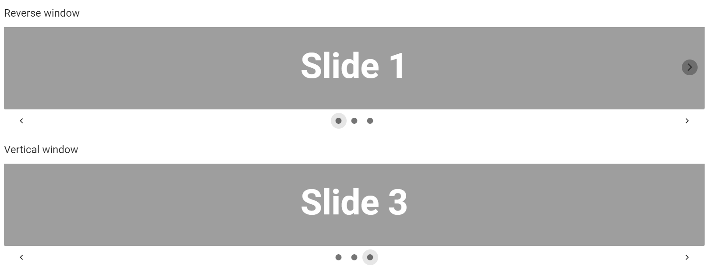

## 5. Vue.js elements

### 5.1 Alerts

[Vuetify documentation page](https://vuetifyjs.com/en/components/alerts/)

```java
  @Test
  public void alertsWithPropsHaveProperCssProps(){
      redAlert.has().text("I'm an alert with a top border and red color");
      redAlert.has().css("background-color", Colors.RED_LIGHTEN_2.value());
      redAlert.has().cssClass("v-alert--border-top");
  }
```

- __Java__: _com.epam.jdi.light.vuetify.elements.common.Alert.java_


For examples of usage see: [Custom vuetify alert example](https://github.com/jdi-testing/jdi-light/blob/3118-implement-alerts/jdi-light-vuetify-tests/src/main/java/io/github/com/custom/CustomAlert.java)
and [JDI vuetify page tests for alerts](https://github.com/jdi-testing/jdi-light/blob/3118-implement-alerts/jdi-light-vuetify-tests/src/test/java/io/github/epam/vuetify/tests/common/AlertsTests.java).

### 5.2 Avatars

[Vuetify documentation page](https://vuetifyjs.com/en/components/avatars/)

- __Java__: _com.epam.jdi.light.vuetify.elements.common.Avatar.java_

```java
    @Test
    public void avatarsWithSizeTests() {
        for(Avatar avatar: avatarsWithSize) {
        avatar.is().displayed();
        }
        avatarsWithSize.get(1).is().text("36");
        avatarsWithSize.get(2).is().text("48");
        avatarsWithSize.get(3).is().text("62");
        avatarsWithSize.get(1).has().size("36");
        avatarsWithSize.get(2).has().size("48");
        avatarsWithSize.get(3).has().size("62");
    }
```


For examples of usage see: [Custom vuetify avatar example (profile card)](https://github.com/jdi-testing/jdi-light/blob/vuetify-develop/jdi-light-vuetify-tests/src/main/java/io/github/com/custom/ProfileCard.java)
and [JDI vuetify page tests for avatars](https://github.com/jdi-testing/jdi-light/blob/vuetify-develop/jdi-light-vuetify-tests/src/test/java/io/github/epam/vuetify/tests/common/AvatarsTests.java).

### 5.3 Banners

[Vuetify documentation page](https://vuetifyjs.com/en/components/banners/)

- __Java__: _com.epam.jdi.light.vuetify.elements.complex.Banner.java_

```java
    @Test
    public void singleBannerTests() {
        singleBanner.is().displayed();
        singleBanner.has().properTitle("My Document");
        singleBanner.has().properText("We can't save your edits");
        singleBanner.has().button();
        singleBanner.has().checker();
        singleBanner.is().checkerUnchecked();
        singleBanner.getChecker().click();
        singleBanner.is().checkerChecked();
    }
```


Banners may contain anything, you can inherit the `Banner` class and customize it
the way you want.

Basically, you have methods that can return you elements containing in banner (buttons, checkers, icons, etc.).

For examples of usage see: [JDI vuetify page tests for banners](https://github.com/jdi-testing/jdi-light/blob/vuetify-develop/jdi-light-vuetify-tests/src/test/java/io/github/epam/vuetify/tests/complex/BannersTests.java).

### 5.4 Bars

#### 5.4.1 App Bars

[Vuetify documentation page](https://vuetifyjs.com/en/components/app-bars/)

- __Java__: _com.epam.jdi.light.vuetify.elements.complex.bars.AppBar.java_

```java
    @Test
    public void collapsibleBarTests() {
        collapsibleBar.is().displayed();
        collapsibleBar.has().menuButton();
        collapsibleBar.has().title();
        collapsibleBar.has().properTitleText("Collapsing Bar");
        collapsibleBar.scrollBarToBottom();
        collapsibleBar.has().hiddenTitle();
        collapsibleBar.scrollBarToTop();
        collapsibleBar.has().title();
        collapsibleBar.has().checker();
        collapsibleBar.is().checkerChecked();
        collapsibleBar.getChecker().click();
        collapsibleBar.is().checkerUnchecked();
        collapsibleBar.has().hiddenTitle();
        collapsibleBar.getChecker().click();
        collapsibleBar.has().title();
    }
```


The app bar component is pivotal to any graphical user interface (GUI), as it generally is the primary source of site navigation.


For examples of usage see: [JDI vuetify page tests for app bars](https://github.com/jdi-testing/jdi-light/blob/vuetify-develop/jdi-light-vuetify-tests/src/test/java/io/github/epam/vuetify/tests/complex/AppBarsTests.java).

#### 5.4.2 Toolbars

[Vuetify documentation page](https://vuetifyjs.com/en/components/toolbars/)

- __Java__: _com.epam.jdi.light.vuetify.elements.complex.bars.ToolBar.java_

```java
    @Test
    public void denseToolbarTests() {
        denseToolbar.is().displayed();
        denseToolbar.has().menuButton();
        denseToolbar.has().title();
        denseToolbar.has().properTitleText("Title");
        denseToolbar.has().searchButton();
        denseToolbar.has().heartButton();
        denseToolbar.has().verticalDotsButton();
        denseToolbar.is().dense();
        denseToolbar.has().height("48");
    }
```


The toolbar component is pivotal to any gui, as it generally is the primary source of site navigation.

For examples of usage see: [JDI vuetify page tests for toolbars](https://github.com/jdi-testing/jdi-light/blob/vuetify-develop/jdi-light-vuetify-tests/src/test/java/io/github/epam/vuetify/tests/complex/ToolBarsTests.java).

#### 5.4.3 System bars

[Vuetify documentation page](https://vuetifyjs.com/en/components/system-bars/)

- __Java__: _com.epam.jdi.light.vuetify.elements.complex.bars.SystemBar.java_

```java
    @Test
    public void systemBarColoredPrimaryTests() {
        systemBarColoredPrimary.is().displayed();
        systemBarColoredPrimary.has().text("System bar color 1");
        systemBarColoredPrimary.has().wiFiIcon();
        systemBarColoredPrimary.has().signalIcon();
        systemBarColoredPrimary.has().batteryIcon();
        systemBarColoredPrimary.has().time("12:30");
        systemBarColoredPrimary.has().backgroundColor(BLUE_DARKEN_2.value());
    }
```


The system bar component can be used for displaying statuses to the user. It looks like the Android system bar and can contain icons, spacers, and some text.

For examples of usage see: [JDI vuetify page tests for system bars](https://github.com/jdi-testing/jdi-light/blob/vuetify-develop/jdi-light-vuetify-tests/src/test/java/io/github/epam/vuetify/tests/complex/SystemBarsTests.java).


### 5.5 Bottom navigation

[Vuetify documentation page](https://vuetifyjs.com/en/components/bottom-navigation/)

- __Java__: _com.epam.jdi.light.vuetify.elements.composite.BottomNavigation.java_

```java
    @UI("#colorBottomNavigation")
    public static BottomNavigation bottomNavigationColor;

    @UI("#growBottomNavigation")
    public static BottomNavigation bottomNavigationGrow;


    @Test
    public void colorTest() {
        bottomNavigationColor.is().displayed();
        bottomNavigationColor.is().buttonColor(1, "rgba(0, 0, 0, 0.6)");
        bottomNavigationColor.bottomNavigationButtonList().get(1).click();
        bottomNavigationColor.is().buttonColor(1, Colors.BLUE_DARKEN_2.value());
    }

    @Test
    public void wightTest() {
      bottomNavigationGrow.is().displayed();
      bottomNavigationGrow.is().buttonWight(1, "168px");
      bottomNavigationGrow.is().buttonWight(2, "168px");
      bottomNavigationGrow.is().buttonWight(3, "168px");
    }
```


This name contains a WebList of buttons and provides access to them by index.

|Method | Description | Return Type
--- | --- | ---
**is()** | Returns Assert class | Assert
**bottomNavigationButtonList()** | Return | WebList
**getBackgroundColor()** | Return background color | String
**getClassAttribute()** | Return Class Attribute | String
**getButtonColor()** | Return Button RGBA Color value  | String
**getButtonWight()** | Return Button Wight  | String
**getButtonText** | Return Button Text | String

### 5.6 Bottom sheets

[Vuetify documentation page](https://vuetifyjs.com/en/components/bottom-sheets/)

- __Java__: _com.epam.jdi.light.vuetify.elements.composite.BottomSheet.java_

```java
public class TextBottomSheet extends BottomSheet {
  @UI(".text-center > div")
  protected Text text;
  @UI("button")
  protected Button button;
  public void close() { button.click(); }
  public Text sheetText() { return text; }
}
```

Bottom sheet is a form of dialog that appears at the bottom of a page.
You can inherit the class and define the inner content of the sheet.


```java
@Test
public void checkInsetSheetCssProps() {
    insetBottomSheet.is().hidden();
    insetBottomSheetButton.click();
    insetBottomSheet.is().displayed();
    insetBottomSheet.sheetText().has().text(containsString("the inset prop"));
    insetBottomSheet.close();
    insetBottomSheet.is().hidden();
}
```


For examples of usage see: [Vuetify Bottom sheets tests](https://github.com/jdi-testing/jdi-light/blob/vuetify-develop/jdi-light-vuetify-tests/src/test/java/io/github/epam/vuetify/tests/composite/BottomSheetsTests.java).

### 5.7 Breadcrumbs

[Vuetify documentation page](https://vuetifyjs.com/en/components/breadcrumbs/)

- __Java__: _com.epam.jdi.light.vuetify.elements.complex.Breadcrumbs.java_

```java
    @JDIBreadcrumbs(
            root = "#differentDividersBreadcrumbs > ul:nth-child(2)",
            items = ".v-breadcrumbs__item",
            dividers = ".v-breadcrumbs__divider"
    )
    public static Breadcrumbs forwardSlashedBreadcrumbs;
```

You can specify locators for the root, links and dividers
explicitly through a `JDIBreadcrumbs` annotation:

```java
    @JDIBreadcrumbs(root = "#largeBreadcrumbs > ul")
    public static Breadcrumbs largeBreadcrumbs;
```

```java
    @Test
    public void itemSlotBreadcrumbsTest() {
        itemSlotsBreadcrumbs.is().displayed();
        itemSlotsBreadcrumbs.has().size(3);
        itemSlotsBreadcrumbs.dividers().has().size(2);
        itemSlotsBreadcrumbs.items().has().values("DASHBOARD", "LINK 1", "LINK 2");
        jdiAssert(itemSlotsBreadcrumbs.selected("DASHBOARD"), Matchers.is(false));
        jdiAssert(itemSlotsBreadcrumbs.selected("LINK 2"), Matchers.is(true));
    }
```


It is **necessary** to specify **the root** of an element


For examples of usage see: [Vuetify Breadcrumbs tests](https://github.com/jdi-testing/jdi-light/blob/vuetify-develop/jdi-light-vuetify-tests/src/test/java/io/github/epam/vuetify/tests/complex/BreadcrumbsTests.java).

### 5.8 Cards

[Vuetify documentation page](https://vuetifyjs.com/en/components/cards/)

- __Java__: _com.epam.jdi.light.vuetify.elements.complex.Card.java_

```java
public class MediaTextCard extends Card {
    @UI(".v-image__image")
    protected Image image;
    public Image image() {
        return image;
    }
    public Button shareButton() {
        return new Button().setCore(Button.class, actions().find("//button[./span[contains(text(), 'Share')]]"));
    }
    public Button exploreButton() {
        return new Button().setCore(Button.class, actions().find("//button[./span[contains(text(), 'Explore')]]"));
    }
}
```

```java
    @Test
    public void mediaTextCardTest() {
        mediaTextCard.is().displayed();
        mediaTextCard.image().has().css("background-size", "cover");
        mediaTextCard.has().title("Top 10 Australian beaches");
        mediaTextCard.has().subtitle(containsString("Number 10"));
        mediaTextCard.content().has().text(containsString("Whitehaven Beach"));
        mediaTextCard.shareButton().click();
        mediaTextCard.exploreButton().click();
    }
```


Cards may contain anything, you can inherit the `Card` class and customize it
the way you want.


Basically, you have 4 methods: `title`, `subtitle`, `content` and `actions`.
They return the parts of a card described [here](https://vuetifyjs.com/en/components/cards/#api).
The `content` method returns a
card `text` element, but the `text` method is inherited from `UIBaseElement` that why it has a different name.

For examples of usage see: [Custom vuetify card examples](https://github.com/jdi-testing/jdi-light/tree/vuetify-develop/jdi-light-vuetify-tests/src/main/java/io/github/com/custom/cards)
and [JDI vuetify page tests for cards](https://github.com/jdi-testing/jdi-light/blob/vuetify-develop/jdi-light-vuetify-tests/src/test/java/io/github/epam/vuetify/tests/complex/CardsTests.java).

### 5.9 Dialogs

[Vuetify documentation page](https://vuetifyjs.com/en/components/dialogs/)

- __Java__: _com.epam.jdi.light.vuetify.elements.complex.Dialog.java_

```java
    @Test
    public static void formDialogTest() {
        formDialog.open();
        formDialog.is().opened();
        formDialog.has().title("User Profile");
        formDialog.fillTheForm("John", "Hadley", "Chase", "john@hadley.com",
                "12345", 4, "Soccer", "Skiing", "Writing");
        formDialog.save();
        formDialog.is().closed();
    }

```


The Dialog component inform users about a specific task and may contain critical information, require decisions, or involve multiple tasks.

|Method | Description | Return Type
--- | --- | ---
**open()** | Opens required dialog| void
**isOpened()** | Shows that dialog is opened| boolean[
**openMenu()** | Opens menu in dialog| void
**selectMenuElement()** | Selects required menu's in element| void
**openNestedDialog()** | Opens nested dialog| boolean
**nestedDialogIsOpen()** | Shows that shows that nested dialog is opened| boolean
**closeNestedDialog()** | Closes nested dialog| void
**openTooltip()** | Opens the tooltip in dialog| void
**tooltipIsOpened()** | Shows that tooltip is open| boolean
**getTitle()** | Gets dialog title| String
**elementText()** | Gets required dialog's element text| String
**cardText()** | Gets dialog text| String
**checkElement()** | Checks required dialog's element| void
**uncheckElement()** | Unchecks required dialog's element| void
**selectRadiobutton()** | Selects required dialog's radiobutton| void
**isSelected()** | Shows that button is selected| boolean
**isNotSelected()** | Shows that button is not selected| boolean
**fillTheForm()** | Fills dialog's form with required value| void
**save()** | Closes dialog and saves changes| void
**cancel()** | Closes dialog without saves changes| void
**isLoading()** | Shows that dialog is loading| boolean

For examples of usage see: [JDI vuetify page tests for dialogs](https://github.com/jdi-testing/jdi-light/blob/vuetify-develop/jdi-light-vuetify-tests/src/test/java/io/github/epam/vuetify/tests/complex/DialogTests.java).


### 5.10 Expansion Panels

[Vuetify documentation page](https://vuetifyjs.com/en/components/expansion-panels/)

- __Java__: _com.epam.jdi.light.vuetify.elements.complex.panels.ExpansionPanels.java_
- __Java__: _com.epam.jdi.light.vuetify.elements.complex.panels.ExpansionPanel.java_

```java
    @JDIExpansionPanels(
        root = "#ModelExpansionPanel .v-expansion-panels",
        panels = ".v-expansion-panel",
        header = ".v-expansion-panel-header",
        icon = ".v-expansion-panel-header__icon",
        content = ".v-expansion-panel-content",
        wrapper = ".v-expansion-panel-content__wrap"
    )
    public static ExpansionPanels modelExpansionPanels;
```

You can specify locators for the root and panels to find panels in root. 
Also, you can specify header, content, icon and wrapper locators for all panels. All of it you can do
explicitly through a `JDIExpansionPanels` annotation. 

It is **necessary** to specify **the root** of an element.

```java
    @JDIExpansionPanels(
        root = "#CustomIconExpansionPanel .v-expansion-panels:nth-child(1)",
        icon = ".v-expansion-panel-header__icon .v-icon"
    )
    public static ExpansionPanels customIconExpansionPanelsSameIcons;
```

```java
    @Test
    public void customIconExpansionPanelTest() {
        customIconExpansionPanelsSameIcons.has().size(5);
        for (ExpansionPanel expansionPanel : customIconExpansionPanelsSameIcons.panels()) {
            expansionPanel.header().has().text("Item");
            expansionPanel.wrapper().has().text(LOREM_IPSUM_TEXT);
            expansionPanel.is().expanded();
            expansionPanel.expander().is().displayed();
            expansionPanel.expander().has().cssClass("mdi-menu-down");
        }
    }
```


ExpansionPanels is a list of ExpansionPanel.

Expansion panel may contain anything, so you can inherit the `ExpansionPanel` class and customize it
the way you need. This class has 4 base methods: `header`, `expander`, `content` and `wrapper`. 
They return the parts of an expansion panel. 

Also, you can inherit the `ExpansionPanels`.

For examples of usage see: [Custom vuetify expansion panels examples](https://github.com/jdi-testing/jdi-light/tree/vuetify-develop/jdi-light-vuetify-tests/src/main/java/io/github/com/custom/panels)
and [JDI vuetify page tests for expansion panels](https://github.com/jdi-testing/jdi-light/blob/vuetify-develop/jdi-light-vuetify-tests/src/test/java/io/github/epam/vuetify/tests/complex/ExpansionPanelsTest.java).

### 5.11 Footers

[Vuetify documentation page](https://vuetifyjs.com/en/components/footer/)

- __Java__: _com.epam.jdi.light.vuetify.elements.composite.Footer.java_

```java
public class IndigoFooter extends Footer { 
    @UI("button")
    protected List<Button> socialButtons;
    @UI(".pt-0")
    protected Text descriptionText;
    @UI("hr")
    protected Divider divider;
    @UI("//div[contains(@class, 'v-card__text') and ./strong]")
    protected Text footerText;
    
    public List<Button> socialButtons() { return socialButtons; }
    public Text descriptionText() { return descriptionText; }
    public Divider divider() { return divider; }
    public Text footerText() { return footerText; }
}
```

According to the documentation:
"The v-footer component in its simplest form is a container".

You can inherit the class and add elements inside.


```java
@Test
public void indigoFooterTest() {
    indigoFooter.is().displayed();
    // footer itself does not have indigo color but the inner container has
    indigoFooter.firstChild().has().css("background-color", Colors.INDIGO_LIGHTEN_1.value());
    indigoFooter.footerText().has().text(containsString("2021 — Vuetify"));
    indigoFooter.divider().is().darkTheme();
    indigoFooter.descriptionText().has().text(containsString("Phasellus feugiat arcu sapien"));
    indigoFooter.socialButtons().forEach(HasClick::click);
}
```


For examples of usage see: [Vuetify Footers tests](https://github.com/jdi-testing/jdi-light/blob/vuetify-develop/jdi-light-vuetify-tests/src/test/java/io/github/epam/vuetify/tests/composite/FootersTests.java).

### 5.12 Form input & controls

#### 5.12.1 Overflow buttons

[Vuetify documentation page](https://vuetifyjs.com/en/components/overflow-btns/)

- __Java__: _com.epam.jdi.light.vuetify.elements.composite.OverflowButton.java_

```java
    @Test
public void baseFunctionalityOverflowButtonTest() {
  counterOverflowButton.is().enable();
  counterOverflowButton.is().placeholder("Overflow Btn w/ counter");
  counterOverflowButton.expand();
  counterOverflowButton.is().expanded();
  counterOverflowButton.close();
  counterOverflowButton.is().closed();
  counterOverflowButton.select("50%");
  counterOverflowButton.is().selected("50%");
  counterOverflowButton.select(1);
  counterOverflowButton.is().selected("100%");
  }
```


Overflow button is used to give the user the ability to select items from the list. It has 3 variations: editable, overflow and segmented

|Method | Description | Return Type
--- | --- | ---
**expand()/close()** | Open/close dropdown menu | void
**select(String text)/select(int index)** | Select element | void
**sendText(String text)** | Snd text in input field | void
**clear()** | Clear input field | void
**selected()** | Get selected text | String
**hint()** | Get hint text | String
**placeholder()** | Get placeholder text | String
**counterMessage()** | Get counter text | String
**isExpanded()/isClosed()** | Shows that dropdown menu is open/close | void
**isDisabled()/isEnabled()** | Shows that required element is disabled/enabled | void
**isEditable()** | Shows that required element is editable | void
**readOnly()** | Shows that required element is readOnly | void
**hasProgressBar** | Shows that required element has progress bar | void

For examples of usage see: [JDI Vuetify Lists tests](https://github.com/jdi-testing/jdi-light/blob/vuetify-develop/jdi-light-vuetify-tests/src/test/java/io/github/epam/vuetify/tests/complex/OverflowButtonsTest.java).

#### 5.12.2 Range Slider

[Vuetify documentation page](https://vuetifyjs.com/en/components/range-sliders/)

- __Java__: _com.epam.jdi.light.vuetify.elements.complex.RangeSlider.java_

```java
@Test
public void minAndMaxRangeSliderTest() {
    minAndMaxRangeSlider.slideHorizontalTo(11, 66);
    minAndMaxRangeSlider.is().value(11, 66);
    minAndMaxRangeSlider.slideHorizontalTo(-50, 90);
    minAndMaxRangeSlider.is().value(-50, 90);
}
```

The Range Slider component is a better visualization of the number input. 
It is used for gathering numerical user data. Sliders reflect a range of values along a bar, from which users may select a single value. 
They are ideal for adjusting settings such as volume, brightness, or applying image filters.

|Method | Description | Return Type
--- | --- | ---
**isDisabled()** | Shows that required element is disabled| boolean
**isThumbLabelDisplayed()** | Shows that thumb label of required element is displayed| boolean
**isAlwaysShow()** | Shows that ticks of required element is always show| boolean
**isVertical()** | Shows that required element is vertical| boolean
**slideHorizontalTo(int valueLeft, int valueRight)** | Set in horizontal slider left thumb to valueLeft and right thumb to valueRight| void
**slideVerticalTo(int valueLeft, int valueRight)** | Set in vertical slider upper thumb to valueLeft and lower thumb to valueRight| void
**getThumbLabelValue()** | Get label of the first and second thumb| List<String>
**getValue()** | Get first and second value| List<Integer>
**getTickLabel()** | Get tick label| String


For examples of usage see: [JDI Vuetify Range sliders tests](https://github.com/jdi-testing/jdi-light/blob/vuetify-develop/jdi-light-vuetify-tests/src/test/java/io/github/epam/vuetify/tests/complex/RangeSliderTests.java)

#### 5.12.3 Slider

[Vuetify documentation page](https://vuetifyjs.com/en/components/sliders/)

- __Java__: _com.epam.jdi.light.vuetify.elements.complex.Slider.java_

```java
  @Test
  public void minAndMaxSliderTest() {
    minAndMaxSlider.slideHorizontalTo(90);
    minAndMaxSlider.is().value(90);
    minAndMaxSlider.slideHorizontalTo(-50);
    minAndMaxSlider.is().value(-50);
  }
```

The Slider component is a better visualization of the number input. It is used for gathering numerical user data.


|Method | Description | Return Type
--- | --- | ---
**isDisabled()** | Shows that required element is disabled| boolean
**isReadonly()** | Shows that required element is readonly| boolean
**isThumbLabelDisplayed()** | Shows that thumb label of required element is displayed| boolean
**isAlwaysShow()** | Shows that ticks of required element is always show| boolean
**isVertical()** | Shows that required element is vertical| boolean
**slideHorizontalTo(int value)** | Set in horizontal slider thumb to value| void
**slideVerticalTo(int value)** | Set in vertical slider thumb to value| void
**getThumbLabelValue()** | Get thumb label| String
**getValue()** | Get value| Integer
**getTickLabel()** | Get tick label| String

For examples of usage see: [JDI Vuetify Sliders tests](https://github.com/jdi-testing/jdi-light/blob/vuetify-develop/jdi-light-vuetify-tests/src/test/java/io/github/epam/vuetify/tests/complex/SliderTests.java)

#### 5.12.4 Switches

[Vuetify documentation page](https://vuetifyjs.com/en/components/switches/)

- __Java__: _com.epam.jdi.light.vuetify.elements.common.Switch.java_

```java
    @Test
public void colorTest() {
  colorSwitches.forEach(Switch::isDisabled);

  colorSwitches.get(1).is().inputColor(Colors.RED.value());
  colorSwitches.get(1).uncheck();
  colorSwitches.get(1).is().inputColor(Colors.BLACK_TRANSPARENT_087.value());

  colorSwitches.get(6).is().inputColor(Colors.ORANGE_DARKEN_3.value());
  colorSwitches.get(6).uncheck();
  colorSwitches.get(6).is().inputColor(Colors.BLACK_TRANSPARENT_087.value());

  colorSwitches.get(12).is().inputColor(Colors.RED_ACCENT_2.value());
  colorSwitches.get(12).uncheck();
  colorSwitches.get(12).is().inputColor(Colors.BLACK_TRANSPARENT_087.value());
  }
```


The Switch - component provides users the ability to choose between two distinct values.

|Method | Description | Return Type
--- | --- | ---
**check()/uncheck()** | Switch element between two states | void
**getInputColor()** | Get color in RGBA format | String
**getLabelText()** | Get label text  | String
**getLabelHTML()** | Get label HTML element | boolen
**isChecked()/isNotChecked()** | Shows that required element is selected/not selected | boolean
**isDisabled()/isEnabled()** | Shows that required element is disabled/enabled | boolean
**hasLabel()** | Shows that required element has label | boolean
**hasInputProgressBar()** | Shows that required element has Progress bar | boolean

For examples of usage see: [JDI Vuetify Lists tests](https://github.com/jdi-testing/jdi-light/blob/vuetify-develop/jdi-light-vuetify-tests/src/test/java/io/github/epam/vuetify/tests/common/SwitchTests.java).

#### 5.12.5 Text fields

[Vuetify documentation page](https://vuetifyjs.com/en/components/text-fields/)

- __Java__: _com.epam.jdi.light.vuetify.elements.complex.TextFields.java_

```java
@Test(dataProvider = "counterTextFieldTestDataProvider", dataProviderClass = TextFieldsTestsDataProvider.class)
public void counterTextFieldTest(int index, String text, int textLength, int maxLength) {
    counterTextField.get(index).is().text(text);
    counterTextField.get(index).is().counter(textLength, maxLength);
}
  
@Test
public void passwordInputTextFieldTest() {
    passwordInputTextField.get(1).is().textType("password");
    passwordInputTextField.get(1).getAppendInnerIcon().click();
    passwordInputTextField.get(1).is().textType("text");
    passwordInputTextField.get(1).getAppendInnerIcon().click();
    passwordInputTextField.get(1).is().textType("password");
}
```


Text fields components are used for collecting user provided information.

|Method | Description | Return Type
--- | --- | ---
**isDisabled()** | Shows that required element is disabled| boolean
**isReadonly()** | Shows that required element is readonly| boolean
**isFocused()** | Shows that required element is focused| boolean
**textInputField()** |  Get text input field| UIElement
**getText()** | Get text| String
**setText(String text)** | Set text| void
**getTextType()** | Get text type| String
**clear()** |  Clear text field| void
**clearAndSetText()** |  Clear text field and set text| void
**focus()** |  Set mouse to text field| void
**getMessage()** | Get message if it exists, otherwise an empty string| String
**getCounter()** | Get counter if it exists, otherwise an empty string| String
**placeholder()** | Get placeholder| String
**getPrependOuterIcon()/getPrependOuterIcon(int index)**| Get prepend outer icon. If no index is given, the first object is taken. If the object is not found, null is returned| Icon
**getPrependInnerIcon()/getPrependInnerIcon(int index)**| Get prepend inner icon. If no index is given, the first object is taken. If the object is not found, null is returned| Icon
**getAppendOuterIcon()/getAppendOuterIcon(int index)**| Get append outer icon. If no index is given, the first object is taken. If the object is not found, null is returned| Icon
**getAppendInnerIcon()/getAppendInnerIcon(int index)**| Get append inner icon. If no index is given, the first object is taken. If the object is not found, null is returned| Icon
**getPrefix()** | Get prefix| String
**getSuffix()** | Get suffix| String
**labelText()** |  Get label text if it exists, otherwise an empty string| String

For examples of usage see: [JDI Vuetify Text fields tests](https://github.com/jdi-testing/jdi-light/blob/vuetify-develop/jdi-light-vuetify-tests/src/test/java/io/github/epam/vuetify/tests/complex/TextFieldsTests.java).


### 5.13 Groups 

#### 5.13.1 Button Groups

[Vuetify documentation page](https://vuetifyjs.com/en/components/button-groups/)

- __Java__: _com.epam.jdi.light.vuetify.elements.complex.ButtonGroup.java_

```java
@JDIButtonGroup(
        root = "#RoundedButtonGroup .v-item-group", 
        buttons = "//*[@type = 'button']"
) // buttons search strategy is custom
public static ButtonGroup roundedButtonGroup;
```

Button group is a complex container for buttons.

When you are using the `@UI` annotation, provide
a selector not for the list of buttons, but for the container.
See [different examples](https://github.com/jdi-testing/jdi-light/blob/vuetify-develop/jdi-light-vuetify-tests/src/main/java/io/github/com/pages/ButtonGroupsPage.java) of using `@UI` and `@JDIButtonGroup` annotations together and separately.


```java
@Test
public void mandatoryButtonGroupTest() {
    mandatoryButtonGroup.is().displayed();
    mandatoryButtonGroup.has().css("width", "197px");
    mandatoryButtonGroup.getButtonByIndex(1).has().css("width", "50px");
    assertSelected(mandatoryButtonGroup.getButtonByIndex(1));
    mandatoryButtonGroup.getButtonByIndex(2).click();
    assertSelected(mandatoryButtonGroup.getButtonByIndex(2));
    mandatoryButtonGroup.getAllButtons().forEach(HasClick::click);
    assertSelected(mandatoryButtonGroup.getButtonByIndex(4));
}
```


For examples of usage see: [Vuetify Button groups tests](https://github.com/jdi-testing/jdi-light/blob/vuetify-develop/jdi-light-vuetify-tests/src/test/java/io/github/epam/vuetify/tests/complex/ButtonGroupsTests.java).

#### 5.13.2 List Item Groups
[Vuetify documentation page](https://vuetifyjs.com/en/components/list-item-groups/)

- __Java__: _com.epam.jdi.light.vuetify.elements.complex.ListItemGroups.java_

__List item groups__ - a group of selectable items from any component. Items can contains an icon, text, actions etc.

List are a continuous group of text or images. They are composed of items containing primary and supplemental actions, which are represented by icons and text.

```java
    @UI("#ActiveClassListItemGroup .v-list-item")
    public static ListItemGroups activeClassListItemGroup;

    @UI("#MandatoryListItemGroup .v-list-item")
    public static ListItemGroups mandatoryListItemGroup;

    @UI("#MultipleListItemGroup .v-list-item")
    public static ListItemGroups multipleListItemGroup;

    @UI("#FlatListListItemGroup .v-list-item")
    public static ListItemGroups flatListListItemGroup;

    @UI("#SelectionControlsListItemGroup .v-list-item")
    public static ListItemGroups selectionControlsListItemGroup;

    @UI("#SelectionControlsListItemGroup div[role='option']")
    public static List<Checkbox> selectionControlsListItemGroupCheckbox;
```
See [different examples](https://github.com/jdi-testing/jdi-light/blob/vuetify-develop/jdi-light-vuetify-tests/src/main/java/io/github/com/pages/ListItemGroupsPage.java)

The v-list-item-group provides the ability to create a group of selectable v-list-items. The v-list-item-group component utilizes v-item-group at its core to provide a clean interface for interactive lists.


|Method | Description | Return Type
--- | --- | ---
**select(String value)** | Finds required element by its name and selects | void
**select(int index)** | Finds required element by its index and selects | void
**get(String value)** | Finds required element by its name and returns it | UIElement
**get(int index)** | Finds required element by its index and returns it | UIElement
**isActive(int elementIndex)** | Shows that required element is active | boolean
**isInactivate(int elementIndex)** | Shows that required element is inactive | boolean
**hasIcon(int elementIndex)** | Shows that required element has icon | boolean
**hasTitle(int elementIndex, String expectedTitle)** | Shows that required element has expected title | boolean

##### Active class

You can set a class which will be added when an item is selected.

```java
@Test
public static void activeClassListItemGroupTest() {

  int elemIndex = 1;
  String[] expectedTitles = {"Wifi", "Bluetooth", "Data Usage"};

  for (String expectedTitle : expectedTitles) {
    activeClassListItemGroup.select(elemIndex);
    jdiAssert(activeClassListItemGroup.isActive(elemIndex), Matchers.is(true));
    jdiAssert(activeClassListItemGroup.hasIcon(elemIndex), Matchers.is(true));
    jdiAssert(activeClassListItemGroup.hasTitle(elemIndex, expectedTitle), Matchers.is(true));
    activeClassListItemGroup.select(elemIndex);
    jdiAssert(activeClassListItemGroup.isInactivate(elemIndex), Matchers.is(true));

    elemIndex++;
  }
}
```
##### Mandatory class

At least one item must be selected.

```java
@Test
public static void mandatoryListItemGroupTest() {

  for (int element = 1; element < 4; element++) {
      mandatoryListItemGroup.select(element);
      jdiAssert(mandatoryListItemGroup.isActive(element), Matchers.is(true));
      mandatoryListItemGroup.select(element);
      jdiAssert(mandatoryListItemGroup.isInactivate(element), Matchers.is(false));
  }

  for (int element = 1; element < 4; element++) {
      mandatoryListItemGroup.select(element);
  }

  jdiAssert(mandatoryListItemGroup.isActive(3), Matchers.is(true));
  jdiAssert(mandatoryListItemGroup.isInactivate(1), Matchers.is(true));
  jdiAssert(mandatoryListItemGroup.isInactivate(2), Matchers.is(true));
}
```
##### Multiple class

You can select multiple items at one time.

```java
@Test
public static void multipleListItemGroupsTest() {
  for (int element = 1; element < 4; element++) {
      if (multipleListItemGroup.isInactivate(element)) {
          multipleListItemGroup.select(element);
      }
  }

  for (int element = 1; element < 4; element++) {
      jdiAssert(multipleListItemGroup.isActive(element), Matchers.is(true));
  }

  for (int element = 1; element < 4; element++) {
      multipleListItemGroup.select(element);
      jdiAssert(multipleListItemGroup.isInactivate(element), Matchers.is(true));
  }
}
```

##### Flat list

You can easily disable the default highlighting of selected v-list-items. This creates a lower profile for a user’s choices.

```java
@Test
public static void flatListListItemGroupTest() {

  for (int element = 1; element < 4; element++) {
      flatListListItemGroup.select(element);
      jdiAssert(flatListListItemGroup.isActive(element), Matchers.is(true));
      jdiAssert(flatListListItemGroup.hasIcon(element), Matchers.is(true));
      flatListListItemGroup.select(element);
      jdiAssert(flatListListItemGroup.isInactivate(element), Matchers.is(true));
  }
}
```

##### Selection controls

Using the default slot, you can access an items internal state and toggle it. Since the active property is a boolean, we use the true-value prop on the checkbox to link its state to the v-list-item.

```java
@Test
public static void selectionControlsListItemGroupTest() {
  int elemIndex = 1;
  String[] expectedTitles = {"Dog Photos", "Cat Photos", "Potatoes", "Carrots"};

  for (String expectedTitle : expectedTitles) {

      jdiAssert(selectionControlsListItemGroup.hasTitle(elemIndex, expectedTitle), Matchers.is(true));
      selectionControlsListItemGroupCheckbox.get(elemIndex).check();
      selectionControlsListItemGroupCheckbox.get(elemIndex).is().checked();
      selectionControlsListItemGroupCheckbox.get(elemIndex).uncheck();
      selectionControlsListItemGroupCheckbox.get(elemIndex).is().unchecked();

      elemIndex++;
  }

  for (int element = 1; element < 5; element++) {
      selectionControlsListItemGroupCheckbox.get(element).check();
  }
  for (int element = 1; element < 5; element++) {
      selectionControlsListItemGroupCheckbox.get(element).is().checked();
  }
}
```

For examples of usage see: [Vuetify List Item Groups tests](https://github.com/jdi-testing/jdi-light/blob/vuetify-develop/jdi-light-vuetify-tests/src/test/java/io/github/epam/vuetify/tests/complex/ListItemGroupsTests.java).

#### 5.13.3 Windows

[Vuetify documentation page](https://vuetifyjs.com/en/components/windows/)

- __Java__: _com.epam.jdi.light.vuetify.elements.complex.Windows.java_

```java
    @UI("#ReverseWindow .v-window")
    public static Windows<SlideWindow> reverseWindows;

    @UI("#AccountCreationWindow .v-window")
    public static Windows<?> accountCreationWindows;
```



The v-window component provides the baseline functionality for
transitioning content from 1 pane to another.

Windows component is a container. So, you should use
it with another class for contained element.
**That class must implement `ICoreElement` interface**.
For example: UIElement, Section or your custom class.

There are two ways to use windows class:

- With definite `T` type in diamond operator(<T\>)
- With unknown type(<?>)

**You should always use Windows component with diamond operator.**

```java
    @Test
    public void reverseWindowsTest() {
        int i = 1;
        for (UIElement nav : reverseNavigation) {
            nav.click();
            reverseWindows.getActive().header().has().text("Slide " + i);
            reverseWindows.getActive().header().has().css("color", WHITE.value());
            reverseWindows.getActive().sheet().has().css("background-color", GREY.value());
            i++;
        }
        reverseNext.click();
        reverseWindows.getActive().header().has().text("Slide 1");
        reverseBack.click();
        reverseWindows.getActive().header().has().text("Slide 3");
    }
```

|Method | Description | Return Type
--- | --- | ---
**getActive()** | Returns instance of `T` class from the diamond operator | T
**getActive(Class\<U\> clazz)** | Returns instance of `U` class  | U

**T and U should implement ICoreElement
or extend a class that already implemented it.**

For examples of usage see: [Custom vuetify windows examples](https://github.com/jdi-testing/jdi-light/tree/vuetify-develop/jdi-light-vuetify-tests/src/main/java/io/github/com/custom/windows)
and [JDI vuetify page tests for windows](https://github.com/jdi-testing/jdi-light/blob/vuetify-develop/jdi-light-vuetify-tests/src/test/java/io/github/epam/vuetify/tests/complex/WindowsTests.java).


### 5.14 Lists

[Vuetify documentation page](https://vuetifyjs.com/en/components/lists/)

- __Java__: _com.epam.jdi.light.vuetify.elements.complex.Lists.java_

```java
    @Test
    public static void denseListTest() {
        denseList.select(1);
        jdiAssert(denseList.isActive(1), Matchers.is(true));
        jdiAssert(denseList.hasIcon(1), Matchers.is(true));
        jdiAssert(denseList.hasTitle(1, "Real-Time"), Matchers.is(true));

        denseList.select(2);
        jdiAssert(denseList.isActive(2), Matchers.is(true));
        jdiAssert(denseList.hasIcon(2), Matchers.is(true));
        jdiAssert(denseList.hasTitle(2, "Audience"), Matchers.is(true));

        denseList.select(3);
        jdiAssert(denseList.isActive(3), Matchers.is(true));
        jdiAssert(denseList.hasIcon(3), Matchers.is(true));
        jdiAssert(denseList.hasTitle(3, "Conversions"), Matchers.is(true));
     }
```


Lists - a specific collection of items, which can contains an avatar, content, actions, subheaders etc. You can inherit the `Lists` class and customize it the way you need.

|Method | Description | Return Type
--- | --- | ---
**select(String value)/select(int index)** | Finds required element by its name or index and selects | void
**get(String value)/get(int index)** | Finds required element by its name or index and returns it | UIElement
**isActive(int elementIndex)** | Shows that required element is active | boolean
**isInactivate(int elementIndex)** | Shows that required element is inactive | boolen
**hasIcon(int elementIndex)** | Shows that required element has icon | boolean
**hasTitle(int elementIndex, String expectedTitle)** | Shows that required element has expected title | boolean
**getSubList(int listElementIndex)** | Returns required element's sublist | WebList
**isExpanded(int elementIndex)** | Shows that required element's sublist is expanded | boolean

For examples of usage see: [JDI Vuetify Lists tests](https://github.com/jdi-testing/jdi-light/blob/vuetify-develop/jdi-light-vuetify-tests/src/test/java/io/github/epam/vuetify/tests/complex/ListsTests.java).

### 5.15 Overlays

[Vuetify documentation page](https://vuetifyjs.com/en/components/overlays/)

- __Java__: _com.epam.jdi.light.vuetify.elements.common.Overlay.java_

```java
@Test
public void absoluteOverlayTest() {
    absoluteOverlay.is().absolute();
    absoluteOverlay.is().notActive();
    absoluteOverlay.is().opacity(0);
  
    absoluteOverlayButton.click();
    absoluteOverlay.is().absolute();
    absoluteOverlay.is().active();
    absoluteOverlay.is().opacity(0.46);
  
    absoluteOverlay.content().find("button").click();
    absoluteOverlay.is().notActive();
    absoluteOverlay.is().opacity(0);
}
```

The Overlay component is used to provide emphasis on a particular element or parts of it. It signals to the user of a state change within the application and can be used for creating loaders, dialogs and more. In its simplest form, the Overlay component will add a dimmed layer over your application.


|Method | Description | Return Type
--- | --- | ---
**isActive()** | Shows that required element is active| boolean
**isAbsolute()** | Shows that required element is absolute| boolean
**content()** | Get content| UIElement
**zIndex()** | Get z-index| int
**opacity()** | Get opacity| double

For examples of usage see: [JDI Vuetify Overlays tests](https://github.com/jdi-testing/jdi-light/blob/vuetify-develop/jdi-light-vuetify-tests/src/test/java/io/github/epam/vuetify/tests/common/OverlayTests.java)

### 5.16 Pagination

[Vuetify documentation page](https://vuetifyjs.com/en/components/paginations/)

- __Java__: _com.epam.jdi.light.vuetify.elements.complex.Pagination.java_

```java
    @JDIPagination(
        root = "#CirclePagination .v-pagination",
        items = ".v-pagination__item",
        left = ".v-pagination__navigation[1]",
        right = ".v-pagination__navigation[2]",
        more = ".v-pagination__more"
    )
    public static Pagination circlePagination;
```


You can specify locators for the root and items to find page buttons in the root.
Also, you can specify locators for left and right navigation buttons, 
locators of button with 'more' value like '...'. All of it you can do
explicitly through a `JDIPagination` annotation.

It is **necessary** to specify **the root** of an element.

```java
    @JDIPagination(root = "#TotalVisiblePagination .v-pagination")
    public static Pagination totalVisiblePagination;

    @Test
    public void totalVisiblePaginationTest() {
        totalVisiblePagination.is().enabled();
        totalVisiblePagination.is().started();

        totalVisiblePagination.select("15");
        totalVisiblePagination.has().selected("15");
        totalVisiblePagination.is().ended();

        List<String> actualButtonsFromEndToStart = new ArrayList<>();
        while (totalVisiblePagination.hasPrevious()) {
            actualButtonsFromEndToStart.add(totalVisiblePagination.previous());
        }
        assertThat(actualButtonsFromEndToStart, equalTo(Arrays.asList(
            "15", "14", "13", "12", "11", "10", "9", "8", "7", "6", "5", "4", "3", "2", "1"
        )));
        totalVisiblePagination.is().started();
  }
```

|Method | Description | Return Type
--- | --- | ---
**is()** | Returns Assert class | PaginationAssert
**list()** | Returns list of visible buttons with page numbers | WebList
**leftNavigation()** | Returns left button | UIElement
**rightNavigation()** | Returns right button | UIElement
**select(String value)** | Selects page button by text | void
**select(int index)** | Selects page button by index | void
**selected()** | Returns text of the selected page button | String
**selected(String option)** | Returns true if page button with text is selected | boolean
**selected(int index)** | Returns true if page button with index is selected | boolean
**isStart()** | Shows that pagination is on first page | boolean
**isEnd()** | Shows that pagination is on last page | boolean
**hiddenButtons()** | Returns number of hidden buttons | int
**hasNext()** | Returns true if next() could return element | boolean
**next()** | Returns current element and go to next like iterator | String
**hasPrevious()** | Returns true if previous() could return element | boolean
**previous()** | Returns current element and go to previous like iterator | String

For examples of usage see: [JDI vuetify page tests for pagination](https://github.com/jdi-testing/jdi-light/blob/vuetify-develop/jdi-light-vuetify-tests/src/test/java/io/github/epam/vuetify/tests/complex/PaginationTests.java).

### 5.17 Ratings

[Vuetify documentation page](https://vuetifyjs.com/en/components/ratings/)

- __Java__: _com.epam.jdi.light.vuetify.elements.complex.Rating.java_

```java
@Test
public void incrementedRatingTest() {
    incrementedRating.setValue(3);
    incrementedRating.is().value(3);
    incrementedRating.setValue(3.5);
    incrementedRating.is().value(3.5);
  }
```

The rating component is a specialized but crucial piece in building user widgets. Collecting user feedback via ratings is a simple analytic that can provide a lot of feedback to your product or application.  


|Method | Description | Return Type
--- | --- | ---
**length()** | Get count rating buttons| int
**size()** | Get size rating buttons| int
**color()/ color(int index)** | Get color of rating button| String
**setValue(double rating)** | Set rating to 'rating' with a mouse click| void
**hoverSetValue(double rating)** | Set rating to 'rating' with a mouse hover| void
**getValue()** | Get rating| Double

For examples of usage see: [JDI Vuetify Ratingss tests](https://github.com/jdi-testing/jdi-light/blob/vuetify-develop/jdi-light-vuetify-tests/src/test/java/io/github/epam/vuetify/tests/complex/RatingTests.java)

### 5.18 Snackbars

[Vuetify documentation page](https://vuetifyjs.com/en/components/snackbars/)

- __Java__: _com.epam.jdi.light.vuetify.elements.common.Snackbar.java_

```java
    @Test
    public static void simpleSnackbarTest() {
        simpleSnackbarOpen.click();
        simpleSnackbar.is().visible();
        simpleSnackbar.is().text("Hello, I'm a snackbar");
        simpleSnackbar.close();
        simpleSnackbar.is().closed();
  }
```


The snackbar component is used to display a quick message to a user.

|Method | Description | Return Type
--- | --- | ---
**is()** | Returns Assert class | SnackbarAssert
**text()** | Returns snackbar's text | String
**close()** | Closes snackbar | void
**isOpen()** | Shows that snackbar is open | boolean
**isClosed()** | Shows that snackbar is closed | boolean
**isLeft()** | Shows that snackbar has left position | boolean
**isRight()** | Shows that snackbar has right position | boolean
**isCentered()** | Shows that snackbar is centered | boolean
**isVertical()** | Shows that snackbar is vertical | boolean

For examples of usage see: [JDI vuetify page tests for snackbars](https://github.com/jdi-testing/jdi-light/blob/vuetify-develop/jdi-light-vuetify-tests/src/test/java/io/github/epam/vuetify/tests/common/SnackbarsTests.java).

### 5.19 Sparklines

[Vuetify documentation page](https://vuetifyjs.com/en/components/sparklines/)

- __Java__: _com.epam.jdi.light.vuetify.elements.complex.Sparkline.java_

```java
    @Test
    public void heartRateSparklineTests() {
        String initialHeartRatePathShape = heartRateSparkline.getPathShape();
        heartRateSparkline.has().pathShapeEqualTo(initialHeartRatePathShape);
        heartRateRefreshButton.click();
        waitCondition(() -> heartRateRefreshButton.hasAttribute("red--text"));
        heartRateSparkline.has().pathShapeNotEqualTo(initialHeartRatePathShape);
    }
```

The sparkline component can be used to create simple graphs, like GitHub’s contribution chart.


|Method | Description | Return Type
--- | --- | ---
**is()/has()** | Returns Assert class | SparklineAssert
**getLineWidth()** | Returns sparkline stroke line width | double
**isFilled()** | Shows that sparkline is filled | boolean
**getPathShape()** | Returns sparkline SVG path definition | String
**getLabelTexts()** | Returns sparkline data point label texts | List\<String>
**getLinearGradientMap()** | Returns map representation of sparkline linear gradient | Map\<String, String>

For examples of usage see: [JDI vuetify page tests for sparklines](https://github.com/jdi-testing/jdi-light/blob/vuetify-develop/jdi-light-vuetify-tests/src/test/java/io/github/epam/vuet

### 5.20 Subheaders

[Vuetify documentation page](https://vuetifyjs.com/en/components/subheaders/)

- __Java__: _com.epam.jdi.light.vuetify.elements.common.Subheader.java_

```java
  @Test
  public void insetTest(){
      insetSubheader.is().displayed();
      insetSubheader.is().lightTheme();
      insetSubheader.is().inset();
      insetSubheader.is().text("Subheader");
  }
```

The Subheader component is used to separate sections of lists.


For examples of usage see: [JDI vuetify page tests for subheaders](https://github.com/jdi-testing/jdi-light/blob/vuetify-develop/jdi-light-vuetify-tests/src/test/java/io/github/epam/vuetify/tests/common/SubheaderTests.java)

### 5.21 Tables

#### 5.21.1 Simple Tables

[Vuetify documentation page](https://vuetifyjs.com/en/components/simple-tables/)

- __Java__: _package com.epam.jdi.light.vuetify.elements.complex.tables.SimpleTable.java_

```java
    @Test
    public static void darkTableTests() {
        darkTable.is().firstColumnHasElement(ECLAIR);
        darkTable.is().secondColumnHasElement(1, FROZEN_YOGURT_CALORIES);
        darkTable.is().dark();
        darkTable.is().columnTitle(1, "Name");
  }

```

The Simple Table component is a simple wrapper component around the table element.


|Method | Description | Return Type
--- | --- | ---
**has()/is()** | Returns Assert class | SimpleTableAssert**has()** | Returns Assert class | SimpleTableAssert
**firstColumnElement()** | Returns required element from first column | String
**secondColumnElement()** | Returns required element from second column | String
**columnTitle()** | Returns column title | String
**isDark()** | Shows that table has dark theme | boolean
**isLight()** | Shows that table has light theme | boolean
**hasFixedHeight()** | Shows that table has fixed height | boolean

For examples of usage see: [Vuetify Simple Table tests](https://github.com/jdi-testing/jdi-light/blob/vuetify-develop/jdi-light-vuetify-tests/src/test/java/io/github/epam/vuetify/tests/complex/SimpleTablesTests.java#L40).

#### 5.21.2 Data Tables

[Vuetify documentation page](https://vuetifyjs.com/en/components/data-tables/)

- __Java__: _package com.epam.jdi.light.vuetify.elements.complex.tables.DataTable.java_

```java
    @Test
    public static void searchTableTest() {
        searchTable.search(TableTestData.DONUT);
        searchTable.has().firstColumnHasElement(1, TableTestData.DONUT);
        searchTable.clear();
        searchTable.search(TableTestData.ECLAIR_CALORIES);
        searchTable.has().firstColumnHasElement(1, TableTestData.ECLAIR);
    }

```

The Data Table component is used for displaying tabular data and to extend the Simple Table element


|Method | Description | Return Type
--- | --- | ---
**has()/is()** | Returns Assert class | DataTableAssert
**columnElement()** | Returns required element from required column | String
**search()** | Searches required element in table | void
**clear()** | Clears search field | void
**rowsPerPage()** | Shows the required value of rows in table | void
**itemsPerPage()** | Shows the required value of elements in table | void
**elementsInColumn()** | Returns size of the required column | Integer
**previousPage()** | Switches to the previous page | void
**firstPage()** | Switches to the first page | void
**secondPage()** | Switches to the second page | void
**nextPage()** | Switches to the next page | void
**sortAscBy()** | Sorts elements by the required value in ascending order | void
**sortDescBy()** | Sorts elements by the required value in descending order | void
**sortOff()** | Turns off the sort | void
**isSortedBy()** | Shows that elements sorted by the value | boolean
**collapseGroup()** | Collapses the required group | void
**expandGroup()** | Expands the required group | void
**sortGroup()** | Sorts elements by required group | void
**removeGroups()** | Remove all groups | void
**hasGroup()** | Shows that elements required by the required group | boolean
**isLoading()** | Shows that table is loading | boolean
**isSelected()** | Shows that required element in required column is selected | boolean
**singleSelectOn()** | Turns on single select | void
**singleSelectOff()** | Turns off single select | void
**elIsGreen()** | Shows that the required element is green | boolean
**elIsOrange()** | Shows that the required element is orange | boolean
**elIsRed()** | Shows that the required element is red | boolean
**createWithSave()** | Creates new element with required values and save it | void
**createWithoutSave()** | Creates new element with required values without save| void
**editElement()** | Changes required element name to required value | void
**confirm()** | Confirms changes in element | void
**cancel()** | Cancels changes in element| void
**expand()** | Expands required element| void

For examples of usage see: [Vuetify Data Table tests](https://github.com/jdi-testing/jdi-light/blob/vuetify-develop/jdi-light-vuetify-tests/src/test/java/io/github/epam/vuetify/tests/complex/DataTablesTests.java).

### 5.22 Tabs

[Vuetify documentation page](https://vuetifyjs.com/en/components/tabs/)

- __Java__: _com.epam.jdi.light.ui.html.elements.complex.Tabs.java_

```java
    @Test
    public static void iconsTextTabsTest() {
        iconAndTextTabs.select(1);
        iconAndTextTabs.get(1).is().text("RECENTS");
        iconAndTextTabsIcon.get(1).is().visible();

        iconAndTextTabs.select(2);
        iconAndTextTabs.get(2).is().text("FAVORITES");
        iconAndTextTabsIcon.get(2).is().visible();

        iconAndTextTabs.select(3);
        iconAndTextTabs.get(3).is().text("NEARBY");
        iconAndTextTabsIcon.get(3).is().visible();
    }
```


Tabs - a list of tabs which may be implemented as buttons, links, icons etc. You can inherit the `Tabs` class and customize it the way you want.

For examples of usage see: [JDI vuetify page tests for tabs](https://github.com/jdi-testing/jdi-light/blob/vuetify-develop/jdi-light-vuetify-tests/src/test/java/io/github/epam/vuetify/tests/complex/TabsTests.java).

### 5.23 Icons

[Vuetify documentation page](https://vuetifyjs.com/en/components/icons/)

- __Java__: _package com.epam.jdi.light.vuetify.elements.common.Icon.java_

```java
    @Test
    public void clickIconTests() {
      clickIcon.is().displayed();
      clickIcon.is().clickable();
      clickIcon.has().type("mdi-chevron-right");
      clickIcon.has().height(36);
      clickIcon.has().width(36);
      clickIcon.click();
      clickIcon.has().alertOnIconClick("You clicked next!");
      clickIcon.handleAlert();
    }
```

Icon component provides a large set of graphial signs to provide context for various aspects of your application.


|Method | Description | Return Type
--- | --- | ---
**has()/is()** | Returns Assert class | IconAssert
**hasType()** | Returns type of icon (mdi, svg, etc.) | String
**hasColor()** | Returns color of icon in rgba | String
**hasHeight()** | Returns height of icon | String
**hasWidth()** | Returns width of icon | String

For examples of usage see: [Vuetify Icon tests](https://github.com/jdi-testing/jdi-light/blob/vuetify-develop/jdi-light-vuetify-tests/src/test/java/io/github/epam/vuetify/tests/common/IconsTests.java).

### 5.24 Carousels

[Vuetify documentation page](https://vuetifyjs.com/en/components/carousels/)

- __Java__: _package com.epam.jdi.light.vuetify.elements.complex.Carousel.java_

```java

    @Test
    public void customTransitionCarouselTests() {
      customTransitionCarousel.is().displayed();
      customTransitionCarousel.has().numberOfDelimiters(4);
      customTransitionCarousel.has().delimiterIcons("mdi-circle");
      customTransitionCarousel.has().visibleNextButton();
      customTransitionCarousel.has().visiblePreviousButton();
      customTransitionCarousel.has().currentSlideBackgroundImage("squirrel");
      customTransitionCarousel.clickOnNextButton();
      customTransitionCarousel.has().currentSlideBackgroundImage("sky");
      customTransitionCarousel.clickOnPreviousButton();
      customTransitionCarousel.has().currentSlideBackgroundImage("squirrel");
      customTransitionCarousel.goToSlide(4);
      customTransitionCarousel.has().currentSlideBackgroundImage("planet");
      customTransitionCarousel.clickOnNextButton();
      customTransitionCarousel.has().currentSlideBackgroundImage("squirrel");
      customTransitionCarousel.clickOnPreviousButton();
      customTransitionCarousel.has().currentSlideBackgroundImage("planet");
      customTransitionCarousel.goToSlide(3);
      customTransitionCarousel.has().currentSlideBackgroundImage("bird");
    }
```

Carousel component is used to display large numbers of visual content on a rotating timer.


|Method | Description | Return Type
--- | --- | ---
**has()/is()** | Returns Assert class | CarouselAssert
**clickOnNextButton()** | Click on 'next' button | void
**clickOnPreviousButton()** | Click on 'previous' button | void
**goToSlide()** | Click on selected delimiter | void
**currentSlideBackgroundImage()** | Returns source link to current slide's image | String
**currentSlideText()** | Returns current slide's text | String
**currentSlideColor()** | Returns current slide's background color in rgba | String

For examples of usage see: [Vuetify Carousel tests](https://github.com/jdi-testing/jdi-light/blob/vuetify-develop/jdi-light-vuetify-tests/src/test/java/io/github/epam/vuetify/tests/complex/CarouselsTests.java).

### 5.25 Navigation Drawer

[Vuetify documentation page](https://vuetifyjs.com/en/components/navigation-drawers/)

- __Java__: _package com.epam.jdi.light.vuetify.elements.complex.NavigationDrawer.java_

```java

    @Test
    public void coloredDrawerNavigationDrawerTests() {
      coloredDrawerNavigationDrawer.is().displayed();
      coloredDrawerNavigationDrawer.has().backgroundColor(DEEP_PURPLE_ACCENT_4.value());
      coloredDrawerNavigationDrawer.has().numberOfOptions(3);
      coloredDrawerNavigationDrawer.has().optionClickable(1);
      coloredDrawerNavigationDrawer.has().optionClickable(2);
      coloredDrawerNavigationDrawer.has().optionClickable(3);
      coloredDrawerNavigationDrawer.has().button();
    }

```

Navigation drawer component is what users will utilize to navigate through the application. Navigation drawer is primarily used to house links to the pages in your application.


|Method | Description | Return Type
--- | --- | ---
**has()/is()** | Returns Assert class | NavigationDrawerAssert
**hasNumberOfOptions()** | Returns navigation drawer's number of options | int
**optionIsSelected()** | Shows that option is selected | boolean
**isExpanded()** | Shows that navigation drawer is expanded | boolean
**isCollapsed()** | Shows that navigation drawer is collapsed | boolean
**isOpened()** | Shows that navigation drawer is opened | boolean
**hasBackgroundImage()** | Shows that navigation drawer's has background image | boolean
**hasBackgroundColor()** | Returns navigation drawer's background color in rgba | String
**selectOptionByIndex()** | Selects chosen option | void

For examples of usage see: [Navigation Drawers tests](https://github.com/jdi-testing/jdi-light/blob/vuetify-develop/jdi-light-vuetify-tests/src/test/java/io/github/epam/vuetify/tests/complex/NavigationDrawersTests.java).

### 5.26 Tooltip

[Vuetify documentation page](https://vuetifyjs.com/en/components/tooltips/)

- __Java__: _package com.epam.jdi.light.vuetify.elements.common.Tooltip.java_

```java

    @Test
    public void tooltipsTests() {
      homeIconWithTooltip.is().displayed();
      buttonWithTooltip.hover();
      tooltip.is().displayed();
      tooltip.has().text("Tooltip");
      homeIconWithTooltip.hover();
      tooltip.is().displayed();
      tooltip.has().text("Tooltip");
      textWithTooltip.hover();
      tooltip.is().displayed();
      tooltip.has().text("Tooltip");
      toggleButtonWithTooltip.hover();
      tooltip.is().hidden();
      toggleButtonWithTooltip.click();
      tooltip.is().displayed();
      tooltip.has().text("Programmatic tooltip");
      toggleButtonWithTooltip.click();
      tooltip.is().hidden();
      cartIconWithTooltip.hover();
      tooltip.is().displayed();
      tooltip.has().text("Programmatic tooltip");
      cartIconWithTooltip.click();
      tooltip.is().hidden();
    }
```

Tooltip component is useful for conveying information when a user hovers over an element. Its display can be controlled programmatically. When activated, tooltips display a text label identifying an element, such as a description of its function.


For examples of usage see: [Tooltips tests](https://github.com/jdi-testing/jdi-light/blob/3eaeee91902e34343907258097dce4d5d9eddac3/jdi-light-vuetify-tests/src/test/java/io/github/epam/vuetify/tests/common/TooltipsTests.java).

